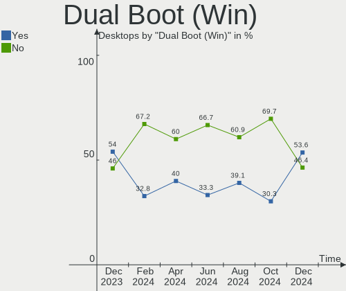
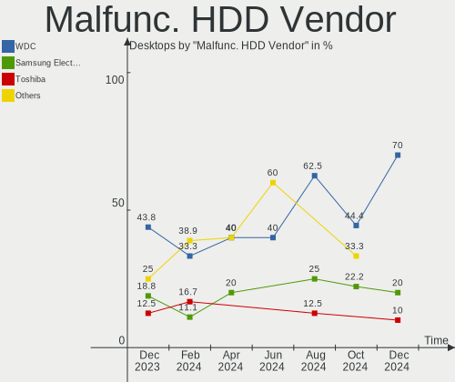
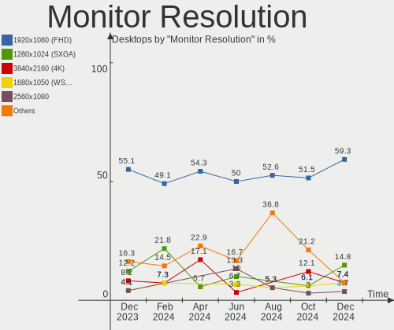
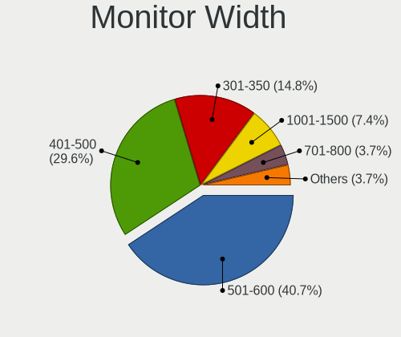

BlackPanther Hardware Trends (Desktop)
--------------------------------------

A project to identify most popular hardware characteristics and track their change
over time based on data collected by BlackPanther users at https://Linux-Hardware.org.

Anyone can contribute to the study by uploading probes of their computers by
the [hw-probe](https://github.com/linuxhw/hw-probe) tool:

    sudo -E hw-probe -all -upload

Full-feature report is available here: https://linux-hardware.org/?view=trends&formfactor=desktop

Period: Jun, 2021.

Contents
--------

- [ OS                       ](#os)
- [ OS Family                ](#os-family)
- [ Kernel                   ](#kernel)
- [ Kernel Family            ](#kernel-family)
- [ Kernel Major Ver.        ](#kernel-major-ver)
- [ Arch                     ](#arch)
- [ DE                       ](#de)
- [ Display Server           ](#display-server)
- [ Display Manager          ](#display-manager)
- [ OS Lang                  ](#os-lang)
- [ Boot Mode                ](#boot-mode)
- [ Filesystem               ](#filesystem)
- [ Part. scheme             ](#part-scheme)
- [ Dual Boot with Linux/BSD ](#dual-boot-with-linux/bsd)
- [ Dual Boot (Win)          ](#dual-boot-win)
- [ Country                  ](#country)
- [ City                     ](#city)
- [ Vendor                   ](#vendor)
- [ Model                    ](#model)
- [ Model Family             ](#model-family)
- [ MFG Year                 ](#mfg-year)
- [ Form Factor              ](#form-factor)
- [ Secure Boot              ](#secure-boot)
- [ Coreboot                 ](#coreboot)
- [ RAM Size                 ](#ram-size)
- [ RAM Used                 ](#ram-used)
- [ Has CD-ROM               ](#has-cd-rom)
- [ Total Drives             ](#total-drives)
- [ Has Ethernet             ](#has-ethernet)
- [ Has WiFi                 ](#has-wifi)
- [ Has Bluetooth            ](#has-bluetooth)
- [ Drive Vendor             ](#drive-vendor)
- [ Drive Model              ](#drive-model)
- [ HDD Vendor               ](#hdd-vendor)
- [ SSD Vendor               ](#ssd-vendor)
- [ Drive Kind               ](#drive-kind)
- [ Drive Connector          ](#drive-connector)
- [ Drive Size               ](#drive-size)
- [ Space Total              ](#space-total)
- [ Space Used               ](#space-used)
- [ Malfunc. Drives          ](#malfunc-drives)
- [ Malfunc. Drive Vendor    ](#malfunc-drive-vendor)
- [ Malfunc. HDD Vendor      ](#malfunc-hdd-vendor)
- [ Malfunc. Drive Kind      ](#malfunc-drive-kind)
- [ Failed Drives            ](#failed-drives)
- [ Failed Drive Vendor      ](#failed-drive-vendor)
- [ Drive Status             ](#drive-status)
- [ Storage Vendor           ](#storage-vendor)
- [ Storage Model            ](#storage-model)
- [ Storage Kind             ](#storage-kind)
- [ CPU Vendor               ](#cpu-vendor)
- [ CPU Model                ](#cpu-model)
- [ CPU Model Family         ](#cpu-model-family)
- [ CPU Cores                ](#cpu-cores)
- [ CPU Sockets              ](#cpu-sockets)
- [ CPU Threads              ](#cpu-threads)
- [ CPU Op-Modes             ](#cpu-op-modes)
- [ CPU Microcode            ](#cpu-microcode)
- [ CPU Microarch            ](#cpu-microarch)
- [ GPU Vendor               ](#gpu-vendor)
- [ GPU Model                ](#gpu-model)
- [ GPU Combo                ](#gpu-combo)
- [ GPU Driver               ](#gpu-driver)
- [ GPU Memory               ](#gpu-memory)
- [ Monitor Vendor           ](#monitor-vendor)
- [ Monitor Model            ](#monitor-model)
- [ Monitor Resolution       ](#monitor-resolution)
- [ Monitor Diagonal         ](#monitor-diagonal)
- [ Monitor Width            ](#monitor-width)
- [ Aspect Ratio             ](#aspect-ratio)
- [ Monitor Area             ](#monitor-area)
- [ Pixel Density            ](#pixel-density)
- [ Multiple Monitors        ](#multiple-monitors)
- [ Net Controller Vendor    ](#net-controller-vendor)
- [ Net Controller Model     ](#net-controller-model)
- [ Wireless Vendor          ](#wireless-vendor)
- [ Wireless Model           ](#wireless-model)
- [ Ethernet Vendor          ](#ethernet-vendor)
- [ Ethernet Model           ](#ethernet-model)
- [ Net Controller Kind      ](#net-controller-kind)
- [ Used Controller          ](#used-controller)
- [ NICs                     ](#nics)
- [ IPv6                     ](#ipv6)
- [ Memory Vendor            ](#memory-vendor)
- [ Memory Model             ](#memory-model)
- [ Memory Kind              ](#memory-kind)
- [ Memory Form Factor       ](#memory-form-factor)
- [ Memory Size              ](#memory-size)
- [ Memory Speed             ](#memory-speed)
- [ Sound Vendor             ](#sound-vendor)
- [ Sound Model              ](#sound-model)
- [ Camera Vendor            ](#camera-vendor)
- [ Camera Model             ](#camera-model)
- [ Fingerprint Vendor       ](#fingerprint-vendor)
- [ Fingerprint Model        ](#fingerprint-model)
- [ Chipcard Vendor          ](#chipcard-vendor)
- [ Chipcard Model           ](#chipcard-model)
- [ Printer Vendor           ](#printer-vendor)
- [ Printer Model            ](#printer-model)
- [ Scanner Vendor           ](#scanner-vendor)
- [ Scanner Model            ](#scanner-model)
- [ Bluetooth Vendor         ](#bluetooth-vendor)
- [ Bluetooth Model          ](#bluetooth-model)
- [ Unsupported Devices      ](#unsupported-devices)
- [ Unsupported Device Types ](#unsupported-device-types)

OS
--

Installed operating systems

| Name              | Desktops | Percent |
|-------------------|----------|---------|
| BlackPanther 18.1 | 60       | 100%    |

OS Family
---------

OS without a version

| Name         | Desktops | Percent |
|--------------|----------|---------|
| BlackPanther | 60       | 100%    |

Kernel
------

Version of the Linux kernel

| Version             | Desktops | Percent |
|---------------------|----------|---------|
| 5.6.14-desktop-2bP  | 41       | 68.33%  |
| 4.18.16-desktop-1bP | 19       | 31.67%  |

Kernel Family
-------------

Linux kernel without a distro release

| Version | Desktops | Percent |
|---------|----------|---------|
| 5.6.14  | 41       | 68.33%  |
| 4.18.16 | 19       | 31.67%  |

Kernel Major Ver.
-----------------

Linux kernel major version

| Version | Desktops | Percent |
|---------|----------|---------|
| 5.6     | 41       | 68.33%  |
| 4.18    | 19       | 31.67%  |

Arch
----

OS architecture (x86_64, i586, etc.)

| Name   | Desktops | Percent |
|--------|----------|---------|
| x86_64 | 60       | 100%    |

DE
--

Desktop Environment

| Name | Desktops | Percent |
|------|----------|---------|
| KDE5 | 60       | 100%    |

Display Server
--------------

X11 or Wayland

| Name    | Desktops | Percent |
|---------|----------|---------|
| X11     | 59       | 98.33%  |
| Wayland | 1        | 1.67%   |

Display Manager
---------------

SDDM, LightDM, etc.

| Name | Desktops | Percent |
|------|----------|---------|
| SDDM | 60       | 100%    |

OS Lang
-------

Language

| Lang    | Desktops | Percent |
|---------|----------|---------|
| Unknown | 60       | 100%    |

Boot Mode
---------

EFI or BIOS

| Mode | Desktops | Percent |
|------|----------|---------|
| BIOS | 41       | 68.33%  |
| EFI  | 19       | 31.67%  |

Filesystem
----------

Type of filesystem

| Type    | Desktops | Percent |
|---------|----------|---------|
| Overlay | 56       | 93.33%  |
| Ext4    | 4        | 6.67%   |

Part. scheme
------------

Scheme of partitioning

| Type | Desktops | Percent |
|------|----------|---------|
| MBR  | 43       | 71.67%  |
| GPT  | 17       | 28.33%  |

Dual Boot with Linux/BSD
------------------------

Hosting more than one Linux/BSD

| Dual boot | Desktops | Percent |
|-----------|----------|---------|
| Yes       | 36       | 60%     |
| No        | 24       | 40%     |

Dual Boot (Win)
---------------

Hosting Linux and Windows

| Dual boot | Desktops | Percent |
|-----------|----------|---------|
| Yes       | 38       | 63.33%  |
| No        | 22       | 36.67%  |

Country
-------

Geographic location (country)

| Country   | Desktops | Percent |
|-----------|----------|---------|
| Hungary   | 39       | 65%     |
| USA       | 8        | 13.33%  |
| Germany   | 3        | 5%      |
| Ukraine   | 1        | 1.67%   |
| Tanzania  | 1        | 1.67%   |
| Romania   | 1        | 1.67%   |
| India     | 1        | 1.67%   |
| Greece    | 1        | 1.67%   |
| Egypt     | 1        | 1.67%   |
| Denmark   | 1        | 1.67%   |
| Brazil    | 1        | 1.67%   |
| Belarus   | 1        | 1.67%   |
| Australia | 1        | 1.67%   |

City
----

Geographic location (city)

| City              | Desktops | Percent |
|-------------------|----------|---------|
| Budapest          | 10       | 16.67%  |
| Szekszárd        | 2        | 3.33%   |
| Monor             | 2        | 3.33%   |
| Eger              | 2        | 3.33%   |
| Érd              | 1        | 1.67%   |
| Wiesloch          | 1        | 1.67%   |
| Valley Village    | 1        | 1.67%   |
| Uzhhorod          | 1        | 1.67%   |
| Uberlândia       | 1        | 1.67%   |
| Târgu Mureş     | 1        | 1.67%   |
| Thessaloniki      | 1        | 1.67%   |
| Tamasi            | 1        | 1.67%   |
| Szentlorinc       | 1        | 1.67%   |
| Szabadszentkiraly | 1        | 1.67%   |
| Sydney            | 1        | 1.67%   |
| Somogyszob        | 1        | 1.67%   |
| Skjern            | 1        | 1.67%   |
| Sajolad           | 1        | 1.67%   |
| Roszke            | 1        | 1.67%   |
| Pécs             | 1        | 1.67%   |
| Puducherry        | 1        | 1.67%   |
| Pakozd            | 1        | 1.67%   |
| New Windsor       | 1        | 1.67%   |
| Nagykoros         | 1        | 1.67%   |
| Mosonszentmiklos  | 1        | 1.67%   |
| Mosonmagyaróvár | 1        | 1.67%   |
| Miskolc           | 1        | 1.67%   |
| Mesquite          | 1        | 1.67%   |
| Lenexa            | 1        | 1.67%   |
| Leesburg          | 1        | 1.67%   |
| Kunszentmiklos    | 1        | 1.67%   |
| Kecskemét        | 1        | 1.67%   |
| Karcag            | 1        | 1.67%   |
| Jonesboro         | 1        | 1.67%   |
| Heves             | 1        | 1.67%   |
| Gomel             | 1        | 1.67%   |
| God               | 1        | 1.67%   |
| Frankfurt am Main | 1        | 1.67%   |
| Ellaville         | 1        | 1.67%   |
| Dunavecse         | 1        | 1.67%   |
| Debrecen          | 1        | 1.67%   |
| Dar es Salaam     | 1        | 1.67%   |
| Dallas            | 1        | 1.67%   |
| Cigand            | 1        | 1.67%   |
| Celldomolk        | 1        | 1.67%   |
| Cairo             | 1        | 1.67%   |
| Berlin            | 1        | 1.67%   |
| Belapatfalva      | 1        | 1.67%   |

Vendor
------

Motherboard manufacturer

| Name                | Desktops | Percent |
|---------------------|----------|---------|
| ASUSTek Computer    | 13       | 21.67%  |
| Hewlett-Packard     | 10       | 16.67%  |
| Lenovo              | 8        | 13.33%  |
| Gigabyte Technology | 8        | 13.33%  |
| ASRock              | 8        | 13.33%  |
| Dell                | 4        | 6.67%   |
| Pegatron            | 2        | 3.33%   |
| Fujitsu             | 2        | 3.33%   |
| MSI                 | 1        | 1.67%   |
| Medion              | 1        | 1.67%   |
| Itautec             | 1        | 1.67%   |
| Gateway             | 1        | 1.67%   |
| Biostar             | 1        | 1.67%   |

Model
-----

Motherboard model

| Name                                     | Desktops | Percent |
|------------------------------------------|----------|---------|
| ASRock G41M-VS3                          | 3        | 5%      |
| HP Compaq Pro 6300 SFF                   | 2        | 3.33%   |
| Pegatron VC980AA-ABD p6140de             | 1        | 1.67%   |
| Pegatron Compaq dx2400 Microtower        | 1        | 1.67%   |
| MSI MS-7369                              | 1        | 1.67%   |
| Medion MS-7646                           | 1        | 1.67%   |
| Lenovo ThinkStation S30 4351D32          | 1        | 1.67%   |
| Lenovo ThinkCentre M93z 10AES0Y700       | 1        | 1.67%   |
| Lenovo ThinkCentre M81 5048BC8           | 1        | 1.67%   |
| Lenovo ThinkCentre M73 10B6001SUS        | 1        | 1.67%   |
| Lenovo ThinkCentre M57e 9488Y25          | 1        | 1.67%   |
| Lenovo ThinkCentre A57 98517HG           | 1        | 1.67%   |
| Lenovo IdeaCentre 700-25ISH 90ED0009US   | 1        | 1.67%   |
| Lenovo 7052-A9G                          | 1        | 1.67%   |
| Itautec Infoway ST-4254                  | 1        | 1.67%   |
| HP xw4400 Workstation                    | 1        | 1.67%   |
| HP EliteDesk 800 G2 SFF                  | 1        | 1.67%   |
| HP EliteDesk 800 G1 SFF                  | 1        | 1.67%   |
| HP Compaq Pro 6305 SFF                   | 1        | 1.67%   |
| HP Compaq Pro 6305 MT                    | 1        | 1.67%   |
| HP Compaq dc5850 Microtower              | 1        | 1.67%   |
| HP Compaq 6000 Pro SFF PC                | 1        | 1.67%   |
| HP 290 G3 MT Business PC                 | 1        | 1.67%   |
| Gigabyte P67A-D3-B3                      | 1        | 1.67%   |
| Gigabyte P55-US3L                        | 1        | 1.67%   |
| Gigabyte GA-78LMT-USB3 6.0               | 1        | 1.67%   |
| Gigabyte G41MT-S2PT                      | 1        | 1.67%   |
| Gigabyte EP45-UD3                        | 1        | 1.67%   |
| Gigabyte B450M GAMING                    | 1        | 1.67%   |
| Gigabyte 945GCM-S2L                      | 1        | 1.67%   |
| Gigabyte 945GCM-S2C                      | 1        | 1.67%   |
| Gateway SX2110G                          | 1        | 1.67%   |
| Fujitsu ESPRIMO P410                     | 1        | 1.67%   |
| Fujitsu CELSIUS M470                     | 1        | 1.67%   |
| Dell OptiPlex 990                        | 1        | 1.67%   |
| Dell OptiPlex 9010                       | 1        | 1.67%   |
| Dell OptiPlex 7040                       | 1        | 1.67%   |
| Dell OptiPlex 390                        | 1        | 1.67%   |
| Biostar GF8100 M2+ TE                    | 1        | 1.67%   |
| ASUS TUF X470-PLUS GAMING                | 1        | 1.67%   |
| ASUS PRIME Z370-A                        | 1        | 1.67%   |
| ASUS PRIME H310M-CS R2.0                 | 1        | 1.67%   |
| ASUS PRIME A320M-R                       | 1        | 1.67%   |
| ASUS P7P55D-E                            | 1        | 1.67%   |
| ASUS P7P55-M                             | 1        | 1.67%   |
| ASUS M5A97 PLUS                          | 1        | 1.67%   |
| ASUS M5A78L-M LX                         | 1        | 1.67%   |
| ASUS M4A87TD EVO                         | 1        | 1.67%   |
| ASUS M2N68-AM Plus                       | 1        | 1.67%   |
| ASUS H110M-A                             | 1        | 1.67%   |
| ASUS CM6330_CM6630_CM6730_CM6830_M11AA-8 | 1        | 1.67%   |
| ASUS All Series                          | 1        | 1.67%   |
| ASRock G41M-GS                           | 1        | 1.67%   |
| ASRock FM2A75 Pro4-M                     | 1        | 1.67%   |
| ASRock FM2A68M-HD+                       | 1        | 1.67%   |
| ASRock ConRoe1333-D667                   | 1        | 1.67%   |
| ASRock B550M Pro4                        | 1        | 1.67%   |

Model Family
------------

Motherboard model prefix

| Name                   | Desktops | Percent |
|------------------------|----------|---------|
| HP Compaq              | 6        | 10%     |
| Lenovo ThinkCentre     | 5        | 8.33%   |
| Dell OptiPlex          | 4        | 6.67%   |
| ASUS PRIME             | 3        | 5%      |
| ASRock G41M-VS3        | 3        | 5%      |
| HP EliteDesk           | 2        | 3.33%   |
| Pegatron VC980AA-ABD   | 1        | 1.67%   |
| Pegatron Compaq        | 1        | 1.67%   |
| MSI MS-7369            | 1        | 1.67%   |
| Medion MS-7646         | 1        | 1.67%   |
| Lenovo ThinkStation    | 1        | 1.67%   |
| Lenovo IdeaCentre      | 1        | 1.67%   |
| Lenovo 7052-A9G        | 1        | 1.67%   |
| Itautec Infoway        | 1        | 1.67%   |
| HP xw4400              | 1        | 1.67%   |
| HP 290                 | 1        | 1.67%   |
| Gigabyte P67A-D3-B3    | 1        | 1.67%   |
| Gigabyte P55-US3L      | 1        | 1.67%   |
| Gigabyte GA-78LMT-USB3 | 1        | 1.67%   |
| Gigabyte G41MT-S2PT    | 1        | 1.67%   |
| Gigabyte EP45-UD3      | 1        | 1.67%   |
| Gigabyte B450M         | 1        | 1.67%   |
| Gigabyte 945GCM-S2L    | 1        | 1.67%   |
| Gigabyte 945GCM-S2C    | 1        | 1.67%   |
| Gateway SX2110G        | 1        | 1.67%   |
| Fujitsu ESPRIMO        | 1        | 1.67%   |
| Fujitsu CELSIUS        | 1        | 1.67%   |
| Biostar GF8100         | 1        | 1.67%   |
| ASUS TUF               | 1        | 1.67%   |
| ASUS P7P55D-E          | 1        | 1.67%   |
| ASUS P7P55-M           | 1        | 1.67%   |
| ASUS M5A97             | 1        | 1.67%   |
| ASUS M5A78L-M          | 1        | 1.67%   |
| ASUS M4A87TD           | 1        | 1.67%   |
| ASUS M2N68-AM          | 1        | 1.67%   |
| ASUS H110M-A           | 1        | 1.67%   |
| ASUS CM6330            | 1        | 1.67%   |
| ASUS All               | 1        | 1.67%   |
| ASRock G41M-GS         | 1        | 1.67%   |
| ASRock FM2A75          | 1        | 1.67%   |
| ASRock FM2A68M-HD+     | 1        | 1.67%   |
| ASRock ConRoe1333-D667 | 1        | 1.67%   |
| ASRock B550M           | 1        | 1.67%   |

MFG Year
--------

Motherboard manufacture year

| Year | Desktops | Percent |
|------|----------|---------|
| 2013 | 8        | 13.33%  |
| 2009 | 8        | 13.33%  |
| 2011 | 7        | 11.67%  |
| 2010 | 7        | 11.67%  |
| 2019 | 6        | 10%     |
| 2018 | 5        | 8.33%   |
| 2012 | 5        | 8.33%   |
| 2014 | 3        | 5%      |
| 2021 | 2        | 3.33%   |
| 2020 | 2        | 3.33%   |
| 2016 | 2        | 3.33%   |
| 2008 | 2        | 3.33%   |
| 2015 | 1        | 1.67%   |
| 2007 | 1        | 1.67%   |
| 2006 | 1        | 1.67%   |

Form Factor
-----------

Physical design of the computer

| Name    | Desktops | Percent |
|---------|----------|---------|
| Desktop | 60       | 100%    |

Secure Boot
-----------

Enabled or disabled

| State    | Desktops | Percent |
|----------|----------|---------|
| Disabled | 60       | 100%    |

Coreboot
--------

Have coreboot on board

| Used | Desktops | Percent |
|------|----------|---------|
| No   | 60       | 100%    |

RAM Size
--------

Total RAM memory

| Size in GB | Desktops | Percent |
|------------|----------|---------|
| 3.01-4.0   | 18       | 30%     |
| 8.01-16.0  | 16       | 26.67%  |
| 4.01-8.0   | 13       | 21.67%  |
| 1.01-2.0   | 7        | 11.67%  |
| 16.01-24.0 | 4        | 6.67%   |
| 32.01-64.0 | 1        | 1.67%   |
| 24.01-32.0 | 1        | 1.67%   |

RAM Used
--------

Used RAM memory

| Used GB  | Desktops | Percent |
|----------|----------|---------|
| 0.01-0.5 | 42       | 70%     |
| 0.51-1.0 | 18       | 30%     |

Has CD-ROM
----------

Has CD-ROM on board

| Presented | Desktops | Percent |
|-----------|----------|---------|
| Yes       | 41       | 68.33%  |
| No        | 19       | 31.67%  |

Total Drives
------------

Number of drives on board

| Drives | Desktops | Percent |
|--------|----------|---------|
| 1      | 33       | 55%     |
| 2      | 18       | 30%     |
| 3      | 6        | 10%     |
| 5      | 2        | 3.33%   |
| 4      | 1        | 1.67%   |

Has Ethernet
------------

Has Ethernet on board

| Presented | Desktops | Percent |
|-----------|----------|---------|
| Yes       | 60       | 100%    |

Has WiFi
--------

Has WiFi module

| Presented | Desktops | Percent |
|-----------|----------|---------|
| No        | 48       | 80%     |
| Yes       | 12       | 20%     |

Has Bluetooth
-------------

Has Bluetooth module

| Presented | Desktops | Percent |
|-----------|----------|---------|
| No        | 57       | 95%     |
| Yes       | 3        | 5%      |

Drive Vendor
------------

Hard drive vendors

| Vendor              | Desktops | Drives | Percent |
|---------------------|----------|--------|---------|
| WDC                 | 22       | 26     | 22%     |
| Seagate             | 15       | 15     | 15%     |
| Samsung Electronics | 13       | 15     | 13%     |
| Kingston            | 10       | 11     | 10%     |
| Toshiba             | 8        | 11     | 8%      |
| Hitachi             | 6        | 7      | 6%      |
| Maxtor              | 4        | 4      | 4%      |
| A-DATA Technology   | 3        | 3      | 3%      |
| Verbatim            | 2        | 2      | 2%      |
| SanDisk             | 2        | 2      | 2%      |
| PNY                 | 2        | 2      | 2%      |
| StoreJet            | 1        | 1      | 1%      |
| SPCC                | 1        | 1      | 1%      |
| SK Hynix            | 1        | 1      | 1%      |
| Patriot             | 1        | 1      | 1%      |
| OCZ                 | 1        | 1      | 1%      |
| Mushkin             | 1        | 1      | 1%      |
| Intel               | 1        | 1      | 1%      |
| HGST                | 1        | 1      | 1%      |
| Gigabyte Technology | 1        | 1      | 1%      |
| EMTEC               | 1        | 1      | 1%      |
| Emphase             | 1        | 1      | 1%      |
| Crucial             | 1        | 1      | 1%      |
| Apacer              | 1        | 1      | 1%      |

Drive Model
-----------

Hard drive models

| Model                                | Desktops | Percent |
|--------------------------------------|----------|---------|
| Toshiba DT01ACA100 1TB               | 4        | 3.64%   |
| Seagate ST500DM002-1BD142 500GB      | 3        | 2.73%   |
| Kingston SA400S37240G 240GB SSD      | 3        | 2.73%   |
| Kingston SA400S37120G 120GB SSD      | 3        | 2.73%   |
| Toshiba DT01ACA200 2TB               | 2        | 1.82%   |
| Toshiba DT01ACA050 500GB             | 2        | 1.82%   |
| Seagate ST500LT012-9WS142 500GB      | 2        | 1.82%   |
| Seagate ST31000524AS 1TB             | 2        | 1.82%   |
| Samsung HD502HJ 500GB                | 2        | 1.82%   |
| Hitachi HDS721010CLA330 1TB          | 2        | 1.82%   |
| Hitachi HDP725016GLA380 160GB        | 2        | 1.82%   |
| WDC WDS512G1X0C-00ENX0 512GB         | 1        | 0.91%   |
| WDC WDS100T1B0A-00H9H0 1TB SSD       | 1        | 0.91%   |
| WDC WD800JD-75MSA3 80GB              | 1        | 0.91%   |
| WDC WD800BD-22LRA0 80GB              | 1        | 0.91%   |
| WDC WD5001ABYS-01YNA0 500GB          | 1        | 0.91%   |
| WDC WD5000BEVT-22A0RT0 500GB         | 1        | 0.91%   |
| WDC WD5000AZRX-00L4HB0 500GB         | 1        | 0.91%   |
| WDC WD5000AAKX-75U6AA0 500GB         | 1        | 0.91%   |
| WDC WD5000AAKX-22ERMA0 500GB         | 1        | 0.91%   |
| WDC WD5000AAKX-07U6AA0 500GB         | 1        | 0.91%   |
| WDC WD5000AADS-00S9B0 500GB          | 1        | 0.91%   |
| WDC WD4000YS-01MPB1 400GB            | 1        | 0.91%   |
| WDC WD3200BUDT-63DPZY0 320GB         | 1        | 0.91%   |
| WDC WD3200AVBS-63TAA0 320GB          | 1        | 0.91%   |
| WDC WD30EZRZ-00GXCB0 3TB             | 1        | 0.91%   |
| WDC WD30EZRX-00DC0B0 3TB             | 1        | 0.91%   |
| WDC WD30EFRX-68EUZN0 3TB             | 1        | 0.91%   |
| WDC WD2500AAKX-603CA0 250GB          | 1        | 0.91%   |
| WDC WD2500AAJS-07M0A0 250GB          | 1        | 0.91%   |
| WDC WD20EZRX-00D8PB0 2TB             | 1        | 0.91%   |
| WDC WD1600BEVT-22ZCT0 160GB          | 1        | 0.91%   |
| WDC WD1600AAJB-56WRA0 160GB          | 1        | 0.91%   |
| WDC WD15EARS-00MVWB0 1TB             | 1        | 0.91%   |
| WDC WD10EZEX-60M2NA0 1TB             | 1        | 0.91%   |
| WDC WD10EARS-00Y5B1 1TB              | 1        | 0.91%   |
| WDC WD10EARS-00MVWB0 1TB             | 1        | 0.91%   |
| Verbatim Vi550 S3 SSD 128GB          | 1        | 0.91%   |
| Verbatim Vi500 S3 120GB SSD          | 1        | 0.91%   |
| Toshiba MQ04ABF100 1TB               | 1        | 0.91%   |
| Toshiba HDWQ140 4TB                  | 1        | 0.91%   |
| Toshiba HDWD120 2TB                  | 1        | 0.91%   |
| StoreJet Transcend 1TB               | 1        | 0.91%   |
| SPCC Solid State Disk 128GB          | 1        | 0.91%   |
| SK Hynix SHGS31-1000GS-2 1TB SSD     | 1        | 0.91%   |
| Seagate ST9500325AS 500GB            | 1        | 0.91%   |
| Seagate ST9250315AS 250GB            | 1        | 0.91%   |
| Seagate ST500LT012-1DG142 500GB      | 1        | 0.91%   |
| Seagate ST3500312CS 500GB            | 1        | 0.91%   |
| Seagate ST3320413AS 320GB            | 1        | 0.91%   |
| Seagate ST3160815AS 160GB            | 1        | 0.91%   |
| Seagate ST250DM000-1BD141 250GB      | 1        | 0.91%   |
| Seagate ST1000DM003-9YN162 1TB       | 1        | 0.91%   |
| SanDisk SDSSDP128G 128GB             | 1        | 0.91%   |
| SanDisk SD6SB1M128G1001 128GB SSD    | 1        | 0.91%   |
| Samsung SSD 870 EVO 500GB            | 1        | 0.91%   |
| Samsung SSD 860 EVO 500GB            | 1        | 0.91%   |
| Samsung SSD 840 Series 250GB         | 1        | 0.91%   |
| Samsung SSD 830 Series 64GB          | 1        | 0.91%   |
| Samsung MZ7PD128HCFV-000H1 128GB SSD | 1        | 0.91%   |

HDD Vendor
----------

Hard disk drive vendors

| Vendor              | Desktops | Drives | Percent |
|---------------------|----------|--------|---------|
| WDC                 | 20       | 24     | 31.25%  |
| Seagate             | 15       | 15     | 23.44%  |
| Samsung Electronics | 9        | 9      | 14.06%  |
| Toshiba             | 8        | 11     | 12.5%   |
| Hitachi             | 6        | 7      | 9.38%   |
| Maxtor              | 4        | 4      | 6.25%   |
| HGST                | 1        | 1      | 1.56%   |
| Emphase             | 1        | 1      | 1.56%   |

SSD Vendor
----------

Solid state drive vendors

| Vendor              | Desktops | Drives | Percent |
|---------------------|----------|--------|---------|
| Kingston            | 9        | 10     | 26.47%  |
| Samsung Electronics | 5        | 6      | 14.71%  |
| A-DATA Technology   | 3        | 3      | 8.82%   |
| Verbatim            | 2        | 2      | 5.88%   |
| SanDisk             | 2        | 2      | 5.88%   |
| PNY                 | 2        | 2      | 5.88%   |
| WDC                 | 1        | 1      | 2.94%   |
| StoreJet            | 1        | 1      | 2.94%   |
| SPCC                | 1        | 1      | 2.94%   |
| SK Hynix            | 1        | 1      | 2.94%   |
| Patriot             | 1        | 1      | 2.94%   |
| OCZ                 | 1        | 1      | 2.94%   |
| Mushkin             | 1        | 1      | 2.94%   |
| Intel               | 1        | 1      | 2.94%   |
| Gigabyte Technology | 1        | 1      | 2.94%   |
| EMTEC               | 1        | 1      | 2.94%   |
| Apacer              | 1        | 1      | 2.94%   |

Drive Kind
----------

HDD or SSD

| Kind | Desktops | Drives | Percent |
|------|----------|--------|---------|
| HDD  | 50       | 72     | 59.52%  |
| SSD  | 31       | 36     | 36.9%   |
| NVMe | 3        | 3      | 3.57%   |

Drive Connector
---------------

SATA, SAS, NVMe, etc.

| Type | Desktops | Drives | Percent |
|------|----------|--------|---------|
| SATA | 59       | 107    | 93.65%  |
| NVMe | 3        | 3      | 4.76%   |
| SAS  | 1        | 1      | 1.59%   |

Drive Size
----------

Size of hard drive

| Size in TB | Desktops | Drives | Percent |
|------------|----------|--------|---------|
| 0.01-0.5   | 52       | 80     | 68.42%  |
| 0.51-1.0   | 17       | 20     | 22.37%  |
| 1.01-2.0   | 4        | 4      | 5.26%   |
| 2.01-3.0   | 2        | 3      | 2.63%   |
| 3.01-4.0   | 1        | 1      | 1.32%   |

Space Total
-----------

Amount of disk space available on the file system

| Size in GB | Desktops | Percent |
|------------|----------|---------|
| Unknown    | 55       | 91.67%  |
| 251-500    | 3        | 5%      |
| 101-250    | 1        | 1.67%   |
| 51-100     | 1        | 1.67%   |

Space Used
----------

Amount of used disk space

| Used GB | Desktops | Percent |
|---------|----------|---------|
| Unknown | 55       | 91.67%  |
| 1-20    | 4        | 6.67%   |
| 21-50   | 1        | 1.67%   |

Malfunc. Drives
---------------

Drive models with a malfunction

| Model                             | Desktops | Drives | Percent |
|-----------------------------------|----------|--------|---------|
| Seagate ST500DM002-1BD142 500GB   | 3        | 3      | 7.14%   |
| Toshiba DT01ACA100 1TB            | 2        | 2      | 4.76%   |
| Seagate ST500LT012-9WS142 500GB   | 2        | 2      | 4.76%   |
| Samsung Electronics HD502HJ 500GB | 2        | 2      | 4.76%   |
| WDC WD5001ABYS-01YNA0 500GB       | 1        | 1      | 2.38%   |
| WDC WD5000BEVT-22A0RT0 500GB      | 1        | 1      | 2.38%   |
| WDC WD5000AZRX-00L4HB0 500GB      | 1        | 1      | 2.38%   |
| WDC WD5000AAKX-07U6AA0 500GB      | 1        | 1      | 2.38%   |
| WDC WD5000AADS-00S9B0 500GB       | 1        | 1      | 2.38%   |
| WDC WD3200AVBS-63TAA0 320GB       | 1        | 1      | 2.38%   |
| WDC WD2500AAJS-07M0A0 250GB       | 1        | 1      | 2.38%   |
| WDC WD1600AAJB-56WRA0 160GB       | 1        | 1      | 2.38%   |
| WDC WD15EARS-00MVWB0 1TB          | 1        | 1      | 2.38%   |
| WDC WD10EARS-00Y5B1 1TB           | 1        | 1      | 2.38%   |
| WDC WD10EARS-00MVWB0 1TB          | 1        | 1      | 2.38%   |
| Seagate ST9500325AS 500GB         | 1        | 1      | 2.38%   |
| Seagate ST9250315AS 250GB         | 1        | 1      | 2.38%   |
| Seagate ST500LT012-1DG142 500GB   | 1        | 1      | 2.38%   |
| Seagate ST3500312CS 500GB         | 1        | 1      | 2.38%   |
| Seagate ST3320413AS 320GB         | 1        | 1      | 2.38%   |
| Seagate ST3160815AS 160GB         | 1        | 1      | 2.38%   |
| Seagate ST31000524AS 1TB          | 1        | 1      | 2.38%   |
| SanDisk SDSSDP128G 128GB          | 1        | 1      | 2.38%   |
| Samsung Electronics HD502IJ 500GB | 1        | 1      | 2.38%   |
| Samsung Electronics HD103SI 1TB   | 1        | 1      | 2.38%   |
| Samsung Electronics HD082GJ 80GB  | 1        | 1      | 2.38%   |
| Samsung Electronics HD080HJ 80GB  | 1        | 1      | 2.38%   |
| OCZ AGILITY3 64GB SSD             | 1        | 1      | 2.38%   |
| Maxtor 6Y080L0 81GB               | 1        | 1      | 2.38%   |
| Maxtor 6V250F0 256GB              | 1        | 1      | 2.38%   |
| Maxtor 6B200P0 208GB              | 1        | 1      | 2.38%   |
| Maxtor 2B020H1 20GB               | 1        | 1      | 2.38%   |
| Hitachi HTS543232L9A300 320GB     | 1        | 1      | 2.38%   |
| Hitachi HDS721010CLA330 1TB       | 1        | 1      | 2.38%   |
| Hitachi HDP725025GLA380 250GB     | 1        | 1      | 2.38%   |
| Hitachi HDP725016GLA380 160GB     | 1        | 1      | 2.38%   |
| A-DATA Technology SP550 120GB SSD | 1        | 1      | 2.38%   |

Malfunc. Drive Vendor
---------------------

Vendors of faulty drives

| Vendor              | Desktops | Drives | Percent |
|---------------------|----------|--------|---------|
| Seagate             | 12       | 12     | 29.27%  |
| WDC                 | 11       | 11     | 26.83%  |
| Samsung Electronics | 6        | 6      | 14.63%  |
| Maxtor              | 4        | 4      | 9.76%   |
| Hitachi             | 3        | 4      | 7.32%   |
| Toshiba             | 2        | 2      | 4.88%   |
| SanDisk             | 1        | 1      | 2.44%   |
| OCZ                 | 1        | 1      | 2.44%   |
| A-DATA Technology   | 1        | 1      | 2.44%   |

Malfunc. HDD Vendor
-------------------

Vendors of faulty HDD drives

| Vendor              | Desktops | Drives | Percent |
|---------------------|----------|--------|---------|
| Seagate             | 12       | 12     | 31.58%  |
| WDC                 | 11       | 11     | 28.95%  |
| Samsung Electronics | 6        | 6      | 15.79%  |
| Maxtor              | 4        | 4      | 10.53%  |
| Hitachi             | 3        | 4      | 7.89%   |
| Toshiba             | 2        | 2      | 5.26%   |

Malfunc. Drive Kind
-------------------

Kinds of faulty drives

| Kind | Desktops | Drives | Percent |
|------|----------|--------|---------|
| HDD  | 33       | 39     | 91.67%  |
| SSD  | 3        | 3      | 8.33%   |

Failed Drives
-------------

Failed drive models

Zero info for selected period =(

Failed Drive Vendor
-------------------

Failed drive vendors

Zero info for selected period =(

Drive Status
------------

Number of failed and malfunc. drives

| Status   | Desktops | Drives | Percent |
|----------|----------|--------|---------|
| Works    | 46       | 67     | 55.42%  |
| Malfunc  | 35       | 42     | 42.17%  |
| Detected | 2        | 2      | 2.41%   |

Storage Vendor
--------------

Storage controller vendors

| Vendor                      | Desktops | Percent |
|-----------------------------|----------|---------|
| Intel                       | 41       | 58.57%  |
| AMD                         | 16       | 22.86%  |
| JMicron Technology          | 4        | 5.71%   |
| Nvidia                      | 3        | 4.29%   |
| VIA Technologies            | 1        | 1.43%   |
| Sandisk                     | 1        | 1.43%   |
| Micron/Crucial Technology   | 1        | 1.43%   |
| Marvell Technology Group    | 1        | 1.43%   |
| Kingston Technology Company | 1        | 1.43%   |
| ASMedia Technology          | 1        | 1.43%   |

Storage Model
-------------

Storage controller models

| Model                                                                                   | Desktops | Percent |
|-----------------------------------------------------------------------------------------|----------|---------|
| Intel NM10/ICH7 Family SATA Controller [IDE mode]                                       | 12       | 11.54%  |
| Intel 82801G (ICH7 Family) IDE Controller                                               | 10       | 9.62%   |
| AMD FCH SATA Controller [AHCI mode]                                                     | 7        | 6.73%   |
| AMD SB7x0/SB8x0/SB9x0 IDE Controller                                                    | 5        | 4.81%   |
| Intel SATA Controller [RAID mode]                                                       | 4        | 3.85%   |
| AMD SB7x0/SB8x0/SB9x0 SATA Controller [IDE mode]                                        | 4        | 3.85%   |
| JMicron JMB363 SATA/IDE Controller                                                      | 3        | 2.88%   |
| Intel Q170/Q150/B150/H170/H110/Z170/CM236 Chipset SATA Controller [AHCI Mode]           | 3        | 2.88%   |
| Intel 8 Series/C220 Series Chipset Family 6-port SATA Controller 1 [AHCI mode]          | 3        | 2.88%   |
| Intel 6 Series/C200 Series Chipset Family Desktop SATA Controller (IDE mode, ports 4-5) | 3        | 2.88%   |
| Intel 6 Series/C200 Series Chipset Family Desktop SATA Controller (IDE mode, ports 0-3) | 3        | 2.88%   |
| Intel 6 Series/C200 Series Chipset Family 6 port Desktop SATA AHCI Controller           | 3        | 2.88%   |
| Intel 5 Series/3400 Series Chipset 4 port SATA IDE Controller                           | 3        | 2.88%   |
| Intel 5 Series/3400 Series Chipset 2 port SATA IDE Controller                           | 3        | 2.88%   |
| Intel 200 Series PCH SATA controller [AHCI mode]                                        | 3        | 2.88%   |
| AMD SB7x0/SB8x0/SB9x0 SATA Controller [AHCI mode]                                       | 3        | 2.88%   |
| AMD 400 Series Chipset SATA Controller                                                  | 2        | 1.92%   |
| VIA VT6415 PATA IDE Host Controller                                                     | 1        | 0.96%   |
| Sandisk WD Black NVMe SSD                                                               | 1        | 0.96%   |
| Nvidia MCP78S [GeForce 8200] SATA Controller (non-AHCI mode)                            | 1        | 0.96%   |
| Nvidia MCP78S [GeForce 8200] IDE                                                        | 1        | 0.96%   |
| Nvidia MCP65 SATA Controller                                                            | 1        | 0.96%   |
| Nvidia MCP65 IDE                                                                        | 1        | 0.96%   |
| Nvidia MCP61 SATA Controller                                                            | 1        | 0.96%   |
| Nvidia MCP61 IDE                                                                        | 1        | 0.96%   |
| Micron/Crucial NVMe Controller                                                          | 1        | 0.96%   |
| Marvell Group 88SE914D SATA-600 Controller                                              | 1        | 0.96%   |
| Kingston Company A2000 NVMe SSD                                                         | 1        | 0.96%   |
| JMicron JMB368 IDE controller                                                           | 1        | 0.96%   |
| JMicron JMB361 AHCI/IDE                                                                 | 1        | 0.96%   |
| Intel C602 chipset 4-Port SATA Storage Control Unit                                     | 1        | 0.96%   |
| Intel C600/X79 series chipset 6-Port SATA AHCI Controller                               | 1        | 0.96%   |
| Intel 82801JI (ICH10 Family) SATA AHCI Controller                                       | 1        | 0.96%   |
| Intel 82801JI (ICH10 Family) 4 port SATA IDE Controller #1                              | 1        | 0.96%   |
| Intel 82801JI (ICH10 Family) 2 port SATA IDE Controller #2                              | 1        | 0.96%   |
| Intel 82801JD/DO (ICH10 Family) 4-port SATA IDE Controller                              | 1        | 0.96%   |
| Intel 82801JD/DO (ICH10 Family) 2-port SATA IDE Controller                              | 1        | 0.96%   |
| Intel 82801IR/IO/IH (ICH9R/DO/DH) 4 port SATA Controller [IDE mode]                     | 1        | 0.96%   |
| Intel 82801I (ICH9 Family) 2 port SATA Controller [IDE mode]                            | 1        | 0.96%   |
| Intel 7 Series/C210 Series Chipset Family 6-port SATA Controller [AHCI mode]            | 1        | 0.96%   |
| Intel 7 Series/C210 Series Chipset Family 4-port SATA Controller [IDE mode]             | 1        | 0.96%   |
| Intel 7 Series/C210 Series Chipset Family 2-port SATA Controller [IDE mode]             | 1        | 0.96%   |
| Intel 4 Series Chipset PT IDER Controller                                               | 1        | 0.96%   |
| ASMedia ASM1062 Serial ATA Controller                                                   | 1        | 0.96%   |
| AMD Starship/Matisse Chipset SATA Controller [AHCI mode]                                | 1        | 0.96%   |
| AMD FCH SATA Controller D                                                               | 1        | 0.96%   |
| AMD FCH IDE Controller                                                                  | 1        | 0.96%   |

Storage Kind
------------

Kind of storage controller (IDE, SATA, NVMe, SAS, ...)

| Kind | Desktops | Percent |
|------|----------|---------|
| SATA | 32       | 45.07%  |
| IDE  | 31       | 43.66%  |
| RAID | 4        | 5.63%   |
| NVMe | 3        | 4.23%   |
| SAS  | 1        | 1.41%   |

CPU Vendor
----------

Processor vendors

| Vendor | Desktops | Percent |
|--------|----------|---------|
| Intel  | 41       | 68.33%  |
| AMD    | 19       | 31.67%  |

CPU Model
---------

Processor models

| Model                                       | Desktops | Percent |
|---------------------------------------------|----------|---------|
| Intel Pentium Dual CPU E2180 @ 2.00GHz      | 3        | 5%      |
| Intel Pentium Dual-Core CPU E5800 @ 3.20GHz | 2        | 3.33%   |
| Intel Core i5-6500 CPU @ 3.20GHz            | 2        | 3.33%   |
| Intel Core i5-3470 CPU @ 3.20GHz            | 2        | 3.33%   |
| Intel Core i5-2400 CPU @ 3.10GHz            | 2        | 3.33%   |
| AMD Athlon II X2 250 Processor              | 2        | 3.33%   |
| Intel Xeon CPU X5472 @ 3.00GHz              | 1        | 1.67%   |
| Intel Xeon CPU W3550 @ 3.07GHz              | 1        | 1.67%   |
| Intel Xeon CPU E5-1620 v2 @ 3.70GHz         | 1        | 1.67%   |
| Intel Pentium Dual-Core CPU E5400 @ 2.70GHz | 1        | 1.67%   |
| Intel Pentium CPU G850 @ 2.90GHz            | 1        | 1.67%   |
| Intel Pentium CPU G630 @ 2.70GHz            | 1        | 1.67%   |
| Intel Core i7-8700K CPU @ 3.70GHz           | 1        | 1.67%   |
| Intel Core i5-9500 CPU @ 3.00GHz            | 1        | 1.67%   |
| Intel Core i5-6600 CPU @ 3.30GHz            | 1        | 1.67%   |
| Intel Core i5-6400 CPU @ 2.70GHz            | 1        | 1.67%   |
| Intel Core i5-4590S CPU @ 3.00GHz           | 1        | 1.67%   |
| Intel Core i5-4590 CPU @ 3.30GHz            | 1        | 1.67%   |
| Intel Core i5-4570 CPU @ 3.20GHz            | 1        | 1.67%   |
| Intel Core i5-2300 CPU @ 2.80GHz            | 1        | 1.67%   |
| Intel Core i5 CPU 750 @ 2.67GHz             | 1        | 1.67%   |
| Intel Core i5 CPU 660 @ 3.33GHz             | 1        | 1.67%   |
| Intel Core i3-9100F CPU @ 3.60GHz           | 1        | 1.67%   |
| Intel Core i3-3240 CPU @ 3.40GHz            | 1        | 1.67%   |
| Intel Core i3-3220 CPU @ 3.30GHz            | 1        | 1.67%   |
| Intel Core i3-2120 CPU @ 3.30GHz            | 1        | 1.67%   |
| Intel Core i3 CPU 550 @ 3.20GHz             | 1        | 1.67%   |
| Intel Core 2 Quad CPU Q9300 @ 2.50GHz       | 1        | 1.67%   |
| Intel Core 2 Quad CPU Q8200 @ 2.33GHz       | 1        | 1.67%   |
| Intel Core 2 Quad CPU Q6600 @ 2.40GHz       | 1        | 1.67%   |
| Intel Core 2 Duo CPU E8400 @ 3.00GHz        | 1        | 1.67%   |
| Intel Core 2 Duo CPU E7300 @ 2.66GHz        | 1        | 1.67%   |
| Intel Core 2 Duo CPU E7200 @ 2.53GHz        | 1        | 1.67%   |
| Intel Core 2 Duo CPU E6550 @ 2.33GHz        | 1        | 1.67%   |
| Intel Core 2 CPU 6600 @ 2.40GHz             | 1        | 1.67%   |
| Intel Celeron D CPU 3.06GHz                 | 1        | 1.67%   |
| AMD Sempron 3850 APU with Radeon R3         | 1        | 1.67%   |
| AMD Ryzen 7 3700X 8-Core Processor          | 1        | 1.67%   |
| AMD Ryzen 5 3400G with Radeon Vega Graphics | 1        | 1.67%   |
| AMD Ryzen 5 1600X Six-Core Processor        | 1        | 1.67%   |
| AMD Ryzen 3 2200G with Radeon Vega Graphics | 1        | 1.67%   |
| AMD Phenom II X6 1055T Processor            | 1        | 1.67%   |
| AMD Phenom 9550 Quad-Core Processor         | 1        | 1.67%   |
| AMD FX-8350 Eight-Core Processor            | 1        | 1.67%   |
| AMD FX-4100 Quad-Core Processor             | 1        | 1.67%   |
| AMD E1-1500 APU with Radeon HD Graphics     | 1        | 1.67%   |
| AMD Athlon II X4 620 Processor              | 1        | 1.67%   |
| AMD Athlon 7750 Dual-Core Processor         | 1        | 1.67%   |
| AMD Athlon 64 X2 Dual Core Processor 5000+  | 1        | 1.67%   |
| AMD A8-5600K APU with Radeon HD Graphics    | 1        | 1.67%   |
| AMD A8-5500B APU with Radeon HD Graphics    | 1        | 1.67%   |
| AMD A4-6300 APU with Radeon HD Graphics     | 1        | 1.67%   |
| AMD A4-5300B APU with Radeon HD Graphics    | 1        | 1.67%   |

CPU Model Family
----------------

Processor model prefix

| Model                   | Desktops | Percent |
|-------------------------|----------|---------|
| Intel Core i5           | 15       | 25%     |
| Intel Core i3           | 5        | 8.33%   |
| Intel Core 2 Duo        | 4        | 6.67%   |
| Intel Xeon              | 3        | 5%      |
| Intel Pentium Dual-Core | 3        | 5%      |
| Intel Pentium Dual      | 3        | 5%      |
| Intel Core 2 Quad       | 3        | 5%      |
| Intel Pentium           | 2        | 3.33%   |
| AMD Ryzen 5             | 2        | 3.33%   |
| AMD FX                  | 2        | 3.33%   |
| AMD Athlon II X2        | 2        | 3.33%   |
| AMD A8                  | 2        | 3.33%   |
| AMD A4                  | 2        | 3.33%   |
| Intel Core i7           | 1        | 1.67%   |
| Intel Core 2            | 1        | 1.67%   |
| Intel Celeron D         | 1        | 1.67%   |
| AMD Sempron             | 1        | 1.67%   |
| AMD Ryzen 7             | 1        | 1.67%   |
| AMD Ryzen 3             | 1        | 1.67%   |
| AMD Phenom II X6        | 1        | 1.67%   |
| AMD Phenom              | 1        | 1.67%   |
| AMD E1                  | 1        | 1.67%   |
| AMD Athlon II X4        | 1        | 1.67%   |
| AMD Athlon 64 X2        | 1        | 1.67%   |
| AMD Athlon              | 1        | 1.67%   |

CPU Cores
---------

Number of processor cores

| Number | Desktops | Percent |
|--------|----------|---------|
| 4      | 26       | 43.33%  |
| 2      | 26       | 43.33%  |
| 6      | 4        | 6.67%   |
| 1      | 3        | 5%      |
| 8      | 1        | 1.67%   |

CPU Sockets
-----------

Number of sockets

| Number | Desktops | Percent |
|--------|----------|---------|
| 1      | 60       | 100%    |

CPU Threads
-----------

Threads per core (Hyper-Threading)

| Number | Desktops | Percent |
|--------|----------|---------|
| 1      | 45       | 75%     |
| 2      | 15       | 25%     |

CPU Op-Modes
------------

CPU Operation Modes (32-bit, 64-bit)

| Op mode        | Desktops | Percent |
|----------------|----------|---------|
| 32-bit, 64-bit | 60       | 100%    |

CPU Microcode
-------------

Microcode number

| Number     | Desktops | Percent |
|------------|----------|---------|
| 0x206a7    | 6        | 10%     |
| 0x1067a    | 5        | 8.33%   |
| 0x506e3    | 4        | 6.67%   |
| 0x306a9    | 4        | 6.67%   |
| 0x906ea    | 3        | 5%      |
| 0x6fd      | 3        | 5%      |
| 0x306c3    | 3        | 5%      |
| 0x10676    | 3        | 5%      |
| 0x06001119 | 3        | 5%      |
| 0x6fb      | 2        | 3.33%   |
| 0x01000095 | 2        | 3.33%   |
| Unknown    | 2        | 3.33%   |
| 0xf65      | 1        | 1.67%   |
| 0x6f6      | 1        | 1.67%   |
| 0x306e4    | 1        | 1.67%   |
| 0x20655    | 1        | 1.67%   |
| 0x20652    | 1        | 1.67%   |
| 0x106e5    | 1        | 1.67%   |
| 0x106a5    | 1        | 1.67%   |
| 0x10677    | 1        | 1.67%   |
| 0x08701021 | 1        | 1.67%   |
| 0x08108109 | 1        | 1.67%   |
| 0x0810100b | 1        | 1.67%   |
| 0x08001138 | 1        | 1.67%   |
| 0x0700010f | 1        | 1.67%   |
| 0x0600111f | 1        | 1.67%   |
| 0x06000852 | 1        | 1.67%   |
| 0x0600063e | 1        | 1.67%   |
| 0x05000119 | 1        | 1.67%   |
| 0x010000dc | 1        | 1.67%   |
| 0x010000db | 1        | 1.67%   |
| 0x010000c8 | 1        | 1.67%   |

CPU Microarch
-------------

Microarchitecture

| Name        | Desktops | Percent |
|-------------|----------|---------|
| Penryn      | 9        | 15%     |
| SandyBridge | 6        | 10%     |
| K10         | 6        | 10%     |
| Core        | 6        | 10%     |
| Piledriver  | 5        | 8.33%   |
| IvyBridge   | 5        | 8.33%   |
| Skylake     | 4        | 6.67%   |
| KabyLake    | 3        | 5%      |
| Haswell     | 3        | 5%      |
| Zen         | 2        | 3.33%   |
| Westmere    | 2        | 3.33%   |
| Nehalem     | 2        | 3.33%   |
| Zen+        | 1        | 1.67%   |
| Zen 2       | 1        | 1.67%   |
| NetBurst    | 1        | 1.67%   |
| K8 Hammer   | 1        | 1.67%   |
| Jaguar      | 1        | 1.67%   |
| Bulldozer   | 1        | 1.67%   |
| Bobcat      | 1        | 1.67%   |

GPU Vendor
----------

Vendors of graphics cards

| Vendor | Desktops | Percent |
|--------|----------|---------|
| AMD    | 24       | 38.71%  |
| Nvidia | 21       | 33.87%  |
| Intel  | 17       | 27.42%  |

GPU Model
---------

Graphics card models

| Model                                                                       | Desktops | Percent |
|-----------------------------------------------------------------------------|----------|---------|
| Intel 2nd Generation Core Processor Family Integrated Graphics Controller   | 4        | 6.25%   |
| Intel Xeon E3-1200 v3/4th Gen Core Processor Integrated Graphics Controller | 3        | 4.69%   |
| Intel Xeon E3-1200 v2/3rd Gen Core processor Graphics Controller            | 3        | 4.69%   |
| AMD Redwood XT [Radeon HD 5670/5690/5730]                                   | 3        | 4.69%   |
| Nvidia GK208B [GeForce GT 710]                                              | 2        | 3.13%   |
| Intel HD Graphics 530                                                       | 2        | 3.13%   |
| Intel CometLake-S GT2 [UHD Graphics 630]                                    | 2        | 3.13%   |
| Intel 4 Series Chipset Integrated Graphics Controller                       | 2        | 3.13%   |
| AMD Oland PRO [Radeon R7 240/340]                                           | 2        | 3.13%   |
| Nvidia TU117 [GeForce GTX 1650]                                             | 1        | 1.56%   |
| Nvidia GT218 [GeForce 210]                                                  | 1        | 1.56%   |
| Nvidia GP107 [GeForce GTX 1050 Ti]                                          | 1        | 1.56%   |
| Nvidia GP106 [GeForce GTX 1060 6GB]                                         | 1        | 1.56%   |
| Nvidia GP102 [GeForce GTX 1080 Ti]                                          | 1        | 1.56%   |
| Nvidia GM107GL [Quadro K620]                                                | 1        | 1.56%   |
| Nvidia GK208B [GeForce GT 730]                                              | 1        | 1.56%   |
| Nvidia GK107 [GeForce GT 630 OEM]                                           | 1        | 1.56%   |
| Nvidia GK106GL [Quadro K4000]                                               | 1        | 1.56%   |
| Nvidia GK104 [GeForce GTX 760]                                              | 1        | 1.56%   |
| Nvidia GF119 [GeForce 605]                                                  | 1        | 1.56%   |
| Nvidia GF116 [GeForce GTX 550 Ti]                                           | 1        | 1.56%   |
| Nvidia GF108 [GeForce GT 630]                                               | 1        | 1.56%   |
| Nvidia GF108 [GeForce GT 440]                                               | 1        | 1.56%   |
| Nvidia GF106 [GeForce GTS 450]                                              | 1        | 1.56%   |
| Nvidia GF104 [GeForce GTX 460]                                              | 1        | 1.56%   |
| Nvidia G96C [GeForce 9500 GT]                                               | 1        | 1.56%   |
| Nvidia G94 [GeForce 9600 GT]                                                | 1        | 1.56%   |
| Nvidia C61 [GeForce 7025 / nForce 630a]                                     | 1        | 1.56%   |
| Intel 82G33/G31 Express Integrated Graphics Controller                      | 1        | 1.56%   |
| AMD Wrestler [Radeon HD 7310]                                               | 1        | 1.56%   |
| AMD Turks XT [Radeon HD 6670/7670]                                          | 1        | 1.56%   |
| AMD Trinity [Radeon HD 7560D]                                               | 1        | 1.56%   |
| AMD Trinity 2 [Radeon HD 7480D]                                             | 1        | 1.56%   |
| AMD RV710 [Radeon HD 4350/4550]                                             | 1        | 1.56%   |
| AMD RV630 XT [Radeon HD 2600 XT]                                            | 1        | 1.56%   |
| AMD RV620 PRO [Radeon HD 3470]                                              | 1        | 1.56%   |
| AMD RV530 [Radeon X1600] (Secondary)                                        | 1        | 1.56%   |
| AMD RV530 [Radeon X1600 XT/X1650 GTO]                                       | 1        | 1.56%   |
| AMD RS780C [Radeon 3100]                                                    | 1        | 1.56%   |
| AMD Richland [Radeon HD 8370D]                                              | 1        | 1.56%   |
| AMD Redwood PRO GL [FirePro V3800]                                          | 1        | 1.56%   |
| AMD Raven Ridge [Radeon Vega Series / Radeon Vega Mobile Series]            | 1        | 1.56%   |
| AMD Picasso                                                                 | 1        | 1.56%   |
| AMD Navi 22 [Radeon RX 6700/6700 XT / 6800M]                                | 1        | 1.56%   |
| AMD Kabini [Radeon HD 8280 / R3 Series]                                     | 1        | 1.56%   |
| AMD Juniper XT [Radeon HD 5770]                                             | 1        | 1.56%   |
| AMD Ellesmere [Radeon RX 470/480/570/570X/580/580X/590]                     | 1        | 1.56%   |
| AMD Cedar [Radeon HD 5000/6000/7350/8350 Series]                            | 1        | 1.56%   |
| AMD Caicos [Radeon HD 6450/7450/8450 / R5 230 OEM]                          | 1        | 1.56%   |
| AMD Caicos PRO [Radeon HD 7450]                                             | 1        | 1.56%   |

GPU Combo
---------

Combinations of graphics cards

| Name         | Desktops | Percent |
|--------------|----------|---------|
| 1 x AMD      | 21       | 35%     |
| 1 x Nvidia   | 20       | 33.33%  |
| 1 x Intel    | 16       | 26.67%  |
| 2 x AMD      | 2        | 3.33%   |
| AMD + Nvidia | 1        | 1.67%   |

GPU Driver
----------

Free vs proprietary

| Driver  | Desktops | Percent |
|---------|----------|---------|
| Free    | 59       | 98.33%  |
| Unknown | 1        | 1.67%   |

GPU Memory
----------

Total video memory

| Size in GB | Desktops | Percent |
|------------|----------|---------|
| Unknown    | 18       | 30%     |
| 0.51-1.0   | 14       | 23.33%  |
| 0.01-0.5   | 14       | 23.33%  |
| 1.01-2.0   | 9        | 15%     |
| 7.01-8.0   | 1        | 1.67%   |
| 5.01-6.0   | 1        | 1.67%   |
| 3.01-4.0   | 1        | 1.67%   |
| 2.01-3.0   | 1        | 1.67%   |
| 8.01-16.0  | 1        | 1.67%   |

Monitor Vendor
--------------

Monitor vendors

| Vendor               | Desktops | Percent |
|----------------------|----------|---------|
| Goldstar             | 8        | 14.29%  |
| Samsung Electronics  | 5        | 8.93%   |
| Hewlett-Packard      | 5        | 8.93%   |
| Dell                 | 5        | 8.93%   |
| BenQ                 | 5        | 8.93%   |
| AOC                  | 5        | 8.93%   |
| Ancor Communications | 5        | 8.93%   |
| Fujitsu Siemens      | 4        | 7.14%   |
| Philips              | 2        | 3.57%   |
| Acer                 | 2        | 3.57%   |
| ZLS                  | 1        | 1.79%   |
| Videoseven           | 1        | 1.79%   |
| Sceptre Tech         | 1        | 1.79%   |
| NEC Computers        | 1        | 1.79%   |
| MStar                | 1        | 1.79%   |
| Lenovo               | 1        | 1.79%   |
| Eizo                 | 1        | 1.79%   |
| Daewoo               | 1        | 1.79%   |
| Compaq Computer      | 1        | 1.79%   |
| Belinea              | 1        | 1.79%   |

Monitor Model
-------------

Monitor models

| Model                                                                   | Desktops | Percent |
|-------------------------------------------------------------------------|----------|---------|
| AOC 2436 AOC2436 1920x1080 521x293mm 23.5-inch                          | 2        | 3.57%   |
| Ancor Communications ASUS VS228 ACI22FD 1920x1080 476x268mm 21.5-inch   | 2        | 3.57%   |
| ZLS VMD-1951 ZLS1950 1600x900                                           | 1        | 1.79%   |
| Videoseven L17FM IGM0508 1280x1024 338x270mm 17.0-inch                  | 1        | 1.79%   |
| Sceptre Tech Sceptre L24 SPT098C 1920x1080 530x300mm 24.0-inch          | 1        | 1.79%   |
| Samsung Electronics SyncMaster SAM0373 1680x1050 459x296mm 21.5-inch    | 1        | 1.79%   |
| Samsung Electronics SMS24A450/460 SAM0837 1920x1080 531x299mm 24.0-inch | 1        | 1.79%   |
| Samsung Electronics S27E500 SAM0D0D 1920x1080 600x340mm 27.2-inch       | 1        | 1.79%   |
| Samsung Electronics S24R35x SAM100E 1920x1080 530x300mm 24.0-inch       | 1        | 1.79%   |
| Samsung Electronics LCD Monitor SAM0518 1920x1080                       | 1        | 1.79%   |
| Philips LCD Monitor PHLC0B1 1920x1080 480x270mm 21.7-inch               | 1        | 1.79%   |
| Philips 222E PHLC051 1920x1080 476x268mm 21.5-inch                      | 1        | 1.79%   |
| NEC Computers M40 NEC66DC 1920x1080 885x498mm 40.0-inch                 | 1        | 1.79%   |
| MStar TV_MONITOR MST0030 1440x900 1150x650mm 52.0-inch                  | 1        | 1.79%   |
| Lenovo LEN-E92I-C LEN0093 1920x1080 509x286mm 23.0-inch                 | 1        | 1.79%   |
| Hewlett-Packard w2207 HWP26A9 1680x1050 473x296mm 22.0-inch             | 1        | 1.79%   |
| Hewlett-Packard LP2065 HWP0A72 1600x1200 408x306mm 20.1-inch            | 1        | 1.79%   |
| Hewlett-Packard L1950 HWP26E7 1280x1024 380x300mm 19.1-inch             | 1        | 1.79%   |
| Hewlett-Packard 2309 HWP2821 1920x1080 510x287mm 23.0-inch              | 1        | 1.79%   |
| Hewlett-Packard 22uh HWP324F 1920x1080 496x292mm 22.7-inch              | 1        | 1.79%   |
| Goldstar W1934 GSM4B7A 1440x900 410x260mm 19.1-inch                     | 1        | 1.79%   |
| Goldstar ULTRAWIDE GSM76F9 2560x1080 531x298mm 24.0-inch                | 1        | 1.79%   |
| Goldstar T710BH GSM4366 1152x864 310x230mm 15.2-inch                    | 1        | 1.79%   |
| Goldstar L1942 GSM4B85 1280x1024 376x301mm 19.0-inch                    | 1        | 1.79%   |
| Goldstar IPS FULLHD GSM5AB6 1920x1080 480x270mm 21.7-inch               | 1        | 1.79%   |
| Goldstar FULL HD GSM5B55 1920x1080 480x270mm 21.7-inch                  | 1        | 1.79%   |
| Goldstar E2350 GSM5790 1920x1080 510x290mm 23.1-inch                    | 1        | 1.79%   |
| Goldstar 2D FHD LG TV GSM59C4 1680x1050 510x290mm 23.1-inch             | 1        | 1.79%   |
| Fujitsu Siemens LL 3190W FUS07A9 1440x900 410x256mm 19.0-inch           | 1        | 1.79%   |
| Fujitsu Siemens B22W-5 ECO FUS07C3 1680x1050 474x296mm 22.0-inch        | 1        | 1.79%   |
| Fujitsu Siemens B19-2 FUS0548 1280x1024 376x301mm 19.0-inch             | 1        | 1.79%   |
| Fujitsu Siemens A17-2A FUS0659 1280x1024 338x270mm 17.0-inch            | 1        | 1.79%   |
| Eizo EV2455 ENC2533 1920x1200 519x324mm 24.1-inch                       | 1        | 1.79%   |
| Dell P2217H DELA0D8 1920x1080 476x267mm 21.5-inch                       | 1        | 1.79%   |
| Dell P190S DEL405A 1280x1024 376x301mm 19.0-inch                        | 1        | 1.79%   |
| Dell IN2020 DELF028 1600x900 443x249mm 20.0-inch                        | 1        | 1.79%   |
| Dell IN1930 DELF03B 1366x768 410x230mm 18.5-inch                        | 1        | 1.79%   |
| Dell 2208WFP DEL403C 1680x1050 473x296mm 22.0-inch                      | 1        | 1.79%   |
| Daewoo LM1910W(VGA) DWE1910 1440x900 410x256mm 19.0-inch                | 1        | 1.79%   |
| Compaq Computer Compaq Q1859 CPQ2826 1366x768 410x230mm 18.5-inch       | 1        | 1.79%   |
| BenQ ZOWIE XL LCD BNQ7F58 1920x1080 540x300mm 24.3-inch                 | 1        | 1.79%   |
| BenQ G2010W BNQ7811 1680x1050 474x296mm 22.0-inch                       | 1        | 1.79%   |
| BenQ EW277HDR BNQ7948 1920x1080 598x336mm 27.0-inch                     | 1        | 1.79%   |
| BenQ EL2870U BNQ7949 3840x2160 621x341mm 27.9-inch                      | 1        | 1.79%   |
| BenQ BL2201 BNQ8003 1680x1050 478x300mm 22.2-inch                       | 1        | 1.79%   |
| Belinea 101920 MAX0778 1280x1024 376x301mm 19.0-inch                    | 1        | 1.79%   |
| AOC U27V3B AOC2703 3840x2160 597x336mm 27.0-inch                        | 1        | 1.79%   |
| AOC 27G2G4 AOC2702 1920x1080 598x336mm 27.0-inch                        | 1        | 1.79%   |
| AOC 2200W AOC2200 1920x1080 476x268mm 21.5-inch                         | 1        | 1.79%   |
| Ancor Communications VW195 ACI19AB 1440x900 410x260mm 19.1-inch         | 1        | 1.79%   |
| Ancor Communications VE247 ACI2493 1920x1080 531x299mm 24.0-inch        | 1        | 1.79%   |
| Ancor Communications ASUS VW198 ACI19AA 1680x1050 400x250mm 18.6-inch   | 1        | 1.79%   |
| Acer X223HQ ACR0098 1920x1080 470x270mm 21.3-inch                       | 1        | 1.79%   |
| Acer EK240Y ACR0758 1920x1080 531x299mm 24.0-inch                       | 1        | 1.79%   |

Monitor Resolution
------------------

Monitor screen resolution

| Resolution         | Desktops | Percent |
|--------------------|----------|---------|
| 1920x1080 (FHD)    | 25       | 44.64%  |
| 1680x1050 (WSXGA+) | 7        | 12.5%   |
| 1280x1024 (SXGA)   | 6        | 10.71%  |
| 3840x2160 (4K)     | 5        | 8.93%   |
| 1440x900 (WXGA+)   | 4        | 7.14%   |
| 1600x900 (HD+)     | 2        | 3.57%   |
| 1366x768 (WXGA)    | 2        | 3.57%   |
| 2560x1080          | 1        | 1.79%   |
| 2288x1287          | 1        | 1.79%   |
| 1600x1200          | 1        | 1.79%   |
| 1280x720 (HD)      | 1        | 1.79%   |
| 1152x864           | 1        | 1.79%   |

Monitor Diagonal
----------------

Diagonal size in inches

| Inches  | Desktops | Percent |
|---------|----------|---------|
| 21      | 9        | 16.36%  |
| 19      | 9        | 16.36%  |
| 24      | 7        | 12.73%  |
| 23      | 7        | 12.73%  |
| 22      | 6        | 10.91%  |
| 27      | 5        | 9.09%   |
| 20      | 2        | 3.64%   |
| 18      | 2        | 3.64%   |
| 17      | 2        | 3.64%   |
| Unknown | 2        | 3.64%   |
| 52      | 1        | 1.82%   |
| 40      | 1        | 1.82%   |
| 34      | 1        | 1.82%   |
| 15      | 1        | 1.82%   |

Monitor Width
-------------

Physical width

| Width in mm | Desktops | Percent |
|-------------|----------|---------|
| 401-500     | 23       | 41.82%  |
| 501-600     | 18       | 32.73%  |
| 351-400     | 5        | 9.09%   |
| 301-350     | 3        | 5.45%   |
| Unknown     | 2        | 3.64%   |
| 801-900     | 1        | 1.82%   |
| 701-800     | 1        | 1.82%   |
| 601-700     | 1        | 1.82%   |
| 1001-1500   | 1        | 1.82%   |

Aspect Ratio
------------

Proportional relationship between the width and the height

| Ratio | Desktops | Percent |
|-------|----------|---------|
| 16/9  | 34       | 61.82%  |
| 16/10 | 10       | 18.18%  |
| 5/4   | 7        | 12.73%  |
| 4/3   | 2        | 3.64%   |
| 3/2   | 1        | 1.82%   |
| 21/9  | 1        | 1.82%   |

Monitor Area
------------

Area in inch²

| Area in inch² | Desktops | Percent |
|----------------|----------|---------|
| 201-250        | 24       | 43.64%  |
| 151-200        | 13       | 23.64%  |
| 301-350        | 5        | 9.09%   |
| 141-150        | 4        | 7.27%   |
| 251-300        | 3        | 5.45%   |
| Unknown        | 2        | 3.64%   |
| More than 1000 | 1        | 1.82%   |
| 351-500        | 1        | 1.82%   |
| 111-120        | 1        | 1.82%   |
| 501-1000       | 1        | 1.82%   |

Pixel Density
-------------

Pixels per inch

| Density | Desktops | Percent |
|---------|----------|---------|
| 51-100  | 41       | 75.93%  |
| 101-120 | 8        | 14.81%  |
| Unknown | 2        | 3.7%    |
| 1-50    | 1        | 1.85%   |
| 161-240 | 1        | 1.85%   |
| 121-160 | 1        | 1.85%   |

Multiple Monitors
-----------------

Total monitors connected

| Total | Desktops | Percent |
|-------|----------|---------|
| 1     | 55       | 91.67%  |
| 2     | 4        | 6.67%   |
| 0     | 1        | 1.67%   |

Net Controller Vendor
---------------------

Controller vendors

| Vendor                          | Desktops | Percent |
|---------------------------------|----------|---------|
| Realtek Semiconductor           | 39       | 50.65%  |
| Intel                           | 14       | 18.18%  |
| Qualcomm Atheros                | 6        | 7.79%   |
| TP-Link                         | 3        | 3.9%    |
| Broadcom Limited                | 3        | 3.9%    |
| Ralink Technology               | 2        | 2.6%    |
| Nvidia                          | 2        | 2.6%    |
| Marvell Technology Group        | 2        | 2.6%    |
| Samsung Electronics             | 1        | 1.3%    |
| Ralink                          | 1        | 1.3%    |
| Qualcomm Atheros Communications | 1        | 1.3%    |
| IMC Networks                    | 1        | 1.3%    |
| D-Link System                   | 1        | 1.3%    |
| Broadcom                        | 1        | 1.3%    |

Net Controller Model
--------------------

Controller models

| Model                                                                          | Desktops | Percent |
|--------------------------------------------------------------------------------|----------|---------|
| Realtek RTL8111/8168/8411 PCI Express Gigabit Ethernet Controller              | 33       | 42.31%  |
| Intel 82579LM Gigabit Network Connection (Lewisville)                          | 7        | 8.97%   |
| Qualcomm Atheros AR8152 v2.0 Fast Ethernet                                     | 3        | 3.85%   |
| Intel Ethernet Connection (2) I219-LM                                          | 3        | 3.85%   |
| TP-Link TL-WN722N v2                                                           | 2        | 2.56%   |
| Realtek RTL8188EUS 802.11n Wireless Network Adapter                            | 2        | 2.56%   |
| Realtek RTL8169 PCI Gigabit Ethernet Controller                                | 2        | 2.56%   |
| Ralink MT7610U ("Archer T2U" 2.4G+5G WLAN Adapter                              | 2        | 2.56%   |
| Marvell Group 88E8056 PCI-E Gigabit Ethernet Controller                        | 2        | 2.56%   |
| Intel Ethernet Connection I217-LM                                              | 2        | 2.56%   |
| Broadcom Limited NetXtreme BCM5761 Gigabit Ethernet PCIe                       | 2        | 2.56%   |
| TP-Link TL WN823N RTL8192EU                                                    | 1        | 1.28%   |
| Samsung Galaxy series, misc. (tethering mode)                                  | 1        | 1.28%   |
| Realtek RTL8152 Fast Ethernet Adapter                                          | 1        | 1.28%   |
| Realtek RTL810xE PCI Express Fast Ethernet controller                          | 1        | 1.28%   |
| Realtek RTL-8100/8101L/8139 PCI Fast Ethernet Adapter                          | 1        | 1.28%   |
| Ralink RT2561/RT61 802.11g PCI                                                 | 1        | 1.28%   |
| Qualcomm Atheros QCA6174 802.11ac Wireless Network Adapter                     | 1        | 1.28%   |
| Qualcomm Atheros AR9271 802.11n                                                | 1        | 1.28%   |
| Qualcomm Atheros AR5413/AR5414 Wireless Network Adapter [AR5006X(S) 802.11abg] | 1        | 1.28%   |
| Qualcomm Atheros AR5212/5213/2414 Wireless Network Adapter                     | 1        | 1.28%   |
| Nvidia MCP77 Ethernet                                                          | 1        | 1.28%   |
| Nvidia MCP61 Ethernet                                                          | 1        | 1.28%   |
| Intel Ethernet Connection (2) I219-V                                           | 1        | 1.28%   |
| Intel 82567LM-3 Gigabit Network Connection                                     | 1        | 1.28%   |
| IMC Networks Mediao 802.11n WLAN [Realtek RTL8191SU]                           | 1        | 1.28%   |
| D-Link System DL10050 Sundance Ethernet                                        | 1        | 1.28%   |
| Broadcom NetXtreme BCM5755 Gigabit Ethernet PCI Express                        | 1        | 1.28%   |
| Broadcom Limited NetXtreme BCM5754 Gigabit Ethernet PCI Express                | 1        | 1.28%   |

Wireless Vendor
---------------

Wireless vendors

| Vendor                          | Desktops | Percent |
|---------------------------------|----------|---------|
| TP-Link                         | 3        | 23.08%  |
| Qualcomm Atheros                | 3        | 23.08%  |
| Realtek Semiconductor           | 2        | 15.38%  |
| Ralink Technology               | 2        | 15.38%  |
| Ralink                          | 1        | 7.69%   |
| Qualcomm Atheros Communications | 1        | 7.69%   |
| IMC Networks                    | 1        | 7.69%   |

Wireless Model
--------------

Wireless models

| Model                                                                          | Desktops | Percent |
|--------------------------------------------------------------------------------|----------|---------|
| TP-Link TL-WN722N v2                                                           | 2        | 15.38%  |
| Realtek RTL8188EUS 802.11n Wireless Network Adapter                            | 2        | 15.38%  |
| Ralink MT7610U ("Archer T2U" 2.4G+5G WLAN Adapter                              | 2        | 15.38%  |
| TP-Link TL WN823N RTL8192EU                                                    | 1        | 7.69%   |
| Ralink RT2561/RT61 802.11g PCI                                                 | 1        | 7.69%   |
| Qualcomm Atheros QCA6174 802.11ac Wireless Network Adapter                     | 1        | 7.69%   |
| Qualcomm Atheros AR9271 802.11n                                                | 1        | 7.69%   |
| Qualcomm Atheros AR5413/AR5414 Wireless Network Adapter [AR5006X(S) 802.11abg] | 1        | 7.69%   |
| Qualcomm Atheros AR5212/5213/2414 Wireless Network Adapter                     | 1        | 7.69%   |
| IMC Networks Mediao 802.11n WLAN [Realtek RTL8191SU]                           | 1        | 7.69%   |

Ethernet Vendor
---------------

Ethernet vendors

| Vendor                   | Desktops | Percent |
|--------------------------|----------|---------|
| Realtek Semiconductor    | 37       | 57.81%  |
| Intel                    | 14       | 21.88%  |
| Qualcomm Atheros         | 3        | 4.69%   |
| Broadcom Limited         | 3        | 4.69%   |
| Nvidia                   | 2        | 3.13%   |
| Marvell Technology Group | 2        | 3.13%   |
| Samsung Electronics      | 1        | 1.56%   |
| D-Link System            | 1        | 1.56%   |
| Broadcom                 | 1        | 1.56%   |

Ethernet Model
--------------

Ethernet models

| Model                                                             | Desktops | Percent |
|-------------------------------------------------------------------|----------|---------|
| Realtek RTL8111/8168/8411 PCI Express Gigabit Ethernet Controller | 33       | 50.77%  |
| Intel 82579LM Gigabit Network Connection (Lewisville)             | 7        | 10.77%  |
| Qualcomm Atheros AR8152 v2.0 Fast Ethernet                        | 3        | 4.62%   |
| Intel Ethernet Connection (2) I219-LM                             | 3        | 4.62%   |
| Realtek RTL8169 PCI Gigabit Ethernet Controller                   | 2        | 3.08%   |
| Marvell Group 88E8056 PCI-E Gigabit Ethernet Controller           | 2        | 3.08%   |
| Intel Ethernet Connection I217-LM                                 | 2        | 3.08%   |
| Broadcom Limited NetXtreme BCM5761 Gigabit Ethernet PCIe          | 2        | 3.08%   |
| Samsung Galaxy series, misc. (tethering mode)                     | 1        | 1.54%   |
| Realtek RTL8152 Fast Ethernet Adapter                             | 1        | 1.54%   |
| Realtek RTL810xE PCI Express Fast Ethernet controller             | 1        | 1.54%   |
| Realtek RTL-8100/8101L/8139 PCI Fast Ethernet Adapter             | 1        | 1.54%   |
| Nvidia MCP77 Ethernet                                             | 1        | 1.54%   |
| Nvidia MCP61 Ethernet                                             | 1        | 1.54%   |
| Intel Ethernet Connection (2) I219-V                              | 1        | 1.54%   |
| Intel 82567LM-3 Gigabit Network Connection                        | 1        | 1.54%   |
| D-Link System DL10050 Sundance Ethernet                           | 1        | 1.54%   |
| Broadcom NetXtreme BCM5755 Gigabit Ethernet PCI Express           | 1        | 1.54%   |
| Broadcom Limited NetXtreme BCM5754 Gigabit Ethernet PCI Express   | 1        | 1.54%   |

Net Controller Kind
-------------------

Ethernet, WiFi or modem

| Kind     | Desktops | Percent |
|----------|----------|---------|
| Ethernet | 60       | 83.33%  |
| WiFi     | 12       | 16.67%  |

Used Controller
---------------

Currently used network controller

| Kind     | Desktops | Percent |
|----------|----------|---------|
| Ethernet | 55       | 87.3%   |
| WiFi     | 8        | 12.7%   |

NICs
----

Total network controllers on board

| Total | Desktops | Percent |
|-------|----------|---------|
| 1     | 54       | 90%     |
| 2     | 6        | 10%     |

IPv6
----

IPv6 vs IPv4

| Used | Desktops | Percent |
|------|----------|---------|
| No   | 50       | 83.33%  |
| Yes  | 10       | 16.67%  |

Memory Vendor
-------------

Memory module vendors

| Vendor              | Desktops | Percent |
|---------------------|----------|---------|
| Unknown             | 23       | 32.86%  |
| Samsung Electronics | 12       | 17.14%  |
| SK Hynix            | 8        | 11.43%  |
| Kingston            | 8        | 11.43%  |
| Nanya Technology    | 3        | 4.29%   |
| Crucial             | 3        | 4.29%   |
| Micron Technology   | 2        | 2.86%   |
| Kingmax             | 2        | 2.86%   |
| G.Skill             | 2        | 2.86%   |
| Corsair             | 2        | 2.86%   |
| Ramaxel Technology  | 1        | 1.43%   |
| H                   | 1        | 1.43%   |
| Elpida              | 1        | 1.43%   |
| CSX                 | 1        | 1.43%   |
| A-DATA Technology   | 1        | 1.43%   |

Memory Model
------------

Memory module models

| Model                                                    | Desktops | Percent |
|----------------------------------------------------------|----------|---------|
| Unknown RAM Module 2048MB DIMM SDRAM                     | 3        | 3.8%    |
| Unknown RAM Module 2048MB DIMM 1333MT/s                  | 3        | 3.8%    |
| Unknown RAM Module 4096MB DIMM SDRAM                     | 2        | 2.53%   |
| Unknown RAM Module 2048MB DIMM 667MT/s                   | 2        | 2.53%   |
| Unknown RAM Module 1024MB DIMM DDR2 667MT/s              | 2        | 2.53%   |
| SK Hynix RAM HMT351U6CFR8C-H9 4096MB DIMM DDR3 1600MT/s  | 2        | 2.53%   |
| SK Hynix RAM HMT112U6TFR8C-H9 1024MB DIMM DDR3 1333MT/s  | 2        | 2.53%   |
| Samsung RAM M3 78T5663EH3-CF7 2048MB DIMM DDR2 2048MT/s  | 2        | 2.53%   |
| Kingston RAM KHX1600C9D3/4GX 4096MB DIMM DDR3 2400MT/s   | 2        | 2.53%   |
| Unknown RAM Module 4096MB DIMM DDR3 800MT/s              | 1        | 1.27%   |
| Unknown RAM Module 4096MB DIMM DDR 1333MT/s              | 1        | 1.27%   |
| Unknown RAM Module 4096MB DIMM 1600MT/s                  | 1        | 1.27%   |
| Unknown RAM Module 2048MB DIMM DDR3 800MT/s              | 1        | 1.27%   |
| Unknown RAM Module 2048MB DIMM DDR3 1600MT/s             | 1        | 1.27%   |
| Unknown RAM Module 2048MB DIMM DDR3 1333MT/s             | 1        | 1.27%   |
| Unknown RAM Module 2048MB DIMM DDR2 400MT/s              | 1        | 1.27%   |
| Unknown RAM Module 2048MB DIMM DDR2 1066MT/s             | 1        | 1.27%   |
| Unknown RAM Module 2048MB DIMM DDR2                      | 1        | 1.27%   |
| Unknown RAM Module 2048MB DIMM DDR 1333MT/s              | 1        | 1.27%   |
| Unknown RAM Module 2048MB DIMM 800MT/s                   | 1        | 1.27%   |
| Unknown RAM Module 2048MB DIMM 400MT/s                   | 1        | 1.27%   |
| Unknown RAM Module 1024MB DIMM SDRAM                     | 1        | 1.27%   |
| Unknown RAM Module 1024MB DIMM 800MT/s                   | 1        | 1.27%   |
| SK Hynix RAM Module 8192MB DIMM DDR4 2133MT/s            | 1        | 1.27%   |
| SK Hynix RAM HMT41GU6BFR8A-PB 8GB DIMM DDR3 2000MT/s     | 1        | 1.27%   |
| SK Hynix RAM HMT125U7TFR8C-H9 2048MB DIMM DDR3 1333MT/s  | 1        | 1.27%   |
| SK Hynix RAM HMA451U6AFR8N-TF 4096MB DIMM DDR4 2133MT/s  | 1        | 1.27%   |
| Samsung RAM Module 4096MB DIMM DDR4 2667MT/s             | 1        | 1.27%   |
| Samsung RAM M471B5173QH0-YK0 4096MB SODIMM DDR3 1600MT/s | 1        | 1.27%   |
| Samsung RAM M393B5170EH1 4096MB DIMM DDR3 1333MT/s       | 1        | 1.27%   |
| Samsung RAM M378B5773CH0-CK0 2048MB DIMM SDRAM 1600MT/s  | 1        | 1.27%   |
| Samsung RAM M378B5673FH0-CH9 2048MB DIMM 1600MT/s        | 1        | 1.27%   |
| Samsung RAM M378B5273DH0-CH9 4GB DIMM DDR3 2133MT/s      | 1        | 1.27%   |
| Samsung RAM M378B5173QH0-CK0 4096MB DIMM DDR3 1866MT/s   | 1        | 1.27%   |
| Samsung RAM M378B5173DB0-CK0 4096MB DIMM DDR3 1600MT/s   | 1        | 1.27%   |
| Samsung RAM M378B2873GB0-CH9 1024MB DIMM DDR3 1400MT/s   | 1        | 1.27%   |
| Samsung RAM M378A1K43BB1-CPB 8192MB DIMM DDR4 2133MT/s   | 1        | 1.27%   |
| Ramaxel RAM RMR1870EC58E9F1333 4096MB DIMM DDR3 1333MT/s | 1        | 1.27%   |
| Nanya RAM NT2GC64B8HA0NF-BE 2048MB DIMM 533MT/s          | 1        | 1.27%   |
| Nanya RAM NT2GC64B88G0NF-DI 2048MB DIMM DDR3 1600MT/s    | 1        | 1.27%   |
| Nanya RAM NT2GC64B88G0NF-CG 2048MB DIMM DDR3 1333MT/s    | 1        | 1.27%   |
| Nanya RAM NT2GC64B88B0NF-CG 2048MB DIMM DDR3 1333MT/s    | 1        | 1.27%   |
| Nanya RAM M2Y1G64TU88D4B-AC 1024MB DIMM DDR2 800MT/s     | 1        | 1.27%   |
| Micron RAM CT8G4DFD8213.16FA11 8192MB DIMM DDR4 2133MT/s | 1        | 1.27%   |
| Micron RAM 8JTF25664AZ-1G4M1 2048MB DIMM DDR3 1333MT/s   | 1        | 1.27%   |
| Micron RAM 16JTF51264AZ-1G6M1 4096MB DIMM DDR3 1600MT/s  | 1        | 1.27%   |
| Kingston RAM Module 2048MB DIMM DDR3 1066MT/s            | 1        | 1.27%   |
| Kingston RAM KP382H-ELC 4096MB DIMM DDR3 1333MT/s        | 1        | 1.27%   |
| Kingston RAM KHX3200C16D4/8GX 8192MB DIMM DDR4 3533MT/s  | 1        | 1.27%   |
| Kingston RAM KHX3200C16D4/4GX 4096MB DIMM DDR4 3600MT/s  | 1        | 1.27%   |
| Kingston RAM 99U5584-005.A00LF 4096MB DIMM DDR3 1600MT/s | 1        | 1.27%   |
| Kingston RAM 99U5474-028.A00LF 4096MB DIMM DDR3 1600MT/s | 1        | 1.27%   |
| Kingston RAM 9905595-010.A00LF 4096MB DIMM 1600MT/s      | 1        | 1.27%   |
| Kingmax RAM KLDE88F-B8KW5 2048MB DIMM DDR2 800MT/s       | 1        | 1.27%   |
| Kingmax RAM FLFE85F-C8KM9 2048MB DIMM DDR3 1333MT/s      | 1        | 1.27%   |
| H RAM Module 4096MB DIMM DDR3 800MT/s                    | 1        | 1.27%   |
| G.Skill RAM F4-3200C16-8GIS 8192MB DIMM DDR4 3200MT/s    | 1        | 1.27%   |
| G.Skill RAM F3-10666CL7-4GBRH0 4096MB DIMM 667MT/s       | 1        | 1.27%   |
| G.Skill RAM F3-10666CL7-2GBRH0 2048MB DIMM 667MT/s       | 1        | 1.27%   |
| Elpida RAM EBJ21UE8BDF0-DJ-F 2048MB DIMM DDR3 1333MT/s   | 1        | 1.27%   |

Memory Kind
-----------

Memory module kinds

| Kind    | Desktops | Percent |
|---------|----------|---------|
| DDR3    | 23       | 36.51%  |
| DDR4    | 11       | 17.46%  |
| SDRAM   | 10       | 15.87%  |
| Unknown | 10       | 15.87%  |
| DDR2    | 7        | 11.11%  |
| DDR     | 2        | 3.17%   |

Memory Form Factor
------------------

Physical design of the memory module

| Name   | Desktops | Percent |
|--------|----------|---------|
| DIMM   | 59       | 98.33%  |
| SODIMM | 1        | 1.67%   |

Memory Size
-----------

Memory module size

| Size  | Desktops | Percent |
|-------|----------|---------|
| 2048  | 29       | 41.43%  |
| 4096  | 24       | 34.29%  |
| 8192  | 9        | 12.86%  |
| 1024  | 7        | 10%     |
| 16384 | 1        | 1.43%   |

Memory Speed
------------

Memory module speed

| Speed   | Desktops | Percent |
|---------|----------|---------|
| 1333    | 15       | 21.13%  |
| 1600    | 13       | 18.31%  |
| 667     | 6        | 8.45%   |
| Unknown | 6        | 8.45%   |
| 2133    | 5        | 7.04%   |
| 2400    | 4        | 5.63%   |
| 800     | 4        | 5.63%   |
| 3200    | 2        | 2.82%   |
| 2048    | 2        | 2.82%   |
| 1066    | 2        | 2.82%   |
| 400     | 2        | 2.82%   |
| 3600    | 1        | 1.41%   |
| 3533    | 1        | 1.41%   |
| 3400    | 1        | 1.41%   |
| 3000    | 1        | 1.41%   |
| 2667    | 1        | 1.41%   |
| 2448    | 1        | 1.41%   |
| 2000    | 1        | 1.41%   |
| 1866    | 1        | 1.41%   |
| 1400    | 1        | 1.41%   |
| 533     | 1        | 1.41%   |

Sound Vendor
------------

Sound card vendors

| Vendor              | Desktops | Percent |
|---------------------|----------|---------|
| Intel               | 41       | 46.59%  |
| AMD                 | 26       | 29.55%  |
| Nvidia              | 19       | 21.59%  |
| Creative Labs       | 1        | 1.14%   |
| C-Media Electronics | 1        | 1.14%   |

Sound Model
-----------

Sound card models

| Model                                                                             | Desktops | Percent |
|-----------------------------------------------------------------------------------|----------|---------|
| Intel NM10/ICH7 Family High Definition Audio Controller                           | 12       | 11.65%  |
| Intel 6 Series/C200 Series Chipset Family High Definition Audio Controller        | 7        | 6.8%    |
| AMD SBx00 Azalia (Intel HDA)                                                      | 7        | 6.8%    |
| Intel 100 Series/C230 Series Chipset Family HD Audio Controller                   | 4        | 3.88%   |
| AMD Redwood HDMI Audio [Radeon HD 5000 Series]                                    | 4        | 3.88%   |
| AMD FCH Azalia Controller                                                         | 4        | 3.88%   |
| Nvidia GK208 HDMI/DP Audio Controller                                             | 3        | 2.91%   |
| Intel Xeon E3-1200 v3/4th Gen Core Processor HD Audio Controller                  | 3        | 2.91%   |
| Intel 8 Series/C220 Series Chipset High Definition Audio Controller               | 3        | 2.91%   |
| Intel 7 Series/C216 Chipset Family High Definition Audio Controller               | 3        | 2.91%   |
| Intel 5 Series/3400 Series Chipset High Definition Audio                          | 3        | 2.91%   |
| Intel 200 Series PCH HD Audio                                                     | 3        | 2.91%   |
| AMD Trinity HDMI Audio Controller                                                 | 3        | 2.91%   |
| Nvidia GF108 High Definition Audio Controller                                     | 2        | 1.94%   |
| Intel 82801JI (ICH10 Family) HD Audio Controller                                  | 2        | 1.94%   |
| Intel 82801I (ICH9 Family) HD Audio Controller                                    | 2        | 1.94%   |
| AMD Raven/Raven2/Fenghuang HDMI/DP Audio Controller                               | 2        | 1.94%   |
| AMD Oland/Hainan/Cape Verde/Pitcairn HDMI Audio [Radeon HD 7000 Series]           | 2        | 1.94%   |
| AMD Family 17h (Models 10h-1fh) HD Audio Controller                               | 2        | 1.94%   |
| AMD Caicos HDMI Audio [Radeon HD 6450 / 7450/8450/8490 OEM / R5 230/235/235X OEM] | 2        | 1.94%   |
| Nvidia TU107 GeForce GTX 1650 High Definition Audio Controller                    | 1        | 0.97%   |
| Nvidia MCP72XE/MCP72P/MCP78U/MCP78S High Definition Audio                         | 1        | 0.97%   |
| Nvidia MCP65 High Definition Audio                                                | 1        | 0.97%   |
| Nvidia High Definition Audio Controller                                           | 1        | 0.97%   |
| Nvidia GP107GL High Definition Audio Controller                                   | 1        | 0.97%   |
| Nvidia GP106 High Definition Audio Controller                                     | 1        | 0.97%   |
| Nvidia GP102 HDMI Audio Controller                                                | 1        | 0.97%   |
| Nvidia GM107 High Definition Audio Controller [GeForce 940MX]                     | 1        | 0.97%   |
| Nvidia GK107 HDMI Audio Controller                                                | 1        | 0.97%   |
| Nvidia GK106 HDMI Audio Controller                                                | 1        | 0.97%   |
| Nvidia GK104 HDMI Audio Controller                                                | 1        | 0.97%   |
| Nvidia GF119 HDMI Audio Controller                                                | 1        | 0.97%   |
| Nvidia GF116 High Definition Audio Controller                                     | 1        | 0.97%   |
| Nvidia GF106 High Definition Audio Controller                                     | 1        | 0.97%   |
| Nvidia GF104 High Definition Audio Controller                                     | 1        | 0.97%   |
| Intel C600/X79 series chipset High Definition Audio Controller                    | 1        | 0.97%   |
| Intel 82801JD/DO (ICH10 Family) HD Audio Controller                               | 1        | 0.97%   |
| Creative Labs EMU20k1 [Sound Blaster X-Fi Series]                                 | 1        | 0.97%   |
| C-Media Electronics CMI8738/CMI8768 PCI Audio                                     | 1        | 0.97%   |
| AMD Wrestler HDMI Audio                                                           | 1        | 0.97%   |
| AMD Turks HDMI Audio [Radeon HD 6500/6600 / 6700M Series]                         | 1        | 0.97%   |
| AMD Starship/Matisse HD Audio Controller                                          | 1        | 0.97%   |
| AMD RV710/730 HDMI Audio [Radeon HD 4000 series]                                  | 1        | 0.97%   |
| AMD RV630 HDMI Audio [Radeon HD 2600 PRO/XT / HD 3610]                            | 1        | 0.97%   |
| AMD Navi 21 HDMI Audio [Radeon RX 6800/6800 XT / 6900 XT]                         | 1        | 0.97%   |
| AMD Kabini HDMI/DP Audio                                                          | 1        | 0.97%   |
| AMD Juniper HDMI Audio [Radeon HD 5700 Series]                                    | 1        | 0.97%   |
| AMD Family 17h (Models 00h-0fh) HD Audio Controller                               | 1        | 0.97%   |
| AMD Ellesmere HDMI Audio [Radeon RX 470/480 / 570/580/590]                        | 1        | 0.97%   |
| AMD Cedar HDMI Audio [Radeon HD 5400/6300/7300 Series]                            | 1        | 0.97%   |

Camera Vendor
-------------

Camera device vendors

| Vendor                      | Desktops | Percent |
|-----------------------------|----------|---------|
| Logitech                    | 2        | 50%     |
| Realtek Semiconductor       | 1        | 25%     |
| KYE Systems (Mouse Systems) | 1        | 25%     |

Camera Model
------------

Camera device models

| Model                                      | Desktops | Percent |
|--------------------------------------------|----------|---------|
| Realtek FULL HD 1080P Webcam               | 1        | 25%     |
| Logitech QuickCam Communicate Deluxe/S7500 | 1        | 25%     |
| Logitech HD Pro Webcam C920                | 1        | 25%     |
| KYE Systems (Mouse Systems) iSlim 321R     | 1        | 25%     |

Fingerprint Vendor
------------------

Fingerprint sensor vendors

Zero info for selected period =(

Fingerprint Model
-----------------

Fingerprint sensor models

Zero info for selected period =(

Chipcard Vendor
---------------

Chipcard module vendors

Zero info for selected period =(

Chipcard Model
--------------

Chipcard module models

Zero info for selected period =(

Printer Vendor
--------------

Printer device vendors

| Vendor              | Desktops | Percent |
|---------------------|----------|---------|
| Hewlett-Packard     | 2        | 40%     |
| Samsung Electronics | 1        | 20%     |
| Canon               | 1        | 20%     |
| Brother Industries  | 1        | 20%     |

Printer Model
-------------

Printer device models

| Model                    | Desktops | Percent |
|--------------------------|----------|---------|
| Samsung ML-1660 Series   | 1        | 20%     |
| HP OfficeJet Pro 69      | 1        | 20%     |
| HP Deskjet F2280 series  | 1        | 20%     |
| Canon PIXMA MP280        | 1        | 20%     |
| Brother HL-L2300D series | 1        | 20%     |

Scanner Vendor
--------------

Scanner device vendors

Zero info for selected period =(

Scanner Model
-------------

Scanner device models

Zero info for selected period =(

Bluetooth Vendor
----------------

Controller vendors

| Vendor                          | Desktops | Percent |
|---------------------------------|----------|---------|
| Cambridge Silicon Radio         | 2        | 66.67%  |
| Qualcomm Atheros Communications | 1        | 33.33%  |

Bluetooth Model
---------------

Controller models

| Model                                               | Desktops | Percent |
|-----------------------------------------------------|----------|---------|
| Cambridge Silicon Radio Bluetooth Dongle (HCI mode) | 2        | 66.67%  |
| Qualcomm Atheros QCA61x4 Bluetooth 4.0              | 1        | 33.33%  |

Unsupported Devices
-------------------

Total unsupported devices on board

| Total | Desktops | Percent |
|-------|----------|---------|
| 0     | 55       | 91.67%  |
| 1     | 5        | 8.33%   |

Unsupported Device Types
------------------------

Types of unsupported devices

| Type          | Desktops | Percent |
|---------------|----------|---------|
| Graphics card | 5        | 100%    |

