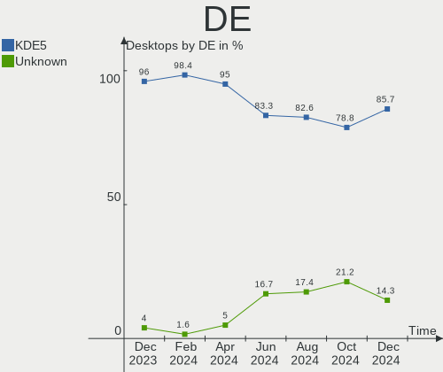
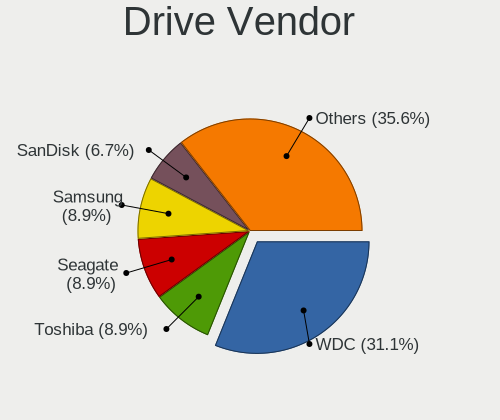
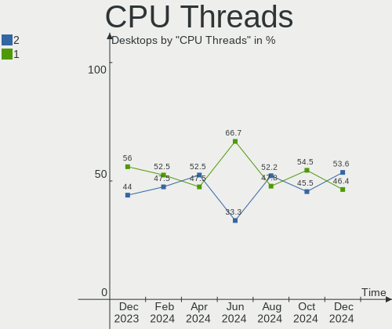
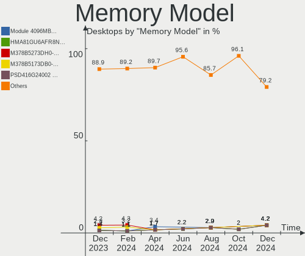
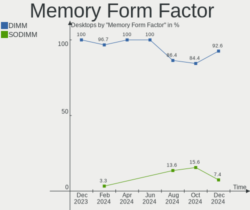

BlackPanther - Hardware Trends (Desktops)
-----------------------------------------

A project to identify most popular hardware characteristics and track their change
over time based on data collected by Linux users at https://Linux-Hardware.org.

Anyone can contribute to this report by the [hw-probe](https://github.com/linuxhw/hw-probe) tool:

    sudo -E hw-probe -all -upload

This report is for one last month. Overall report since the beginning of time: [TestDays](https://github.com/linuxhw/TestDays)

Period: Sep, 2023.

Contents
--------

* [ System ](#system)
  - [ OS                       ](#os)
  - [ OS Family                ](#os-family)
  - [ Kernel                   ](#kernel)
  - [ Kernel Family            ](#kernel-family)
  - [ Kernel Major Ver.        ](#kernel-major-ver)
  - [ Arch                     ](#arch)
  - [ DE                       ](#de)
  - [ Display Server           ](#display-server)
  - [ Display Manager          ](#display-manager)
  - [ OS Lang                  ](#os-lang)
  - [ Boot Mode                ](#boot-mode)
  - [ Filesystem               ](#filesystem)
  - [ Part. scheme             ](#part-scheme)
  - [ Dual Boot with Linux/BSD ](#dual-boot-with-linuxbsd)
  - [ Dual Boot (Win)          ](#dual-boot-win)

* [ Board ](#board)
  - [ Vendor                   ](#vendor)
  - [ Model                    ](#model)
  - [ Model Family             ](#model-family)
  - [ MFG Year                 ](#mfg-year)
  - [ Form Factor              ](#form-factor)
  - [ Secure Boot              ](#secure-boot)
  - [ Coreboot                 ](#coreboot)
  - [ RAM Size                 ](#ram-size)
  - [ RAM Used                 ](#ram-used)
  - [ Total Drives             ](#total-drives)
  - [ Has CD-ROM               ](#has-cd-rom)
  - [ Has Ethernet             ](#has-ethernet)
  - [ Has WiFi                 ](#has-wifi)
  - [ Has Bluetooth            ](#has-bluetooth)

* [ Location ](#location)
  - [ Country                  ](#country)
  - [ City                     ](#city)

* [ Drives ](#drives)
  - [ Drive Vendor             ](#drive-vendor)
  - [ Drive Model              ](#drive-model)
  - [ HDD Vendor               ](#hdd-vendor)
  - [ SSD Vendor               ](#ssd-vendor)
  - [ Drive Kind               ](#drive-kind)
  - [ Drive Connector          ](#drive-connector)
  - [ Drive Size               ](#drive-size)
  - [ Space Total              ](#space-total)
  - [ Space Used               ](#space-used)
  - [ Malfunc. Drives          ](#malfunc-drives)
  - [ Malfunc. Drive Vendor    ](#malfunc-drive-vendor)
  - [ Malfunc. HDD Vendor      ](#malfunc-hdd-vendor)
  - [ Malfunc. Drive Kind      ](#malfunc-drive-kind)
  - [ Failed Drives            ](#failed-drives)
  - [ Failed Drive Vendor      ](#failed-drive-vendor)
  - [ Drive Status             ](#drive-status)

* [ Storage controller ](#storage-controller)
  - [ Storage Vendor           ](#storage-vendor)
  - [ Storage Model            ](#storage-model)
  - [ Storage Kind             ](#storage-kind)

* [ Processor ](#processor)
  - [ CPU Vendor               ](#cpu-vendor)
  - [ CPU Model                ](#cpu-model)
  - [ CPU Model Family         ](#cpu-model-family)
  - [ CPU Cores                ](#cpu-cores)
  - [ CPU Sockets              ](#cpu-sockets)
  - [ CPU Threads              ](#cpu-threads)
  - [ CPU Op-Modes             ](#cpu-op-modes)
  - [ CPU Microcode            ](#cpu-microcode)
  - [ CPU Microarch            ](#cpu-microarch)

* [ Graphics ](#graphics)
  - [ GPU Vendor               ](#gpu-vendor)
  - [ GPU Model                ](#gpu-model)
  - [ GPU Combo                ](#gpu-combo)
  - [ GPU Driver               ](#gpu-driver)
  - [ GPU Memory               ](#gpu-memory)

* [ Monitor ](#monitor)
  - [ Monitor Vendor           ](#monitor-vendor)
  - [ Monitor Model            ](#monitor-model)
  - [ Monitor Resolution       ](#monitor-resolution)
  - [ Monitor Diagonal         ](#monitor-diagonal)
  - [ Monitor Width            ](#monitor-width)
  - [ Aspect Ratio             ](#aspect-ratio)
  - [ Monitor Area             ](#monitor-area)
  - [ Pixel Density            ](#pixel-density)
  - [ Multiple Monitors        ](#multiple-monitors)

* [ Network ](#network)
  - [ Net Controller Vendor    ](#net-controller-vendor)
  - [ Net Controller Model     ](#net-controller-model)
  - [ Wireless Vendor          ](#wireless-vendor)
  - [ Wireless Model           ](#wireless-model)
  - [ Ethernet Vendor          ](#ethernet-vendor)
  - [ Ethernet Model           ](#ethernet-model)
  - [ Net Controller Kind      ](#net-controller-kind)
  - [ Used Controller          ](#used-controller)
  - [ NICs                     ](#nics)
  - [ IPv6                     ](#ipv6)

* [ Bluetooth ](#bluetooth)
  - [ Bluetooth Vendor         ](#bluetooth-vendor)
  - [ Bluetooth Model          ](#bluetooth-model)

* [ Sound ](#sound)
  - [ Sound Vendor             ](#sound-vendor)
  - [ Sound Model              ](#sound-model)

* [ Memory ](#memory)
  - [ Memory Vendor            ](#memory-vendor)
  - [ Memory Model             ](#memory-model)
  - [ Memory Kind              ](#memory-kind)
  - [ Memory Form Factor       ](#memory-form-factor)
  - [ Memory Size              ](#memory-size)
  - [ Memory Speed             ](#memory-speed)

* [ Printers & scanners ](#printers--scanners)
  - [ Printer Vendor           ](#printer-vendor)
  - [ Printer Model            ](#printer-model)
  - [ Scanner Vendor           ](#scanner-vendor)
  - [ Scanner Model            ](#scanner-model)

* [ Camera ](#camera)
  - [ Camera Vendor            ](#camera-vendor)
  - [ Camera Model             ](#camera-model)

* [ Security ](#security)
  - [ Fingerprint Vendor       ](#fingerprint-vendor)
  - [ Fingerprint Model        ](#fingerprint-model)
  - [ Chipcard Vendor          ](#chipcard-vendor)
  - [ Chipcard Model           ](#chipcard-model)

* [ Unsupported ](#unsupported)
  - [ Unsupported Devices      ](#unsupported-devices)
  - [ Unsupported Device Types ](#unsupported-device-types)

System
------

OS
--

Installed operating systems

| Name              | Desktops | Percent |
|-------------------|----------|---------|
| BlackPanther 18.1 | 50       | 89.29%  |
| BlackPanther 22.1 | 6        | 10.71%  |

OS Family
---------

OS without a version

| Name         | Desktops | Percent |
|--------------|----------|---------|
| BlackPanther | 56       | 100%    |

Kernel
------

Version of the Linux kernel

| Version             | Desktops | Percent |
|---------------------|----------|---------|
| 5.6.14-desktop-2bP  | 25       | 44.64%  |
| 4.18.16-desktop-1bP | 15       | 26.79%  |
| 5.15.85-desktop-1bP | 10       | 17.86%  |
| 6.3.3-desktop-1bP   | 3        | 5.36%   |
| 6.3.8-desktop-1bP   | 2        | 3.57%   |
| 6.4.3-desktop-1bP   | 1        | 1.79%   |

Kernel Family
-------------

Linux kernel without a distro release

| Version | Desktops | Percent |
|---------|----------|---------|
| 5.6.14  | 25       | 44.64%  |
| 4.18.16 | 15       | 26.79%  |
| 5.15.85 | 10       | 17.86%  |
| 6.3.3   | 3        | 5.36%   |
| 6.3.8   | 2        | 3.57%   |
| 6.4.3   | 1        | 1.79%   |

Kernel Major Ver.
-----------------

Linux kernel major version

| Version | Desktops | Percent |
|---------|----------|---------|
| 5.6     | 25       | 44.64%  |
| 4.18    | 15       | 26.79%  |
| 5.15    | 10       | 17.86%  |
| 6.3     | 5        | 8.93%   |
| 6.4     | 1        | 1.79%   |

Arch
----

OS architecture (x86_64, i586, etc.)

| Name   | Desktops | Percent |
|--------|----------|---------|
| x86_64 | 56       | 100%    |

DE
--

Desktop Environment

| Name    | Desktops | Percent |
|---------|----------|---------|
| KDE5    | 55       | 98.21%  |
| Unknown | 1        | 1.79%   |

Display Server
--------------

X11 or Wayland

| Name    | Desktops | Percent |
|---------|----------|---------|
| X11     | 55       | 98.21%  |
| Wayland | 1        | 1.79%   |

Display Manager
---------------

SDDM, LightDM, etc.

| Name | Desktops | Percent |
|------|----------|---------|
| SDDM | 56       | 100%    |

OS Lang
-------

Language

| Lang    | Desktops | Percent |
|---------|----------|---------|
| Unknown | 56       | 100%    |

Boot Mode
---------

EFI or BIOS

| Mode | Desktops | Percent |
|------|----------|---------|
| BIOS | 32       | 57.14%  |
| EFI  | 24       | 42.86%  |

Filesystem
----------

Type of filesystem

| Type    | Desktops | Percent |
|---------|----------|---------|
| Ext4    | 33       | 58.93%  |
| Overlay | 22       | 39.29%  |
| Ntfs    | 1        | 1.79%   |

Part. scheme
------------

Scheme of partitioning

| Type | Desktops | Percent |
|------|----------|---------|
| GPT  | 31       | 55.36%  |
| MBR  | 25       | 44.64%  |

Dual Boot with Linux/BSD
------------------------

Hosting more than one Linux/BSD

| Dual boot | Desktops | Percent |
|-----------|----------|---------|
| No        | 31       | 55.36%  |
| Yes       | 25       | 44.64%  |

Dual Boot (Win)
---------------

Hosting Linux and Windows

| Dual boot | Desktops | Percent |
|-----------|----------|---------|
| No        | 35       | 62.5%   |
| Yes       | 21       | 37.5%   |

Board
-----

Vendor
------

Motherboard manufacturer

| Name                | Desktops | Percent |
|---------------------|----------|---------|
| Gigabyte Technology | 17       | 30.36%  |
| Hewlett-Packard     | 10       | 17.86%  |
| ASRock              | 7        | 12.5%   |
| Dell                | 6        | 10.71%  |
| ASUSTek Computer    | 6        | 10.71%  |
| MSI                 | 3        | 5.36%   |
| Fujitsu             | 3        | 5.36%   |
| Lenovo              | 2        | 3.57%   |
| Huanan              | 1        | 1.79%   |
| Fujitsu Siemens     | 1        | 1.79%   |

Model
-----

Motherboard model

| Name                               | Desktops | Percent |
|------------------------------------|----------|---------|
| Gigabyte H61M-S1                   | 3        | 5.36%   |
| HP Compaq 6200 Pro MT PC           | 2        | 3.57%   |
| Gigabyte F2A88XM-D3HP              | 2        | 3.57%   |
| MSI MS-7817                        | 1        | 1.79%   |
| MSI MS-7680                        | 1        | 1.79%   |
| MSI MS-7309                        | 1        | 1.79%   |
| Lenovo ThinkCentre M73 10B6001SUS  | 1        | 1.79%   |
| Lenovo 1730-A1G                    | 1        | 1.79%   |
| Huanan X99-QD4 V1.0                | 1        | 1.79%   |
| HP Z400 Workstation                | 1        | 1.79%   |
| HP EliteDesk 705 G3 SFF            | 1        | 1.79%   |
| HP Compaq Pro 6300 MT              | 1        | 1.79%   |
| HP Compaq dc7600 Small Form Factor | 1        | 1.79%   |
| HP Compaq 8200 Elite MT PC         | 1        | 1.79%   |
| HP Compaq 8200 Elite CMT PC        | 1        | 1.79%   |
| HP Compaq 6200 Pro SFF PC          | 1        | 1.79%   |
| HP Compaq 6005 Pro SFF PC          | 1        | 1.79%   |
| Gigabyte Z390 UD                   | 1        | 1.79%   |
| Gigabyte P67A-D3-B3                | 1        | 1.79%   |
| Gigabyte J4005ND2P-CF              | 1        | 1.79%   |
| Gigabyte H97-D3H                   | 1        | 1.79%   |
| Gigabyte H310M A 2.0               | 1        | 1.79%   |
| Gigabyte H110M-S2V-CF              | 1        | 1.79%   |
| Gigabyte GA-890GPA-UD3H            | 1        | 1.79%   |
| Gigabyte G31M-ES2C                 | 1        | 1.79%   |
| Gigabyte EP31-DS3L                 | 1        | 1.79%   |
| Gigabyte B450M GAMING              | 1        | 1.79%   |
| Gigabyte AB350M-DS3H V2            | 1        | 1.79%   |
| Gigabyte A520M S2H                 | 1        | 1.79%   |
| Fujitsu Siemens ESPRIMO P5625      | 1        | 1.79%   |
| Fujitsu ESPRIMO Q556/2             | 1        | 1.79%   |
| Fujitsu ESPRIMO E7935              | 1        | 1.79%   |
| Fujitsu CELSIUS M470               | 1        | 1.79%   |
| Dell Precision WorkStation T5500   | 1        | 1.79%   |
| Dell Precision Tower 5810          | 1        | 1.79%   |
| Dell OptiPlex 780                  | 1        | 1.79%   |
| Dell OptiPlex 760                  | 1        | 1.79%   |
| Dell OptiPlex 7010                 | 1        | 1.79%   |
| Dell OptiPlex 3020                 | 1        | 1.79%   |
| ASUS PRIME B450-PLUS               | 1        | 1.79%   |

Model Family
------------

Motherboard model prefix

| Name                    | Desktops | Percent |
|-------------------------|----------|---------|
| HP Compaq               | 8        | 14.29%  |
| Dell OptiPlex           | 4        | 7.14%   |
| Gigabyte H61M-S1        | 3        | 5.36%   |
| Gigabyte F2A88XM-D3HP   | 2        | 3.57%   |
| Fujitsu ESPRIMO         | 2        | 3.57%   |
| Dell Precision          | 2        | 3.57%   |
| ASUS PRIME              | 2        | 3.57%   |
| MSI MS-7817             | 1        | 1.79%   |
| MSI MS-7680             | 1        | 1.79%   |
| MSI MS-7309             | 1        | 1.79%   |
| Lenovo ThinkCentre      | 1        | 1.79%   |
| Lenovo 1730-A1G         | 1        | 1.79%   |
| Huanan X99-QD4          | 1        | 1.79%   |
| HP Z400                 | 1        | 1.79%   |
| HP EliteDesk            | 1        | 1.79%   |
| Gigabyte Z390           | 1        | 1.79%   |
| Gigabyte P67A-D3-B3     | 1        | 1.79%   |
| Gigabyte J4005ND2P-CF   | 1        | 1.79%   |
| Gigabyte H97-D3H        | 1        | 1.79%   |
| Gigabyte H310M          | 1        | 1.79%   |
| Gigabyte H110M-S2V-CF   | 1        | 1.79%   |
| Gigabyte GA-890GPA-UD3H | 1        | 1.79%   |
| Gigabyte G31M-ES2C      | 1        | 1.79%   |
| Gigabyte EP31-DS3L      | 1        | 1.79%   |
| Gigabyte B450M          | 1        | 1.79%   |
| Gigabyte AB350M-DS3H    | 1        | 1.79%   |
| Gigabyte A520M          | 1        | 1.79%   |
| Fujitsu Siemens ESPRIMO | 1        | 1.79%   |
| Fujitsu CELSIUS         | 1        | 1.79%   |
| ASUS P5KPL-AM           | 1        | 1.79%   |
| ASUS M5A97              | 1        | 1.79%   |
| ASUS H110M-A            | 1        | 1.79%   |
| ASUS FR1009568          | 1        | 1.79%   |
| ASRock X370             | 1        | 1.79%   |
| ASRock H81M-HDS         | 1        | 1.79%   |
| ASRock H310CM-DVS       | 1        | 1.79%   |
| ASRock G41M-VS3         | 1        | 1.79%   |
| ASRock B85M             | 1        | 1.79%   |
| ASRock B550M            | 1        | 1.79%   |
| ASRock 775i945GZ        | 1        | 1.79%   |

MFG Year
--------

Motherboard manufacture year

| Year | Desktops | Percent |
|------|----------|---------|
| 2011 | 8        | 14.29%  |
| 2018 | 6        | 10.71%  |
| 2010 | 6        | 10.71%  |
| 2012 | 5        | 8.93%   |
| 2017 | 4        | 7.14%   |
| 2015 | 4        | 7.14%   |
| 2013 | 4        | 7.14%   |
| 2009 | 4        | 7.14%   |
| 2014 | 3        | 5.36%   |
| 2008 | 3        | 5.36%   |
| 2020 | 2        | 3.57%   |
| 2019 | 2        | 3.57%   |
| 2006 | 2        | 3.57%   |
| 2022 | 1        | 1.79%   |
| 2016 | 1        | 1.79%   |
| 2005 | 1        | 1.79%   |

Form Factor
-----------

Physical design of the computer

| Name    | Desktops | Percent |
|---------|----------|---------|
| Desktop | 56       | 100%    |

Secure Boot
-----------

Enabled or disabled

| State    | Desktops | Percent |
|----------|----------|---------|
| Disabled | 56       | 100%    |

Coreboot
--------

Have coreboot on board

| Used | Desktops | Percent |
|------|----------|---------|
| No   | 56       | 100%    |

RAM Size
--------

Total RAM memory

| Size in GB | Desktops | Percent |
|------------|----------|---------|
| 8.01-16.0  | 17       | 30.36%  |
| 3.01-4.0   | 14       | 25%     |
| 4.01-8.0   | 10       | 17.86%  |
| 16.01-24.0 | 5        | 8.93%   |
| 32.01-64.0 | 4        | 7.14%   |
| 1.01-2.0   | 4        | 7.14%   |
| 24.01-32.0 | 1        | 1.79%   |
| 2.01-3.0   | 1        | 1.79%   |

RAM Used
--------

Used RAM memory

| Used GB  | Desktops | Percent |
|----------|----------|---------|
| 0.51-1.0 | 21       | 37.5%   |
| 1.01-2.0 | 15       | 26.79%  |
| 0.01-0.5 | 12       | 21.43%  |
| 2.01-3.0 | 4        | 7.14%   |
| 3.01-4.0 | 3        | 5.36%   |
| 4.01-8.0 | 1        | 1.79%   |

Total Drives
------------

Number of drives on board

| Drives | Desktops | Percent |
|--------|----------|---------|
| 1      | 28       | 50%     |
| 2      | 17       | 30.36%  |
| 3      | 6        | 10.71%  |
| 4      | 3        | 5.36%   |
| 5      | 1        | 1.79%   |
| 0      | 1        | 1.79%   |

Has CD-ROM
----------

Has CD-ROM on board

| Presented | Desktops | Percent |
|-----------|----------|---------|
| Yes       | 40       | 71.43%  |
| No        | 16       | 28.57%  |

Has Ethernet
------------

Has Ethernet on board

| Presented | Desktops | Percent |
|-----------|----------|---------|
| Yes       | 56       | 100%    |

Has WiFi
--------

Has WiFi module

| Presented | Desktops | Percent |
|-----------|----------|---------|
| No        | 43       | 76.79%  |
| Yes       | 13       | 23.21%  |

Has Bluetooth
-------------

Has Bluetooth module

| Presented | Desktops | Percent |
|-----------|----------|---------|
| No        | 45       | 80.36%  |
| Yes       | 11       | 19.64%  |

Location
--------

Country
-------

Geographic location (country)

| Country  | Desktops | Percent |
|----------|----------|---------|
| Hungary  | 50       | 89.29%  |
| Germany  | 2        | 3.57%   |
| Slovakia | 1        | 1.79%   |
| Serbia   | 1        | 1.79%   |
| Italy    | 1        | 1.79%   |
| Greece   | 1        | 1.79%   |

City
----

Geographic location (city)

| City                    | Desktops | Percent |
|-------------------------|----------|---------|
| Budapest                | 14       | 25%     |
| Zalaegerszeg            | 3        | 5.36%   |
| Szeghalom               | 3        | 5.36%   |
| Szombathely             | 2        | 3.57%   |
| Szekszárd              | 2        | 3.57%   |
| Pécs                   | 2        | 3.57%   |
| Győr                   | 2        | 3.57%   |
| Eger                    | 2        | 3.57%   |
| Debrecen                | 2        | 3.57%   |
| Csongrad                | 2        | 3.57%   |
| Vonock                  | 1        | 1.79%   |
| Veszprém               | 1        | 1.79%   |
| Tamasi                  | 1        | 1.79%   |
| Szentmartonkata         | 1        | 1.79%   |
| Szentendre              | 1        | 1.79%   |
| Salerno                 | 1        | 1.79%   |
| Pfaffenhofen an der Ilm | 1        | 1.79%   |
| Oroshaza                | 1        | 1.79%   |
| Nagykanizsa             | 1        | 1.79%   |
| Marcali                 | 1        | 1.79%   |
| Levice                  | 1        | 1.79%   |
| Kiskunhalas             | 1        | 1.79%   |
| Kastoria                | 1        | 1.79%   |
| Karloca                 | 1        | 1.79%   |
| Karcag                  | 1        | 1.79%   |
| Jaszdozsa               | 1        | 1.79%   |
| Isaszeg                 | 1        | 1.79%   |
| Filderstadt             | 1        | 1.79%   |
| Fertoszentmiklos        | 1        | 1.79%   |
| Dunaharaszti            | 1        | 1.79%   |
| Dombegyhaz              | 1        | 1.79%   |
| Berettyóújfalu        | 1        | 1.79%   |

Drives
------

Drive Vendor
------------

Hard drive vendors

| Vendor                    | Desktops | Drives | Percent |
|---------------------------|----------|--------|---------|
| WDC                       | 19       | 25     | 19.79%  |
| Kingston                  | 15       | 15     | 15.63%  |
| Samsung Electronics       | 14       | 17     | 14.58%  |
| Toshiba                   | 10       | 10     | 10.42%  |
| Seagate                   | 7        | 7      | 7.29%   |
| SanDisk                   | 4        | 4      | 4.17%   |
| SPCC                      | 3        | 3      | 3.13%   |
| Hitachi                   | 3        | 3      | 3.13%   |
| A-DATA Technology         | 3        | 3      | 3.13%   |
| Patriot                   | 2        | 2      | 2.08%   |
| HGST                      | 2        | 3      | 2.08%   |
| Zheino                    | 1        | 1      | 1.04%   |
| XPG                       | 1        | 1      | 1.04%   |
| Transcend                 | 1        | 1      | 1.04%   |
| PNY                       | 1        | 1      | 1.04%   |
| Micron/Crucial Technology | 1        | 1      | 1.04%   |
| Micron Technology         | 1        | 1      | 1.04%   |
| Maxtor                    | 1        | 1      | 1.04%   |
| Kingmax                   | 1        | 1      | 1.04%   |
| JMicron Technology        | 1        | 1      | 1.04%   |
| Intenso                   | 1        | 1      | 1.04%   |
| Intel                     | 1        | 1      | 1.04%   |
| Gigabyte Technology       | 1        | 1      | 1.04%   |
| Crucial                   | 1        | 1      | 1.04%   |
| 2-Power                   | 1        | 1      | 1.04%   |

Drive Model
-----------

Hard drive models

| Model                            | Desktops | Percent |
|----------------------------------|----------|---------|
| Toshiba DT01ACA100 1TB           | 4        | 3.92%   |
| WDC WD30EFRX-68EUZN0 3TB         | 3        | 2.94%   |
| SPCC Solid State Disk 256GB      | 3        | 2.94%   |
| Kingston SUV400S37120G 120GB SSD | 3        | 2.94%   |
| Kingston SA400S37480G 480GB SSD  | 3        | 2.94%   |
| WDC WD5000BPKT-75PK4T0 500GB     | 2        | 1.96%   |
| Seagate ST500DM002-1BD142 500GB  | 2        | 1.96%   |
| Samsung SSD 850 EVO 250GB        | 2        | 1.96%   |
| Samsung SSD 830 Series 64GB      | 2        | 1.96%   |
| Kingston SV300S37A60G 64GB SSD   | 2        | 1.96%   |
| Kingston SA400S37240G 240GB SSD  | 2        | 1.96%   |
| Hitachi HDS721050CLA662 500GB    | 2        | 1.96%   |
| Zheino CHN-NGFFNV2280-256 256GB  | 1        | 0.98%   |
| XPG SPECTRIX S40G 1TB            | 1        | 0.98%   |
| WDC WDS256G1X0C-00ENX0 256GB     | 1        | 0.98%   |
| WDC WDS240G2G0B-00EPW0 240GB SSD | 1        | 0.98%   |
| WDC WDS240G2G0A-00JH30 240GB SSD | 1        | 0.98%   |
| WDC WD800JD-75MSA3 80GB          | 1        | 0.98%   |
| WDC WD5000AAKX-60U6AA0 500GB     | 1        | 0.98%   |
| WDC WD5000AAKX-08U6AA0 500GB     | 1        | 0.98%   |
| WDC WD5000AAKS-00UU3A0 500GB     | 1        | 0.98%   |
| WDC WD5000AAKS-007AA0 500GB      | 1        | 0.98%   |
| WDC WD30EZRZ-00GXCB0 3TB         | 1        | 0.98%   |
| WDC WD30EZRX-00DC0B0 3TB         | 1        | 0.98%   |
| WDC WD30 PURX-64PFUY0 3TB        | 1        | 0.98%   |
| WDC WD2500AAJS-75M0A0 250GB      | 1        | 0.98%   |
| WDC WD20EZBX-00AYRA0 2TB         | 1        | 0.98%   |
| WDC WD10PURZ-85U8XY0 1TB         | 1        | 0.98%   |
| WDC WD10EZRX-00L4HB0 1TB         | 1        | 0.98%   |
| WDC WD10EZEX-00KUWA0 1TB         | 1        | 0.98%   |
| WDC WD10EFRX-68PJCN0 1TB         | 1        | 0.98%   |
| WDC WD10EARS-00Y5B1 1TB          | 1        | 0.98%   |
| Transcend TS128GMTE110S 128GB    | 1        | 0.98%   |
| Toshiba MQ01ABF032 320GB         | 1        | 0.98%   |
| Toshiba MQ01ABD100 1TB           | 1        | 0.98%   |
| Toshiba HDWQ140 4TB              | 1        | 0.98%   |
| Toshiba HDWD240 4TB              | 1        | 0.98%   |
| Toshiba HDWD130 3TB              | 1        | 0.98%   |
| Toshiba DT01ACA050 500GB         | 1        | 0.98%   |
| Seagate ST3500418AS 500GB        | 1        | 0.98%   |

HDD Vendor
----------

Hard disk drive vendors

| Vendor              | Desktops | Drives | Percent |
|---------------------|----------|--------|---------|
| WDC                 | 16       | 22     | 36.36%  |
| Toshiba             | 10       | 10     | 22.73%  |
| Seagate             | 7        | 7      | 15.91%  |
| Samsung Electronics | 5        | 5      | 11.36%  |
| Hitachi             | 3        | 3      | 6.82%   |
| HGST                | 2        | 3      | 4.55%   |
| Maxtor              | 1        | 1      | 2.27%   |

SSD Vendor
----------

Solid state drive vendors

| Vendor              | Desktops | Drives | Percent |
|---------------------|----------|--------|---------|
| Kingston            | 13       | 13     | 30.95%  |
| Samsung Electronics | 7        | 8      | 16.67%  |
| SPCC                | 3        | 3      | 7.14%   |
| SanDisk             | 3        | 3      | 7.14%   |
| A-DATA Technology   | 3        | 3      | 7.14%   |
| WDC                 | 2        | 2      | 4.76%   |
| Patriot             | 2        | 2      | 4.76%   |
| PNY                 | 1        | 1      | 2.38%   |
| Micron Technology   | 1        | 1      | 2.38%   |
| Kingmax             | 1        | 1      | 2.38%   |
| JMicron Technology  | 1        | 1      | 2.38%   |
| Intenso             | 1        | 1      | 2.38%   |
| Intel               | 1        | 1      | 2.38%   |
| Gigabyte Technology | 1        | 1      | 2.38%   |
| Crucial             | 1        | 1      | 2.38%   |
| 2-Power             | 1        | 1      | 2.38%   |

Drive Kind
----------

HDD or SSD

| Kind | Desktops | Drives | Percent |
|------|----------|--------|---------|
| HDD  | 38       | 51     | 46.34%  |
| SSD  | 34       | 43     | 41.46%  |
| NVMe | 10       | 12     | 12.2%   |

Drive Connector
---------------

SATA, SAS, NVMe, etc.

| Type | Desktops | Drives | Percent |
|------|----------|--------|---------|
| SATA | 52       | 91     | 80%     |
| NVMe | 10       | 12     | 15.38%  |
| SAS  | 3        | 3      | 4.62%   |

Drive Size
----------

Size of hard drive

| Size in TB | Desktops | Drives | Percent |
|------------|----------|--------|---------|
| 0.01-0.5   | 44       | 60     | 61.11%  |
| 0.51-1.0   | 18       | 20     | 25%     |
| 2.01-3.0   | 6        | 9      | 8.33%   |
| 3.01-4.0   | 3        | 4      | 4.17%   |
| 1.01-2.0   | 1        | 1      | 1.39%   |

Space Total
-----------

Amount of disk space available on the file system

| Size in GB     | Desktops | Percent |
|----------------|----------|---------|
| Unknown        | 22       | 39.29%  |
| 101-250        | 9        | 16.07%  |
| 501-1000       | 8        | 14.29%  |
| 251-500        | 6        | 10.71%  |
| 51-100         | 5        | 8.93%   |
| More than 3000 | 3        | 5.36%   |
| 1001-2000      | 2        | 3.57%   |
| 21-50          | 1        | 1.79%   |

Space Used
----------

Amount of used disk space

| Used GB        | Desktops | Percent |
|----------------|----------|---------|
| Unknown        | 22       | 39.29%  |
| 1-20           | 15       | 26.79%  |
| 21-50          | 7        | 12.5%   |
| 51-100         | 4        | 7.14%   |
| 101-250        | 3        | 5.36%   |
| 1001-2000      | 2        | 3.57%   |
| 501-1000       | 2        | 3.57%   |
| More than 3000 | 1        | 1.79%   |

Malfunc. Drives
---------------

Drive models with a malfunction

| Model                             | Desktops | Drives | Percent |
|-----------------------------------|----------|--------|---------|
| WDC WD5000AAKX-08U6AA0 500GB      | 1        | 1      | 6.25%   |
| WDC WD5000AAKS-00UU3A0 500GB      | 1        | 1      | 6.25%   |
| WDC WD5000AAKS-007AA0 500GB       | 1        | 1      | 6.25%   |
| WDC WD10PURZ-85U8XY0 1TB          | 1        | 1      | 6.25%   |
| WDC WD10EARS-00Y5B1 1TB           | 1        | 1      | 6.25%   |
| Toshiba HDWD130 3TB               | 1        | 1      | 6.25%   |
| Toshiba DT01ACA100 1TB            | 1        | 1      | 6.25%   |
| Toshiba DT01ACA050 500GB          | 1        | 1      | 6.25%   |
| Seagate ST500DM002-1BD142 500GB   | 1        | 1      | 6.25%   |
| Seagate ST3500418AS 500GB         | 1        | 1      | 6.25%   |
| Seagate ST3160815AS 160GB         | 1        | 1      | 6.25%   |
| Seagate ST1000LM048-2E7172 1TB    | 1        | 1      | 6.25%   |
| Samsung Electronics HD103UJ 1TB   | 1        | 1      | 6.25%   |
| Samsung Electronics HD080HJ 80GB  | 1        | 1      | 6.25%   |
| Kingston SUV400S37120G 120GB SSD  | 1        | 1      | 6.25%   |
| A-DATA Technology SU630 240GB SSD | 1        | 1      | 6.25%   |

Malfunc. Drive Vendor
---------------------

Vendors of faulty drives

| Vendor              | Desktops | Drives | Percent |
|---------------------|----------|--------|---------|
| WDC                 | 5        | 5      | 31.25%  |
| Seagate             | 4        | 4      | 25%     |
| Toshiba             | 3        | 3      | 18.75%  |
| Samsung Electronics | 2        | 2      | 12.5%   |
| Kingston            | 1        | 1      | 6.25%   |
| A-DATA Technology   | 1        | 1      | 6.25%   |

Malfunc. HDD Vendor
-------------------

Vendors of faulty HDD drives

| Vendor              | Desktops | Drives | Percent |
|---------------------|----------|--------|---------|
| WDC                 | 5        | 5      | 35.71%  |
| Seagate             | 4        | 4      | 28.57%  |
| Toshiba             | 3        | 3      | 21.43%  |
| Samsung Electronics | 2        | 2      | 14.29%  |

Malfunc. Drive Kind
-------------------

Kinds of faulty drives

| Kind | Desktops | Drives | Percent |
|------|----------|--------|---------|
| HDD  | 13       | 14     | 86.67%  |
| SSD  | 2        | 2      | 13.33%  |

Failed Drives
-------------

Failed drive models

| Model                             | Desktops | Drives | Percent |
|-----------------------------------|----------|--------|---------|
| Samsung Electronics HD502HJ 500GB | 1        | 1      | 100%    |

Failed Drive Vendor
-------------------

Failed drive vendors

| Vendor              | Desktops | Drives | Percent |
|---------------------|----------|--------|---------|
| Samsung Electronics | 1        | 1      | 100%    |

Drive Status
------------

Number of failed and malfunc. drives

| Status   | Desktops | Drives | Percent |
|----------|----------|--------|---------|
| Works    | 47       | 86     | 72.31%  |
| Malfunc  | 14       | 16     | 21.54%  |
| Detected | 3        | 3      | 4.62%   |
| Failed   | 1        | 1      | 1.54%   |

Storage controller
------------------

Storage Vendor
--------------

Storage controller vendors

| Vendor                      | Desktops | Percent |
|-----------------------------|----------|---------|
| Intel                       | 42       | 60%     |
| AMD                         | 12       | 17.14%  |
| Samsung Electronics         | 3        | 4.29%   |
| Silicon Motion              | 2        | 2.86%   |
| SanDisk                     | 2        | 2.86%   |
| Nvidia                      | 2        | 2.86%   |
| Kingston Technology Company | 2        | 2.86%   |
| Silicon Image               | 1        | 1.43%   |
| Realtek Semiconductor       | 1        | 1.43%   |
| Micron/Crucial Technology   | 1        | 1.43%   |
| JMicron Technology          | 1        | 1.43%   |
| ASMedia Technology          | 1        | 1.43%   |

Storage Model
-------------

Storage controller models

| Model                                                                                   | Desktops | Percent |
|-----------------------------------------------------------------------------------------|----------|---------|
| Intel NM10/ICH7 Family SATA Controller [IDE mode]                                       | 6        | 6.67%   |
| Intel 6 Series/C200 Series Chipset Family Desktop SATA Controller (IDE mode, ports 4-5) | 6        | 6.67%   |
| Intel 6 Series/C200 Series Chipset Family Desktop SATA Controller (IDE mode, ports 0-3) | 6        | 6.67%   |
| AMD FCH SATA Controller [AHCI mode]                                                     | 6        | 6.67%   |
| Intel 8 Series/C220 Series Chipset Family 6-port SATA Controller 1 [AHCI mode]          | 5        | 5.56%   |
| Intel 6 Series/C200 Series Chipset Family 6 port Desktop SATA AHCI Controller           | 5        | 5.56%   |
| Intel Q170/Q150/B150/H170/H110/Z170/CM236 Chipset SATA Controller [AHCI Mode]           | 4        | 4.44%   |
| Intel 82801G (ICH7 Family) IDE Controller                                               | 4        | 4.44%   |
| Intel SATA Controller [RAID mode]                                                       | 3        | 3.33%   |
| Intel 4 Series Chipset PT IDER Controller                                               | 3        | 3.33%   |
| Intel 200 Series PCH SATA controller [AHCI mode]                                        | 3        | 3.33%   |
| Silicon Motion SM2263EN/SM2263XT (DRAM-less) NVMe SSD Controllers                       | 2        | 2.22%   |
| Samsung NVMe SSD Controller SM981/PM981/PM983                                           | 2        | 2.22%   |
| Intel 7 Series/C210 Series Chipset Family 6-port SATA Controller [AHCI mode]            | 2        | 2.22%   |
| AMD SB7x0/SB8x0/SB9x0 SATA Controller [AHCI mode]                                       | 2        | 2.22%   |
| AMD 500 Series Chipset SATA Controller                                                  | 2        | 2.22%   |
| AMD 400 Series Chipset SATA Controller                                                  | 2        | 2.22%   |
| AMD 300 Series Chipset SATA Controller                                                  | 2        | 2.22%   |
| Silicon Image SiI 3512 [SATALink/SATARaid] Serial ATA Controller                        | 1        | 1.11%   |
| SanDisk WD Blue SN570 NVMe SSD 2TB                                                      | 1        | 1.11%   |
| SanDisk WD Black NVMe SSD                                                               | 1        | 1.11%   |
| Samsung NVMe SSD Controller SM961/PM961/SM963                                           | 1        | 1.11%   |
| Realtek RTS5763DL NVMe SSD Controller                                                   | 1        | 1.11%   |
| Nvidia MCP78S [GeForce 8200] AHCI Controller                                            | 1        | 1.11%   |
| Nvidia MCP61 SATA Controller                                                            | 1        | 1.11%   |
| Nvidia MCP61 IDE                                                                        | 1        | 1.11%   |
| Micron/Crucial P1 NVMe PCIe SSD[Frampton2]                                              | 1        | 1.11%   |
| Kingston Company Company Non-Volatile memory controller                                 | 1        | 1.11%   |
| Kingston Company NV1 NVMe SSD                                                           | 1        | 1.11%   |
| JMicron JMB363 SATA/IDE Controller                                                      | 1        | 1.11%   |
| Intel Celeron/Pentium Silver Processor SATA Controller                                  | 1        | 1.11%   |
| Intel Cannon Lake PCH SATA AHCI Controller                                              | 1        | 1.11%   |
| Intel C610/X99 series chipset IDE-r Controller                                          | 1        | 1.11%   |
| Intel 9 Series Chipset Family SATA Controller [AHCI Mode]                               | 1        | 1.11%   |
| Intel 82801JI (ICH10 Family) SATA AHCI Controller                                       | 1        | 1.11%   |
| Intel 82801JD/DO (ICH10 Family) SATA AHCI Controller                                    | 1        | 1.11%   |
| Intel 82801JD/DO (ICH10 Family) 4-port SATA IDE Controller                              | 1        | 1.11%   |
| Intel 82801JD/DO (ICH10 Family) 2-port SATA IDE Controller                              | 1        | 1.11%   |
| Intel 8 Series/C220 Series Chipset Family 4-port SATA Controller 1 [IDE mode]           | 1        | 1.11%   |
| ASMedia ASM1062 Serial ATA Controller                                                   | 1        | 1.11%   |

Storage Kind
------------

Kind of storage controller (IDE, SATA, NVMe, SAS, ...)

| Kind | Desktops | Percent |
|------|----------|---------|
| SATA | 37       | 52.86%  |
| IDE  | 19       | 27.14%  |
| NVMe | 10       | 14.29%  |
| RAID | 4        | 5.71%   |

Processor
---------

CPU Vendor
----------

Processor vendors

| Vendor | Desktops | Percent |
|--------|----------|---------|
| Intel  | 42       | 75%     |
| AMD    | 14       | 25%     |

CPU Model
---------

Processor models

| Model                                           | Desktops | Percent |
|-------------------------------------------------|----------|---------|
| Intel Core i5-2400 CPU @ 3.10GHz                | 4        | 7.14%   |
| Intel Core i3-2120 CPU @ 3.30GHz                | 4        | 7.14%   |
| Intel Core i3-6100 CPU @ 3.70GHz                | 2        | 3.57%   |
| Intel Core i3-4130 CPU @ 3.40GHz                | 2        | 3.57%   |
| AMD Ryzen 5 3400G with Radeon Vega Graphics     | 2        | 3.57%   |
| AMD A10-7850K Radeon R7, 12 Compute Cores 4C+8G | 2        | 3.57%   |
| Intel Xeon CPU X3330 @ 2.66GHz                  | 1        | 1.79%   |
| Intel Xeon CPU W3550 @ 3.07GHz                  | 1        | 1.79%   |
| Intel Xeon CPU L5640 @ 2.27GHz                  | 1        | 1.79%   |
| Intel Xeon CPU E5530 @ 2.40GHz                  | 1        | 1.79%   |
| Intel Xeon CPU E5-2696 v3 @ 2.30GHz             | 1        | 1.79%   |
| Intel Xeon CPU E5-1660 v3 @ 3.00GHz             | 1        | 1.79%   |
| Intel Pentium Dual-Core CPU E5400 @ 2.70GHz     | 1        | 1.79%   |
| Intel Pentium CPU G3430 @ 3.30GHz               | 1        | 1.79%   |
| Intel Pentium CPU G3220 @ 3.00GHz               | 1        | 1.79%   |
| Intel Pentium 4 CPU 3.20GHz                     | 1        | 1.79%   |
| Intel Core i5-9400F CPU @ 2.90GHz               | 1        | 1.79%   |
| Intel Core i5-9400 CPU @ 2.90GHz                | 1        | 1.79%   |
| Intel Core i5-6500 CPU @ 3.20GHz                | 1        | 1.79%   |
| Intel Core i5-4690 CPU @ 3.50GHz                | 1        | 1.79%   |
| Intel Core i5-4590 CPU @ 3.30GHz                | 1        | 1.79%   |
| Intel Core i5-3470S CPU @ 2.90GHz               | 1        | 1.79%   |
| Intel Core i5-3470 CPU @ 3.20GHz                | 1        | 1.79%   |
| Intel Core i5-3330 CPU @ 3.00GHz                | 1        | 1.79%   |
| Intel Core i5-2300 CPU @ 2.80GHz                | 1        | 1.79%   |
| Intel Core i3-9100F CPU @ 3.60GHz               | 1        | 1.79%   |
| Intel Core i3-8100 CPU @ 3.60GHz                | 1        | 1.79%   |
| Intel Core i3-6100T CPU @ 3.20GHz               | 1        | 1.79%   |
| Intel Core i3-3220 CPU @ 3.30GHz                | 1        | 1.79%   |
| Intel Core 2 Duo CPU E8400 @ 3.00GHz            | 1        | 1.79%   |
| Intel Core 2 Duo CPU E7300 @ 2.66GHz            | 1        | 1.79%   |
| Intel Core 2 Duo CPU E6750 @ 2.66GHz            | 1        | 1.79%   |
| Intel Core 2 CPU 4300 @ 1.80GHz                 | 1        | 1.79%   |
| Intel Celeron J4005 CPU @ 2.00GHz               | 1        | 1.79%   |
| Intel Celeron D CPU 3.33GHz                     | 1        | 1.79%   |
| Intel Celeron CPU E3300 @ 2.50GHz               | 1        | 1.79%   |
| AMD Ryzen 7 5700X 8-Core Processor              | 1        | 1.79%   |
| AMD Ryzen 7 1700X Eight-Core Processor          | 1        | 1.79%   |
| AMD Ryzen 5 5600G with Radeon Graphics          | 1        | 1.79%   |
| AMD Ryzen 5 2600X Six-Core Processor            | 1        | 1.79%   |

CPU Model Family
----------------

Processor model prefix

| Model                   | Desktops | Percent |
|-------------------------|----------|---------|
| Intel Core i5           | 13       | 23.21%  |
| Intel Core i3           | 12       | 21.43%  |
| Intel Xeon              | 6        | 10.71%  |
| AMD Ryzen 5             | 4        | 7.14%   |
| Intel Core 2 Duo        | 3        | 5.36%   |
| Intel Pentium           | 2        | 3.57%   |
| Intel Celeron           | 2        | 3.57%   |
| AMD Ryzen 7             | 2        | 3.57%   |
| AMD A10                 | 2        | 3.57%   |
| Other                   | 1        | 1.79%   |
| Intel Pentium Dual-Core | 1        | 1.79%   |
| Intel Pentium 4         | 1        | 1.79%   |
| Intel Core 2            | 1        | 1.79%   |
| Intel Celeron D         | 1        | 1.79%   |
| AMD Phenom II X4        | 1        | 1.79%   |
| AMD FX                  | 1        | 1.79%   |
| AMD Athlon II X2        | 1        | 1.79%   |
| AMD Athlon Dual Core    | 1        | 1.79%   |
| AMD Athlon 64           | 1        | 1.79%   |

CPU Cores
---------

Number of processor cores

| Number | Desktops | Percent |
|--------|----------|---------|
| 2      | 23       | 41.07%  |
| 4      | 19       | 33.93%  |
| 6      | 5        | 8.93%   |
| 1      | 4        | 7.14%   |
| 8      | 3        | 5.36%   |
| 18     | 1        | 1.79%   |
| 3      | 1        | 1.79%   |

CPU Sockets
-----------

Number of sockets

| Number | Desktops | Percent |
|--------|----------|---------|
| 1      | 56       | 100%    |

CPU Threads
-----------

Threads per core (Hyper-Threading)

| Number | Desktops | Percent |
|--------|----------|---------|
| 1      | 31       | 55.36%  |
| 2      | 25       | 44.64%  |

CPU Op-Modes
------------

CPU Operation Modes (32-bit, 64-bit)

| Op mode        | Desktops | Percent |
|----------------|----------|---------|
| 32-bit, 64-bit | 56       | 100%    |

CPU Microcode
-------------

Microcode number

| Number     | Desktops | Percent |
|------------|----------|---------|
| 0x206a7    | 8        | 14.29%  |
| Unknown    | 8        | 14.29%  |
| 0x306c3    | 6        | 10.71%  |
| 0x1067a    | 4        | 7.14%   |
| 0x506e3    | 3        | 5.36%   |
| 0x306a9    | 3        | 5.36%   |
| 0x906eb    | 2        | 3.57%   |
| 0x08108109 | 2        | 3.57%   |
| 0x06003106 | 2        | 3.57%   |
| 0xf65      | 1        | 1.79%   |
| 0xf4a      | 1        | 1.79%   |
| 0x906ed    | 1        | 1.79%   |
| 0x906ea    | 1        | 1.79%   |
| 0x706a1    | 1        | 1.79%   |
| 0x6fb      | 1        | 1.79%   |
| 0x6f2      | 1        | 1.79%   |
| 0x306f2    | 1        | 1.79%   |
| 0x206c2    | 1        | 1.79%   |
| 0x106a5    | 1        | 1.79%   |
| 0x10676    | 1        | 1.79%   |
| 0x0a50000c | 1        | 1.79%   |
| 0x0a20120a | 1        | 1.79%   |
| 0x0800820d | 1        | 1.79%   |
| 0x08001137 | 1        | 1.79%   |
| 0x0600611a | 1        | 1.79%   |
| 0x06000852 | 1        | 1.79%   |
| 0x010000c8 | 1        | 1.79%   |

CPU Microarch
-------------

Microarchitecture

| Name          | Desktops | Percent |
|---------------|----------|---------|
| SandyBridge   | 9        | 16.07%  |
| Haswell       | 8        | 14.29%  |
| Penryn        | 5        | 8.93%   |
| Skylake       | 4        | 7.14%   |
| KabyLake      | 4        | 7.14%   |
| IvyBridge     | 4        | 7.14%   |
| Zen+          | 3        | 5.36%   |
| Zen 3         | 2        | 3.57%   |
| Steamroller   | 2        | 3.57%   |
| NetBurst      | 2        | 3.57%   |
| Nehalem       | 2        | 3.57%   |
| K8 Hammer     | 2        | 3.57%   |
| K10           | 2        | 3.57%   |
| Core          | 2        | 3.57%   |
| Zen           | 1        | 1.79%   |
| Westmere      | 1        | 1.79%   |
| Piledriver    | 1        | 1.79%   |
| Goldmont plus | 1        | 1.79%   |
| Excavator     | 1        | 1.79%   |

Graphics
--------

GPU Vendor
----------

Vendors of graphics cards

| Vendor | Desktops | Percent |
|--------|----------|---------|
| Intel  | 23       | 38.33%  |
| Nvidia | 20       | 33.33%  |
| AMD    | 17       | 28.33%  |

GPU Model
---------

Graphics card models

| Model                                                                       | Desktops | Percent |
|-----------------------------------------------------------------------------|----------|---------|
| Nvidia GF108 [GeForce GT 630]                                               | 4        | 6.56%   |
| Intel Xeon E3-1200 v3/4th Gen Core Processor Integrated Graphics Controller | 4        | 6.56%   |
| Intel 4 Series Chipset Integrated Graphics Controller                       | 4        | 6.56%   |
| Intel 2nd Generation Core Processor Family Integrated Graphics Controller   | 4        | 6.56%   |
| Intel HD Graphics 530                                                       | 3        | 4.92%   |
| Nvidia GK208B [GeForce GT 710]                                              | 2        | 3.28%   |
| Nvidia GA104 [GeForce RTX 3060 Ti Lite Hash Rate]                           | 2        | 3.28%   |
| Intel CoffeeLake-S GT2 [UHD Graphics 630]                                   | 2        | 3.28%   |
| Intel 82945G/GZ Integrated Graphics Controller                              | 2        | 3.28%   |
| Intel 4th Generation Core Processor Family Integrated Graphics Controller   | 2        | 3.28%   |
| AMD Kaveri [Radeon R7 Graphics]                                             | 2        | 3.28%   |
| AMD Cedar [Radeon HD 5000/6000/7350/8350 Series]                            | 2        | 3.28%   |
| Nvidia TU106 [GeForce RTX 2070]                                             | 1        | 1.64%   |
| Nvidia GT216 [GeForce GT 220]                                               | 1        | 1.64%   |
| Nvidia GP108 [GeForce GT 1030]                                              | 1        | 1.64%   |
| Nvidia GP104 [GeForce GTX 1080]                                             | 1        | 1.64%   |
| Nvidia GM107GL [Quadro K620]                                                | 1        | 1.64%   |
| Nvidia GM107 [GeForce GTX 750]                                              | 1        | 1.64%   |
| Nvidia GM107 [GeForce GTX 750 Ti]                                           | 1        | 1.64%   |
| Nvidia GK107GL [Quadro 410]                                                 | 1        | 1.64%   |
| Nvidia GK106GL [Quadro K4000]                                               | 1        | 1.64%   |
| Nvidia GF116 [GeForce GTX 550 Ti]                                           | 1        | 1.64%   |
| Nvidia G96CGL [Quadro FX 580]                                               | 1        | 1.64%   |
| Nvidia G92 [GeForce GTS 250]                                                | 1        | 1.64%   |
| Intel Xeon E3-1200 v2/3rd Gen Core processor Graphics Controller            | 1        | 1.64%   |
| Intel GeminiLake [UHD Graphics 600]                                         | 1        | 1.64%   |
| AMD Wani [Radeon R5/R6/R7 Graphics]                                         | 1        | 1.64%   |
| AMD RV730 PRO [Radeon HD 4650]                                              | 1        | 1.64%   |
| AMD RS880 [Radeon HD 4290]                                                  | 1        | 1.64%   |
| AMD RS880 [Radeon HD 4200]                                                  | 1        | 1.64%   |
| AMD Redwood XT [Radeon HD 5670/5690/5730]                                   | 1        | 1.64%   |
| AMD Picasso/Raven 2 [Radeon Vega Series / Radeon Vega Mobile Series]        | 1        | 1.64%   |
| AMD Oland [Radeon HD 8570 / R5 430 OEM / R7 240/340 / Radeon 520 OEM]       | 1        | 1.64%   |
| AMD Oland PRO [Radeon R7 240/340 / Radeon 520]                              | 1        | 1.64%   |
| AMD Navi 22 [Radeon RX 6700/6700 XT/6750 XT / 6800M/6850M XT]               | 1        | 1.64%   |
| AMD Navi 21 [Radeon RX 6800/6800 XT / 6900 XT]                              | 1        | 1.64%   |
| AMD Lexa PRO [Radeon 540/540X/550/550X / RX 540X/550/550X]                  | 1        | 1.64%   |
| AMD Cezanne [Radeon Vega Series / Radeon Vega Mobile Series]                | 1        | 1.64%   |
| AMD Caicos XT [Radeon HD 7470/8470 / R5 235/310 OEM]                        | 1        | 1.64%   |
| AMD Baffin [Radeon RX 550 640SP / RX 560/560X]                              | 1        | 1.64%   |

GPU Combo
---------

Combinations of graphics cards

| Name           | Desktops | Percent |
|----------------|----------|---------|
| 1 x Intel      | 21       | 37.5%   |
| 1 x Nvidia     | 18       | 32.14%  |
| 1 x AMD        | 14       | 25%     |
| 2 x AMD        | 1        | 1.79%   |
| Intel + Nvidia | 1        | 1.79%   |
| AMD + Nvidia   | 1        | 1.79%   |

GPU Driver
----------

Free vs proprietary

| Driver  | Desktops | Percent |
|---------|----------|---------|
| Free    | 54       | 96.43%  |
| Unknown | 2        | 3.57%   |

GPU Memory
----------

Total video memory

| Size in GB | Desktops | Percent |
|------------|----------|---------|
| Unknown    | 23       | 41.07%  |
| 0.51-1.0   | 14       | 25%     |
| 1.01-2.0   | 5        | 8.93%   |
| 7.01-8.0   | 4        | 7.14%   |
| 3.01-4.0   | 4        | 7.14%   |
| 0.01-0.5   | 4        | 7.14%   |
| 2.01-3.0   | 1        | 1.79%   |
| 8.01-16.0  | 1        | 1.79%   |

Monitor
-------

Monitor Vendor
--------------

Monitor vendors

| Vendor                  | Desktops | Percent |
|-------------------------|----------|---------|
| Samsung Electronics     | 9        | 17.65%  |
| Ancor Communications    | 7        | 13.73%  |
| Goldstar                | 6        | 11.76%  |
| Philips                 | 5        | 9.8%    |
| Hewlett-Packard         | 4        | 7.84%   |
| NEC Computers           | 2        | 3.92%   |
| Iiyama                  | 2        | 3.92%   |
| Dell                    | 2        | 3.92%   |
| AOC                     | 2        | 3.92%   |
| Acer                    | 2        | 3.92%   |
| Xiaomi                  | 1        | 1.96%   |
| ViewSonic               | 1        | 1.96%   |
| Vestel Elektronik       | 1        | 1.96%   |
| S2-Tek                  | 1        | 1.96%   |
| RTD                     | 1        | 1.96%   |
| Lenovo                  | 1        | 1.96%   |
| Fujitsu Siemens         | 1        | 1.96%   |
| Eizo                    | 1        | 1.96%   |
| Chi Mei Optoelectronics | 1        | 1.96%   |
| BenQ                    | 1        | 1.96%   |

Monitor Model
-------------

Monitor models

| Model                                                                    | Desktops | Percent |
|--------------------------------------------------------------------------|----------|---------|
| Samsung Electronics SyncMaster SAM01B7 1280x1024 338x270mm 17.0-inch     | 2        | 3.7%    |
| Samsung Electronics S24D300 SAM0B45 1920x1080 521x293mm 23.5-inch        | 2        | 3.7%    |
| Samsung Electronics S22B370 SAM08BD 1920x1080 477x268mm 21.5-inch        | 2        | 3.7%    |
| Hewlett-Packard LP2475w HWP26F9 1920x1200 546x352mm 25.6-inch            | 2        | 3.7%    |
| Ancor Communications VX228 ACI22C1 1920x1080 476x268mm 21.5-inch         | 2        | 3.7%    |
| Xiaomi Mi TV XMD0076 3840x2160 800x450mm 36.1-inch                       | 1        | 1.85%   |
| ViewSonic VG2236 SERIES VSCE726 1920x1080 477x268mm 21.5-inch            | 1        | 1.85%   |
| Vestel Elektronik 32W_LCD_TV VES3700 1920x1080 710x400mm 32.1-inch       | 1        | 1.85%   |
| Samsung Electronics SyncMaster SAM02DB 1680x1050 474x296mm 22.0-inch     | 1        | 1.85%   |
| Samsung Electronics SyncMaster SAM01B8 1280x1024 338x270mm 17.0-inch     | 1        | 1.85%   |
| Samsung Electronics S27E500 SAM0D0D 1920x1080 598x336mm 27.0-inch        | 1        | 1.85%   |
| Samsung Electronics S24R35x SAM100E 1920x1080 527x296mm 23.8-inch        | 1        | 1.85%   |
| Samsung Electronics S24D330 SAM0D92 1920x1080 531x299mm 24.0-inch        | 1        | 1.85%   |
| S2-Tek TV STK531A 1920x1080 930x530mm 42.1-inch                          | 1        | 1.85%   |
| RTD LCD VGA RTD2205 1024x600                                             | 1        | 1.85%   |
| Philips PHL 223V5 PHLC0CF 1920x1080 477x268mm 21.5-inch                  | 1        | 1.85%   |
| Philips LCD Monitor 221TE 1920x1080                                      | 1        | 1.85%   |
| Philips 221B PHL08A1 1920x1080 477x268mm 21.5-inch                       | 1        | 1.85%   |
| Philips 190WV PHLC014 1440x900 408x255mm 18.9-inch                       | 1        | 1.85%   |
| Philips 190C PHLC037 1440x900 408x255mm 18.9-inch                        | 1        | 1.85%   |
| NEC Computers EA223WM NEC6891 1680x1050 474x296mm 22.0-inch              | 1        | 1.85%   |
| NEC Computers EA223WM NEC6890 1680x1050 474x296mm 22.0-inch              | 1        | 1.85%   |
| Lenovo LEN L171 LEN24C9 1280x1024 337x270mm 17.0-inch                    | 1        | 1.85%   |
| Iiyama PLX2783H IVM6648 1920x1080 598x336mm 27.0-inch                    | 1        | 1.85%   |
| Iiyama PL2473HD IVM6107 1920x1080 521x293mm 23.5-inch                    | 1        | 1.85%   |
| Hewlett-Packard LA2205 HWP2848 1680x1050 473x296mm 22.0-inch             | 1        | 1.85%   |
| Hewlett-Packard L2245w HWP26FB 1680x1050 473x296mm 22.0-inch             | 1        | 1.85%   |
| Goldstar M2280D GSM57B7 1920x1080 477x268mm 21.5-inch                    | 1        | 1.85%   |
| Goldstar L1718S GSM443C 1280x1024 338x270mm 17.0-inch                    | 1        | 1.85%   |
| Goldstar E2350 GSM5790 1920x1080 510x290mm 23.1-inch                     | 1        | 1.85%   |
| Goldstar 32PG6000 GSM7612 1920x1080 1000x550mm 44.9-inch                 | 1        | 1.85%   |
| Goldstar 2D FHD TV GSM59C6 1920x1080 476x268mm 21.5-inch                 | 1        | 1.85%   |
| Goldstar 24MB56 GSM5A97 1920x1080 477x268mm 21.5-inch                    | 1        | 1.85%   |
| Fujitsu Siemens B19-2 FUS0548 1280x1024 376x301mm 19.0-inch              | 1        | 1.85%   |
| Eizo EV2216W ENC2440 1680x1050 474x297mm 22.0-inch                       | 1        | 1.85%   |
| Dell S2721DGF DEL41DA 2560x1440 597x336mm 27.0-inch                      | 1        | 1.85%   |
| Dell S2719H DELD0CE 1920x1080 598x336mm 27.0-inch                        | 1        | 1.85%   |
| Chi Mei Optoelectronics CMC 19" AD CMO0198 1280x1024 338x270mm 17.0-inch | 1        | 1.85%   |
| BenQ EW277HDR BNQ7948 1920x1080 598x336mm 27.0-inch                      | 1        | 1.85%   |
| AOC Q32G1WG4 AOC3201 2560x1440 697x393mm 31.5-inch                       | 1        | 1.85%   |

Monitor Resolution
------------------

Monitor screen resolution

| Resolution         | Desktops | Percent |
|--------------------|----------|---------|
| 1920x1080 (FHD)    | 24       | 46.15%  |
| 1280x1024 (SXGA)   | 10       | 19.23%  |
| 1680x1050 (WSXGA+) | 6        | 11.54%  |
| 3840x2160 (4K)     | 3        | 5.77%   |
| 1440x900 (WXGA+)   | 3        | 5.77%   |
| 2560x1440 (QHD)    | 2        | 3.85%   |
| 1920x1200 (WUXGA)  | 2        | 3.85%   |
| 1600x900 (HD+)     | 1        | 1.92%   |
| 1024x600           | 1        | 1.92%   |

Monitor Diagonal
----------------

Diagonal size in inches

| Inches  | Desktops | Percent |
|---------|----------|---------|
| 21      | 10       | 18.52%  |
| 17      | 7        | 12.96%  |
| 27      | 6        | 11.11%  |
| 22      | 6        | 11.11%  |
| 23      | 5        | 9.26%   |
| 19      | 5        | 9.26%   |
| Unknown | 4        | 7.41%   |
| 25      | 2        | 3.7%    |
| 24      | 2        | 3.7%    |
| 18      | 2        | 3.7%    |
| 84      | 1        | 1.85%   |
| 54      | 1        | 1.85%   |
| 44      | 1        | 1.85%   |
| 42      | 1        | 1.85%   |
| 31      | 1        | 1.85%   |

Monitor Width
-------------

Physical width

| Width in mm | Desktops | Percent |
|-------------|----------|---------|
| 401-500     | 20       | 37.04%  |
| 501-600     | 15       | 27.78%  |
| 301-350     | 7        | 12.96%  |
| Unknown     | 4        | 7.41%   |
| 351-400     | 3        | 5.56%   |
| 901-1000    | 2        | 3.7%    |
| 601-700     | 1        | 1.85%   |
| 1501-2000   | 1        | 1.85%   |
| 1001-1500   | 1        | 1.85%   |

Aspect Ratio
------------

Proportional relationship between the width and the height

| Ratio   | Desktops | Percent |
|---------|----------|---------|
| 16/9    | 28       | 53.85%  |
| 16/10   | 11       | 21.15%  |
| 5/4     | 10       | 19.23%  |
| Unknown | 3        | 5.77%   |

Monitor Area
------------

Area in inch²

| Area in inch² | Desktops | Percent |
|----------------|----------|---------|
| 201-250        | 20       | 37.04%  |
| 151-200        | 10       | 18.52%  |
| 141-150        | 7        | 12.96%  |
| 301-350        | 6        | 11.11%  |
| Unknown        | 4        | 7.41%   |
| More than 1000 | 2        | 3.7%    |
| 251-300        | 2        | 3.7%    |
| 501-1000       | 2        | 3.7%    |
| 351-500        | 1        | 1.85%   |

Pixel Density
-------------

Pixels per inch

| Density | Desktops | Percent |
|---------|----------|---------|
| 51-100  | 38       | 70.37%  |
| 101-120 | 11       | 20.37%  |
| Unknown | 4        | 7.41%   |
| 1-50    | 1        | 1.85%   |

Multiple Monitors
-----------------

Total monitors connected

| Total | Desktops | Percent |
|-------|----------|---------|
| 1     | 53       | 94.64%  |
| 2     | 3        | 5.36%   |

Network
-------

Net Controller Vendor
---------------------

Controller vendors

| Vendor                          | Desktops | Percent |
|---------------------------------|----------|---------|
| Realtek Semiconductor           | 30       | 42.86%  |
| Intel                           | 16       | 22.86%  |
| Qualcomm Atheros                | 6        | 8.57%   |
| Broadcom                        | 5        | 7.14%   |
| Ralink Technology               | 3        | 4.29%   |
| TP-Link                         | 2        | 2.86%   |
| Qualcomm Atheros Communications | 2        | 2.86%   |
| D-Link System                   | 2        | 2.86%   |
| Samsung Electronics             | 1        | 1.43%   |
| Nvidia                          | 1        | 1.43%   |
| Huawei Technologies             | 1        | 1.43%   |
| Broadcom Limited                | 1        | 1.43%   |

Net Controller Model
--------------------

Controller models

| Model                                                                         | Desktops | Percent |
|-------------------------------------------------------------------------------|----------|---------|
| Realtek RTL8111/8168/8411 PCI Express Gigabit Ethernet Controller             | 27       | 36.99%  |
| Intel 82579LM Gigabit Network Connection (Lewisville)                         | 8        | 10.96%  |
| Ralink MT7601U Wireless Adapter                                               | 3        | 4.11%   |
| Intel 82567LM-3 Gigabit Network Connection                                    | 3        | 4.11%   |
| Qualcomm Atheros AR8152 v2.0 Fast Ethernet                                    | 2        | 2.74%   |
| Intel Ethernet Connection (2) I219-V                                          | 2        | 2.74%   |
| Broadcom NetXtreme BCM5761 Gigabit Ethernet PCIe                              | 2        | 2.74%   |
| TP-Link TL-WN821N Version 5 RTL8192EU                                         | 1        | 1.37%   |
| TP-Link 802.11ac WLAN Adapter                                                 | 1        | 1.37%   |
| Samsung Galaxy series, misc. (tethering mode)                                 | 1        | 1.37%   |
| Realtek RTL8192EE PCIe Wireless Network Adapter                               | 1        | 1.37%   |
| Realtek RTL8188EUS 802.11n Wireless Network Adapter                           | 1        | 1.37%   |
| Realtek RTL8169 PCI Gigabit Ethernet Controller                               | 1        | 1.37%   |
| Realtek RTL810xE PCI Express Fast Ethernet controller                         | 1        | 1.37%   |
| Realtek RTL-8100/8101L/8139 PCI Fast Ethernet Adapter                         | 1        | 1.37%   |
| Qualcomm Atheros QCA8171 Gigabit Ethernet                                     | 1        | 1.37%   |
| Qualcomm Atheros TP-Link TL-WN322G v3 / TL-WN422G v2 802.11g [Atheros AR9271] | 1        | 1.37%   |
| Qualcomm Atheros AR9271 802.11n                                               | 1        | 1.37%   |
| Qualcomm Atheros AR9287 Wireless Network Adapter (PCI-Express)                | 1        | 1.37%   |
| Qualcomm Atheros AR9227 Wireless Network Adapter                              | 1        | 1.37%   |
| Qualcomm Atheros AR8121/AR8113/AR8114 Gigabit or Fast Ethernet                | 1        | 1.37%   |
| Nvidia MCP61 Ethernet                                                         | 1        | 1.37%   |
| Intel I211 Gigabit Network Connection                                         | 1        | 1.37%   |
| Intel Ethernet Connection I217-V                                              | 1        | 1.37%   |
| Intel Ethernet Connection I217-LM                                             | 1        | 1.37%   |
| Intel Dual Band Wireless-AC 3168NGW [Stone Peak]                              | 1        | 1.37%   |
| Huawei JKM-LX1                                                                | 1        | 1.37%   |
| D-Link System DWA-125 Wireless N 150 Adapter(rev.A2) [Ralink RT3070]          | 1        | 1.37%   |
| D-Link System DL10050 Sundance Ethernet                                       | 1        | 1.37%   |
| Broadcom NetXtreme BCM5764M Gigabit Ethernet PCIe                             | 1        | 1.37%   |
| Broadcom NetXtreme BCM5762 Gigabit Ethernet PCIe                              | 1        | 1.37%   |
| Broadcom NetLink BCM5787 Gigabit Ethernet PCI Express                         | 1        | 1.37%   |
| Broadcom Limited NetXtreme BCM5752 Gigabit Ethernet PCI Express               | 1        | 1.37%   |

Wireless Vendor
---------------

Wireless vendors

| Vendor                          | Desktops | Percent |
|---------------------------------|----------|---------|
| Ralink Technology               | 3        | 23.08%  |
| TP-Link                         | 2        | 15.38%  |
| Realtek Semiconductor           | 2        | 15.38%  |
| Qualcomm Atheros Communications | 2        | 15.38%  |
| Qualcomm Atheros                | 2        | 15.38%  |
| Intel                           | 1        | 7.69%   |
| D-Link System                   | 1        | 7.69%   |

Wireless Model
--------------

Wireless models

| Model                                                                         | Desktops | Percent |
|-------------------------------------------------------------------------------|----------|---------|
| Ralink MT7601U Wireless Adapter                                               | 3        | 23.08%  |
| TP-Link TL-WN821N Version 5 RTL8192EU                                         | 1        | 7.69%   |
| TP-Link 802.11ac WLAN Adapter                                                 | 1        | 7.69%   |
| Realtek RTL8192EE PCIe Wireless Network Adapter                               | 1        | 7.69%   |
| Realtek RTL8188EUS 802.11n Wireless Network Adapter                           | 1        | 7.69%   |
| Qualcomm Atheros TP-Link TL-WN322G v3 / TL-WN422G v2 802.11g [Atheros AR9271] | 1        | 7.69%   |
| Qualcomm Atheros AR9271 802.11n                                               | 1        | 7.69%   |
| Qualcomm Atheros AR9287 Wireless Network Adapter (PCI-Express)                | 1        | 7.69%   |
| Qualcomm Atheros AR9227 Wireless Network Adapter                              | 1        | 7.69%   |
| Intel Dual Band Wireless-AC 3168NGW [Stone Peak]                              | 1        | 7.69%   |
| D-Link System DWA-125 Wireless N 150 Adapter(rev.A2) [Ralink RT3070]          | 1        | 7.69%   |

Ethernet Vendor
---------------

Ethernet vendors

| Vendor                | Desktops | Percent |
|-----------------------|----------|---------|
| Realtek Semiconductor | 29       | 49.15%  |
| Intel                 | 16       | 27.12%  |
| Broadcom              | 5        | 8.47%   |
| Qualcomm Atheros      | 4        | 6.78%   |
| Samsung Electronics   | 1        | 1.69%   |
| Nvidia                | 1        | 1.69%   |
| Huawei Technologies   | 1        | 1.69%   |
| D-Link System         | 1        | 1.69%   |
| Broadcom Limited      | 1        | 1.69%   |

Ethernet Model
--------------

Ethernet models

| Model                                                             | Desktops | Percent |
|-------------------------------------------------------------------|----------|---------|
| Realtek RTL8111/8168/8411 PCI Express Gigabit Ethernet Controller | 27       | 45%     |
| Intel 82579LM Gigabit Network Connection (Lewisville)             | 8        | 13.33%  |
| Intel 82567LM-3 Gigabit Network Connection                        | 3        | 5%      |
| Qualcomm Atheros AR8152 v2.0 Fast Ethernet                        | 2        | 3.33%   |
| Intel Ethernet Connection (2) I219-V                              | 2        | 3.33%   |
| Broadcom NetXtreme BCM5761 Gigabit Ethernet PCIe                  | 2        | 3.33%   |
| Samsung Galaxy series, misc. (tethering mode)                     | 1        | 1.67%   |
| Realtek RTL8169 PCI Gigabit Ethernet Controller                   | 1        | 1.67%   |
| Realtek RTL810xE PCI Express Fast Ethernet controller             | 1        | 1.67%   |
| Realtek RTL-8100/8101L/8139 PCI Fast Ethernet Adapter             | 1        | 1.67%   |
| Qualcomm Atheros QCA8171 Gigabit Ethernet                         | 1        | 1.67%   |
| Qualcomm Atheros AR8121/AR8113/AR8114 Gigabit or Fast Ethernet    | 1        | 1.67%   |
| Nvidia MCP61 Ethernet                                             | 1        | 1.67%   |
| Intel I211 Gigabit Network Connection                             | 1        | 1.67%   |
| Intel Ethernet Connection I217-V                                  | 1        | 1.67%   |
| Intel Ethernet Connection I217-LM                                 | 1        | 1.67%   |
| Huawei JKM-LX1                                                    | 1        | 1.67%   |
| D-Link System DL10050 Sundance Ethernet                           | 1        | 1.67%   |
| Broadcom NetXtreme BCM5764M Gigabit Ethernet PCIe                 | 1        | 1.67%   |
| Broadcom NetXtreme BCM5762 Gigabit Ethernet PCIe                  | 1        | 1.67%   |
| Broadcom NetLink BCM5787 Gigabit Ethernet PCI Express             | 1        | 1.67%   |
| Broadcom Limited NetXtreme BCM5752 Gigabit Ethernet PCI Express   | 1        | 1.67%   |

Net Controller Kind
-------------------

Ethernet, WiFi or modem

| Kind     | Desktops | Percent |
|----------|----------|---------|
| Ethernet | 56       | 81.16%  |
| WiFi     | 13       | 18.84%  |

Used Controller
---------------

Currently used network controller

| Kind     | Desktops | Percent |
|----------|----------|---------|
| Ethernet | 47       | 83.93%  |
| WiFi     | 9        | 16.07%  |

NICs
----

Total network controllers on board

| Total | Desktops | Percent |
|-------|----------|---------|
| 1     | 50       | 89.29%  |
| 2     | 6        | 10.71%  |

IPv6
----

IPv6 vs IPv4

| Used | Desktops | Percent |
|------|----------|---------|
| Yes  | 28       | 50%     |
| No   | 28       | 50%     |

Bluetooth
---------

Bluetooth Vendor
----------------

Controller vendors

| Vendor                  | Desktops | Percent |
|-------------------------|----------|---------|
| Cambridge Silicon Radio | 8        | 72.73%  |
| TP-Link                 | 1        | 9.09%   |
| Intel                   | 1        | 9.09%   |
| Broadcom                | 1        | 9.09%   |

Bluetooth Model
---------------

Controller models

| Model                                               | Desktops | Percent |
|-----------------------------------------------------|----------|---------|
| Cambridge Silicon Radio Bluetooth Dongle (HCI mode) | 8        | 72.73%  |
| TP-Link UB5A Adapter                                | 1        | 9.09%   |
| Intel Wireless-AC 3168 Bluetooth                    | 1        | 9.09%   |
| Broadcom Bluetooth 3.0 Device                       | 1        | 9.09%   |

Sound
-----

Sound Vendor
------------

Sound card vendors

| Vendor              | Desktops | Percent |
|---------------------|----------|---------|
| Intel               | 42       | 50%     |
| AMD                 | 20       | 23.81%  |
| Nvidia              | 19       | 22.62%  |
| Texas Instruments   | 1        | 1.19%   |
| Creative Labs       | 1        | 1.19%   |
| C-Media Electronics | 1        | 1.19%   |

Sound Model
-----------

Sound card models

| Model                                                                                           | Desktops | Percent |
|-------------------------------------------------------------------------------------------------|----------|---------|
| Intel 6 Series/C200 Series Chipset Family High Definition Audio Controller                      | 11       | 11%     |
| Intel Xeon E3-1200 v3/4th Gen Core Processor HD Audio Controller                                | 6        | 6%      |
| Intel NM10/ICH7 Family High Definition Audio Controller                                         | 6        | 6%      |
| Intel 8 Series/C220 Series Chipset High Definition Audio Controller                             | 6        | 6%      |
| Nvidia GF108 High Definition Audio Controller                                                   | 4        | 4%      |
| Intel 100 Series/C230 Series Chipset Family HD Audio Controller                                 | 4        | 4%      |
| Nvidia GM107 High Definition Audio Controller [GeForce 940MX]                                   | 3        | 3%      |
| Intel 82801JI (ICH10 Family) HD Audio Controller                                                | 3        | 3%      |
| Intel 82801JD/DO (ICH10 Family) HD Audio Controller                                             | 3        | 3%      |
| Intel 200 Series PCH HD Audio                                                                   | 3        | 3%      |
| AMD SBx00 Azalia (Intel HDA)                                                                    | 3        | 3%      |
| AMD Family 17h/19h HD Audio Controller                                                          | 3        | 3%      |
| Nvidia GK208 HDMI/DP Audio Controller                                                           | 2        | 2%      |
| Nvidia GA104 High Definition Audio Controller                                                   | 2        | 2%      |
| Intel 7 Series/C216 Chipset Family High Definition Audio Controller                             | 2        | 2%      |
| AMD Oland/Hainan/Cape Verde/Pitcairn HDMI Audio [Radeon HD 7000 Series]                         | 2        | 2%      |
| AMD Navi 21/23 HDMI/DP Audio Controller                                                         | 2        | 2%      |
| AMD Kaveri HDMI/DP Audio Controller                                                             | 2        | 2%      |
| AMD FCH Azalia Controller                                                                       | 2        | 2%      |
| AMD Family 17h (Models 00h-0fh) HD Audio Controller                                             | 2        | 2%      |
| AMD Cedar HDMI Audio [Radeon HD 5400/6300/7300 Series]                                          | 2        | 2%      |
| AMD Baffin HDMI/DP Audio [Radeon RX 550 640SP / RX 560/560X]                                    | 2        | 2%      |
| Texas Instruments PCM2900 Audio Codec                                                           | 1        | 1%      |
| Nvidia TU106 High Definition Audio Controller                                                   | 1        | 1%      |
| Nvidia MCP72XE/MCP72P/MCP78U/MCP78S High Definition Audio                                       | 1        | 1%      |
| Nvidia MCP61 High Definition Audio                                                              | 1        | 1%      |
| Nvidia GT216 HDMI Audio Controller                                                              | 1        | 1%      |
| Nvidia GP108 High Definition Audio Controller                                                   | 1        | 1%      |
| Nvidia GP104 High Definition Audio Controller                                                   | 1        | 1%      |
| Nvidia GK107 HDMI Audio Controller                                                              | 1        | 1%      |
| Nvidia GK106 HDMI Audio Controller                                                              | 1        | 1%      |
| Nvidia GF116 High Definition Audio Controller                                                   | 1        | 1%      |
| Intel Celeron/Pentium Silver Processor High Definition Audio                                    | 1        | 1%      |
| Intel Cannon Lake PCH cAVS                                                                      | 1        | 1%      |
| Intel C610/X99 series chipset HD Audio Controller                                               | 1        | 1%      |
| Intel 9 Series Chipset Family HD Audio Controller                                               | 1        | 1%      |
| Creative Labs CA0132 Sound Core3D [Sound Blaster Recon3D / Z-Series / Sound BlasterX AE-5 Plus] | 1        | 1%      |
| C-Media Electronics USB Audio Device                                                            | 1        | 1%      |
| AMD Starship/Matisse HD Audio Controller                                                        | 1        | 1%      |
| AMD RV710/730 HDMI Audio [Radeon HD 4000 series]                                                | 1        | 1%      |

Memory
------

Memory Vendor
-------------

Memory module vendors

| Vendor              | Desktops | Percent |
|---------------------|----------|---------|
| Kingston            | 15       | 22.39%  |
| Unknown             | 11       | 16.42%  |
| Samsung Electronics | 10       | 14.93%  |
| SK hynix            | 5        | 7.46%   |
| Micron Technology   | 4        | 5.97%   |
| Kingmax             | 4        | 5.97%   |
| G.Skill             | 4        | 5.97%   |
| Crucial             | 4        | 5.97%   |
| Nanya Technology    | 3        | 4.48%   |
| Elpida              | 2        | 2.99%   |
| Silicon Power       | 1        | 1.49%   |
| Ramaxel Technology  | 1        | 1.49%   |
| Patriot             | 1        | 1.49%   |
| Exceleram           | 1        | 1.49%   |
| Corsair             | 1        | 1.49%   |

Memory Model
------------

Memory module models

| Model                                                                     | Desktops | Percent |
|---------------------------------------------------------------------------|----------|---------|
| Samsung RAM M378B5273DH0-CH9 4GB DIMM DDR3 2133MT/s                       | 3        | 3.85%   |
| Unknown RAM Module 2048MB DIMM SDRAM                                      | 2        | 2.56%   |
| Unknown RAM Module 2048MB DIMM 1333MT/s                                   | 2        | 2.56%   |
| Unknown RAM Module 1024MB DIMM DDR2                                       | 2        | 2.56%   |
| Micron RAM Module 2048MB DIMM DDR3 1333MT/s                               | 2        | 2.56%   |
| Kingston RAM Module 4096MB DIMM DDR3 1333MT/s                             | 2        | 2.56%   |
| Kingston RAM KHX1600C9D3/4GX 4GB DIMM DDR3 1600MT/s                       | 2        | 2.56%   |
| Kingston RAM KHX1600C10D3/ 8GB DIMM DDR3 1600MT/s                         | 2        | 2.56%   |
| G.Skill RAM F4-3000C16-8GISB 8192MB DIMM DDR4 3200MT/s                    | 2        | 2.56%   |
| Unknown RAM Module 4096MB DIMM DDR3 1600MT/s                              | 1        | 1.28%   |
| Unknown RAM Module 4096MB DIMM DDR3 1333MT/s                              | 1        | 1.28%   |
| Unknown RAM Module 2048MB DIMM DDR2 800MT/s                               | 1        | 1.28%   |
| Unknown RAM Module 2048MB DIMM DDR2                                       | 1        | 1.28%   |
| Unknown RAM Module 2048MB DIMM 800MT/s                                    | 1        | 1.28%   |
| Unknown RAM Module 2048MB DIMM 667MT/s                                    | 1        | 1.28%   |
| Unknown RAM Module 1024MB DIMM SDRAM                                      | 1        | 1.28%   |
| Unknown RAM Module 1024MB DIMM 667MT/s                                    | 1        | 1.28%   |
| SK hynix RAM HYMP125U64CP8-S6 2GB DIMM DDR2 49926MT/s                     | 1        | 1.28%   |
| SK hynix RAM HMT351U6EFR8C-PB 4GB DIMM DDR3 1800MT/s                      | 1        | 1.28%   |
| SK hynix RAM HMA81GU6AFR8N-UH 8GB DIMM DDR4 2400MT/s                      | 1        | 1.28%   |
| SK hynix RAM HMA81GR7CJR8N-WM 8192MB DIMM DDR4 2933MT/s                   | 1        | 1.28%   |
| SK hynix RAM HMA41GR7MFR8N-TF 8GB RIMM DDR4 2133MT/s                      | 1        | 1.28%   |
| SK hynix RAM HMA41GR7AFR8N-TF 8GB RIMM DDR4 2133MT/s                      | 1        | 1.28%   |
| Silicon Power RAM SP004GBLFU240C02 4096MB DIMM DDR4 2400MT/s              | 1        | 1.28%   |
| Samsung RAM Module 4096MB DIMM DDR4 2133MT/s                              | 1        | 1.28%   |
| Samsung RAM M471A1K43BB1-CRC 8GB SODIMM DDR4 2667MT/s                     | 1        | 1.28%   |
| Samsung RAM M393A1G43DB0-CPB 8GB RIMM DDR4 2133MT/s                       | 1        | 1.28%   |
| Samsung RAM M378B5673FH0-CH9 2GB DIMM DDR3 1600MT/s                       | 1        | 1.28%   |
| Samsung RAM M378B5673EH1-CH9 2048MB DIMM DDR3 1333MT/s                    | 1        | 1.28%   |
| Samsung RAM M378B5173QH0-CK0 4GB DIMM DDR3 1600MT/s                       | 1        | 1.28%   |
| Samsung RAM M378B5173DB0-CK0 4GB DIMM DDR3 1600MT/s                       | 1        | 1.28%   |
| Samsung RAM M378A5244CB0-CRC 4GB DIMM DDR4 3066MT/s                       | 1        | 1.28%   |
| Samsung RAM 4D332037385435363633515A332D43463720 2048MB DIMM DDR2 800MT/s | 1        | 1.28%   |
| Ramaxel RAM RMR5030MN68F9F1600 4GB DIMM DDR3 1600MT/s                     | 1        | 1.28%   |
| Ramaxel RAM RMR5030KD68F9F1600 4096MB DIMM DDR3 1600MT/s                  | 1        | 1.28%   |
| Patriot RAM PSD416G24002 16384MB DIMM DDR4 2400MT/s                       | 1        | 1.28%   |
| Nanya RAM NT4GC72B4NA1NL-BE 4096MB DIMM DDR3 1066MT/s                     | 1        | 1.28%   |
| Nanya RAM NT2GC64B8HC0NF-CG 2048MB DIMM DDR3 1333MT/s                     | 1        | 1.28%   |
| Nanya RAM Module 2048MB DIMM DDR3 1333MT/s                                | 1        | 1.28%   |
| Micron RAM ITC 4096MB DIMM DDR3 1648MT/s                                  | 1        | 1.28%   |

Memory Kind
-----------

Memory module kinds

| Kind    | Desktops | Percent |
|---------|----------|---------|
| DDR3    | 25       | 44.64%  |
| DDR4    | 18       | 32.14%  |
| DDR2    | 6        | 10.71%  |
| Unknown | 4        | 7.14%   |
| SDRAM   | 3        | 5.36%   |

Memory Form Factor
------------------

Physical design of the memory module

| Name   | Desktops | Percent |
|--------|----------|---------|
| DIMM   | 53       | 96.36%  |
| SODIMM | 1        | 1.82%   |
| RIMM   | 1        | 1.82%   |

Memory Size
-----------

Memory module size

| Size  | Desktops | Percent |
|-------|----------|---------|
| 4096  | 22       | 34.92%  |
| 2048  | 19       | 30.16%  |
| 8192  | 15       | 23.81%  |
| 1024  | 4        | 6.35%   |
| 16384 | 3        | 4.76%   |

Memory Speed
------------

Memory module speed

| Speed   | Desktops | Percent |
|---------|----------|---------|
| 1333    | 13       | 19.4%   |
| 1600    | 10       | 14.93%  |
| 2133    | 8        | 11.94%  |
| 2400    | 6        | 8.96%   |
| 800     | 4        | 5.97%   |
| Unknown | 4        | 5.97%   |
| 3600    | 3        | 4.48%   |
| 3200    | 3        | 4.48%   |
| 2666    | 3        | 4.48%   |
| 2667    | 2        | 2.99%   |
| 1066    | 2        | 2.99%   |
| 667     | 2        | 2.99%   |
| 49926   | 1        | 1.49%   |
| 3066    | 1        | 1.49%   |
| 2933    | 1        | 1.49%   |
| 1866    | 1        | 1.49%   |
| 1800    | 1        | 1.49%   |
| 1648    | 1        | 1.49%   |
| 1400    | 1        | 1.49%   |

Printers & scanners
-------------------

Printer Vendor
--------------

Printer device vendors

| Vendor              | Desktops | Percent |
|---------------------|----------|---------|
| Samsung Electronics | 1        | 50%     |
| Hewlett-Packard     | 1        | 50%     |

Printer Model
-------------

Printer device models

| Model                  | Desktops | Percent |
|------------------------|----------|---------|
| Samsung C48x Series    | 1        | 50%     |
| HP DeskJet 2600 series | 1        | 50%     |

Scanner Vendor
--------------

Scanner device vendors

Zero info for selected period =(

Scanner Model
-------------

Scanner device models

Zero info for selected period =(

Camera
------

Camera Vendor
-------------

Camera device vendors

| Vendor                      | Desktops | Percent |
|-----------------------------|----------|---------|
| Microdia                    | 3        | 33.33%  |
| Z-Star Microelectronics     | 2        | 22.22%  |
| KYE Systems (Mouse Systems) | 2        | 22.22%  |
| Logitech                    | 1        | 11.11%  |
| Generalplus Technology      | 1        | 11.11%  |

Camera Model
------------

Camera device models

| Model                                      | Desktops | Percent |
|--------------------------------------------|----------|---------|
| Microdia Camera                            | 2        | 22.22%  |
| Z-Star Venus USB2.0 Camera                 | 1        | 11.11%  |
| Z-Star Saturn USB 2.0 Camera               | 1        | 11.11%  |
| Microdia Sonix USB 2.0 Camera              | 1        | 11.11%  |
| Logitech QuickCam Communicate Deluxe/S7500 | 1        | 11.11%  |
| KYE Systems (Mouse Systems) PC-LM1E Camera | 1        | 11.11%  |
| KYE Systems (Mouse Systems) FaceCam 320X   | 1        | 11.11%  |
| Generalplus CAMERA - UVC                   | 1        | 11.11%  |

Security
--------

Fingerprint Vendor
------------------

Fingerprint sensor vendors

Zero info for selected period =(

Fingerprint Model
-----------------

Fingerprint sensor models

Zero info for selected period =(

Chipcard Vendor
---------------

Chipcard module vendors

Zero info for selected period =(

Chipcard Model
--------------

Chipcard module models

Zero info for selected period =(

Unsupported
-----------

Unsupported Devices
-------------------

Total unsupported devices on board

| Total | Desktops | Percent |
|-------|----------|---------|
| 0     | 53       | 94.64%  |
| 1     | 3        | 5.36%   |

Unsupported Device Types
------------------------

Types of unsupported devices

| Type             | Desktops | Percent |
|------------------|----------|---------|
| Graphics card    | 2        | 66.67%  |
| Unassigned class | 1        | 33.33%  |

