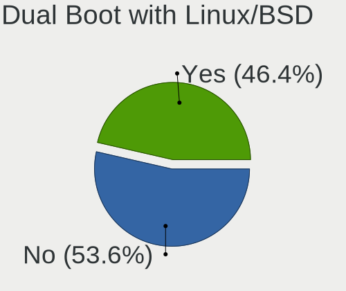
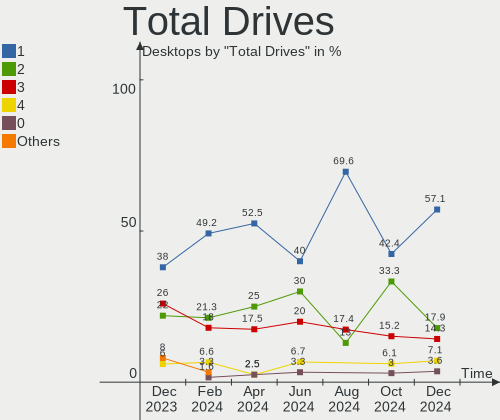
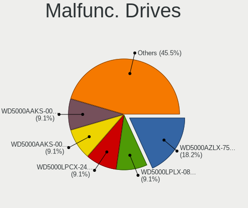
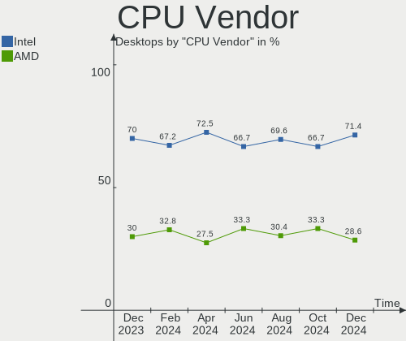
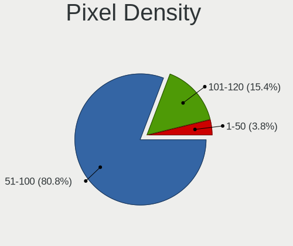
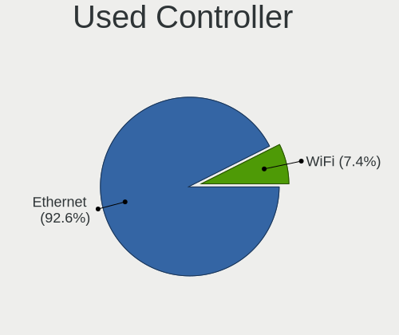
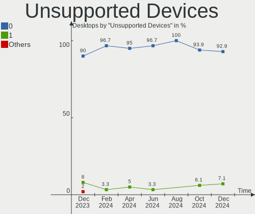

BlackPanther - Hardware Trends (Desktops)
-----------------------------------------

A project to identify most popular hardware characteristics and track their change
over time based on data collected by Linux users at https://Linux-Hardware.org.

Anyone can contribute to this report by the [hw-probe](https://github.com/linuxhw/hw-probe) tool:

    sudo -E hw-probe -all -upload

This report is for one last month. Overall report since the beginning of time: [TestCoverage](https://github.com/linuxhw/TestCoverage)

Period: Sep, 2022.

Contents
--------

* [ System ](#system)
  - [ OS                       ](#os)
  - [ OS Family                ](#os-family)
  - [ Kernel                   ](#kernel)
  - [ Kernel Family            ](#kernel-family)
  - [ Kernel Major Ver.        ](#kernel-major-ver)
  - [ Arch                     ](#arch)
  - [ DE                       ](#de)
  - [ Display Server           ](#display-server)
  - [ Display Manager          ](#display-manager)
  - [ OS Lang                  ](#os-lang)
  - [ Boot Mode                ](#boot-mode)
  - [ Filesystem               ](#filesystem)
  - [ Part. scheme             ](#part-scheme)
  - [ Dual Boot with Linux/BSD ](#dual-boot-with-linuxbsd)
  - [ Dual Boot (Win)          ](#dual-boot-win)

* [ Board ](#board)
  - [ Vendor                   ](#vendor)
  - [ Model                    ](#model)
  - [ Model Family             ](#model-family)
  - [ MFG Year                 ](#mfg-year)
  - [ Form Factor              ](#form-factor)
  - [ Secure Boot              ](#secure-boot)
  - [ Coreboot                 ](#coreboot)
  - [ RAM Size                 ](#ram-size)
  - [ RAM Used                 ](#ram-used)
  - [ Total Drives             ](#total-drives)
  - [ Has CD-ROM               ](#has-cd-rom)
  - [ Has Ethernet             ](#has-ethernet)
  - [ Has WiFi                 ](#has-wifi)
  - [ Has Bluetooth            ](#has-bluetooth)

* [ Location ](#location)
  - [ Country                  ](#country)
  - [ City                     ](#city)

* [ Drives ](#drives)
  - [ Drive Vendor             ](#drive-vendor)
  - [ Drive Model              ](#drive-model)
  - [ HDD Vendor               ](#hdd-vendor)
  - [ SSD Vendor               ](#ssd-vendor)
  - [ Drive Kind               ](#drive-kind)
  - [ Drive Connector          ](#drive-connector)
  - [ Drive Size               ](#drive-size)
  - [ Space Total              ](#space-total)
  - [ Space Used               ](#space-used)
  - [ Malfunc. Drives          ](#malfunc-drives)
  - [ Malfunc. Drive Vendor    ](#malfunc-drive-vendor)
  - [ Malfunc. HDD Vendor      ](#malfunc-hdd-vendor)
  - [ Malfunc. Drive Kind      ](#malfunc-drive-kind)
  - [ Failed Drives            ](#failed-drives)
  - [ Failed Drive Vendor      ](#failed-drive-vendor)
  - [ Drive Status             ](#drive-status)

* [ Storage controller ](#storage-controller)
  - [ Storage Vendor           ](#storage-vendor)
  - [ Storage Model            ](#storage-model)
  - [ Storage Kind             ](#storage-kind)

* [ Processor ](#processor)
  - [ CPU Vendor               ](#cpu-vendor)
  - [ CPU Model                ](#cpu-model)
  - [ CPU Model Family         ](#cpu-model-family)
  - [ CPU Cores                ](#cpu-cores)
  - [ CPU Sockets              ](#cpu-sockets)
  - [ CPU Threads              ](#cpu-threads)
  - [ CPU Op-Modes             ](#cpu-op-modes)
  - [ CPU Microcode            ](#cpu-microcode)
  - [ CPU Microarch            ](#cpu-microarch)

* [ Graphics ](#graphics)
  - [ GPU Vendor               ](#gpu-vendor)
  - [ GPU Model                ](#gpu-model)
  - [ GPU Combo                ](#gpu-combo)
  - [ GPU Driver               ](#gpu-driver)
  - [ GPU Memory               ](#gpu-memory)

* [ Monitor ](#monitor)
  - [ Monitor Vendor           ](#monitor-vendor)
  - [ Monitor Model            ](#monitor-model)
  - [ Monitor Resolution       ](#monitor-resolution)
  - [ Monitor Diagonal         ](#monitor-diagonal)
  - [ Monitor Width            ](#monitor-width)
  - [ Aspect Ratio             ](#aspect-ratio)
  - [ Monitor Area             ](#monitor-area)
  - [ Pixel Density            ](#pixel-density)
  - [ Multiple Monitors        ](#multiple-monitors)

* [ Network ](#network)
  - [ Net Controller Vendor    ](#net-controller-vendor)
  - [ Net Controller Model     ](#net-controller-model)
  - [ Wireless Vendor          ](#wireless-vendor)
  - [ Wireless Model           ](#wireless-model)
  - [ Ethernet Vendor          ](#ethernet-vendor)
  - [ Ethernet Model           ](#ethernet-model)
  - [ Net Controller Kind      ](#net-controller-kind)
  - [ Used Controller          ](#used-controller)
  - [ NICs                     ](#nics)
  - [ IPv6                     ](#ipv6)

* [ Bluetooth ](#bluetooth)
  - [ Bluetooth Vendor         ](#bluetooth-vendor)
  - [ Bluetooth Model          ](#bluetooth-model)

* [ Sound ](#sound)
  - [ Sound Vendor             ](#sound-vendor)
  - [ Sound Model              ](#sound-model)

* [ Memory ](#memory)
  - [ Memory Vendor            ](#memory-vendor)
  - [ Memory Model             ](#memory-model)
  - [ Memory Kind              ](#memory-kind)
  - [ Memory Form Factor       ](#memory-form-factor)
  - [ Memory Size              ](#memory-size)
  - [ Memory Speed             ](#memory-speed)

* [ Printers & scanners ](#printers--scanners)
  - [ Printer Vendor           ](#printer-vendor)
  - [ Printer Model            ](#printer-model)
  - [ Scanner Vendor           ](#scanner-vendor)
  - [ Scanner Model            ](#scanner-model)

* [ Camera ](#camera)
  - [ Camera Vendor            ](#camera-vendor)
  - [ Camera Model             ](#camera-model)

* [ Security ](#security)
  - [ Fingerprint Vendor       ](#fingerprint-vendor)
  - [ Fingerprint Model        ](#fingerprint-model)
  - [ Chipcard Vendor          ](#chipcard-vendor)
  - [ Chipcard Model           ](#chipcard-model)

* [ Unsupported ](#unsupported)
  - [ Unsupported Devices      ](#unsupported-devices)
  - [ Unsupported Device Types ](#unsupported-device-types)

System
------

OS
--

Installed operating systems

| Name              | Desktops | Percent |
|-------------------|----------|---------|
| BlackPanther 18.1 | 10       | 100%    |

OS Family
---------

OS without a version

| Name         | Desktops | Percent |
|--------------|----------|---------|
| BlackPanther | 10       | 100%    |

Kernel
------

Version of the Linux kernel

| Version             | Desktops | Percent |
|---------------------|----------|---------|
| 4.18.16-desktop-1bP | 8        | 80%     |
| 5.6.14-desktop-2bP  | 2        | 20%     |

Kernel Family
-------------

Linux kernel without a distro release

| Version | Desktops | Percent |
|---------|----------|---------|
| 4.18.16 | 8        | 80%     |
| 5.6.14  | 2        | 20%     |

Kernel Major Ver.
-----------------

Linux kernel major version

| Version | Desktops | Percent |
|---------|----------|---------|
| 4.18    | 8        | 80%     |
| 5.6     | 2        | 20%     |

Arch
----

OS architecture (x86_64, i586, etc.)

| Name   | Desktops | Percent |
|--------|----------|---------|
| x86_64 | 10       | 100%    |

DE
--

Desktop Environment

| Name | Desktops | Percent |
|------|----------|---------|
| KDE5 | 10       | 100%    |

Display Server
--------------

X11 or Wayland

| Name | Desktops | Percent |
|------|----------|---------|
| X11  | 10       | 100%    |

Display Manager
---------------

SDDM, LightDM, etc.

| Name | Desktops | Percent |
|------|----------|---------|
| SDDM | 10       | 100%    |

OS Lang
-------

Language

| Lang    | Desktops | Percent |
|---------|----------|---------|
| Unknown | 10       | 100%    |

Boot Mode
---------

EFI or BIOS

| Mode | Desktops | Percent |
|------|----------|---------|
| BIOS | 6        | 60%     |
| EFI  | 4        | 40%     |

Filesystem
----------

Type of filesystem

| Type    | Desktops | Percent |
|---------|----------|---------|
| Overlay | 9        | 90%     |
| Ext4    | 1        | 10%     |

Part. scheme
------------

Scheme of partitioning

| Type | Desktops | Percent |
|------|----------|---------|
| MBR  | 5        | 50%     |
| GPT  | 5        | 50%     |

Dual Boot with Linux/BSD
------------------------

Hosting more than one Linux/BSD

| Dual boot | Desktops | Percent |
|-----------|----------|---------|
| No        | 6        | 60%     |
| Yes       | 4        | 40%     |

Dual Boot (Win)
---------------

Hosting Linux and Windows

| Dual boot | Desktops | Percent |
|-----------|----------|---------|
| Yes       | 8        | 80%     |
| No        | 2        | 20%     |

Board
-----

Vendor
------

Motherboard manufacturer

| Name                | Desktops | Percent |
|---------------------|----------|---------|
| ASUSTek Computer    | 4        | 40%     |
| Gigabyte Technology | 2        | 20%     |
| MSI                 | 1        | 10%     |
| Lenovo              | 1        | 10%     |
| Hewlett-Packard     | 1        | 10%     |
| Fujitsu Siemens     | 1        | 10%     |

Model
-----

Motherboard model

| Name                         | Desktops | Percent |
|------------------------------|----------|---------|
| ASUS PRIME A320M-K           | 2        | 20%     |
| MSI MS-7752                  | 1        | 10%     |
| Lenovo S500 10HS007LHX       | 1        | 10%     |
| HP Compaq 6005 Pro SFF PC    | 1        | 10%     |
| Gigabyte P67A-D3-B3          | 1        | 10%     |
| Gigabyte H61M-S1             | 1        | 10%     |
| Fujitsu Siemens MS-7504VP-PV | 1        | 10%     |
| ASUS V-M3N8200               | 1        | 10%     |
| ASUS P7P55D                  | 1        | 10%     |

Model Family
------------

Motherboard model prefix

| Name                         | Desktops | Percent |
|------------------------------|----------|---------|
| ASUS PRIME                   | 2        | 20%     |
| MSI MS-7752                  | 1        | 10%     |
| Lenovo S500                  | 1        | 10%     |
| HP Compaq                    | 1        | 10%     |
| Gigabyte P67A-D3-B3          | 1        | 10%     |
| Gigabyte H61M-S1             | 1        | 10%     |
| Fujitsu Siemens MS-7504VP-PV | 1        | 10%     |
| ASUS V-M3N8200               | 1        | 10%     |
| ASUS P7P55D                  | 1        | 10%     |

MFG Year
--------

Motherboard manufacture year

| Year | Desktops | Percent |
|------|----------|---------|
| 2009 | 3        | 30%     |
| 2017 | 2        | 20%     |
| 2012 | 2        | 20%     |
| 2018 | 1        | 10%     |
| 2011 | 1        | 10%     |
| 2008 | 1        | 10%     |

Form Factor
-----------

Physical design of the computer

| Name    | Desktops | Percent |
|---------|----------|---------|
| Desktop | 10       | 100%    |

Secure Boot
-----------

Enabled or disabled

| State    | Desktops | Percent |
|----------|----------|---------|
| Disabled | 10       | 100%    |

Coreboot
--------

Have coreboot on board

| Used | Desktops | Percent |
|------|----------|---------|
| No   | 10       | 100%    |

RAM Size
--------

Total RAM memory

| Size in GB | Desktops | Percent |
|------------|----------|---------|
| 3.01-4.0   | 4        | 40%     |
| 4.01-8.0   | 3        | 30%     |
| 8.01-16.0  | 3        | 30%     |

RAM Used
--------

Used RAM memory

| Used GB  | Desktops | Percent |
|----------|----------|---------|
| 0.01-0.5 | 6        | 60%     |
| 0.51-1.0 | 3        | 30%     |
| 1.01-2.0 | 1        | 10%     |

Total Drives
------------

Number of drives on board

| Drives | Desktops | Percent |
|--------|----------|---------|
| 2      | 4        | 40%     |
| 4      | 3        | 30%     |
| 1      | 2        | 20%     |
| 5      | 1        | 10%     |

Has CD-ROM
----------

Has CD-ROM on board

| Presented | Desktops | Percent |
|-----------|----------|---------|
| Yes       | 8        | 80%     |
| No        | 2        | 20%     |

Has Ethernet
------------

Has Ethernet on board

| Presented | Desktops | Percent |
|-----------|----------|---------|
| Yes       | 9        | 90%     |
| No        | 1        | 10%     |

Has WiFi
--------

Has WiFi module

| Presented | Desktops | Percent |
|-----------|----------|---------|
| No        | 6        | 60%     |
| Yes       | 4        | 40%     |

Has Bluetooth
-------------

Has Bluetooth module

| Presented | Desktops | Percent |
|-----------|----------|---------|
| No        | 7        | 70%     |
| Yes       | 3        | 30%     |

Location
--------

Country
-------

Geographic location (country)

| Country  | Desktops | Percent |
|----------|----------|---------|
| Hungary  | 8        | 80%     |
| Portugal | 1        | 10%     |
| Germany  | 1        | 10%     |

City
----

Geographic location (city)

| City        | Desktops | Percent |
|-------------|----------|---------|
| Nagykoros   | 2        | 20%     |
| Budapest    | 2        | 20%     |
| Szekszárd  | 1        | 10%     |
| Niedernberg | 1        | 10%     |
| Hatvan      | 1        | 10%     |
| Debrecen    | 1        | 10%     |
| Bodrog      | 1        | 10%     |
| Amadora     | 1        | 10%     |

Drives
------

Drive Vendor
------------

Hard drive vendors

| Vendor              | Desktops | Drives | Percent |
|---------------------|----------|--------|---------|
| WDC                 | 6        | 9      | 28.57%  |
| Samsung Electronics | 4        | 6      | 19.05%  |
| Hitachi             | 3        | 4      | 14.29%  |
| Gigabyte Technology | 2        | 2      | 9.52%   |
| Toshiba             | 1        | 1      | 4.76%   |
| Seagate             | 1        | 1      | 4.76%   |
| S3SSDE25            | 1        | 1      | 4.76%   |
| LITEON              | 1        | 1      | 4.76%   |
| Kingston            | 1        | 1      | 4.76%   |
| Hewlett-Packard     | 1        | 1      | 4.76%   |

Drive Model
-----------

Hard drive models

| Model                                | Desktops | Percent |
|--------------------------------------|----------|---------|
| WDC WDS240G2G0B-00EPW0 240GB SSD     | 2        | 7.69%   |
| WDC WD15EARS-00MVWB0 1TB             | 2        | 7.69%   |
| Samsung SP2504C 250GB                | 2        | 7.69%   |
| Gigabyte GP-GSTFS31480GNTD 480GB SSD | 2        | 7.69%   |
| WDC WD800JD-75MSA3 80GB              | 1        | 3.85%   |
| WDC WD30EZRZ-00GXCB0 3TB             | 1        | 3.85%   |
| WDC WD30EFRX-68EUZN0 3TB             | 1        | 3.85%   |
| WDC WD20EZRX-00D8PB0 2TB             | 1        | 3.85%   |
| WDC WD10EZEX-00KUWA0 1TB             | 1        | 3.85%   |
| Toshiba MK1637GSX 160GB              | 1        | 3.85%   |
| Seagate ST500DM002-1BD142 500GB      | 1        | 3.85%   |
| Samsung SSD 830 Series 64GB          | 1        | 3.85%   |
| Samsung HD501LJ 500GB                | 1        | 3.85%   |
| Samsung HD154UI 1TB                  | 1        | 3.85%   |
| S3SSDE25 0SL 250GB                   | 1        | 3.85%   |
| LITEON IT LCS-128L9S-HP 128GB SSD    | 1        | 3.85%   |
| Kingston SV300S37A120G 120GB SSD     | 1        | 3.85%   |
| Hitachi HTS543225L9SA00 250GB        | 1        | 3.85%   |
| Hitachi HDT725025VLA380 250GB        | 1        | 3.85%   |
| Hitachi HDS721050CLA660 500GB        | 1        | 3.85%   |
| Hitachi HDP725050GLA360 500GB        | 1        | 3.85%   |
| HP SSD S600 240GB                    | 1        | 3.85%   |

HDD Vendor
----------

Hard disk drive vendors

| Vendor              | Desktops | Drives | Percent |
|---------------------|----------|--------|---------|
| WDC                 | 6        | 7      | 40%     |
| Samsung Electronics | 4        | 4      | 26.67%  |
| Hitachi             | 3        | 4      | 20%     |
| Toshiba             | 1        | 1      | 6.67%   |
| Seagate             | 1        | 1      | 6.67%   |

SSD Vendor
----------

Solid state drive vendors

| Vendor              | Desktops | Drives | Percent |
|---------------------|----------|--------|---------|
| WDC                 | 2        | 2      | 25%     |
| Gigabyte Technology | 2        | 2      | 25%     |
| Samsung Electronics | 1        | 2      | 12.5%   |
| LITEON              | 1        | 1      | 12.5%   |
| Kingston            | 1        | 1      | 12.5%   |
| Hewlett-Packard     | 1        | 1      | 12.5%   |

Drive Kind
----------

HDD or SSD

| Kind    | Desktops | Drives | Percent |
|---------|----------|--------|---------|
| HDD     | 10       | 17     | 58.82%  |
| SSD     | 6        | 9      | 35.29%  |
| Unknown | 1        | 1      | 5.88%   |

Drive Connector
---------------

SATA, SAS, NVMe, etc.

| Type | Desktops | Drives | Percent |
|------|----------|--------|---------|
| SATA | 10       | 26     | 90.91%  |
| SAS  | 1        | 1      | 9.09%   |

Drive Size
----------

Size of hard drive

| Size in TB | Desktops | Drives | Percent |
|------------|----------|--------|---------|
| 0.01-0.5   | 10       | 19     | 62.5%   |
| 0.51-1.0   | 4        | 4      | 25%     |
| 2.01-3.0   | 1        | 2      | 6.25%   |
| 1.01-2.0   | 1        | 1      | 6.25%   |

Space Total
-----------

Amount of disk space available on the file system

| Size in GB | Desktops | Percent |
|------------|----------|---------|
| Unknown    | 9        | 90%     |
| 101-250    | 1        | 10%     |

Space Used
----------

Amount of used disk space

| Used GB | Desktops | Percent |
|---------|----------|---------|
| Unknown | 9        | 90%     |
| 1-20    | 1        | 10%     |

Malfunc. Drives
---------------

Drive models with a malfunction

| Model                             | Desktops | Drives | Percent |
|-----------------------------------|----------|--------|---------|
| WDC WD15EARS-00MVWB0 1TB          | 2        | 2      | 28.57%  |
| Samsung Electronics SP2504C 250GB | 2        | 2      | 28.57%  |
| Toshiba MK1637GSX 160GB           | 1        | 1      | 14.29%  |
| Hitachi HTS543225L9SA00 250GB     | 1        | 1      | 14.29%  |
| Hitachi HDT725025VLA380 250GB     | 1        | 1      | 14.29%  |

Malfunc. Drive Vendor
---------------------

Vendors of faulty drives

| Vendor              | Desktops | Drives | Percent |
|---------------------|----------|--------|---------|
| WDC                 | 2        | 2      | 28.57%  |
| Samsung Electronics | 2        | 2      | 28.57%  |
| Hitachi             | 2        | 2      | 28.57%  |
| Toshiba             | 1        | 1      | 14.29%  |

Malfunc. HDD Vendor
-------------------

Vendors of faulty HDD drives

| Vendor              | Desktops | Drives | Percent |
|---------------------|----------|--------|---------|
| WDC                 | 2        | 2      | 28.57%  |
| Samsung Electronics | 2        | 2      | 28.57%  |
| Hitachi             | 2        | 2      | 28.57%  |
| Toshiba             | 1        | 1      | 14.29%  |

Malfunc. Drive Kind
-------------------

Kinds of faulty drives

| Kind | Desktops | Drives | Percent |
|------|----------|--------|---------|
| HDD  | 5        | 7      | 100%    |

Failed Drives
-------------

Failed drive models

Zero info for selected period =(

Failed Drive Vendor
-------------------

Failed drive vendors

Zero info for selected period =(

Drive Status
------------

Number of failed and malfunc. drives

| Status   | Desktops | Drives | Percent |
|----------|----------|--------|---------|
| Works    | 9        | 19     | 60%     |
| Malfunc  | 5        | 7      | 33.33%  |
| Detected | 1        | 1      | 6.67%   |

Storage controller
------------------

Storage Vendor
--------------

Storage controller vendors

| Vendor             | Desktops | Percent |
|--------------------|----------|---------|
| Intel              | 5        | 45.45%  |
| AMD                | 3        | 27.27%  |
| Nvidia             | 2        | 18.18%  |
| JMicron Technology | 1        | 9.09%   |

Storage Model
-------------

Storage controller models

| Model                                                                                   | Desktops | Percent |
|-----------------------------------------------------------------------------------------|----------|---------|
| Intel 6 Series/C200 Series Chipset Family Desktop SATA Controller (IDE mode, ports 4-5) | 2        | 11.76%  |
| Intel 6 Series/C200 Series Chipset Family Desktop SATA Controller (IDE mode, ports 0-3) | 2        | 11.76%  |
| AMD FCH SATA Controller [AHCI mode]                                                     | 2        | 11.76%  |
| AMD FCH SATA Controller D                                                               | 2        | 11.76%  |
| Nvidia MCP78S [GeForce 8200] SATA Controller (non-AHCI mode)                            | 1        | 5.88%   |
| Nvidia MCP78S [GeForce 8200] IDE                                                        | 1        | 5.88%   |
| Nvidia GeForce 7100/nForce 630i SATA                                                    | 1        | 5.88%   |
| JMicron JMB363 SATA/IDE Controller                                                      | 1        | 5.88%   |
| Intel 8 Series/C220 Series Chipset Family 6-port SATA Controller 1 [AHCI mode]          | 1        | 5.88%   |
| Intel 7 Series/C210 Series Chipset Family 6-port SATA Controller [AHCI mode]            | 1        | 5.88%   |
| Intel 5 Series/3400 Series Chipset 4 port SATA IDE Controller                           | 1        | 5.88%   |
| Intel 5 Series/3400 Series Chipset 2 port SATA IDE Controller                           | 1        | 5.88%   |
| AMD SB7x0/SB8x0/SB9x0 SATA Controller [AHCI mode]                                       | 1        | 5.88%   |

Storage Kind
------------

Kind of storage controller (IDE, SATA, NVMe, SAS, ...)

| Kind | Desktops | Percent |
|------|----------|---------|
| SATA | 6        | 60%     |
| IDE  | 4        | 40%     |

Processor
---------

CPU Vendor
----------

Processor vendors

| Vendor | Desktops | Percent |
|--------|----------|---------|
| Intel  | 6        | 60%     |
| AMD    | 4        | 40%     |

CPU Model
---------

Processor models

| Model                                          | Desktops | Percent |
|------------------------------------------------|----------|---------|
| Intel Core i3-3220 CPU @ 3.30GHz               | 2        | 20%     |
| AMD A10-9700 RADEON R7, 10 COMPUTE CORES 4C+6G | 2        | 20%     |
| Intel Core i5-2300 CPU @ 2.80GHz               | 1        | 10%     |
| Intel Core i5 CPU 650 @ 3.20GHz                | 1        | 10%     |
| Intel Core i3-4170 CPU @ 3.70GHz               | 1        | 10%     |
| Intel Core 2 Quad CPU Q8200 @ 2.33GHz          | 1        | 10%     |
| AMD Athlon II X2 220 Processor                 | 1        | 10%     |
| AMD Athlon 64 X2 Dual Core Processor 5000+     | 1        | 10%     |

CPU Model Family
----------------

Processor model prefix

| Model             | Desktops | Percent |
|-------------------|----------|---------|
| Intel Core i3     | 3        | 30%     |
| Intel Core i5     | 2        | 20%     |
| AMD A10           | 2        | 20%     |
| Intel Core 2 Quad | 1        | 10%     |
| AMD Athlon II X2  | 1        | 10%     |
| AMD Athlon 64 X2  | 1        | 10%     |

CPU Cores
---------

Number of processor cores

| Number | Desktops | Percent |
|--------|----------|---------|
| 2      | 8        | 80%     |
| 4      | 2        | 20%     |

CPU Sockets
-----------

Number of sockets

| Number | Desktops | Percent |
|--------|----------|---------|
| 1      | 10       | 100%    |

CPU Threads
-----------

Threads per core (Hyper-Threading)

| Number | Desktops | Percent |
|--------|----------|---------|
| 2      | 6        | 60%     |
| 1      | 4        | 40%     |

CPU Op-Modes
------------

CPU Operation Modes (32-bit, 64-bit)

| Op mode        | Desktops | Percent |
|----------------|----------|---------|
| 32-bit, 64-bit | 10       | 100%    |

CPU Microcode
-------------

Microcode number

| Number     | Desktops | Percent |
|------------|----------|---------|
| 0x306a9    | 2        | 20%     |
| 0x06006118 | 2        | 20%     |
| 0x306c3    | 1        | 10%     |
| 0x206a7    | 1        | 10%     |
| 0x20652    | 1        | 10%     |
| 0x10677    | 1        | 10%     |
| 0x010000c8 | 1        | 10%     |
| Unknown    | 1        | 10%     |

CPU Microarch
-------------

Microarchitecture

| Name        | Desktops | Percent |
|-------------|----------|---------|
| IvyBridge   | 2        | 20%     |
| Excavator   | 2        | 20%     |
| Westmere    | 1        | 10%     |
| SandyBridge | 1        | 10%     |
| Penryn      | 1        | 10%     |
| K8 Hammer   | 1        | 10%     |
| K10         | 1        | 10%     |
| Haswell     | 1        | 10%     |

Graphics
--------

GPU Vendor
----------

Vendors of graphics cards

| Vendor           | Desktops | Percent |
|------------------|----------|---------|
| AMD              | 4        | 40%     |
| Nvidia           | 3        | 30%     |
| ATI Technologies | 2        | 20%     |
| Intel            | 1        | 10%     |

GPU Model
---------

Graphics card models

| Model                                                                     | Desktops | Percent |
|---------------------------------------------------------------------------|----------|---------|
| AMD Cedar [Radeon HD 5000/6000/7350/8350 Series]                          | 3        | 27.27%  |
| ATI Technologies Wani [Radeon R5/R6/R7 Graphics]                          | 2        | 18.18%  |
| Nvidia GK107 [GeForce GTX 650]                                            | 1        | 9.09%   |
| Nvidia G84 [GeForce 8600 GS]                                              | 1        | 9.09%   |
| Nvidia C73 [GeForce 7100 / nForce 630i]                                   | 1        | 9.09%   |
| Intel 4th Generation Core Processor Family Integrated Graphics Controller | 1        | 9.09%   |
| AMD RS880 [Radeon HD 4200]                                                | 1        | 9.09%   |
| AMD Redwood XT [Radeon HD 5670/5690/5730]                                 | 1        | 9.09%   |

GPU Combo
---------

Combinations of graphics cards

| Name       | Desktops | Percent |
|------------|----------|---------|
| 1 x AMD    | 5        | 50%     |
| 1 x Nvidia | 3        | 30%     |
| 2 x AMD    | 1        | 10%     |
| 1 x Intel  | 1        | 10%     |

GPU Driver
----------

Free vs proprietary

| Driver  | Desktops | Percent |
|---------|----------|---------|
| Free    | 9        | 90%     |
| Unknown | 1        | 10%     |

GPU Memory
----------

Total video memory

| Size in GB | Desktops | Percent |
|------------|----------|---------|
| 0.51-1.0   | 6        | 60%     |
| 0.01-0.5   | 3        | 30%     |
| Unknown    | 1        | 10%     |

Monitor
-------

Monitor Vendor
--------------

Monitor vendors

| Vendor               | Desktops | Percent |
|----------------------|----------|---------|
| Goldstar             | 4        | 44.44%  |
| Ancor Communications | 2        | 22.22%  |
| Vestel Elektronik    | 1        | 11.11%  |
| Samsung Electronics  | 1        | 11.11%  |
| Philips              | 1        | 11.11%  |

Monitor Model
-------------

Monitor models

| Model                                                                 | Desktops | Percent |
|-----------------------------------------------------------------------|----------|---------|
| Ancor Communications ASUS PG191 ACI19B1 1280x1024 376x301mm 19.0-inch | 2        | 22.22%  |
| Vestel Elektronik 24W_LCD_TV VES3700 1920x1080 706x398mm 31.9-inch    | 1        | 11.11%  |
| Samsung Electronics S22C150 SAM0AE5 1920x1080 477x268mm 21.5-inch     | 1        | 11.11%  |
| Philips 273ELH PHLC07D 1920x1080 598x336mm 27.0-inch                  | 1        | 11.11%  |
| Goldstar W2442 GSM56CC 1920x1080 531x299mm 24.0-inch                  | 1        | 11.11%  |
| Goldstar L225W GSM5662 1680x1050 474x296mm 22.0-inch                  | 1        | 11.11%  |
| Goldstar L204WT GSM4E48 1680x1050 434x270mm 20.1-inch                 | 1        | 11.11%  |
| Goldstar E2350 GSM5790 1920x1080 510x290mm 23.1-inch                  | 1        | 11.11%  |

Monitor Resolution
------------------

Monitor screen resolution

| Resolution         | Desktops | Percent |
|--------------------|----------|---------|
| 1920x1080 (FHD)    | 4        | 44.44%  |
| 1680x1050 (WSXGA+) | 2        | 22.22%  |
| 1280x1024 (SXGA)   | 2        | 22.22%  |
| 3840x2160 (4K)     | 1        | 11.11%  |

Monitor Diagonal
----------------

Diagonal size in inches

| Inches | Desktops | Percent |
|--------|----------|---------|
| 19     | 2        | 22.22%  |
| 84     | 1        | 11.11%  |
| 27     | 1        | 11.11%  |
| 24     | 1        | 11.11%  |
| 23     | 1        | 11.11%  |
| 22     | 1        | 11.11%  |
| 21     | 1        | 11.11%  |
| 20     | 1        | 11.11%  |

Monitor Width
-------------

Physical width

| Width in mm | Desktops | Percent |
|-------------|----------|---------|
| 501-600     | 3        | 33.33%  |
| 401-500     | 3        | 33.33%  |
| 351-400     | 2        | 22.22%  |
| 1501-2000   | 1        | 11.11%  |

Aspect Ratio
------------

Proportional relationship between the width and the height

| Ratio | Desktops | Percent |
|-------|----------|---------|
| 16/9  | 5        | 55.56%  |
| 6/5   | 2        | 22.22%  |
| 16/10 | 2        | 22.22%  |

Monitor Area
------------

Area in inch²

| Area in inch² | Desktops | Percent |
|----------------|----------|---------|
| 201-250        | 4        | 44.44%  |
| 151-200        | 3        | 33.33%  |
| More than 1000 | 1        | 11.11%  |
| 301-350        | 1        | 11.11%  |

Pixel Density
-------------

Pixels per inch

| Density | Desktops | Percent |
|---------|----------|---------|
| 51-100  | 8        | 88.89%  |
| 101-120 | 1        | 11.11%  |

Multiple Monitors
-----------------

Total monitors connected

| Total | Desktops | Percent |
|-------|----------|---------|
| 1     | 9        | 90%     |
| 2     | 1        | 10%     |

Network
-------

Net Controller Vendor
---------------------

Controller vendors

| Vendor                | Desktops | Percent |
|-----------------------|----------|---------|
| Realtek Semiconductor | 7        | 63.64%  |
| TP-Link               | 1        | 9.09%   |
| Nvidia                | 1        | 9.09%   |
| Huawei Technologies   | 1        | 9.09%   |
| Broadcom              | 1        | 9.09%   |

Net Controller Model
--------------------

Controller models

| Model                                                             | Desktops | Percent |
|-------------------------------------------------------------------|----------|---------|
| Realtek RTL8111/8168/8411 PCI Express Gigabit Ethernet Controller | 6        | 46.15%  |
| TP-Link TL-WN722N v2/v3 [Realtek RTL8188EUS]                      | 1        | 7.69%   |
| Realtek RTL8821AE 802.11ac PCIe Wireless Network Adapter          | 1        | 7.69%   |
| Realtek RTL8188EE Wireless Network Adapter                        | 1        | 7.69%   |
| Realtek RTL8169 PCI Gigabit Ethernet Controller                   | 1        | 7.69%   |
| Nvidia MCP73 Ethernet                                             | 1        | 7.69%   |
| Huawei E353/E3131                                                 | 1        | 7.69%   |
| Broadcom NetXtreme BCM5761 Gigabit Ethernet PCIe                  | 1        | 7.69%   |

Wireless Vendor
---------------

Wireless vendors

| Vendor                | Desktops | Percent |
|-----------------------|----------|---------|
| Realtek Semiconductor | 2        | 66.67%  |
| TP-Link               | 1        | 33.33%  |

Wireless Model
--------------

Wireless models

| Model                                                    | Desktops | Percent |
|----------------------------------------------------------|----------|---------|
| TP-Link TL-WN722N v2/v3 [Realtek RTL8188EUS]             | 1        | 33.33%  |
| Realtek RTL8821AE 802.11ac PCIe Wireless Network Adapter | 1        | 33.33%  |
| Realtek RTL8188EE Wireless Network Adapter               | 1        | 33.33%  |

Ethernet Vendor
---------------

Ethernet vendors

| Vendor                | Desktops | Percent |
|-----------------------|----------|---------|
| Realtek Semiconductor | 7        | 70%     |
| Nvidia                | 1        | 10%     |
| Huawei Technologies   | 1        | 10%     |
| Broadcom              | 1        | 10%     |

Ethernet Model
--------------

Ethernet models

| Model                                                             | Desktops | Percent |
|-------------------------------------------------------------------|----------|---------|
| Realtek RTL8111/8168/8411 PCI Express Gigabit Ethernet Controller | 6        | 60%     |
| Realtek RTL8169 PCI Gigabit Ethernet Controller                   | 1        | 10%     |
| Nvidia MCP73 Ethernet                                             | 1        | 10%     |
| Huawei E353/E3131                                                 | 1        | 10%     |
| Broadcom NetXtreme BCM5761 Gigabit Ethernet PCIe                  | 1        | 10%     |

Net Controller Kind
-------------------

Ethernet, WiFi or modem

| Kind     | Desktops | Percent |
|----------|----------|---------|
| Ethernet | 9        | 75%     |
| WiFi     | 3        | 25%     |

Used Controller
---------------

Currently used network controller

| Kind     | Desktops | Percent |
|----------|----------|---------|
| Ethernet | 8        | 80%     |
| WiFi     | 2        | 20%     |

NICs
----

Total network controllers on board

| Total | Desktops | Percent |
|-------|----------|---------|
| 1     | 7        | 70%     |
| 2     | 2        | 20%     |
| 0     | 1        | 10%     |

IPv6
----

IPv6 vs IPv4

| Used | Desktops | Percent |
|------|----------|---------|
| No   | 6        | 60%     |
| Yes  | 4        | 40%     |

Bluetooth
---------

Bluetooth Vendor
----------------

Controller vendors

| Vendor                  | Desktops | Percent |
|-------------------------|----------|---------|
| Cambridge Silicon Radio | 2        | 66.67%  |
| Realtek Semiconductor   | 1        | 33.33%  |

Bluetooth Model
---------------

Controller models

| Model                                               | Desktops | Percent |
|-----------------------------------------------------|----------|---------|
| Cambridge Silicon Radio Bluetooth Dongle (HCI mode) | 2        | 66.67%  |
| Realtek Bluetooth Radio                             | 1        | 33.33%  |

Sound
-----

Sound Vendor
------------

Sound card vendors

| Vendor           | Desktops | Percent |
|------------------|----------|---------|
| AMD              | 6        | 37.5%   |
| Intel            | 5        | 31.25%  |
| Nvidia           | 3        | 18.75%  |
| ATI Technologies | 2        | 12.5%   |

Sound Model
-----------

Sound card models

| Model                                                                      | Desktops | Percent |
|----------------------------------------------------------------------------|----------|---------|
| AMD Cedar HDMI Audio [Radeon HD 5400/6300/7300 Series]                     | 3        | 16.67%  |
| Intel 6 Series/C200 Series Chipset Family High Definition Audio Controller | 2        | 11.11%  |
| ATI Technologies Kabini HDMI/DP Audio                                      | 2        | 11.11%  |
| AMD Family 15h (Models 60h-6fh) Audio Controller                           | 2        | 11.11%  |
| Nvidia MCP73 High Definition Audio                                         | 1        | 5.56%   |
| Nvidia MCP72XE/MCP72P/MCP78U/MCP78S High Definition Audio                  | 1        | 5.56%   |
| Nvidia GK107 HDMI Audio Controller                                         | 1        | 5.56%   |
| Intel Xeon E3-1200 v3/4th Gen Core Processor HD Audio Controller           | 1        | 5.56%   |
| Intel 8 Series/C220 Series Chipset High Definition Audio Controller        | 1        | 5.56%   |
| Intel 7 Series/C216 Chipset Family High Definition Audio Controller        | 1        | 5.56%   |
| Intel 5 Series/3400 Series Chipset High Definition Audio                   | 1        | 5.56%   |
| AMD SBx00 Azalia (Intel HDA)                                               | 1        | 5.56%   |
| AMD Redwood HDMI Audio [Radeon HD 5000 Series]                             | 1        | 5.56%   |

Memory
------

Memory Vendor
-------------

Memory module vendors

| Vendor              | Desktops | Percent |
|---------------------|----------|---------|
| Unknown             | 3        | 23.08%  |
| Kingston            | 3        | 23.08%  |
| SK hynix            | 2        | 15.38%  |
| Crucial             | 2        | 15.38%  |
| Samsung Electronics | 1        | 7.69%   |
| Micron Technology   | 1        | 7.69%   |
| G.Skill             | 1        | 7.69%   |

Memory Model
------------

Memory module models

| Model                                                    | Desktops | Percent |
|----------------------------------------------------------|----------|---------|
| Crucial RAM CT4G4DFS824A.M8FB 4096MB DIMM DDR4 2400MT/s  | 2        | 12.5%   |
| Crucial RAM CT4G4DFS824A.C8FBD2 4GB DIMM DDR4 2733MT/s   | 2        | 12.5%   |
| Unknown RAM Module 4096MB DIMM DDR 1333MT/s              | 1        | 6.25%   |
| Unknown RAM Module 2048MB DIMM DDR 1333MT/s              | 1        | 6.25%   |
| Unknown RAM Module 2048MB DIMM 1333MT/s                  | 1        | 6.25%   |
| Unknown RAM Module 1024MB DIMM DDR2 667MT/s              | 1        | 6.25%   |
| SK hynix RAM HMT325U6CFR8C-H9 2048MB DIMM DDR3 1600MT/s  | 1        | 6.25%   |
| SK hynix RAM HMT125U6DFR8C-H9 2048MB DIMM DDR3 1333MT/s  | 1        | 6.25%   |
| Samsung RAM M3 78T5663QZ3-CF7 2048MB DIMM SDRAM          | 1        | 6.25%   |
| Micron RAM 8JTF25664AZ-1G4M1 2048MB DIMM DDR3 1333MT/s   | 1        | 6.25%   |
| Kingston RAM KHX1600C9D3/4GX 4GB DIMM DDR3 2400MT/s      | 1        | 6.25%   |
| Kingston RAM 99U5595-005.A00LF 2048MB DIMM DDR3 1334MT/s | 1        | 6.25%   |
| Kingston RAM 9905402-516.A00LF 2048MB DIMM DDR3 1333MT/s | 1        | 6.25%   |
| G.Skill RAM F3-12800CL9-4GBRL 4GB DIMM DDR3 1866MT/s     | 1        | 6.25%   |

Memory Kind
-----------

Memory module kinds

| Kind    | Desktops | Percent |
|---------|----------|---------|
| DDR3    | 4        | 40%     |
| DDR4    | 2        | 20%     |
| SDRAM   | 1        | 10%     |
| DDR2    | 1        | 10%     |
| DDR     | 1        | 10%     |
| Unknown | 1        | 10%     |

Memory Form Factor
------------------

Physical design of the memory module

| Name | Desktops | Percent |
|------|----------|---------|
| DIMM | 10       | 100%    |

Memory Size
-----------

Memory module size

| Size | Desktops | Percent |
|------|----------|---------|
| 2048 | 6        | 50%     |
| 4096 | 5        | 41.67%  |
| 1024 | 1        | 8.33%   |

Memory Speed
------------

Memory module speed

| Speed | Desktops | Percent |
|-------|----------|---------|
| 1333  | 4        | 28.57%  |
| 2400  | 3        | 21.43%  |
| 2733  | 2        | 14.29%  |
| 1866  | 1        | 7.14%   |
| 1639  | 1        | 7.14%   |
| 1600  | 1        | 7.14%   |
| 1334  | 1        | 7.14%   |
| 667   | 1        | 7.14%   |

Printers & scanners
-------------------

Printer Vendor
--------------

Printer device vendors

Zero info for selected period =(

Printer Model
-------------

Printer device models

Zero info for selected period =(

Scanner Vendor
--------------

Scanner device vendors

Zero info for selected period =(

Scanner Model
-------------

Scanner device models

Zero info for selected period =(

Camera
------

Camera Vendor
-------------

Camera device vendors

| Vendor                      | Desktops | Percent |
|-----------------------------|----------|---------|
| KYE Systems (Mouse Systems) | 2        | 50%     |
| Microsoft                   | 1        | 25%     |
| Microdia                    | 1        | 25%     |

Camera Model
------------

Camera device models

| Model                                     | Desktops | Percent |
|-------------------------------------------|----------|---------|
| KYE Systems (Mouse Systems) FaceCam 1000X | 2        | 50%     |
| Microsoft LifeCam VX-700                  | 1        | 25%     |
| Microdia Sonix USB 2.0 Camera             | 1        | 25%     |

Security
--------

Fingerprint Vendor
------------------

Fingerprint sensor vendors

Zero info for selected period =(

Fingerprint Model
-----------------

Fingerprint sensor models

Zero info for selected period =(

Chipcard Vendor
---------------

Chipcard module vendors

Zero info for selected period =(

Chipcard Model
--------------

Chipcard module models

Zero info for selected period =(

Unsupported
-----------

Unsupported Devices
-------------------

Total unsupported devices on board

| Total | Desktops | Percent |
|-------|----------|---------|
| 0     | 8        | 80%     |
| 1     | 2        | 20%     |

Unsupported Device Types
------------------------

Types of unsupported devices

| Type          | Desktops | Percent |
|---------------|----------|---------|
| Graphics card | 1        | 50%     |
| Card reader   | 1        | 50%     |

