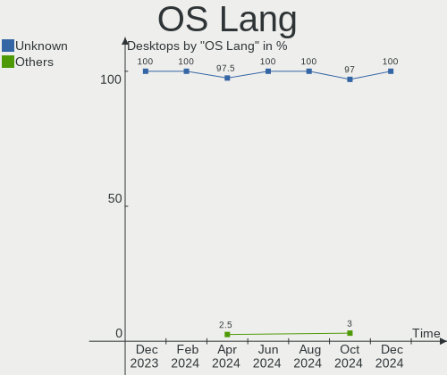
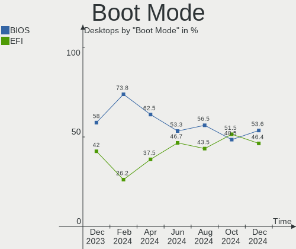
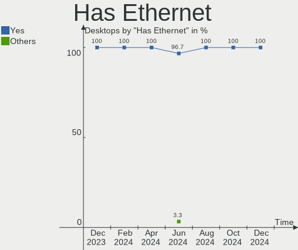
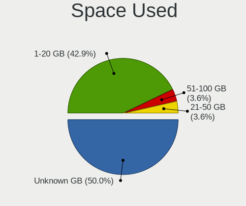
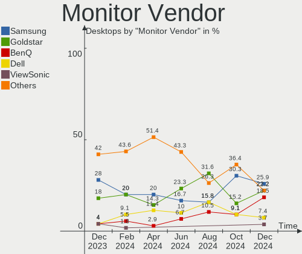

BlackPanther Hardware Trends (Desktop)
--------------------------------------

A project to identify most popular hardware characteristics and track their change
over time based on data collected by BlackPanther users at https://Linux-Hardware.org.

Anyone can contribute to the study by uploading probes of their computers by
the [hw-probe](https://github.com/linuxhw/hw-probe) tool:

    sudo -E hw-probe -all -upload

Full-feature report is available here: https://linux-hardware.org/?view=trends&formfactor=desktop

Period: Dec, 2020.

Contents
--------

- [ OS                       ](#os)
- [ OS Family                ](#os-family)
- [ Kernel                   ](#kernel)
- [ Kernel Family            ](#kernel-family)
- [ Kernel Major Ver.        ](#kernel-major-ver)
- [ Arch                     ](#arch)
- [ DE                       ](#de)
- [ Display Server           ](#display-server)
- [ Display Manager          ](#display-manager)
- [ OS Lang                  ](#os-lang)
- [ Boot Mode                ](#boot-mode)
- [ Filesystem               ](#filesystem)
- [ Part. scheme             ](#part-scheme)
- [ Dual Boot with Linux/BSD ](#dual-boot-with-linux/bsd)
- [ Dual Boot (Win)          ](#dual-boot-win)
- [ Country                  ](#country)
- [ City                     ](#city)
- [ Vendor                   ](#vendor)
- [ Model                    ](#model)
- [ Model Family             ](#model-family)
- [ MFG Year                 ](#mfg-year)
- [ Form Factor              ](#form-factor)
- [ Secure Boot              ](#secure-boot)
- [ Coreboot                 ](#coreboot)
- [ RAM Size                 ](#ram-size)
- [ RAM Used                 ](#ram-used)
- [ Has CD-ROM               ](#has-cd-rom)
- [ Total Drives             ](#total-drives)
- [ Has Ethernet             ](#has-ethernet)
- [ Drive Vendor             ](#drive-vendor)
- [ Drive Model              ](#drive-model)
- [ HDD Vendor               ](#hdd-vendor)
- [ SSD Vendor               ](#ssd-vendor)
- [ Drive Kind               ](#drive-kind)
- [ Drive Connector          ](#drive-connector)
- [ Drive Size               ](#drive-size)
- [ Space Total              ](#space-total)
- [ Space Used               ](#space-used)
- [ Malfunc. Drives          ](#malfunc-drives)
- [ Malfunc. Drive Vendor    ](#malfunc-drive-vendor)
- [ Malfunc. HDD Vendor      ](#malfunc-hdd-vendor)
- [ Malfunc. Drive Kind      ](#malfunc-drive-kind)
- [ Failed Drives            ](#failed-drives)
- [ Failed Drive Vendor      ](#failed-drive-vendor)
- [ Drive Status             ](#drive-status)
- [ Storage Vendor           ](#storage-vendor)
- [ Storage Model            ](#storage-model)
- [ Storage Kind             ](#storage-kind)
- [ CPU Vendor               ](#cpu-vendor)
- [ CPU Model                ](#cpu-model)
- [ CPU Model Family         ](#cpu-model-family)
- [ CPU Cores                ](#cpu-cores)
- [ CPU Sockets              ](#cpu-sockets)
- [ CPU Threads              ](#cpu-threads)
- [ CPU Op-Modes             ](#cpu-op-modes)
- [ CPU Microcode            ](#cpu-microcode)
- [ CPU Microarch            ](#cpu-microarch)
- [ GPU Vendor               ](#gpu-vendor)
- [ GPU Model                ](#gpu-model)
- [ GPU Combo                ](#gpu-combo)
- [ GPU Driver               ](#gpu-driver)
- [ GPU Memory               ](#gpu-memory)
- [ Monitor Vendor           ](#monitor-vendor)
- [ Monitor Model            ](#monitor-model)
- [ Monitor Resolution       ](#monitor-resolution)
- [ Monitor Diagonal         ](#monitor-diagonal)
- [ Monitor Width            ](#monitor-width)
- [ Aspect Ratio             ](#aspect-ratio)
- [ Monitor Area             ](#monitor-area)
- [ Pixel Density            ](#pixel-density)
- [ Multiple Monitors        ](#multiple-monitors)
- [ Net Controller Vendor    ](#net-controller-vendor)
- [ Net Controller Model     ](#net-controller-model)
- [ Wireless Vendor          ](#wireless-vendor)
- [ Wireless Model           ](#wireless-model)
- [ Ethernet Vendor          ](#ethernet-vendor)
- [ Ethernet Model           ](#ethernet-model)
- [ Net Controller Kind      ](#net-controller-kind)
- [ Used Controller          ](#used-controller)
- [ NICs                     ](#nics)
- [ Memory Vendor            ](#memory-vendor)
- [ Memory Model             ](#memory-model)
- [ Memory Kind              ](#memory-kind)
- [ Memory Form Factor       ](#memory-form-factor)
- [ Memory Size              ](#memory-size)
- [ Memory Speed             ](#memory-speed)
- [ Sound Vendor             ](#sound-vendor)
- [ Sound Model              ](#sound-model)
- [ Camera Vendor            ](#camera-vendor)
- [ Camera Model             ](#camera-model)
- [ Fingerprint Vendor       ](#fingerprint-vendor)
- [ Fingerprint Model        ](#fingerprint-model)
- [ Chipcard Vendor          ](#chipcard-vendor)
- [ Chipcard Model           ](#chipcard-model)
- [ Printer Vendor           ](#printer-vendor)
- [ Printer Model            ](#printer-model)
- [ Scanner Vendor           ](#scanner-vendor)
- [ Scanner Model            ](#scanner-model)
- [ Bluetooth Vendor         ](#bluetooth-vendor)
- [ Bluetooth Model          ](#bluetooth-model)
- [ Unsupported Devices      ](#unsupported-devices)
- [ Unsupported Device Types ](#unsupported-device-types)

OS
--

Installed operating systems

| Name              | Desktops | Percent |
|-------------------|----------|---------|
| BlackPanther 18.1 | 100      | 95.24%  |
| BlackPanther 16.2 | 5        | 4.76%   |

OS Family
---------

OS without a version

| Name         | Desktops | Percent |
|--------------|----------|---------|
| BlackPanther | 105      | 100%    |

Kernel
------

Version of the Linux kernel

| Version                | Desktops | Percent |
|------------------------|----------|---------|
| 4.18.16-desktop-1bP    | 95       | 90.48%  |
| 5.6.14-desktop-2bP     | 5        | 4.76%   |
| 4.9.20-desktop-pae-1bP | 3        | 2.86%   |
| 5.6.14-server-2bP      | 1        | 0.95%   |
| 4.7.0-desktop-1bP      | 1        | 0.95%   |

Kernel Family
-------------

Linux kernel without a distro release

| Version | Desktops | Percent |
|---------|----------|---------|
| 4.18.16 | 95       | 90.48%  |
| 5.6.14  | 6        | 5.71%   |
| 4.9.20  | 3        | 2.86%   |
| 4.7.0   | 1        | 0.95%   |

Kernel Major Ver.
-----------------

Linux kernel major version

| Version | Desktops | Percent |
|---------|----------|---------|
| 4.18    | 95       | 90.48%  |
| 5.6     | 6        | 5.71%   |
| 4.9     | 3        | 2.86%   |
| 4.7     | 1        | 0.95%   |

Arch
----

OS architecture (x86_64, i586, etc.)

| Name   | Desktops | Percent |
|--------|----------|---------|
| x86_64 | 100      | 95.24%  |
| i686   | 4        | 3.81%   |
| unknow | 1        | 0.95%   |

DE
--

Desktop Environment

| Name    | Desktops | Percent |
|---------|----------|---------|
| KDE5    | 104      | 99.05%  |
| Unknown | 1        | 0.95%   |

Display Server
--------------

X11 or Wayland

| Name | Desktops | Percent |
|------|----------|---------|
| X11  | 105      | 100%    |

Display Manager
---------------

SDDM, LightDM, etc.

| Name    | Desktops | Percent |
|---------|----------|---------|
| SDDM    | 104      | 99.05%  |
| Unknown | 1        | 0.95%   |

OS Lang
-------

Language

| Lang    | Desktops | Percent |
|---------|----------|---------|
| Unknown | 104      | 99.05%  |
| hu_HU   | 1        | 0.95%   |

Boot Mode
---------

EFI or BIOS

| Mode | Desktops | Percent |
|------|----------|---------|
| BIOS | 83       | 79.05%  |
| EFI  | 22       | 20.95%  |

Filesystem
----------

Type of filesystem

| Type    | Desktops | Percent |
|---------|----------|---------|
| Overlay | 95       | 90.48%  |
| Ext4    | 9        | 8.57%   |
| Unknown | 1        | 0.95%   |

Part. scheme
------------

Scheme of partitioning

| Type    | Desktops | Percent |
|---------|----------|---------|
| MBR     | 70       | 66.67%  |
| GPT     | 34       | 32.38%  |
| Unknown | 1        | 0.95%   |

Dual Boot with Linux/BSD
------------------------

Hosting more than one Linux/BSD

| Dual boot | Desktops | Percent |
|-----------|----------|---------|
| Yes       | 56       | 53.33%  |
| No        | 49       | 46.67%  |

Dual Boot (Win)
---------------

Hosting Linux and Windows

| Dual boot | Desktops | Percent |
|-----------|----------|---------|
| Yes       | 62       | 59.05%  |
| No        | 43       | 40.95%  |

Country
-------

Geographic location (country)

| Country      | Desktops | Percent |
|--------------|----------|---------|
| Hungary      | 80       | 76.19%  |
| Ukraine      | 2        | 1.9%    |
| Slovakia     | 2        | 1.9%    |
| Serbia       | 2        | 1.9%    |
| Romania      | 2        | 1.9%    |
| Italy        | 2        | 1.9%    |
| France       | 2        | 1.9%    |
| Brazil       | 2        | 1.9%    |
| USA          | 1        | 0.95%   |
| Uruguay      | 1        | 0.95%   |
| Turkey       | 1        | 0.95%   |
| Spain        | 1        | 0.95%   |
| South Africa | 1        | 0.95%   |
| Philippines  | 1        | 0.95%   |
| India        | 1        | 0.95%   |
| Germany      | 1        | 0.95%   |
| Finland      | 1        | 0.95%   |
| Egypt        | 1        | 0.95%   |
| Colombia     | 1        | 0.95%   |

City
----

Geographic location (city)

| City              | Desktops | Percent |
|-------------------|----------|---------|
| Budapest          | 24       | 22.86%  |
| Karcag            | 4        | 3.81%   |
| Székesfehérvár | 3        | 2.86%   |
| Miskolc           | 3        | 2.86%   |
| Győr             | 3        | 2.86%   |
| Debrecen          | 3        | 2.86%   |
| Békéscsaba      | 3        | 2.86%   |
| Uzhhorod          | 2        | 1.9%    |
| Tiszaujvaros      | 2        | 1.9%    |
| Tatabánya        | 2        | 1.9%    |
| Sarvar            | 2        | 1.9%    |
| Orbottyan         | 2        | 1.9%    |
| Gödöllő        | 2        | 1.9%    |
| Farmos            | 2        | 1.9%    |
| Dunaharaszti      | 2        | 1.9%    |
| Bologna           | 2        | 1.9%    |
| Balassagyarmat    | 2        | 1.9%    |
| Backa Topola      | 2        | 1.9%    |
| Visakhapatnam     | 1        | 0.95%   |
| Veszpremvarsany   | 1        | 0.95%   |
| Torokszentmiklos  | 1        | 0.95%   |
| Tornaľa          | 1        | 0.95%   |
| Timișoara        | 1        | 0.95%   |
| Teresopolis       | 1        | 0.95%   |
| Szombathely       | 1        | 0.95%   |
| Rackeve           | 1        | 0.95%   |
| Pontevedra        | 1        | 0.95%   |
| Paks              | 1        | 0.95%   |
| Oroshaza          | 1        | 0.95%   |
| Nyergesujfalu     | 1        | 0.95%   |
| Novo Gama         | 1        | 0.95%   |
| Nagykoros         | 1        | 0.95%   |
| Mosonmagyaróvár | 1        | 0.95%   |
| Montevideo        | 1        | 0.95%   |
| Mezokovacshaza    | 1        | 0.95%   |
| Lenexa            | 1        | 0.95%   |
| Le Val-dAjol      | 1        | 0.95%   |
| Kompolt           | 1        | 0.95%   |
| Kisvarda          | 1        | 0.95%   |
| Kazincbarcika     | 1        | 0.95%   |
| Johannesburg      | 1        | 0.95%   |
| Izmir             | 1        | 0.95%   |
| Ilmmunster        | 1        | 0.95%   |
| Hodmezovasarhely  | 1        | 0.95%   |
| Hlinik nad Hronom | 1        | 0.95%   |
| Helsinki          | 1        | 0.95%   |
| Hajduszoboszlo    | 1        | 0.95%   |
| Hajduhadhaz       | 1        | 0.95%   |
| Gyomro            | 1        | 0.95%   |
| Fuzesabony        | 1        | 0.95%   |
| Ersekcsanad       | 1        | 0.95%   |
| Eger              | 1        | 0.95%   |
| Chatou            | 1        | 0.95%   |
| Cairo             | 1        | 0.95%   |
| Cagayan de Oro    | 1        | 0.95%   |
| Békés           | 1        | 0.95%   |
| Bucharest         | 1        | 0.95%   |
| Bogotá           | 1        | 0.95%   |

Vendor
------

Motherboard manufacturer

| Name                | Desktops | Percent |
|---------------------|----------|---------|
| ASUSTek Computer    | 25       | 23.81%  |
| Gigabyte Technology | 20       | 19.05%  |
| ASRock              | 17       | 16.19%  |
| Hewlett-Packard     | 11       | 10.48%  |
| MSI                 | 10       | 9.52%   |
| Dell                | 7        | 6.67%   |
| Fujitsu             | 5        | 4.76%   |
| Lenovo              | 3        | 2.86%   |
| WINCOR NIXDORF      | 1        | 0.95%   |
| Supermicro          | 1        | 0.95%   |
| PCSMART             | 1        | 0.95%   |
| Intel               | 1        | 0.95%   |
| Fujitsu Siemens     | 1        | 0.95%   |
| Biostar             | 1        | 0.95%   |
| Acer                | 1        | 0.95%   |

Model
-----

Motherboard model

| Name                                  | Desktops | Percent |
|---------------------------------------|----------|---------|
| HP Compaq dc5800 Small Form Factor    | 4        | 3.81%   |
| ASUS All Series                       | 3        | 2.86%   |
| Gigabyte H61MS                        | 2        | 1.9%    |
| Gigabyte G31M-ES2L                    | 2        | 1.9%    |
| ASRock N68C-S UCC                     | 2        | 1.9%    |
| ASRock FM2A75M Pro4+                  | 2        | 1.9%    |
| ASRock ConRoe1333-D667                | 2        | 1.9%    |
| ASRock 970M Pro3                      | 2        | 1.9%    |
| ASRock 970 Pro3 R2.0                  | 2        | 1.9%    |
| WINCOR NIXDORF BEETLE                 | 1        | 0.95%   |
| Supermicro SYS-5015A-EHF-D525         | 1        | 0.95%   |
| MSI Pro 3130 Small Form Factor PC     | 1        | 0.95%   |
| MSI MS-7C00                           | 1        | 0.95%   |
| MSI MS-7A33                           | 1        | 0.95%   |
| MSI MS-7994                           | 1        | 0.95%   |
| MSI MS-7977                           | 1        | 0.95%   |
| MSI MS-7817                           | 1        | 0.95%   |
| MSI MS-7786                           | 1        | 0.95%   |
| MSI MS-7592                           | 1        | 0.95%   |
| MSI MS-7376                           | 1        | 0.95%   |
| MSI MS-7309                           | 1        | 0.95%   |
| Lenovo ThinkStation D20 4158AF8       | 1        | 0.95%   |
| Lenovo ThinkCentre M81 5048W6L        | 1        | 0.95%   |
| Lenovo ThinkCentre M70e 00P5607       | 1        | 0.95%   |
| Intel D510MO AAE76523-403             | 1        | 0.95%   |
| HP ProDesk 400 G3 MT                  | 1        | 0.95%   |
| HP Compaq Pro 6305 SFF                | 1        | 0.95%   |
| HP Compaq Pro 6305 MT                 | 1        | 0.95%   |
| HP Compaq dc5850 Small Form Factor    | 1        | 0.95%   |
| HP Compaq dc5800 Microtower           | 1        | 0.95%   |
| HP Compaq 6005 Pro SFF PC             | 1        | 0.95%   |
| HP Compaq 6000 Pro SFF PC             | 1        | 0.95%   |
| Gigabyte Z390 UD                      | 1        | 0.95%   |
| Gigabyte P67A-D3-B3                   | 1        | 0.95%   |
| Gigabyte P35-S3G                      | 1        | 0.95%   |
| Gigabyte H81M-S2H                     | 1        | 0.95%   |
| Gigabyte H81M-S1                      | 1        | 0.95%   |
| Gigabyte H61M-S2V-B3                  | 1        | 0.95%   |
| Gigabyte H61M-S2PV                    | 1        | 0.95%   |
| Gigabyte H61M-S1                      | 1        | 0.95%   |
| Gigabyte GA-MA790XT-UD4P              | 1        | 0.95%   |
| Gigabyte GA-880GMA-UD2H               | 1        | 0.95%   |
| Gigabyte G41MT-S2PT                   | 1        | 0.95%   |
| Gigabyte G31M-S2C                     | 1        | 0.95%   |
| Gigabyte EP45-UD3LR                   | 1        | 0.95%   |
| Gigabyte B75M-D3H                     | 1        | 0.95%   |
| Gigabyte B450M GAMING                 | 1        | 0.95%   |
| Gigabyte 8I945P-G                     | 1        | 0.95%   |
| Fujitsu Siemens AMILO Desktop Pi3620A | 1        | 0.95%   |
| Fujitsu ESPRIMO P910                  | 1        | 0.95%   |
| Fujitsu ESPRIMO P720                  | 1        | 0.95%   |
| Fujitsu ESPRIMO P2560                 | 1        | 0.95%   |
| Fujitsu ESPRIMO E7935                 | 1        | 0.95%   |
| Fujitsu CELSIUS R670-2                | 1        | 0.95%   |
| Dell OptiPlex 790                     | 1        | 0.95%   |
| Dell OptiPlex 755                     | 1        | 0.95%   |
| Dell OptiPlex 745                     | 1        | 0.95%   |
| Dell OptiPlex 740 Enhanced            | 1        | 0.95%   |
| Dell OptiPlex 320                     | 1        | 0.95%   |
| Dell OptiPlex 3060                    | 1        | 0.95%   |

Model Family
------------

Motherboard model prefix

| Name                          | Desktops | Percent |
|-------------------------------|----------|---------|
| HP Compaq                     | 10       | 9.52%   |
| Dell OptiPlex                 | 7        | 6.67%   |
| Fujitsu ESPRIMO               | 4        | 3.81%   |
| ASUS PRIME                    | 4        | 3.81%   |
| ASUS All                      | 3        | 2.86%   |
| Lenovo ThinkCentre            | 2        | 1.9%    |
| Gigabyte H61MS                | 2        | 1.9%    |
| Gigabyte G31M-ES2L            | 2        | 1.9%    |
| ASRock N68C-S                 | 2        | 1.9%    |
| ASRock FM2A75M                | 2        | 1.9%    |
| ASRock ConRoe1333-D667        | 2        | 1.9%    |
| ASRock 970M                   | 2        | 1.9%    |
| ASRock 970                    | 2        | 1.9%    |
| WINCOR NIXDORF BEETLE         | 1        | 0.95%   |
| Supermicro SYS-5015A-EHF-D525 | 1        | 0.95%   |
| MSI Pro                       | 1        | 0.95%   |
| MSI MS-7C00                   | 1        | 0.95%   |
| MSI MS-7A33                   | 1        | 0.95%   |
| MSI MS-7994                   | 1        | 0.95%   |
| MSI MS-7977                   | 1        | 0.95%   |
| MSI MS-7817                   | 1        | 0.95%   |
| MSI MS-7786                   | 1        | 0.95%   |
| MSI MS-7592                   | 1        | 0.95%   |
| MSI MS-7376                   | 1        | 0.95%   |
| MSI MS-7309                   | 1        | 0.95%   |
| Lenovo ThinkStation           | 1        | 0.95%   |
| Intel D510MO                  | 1        | 0.95%   |
| HP ProDesk                    | 1        | 0.95%   |
| Gigabyte Z390                 | 1        | 0.95%   |
| Gigabyte P67A-D3-B3           | 1        | 0.95%   |
| Gigabyte P35-S3G              | 1        | 0.95%   |
| Gigabyte H81M-S2H             | 1        | 0.95%   |
| Gigabyte H81M-S1              | 1        | 0.95%   |
| Gigabyte H61M-S2V-B3          | 1        | 0.95%   |
| Gigabyte H61M-S2PV            | 1        | 0.95%   |
| Gigabyte H61M-S1              | 1        | 0.95%   |
| Gigabyte GA-MA790XT-UD4P      | 1        | 0.95%   |
| Gigabyte GA-880GMA-UD2H       | 1        | 0.95%   |
| Gigabyte G41MT-S2PT           | 1        | 0.95%   |
| Gigabyte G31M-S2C             | 1        | 0.95%   |
| Gigabyte EP45-UD3LR           | 1        | 0.95%   |
| Gigabyte B75M-D3H             | 1        | 0.95%   |
| Gigabyte B450M                | 1        | 0.95%   |
| Gigabyte 8I945P-G             | 1        | 0.95%   |
| Fujitsu Siemens AMILO         | 1        | 0.95%   |
| Fujitsu CELSIUS               | 1        | 0.95%   |
| Biostar NF520D3               | 1        | 0.95%   |
| ASUS V-P5G41E                 | 1        | 0.95%   |
| ASUS ROG                      | 1        | 0.95%   |
| ASUS Rampage                  | 1        | 0.95%   |
| ASUS P8H61-MX                 | 1        | 0.95%   |
| ASUS P7P55D-E                 | 1        | 0.95%   |
| ASUS P6TD                     | 1        | 0.95%   |
| ASUS P5QL-E                   | 1        | 0.95%   |
| ASUS P5ND2                    | 1        | 0.95%   |
| ASUS P5L13L-X                 | 1        | 0.95%   |
| ASUS P5KPL-SE                 | 1        | 0.95%   |
| ASUS P5KPL-AM                 | 1        | 0.95%   |
| ASUS P5K                      | 1        | 0.95%   |
| ASUS M5A97                    | 1        | 0.95%   |

MFG Year
--------

Motherboard manufacture year

| Year | Desktops | Percent |
|------|----------|---------|
| 2011 | 18       | 17.14%  |
| 2010 | 15       | 14.29%  |
| 2019 | 8        | 7.62%   |
| 2012 | 8        | 7.62%   |
| 2009 | 8        | 7.62%   |
| 2008 | 8        | 7.62%   |
| 2016 | 7        | 6.67%   |
| 2014 | 7        | 6.67%   |
| 2013 | 7        | 6.67%   |
| 2015 | 5        | 4.76%   |
| 2020 | 4        | 3.81%   |
| 2018 | 4        | 3.81%   |
| 2007 | 3        | 2.86%   |
| 2017 | 2        | 1.9%    |
| 2005 | 1        | 0.95%   |

Form Factor
-----------

Physical design of the computer

| Name    | Desktops | Percent |
|---------|----------|---------|
| Desktop | 105      | 100%    |

Secure Boot
-----------

Enabled or disabled

| State    | Desktops | Percent |
|----------|----------|---------|
| Disabled | 105      | 100%    |

Coreboot
--------

Have coreboot on board

| Used | Desktops | Percent |
|------|----------|---------|
| No   | 105      | 100%    |

RAM Size
--------

Total RAM memory

| Size in GB | Desktops | Percent |
|------------|----------|---------|
| 8.01-16.0  | 29       | 27.62%  |
| 3.01-4.0   | 28       | 26.67%  |
| 4.01-8.0   | 18       | 17.14%  |
| 16.01-24.0 | 14       | 13.33%  |
| 1.01-2.0   | 13       | 12.38%  |
| 32.01-64.0 | 1        | 0.95%   |
| 2.01-3.0   | 1        | 0.95%   |
| 0.51-1.0   | 1        | 0.95%   |

RAM Used
--------

Used RAM memory

| Used GB  | Desktops | Percent |
|----------|----------|---------|
| 0.01-0.5 | 71       | 67.62%  |
| 0.51-1.0 | 32       | 30.48%  |
| 2.01-3.0 | 1        | 0.95%   |
| 1.01-2.0 | 1        | 0.95%   |

Has CD-ROM
----------

Has CD-ROM on board

| Presented | Desktops | Percent |
|-----------|----------|---------|
| Yes       | 72       | 68.57%  |
| No        | 33       | 31.43%  |

Total Drives
------------

Number of drives on board

| Drives | Desktops | Percent |
|--------|----------|---------|
| 1      | 64       | 60.95%  |
| 2      | 20       | 19.05%  |
| 3      | 10       | 9.52%   |
| 4      | 6        | 5.71%   |
| 5      | 3        | 2.86%   |
| 7      | 1        | 0.95%   |
| 6      | 1        | 0.95%   |

Has Ethernet
------------

Has Ethernet on board

| Presented | Desktops | Percent |
|-----------|----------|---------|
| Yes       | 105      | 100%    |

Drive Vendor
------------

Hard drive vendors

| Vendor              | Desktops | Drives | Percent |
|---------------------|----------|--------|---------|
| WDC                 | 44       | 53     | 26.04%  |
| Samsung Electronics | 27       | 34     | 15.98%  |
| Seagate             | 21       | 22     | 12.43%  |
| Kingston            | 16       | 19     | 9.47%   |
| Toshiba             | 14       | 15     | 8.28%   |
| Hitachi             | 11       | 12     | 6.51%   |
| SanDisk             | 8        | 8      | 4.73%   |
| Maxtor              | 3        | 3      | 1.78%   |
| HGST                | 3        | 3      | 1.78%   |
| A-DATA Technology   | 3        | 3      | 1.78%   |
| USB3.0              | 2        | 2      | 1.18%   |
| Crucial             | 2        | 2      | 1.18%   |
| China               | 2        | 2      | 1.18%   |
| Zheino              | 1        | 1      | 0.59%   |
| Team                | 1        | 1      | 0.59%   |
| SPCC                | 1        | 1      | 0.59%   |
| PNY                 | 1        | 1      | 0.59%   |
| Patriot             | 1        | 1      | 0.59%   |
| OCZ                 | 1        | 1      | 0.59%   |
| KingSpec            | 1        | 1      | 0.59%   |
| Kingmax             | 1        | 1      | 0.59%   |
| JMicron             | 1        | 1      | 0.59%   |
| Intel               | 1        | 1      | 0.59%   |
| Gigabyte Technology | 1        | 1      | 0.59%   |
| Fujitsu             | 1        | 1      | 0.59%   |
| Emphase             | 1        | 1      | 0.59%   |

Drive Model
-----------

Hard drive models

| Model                            | Desktops | Percent |
|----------------------------------|----------|---------|
| Kingston SA400S37480G 480GB SSD  | 5        | 2.67%   |
| Seagate ST500DM002-1BD142 500GB  | 4        | 2.14%   |
| Toshiba MQ01ABF050 500GB         | 3        | 1.6%    |
| Toshiba DT01ACA100 1TB           | 3        | 1.6%    |
| Samsung HD502HJ 500GB            | 3        | 1.6%    |
| Kingston SA400S37120G 120GB SSD  | 3        | 1.6%    |
| WDC WD5000AAKS-007AA0 500GB      | 2        | 1.07%   |
| WDC WD3200AAKS-00L9A0 320GB      | 2        | 1.07%   |
| WDC WD20EFRX-68EUZN0 2TB         | 2        | 1.07%   |
| WDC WD10EZRZ-00HTKB0 1TB         | 2        | 1.07%   |
| USB3.0 Disk 80GB                 | 2        | 1.07%   |
| Toshiba MK5059GSXP 500GB         | 2        | 1.07%   |
| Toshiba DT01ACA050 500GB         | 2        | 1.07%   |
| Seagate ST1000DM003-1ER162 1TB   | 2        | 1.07%   |
| SanDisk SSD PLUS 240GB           | 2        | 1.07%   |
| Samsung SP1203N 120GB            | 2        | 1.07%   |
| Samsung HD642JJ 640GB            | 2        | 1.07%   |
| Samsung HD502IJ 500GB            | 2        | 1.07%   |
| Samsung HD253GJ 250GB            | 2        | 1.07%   |
| Samsung HD160JJ 160GB            | 2        | 1.07%   |
| Samsung HD103UJ 1TB              | 2        | 1.07%   |
| Samsung HD082GJ 80GB             | 2        | 1.07%   |
| Kingston SV300S37A120G 120GB SSD | 2        | 1.07%   |
| Hitachi HDS721050CLA662 500GB    | 2        | 1.07%   |
| A-DATA SU700 120GB SSD           | 2        | 1.07%   |
| Zheino CHN-NGFFNV2280-256 256GB  | 1        | 0.53%   |
| WDC WDS500G2B0A-00SM50 500GB SSD | 1        | 0.53%   |
| WDC WDS250G2B0A-00SM50 250GB SSD | 1        | 0.53%   |
| WDC WDS240G2G0B-00EPW0 240GB SSD | 1        | 0.53%   |
| WDC WDS120G2G0B-00EPW0 120GB SSD | 1        | 0.53%   |
| WDC WDS120G2G0A-00JH30 120GB SSD | 1        | 0.53%   |
| WDC WD800JD-55MUA1 80GB          | 1        | 0.53%   |
| WDC WD800JD-08MSA1 80GB          | 1        | 0.53%   |
| WDC WD800AAJS-60PSA0 80GB        | 1        | 0.53%   |
| WDC WD7500AYPS-01ZKB0 752GB      | 1        | 0.53%   |
| WDC WD6400AAKS-65A7B2 640GB      | 1        | 0.53%   |
| WDC WD6400AAKS-07A7B0 640GB      | 1        | 0.53%   |
| WDC WD5000LPLX-60ZNTT0 500GB     | 1        | 0.53%   |
| WDC WD5000LPCX-21VHAT0 500GB     | 1        | 0.53%   |
| WDC WD5000BPVT-22A1YT0 500GB     | 1        | 0.53%   |
| WDC WD5000AZRX-00L4HB0 500GB     | 1        | 0.53%   |
| WDC WD5000AVCS-632DY1 500GB      | 1        | 0.53%   |
| WDC WD5000AAVS-22G9B1 500GB      | 1        | 0.53%   |
| WDC WD5000AAKX-60U6AA0 500GB     | 1        | 0.53%   |
| WDC WD5000AAKX-22ERMA0 500GB     | 1        | 0.53%   |
| WDC WD5000AAKX-08U6AA0 500GB     | 1        | 0.53%   |
| WDC WD5000AAKX-00ERMA0 500GB     | 1        | 0.53%   |
| WDC WD5000AAKS-22A7B0 500GB      | 1        | 0.53%   |
| WDC WD5000AAKS-00UU3A0 500GB     | 1        | 0.53%   |
| WDC WD40EZRZ-00WN9B0 4TB         | 1        | 0.53%   |
| WDC WD3200BUDT-63DPZY0 320GB     | 1        | 0.53%   |
| WDC WD3200BPVT-16JJ5T0 320GB     | 1        | 0.53%   |
| WDC WD3200AAKX-083CA1 320GB      | 1        | 0.53%   |
| WDC WD30EZRZ-00Z5HB0 3TB         | 1        | 0.53%   |
| WDC WD30EZRZ-00GXCB0 3TB         | 1        | 0.53%   |
| WDC WD30EFRX-68EUZN0 3TB         | 1        | 0.53%   |
| WDC WD2500AAKX-75U6AA0 250GB     | 1        | 0.53%   |
| WDC WD2500AAKX-60U6AA0 250GB     | 1        | 0.53%   |
| WDC WD2500AAKX-603CA0 250GB      | 1        | 0.53%   |
| WDC WD2500AAKX-08U6AA0 250GB     | 1        | 0.53%   |

HDD Vendor
----------

Hard disk drive vendors

| Vendor              | Desktops | Drives | Percent |
|---------------------|----------|--------|---------|
| WDC                 | 40       | 48     | 33.9%   |
| Samsung Electronics | 24       | 27     | 20.34%  |
| Seagate             | 20       | 21     | 16.95%  |
| Toshiba             | 13       | 14     | 11.02%  |
| Hitachi             | 11       | 12     | 9.32%   |
| Maxtor              | 3        | 3      | 2.54%   |
| HGST                | 3        | 3      | 2.54%   |
| USB3.0              | 2        | 2      | 1.69%   |
| Fujitsu             | 1        | 1      | 0.85%   |
| Emphase             | 1        | 1      | 0.85%   |

SSD Vendor
----------

Solid state drive vendors

| Vendor              | Desktops | Drives | Percent |
|---------------------|----------|--------|---------|
| Kingston            | 15       | 18     | 30%     |
| SanDisk             | 8        | 8      | 16%     |
| Samsung Electronics | 5        | 6      | 10%     |
| WDC                 | 4        | 5      | 8%      |
| A-DATA Technology   | 3        | 3      | 6%      |
| China               | 2        | 2      | 4%      |
| Toshiba             | 1        | 1      | 2%      |
| Team                | 1        | 1      | 2%      |
| SPCC                | 1        | 1      | 2%      |
| Seagate             | 1        | 1      | 2%      |
| PNY                 | 1        | 1      | 2%      |
| Patriot             | 1        | 1      | 2%      |
| OCZ                 | 1        | 1      | 2%      |
| KingSpec            | 1        | 1      | 2%      |
| Kingmax             | 1        | 1      | 2%      |
| JMicron             | 1        | 1      | 2%      |
| Intel               | 1        | 1      | 2%      |
| Gigabyte Technology | 1        | 1      | 2%      |
| Crucial             | 1        | 1      | 2%      |

Drive Kind
----------

HDD or SSD

| Kind | Desktops | Drives | Percent |
|------|----------|--------|---------|
| HDD  | 89       | 132    | 64.96%  |
| SSD  | 44       | 55     | 32.12%  |
| NVMe | 4        | 4      | 2.92%   |

Drive Connector
---------------

SATA, SAS, NVMe, etc.

| Type | Desktops | Drives | Percent |
|------|----------|--------|---------|
| SATA | 104      | 182    | 92.04%  |
| SAS  | 5        | 5      | 4.42%   |
| NVMe | 4        | 4      | 3.54%   |

Drive Size
----------

Size of hard drive

| Size in TB | Desktops | Drives | Percent |
|------------|----------|--------|---------|
| 0.01-0.5   | 96       | 143    | 72.73%  |
| 0.51-1.0   | 29       | 36     | 21.97%  |
| 1.01-2.0   | 4        | 4      | 3.03%   |
| 2.01-3.0   | 2        | 3      | 1.52%   |
| 3.01-4.0   | 1        | 1      | 0.76%   |

Space Total
-----------

Amount of disk space available on the file system

| Size in GB | Desktops | Percent |
|------------|----------|---------|
| Unknown    | 94       | 89.52%  |
| 101-250    | 6        | 5.71%   |
| 251-500    | 2        | 1.9%    |
| 21-50      | 1        | 0.95%   |
| 1001-2000  | 1        | 0.95%   |
| 501-1000   | 1        | 0.95%   |

Space Used
----------

Amount of used disk space

| Used GB  | Desktops | Percent |
|----------|----------|---------|
| Unknown  | 94       | 89.52%  |
| 1-20     | 9        | 8.57%   |
| 21-50    | 1        | 0.95%   |
| 501-1000 | 1        | 0.95%   |

Malfunc. Drives
---------------

Drive models with a malfunction

| Model                               | Desktops | Drives | Percent |
|-------------------------------------|----------|--------|---------|
| WDC WD3200AAKS-00L9A0 320GB         | 2        | 2      | 3.51%   |
| Seagate ST500DM002-1BD142 500GB     | 2        | 2      | 3.51%   |
| Samsung Electronics SP1203N 120GB   | 2        | 2      | 3.51%   |
| Samsung Electronics HD642JJ 640GB   | 2        | 2      | 3.51%   |
| Samsung Electronics HD103UJ 1TB     | 2        | 2      | 3.51%   |
| Samsung Electronics HD082GJ 80GB    | 2        | 2      | 3.51%   |
| WDC WD800JD-55MUA1 80GB             | 1        | 1      | 1.75%   |
| WDC WD6400AAKS-07A7B0 640GB         | 1        | 1      | 1.75%   |
| WDC WD5000AVCS-632DY1 500GB         | 1        | 1      | 1.75%   |
| WDC WD5000AAVS-22G9B1 500GB         | 1        | 1      | 1.75%   |
| WDC WD5000AAKX-22ERMA0 500GB        | 1        | 1      | 1.75%   |
| WDC WD5000AAKX-08U6AA0 500GB        | 1        | 1      | 1.75%   |
| WDC WD5000AAKX-00ERMA0 500GB        | 1        | 1      | 1.75%   |
| WDC WD5000AAKS-22A7B0 500GB         | 1        | 1      | 1.75%   |
| WDC WD5000AAKS-00UU3A0 500GB        | 1        | 1      | 1.75%   |
| WDC WD5000AAKS-007AA0 500GB         | 1        | 1      | 1.75%   |
| WDC WD2500AAKX-75U6AA0 250GB        | 1        | 1      | 1.75%   |
| WDC WD2500AAKX-60U6AA0 250GB        | 1        | 1      | 1.75%   |
| WDC WD20EFRX-68EUZN0 2TB            | 1        | 1      | 1.75%   |
| WDC WD10EARS-00Y5B1 1TB             | 1        | 1      | 1.75%   |
| WDC WD10EALX-009BA0 1TB             | 1        | 1      | 1.75%   |
| Seagate ST380011A 80GB              | 1        | 1      | 1.75%   |
| Seagate ST3500620AS 500GB           | 1        | 1      | 1.75%   |
| Seagate ST3500418AS 500GB           | 1        | 1      | 1.75%   |
| Seagate ST3250318AS 249GB           | 1        | 1      | 1.75%   |
| Seagate ST1500DL003-9VT16L 1TB      | 1        | 1      | 1.75%   |
| Seagate ST1000DM003-9YN162 1TB      | 1        | 1      | 1.75%   |
| Seagate ST1000DM003-1ER162 1TB      | 1        | 1      | 1.75%   |
| Samsung Electronics SP2504C 250GB   | 1        | 1      | 1.75%   |
| Samsung Electronics HD402LJ 400GB   | 1        | 1      | 1.75%   |
| Samsung Electronics HD253GJ 250GB   | 1        | 1      | 1.75%   |
| Samsung Electronics HD250HJ 250GB   | 1        | 1      | 1.75%   |
| Samsung Electronics HD161GJ 160GB   | 1        | 1      | 1.75%   |
| Samsung Electronics HD103SI 1TB     | 1        | 1      | 1.75%   |
| OCZ AGILITY3 64GB SSD               | 1        | 1      | 1.75%   |
| Maxtor 6Y080L0 82GB                 | 1        | 1      | 1.75%   |
| Maxtor 2B020H1 20GB                 | 1        | 1      | 1.75%   |
| Kingston SV300S37A120G 120GB SSD    | 1        | 1      | 1.75%   |
| Kingston SUV500120G 120GB SSD       | 1        | 1      | 1.75%   |
| KingSpec Q-90 90GB SSD              | 1        | 1      | 1.75%   |
| Hitachi HTS545050B9A300 500GB       | 1        | 1      | 1.75%   |
| Hitachi HTS543232A7A384 320GB       | 1        | 1      | 1.75%   |
| Hitachi HTS542512K9SA00 120GB       | 1        | 1      | 1.75%   |
| Hitachi HDS728080PLA380 82GB        | 1        | 1      | 1.75%   |
| Hitachi HDS721050CLA662 500GB       | 1        | 1      | 1.75%   |
| Hitachi HDS721010CLA330 1TB         | 1        | 1      | 1.75%   |
| Hitachi HDP725050GLA360 500GB       | 1        | 1      | 1.75%   |
| Hitachi HDP725016GLA380 160GB       | 1        | 1      | 1.75%   |
| Hitachi HCS5C1032CLA382 320GB       | 1        | 1      | 1.75%   |
| HGST HEJ423220H9E300 200GB          | 1        | 1      | 1.75%   |
| A-DATA Technology SP920SS 128GB SSD | 1        | 1      | 1.75%   |

Malfunc. Drive Vendor
---------------------

Vendors of faulty drives

| Vendor              | Desktops | Drives | Percent |
|---------------------|----------|--------|---------|
| WDC                 | 16       | 17     | 30.19%  |
| Samsung Electronics | 12       | 14     | 22.64%  |
| Seagate             | 9        | 9      | 16.98%  |
| Hitachi             | 8        | 9      | 15.09%  |
| Maxtor              | 2        | 2      | 3.77%   |
| Kingston            | 2        | 2      | 3.77%   |
| OCZ                 | 1        | 1      | 1.89%   |
| KingSpec            | 1        | 1      | 1.89%   |
| HGST                | 1        | 1      | 1.89%   |
| A-DATA Technology   | 1        | 1      | 1.89%   |

Malfunc. HDD Vendor
-------------------

Vendors of faulty HDD drives

| Vendor              | Desktops | Drives | Percent |
|---------------------|----------|--------|---------|
| WDC                 | 16       | 17     | 33.33%  |
| Samsung Electronics | 12       | 14     | 25%     |
| Seagate             | 9        | 9      | 18.75%  |
| Hitachi             | 8        | 9      | 16.67%  |
| Maxtor              | 2        | 2      | 4.17%   |
| HGST                | 1        | 1      | 2.08%   |

Malfunc. Drive Kind
-------------------

Kinds of faulty drives

| Kind | Desktops | Drives | Percent |
|------|----------|--------|---------|
| HDD  | 42       | 52     | 89.36%  |
| SSD  | 5        | 5      | 10.64%  |

Failed Drives
-------------

Failed drive models

| Model                             | Desktops | Drives | Percent |
|-----------------------------------|----------|--------|---------|
| Samsung Electronics SP0802N 80GB  | 1        | 1      | 50%     |
| Samsung Electronics HD502HJ 500GB | 1        | 1      | 50%     |

Failed Drive Vendor
-------------------

Failed drive vendors

| Vendor              | Desktops | Drives | Percent |
|---------------------|----------|--------|---------|
| Samsung Electronics | 2        | 2      | 100%    |

Drive Status
------------

Number of failed and malfunc. drives

| Status   | Desktops | Drives | Percent |
|----------|----------|--------|---------|
| Works    | 82       | 125    | 59.85%  |
| Malfunc  | 46       | 57     | 33.58%  |
| Detected | 7        | 7      | 5.11%   |
| Failed   | 2        | 2      | 1.46%   |

Storage Vendor
--------------

Storage controller vendors

| Vendor                      | Desktops | Percent |
|-----------------------------|----------|---------|
| Intel                       | 68       | 51.91%  |
| AMD                         | 29       | 22.14%  |
| Nvidia                      | 8        | 6.11%   |
| JMicron Technology          | 8        | 6.11%   |
| ASMedia Technology          | 5        | 3.82%   |
| Marvell Technology Group    | 3        | 2.29%   |
| Silicon Image               | 2        | 1.53%   |
| VIA Technologies            | 1        | 0.76%   |
| Silicon Motion              | 1        | 0.76%   |
| Samsung Electronics         | 1        | 0.76%   |
| Promise Technology          | 1        | 0.76%   |
| Micron/Crucial Technology   | 1        | 0.76%   |
| Kingston Technology Company | 1        | 0.76%   |
| Hewlett-Packard             | 1        | 0.76%   |
| Broadcom / LSI              | 1        | 0.76%   |

Storage Model
-------------

Storage controller models

| Model                                                                                   | Desktops | Percent |
|-----------------------------------------------------------------------------------------|----------|---------|
| Intel NM10/ICH7 Family SATA Controller [IDE mode]                                       | 18       | 9.47%   |
| Intel 82801G (ICH7 Family) IDE Controller                                               | 12       | 6.32%   |
| AMD FCH SATA Controller [AHCI mode]                                                     | 10       | 5.26%   |
| AMD SB7x0/SB8x0/SB9x0 SATA Controller [AHCI mode]                                       | 9        | 4.74%   |
| AMD SB7x0/SB8x0/SB9x0 IDE Controller                                                    | 8        | 4.21%   |
| Intel 82801I (ICH9 Family) 2 port SATA Controller [IDE mode]                            | 7        | 3.68%   |
| Intel 8 Series/C220 Series Chipset Family 6-port SATA Controller 1 [AHCI mode]          | 7        | 3.68%   |
| Intel 82801IB (ICH9) 2 port SATA Controller [IDE mode]                                  | 6        | 3.16%   |
| AMD FCH IDE Controller                                                                  | 6        | 3.16%   |
| Nvidia MCP61 SATA Controller                                                            | 5        | 2.63%   |
| Nvidia MCP61 IDE                                                                        | 5        | 2.63%   |
| JMicron JMB368 IDE controller                                                           | 5        | 2.63%   |
| Intel 6 Series/C200 Series Chipset Family 6 port Desktop SATA AHCI Controller           | 5        | 2.63%   |
| Intel Q170/Q150/B150/H170/H110/Z170/CM236 Chipset SATA Controller [AHCI Mode]           | 4        | 2.11%   |
| Intel 6 Series/C200 Series Chipset Family Desktop SATA Controller (IDE mode, ports 4-5) | 4        | 2.11%   |
| Intel 6 Series/C200 Series Chipset Family Desktop SATA Controller (IDE mode, ports 0-3) | 4        | 2.11%   |
| ASMedia ASM1062 Serial ATA Controller                                                   | 4        | 2.11%   |
| AMD SB7x0/SB8x0/SB9x0 SATA Controller [IDE mode]                                        | 4        | 2.11%   |
| JMicron JMB363 SATA/IDE Controller                                                      | 3        | 1.58%   |
| Intel Cannon Lake PCH SATA AHCI Controller                                              | 3        | 1.58%   |
| Intel 82801JI (ICH10 Family) SATA AHCI Controller                                       | 3        | 1.58%   |
| Intel 82801IR/IO/IH (ICH9R/DO/DH) 6 port SATA Controller [AHCI mode]                    | 3        | 1.58%   |
| Intel 200 Series PCH SATA controller [AHCI mode]                                        | 3        | 1.58%   |
| AMD FCH SATA Controller [IDE mode]                                                      | 3        | 1.58%   |
| AMD 400 Series Chipset SATA Controller                                                  | 3        | 1.58%   |
| Silicon Image SiI 3114 [SATALink/SATARaid] Serial ATA Controller                        | 2        | 1.05%   |
| Nvidia MCP51 Serial ATA Controller                                                      | 2        | 1.05%   |
| Intel 82801JI (ICH10 Family) 4 port SATA IDE Controller #1                              | 2        | 1.05%   |
| Intel 82801JI (ICH10 Family) 2 port SATA IDE Controller #2                              | 2        | 1.05%   |
| AMD SB600 Non-Raid-5 SATA                                                               | 2        | 1.05%   |
| AMD SB600 IDE                                                                           | 2        | 1.05%   |
| VIA VT6421 IDE/SATA Controller                                                          | 1        | 0.53%   |
| Silicon Motion SM2263EN/SM2263XT SSD Controller                                         | 1        | 0.53%   |
| Samsung NVMe SSD Controller SM981/PM981/PM983                                           | 1        | 0.53%   |
| Promise PDC42819 [FastTrak TX2650/TX4650]                                               | 1        | 0.53%   |
| Nvidia MCP73 SATA Controller (IDE mode)                                                 | 1        | 0.53%   |
| Nvidia MCP51 IDE                                                                        | 1        | 0.53%   |
| Micron/Crucial P1 NVMe PCIe SSD                                                         | 1        | 0.53%   |
| Marvell Group MV64460/64461/64462 System Controller, Revision B                         | 1        | 0.53%   |
| Marvell Group 88SE912x SATA 6Gb/s Controller [IDE mode]                                 | 1        | 0.53%   |
| Marvell Group 88SE6111/6121 SATA II / PATA Controller                                   | 1        | 0.53%   |
| Kingston Company A2000 NVMe SSD                                                         | 1        | 0.53%   |
| JMicron JMB361 AHCI/IDE                                                                 | 1        | 0.53%   |
| Intel SATA Controller [RAID mode]                                                       | 1        | 0.53%   |
| Intel Celeron/Pentium Silver Processor SATA Controller                                  | 1        | 0.53%   |
| Intel 82Q35 Express PT IDER Controller                                                  | 1        | 0.53%   |
| Intel 82801JD/DO (ICH10 Family) SATA AHCI Controller                                    | 1        | 0.53%   |
| Intel 82801JD/DO (ICH10 Family) 4-port SATA IDE Controller                              | 1        | 0.53%   |
| Intel 82801JD/DO (ICH10 Family) 2-port SATA IDE Controller                              | 1        | 0.53%   |
| Intel 82801IR/IO/IH (ICH9R/DO/DH) 4 port SATA Controller [IDE mode]                     | 1        | 0.53%   |
| Intel 82801IB (ICH9) 4 port SATA Controller [AHCI mode]                                 | 1        | 0.53%   |
| Intel 82801HR/HO/HH (ICH8R/DO/DH) 2 port SATA Controller [IDE mode]                     | 1        | 0.53%   |
| Intel 82801H (ICH8 Family) 4 port SATA Controller [IDE mode]                            | 1        | 0.53%   |
| Intel 7 Series/C210 Series Chipset Family 6-port SATA Controller [AHCI mode]            | 1        | 0.53%   |
| Intel 7 Series/C210 Series Chipset Family 4-port SATA Controller [IDE mode]             | 1        | 0.53%   |
| Intel 7 Series/C210 Series Chipset Family 2-port SATA Controller [IDE mode]             | 1        | 0.53%   |
| Intel 5 Series/3400 Series Chipset 4 port SATA IDE Controller                           | 1        | 0.53%   |
| Intel 5 Series/3400 Series Chipset 2 port SATA IDE Controller                           | 1        | 0.53%   |
| Intel 400 Series Chipset Family SATA AHCI Controller                                    | 1        | 0.53%   |
| Intel 4 Series Chipset PT IDER Controller                                               | 1        | 0.53%   |

Storage Kind
------------

Kind of storage controller (IDE, SATA, NVMe, SAS, ...)

| Kind | Desktops | Percent |
|------|----------|---------|
| IDE  | 63       | 46.32%  |
| SATA | 62       | 45.59%  |
| RAID | 6        | 4.41%   |
| NVMe | 4        | 2.94%   |
| SCSI | 1        | 0.74%   |

CPU Vendor
----------

Processor vendors

| Vendor | Desktops | Percent |
|--------|----------|---------|
| Intel  | 71       | 67.62%  |
| AMD    | 34       | 32.38%  |

CPU Model
---------

Processor models

| Model                                       | Desktops | Percent |
|---------------------------------------------|----------|---------|
| Intel Core 2 Duo CPU E7200 @ 2.53GHz        | 4        | 3.81%   |
| Intel Core i3-3220 CPU @ 3.30GHz            | 3        | 2.86%   |
| AMD Athlon 64 X2 Dual Core Processor 6000+  | 3        | 2.86%   |
| Intel Pentium Dual-Core CPU E5700 @ 3.00GHz | 2        | 1.9%    |
| Intel Pentium Dual-Core CPU E5300 @ 2.60GHz | 2        | 1.9%    |
| Intel Core i5-6500 CPU @ 3.20GHz            | 2        | 1.9%    |
| Intel Core i3-8100 CPU @ 3.60GHz            | 2        | 1.9%    |
| Intel Core 2 Quad CPU Q8200 @ 2.33GHz       | 2        | 1.9%    |
| Intel Core 2 Duo CPU E8400 @ 3.00GHz        | 2        | 1.9%    |
| Intel Core 2 Duo CPU E7500 @ 2.93GHz        | 2        | 1.9%    |
| Intel Core 2 Duo CPU E7300 @ 2.66GHz        | 2        | 1.9%    |
| Intel Core 2 CPU 4300 @ 1.80GHz             | 2        | 1.9%    |
| AMD FX-6300 Six-Core Processor              | 2        | 1.9%    |
| AMD A8-6600K APU with Radeon HD Graphics    | 2        | 1.9%    |
| Intel Xeon CPU X5677 @ 3.47GHz              | 1        | 0.95%   |
| Intel Xeon CPU E5620 @ 2.40GHz              | 1        | 0.95%   |
| Intel Pentium Dual-Core CPU E6700 @ 3.20GHz | 1        | 0.95%   |
| Intel Pentium Dual-Core CPU E6500 @ 2.93GHz | 1        | 0.95%   |
| Intel Pentium Dual-Core CPU E5400 @ 2.70GHz | 1        | 0.95%   |
| Intel Pentium D CPU 3.00GHz                 | 1        | 0.95%   |
| Intel Pentium CPU G620 @ 2.60GHz            | 1        | 0.95%   |
| Intel Pentium CPU G3260 @ 3.30GHz           | 1        | 0.95%   |
| Intel Pentium CPU G3258 @ 3.20GHz           | 1        | 0.95%   |
| Intel Pentium CPU G3240 @ 3.10GHz           | 1        | 0.95%   |
| Intel Pentium CPU G2030 @ 3.00GHz           | 1        | 0.95%   |
| Intel Pentium 4 CPU 3.20GHz                 | 1        | 0.95%   |
| Intel Pentium 4 CPU 3.00GHz                 | 1        | 0.95%   |
| Intel Core i7-8700 CPU @ 3.20GHz            | 1        | 0.95%   |
| Intel Core i7-7700 CPU @ 3.60GHz            | 1        | 0.95%   |
| Intel Core i7 CPU 930 @ 2.80GHz             | 1        | 0.95%   |
| Intel Core i7 CPU 870 @ 2.93GHz             | 1        | 0.95%   |
| Intel Core i5-9600K CPU @ 3.70GHz           | 1        | 0.95%   |
| Intel Core i5-9400F CPU @ 2.90GHz           | 1        | 0.95%   |
| Intel Core i5-9400 CPU @ 2.90GHz            | 1        | 0.95%   |
| Intel Core i5-4590 CPU @ 3.30GHz            | 1        | 0.95%   |
| Intel Core i5-3470S CPU @ 2.90GHz           | 1        | 0.95%   |
| Intel Core i5-2400 CPU @ 3.10GHz            | 1        | 0.95%   |
| Intel Core i5-2320 CPU @ 3.00GHz            | 1        | 0.95%   |
| Intel Core i5-2300 CPU @ 2.80GHz            | 1        | 0.95%   |
| Intel Core i5-10600 CPU @ 3.30GHz           | 1        | 0.95%   |
| Intel Core i5 CPU 750 @ 2.67GHz             | 1        | 0.95%   |
| Intel Core i3-7100 CPU @ 3.90GHz            | 1        | 0.95%   |
| Intel Core i3-4170 CPU @ 3.70GHz            | 1        | 0.95%   |
| Intel Core i3-4160 CPU @ 3.60GHz            | 1        | 0.95%   |
| Intel Core i3-4130 CPU @ 3.40GHz            | 1        | 0.95%   |
| Intel Core i3-2120 CPU @ 3.30GHz            | 1        | 0.95%   |
| Intel Core 2 Quad CPU Q9500 @ 2.83GHz       | 1        | 0.95%   |
| Intel Core 2 Quad CPU Q9400 @ 2.66GHz       | 1        | 0.95%   |
| Intel Core 2 Quad CPU Q8400 @ 2.66GHz       | 1        | 0.95%   |
| Intel Core 2 Quad CPU Q8300 @ 2.50GHz       | 1        | 0.95%   |
| Intel Core 2 Quad CPU Q6600 @ 2.40GHz       | 1        | 0.95%   |
| Intel Core 2 Duo CPU E8300 @ 2.83GHz        | 1        | 0.95%   |
| Intel Core 2 Duo CPU E4600 @ 2.40GHz        | 1        | 0.95%   |
| Intel Core 2 Duo CPU E4400 @ 2.00GHz        | 1        | 0.95%   |
| Intel Core 2 CPU 6300 @ 1.86GHz             | 1        | 0.95%   |
| Intel Celeron J4105 CPU @ 1.50GHz           | 1        | 0.95%   |
| Intel Celeron D CPU 3.06GHz                 | 1        | 0.95%   |
| Intel Celeron CPU G1610 @ 2.60GHz           | 1        | 0.95%   |
| Intel Atom CPU D525 @ 1.80GHz               | 1        | 0.95%   |
| Intel Atom CPU D510 @ 1.66GHz               | 1        | 0.95%   |

CPU Model Family
----------------

Processor model prefix

| Model                   | Desktops | Percent |
|-------------------------|----------|---------|
| Intel Core 2 Duo        | 13       | 12.38%  |
| Intel Core i5           | 12       | 11.43%  |
| Intel Core i3           | 10       | 9.52%   |
| Intel Pentium Dual-Core | 7        | 6.67%   |
| Intel Core 2 Quad       | 7        | 6.67%   |
| Intel Pentium           | 5        | 4.76%   |
| AMD Ryzen 5             | 5        | 4.76%   |
| AMD FX                  | 5        | 4.76%   |
| Intel Core i7           | 4        | 3.81%   |
| AMD Athlon 64 X2        | 4        | 3.81%   |
| Intel Core 2            | 3        | 2.86%   |
| AMD Athlon II X4        | 3        | 2.86%   |
| AMD A8                  | 3        | 2.86%   |
| AMD A4                  | 3        | 2.86%   |
| Intel Xeon              | 2        | 1.9%    |
| Intel Pentium 4         | 2        | 1.9%    |
| Intel Celeron           | 2        | 1.9%    |
| Intel Atom              | 2        | 1.9%    |
| AMD Athlon II X2        | 2        | 1.9%    |
| AMD Athlon Dual Core    | 2        | 1.9%    |
| Intel Pentium D         | 1        | 0.95%   |
| Intel Celeron D         | 1        | 0.95%   |
| AMD Sempron             | 1        | 0.95%   |
| AMD Phenom II X6        | 1        | 0.95%   |
| AMD Phenom II X3        | 1        | 0.95%   |
| AMD Phenom II X2        | 1        | 0.95%   |
| AMD Phenom              | 1        | 0.95%   |
| AMD Athlon II X3        | 1        | 0.95%   |
| AMD A6                  | 1        | 0.95%   |

CPU Cores
---------

Number of processor cores

| Number | Desktops | Percent |
|--------|----------|---------|
| 2      | 56       | 53.33%  |
| 4      | 31       | 29.52%  |
| 6      | 8        | 7.62%   |
| 3      | 4        | 3.81%   |
| 1      | 4        | 3.81%   |
| 8      | 2        | 1.9%    |

CPU Sockets
-----------

Number of sockets

| Number | Desktops | Percent |
|--------|----------|---------|
| 1      | 103      | 98.1%   |
| 2      | 2        | 1.9%    |

CPU Threads
-----------

Threads per core (Hyper-Threading)

| Number | Desktops | Percent |
|--------|----------|---------|
| 1      | 72       | 68.57%  |
| 2      | 33       | 31.43%  |

CPU Op-Modes
------------

CPU Operation Modes (32-bit, 64-bit)

| Op mode        | Desktops | Percent |
|----------------|----------|---------|
| 32-bit, 64-bit | 105      | 100%    |

CPU Microcode
-------------

Microcode number

| Number     | Desktops | Percent |
|------------|----------|---------|
| 0x1067a    | 14       | 13.33%  |
| 0x10676    | 8        | 7.62%   |
| 0x306c3    | 7        | 6.67%   |
| 0x306a9    | 6        | 5.71%   |
| Unknown    | 6        | 5.71%   |
| 0x206a7    | 5        | 4.76%   |
| 0x010000c8 | 5        | 4.76%   |
| 0x03000027 | 4        | 3.81%   |
| 0x906ea    | 3        | 2.86%   |
| 0x06001119 | 3        | 2.86%   |
| 0x06000852 | 3        | 2.86%   |
| 0xf65      | 2        | 1.9%    |
| 0x906eb    | 2        | 1.9%    |
| 0x906e9    | 2        | 1.9%    |
| 0x6fd      | 2        | 1.9%    |
| 0x6f2      | 2        | 1.9%    |
| 0x506e3    | 2        | 1.9%    |
| 0x206c2    | 2        | 1.9%    |
| 0x106e5    | 2        | 1.9%    |
| 0x106ca    | 2        | 1.9%    |
| 0x10677    | 2        | 1.9%    |
| 0x0600084f | 2        | 1.9%    |
| 0xf49      | 1        | 0.95%   |
| 0xf43      | 1        | 0.95%   |
| 0xa0653    | 1        | 0.95%   |
| 0x906ec    | 1        | 0.95%   |
| 0x706a1    | 1        | 0.95%   |
| 0x6fb      | 1        | 0.95%   |
| 0x6f6      | 1        | 0.95%   |
| 0x106a5    | 1        | 0.95%   |
| 0x08701013 | 1        | 0.95%   |
| 0x08108109 | 1        | 0.95%   |
| 0x0810100b | 1        | 0.95%   |
| 0x0800820d | 1        | 0.95%   |
| 0x08001138 | 1        | 0.95%   |
| 0x0700010f | 1        | 0.95%   |
| 0x0600111f | 1        | 0.95%   |
| 0x010000dc | 1        | 0.95%   |
| 0x010000db | 1        | 0.95%   |
| 0x010000c9 | 1        | 0.95%   |
| 0x010000c7 | 1        | 0.95%   |

CPU Microarch
-------------

Microarchitecture

| Name          | Desktops | Percent |
|---------------|----------|---------|
| Penryn        | 24       | 22.86%  |
| Piledriver    | 9        | 8.57%   |
| K10           | 9        | 8.57%   |
| KabyLake      | 8        | 7.62%   |
| Haswell       | 7        | 6.67%   |
| K8 Hammer     | 6        | 5.71%   |
| IvyBridge     | 6        | 5.71%   |
| Core          | 6        | 5.71%   |
| SandyBridge   | 5        | 4.76%   |
| NetBurst      | 4        | 3.81%   |
| K10 Llano     | 4        | 3.81%   |
| Nehalem       | 3        | 2.86%   |
| Zen+          | 2        | 1.9%    |
| Zen           | 2        | 1.9%    |
| Westmere      | 2        | 1.9%    |
| Skylake       | 2        | 1.9%    |
| Bonnell       | 2        | 1.9%    |
| Zen 2         | 1        | 0.95%   |
| Jaguar        | 1        | 0.95%   |
| Goldmont plus | 1        | 0.95%   |
| CometLake     | 1        | 0.95%   |

GPU Vendor
----------

Vendors of graphics cards

| Vendor                     | Desktops | Percent |
|----------------------------|----------|---------|
| AMD                        | 42       | 38.89%  |
| Nvidia                     | 36       | 33.33%  |
| Intel                      | 29       | 26.85%  |
| Matrox Electronics Systems | 1        | 0.93%   |

GPU Model
---------

Graphics card models

| Model                                                                       | Desktops | Percent |
|-----------------------------------------------------------------------------|----------|---------|
| Nvidia GT218 [GeForce 210]                                                  | 5        | 4.39%   |
| Intel Xeon E3-1200 v3/4th Gen Core Processor Integrated Graphics Controller | 4        | 3.51%   |
| Intel 4 Series Chipset Integrated Graphics Controller                       | 4        | 3.51%   |
| AMD Cedar [Radeon HD 5000/6000/7350/8350 Series]                            | 4        | 3.51%   |
| Nvidia GP106 [GeForce GTX 1060 6GB]                                         | 3        | 2.63%   |
| Nvidia C61 [GeForce 7025 / nForce 630a]                                     | 3        | 2.63%   |
| Intel Xeon E3-1200 v2/3rd Gen Core processor Graphics Controller            | 3        | 2.63%   |
| Intel 82Q33 Express Integrated Graphics Controller                          | 3        | 2.63%   |
| AMD Oland PRO [Radeon R7 240/340]                                           | 3        | 2.63%   |
| AMD Caicos [Radeon HD 6450/7450/8450 / R5 230 OEM]                          | 3        | 2.63%   |
| Nvidia GP108 [GeForce GT 1030]                                              | 2        | 1.75%   |
| Nvidia GF108 [GeForce GT 730]                                               | 2        | 1.75%   |
| Nvidia GF108 [GeForce GT 440]                                               | 2        | 1.75%   |
| Intel HD Graphics 530                                                       | 2        | 1.75%   |
| Intel 8th Gen Core Processor Gaussian Mixture Model                         | 2        | 1.75%   |
| Intel 82G33/G31 Express Integrated Graphics Controller                      | 2        | 1.75%   |
| Intel 82945G/GZ Integrated Graphics Controller                              | 2        | 1.75%   |
| Intel 2nd Generation Core Processor Family Integrated Graphics Controller   | 2        | 1.75%   |
| AMD Turks PRO [Radeon HD 6570/7570/8550]                                    | 2        | 1.75%   |
| AMD RS880 [Radeon HD 4250]                                                  | 2        | 1.75%   |
| AMD RS880 [Radeon HD 4200]                                                  | 2        | 1.75%   |
| AMD Richland [Radeon HD 8570D]                                              | 2        | 1.75%   |
| AMD Juniper XT [Radeon HD 5770]                                             | 2        | 1.75%   |
| AMD Ellesmere [Radeon RX 470/480/570/570X/580/580X/590]                     | 2        | 1.75%   |
| AMD Caicos PRO [Radeon HD 7450]                                             | 2        | 1.75%   |
| Nvidia TU117 [GeForce GTX 1650]                                             | 1        | 0.88%   |
| Nvidia GP107 [GeForce GTX 1050]                                             | 1        | 0.88%   |
| Nvidia GP107 [GeForce GTX 1050 Ti]                                          | 1        | 0.88%   |
| Nvidia GP106 [GeForce GTX 1060 3GB]                                         | 1        | 0.88%   |
| Nvidia GP104 [GeForce GTX 1070]                                             | 1        | 0.88%   |
| Nvidia GM206 [GeForce GTX 960]                                              | 1        | 0.88%   |
| Nvidia GK208B [GeForce GT 720]                                              | 1        | 0.88%   |
| Nvidia GK208B [GeForce GT 710]                                              | 1        | 0.88%   |
| Nvidia GK110 [GeForce GTX TITAN]                                            | 1        | 0.88%   |
| Nvidia GF119 [GeForce 605]                                                  | 1        | 0.88%   |
| Nvidia GF108 [GeForce GT 630]                                               | 1        | 0.88%   |
| Nvidia G98 [GeForce 8400 GS Rev. 2]                                         | 1        | 0.88%   |
| Nvidia G96C [GeForce 9500 GT]                                               | 1        | 0.88%   |
| Nvidia G96 [GeForce 9500 GS]                                                | 1        | 0.88%   |
| Nvidia G94 [GeForce 9600 GT]                                                | 1        | 0.88%   |
| Nvidia G86 [Quadro NVS 290]                                                 | 1        | 0.88%   |
| Nvidia G84GL [Quadro FX 370]                                                | 1        | 0.88%   |
| Nvidia G84 [GeForce 8600 GT]                                                | 1        | 0.88%   |
| Nvidia C51 [GeForce 6150 LE]                                                | 1        | 0.88%   |
| Matrox Electronics Systems MGA G200eW WPCM450                               | 1        | 0.88%   |
| Intel UHD Graphics 630                                                      | 1        | 0.88%   |
| Intel UHD Graphics 605                                                      | 1        | 0.88%   |
| Intel HD Graphics 630                                                       | 1        | 0.88%   |
| Intel Atom Processor D4xx/D5xx/N4xx/N5xx Integrated Graphics Controller     | 1        | 0.88%   |
| Intel 4th Generation Core Processor Family Integrated Graphics Controller   | 1        | 0.88%   |
| AMD Trinity [Radeon HD 7560D]                                               | 1        | 0.88%   |
| AMD Trinity 2 [Radeon HD 7480D]                                             | 1        | 0.88%   |
| AMD SuperSumo [Radeon HD 6410D]                                             | 1        | 0.88%   |
| AMD Sumo [Radeon HD 6530D]                                                  | 1        | 0.88%   |
| AMD RV710 [Radeon HD 4550]                                                  | 1        | 0.88%   |
| AMD RV710 [Radeon HD 4350/4550]                                             | 1        | 0.88%   |
| AMD RV630 XT [Radeon HD 2600 XT]                                            | 1        | 0.88%   |
| AMD RV535 [Radeon X1650 PRO] (Secondary)                                    | 1        | 0.88%   |
| AMD RV535 [Radeon X1650 PRO]                                                | 1        | 0.88%   |
| AMD RV370 [Radeon X300]                                                     | 1        | 0.88%   |

GPU Combo
---------

Combinations of graphics cards

| Name           | Desktops | Percent |
|----------------|----------|---------|
| 1 x AMD        | 35       | 33.33%  |
| 1 x Nvidia     | 34       | 32.38%  |
| 1 x Intel      | 27       | 25.71%  |
| 2 x AMD        | 6        | 5.71%   |
| 1 x Matrox     | 1        | 0.95%   |
| Intel + Nvidia | 1        | 0.95%   |
| Intel + AMD    | 1        | 0.95%   |

GPU Driver
----------

Free vs proprietary

| Driver  | Desktops | Percent |
|---------|----------|---------|
| Free    | 102      | 97.14%  |
| Unknown | 3        | 2.86%   |

GPU Memory
----------

Total video memory

| Size in GB | Desktops | Percent |
|------------|----------|---------|
| Unknown    | 32       | 30.48%  |
| 0.51-1.0   | 27       | 25.71%  |
| 0.01-0.5   | 25       | 23.81%  |
| 1.01-2.0   | 10       | 9.52%   |
| 3.01-4.0   | 5        | 4.76%   |
| 5.01-6.0   | 4        | 3.81%   |
| 7.01-8.0   | 1        | 0.95%   |
| 2.01-3.0   | 1        | 0.95%   |

Monitor Vendor
--------------

Monitor vendors

| Vendor               | Desktops | Percent |
|----------------------|----------|---------|
| Samsung Electronics  | 19       | 21.11%  |
| Goldstar             | 13       | 14.44%  |
| Dell                 | 9        | 10%     |
| Philips              | 6        | 6.67%   |
| Ancor Communications | 6        | 6.67%   |
| Acer                 | 5        | 5.56%   |
| NEC Computers        | 4        | 4.44%   |
| Hewlett-Packard      | 4        | 4.44%   |
| Fujitsu Siemens      | 3        | 3.33%   |
| AOC                  | 3        | 3.33%   |
| Lenovo               | 2        | 2.22%   |
| HannStar             | 2        | 2.22%   |
| BenQ                 | 2        | 2.22%   |
| ___                  | 1        | 1.11%   |
| ZLS                  | 1        | 1.11%   |
| ViewSonic            | 1        | 1.11%   |
| Unknown (XXX)        | 1        | 1.11%   |
| Unknown              | 1        | 1.11%   |
| Toshiba              | 1        | 1.11%   |
| S2-Tek               | 1        | 1.11%   |
| Marantz              | 1        | 1.11%   |
| Iiyama               | 1        | 1.11%   |
| Gericom              | 1        | 1.11%   |
| CVT                  | 1        | 1.11%   |
| Arnos Instruments    | 1        | 1.11%   |

Monitor Model
-------------

Monitor models

| Model                                                                 | Desktops | Percent |
|-----------------------------------------------------------------------|----------|---------|
| Samsung Electronics S24D330 SAM0D93 1920x1080 530x300mm 24.0-inch     | 2        | 2.2%    |
| Philips PHL 223V5 PHLC0CF 1920x1080 480x270mm 21.7-inch               | 2        | 2.2%    |
| Philips 197EL PHLC08B 1366x768 410x230mm 18.5-inch                    | 2        | 2.2%    |
| NEC Computers LCD195VXM+ NEC66C1 1280x1024 376x301mm 19.0-inch        | 2        | 2.2%    |
| HannStar Hanns.G HX191 HSD0013 1280x1024 376x301mm 19.0-inch          | 2        | 2.2%    |
| Dell E173FP DELA00B 1280x1024 338x270mm 17.0-inch                     | 2        | 2.2%    |
| BenQ EW277HDR BNQ7948 1920x1080 598x336mm 27.0-inch                   | 2        | 2.2%    |
| Ancor Communications ASUS VW193D ACI19D5 1440x900 408x255mm 18.9-inch | 2        | 2.2%    |
| Acer XF240Q P ACR06A6 1920x1080 521x293mm 23.5-inch                   | 2        | 2.2%    |
| ___ LCDTV16 ___0101 1600x1200 1600x900mm 72.3-inch                    | 1        | 1.1%    |
| ZLS VMD-1951 ZLS1950 1600x900                                         | 1        | 1.1%    |
| ViewSonic Q22wb VSCDB1F 1680x1050 474x296mm 22.0-inch                 | 1        | 1.1%    |
| Unknown LCD TV 0101 1920x1080 1600x900mm 72.3-inch                    | 1        | 1.1%    |
| Unknown (XXX) SMART TV XXX6586 3840x2160 708x398mm 32.0-inch          | 1        | 1.1%    |
| Toshiba TV TSB0106 1280x720 1050x590mm 47.4-inch                      | 1        | 1.1%    |
| Samsung Electronics T22C300 SAM0AB3 1920x1080 477x268mm 21.5-inch     | 1        | 1.1%    |
| Samsung Electronics SyncMaster SAM0579 1920x1080                      | 1        | 1.1%    |
| Samsung Electronics SyncMaster SAM0420 1680x1050 474x296mm 22.0-inch  | 1        | 1.1%    |
| Samsung Electronics SyncMaster SAM02DB 1680x1050 474x296mm 22.0-inch  | 1        | 1.1%    |
| Samsung Electronics SyncMaster SAM01B8 1280x1024 338x270mm 17.0-inch  | 1        | 1.1%    |
| Samsung Electronics SyncMaster SAM0027 1280x1024 320x240mm 15.7-inch  | 1        | 1.1%    |
| Samsung Electronics SMS23A350H SAM07D4 1920x1080 510x290mm 23.1-inch  | 1        | 1.1%    |
| Samsung Electronics SMS19A100 SAM0867 1366x768 410x230mm 18.5-inch    | 1        | 1.1%    |
| Samsung Electronics SMBX2250 SAM071B 1920x1080 477x268mm 21.5-inch    | 1        | 1.1%    |
| Samsung Electronics S27E500 SAM0D0D 1920x1080 600x340mm 27.2-inch     | 1        | 1.1%    |
| Samsung Electronics S24F350 SAM0D20 1920x1080 521x293mm 23.5-inch     | 1        | 1.1%    |
| Samsung Electronics S24D330 SAM0D92 1920x1080 531x299mm 24.0-inch     | 1        | 1.1%    |
| Samsung Electronics S22F350 SAM0D1B 1920x1080 477x268mm 21.5-inch     | 1        | 1.1%    |
| Samsung Electronics S20B300 SAM08A8 1600x900 443x249mm 20.0-inch      | 1        | 1.1%    |
| Samsung Electronics LCD Monitor SAM0DF6 3840x2160 890x500mm 40.2-inch | 1        | 1.1%    |
| Samsung Electronics LCD Monitor SAM0659 1920x1080                     | 1        | 1.1%    |
| Samsung Electronics LCD Monitor SAM0518 1920x1080                     | 1        | 1.1%    |
| S2-Tek TV STK531A 1920x1080 930x530mm 42.1-inch                       | 1        | 1.1%    |
| Philips 17S PHL0877 1280x1024 337x270mm 17.0-inch                     | 1        | 1.1%    |
| Philips 170B PHL083A 1280x1024 340x270mm 17.1-inch                    | 1        | 1.1%    |
| NEC Computers EA241WM NEC674E 1920x1200 518x324mm 24.1-inch           | 1        | 1.1%    |
| NEC Computers EA221WM NEC673D 1680x1050 474x296mm 22.0-inch           | 1        | 1.1%    |
| Marantz AVR MJI0041 3840x2160 1600x900mm 72.3-inch                    | 1        | 1.1%    |
| Lenovo LEN LT2223pwC LEN60A1 1920x1080 477x268mm 21.5-inch            | 1        | 1.1%    |
| Lenovo LEN L171p LEN24C9 1280x1024 338x270mm 17.0-inch                | 1        | 1.1%    |
| Iiyama PL2473HD IVM6107 1920x1080 521x293mm 23.5-inch                 | 1        | 1.1%    |
| Hewlett-Packard LP1965 HWP2692 1280x1024 380x300mm 19.1-inch          | 1        | 1.1%    |
| Hewlett-Packard LA2205 HWP2847 1680x1050 473x296mm 22.0-inch          | 1        | 1.1%    |
| Hewlett-Packard L1950 HWP26E7 1280x1024 380x300mm 19.1-inch           | 1        | 1.1%    |
| Hewlett-Packard 27vx HWP329E 1920x1080 600x340mm 27.2-inch            | 1        | 1.1%    |
| Goldstar W1943 GSM4BAD 1024x768 410x230mm 18.5-inch                   | 1        | 1.1%    |
| Goldstar W1934 GSM4B7A 1440x900 410x260mm 19.1-inch                   | 1        | 1.1%    |
| Goldstar MP59G GSM5B34 1920x1080 480x270mm 21.7-inch                  | 1        | 1.1%    |
| Goldstar M228WA GSM563C 1680x1050 434x270mm 20.1-inch                 | 1        | 1.1%    |
| Goldstar LG FULL HD GSM5ABB 1920x1080 480x270mm 21.7-inch             | 1        | 1.1%    |
| Goldstar L204WT GSM4E48 1680x1050 434x270mm 20.1-inch                 | 1        | 1.1%    |
| Goldstar L204WS GSM4E79 1680x1050 434x270mm 20.1-inch                 | 1        | 1.1%    |
| Goldstar FULL HD GSM5B54 1920x1080 480x270mm 21.7-inch                | 1        | 1.1%    |
| Goldstar E2351 GSM5870 1920x1080 510x290mm 23.1-inch                  | 1        | 1.1%    |
| Goldstar E2350 GSM5790 1920x1080 510x290mm 23.1-inch                  | 1        | 1.1%    |
| Goldstar E2210 GSM57FA 1680x1050 474x296mm 22.0-inch                  | 1        | 1.1%    |
| Goldstar 24MB37 GSM5AEB 1920x1080 510x290mm 23.1-inch                 | 1        | 1.1%    |
| Goldstar 19EN33 GSM4C18 1366x768 410x230mm 18.5-inch                  | 1        | 1.1%    |
| Gericom Q19 QMX52C6 1440x900 410x257mm 19.1-inch                      | 1        | 1.1%    |
| Fujitsu Siemens L20T-1 ECO FUS07DF 1600x900 442x249mm 20.0-inch       | 1        | 1.1%    |

Monitor Resolution
------------------

Monitor screen resolution

| Resolution         | Desktops | Percent |
|--------------------|----------|---------|
| 1920x1080 (FHD)    | 36       | 40.45%  |
| 1280x1024 (SXGA)   | 16       | 17.98%  |
| 1680x1050 (WSXGA+) | 12       | 13.48%  |
| 1440x900 (WXGA+)   | 7        | 7.87%   |
| 1366x768 (WXGA)    | 5        | 5.62%   |
| 3840x2160 (4K)     | 4        | 4.49%   |
| 1600x900 (HD+)     | 4        | 4.49%   |
| 2560x1440 (QHD)    | 1        | 1.12%   |
| 1920x540           | 1        | 1.12%   |
| 1920x1200 (WUXGA)  | 1        | 1.12%   |
| 1360x768           | 1        | 1.12%   |
| 1280x720 (HD)      | 1        | 1.12%   |

Monitor Diagonal
----------------

Diagonal size in inches

| Inches  | Desktops | Percent |
|---------|----------|---------|
| 19      | 14       | 15.56%  |
| 21      | 13       | 14.44%  |
| 23      | 11       | 12.22%  |
| 22      | 8        | 8.89%   |
| 17      | 8        | 8.89%   |
| 27      | 6        | 6.67%   |
| 20      | 6        | 6.67%   |
| 18      | 6        | 6.67%   |
| 24      | 5        | 5.56%   |
| Unknown | 4        | 4.44%   |
| 72      | 2        | 2.22%   |
| 32      | 2        | 2.22%   |
| 84      | 1        | 1.11%   |
| 47      | 1        | 1.11%   |
| 42      | 1        | 1.11%   |
| 26      | 1        | 1.11%   |
| 15      | 1        | 1.11%   |

Monitor Width
-------------

Physical width

| Width in mm | Desktops | Percent |
|-------------|----------|---------|
| 401-500     | 38       | 42.22%  |
| 501-600     | 23       | 25.56%  |
| 351-400     | 9        | 10%     |
| 301-350     | 9        | 10%     |
| Unknown     | 4        | 4.44%   |
| 1501-2000   | 3        | 3.33%   |
| 701-800     | 2        | 2.22%   |
| 1001-1500   | 1        | 1.11%   |
| 901-1000    | 1        | 1.11%   |

Aspect Ratio
------------

Proportional relationship between the width and the height

| Ratio | Desktops | Percent |
|-------|----------|---------|
| 16/9  | 52       | 59.09%  |
| 5/4   | 17       | 19.32%  |
| 16/10 | 17       | 19.32%  |
| 4/3   | 1        | 1.14%   |
| 3/2   | 1        | 1.14%   |

Monitor Area
------------

Area in inch²

| Area in inch² | Desktops | Percent |
|----------------|----------|---------|
| 201-250        | 33       | 37.08%  |
| 151-200        | 22       | 24.72%  |
| 141-150        | 14       | 15.73%  |
| 301-350        | 6        | 6.74%   |
| Unknown        | 4        | 4.49%   |
| More than 1000 | 3        | 3.37%   |
| 351-500        | 2        | 2.25%   |
| 251-300        | 2        | 2.25%   |
| 501-1000       | 2        | 2.25%   |
| 111-120        | 1        | 1.12%   |

Pixel Density
-------------

Pixels per inch

| Density | Desktops | Percent |
|---------|----------|---------|
| 51-100  | 68       | 77.27%  |
| 101-120 | 13       | 14.77%  |
| Unknown | 4        | 4.55%   |
| 1-50    | 2        | 2.27%   |
| 121-160 | 1        | 1.14%   |

Multiple Monitors
-----------------

Total monitors connected

| Total | Desktops | Percent |
|-------|----------|---------|
| 1     | 96       | 91.43%  |
| 2     | 4        | 3.81%   |
| 0     | 4        | 3.81%   |
| 3     | 1        | 0.95%   |

Net Controller Vendor
---------------------

Controller vendors

| Vendor                          | Desktops | Percent |
|---------------------------------|----------|---------|
| Realtek Semiconductor           | 65       | 52.85%  |
| Intel                           | 18       | 14.63%  |
| Qualcomm Atheros                | 11       | 8.94%   |
| Broadcom Limited                | 6        | 4.88%   |
| Ralink Technology               | 4        | 3.25%   |
| Nvidia                          | 4        | 3.25%   |
| Marvell Technology Group        | 4        | 3.25%   |
| Broadcom Inc. and subsidiaries  | 3        | 2.44%   |
| TP-Link                         | 2        | 1.63%   |
| Qualcomm Atheros Communications | 2        | 1.63%   |
| Ralink                          | 1        | 0.81%   |
| IMC Networks                    | 1        | 0.81%   |
| D-Link System                   | 1        | 0.81%   |
| Belkin Components               | 1        | 0.81%   |

Net Controller Model
--------------------

Controller models

| Model                                                                         | Desktops | Percent |
|-------------------------------------------------------------------------------|----------|---------|
| Realtek RTL8111/8168/8411 PCI Express Gigabit Ethernet Controller             | 52       | 40.94%  |
| Intel 82566DM-2 Gigabit Network Connection                                    | 6        | 4.72%   |
| Realtek RTL810xE PCI Express Fast Ethernet controller                         | 4        | 3.15%   |
| Realtek RTL-8100/8101L/8139 PCI Fast Ethernet Adapter                         | 3        | 2.36%   |
| Nvidia MCP61 Ethernet                                                         | 3        | 2.36%   |
| Marvell Group 88E8056 PCI-E Gigabit Ethernet Controller                       | 3        | 2.36%   |
| Intel 82579LM Gigabit Network Connection (Lewisville)                         | 3        | 2.36%   |
| Realtek RTL8192EE PCIe Wireless Network Adapter                               | 2        | 1.57%   |
| Realtek RTL8188EUS 802.11n Wireless Network Adapter                           | 2        | 1.57%   |
| Realtek RTL8188CUS 802.11n WLAN Adapter                                       | 2        | 1.57%   |
| Realtek RTL8169 PCI Gigabit Ethernet Controller                               | 2        | 1.57%   |
| Qualcomm Atheros QCA8171 Gigabit Ethernet                                     | 2        | 1.57%   |
| Qualcomm Atheros AR9271 802.11n                                               | 2        | 1.57%   |
| Qualcomm Atheros AR8151 v2.0 Gigabit Ethernet                                 | 2        | 1.57%   |
| Qualcomm Atheros AR8131 Gigabit Ethernet                                      | 2        | 1.57%   |
| Intel Ethernet Connection I217-V                                              | 2        | 1.57%   |
| Intel Ethernet Connection (2) I219-V                                          | 2        | 1.57%   |
| Intel 82567LM-3 Gigabit Network Connection                                    | 2        | 1.57%   |
| Broadcom Limited NetXtreme BCM5761 Gigabit Ethernet PCIe                      | 2        | 1.57%   |
| Broadcom Inc. and subsidiaries NetXtreme BCM5754 Gigabit Ethernet PCI Express | 2        | 1.57%   |
| TP-Link TL-WN823N v2/v3 [Realtek RTL8192EU]                                   | 1        | 0.79%   |
| TP-Link TL-WN821N Version 5 RTL8192EU                                         | 1        | 0.79%   |
| Realtek RTL8188EE Wireless Network Adapter                                    | 1        | 0.79%   |
| Realtek RTL8152 Fast Ethernet Adapter                                         | 1        | 0.79%   |
| Ralink RT5372 Wireless Adapter                                                | 1        | 0.79%   |
| Ralink RT2501/RT2573 Wireless Adapter                                         | 1        | 0.79%   |
| Ralink RT2070 Wireless Adapter                                                | 1        | 0.79%   |
| Ralink MT7601U Wireless Adapter                                               | 1        | 0.79%   |
| Ralink RT3062 Wireless 802.11n 2T/2R                                          | 1        | 0.79%   |
| Qualcomm Atheros Killer E2400 Gigabit Ethernet Controller                     | 1        | 0.79%   |
| Qualcomm Atheros AR9462 Wireless Network Adapter                              | 1        | 0.79%   |
| Qualcomm Atheros AR9227 Wireless Network Adapter                              | 1        | 0.79%   |
| Qualcomm Atheros AR8152 v2.0 Fast Ethernet                                    | 1        | 0.79%   |
| Qualcomm Atheros AR2413/AR2414 Wireless Network Adapter [AR5005G(S) 802.11bg] | 1        | 0.79%   |
| Nvidia MCP73 Ethernet                                                         | 1        | 0.79%   |
| Marvell Group 88E8057 PCI-E Gigabit Ethernet Controller                       | 1        | 0.79%   |
| Intel PRO/100 VE Network Connection                                           | 1        | 0.79%   |
| Intel I211 Gigabit Network Connection                                         | 1        | 0.79%   |
| Intel 82574L Gigabit Network Connection                                       | 1        | 0.79%   |
| IMC Networks AW-NU222 802.11bgn Wireless Module [Ralink RT2770+RT2720]        | 1        | 0.79%   |
| D-Link System DWA-125 Wireless N 150 Adapter(rev.A2) [Ralink RT3070]          | 1        | 0.79%   |
| Broadcom Limited NetXtreme BCM5755 Gigabit Ethernet PCI Express               | 1        | 0.79%   |
| Broadcom Limited NetXtreme BCM5754 Gigabit Ethernet PCI Express               | 1        | 0.79%   |
| Broadcom Limited NetLink BCM5789 Gigabit Ethernet PCI Express                 | 1        | 0.79%   |
| Broadcom Limited BCM4401-B0 100Base-TX                                        | 1        | 0.79%   |
| Broadcom Inc. and subsidiaries NetXtreme BCM5761 Gigabit Ethernet PCIe        | 1        | 0.79%   |
| Belkin Components F5D8053 N Wireless USB Adapter v3000 [Ralink RT2870]        | 1        | 0.79%   |

Wireless Vendor
---------------

Wireless vendors

| Vendor                          | Desktops | Percent |
|---------------------------------|----------|---------|
| Realtek Semiconductor           | 7        | 31.82%  |
| Ralink Technology               | 4        | 18.18%  |
| Qualcomm Atheros                | 3        | 13.64%  |
| TP-Link                         | 2        | 9.09%   |
| Qualcomm Atheros Communications | 2        | 9.09%   |
| Ralink                          | 1        | 4.55%   |
| IMC Networks                    | 1        | 4.55%   |
| D-Link System                   | 1        | 4.55%   |
| Belkin Components               | 1        | 4.55%   |

Wireless Model
--------------

Wireless models

| Model                                                                         | Desktops | Percent |
|-------------------------------------------------------------------------------|----------|---------|
| Realtek RTL8192EE PCIe Wireless Network Adapter                               | 2        | 9.09%   |
| Realtek RTL8188EUS 802.11n Wireless Network Adapter                           | 2        | 9.09%   |
| Realtek RTL8188CUS 802.11n WLAN Adapter                                       | 2        | 9.09%   |
| Qualcomm Atheros AR9271 802.11n                                               | 2        | 9.09%   |
| TP-Link TL-WN823N v2/v3 [Realtek RTL8192EU]                                   | 1        | 4.55%   |
| TP-Link TL-WN821N Version 5 RTL8192EU                                         | 1        | 4.55%   |
| Realtek RTL8188EE Wireless Network Adapter                                    | 1        | 4.55%   |
| Ralink RT5372 Wireless Adapter                                                | 1        | 4.55%   |
| Ralink RT2501/RT2573 Wireless Adapter                                         | 1        | 4.55%   |
| Ralink RT2070 Wireless Adapter                                                | 1        | 4.55%   |
| Ralink MT7601U Wireless Adapter                                               | 1        | 4.55%   |
| Ralink RT3062 Wireless 802.11n 2T/2R                                          | 1        | 4.55%   |
| Qualcomm Atheros AR9462 Wireless Network Adapter                              | 1        | 4.55%   |
| Qualcomm Atheros AR9227 Wireless Network Adapter                              | 1        | 4.55%   |
| Qualcomm Atheros AR2413/AR2414 Wireless Network Adapter [AR5005G(S) 802.11bg] | 1        | 4.55%   |
| IMC Networks AW-NU222 802.11bgn Wireless Module [Ralink RT2770+RT2720]        | 1        | 4.55%   |
| D-Link System DWA-125 Wireless N 150 Adapter(rev.A2) [Ralink RT3070]          | 1        | 4.55%   |
| Belkin Components F5D8053 N Wireless USB Adapter v3000 [Ralink RT2870]        | 1        | 4.55%   |

Ethernet Vendor
---------------

Ethernet vendors

| Vendor                         | Desktops | Percent |
|--------------------------------|----------|---------|
| Realtek Semiconductor          | 62       | 59.05%  |
| Intel                          | 18       | 17.14%  |
| Qualcomm Atheros               | 8        | 7.62%   |
| Broadcom Limited               | 6        | 5.71%   |
| Nvidia                         | 4        | 3.81%   |
| Marvell Technology Group       | 4        | 3.81%   |
| Broadcom Inc. and subsidiaries | 3        | 2.86%   |

Ethernet Model
--------------

Ethernet models

| Model                                                                         | Desktops | Percent |
|-------------------------------------------------------------------------------|----------|---------|
| Realtek RTL8111/8168/8411 PCI Express Gigabit Ethernet Controller             | 52       | 49.52%  |
| Intel 82566DM-2 Gigabit Network Connection                                    | 6        | 5.71%   |
| Realtek RTL810xE PCI Express Fast Ethernet controller                         | 4        | 3.81%   |
| Realtek RTL-8100/8101L/8139 PCI Fast Ethernet Adapter                         | 3        | 2.86%   |
| Nvidia MCP61 Ethernet                                                         | 3        | 2.86%   |
| Marvell Group 88E8056 PCI-E Gigabit Ethernet Controller                       | 3        | 2.86%   |
| Intel 82579LM Gigabit Network Connection (Lewisville)                         | 3        | 2.86%   |
| Realtek RTL8169 PCI Gigabit Ethernet Controller                               | 2        | 1.9%    |
| Qualcomm Atheros QCA8171 Gigabit Ethernet                                     | 2        | 1.9%    |
| Qualcomm Atheros AR8151 v2.0 Gigabit Ethernet                                 | 2        | 1.9%    |
| Qualcomm Atheros AR8131 Gigabit Ethernet                                      | 2        | 1.9%    |
| Intel Ethernet Connection I217-V                                              | 2        | 1.9%    |
| Intel Ethernet Connection (2) I219-V                                          | 2        | 1.9%    |
| Intel 82567LM-3 Gigabit Network Connection                                    | 2        | 1.9%    |
| Broadcom Limited NetXtreme BCM5761 Gigabit Ethernet PCIe                      | 2        | 1.9%    |
| Broadcom Inc. and subsidiaries NetXtreme BCM5754 Gigabit Ethernet PCI Express | 2        | 1.9%    |
| Realtek RTL8152 Fast Ethernet Adapter                                         | 1        | 0.95%   |
| Qualcomm Atheros Killer E2400 Gigabit Ethernet Controller                     | 1        | 0.95%   |
| Qualcomm Atheros AR8152 v2.0 Fast Ethernet                                    | 1        | 0.95%   |
| Nvidia MCP73 Ethernet                                                         | 1        | 0.95%   |
| Marvell Group 88E8057 PCI-E Gigabit Ethernet Controller                       | 1        | 0.95%   |
| Intel PRO/100 VE Network Connection                                           | 1        | 0.95%   |
| Intel I211 Gigabit Network Connection                                         | 1        | 0.95%   |
| Intel 82574L Gigabit Network Connection                                       | 1        | 0.95%   |
| Broadcom Limited NetXtreme BCM5755 Gigabit Ethernet PCI Express               | 1        | 0.95%   |
| Broadcom Limited NetXtreme BCM5754 Gigabit Ethernet PCI Express               | 1        | 0.95%   |
| Broadcom Limited NetLink BCM5789 Gigabit Ethernet PCI Express                 | 1        | 0.95%   |
| Broadcom Limited BCM4401-B0 100Base-TX                                        | 1        | 0.95%   |
| Broadcom Inc. and subsidiaries NetXtreme BCM5761 Gigabit Ethernet PCIe        | 1        | 0.95%   |

Net Controller Kind
-------------------

Ethernet, WiFi or modem

| Kind     | Desktops | Percent |
|----------|----------|---------|
| Ethernet | 105      | 82.68%  |
| WiFi     | 22       | 17.32%  |

Used Controller
---------------

Currently used network controller

| Kind     | Desktops | Percent |
|----------|----------|---------|
| Ethernet | 94       | 87.04%  |
| WiFi     | 14       | 12.96%  |

NICs
----

Total network controllers on board

| Total | Desktops | Percent |
|-------|----------|---------|
| 1     | 94       | 89.52%  |
| 2     | 10       | 9.52%   |
| 0     | 1        | 0.95%   |

Memory Vendor
-------------

Memory module vendors

| Vendor                       | Desktops | Percent |
|------------------------------|----------|---------|
| Unknown                      | 45       | 37.5%   |
| Kingston                     | 26       | 21.67%  |
| Samsung Electronics          | 14       | 11.67%  |
| SK Hynix                     | 7        | 5.83%   |
| G.Skill                      | 5        | 4.17%   |
| Kingmax                      | 4        | 3.33%   |
| Corsair                      | 3        | 2.5%    |
| Micron Technology            | 2        | 1.67%   |
| Crucial                      | 2        | 1.67%   |
| Unknown (7F7F7F8300000000)   | 1        | 0.83%   |
| Unknown (0x7F7F7F8300000000) | 1        | 0.83%   |
| Transcend                    | 1        | 0.83%   |
| Ramaxel Technology           | 1        | 0.83%   |
| Qimonda                      | 1        | 0.83%   |
| Patriot                      | 1        | 0.83%   |
| Nanya Technology             | 1        | 0.83%   |
| Mushkin                      | 1        | 0.83%   |
| Kingmax Semiconductor        | 1        | 0.83%   |
| GOODRAM                      | 1        | 0.83%   |
| CSX                          | 1        | 0.83%   |
| A-DATA Technology            | 1        | 0.83%   |

Memory Model
------------

Memory module models

| Model                                                            | Desktops | Percent |
|------------------------------------------------------------------|----------|---------|
| Unknown RAM Module 2048MB DIMM DDR2 800MT/s                      | 5        | 3.55%   |
| Unknown RAM Module 2048MB DIMM SDRAM                             | 4        | 2.84%   |
| Unknown RAM Module 2048MB DIMM DDR3 1333MT/s                     | 4        | 2.84%   |
| Unknown RAM Module 2048MB DIMM 800MT/s                           | 4        | 2.84%   |
| Unknown RAM Module 1024MB DIMM 800MT/s                           | 4        | 2.84%   |
| Kingston RAM KHX2666C16/8G 8GB DIMM DDR4 2800MT/s                | 3        | 2.13%   |
| Kingston RAM KHX1866C10D3/8G 8192MB DIMM DDR3 1904MT/s           | 3        | 2.13%   |
| Kingston RAM KHX1600C10D3/4G 4096MB DIMM DDR3 1866MT/s           | 3        | 2.13%   |
| Unknown RAM Module 2048MB DIMM DDR2 266MT/s                      | 2        | 1.42%   |
| Unknown RAM Module 2048MB DIMM 1333MT/s                          | 2        | 1.42%   |
| Unknown RAM Module 2048MB DIMM 1066MT/s                          | 2        | 1.42%   |
| SK Hynix RAM HYMP125U64CP8-S6 2048MB DIMM DDR2 49926MT/s         | 2        | 1.42%   |
| Samsung RAM M378B5673FH0-CH9 2048MB DIMM DDR3 1600MT/s           | 2        | 1.42%   |
| Samsung RAM M378B5173QH0-CK0 4096MB DIMM DDR3 1866MT/s           | 2        | 1.42%   |
| Samsung RAM M378B5173DB0-CK0 4096MB DIMM DDR3 1600MT/s           | 2        | 1.42%   |
| Kingston RAM 99U5584-005.A00LF 4096MB DIMM DDR3 1600MT/s         | 2        | 1.42%   |
| Unknown RAM V02D2LF2GB1881880 2048MB DIMM DDR2 800MT/s           | 1        | 0.71%   |
| Unknown RAM Module 512MB DIMM DDR2 667MT/s                       | 1        | 0.71%   |
| Unknown RAM Module 512MB DIMM 66MT/s                             | 1        | 0.71%   |
| Unknown RAM Module 4096MB SODIMM DDR3 800MT/s                    | 1        | 0.71%   |
| Unknown RAM Module 4096MB DIMM SDRAM 1066MT/s                    | 1        | 0.71%   |
| Unknown RAM Module 4096MB DIMM DDR3 667MT/s                      | 1        | 0.71%   |
| Unknown RAM Module 4096MB DIMM DDR3 1333MT/s                     | 1        | 0.71%   |
| Unknown RAM Module 4096MB DIMM DDR2 667MT/s                      | 1        | 0.71%   |
| Unknown RAM Module 4096MB DIMM DDR2 1067MT/s                     | 1        | 0.71%   |
| Unknown RAM Module 4096MB DIMM DDR 1333MT/s                      | 1        | 0.71%   |
| Unknown RAM Module 4096MB DIMM 667MT/s                           | 1        | 0.71%   |
| Unknown RAM Module 4096MB DIMM 400MT/s                           | 1        | 0.71%   |
| Unknown RAM Module 4096MB DIMM 1600MT/s                          | 1        | 0.71%   |
| Unknown RAM Module 4096MB DIMM 1333MT/s                          | 1        | 0.71%   |
| Unknown RAM Module 2048MB DIMM SDRAM 800MT/s                     | 1        | 0.71%   |
| Unknown RAM Module 2048MB DIMM DDR3 1600MT/s                     | 1        | 0.71%   |
| Unknown RAM Module 2048MB DIMM DDR2 667MT/s                      | 1        | 0.71%   |
| Unknown RAM Module 2048MB DIMM DDR2 533MT/s                      | 1        | 0.71%   |
| Unknown RAM Module 2048MB DIMM DDR                               | 1        | 0.71%   |
| Unknown RAM Module 2048MB DIMM 1600MT/s                          | 1        | 0.71%   |
| Unknown RAM Module 2048MB DIMM                                   | 1        | 0.71%   |
| Unknown RAM Module 1024MB DIMM DDR2 800MT/s                      | 1        | 0.71%   |
| Unknown RAM Module 1024MB DIMM DDR2 667MT/s                      | 1        | 0.71%   |
| Unknown RAM Module 1024MB DIMM DDR2 533MT/s                      | 1        | 0.71%   |
| Unknown RAM Module 1024MB DIMM DDR2 333MT/s                      | 1        | 0.71%   |
| Unknown RAM Module 1024MB DIMM 66MT/s                            | 1        | 0.71%   |
| Unknown (7F7F7F8300000000) RAM Module 1024MB DIMM DDR2 667MT/s   | 1        | 0.71%   |
| Unknown (0x7F7F7F8300000000) RAM Module 1024MB DIMM DDR2 800MT/s | 1        | 0.71%   |
| Transcend RAM TS512MLK64V3H 4096MB DIMM DDR3 1333MT/s            | 1        | 0.71%   |
| SK Hynix RAM Module 8192MB DIMM DDR4 2133MT/s                    | 1        | 0.71%   |
| SK Hynix RAM HYMP112U64CP8-S6 1GB DIMM DDR2 800MT/s              | 1        | 0.71%   |
| SK Hynix RAM HMT325U6CFR8C-PB 2048MB DIMM DDR3 1600MT/s          | 1        | 0.71%   |
| SK Hynix RAM HMT325U6BFR8C-H9 2048MB DIMM DDR3 1333MT/s          | 1        | 0.71%   |
| SK Hynix RAM HMT151R7BFR4C-H9 4096MB DIMM DDR3 1333MT/s          | 1        | 0.71%   |
| SK Hynix RAM HMT125U6TFR8C-H9 2048MB DIMM DDR3 1333MT/s          | 1        | 0.71%   |
| Samsung RAM M378B5773DH0-CK0 2048MB DIMM DDR3 1600MT/s           | 1        | 0.71%   |
| Samsung RAM M378B5773DH0-CH9 2048MB DIMM DDR3 1333MT/s           | 1        | 0.71%   |
| Samsung RAM M378B5773CH0-CH9 2048MB DIMM DDR3 1867MT/s           | 1        | 0.71%   |
| Samsung RAM M378B5273CH0-CK0 4096MB DIMM DDR3 2000MT/s           | 1        | 0.71%   |
| Samsung RAM M378B5173QH0-YK0 4096MB DIMM DDR3 1600MT/s           | 1        | 0.71%   |
| Samsung RAM M378B5173BH0-CK0 4096MB DIMM DDR3 1600MT/s           | 1        | 0.71%   |
| Samsung RAM M3 78T5663QZ3-CF7 2048MB DIMM DDR2 1639MT/s          | 1        | 0.71%   |
| Samsung RAM M3 78T2953EZ3-CE6 1024MB DIMM DDR 667MT/s            | 1        | 0.71%   |
| Samsung RAM M3 78T2953CZ3-CE7 1024MB DIMM DDR2 800MT/s           | 1        | 0.71%   |

Memory Kind
-----------

Memory module kinds

| Kind    | Desktops | Percent |
|---------|----------|---------|
| DDR3    | 33       | 31.13%  |
| DDR2    | 25       | 23.58%  |
| Unknown | 18       | 16.98%  |
| DDR4    | 16       | 15.09%  |
| SDRAM   | 10       | 9.43%   |
| DDR     | 4        | 3.77%   |

Memory Form Factor
------------------

Physical design of the memory module

| Name   | Desktops | Percent |
|--------|----------|---------|
| DIMM   | 100      | 99.01%  |
| SODIMM | 1        | 0.99%   |

Memory Size
-----------

Memory module size

| Size  | Desktops | Percent |
|-------|----------|---------|
| 2048  | 43       | 36.44%  |
| 4096  | 31       | 26.27%  |
| 8192  | 21       | 17.8%   |
| 1024  | 17       | 14.41%  |
| 16384 | 4        | 3.39%   |
| 512   | 2        | 1.69%   |

Memory Speed
------------

Memory module speed

| Speed   | Desktops | Percent |
|---------|----------|---------|
| 800     | 22       | 19.13%  |
| 1333    | 18       | 15.65%  |
| 1600    | 16       | 13.91%  |
| 667     | 10       | 8.7%    |
| 2133    | 7        | 6.09%   |
| Unknown | 6        | 5.22%   |
| 1866    | 5        | 4.35%   |
| 1066    | 4        | 3.48%   |
| 3200    | 3        | 2.61%   |
| 2800    | 3        | 2.61%   |
| 49926   | 2        | 1.74%   |
| 3000    | 2        | 1.74%   |
| 2400    | 2        | 1.74%   |
| 533     | 2        | 1.74%   |
| 266     | 2        | 1.74%   |
| 3600    | 1        | 0.87%   |
| 3533    | 1        | 0.87%   |
| 2933    | 1        | 0.87%   |
| 2667    | 1        | 0.87%   |
| 2000    | 1        | 0.87%   |
| 1867    | 1        | 0.87%   |
| 1639    | 1        | 0.87%   |
| 1067    | 1        | 0.87%   |
| 400     | 1        | 0.87%   |
| 333     | 1        | 0.87%   |
| 66      | 1        | 0.87%   |

Sound Vendor
------------

Sound card vendors

| Vendor              | Desktops | Percent |
|---------------------|----------|---------|
| Intel               | 65       | 42.48%  |
| AMD                 | 48       | 31.37%  |
| Nvidia              | 32       | 20.92%  |
| Creative Labs       | 2        | 1.31%   |
| Texas Instruments   | 1        | 0.65%   |
| Tenx Technology     | 1        | 0.65%   |
| Logitech            | 1        | 0.65%   |
| JMTek               | 1        | 0.65%   |
| Ensoniq             | 1        | 0.65%   |
| C-Media Electronics | 1        | 0.65%   |

Sound Model
-----------

Sound card models

| Model                                                                             | Desktops | Percent |
|-----------------------------------------------------------------------------------|----------|---------|
| Intel NM10/ICH7 Family High Definition Audio Controller                           | 18       | 10.29%  |
| AMD SBx00 Azalia (Intel HDA)                                                      | 15       | 8.57%   |
| Intel 6 Series/C200 Series Chipset Family High Definition Audio Controller        | 9        | 5.14%   |
| AMD FCH Azalia Controller                                                         | 9        | 5.14%   |
| Intel 82801I (ICH9 Family) HD Audio Controller                                    | 8        | 4.57%   |
| Intel 8 Series/C220 Series Chipset High Definition Audio Controller               | 7        | 4%      |
| AMD Caicos HDMI Audio [Radeon HD 6450 / 7450/8450/8490 OEM / R5 230/235/235X OEM] | 6        | 3.43%   |
| Nvidia MCP61 High Definition Audio                                                | 5        | 2.86%   |
| Nvidia High Definition Audio Controller                                           | 5        | 2.86%   |
| Nvidia GF108 High Definition Audio Controller                                     | 5        | 2.86%   |
| AMD Oland/Hainan/Cape Verde/Pitcairn HDMI Audio [Radeon HD 7000 Series]           | 5        | 2.86%   |
| Nvidia GP106 High Definition Audio Controller                                     | 4        | 2.29%   |
| Intel 82801JI (ICH10 Family) HD Audio Controller                                  | 4        | 2.29%   |
| Intel 100 Series/C230 Series Chipset Family HD Audio Controller                   | 4        | 2.29%   |
| AMD Trinity HDMI Audio Controller                                                 | 4        | 2.29%   |
| AMD Cedar HDMI Audio [Radeon HD 5400/6300/7300 Series]                            | 4        | 2.29%   |
| Intel Xeon E3-1200 v3/4th Gen Core Processor HD Audio Controller                  | 3        | 1.71%   |
| Intel Cannon Lake PCH cAVS                                                        | 3        | 1.71%   |
| Intel 200 Series PCH HD Audio                                                     | 3        | 1.71%   |
| Nvidia MCP51 High Definition Audio                                                | 2        | 1.14%   |
| Nvidia GP108 High Definition Audio Controller                                     | 2        | 1.14%   |
| Nvidia GP107GL High Definition Audio Controller                                   | 2        | 1.14%   |
| Nvidia GK208 HDMI/DP Audio Controller                                             | 2        | 1.14%   |
| Intel 82801JD/DO (ICH10 Family) HD Audio Controller                               | 2        | 1.14%   |
| Intel 7 Series/C216 Chipset Family High Definition Audio Controller               | 2        | 1.14%   |
| Intel 5 Series/3400 Series Chipset High Definition Audio                          | 2        | 1.14%   |
| Creative Labs EMU20k1 [Sound Blaster X-Fi Series]                                 | 2        | 1.14%   |
| AMD Turks HDMI Audio [Radeon HD 6500/6600 / 6700M Series]                         | 2        | 1.14%   |
| AMD RV710/730 HDMI Audio [Radeon HD 4000 series]                                  | 2        | 1.14%   |
| AMD Raven/Raven2/Fenghuang HDMI/DP Audio Controller                               | 2        | 1.14%   |
| AMD Juniper HDMI Audio [Radeon HD 5700 Series]                                    | 2        | 1.14%   |
| AMD Family 17h (Models 10h-1fh) HD Audio Controller                               | 2        | 1.14%   |
| AMD Family 17h (Models 00h-0fh) HD Audio Controller                               | 2        | 1.14%   |
| AMD Ellesmere HDMI Audio [Radeon RX 470/480 / 570/580/590]                        | 2        | 1.14%   |
| AMD BeaverCreek HDMI Audio [Radeon HD 6500D and 6400G-6600G series]               | 2        | 1.14%   |
| Texas Instruments PCM2900 Audio Codec                                             | 1        | 0.57%   |
| Tenx Technology USB AUDIO                                                         | 1        | 0.57%   |
| Nvidia TU107 GeForce GTX 1650 High Definition Audio Controller                    | 1        | 0.57%   |
| Nvidia MCP73 High Definition Audio                                                | 1        | 0.57%   |
| Nvidia GP104 High Definition Audio Controller                                     | 1        | 0.57%   |
| Nvidia GM206 High Definition Audio Controller                                     | 1        | 0.57%   |
| Nvidia GK110 High Definition Audio Controller                                     | 1        | 0.57%   |
| Nvidia GF119 HDMI Audio Controller                                                | 1        | 0.57%   |
| Logitech [G533 Wireless Headset Dongle]                                           | 1        | 0.57%   |
| JMTek USB PnP Audio Device                                                        | 1        | 0.57%   |
| Intel Celeron/Pentium Silver Processor High Definition Audio                      | 1        | 0.57%   |
| Intel Audio device                                                                | 1        | 0.57%   |
| Intel 82801H (ICH8 Family) HD Audio Controller                                    | 1        | 0.57%   |
| Ensoniq 5880B / Creative Labs CT5880                                              | 1        | 0.57%   |
| C-Media Electronics CM108 Audio Controller                                        | 1        | 0.57%   |
| AMD Starship/Matisse HD Audio Controller                                          | 1        | 0.57%   |
| AMD RV630 HDMI Audio [Radeon HD 2600 PRO/XT / HD 3610]                            | 1        | 0.57%   |
| AMD RS880 HDMI Audio [Radeon HD 4200 Series]                                      | 1        | 0.57%   |
| AMD Redwood HDMI Audio [Radeon HD 5000 Series]                                    | 1        | 0.57%   |
| AMD Kabini HDMI/DP Audio                                                          | 1        | 0.57%   |
| AMD Barts HDMI Audio [Radeon HD 6790/6850/6870 / 7720 OEM]                        | 1        | 0.57%   |
| AMD Baffin HDMI/DP Audio [Radeon RX 550 640SP / RX 560/560X]                      | 1        | 0.57%   |

Camera Vendor
-------------

Camera device vendors

| Vendor                  | Desktops | Percent |
|-------------------------|----------|---------|
| Z-Star Microelectronics | 2        | 18.18%  |
| Microdia                | 2        | 18.18%  |
| Logitech                | 2        | 18.18%  |
| Cubeternet              | 2        | 18.18%  |
| Pixart Imaging          | 1        | 9.09%   |
| Microsoft               | 1        | 9.09%   |
| LG Electronics          | 1        | 9.09%   |

Camera Model
------------

Camera device models

| Model                                          | Desktops | Percent |
|------------------------------------------------|----------|---------|
| Microdia Camera                                | 2        | 18.18%  |
| Logitech HD Webcam C525                        | 2        | 18.18%  |
| Z-Star Vimicro USB Camera (Altair)             | 1        | 9.09%   |
| Z-Star Saturn USB 2.0 Camera                   | 1        | 9.09%   |
| Pixart Imaging A4 TECH PC Camera               | 1        | 9.09%   |
| Microsoft LifeCam VX-2000                      | 1        | 9.09%   |
| LG G2/G3 Android Phone [MTP/PTP/Download mode] | 1        | 9.09%   |
| Cubeternet USB2.0 Camera                       | 1        | 9.09%   |
| Cubeternet GL-UPC822 UVC WebCam                | 1        | 9.09%   |

Fingerprint Vendor
------------------

Fingerprint sensor vendors

Zero info for selected period =(

Fingerprint Model
-----------------

Fingerprint sensor models

Zero info for selected period =(

Chipcard Vendor
---------------

Chipcard module vendors

Zero info for selected period =(

Chipcard Model
--------------

Chipcard module models

Zero info for selected period =(

Printer Vendor
--------------

Printer device vendors

| Vendor                | Desktops | Percent |
|-----------------------|----------|---------|
| Hewlett-Packard       | 5        | 62.5%   |
| Samsung Electronics   | 1        | 12.5%   |
| Lexmark International | 1        | 12.5%   |
| Canon                 | 1        | 12.5%   |

Printer Model
-------------

Printer device models

| Model                                                 | Desktops | Percent |
|-------------------------------------------------------|----------|---------|
| HP LaserJet P1005                                     | 2        | 25%     |
| Samsung C48x Series Color Laser Multifunction Printer | 1        | 12.5%   |
| Lexmark International InkJet Color Printer            | 1        | 12.5%   |
| HP LaserJet 1020                                      | 1        | 12.5%   |
| HP LaserJet 1010                                      | 1        | 12.5%   |
| HP DeskJet 2600 series                                | 1        | 12.5%   |
| Canon TS5100 series                                   | 1        | 12.5%   |

Scanner Vendor
--------------

Scanner device vendors

| Vendor | Desktops | Percent |
|--------|----------|---------|
| Canon  | 1        | 100%    |

Scanner Model
-------------

Scanner device models

| Model                   | Desktops | Percent |
|-------------------------|----------|---------|
| Canon CanoScan LiDE 110 | 1        | 100%    |

Bluetooth Vendor
----------------

Controller vendors

| Vendor                  | Desktops | Percent |
|-------------------------|----------|---------|
| Cambridge Silicon Radio | 6        | 75%     |
| Broadcom                | 1        | 12.5%   |
| ASUSTek Computer        | 1        | 12.5%   |

Bluetooth Model
---------------

Controller models

| Model                                               | Desktops | Percent |
|-----------------------------------------------------|----------|---------|
| Cambridge Silicon Radio Bluetooth Dongle (HCI mode) | 6        | 75%     |
| Broadcom Bluetooth dongle                           | 1        | 12.5%   |
| ASUS Bluetooth Device                               | 1        | 12.5%   |

Unsupported Devices
-------------------

Total unsupported devices on board

| Total | Desktops | Percent |
|-------|----------|---------|
| 0     | 92       | 87.62%  |
| 1     | 13       | 12.38%  |

Unsupported Device Types
------------------------

Types of unsupported devices

| Type          | Desktops | Percent |
|---------------|----------|---------|
| Graphics card | 11       | 84.62%  |
| Net/wireless  | 1        | 7.69%   |
| Camera        | 1        | 7.69%   |

