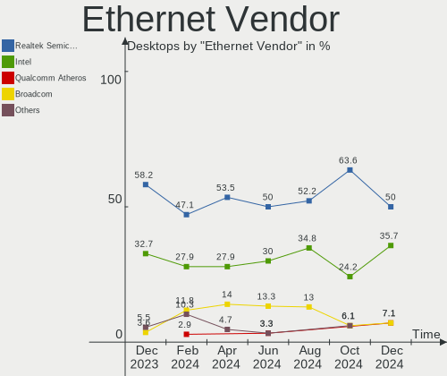

BlackPanther Hardware Trends (Desktops)
---------------------------------------

A project to identify most popular hardware characteristics and track their change
over time based on data collected by BlackPanther users at https://Linux-Hardware.org.

Anyone can contribute to this report by the [hw-probe](https://github.com/linuxhw/hw-probe) tool:

    sudo -E hw-probe -all -upload

Full-feature report is available here: https://linux-hardware.org/?view=trends&formfactor=desktop

Period: Oct, 2021.

Contents
--------

* [ System ](#system)
  - [ OS                       ](#os)
  - [ OS Family                ](#os-family)
  - [ Kernel                   ](#kernel)
  - [ Kernel Family            ](#kernel-family)
  - [ Kernel Major Ver.        ](#kernel-major-ver)
  - [ Arch                     ](#arch)
  - [ DE                       ](#de)
  - [ Display Server           ](#display-server)
  - [ Display Manager          ](#display-manager)
  - [ OS Lang                  ](#os-lang)
  - [ Boot Mode                ](#boot-mode)
  - [ Filesystem               ](#filesystem)
  - [ Part. scheme             ](#part-scheme)
  - [ Dual Boot with Linux/BSD ](#dual-boot-with-linuxbsd)
  - [ Dual Boot (Win)          ](#dual-boot-win)

* [ Board ](#board)
  - [ Vendor                   ](#vendor)
  - [ Model                    ](#model)
  - [ Model Family             ](#model-family)
  - [ MFG Year                 ](#mfg-year)
  - [ Form Factor              ](#form-factor)
  - [ Secure Boot              ](#secure-boot)
  - [ Coreboot                 ](#coreboot)
  - [ RAM Size                 ](#ram-size)
  - [ RAM Used                 ](#ram-used)
  - [ Total Drives             ](#total-drives)
  - [ Has CD-ROM               ](#has-cd-rom)
  - [ Has Ethernet             ](#has-ethernet)
  - [ Has WiFi                 ](#has-wifi)
  - [ Has Bluetooth            ](#has-bluetooth)

* [ Location ](#location)
  - [ Country                  ](#country)
  - [ City                     ](#city)

* [ Drives ](#drives)
  - [ Drive Vendor             ](#drive-vendor)
  - [ Drive Model              ](#drive-model)
  - [ HDD Vendor               ](#hdd-vendor)
  - [ SSD Vendor               ](#ssd-vendor)
  - [ Drive Kind               ](#drive-kind)
  - [ Drive Connector          ](#drive-connector)
  - [ Drive Size               ](#drive-size)
  - [ Space Total              ](#space-total)
  - [ Space Used               ](#space-used)
  - [ Malfunc. Drives          ](#malfunc-drives)
  - [ Malfunc. Drive Vendor    ](#malfunc-drive-vendor)
  - [ Malfunc. HDD Vendor      ](#malfunc-hdd-vendor)
  - [ Malfunc. Drive Kind      ](#malfunc-drive-kind)
  - [ Failed Drives            ](#failed-drives)
  - [ Failed Drive Vendor      ](#failed-drive-vendor)
  - [ Drive Status             ](#drive-status)

* [ Storage controller ](#storage-controller)
  - [ Storage Vendor           ](#storage-vendor)
  - [ Storage Model            ](#storage-model)
  - [ Storage Kind             ](#storage-kind)

* [ Processor ](#processor)
  - [ CPU Vendor               ](#cpu-vendor)
  - [ CPU Model                ](#cpu-model)
  - [ CPU Model Family         ](#cpu-model-family)
  - [ CPU Cores                ](#cpu-cores)
  - [ CPU Sockets              ](#cpu-sockets)
  - [ CPU Threads              ](#cpu-threads)
  - [ CPU Op-Modes             ](#cpu-op-modes)
  - [ CPU Microcode            ](#cpu-microcode)
  - [ CPU Microarch            ](#cpu-microarch)

* [ Graphics ](#graphics)
  - [ GPU Vendor               ](#gpu-vendor)
  - [ GPU Model                ](#gpu-model)
  - [ GPU Combo                ](#gpu-combo)
  - [ GPU Driver               ](#gpu-driver)
  - [ GPU Memory               ](#gpu-memory)

* [ Monitor ](#monitor)
  - [ Monitor Vendor           ](#monitor-vendor)
  - [ Monitor Model            ](#monitor-model)
  - [ Monitor Resolution       ](#monitor-resolution)
  - [ Monitor Diagonal         ](#monitor-diagonal)
  - [ Monitor Width            ](#monitor-width)
  - [ Aspect Ratio             ](#aspect-ratio)
  - [ Monitor Area             ](#monitor-area)
  - [ Pixel Density            ](#pixel-density)
  - [ Multiple Monitors        ](#multiple-monitors)

* [ Network ](#network)
  - [ Net Controller Vendor    ](#net-controller-vendor)
  - [ Net Controller Model     ](#net-controller-model)
  - [ Wireless Vendor          ](#wireless-vendor)
  - [ Wireless Model           ](#wireless-model)
  - [ Ethernet Vendor          ](#ethernet-vendor)
  - [ Ethernet Model           ](#ethernet-model)
  - [ Net Controller Kind      ](#net-controller-kind)
  - [ Used Controller          ](#used-controller)
  - [ NICs                     ](#nics)
  - [ IPv6                     ](#ipv6)

* [ Bluetooth ](#bluetooth)
  - [ Bluetooth Vendor         ](#bluetooth-vendor)
  - [ Bluetooth Model          ](#bluetooth-model)

* [ Sound ](#sound)
  - [ Sound Vendor             ](#sound-vendor)
  - [ Sound Model              ](#sound-model)

* [ Memory ](#memory)
  - [ Memory Vendor            ](#memory-vendor)
  - [ Memory Model             ](#memory-model)
  - [ Memory Kind              ](#memory-kind)
  - [ Memory Form Factor       ](#memory-form-factor)
  - [ Memory Size              ](#memory-size)
  - [ Memory Speed             ](#memory-speed)

* [ Printers & scanners ](#printers--scanners)
  - [ Printer Vendor           ](#printer-vendor)
  - [ Printer Model            ](#printer-model)
  - [ Scanner Vendor           ](#scanner-vendor)
  - [ Scanner Model            ](#scanner-model)

* [ Camera ](#camera)
  - [ Camera Vendor            ](#camera-vendor)
  - [ Camera Model             ](#camera-model)

* [ Security ](#security)
  - [ Fingerprint Vendor       ](#fingerprint-vendor)
  - [ Fingerprint Model        ](#fingerprint-model)
  - [ Chipcard Vendor          ](#chipcard-vendor)
  - [ Chipcard Model           ](#chipcard-model)

* [ Unsupported ](#unsupported)
  - [ Unsupported Devices      ](#unsupported-devices)
  - [ Unsupported Device Types ](#unsupported-device-types)

System
------

OS
--

Installed operating systems

| Name              | Desktops | Percent |
|-------------------|----------|---------|
| BlackPanther 18.1 | 41       | 93.18%  |
| BlackPanther 16.2 | 3        | 6.82%   |

OS Family
---------

OS without a version

| Name         | Desktops | Percent |
|--------------|----------|---------|
| BlackPanther | 44       | 100%    |

Kernel
------

Version of the Linux kernel

| Version                | Desktops | Percent |
|------------------------|----------|---------|
| 4.18.16-desktop-1bP    | 21       | 47.73%  |
| 5.6.14-desktop-2bP     | 20       | 45.45%  |
| 4.9.20-desktop-pae-1bP | 3        | 6.82%   |

Kernel Family
-------------

Linux kernel without a distro release

| Version | Desktops | Percent |
|---------|----------|---------|
| 4.18.16 | 21       | 47.73%  |
| 5.6.14  | 20       | 45.45%  |
| 4.9.20  | 3        | 6.82%   |

Kernel Major Ver.
-----------------

Linux kernel major version

| Version | Desktops | Percent |
|---------|----------|---------|
| 4.18    | 21       | 47.73%  |
| 5.6     | 20       | 45.45%  |
| 4.9     | 3        | 6.82%   |

Arch
----

OS architecture (x86_64, i586, etc.)

| Name   | Desktops | Percent |
|--------|----------|---------|
| x86_64 | 41       | 93.18%  |
| i686   | 3        | 6.82%   |

DE
--

Desktop Environment

| Name | Desktops | Percent |
|------|----------|---------|
| KDE5 | 44       | 100%    |

Display Server
--------------

X11 or Wayland

| Name    | Desktops | Percent |
|---------|----------|---------|
| X11     | 43       | 97.73%  |
| Wayland | 1        | 2.27%   |

Display Manager
---------------

SDDM, LightDM, etc.

| Name | Desktops | Percent |
|------|----------|---------|
| SDDM | 44       | 100%    |

OS Lang
-------

Language

| Lang    | Desktops | Percent |
|---------|----------|---------|
| Unknown | 44       | 100%    |

Boot Mode
---------

EFI or BIOS

| Mode | Desktops | Percent |
|------|----------|---------|
| BIOS | 31       | 70.45%  |
| EFI  | 13       | 29.55%  |

Filesystem
----------

Type of filesystem

| Type    | Desktops | Percent |
|---------|----------|---------|
| Overlay | 37       | 84.09%  |
| Ext4    | 7        | 15.91%  |

Part. scheme
------------

Scheme of partitioning

| Type | Desktops | Percent |
|------|----------|---------|
| MBR  | 27       | 61.36%  |
| GPT  | 17       | 38.64%  |

Dual Boot with Linux/BSD
------------------------

Hosting more than one Linux/BSD

| Dual boot | Desktops | Percent |
|-----------|----------|---------|
| No        | 23       | 52.27%  |
| Yes       | 21       | 47.73%  |

Dual Boot (Win)
---------------

Hosting Linux and Windows

| Dual boot | Desktops | Percent |
|-----------|----------|---------|
| Yes       | 27       | 61.36%  |
| No        | 17       | 38.64%  |

Board
-----

Vendor
------

Motherboard manufacturer

| Name                | Desktops | Percent |
|---------------------|----------|---------|
| Gigabyte Technology | 11       | 25%     |
| ASRock              | 10       | 22.73%  |
| ASUSTek Computer    | 9        | 20.45%  |
| Dell                | 4        | 9.09%   |
| Medion              | 2        | 4.55%   |
| Hewlett-Packard     | 2        | 4.55%   |
| Fujitsu             | 2        | 4.55%   |
| Packard Bell        | 1        | 2.27%   |
| MSI                 | 1        | 2.27%   |
| Lenovo              | 1        | 2.27%   |
| Acer                | 1        | 2.27%   |

Model
-----

Motherboard model

| Name                           | Desktops | Percent |
|--------------------------------|----------|---------|
| ASRock FM2A75M Pro4+           | 3        | 6.82%   |
| Gigabyte H61M-S1               | 2        | 4.55%   |
| Packard Bell IMEDIA S1350      | 1        | 2.27%   |
| MSI MS-7693                    | 1        | 2.27%   |
| Medion Pentino G-Series        | 1        | 2.27%   |
| Medion MS-7646                 | 1        | 2.27%   |
| Lenovo ThinkCentre M57 6066A11 | 1        | 2.27%   |
| HP Compaq Pro 6305 MT          | 1        | 2.27%   |
| HP Compaq 6000 Pro SFF PC      | 1        | 2.27%   |
| Gigabyte Z590 AORUS ELITE AX   | 1        | 2.27%   |
| Gigabyte P67A-D3-B3            | 1        | 2.27%   |
| Gigabyte GA-MA790X-UD4P        | 1        | 2.27%   |
| Gigabyte GA-78LMT-USB3 R2      | 1        | 2.27%   |
| Gigabyte G41MT-S2PT            | 1        | 2.27%   |
| Gigabyte EX58-UD3R             | 1        | 2.27%   |
| Gigabyte EP41-UD3L             | 1        | 2.27%   |
| Gigabyte B560M H               | 1        | 2.27%   |
| Gigabyte B450M GAMING          | 1        | 2.27%   |
| Fujitsu ESPRIMO P910           | 1        | 2.27%   |
| Fujitsu ESPRIMO P5635          | 1        | 2.27%   |
| Dell Vostro 3681               | 1        | 2.27%   |
| Dell OptiPlex GX620            | 1        | 2.27%   |
| Dell OptiPlex 3020             | 1        | 2.27%   |
| Dell OptiPlex 3010             | 1        | 2.27%   |
| ASUS PRIME H310M-E R2.0        | 1        | 2.27%   |
| ASUS PRIME B450M-A             | 1        | 2.27%   |
| ASUS PRIME B365M-A             | 1        | 2.27%   |
| ASUS PRIME A320M-R             | 1        | 2.27%   |
| ASUS P5KPL-AM IN/ROEM/SI       | 1        | 2.27%   |
| ASUS P5K-E                     | 1        | 2.27%   |
| ASUS P5G41T-M LX               | 1        | 2.27%   |
| ASUS Crosshair IV Formula      | 1        | 2.27%   |
| ASUS All Series                | 1        | 2.27%   |
| ASRock QC5000-ITX/WiFi         | 1        | 2.27%   |
| ASRock M3A785GXH/128M          | 1        | 2.27%   |
| ASRock G31M-GS                 | 1        | 2.27%   |
| ASRock FM2A78M-ITX+            | 1        | 2.27%   |
| ASRock FM2A68M-DG3+            | 1        | 2.27%   |
| ASRock AB350M-HDV R3.0         | 1        | 2.27%   |
| ASRock A320M-HDV R3.0          | 1        | 2.27%   |
| Acer Aspire X1935              | 1        | 2.27%   |

Model Family
------------

Motherboard model prefix

| Name                    | Desktops | Percent |
|-------------------------|----------|---------|
| ASUS PRIME              | 4        | 9.09%   |
| Dell OptiPlex           | 3        | 6.82%   |
| ASRock FM2A75M          | 3        | 6.82%   |
| HP Compaq               | 2        | 4.55%   |
| Gigabyte H61M-S1        | 2        | 4.55%   |
| Fujitsu ESPRIMO         | 2        | 4.55%   |
| Packard Bell IMEDIA     | 1        | 2.27%   |
| MSI MS-7693             | 1        | 2.27%   |
| Medion Pentino          | 1        | 2.27%   |
| Medion MS-7646          | 1        | 2.27%   |
| Lenovo ThinkCentre      | 1        | 2.27%   |
| Gigabyte Z590           | 1        | 2.27%   |
| Gigabyte P67A-D3-B3     | 1        | 2.27%   |
| Gigabyte GA-MA790X-UD4P | 1        | 2.27%   |
| Gigabyte GA-78LMT-USB3  | 1        | 2.27%   |
| Gigabyte G41MT-S2PT     | 1        | 2.27%   |
| Gigabyte EX58-UD3R      | 1        | 2.27%   |
| Gigabyte EP41-UD3L      | 1        | 2.27%   |
| Gigabyte B560M          | 1        | 2.27%   |
| Gigabyte B450M          | 1        | 2.27%   |
| Dell Vostro             | 1        | 2.27%   |
| ASUS P5KPL-AM           | 1        | 2.27%   |
| ASUS P5K-E              | 1        | 2.27%   |
| ASUS P5G41T-M           | 1        | 2.27%   |
| ASUS Crosshair          | 1        | 2.27%   |
| ASUS All                | 1        | 2.27%   |
| ASRock QC5000-ITX       | 1        | 2.27%   |
| ASRock M3A785GXH        | 1        | 2.27%   |
| ASRock G31M-GS          | 1        | 2.27%   |
| ASRock FM2A78M-ITX+     | 1        | 2.27%   |
| ASRock FM2A68M-DG3+     | 1        | 2.27%   |
| ASRock AB350M-HDV       | 1        | 2.27%   |
| ASRock A320M-HDV        | 1        | 2.27%   |
| Acer Aspire             | 1        | 2.27%   |

MFG Year
--------

Motherboard manufacture year

| Year | Desktops | Percent |
|------|----------|---------|
| 2012 | 7        | 15.91%  |
| 2014 | 6        | 13.64%  |
| 2019 | 5        | 11.36%  |
| 2010 | 4        | 9.09%   |
| 2009 | 4        | 9.09%   |
| 2021 | 3        | 6.82%   |
| 2018 | 3        | 6.82%   |
| 2011 | 3        | 6.82%   |
| 2015 | 2        | 4.55%   |
| 2008 | 2        | 4.55%   |
| 2020 | 1        | 2.27%   |
| 2017 | 1        | 2.27%   |
| 2016 | 1        | 2.27%   |
| 2013 | 1        | 2.27%   |
| 2006 | 1        | 2.27%   |

Form Factor
-----------

Physical design of the computer

| Name    | Desktops | Percent |
|---------|----------|---------|
| Desktop | 44       | 100%    |

Secure Boot
-----------

Enabled or disabled

| State    | Desktops | Percent |
|----------|----------|---------|
| Disabled | 44       | 100%    |

Coreboot
--------

Have coreboot on board

| Used | Desktops | Percent |
|------|----------|---------|
| No   | 44       | 100%    |

RAM Size
--------

Total RAM memory

| Size in GB | Desktops | Percent |
|------------|----------|---------|
| 8.01-16.0  | 15       | 34.09%  |
| 4.01-8.0   | 13       | 29.55%  |
| 3.01-4.0   | 11       | 25%     |
| 16.01-24.0 | 3        | 6.82%   |
| 32.01-64.0 | 2        | 4.55%   |

RAM Used
--------

Used RAM memory

| Used GB  | Desktops | Percent |
|----------|----------|---------|
| 0.01-0.5 | 26       | 59.09%  |
| 0.51-1.0 | 12       | 27.27%  |
| 1.01-2.0 | 5        | 11.36%  |
| 2.01-3.0 | 1        | 2.27%   |

Total Drives
------------

Number of drives on board

| Drives | Desktops | Percent |
|--------|----------|---------|
| 1      | 19       | 43.18%  |
| 2      | 16       | 36.36%  |
| 4      | 4        | 9.09%   |
| 3      | 3        | 6.82%   |
| 6      | 1        | 2.27%   |
| 5      | 1        | 2.27%   |

Has CD-ROM
----------

Has CD-ROM on board

| Presented | Desktops | Percent |
|-----------|----------|---------|
| Yes       | 27       | 61.36%  |
| No        | 17       | 38.64%  |

Has Ethernet
------------

Has Ethernet on board

| Presented | Desktops | Percent |
|-----------|----------|---------|
| Yes       | 44       | 100%    |

Has WiFi
--------

Has WiFi module

| Presented | Desktops | Percent |
|-----------|----------|---------|
| No        | 35       | 79.55%  |
| Yes       | 9        | 20.45%  |

Has Bluetooth
-------------

Has Bluetooth module

| Presented | Desktops | Percent |
|-----------|----------|---------|
| No        | 39       | 88.64%  |
| Yes       | 5        | 11.36%  |

Location
--------

Country
-------

Geographic location (country)

| Country  | Desktops | Percent |
|----------|----------|---------|
| Hungary  | 38       | 86.36%  |
| Germany  | 2        | 4.55%   |
| USA      | 1        | 2.27%   |
| Slovakia | 1        | 2.27%   |
| Serbia   | 1        | 2.27%   |
| Brazil   | 1        | 2.27%   |

City
----

Geographic location (city)

| City              | Desktops | Percent |
|-------------------|----------|---------|
| Budapest          | 5        | 11.36%  |
| Tiszafured        | 2        | 4.55%   |
| Salgotarjan       | 2        | 4.55%   |
| Regensburg        | 2        | 4.55%   |
| Karcag            | 2        | 4.55%   |
| Gy?‘r             | 2        | 4.55%   |
| Teresopolis       | 1        | 2.27%   |
| Tar               | 1        | 2.27%   |
| Szombathely       | 1        | 2.27%   |
| Szigetszentmiklos | 1        | 2.27%   |
| Szeged            | 1        | 2.27%   |
| Sokoropatka       | 1        | 2.27%   |
| Roszke            | 1        | 2.27%   |
| Pecovska Nova Ves | 1        | 2.27%   |
| P?©cs             | 1        | 2.27%   |
| Oroshaza          | 1        | 2.27%   |
| Nyiregyhaza       | 1        | 2.27%   |
| Nagykoros         | 1        | 2.27%   |
| Nagyatad          | 1        | 2.27%   |
| Mosonszentmiklos  | 1        | 2.27%   |
| Miskolc           | 1        | 2.27%   |
| Mesa              | 1        | 2.27%   |
| Markaz            | 1        | 2.27%   |
| Kurityan          | 1        | 2.27%   |
| Kunszentmiklos    | 1        | 2.27%   |
| Hodmezovasarhely  | 1        | 2.27%   |
| Heves             | 1        | 2.27%   |
| Gyal              | 1        | 2.27%   |
| Fuzesabony        | 1        | 2.27%   |
| Felcsut           | 1        | 2.27%   |
| Debrecen          | 1        | 2.27%   |
| Budakeszi         | 1        | 2.27%   |
| Bicserd           | 1        | 2.27%   |
| Belgrade          | 1        | 2.27%   |
| B?©k?©scsaba      | 1        | 2.27%   |

Drives
------

Drive Vendor
------------

Hard drive vendors

| Vendor              | Desktops | Drives | Percent |
|---------------------|----------|--------|---------|
| WDC                 | 19       | 24     | 24.36%  |
| Samsung Electronics | 14       | 19     | 17.95%  |
| Kingston            | 14       | 17     | 17.95%  |
| Seagate             | 8        | 8      | 10.26%  |
| A-DATA Technology   | 4        | 4      | 5.13%   |
| Toshiba             | 3        | 3      | 3.85%   |
| MAXTOR              | 3        | 3      | 3.85%   |
| SanDisk             | 2        | 2      | 2.56%   |
| Patriot             | 2        | 2      | 2.56%   |
| HGST                | 2        | 2      | 2.56%   |
| Apacer              | 2        | 2      | 2.56%   |
| Zheino              | 1        | 1      | 1.28%   |
| Intel               | 1        | 1      | 1.28%   |
| Hitachi             | 1        | 1      | 1.28%   |
| Hewlett-Packard     | 1        | 1      | 1.28%   |
| China               | 1        | 1      | 1.28%   |

Drive Model
-----------

Hard drive models

| Model                                | Desktops | Percent |
|--------------------------------------|----------|---------|
| Kingston SA400S37120G 120GB SSD      | 4        | 4.49%   |
| Samsung HD103UJ 1TB                  | 3        | 3.37%   |
| Kingston SV300S37A120G 120GB SSD     | 3        | 3.37%   |
| A-DATA SU630 240GB SSD               | 3        | 3.37%   |
| WDC WD5000AAKX-08U6AA0 500GB         | 2        | 2.25%   |
| WDC WD20EZRX-00D8PB0 2TB             | 2        | 2.25%   |
| WDC WD1600AAJB-56WRA0 160GB          | 2        | 2.25%   |
| Seagate ST1000DM010-2EP102 1TB       | 2        | 2.25%   |
| SanDisk SDSSDH3 500G                 | 2        | 2.25%   |
| Samsung HD502IJ 500GB                | 2        | 2.25%   |
| Kingston SA400S37240G 240GB SSD      | 2        | 2.25%   |
| Kingston SA2000M8250G 250GB          | 2        | 2.25%   |
| HGST HTS541010B7E610 1TB             | 2        | 2.25%   |
| Zheino CHN-NGFFNV2280-256 256GB      | 1        | 1.12%   |
| WDC WDS240G2G0B-00EPW0 240GB SSD     | 1        | 1.12%   |
| WDC WD800JD-55MUA1 80GB              | 1        | 1.12%   |
| WDC WD5000BEVT-22A0RT0 500GB         | 1        | 1.12%   |
| WDC WD3200AAKX-083CA0 320GB          | 1        | 1.12%   |
| WDC WD30EZRZ-00GXCB0 3TB             | 1        | 1.12%   |
| WDC WD30EFRX-68EUZN0 3TB             | 1        | 1.12%   |
| WDC WD2500AVVS-62L2B0 250GB          | 1        | 1.12%   |
| WDC WD2500AAKX-083CA1 250GB          | 1        | 1.12%   |
| WDC WD20PURX-64P6ZY0 2TB             | 1        | 1.12%   |
| WDC WD1600AAJS-75M0A0 160GB          | 1        | 1.12%   |
| WDC WD1600AAJS-00L7A0 160GB          | 1        | 1.12%   |
| WDC WD10PURX-64E5EY0 1TB             | 1        | 1.12%   |
| WDC WD10EZRZ-00HTKB0 1TB             | 1        | 1.12%   |
| WDC WD10EZEX-60M2NA0 1TB             | 1        | 1.12%   |
| WDC WD10EZEX-22MFCA0 1TB             | 1        | 1.12%   |
| WDC WD10EZEX-21WN4A0 1TB             | 1        | 1.12%   |
| WDC WD10EZEX-21M2NA0 1TB             | 1        | 1.12%   |
| WDC WD10EZEX-00KUWA0 1TB             | 1        | 1.12%   |
| Toshiba MQ04ABF100 1TB               | 1        | 1.12%   |
| Toshiba DT01ACA100 1TB               | 1        | 1.12%   |
| Toshiba DT01ACA050 500GB             | 1        | 1.12%   |
| Seagate ST500DM002-1BD142 500GB      | 1        | 1.12%   |
| Seagate ST3500418AS 500GB            | 1        | 1.12%   |
| Seagate ST3500413AS 500GB            | 1        | 1.12%   |
| Seagate ST31000528AS 1TB             | 1        | 1.12%   |
| Seagate ST2000DM008-2FR102 2TB       | 1        | 1.12%   |
| Seagate M3 Portable 2TB              | 1        | 1.12%   |
| Samsung SSD 980 PRO 250GB            | 1        | 1.12%   |
| Samsung SSD 970 EVO Plus 250GB       | 1        | 1.12%   |
| Samsung SSD 870 EVO 250GB            | 1        | 1.12%   |
| Samsung SSD 860 EVO M.2 500GB        | 1        | 1.12%   |
| Samsung SSD 860 EVO 250GB            | 1        | 1.12%   |
| Samsung SSD 830 Series 64GB          | 1        | 1.12%   |
| Samsung MZ7PA128HMCD-010H1 128GB SSD | 1        | 1.12%   |
| Samsung HM160HI 160GB                | 1        | 1.12%   |
| Samsung HD503HI 500GB                | 1        | 1.12%   |
| Samsung HD502HJ 500GB                | 1        | 1.12%   |
| Samsung HD204UI 2TB                  | 1        | 1.12%   |
| Samsung HD154UI 1TB                  | 1        | 1.12%   |
| Samsung HD103SJ 1TB                  | 1        | 1.12%   |
| Patriot Burst 240GB SSD              | 1        | 1.12%   |
| Patriot Blaze 64GB SSD               | 1        | 1.12%   |
| MAXTOR 6Y120L0 122GB                 | 1        | 1.12%   |
| MAXTOR 6V250F0 256GB                 | 1        | 1.12%   |
| MAXTOR 4D040H2 41GB                  | 1        | 1.12%   |
| Kingston SUV500MS120G 120GB SSD      | 1        | 1.12%   |

HDD Vendor
----------

Hard disk drive vendors

| Vendor              | Desktops | Drives | Percent |
|---------------------|----------|--------|---------|
| WDC                 | 18       | 23     | 41.86%  |
| Samsung Electronics | 9        | 11     | 20.93%  |
| Seagate             | 7        | 7      | 16.28%  |
| Toshiba             | 3        | 3      | 6.98%   |
| MAXTOR              | 3        | 3      | 6.98%   |
| HGST                | 2        | 2      | 4.65%   |
| Hitachi             | 1        | 1      | 2.33%   |

SSD Vendor
----------

Solid state drive vendors

| Vendor              | Desktops | Drives | Percent |
|---------------------|----------|--------|---------|
| Kingston            | 11       | 14     | 37.93%  |
| Samsung Electronics | 5        | 6      | 17.24%  |
| A-DATA Technology   | 4        | 4      | 13.79%  |
| SanDisk             | 2        | 2      | 6.9%    |
| Patriot             | 2        | 2      | 6.9%    |
| Apacer              | 2        | 2      | 6.9%    |
| WDC                 | 1        | 1      | 3.45%   |
| Intel               | 1        | 1      | 3.45%   |
| China               | 1        | 1      | 3.45%   |

Drive Kind
----------

HDD or SSD

| Kind    | Desktops | Drives | Percent |
|---------|----------|--------|---------|
| HDD     | 36       | 50     | 51.43%  |
| SSD     | 27       | 33     | 38.57%  |
| NVMe    | 6        | 7      | 8.57%   |
| Unknown | 1        | 1      | 1.43%   |

Drive Connector
---------------

SATA, SAS, NVMe, etc.

| Type | Desktops | Drives | Percent |
|------|----------|--------|---------|
| SATA | 42       | 83     | 85.71%  |
| NVMe | 6        | 7      | 12.24%  |
| SAS  | 1        | 1      | 2.04%   |

Drive Size
----------

Size of hard drive

| Size in TB | Desktops | Drives | Percent |
|------------|----------|--------|---------|
| 0.01-0.5   | 36       | 57     | 61.02%  |
| 0.51-1.0   | 17       | 19     | 28.81%  |
| 1.01-2.0   | 5        | 5      | 8.47%   |
| 2.01-3.0   | 1        | 2      | 1.69%   |

Space Total
-----------

Amount of disk space available on the file system

| Size in GB | Desktops | Percent |
|------------|----------|---------|
| Unknown    | 37       | 84.09%  |
| 101-250    | 4        | 9.09%   |
| 251-500    | 1        | 2.27%   |
| 21-50      | 1        | 2.27%   |
| 1001-2000  | 1        | 2.27%   |

Space Used
----------

Amount of used disk space

| Used GB  | Desktops | Percent |
|----------|----------|---------|
| Unknown  | 37       | 84.09%  |
| 1-20     | 6        | 13.64%  |
| 501-1000 | 1        | 2.27%   |

Malfunc. Drives
---------------

Drive models with a malfunction

| Model                             | Desktops | Drives | Percent |
|-----------------------------------|----------|--------|---------|
| Samsung Electronics HD103UJ 1TB   | 3        | 3      | 14.29%  |
| A-DATA Technology SU630 240GB SSD | 3        | 3      | 14.29%  |
| WDC WD5000AAKX-08U6AA0 500GB      | 2        | 2      | 9.52%   |
| WDC WD800JD-55MUA1 80GB           | 1        | 1      | 4.76%   |
| WDC WD20PURX-64P6ZY0 2TB          | 1        | 1      | 4.76%   |
| WDC WD1600AAJS-00L7A0 160GB       | 1        | 1      | 4.76%   |
| WDC WD1600AAJB-56WRA0 160GB       | 1        | 1      | 4.76%   |
| WDC WD10PURX-64E5EY0 1TB          | 1        | 1      | 4.76%   |
| WDC WD10EZEX-60M2NA0 1TB          | 1        | 1      | 4.76%   |
| WDC WD10EZEX-22MFCA0 1TB          | 1        | 1      | 4.76%   |
| Seagate ST500DM002-1BD142 500GB   | 1        | 1      | 4.76%   |
| Samsung Electronics HM160HI 160GB | 1        | 1      | 4.76%   |
| Samsung Electronics HD503HI 500GB | 1        | 1      | 4.76%   |
| MAXTOR 6V250F0 256GB              | 1        | 1      | 4.76%   |
| MAXTOR 4D040H2 41GB               | 1        | 1      | 4.76%   |
| Kingston SV300S37A120G 120GB SSD  | 1        | 1      | 4.76%   |

Malfunc. Drive Vendor
---------------------

Vendors of faulty drives

| Vendor              | Desktops | Drives | Percent |
|---------------------|----------|--------|---------|
| WDC                 | 8        | 9      | 40%     |
| Samsung Electronics | 5        | 5      | 25%     |
| A-DATA Technology   | 3        | 3      | 15%     |
| MAXTOR              | 2        | 2      | 10%     |
| Seagate             | 1        | 1      | 5%      |
| Kingston            | 1        | 1      | 5%      |

Malfunc. HDD Vendor
-------------------

Vendors of faulty HDD drives

| Vendor              | Desktops | Drives | Percent |
|---------------------|----------|--------|---------|
| WDC                 | 8        | 9      | 50%     |
| Samsung Electronics | 5        | 5      | 31.25%  |
| MAXTOR              | 2        | 2      | 12.5%   |
| Seagate             | 1        | 1      | 6.25%   |

Malfunc. Drive Kind
-------------------

Kinds of faulty drives

| Kind | Desktops | Drives | Percent |
|------|----------|--------|---------|
| HDD  | 13       | 17     | 76.47%  |
| SSD  | 4        | 4      | 23.53%  |

Failed Drives
-------------

Failed drive models

| Model                           | Desktops | Drives | Percent |
|---------------------------------|----------|--------|---------|
| Samsung Electronics HD204UI 2TB | 1        | 1      | 100%    |

Failed Drive Vendor
-------------------

Failed drive vendors

| Vendor              | Desktops | Drives | Percent |
|---------------------|----------|--------|---------|
| Samsung Electronics | 1        | 1      | 100%    |

Drive Status
------------

Number of failed and malfunc. drives

| Status   | Desktops | Drives | Percent |
|----------|----------|--------|---------|
| Works    | 36       | 66     | 65.45%  |
| Malfunc  | 15       | 21     | 27.27%  |
| Detected | 3        | 3      | 5.45%   |
| Failed   | 1        | 1      | 1.82%   |

Storage controller
------------------

Storage Vendor
--------------

Storage controller vendors

| Vendor                      | Desktops | Percent |
|-----------------------------|----------|---------|
| Intel                       | 24       | 41.38%  |
| AMD                         | 18       | 31.03%  |
| JMicron Technology          | 4        | 6.9%    |
| Kingston Technology Company | 3        | 5.17%   |
| Silicon Motion              | 2        | 3.45%   |
| Samsung Electronics         | 2        | 3.45%   |
| Nvidia                      | 2        | 3.45%   |
| ASMedia Technology          | 2        | 3.45%   |
| Silicon Image               | 1        | 1.72%   |

Storage Model
-------------

Storage controller models

| Model                                                                                   | Desktops | Percent |
|-----------------------------------------------------------------------------------------|----------|---------|
| AMD FCH SATA Controller [AHCI mode]                                                     | 11       | 12.94%  |
| Intel NM10/ICH7 Family SATA Controller [IDE mode]                                       | 6        | 7.06%   |
| Intel 82801G (ICH7 Family) IDE Controller                                               | 6        | 7.06%   |
| AMD SB7x0/SB8x0/SB9x0 IDE Controller                                                    | 5        | 5.88%   |
| JMicron JMB363 SATA/IDE Controller                                                      | 4        | 4.71%   |
| Intel 7 Series/C210 Series Chipset Family 6-port SATA Controller [AHCI mode]            | 3        | 3.53%   |
| Intel 6 Series/C200 Series Chipset Family Desktop SATA Controller (IDE mode, ports 4-5) | 3        | 3.53%   |
| Intel 6 Series/C200 Series Chipset Family Desktop SATA Controller (IDE mode, ports 0-3) | 3        | 3.53%   |
| AMD SB7x0/SB8x0/SB9x0 SATA Controller [IDE mode]                                        | 3        | 3.53%   |
| AMD SB7x0/SB8x0/SB9x0 SATA Controller [AHCI mode]                                       | 3        | 3.53%   |
| AMD FCH IDE Controller                                                                  | 3        | 3.53%   |
| Silicon Motion SM2263EN/SM2263XT SSD Controller                                         | 2        | 2.35%   |
| Kingston Company A2000 NVMe SSD                                                         | 2        | 2.35%   |
| Intel 8 Series/C220 Series Chipset Family 6-port SATA Controller 1 [AHCI mode]          | 2        | 2.35%   |
| Intel 500 Series Chipset Family SATA AHCI Controller                                    | 2        | 2.35%   |
| Intel 200 Series PCH SATA controller [AHCI mode]                                        | 2        | 2.35%   |
| ASMedia ASM1062 Serial ATA Controller                                                   | 2        | 2.35%   |
| AMD FCH SATA Controller D                                                               | 2        | 2.35%   |
| AMD 400 Series Chipset SATA Controller                                                  | 2        | 2.35%   |
| Silicon Image SiI 3114 [SATALink/SATARaid] Serial ATA Controller                        | 1        | 1.18%   |
| Samsung NVMe SSD Controller SM981/PM981/PM983                                           | 1        | 1.18%   |
| Samsung NVMe SSD Controller PM9A1/PM9A3/980PRO                                          | 1        | 1.18%   |
| Nvidia MCP78S [GeForce 8200] SATA Controller (non-AHCI mode)                            | 1        | 1.18%   |
| Nvidia MCP61 SATA Controller                                                            | 1        | 1.18%   |
| Nvidia MCP61 IDE                                                                        | 1        | 1.18%   |
| Kingston Company KC2000 NVMe SSD                                                        | 1        | 1.18%   |
| Intel 82Q35 Express PT IDER Controller                                                  | 1        | 1.18%   |
| Intel 82801JI (ICH10 Family) SATA AHCI Controller                                       | 1        | 1.18%   |
| Intel 82801JD/DO (ICH10 Family) SATA AHCI Controller                                    | 1        | 1.18%   |
| Intel 82801IR/IO/IH (ICH9R/DO/DH) 6 port SATA Controller [AHCI mode]                    | 1        | 1.18%   |
| Intel 82801IR/IO/IH (ICH9R/DO/DH) 4 port SATA Controller [IDE mode]                     | 1        | 1.18%   |
| Intel 82801I (ICH9 Family) 2 port SATA Controller [IDE mode]                            | 1        | 1.18%   |
| Intel 7 Series/C210 Series Chipset Family 4-port SATA Controller [IDE mode]             | 1        | 1.18%   |
| Intel 7 Series/C210 Series Chipset Family 2-port SATA Controller [IDE mode]             | 1        | 1.18%   |
| Intel 6 Series/C200 Series Chipset Family 6 port Desktop SATA AHCI Controller           | 1        | 1.18%   |
| Intel 400 Series Chipset Family SATA AHCI Controller                                    | 1        | 1.18%   |
| Intel 4 Series Chipset PT IDER Controller                                               | 1        | 1.18%   |
| AMD 300 Series Chipset SATA Controller                                                  | 1        | 1.18%   |

Storage Kind
------------

Kind of storage controller (IDE, SATA, NVMe, SAS, ...)

| Kind | Desktops | Percent |
|------|----------|---------|
| SATA | 32       | 50.79%  |
| IDE  | 24       | 38.1%   |
| NVMe | 6        | 9.52%   |
| RAID | 1        | 1.59%   |

Processor
---------

CPU Vendor
----------

Processor vendors

| Vendor | Desktops | Percent |
|--------|----------|---------|
| Intel  | 24       | 54.55%  |
| AMD    | 20       | 45.45%  |

CPU Model
---------

Processor models

| Model                                           | Desktops | Percent |
|-------------------------------------------------|----------|---------|
| AMD A8-6600K APU with Radeon HD Graphics        | 3        | 6.82%   |
| Intel Core i5-3470 CPU @ 3.20GHz                | 2        | 4.55%   |
| Intel Core i3-8100 CPU @ 3.60GHz                | 2        | 4.55%   |
| AMD Ryzen 3 2200G with Radeon Vega Graphics     | 2        | 4.55%   |
| AMD A10-7870K Radeon R7, 12 Compute Cores 4C+8G | 2        | 4.55%   |
| Intel Xeon CPU X5670 @ 2.93GHz                  | 1        | 2.27%   |
| Intel Pentium Dual-Core CPU E6500 @ 2.93GHz     | 1        | 2.27%   |
| Intel Pentium Dual-Core CPU E5700 @ 3.00GHz     | 1        | 2.27%   |
| Intel Pentium D CPU 3.40GHz                     | 1        | 2.27%   |
| Intel Pentium CPU G645 @ 2.90GHz                | 1        | 2.27%   |
| Intel Pentium CPU G3240 @ 3.10GHz               | 1        | 2.27%   |
| Intel Core i5-2500K CPU @ 3.30GHz               | 1        | 2.27%   |
| Intel Core i5-2300 CPU @ 2.80GHz                | 1        | 2.27%   |
| Intel Core i5-10600K CPU @ 4.10GHz              | 1        | 2.27%   |
| Intel Core i5-10400F CPU @ 2.90GHz              | 1        | 2.27%   |
| Intel Core i3-4160 CPU @ 3.60GHz                | 1        | 2.27%   |
| Intel Core i3-3220 CPU @ 3.30GHz                | 1        | 2.27%   |
| Intel Core i3-10100 CPU @ 3.60GHz               | 1        | 2.27%   |
| Intel Core 2 Quad CPU Q9300 @ 2.50GHz           | 1        | 2.27%   |
| Intel Core 2 Quad CPU Q6600 @ 2.40GHz           | 1        | 2.27%   |
| Intel Core 2 Duo CPU E8200 @ 2.66GHz            | 1        | 2.27%   |
| Intel Core 2 Duo CPU E7500 @ 2.93GHz            | 1        | 2.27%   |
| Intel Core 2 Duo CPU E6850 @ 3.00GHz            | 1        | 2.27%   |
| Intel Core 2 Duo CPU E4600 @ 2.40GHz            | 1        | 2.27%   |
| Intel Celeron CPU G1610 @ 2.60GHz               | 1        | 2.27%   |
| AMD Ryzen 7 3700X 8-Core Processor              | 1        | 2.27%   |
| AMD Ryzen 5 3400G with Radeon Vega Graphics     | 1        | 2.27%   |
| AMD Ryzen 5 2400G with Radeon Vega Graphics     | 1        | 2.27%   |
| AMD Phenom II X6 1090T Processor                | 1        | 2.27%   |
| AMD Phenom II X4 965 Processor                  | 1        | 2.27%   |
| AMD Phenom II X4 940 Processor                  | 1        | 2.27%   |
| AMD FX-4350 Quad-Core Processor                 | 1        | 2.27%   |
| AMD Athlon II X4 615e Processor                 | 1        | 2.27%   |
| AMD Athlon II X2 240e Processor                 | 1        | 2.27%   |
| AMD Athlon II X2 240 Processor                  | 1        | 2.27%   |
| AMD Athlon II X2 220 Processor                  | 1        | 2.27%   |
| AMD A8-5500B APU with Radeon HD Graphics        | 1        | 2.27%   |
| AMD A4-5000 APU with Radeon HD Graphics         | 1        | 2.27%   |

CPU Model Family
----------------

Processor model prefix

| Model                   | Desktops | Percent |
|-------------------------|----------|---------|
| Intel Core i5           | 6        | 13.64%  |
| Intel Core i3           | 5        | 11.36%  |
| Intel Core 2 Duo        | 4        | 9.09%   |
| AMD A8                  | 4        | 9.09%   |
| AMD Athlon II X2        | 3        | 6.82%   |
| Intel Pentium Dual-Core | 2        | 4.55%   |
| Intel Pentium           | 2        | 4.55%   |
| Intel Core 2 Quad       | 2        | 4.55%   |
| AMD Ryzen 5             | 2        | 4.55%   |
| AMD Ryzen 3             | 2        | 4.55%   |
| AMD Phenom II X4        | 2        | 4.55%   |
| AMD A10                 | 2        | 4.55%   |
| Intel Xeon              | 1        | 2.27%   |
| Intel Pentium D         | 1        | 2.27%   |
| Intel Celeron           | 1        | 2.27%   |
| AMD Ryzen 7             | 1        | 2.27%   |
| AMD Phenom II X6        | 1        | 2.27%   |
| AMD FX                  | 1        | 2.27%   |
| AMD Athlon II X4        | 1        | 2.27%   |
| AMD A4                  | 1        | 2.27%   |

CPU Cores
---------

Number of processor cores

| Number | Desktops | Percent |
|--------|----------|---------|
| 2      | 22       | 50%     |
| 4      | 17       | 38.64%  |
| 6      | 4        | 9.09%   |
| 8      | 1        | 2.27%   |

CPU Sockets
-----------

Number of sockets

| Number | Desktops | Percent |
|--------|----------|---------|
| 1      | 44       | 100%    |

CPU Threads
-----------

Threads per core (Hyper-Threading)

| Number | Desktops | Percent |
|--------|----------|---------|
| 1      | 28       | 63.64%  |
| 2      | 16       | 36.36%  |

CPU Op-Modes
------------

CPU Operation Modes (32-bit, 64-bit)

| Op mode        | Desktops | Percent |
|----------------|----------|---------|
| 32-bit, 64-bit | 44       | 100%    |

CPU Microcode
-------------

Microcode number

| Number     | Desktops | Percent |
|------------|----------|---------|
| 0x306a9    | 4        | 9.09%   |
| 0x206a7    | 3        | 6.82%   |
| 0x1067a    | 3        | 6.82%   |
| 0x06001119 | 3        | 6.82%   |
| 0x010000c8 | 3        | 6.82%   |
| 0xa0653    | 2        | 4.55%   |
| 0x906eb    | 2        | 4.55%   |
| 0x6fb      | 2        | 4.55%   |
| 0x306c3    | 2        | 4.55%   |
| 0x0810100b | 2        | 4.55%   |
| 0x06003106 | 2        | 4.55%   |
| 0x010000db | 2        | 4.55%   |
| 0xf65      | 1        | 2.27%   |
| 0xa0655    | 1        | 2.27%   |
| 0x6fd      | 1        | 2.27%   |
| 0x206c2    | 1        | 2.27%   |
| 0x10677    | 1        | 2.27%   |
| 0x10676    | 1        | 2.27%   |
| 0x08701013 | 1        | 2.27%   |
| 0x08108109 | 1        | 2.27%   |
| 0x08101016 | 1        | 2.27%   |
| 0x0700010f | 1        | 2.27%   |
| 0x0600111f | 1        | 2.27%   |
| 0x06000852 | 1        | 2.27%   |
| 0x010000dc | 1        | 2.27%   |
| Unknown    | 1        | 2.27%   |

CPU Microarch
-------------

Microarchitecture

| Name        | Desktops | Percent |
|-------------|----------|---------|
| K10         | 7        | 15.91%  |
| Piledriver  | 5        | 11.36%  |
| Penryn      | 5        | 11.36%  |
| IvyBridge   | 4        | 9.09%   |
| Zen         | 3        | 6.82%   |
| SandyBridge | 3        | 6.82%   |
| Core        | 3        | 6.82%   |
| CometLake   | 3        | 6.82%   |
| Steamroller | 2        | 4.55%   |
| KabyLake    | 2        | 4.55%   |
| Haswell     | 2        | 4.55%   |
| Zen+        | 1        | 2.27%   |
| Zen 2       | 1        | 2.27%   |
| Westmere    | 1        | 2.27%   |
| NetBurst    | 1        | 2.27%   |
| Jaguar      | 1        | 2.27%   |

Graphics
--------

GPU Vendor
----------

Vendors of graphics cards

| Vendor | Desktops | Percent |
|--------|----------|---------|
| AMD    | 22       | 48.89%  |
| Nvidia | 13       | 28.89%  |
| Intel  | 10       | 22.22%  |

GPU Model
---------

Graphics card models

| Model                                                                       | Desktops | Percent |
|-----------------------------------------------------------------------------|----------|---------|
| Nvidia GP107 [GeForce GTX 1050 Ti]                                          | 3        | 6.52%   |
| AMD Richland [Radeon HD 8570D]                                              | 3        | 6.52%   |
| Nvidia GT218 [GeForce 210]                                                  | 2        | 4.35%   |
| Nvidia GF108 [GeForce GT 630]                                               | 2        | 4.35%   |
| Intel CoffeeLake-S GT2 [UHD Graphics 630]                                   | 2        | 4.35%   |
| Intel 4 Series Chipset Integrated Graphics Controller                       | 2        | 4.35%   |
| AMD Raven Ridge [Radeon Vega Series / Radeon Vega Mobile Series]            | 2        | 4.35%   |
| AMD Oland PRO [Radeon R7 240/340]                                           | 2        | 4.35%   |
| AMD Kaveri [Radeon R7 Graphics]                                             | 2        | 4.35%   |
| AMD Ellesmere [Radeon RX 470/480/570/570X/580/580X/590]                     | 2        | 4.35%   |
| Nvidia GP104 [GeForce GTX 1080]                                             | 1        | 2.17%   |
| Nvidia GF119 [GeForce GT 520]                                               | 1        | 2.17%   |
| Nvidia GF114 [GeForce GTX 560]                                              | 1        | 2.17%   |
| Nvidia GF108GL [Quadro 600]                                                 | 1        | 2.17%   |
| Nvidia GF108 [GeForce GT 530]                                               | 1        | 2.17%   |
| Nvidia G94 [GeForce 9600 GT]                                                | 1        | 2.17%   |
| Intel Xeon E3-1200 v3/4th Gen Core Processor Integrated Graphics Controller | 1        | 2.17%   |
| Intel Xeon E3-1200 v2/3rd Gen Core processor Graphics Controller            | 1        | 2.17%   |
| Intel CometLake-S GT2 [UHD Graphics 630]                                    | 1        | 2.17%   |
| Intel 82Q35 Express Integrated Graphics Controller                          | 1        | 2.17%   |
| Intel 4th Generation Core Processor Family Integrated Graphics Controller   | 1        | 2.17%   |
| Intel 2nd Generation Core Processor Family Integrated Graphics Controller   | 1        | 2.17%   |
| AMD Trinity [Radeon HD 7560D]                                               | 1        | 2.17%   |
| AMD RV770 [Radeon HD 4850]                                                  | 1        | 2.17%   |
| AMD RV710 [Radeon HD 4350/4550]                                             | 1        | 2.17%   |
| AMD RV630 XT [Radeon HD 2600 XT]                                            | 1        | 2.17%   |
| AMD RS880 [Radeon HD 4200]                                                  | 1        | 2.17%   |
| AMD Redwood XT [Radeon HD 5670/5690/5730]                                   | 1        | 2.17%   |
| AMD Picasso                                                                 | 1        | 2.17%   |
| AMD Park [Mobility Radeon HD 5430]                                          | 1        | 2.17%   |
| AMD Kabini [Radeon HD 8330]                                                 | 1        | 2.17%   |
| AMD Curacao XT / Trinidad XT [Radeon R7 370 / R9 270X/370X]                 | 1        | 2.17%   |
| AMD Cedar [Radeon HD 5000/6000/7350/8350 Series]                            | 1        | 2.17%   |
| AMD Cape Verde XT [Radeon HD 7770/8760 / R7 250X]                           | 1        | 2.17%   |

GPU Combo
---------

Combinations of graphics cards

| Name       | Desktops | Percent |
|------------|----------|---------|
| 1 x AMD    | 21       | 47.73%  |
| 1 x Nvidia | 13       | 29.55%  |
| 1 x Intel  | 9        | 20.45%  |
| 2 x AMD    | 1        | 2.27%   |

GPU Driver
----------

Free vs proprietary

| Driver  | Desktops | Percent |
|---------|----------|---------|
| Free    | 43       | 97.73%  |
| Unknown | 1        | 2.27%   |

GPU Memory
----------

Total video memory

| Size in GB | Desktops | Percent |
|------------|----------|---------|
| 0.51-1.0   | 14       | 31.82%  |
| Unknown    | 9        | 20.45%  |
| 1.01-2.0   | 7        | 15.91%  |
| 0.01-0.5   | 7        | 15.91%  |
| 3.01-4.0   | 5        | 11.36%  |
| 7.01-8.0   | 2        | 4.55%   |

Monitor
-------

Monitor Vendor
--------------

Monitor vendors

| Vendor               | Desktops | Percent |
|----------------------|----------|---------|
| Samsung Electronics  | 6        | 15.38%  |
| Goldstar             | 6        | 15.38%  |
| Dell                 | 6        | 15.38%  |
| BenQ                 | 3        | 7.69%   |
| AOC                  | 3        | 7.69%   |
| Philips              | 2        | 5.13%   |
| Fujitsu Siemens      | 2        | 5.13%   |
| Ancor Communications | 2        | 5.13%   |
| Acer                 | 2        | 5.13%   |
| Toshiba              | 1        | 2.56%   |
| S2-Tek               | 1        | 2.56%   |
| Plain Tree Systems   | 1        | 2.56%   |
| MStar                | 1        | 2.56%   |
| Lenovo               | 1        | 2.56%   |
| HannStar             | 1        | 2.56%   |
| CVT                  | 1        | 2.56%   |

Monitor Model
-------------

Monitor models

| Model                                                                  | Desktops | Percent |
|------------------------------------------------------------------------|----------|---------|
| BenQ EW277HDR BNQ7948 1920x1080 598x336mm 27.0-inch                    | 3        | 7.69%   |
| AOC 2041 AOC2041 1600x900 443x249mm 20.0-inch                          | 2        | 5.13%   |
| Acer K242HQL ACR0446 1920x1080 521x293mm 23.5-inch                     | 2        | 5.13%   |
| Toshiba TV TSB0108 1920x1080 890x500mm 40.2-inch                       | 1        | 2.56%   |
| Samsung Electronics SMBX2250 SAM071B 1920x1080 477x268mm 21.5-inch     | 1        | 2.56%   |
| Samsung Electronics SA300/SA350 SAM078E 1680x1050 480x270mm 21.7-inch  | 1        | 2.56%   |
| Samsung Electronics S27E500 SAM0D0D 1920x1080 600x340mm 27.2-inch      | 1        | 2.56%   |
| Samsung Electronics S27D360 SAM0B27 1920x1080 598x336mm 27.0-inch      | 1        | 2.56%   |
| Samsung Electronics S24D330 SAM0D92 1920x1080 531x299mm 24.0-inch      | 1        | 2.56%   |
| Samsung Electronics S24C450 SAM09CA 1920x1080 531x299mm 24.0-inch      | 1        | 2.56%   |
| S2-Tek TV STK531A 1920x1080 930x530mm 42.1-inch                        | 1        | 2.56%   |
| Plain Tree Systems YakumoTFT19SL PTS03D6 1280x1024 376x301mm 19.0-inch | 1        | 2.56%   |
| Philips PHL 223V5 PHLC0CF 1920x1080 480x270mm 21.7-inch                | 1        | 2.56%   |
| Philips FTV PHL01EA 1920x1080 1440x810mm 65.0-inch                     | 1        | 2.56%   |
| MStar TV_MONITOR MST0030 1440x900 1150x650mm 52.0-inch                 | 1        | 2.56%   |
| Lenovo LEN L171p LEN24C9 1280x1024 338x270mm 17.0-inch                 | 1        | 2.56%   |
| HannStar Hanns.G HX191 HSD0013 1280x1024 376x301mm 19.0-inch           | 1        | 2.56%   |
| Goldstar W1942 GSM4B6F 1440x900 408x255mm 18.9-inch                    | 1        | 2.56%   |
| Goldstar M228WA GSM563C 1680x1050 434x270mm 20.1-inch                  | 1        | 2.56%   |
| Goldstar HDR WFHD GSM7749 2560x1080 798x334mm 34.1-inch                | 1        | 2.56%   |
| Goldstar FULL HD GSM5ABA 1920x1080 480x270mm 21.7-inch                 | 1        | 2.56%   |
| Goldstar E2350 GSM5790 1920x1080 510x290mm 23.1-inch                   | 1        | 2.56%   |
| Goldstar 27MP55 GSM5A1D 1920x1080 510x290mm 23.1-inch                  | 1        | 2.56%   |
| Fujitsu Siemens B22W-7 LED FUS0836 1680x1050 474x296mm 22.0-inch       | 1        | 2.56%   |
| Fujitsu Siemens B22W-5 ECO FUS07C4 1680x1050 474x296mm 22.0-inch       | 1        | 2.56%   |
| Dell S2719DGF DELD0E5 2560x1440 597x336mm 27.0-inch                    | 1        | 2.56%   |
| Dell P2412H DELA07D 1920x1080 531x299mm 24.0-inch                      | 1        | 2.56%   |
| Dell P2219H DELA115 1920x1080 476x267mm 21.5-inch                      | 1        | 2.56%   |
| Dell IN2020 DELF028 1600x900 443x249mm 20.0-inch                       | 1        | 2.56%   |
| Dell E173FP DELA00B 1280x1024 338x270mm 17.0-inch                      | 1        | 2.56%   |
| Dell 2209WA DELF011 1680x1050 474x296mm 22.0-inch                      | 1        | 2.56%   |
| CVT CVTE TV CVT0003 1920x1080 575x323mm 26.0-inch                      | 1        | 2.56%   |
| AOC 2269WM AOC2269 1920x1080 477x268mm 21.5-inch                       | 1        | 2.56%   |
| Ancor Communications VW195 ACI19AB 1440x900 410x260mm 19.1-inch        | 1        | 2.56%   |
| Ancor Communications VC279 ACI27C4 1920x1080 598x336mm 27.0-inch       | 1        | 2.56%   |

Monitor Resolution
------------------

Monitor screen resolution

| Resolution         | Desktops | Percent |
|--------------------|----------|---------|
| 1920x1080 (FHD)    | 22       | 56.41%  |
| 1680x1050 (WSXGA+) | 5        | 12.82%  |
| 1600x900 (HD+)     | 3        | 7.69%   |
| 1280x1024 (SXGA)   | 3        | 7.69%   |
| 1440x900 (WXGA+)   | 2        | 5.13%   |
| 3840x2160 (4K)     | 1        | 2.56%   |
| 2560x1440 (QHD)    | 1        | 2.56%   |
| 2560x1080          | 1        | 2.56%   |
| 1920x540           | 1        | 2.56%   |

Monitor Diagonal
----------------

Diagonal size in inches

| Inches | Desktops | Percent |
|--------|----------|---------|
| 27     | 7        | 17.95%  |
| 21     | 6        | 15.38%  |
| 23     | 4        | 10.26%  |
| 22     | 4        | 10.26%  |
| 20     | 4        | 10.26%  |
| 24     | 3        | 7.69%   |
| 19     | 3        | 7.69%   |
| 17     | 2        | 5.13%   |
| 72     | 1        | 2.56%   |
| 65     | 1        | 2.56%   |
| 52     | 1        | 2.56%   |
| 42     | 1        | 2.56%   |
| 34     | 1        | 2.56%   |
| 26     | 1        | 2.56%   |

Monitor Width
-------------

Physical width

| Width in mm | Desktops | Percent |
|-------------|----------|---------|
| 501-600     | 15       | 38.46%  |
| 401-500     | 15       | 38.46%  |
| 351-400     | 2        | 5.13%   |
| 301-350     | 2        | 5.13%   |
| 1001-1500   | 2        | 5.13%   |
| 701-800     | 1        | 2.56%   |
| 1501-2000   | 1        | 2.56%   |
| 901-1000    | 1        | 2.56%   |

Aspect Ratio
------------

Proportional relationship between the width and the height

| Ratio | Desktops | Percent |
|-------|----------|---------|
| 16/9  | 28       | 71.79%  |
| 16/10 | 6        | 15.38%  |
| 5/4   | 4        | 10.26%  |
| 21/9  | 1        | 2.56%   |

Monitor Area
------------

Area in inch²

| Area in inch² | Desktops | Percent |
|----------------|----------|---------|
| 201-250        | 16       | 41.03%  |
| 151-200        | 8        | 20.51%  |
| 301-350        | 7        | 17.95%  |
| More than 1000 | 3        | 7.69%   |
| 141-150        | 2        | 5.13%   |
| 351-500        | 1        | 2.56%   |
| 251-300        | 1        | 2.56%   |
| 501-1000       | 1        | 2.56%   |

Pixel Density
-------------

Pixels per inch

| Density | Desktops | Percent |
|---------|----------|---------|
| 51-100  | 29       | 74.36%  |
| 101-120 | 7        | 17.95%  |
| 1-50    | 3        | 7.69%   |

Multiple Monitors
-----------------

Total monitors connected

| Total | Desktops | Percent |
|-------|----------|---------|
| 1     | 44       | 100%    |

Network
-------

Net Controller Vendor
---------------------

Controller vendors

| Vendor                   | Desktops | Percent |
|--------------------------|----------|---------|
| Realtek Semiconductor    | 29       | 53.7%   |
| Intel                    | 7        | 12.96%  |
| Qualcomm Atheros         | 6        | 11.11%  |
| Marvell Technology Group | 2        | 3.7%    |
| Broadcom                 | 2        | 3.7%    |
| TP-Link                  | 1        | 1.85%   |
| Samsung Electronics      | 1        | 1.85%   |
| Ralink Technology        | 1        | 1.85%   |
| Ralink                   | 1        | 1.85%   |
| Qualcomm                 | 1        | 1.85%   |
| Nvidia                   | 1        | 1.85%   |
| IMC Networks             | 1        | 1.85%   |
| Broadcom Limited         | 1        | 1.85%   |

Net Controller Model
--------------------

Controller models

| Model                                                                          | Desktops | Percent |
|--------------------------------------------------------------------------------|----------|---------|
| Realtek RTL8111/8168/8411 PCI Express Gigabit Ethernet Controller              | 26       | 45.61%  |
| Qualcomm Atheros QCA8171 Gigabit Ethernet                                      | 4        | 7.02%   |
| TP-Link TL-WN821N v5/v6 [RTL8192EU]                                            | 1        | 1.75%   |
| Samsung GT-I9070 (network tethering, USB debugging enabled)                    | 1        | 1.75%   |
| Realtek RTL8190 802.11n PCI Wireless Network Adapter                           | 1        | 1.75%   |
| Realtek RTL8188EE Wireless Network Adapter                                     | 1        | 1.75%   |
| Realtek RTL8188CUS 802.11n WLAN Adapter                                        | 1        | 1.75%   |
| Realtek RTL8169 PCI Gigabit Ethernet Controller                                | 1        | 1.75%   |
| Realtek RTL8125 2.5GbE Controller                                              | 1        | 1.75%   |
| Realtek RTL810xE PCI Express Fast Ethernet controller                          | 1        | 1.75%   |
| Ralink RT2501/RT2573 Wireless Adapter                                          | 1        | 1.75%   |
| Ralink RT2760 Wireless 802.11n 1T/2R                                           | 1        | 1.75%   |
| Qualcomm Mobile Router                                                         | 1        | 1.75%   |
| Qualcomm Atheros Killer E220x Gigabit Ethernet Controller                      | 1        | 1.75%   |
| Qualcomm Atheros AR8131 Gigabit Ethernet                                       | 1        | 1.75%   |
| Nvidia MCP61 Ethernet                                                          | 1        | 1.75%   |
| Marvell Group Yukon Optima 88E8059 [PCIe Gigabit Ethernet Controller with AVB] | 1        | 1.75%   |
| Marvell Group 88E8056 PCI-E Gigabit Ethernet Controller                        | 1        | 1.75%   |
| Intel Wireless-AC 9260                                                         | 1        | 1.75%   |
| Intel Wi-Fi 6 AX200                                                            | 1        | 1.75%   |
| Intel Tiger Lake PCH CNVi WiFi                                                 | 1        | 1.75%   |
| Intel 82579V Gigabit Network Connection                                        | 1        | 1.75%   |
| Intel 82579LM Gigabit Network Connection (Lewisville)                          | 1        | 1.75%   |
| Intel 82567LM-3 Gigabit Network Connection                                     | 1        | 1.75%   |
| Intel 82566DM-2 Gigabit Network Connection                                     | 1        | 1.75%   |
| IMC Networks Mediao 802.11n WLAN [Realtek RTL8191SU]                           | 1        | 1.75%   |
| Broadcom NetXtreme BCM5751 Gigabit Ethernet PCI Express                        | 1        | 1.75%   |
| Broadcom NetLink BCM5787 Gigabit Ethernet PCI Express                          | 1        | 1.75%   |
| Broadcom Limited NetXtreme BCM5761 Gigabit Ethernet PCIe                       | 1        | 1.75%   |

Wireless Vendor
---------------

Wireless vendors

| Vendor                | Desktops | Percent |
|-----------------------|----------|---------|
| Realtek Semiconductor | 3        | 30%     |
| Intel                 | 3        | 30%     |
| TP-Link               | 1        | 10%     |
| Ralink Technology     | 1        | 10%     |
| Ralink                | 1        | 10%     |
| IMC Networks          | 1        | 10%     |

Wireless Model
--------------

Wireless models

| Model                                                | Desktops | Percent |
|------------------------------------------------------|----------|---------|
| TP-Link TL-WN821N v5/v6 [RTL8192EU]                  | 1        | 10%     |
| Realtek RTL8190 802.11n PCI Wireless Network Adapter | 1        | 10%     |
| Realtek RTL8188EE Wireless Network Adapter           | 1        | 10%     |
| Realtek RTL8188CUS 802.11n WLAN Adapter              | 1        | 10%     |
| Ralink RT2501/RT2573 Wireless Adapter                | 1        | 10%     |
| Ralink RT2760 Wireless 802.11n 1T/2R                 | 1        | 10%     |
| Intel Wireless-AC 9260                               | 1        | 10%     |
| Intel Wi-Fi 6 AX200                                  | 1        | 10%     |
| Intel Tiger Lake PCH CNVi WiFi                       | 1        | 10%     |
| IMC Networks Mediao 802.11n WLAN [Realtek RTL8191SU] | 1        | 10%     |

Ethernet Vendor
---------------

Ethernet vendors

| Vendor                   | Desktops | Percent |
|--------------------------|----------|---------|
| Realtek Semiconductor    | 29       | 61.7%   |
| Qualcomm Atheros         | 6        | 12.77%  |
| Intel                    | 4        | 8.51%   |
| Marvell Technology Group | 2        | 4.26%   |
| Broadcom                 | 2        | 4.26%   |
| Samsung Electronics      | 1        | 2.13%   |
| Qualcomm                 | 1        | 2.13%   |
| Nvidia                   | 1        | 2.13%   |
| Broadcom Limited         | 1        | 2.13%   |

Ethernet Model
--------------

Ethernet models

| Model                                                                          | Desktops | Percent |
|--------------------------------------------------------------------------------|----------|---------|
| Realtek RTL8111/8168/8411 PCI Express Gigabit Ethernet Controller              | 26       | 55.32%  |
| Qualcomm Atheros QCA8171 Gigabit Ethernet                                      | 4        | 8.51%   |
| Samsung GT-I9070 (network tethering, USB debugging enabled)                    | 1        | 2.13%   |
| Realtek RTL8169 PCI Gigabit Ethernet Controller                                | 1        | 2.13%   |
| Realtek RTL8125 2.5GbE Controller                                              | 1        | 2.13%   |
| Realtek RTL810xE PCI Express Fast Ethernet controller                          | 1        | 2.13%   |
| Qualcomm Mobile Router                                                         | 1        | 2.13%   |
| Qualcomm Atheros Killer E220x Gigabit Ethernet Controller                      | 1        | 2.13%   |
| Qualcomm Atheros AR8131 Gigabit Ethernet                                       | 1        | 2.13%   |
| Nvidia MCP61 Ethernet                                                          | 1        | 2.13%   |
| Marvell Group Yukon Optima 88E8059 [PCIe Gigabit Ethernet Controller with AVB] | 1        | 2.13%   |
| Marvell Group 88E8056 PCI-E Gigabit Ethernet Controller                        | 1        | 2.13%   |
| Intel 82579V Gigabit Network Connection                                        | 1        | 2.13%   |
| Intel 82579LM Gigabit Network Connection (Lewisville)                          | 1        | 2.13%   |
| Intel 82567LM-3 Gigabit Network Connection                                     | 1        | 2.13%   |
| Intel 82566DM-2 Gigabit Network Connection                                     | 1        | 2.13%   |
| Broadcom NetXtreme BCM5751 Gigabit Ethernet PCI Express                        | 1        | 2.13%   |
| Broadcom NetLink BCM5787 Gigabit Ethernet PCI Express                          | 1        | 2.13%   |
| Broadcom Limited NetXtreme BCM5761 Gigabit Ethernet PCIe                       | 1        | 2.13%   |

Net Controller Kind
-------------------

Ethernet, WiFi or modem

| Kind     | Desktops | Percent |
|----------|----------|---------|
| Ethernet | 44       | 83.02%  |
| WiFi     | 9        | 16.98%  |

Used Controller
---------------

Currently used network controller

| Kind     | Desktops | Percent |
|----------|----------|---------|
| Ethernet | 40       | 88.89%  |
| WiFi     | 5        | 11.11%  |

NICs
----

Total network controllers on board

| Total | Desktops | Percent |
|-------|----------|---------|
| 1     | 37       | 84.09%  |
| 2     | 7        | 15.91%  |

IPv6
----

IPv6 vs IPv4

| Used | Desktops | Percent |
|------|----------|---------|
| No   | 33       | 75%     |
| Yes  | 11       | 25%     |

Bluetooth
---------

Bluetooth Vendor
----------------

Controller vendors

| Vendor                  | Desktops | Percent |
|-------------------------|----------|---------|
| Intel                   | 3        | 60%     |
| Cambridge Silicon Radio | 2        | 40%     |

Bluetooth Model
---------------

Controller models

| Model                                               | Desktops | Percent |
|-----------------------------------------------------|----------|---------|
| Cambridge Silicon Radio Bluetooth Dongle (HCI mode) | 2        | 40%     |
| Intel Wireless-AC 9260 Bluetooth Adapter            | 1        | 20%     |
| Intel AX201 Bluetooth                               | 1        | 20%     |
| Intel AX200 Bluetooth                               | 1        | 20%     |

Sound
-----

Sound Vendor
------------

Sound card vendors

| Vendor              | Desktops | Percent |
|---------------------|----------|---------|
| AMD                 | 26       | 39.39%  |
| Intel               | 24       | 36.36%  |
| Nvidia              | 12       | 18.18%  |
| C-Media Electronics | 2        | 3.03%   |
| Tenx Technology     | 1        | 1.52%   |
| JMTek               | 1        | 1.52%   |

Sound Model
-----------

Sound card models

| Model                                                                      | Desktops | Percent |
|----------------------------------------------------------------------------|----------|---------|
| AMD FCH Azalia Controller                                                  | 7        | 8.64%   |
| AMD SBx00 Azalia (Intel HDA)                                               | 6        | 7.41%   |
| Intel NM10/ICH7 Family High Definition Audio Controller                    | 5        | 6.17%   |
| Nvidia GF108 High Definition Audio Controller                              | 4        | 4.94%   |
| Intel 6 Series/C200 Series Chipset Family High Definition Audio Controller | 4        | 4.94%   |
| AMD Trinity HDMI Audio Controller                                          | 4        | 4.94%   |
| AMD Oland/Hainan/Cape Verde/Pitcairn HDMI Audio [Radeon HD 7000 Series]    | 4        | 4.94%   |
| AMD Family 17h (Models 10h-1fh) HD Audio Controller                        | 4        | 4.94%   |
| Nvidia GP107GL High Definition Audio Controller                            | 3        | 3.7%    |
| Intel 7 Series/C216 Chipset Family High Definition Audio Controller        | 3        | 3.7%    |
| Nvidia High Definition Audio Controller                                    | 2        | 2.47%   |
| Intel Audio device                                                         | 2        | 2.47%   |
| Intel 82801I (ICH9 Family) HD Audio Controller                             | 2        | 2.47%   |
| Intel 8 Series/C220 Series Chipset High Definition Audio Controller        | 2        | 2.47%   |
| AMD Raven/Raven2/Fenghuang HDMI/DP Audio Controller                        | 2        | 2.47%   |
| AMD Ellesmere HDMI Audio [Radeon RX 470/480 / 570/580/590]                 | 2        | 2.47%   |
| AMD Cedar HDMI Audio [Radeon HD 5400/6300/7300 Series]                     | 2        | 2.47%   |
| Tenx Technology USB AUDIO                                                  | 1        | 1.23%   |
| Nvidia MCP72XE/MCP72P/MCP78U/MCP78S High Definition Audio                  | 1        | 1.23%   |
| Nvidia MCP61 High Definition Audio                                         | 1        | 1.23%   |
| Nvidia GP104 High Definition Audio Controller                              | 1        | 1.23%   |
| Nvidia GF119 HDMI Audio Controller                                         | 1        | 1.23%   |
| Nvidia GF114 HDMI Audio Controller                                         | 1        | 1.23%   |
| JMTek USB PnP Audio Device                                                 | 1        | 1.23%   |
| Intel Xeon E3-1200 v3/4th Gen Core Processor HD Audio Controller           | 1        | 1.23%   |
| Intel USB PnP Sound Device                                                 | 1        | 1.23%   |
| Intel Comet Lake PCH-V Smart Sound Technology Audio Controller             | 1        | 1.23%   |
| Intel 82801JI (ICH10 Family) HD Audio Controller                           | 1        | 1.23%   |
| Intel 82801JD/DO (ICH10 Family) HD Audio Controller                        | 1        | 1.23%   |
| Intel 82801G (ICH7 Family) AC'97 Audio Controller                          | 1        | 1.23%   |
| Intel 200 Series PCH HD Audio                                              | 1        | 1.23%   |
| C-Media Electronics CMI8788 [Oxygen HD Audio]                              | 1        | 1.23%   |
| C-Media Electronics CMI8738/CMI8768 PCI Audio                              | 1        | 1.23%   |
| AMD Starship/Matisse HD Audio Controller                                   | 1        | 1.23%   |
| AMD RV770 HDMI Audio [Radeon HD 4850/4870]                                 | 1        | 1.23%   |
| AMD RV710/730 HDMI Audio [Radeon HD 4000 series]                           | 1        | 1.23%   |
| AMD RV630 HDMI Audio [Radeon HD 2600 PRO/XT / HD 3610]                     | 1        | 1.23%   |
| AMD Redwood HDMI Audio [Radeon HD 5000 Series]                             | 1        | 1.23%   |
| AMD Kaveri HDMI/DP Audio Controller                                        | 1        | 1.23%   |
| AMD Kabini HDMI/DP Audio                                                   | 1        | 1.23%   |

Memory
------

Memory Vendor
-------------

Memory module vendors

| Vendor              | Desktops | Percent |
|---------------------|----------|---------|
| Unknown             | 18       | 36%     |
| Kingston            | 9        | 18%     |
| G.Skill             | 5        | 10%     |
| SK Hynix            | 3        | 6%      |
| Kingmax             | 3        | 6%      |
| CSX                 | 2        | 4%      |
| Corsair             | 2        | 4%      |
| Team                | 1        | 2%      |
| Samsung Electronics | 1        | 2%      |
| OCZ                 | 1        | 2%      |
| Micron Technology   | 1        | 2%      |
| Elpida              | 1        | 2%      |
| Crucial             | 1        | 2%      |
| Apacer              | 1        | 2%      |
| A-DATA Technology   | 1        | 2%      |

Memory Model
------------

Memory module models

| Model                                                                      | Desktops | Percent |
|----------------------------------------------------------------------------|----------|---------|
| Unknown RAM Module 2048MB DIMM 800MT/s                                     | 3        | 4.76%   |
| Kingston RAM KHX1600C10D3/4G 4096MB DIMM DDR3 1866MT/s                     | 3        | 4.76%   |
| Unknown RAM Module 4096MB DIMM DDR3 1333MT/s                               | 2        | 3.17%   |
| Unknown RAM Module 2048MB DIMM DDR3 1333MT/s                               | 2        | 3.17%   |
| Unknown RAM Module 2048MB DIMM 400MT/s                                     | 2        | 3.17%   |
| Kingston RAM KHX1600C9D3/4GX 4096MB DIMM DDR3 2400MT/s                     | 2        | 3.17%   |
| G.Skill RAM F3-17000CL9-4GBXM 4096MB DIMM DDR3 1600MT/s                    | 2        | 3.17%   |
| Unknown RAM TS512MLK64V6H 4GB DIMM DDR3 1600MT/s                           | 1        | 1.59%   |
| Unknown RAM Module 8192MB DIMM 800MT/s                                     | 1        | 1.59%   |
| Unknown RAM Module 4096MB DIMM 667MT/s                                     | 1        | 1.59%   |
| Unknown RAM Module 2048MB DIMM SDRAM                                       | 1        | 1.59%   |
| Unknown RAM Module 2048MB DIMM DDR3 1600MT/s                               | 1        | 1.59%   |
| Unknown RAM Module 2048MB DIMM DDR2 800MT/s                                | 1        | 1.59%   |
| Unknown RAM Module 2048MB DIMM DDR2                                        | 1        | 1.59%   |
| Unknown RAM Module 2048MB DIMM 200MT/s                                     | 1        | 1.59%   |
| Unknown RAM Module 2048MB DIMM 1333MT/s                                    | 1        | 1.59%   |
| Unknown RAM Module 2048MB DIMM 1066MT/s                                    | 1        | 1.59%   |
| Unknown RAM Module 2048MB DIMM                                             | 1        | 1.59%   |
| Unknown RAM Module 1024MB DIMM DDR2 800MT/s                                | 1        | 1.59%   |
| Unknown RAM Module 1024MB DIMM DDR2                                        | 1        | 1.59%   |
| Unknown RAM Module 1024MB DIMM DDR 800MT/s                                 | 1        | 1.59%   |
| Unknown RAM Module 1024MB DIMM 800MT/s                                     | 1        | 1.59%   |
| Unknown RAM 75.A73C1.G00...... 2048MB DIMM 533MT/s                         | 1        | 1.59%   |
| Unknown RAM 160C0 V3 Series 8192MB DIMM DDR3 1333MT/s                      | 1        | 1.59%   |
| Team RAM TEAMGROUP-UD4-2400 8192MB DIMM DDR4 2400MT/s                      | 1        | 1.59%   |
| SK Hynix RAM Module 4096MB DIMM DDR3 1333MT/s                              | 1        | 1.59%   |
| SK Hynix RAM DMT451E6AFR8C-PB 4096MB DIMM DDR3 1600MT/s                    | 1        | 1.59%   |
| SK Hynix RAM 48594D503132355536344350382D53362020 2048MB DIMM DDR2 800MT/s | 1        | 1.59%   |
| Samsung RAM 4D332037385432383633525A532D43453620 1024MB DIMM DDR2 667MT/s  | 1        | 1.59%   |
| OCZ RAM OCZ3G1333LV2G 2048MB DIMM 1066MT/s                                 | 1        | 1.59%   |
| Micron RAM 16JTF51264AZ-1G6M1 4096MB DIMM DDR3 1600MT/s                    | 1        | 1.59%   |
| Kingston RAM Module 4096MB DIMM DDR3 1333MT/s                              | 1        | 1.59%   |
| Kingston RAM KHX2666C16/8G 8GB DIMM DDR4 3200MT/s                          | 1        | 1.59%   |
| Kingston RAM KHX1866C10D3/4G 8GB DIMM DDR3 1866MT/s                        | 1        | 1.59%   |
| Kingston RAM 99U5734-036.A00G 16384MB DIMM DDR4 2666MT/s                   | 1        | 1.59%   |
| Kingston RAM 99U5584-001.A00LF 4096MB DIMM DDR3 1600MT/s                   | 1        | 1.59%   |
| Kingmax RAM KLDE88F-E8KW6 2048MB DIMM DDR 533MT/s                          | 1        | 1.59%   |
| Kingmax RAM KLDE88F-B8KY6 2048MB DIMM DDR 800MT/s                          | 1        | 1.59%   |
| Kingmax RAM KLDE88F-B8KW6 2048MB DIMM DDR 667MT/s                          | 1        | 1.59%   |
| Kingmax RAM GLAG42F-18--------- 8GB DIMM DDR4 2666MT/s                     | 1        | 1.59%   |
| Kingmax RAM GLAF62F-D8--------- 4096MB DIMM DDR4 2400MT/s                  | 1        | 1.59%   |
| Kingmax RAM FLFF65F-D8KQ900000 4096MB DIMM 667MT/s                         | 1        | 1.59%   |
| G.Skill RAM F4-3200C16-8GIS 8192MB DIMM DDR4 3200MT/s                      | 1        | 1.59%   |
| G.Skill RAM F4-3000C16-8GISB 8GB DIMM DDR4 3200MT/s                        | 1        | 1.59%   |
| G.Skill RAM F3-10600CL9-2GBNT0 2048MB DIMM 667MT/s                         | 1        | 1.59%   |
| Elpida RAM EBJ21UE8BDF0-DJ-F 2048MB DIMM DDR3 1333MT/s                     | 1        | 1.59%   |
| Elpida RAM EBJ10UE8BDF0-DJ-F 1GB DIMM DDR3 1333MT/s                        | 1        | 1.59%   |
| CSX RAM V01D3LF4GB26826813 4096MB DIMM DDR3 1333MT/s                       | 1        | 1.59%   |
| CSX RAM Module 4096MB DIMM DDR3 1600MT/s                                   | 1        | 1.59%   |
| Crucial RAM BL8G36C16U4BL.M8FE1 8192MB DIMM DDR4 3600MT/s                  | 1        | 1.59%   |
| Corsair RAM CMV8GX4M1A2400C16 8192MB DIMM DDR4 2400MT/s                    | 1        | 1.59%   |
| Corsair RAM CMK16GX4M2B3000C15 8GB DIMM DDR4 3466MT/s                      | 1        | 1.59%   |
| Apacer RAM 78.B1GG2.DF00C 4096MB DIMM DDR3 800MT/s                         | 1        | 1.59%   |
| A-DATA RAM Module 4096MB DIMM DDR4 2666MT/s                                | 1        | 1.59%   |

Memory Kind
-----------

Memory module kinds

| Kind    | Desktops | Percent |
|---------|----------|---------|
| DDR3    | 18       | 39.13%  |
| DDR4    | 10       | 21.74%  |
| Unknown | 10       | 21.74%  |
| DDR2    | 4        | 8.7%    |
| SDRAM   | 2        | 4.35%   |
| DDR     | 2        | 4.35%   |

Memory Form Factor
------------------

Physical design of the memory module

| Name | Desktops | Percent |
|------|----------|---------|
| DIMM | 44       | 100%    |

Memory Size
-----------

Memory module size

| Size  | Desktops | Percent |
|-------|----------|---------|
| 4096  | 19       | 35.19%  |
| 2048  | 17       | 31.48%  |
| 8192  | 10       | 18.52%  |
| 1024  | 6        | 11.11%  |
| 16384 | 2        | 3.7%    |

Memory Speed
------------

Memory module speed

| Speed   | Desktops | Percent |
|---------|----------|---------|
| 1600    | 8        | 14.55%  |
| 800     | 8        | 14.55%  |
| 1333    | 7        | 12.73%  |
| 2400    | 5        | 9.09%   |
| 667     | 5        | 9.09%   |
| 3200    | 3        | 5.45%   |
| 2666    | 3        | 5.45%   |
| 1866    | 3        | 5.45%   |
| Unknown | 3        | 5.45%   |
| 1066    | 2        | 3.64%   |
| 533     | 2        | 3.64%   |
| 400     | 2        | 3.64%   |
| 3600    | 1        | 1.82%   |
| 3466    | 1        | 1.82%   |
| 2133    | 1        | 1.82%   |
| 200     | 1        | 1.82%   |

Printers & scanners
-------------------

Printer Vendor
--------------

Printer device vendors

| Vendor          | Desktops | Percent |
|-----------------|----------|---------|
| Hewlett-Packard | 1        | 100%    |

Printer Model
-------------

Printer device models

| Model                | Desktops | Percent |
|----------------------|----------|---------|
| HP Deskjet 1050 J410 | 1        | 100%    |

Scanner Vendor
--------------

Scanner device vendors

Zero info for selected period =(

Scanner Model
-------------

Scanner device models

Zero info for selected period =(

Camera
------

Camera Vendor
-------------

Camera device vendors

| Vendor                      | Desktops | Percent |
|-----------------------------|----------|---------|
| Microdia                    | 2        | 50%     |
| Microsoft                   | 1        | 25%     |
| KYE Systems (Mouse Systems) | 1        | 25%     |

Camera Model
------------

Camera device models

| Model                                  | Desktops | Percent |
|----------------------------------------|----------|---------|
| Microdia Camera                        | 2        | 50%     |
| Microsoft LifeCam HD-3000              | 1        | 25%     |
| KYE Systems (Mouse Systems) iSlim 321R | 1        | 25%     |

Security
--------

Fingerprint Vendor
------------------

Fingerprint sensor vendors

Zero info for selected period =(

Fingerprint Model
-----------------

Fingerprint sensor models

Zero info for selected period =(

Chipcard Vendor
---------------

Chipcard module vendors

Zero info for selected period =(

Chipcard Model
--------------

Chipcard module models

Zero info for selected period =(

Unsupported
-----------

Unsupported Devices
-------------------

Total unsupported devices on board

| Total | Desktops | Percent |
|-------|----------|---------|
| 0     | 40       | 90.91%  |
| 1     | 3        | 6.82%   |
| 2     | 1        | 2.27%   |

Unsupported Device Types
------------------------

Types of unsupported devices

| Type                     | Desktops | Percent |
|--------------------------|----------|---------|
| Graphics card            | 2        | 50%     |
| Communication controller | 2        | 50%     |

