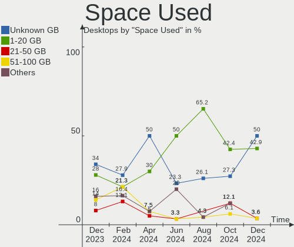
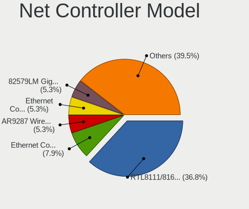
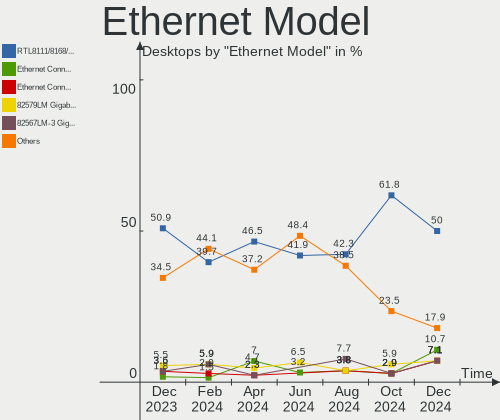

BlackPanther Hardware Trends (Desktops)
---------------------------------------

A project to identify most popular hardware characteristics and track their change
over time based on data collected by BlackPanther users at https://Linux-Hardware.org.

Anyone can contribute to this report by the [hw-probe](https://github.com/linuxhw/hw-probe) tool:

    sudo -E hw-probe -all -upload

Full-feature report is available here: https://linux-hardware.org/?view=trends

Period: Mar, 2022.

Contents
--------

* [ System ](#system)
  - [ OS                       ](#os)
  - [ OS Family                ](#os-family)
  - [ Kernel                   ](#kernel)
  - [ Kernel Family            ](#kernel-family)
  - [ Kernel Major Ver.        ](#kernel-major-ver)
  - [ Arch                     ](#arch)
  - [ DE                       ](#de)
  - [ Display Server           ](#display-server)
  - [ Display Manager          ](#display-manager)
  - [ OS Lang                  ](#os-lang)
  - [ Boot Mode                ](#boot-mode)
  - [ Filesystem               ](#filesystem)
  - [ Part. scheme             ](#part-scheme)
  - [ Dual Boot with Linux/BSD ](#dual-boot-with-linuxbsd)
  - [ Dual Boot (Win)          ](#dual-boot-win)

* [ Board ](#board)
  - [ Vendor                   ](#vendor)
  - [ Model                    ](#model)
  - [ Model Family             ](#model-family)
  - [ MFG Year                 ](#mfg-year)
  - [ Form Factor              ](#form-factor)
  - [ Secure Boot              ](#secure-boot)
  - [ Coreboot                 ](#coreboot)
  - [ RAM Size                 ](#ram-size)
  - [ RAM Used                 ](#ram-used)
  - [ Total Drives             ](#total-drives)
  - [ Has CD-ROM               ](#has-cd-rom)
  - [ Has Ethernet             ](#has-ethernet)
  - [ Has WiFi                 ](#has-wifi)
  - [ Has Bluetooth            ](#has-bluetooth)

* [ Location ](#location)
  - [ Country                  ](#country)
  - [ City                     ](#city)

* [ Drives ](#drives)
  - [ Drive Vendor             ](#drive-vendor)
  - [ Drive Model              ](#drive-model)
  - [ HDD Vendor               ](#hdd-vendor)
  - [ SSD Vendor               ](#ssd-vendor)
  - [ Drive Kind               ](#drive-kind)
  - [ Drive Connector          ](#drive-connector)
  - [ Drive Size               ](#drive-size)
  - [ Space Total              ](#space-total)
  - [ Space Used               ](#space-used)
  - [ Malfunc. Drives          ](#malfunc-drives)
  - [ Malfunc. Drive Vendor    ](#malfunc-drive-vendor)
  - [ Malfunc. HDD Vendor      ](#malfunc-hdd-vendor)
  - [ Malfunc. Drive Kind      ](#malfunc-drive-kind)
  - [ Failed Drives            ](#failed-drives)
  - [ Failed Drive Vendor      ](#failed-drive-vendor)
  - [ Drive Status             ](#drive-status)

* [ Storage controller ](#storage-controller)
  - [ Storage Vendor           ](#storage-vendor)
  - [ Storage Model            ](#storage-model)
  - [ Storage Kind             ](#storage-kind)

* [ Processor ](#processor)
  - [ CPU Vendor               ](#cpu-vendor)
  - [ CPU Model                ](#cpu-model)
  - [ CPU Model Family         ](#cpu-model-family)
  - [ CPU Cores                ](#cpu-cores)
  - [ CPU Sockets              ](#cpu-sockets)
  - [ CPU Threads              ](#cpu-threads)
  - [ CPU Op-Modes             ](#cpu-op-modes)
  - [ CPU Microcode            ](#cpu-microcode)
  - [ CPU Microarch            ](#cpu-microarch)

* [ Graphics ](#graphics)
  - [ GPU Vendor               ](#gpu-vendor)
  - [ GPU Model                ](#gpu-model)
  - [ GPU Combo                ](#gpu-combo)
  - [ GPU Driver               ](#gpu-driver)
  - [ GPU Memory               ](#gpu-memory)

* [ Monitor ](#monitor)
  - [ Monitor Vendor           ](#monitor-vendor)
  - [ Monitor Model            ](#monitor-model)
  - [ Monitor Resolution       ](#monitor-resolution)
  - [ Monitor Diagonal         ](#monitor-diagonal)
  - [ Monitor Width            ](#monitor-width)
  - [ Aspect Ratio             ](#aspect-ratio)
  - [ Monitor Area             ](#monitor-area)
  - [ Pixel Density            ](#pixel-density)
  - [ Multiple Monitors        ](#multiple-monitors)

* [ Network ](#network)
  - [ Net Controller Vendor    ](#net-controller-vendor)
  - [ Net Controller Model     ](#net-controller-model)
  - [ Wireless Vendor          ](#wireless-vendor)
  - [ Wireless Model           ](#wireless-model)
  - [ Ethernet Vendor          ](#ethernet-vendor)
  - [ Ethernet Model           ](#ethernet-model)
  - [ Net Controller Kind      ](#net-controller-kind)
  - [ Used Controller          ](#used-controller)
  - [ NICs                     ](#nics)
  - [ IPv6                     ](#ipv6)

* [ Bluetooth ](#bluetooth)
  - [ Bluetooth Vendor         ](#bluetooth-vendor)
  - [ Bluetooth Model          ](#bluetooth-model)

* [ Sound ](#sound)
  - [ Sound Vendor             ](#sound-vendor)
  - [ Sound Model              ](#sound-model)

* [ Memory ](#memory)
  - [ Memory Vendor            ](#memory-vendor)
  - [ Memory Model             ](#memory-model)
  - [ Memory Kind              ](#memory-kind)
  - [ Memory Form Factor       ](#memory-form-factor)
  - [ Memory Size              ](#memory-size)
  - [ Memory Speed             ](#memory-speed)

* [ Printers & scanners ](#printers--scanners)
  - [ Printer Vendor           ](#printer-vendor)
  - [ Printer Model            ](#printer-model)
  - [ Scanner Vendor           ](#scanner-vendor)
  - [ Scanner Model            ](#scanner-model)

* [ Camera ](#camera)
  - [ Camera Vendor            ](#camera-vendor)
  - [ Camera Model             ](#camera-model)

* [ Security ](#security)
  - [ Fingerprint Vendor       ](#fingerprint-vendor)
  - [ Fingerprint Model        ](#fingerprint-model)
  - [ Chipcard Vendor          ](#chipcard-vendor)
  - [ Chipcard Model           ](#chipcard-model)

* [ Unsupported ](#unsupported)
  - [ Unsupported Devices      ](#unsupported-devices)
  - [ Unsupported Device Types ](#unsupported-device-types)

System
------

OS
--

Installed operating systems

| Name              | Desktops | Percent |
|-------------------|----------|---------|
| BlackPanther 18.1 | 22       | 100%    |

OS Family
---------

OS without a version

| Name         | Desktops | Percent |
|--------------|----------|---------|
| BlackPanther | 22       | 100%    |

Kernel
------

Version of the Linux kernel

| Version             | Desktops | Percent |
|---------------------|----------|---------|
| 5.6.14-desktop-2bP  | 16       | 72.73%  |
| 4.18.16-desktop-1bP | 6        | 27.27%  |

Kernel Family
-------------

Linux kernel without a distro release

| Version | Desktops | Percent |
|---------|----------|---------|
| 5.6.14  | 16       | 72.73%  |
| 4.18.16 | 6        | 27.27%  |

Kernel Major Ver.
-----------------

Linux kernel major version

| Version | Desktops | Percent |
|---------|----------|---------|
| 5.6     | 16       | 72.73%  |
| 4.18    | 6        | 27.27%  |

Arch
----

OS architecture (x86_64, i586, etc.)

| Name   | Desktops | Percent |
|--------|----------|---------|
| x86_64 | 22       | 100%    |

DE
--

Desktop Environment

| Name | Desktops | Percent |
|------|----------|---------|
| KDE5 | 22       | 100%    |

Display Server
--------------

X11 or Wayland

| Name | Desktops | Percent |
|------|----------|---------|
| X11  | 22       | 100%    |

Display Manager
---------------

SDDM, LightDM, etc.

| Name | Desktops | Percent |
|------|----------|---------|
| SDDM | 22       | 100%    |

OS Lang
-------

Language

| Lang    | Desktops | Percent |
|---------|----------|---------|
| Unknown | 22       | 100%    |

Boot Mode
---------

EFI or BIOS

| Mode | Desktops | Percent |
|------|----------|---------|
| BIOS | 18       | 81.82%  |
| EFI  | 4        | 18.18%  |

Filesystem
----------

Type of filesystem

| Type    | Desktops | Percent |
|---------|----------|---------|
| Overlay | 21       | 95.45%  |
| Ext4    | 1        | 4.55%   |

Part. scheme
------------

Scheme of partitioning

| Type | Desktops | Percent |
|------|----------|---------|
| MBR  | 15       | 68.18%  |
| GPT  | 7        | 31.82%  |

Dual Boot with Linux/BSD
------------------------

Hosting more than one Linux/BSD

| Dual boot | Desktops | Percent |
|-----------|----------|---------|
| Yes       | 12       | 54.55%  |
| No        | 10       | 45.45%  |

Dual Boot (Win)
---------------

Hosting Linux and Windows

| Dual boot | Desktops | Percent |
|-----------|----------|---------|
| Yes       | 15       | 68.18%  |
| No        | 7        | 31.82%  |

Board
-----

Vendor
------

Motherboard manufacturer

| Name                | Desktops | Percent |
|---------------------|----------|---------|
| Gigabyte Technology | 5        | 22.73%  |
| ASUSTek Computer    | 4        | 18.18%  |
| Hewlett-Packard     | 3        | 13.64%  |
| Lenovo              | 2        | 9.09%   |
| ASRock              | 2        | 9.09%   |
| MSI                 | 1        | 4.55%   |
| Fujitsu Siemens     | 1        | 4.55%   |
| Fujitsu             | 1        | 4.55%   |
| Dell                | 1        | 4.55%   |
| Apple               | 1        | 4.55%   |
| Acer                | 1        | 4.55%   |

Model
-----

Motherboard model

| Name                                  | Desktops | Percent |
|---------------------------------------|----------|---------|
| MSI MS-7B78                           | 1        | 4.55%   |
| Lenovo ThinkCentre M77 1996AB8        | 1        | 4.55%   |
| Lenovo ThinkCentre M70e 0832A26       | 1        | 4.55%   |
| HP ProDesk 600 G1 SFF                 | 1        | 4.55%   |
| HP Compaq Pro 6300 MT                 | 1        | 4.55%   |
| HP Compaq dc7800p Small Form Factor   | 1        | 4.55%   |
| Gigabyte H61M-S2PV                    | 1        | 4.55%   |
| Gigabyte H61M-D2-B3                   | 1        | 4.55%   |
| Gigabyte GA-78LMT-USB3 R2             | 1        | 4.55%   |
| Gigabyte G41MT-S2PT                   | 1        | 4.55%   |
| Gigabyte B450M GAMING                 | 1        | 4.55%   |
| Fujitsu Siemens AMILO Desktop Pi3620A | 1        | 4.55%   |
| Fujitsu ESPRIMO P710                  | 1        | 4.55%   |
| Dell OptiPlex 755                     | 1        | 4.55%   |
| ASUS ROG STRIX X370-F GAMING          | 1        | 4.55%   |
| ASUS Rampage III Extreme              | 1        | 4.55%   |
| ASUS PRIME B365M-A                    | 1        | 4.55%   |
| ASUS M5A78L-M PLUS/USB3               | 1        | 4.55%   |
| ASRock FM2A75M Pro4+                  | 1        | 4.55%   |
| ASRock B75 Pro3                       | 1        | 4.55%   |
| Apple MacPro2,1                       | 1        | 4.55%   |
| Acer Veriton M4610G                   | 1        | 4.55%   |

Model Family
------------

Motherboard model prefix

| Name                   | Desktops | Percent |
|------------------------|----------|---------|
| Lenovo ThinkCentre     | 2        | 9.09%   |
| HP Compaq              | 2        | 9.09%   |
| MSI MS-7B78            | 1        | 4.55%   |
| HP ProDesk             | 1        | 4.55%   |
| Gigabyte H61M-S2PV     | 1        | 4.55%   |
| Gigabyte H61M-D2-B3    | 1        | 4.55%   |
| Gigabyte GA-78LMT-USB3 | 1        | 4.55%   |
| Gigabyte G41MT-S2PT    | 1        | 4.55%   |
| Gigabyte B450M         | 1        | 4.55%   |
| Fujitsu Siemens AMILO  | 1        | 4.55%   |
| Fujitsu ESPRIMO        | 1        | 4.55%   |
| Dell OptiPlex          | 1        | 4.55%   |
| ASUS ROG               | 1        | 4.55%   |
| ASUS Rampage           | 1        | 4.55%   |
| ASUS PRIME             | 1        | 4.55%   |
| ASUS M5A78L-M          | 1        | 4.55%   |
| ASRock FM2A75M         | 1        | 4.55%   |
| ASRock B75             | 1        | 4.55%   |
| Apple MacPro2          | 1        | 4.55%   |
| Acer Veriton           | 1        | 4.55%   |

MFG Year
--------

Motherboard manufacture year

| Year | Desktops | Percent |
|------|----------|---------|
| 2012 | 5        | 22.73%  |
| 2011 | 4        | 18.18%  |
| 2018 | 3        | 13.64%  |
| 2007 | 3        | 13.64%  |
| 2019 | 1        | 4.55%   |
| 2017 | 1        | 4.55%   |
| 2016 | 1        | 4.55%   |
| 2014 | 1        | 4.55%   |
| 2013 | 1        | 4.55%   |
| 2010 | 1        | 4.55%   |
| 2008 | 1        | 4.55%   |

Form Factor
-----------

Physical design of the computer

| Name    | Desktops | Percent |
|---------|----------|---------|
| Desktop | 22       | 100%    |

Secure Boot
-----------

Enabled or disabled

| State    | Desktops | Percent |
|----------|----------|---------|
| Disabled | 22       | 100%    |

Coreboot
--------

Have coreboot on board

| Used | Desktops | Percent |
|------|----------|---------|
| No   | 22       | 100%    |

RAM Size
--------

Total RAM memory

| Size in GB | Desktops | Percent |
|------------|----------|---------|
| 8.01-16.0  | 9        | 40.91%  |
| 3.01-4.0   | 8        | 36.36%  |
| 4.01-8.0   | 2        | 9.09%   |
| 32.01-64.0 | 1        | 4.55%   |
| 24.01-32.0 | 1        | 4.55%   |
| 16.01-24.0 | 1        | 4.55%   |

RAM Used
--------

Used RAM memory

| Used GB  | Desktops | Percent |
|----------|----------|---------|
| 0.01-0.5 | 17       | 77.27%  |
| 0.51-1.0 | 5        | 22.73%  |

Total Drives
------------

Number of drives on board

| Drives | Desktops | Percent |
|--------|----------|---------|
| 1      | 10       | 45.45%  |
| 2      | 5        | 22.73%  |
| 3      | 4        | 18.18%  |
| 5      | 2        | 9.09%   |
| 6      | 1        | 4.55%   |

Has CD-ROM
----------

Has CD-ROM on board

| Presented | Desktops | Percent |
|-----------|----------|---------|
| Yes       | 12       | 54.55%  |
| No        | 10       | 45.45%  |

Has Ethernet
------------

Has Ethernet on board

| Presented | Desktops | Percent |
|-----------|----------|---------|
| Yes       | 22       | 100%    |

Has WiFi
--------

Has WiFi module

| Presented | Desktops | Percent |
|-----------|----------|---------|
| No        | 20       | 90.91%  |
| Yes       | 2        | 9.09%   |

Has Bluetooth
-------------

Has Bluetooth module

| Presented | Desktops | Percent |
|-----------|----------|---------|
| No        | 20       | 90.91%  |
| Yes       | 2        | 9.09%   |

Location
--------

Country
-------

Geographic location (country)

| Country | Desktops | Percent |
|---------|----------|---------|
| Hungary | 20       | 90.91%  |
| UK      | 1        | 4.55%   |
| Romania | 1        | 4.55%   |

City
----

Geographic location (city)

| City          | Desktops | Percent |
|---------------|----------|---------|
| Budapest      | 6        | 27.27%  |
| Pécs         | 2        | 9.09%   |
| Miskolc       | 2        | 9.09%   |
| Tatabánya    | 1        | 4.55%   |
| Szada         | 1        | 4.55%   |
| Roszke        | 1        | 4.55%   |
| Oroshaza      | 1        | 4.55%   |
| Nagykoros     | 1        | 4.55%   |
| Milton Keynes | 1        | 4.55%   |
| Mezotur       | 1        | 4.55%   |
| Karcag        | 1        | 4.55%   |
| Kapuvar       | 1        | 4.55%   |
| Harsany       | 1        | 4.55%   |
| Eger          | 1        | 4.55%   |
| Bucharest     | 1        | 4.55%   |

Drives
------

Drive Vendor
------------

Hard drive vendors

| Vendor              | Desktops | Drives | Percent |
|---------------------|----------|--------|---------|
| WDC                 | 8        | 10     | 19.05%  |
| Samsung Electronics | 6        | 7      | 14.29%  |
| Kingston            | 6        | 8      | 14.29%  |
| Seagate             | 4        | 7      | 9.52%   |
| Hitachi             | 3        | 3      | 7.14%   |
| Zheino              | 1        | 1      | 2.38%   |
| WD MediaMax         | 1        | 1      | 2.38%   |
| Unknown             | 1        | 1      | 2.38%   |
| Silicon Motion      | 1        | 1      | 2.38%   |
| SATAFIRM            | 1        | 1      | 2.38%   |
| SanDisk             | 1        | 1      | 2.38%   |
| PNY                 | 1        | 1      | 2.38%   |
| OCZ                 | 1        | 1      | 2.38%   |
| MAXTOR              | 1        | 1      | 2.38%   |
| Kingmax             | 1        | 1      | 2.38%   |
| HGST                | 1        | 1      | 2.38%   |
| Gigabyte Technology | 1        | 1      | 2.38%   |
| Crucial             | 1        | 1      | 2.38%   |
| Apacer              | 1        | 1      | 2.38%   |
| A-DATA Technology   | 1        | 1      | 2.38%   |

Drive Model
-----------

Hard drive models

| Model                                | Desktops | Percent |
|--------------------------------------|----------|---------|
| Samsung SSD 860 EVO 250GB            | 2        | 4.08%   |
| Kingston SA400S37240G 240GB SSD      | 2        | 4.08%   |
| Kingston SA400S37120G 120GB SSD      | 2        | 4.08%   |
| Kingston SA2000M8250G 250GB          | 2        | 4.08%   |
| Zheino CHN-NGFFNV2280-256 256GB      | 1        | 2.04%   |
| WDC WDS240G2G0B-00EPW0 240GB SSD     | 1        | 2.04%   |
| WDC WD6400AAKS-07A7B0 640GB          | 1        | 2.04%   |
| WDC WD5000AZRX-00A8LB0 500GB         | 1        | 2.04%   |
| WDC WD5000AAKX-753CA1 500GB          | 1        | 2.04%   |
| WDC WD40EZRZ-00GXCB0 4TB             | 1        | 2.04%   |
| WDC WD1600AAJS-60WAA0 160GB          | 1        | 2.04%   |
| WDC WD1600AAJB-56WRA0 160GB          | 1        | 2.04%   |
| WDC WD10EZRX-00A8LB0 1TB             | 1        | 2.04%   |
| WDC WD10EZEX-00BN5A0 1TB             | 1        | 2.04%   |
| WDC WD10EARX-00N0YB0 1TB             | 1        | 2.04%   |
| WD MediaMax WL160GSA872B 160GB       | 1        | 2.04%   |
| Unknown SSD0128S00 128GB             | 1        | 2.04%   |
| Silicon Motion BW-NV1 128GB          | 1        | 2.04%   |
| Seagate ST500DM002-1BD142 500GB      | 1        | 2.04%   |
| Seagate ST3500418AS 500GB            | 1        | 2.04%   |
| Seagate ST3320418AS 320GB            | 1        | 2.04%   |
| Seagate ST3160815AS 160GB            | 1        | 2.04%   |
| Seagate ST3120026AS 120GB            | 1        | 2.04%   |
| Seagate ST3000DM001-1ER166 3TB       | 1        | 2.04%   |
| SATAFIRM S11 240GB SSD               | 1        | 2.04%   |
| SanDisk SD9TB8W1T001001 1TB SSD      | 1        | 2.04%   |
| Samsung SSD 870 EVO 250GB            | 1        | 2.04%   |
| Samsung SSD 860 QVO 2TB              | 1        | 2.04%   |
| Samsung SSD 860 EVO 500GB            | 1        | 2.04%   |
| Samsung HD154UI 1TB                  | 1        | 2.04%   |
| Samsung HD103UJ 1TB                  | 1        | 2.04%   |
| PNY CS900 120GB SSD                  | 1        | 2.04%   |
| OCZ VERTEX4 128GB SSD                | 1        | 2.04%   |
| MAXTOR 6V250F0 256GB                 | 1        | 2.04%   |
| Kingston SUV400S37120G 120GB SSD     | 1        | 2.04%   |
| Kingston SA400S37480G 480GB SSD      | 1        | 2.04%   |
| Kingmax SSD 240GB                    | 1        | 2.04%   |
| Hitachi HTS545050B9A300 500GB        | 1        | 2.04%   |
| Hitachi HDS721050CLA362 500GB        | 1        | 2.04%   |
| Hitachi HDP725025GLA380 250GB        | 1        | 2.04%   |
| HGST HTS541010B7E610 1TB             | 1        | 2.04%   |
| Gigabyte GP-GSTFS31120GNTD 120GB SSD | 1        | 2.04%   |
| Crucial CT120BX500SSD1 120GB         | 1        | 2.04%   |
| Apacer AS340 240GB SSD               | 1        | 2.04%   |
| A-DATA SU650 120GB SSD               | 1        | 2.04%   |

HDD Vendor
----------

Hard disk drive vendors

| Vendor              | Desktops | Drives | Percent |
|---------------------|----------|--------|---------|
| WDC                 | 7        | 9      | 36.84%  |
| Seagate             | 4        | 7      | 21.05%  |
| Hitachi             | 3        | 3      | 15.79%  |
| Samsung Electronics | 2        | 2      | 10.53%  |
| WD MediaMax         | 1        | 1      | 5.26%   |
| MAXTOR              | 1        | 1      | 5.26%   |
| HGST                | 1        | 1      | 5.26%   |

SSD Vendor
----------

Solid state drive vendors

| Vendor              | Desktops | Drives | Percent |
|---------------------|----------|--------|---------|
| Kingston            | 5        | 6      | 25%     |
| Samsung Electronics | 4        | 5      | 20%     |
| WDC                 | 1        | 1      | 5%      |
| Unknown             | 1        | 1      | 5%      |
| SATAFIRM            | 1        | 1      | 5%      |
| SanDisk             | 1        | 1      | 5%      |
| PNY                 | 1        | 1      | 5%      |
| OCZ                 | 1        | 1      | 5%      |
| Kingmax             | 1        | 1      | 5%      |
| Gigabyte Technology | 1        | 1      | 5%      |
| Crucial             | 1        | 1      | 5%      |
| Apacer              | 1        | 1      | 5%      |
| A-DATA Technology   | 1        | 1      | 5%      |

Drive Kind
----------

HDD or SSD

| Kind | Desktops | Drives | Percent |
|------|----------|--------|---------|
| HDD  | 16       | 24     | 47.06%  |
| SSD  | 15       | 22     | 44.12%  |
| NVMe | 3        | 4      | 8.82%   |

Drive Connector
---------------

SATA, SAS, NVMe, etc.

| Type | Desktops | Drives | Percent |
|------|----------|--------|---------|
| SATA | 22       | 46     | 88%     |
| NVMe | 3        | 4      | 12%     |

Drive Size
----------

Size of hard drive

| Size in TB | Desktops | Drives | Percent |
|------------|----------|--------|---------|
| 0.01-0.5   | 20       | 34     | 66.67%  |
| 0.51-1.0   | 7        | 8      | 23.33%  |
| 3.01-4.0   | 1        | 1      | 3.33%   |
| 2.01-3.0   | 1        | 2      | 3.33%   |
| 1.01-2.0   | 1        | 1      | 3.33%   |

Space Total
-----------

Amount of disk space available on the file system

| Size in GB | Desktops | Percent |
|------------|----------|---------|
| Unknown    | 21       | 95.45%  |
| 251-500    | 1        | 4.55%   |

Space Used
----------

Amount of used disk space

| Used GB | Desktops | Percent |
|---------|----------|---------|
| Unknown | 21       | 95.45%  |
| 1-20    | 1        | 4.55%   |

Malfunc. Drives
---------------

Drive models with a malfunction

| Model                           | Desktops | Drives | Percent |
|---------------------------------|----------|--------|---------|
| WDC WD6400AAKS-07A7B0 640GB     | 1        | 1      | 7.69%   |
| WDC WD10EZRX-00A8LB0 1TB        | 1        | 1      | 7.69%   |
| WDC WD10EARX-00N0YB0 1TB        | 1        | 1      | 7.69%   |
| WD MediaMax WL160GSA872B 160GB  | 1        | 1      | 7.69%   |
| Seagate ST500DM002-1BD142 500GB | 1        | 1      | 7.69%   |
| Seagate ST3320418AS 320GB       | 1        | 1      | 7.69%   |
| Seagate ST3120026AS 120GB       | 1        | 1      | 7.69%   |
| Seagate ST3000DM001-1ER166 3TB  | 1        | 2      | 7.69%   |
| SATAFIRM S11 240GB SSD          | 1        | 1      | 7.69%   |
| Samsung Electronics HD154UI 1TB | 1        | 1      | 7.69%   |
| Samsung Electronics HD103UJ 1TB | 1        | 1      | 7.69%   |
| MAXTOR 6V250F0 256GB            | 1        | 1      | 7.69%   |
| Hitachi HTS545050B9A300 500GB   | 1        | 1      | 7.69%   |

Malfunc. Drive Vendor
---------------------

Vendors of faulty drives

| Vendor              | Desktops | Drives | Percent |
|---------------------|----------|--------|---------|
| WDC                 | 3        | 3      | 25%     |
| Seagate             | 3        | 5      | 25%     |
| Samsung Electronics | 2        | 2      | 16.67%  |
| WD MediaMax         | 1        | 1      | 8.33%   |
| SATAFIRM            | 1        | 1      | 8.33%   |
| MAXTOR              | 1        | 1      | 8.33%   |
| Hitachi             | 1        | 1      | 8.33%   |

Malfunc. HDD Vendor
-------------------

Vendors of faulty HDD drives

| Vendor              | Desktops | Drives | Percent |
|---------------------|----------|--------|---------|
| WDC                 | 3        | 3      | 27.27%  |
| Seagate             | 3        | 5      | 27.27%  |
| Samsung Electronics | 2        | 2      | 18.18%  |
| WD MediaMax         | 1        | 1      | 9.09%   |
| MAXTOR              | 1        | 1      | 9.09%   |
| Hitachi             | 1        | 1      | 9.09%   |

Malfunc. Drive Kind
-------------------

Kinds of faulty drives

| Kind | Desktops | Drives | Percent |
|------|----------|--------|---------|
| HDD  | 10       | 13     | 90.91%  |
| SSD  | 1        | 1      | 9.09%   |

Failed Drives
-------------

Failed drive models

Zero info for selected period =(

Failed Drive Vendor
-------------------

Failed drive vendors

Zero info for selected period =(

Drive Status
------------

Number of failed and malfunc. drives

| Status  | Desktops | Drives | Percent |
|---------|----------|--------|---------|
| Works   | 18       | 36     | 62.07%  |
| Malfunc | 11       | 14     | 37.93%  |

Storage controller
------------------

Storage Vendor
--------------

Storage controller vendors

| Vendor                      | Desktops | Percent |
|-----------------------------|----------|---------|
| Intel                       | 14       | 46.67%  |
| AMD                         | 7        | 23.33%  |
| Silicon Motion              | 2        | 6.67%   |
| Kingston Technology Company | 2        | 6.67%   |
| VIA Technologies            | 1        | 3.33%   |
| Nvidia                      | 1        | 3.33%   |
| Marvell Technology Group    | 1        | 3.33%   |
| JMicron Technology          | 1        | 3.33%   |
| ASMedia Technology          | 1        | 3.33%   |

Storage Model
-------------

Storage controller models

| Model                                                                                   | Desktops | Percent |
|-----------------------------------------------------------------------------------------|----------|---------|
| Intel 7 Series/C210 Series Chipset Family 6-port SATA Controller [AHCI mode]            | 3        | 6.82%   |
| Intel 6 Series/C200 Series Chipset Family 6 port Desktop SATA AHCI Controller           | 3        | 6.82%   |
| AMD FCH SATA Controller [AHCI mode]                                                     | 3        | 6.82%   |
| Silicon Motion SM2263EN/SM2263XT SSD Controller                                         | 2        | 4.55%   |
| Kingston Company A2000 NVMe SSD                                                         | 2        | 4.55%   |
| Intel NM10/ICH7 Family SATA Controller [IDE mode]                                       | 2        | 4.55%   |
| Intel 82801G (ICH7 Family) IDE Controller                                               | 2        | 4.55%   |
| AMD SB7x0/SB8x0/SB9x0 SATA Controller [IDE mode]                                        | 2        | 4.55%   |
| AMD SB7x0/SB8x0/SB9x0 IDE Controller                                                    | 2        | 4.55%   |
| AMD 400 Series Chipset SATA Controller                                                  | 2        | 4.55%   |
| VIA VT6421 IDE/SATA Controller                                                          | 1        | 2.27%   |
| Nvidia MCP73 SATA Controller (IDE mode)                                                 | 1        | 2.27%   |
| Marvell Group 88SE91A3 SATA-600 Controller                                              | 1        | 2.27%   |
| JMicron JMB363 SATA/IDE Controller                                                      | 1        | 2.27%   |
| Intel 82Q35 Express PT IDER Controller                                                  | 1        | 2.27%   |
| Intel 82801JI (ICH10 Family) 4 port SATA IDE Controller #1                              | 1        | 2.27%   |
| Intel 82801JI (ICH10 Family) 2 port SATA IDE Controller #2                              | 1        | 2.27%   |
| Intel 82801IR/IO/IH (ICH9R/DO/DH) 6 port SATA Controller [AHCI mode]                    | 1        | 2.27%   |
| Intel 82801IR/IO/IH (ICH9R/DO/DH) 4 port SATA Controller [IDE mode]                     | 1        | 2.27%   |
| Intel 82801I (ICH9 Family) 2 port SATA Controller [IDE mode]                            | 1        | 2.27%   |
| Intel 8 Series/C220 Series Chipset Family 6-port SATA Controller 1 [AHCI mode]          | 1        | 2.27%   |
| Intel 631xESB/632xESB/3100 Chipset SATA IDE Controller                                  | 1        | 2.27%   |
| Intel 631xESB/632xESB IDE Controller                                                    | 1        | 2.27%   |
| Intel 6 Series/C200 Series Chipset Family IDE-r Controller                              | 1        | 2.27%   |
| Intel 6 Series/C200 Series Chipset Family Desktop SATA Controller (IDE mode, ports 4-5) | 1        | 2.27%   |
| Intel 6 Series/C200 Series Chipset Family Desktop SATA Controller (IDE mode, ports 0-3) | 1        | 2.27%   |
| Intel 200 Series PCH SATA controller [AHCI mode]                                        | 1        | 2.27%   |
| ASMedia ASM1062 Serial ATA Controller                                                   | 1        | 2.27%   |
| AMD X370 Series Chipset SATA Controller                                                 | 1        | 2.27%   |
| AMD SB7x0/SB8x0/SB9x0 SATA Controller [AHCI mode]                                       | 1        | 2.27%   |
| AMD FCH IDE Controller                                                                  | 1        | 2.27%   |

Storage Kind
------------

Kind of storage controller (IDE, SATA, NVMe, SAS, ...)

| Kind | Desktops | Percent |
|------|----------|---------|
| SATA | 16       | 51.61%  |
| IDE  | 11       | 35.48%  |
| NVMe | 3        | 9.68%   |
| RAID | 1        | 3.23%   |

Processor
---------

CPU Vendor
----------

Processor vendors

| Vendor | Desktops | Percent |
|--------|----------|---------|
| Intel  | 15       | 68.18%  |
| AMD    | 7        | 31.82%  |

CPU Model
---------

Processor models

| Model                                       | Desktops | Percent |
|---------------------------------------------|----------|---------|
| Intel Core i3-2120 CPU @ 3.30GHz            | 3        | 13.64%  |
| Intel Xeon CPU X5355 @ 2.66GHz              | 1        | 4.55%   |
| Intel Pentium CPU G840 @ 2.80GHz            | 1        | 4.55%   |
| Intel Core i7 CPU X 980 @ 3.33GHz           | 1        | 4.55%   |
| Intel Core i5-3470 CPU @ 3.20GHz            | 1        | 4.55%   |
| Intel Core i5-2400 CPU @ 3.10GHz            | 1        | 4.55%   |
| Intel Core i3-8100 CPU @ 3.60GHz            | 1        | 4.55%   |
| Intel Core 2 Quad CPU Q9400 @ 2.66GHz       | 1        | 4.55%   |
| Intel Core 2 Quad CPU Q9300 @ 2.50GHz       | 1        | 4.55%   |
| Intel Core 2 Quad CPU Q8200 @ 2.33GHz       | 1        | 4.55%   |
| Intel Core 2 Quad CPU Q6600 @ 2.40GHz       | 1        | 4.55%   |
| Intel Core 2 Duo CPU E8500 @ 3.16GHz        | 1        | 4.55%   |
| Intel Celeron CPU G1840 @ 2.80GHz           | 1        | 4.55%   |
| AMD Ryzen 7 1700 Eight-Core Processor       | 1        | 4.55%   |
| AMD Ryzen 5 3400G with Radeon Vega Graphics | 1        | 4.55%   |
| AMD Ryzen 5 1600 Six-Core Processor         | 1        | 4.55%   |
| AMD FX-8350 Eight-Core Processor            | 1        | 4.55%   |
| AMD FX-4100 Quad-Core Processor             | 1        | 4.55%   |
| AMD Athlon II X2 240e Processor             | 1        | 4.55%   |
| AMD A8-6600K APU with Radeon HD Graphics    | 1        | 4.55%   |

CPU Model Family
----------------

Processor model prefix

| Model             | Desktops | Percent |
|-------------------|----------|---------|
| Intel Core i3     | 4        | 18.18%  |
| Intel Core 2 Quad | 4        | 18.18%  |
| Intel Core i5     | 2        | 9.09%   |
| AMD Ryzen 5       | 2        | 9.09%   |
| AMD FX            | 2        | 9.09%   |
| Intel Xeon        | 1        | 4.55%   |
| Intel Pentium     | 1        | 4.55%   |
| Intel Core i7     | 1        | 4.55%   |
| Intel Core 2 Duo  | 1        | 4.55%   |
| Intel Celeron     | 1        | 4.55%   |
| AMD Ryzen 7       | 1        | 4.55%   |
| AMD Athlon II X2  | 1        | 4.55%   |
| AMD A8            | 1        | 4.55%   |

CPU Cores
---------

Number of processor cores

| Number | Desktops | Percent |
|--------|----------|---------|
| 4      | 9        | 40.91%  |
| 2      | 9        | 40.91%  |
| 8      | 2        | 9.09%   |
| 6      | 2        | 9.09%   |

CPU Sockets
-----------

Number of sockets

| Number | Desktops | Percent |
|--------|----------|---------|
| 1      | 21       | 95.45%  |
| 2      | 1        | 4.55%   |

CPU Threads
-----------

Threads per core (Hyper-Threading)

| Number | Desktops | Percent |
|--------|----------|---------|
| 1      | 14       | 63.64%  |
| 2      | 8        | 36.36%  |

CPU Op-Modes
------------

CPU Operation Modes (32-bit, 64-bit)

| Op mode        | Desktops | Percent |
|----------------|----------|---------|
| 32-bit, 64-bit | 22       | 100%    |

CPU Microcode
-------------

Microcode number

| Number     | Desktops | Percent |
|------------|----------|---------|
| 0x206a7    | 5        | 22.73%  |
| 0x1067a    | 2        | 9.09%   |
| 0x10677    | 2        | 9.09%   |
| 0x08001138 | 2        | 9.09%   |
| 0x906eb    | 1        | 4.55%   |
| 0x6fb      | 1        | 4.55%   |
| 0x6f7      | 1        | 4.55%   |
| 0x306c3    | 1        | 4.55%   |
| 0x306a9    | 1        | 4.55%   |
| 0x206c2    | 1        | 4.55%   |
| 0x08108109 | 1        | 4.55%   |
| 0x06001119 | 1        | 4.55%   |
| 0x06000852 | 1        | 4.55%   |
| 0x0600063e | 1        | 4.55%   |
| 0x010000c8 | 1        | 4.55%   |

CPU Microarch
-------------

Microarchitecture

| Name        | Desktops | Percent |
|-------------|----------|---------|
| SandyBridge | 5        | 22.73%  |
| Penryn      | 4        | 18.18%  |
| Zen         | 2        | 9.09%   |
| Piledriver  | 2        | 9.09%   |
| Core        | 2        | 9.09%   |
| Zen+        | 1        | 4.55%   |
| Westmere    | 1        | 4.55%   |
| KabyLake    | 1        | 4.55%   |
| K10         | 1        | 4.55%   |
| IvyBridge   | 1        | 4.55%   |
| Haswell     | 1        | 4.55%   |
| Bulldozer   | 1        | 4.55%   |

Graphics
--------

GPU Vendor
----------

Vendors of graphics cards

| Vendor | Desktops | Percent |
|--------|----------|---------|
| Nvidia | 9        | 40.91%  |
| Intel  | 7        | 31.82%  |
| AMD    | 6        | 27.27%  |

GPU Model
---------

Graphics card models

| Model                                                                       | Desktops | Percent |
|-----------------------------------------------------------------------------|----------|---------|
| Nvidia GT218 [GeForce 210]                                                  | 2        | 9.09%   |
| Intel 82Q35 Express Integrated Graphics Controller                          | 2        | 9.09%   |
| Nvidia GT218 [GeForce G210]                                                 | 1        | 4.55%   |
| Nvidia GP108 [GeForce GT 1030]                                              | 1        | 4.55%   |
| Nvidia GP106 [GeForce GTX 1060 3GB]                                         | 1        | 4.55%   |
| Nvidia GP102 [GeForce GTX 1080 Ti]                                          | 1        | 4.55%   |
| Nvidia GK107 [GeForce GT 640]                                               | 1        | 4.55%   |
| Nvidia GF119 [GeForce GT 610]                                               | 1        | 4.55%   |
| Nvidia G96 [GeForce 9500 GS]                                                | 1        | 4.55%   |
| Intel Xeon E3-1200 v3/4th Gen Core Processor Integrated Graphics Controller | 1        | 4.55%   |
| Intel Xeon E3-1200 v2/3rd Gen Core processor Graphics Controller            | 1        | 4.55%   |
| Intel CoffeeLake-S GT2 [UHD Graphics 630]                                   | 1        | 4.55%   |
| Intel 4 Series Chipset Integrated Graphics Controller                       | 1        | 4.55%   |
| Intel 2nd Generation Core Processor Family Integrated Graphics Controller   | 1        | 4.55%   |
| AMD RV630 XT [Radeon HD 2600 XT]                                            | 1        | 4.55%   |
| AMD RS880 [Radeon HD 4250]                                                  | 1        | 4.55%   |
| AMD Richland [Radeon HD 8570D]                                              | 1        | 4.55%   |
| AMD Picasso/Raven 2 [Radeon Vega Series / Radeon Vega Mobile Series]        | 1        | 4.55%   |
| AMD Oland XT [Radeon HD 8670 / R5 340X OEM / R7 250/350/350X OEM]           | 1        | 4.55%   |
| AMD Cypress XT [Radeon HD 5870]                                             | 1        | 4.55%   |

GPU Combo
---------

Combinations of graphics cards

| Name       | Desktops | Percent |
|------------|----------|---------|
| 1 x Nvidia | 9        | 40.91%  |
| 1 x Intel  | 7        | 31.82%  |
| 1 x AMD    | 6        | 27.27%  |

GPU Driver
----------

Free vs proprietary

| Driver  | Desktops | Percent |
|---------|----------|---------|
| Free    | 21       | 95.45%  |
| Unknown | 1        | 4.55%   |

GPU Memory
----------

Total video memory

| Size in GB | Desktops | Percent |
|------------|----------|---------|
| Unknown    | 8        | 36.36%  |
| 0.51-1.0   | 6        | 27.27%  |
| 0.01-0.5   | 4        | 18.18%  |
| 1.01-2.0   | 2        | 9.09%   |
| 2.01-3.0   | 1        | 4.55%   |
| 8.01-16.0  | 1        | 4.55%   |

Monitor
-------

Monitor Vendor
--------------

Monitor vendors

| Vendor               | Desktops | Percent |
|----------------------|----------|---------|
| Goldstar             | 5        | 23.81%  |
| Ancor Communications | 5        | 23.81%  |
| Dell                 | 4        | 19.05%  |
| Samsung Electronics  | 2        | 9.52%   |
| Philips              | 1        | 4.76%   |
| NEC Computers        | 1        | 4.76%   |
| Lenovo               | 1        | 4.76%   |
| BenQ                 | 1        | 4.76%   |
| AOC                  | 1        | 4.76%   |

Monitor Model
-------------

Monitor models

| Model                                                                 | Desktops | Percent |
|-----------------------------------------------------------------------|----------|---------|
| Goldstar L1918S GSM4B31 1280x1024 376x301mm 19.0-inch                 | 2        | 9.52%   |
| Ancor Communications VC279 ACI27C4 1920x1080 598x336mm 27.0-inch      | 2        | 9.52%   |
| Samsung Electronics SyncMaster SAM036F 1440x900 428x255mm 19.6-inch   | 1        | 4.76%   |
| Samsung Electronics S27E500 SAM0D0D 1920x1080 598x336mm 27.0-inch     | 1        | 4.76%   |
| Philips PHL 436M6VBP PHLC179 3840x2160 941x529mm 42.5-inch            | 1        | 4.76%   |
| NEC Computers NP-M230X NEC79BD 1600x900                               | 1        | 4.76%   |
| Lenovo LEN L171 LEN24C9 1280x1024 337x270mm 17.0-inch                 | 1        | 4.76%   |
| Goldstar ULTRAWIDE GSM76FA 2560x1080 531x298mm 24.0-inch              | 1        | 4.76%   |
| Goldstar ULTRAWIDE GSM76F9 2560x1080 531x298mm 24.0-inch              | 1        | 4.76%   |
| Goldstar L1750SQ GSM43E8 1280x1024 338x270mm 17.0-inch                | 1        | 4.76%   |
| Dell U2312HM DEL4072 1920x1080 510x287mm 23.0-inch                    | 1        | 4.76%   |
| Dell SE2717H/HX DELD0A1 1920x1080 598x336mm 27.0-inch                 | 1        | 4.76%   |
| Dell M783p DEL700D 1280x1024 306x230mm 15.1-inch                      | 1        | 4.76%   |
| Dell IN2020 DELF028 1600x900 443x249mm 20.0-inch                      | 1        | 4.76%   |
| BenQ EW277HDR BNQ7948 1920x1080 598x336mm 27.0-inch                   | 1        | 4.76%   |
| AOC 2770 AOC2770 1920x1080 598x336mm 27.0-inch                        | 1        | 4.76%   |
| Ancor Communications VW195 ACI19AB 1440x900 408x255mm 18.9-inch       | 1        | 4.76%   |
| Ancor Communications ASUS VW198 ACI19AA 1680x1050 450x300mm 21.3-inch | 1        | 4.76%   |
| Ancor Communications ASUS VH192 ACI19E4 1366x768 410x230mm 18.5-inch  | 1        | 4.76%   |

Monitor Resolution
------------------

Monitor screen resolution

| Resolution         | Desktops | Percent |
|--------------------|----------|---------|
| 1920x1080 (FHD)    | 6        | 28.57%  |
| 1280x1024 (SXGA)   | 5        | 23.81%  |
| 2560x1080          | 2        | 9.52%   |
| 1600x900 (HD+)     | 2        | 9.52%   |
| 1440x900 (WXGA+)   | 2        | 9.52%   |
| 3840x2160 (4K)     | 1        | 4.76%   |
| 2560x1440 (QHD)    | 1        | 4.76%   |
| 1680x1050 (WSXGA+) | 1        | 4.76%   |
| 1366x768 (WXGA)    | 1        | 4.76%   |

Monitor Diagonal
----------------

Diagonal size in inches

| Inches  | Desktops | Percent |
|---------|----------|---------|
| 27      | 6        | 28.57%  |
| 19      | 4        | 19.05%  |
| 34      | 2        | 9.52%   |
| 17      | 2        | 9.52%   |
| 42      | 1        | 4.76%   |
| 23      | 1        | 4.76%   |
| 21      | 1        | 4.76%   |
| 20      | 1        | 4.76%   |
| 18      | 1        | 4.76%   |
| 15      | 1        | 4.76%   |
| Unknown | 1        | 4.76%   |

Monitor Width
-------------

Physical width

| Width in mm | Desktops | Percent |
|-------------|----------|---------|
| 501-600     | 7        | 33.33%  |
| 401-500     | 5        | 23.81%  |
| 301-350     | 3        | 14.29%  |
| 701-800     | 2        | 9.52%   |
| 351-400     | 2        | 9.52%   |
| 901-1000    | 1        | 4.76%   |
| Unknown     | 1        | 4.76%   |

Aspect Ratio
------------

Proportional relationship between the width and the height

| Ratio | Desktops | Percent |
|-------|----------|---------|
| 16/9  | 11       | 55%     |
| 5/4   | 4        | 20%     |
| 21/9  | 2        | 10%     |
| 4/3   | 1        | 5%      |
| 3/2   | 1        | 5%      |
| 16/10 | 1        | 5%      |

Monitor Area
------------

Area in inch²

| Area in inch² | Desktops | Percent |
|----------------|----------|---------|
| 301-350        | 6        | 28.57%  |
| 151-200        | 5        | 23.81%  |
| 141-150        | 3        | 14.29%  |
| 351-500        | 2        | 9.52%   |
| 201-250        | 2        | 9.52%   |
| 101-110        | 1        | 4.76%   |
| 501-1000       | 1        | 4.76%   |
| Unknown        | 1        | 4.76%   |

Pixel Density
-------------

Pixels per inch

| Density | Desktops | Percent |
|---------|----------|---------|
| 51-100  | 18       | 85.71%  |
| 101-120 | 2        | 9.52%   |
| Unknown | 1        | 4.76%   |

Multiple Monitors
-----------------

Total monitors connected

| Total | Desktops | Percent |
|-------|----------|---------|
| 1     | 20       | 90.91%  |
| 2     | 1        | 4.55%   |
| 0     | 1        | 4.55%   |

Network
-------

Net Controller Vendor
---------------------

Controller vendors

| Vendor                   | Desktops | Percent |
|--------------------------|----------|---------|
| Intel                    | 10       | 41.67%  |
| Realtek Semiconductor    | 8        | 33.33%  |
| TP-Link                  | 1        | 4.17%   |
| Qualcomm Atheros         | 1        | 4.17%   |
| Nvidia                   | 1        | 4.17%   |
| Marvell Technology Group | 1        | 4.17%   |
| IMC Networks             | 1        | 4.17%   |
| Broadcom                 | 1        | 4.17%   |

Net Controller Model
--------------------

Controller models

| Model                                                                  | Desktops | Percent |
|------------------------------------------------------------------------|----------|---------|
| Realtek RTL8111/8168/8411 PCI Express Gigabit Ethernet Controller      | 8        | 33.33%  |
| Intel I211 Gigabit Network Connection                                  | 2        | 8.33%   |
| Intel 82579LM Gigabit Network Connection (Lewisville)                  | 2        | 8.33%   |
| Intel 82566DM-2 Gigabit Network Connection                             | 2        | 8.33%   |
| TP-Link TL-WN821N v5/v6 [RTL8192EU]                                    | 1        | 4.17%   |
| Qualcomm Atheros QCA8171 Gigabit Ethernet                              | 1        | 4.17%   |
| Nvidia MCP73 Ethernet                                                  | 1        | 4.17%   |
| Marvell Group 88E8057 PCI-E Gigabit Ethernet Controller                | 1        | 4.17%   |
| Intel Ethernet Connection I217-LM                                      | 1        | 4.17%   |
| Intel 82579V Gigabit Network Connection                                | 1        | 4.17%   |
| Intel 82567V-2 Gigabit Network Connection                              | 1        | 4.17%   |
| Intel 80003ES2LAN Gigabit Ethernet Controller (Copper)                 | 1        | 4.17%   |
| IMC Networks AW-NU222 802.11bgn Wireless Module [Ralink RT2770+RT2720] | 1        | 4.17%   |
| Broadcom NetXtreme BCM5761 Gigabit Ethernet PCIe                       | 1        | 4.17%   |

Wireless Vendor
---------------

Wireless vendors

| Vendor       | Desktops | Percent |
|--------------|----------|---------|
| TP-Link      | 1        | 50%     |
| IMC Networks | 1        | 50%     |

Wireless Model
--------------

Wireless models

| Model                                                                  | Desktops | Percent |
|------------------------------------------------------------------------|----------|---------|
| TP-Link TL-WN821N v5/v6 [RTL8192EU]                                    | 1        | 50%     |
| IMC Networks AW-NU222 802.11bgn Wireless Module [Ralink RT2770+RT2720] | 1        | 50%     |

Ethernet Vendor
---------------

Ethernet vendors

| Vendor                   | Desktops | Percent |
|--------------------------|----------|---------|
| Intel                    | 10       | 45.45%  |
| Realtek Semiconductor    | 8        | 36.36%  |
| Qualcomm Atheros         | 1        | 4.55%   |
| Nvidia                   | 1        | 4.55%   |
| Marvell Technology Group | 1        | 4.55%   |
| Broadcom                 | 1        | 4.55%   |

Ethernet Model
--------------

Ethernet models

| Model                                                             | Desktops | Percent |
|-------------------------------------------------------------------|----------|---------|
| Realtek RTL8111/8168/8411 PCI Express Gigabit Ethernet Controller | 8        | 36.36%  |
| Intel I211 Gigabit Network Connection                             | 2        | 9.09%   |
| Intel 82579LM Gigabit Network Connection (Lewisville)             | 2        | 9.09%   |
| Intel 82566DM-2 Gigabit Network Connection                        | 2        | 9.09%   |
| Qualcomm Atheros QCA8171 Gigabit Ethernet                         | 1        | 4.55%   |
| Nvidia MCP73 Ethernet                                             | 1        | 4.55%   |
| Marvell Group 88E8057 PCI-E Gigabit Ethernet Controller           | 1        | 4.55%   |
| Intel Ethernet Connection I217-LM                                 | 1        | 4.55%   |
| Intel 82579V Gigabit Network Connection                           | 1        | 4.55%   |
| Intel 82567V-2 Gigabit Network Connection                         | 1        | 4.55%   |
| Intel 80003ES2LAN Gigabit Ethernet Controller (Copper)            | 1        | 4.55%   |
| Broadcom NetXtreme BCM5761 Gigabit Ethernet PCIe                  | 1        | 4.55%   |

Net Controller Kind
-------------------

Ethernet, WiFi or modem

| Kind     | Desktops | Percent |
|----------|----------|---------|
| Ethernet | 22       | 91.67%  |
| WiFi     | 2        | 8.33%   |

Used Controller
---------------

Currently used network controller

| Kind     | Desktops | Percent |
|----------|----------|---------|
| Ethernet | 21       | 95.45%  |
| WiFi     | 1        | 4.55%   |

NICs
----

Total network controllers on board

| Total | Desktops | Percent |
|-------|----------|---------|
| 1     | 21       | 95.45%  |
| 2     | 1        | 4.55%   |

IPv6
----

IPv6 vs IPv4

| Used | Desktops | Percent |
|------|----------|---------|
| No   | 16       | 72.73%  |
| Yes  | 6        | 27.27%  |

Bluetooth
---------

Bluetooth Vendor
----------------

Controller vendors

| Vendor                  | Desktops | Percent |
|-------------------------|----------|---------|
| TP-Link                 | 1        | 50%     |
| Cambridge Silicon Radio | 1        | 50%     |

Bluetooth Model
---------------

Controller models

| Model                                               | Desktops | Percent |
|-----------------------------------------------------|----------|---------|
| TP-Link UB500 Adapter                               | 1        | 50%     |
| Cambridge Silicon Radio Bluetooth Dongle (HCI mode) | 1        | 50%     |

Sound
-----

Sound Vendor
------------

Sound card vendors

| Vendor           | Desktops | Percent |
|------------------|----------|---------|
| Intel            | 13       | 38.24%  |
| AMD              | 10       | 29.41%  |
| Nvidia           | 9        | 26.47%  |
| Creative Labs    | 1        | 2.94%   |
| ASUSTek Computer | 1        | 2.94%   |

Sound Model
-----------

Sound card models

| Model                                                                      | Desktops | Percent |
|----------------------------------------------------------------------------|----------|---------|
| Nvidia High Definition Audio Controller                                    | 3        | 8.11%   |
| Intel 7 Series/C216 Chipset Family High Definition Audio Controller        | 3        | 8.11%   |
| Intel 6 Series/C200 Series Chipset Family High Definition Audio Controller | 3        | 8.11%   |
| AMD SBx00 Azalia (Intel HDA)                                               | 3        | 8.11%   |
| Intel NM10/ICH7 Family High Definition Audio Controller                    | 2        | 5.41%   |
| Intel 82801I (ICH9 Family) HD Audio Controller                             | 2        | 5.41%   |
| AMD Family 17h (Models 00h-0fh) HD Audio Controller                        | 2        | 5.41%   |
| Nvidia MCP73 High Definition Audio                                         | 1        | 2.7%    |
| Nvidia GP108 High Definition Audio Controller                              | 1        | 2.7%    |
| Nvidia GP106 High Definition Audio Controller                              | 1        | 2.7%    |
| Nvidia GP102 HDMI Audio Controller                                         | 1        | 2.7%    |
| Nvidia GK107 HDMI Audio Controller                                         | 1        | 2.7%    |
| Nvidia GF119 HDMI Audio Controller                                         | 1        | 2.7%    |
| Intel Xeon E3-1200 v3/4th Gen Core Processor HD Audio Controller           | 1        | 2.7%    |
| Intel 82801JI (ICH10 Family) HD Audio Controller                           | 1        | 2.7%    |
| Intel 8 Series/C220 Series Chipset High Definition Audio Controller        | 1        | 2.7%    |
| Intel 631xESB/632xESB High Definition Audio Controller                     | 1        | 2.7%    |
| Creative Labs EMU20k2 [Sound Blaster X-Fi Titanium Series]                 | 1        | 2.7%    |
| ASUSTek Computer Xonar U7 MKII                                             | 1        | 2.7%    |
| AMD Trinity HDMI Audio Controller                                          | 1        | 2.7%    |
| AMD RV630 HDMI Audio [Radeon HD 2600 PRO/XT / HD 3610]                     | 1        | 2.7%    |
| AMD Raven/Raven2/Fenghuang HDMI/DP Audio Controller                        | 1        | 2.7%    |
| AMD Oland/Hainan/Cape Verde/Pitcairn HDMI Audio [Radeon HD 7000 Series]    | 1        | 2.7%    |
| AMD FCH Azalia Controller                                                  | 1        | 2.7%    |
| AMD Family 17h/19h HD Audio Controller                                     | 1        | 2.7%    |
| AMD Cypress HDMI Audio [Radeon HD 5830/5850/5870 / 6850/6870 Rebrand]      | 1        | 2.7%    |

Memory
------

Memory Vendor
-------------

Memory module vendors

| Vendor              | Desktops | Percent |
|---------------------|----------|---------|
| Unknown             | 6        | 20%     |
| Kingston            | 5        | 16.67%  |
| Samsung Electronics | 4        | 13.33%  |
| Nanya Technology    | 3        | 10%     |
| Micron Technology   | 3        | 10%     |
| Kingmax             | 3        | 10%     |
| SK Hynix            | 2        | 6.67%   |
| Qimonda             | 2        | 6.67%   |
| Ramaxel Technology  | 1        | 3.33%   |
| G.Skill             | 1        | 3.33%   |

Memory Model
------------

Memory module models

| Model                                                     | Desktops | Percent |
|-----------------------------------------------------------|----------|---------|
| Samsung RAM M378B5273CH0-CH9 4096MB DIMM DDR3 1867MT/s    | 2        | 5.56%   |
| Unknown RAM Module 8192MB DIMM 1333MT/s                   | 1        | 2.78%   |
| Unknown RAM Module 4096MB DIMM DDR3 1333MT/s              | 1        | 2.78%   |
| Unknown RAM Module 4096MB DIMM 1333MT/s                   | 1        | 2.78%   |
| Unknown RAM Module 2048MB DIMM SDRAM 1066MT/s             | 1        | 2.78%   |
| Unknown RAM Module 2048MB DIMM 400MT/s                    | 1        | 2.78%   |
| Unknown RAM Module 2048MB DIMM 1066MT/s                   | 1        | 2.78%   |
| SK Hynix RAM Module 4096MB FB-DIMM DDR2 667MT/s           | 1        | 2.78%   |
| SK Hynix RAM Module 4096MB DIMM DDR3 1333MT/s             | 1        | 2.78%   |
| SK Hynix RAM Module 1024MB FB-DIMM DDR2 667MT/s           | 1        | 2.78%   |
| Samsung RAM M378B2873FHS-CH9 1024MB DIMM DDR3 1333MT/s    | 1        | 2.78%   |
| Samsung RAM M3 78T5663QZ3-CF7 2048MB DIMM DDR2 1639MT/s   | 1        | 2.78%   |
| Ramaxel RAM RMR1810EC58E8F1333 2048MB DIMM DDR3 1333MT/s  | 1        | 2.78%   |
| Qimonda RAM 64T256020EU2.5C2 2048MB DIMM SDRAM            | 1        | 2.78%   |
| Qimonda RAM 64T128020HU3SB 1024MB DIMM DDR2 667MT/s       | 1        | 2.78%   |
| Nanya RAM NT1GT64U8HB0BY-3C 1024MB DIMM DDR2 667MT/s      | 1        | 2.78%   |
| Nanya RAM Module 4096MB FB-DIMM DDR2 667MT/s              | 1        | 2.78%   |
| Nanya RAM Module 2048MB DIMM DDR3 1333MT/s                | 1        | 2.78%   |
| Nanya RAM M2Y2G64TU8HD6B-AC 2048MB DIMM DDR2 800MT/s      | 1        | 2.78%   |
| Micron RAM 8JTF25664AZ-1G4M1 2048MB DIMM DDR3 1333MT/s    | 1        | 2.78%   |
| Micron RAM 8JTF12864AZ-1G1F1 1024MB DIMM DDR3 1067MT/s    | 1        | 2.78%   |
| Micron RAM 16JTF51264AZ-1G4D1 4GB DIMM DDR3 1333MT/s      | 1        | 2.78%   |
| Micron RAM 16JTF25664AZ-1G4G1 2048MB DIMM DDR3 1400MT/s   | 1        | 2.78%   |
| Kingston RAM KHX2666C16/8G 8GB DIMM DDR4 3200MT/s         | 1        | 2.78%   |
| Kingston RAM KHX2400C15/16G 16384MB DIMM DDR4 3334MT/s    | 1        | 2.78%   |
| Kingston RAM KHX1600C10D3/4G 4GB DIMM DDR3 1866MT/s       | 1        | 2.78%   |
| Kingston RAM KCM633-ELC 1024MB DIMM DDR2 2048MT/s         | 1        | 2.78%   |
| Kingston RAM HP698649-154-KEB 2048MB DIMM DDR3 1600MT/s   | 1        | 2.78%   |
| Kingston RAM 99U5584-005.A00LF 4096MB DIMM DDR3 1600MT/s  | 1        | 2.78%   |
| Kingmax RAM GLAG42F-18--------- 8192MB DIMM DDR4 2666MT/s | 1        | 2.78%   |
| Kingmax RAM GLAF62F-D8--------- 4096MB DIMM DDR4 2400MT/s | 1        | 2.78%   |
| Kingmax RAM FLGE85F-C8WLB 2048MB DIMM DDR3 1333MT/s       | 1        | 2.78%   |
| Kingmax RAM FLFF65F-D8KQ9 4096MB DIMM DDR3 1333MT/s       | 1        | 2.78%   |
| Kingmax RAM FLFE85F-C8KM9 2048MB DIMM DDR3 1333MT/s       | 1        | 2.78%   |
| G.Skill RAM F4-3200C16-8GIS 8192MB DIMM DDR4 3200MT/s     | 1        | 2.78%   |

Memory Kind
-----------

Memory module kinds

| Kind    | Desktops | Percent |
|---------|----------|---------|
| DDR3    | 9        | 39.13%  |
| DDR4    | 4        | 17.39%  |
| Unknown | 4        | 17.39%  |
| SDRAM   | 3        | 13.04%  |
| DDR2    | 3        | 13.04%  |

Memory Form Factor
------------------

Physical design of the memory module

| Name    | Desktops | Percent |
|---------|----------|---------|
| DIMM    | 21       | 95.45%  |
| FB-DIMM | 1        | 4.55%   |

Memory Size
-----------

Memory module size

| Size  | Desktops | Percent |
|-------|----------|---------|
| 2048  | 11       | 37.93%  |
| 4096  | 9        | 31.03%  |
| 8192  | 4        | 13.79%  |
| 1024  | 4        | 13.79%  |
| 16384 | 1        | 3.45%   |

Memory Speed
------------

Memory module speed

| Speed | Desktops | Percent |
|-------|----------|---------|
| 1333  | 9        | 29.03%  |
| 1600  | 3        | 9.68%   |
| 3200  | 2        | 6.45%   |
| 1867  | 2        | 6.45%   |
| 1066  | 2        | 6.45%   |
| 800   | 2        | 6.45%   |
| 667   | 2        | 6.45%   |
| 3334  | 1        | 3.23%   |
| 2666  | 1        | 3.23%   |
| 2400  | 1        | 3.23%   |
| 2048  | 1        | 3.23%   |
| 1866  | 1        | 3.23%   |
| 1639  | 1        | 3.23%   |
| 1400  | 1        | 3.23%   |
| 1067  | 1        | 3.23%   |
| 400   | 1        | 3.23%   |

Printers & scanners
-------------------

Printer Vendor
--------------

Printer device vendors

| Vendor          | Desktops | Percent |
|-----------------|----------|---------|
| Hewlett-Packard | 1        | 100%    |

Printer Model
-------------

Printer device models

| Model                              | Desktops | Percent |
|------------------------------------|----------|---------|
| HP DeskJet 2620 All-in-One Printer | 1        | 100%    |

Scanner Vendor
--------------

Scanner device vendors

| Vendor | Desktops | Percent |
|--------|----------|---------|
| Canon  | 1        | 100%    |

Scanner Model
-------------

Scanner device models

| Model                              | Desktops | Percent |
|------------------------------------|----------|---------|
| Canon CanoScan N670U/N676U/LiDE 20 | 1        | 100%    |

Camera
------

Camera Vendor
-------------

Camera device vendors

| Vendor                      | Desktops | Percent |
|-----------------------------|----------|---------|
| Unknown                     | 1        | 25%     |
| Microdia                    | 1        | 25%     |
| Logitech                    | 1        | 25%     |
| KYE Systems (Mouse Systems) | 1        | 25%     |

Camera Model
------------

Camera device models

| Model                                  | Desktops | Percent |
|----------------------------------------|----------|---------|
| Unknown HD camera                      | 1        | 25%     |
| Microdia Camera                        | 1        | 25%     |
| Logitech HD Webcam C525                | 1        | 25%     |
| KYE Systems (Mouse Systems) iSlim 321R | 1        | 25%     |

Security
--------

Fingerprint Vendor
------------------

Fingerprint sensor vendors

Zero info for selected period =(

Fingerprint Model
-----------------

Fingerprint sensor models

Zero info for selected period =(

Chipcard Vendor
---------------

Chipcard module vendors

Zero info for selected period =(

Chipcard Model
--------------

Chipcard module models

Zero info for selected period =(

Unsupported
-----------

Unsupported Devices
-------------------

Total unsupported devices on board

| Total | Desktops | Percent |
|-------|----------|---------|
| 0     | 19       | 86.36%  |
| 1     | 3        | 13.64%  |

Unsupported Device Types
------------------------

Types of unsupported devices

| Type          | Desktops | Percent |
|---------------|----------|---------|
| Graphics card | 3        | 100%    |

