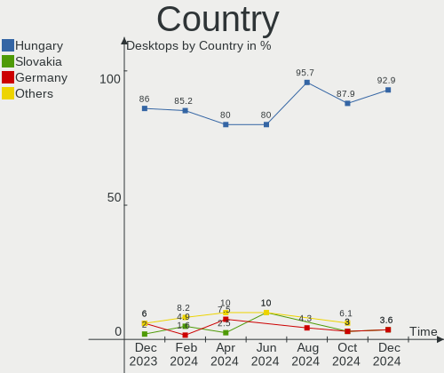
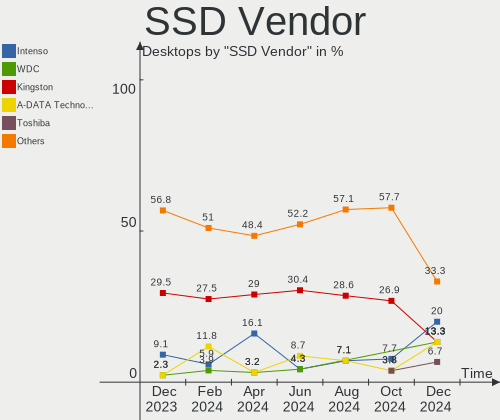
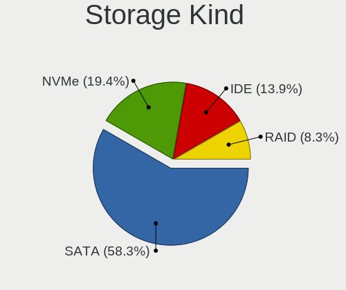
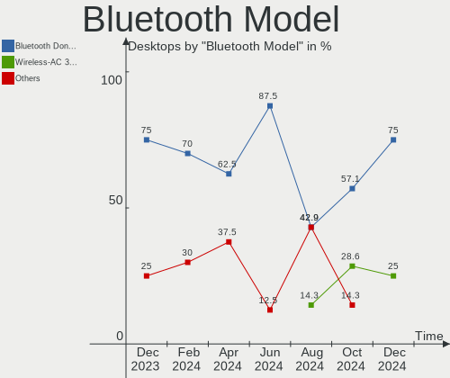
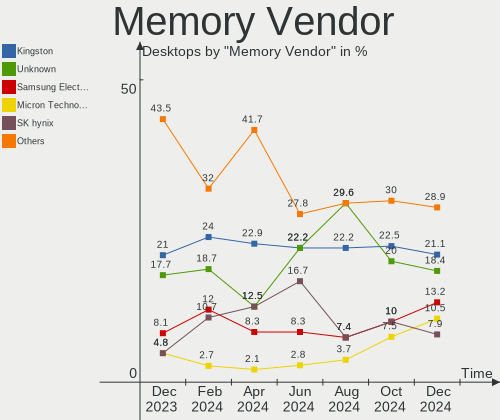

BlackPanther Hardware Trends (Desktops)
---------------------------------------

A project to identify most popular hardware characteristics and track their change
over time based on data collected by BlackPanther users at https://Linux-Hardware.org.

Anyone can contribute to this report by the [hw-probe](https://github.com/linuxhw/hw-probe) tool:

    sudo -E hw-probe -all -upload

This report is for one last month. Overall report since the beginning of time: [TestCoverage](https://github.com/linuxhw/TestCoverage)

Period: Apr, 2022.

Contents
--------

* [ System ](#system)
  - [ OS                       ](#os)
  - [ OS Family                ](#os-family)
  - [ Kernel                   ](#kernel)
  - [ Kernel Family            ](#kernel-family)
  - [ Kernel Major Ver.        ](#kernel-major-ver)
  - [ Arch                     ](#arch)
  - [ DE                       ](#de)
  - [ Display Server           ](#display-server)
  - [ Display Manager          ](#display-manager)
  - [ OS Lang                  ](#os-lang)
  - [ Boot Mode                ](#boot-mode)
  - [ Filesystem               ](#filesystem)
  - [ Part. scheme             ](#part-scheme)
  - [ Dual Boot with Linux/BSD ](#dual-boot-with-linuxbsd)
  - [ Dual Boot (Win)          ](#dual-boot-win)

* [ Board ](#board)
  - [ Vendor                   ](#vendor)
  - [ Model                    ](#model)
  - [ Model Family             ](#model-family)
  - [ MFG Year                 ](#mfg-year)
  - [ Form Factor              ](#form-factor)
  - [ Secure Boot              ](#secure-boot)
  - [ Coreboot                 ](#coreboot)
  - [ RAM Size                 ](#ram-size)
  - [ RAM Used                 ](#ram-used)
  - [ Total Drives             ](#total-drives)
  - [ Has CD-ROM               ](#has-cd-rom)
  - [ Has Ethernet             ](#has-ethernet)
  - [ Has WiFi                 ](#has-wifi)
  - [ Has Bluetooth            ](#has-bluetooth)

* [ Location ](#location)
  - [ Country                  ](#country)
  - [ City                     ](#city)

* [ Drives ](#drives)
  - [ Drive Vendor             ](#drive-vendor)
  - [ Drive Model              ](#drive-model)
  - [ HDD Vendor               ](#hdd-vendor)
  - [ SSD Vendor               ](#ssd-vendor)
  - [ Drive Kind               ](#drive-kind)
  - [ Drive Connector          ](#drive-connector)
  - [ Drive Size               ](#drive-size)
  - [ Space Total              ](#space-total)
  - [ Space Used               ](#space-used)
  - [ Malfunc. Drives          ](#malfunc-drives)
  - [ Malfunc. Drive Vendor    ](#malfunc-drive-vendor)
  - [ Malfunc. HDD Vendor      ](#malfunc-hdd-vendor)
  - [ Malfunc. Drive Kind      ](#malfunc-drive-kind)
  - [ Failed Drives            ](#failed-drives)
  - [ Failed Drive Vendor      ](#failed-drive-vendor)
  - [ Drive Status             ](#drive-status)

* [ Storage controller ](#storage-controller)
  - [ Storage Vendor           ](#storage-vendor)
  - [ Storage Model            ](#storage-model)
  - [ Storage Kind             ](#storage-kind)

* [ Processor ](#processor)
  - [ CPU Vendor               ](#cpu-vendor)
  - [ CPU Model                ](#cpu-model)
  - [ CPU Model Family         ](#cpu-model-family)
  - [ CPU Cores                ](#cpu-cores)
  - [ CPU Sockets              ](#cpu-sockets)
  - [ CPU Threads              ](#cpu-threads)
  - [ CPU Op-Modes             ](#cpu-op-modes)
  - [ CPU Microcode            ](#cpu-microcode)
  - [ CPU Microarch            ](#cpu-microarch)

* [ Graphics ](#graphics)
  - [ GPU Vendor               ](#gpu-vendor)
  - [ GPU Model                ](#gpu-model)
  - [ GPU Combo                ](#gpu-combo)
  - [ GPU Driver               ](#gpu-driver)
  - [ GPU Memory               ](#gpu-memory)

* [ Monitor ](#monitor)
  - [ Monitor Vendor           ](#monitor-vendor)
  - [ Monitor Model            ](#monitor-model)
  - [ Monitor Resolution       ](#monitor-resolution)
  - [ Monitor Diagonal         ](#monitor-diagonal)
  - [ Monitor Width            ](#monitor-width)
  - [ Aspect Ratio             ](#aspect-ratio)
  - [ Monitor Area             ](#monitor-area)
  - [ Pixel Density            ](#pixel-density)
  - [ Multiple Monitors        ](#multiple-monitors)

* [ Network ](#network)
  - [ Net Controller Vendor    ](#net-controller-vendor)
  - [ Net Controller Model     ](#net-controller-model)
  - [ Wireless Vendor          ](#wireless-vendor)
  - [ Wireless Model           ](#wireless-model)
  - [ Ethernet Vendor          ](#ethernet-vendor)
  - [ Ethernet Model           ](#ethernet-model)
  - [ Net Controller Kind      ](#net-controller-kind)
  - [ Used Controller          ](#used-controller)
  - [ NICs                     ](#nics)
  - [ IPv6                     ](#ipv6)

* [ Bluetooth ](#bluetooth)
  - [ Bluetooth Vendor         ](#bluetooth-vendor)
  - [ Bluetooth Model          ](#bluetooth-model)

* [ Sound ](#sound)
  - [ Sound Vendor             ](#sound-vendor)
  - [ Sound Model              ](#sound-model)

* [ Memory ](#memory)
  - [ Memory Vendor            ](#memory-vendor)
  - [ Memory Model             ](#memory-model)
  - [ Memory Kind              ](#memory-kind)
  - [ Memory Form Factor       ](#memory-form-factor)
  - [ Memory Size              ](#memory-size)
  - [ Memory Speed             ](#memory-speed)

* [ Printers & scanners ](#printers--scanners)
  - [ Printer Vendor           ](#printer-vendor)
  - [ Printer Model            ](#printer-model)
  - [ Scanner Vendor           ](#scanner-vendor)
  - [ Scanner Model            ](#scanner-model)

* [ Camera ](#camera)
  - [ Camera Vendor            ](#camera-vendor)
  - [ Camera Model             ](#camera-model)

* [ Security ](#security)
  - [ Fingerprint Vendor       ](#fingerprint-vendor)
  - [ Fingerprint Model        ](#fingerprint-model)
  - [ Chipcard Vendor          ](#chipcard-vendor)
  - [ Chipcard Model           ](#chipcard-model)

* [ Unsupported ](#unsupported)
  - [ Unsupported Devices      ](#unsupported-devices)
  - [ Unsupported Device Types ](#unsupported-device-types)

System
------

OS
--

Installed operating systems

| Name              | Desktops | Percent |
|-------------------|----------|---------|
| BlackPanther 18.1 | 18       | 100%    |

OS Family
---------

OS without a version

| Name         | Desktops | Percent |
|--------------|----------|---------|
| BlackPanther | 18       | 100%    |

Kernel
------

Version of the Linux kernel

| Version             | Desktops | Percent |
|---------------------|----------|---------|
| 4.18.16-desktop-1bP | 10       | 55.56%  |
| 5.6.14-desktop-2bP  | 8        | 44.44%  |

Kernel Family
-------------

Linux kernel without a distro release

| Version | Desktops | Percent |
|---------|----------|---------|
| 4.18.16 | 10       | 55.56%  |
| 5.6.14  | 8        | 44.44%  |

Kernel Major Ver.
-----------------

Linux kernel major version

| Version | Desktops | Percent |
|---------|----------|---------|
| 4.18    | 10       | 55.56%  |
| 5.6     | 8        | 44.44%  |

Arch
----

OS architecture (x86_64, i586, etc.)

| Name   | Desktops | Percent |
|--------|----------|---------|
| x86_64 | 18       | 100%    |

DE
--

Desktop Environment

| Name | Desktops | Percent |
|------|----------|---------|
| KDE5 | 18       | 100%    |

Display Server
--------------

X11 or Wayland

| Name | Desktops | Percent |
|------|----------|---------|
| X11  | 18       | 100%    |

Display Manager
---------------

SDDM, LightDM, etc.

| Name | Desktops | Percent |
|------|----------|---------|
| SDDM | 18       | 100%    |

OS Lang
-------

Language

| Lang    | Desktops | Percent |
|---------|----------|---------|
| Unknown | 18       | 100%    |

Boot Mode
---------

EFI or BIOS

| Mode | Desktops | Percent |
|------|----------|---------|
| BIOS | 16       | 88.89%  |
| EFI  | 2        | 11.11%  |

Filesystem
----------

Type of filesystem

| Type    | Desktops | Percent |
|---------|----------|---------|
| Overlay | 17       | 94.44%  |
| Ext4    | 1        | 5.56%   |

Part. scheme
------------

Scheme of partitioning

| Type | Desktops | Percent |
|------|----------|---------|
| MBR  | 13       | 72.22%  |
| GPT  | 5        | 27.78%  |

Dual Boot with Linux/BSD
------------------------

Hosting more than one Linux/BSD

| Dual boot | Desktops | Percent |
|-----------|----------|---------|
| Yes       | 12       | 66.67%  |
| No        | 6        | 33.33%  |

Dual Boot (Win)
---------------

Hosting Linux and Windows

| Dual boot | Desktops | Percent |
|-----------|----------|---------|
| No        | 12       | 66.67%  |
| Yes       | 6        | 33.33%  |

Board
-----

Vendor
------

Motherboard manufacturer

| Name                | Desktops | Percent |
|---------------------|----------|---------|
| ASRock              | 4        | 22.22%  |
| Gigabyte Technology | 3        | 16.67%  |
| Lenovo              | 2        | 11.11%  |
| Hewlett-Packard     | 2        | 11.11%  |
| ASUSTek Computer    | 2        | 11.11%  |
| MSI                 | 1        | 5.56%   |
| Fujitsu Siemens     | 1        | 5.56%   |
| Fujitsu             | 1        | 5.56%   |
| Dell                | 1        | 5.56%   |
| Apple               | 1        | 5.56%   |

Model
-----

Motherboard model

| Name                                  | Desktops | Percent |
|---------------------------------------|----------|---------|
| ASRock FM2A75M Pro4+                  | 2        | 11.11%  |
| MSI EJ276AA-ABD t3285.de              | 1        | 5.56%   |
| Lenovo ThinkCentre M70e 0832A26       | 1        | 5.56%   |
| Lenovo ThinkCentre A57 98517HG        | 1        | 5.56%   |
| HP Compaq Pro 6300 SFF                | 1        | 5.56%   |
| HP Compaq dc7800p Small Form Factor   | 1        | 5.56%   |
| Gigabyte H61M-S1                      | 1        | 5.56%   |
| Gigabyte GA-MA74GM-S2                 | 1        | 5.56%   |
| Gigabyte G41MT-S2PT                   | 1        | 5.56%   |
| Fujitsu Siemens ESPRIMO EDITION P2511 | 1        | 5.56%   |
| Fujitsu ESPRIMO E7935                 | 1        | 5.56%   |
| Dell OptiPlex 320                     | 1        | 5.56%   |
| ASUS M4A78 PRO                        | 1        | 5.56%   |
| ASUS All Series                       | 1        | 5.56%   |
| ASRock ConRoe1333-D667                | 1        | 5.56%   |
| ASRock B85M                           | 1        | 5.56%   |
| Apple MacPro2,1                       | 1        | 5.56%   |

Model Family
------------

Motherboard model prefix

| Name                    | Desktops | Percent |
|-------------------------|----------|---------|
| Lenovo ThinkCentre      | 2        | 11.11%  |
| HP Compaq               | 2        | 11.11%  |
| ASRock FM2A75M          | 2        | 11.11%  |
| MSI EJ276AA-ABD         | 1        | 5.56%   |
| Gigabyte H61M-S1        | 1        | 5.56%   |
| Gigabyte GA-MA74GM-S2   | 1        | 5.56%   |
| Gigabyte G41MT-S2PT     | 1        | 5.56%   |
| Fujitsu Siemens ESPRIMO | 1        | 5.56%   |
| Fujitsu ESPRIMO         | 1        | 5.56%   |
| Dell OptiPlex           | 1        | 5.56%   |
| ASUS M4A78              | 1        | 5.56%   |
| ASUS All                | 1        | 5.56%   |
| ASRock ConRoe1333-D667  | 1        | 5.56%   |
| ASRock B85M             | 1        | 5.56%   |
| Apple MacPro2           | 1        | 5.56%   |

MFG Year
--------

Motherboard manufacture year

| Year | Desktops | Percent |
|------|----------|---------|
| 2007 | 5        | 27.78%  |
| 2014 | 2        | 11.11%  |
| 2013 | 2        | 11.11%  |
| 2012 | 2        | 11.11%  |
| 2010 | 2        | 11.11%  |
| 2008 | 2        | 11.11%  |
| 2011 | 1        | 5.56%   |
| 2009 | 1        | 5.56%   |
| 2006 | 1        | 5.56%   |

Form Factor
-----------

Physical design of the computer

| Name    | Desktops | Percent |
|---------|----------|---------|
| Desktop | 18       | 100%    |

Secure Boot
-----------

Enabled or disabled

| State    | Desktops | Percent |
|----------|----------|---------|
| Disabled | 18       | 100%    |

Coreboot
--------

Have coreboot on board

| Used | Desktops | Percent |
|------|----------|---------|
| No   | 18       | 100%    |

RAM Size
--------

Total RAM memory

| Size in GB | Desktops | Percent |
|------------|----------|---------|
| 3.01-4.0   | 5        | 27.78%  |
| 1.01-2.0   | 5        | 27.78%  |
| 8.01-16.0  | 4        | 22.22%  |
| 16.01-24.0 | 2        | 11.11%  |
| 4.01-8.0   | 1        | 5.56%   |
| 2.01-3.0   | 1        | 5.56%   |

RAM Used
--------

Used RAM memory

| Used GB  | Desktops | Percent |
|----------|----------|---------|
| 0.01-0.5 | 14       | 77.78%  |
| 0.51-1.0 | 3        | 16.67%  |
| 1.01-2.0 | 1        | 5.56%   |

Total Drives
------------

Number of drives on board

| Drives | Desktops | Percent |
|--------|----------|---------|
| 1      | 13       | 72.22%  |
| 3      | 2        | 11.11%  |
| 2      | 2        | 11.11%  |
| 5      | 1        | 5.56%   |

Has CD-ROM
----------

Has CD-ROM on board

| Presented | Desktops | Percent |
|-----------|----------|---------|
| Yes       | 15       | 83.33%  |
| No        | 3        | 16.67%  |

Has Ethernet
------------

Has Ethernet on board

| Presented | Desktops | Percent |
|-----------|----------|---------|
| Yes       | 18       | 100%    |

Has WiFi
--------

Has WiFi module

| Presented | Desktops | Percent |
|-----------|----------|---------|
| No        | 16       | 88.89%  |
| Yes       | 2        | 11.11%  |

Has Bluetooth
-------------

Has Bluetooth module

| Presented | Desktops | Percent |
|-----------|----------|---------|
| No        | 16       | 88.89%  |
| Yes       | 2        | 11.11%  |

Location
--------

Country
-------

Geographic location (country)

| Country  | Desktops | Percent |
|----------|----------|---------|
| Hungary  | 15       | 83.33%  |
| Slovakia | 1        | 5.56%   |
| Romania  | 1        | 5.56%   |
| Germany  | 1        | 5.56%   |

City
----

Geographic location (city)

| City           | Desktops | Percent |
|----------------|----------|---------|
| Budapest       | 3        | 16.67%  |
| Karcag         | 2        | 11.11%  |
| Tolna          | 1        | 5.56%   |
| Szada          | 1        | 5.56%   |
| Sarisap        | 1        | 5.56%   |
| Roszke         | 1        | 5.56%   |
| Morahalom      | 1        | 5.56%   |
| Mezokovesd     | 1        | 5.56%   |
| Levice         | 1        | 5.56%   |
| Leipzig        | 1        | 5.56%   |
| Hajduszoboszlo | 1        | 5.56%   |
| Gyal           | 1        | 5.56%   |
| Debrecen       | 1        | 5.56%   |
| Bucharest      | 1        | 5.56%   |
| Békéscsaba   | 1        | 5.56%   |

Drives
------

Drive Vendor
------------

Hard drive vendors

| Vendor            | Desktops | Drives | Percent |
|-------------------|----------|--------|---------|
| WDC               | 7        | 7      | 25%     |
| Kingston          | 5        | 5      | 17.86%  |
| Seagate           | 3        | 3      | 10.71%  |
| MAXTOR            | 3        | 3      | 10.71%  |
| A-DATA Technology | 2        | 2      | 7.14%   |
| WD MediaMax       | 1        | 1      | 3.57%   |
| Toshiba           | 1        | 1      | 3.57%   |
| SanDisk           | 1        | 1      | 3.57%   |
| Patriot           | 1        | 1      | 3.57%   |
| Intenso           | 1        | 1      | 3.57%   |
| Hitachi           | 1        | 1      | 3.57%   |
| Apple             | 1        | 1      | 3.57%   |
| Apacer            | 1        | 1      | 3.57%   |

Drive Model
-----------

Hard drive models

| Model                            | Desktops | Percent |
|----------------------------------|----------|---------|
| Kingston SUV400S37120G 120GB SSD | 3        | 10.71%  |
| WDC WD800AAJS-00L7A0 80GB        | 1        | 3.57%   |
| WDC WD5000AZRX-00L4HB0 500GB     | 1        | 3.57%   |
| WDC WD5000AAKS-60Z1A0 500GB      | 1        | 3.57%   |
| WDC WD400BD-75MRA1 40GB          | 1        | 3.57%   |
| WDC WD1600AAJS-00WAA0 160GB      | 1        | 3.57%   |
| WDC WD1600AAJB-56WRA0 160GB      | 1        | 3.57%   |
| WDC WD10EZEX-00KUWA0 1TB         | 1        | 3.57%   |
| WD MediaMax WL160GSA872B 160GB   | 1        | 3.57%   |
| Toshiba DT01ACA100 1TB           | 1        | 3.57%   |
| Seagate ST500DM002-1BD142 500GB  | 1        | 3.57%   |
| Seagate ST380815AS 80GB          | 1        | 3.57%   |
| Seagate ST3320418AS 320GB        | 1        | 3.57%   |
| SanDisk SD9TB8W1T001001 1TB SSD  | 1        | 3.57%   |
| Patriot Burst 120GB SSD          | 1        | 3.57%   |
| MAXTOR 6Y080L0 82GB              | 1        | 3.57%   |
| MAXTOR 6V250F0 256GB             | 1        | 3.57%   |
| MAXTOR 2B020H1 20GB              | 1        | 3.57%   |
| Kingston SA400S37240G 240GB SSD  | 1        | 3.57%   |
| Kingston SA400S37120G 120GB SSD  | 1        | 3.57%   |
| Intenso SSD 120GB                | 1        | 3.57%   |
| Hitachi HDP725025GLA380 250GB    | 1        | 3.57%   |
| Apple HDD ST1000LM024 1TB        | 1        | 3.57%   |
| Apacer AS340 240GB SSD           | 1        | 3.57%   |
| A-DATA SU650 120GB SSD           | 1        | 3.57%   |
| A-DATA SU630 240GB SSD           | 1        | 3.57%   |

HDD Vendor
----------

Hard disk drive vendors

| Vendor      | Desktops | Drives | Percent |
|-------------|----------|--------|---------|
| WDC         | 7        | 7      | 41.18%  |
| Seagate     | 3        | 3      | 17.65%  |
| MAXTOR      | 3        | 3      | 17.65%  |
| WD MediaMax | 1        | 1      | 5.88%   |
| Toshiba     | 1        | 1      | 5.88%   |
| Hitachi     | 1        | 1      | 5.88%   |
| Apple       | 1        | 1      | 5.88%   |

SSD Vendor
----------

Solid state drive vendors

| Vendor            | Desktops | Drives | Percent |
|-------------------|----------|--------|---------|
| Kingston          | 5        | 5      | 45.45%  |
| A-DATA Technology | 2        | 2      | 18.18%  |
| SanDisk           | 1        | 1      | 9.09%   |
| Patriot           | 1        | 1      | 9.09%   |
| Intenso           | 1        | 1      | 9.09%   |
| Apacer            | 1        | 1      | 9.09%   |

Drive Kind
----------

HDD or SSD

| Kind | Desktops | Drives | Percent |
|------|----------|--------|---------|
| HDD  | 14       | 17     | 60.87%  |
| SSD  | 9        | 11     | 39.13%  |

Drive Connector
---------------

SATA, SAS, NVMe, etc.

| Type | Desktops | Drives | Percent |
|------|----------|--------|---------|
| SATA | 18       | 28     | 100%    |

Drive Size
----------

Size of hard drive

| Size in TB | Desktops | Drives | Percent |
|------------|----------|--------|---------|
| 0.01-0.5   | 18       | 24     | 85.71%  |
| 0.51-1.0   | 3        | 4      | 14.29%  |

Space Total
-----------

Amount of disk space available on the file system

| Size in GB | Desktops | Percent |
|------------|----------|---------|
| Unknown    | 17       | 94.44%  |
| 101-250    | 1        | 5.56%   |

Space Used
----------

Amount of used disk space

| Used GB | Desktops | Percent |
|---------|----------|---------|
| Unknown | 17       | 94.44%  |
| 1-20    | 1        | 5.56%   |

Malfunc. Drives
---------------

Drive models with a malfunction

| Model                           | Desktops | Drives | Percent |
|---------------------------------|----------|--------|---------|
| WDC WD5000AZRX-00L4HB0 500GB    | 1        | 1      | 12.5%   |
| WDC WD5000AAKS-60Z1A0 500GB     | 1        | 1      | 12.5%   |
| WD MediaMax WL160GSA872B 160GB  | 1        | 1      | 12.5%   |
| Seagate ST500DM002-1BD142 500GB | 1        | 1      | 12.5%   |
| Seagate ST3320418AS 320GB       | 1        | 1      | 12.5%   |
| MAXTOR 6Y080L0 82GB             | 1        | 1      | 12.5%   |
| MAXTOR 6V250F0 256GB            | 1        | 1      | 12.5%   |
| MAXTOR 2B020H1 20GB             | 1        | 1      | 12.5%   |

Malfunc. Drive Vendor
---------------------

Vendors of faulty drives

| Vendor      | Desktops | Drives | Percent |
|-------------|----------|--------|---------|
| MAXTOR      | 3        | 3      | 37.5%   |
| WDC         | 2        | 2      | 25%     |
| Seagate     | 2        | 2      | 25%     |
| WD MediaMax | 1        | 1      | 12.5%   |

Malfunc. HDD Vendor
-------------------

Vendors of faulty HDD drives

| Vendor      | Desktops | Drives | Percent |
|-------------|----------|--------|---------|
| MAXTOR      | 3        | 3      | 37.5%   |
| WDC         | 2        | 2      | 25%     |
| Seagate     | 2        | 2      | 25%     |
| WD MediaMax | 1        | 1      | 12.5%   |

Malfunc. Drive Kind
-------------------

Kinds of faulty drives

| Kind | Desktops | Drives | Percent |
|------|----------|--------|---------|
| HDD  | 8        | 8      | 100%    |

Failed Drives
-------------

Failed drive models

Zero info for selected period =(

Failed Drive Vendor
-------------------

Failed drive vendors

Zero info for selected period =(

Drive Status
------------

Number of failed and malfunc. drives

| Status  | Desktops | Drives | Percent |
|---------|----------|--------|---------|
| Works   | 14       | 20     | 63.64%  |
| Malfunc | 8        | 8      | 36.36%  |

Storage controller
------------------

Storage Vendor
--------------

Storage controller vendors

| Vendor | Desktops | Percent |
|--------|----------|---------|
| Intel  | 12       | 66.67%  |
| AMD    | 6        | 33.33%  |

Storage Model
-------------

Storage controller models

| Model                                                                                   | Desktops | Percent |
|-----------------------------------------------------------------------------------------|----------|---------|
| Intel NM10/ICH7 Family SATA Controller [IDE mode]                                       | 5        | 15.15%  |
| Intel 82801G (ICH7 Family) IDE Controller                                               | 4        | 12.12%  |
| Intel 8 Series/C220 Series Chipset Family 6-port SATA Controller 1 [AHCI mode]          | 2        | 6.06%   |
| AMD SB7x0/SB8x0/SB9x0 SATA Controller [IDE mode]                                        | 2        | 6.06%   |
| AMD SB7x0/SB8x0/SB9x0 IDE Controller                                                    | 2        | 6.06%   |
| AMD FCH SATA Controller [AHCI mode]                                                     | 2        | 6.06%   |
| AMD FCH IDE Controller                                                                  | 2        | 6.06%   |
| Intel 82Q35 Express PT IDER Controller                                                  | 1        | 3.03%   |
| Intel 82801JD/DO (ICH10 Family) 4-port SATA IDE Controller                              | 1        | 3.03%   |
| Intel 82801JD/DO (ICH10 Family) 2-port SATA IDE Controller                              | 1        | 3.03%   |
| Intel 82801IR/IO/IH (ICH9R/DO/DH) 4 port SATA Controller [IDE mode]                     | 1        | 3.03%   |
| Intel 82801I (ICH9 Family) 2 port SATA Controller [IDE mode]                            | 1        | 3.03%   |
| Intel 7 Series/C210 Series Chipset Family 6-port SATA Controller [AHCI mode]            | 1        | 3.03%   |
| Intel 631xESB/632xESB/3100 Chipset SATA IDE Controller                                  | 1        | 3.03%   |
| Intel 631xESB/632xESB IDE Controller                                                    | 1        | 3.03%   |
| Intel 6 Series/C200 Series Chipset Family Desktop SATA Controller (IDE mode, ports 4-5) | 1        | 3.03%   |
| Intel 6 Series/C200 Series Chipset Family Desktop SATA Controller (IDE mode, ports 0-3) | 1        | 3.03%   |
| AMD SB600 Non-Raid-5 SATA                                                               | 1        | 3.03%   |
| AMD SB600 IDE                                                                           | 1        | 3.03%   |
| AMD IXP SB4x0 Serial ATA Controller                                                     | 1        | 3.03%   |
| AMD IXP SB4x0 IDE Controller                                                            | 1        | 3.03%   |

Storage Kind
------------

Kind of storage controller (IDE, SATA, NVMe, SAS, ...)

| Kind | Desktops | Percent |
|------|----------|---------|
| IDE  | 15       | 65.22%  |
| SATA | 8        | 34.78%  |

Processor
---------

CPU Vendor
----------

Processor vendors

| Vendor | Desktops | Percent |
|--------|----------|---------|
| Intel  | 13       | 72.22%  |
| AMD    | 5        | 27.78%  |

CPU Model
---------

Processor models

| Model                                      | Desktops | Percent |
|--------------------------------------------|----------|---------|
| AMD A8-6600K APU with Radeon HD Graphics   | 2        | 11.11%  |
| Intel Xeon CPU X5355 @ 2.66GHz             | 1        | 5.56%   |
| Intel Genuine CPU 2140 @ 1.60GHz           | 1        | 5.56%   |
| Intel Core i5-4690 CPU @ 3.50GHz           | 1        | 5.56%   |
| Intel Core i5-4590 CPU @ 3.30GHz           | 1        | 5.56%   |
| Intel Core i5-3470 CPU @ 3.20GHz           | 1        | 5.56%   |
| Intel Core i3-3225 CPU @ 3.30GHz           | 1        | 5.56%   |
| Intel Core 2 Quad CPU Q9300 @ 2.50GHz      | 1        | 5.56%   |
| Intel Core 2 Quad CPU Q6600 @ 2.40GHz      | 1        | 5.56%   |
| Intel Core 2 Duo CPU E8500 @ 3.16GHz       | 1        | 5.56%   |
| Intel Core 2 Duo CPU E8200 @ 2.66GHz       | 1        | 5.56%   |
| Intel Core 2 Duo CPU E6550 @ 2.33GHz       | 1        | 5.56%   |
| Intel Core 2 CPU 4300 @ 1.80GHz            | 1        | 5.56%   |
| Intel Celeron CPU 420 @ 1.60GHz            | 1        | 5.56%   |
| AMD Phenom II X4 920 Processor             | 1        | 5.56%   |
| AMD Athlon 64 X2 Dual Core Processor 5200+ | 1        | 5.56%   |
| AMD Athlon 64 X2 Dual Core Processor 3800+ | 1        | 5.56%   |

CPU Model Family
----------------

Processor model prefix

| Model             | Desktops | Percent |
|-------------------|----------|---------|
| Intel Core i5     | 3        | 16.67%  |
| Intel Core 2 Duo  | 3        | 16.67%  |
| Intel Core 2 Quad | 2        | 11.11%  |
| AMD Athlon 64 X2  | 2        | 11.11%  |
| AMD A8            | 2        | 11.11%  |
| Intel Xeon        | 1        | 5.56%   |
| Intel Genuine     | 1        | 5.56%   |
| Intel Core i3     | 1        | 5.56%   |
| Intel Core 2      | 1        | 5.56%   |
| Intel Celeron     | 1        | 5.56%   |
| AMD Phenom II X4  | 1        | 5.56%   |

CPU Cores
---------

Number of processor cores

| Number | Desktops | Percent |
|--------|----------|---------|
| 2      | 9        | 50%     |
| 4      | 6        | 33.33%  |
| 1      | 2        | 11.11%  |
| 8      | 1        | 5.56%   |

CPU Sockets
-----------

Number of sockets

| Number | Desktops | Percent |
|--------|----------|---------|
| 1      | 17       | 94.44%  |
| 2      | 1        | 5.56%   |

CPU Threads
-----------

Threads per core (Hyper-Threading)

| Number | Desktops | Percent |
|--------|----------|---------|
| 1      | 15       | 83.33%  |
| 2      | 3        | 16.67%  |

CPU Op-Modes
------------

CPU Operation Modes (32-bit, 64-bit)

| Op mode        | Desktops | Percent |
|----------------|----------|---------|
| 32-bit, 64-bit | 18       | 100%    |

CPU Microcode
-------------

Microcode number

| Number     | Desktops | Percent |
|------------|----------|---------|
| 0x6fb      | 2        | 11.11%  |
| 0x6f2      | 2        | 11.11%  |
| 0x306c3    | 2        | 11.11%  |
| 0x306a9    | 2        | 11.11%  |
| 0x06001119 | 2        | 11.11%  |
| Unknown    | 2        | 11.11%  |
| 0x6f7      | 1        | 5.56%   |
| 0x1067a    | 1        | 5.56%   |
| 0x10677    | 1        | 5.56%   |
| 0x10676    | 1        | 5.56%   |
| 0x10661    | 1        | 5.56%   |
| 0x010000db | 1        | 5.56%   |

CPU Microarch
-------------

Microarchitecture

| Name       | Desktops | Percent |
|------------|----------|---------|
| Core       | 6        | 33.33%  |
| Penryn     | 3        | 16.67%  |
| Piledriver | 2        | 11.11%  |
| K8 Hammer  | 2        | 11.11%  |
| IvyBridge  | 2        | 11.11%  |
| Haswell    | 2        | 11.11%  |
| K10        | 1        | 5.56%   |

Graphics
--------

GPU Vendor
----------

Vendors of graphics cards

| Vendor | Desktops | Percent |
|--------|----------|---------|
| AMD    | 8        | 44.44%  |
| Intel  | 7        | 38.89%  |
| Nvidia | 3        | 16.67%  |

GPU Model
---------

Graphics card models

| Model                                                                       | Desktops | Percent |
|-----------------------------------------------------------------------------|----------|---------|
| Intel 4 Series Chipset Integrated Graphics Controller                       | 2        | 11.11%  |
| AMD Richland [Radeon HD 8570D]                                              | 2        | 11.11%  |
| Nvidia GM107 [GeForce GTX 750 Ti]                                           | 1        | 5.56%   |
| Nvidia GF108 [GeForce GT 630]                                               | 1        | 5.56%   |
| Nvidia G92GL [Quadro FX 3700]                                               | 1        | 5.56%   |
| Intel Xeon E3-1200 v3/4th Gen Core Processor Integrated Graphics Controller | 1        | 5.56%   |
| Intel IvyBridge GT2 [HD Graphics 4000]                                      | 1        | 5.56%   |
| Intel 82Q35 Express Integrated Graphics Controller                          | 1        | 5.56%   |
| Intel 82G33/G31 Express Integrated Graphics Controller                      | 1        | 5.56%   |
| Intel 82946GZ/GL Integrated Graphics Controller                             | 1        | 5.56%   |
| AMD RV630 XT [Radeon HD 2600 XT]                                            | 1        | 5.56%   |
| AMD RV620 LE [Radeon HD 3450]                                               | 1        | 5.56%   |
| AMD RS780 [Radeon HD 3200]                                                  | 1        | 5.56%   |
| AMD RS480 [Radeon Xpress 200 Series]                                        | 1        | 5.56%   |
| AMD RC410 [Radeon Xpress 200/1100]                                          | 1        | 5.56%   |
| AMD Cypress XT [Radeon HD 5870]                                             | 1        | 5.56%   |

GPU Combo
---------

Combinations of graphics cards

| Name       | Desktops | Percent |
|------------|----------|---------|
| 1 x AMD    | 8        | 44.44%  |
| 1 x Intel  | 7        | 38.89%  |
| 1 x Nvidia | 3        | 16.67%  |

GPU Driver
----------

Free vs proprietary

| Driver  | Desktops | Percent |
|---------|----------|---------|
| Free    | 17       | 94.44%  |
| Unknown | 1        | 5.56%   |

GPU Memory
----------

Total video memory

| Size in GB | Desktops | Percent |
|------------|----------|---------|
| Unknown    | 7        | 38.89%  |
| 0.01-0.5   | 6        | 33.33%  |
| 0.51-1.0   | 4        | 22.22%  |
| 3.01-4.0   | 1        | 5.56%   |

Monitor
-------

Monitor Vendor
--------------

Monitor vendors

| Vendor               | Desktops | Percent |
|----------------------|----------|---------|
| Samsung Electronics  | 4        | 25%     |
| Goldstar             | 3        | 18.75%  |
| BenQ                 | 3        | 18.75%  |
| Ancor Communications | 2        | 12.5%   |
| Hewlett-Packard      | 1        | 6.25%   |
| Fujitsu Siemens      | 1        | 6.25%   |
| Dell                 | 1        | 6.25%   |
| CVT                  | 1        | 6.25%   |

Monitor Model
-------------

Monitor models

| Model                                                                 | Desktops | Percent |
|-----------------------------------------------------------------------|----------|---------|
| BenQ EW277HDR BNQ7948 1920x1080 598x336mm 27.0-inch                   | 2        | 12.5%   |
| Samsung Electronics SyncMaster SAM036F 1440x900 428x255mm 19.6-inch   | 1        | 6.25%   |
| Samsung Electronics SyncMaster SAM01BA 1280x1024 376x301mm 19.0-inch  | 1        | 6.25%   |
| Samsung Electronics SyncMaster SAM01B8 1280x1024 338x270mm 17.0-inch  | 1        | 6.25%   |
| Samsung Electronics S19B150 SAM08A2 1366x768 410x230mm 18.5-inch      | 1        | 6.25%   |
| Hewlett-Packard L1502 HWP2600 1024x768 304x228mm 15.0-inch            | 1        | 6.25%   |
| Goldstar W2242 GSM5677 1680x1050 474x296mm 22.0-inch                  | 1        | 6.25%   |
| Goldstar W1934 GSM4B7A 1440x900 410x256mm 19.0-inch                   | 1        | 6.25%   |
| Goldstar L1918S GSM4B31 1280x1024 376x301mm 19.0-inch                 | 1        | 6.25%   |
| Fujitsu Siemens L19W-3 FUS0730 1440x900 410x256mm 19.0-inch           | 1        | 6.25%   |
| Dell U2312HM DEL4072 1920x1080 510x287mm 23.0-inch                    | 1        | 6.25%   |
| CVT CVTE TV CVT0003 1360x768 575x323mm 26.0-inch                      | 1        | 6.25%   |
| BenQ BenQG2110W BNQ7811 1680x1050 474x296mm 22.0-inch                 | 1        | 6.25%   |
| Ancor Communications VW195 ACI19AB 1440x900 408x255mm 18.9-inch       | 1        | 6.25%   |
| Ancor Communications ASUS VW228 ACI22E2 1920x1080 521x293mm 23.5-inch | 1        | 6.25%   |

Monitor Resolution
------------------

Monitor screen resolution

| Resolution         | Desktops | Percent |
|--------------------|----------|---------|
| 1920x1080 (FHD)    | 5        | 31.25%  |
| 1440x900 (WXGA+)   | 4        | 25%     |
| 1280x1024 (SXGA)   | 3        | 18.75%  |
| 1680x1050 (WSXGA+) | 2        | 12.5%   |
| 1366x768 (WXGA)    | 1        | 6.25%   |
| 1024x768 (XGA)     | 1        | 6.25%   |

Monitor Diagonal
----------------

Diagonal size in inches

| Inches | Desktops | Percent |
|--------|----------|---------|
| 19     | 6        | 37.5%   |
| 23     | 3        | 18.75%  |
| 27     | 2        | 12.5%   |
| 26     | 1        | 6.25%   |
| 22     | 1        | 6.25%   |
| 18     | 1        | 6.25%   |
| 17     | 1        | 6.25%   |
| 15     | 1        | 6.25%   |

Monitor Width
-------------

Physical width

| Width in mm | Desktops | Percent |
|-------------|----------|---------|
| 401-500     | 7        | 43.75%  |
| 501-600     | 5        | 31.25%  |
| 351-400     | 2        | 12.5%   |
| 301-350     | 2        | 12.5%   |

Aspect Ratio
------------

Proportional relationship between the width and the height

| Ratio | Desktops | Percent |
|-------|----------|---------|
| 16/9  | 7        | 43.75%  |
| 16/10 | 4        | 25%     |
| 5/4   | 3        | 18.75%  |
| 4/3   | 1        | 6.25%   |
| 3/2   | 1        | 6.25%   |

Monitor Area
------------

Area in inch²

| Area in inch² | Desktops | Percent |
|----------------|----------|---------|
| 151-200        | 6        | 37.5%   |
| 201-250        | 4        | 25%     |
| 301-350        | 2        | 12.5%   |
| 141-150        | 2        | 12.5%   |
| 251-300        | 1        | 6.25%   |
| 101-110        | 1        | 6.25%   |

Pixel Density
-------------

Pixels per inch

| Density | Desktops | Percent |
|---------|----------|---------|
| 51-100  | 16       | 100%    |

Multiple Monitors
-----------------

Total monitors connected

| Total | Desktops | Percent |
|-------|----------|---------|
| 1     | 18       | 100%    |

Network
-------

Net Controller Vendor
---------------------

Controller vendors

| Vendor                   | Desktops | Percent |
|--------------------------|----------|---------|
| Realtek Semiconductor    | 8        | 40%     |
| Qualcomm Atheros         | 4        | 20%     |
| Intel                    | 4        | 20%     |
| Marvell Technology Group | 2        | 10%     |
| Ralink                   | 1        | 5%      |
| Broadcom Limited         | 1        | 5%      |

Net Controller Model
--------------------

Controller models

| Model                                                             | Desktops | Percent |
|-------------------------------------------------------------------|----------|---------|
| Realtek RTL8111/8168/8411 PCI Express Gigabit Ethernet Controller | 4        | 20%     |
| Qualcomm Atheros QCA8171 Gigabit Ethernet                         | 3        | 15%     |
| Realtek RTL-8100/8101L/8139 PCI Fast Ethernet Adapter             | 2        | 10%     |
| Realtek RTL8188EUS 802.11n Wireless Network Adapter               | 1        | 5%      |
| Realtek RTL810xE PCI Express Fast Ethernet controller             | 1        | 5%      |
| Ralink RT2500 Wireless 802.11bg                                   | 1        | 5%      |
| Qualcomm Atheros AR8121/AR8113/AR8114 Gigabit or Fast Ethernet    | 1        | 5%      |
| Marvell Group 88E8057 PCI-E Gigabit Ethernet Controller           | 1        | 5%      |
| Marvell Group 88E8056 PCI-E Gigabit Ethernet Controller           | 1        | 5%      |
| Intel 82579LM Gigabit Network Connection (Lewisville)             | 1        | 5%      |
| Intel 82567LM-3 Gigabit Network Connection                        | 1        | 5%      |
| Intel 82566DM-2 Gigabit Network Connection                        | 1        | 5%      |
| Intel 80003ES2LAN Gigabit Ethernet Controller (Copper)            | 1        | 5%      |
| Broadcom Limited BCM4401-B0 100Base-TX                            | 1        | 5%      |

Wireless Vendor
---------------

Wireless vendors

| Vendor                | Desktops | Percent |
|-----------------------|----------|---------|
| Realtek Semiconductor | 1        | 50%     |
| Ralink                | 1        | 50%     |

Wireless Model
--------------

Wireless models

| Model                                               | Desktops | Percent |
|-----------------------------------------------------|----------|---------|
| Realtek RTL8188EUS 802.11n Wireless Network Adapter | 1        | 50%     |
| Ralink RT2500 Wireless 802.11bg                     | 1        | 50%     |

Ethernet Vendor
---------------

Ethernet vendors

| Vendor                   | Desktops | Percent |
|--------------------------|----------|---------|
| Realtek Semiconductor    | 7        | 38.89%  |
| Qualcomm Atheros         | 4        | 22.22%  |
| Intel                    | 4        | 22.22%  |
| Marvell Technology Group | 2        | 11.11%  |
| Broadcom Limited         | 1        | 5.56%   |

Ethernet Model
--------------

Ethernet models

| Model                                                             | Desktops | Percent |
|-------------------------------------------------------------------|----------|---------|
| Realtek RTL8111/8168/8411 PCI Express Gigabit Ethernet Controller | 4        | 22.22%  |
| Qualcomm Atheros QCA8171 Gigabit Ethernet                         | 3        | 16.67%  |
| Realtek RTL-8100/8101L/8139 PCI Fast Ethernet Adapter             | 2        | 11.11%  |
| Realtek RTL810xE PCI Express Fast Ethernet controller             | 1        | 5.56%   |
| Qualcomm Atheros AR8121/AR8113/AR8114 Gigabit or Fast Ethernet    | 1        | 5.56%   |
| Marvell Group 88E8057 PCI-E Gigabit Ethernet Controller           | 1        | 5.56%   |
| Marvell Group 88E8056 PCI-E Gigabit Ethernet Controller           | 1        | 5.56%   |
| Intel 82579LM Gigabit Network Connection (Lewisville)             | 1        | 5.56%   |
| Intel 82567LM-3 Gigabit Network Connection                        | 1        | 5.56%   |
| Intel 82566DM-2 Gigabit Network Connection                        | 1        | 5.56%   |
| Intel 80003ES2LAN Gigabit Ethernet Controller (Copper)            | 1        | 5.56%   |
| Broadcom Limited BCM4401-B0 100Base-TX                            | 1        | 5.56%   |

Net Controller Kind
-------------------

Ethernet, WiFi or modem

| Kind     | Desktops | Percent |
|----------|----------|---------|
| Ethernet | 18       | 90%     |
| WiFi     | 2        | 10%     |

Used Controller
---------------

Currently used network controller

| Kind     | Desktops | Percent |
|----------|----------|---------|
| Ethernet | 17       | 94.44%  |
| WiFi     | 1        | 5.56%   |

NICs
----

Total network controllers on board

| Total | Desktops | Percent |
|-------|----------|---------|
| 1     | 16       | 88.89%  |
| 2     | 2        | 11.11%  |

IPv6
----

IPv6 vs IPv4

| Used | Desktops | Percent |
|------|----------|---------|
| No   | 12       | 66.67%  |
| Yes  | 6        | 33.33%  |

Bluetooth
---------

Bluetooth Vendor
----------------

Controller vendors

| Vendor                  | Desktops | Percent |
|-------------------------|----------|---------|
| Cambridge Silicon Radio | 2        | 100%    |

Bluetooth Model
---------------

Controller models

| Model                                               | Desktops | Percent |
|-----------------------------------------------------|----------|---------|
| Cambridge Silicon Radio Bluetooth Dongle (HCI mode) | 2        | 100%    |

Sound
-----

Sound Vendor
------------

Sound card vendors

| Vendor           | Desktops | Percent |
|------------------|----------|---------|
| Intel            | 12       | 52.17%  |
| AMD              | 8        | 34.78%  |
| Nvidia           | 2        | 8.7%    |
| ASUSTek Computer | 1        | 4.35%   |

Sound Model
-----------

Sound card models

| Model                                                                      | Desktops | Percent |
|----------------------------------------------------------------------------|----------|---------|
| Intel NM10/ICH7 Family High Definition Audio Controller                    | 5        | 17.86%  |
| AMD SBx00 Azalia (Intel HDA)                                               | 3        | 10.71%  |
| Intel 8 Series/C220 Series Chipset High Definition Audio Controller        | 2        | 7.14%   |
| AMD Trinity HDMI Audio Controller                                          | 2        | 7.14%   |
| AMD FCH Azalia Controller                                                  | 2        | 7.14%   |
| Nvidia GM107 High Definition Audio Controller [GeForce 940MX]              | 1        | 3.57%   |
| Nvidia GF108 High Definition Audio Controller                              | 1        | 3.57%   |
| Intel Xeon E3-1200 v3/4th Gen Core Processor HD Audio Controller           | 1        | 3.57%   |
| Intel 82801JD/DO (ICH10 Family) HD Audio Controller                        | 1        | 3.57%   |
| Intel 82801I (ICH9 Family) HD Audio Controller                             | 1        | 3.57%   |
| Intel 7 Series/C216 Chipset Family High Definition Audio Controller        | 1        | 3.57%   |
| Intel 631xESB/632xESB High Definition Audio Controller                     | 1        | 3.57%   |
| Intel 6 Series/C200 Series Chipset Family High Definition Audio Controller | 1        | 3.57%   |
| ASUSTek Computer Xonar U7 MKII                                             | 1        | 3.57%   |
| AMD RV630 HDMI Audio [Radeon HD 2600 PRO/XT / HD 3610]                     | 1        | 3.57%   |
| AMD RV620 HDMI Audio [Radeon HD 3450/3470/3550/3570]                       | 1        | 3.57%   |
| AMD RS780 HDMI Audio [Radeon 3000/3100 / HD 3200/3300]                     | 1        | 3.57%   |
| AMD IXP SB400 AC'97 Audio Controller                                       | 1        | 3.57%   |
| AMD Cypress HDMI Audio [Radeon HD 5830/5850/5870 / 6850/6870 Rebrand]      | 1        | 3.57%   |

Memory
------

Memory Vendor
-------------

Memory module vendors

| Vendor              | Desktops | Percent |
|---------------------|----------|---------|
| Unknown             | 8        | 36.36%  |
| Kingston            | 6        | 27.27%  |
| SK Hynix            | 2        | 9.09%   |
| Samsung Electronics | 2        | 9.09%   |
| Nanya Technology    | 2        | 9.09%   |
| Qimonda             | 1        | 4.55%   |
| Elpida              | 1        | 4.55%   |

Memory Model
------------

Memory module models

| Model                                                                     | Desktops | Percent |
|---------------------------------------------------------------------------|----------|---------|
| Kingston RAM KHX1600C10D3/8G 8GB DIMM DDR3 1600MT/s                       | 2        | 6.45%   |
| Kingston RAM KHX1600C10D3/4G 4096MB DIMM DDR3 1866MT/s                    | 2        | 6.45%   |
| Kingston RAM 99U5584-005.A00LF 4096MB DIMM DDR3 1600MT/s                  | 2        | 6.45%   |
| Unknown RAM Module 512MB DIMM DDR 333MT/s                                 | 1        | 3.23%   |
| Unknown RAM Module 2048MB DIMM SDRAM 1066MT/s                             | 1        | 3.23%   |
| Unknown RAM Module 2048MB DIMM SDRAM                                      | 1        | 3.23%   |
| Unknown RAM Module 2048MB DIMM DDR2 667MT/s                               | 1        | 3.23%   |
| Unknown RAM Module 2048MB DIMM DDR2 333MT/s                               | 1        | 3.23%   |
| Unknown RAM Module 2048MB DIMM 400MT/s                                    | 1        | 3.23%   |
| Unknown RAM Module 1024MB DIMM DDR2 667MT/s                               | 1        | 3.23%   |
| Unknown RAM Module 1024MB DIMM DDR2 333MT/s                               | 1        | 3.23%   |
| Unknown RAM Module 1024MB DIMM DDR 333MT/s                                | 1        | 3.23%   |
| Unknown RAM Module 1024MB DIMM 667MT/s                                    | 1        | 3.23%   |
| SK Hynix RAM Module 4096MB FB-DIMM DDR2 667MT/s                           | 1        | 3.23%   |
| SK Hynix RAM Module 1024MB FB-DIMM DDR2 667MT/s                           | 1        | 3.23%   |
| SK Hynix RAM HMT351U6EFR8C-PB 4096MB DIMM DDR3 1800MT/s                   | 1        | 3.23%   |
| Samsung RAM M3 78T2953EZ3-CE6 1024MB DIMM DDR 667MT/s                     | 1        | 3.23%   |
| Samsung RAM 4D332037385435363633515A332D43463720 2048MB DIMM DDR2 800MT/s | 1        | 3.23%   |
| Qimonda RAM 64T128020HU3SB 1024MB DIMM DDR2 667MT/s                       | 1        | 3.23%   |
| Nanya RAM NT1GT64U8HB0BY-3C 1024MB DIMM DDR2 667MT/s                      | 1        | 3.23%   |
| Nanya RAM Module 4096MB FB-DIMM DDR2 667MT/s                              | 1        | 3.23%   |
| Nanya RAM M2Y2G64TU8HD6B-AC 2048MB DIMM DDR2 800MT/s                      | 1        | 3.23%   |
| Kingston RAM KPN424-ELJ 1024MB DIMM DDR 667MT/s                           | 1        | 3.23%   |
| Kingston RAM 99U5584-009.A00LF 4096MB DIMM DDR3 1600MT/s                  | 1        | 3.23%   |
| Kingston RAM 99U5584-001.A00LF 4096MB DIMM DDR3 1600MT/s                  | 1        | 3.23%   |
| Kingston RAM 9905403-447.A00LF 4096MB DIMM DDR3 1333MT/s                  | 1        | 3.23%   |
| Elpida RAM EBJ21UE8BDF0-DJ-F 2048MB DIMM DDR3 1333MT/s                    | 1        | 3.23%   |
| Elpida RAM EBJ20UF8BCF0-DJ-F 2048MB DIMM DDR3 1333MT/s                    | 1        | 3.23%   |

Memory Kind
-----------

Memory module kinds

| Kind    | Desktops | Percent |
|---------|----------|---------|
| DDR2    | 7        | 33.33%  |
| DDR3    | 6        | 28.57%  |
| SDRAM   | 5        | 23.81%  |
| Unknown | 2        | 9.52%   |
| DDR     | 1        | 4.76%   |

Memory Form Factor
------------------

Physical design of the memory module

| Name    | Desktops | Percent |
|---------|----------|---------|
| DIMM    | 17       | 94.44%  |
| FB-DIMM | 1        | 5.56%   |

Memory Size
-----------

Memory module size

| Size | Desktops | Percent |
|------|----------|---------|
| 2048 | 8        | 34.78%  |
| 1024 | 7        | 30.43%  |
| 4096 | 5        | 21.74%  |
| 8192 | 2        | 8.7%    |
| 512  | 1        | 4.35%   |

Memory Speed
------------

Memory module speed

| Speed   | Desktops | Percent |
|---------|----------|---------|
| 667     | 6        | 26.09%  |
| 1600    | 3        | 13.04%  |
| 1867    | 2        | 8.7%    |
| 1866    | 2        | 8.7%    |
| 1333    | 2        | 8.7%    |
| 800     | 2        | 8.7%    |
| 333     | 2        | 8.7%    |
| 1800    | 1        | 4.35%   |
| 1066    | 1        | 4.35%   |
| 400     | 1        | 4.35%   |
| Unknown | 1        | 4.35%   |

Printers & scanners
-------------------

Printer Vendor
--------------

Printer device vendors

Zero info for selected period =(

Printer Model
-------------

Printer device models

Zero info for selected period =(

Scanner Vendor
--------------

Scanner device vendors

| Vendor | Desktops | Percent |
|--------|----------|---------|
| Canon  | 1        | 100%    |

Scanner Model
-------------

Scanner device models

| Model                   | Desktops | Percent |
|-------------------------|----------|---------|
| Canon CanoScan LiDE 100 | 1        | 100%    |

Camera
------

Camera Vendor
-------------

Camera device vendors

| Vendor                      | Desktops | Percent |
|-----------------------------|----------|---------|
| Logitech                    | 1        | 50%     |
| KYE Systems (Mouse Systems) | 1        | 50%     |

Camera Model
------------

Camera device models

| Model                                  | Desktops | Percent |
|----------------------------------------|----------|---------|
| Logitech Webcam C270                   | 1        | 50%     |
| KYE Systems (Mouse Systems) iSlim 321R | 1        | 50%     |

Security
--------

Fingerprint Vendor
------------------

Fingerprint sensor vendors

Zero info for selected period =(

Fingerprint Model
-----------------

Fingerprint sensor models

Zero info for selected period =(

Chipcard Vendor
---------------

Chipcard module vendors

Zero info for selected period =(

Chipcard Model
--------------

Chipcard module models

Zero info for selected period =(

Unsupported
-----------

Unsupported Devices
-------------------

Total unsupported devices on board

| Total | Desktops | Percent |
|-------|----------|---------|
| 0     | 16       | 88.89%  |
| 1     | 2        | 11.11%  |

Unsupported Device Types
------------------------

Types of unsupported devices

| Type             | Desktops | Percent |
|------------------|----------|---------|
| Unassigned class | 1        | 50%     |
| Graphics card    | 1        | 50%     |

