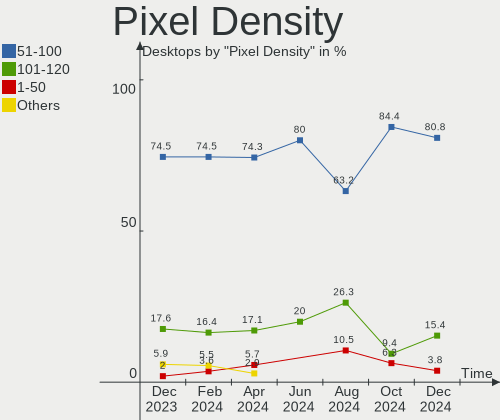
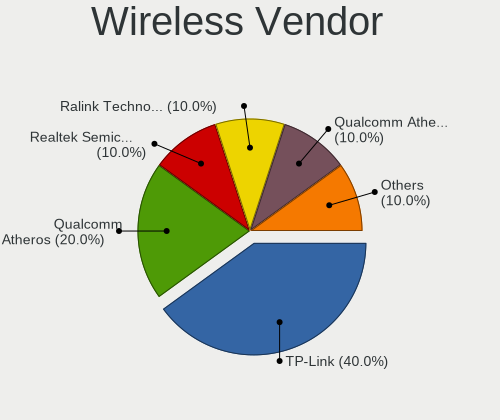

BlackPanther - Hardware Trends (Desktops)
-----------------------------------------

A project to identify most popular hardware characteristics and track their change
over time based on data collected by Linux users at https://Linux-Hardware.org.

Anyone can contribute to this report by the [hw-probe](https://github.com/linuxhw/hw-probe) tool:

    sudo -E hw-probe -all -upload

This report is for one last month. Overall report since the beginning of time: [TestDays](https://github.com/linuxhw/TestDays)

Period: Jun, 2023.

Contents
--------

* [ System ](#system)
  - [ OS                       ](#os)
  - [ OS Family                ](#os-family)
  - [ Kernel                   ](#kernel)
  - [ Kernel Family            ](#kernel-family)
  - [ Kernel Major Ver.        ](#kernel-major-ver)
  - [ Arch                     ](#arch)
  - [ DE                       ](#de)
  - [ Display Server           ](#display-server)
  - [ Display Manager          ](#display-manager)
  - [ OS Lang                  ](#os-lang)
  - [ Boot Mode                ](#boot-mode)
  - [ Filesystem               ](#filesystem)
  - [ Part. scheme             ](#part-scheme)
  - [ Dual Boot with Linux/BSD ](#dual-boot-with-linuxbsd)
  - [ Dual Boot (Win)          ](#dual-boot-win)

* [ Board ](#board)
  - [ Vendor                   ](#vendor)
  - [ Model                    ](#model)
  - [ Model Family             ](#model-family)
  - [ MFG Year                 ](#mfg-year)
  - [ Form Factor              ](#form-factor)
  - [ Secure Boot              ](#secure-boot)
  - [ Coreboot                 ](#coreboot)
  - [ RAM Size                 ](#ram-size)
  - [ RAM Used                 ](#ram-used)
  - [ Total Drives             ](#total-drives)
  - [ Has CD-ROM               ](#has-cd-rom)
  - [ Has Ethernet             ](#has-ethernet)
  - [ Has WiFi                 ](#has-wifi)
  - [ Has Bluetooth            ](#has-bluetooth)

* [ Location ](#location)
  - [ Country                  ](#country)
  - [ City                     ](#city)

* [ Drives ](#drives)
  - [ Drive Vendor             ](#drive-vendor)
  - [ Drive Model              ](#drive-model)
  - [ HDD Vendor               ](#hdd-vendor)
  - [ SSD Vendor               ](#ssd-vendor)
  - [ Drive Kind               ](#drive-kind)
  - [ Drive Connector          ](#drive-connector)
  - [ Drive Size               ](#drive-size)
  - [ Space Total              ](#space-total)
  - [ Space Used               ](#space-used)
  - [ Malfunc. Drives          ](#malfunc-drives)
  - [ Malfunc. Drive Vendor    ](#malfunc-drive-vendor)
  - [ Malfunc. HDD Vendor      ](#malfunc-hdd-vendor)
  - [ Malfunc. Drive Kind      ](#malfunc-drive-kind)
  - [ Failed Drives            ](#failed-drives)
  - [ Failed Drive Vendor      ](#failed-drive-vendor)
  - [ Drive Status             ](#drive-status)

* [ Storage controller ](#storage-controller)
  - [ Storage Vendor           ](#storage-vendor)
  - [ Storage Model            ](#storage-model)
  - [ Storage Kind             ](#storage-kind)

* [ Processor ](#processor)
  - [ CPU Vendor               ](#cpu-vendor)
  - [ CPU Model                ](#cpu-model)
  - [ CPU Model Family         ](#cpu-model-family)
  - [ CPU Cores                ](#cpu-cores)
  - [ CPU Sockets              ](#cpu-sockets)
  - [ CPU Threads              ](#cpu-threads)
  - [ CPU Op-Modes             ](#cpu-op-modes)
  - [ CPU Microcode            ](#cpu-microcode)
  - [ CPU Microarch            ](#cpu-microarch)

* [ Graphics ](#graphics)
  - [ GPU Vendor               ](#gpu-vendor)
  - [ GPU Model                ](#gpu-model)
  - [ GPU Combo                ](#gpu-combo)
  - [ GPU Driver               ](#gpu-driver)
  - [ GPU Memory               ](#gpu-memory)

* [ Monitor ](#monitor)
  - [ Monitor Vendor           ](#monitor-vendor)
  - [ Monitor Model            ](#monitor-model)
  - [ Monitor Resolution       ](#monitor-resolution)
  - [ Monitor Diagonal         ](#monitor-diagonal)
  - [ Monitor Width            ](#monitor-width)
  - [ Aspect Ratio             ](#aspect-ratio)
  - [ Monitor Area             ](#monitor-area)
  - [ Pixel Density            ](#pixel-density)
  - [ Multiple Monitors        ](#multiple-monitors)

* [ Network ](#network)
  - [ Net Controller Vendor    ](#net-controller-vendor)
  - [ Net Controller Model     ](#net-controller-model)
  - [ Wireless Vendor          ](#wireless-vendor)
  - [ Wireless Model           ](#wireless-model)
  - [ Ethernet Vendor          ](#ethernet-vendor)
  - [ Ethernet Model           ](#ethernet-model)
  - [ Net Controller Kind      ](#net-controller-kind)
  - [ Used Controller          ](#used-controller)
  - [ NICs                     ](#nics)
  - [ IPv6                     ](#ipv6)

* [ Bluetooth ](#bluetooth)
  - [ Bluetooth Vendor         ](#bluetooth-vendor)
  - [ Bluetooth Model          ](#bluetooth-model)

* [ Sound ](#sound)
  - [ Sound Vendor             ](#sound-vendor)
  - [ Sound Model              ](#sound-model)

* [ Memory ](#memory)
  - [ Memory Vendor            ](#memory-vendor)
  - [ Memory Model             ](#memory-model)
  - [ Memory Kind              ](#memory-kind)
  - [ Memory Form Factor       ](#memory-form-factor)
  - [ Memory Size              ](#memory-size)
  - [ Memory Speed             ](#memory-speed)

* [ Printers & scanners ](#printers--scanners)
  - [ Printer Vendor           ](#printer-vendor)
  - [ Printer Model            ](#printer-model)
  - [ Scanner Vendor           ](#scanner-vendor)
  - [ Scanner Model            ](#scanner-model)

* [ Camera ](#camera)
  - [ Camera Vendor            ](#camera-vendor)
  - [ Camera Model             ](#camera-model)

* [ Security ](#security)
  - [ Fingerprint Vendor       ](#fingerprint-vendor)
  - [ Fingerprint Model        ](#fingerprint-model)
  - [ Chipcard Vendor          ](#chipcard-vendor)
  - [ Chipcard Model           ](#chipcard-model)

* [ Unsupported ](#unsupported)
  - [ Unsupported Devices      ](#unsupported-devices)
  - [ Unsupported Device Types ](#unsupported-device-types)

System
------

OS
--

Installed operating systems

| Name              | Desktops | Percent |
|-------------------|----------|---------|
| BlackPanther 18.1 | 43       | 93.48%  |
| BlackPanther 22.1 | 3        | 6.52%   |

OS Family
---------

OS without a version

| Name         | Desktops | Percent |
|--------------|----------|---------|
| BlackPanther | 46       | 100%    |

Kernel
------

Version of the Linux kernel

| Version             | Desktops | Percent |
|---------------------|----------|---------|
| 5.6.14-desktop-2bP  | 23       | 50%     |
| 5.15.85-desktop-1bP | 11       | 23.91%  |
| 4.18.16-desktop-1bP | 9        | 19.57%  |
| 6.3.3-desktop-1bP   | 2        | 4.35%   |
| 6.1.0-1bP           | 1        | 2.17%   |

Kernel Family
-------------

Linux kernel without a distro release

| Version | Desktops | Percent |
|---------|----------|---------|
| 5.6.14  | 23       | 50%     |
| 5.15.85 | 11       | 23.91%  |
| 4.18.16 | 9        | 19.57%  |
| 6.3.3   | 2        | 4.35%   |
| 6.1.0   | 1        | 2.17%   |

Kernel Major Ver.
-----------------

Linux kernel major version

| Version | Desktops | Percent |
|---------|----------|---------|
| 5.6     | 23       | 50%     |
| 5.15    | 11       | 23.91%  |
| 4.18    | 9        | 19.57%  |
| 6.3     | 2        | 4.35%   |
| 6.1     | 1        | 2.17%   |

Arch
----

OS architecture (x86_64, i586, etc.)

| Name   | Desktops | Percent |
|--------|----------|---------|
| x86_64 | 46       | 100%    |

DE
--

Desktop Environment

| Name    | Desktops | Percent |
|---------|----------|---------|
| KDE5    | 44       | 95.65%  |
| Unknown | 2        | 4.35%   |

Display Server
--------------

X11 or Wayland

| Name | Desktops | Percent |
|------|----------|---------|
| X11  | 46       | 100%    |

Display Manager
---------------

SDDM, LightDM, etc.

| Name | Desktops | Percent |
|------|----------|---------|
| SDDM | 46       | 100%    |

OS Lang
-------

Language

| Lang    | Desktops | Percent |
|---------|----------|---------|
| Unknown | 46       | 100%    |

Boot Mode
---------

EFI or BIOS

| Mode | Desktops | Percent |
|------|----------|---------|
| BIOS | 29       | 63.04%  |
| EFI  | 17       | 36.96%  |

Filesystem
----------

Type of filesystem

| Type    | Desktops | Percent |
|---------|----------|---------|
| Ext4    | 32       | 69.57%  |
| Overlay | 14       | 30.43%  |

Part. scheme
------------

Scheme of partitioning

| Type | Desktops | Percent |
|------|----------|---------|
| MBR  | 27       | 58.7%   |
| GPT  | 19       | 41.3%   |

Dual Boot with Linux/BSD
------------------------

Hosting more than one Linux/BSD

| Dual boot | Desktops | Percent |
|-----------|----------|---------|
| No        | 31       | 67.39%  |
| Yes       | 15       | 32.61%  |

Dual Boot (Win)
---------------

Hosting Linux and Windows

| Dual boot | Desktops | Percent |
|-----------|----------|---------|
| Yes       | 24       | 52.17%  |
| No        | 22       | 47.83%  |

Board
-----

Vendor
------

Motherboard manufacturer

| Name                | Desktops | Percent |
|---------------------|----------|---------|
| Gigabyte Technology | 15       | 32.61%  |
| Dell                | 6        | 13.04%  |
| Fujitsu             | 5        | 10.87%  |
| ASUSTek Computer    | 5        | 10.87%  |
| ASRock              | 5        | 10.87%  |
| Lenovo              | 3        | 6.52%   |
| Hewlett-Packard     | 3        | 6.52%   |
| MSI                 | 2        | 4.35%   |
| Fujitsu Siemens     | 2        | 4.35%   |

Model
-----

Motherboard model

| Name                                  | Desktops | Percent |
|---------------------------------------|----------|---------|
| Dell OptiPlex 3020                    | 4        | 8.7%    |
| Gigabyte Z390 UD                      | 2        | 4.35%   |
| Gigabyte G31M-ES2L                    | 2        | 4.35%   |
| Fujitsu ESPRIMO Q556/2                | 2        | 4.35%   |
| ASRock G41M-VS3                       | 2        | 4.35%   |
| MSI MS-7C91                           | 1        | 2.17%   |
| MSI MS-7309                           | 1        | 2.17%   |
| Lenovo ThinkCentre M93p 10A7003AUK    | 1        | 2.17%   |
| Lenovo ThinkCentre M73 10B6001SUS     | 1        | 2.17%   |
| Lenovo 10A8-S1WL00                    | 1        | 2.17%   |
| HP ProDesk 600 G1 SFF                 | 1        | 2.17%   |
| HP EliteDesk 705 G3 SFF               | 1        | 2.17%   |
| HP Compaq Pro 6300 SFF                | 1        | 2.17%   |
| Gigabyte Z270N-WIFI                   | 1        | 2.17%   |
| Gigabyte P67A-D3-B3                   | 1        | 2.17%   |
| Gigabyte P35-S3G                      | 1        | 2.17%   |
| Gigabyte H61M-S1                      | 1        | 2.17%   |
| Gigabyte H110M-S2V-CF                 | 1        | 2.17%   |
| Gigabyte GA-890GPA-UD3H               | 1        | 2.17%   |
| Gigabyte GA-880GM-D2H                 | 1        | 2.17%   |
| Gigabyte G41M-ES2L                    | 1        | 2.17%   |
| Gigabyte F2A88XM-D3HP                 | 1        | 2.17%   |
| Gigabyte B450M GAMING                 | 1        | 2.17%   |
| Gigabyte AB350M-DS3H V2               | 1        | 2.17%   |
| Fujitsu Siemens ESPRIMO P5625         | 1        | 2.17%   |
| Fujitsu Siemens AMILO Desktop Pi3620A | 1        | 2.17%   |
| Fujitsu ESPRIMO P910                  | 1        | 2.17%   |
| Fujitsu ESPRIMO E7935                 | 1        | 2.17%   |
| Fujitsu CELSIUS M470                  | 1        | 2.17%   |
| Dell Precision WorkStation T5500      | 1        | 2.17%   |
| Dell PowerEdge T20                    | 1        | 2.17%   |
| ASUS PRIME B365M-A                    | 1        | 2.17%   |
| ASUS M5A97 EVO R2.0                   | 1        | 2.17%   |
| ASUS KB053AA-ABD a6350.de             | 1        | 2.17%   |
| ASUS H110M-A                          | 1        | 2.17%   |
| ASUS FR1009568_2110008                | 1        | 2.17%   |
| ASRock X370 Gaming X                  | 1        | 2.17%   |
| ASRock FM2A75M Pro4+                  | 1        | 2.17%   |
| ASRock A520M-HDV                      | 1        | 2.17%   |

Model Family
------------

Motherboard model prefix

| Name                    | Desktops | Percent |
|-------------------------|----------|---------|
| Fujitsu ESPRIMO         | 4        | 8.7%    |
| Dell OptiPlex           | 4        | 8.7%    |
| Lenovo ThinkCentre      | 2        | 4.35%   |
| Gigabyte Z390           | 2        | 4.35%   |
| Gigabyte G31M-ES2L      | 2        | 4.35%   |
| ASRock G41M-VS3         | 2        | 4.35%   |
| MSI MS-7C91             | 1        | 2.17%   |
| MSI MS-7309             | 1        | 2.17%   |
| Lenovo 10A8-S1WL00      | 1        | 2.17%   |
| HP ProDesk              | 1        | 2.17%   |
| HP EliteDesk            | 1        | 2.17%   |
| HP Compaq               | 1        | 2.17%   |
| Gigabyte Z270N-WIFI     | 1        | 2.17%   |
| Gigabyte P67A-D3-B3     | 1        | 2.17%   |
| Gigabyte P35-S3G        | 1        | 2.17%   |
| Gigabyte H61M-S1        | 1        | 2.17%   |
| Gigabyte H110M-S2V-CF   | 1        | 2.17%   |
| Gigabyte GA-890GPA-UD3H | 1        | 2.17%   |
| Gigabyte GA-880GM-D2H   | 1        | 2.17%   |
| Gigabyte G41M-ES2L      | 1        | 2.17%   |
| Gigabyte F2A88XM-D3HP   | 1        | 2.17%   |
| Gigabyte B450M          | 1        | 2.17%   |
| Gigabyte AB350M-DS3H    | 1        | 2.17%   |
| Fujitsu Siemens ESPRIMO | 1        | 2.17%   |
| Fujitsu Siemens AMILO   | 1        | 2.17%   |
| Fujitsu CELSIUS         | 1        | 2.17%   |
| Dell Precision          | 1        | 2.17%   |
| Dell PowerEdge          | 1        | 2.17%   |
| ASUS PRIME              | 1        | 2.17%   |
| ASUS M5A97              | 1        | 2.17%   |
| ASUS KB053AA-ABD        | 1        | 2.17%   |
| ASUS H110M-A            | 1        | 2.17%   |
| ASUS FR1009568          | 1        | 2.17%   |
| ASRock X370             | 1        | 2.17%   |
| ASRock FM2A75M          | 1        | 2.17%   |
| ASRock A520M-HDV        | 1        | 2.17%   |

MFG Year
--------

Motherboard manufacture year

| Year | Desktops | Percent |
|------|----------|---------|
| 2017 | 6        | 13.04%  |
| 2014 | 6        | 13.04%  |
| 2010 | 6        | 13.04%  |
| 2018 | 4        | 8.7%    |
| 2015 | 4        | 8.7%    |
| 2012 | 4        | 8.7%    |
| 2008 | 4        | 8.7%    |
| 2016 | 2        | 4.35%   |
| 2011 | 2        | 4.35%   |
| 2007 | 2        | 4.35%   |
| 2023 | 1        | 2.17%   |
| 2020 | 1        | 2.17%   |
| 2019 | 1        | 2.17%   |
| 2013 | 1        | 2.17%   |
| 2009 | 1        | 2.17%   |
| 2006 | 1        | 2.17%   |

Form Factor
-----------

Physical design of the computer

| Name    | Desktops | Percent |
|---------|----------|---------|
| Desktop | 46       | 100%    |

Secure Boot
-----------

Enabled or disabled

| State    | Desktops | Percent |
|----------|----------|---------|
| Disabled | 46       | 100%    |

Coreboot
--------

Have coreboot on board

| Used | Desktops | Percent |
|------|----------|---------|
| No   | 46       | 100%    |

RAM Size
--------

Total RAM memory

| Size in GB | Desktops | Percent |
|------------|----------|---------|
| 8.01-16.0  | 15       | 32.61%  |
| 3.01-4.0   | 13       | 28.26%  |
| 4.01-8.0   | 7        | 15.22%  |
| 16.01-24.0 | 6        | 13.04%  |
| 1.01-2.0   | 3        | 6.52%   |
| 32.01-64.0 | 2        | 4.35%   |

RAM Used
--------

Used RAM memory

| Used GB  | Desktops | Percent |
|----------|----------|---------|
| 1.01-2.0 | 21       | 45.65%  |
| 0.51-1.0 | 18       | 39.13%  |
| 0.01-0.5 | 4        | 8.7%    |
| 2.01-3.0 | 3        | 6.52%   |

Total Drives
------------

Number of drives on board

| Drives | Desktops | Percent |
|--------|----------|---------|
| 1      | 21       | 45.65%  |
| 2      | 15       | 32.61%  |
| 3      | 7        | 15.22%  |
| 5      | 2        | 4.35%   |
| 0      | 1        | 2.17%   |

Has CD-ROM
----------

Has CD-ROM on board

| Presented | Desktops | Percent |
|-----------|----------|---------|
| Yes       | 34       | 73.91%  |
| No        | 12       | 26.09%  |

Has Ethernet
------------

Has Ethernet on board

| Presented | Desktops | Percent |
|-----------|----------|---------|
| Yes       | 46       | 100%    |

Has WiFi
--------

Has WiFi module

| Presented | Desktops | Percent |
|-----------|----------|---------|
| No        | 27       | 58.7%   |
| Yes       | 19       | 41.3%   |

Has Bluetooth
-------------

Has Bluetooth module

| Presented | Desktops | Percent |
|-----------|----------|---------|
| No        | 33       | 71.74%  |
| Yes       | 13       | 28.26%  |

Location
--------

Country
-------

Geographic location (country)

| Country  | Desktops | Percent |
|----------|----------|---------|
| Hungary  | 39       | 84.78%  |
| Germany  | 3        | 6.52%   |
| Slovakia | 1        | 2.17%   |
| Serbia   | 1        | 2.17%   |
| Greece   | 1        | 2.17%   |
| France   | 1        | 2.17%   |

City
----

Geographic location (city)

| City                    | Desktops | Percent |
|-------------------------|----------|---------|
| Budapest                | 8        | 17.39%  |
| Hajduboszormeny         | 3        | 6.52%   |
| Szolnok                 | 2        | 4.35%   |
| Szekszárd              | 2        | 4.35%   |
| Sarbogard               | 2        | 4.35%   |
| Pfaffenhofen an der Ilm | 2        | 4.35%   |
| Karcag                  | 2        | 4.35%   |
| Debrecen                | 2        | 4.35%   |
| Zalaegerszeg            | 1        | 2.17%   |
| Tatabánya              | 1        | 2.17%   |
| Tapiobicske             | 1        | 2.17%   |
| Tamasi                  | 1        | 2.17%   |
| Szigetujfalu            | 1        | 2.17%   |
| Szigetszentmiklos       | 1        | 2.17%   |
| Szentendre              | 1        | 2.17%   |
| Seligenstadt            | 1        | 2.17%   |
| Rožňava               | 1        | 2.17%   |
| Pécs                   | 1        | 2.17%   |
| Oroshaza                | 1        | 2.17%   |
| Obarok                  | 1        | 2.17%   |
| Nick                    | 1        | 2.17%   |
| Nancy                   | 1        | 2.17%   |
| Mezotur                 | 1        | 2.17%   |
| Kiskunhalas             | 1        | 2.17%   |
| Kastoria                | 1        | 2.17%   |
| Jaszapati               | 1        | 2.17%   |
| Fertoszentmiklos        | 1        | 2.17%   |
| Berettyóújfalu        | 1        | 2.17%   |
| Belgrade                | 1        | 2.17%   |
| Baja                    | 1        | 2.17%   |
| Abasar                  | 1        | 2.17%   |

Drives
------

Drive Vendor
------------

Hard drive vendors

| Vendor              | Desktops | Drives | Percent |
|---------------------|----------|--------|---------|
| WDC                 | 16       | 20     | 21.33%  |
| Samsung Electronics | 10       | 14     | 13.33%  |
| Kingston            | 9        | 9      | 12%     |
| Toshiba             | 7        | 7      | 9.33%   |
| Seagate             | 6        | 7      | 8%      |
| SanDisk             | 4        | 4      | 5.33%   |
| Patriot             | 4        | 4      | 5.33%   |
| Intenso             | 3        | 3      | 4%      |
| A-DATA Technology   | 3        | 3      | 4%      |
| SPCC                | 2        | 2      | 2.67%   |
| Micron Technology   | 2        | 2      | 2.67%   |
| Hitachi             | 2        | 2      | 2.67%   |
| Zheino              | 1        | 1      | 1.33%   |
| Kingmax             | 1        | 1      | 1.33%   |
| JMicron Technology  | 1        | 1      | 1.33%   |
| Intel               | 1        | 1      | 1.33%   |
| HGST                | 1        | 1      | 1.33%   |
| Gigabyte Technology | 1        | 1      | 1.33%   |
| Crucial             | 1        | 1      | 1.33%   |

Drive Model
-----------

Hard drive models

| Model                               | Desktops | Percent |
|-------------------------------------|----------|---------|
| Seagate ST500DM002-1BD142 500GB     | 4        | 4.88%   |
| Toshiba DT01ACA100 1TB              | 3        | 3.66%   |
| Kingston SUV400S37120G 120GB SSD    | 3        | 3.66%   |
| WDC WD5000AAKS-007AA0 500GB         | 2        | 2.44%   |
| WDC WD30EFRX-68EUZN0 3TB            | 2        | 2.44%   |
| SanDisk SDSSDH3512G 512GB           | 2        | 2.44%   |
| Samsung SSD 830 Series 64GB         | 2        | 2.44%   |
| Patriot Burst 120GB SSD             | 2        | 2.44%   |
| Micron 1100_MTFDDAK256TBN 256GB SSD | 2        | 2.44%   |
| Kingston SA400S37240G 240GB SSD     | 2        | 2.44%   |
| Intenso Portable SSD 128GB          | 2        | 2.44%   |
| Hitachi HTS545050B9A300 500GB       | 2        | 2.44%   |
| Zheino CHN-NGFFNV2280-256 256GB     | 1        | 1.22%   |
| WDC WDS240G2G0B-00EPW0 240GB SSD    | 1        | 1.22%   |
| WDC WD800JD-75MSA3 80GB             | 1        | 1.22%   |
| WDC WD6400AAKS-07A7B0 640GB         | 1        | 1.22%   |
| WDC WD5003AZEX-00MK2A0 500GB        | 1        | 1.22%   |
| WDC WD5000BPKT-75PK4T0 500GB        | 1        | 1.22%   |
| WDC WD5000AAKX-221CA1 500GB         | 1        | 1.22%   |
| WDC WD5000AAKS-65YGA0 500GB         | 1        | 1.22%   |
| WDC WD5000AAKS-00UU3A0 500GB        | 1        | 1.22%   |
| WDC WD5000AACS-00G8B1 500GB         | 1        | 1.22%   |
| WDC WD30EZRZ-00GXCB0 3TB            | 1        | 1.22%   |
| WDC WD30EZRX-00DC0B0 3TB            | 1        | 1.22%   |
| WDC WD20EZRZ-00Z5HB0 2TB            | 1        | 1.22%   |
| WDC WD15EARX-00PASB0 1TB            | 1        | 1.22%   |
| WDC WD10PURZ-85U8XY0 1TB            | 1        | 1.22%   |
| WDC WD10EZRX-00L4HB0 1TB            | 1        | 1.22%   |
| WDC WD10EZEX-00KUWA0 1TB            | 1        | 1.22%   |
| Toshiba MQ01ABF032 320GB            | 1        | 1.22%   |
| Toshiba MQ01ABD100 1TB              | 1        | 1.22%   |
| Toshiba HDWQ140 4TB                 | 1        | 1.22%   |
| Toshiba DT01ACA050 500GB            | 1        | 1.22%   |
| SPCC Solid State Disk 512GB         | 1        | 1.22%   |
| SPCC Solid State Disk 128GB         | 1        | 1.22%   |
| Seagate ST500LT012-9WS142 500GB     | 1        | 1.22%   |
| Seagate ST1000DM003-1ER162 1TB      | 1        | 1.22%   |
| SanDisk SDSSDH3 1T00 1TB            | 1        | 1.22%   |
| SanDisk SD8TB8U256G1001 256GB SSD   | 1        | 1.22%   |
| Samsung SSD 970 EVO Plus 500GB      | 1        | 1.22%   |

HDD Vendor
----------

Hard disk drive vendors

| Vendor              | Desktops | Drives | Percent |
|---------------------|----------|--------|---------|
| WDC                 | 15       | 19     | 44.12%  |
| Toshiba             | 7        | 7      | 20.59%  |
| Seagate             | 6        | 7      | 17.65%  |
| Samsung Electronics | 3        | 3      | 8.82%   |
| Hitachi             | 2        | 2      | 5.88%   |
| HGST                | 1        | 1      | 2.94%   |

SSD Vendor
----------

Solid state drive vendors

| Vendor              | Desktops | Drives | Percent |
|---------------------|----------|--------|---------|
| Kingston            | 8        | 8      | 21.62%  |
| Samsung Electronics | 7        | 8      | 18.92%  |
| SanDisk             | 4        | 4      | 10.81%  |
| Patriot             | 4        | 4      | 10.81%  |
| Intenso             | 3        | 3      | 8.11%   |
| SPCC                | 2        | 2      | 5.41%   |
| Micron Technology   | 2        | 2      | 5.41%   |
| A-DATA Technology   | 2        | 2      | 5.41%   |
| WDC                 | 1        | 1      | 2.7%    |
| Kingmax             | 1        | 1      | 2.7%    |
| Intel               | 1        | 1      | 2.7%    |
| Gigabyte Technology | 1        | 1      | 2.7%    |
| Crucial             | 1        | 1      | 2.7%    |

Drive Kind
----------

HDD or SSD

| Kind | Desktops | Drives | Percent |
|------|----------|--------|---------|
| HDD  | 31       | 39     | 47.69%  |
| SSD  | 29       | 38     | 44.62%  |
| NVMe | 5        | 7      | 7.69%   |

Drive Connector
---------------

SATA, SAS, NVMe, etc.

| Type | Desktops | Drives | Percent |
|------|----------|--------|---------|
| SATA | 44       | 75     | 84.62%  |
| NVMe | 5        | 6      | 9.62%   |
| SAS  | 3        | 3      | 5.77%   |

Drive Size
----------

Size of hard drive

| Size in TB | Desktops | Drives | Percent |
|------------|----------|--------|---------|
| 0.01-0.5   | 39       | 51     | 62.9%   |
| 0.51-1.0   | 18       | 20     | 29.03%  |
| 2.01-3.0   | 3        | 4      | 4.84%   |
| 3.01-4.0   | 1        | 1      | 1.61%   |
| 1.01-2.0   | 1        | 1      | 1.61%   |

Space Total
-----------

Amount of disk space available on the file system

| Size in GB     | Desktops | Percent |
|----------------|----------|---------|
| Unknown        | 14       | 30.43%  |
| 251-500        | 11       | 23.91%  |
| 101-250        | 9        | 19.57%  |
| 501-1000       | 4        | 8.7%    |
| 51-100         | 3        | 6.52%   |
| More than 3000 | 2        | 4.35%   |
| 21-50          | 2        | 4.35%   |
| 1001-2000      | 1        | 2.17%   |

Space Used
----------

Amount of used disk space

| Used GB        | Desktops | Percent |
|----------------|----------|---------|
| Unknown        | 14       | 30.43%  |
| 1-20           | 11       | 23.91%  |
| 21-50          | 7        | 15.22%  |
| 51-100         | 7        | 15.22%  |
| 101-250        | 3        | 6.52%   |
| More than 3000 | 1        | 2.17%   |
| 251-500        | 1        | 2.17%   |
| 1001-2000      | 1        | 2.17%   |
| 501-1000       | 1        | 2.17%   |

Malfunc. Drives
---------------

Drive models with a malfunction

| Model                                            | Desktops | Drives | Percent |
|--------------------------------------------------|----------|--------|---------|
| WDC WD5000AAKS-007AA0 500GB                      | 2        | 2      | 11.76%  |
| Seagate ST500DM002-1BD142 500GB                  | 2        | 2      | 11.76%  |
| Hitachi HTS545050B9A300 500GB                    | 2        | 2      | 11.76%  |
| WDC WD6400AAKS-07A7B0 640GB                      | 1        | 1      | 5.88%   |
| WDC WD5000AAKS-00UU3A0 500GB                     | 1        | 1      | 5.88%   |
| WDC WD5000AACS-00G8B1 500GB                      | 1        | 1      | 5.88%   |
| WDC WD30EFRX-68EUZN0 3TB                         | 1        | 1      | 5.88%   |
| WDC WD10PURZ-85U8XY0 1TB                         | 1        | 1      | 5.88%   |
| Toshiba DT01ACA050 500GB                         | 1        | 1      | 5.88%   |
| Seagate ST500LT012-9WS142 500GB                  | 1        | 1      | 5.88%   |
| Samsung Electronics MZ7LN256HMJP-000H1 256GB SSD | 1        | 1      | 5.88%   |
| Samsung Electronics HD103UJ 1TB                  | 1        | 1      | 5.88%   |
| Intel SSDSC2KF240H6L 240GB                       | 1        | 1      | 5.88%   |
| A-DATA Technology SU630 240GB SSD                | 1        | 1      | 5.88%   |

Malfunc. Drive Vendor
---------------------

Vendors of faulty drives

| Vendor              | Desktops | Drives | Percent |
|---------------------|----------|--------|---------|
| WDC                 | 7        | 7      | 41.18%  |
| Seagate             | 3        | 3      | 17.65%  |
| Samsung Electronics | 2        | 2      | 11.76%  |
| Hitachi             | 2        | 2      | 11.76%  |
| Toshiba             | 1        | 1      | 5.88%   |
| Intel               | 1        | 1      | 5.88%   |
| A-DATA Technology   | 1        | 1      | 5.88%   |

Malfunc. HDD Vendor
-------------------

Vendors of faulty HDD drives

| Vendor              | Desktops | Drives | Percent |
|---------------------|----------|--------|---------|
| WDC                 | 7        | 7      | 50%     |
| Seagate             | 3        | 3      | 21.43%  |
| Hitachi             | 2        | 2      | 14.29%  |
| Toshiba             | 1        | 1      | 7.14%   |
| Samsung Electronics | 1        | 1      | 7.14%   |

Malfunc. Drive Kind
-------------------

Kinds of faulty drives

| Kind | Desktops | Drives | Percent |
|------|----------|--------|---------|
| HDD  | 13       | 14     | 81.25%  |
| SSD  | 3        | 3      | 18.75%  |

Failed Drives
-------------

Failed drive models

Zero info for selected period =(

Failed Drive Vendor
-------------------

Failed drive vendors

Zero info for selected period =(

Drive Status
------------

Number of failed and malfunc. drives

| Status   | Desktops | Drives | Percent |
|----------|----------|--------|---------|
| Works    | 37       | 63     | 64.91%  |
| Malfunc  | 16       | 17     | 28.07%  |
| Detected | 4        | 4      | 7.02%   |

Storage controller
------------------

Storage Vendor
--------------

Storage controller vendors

| Vendor                      | Desktops | Percent |
|-----------------------------|----------|---------|
| Intel                       | 31       | 56.36%  |
| AMD                         | 11       | 20%     |
| Nvidia                      | 4        | 7.27%   |
| Silicon Motion              | 2        | 3.64%   |
| Samsung Electronics         | 2        | 3.64%   |
| JMicron Technology          | 2        | 3.64%   |
| Silicon Image               | 1        | 1.82%   |
| Kingston Technology Company | 1        | 1.82%   |
| ASMedia Technology          | 1        | 1.82%   |

Storage Model
-------------

Storage controller models

| Model                                                                                   | Desktops | Percent |
|-----------------------------------------------------------------------------------------|----------|---------|
| Intel 8 Series/C220 Series Chipset Family 6-port SATA Controller 1 [AHCI mode]          | 8        | 11.43%  |
| Intel Q170/Q150/B150/H170/H110/Z170/CM236 Chipset SATA Controller [AHCI Mode]           | 5        | 7.14%   |
| Intel NM10/ICH7 Family SATA Controller [IDE mode]                                       | 5        | 7.14%   |
| AMD FCH SATA Controller [AHCI mode]                                                     | 5        | 7.14%   |
| Samsung NVMe SSD Controller SM981/PM981/PM983                                           | 2        | 2.86%   |
| Nvidia MCP61 SATA Controller                                                            | 2        | 2.86%   |
| Nvidia MCP61 IDE                                                                        | 2        | 2.86%   |
| Intel SATA Controller [RAID mode]                                                       | 2        | 2.86%   |
| Intel Cannon Lake PCH SATA AHCI Controller                                              | 2        | 2.86%   |
| Intel 82801G (ICH7 Family) IDE Controller                                               | 2        | 2.86%   |
| Intel 7 Series/C210 Series Chipset Family 6-port SATA Controller [AHCI mode]            | 2        | 2.86%   |
| Intel 6 Series/C200 Series Chipset Family Desktop SATA Controller (IDE mode, ports 4-5) | 2        | 2.86%   |
| Intel 6 Series/C200 Series Chipset Family Desktop SATA Controller (IDE mode, ports 0-3) | 2        | 2.86%   |
| Intel 200 Series PCH SATA controller [AHCI mode]                                        | 2        | 2.86%   |
| AMD SB7x0/SB8x0/SB9x0 SATA Controller [IDE mode]                                        | 2        | 2.86%   |
| AMD SB7x0/SB8x0/SB9x0 IDE Controller                                                    | 2        | 2.86%   |
| AMD 500 Series Chipset SATA Controller                                                  | 2        | 2.86%   |
| AMD 300 Series Chipset SATA Controller                                                  | 2        | 2.86%   |
| Silicon Motion SM2263EN/SM2263XT SSD Controller                                         | 1        | 1.43%   |
| Silicon Motion Non-Volatile memory controller                                           | 1        | 1.43%   |
| Silicon Image SiI 3512 [SATALink/SATARaid] Serial ATA Controller                        | 1        | 1.43%   |
| Nvidia MCP78S [GeForce 8200] AHCI Controller                                            | 1        | 1.43%   |
| Nvidia MCP73 SATA Controller (IDE mode)                                                 | 1        | 1.43%   |
| Kingston Company A2000 NVMe SSD                                                         | 1        | 1.43%   |
| JMicron JMB368 IDE controller                                                           | 1        | 1.43%   |
| JMicron JMB363 SATA/IDE Controller                                                      | 1        | 1.43%   |
| Intel 82801JI (ICH10 Family) SATA AHCI Controller                                       | 1        | 1.43%   |
| Intel 82801JD/DO (ICH10 Family) 4-port SATA IDE Controller                              | 1        | 1.43%   |
| Intel 82801JD/DO (ICH10 Family) 2-port SATA IDE Controller                              | 1        | 1.43%   |
| Intel 82801IB (ICH9) 4 port SATA Controller [AHCI mode]                                 | 1        | 1.43%   |
| Intel 8 Series/C220 Series Chipset Family IDE-r Controller                              | 1        | 1.43%   |
| Intel 4 Series Chipset PT IDER Controller                                               | 1        | 1.43%   |
| ASMedia ASM1062 Serial ATA Controller                                                   | 1        | 1.43%   |
| AMD X370 Series Chipset SATA Controller                                                 | 1        | 1.43%   |
| AMD SB7x0/SB8x0/SB9x0 SATA Controller [AHCI mode]                                       | 1        | 1.43%   |
| AMD FCH IDE Controller                                                                  | 1        | 1.43%   |
| AMD 400 Series Chipset SATA Controller                                                  | 1        | 1.43%   |

Storage Kind
------------

Kind of storage controller (IDE, SATA, NVMe, SAS, ...)

| Kind | Desktops | Percent |
|------|----------|---------|
| SATA | 33       | 57.89%  |
| IDE  | 16       | 28.07%  |
| NVMe | 5        | 8.77%   |
| RAID | 3        | 5.26%   |

Processor
---------

CPU Vendor
----------

Processor vendors

| Vendor | Desktops | Percent |
|--------|----------|---------|
| Intel  | 32       | 69.57%  |
| AMD    | 14       | 30.43%  |

CPU Model
---------

Processor models

| Model                                           | Desktops | Percent |
|-------------------------------------------------|----------|---------|
| Intel Core i3-4160 CPU @ 3.60GHz                | 5        | 10.87%  |
| Intel Core i5-9400 CPU @ 2.90GHz                | 2        | 4.35%   |
| Intel Core i5-3470 CPU @ 3.20GHz                | 2        | 4.35%   |
| Intel Core i3-6100T CPU @ 3.20GHz               | 2        | 4.35%   |
| Intel Core i3-6100 CPU @ 3.70GHz                | 2        | 4.35%   |
| AMD Ryzen 5 3400G with Radeon Vega Graphics     | 2        | 4.35%   |
| Intel Xeon CPU W3550 @ 3.07GHz                  | 1        | 2.17%   |
| Intel Xeon CPU E5530 @ 2.40GHz                  | 1        | 2.17%   |
| Intel Xeon CPU E3-1225 v3 @ 3.20GHz             | 1        | 2.17%   |
| Intel Pentium Dual-Core CPU E5400 @ 2.70GHz     | 1        | 2.17%   |
| Intel Core i7-7700K CPU @ 4.20GHz               | 1        | 2.17%   |
| Intel Core i7-4790 CPU @ 3.60GHz                | 1        | 2.17%   |
| Intel Core i7-4770K CPU @ 3.50GHz               | 1        | 2.17%   |
| Intel Core i5-6500 CPU @ 3.20GHz                | 1        | 2.17%   |
| Intel Core i5-4590 CPU @ 3.30GHz                | 1        | 2.17%   |
| Intel Core i5-2300 CPU @ 2.80GHz                | 1        | 2.17%   |
| Intel Core i3-8100 CPU @ 3.60GHz                | 1        | 2.17%   |
| Intel Core i3-3225 CPU @ 3.30GHz                | 1        | 2.17%   |
| Intel Core 2 Quad CPU Q8200 @ 2.33GHz           | 1        | 2.17%   |
| Intel Core 2 Duo CPU E8500 @ 3.16GHz            | 1        | 2.17%   |
| Intel Core 2 Duo CPU E8400 @ 3.00GHz            | 1        | 2.17%   |
| Intel Core 2 Duo CPU E7500 @ 2.93GHz            | 1        | 2.17%   |
| Intel Core 2 Duo CPU E4600 @ 2.40GHz            | 1        | 2.17%   |
| Intel Core 2 CPU 4300 @ 1.80GHz                 | 1        | 2.17%   |
| Intel Celeron CPU 420 @ 1.60GHz                 | 1        | 2.17%   |
| AMD Ryzen 7 5800X 8-Core Processor              | 1        | 2.17%   |
| AMD Ryzen 7 1700X Eight-Core Processor          | 1        | 2.17%   |
| AMD Ryzen 3 4100 4-Core Processor               | 1        | 2.17%   |
| AMD PRO A6-9500 R5, 8 COMPUTE CORES 2C+6G       | 1        | 2.17%   |
| AMD Phenom II X4 955 Processor                  | 1        | 2.17%   |
| AMD FX-6300 Six-Core Processor                  | 1        | 2.17%   |
| AMD Athlon II X2 260 Processor                  | 1        | 2.17%   |
| AMD Athlon Dual Core Processor 5000B            | 1        | 2.17%   |
| AMD Athlon 64 X2 Dual Core Processor 6000+      | 1        | 2.17%   |
| AMD Athlon 64 Processor 3000+                   | 1        | 2.17%   |
| AMD A8-6600K APU with Radeon HD Graphics        | 1        | 2.17%   |
| AMD A10-7850K Radeon R7, 12 Compute Cores 4C+8G | 1        | 2.17%   |

CPU Model Family
----------------

Processor model prefix

| Model                   | Desktops | Percent |
|-------------------------|----------|---------|
| Intel Core i3           | 11       | 23.91%  |
| Intel Core i5           | 7        | 15.22%  |
| Intel Core 2 Duo        | 4        | 8.7%    |
| Intel Xeon              | 3        | 6.52%   |
| Intel Core i7           | 3        | 6.52%   |
| AMD Ryzen 7             | 2        | 4.35%   |
| AMD Ryzen 5             | 2        | 4.35%   |
| Other                   | 1        | 2.17%   |
| Intel Pentium Dual-Core | 1        | 2.17%   |
| Intel Core 2 Quad       | 1        | 2.17%   |
| Intel Core 2            | 1        | 2.17%   |
| Intel Celeron           | 1        | 2.17%   |
| AMD Ryzen 3             | 1        | 2.17%   |
| AMD Phenom II X4        | 1        | 2.17%   |
| AMD FX                  | 1        | 2.17%   |
| AMD Athlon II X2        | 1        | 2.17%   |
| AMD Athlon Dual Core    | 1        | 2.17%   |
| AMD Athlon 64 X2        | 1        | 2.17%   |
| AMD Athlon 64           | 1        | 2.17%   |
| AMD A8                  | 1        | 2.17%   |
| AMD A10                 | 1        | 2.17%   |

CPU Cores
---------

Number of processor cores

| Number | Desktops | Percent |
|--------|----------|---------|
| 2      | 21       | 45.65%  |
| 4      | 17       | 36.96%  |
| 1      | 3        | 6.52%   |
| 8      | 2        | 4.35%   |
| 6      | 2        | 4.35%   |
| 3      | 1        | 2.17%   |

CPU Sockets
-----------

Number of sockets

| Number | Desktops | Percent |
|--------|----------|---------|
| 1      | 46       | 100%    |

CPU Threads
-----------

Threads per core (Hyper-Threading)

| Number | Desktops | Percent |
|--------|----------|---------|
| 2      | 23       | 50%     |
| 1      | 23       | 50%     |

CPU Op-Modes
------------

CPU Operation Modes (32-bit, 64-bit)

| Op mode        | Desktops | Percent |
|----------------|----------|---------|
| 32-bit, 64-bit | 46       | 100%    |

CPU Microcode
-------------

Microcode number

| Number     | Desktops | Percent |
|------------|----------|---------|
| 0x306c3    | 9        | 19.57%  |
| Unknown    | 6        | 13.04%  |
| 0x1067a    | 4        | 8.7%    |
| 0x506e3    | 3        | 6.52%   |
| 0x306a9    | 3        | 6.52%   |
| 0x906ea    | 2        | 4.35%   |
| 0x106a5    | 2        | 4.35%   |
| 0x08108109 | 2        | 4.35%   |
| 0x010000c8 | 2        | 4.35%   |
| 0x906eb    | 1        | 2.17%   |
| 0x906e9    | 1        | 2.17%   |
| 0x6fd      | 1        | 2.17%   |
| 0x6f2      | 1        | 2.17%   |
| 0x206a7    | 1        | 2.17%   |
| 0x10677    | 1        | 2.17%   |
| 0x10661    | 1        | 2.17%   |
| 0x0a20120a | 1        | 2.17%   |
| 0x08600109 | 1        | 2.17%   |
| 0x08001137 | 1        | 2.17%   |
| 0x0600611a | 1        | 2.17%   |
| 0x06003106 | 1        | 2.17%   |
| 0x06001119 | 1        | 2.17%   |

CPU Microarch
-------------

Microarchitecture

| Name        | Desktops | Percent |
|-------------|----------|---------|
| Haswell     | 9        | 19.57%  |
| Skylake     | 5        | 10.87%  |
| Penryn      | 5        | 10.87%  |
| KabyLake    | 4        | 8.7%    |
| K8 Hammer   | 3        | 6.52%   |
| IvyBridge   | 3        | 6.52%   |
| Core        | 3        | 6.52%   |
| Zen+        | 2        | 4.35%   |
| Piledriver  | 2        | 4.35%   |
| Nehalem     | 2        | 4.35%   |
| K10         | 2        | 4.35%   |
| Zen 3       | 1        | 2.17%   |
| Zen 2       | 1        | 2.17%   |
| Zen         | 1        | 2.17%   |
| Steamroller | 1        | 2.17%   |
| SandyBridge | 1        | 2.17%   |
| Excavator   | 1        | 2.17%   |

Graphics
--------

GPU Vendor
----------

Vendors of graphics cards

| Vendor | Desktops | Percent |
|--------|----------|---------|
| Intel  | 18       | 38.3%   |
| Nvidia | 17       | 36.17%  |
| AMD    | 12       | 25.53%  |

GPU Model
---------

Graphics card models

| Model                                                                       | Desktops | Percent |
|-----------------------------------------------------------------------------|----------|---------|
| Intel 4th Generation Core Processor Family Integrated Graphics Controller   | 5        | 10.2%   |
| Intel HD Graphics 530                                                       | 4        | 8.16%   |
| Nvidia GK208B [GeForce GT 710]                                              | 3        | 6.12%   |
| Intel Xeon E3-1200 v3/4th Gen Core Processor Integrated Graphics Controller | 3        | 6.12%   |
| Nvidia GM107 [GeForce GTX 750 Ti]                                           | 2        | 4.08%   |
| Intel 4 Series Chipset Integrated Graphics Controller                       | 2        | 4.08%   |
| AMD Oland PRO [Radeon R7 240/340 / Radeon 520]                              | 2        | 4.08%   |
| AMD Cedar [Radeon HD 5000/6000/7350/8350 Series]                            | 2        | 4.08%   |
| Nvidia TU117 [GeForce GTX 1650]                                             | 1        | 2.04%   |
| Nvidia GT218 [GeForce 210]                                                  | 1        | 2.04%   |
| Nvidia GP108 [GeForce GT 1030]                                              | 1        | 2.04%   |
| Nvidia GP104 [GeForce GTX 1080]                                             | 1        | 2.04%   |
| Nvidia GK106GL [Quadro K4000]                                               | 1        | 2.04%   |
| Nvidia GF116 [GeForce GTX 550 Ti]                                           | 1        | 2.04%   |
| Nvidia GF108 [GeForce GT 630]                                               | 1        | 2.04%   |
| Nvidia GA106 [Geforce RTX 3050]                                             | 1        | 2.04%   |
| Nvidia G98 [GeForce 8400]                                                   | 1        | 2.04%   |
| Nvidia G96CGL [Quadro FX 580]                                               | 1        | 2.04%   |
| Nvidia G96C [GeForce 9500 GT]                                               | 1        | 2.04%   |
| Nvidia G96 [GeForce 9500 GS]                                                | 1        | 2.04%   |
| Nvidia G94 [GeForce 9600 GT]                                                | 1        | 2.04%   |
| Intel Xeon E3-1200 v3 Processor Integrated Graphics Controller              | 1        | 2.04%   |
| Intel Xeon E3-1200 v2/3rd Gen Core processor Graphics Controller            | 1        | 2.04%   |
| Intel CoffeeLake-S GT2 [UHD Graphics 630]                                   | 1        | 2.04%   |
| Intel 82G33/G31 Express Integrated Graphics Controller                      | 1        | 2.04%   |
| AMD Wani [Radeon R5/R6/R7 Graphics]                                         | 1        | 2.04%   |
| AMD RV730 PRO [Radeon HD 4650]                                              | 1        | 2.04%   |
| AMD RS880 [Radeon HD 4290]                                                  | 1        | 2.04%   |
| AMD Richland [Radeon HD 8570D]                                              | 1        | 2.04%   |
| AMD Redwood XT [Radeon HD 5670/5690/5730]                                   | 1        | 2.04%   |
| AMD Picasso/Raven 2 [Radeon Vega Series / Radeon Vega Mobile Series]        | 1        | 2.04%   |
| AMD Kaveri [Radeon R7 Graphics]                                             | 1        | 2.04%   |
| AMD Caicos [Radeon HD 6450/7450/8450 / R5 230 OEM]                          | 1        | 2.04%   |
| AMD Baffin [Radeon RX 550 640SP / RX 560/560X]                              | 1        | 2.04%   |

GPU Combo
---------

Combinations of graphics cards

| Name       | Desktops | Percent |
|------------|----------|---------|
| 1 x Intel  | 17       | 36.96%  |
| 1 x Nvidia | 16       | 34.78%  |
| 1 x AMD    | 11       | 23.91%  |
| 2 x Nvidia | 1        | 2.17%   |
| 2 x AMD    | 1        | 2.17%   |

GPU Driver
----------

Free vs proprietary

| Driver | Desktops | Percent |
|--------|----------|---------|
| Free   | 46       | 100%    |

GPU Memory
----------

Total video memory

| Size in GB | Desktops | Percent |
|------------|----------|---------|
| Unknown    | 19       | 41.3%   |
| 0.51-1.0   | 13       | 28.26%  |
| 1.01-2.0   | 5        | 10.87%  |
| 0.01-0.5   | 5        | 10.87%  |
| 3.01-4.0   | 2        | 4.35%   |
| 7.01-8.0   | 1        | 2.17%   |
| 2.01-3.0   | 1        | 2.17%   |

Monitor
-------

Monitor Vendor
--------------

Monitor vendors

| Vendor                  | Desktops | Percent |
|-------------------------|----------|---------|
| Samsung Electronics     | 9        | 20%     |
| Ancor Communications    | 5        | 11.11%  |
| Acer                    | 5        | 11.11%  |
| Goldstar                | 4        | 8.89%   |
| BenQ                    | 4        | 8.89%   |
| Philips                 | 3        | 6.67%   |
| Dell                    | 3        | 6.67%   |
| Vestel Elektronik       | 2        | 4.44%   |
| NCS                     | 1        | 2.22%   |
| Medion                  | 1        | 2.22%   |
| LMV                     | 1        | 2.22%   |
| Lenovo                  | 1        | 2.22%   |
| Iiyama                  | 1        | 2.22%   |
| Hewlett-Packard         | 1        | 2.22%   |
| Fujitsu Siemens         | 1        | 2.22%   |
| Eizo                    | 1        | 2.22%   |
| CVT                     | 1        | 2.22%   |
| Chi Mei Optoelectronics | 1        | 2.22%   |

Monitor Model
-------------

Monitor models

| Model                                                                    | Desktops | Percent |
|--------------------------------------------------------------------------|----------|---------|
| Vestel Elektronik 32FHD_LCD_TV VES3700 1920x1080 700x400mm 31.7-inch     | 2        | 4.26%   |
| Samsung Electronics LS27AG30x SAM717A 1920x1080 597x336mm 27.0-inch      | 2        | 4.26%   |
| BenQ EW277HDR BNQ7948 1920x1080 598x336mm 27.0-inch                      | 2        | 4.26%   |
| Ancor Communications ASUS VW198 ACI19AA 1680x1050 450x300mm 21.3-inch    | 2        | 4.26%   |
| Ancor Communications ASUS VS228 ACI22FD 1920x1080 476x268mm 21.5-inch    | 2        | 4.26%   |
| Acer V193HQV ACR013E 1366x768 410x230mm 18.5-inch                        | 2        | 4.26%   |
| Samsung Electronics SyncMaster SAM01E1 1280x1024 376x301mm 19.0-inch     | 1        | 2.13%   |
| Samsung Electronics SyncMaster SAM01B8 1280x1024 338x270mm 17.0-inch     | 1        | 2.13%   |
| Samsung Electronics S27E500 SAM0D0D 1920x1080 598x336mm 27.0-inch        | 1        | 2.13%   |
| Samsung Electronics S24R35x SAM100E 1920x1080 527x296mm 23.8-inch        | 1        | 2.13%   |
| Samsung Electronics S24D330 SAM0D92 1920x1080 531x299mm 24.0-inch        | 1        | 2.13%   |
| Samsung Electronics S24D300 SAM0B45 1920x1080 521x293mm 23.5-inch        | 1        | 2.13%   |
| Samsung Electronics S22B370 SAM08BD 1920x1080 477x268mm 21.5-inch        | 1        | 2.13%   |
| Samsung Electronics LCD Monitor C49J89x 1680x1050                        | 1        | 2.13%   |
| Samsung Electronics C49J89x SAM0F21 3840x1080 1196x336mm 48.9-inch       | 1        | 2.13%   |
| Philips 221B PHL08A1 1920x1080 477x268mm 21.5-inch                       | 1        | 2.13%   |
| Philips 196V4 PHLC0AF 1366x768 410x230mm 18.5-inch                       | 1        | 2.13%   |
| Philips 190WV PHLC014 1440x900 408x255mm 18.9-inch                       | 1        | 2.13%   |
| NCS LCD Monitor NCS2275 1920x1080 256x192mm 12.6-inch                    | 1        | 2.13%   |
| Medion MD20666 MED3673 1920x1080 533x312mm 24.3-inch                     | 1        | 2.13%   |
| LMV LM19V LMV00BE 1280x1024 337x270mm 17.0-inch                          | 1        | 2.13%   |
| Lenovo LEN L171 LEN24C9 1280x1024 337x270mm 17.0-inch                    | 1        | 2.13%   |
| Iiyama PL2474H IVM6146 1920x1080 521x293mm 23.5-inch                     | 1        | 2.13%   |
| Hewlett-Packard P222va HWP322B 1920x1080 477x268mm 21.5-inch             | 1        | 2.13%   |
| Goldstar W2242 GSM5678 1680x1050 474x296mm 22.0-inch                     | 1        | 2.13%   |
| Goldstar L1718S GSM443C 1280x1024 338x270mm 17.0-inch                    | 1        | 2.13%   |
| Goldstar E2350 GSM5790 1920x1080 510x290mm 23.1-inch                     | 1        | 2.13%   |
| Goldstar E2260 GSM57E0 1920x1080 477x268mm 21.5-inch                     | 1        | 2.13%   |
| Fujitsu Siemens B19-2 FUS0548 1280x1024 376x301mm 19.0-inch              | 1        | 2.13%   |
| Eizo EV2216W ENC2440 1680x1050 474x297mm 22.0-inch                       | 1        | 2.13%   |
| Dell U2414H DELA0A4 1920x1080 527x296mm 23.8-inch                        | 1        | 2.13%   |
| Dell E2216H DELF069 1920x1080 476x268mm 21.5-inch                        | 1        | 2.13%   |
| Dell 2209WA DELF011 1680x1050 474x296mm 22.0-inch                        | 1        | 2.13%   |
| CVT CVTE TV CVT0003 1920x1080 575x323mm 26.0-inch                        | 1        | 2.13%   |
| Chi Mei Optoelectronics CMC 19" AD CMO0198 1280x1024 338x270mm 17.0-inch | 1        | 2.13%   |
| BenQ GL951A BNQ7897 1440x900 408x255mm 18.9-inch                         | 1        | 2.13%   |
| BenQ GL2760 BNQ78D5 1920x1080 598x336mm 27.0-inch                        | 1        | 2.13%   |
| Ancor Communications VC279 ACI27C4 1920x1080 598x336mm 27.0-inch         | 1        | 2.13%   |
| Acer X223HQ ACR0098 1920x1080 477x268mm 21.5-inch                        | 1        | 2.13%   |
| Acer V193 ACR004C 1280x1024 376x301mm 19.0-inch                          | 1        | 2.13%   |

Monitor Resolution
------------------

Monitor screen resolution

| Resolution         | Desktops | Percent |
|--------------------|----------|---------|
| 1920x1080 (FHD)    | 21       | 47.73%  |
| 1280x1024 (SXGA)   | 9        | 20.45%  |
| 1680x1050 (WSXGA+) | 6        | 13.64%  |
| 1366x768 (WXGA)    | 3        | 6.82%   |
| 3840x2160 (4K)     | 2        | 4.55%   |
| 1440x900 (WXGA+)   | 2        | 4.55%   |
| 3840x1080          | 1        | 2.27%   |

Monitor Diagonal
----------------

Diagonal size in inches

| Inches  | Desktops | Percent |
|---------|----------|---------|
| 21      | 10       | 21.28%  |
| 27      | 7        | 14.89%  |
| 19      | 5        | 10.64%  |
| 17      | 5        | 10.64%  |
| 24      | 4        | 8.51%   |
| 23      | 4        | 8.51%   |
| 18      | 4        | 8.51%   |
| 84      | 2        | 4.26%   |
| 22      | 2        | 4.26%   |
| 49      | 1        | 2.13%   |
| 26      | 1        | 2.13%   |
| 12      | 1        | 2.13%   |
| Unknown | 1        | 2.13%   |

Monitor Width
-------------

Physical width

| Width in mm | Desktops | Percent |
|-------------|----------|---------|
| 401-500     | 18       | 38.3%   |
| 501-600     | 15       | 31.91%  |
| 301-350     | 5        | 10.64%  |
| 351-400     | 4        | 8.51%   |
| 1501-2000   | 2        | 4.26%   |
| 201-300     | 1        | 2.13%   |
| 1001-1500   | 1        | 2.13%   |
| Unknown     | 1        | 2.13%   |

Aspect Ratio
------------

Proportional relationship between the width and the height

| Ratio   | Desktops | Percent |
|---------|----------|---------|
| 16/9    | 25       | 56.82%  |
| 5/4     | 9        | 20.45%  |
| 16/10   | 4        | 9.09%   |
| 3/2     | 3        | 6.82%   |
| 4/3     | 1        | 2.27%   |
| 32/9    | 1        | 2.27%   |
| Unknown | 1        | 2.27%   |

Monitor Area
------------

Area in inch²

| Area in inch² | Desktops | Percent |
|----------------|----------|---------|
| 201-250        | 16       | 34.04%  |
| 151-200        | 9        | 19.15%  |
| 141-150        | 8        | 17.02%  |
| 301-350        | 7        | 14.89%  |
| More than 1000 | 2        | 4.26%   |
| 251-300        | 2        | 4.26%   |
| 71-80          | 1        | 2.13%   |
| 501-1000       | 1        | 2.13%   |
| Unknown        | 1        | 2.13%   |

Pixel Density
-------------

Pixels per inch

| Density | Desktops | Percent |
|---------|----------|---------|
| 51-100  | 37       | 78.72%  |
| 101-120 | 8        | 17.02%  |
| 161-240 | 1        | 2.13%   |
| Unknown | 1        | 2.13%   |

Multiple Monitors
-----------------

Total monitors connected

| Total | Desktops | Percent |
|-------|----------|---------|
| 1     | 42       | 91.3%   |
| 2     | 4        | 8.7%    |

Network
-------

Net Controller Vendor
---------------------

Controller vendors

| Vendor                          | Desktops | Percent |
|---------------------------------|----------|---------|
| Realtek Semiconductor           | 28       | 43.75%  |
| Intel                           | 10       | 15.63%  |
| Qualcomm Atheros                | 8        | 12.5%   |
| TP-Link                         | 3        | 4.69%   |
| Ralink Technology               | 3        | 4.69%   |
| Nvidia                          | 3        | 4.69%   |
| Broadcom                        | 3        | 4.69%   |
| Qualcomm Atheros Communications | 2        | 3.13%   |
| Samsung Electronics             | 1        | 1.56%   |
| IMC Networks                    | 1        | 1.56%   |
| Edimax Technology               | 1        | 1.56%   |
| D-Link System                   | 1        | 1.56%   |

Net Controller Model
--------------------

Controller models

| Model                                                                  | Desktops | Percent |
|------------------------------------------------------------------------|----------|---------|
| Realtek RTL8111/8168/8411 PCI Express Gigabit Ethernet Controller      | 24       | 34.78%  |
| Intel Ethernet Connection I217-LM                                      | 4        | 5.8%    |
| TP-Link TL-WN821N v5/v6 [RTL8192EU]                                    | 2        | 2.9%    |
| Realtek RTL8188EUS 802.11n Wireless Network Adapter                    | 2        | 2.9%    |
| Ralink RT5372 Wireless Adapter                                         | 2        | 2.9%    |
| Qualcomm Atheros AR9271 802.11n                                        | 2        | 2.9%    |
| Qualcomm Atheros AR8152 v2.0 Fast Ethernet                             | 2        | 2.9%    |
| Qualcomm Atheros AR8131 Gigabit Ethernet                               | 2        | 2.9%    |
| Nvidia MCP61 Ethernet                                                  | 2        | 2.9%    |
| Intel I211 Gigabit Network Connection                                  | 2        | 2.9%    |
| Intel Ethernet Connection (2) I219-V                                   | 2        | 2.9%    |
| Intel 82579LM Gigabit Network Connection (Lewisville)                  | 2        | 2.9%    |
| TP-Link 802.11ac WLAN Adapter                                          | 1        | 1.45%   |
| Samsung GT-I9070 (network tethering, USB debugging enabled)            | 1        | 1.45%   |
| Realtek RTL8188EE Wireless Network Adapter                             | 1        | 1.45%   |
| Realtek RTL8188CUS 802.11n WLAN Adapter                                | 1        | 1.45%   |
| Realtek RTL8169 PCI Gigabit Ethernet Controller                        | 1        | 1.45%   |
| Realtek RTL8125 2.5GbE Controller                                      | 1        | 1.45%   |
| Ralink MT7601U Wireless Adapter                                        | 1        | 1.45%   |
| Qualcomm Atheros QCA8171 Gigabit Ethernet                              | 1        | 1.45%   |
| Qualcomm Atheros AR9287 Wireless Network Adapter (PCI-Express)         | 1        | 1.45%   |
| Qualcomm Atheros AR922X Wireless Network Adapter                       | 1        | 1.45%   |
| Qualcomm Atheros AR9227 Wireless Network Adapter                       | 1        | 1.45%   |
| Nvidia MCP73 Ethernet                                                  | 1        | 1.45%   |
| Intel Wireless 8265 / 8275                                             | 1        | 1.45%   |
| Intel Dual Band Wireless-AC 3168NGW [Stone Peak]                       | 1        | 1.45%   |
| Intel 82567LM-3 Gigabit Network Connection                             | 1        | 1.45%   |
| IMC Networks AW-NU222 802.11bgn Wireless Module [Ralink RT2770+RT2720] | 1        | 1.45%   |
| Edimax AC600 USB                                                       | 1        | 1.45%   |
| D-Link System DL10050 Sundance Ethernet                                | 1        | 1.45%   |
| Broadcom NetXtreme BCM5762 Gigabit Ethernet PCIe                       | 1        | 1.45%   |
| Broadcom NetXtreme BCM5761 Gigabit Ethernet PCIe                       | 1        | 1.45%   |
| Broadcom NetLink BCM5787 Gigabit Ethernet PCI Express                  | 1        | 1.45%   |

Wireless Vendor
---------------

Wireless vendors

| Vendor                          | Desktops | Percent |
|---------------------------------|----------|---------|
| Realtek Semiconductor           | 4        | 21.05%  |
| TP-Link                         | 3        | 15.79%  |
| Ralink Technology               | 3        | 15.79%  |
| Qualcomm Atheros                | 3        | 15.79%  |
| Qualcomm Atheros Communications | 2        | 10.53%  |
| Intel                           | 2        | 10.53%  |
| IMC Networks                    | 1        | 5.26%   |
| Edimax Technology               | 1        | 5.26%   |

Wireless Model
--------------

Wireless models

| Model                                                                  | Desktops | Percent |
|------------------------------------------------------------------------|----------|---------|
| TP-Link TL-WN821N v5/v6 [RTL8192EU]                                    | 2        | 10.53%  |
| Realtek RTL8188EUS 802.11n Wireless Network Adapter                    | 2        | 10.53%  |
| Ralink RT5372 Wireless Adapter                                         | 2        | 10.53%  |
| Qualcomm Atheros AR9271 802.11n                                        | 2        | 10.53%  |
| TP-Link 802.11ac WLAN Adapter                                          | 1        | 5.26%   |
| Realtek RTL8188EE Wireless Network Adapter                             | 1        | 5.26%   |
| Realtek RTL8188CUS 802.11n WLAN Adapter                                | 1        | 5.26%   |
| Ralink MT7601U Wireless Adapter                                        | 1        | 5.26%   |
| Qualcomm Atheros AR9287 Wireless Network Adapter (PCI-Express)         | 1        | 5.26%   |
| Qualcomm Atheros AR922X Wireless Network Adapter                       | 1        | 5.26%   |
| Qualcomm Atheros AR9227 Wireless Network Adapter                       | 1        | 5.26%   |
| Intel Wireless 8265 / 8275                                             | 1        | 5.26%   |
| Intel Dual Band Wireless-AC 3168NGW [Stone Peak]                       | 1        | 5.26%   |
| IMC Networks AW-NU222 802.11bgn Wireless Module [Ralink RT2770+RT2720] | 1        | 5.26%   |
| Edimax AC600 USB                                                       | 1        | 5.26%   |

Ethernet Vendor
---------------

Ethernet vendors

| Vendor                | Desktops | Percent |
|-----------------------|----------|---------|
| Realtek Semiconductor | 25       | 53.19%  |
| Intel                 | 10       | 21.28%  |
| Qualcomm Atheros      | 5        | 10.64%  |
| Nvidia                | 3        | 6.38%   |
| Broadcom              | 3        | 6.38%   |
| D-Link System         | 1        | 2.13%   |

Ethernet Model
--------------

Ethernet models

| Model                                                             | Desktops | Percent |
|-------------------------------------------------------------------|----------|---------|
| Realtek RTL8111/8168/8411 PCI Express Gigabit Ethernet Controller | 24       | 48.98%  |
| Intel Ethernet Connection I217-LM                                 | 4        | 8.16%   |
| Qualcomm Atheros AR8152 v2.0 Fast Ethernet                        | 2        | 4.08%   |
| Qualcomm Atheros AR8131 Gigabit Ethernet                          | 2        | 4.08%   |
| Nvidia MCP61 Ethernet                                             | 2        | 4.08%   |
| Intel I211 Gigabit Network Connection                             | 2        | 4.08%   |
| Intel Ethernet Connection (2) I219-V                              | 2        | 4.08%   |
| Intel 82579LM Gigabit Network Connection (Lewisville)             | 2        | 4.08%   |
| Realtek RTL8169 PCI Gigabit Ethernet Controller                   | 1        | 2.04%   |
| Realtek RTL8125 2.5GbE Controller                                 | 1        | 2.04%   |
| Qualcomm Atheros QCA8171 Gigabit Ethernet                         | 1        | 2.04%   |
| Nvidia MCP73 Ethernet                                             | 1        | 2.04%   |
| Intel 82567LM-3 Gigabit Network Connection                        | 1        | 2.04%   |
| D-Link System DL10050 Sundance Ethernet                           | 1        | 2.04%   |
| Broadcom NetXtreme BCM5762 Gigabit Ethernet PCIe                  | 1        | 2.04%   |
| Broadcom NetXtreme BCM5761 Gigabit Ethernet PCIe                  | 1        | 2.04%   |
| Broadcom NetLink BCM5787 Gigabit Ethernet PCI Express             | 1        | 2.04%   |

Net Controller Kind
-------------------

Ethernet, WiFi or modem

| Kind     | Desktops | Percent |
|----------|----------|---------|
| Ethernet | 46       | 69.7%   |
| WiFi     | 19       | 28.79%  |
| Modem    | 1        | 1.52%   |

Used Controller
---------------

Currently used network controller

| Kind     | Desktops | Percent |
|----------|----------|---------|
| Ethernet | 36       | 80%     |
| WiFi     | 9        | 20%     |

NICs
----

Total network controllers on board

| Total | Desktops | Percent |
|-------|----------|---------|
| 1     | 38       | 82.61%  |
| 2     | 7        | 15.22%  |
| 3     | 1        | 2.17%   |

IPv6
----

IPv6 vs IPv4

| Used | Desktops | Percent |
|------|----------|---------|
| No   | 24       | 52.17%  |
| Yes  | 22       | 47.83%  |

Bluetooth
---------

Bluetooth Vendor
----------------

Controller vendors

| Vendor                  | Desktops | Percent |
|-------------------------|----------|---------|
| Cambridge Silicon Radio | 10       | 76.92%  |
| Intel                   | 2        | 15.38%  |
| Logitech                | 1        | 7.69%   |

Bluetooth Model
---------------

Controller models

| Model                                               | Desktops | Percent |
|-----------------------------------------------------|----------|---------|
| Cambridge Silicon Radio Bluetooth Dongle (HCI mode) | 10       | 76.92%  |
| Logitech BT Mini-Receiver (HCI mode)                | 1        | 7.69%   |
| Intel Wireless-AC 3168 Bluetooth                    | 1        | 7.69%   |
| Intel Bluetooth wireless interface                  | 1        | 7.69%   |

Sound
-----

Sound Vendor
------------

Sound card vendors

| Vendor             | Desktops | Percent |
|--------------------|----------|---------|
| Intel              | 31       | 46.97%  |
| AMD                | 16       | 24.24%  |
| Nvidia             | 15       | 22.73%  |
| Creative Labs      | 2        | 3.03%   |
| Texas Instruments  | 1        | 1.52%   |
| Promethean Limited | 1        | 1.52%   |

Sound Model
-----------

Sound card models

| Model                                                                                           | Desktops | Percent |
|-------------------------------------------------------------------------------------------------|----------|---------|
| Intel 8 Series/C220 Series Chipset High Definition Audio Controller                             | 9        | 10.59%  |
| Intel Xeon E3-1200 v3/4th Gen Core Processor HD Audio Controller                                | 8        | 9.41%   |
| Intel NM10/ICH7 Family High Definition Audio Controller                                         | 5        | 5.88%   |
| Intel 100 Series/C230 Series Chipset Family HD Audio Controller                                 | 5        | 5.88%   |
| Nvidia GK208 HDMI/DP Audio Controller                                                           | 3        | 3.53%   |
| AMD SBx00 Azalia (Intel HDA)                                                                    | 3        | 3.53%   |
| AMD Family 17h/19h HD Audio Controller                                                          | 3        | 3.53%   |
| Nvidia MCP61 High Definition Audio                                                              | 2        | 2.35%   |
| Nvidia GM107 High Definition Audio Controller [GeForce 940MX]                                   | 2        | 2.35%   |
| Intel Cannon Lake PCH cAVS                                                                      | 2        | 2.35%   |
| Intel 82801JI (ICH10 Family) HD Audio Controller                                                | 2        | 2.35%   |
| Intel 7 Series/C216 Chipset Family High Definition Audio Controller                             | 2        | 2.35%   |
| Intel 6 Series/C200 Series Chipset Family High Definition Audio Controller                      | 2        | 2.35%   |
| Intel 200 Series PCH HD Audio                                                                   | 2        | 2.35%   |
| Creative Labs CA0132 Sound Core3D [Sound Blaster Recon3D / Z-Series / Sound BlasterX AE-5 Plus] | 2        | 2.35%   |
| AMD Oland/Hainan/Cape Verde/Pitcairn HDMI Audio [Radeon HD 7000 Series]                         | 2        | 2.35%   |
| AMD FCH Azalia Controller                                                                       | 2        | 2.35%   |
| AMD Cedar HDMI Audio [Radeon HD 5400/6300/7300 Series]                                          | 2        | 2.35%   |
| Texas Instruments PCM2902 Audio Codec                                                           | 1        | 1.18%   |
| Promethean Limited Audio                                                                        | 1        | 1.18%   |
| Nvidia TU107 GeForce GTX 1650 High Definition Audio Controller                                  | 1        | 1.18%   |
| Nvidia MCP73 High Definition Audio                                                              | 1        | 1.18%   |
| Nvidia MCP72XE/MCP72P/MCP78U/MCP78S High Definition Audio                                       | 1        | 1.18%   |
| Nvidia High Definition Audio Controller                                                         | 1        | 1.18%   |
| Nvidia GP108 High Definition Audio Controller                                                   | 1        | 1.18%   |
| Nvidia GP104 High Definition Audio Controller                                                   | 1        | 1.18%   |
| Nvidia GK106 HDMI Audio Controller                                                              | 1        | 1.18%   |
| Nvidia GF116 High Definition Audio Controller                                                   | 1        | 1.18%   |
| Nvidia GF108 High Definition Audio Controller                                                   | 1        | 1.18%   |
| Nvidia GA106 High Definition Audio Controller                                                   | 1        | 1.18%   |
| Intel 82801JD/DO (ICH10 Family) HD Audio Controller                                             | 1        | 1.18%   |
| Intel 82801I (ICH9 Family) HD Audio Controller                                                  | 1        | 1.18%   |
| AMD Trinity HDMI Audio Controller                                                               | 1        | 1.18%   |
| AMD Starship/Matisse HD Audio Controller                                                        | 1        | 1.18%   |
| AMD RV710/730 HDMI Audio [Radeon HD 4000 series]                                                | 1        | 1.18%   |
| AMD RS880 HDMI Audio [Radeon HD 4200 Series]                                                    | 1        | 1.18%   |
| AMD Renoir Radeon High Definition Audio Controller                                              | 1        | 1.18%   |
| AMD Redwood HDMI Audio [Radeon HD 5000 Series]                                                  | 1        | 1.18%   |
| AMD Raven/Raven2/Fenghuang HDMI/DP Audio Controller                                             | 1        | 1.18%   |
| AMD Kaveri HDMI/DP Audio Controller                                                             | 1        | 1.18%   |

Memory
------

Memory Vendor
-------------

Memory module vendors

| Vendor              | Desktops | Percent |
|---------------------|----------|---------|
| Unknown             | 14       | 28%     |
| Samsung Electronics | 7        | 14%     |
| Micron Technology   | 7        | 14%     |
| Kingston            | 6        | 12%     |
| Crucial             | 4        | 8%      |
| SK hynix            | 3        | 6%      |
| G.Skill             | 3        | 6%      |
| Corsair             | 3        | 6%      |
| Qimonda             | 1        | 2%      |
| Nanya Technology    | 1        | 2%      |
| Kingmax             | 1        | 2%      |

Memory Model
------------

Memory module models

| Model                                                                     | Desktops | Percent |
|---------------------------------------------------------------------------|----------|---------|
| Unknown RAM Module 2048MB DIMM 800MT/s                                    | 4        | 7.27%   |
| Micron RAM 8KTF51264AZ-1G6E1 4GB DIMM DDR3 1600MT/s                       | 4        | 7.27%   |
| Unknown RAM Module 2048MB DIMM 1333MT/s                                   | 2        | 3.64%   |
| Unknown RAM Module 1024MB DIMM DDR2                                       | 2        | 3.64%   |
| SK hynix RAM HMT451U6BFR8A-PB 4096MB DIMM DDR3 1648MT/s                   | 2        | 3.64%   |
| Samsung RAM M471A1K43BB1-CRC 8GB SODIMM DDR4 2667MT/s                     | 2        | 3.64%   |
| Kingston RAM M378A1K43BB2-CRC 4096MB DIMM DDR4 2400MT/s                   | 2        | 3.64%   |
| G.Skill RAM F4-3000C16-8GISB 8GB DIMM DDR4 3200MT/s                       | 2        | 3.64%   |
| Crucial RAM BLS4G4D240FSB.8FBD2 4096MB DIMM DDR4 2400MT/s                 | 2        | 3.64%   |
| Unknown RAM V02L3L84GB52852816 4096MB DIMM DDR3 1333MT/s                  | 1        | 1.82%   |
| Unknown RAM Module 8192MB DIMM DDR4 2667MT/s                              | 1        | 1.82%   |
| Unknown RAM Module 4096MB DIMM SDRAM                                      | 1        | 1.82%   |
| Unknown RAM Module 4096MB DIMM 1600MT/s                                   | 1        | 1.82%   |
| Unknown RAM Module 2048MB DIMM SDRAM                                      | 1        | 1.82%   |
| Unknown RAM Module 2048MB DIMM DDR2                                       | 1        | 1.82%   |
| Unknown RAM DDR3 1600 8G 8192MB DIMM DDR3 1600MT/s                        | 1        | 1.82%   |
| SK hynix RAM HMT451U7BFR8A-PB 4096MB DIMM DDR3 1600MT/s                   | 1        | 1.82%   |
| Samsung RAM Module 4096MB DIMM DDR4 2133MT/s                              | 1        | 1.82%   |
| Samsung RAM M378B5273DH0-CH9 4096MB DIMM DDR3 2133MT/s                    | 1        | 1.82%   |
| Samsung RAM M378B5273CH0-CK0 4096MB DIMM DDR3 2000MT/s                    | 1        | 1.82%   |
| Samsung RAM M378A5244CB0-CRC 4096MB DIMM DDR4 3066MT/s                    | 1        | 1.82%   |
| Samsung RAM 4D332037385435363633515A332D43463720 2048MB DIMM DDR2 800MT/s | 1        | 1.82%   |
| Qimonda RAM 64T256020EU2.5C2 2048MB DIMM SDRAM                            | 1        | 1.82%   |
| Nanya RAM NT4GC72B4NA1NL-BE 4096MB DIMM DDR3 1066MT/s                     | 1        | 1.82%   |
| Micron RAM CT8G4DFD8213.16FA11 8192MB DIMM DDR4 2133MT/s                  | 1        | 1.82%   |
| Micron RAM 9HTF12872AY-800E1 1024MB DIMM DDR2 667MT/s                     | 1        | 1.82%   |
| Micron RAM 8HTF12864AY-667E1 1024MB DIMM DDR2 667MT/s                     | 1        | 1.82%   |
| Micron RAM 16JTF51264AZ-1G6M1 4GB DIMM DDR3 1600MT/s                      | 1        | 1.82%   |
| Kingston RAM KHX1600C10D3/4G 4GB DIMM DDR3 1866MT/s                       | 1        | 1.82%   |
| Kingston RAM KHX1600C10D3/ 8GB DIMM DDR3 1600MT/s                         | 1        | 1.82%   |
| Kingston RAM 99U5584-009.A00LF 4096MB DIMM DDR3 1600MT/s                  | 1        | 1.82%   |
| Kingston RAM 99U5584-005.A00LF 4GB DIMM DDR3 1600MT/s                     | 1        | 1.82%   |
| Kingston RAM 99U5584-001.A00LF 4096MB DIMM DDR3 1600MT/s                  | 1        | 1.82%   |
| Kingston RAM 9905622-057.A00G 4096MB DIMM DDR4 2133MT/s                   | 1        | 1.82%   |
| Kingmax RAM GLAG42F-18--------- 8192MB DIMM DDR4 2666MT/s                 | 1        | 1.82%   |
| Kingmax RAM GLAF62F-D8--------- 4096MB DIMM DDR4 2400MT/s                 | 1        | 1.82%   |
| G.Skill RAM F4-3200C16-8GIS 8192MB DIMM DDR4 3200MT/s                     | 1        | 1.82%   |
| Crucial RAM BLS8G4D240FSBK.8FD 8192MB DIMM DDR4 2448MT/s                  | 1        | 1.82%   |
| Crucial RAM BL16G32C16U4B.16FE 16384MB DIMM DDR4 3200MT/s                 | 1        | 1.82%   |
| Corsair RAM VS2GB1333D3 2048MB DIMM DDR3 1333MT/s                         | 1        | 1.82%   |

Memory Kind
-----------

Memory module kinds

| Kind    | Desktops | Percent |
|---------|----------|---------|
| DDR3    | 16       | 34.78%  |
| DDR4    | 15       | 32.61%  |
| Unknown | 7        | 15.22%  |
| SDRAM   | 4        | 8.7%    |
| DDR2    | 4        | 8.7%    |

Memory Form Factor
------------------

Physical design of the memory module

| Name   | Desktops | Percent |
|--------|----------|---------|
| DIMM   | 43       | 95.56%  |
| SODIMM | 2        | 4.44%   |

Memory Size
-----------

Memory module size

| Size  | Desktops | Percent |
|-------|----------|---------|
| 4096  | 21       | 42%     |
| 8192  | 12       | 24%     |
| 2048  | 11       | 22%     |
| 16384 | 3        | 6%      |
| 1024  | 3        | 6%      |

Memory Speed
------------

Memory module speed

| Speed   | Desktops | Percent |
|---------|----------|---------|
| 1600    | 12       | 24%     |
| 800     | 6        | 12%     |
| 2133    | 5        | 10%     |
| 3200    | 4        | 8%      |
| Unknown | 4        | 8%      |
| 2667    | 3        | 6%      |
| 2400    | 3        | 6%      |
| 1333    | 3        | 6%      |
| 1648    | 2        | 4%      |
| 3066    | 1        | 2%      |
| 2800    | 1        | 2%      |
| 2666    | 1        | 2%      |
| 2448    | 1        | 2%      |
| 2000    | 1        | 2%      |
| 1866    | 1        | 2%      |
| 1066    | 1        | 2%      |
| 667     | 1        | 2%      |

Printers & scanners
-------------------

Printer Vendor
--------------

Printer device vendors

| Vendor              | Desktops | Percent |
|---------------------|----------|---------|
| Samsung Electronics | 2        | 40%     |
| Hewlett-Packard     | 2        | 40%     |
| QinHeng Electronics | 1        | 20%     |

Printer Model
-------------

Printer device models

| Model                                | Desktops | Percent |
|--------------------------------------|----------|---------|
| Samsung ML-1640 Series Laser Printer | 1        | 20%     |
| Samsung C48x Series                  | 1        | 20%     |
| QinHeng CH340S                       | 1        | 20%     |
| HP LaserJet 2600n                    | 1        | 20%     |
| HP DeskJet 2620 All-in-One Printer   | 1        | 20%     |

Scanner Vendor
--------------

Scanner device vendors

Zero info for selected period =(

Scanner Model
-------------

Scanner device models

Zero info for selected period =(

Camera
------

Camera Vendor
-------------

Camera device vendors

| Vendor                        | Desktops | Percent |
|-------------------------------|----------|---------|
| Microdia                      | 5        | 71.43%  |
| Sunplus Innovation Technology | 1        | 14.29%  |
| Apple                         | 1        | 14.29%  |

Camera Model
------------

Camera device models

| Model                           | Desktops | Percent |
|---------------------------------|----------|---------|
| Microdia Camera                 | 3        | 42.86%  |
| Sunplus Full HD webcam          | 1        | 14.29%  |
| Microdia Sonix USB 2.0 Camera   | 1        | 14.29%  |
| Microdia PC Microscope camera   | 1        | 14.29%  |
| Apple iPhone 5/5C/5S/6/SE/7/8/X | 1        | 14.29%  |

Security
--------

Fingerprint Vendor
------------------

Fingerprint sensor vendors

Zero info for selected period =(

Fingerprint Model
-----------------

Fingerprint sensor models

Zero info for selected period =(

Chipcard Vendor
---------------

Chipcard module vendors

Zero info for selected period =(

Chipcard Model
--------------

Chipcard module models

Zero info for selected period =(

Unsupported
-----------

Unsupported Devices
-------------------

Total unsupported devices on board

| Total | Desktops | Percent |
|-------|----------|---------|
| 0     | 45       | 97.83%  |
| 1     | 1        | 2.17%   |

Unsupported Device Types
------------------------

Types of unsupported devices

| Type   | Desktops | Percent |
|--------|----------|---------|
| Camera | 1        | 100%    |

