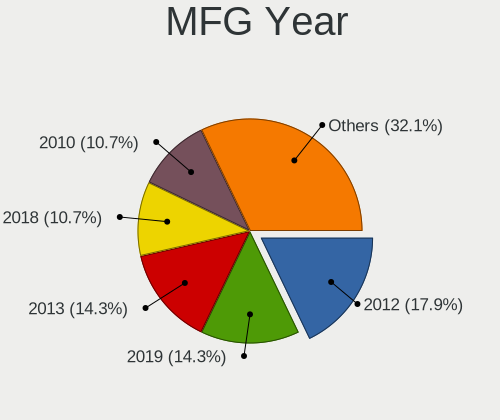
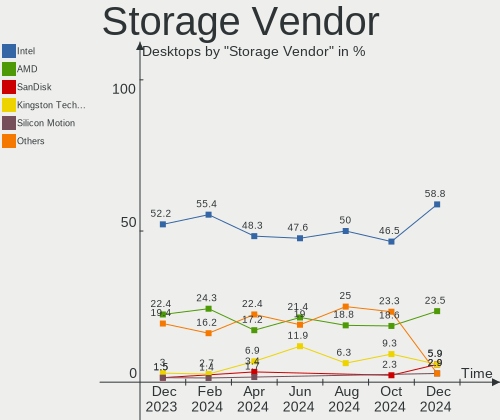

BlackPanther - Hardware Trends (Desktops)
-----------------------------------------

A project to identify most popular hardware characteristics and track their change
over time based on data collected by Linux users at https://Linux-Hardware.org.

Anyone can contribute to this report by the [hw-probe](https://github.com/linuxhw/hw-probe) tool:

    sudo -E hw-probe -all -upload

This report is for one last month. Overall report since the beginning of time: [TestDays](https://github.com/linuxhw/TestDays)

Period: Jan, 2024.

Contents
--------

* [ System ](#system)
  - [ OS                       ](#os)
  - [ OS Family                ](#os-family)
  - [ Kernel                   ](#kernel)
  - [ Kernel Family            ](#kernel-family)
  - [ Kernel Major Ver.        ](#kernel-major-ver)
  - [ Arch                     ](#arch)
  - [ DE                       ](#de)
  - [ Display Server           ](#display-server)
  - [ Display Manager          ](#display-manager)
  - [ OS Lang                  ](#os-lang)
  - [ Boot Mode                ](#boot-mode)
  - [ Filesystem               ](#filesystem)
  - [ Part. scheme             ](#part-scheme)
  - [ Dual Boot with Linux/BSD ](#dual-boot-with-linuxbsd)
  - [ Dual Boot (Win)          ](#dual-boot-win)

* [ Board ](#board)
  - [ Vendor                   ](#vendor)
  - [ Model                    ](#model)
  - [ Model Family             ](#model-family)
  - [ MFG Year                 ](#mfg-year)
  - [ Form Factor              ](#form-factor)
  - [ Secure Boot              ](#secure-boot)
  - [ Coreboot                 ](#coreboot)
  - [ RAM Size                 ](#ram-size)
  - [ RAM Used                 ](#ram-used)
  - [ Total Drives             ](#total-drives)
  - [ Has CD-ROM               ](#has-cd-rom)
  - [ Has Ethernet             ](#has-ethernet)
  - [ Has WiFi                 ](#has-wifi)
  - [ Has Bluetooth            ](#has-bluetooth)

* [ Location ](#location)
  - [ Country                  ](#country)
  - [ City                     ](#city)

* [ Drives ](#drives)
  - [ Drive Vendor             ](#drive-vendor)
  - [ Drive Model              ](#drive-model)
  - [ HDD Vendor               ](#hdd-vendor)
  - [ SSD Vendor               ](#ssd-vendor)
  - [ Drive Kind               ](#drive-kind)
  - [ Drive Connector          ](#drive-connector)
  - [ Drive Size               ](#drive-size)
  - [ Space Total              ](#space-total)
  - [ Space Used               ](#space-used)
  - [ Malfunc. Drives          ](#malfunc-drives)
  - [ Malfunc. Drive Vendor    ](#malfunc-drive-vendor)
  - [ Malfunc. HDD Vendor      ](#malfunc-hdd-vendor)
  - [ Malfunc. Drive Kind      ](#malfunc-drive-kind)
  - [ Failed Drives            ](#failed-drives)
  - [ Failed Drive Vendor      ](#failed-drive-vendor)
  - [ Drive Status             ](#drive-status)

* [ Storage controller ](#storage-controller)
  - [ Storage Vendor           ](#storage-vendor)
  - [ Storage Model            ](#storage-model)
  - [ Storage Kind             ](#storage-kind)

* [ Processor ](#processor)
  - [ CPU Vendor               ](#cpu-vendor)
  - [ CPU Model                ](#cpu-model)
  - [ CPU Model Family         ](#cpu-model-family)
  - [ CPU Cores                ](#cpu-cores)
  - [ CPU Sockets              ](#cpu-sockets)
  - [ CPU Threads              ](#cpu-threads)
  - [ CPU Op-Modes             ](#cpu-op-modes)
  - [ CPU Microcode            ](#cpu-microcode)
  - [ CPU Microarch            ](#cpu-microarch)

* [ Graphics ](#graphics)
  - [ GPU Vendor               ](#gpu-vendor)
  - [ GPU Model                ](#gpu-model)
  - [ GPU Combo                ](#gpu-combo)
  - [ GPU Driver               ](#gpu-driver)
  - [ GPU Memory               ](#gpu-memory)

* [ Monitor ](#monitor)
  - [ Monitor Vendor           ](#monitor-vendor)
  - [ Monitor Model            ](#monitor-model)
  - [ Monitor Resolution       ](#monitor-resolution)
  - [ Monitor Diagonal         ](#monitor-diagonal)
  - [ Monitor Width            ](#monitor-width)
  - [ Aspect Ratio             ](#aspect-ratio)
  - [ Monitor Area             ](#monitor-area)
  - [ Pixel Density            ](#pixel-density)
  - [ Multiple Monitors        ](#multiple-monitors)

* [ Network ](#network)
  - [ Net Controller Vendor    ](#net-controller-vendor)
  - [ Net Controller Model     ](#net-controller-model)
  - [ Wireless Vendor          ](#wireless-vendor)
  - [ Wireless Model           ](#wireless-model)
  - [ Ethernet Vendor          ](#ethernet-vendor)
  - [ Ethernet Model           ](#ethernet-model)
  - [ Net Controller Kind      ](#net-controller-kind)
  - [ Used Controller          ](#used-controller)
  - [ NICs                     ](#nics)
  - [ IPv6                     ](#ipv6)

* [ Bluetooth ](#bluetooth)
  - [ Bluetooth Vendor         ](#bluetooth-vendor)
  - [ Bluetooth Model          ](#bluetooth-model)

* [ Sound ](#sound)
  - [ Sound Vendor             ](#sound-vendor)
  - [ Sound Model              ](#sound-model)

* [ Memory ](#memory)
  - [ Memory Vendor            ](#memory-vendor)
  - [ Memory Model             ](#memory-model)
  - [ Memory Kind              ](#memory-kind)
  - [ Memory Form Factor       ](#memory-form-factor)
  - [ Memory Size              ](#memory-size)
  - [ Memory Speed             ](#memory-speed)

* [ Printers & scanners ](#printers--scanners)
  - [ Printer Vendor           ](#printer-vendor)
  - [ Printer Model            ](#printer-model)
  - [ Scanner Vendor           ](#scanner-vendor)
  - [ Scanner Model            ](#scanner-model)

* [ Camera ](#camera)
  - [ Camera Vendor            ](#camera-vendor)
  - [ Camera Model             ](#camera-model)

* [ Security ](#security)
  - [ Fingerprint Vendor       ](#fingerprint-vendor)
  - [ Fingerprint Model        ](#fingerprint-model)
  - [ Chipcard Vendor          ](#chipcard-vendor)
  - [ Chipcard Model           ](#chipcard-model)

* [ Unsupported ](#unsupported)
  - [ Unsupported Devices      ](#unsupported-devices)
  - [ Unsupported Device Types ](#unsupported-device-types)

System
------

OS
--

Installed operating systems

| Name              | Desktops | Percent |
|-------------------|----------|---------|
| BlackPanther 18.1 | 52       | 92.86%  |
| BlackPanther 22.1 | 4        | 7.14%   |

OS Family
---------

OS without a version

| Name         | Desktops | Percent |
|--------------|----------|---------|
| BlackPanther | 56       | 100%    |

Kernel
------

Version of the Linux kernel

| Version             | Desktops | Percent |
|---------------------|----------|---------|
| 5.15.85-desktop-1bP | 25       | 44.64%  |
| 5.6.14-desktop-2bP  | 15       | 26.79%  |
| 4.18.16-desktop-1bP | 10       | 17.86%  |
| 6.3.8-desktop-1bP   | 3        | 5.36%   |
| 6.7.0-rc4-tkg-eevdf | 1        | 1.79%   |
| 6.4.3-desktop-1bP   | 1        | 1.79%   |
| 6.2.9-desktop-1bP   | 1        | 1.79%   |

Kernel Family
-------------

Linux kernel without a distro release

| Version | Desktops | Percent |
|---------|----------|---------|
| 5.15.85 | 25       | 44.64%  |
| 5.6.14  | 15       | 26.79%  |
| 4.18.16 | 10       | 17.86%  |
| 6.3.8   | 3        | 5.36%   |
| 6.7.0   | 1        | 1.79%   |
| 6.4.3   | 1        | 1.79%   |
| 6.2.9   | 1        | 1.79%   |

Kernel Major Ver.
-----------------

Linux kernel major version

| Version | Desktops | Percent |
|---------|----------|---------|
| 5.15    | 25       | 44.64%  |
| 5.6     | 15       | 26.79%  |
| 4.18    | 10       | 17.86%  |
| 6.3     | 3        | 5.36%   |
| 6.7     | 1        | 1.79%   |
| 6.4     | 1        | 1.79%   |
| 6.2     | 1        | 1.79%   |

Arch
----

OS architecture (x86_64, i586, etc.)

| Name   | Desktops | Percent |
|--------|----------|---------|
| x86_64 | 56       | 100%    |

DE
--

Desktop Environment

| Name    | Desktops | Percent |
|---------|----------|---------|
| KDE5    | 55       | 98.21%  |
| Unknown | 1        | 1.79%   |

Display Server
--------------

X11 or Wayland

| Name | Desktops | Percent |
|------|----------|---------|
| X11  | 56       | 100%    |

Display Manager
---------------

SDDM, LightDM, etc.

| Name | Desktops | Percent |
|------|----------|---------|
| SDDM | 56       | 100%    |

OS Lang
-------

Language

| Lang    | Desktops | Percent |
|---------|----------|---------|
| Unknown | 56       | 100%    |

Boot Mode
---------

EFI or BIOS

| Mode | Desktops | Percent |
|------|----------|---------|
| BIOS | 30       | 53.57%  |
| EFI  | 26       | 46.43%  |

Filesystem
----------

Type of filesystem

| Type    | Desktops | Percent |
|---------|----------|---------|
| Ext4    | 35       | 62.5%   |
| Overlay | 21       | 37.5%   |

Part. scheme
------------

Scheme of partitioning

| Type | Desktops | Percent |
|------|----------|---------|
| GPT  | 34       | 60.71%  |
| MBR  | 22       | 39.29%  |

Dual Boot with Linux/BSD
------------------------

Hosting more than one Linux/BSD

| Dual boot | Desktops | Percent |
|-----------|----------|---------|
| No        | 41       | 73.21%  |
| Yes       | 15       | 26.79%  |

Dual Boot (Win)
---------------

Hosting Linux and Windows

| Dual boot | Desktops | Percent |
|-----------|----------|---------|
| Yes       | 29       | 51.79%  |
| No        | 27       | 48.21%  |

Board
-----

Vendor
------

Motherboard manufacturer

| Name                | Desktops | Percent |
|---------------------|----------|---------|
| Gigabyte Technology | 17       | 30.36%  |
| ASUSTek Computer    | 7        | 12.5%   |
| ASRock              | 7        | 12.5%   |
| Dell                | 6        | 10.71%  |
| Hewlett-Packard     | 5        | 8.93%   |
| Fujitsu             | 5        | 8.93%   |
| MSI                 | 3        | 5.36%   |
| Lenovo              | 3        | 5.36%   |
| Fujitsu Siemens     | 2        | 3.57%   |
| Medion              | 1        | 1.79%   |

Model
-----

Motherboard model

| Name                                  | Desktops | Percent |
|---------------------------------------|----------|---------|
| Gigabyte H61M-S2PV                    | 2        | 3.57%   |
| Fujitsu ESPRIMO P920                  | 2        | 3.57%   |
| MSI MS-7C94                           | 1        | 1.79%   |
| MSI MS-7817                           | 1        | 1.79%   |
| MSI MS-7519                           | 1        | 1.79%   |
| Medion MS-7748                        | 1        | 1.79%   |
| Lenovo ThinkStation P520 30BFS44D04   | 1        | 1.79%   |
| Lenovo ThinkStation C30 1097A34       | 1        | 1.79%   |
| Lenovo ThinkCentre M720s 10SUS0C000   | 1        | 1.79%   |
| HP Z400 Workstation                   | 1        | 1.79%   |
| HP EliteDesk 705 G3 SFF               | 1        | 1.79%   |
| HP Compaq Pro 6300 SFF                | 1        | 1.79%   |
| HP Compaq 8200 Elite MT PC            | 1        | 1.79%   |
| HP Compaq 6200 Pro MT PC              | 1        | 1.79%   |
| Gigabyte X570 AORUS XTREME            | 1        | 1.79%   |
| Gigabyte P67A-D3-B3                   | 1        | 1.79%   |
| Gigabyte H97-D3H                      | 1        | 1.79%   |
| Gigabyte H61M-S1                      | 1        | 1.79%   |
| Gigabyte H310M A 2.0                  | 1        | 1.79%   |
| Gigabyte GA-MA78GPM-DS2H              | 1        | 1.79%   |
| Gigabyte GA-890GPA-UD3H               | 1        | 1.79%   |
| Gigabyte GA-78LMT-USB3 R2             | 1        | 1.79%   |
| Gigabyte F2A88XN-WIFI                 | 1        | 1.79%   |
| Gigabyte F2A88XM-HD3                  | 1        | 1.79%   |
| Gigabyte B85N PHOENIX                 | 1        | 1.79%   |
| Gigabyte B660M GAMING DDR4            | 1        | 1.79%   |
| Gigabyte B365M DS3H                   | 1        | 1.79%   |
| Gigabyte AB350M-DS3H V2               | 1        | 1.79%   |
| Gigabyte A520M S2H                    | 1        | 1.79%   |
| Fujitsu Siemens ESPRIMO P5625         | 1        | 1.79%   |
| Fujitsu Siemens ESPRIMO EDITION P2511 | 1        | 1.79%   |
| Fujitsu ESPRIMO Q556/2                | 1        | 1.79%   |
| Fujitsu ESPRIMO E7935                 | 1        | 1.79%   |
| Fujitsu CELSIUS M470                  | 1        | 1.79%   |
| Dell Precision Tower 5810             | 1        | 1.79%   |
| Dell OptiPlex 780                     | 1        | 1.79%   |
| Dell OptiPlex 760                     | 1        | 1.79%   |
| Dell OptiPlex 745                     | 1        | 1.79%   |
| Dell OptiPlex 7010                    | 1        | 1.79%   |
| Dell OptiPlex 3060                    | 1        | 1.79%   |

Model Family
------------

Motherboard model prefix

| Name                     | Desktops | Percent |
|--------------------------|----------|---------|
| Dell OptiPlex            | 5        | 8.93%   |
| Fujitsu ESPRIMO          | 4        | 7.14%   |
| HP Compaq                | 3        | 5.36%   |
| Lenovo ThinkStation      | 2        | 3.57%   |
| Gigabyte H61M-S2PV       | 2        | 3.57%   |
| Fujitsu Siemens ESPRIMO  | 2        | 3.57%   |
| ASUS PRIME               | 2        | 3.57%   |
| MSI MS-7C94              | 1        | 1.79%   |
| MSI MS-7817              | 1        | 1.79%   |
| MSI MS-7519              | 1        | 1.79%   |
| Medion MS-7748           | 1        | 1.79%   |
| Lenovo ThinkCentre       | 1        | 1.79%   |
| HP Z400                  | 1        | 1.79%   |
| HP EliteDesk             | 1        | 1.79%   |
| Gigabyte X570            | 1        | 1.79%   |
| Gigabyte P67A-D3-B3      | 1        | 1.79%   |
| Gigabyte H97-D3H         | 1        | 1.79%   |
| Gigabyte H61M-S1         | 1        | 1.79%   |
| Gigabyte H310M           | 1        | 1.79%   |
| Gigabyte GA-MA78GPM-DS2H | 1        | 1.79%   |
| Gigabyte GA-890GPA-UD3H  | 1        | 1.79%   |
| Gigabyte GA-78LMT-USB3   | 1        | 1.79%   |
| Gigabyte F2A88XN-WIFI    | 1        | 1.79%   |
| Gigabyte F2A88XM-HD3     | 1        | 1.79%   |
| Gigabyte B85N            | 1        | 1.79%   |
| Gigabyte B660M           | 1        | 1.79%   |
| Gigabyte B365M           | 1        | 1.79%   |
| Gigabyte AB350M-DS3H     | 1        | 1.79%   |
| Gigabyte A520M           | 1        | 1.79%   |
| Fujitsu CELSIUS          | 1        | 1.79%   |
| Dell Precision           | 1        | 1.79%   |
| ASUS P5LD2-X             | 1        | 1.79%   |
| ASUS P5KPL-AM            | 1        | 1.79%   |
| ASUS H110M-K             | 1        | 1.79%   |
| ASUS H110M-A             | 1        | 1.79%   |
| ASUS A88XM-E             | 1        | 1.79%   |
| ASRock X370              | 1        | 1.79%   |
| ASRock N68C-S            | 1        | 1.79%   |
| ASRock G41M-VS3          | 1        | 1.79%   |
| ASRock FM2A75M           | 1        | 1.79%   |

MFG Year
--------

Motherboard manufacture year

| Year | Desktops | Percent |
|------|----------|---------|
| 2010 | 7        | 12.5%   |
| 2014 | 6        | 10.71%  |
| 2013 | 6        | 10.71%  |
| 2019 | 5        | 8.93%   |
| 2012 | 5        | 8.93%   |
| 2011 | 5        | 8.93%   |
| 2020 | 4        | 7.14%   |
| 2017 | 4        | 7.14%   |
| 2018 | 3        | 5.36%   |
| 2008 | 3        | 5.36%   |
| 2007 | 3        | 5.36%   |
| 2015 | 2        | 3.57%   |
| 2009 | 2        | 3.57%   |
| 2021 | 1        | 1.79%   |

Form Factor
-----------

Physical design of the computer

| Name    | Desktops | Percent |
|---------|----------|---------|
| Desktop | 56       | 100%    |

Secure Boot
-----------

Enabled or disabled

| State    | Desktops | Percent |
|----------|----------|---------|
| Disabled | 56       | 100%    |

Coreboot
--------

Have coreboot on board

| Used | Desktops | Percent |
|------|----------|---------|
| No   | 56       | 100%    |

RAM Size
--------

Total RAM memory

| Size in GB | Desktops | Percent |
|------------|----------|---------|
| 8.01-16.0  | 18       | 32.14%  |
| 4.01-8.0   | 13       | 23.21%  |
| 3.01-4.0   | 10       | 17.86%  |
| 32.01-64.0 | 7        | 12.5%   |
| 16.01-24.0 | 5        | 8.93%   |
| 1.01-2.0   | 2        | 3.57%   |
| 24.01-32.0 | 1        | 1.79%   |

RAM Used
--------

Used RAM memory

| Used GB  | Desktops | Percent |
|----------|----------|---------|
| 1.01-2.0 | 21       | 37.5%   |
| 0.51-1.0 | 18       | 32.14%  |
| 0.01-0.5 | 11       | 19.64%  |
| 2.01-3.0 | 5        | 8.93%   |
| 4.01-8.0 | 1        | 1.79%   |

Total Drives
------------

Number of drives on board

| Drives | Desktops | Percent |
|--------|----------|---------|
| 1      | 26       | 46.43%  |
| 2      | 16       | 28.57%  |
| 3      | 8        | 14.29%  |
| 5      | 3        | 5.36%   |
| 4      | 2        | 3.57%   |
| 6      | 1        | 1.79%   |

Has CD-ROM
----------

Has CD-ROM on board

| Presented | Desktops | Percent |
|-----------|----------|---------|
| Yes       | 40       | 71.43%  |
| No        | 16       | 28.57%  |

Has Ethernet
------------

Has Ethernet on board

| Presented | Desktops | Percent |
|-----------|----------|---------|
| Yes       | 56       | 100%    |

Has WiFi
--------

Has WiFi module

| Presented | Desktops | Percent |
|-----------|----------|---------|
| No        | 34       | 60.71%  |
| Yes       | 22       | 39.29%  |

Has Bluetooth
-------------

Has Bluetooth module

| Presented | Desktops | Percent |
|-----------|----------|---------|
| No        | 44       | 78.57%  |
| Yes       | 12       | 21.43%  |

Location
--------

Country
-------

Geographic location (country)

| Country      | Desktops | Percent |
|--------------|----------|---------|
| Hungary      | 49       | 87.5%   |
| Greece       | 2        | 3.57%   |
| South Africa | 1        | 1.79%   |
| Slovakia     | 1        | 1.79%   |
| Serbia       | 1        | 1.79%   |
| Romania      | 1        | 1.79%   |
| Austria      | 1        | 1.79%   |

City
----

Geographic location (city)

| City              | Desktops | Percent |
|-------------------|----------|---------|
| Budapest          | 12       | 21.43%  |
| Tatabánya        | 3        | 5.36%   |
| Berettyóújfalu  | 3        | 5.36%   |
| Agfalva           | 3        | 5.36%   |
| Pécs             | 2        | 3.57%   |
| Debrecen          | 2        | 3.57%   |
| Csongrad          | 2        | 3.57%   |
| Zvolen            | 1        | 1.79%   |
| Zalău            | 1        | 1.79%   |
| Zalaegerszeg      | 1        | 1.79%   |
| Veresegyhaz       | 1        | 1.79%   |
| Toeroekbalint     | 1        | 1.79%   |
| Tiszaujvaros      | 1        | 1.79%   |
| Tamasi            | 1        | 1.79%   |
| Szentendre        | 1        | 1.79%   |
| Szekszárd        | 1        | 1.79%   |
| Székesfehérvár | 1        | 1.79%   |
| Szeghalom         | 1        | 1.79%   |
| Szeged            | 1        | 1.79%   |
| Sajoivanka        | 1        | 1.79%   |
| Oroshaza          | 1        | 1.79%   |
| Orbottyan         | 1        | 1.79%   |
| Miskolc           | 1        | 1.79%   |
| Mihalyhaza        | 1        | 1.79%   |
| Kormend           | 1        | 1.79%   |
| Kastoria          | 1        | 1.79%   |
| Karcag            | 1        | 1.79%   |
| Hajduszovat       | 1        | 1.79%   |
| Győr             | 1        | 1.79%   |
| Graz              | 1        | 1.79%   |
| Celldomolk        | 1        | 1.79%   |
| Cape Town         | 1        | 1.79%   |
| Borota            | 1        | 1.79%   |
| Belgrade          | 1        | 1.79%   |
| Balatonfuered     | 1        | 1.79%   |
| Athens            | 1        | 1.79%   |

Drives
------

Drive Vendor
------------

Hard drive vendors

| Vendor                    | Desktops | Drives | Percent |
|---------------------------|----------|--------|---------|
| Samsung Electronics       | 19       | 25     | 17.92%  |
| WDC                       | 18       | 23     | 16.98%  |
| Kingston                  | 16       | 17     | 15.09%  |
| Seagate                   | 9        | 11     | 8.49%   |
| Toshiba                   | 8        | 9      | 7.55%   |
| A-DATA Technology         | 6        | 6      | 5.66%   |
| SanDisk                   | 3        | 3      | 2.83%   |
| Gigabyte Technology       | 3        | 3      | 2.83%   |
| Kingmax                   | 2        | 2      | 1.89%   |
| JMicron Technology        | 2        | 2      | 1.89%   |
| Intenso                   | 2        | 2      | 1.89%   |
| Crucial                   | 2        | 2      | 1.89%   |
| Zheino                    | 1        | 1      | 0.94%   |
| XPG                       | 1        | 1      | 0.94%   |
| Unknown                   | 1        | 3      | 0.94%   |
| SPCC                      | 1        | 1      | 0.94%   |
| Realtek Semiconductor     | 1        | 1      | 0.94%   |
| PNY                       | 1        | 1      | 0.94%   |
| Patriot                   | 1        | 1      | 0.94%   |
| Netac                     | 1        | 1      | 0.94%   |
| Micron/Crucial Technology | 1        | 1      | 0.94%   |
| Micron Technology         | 1        | 1      | 0.94%   |
| Maxtor                    | 1        | 1      | 0.94%   |
| KingFast                  | 1        | 1      | 0.94%   |
| Intel                     | 1        | 1      | 0.94%   |
| Hitachi                   | 1        | 2      | 0.94%   |
| HGST                      | 1        | 2      | 0.94%   |
| China                     | 1        | 1      | 0.94%   |

Drive Model
-----------

Hard drive models

| Model                            | Desktops | Percent |
|----------------------------------|----------|---------|
| Kingston SA400S37240G 240GB SSD  | 4        | 3.28%   |
| Kingston SA400S37480G 480GB SSD  | 3        | 2.46%   |
| A-DATA SU630 240GB SSD           | 3        | 2.46%   |
| WDC WD30EZRX-00DC0B0 3TB         | 2        | 1.64%   |
| WDC WD20EZRX-00D8PB0 2TB         | 2        | 1.64%   |
| Toshiba DT01ACA100 1TB           | 2        | 1.64%   |
| Samsung SSD 860 EVO 250GB        | 2        | 1.64%   |
| Kingston SNVS500G 500GB          | 2        | 1.64%   |
| Kingston SNV2S500G 500GB         | 2        | 1.64%   |
| Kingston SA400S37120G 120GB SSD  | 2        | 1.64%   |
| JMicron Generic 8GB              | 2        | 1.64%   |
| A-DATA SP600 64GB SSD            | 2        | 1.64%   |
| Zheino CHN-NGFFNV2280-256 256GB  | 1        | 0.82%   |
| XPG SPECTRIX S40G 1TB            | 1        | 0.82%   |
| WDC WDS240G2G0B-00EPW0 240GB SSD | 1        | 0.82%   |
| WDC WD800JD-75MSA3 80GB          | 1        | 0.82%   |
| WDC WD800JD-23LSA0 80GB          | 1        | 0.82%   |
| WDC WD5003AZEX-00MK2A0 500GB     | 1        | 0.82%   |
| WDC WD5000LPLX-75ZNTT0 500GB     | 1        | 0.82%   |
| WDC WD5000AZLX-75K2TA0 500GB     | 1        | 0.82%   |
| WDC WD5000AAKS-00UU3A0 500GB     | 1        | 0.82%   |
| WDC WD3200AAKS-00L9A0 320GB      | 1        | 0.82%   |
| WDC WD30EZRZ-00GXCB0 3TB         | 1        | 0.82%   |
| WDC WD30EFRX-68EUZN0 3TB         | 1        | 0.82%   |
| WDC WD22 PURZ-85B4ZY0 2TB        | 1        | 0.82%   |
| WDC WD20EZBX-00AYRA0 2TB         | 1        | 0.82%   |
| WDC WD20EARS-00MVWB0 2TB         | 1        | 0.82%   |
| WDC WD10PURZ-85U8XY0 1TB         | 1        | 0.82%   |
| WDC WD10EZEX-00KUWA0 1TB         | 1        | 0.82%   |
| WDC WD10EFRX-68PJCN0 1TB         | 1        | 0.82%   |
| WDC WD10EARS-00Y5B1 1TB          | 1        | 0.82%   |
| WDC WD Green 2.5 240GB SSD       | 1        | 0.82%   |
| Unknown SD/MMC 2GB               | 1        | 0.82%   |
| Unknown M.S./M.S.Pro/HG 16GB     | 1        | 0.82%   |
| Unknown Compact Flash 977MB      | 1        | 0.82%   |
| Toshiba MQ01ABF032 320GB         | 1        | 0.82%   |
| Toshiba MQ01ABB200 2TB           | 1        | 0.82%   |
| Toshiba MK3259GSX 320GB          | 1        | 0.82%   |
| Toshiba MK1676GSX H 160GB        | 1        | 0.82%   |
| Toshiba HDWQ140 4TB              | 1        | 0.82%   |

HDD Vendor
----------

Hard disk drive vendors

| Vendor              | Desktops | Drives | Percent |
|---------------------|----------|--------|---------|
| WDC                 | 16       | 21     | 36.36%  |
| Seagate             | 9        | 11     | 20.45%  |
| Toshiba             | 8        | 9      | 18.18%  |
| Samsung Electronics | 6        | 6      | 13.64%  |
| JMicron Technology  | 2        | 2      | 4.55%   |
| Maxtor              | 1        | 1      | 2.27%   |
| Hitachi             | 1        | 2      | 2.27%   |
| HGST                | 1        | 2      | 2.27%   |

SSD Vendor
----------

Solid state drive vendors

| Vendor              | Desktops | Drives | Percent |
|---------------------|----------|--------|---------|
| Kingston            | 12       | 13     | 25%     |
| Samsung Electronics | 10       | 11     | 20.83%  |
| A-DATA Technology   | 6        | 6      | 12.5%   |
| SanDisk             | 3        | 3      | 6.25%   |
| WDC                 | 2        | 2      | 4.17%   |
| Kingmax             | 2        | 2      | 4.17%   |
| Intenso             | 2        | 2      | 4.17%   |
| Gigabyte Technology | 2        | 2      | 4.17%   |
| SPCC                | 1        | 1      | 2.08%   |
| PNY                 | 1        | 1      | 2.08%   |
| Patriot             | 1        | 1      | 2.08%   |
| Netac               | 1        | 1      | 2.08%   |
| Micron Technology   | 1        | 1      | 2.08%   |
| KingFast            | 1        | 1      | 2.08%   |
| Intel               | 1        | 1      | 2.08%   |
| Crucial             | 1        | 1      | 2.08%   |
| China               | 1        | 1      | 2.08%   |

Drive Kind
----------

HDD or SSD

| Kind    | Desktops | Drives | Percent |
|---------|----------|--------|---------|
| SSD     | 40       | 50     | 46.51%  |
| HDD     | 35       | 54     | 40.7%   |
| NVMe    | 10       | 18     | 11.63%  |
| Unknown | 1        | 3      | 1.16%   |

Drive Connector
---------------

SATA, SAS, NVMe, etc.

| Type | Desktops | Drives | Percent |
|------|----------|--------|---------|
| SATA | 54       | 97     | 75%     |
| NVMe | 10       | 18     | 13.89%  |
| SAS  | 8        | 10     | 11.11%  |

Drive Size
----------

Size of hard drive

| Size in TB | Desktops | Drives | Percent |
|------------|----------|--------|---------|
| 0.01-0.5   | 50       | 70     | 62.5%   |
| 0.51-1.0   | 17       | 17     | 21.25%  |
| 1.01-2.0   | 5        | 7      | 6.25%   |
| 2.01-3.0   | 4        | 5      | 5%      |
| 3.01-4.0   | 3        | 4      | 3.75%   |
| 4.01-10.0  | 1        | 1      | 1.25%   |

Space Total
-----------

Amount of disk space available on the file system

| Size in GB     | Desktops | Percent |
|----------------|----------|---------|
| Unknown        | 21       | 37.5%   |
| 251-500        | 10       | 17.86%  |
| 101-250        | 8        | 14.29%  |
| 501-1000       | 8        | 14.29%  |
| 51-100         | 4        | 7.14%   |
| 1001-2000      | 3        | 5.36%   |
| More than 3000 | 2        | 3.57%   |

Space Used
----------

Amount of used disk space

| Used GB        | Desktops | Percent |
|----------------|----------|---------|
| Unknown        | 21       | 37.5%   |
| 101-250        | 10       | 17.86%  |
| 1-20           | 10       | 17.86%  |
| 51-100         | 9        | 16.07%  |
| 21-50          | 4        | 7.14%   |
| More than 3000 | 2        | 3.57%   |

Malfunc. Drives
---------------

Drive models with a malfunction

| Model                             | Desktops | Drives | Percent |
|-----------------------------------|----------|--------|---------|
| A-DATA Technology SU630 240GB SSD | 2        | 2      | 7.69%   |
| A-DATA Technology SP600 64GB SSD  | 2        | 2      | 7.69%   |
| WDC WD800JD-23LSA0 80GB           | 1        | 1      | 3.85%   |
| WDC WD5000AZLX-75K2TA0 500GB      | 1        | 1      | 3.85%   |
| WDC WD5000AAKS-00UU3A0 500GB      | 1        | 1      | 3.85%   |
| WDC WD3200AAKS-00L9A0 320GB       | 1        | 1      | 3.85%   |
| WDC WD20EARS-00MVWB0 2TB          | 1        | 1      | 3.85%   |
| WDC WD10PURZ-85U8XY0 1TB          | 1        | 1      | 3.85%   |
| WDC WD10EARS-00Y5B1 1TB           | 1        | 1      | 3.85%   |
| WDC WD Green 2.5 240GB SSD        | 1        | 1      | 3.85%   |
| Toshiba MQ01ABB200 2TB            | 1        | 1      | 3.85%   |
| Toshiba MK3259GSX 320GB           | 1        | 1      | 3.85%   |
| Toshiba MK1676GSX H 160GB         | 1        | 1      | 3.85%   |
| Toshiba HDWD130 3TB               | 1        | 1      | 3.85%   |
| Toshiba DT01ACA100 1TB            | 1        | 1      | 3.85%   |
| Seagate ST9320320AS 320GB         | 1        | 1      | 3.85%   |
| Seagate ST500LT012-1DG142 500GB   | 1        | 1      | 3.85%   |
| Seagate ST3160318AS 160GB         | 1        | 1      | 3.85%   |
| Samsung Electronics HD200HJ 200GB | 1        | 1      | 3.85%   |
| Samsung Electronics HD103UJ 1TB   | 1        | 1      | 3.85%   |
| Maxtor STM3160215AS 160GB         | 1        | 1      | 3.85%   |
| Kingston SUV400S37120G 120GB SSD  | 1        | 1      | 3.85%   |
| Intel SSDSC2BF180A4H 180GB        | 1        | 1      | 3.85%   |
| Hitachi HTS545050A7E380 500GB     | 1        | 1      | 3.85%   |

Malfunc. Drive Vendor
---------------------

Vendors of faulty drives

| Vendor              | Desktops | Drives | Percent |
|---------------------|----------|--------|---------|
| WDC                 | 7        | 8      | 29.17%  |
| Toshiba             | 4        | 5      | 16.67%  |
| A-DATA Technology   | 4        | 4      | 16.67%  |
| Seagate             | 3        | 3      | 12.5%   |
| Samsung Electronics | 2        | 2      | 8.33%   |
| Maxtor              | 1        | 1      | 4.17%   |
| Kingston            | 1        | 1      | 4.17%   |
| Intel               | 1        | 1      | 4.17%   |
| Hitachi             | 1        | 1      | 4.17%   |

Malfunc. HDD Vendor
-------------------

Vendors of faulty HDD drives

| Vendor              | Desktops | Drives | Percent |
|---------------------|----------|--------|---------|
| WDC                 | 6        | 7      | 35.29%  |
| Toshiba             | 4        | 5      | 23.53%  |
| Seagate             | 3        | 3      | 17.65%  |
| Samsung Electronics | 2        | 2      | 11.76%  |
| Maxtor              | 1        | 1      | 5.88%   |
| Hitachi             | 1        | 1      | 5.88%   |

Malfunc. Drive Kind
-------------------

Kinds of faulty drives

| Kind | Desktops | Drives | Percent |
|------|----------|--------|---------|
| HDD  | 14       | 19     | 66.67%  |
| SSD  | 7        | 7      | 33.33%  |

Failed Drives
-------------

Failed drive models

| Model                     | Desktops | Drives | Percent |
|---------------------------|----------|--------|---------|
| Seagate ST9160412AS 160GB | 1        | 1      | 100%    |

Failed Drive Vendor
-------------------

Failed drive vendors

| Vendor  | Desktops | Drives | Percent |
|---------|----------|--------|---------|
| Seagate | 1        | 1      | 100%    |

Drive Status
------------

Number of failed and malfunc. drives

| Status   | Desktops | Drives | Percent |
|----------|----------|--------|---------|
| Works    | 48       | 90     | 63.16%  |
| Malfunc  | 21       | 26     | 27.63%  |
| Detected | 6        | 8      | 7.89%   |
| Failed   | 1        | 1      | 1.32%   |

Storage controller
------------------

Storage Vendor
--------------

Storage controller vendors

| Vendor                      | Desktops | Percent |
|-----------------------------|----------|---------|
| Intel                       | 37       | 51.39%  |
| AMD                         | 17       | 23.61%  |
| Samsung Electronics         | 5        | 6.94%   |
| Kingston Technology Company | 4        | 5.56%   |
| Nvidia                      | 2        | 2.78%   |
| JMicron Technology          | 2        | 2.78%   |
| VIA Technologies            | 1        | 1.39%   |
| Silicon Motion              | 1        | 1.39%   |
| Realtek Semiconductor       | 1        | 1.39%   |
| Phison Electronics          | 1        | 1.39%   |
| Micron/Crucial Technology   | 1        | 1.39%   |

Storage Model
-------------

Storage controller models

| Model                                                                                   | Desktops | Percent |
|-----------------------------------------------------------------------------------------|----------|---------|
| AMD FCH SATA Controller [AHCI mode]                                                     | 10       | 10.75%  |
| Intel 8 Series/C220 Series Chipset Family 6-port SATA Controller 1 [AHCI mode]          | 5        | 5.38%   |
| Intel NM10/ICH7 Family SATA Controller [IDE mode]                                       | 4        | 4.3%    |
| Intel 200 Series PCH SATA controller [AHCI mode]                                        | 4        | 4.3%    |
| AMD 500 Series Chipset SATA Controller                                                  | 4        | 4.3%    |
| Samsung NVMe SSD Controller SM981/PM981/PM983                                           | 3        | 3.23%   |
| Intel Q170/Q150/B150/H170/H110/Z170/CM236 Chipset SATA Controller [AHCI Mode]           | 3        | 3.23%   |
| Intel 82801G (ICH7 Family) IDE Controller                                               | 3        | 3.23%   |
| Intel 6 Series/C200 Series Chipset Family Desktop SATA Controller (IDE mode, ports 4-5) | 3        | 3.23%   |
| Intel 6 Series/C200 Series Chipset Family Desktop SATA Controller (IDE mode, ports 0-3) | 3        | 3.23%   |
| Intel 6 Series/C200 Series Chipset Family 6 port Desktop SATA AHCI Controller           | 3        | 3.23%   |
| AMD SB7x0/SB8x0/SB9x0 IDE Controller                                                    | 3        | 3.23%   |
| Kingston Company NV1 NVMe SSD E13T (DRAM-less)                                          | 2        | 2.15%   |
| Intel Cannon Lake PCH SATA AHCI Controller                                              | 2        | 2.15%   |
| Intel 82801JI (ICH10 Family) SATA AHCI Controller                                       | 2        | 2.15%   |
| Intel 82801JD/DO (ICH10 Family) 4-port SATA IDE Controller                              | 2        | 2.15%   |
| Intel 82801JD/DO (ICH10 Family) 2-port SATA IDE Controller                              | 2        | 2.15%   |
| Intel 7 Series/C210 Series Chipset Family 6-port SATA Controller [AHCI mode]            | 2        | 2.15%   |
| AMD SB7x0/SB8x0/SB9x0 SATA Controller [IDE mode]                                        | 2        | 2.15%   |
| AMD 300 Series Chipset SATA Controller                                                  | 2        | 2.15%   |
| VIA VT6421 IDE/SATA Controller                                                          | 1        | 1.08%   |
| Silicon Motion SM2263EN/SM2263XT (DRAM-less) NVMe SSD Controllers                       | 1        | 1.08%   |
| Samsung NVMe SSD Controller SM961/PM961/SM963                                           | 1        | 1.08%   |
| Samsung NVMe SSD Controller PM9A1/PM9A3/980PRO                                          | 1        | 1.08%   |
| Realtek RTS5762 NVMe SSD Controller                                                     | 1        | 1.08%   |
| Phison E16 PCIe4 NVMe Controller                                                        | 1        | 1.08%   |
| Nvidia MCP78S [GeForce 8200] AHCI Controller                                            | 1        | 1.08%   |
| Nvidia MCP61 SATA Controller                                                            | 1        | 1.08%   |
| Nvidia MCP61 IDE                                                                        | 1        | 1.08%   |
| Micron/Crucial P1 NVMe PCIe SSD[Frampton2]                                              | 1        | 1.08%   |
| Kingston Company NV2 NVMe SSD SM2267XT (DRAM-less)                                      | 1        | 1.08%   |
| Kingston Company NV2 NVMe SSD E21T (DRAM-less)                                          | 1        | 1.08%   |
| JMicron JMB368 IDE controller                                                           | 1        | 1.08%   |
| JMicron JMB363 SATA/IDE Controller                                                      | 1        | 1.08%   |
| Intel SATA Controller [RAID mode]                                                       | 1        | 1.08%   |
| Intel C610/X99 series chipset IDE-r Controller                                          | 1        | 1.08%   |
| Intel C602 chipset 4-Port SATA Storage Control Unit                                     | 1        | 1.08%   |
| Intel C600/X79 series chipset 6-Port SATA AHCI Controller                               | 1        | 1.08%   |
| Intel Alder Lake-S PCH SATA Controller [AHCI Mode]                                      | 1        | 1.08%   |
| Intel 9 Series Chipset Family SATA Controller [AHCI Mode]                               | 1        | 1.08%   |

Storage Kind
------------

Kind of storage controller (IDE, SATA, NVMe, SAS, ...)

| Kind | Desktops | Percent |
|------|----------|---------|
| SATA | 43       | 58.11%  |
| IDE  | 18       | 24.32%  |
| NVMe | 10       | 13.51%  |
| RAID | 2        | 2.7%    |
| SAS  | 1        | 1.35%   |

Processor
---------

CPU Vendor
----------

Processor vendors

| Vendor | Desktops | Percent |
|--------|----------|---------|
| Intel  | 37       | 66.07%  |
| AMD    | 19       | 33.93%  |

CPU Model
---------

Processor models

| Model                                  | Desktops | Percent |
|----------------------------------------|----------|---------|
| Intel Core i5-8400 CPU @ 2.80GHz       | 2        | 3.57%   |
| Intel Core i3-2120 CPU @ 3.30GHz       | 2        | 3.57%   |
| Intel Xeon W-2135 CPU @ 3.70GHz        | 1        | 1.79%   |
| Intel Xeon CPU W3550 @ 3.07GHz         | 1        | 1.79%   |
| Intel Xeon CPU L5640 @ 2.27GHz         | 1        | 1.79%   |
| Intel Xeon CPU E5440 @ 2.83GHz         | 1        | 1.79%   |
| Intel Xeon CPU E5-2696 v3 @ 2.30GHz    | 1        | 1.79%   |
| Intel Xeon CPU E5-2637 0 @ 3.00GHz     | 1        | 1.79%   |
| Intel Pentium Dual CPU E2180 @ 2.00GHz | 1        | 1.79%   |
| Intel Pentium Dual CPU E2140 @ 1.60GHz | 1        | 1.79%   |
| Intel Pentium CPU G4560 @ 3.50GHz      | 1        | 1.79%   |
| Intel Pentium CPU G3430 @ 3.30GHz      | 1        | 1.79%   |
| Intel Core i5-6500 CPU @ 3.20GHz       | 1        | 1.79%   |
| Intel Core i5-4690 CPU @ 3.50GHz       | 1        | 1.79%   |
| Intel Core i5-4460 CPU @ 3.20GHz       | 1        | 1.79%   |
| Intel Core i5-4430 CPU @ 3.00GHz       | 1        | 1.79%   |
| Intel Core i5-3470S CPU @ 2.90GHz      | 1        | 1.79%   |
| Intel Core i5-3470 CPU @ 3.20GHz       | 1        | 1.79%   |
| Intel Core i5-2400 CPU @ 3.10GHz       | 1        | 1.79%   |
| Intel Core i5-2300 CPU @ 2.80GHz       | 1        | 1.79%   |
| Intel Core i3-9100F CPU @ 3.60GHz      | 1        | 1.79%   |
| Intel Core i3-9100 CPU @ 3.60GHz       | 1        | 1.79%   |
| Intel Core i3-8100 CPU @ 3.60GHz       | 1        | 1.79%   |
| Intel Core i3-6100T CPU @ 3.20GHz      | 1        | 1.79%   |
| Intel Core i3-4160 CPU @ 3.60GHz       | 1        | 1.79%   |
| Intel Core i3-4130 CPU @ 3.40GHz       | 1        | 1.79%   |
| Intel Core i3-3225 CPU @ 3.30GHz       | 1        | 1.79%   |
| Intel Core i3-3220 CPU @ 3.30GHz       | 1        | 1.79%   |
| Intel Core 2 Quad CPU Q8200 @ 2.33GHz  | 1        | 1.79%   |
| Intel Core 2 Quad CPU Q6600 @ 2.40GHz  | 1        | 1.79%   |
| Intel Core 2 Duo CPU E8400 @ 3.00GHz   | 1        | 1.79%   |
| Intel Core 2 Duo CPU E6750 @ 2.66GHz   | 1        | 1.79%   |
| Intel Core 2 CPU 4300 @ 1.80GHz        | 1        | 1.79%   |
| Intel Celeron CPU 2.80GHz              | 1        | 1.79%   |
| Intel 12th Gen Core i5-12400           | 1        | 1.79%   |
| AMD Ryzen 9 5950X 16-Core Processor    | 1        | 1.79%   |
| AMD Ryzen 7 5800X 8-Core Processor     | 1        | 1.79%   |
| AMD Ryzen 7 5700X 8-Core Processor     | 1        | 1.79%   |
| AMD Ryzen 7 1700X Eight-Core Processor | 1        | 1.79%   |
| AMD Ryzen 5 5600G with Radeon Graphics | 1        | 1.79%   |

CPU Model Family
----------------

Processor model prefix

| Model                | Desktops | Percent |
|----------------------|----------|---------|
| Intel Core i5        | 10       | 17.86%  |
| Intel Core i3        | 10       | 17.86%  |
| Intel Xeon           | 6        | 10.71%  |
| AMD Ryzen 7          | 3        | 5.36%   |
| AMD Ryzen 5          | 3        | 5.36%   |
| AMD A8               | 3        | 5.36%   |
| Other                | 2        | 3.57%   |
| Intel Pentium Dual   | 2        | 3.57%   |
| Intel Pentium        | 2        | 3.57%   |
| Intel Core 2 Quad    | 2        | 3.57%   |
| Intel Core 2 Duo     | 2        | 3.57%   |
| AMD Athlon II X2     | 2        | 3.57%   |
| Intel Core 2         | 1        | 1.79%   |
| Intel Celeron        | 1        | 1.79%   |
| AMD Ryzen 9          | 1        | 1.79%   |
| AMD Ryzen 3          | 1        | 1.79%   |
| AMD Phenom II X4     | 1        | 1.79%   |
| AMD Athlon X4        | 1        | 1.79%   |
| AMD Athlon II X4     | 1        | 1.79%   |
| AMD Athlon Dual Core | 1        | 1.79%   |
| AMD A10              | 1        | 1.79%   |

CPU Cores
---------

Number of processor cores

| Number | Desktops | Percent |
|--------|----------|---------|
| 4      | 21       | 37.5%   |
| 2      | 21       | 37.5%   |
| 6      | 7        | 12.5%   |
| 8      | 3        | 5.36%   |
| 1      | 2        | 3.57%   |
| 18     | 1        | 1.79%   |
| 16     | 1        | 1.79%   |

CPU Sockets
-----------

Number of sockets

| Number | Desktops | Percent |
|--------|----------|---------|
| 1      | 55       | 98.21%  |
| 2      | 1        | 1.79%   |

CPU Threads
-----------

Threads per core (Hyper-Threading)

| Number | Desktops | Percent |
|--------|----------|---------|
| 1      | 31       | 55.36%  |
| 2      | 25       | 44.64%  |

CPU Op-Modes
------------

CPU Operation Modes (32-bit, 64-bit)

| Op mode        | Desktops | Percent |
|----------------|----------|---------|
| 32-bit, 64-bit | 56       | 100%    |

CPU Microcode
-------------

Microcode number

| Number     | Desktops | Percent |
|------------|----------|---------|
| Unknown    | 8        | 14.29%  |
| 0x306c3    | 5        | 8.93%   |
| 0x010000c8 | 4        | 7.14%   |
| 0x306a9    | 3        | 5.36%   |
| 0x206a7    | 3        | 5.36%   |
| 0x06003106 | 3        | 5.36%   |
| 0x906eb    | 2        | 3.57%   |
| 0x906ea    | 2        | 3.57%   |
| 0x6fd      | 2        | 3.57%   |
| 0x6fb      | 2        | 3.57%   |
| 0x1067a    | 2        | 3.57%   |
| 0xf49      | 1        | 1.79%   |
| 0x906e9    | 1        | 1.79%   |
| 0x90672    | 1        | 1.79%   |
| 0x6f2      | 1        | 1.79%   |
| 0x506e3    | 1        | 1.79%   |
| 0x206d7    | 1        | 1.79%   |
| 0x206c2    | 1        | 1.79%   |
| 0x106a5    | 1        | 1.79%   |
| 0x10677    | 1        | 1.79%   |
| 0x0a50000c | 1        | 1.79%   |
| 0x0a20120a | 1        | 1.79%   |
| 0x0a20102b | 1        | 1.79%   |
| 0x0a201009 | 1        | 1.79%   |
| 0x08701030 | 1        | 1.79%   |
| 0x08108109 | 1        | 1.79%   |
| 0x0810100b | 1        | 1.79%   |
| 0x08001137 | 1        | 1.79%   |
| 0x0600611a | 1        | 1.79%   |
| 0x06001119 | 1        | 1.79%   |
| 0x03000027 | 1        | 1.79%   |

CPU Microarch
-------------

Microarchitecture

| Name             | Desktops | Percent |
|------------------|----------|---------|
| Haswell          | 7        | 12.5%   |
| KabyLake         | 6        | 10.71%  |
| SandyBridge      | 5        | 8.93%   |
| Core             | 5        | 8.93%   |
| Zen 3            | 4        | 7.14%   |
| K10              | 4        | 7.14%   |
| IvyBridge        | 4        | 7.14%   |
| Steamroller      | 3        | 5.36%   |
| Skylake          | 3        | 5.36%   |
| Penryn           | 3        | 5.36%   |
| Zen              | 2        | 3.57%   |
| Zen+             | 1        | 1.79%   |
| Zen 2            | 1        | 1.79%   |
| Westmere         | 1        | 1.79%   |
| Piledriver       | 1        | 1.79%   |
| NetBurst         | 1        | 1.79%   |
| Nehalem          | 1        | 1.79%   |
| K8 Hammer        | 1        | 1.79%   |
| K10 Llano        | 1        | 1.79%   |
| Excavator        | 1        | 1.79%   |
| Alderlake Hybrid | 1        | 1.79%   |

Graphics
--------

GPU Vendor
----------

Vendors of graphics cards

| Vendor | Desktops | Percent |
|--------|----------|---------|
| Nvidia | 25       | 40.98%  |
| AMD    | 22       | 36.07%  |
| Intel  | 14       | 22.95%  |

GPU Model
---------

Graphics card models

| Model                                                                       | Desktops | Percent |
|-----------------------------------------------------------------------------|----------|---------|
| Nvidia GK208B [GeForce GT 710]                                              | 4        | 6.25%   |
| Intel Xeon E3-1200 v3/4th Gen Core Processor Integrated Graphics Controller | 4        | 6.25%   |
| Intel CoffeeLake-S GT2 [UHD Graphics 630]                                   | 4        | 6.25%   |
| Nvidia GF108 [GeForce GT 630]                                               | 2        | 3.13%   |
| AMD Redwood PRO [Radeon HD 5550/5570/5630/6510/6610/7570]                   | 2        | 3.13%   |
| AMD Navi 22 [Radeon RX 6700/6700 XT/6750 XT / 6800M/6850M XT]               | 2        | 3.13%   |
| AMD Kaveri [Radeon R7 Graphics]                                             | 2        | 3.13%   |
| AMD Caicos [Radeon HD 6450/7450/8450 / R5 230 OEM]                          | 2        | 3.13%   |
| AMD Baffin [Radeon RX 550 640SP / RX 560/560X]                              | 2        | 3.13%   |
| Nvidia TU116 [GeForce GTX 1660 SUPER]                                       | 1        | 1.56%   |
| Nvidia GT218 [GeForce G210]                                                 | 1        | 1.56%   |
| Nvidia GT218 [GeForce 210]                                                  | 1        | 1.56%   |
| Nvidia GP107 [GeForce GTX 1050 Ti]                                          | 1        | 1.56%   |
| Nvidia GP104 [GeForce GTX 1080]                                             | 1        | 1.56%   |
| Nvidia GM206 [GeForce GTX 950]                                              | 1        | 1.56%   |
| Nvidia GM107GL [Quadro K620]                                                | 1        | 1.56%   |
| Nvidia GM107 [GeForce GTX 750]                                              | 1        | 1.56%   |
| Nvidia GM107 [GeForce GTX 750 Ti]                                           | 1        | 1.56%   |
| Nvidia GK208B [GeForce GT 720]                                              | 1        | 1.56%   |
| Nvidia GK107GL [Quadro K2000]                                               | 1        | 1.56%   |
| Nvidia GK107 [GeForce GTX 650]                                              | 1        | 1.56%   |
| Nvidia GK106GL [Quadro K4000]                                               | 1        | 1.56%   |
| Nvidia GK106 [GeForce GTX 660]                                              | 1        | 1.56%   |
| Nvidia GF119 [GeForce GT 520]                                               | 1        | 1.56%   |
| Nvidia GF116 [GeForce GTX 550 Ti]                                           | 1        | 1.56%   |
| Nvidia GA104 [GeForce RTX 3060 Ti Lite Hash Rate]                           | 1        | 1.56%   |
| Nvidia G84 [GeForce 8600 GT]                                                | 1        | 1.56%   |
| Nvidia G72 [GeForce 7300 LE]                                                | 1        | 1.56%   |
| Nvidia C61 [GeForce 7025 / nForce 630a]                                     | 1        | 1.56%   |
| Intel HD Graphics 530                                                       | 1        | 1.56%   |
| Intel Alder Lake-S GT1 [UHD Graphics 730]                                   | 1        | 1.56%   |
| Intel 82G33/G31 Express Integrated Graphics Controller                      | 1        | 1.56%   |
| Intel 4th Generation Core Processor Family Integrated Graphics Controller   | 1        | 1.56%   |
| Intel 4 Series Chipset Integrated Graphics Controller                       | 1        | 1.56%   |
| Intel 2nd Generation Core Processor Family Integrated Graphics Controller   | 1        | 1.56%   |
| AMD Wani [Radeon R5/R6/R7 Graphics]                                         | 1        | 1.56%   |
| AMD Tobago PRO [Radeon R7 360 / R9 360 OEM]                                 | 1        | 1.56%   |
| AMD Sumo [Radeon HD 6550D]                                                  | 1        | 1.56%   |
| AMD RV620 LE [Radeon HD 3450]                                               | 1        | 1.56%   |
| AMD RS880 [Radeon HD 4290]                                                  | 1        | 1.56%   |

GPU Combo
---------

Combinations of graphics cards

| Name           | Desktops | Percent |
|----------------|----------|---------|
| 1 x Nvidia     | 22       | 39.29%  |
| 1 x AMD        | 18       | 32.14%  |
| 1 x Intel      | 10       | 17.86%  |
| 2 x AMD        | 2        | 3.57%   |
| Intel + Nvidia | 2        | 3.57%   |
| Intel + AMD    | 1        | 1.79%   |
| AMD + Nvidia   | 1        | 1.79%   |

GPU Driver
----------

Free vs proprietary

| Driver  | Desktops | Percent |
|---------|----------|---------|
| Free    | 50       | 89.29%  |
| Unknown | 6        | 10.71%  |

GPU Memory
----------

Total video memory

| Size in GB | Desktops | Percent |
|------------|----------|---------|
| 0.51-1.0   | 17       | 30.36%  |
| Unknown    | 13       | 23.21%  |
| 1.01-2.0   | 7        | 12.5%   |
| 0.01-0.5   | 7        | 12.5%   |
| 3.01-4.0   | 5        | 8.93%   |
| 8.01-16.0  | 3        | 5.36%   |
| 7.01-8.0   | 2        | 3.57%   |
| 5.01-6.0   | 1        | 1.79%   |
| 2.01-3.0   | 1        | 1.79%   |

Monitor
-------

Monitor Vendor
--------------

Monitor vendors

| Vendor                  | Desktops | Percent |
|-------------------------|----------|---------|
| Goldstar                | 12       | 20.34%  |
| Samsung Electronics     | 11       | 18.64%  |
| LG Electronics          | 4        | 6.78%   |
| Iiyama                  | 3        | 5.08%   |
| Dell                    | 3        | 5.08%   |
| BenQ                    | 3        | 5.08%   |
| AOC                     | 3        | 5.08%   |
| Ancor Communications    | 3        | 5.08%   |
| Philips                 | 2        | 3.39%   |
| Lenovo                  | 2        | 3.39%   |
| Grundig                 | 2        | 3.39%   |
| Chi Mei Optoelectronics | 2        | 3.39%   |
| OEM                     | 1        | 1.69%   |
| MStar                   | 1        | 1.69%   |
| Medion                  | 1        | 1.69%   |
| HKC                     | 1        | 1.69%   |
| Hitachi                 | 1        | 1.69%   |
| Fujitsu Siemens         | 1        | 1.69%   |
| Eizo                    | 1        | 1.69%   |
| CVT                     | 1        | 1.69%   |
| Acer                    | 1        | 1.69%   |

Monitor Model
-------------

Monitor models

| Model                                                                | Desktops | Percent |
|----------------------------------------------------------------------|----------|---------|
| Grundig WXGA GRU4448 1600x1200                                       | 2        | 3.39%   |
| Samsung Electronics T22B300 SAM092B 1920x1080 477x268mm 21.5-inch    | 1        | 1.69%   |
| Samsung Electronics SyncMaster SAM05CD 1920x1080                     | 1        | 1.69%   |
| Samsung Electronics SyncMaster SAM0593 1920x1080 477x268mm 21.5-inch | 1        | 1.69%   |
| Samsung Electronics SyncMaster SAM02DB 1680x1050 474x296mm 22.0-inch | 1        | 1.69%   |
| Samsung Electronics SyncMaster SAM01B8 1280x1024 338x270mm 17.0-inch | 1        | 1.69%   |
| Samsung Electronics SyncMaster SAM01B7 1280x1024 338x270mm 17.0-inch | 1        | 1.69%   |
| Samsung Electronics S24R35x SAM100E 1920x1080 527x296mm 23.8-inch    | 1        | 1.69%   |
| Samsung Electronics S24D330 SAM0D92 1920x1080 531x299mm 24.0-inch    | 1        | 1.69%   |
| Samsung Electronics S22D300 SAM0B3B 1920x1080 477x268mm 21.5-inch    | 1        | 1.69%   |
| Samsung Electronics LCD Monitor SAM0679 1360x768 410x256mm 19.0-inch | 1        | 1.69%   |
| Samsung Electronics C27F390 SAM0D32 1920x1080 598x336mm 27.0-inch    | 1        | 1.69%   |
| Philips 221B PHL08A1 1920x1080 477x268mm 21.5-inch                   | 1        | 1.69%   |
| Philips 196V4 PHLC0AF 1366x768 410x230mm 18.5-inch                   | 1        | 1.69%   |
| OEM 19W_LCD_TV OEM3700 1920x540                                      | 1        | 1.69%   |
| MStar TV MST0030 1920x1080 708x398mm 32.0-inch                       | 1        | 1.69%   |
| Medion MD20328 MED3941 1600x900 462x272mm 21.1-inch                  | 1        | 1.69%   |
| LG Electronics LCD Monitor MP59G 1920x1080                           | 1        | 1.69%   |
| LG Electronics LCD Monitor LG ULTRAWIDE 1920x1080                    | 1        | 1.69%   |
| LG Electronics LCD Monitor LG TV 1920x1080                           | 1        | 1.69%   |
| LG Electronics LCD Monitor LG HDR WFHD 1920x1080                     | 1        | 1.69%   |
| Lenovo LEN L192p LEN4BDB 1280x1024 376x301mm 19.0-inch               | 1        | 1.69%   |
| Lenovo LEN L171 LEN24C9 1280x1024 337x270mm 17.0-inch                | 1        | 1.69%   |
| Iiyama PLX2783H IVM6648 1920x1080 598x336mm 27.0-inch                | 1        | 1.69%   |
| Iiyama PL2474H IVM6137 1920x1080 521x293mm 23.5-inch                 | 1        | 1.69%   |
| Iiyama AS4314UT IVM4648 1280x1024 340x270mm 17.1-inch                | 1        | 1.69%   |
| HKC HKC782 HKC87EB 1280x1024 340x270mm 17.1-inch                     | 1        | 1.69%   |
| Hitachi HISENSE HEC0030 3840x2160 1872x1053mm 84.6-inch              | 1        | 1.69%   |
| Goldstar W2486 GSM5729 1920x1080 531x299mm 24.0-inch                 | 1        | 1.69%   |
| Goldstar W2252 GSM567D 1680x1050 474x296mm 22.0-inch                 | 1        | 1.69%   |
| Goldstar MP59G GSM5B35 1920x1080 480x270mm 21.7-inch                 | 1        | 1.69%   |
| Goldstar MONITOR GSM59C6 1920x1080 509x286mm 23.0-inch               | 1        | 1.69%   |
| Goldstar M2280D GSM57B7 1920x1080 477x268mm 21.5-inch                | 1        | 1.69%   |
| Goldstar IPS FULLHD GSM5AB7 1920x1080 480x270mm 21.7-inch            | 1        | 1.69%   |
| Goldstar FULL HD GSM5B55 1920x1080 480x270mm 21.7-inch               | 1        | 1.69%   |
| Goldstar E2350 GSM5790 1920x1080 510x290mm 23.1-inch                 | 1        | 1.69%   |
| Goldstar E2240 GSM57A3 1920x1080 477x268mm 21.5-inch                 | 1        | 1.69%   |
| Goldstar 32PG6000 GSM7612 1920x1080 1000x550mm 44.9-inch             | 1        | 1.69%   |
| Goldstar 24MB56 GSM5A97 1920x1080 477x268mm 21.5-inch                | 1        | 1.69%   |
| Goldstar 19M35 GSM4C24 1366x768 410x230mm 18.5-inch                  | 1        | 1.69%   |

Monitor Resolution
------------------

Monitor screen resolution

| Resolution         | Desktops | Percent |
|--------------------|----------|---------|
| 1920x1080 (FHD)    | 28       | 49.12%  |
| 1280x1024 (SXGA)   | 10       | 17.54%  |
| 3840x2160 (4K)     | 6        | 10.53%  |
| 1680x1050 (WSXGA+) | 3        | 5.26%   |
| 1366x768 (WXGA)    | 3        | 5.26%   |
| 2560x1440 (QHD)    | 2        | 3.51%   |
| 1440x900 (WXGA+)   | 2        | 3.51%   |
| 1920x540           | 1        | 1.75%   |
| 1600x900 (HD+)     | 1        | 1.75%   |
| 1360x768           | 1        | 1.75%   |

Monitor Diagonal
----------------

Diagonal size in inches

| Inches  | Desktops | Percent |
|---------|----------|---------|
| 21      | 11       | 18.97%  |
| 27      | 6        | 10.34%  |
| 17      | 6        | 10.34%  |
| Unknown | 6        | 10.34%  |
| 24      | 5        | 8.62%   |
| 19      | 5        | 8.62%   |
| 23      | 4        | 6.9%    |
| 18      | 4        | 6.9%    |
| 54      | 2        | 3.45%   |
| 22      | 2        | 3.45%   |
| 84      | 1        | 1.72%   |
| 52      | 1        | 1.72%   |
| 44      | 1        | 1.72%   |
| 40      | 1        | 1.72%   |
| 31      | 1        | 1.72%   |
| 26      | 1        | 1.72%   |
| 20      | 1        | 1.72%   |

Monitor Width
-------------

Physical width

| Width in mm | Desktops | Percent |
|-------------|----------|---------|
| 401-500     | 19       | 33.33%  |
| 501-600     | 15       | 26.32%  |
| 301-350     | 6        | 10.53%  |
| Unknown     | 6        | 10.53%  |
| 351-400     | 4        | 7.02%   |
| 1001-1500   | 3        | 5.26%   |
| 801-900     | 1        | 1.75%   |
| 601-700     | 1        | 1.75%   |
| 1501-2000   | 1        | 1.75%   |
| 901-1000    | 1        | 1.75%   |

Aspect Ratio
------------

Proportional relationship between the width and the height

| Ratio   | Desktops | Percent |
|---------|----------|---------|
| 16/9    | 34       | 60.71%  |
| 5/4     | 10       | 17.86%  |
| 16/10   | 6        | 10.71%  |
| Unknown | 5        | 8.93%   |
| 3/2     | 1        | 1.79%   |

Monitor Area
------------

Area in inch²

| Area in inch² | Desktops | Percent |
|----------------|----------|---------|
| 201-250        | 17       | 29.31%  |
| 151-200        | 11       | 18.97%  |
| 141-150        | 9        | 15.52%  |
| 301-350        | 6        | 10.34%  |
| Unknown        | 6        | 10.34%  |
| More than 1000 | 4        | 6.9%    |
| 251-300        | 2        | 3.45%   |
| 501-1000       | 2        | 3.45%   |
| 351-500        | 1        | 1.72%   |

Pixel Density
-------------

Pixels per inch

| Density | Desktops | Percent |
|---------|----------|---------|
| 51-100  | 36       | 65.45%  |
| 101-120 | 11       | 20%     |
| Unknown | 6        | 10.91%  |
| 1-50    | 2        | 3.64%   |

Multiple Monitors
-----------------

Total monitors connected

| Total | Desktops | Percent |
|-------|----------|---------|
| 1     | 52       | 92.86%  |
| 2     | 2        | 3.57%   |
| 3     | 1        | 1.79%   |
| 0     | 1        | 1.79%   |

Network
-------

Net Controller Vendor
---------------------

Controller vendors

| Vendor                | Desktops | Percent |
|-----------------------|----------|---------|
| Realtek Semiconductor | 31       | 38.27%  |
| Intel                 | 20       | 24.69%  |
| Qualcomm Atheros      | 8        | 9.88%   |
| Ralink Technology     | 6        | 7.41%   |
| TP-Link               | 5        | 6.17%   |
| Broadcom              | 5        | 6.17%   |
| Nvidia                | 1        | 1.23%   |
| IMC Networks          | 1        | 1.23%   |
| Huawei Technologies   | 1        | 1.23%   |
| D-Link System         | 1        | 1.23%   |
| D-Link                | 1        | 1.23%   |
| Aquantia              | 1        | 1.23%   |

Net Controller Model
--------------------

Controller models

| Model                                                                  | Desktops | Percent |
|------------------------------------------------------------------------|----------|---------|
| Realtek RTL8111/8168/8211/8411 PCI Express Gigabit Ethernet Controller | 24       | 28.57%  |
| Intel 82579LM Gigabit Network Connection (Lewisville)                  | 5        | 5.95%   |
| Ralink MT7601U Wireless Adapter                                        | 4        | 4.76%   |
| Intel Ethernet Connection I217-LM                                      | 3        | 3.57%   |
| Intel 82567LM-3 Gigabit Network Connection                             | 3        | 3.57%   |
| Realtek RTL8125 2.5GbE Controller                                      | 2        | 2.38%   |
| Qualcomm Atheros QCA8171 Gigabit Ethernet                              | 2        | 2.38%   |
| Qualcomm Atheros AR9227 Wireless Network Adapter                       | 2        | 2.38%   |
| Intel Wi-Fi 6E(802.11ax) AX210/AX1675* 2x2 [Typhoon Peak]              | 2        | 2.38%   |
| Intel I211 Gigabit Network Connection                                  | 2        | 2.38%   |
| Intel Ethernet Connection I217-V                                       | 2        | 2.38%   |
| TP-Link TL-WN823N v2/v3 [Realtek RTL8192EU]                            | 1        | 1.19%   |
| TP-Link TL-WN821N v5/v6 [RTL8192EU]                                    | 1        | 1.19%   |
| TP-Link 802.11n NIC                                                    | 1        | 1.19%   |
| TP-Link 802.11ac WLAN Adapter                                          | 1        | 1.19%   |
| TP-Link 802.11ac NIC                                                   | 1        | 1.19%   |
| Realtek RTL8188EUS 802.11n Wireless Network Adapter                    | 1        | 1.19%   |
| Realtek RTL8188EE Wireless Network Adapter                             | 1        | 1.19%   |
| Realtek RTL8169 PCI Gigabit Ethernet Controller                        | 1        | 1.19%   |
| Realtek RTL8111/8168/8411 PCI Express Gigabit Ethernet Controller      | 1        | 1.19%   |
| Realtek RTL810xE PCI Express Fast Ethernet controller                  | 1        | 1.19%   |
| Realtek RTL-8100/8101L/8139 PCI Fast Ethernet Adapter                  | 1        | 1.19%   |
| Ralink RT2501/RT2573 Wireless Adapter                                  | 1        | 1.19%   |
| Ralink MT7610U ("Archer T2U" 2.4G+5G WLAN Adapter                      | 1        | 1.19%   |
| Qualcomm Atheros Attansic L2 Fast Ethernet                             | 1        | 1.19%   |
| Qualcomm Atheros AR9287 Wireless Network Adapter (PCI-Express)         | 1        | 1.19%   |
| Qualcomm Atheros AR922X Wireless Network Adapter                       | 1        | 1.19%   |
| Qualcomm Atheros AR8152 v2.0 Fast Ethernet                             | 1        | 1.19%   |
| Nvidia MCP61 Ethernet                                                  | 1        | 1.19%   |
| Intel Wireless 7260                                                    | 1        | 1.19%   |
| Intel I350 Gigabit Network Connection                                  | 1        | 1.19%   |
| Intel Ethernet Connection (7) I219-V                                   | 1        | 1.19%   |
| Intel Ethernet Connection (2) I219-V                                   | 1        | 1.19%   |
| Intel Ethernet Connection (2) I219-LM                                  | 1        | 1.19%   |
| IMC Networks Mediao 802.11n WLAN [Realtek RTL8191SU]                   | 1        | 1.19%   |
| Huawei STG-LX1                                                         | 1        | 1.19%   |
| D-Link Wireless N Nano USB Adapter                                     | 1        | 1.19%   |
| D-Link System DL10050 Sundance Ethernet                                | 1        | 1.19%   |
| Broadcom NetXtreme BCM5764M Gigabit Ethernet PCIe                      | 1        | 1.19%   |
| Broadcom NetXtreme BCM5762 Gigabit Ethernet PCIe                       | 1        | 1.19%   |

Wireless Vendor
---------------

Wireless vendors

| Vendor                | Desktops | Percent |
|-----------------------|----------|---------|
| Ralink Technology     | 6        | 26.09%  |
| TP-Link               | 5        | 21.74%  |
| Qualcomm Atheros      | 4        | 17.39%  |
| Intel                 | 3        | 13.04%  |
| Realtek Semiconductor | 2        | 8.7%    |
| IMC Networks          | 1        | 4.35%   |
| D-Link                | 1        | 4.35%   |
| Broadcom              | 1        | 4.35%   |

Wireless Model
--------------

Wireless models

| Model                                                               | Desktops | Percent |
|---------------------------------------------------------------------|----------|---------|
| Ralink MT7601U Wireless Adapter                                     | 4        | 17.39%  |
| Qualcomm Atheros AR9227 Wireless Network Adapter                    | 2        | 8.7%    |
| Intel Wi-Fi 6E(802.11ax) AX210/AX1675* 2x2 [Typhoon Peak]           | 2        | 8.7%    |
| TP-Link TL-WN823N v2/v3 [Realtek RTL8192EU]                         | 1        | 4.35%   |
| TP-Link TL-WN821N v5/v6 [RTL8192EU]                                 | 1        | 4.35%   |
| TP-Link 802.11n NIC                                                 | 1        | 4.35%   |
| TP-Link 802.11ac WLAN Adapter                                       | 1        | 4.35%   |
| TP-Link 802.11ac NIC                                                | 1        | 4.35%   |
| Realtek RTL8188EUS 802.11n Wireless Network Adapter                 | 1        | 4.35%   |
| Realtek RTL8188EE Wireless Network Adapter                          | 1        | 4.35%   |
| Ralink RT2501/RT2573 Wireless Adapter                               | 1        | 4.35%   |
| Ralink MT7610U ("Archer T2U" 2.4G+5G WLAN Adapter                   | 1        | 4.35%   |
| Qualcomm Atheros AR9287 Wireless Network Adapter (PCI-Express)      | 1        | 4.35%   |
| Qualcomm Atheros AR922X Wireless Network Adapter                    | 1        | 4.35%   |
| Intel Wireless 7260                                                 | 1        | 4.35%   |
| IMC Networks Mediao 802.11n WLAN [Realtek RTL8191SU]                | 1        | 4.35%   |
| D-Link Wireless N Nano USB Adapter                                  | 1        | 4.35%   |
| Broadcom BCM4318 [AirForce One 54g] 802.11g Wireless LAN Controller | 1        | 4.35%   |

Ethernet Vendor
---------------

Ethernet vendors

| Vendor                | Desktops | Percent |
|-----------------------|----------|---------|
| Realtek Semiconductor | 30       | 50%     |
| Intel                 | 18       | 30%     |
| Qualcomm Atheros      | 4        | 6.67%   |
| Broadcom              | 4        | 6.67%   |
| Nvidia                | 1        | 1.67%   |
| Huawei Technologies   | 1        | 1.67%   |
| D-Link System         | 1        | 1.67%   |
| Aquantia              | 1        | 1.67%   |

Ethernet Model
--------------

Ethernet models

| Model                                                                          | Desktops | Percent |
|--------------------------------------------------------------------------------|----------|---------|
| Realtek RTL8111/8168/8211/8411 PCI Express Gigabit Ethernet Controller         | 24       | 39.34%  |
| Intel 82579LM Gigabit Network Connection (Lewisville)                          | 5        | 8.2%    |
| Intel Ethernet Connection I217-LM                                              | 3        | 4.92%   |
| Intel 82567LM-3 Gigabit Network Connection                                     | 3        | 4.92%   |
| Realtek RTL8125 2.5GbE Controller                                              | 2        | 3.28%   |
| Qualcomm Atheros QCA8171 Gigabit Ethernet                                      | 2        | 3.28%   |
| Intel I211 Gigabit Network Connection                                          | 2        | 3.28%   |
| Intel Ethernet Connection I217-V                                               | 2        | 3.28%   |
| Realtek RTL8169 PCI Gigabit Ethernet Controller                                | 1        | 1.64%   |
| Realtek RTL8111/8168/8411 PCI Express Gigabit Ethernet Controller              | 1        | 1.64%   |
| Realtek RTL810xE PCI Express Fast Ethernet controller                          | 1        | 1.64%   |
| Realtek RTL-8100/8101L/8139 PCI Fast Ethernet Adapter                          | 1        | 1.64%   |
| Qualcomm Atheros Attansic L2 Fast Ethernet                                     | 1        | 1.64%   |
| Qualcomm Atheros AR8152 v2.0 Fast Ethernet                                     | 1        | 1.64%   |
| Nvidia MCP61 Ethernet                                                          | 1        | 1.64%   |
| Intel I350 Gigabit Network Connection                                          | 1        | 1.64%   |
| Intel Ethernet Connection (7) I219-V                                           | 1        | 1.64%   |
| Intel Ethernet Connection (2) I219-V                                           | 1        | 1.64%   |
| Intel Ethernet Connection (2) I219-LM                                          | 1        | 1.64%   |
| Huawei STG-LX1                                                                 | 1        | 1.64%   |
| D-Link System DL10050 Sundance Ethernet                                        | 1        | 1.64%   |
| Broadcom NetXtreme BCM5764M Gigabit Ethernet PCIe                              | 1        | 1.64%   |
| Broadcom NetXtreme BCM5762 Gigabit Ethernet PCIe                               | 1        | 1.64%   |
| Broadcom NetXtreme BCM5754 Gigabit Ethernet PCI Express                        | 1        | 1.64%   |
| Broadcom NetLink BCM5787 Gigabit Ethernet PCI Express                          | 1        | 1.64%   |
| Aquantia AQtion AQC107 NBase-T/IEEE 802.3an Ethernet Controller [Atlantic 10G] | 1        | 1.64%   |

Net Controller Kind
-------------------

Ethernet, WiFi or modem

| Kind     | Desktops | Percent |
|----------|----------|---------|
| Ethernet | 56       | 71.79%  |
| WiFi     | 22       | 28.21%  |

Used Controller
---------------

Currently used network controller

| Kind     | Desktops | Percent |
|----------|----------|---------|
| Ethernet | 47       | 79.66%  |
| WiFi     | 12       | 20.34%  |

NICs
----

Total network controllers on board

| Total | Desktops | Percent |
|-------|----------|---------|
| 1     | 44       | 78.57%  |
| 2     | 10       | 17.86%  |
| 3     | 2        | 3.57%   |

IPv6
----

IPv6 vs IPv4

| Used | Desktops | Percent |
|------|----------|---------|
| No   | 36       | 64.29%  |
| Yes  | 20       | 35.71%  |

Bluetooth
---------

Bluetooth Vendor
----------------

Controller vendors

| Vendor                  | Desktops | Percent |
|-------------------------|----------|---------|
| Cambridge Silicon Radio | 8        | 66.67%  |
| Intel                   | 3        | 25%     |
| Belkin Components       | 1        | 8.33%   |

Bluetooth Model
---------------

Controller models

| Model                                               | Desktops | Percent |
|-----------------------------------------------------|----------|---------|
| Cambridge Silicon Radio Bluetooth Dongle (HCI mode) | 8        | 66.67%  |
| Intel AX210 Bluetooth                               | 2        | 16.67%  |
| Intel Bluetooth wireless interface                  | 1        | 8.33%   |
| Belkin Components Bluetooth Mini Dongle             | 1        | 8.33%   |

Sound
-----

Sound Vendor
------------

Sound card vendors

| Vendor              | Desktops | Percent |
|---------------------|----------|---------|
| Intel               | 37       | 40.66%  |
| AMD                 | 26       | 28.57%  |
| Nvidia              | 23       | 25.27%  |
| C-Media Electronics | 2        | 2.2%    |
| Texas Instruments   | 1        | 1.1%    |
| JMTek               | 1        | 1.1%    |
| GN Netcom           | 1        | 1.1%    |

Sound Model
-----------

Sound card models

| Model                                                                             | Desktops | Percent |
|-----------------------------------------------------------------------------------|----------|---------|
| Intel 6 Series/C200 Series Chipset Family High Definition Audio Controller        | 6        | 5.31%   |
| Nvidia GK208 HDMI/DP Audio Controller                                             | 5        | 4.42%   |
| Intel Xeon E3-1200 v3/4th Gen Core Processor HD Audio Controller                  | 5        | 4.42%   |
| Intel 8 Series/C220 Series Chipset High Definition Audio Controller               | 5        | 4.42%   |
| AMD FCH Azalia Controller                                                         | 5        | 4.42%   |
| Intel NM10/ICH7 Family High Definition Audio Controller                           | 4        | 3.54%   |
| Intel 200 Series PCH HD Audio                                                     | 4        | 3.54%   |
| AMD Starship/Matisse HD Audio Controller                                          | 4        | 3.54%   |
| Nvidia GM107 High Definition Audio Controller [GeForce 940MX]                     | 3        | 2.65%   |
| Intel 82801JI (ICH10 Family) HD Audio Controller                                  | 3        | 2.65%   |
| Intel 82801JD/DO (ICH10 Family) HD Audio Controller                               | 3        | 2.65%   |
| Intel 100 Series/C230 Series Chipset Family HD Audio Controller                   | 3        | 2.65%   |
| AMD SBx00 Azalia (Intel HDA)                                                      | 3        | 2.65%   |
| AMD Redwood HDMI Audio [Radeon HD 5000 Series]                                    | 3        | 2.65%   |
| AMD Navi 21/23 HDMI/DP Audio Controller                                           | 3        | 2.65%   |
| AMD Family 17h/19h HD Audio Controller                                            | 3        | 2.65%   |
| AMD Baffin HDMI/DP Audio [Radeon RX 550 640SP / RX 560/560X]                      | 3        | 2.65%   |
| Nvidia High Definition Audio Controller                                           | 2        | 1.77%   |
| Nvidia GK107 HDMI Audio Controller                                                | 2        | 1.77%   |
| Nvidia GK106 HDMI Audio Controller                                                | 2        | 1.77%   |
| Nvidia GF108 High Definition Audio Controller                                     | 2        | 1.77%   |
| Intel Cannon Lake PCH cAVS                                                        | 2        | 1.77%   |
| Intel 7 Series/C216 Chipset Family High Definition Audio Controller               | 2        | 1.77%   |
| AMD Oland/Hainan/Cape Verde/Pitcairn HDMI Audio [Radeon HD 7000 Series]           | 2        | 1.77%   |
| AMD Kaveri HDMI/DP Audio Controller                                               | 2        | 1.77%   |
| AMD Caicos HDMI Audio [Radeon HD 6450 / 7450/8450/8490 OEM / R5 230/235/235X OEM] | 2        | 1.77%   |
| Texas Instruments PCM2900 Audio Codec                                             | 1        | 0.88%   |
| Nvidia TU116 High Definition Audio Controller                                     | 1        | 0.88%   |
| Nvidia MCP72XE/MCP72P/MCP78U/MCP78S High Definition Audio                         | 1        | 0.88%   |
| Nvidia MCP61 High Definition Audio                                                | 1        | 0.88%   |
| Nvidia GP107GL High Definition Audio Controller                                   | 1        | 0.88%   |
| Nvidia GP104 High Definition Audio Controller                                     | 1        | 0.88%   |
| Nvidia GM206 High Definition Audio Controller                                     | 1        | 0.88%   |
| Nvidia GF119 HDMI Audio Controller                                                | 1        | 0.88%   |
| Nvidia GF116 High Definition Audio Controller                                     | 1        | 0.88%   |
| Nvidia GA104 High Definition Audio Controller                                     | 1        | 0.88%   |
| JMTek USB Gaming Box                                                              | 1        | 0.88%   |
| Intel C610/X99 series chipset HD Audio Controller                                 | 1        | 0.88%   |
| Intel C600/X79 series chipset High Definition Audio Controller                    | 1        | 0.88%   |
| Intel Alder Lake-S HD Audio Controller                                            | 1        | 0.88%   |

Memory
------

Memory Vendor
-------------

Memory module vendors

| Vendor              | Desktops | Percent |
|---------------------|----------|---------|
| Unknown             | 14       | 20.59%  |
| Kingston            | 13       | 19.12%  |
| Samsung Electronics | 12       | 17.65%  |
| Kingmax             | 6        | 8.82%   |
| SK hynix            | 5        | 7.35%   |
| Crucial             | 5        | 7.35%   |
| G.Skill             | 4        | 5.88%   |
| Micron Technology   | 3        | 4.41%   |
| Patriot             | 2        | 2.94%   |
| Corsair             | 2        | 2.94%   |
| Nanya Technology    | 1        | 1.47%   |
| A Force             | 1        | 1.47%   |

Memory Model
------------

Memory module models

| Model                                                                     | Desktops | Percent |
|---------------------------------------------------------------------------|----------|---------|
| Samsung RAM M378B5273DH0-CH9 4096MB DIMM DDR2 2133MT/s                    | 3        | 3.8%    |
| G.Skill RAM F4-3000C16-8GISB 8192MB DIMM DDR4 3200MT/s                    | 3        | 3.8%    |
| Unknown RAM Module 4096MB DIMM DDR3 1600MT/s                              | 2        | 2.53%   |
| Unknown RAM Module 2048MB DIMM 1333MT/s                                   | 2        | 2.53%   |
| Unknown RAM Module 1024MB DIMM DDR2 667MT/s                               | 2        | 2.53%   |
| Samsung RAM M378B5173QH0-CK0 4GB DIMM DDR3 1600MT/s                       | 2        | 2.53%   |
| Samsung RAM M378B5173DB0-CK0 4GB DIMM DDR3 1600MT/s                       | 2        | 2.53%   |
| Kingston RAM KHX1600C9D3/4GX 4GB DIMM DDR3 1600MT/s                       | 2        | 2.53%   |
| Kingston RAM KF3200C16D4/8GX 8GB DIMM DDR4 3600MT/s                       | 2        | 2.53%   |
| Kingmax RAM KLDE88F-B8KW6 2048MB DIMM DDR 800MT/s                         | 2        | 2.53%   |
| Unknown RAM V02L3L84GB52852816 4096MB DIMM DDR3 1333MT/s                  | 1        | 1.27%   |
| Unknown RAM Module 4096MB DIMM SDRAM                                      | 1        | 1.27%   |
| Unknown RAM Module 2048MB DIMM SDRAM 1333MT/s                             | 1        | 1.27%   |
| Unknown RAM Module 2048MB DIMM DDR2 667MT/s                               | 1        | 1.27%   |
| Unknown RAM Module 2048MB DIMM DDR2 333MT/s                               | 1        | 1.27%   |
| Unknown RAM Module 2048MB DIMM DDR2                                       | 1        | 1.27%   |
| Unknown RAM Module 2048MB DIMM 400MT/s                                    | 1        | 1.27%   |
| Unknown RAM Module 2048MB DIMM 1066MT/s                                   | 1        | 1.27%   |
| Unknown RAM Module 1024MB DIMM DDR2                                       | 1        | 1.27%   |
| Unknown RAM Module 1024MB DIMM 667MT/s                                    | 1        | 1.27%   |
| SK hynix RAM Module 8GB DIMM DDR4 2933MT/s                                | 1        | 1.27%   |
| SK hynix RAM Module 8192MB DIMM DDR4 2933MT/s                             | 1        | 1.27%   |
| SK hynix RAM HMT351U6EFR8C-PB 4096MB DIMM DDR3 1800MT/s                   | 1        | 1.27%   |
| SK hynix RAM HMT125U6TFR8C-H9 2048MB DIMM DDR3 1333MT/s                   | 1        | 1.27%   |
| SK hynix RAM HMA81GU6AFR8N-UH 8GB DIMM DDR4 2400MT/s                      | 1        | 1.27%   |
| SK hynix RAM HMA41GR7MFR8N-TF 8GB RIMM DDR4 2133MT/s                      | 1        | 1.27%   |
| SK hynix RAM HMA41GR7AFR8N-TF 8GB RIMM DDR4 2133MT/s                      | 1        | 1.27%   |
| Samsung RAM Module 4096MB DIMM DDR4 2133MT/s                              | 1        | 1.27%   |
| Samsung RAM M471A1K43BB1-CRC 8GB SODIMM DDR4 2667MT/s                     | 1        | 1.27%   |
| Samsung RAM M393B1G73QH0 8192MB DIMM DDR3 1600MT/s                        | 1        | 1.27%   |
| Samsung RAM M393A1G43DB0-CPB 8GB RIMM DDR4 2133MT/s                       | 1        | 1.27%   |
| Samsung RAM M378B5273CH0-CK0 4GB DIMM DDR3 2000MT/s                       | 1        | 1.27%   |
| Samsung RAM M378A1K43CB2-CTD 8GB DIMM DDR4 3266MT/s                       | 1        | 1.27%   |
| Samsung RAM 4D332037385435363633515A332D43463720 2048MB DIMM DDR2 800MT/s | 1        | 1.27%   |
| Patriot RAM PSD48G320081 8192MB DIMM DDR4 3200MT/s                        | 1        | 1.27%   |
| Patriot RAM PSD416G24002 16384MB DIMM DDR4 2400MT/s                       | 1        | 1.27%   |
| Nanya RAM Module 2048MB DIMM DDR3 1333MT/s                                | 1        | 1.27%   |
| Micron RAM Module 2048MB DIMM DDR3 1333MT/s                               | 1        | 1.27%   |
| Micron RAM CT8G4DFD8213.16FA11 8192MB DIMM DDR4 2133MT/s                  | 1        | 1.27%   |
| Micron RAM 8ATF1G64AZ-2G6E1 8GB DIMM DDR4 2667MT/s                        | 1        | 1.27%   |

Memory Kind
-----------

Memory module kinds

| Kind    | Desktops | Percent |
|---------|----------|---------|
| DDR3    | 21       | 36.84%  |
| DDR4    | 20       | 35.09%  |
| DDR2    | 7        | 12.28%  |
| Unknown | 5        | 8.77%   |
| SDRAM   | 3        | 5.26%   |
| DDR     | 1        | 1.75%   |

Memory Form Factor
------------------

Physical design of the memory module

| Name   | Desktops | Percent |
|--------|----------|---------|
| DIMM   | 54       | 96.43%  |
| SODIMM | 1        | 1.79%   |
| RIMM   | 1        | 1.79%   |

Memory Size
-----------

Memory module size

| Size  | Desktops | Percent |
|-------|----------|---------|
| 8192  | 20       | 30.77%  |
| 4096  | 19       | 29.23%  |
| 2048  | 17       | 26.15%  |
| 1024  | 5        | 7.69%   |
| 16384 | 3        | 4.62%   |
| 32768 | 1        | 1.54%   |

Memory Speed
------------

Memory module speed

| Speed   | Desktops | Percent |
|---------|----------|---------|
| 1333    | 10       | 15.63%  |
| 1600    | 9        | 14.06%  |
| 2133    | 6        | 9.38%   |
| 3200    | 5        | 7.81%   |
| 2400    | 5        | 7.81%   |
| 3600    | 4        | 6.25%   |
| 1866    | 3        | 4.69%   |
| 800     | 3        | 4.69%   |
| 667     | 3        | 4.69%   |
| 2667    | 2        | 3.13%   |
| 2666    | 2        | 3.13%   |
| Unknown | 2        | 3.13%   |
| 3666    | 1        | 1.56%   |
| 3266    | 1        | 1.56%   |
| 2933    | 1        | 1.56%   |
| 2000    | 1        | 1.56%   |
| 1867    | 1        | 1.56%   |
| 1800    | 1        | 1.56%   |
| 1400    | 1        | 1.56%   |
| 1066    | 1        | 1.56%   |
| 400     | 1        | 1.56%   |
| 333     | 1        | 1.56%   |

Printers & scanners
-------------------

Printer Vendor
--------------

Printer device vendors

| Vendor              | Desktops | Percent |
|---------------------|----------|---------|
| Hewlett-Packard     | 2        | 50%     |
| Samsung Electronics | 1        | 25%     |
| QinHeng Electronics | 1        | 25%     |

Printer Model
-------------

Printer device models

| Model                  | Desktops | Percent |
|------------------------|----------|---------|
| Samsung ML-1660 Series | 1        | 25%     |
| QinHeng CH340S         | 1        | 25%     |
| HP OfficeJet 6950      | 1        | 25%     |
| HP DeskJet 2600 series | 1        | 25%     |

Scanner Vendor
--------------

Scanner device vendors

Zero info for selected period =(

Scanner Model
-------------

Scanner device models

Zero info for selected period =(

Camera
------

Camera Vendor
-------------

Camera device vendors

| Vendor                        | Desktops | Percent |
|-------------------------------|----------|---------|
| Microdia                      | 4        | 30.77%  |
| Logitech                      | 3        | 23.08%  |
| KYE Systems (Mouse Systems)   | 2        | 15.38%  |
| Z-Star Microelectronics       | 1        | 7.69%   |
| Sunplus Innovation Technology | 1        | 7.69%   |
| Microsoft                     | 1        | 7.69%   |
| Cubeternet                    | 1        | 7.69%   |

Camera Model
------------

Camera device models

| Model                                      | Desktops | Percent |
|--------------------------------------------|----------|---------|
| Microdia Camera                            | 3        | 23.08%  |
| Z-Star Saturn USB 2.0 Camera               | 1        | 7.69%   |
| Sunplus Full HD webcam                     | 1        | 7.69%   |
| Microsoft LifeCam VX-700                   | 1        | 7.69%   |
| Microdia USB 2.0 Camera                    | 1        | 7.69%   |
| Logitech Webcam C270                       | 1        | 7.69%   |
| Logitech QuickCam Communicate Deluxe/S7500 | 1        | 7.69%   |
| Logitech HD Webcam C525                    | 1        | 7.69%   |
| KYE Systems (Mouse Systems) Genius Webcam  | 1        | 7.69%   |
| KYE Systems (Mouse Systems) FaceCam 320X   | 1        | 7.69%   |
| Cubeternet USB2.0 Camera                   | 1        | 7.69%   |

Security
--------

Fingerprint Vendor
------------------

Fingerprint sensor vendors

Zero info for selected period =(

Fingerprint Model
-----------------

Fingerprint sensor models

Zero info for selected period =(

Chipcard Vendor
---------------

Chipcard module vendors

Zero info for selected period =(

Chipcard Model
--------------

Chipcard module models

Zero info for selected period =(

Unsupported
-----------

Unsupported Devices
-------------------

Total unsupported devices on board

| Total | Desktops | Percent |
|-------|----------|---------|
| 0     | 52       | 92.86%  |
| 1     | 4        | 7.14%   |

Unsupported Device Types
------------------------

Types of unsupported devices

| Type             | Desktops | Percent |
|------------------|----------|---------|
| Graphics card    | 2        | 50%     |
| Unassigned class | 1        | 25%     |
| Net/wireless     | 1        | 25%     |

