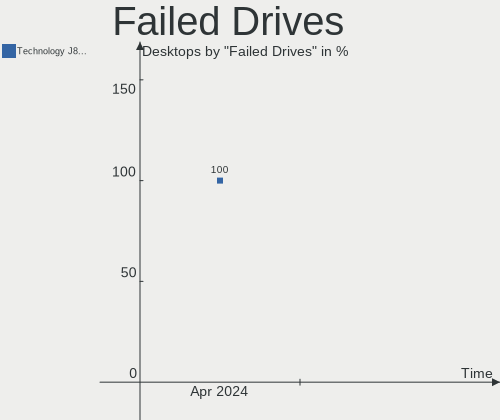

BlackPanther Hardware Trends (Desktops)
---------------------------------------

A project to identify most popular hardware characteristics and track their change
over time based on data collected by Linux users at https://Linux-Hardware.org.

Anyone can contribute to this report by the [hw-probe](https://github.com/linuxhw/hw-probe) tool:

    sudo -E hw-probe -all -upload

Full-feature report is available here: https://linux-hardware.org/?view=trends&formfactor=desktop

Period: Jul, 2021.

Contents
--------

* [ System ](#system)
  - [ OS                       ](#os)
  - [ OS Family                ](#os-family)
  - [ Kernel                   ](#kernel)
  - [ Kernel Family            ](#kernel-family)
  - [ Kernel Major Ver.        ](#kernel-major-ver)
  - [ Arch                     ](#arch)
  - [ DE                       ](#de)
  - [ Display Server           ](#display-server)
  - [ Display Manager          ](#display-manager)
  - [ OS Lang                  ](#os-lang)
  - [ Boot Mode                ](#boot-mode)
  - [ Filesystem               ](#filesystem)
  - [ Part. scheme             ](#part-scheme)
  - [ Dual Boot with Linux/BSD ](#dual-boot-with-linuxbsd)
  - [ Dual Boot (Win)          ](#dual-boot-win)

* [ Board ](#board)
  - [ Vendor                   ](#vendor)
  - [ Model                    ](#model)
  - [ Model Family             ](#model-family)
  - [ MFG Year                 ](#mfg-year)
  - [ Form Factor              ](#form-factor)
  - [ Secure Boot              ](#secure-boot)
  - [ Coreboot                 ](#coreboot)
  - [ RAM Size                 ](#ram-size)
  - [ RAM Used                 ](#ram-used)
  - [ Total Drives             ](#total-drives)
  - [ Has CD-ROM               ](#has-cd-rom)
  - [ Has Ethernet             ](#has-ethernet)
  - [ Has WiFi                 ](#has-wifi)
  - [ Has Bluetooth            ](#has-bluetooth)

* [ Location ](#location)
  - [ Country                  ](#country)
  - [ City                     ](#city)

* [ Drives ](#drives)
  - [ Drive Vendor             ](#drive-vendor)
  - [ Drive Model              ](#drive-model)
  - [ HDD Vendor               ](#hdd-vendor)
  - [ SSD Vendor               ](#ssd-vendor)
  - [ Drive Kind               ](#drive-kind)
  - [ Drive Connector          ](#drive-connector)
  - [ Drive Size               ](#drive-size)
  - [ Space Total              ](#space-total)
  - [ Space Used               ](#space-used)
  - [ Malfunc. Drives          ](#malfunc-drives)
  - [ Malfunc. Drive Vendor    ](#malfunc-drive-vendor)
  - [ Malfunc. HDD Vendor      ](#malfunc-hdd-vendor)
  - [ Malfunc. Drive Kind      ](#malfunc-drive-kind)
  - [ Failed Drives            ](#failed-drives)
  - [ Failed Drive Vendor      ](#failed-drive-vendor)
  - [ Drive Status             ](#drive-status)

* [ Storage controller ](#storage-controller)
  - [ Storage Vendor           ](#storage-vendor)
  - [ Storage Model            ](#storage-model)
  - [ Storage Kind             ](#storage-kind)

* [ Processor ](#processor)
  - [ CPU Vendor               ](#cpu-vendor)
  - [ CPU Model                ](#cpu-model)
  - [ CPU Model Family         ](#cpu-model-family)
  - [ CPU Cores                ](#cpu-cores)
  - [ CPU Sockets              ](#cpu-sockets)
  - [ CPU Threads              ](#cpu-threads)
  - [ CPU Op-Modes             ](#cpu-op-modes)
  - [ CPU Microcode            ](#cpu-microcode)
  - [ CPU Microarch            ](#cpu-microarch)

* [ Graphics ](#graphics)
  - [ GPU Vendor               ](#gpu-vendor)
  - [ GPU Model                ](#gpu-model)
  - [ GPU Combo                ](#gpu-combo)
  - [ GPU Driver               ](#gpu-driver)
  - [ GPU Memory               ](#gpu-memory)

* [ Monitor ](#monitor)
  - [ Monitor Vendor           ](#monitor-vendor)
  - [ Monitor Model            ](#monitor-model)
  - [ Monitor Resolution       ](#monitor-resolution)
  - [ Monitor Diagonal         ](#monitor-diagonal)
  - [ Monitor Width            ](#monitor-width)
  - [ Aspect Ratio             ](#aspect-ratio)
  - [ Monitor Area             ](#monitor-area)
  - [ Pixel Density            ](#pixel-density)
  - [ Multiple Monitors        ](#multiple-monitors)

* [ Network ](#network)
  - [ Net Controller Vendor    ](#net-controller-vendor)
  - [ Net Controller Model     ](#net-controller-model)
  - [ Wireless Vendor          ](#wireless-vendor)
  - [ Wireless Model           ](#wireless-model)
  - [ Ethernet Vendor          ](#ethernet-vendor)
  - [ Ethernet Model           ](#ethernet-model)
  - [ Net Controller Kind      ](#net-controller-kind)
  - [ Used Controller          ](#used-controller)
  - [ NICs                     ](#nics)
  - [ IPv6                     ](#ipv6)

* [ Bluetooth ](#bluetooth)
  - [ Bluetooth Vendor         ](#bluetooth-vendor)
  - [ Bluetooth Model          ](#bluetooth-model)

* [ Sound ](#sound)
  - [ Sound Vendor             ](#sound-vendor)
  - [ Sound Model              ](#sound-model)

* [ Memory ](#memory)
  - [ Memory Vendor            ](#memory-vendor)
  - [ Memory Model             ](#memory-model)
  - [ Memory Kind              ](#memory-kind)
  - [ Memory Form Factor       ](#memory-form-factor)
  - [ Memory Size              ](#memory-size)
  - [ Memory Speed             ](#memory-speed)

* [ Printers & scanners ](#printers-&-scanners)
  - [ Printer Vendor           ](#printer-vendor)
  - [ Printer Model            ](#printer-model)
  - [ Scanner Vendor           ](#scanner-vendor)
  - [ Scanner Model            ](#scanner-model)

* [ Camera ](#camera)
  - [ Camera Vendor            ](#camera-vendor)
  - [ Camera Model             ](#camera-model)

* [ Security ](#security)
  - [ Fingerprint Vendor       ](#fingerprint-vendor)
  - [ Fingerprint Model        ](#fingerprint-model)
  - [ Chipcard Vendor          ](#chipcard-vendor)
  - [ Chipcard Model           ](#chipcard-model)

* [ Unsupported ](#unsupported)
  - [ Unsupported Devices      ](#unsupported-devices)
  - [ Unsupported Device Types ](#unsupported-device-types)

System
------

OS
--

Installed operating systems

| Name              | Desktops | Percent |
|-------------------|----------|---------|
| BlackPanther 18.1 | 53       | 100%    |

OS Family
---------

OS without a version

| Name         | Desktops | Percent |
|--------------|----------|---------|
| BlackPanther | 53       | 100%    |

Kernel
------

Version of the Linux kernel

| Version             | Desktops | Percent |
|---------------------|----------|---------|
| 5.6.14-desktop-2bP  | 44       | 83.02%  |
| 4.18.16-desktop-1bP | 9        | 16.98%  |

Kernel Family
-------------

Linux kernel without a distro release

| Version | Desktops | Percent |
|---------|----------|---------|
| 5.6.14  | 44       | 83.02%  |
| 4.18.16 | 9        | 16.98%  |

Kernel Major Ver.
-----------------

Linux kernel major version

| Version | Desktops | Percent |
|---------|----------|---------|
| 5.6     | 44       | 83.02%  |
| 4.18    | 9        | 16.98%  |

Arch
----

OS architecture (x86_64, i586, etc.)

| Name   | Desktops | Percent |
|--------|----------|---------|
| x86_64 | 53       | 100%    |

DE
--

Desktop Environment

| Name | Desktops | Percent |
|------|----------|---------|
| KDE5 | 53       | 100%    |

Display Server
--------------

X11 or Wayland

| Name    | Desktops | Percent |
|---------|----------|---------|
| X11     | 52       | 98.11%  |
| Wayland | 1        | 1.89%   |

Display Manager
---------------

SDDM, LightDM, etc.

| Name | Desktops | Percent |
|------|----------|---------|
| SDDM | 53       | 100%    |

OS Lang
-------

Language

| Lang    | Desktops | Percent |
|---------|----------|---------|
| Unknown | 53       | 100%    |

Boot Mode
---------

EFI or BIOS

| Mode | Desktops | Percent |
|------|----------|---------|
| BIOS | 36       | 67.92%  |
| EFI  | 17       | 32.08%  |

Filesystem
----------

Type of filesystem

| Type    | Desktops | Percent |
|---------|----------|---------|
| Overlay | 48       | 90.57%  |
| Ext4    | 5        | 9.43%   |

Part. scheme
------------

Scheme of partitioning

| Type | Desktops | Percent |
|------|----------|---------|
| MBR  | 29       | 54.72%  |
| GPT  | 24       | 45.28%  |

Dual Boot with Linux/BSD
------------------------

Hosting more than one Linux/BSD

| Dual boot | Desktops | Percent |
|-----------|----------|---------|
| Yes       | 29       | 54.72%  |
| No        | 24       | 45.28%  |

Dual Boot (Win)
---------------

Hosting Linux and Windows

| Dual boot | Desktops | Percent |
|-----------|----------|---------|
| Yes       | 33       | 62.26%  |
| No        | 20       | 37.74%  |

Board
-----

Vendor
------

Motherboard manufacturer

| Name                | Desktops | Percent |
|---------------------|----------|---------|
| ASUSTek Computer    | 17       | 32.08%  |
| Hewlett-Packard     | 8        | 15.09%  |
| ASRock              | 7        | 13.21%  |
| Dell                | 5        | 9.43%   |
| Gigabyte Technology | 4        | 7.55%   |
| MSI                 | 3        | 5.66%   |
| Lenovo              | 3        | 5.66%   |
| Acer                | 2        | 3.77%   |
| Pegatron            | 1        | 1.89%   |
| Foxconn             | 1        | 1.89%   |
| Biostar             | 1        | 1.89%   |
| Unknown             | 1        | 1.89%   |

Model
-----

Motherboard model

| Name                                | Desktops | Percent |
|-------------------------------------|----------|---------|
| HP Pavilion Desktop PC 570-p0xx     | 2        | 3.77%   |
| ASUS PRIME B365M-A                  | 2        | 3.77%   |
| ASUS P7P55D                         | 2        | 3.77%   |
| Pegatron 2A73                       | 1        | 1.89%   |
| MSI MS-7A40                         | 1        | 1.89%   |
| MSI MS-7369                         | 1        | 1.89%   |
| MSI Elite 7100 Microtower PC        | 1        | 1.89%   |
| Lenovo ThinkCentre M57p 9196AB5     | 1        | 1.89%   |
| Lenovo ThinkCentre M57 6066A11      | 1        | 1.89%   |
| Lenovo ThinkCentre A57 98517HG      | 1        | 1.89%   |
| HP xw4400 Workstation               | 1        | 1.89%   |
| HP EliteDesk 800 G2 DM 35W          | 1        | 1.89%   |
| HP Compaq Pro 6305 MT               | 1        | 1.89%   |
| HP Compaq dc7800p Small Form Factor | 1        | 1.89%   |
| HP Compaq dc5850 Microtower         | 1        | 1.89%   |
| HP Compaq 6005 Pro SFF PC           | 1        | 1.89%   |
| Gigabyte P85-D3                     | 1        | 1.89%   |
| Gigabyte H81M-HD3                   | 1        | 1.89%   |
| Gigabyte EP45-UD3                   | 1        | 1.89%   |
| Gigabyte 970A-DS3P                  | 1        | 1.89%   |
| Foxconn OEM                         | 1        | 1.89%   |
| Dell PowerEdge T20                  | 1        | 1.89%   |
| Dell OptiPlex 990                   | 1        | 1.89%   |
| Dell OptiPlex 9020                  | 1        | 1.89%   |
| Dell OptiPlex 7050                  | 1        | 1.89%   |
| Dell OptiPlex 7010                  | 1        | 1.89%   |
| Biostar N61PA-M2S                   | 1        | 1.89%   |
| ASUS VC65R                          | 1        | 1.89%   |
| ASUS PRIME H370-PLUS                | 1        | 1.89%   |
| ASUS P8H61-M LE/USB3                | 1        | 1.89%   |
| ASUS P7P55-M                        | 1        | 1.89%   |
| ASUS P6T SE                         | 1        | 1.89%   |
| ASUS P5QC                           | 1        | 1.89%   |
| ASUS P5Q-E                          | 1        | 1.89%   |
| ASUS P5KPL-AM SE                    | 1        | 1.89%   |
| ASUS M5A97 EVO R2.0                 | 1        | 1.89%   |
| ASUS M2N68-AM Plus                  | 1        | 1.89%   |
| ASUS H110M-K                        | 1        | 1.89%   |
| ASUS H110M-A                        | 1        | 1.89%   |
| ASUS All Series                     | 1        | 1.89%   |
| ASRock X370 Gaming X                | 1        | 1.89%   |
| ASRock FM2A55M-DGS                  | 1        | 1.89%   |
| ASRock B550M Pro4                   | 1        | 1.89%   |
| ASRock B450 Pro4                    | 1        | 1.89%   |
| ASRock B250M Pro4                   | 1        | 1.89%   |
| ASRock AB350M-HDV R3.0              | 1        | 1.89%   |
| ASRock 970M Pro3                    | 1        | 1.89%   |
| Acer Veriton X4630G                 | 1        | 1.89%   |
| Acer Aspire M1641                   | 1        | 1.89%   |
| Unknown                             | 1        | 1.89%   |

Model Family
------------

Motherboard model prefix

| Name               | Desktops | Percent |
|--------------------|----------|---------|
| HP Compaq          | 4        | 7.55%   |
| Dell OptiPlex      | 4        | 7.55%   |
| Lenovo ThinkCentre | 3        | 5.66%   |
| ASUS PRIME         | 3        | 5.66%   |
| HP Pavilion        | 2        | 3.77%   |
| ASUS P7P55D        | 2        | 3.77%   |
| Pegatron 2A73      | 1        | 1.89%   |
| MSI MS-7A40        | 1        | 1.89%   |
| MSI MS-7369        | 1        | 1.89%   |
| MSI Elite          | 1        | 1.89%   |
| HP xw4400          | 1        | 1.89%   |
| HP EliteDesk       | 1        | 1.89%   |
| Gigabyte P85-D3    | 1        | 1.89%   |
| Gigabyte H81M-HD3  | 1        | 1.89%   |
| Gigabyte EP45-UD3  | 1        | 1.89%   |
| Gigabyte 970A-DS3P | 1        | 1.89%   |
| Foxconn OEM        | 1        | 1.89%   |
| Dell PowerEdge     | 1        | 1.89%   |
| Biostar N61PA-M2S  | 1        | 1.89%   |
| ASUS VC65R         | 1        | 1.89%   |
| ASUS P8H61-M       | 1        | 1.89%   |
| ASUS P7P55-M       | 1        | 1.89%   |
| ASUS P6T           | 1        | 1.89%   |
| ASUS P5QC          | 1        | 1.89%   |
| ASUS P5Q-E         | 1        | 1.89%   |
| ASUS P5KPL-AM      | 1        | 1.89%   |
| ASUS M5A97         | 1        | 1.89%   |
| ASUS M2N68-AM      | 1        | 1.89%   |
| ASUS H110M-K       | 1        | 1.89%   |
| ASUS H110M-A       | 1        | 1.89%   |
| ASUS All           | 1        | 1.89%   |
| ASRock X370        | 1        | 1.89%   |
| ASRock FM2A55M-DGS | 1        | 1.89%   |
| ASRock B550M       | 1        | 1.89%   |
| ASRock B450        | 1        | 1.89%   |
| ASRock B250M       | 1        | 1.89%   |
| ASRock AB350M-HDV  | 1        | 1.89%   |
| ASRock 970M        | 1        | 1.89%   |
| Acer Veriton       | 1        | 1.89%   |
| Acer Aspire        | 1        | 1.89%   |
| Unknown            | 1        | 1.89%   |

MFG Year
--------

Motherboard manufacture year

| Year | Desktops | Percent |
|------|----------|---------|
| 2020 | 6        | 11.32%  |
| 2018 | 6        | 11.32%  |
| 2008 | 6        | 11.32%  |
| 2011 | 5        | 9.43%   |
| 2010 | 5        | 9.43%   |
| 2016 | 4        | 7.55%   |
| 2013 | 4        | 7.55%   |
| 2009 | 4        | 7.55%   |
| 2019 | 3        | 5.66%   |
| 2015 | 3        | 5.66%   |
| 2021 | 2        | 3.77%   |
| 2006 | 2        | 3.77%   |
| 2014 | 1        | 1.89%   |
| 2012 | 1        | 1.89%   |
| 2007 | 1        | 1.89%   |

Form Factor
-----------

Physical design of the computer

| Name    | Desktops | Percent |
|---------|----------|---------|
| Desktop | 53       | 100%    |

Secure Boot
-----------

Enabled or disabled

| State    | Desktops | Percent |
|----------|----------|---------|
| Disabled | 53       | 100%    |

Coreboot
--------

Have coreboot on board

| Used | Desktops | Percent |
|------|----------|---------|
| No   | 53       | 100%    |

RAM Size
--------

Total RAM memory

| Size in GB | Desktops | Percent |
|------------|----------|---------|
| 8.01-16.0  | 14       | 26.42%  |
| 3.01-4.0   | 13       | 24.53%  |
| 16.01-24.0 | 11       | 20.75%  |
| 4.01-8.0   | 10       | 18.87%  |
| 1.01-2.0   | 3        | 5.66%   |
| 2.01-3.0   | 1        | 1.89%   |
| 0.51-1.0   | 1        | 1.89%   |

RAM Used
--------

Used RAM memory

| Used GB  | Desktops | Percent |
|----------|----------|---------|
| 0.01-0.5 | 25       | 47.17%  |
| 0.51-1.0 | 23       | 43.4%   |
| 1.01-2.0 | 5        | 9.43%   |

Total Drives
------------

Number of drives on board

| Drives | Desktops | Percent |
|--------|----------|---------|
| 1      | 29       | 54.72%  |
| 2      | 16       | 30.19%  |
| 3      | 4        | 7.55%   |
| 5      | 2        | 3.77%   |
| 4      | 2        | 3.77%   |

Has CD-ROM
----------

Has CD-ROM on board

| Presented | Desktops | Percent |
|-----------|----------|---------|
| Yes       | 39       | 73.58%  |
| No        | 14       | 26.42%  |

Has Ethernet
------------

Has Ethernet on board

| Presented | Desktops | Percent |
|-----------|----------|---------|
| Yes       | 52       | 98.11%  |
| No        | 1        | 1.89%   |

Has WiFi
--------

Has WiFi module

| Presented | Desktops | Percent |
|-----------|----------|---------|
| No        | 36       | 67.92%  |
| Yes       | 17       | 32.08%  |

Has Bluetooth
-------------

Has Bluetooth module

| Presented | Desktops | Percent |
|-----------|----------|---------|
| No        | 41       | 77.36%  |
| Yes       | 12       | 22.64%  |

Location
--------

Country
-------

Geographic location (country)

| Country   | Desktops | Percent |
|-----------|----------|---------|
| Hungary   | 38       | 71.7%   |
| Australia | 4        | 7.55%   |
| Romania   | 3        | 5.66%   |
| Germany   | 3        | 5.66%   |
| USA       | 1        | 1.89%   |
| Slovenia  | 1        | 1.89%   |
| Poland    | 1        | 1.89%   |
| Greece    | 1        | 1.89%   |
| Belarus   | 1        | 1.89%   |

City
----

Geographic location (city)

| City                   | Desktops | Percent |
|------------------------|----------|---------|
| Budapest               | 12       | 22.64%  |
| Szentlorinc            | 2        | 3.77%   |
| Szeksz√°rd             | 2        | 3.77%   |
| Sydney                 | 2        | 3.77%   |
| Oroshaza               | 2        | 3.77%   |
| Keszthely              | 2        | 3.77%   |
| Caroline Springs       | 2        | 3.77%   |
| Veszpr?©m              | 1        | 1.89%   |
| Ura                    | 1        | 1.89%   |
| Târgu Mureş          | 1        | 1.89%   |
| Tiszafured             | 1        | 1.89%   |
| Szombathely            | 1        | 1.89%   |
| Szeksz??rd             | 1        | 1.89%   |
| Szabadszentkiraly      | 1        | 1.89%   |
| Stuttgart              | 1        | 1.89%   |
| Siemianowice ≈ölƒÖskie | 1        | 1.89%   |
| Sarvar                 | 1        | 1.89%   |
| Portland               | 1        | 1.89%   |
| Petershagen            | 1        | 1.89%   |
| Oradea                 | 1        | 1.89%   |
| Nagykoros              | 1        | 1.89%   |
| Moh??cs                | 1        | 1.89%   |
| Miskolc                | 1        | 1.89%   |
| Kunszentmiklos         | 1        | 1.89%   |
| Koper                  | 1        | 1.89%   |
| Komadi                 | 1        | 1.89%   |
| Kaposv??r              | 1        | 1.89%   |
| Hernadkak              | 1        | 1.89%   |
| Gomel                  | 1        | 1.89%   |
| Eger                   | 1        | 1.89%   |
| Debrecen               | 1        | 1.89%   |
| Celldomolk             | 1        | 1.89%   |
| Bucharest              | 1        | 1.89%   |
| Bochum                 | 1        | 1.89%   |
| ?ârd                   | 1        | 1.89%   |
| Athens                 | 1        | 1.89%   |

Drives
------

Drive Vendor
------------

Hard drive vendors

| Vendor              | Desktops | Drives | Percent |
|---------------------|----------|--------|---------|
| WDC                 | 16       | 17     | 17.58%  |
| Samsung Electronics | 15       | 18     | 16.48%  |
| Seagate             | 13       | 19     | 14.29%  |
| Kingston            | 10       | 11     | 10.99%  |
| Toshiba             | 6        | 6      | 6.59%   |
| Crucial             | 4        | 4      | 4.4%    |
| Maxtor              | 3        | 3      | 3.3%    |
| Zheino              | 2        | 2      | 2.2%    |
| SanDisk             | 2        | 2      | 2.2%    |
| Hitachi             | 2        | 2      | 2.2%    |
| HGST                | 2        | 2      | 2.2%    |
| A-DATA Technology   | 2        | 2      | 2.2%    |
| Verbatim            | 1        | 1      | 1.1%    |
| Unknown             | 1        | 1      | 1.1%    |
| SPCC                | 1        | 1      | 1.1%    |
| SK Hynix            | 1        | 1      | 1.1%    |
| PNY                 | 1        | 1      | 1.1%    |
| OCZ                 | 1        | 1      | 1.1%    |
| Kingmax             | 1        | 1      | 1.1%    |
| KingFast            | 1        | 1      | 1.1%    |
| Intenso             | 1        | 1      | 1.1%    |
| Intel               | 1        | 1      | 1.1%    |
| HGST HTS            | 1        | 1      | 1.1%    |
| GOODRAM             | 1        | 1      | 1.1%    |
| Gigabyte Technology | 1        | 1      | 1.1%    |
| Apacer              | 1        | 1      | 1.1%    |

Drive Model
-----------

Hard drive models

| Model                                | Desktops | Percent |
|--------------------------------------|----------|---------|
| Samsung HD103UJ 1TB                  | 4        | 3.96%   |
| Kingston SA400S37120G 120GB SSD      | 4        | 3.96%   |
| Kingston SV300S37A120G 120GB SSD     | 3        | 2.97%   |
| Crucial CT1000P1SSD8 1TB             | 3        | 2.97%   |
| Zheino CHN-NGFFNV2280-256 256GB      | 2        | 1.98%   |
| WDC WDS240G2G0B-00EPW0 240GB SSD     | 2        | 1.98%   |
| WDC WD10EZEX-60WN4A0 1TB             | 2        | 1.98%   |
| Toshiba DT01ACA100 1TB               | 2        | 1.98%   |
| Seagate ST3500418AS 500GB            | 2        | 1.98%   |
| Seagate ST3160318AS 160GB            | 2        | 1.98%   |
| Samsung SSD 860 EVO 1TB              | 2        | 1.98%   |
| Samsung HD103SI 1TB                  | 2        | 1.98%   |
| Kingston SA400S37240G 240GB SSD      | 2        | 1.98%   |
| A-DATA SP550 120GB SSD               | 2        | 1.98%   |
| WDC WDS240G2G0A-00JH30 240GB SSD     | 1        | 0.99%   |
| WDC WD800JD-75MSA3 80GB              | 1        | 0.99%   |
| WDC WD60PURZ-85ZUFY1 6TB             | 1        | 0.99%   |
| WDC WD5000BEVT-22A0RT0 500GB         | 1        | 0.99%   |
| WDC WD5000AAKX-60U6AA0 500GB         | 1        | 0.99%   |
| WDC WD5000AAKX-08ERMA0 500GB         | 1        | 0.99%   |
| WDC WD2500AAJS-75M0A0 250GB          | 1        | 0.99%   |
| WDC WD2500AAJS-00VTA0 250GB          | 1        | 0.99%   |
| WDC WD2003FZEX-00Z4SA0 2TB           | 1        | 0.99%   |
| WDC WD1600BEVS-22RST0 160GB          | 1        | 0.99%   |
| WDC WD10SPCX-24HWST1 1TB             | 1        | 0.99%   |
| WDC WD10EZEX-08WN4A0 1TB             | 1        | 0.99%   |
| Verbatim Vi550 S3 SSD 128GB          | 1        | 0.99%   |
| Unknown SD/MMC/MS PRO 128GB          | 1        | 0.99%   |
| Toshiba MQ01ABF050 500GB             | 1        | 0.99%   |
| Toshiba MK2552GSX 250GB              | 1        | 0.99%   |
| Toshiba DT01ACA300 3TB               | 1        | 0.99%   |
| Toshiba DT01ACA050 500GB             | 1        | 0.99%   |
| SPCC Solid State Disk 128GB          | 1        | 0.99%   |
| SK Hynix SC311 SATA 256GB SSD        | 1        | 0.99%   |
| Seagate ST500DM002-1BD142 500GB      | 1        | 0.99%   |
| Seagate ST4000DM004-2CV104 4TB       | 1        | 0.99%   |
| Seagate ST4000DM000-1F2168 4TB       | 1        | 0.99%   |
| Seagate ST3500413AS 500GB            | 1        | 0.99%   |
| Seagate ST3320413AS 320GB            | 1        | 0.99%   |
| Seagate ST3250410AS 250GB            | 1        | 0.99%   |
| Seagate ST3160023AS 160GB            | 1        | 0.99%   |
| Seagate ST31000528AS 1TB             | 1        | 0.99%   |
| Seagate ST3000DM001-1ER166 3TB       | 1        | 0.99%   |
| Seagate ST2000DM001-9YN164 2TB       | 1        | 0.99%   |
| Seagate ST2000DM001-1CH164 2TB       | 1        | 0.99%   |
| Seagate ST2000DL003-9VT166 2TB       | 1        | 0.99%   |
| Seagate ST1000LM024 HN-M101MBB 1TB   | 1        | 0.99%   |
| Seagate ST1000DM003-1CH162 1TB       | 1        | 0.99%   |
| Seagate Backup+ Desk 5TB             | 1        | 0.99%   |
| SanDisk SDSSDH3 1T00 1TB             | 1        | 0.99%   |
| SanDisk SD7TB3Q-128G-1006 128GB SSD  | 1        | 0.99%   |
| Samsung SSD 970 EVO Plus 2TB         | 1        | 0.99%   |
| Samsung SSD 970 EVO Plus 250GB       | 1        | 0.99%   |
| Samsung SSD 870 EVO 250GB            | 1        | 0.99%   |
| Samsung SSD 860 EVO 500GB            | 1        | 0.99%   |
| Samsung SP2504C 250GB                | 1        | 0.99%   |
| Samsung MZ7PA128HMCD-010H1 128GB SSD | 1        | 0.99%   |
| Samsung MZ7LN256HAJQ-00000 256GB SSD | 1        | 0.99%   |
| Samsung HM321HI 320GB                | 1        | 0.99%   |
| Samsung HD502IJ 500GB                | 1        | 0.99%   |

HDD Vendor
----------

Hard disk drive vendors

| Vendor              | Desktops | Drives | Percent |
|---------------------|----------|--------|---------|
| WDC                 | 13       | 14     | 27.08%  |
| Seagate             | 13       | 18     | 27.08%  |
| Samsung Electronics | 9        | 10     | 18.75%  |
| Toshiba             | 6        | 6      | 12.5%   |
| MAXTOR              | 3        | 3      | 6.25%   |
| Hitachi             | 2        | 2      | 4.17%   |
| HGST                | 2        | 2      | 4.17%   |

SSD Vendor
----------

Solid state drive vendors

| Vendor              | Desktops | Drives | Percent |
|---------------------|----------|--------|---------|
| Kingston            | 10       | 11     | 28.57%  |
| Samsung Electronics | 5        | 6      | 14.29%  |
| WDC                 | 3        | 3      | 8.57%   |
| SanDisk             | 2        | 2      | 5.71%   |
| A-DATA Technology   | 2        | 2      | 5.71%   |
| Verbatim            | 1        | 1      | 2.86%   |
| SPCC                | 1        | 1      | 2.86%   |
| SK Hynix            | 1        | 1      | 2.86%   |
| PNY                 | 1        | 1      | 2.86%   |
| OCZ                 | 1        | 1      | 2.86%   |
| Kingmax             | 1        | 1      | 2.86%   |
| KingFast            | 1        | 1      | 2.86%   |
| Intenso             | 1        | 1      | 2.86%   |
| Intel               | 1        | 1      | 2.86%   |
| GOODRAM             | 1        | 1      | 2.86%   |
| Gigabyte Technology | 1        | 1      | 2.86%   |
| Crucial             | 1        | 1      | 2.86%   |
| Apacer              | 1        | 1      | 2.86%   |

Drive Kind
----------

HDD or SSD

| Kind    | Desktops | Drives | Percent |
|---------|----------|--------|---------|
| HDD     | 39       | 55     | 48.15%  |
| SSD     | 32       | 37     | 39.51%  |
| NVMe    | 7        | 7      | 8.64%   |
| Unknown | 3        | 3      | 3.7%    |

Drive Connector
---------------

SATA, SAS, NVMe, etc.

| Type | Desktops | Drives | Percent |
|------|----------|--------|---------|
| SATA | 52       | 91     | 83.87%  |
| NVMe | 7        | 7      | 11.29%  |
| SAS  | 3        | 4      | 4.84%   |

Drive Size
----------

Size of hard drive

| Size in TB | Desktops | Drives | Percent |
|------------|----------|--------|---------|
| 0.01-0.5   | 43       | 63     | 62.32%  |
| 0.51-1.0   | 17       | 19     | 24.64%  |
| 1.01-2.0   | 4        | 5      | 5.8%    |
| 3.01-4.0   | 2        | 2      | 2.9%    |
| 2.01-3.0   | 2        | 2      | 2.9%    |
| 4.01-10.0  | 1        | 1      | 1.45%   |

Space Total
-----------

Amount of disk space available on the file system

| Size in GB | Desktops | Percent |
|------------|----------|---------|
| Unknown    | 48       | 90.57%  |
| 101-250    | 2        | 3.77%   |
| 51-100     | 2        | 3.77%   |
| 501-1000   | 1        | 1.89%   |

Space Used
----------

Amount of used disk space

| Used GB | Desktops | Percent |
|---------|----------|---------|
| Unknown | 48       | 90.57%  |
| 1-20    | 5        | 9.43%   |

Malfunc. Drives
---------------

Drive models with a malfunction

| Model                             | Desktops | Drives | Percent |
|-----------------------------------|----------|--------|---------|
| WDC WD10EZEX-60WN4A0 1TB          | 2        | 2      | 6.67%   |
| Seagate ST3500418AS 500GB         | 2        | 2      | 6.67%   |
| Samsung Electronics HD103UJ 1TB   | 2        | 2      | 6.67%   |
| WDC WD5000BEVT-22A0RT0 500GB      | 1        | 1      | 3.33%   |
| WDC WD5000AAKX-08ERMA0 500GB      | 1        | 1      | 3.33%   |
| WDC WD2003FZEX-00Z4SA0 2TB        | 1        | 2      | 3.33%   |
| WDC WD10SPCX-24HWST1 1TB          | 1        | 1      | 3.33%   |
| Toshiba DT01ACA050 500GB          | 1        | 1      | 3.33%   |
| Seagate ST500DM002-1BD142 500GB   | 1        | 1      | 3.33%   |
| Seagate ST4000DM000-1F2168 4TB    | 1        | 1      | 3.33%   |
| Seagate ST3320413AS 320GB         | 1        | 1      | 3.33%   |
| Seagate ST3160318AS 160GB         | 1        | 1      | 3.33%   |
| Seagate ST31000528AS 1TB          | 1        | 1      | 3.33%   |
| Seagate ST2000DM001-9YN164 2TB    | 1        | 1      | 3.33%   |
| Seagate ST1000DM003-1CH162 1TB    | 1        | 1      | 3.33%   |
| Samsung Electronics SP2504C 250GB | 1        | 1      | 3.33%   |
| Samsung Electronics HD502IJ 500GB | 1        | 1      | 3.33%   |
| Samsung Electronics HD103SI 1TB   | 1        | 1      | 3.33%   |
| OCZ ARC100 240GB SSD              | 1        | 1      | 3.33%   |
| MAXTOR STM3250310AS 250GB         | 1        | 1      | 3.33%   |
| Maxtor 6Y080L0 82GB               | 1        | 1      | 3.33%   |
| Maxtor 2B020H1 20GB               | 1        | 1      | 3.33%   |
| Kingston SV300S37A120G 120GB SSD  | 1        | 1      | 3.33%   |
| Kingmax SSD 60GB                  | 1        | 1      | 3.33%   |
| HGST HTS545050A7E680 500GB        | 1        | 1      | 3.33%   |
| HGST HTS541010A9E680 1TB          | 1        | 1      | 3.33%   |
| A-DATA Technology SP550 120GB SSD | 1        | 1      | 3.33%   |

Malfunc. Drive Vendor
---------------------

Vendors of faulty drives

| Vendor              | Desktops | Drives | Percent |
|---------------------|----------|--------|---------|
| Seagate             | 8        | 9      | 27.59%  |
| WDC                 | 6        | 7      | 20.69%  |
| Samsung Electronics | 5        | 5      | 17.24%  |
| Maxtor              | 3        | 3      | 10.34%  |
| HGST                | 2        | 2      | 6.9%    |
| Toshiba             | 1        | 1      | 3.45%   |
| OCZ                 | 1        | 1      | 3.45%   |
| Kingston            | 1        | 1      | 3.45%   |
| Kingmax             | 1        | 1      | 3.45%   |
| A-DATA Technology   | 1        | 1      | 3.45%   |

Malfunc. HDD Vendor
-------------------

Vendors of faulty HDD drives

| Vendor              | Desktops | Drives | Percent |
|---------------------|----------|--------|---------|
| Seagate             | 8        | 9      | 32%     |
| WDC                 | 6        | 7      | 24%     |
| Samsung Electronics | 5        | 5      | 20%     |
| Maxtor              | 3        | 3      | 12%     |
| HGST                | 2        | 2      | 8%      |
| Toshiba             | 1        | 1      | 4%      |

Malfunc. Drive Kind
-------------------

Kinds of faulty drives

| Kind | Desktops | Drives | Percent |
|------|----------|--------|---------|
| HDD  | 23       | 27     | 88.46%  |
| SSD  | 3        | 4      | 11.54%  |

Failed Drives
-------------

Failed drive models

| Model                           | Desktops | Drives | Percent |
|---------------------------------|----------|--------|---------|
| Samsung Electronics HD103UJ 1TB | 1        | 1      | 100%    |

Failed Drive Vendor
-------------------

Failed drive vendors

| Vendor              | Desktops | Drives | Percent |
|---------------------|----------|--------|---------|
| Samsung Electronics | 1        | 1      | 100%    |

Drive Status
------------

Number of failed and malfunc. drives

| Status   | Desktops | Drives | Percent |
|----------|----------|--------|---------|
| Works    | 42       | 66     | 58.33%  |
| Malfunc  | 26       | 31     | 36.11%  |
| Detected | 3        | 4      | 4.17%   |
| Failed   | 1        | 1      | 1.39%   |

Storage controller
------------------

Storage Vendor
--------------

Storage controller vendors

| Vendor                    | Desktops | Percent |
|---------------------------|----------|---------|
| Intel                     | 35       | 50%     |
| AMD                       | 14       | 20%     |
| Nvidia                    | 4        | 5.71%   |
| JMicron Technology        | 4        | 5.71%   |
| Micron/Crucial Technology | 3        | 4.29%   |
| Silicon Motion            | 2        | 2.86%   |
| Samsung Electronics       | 2        | 2.86%   |
| Marvell Technology Group  | 2        | 2.86%   |
| ASMedia Technology        | 2        | 2.86%   |
| VIA Technologies          | 1        | 1.43%   |
| Silicon Image             | 1        | 1.43%   |

Storage Model
-------------

Storage controller models

| Model                                                                                   | Desktops | Percent |
|-----------------------------------------------------------------------------------------|----------|---------|
| AMD FCH SATA Controller [AHCI mode]                                                     | 8        | 7.84%   |
| Intel SATA Controller [RAID mode]                                                       | 6        | 5.88%   |
| JMicron JMB363 SATA/IDE Controller                                                      | 4        | 3.92%   |
| Intel Q170/Q150/B150/H170/H110/Z170/CM236 Chipset SATA Controller [AHCI Mode]           | 4        | 3.92%   |
| Intel NM10/ICH7 Family SATA Controller [IDE mode]                                       | 4        | 3.92%   |
| Intel 82801JI (ICH10 Family) 4 port SATA IDE Controller #1                              | 4        | 3.92%   |
| Intel 82801JI (ICH10 Family) 2 port SATA IDE Controller #2                              | 4        | 3.92%   |
| Intel 82801IR/IO/IH (ICH9R/DO/DH) 4 port SATA Controller [IDE mode]                     | 4        | 3.92%   |
| Intel 82801I (ICH9 Family) 2 port SATA Controller [IDE mode]                            | 4        | 3.92%   |
| Intel 82801G (ICH7 Family) IDE Controller                                               | 4        | 3.92%   |
| Intel 8 Series/C220 Series Chipset Family 6-port SATA Controller 1 [AHCI mode]          | 4        | 3.92%   |
| Intel 200 Series PCH SATA controller [AHCI mode]                                        | 4        | 3.92%   |
| Micron/Crucial NVMe Controller                                                          | 3        | 2.94%   |
| Intel 82Q35 Express PT IDER Controller                                                  | 3        | 2.94%   |
| Intel 5 Series/3400 Series Chipset 4 port SATA IDE Controller                           | 3        | 2.94%   |
| Intel 5 Series/3400 Series Chipset 2 port SATA IDE Controller                           | 3        | 2.94%   |
| AMD SB7x0/SB8x0/SB9x0 SATA Controller [AHCI mode]                                       | 3        | 2.94%   |
| AMD 300 Series Chipset SATA Controller                                                  | 3        | 2.94%   |
| Silicon Motion SM2263EN/SM2263XT SSD Controller                                         | 2        | 1.96%   |
| Samsung NVMe SSD Controller SM981/PM981/PM983                                           | 2        | 1.96%   |
| Nvidia MCP61 SATA Controller                                                            | 2        | 1.96%   |
| Nvidia MCP61 IDE                                                                        | 2        | 1.96%   |
| Marvell Group 88SE6111/6121 SATA II / PATA Controller                                   | 2        | 1.96%   |
| ASMedia ASM1062 Serial ATA Controller                                                   | 2        | 1.96%   |
| AMD SB7x0/SB8x0/SB9x0 SATA Controller [IDE mode]                                        | 2        | 1.96%   |
| AMD 400 Series Chipset SATA Controller                                                  | 2        | 1.96%   |
| VIA VT6415 PATA IDE Host Controller                                                     | 1        | 0.98%   |
| Silicon Image SiI 3132 Serial ATA Raid II Controller                                    | 1        | 0.98%   |
| Nvidia MCP73 SATA Controller (IDE mode)                                                 | 1        | 0.98%   |
| Nvidia MCP73 IDE Controller                                                             | 1        | 0.98%   |
| Nvidia MCP65 SATA Controller                                                            | 1        | 0.98%   |
| Nvidia MCP65 IDE                                                                        | 1        | 0.98%   |
| Intel 82801EB/ER (ICH5/ICH5R) IDE Controller                                            | 1        | 0.98%   |
| Intel 7 Series/C210 Series Chipset Family 6-port SATA Controller [AHCI mode]            | 1        | 0.98%   |
| Intel 6 Series/C200 Series Chipset Family Desktop SATA Controller (IDE mode, ports 4-5) | 1        | 0.98%   |
| Intel 6 Series/C200 Series Chipset Family Desktop SATA Controller (IDE mode, ports 0-3) | 1        | 0.98%   |
| AMD X370 Series Chipset SATA Controller                                                 | 1        | 0.98%   |
| AMD Starship/Matisse Chipset SATA Controller [AHCI mode]                                | 1        | 0.98%   |
| AMD SB7x0/SB8x0/SB9x0 IDE Controller                                                    | 1        | 0.98%   |
| AMD FCH IDE Controller                                                                  | 1        | 0.98%   |

Storage Kind
------------

Kind of storage controller (IDE, SATA, NVMe, SAS, ...)

| Kind | Desktops | Percent |
|------|----------|---------|
| SATA | 27       | 42.19%  |
| IDE  | 23       | 35.94%  |
| RAID | 7        | 10.94%  |
| NVMe | 7        | 10.94%  |

Processor
---------

CPU Vendor
----------

Processor vendors

| Vendor | Desktops | Percent |
|--------|----------|---------|
| Intel  | 36       | 67.92%  |
| AMD    | 17       | 32.08%  |

CPU Model
---------

Processor models

| Model                                         | Desktops | Percent |
|-----------------------------------------------|----------|---------|
| Intel Pentium CPU G3220 @ 3.00GHz             | 3        | 5.66%   |
| Intel Core 2 Duo CPU E8400 @ 3.00GHz          | 3        | 5.66%   |
| Intel Core i5-2400 CPU @ 3.10GHz              | 2        | 3.77%   |
| Intel Core i5 CPU 750 @ 2.67GHz               | 2        | 3.77%   |
| Intel Core i5 CPU 650 @ 3.20GHz               | 2        | 3.77%   |
| Intel Core i3-8100 CPU @ 3.60GHz              | 2        | 3.77%   |
| Intel Core 2 Duo CPU E6550 @ 2.33GHz          | 2        | 3.77%   |
| AMD FX-6300 Six-Core Processor                | 2        | 3.77%   |
| AMD A8-9600 RADEON R7, 10 COMPUTE CORES 4C+6G | 2        | 3.77%   |
| Intel Xeon CPU X5472 @ 3.00GHz                | 1        | 1.89%   |
| Intel Pentium CPU G4560 @ 3.50GHz             | 1        | 1.89%   |
| Intel Core i7-4770 CPU @ 3.40GHz              | 1        | 1.89%   |
| Intel Core i7 CPU 920 @ 2.67GHz               | 1        | 1.89%   |
| Intel Core i5-8500 CPU @ 3.00GHz              | 1        | 1.89%   |
| Intel Core i5-6600 CPU @ 3.30GHz              | 1        | 1.89%   |
| Intel Core i5-6500T CPU @ 2.50GHz             | 1        | 1.89%   |
| Intel Core i5-6500 CPU @ 3.20GHz              | 1        | 1.89%   |
| Intel Core i5-6400T CPU @ 2.20GHz             | 1        | 1.89%   |
| Intel Core i5-4670K CPU @ 3.40GHz             | 1        | 1.89%   |
| Intel Core i3-7100 CPU @ 3.90GHz              | 1        | 1.89%   |
| Intel Core i3-4130 CPU @ 3.40GHz              | 1        | 1.89%   |
| Intel Core i3-3220 CPU @ 3.30GHz              | 1        | 1.89%   |
| Intel Core 2 Quad CPU Q9300 @ 2.50GHz         | 1        | 1.89%   |
| Intel Core 2 Quad CPU Q6600 @ 2.40GHz         | 1        | 1.89%   |
| Intel Core 2 Duo CPU E8500 @ 3.16GHz          | 1        | 1.89%   |
| Intel Core 2 Duo CPU E8300 @ 2.83GHz          | 1        | 1.89%   |
| Intel Core 2 Duo CPU E4600 @ 2.40GHz          | 1        | 1.89%   |
| Intel Core 2 CPU 6600 @ 2.40GHz               | 1        | 1.89%   |
| Intel Celeron CPU 3.06GHz                     | 1        | 1.89%   |
| AMD Sempron Processor 3600+                   | 1        | 1.89%   |
| AMD Ryzen 7 3700X 8-Core Processor            | 1        | 1.89%   |
| AMD Ryzen 7 1700X Eight-Core Processor        | 1        | 1.89%   |
| AMD Ryzen 5 2600 Six-Core Processor           | 1        | 1.89%   |
| AMD Ryzen 5 2400G with Radeon Vega Graphics   | 1        | 1.89%   |
| AMD Ryzen 3 2200G with Radeon Vega Graphics   | 1        | 1.89%   |
| AMD Phenom II X3 B75 Processor                | 1        | 1.89%   |
| AMD Phenom 9550 Quad-Core Processor           | 1        | 1.89%   |
| AMD FX-4300 Quad-Core Processor               | 1        | 1.89%   |
| AMD Athlon II X2 250 Processor                | 1        | 1.89%   |
| AMD Athlon 64 X2 Dual Core Processor 5000+    | 1        | 1.89%   |
| AMD A8-5500B APU with Radeon HD Graphics      | 1        | 1.89%   |
| AMD A4-5300 APU with Radeon HD Graphics       | 1        | 1.89%   |

CPU Model Family
----------------

Processor model prefix

| Model             | Desktops | Percent |
|-------------------|----------|---------|
| Intel Core i5     | 12       | 22.64%  |
| Intel Core 2 Duo  | 8        | 15.09%  |
| Intel Core i3     | 5        | 9.43%   |
| Intel Pentium     | 4        | 7.55%   |
| AMD FX            | 3        | 5.66%   |
| AMD A8            | 3        | 5.66%   |
| Intel Core i7     | 2        | 3.77%   |
| Intel Core 2 Quad | 2        | 3.77%   |
| AMD Ryzen 7       | 2        | 3.77%   |
| AMD Ryzen 5       | 2        | 3.77%   |
| Intel Xeon        | 1        | 1.89%   |
| Intel Core 2      | 1        | 1.89%   |
| Intel Celeron     | 1        | 1.89%   |
| AMD Sempron       | 1        | 1.89%   |
| AMD Ryzen 3       | 1        | 1.89%   |
| AMD Phenom II X3  | 1        | 1.89%   |
| AMD Phenom        | 1        | 1.89%   |
| AMD Athlon II X2  | 1        | 1.89%   |
| AMD Athlon 64 X2  | 1        | 1.89%   |
| AMD A4            | 1        | 1.89%   |

CPU Cores
---------

Number of processor cores

| Number | Desktops | Percent |
|--------|----------|---------|
| 2      | 24       | 45.28%  |
| 4      | 19       | 35.85%  |
| 3      | 3        | 5.66%   |
| 1      | 3        | 5.66%   |
| 8      | 2        | 3.77%   |
| 6      | 2        | 3.77%   |

CPU Sockets
-----------

Number of sockets

| Number | Desktops | Percent |
|--------|----------|---------|
| 1      | 53       | 100%    |

CPU Threads
-----------

Threads per core (Hyper-Threading)

| Number | Desktops | Percent |
|--------|----------|---------|
| 1      | 34       | 64.15%  |
| 2      | 19       | 35.85%  |

CPU Op-Modes
------------

CPU Operation Modes (32-bit, 64-bit)

| Op mode        | Desktops | Percent |
|----------------|----------|---------|
| 32-bit, 64-bit | 53       | 100%    |

CPU Microcode
-------------

Microcode number

| Number     | Desktops | Percent |
|------------|----------|---------|
| 0x306c3    | 6        | 11.32%  |
| 0x506e3    | 4        | 7.55%   |
| 0x1067a    | 4        | 7.55%   |
| 0x6fb      | 3        | 5.66%   |
| 0x06000852 | 3        | 5.66%   |
| Unknown    | 3        | 5.66%   |
| 0x906eb    | 2        | 3.77%   |
| 0x906e9    | 2        | 3.77%   |
| 0x206a7    | 2        | 3.77%   |
| 0x20652    | 2        | 3.77%   |
| 0x106e5    | 2        | 3.77%   |
| 0x10676    | 2        | 3.77%   |
| 0x0600611a | 2        | 3.77%   |
| 0xf49      | 1        | 1.89%   |
| 0x906ea    | 1        | 1.89%   |
| 0x6fd      | 1        | 1.89%   |
| 0x6f6      | 1        | 1.89%   |
| 0x306a9    | 1        | 1.89%   |
| 0x106a5    | 1        | 1.89%   |
| 0x10677    | 1        | 1.89%   |
| 0x08701021 | 1        | 1.89%   |
| 0x08101016 | 1        | 1.89%   |
| 0x0810100b | 1        | 1.89%   |
| 0x0800820d | 1        | 1.89%   |
| 0x08001137 | 1        | 1.89%   |
| 0x0600111f | 1        | 1.89%   |
| 0x06001119 | 1        | 1.89%   |
| 0x010000c8 | 1        | 1.89%   |
| 0x01000095 | 1        | 1.89%   |

CPU Microarch
-------------

Microarchitecture

| Name        | Desktops | Percent |
|-------------|----------|---------|
| Penryn      | 7        | 13.21%  |
| Haswell     | 6        | 11.32%  |
| Piledriver  | 5        | 9.43%   |
| KabyLake    | 5        | 9.43%   |
| Core        | 5        | 9.43%   |
| Skylake     | 4        | 7.55%   |
| Zen         | 3        | 5.66%   |
| Nehalem     | 3        | 5.66%   |
| K10         | 3        | 5.66%   |
| Westmere    | 2        | 3.77%   |
| SandyBridge | 2        | 3.77%   |
| K8 Hammer   | 2        | 3.77%   |
| Excavator   | 2        | 3.77%   |
| Zen+        | 1        | 1.89%   |
| Zen 2       | 1        | 1.89%   |
| NetBurst    | 1        | 1.89%   |
| IvyBridge   | 1        | 1.89%   |

Graphics
--------

GPU Vendor
----------

Vendors of graphics cards

| Vendor | Desktops | Percent |
|--------|----------|---------|
| AMD    | 21       | 39.62%  |
| Nvidia | 16       | 30.19%  |
| Intel  | 16       | 30.19%  |

GPU Model
---------

Graphics card models

| Model                                                                       | Desktops | Percent |
|-----------------------------------------------------------------------------|----------|---------|
| Nvidia GT218 [GeForce 210]                                                  | 3        | 5.66%   |
| Intel Xeon E3-1200 v3/4th Gen Core Processor Integrated Graphics Controller | 3        | 5.66%   |
| Intel HD Graphics 530                                                       | 3        | 5.66%   |
| Intel 82Q35 Express Integrated Graphics Controller                          | 3        | 5.66%   |
| Nvidia GP108 [GeForce GT 1030]                                              | 2        | 3.77%   |
| Nvidia GK208B [GeForce GT 730]                                              | 2        | 3.77%   |
| Intel CoffeeLake-S GT2 [UHD Graphics 630]                                   | 2        | 3.77%   |
| AMD Raven Ridge [Radeon Vega Series / Radeon Vega Mobile Series]            | 2        | 3.77%   |
| AMD Oland PRO [Radeon R7 240/340]                                           | 2        | 3.77%   |
| AMD Cedar [Radeon HD 5000/6000/7350/8350 Series]                            | 2        | 3.77%   |
| Nvidia NV44 [GeForce 6200 TurboCache]                                       | 1        | 1.89%   |
| Nvidia NV34 [GeForce FX 5200]                                               | 1        | 1.89%   |
| Nvidia GP104 [GeForce GTX 1080]                                             | 1        | 1.89%   |
| Nvidia GM206 [GeForce GTX 960]                                              | 1        | 1.89%   |
| Nvidia GK106GL [Quadro K4000]                                               | 1        | 1.89%   |
| Nvidia GK106 [GeForce GTX 660]                                              | 1        | 1.89%   |
| Nvidia GF116 [GeForce GTX 550 Ti]                                           | 1        | 1.89%   |
| Nvidia G96C [GeForce 9500 GT]                                               | 1        | 1.89%   |
| Nvidia G86 [GeForce 8500 GT]                                                | 1        | 1.89%   |
| Intel Xeon E3-1200 v2/3rd Gen Core processor Graphics Controller            | 1        | 1.89%   |
| Intel HD Graphics 610                                                       | 1        | 1.89%   |
| Intel 82G33/G31 Express Integrated Graphics Controller                      | 1        | 1.89%   |
| Intel 4th Generation Core Processor Family Integrated Graphics Controller   | 1        | 1.89%   |
| Intel 2nd Generation Core Processor Family Integrated Graphics Controller   | 1        | 1.89%   |
| AMD Turks PRO [Radeon HD 7570]                                              | 1        | 1.89%   |
| AMD Trinity [Radeon HD 7560D]                                               | 1        | 1.89%   |
| AMD Trinity 2 [Radeon HD 7480D]                                             | 1        | 1.89%   |
| AMD RV620 PRO [Radeon HD 3470]                                              | 1        | 1.89%   |
| AMD RS880 [Radeon HD 4200]                                                  | 1        | 1.89%   |
| AMD RS780C [Radeon 3100]                                                    | 1        | 1.89%   |
| AMD Redwood PRO [Radeon HD 5550/5570/5630/6510/6610/7570]                   | 1        | 1.89%   |
| AMD Navi 22 [Radeon RX 6700/6700 XT / 6800M]                                | 1        | 1.89%   |
| AMD Juniper XT [Radeon HD 5770]                                             | 1        | 1.89%   |
| AMD Ellesmere [Radeon Pro WX 7100]                                          | 1        | 1.89%   |
| AMD Curacao XT / Trinidad XT [Radeon R7 370 / R9 270X/370X]                 | 1        | 1.89%   |
| AMD Curacao PRO [Radeon R7 370 / R9 270/370 OEM]                            | 1        | 1.89%   |
| AMD Cape Verde XT [Radeon HD 7770/8760 / R7 250X]                           | 1        | 1.89%   |
| AMD Caicos [Radeon HD 6450/7450/8450 / R5 230 OEM]                          | 1        | 1.89%   |
| AMD Caicos XTX [Radeon HD 8490 / R5 235X OEM]                               | 1        | 1.89%   |

GPU Combo
---------

Combinations of graphics cards

| Name       | Desktops | Percent |
|------------|----------|---------|
| 1 x AMD    | 21       | 39.62%  |
| 1 x Nvidia | 16       | 30.19%  |
| 1 x Intel  | 16       | 30.19%  |

GPU Driver
----------

Free vs proprietary

| Driver  | Desktops | Percent |
|---------|----------|---------|
| Free    | 52       | 98.11%  |
| Unknown | 1        | 1.89%   |

GPU Memory
----------

Total video memory

| Size in GB | Desktops | Percent |
|------------|----------|---------|
| Unknown    | 17       | 32.08%  |
| 0.51-1.0   | 11       | 20.75%  |
| 1.01-2.0   | 10       | 18.87%  |
| 0.01-0.5   | 9        | 16.98%  |
| 3.01-4.0   | 3        | 5.66%   |
| 7.01-8.0   | 2        | 3.77%   |
| 2.01-3.0   | 1        | 1.89%   |

Monitor
-------

Monitor Vendor
--------------

Monitor vendors

| Vendor               | Desktops | Percent |
|----------------------|----------|---------|
| Samsung Electronics  | 9        | 20%     |
| Goldstar             | 6        | 13.33%  |
| Dell                 | 5        | 11.11%  |
| Ancor Communications | 5        | 11.11%  |
| Hewlett-Packard      | 4        | 8.89%   |
| BenQ                 | 3        | 6.67%   |
| AOC                  | 3        | 6.67%   |
| Acer                 | 3        | 6.67%   |
| Lenovo               | 2        | 4.44%   |
| Fujitsu Siemens      | 2        | 4.44%   |
| ViewSonic            | 1        | 2.22%   |
| Philips              | 1        | 2.22%   |
| HannStar             | 1        | 2.22%   |

Monitor Model
-------------

Monitor models

| Model                                                                 | Desktops | Percent |
|-----------------------------------------------------------------------|----------|---------|
| Samsung Electronics SyncMaster SAM05B0 1920x1080                      | 2        | 4.35%   |
| Lenovo LEN L171p LEN24C9 1280x1024 338x270mm 17.0-inch                | 2        | 4.35%   |
| Goldstar MP59HT GSM5B44 1920x1080 480x270mm 21.7-inch                 | 2        | 4.35%   |
| ViewSonic VA2445 SERIES VSC712E 1920x1080 521x293mm 23.5-inch         | 1        | 2.17%   |
| Samsung Electronics SyncMaster SAM055D 1920x1080 510x290mm 23.1-inch  | 1        | 2.17%   |
| Samsung Electronics SyncMaster SAM0521 1600x900 443x249mm 20.0-inch   | 1        | 2.17%   |
| Samsung Electronics SyncMaster SAM036F 1440x900 428x255mm 19.6-inch   | 1        | 2.17%   |
| Samsung Electronics SyncMaster SAM0288 1680x1050 474x296mm 22.0-inch  | 1        | 2.17%   |
| Samsung Electronics SyncMaster SAM0107 1280x1024 312x234mm 15.4-inch  | 1        | 2.17%   |
| Samsung Electronics SMB1920NW SAM06A5 1920x1080 410x260mm 19.1-inch   | 1        | 2.17%   |
| Samsung Electronics S24R35x SAM100E 1920x1080 530x300mm 24.0-inch     | 1        | 2.17%   |
| Samsung Electronics S24A31x SAM7114 1920x1080 527x296mm 23.8-inch     | 1        | 2.17%   |
| Philips 227ELPH PHLC07A 1920x1080 480x268mm 21.6-inch                 | 1        | 2.17%   |
| Hewlett-Packard w2448h HWP2815 1920x1200 520x320mm 24.0-inch          | 1        | 2.17%   |
| Hewlett-Packard LE2201w HWP2843 1680x1050 473x296mm 22.0-inch         | 1        | 2.17%   |
| Hewlett-Packard LA1905 HWP2844 1440x900 408x255mm 18.9-inch           | 1        | 2.17%   |
| Hewlett-Packard L1950 HWP26E7 1280x1024 380x300mm 19.1-inch           | 1        | 2.17%   |
| HannStar Hanns.G HX191 HSD0013 1280x1024 376x301mm 19.0-inch          | 1        | 2.17%   |
| Goldstar T710BH GSM4366 1152x864 310x230mm 15.2-inch                  | 1        | 2.17%   |
| Goldstar L1918S GSM4B31 1280x1024 376x301mm 19.0-inch                 | 1        | 2.17%   |
| Goldstar FULL HD GSM5B55 1920x1080 480x270mm 21.7-inch                | 1        | 2.17%   |
| Goldstar 3D FHD LG TV GSM59C2 1920x1080 509x286mm 23.0-inch           | 1        | 2.17%   |
| Fujitsu Siemens B22W-5 ECO FUS07C3 1680x1050 474x296mm 22.0-inch      | 1        | 2.17%   |
| Fujitsu Siemens B22T-7 LED PG FUS0828 1920x1080 477x268mm 21.5-inch   | 1        | 2.17%   |
| Dell P2317H DEL40F3 1920x1080 509x286mm 23.0-inch                     | 1        | 2.17%   |
| Dell P2212H DELA07F 1920x1080 531x299mm 24.0-inch                     | 1        | 2.17%   |
| Dell P1913 DELA089 1440x900 408x255mm 18.9-inch                       | 1        | 2.17%   |
| Dell IN2020 DELF028 1600x900 443x249mm 20.0-inch                      | 1        | 2.17%   |
| Dell 2208WFP DEL403B 1680x1050 473x296mm 22.0-inch                    | 1        | 2.17%   |
| BenQ T90X BNQ76AF 1280x1024 376x301mm 19.0-inch                       | 1        | 2.17%   |
| BenQ GW2255 BNQ78CD 1920x1080 480x270mm 21.7-inch                     | 1        | 2.17%   |
| BenQ G2010W BNQ7811 1680x1050 474x296mm 22.0-inch                     | 1        | 2.17%   |
| AOC 24V2W1G5 AOC2402 1920x1080 527x296mm 23.8-inch                    | 1        | 2.17%   |
| AOC 2269WM AOC2269 1920x1080 477x268mm 21.5-inch                      | 1        | 2.17%   |
| AOC 2200W AOC2200 1920x1080 476x268mm 21.5-inch                       | 1        | 2.17%   |
| Ancor Communications VG248 ACI24A5 1920x1080 531x299mm 24.0-inch      | 1        | 2.17%   |
| Ancor Communications VC279 ACI27C4 1920x1080 598x336mm 27.0-inch      | 1        | 2.17%   |
| Ancor Communications PB248 ACI24A3 1920x1200 518x324mm 24.1-inch      | 1        | 2.17%   |
| Ancor Communications ASUS VW193D ACI19D5 1440x900 408x255mm 18.9-inch | 1        | 2.17%   |
| Ancor Communications ASUS VS228 ACI22FD 1920x1080 476x268mm 21.5-inch | 1        | 2.17%   |
| Acer V203H ACR00C7 1600x900 443x249mm 20.0-inch                       | 1        | 2.17%   |
| Acer G276HL ACR0300 1920x1080 600x340mm 27.2-inch                     | 1        | 2.17%   |
| Acer AL1717 A ACRAD46 1280x1024 338x270mm 17.0-inch                   | 1        | 2.17%   |

Monitor Resolution
------------------

Monitor screen resolution

| Resolution         | Desktops | Percent |
|--------------------|----------|---------|
| 1920x1080 (FHD)    | 20       | 46.51%  |
| 1280x1024 (SXGA)   | 7        | 16.28%  |
| 1680x1050 (WSXGA+) | 5        | 11.63%  |
| 1440x900 (WXGA+)   | 4        | 9.3%    |
| 1600x900 (HD+)     | 3        | 6.98%   |
| 1920x1200 (WUXGA)  | 2        | 4.65%   |
| 3840x2160 (4K)     | 1        | 2.33%   |
| 1152x864           | 1        | 2.33%   |

Monitor Diagonal
----------------

Diagonal size in inches

| Inches  | Desktops | Percent |
|---------|----------|---------|
| 21      | 8        | 17.78%  |
| 23      | 7        | 15.56%  |
| 19      | 6        | 13.33%  |
| 24      | 5        | 11.11%  |
| 22      | 5        | 11.11%  |
| 20      | 3        | 6.67%   |
| 17      | 3        | 6.67%   |
| 27      | 2        | 4.44%   |
| 18      | 2        | 4.44%   |
| 15      | 2        | 4.44%   |
| Unknown | 2        | 4.44%   |

Monitor Width
-------------

Physical width

| Width in mm | Desktops | Percent |
|-------------|----------|---------|
| 401-500     | 19       | 43.18%  |
| 501-600     | 14       | 31.82%  |
| 301-350     | 5        | 11.36%  |
| 351-400     | 4        | 9.09%   |
| Unknown     | 2        | 4.55%   |

Aspect Ratio
------------

Proportional relationship between the width and the height

| Ratio | Desktops | Percent |
|-------|----------|---------|
| 16/9  | 25       | 58.14%  |
| 16/10 | 9        | 20.93%  |
| 5/4   | 7        | 16.28%  |
| 4/3   | 2        | 4.65%   |

Monitor Area
------------

Area in inch²

| Area in inch² | Desktops | Percent |
|----------------|----------|---------|
| 201-250        | 20       | 45.45%  |
| 151-200        | 13       | 29.55%  |
| 141-150        | 3        | 6.82%   |
| 301-350        | 2        | 4.55%   |
| 251-300        | 2        | 4.55%   |
| 111-120        | 2        | 4.55%   |
| Unknown        | 2        | 4.55%   |

Pixel Density
-------------

Pixels per inch

| Density | Desktops | Percent |
|---------|----------|---------|
| 51-100  | 33       | 75%     |
| 101-120 | 9        | 20.45%  |
| Unknown | 2        | 4.55%   |

Multiple Monitors
-----------------

Total monitors connected

| Total | Desktops | Percent |
|-------|----------|---------|
| 1     | 50       | 94.34%  |
| 3     | 1        | 1.89%   |
| 2     | 1        | 1.89%   |
| 0     | 1        | 1.89%   |

Network
-------

Net Controller Vendor
---------------------

Controller vendors

| Vendor                   | Desktops | Percent |
|--------------------------|----------|---------|
| Realtek Semiconductor    | 31       | 47.69%  |
| Intel                    | 13       | 20%     |
| Qualcomm Atheros         | 4        | 6.15%   |
| TP-Link                  | 3        | 4.62%   |
| Nvidia                   | 3        | 4.62%   |
| Ralink Technology        | 2        | 3.08%   |
| Marvell Technology Group | 2        | 3.08%   |
| Broadcom Limited         | 2        | 3.08%   |
| Broadcom                 | 2        | 3.08%   |
| Samsung Electronics      | 1        | 1.54%   |
| D-Link System            | 1        | 1.54%   |
| D-Link                   | 1        | 1.54%   |

Net Controller Model
--------------------

Controller models

| Model                                                                          | Desktops | Percent |
|--------------------------------------------------------------------------------|----------|---------|
| Realtek RTL8111/8168/8411 PCI Express Gigabit Ethernet Controller              | 28       | 38.89%  |
| Intel 82566DM-2 Gigabit Network Connection                                     | 3        | 4.17%   |
| TP-Link TL-WN821N Version 5 RTL8192EU                                          | 2        | 2.78%   |
| Realtek RTL8821CE 802.11ac PCIe Wireless Network Adapter                       | 2        | 2.78%   |
| Nvidia MCP61 Ethernet                                                          | 2        | 2.78%   |
| Marvell Group 88E8056 PCI-E Gigabit Ethernet Controller                        | 2        | 2.78%   |
| Intel Ethernet Connection I217-LM                                              | 2        | 2.78%   |
| Intel 82579LM Gigabit Network Connection (Lewisville)                          | 2        | 2.78%   |
| TP-Link TL-WN722N v2/v3 [Realtek RTL8188EUS]                                   | 1        | 1.39%   |
| Samsung Galaxy series, misc. (tethering mode)                                  | 1        | 1.39%   |
| Realtek RTL8812AE 802.11ac PCIe Wireless Network Adapter                       | 1        | 1.39%   |
| Realtek RTL8188CE 802.11b/g/n WiFi Adapter                                     | 1        | 1.39%   |
| Realtek RTL8169 PCI Gigabit Ethernet Controller                                | 1        | 1.39%   |
| Realtek RTL-8100/8101L/8139 PCI Fast Ethernet Adapter                          | 1        | 1.39%   |
| Ralink RT3572 Wireless Adapter                                                 | 1        | 1.39%   |
| Ralink MT7601U Wireless Adapter                                                | 1        | 1.39%   |
| Qualcomm Atheros AR9485 Wireless Network Adapter                               | 1        | 1.39%   |
| Qualcomm Atheros AR8131 Gigabit Ethernet                                       | 1        | 1.39%   |
| Qualcomm Atheros AR8121/AR8113/AR8114 Gigabit or Fast Ethernet                 | 1        | 1.39%   |
| Qualcomm Atheros AR5413/AR5414 Wireless Network Adapter [AR5006X(S) 802.11abg] | 1        | 1.39%   |
| Nvidia MCP73 Ethernet                                                          | 1        | 1.39%   |
| Marvell Group 88E8001 Gigabit Ethernet Controller                              | 1        | 1.39%   |
| Intel Wireless 8265 / 8275                                                     | 1        | 1.39%   |
| Intel Wireless 8260                                                            | 1        | 1.39%   |
| Intel Wireless 7265                                                            | 1        | 1.39%   |
| Intel I211 Gigabit Network Connection                                          | 1        | 1.39%   |
| Intel Ethernet Connection (5) I219-LM                                          | 1        | 1.39%   |
| Intel Ethernet Connection (2) I219-V                                           | 1        | 1.39%   |
| Intel Ethernet Connection (2) I219-LM                                          | 1        | 1.39%   |
| Intel Dual Band Wireless-AC 3168NGW [Stone Peak]                               | 1        | 1.39%   |
| Intel Centrino Advanced-N 6230 [Rainbow Peak]                                  | 1        | 1.39%   |
| D-Link System DGE-528T Gigabit Ethernet Adapter                                | 1        | 1.39%   |
| D-Link GO-USB-N150 N Adapter                                                   | 1        | 1.39%   |
| Broadcom NetXtreme BCM5761 Gigabit Ethernet PCIe                               | 1        | 1.39%   |
| Broadcom NetXtreme BCM5755 Gigabit Ethernet PCI Express                        | 1        | 1.39%   |
| Broadcom Limited NetXtreme BCM5761 Gigabit Ethernet PCIe                       | 1        | 1.39%   |
| Broadcom Limited NetXtreme BCM5754 Gigabit Ethernet PCI Express                | 1        | 1.39%   |

Wireless Vendor
---------------

Wireless vendors

| Vendor                | Desktops | Percent |
|-----------------------|----------|---------|
| Intel                 | 5        | 29.41%  |
| Realtek Semiconductor | 4        | 23.53%  |
| TP-Link               | 3        | 17.65%  |
| Ralink Technology     | 2        | 11.76%  |
| Qualcomm Atheros      | 2        | 11.76%  |
| D-Link                | 1        | 5.88%   |

Wireless Model
--------------

Wireless models

| Model                                                                          | Desktops | Percent |
|--------------------------------------------------------------------------------|----------|---------|
| TP-Link TL-WN821N Version 5 RTL8192EU                                          | 2        | 11.76%  |
| Realtek RTL8821CE 802.11ac PCIe Wireless Network Adapter                       | 2        | 11.76%  |
| TP-Link TL-WN722N v2/v3 [Realtek RTL8188EUS]                                   | 1        | 5.88%   |
| Realtek RTL8812AE 802.11ac PCIe Wireless Network Adapter                       | 1        | 5.88%   |
| Realtek RTL8188CE 802.11b/g/n WiFi Adapter                                     | 1        | 5.88%   |
| Ralink RT3572 Wireless Adapter                                                 | 1        | 5.88%   |
| Ralink MT7601U Wireless Adapter                                                | 1        | 5.88%   |
| Qualcomm Atheros AR9485 Wireless Network Adapter                               | 1        | 5.88%   |
| Qualcomm Atheros AR5413/AR5414 Wireless Network Adapter [AR5006X(S) 802.11abg] | 1        | 5.88%   |
| Intel Wireless 8265 / 8275                                                     | 1        | 5.88%   |
| Intel Wireless 8260                                                            | 1        | 5.88%   |
| Intel Wireless 7265                                                            | 1        | 5.88%   |
| Intel Dual Band Wireless-AC 3168NGW [Stone Peak]                               | 1        | 5.88%   |
| Intel Centrino Advanced-N 6230 [Rainbow Peak]                                  | 1        | 5.88%   |
| D-Link GO-USB-N150 N Adapter                                                   | 1        | 5.88%   |

Ethernet Vendor
---------------

Ethernet vendors

| Vendor                   | Desktops | Percent |
|--------------------------|----------|---------|
| Realtek Semiconductor    | 30       | 55.56%  |
| Intel                    | 11       | 20.37%  |
| Nvidia                   | 3        | 5.56%   |
| Qualcomm Atheros         | 2        | 3.7%    |
| Marvell Technology Group | 2        | 3.7%    |
| Broadcom Limited         | 2        | 3.7%    |
| Broadcom                 | 2        | 3.7%    |
| Samsung Electronics      | 1        | 1.85%   |
| D-Link System            | 1        | 1.85%   |

Ethernet Model
--------------

Ethernet models

| Model                                                             | Desktops | Percent |
|-------------------------------------------------------------------|----------|---------|
| Realtek RTL8111/8168/8411 PCI Express Gigabit Ethernet Controller | 28       | 50.91%  |
| Intel 82566DM-2 Gigabit Network Connection                        | 3        | 5.45%   |
| Nvidia MCP61 Ethernet                                             | 2        | 3.64%   |
| Marvell Group 88E8056 PCI-E Gigabit Ethernet Controller           | 2        | 3.64%   |
| Intel Ethernet Connection I217-LM                                 | 2        | 3.64%   |
| Intel 82579LM Gigabit Network Connection (Lewisville)             | 2        | 3.64%   |
| Samsung Galaxy series, misc. (tethering mode)                     | 1        | 1.82%   |
| Realtek RTL8169 PCI Gigabit Ethernet Controller                   | 1        | 1.82%   |
| Realtek RTL-8100/8101L/8139 PCI Fast Ethernet Adapter             | 1        | 1.82%   |
| Qualcomm Atheros AR8131 Gigabit Ethernet                          | 1        | 1.82%   |
| Qualcomm Atheros AR8121/AR8113/AR8114 Gigabit or Fast Ethernet    | 1        | 1.82%   |
| Nvidia MCP73 Ethernet                                             | 1        | 1.82%   |
| Marvell Group 88E8001 Gigabit Ethernet Controller                 | 1        | 1.82%   |
| Intel I211 Gigabit Network Connection                             | 1        | 1.82%   |
| Intel Ethernet Connection (5) I219-LM                             | 1        | 1.82%   |
| Intel Ethernet Connection (2) I219-V                              | 1        | 1.82%   |
| Intel Ethernet Connection (2) I219-LM                             | 1        | 1.82%   |
| D-Link System DGE-528T Gigabit Ethernet Adapter                   | 1        | 1.82%   |
| Broadcom NetXtreme BCM5761 Gigabit Ethernet PCIe                  | 1        | 1.82%   |
| Broadcom NetXtreme BCM5755 Gigabit Ethernet PCI Express           | 1        | 1.82%   |
| Broadcom Limited NetXtreme BCM5761 Gigabit Ethernet PCIe          | 1        | 1.82%   |
| Broadcom Limited NetXtreme BCM5754 Gigabit Ethernet PCI Express   | 1        | 1.82%   |

Net Controller Kind
-------------------

Ethernet, WiFi or modem

| Kind     | Desktops | Percent |
|----------|----------|---------|
| Ethernet | 52       | 75.36%  |
| WiFi     | 17       | 24.64%  |

Used Controller
---------------

Currently used network controller

| Kind     | Desktops | Percent |
|----------|----------|---------|
| Ethernet | 43       | 81.13%  |
| WiFi     | 10       | 18.87%  |

NICs
----

Total network controllers on board

| Total | Desktops | Percent |
|-------|----------|---------|
| 1     | 39       | 73.58%  |
| 2     | 12       | 22.64%  |
| 3     | 1        | 1.89%   |
| 0     | 1        | 1.89%   |

IPv6
----

IPv6 vs IPv4

| Used | Desktops | Percent |
|------|----------|---------|
| No   | 36       | 67.92%  |
| Yes  | 17       | 32.08%  |

Bluetooth
---------

Bluetooth Vendor
----------------

Controller vendors

| Vendor                  | Desktops | Percent |
|-------------------------|----------|---------|
| Intel                   | 5        | 41.67%  |
| Cambridge Silicon Radio | 3        | 25%     |
| Realtek Semiconductor   | 2        | 16.67%  |
| Conwise Technology      | 2        | 16.67%  |

Bluetooth Model
---------------

Controller models

| Model                                               | Desktops | Percent |
|-----------------------------------------------------|----------|---------|
| Intel Bluetooth wireless interface                  | 3        | 25%     |
| Cambridge Silicon Radio Bluetooth Dongle (HCI mode) | 3        | 25%     |
| Realtek  Bluetooth 4.2 Adapter                      | 2        | 16.67%  |
| Conwise CW6622                                      | 2        | 16.67%  |
| Intel Wireless-AC 3168 Bluetooth                    | 1        | 8.33%   |
| Intel Centrino Advanced-N 6230 Bluetooth adapter    | 1        | 8.33%   |

Sound
-----

Sound Vendor
------------

Sound card vendors

| Vendor              | Desktops | Percent |
|---------------------|----------|---------|
| Intel               | 34       | 43.59%  |
| AMD                 | 25       | 32.05%  |
| Nvidia              | 15       | 19.23%  |
| Razer USA           | 2        | 2.56%   |
| Creative Labs       | 1        | 1.28%   |
| C-Media Electronics | 1        | 1.28%   |

Sound Model
-----------

Sound card models

| Model                                                                             | Desktops | Percent |
|-----------------------------------------------------------------------------------|----------|---------|
| Intel 8 Series/C220 Series Chipset High Definition Audio Controller               | 5        | 5.75%   |
| AMD SBx00 Azalia (Intel HDA)                                                      | 5        | 5.75%   |
| AMD Oland/Hainan/Cape Verde/Pitcairn HDMI Audio [Radeon HD 7000 Series]           | 5        | 5.75%   |
| Intel NM10/ICH7 Family High Definition Audio Controller                           | 4        | 4.6%    |
| Intel 82801JI (ICH10 Family) HD Audio Controller                                  | 4        | 4.6%    |
| Intel 82801I (ICH9 Family) HD Audio Controller                                    | 4        | 4.6%    |
| Intel 5 Series/3400 Series Chipset High Definition Audio                          | 4        | 4.6%    |
| Intel 200 Series PCH HD Audio                                                     | 4        | 4.6%    |
| Intel 100 Series/C230 Series Chipset Family HD Audio Controller                   | 4        | 4.6%    |
| Nvidia High Definition Audio Controller                                           | 3        | 3.45%   |
| Razer USA Razer Nommo Chroma                                                      | 2        | 2.3%    |
| Nvidia GP108 High Definition Audio Controller                                     | 2        | 2.3%    |
| Nvidia GK208 HDMI/DP Audio Controller                                             | 2        | 2.3%    |
| Nvidia GK106 HDMI Audio Controller                                                | 2        | 2.3%    |
| Intel Xeon E3-1200 v3/4th Gen Core Processor HD Audio Controller                  | 2        | 2.3%    |
| Intel 6 Series/C200 Series Chipset Family High Definition Audio Controller        | 2        | 2.3%    |
| AMD Trinity HDMI Audio Controller                                                 | 2        | 2.3%    |
| AMD Raven/Raven2/Fenghuang HDMI/DP Audio Controller                               | 2        | 2.3%    |
| AMD FCH Azalia Controller                                                         | 2        | 2.3%    |
| AMD Family 17h (Models 10h-1fh) HD Audio Controller                               | 2        | 2.3%    |
| AMD Family 17h (Models 00h-0fh) HD Audio Controller                               | 2        | 2.3%    |
| AMD Family 15h (Models 60h-6fh) Audio Controller                                  | 2        | 2.3%    |
| AMD Cedar HDMI Audio [Radeon HD 5400/6300/7300 Series]                            | 2        | 2.3%    |
| AMD Caicos HDMI Audio [Radeon HD 6450 / 7450/8450/8490 OEM / R5 230/235/235X OEM] | 2        | 2.3%    |
| Nvidia MCP73 High Definition Audio                                                | 1        | 1.15%   |
| Nvidia MCP65 High Definition Audio                                                | 1        | 1.15%   |
| Nvidia MCP61 High Definition Audio                                                | 1        | 1.15%   |
| Nvidia GP104 High Definition Audio Controller                                     | 1        | 1.15%   |
| Nvidia GM206 High Definition Audio Controller                                     | 1        | 1.15%   |
| Nvidia GF116 High Definition Audio Controller                                     | 1        | 1.15%   |
| Intel Cannon Lake PCH cAVS                                                        | 1        | 1.15%   |
| Intel 82801EB/ER (ICH5/ICH5R) AC'97 Audio Controller                              | 1        | 1.15%   |
| Intel 7 Series/C216 Chipset Family High Definition Audio Controller               | 1        | 1.15%   |
| Creative Labs EMU20k1 [Sound Blaster X-Fi Series]                                 | 1        | 1.15%   |
| C-Media Electronics CMI8788 [Oxygen HD Audio]                                     | 1        | 1.15%   |
| AMD Turks HDMI Audio [Radeon HD 6500/6600 / 6700M Series]                         | 1        | 1.15%   |
| AMD Starship/Matisse HD Audio Controller                                          | 1        | 1.15%   |
| AMD Redwood HDMI Audio [Radeon HD 5000 Series]                                    | 1        | 1.15%   |
| AMD Navi 21 HDMI Audio [Radeon RX 6800/6800 XT / 6900 XT]                         | 1        | 1.15%   |
| AMD Juniper HDMI Audio [Radeon HD 5700 Series]                                    | 1        | 1.15%   |
| AMD Ellesmere HDMI Audio [Radeon RX 470/480 / 570/580/590]                        | 1        | 1.15%   |

Memory
------

Memory Vendor
-------------

Memory module vendors

| Vendor                | Desktops | Percent |
|-----------------------|----------|---------|
| Unknown               | 21       | 33.33%  |
| Samsung Electronics   | 10       | 15.87%  |
| SK Hynix              | 6        | 9.52%   |
| Corsair               | 5        | 7.94%   |
| Kingston              | 4        | 6.35%   |
| Kingmax               | 4        | 6.35%   |
| G.Skill               | 4        | 6.35%   |
| Micron Technology     | 2        | 3.17%   |
| Crucial               | 2        | 3.17%   |
| Qimonda               | 1        | 1.59%   |
| Nanya Technology      | 1        | 1.59%   |
| Kingmax Semiconductor | 1        | 1.59%   |
| Hyundai lnc           | 1        | 1.59%   |
| CSX                   | 1        | 1.59%   |

Memory Model
------------

Memory module models

| Model                                                                      | Desktops | Percent |
|----------------------------------------------------------------------------|----------|---------|
| Unknown RAM Module 4096MB DIMM DDR 1333MT/s                                | 3        | 3.95%   |
| Unknown RAM Module 2048MB DIMM DDR2 667MT/s                                | 2        | 2.63%   |
| Unknown RAM Module 2048MB DIMM DDR 1333MT/s                                | 2        | 2.63%   |
| Samsung RAM M378A1K43CB2-CRC 8GB DIMM DDR4 3500MT/s                        | 2        | 2.63%   |
| Samsung RAM 4D332037385432383633525A532D43453620 1024MB DIMM DDR2 667MT/s  | 2        | 2.63%   |
| Kingmax RAM GLAG42F-18--------- 8192MB DIMM DDR4 2400MT/s                  | 2        | 2.63%   |
| Kingmax RAM GLAF62F-D8--------- 4096MB DIMM DDR4 2400MT/s                  | 2        | 2.63%   |
| G.Skill RAM F4-3000C16-8GISB 8GB DIMM DDR4 3200MT/s                        | 2        | 2.63%   |
| Corsair RAM CMK16GX4M2A2400C16 8GB DIMM DDR4 2933MT/s                      | 2        | 2.63%   |
| Unknown RAM Module 512MB DIMM SDRAM                                        | 1        | 1.32%   |
| Unknown RAM Module 4096MB DIMM SDRAM                                       | 1        | 1.32%   |
| Unknown RAM Module 4096MB DIMM DDR3 800MT/s                                | 1        | 1.32%   |
| Unknown RAM Module 4096MB DIMM DDR3 1600MT/s                               | 1        | 1.32%   |
| Unknown RAM Module 4096MB DIMM DDR3 1333MT/s                               | 1        | 1.32%   |
| Unknown RAM Module 4096MB DIMM DDR2 1333MT/s                               | 1        | 1.32%   |
| Unknown RAM Module 4096MB DIMM DDR 800MT/s                                 | 1        | 1.32%   |
| Unknown RAM Module 256MB DIMM SDRAM                                        | 1        | 1.32%   |
| Unknown RAM Module 2048MB DIMM SDRAM                                       | 1        | 1.32%   |
| Unknown RAM Module 2048MB DIMM DDR3 1600MT/s                               | 1        | 1.32%   |
| Unknown RAM Module 2048MB DIMM DDR3 1333MT/s                               | 1        | 1.32%   |
| Unknown RAM Module 2048MB DIMM DDR2 1066MT/s                               | 1        | 1.32%   |
| Unknown RAM Module 2048MB DIMM DDR2                                        | 1        | 1.32%   |
| Unknown RAM Module 2048MB DIMM 800MT/s                                     | 1        | 1.32%   |
| Unknown RAM Module 2048MB DIMM 400MT/s                                     | 1        | 1.32%   |
| Unknown RAM Module 2048MB DIMM 1066MT/s                                    | 1        | 1.32%   |
| Unknown RAM Module 1024MB DIMM DDR2 667MT/s                                | 1        | 1.32%   |
| Unknown RAM Module 1024MB DIMM                                             | 1        | 1.32%   |
| Unknown RAM 3000 C16 Series 8192MB DIMM DDR4 2133MT/s                      | 1        | 1.32%   |
| SK Hynix RAM Module 4096MB DIMM DDR3 1600MT/s                              | 1        | 1.32%   |
| SK Hynix RAM HMT451U7AFR8A-PB 4096MB DIMM DDR3 1600MT/s                    | 1        | 1.32%   |
| SK Hynix RAM HMT451U6AFR8C-PB 4096MB DIMM DDR3 1600MT/s                    | 1        | 1.32%   |
| SK Hynix RAM HMT325U6BFR8C-H9 2048MB DIMM DDR3 1333MT/s                    | 1        | 1.32%   |
| SK Hynix RAM HMT112U6TFR8C-H9 1GB DIMM DDR3 1333MT/s                       | 1        | 1.32%   |
| SK Hynix RAM 48594D503132355536344350382D53362020 2048MB DIMM DDR2 800MT/s | 1        | 1.32%   |
| Samsung RAM Module 8192MB SODIMM DDR4 2133MT/s                             | 1        | 1.32%   |
| Samsung RAM Module 4096MB DIMM DDR3 1866MT/s                               | 1        | 1.32%   |
| Samsung RAM M471B1G73EB0-YK0 8192MB SODIMM DDR3 1600MT/s                   | 1        | 1.32%   |
| Samsung RAM M378B5773DH0-CH9 2048MB DIMM DDR3 1333MT/s                     | 1        | 1.32%   |
| Samsung RAM M3 78T5663QZ3-CF7 2048MB DIMM DDR2 1639MT/s                    | 1        | 1.32%   |
| Samsung RAM M3 78T5663QZ3-CE6 2048MB DIMM DDR2 667MT/s                     | 1        | 1.32%   |
| Samsung RAM M3 78T5663EH3-CF7 2048MB DIMM DDR2 2048MT/s                    | 1        | 1.32%   |
| Qimonda RAM 64T128020HU3SB 1024MB DIMM DDR2 667MT/s                        | 1        | 1.32%   |
| Nanya RAM NT1GT64U8HB0BY-3C 1024MB DIMM DDR2 667MT/s                       | 1        | 1.32%   |
| Nanya RAM M2Y2G64TU8HD6B-AC 2048MB DIMM DDR2 800MT/s                       | 1        | 1.32%   |
| Micron RAM CT8G4DFD8213.16FA11 8192MB DIMM DDR4 2133MT/s                   | 1        | 1.32%   |
| Micron RAM 8ATF1G64HZ-2G3E1 8GB SODIMM DDR4 2400MT/s                       | 1        | 1.32%   |
| Kingston RAM KP382H-ELC 4096MB DIMM DDR3 1333MT/s                          | 1        | 1.32%   |
| Kingston RAM 99U5474-022.A00LF 2048MB DIMM DDR3 1600MT/s                   | 1        | 1.32%   |
| Kingston RAM 9905678-024.A00G 4096MB DIMM DDR4 2133MT/s                    | 1        | 1.32%   |
| Kingston RAM 9905622-057.A00G 4096MB DIMM DDR4 2133MT/s                    | 1        | 1.32%   |
| Kingston RAM 9905474-032.A00LF 2048MB DIMM DDR3 1600MT/s                   | 1        | 1.32%   |
| Kingston RAM 9905402-534.A00LF 4096MB DIMM DDR3 1333MT/s                   | 1        | 1.32%   |
| Kingmax RAM 4B4C44443438462D41384B42350000000000 1024MB DIMM DDR2 667MT/s  | 1        | 1.32%   |
| Kingmax RAM FLGF65F-D8 4096MB DIMM DDR3 1600MT/s                           | 1        | 1.32%   |
| Kingmax RAM FLGE85F-B8WLB 2048MB DIMM DDR3 1333MT/s                        | 1        | 1.32%   |
| Kingmax RAM FLFF65F-C8KF9 4096MB DIMM DDR3 1333MT/s                        | 1        | 1.32%   |
| Hyundai lnc RAM HMA451U6AFR8N-TF 4096MB DIMM DDR4 2133MT/s                 | 1        | 1.32%   |
| G.Skill RAM F4-3000C15-8GVGB 8192MB DIMM DDR4 3066MT/s                     | 1        | 1.32%   |
| G.Skill RAM F4-2133C15-8GNT 8192MB DIMM DDR4 2133MT/s                      | 1        | 1.32%   |
| CSX RAM M3 78T5663QZ3-CF7 2048MB DIMM DDR2 667MT/s                         | 1        | 1.32%   |

Memory Kind
-----------

Memory module kinds

| Kind    | Desktops | Percent |
|---------|----------|---------|
| DDR3    | 17       | 30.36%  |
| DDR4    | 15       | 26.79%  |
| DDR2    | 11       | 19.64%  |
| SDRAM   | 5        | 8.93%   |
| DDR     | 4        | 7.14%   |
| Unknown | 4        | 7.14%   |

Memory Form Factor
------------------

Physical design of the memory module

| Name   | Desktops | Percent |
|--------|----------|---------|
| DIMM   | 51       | 94.44%  |
| SODIMM | 3        | 5.56%   |

Memory Size
-----------

Memory module size

| Size  | Desktops | Percent |
|-------|----------|---------|
| 4096  | 21       | 32.81%  |
| 2048  | 20       | 31.25%  |
| 8192  | 14       | 21.88%  |
| 1024  | 6        | 9.38%   |
| 32768 | 1        | 1.56%   |
| 512   | 1        | 1.56%   |
| 256   | 1        | 1.56%   |

Memory Speed
------------

Memory module speed

| Speed   | Desktops | Percent |
|---------|----------|---------|
| 1333    | 12       | 19.05%  |
| 1600    | 8        | 12.7%   |
| 667     | 8        | 12.7%   |
| 2133    | 6        | 9.52%   |
| 800     | 5        | 7.94%   |
| 3200    | 4        | 6.35%   |
| Unknown | 4        | 6.35%   |
| 2400    | 3        | 4.76%   |
| 3500    | 2        | 3.17%   |
| 2933    | 2        | 3.17%   |
| 1066    | 2        | 3.17%   |
| 3066    | 1        | 1.59%   |
| 2448    | 1        | 1.59%   |
| 2048    | 1        | 1.59%   |
| 1867    | 1        | 1.59%   |
| 1866    | 1        | 1.59%   |
| 1639    | 1        | 1.59%   |
| 400     | 1        | 1.59%   |

Printers & scanners
-------------------

Printer Vendor
--------------

Printer device vendors

| Vendor              | Desktops | Percent |
|---------------------|----------|---------|
| Hewlett-Packard     | 4        | 80%     |
| Samsung Electronics | 1        | 20%     |

Printer Model
-------------

Printer device models

| Model                                                 | Desktops | Percent |
|-------------------------------------------------------|----------|---------|
| HP DeskJet 2620 All-in-One Printer                    | 2        | 40%     |
| Samsung C48x Series Color Laser Multifunction Printer | 1        | 20%     |
| HP Deskjet F2280 series                               | 1        | 20%     |
| HP Deskjet 3050A                                      | 1        | 20%     |

Scanner Vendor
--------------

Scanner device vendors

Zero info for selected period =(

Scanner Model
-------------

Scanner device models

Zero info for selected period =(

Camera
------

Camera Vendor
-------------

Camera device vendors

| Vendor    | Desktops | Percent |
|-----------|----------|---------|
| Microdia  | 2        | 50%     |
| Microsoft | 1        | 25%     |
| Logitech  | 1        | 25%     |

Camera Model
------------

Camera device models

| Model                     | Desktops | Percent |
|---------------------------|----------|---------|
| Microdia Camera           | 2        | 50%     |
| Microsoft LifeCam HD-3000 | 1        | 25%     |
| Logitech Webcam C270      | 1        | 25%     |

Security
--------

Fingerprint Vendor
------------------

Fingerprint sensor vendors

Zero info for selected period =(

Fingerprint Model
-----------------

Fingerprint sensor models

Zero info for selected period =(

Chipcard Vendor
---------------

Chipcard module vendors

Zero info for selected period =(

Chipcard Model
--------------

Chipcard module models

Zero info for selected period =(

Unsupported
-----------

Unsupported Devices
-------------------

Total unsupported devices on board

| Total | Desktops | Percent |
|-------|----------|---------|
| 0     | 47       | 88.68%  |
| 1     | 6        | 11.32%  |

Unsupported Device Types
------------------------

Types of unsupported devices

| Type          | Desktops | Percent |
|---------------|----------|---------|
| Net/wireless  | 2        | 33.33%  |
| Graphics card | 2        | 33.33%  |
| Card reader   | 2        | 33.33%  |

