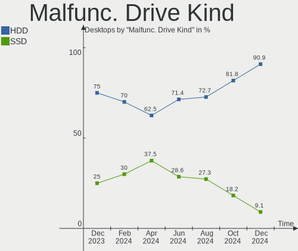

BlackPanther - Hardware Trends (Desktops)
-----------------------------------------

A project to identify most popular hardware characteristics and track their change
over time based on data collected by Linux users at https://Linux-Hardware.org.

Anyone can contribute to this report by the [hw-probe](https://github.com/linuxhw/hw-probe) tool:

    sudo -E hw-probe -all -upload

This report is for one last month. Overall report since the beginning of time: [TestDays](https://github.com/linuxhw/TestDays)

Period: Nov, 2023.

Contents
--------

* [ System ](#system)
  - [ OS                       ](#os)
  - [ OS Family                ](#os-family)
  - [ Kernel                   ](#kernel)
  - [ Kernel Family            ](#kernel-family)
  - [ Kernel Major Ver.        ](#kernel-major-ver)
  - [ Arch                     ](#arch)
  - [ DE                       ](#de)
  - [ Display Server           ](#display-server)
  - [ Display Manager          ](#display-manager)
  - [ OS Lang                  ](#os-lang)
  - [ Boot Mode                ](#boot-mode)
  - [ Filesystem               ](#filesystem)
  - [ Part. scheme             ](#part-scheme)
  - [ Dual Boot with Linux/BSD ](#dual-boot-with-linuxbsd)
  - [ Dual Boot (Win)          ](#dual-boot-win)

* [ Board ](#board)
  - [ Vendor                   ](#vendor)
  - [ Model                    ](#model)
  - [ Model Family             ](#model-family)
  - [ MFG Year                 ](#mfg-year)
  - [ Form Factor              ](#form-factor)
  - [ Secure Boot              ](#secure-boot)
  - [ Coreboot                 ](#coreboot)
  - [ RAM Size                 ](#ram-size)
  - [ RAM Used                 ](#ram-used)
  - [ Total Drives             ](#total-drives)
  - [ Has CD-ROM               ](#has-cd-rom)
  - [ Has Ethernet             ](#has-ethernet)
  - [ Has WiFi                 ](#has-wifi)
  - [ Has Bluetooth            ](#has-bluetooth)

* [ Location ](#location)
  - [ Country                  ](#country)
  - [ City                     ](#city)

* [ Drives ](#drives)
  - [ Drive Vendor             ](#drive-vendor)
  - [ Drive Model              ](#drive-model)
  - [ HDD Vendor               ](#hdd-vendor)
  - [ SSD Vendor               ](#ssd-vendor)
  - [ Drive Kind               ](#drive-kind)
  - [ Drive Connector          ](#drive-connector)
  - [ Drive Size               ](#drive-size)
  - [ Space Total              ](#space-total)
  - [ Space Used               ](#space-used)
  - [ Malfunc. Drives          ](#malfunc-drives)
  - [ Malfunc. Drive Vendor    ](#malfunc-drive-vendor)
  - [ Malfunc. HDD Vendor      ](#malfunc-hdd-vendor)
  - [ Malfunc. Drive Kind      ](#malfunc-drive-kind)
  - [ Failed Drives            ](#failed-drives)
  - [ Failed Drive Vendor      ](#failed-drive-vendor)
  - [ Drive Status             ](#drive-status)

* [ Storage controller ](#storage-controller)
  - [ Storage Vendor           ](#storage-vendor)
  - [ Storage Model            ](#storage-model)
  - [ Storage Kind             ](#storage-kind)

* [ Processor ](#processor)
  - [ CPU Vendor               ](#cpu-vendor)
  - [ CPU Model                ](#cpu-model)
  - [ CPU Model Family         ](#cpu-model-family)
  - [ CPU Cores                ](#cpu-cores)
  - [ CPU Sockets              ](#cpu-sockets)
  - [ CPU Threads              ](#cpu-threads)
  - [ CPU Op-Modes             ](#cpu-op-modes)
  - [ CPU Microcode            ](#cpu-microcode)
  - [ CPU Microarch            ](#cpu-microarch)

* [ Graphics ](#graphics)
  - [ GPU Vendor               ](#gpu-vendor)
  - [ GPU Model                ](#gpu-model)
  - [ GPU Combo                ](#gpu-combo)
  - [ GPU Driver               ](#gpu-driver)
  - [ GPU Memory               ](#gpu-memory)

* [ Monitor ](#monitor)
  - [ Monitor Vendor           ](#monitor-vendor)
  - [ Monitor Model            ](#monitor-model)
  - [ Monitor Resolution       ](#monitor-resolution)
  - [ Monitor Diagonal         ](#monitor-diagonal)
  - [ Monitor Width            ](#monitor-width)
  - [ Aspect Ratio             ](#aspect-ratio)
  - [ Monitor Area             ](#monitor-area)
  - [ Pixel Density            ](#pixel-density)
  - [ Multiple Monitors        ](#multiple-monitors)

* [ Network ](#network)
  - [ Net Controller Vendor    ](#net-controller-vendor)
  - [ Net Controller Model     ](#net-controller-model)
  - [ Wireless Vendor          ](#wireless-vendor)
  - [ Wireless Model           ](#wireless-model)
  - [ Ethernet Vendor          ](#ethernet-vendor)
  - [ Ethernet Model           ](#ethernet-model)
  - [ Net Controller Kind      ](#net-controller-kind)
  - [ Used Controller          ](#used-controller)
  - [ NICs                     ](#nics)
  - [ IPv6                     ](#ipv6)

* [ Bluetooth ](#bluetooth)
  - [ Bluetooth Vendor         ](#bluetooth-vendor)
  - [ Bluetooth Model          ](#bluetooth-model)

* [ Sound ](#sound)
  - [ Sound Vendor             ](#sound-vendor)
  - [ Sound Model              ](#sound-model)

* [ Memory ](#memory)
  - [ Memory Vendor            ](#memory-vendor)
  - [ Memory Model             ](#memory-model)
  - [ Memory Kind              ](#memory-kind)
  - [ Memory Form Factor       ](#memory-form-factor)
  - [ Memory Size              ](#memory-size)
  - [ Memory Speed             ](#memory-speed)

* [ Printers & scanners ](#printers--scanners)
  - [ Printer Vendor           ](#printer-vendor)
  - [ Printer Model            ](#printer-model)
  - [ Scanner Vendor           ](#scanner-vendor)
  - [ Scanner Model            ](#scanner-model)

* [ Camera ](#camera)
  - [ Camera Vendor            ](#camera-vendor)
  - [ Camera Model             ](#camera-model)

* [ Security ](#security)
  - [ Fingerprint Vendor       ](#fingerprint-vendor)
  - [ Fingerprint Model        ](#fingerprint-model)
  - [ Chipcard Vendor          ](#chipcard-vendor)
  - [ Chipcard Model           ](#chipcard-model)

* [ Unsupported ](#unsupported)
  - [ Unsupported Devices      ](#unsupported-devices)
  - [ Unsupported Device Types ](#unsupported-device-types)

System
------

OS
--

Installed operating systems

| Name              | Desktops | Percent |
|-------------------|----------|---------|
| BlackPanther 18.1 | 33       | 80.49%  |
| BlackPanther 22.1 | 7        | 17.07%  |
| BlackPanther 16.2 | 1        | 2.44%   |

OS Family
---------

OS without a version

| Name         | Desktops | Percent |
|--------------|----------|---------|
| BlackPanther | 41       | 100%    |

Kernel
------

Version of the Linux kernel

| Version                | Desktops | Percent |
|------------------------|----------|---------|
| 5.6.14-desktop-2bP     | 17       | 41.46%  |
| 5.15.85-desktop-1bP    | 7        | 17.07%  |
| 4.18.16-desktop-1bP    | 7        | 17.07%  |
| 6.3.8-desktop-1bP      | 5        | 12.2%   |
| 6.4.3-desktop-1bP      | 2        | 4.88%   |
| 6.5.7-power-1bP        | 1        | 2.44%   |
| 6.3.3-desktop-1bP      | 1        | 2.44%   |
| 4.9.20-desktop-pae-1bP | 1        | 2.44%   |

Kernel Family
-------------

Linux kernel without a distro release

| Version | Desktops | Percent |
|---------|----------|---------|
| 5.6.14  | 17       | 41.46%  |
| 5.15.85 | 7        | 17.07%  |
| 4.18.16 | 7        | 17.07%  |
| 6.3.8   | 5        | 12.2%   |
| 6.4.3   | 2        | 4.88%   |
| 6.5.7   | 1        | 2.44%   |
| 6.3.3   | 1        | 2.44%   |
| 4.9.20  | 1        | 2.44%   |

Kernel Major Ver.
-----------------

Linux kernel major version

| Version | Desktops | Percent |
|---------|----------|---------|
| 5.6     | 17       | 41.46%  |
| 5.15    | 7        | 17.07%  |
| 4.18    | 7        | 17.07%  |
| 6.3     | 6        | 14.63%  |
| 6.4     | 2        | 4.88%   |
| 6.5     | 1        | 2.44%   |
| 4.9     | 1        | 2.44%   |

Arch
----

OS architecture (x86_64, i586, etc.)

| Name   | Desktops | Percent |
|--------|----------|---------|
| x86_64 | 40       | 97.56%  |
| i686   | 1        | 2.44%   |

DE
--

Desktop Environment

| Name    | Desktops | Percent |
|---------|----------|---------|
| KDE5    | 38       | 92.68%  |
| Unknown | 3        | 7.32%   |

Display Server
--------------

X11 or Wayland

| Name | Desktops | Percent |
|------|----------|---------|
| X11  | 41       | 100%    |

Display Manager
---------------

SDDM, LightDM, etc.

| Name | Desktops | Percent |
|------|----------|---------|
| SDDM | 41       | 100%    |

OS Lang
-------

Language

| Lang    | Desktops | Percent |
|---------|----------|---------|
| Unknown | 41       | 100%    |

Boot Mode
---------

EFI or BIOS

| Mode | Desktops | Percent |
|------|----------|---------|
| BIOS | 24       | 58.54%  |
| EFI  | 17       | 41.46%  |

Filesystem
----------

Type of filesystem

| Type    | Desktops | Percent |
|---------|----------|---------|
| Ext4    | 26       | 63.41%  |
| Overlay | 15       | 36.59%  |

Part. scheme
------------

Scheme of partitioning

| Type | Desktops | Percent |
|------|----------|---------|
| GPT  | 25       | 60.98%  |
| MBR  | 16       | 39.02%  |

Dual Boot with Linux/BSD
------------------------

Hosting more than one Linux/BSD

| Dual boot | Desktops | Percent |
|-----------|----------|---------|
| No        | 23       | 56.1%   |
| Yes       | 18       | 43.9%   |

Dual Boot (Win)
---------------

Hosting Linux and Windows

| Dual boot | Desktops | Percent |
|-----------|----------|---------|
| No        | 25       | 60.98%  |
| Yes       | 16       | 39.02%  |

Board
-----

Vendor
------

Motherboard manufacturer

| Name                | Desktops | Percent |
|---------------------|----------|---------|
| Gigabyte Technology | 15       | 36.59%  |
| Lenovo              | 5        | 12.2%   |
| Dell                | 5        | 12.2%   |
| Fujitsu             | 4        | 9.76%   |
| ASUSTek Computer    | 4        | 9.76%   |
| Hewlett-Packard     | 3        | 7.32%   |
| ASRock              | 3        | 7.32%   |
| MSI                 | 2        | 4.88%   |

Model
-----

Motherboard model

| Name                                | Desktops | Percent |
|-------------------------------------|----------|---------|
| Gigabyte H61M-S1                    | 2        | 4.88%   |
| MSI MS-7680                         | 1        | 2.44%   |
| MSI MS-7519                         | 1        | 2.44%   |
| Lenovo ThinkStation P520 30BFS44D04 | 1        | 2.44%   |
| Lenovo ThinkStation D20 4158AF8     | 1        | 2.44%   |
| Lenovo ThinkCentre M78 10BNS02900   | 1        | 2.44%   |
| Lenovo ThinkCentre M73 10B6001SUS   | 1        | 2.44%   |
| Lenovo ThinkCentre M58 9960ALU      | 1        | 2.44%   |
| HP EliteDesk 705 G3 SFF             | 1        | 2.44%   |
| HP Compaq 8200 Elite MT PC          | 1        | 2.44%   |
| HP Compaq 8200 Elite CMT PC         | 1        | 2.44%   |
| Gigabyte Z97MX-Gaming 5             | 1        | 2.44%   |
| Gigabyte J4005ND2P-CF               | 1        | 2.44%   |
| Gigabyte H97-D3H                    | 1        | 2.44%   |
| Gigabyte H110M-S2V-CF               | 1        | 2.44%   |
| Gigabyte GA-MA78GPM-DS2H            | 1        | 2.44%   |
| Gigabyte GA-78LMT-USB3 R2           | 1        | 2.44%   |
| Gigabyte F2A88XN-WIFI               | 1        | 2.44%   |
| Gigabyte F2A88XM-D3HP               | 1        | 2.44%   |
| Gigabyte EP31-DS3L                  | 1        | 2.44%   |
| Gigabyte B450M GAMING               | 1        | 2.44%   |
| Gigabyte AB350M-DS3H V2             | 1        | 2.44%   |
| Gigabyte A520M S2H                  | 1        | 2.44%   |
| Gigabyte 970A-UD3P                  | 1        | 2.44%   |
| Fujitsu ESPRIMO Q556/2              | 1        | 2.44%   |
| Fujitsu ESPRIMO E520                | 1        | 2.44%   |
| Fujitsu CELSIUS R670-2              | 1        | 2.44%   |
| Fujitsu CELSIUS M470                | 1        | 2.44%   |
| Dell Vostro 400                     | 1        | 2.44%   |
| Dell Precision WorkStation T3500    | 1        | 2.44%   |
| Dell Precision Tower 5810           | 1        | 2.44%   |
| Dell OptiPlex 745                   | 1        | 2.44%   |
| Dell OptiPlex 3020                  | 1        | 2.44%   |
| ASUS PRIME B365M-A                  | 1        | 2.44%   |
| ASUS PRIME A320M-R                  | 1        | 2.44%   |
| ASUS M5A97 EVO R2.0                 | 1        | 2.44%   |
| ASUS M5A78L-M PLUS/USB3             | 1        | 2.44%   |
| ASRock G41M-VS3                     | 1        | 2.44%   |
| ASRock B85M                         | 1        | 2.44%   |
| ASRock B550M Pro4                   | 1        | 2.44%   |

Model Family
------------

Motherboard model prefix

| Name                     | Desktops | Percent |
|--------------------------|----------|---------|
| Lenovo ThinkCentre       | 3        | 7.32%   |
| Lenovo ThinkStation      | 2        | 4.88%   |
| HP Compaq                | 2        | 4.88%   |
| Gigabyte H61M-S1         | 2        | 4.88%   |
| Fujitsu ESPRIMO          | 2        | 4.88%   |
| Fujitsu CELSIUS          | 2        | 4.88%   |
| Dell Precision           | 2        | 4.88%   |
| Dell OptiPlex            | 2        | 4.88%   |
| ASUS PRIME               | 2        | 4.88%   |
| MSI MS-7680              | 1        | 2.44%   |
| MSI MS-7519              | 1        | 2.44%   |
| HP EliteDesk             | 1        | 2.44%   |
| Gigabyte Z97MX-Gaming    | 1        | 2.44%   |
| Gigabyte J4005ND2P-CF    | 1        | 2.44%   |
| Gigabyte H97-D3H         | 1        | 2.44%   |
| Gigabyte H110M-S2V-CF    | 1        | 2.44%   |
| Gigabyte GA-MA78GPM-DS2H | 1        | 2.44%   |
| Gigabyte GA-78LMT-USB3   | 1        | 2.44%   |
| Gigabyte F2A88XN-WIFI    | 1        | 2.44%   |
| Gigabyte F2A88XM-D3HP    | 1        | 2.44%   |
| Gigabyte EP31-DS3L       | 1        | 2.44%   |
| Gigabyte B450M           | 1        | 2.44%   |
| Gigabyte AB350M-DS3H     | 1        | 2.44%   |
| Gigabyte A520M           | 1        | 2.44%   |
| Gigabyte 970A-UD3P       | 1        | 2.44%   |
| Dell Vostro              | 1        | 2.44%   |
| ASUS M5A97               | 1        | 2.44%   |
| ASUS M5A78L-M            | 1        | 2.44%   |
| ASRock G41M-VS3          | 1        | 2.44%   |
| ASRock B85M              | 1        | 2.44%   |
| ASRock B550M             | 1        | 2.44%   |

MFG Year
--------

Motherboard manufacture year

| Year | Desktops | Percent |
|------|----------|---------|
| 2010 | 6        | 14.63%  |
| 2014 | 5        | 12.2%   |
| 2013 | 5        | 12.2%   |
| 2018 | 4        | 9.76%   |
| 2017 | 3        | 7.32%   |
| 2012 | 3        | 7.32%   |
| 2011 | 3        | 7.32%   |
| 2008 | 3        | 7.32%   |
| 2020 | 2        | 4.88%   |
| 2016 | 2        | 4.88%   |
| 2015 | 2        | 4.88%   |
| 2007 | 2        | 4.88%   |
| 2019 | 1        | 2.44%   |

Form Factor
-----------

Physical design of the computer

| Name    | Desktops | Percent |
|---------|----------|---------|
| Desktop | 41       | 100%    |

Secure Boot
-----------

Enabled or disabled

| State    | Desktops | Percent |
|----------|----------|---------|
| Disabled | 41       | 100%    |

Coreboot
--------

Have coreboot on board

| Used | Desktops | Percent |
|------|----------|---------|
| No   | 41       | 100%    |

RAM Size
--------

Total RAM memory

| Size in GB | Desktops | Percent |
|------------|----------|---------|
| 8.01-16.0  | 14       | 34.15%  |
| 3.01-4.0   | 12       | 29.27%  |
| 4.01-8.0   | 6        | 14.63%  |
| 16.01-24.0 | 6        | 14.63%  |
| 32.01-64.0 | 2        | 4.88%   |
| 24.01-32.0 | 1        | 2.44%   |

RAM Used
--------

Used RAM memory

| Used GB  | Desktops | Percent |
|----------|----------|---------|
| 1.01-2.0 | 15       | 36.59%  |
| 0.51-1.0 | 12       | 29.27%  |
| 0.01-0.5 | 8        | 19.51%  |
| 3.01-4.0 | 4        | 9.76%   |
| 4.01-8.0 | 1        | 2.44%   |
| 2.01-3.0 | 1        | 2.44%   |

Total Drives
------------

Number of drives on board

| Drives | Desktops | Percent |
|--------|----------|---------|
| 1      | 21       | 51.22%  |
| 2      | 12       | 29.27%  |
| 3      | 5        | 12.2%   |
| 4      | 3        | 7.32%   |

Has CD-ROM
----------

Has CD-ROM on board

| Presented | Desktops | Percent |
|-----------|----------|---------|
| Yes       | 27       | 65.85%  |
| No        | 14       | 34.15%  |

Has Ethernet
------------

Has Ethernet on board

| Presented | Desktops | Percent |
|-----------|----------|---------|
| Yes       | 41       | 100%    |

Has WiFi
--------

Has WiFi module

| Presented | Desktops | Percent |
|-----------|----------|---------|
| No        | 29       | 70.73%  |
| Yes       | 12       | 29.27%  |

Has Bluetooth
-------------

Has Bluetooth module

| Presented | Desktops | Percent |
|-----------|----------|---------|
| No        | 36       | 87.8%   |
| Yes       | 5        | 12.2%   |

Location
--------

Country
-------

Geographic location (country)

| Country  | Desktops | Percent |
|----------|----------|---------|
| Hungary  | 37       | 90.24%  |
| Slovakia | 3        | 7.32%   |
| Romania  | 1        | 2.44%   |

City
----

Geographic location (city)

| City              | Desktops | Percent |
|-------------------|----------|---------|
| Budapest          | 12       | 29.27%  |
| Szentendre        | 3        | 7.32%   |
| Zalaegerszeg      | 2        | 4.88%   |
| Kiskunhalas       | 2        | 4.88%   |
| Karcag            | 2        | 4.88%   |
| Csongrad          | 2        | 4.88%   |
| Agfalva           | 2        | 4.88%   |
| Zalău            | 1        | 2.44%   |
| Szigetszentmiklos | 1        | 2.44%   |
| Pécs             | 1        | 2.44%   |
| Oroshaza          | 1        | 2.44%   |
| Mezokovesd        | 1        | 2.44%   |
| Marcali           | 1        | 2.44%   |
| Mandok            | 1        | 2.44%   |
| Lučenec          | 1        | 2.44%   |
| Kormend           | 1        | 2.44%   |
| Kiskunmajsa       | 1        | 2.44%   |
| Jaszdozsa         | 1        | 2.44%   |
| Isaszeg           | 1        | 2.44%   |
| Fertoszentmiklos  | 1        | 2.44%   |
| Bratislava        | 1        | 2.44%   |
| Berettyóújfalu  | 1        | 2.44%   |
| Bardejov          | 1        | 2.44%   |

Drives
------

Drive Vendor
------------

Hard drive vendors

| Vendor                    | Desktops | Drives | Percent |
|---------------------------|----------|--------|---------|
| WDC                       | 16       | 19     | 22.54%  |
| Samsung Electronics       | 11       | 11     | 15.49%  |
| Kingston                  | 11       | 13     | 15.49%  |
| A-DATA Technology         | 6        | 6      | 8.45%   |
| Seagate                   | 4        | 4      | 5.63%   |
| Toshiba                   | 3        | 5      | 4.23%   |
| Patriot                   | 2        | 2      | 2.82%   |
| Intenso                   | 2        | 2      | 2.82%   |
| Intel                     | 2        | 2      | 2.82%   |
| HGST                      | 2        | 3      | 2.82%   |
| Gigabyte Technology       | 2        | 2      | 2.82%   |
| Zheino                    | 1        | 1      | 1.41%   |
| Transcend                 | 1        | 1      | 1.41%   |
| SPCC                      | 1        | 1      | 1.41%   |
| SK hynix                  | 1        | 1      | 1.41%   |
| SanDisk                   | 1        | 1      | 1.41%   |
| Realtek Semiconductor     | 1        | 1      | 1.41%   |
| Micron/Crucial Technology | 1        | 1      | 1.41%   |
| Micron Technology         | 1        | 1      | 1.41%   |
| Kingmax                   | 1        | 1      | 1.41%   |
| Hitachi                   | 1        | 1      | 1.41%   |

Drive Model
-----------

Hard drive models

| Model                                | Desktops | Percent |
|--------------------------------------|----------|---------|
| Kingston SA400S37480G 480GB SSD      | 5        | 6.58%   |
| Kingston SUV400S37120G 120GB SSD     | 2        | 2.63%   |
| Kingston SA400S37120G 120GB SSD      | 2        | 2.63%   |
| Gigabyte GP-GSTFS31120GNTD 120GB SSD | 2        | 2.63%   |
| A-DATA SU650 120GB SSD               | 2        | 2.63%   |
| A-DATA SU630 240GB SSD               | 2        | 2.63%   |
| Zheino CHN-NGFFNV2280-256 256GB      | 1        | 1.32%   |
| WDC WDS240G2G0B-00EPW0 240GB SSD     | 1        | 1.32%   |
| WDC WDS240G2G0A-00JH30 240GB SSD     | 1        | 1.32%   |
| WDC WD6400BPVT-22HXZT3 640GB         | 1        | 1.32%   |
| WDC WD5003AZEX-00MK2A0 500GB         | 1        | 1.32%   |
| WDC WD5000LPLX-75ZNTT0 500GB         | 1        | 1.32%   |
| WDC WD5000BPKT-75PK4T0 500GB         | 1        | 1.32%   |
| WDC WD5000AAKX-08U6AA0 500GB         | 1        | 1.32%   |
| WDC WD30EZRX-00DC0B0 3TB             | 1        | 1.32%   |
| WDC WD30EFRX-68EUZN0 3TB             | 1        | 1.32%   |
| WDC WD30 PURX-64PFUY0 3TB            | 1        | 1.32%   |
| WDC WD20EARX-00PASB0 2TB             | 1        | 1.32%   |
| WDC WD10PURZ-85U8XY0 1TB             | 1        | 1.32%   |
| WDC WD10EZRX-00L4HB0 1TB             | 1        | 1.32%   |
| WDC WD10EZEX-00KUWA0 1TB             | 1        | 1.32%   |
| WDC WD10EFRX-68PJCN0 1TB             | 1        | 1.32%   |
| WDC WD10EARS-00Y5B1 1TB              | 1        | 1.32%   |
| WDC WD10EALX-009BA0 1TB              | 1        | 1.32%   |
| Transcend TS128GMTE110S 128GB        | 1        | 1.32%   |
| Toshiba HDWQ140 4TB                  | 1        | 1.32%   |
| Toshiba HDWD240 4TB                  | 1        | 1.32%   |
| Toshiba DT01ACA200 2TB               | 1        | 1.32%   |
| Toshiba DT01ACA100 1TB               | 1        | 1.32%   |
| Toshiba DT01ACA050 500GB             | 1        | 1.32%   |
| SPCC Solid State Disk 256GB          | 1        | 1.32%   |
| SK hynix SC311 SATA 256GB SSD        | 1        | 1.32%   |
| Seagate ST1000LM035-1RK172 1TB       | 1        | 1.32%   |
| Seagate ST1000LM024 HN-M101MBB 1TB   | 1        | 1.32%   |
| Seagate ST1000DM010-2EP102 1TB       | 1        | 1.32%   |
| Seagate ST1000DM003-9YN162 1TB       | 1        | 1.32%   |
| SanDisk NVMe SSD Drive 2TB           | 1        | 1.32%   |
| Samsung SSD 870 EVO 500GB            | 1        | 1.32%   |
| Samsung SSD 860 EVO 250GB            | 1        | 1.32%   |
| Samsung SSD 850 EVO 250GB            | 1        | 1.32%   |

HDD Vendor
----------

Hard disk drive vendors

| Vendor              | Desktops | Drives | Percent |
|---------------------|----------|--------|---------|
| WDC                 | 14       | 17     | 51.85%  |
| Seagate             | 4        | 4      | 14.81%  |
| Toshiba             | 3        | 5      | 11.11%  |
| Samsung Electronics | 3        | 3      | 11.11%  |
| HGST                | 2        | 3      | 7.41%   |
| Hitachi             | 1        | 1      | 3.7%    |

SSD Vendor
----------

Solid state drive vendors

| Vendor              | Desktops | Drives | Percent |
|---------------------|----------|--------|---------|
| Kingston            | 10       | 12     | 27.78%  |
| Samsung Electronics | 6        | 6      | 16.67%  |
| A-DATA Technology   | 6        | 6      | 16.67%  |
| WDC                 | 2        | 2      | 5.56%   |
| Patriot             | 2        | 2      | 5.56%   |
| Intenso             | 2        | 2      | 5.56%   |
| Intel               | 2        | 2      | 5.56%   |
| Gigabyte Technology | 2        | 2      | 5.56%   |
| SPCC                | 1        | 1      | 2.78%   |
| SK hynix            | 1        | 1      | 2.78%   |
| Micron Technology   | 1        | 1      | 2.78%   |
| Kingmax             | 1        | 1      | 2.78%   |

Drive Kind
----------

HDD or SSD

| Kind | Desktops | Drives | Percent |
|------|----------|--------|---------|
| SSD  | 29       | 38     | 49.15%  |
| HDD  | 23       | 33     | 38.98%  |
| NVMe | 7        | 8      | 11.86%  |

Drive Connector
---------------

SATA, SAS, NVMe, etc.

| Type | Desktops | Drives | Percent |
|------|----------|--------|---------|
| SATA | 37       | 68     | 78.72%  |
| NVMe | 7        | 8      | 14.89%  |
| SAS  | 3        | 3      | 6.38%   |

Drive Size
----------

Size of hard drive

| Size in TB | Desktops | Drives | Percent |
|------------|----------|--------|---------|
| 0.01-0.5   | 30       | 43     | 55.56%  |
| 0.51-1.0   | 16       | 18     | 29.63%  |
| 3.01-4.0   | 3        | 4      | 5.56%   |
| 2.01-3.0   | 3        | 4      | 5.56%   |
| 1.01-2.0   | 2        | 2      | 3.7%    |

Space Total
-----------

Amount of disk space available on the file system

| Size in GB     | Desktops | Percent |
|----------------|----------|---------|
| Unknown        | 15       | 36.59%  |
| 501-1000       | 6        | 14.63%  |
| 251-500        | 5        | 12.2%   |
| 101-250        | 5        | 12.2%   |
| 51-100         | 5        | 12.2%   |
| More than 3000 | 3        | 7.32%   |
| 1001-2000      | 2        | 4.88%   |

Space Used
----------

Amount of used disk space

| Used GB        | Desktops | Percent |
|----------------|----------|---------|
| Unknown        | 15       | 36.59%  |
| 21-50          | 7        | 17.07%  |
| 1-20           | 7        | 17.07%  |
| 101-250        | 3        | 7.32%   |
| 51-100         | 3        | 7.32%   |
| More than 3000 | 2        | 4.88%   |
| 251-500        | 2        | 4.88%   |
| 1001-2000      | 1        | 2.44%   |
| 501-1000       | 1        | 2.44%   |

Malfunc. Drives
---------------

Drive models with a malfunction

| Model                              | Desktops | Drives | Percent |
|------------------------------------|----------|--------|---------|
| A-DATA Technology SU630 240GB SSD  | 2        | 2      | 13.33%  |
| WDC WD5000AAKX-08U6AA0 500GB       | 1        | 1      | 6.67%   |
| WDC WD20EARX-00PASB0 2TB           | 1        | 1      | 6.67%   |
| WDC WD10PURZ-85U8XY0 1TB           | 1        | 1      | 6.67%   |
| WDC WD10EARS-00Y5B1 1TB            | 1        | 1      | 6.67%   |
| WDC WD10EALX-009BA0 1TB            | 1        | 1      | 6.67%   |
| Toshiba DT01ACA100 1TB             | 1        | 1      | 6.67%   |
| Toshiba DT01ACA050 500GB           | 1        | 1      | 6.67%   |
| Seagate ST1000LM035-1RK172 1TB     | 1        | 1      | 6.67%   |
| Seagate ST1000LM024 HN-M101MBB 1TB | 1        | 1      | 6.67%   |
| Samsung Electronics HD103UJ 1TB    | 1        | 1      | 6.67%   |
| Kingston SA400S37480G 480GB SSD    | 1        | 1      | 6.67%   |
| Intel SSDSC2BF180A4H 180GB         | 1        | 1      | 6.67%   |
| A-DATA Technology SP600 64GB SSD   | 1        | 1      | 6.67%   |

Malfunc. Drive Vendor
---------------------

Vendors of faulty drives

| Vendor              | Desktops | Drives | Percent |
|---------------------|----------|--------|---------|
| WDC                 | 5        | 5      | 35.71%  |
| A-DATA Technology   | 3        | 3      | 21.43%  |
| Seagate             | 2        | 2      | 14.29%  |
| Toshiba             | 1        | 2      | 7.14%   |
| Samsung Electronics | 1        | 1      | 7.14%   |
| Kingston            | 1        | 1      | 7.14%   |
| Intel               | 1        | 1      | 7.14%   |

Malfunc. HDD Vendor
-------------------

Vendors of faulty HDD drives

| Vendor              | Desktops | Drives | Percent |
|---------------------|----------|--------|---------|
| WDC                 | 5        | 5      | 55.56%  |
| Seagate             | 2        | 2      | 22.22%  |
| Toshiba             | 1        | 2      | 11.11%  |
| Samsung Electronics | 1        | 1      | 11.11%  |

Malfunc. Drive Kind
-------------------

Kinds of faulty drives

| Kind | Desktops | Drives | Percent |
|------|----------|--------|---------|
| HDD  | 9        | 10     | 64.29%  |
| SSD  | 5        | 5      | 35.71%  |

Failed Drives
-------------

Failed drive models

Zero info for selected period =(

Failed Drive Vendor
-------------------

Failed drive vendors

Zero info for selected period =(

Drive Status
------------

Number of failed and malfunc. drives

| Status   | Desktops | Drives | Percent |
|----------|----------|--------|---------|
| Works    | 38       | 62     | 71.7%   |
| Malfunc  | 13       | 15     | 24.53%  |
| Detected | 2        | 2      | 3.77%   |

Storage controller
------------------

Storage Vendor
--------------

Storage controller vendors

| Vendor                      | Desktops | Percent |
|-----------------------------|----------|---------|
| Intel                       | 27       | 52.94%  |
| AMD                         | 14       | 27.45%  |
| Silicon Motion              | 2        | 3.92%   |
| Samsung Electronics         | 2        | 3.92%   |
| SanDisk                     | 1        | 1.96%   |
| Realtek Semiconductor       | 1        | 1.96%   |
| Micron/Crucial Technology   | 1        | 1.96%   |
| Kingston Technology Company | 1        | 1.96%   |
| JMicron Technology          | 1        | 1.96%   |
| ASMedia Technology          | 1        | 1.96%   |

Storage Model
-------------

Storage controller models

| Model                                                                                   | Desktops | Percent |
|-----------------------------------------------------------------------------------------|----------|---------|
| AMD FCH SATA Controller [AHCI mode]                                                     | 6        | 9.09%   |
| Intel 82801JI (ICH10 Family) SATA AHCI Controller                                       | 4        | 6.06%   |
| Intel 8 Series/C220 Series Chipset Family 6-port SATA Controller 1 [AHCI mode]          | 4        | 6.06%   |
| Intel 6 Series/C200 Series Chipset Family Desktop SATA Controller (IDE mode, ports 4-5) | 4        | 6.06%   |
| Intel 6 Series/C200 Series Chipset Family Desktop SATA Controller (IDE mode, ports 0-3) | 4        | 6.06%   |
| AMD SB7x0/SB8x0/SB9x0 IDE Controller                                                    | 4        | 6.06%   |
| Intel NM10/ICH7 Family SATA Controller [IDE mode]                                       | 3        | 4.55%   |
| AMD SB7x0/SB8x0/SB9x0 SATA Controller [AHCI mode]                                       | 3        | 4.55%   |
| Silicon Motion SM2263EN/SM2263XT (DRAM-less) NVMe SSD Controllers                       | 2        | 3.03%   |
| Intel Q170/Q150/B150/H170/H110/Z170/CM236 Chipset SATA Controller [AHCI Mode]           | 2        | 3.03%   |
| Intel 9 Series Chipset Family SATA Controller [AHCI Mode]                               | 2        | 3.03%   |
| Intel 200 Series PCH SATA controller [AHCI mode]                                        | 2        | 3.03%   |
| AMD SB7x0/SB8x0/SB9x0 SATA Controller [IDE mode]                                        | 2        | 3.03%   |
| AMD 500 Series Chipset SATA Controller                                                  | 2        | 3.03%   |
| AMD 300 Series Chipset SATA Controller                                                  | 2        | 3.03%   |
| SanDisk WD Blue SN570 NVMe SSD 2TB                                                      | 1        | 1.52%   |
| Samsung NVMe SSD Controller SM981/PM981/PM983                                           | 1        | 1.52%   |
| Samsung NVMe SSD Controller SM961/PM961/SM963                                           | 1        | 1.52%   |
| Realtek RTS5762 NVMe SSD Controller                                                     | 1        | 1.52%   |
| Micron/Crucial P1 NVMe PCIe SSD[Frampton2]                                              | 1        | 1.52%   |
| Kingston Company NV1 NVMe SSD E13T                                                      | 1        | 1.52%   |
| JMicron JMB368 IDE controller                                                           | 1        | 1.52%   |
| Intel Celeron/Pentium Silver Processor SATA Controller                                  | 1        | 1.52%   |
| Intel C610/X99 series chipset IDE-r Controller                                          | 1        | 1.52%   |
| Intel 82801JI (ICH10 Family) 4 port SATA IDE Controller #1                              | 1        | 1.52%   |
| Intel 82801JI (ICH10 Family) 2 port SATA IDE Controller #2                              | 1        | 1.52%   |
| Intel 82801JD/DO (ICH10 Family) SATA AHCI Controller                                    | 1        | 1.52%   |
| Intel 82801IR/IO/IH (ICH9R/DO/DH) 4 port SATA Controller [IDE mode]                     | 1        | 1.52%   |
| Intel 82801I (ICH9 Family) 2 port SATA Controller [IDE mode]                            | 1        | 1.52%   |
| Intel 82801G (ICH7 Family) IDE Controller                                               | 1        | 1.52%   |
| Intel 6 Series/C200 Series Chipset Family 6 port Desktop SATA AHCI Controller           | 1        | 1.52%   |
| Intel 4 Series Chipset PT IDER Controller                                               | 1        | 1.52%   |
| ASMedia ASM1062 Serial ATA Controller                                                   | 1        | 1.52%   |
| AMD FCH SATA Controller D                                                               | 1        | 1.52%   |
| AMD 400 Series Chipset SATA Controller                                                  | 1        | 1.52%   |

Storage Kind
------------

Kind of storage controller (IDE, SATA, NVMe, SAS, ...)

| Kind | Desktops | Percent |
|------|----------|---------|
| SATA | 31       | 57.41%  |
| IDE  | 16       | 29.63%  |
| NVMe | 7        | 12.96%  |

Processor
---------

CPU Vendor
----------

Processor vendors

| Vendor | Desktops | Percent |
|--------|----------|---------|
| Intel  | 27       | 65.85%  |
| AMD    | 14       | 34.15%  |

CPU Model
---------

Processor models

| Model                                           | Desktops | Percent |
|-------------------------------------------------|----------|---------|
| Intel Core i3-2120 CPU @ 3.30GHz                | 2        | 4.88%   |
| AMD Ryzen 5 3400G with Radeon Vega Graphics     | 2        | 4.88%   |
| AMD FX-8350 Eight-Core Processor                | 2        | 4.88%   |
| Intel Xeon W-2135 CPU @ 3.70GHz                 | 1        | 2.44%   |
| Intel Xeon CPU X5677 @ 3.47GHz                  | 1        | 2.44%   |
| Intel Xeon CPU X5650 @ 2.67GHz                  | 1        | 2.44%   |
| Intel Xeon CPU W3550 @ 3.07GHz                  | 1        | 2.44%   |
| Intel Xeon CPU W3540 @ 2.93GHz                  | 1        | 2.44%   |
| Intel Xeon CPU E5440 @ 2.83GHz                  | 1        | 2.44%   |
| Intel Xeon CPU E5-2696 v3 @ 2.30GHz             | 1        | 2.44%   |
| Intel Pentium CPU G3430 @ 3.30GHz               | 1        | 2.44%   |
| Intel Core i7-4790 CPU @ 3.60GHz                | 1        | 2.44%   |
| Intel Core i5-4690 CPU @ 3.50GHz                | 1        | 2.44%   |
| Intel Core i5-4590 CPU @ 3.30GHz                | 1        | 2.44%   |
| Intel Core i5-3470 CPU @ 3.20GHz                | 1        | 2.44%   |
| Intel Core i5-3330 CPU @ 3.00GHz                | 1        | 2.44%   |
| Intel Core i5-2400 CPU @ 3.10GHz                | 1        | 2.44%   |
| Intel Core i3-8100 CPU @ 3.60GHz                | 1        | 2.44%   |
| Intel Core i3-6100T CPU @ 3.20GHz               | 1        | 2.44%   |
| Intel Core i3-6100 CPU @ 3.70GHz                | 1        | 2.44%   |
| Intel Core i3-4170 CPU @ 3.70GHz                | 1        | 2.44%   |
| Intel Core i3-4130 CPU @ 3.40GHz                | 1        | 2.44%   |
| Intel Core 2 Duo CPU E8400 @ 3.00GHz            | 1        | 2.44%   |
| Intel Core 2 Duo CPU E7500 @ 2.93GHz            | 1        | 2.44%   |
| Intel Core 2 Duo CPU E7300 @ 2.66GHz            | 1        | 2.44%   |
| Intel Core 2 Duo CPU E6850 @ 3.00GHz            | 1        | 2.44%   |
| Intel Core 2 Duo CPU E6750 @ 2.66GHz            | 1        | 2.44%   |
| Intel Celeron J4005 CPU @ 2.00GHz               | 1        | 2.44%   |
| AMD Ryzen 7 5700X 8-Core Processor              | 1        | 2.44%   |
| AMD Ryzen 5 5600G with Radeon Graphics          | 1        | 2.44%   |
| AMD Ryzen 3 2200G with Radeon Vega Graphics     | 1        | 2.44%   |
| AMD PRO A6-9500 R5, 8 COMPUTE CORES 2C+6G       | 1        | 2.44%   |
| AMD FX-6300 Six-Core Processor                  | 1        | 2.44%   |
| AMD Athlon II X2 260 Processor                  | 1        | 2.44%   |
| AMD Athlon II X2 240e Processor                 | 1        | 2.44%   |
| AMD A4-6300B APU with Radeon HD Graphics        | 1        | 2.44%   |
| AMD A10-7890K Radeon R7, 12 Compute Cores 4C+8G | 1        | 2.44%   |
| AMD A10-7850K Radeon R7, 12 Compute Cores 4C+8G | 1        | 2.44%   |

CPU Model Family
----------------

Processor model prefix

| Model            | Desktops | Percent |
|------------------|----------|---------|
| Intel Xeon       | 7        | 17.07%  |
| Intel Core i3    | 7        | 17.07%  |
| Intel Core i5    | 5        | 12.2%   |
| Intel Core 2 Duo | 5        | 12.2%   |
| AMD Ryzen 5      | 3        | 7.32%   |
| AMD FX           | 3        | 7.32%   |
| AMD Athlon II X2 | 2        | 4.88%   |
| AMD A10          | 2        | 4.88%   |
| Other            | 1        | 2.44%   |
| Intel Pentium    | 1        | 2.44%   |
| Intel Core i7    | 1        | 2.44%   |
| Intel Celeron    | 1        | 2.44%   |
| AMD Ryzen 7      | 1        | 2.44%   |
| AMD Ryzen 3      | 1        | 2.44%   |
| AMD A4           | 1        | 2.44%   |

CPU Cores
---------

Number of processor cores

| Number | Desktops | Percent |
|--------|----------|---------|
| 2      | 17       | 41.46%  |
| 4      | 15       | 36.59%  |
| 6      | 3        | 7.32%   |
| 8      | 2        | 4.88%   |
| 1      | 2        | 4.88%   |
| 18     | 1        | 2.44%   |
| 3      | 1        | 2.44%   |

CPU Sockets
-----------

Number of sockets

| Number | Desktops | Percent |
|--------|----------|---------|
| 1      | 40       | 97.56%  |
| 2      | 1        | 2.44%   |

CPU Threads
-----------

Threads per core (Hyper-Threading)

| Number | Desktops | Percent |
|--------|----------|---------|
| 2      | 24       | 58.54%  |
| 1      | 17       | 41.46%  |

CPU Op-Modes
------------

CPU Operation Modes (32-bit, 64-bit)

| Op mode        | Desktops | Percent |
|----------------|----------|---------|
| 32-bit, 64-bit | 41       | 100%    |

CPU Microcode
-------------

Microcode number

| Number     | Desktops | Percent |
|------------|----------|---------|
| Unknown    | 9        | 21.95%  |
| 0x306c3    | 6        | 14.63%  |
| 0x6fb      | 2        | 4.88%   |
| 0x206a7    | 2        | 4.88%   |
| 0x1067a    | 2        | 4.88%   |
| 0x08108109 | 2        | 4.88%   |
| 0x06003106 | 2        | 4.88%   |
| 0x010000c8 | 2        | 4.88%   |
| 0x906eb    | 1        | 2.44%   |
| 0x706a1    | 1        | 2.44%   |
| 0x506e3    | 1        | 2.44%   |
| 0x306a9    | 1        | 2.44%   |
| 0x206c2    | 1        | 2.44%   |
| 0x106a5    | 1        | 2.44%   |
| 0x10676    | 1        | 2.44%   |
| 0x0a50000c | 1        | 2.44%   |
| 0x0a20120a | 1        | 2.44%   |
| 0x0810100b | 1        | 2.44%   |
| 0x0600611a | 1        | 2.44%   |
| 0x06001119 | 1        | 2.44%   |
| 0x06000852 | 1        | 2.44%   |
| 0x0600084f | 1        | 2.44%   |

CPU Microarch
-------------

Microarchitecture

| Name          | Desktops | Percent |
|---------------|----------|---------|
| Haswell       | 7        | 17.07%  |
| Piledriver    | 4        | 9.76%   |
| Penryn        | 4        | 9.76%   |
| Skylake       | 3        | 7.32%   |
| SandyBridge   | 3        | 7.32%   |
| Zen+          | 2        | 4.88%   |
| Zen 3         | 2        | 4.88%   |
| Westmere      | 2        | 4.88%   |
| Steamroller   | 2        | 4.88%   |
| Nehalem       | 2        | 4.88%   |
| K10           | 2        | 4.88%   |
| IvyBridge     | 2        | 4.88%   |
| Core          | 2        | 4.88%   |
| Zen           | 1        | 2.44%   |
| KabyLake      | 1        | 2.44%   |
| Goldmont plus | 1        | 2.44%   |
| Excavator     | 1        | 2.44%   |

Graphics
--------

GPU Vendor
----------

Vendors of graphics cards

| Vendor | Desktops | Percent |
|--------|----------|---------|
| Nvidia | 15       | 34.09%  |
| AMD    | 15       | 34.09%  |
| Intel  | 14       | 31.82%  |

GPU Model
---------

Graphics card models

| Model                                                                       | Desktops | Percent |
|-----------------------------------------------------------------------------|----------|---------|
| Intel Xeon E3-1200 v3/4th Gen Core Processor Integrated Graphics Controller | 4        | 9.09%   |
| Nvidia GT218 [GeForce 210]                                                  | 2        | 4.55%   |
| Nvidia GK208B [GeForce GT 710]                                              | 2        | 4.55%   |
| Intel HD Graphics 530                                                       | 2        | 4.55%   |
| Intel 4th Generation Core Processor Family Integrated Graphics Controller   | 2        | 4.55%   |
| Intel 2nd Generation Core Processor Family Integrated Graphics Controller   | 2        | 4.55%   |
| AMD Kaveri [Radeon R7 Graphics]                                             | 2        | 4.55%   |
| Nvidia NV43 [GeForce 6600 GT]                                               | 1        | 2.27%   |
| Nvidia GP108 [GeForce GT 1030]                                              | 1        | 2.27%   |
| Nvidia GP107 [GeForce GTX 1050 Ti]                                          | 1        | 2.27%   |
| Nvidia GP106 [GeForce GTX 1060 6GB]                                         | 1        | 2.27%   |
| Nvidia GM204 [GeForce GTX 970]                                              | 1        | 2.27%   |
| Nvidia GM107 [GeForce GTX 750]                                              | 1        | 2.27%   |
| Nvidia GM107 [GeForce GTX 750 Ti]                                           | 1        | 2.27%   |
| Nvidia GF108 [GeForce GT 630]                                               | 1        | 2.27%   |
| Nvidia GA104 [GeForce RTX 3060 Ti Lite Hash Rate]                           | 1        | 2.27%   |
| Nvidia G92 [GeForce GTS 250]                                                | 1        | 2.27%   |
| Nvidia G72 [GeForce 7500 LE]                                                | 1        | 2.27%   |
| Intel Xeon E3-1200 v2/3rd Gen Core processor Graphics Controller            | 1        | 2.27%   |
| Intel GeminiLake [UHD Graphics 600]                                         | 1        | 2.27%   |
| Intel CoffeeLake-S GT2 [UHD Graphics 630]                                   | 1        | 2.27%   |
| Intel 82G33/G31 Express Integrated Graphics Controller                      | 1        | 2.27%   |
| AMD Wani [Radeon R5/R6/R7 Graphics]                                         | 1        | 2.27%   |
| AMD RV730 XT [Radeon HD 4670]                                               | 1        | 2.27%   |
| AMD RV635 [Radeon HD 3650/3750/4570/4580]                                   | 1        | 2.27%   |
| AMD RS780L [Radeon 3000]                                                    | 1        | 2.27%   |
| AMD RS780 [Radeon HD 3200]                                                  | 1        | 2.27%   |
| AMD Richland [Radeon HD 8370D]                                              | 1        | 2.27%   |
| AMD Redwood PRO [Radeon HD 5550/5570/5630/6510/6610/7570]                   | 1        | 2.27%   |
| AMD Picasso/Raven 2 [Radeon Vega Series / Radeon Vega Mobile Series]        | 1        | 2.27%   |
| AMD Navi 22 [Radeon RX 6700/6700 XT/6750 XT / 6800M/6850M XT]               | 1        | 2.27%   |
| AMD Navi 21 [Radeon RX 6800/6800 XT / 6900 XT]                              | 1        | 2.27%   |
| AMD Cezanne [Radeon Vega Series / Radeon Vega Mobile Series]                | 1        | 2.27%   |
| AMD Caicos [Radeon HD 6450/7450/8450 / R5 230 OEM]                          | 1        | 2.27%   |
| AMD Baffin [Radeon RX 550 640SP / RX 560/560X]                              | 1        | 2.27%   |

GPU Combo
---------

Combinations of graphics cards

| Name           | Desktops | Percent |
|----------------|----------|---------|
| 1 x AMD        | 15       | 36.59%  |
| 1 x Nvidia     | 12       | 29.27%  |
| 1 x Intel      | 12       | 29.27%  |
| Intel + Nvidia | 2        | 4.88%   |

GPU Driver
----------

Free vs proprietary

| Driver  | Desktops | Percent |
|---------|----------|---------|
| Free    | 37       | 90.24%  |
| Unknown | 4        | 9.76%   |

GPU Memory
----------

Total video memory

| Size in GB | Desktops | Percent |
|------------|----------|---------|
| Unknown    | 15       | 36.59%  |
| 0.01-0.5   | 10       | 24.39%  |
| 0.51-1.0   | 8        | 19.51%  |
| 3.01-4.0   | 3        | 7.32%   |
| 8.01-16.0  | 2        | 4.88%   |
| 7.01-8.0   | 1        | 2.44%   |
| 5.01-6.0   | 1        | 2.44%   |
| 1.01-2.0   | 1        | 2.44%   |

Monitor
-------

Monitor Vendor
--------------

Monitor vendors

| Vendor                  | Desktops | Percent |
|-------------------------|----------|---------|
| Samsung Electronics     | 6        | 16.22%  |
| Goldstar                | 4        | 10.81%  |
| BenQ                    | 3        | 8.11%   |
| Ancor Communications    | 3        | 8.11%   |
| Acer                    | 3        | 8.11%   |
| Philips                 | 2        | 5.41%   |
| LG Electronics          | 2        | 5.41%   |
| Dell                    | 2        | 5.41%   |
| ViewSonic               | 1        | 2.7%    |
| Vestel Elektronik       | 1        | 2.7%    |
| S2-Tek                  | 1        | 2.7%    |
| MStar                   | 1        | 2.7%    |
| Lenovo                  | 1        | 2.7%    |
| Grundig                 | 1        | 2.7%    |
| Fujitsu Siemens         | 1        | 2.7%    |
| Eizo                    | 1        | 2.7%    |
| CVTE                    | 1        | 2.7%    |
| CVT                     | 1        | 2.7%    |
| Chi Mei Optoelectronics | 1        | 2.7%    |
| AOC                     | 1        | 2.7%    |

Monitor Model
-------------

Monitor models

| Model                                                                    | Desktops | Percent |
|--------------------------------------------------------------------------|----------|---------|
| BenQ EW277HDR BNQ7948 1920x1080 598x336mm 27.0-inch                      | 2        | 5.13%   |
| Ancor Communications SAMSUNG ACI27C4 1920x1080 598x336mm 27.0-inch       | 2        | 5.13%   |
| ViewSonic VG2236 SERIES VSCE726 1920x1080 477x268mm 21.5-inch            | 1        | 2.56%   |
| Vestel Elektronik 32W_LCD_TV VES3700 1920x1080 706x398mm 31.9-inch       | 1        | 2.56%   |
| Samsung Electronics SyncMaster SAM02DB 1680x1050 474x296mm 22.0-inch     | 1        | 2.56%   |
| Samsung Electronics SyncMaster SAM0258 1280x1024 376x301mm 19.0-inch     | 1        | 2.56%   |
| Samsung Electronics SA300/SA350 SAM0849 1920x1080 477x268mm 21.5-inch    | 1        | 2.56%   |
| Samsung Electronics S24D330 SAM0D92 1920x1080 531x299mm 24.0-inch        | 1        | 2.56%   |
| Samsung Electronics S24D300 SAM0B45 1920x1080 521x293mm 23.5-inch        | 1        | 2.56%   |
| Samsung Electronics S22B370 SAM08BD 1920x1080 477x268mm 21.5-inch        | 1        | 2.56%   |
| Samsung Electronics LCD Monitor SAM735A 3840x2160 950x540mm 43.0-inch    | 1        | 2.56%   |
| Samsung Electronics LCD Monitor SAM0DF6 3840x2160 1110x620mm 50.1-inch   | 1        | 2.56%   |
| S2-Tek TV STK531A 1920x1080 930x530mm 42.1-inch                          | 1        | 2.56%   |
| Philips 226V4 PHLC0B1 1920x1080 477x268mm 21.5-inch                      | 1        | 2.56%   |
| Philips 221B PHL08A1 1920x1080 477x268mm 21.5-inch                       | 1        | 2.56%   |
| MStar Demo MST0030 1920x1080 708x398mm 32.0-inch                         | 1        | 2.56%   |
| LG Electronics LCD Monitor LG TV 1920x1080                               | 1        | 2.56%   |
| LG Electronics LCD Monitor LG HDR WFHD 1920x1080                         | 1        | 2.56%   |
| Lenovo LEN L171 LEN24C9 1280x1024 337x270mm 17.0-inch                    | 1        | 2.56%   |
| Grundig WXGA GRU4448 1600x1200                                           | 1        | 2.56%   |
| Goldstar M2280D GSM57B7 1920x1080 477x268mm 21.5-inch                    | 1        | 2.56%   |
| Goldstar L1718S GSM443C 1280x1024 338x270mm 17.0-inch                    | 1        | 2.56%   |
| Goldstar 32PG6000 GSM7612 1920x1080 1000x550mm 44.9-inch                 | 1        | 2.56%   |
| Goldstar 22EA63 GSM598F 1920x1080 477x268mm 21.5-inch                    | 1        | 2.56%   |
| Fujitsu Siemens L19W-9 FUS075C 1440x900 408x255mm 18.9-inch              | 1        | 2.56%   |
| Eizo EV2216W ENC2440 1680x1050 474x297mm 22.0-inch                       | 1        | 2.56%   |
| Dell S2721DGF DEL41DA 2560x1440 597x336mm 27.0-inch                      | 1        | 2.56%   |
| Dell S2719H DELD0CE 1920x1080 598x336mm 27.0-inch                        | 1        | 2.56%   |
| CVTE LCD Monitor TV 1360x768                                             | 1        | 2.56%   |
| CVT CVTE TV CVT0003 1360x768 575x323mm 26.0-inch                         | 1        | 2.56%   |
| Chi Mei Optoelectronics CMC 19" AD CMO0198 1280x1024 338x270mm 17.0-inch | 1        | 2.56%   |
| BenQ GW2780 BNQ78E6 1920x1080 598x336mm 27.0-inch                        | 1        | 2.56%   |
| AOC Q32G1WG4 AOC3201 2560x1440 697x393mm 31.5-inch                       | 1        | 2.56%   |
| Ancor Communications LCD Monitor VG248 1920x1080                         | 1        | 2.56%   |
| Acer X223HQ ACR0098 1920x1080 477x268mm 21.5-inch                        | 1        | 2.56%   |
| Acer V226HQL ACR032D 1920x1080 477x268mm 21.5-inch                       | 1        | 2.56%   |
| Acer V193 ACR004C 1280x1024 376x301mm 19.0-inch                          | 1        | 2.56%   |

Monitor Resolution
------------------

Monitor screen resolution

| Resolution         | Desktops | Percent |
|--------------------|----------|---------|
| 1920x1080 (FHD)    | 21       | 56.76%  |
| 3840x2160 (4K)     | 6        | 16.22%  |
| 1280x1024 (SXGA)   | 5        | 13.51%  |
| 1680x1050 (WSXGA+) | 2        | 5.41%   |
| 2560x1440 (QHD)    | 1        | 2.7%    |
| 1440x900 (WXGA+)   | 1        | 2.7%    |
| 1360x768           | 1        | 2.7%    |

Monitor Diagonal
----------------

Diagonal size in inches

| Inches  | Desktops | Percent |
|---------|----------|---------|
| 21      | 9        | 23.08%  |
| 27      | 7        | 17.95%  |
| Unknown | 4        | 10.26%  |
| 84      | 3        | 7.69%   |
| 19      | 3        | 7.69%   |
| 22      | 2        | 5.13%   |
| 17      | 2        | 5.13%   |
| 54      | 1        | 2.56%   |
| 52      | 1        | 2.56%   |
| 44      | 1        | 2.56%   |
| 42      | 1        | 2.56%   |
| 31      | 1        | 2.56%   |
| 26      | 1        | 2.56%   |
| 24      | 1        | 2.56%   |
| 23      | 1        | 2.56%   |
| 18      | 1        | 2.56%   |

Monitor Width
-------------

Physical width

| Width in mm | Desktops | Percent |
|-------------|----------|---------|
| 401-500     | 12       | 30.77%  |
| 501-600     | 10       | 25.64%  |
| Unknown     | 4        | 10.26%  |
| 351-400     | 3        | 7.69%   |
| 1501-2000   | 3        | 7.69%   |
| 301-350     | 2        | 5.13%   |
| 1001-1500   | 2        | 5.13%   |
| 901-1000    | 2        | 5.13%   |
| 601-700     | 1        | 2.56%   |

Aspect Ratio
------------

Proportional relationship between the width and the height

| Ratio   | Desktops | Percent |
|---------|----------|---------|
| 16/9    | 25       | 67.57%  |
| 5/4     | 5        | 13.51%  |
| Unknown | 4        | 10.81%  |
| 16/10   | 3        | 8.11%   |

Monitor Area
------------

Area in inch²

| Area in inch² | Desktops | Percent |
|----------------|----------|---------|
| 201-250        | 10       | 25.64%  |
| 301-350        | 7        | 17.95%  |
| 151-200        | 7        | 17.95%  |
| More than 1000 | 5        | 12.82%  |
| Unknown        | 4        | 10.26%  |
| 141-150        | 2        | 5.13%   |
| 501-1000       | 2        | 5.13%   |
| 351-500        | 1        | 2.56%   |
| 251-300        | 1        | 2.56%   |

Pixel Density
-------------

Pixels per inch

| Density | Desktops | Percent |
|---------|----------|---------|
| 51-100  | 21       | 56.76%  |
| 101-120 | 10       | 27.03%  |
| Unknown | 4        | 10.81%  |
| 1-50    | 2        | 5.41%   |

Multiple Monitors
-----------------

Total monitors connected

| Total | Desktops | Percent |
|-------|----------|---------|
| 1     | 37       | 90.24%  |
| 2     | 3        | 7.32%   |
| 0     | 1        | 2.44%   |

Network
-------

Net Controller Vendor
---------------------

Controller vendors

| Vendor                | Desktops | Percent |
|-----------------------|----------|---------|
| Realtek Semiconductor | 27       | 49.09%  |
| Intel                 | 9        | 16.36%  |
| Qualcomm Atheros      | 5        | 9.09%   |
| Broadcom              | 4        | 7.27%   |
| Ralink Technology     | 3        | 5.45%   |
| TP-Link               | 2        | 3.64%   |
| ZyXEL Communications  | 1        | 1.82%   |
| D-Link System         | 1        | 1.82%   |
| D-Link                | 1        | 1.82%   |
| Broadcom Limited      | 1        | 1.82%   |
| ASIX Electronics      | 1        | 1.82%   |

Net Controller Model
--------------------

Controller models

| Model                                                                | Desktops | Percent |
|----------------------------------------------------------------------|----------|---------|
| Realtek RTL8111/8168/8411 PCI Express Gigabit Ethernet Controller    | 26       | 45.61%  |
| Ralink MT7601U Wireless Adapter                                      | 2        | 3.51%   |
| Qualcomm Atheros AR8152 v2.0 Fast Ethernet                           | 2        | 3.51%   |
| Intel Ethernet Connection I217-V                                     | 2        | 3.51%   |
| Intel 82579LM Gigabit Network Connection (Lewisville)                | 2        | 3.51%   |
| ZyXEL NWD-270N Wireless N-lite USB Adapter                           | 1        | 1.75%   |
| TP-Link TL-WN821N v5/v6 [RTL8192EU]                                  | 1        | 1.75%   |
| TP-Link 802.11ac WLAN Adapter                                        | 1        | 1.75%   |
| Realtek RTL8192EE PCIe Wireless Network Adapter                      | 1        | 1.75%   |
| Realtek RTL8188EUS 802.11n Wireless Network Adapter                  | 1        | 1.75%   |
| Realtek RTL810xE PCI Express Fast Ethernet controller                | 1        | 1.75%   |
| Ralink MT7610U ("Archer T2U" 2.4G+5G WLAN Adapter                    | 1        | 1.75%   |
| Qualcomm Atheros QCA8171 Gigabit Ethernet                            | 1        | 1.75%   |
| Qualcomm Atheros Killer E220x Gigabit Ethernet Controller            | 1        | 1.75%   |
| Qualcomm Atheros AR9287 Wireless Network Adapter (PCI-Express)       | 1        | 1.75%   |
| Intel Wireless 7260                                                  | 1        | 1.75%   |
| Intel Ethernet Connection I217-LM                                    | 1        | 1.75%   |
| Intel Ethernet Connection (2) I219-LM                                | 1        | 1.75%   |
| Intel 82567LM-3 Gigabit Network Connection                           | 1        | 1.75%   |
| Intel 82562V-2 10/100 Network Connection                             | 1        | 1.75%   |
| D-Link System DL10050 Sundance Ethernet                              | 1        | 1.75%   |
| D-Link DWA-131 Wireless N Nano Adapter (Rev. E1) [Realtek RTL8192EU] | 1        | 1.75%   |
| Broadcom NetXtreme BCM5762 Gigabit Ethernet PCIe                     | 1        | 1.75%   |
| Broadcom NetXtreme BCM5761 Gigabit Ethernet PCIe                     | 1        | 1.75%   |
| Broadcom NetXtreme BCM5754 Gigabit Ethernet PCI Express              | 1        | 1.75%   |
| Broadcom Limited NetXtreme BCM5755 Gigabit Ethernet PCI Express      | 1        | 1.75%   |
| Broadcom BCM4318 [AirForce One 54g] 802.11g Wireless LAN Controller  | 1        | 1.75%   |
| ASIX AX88179 Gigabit Ethernet                                        | 1        | 1.75%   |

Wireless Vendor
---------------

Wireless vendors

| Vendor                | Desktops | Percent |
|-----------------------|----------|---------|
| Ralink Technology     | 3        | 25%     |
| TP-Link               | 2        | 16.67%  |
| Realtek Semiconductor | 2        | 16.67%  |
| ZyXEL Communications  | 1        | 8.33%   |
| Qualcomm Atheros      | 1        | 8.33%   |
| Intel                 | 1        | 8.33%   |
| D-Link                | 1        | 8.33%   |
| Broadcom              | 1        | 8.33%   |

Wireless Model
--------------

Wireless models

| Model                                                                | Desktops | Percent |
|----------------------------------------------------------------------|----------|---------|
| Ralink MT7601U Wireless Adapter                                      | 2        | 16.67%  |
| ZyXEL NWD-270N Wireless N-lite USB Adapter                           | 1        | 8.33%   |
| TP-Link TL-WN821N v5/v6 [RTL8192EU]                                  | 1        | 8.33%   |
| TP-Link 802.11ac WLAN Adapter                                        | 1        | 8.33%   |
| Realtek RTL8192EE PCIe Wireless Network Adapter                      | 1        | 8.33%   |
| Realtek RTL8188EUS 802.11n Wireless Network Adapter                  | 1        | 8.33%   |
| Ralink MT7610U ("Archer T2U" 2.4G+5G WLAN Adapter                    | 1        | 8.33%   |
| Qualcomm Atheros AR9287 Wireless Network Adapter (PCI-Express)       | 1        | 8.33%   |
| Intel Wireless 7260                                                  | 1        | 8.33%   |
| D-Link DWA-131 Wireless N Nano Adapter (Rev. E1) [Realtek RTL8192EU] | 1        | 8.33%   |
| Broadcom BCM4318 [AirForce One 54g] 802.11g Wireless LAN Controller  | 1        | 8.33%   |

Ethernet Vendor
---------------

Ethernet vendors

| Vendor                | Desktops | Percent |
|-----------------------|----------|---------|
| Realtek Semiconductor | 26       | 59.09%  |
| Intel                 | 8        | 18.18%  |
| Qualcomm Atheros      | 4        | 9.09%   |
| Broadcom              | 3        | 6.82%   |
| D-Link System         | 1        | 2.27%   |
| Broadcom Limited      | 1        | 2.27%   |
| ASIX Electronics      | 1        | 2.27%   |

Ethernet Model
--------------

Ethernet models

| Model                                                             | Desktops | Percent |
|-------------------------------------------------------------------|----------|---------|
| Realtek RTL8111/8168/8411 PCI Express Gigabit Ethernet Controller | 26       | 57.78%  |
| Qualcomm Atheros AR8152 v2.0 Fast Ethernet                        | 2        | 4.44%   |
| Intel Ethernet Connection I217-V                                  | 2        | 4.44%   |
| Intel 82579LM Gigabit Network Connection (Lewisville)             | 2        | 4.44%   |
| Realtek RTL810xE PCI Express Fast Ethernet controller             | 1        | 2.22%   |
| Qualcomm Atheros QCA8171 Gigabit Ethernet                         | 1        | 2.22%   |
| Qualcomm Atheros Killer E220x Gigabit Ethernet Controller         | 1        | 2.22%   |
| Intel Ethernet Connection I217-LM                                 | 1        | 2.22%   |
| Intel Ethernet Connection (2) I219-LM                             | 1        | 2.22%   |
| Intel 82567LM-3 Gigabit Network Connection                        | 1        | 2.22%   |
| Intel 82562V-2 10/100 Network Connection                          | 1        | 2.22%   |
| D-Link System DL10050 Sundance Ethernet                           | 1        | 2.22%   |
| Broadcom NetXtreme BCM5762 Gigabit Ethernet PCIe                  | 1        | 2.22%   |
| Broadcom NetXtreme BCM5761 Gigabit Ethernet PCIe                  | 1        | 2.22%   |
| Broadcom NetXtreme BCM5754 Gigabit Ethernet PCI Express           | 1        | 2.22%   |
| Broadcom Limited NetXtreme BCM5755 Gigabit Ethernet PCI Express   | 1        | 2.22%   |
| ASIX AX88179 Gigabit Ethernet                                     | 1        | 2.22%   |

Net Controller Kind
-------------------

Ethernet, WiFi or modem

| Kind     | Desktops | Percent |
|----------|----------|---------|
| Ethernet | 41       | 77.36%  |
| WiFi     | 12       | 22.64%  |

Used Controller
---------------

Currently used network controller

| Kind     | Desktops | Percent |
|----------|----------|---------|
| Ethernet | 36       | 87.8%   |
| WiFi     | 5        | 12.2%   |

NICs
----

Total network controllers on board

| Total | Desktops | Percent |
|-------|----------|---------|
| 1     | 33       | 80.49%  |
| 2     | 8        | 19.51%  |

IPv6
----

IPv6 vs IPv4

| Used | Desktops | Percent |
|------|----------|---------|
| No   | 25       | 60.98%  |
| Yes  | 16       | 39.02%  |

Bluetooth
---------

Bluetooth Vendor
----------------

Controller vendors

| Vendor                  | Desktops | Percent |
|-------------------------|----------|---------|
| Cambridge Silicon Radio | 4        | 80%     |
| Intel                   | 1        | 20%     |

Bluetooth Model
---------------

Controller models

| Model                                               | Desktops | Percent |
|-----------------------------------------------------|----------|---------|
| Cambridge Silicon Radio Bluetooth Dongle (HCI mode) | 4        | 80%     |
| Intel Bluetooth wireless interface                  | 1        | 20%     |

Sound
-----

Sound Vendor
------------

Sound card vendors

| Vendor              | Desktops | Percent |
|---------------------|----------|---------|
| Intel               | 27       | 45%     |
| AMD                 | 19       | 31.67%  |
| Nvidia              | 12       | 20%     |
| Texas Instruments   | 1        | 1.67%   |
| C-Media Electronics | 1        | 1.67%   |

Sound Model
-----------

Sound card models

| Model                                                                             | Desktops | Percent |
|-----------------------------------------------------------------------------------|----------|---------|
| Intel Xeon E3-1200 v3/4th Gen Core Processor HD Audio Controller                  | 6        | 7.89%   |
| Intel 82801JI (ICH10 Family) HD Audio Controller                                  | 5        | 6.58%   |
| Intel 6 Series/C200 Series Chipset Family High Definition Audio Controller        | 5        | 6.58%   |
| AMD SBx00 Azalia (Intel HDA)                                                      | 5        | 6.58%   |
| Intel 8 Series/C220 Series Chipset High Definition Audio Controller               | 4        | 5.26%   |
| AMD Family 17h/19h HD Audio Controller                                            | 4        | 5.26%   |
| Intel NM10/ICH7 Family High Definition Audio Controller                           | 3        | 3.95%   |
| AMD FCH Azalia Controller                                                         | 3        | 3.95%   |
| Nvidia High Definition Audio Controller                                           | 2        | 2.63%   |
| Nvidia GM107 High Definition Audio Controller [GeForce 940MX]                     | 2        | 2.63%   |
| Nvidia GK208 HDMI/DP Audio Controller                                             | 2        | 2.63%   |
| Intel 9 Series Chipset Family HD Audio Controller                                 | 2        | 2.63%   |
| Intel 200 Series PCH HD Audio                                                     | 2        | 2.63%   |
| Intel 100 Series/C230 Series Chipset Family HD Audio Controller                   | 2        | 2.63%   |
| AMD RS780 HDMI Audio [Radeon 3000/3100 / HD 3200/3300]                            | 2        | 2.63%   |
| AMD Navi 21/23 HDMI/DP Audio Controller                                           | 2        | 2.63%   |
| AMD Kaveri HDMI/DP Audio Controller                                               | 2        | 2.63%   |
| Texas Instruments PCM2900 Audio Codec                                             | 1        | 1.32%   |
| Nvidia GP108 High Definition Audio Controller                                     | 1        | 1.32%   |
| Nvidia GP107GL High Definition Audio Controller                                   | 1        | 1.32%   |
| Nvidia GP106 High Definition Audio Controller                                     | 1        | 1.32%   |
| Nvidia GM204 High Definition Audio Controller                                     | 1        | 1.32%   |
| Nvidia GF108 High Definition Audio Controller                                     | 1        | 1.32%   |
| Nvidia GA104 High Definition Audio Controller                                     | 1        | 1.32%   |
| Intel Celeron/Pentium Silver Processor High Definition Audio                      | 1        | 1.32%   |
| Intel C610/X99 series chipset HD Audio Controller                                 | 1        | 1.32%   |
| Intel 82801JD/DO (ICH10 Family) HD Audio Controller                               | 1        | 1.32%   |
| Intel 82801I (ICH9 Family) HD Audio Controller                                    | 1        | 1.32%   |
| C-Media Electronics USB Audio Device                                              | 1        | 1.32%   |
| AMD Trinity HDMI Audio Controller                                                 | 1        | 1.32%   |
| AMD Starship/Matisse HD Audio Controller                                          | 1        | 1.32%   |
| AMD RV710/730 HDMI Audio [Radeon HD 4000 series]                                  | 1        | 1.32%   |
| AMD RV635 HDMI Audio [Radeon HD 3650/3730/3750]                                   | 1        | 1.32%   |
| AMD Renoir Radeon High Definition Audio Controller                                | 1        | 1.32%   |
| AMD Redwood HDMI Audio [Radeon HD 5000 Series]                                    | 1        | 1.32%   |
| AMD Raven/Raven2/Fenghuang HDMI/DP Audio Controller                               | 1        | 1.32%   |
| AMD Kabini HDMI/DP Audio                                                          | 1        | 1.32%   |
| AMD Family 15h (Models 60h-6fh) Audio Controller                                  | 1        | 1.32%   |
| AMD Caicos HDMI Audio [Radeon HD 6450 / 7450/8450/8490 OEM / R5 230/235/235X OEM] | 1        | 1.32%   |
| AMD Baffin HDMI/DP Audio [Radeon RX 550 640SP / RX 560/560X]                      | 1        | 1.32%   |

Memory
------

Memory Vendor
-------------

Memory module vendors

| Vendor              | Desktops | Percent |
|---------------------|----------|---------|
| Kingston            | 14       | 29.79%  |
| Unknown             | 8        | 17.02%  |
| SK hynix            | 6        | 12.77%  |
| Samsung Electronics | 4        | 8.51%   |
| Kingmax             | 3        | 6.38%   |
| Micron Technology   | 2        | 4.26%   |
| G.Skill             | 2        | 4.26%   |
| Crucial             | 2        | 4.26%   |
| Corsair             | 2        | 4.26%   |
| Silicon Power       | 1        | 2.13%   |
| Nanya Technology    | 1        | 2.13%   |
| Elpida              | 1        | 2.13%   |
| CSX                 | 1        | 2.13%   |

Memory Model
------------

Memory module models

| Model                                                        | Desktops | Percent |
|--------------------------------------------------------------|----------|---------|
| Unknown RAM Module 1024MB DIMM 667MT/s                       | 2        | 3.7%    |
| SK hynix RAM HMT151R7BFR4C-H9 4GB DIMM DDR3 1333MT/s         | 2        | 3.7%    |
| Unknown RAM Module 4096MB DIMM SDRAM                         | 1        | 1.85%   |
| Unknown RAM Module 4096MB DIMM DDR3 1333MT/s                 | 1        | 1.85%   |
| Unknown RAM Module 2048MB DIMM SDRAM 1333MT/s                | 1        | 1.85%   |
| Unknown RAM Module 2048MB DIMM DDR2 1067MT/s                 | 1        | 1.85%   |
| Unknown RAM Module 2048MB DIMM 800MT/s                       | 1        | 1.85%   |
| Unknown RAM Module 2048MB DIMM 667MT/s                       | 1        | 1.85%   |
| Unknown RAM Module 2048MB DIMM 1066MT/s                      | 1        | 1.85%   |
| SK hynix RAM Module 8GB DIMM DDR4 2933MT/s                   | 1        | 1.85%   |
| SK hynix RAM HYMP164U64CP6-Y5 512MB DIMM DDR2 667MT/s        | 1        | 1.85%   |
| SK hynix RAM HMT125R7BFR8C-H9 2048MB DIMM DDR2 1333MT/s      | 1        | 1.85%   |
| SK hynix RAM HMT112U6BFR8C-G7 1024MB DIMM DDR3 1066MT/s      | 1        | 1.85%   |
| SK hynix RAM HMA41GR7MFR8N-TF 8GB RIMM DDR4 2133MT/s         | 1        | 1.85%   |
| SK hynix RAM HMA41GR7AFR8N-TF 8GB RIMM DDR4 2133MT/s         | 1        | 1.85%   |
| Silicon Power RAM SP004GBLFU240C02 4096MB DIMM DDR4 2400MT/s | 1        | 1.85%   |
| Samsung RAM Module 4096MB DIMM DDR4 2133MT/s                 | 1        | 1.85%   |
| Samsung RAM M471A1K43BB1-CRC 8192MB SODIMM DDR4 2667MT/s     | 1        | 1.85%   |
| Samsung RAM M393A1G43DB0-CPB 8GB RIMM DDR4 2133MT/s          | 1        | 1.85%   |
| Samsung RAM M378B5273DH0-CH9 4GB DIMM DDR3 2133MT/s          | 1        | 1.85%   |
| Nanya RAM Module 2048MB DIMM DDR3 1333MT/s                   | 1        | 1.85%   |
| Micron RAM ITC 4096MB DIMM DDR3 1648MT/s                     | 1        | 1.85%   |
| Micron RAM 9JSF25672AZ-1G9K1 2048MB DIMM DDR3 1866MT/s       | 1        | 1.85%   |
| Kingston RAM Module 4096MB DIMM DDR3 1333MT/s                | 1        | 1.85%   |
| Kingston RAM KHX2400C11D3/8GX 8GB DIMM DDR3 2400MT/s         | 1        | 1.85%   |
| Kingston RAM KHX2400C11D3/ 4096MB DIMM DDR3 1600MT/s         | 1        | 1.85%   |
| Kingston RAM KHX1600C9D3/4GX 4GB DIMM DDR3 1600MT/s          | 1        | 1.85%   |
| Kingston RAM KHX1600C9D3/4 4096MB DIMM DDR3 1600MT/s         | 1        | 1.85%   |
| Kingston RAM KHX1600C10D3/ 4GB DIMM DDR3 1600MT/s            | 1        | 1.85%   |
| Kingston RAM KF3200C16D4/8GX 8GB DIMM DDR4 3600MT/s          | 1        | 1.85%   |
| Kingston RAM 99U5595-002.A00LF 2048MB DIMM DDR3 1400MT/s     | 1        | 1.85%   |
| Kingston RAM 99U5584-009.A00LF 4GB DIMM DDR3 1600MT/s        | 1        | 1.85%   |
| Kingston RAM 99U5584-005.A00LF 4GB DIMM DDR3 1600MT/s        | 1        | 1.85%   |
| Kingston RAM 99U5584-003.A00LF 4GB DIMM DDR3 1600MT/s        | 1        | 1.85%   |
| Kingston RAM 99U5584-001.A00LF 4096MB DIMM DDR3 1600MT/s     | 1        | 1.85%   |
| Kingston RAM 9965516-003.A00LF 8192MB DIMM DDR2 1333MT/s     | 1        | 1.85%   |
| Kingston RAM 9905622-057.A00G 4096MB DIMM DDR4 2133MT/s      | 1        | 1.85%   |
| Kingston RAM 9905584-014.A00LF 4096MB DIMM DDR3 1600MT/s     | 1        | 1.85%   |
| Kingston RAM 9905403-174.A00LF 2048MB DIMM DDR3 1600MT/s     | 1        | 1.85%   |
| Kingston RAM 9905402-414.A00LF 2048MB DIMM DDR3 1333MT/s     | 1        | 1.85%   |

Memory Kind
-----------

Memory module kinds

| Kind    | Desktops | Percent |
|---------|----------|---------|
| DDR3    | 20       | 50%     |
| DDR4    | 12       | 30%     |
| Unknown | 4        | 10%     |
| SDRAM   | 2        | 5%      |
| DDR2    | 2        | 5%      |

Memory Form Factor
------------------

Physical design of the memory module

| Name   | Desktops | Percent |
|--------|----------|---------|
| DIMM   | 38       | 95%     |
| SODIMM | 1        | 2.5%    |
| RIMM   | 1        | 2.5%    |

Memory Size
-----------

Memory module size

| Size  | Desktops | Percent |
|-------|----------|---------|
| 4096  | 18       | 36.73%  |
| 8192  | 14       | 28.57%  |
| 2048  | 11       | 22.45%  |
| 1024  | 4        | 8.16%   |
| 16384 | 1        | 2.04%   |
| 512   | 1        | 2.04%   |

Memory Speed
------------

Memory module speed

| Speed   | Desktops | Percent |
|---------|----------|---------|
| 1333    | 9        | 20%     |
| 1600    | 7        | 15.56%  |
| 2400    | 5        | 11.11%  |
| 2133    | 5        | 11.11%  |
| 667     | 3        | 6.67%   |
| 3600    | 2        | 4.44%   |
| 3200    | 2        | 4.44%   |
| 2666    | 2        | 4.44%   |
| 1066    | 2        | 4.44%   |
| 2933    | 1        | 2.22%   |
| 2667    | 1        | 2.22%   |
| 1866    | 1        | 2.22%   |
| 1648    | 1        | 2.22%   |
| 1400    | 1        | 2.22%   |
| 1067    | 1        | 2.22%   |
| 800     | 1        | 2.22%   |
| Unknown | 1        | 2.22%   |

Printers & scanners
-------------------

Printer Vendor
--------------

Printer device vendors

| Vendor              | Desktops | Percent |
|---------------------|----------|---------|
| Samsung Electronics | 3        | 50%     |
| Hewlett-Packard     | 3        | 50%     |

Printer Model
-------------

Printer device models

| Model                                                 | Desktops | Percent |
|-------------------------------------------------------|----------|---------|
| Samsung ML-1640 Series Laser Printer                  | 1        | 16.67%  |
| Samsung M2070 Series                                  | 1        | 16.67%  |
| Samsung C48x Series Color Laser Multifunction Printer | 1        | 16.67%  |
| HP OfficeJet 6950                                     | 1        | 16.67%  |
| HP DeskJet D1360                                      | 1        | 16.67%  |
| HP DeskJet 2620 All-in-One Printer                    | 1        | 16.67%  |

Scanner Vendor
--------------

Scanner device vendors

Zero info for selected period =(

Scanner Model
-------------

Scanner device models

Zero info for selected period =(

Camera
------

Camera Vendor
-------------

Camera device vendors

| Vendor                      | Desktops | Percent |
|-----------------------------|----------|---------|
| Microdia                    | 4        | 40%     |
| Logitech                    | 2        | 20%     |
| KYE Systems (Mouse Systems) | 2        | 20%     |
| Z-Star Microelectronics     | 1        | 10%     |
| MacroSilicon                | 1        | 10%     |

Camera Model
------------

Camera device models

| Model                                      | Desktops | Percent |
|--------------------------------------------|----------|---------|
| Microdia Camera                            | 3        | 30%     |
| Z-Star Saturn USB 2.0 Camera               | 1        | 10%     |
| Microdia Sonix USB 2.0 Camera              | 1        | 10%     |
| MacroSilicon USB Video                     | 1        | 10%     |
| Logitech QuickCam Communicate Deluxe/S7500 | 1        | 10%     |
| Logitech C920 PRO HD Webcam                | 1        | 10%     |
| KYE Systems (Mouse Systems) Genius Webcam  | 1        | 10%     |
| KYE Systems (Mouse Systems) FaceCam 320X   | 1        | 10%     |

Security
--------

Fingerprint Vendor
------------------

Fingerprint sensor vendors

Zero info for selected period =(

Fingerprint Model
-----------------

Fingerprint sensor models

Zero info for selected period =(

Chipcard Vendor
---------------

Chipcard module vendors

Zero info for selected period =(

Chipcard Model
--------------

Chipcard module models

Zero info for selected period =(

Unsupported
-----------

Unsupported Devices
-------------------

Total unsupported devices on board

| Total | Desktops | Percent |
|-------|----------|---------|
| 0     | 36       | 87.8%   |
| 1     | 4        | 9.76%   |
| 2     | 1        | 2.44%   |

Unsupported Device Types
------------------------

Types of unsupported devices

| Type             | Desktops | Percent |
|------------------|----------|---------|
| Graphics card    | 3        | 60%     |
| Unassigned class | 1        | 20%     |
| Net/wireless     | 1        | 20%     |

