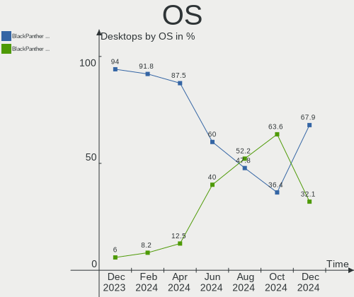
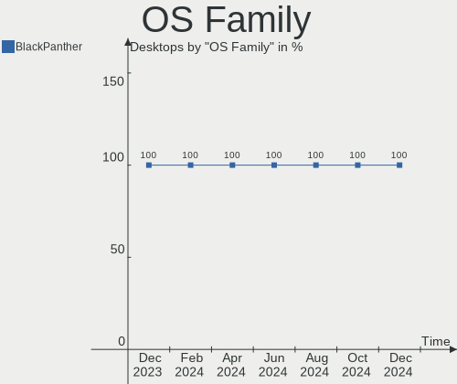
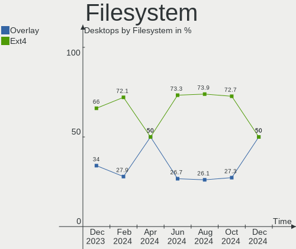
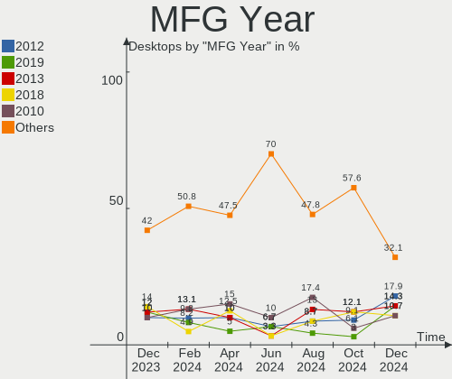
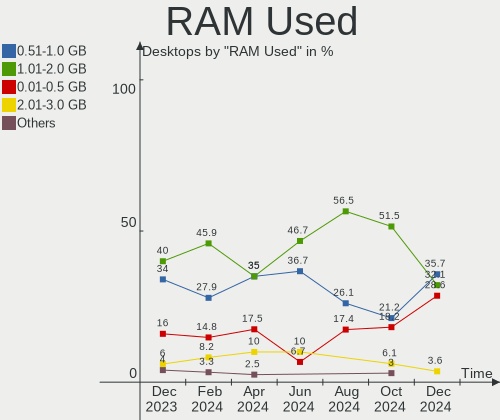
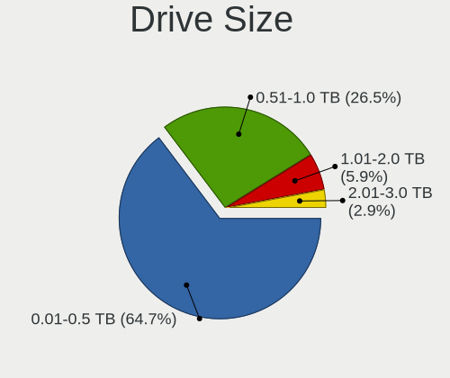
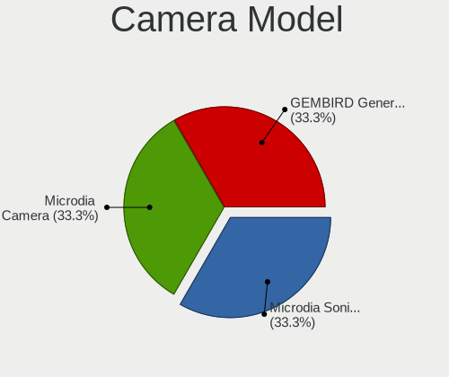

BlackPanther - Hardware Trends (Desktops)
-----------------------------------------

A project to identify most popular hardware characteristics and track their change
over time based on data collected by Linux users at https://Linux-Hardware.org.

Anyone can contribute to this report by the [hw-probe](https://github.com/linuxhw/hw-probe) tool:

    sudo -E hw-probe -all -upload

This report is for one last month. Overall report since the beginning of time: [TestDays](https://github.com/linuxhw/TestDays)

Period: Jul, 2023.

Contents
--------

* [ System ](#system)
  - [ OS                       ](#os)
  - [ OS Family                ](#os-family)
  - [ Kernel                   ](#kernel)
  - [ Kernel Family            ](#kernel-family)
  - [ Kernel Major Ver.        ](#kernel-major-ver)
  - [ Arch                     ](#arch)
  - [ DE                       ](#de)
  - [ Display Server           ](#display-server)
  - [ Display Manager          ](#display-manager)
  - [ OS Lang                  ](#os-lang)
  - [ Boot Mode                ](#boot-mode)
  - [ Filesystem               ](#filesystem)
  - [ Part. scheme             ](#part-scheme)
  - [ Dual Boot with Linux/BSD ](#dual-boot-with-linuxbsd)
  - [ Dual Boot (Win)          ](#dual-boot-win)

* [ Board ](#board)
  - [ Vendor                   ](#vendor)
  - [ Model                    ](#model)
  - [ Model Family             ](#model-family)
  - [ MFG Year                 ](#mfg-year)
  - [ Form Factor              ](#form-factor)
  - [ Secure Boot              ](#secure-boot)
  - [ Coreboot                 ](#coreboot)
  - [ RAM Size                 ](#ram-size)
  - [ RAM Used                 ](#ram-used)
  - [ Total Drives             ](#total-drives)
  - [ Has CD-ROM               ](#has-cd-rom)
  - [ Has Ethernet             ](#has-ethernet)
  - [ Has WiFi                 ](#has-wifi)
  - [ Has Bluetooth            ](#has-bluetooth)

* [ Location ](#location)
  - [ Country                  ](#country)
  - [ City                     ](#city)

* [ Drives ](#drives)
  - [ Drive Vendor             ](#drive-vendor)
  - [ Drive Model              ](#drive-model)
  - [ HDD Vendor               ](#hdd-vendor)
  - [ SSD Vendor               ](#ssd-vendor)
  - [ Drive Kind               ](#drive-kind)
  - [ Drive Connector          ](#drive-connector)
  - [ Drive Size               ](#drive-size)
  - [ Space Total              ](#space-total)
  - [ Space Used               ](#space-used)
  - [ Malfunc. Drives          ](#malfunc-drives)
  - [ Malfunc. Drive Vendor    ](#malfunc-drive-vendor)
  - [ Malfunc. HDD Vendor      ](#malfunc-hdd-vendor)
  - [ Malfunc. Drive Kind      ](#malfunc-drive-kind)
  - [ Failed Drives            ](#failed-drives)
  - [ Failed Drive Vendor      ](#failed-drive-vendor)
  - [ Drive Status             ](#drive-status)

* [ Storage controller ](#storage-controller)
  - [ Storage Vendor           ](#storage-vendor)
  - [ Storage Model            ](#storage-model)
  - [ Storage Kind             ](#storage-kind)

* [ Processor ](#processor)
  - [ CPU Vendor               ](#cpu-vendor)
  - [ CPU Model                ](#cpu-model)
  - [ CPU Model Family         ](#cpu-model-family)
  - [ CPU Cores                ](#cpu-cores)
  - [ CPU Sockets              ](#cpu-sockets)
  - [ CPU Threads              ](#cpu-threads)
  - [ CPU Op-Modes             ](#cpu-op-modes)
  - [ CPU Microcode            ](#cpu-microcode)
  - [ CPU Microarch            ](#cpu-microarch)

* [ Graphics ](#graphics)
  - [ GPU Vendor               ](#gpu-vendor)
  - [ GPU Model                ](#gpu-model)
  - [ GPU Combo                ](#gpu-combo)
  - [ GPU Driver               ](#gpu-driver)
  - [ GPU Memory               ](#gpu-memory)

* [ Monitor ](#monitor)
  - [ Monitor Vendor           ](#monitor-vendor)
  - [ Monitor Model            ](#monitor-model)
  - [ Monitor Resolution       ](#monitor-resolution)
  - [ Monitor Diagonal         ](#monitor-diagonal)
  - [ Monitor Width            ](#monitor-width)
  - [ Aspect Ratio             ](#aspect-ratio)
  - [ Monitor Area             ](#monitor-area)
  - [ Pixel Density            ](#pixel-density)
  - [ Multiple Monitors        ](#multiple-monitors)

* [ Network ](#network)
  - [ Net Controller Vendor    ](#net-controller-vendor)
  - [ Net Controller Model     ](#net-controller-model)
  - [ Wireless Vendor          ](#wireless-vendor)
  - [ Wireless Model           ](#wireless-model)
  - [ Ethernet Vendor          ](#ethernet-vendor)
  - [ Ethernet Model           ](#ethernet-model)
  - [ Net Controller Kind      ](#net-controller-kind)
  - [ Used Controller          ](#used-controller)
  - [ NICs                     ](#nics)
  - [ IPv6                     ](#ipv6)

* [ Bluetooth ](#bluetooth)
  - [ Bluetooth Vendor         ](#bluetooth-vendor)
  - [ Bluetooth Model          ](#bluetooth-model)

* [ Sound ](#sound)
  - [ Sound Vendor             ](#sound-vendor)
  - [ Sound Model              ](#sound-model)

* [ Memory ](#memory)
  - [ Memory Vendor            ](#memory-vendor)
  - [ Memory Model             ](#memory-model)
  - [ Memory Kind              ](#memory-kind)
  - [ Memory Form Factor       ](#memory-form-factor)
  - [ Memory Size              ](#memory-size)
  - [ Memory Speed             ](#memory-speed)

* [ Printers & scanners ](#printers--scanners)
  - [ Printer Vendor           ](#printer-vendor)
  - [ Printer Model            ](#printer-model)
  - [ Scanner Vendor           ](#scanner-vendor)
  - [ Scanner Model            ](#scanner-model)

* [ Camera ](#camera)
  - [ Camera Vendor            ](#camera-vendor)
  - [ Camera Model             ](#camera-model)

* [ Security ](#security)
  - [ Fingerprint Vendor       ](#fingerprint-vendor)
  - [ Fingerprint Model        ](#fingerprint-model)
  - [ Chipcard Vendor          ](#chipcard-vendor)
  - [ Chipcard Model           ](#chipcard-model)

* [ Unsupported ](#unsupported)
  - [ Unsupported Devices      ](#unsupported-devices)
  - [ Unsupported Device Types ](#unsupported-device-types)

System
------

OS
--

Installed operating systems

| Name              | Desktops | Percent |
|-------------------|----------|---------|
| BlackPanther 18.1 | 23       | 85.19%  |
| BlackPanther 22.1 | 4        | 14.81%  |

OS Family
---------

OS without a version

| Name         | Desktops | Percent |
|--------------|----------|---------|
| BlackPanther | 27       | 100%    |

Kernel
------

Version of the Linux kernel

| Version             | Desktops | Percent |
|---------------------|----------|---------|
| 5.6.14-desktop-2bP  | 17       | 62.96%  |
| 4.18.16-desktop-1bP | 5        | 18.52%  |
| 6.3.3-desktop-1bP   | 2        | 7.41%   |
| 5.15.85-desktop-1bP | 2        | 7.41%   |
| 6.3.8-desktop-1bP   | 1        | 3.7%    |

Kernel Family
-------------

Linux kernel without a distro release

| Version | Desktops | Percent |
|---------|----------|---------|
| 5.6.14  | 17       | 62.96%  |
| 4.18.16 | 5        | 18.52%  |
| 6.3.3   | 2        | 7.41%   |
| 5.15.85 | 2        | 7.41%   |
| 6.3.8   | 1        | 3.7%    |

Kernel Major Ver.
-----------------

Linux kernel major version

| Version | Desktops | Percent |
|---------|----------|---------|
| 5.6     | 17       | 62.96%  |
| 4.18    | 5        | 18.52%  |
| 6.3     | 3        | 11.11%  |
| 5.15    | 2        | 7.41%   |

Arch
----

OS architecture (x86_64, i586, etc.)

| Name   | Desktops | Percent |
|--------|----------|---------|
| x86_64 | 27       | 100%    |

DE
--

Desktop Environment

| Name    | Desktops | Percent |
|---------|----------|---------|
| KDE5    | 24       | 88.89%  |
| Unknown | 3        | 11.11%  |

Display Server
--------------

X11 or Wayland

| Name | Desktops | Percent |
|------|----------|---------|
| X11  | 27       | 100%    |

Display Manager
---------------

SDDM, LightDM, etc.

| Name | Desktops | Percent |
|------|----------|---------|
| SDDM | 27       | 100%    |

OS Lang
-------

Language

| Lang    | Desktops | Percent |
|---------|----------|---------|
| Unknown | 27       | 100%    |

Boot Mode
---------

EFI or BIOS

| Mode | Desktops | Percent |
|------|----------|---------|
| EFI  | 14       | 51.85%  |
| BIOS | 13       | 48.15%  |

Filesystem
----------

Type of filesystem

| Type    | Desktops | Percent |
|---------|----------|---------|
| Overlay | 22       | 81.48%  |
| Ext4    | 5        | 18.52%  |

Part. scheme
------------

Scheme of partitioning

| Type | Desktops | Percent |
|------|----------|---------|
| MBR  | 15       | 55.56%  |
| GPT  | 12       | 44.44%  |

Dual Boot with Linux/BSD
------------------------

Hosting more than one Linux/BSD

| Dual boot | Desktops | Percent |
|-----------|----------|---------|
| Yes       | 19       | 70.37%  |
| No        | 8        | 29.63%  |

Dual Boot (Win)
---------------

Hosting Linux and Windows

| Dual boot | Desktops | Percent |
|-----------|----------|---------|
| No        | 17       | 62.96%  |
| Yes       | 10       | 37.04%  |

Board
-----

Vendor
------

Motherboard manufacturer

| Name                | Desktops | Percent |
|---------------------|----------|---------|
| Gigabyte Technology | 10       | 37.04%  |
| Dell                | 5        | 18.52%  |
| MSI                 | 2        | 7.41%   |
| Huanan              | 2        | 7.41%   |
| Hewlett-Packard     | 2        | 7.41%   |
| ASUSTek Computer    | 2        | 7.41%   |
| Lenovo              | 1        | 3.7%    |
| Fujitsu Siemens     | 1        | 3.7%    |
| ASRock              | 1        | 3.7%    |
| Acer                | 1        | 3.7%    |

Model
-----

Motherboard model

| Name                              | Desktops | Percent |
|-----------------------------------|----------|---------|
| Huanan X99-QD4 V1.0               | 2        | 7.41%   |
| Gigabyte G31M-ES2C                | 2        | 7.41%   |
| Dell OptiPlex 3020                | 2        | 7.41%   |
| MSI MS-7C91                       | 1        | 3.7%    |
| MSI MS-7817                       | 1        | 3.7%    |
| Lenovo ThinkCentre M73 10B6001SUS | 1        | 3.7%    |
| HP EliteDesk 705 G3 SFF           | 1        | 3.7%    |
| HP Compaq 8200 Elite MT PC        | 1        | 3.7%    |
| Gigabyte Z97MX-Gaming 5           | 1        | 3.7%    |
| Gigabyte Z390 UD                  | 1        | 3.7%    |
| Gigabyte H61M-S2PV                | 1        | 3.7%    |
| Gigabyte H61M-S1                  | 1        | 3.7%    |
| Gigabyte H310M A 2.0              | 1        | 3.7%    |
| Gigabyte G31M-ES2L                | 1        | 3.7%    |
| Gigabyte F2A88XM-D3HP             | 1        | 3.7%    |
| Gigabyte B450M GAMING             | 1        | 3.7%    |
| Fujitsu Siemens ESPRIMO P5625     | 1        | 3.7%    |
| Dell Precision WorkStation T5500  | 1        | 3.7%    |
| Dell OptiPlex 755                 | 1        | 3.7%    |
| Dell OptiPlex 7010                | 1        | 3.7%    |
| ASUS Z170 PRO GAMING              | 1        | 3.7%    |
| ASUS PRIME B450-PLUS              | 1        | 3.7%    |
| ASRock FM2A75M Pro4+              | 1        | 3.7%    |
| Acer Veriton M4610G               | 1        | 3.7%    |

Model Family
------------

Motherboard model prefix

| Name                    | Desktops | Percent |
|-------------------------|----------|---------|
| Dell OptiPlex           | 4        | 14.81%  |
| Huanan X99-QD4          | 2        | 7.41%   |
| Gigabyte G31M-ES2C      | 2        | 7.41%   |
| MSI MS-7C91             | 1        | 3.7%    |
| MSI MS-7817             | 1        | 3.7%    |
| Lenovo ThinkCentre      | 1        | 3.7%    |
| HP EliteDesk            | 1        | 3.7%    |
| HP Compaq               | 1        | 3.7%    |
| Gigabyte Z97MX-Gaming   | 1        | 3.7%    |
| Gigabyte Z390           | 1        | 3.7%    |
| Gigabyte H61M-S2PV      | 1        | 3.7%    |
| Gigabyte H61M-S1        | 1        | 3.7%    |
| Gigabyte H310M          | 1        | 3.7%    |
| Gigabyte G31M-ES2L      | 1        | 3.7%    |
| Gigabyte F2A88XM-D3HP   | 1        | 3.7%    |
| Gigabyte B450M          | 1        | 3.7%    |
| Fujitsu Siemens ESPRIMO | 1        | 3.7%    |
| Dell Precision          | 1        | 3.7%    |
| ASUS Z170               | 1        | 3.7%    |
| ASUS PRIME              | 1        | 3.7%    |
| ASRock FM2A75M          | 1        | 3.7%    |
| Acer Veriton            | 1        | 3.7%    |

MFG Year
--------

Motherboard manufacture year

| Year | Desktops | Percent |
|------|----------|---------|
| 2014 | 4        | 14.81%  |
| 2018 | 3        | 11.11%  |
| 2015 | 3        | 11.11%  |
| 2008 | 3        | 11.11%  |
| 2022 | 2        | 7.41%   |
| 2013 | 2        | 7.41%   |
| 2012 | 2        | 7.41%   |
| 2011 | 2        | 7.41%   |
| 2020 | 1        | 3.7%    |
| 2019 | 1        | 3.7%    |
| 2017 | 1        | 3.7%    |
| 2010 | 1        | 3.7%    |
| 2009 | 1        | 3.7%    |
| 2007 | 1        | 3.7%    |

Form Factor
-----------

Physical design of the computer

| Name    | Desktops | Percent |
|---------|----------|---------|
| Desktop | 27       | 100%    |

Secure Boot
-----------

Enabled or disabled

| State    | Desktops | Percent |
|----------|----------|---------|
| Disabled | 27       | 100%    |

Coreboot
--------

Have coreboot on board

| Used | Desktops | Percent |
|------|----------|---------|
| No   | 27       | 100%    |

RAM Size
--------

Total RAM memory

| Size in GB | Desktops | Percent |
|------------|----------|---------|
| 3.01-4.0   | 10       | 37.04%  |
| 8.01-16.0  | 8        | 29.63%  |
| 32.01-64.0 | 4        | 14.81%  |
| 16.01-24.0 | 3        | 11.11%  |
| 4.01-8.0   | 2        | 7.41%   |

RAM Used
--------

Used RAM memory

| Used GB  | Desktops | Percent |
|----------|----------|---------|
| 0.01-0.5 | 12       | 44.44%  |
| 0.51-1.0 | 9        | 33.33%  |
| 1.01-2.0 | 5        | 18.52%  |
| 2.01-3.0 | 1        | 3.7%    |

Total Drives
------------

Number of drives on board

| Drives | Desktops | Percent |
|--------|----------|---------|
| 1      | 14       | 51.85%  |
| 2      | 10       | 37.04%  |
| 4      | 2        | 7.41%   |
| 3      | 1        | 3.7%    |

Has CD-ROM
----------

Has CD-ROM on board

| Presented | Desktops | Percent |
|-----------|----------|---------|
| Yes       | 18       | 66.67%  |
| No        | 9        | 33.33%  |

Has Ethernet
------------

Has Ethernet on board

| Presented | Desktops | Percent |
|-----------|----------|---------|
| Yes       | 27       | 100%    |

Has WiFi
--------

Has WiFi module

| Presented | Desktops | Percent |
|-----------|----------|---------|
| No        | 23       | 85.19%  |
| Yes       | 4        | 14.81%  |

Has Bluetooth
-------------

Has Bluetooth module

| Presented | Desktops | Percent |
|-----------|----------|---------|
| No        | 22       | 81.48%  |
| Yes       | 5        | 18.52%  |

Location
--------

Country
-------

Geographic location (country)

| Country      | Desktops | Percent |
|--------------|----------|---------|
| Hungary      | 24       | 88.89%  |
| South Africa | 1        | 3.7%    |
| Slovakia     | 1        | 3.7%    |
| Germany      | 1        | 3.7%    |

City
----

Geographic location (city)

| City                    | Desktops | Percent |
|-------------------------|----------|---------|
| Csongrad                | 3        | 11.11%  |
| Budapest                | 3        | 11.11%  |
| Zalaegerszeg            | 2        | 7.41%   |
| Karcag                  | 2        | 7.41%   |
| Győr                   | 2        | 7.41%   |
| Tamasi                  | 1        | 3.7%    |
| Szigetszentmiklos       | 1        | 3.7%    |
| Szekszárd              | 1        | 3.7%    |
| Sarbogard               | 1        | 3.7%    |
| Pfaffenhofen an der Ilm | 1        | 3.7%    |
| Pécs                   | 1        | 3.7%    |
| Mezotur                 | 1        | 3.7%    |
| Kiskunhalas             | 1        | 3.7%    |
| Kecskemét              | 1        | 3.7%    |
| Janoshaza               | 1        | 3.7%    |
| Isaszeg                 | 1        | 3.7%    |
| Fertoszentmiklos        | 1        | 3.7%    |
| Cape Town               | 1        | 3.7%    |
| Berettyóújfalu        | 1        | 3.7%    |
| Banská Bystrica        | 1        | 3.7%    |

Drives
------

Drive Vendor
------------

Hard drive vendors

| Vendor                | Desktops | Drives | Percent |
|-----------------------|----------|--------|---------|
| WDC                   | 12       | 16     | 28.57%  |
| Kingston              | 6        | 7      | 14.29%  |
| Samsung Electronics   | 4        | 5      | 9.52%   |
| Toshiba               | 3        | 3      | 7.14%   |
| Seagate               | 3        | 3      | 7.14%   |
| SanDisk               | 3        | 3      | 7.14%   |
| Patriot               | 2        | 2      | 4.76%   |
| HGST                  | 2        | 3      | 4.76%   |
| Fujitsu               | 2        | 2      | 4.76%   |
| A-DATA Technology     | 2        | 2      | 4.76%   |
| Realtek Semiconductor | 1        | 1      | 2.38%   |
| Intel                 | 1        | 1      | 2.38%   |
| Crucial               | 1        | 1      | 2.38%   |

Drive Model
-----------

Hard drive models

| Model                                     | Desktops | Percent |
|-------------------------------------------|----------|---------|
| Patriot Burst 120GB SSD                   | 2        | 4.26%   |
| Kingston SUV400S37120G 120GB SSD          | 2        | 4.26%   |
| Fujitsu MHV2100BH 100GB                   | 2        | 4.26%   |
| WDC WDS256G1X0C-00ENX0 256GB              | 1        | 2.13%   |
| WDC WD800JD-75MSA3 80GB                   | 1        | 2.13%   |
| WDC WD5000LPCX-22VHAT0 500GB              | 1        | 2.13%   |
| WDC WD5000BPKT-75PK4T0 500GB              | 1        | 2.13%   |
| WDC WD5000AAKX-08U6AA0 500GB              | 1        | 2.13%   |
| WDC WD5000AAKS-00UU3A0 500GB              | 1        | 2.13%   |
| WDC WD5000AAKS-007AA0 500GB               | 1        | 2.13%   |
| WDC WD30EFRX-68EUZN0 3TB                  | 1        | 2.13%   |
| WDC WD2500AAKX-00ERMA0 250GB              | 1        | 2.13%   |
| WDC WD20EZRZ-00Z5HB0 2TB                  | 1        | 2.13%   |
| WDC WD20EZRX-00D8PB0 2TB                  | 1        | 2.13%   |
| WDC WD20EZBX-00AYRA0 2TB                  | 1        | 2.13%   |
| WDC WD10PURZ-85U8XY0 1TB                  | 1        | 2.13%   |
| WDC WD10EZRX-00L4HB0 1TB                  | 1        | 2.13%   |
| WDC WD10EZEX-00KUWA0 1TB                  | 1        | 2.13%   |
| Toshiba HDWD130 3TB                       | 1        | 2.13%   |
| Toshiba DT01ACA100 1TB                    | 1        | 2.13%   |
| Toshiba DT01ACA050 LENOVO 500GB           | 1        | 2.13%   |
| Seagate ST500DM002-1BD142 500GB           | 1        | 2.13%   |
| Seagate ST3250318AS 250GB                 | 1        | 2.13%   |
| Seagate ST250DM000-1BD141 250GB           | 1        | 2.13%   |
| SanDisk SDSSDP128G 128GB                  | 1        | 2.13%   |
| SanDisk SDSSDH3512G 512GB                 | 1        | 2.13%   |
| SanDisk NVMe SSD Drive 2TB                | 1        | 2.13%   |
| Samsung SSD 970 EVO Plus 500GB            | 1        | 2.13%   |
| Samsung SSD 960 EVO 500GB                 | 1        | 2.13%   |
| Samsung SSD 860 EVO 500GB                 | 1        | 2.13%   |
| Samsung SSD 850 EVO 250GB                 | 1        | 2.13%   |
| Samsung SSD 850 EVO 120GB                 | 1        | 2.13%   |
| Realtek RTS5763DL NVMe SSD Controller 1TB | 1        | 2.13%   |
| Kingston SV300S37A120G 120GB SSD          | 1        | 2.13%   |
| Kingston SA400S37480G 480GB SSD           | 1        | 2.13%   |
| Kingston SA400S37240G 240GB SSD           | 1        | 2.13%   |
| Kingston SA400S37120G 120GB SSD           | 1        | 2.13%   |
| Kingston SA2000M8250G 250GB               | 1        | 2.13%   |
| Intel SSDSC2KF240H6L 240GB                | 1        | 2.13%   |
| HGST HTS541010B7E610 1TB                  | 1        | 2.13%   |

HDD Vendor
----------

Hard disk drive vendors

| Vendor  | Desktops | Drives | Percent |
|---------|----------|--------|---------|
| WDC     | 11       | 15     | 52.38%  |
| Toshiba | 3        | 3      | 14.29%  |
| Seagate | 3        | 3      | 14.29%  |
| HGST    | 2        | 3      | 9.52%   |
| Fujitsu | 2        | 2      | 9.52%   |

SSD Vendor
----------

Solid state drive vendors

| Vendor              | Desktops | Drives | Percent |
|---------------------|----------|--------|---------|
| Kingston            | 5        | 6      | 31.25%  |
| Samsung Electronics | 3        | 3      | 18.75%  |
| SanDisk             | 2        | 2      | 12.5%   |
| Patriot             | 2        | 2      | 12.5%   |
| A-DATA Technology   | 2        | 2      | 12.5%   |
| Intel               | 1        | 1      | 6.25%   |
| Crucial             | 1        | 1      | 6.25%   |

Drive Kind
----------

HDD or SSD

| Kind | Desktops | Drives | Percent |
|------|----------|--------|---------|
| HDD  | 21       | 26     | 53.85%  |
| SSD  | 12       | 17     | 30.77%  |
| NVMe | 6        | 6      | 15.38%  |

Drive Connector
---------------

SATA, SAS, NVMe, etc.

| Type | Desktops | Drives | Percent |
|------|----------|--------|---------|
| SATA | 25       | 43     | 80.65%  |
| NVMe | 6        | 6      | 19.35%  |

Drive Size
----------

Size of hard drive

| Size in TB | Desktops | Drives | Percent |
|------------|----------|--------|---------|
| 0.01-0.5   | 21       | 28     | 61.76%  |
| 0.51-1.0   | 7        | 7      | 20.59%  |
| 1.01-2.0   | 3        | 3      | 8.82%   |
| 2.01-3.0   | 2        | 3      | 5.88%   |
| 3.01-4.0   | 1        | 2      | 2.94%   |

Space Total
-----------

Amount of disk space available on the file system

| Size in GB     | Desktops | Percent |
|----------------|----------|---------|
| Unknown        | 22       | 81.48%  |
| 101-250        | 2        | 7.41%   |
| More than 3000 | 1        | 3.7%    |
| 501-1000       | 1        | 3.7%    |
| 51-100         | 1        | 3.7%    |

Space Used
----------

Amount of used disk space

| Used GB   | Desktops | Percent |
|-----------|----------|---------|
| Unknown   | 22       | 81.48%  |
| 1-20      | 3        | 11.11%  |
| 251-500   | 1        | 3.7%    |
| 1001-2000 | 1        | 3.7%    |

Malfunc. Drives
---------------

Drive models with a malfunction

| Model                             | Desktops | Drives | Percent |
|-----------------------------------|----------|--------|---------|
| Fujitsu MHV2100BH 100GB           | 2        | 2      | 20%     |
| WDC WD5000AAKX-08U6AA0 500GB      | 1        | 1      | 10%     |
| WDC WD5000AAKS-00UU3A0 500GB      | 1        | 1      | 10%     |
| WDC WD5000AAKS-007AA0 500GB       | 1        | 1      | 10%     |
| WDC WD10PURZ-85U8XY0 1TB          | 1        | 1      | 10%     |
| WDC WD10EZRX-00L4HB0 1TB          | 1        | 1      | 10%     |
| Toshiba HDWD130 3TB               | 1        | 1      | 10%     |
| Intel SSDSC2KF240H6L 240GB        | 1        | 1      | 10%     |
| A-DATA Technology SU630 240GB SSD | 1        | 1      | 10%     |

Malfunc. Drive Vendor
---------------------

Vendors of faulty drives

| Vendor            | Desktops | Drives | Percent |
|-------------------|----------|--------|---------|
| WDC               | 4        | 5      | 44.44%  |
| Fujitsu           | 2        | 2      | 22.22%  |
| Toshiba           | 1        | 1      | 11.11%  |
| Intel             | 1        | 1      | 11.11%  |
| A-DATA Technology | 1        | 1      | 11.11%  |

Malfunc. HDD Vendor
-------------------

Vendors of faulty HDD drives

| Vendor  | Desktops | Drives | Percent |
|---------|----------|--------|---------|
| WDC     | 4        | 5      | 57.14%  |
| Fujitsu | 2        | 2      | 28.57%  |
| Toshiba | 1        | 1      | 14.29%  |

Malfunc. Drive Kind
-------------------

Kinds of faulty drives

| Kind | Desktops | Drives | Percent |
|------|----------|--------|---------|
| HDD  | 7        | 8      | 77.78%  |
| SSD  | 2        | 2      | 22.22%  |

Failed Drives
-------------

Failed drive models

Zero info for selected period =(

Failed Drive Vendor
-------------------

Failed drive vendors

Zero info for selected period =(

Drive Status
------------

Number of failed and malfunc. drives

| Status   | Desktops | Drives | Percent |
|----------|----------|--------|---------|
| Works    | 23       | 38     | 69.7%   |
| Malfunc  | 9        | 10     | 27.27%  |
| Detected | 1        | 1      | 3.03%   |

Storage controller
------------------

Storage Vendor
--------------

Storage controller vendors

| Vendor                      | Desktops | Percent |
|-----------------------------|----------|---------|
| Intel                       | 19       | 59.38%  |
| AMD                         | 6        | 18.75%  |
| SanDisk                     | 2        | 6.25%   |
| Samsung Electronics         | 2        | 6.25%   |
| Realtek Semiconductor       | 1        | 3.13%   |
| Nvidia                      | 1        | 3.13%   |
| Kingston Technology Company | 1        | 3.13%   |

Storage Model
-------------

Storage controller models

| Model                                                                                   | Desktops | Percent |
|-----------------------------------------------------------------------------------------|----------|---------|
| Intel 8 Series/C220 Series Chipset Family 6-port SATA Controller 1 [AHCI mode]          | 4        | 9.52%   |
| Intel 6 Series/C200 Series Chipset Family Desktop SATA Controller (IDE mode, ports 4-5) | 4        | 9.52%   |
| Intel 6 Series/C200 Series Chipset Family Desktop SATA Controller (IDE mode, ports 0-3) | 4        | 9.52%   |
| AMD FCH SATA Controller [AHCI mode]                                                     | 4        | 9.52%   |
| Intel NM10/ICH7 Family SATA Controller [IDE mode]                                       | 3        | 7.14%   |
| AMD 400 Series Chipset SATA Controller                                                  | 2        | 4.76%   |
| SanDisk WD Blue SN570 NVMe SSD 2TB                                                      | 1        | 2.38%   |
| SanDisk WD Black NVMe SSD                                                               | 1        | 2.38%   |
| Samsung NVMe SSD Controller SM981/PM981/PM983                                           | 1        | 2.38%   |
| Samsung NVMe SSD Controller SM961/PM961/SM963                                           | 1        | 2.38%   |
| Realtek RTS5763DL NVMe SSD Controller                                                   | 1        | 2.38%   |
| Nvidia MCP78S [GeForce 8200] AHCI Controller                                            | 1        | 2.38%   |
| Kingston Company A2000 NVMe SSD                                                         | 1        | 2.38%   |
| Intel SATA Controller [RAID mode]                                                       | 1        | 2.38%   |
| Intel Q170/Q150/B150/H170/H110/Z170/CM236 Chipset SATA Controller [AHCI Mode]           | 1        | 2.38%   |
| Intel Cannon Lake PCH SATA AHCI Controller                                              | 1        | 2.38%   |
| Intel 9 Series Chipset Family SATA Controller [AHCI Mode]                               | 1        | 2.38%   |
| Intel 82Q35 Express PT IDER Controller                                                  | 1        | 2.38%   |
| Intel 82801IR/IO/IH (ICH9R/DO/DH) 6 port SATA Controller [AHCI mode]                    | 1        | 2.38%   |
| Intel 8 Series/C220 Series Chipset Family 4-port SATA Controller 1 [IDE mode]           | 1        | 2.38%   |
| Intel 7 Series/C210 Series Chipset Family 6-port SATA Controller [AHCI mode]            | 1        | 2.38%   |
| Intel 6 Series/C200 Series Chipset Family IDE-r Controller                              | 1        | 2.38%   |
| Intel 6 Series/C200 Series Chipset Family 6 port Desktop SATA AHCI Controller           | 1        | 2.38%   |
| Intel 200 Series PCH SATA controller [AHCI mode]                                        | 1        | 2.38%   |
| AMD FCH IDE Controller                                                                  | 1        | 2.38%   |
| AMD 500 Series Chipset SATA Controller                                                  | 1        | 2.38%   |
| AMD 300 Series Chipset SATA Controller                                                  | 1        | 2.38%   |

Storage Kind
------------

Kind of storage controller (IDE, SATA, NVMe, SAS, ...)

| Kind | Desktops | Percent |
|------|----------|---------|
| SATA | 18       | 51.43%  |
| IDE  | 10       | 28.57%  |
| NVMe | 6        | 17.14%  |
| RAID | 1        | 2.86%   |

Processor
---------

CPU Vendor
----------

Processor vendors

| Vendor | Desktops | Percent |
|--------|----------|---------|
| Intel  | 20       | 74.07%  |
| AMD    | 7        | 25.93%  |

CPU Model
---------

Processor models

| Model                                           | Desktops | Percent |
|-------------------------------------------------|----------|---------|
| Intel Xeon CPU E5-2696 v3 @ 2.30GHz             | 2        | 7.41%   |
| Intel Xeon CPU E5530 @ 2.40GHz                  | 1        | 3.7%    |
| Intel Pentium Dual-Core CPU E5400 @ 2.70GHz     | 1        | 3.7%    |
| Intel Pentium CPU G3220 @ 3.00GHz               | 1        | 3.7%    |
| Intel Core i7-6700K CPU @ 4.00GHz               | 1        | 3.7%    |
| Intel Core i5-9400 CPU @ 2.90GHz                | 1        | 3.7%    |
| Intel Core i5-4590 CPU @ 3.30GHz                | 1        | 3.7%    |
| Intel Core i5-3470S CPU @ 2.90GHz               | 1        | 3.7%    |
| Intel Core i5-3470 CPU @ 3.20GHz                | 1        | 3.7%    |
| Intel Core i5-2400 CPU @ 3.10GHz                | 1        | 3.7%    |
| Intel Core i3-9100F CPU @ 3.60GHz               | 1        | 3.7%    |
| Intel Core i3-4170 CPU @ 3.70GHz                | 1        | 3.7%    |
| Intel Core i3-4160 CPU @ 3.60GHz                | 1        | 3.7%    |
| Intel Core i3-4130 CPU @ 3.40GHz                | 1        | 3.7%    |
| Intel Core i3-3220 CPU @ 3.30GHz                | 1        | 3.7%    |
| Intel Core i3-2120 CPU @ 3.30GHz                | 1        | 3.7%    |
| Intel Core 2 Quad CPU Q6600 @ 2.40GHz           | 1        | 3.7%    |
| Intel Core 2 Duo CPU E8500 @ 3.16GHz            | 1        | 3.7%    |
| Intel Core 2 Duo CPU E6750 @ 2.66GHz            | 1        | 3.7%    |
| AMD Ryzen 7 5800X 8-Core Processor              | 1        | 3.7%    |
| AMD Ryzen 5 3400G with Radeon Vega Graphics     | 1        | 3.7%    |
| AMD Ryzen 5 2600X Six-Core Processor            | 1        | 3.7%    |
| AMD PRO A6-9500 R5, 8 COMPUTE CORES 2C+6G       | 1        | 3.7%    |
| AMD Athlon Dual Core Processor 5000B            | 1        | 3.7%    |
| AMD A8-6600K APU with Radeon HD Graphics        | 1        | 3.7%    |
| AMD A10-7850K Radeon R7, 12 Compute Cores 4C+8G | 1        | 3.7%    |

CPU Model Family
----------------

Processor model prefix

| Model                   | Desktops | Percent |
|-------------------------|----------|---------|
| Intel Core i3           | 6        | 22.22%  |
| Intel Core i5           | 5        | 18.52%  |
| Intel Xeon              | 3        | 11.11%  |
| Intel Core 2 Duo        | 2        | 7.41%   |
| AMD Ryzen 5             | 2        | 7.41%   |
| Other                   | 1        | 3.7%    |
| Intel Pentium Dual-Core | 1        | 3.7%    |
| Intel Pentium           | 1        | 3.7%    |
| Intel Core i7           | 1        | 3.7%    |
| Intel Core 2 Quad       | 1        | 3.7%    |
| AMD Ryzen 7             | 1        | 3.7%    |
| AMD Athlon Dual Core    | 1        | 3.7%    |
| AMD A8                  | 1        | 3.7%    |
| AMD A10                 | 1        | 3.7%    |

CPU Cores
---------

Number of processor cores

| Number | Desktops | Percent |
|--------|----------|---------|
| 2      | 12       | 44.44%  |
| 4      | 9        | 33.33%  |
| 10     | 2        | 7.41%   |
| 6      | 2        | 7.41%   |
| 8      | 1        | 3.7%    |
| 1      | 1        | 3.7%    |

CPU Sockets
-----------

Number of sockets

| Number | Desktops | Percent |
|--------|----------|---------|
| 1      | 27       | 100%    |

CPU Threads
-----------

Threads per core (Hyper-Threading)

| Number | Desktops | Percent |
|--------|----------|---------|
| 2      | 14       | 51.85%  |
| 1      | 13       | 48.15%  |

CPU Op-Modes
------------

CPU Operation Modes (32-bit, 64-bit)

| Op mode        | Desktops | Percent |
|----------------|----------|---------|
| 32-bit, 64-bit | 27       | 100%    |

CPU Microcode
-------------

Microcode number

| Number     | Desktops | Percent |
|------------|----------|---------|
| 0x306c3    | 5        | 18.52%  |
| 0x306a9    | 3        | 11.11%  |
| Unknown    | 3        | 11.11%  |
| 0x6fb      | 2        | 7.41%   |
| 0x206a7    | 2        | 7.41%   |
| 0x1067a    | 2        | 7.41%   |
| 0x906eb    | 1        | 3.7%    |
| 0x906ea    | 1        | 3.7%    |
| 0x506e3    | 1        | 3.7%    |
| 0x106a5    | 1        | 3.7%    |
| 0x0a20120a | 1        | 3.7%    |
| 0x08108109 | 1        | 3.7%    |
| 0x0800820d | 1        | 3.7%    |
| 0x0600611a | 1        | 3.7%    |
| 0x06003106 | 1        | 3.7%    |
| 0x06001119 | 1        | 3.7%    |

CPU Microarch
-------------

Microarchitecture

| Name        | Desktops | Percent |
|-------------|----------|---------|
| Haswell     | 7        | 25.93%  |
| IvyBridge   | 3        | 11.11%  |
| Zen+        | 2        | 7.41%   |
| SandyBridge | 2        | 7.41%   |
| Penryn      | 2        | 7.41%   |
| KabyLake    | 2        | 7.41%   |
| Core        | 2        | 7.41%   |
| Zen 3       | 1        | 3.7%    |
| Steamroller | 1        | 3.7%    |
| Skylake     | 1        | 3.7%    |
| Piledriver  | 1        | 3.7%    |
| Nehalem     | 1        | 3.7%    |
| K8 Hammer   | 1        | 3.7%    |
| Excavator   | 1        | 3.7%    |

Graphics
--------

GPU Vendor
----------

Vendors of graphics cards

| Vendor | Desktops | Percent |
|--------|----------|---------|
| Nvidia | 15       | 53.57%  |
| Intel  | 7        | 25%     |
| AMD    | 6        | 21.43%  |

GPU Model
---------

Graphics card models

| Model                                                                       | Desktops | Percent |
|-----------------------------------------------------------------------------|----------|---------|
| Nvidia GK208B [GeForce GT 710]                                              | 3        | 10.34%  |
| Nvidia GA104 [GeForce RTX 3060 Ti Lite Hash Rate]                           | 2        | 6.9%    |
| Intel Xeon E3-1200 v3/4th Gen Core Processor Integrated Graphics Controller | 2        | 6.9%    |
| Intel 4th Generation Core Processor Family Integrated Graphics Controller   | 2        | 6.9%    |
| Nvidia TU106 [GeForce RTX 2070]                                             | 1        | 3.45%   |
| Nvidia GT218 [GeForce G210]                                                 | 1        | 3.45%   |
| Nvidia GP106 [GeForce GTX 1060 6GB]                                         | 1        | 3.45%   |
| Nvidia GM206 [GeForce GTX 960]                                              | 1        | 3.45%   |
| Nvidia GM107GL [Quadro K620]                                                | 1        | 3.45%   |
| Nvidia GM107 [GeForce GTX 750 Ti]                                           | 1        | 3.45%   |
| Nvidia GF116 [GeForce GTX 550 Ti]                                           | 1        | 3.45%   |
| Nvidia GF108 [GeForce GT 630]                                               | 1        | 3.45%   |
| Nvidia GA106 [Geforce RTX 3050]                                             | 1        | 3.45%   |
| Nvidia G96CGL [Quadro FX 580]                                               | 1        | 3.45%   |
| Nvidia G96C [GeForce 9500 GT]                                               | 1        | 3.45%   |
| Intel Xeon E3-1200 v2/3rd Gen Core processor Graphics Controller            | 1        | 3.45%   |
| Intel 82G33/G31 Express Integrated Graphics Controller                      | 1        | 3.45%   |
| Intel 2nd Generation Core Processor Family Integrated Graphics Controller   | 1        | 3.45%   |
| AMD Wani [Radeon R5/R6/R7 Graphics]                                         | 1        | 3.45%   |
| AMD Richland [Radeon HD 8570D]                                              | 1        | 3.45%   |
| AMD Picasso/Raven 2 [Radeon Vega Series / Radeon Vega Mobile Series]        | 1        | 3.45%   |
| AMD Oland PRO [Radeon R7 240/340 / Radeon 520]                              | 1        | 3.45%   |
| AMD Lexa PRO [Radeon 540/540X/550/550X / RX 540X/550/550X]                  | 1        | 3.45%   |
| AMD Kaveri [Radeon R7 Graphics]                                             | 1        | 3.45%   |

GPU Combo
---------

Combinations of graphics cards

| Name       | Desktops | Percent |
|------------|----------|---------|
| 1 x Nvidia | 14       | 51.85%  |
| 1 x Intel  | 6        | 22.22%  |
| 1 x AMD    | 6        | 22.22%  |
| 2 x Nvidia | 1        | 3.7%    |

GPU Driver
----------

Free vs proprietary

| Driver | Desktops | Percent |
|--------|----------|---------|
| Free   | 27       | 100%    |

GPU Memory
----------

Total video memory

| Size in GB | Desktops | Percent |
|------------|----------|---------|
| 0.51-1.0   | 8        | 29.63%  |
| Unknown    | 6        | 22.22%  |
| 1.01-2.0   | 4        | 14.81%  |
| 7.01-8.0   | 3        | 11.11%  |
| 0.01-0.5   | 3        | 11.11%  |
| 3.01-4.0   | 2        | 7.41%   |
| 5.01-6.0   | 1        | 3.7%    |

Monitor
-------

Monitor Vendor
--------------

Monitor vendors

| Vendor                  | Desktops | Percent |
|-------------------------|----------|---------|
| Samsung Electronics     | 5        | 20.83%  |
| Goldstar                | 3        | 12.5%   |
| Ancor Communications    | 3        | 12.5%   |
| Philips                 | 2        | 8.33%   |
| Dell                    | 2        | 8.33%   |
| BenQ                    | 2        | 8.33%   |
| AOC                     | 2        | 8.33%   |
| ViewSonic               | 1        | 4.17%   |
| Medion                  | 1        | 4.17%   |
| Iiyama                  | 1        | 4.17%   |
| CVT                     | 1        | 4.17%   |
| Chi Mei Optoelectronics | 1        | 4.17%   |

Monitor Model
-------------

Monitor models

| Model                                                                    | Desktops | Percent |
|--------------------------------------------------------------------------|----------|---------|
| BenQ EW277HDR BNQ7948 1920x1080 598x336mm 27.0-inch                      | 2        | 8%      |
| AOC Q32G1WG4 AOC3201 2560x1440 697x393mm 31.5-inch                       | 2        | 8%      |
| ViewSonic VG2236 SERIES VSCE726 1920x1080 477x268mm 21.5-inch            | 1        | 4%      |
| Samsung Electronics SyncMaster SAM037B 1680x1050 474x296mm 22.0-inch     | 1        | 4%      |
| Samsung Electronics S27E500 SAM0D0D 1920x1080 598x336mm 27.0-inch        | 1        | 4%      |
| Samsung Electronics S24D300 SAM0B45 1920x1080 521x293mm 23.5-inch        | 1        | 4%      |
| Samsung Electronics S22B370 SAM08BD 1920x1080 477x268mm 21.5-inch        | 1        | 4%      |
| Samsung Electronics LS27AG30x SAM717A 1920x1080 597x336mm 27.0-inch      | 1        | 4%      |
| Samsung Electronics LCD Monitor SAM0679 1360x768 410x256mm 19.0-inch     | 1        | 4%      |
| Philips PHL 223V5 PHLC0CF 1920x1080 477x268mm 21.5-inch                  | 1        | 4%      |
| Philips 190WV PHLC014 1440x900 408x255mm 18.9-inch                       | 1        | 4%      |
| Medion MD20666 MED3673 1920x1080 533x312mm 24.3-inch                     | 1        | 4%      |
| Iiyama PLX2783H IVM6648 1920x1080 598x336mm 27.0-inch                    | 1        | 4%      |
| Goldstar W2242 GSM5678 1680x1050 474x296mm 22.0-inch                     | 1        | 4%      |
| Goldstar L1919S GSM4AF2 1280x1024 338x270mm 17.0-inch                    | 1        | 4%      |
| Goldstar 2D FHD TV GSM59C6 1920x1080 509x286mm 23.0-inch                 | 1        | 4%      |
| Dell S2719H DELD0CE 1920x1080 598x336mm 27.0-inch                        | 1        | 4%      |
| Dell E1912H DELF03E 1366x768 410x230mm 18.5-inch                         | 1        | 4%      |
| CVT CVTE TV CVT0003 1360x768 575x323mm 26.0-inch                         | 1        | 4%      |
| Chi Mei Optoelectronics CMC 19" AD CMO0198 1280x1024 338x270mm 17.0-inch | 1        | 4%      |
| Ancor Communications VX228 ACI22C1 1920x1080 476x268mm 21.5-inch         | 1        | 4%      |
| Ancor Communications VG248 ACI24A5 1920x1080 531x299mm 24.0-inch         | 1        | 4%      |
| Ancor Communications ASUS VS228 ACI22FD 1920x1080 476x268mm 21.5-inch    | 1        | 4%      |

Monitor Resolution
------------------

Monitor screen resolution

| Resolution         | Desktops | Percent |
|--------------------|----------|---------|
| 1920x1080 (FHD)    | 14       | 60.87%  |
| 3840x2160 (4K)     | 2        | 8.7%    |
| 1680x1050 (WSXGA+) | 2        | 8.7%    |
| 1280x1024 (SXGA)   | 2        | 8.7%    |
| 1440x900 (WXGA+)   | 1        | 4.35%   |
| 1366x768 (WXGA)    | 1        | 4.35%   |
| 1360x768           | 1        | 4.35%   |

Monitor Diagonal
----------------

Diagonal size in inches

| Inches | Desktops | Percent |
|--------|----------|---------|
| 27     | 6        | 24%     |
| 21     | 5        | 20%     |
| 23     | 3        | 12%     |
| 19     | 3        | 12%     |
| 31     | 2        | 8%      |
| 24     | 2        | 8%      |
| 18     | 2        | 8%      |
| 26     | 1        | 4%      |
| 22     | 1        | 4%      |

Monitor Width
-------------

Physical width

| Width in mm | Desktops | Percent |
|-------------|----------|---------|
| 501-600     | 11       | 44%     |
| 401-500     | 10       | 40%     |
| 601-700     | 2        | 8%      |
| 351-400     | 2        | 8%      |

Aspect Ratio
------------

Proportional relationship between the width and the height

| Ratio | Desktops | Percent |
|-------|----------|---------|
| 16/9  | 17       | 73.91%  |
| 16/10 | 3        | 13.04%  |
| 5/4   | 2        | 8.7%    |
| 3/2   | 1        | 4.35%   |

Monitor Area
------------

Area in inch²

| Area in inch² | Desktops | Percent |
|----------------|----------|---------|
| 201-250        | 9        | 36%     |
| 301-350        | 6        | 24%     |
| 151-200        | 5        | 20%     |
| 351-500        | 2        | 8%      |
| 251-300        | 2        | 8%      |
| 141-150        | 1        | 4%      |

Pixel Density
-------------

Pixels per inch

| Density | Desktops | Percent |
|---------|----------|---------|
| 51-100  | 20       | 80%     |
| 101-120 | 5        | 20%     |

Multiple Monitors
-----------------

Total monitors connected

| Total | Desktops | Percent |
|-------|----------|---------|
| 1     | 25       | 92.59%  |
| 2     | 2        | 7.41%   |

Network
-------

Net Controller Vendor
---------------------

Controller vendors

| Vendor                | Desktops | Percent |
|-----------------------|----------|---------|
| Realtek Semiconductor | 15       | 46.88%  |
| Intel                 | 6        | 18.75%  |
| Qualcomm Atheros      | 5        | 15.63%  |
| Broadcom              | 3        | 9.38%   |
| Ralink Technology     | 2        | 6.25%   |
| Ralink                | 1        | 3.13%   |

Net Controller Model
--------------------

Controller models

| Model                                                             | Desktops | Percent |
|-------------------------------------------------------------------|----------|---------|
| Realtek RTL8111/8168/8411 PCI Express Gigabit Ethernet Controller | 15       | 42.86%  |
| Intel 82579LM Gigabit Network Connection (Lewisville)             | 3        | 8.57%   |
| Ralink MT7601U Wireless Adapter                                   | 2        | 5.71%   |
| Intel Ethernet Connection (2) I219-V                              | 2        | 5.71%   |
| Realtek RTL8188EE Wireless Network Adapter                        | 1        | 2.86%   |
| Realtek RTL8125 2.5GbE Controller                                 | 1        | 2.86%   |
| Realtek RTL810xE PCI Express Fast Ethernet controller             | 1        | 2.86%   |
| Ralink RT2561/RT61 802.11g PCI                                    | 1        | 2.86%   |
| Qualcomm Atheros QCA8171 Gigabit Ethernet                         | 1        | 2.86%   |
| Qualcomm Atheros Killer E220x Gigabit Ethernet Controller         | 1        | 2.86%   |
| Qualcomm Atheros AR9287 Wireless Network Adapter (PCI-Express)    | 1        | 2.86%   |
| Qualcomm Atheros AR8132 Fast Ethernet                             | 1        | 2.86%   |
| Qualcomm Atheros AR8131 Gigabit Ethernet                          | 1        | 2.86%   |
| Intel 82566DM-2 Gigabit Network Connection                        | 1        | 2.86%   |
| Broadcom NetXtreme BCM5762 Gigabit Ethernet PCIe                  | 1        | 2.86%   |
| Broadcom NetXtreme BCM5761 Gigabit Ethernet PCIe                  | 1        | 2.86%   |
| Broadcom NetLink BCM5787 Gigabit Ethernet PCI Express             | 1        | 2.86%   |

Wireless Vendor
---------------

Wireless vendors

| Vendor                | Desktops | Percent |
|-----------------------|----------|---------|
| Ralink Technology     | 2        | 40%     |
| Realtek Semiconductor | 1        | 20%     |
| Ralink                | 1        | 20%     |
| Qualcomm Atheros      | 1        | 20%     |

Wireless Model
--------------

Wireless models

| Model                                                          | Desktops | Percent |
|----------------------------------------------------------------|----------|---------|
| Ralink MT7601U Wireless Adapter                                | 2        | 40%     |
| Realtek RTL8188EE Wireless Network Adapter                     | 1        | 20%     |
| Ralink RT2561/RT61 802.11g PCI                                 | 1        | 20%     |
| Qualcomm Atheros AR9287 Wireless Network Adapter (PCI-Express) | 1        | 20%     |

Ethernet Vendor
---------------

Ethernet vendors

| Vendor                | Desktops | Percent |
|-----------------------|----------|---------|
| Realtek Semiconductor | 15       | 53.57%  |
| Intel                 | 6        | 21.43%  |
| Qualcomm Atheros      | 4        | 14.29%  |
| Broadcom              | 3        | 10.71%  |

Ethernet Model
--------------

Ethernet models

| Model                                                             | Desktops | Percent |
|-------------------------------------------------------------------|----------|---------|
| Realtek RTL8111/8168/8411 PCI Express Gigabit Ethernet Controller | 15       | 50%     |
| Intel 82579LM Gigabit Network Connection (Lewisville)             | 3        | 10%     |
| Intel Ethernet Connection (2) I219-V                              | 2        | 6.67%   |
| Realtek RTL8125 2.5GbE Controller                                 | 1        | 3.33%   |
| Realtek RTL810xE PCI Express Fast Ethernet controller             | 1        | 3.33%   |
| Qualcomm Atheros QCA8171 Gigabit Ethernet                         | 1        | 3.33%   |
| Qualcomm Atheros Killer E220x Gigabit Ethernet Controller         | 1        | 3.33%   |
| Qualcomm Atheros AR8132 Fast Ethernet                             | 1        | 3.33%   |
| Qualcomm Atheros AR8131 Gigabit Ethernet                          | 1        | 3.33%   |
| Intel 82566DM-2 Gigabit Network Connection                        | 1        | 3.33%   |
| Broadcom NetXtreme BCM5762 Gigabit Ethernet PCIe                  | 1        | 3.33%   |
| Broadcom NetXtreme BCM5761 Gigabit Ethernet PCIe                  | 1        | 3.33%   |
| Broadcom NetLink BCM5787 Gigabit Ethernet PCI Express             | 1        | 3.33%   |

Net Controller Kind
-------------------

Ethernet, WiFi or modem

| Kind     | Desktops | Percent |
|----------|----------|---------|
| Ethernet | 27       | 87.1%   |
| WiFi     | 4        | 12.9%   |

Used Controller
---------------

Currently used network controller

| Kind     | Desktops | Percent |
|----------|----------|---------|
| Ethernet | 25       | 92.59%  |
| WiFi     | 2        | 7.41%   |

NICs
----

Total network controllers on board

| Total | Desktops | Percent |
|-------|----------|---------|
| 1     | 22       | 81.48%  |
| 2     | 4        | 14.81%  |
| 3     | 1        | 3.7%    |

IPv6
----

IPv6 vs IPv4

| Used | Desktops | Percent |
|------|----------|---------|
| No   | 14       | 51.85%  |
| Yes  | 13       | 48.15%  |

Bluetooth
---------

Bluetooth Vendor
----------------

Controller vendors

| Vendor                  | Desktops | Percent |
|-------------------------|----------|---------|
| Cambridge Silicon Radio | 4        | 80%     |
| TP-Link                 | 1        | 20%     |

Bluetooth Model
---------------

Controller models

| Model                                               | Desktops | Percent |
|-----------------------------------------------------|----------|---------|
| Cambridge Silicon Radio Bluetooth Dongle (HCI mode) | 4        | 80%     |
| TP-Link UB500 Adapter                               | 1        | 20%     |

Sound
-----

Sound Vendor
------------

Sound card vendors

| Vendor            | Desktops | Percent |
|-------------------|----------|---------|
| Intel             | 20       | 46.51%  |
| Nvidia            | 13       | 30.23%  |
| AMD               | 8        | 18.6%   |
| Texas Instruments | 1        | 2.33%   |
| Creative Labs     | 1        | 2.33%   |

Sound Model
-----------

Sound card models

| Model                                                                                           | Desktops | Percent |
|-------------------------------------------------------------------------------------------------|----------|---------|
| Intel 8 Series/C220 Series Chipset High Definition Audio Controller                             | 6        | 11.32%  |
| Intel Xeon E3-1200 v3/4th Gen Core Processor HD Audio Controller                                | 4        | 7.55%   |
| Intel 6 Series/C200 Series Chipset Family High Definition Audio Controller                      | 4        | 7.55%   |
| Nvidia GK208 HDMI/DP Audio Controller                                                           | 3        | 5.66%   |
| Intel NM10/ICH7 Family High Definition Audio Controller                                         | 3        | 5.66%   |
| Nvidia GM107 High Definition Audio Controller [GeForce 940MX]                                   | 2        | 3.77%   |
| Nvidia GA104 High Definition Audio Controller                                                   | 2        | 3.77%   |
| AMD FCH Azalia Controller                                                                       | 2        | 3.77%   |
| Texas Instruments PCM2902 Audio Codec                                                           | 1        | 1.89%   |
| Nvidia TU106 High Definition Audio Controller                                                   | 1        | 1.89%   |
| Nvidia MCP72XE/MCP72P/MCP78U/MCP78S High Definition Audio                                       | 1        | 1.89%   |
| Nvidia High Definition Audio Controller                                                         | 1        | 1.89%   |
| Nvidia GP106 High Definition Audio Controller                                                   | 1        | 1.89%   |
| Nvidia GM206 High Definition Audio Controller                                                   | 1        | 1.89%   |
| Nvidia GF116 High Definition Audio Controller                                                   | 1        | 1.89%   |
| Nvidia GF108 High Definition Audio Controller                                                   | 1        | 1.89%   |
| Nvidia GA106 High Definition Audio Controller                                                   | 1        | 1.89%   |
| Intel Cannon Lake PCH cAVS                                                                      | 1        | 1.89%   |
| Intel 9 Series Chipset Family HD Audio Controller                                               | 1        | 1.89%   |
| Intel 82801JI (ICH10 Family) HD Audio Controller                                                | 1        | 1.89%   |
| Intel 82801I (ICH9 Family) HD Audio Controller                                                  | 1        | 1.89%   |
| Intel 7 Series/C216 Chipset Family High Definition Audio Controller                             | 1        | 1.89%   |
| Intel 200 Series PCH HD Audio                                                                   | 1        | 1.89%   |
| Intel 100 Series/C230 Series Chipset Family HD Audio Controller                                 | 1        | 1.89%   |
| Creative Labs CA0132 Sound Core3D [Sound Blaster Recon3D / Z-Series / Sound BlasterX AE-5 Plus] | 1        | 1.89%   |
| AMD Trinity HDMI Audio Controller                                                               | 1        | 1.89%   |
| AMD Starship/Matisse HD Audio Controller                                                        | 1        | 1.89%   |
| AMD Raven/Raven2/Fenghuang HDMI/DP Audio Controller                                             | 1        | 1.89%   |
| AMD Oland/Hainan/Cape Verde/Pitcairn HDMI Audio [Radeon HD 7000 Series]                         | 1        | 1.89%   |
| AMD Kaveri HDMI/DP Audio Controller                                                             | 1        | 1.89%   |
| AMD Kabini HDMI/DP Audio                                                                        | 1        | 1.89%   |
| AMD Family 17h/19h HD Audio Controller                                                          | 1        | 1.89%   |
| AMD Family 17h (Models 00h-0fh) HD Audio Controller                                             | 1        | 1.89%   |
| AMD Family 15h (Models 60h-6fh) Audio Controller                                                | 1        | 1.89%   |
| AMD Baffin HDMI/DP Audio [Radeon RX 550 640SP / RX 560/560X]                                    | 1        | 1.89%   |

Memory
------

Memory Vendor
-------------

Memory module vendors

| Vendor              | Desktops | Percent |
|---------------------|----------|---------|
| Kingston            | 8        | 25.81%  |
| Unknown             | 4        | 12.9%   |
| SK hynix            | 4        | 12.9%   |
| Samsung Electronics | 4        | 12.9%   |
| Nanya Technology    | 3        | 9.68%   |
| Patriot             | 2        | 6.45%   |
| Kingmax             | 2        | 6.45%   |
| G.Skill             | 2        | 6.45%   |
| Crucial             | 2        | 6.45%   |

Memory Model
------------

Memory module models

| Model                                                     | Desktops | Percent |
|-----------------------------------------------------------|----------|---------|
| Unknown RAM Module 2048MB DIMM 800MT/s                    | 3        | 7.69%   |
| SK hynix RAM HMA41GR7MFR8N-TF 8GB DIMM DDR4 2133MT/s      | 2        | 5.13%   |
| SK hynix RAM HMA41GR7AFR8N-TF 8GB DIMM DDR4 2133MT/s      | 2        | 5.13%   |
| Samsung RAM M393A1G43DB0-CPB 8GB DIMM DDR4 2133MT/s       | 2        | 5.13%   |
| Nanya RAM Module 2048MB DIMM DDR3 1333MT/s                | 2        | 5.13%   |
| Unknown RAM Module 2048MB DIMM DDR2                       | 1        | 2.56%   |
| Unknown RAM Module 1024MB DIMM DDR2                       | 1        | 2.56%   |
| Unknown RAM Module 1024MB DIMM 667MT/s                    | 1        | 2.56%   |
| SK hynix RAM HMT451U6BFR8A-PB 4GB DIMM DDR3 1648MT/s      | 1        | 2.56%   |
| SK hynix RAM HMT351U6EFR8C-PB 4GB DIMM DDR3 1800MT/s      | 1        | 2.56%   |
| Samsung RAM Module 4096MB DIMM DDR4 2133MT/s              | 1        | 2.56%   |
| Samsung RAM M378B5173QH0-CK0 4GB DIMM DDR3 1600MT/s       | 1        | 2.56%   |
| Patriot RAM PSD44G266681 4096MB DIMM DDR4 2667MT/s        | 1        | 2.56%   |
| Patriot RAM PSD416G24002 16384MB DIMM DDR4 2400MT/s       | 1        | 2.56%   |
| Nanya RAM NT4GC72B4NA1NL-BE 4096MB DIMM DDR3 1066MT/s     | 1        | 2.56%   |
| Kingston RAM M378A1K43BB2-CRC 4096MB DIMM DDR4 2400MT/s   | 1        | 2.56%   |
| Kingston RAM KHX2400C11D3/8GX 8GB DIMM DDR3 2400MT/s      | 1        | 2.56%   |
| Kingston RAM KHX1600C9D3/4GX 4GB DIMM DDR3 1600MT/s       | 1        | 2.56%   |
| Kingston RAM KHX1600C10D3/4G 4GB DIMM DDR3                | 1        | 2.56%   |
| Kingston RAM KHX1600C10D3/ 8GB DIMM DDR3 1600MT/s         | 1        | 2.56%   |
| Kingston RAM 99U5584-009.A00LF 4096MB DIMM DDR3 1600MT/s  | 1        | 2.56%   |
| Kingston RAM 99U5584-005.A00LF 4GB DIMM DDR3 1600MT/s     | 1        | 2.56%   |
| Kingston RAM 99U5584-001.A00LF 4096MB DIMM DDR3 1600MT/s  | 1        | 2.56%   |
| Kingston RAM 99U5471-020.A00LF 4GB DIMM DDR3 1600MT/s     | 1        | 2.56%   |
| Kingston RAM 9905403-174.A00LF 2048MB DIMM DDR3 1600MT/s  | 1        | 2.56%   |
| Kingston RAM 9905402-414.A00LF 2048MB DIMM DDR3 1333MT/s  | 1        | 2.56%   |
| Kingmax RAM Module 4096MB DIMM DDR3 1333MT/s              | 1        | 2.56%   |
| Kingmax RAM KLED48F-B8KU6 1024MB DIMM DDR2 800MT/s        | 1        | 2.56%   |
| Kingmax RAM KLED48F-A8KI5 1024MB DIMM DDR2 800MT/s        | 1        | 2.56%   |
| G.Skill RAM F4-3200C16-8GIS 8GB DIMM DDR4 3200MT/s        | 1        | 2.56%   |
| G.Skill RAM F4-3200C16-16GVK 16GB DIMM DDR4 3600MT/s      | 1        | 2.56%   |
| Crucial RAM BLS4G4D240FSB.8FBD2 4096MB DIMM DDR4 2400MT/s | 1        | 2.56%   |
| Crucial RAM BL16G32C16U4B.16FE 16384MB DIMM DDR4 3200MT/s | 1        | 2.56%   |

Memory Kind
-----------

Memory module kinds

| Kind    | Desktops | Percent |
|---------|----------|---------|
| DDR3    | 12       | 46.15%  |
| DDR4    | 9        | 34.62%  |
| Unknown | 3        | 11.54%  |
| DDR2    | 2        | 7.69%   |

Memory Form Factor
------------------

Physical design of the memory module

| Name | Desktops | Percent |
|------|----------|---------|
| DIMM | 26       | 100%    |

Memory Size
-----------

Memory module size

| Size  | Desktops | Percent |
|-------|----------|---------|
| 4096  | 11       | 36.67%  |
| 2048  | 7        | 23.33%  |
| 8192  | 6        | 20%     |
| 16384 | 3        | 10%     |
| 1024  | 3        | 10%     |

Memory Speed
------------

Memory module speed

| Speed   | Desktops | Percent |
|---------|----------|---------|
| 1600    | 5        | 16.67%  |
| 2400    | 4        | 13.33%  |
| 800     | 4        | 13.33%  |
| 2133    | 3        | 10%     |
| 1333    | 3        | 10%     |
| 3200    | 2        | 6.67%   |
| 1866    | 2        | 6.67%   |
| 3600    | 1        | 3.33%   |
| 2667    | 1        | 3.33%   |
| 1800    | 1        | 3.33%   |
| 1648    | 1        | 3.33%   |
| 1066    | 1        | 3.33%   |
| 667     | 1        | 3.33%   |
| Unknown | 1        | 3.33%   |

Printers & scanners
-------------------

Printer Vendor
--------------

Printer device vendors

Zero info for selected period =(

Printer Model
-------------

Printer device models

Zero info for selected period =(

Scanner Vendor
--------------

Scanner device vendors

Zero info for selected period =(

Scanner Model
-------------

Scanner device models

Zero info for selected period =(

Camera
------

Camera Vendor
-------------

Camera device vendors

| Vendor                      | Desktops | Percent |
|-----------------------------|----------|---------|
| Microdia                    | 1        | 50%     |
| KYE Systems (Mouse Systems) | 1        | 50%     |

Camera Model
------------

Camera device models

| Model                                    | Desktops | Percent |
|------------------------------------------|----------|---------|
| Microdia Sonix USB 2.0 Camera            | 1        | 50%     |
| KYE Systems (Mouse Systems) FaceCam 320X | 1        | 50%     |

Security
--------

Fingerprint Vendor
------------------

Fingerprint sensor vendors

Zero info for selected period =(

Fingerprint Model
-----------------

Fingerprint sensor models

Zero info for selected period =(

Chipcard Vendor
---------------

Chipcard module vendors

Zero info for selected period =(

Chipcard Model
--------------

Chipcard module models

Zero info for selected period =(

Unsupported
-----------

Unsupported Devices
-------------------

Total unsupported devices on board

| Total | Desktops | Percent |
|-------|----------|---------|
| 0     | 27       | 100%    |

Unsupported Device Types
------------------------

Types of unsupported devices

Zero info for selected period =(

