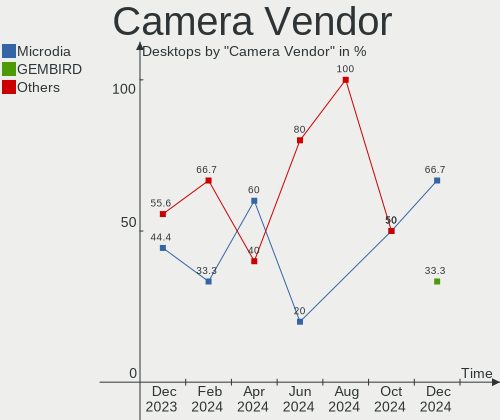

BlackPanther Hardware Trends (Desktops)
---------------------------------------

A project to identify most popular hardware characteristics and track their change
over time based on data collected by BlackPanther users at https://Linux-Hardware.org.

Anyone can contribute to this report by the [hw-probe](https://github.com/linuxhw/hw-probe) tool:

    sudo -E hw-probe -all -upload

Full-feature report is available here: https://linux-hardware.org/?view=trends&formfactor=desktop

Period: Sep, 2021.

Contents
--------

* [ System ](#system)
  - [ OS                       ](#os)
  - [ OS Family                ](#os-family)
  - [ Kernel                   ](#kernel)
  - [ Kernel Family            ](#kernel-family)
  - [ Kernel Major Ver.        ](#kernel-major-ver)
  - [ Arch                     ](#arch)
  - [ DE                       ](#de)
  - [ Display Server           ](#display-server)
  - [ Display Manager          ](#display-manager)
  - [ OS Lang                  ](#os-lang)
  - [ Boot Mode                ](#boot-mode)
  - [ Filesystem               ](#filesystem)
  - [ Part. scheme             ](#part-scheme)
  - [ Dual Boot with Linux/BSD ](#dual-boot-with-linuxbsd)
  - [ Dual Boot (Win)          ](#dual-boot-win)

* [ Board ](#board)
  - [ Vendor                   ](#vendor)
  - [ Model                    ](#model)
  - [ Model Family             ](#model-family)
  - [ MFG Year                 ](#mfg-year)
  - [ Form Factor              ](#form-factor)
  - [ Secure Boot              ](#secure-boot)
  - [ Coreboot                 ](#coreboot)
  - [ RAM Size                 ](#ram-size)
  - [ RAM Used                 ](#ram-used)
  - [ Total Drives             ](#total-drives)
  - [ Has CD-ROM               ](#has-cd-rom)
  - [ Has Ethernet             ](#has-ethernet)
  - [ Has WiFi                 ](#has-wifi)
  - [ Has Bluetooth            ](#has-bluetooth)

* [ Location ](#location)
  - [ Country                  ](#country)
  - [ City                     ](#city)

* [ Drives ](#drives)
  - [ Drive Vendor             ](#drive-vendor)
  - [ Drive Model              ](#drive-model)
  - [ HDD Vendor               ](#hdd-vendor)
  - [ SSD Vendor               ](#ssd-vendor)
  - [ Drive Kind               ](#drive-kind)
  - [ Drive Connector          ](#drive-connector)
  - [ Drive Size               ](#drive-size)
  - [ Space Total              ](#space-total)
  - [ Space Used               ](#space-used)
  - [ Malfunc. Drives          ](#malfunc-drives)
  - [ Malfunc. Drive Vendor    ](#malfunc-drive-vendor)
  - [ Malfunc. HDD Vendor      ](#malfunc-hdd-vendor)
  - [ Malfunc. Drive Kind      ](#malfunc-drive-kind)
  - [ Failed Drives            ](#failed-drives)
  - [ Failed Drive Vendor      ](#failed-drive-vendor)
  - [ Drive Status             ](#drive-status)

* [ Storage controller ](#storage-controller)
  - [ Storage Vendor           ](#storage-vendor)
  - [ Storage Model            ](#storage-model)
  - [ Storage Kind             ](#storage-kind)

* [ Processor ](#processor)
  - [ CPU Vendor               ](#cpu-vendor)
  - [ CPU Model                ](#cpu-model)
  - [ CPU Model Family         ](#cpu-model-family)
  - [ CPU Cores                ](#cpu-cores)
  - [ CPU Sockets              ](#cpu-sockets)
  - [ CPU Threads              ](#cpu-threads)
  - [ CPU Op-Modes             ](#cpu-op-modes)
  - [ CPU Microcode            ](#cpu-microcode)
  - [ CPU Microarch            ](#cpu-microarch)

* [ Graphics ](#graphics)
  - [ GPU Vendor               ](#gpu-vendor)
  - [ GPU Model                ](#gpu-model)
  - [ GPU Combo                ](#gpu-combo)
  - [ GPU Driver               ](#gpu-driver)
  - [ GPU Memory               ](#gpu-memory)

* [ Monitor ](#monitor)
  - [ Monitor Vendor           ](#monitor-vendor)
  - [ Monitor Model            ](#monitor-model)
  - [ Monitor Resolution       ](#monitor-resolution)
  - [ Monitor Diagonal         ](#monitor-diagonal)
  - [ Monitor Width            ](#monitor-width)
  - [ Aspect Ratio             ](#aspect-ratio)
  - [ Monitor Area             ](#monitor-area)
  - [ Pixel Density            ](#pixel-density)
  - [ Multiple Monitors        ](#multiple-monitors)

* [ Network ](#network)
  - [ Net Controller Vendor    ](#net-controller-vendor)
  - [ Net Controller Model     ](#net-controller-model)
  - [ Wireless Vendor          ](#wireless-vendor)
  - [ Wireless Model           ](#wireless-model)
  - [ Ethernet Vendor          ](#ethernet-vendor)
  - [ Ethernet Model           ](#ethernet-model)
  - [ Net Controller Kind      ](#net-controller-kind)
  - [ Used Controller          ](#used-controller)
  - [ NICs                     ](#nics)
  - [ IPv6                     ](#ipv6)

* [ Bluetooth ](#bluetooth)
  - [ Bluetooth Vendor         ](#bluetooth-vendor)
  - [ Bluetooth Model          ](#bluetooth-model)

* [ Sound ](#sound)
  - [ Sound Vendor             ](#sound-vendor)
  - [ Sound Model              ](#sound-model)

* [ Memory ](#memory)
  - [ Memory Vendor            ](#memory-vendor)
  - [ Memory Model             ](#memory-model)
  - [ Memory Kind              ](#memory-kind)
  - [ Memory Form Factor       ](#memory-form-factor)
  - [ Memory Size              ](#memory-size)
  - [ Memory Speed             ](#memory-speed)

* [ Printers & scanners ](#printers--scanners)
  - [ Printer Vendor           ](#printer-vendor)
  - [ Printer Model            ](#printer-model)
  - [ Scanner Vendor           ](#scanner-vendor)
  - [ Scanner Model            ](#scanner-model)

* [ Camera ](#camera)
  - [ Camera Vendor            ](#camera-vendor)
  - [ Camera Model             ](#camera-model)

* [ Security ](#security)
  - [ Fingerprint Vendor       ](#fingerprint-vendor)
  - [ Fingerprint Model        ](#fingerprint-model)
  - [ Chipcard Vendor          ](#chipcard-vendor)
  - [ Chipcard Model           ](#chipcard-model)

* [ Unsupported ](#unsupported)
  - [ Unsupported Devices      ](#unsupported-devices)
  - [ Unsupported Device Types ](#unsupported-device-types)

System
------

OS
--

Installed operating systems

| Name              | Desktops | Percent |
|-------------------|----------|---------|
| BlackPanther 18.1 | 31       | 96.88%  |
| BlackPanther 16.2 | 1        | 3.13%   |

OS Family
---------

OS without a version

| Name         | Desktops | Percent |
|--------------|----------|---------|
| BlackPanther | 32       | 100%    |

Kernel
------

Version of the Linux kernel

| Version                | Desktops | Percent |
|------------------------|----------|---------|
| 4.18.16-desktop-1bP    | 17       | 53.13%  |
| 5.6.14-desktop-2bP     | 14       | 43.75%  |
| 4.9.20-desktop-pae-1bP | 1        | 3.13%   |

Kernel Family
-------------

Linux kernel without a distro release

| Version | Desktops | Percent |
|---------|----------|---------|
| 4.18.16 | 17       | 53.13%  |
| 5.6.14  | 14       | 43.75%  |
| 4.9.20  | 1        | 3.13%   |

Kernel Major Ver.
-----------------

Linux kernel major version

| Version | Desktops | Percent |
|---------|----------|---------|
| 4.18    | 17       | 53.13%  |
| 5.6     | 14       | 43.75%  |
| 4.9     | 1        | 3.13%   |

Arch
----

OS architecture (x86_64, i586, etc.)

| Name   | Desktops | Percent |
|--------|----------|---------|
| x86_64 | 31       | 96.88%  |
| i686   | 1        | 3.13%   |

DE
--

Desktop Environment

| Name | Desktops | Percent |
|------|----------|---------|
| KDE5 | 32       | 100%    |

Display Server
--------------

X11 or Wayland

| Name | Desktops | Percent |
|------|----------|---------|
| X11  | 32       | 100%    |

Display Manager
---------------

SDDM, LightDM, etc.

| Name | Desktops | Percent |
|------|----------|---------|
| SDDM | 32       | 100%    |

OS Lang
-------

Language

| Lang    | Desktops | Percent |
|---------|----------|---------|
| Unknown | 32       | 100%    |

Boot Mode
---------

EFI or BIOS

| Mode | Desktops | Percent |
|------|----------|---------|
| BIOS | 25       | 78.13%  |
| EFI  | 7        | 21.88%  |

Filesystem
----------

Type of filesystem

| Type    | Desktops | Percent |
|---------|----------|---------|
| Overlay | 26       | 81.25%  |
| Ext4    | 6        | 18.75%  |

Part. scheme
------------

Scheme of partitioning

| Type | Desktops | Percent |
|------|----------|---------|
| MBR  | 21       | 65.63%  |
| GPT  | 11       | 34.38%  |

Dual Boot with Linux/BSD
------------------------

Hosting more than one Linux/BSD

| Dual boot | Desktops | Percent |
|-----------|----------|---------|
| Yes       | 22       | 68.75%  |
| No        | 10       | 31.25%  |

Dual Boot (Win)
---------------

Hosting Linux and Windows

| Dual boot | Desktops | Percent |
|-----------|----------|---------|
| No        | 20       | 62.5%   |
| Yes       | 12       | 37.5%   |

Board
-----

Vendor
------

Motherboard manufacturer

| Name                | Desktops | Percent |
|---------------------|----------|---------|
| ASUSTek Computer    | 9        | 28.13%  |
| ASRock              | 5        | 15.63%  |
| Gigabyte Technology | 4        | 12.5%   |
| Fujitsu             | 4        | 12.5%   |
| Hewlett-Packard     | 3        | 9.38%   |
| Intel               | 2        | 6.25%   |
| MSI                 | 1        | 3.13%   |
| Lenovo              | 1        | 3.13%   |
| Dell                | 1        | 3.13%   |
| Apple               | 1        | 3.13%   |
| Unknown             | 1        | 3.13%   |

Model
-----

Motherboard model

| Name                              | Desktops | Percent |
|-----------------------------------|----------|---------|
| Gigabyte H61M-S1                  | 2        | 6.25%   |
| ASRock FM2A75M Pro4+              | 2        | 6.25%   |
| MSI MS-7529                       | 1        | 3.13%   |
| Lenovo ThinkCentre M73 10B6001SUS | 1        | 3.13%   |
| Intel DG43GT AAE62768-300         | 1        | 3.13%   |
| Intel DG35EC AAE29266-206         | 1        | 3.13%   |
| HP Compaq Pro 6305 SFF            | 1        | 3.13%   |
| HP Compaq Pro 6305 MT             | 1        | 3.13%   |
| HP Compaq Pro 6300 SFF            | 1        | 3.13%   |
| Gigabyte P67A-D3-B3               | 1        | 3.13%   |
| Gigabyte G41MT-S2PT               | 1        | 3.13%   |
| Fujitsu ESPRIMO P7936             | 1        | 3.13%   |
| Fujitsu ESPRIMO P720              | 1        | 3.13%   |
| Fujitsu ESPRIMO E7935             | 1        | 3.13%   |
| Fujitsu CELSIUS M470              | 1        | 3.13%   |
| Dell OptiPlex 3010                | 1        | 3.13%   |
| ASUS PRIME B365M-A                | 1        | 3.13%   |
| ASUS PRIME A320M-R                | 1        | 3.13%   |
| ASUS P7P55D                       | 1        | 3.13%   |
| ASUS P5KPL-AM IN/ROEM/SI          | 1        | 3.13%   |
| ASUS H110M-K                      | 1        | 3.13%   |
| ASUS H110M-A                      | 1        | 3.13%   |
| ASUS F1A75-M PRO                  | 1        | 3.13%   |
| ASUS Crosshair IV Formula         | 1        | 3.13%   |
| ASUS All Series                   | 1        | 3.13%   |
| ASRock FM2A68M-HD+                | 1        | 3.13%   |
| ASRock 945GCM-S                   | 1        | 3.13%   |
| ASRock 4CoreDual-SATA2            | 1        | 3.13%   |
| Apple MacPro2,1                   | 1        | 3.13%   |
| Unknown                           | 1        | 3.13%   |

Model Family
------------

Motherboard model prefix

| Name                   | Desktops | Percent |
|------------------------|----------|---------|
| HP Compaq              | 3        | 9.38%   |
| Fujitsu ESPRIMO        | 3        | 9.38%   |
| Gigabyte H61M-S1       | 2        | 6.25%   |
| ASUS PRIME             | 2        | 6.25%   |
| ASRock FM2A75M         | 2        | 6.25%   |
| MSI MS-7529            | 1        | 3.13%   |
| Lenovo ThinkCentre     | 1        | 3.13%   |
| Intel DG43GT           | 1        | 3.13%   |
| Intel DG35EC           | 1        | 3.13%   |
| Gigabyte P67A-D3-B3    | 1        | 3.13%   |
| Gigabyte G41MT-S2PT    | 1        | 3.13%   |
| Fujitsu CELSIUS        | 1        | 3.13%   |
| Dell OptiPlex          | 1        | 3.13%   |
| ASUS P7P55D            | 1        | 3.13%   |
| ASUS P5KPL-AM          | 1        | 3.13%   |
| ASUS H110M-K           | 1        | 3.13%   |
| ASUS H110M-A           | 1        | 3.13%   |
| ASUS F1A75-M           | 1        | 3.13%   |
| ASUS Crosshair         | 1        | 3.13%   |
| ASUS All               | 1        | 3.13%   |
| ASRock FM2A68M-HD+     | 1        | 3.13%   |
| ASRock 945GCM-S        | 1        | 3.13%   |
| ASRock 4CoreDual-SATA2 | 1        | 3.13%   |
| Apple MacPro2          | 1        | 3.13%   |
| Unknown                | 1        | 3.13%   |

MFG Year
--------

Motherboard manufacture year

| Year | Desktops | Percent |
|------|----------|---------|
| 2011 | 5        | 15.63%  |
| 2019 | 4        | 12.5%   |
| 2012 | 4        | 12.5%   |
| 2009 | 4        | 12.5%   |
| 2014 | 3        | 9.38%   |
| 2010 | 3        | 9.38%   |
| 2018 | 2        | 6.25%   |
| 2013 | 2        | 6.25%   |
| 2020 | 1        | 3.13%   |
| 2015 | 1        | 3.13%   |
| 2008 | 1        | 3.13%   |
| 2007 | 1        | 3.13%   |
| 2006 | 1        | 3.13%   |

Form Factor
-----------

Physical design of the computer

| Name    | Desktops | Percent |
|---------|----------|---------|
| Desktop | 32       | 100%    |

Secure Boot
-----------

Enabled or disabled

| State    | Desktops | Percent |
|----------|----------|---------|
| Disabled | 32       | 100%    |

Coreboot
--------

Have coreboot on board

| Used | Desktops | Percent |
|------|----------|---------|
| No   | 32       | 100%    |

RAM Size
--------

Total RAM memory

| Size in GB | Desktops | Percent |
|------------|----------|---------|
| 8.01-16.0  | 14       | 43.75%  |
| 3.01-4.0   | 9        | 28.13%  |
| 1.01-2.0   | 4        | 12.5%   |
| 16.01-24.0 | 3        | 9.38%   |
| 4.01-8.0   | 2        | 6.25%   |

RAM Used
--------

Used RAM memory

| Used GB  | Desktops | Percent |
|----------|----------|---------|
| 0.01-0.5 | 19       | 59.38%  |
| 0.51-1.0 | 10       | 31.25%  |
| 1.01-2.0 | 3        | 9.38%   |

Total Drives
------------

Number of drives on board

| Drives | Desktops | Percent |
|--------|----------|---------|
| 1      | 18       | 56.25%  |
| 2      | 5        | 15.63%  |
| 3      | 3        | 9.38%   |
| 4      | 2        | 6.25%   |
| 0      | 2        | 6.25%   |
| 6      | 1        | 3.13%   |
| 5      | 1        | 3.13%   |

Has CD-ROM
----------

Has CD-ROM on board

| Presented | Desktops | Percent |
|-----------|----------|---------|
| Yes       | 23       | 71.88%  |
| No        | 9        | 28.13%  |

Has Ethernet
------------

Has Ethernet on board

| Presented | Desktops | Percent |
|-----------|----------|---------|
| Yes       | 32       | 100%    |

Has WiFi
--------

Has WiFi module

| Presented | Desktops | Percent |
|-----------|----------|---------|
| No        | 25       | 78.13%  |
| Yes       | 7        | 21.88%  |

Has Bluetooth
-------------

Has Bluetooth module

| Presented | Desktops | Percent |
|-----------|----------|---------|
| No        | 29       | 90.63%  |
| Yes       | 3        | 9.38%   |

Location
--------

Country
-------

Geographic location (country)

| Country   | Desktops | Percent |
|-----------|----------|---------|
| Hungary   | 26       | 81.25%  |
| Slovakia  | 2        | 6.25%   |
| Germany   | 2        | 6.25%   |
| USA       | 1        | 3.13%   |
| Argentina | 1        | 3.13%   |

City
----

Geographic location (city)

| City             | Desktops | Percent |
|------------------|----------|---------|
| Gy?‘r            | 4        | 12.5%   |
| Budapest         | 4        | 12.5%   |
| Kenderes         | 2        | 6.25%   |
| Hnusta           | 2        | 6.25%   |
| Debrecen         | 2        | 6.25%   |
| Tiszafured       | 1        | 3.13%   |
| Tigre            | 1        | 3.13%   |
| Szeksz??rd       | 1        | 3.13%   |
| Szeged           | 1        | 3.13%   |
| Sokoropatka      | 1        | 3.13%   |
| Roszke           | 1        | 3.13%   |
| P?©cs            | 1        | 3.13%   |
| Oroshaza         | 1        | 3.13%   |
| North Hollywood  | 1        | 3.13%   |
| Nagykoros        | 1        | 3.13%   |
| Leipzig          | 1        | 3.13%   |
| Kunszentmiklos   | 1        | 3.13%   |
| Keszthely        | 1        | 3.13%   |
| Karcag           | 1        | 3.13%   |
| Hodmezovasarhely | 1        | 3.13%   |
| Heves            | 1        | 3.13%   |
| Fuzesabony       | 1        | 3.13%   |
| Bochum           | 1        | 3.13%   |

Drives
------

Drive Vendor
------------

Hard drive vendors

| Vendor              | Desktops | Drives | Percent |
|---------------------|----------|--------|---------|
| Samsung Electronics | 12       | 14     | 23.53%  |
| WDC                 | 11       | 15     | 21.57%  |
| Kingston            | 7        | 8      | 13.73%  |
| Toshiba             | 3        | 5      | 5.88%   |
| A-DATA Technology   | 3        | 3      | 5.88%   |
| Patriot             | 2        | 2      | 3.92%   |
| Zheino              | 1        | 1      | 1.96%   |
| WD MediaMax         | 1        | 1      | 1.96%   |
| Team                | 1        | 1      | 1.96%   |
| SPCC                | 1        | 1      | 1.96%   |
| Seagate             | 1        | 1      | 1.96%   |
| PNY                 | 1        | 1      | 1.96%   |
| MAXTOR              | 1        | 1      | 1.96%   |
| Hitachi             | 1        | 1      | 1.96%   |
| HGST                | 1        | 1      | 1.96%   |
| Hewlett-Packard     | 1        | 1      | 1.96%   |
| Crucial             | 1        | 1      | 1.96%   |
| China               | 1        | 1      | 1.96%   |
| Apacer              | 1        | 1      | 1.96%   |

Drive Model
-----------

Hard drive models

| Model                            | Desktops | Percent |
|----------------------------------|----------|---------|
| Samsung HD502IJ 500GB            | 3        | 5.08%   |
| WDC WD20EZRX-00D8PB0 2TB         | 2        | 3.39%   |
| WDC WD10EZEX-00KUWA0 1TB         | 2        | 3.39%   |
| Samsung HD103UJ 1TB              | 2        | 3.39%   |
| Patriot Burst 120GB SSD          | 2        | 3.39%   |
| Kingston SV300S37A120G 120GB SSD | 2        | 3.39%   |
| Kingston SUV400S37120G 120GB SSD | 2        | 3.39%   |
| Kingston SA400S37240G 240GB SSD  | 2        | 3.39%   |
| A-DATA SU630 240GB SSD           | 2        | 3.39%   |
| Zheino CHN-NGFFNV2280-256 256GB  | 1        | 1.69%   |
| WDC WDS240G2G0B-00EPW0 240GB SSD | 1        | 1.69%   |
| WDC WD400BB-23DEA0 40GB          | 1        | 1.69%   |
| WDC WD30EZRZ-00GXCB0 3TB         | 1        | 1.69%   |
| WDC WD30EZRX-00DC0B0 3TB         | 1        | 1.69%   |
| WDC WD30EFRX-68EUZN0 3TB         | 1        | 1.69%   |
| WDC WD2500YS-01SHB0 256GB        | 1        | 1.69%   |
| WDC WD2500AAJS-75B4A0 250GB      | 1        | 1.69%   |
| WDC WD1600BB-55GUC0 160GB        | 1        | 1.69%   |
| WDC WD1600AAJB-56WRA0 160GB      | 1        | 1.69%   |
| WDC WD10EZEX-21WN4A0 1TB         | 1        | 1.69%   |
| WDC WD10EADS-00L5B1 1TB          | 1        | 1.69%   |
| WD MediaMax WL160GSA872B 160GB   | 1        | 1.69%   |
| Toshiba MQ04ABF100 1TB           | 1        | 1.69%   |
| Toshiba HDWQ140 4TB              | 1        | 1.69%   |
| Toshiba DT01ACA200 2TB           | 1        | 1.69%   |
| Toshiba DT01ACA100 1TB           | 1        | 1.69%   |
| Toshiba DT01ACA050 500GB         | 1        | 1.69%   |
| Team T253X1480G 480GB SSD        | 1        | 1.69%   |
| SPCC Solid State Disk 256GB      | 1        | 1.69%   |
| Seagate ST500DM002-1BD142 500GB  | 1        | 1.69%   |
| Samsung SSD 870 EVO 500GB        | 1        | 1.69%   |
| Samsung SSD 860 EVO 1TB          | 1        | 1.69%   |
| Samsung SSD 830 Series 64GB      | 1        | 1.69%   |
| Samsung SP2004C 200GB            | 1        | 1.69%   |
| Samsung HD503HI 500GB            | 1        | 1.69%   |
| Samsung HD502HJ 500GB            | 1        | 1.69%   |
| Samsung HD322HJ 320GB            | 1        | 1.69%   |
| Samsung HD154UI 1TB              | 1        | 1.69%   |
| PNY CS900 120GB SSD              | 1        | 1.69%   |
| MAXTOR 6V250F0 256GB             | 1        | 1.69%   |
| Kingston SH103S3120G 120GB SSD   | 1        | 1.69%   |
| Kingston SA400S37120G 120GB SSD  | 1        | 1.69%   |
| Hitachi HTS543232A7A384 320GB    | 1        | 1.69%   |
| HGST HTS545050A7E680 500GB       | 1        | 1.69%   |
| HP SSD S600 240GB                | 1        | 1.69%   |
| Crucial CT240BX500SSD1 240GB     | 1        | 1.69%   |
| China SSD 120GB                  | 1        | 1.69%   |
| Apacer AS340 240GB SSD           | 1        | 1.69%   |
| A-DATA SU650 120GB SSD           | 1        | 1.69%   |

HDD Vendor
----------

Hard disk drive vendors

| Vendor              | Desktops | Drives | Percent |
|---------------------|----------|--------|---------|
| WDC                 | 10       | 14     | 35.71%  |
| Samsung Electronics | 10       | 10     | 35.71%  |
| Toshiba             | 3        | 5      | 10.71%  |
| WD MediaMax         | 1        | 1      | 3.57%   |
| Seagate             | 1        | 1      | 3.57%   |
| MAXTOR              | 1        | 1      | 3.57%   |
| Hitachi             | 1        | 1      | 3.57%   |
| HGST                | 1        | 1      | 3.57%   |

SSD Vendor
----------

Solid state drive vendors

| Vendor              | Desktops | Drives | Percent |
|---------------------|----------|--------|---------|
| Kingston            | 7        | 8      | 30.43%  |
| Samsung Electronics | 3        | 4      | 13.04%  |
| A-DATA Technology   | 3        | 3      | 13.04%  |
| Patriot             | 2        | 2      | 8.7%    |
| WDC                 | 1        | 1      | 4.35%   |
| Team                | 1        | 1      | 4.35%   |
| SPCC                | 1        | 1      | 4.35%   |
| PNY                 | 1        | 1      | 4.35%   |
| Hewlett-Packard     | 1        | 1      | 4.35%   |
| Crucial             | 1        | 1      | 4.35%   |
| China               | 1        | 1      | 4.35%   |
| Apacer              | 1        | 1      | 4.35%   |

Drive Kind
----------

HDD or SSD

| Kind | Desktops | Drives | Percent |
|------|----------|--------|---------|
| HDD  | 22       | 34     | 52.38%  |
| SSD  | 19       | 25     | 45.24%  |
| NVMe | 1        | 1      | 2.38%   |

Drive Connector
---------------

SATA, SAS, NVMe, etc.

| Type | Desktops | Drives | Percent |
|------|----------|--------|---------|
| SATA | 30       | 59     | 96.77%  |
| NVMe | 1        | 1      | 3.23%   |

Drive Size
----------

Size of hard drive

| Size in TB | Desktops | Drives | Percent |
|------------|----------|--------|---------|
| 0.01-0.5   | 26       | 42     | 61.9%   |
| 0.51-1.0   | 10       | 10     | 23.81%  |
| 1.01-2.0   | 3        | 3      | 7.14%   |
| 2.01-3.0   | 2        | 3      | 4.76%   |
| 3.01-4.0   | 1        | 1      | 2.38%   |

Space Total
-----------

Amount of disk space available on the file system

| Size in GB | Desktops | Percent |
|------------|----------|---------|
| Unknown    | 26       | 81.25%  |
| 101-250    | 3        | 9.38%   |
| 251-500    | 1        | 3.13%   |
| 21-50      | 1        | 3.13%   |
| 51-100     | 1        | 3.13%   |

Space Used
----------

Amount of used disk space

| Used GB | Desktops | Percent |
|---------|----------|---------|
| Unknown | 26       | 81.25%  |
| 1-20    | 6        | 18.75%  |

Malfunc. Drives
---------------

Drive models with a malfunction

| Model                             | Desktops | Drives | Percent |
|-----------------------------------|----------|--------|---------|
| Samsung Electronics HD103UJ 1TB   | 2        | 2      | 12.5%   |
| A-DATA Technology SU630 240GB SSD | 2        | 2      | 12.5%   |
| WDC WD400BB-23DEA0 40GB           | 1        | 1      | 6.25%   |
| WDC WD2500YS-01SHB0 256GB         | 1        | 1      | 6.25%   |
| WDC WD2500AAJS-75B4A0 250GB       | 1        | 1      | 6.25%   |
| WDC WD1600BB-55GUC0 160GB         | 1        | 1      | 6.25%   |
| WDC WD1600AAJB-56WRA0 160GB       | 1        | 1      | 6.25%   |
| WD MediaMax WL160GSA872B 160GB    | 1        | 1      | 6.25%   |
| Seagate ST500DM002-1BD142 500GB   | 1        | 1      | 6.25%   |
| Samsung Electronics SP2004C 200GB | 1        | 1      | 6.25%   |
| Samsung Electronics HD503HI 500GB | 1        | 1      | 6.25%   |
| Samsung Electronics HD502IJ 500GB | 1        | 1      | 6.25%   |
| MAXTOR 6V250F0 256GB              | 1        | 1      | 6.25%   |
| HGST HTS545050A7E680 500GB        | 1        | 1      | 6.25%   |

Malfunc. Drive Vendor
---------------------

Vendors of faulty drives

| Vendor              | Desktops | Drives | Percent |
|---------------------|----------|--------|---------|
| WDC                 | 5        | 5      | 31.25%  |
| Samsung Electronics | 5        | 5      | 31.25%  |
| A-DATA Technology   | 2        | 2      | 12.5%   |
| WD MediaMax         | 1        | 1      | 6.25%   |
| Seagate             | 1        | 1      | 6.25%   |
| MAXTOR              | 1        | 1      | 6.25%   |
| HGST                | 1        | 1      | 6.25%   |

Malfunc. HDD Vendor
-------------------

Vendors of faulty HDD drives

| Vendor              | Desktops | Drives | Percent |
|---------------------|----------|--------|---------|
| WDC                 | 5        | 5      | 35.71%  |
| Samsung Electronics | 5        | 5      | 35.71%  |
| WD MediaMax         | 1        | 1      | 7.14%   |
| Seagate             | 1        | 1      | 7.14%   |
| MAXTOR              | 1        | 1      | 7.14%   |
| HGST                | 1        | 1      | 7.14%   |

Malfunc. Drive Kind
-------------------

Kinds of faulty drives

| Kind | Desktops | Drives | Percent |
|------|----------|--------|---------|
| HDD  | 12       | 14     | 85.71%  |
| SSD  | 2        | 2      | 14.29%  |

Failed Drives
-------------

Failed drive models

Zero info for selected period =(

Failed Drive Vendor
-------------------

Failed drive vendors

Zero info for selected period =(

Drive Status
------------

Number of failed and malfunc. drives

| Status   | Desktops | Drives | Percent |
|----------|----------|--------|---------|
| Works    | 21       | 42     | 58.33%  |
| Malfunc  | 14       | 16     | 38.89%  |
| Detected | 1        | 2      | 2.78%   |

Storage controller
------------------

Storage Vendor
--------------

Storage controller vendors

| Vendor                   | Desktops | Percent |
|--------------------------|----------|---------|
| Intel                    | 22       | 56.41%  |
| AMD                      | 8        | 20.51%  |
| JMicron Technology       | 3        | 7.69%   |
| VIA Technologies         | 2        | 5.13%   |
| Silicon Motion           | 1        | 2.56%   |
| Marvell Technology Group | 1        | 2.56%   |
| Adaptec                  | 1        | 2.56%   |
| 3ware                    | 1        | 2.56%   |

Storage Model
-------------

Storage controller models

| Model                                                                                   | Desktops | Percent |
|-----------------------------------------------------------------------------------------|----------|---------|
| AMD FCH SATA Controller [AHCI mode]                                                     | 7        | 12.07%  |
| Intel NM10/ICH7 Family SATA Controller [IDE mode]                                       | 4        | 6.9%    |
| Intel 82801G (ICH7 Family) IDE Controller                                               | 4        | 6.9%    |
| Intel 8 Series/C220 Series Chipset Family 6-port SATA Controller 1 [AHCI mode]          | 3        | 5.17%   |
| Intel 6 Series/C200 Series Chipset Family Desktop SATA Controller (IDE mode, ports 4-5) | 3        | 5.17%   |
| Intel 6 Series/C200 Series Chipset Family Desktop SATA Controller (IDE mode, ports 0-3) | 3        | 5.17%   |
| VIA VT82C586A/B/VT82C686/A/B/VT823x/A/C PIPC Bus Master IDE                             | 2        | 3.45%   |
| JMicron JMB363 SATA/IDE Controller                                                      | 2        | 3.45%   |
| Intel Q170/Q150/B150/H170/H110/Z170/CM236 Chipset SATA Controller [AHCI Mode]           | 2        | 3.45%   |
| AMD FCH IDE Controller                                                                  | 2        | 3.45%   |
| VIA VT8237/8251 Serial ATA Controller                                                   | 1        | 1.72%   |
| VIA VIA VT6420 SATA RAID Controller                                                     | 1        | 1.72%   |
| Silicon Motion SM2263EN/SM2263XT SSD Controller                                         | 1        | 1.72%   |
| Marvell Group 88SE6101/6102 single-port PATA133 interface                               | 1        | 1.72%   |
| JMicron JMB368 IDE controller                                                           | 1        | 1.72%   |
| Intel 82801JI (ICH10 Family) SATA AHCI Controller                                       | 1        | 1.72%   |
| Intel 82801JI (ICH10 Family) 4 port SATA IDE Controller #1                              | 1        | 1.72%   |
| Intel 82801JI (ICH10 Family) 2 port SATA IDE Controller #2                              | 1        | 1.72%   |
| Intel 82801JD/DO (ICH10 Family) SATA AHCI Controller                                    | 1        | 1.72%   |
| Intel 82801JD/DO (ICH10 Family) 4-port SATA IDE Controller                              | 1        | 1.72%   |
| Intel 82801JD/DO (ICH10 Family) 2-port SATA IDE Controller                              | 1        | 1.72%   |
| Intel 82801HR/HO/HH (ICH8R/DO/DH) 2 port SATA Controller [IDE mode]                     | 1        | 1.72%   |
| Intel 82801H (ICH8 Family) 4 port SATA Controller [IDE mode]                            | 1        | 1.72%   |
| Intel 7 Series/C210 Series Chipset Family 6-port SATA Controller [AHCI mode]            | 1        | 1.72%   |
| Intel 631xESB/632xESB/3100 Chipset SATA IDE Controller                                  | 1        | 1.72%   |
| Intel 631xESB/632xESB IDE Controller                                                    | 1        | 1.72%   |
| Intel 6 Series/C200 Series Chipset Family 6 port Desktop SATA AHCI Controller           | 1        | 1.72%   |
| Intel 5 Series/3400 Series Chipset 4 port SATA IDE Controller                           | 1        | 1.72%   |
| Intel 5 Series/3400 Series Chipset 2 port SATA IDE Controller                           | 1        | 1.72%   |
| Intel 4 Series Chipset PT IDER Controller                                               | 1        | 1.72%   |
| Intel 200 Series PCH SATA controller [AHCI mode]                                        | 1        | 1.72%   |
| AMD SB7x0/SB8x0/SB9x0 SATA Controller [IDE mode]                                        | 1        | 1.72%   |
| AMD SB7x0/SB8x0/SB9x0 IDE Controller                                                    | 1        | 1.72%   |
| AMD FCH SATA Controller D                                                               | 1        | 1.72%   |
| Adaptec AIC-7870P/7871 [AHA-2940/W/S76]                                                 | 1        | 1.72%   |
| 3ware 7xxx/8xxx-series PATA/SATA-RAID                                                   | 1        | 1.72%   |

Storage Kind
------------

Kind of storage controller (IDE, SATA, NVMe, SAS, ...)

| Kind | Desktops | Percent |
|------|----------|---------|
| IDE  | 18       | 46.15%  |
| SATA | 18       | 46.15%  |
| RAID | 1        | 2.56%   |
| SCSI | 1        | 2.56%   |
| NVMe | 1        | 2.56%   |

Processor
---------

CPU Vendor
----------

Processor vendors

| Vendor | Desktops | Percent |
|--------|----------|---------|
| Intel  | 24       | 75%     |
| AMD    | 8        | 25%     |

CPU Model
---------

Processor models

| Model                                       | Desktops | Percent |
|---------------------------------------------|----------|---------|
| Intel Celeron CPU G1610 @ 2.60GHz           | 2        | 6.25%   |
| AMD A8-6600K APU with Radeon HD Graphics    | 2        | 6.25%   |
| Intel Xeon CPU X5355 @ 2.66GHz              | 1        | 3.13%   |
| Intel Xeon CPU W3550 @ 3.07GHz              | 1        | 3.13%   |
| Intel Pentium Dual-Core CPU E6500 @ 2.93GHz | 1        | 3.13%   |
| Intel Pentium Dual-Core CPU E6300 @ 2.80GHz | 1        | 3.13%   |
| Intel Pentium CPU G3240 @ 3.10GHz           | 1        | 3.13%   |
| Intel Pentium 4 CPU 3.00GHz                 | 1        | 3.13%   |
| Intel Core i5-6500 CPU @ 3.20GHz            | 1        | 3.13%   |
| Intel Core i5-4590 CPU @ 3.30GHz            | 1        | 3.13%   |
| Intel Core i5-3470 CPU @ 3.20GHz            | 1        | 3.13%   |
| Intel Core i5-2300 CPU @ 2.80GHz            | 1        | 3.13%   |
| Intel Core i5 CPU 650 @ 3.20GHz             | 1        | 3.13%   |
| Intel Core i3-8100 CPU @ 3.60GHz            | 1        | 3.13%   |
| Intel Core i3-7100 CPU @ 3.90GHz            | 1        | 3.13%   |
| Intel Core i3-4130 CPU @ 3.40GHz            | 1        | 3.13%   |
| Intel Core i3-3225 CPU @ 3.30GHz            | 1        | 3.13%   |
| Intel Core 2 Quad CPU Q9300 @ 2.50GHz       | 1        | 3.13%   |
| Intel Core 2 Duo CPU E8400 @ 3.00GHz        | 1        | 3.13%   |
| Intel Core 2 Duo CPU E7500 @ 2.93GHz        | 1        | 3.13%   |
| Intel Core 2 Duo CPU E7300 @ 2.66GHz        | 1        | 3.13%   |
| Intel Core 2 Duo CPU E7200 @ 2.53GHz        | 1        | 3.13%   |
| Intel Core 2 CPU 4300 @ 1.80GHz             | 1        | 3.13%   |
| Intel Celeron CPU E3400 @ 2.60GHz           | 1        | 3.13%   |
| AMD Ryzen 3 2200G with Radeon Vega Graphics | 1        | 3.13%   |
| AMD Phenom II X6 1090T Processor            | 1        | 3.13%   |
| AMD A8-5500B APU with Radeon HD Graphics    | 1        | 3.13%   |
| AMD A8-3870 APU with Radeon HD Graphics     | 1        | 3.13%   |
| AMD A4-6300 APU with Radeon HD Graphics     | 1        | 3.13%   |
| AMD A4-5300B APU with Radeon HD Graphics    | 1        | 3.13%   |

CPU Model Family
----------------

Processor model prefix

| Model                   | Desktops | Percent |
|-------------------------|----------|---------|
| Intel Core i5           | 5        | 15.63%  |
| Intel Core i3           | 4        | 12.5%   |
| Intel Core 2 Duo        | 4        | 12.5%   |
| AMD A8                  | 4        | 12.5%   |
| Intel Celeron           | 3        | 9.38%   |
| Intel Xeon              | 2        | 6.25%   |
| Intel Pentium Dual-Core | 2        | 6.25%   |
| AMD A4                  | 2        | 6.25%   |
| Intel Pentium 4         | 1        | 3.13%   |
| Intel Pentium           | 1        | 3.13%   |
| Intel Core 2 Quad       | 1        | 3.13%   |
| Intel Core 2            | 1        | 3.13%   |
| AMD Ryzen 3             | 1        | 3.13%   |
| AMD Phenom II X6        | 1        | 3.13%   |

CPU Cores
---------

Number of processor cores

| Number | Desktops | Percent |
|--------|----------|---------|
| 2      | 18       | 56.25%  |
| 4      | 9        | 28.13%  |
| 1      | 3        | 9.38%   |
| 8      | 1        | 3.13%   |
| 6      | 1        | 3.13%   |

CPU Sockets
-----------

Number of sockets

| Number | Desktops | Percent |
|--------|----------|---------|
| 1      | 31       | 96.88%  |
| 2      | 1        | 3.13%   |

CPU Threads
-----------

Threads per core (Hyper-Threading)

| Number | Desktops | Percent |
|--------|----------|---------|
| 1      | 21       | 65.63%  |
| 2      | 11       | 34.38%  |

CPU Op-Modes
------------

CPU Operation Modes (32-bit, 64-bit)

| Op mode        | Desktops | Percent |
|----------------|----------|---------|
| 32-bit, 64-bit | 32       | 100%    |

CPU Microcode
-------------

Microcode number

| Number     | Desktops | Percent |
|------------|----------|---------|
| 0x1067a    | 5        | 15.63%  |
| 0x306a9    | 4        | 12.5%   |
| 0x06001119 | 4        | 12.5%   |
| 0x306c3    | 3        | 9.38%   |
| 0xf43      | 1        | 3.13%   |
| 0x906eb    | 1        | 3.13%   |
| 0x906e9    | 1        | 3.13%   |
| 0x6f7      | 1        | 3.13%   |
| 0x6f2      | 1        | 3.13%   |
| 0x506e3    | 1        | 3.13%   |
| 0x206a7    | 1        | 3.13%   |
| 0x20652    | 1        | 3.13%   |
| 0x106a5    | 1        | 3.13%   |
| 0x10677    | 1        | 3.13%   |
| 0x10676    | 1        | 3.13%   |
| 0x0810100b | 1        | 3.13%   |
| 0x0600111f | 1        | 3.13%   |
| 0x03000027 | 1        | 3.13%   |
| 0x010000dc | 1        | 3.13%   |
| Unknown    | 1        | 3.13%   |

CPU Microarch
-------------

Microarchitecture

| Name        | Desktops | Percent |
|-------------|----------|---------|
| Penryn      | 8        | 25%     |
| Piledriver  | 5        | 15.63%  |
| IvyBridge   | 4        | 12.5%   |
| Haswell     | 3        | 9.38%   |
| KabyLake    | 2        | 6.25%   |
| Core        | 2        | 6.25%   |
| Zen         | 1        | 3.13%   |
| Westmere    | 1        | 3.13%   |
| Skylake     | 1        | 3.13%   |
| SandyBridge | 1        | 3.13%   |
| NetBurst    | 1        | 3.13%   |
| Nehalem     | 1        | 3.13%   |
| K10 Llano   | 1        | 3.13%   |
| K10         | 1        | 3.13%   |

Graphics
--------

GPU Vendor
----------

Vendors of graphics cards

| Vendor | Desktops | Percent |
|--------|----------|---------|
| Nvidia | 14       | 43.75%  |
| AMD    | 11       | 34.38%  |
| Intel  | 7        | 21.88%  |

GPU Model
---------

Graphics card models

| Model                                                                       | Desktops | Percent |
|-----------------------------------------------------------------------------|----------|---------|
| Nvidia GF108 [GeForce GT 630]                                               | 3        | 9.09%   |
| Intel 4 Series Chipset Integrated Graphics Controller                       | 3        | 9.09%   |
| Nvidia G73 [GeForce 7300 GT]                                                | 2        | 6.06%   |
| Intel Xeon E3-1200 v3/4th Gen Core Processor Integrated Graphics Controller | 2        | 6.06%   |
| AMD Richland [Radeon HD 8570D]                                              | 2        | 6.06%   |
| AMD Cedar [Radeon HD 5000/6000/7350/8350 Series]                            | 2        | 6.06%   |
| Nvidia NV43 [GeForce 6600]                                                  | 1        | 3.03%   |
| Nvidia GT218 [GeForce 210]                                                  | 1        | 3.03%   |
| Nvidia GP108 [GeForce GT 1030]                                              | 1        | 3.03%   |
| Nvidia GP107 [GeForce GTX 1050 Ti]                                          | 1        | 3.03%   |
| Nvidia GK208B [GeForce GT 720]                                              | 1        | 3.03%   |
| Nvidia GK208B [GeForce GT 710]                                              | 1        | 3.03%   |
| Nvidia GK106GL [Quadro K4000]                                               | 1        | 3.03%   |
| Nvidia GF114 [GeForce GTX 560]                                              | 1        | 3.03%   |
| Nvidia G94 [GeForce 9600 GT]                                                | 1        | 3.03%   |
| Intel CoffeeLake-S GT2 [UHD Graphics 630]                                   | 1        | 3.03%   |
| Intel 82G33/G31 Express Integrated Graphics Controller                      | 1        | 3.03%   |
| AMD Trinity [Radeon HD 7560D]                                               | 1        | 3.03%   |
| AMD Trinity 2 [Radeon HD 7480D]                                             | 1        | 3.03%   |
| AMD RV710 [Radeon HD 4350/4550]                                             | 1        | 3.03%   |
| AMD RV630 XT [Radeon HD 2600 XT]                                            | 1        | 3.03%   |
| AMD Richland [Radeon HD 8370D]                                              | 1        | 3.03%   |
| AMD Redwood XT [Radeon HD 5670/5690/5730]                                   | 1        | 3.03%   |
| AMD Ellesmere [Radeon RX 470/480/570/570X/580/580X/590]                     | 1        | 3.03%   |
| AMD Curacao XT / Trinidad XT [Radeon R7 370 / R9 270X/370X]                 | 1        | 3.03%   |

GPU Combo
---------

Combinations of graphics cards

| Name       | Desktops | Percent |
|------------|----------|---------|
| 1 x Nvidia | 14       | 43.75%  |
| 1 x AMD    | 10       | 31.25%  |
| 1 x Intel  | 7        | 21.88%  |
| 2 x AMD    | 1        | 3.13%   |

GPU Driver
----------

Free vs proprietary

| Driver  | Desktops | Percent |
|---------|----------|---------|
| Free    | 31       | 96.88%  |
| Unknown | 1        | 3.13%   |

GPU Memory
----------

Total video memory

| Size in GB | Desktops | Percent |
|------------|----------|---------|
| 0.51-1.0   | 11       | 34.38%  |
| Unknown    | 9        | 28.13%  |
| 0.01-0.5   | 7        | 21.88%  |
| 3.01-4.0   | 3        | 9.38%   |
| 2.01-3.0   | 1        | 3.13%   |
| 1.01-2.0   | 1        | 3.13%   |

Monitor
-------

Monitor Vendor
--------------

Monitor vendors

| Vendor               | Desktops | Percent |
|----------------------|----------|---------|
| Samsung Electronics  | 4        | 13.79%  |
| Dell                 | 4        | 13.79%  |
| Goldstar             | 3        | 10.34%  |
| BenQ                 | 3        | 10.34%  |
| Philips              | 2        | 6.9%    |
| Fujitsu Siemens      | 2        | 6.9%    |
| CVT                  | 2        | 6.9%    |
| Toshiba              | 1        | 3.45%   |
| MStar                | 1        | 3.45%   |
| Lenovo               | 1        | 3.45%   |
| KTC                  | 1        | 3.45%   |
| Gericom              | 1        | 3.45%   |
| Eizo                 | 1        | 3.45%   |
| AOC                  | 1        | 3.45%   |
| Ancor Communications | 1        | 3.45%   |
| Acer                 | 1        | 3.45%   |

Monitor Model
-------------

Monitor models

| Model                                                                 | Desktops | Percent |
|-----------------------------------------------------------------------|----------|---------|
| BenQ EW277HDR BNQ7948 1920x1080 598x336mm 27.0-inch                   | 3        | 10.34%  |
| CVT CVTE TV CVT0003 1920x1080 575x323mm 26.0-inch                     | 2        | 6.9%    |
| Toshiba TV TSB0108 1920x1080 890x500mm 40.2-inch                      | 1        | 3.45%   |
| Samsung Electronics SyncMaster SAM055D 1920x1080 510x290mm 23.1-inch  | 1        | 3.45%   |
| Samsung Electronics SyncMaster SAM01B8 1280x1024 338x270mm 17.0-inch  | 1        | 3.45%   |
| Samsung Electronics S24R35x SAM100E 1920x1080 530x300mm 24.0-inch     | 1        | 3.45%   |
| Samsung Electronics LCD Monitor SAM0C3C 1920x1080 700x390mm 31.5-inch | 1        | 3.45%   |
| Philips FTV PHL01EA 1920x1080 1440x810mm 65.0-inch                    | 1        | 3.45%   |
| Philips 196V4 PHLC0AF 1366x768 410x230mm 18.5-inch                    | 1        | 3.45%   |
| MStar TV_MONITOR MST0030 1440x900 1150x650mm 52.0-inch                | 1        | 3.45%   |
| Lenovo LEN L171p LEN24C9 1280x1024 338x270mm 17.0-inch                | 1        | 3.45%   |
| KTC 32T55-H-CS KTC3200 1360x768 698x392mm 31.5-inch                   | 1        | 3.45%   |
| Goldstar FULL HD GSM5B54 1920x1080 480x270mm 21.7-inch                | 1        | 3.45%   |
| Goldstar E2350 GSM5790 1920x1080 510x290mm 23.1-inch                  | 1        | 3.45%   |
| Goldstar 27MP55 GSM5A1D 1920x1080 510x290mm 23.1-inch                 | 1        | 3.45%   |
| Gericom Q19 QMX52C6 1440x900 410x257mm 19.1-inch                      | 1        | 3.45%   |
| Fujitsu Siemens E19-1 FUS0582 1280x1024 376x301mm 19.0-inch           | 1        | 3.45%   |
| Fujitsu Siemens B22W-5 ECO FUS07C4 1680x1050 474x296mm 22.0-inch      | 1        | 3.45%   |
| Eizo EV2216W ENC2440 1680x1050 474x297mm 22.0-inch                    | 1        | 3.45%   |
| Dell U2312HM DEL4072 1920x1080 510x290mm 23.1-inch                    | 1        | 3.45%   |
| Dell IN2020 DELF028 1600x900 443x249mm 20.0-inch                      | 1        | 3.45%   |
| Dell E170S DELA04A 1280x1024 338x270mm 17.0-inch                      | 1        | 3.45%   |
| Dell 2209WA DELF010 1680x1050 470x300mm 22.0-inch                     | 1        | 3.45%   |
| AOC 24V2W1G5 AOC2402 1920x1080 527x296mm 23.8-inch                    | 1        | 3.45%   |
| Ancor Communications VW195 ACI19AB 1440x900 410x260mm 19.1-inch       | 1        | 3.45%   |
| Acer AL1717 A ACRAD46 1280x1024 338x270mm 17.0-inch                   | 1        | 3.45%   |

Monitor Resolution
------------------

Monitor screen resolution

| Resolution         | Desktops | Percent |
|--------------------|----------|---------|
| 1920x1080 (FHD)    | 13       | 44.83%  |
| 1280x1024 (SXGA)   | 5        | 17.24%  |
| 1680x1050 (WSXGA+) | 3        | 10.34%  |
| 1440x900 (WXGA+)   | 2        | 6.9%    |
| 1366x768 (WXGA)    | 2        | 6.9%    |
| 3840x2160 (4K)     | 1        | 3.45%   |
| 2560x1440 (QHD)    | 1        | 3.45%   |
| 1920x540           | 1        | 3.45%   |
| 1600x900 (HD+)     | 1        | 3.45%   |

Monitor Diagonal
----------------

Diagonal size in inches

| Inches | Desktops | Percent |
|--------|----------|---------|
| 23     | 5        | 17.24%  |
| 17     | 4        | 13.79%  |
| 27     | 3        | 10.34%  |
| 22     | 3        | 10.34%  |
| 19     | 3        | 10.34%  |
| 26     | 2        | 6.9%    |
| 72     | 1        | 3.45%   |
| 65     | 1        | 3.45%   |
| 52     | 1        | 3.45%   |
| 32     | 1        | 3.45%   |
| 31     | 1        | 3.45%   |
| 24     | 1        | 3.45%   |
| 21     | 1        | 3.45%   |
| 20     | 1        | 3.45%   |
| 18     | 1        | 3.45%   |

Monitor Width
-------------

Physical width

| Width in mm | Desktops | Percent |
|-------------|----------|---------|
| 501-600     | 11       | 37.93%  |
| 401-500     | 8        | 27.59%  |
| 301-350     | 4        | 13.79%  |
| 1001-1500   | 2        | 6.9%    |
| 701-800     | 1        | 3.45%   |
| 601-700     | 1        | 3.45%   |
| 351-400     | 1        | 3.45%   |
| 1501-2000   | 1        | 3.45%   |

Aspect Ratio
------------

Proportional relationship between the width and the height

| Ratio | Desktops | Percent |
|-------|----------|---------|
| 16/9  | 18       | 64.29%  |
| 5/4   | 5        | 17.86%  |
| 16/10 | 5        | 17.86%  |

Monitor Area
------------

Area in inch²

| Area in inch² | Desktops | Percent |
|----------------|----------|---------|
| 201-250        | 10       | 34.48%  |
| 141-150        | 5        | 17.24%  |
| 151-200        | 4        | 13.79%  |
| More than 1000 | 3        | 10.34%  |
| 301-350        | 3        | 10.34%  |
| 351-500        | 2        | 6.9%    |
| 251-300        | 2        | 6.9%    |

Pixel Density
-------------

Pixels per inch

| Density | Desktops | Percent |
|---------|----------|---------|
| 51-100  | 24       | 85.71%  |
| 1-50    | 3        | 10.71%  |
| 101-120 | 1        | 3.57%   |

Multiple Monitors
-----------------

Total monitors connected

| Total | Desktops | Percent |
|-------|----------|---------|
| 1     | 31       | 96.88%  |
| 0     | 1        | 3.13%   |

Network
-------

Net Controller Vendor
---------------------

Controller vendors

| Vendor                          | Desktops | Percent |
|---------------------------------|----------|---------|
| Realtek Semiconductor           | 19       | 46.34%  |
| Intel                           | 8        | 19.51%  |
| Qualcomm Atheros                | 3        | 7.32%   |
| VIA Technologies                | 2        | 4.88%   |
| Broadcom Limited                | 2        | 4.88%   |
| TP-Link                         | 1        | 2.44%   |
| Ralink Technology               | 1        | 2.44%   |
| Qualcomm Atheros Communications | 1        | 2.44%   |
| Qualcomm                        | 1        | 2.44%   |
| Marvell Technology Group        | 1        | 2.44%   |
| D-Link System                   | 1        | 2.44%   |
| 3Com                            | 1        | 2.44%   |

Net Controller Model
--------------------

Controller models

| Model                                                                          | Desktops | Percent |
|--------------------------------------------------------------------------------|----------|---------|
| Realtek RTL8111/8168/8411 PCI Express Gigabit Ethernet Controller              | 14       | 33.33%  |
| Realtek RTL810xE PCI Express Fast Ethernet controller                          | 3        | 7.14%   |
| VIA VT6102/VT6103 [Rhine-II]                                                   | 2        | 4.76%   |
| Qualcomm Atheros QCA8171 Gigabit Ethernet                                      | 2        | 4.76%   |
| Intel 82567LM-3 Gigabit Network Connection                                     | 2        | 4.76%   |
| Broadcom Limited NetXtreme BCM5761 Gigabit Ethernet PCIe                       | 2        | 4.76%   |
| TP-Link TL-WN821N Version 5 RTL8192EU                                          | 1        | 2.38%   |
| Realtek RTL8812AE 802.11ac PCIe Wireless Network Adapter                       | 1        | 2.38%   |
| Realtek RTL8188EUS 802.11n Wireless Network Adapter                            | 1        | 2.38%   |
| Realtek RTL8169 PCI Gigabit Ethernet Controller                                | 1        | 2.38%   |
| Ralink RT2870/RT3070 Wireless Adapter                                          | 1        | 2.38%   |
| Qualcomm Smart Ultra 6                                                         | 1        | 2.38%   |
| Qualcomm Atheros AR9271 802.11n                                                | 1        | 2.38%   |
| Qualcomm Atheros AR922X Wireless Network Adapter                               | 1        | 2.38%   |
| Marvell Group Yukon Optima 88E8059 [PCIe Gigabit Ethernet Controller with AVB] | 1        | 2.38%   |
| Intel Wi-Fi 6 AX200                                                            | 1        | 2.38%   |
| Intel Ethernet Connection I217-V                                               | 1        | 2.38%   |
| Intel 82579LM Gigabit Network Connection (Lewisville)                          | 1        | 2.38%   |
| Intel 82567V-2 Gigabit Network Connection                                      | 1        | 2.38%   |
| Intel 82566DC Gigabit Network Connection                                       | 1        | 2.38%   |
| Intel 80003ES2LAN Gigabit Ethernet Controller (Copper)                         | 1        | 2.38%   |
| D-Link System DL10050 Sundance Ethernet                                        | 1        | 2.38%   |
| 3Com 3c905B 100BaseTX [Cyclone]                                                | 1        | 2.38%   |

Wireless Vendor
---------------

Wireless vendors

| Vendor                          | Desktops | Percent |
|---------------------------------|----------|---------|
| Realtek Semiconductor           | 2        | 28.57%  |
| TP-Link                         | 1        | 14.29%  |
| Ralink Technology               | 1        | 14.29%  |
| Qualcomm Atheros Communications | 1        | 14.29%  |
| Qualcomm Atheros                | 1        | 14.29%  |
| Intel                           | 1        | 14.29%  |

Wireless Model
--------------

Wireless models

| Model                                                    | Desktops | Percent |
|----------------------------------------------------------|----------|---------|
| TP-Link TL-WN821N Version 5 RTL8192EU                    | 1        | 14.29%  |
| Realtek RTL8812AE 802.11ac PCIe Wireless Network Adapter | 1        | 14.29%  |
| Realtek RTL8188EUS 802.11n Wireless Network Adapter      | 1        | 14.29%  |
| Ralink RT2870/RT3070 Wireless Adapter                    | 1        | 14.29%  |
| Qualcomm Atheros AR9271 802.11n                          | 1        | 14.29%  |
| Qualcomm Atheros AR922X Wireless Network Adapter         | 1        | 14.29%  |
| Intel Wi-Fi 6 AX200                                      | 1        | 14.29%  |

Ethernet Vendor
---------------

Ethernet vendors

| Vendor                   | Desktops | Percent |
|--------------------------|----------|---------|
| Realtek Semiconductor    | 18       | 51.43%  |
| Intel                    | 7        | 20%     |
| VIA Technologies         | 2        | 5.71%   |
| Qualcomm Atheros         | 2        | 5.71%   |
| Broadcom Limited         | 2        | 5.71%   |
| Qualcomm                 | 1        | 2.86%   |
| Marvell Technology Group | 1        | 2.86%   |
| D-Link System            | 1        | 2.86%   |
| 3Com                     | 1        | 2.86%   |

Ethernet Model
--------------

Ethernet models

| Model                                                                          | Desktops | Percent |
|--------------------------------------------------------------------------------|----------|---------|
| Realtek RTL8111/8168/8411 PCI Express Gigabit Ethernet Controller              | 14       | 40%     |
| Realtek RTL810xE PCI Express Fast Ethernet controller                          | 3        | 8.57%   |
| VIA VT6102/VT6103 [Rhine-II]                                                   | 2        | 5.71%   |
| Qualcomm Atheros QCA8171 Gigabit Ethernet                                      | 2        | 5.71%   |
| Intel 82567LM-3 Gigabit Network Connection                                     | 2        | 5.71%   |
| Broadcom Limited NetXtreme BCM5761 Gigabit Ethernet PCIe                       | 2        | 5.71%   |
| Realtek RTL8169 PCI Gigabit Ethernet Controller                                | 1        | 2.86%   |
| Qualcomm Smart Ultra 6                                                         | 1        | 2.86%   |
| Marvell Group Yukon Optima 88E8059 [PCIe Gigabit Ethernet Controller with AVB] | 1        | 2.86%   |
| Intel Ethernet Connection I217-V                                               | 1        | 2.86%   |
| Intel 82579LM Gigabit Network Connection (Lewisville)                          | 1        | 2.86%   |
| Intel 82567V-2 Gigabit Network Connection                                      | 1        | 2.86%   |
| Intel 82566DC Gigabit Network Connection                                       | 1        | 2.86%   |
| Intel 80003ES2LAN Gigabit Ethernet Controller (Copper)                         | 1        | 2.86%   |
| D-Link System DL10050 Sundance Ethernet                                        | 1        | 2.86%   |
| 3Com 3c905B 100BaseTX [Cyclone]                                                | 1        | 2.86%   |

Net Controller Kind
-------------------

Ethernet, WiFi or modem

| Kind     | Desktops | Percent |
|----------|----------|---------|
| Ethernet | 32       | 82.05%  |
| WiFi     | 7        | 17.95%  |

Used Controller
---------------

Currently used network controller

| Kind     | Desktops | Percent |
|----------|----------|---------|
| Ethernet | 26       | 86.67%  |
| WiFi     | 4        | 13.33%  |

NICs
----

Total network controllers on board

| Total | Desktops | Percent |
|-------|----------|---------|
| 1     | 26       | 81.25%  |
| 2     | 6        | 18.75%  |

IPv6
----

IPv6 vs IPv4

| Used | Desktops | Percent |
|------|----------|---------|
| No   | 24       | 75%     |
| Yes  | 8        | 25%     |

Bluetooth
---------

Bluetooth Vendor
----------------

Controller vendors

| Vendor                  | Desktops | Percent |
|-------------------------|----------|---------|
| Intel                   | 1        | 33.33%  |
| Conwise Technology      | 1        | 33.33%  |
| Cambridge Silicon Radio | 1        | 33.33%  |

Bluetooth Model
---------------

Controller models

| Model                                               | Desktops | Percent |
|-----------------------------------------------------|----------|---------|
| Intel AX200 Bluetooth                               | 1        | 33.33%  |
| Conwise CW6622                                      | 1        | 33.33%  |
| Cambridge Silicon Radio Bluetooth Dongle (HCI mode) | 1        | 33.33%  |

Sound
-----

Sound Vendor
------------

Sound card vendors

| Vendor              | Desktops | Percent |
|---------------------|----------|---------|
| Intel               | 21       | 42.86%  |
| AMD                 | 13       | 26.53%  |
| Nvidia              | 10       | 20.41%  |
| C-Media Electronics | 3        | 6.12%   |
| VIA Technologies    | 2        | 4.08%   |

Sound Model
-----------

Sound card models

| Model                                                                      | Desktops | Percent |
|----------------------------------------------------------------------------|----------|---------|
| AMD Trinity HDMI Audio Controller                                          | 5        | 8.93%   |
| AMD FCH Azalia Controller                                                  | 5        | 8.93%   |
| Intel 6 Series/C200 Series Chipset Family High Definition Audio Controller | 4        | 7.14%   |
| Nvidia GF108 High Definition Audio Controller                              | 3        | 5.36%   |
| Intel NM10/ICH7 Family High Definition Audio Controller                    | 3        | 5.36%   |
| Intel 8 Series/C220 Series Chipset High Definition Audio Controller        | 3        | 5.36%   |
| Nvidia GK208 HDMI/DP Audio Controller                                      | 2        | 3.57%   |
| Intel 82801JI (ICH10 Family) HD Audio Controller                           | 2        | 3.57%   |
| Intel 82801JD/DO (ICH10 Family) HD Audio Controller                        | 2        | 3.57%   |
| Intel 100 Series/C230 Series Chipset Family HD Audio Controller            | 2        | 3.57%   |
| C-Media Electronics CMI8738/CMI8768 PCI Audio                              | 2        | 3.57%   |
| AMD Cedar HDMI Audio [Radeon HD 5400/6300/7300 Series]                     | 2        | 3.57%   |
| VIA Technologies VX900/VT8xxx High Definition Audio Controller             | 1        | 1.79%   |
| VIA Technologies VT8233/A/8235/8237 AC97 Audio Controller                  | 1        | 1.79%   |
| Nvidia High Definition Audio Controller                                    | 1        | 1.79%   |
| Nvidia GP108 High Definition Audio Controller                              | 1        | 1.79%   |
| Nvidia GP107GL High Definition Audio Controller                            | 1        | 1.79%   |
| Nvidia GK106 HDMI Audio Controller                                         | 1        | 1.79%   |
| Nvidia GF114 HDMI Audio Controller                                         | 1        | 1.79%   |
| Intel Xeon E3-1200 v3/4th Gen Core Processor HD Audio Controller           | 1        | 1.79%   |
| Intel 82801H (ICH8 Family) HD Audio Controller                             | 1        | 1.79%   |
| Intel 7 Series/C216 Chipset Family High Definition Audio Controller        | 1        | 1.79%   |
| Intel 631xESB/632xESB High Definition Audio Controller                     | 1        | 1.79%   |
| Intel 5 Series/3400 Series Chipset High Definition Audio                   | 1        | 1.79%   |
| Intel 200 Series PCH HD Audio                                              | 1        | 1.79%   |
| C-Media Electronics CM108 Audio Controller                                 | 1        | 1.79%   |
| AMD SBx00 Azalia (Intel HDA)                                               | 1        | 1.79%   |
| AMD RV710/730 HDMI Audio [Radeon HD 4000 series]                           | 1        | 1.79%   |
| AMD RV630 HDMI Audio [Radeon HD 2600 PRO/XT / HD 3610]                     | 1        | 1.79%   |
| AMD Redwood HDMI Audio [Radeon HD 5000 Series]                             | 1        | 1.79%   |
| AMD Oland/Hainan/Cape Verde/Pitcairn HDMI Audio [Radeon HD 7000 Series]    | 1        | 1.79%   |
| AMD Family 17h (Models 10h-1fh) HD Audio Controller                        | 1        | 1.79%   |
| AMD Ellesmere HDMI Audio [Radeon RX 470/480 / 570/580/590]                 | 1        | 1.79%   |

Memory
------

Memory Vendor
-------------

Memory module vendors

| Vendor              | Desktops | Percent |
|---------------------|----------|---------|
| Unknown             | 12       | 31.58%  |
| Kingston            | 6        | 15.79%  |
| Samsung Electronics | 4        | 10.53%  |
| Kingmax             | 3        | 7.89%   |
| SK Hynix            | 2        | 5.26%   |
| Corsair             | 2        | 5.26%   |
| OCZ                 | 1        | 2.63%   |
| Nanya Technology    | 1        | 2.63%   |
| Micron Technology   | 1        | 2.63%   |
| Intersil            | 1        | 2.63%   |
| H                   | 1        | 2.63%   |
| G.Skill             | 1        | 2.63%   |
| Elpida              | 1        | 2.63%   |
| CSX                 | 1        | 2.63%   |
| Crucial             | 1        | 2.63%   |

Memory Model
------------

Memory module models

| Model                                                                     | Desktops | Percent |
|---------------------------------------------------------------------------|----------|---------|
| Unknown RAM Module 2048MB DIMM SDRAM                                      | 2        | 4.65%   |
| Unknown RAM Module 2048MB DIMM DDR2 800MT/s                               | 2        | 4.65%   |
| Kingston RAM KHX1600C10D3/4G 4096MB DIMM DDR3 1866MT/s                    | 2        | 4.65%   |
| Kingston RAM 99U5584-001.A00LF 4096MB DIMM DDR3 1600MT/s                  | 2        | 4.65%   |
| Unknown RAM V02L3L84GB52852816 4096MB DIMM DDR3 1333MT/s                  | 1        | 2.33%   |
| Unknown RAM Module 4096MB DIMM DDR3 800MT/s                               | 1        | 2.33%   |
| Unknown RAM Module 4096MB DIMM DDR 800MT/s                                | 1        | 2.33%   |
| Unknown RAM Module 2048MB DIMM DDR3 1600MT/s                              | 1        | 2.33%   |
| Unknown RAM Module 2048MB DIMM DDR3 1333MT/s                              | 1        | 2.33%   |
| Unknown RAM Module 2048MB DIMM DDR 800MT/s                                | 1        | 2.33%   |
| Unknown RAM Module 2048MB DIMM 400MT/s                                    | 1        | 2.33%   |
| Unknown RAM Module 2048MB DIMM 1333MT/s                                   | 1        | 2.33%   |
| Unknown RAM Module 1024MB DIMM SDRAM                                      | 1        | 2.33%   |
| Unknown RAM Module 1024MB DIMM DDR2 800MT/s                               | 1        | 2.33%   |
| Unknown RAM Module 1024MB DIMM                                            | 1        | 2.33%   |
| SK Hynix RAM Module 4096MB FB-DIMM DDR2 667MT/s                           | 1        | 2.33%   |
| SK Hynix RAM DMT451E6AFR8C-PB 4GB DIMM DDR3 1600MT/s                      | 1        | 2.33%   |
| Samsung RAM M378B5273DH0-CH9 4GB DIMM DDR3 2133MT/s                       | 1        | 2.33%   |
| Samsung RAM M378B5273CH0-CK0 4096MB DIMM DDR3 2000MT/s                    | 1        | 2.33%   |
| Samsung RAM M378B5173QH0-CK0 4GB DIMM DDR3 1866MT/s                       | 1        | 2.33%   |
| Samsung RAM M378B5173DB0-CK0 4GB DIMM DDR3 1600MT/s                       | 1        | 2.33%   |
| Samsung RAM 4D332037385435363633515A332D43463720 2048MB DIMM DDR2 800MT/s | 1        | 2.33%   |
| OCZ RAM OCZ3G1333LV2G 2048MB DIMM 1066MT/s                                | 1        | 2.33%   |
| Nanya RAM Module 4096MB FB-DIMM DDR2 667MT/s                              | 1        | 2.33%   |
| Micron RAM CT8G4DFD8213.16FA11 8192MB DIMM DDR4 2133MT/s                  | 1        | 2.33%   |
| Kingston RAM KHX1866C10D3/8G 8192MB DIMM DDR3 1867MT/s                    | 1        | 2.33%   |
| Kingston RAM 99U5584-005.A00LF 4096MB DIMM DDR3 1600MT/s                  | 1        | 2.33%   |
| Kingmax RAM Module 2048MB DIMM DDR2 800MT/s                               | 1        | 2.33%   |
| Kingmax RAM GLAG42F-18--------- 8192MB DIMM DDR4 2400MT/s                 | 1        | 2.33%   |
| Kingmax RAM GLAF62F-D8--------- 4096MB DIMM DDR4 2400MT/s                 | 1        | 2.33%   |
| Kingmax RAM FLFF65F-D8KQ900000 4096MB DIMM 667MT/s                        | 1        | 2.33%   |
| Intersil RAM NT2GC64B88B0NF-CG 2048MB DIMM DDR3 1067MT/s                  | 1        | 2.33%   |
| H RAM Module 4096MB DIMM DDR3 800MT/s                                     | 1        | 2.33%   |
| G.Skill RAM F4-2133C15-8GNT 8GB DIMM DDR4 2133MT/s                        | 1        | 2.33%   |
| Elpida RAM EBJ21UE8BDF0-DJ-F 2048MB DIMM DDR3 1333MT/s                    | 1        | 2.33%   |
| CSX RAM Module 4096MB DIMM DDR3 1600MT/s                                  | 1        | 2.33%   |
| Crucial RAM BLS8G4D240FSBK.8FD 8192MB DIMM DDR4 2448MT/s                  | 1        | 2.33%   |
| Corsair RAM VS2GB1333D3 2048MB DIMM DDR3 1333MT/s                         | 1        | 2.33%   |
| Corsair RAM CMV8GX4M1A2400C16 8GB DIMM DDR4 2400MT/s                      | 1        | 2.33%   |

Memory Kind
-----------

Memory module kinds

| Kind    | Desktops | Percent |
|---------|----------|---------|
| DDR3    | 14       | 43.75%  |
| DDR2    | 5        | 15.63%  |
| SDRAM   | 4        | 12.5%   |
| DDR4    | 4        | 12.5%   |
| Unknown | 4        | 12.5%   |
| DDR     | 1        | 3.13%   |

Memory Form Factor
------------------

Physical design of the memory module

| Name    | Desktops | Percent |
|---------|----------|---------|
| DIMM    | 31       | 96.88%  |
| FB-DIMM | 1        | 3.13%   |

Memory Size
-----------

Memory module size

| Size | Desktops | Percent |
|------|----------|---------|
| 4096 | 15       | 40.54%  |
| 2048 | 14       | 37.84%  |
| 8192 | 5        | 13.51%  |
| 1024 | 3        | 8.11%   |

Memory Speed
------------

Memory module speed

| Speed   | Desktops | Percent |
|---------|----------|---------|
| 1600    | 8        | 21.05%  |
| 800     | 6        | 15.79%  |
| 2133    | 4        | 10.53%  |
| 1333    | 4        | 10.53%  |
| Unknown | 4        | 10.53%  |
| 1866    | 3        | 7.89%   |
| 2400    | 2        | 5.26%   |
| 667     | 2        | 5.26%   |
| 2448    | 1        | 2.63%   |
| 2000    | 1        | 2.63%   |
| 1067    | 1        | 2.63%   |
| 1066    | 1        | 2.63%   |
| 400     | 1        | 2.63%   |

Printers & scanners
-------------------

Printer Vendor
--------------

Printer device vendors

| Vendor              | Desktops | Percent |
|---------------------|----------|---------|
| Hewlett-Packard     | 4        | 80%     |
| QinHeng Electronics | 1        | 20%     |

Printer Model
-------------

Printer device models

| Model                           | Desktops | Percent |
|---------------------------------|----------|---------|
| HP Deskjet 1050 J410            | 2        | 40%     |
| QinHeng CH340S                  | 1        | 20%     |
| HP DeskJet F4100 Printer series | 1        | 20%     |
| HP DeskJet 2600 series          | 1        | 20%     |

Scanner Vendor
--------------

Scanner device vendors

Zero info for selected period =(

Scanner Model
-------------

Scanner device models

Zero info for selected period =(

Camera
------

Camera Vendor
-------------

Camera device vendors

| Vendor                      | Desktops | Percent |
|-----------------------------|----------|---------|
| Microdia                    | 4        | 57.14%  |
| Microsoft                   | 1        | 14.29%  |
| KYE Systems (Mouse Systems) | 1        | 14.29%  |
| Cubeternet                  | 1        | 14.29%  |

Camera Model
------------

Camera device models

| Model                                  | Desktops | Percent |
|----------------------------------------|----------|---------|
| Microdia Camera                        | 3        | 42.86%  |
| Microsoft LifeCam HD-3000              | 1        | 14.29%  |
| Microdia Sonix USB 2.0 Camera          | 1        | 14.29%  |
| KYE Systems (Mouse Systems) iSlim 321R | 1        | 14.29%  |
| Cubeternet USB2.0 Camera               | 1        | 14.29%  |

Security
--------

Fingerprint Vendor
------------------

Fingerprint sensor vendors

Zero info for selected period =(

Fingerprint Model
-----------------

Fingerprint sensor models

Zero info for selected period =(

Chipcard Vendor
---------------

Chipcard module vendors

Zero info for selected period =(

Chipcard Model
--------------

Chipcard module models

Zero info for selected period =(

Unsupported
-----------

Unsupported Devices
-------------------

Total unsupported devices on board

| Total | Desktops | Percent |
|-------|----------|---------|
| 0     | 29       | 90.63%  |
| 1     | 3        | 9.38%   |

Unsupported Device Types
------------------------

Types of unsupported devices

| Type          | Desktops | Percent |
|---------------|----------|---------|
| Graphics card | 2        | 66.67%  |
| Card reader   | 1        | 33.33%  |

