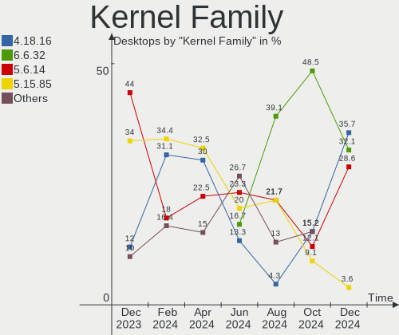
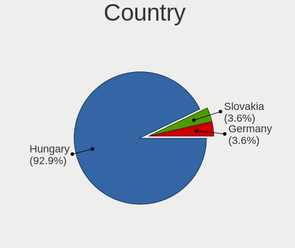
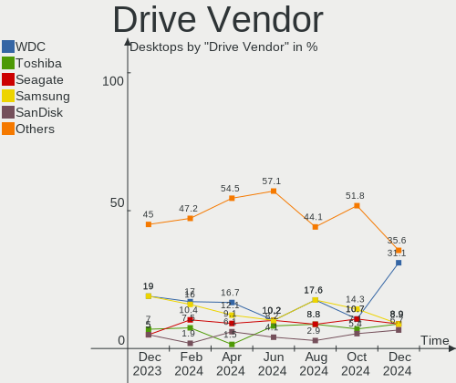
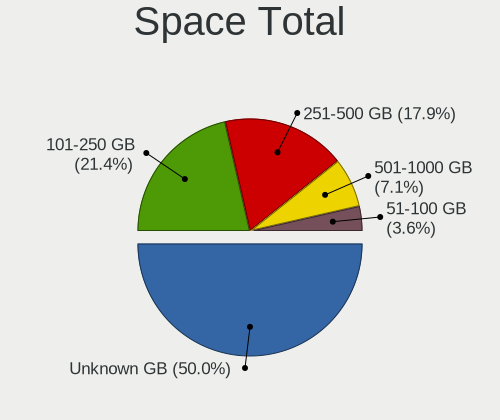
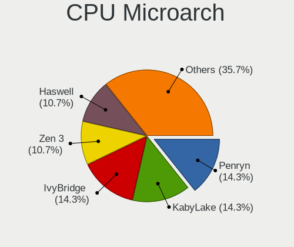
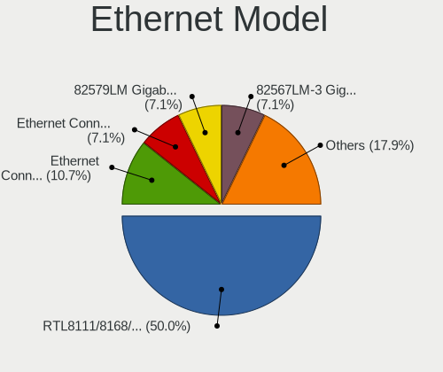
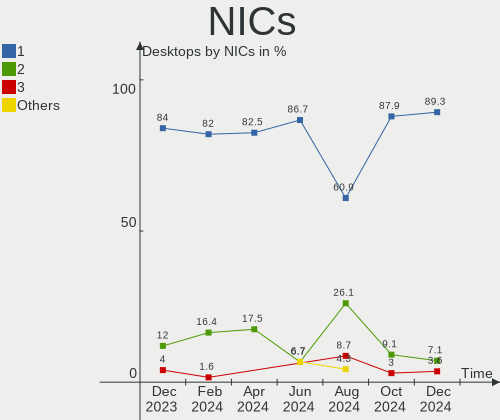
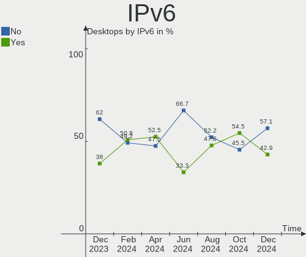
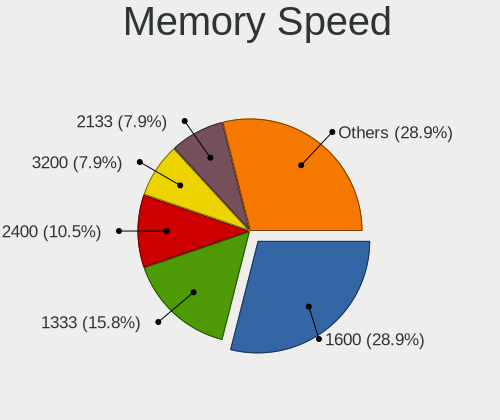

BlackPanther Hardware Trends (Desktops)
---------------------------------------

A project to identify most popular hardware characteristics and track their change
over time based on data collected by BlackPanther users at https://Linux-Hardware.org.

Anyone can contribute to this report by the [hw-probe](https://github.com/linuxhw/hw-probe) tool:

    sudo -E hw-probe -all -upload

Full-feature report is available here: https://linux-hardware.org/?view=trends

Period: Dec, 2021.

Contents
--------

* [ System ](#system)
  - [ OS                       ](#os)
  - [ OS Family                ](#os-family)
  - [ Kernel                   ](#kernel)
  - [ Kernel Family            ](#kernel-family)
  - [ Kernel Major Ver.        ](#kernel-major-ver)
  - [ Arch                     ](#arch)
  - [ DE                       ](#de)
  - [ Display Server           ](#display-server)
  - [ Display Manager          ](#display-manager)
  - [ OS Lang                  ](#os-lang)
  - [ Boot Mode                ](#boot-mode)
  - [ Filesystem               ](#filesystem)
  - [ Part. scheme             ](#part-scheme)
  - [ Dual Boot with Linux/BSD ](#dual-boot-with-linuxbsd)
  - [ Dual Boot (Win)          ](#dual-boot-win)

* [ Board ](#board)
  - [ Vendor                   ](#vendor)
  - [ Model                    ](#model)
  - [ Model Family             ](#model-family)
  - [ MFG Year                 ](#mfg-year)
  - [ Form Factor              ](#form-factor)
  - [ Secure Boot              ](#secure-boot)
  - [ Coreboot                 ](#coreboot)
  - [ RAM Size                 ](#ram-size)
  - [ RAM Used                 ](#ram-used)
  - [ Total Drives             ](#total-drives)
  - [ Has CD-ROM               ](#has-cd-rom)
  - [ Has Ethernet             ](#has-ethernet)
  - [ Has WiFi                 ](#has-wifi)
  - [ Has Bluetooth            ](#has-bluetooth)

* [ Location ](#location)
  - [ Country                  ](#country)
  - [ City                     ](#city)

* [ Drives ](#drives)
  - [ Drive Vendor             ](#drive-vendor)
  - [ Drive Model              ](#drive-model)
  - [ HDD Vendor               ](#hdd-vendor)
  - [ SSD Vendor               ](#ssd-vendor)
  - [ Drive Kind               ](#drive-kind)
  - [ Drive Connector          ](#drive-connector)
  - [ Drive Size               ](#drive-size)
  - [ Space Total              ](#space-total)
  - [ Space Used               ](#space-used)
  - [ Malfunc. Drives          ](#malfunc-drives)
  - [ Malfunc. Drive Vendor    ](#malfunc-drive-vendor)
  - [ Malfunc. HDD Vendor      ](#malfunc-hdd-vendor)
  - [ Malfunc. Drive Kind      ](#malfunc-drive-kind)
  - [ Failed Drives            ](#failed-drives)
  - [ Failed Drive Vendor      ](#failed-drive-vendor)
  - [ Drive Status             ](#drive-status)

* [ Storage controller ](#storage-controller)
  - [ Storage Vendor           ](#storage-vendor)
  - [ Storage Model            ](#storage-model)
  - [ Storage Kind             ](#storage-kind)

* [ Processor ](#processor)
  - [ CPU Vendor               ](#cpu-vendor)
  - [ CPU Model                ](#cpu-model)
  - [ CPU Model Family         ](#cpu-model-family)
  - [ CPU Cores                ](#cpu-cores)
  - [ CPU Sockets              ](#cpu-sockets)
  - [ CPU Threads              ](#cpu-threads)
  - [ CPU Op-Modes             ](#cpu-op-modes)
  - [ CPU Microcode            ](#cpu-microcode)
  - [ CPU Microarch            ](#cpu-microarch)

* [ Graphics ](#graphics)
  - [ GPU Vendor               ](#gpu-vendor)
  - [ GPU Model                ](#gpu-model)
  - [ GPU Combo                ](#gpu-combo)
  - [ GPU Driver               ](#gpu-driver)
  - [ GPU Memory               ](#gpu-memory)

* [ Monitor ](#monitor)
  - [ Monitor Vendor           ](#monitor-vendor)
  - [ Monitor Model            ](#monitor-model)
  - [ Monitor Resolution       ](#monitor-resolution)
  - [ Monitor Diagonal         ](#monitor-diagonal)
  - [ Monitor Width            ](#monitor-width)
  - [ Aspect Ratio             ](#aspect-ratio)
  - [ Monitor Area             ](#monitor-area)
  - [ Pixel Density            ](#pixel-density)
  - [ Multiple Monitors        ](#multiple-monitors)

* [ Network ](#network)
  - [ Net Controller Vendor    ](#net-controller-vendor)
  - [ Net Controller Model     ](#net-controller-model)
  - [ Wireless Vendor          ](#wireless-vendor)
  - [ Wireless Model           ](#wireless-model)
  - [ Ethernet Vendor          ](#ethernet-vendor)
  - [ Ethernet Model           ](#ethernet-model)
  - [ Net Controller Kind      ](#net-controller-kind)
  - [ Used Controller          ](#used-controller)
  - [ NICs                     ](#nics)
  - [ IPv6                     ](#ipv6)

* [ Bluetooth ](#bluetooth)
  - [ Bluetooth Vendor         ](#bluetooth-vendor)
  - [ Bluetooth Model          ](#bluetooth-model)

* [ Sound ](#sound)
  - [ Sound Vendor             ](#sound-vendor)
  - [ Sound Model              ](#sound-model)

* [ Memory ](#memory)
  - [ Memory Vendor            ](#memory-vendor)
  - [ Memory Model             ](#memory-model)
  - [ Memory Kind              ](#memory-kind)
  - [ Memory Form Factor       ](#memory-form-factor)
  - [ Memory Size              ](#memory-size)
  - [ Memory Speed             ](#memory-speed)

* [ Printers & scanners ](#printers--scanners)
  - [ Printer Vendor           ](#printer-vendor)
  - [ Printer Model            ](#printer-model)
  - [ Scanner Vendor           ](#scanner-vendor)
  - [ Scanner Model            ](#scanner-model)

* [ Camera ](#camera)
  - [ Camera Vendor            ](#camera-vendor)
  - [ Camera Model             ](#camera-model)

* [ Security ](#security)
  - [ Fingerprint Vendor       ](#fingerprint-vendor)
  - [ Fingerprint Model        ](#fingerprint-model)
  - [ Chipcard Vendor          ](#chipcard-vendor)
  - [ Chipcard Model           ](#chipcard-model)

* [ Unsupported ](#unsupported)
  - [ Unsupported Devices      ](#unsupported-devices)
  - [ Unsupported Device Types ](#unsupported-device-types)

System
------

OS
--

Installed operating systems

| Name              | Desktops | Percent |
|-------------------|----------|---------|
| BlackPanther 18.1 | 32       | 100%    |

OS Family
---------

OS without a version

| Name         | Desktops | Percent |
|--------------|----------|---------|
| BlackPanther | 32       | 100%    |

Kernel
------

Version of the Linux kernel

| Version             | Desktops | Percent |
|---------------------|----------|---------|
| 5.6.14-desktop-2bP  | 24       | 75%     |
| 4.18.16-desktop-1bP | 8        | 25%     |

Kernel Family
-------------

Linux kernel without a distro release

| Version | Desktops | Percent |
|---------|----------|---------|
| 5.6.14  | 24       | 75%     |
| 4.18.16 | 8        | 25%     |

Kernel Major Ver.
-----------------

Linux kernel major version

| Version | Desktops | Percent |
|---------|----------|---------|
| 5.6     | 24       | 75%     |
| 4.18    | 8        | 25%     |

Arch
----

OS architecture (x86_64, i586, etc.)

| Name   | Desktops | Percent |
|--------|----------|---------|
| x86_64 | 32       | 100%    |

DE
--

Desktop Environment

| Name | Desktops | Percent |
|------|----------|---------|
| KDE5 | 32       | 100%    |

Display Server
--------------

X11 or Wayland

| Name    | Desktops | Percent |
|---------|----------|---------|
| X11     | 31       | 96.88%  |
| Wayland | 1        | 3.13%   |

Display Manager
---------------

SDDM, LightDM, etc.

| Name | Desktops | Percent |
|------|----------|---------|
| SDDM | 32       | 100%    |

OS Lang
-------

Language

| Lang    | Desktops | Percent |
|---------|----------|---------|
| Unknown | 32       | 100%    |

Boot Mode
---------

EFI or BIOS

| Mode | Desktops | Percent |
|------|----------|---------|
| BIOS | 21       | 65.63%  |
| EFI  | 11       | 34.38%  |

Filesystem
----------

Type of filesystem

| Type    | Desktops | Percent |
|---------|----------|---------|
| Overlay | 31       | 96.88%  |
| Ext4    | 1        | 3.13%   |

Part. scheme
------------

Scheme of partitioning

| Type | Desktops | Percent |
|------|----------|---------|
| MBR  | 19       | 59.38%  |
| GPT  | 13       | 40.63%  |

Dual Boot with Linux/BSD
------------------------

Hosting more than one Linux/BSD

| Dual boot | Desktops | Percent |
|-----------|----------|---------|
| No        | 20       | 62.5%   |
| Yes       | 12       | 37.5%   |

Dual Boot (Win)
---------------

Hosting Linux and Windows

| Dual boot | Desktops | Percent |
|-----------|----------|---------|
| Yes       | 26       | 81.25%  |
| No        | 6        | 18.75%  |

Board
-----

Vendor
------

Motherboard manufacturer

| Name                | Desktops | Percent |
|---------------------|----------|---------|
| Gigabyte Technology | 9        | 28.13%  |
| ASUSTek Computer    | 6        | 18.75%  |
| Dell                | 4        | 12.5%   |
| ASRock              | 3        | 9.38%   |
| Medion              | 2        | 6.25%   |
| Lenovo              | 2        | 6.25%   |
| Foxconn             | 2        | 6.25%   |
| TYAN Computer       | 1        | 3.13%   |
| MSI                 | 1        | 3.13%   |
| Hewlett-Packard     | 1        | 3.13%   |
| Acer                | 1        | 3.13%   |

Model
-----

Motherboard model

| Name                             | Desktops | Percent |
|----------------------------------|----------|---------|
| Foxconn Pro 3500 Series          | 2        | 6.25%   |
| ASRock FM2A75M Pro4+             | 2        | 6.25%   |
| TYAN S2925                       | 1        | 3.13%   |
| MSI MS-7C88                      | 1        | 3.13%   |
| Medion MS-7748                   | 1        | 3.13%   |
| Medion MS-7646                   | 1        | 3.13%   |
| Lenovo ThinkCentre M77 1996AB8   | 1        | 3.13%   |
| Lenovo IdeaCentre Q190 10115     | 1        | 3.13%   |
| HP Z230 Tower Workstation        | 1        | 3.13%   |
| Gigabyte P67A-D3-B3              | 1        | 3.13%   |
| Gigabyte H61M-S2PV               | 1        | 3.13%   |
| Gigabyte H61M-DS2 DVI            | 1        | 3.13%   |
| Gigabyte H61M-D2-B3              | 1        | 3.13%   |
| Gigabyte G41MT-S2PT              | 1        | 3.13%   |
| Gigabyte EG41MF-US2H             | 1        | 3.13%   |
| Gigabyte B450M GAMING            | 1        | 3.13%   |
| Gigabyte B450 AORUS ELITE        | 1        | 3.13%   |
| Gigabyte A520M S2H               | 1        | 3.13%   |
| Dell Precision WorkStation T3500 | 1        | 3.13%   |
| Dell OptiPlex 780                | 1        | 3.13%   |
| Dell OptiPlex 760                | 1        | 3.13%   |
| Dell OptiPlex 330                | 1        | 3.13%   |
| ASUS TUF X470-PLUS GAMING        | 1        | 3.13%   |
| ASUS PRIME H370-PLUS             | 1        | 3.13%   |
| ASUS PRIME H310M-E R2.0          | 1        | 3.13%   |
| ASUS PRIME A320M-K               | 1        | 3.13%   |
| ASUS M5A78L-M LE/USB3            | 1        | 3.13%   |
| ASUS M4A88TD-V EVO/USB3          | 1        | 3.13%   |
| ASRock AM1B-ITX                  | 1        | 3.13%   |
| Acer Extensa E264                | 1        | 3.13%   |

Model Family
------------

Motherboard model prefix

| Name                 | Desktops | Percent |
|----------------------|----------|---------|
| Dell OptiPlex        | 3        | 9.38%   |
| ASUS PRIME           | 3        | 9.38%   |
| Foxconn Pro          | 2        | 6.25%   |
| ASRock FM2A75M       | 2        | 6.25%   |
| TYAN S2925           | 1        | 3.13%   |
| MSI MS-7C88          | 1        | 3.13%   |
| Medion MS-7748       | 1        | 3.13%   |
| Medion MS-7646       | 1        | 3.13%   |
| Lenovo ThinkCentre   | 1        | 3.13%   |
| Lenovo IdeaCentre    | 1        | 3.13%   |
| HP Z230              | 1        | 3.13%   |
| Gigabyte P67A-D3-B3  | 1        | 3.13%   |
| Gigabyte H61M-S2PV   | 1        | 3.13%   |
| Gigabyte H61M-DS2    | 1        | 3.13%   |
| Gigabyte H61M-D2-B3  | 1        | 3.13%   |
| Gigabyte G41MT-S2PT  | 1        | 3.13%   |
| Gigabyte EG41MF-US2H | 1        | 3.13%   |
| Gigabyte B450M       | 1        | 3.13%   |
| Gigabyte B450        | 1        | 3.13%   |
| Gigabyte A520M       | 1        | 3.13%   |
| Dell Precision       | 1        | 3.13%   |
| ASUS TUF             | 1        | 3.13%   |
| ASUS M5A78L-M        | 1        | 3.13%   |
| ASUS M4A88TD-V       | 1        | 3.13%   |
| ASRock AM1B-ITX      | 1        | 3.13%   |
| Acer Extensa         | 1        | 3.13%   |

MFG Year
--------

Motherboard manufacture year

| Year | Desktops | Percent |
|------|----------|---------|
| 2013 | 4        | 12.5%   |
| 2012 | 4        | 12.5%   |
| 2011 | 4        | 12.5%   |
| 2019 | 3        | 9.38%   |
| 2014 | 3        | 9.38%   |
| 2008 | 3        | 9.38%   |
| 2021 | 2        | 6.25%   |
| 2020 | 2        | 6.25%   |
| 2010 | 2        | 6.25%   |
| 2009 | 2        | 6.25%   |
| 2018 | 1        | 3.13%   |
| 2017 | 1        | 3.13%   |
| 2015 | 1        | 3.13%   |

Form Factor
-----------

Physical design of the computer

| Name    | Desktops | Percent |
|---------|----------|---------|
| Desktop | 32       | 100%    |

Secure Boot
-----------

Enabled or disabled

| State    | Desktops | Percent |
|----------|----------|---------|
| Disabled | 32       | 100%    |

Coreboot
--------

Have coreboot on board

| Used | Desktops | Percent |
|------|----------|---------|
| No   | 32       | 100%    |

RAM Size
--------

Total RAM memory

| Size in GB | Desktops | Percent |
|------------|----------|---------|
| 8.01-16.0  | 13       | 40.63%  |
| 3.01-4.0   | 7        | 21.88%  |
| 16.01-24.0 | 7        | 21.88%  |
| 4.01-8.0   | 4        | 12.5%   |
| 1.01-2.0   | 1        | 3.13%   |

RAM Used
--------

Used RAM memory

| Used GB  | Desktops | Percent |
|----------|----------|---------|
| 0.01-0.5 | 19       | 59.38%  |
| 0.51-1.0 | 11       | 34.38%  |
| 1.01-2.0 | 2        | 6.25%   |

Total Drives
------------

Number of drives on board

| Drives | Desktops | Percent |
|--------|----------|---------|
| 1      | 14       | 43.75%  |
| 2      | 11       | 34.38%  |
| 4      | 3        | 9.38%   |
| 5      | 2        | 6.25%   |
| 3      | 2        | 6.25%   |

Has CD-ROM
----------

Has CD-ROM on board

| Presented | Desktops | Percent |
|-----------|----------|---------|
| Yes       | 22       | 68.75%  |
| No        | 10       | 31.25%  |

Has Ethernet
------------

Has Ethernet on board

| Presented | Desktops | Percent |
|-----------|----------|---------|
| Yes       | 32       | 100%    |

Has WiFi
--------

Has WiFi module

| Presented | Desktops | Percent |
|-----------|----------|---------|
| No        | 25       | 78.13%  |
| Yes       | 7        | 21.88%  |

Has Bluetooth
-------------

Has Bluetooth module

| Presented | Desktops | Percent |
|-----------|----------|---------|
| No        | 31       | 96.88%  |
| Yes       | 1        | 3.13%   |

Location
--------

Country
-------

Geographic location (country)

| Country | Desktops | Percent |
|---------|----------|---------|
| Hungary | 30       | 93.75%  |
| Ukraine | 1        | 3.13%   |
| Canada  | 1        | 3.13%   |

City
----

Geographic location (city)

| City              | Desktops | Percent |
|-------------------|----------|---------|
| Budapest          | 5        | 15.63%  |
| Karcag            | 3        | 9.38%   |
| Vardomb           | 2        | 6.25%   |
| Debrecen          | 2        | 6.25%   |
| Zalaegerszeg      | 1        | 3.13%   |
| Veszpr?©m         | 1        | 3.13%   |
| Uzhhorod          | 1        | 3.13%   |
| Toronto           | 1        | 3.13%   |
| Tatab??nya        | 1        | 3.13%   |
| Szombathely       | 1        | 3.13%   |
| Szentantalfa      | 1        | 3.13%   |
| Sz?©kesfeh?©rv??r | 1        | 3.13%   |
| Roszke            | 1        | 3.13%   |
| Perkata           | 1        | 3.13%   |
| P?©cs             | 1        | 3.13%   |
| Oroshaza          | 1        | 3.13%   |
| Nagykata          | 1        | 3.13%   |
| Lebeny            | 1        | 3.13%   |
| Kisvarda          | 1        | 3.13%   |
| Jaszapati         | 1        | 3.13%   |
| Felsonyek         | 1        | 3.13%   |
| Esztergom         | 1        | 3.13%   |
| Balatonszabadi    | 1        | 3.13%   |
| Balatonfured      | 1        | 3.13%   |

Drives
------

Drive Vendor
------------

Hard drive vendors

| Vendor              | Desktops | Drives | Percent |
|---------------------|----------|--------|---------|
| WDC                 | 15       | 18     | 26.79%  |
| Kingston            | 10       | 12     | 17.86%  |
| Samsung Electronics | 7        | 10     | 12.5%   |
| Seagate             | 4        | 6      | 7.14%   |
| Hitachi             | 4        | 4      | 7.14%   |
| A-DATA Technology   | 4        | 4      | 7.14%   |
| Toshiba             | 1        | 1      | 1.79%   |
| Netac               | 1        | 1      | 1.79%   |
| MAXTOR              | 1        | 1      | 1.79%   |
| KingSpec            | 1        | 1      | 1.79%   |
| Kingmax             | 1        | 1      | 1.79%   |
| JMicron             | 1        | 1      | 1.79%   |
| Intenso             | 1        | 1      | 1.79%   |
| HGST                | 1        | 1      | 1.79%   |
| Gigabyte Technology | 1        | 1      | 1.79%   |
| Crucial             | 1        | 1      | 1.79%   |
| Apple               | 1        | 1      | 1.79%   |
| Apacer              | 1        | 1      | 1.79%   |

Drive Model
-----------

Hard drive models

| Model                                | Desktops | Percent |
|--------------------------------------|----------|---------|
| Samsung HD154UI 1TB                  | 2        | 3.17%   |
| Kingston SA400S37480G 480GB SSD      | 2        | 3.17%   |
| Kingston SA400S37240G 240GB SSD      | 2        | 3.17%   |
| Hitachi HDS721050CLA360 500GB        | 2        | 3.17%   |
| A-DATA SU630 240GB SSD               | 2        | 3.17%   |
| WDC WDS120G2G0A-00JH30 120GB SSD     | 1        | 1.59%   |
| WDC WDS100T3X0C-00SJG0 1TB           | 1        | 1.59%   |
| WDC WD5000BPVT-80HXZT1 500GB         | 1        | 1.59%   |
| WDC WD3200AAJS-22B4A0 320GB          | 1        | 1.59%   |
| WDC WD30EZRZ-00Z5HB0 3TB             | 1        | 1.59%   |
| WDC WD30EZRZ-00GXCB0 3TB             | 1        | 1.59%   |
| WDC WD30EFRX-68EUZN0 3TB             | 1        | 1.59%   |
| WDC WD2502ABYS-02B7A0 256GB          | 1        | 1.59%   |
| WDC WD2500AAJS-07M0A0 250GB          | 1        | 1.59%   |
| WDC WD20EARX-00PASB0 2TB             | 1        | 1.59%   |
| WDC WD1600AAJS-00WAA0 160GB          | 1        | 1.59%   |
| WDC WD1600AAJB-56WRA0 160GB          | 1        | 1.59%   |
| WDC WD15EARS-00MVWB0 1TB             | 1        | 1.59%   |
| WDC WD10EZRZ-00HTKB0 1TB             | 1        | 1.59%   |
| WDC WD10EZEX-08WN4A0 1TB             | 1        | 1.59%   |
| WDC WD10EZEX-00ZF5A0 1TB             | 1        | 1.59%   |
| WDC WD10EZEX-00WN4A0 1TB             | 1        | 1.59%   |
| WDC WD10EZEX-00BN5A0 1TB             | 1        | 1.59%   |
| Toshiba DT01ACA200 2TB               | 1        | 1.59%   |
| Seagate ST9250315AS 250GB            | 1        | 1.59%   |
| Seagate ST500LM000-1EJ162 500GB      | 1        | 1.59%   |
| Seagate ST500DM002-1BD142 500GB      | 1        | 1.59%   |
| Seagate ST4000DM000-1F2168 4TB       | 1        | 1.59%   |
| Seagate ST2000DM001-1CH164 2TB       | 1        | 1.59%   |
| Samsung SSD 830 Series 64GB          | 1        | 1.59%   |
| Samsung SP2004C 200GB                | 1        | 1.59%   |
| Samsung MZ7TE128HMGR-000L1 128GB SSD | 1        | 1.59%   |
| Samsung HD502IJ 500GB                | 1        | 1.59%   |
| Samsung HD502HJ 500GB                | 1        | 1.59%   |
| Samsung HD161HJ 160GB                | 1        | 1.59%   |
| Netac SSD 256GB                      | 1        | 1.59%   |
| MAXTOR 6V250F0 256GB                 | 1        | 1.59%   |
| Kingston SV300S37A120G 120GB SSD     | 1        | 1.59%   |
| Kingston SUV500MS120G 120GB SSD      | 1        | 1.59%   |
| Kingston SUV500M8240G 240GB SSD      | 1        | 1.59%   |
| Kingston SUV400S37240G 240GB SSD     | 1        | 1.59%   |
| Kingston SUV400S37120G 120GB SSD     | 1        | 1.59%   |
| Kingston SNVS500G 500GB              | 1        | 1.59%   |
| Kingston SA400S37120G 120GB SSD      | 1        | 1.59%   |
| Kingston SA2000M8250G 250GB          | 1        | 1.59%   |
| KingSpec P3-128 128GB SSD            | 1        | 1.59%   |
| Kingmax SSD 240GB                    | 1        | 1.59%   |
| JMicron Generic 250GB                | 1        | 1.59%   |
| Intenso SSD SATAIII 128GB            | 1        | 1.59%   |
| Hitachi HTS543232A7A384 320GB        | 1        | 1.59%   |
| Hitachi HDP725050GLA360 500GB        | 1        | 1.59%   |
| HGST HTS541010B7E610 1TB             | 1        | 1.59%   |
| Gigabyte GP-GSM2NE3100TNTD 1TB       | 1        | 1.59%   |
| Crucial CT120BX500SSD1 120GB         | 1        | 1.59%   |
| Apple HDD ST2000DM001 2TB            | 1        | 1.59%   |
| Apacer AS340 240GB SSD               | 1        | 1.59%   |
| A-DATA SU650 120GB SSD               | 1        | 1.59%   |
| A-DATA SP920SS 128GB SSD             | 1        | 1.59%   |

HDD Vendor
----------

Hard disk drive vendors

| Vendor              | Desktops | Drives | Percent |
|---------------------|----------|--------|---------|
| WDC                 | 14       | 16     | 43.75%  |
| Samsung Electronics | 6        | 7      | 18.75%  |
| Seagate             | 4        | 6      | 12.5%   |
| Hitachi             | 4        | 4      | 12.5%   |
| Toshiba             | 1        | 1      | 3.13%   |
| MAXTOR              | 1        | 1      | 3.13%   |
| HGST                | 1        | 1      | 3.13%   |
| Apple               | 1        | 1      | 3.13%   |

SSD Vendor
----------

Solid state drive vendors

| Vendor              | Desktops | Drives | Percent |
|---------------------|----------|--------|---------|
| Kingston            | 8        | 10     | 36.36%  |
| A-DATA Technology   | 4        | 4      | 18.18%  |
| Samsung Electronics | 2        | 3      | 9.09%   |
| WDC                 | 1        | 1      | 4.55%   |
| Netac               | 1        | 1      | 4.55%   |
| KingSpec            | 1        | 1      | 4.55%   |
| Kingmax             | 1        | 1      | 4.55%   |
| JMicron             | 1        | 1      | 4.55%   |
| Intenso             | 1        | 1      | 4.55%   |
| Crucial             | 1        | 1      | 4.55%   |
| Apacer              | 1        | 1      | 4.55%   |

Drive Kind
----------

HDD or SSD

| Kind | Desktops | Drives | Percent |
|------|----------|--------|---------|
| HDD  | 24       | 37     | 52.17%  |
| SSD  | 18       | 25     | 39.13%  |
| NVMe | 4        | 4      | 8.7%    |

Drive Connector
---------------

SATA, SAS, NVMe, etc.

| Type | Desktops | Drives | Percent |
|------|----------|--------|---------|
| SATA | 31       | 61     | 86.11%  |
| NVMe | 4        | 4      | 11.11%  |
| SAS  | 1        | 1      | 2.78%   |

Drive Size
----------

Size of hard drive

| Size in TB | Desktops | Drives | Percent |
|------------|----------|--------|---------|
| 0.01-0.5   | 26       | 44     | 63.41%  |
| 0.51-1.0   | 8        | 10     | 19.51%  |
| 1.01-2.0   | 4        | 4      | 9.76%   |
| 2.01-3.0   | 2        | 3      | 4.88%   |
| 3.01-4.0   | 1        | 1      | 2.44%   |

Space Total
-----------

Amount of disk space available on the file system

| Size in GB | Desktops | Percent |
|------------|----------|---------|
| Unknown    | 32       | 100%    |

Space Used
----------

Amount of used disk space

| Used GB | Desktops | Percent |
|---------|----------|---------|
| Unknown | 32       | 100%    |

Malfunc. Drives
---------------

Drive models with a malfunction

| Model                               | Desktops | Drives | Percent |
|-------------------------------------|----------|--------|---------|
| A-DATA Technology SU630 240GB SSD   | 2        | 2      | 12.5%   |
| WDC WD5000BPVT-80HXZT1 500GB        | 1        | 1      | 6.25%   |
| WDC WD3200AAJS-22B4A0 320GB         | 1        | 1      | 6.25%   |
| WDC WD2500AAJS-07M0A0 250GB         | 1        | 1      | 6.25%   |
| WDC WD20EARX-00PASB0 2TB            | 1        | 1      | 6.25%   |
| WDC WD15EARS-00MVWB0 1TB            | 1        | 1      | 6.25%   |
| WDC WD10EZEX-08WN4A0 1TB            | 1        | 1      | 6.25%   |
| Seagate ST9250315AS 250GB           | 1        | 1      | 6.25%   |
| Seagate ST500DM002-1BD142 500GB     | 1        | 2      | 6.25%   |
| Seagate ST4000DM000-1F2168 4TB      | 1        | 1      | 6.25%   |
| Samsung Electronics SP2004C 200GB   | 1        | 1      | 6.25%   |
| Samsung Electronics HD161HJ 160GB   | 1        | 1      | 6.25%   |
| MAXTOR 6V250F0 256GB                | 1        | 1      | 6.25%   |
| Hitachi HDP725050GLA360 500GB       | 1        | 1      | 6.25%   |
| A-DATA Technology SP920SS 128GB SSD | 1        | 1      | 6.25%   |

Malfunc. Drive Vendor
---------------------

Vendors of faulty drives

| Vendor              | Desktops | Drives | Percent |
|---------------------|----------|--------|---------|
| WDC                 | 6        | 6      | 37.5%   |
| Seagate             | 3        | 4      | 18.75%  |
| A-DATA Technology   | 3        | 3      | 18.75%  |
| Samsung Electronics | 2        | 2      | 12.5%   |
| MAXTOR              | 1        | 1      | 6.25%   |
| Hitachi             | 1        | 1      | 6.25%   |

Malfunc. HDD Vendor
-------------------

Vendors of faulty HDD drives

| Vendor              | Desktops | Drives | Percent |
|---------------------|----------|--------|---------|
| WDC                 | 6        | 6      | 46.15%  |
| Seagate             | 3        | 4      | 23.08%  |
| Samsung Electronics | 2        | 2      | 15.38%  |
| MAXTOR              | 1        | 1      | 7.69%   |
| Hitachi             | 1        | 1      | 7.69%   |

Malfunc. Drive Kind
-------------------

Kinds of faulty drives

| Kind | Desktops | Drives | Percent |
|------|----------|--------|---------|
| HDD  | 12       | 14     | 80%     |
| SSD  | 3        | 3      | 20%     |

Failed Drives
-------------

Failed drive models

Zero info for selected period =(

Failed Drive Vendor
-------------------

Failed drive vendors

Zero info for selected period =(

Drive Status
------------

Number of failed and malfunc. drives

| Status   | Desktops | Drives | Percent |
|----------|----------|--------|---------|
| Works    | 26       | 48     | 61.9%   |
| Malfunc  | 15       | 17     | 35.71%  |
| Detected | 1        | 1      | 2.38%   |

Storage controller
------------------

Storage Vendor
--------------

Storage controller vendors

| Vendor                      | Desktops | Percent |
|-----------------------------|----------|---------|
| Intel                       | 17       | 42.5%   |
| AMD                         | 13       | 32.5%   |
| VIA Technologies            | 2        | 5%      |
| Nvidia                      | 2        | 5%      |
| Kingston Technology Company | 2        | 5%      |
| ASMedia Technology          | 2        | 5%      |
| Sandisk                     | 1        | 2.5%    |
| Phison Electronics          | 1        | 2.5%    |

Storage Model
-------------

Storage controller models

| Model                                                                                   | Desktops | Percent |
|-----------------------------------------------------------------------------------------|----------|---------|
| AMD FCH SATA Controller [AHCI mode]                                                     | 7        | 12.5%   |
| Intel 6 Series/C200 Series Chipset Family Desktop SATA Controller (IDE mode, ports 4-5) | 3        | 5.36%   |
| Intel 6 Series/C200 Series Chipset Family Desktop SATA Controller (IDE mode, ports 0-3) | 3        | 5.36%   |
| Intel 6 Series/C200 Series Chipset Family 6 port Desktop SATA AHCI Controller           | 3        | 5.36%   |
| AMD 400 Series Chipset SATA Controller                                                  | 3        | 5.36%   |
| Intel NM10/ICH7 Family SATA Controller [IDE mode]                                       | 2        | 3.57%   |
| Intel 82801JD/DO (ICH10 Family) SATA AHCI Controller                                    | 2        | 3.57%   |
| Intel 82801G (ICH7 Family) IDE Controller                                               | 2        | 3.57%   |
| ASMedia ASM1062 Serial ATA Controller                                                   | 2        | 3.57%   |
| AMD SB7x0/SB8x0/SB9x0 SATA Controller [IDE mode]                                        | 2        | 3.57%   |
| AMD SB7x0/SB8x0/SB9x0 SATA Controller [AHCI mode]                                       | 2        | 3.57%   |
| AMD SB7x0/SB8x0/SB9x0 IDE Controller                                                    | 2        | 3.57%   |
| AMD FCH IDE Controller                                                                  | 2        | 3.57%   |
| VIA VT6421 IDE/SATA Controller                                                          | 1        | 1.79%   |
| VIA VT6415 PATA IDE Host Controller                                                     | 1        | 1.79%   |
| Sandisk WD Black SN750 / PC SN730 NVMe SSD                                              | 1        | 1.79%   |
| Phison PS5013 E13 NVMe Controller                                                       | 1        | 1.79%   |
| Nvidia MCP73 SATA Controller (IDE mode)                                                 | 1        | 1.79%   |
| Nvidia MCP73 IDE Controller                                                             | 1        | 1.79%   |
| Nvidia MCP55 SATA Controller                                                            | 1        | 1.79%   |
| Nvidia MCP55 IDE                                                                        | 1        | 1.79%   |
| Kingston Company SNVS2000G [NV1 NVMe PCIe SSD 2TB]                                      | 1        | 1.79%   |
| Kingston Company A2000 NVMe SSD                                                         | 1        | 1.79%   |
| Intel SATA Controller [RAID mode]                                                       | 1        | 1.79%   |
| Intel NM10/ICH7 Family SATA Controller [AHCI mode]                                      | 1        | 1.79%   |
| Intel 82801JI (ICH10 Family) 4 port SATA IDE Controller #1                              | 1        | 1.79%   |
| Intel 82801JI (ICH10 Family) 2 port SATA IDE Controller #2                              | 1        | 1.79%   |
| Intel 8 Series/C220 Series Chipset Family 6-port SATA Controller 1 [AHCI mode]          | 1        | 1.79%   |
| Intel 7 Series Chipset Family 6-port SATA Controller [AHCI mode]                        | 1        | 1.79%   |
| Intel 400 Series Chipset Family SATA AHCI Controller                                    | 1        | 1.79%   |
| Intel 4 Series Chipset PT IDER Controller                                               | 1        | 1.79%   |
| Intel 200 Series PCH SATA controller [AHCI mode]                                        | 1        | 1.79%   |
| AMD Starship/Matisse Chipset SATA Controller [AHCI mode]                                | 1        | 1.79%   |
| AMD FCH SATA Controller D                                                               | 1        | 1.79%   |

Storage Kind
------------

Kind of storage controller (IDE, SATA, NVMe, SAS, ...)

| Kind | Desktops | Percent |
|------|----------|---------|
| SATA | 23       | 52.27%  |
| IDE  | 15       | 34.09%  |
| NVMe | 4        | 9.09%   |
| RAID | 2        | 4.55%   |

Processor
---------

CPU Vendor
----------

Processor vendors

| Vendor | Desktops | Percent |
|--------|----------|---------|
| Intel  | 18       | 56.25%  |
| AMD    | 14       | 43.75%  |

CPU Model
---------

Processor models

| Model                                       | Desktops | Percent |
|---------------------------------------------|----------|---------|
| Intel Core i3-3220 CPU @ 3.30GHz            | 2        | 6.25%   |
| Intel Core i3-2120 CPU @ 3.30GHz            | 2        | 6.25%   |
| Intel Core 2 Duo CPU E8400 @ 3.00GHz        | 2        | 6.25%   |
| AMD A8-6600K APU with Radeon HD Graphics    | 2        | 6.25%   |
| Intel Xeon CPU W3540 @ 2.93GHz              | 1        | 3.13%   |
| Intel Xeon CPU E3-1240 v3 @ 3.40GHz         | 1        | 3.13%   |
| Intel Pentium Dual CPU E2220 @ 2.40GHz      | 1        | 3.13%   |
| Intel Pentium CPU G840 @ 2.80GHz            | 1        | 3.13%   |
| Intel Core i5-8500 CPU @ 3.00GHz            | 1        | 3.13%   |
| Intel Core i5-2300 CPU @ 2.80GHz            | 1        | 3.13%   |
| Intel Core i3-8100 CPU @ 3.60GHz            | 1        | 3.13%   |
| Intel Core i3-3217U CPU @ 1.80GHz           | 1        | 3.13%   |
| Intel Core i3-10100 CPU @ 3.60GHz           | 1        | 3.13%   |
| Intel Core 2 Quad CPU Q9300 @ 2.50GHz       | 1        | 3.13%   |
| Intel Celeron CPU E3300 @ 2.50GHz           | 1        | 3.13%   |
| Intel Celeron CPU 430 @ 1.80GHz             | 1        | 3.13%   |
| AMD Sempron 3850 APU with Radeon R3         | 1        | 3.13%   |
| AMD Ryzen 5 5600G with Radeon Graphics      | 1        | 3.13%   |
| AMD Ryzen 5 3600X 6-Core Processor          | 1        | 3.13%   |
| AMD Ryzen 5 3400G with Radeon Vega Graphics | 1        | 3.13%   |
| AMD Ryzen 5 1600X Six-Core Processor        | 1        | 3.13%   |
| AMD Ryzen 3 3200G with Radeon Vega Graphics | 1        | 3.13%   |
| AMD FX-6300 Six-Core Processor              | 1        | 3.13%   |
| AMD FX-4100 Quad-Core Processor             | 1        | 3.13%   |
| AMD Dual-Core Opteron Processor 1214        | 1        | 3.13%   |
| AMD Athlon II X4 640 Processor              | 1        | 3.13%   |
| AMD Athlon II X4 620 Processor              | 1        | 3.13%   |
| AMD A8-3800 APU with Radeon HD Graphics     | 1        | 3.13%   |

CPU Model Family
----------------

Processor model prefix

| Model              | Desktops | Percent |
|--------------------|----------|---------|
| Intel Core i3      | 7        | 21.88%  |
| AMD Ryzen 5        | 4        | 12.5%   |
| AMD A8             | 3        | 9.38%   |
| Intel Xeon         | 2        | 6.25%   |
| Intel Core i5      | 2        | 6.25%   |
| Intel Core 2 Duo   | 2        | 6.25%   |
| Intel Celeron      | 2        | 6.25%   |
| AMD FX             | 2        | 6.25%   |
| AMD Athlon II X4   | 2        | 6.25%   |
| Other              | 1        | 3.13%   |
| Intel Pentium Dual | 1        | 3.13%   |
| Intel Pentium      | 1        | 3.13%   |
| Intel Core 2 Quad  | 1        | 3.13%   |
| AMD Sempron        | 1        | 3.13%   |
| AMD Ryzen 3        | 1        | 3.13%   |

CPU Cores
---------

Number of processor cores

| Number | Desktops | Percent |
|--------|----------|---------|
| 2      | 14       | 43.75%  |
| 4      | 12       | 37.5%   |
| 6      | 4        | 12.5%   |
| 3      | 1        | 3.13%   |
| 1      | 1        | 3.13%   |

CPU Sockets
-----------

Number of sockets

| Number | Desktops | Percent |
|--------|----------|---------|
| 1      | 32       | 100%    |

CPU Threads
-----------

Threads per core (Hyper-Threading)

| Number | Desktops | Percent |
|--------|----------|---------|
| 2      | 16       | 50%     |
| 1      | 16       | 50%     |

CPU Op-Modes
------------

CPU Operation Modes (32-bit, 64-bit)

| Op mode        | Desktops | Percent |
|----------------|----------|---------|
| 32-bit, 64-bit | 32       | 100%    |

CPU Microcode
-------------

Microcode number

| Number     | Desktops | Percent |
|------------|----------|---------|
| 0x206a7    | 4        | 12.5%   |
| 0x306a9    | 3        | 9.38%   |
| 0x1067a    | 3        | 9.38%   |
| 0x08108109 | 2        | 6.25%   |
| 0x06001119 | 2        | 6.25%   |
| 0xa0653    | 1        | 3.13%   |
| 0x906eb    | 1        | 3.13%   |
| 0x906ea    | 1        | 3.13%   |
| 0x6fd      | 1        | 3.13%   |
| 0x306c3    | 1        | 3.13%   |
| 0x106a5    | 1        | 3.13%   |
| 0x10677    | 1        | 3.13%   |
| 0x10661    | 1        | 3.13%   |
| 0x0a50000c | 1        | 3.13%   |
| 0x08701013 | 1        | 3.13%   |
| 0x08001138 | 1        | 3.13%   |
| 0x0700010f | 1        | 3.13%   |
| 0x06000852 | 1        | 3.13%   |
| 0x0600063d | 1        | 3.13%   |
| 0x03000027 | 1        | 3.13%   |
| 0x010000db | 1        | 3.13%   |
| 0x010000c8 | 1        | 3.13%   |
| Unknown    | 1        | 3.13%   |

CPU Microarch
-------------

Microarchitecture

| Name        | Desktops | Percent |
|-------------|----------|---------|
| SandyBridge | 4        | 12.5%   |
| Penryn      | 4        | 12.5%   |
| Piledriver  | 3        | 9.38%   |
| IvyBridge   | 3        | 9.38%   |
| Zen+        | 2        | 6.25%   |
| KabyLake    | 2        | 6.25%   |
| K10         | 2        | 6.25%   |
| Core        | 2        | 6.25%   |
| Zen 3       | 1        | 3.13%   |
| Zen 2       | 1        | 3.13%   |
| Zen         | 1        | 3.13%   |
| Nehalem     | 1        | 3.13%   |
| K8 Hammer   | 1        | 3.13%   |
| K10 Llano   | 1        | 3.13%   |
| Jaguar      | 1        | 3.13%   |
| Haswell     | 1        | 3.13%   |
| CometLake   | 1        | 3.13%   |
| Bulldozer   | 1        | 3.13%   |

Graphics
--------

GPU Vendor
----------

Vendors of graphics cards

| Vendor                                       | Desktops | Percent |
|----------------------------------------------|----------|---------|
| AMD                                          | 17       | 53.13%  |
| Nvidia                                       | 8        | 25%     |
| Intel                                        | 6        | 18.75%  |
| XGI Technology (eXtreme Graphics Innovation) | 1        | 3.13%   |

GPU Model
---------

Graphics card models

| Model                                                                | Desktops | Percent |
|----------------------------------------------------------------------|----------|---------|
| Nvidia G86 [GeForce 8500 GT]                                         | 2        | 5.88%   |
| Intel 4 Series Chipset Integrated Graphics Controller                | 2        | 5.88%   |
| AMD Richland [Radeon HD 8570D]                                       | 2        | 5.88%   |
| AMD Redwood XT [Radeon HD 5670/5690/5730]                            | 2        | 5.88%   |
| AMD Picasso/Raven 2 [Radeon Vega Series / Radeon Vega Mobile Series] | 2        | 5.88%   |
| AMD Oland PRO [Radeon R7 240/340]                                    | 2        | 5.88%   |
| XGI Technology (eXtreme Graphics Innovation) Z7/Z9 (XG20 core)       | 1        | 2.94%   |
| Nvidia GT218 [GeForce 210]                                           | 1        | 2.94%   |
| Nvidia GK208B [GeForce GT 710]                                       | 1        | 2.94%   |
| Nvidia GK110B [GeForce GTX 780 Ti]                                   | 1        | 2.94%   |
| Nvidia GF119 [GeForce GT 610]                                        | 1        | 2.94%   |
| Nvidia GF116 [GeForce GTS 450 Rev. 2]                                | 1        | 2.94%   |
| Nvidia GF108GL [Quadro 600]                                          | 1        | 2.94%   |
| Nvidia G96C [GeForce 9500 GT]                                        | 1        | 2.94%   |
| Intel Xeon E3-1200 v2/3rd Gen Core processor Graphics Controller     | 1        | 2.94%   |
| Intel CoffeeLake-S GT2 [UHD Graphics 630]                            | 1        | 2.94%   |
| Intel 82G33/G31 Express Integrated Graphics Controller               | 1        | 2.94%   |
| Intel 3rd Gen Core processor Graphics Controller                     | 1        | 2.94%   |
| AMD Turks XT [Radeon HD 6670/7670]                                   | 1        | 2.94%   |
| AMD Sumo [Radeon HD 6550D]                                           | 1        | 2.94%   |
| AMD RV630 XT [Radeon HD 2600 XT]                                     | 1        | 2.94%   |
| AMD RV610 [Radeon HD 2400 PRO]                                       | 1        | 2.94%   |
| AMD RS880 [Radeon HD 4250]                                           | 1        | 2.94%   |
| AMD Oland XT [Radeon HD 8670 / R5 340X OEM / R7 250/350/350X OEM]    | 1        | 2.94%   |
| AMD Kabini [Radeon HD 8280 / R3 Series]                              | 1        | 2.94%   |
| AMD Ellesmere [Radeon RX 470/480/570/570X/580/580X/590]              | 1        | 2.94%   |
| AMD Cezanne                                                          | 1        | 2.94%   |
| AMD Cedar [Radeon HD 5000/6000/7350/8350 Series]                     | 1        | 2.94%   |

GPU Combo
---------

Combinations of graphics cards

| Name       | Desktops | Percent |
|------------|----------|---------|
| 1 x AMD    | 16       | 50%     |
| 1 x Nvidia | 8        | 25%     |
| 1 x Intel  | 6        | 18.75%  |
| 2 x AMD    | 1        | 3.13%   |
| 1 x XGI    | 1        | 3.13%   |

GPU Driver
----------

Free vs proprietary

| Driver  | Desktops | Percent |
|---------|----------|---------|
| Free    | 29       | 90.63%  |
| Unknown | 3        | 9.38%   |

GPU Memory
----------

Total video memory

| Size in GB | Desktops | Percent |
|------------|----------|---------|
| 0.51-1.0   | 12       | 37.5%   |
| Unknown    | 8        | 25%     |
| 0.01-0.5   | 6        | 18.75%  |
| 1.01-2.0   | 4        | 12.5%   |
| 7.01-8.0   | 1        | 3.13%   |
| 2.01-3.0   | 1        | 3.13%   |

Monitor
-------

Monitor Vendor
--------------

Monitor vendors

| Vendor               | Desktops | Percent |
|----------------------|----------|---------|
| Goldstar             | 7        | 22.58%  |
| Samsung Electronics  | 6        | 19.35%  |
| Dell                 | 4        | 12.9%   |
| Ancor Communications | 4        | 12.9%   |
| HannStar             | 2        | 6.45%   |
| BenQ                 | 2        | 6.45%   |
| MStar                | 1        | 3.23%   |
| Medion               | 1        | 3.23%   |
| IBM                  | 1        | 3.23%   |
| Hewlett-Packard      | 1        | 3.23%   |
| Gigabyte Technology  | 1        | 3.23%   |
| AOC                  | 1        | 3.23%   |

Monitor Model
-------------

Monitor models

| Model                                                                 | Desktops | Percent |
|-----------------------------------------------------------------------|----------|---------|
| BenQ EW277HDR BNQ7948 1920x1080 598x336mm 27.0-inch                   | 2        | 6.45%   |
| Ancor Communications VW195 ACI19AB 1440x900 410x260mm 19.1-inch       | 2        | 6.45%   |
| Samsung Electronics SyncMaster SAM050A 1920x1080 477x268mm 21.5-inch  | 1        | 3.23%   |
| Samsung Electronics SyncMaster SAM036F 1440x900 428x255mm 19.6-inch   | 1        | 3.23%   |
| Samsung Electronics SyncMaster SAM0258 1280x1024 376x301mm 19.0-inch  | 1        | 3.23%   |
| Samsung Electronics SMBX2250 SAM071B 1920x1080 477x268mm 21.5-inch    | 1        | 3.23%   |
| Samsung Electronics S27E500 SAM0D0D 1920x1080 600x340mm 27.2-inch     | 1        | 3.23%   |
| Samsung Electronics EPSON PJ     SECA114 1600x1200                    | 1        | 3.23%   |
| MStar TV_MONITOR MST0030 1440x900 1150x650mm 52.0-inch                | 1        | 3.23%   |
| Medion MD20328 MED3941 1600x900 462x272mm 21.1-inch                   | 1        | 3.23%   |
| IBM E74M IBM1975 1024x768 310x230mm 15.2-inch                         | 1        | 3.23%   |
| Hewlett-Packard w2207 HWP26A9 1680x1050 473x296mm 22.0-inch           | 1        | 3.23%   |
| HannStar HL198DPB HSD629C 1440x900 408x255mm 18.9-inch                | 1        | 3.23%   |
| HannStar Hanns.G HX191 HSD0013 1280x1024 376x301mm 19.0-inch          | 1        | 3.23%   |
| Goldstar W2234 GSM56B8 1680x1050 474x296mm 22.0-inch                  | 1        | 3.23%   |
| Goldstar ULTRAWIDE GSM76F9 2560x1080 531x298mm 24.0-inch              | 1        | 3.23%   |
| Goldstar M2280D GSM57B7 1920x1080 477x268mm 21.5-inch                 | 1        | 3.23%   |
| Goldstar L1953S GSM4B3E 1280x1024 338x270mm 17.0-inch                 | 1        | 3.23%   |
| Goldstar L1752S GSM4432 1280x1024 338x270mm 17.0-inch                 | 1        | 3.23%   |
| Goldstar E2350 GSM5790 1920x1080 510x290mm 23.1-inch                  | 1        | 3.23%   |
| Goldstar E1942 GSM4C09 1366x768 410x230mm 18.5-inch                   | 1        | 3.23%   |
| Gigabyte Technology M32Q GBT3203 2560x1440 698x393mm 31.5-inch        | 1        | 3.23%   |
| Dell SE2717H/HX DELD0A1 1920x1080 600x340mm 27.2-inch                 | 1        | 3.23%   |
| Dell P2213 DELF041 1680x1050 473x296mm 22.0-inch                      | 1        | 3.23%   |
| Dell P2212H DELA07F 1920x1080 531x299mm 24.0-inch                     | 1        | 3.23%   |
| Dell IN2020 DELF028 1600x900 443x249mm 20.0-inch                      | 1        | 3.23%   |
| AOC 2041 AOC2041 1600x900 443x249mm 20.0-inch                         | 1        | 3.23%   |
| Ancor Communications ASUS VW228 ACI22E2 1920x1080 509x286mm 23.0-inch | 1        | 3.23%   |
| Ancor Communications ASUS VW193D ACI19D5 1440x900 408x255mm 18.9-inch | 1        | 3.23%   |

Monitor Resolution
------------------

Monitor screen resolution

| Resolution         | Desktops | Percent |
|--------------------|----------|---------|
| 1920x1080 (FHD)    | 10       | 32.26%  |
| 1440x900 (WXGA+)   | 6        | 19.35%  |
| 1680x1050 (WSXGA+) | 3        | 9.68%   |
| 1600x900 (HD+)     | 3        | 9.68%   |
| 1280x1024 (SXGA)   | 3        | 9.68%   |
| 3840x2160 (4K)     | 1        | 3.23%   |
| 2560x1440 (QHD)    | 1        | 3.23%   |
| 2560x1080          | 1        | 3.23%   |
| 1600x1200          | 1        | 3.23%   |
| 1366x768 (WXGA)    | 1        | 3.23%   |
| 1024x768 (XGA)     | 1        | 3.23%   |

Monitor Diagonal
----------------

Diagonal size in inches

| Inches  | Desktops | Percent |
|---------|----------|---------|
| 19      | 7        | 22.58%  |
| 27      | 4        | 12.9%   |
| 21      | 4        | 12.9%   |
| 22      | 3        | 9.68%   |
| 23      | 2        | 6.45%   |
| 20      | 2        | 6.45%   |
| 18      | 2        | 6.45%   |
| 52      | 1        | 3.23%   |
| 34      | 1        | 3.23%   |
| 31      | 1        | 3.23%   |
| 24      | 1        | 3.23%   |
| 17      | 1        | 3.23%   |
| 15      | 1        | 3.23%   |
| Unknown | 1        | 3.23%   |

Monitor Width
-------------

Physical width

| Width in mm | Desktops | Percent |
|-------------|----------|---------|
| 401-500     | 15       | 48.39%  |
| 501-600     | 7        | 22.58%  |
| 351-400     | 3        | 9.68%   |
| 301-350     | 2        | 6.45%   |
| 701-800     | 1        | 3.23%   |
| 601-700     | 1        | 3.23%   |
| 1001-1500   | 1        | 3.23%   |
| Unknown     | 1        | 3.23%   |

Aspect Ratio
------------

Proportional relationship between the width and the height

| Ratio | Desktops | Percent |
|-------|----------|---------|
| 16/9  | 17       | 54.84%  |
| 16/10 | 7        | 22.58%  |
| 5/4   | 4        | 12.9%   |
| 4/3   | 2        | 6.45%   |
| 21/9  | 1        | 3.23%   |

Monitor Area
------------

Area in inch²

| Area in inch² | Desktops | Percent |
|----------------|----------|---------|
| 151-200        | 13       | 41.94%  |
| 201-250        | 7        | 22.58%  |
| 301-350        | 4        | 12.9%   |
| 351-500        | 2        | 6.45%   |
| 141-150        | 2        | 6.45%   |
| More than 1000 | 1        | 3.23%   |
| 111-120        | 1        | 3.23%   |
| Unknown        | 1        | 3.23%   |

Pixel Density
-------------

Pixels per inch

| Density | Desktops | Percent |
|---------|----------|---------|
| 51-100  | 26       | 83.87%  |
| 101-120 | 3        | 9.68%   |
| 1-50    | 1        | 3.23%   |
| Unknown | 1        | 3.23%   |

Multiple Monitors
-----------------

Total monitors connected

| Total | Desktops | Percent |
|-------|----------|---------|
| 1     | 31       | 96.88%  |
| 2     | 1        | 3.13%   |

Network
-------

Net Controller Vendor
---------------------

Controller vendors

| Vendor                          | Desktops | Percent |
|---------------------------------|----------|---------|
| Realtek Semiconductor           | 22       | 57.89%  |
| Qualcomm Atheros                | 3        | 7.89%   |
| Intel                           | 3        | 7.89%   |
| Ralink Technology               | 2        | 5.26%   |
| Nvidia                          | 2        | 5.26%   |
| IMC Networks                    | 2        | 5.26%   |
| Broadcom                        | 2        | 5.26%   |
| Qualcomm Atheros Communications | 1        | 2.63%   |
| Broadcom Limited                | 1        | 2.63%   |

Net Controller Model
--------------------

Controller models

| Model                                                             | Desktops | Percent |
|-------------------------------------------------------------------|----------|---------|
| Realtek RTL8111/8168/8411 PCI Express Gigabit Ethernet Controller | 21       | 53.85%  |
| Qualcomm Atheros QCA8171 Gigabit Ethernet                         | 2        | 5.13%   |
| Intel 82567LM-3 Gigabit Network Connection                        | 2        | 5.13%   |
| IMC Networks Mediao 802.11n WLAN [Realtek RTL8191SU]              | 2        | 5.13%   |
| Broadcom NetXtreme BCM5761 Gigabit Ethernet PCIe                  | 2        | 5.13%   |
| Realtek RTL8188EE Wireless Network Adapter                        | 1        | 2.56%   |
| Realtek RTL8169 PCI Gigabit Ethernet Controller                   | 1        | 2.56%   |
| Ralink RT5370 Wireless Adapter                                    | 1        | 2.56%   |
| Ralink MT7601U Wireless Adapter                                   | 1        | 2.56%   |
| Qualcomm Atheros AR9271 802.11n                                   | 1        | 2.56%   |
| Qualcomm Atheros AR922X Wireless Network Adapter                  | 1        | 2.56%   |
| Nvidia MCP73 Ethernet                                             | 1        | 2.56%   |
| Nvidia MCP55 Ethernet                                             | 1        | 2.56%   |
| Intel Ethernet Connection I217-LM                                 | 1        | 2.56%   |
| Broadcom Limited NetLink BCM5787 Gigabit Ethernet PCI Express     | 1        | 2.56%   |

Wireless Vendor
---------------

Wireless vendors

| Vendor                          | Desktops | Percent |
|---------------------------------|----------|---------|
| Ralink Technology               | 2        | 28.57%  |
| IMC Networks                    | 2        | 28.57%  |
| Realtek Semiconductor           | 1        | 14.29%  |
| Qualcomm Atheros Communications | 1        | 14.29%  |
| Qualcomm Atheros                | 1        | 14.29%  |

Wireless Model
--------------

Wireless models

| Model                                                | Desktops | Percent |
|------------------------------------------------------|----------|---------|
| IMC Networks Mediao 802.11n WLAN [Realtek RTL8191SU] | 2        | 28.57%  |
| Realtek RTL8188EE Wireless Network Adapter           | 1        | 14.29%  |
| Ralink RT5370 Wireless Adapter                       | 1        | 14.29%  |
| Ralink MT7601U Wireless Adapter                      | 1        | 14.29%  |
| Qualcomm Atheros AR9271 802.11n                      | 1        | 14.29%  |
| Qualcomm Atheros AR922X Wireless Network Adapter     | 1        | 14.29%  |

Ethernet Vendor
---------------

Ethernet vendors

| Vendor                | Desktops | Percent |
|-----------------------|----------|---------|
| Realtek Semiconductor | 22       | 68.75%  |
| Intel                 | 3        | 9.38%   |
| Qualcomm Atheros      | 2        | 6.25%   |
| Nvidia                | 2        | 6.25%   |
| Broadcom              | 2        | 6.25%   |
| Broadcom Limited      | 1        | 3.13%   |

Ethernet Model
--------------

Ethernet models

| Model                                                             | Desktops | Percent |
|-------------------------------------------------------------------|----------|---------|
| Realtek RTL8111/8168/8411 PCI Express Gigabit Ethernet Controller | 21       | 65.63%  |
| Qualcomm Atheros QCA8171 Gigabit Ethernet                         | 2        | 6.25%   |
| Intel 82567LM-3 Gigabit Network Connection                        | 2        | 6.25%   |
| Broadcom NetXtreme BCM5761 Gigabit Ethernet PCIe                  | 2        | 6.25%   |
| Realtek RTL8169 PCI Gigabit Ethernet Controller                   | 1        | 3.13%   |
| Nvidia MCP73 Ethernet                                             | 1        | 3.13%   |
| Nvidia MCP55 Ethernet                                             | 1        | 3.13%   |
| Intel Ethernet Connection I217-LM                                 | 1        | 3.13%   |
| Broadcom Limited NetLink BCM5787 Gigabit Ethernet PCI Express     | 1        | 3.13%   |

Net Controller Kind
-------------------

Ethernet, WiFi or modem

| Kind     | Desktops | Percent |
|----------|----------|---------|
| Ethernet | 32       | 82.05%  |
| WiFi     | 7        | 17.95%  |

Used Controller
---------------

Currently used network controller

| Kind     | Desktops | Percent |
|----------|----------|---------|
| Ethernet | 30       | 90.91%  |
| WiFi     | 3        | 9.09%   |

NICs
----

Total network controllers on board

| Total | Desktops | Percent |
|-------|----------|---------|
| 1     | 29       | 90.63%  |
| 2     | 3        | 9.38%   |

IPv6
----

IPv6 vs IPv4

| Used | Desktops | Percent |
|------|----------|---------|
| No   | 20       | 62.5%   |
| Yes  | 12       | 37.5%   |

Bluetooth
---------

Bluetooth Vendor
----------------

Controller vendors

| Vendor                  | Desktops | Percent |
|-------------------------|----------|---------|
| Cambridge Silicon Radio | 1        | 100%    |

Bluetooth Model
---------------

Controller models

| Model                                               | Desktops | Percent |
|-----------------------------------------------------|----------|---------|
| Cambridge Silicon Radio Bluetooth Dongle (HCI mode) | 1        | 100%    |

Sound
-----

Sound Vendor
------------

Sound card vendors

| Vendor             | Desktops | Percent |
|--------------------|----------|---------|
| Intel              | 17       | 39.53%  |
| AMD                | 17       | 39.53%  |
| Nvidia             | 7        | 16.28%  |
| Texas Instruments  | 1        | 2.33%   |
| Promethean Limited | 1        | 2.33%   |

Sound Model
-----------

Sound card models

| Model                                                                      | Desktops | Percent |
|----------------------------------------------------------------------------|----------|---------|
| Intel 6 Series/C200 Series Chipset Family High Definition Audio Controller | 6        | 10.91%  |
| AMD SBx00 Azalia (Intel HDA)                                               | 4        | 7.27%   |
| AMD FCH Azalia Controller                                                  | 4        | 7.27%   |
| Intel NM10/ICH7 Family High Definition Audio Controller                    | 3        | 5.45%   |
| AMD Oland/Hainan/Cape Verde/Pitcairn HDMI Audio [Radeon HD 7000 Series]    | 3        | 5.45%   |
| AMD Family 17h (Models 10h-1fh) HD Audio Controller                        | 3        | 5.45%   |
| Intel 82801JD/DO (ICH10 Family) HD Audio Controller                        | 2        | 3.64%   |
| AMD Trinity HDMI Audio Controller                                          | 2        | 3.64%   |
| AMD Redwood HDMI Audio [Radeon HD 5000 Series]                             | 2        | 3.64%   |
| AMD Raven/Raven2/Fenghuang HDMI/DP Audio Controller                        | 2        | 3.64%   |
| Texas Instruments PCM2902 Audio Codec                                      | 1        | 1.82%   |
| Promethean Limited Audio                                                   | 1        | 1.82%   |
| Nvidia MCP73 High Definition Audio                                         | 1        | 1.82%   |
| Nvidia High Definition Audio Controller                                    | 1        | 1.82%   |
| Nvidia GK208 HDMI/DP Audio Controller                                      | 1        | 1.82%   |
| Nvidia GK110 High Definition Audio Controller                              | 1        | 1.82%   |
| Nvidia GF119 HDMI Audio Controller                                         | 1        | 1.82%   |
| Nvidia GF116 High Definition Audio Controller                              | 1        | 1.82%   |
| Nvidia GF108 High Definition Audio Controller                              | 1        | 1.82%   |
| Intel Comet Lake PCH-V cAVS                                                | 1        | 1.82%   |
| Intel Cannon Lake PCH cAVS                                                 | 1        | 1.82%   |
| Intel 82801JI (ICH10 Family) HD Audio Controller                           | 1        | 1.82%   |
| Intel 8 Series/C220 Series Chipset High Definition Audio Controller        | 1        | 1.82%   |
| Intel 7 Series/C216 Chipset Family High Definition Audio Controller        | 1        | 1.82%   |
| Intel 200 Series PCH HD Audio                                              | 1        | 1.82%   |
| AMD Turks HDMI Audio [Radeon HD 6500/6600 / 6700M Series]                  | 1        | 1.82%   |
| AMD Starship/Matisse HD Audio Controller                                   | 1        | 1.82%   |
| AMD RV630 HDMI Audio [Radeon HD 2600 PRO/XT / HD 3610]                     | 1        | 1.82%   |
| AMD Renoir Radeon High Definition Audio Controller                         | 1        | 1.82%   |
| AMD Kabini HDMI/DP Audio                                                   | 1        | 1.82%   |
| AMD Family 17h (Models 00h-0fh) HD Audio Controller                        | 1        | 1.82%   |
| AMD Ellesmere HDMI Audio [Radeon RX 470/480 / 570/580/590]                 | 1        | 1.82%   |
| AMD Cedar HDMI Audio [Radeon HD 5400/6300/7300 Series]                     | 1        | 1.82%   |
| AMD BeaverCreek HDMI Audio [Radeon HD 6500D and 6400G-6600G series]        | 1        | 1.82%   |

Memory
------

Memory Vendor
-------------

Memory module vendors

| Vendor              | Desktops | Percent |
|---------------------|----------|---------|
| Kingston            | 12       | 32.43%  |
| Unknown             | 8        | 21.62%  |
| Samsung Electronics | 4        | 10.81%  |
| Kingmax             | 3        | 8.11%   |
| SK Hynix            | 2        | 5.41%   |
| G.Skill             | 2        | 5.41%   |
| Transcend           | 1        | 2.7%    |
| Team                | 1        | 2.7%    |
| Ramaxel Technology  | 1        | 2.7%    |
| Nanya Technology    | 1        | 2.7%    |
| Micron Technology   | 1        | 2.7%    |
| Corsair             | 1        | 2.7%    |

Memory Model
------------

Memory module models

| Model                                                    | Desktops | Percent |
|----------------------------------------------------------|----------|---------|
| Unknown RAM Module 4096MB DIMM 1333MT/s                  | 2        | 4.44%   |
| Unknown RAM Module 2048MB DIMM 1333MT/s                  | 2        | 4.44%   |
| Kingston RAM KHX1600C10D3/4G 4096MB DIMM DDR3 1866MT/s   | 2        | 4.44%   |
| Unknown RAM Module 4096MB DIMM DDR3 1866MT/s             | 1        | 2.22%   |
| Unknown RAM Module 2048MB DIMM DDR2 667MT/s              | 1        | 2.22%   |
| Unknown RAM Module 2048MB DIMM DDR2                      | 1        | 2.22%   |
| Unknown RAM Module 2048MB DIMM 400MT/s                   | 1        | 2.22%   |
| Unknown RAM Module 1024MB DIMM 800MT/s                   | 1        | 2.22%   |
| Transcend RAM JM2666HLG-16GK 8192MB DIMM DDR4 2667MT/s   | 1        | 2.22%   |
| Team RAM TEAMGROUP-UD4-3200 16384MB DIMM DDR4 3200MT/s   | 1        | 2.22%   |
| SK Hynix RAM HMT451U6AFR8A-PB 4096MB DIMM DDR3 1600MT/s  | 1        | 2.22%   |
| SK Hynix RAM HMT41GU7BFR8C-PB 8192MB DIMM DDR3 1600MT/s  | 1        | 2.22%   |
| SK Hynix RAM HMT41GU6AFR8A-PB 8192MB DIMM DDR3 1600MT/s  | 1        | 2.22%   |
| Samsung RAM M471B5273DH0-CK0 4096MB SODIMM DDR3 1600MT/s | 1        | 2.22%   |
| Samsung RAM M378B5773DH0-CH9 2GB DIMM DDR3 1333MT/s      | 1        | 2.22%   |
| Samsung RAM M378B5673FH0-CH9 2GB DIMM DDR3 1600MT/s      | 1        | 2.22%   |
| Samsung RAM M378B5273CH0-CH9 4096MB DIMM DDR3 1867MT/s   | 1        | 2.22%   |
| Ramaxel RAM RMR1810EC58E8F1333 2048MB DIMM DDR3 1333MT/s | 1        | 2.22%   |
| Nanya RAM NT2GC64B8HA0NF-BE 2048MB DIMM 533MT/s          | 1        | 2.22%   |
| Micron RAM 9JSF25672AZ-1G9K1 2048MB DIMM DDR3 1866MT/s   | 1        | 2.22%   |
| Kingston RAM KHX3200C16D4/8GX 8192MB DIMM DDR4 3533MT/s  | 1        | 2.22%   |
| Kingston RAM KHX3200C16D4/16GX 16GB DIMM DDR4 3600MT/s   | 1        | 2.22%   |
| Kingston RAM KHX2666C16/8G 8GB DIMM DDR4 3200MT/s        | 1        | 2.22%   |
| Kingston RAM KF3200C16D4/8GX 8GB DIMM DDR4 3200MT/s      | 1        | 2.22%   |
| Kingston RAM HP698649-154-KEB 2048MB DIMM DDR3 1600MT/s  | 1        | 2.22%   |
| Kingston RAM 99U5584-005.A00LF 4096MB DIMM DDR3 1600MT/s | 1        | 2.22%   |
| Kingston RAM 99U5584-003.A00LF 4GB DIMM DDR3 1600MT/s    | 1        | 2.22%   |
| Kingston RAM 99U5471-020.A00LF 4096MB DIMM DDR3 1600MT/s | 1        | 2.22%   |
| Kingston RAM 99U5429-007.A00LF 2048MB DIMM DDR2 800MT/s  | 1        | 2.22%   |
| Kingston RAM 9905595-010.A00LF 4096MB DIMM 1600MT/s      | 1        | 2.22%   |
| Kingston RAM 9905584-049.A00LF 4096MB DIMM DDR3 1333MT/s | 1        | 2.22%   |
| Kingston RAM 9905584-014.A00LF 4096MB DIMM DDR3 1600MT/s | 1        | 2.22%   |
| Kingston RAM 9905471-011.A00LF 4096MB DIMM DDR3 1600MT/s | 1        | 2.22%   |
| Kingmax RAM KLDE88F-E8KW6 2048MB DIMM DDR2 667MT/s       | 1        | 2.22%   |
| Kingmax RAM KLDD48F-B8KY6 1024MB DIMM DDR2 667MT/s       | 1        | 2.22%   |
| Kingmax RAM KLDC28F-A8KI5 512MB DIMM DDR2 667MT/s        | 1        | 2.22%   |
| Kingmax RAM FLGF65F-D8KQB 4096MB DIMM DDR3 1600MT/s      | 1        | 2.22%   |
| Kingmax RAM FLFF65F-D8KQ9 4096MB DIMM DDR3 1333MT/s      | 1        | 2.22%   |
| Kingmax RAM FLFE85F-C8KM9 2048MB DIMM DDR3 1333MT/s      | 1        | 2.22%   |
| G.Skill RAM F4-3200C16-8GIS 8192MB DIMM DDR4 3200MT/s    | 1        | 2.22%   |
| G.Skill RAM F4-2400C15-4GRK 4096MB DIMM DDR4 2133MT/s    | 1        | 2.22%   |
| Corsair RAM CMX4GX3M1A1333C9 4096MB DIMM DDR3 1333MT/s   | 1        | 2.22%   |

Memory Kind
-----------

Memory module kinds

| Kind    | Desktops | Percent |
|---------|----------|---------|
| DDR3    | 14       | 41.18%  |
| DDR4    | 8        | 23.53%  |
| Unknown | 6        | 17.65%  |
| SDRAM   | 3        | 8.82%   |
| DDR2    | 3        | 8.82%   |

Memory Form Factor
------------------

Physical design of the memory module

| Name   | Desktops | Percent |
|--------|----------|---------|
| DIMM   | 31       | 96.88%  |
| SODIMM | 1        | 3.13%   |

Memory Size
-----------

Memory module size

| Size  | Desktops | Percent |
|-------|----------|---------|
| 4096  | 16       | 40%     |
| 2048  | 12       | 30%     |
| 8192  | 7        | 17.5%   |
| 1024  | 2        | 5%      |
| 32768 | 1        | 2.5%    |
| 16384 | 1        | 2.5%    |
| 512   | 1        | 2.5%    |

Memory Speed
------------

Memory module speed

| Speed   | Desktops | Percent |
|---------|----------|---------|
| 1600    | 9        | 24.32%  |
| 1333    | 8        | 21.62%  |
| 3200    | 4        | 10.81%  |
| 1866    | 4        | 10.81%  |
| 800     | 2        | 5.41%   |
| 667     | 2        | 5.41%   |
| 3600    | 1        | 2.7%    |
| 3533    | 1        | 2.7%    |
| 2667    | 1        | 2.7%    |
| 2133    | 1        | 2.7%    |
| 1867    | 1        | 2.7%    |
| 533     | 1        | 2.7%    |
| 400     | 1        | 2.7%    |
| Unknown | 1        | 2.7%    |

Printers & scanners
-------------------

Printer Vendor
--------------

Printer device vendors

Zero info for selected period =(

Printer Model
-------------

Printer device models

Zero info for selected period =(

Scanner Vendor
--------------

Scanner device vendors

Zero info for selected period =(

Scanner Model
-------------

Scanner device models

Zero info for selected period =(

Camera
------

Camera Vendor
-------------

Camera device vendors

| Vendor                      | Desktops | Percent |
|-----------------------------|----------|---------|
| KYE Systems (Mouse Systems) | 3        | 50%     |
| Realtek Semiconductor       | 1        | 16.67%  |
| Logitech                    | 1        | 16.67%  |
| Chicony Electronics         | 1        | 16.67%  |

Camera Model
------------

Camera device models

| Model                                          | Desktops | Percent |
|------------------------------------------------|----------|---------|
| Realtek Full HD webcam                         | 1        | 16.67%  |
| Logitech HD Webcam C525                        | 1        | 16.67%  |
| KYE Systems (Mouse Systems) iSlim 321R         | 1        | 16.67%  |
| KYE Systems (Mouse Systems) Genius Webcam      | 1        | 16.67%  |
| KYE Systems (Mouse Systems) Genius FaceCam 320 | 1        | 16.67%  |
| Chicony Webcam 3300                            | 1        | 16.67%  |

Security
--------

Fingerprint Vendor
------------------

Fingerprint sensor vendors

Zero info for selected period =(

Fingerprint Model
-----------------

Fingerprint sensor models

Zero info for selected period =(

Chipcard Vendor
---------------

Chipcard module vendors

Zero info for selected period =(

Chipcard Model
--------------

Chipcard module models

Zero info for selected period =(

Unsupported
-----------

Unsupported Devices
-------------------

Total unsupported devices on board

| Total | Desktops | Percent |
|-------|----------|---------|
| 0     | 29       | 90.63%  |
| 1     | 3        | 9.38%   |

Unsupported Device Types
------------------------

Types of unsupported devices

| Type          | Desktops | Percent |
|---------------|----------|---------|
| Graphics card | 3        | 100%    |

