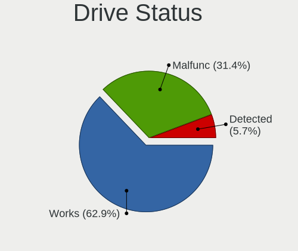
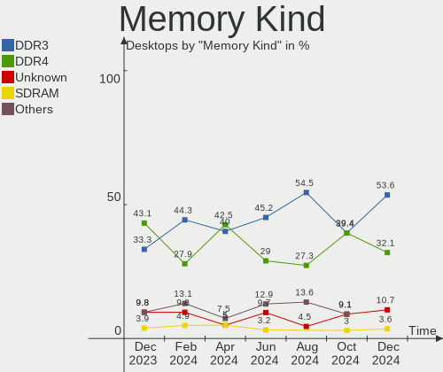
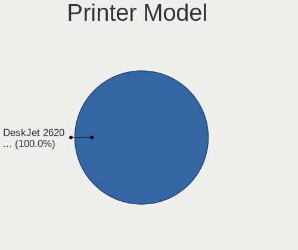
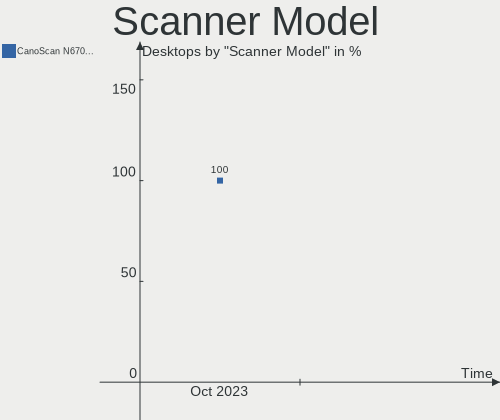

BlackPanther Hardware Trends (Desktop)
--------------------------------------

A project to identify most popular hardware characteristics and track their change
over time based on data collected by BlackPanther users at https://Linux-Hardware.org.

Anyone can contribute to the study by uploading probes of their computers by
the [hw-probe](https://github.com/linuxhw/hw-probe) tool:

    sudo -E hw-probe -all -upload

Full-feature report is available here: https://linux-hardware.org/?view=trends&formfactor=desktop

Period: Nov, 2020.

Contents
--------

- [ OS                       ](#os)
- [ OS Family                ](#os-family)
- [ Kernel                   ](#kernel)
- [ Kernel Family            ](#kernel-family)
- [ Kernel Major Ver.        ](#kernel-major-ver)
- [ Arch                     ](#arch)
- [ DE                       ](#de)
- [ Display Server           ](#display-server)
- [ Display Manager          ](#display-manager)
- [ OS Lang                  ](#os-lang)
- [ Boot Mode                ](#boot-mode)
- [ Filesystem               ](#filesystem)
- [ Part. scheme             ](#part-scheme)
- [ Dual Boot with Linux/BSD ](#dual-boot-with-linux/bsd)
- [ Dual Boot (Win)          ](#dual-boot-win)
- [ Country                  ](#country)
- [ City                     ](#city)
- [ Vendor                   ](#vendor)
- [ Model                    ](#model)
- [ Model Family             ](#model-family)
- [ MFG Year                 ](#mfg-year)
- [ Form Factor              ](#form-factor)
- [ Secure Boot              ](#secure-boot)
- [ Coreboot                 ](#coreboot)
- [ RAM Size                 ](#ram-size)
- [ RAM Used                 ](#ram-used)
- [ Has CD-ROM               ](#has-cd-rom)
- [ Total Drives             ](#total-drives)
- [ Has Ethernet             ](#has-ethernet)
- [ Drive Vendor             ](#drive-vendor)
- [ Drive Model              ](#drive-model)
- [ HDD Vendor               ](#hdd-vendor)
- [ SSD Vendor               ](#ssd-vendor)
- [ Drive Kind               ](#drive-kind)
- [ Drive Connector          ](#drive-connector)
- [ Drive Size               ](#drive-size)
- [ Space Total              ](#space-total)
- [ Space Used               ](#space-used)
- [ Malfunc. Drives          ](#malfunc-drives)
- [ Malfunc. Drive Vendor    ](#malfunc-drive-vendor)
- [ Malfunc. HDD Vendor      ](#malfunc-hdd-vendor)
- [ Malfunc. Drive Kind      ](#malfunc-drive-kind)
- [ Failed Drives            ](#failed-drives)
- [ Failed Drive Vendor      ](#failed-drive-vendor)
- [ Drive Status             ](#drive-status)
- [ Storage Vendor           ](#storage-vendor)
- [ Storage Model            ](#storage-model)
- [ Storage Kind             ](#storage-kind)
- [ CPU Vendor               ](#cpu-vendor)
- [ CPU Model                ](#cpu-model)
- [ CPU Model Family         ](#cpu-model-family)
- [ CPU Cores                ](#cpu-cores)
- [ CPU Sockets              ](#cpu-sockets)
- [ CPU Threads              ](#cpu-threads)
- [ CPU Op-Modes             ](#cpu-op-modes)
- [ CPU Microcode            ](#cpu-microcode)
- [ CPU Microarch            ](#cpu-microarch)
- [ GPU Vendor               ](#gpu-vendor)
- [ GPU Model                ](#gpu-model)
- [ GPU Combo                ](#gpu-combo)
- [ GPU Driver               ](#gpu-driver)
- [ GPU Memory               ](#gpu-memory)
- [ Monitor Vendor           ](#monitor-vendor)
- [ Monitor Model            ](#monitor-model)
- [ Monitor Resolution       ](#monitor-resolution)
- [ Monitor Diagonal         ](#monitor-diagonal)
- [ Monitor Width            ](#monitor-width)
- [ Aspect Ratio             ](#aspect-ratio)
- [ Monitor Area             ](#monitor-area)
- [ Pixel Density            ](#pixel-density)
- [ Multiple Monitors        ](#multiple-monitors)
- [ Net Controller Vendor    ](#net-controller-vendor)
- [ Net Controller Model     ](#net-controller-model)
- [ Wireless Vendor          ](#wireless-vendor)
- [ Wireless Model           ](#wireless-model)
- [ Ethernet Vendor          ](#ethernet-vendor)
- [ Ethernet Model           ](#ethernet-model)
- [ Net Controller Kind      ](#net-controller-kind)
- [ Used Controller          ](#used-controller)
- [ NICs                     ](#nics)
- [ Memory Vendor            ](#memory-vendor)
- [ Memory Model             ](#memory-model)
- [ Memory Kind              ](#memory-kind)
- [ Memory Form Factor       ](#memory-form-factor)
- [ Memory Size              ](#memory-size)
- [ Memory Speed             ](#memory-speed)
- [ Sound Vendor             ](#sound-vendor)
- [ Sound Model              ](#sound-model)
- [ Camera Vendor            ](#camera-vendor)
- [ Camera Model             ](#camera-model)
- [ Fingerprint Vendor       ](#fingerprint-vendor)
- [ Fingerprint Model        ](#fingerprint-model)
- [ Chipcard Vendor          ](#chipcard-vendor)
- [ Chipcard Model           ](#chipcard-model)
- [ Printer Vendor           ](#printer-vendor)
- [ Printer Model            ](#printer-model)
- [ Scanner Vendor           ](#scanner-vendor)
- [ Scanner Model            ](#scanner-model)
- [ Bluetooth Vendor         ](#bluetooth-vendor)
- [ Bluetooth Model          ](#bluetooth-model)
- [ Unsupported Devices      ](#unsupported-devices)
- [ Unsupported Device Types ](#unsupported-device-types)

OS
--

Installed operating systems

| Name              | Desktops | Percent |
|-------------------|----------|---------|
| BlackPanther 18.1 | 82       | 93.18%  |
| BlackPanther 16.2 | 6        | 6.82%   |

OS Family
---------

OS without a version

| Name         | Desktops | Percent |
|--------------|----------|---------|
| BlackPanther | 88       | 100%    |

Kernel
------

Version of the Linux kernel

| Version                | Desktops | Percent |
|------------------------|----------|---------|
| 4.18.16-desktop-1bP    | 80       | 90.91%  |
| 4.9.20-desktop-pae-1bP | 5        | 5.68%   |
| 5.6.14-desktop-2bP     | 2        | 2.27%   |
| 4.9.20-desktop-1bP     | 1        | 1.14%   |

Kernel Family
-------------

Linux kernel without a distro release

| Version | Desktops | Percent |
|---------|----------|---------|
| 4.18.16 | 80       | 90.91%  |
| 4.9.20  | 6        | 6.82%   |
| 5.6.14  | 2        | 2.27%   |

Kernel Major Ver.
-----------------

Linux kernel major version

| Version | Desktops | Percent |
|---------|----------|---------|
| 4.18    | 80       | 90.91%  |
| 4.9     | 6        | 6.82%   |
| 5.6     | 2        | 2.27%   |

Arch
----

OS architecture (x86_64, i586, etc.)

| Name   | Desktops | Percent |
|--------|----------|---------|
| x86_64 | 82       | 93.18%  |
| i686   | 6        | 6.82%   |

DE
--

Desktop Environment

| Name | Desktops | Percent |
|------|----------|---------|
| KDE5 | 88       | 100%    |

Display Server
--------------

X11 or Wayland

| Name    | Desktops | Percent |
|---------|----------|---------|
| X11     | 87       | 98.86%  |
| Wayland | 1        | 1.14%   |

Display Manager
---------------

SDDM, LightDM, etc.

| Name | Desktops | Percent |
|------|----------|---------|
| SDDM | 88       | 100%    |

OS Lang
-------

Language

| Lang    | Desktops | Percent |
|---------|----------|---------|
| Unknown | 88       | 100%    |

Boot Mode
---------

EFI or BIOS

| Mode | Desktops | Percent |
|------|----------|---------|
| BIOS | 63       | 71.59%  |
| EFI  | 25       | 28.41%  |

Filesystem
----------

Type of filesystem

| Type    | Desktops | Percent |
|---------|----------|---------|
| Overlay | 74       | 84.09%  |
| Ext4    | 13       | 14.77%  |
| Ext3    | 1        | 1.14%   |

Part. scheme
------------

Scheme of partitioning

| Type    | Desktops | Percent |
|---------|----------|---------|
| MBR     | 53       | 60.23%  |
| GPT     | 34       | 38.64%  |
| Unknown | 1        | 1.14%   |

Dual Boot with Linux/BSD
------------------------

Hosting more than one Linux/BSD

| Dual boot | Desktops | Percent |
|-----------|----------|---------|
| Yes       | 45       | 51.14%  |
| No        | 43       | 48.86%  |

Dual Boot (Win)
---------------

Hosting Linux and Windows

| Dual boot | Desktops | Percent |
|-----------|----------|---------|
| Yes       | 48       | 54.55%  |
| No        | 40       | 45.45%  |

Country
-------

Geographic location (country)

| Country       | Desktops | Percent |
|---------------|----------|---------|
| Hungary       | 58       | 65.91%  |
| Germany       | 4        | 4.55%   |
| Romania       | 3        | 3.41%   |
| Philippines   | 3        | 3.41%   |
| Italy         | 3        | 3.41%   |
| USA           | 2        | 2.27%   |
| Slovakia      | 2        | 2.27%   |
| Canada        | 2        | 2.27%   |
| UK            | 1        | 1.14%   |
| Russia        | 1        | 1.14%   |
| Liechtenstein | 1        | 1.14%   |
| India         | 1        | 1.14%   |
| France        | 1        | 1.14%   |
| Finland       | 1        | 1.14%   |
| Colombia      | 1        | 1.14%   |
| Brazil        | 1        | 1.14%   |
| Belgium       | 1        | 1.14%   |
| Australia     | 1        | 1.14%   |
| Unknown       | 1        | 1.14%   |

City
----

Geographic location (city)

| City                    | Desktops | Percent |
|-------------------------|----------|---------|
| Budapest                | 21       | 23.86%  |
| Karcag                  | 3        | 3.41%   |
| Székesfehérvár       | 2        | 2.27%   |
| Szekszárd              | 2        | 2.27%   |
| Seregno                 | 2        | 2.27%   |
| Retkozberencs           | 2        | 2.27%   |
| Eger                    | 2        | 2.27%   |
| Cagayan de Oro          | 2        | 2.27%   |
| Bucharest               | 2        | 2.27%   |
| Berlin                  | 2        | 2.27%   |
| Ajka                    | 2        | 2.27%   |
| Érd                    | 1        | 1.14%   |
| Toronto                 | 1        | 1.14%   |
| Tomsk                   | 1        | 1.14%   |
| Tiszafured              | 1        | 1.14%   |
| Timișoara              | 1        | 1.14%   |
| Tet                     | 1        | 1.14%   |
| Szomod                  | 1        | 1.14%   |
| Szombathely             | 1        | 1.14%   |
| Szolnok                 | 1        | 1.14%   |
| Szeged                  | 1        | 1.14%   |
| Sopron                  | 1        | 1.14%   |
| Schaan                  | 1        | 1.14%   |
| Sandorfalva             | 1        | 1.14%   |
| Pfaffenhofen an der Ilm | 1        | 1.14%   |
| Pecel                   | 1        | 1.14%   |
| Oroshaza                | 1        | 1.14%   |
| Nagykoros               | 1        | 1.14%   |
| Montreal                | 1        | 1.14%   |
| Monor                   | 1        | 1.14%   |
| Melbourne               | 1        | 1.14%   |
| Luvia                   | 1        | 1.14%   |
| Lucfalva                | 1        | 1.14%   |
| Loughborough            | 1        | 1.14%   |
| Labatlan                | 1        | 1.14%   |
| Kisujszallas            | 1        | 1.14%   |
| Kistarcsa               | 1        | 1.14%   |
| Kisbagyon               | 1        | 1.14%   |
| Itaquaquecetuba         | 1        | 1.14%   |
| Hlinik nad Hronom       | 1        | 1.14%   |
| Hajduszoboszlo          | 1        | 1.14%   |
| Győr                   | 1        | 1.14%   |
| Gotteszell              | 1        | 1.14%   |
| Geraardsbergen          | 1        | 1.14%   |
| Fot                     | 1        | 1.14%   |
| Fargo                   | 1        | 1.14%   |
| Dunaharaszti            | 1        | 1.14%   |
| Davao City              | 1        | 1.14%   |
| Dalton                  | 1        | 1.14%   |
| Corinaldo               | 1        | 1.14%   |
| Champfleury             | 1        | 1.14%   |
| Békéscsaba            | 1        | 1.14%   |
| Budajeno                | 1        | 1.14%   |
| Borsky Mikulas          | 1        | 1.14%   |
| Bogotá                 | 1        | 1.14%   |
| Bengaluru               | 1        | 1.14%   |
| Unknown                 | 1        | 1.14%   |

Vendor
------

Motherboard manufacturer

| Name                | Desktops | Percent |
|---------------------|----------|---------|
| ASUSTek Computer    | 22       | 25%     |
| ASRock              | 15       | 17.05%  |
| Gigabyte Technology | 14       | 15.91%  |
| Lenovo              | 10       | 11.36%  |
| Hewlett-Packard     | 8        | 9.09%   |
| Fujitsu             | 5        | 5.68%   |
| MSI                 | 3        | 3.41%   |
| Dell                | 3        | 3.41%   |
| Pegatron            | 2        | 2.27%   |
| Foxconn             | 2        | 2.27%   |
| Acer                | 2        | 2.27%   |
| ZOTAC               | 1        | 1.14%   |
| EMAXX TECHNOLOGY    | 1        | 1.14%   |

Model
-----

Motherboard model

| Name                                    | Desktops | Percent |
|-----------------------------------------|----------|---------|
| ASUS All Series                         | 5        | 5.68%   |
| HP Compaq dc5800 Small Form Factor      | 2        | 2.27%   |
| Dell OptiPlex 3020                      | 2        | 2.27%   |
| ASRock FM2A88M Extreme4+                | 2        | 2.27%   |
| ASRock FM2A75M Pro4+                    | 2        | 2.27%   |
| Pegatron p6560be                        | 1        | 1.14%   |
| Pegatron Compaq dx7500 Microtower       | 1        | 1.14%   |
| MSI MS-7A32                             | 1        | 1.14%   |
| MSI MS-7970                             | 1        | 1.14%   |
| MSI MS-7358                             | 1        | 1.14%   |
| Lenovo ThinkStation D20 4158AF8         | 1        | 1.14%   |
| Lenovo ThinkCentre M93p 10A7000LGE      | 1        | 1.14%   |
| Lenovo ThinkCentre M91p 4524BL8         | 1        | 1.14%   |
| Lenovo ThinkCentre M82 29293V4          | 1        | 1.14%   |
| Lenovo ThinkCentre M81 5048W6L          | 1        | 1.14%   |
| Lenovo ThinkCentre M72e 36622M1         | 1        | 1.14%   |
| Lenovo ThinkCentre M72e 3578G5M         | 1        | 1.14%   |
| Lenovo ThinkCentre M70e 0832W2F         | 1        | 1.14%   |
| Lenovo ThinkCentre M58p 6138DK1         | 1        | 1.14%   |
| Lenovo ThinkCentre A57 98517HG          | 1        | 1.14%   |
| HP ProDesk 400 G3 MT                    | 1        | 1.14%   |
| HP Compaq Pro 6305 SFF                  | 1        | 1.14%   |
| HP Compaq Pro 6305 MT                   | 1        | 1.14%   |
| HP Compaq dc7700p Convertible Minitower | 1        | 1.14%   |
| HP Compaq 8000 Elite CMT PC             | 1        | 1.14%   |
| HP 510-p127c                            | 1        | 1.14%   |
| Gigabyte Z390 UD                        | 1        | 1.14%   |
| Gigabyte H81M-S2PV                      | 1        | 1.14%   |
| Gigabyte H81M-DS2V                      | 1        | 1.14%   |
| Gigabyte H61M-S2V-B3                    | 1        | 1.14%   |
| Gigabyte H61M-S1                        | 1        | 1.14%   |
| Gigabyte H61M-D2-B3                     | 1        | 1.14%   |
| Gigabyte GA-78LMT-USB3 6.0              | 1        | 1.14%   |
| Gigabyte EP43-S3L                       | 1        | 1.14%   |
| Gigabyte B85M-D2V                       | 1        | 1.14%   |
| Gigabyte B450M GAMING                   | 1        | 1.14%   |
| Gigabyte B450 I AORUS PRO WIFI          | 1        | 1.14%   |
| Gigabyte B250M-DS3H                     | 1        | 1.14%   |
| Gigabyte 990XA-UD3                      | 1        | 1.14%   |
| Gigabyte 965P-DQ6                       | 1        | 1.14%   |
| Fujitsu ESPRIMO P720                    | 1        | 1.14%   |
| Fujitsu ESPRIMO P3521                   | 1        | 1.14%   |
| Fujitsu ESPRIMO P2560                   | 1        | 1.14%   |
| Fujitsu ESPRIMO E7936                   | 1        | 1.14%   |
| Fujitsu ESPRIMO E7935                   | 1        | 1.14%   |
| Foxconn POWERMATE_VL280                 | 1        | 1.14%   |
| Foxconn 45CMX/45GMX/45CMX-K             | 1        | 1.14%   |
| EMAXX TECHNOLOGY EMX-A70FM2+iCafe       | 1        | 1.14%   |
| Dell OptiPlex 745                       | 1        | 1.14%   |
| ASUS VM62                               | 1        | 1.14%   |
| ASUS VM40B                              | 1        | 1.14%   |
| ASUS VC65R                              | 1        | 1.14%   |
| ASUS PRIME H310M-R R2.0                 | 1        | 1.14%   |
| ASUS PRIME H310M-K R2.0                 | 1        | 1.14%   |
| ASUS PRIME H310M-E R2.0                 | 1        | 1.14%   |
| ASUS PRIME B550M-K                      | 1        | 1.14%   |
| ASUS P8Z68-V                            | 1        | 1.14%   |
| ASUS P8H67                              | 1        | 1.14%   |
| ASUS P8H61-M LX3 PLUS R2.0              | 1        | 1.14%   |
| ASUS P5LD2-X/1333                       | 1        | 1.14%   |

Model Family
------------

Motherboard model prefix

| Name                              | Desktops | Percent |
|-----------------------------------|----------|---------|
| Lenovo ThinkCentre                | 9        | 10.23%  |
| HP Compaq                         | 6        | 6.82%   |
| Fujitsu ESPRIMO                   | 5        | 5.68%   |
| ASUS All                          | 5        | 5.68%   |
| ASUS PRIME                        | 4        | 4.55%   |
| Dell OptiPlex                     | 3        | 3.41%   |
| ASRock FM2A88M                    | 2        | 2.27%   |
| ASRock FM2A75M                    | 2        | 2.27%   |
| Pegatron p6560be                  | 1        | 1.14%   |
| Pegatron Compaq                   | 1        | 1.14%   |
| MSI MS-7A32                       | 1        | 1.14%   |
| MSI MS-7970                       | 1        | 1.14%   |
| MSI MS-7358                       | 1        | 1.14%   |
| Lenovo ThinkStation               | 1        | 1.14%   |
| HP ProDesk                        | 1        | 1.14%   |
| HP 510-p127c                      | 1        | 1.14%   |
| Gigabyte Z390                     | 1        | 1.14%   |
| Gigabyte H81M-S2PV                | 1        | 1.14%   |
| Gigabyte H81M-DS2V                | 1        | 1.14%   |
| Gigabyte H61M-S2V-B3              | 1        | 1.14%   |
| Gigabyte H61M-S1                  | 1        | 1.14%   |
| Gigabyte H61M-D2-B3               | 1        | 1.14%   |
| Gigabyte GA-78LMT-USB3            | 1        | 1.14%   |
| Gigabyte EP43-S3L                 | 1        | 1.14%   |
| Gigabyte B85M-D2V                 | 1        | 1.14%   |
| Gigabyte B450M                    | 1        | 1.14%   |
| Gigabyte B450                     | 1        | 1.14%   |
| Gigabyte B250M-DS3H               | 1        | 1.14%   |
| Gigabyte 990XA-UD3                | 1        | 1.14%   |
| Gigabyte 965P-DQ6                 | 1        | 1.14%   |
| Foxconn POWERMATE                 | 1        | 1.14%   |
| Foxconn 45CMX                     | 1        | 1.14%   |
| EMAXX TECHNOLOGY EMX-A70FM2+iCafe | 1        | 1.14%   |
| ASUS VM62                         | 1        | 1.14%   |
| ASUS VM40B                        | 1        | 1.14%   |
| ASUS VC65R                        | 1        | 1.14%   |
| ASUS P8Z68-V                      | 1        | 1.14%   |
| ASUS P8H67                        | 1        | 1.14%   |
| ASUS P8H61-M                      | 1        | 1.14%   |
| ASUS P5LD2-X                      | 1        | 1.14%   |
| ASUS P5KPL-AM                     | 1        | 1.14%   |
| ASUS M5A97                        | 1        | 1.14%   |
| ASUS M2V-TVM                      | 1        | 1.14%   |
| ASUS Crosshair                    | 1        | 1.14%   |
| ASUS A8R32-MVP                    | 1        | 1.14%   |
| ASUS 970                          | 1        | 1.14%   |
| ASRock H61M-DGS                   | 1        | 1.14%   |
| ASRock FM2A88X+                   | 1        | 1.14%   |
| ASRock FM2A75M-DGS                | 1        | 1.14%   |
| ASRock B450M-HDV                  | 1        | 1.14%   |
| ASRock B250M                      | 1        | 1.14%   |
| ASRock AB350M                     | 1        | 1.14%   |
| ASRock A55M-HVS                   | 1        | 1.14%   |
| ASRock A320M-HDV                  | 1        | 1.14%   |
| ASRock 970                        | 1        | 1.14%   |
| ASRock 4CoreDual-SATA2            | 1        | 1.14%   |
| ASRock 4Core1600Twins-P35         | 1        | 1.14%   |
| Acer Veriton                      | 1        | 1.14%   |
| Acer Aspire                       | 1        | 1.14%   |
| Unknown                           | 1        | 1.14%   |

MFG Year
--------

Motherboard manufacture year

| Year | Desktops | Percent |
|------|----------|---------|
| 2014 | 15       | 17.05%  |
| 2012 | 9        | 10.23%  |
| 2019 | 7        | 7.95%   |
| 2016 | 7        | 7.95%   |
| 2015 | 7        | 7.95%   |
| 2018 | 6        | 6.82%   |
| 2013 | 6        | 6.82%   |
| 2011 | 6        | 6.82%   |
| 2010 | 6        | 6.82%   |
| 2009 | 6        | 6.82%   |
| 2008 | 5        | 5.68%   |
| 2007 | 4        | 4.55%   |
| 2017 | 2        | 2.27%   |
| 2020 | 1        | 1.14%   |
| 2006 | 1        | 1.14%   |

Form Factor
-----------

Physical design of the computer

| Name    | Desktops | Percent |
|---------|----------|---------|
| Desktop | 88       | 100%    |

Secure Boot
-----------

Enabled or disabled

| State    | Desktops | Percent |
|----------|----------|---------|
| Disabled | 88       | 100%    |

Coreboot
--------

Have coreboot on board

| Used | Desktops | Percent |
|------|----------|---------|
| No   | 88       | 100%    |

RAM Size
--------

Total RAM memory

| Size in GB | Desktops | Percent |
|------------|----------|---------|
| 8.01-16.0  | 30       | 34.09%  |
| 3.01-4.0   | 23       | 26.14%  |
| 4.01-8.0   | 15       | 17.05%  |
| 16.01-24.0 | 9        | 10.23%  |
| 1.01-2.0   | 7        | 7.95%   |
| 32.01-64.0 | 2        | 2.27%   |
| 2.01-3.0   | 1        | 1.14%   |
| 0.01-1.0   | 1        | 1.14%   |

RAM Used
--------

Used RAM memory

| Used GB  | Desktops | Percent |
|----------|----------|---------|
| 0.01-1.0 | 76       | 86.36%  |
| 1.01-2.0 | 11       | 12.5%   |
| 2.01-3.0 | 1        | 1.14%   |

Has CD-ROM
----------

Has CD-ROM on board

| Presented | Desktops | Percent |
|-----------|----------|---------|
| Yes       | 59       | 67.05%  |
| No        | 29       | 32.95%  |

Total Drives
------------

Number of drives on board

| Drives | Desktops | Percent |
|--------|----------|---------|
| 1      | 52       | 59.09%  |
| 2      | 23       | 26.14%  |
| 3      | 9        | 10.23%  |
| 4      | 2        | 2.27%   |
| 0      | 2        | 2.27%   |

Has Ethernet
------------

Has Ethernet on board

| Presented | Desktops | Percent |
|-----------|----------|---------|
| Yes       | 88       | 100%    |

Drive Vendor
------------

Hard drive vendors

| Vendor              | Desktops | Drives | Percent |
|---------------------|----------|--------|---------|
| WDC                 | 31       | 35     | 23.66%  |
| Seagate             | 25       | 25     | 19.08%  |
| Kingston            | 14       | 15     | 10.69%  |
| Samsung Electronics | 13       | 14     | 9.92%   |
| Hitachi             | 10       | 10     | 7.63%   |
| Toshiba             | 9        | 9      | 6.87%   |
| Maxtor              | 4        | 4      | 3.05%   |
| SanDisk             | 3        | 3      | 2.29%   |
| Intenso             | 3        | 3      | 2.29%   |
| Crucial             | 3        | 3      | 2.29%   |
| A-DATA Technology   | 3        | 3      | 2.29%   |
| Intel               | 2        | 2      | 1.53%   |
| Zheino              | 1        | 1      | 0.76%   |
| USB                 | 1        | 1      | 0.76%   |
| Team                | 1        | 1      | 0.76%   |
| SMI                 | 1        | 1      | 0.76%   |
| PNY                 | 1        | 1      | 0.76%   |
| Kingmax             | 1        | 1      | 0.76%   |
| Integral            | 1        | 1      | 0.76%   |
| HGST                | 1        | 1      | 0.76%   |
| Hewlett-Packard     | 1        | 1      | 0.76%   |
| Gigabyte Technology | 1        | 1      | 0.76%   |
| FORESEE             | 1        | 1      | 0.76%   |

Drive Model
-----------

Hard drive models

| Model                            | Desktops | Percent |
|----------------------------------|----------|---------|
| Seagate ST500DM002-1BD142 500GB  | 4        | 2.92%   |
| Toshiba DT01ACA050 500GB         | 3        | 2.19%   |
| Seagate ST3250318AS 250GB        | 3        | 2.19%   |
| Kingston SV300S37A120G 120GB SSD | 3        | 2.19%   |
| Hitachi HDS721050CLA362 500GB    | 3        | 2.19%   |
| WDC WDS240G2G0B-00EPW0 240GB SSD | 2        | 1.46%   |
| WDC WDS240G2G0A-00JH30 240GB SSD | 2        | 1.46%   |
| WDC WD5000AAKX-22ERMA0 500GB     | 2        | 1.46%   |
| WDC WD5000AAKX-001CA0 500GB      | 2        | 1.46%   |
| WDC WD10EZEX-08WN4A0 1TB         | 2        | 1.46%   |
| Toshiba HDWD110 1TB              | 2        | 1.46%   |
| Toshiba DT01ACA100 1TB           | 2        | 1.46%   |
| Samsung SSD 860 EVO 500GB        | 2        | 1.46%   |
| Samsung HD502HJ 500GB            | 2        | 1.46%   |
| Maxtor 2B020H1 20GB              | 2        | 1.46%   |
| Kingston SUV400S37120G 120GB SSD | 2        | 1.46%   |
| Kingston SA400S37480G 480GB SSD  | 2        | 1.46%   |
| Kingston SA400S37240G 240GB SSD  | 2        | 1.46%   |
| Intenso SSD 128GB                | 2        | 1.46%   |
| Crucial CT120BX500SSD1 120GB     | 2        | 1.46%   |
| A-DATA SU700 120GB SSD           | 2        | 1.46%   |
| Zheino CHN-NGFFNV2280-256 256GB  | 1        | 0.73%   |
| WDC WDS120G2G0A-00JH30 120GB SSD | 1        | 0.73%   |
| WDC WD7500AYPS-01ZKB0 752GB      | 1        | 0.73%   |
| WDC WD5000LPCX-21VHAT0 500GB     | 1        | 0.73%   |
| WDC WD5000BEVT-22ZAT0 500GB      | 1        | 0.73%   |
| WDC WD5000AAKS-007AA0 500GB      | 1        | 0.73%   |
| WDC WD5000AADS-00S9B0 500GB      | 1        | 0.73%   |
| WDC WD5000AACS-00G8B1 500GB      | 1        | 0.73%   |
| WDC WD3200AUDX-56WNHY0 320GB     | 1        | 0.73%   |
| WDC WD3200AAKX-083CA1 320GB      | 1        | 0.73%   |
| WDC WD3200AAKX-001CA0 320GB      | 1        | 0.73%   |
| WDC WD2500AAKX-60U6AA0 250GB     | 1        | 0.73%   |
| WDC WD2500AAKX-08U6AA0 250GB     | 1        | 0.73%   |
| WDC WD20EZRX-00D8PB0 2TB         | 1        | 0.73%   |
| WDC WD20EURS-73S48Y0 2TB         | 1        | 0.73%   |
| WDC WD1600AAJS-08L7A0 160GB      | 1        | 0.73%   |
| WDC WD1600AAJS-00PSA0 160GB      | 1        | 0.73%   |
| WDC WD10JPCX-24UE4T0 1TB         | 1        | 0.73%   |
| WDC WD10EZRZ-00HTKB0 1TB         | 1        | 0.73%   |
| WDC WD10EZRX-00L4HB0 1TB         | 1        | 0.73%   |
| WDC WD10EZEX-60WN4A0 1TB         | 1        | 0.73%   |
| WDC WD10EZEX-21WN4A0 1TB         | 1        | 0.73%   |
| WDC WD10EZEX-08M2NA0 1TB         | 1        | 0.73%   |
| WDC WD10EZEX-00ZF5A0 1TB         | 1        | 0.73%   |
| WDC WD10EZEX-00KUWA0 1TB         | 1        | 0.73%   |
| WDC WD10EARS-00Y5B1 1TB          | 1        | 0.73%   |
| USB 3.0 240GB                    | 1        | 0.73%   |
| Toshiba MQ01ABF050 500GB         | 1        | 0.73%   |
| Toshiba MK3001GRRB 304GB         | 1        | 0.73%   |
| Team T253X1240G 240GB SSD        | 1        | 0.73%   |
| SMI SSD DISK 256GB               | 1        | 0.73%   |
| Seagate ST980811AS 80GB          | 1        | 0.73%   |
| Seagate ST500LT012-1DG142 500GB  | 1        | 0.73%   |
| Seagate ST4000DM000-1F2168 4TB   | 1        | 0.73%   |
| Seagate ST3500630AS 500GB        | 1        | 0.73%   |
| Seagate ST3500418AS 500GB        | 1        | 0.73%   |
| Seagate ST3400833AS 400GB        | 1        | 0.73%   |
| Seagate ST3320813AS 320GB        | 1        | 0.73%   |
| Seagate ST320VM001-1AD142 320GB  | 1        | 0.73%   |

HDD Vendor
----------

Hard disk drive vendors

| Vendor              | Desktops | Drives | Percent |
|---------------------|----------|--------|---------|
| WDC                 | 29       | 30     | 32.95%  |
| Seagate             | 25       | 25     | 28.41%  |
| Hitachi             | 10       | 10     | 11.36%  |
| Toshiba             | 9        | 9      | 10.23%  |
| Samsung Electronics | 9        | 10     | 10.23%  |
| Maxtor              | 4        | 4      | 4.55%   |
| HGST                | 1        | 1      | 1.14%   |
| Hewlett-Packard     | 1        | 1      | 1.14%   |

SSD Vendor
----------

Solid state drive vendors

| Vendor              | Desktops | Drives | Percent |
|---------------------|----------|--------|---------|
| Kingston            | 12       | 13     | 30%     |
| WDC                 | 5        | 5      | 12.5%   |
| SanDisk             | 3        | 3      | 7.5%    |
| Samsung Electronics | 3        | 3      | 7.5%    |
| Intenso             | 3        | 3      | 7.5%    |
| Crucial             | 3        | 3      | 7.5%    |
| A-DATA Technology   | 3        | 3      | 7.5%    |
| Team                | 1        | 1      | 2.5%    |
| SMI                 | 1        | 1      | 2.5%    |
| PNY                 | 1        | 1      | 2.5%    |
| Kingmax             | 1        | 1      | 2.5%    |
| Intel               | 1        | 1      | 2.5%    |
| Integral            | 1        | 1      | 2.5%    |
| Gigabyte Technology | 1        | 1      | 2.5%    |
| FORESEE             | 1        | 1      | 2.5%    |

Drive Kind
----------

HDD or SSD

| Kind    | Desktops | Drives | Percent |
|---------|----------|--------|---------|
| HDD     | 73       | 90     | 63.48%  |
| SSD     | 36       | 41     | 31.3%   |
| NVMe    | 5        | 5      | 4.35%   |
| Unknown | 1        | 1      | 0.87%   |

Drive Connector
---------------

SATA, SAS, NVMe, etc.

| Type | Desktops | Drives | Percent |
|------|----------|--------|---------|
| SATA | 86       | 128    | 91.49%  |
| NVMe | 5        | 5      | 5.32%   |
| SAS  | 3        | 4      | 3.19%   |

Drive Size
----------

Size of hard drive

| Size in TB | Desktops | Drives | Percent |
|------------|----------|--------|---------|
| 0.01-0.5   | 75       | 98     | 72.12%  |
| 0.51-1.0   | 25       | 29     | 24.04%  |
| 1.01-2.0   | 3        | 3      | 2.88%   |
| 3.01-4.0   | 1        | 1      | 0.96%   |

Space Total
-----------

Amount of disk space available on the file system

| Size in GB | Desktops | Percent |
|------------|----------|---------|
| Unknown    | 75       | 85.23%  |
| 101-250    | 4        | 4.55%   |
| 21-50      | 3        | 3.41%   |
| 51-100     | 3        | 3.41%   |
| 251-500    | 1        | 1.14%   |
| 1-20       | 1        | 1.14%   |
| 501-1000   | 1        | 1.14%   |

Space Used
----------

Amount of used disk space

| Used GB | Desktops | Percent |
|---------|----------|---------|
| Unknown | 75       | 85.23%  |
| 1-20    | 11       | 12.5%   |
| 21-50   | 2        | 2.27%   |

Malfunc. Drives
---------------

Drive models with a malfunction

| Model                             | Desktops | Drives | Percent |
|-----------------------------------|----------|--------|---------|
| Seagate ST3250318AS 250GB         | 3        | 3      | 8.33%   |
| Hitachi HDS721050CLA362 500GB     | 3        | 3      | 8.33%   |
| Seagate ST500DM002-1BD142 500GB   | 2        | 2      | 5.56%   |
| Maxtor 2B020H1 20GB               | 2        | 2      | 5.56%   |
| WDC WD7500AYPS-01ZKB0 752GB       | 1        | 1      | 2.78%   |
| WDC WD5000BEVT-22ZAT0 500GB       | 1        | 1      | 2.78%   |
| WDC WD5000AAKX-001CA0 500GB       | 1        | 1      | 2.78%   |
| WDC WD5000AAKS-007AA0 500GB       | 1        | 1      | 2.78%   |
| WDC WD1600AAJS-08L7A0 160GB       | 1        | 1      | 2.78%   |
| WDC WD1600AAJS-00PSA0 160GB       | 1        | 1      | 2.78%   |
| WDC WD10JPCX-24UE4T0 1TB          | 1        | 1      | 2.78%   |
| WDC WD10EZEX-08WN4A0 1TB          | 1        | 1      | 2.78%   |
| WDC WD10EARS-00Y5B1 1TB           | 1        | 1      | 2.78%   |
| Toshiba HDWD110 1TB               | 1        | 1      | 2.78%   |
| Seagate ST980811AS 80GB           | 1        | 1      | 2.78%   |
| Seagate ST4000DM000-1F2168 4TB    | 1        | 1      | 2.78%   |
| Seagate ST3500630AS 500GB         | 1        | 1      | 2.78%   |
| Seagate ST3500418AS 500GB         | 1        | 1      | 2.78%   |
| Seagate ST3160815AS 160GB         | 1        | 1      | 2.78%   |
| Seagate ST3160815A 160GB          | 1        | 1      | 2.78%   |
| Seagate ST3160316CS 160GB         | 1        | 1      | 2.78%   |
| Seagate ST31000528AS 1TB          | 1        | 1      | 2.78%   |
| Samsung Electronics HD321KJ 320GB | 1        | 1      | 2.78%   |
| Samsung Electronics HD161GJ 160GB | 1        | 1      | 2.78%   |
| Samsung Electronics HD103UJ 1TB   | 1        | 1      | 2.78%   |
| Maxtor 6Y080L0 82GB               | 1        | 1      | 2.78%   |
| Kingston SV300S37A120G 120GB SSD  | 1        | 1      | 2.78%   |
| Kingston SUV500120G 120GB SSD     | 1        | 1      | 2.78%   |
| Hitachi HDT721010SLA360 1TB       | 1        | 1      | 2.78%   |
| Hitachi HDP725050GLA360 500GB     | 1        | 1      | 2.78%   |

Malfunc. Drive Vendor
---------------------

Vendors of faulty drives

| Vendor              | Desktops | Drives | Percent |
|---------------------|----------|--------|---------|
| Seagate             | 13       | 13     | 36.11%  |
| WDC                 | 9        | 9      | 25%     |
| Hitachi             | 5        | 5      | 13.89%  |
| Samsung Electronics | 3        | 3      | 8.33%   |
| Maxtor              | 3        | 3      | 8.33%   |
| Kingston            | 2        | 2      | 5.56%   |
| Toshiba             | 1        | 1      | 2.78%   |

Malfunc. HDD Vendor
-------------------

Vendors of faulty HDD drives

| Vendor              | Desktops | Drives | Percent |
|---------------------|----------|--------|---------|
| Seagate             | 13       | 13     | 38.24%  |
| WDC                 | 9        | 9      | 26.47%  |
| Hitachi             | 5        | 5      | 14.71%  |
| Samsung Electronics | 3        | 3      | 8.82%   |
| Maxtor              | 3        | 3      | 8.82%   |
| Toshiba             | 1        | 1      | 2.94%   |

Malfunc. Drive Kind
-------------------

Kinds of faulty drives

| Kind | Desktops | Drives | Percent |
|------|----------|--------|---------|
| HDD  | 32       | 34     | 94.12%  |
| SSD  | 2        | 2      | 5.88%   |

Failed Drives
-------------

Failed drive models

| Model                             | Desktops | Drives | Percent |
|-----------------------------------|----------|--------|---------|
| Samsung Electronics HD502HJ 500GB | 1        | 1      | 100%    |

Failed Drive Vendor
-------------------

Failed drive vendors

| Vendor              | Desktops | Drives | Percent |
|---------------------|----------|--------|---------|
| Samsung Electronics | 1        | 1      | 100%    |

Drive Status
------------

Number of failed and malfunc. drives

| Status   | Desktops | Drives | Percent |
|----------|----------|--------|---------|
| Works    | 67       | 96     | 63.81%  |
| Malfunc  | 33       | 36     | 31.43%  |
| Detected | 4        | 4      | 3.81%   |
| Failed   | 1        | 1      | 0.95%   |

Storage Vendor
--------------

Storage controller vendors

| Vendor                      | Desktops | Percent |
|-----------------------------|----------|---------|
| Intel                       | 57       | 54.81%  |
| AMD                         | 27       | 25.96%  |
| JMicron Technology          | 5        | 4.81%   |
| VIA Technologies            | 3        | 2.88%   |
| Silicon Image               | 2        | 1.92%   |
| Marvell Technology Group    | 2        | 1.92%   |
| Kingston Technology Company | 2        | 1.92%   |
| ULi Electronics             | 1        | 0.96%   |
| Silicon Motion              | 1        | 0.96%   |
| Samsung Electronics         | 1        | 0.96%   |
| ASMedia Technology          | 1        | 0.96%   |
| Adaptec                     | 1        | 0.96%   |
| 3ware                       | 1        | 0.96%   |

Storage Model
-------------

Storage controller models

| Model                                                                                   | Desktops | Percent |
|-----------------------------------------------------------------------------------------|----------|---------|
| AMD FCH SATA Controller [AHCI mode]                                                     | 17       | 11.41%  |
| Intel 8 Series/C220 Series Chipset Family 6-port SATA Controller 1 [AHCI mode]          | 9        | 6.04%   |
| Intel NM10/ICH7 Family SATA Controller [IDE mode]                                       | 8        | 5.37%   |
| Intel 6 Series/C200 Series Chipset Family 6 port Desktop SATA AHCI Controller           | 7        | 4.7%    |
| AMD FCH IDE Controller                                                                  | 7        | 4.7%    |
| Intel 82801G (ICH7 Family) IDE Controller                                               | 5        | 3.36%   |
| Intel 82801JD/DO (ICH10 Family) 4-port SATA IDE Controller                              | 4        | 2.68%   |
| Intel 82801JD/DO (ICH10 Family) 2-port SATA IDE Controller                              | 4        | 2.68%   |
| Intel 6 Series/C200 Series Chipset Family Desktop SATA Controller (IDE mode, ports 4-5) | 4        | 2.68%   |
| Intel 6 Series/C200 Series Chipset Family Desktop SATA Controller (IDE mode, ports 0-3) | 4        | 2.68%   |
| Intel 200 Series PCH SATA controller [AHCI mode]                                        | 4        | 2.68%   |
| AMD SB7x0/SB8x0/SB9x0 SATA Controller [AHCI mode]                                       | 4        | 2.68%   |
| AMD SB7x0/SB8x0/SB9x0 IDE Controller                                                    | 4        | 2.68%   |
| Intel Q170/Q150/B150/H170/H110/Z170/CM236 Chipset SATA Controller [AHCI Mode]           | 3        | 2.01%   |
| Intel 82801JI (ICH10 Family) 4 port SATA IDE Controller #1                              | 3        | 2.01%   |
| Intel 82801I (ICH9 Family) 2 port SATA Controller [IDE mode]                            | 3        | 2.01%   |
| Intel 82801H (ICH8 Family) 4 port SATA Controller [IDE mode]                            | 3        | 2.01%   |
| Intel 4 Series Chipset PT IDER Controller                                               | 3        | 2.01%   |
| AMD 400 Series Chipset SATA Controller                                                  | 3        | 2.01%   |
| VIA Technologies VT82C586A/B/VT82C686/A/B/VT823x/A/C PIPC Bus Master IDE                | 2        | 1.34%   |
| Silicon Image SiI 3132 Serial ATA Raid II Controller                                    | 2        | 1.34%   |
| Kingston Technology Company A2000 NVMe SSD                                              | 2        | 1.34%   |
| JMicron Technology JMB368 IDE controller                                                | 2        | 1.34%   |
| JMicron Technology JMB363 SATA/IDE Controller                                           | 2        | 1.34%   |
| Intel SATA Controller [RAID mode]                                                       | 2        | 1.34%   |
| Intel 82801JI (ICH10 Family) 2 port SATA IDE Controller #2                              | 2        | 1.34%   |
| Intel 82801IB (ICH9) 2 port SATA Controller [IDE mode]                                  | 2        | 1.34%   |
| Intel 82801HR/HO/HH (ICH8R/DO/DH) 2 port SATA Controller [IDE mode]                     | 2        | 1.34%   |
| AMD SB7x0/SB8x0/SB9x0 SATA Controller [IDE mode]                                        | 2        | 1.34%   |
| AMD FCH SATA Controller [IDE mode]                                                      | 2        | 1.34%   |
| AMD 300 Series Chipset SATA Controller                                                  | 2        | 1.34%   |
| VIA Technologies VT8237/8251 Serial ATA Controller                                      | 1        | 0.67%   |
| VIA Technologies VT6415 PATA IDE Host Controller                                        | 1        | 0.67%   |
| VIA Technologies VIA VT6420 SATA RAID Controller                                        | 1        | 0.67%   |
| ULi Electronics ULi M5288 SATA                                                          | 1        | 0.67%   |
| ULi Electronics M5229 IDE                                                               | 1        | 0.67%   |
| Silicon Motion Non-Volatile memory controller                                           | 1        | 0.67%   |
| Samsung Electronics NVMe SSD Controller SM981/PM981/PM983                               | 1        | 0.67%   |
| Marvell Technology Group MV64460/64461/64462 System Controller, Revision B              | 1        | 0.67%   |
| Marvell Technology Group 88SE6111/6121 SATA II / PATA Controller                        | 1        | 0.67%   |
| JMicron Technology JMB362 SATA Controller                                               | 1        | 0.67%   |
| Intel SSD Pro 7600p/760p/E 6100p Series                                                 | 1        | 0.67%   |
| Intel Cannon Lake PCH SATA AHCI Controller                                              | 1        | 0.67%   |
| Intel Atom/Celeron/Pentium Processor x5-E8000/J3xxx/N3xxx Series SATA Controller        | 1        | 0.67%   |
| Intel 9 Series Chipset Family SATA Controller [AHCI Mode]                               | 1        | 0.67%   |
| Intel 82Q963/Q965 PT IDER Controller                                                    | 1        | 0.67%   |
| Intel 82801JI (ICH10 Family) SATA AHCI Controller                                       | 1        | 0.67%   |
| Intel 82801JD/DO (ICH10 Family) SATA AHCI Controller                                    | 1        | 0.67%   |
| Intel 82801IR/IO/IH (ICH9R/DO/DH) 4 port SATA Controller [IDE mode]                     | 1        | 0.67%   |
| Intel 7 Series/C210 Series Chipset Family 6-port SATA Controller [AHCI mode]            | 1        | 0.67%   |
| Intel 7 Series Chipset Family 6-port SATA Controller [AHCI mode]                        | 1        | 0.67%   |
| ASMedia Technology ASM1062 Serial ATA Controller                                        | 1        | 0.67%   |
| AMD X370 Series Chipset SATA Controller                                                 | 1        | 0.67%   |
| AMD SATA controller                                                                     | 1        | 0.67%   |
| AMD FCH SATA Controller D                                                               | 1        | 0.67%   |
| Adaptec AIC-7870P/7871 [AHA-2940/W/S76]                                                 | 1        | 0.67%   |
| 3ware 7xxx/8xxx-series PATA/SATA-RAID                                                   | 1        | 0.67%   |

Storage Kind
------------

Kind of storage controller (IDE, SATA, NVMe, SAS, ...)

| Kind | Desktops | Percent |
|------|----------|---------|
| SATA | 57       | 51.82%  |
| IDE  | 41       | 37.27%  |
| RAID | 6        | 5.45%   |
| NVMe | 5        | 4.55%   |
| SCSI | 1        | 0.91%   |

CPU Vendor
----------

Processor vendors

| Vendor | Desktops | Percent |
|--------|----------|---------|
| Intel  | 59       | 67.05%  |
| AMD    | 29       | 32.95%  |

CPU Model
---------

Processor models

| Model                                       | Desktops | Percent |
|---------------------------------------------|----------|---------|
| Intel Core 2 Duo CPU E8400 @ 3.00GHz        | 5        | 5.68%   |
| Intel Core i3-3240 CPU @ 3.40GHz            | 3        | 3.41%   |
| Intel Pentium CPU G3220 @ 3.00GHz           | 2        | 2.27%   |
| Intel Core i5-6500 CPU @ 3.20GHz            | 2        | 2.27%   |
| Intel Core i5-4570 CPU @ 3.20GHz            | 2        | 2.27%   |
| Intel Core i5-3470 CPU @ 3.20GHz            | 2        | 2.27%   |
| Intel Core i5-2400 CPU @ 3.10GHz            | 2        | 2.27%   |
| Intel Core i3-4130 CPU @ 3.40GHz            | 2        | 2.27%   |
| Intel Core 2 Quad CPU Q8300 @ 2.50GHz       | 2        | 2.27%   |
| Intel Core 2 Duo CPU E7500 @ 2.93GHz        | 2        | 2.27%   |
| AMD Ryzen 5 3400G with Radeon Vega Graphics | 2        | 2.27%   |
| AMD Ryzen 5 2400G with Radeon Vega Graphics | 2        | 2.27%   |
| AMD A8-6600K APU with Radeon HD Graphics    | 2        | 2.27%   |
| Intel Xeon CPU X5677 @ 3.47GHz              | 1        | 1.14%   |
| Intel Pentium Dual-Core CPU E5800 @ 3.20GHz | 1        | 1.14%   |
| Intel Pentium Dual CPU E2200 @ 2.20GHz      | 1        | 1.14%   |
| Intel Pentium Dual CPU E2180 @ 2.00GHz      | 1        | 1.14%   |
| Intel Pentium Dual CPU E2160 @ 1.80GHz      | 1        | 1.14%   |
| Intel Pentium CPU G840 @ 2.80GHz            | 1        | 1.14%   |
| Intel Pentium CPU G3240 @ 3.10GHz           | 1        | 1.14%   |
| Intel Core i7-8700 CPU @ 3.20GHz            | 1        | 1.14%   |
| Intel Core i7-4770 CPU @ 3.40GHz            | 1        | 1.14%   |
| Intel Core i5-9400F CPU @ 2.90GHz           | 1        | 1.14%   |
| Intel Core i5-9400 CPU @ 2.90GHz            | 1        | 1.14%   |
| Intel Core i5-7500 CPU @ 3.40GHz            | 1        | 1.14%   |
| Intel Core i5-6400T CPU @ 2.20GHz           | 1        | 1.14%   |
| Intel Core i5-4590 CPU @ 3.30GHz            | 1        | 1.14%   |
| Intel Core i5-4210U CPU @ 1.70GHz           | 1        | 1.14%   |
| Intel Core i5-2500K CPU @ 3.30GHz           | 1        | 1.14%   |
| Intel Core i5-2500 CPU @ 3.30GHz            | 1        | 1.14%   |
| Intel Core i3-8100 CPU @ 3.60GHz            | 1        | 1.14%   |
| Intel Core i3-7100T CPU @ 3.40GHz           | 1        | 1.14%   |
| Intel Core i3-4160 CPU @ 3.60GHz            | 1        | 1.14%   |
| Intel Core i3-2100 CPU @ 3.10GHz            | 1        | 1.14%   |
| Intel Core 2 Quad CPU Q9550 @ 2.83GHz       | 1        | 1.14%   |
| Intel Core 2 Quad CPU Q6600 @ 2.40GHz       | 1        | 1.14%   |
| Intel Core 2 Duo CPU E8300 @ 2.83GHz        | 1        | 1.14%   |
| Intel Core 2 Duo CPU E8200 @ 2.66GHz        | 1        | 1.14%   |
| Intel Core 2 Duo CPU E7300 @ 2.66GHz        | 1        | 1.14%   |
| Intel Core 2 Duo CPU E6550 @ 2.33GHz        | 1        | 1.14%   |
| Intel Core 2 Duo CPU E4500 @ 2.20GHz        | 1        | 1.14%   |
| Intel Core 2 CPU 6400 @ 2.13GHz             | 1        | 1.14%   |
| Intel Core 2 CPU 6300 @ 1.86GHz             | 1        | 1.14%   |
| Intel Core 2 CPU 4300 @ 1.80GHz             | 1        | 1.14%   |
| Intel Celeron CPU N3150 @ 1.60GHz           | 1        | 1.14%   |
| Intel Celeron CPU G1610 @ 2.60GHz           | 1        | 1.14%   |
| Intel Celeron CPU E3300 @ 2.50GHz           | 1        | 1.14%   |
| Intel Celeron CPU 1017U @ 1.60GHz           | 1        | 1.14%   |
| AMD Sempron 3850 APU with Radeon R3         | 1        | 1.14%   |
| AMD Ryzen 5 1400 Quad-Core Processor        | 1        | 1.14%   |
| AMD Ryzen 3 3200G with Radeon Vega Graphics | 1        | 1.14%   |
| AMD Ryzen 3 1200 Quad-Core Processor        | 1        | 1.14%   |
| AMD Phenom II X6 1090T Processor            | 1        | 1.14%   |
| AMD FX-8350 Eight-Core Processor            | 1        | 1.14%   |
| AMD FX-8150 Eight-Core Processor            | 1        | 1.14%   |
| AMD FX-8120 Eight-Core Processor            | 1        | 1.14%   |
| AMD FX-6300 Six-Core Processor              | 1        | 1.14%   |
| AMD FX-4320 Quad-Core Processor             | 1        | 1.14%   |
| AMD Athlon X4 860K Quad Core Processor      | 1        | 1.14%   |
| AMD Athlon II X4 631 Quad-Core Processor    | 1        | 1.14%   |

CPU Model Family
----------------

Processor model prefix

| Model                   | Desktops | Percent |
|-------------------------|----------|---------|
| Intel Core i5           | 16       | 18.18%  |
| Intel Core 2 Duo        | 12       | 13.64%  |
| Intel Core i3           | 9        | 10.23%  |
| AMD Ryzen 5             | 5        | 5.68%   |
| AMD FX                  | 5        | 5.68%   |
| Intel Pentium           | 4        | 4.55%   |
| Intel Core 2 Quad       | 4        | 4.55%   |
| Intel Celeron           | 4        | 4.55%   |
| AMD A8                  | 4        | 4.55%   |
| Intel Pentium Dual      | 3        | 3.41%   |
| Intel Core 2            | 3        | 3.41%   |
| AMD A6                  | 3        | 3.41%   |
| Intel Core i7           | 2        | 2.27%   |
| AMD Ryzen 3             | 2        | 2.27%   |
| AMD Athlon 64 X2        | 2        | 2.27%   |
| AMD A10                 | 2        | 2.27%   |
| Intel Xeon              | 1        | 1.14%   |
| Intel Pentium Dual-Core | 1        | 1.14%   |
| AMD Sempron             | 1        | 1.14%   |
| AMD Phenom II X6        | 1        | 1.14%   |
| AMD Athlon X4           | 1        | 1.14%   |
| AMD Athlon II X4        | 1        | 1.14%   |
| AMD Athlon              | 1        | 1.14%   |
| AMD A12                 | 1        | 1.14%   |

CPU Cores
---------

Number of processor cores

| Number | Desktops | Percent |
|--------|----------|---------|
| 2      | 46       | 52.27%  |
| 4      | 33       | 37.5%   |
| 6      | 4        | 4.55%   |
| 1      | 3        | 3.41%   |
| 8      | 1        | 1.14%   |
| 3      | 1        | 1.14%   |

CPU Sockets
-----------

Number of sockets

| Number | Desktops | Percent |
|--------|----------|---------|
| 1      | 87       | 98.86%  |
| 2      | 1        | 1.14%   |

CPU Threads
-----------

Threads per core (Hyper-Threading)

| Number | Desktops | Percent |
|--------|----------|---------|
| 1      | 56       | 63.64%  |
| 2      | 32       | 36.36%  |

CPU Op-Modes
------------

CPU Operation Modes (32-bit, 64-bit)

| Op mode        | Desktops | Percent |
|----------------|----------|---------|
| 32-bit, 64-bit | 88       | 100%    |

CPU Microcode
-------------

Microcode number

| Number     | Desktops | Percent |
|------------|----------|---------|
| 0x1067a    | 12       | 13.64%  |
| 0x306c3    | 10       | 11.36%  |
| 0x306a9    | 7        | 7.95%   |
| 0x206a7    | 6        | 6.82%   |
| 0x06001119 | 6        | 6.82%   |
| 0x6fd      | 4        | 4.55%   |
| 0x906ea    | 3        | 3.41%   |
| 0x506e3    | 3        | 3.41%   |
| 0x10676    | 3        | 3.41%   |
| 0x08108109 | 3        | 3.41%   |
| 0x906e9    | 2        | 2.27%   |
| 0x6fb      | 2        | 2.27%   |
| 0x6f2      | 2        | 2.27%   |
| 0x0810100b | 2        | 2.27%   |
| 0x0700010f | 2        | 2.27%   |
| 0x06003104 | 2        | 2.27%   |
| 0x0600084f | 2        | 2.27%   |
| Unknown    | 2        | 2.27%   |
| 0x906eb    | 1        | 1.14%   |
| 0x6f6      | 1        | 1.14%   |
| 0x406c3    | 1        | 1.14%   |
| 0x40651    | 1        | 1.14%   |
| 0x206c2    | 1        | 1.14%   |
| 0x08001137 | 1        | 1.14%   |
| 0x08001129 | 1        | 1.14%   |
| 0x06006118 | 1        | 1.14%   |
| 0x06003106 | 1        | 1.14%   |
| 0x0600111f | 1        | 1.14%   |
| 0x06000852 | 1        | 1.14%   |
| 0x0600063e | 1        | 1.14%   |
| 0x0600063d | 1        | 1.14%   |
| 0x03000027 | 1        | 1.14%   |
| 0x010000dc | 1        | 1.14%   |

CPU Microarch
-------------

Microarchitecture

| Name        | Desktops | Percent |
|-------------|----------|---------|
| Penryn      | 15       | 17.05%  |
| Haswell     | 11       | 12.5%   |
| Piledriver  | 10       | 11.36%  |
| Core        | 9        | 10.23%  |
| IvyBridge   | 7        | 7.95%   |
| SandyBridge | 6        | 6.82%   |
| KabyLake    | 6        | 6.82%   |
| Zen         | 4        | 4.55%   |
| Zen+        | 3        | 3.41%   |
| Steamroller | 3        | 3.41%   |
| Skylake     | 3        | 3.41%   |
| K8 Hammer   | 2        | 2.27%   |
| Jaguar      | 2        | 2.27%   |
| Bulldozer   | 2        | 2.27%   |
| Westmere    | 1        | 1.14%   |
| Silvermont  | 1        | 1.14%   |
| K10 Llano   | 1        | 1.14%   |
| K10         | 1        | 1.14%   |
| Excavator   | 1        | 1.14%   |

GPU Vendor
----------

Vendors of graphics cards

| Vendor | Desktops | Percent |
|--------|----------|---------|
| Intel  | 34       | 38.2%   |
| AMD    | 29       | 32.58%  |
| Nvidia | 26       | 29.21%  |

GPU Model
---------

Graphics card models

| Model                                                                                    | Desktops | Percent |
|------------------------------------------------------------------------------------------|----------|---------|
| Intel 4 Series Chipset Integrated Graphics Controller                                    | 7        | 7.45%   |
| Intel Xeon E3-1200 v3/4th Gen Core Processor Integrated Graphics Controller              | 5        | 5.32%   |
| Nvidia GK208B [GeForce GT 710]                                                           | 4        | 4.26%   |
| AMD Ellesmere [Radeon RX 470/480/570/570X/580/580X/590]                                  | 4        | 4.26%   |
| Nvidia GT218 [GeForce 210]                                                               | 3        | 3.19%   |
| Intel Xeon E3-1200 v2/3rd Gen Core processor Graphics Controller                         | 3        | 3.19%   |
| Intel 2nd Generation Core Processor Family Integrated Graphics Controller                | 3        | 3.19%   |
| AMD Caicos [Radeon HD 6450/7450/8450 / R5 230 OEM]                                       | 3        | 3.19%   |
| Nvidia GF119 [GeForce GT 610]                                                            | 2        | 2.13%   |
| Nvidia G73 [GeForce 7300 GT]                                                             | 2        | 2.13%   |
| Intel HD Graphics 530                                                                    | 2        | 2.13%   |
| Intel 82Q963/Q965 Integrated Graphics Controller                                         | 2        | 2.13%   |
| Intel 82Q33 Express Integrated Graphics Controller                                       | 2        | 2.13%   |
| Intel 82G33/G31 Express Integrated Graphics Controller                                   | 2        | 2.13%   |
| Intel 4th Generation Core Processor Family Integrated Graphics Controller                | 2        | 2.13%   |
| AMD Richland [Radeon HD 8570D]                                                           | 2        | 2.13%   |
| AMD Raven Ridge [Radeon Vega Series / Radeon Vega Mobile Series]                         | 2        | 2.13%   |
| AMD Picasso                                                                              | 2        | 2.13%   |
| AMD Oland PRO [Radeon R7 240/340]                                                        | 2        | 2.13%   |
| AMD Cedar [Radeon HD 5000/6000/7350/8350 Series]                                         | 2        | 2.13%   |
| Nvidia TU117 [GeForce GTX 1650]                                                          | 1        | 1.06%   |
| Nvidia TU106 [GeForce RTX 2060 SUPER]                                                    | 1        | 1.06%   |
| Nvidia GT216 [GeForce GT 220]                                                            | 1        | 1.06%   |
| Nvidia GP108 [GeForce GT 1030]                                                           | 1        | 1.06%   |
| Nvidia GP104 [GeForce GTX 1080]                                                          | 1        | 1.06%   |
| Nvidia GK208B [GeForce GT 730]                                                           | 1        | 1.06%   |
| Nvidia GK208B [GeForce GT 720]                                                           | 1        | 1.06%   |
| Nvidia GK107GL [Quadro K2000]                                                            | 1        | 1.06%   |
| Nvidia GK107 [GeForce GTX 650]                                                           | 1        | 1.06%   |
| Nvidia GK106 [GeForce GTX 650 Ti]                                                        | 1        | 1.06%   |
| Nvidia GF119 [GeForce GT 520]                                                            | 1        | 1.06%   |
| Nvidia GF114 [GeForce GTX 560]                                                           | 1        | 1.06%   |
| Nvidia GF108 [GeForce GT 730]                                                            | 1        | 1.06%   |
| Nvidia GF108 [GeForce GT 630]                                                            | 1        | 1.06%   |
| Nvidia G96C [GeForce 9500 GT]                                                            | 1        | 1.06%   |
| Intel HD Graphics 630                                                                    | 1        | 1.06%   |
| Intel Haswell-ULT Integrated Graphics Controller                                         | 1        | 1.06%   |
| Intel Atom/Celeron/Pentium Processor x5-E8000/J3xxx/N3xxx Integrated Graphics Controller | 1        | 1.06%   |
| Intel 8th Gen Core Processor Gaussian Mixture Model                                      | 1        | 1.06%   |
| Intel 82945G/GZ Integrated Graphics Controller                                           | 1        | 1.06%   |
| Intel 3rd Gen Core processor Graphics Controller                                         | 1        | 1.06%   |
| AMD Trinity [Radeon HD 7560D]                                                            | 1        | 1.06%   |
| AMD Trinity 2 [Radeon HD 7540D]                                                          | 1        | 1.06%   |
| AMD RV516 [Radeon X1600/X1650 Series] (Secondary)                                        | 1        | 1.06%   |
| AMD RV516 [Radeon X1600/X1650 Series]                                                    | 1        | 1.06%   |
| AMD RV370 [Radeon X300/X550/X1050 Series] (Secondary)                                    | 1        | 1.06%   |
| AMD RV370 [Radeon X300/X550/X1050 Series]                                                | 1        | 1.06%   |
| AMD RS780L [Radeon 3000]                                                                 | 1        | 1.06%   |
| AMD Richland [Radeon HD 8670D]                                                           | 1        | 1.06%   |
| AMD R580 [Radeon X1900 GT] (Secondary)                                                   | 1        | 1.06%   |
| AMD R580 [Radeon X1900 GT]                                                               | 1        | 1.06%   |
| AMD Oland XT [Radeon HD 8670 / R7 250/350]                                               | 1        | 1.06%   |
| AMD Lexa PRO [Radeon 540/540X/550/550X / RX 540X/550/550X]                               | 1        | 1.06%   |
| AMD Kaveri [Radeon R7 Graphics]                                                          | 1        | 1.06%   |
| AMD Kabini [Radeon HD 8400 / R3 Series]                                                  | 1        | 1.06%   |
| AMD Kabini [Radeon HD 8280 / R3 Series]                                                  | 1        | 1.06%   |
| AMD Cape Verde XT [Radeon HD 7770/8760 / R7 250X]                                        | 1        | 1.06%   |
| AMD Cape Verde PRO / Venus LE / Tropo PRO-L [Radeon HD 8830M / R7 250 / R7 M465X]        | 1        | 1.06%   |

GPU Combo
---------

Combinations of graphics cards

| Name           | Desktops | Percent |
|----------------|----------|---------|
| 1 x Intel      | 33       | 37.5%   |
| 1 x Nvidia     | 25       | 28.41%  |
| 1 x AMD        | 24       | 27.27%  |
| 2 x AMD        | 5        | 5.68%   |
| Intel + Nvidia | 1        | 1.14%   |

GPU Driver
----------

Free vs proprietary

| Driver  | Desktops | Percent |
|---------|----------|---------|
| Free    | 83       | 94.32%  |
| Unknown | 5        | 5.68%   |

GPU Memory
----------

Total video memory

| Size in GB | Desktops | Percent |
|------------|----------|---------|
| Unknown    | 33       | 37.5%   |
| 0.51-1.0   | 25       | 28.41%  |
| 0.01-0.5   | 12       | 13.64%  |
| 1.01-2.0   | 11       | 12.5%   |
| 3.01-4.0   | 4        | 4.55%   |
| 7.01-8.0   | 3        | 3.41%   |

Monitor Vendor
--------------

Monitor vendors

| Vendor               | Desktops | Percent |
|----------------------|----------|---------|
| Samsung Electronics  | 22       | 27.16%  |
| Philips              | 8        | 9.88%   |
| Goldstar             | 8        | 9.88%   |
| Acer                 | 8        | 9.88%   |
| Ancor Communications | 7        | 8.64%   |
| Dell                 | 5        | 6.17%   |
| Lenovo               | 4        | 4.94%   |
| Hewlett-Packard      | 3        | 3.7%    |
| Fujitsu Siemens      | 3        | 3.7%    |
| BenQ                 | 3        | 3.7%    |
| CVT                  | 2        | 2.47%   |
| ZLS                  | 1        | 1.23%   |
| ViewSonic            | 1        | 1.23%   |
| Sony                 | 1        | 1.23%   |
| Iiyama               | 1        | 1.23%   |
| HannStar             | 1        | 1.23%   |
| Eizo                 | 1        | 1.23%   |
| Arnos Instruments    | 1        | 1.23%   |
| AOC                  | 1        | 1.23%   |

Monitor Model
-------------

Monitor models

| Model                                                                  | Desktops | Percent |
|------------------------------------------------------------------------|----------|---------|
| Lenovo LT1952p Wide LEN0990 1440x900 408x255mm 18.9-inch               | 3        | 3.7%    |
| Samsung Electronics S20B300 SAM08A8 1600x900 443x249mm 20.0-inch       | 2        | 2.47%   |
| Philips PhilipsTV (5) PHL14CA 1360x768 708x398mm 32.0-inch             | 2        | 2.47%   |
| Goldstar M228WA GSM563C 1680x1050 434x270mm 20.1-inch                  | 2        | 2.47%   |
| Dell 2009W DEL4042 1680x1050 433x270mm 20.1-inch                       | 2        | 2.47%   |
| BenQ EW277HDR BNQ7948 1920x1080 598x336mm 27.0-inch                    | 2        | 2.47%   |
| ZLS VMD-1951 ZLS1950 1600x900                                          | 1        | 1.23%   |
| ViewSonic VA2216w-4 VSC2029 1680x1050 495x291mm 22.6-inch              | 1        | 1.23%   |
| Sony TV SNYD301 1360x768 1600x900mm 72.3-inch                          | 1        | 1.23%   |
| Samsung Electronics SyncMaster SAM1E54 1024x768 304x228mm 15.0-inch    | 1        | 1.23%   |
| Samsung Electronics SyncMaster SAM1156 1280x1024 312x234mm 15.4-inch   | 1        | 1.23%   |
| Samsung Electronics SyncMaster SAM04DF 1360x768 410x230mm 18.5-inch    | 1        | 1.23%   |
| Samsung Electronics SyncMaster SAM0424 1920x1200 518x324mm 24.1-inch   | 1        | 1.23%   |
| Samsung Electronics SyncMaster SAM03E5 1680x1050 470x300mm 22.0-inch   | 1        | 1.23%   |
| Samsung Electronics SyncMaster SAM037B 1680x1050 474x296mm 22.0-inch   | 1        | 1.23%   |
| Samsung Electronics SyncMaster SAM036F 1440x900 428x255mm 19.6-inch    | 1        | 1.23%   |
| Samsung Electronics SyncMaster SAM020D 1280x1024 338x270mm 17.0-inch   | 1        | 1.23%   |
| Samsung Electronics SyncMaster SAM01B8 1280x1024 338x270mm 17.0-inch   | 1        | 1.23%   |
| Samsung Electronics SMBX2250 SAM071B 1920x1080 477x268mm 21.5-inch     | 1        | 1.23%   |
| Samsung Electronics S27E500 SAM0D0D 1920x1080 600x340mm 27.2-inch      | 1        | 1.23%   |
| Samsung Electronics S27E330 SAM0D90 1920x1080 598x336mm 27.0-inch      | 1        | 1.23%   |
| Samsung Electronics S24E650 SAM0CC2 1920x1200 518x324mm 24.1-inch      | 1        | 1.23%   |
| Samsung Electronics S24C350 SAM0A3A 1920x1080 531x299mm 24.0-inch      | 1        | 1.23%   |
| Samsung Electronics S22F350 SAM0D1B 1920x1080 477x268mm 21.5-inch      | 1        | 1.23%   |
| Samsung Electronics LCD Monitor SAM0DF6 3840x2160 890x500mm 40.2-inch  | 1        | 1.23%   |
| Samsung Electronics LCD Monitor SAM0D4F 1920x1080 1210x680mm 54.6-inch | 1        | 1.23%   |
| Samsung Electronics LCD Monitor SAM0902 1920x1080 1020x570mm 46.0-inch | 1        | 1.23%   |
| Samsung Electronics LCD Monitor SAM07C0 1920x1080 700x390mm 31.5-inch  | 1        | 1.23%   |
| Samsung Electronics C24F390 SAM0D2C 1920x1080 520x290mm 23.4-inch      | 1        | 1.23%   |
| Philips PHL 273V7 PHLC156 1920x1080 598x336mm 27.0-inch                | 1        | 1.23%   |
| Philips FTV PHL04C3 1920x1080 1440x810mm 65.0-inch                     | 1        | 1.23%   |
| Philips 197EL PHLC08B 1366x768 410x230mm 18.5-inch                     | 1        | 1.23%   |
| Philips 196V4 PHLC0AF 1366x768 410x230mm 18.5-inch                     | 1        | 1.23%   |
| Philips 190C PHLC037 1440x900 408x255mm 18.9-inch                      | 1        | 1.23%   |
| Philips 170C5 PHLC00B 1280x1024 338x270mm 17.0-inch                    | 1        | 1.23%   |
| Lenovo LEN L171p LEN24C9 1280x1024 338x270mm 17.0-inch                 | 1        | 1.23%   |
| Iiyama PL2473HD IVM6107 1920x1080 521x293mm 23.5-inch                  | 1        | 1.23%   |
| Hewlett-Packard Z22i HWP308C 1920x1080 477x268mm 21.5-inch             | 1        | 1.23%   |
| Hewlett-Packard W2371d HWP3028 1920x1080 510x287mm 23.0-inch           | 1        | 1.23%   |
| Hewlett-Packard E273q HPN3475 2560x1440 597x336mm 27.0-inch            | 1        | 1.23%   |
| HannStar Hanns.G HX191 HSD0013 1280x1024 376x301mm 19.0-inch           | 1        | 1.23%   |
| Goldstar M2794D GSM56BB 1920x1080 598x336mm 27.0-inch                  | 1        | 1.23%   |
| Goldstar M198WA GSM4B35 1440x900 408x255mm 18.9-inch                   | 1        | 1.23%   |
| Goldstar IPS FULLHD GSM5AB8 1920x1080 480x270mm 21.7-inch              | 1        | 1.23%   |
| Goldstar FULL HD GSM5B54 1920x1080 480x270mm 21.7-inch                 | 1        | 1.23%   |
| Goldstar E1940 GSM4BD6 1360x768 406x229mm 18.4-inch                    | 1        | 1.23%   |
| Goldstar 27MP55 GSM5A1D 1920x1080 510x290mm 23.1-inch                  | 1        | 1.23%   |
| Fujitsu Siemens SL3220W FUS07C8 1680x1050 474x296mm 22.0-inch          | 1        | 1.23%   |
| Fujitsu Siemens L20T-1 ECO FUS07DF 1600x900 442x249mm 20.0-inch        | 1        | 1.23%   |
| Fujitsu Siemens B22W-6 LED FUS07F3 1680x1050 474x296mm 22.0-inch       | 1        | 1.23%   |
| Eizo L367 ENC1679 1024x768 304x228mm 15.0-inch                         | 1        | 1.23%   |
| Dell P2317H DEL40F2 1920x1080 509x286mm 23.0-inch                      | 1        | 1.23%   |
| Dell IN2020 DELF028 1600x900 443x249mm 20.0-inch                       | 1        | 1.23%   |
| Dell E173FP DELA00B 1280x1024 338x270mm 17.0-inch                      | 1        | 1.23%   |
| CVT LCD Monitor CVT4668 1440x900 360x290mm 18.2-inch                   | 1        | 1.23%   |
| CVT CVTE TV CVT0003 1920x1080 575x323mm 26.0-inch                      | 1        | 1.23%   |
| BenQ RL2240H BNQ7F0C 1920x1080 480x270mm 21.7-inch                     | 1        | 1.23%   |
| Arnos Instruments F-417 AIC7450 1280x1024 338x270mm 17.0-inch          | 1        | 1.23%   |
| AOC 2216 AOC2216 1680x1050 470x300mm 22.0-inch                         | 1        | 1.23%   |
| Ancor Communications VE228 ACI22FA 1920x1080 477x268mm 21.5-inch       | 1        | 1.23%   |

Monitor Resolution
------------------

Monitor screen resolution

| Resolution         | Desktops | Percent |
|--------------------|----------|---------|
| 1920x1080 (FHD)    | 28       | 35.44%  |
| 1680x1050 (WSXGA+) | 10       | 12.66%  |
| 1440x900 (WXGA+)   | 10       | 12.66%  |
| 1280x1024 (SXGA)   | 8        | 10.13%  |
| 1360x768           | 6        | 7.59%   |
| 1600x900 (HD+)     | 5        | 6.33%   |
| 1366x768 (WXGA)    | 5        | 6.33%   |
| 1920x1200 (WUXGA)  | 3        | 3.8%    |
| 1024x768 (XGA)     | 2        | 2.53%   |
| 3840x2160 (4K)     | 1        | 1.27%   |
| 2560x1440 (QHD)    | 1        | 1.27%   |

Monitor Diagonal
----------------

Diagonal size in inches

| Inches  | Desktops | Percent |
|---------|----------|---------|
| 18      | 10       | 12.35%  |
| 23      | 8        | 9.88%   |
| 21      | 8        | 9.88%   |
| 20      | 8        | 9.88%   |
| 19      | 8        | 9.88%   |
| 27      | 7        | 8.64%   |
| 17      | 7        | 8.64%   |
| 22      | 6        | 7.41%   |
| 24      | 5        | 6.17%   |
| 15      | 4        | 4.94%   |
| 32      | 2        | 2.47%   |
| 84      | 1        | 1.23%   |
| 72      | 1        | 1.23%   |
| 65      | 1        | 1.23%   |
| 54      | 1        | 1.23%   |
| 46      | 1        | 1.23%   |
| 40      | 1        | 1.23%   |
| 26      | 1        | 1.23%   |
| Unknown | 1        | 1.23%   |

Monitor Width
-------------

Physical width

| Width in mm | Desktops | Percent |
|-------------|----------|---------|
| 401-500     | 38       | 47.5%   |
| 501-600     | 20       | 25%     |
| 301-350     | 11       | 13.75%  |
| 1001-1500   | 3        | 3.75%   |
| 701-800     | 2        | 2.5%    |
| 351-400     | 2        | 2.5%    |
| 1501-2000   | 2        | 2.5%    |
| 801-900     | 1        | 1.25%   |
| Unknown     | 1        | 1.25%   |

Aspect Ratio
------------

Proportional relationship between the width and the height

| Ratio | Desktops | Percent |
|-------|----------|---------|
| 16/9  | 47       | 59.49%  |
| 16/10 | 20       | 25.32%  |
| 5/4   | 8        | 10.13%  |
| 4/3   | 3        | 3.8%    |
| 6/5   | 1        | 1.27%   |

Monitor Area
------------

Area in inch²

| Area in inch² | Desktops | Percent |
|----------------|----------|---------|
| 201-250        | 22       | 27.16%  |
| 151-200        | 22       | 27.16%  |
| 141-150        | 13       | 16.05%  |
| 301-350        | 7        | 8.64%   |
| More than 1000 | 4        | 4.94%   |
| 251-300        | 4        | 4.94%   |
| 351-500        | 2        | 2.47%   |
| 101-110        | 2        | 2.47%   |
| 501-1000       | 2        | 2.47%   |
| 111-120        | 1        | 1.23%   |
| 91-100         | 1        | 1.23%   |
| Unknown        | 1        | 1.23%   |

Pixel Density
-------------

Pixels per inch

| Density | Desktops | Percent |
|---------|----------|---------|
| 51-100  | 62       | 77.5%   |
| 101-120 | 11       | 13.75%  |
| 1-50    | 6        | 7.5%    |
| Unknown | 1        | 1.25%   |

Multiple Monitors
-----------------

Total monitors connected

| Total | Desktops | Percent |
|-------|----------|---------|
| 1     | 81       | 92.05%  |
| 2     | 4        | 4.55%   |
| 0     | 3        | 3.41%   |

Net Controller Vendor
---------------------

Controller vendors

| Vendor                          | Desktops | Percent |
|---------------------------------|----------|---------|
| Realtek Semiconductor           | 54       | 49.54%  |
| Intel                           | 24       | 22.02%  |
| Qualcomm Atheros                | 8        | 7.34%   |
| Marvell Technology Group        | 5        | 4.59%   |
| Qualcomm Atheros Communications | 3        | 2.75%   |
| Broadcom Limited                | 3        | 2.75%   |
| VIA Technologies                | 2        | 1.83%   |
| TP-Link                         | 2        | 1.83%   |
| Ralink Technology               | 2        | 1.83%   |
| Broadcom Inc. and subsidiaries  | 2        | 1.83%   |
| ASUSTek Computer                | 2        | 1.83%   |
| Qualcomm                        | 1        | 0.92%   |
| D-Link                          | 1        | 0.92%   |

Net Controller Model
--------------------

Controller models

| Model                                                                          | Desktops | Percent |
|--------------------------------------------------------------------------------|----------|---------|
| Realtek RTL8111/8168/8411 PCI Express Gigabit Ethernet Controller              | 48       | 41.38%  |
| Intel 82567LM-3 Gigabit Network Connection                                     | 5        | 4.31%   |
| Qualcomm Atheros QCA8171 Gigabit Ethernet                                      | 4        | 3.45%   |
| Qualcomm Atheros AR9271 802.11n                                                | 3        | 2.59%   |
| Intel I211 Gigabit Network Connection                                          | 3        | 2.59%   |
| Intel 82579LM Gigabit Network Connection (Lewisville)                          | 3        | 2.59%   |
| Realtek RTL8821AE 802.11ac PCIe Wireless Network Adapter                       | 2        | 1.72%   |
| Realtek RTL8192EE PCIe Wireless Network Adapter                                | 2        | 1.72%   |
| Realtek RTL8188EUS 802.11n Wireless Network Adapter                            | 2        | 1.72%   |
| Marvell Group 88E8053 PCI-E Gigabit Ethernet Controller                        | 2        | 1.72%   |
| Intel 82566DM-2 Gigabit Network Connection                                     | 2        | 1.72%   |
| Broadcom Limited NetXtreme BCM5761 Gigabit Ethernet PCIe                       | 2        | 1.72%   |
| Broadcom Inc. and subsidiaries NetXtreme BCM5754 Gigabit Ethernet PCI Express  | 2        | 1.72%   |
| VIA VT6102/VT6103 [Rhine-II]                                                   | 1        | 0.86%   |
| VIA AC'97 Modem Controller                                                     | 1        | 0.86%   |
| TP-Link TL-WN823N v2/v3 [Realtek RTL8192EU]                                    | 1        | 0.86%   |
| TP-Link TL-WN821N Version 5 RTL8192EU                                          | 1        | 0.86%   |
| Realtek RTL8192CE PCIe Wireless Network Adapter                                | 1        | 0.86%   |
| Realtek RTL8191SU 802.11n WLAN Adapter                                         | 1        | 0.86%   |
| Realtek RTL8169 PCI Gigabit Ethernet Controller                                | 1        | 0.86%   |
| Realtek RTL810xE PCI Express Fast Ethernet controller                          | 1        | 0.86%   |
| Realtek RTL-8100/8101L/8139 PCI Fast Ethernet Adapter                          | 1        | 0.86%   |
| Ralink RT5372 Wireless Adapter                                                 | 1        | 0.86%   |
| Ralink RT2870/RT3070 Wireless Adapter                                          | 1        | 0.86%   |
| Qualcomm Atheros Killer E220x Gigabit Ethernet Controller                      | 1        | 0.86%   |
| Qualcomm Atheros Attansic L2 Fast Ethernet                                     | 1        | 0.86%   |
| Qualcomm Atheros AR9462 Wireless Network Adapter                               | 1        | 0.86%   |
| Qualcomm Atheros AR8121/AR8113/AR8114 Gigabit or Fast Ethernet                 | 1        | 0.86%   |
| Qualcomm Android                                                               | 1        | 0.86%   |
| Marvell Group Yukon Optima 88E8059 [PCIe Gigabit Ethernet Controller with AVB] | 1        | 0.86%   |
| Marvell Group 88E8057 PCI-E Gigabit Ethernet Controller                        | 1        | 0.86%   |
| Marvell Group 88E8056 PCI-E Gigabit Ethernet Controller                        | 1        | 0.86%   |
| Marvell Group 88E8001 Gigabit Ethernet Controller                              | 1        | 0.86%   |
| Intel Wireless-AC 9260                                                         | 1        | 0.86%   |
| Intel Wireless 7265                                                            | 1        | 0.86%   |
| Intel Wireless 3160                                                            | 1        | 0.86%   |
| Intel Ethernet Connection I217-V                                               | 1        | 0.86%   |
| Intel Ethernet Connection I217-LM                                              | 1        | 0.86%   |
| Intel Ethernet Connection (2) I219-V                                           | 1        | 0.86%   |
| Intel Ethernet Connection (2) I218-V                                           | 1        | 0.86%   |
| Intel Dual Band Wireless-AC 3168NGW [Stone Peak]                               | 1        | 0.86%   |
| Intel 82579V Gigabit Network Connection                                        | 1        | 0.86%   |
| Intel 82567V-2 Gigabit Network Connection                                      | 1        | 0.86%   |
| Intel 82566DM Gigabit Network Connection                                       | 1        | 0.86%   |
| Intel 82566DC-2 Gigabit Network Connection                                     | 1        | 0.86%   |
| D-Link DWL-G132 [Atheros AR5523]                                               | 1        | 0.86%   |
| Broadcom Limited NetXtreme BCM5755 Gigabit Ethernet PCI Express                | 1        | 0.86%   |
| ASUS WLAN controller                                                           | 1        | 0.86%   |
| ASUS USB-N53 802.11abgn Network Adapter [Ralink RT3572]                        | 1        | 0.86%   |

Wireless Vendor
---------------

Wireless vendors

| Vendor                          | Desktops | Percent |
|---------------------------------|----------|---------|
| Realtek Semiconductor           | 8        | 34.78%  |
| Intel                           | 4        | 17.39%  |
| Qualcomm Atheros Communications | 3        | 13.04%  |
| TP-Link                         | 2        | 8.7%    |
| Ralink Technology               | 2        | 8.7%    |
| ASUSTek Computer                | 2        | 8.7%    |
| Qualcomm Atheros                | 1        | 4.35%   |
| D-Link                          | 1        | 4.35%   |

Wireless Model
--------------

Wireless models

| Model                                                    | Desktops | Percent |
|----------------------------------------------------------|----------|---------|
| Qualcomm Atheros AR9271 802.11n                          | 3        | 13.04%  |
| Realtek RTL8821AE 802.11ac PCIe Wireless Network Adapter | 2        | 8.7%    |
| Realtek RTL8192EE PCIe Wireless Network Adapter          | 2        | 8.7%    |
| Realtek RTL8188EUS 802.11n Wireless Network Adapter      | 2        | 8.7%    |
| TP-Link TL-WN823N v2/v3 [Realtek RTL8192EU]              | 1        | 4.35%   |
| TP-Link TL-WN821N Version 5 RTL8192EU                    | 1        | 4.35%   |
| Realtek RTL8192CE PCIe Wireless Network Adapter          | 1        | 4.35%   |
| Realtek RTL8191SU 802.11n WLAN Adapter                   | 1        | 4.35%   |
| Ralink RT5372 Wireless Adapter                           | 1        | 4.35%   |
| Ralink RT2870/RT3070 Wireless Adapter                    | 1        | 4.35%   |
| Qualcomm Atheros AR9462 Wireless Network Adapter         | 1        | 4.35%   |
| Intel Wireless-AC 9260                                   | 1        | 4.35%   |
| Intel Wireless 7265                                      | 1        | 4.35%   |
| Intel Wireless 3160                                      | 1        | 4.35%   |
| Intel Dual Band Wireless-AC 3168NGW [Stone Peak]         | 1        | 4.35%   |
| D-Link DWL-G132 [Atheros AR5523]                         | 1        | 4.35%   |
| ASUS WLAN controller                                     | 1        | 4.35%   |
| ASUS USB-N53 802.11abgn Network Adapter [Ralink RT3572]  | 1        | 4.35%   |

Ethernet Vendor
---------------

Ethernet vendors

| Vendor                         | Desktops | Percent |
|--------------------------------|----------|---------|
| Realtek Semiconductor          | 51       | 56.04%  |
| Intel                          | 21       | 23.08%  |
| Qualcomm Atheros               | 7        | 7.69%   |
| Marvell Technology Group       | 5        | 5.49%   |
| Broadcom Limited               | 3        | 3.3%    |
| Broadcom Inc. and subsidiaries | 2        | 2.2%    |
| VIA Technologies               | 1        | 1.1%    |
| Qualcomm                       | 1        | 1.1%    |

Ethernet Model
--------------

Ethernet models

| Model                                                                          | Desktops | Percent |
|--------------------------------------------------------------------------------|----------|---------|
| Realtek RTL8111/8168/8411 PCI Express Gigabit Ethernet Controller              | 48       | 52.17%  |
| Intel 82567LM-3 Gigabit Network Connection                                     | 5        | 5.43%   |
| Qualcomm Atheros QCA8171 Gigabit Ethernet                                      | 4        | 4.35%   |
| Intel I211 Gigabit Network Connection                                          | 3        | 3.26%   |
| Intel 82579LM Gigabit Network Connection (Lewisville)                          | 3        | 3.26%   |
| Marvell Group 88E8053 PCI-E Gigabit Ethernet Controller                        | 2        | 2.17%   |
| Intel 82566DM-2 Gigabit Network Connection                                     | 2        | 2.17%   |
| Broadcom Limited NetXtreme BCM5761 Gigabit Ethernet PCIe                       | 2        | 2.17%   |
| Broadcom Inc. and subsidiaries NetXtreme BCM5754 Gigabit Ethernet PCI Express  | 2        | 2.17%   |
| VIA VT6102/VT6103 [Rhine-II]                                                   | 1        | 1.09%   |
| Realtek RTL8169 PCI Gigabit Ethernet Controller                                | 1        | 1.09%   |
| Realtek RTL810xE PCI Express Fast Ethernet controller                          | 1        | 1.09%   |
| Realtek RTL-8100/8101L/8139 PCI Fast Ethernet Adapter                          | 1        | 1.09%   |
| Qualcomm Atheros Killer E220x Gigabit Ethernet Controller                      | 1        | 1.09%   |
| Qualcomm Atheros Attansic L2 Fast Ethernet                                     | 1        | 1.09%   |
| Qualcomm Atheros AR8121/AR8113/AR8114 Gigabit or Fast Ethernet                 | 1        | 1.09%   |
| Qualcomm Android                                                               | 1        | 1.09%   |
| Marvell Group Yukon Optima 88E8059 [PCIe Gigabit Ethernet Controller with AVB] | 1        | 1.09%   |
| Marvell Group 88E8057 PCI-E Gigabit Ethernet Controller                        | 1        | 1.09%   |
| Marvell Group 88E8056 PCI-E Gigabit Ethernet Controller                        | 1        | 1.09%   |
| Marvell Group 88E8001 Gigabit Ethernet Controller                              | 1        | 1.09%   |
| Intel Ethernet Connection I217-V                                               | 1        | 1.09%   |
| Intel Ethernet Connection I217-LM                                              | 1        | 1.09%   |
| Intel Ethernet Connection (2) I219-V                                           | 1        | 1.09%   |
| Intel Ethernet Connection (2) I218-V                                           | 1        | 1.09%   |
| Intel 82579V Gigabit Network Connection                                        | 1        | 1.09%   |
| Intel 82567V-2 Gigabit Network Connection                                      | 1        | 1.09%   |
| Intel 82566DM Gigabit Network Connection                                       | 1        | 1.09%   |
| Intel 82566DC-2 Gigabit Network Connection                                     | 1        | 1.09%   |
| Broadcom Limited NetXtreme BCM5755 Gigabit Ethernet PCI Express                | 1        | 1.09%   |

Net Controller Kind
-------------------

Ethernet, WiFi or modem

| Kind     | Desktops | Percent |
|----------|----------|---------|
| Ethernet | 88       | 78.57%  |
| WiFi     | 23       | 20.54%  |
| Modem    | 1        | 0.89%   |

Used Controller
---------------

Currently used network controller

| Kind     | Desktops | Percent |
|----------|----------|---------|
| Ethernet | 79       | 81.44%  |
| WiFi     | 18       | 18.56%  |

NICs
----

Total network controllers on board

| Total | Desktops | Percent |
|-------|----------|---------|
| 1     | 75       | 85.23%  |
| 2     | 12       | 13.64%  |
| 3     | 1        | 1.14%   |

Memory Vendor
-------------

Memory module vendors

| Vendor                  | Desktops | Percent |
|-------------------------|----------|---------|
| Unknown                 | 26       | 25%     |
| Kingston                | 17       | 16.35%  |
| Samsung Electronics     | 13       | 12.5%   |
| SK Hynix                | 9        | 8.65%   |
| Micron Technology       | 6        | 5.77%   |
| Crucial                 | 4        | 3.85%   |
| Corsair                 | 4        | 3.85%   |
| Ramaxel Technology      | 3        | 2.88%   |
| Kingmax                 | 3        | 2.88%   |
| G.Skill                 | 3        | 2.88%   |
| A-DATA Technology       | 3        | 2.88%   |
| Transcend               | 2        | 1.92%   |
| CSX                     | 2        | 1.92%   |
| Uroad                   | 1        | 0.96%   |
| Smart                   | 1        | 0.96%   |
| Patriot                 | 1        | 0.96%   |
| OCZ                     | 1        | 0.96%   |
| Nanya Technology        | 1        | 0.96%   |
| Level One Communication | 1        | 0.96%   |
| Kingmax Semiconductor   | 1        | 0.96%   |
| H                       | 1        | 0.96%   |
| GOODRAM                 | 1        | 0.96%   |

Memory Model
------------

Memory module models

| Model                                                                     | Desktops | Percent |
|---------------------------------------------------------------------------|----------|---------|
| Unknown RAM Module 4096MB DIMM 1333MT/s                                   | 3        | 2.48%   |
| Unknown RAM Module 2048MB DIMM 800MT/s                                    | 3        | 2.48%   |
| Kingston RAM 99U5584-005.A00LF 4096MB DIMM DDR3 1600MT/s                  | 3        | 2.48%   |
| Unknown RAM Module 2048MB DIMM SDRAM                                      | 2        | 1.65%   |
| Unknown RAM Module 2048MB DIMM DDR2 1067MT/s                              | 2        | 1.65%   |
| Samsung RAM M378B5773DH0-CH9 2048MB DIMM DDR3 1333MT/s                    | 2        | 1.65%   |
| Samsung RAM M378B5673EH1-CH9 2GB DIMM DDR2 1333MT/s                       | 2        | 1.65%   |
| Samsung RAM M378B5173QH0-CK0 4096MB DIMM DDR3 1866MT/s                    | 2        | 1.65%   |
| Kingston RAM KHX1600C10D3/4G 4096MB DIMM DDR3 1866MT/s                    | 2        | 1.65%   |
| G.Skill RAM F4-3200C16-8GIS 8GB DIMM DDR4 3200MT/s                        | 2        | 1.65%   |
| Uroad RAM WJD8G4M16P12800 8192MB DIMM DDR3 1600MT/s                       | 1        | 0.83%   |
| Unknown RAM Module 8192MB DIMM 1333MT/s                                   | 1        | 0.83%   |
| Unknown RAM Module 4096MB DIMM DDR3 1600MT/s                              | 1        | 0.83%   |
| Unknown RAM Module 4096MB DIMM DDR3 1333MT/s                              | 1        | 0.83%   |
| Unknown RAM Module 4096MB DIMM DDR2 1067MT/s                              | 1        | 0.83%   |
| Unknown RAM Module 2048MB DIMM SDRAM 800MT/s                              | 1        | 0.83%   |
| Unknown RAM Module 2048MB DIMM DDR3 667MT/s                               | 1        | 0.83%   |
| Unknown RAM Module 2048MB DIMM DDR3 1600MT/s                              | 1        | 0.83%   |
| Unknown RAM Module 2048MB DIMM DDR3 1333MT/s                              | 1        | 0.83%   |
| Unknown RAM Module 2048MB DIMM DDR2 800MT/s                               | 1        | 0.83%   |
| Unknown RAM Module 2048MB DIMM DDR2 667MT/s                               | 1        | 0.83%   |
| Unknown RAM Module 2048MB DIMM DDR2 333MT/s                               | 1        | 0.83%   |
| Unknown RAM Module 2048MB DIMM DDR                                        | 1        | 0.83%   |
| Unknown RAM Module 2048MB DIMM 1066MT/s                                   | 1        | 0.83%   |
| Unknown RAM Module 1024MB DIMM DDR2 667MT/s                               | 1        | 0.83%   |
| Unknown RAM Module 1024MB DIMM DDR2                                       | 1        | 0.83%   |
| Unknown RAM Module 1024MB DIMM DDR 333MT/s                                | 1        | 0.83%   |
| Unknown RAM Module 1024MB DIMM 800MT/s                                    | 1        | 0.83%   |
| Unknown RAM Module 1024MB DIMM 1333MT/s                                   | 1        | 0.83%   |
| Unknown RAM 3000 C16 Series 8192MB DIMM DDR4 2133MT/s                     | 1        | 0.83%   |
| Unknown RAM 3000 C15 Series 8192MB DIMM DDR4 3000MT/s                     | 1        | 0.83%   |
| Unknown RAM 2400 C15 Series 16384MB DIMM DDR4 2133MT/s                    | 1        | 0.83%   |
| Transcend RAM TS512MLK64V3H 4096MB DIMM DDR3 1333MT/s                     | 1        | 0.83%   |
| Transcend RAM JM2400HLH-4G 4096MB DIMM DDR4 2400MT/s                      | 1        | 0.83%   |
| Smart RAM SH564568FH8N6PHSFG 2048MB DIMM DDR3 1333MT/s                    | 1        | 0.83%   |
| SK Hynix RAM Module 8192MB DIMM DDR4 2133MT/s                             | 1        | 0.83%   |
| SK Hynix RAM Module 8192MB DIMM DDR3 1600MT/s                             | 1        | 0.83%   |
| SK Hynix RAM HYMP564U64CP8-Y5 512MB DIMM DDR2 667MT/s                     | 1        | 0.83%   |
| SK Hynix RAM HYMP112U64CP8-S6 1024MB DIMM DDR2 800MT/s                    | 1        | 0.83%   |
| SK Hynix RAM HMT325U6BFR8C-H9 2048MB DIMM DDR3 1333MT/s                   | 1        | 0.83%   |
| SK Hynix RAM HMT151R7BFR4C-H9 4096MB DIMM DDR3 1333MT/s                   | 1        | 0.83%   |
| SK Hynix RAM HMT125U6DFR8C-H9 2048MB DIMM DDR3 667MT/s                    | 1        | 0.83%   |
| SK Hynix RAM HMA81GU6AFR8N-UH 8192MB DIMM DDR4 2400MT/s                   | 1        | 0.83%   |
| SK Hynix RAM DMT451E6AFR8C-PB 4096MB DIMM DDR3 1600MT/s                   | 1        | 0.83%   |
| Samsung RAM M471B5173QH0-YK0 4GB SODIMM DDR3 1600MT/s                     | 1        | 0.83%   |
| Samsung RAM M471B5173DB0-YK0 4096MB SODIMM DDR3 1600MT/s                  | 1        | 0.83%   |
| Samsung RAM M471B1G73EB0-YK0 8192MB SODIMM DDR3 1600MT/s                  | 1        | 0.83%   |
| Samsung RAM M378B5273CH0-CK0 4096MB DIMM DDR3 2000MT/s                    | 1        | 0.83%   |
| Samsung RAM M378B5173DB0-CK0 4096MB DIMM DDR3 1600MT/s                    | 1        | 0.83%   |
| Samsung RAM M378A1K43BB1-CPB 8GB DIMM DDR4 2133MT/s                       | 1        | 0.83%   |
| Samsung RAM M3 78T2953EZ3-CE6 1024MB DIMM DDR 667MT/s                     | 1        | 0.83%   |
| Samsung RAM 4D332037385435363633515A332D43463720 2048MB DIMM DDR2 800MT/s | 1        | 0.83%   |
| Ramaxel RAM RMR5040ED58E9W1600 4096MB DIMM DDR3 1600MT/s                  | 1        | 0.83%   |
| Ramaxel RAM RML1520EG38D6W-667 512MB DIMM DDR2 667MT/s                    | 1        | 0.83%   |
| Ramaxel RAM RML1520EC48D7W-800 1024MB DIMM DDR2 800MT/s                   | 1        | 0.83%   |
| Patriot RAM PSD38G16002 8192MB DIMM DDR3 1600MT/s                         | 1        | 0.83%   |
| OCZ RAM OCZ3G1333LV2G 2048MB DIMM 1066MT/s                                | 1        | 0.83%   |
| Nanya RAM NT2GC64B8HC0NF-CG 2048MB DIMM DDR3 1333MT/s                     | 1        | 0.83%   |
| Micron RAM V01D3LF2GB18818813 2048MB DIMM DDR3 1333MT/s                   | 1        | 0.83%   |
| Micron RAM 8KTF51264AZ-1G6E1 4GB DIMM DDR3 1600MT/s                       | 1        | 0.83%   |

Memory Kind
-----------

Memory module kinds

| Kind    | Desktops | Percent |
|---------|----------|---------|
| DDR3    | 43       | 48.31%  |
| DDR4    | 16       | 17.98%  |
| DDR2    | 14       | 15.73%  |
| Unknown | 8        | 8.99%   |
| SDRAM   | 5        | 5.62%   |
| DDR     | 3        | 3.37%   |

Memory Form Factor
------------------

Physical design of the memory module

| Name   | Desktops | Percent |
|--------|----------|---------|
| DIMM   | 83       | 96.51%  |
| SODIMM | 3        | 3.49%   |

Memory Size
-----------

Memory module size

| Size  | Desktops | Percent |
|-------|----------|---------|
| 4096  | 30       | 30.3%   |
| 2048  | 29       | 29.29%  |
| 8192  | 24       | 24.24%  |
| 1024  | 10       | 10.1%   |
| 16384 | 5        | 5.05%   |
| 512   | 1        | 1.01%   |

Memory Speed
------------

Memory module speed

| Speed   | Desktops | Percent |
|---------|----------|---------|
| 1600    | 23       | 23%     |
| 1333    | 20       | 20%     |
| 800     | 10       | 10%     |
| 667     | 7        | 7%      |
| 2133    | 6        | 6%      |
| 2400    | 5        | 5%      |
| 1866    | 5        | 5%      |
| 1067    | 4        | 4%      |
| Unknown | 4        | 4%      |
| 3200    | 3        | 3%      |
| 3000    | 3        | 3%      |
| 2667    | 2        | 2%      |
| 1066    | 2        | 2%      |
| 333     | 2        | 2%      |
| 3333    | 1        | 1%      |
| 2800    | 1        | 1%      |
| 2000    | 1        | 1%      |
| 1867    | 1        | 1%      |

Sound Vendor
------------

Sound card vendors

| Vendor                  | Desktops | Percent |
|-------------------------|----------|---------|
| Intel                   | 56       | 45.16%  |
| AMD                     | 31       | 25%     |
| Nvidia                  | 23       | 18.55%  |
| Creative Labs           | 3        | 2.42%   |
| VIA Technologies        | 2        | 1.61%   |
| ULi Electronics         | 1        | 0.81%   |
| Tenx Technology         | 1        | 0.81%   |
| SM950T Microphone       | 1        | 0.81%   |
| Logitech                | 1        | 0.81%   |
| GN Netcom               | 1        | 0.81%   |
| C-Media Electronics     | 1        | 0.81%   |
| BEHRINGER International | 1        | 0.81%   |
| Avance Logic            | 1        | 0.81%   |
| AudioQuest              | 1        | 0.81%   |

Sound Model
-----------

Sound card models

| Model                                                                                             | Desktops | Percent |
|---------------------------------------------------------------------------------------------------|----------|---------|
| AMD FCH Azalia Controller                                                                         | 13       | 8.44%   |
| Intel 6 Series/C200 Series Chipset Family High Definition Audio Controller                        | 11       | 7.14%   |
| Intel 8 Series/C220 Series Chipset High Definition Audio Controller                               | 9        | 5.84%   |
| Intel NM10/ICH7 Family High Definition Audio Controller                                           | 8        | 5.19%   |
| Nvidia GK208 HDMI/DP Audio Controller                                                             | 6        | 3.9%    |
| AMD SBx00 Azalia (Intel HDA)                                                                      | 6        | 3.9%    |
| Intel Xeon E3-1200 v3/4th Gen Core Processor HD Audio Controller                                  | 5        | 3.25%   |
| Intel 82801JD/DO (ICH10 Family) HD Audio Controller                                               | 5        | 3.25%   |
| Intel 200 Series PCH HD Audio                                                                     | 5        | 3.25%   |
| AMD Trinity HDMI Audio Controller                                                                 | 5        | 3.25%   |
| AMD Oland/Hainan/Cape Verde/Pitcairn HDMI Audio [Radeon HD 7000 Series]                           | 5        | 3.25%   |
| AMD Family 17h (Models 10h-1fh) HD Audio Controller                                               | 5        | 3.25%   |
| Intel 82801JI (ICH10 Family) HD Audio Controller                                                  | 4        | 2.6%    |
| Intel 82801I (ICH9 Family) HD Audio Controller                                                    | 4        | 2.6%    |
| AMD Raven/Raven2/Fenghuang HDMI/DP Audio Controller                                               | 4        | 2.6%    |
| AMD Ellesmere HDMI Audio [Radeon RX 470/480 / 570/580/590]                                        | 4        | 2.6%    |
| Nvidia High Definition Audio Controller                                                           | 3        | 1.95%   |
| Nvidia GF119 HDMI Audio Controller                                                                | 3        | 1.95%   |
| Intel 82801H (ICH8 Family) HD Audio Controller                                                    | 3        | 1.95%   |
| AMD Caicos HDMI Audio [Radeon HD 6450 / 7450/8450/8490 OEM / R5 230/235/235X OEM]                 | 3        | 1.95%   |
| Nvidia GK107 HDMI Audio Controller                                                                | 2        | 1.3%    |
| Nvidia GF108 High Definition Audio Controller                                                     | 2        | 1.3%    |
| Intel 100 Series/C230 Series Chipset Family HD Audio Controller                                   | 2        | 1.3%    |
| AMD Kabini HDMI/DP Audio                                                                          | 2        | 1.3%    |
| AMD Family 17h (Models 00h-0fh) HD Audio Controller                                               | 2        | 1.3%    |
| AMD Cedar HDMI Audio [Radeon HD 5400/6300/7300 Series]                                            | 2        | 1.3%    |
| VIA Technologies VT8237A/VT8251 HDA Controller                                                    | 1        | 0.65%   |
| VIA Technologies VT8233/A/8235/8237 AC97 Audio Controller                                         | 1        | 0.65%   |
| ULi Electronics HD Audio Controller                                                               | 1        | 0.65%   |
| Tenx Technology USB AUDIO                                                                         | 1        | 0.65%   |
| SM950T Microphone SM950T Microphone                                                               | 1        | 0.65%   |
| Nvidia TU107 GeForce GTX 1650 High Definition Audio Controller                                    | 1        | 0.65%   |
| Nvidia TU106 High Definition Audio Controller                                                     | 1        | 0.65%   |
| Nvidia GT216 HDMI Audio Controller                                                                | 1        | 0.65%   |
| Nvidia GP108 High Definition Audio Controller                                                     | 1        | 0.65%   |
| Nvidia GP104 High Definition Audio Controller                                                     | 1        | 0.65%   |
| Nvidia GK106 HDMI Audio Controller                                                                | 1        | 0.65%   |
| Nvidia GF114 HDMI Audio Controller                                                                | 1        | 0.65%   |
| Logitech G633 Gaming Headset                                                                      | 1        | 0.65%   |
| Intel Haswell-ULT HD Audio Controller                                                             | 1        | 0.65%   |
| Intel Cannon Lake PCH cAVS                                                                        | 1        | 0.65%   |
| Intel Atom/Celeron/Pentium Processor x5-E8000/J3xxx/N3xxx Series High Definition Audio Controller | 1        | 0.65%   |
| Intel 9 Series Chipset Family HD Audio Controller                                                 | 1        | 0.65%   |
| Intel 8 Series HD Audio Controller                                                                | 1        | 0.65%   |
| Intel 7 Series/C216 Chipset Family High Definition Audio Controller                               | 1        | 0.65%   |
| GN Netcom Jabra EVOLVE 30                                                                         | 1        | 0.65%   |
| Creative Labs EMU20k1 [Sound Blaster X-Fi Series]                                                 | 1        | 0.65%   |
| Creative Labs EMU10k2/CA0100/CA0102/CA10200 [Sound Blaster Audigy Series]                         | 1        | 0.65%   |
| Creative Labs CA0108/CA10300 [Sound Blaster Audigy Series]                                        | 1        | 0.65%   |
| C-Media Electronics CM108 Audio Controller                                                        | 1        | 0.65%   |
| BEHRINGER International UMC204HD 192k                                                             | 1        | 0.65%   |
| Avance Logic ALS4000 Audio Chipset                                                                | 1        | 0.65%   |
| AudioQuest DragonFly                                                                              | 1        | 0.65%   |
| AMD RS780 HDMI Audio [Radeon 3000/3100 / HD 3200/3300]                                            | 1        | 0.65%   |
| AMD Kaveri HDMI/DP Audio Controller                                                               | 1        | 0.65%   |
| AMD Family 15h (Models 60h-6fh) Audio Controller                                                  | 1        | 0.65%   |
| AMD Baffin HDMI/DP Audio [Radeon RX 550 640SP / RX 560/560X]                                      | 1        | 0.65%   |

Camera Vendor
-------------

Camera device vendors

| Vendor                  | Desktops | Percent |
|-------------------------|----------|---------|
| Z-Star Microelectronics | 2        | 22.22%  |
| Logitech                | 2        | 22.22%  |
| GEMBIRD                 | 2        | 22.22%  |
| Samsung Electronics     | 1        | 11.11%  |
| Pixart Imaging          | 1        | 11.11%  |
| Microdia                | 1        | 11.11%  |

Camera Model
------------

Camera device models

| Model                        | Desktops | Percent |
|------------------------------|----------|---------|
| GEMBIRD USB2.0 PC CAMERA     | 2        | 22.22%  |
| Z-Star Venus USB2.0 Camera   | 1        | 11.11%  |
| Z-Star Vega USB 2.0 Camera   | 1        | 11.11%  |
| Samsung Galaxy A5 (MTP)      | 1        | 11.11%  |
| Pixart Imaging USB2.0_Camera | 1        | 11.11%  |
| Microdia Camera              | 1        | 11.11%  |
| Logitech Webcam C310         | 1        | 11.11%  |
| Logitech Webcam C170         | 1        | 11.11%  |

Fingerprint Vendor
------------------

Fingerprint sensor vendors

Zero info for selected period =(

Fingerprint Model
-----------------

Fingerprint sensor models

Zero info for selected period =(

Chipcard Vendor
---------------

Chipcard module vendors

Zero info for selected period =(

Chipcard Model
--------------

Chipcard module models

Zero info for selected period =(

Printer Vendor
--------------

Printer device vendors

| Vendor              | Desktops | Percent |
|---------------------|----------|---------|
| Samsung Electronics | 2        | 40%     |
| Hewlett-Packard     | 2        | 40%     |
| Seiko Epson         | 1        | 20%     |

Printer Model
-------------

Printer device models

| Model                      | Desktops | Percent |
|----------------------------|----------|---------|
| Seiko Epson WF-3010 Series | 1        | 20%     |
| Samsung M2020 Series       | 1        | 20%     |
| Samsung C48x Series        | 1        | 20%     |
| HP Deskjet 3520 series     | 1        | 20%     |
| HP DeskJet 2600 series     | 1        | 20%     |

Scanner Vendor
--------------

Scanner device vendors

| Vendor      | Desktops | Percent |
|-------------|----------|---------|
| Seiko Epson | 1        | 50%     |
| Canon       | 1        | 50%     |

Scanner Model
-------------

Scanner device models

| Model                                 | Desktops | Percent |
|---------------------------------------|----------|---------|
| Seiko Epson GT-F700 [Perfection V350] | 1        | 50%     |
| Canon CanoScan N670U/N676U/LiDE 20    | 1        | 50%     |

Bluetooth Vendor
----------------

Controller vendors

| Vendor                  | Desktops | Percent |
|-------------------------|----------|---------|
| Intel                   | 4        | 33.33%  |
| ASUSTek Computer        | 4        | 33.33%  |
| Cambridge Silicon Radio | 3        | 25%     |
| Lite-On Technology      | 1        | 8.33%   |

Bluetooth Model
---------------

Controller models

| Model                                               | Desktops | Percent |
|-----------------------------------------------------|----------|---------|
| Cambridge Silicon Radio Bluetooth Dongle (HCI mode) | 3        | 25%     |
| Intel Bluetooth wireless interface                  | 2        | 16.67%  |
| ASUS Bluetooth Radio                                | 2        | 16.67%  |
| Lite-On Bluetooth Device                            | 1        | 8.33%   |
| Intel Wireless-AC 9260 Bluetooth Adapter            | 1        | 8.33%   |
| Intel Wireless-AC 3168 Bluetooth                    | 1        | 8.33%   |
| ASUS Broadcom BCM20702A0 Bluetooth                  | 1        | 8.33%   |
| ASUS Bluetooth Adapter                              | 1        | 8.33%   |

Unsupported Devices
-------------------

Total unsupported devices on board

| Total | Desktops | Percent |
|-------|----------|---------|
| 0     | 78       | 88.64%  |
| 1     | 9        | 10.23%  |
| 2     | 1        | 1.14%   |

Unsupported Device Types
------------------------

Types of unsupported devices

| Type                     | Desktops | Percent |
|--------------------------|----------|---------|
| Graphics card            | 8        | 80%     |
| Communication controller | 1        | 10%     |
| Camera                   | 1        | 10%     |

