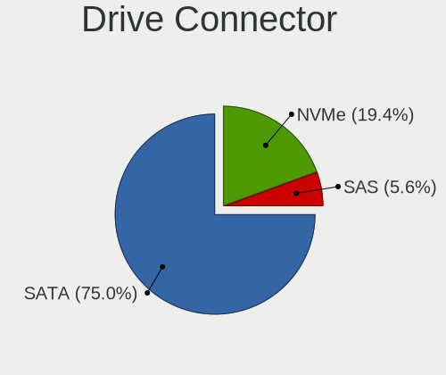

BlackPanther Hardware Trends (Desktops)
---------------------------------------

A project to identify most popular hardware characteristics and track their change
over time based on data collected by BlackPanther users at https://Linux-Hardware.org.

Anyone can contribute to this report by the [hw-probe](https://github.com/linuxhw/hw-probe) tool:

    sudo -E hw-probe -all -upload

Full-feature report is available here: https://linux-hardware.org/?view=trends&formfactor=desktop

Period: Aug, 2021.

Contents
--------

* [ System ](#system)
  - [ OS                       ](#os)
  - [ OS Family                ](#os-family)
  - [ Kernel                   ](#kernel)
  - [ Kernel Family            ](#kernel-family)
  - [ Kernel Major Ver.        ](#kernel-major-ver)
  - [ Arch                     ](#arch)
  - [ DE                       ](#de)
  - [ Display Server           ](#display-server)
  - [ Display Manager          ](#display-manager)
  - [ OS Lang                  ](#os-lang)
  - [ Boot Mode                ](#boot-mode)
  - [ Filesystem               ](#filesystem)
  - [ Part. scheme             ](#part-scheme)
  - [ Dual Boot with Linux/BSD ](#dual-boot-with-linuxbsd)
  - [ Dual Boot (Win)          ](#dual-boot-win)

* [ Board ](#board)
  - [ Vendor                   ](#vendor)
  - [ Model                    ](#model)
  - [ Model Family             ](#model-family)
  - [ MFG Year                 ](#mfg-year)
  - [ Form Factor              ](#form-factor)
  - [ Secure Boot              ](#secure-boot)
  - [ Coreboot                 ](#coreboot)
  - [ RAM Size                 ](#ram-size)
  - [ RAM Used                 ](#ram-used)
  - [ Total Drives             ](#total-drives)
  - [ Has CD-ROM               ](#has-cd-rom)
  - [ Has Ethernet             ](#has-ethernet)
  - [ Has WiFi                 ](#has-wifi)
  - [ Has Bluetooth            ](#has-bluetooth)

* [ Location ](#location)
  - [ Country                  ](#country)
  - [ City                     ](#city)

* [ Drives ](#drives)
  - [ Drive Vendor             ](#drive-vendor)
  - [ Drive Model              ](#drive-model)
  - [ HDD Vendor               ](#hdd-vendor)
  - [ SSD Vendor               ](#ssd-vendor)
  - [ Drive Kind               ](#drive-kind)
  - [ Drive Connector          ](#drive-connector)
  - [ Drive Size               ](#drive-size)
  - [ Space Total              ](#space-total)
  - [ Space Used               ](#space-used)
  - [ Malfunc. Drives          ](#malfunc-drives)
  - [ Malfunc. Drive Vendor    ](#malfunc-drive-vendor)
  - [ Malfunc. HDD Vendor      ](#malfunc-hdd-vendor)
  - [ Malfunc. Drive Kind      ](#malfunc-drive-kind)
  - [ Failed Drives            ](#failed-drives)
  - [ Failed Drive Vendor      ](#failed-drive-vendor)
  - [ Drive Status             ](#drive-status)

* [ Storage controller ](#storage-controller)
  - [ Storage Vendor           ](#storage-vendor)
  - [ Storage Model            ](#storage-model)
  - [ Storage Kind             ](#storage-kind)

* [ Processor ](#processor)
  - [ CPU Vendor               ](#cpu-vendor)
  - [ CPU Model                ](#cpu-model)
  - [ CPU Model Family         ](#cpu-model-family)
  - [ CPU Cores                ](#cpu-cores)
  - [ CPU Sockets              ](#cpu-sockets)
  - [ CPU Threads              ](#cpu-threads)
  - [ CPU Op-Modes             ](#cpu-op-modes)
  - [ CPU Microcode            ](#cpu-microcode)
  - [ CPU Microarch            ](#cpu-microarch)

* [ Graphics ](#graphics)
  - [ GPU Vendor               ](#gpu-vendor)
  - [ GPU Model                ](#gpu-model)
  - [ GPU Combo                ](#gpu-combo)
  - [ GPU Driver               ](#gpu-driver)
  - [ GPU Memory               ](#gpu-memory)

* [ Monitor ](#monitor)
  - [ Monitor Vendor           ](#monitor-vendor)
  - [ Monitor Model            ](#monitor-model)
  - [ Monitor Resolution       ](#monitor-resolution)
  - [ Monitor Diagonal         ](#monitor-diagonal)
  - [ Monitor Width            ](#monitor-width)
  - [ Aspect Ratio             ](#aspect-ratio)
  - [ Monitor Area             ](#monitor-area)
  - [ Pixel Density            ](#pixel-density)
  - [ Multiple Monitors        ](#multiple-monitors)

* [ Network ](#network)
  - [ Net Controller Vendor    ](#net-controller-vendor)
  - [ Net Controller Model     ](#net-controller-model)
  - [ Wireless Vendor          ](#wireless-vendor)
  - [ Wireless Model           ](#wireless-model)
  - [ Ethernet Vendor          ](#ethernet-vendor)
  - [ Ethernet Model           ](#ethernet-model)
  - [ Net Controller Kind      ](#net-controller-kind)
  - [ Used Controller          ](#used-controller)
  - [ NICs                     ](#nics)
  - [ IPv6                     ](#ipv6)

* [ Bluetooth ](#bluetooth)
  - [ Bluetooth Vendor         ](#bluetooth-vendor)
  - [ Bluetooth Model          ](#bluetooth-model)

* [ Sound ](#sound)
  - [ Sound Vendor             ](#sound-vendor)
  - [ Sound Model              ](#sound-model)

* [ Memory ](#memory)
  - [ Memory Vendor            ](#memory-vendor)
  - [ Memory Model             ](#memory-model)
  - [ Memory Kind              ](#memory-kind)
  - [ Memory Form Factor       ](#memory-form-factor)
  - [ Memory Size              ](#memory-size)
  - [ Memory Speed             ](#memory-speed)

* [ Printers & scanners ](#printers--scanners)
  - [ Printer Vendor           ](#printer-vendor)
  - [ Printer Model            ](#printer-model)
  - [ Scanner Vendor           ](#scanner-vendor)
  - [ Scanner Model            ](#scanner-model)

* [ Camera ](#camera)
  - [ Camera Vendor            ](#camera-vendor)
  - [ Camera Model             ](#camera-model)

* [ Security ](#security)
  - [ Fingerprint Vendor       ](#fingerprint-vendor)
  - [ Fingerprint Model        ](#fingerprint-model)
  - [ Chipcard Vendor          ](#chipcard-vendor)
  - [ Chipcard Model           ](#chipcard-model)

* [ Unsupported ](#unsupported)
  - [ Unsupported Devices      ](#unsupported-devices)
  - [ Unsupported Device Types ](#unsupported-device-types)

System
------

OS
--

Installed operating systems

| Name              | Desktops | Percent |
|-------------------|----------|---------|
| BlackPanther 18.1 | 37       | 97.37%  |
| BlackPanther 16.2 | 1        | 2.63%   |

OS Family
---------

OS without a version

| Name         | Desktops | Percent |
|--------------|----------|---------|
| BlackPanther | 38       | 100%    |

Kernel
------

Version of the Linux kernel

| Version                | Desktops | Percent |
|------------------------|----------|---------|
| 5.6.14-desktop-2bP     | 25       | 65.79%  |
| 4.18.16-desktop-1bP    | 12       | 31.58%  |
| 4.9.20-desktop-pae-1bP | 1        | 2.63%   |

Kernel Family
-------------

Linux kernel without a distro release

| Version | Desktops | Percent |
|---------|----------|---------|
| 5.6.14  | 25       | 65.79%  |
| 4.18.16 | 12       | 31.58%  |
| 4.9.20  | 1        | 2.63%   |

Kernel Major Ver.
-----------------

Linux kernel major version

| Version | Desktops | Percent |
|---------|----------|---------|
| 5.6     | 25       | 65.79%  |
| 4.18    | 12       | 31.58%  |
| 4.9     | 1        | 2.63%   |

Arch
----

OS architecture (x86_64, i586, etc.)

| Name   | Desktops | Percent |
|--------|----------|---------|
| x86_64 | 37       | 97.37%  |
| i686   | 1        | 2.63%   |

DE
--

Desktop Environment

| Name | Desktops | Percent |
|------|----------|---------|
| KDE5 | 38       | 100%    |

Display Server
--------------

X11 or Wayland

| Name | Desktops | Percent |
|------|----------|---------|
| X11  | 38       | 100%    |

Display Manager
---------------

SDDM, LightDM, etc.

| Name | Desktops | Percent |
|------|----------|---------|
| SDDM | 38       | 100%    |

OS Lang
-------

Language

| Lang    | Desktops | Percent |
|---------|----------|---------|
| Unknown | 38       | 100%    |

Boot Mode
---------

EFI or BIOS

| Mode | Desktops | Percent |
|------|----------|---------|
| BIOS | 28       | 73.68%  |
| EFI  | 10       | 26.32%  |

Filesystem
----------

Type of filesystem

| Type    | Desktops | Percent |
|---------|----------|---------|
| Overlay | 34       | 89.47%  |
| Ext4    | 4        | 10.53%  |

Part. scheme
------------

Scheme of partitioning

| Type    | Desktops | Percent |
|---------|----------|---------|
| MBR     | 21       | 55.26%  |
| GPT     | 16       | 42.11%  |
| Unknown | 1        | 2.63%   |

Dual Boot with Linux/BSD
------------------------

Hosting more than one Linux/BSD

| Dual boot | Desktops | Percent |
|-----------|----------|---------|
| Yes       | 21       | 55.26%  |
| No        | 17       | 44.74%  |

Dual Boot (Win)
---------------

Hosting Linux and Windows

| Dual boot | Desktops | Percent |
|-----------|----------|---------|
| Yes       | 20       | 52.63%  |
| No        | 18       | 47.37%  |

Board
-----

Vendor
------

Motherboard manufacturer

| Name                | Desktops | Percent |
|---------------------|----------|---------|
| ASUSTek Computer    | 12       | 31.58%  |
| Gigabyte Technology | 7        | 18.42%  |
| Dell                | 6        | 15.79%  |
| ASRock              | 5        | 13.16%  |
| Lenovo              | 3        | 7.89%   |
| Hewlett-Packard     | 2        | 5.26%   |
| MSI                 | 1        | 2.63%   |
| Fujitsu             | 1        | 2.63%   |
| Foxconn             | 1        | 2.63%   |

Model
-----

Motherboard model

| Name                            | Desktops | Percent |
|---------------------------------|----------|---------|
| ASUS PRIME B365M-A              | 3        | 7.89%   |
| HP Compaq Pro 6300 SFF          | 2        | 5.26%   |
| ASUS All Series                 | 2        | 5.26%   |
| MSI MS-7C02                     | 1        | 2.63%   |
| Lenovo ThinkStation D20 4158AF8 | 1        | 2.63%   |
| Lenovo ThinkStation C30 1097A34 | 1        | 2.63%   |
| Lenovo ThinkCentre A57 98517HG  | 1        | 2.63%   |
| Gigabyte P67A-D3-B3             | 1        | 2.63%   |
| Gigabyte H61M-S1                | 1        | 2.63%   |
| Gigabyte H310M S2H 2.0          | 1        | 2.63%   |
| Gigabyte GA-MA790X-UD4P         | 1        | 2.63%   |
| Gigabyte G41MT-S2PT             | 1        | 2.63%   |
| Gigabyte G41MT-S2               | 1        | 2.63%   |
| Gigabyte EP45-UD3               | 1        | 2.63%   |
| Fujitsu ESPRIMO P7936           | 1        | 2.63%   |
| Foxconn Pro 3500 Series         | 1        | 2.63%   |
| Dell OptiPlex 990               | 1        | 2.63%   |
| Dell OptiPlex 780               | 1        | 2.63%   |
| Dell OptiPlex 755               | 1        | 2.63%   |
| Dell OptiPlex 380               | 1        | 2.63%   |
| Dell OptiPlex 330               | 1        | 2.63%   |
| Dell OptiPlex 3010              | 1        | 2.63%   |
| ASUS ROG STRIX B450-F GAMING II | 1        | 2.63%   |
| ASUS ROG STRIX B450-F GAMING    | 1        | 2.63%   |
| ASUS PRIME A320M-R              | 1        | 2.63%   |
| ASUS P6T7 WS SUPERCOMPUTER      | 1        | 2.63%   |
| ASUS H110M-K                    | 1        | 2.63%   |
| ASUS B75M-A                     | 1        | 2.63%   |
| ASUS A8N-SLI                    | 1        | 2.63%   |
| ASRock G31M-GS                  | 1        | 2.63%   |
| ASRock FM2A75M Pro4+            | 1        | 2.63%   |
| ASRock FM2A55M-DGS              | 1        | 2.63%   |
| ASRock B85M                     | 1        | 2.63%   |
| ASRock 4CoreDual-SATA2          | 1        | 2.63%   |

Model Family
------------

Motherboard model prefix

| Name                    | Desktops | Percent |
|-------------------------|----------|---------|
| Dell OptiPlex           | 6        | 15.79%  |
| ASUS PRIME              | 4        | 10.53%  |
| Lenovo ThinkStation     | 2        | 5.26%   |
| HP Compaq               | 2        | 5.26%   |
| ASUS ROG                | 2        | 5.26%   |
| ASUS All                | 2        | 5.26%   |
| MSI MS-7C02             | 1        | 2.63%   |
| Lenovo ThinkCentre      | 1        | 2.63%   |
| Gigabyte P67A-D3-B3     | 1        | 2.63%   |
| Gigabyte H61M-S1        | 1        | 2.63%   |
| Gigabyte H310M          | 1        | 2.63%   |
| Gigabyte GA-MA790X-UD4P | 1        | 2.63%   |
| Gigabyte G41MT-S2PT     | 1        | 2.63%   |
| Gigabyte G41MT-S2       | 1        | 2.63%   |
| Gigabyte EP45-UD3       | 1        | 2.63%   |
| Fujitsu ESPRIMO         | 1        | 2.63%   |
| Foxconn Pro             | 1        | 2.63%   |
| ASUS P6T7               | 1        | 2.63%   |
| ASUS H110M-K            | 1        | 2.63%   |
| ASUS B75M-A             | 1        | 2.63%   |
| ASUS A8N-SLI            | 1        | 2.63%   |
| ASRock G31M-GS          | 1        | 2.63%   |
| ASRock FM2A75M          | 1        | 2.63%   |
| ASRock FM2A55M-DGS      | 1        | 2.63%   |
| ASRock B85M             | 1        | 2.63%   |
| ASRock 4CoreDual-SATA2  | 1        | 2.63%   |

MFG Year
--------

Motherboard manufacture year

| Year | Desktops | Percent |
|------|----------|---------|
| 2013 | 5        | 13.16%  |
| 2012 | 5        | 13.16%  |
| 2020 | 4        | 10.53%  |
| 2010 | 4        | 10.53%  |
| 2019 | 3        | 7.89%   |
| 2018 | 3        | 7.89%   |
| 2014 | 3        | 7.89%   |
| 2011 | 3        | 7.89%   |
| 2008 | 3        | 7.89%   |
| 2009 | 2        | 5.26%   |
| 2021 | 1        | 2.63%   |
| 2016 | 1        | 2.63%   |
| 2005 | 1        | 2.63%   |

Form Factor
-----------

Physical design of the computer

| Name    | Desktops | Percent |
|---------|----------|---------|
| Desktop | 38       | 100%    |

Secure Boot
-----------

Enabled or disabled

| State    | Desktops | Percent |
|----------|----------|---------|
| Disabled | 38       | 100%    |

Coreboot
--------

Have coreboot on board

| Used | Desktops | Percent |
|------|----------|---------|
| No   | 38       | 100%    |

RAM Size
--------

Total RAM memory

| Size in GB | Desktops | Percent |
|------------|----------|---------|
| 3.01-4.0   | 15       | 39.47%  |
| 8.01-16.0  | 10       | 26.32%  |
| 16.01-24.0 | 5        | 13.16%  |
| 4.01-8.0   | 3        | 7.89%   |
| 32.01-64.0 | 2        | 5.26%   |
| 24.01-32.0 | 1        | 2.63%   |
| 2.01-3.0   | 1        | 2.63%   |
| 1.01-2.0   | 1        | 2.63%   |

RAM Used
--------

Used RAM memory

| Used GB  | Desktops | Percent |
|----------|----------|---------|
| 0.01-0.5 | 23       | 60.53%  |
| 0.51-1.0 | 14       | 36.84%  |
| 1.01-2.0 | 1        | 2.63%   |

Total Drives
------------

Number of drives on board

| Drives | Desktops | Percent |
|--------|----------|---------|
| 1      | 17       | 44.74%  |
| 2      | 8        | 21.05%  |
| 3      | 5        | 13.16%  |
| 4      | 4        | 10.53%  |
| 0      | 2        | 5.26%   |
| 6      | 1        | 2.63%   |
| 5      | 1        | 2.63%   |

Has CD-ROM
----------

Has CD-ROM on board

| Presented | Desktops | Percent |
|-----------|----------|---------|
| Yes       | 26       | 68.42%  |
| No        | 12       | 31.58%  |

Has Ethernet
------------

Has Ethernet on board

| Presented | Desktops | Percent |
|-----------|----------|---------|
| Yes       | 38       | 100%    |

Has WiFi
--------

Has WiFi module

| Presented | Desktops | Percent |
|-----------|----------|---------|
| No        | 27       | 71.05%  |
| Yes       | 11       | 28.95%  |

Has Bluetooth
-------------

Has Bluetooth module

| Presented | Desktops | Percent |
|-----------|----------|---------|
| No        | 37       | 97.37%  |
| Yes       | 1        | 2.63%   |

Location
--------

Country
-------

Geographic location (country)

| Country   | Desktops | Percent |
|-----------|----------|---------|
| Hungary   | 33       | 86.84%  |
| USA       | 1        | 2.63%   |
| UK        | 1        | 2.63%   |
| Slovakia  | 1        | 2.63%   |
| Germany   | 1        | 2.63%   |
| Australia | 1        | 2.63%   |

City
----

Geographic location (city)

| City             | Desktops | Percent |
|------------------|----------|---------|
| Budapest         | 5        | 13.16%  |
| Oroshaza         | 4        | 10.53%  |
| Kenderes         | 2        | 5.26%   |
| Eger             | 2        | 5.26%   |
| Zalaegerszeg     | 1        | 2.63%   |
| Vecses           | 1        | 2.63%   |
| V??c             | 1        | 2.63%   |
| Szeksz??rd       | 1        | 2.63%   |
| Szeged           | 1        | 2.63%   |
| Sydney           | 1        | 2.63%   |
| Southend-on-Sea  | 1        | 2.63%   |
| Sajobabony       | 1        | 2.63%   |
| Roszke           | 1        | 2.63%   |
| P?©cs            | 1        | 2.63%   |
| New Windsor      | 1        | 2.63%   |
| Nagyvisnyo       | 1        | 2.63%   |
| Mezokovesd       | 1        | 2.63%   |
| Kunszentmiklos   | 1        | 2.63%   |
| Kecskem?©t       | 1        | 2.63%   |
| Karcag           | 1        | 2.63%   |
| Kal              | 1        | 2.63%   |
| Hodmezovasarhely | 1        | 2.63%   |
| Hnusta           | 1        | 2.63%   |
| Heves            | 1        | 2.63%   |
| Hegyfalu         | 1        | 2.63%   |
| Gotha            | 1        | 2.63%   |
| Esztergom        | 1        | 2.63%   |
| Debrecen         | 1        | 2.63%   |
| Baja             | 1        | 2.63%   |

Drives
------

Drive Vendor
------------

Hard drive vendors

| Vendor              | Desktops | Drives | Percent |
|---------------------|----------|--------|---------|
| WDC                 | 20       | 23     | 31.25%  |
| Samsung Electronics | 13       | 18     | 20.31%  |
| Toshiba             | 6        | 7      | 9.38%   |
| Kingston            | 4        | 5      | 6.25%   |
| Zheino              | 3        | 3      | 4.69%   |
| Seagate             | 3        | 4      | 4.69%   |
| Maxtor              | 3        | 3      | 4.69%   |
| Crucial             | 3        | 3      | 4.69%   |
| China               | 2        | 2      | 3.13%   |
| XPG                 | 1        | 1      | 1.56%   |
| PNY                 | 1        | 1      | 1.56%   |
| Netac               | 1        | 1      | 1.56%   |
| Intenso             | 1        | 1      | 1.56%   |
| Hitachi             | 1        | 1      | 1.56%   |
| Apacer              | 1        | 1      | 1.56%   |
| A-DATA Technology   | 1        | 1      | 1.56%   |

Drive Model
-----------

Hard drive models

| Model                            | Desktops | Percent |
|----------------------------------|----------|---------|
| Samsung HD103UJ 1TB              | 4        | 5.48%   |
| Zheino CHN-NGFFNV2280-256 256GB  | 3        | 4.11%   |
| WDC WDS240G2G0B-00EPW0 240GB SSD | 3        | 4.11%   |
| Toshiba DT01ACA100 1TB           | 3        | 4.11%   |
| Samsung SSD 870 EVO 250GB        | 2        | 2.74%   |
| Kingston SA400S37240G 240GB SSD  | 2        | 2.74%   |
| XPG GAMMIX S11 Pro 512GB         | 1        | 1.37%   |
| WDC WDS500G2B0A-00SM50 500GB SSD | 1        | 1.37%   |
| WDC WDS120G2G0B-00EPW0 120GB SSD | 1        | 1.37%   |
| WDC WD800JD-55MUA1 80GB          | 1        | 1.37%   |
| WDC WD5000AAKX-22ERMA0 500GB     | 1        | 1.37%   |
| WDC WD5000AAKX-08U6AA0 500GB     | 1        | 1.37%   |
| WDC WD5000AAKX-001CA0 500GB      | 1        | 1.37%   |
| WDC WD5000AACS-00G8B1 500GB      | 1        | 1.37%   |
| WDC WD30EZRZ-00GXCB0 3TB         | 1        | 1.37%   |
| WDC WD30EFRX-68EUZN0 3TB         | 1        | 1.37%   |
| WDC WD2500AAKX-603CA0 250GB      | 1        | 1.37%   |
| WDC WD2500AAJS-75B4A0 250GB      | 1        | 1.37%   |
| WDC WD20PURX-64P6ZY0 2TB         | 1        | 1.37%   |
| WDC WD1600AAJS-60WAA0 160GB      | 1        | 1.37%   |
| WDC WD1600AAJB-56WRA0 160GB      | 1        | 1.37%   |
| WDC WD10EZEX-75WN4A0 1TB         | 1        | 1.37%   |
| WDC WD10EZEX-60M2NA0 1TB         | 1        | 1.37%   |
| WDC WD10EZEX-08WN4A0 1TB         | 1        | 1.37%   |
| WDC WD10EZEX-00KUWA0 1TB         | 1        | 1.37%   |
| WDC WD10EZEX-00BN5A0 1TB         | 1        | 1.37%   |
| WDC WD10EFRX-68PJCN0 1TB         | 1        | 1.37%   |
| Toshiba TR200 240GB SSD          | 1        | 1.37%   |
| Toshiba MQ04ABF100 1TB           | 1        | 1.37%   |
| Toshiba MK1646GSX 160GB          | 1        | 1.37%   |
| Toshiba DT01ACA050 500GB         | 1        | 1.37%   |
| Seagate ST500DM002-1BD142 500GB  | 1        | 1.37%   |
| Seagate ST3160318AS 160GB        | 1        | 1.37%   |
| Seagate ST31500341AS 1TB         | 1        | 1.37%   |
| Samsung SSD 870 EVO 1TB          | 1        | 1.37%   |
| Samsung SSD 860 EVO 500GB        | 1        | 1.37%   |
| Samsung SSD 830 Series 64GB      | 1        | 1.37%   |
| Samsung SP2004C 200GB            | 1        | 1.37%   |
| Samsung SP1614C 160GB            | 1        | 1.37%   |
| Samsung HD502HJ 500GB            | 1        | 1.37%   |
| Samsung HD322HJ 320GB            | 1        | 1.37%   |
| Samsung HD204UI 2TB              | 1        | 1.37%   |
| Samsung HD160JJ 160GB            | 1        | 1.37%   |
| Samsung HD154UI 1TB              | 1        | 1.37%   |
| Samsung HD103SJ 1TB              | 1        | 1.37%   |
| PNY CS900 120GB SSD              | 1        | 1.37%   |
| Netac SSD 128GB                  | 1        | 1.37%   |
| Maxtor 6V250F0 256GB             | 1        | 1.37%   |
| Maxtor 4D040H2 41GB              | 1        | 1.37%   |
| Maxtor 2B020H1 20GB              | 1        | 1.37%   |
| Kingston SV300S37A60G 64GB SSD   | 1        | 1.37%   |
| Kingston SV300S37A120G 120GB SSD | 1        | 1.37%   |
| Kingston SA2000M8250G 250GB      | 1        | 1.37%   |
| Intenso SSD 120GB                | 1        | 1.37%   |
| Hitachi HTS543232A7A384 320GB    | 1        | 1.37%   |
| Crucial M4-CT128M4SSD2 128GB     | 1        | 1.37%   |
| Crucial CT240BX500SSD1 240GB     | 1        | 1.37%   |
| Crucial CT1000MX500SSD1 1TB      | 1        | 1.37%   |
| China SSD 120GB                  | 1        | 1.37%   |
| China SATA SSD 120GB             | 1        | 1.37%   |

HDD Vendor
----------

Hard disk drive vendors

| Vendor              | Desktops | Drives | Percent |
|---------------------|----------|--------|---------|
| WDC                 | 16       | 18     | 42.11%  |
| Samsung Electronics | 10       | 12     | 26.32%  |
| Toshiba             | 5        | 6      | 13.16%  |
| Seagate             | 3        | 4      | 7.89%   |
| Maxtor              | 3        | 3      | 7.89%   |
| Hitachi             | 1        | 1      | 2.63%   |

SSD Vendor
----------

Solid state drive vendors

| Vendor              | Desktops | Drives | Percent |
|---------------------|----------|--------|---------|
| Samsung Electronics | 5        | 6      | 20.83%  |
| WDC                 | 4        | 5      | 16.67%  |
| Kingston            | 4        | 4      | 16.67%  |
| Crucial             | 3        | 3      | 12.5%   |
| China               | 2        | 2      | 8.33%   |
| Toshiba             | 1        | 1      | 4.17%   |
| PNY                 | 1        | 1      | 4.17%   |
| Netac               | 1        | 1      | 4.17%   |
| Intenso             | 1        | 1      | 4.17%   |
| Apacer              | 1        | 1      | 4.17%   |
| A-DATA Technology   | 1        | 1      | 4.17%   |

Drive Kind
----------

HDD or SSD

| Kind | Desktops | Drives | Percent |
|------|----------|--------|---------|
| HDD  | 30       | 44     | 55.56%  |
| SSD  | 19       | 26     | 35.19%  |
| NVMe | 5        | 5      | 9.26%   |

Drive Connector
---------------

SATA, SAS, NVMe, etc.

| Type | Desktops | Drives | Percent |
|------|----------|--------|---------|
| SATA | 36       | 70     | 87.8%   |
| NVMe | 5        | 5      | 12.2%   |

Drive Size
----------

Size of hard drive

| Size in TB | Desktops | Drives | Percent |
|------------|----------|--------|---------|
| 0.01-0.5   | 29       | 47     | 60.42%  |
| 0.51-1.0   | 16       | 19     | 33.33%  |
| 1.01-2.0   | 2        | 2      | 4.17%   |
| 2.01-3.0   | 1        | 2      | 2.08%   |

Space Total
-----------

Amount of disk space available on the file system

| Size in GB | Desktops | Percent |
|------------|----------|---------|
| Unknown    | 34       | 89.47%  |
| 251-500    | 2        | 5.26%   |
| 101-250    | 2        | 5.26%   |

Space Used
----------

Amount of used disk space

| Used GB | Desktops | Percent |
|---------|----------|---------|
| Unknown | 34       | 89.47%  |
| 1-20    | 4        | 10.53%  |

Malfunc. Drives
---------------

Drive models with a malfunction

| Model                             | Desktops | Drives | Percent |
|-----------------------------------|----------|--------|---------|
| Samsung Electronics HD103UJ 1TB   | 4        | 4      | 18.18%  |
| Toshiba DT01ACA100 1TB            | 2        | 2      | 9.09%   |
| WDC WD800JD-55MUA1 80GB           | 1        | 1      | 4.55%   |
| WDC WD5000AAKX-08U6AA0 500GB      | 1        | 1      | 4.55%   |
| WDC WD5000AAKX-001CA0 500GB       | 1        | 1      | 4.55%   |
| WDC WD2500AAJS-75B4A0 250GB       | 1        | 1      | 4.55%   |
| WDC WD20PURX-64P6ZY0 2TB          | 1        | 1      | 4.55%   |
| WDC WD1600AAJB-56WRA0 160GB       | 1        | 1      | 4.55%   |
| WDC WD10EZEX-60M2NA0 1TB          | 1        | 1      | 4.55%   |
| WDC WD10EZEX-08WN4A0 1TB          | 1        | 1      | 4.55%   |
| Toshiba MK1646GSX 160GB           | 1        | 1      | 4.55%   |
| Toshiba DT01ACA050 500GB          | 1        | 1      | 4.55%   |
| Seagate ST500DM002-1BD142 500GB   | 1        | 2      | 4.55%   |
| Seagate ST31500341AS 1TB          | 1        | 1      | 4.55%   |
| Samsung Electronics SP2004C 200GB | 1        | 1      | 4.55%   |
| Samsung Electronics HD204UI 2TB   | 1        | 1      | 4.55%   |
| Maxtor 6V250F0 256GB              | 1        | 1      | 4.55%   |
| Maxtor 2B020H1 20GB               | 1        | 1      | 4.55%   |

Malfunc. Drive Vendor
---------------------

Vendors of faulty drives

| Vendor              | Desktops | Drives | Percent |
|---------------------|----------|--------|---------|
| WDC                 | 7        | 8      | 35%     |
| Samsung Electronics | 5        | 6      | 25%     |
| Toshiba             | 4        | 4      | 20%     |
| Seagate             | 2        | 3      | 10%     |
| Maxtor              | 2        | 2      | 10%     |

Malfunc. HDD Vendor
-------------------

Vendors of faulty HDD drives

| Vendor              | Desktops | Drives | Percent |
|---------------------|----------|--------|---------|
| WDC                 | 7        | 8      | 35%     |
| Samsung Electronics | 5        | 6      | 25%     |
| Toshiba             | 4        | 4      | 20%     |
| Seagate             | 2        | 3      | 10%     |
| Maxtor              | 2        | 2      | 10%     |

Malfunc. Drive Kind
-------------------

Kinds of faulty drives

| Kind | Desktops | Drives | Percent |
|------|----------|--------|---------|
| HDD  | 16       | 23     | 100%    |

Failed Drives
-------------

Failed drive models

Zero info for selected period =(

Failed Drive Vendor
-------------------

Failed drive vendors

Zero info for selected period =(

Drive Status
------------

Number of failed and malfunc. drives

| Status   | Desktops | Drives | Percent |
|----------|----------|--------|---------|
| Works    | 28       | 51     | 62.22%  |
| Malfunc  | 16       | 23     | 35.56%  |
| Detected | 1        | 1      | 2.22%   |

Storage controller
------------------

Storage Vendor
--------------

Storage controller vendors

| Vendor                      | Desktops | Percent |
|-----------------------------|----------|---------|
| Intel                       | 28       | 58.33%  |
| AMD                         | 8        | 16.67%  |
| Silicon Motion              | 3        | 6.25%   |
| JMicron Technology          | 2        | 4.17%   |
| VIA Technologies            | 1        | 2.08%   |
| Silicon Image               | 1        | 2.08%   |
| Nvidia                      | 1        | 2.08%   |
| Kingston Technology Company | 1        | 2.08%   |
| ADATA Technology            | 1        | 2.08%   |
| Adaptec                     | 1        | 2.08%   |
| 3ware                       | 1        | 2.08%   |

Storage Model
-------------

Storage controller models

| Model                                                                                   | Desktops | Percent |
|-----------------------------------------------------------------------------------------|----------|---------|
| AMD FCH SATA Controller [AHCI mode]                                                     | 6        | 8.7%    |
| Intel NM10/ICH7 Family SATA Controller [IDE mode]                                       | 5        | 7.25%   |
| Intel 82801G (ICH7 Family) IDE Controller                                               | 5        | 7.25%   |
| Intel 200 Series PCH SATA controller [AHCI mode]                                        | 4        | 5.8%    |
| Silicon Motion SM2263EN/SM2263XT SSD Controller                                         | 3        | 4.35%   |
| AMD 400 Series Chipset SATA Controller                                                  | 3        | 4.35%   |
| JMicron JMB363 SATA/IDE Controller                                                      | 2        | 2.9%    |
| Intel 82801JI (ICH10 Family) 4 port SATA IDE Controller #1                              | 2        | 2.9%    |
| Intel 82801JI (ICH10 Family) 2 port SATA IDE Controller #2                              | 2        | 2.9%    |
| Intel 82801JD/DO (ICH10 Family) SATA AHCI Controller                                    | 2        | 2.9%    |
| Intel 8 Series/C220 Series Chipset Family 6-port SATA Controller 1 [AHCI mode]          | 2        | 2.9%    |
| Intel 7 Series/C210 Series Chipset Family 6-port SATA Controller [AHCI mode]            | 2        | 2.9%    |
| Intel 6 Series/C200 Series Chipset Family Desktop SATA Controller (IDE mode, ports 4-5) | 2        | 2.9%    |
| Intel 6 Series/C200 Series Chipset Family Desktop SATA Controller (IDE mode, ports 0-3) | 2        | 2.9%    |
| Intel 6 Series/C200 Series Chipset Family 6 port Desktop SATA AHCI Controller           | 2        | 2.9%    |
| AMD FCH IDE Controller                                                                  | 2        | 2.9%    |
| VIA VT82C586A/B/VT82C686/A/B/VT823x/A/C PIPC Bus Master IDE                             | 1        | 1.45%   |
| VIA VT8237/8251 Serial ATA Controller                                                   | 1        | 1.45%   |
| Silicon Image SiI 3114 [SATALink/SATARaid] Serial ATA Controller                        | 1        | 1.45%   |
| Nvidia CK804 Serial ATA Controller                                                      | 1        | 1.45%   |
| Nvidia CK804 IDE                                                                        | 1        | 1.45%   |
| Kingston Company A2000 NVMe SSD                                                         | 1        | 1.45%   |
| Intel SATA Controller [RAID mode]                                                       | 1        | 1.45%   |
| Intel Q170/Q150/B150/H170/H110/Z170/CM236 Chipset SATA Controller [AHCI Mode]           | 1        | 1.45%   |
| Intel NM10/ICH7 Family SATA Controller [AHCI mode]                                      | 1        | 1.45%   |
| Intel C602 chipset 4-Port SATA Storage Control Unit                                     | 1        | 1.45%   |
| Intel C600/X79 series chipset IDE-r Controller                                          | 1        | 1.45%   |
| Intel C600/X79 series chipset 6-Port SATA AHCI Controller                               | 1        | 1.45%   |
| Intel 82801JI (ICH10 Family) SATA AHCI Controller                                       | 1        | 1.45%   |
| Intel 82801IR/IO/IH (ICH9R/DO/DH) 6 port SATA Controller [AHCI mode]                    | 1        | 1.45%   |
| Intel 7 Series/C210 Series Chipset Family 4-port SATA Controller [IDE mode]             | 1        | 1.45%   |
| Intel 7 Series/C210 Series Chipset Family 2-port SATA Controller [IDE mode]             | 1        | 1.45%   |
| Intel 4 Series Chipset PT IDER Controller                                               | 1        | 1.45%   |
| AMD SB7x0/SB8x0/SB9x0 SATA Controller [IDE mode]                                        | 1        | 1.45%   |
| AMD SB7x0/SB8x0/SB9x0 IDE Controller                                                    | 1        | 1.45%   |
| AMD FCH SATA Controller D                                                               | 1        | 1.45%   |
| ADATA XPG SX8200 Pro PCIe Gen3x4 M.2 2280 Solid State Drive                             | 1        | 1.45%   |
| Adaptec AIC-7870P/7871 [AHA-2940/W/S76]                                                 | 1        | 1.45%   |
| 3ware 7xxx/8xxx-series PATA/SATA-RAID                                                   | 1        | 1.45%   |

Storage Kind
------------

Kind of storage controller (IDE, SATA, NVMe, SAS, ...)

| Kind | Desktops | Percent |
|------|----------|---------|
| SATA | 25       | 47.17%  |
| IDE  | 18       | 33.96%  |
| NVMe | 5        | 9.43%   |
| RAID | 3        | 5.66%   |
| SAS  | 1        | 1.89%   |
| SCSI | 1        | 1.89%   |

Processor
---------

CPU Vendor
----------

Processor vendors

| Vendor | Desktops | Percent |
|--------|----------|---------|
| Intel  | 29       | 76.32%  |
| AMD    | 9        | 23.68%  |

CPU Model
---------

Processor models

| Model                                       | Desktops | Percent |
|---------------------------------------------|----------|---------|
| Intel Core i3-8100 CPU @ 3.60GHz            | 3        | 7.89%   |
| Intel Pentium Dual-Core CPU E5700 @ 3.00GHz | 2        | 5.26%   |
| Intel Core i3-2120 CPU @ 3.30GHz            | 2        | 5.26%   |
| Intel Core 2 Quad CPU Q9400 @ 2.66GHz       | 2        | 5.26%   |
| Intel Core 2 Duo CPU E8400 @ 3.00GHz        | 2        | 5.26%   |
| Intel Xeon CPU X5677 @ 3.47GHz              | 1        | 2.63%   |
| Intel Xeon CPU X5472 @ 3.00GHz              | 1        | 2.63%   |
| Intel Xeon CPU E5-2620 0 @ 2.00GHz          | 1        | 2.63%   |
| Intel Pentium CPU G3430 @ 3.30GHz           | 1        | 2.63%   |
| Intel Pentium CPU G3240 @ 3.10GHz           | 1        | 2.63%   |
| Intel Core i7-6700K CPU @ 4.00GHz           | 1        | 2.63%   |
| Intel Core i7 CPU X 980 @ 3.33GHz           | 1        | 2.63%   |
| Intel Core i5-8400 CPU @ 2.80GHz            | 1        | 2.63%   |
| Intel Core i5-3470 CPU @ 3.20GHz            | 1        | 2.63%   |
| Intel Core i5-2400 CPU @ 3.10GHz            | 1        | 2.63%   |
| Intel Core i5-2300 CPU @ 2.80GHz            | 1        | 2.63%   |
| Intel Core i3-3225 CPU @ 3.30GHz            | 1        | 2.63%   |
| Intel Core i3-3220 CPU @ 3.30GHz            | 1        | 2.63%   |
| Intel Core 2 Quad CPU Q9300 @ 2.50GHz       | 1        | 2.63%   |
| Intel Core 2 Duo CPU E7500 @ 2.93GHz        | 1        | 2.63%   |
| Intel Core 2 Duo CPU E6550 @ 2.33GHz        | 1        | 2.63%   |
| Intel Celeron CPU G1610 @ 2.60GHz           | 1        | 2.63%   |
| Intel Celeron CPU 430 @ 1.80GHz             | 1        | 2.63%   |
| AMD Sempron 3850 APU with Radeon R3         | 1        | 2.63%   |
| AMD Ryzen 5 3600X 6-Core Processor          | 1        | 2.63%   |
| AMD Ryzen 5 3600 6-Core Processor           | 1        | 2.63%   |
| AMD Ryzen 3 3200G with Radeon Vega Graphics | 1        | 2.63%   |
| AMD Ryzen 3 2200G with Radeon Vega Graphics | 1        | 2.63%   |
| AMD Phenom II X4 940 Processor              | 1        | 2.63%   |
| AMD Athlon 64 Processor 3200+               | 1        | 2.63%   |
| AMD A8-6600K APU with Radeon HD Graphics    | 1        | 2.63%   |
| AMD A4-5300 APU with Radeon HD Graphics     | 1        | 2.63%   |

CPU Model Family
----------------

Processor model prefix

| Model                   | Desktops | Percent |
|-------------------------|----------|---------|
| Intel Core i3           | 7        | 18.42%  |
| Intel Core i5           | 4        | 10.53%  |
| Intel Core 2 Duo        | 4        | 10.53%  |
| Intel Xeon              | 3        | 7.89%   |
| Intel Core 2 Quad       | 3        | 7.89%   |
| Intel Pentium Dual-Core | 2        | 5.26%   |
| Intel Pentium           | 2        | 5.26%   |
| Intel Core i7           | 2        | 5.26%   |
| Intel Celeron           | 2        | 5.26%   |
| AMD Ryzen 5             | 2        | 5.26%   |
| AMD Ryzen 3             | 2        | 5.26%   |
| AMD Sempron             | 1        | 2.63%   |
| AMD Phenom II X4        | 1        | 2.63%   |
| AMD Athlon 64           | 1        | 2.63%   |
| AMD A8                  | 1        | 2.63%   |
| AMD A4                  | 1        | 2.63%   |

CPU Cores
---------

Number of processor cores

| Number | Desktops | Percent |
|--------|----------|---------|
| 4      | 15       | 39.47%  |
| 2      | 14       | 36.84%  |
| 6      | 4        | 10.53%  |
| 1      | 3        | 7.89%   |
| 12     | 1        | 2.63%   |
| 8      | 1        | 2.63%   |

CPU Sockets
-----------

Number of sockets

| Number | Desktops | Percent |
|--------|----------|---------|
| 1      | 36       | 94.74%  |
| 2      | 2        | 5.26%   |

CPU Threads
-----------

Threads per core (Hyper-Threading)

| Number | Desktops | Percent |
|--------|----------|---------|
| 1      | 26       | 68.42%  |
| 2      | 12       | 31.58%  |

CPU Op-Modes
------------

CPU Operation Modes (32-bit, 64-bit)

| Op mode        | Desktops | Percent |
|----------------|----------|---------|
| 32-bit, 64-bit | 38       | 100%    |

CPU Microcode
-------------

Microcode number

| Number     | Desktops | Percent |
|------------|----------|---------|
| 0x1067a    | 7        | 18.42%  |
| 0x306a9    | 4        | 10.53%  |
| 0x206a7    | 4        | 10.53%  |
| 0x906eb    | 3        | 7.89%   |
| 0x306c3    | 2        | 5.26%   |
| 0x206c2    | 2        | 5.26%   |
| 0x06001119 | 2        | 5.26%   |
| 0x906ea    | 1        | 2.63%   |
| 0x6fb      | 1        | 2.63%   |
| 0x506e3    | 1        | 2.63%   |
| 0x206d7    | 1        | 2.63%   |
| 0x10677    | 1        | 2.63%   |
| 0x10676    | 1        | 2.63%   |
| 0x10661    | 1        | 2.63%   |
| 0x08701021 | 1        | 2.63%   |
| 0x08701013 | 1        | 2.63%   |
| 0x08108109 | 1        | 2.63%   |
| 0x0810100b | 1        | 2.63%   |
| 0x0700010f | 1        | 2.63%   |
| 0x010000db | 1        | 2.63%   |
| Unknown    | 1        | 2.63%   |

CPU Microarch
-------------

Microarchitecture

| Name        | Desktops | Percent |
|-------------|----------|---------|
| Penryn      | 9        | 23.68%  |
| SandyBridge | 5        | 13.16%  |
| KabyLake    | 4        | 10.53%  |
| IvyBridge   | 4        | 10.53%  |
| Zen 2       | 2        | 5.26%   |
| Westmere    | 2        | 5.26%   |
| Piledriver  | 2        | 5.26%   |
| Haswell     | 2        | 5.26%   |
| Core        | 2        | 5.26%   |
| Zen+        | 1        | 2.63%   |
| Zen         | 1        | 2.63%   |
| Skylake     | 1        | 2.63%   |
| K8 Hammer   | 1        | 2.63%   |
| K10         | 1        | 2.63%   |
| Jaguar      | 1        | 2.63%   |

Graphics
--------

GPU Vendor
----------

Vendors of graphics cards

| Vendor | Desktops | Percent |
|--------|----------|---------|
| Nvidia | 14       | 35.9%   |
| Intel  | 14       | 35.9%   |
| AMD    | 11       | 28.21%  |

GPU Model
---------

Graphics card models

| Model                                                                       | Desktops | Percent |
|-----------------------------------------------------------------------------|----------|---------|
| Intel CoffeeLake-S GT2 [UHD Graphics 630]                                   | 3        | 7.32%   |
| Intel 4 Series Chipset Integrated Graphics Controller                       | 3        | 7.32%   |
| Nvidia GP108 [GeForce GT 1030]                                              | 2        | 4.88%   |
| Intel Xeon E3-1200 v3/4th Gen Core Processor Integrated Graphics Controller | 2        | 4.88%   |
| Intel 82G33/G31 Express Integrated Graphics Controller                      | 2        | 4.88%   |
| Intel 2nd Generation Core Processor Family Integrated Graphics Controller   | 2        | 4.88%   |
| Nvidia TU116 [GeForce GTX 1660 SUPER]                                       | 1        | 2.44%   |
| Nvidia NV43 [GeForce 6600 GT]                                               | 1        | 2.44%   |
| Nvidia GT218 [GeForce 210]                                                  | 1        | 2.44%   |
| Nvidia GP107 [GeForce GTX 1050 Ti]                                          | 1        | 2.44%   |
| Nvidia GP106 [GeForce GTX 1060 6GB]                                         | 1        | 2.44%   |
| Nvidia GK208B [GeForce GT 730]                                              | 1        | 2.44%   |
| Nvidia GK208B [GeForce GT 710]                                              | 1        | 2.44%   |
| Nvidia GK107GL [Quadro K2000]                                               | 1        | 2.44%   |
| Nvidia GK107 [GeForce GTX 650]                                              | 1        | 2.44%   |
| Nvidia GF108 [GeForce GT 630]                                               | 1        | 2.44%   |
| Nvidia G96C [GeForce 9500 GT]                                               | 1        | 2.44%   |
| Nvidia G73 [GeForce 7300 GT]                                                | 1        | 2.44%   |
| Intel HD Graphics 530                                                       | 1        | 2.44%   |
| Intel 82Q35 Express Integrated Graphics Controller                          | 1        | 2.44%   |
| AMD Trinity 2 [Radeon HD 7480D]                                             | 1        | 2.44%   |
| AMD RV770 [Radeon HD 4850]                                                  | 1        | 2.44%   |
| AMD RV630 XT [Radeon HD 2600 XT]                                            | 1        | 2.44%   |
| AMD Richland [Radeon HD 8570D]                                              | 1        | 2.44%   |
| AMD Redwood XT [Radeon HD 5670/5690/5730]                                   | 1        | 2.44%   |
| AMD Raven Ridge [Radeon Vega Series / Radeon Vega Mobile Series]            | 1        | 2.44%   |
| AMD Picasso                                                                 | 1        | 2.44%   |
| AMD Oland PRO [Radeon R7 240/340]                                           | 1        | 2.44%   |
| AMD Kabini [Radeon HD 8280 / R3 Series]                                     | 1        | 2.44%   |
| AMD Cypress XT [Radeon HD 5870]                                             | 1        | 2.44%   |
| AMD Cedar [Radeon HD 5000/6000/7350/8350 Series]                            | 1        | 2.44%   |
| AMD Cape Verde XT [Radeon HD 7770/8760 / R7 250X]                           | 1        | 2.44%   |
| AMD Caicos [Radeon HD 6450/7450/8450 / R5 230 OEM]                          | 1        | 2.44%   |

GPU Combo
---------

Combinations of graphics cards

| Name         | Desktops | Percent |
|--------------|----------|---------|
| 1 x Intel    | 14       | 36.84%  |
| 1 x Nvidia   | 13       | 34.21%  |
| 1 x AMD      | 8        | 21.05%  |
| 2 x AMD      | 2        | 5.26%   |
| AMD + Nvidia | 1        | 2.63%   |

GPU Driver
----------

Free vs proprietary

| Driver | Desktops | Percent |
|--------|----------|---------|
| Free   | 38       | 100%    |

GPU Memory
----------

Total video memory

| Size in GB | Desktops | Percent |
|------------|----------|---------|
| Unknown    | 14       | 36.84%  |
| 0.51-1.0   | 9        | 23.68%  |
| 1.01-2.0   | 6        | 15.79%  |
| 0.01-0.5   | 6        | 15.79%  |
| 5.01-6.0   | 2        | 5.26%   |
| 3.01-4.0   | 1        | 2.63%   |

Monitor
-------

Monitor Vendor
--------------

Monitor vendors

| Vendor               | Desktops | Percent |
|----------------------|----------|---------|
| Samsung Electronics  | 7        | 17.07%  |
| Goldstar             | 4        | 9.76%   |
| Dell                 | 4        | 9.76%   |
| Lenovo               | 3        | 7.32%   |
| Ancor Communications | 3        | 7.32%   |
| Vestel Elektronik    | 2        | 4.88%   |
| Iiyama               | 2        | 4.88%   |
| BenQ                 | 2        | 4.88%   |
| Acer                 | 2        | 4.88%   |
| ZLS                  | 1        | 2.44%   |
| ViewSonic            | 1        | 2.44%   |
| Toshiba              | 1        | 2.44%   |
| Philips              | 1        | 2.44%   |
| Panasonic            | 1        | 2.44%   |
| MStar                | 1        | 2.44%   |
| HannStar             | 1        | 2.44%   |
| Gericom              | 1        | 2.44%   |
| Fujitsu Siemens      | 1        | 2.44%   |
| CVT                  | 1        | 2.44%   |
| ASUSTek Computer     | 1        | 2.44%   |
| AOC                  | 1        | 2.44%   |

Monitor Model
-------------

Monitor models

| Model                                                                  | Desktops | Percent |
|------------------------------------------------------------------------|----------|---------|
| Lenovo LEN L171p LEN24C9 1280x1024 338x270mm 17.0-inch                 | 3        | 7.14%   |
| Vestel Elektronik 50UHD_LCD_TV VES3700 3840x2160 1872x1053mm 84.6-inch | 2        | 4.76%   |
| ZLS VMD-1951 ZLS1950 1600x900                                          | 1        | 2.38%   |
| ViewSonic VA702 VSC1C1C 1280x1024 338x270mm 17.0-inch                  | 1        | 2.38%   |
| Toshiba TV TSB0108 1920x1080 890x500mm 40.2-inch                       | 1        | 2.38%   |
| Samsung Electronics SyncMaster SAM011E 1280x1024 338x270mm 17.0-inch   | 1        | 2.38%   |
| Samsung Electronics SMS24A850 SAM0825 1920x1200 518x324mm 24.1-inch    | 1        | 2.38%   |
| Samsung Electronics S24D330 SAM0D92 1920x1080 531x299mm 24.0-inch      | 1        | 2.38%   |
| Samsung Electronics S22C300 SAM0A1F 1920x1080 477x268mm 21.5-inch      | 1        | 2.38%   |
| Samsung Electronics S19B150 SAM08A2 1366x768 410x230mm 18.5-inch       | 1        | 2.38%   |
| Samsung Electronics LCD Monitor SAM025D 1360x768 885x498mm 40.0-inch   | 1        | 2.38%   |
| Samsung Electronics EPSON PJ     SECA114 1600x1200                     | 1        | 2.38%   |
| Philips 196V4 PHLC0AF 1366x768 410x230mm 18.5-inch                     | 1        | 2.38%   |
| Panasonic TV MEIC0FD 1920x540 1434x806mm 64.8-inch                     | 1        | 2.38%   |
| MStar TV_MONITOR MST0030 1440x900 1150x650mm 52.0-inch                 | 1        | 2.38%   |
| Iiyama PL2473HD IVM6107 1920x1080 521x293mm 23.5-inch                  | 1        | 2.38%   |
| Iiyama PL2294H IVM563B 1920x1080 476x268mm 21.5-inch                   | 1        | 2.38%   |
| HannStar HX191D HSD15C6 1280x1024 376x301mm 19.0-inch                  | 1        | 2.38%   |
| Goldstar MP59G GSM5B34 1920x1080 480x270mm 21.7-inch                   | 1        | 2.38%   |
| Goldstar L1953TR GSM4B43 1280x1024 338x270mm 17.0-inch                 | 1        | 2.38%   |
| Goldstar L1919S GSM4AF2 1280x1024 380x300mm 19.1-inch                  | 1        | 2.38%   |
| Goldstar HDR WFHD GSM7715 2560x1080 798x334mm 34.1-inch                | 1        | 2.38%   |
| Goldstar E2350 GSM5790 1920x1080 510x290mm 23.1-inch                   | 1        | 2.38%   |
| Gericom Q19 QMX52C6 1440x900 410x257mm 19.1-inch                       | 1        | 2.38%   |
| Fujitsu Siemens B22W-5 ECO FUS07C4 1680x1050 474x296mm 22.0-inch       | 1        | 2.38%   |
| Dell P2213 DELF041 1680x1050 473x296mm 22.0-inch                       | 1        | 2.38%   |
| Dell M783p DEL700D 1280x1024 306x230mm 15.1-inch                       | 1        | 2.38%   |
| Dell 2209WA DELF010 1680x1050 470x300mm 22.0-inch                      | 1        | 2.38%   |
| Dell 2208WFP DEL403B 1680x1050 473x296mm 22.0-inch                     | 1        | 2.38%   |
| CVT CVTE TV CVT0003 1920x1080 575x323mm 26.0-inch                      | 1        | 2.38%   |
| BenQ G2010W BNQ7811 1680x1050 474x296mm 22.0-inch                      | 1        | 2.38%   |
| BenQ EW277HDR BNQ7948 1920x1080 598x336mm 27.0-inch                    | 1        | 2.38%   |
| ASUSTek Computer XG32V AUS32B1 2560x1440 697x393mm 31.5-inch           | 1        | 2.38%   |
| AOC 2200W AOC2200 1920x1080 476x268mm 21.5-inch                        | 1        | 2.38%   |
| Ancor Communications VX248 ACI24C5 1920x1080 530x300mm 24.0-inch       | 1        | 2.38%   |
| Ancor Communications VW195 ACI19AB 1440x900 410x260mm 19.1-inch        | 1        | 2.38%   |
| Ancor Communications ASUS VW193D ACI19D5 1440x900 408x255mm 18.9-inch  | 1        | 2.38%   |
| Acer V203H ACR00C7 1600x900 443x249mm 20.0-inch                        | 1        | 2.38%   |
| Acer AL2416W ACRAD61 1920x1200 518x324mm 24.1-inch                     | 1        | 2.38%   |

Monitor Resolution
------------------

Monitor screen resolution

| Resolution         | Desktops | Percent |
|--------------------|----------|---------|
| 1920x1080 (FHD)    | 10       | 25%     |
| 1280x1024 (SXGA)   | 7        | 17.5%   |
| 1680x1050 (WSXGA+) | 5        | 12.5%   |
| 3840x2160 (4K)     | 3        | 7.5%    |
| 1440x900 (WXGA+)   | 3        | 7.5%    |
| 1920x540           | 2        | 5%      |
| 1920x1200 (WUXGA)  | 2        | 5%      |
| 1600x900 (HD+)     | 2        | 5%      |
| 1366x768 (WXGA)    | 2        | 5%      |
| 2560x1440 (QHD)    | 1        | 2.5%    |
| 2560x1080          | 1        | 2.5%    |
| 1600x1200          | 1        | 2.5%    |
| 1360x768           | 1        | 2.5%    |

Monitor Diagonal
----------------

Diagonal size in inches

| Inches  | Desktops | Percent |
|---------|----------|---------|
| 22      | 5        | 12.5%   |
| 17      | 5        | 12.5%   |
| 24      | 4        | 10%     |
| 19      | 4        | 10%     |
| 23      | 3        | 7.5%    |
| 21      | 3        | 7.5%    |
| 84      | 2        | 5%      |
| 18      | 2        | 5%      |
| Unknown | 2        | 5%      |
| 72      | 1        | 2.5%    |
| 64      | 1        | 2.5%    |
| 52      | 1        | 2.5%    |
| 40      | 1        | 2.5%    |
| 34      | 1        | 2.5%    |
| 31      | 1        | 2.5%    |
| 27      | 1        | 2.5%    |
| 26      | 1        | 2.5%    |
| 20      | 1        | 2.5%    |
| 15      | 1        | 2.5%    |

Monitor Width
-------------

Physical width

| Width in mm | Desktops | Percent |
|-------------|----------|---------|
| 401-500     | 14       | 35%     |
| 501-600     | 9        | 22.5%   |
| 301-350     | 6        | 15%     |
| 1501-2000   | 3        | 7.5%    |
| 1001-1500   | 2        | 5%      |
| Unknown     | 2        | 5%      |
| 801-900     | 1        | 2.5%    |
| 701-800     | 1        | 2.5%    |
| 601-700     | 1        | 2.5%    |
| 351-400     | 1        | 2.5%    |

Aspect Ratio
------------

Proportional relationship between the width and the height

| Ratio | Desktops | Percent |
|-------|----------|---------|
| 16/9  | 20       | 51.28%  |
| 16/10 | 10       | 25.64%  |
| 5/4   | 6        | 15.38%  |
| 4/3   | 2        | 5.13%   |
| 21/9  | 1        | 2.56%   |

Monitor Area
------------

Area in inch²

| Area in inch² | Desktops | Percent |
|----------------|----------|---------|
| 201-250        | 11       | 27.5%   |
| 151-200        | 7        | 17.5%   |
| 141-150        | 7        | 17.5%   |
| More than 1000 | 5        | 12.5%   |
| 251-300        | 3        | 7.5%    |
| 351-500        | 2        | 5%      |
| Unknown        | 2        | 5%      |
| 301-350        | 1        | 2.5%    |
| 101-110        | 1        | 2.5%    |
| 501-1000       | 1        | 2.5%    |

Pixel Density
-------------

Pixels per inch

| Density | Desktops | Percent |
|---------|----------|---------|
| 51-100  | 29       | 74.36%  |
| 1-50    | 4        | 10.26%  |
| 101-120 | 4        | 10.26%  |
| Unknown | 2        | 5.13%   |

Multiple Monitors
-----------------

Total monitors connected

| Total | Desktops | Percent |
|-------|----------|---------|
| 1     | 35       | 92.11%  |
| 2     | 2        | 5.26%   |
| 3     | 1        | 2.63%   |

Network
-------

Net Controller Vendor
---------------------

Controller vendors

| Vendor                   | Desktops | Percent |
|--------------------------|----------|---------|
| Realtek Semiconductor    | 21       | 41.18%  |
| Intel                    | 9        | 17.65%  |
| Qualcomm Atheros         | 6        | 11.76%  |
| TP-Link                  | 3        | 5.88%   |
| Ralink                   | 2        | 3.92%   |
| Broadcom Limited         | 2        | 3.92%   |
| Broadcom                 | 2        | 3.92%   |
| VIA Technologies         | 1        | 1.96%   |
| Qualcomm                 | 1        | 1.96%   |
| Nvidia                   | 1        | 1.96%   |
| Marvell Technology Group | 1        | 1.96%   |
| D-Link                   | 1        | 1.96%   |
| ASUSTek Computer         | 1        | 1.96%   |

Net Controller Model
--------------------

Controller models

| Model                                                                          | Desktops | Percent |
|--------------------------------------------------------------------------------|----------|---------|
| Realtek RTL8111/8168/8411 PCI Express Gigabit Ethernet Controller              | 19       | 36.54%  |
| Intel 82579LM Gigabit Network Connection (Lewisville)                          | 4        | 7.69%   |
| TP-Link TL-WN821N Version 5 RTL8192EU                                          | 3        | 5.77%   |
| Qualcomm Atheros QCA8171 Gigabit Ethernet                                      | 2        | 3.85%   |
| Qualcomm Atheros AR922X Wireless Network Adapter                               | 2        | 3.85%   |
| Intel I211 Gigabit Network Connection                                          | 2        | 3.85%   |
| Intel 82567LM-3 Gigabit Network Connection                                     | 2        | 3.85%   |
| VIA VT6102/VT6103 [Rhine-II]                                                   | 1        | 1.92%   |
| Realtek RTL8188CUS 802.11n WLAN Adapter                                        | 1        | 1.92%   |
| Realtek RTL8169 PCI Gigabit Ethernet Controller                                | 1        | 1.92%   |
| Realtek RTL-8100/8101L/8139 PCI Fast Ethernet Adapter                          | 1        | 1.92%   |
| Ralink RT2760 Wireless 802.11n 1T/2R                                           | 1        | 1.92%   |
| Ralink RT2561/RT61 802.11g PCI                                                 | 1        | 1.92%   |
| Qualcomm Mobile Router                                                         | 1        | 1.92%   |
| Qualcomm Atheros AR8151 v1.0 Gigabit Ethernet                                  | 1        | 1.92%   |
| Qualcomm Atheros AR5413/AR5414 Wireless Network Adapter [AR5006X(S) 802.11abg] | 1        | 1.92%   |
| Nvidia CK804 Ethernet Controller                                               | 1        | 1.92%   |
| Marvell Group 88E8056 PCI-E Gigabit Ethernet Controller                        | 1        | 1.92%   |
| Intel 82566DM-2 Gigabit Network Connection                                     | 1        | 1.92%   |
| D-Link GO-USB-N150 N Adapter                                                   | 1        | 1.92%   |
| Broadcom NetXtreme BCM5754 Gigabit Ethernet PCI Express                        | 1        | 1.92%   |
| Broadcom NetLink BCM57780 Gigabit Ethernet PCIe                                | 1        | 1.92%   |
| Broadcom Limited NetXtreme BCM5755 Gigabit Ethernet PCI Express                | 1        | 1.92%   |
| Broadcom Limited NetLink BCM5787 Gigabit Ethernet PCI Express                  | 1        | 1.92%   |
| ASUS N10 Nano 802.11n Network Adapter [Realtek RTL8192CU]                      | 1        | 1.92%   |

Wireless Vendor
---------------

Wireless vendors

| Vendor                | Desktops | Percent |
|-----------------------|----------|---------|
| TP-Link               | 3        | 27.27%  |
| Qualcomm Atheros      | 3        | 27.27%  |
| Ralink                | 2        | 18.18%  |
| Realtek Semiconductor | 1        | 9.09%   |
| D-Link                | 1        | 9.09%   |
| ASUSTek Computer      | 1        | 9.09%   |

Wireless Model
--------------

Wireless models

| Model                                                                          | Desktops | Percent |
|--------------------------------------------------------------------------------|----------|---------|
| TP-Link TL-WN821N Version 5 RTL8192EU                                          | 3        | 27.27%  |
| Qualcomm Atheros AR922X Wireless Network Adapter                               | 2        | 18.18%  |
| Realtek RTL8188CUS 802.11n WLAN Adapter                                        | 1        | 9.09%   |
| Ralink RT2760 Wireless 802.11n 1T/2R                                           | 1        | 9.09%   |
| Ralink RT2561/RT61 802.11g PCI                                                 | 1        | 9.09%   |
| Qualcomm Atheros AR5413/AR5414 Wireless Network Adapter [AR5006X(S) 802.11abg] | 1        | 9.09%   |
| D-Link GO-USB-N150 N Adapter                                                   | 1        | 9.09%   |
| ASUS N10 Nano 802.11n Network Adapter [Realtek RTL8192CU]                      | 1        | 9.09%   |

Ethernet Vendor
---------------

Ethernet vendors

| Vendor                   | Desktops | Percent |
|--------------------------|----------|---------|
| Realtek Semiconductor    | 21       | 51.22%  |
| Intel                    | 9        | 21.95%  |
| Qualcomm Atheros         | 3        | 7.32%   |
| Broadcom Limited         | 2        | 4.88%   |
| Broadcom                 | 2        | 4.88%   |
| VIA Technologies         | 1        | 2.44%   |
| Qualcomm                 | 1        | 2.44%   |
| Nvidia                   | 1        | 2.44%   |
| Marvell Technology Group | 1        | 2.44%   |

Ethernet Model
--------------

Ethernet models

| Model                                                             | Desktops | Percent |
|-------------------------------------------------------------------|----------|---------|
| Realtek RTL8111/8168/8411 PCI Express Gigabit Ethernet Controller | 19       | 46.34%  |
| Intel 82579LM Gigabit Network Connection (Lewisville)             | 4        | 9.76%   |
| Qualcomm Atheros QCA8171 Gigabit Ethernet                         | 2        | 4.88%   |
| Intel I211 Gigabit Network Connection                             | 2        | 4.88%   |
| Intel 82567LM-3 Gigabit Network Connection                        | 2        | 4.88%   |
| VIA VT6102/VT6103 [Rhine-II]                                      | 1        | 2.44%   |
| Realtek RTL8169 PCI Gigabit Ethernet Controller                   | 1        | 2.44%   |
| Realtek RTL-8100/8101L/8139 PCI Fast Ethernet Adapter             | 1        | 2.44%   |
| Qualcomm Mobile Router                                            | 1        | 2.44%   |
| Qualcomm Atheros AR8151 v1.0 Gigabit Ethernet                     | 1        | 2.44%   |
| Nvidia CK804 Ethernet Controller                                  | 1        | 2.44%   |
| Marvell Group 88E8056 PCI-E Gigabit Ethernet Controller           | 1        | 2.44%   |
| Intel 82566DM-2 Gigabit Network Connection                        | 1        | 2.44%   |
| Broadcom NetXtreme BCM5754 Gigabit Ethernet PCI Express           | 1        | 2.44%   |
| Broadcom NetLink BCM57780 Gigabit Ethernet PCIe                   | 1        | 2.44%   |
| Broadcom Limited NetXtreme BCM5755 Gigabit Ethernet PCI Express   | 1        | 2.44%   |
| Broadcom Limited NetLink BCM5787 Gigabit Ethernet PCI Express     | 1        | 2.44%   |

Net Controller Kind
-------------------

Ethernet, WiFi or modem

| Kind     | Desktops | Percent |
|----------|----------|---------|
| Ethernet | 38       | 77.55%  |
| WiFi     | 11       | 22.45%  |

Used Controller
---------------

Currently used network controller

| Kind     | Desktops | Percent |
|----------|----------|---------|
| Ethernet | 33       | 89.19%  |
| WiFi     | 4        | 10.81%  |

NICs
----

Total network controllers on board

| Total | Desktops | Percent |
|-------|----------|---------|
| 1     | 30       | 78.95%  |
| 2     | 8        | 21.05%  |

IPv6
----

IPv6 vs IPv4

| Used | Desktops | Percent |
|------|----------|---------|
| No   | 26       | 68.42%  |
| Yes  | 12       | 31.58%  |

Bluetooth
---------

Bluetooth Vendor
----------------

Controller vendors

| Vendor                  | Desktops | Percent |
|-------------------------|----------|---------|
| Cambridge Silicon Radio | 1        | 100%    |

Bluetooth Model
---------------

Controller models

| Model                                               | Desktops | Percent |
|-----------------------------------------------------|----------|---------|
| Cambridge Silicon Radio Bluetooth Dongle (HCI mode) | 1        | 100%    |

Sound
-----

Sound Vendor
------------

Sound card vendors

| Vendor              | Desktops | Percent |
|---------------------|----------|---------|
| Intel               | 27       | 46.55%  |
| AMD                 | 13       | 22.41%  |
| Nvidia              | 12       | 20.69%  |
| C-Media Electronics | 2        | 3.45%   |
| VIA Technologies    | 1        | 1.72%   |
| Texas Instruments   | 1        | 1.72%   |
| Promethean Limited  | 1        | 1.72%   |
| Kingston Technology | 1        | 1.72%   |

Sound Model
-----------

Sound card models

| Model                                                                             | Desktops | Percent |
|-----------------------------------------------------------------------------------|----------|---------|
| Intel NM10/ICH7 Family High Definition Audio Controller                           | 5        | 7.46%   |
| Intel 6 Series/C200 Series Chipset Family High Definition Audio Controller        | 5        | 7.46%   |
| Intel 200 Series PCH HD Audio                                                     | 4        | 5.97%   |
| Intel 82801JI (ICH10 Family) HD Audio Controller                                  | 3        | 4.48%   |
| Intel 7 Series/C216 Chipset Family High Definition Audio Controller               | 3        | 4.48%   |
| AMD FCH Azalia Controller                                                         | 3        | 4.48%   |
| Nvidia GP108 High Definition Audio Controller                                     | 2        | 2.99%   |
| Nvidia GK208 HDMI/DP Audio Controller                                             | 2        | 2.99%   |
| Nvidia GK107 HDMI Audio Controller                                                | 2        | 2.99%   |
| Intel 82801JD/DO (ICH10 Family) HD Audio Controller                               | 2        | 2.99%   |
| Intel 8 Series/C220 Series Chipset High Definition Audio Controller               | 2        | 2.99%   |
| AMD Trinity HDMI Audio Controller                                                 | 2        | 2.99%   |
| AMD Starship/Matisse HD Audio Controller                                          | 2        | 2.99%   |
| AMD Raven/Raven2/Fenghuang HDMI/DP Audio Controller                               | 2        | 2.99%   |
| AMD Oland/Hainan/Cape Verde/Pitcairn HDMI Audio [Radeon HD 7000 Series]           | 2        | 2.99%   |
| AMD Family 17h (Models 10h-1fh) HD Audio Controller                               | 2        | 2.99%   |
| VIA Technologies VX900/VT8xxx High Definition Audio Controller                    | 1        | 1.49%   |
| Texas Instruments PCM2902 Audio Codec                                             | 1        | 1.49%   |
| Promethean Limited Audio                                                          | 1        | 1.49%   |
| Nvidia TU116 High Definition Audio Controller                                     | 1        | 1.49%   |
| Nvidia High Definition Audio Controller                                           | 1        | 1.49%   |
| Nvidia GP107GL High Definition Audio Controller                                   | 1        | 1.49%   |
| Nvidia GP106 High Definition Audio Controller                                     | 1        | 1.49%   |
| Nvidia GF108 High Definition Audio Controller                                     | 1        | 1.49%   |
| Nvidia CK804 AC'97 Audio Controller                                               | 1        | 1.49%   |
| Kingston Technology HyperX 7.1 Audio                                              | 1        | 1.49%   |
| Intel Xeon E3-1200 v3/4th Gen Core Processor HD Audio Controller                  | 1        | 1.49%   |
| Intel C600/X79 series chipset High Definition Audio Controller                    | 1        | 1.49%   |
| Intel 82801I (ICH9 Family) HD Audio Controller                                    | 1        | 1.49%   |
| Intel 100 Series/C230 Series Chipset Family HD Audio Controller                   | 1        | 1.49%   |
| C-Media Electronics CMI8788 [Oxygen HD Audio]                                     | 1        | 1.49%   |
| C-Media Electronics CM108 Audio Controller                                        | 1        | 1.49%   |
| AMD SBx00 Azalia (Intel HDA)                                                      | 1        | 1.49%   |
| AMD RV770 HDMI Audio [Radeon HD 4850/4870]                                        | 1        | 1.49%   |
| AMD RV630 HDMI Audio [Radeon HD 2600 PRO/XT / HD 3610]                            | 1        | 1.49%   |
| AMD Redwood HDMI Audio [Radeon HD 5000 Series]                                    | 1        | 1.49%   |
| AMD Kabini HDMI/DP Audio                                                          | 1        | 1.49%   |
| AMD Cypress HDMI Audio [Radeon HD 5830/5850/5870 / 6850/6870 Rebrand]             | 1        | 1.49%   |
| AMD Cedar HDMI Audio [Radeon HD 5400/6300/7300 Series]                            | 1        | 1.49%   |
| AMD Caicos HDMI Audio [Radeon HD 6450 / 7450/8450/8490 OEM / R5 230/235/235X OEM] | 1        | 1.49%   |

Memory
------

Memory Vendor
-------------

Memory module vendors

| Vendor              | Desktops | Percent |
|---------------------|----------|---------|
| Unknown             | 12       | 27.27%  |
| Kingston            | 11       | 25%     |
| Samsung Electronics | 5        | 11.36%  |
| SK Hynix            | 4        | 9.09%   |
| Kingmax             | 4        | 9.09%   |
| Corsair             | 3        | 6.82%   |
| Crucial             | 2        | 4.55%   |
| Patriot             | 1        | 2.27%   |
| Micron Technology   | 1        | 2.27%   |
| Intersil            | 1        | 2.27%   |

Memory Model
------------

Memory module models

| Model                                                     | Desktops | Percent |
|-----------------------------------------------------------|----------|---------|
| Kingmax RAM GLAG42F-18--------- 8192MB DIMM DDR4 2400MT/s | 3        | 5.88%   |
| Kingmax RAM GLAF62F-D8--------- 4096MB DIMM DDR4 2400MT/s | 3        | 5.88%   |
| Unknown RAM Module 2048MB DIMM SDRAM                      | 2        | 3.92%   |
| Unknown RAM Module 2048MB DIMM 800MT/s                    | 2        | 3.92%   |
| Unknown RAM Module 2048MB DIMM 400MT/s                    | 2        | 3.92%   |
| Kingston RAM KHX3200C16D4/8GX 8GB DIMM DDR4 3533MT/s      | 2        | 3.92%   |
| Unknown RAM V02L3L84GB52852816 4096MB DIMM DDR3 1333MT/s  | 1        | 1.96%   |
| Unknown RAM Module 8192MB DIMM 1333MT/s                   | 1        | 1.96%   |
| Unknown RAM Module 4096MB DIMM DDR3 800MT/s               | 1        | 1.96%   |
| Unknown RAM Module 2048MB DIMM 1333MT/s                   | 1        | 1.96%   |
| Unknown RAM Module 1024MB DIMM DDR2 667MT/s               | 1        | 1.96%   |
| Unknown RAM Module 1024MB DIMM 800MT/s                    | 1        | 1.96%   |
| Unknown RAM Module 1024MB DIMM 400MT/s                    | 1        | 1.96%   |
| SK Hynix RAM HMT451U6AFR8C 4096MB DIMM DDR3 1600MT/s      | 1        | 1.96%   |
| SK Hynix RAM HMT41GU6AFR8A-PB 8GB DIMM DDR3 1600MT/s      | 1        | 1.96%   |
| SK Hynix RAM HMT41GR7BFR4A-PB 8192MB DIMM DDR3 1333MT/s   | 1        | 1.96%   |
| SK Hynix RAM HMT41GR7AFR4A-PB 8192MB DIMM DDR3 1600MT/s   | 1        | 1.96%   |
| SK Hynix RAM HMT151R7BFR4C-H9 4096MB DIMM DDR3 1333MT/s   | 1        | 1.96%   |
| SK Hynix RAM DMT451E6AFR8C-PB 4096MB DIMM DDR3 1600MT/s   | 1        | 1.96%   |
| Samsung RAM M378B5773CH0-CH9 2048MB DIMM DDR3 1867MT/s    | 1        | 1.96%   |
| Samsung RAM M378B5273DH0-CH9 4GB DIMM DDR3 2133MT/s       | 1        | 1.96%   |
| Samsung RAM M378B5273CH0-CK0 4096MB DIMM DDR3 2000MT/s    | 1        | 1.96%   |
| Samsung RAM M378B5173QH0-CK0 4GB DIMM DDR3 1866MT/s       | 1        | 1.96%   |
| Samsung RAM M3 78T5663QZ3-CF7 2048MB DIMM DDR2 1639MT/s   | 1        | 1.96%   |
| Patriot RAM PSD34G13332 4096MB DIMM DDR3 1333MT/s         | 1        | 1.96%   |
| Micron RAM 8JTF25664AZ-1G4M1 2048MB DIMM DDR3 1333MT/s    | 1        | 1.96%   |
| Micron RAM 16JTF51264AZ-1G6M1 4096MB DIMM DDR3 1600MT/s   | 1        | 1.96%   |
| Kingston RAM KP382H-ELC 4096MB DIMM DDR3 1333MT/s         | 1        | 1.96%   |
| Kingston RAM KHX1600C10D3/4G 4096MB DIMM DDR3 1866MT/s    | 1        | 1.96%   |
| Kingston RAM KCM633-ELC 1024MB DIMM DDR2 2048MT/s         | 1        | 1.96%   |
| Kingston RAM 99U5595-002.A00LF 2048MB DIMM DDR3 1400MT/s  | 1        | 1.96%   |
| Kingston RAM 99U5584-001.A00LF 4096MB DIMM DDR3 1333MT/s  | 1        | 1.96%   |
| Kingston RAM 99U5474-026.A00LF 4096MB DIMM DDR3 1333MT/s  | 1        | 1.96%   |
| Kingston RAM 99U5429-007.A00LF 2048MB DIMM DDR2 800MT/s   | 1        | 1.96%   |
| Kingston RAM 9905702-012.A00G 8192MB DIMM DDR4 2133MT/s   | 1        | 1.96%   |
| Kingston RAM 9905471-001.A01LF 2GB DIMM DDR3 1600MT/s     | 1        | 1.96%   |
| Kingmax RAM FLGF65F-D8KQB 4096MB DIMM DDR3 1600MT/s       | 1        | 1.96%   |
| Intersil RAM NT2GC64B88B0NF-CG 2048MB DIMM DDR3 1067MT/s  | 1        | 1.96%   |
| Crucial RAM CT8G4DFS824A.M8FD 8192MB DIMM DDR4 2400MT/s   | 1        | 1.96%   |
| Crucial RAM BL8G32C16U4B.M8FE 8GB DIMM DDR4 3600MT/s      | 1        | 1.96%   |
| Corsair RAM VS2GB1333D3 2048MB DIMM DDR3 1333MT/s         | 1        | 1.96%   |
| Corsair RAM CMV8GX4M1A2400C16 8192MB DIMM DDR4 2400MT/s   | 1        | 1.96%   |
| Corsair RAM CMK16GX4M2D3000C16 8192MB DIMM DDR4 3200MT/s  | 1        | 1.96%   |

Memory Kind
-----------

Memory module kinds

| Kind    | Desktops | Percent |
|---------|----------|---------|
| DDR3    | 17       | 43.59%  |
| DDR4    | 9        | 23.08%  |
| Unknown | 7        | 17.95%  |
| SDRAM   | 4        | 10.26%  |
| DDR2    | 2        | 5.13%   |

Memory Form Factor
------------------

Physical design of the memory module

| Name | Desktops | Percent |
|------|----------|---------|
| DIMM | 38       | 100%    |

Memory Size
-----------

Memory module size

| Size | Desktops | Percent |
|------|----------|---------|
| 4096 | 16       | 34.78%  |
| 2048 | 14       | 30.43%  |
| 8192 | 12       | 26.09%  |
| 1024 | 4        | 8.7%    |

Memory Speed
------------

Memory module speed

| Speed   | Desktops | Percent |
|---------|----------|---------|
| 1333    | 9        | 19.57%  |
| 1600    | 8        | 17.39%  |
| 2400    | 5        | 10.87%  |
| 800     | 4        | 8.7%    |
| 400     | 3        | 6.52%   |
| 3533    | 2        | 4.35%   |
| 2133    | 2        | 4.35%   |
| 1866    | 2        | 4.35%   |
| Unknown | 2        | 4.35%   |
| 3600    | 1        | 2.17%   |
| 3200    | 1        | 2.17%   |
| 2048    | 1        | 2.17%   |
| 2000    | 1        | 2.17%   |
| 1867    | 1        | 2.17%   |
| 1639    | 1        | 2.17%   |
| 1400    | 1        | 2.17%   |
| 1067    | 1        | 2.17%   |
| 667     | 1        | 2.17%   |

Printers & scanners
-------------------

Printer Vendor
--------------

Printer device vendors

| Vendor              | Desktops | Percent |
|---------------------|----------|---------|
| Hewlett-Packard     | 6        | 85.71%  |
| QinHeng Electronics | 1        | 14.29%  |

Printer Model
-------------

Printer device models

| Model                  | Desktops | Percent |
|------------------------|----------|---------|
| HP DeskJet 2600 series | 3        | 42.86%  |
| QinHeng CH340S         | 1        | 14.29%  |
| HP LaserJet 1020       | 1        | 14.29%  |
| HP DeskJet 959c        | 1        | 14.29%  |
| HP Deskjet 1050 J410   | 1        | 14.29%  |

Scanner Vendor
--------------

Scanner device vendors

Zero info for selected period =(

Scanner Model
-------------

Scanner device models

Zero info for selected period =(

Camera
------

Camera Vendor
-------------

Camera device vendors

| Vendor                      | Desktops | Percent |
|-----------------------------|----------|---------|
| Microdia                    | 5        | 71.43%  |
| KYE Systems (Mouse Systems) | 1        | 14.29%  |
| Cubeternet                  | 1        | 14.29%  |

Camera Model
------------

Camera device models

| Model                                  | Desktops | Percent |
|----------------------------------------|----------|---------|
| Microdia Camera                        | 5        | 71.43%  |
| KYE Systems (Mouse Systems) iSlim 321R | 1        | 14.29%  |
| Cubeternet USB2.0 Camera               | 1        | 14.29%  |

Security
--------

Fingerprint Vendor
------------------

Fingerprint sensor vendors

Zero info for selected period =(

Fingerprint Model
-----------------

Fingerprint sensor models

Zero info for selected period =(

Chipcard Vendor
---------------

Chipcard module vendors

Zero info for selected period =(

Chipcard Model
--------------

Chipcard module models

Zero info for selected period =(

Unsupported
-----------

Unsupported Devices
-------------------

Total unsupported devices on board

| Total | Desktops | Percent |
|-------|----------|---------|
| 0     | 34       | 89.47%  |
| 1     | 4        | 10.53%  |

Unsupported Device Types
------------------------

Types of unsupported devices

| Type          | Desktops | Percent |
|---------------|----------|---------|
| Net/wireless  | 3        | 75%     |
| Graphics card | 1        | 25%     |

