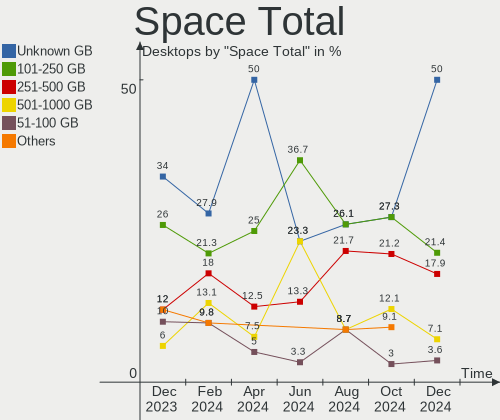
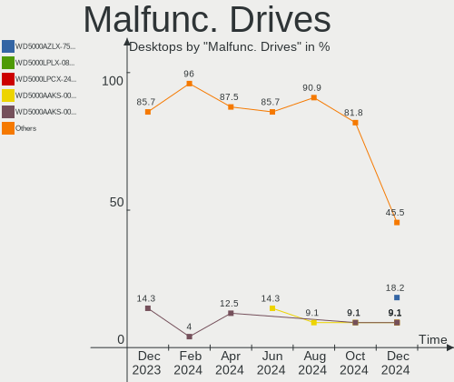

BlackPanther - Hardware Trends (Desktops)
-----------------------------------------

A project to identify most popular hardware characteristics and track their change
over time based on data collected by Linux users at https://Linux-Hardware.org.

Anyone can contribute to this report by the [hw-probe](https://github.com/linuxhw/hw-probe) tool:

    sudo -E hw-probe -all -upload

This report is for one last month. Overall report since the beginning of time: [TestDays](https://github.com/linuxhw/TestDays)

Period: Dec, 2024.

Contents
--------

* [ System ](#system)
  - [ OS                       ](#os)
  - [ OS Family                ](#os-family)
  - [ Kernel                   ](#kernel)
  - [ Kernel Family            ](#kernel-family)
  - [ Kernel Major Ver.        ](#kernel-major-ver)
  - [ Arch                     ](#arch)
  - [ DE                       ](#de)
  - [ Display Server           ](#display-server)
  - [ Display Manager          ](#display-manager)
  - [ OS Lang                  ](#os-lang)
  - [ Boot Mode                ](#boot-mode)
  - [ Filesystem               ](#filesystem)
  - [ Part. scheme             ](#part-scheme)
  - [ Dual Boot with Linux/BSD ](#dual-boot-with-linuxbsd)
  - [ Dual Boot (Win)          ](#dual-boot-win)

* [ Board ](#board)
  - [ Vendor                   ](#vendor)
  - [ Model                    ](#model)
  - [ Model Family             ](#model-family)
  - [ MFG Year                 ](#mfg-year)
  - [ Form Factor              ](#form-factor)
  - [ Secure Boot              ](#secure-boot)
  - [ Coreboot                 ](#coreboot)
  - [ RAM Size                 ](#ram-size)
  - [ RAM Used                 ](#ram-used)
  - [ Total Drives             ](#total-drives)
  - [ Has CD-ROM               ](#has-cd-rom)
  - [ Has Ethernet             ](#has-ethernet)
  - [ Has WiFi                 ](#has-wifi)
  - [ Has Bluetooth            ](#has-bluetooth)

* [ Location ](#location)
  - [ Country                  ](#country)
  - [ City                     ](#city)

* [ Drives ](#drives)
  - [ Drive Vendor             ](#drive-vendor)
  - [ Drive Model              ](#drive-model)
  - [ HDD Vendor               ](#hdd-vendor)
  - [ SSD Vendor               ](#ssd-vendor)
  - [ Drive Kind               ](#drive-kind)
  - [ Drive Connector          ](#drive-connector)
  - [ Drive Size               ](#drive-size)
  - [ Space Total              ](#space-total)
  - [ Space Used               ](#space-used)
  - [ Malfunc. Drives          ](#malfunc-drives)
  - [ Malfunc. Drive Vendor    ](#malfunc-drive-vendor)
  - [ Malfunc. HDD Vendor      ](#malfunc-hdd-vendor)
  - [ Malfunc. Drive Kind      ](#malfunc-drive-kind)
  - [ Failed Drives            ](#failed-drives)
  - [ Failed Drive Vendor      ](#failed-drive-vendor)
  - [ Drive Status             ](#drive-status)

* [ Storage controller ](#storage-controller)
  - [ Storage Vendor           ](#storage-vendor)
  - [ Storage Model            ](#storage-model)
  - [ Storage Kind             ](#storage-kind)

* [ Processor ](#processor)
  - [ CPU Vendor               ](#cpu-vendor)
  - [ CPU Model                ](#cpu-model)
  - [ CPU Model Family         ](#cpu-model-family)
  - [ CPU Cores                ](#cpu-cores)
  - [ CPU Sockets              ](#cpu-sockets)
  - [ CPU Threads              ](#cpu-threads)
  - [ CPU Op-Modes             ](#cpu-op-modes)
  - [ CPU Microcode            ](#cpu-microcode)
  - [ CPU Microarch            ](#cpu-microarch)

* [ Graphics ](#graphics)
  - [ GPU Vendor               ](#gpu-vendor)
  - [ GPU Model                ](#gpu-model)
  - [ GPU Combo                ](#gpu-combo)
  - [ GPU Driver               ](#gpu-driver)
  - [ GPU Memory               ](#gpu-memory)

* [ Monitor ](#monitor)
  - [ Monitor Vendor           ](#monitor-vendor)
  - [ Monitor Model            ](#monitor-model)
  - [ Monitor Resolution       ](#monitor-resolution)
  - [ Monitor Diagonal         ](#monitor-diagonal)
  - [ Monitor Width            ](#monitor-width)
  - [ Aspect Ratio             ](#aspect-ratio)
  - [ Monitor Area             ](#monitor-area)
  - [ Pixel Density            ](#pixel-density)
  - [ Multiple Monitors        ](#multiple-monitors)

* [ Network ](#network)
  - [ Net Controller Vendor    ](#net-controller-vendor)
  - [ Net Controller Model     ](#net-controller-model)
  - [ Wireless Vendor          ](#wireless-vendor)
  - [ Wireless Model           ](#wireless-model)
  - [ Ethernet Vendor          ](#ethernet-vendor)
  - [ Ethernet Model           ](#ethernet-model)
  - [ Net Controller Kind      ](#net-controller-kind)
  - [ Used Controller          ](#used-controller)
  - [ NICs                     ](#nics)
  - [ IPv6                     ](#ipv6)

* [ Bluetooth ](#bluetooth)
  - [ Bluetooth Vendor         ](#bluetooth-vendor)
  - [ Bluetooth Model          ](#bluetooth-model)

* [ Sound ](#sound)
  - [ Sound Vendor             ](#sound-vendor)
  - [ Sound Model              ](#sound-model)

* [ Memory ](#memory)
  - [ Memory Vendor            ](#memory-vendor)
  - [ Memory Model             ](#memory-model)
  - [ Memory Kind              ](#memory-kind)
  - [ Memory Form Factor       ](#memory-form-factor)
  - [ Memory Size              ](#memory-size)
  - [ Memory Speed             ](#memory-speed)

* [ Printers & scanners ](#printers--scanners)
  - [ Printer Vendor           ](#printer-vendor)
  - [ Printer Model            ](#printer-model)
  - [ Scanner Vendor           ](#scanner-vendor)
  - [ Scanner Model            ](#scanner-model)

* [ Camera ](#camera)
  - [ Camera Vendor            ](#camera-vendor)
  - [ Camera Model             ](#camera-model)

* [ Security ](#security)
  - [ Fingerprint Vendor       ](#fingerprint-vendor)
  - [ Fingerprint Model        ](#fingerprint-model)
  - [ Chipcard Vendor          ](#chipcard-vendor)
  - [ Chipcard Model           ](#chipcard-model)

* [ Unsupported ](#unsupported)
  - [ Unsupported Devices      ](#unsupported-devices)
  - [ Unsupported Device Types ](#unsupported-device-types)

System
------

OS
--

Installed operating systems

| Name              | Desktops | Percent |
|-------------------|----------|---------|
| BlackPanther 18.1 | 19       | 67.86%  |
| BlackPanther 22.1 | 9        | 32.14%  |

OS Family
---------

OS without a version

| Name         | Desktops | Percent |
|--------------|----------|---------|
| BlackPanther | 28       | 100%    |

Kernel
------

Version of the Linux kernel

| Version             | Desktops | Percent |
|---------------------|----------|---------|
| 4.18.16-desktop-1bP | 10       | 35.71%  |
| 6.6.32-power-1bP    | 9        | 32.14%  |
| 5.6.14-desktop-2bP  | 8        | 28.57%  |
| 5.15.85-desktop-1bP | 1        | 3.57%   |

Kernel Family
-------------

Linux kernel without a distro release

| Version | Desktops | Percent |
|---------|----------|---------|
| 4.18.16 | 10       | 35.71%  |
| 6.6.32  | 9        | 32.14%  |
| 5.6.14  | 8        | 28.57%  |
| 5.15.85 | 1        | 3.57%   |

Kernel Major Ver.
-----------------

Linux kernel major version

| Version | Desktops | Percent |
|---------|----------|---------|
| 4.18    | 10       | 35.71%  |
| 6.6     | 9        | 32.14%  |
| 5.6     | 8        | 28.57%  |
| 5.15    | 1        | 3.57%   |

Arch
----

OS architecture (x86_64, i586, etc.)

| Name   | Desktops | Percent |
|--------|----------|---------|
| x86_64 | 28       | 100%    |

DE
--

Desktop Environment

| Name    | Desktops | Percent |
|---------|----------|---------|
| KDE5    | 24       | 85.71%  |
| Unknown | 4        | 14.29%  |

Display Server
--------------

X11 or Wayland

| Name | Desktops | Percent |
|------|----------|---------|
| X11  | 28       | 100%    |

Display Manager
---------------

SDDM, LightDM, etc.

| Name | Desktops | Percent |
|------|----------|---------|
| SDDM | 28       | 100%    |

OS Lang
-------

Language

| Lang    | Desktops | Percent |
|---------|----------|---------|
| Unknown | 28       | 100%    |

Boot Mode
---------

EFI or BIOS

| Mode | Desktops | Percent |
|------|----------|---------|
| BIOS | 15       | 53.57%  |
| EFI  | 13       | 46.43%  |

Filesystem
----------

Type of filesystem

| Type    | Desktops | Percent |
|---------|----------|---------|
| Overlay | 14       | 50%     |
| Ext4    | 14       | 50%     |

Part. scheme
------------

Scheme of partitioning

| Type    | Desktops | Percent |
|---------|----------|---------|
| GPT     | 15       | 53.57%  |
| MBR     | 12       | 42.86%  |
| Unknown | 1        | 3.57%   |

Dual Boot with Linux/BSD
------------------------

Hosting more than one Linux/BSD

| Dual boot | Desktops | Percent |
|-----------|----------|---------|
| No        | 15       | 53.57%  |
| Yes       | 13       | 46.43%  |

Dual Boot (Win)
---------------

Hosting Linux and Windows

| Dual boot | Desktops | Percent |
|-----------|----------|---------|
| Yes       | 15       | 53.57%  |
| No        | 13       | 46.43%  |

Board
-----

Vendor
------

Motherboard manufacturer

| Name                | Desktops | Percent |
|---------------------|----------|---------|
| Gigabyte Technology | 10       | 35.71%  |
| ASRock              | 5        | 17.86%  |
| Hewlett-Packard     | 4        | 14.29%  |
| ASUSTek Computer    | 3        | 10.71%  |
| Dell                | 2        | 7.14%   |
| MSI                 | 1        | 3.57%   |
| Lenovo              | 1        | 3.57%   |
| Fujitsu             | 1        | 3.57%   |
| Foxconn             | 1        | 3.57%   |

Model
-----

Motherboard model

| Name                             | Desktops | Percent |
|----------------------------------|----------|---------|
| HP Compaq 8000 Elite SFF PC      | 2        | 7.14%   |
| Gigabyte H310M A 2.0             | 2        | 7.14%   |
| Gigabyte B450M GAMING            | 2        | 7.14%   |
| MSI MS-7817                      | 1        | 3.57%   |
| Lenovo 1730-A1G                  | 1        | 3.57%   |
| HP Z400 Workstation              | 1        | 3.57%   |
| HP Compaq Elite 8300 SFF         | 1        | 3.57%   |
| Gigabyte H61M-S1                 | 1        | 3.57%   |
| Gigabyte G41M-Combo              | 1        | 3.57%   |
| Gigabyte F2A88XM-HD3             | 1        | 3.57%   |
| Gigabyte F2A68HM-DS2             | 1        | 3.57%   |
| Gigabyte B75M-D3H                | 1        | 3.57%   |
| Gigabyte 945GCM-S2L              | 1        | 3.57%   |
| Fujitsu ESPRIMO E520             | 1        | 3.57%   |
| Foxconn Pro3500 Series           | 1        | 3.57%   |
| Dell Precision WorkStation T5500 | 1        | 3.57%   |
| Dell OptiPlex 3050               | 1        | 3.57%   |
| ASUS Pro WS X570-ACE             | 1        | 3.57%   |
| ASUS PRIME B365M-A               | 1        | 3.57%   |
| ASUS P8Z77-V LX                  | 1        | 3.57%   |
| ASRock X299 Extreme4             | 1        | 3.57%   |
| ASRock B85M Pro4                 | 1        | 3.57%   |
| ASRock A55M-HVS                  | 1        | 3.57%   |
| ASRock 960GM-VGS3 FX             | 1        | 3.57%   |
| ASRock 4X4-V1000                 | 1        | 3.57%   |

Model Family
------------

Motherboard model prefix

| Name                 | Desktops | Percent |
|----------------------|----------|---------|
| HP Compaq            | 3        | 10.71%  |
| Gigabyte H310M       | 2        | 7.14%   |
| Gigabyte B450M       | 2        | 7.14%   |
| MSI MS-7817          | 1        | 3.57%   |
| Lenovo 1730-A1G      | 1        | 3.57%   |
| HP Z400              | 1        | 3.57%   |
| Gigabyte H61M-S1     | 1        | 3.57%   |
| Gigabyte G41M-Combo  | 1        | 3.57%   |
| Gigabyte F2A88XM-HD3 | 1        | 3.57%   |
| Gigabyte F2A68HM-DS2 | 1        | 3.57%   |
| Gigabyte B75M-D3H    | 1        | 3.57%   |
| Gigabyte 945GCM-S2L  | 1        | 3.57%   |
| Fujitsu ESPRIMO      | 1        | 3.57%   |
| Foxconn Pro3500      | 1        | 3.57%   |
| Dell Precision       | 1        | 3.57%   |
| Dell OptiPlex        | 1        | 3.57%   |
| ASUS Pro             | 1        | 3.57%   |
| ASUS PRIME           | 1        | 3.57%   |
| ASUS P8Z77-V         | 1        | 3.57%   |
| ASRock X299          | 1        | 3.57%   |
| ASRock B85M          | 1        | 3.57%   |
| ASRock A55M-HVS      | 1        | 3.57%   |
| ASRock 960GM-VGS3    | 1        | 3.57%   |
| ASRock 4X4-V1000     | 1        | 3.57%   |

MFG Year
--------

Motherboard manufacture year

| Year | Desktops | Percent |
|------|----------|---------|
| 2012 | 5        | 17.86%  |
| 2019 | 4        | 14.29%  |
| 2013 | 4        | 14.29%  |
| 2018 | 3        | 10.71%  |
| 2010 | 3        | 10.71%  |
| 2014 | 2        | 7.14%   |
| 2011 | 2        | 7.14%   |
| 2009 | 2        | 7.14%   |
| 2020 | 1        | 3.57%   |
| 2017 | 1        | 3.57%   |
| 2007 | 1        | 3.57%   |

Form Factor
-----------

Physical design of the computer

| Name    | Desktops | Percent |
|---------|----------|---------|
| Desktop | 28       | 100%    |

Secure Boot
-----------

Enabled or disabled

| State    | Desktops | Percent |
|----------|----------|---------|
| Disabled | 28       | 100%    |

Coreboot
--------

Have coreboot on board

| Used | Desktops | Percent |
|------|----------|---------|
| No   | 28       | 100%    |

RAM Size
--------

Total RAM memory

| Size in GB | Desktops | Percent |
|------------|----------|---------|
| 8.01-16.0  | 13       | 46.43%  |
| 16.01-24.0 | 6        | 21.43%  |
| 3.01-4.0   | 3        | 10.71%  |
| 24.01-32.0 | 3        | 10.71%  |
| 4.01-8.0   | 2        | 7.14%   |
| 32.01-64.0 | 1        | 3.57%   |

RAM Used
--------

Used RAM memory

| Used GB  | Desktops | Percent |
|----------|----------|---------|
| 0.51-1.0 | 10       | 35.71%  |
| 1.01-2.0 | 9        | 32.14%  |
| 0.01-0.5 | 8        | 28.57%  |
| 2.01-3.0 | 1        | 3.57%   |

Total Drives
------------

Number of drives on board

| Drives | Desktops | Percent |
|--------|----------|---------|
| 1      | 16       | 57.14%  |
| 2      | 5        | 17.86%  |
| 3      | 4        | 14.29%  |
| 4      | 2        | 7.14%   |
| 0      | 1        | 3.57%   |

Has CD-ROM
----------

Has CD-ROM on board

| Presented | Desktops | Percent |
|-----------|----------|---------|
| Yes       | 19       | 67.86%  |
| No        | 9        | 32.14%  |

Has Ethernet
------------

Has Ethernet on board

| Presented | Desktops | Percent |
|-----------|----------|---------|
| Yes       | 28       | 100%    |

Has WiFi
--------

Has WiFi module

| Presented | Desktops | Percent |
|-----------|----------|---------|
| No        | 19       | 67.86%  |
| Yes       | 9        | 32.14%  |

Has Bluetooth
-------------

Has Bluetooth module

| Presented | Desktops | Percent |
|-----------|----------|---------|
| No        | 24       | 85.71%  |
| Yes       | 4        | 14.29%  |

Location
--------

Country
-------

Geographic location (country)

| Country  | Desktops | Percent |
|----------|----------|---------|
| Hungary  | 26       | 92.86%  |
| Slovakia | 1        | 3.57%   |
| Germany  | 1        | 3.57%   |

City
----

Geographic location (city)

| City                    | Desktops | Percent |
|-------------------------|----------|---------|
| Budapest                | 6        | 21.43%  |
| Fertoszentmiklos        | 2        | 7.14%   |
| Dombegyhaz              | 2        | 7.14%   |
| Berettyóújfalu        | 2        | 7.14%   |
| Zbehy                   | 1        | 3.57%   |
| Tiszaujvaros            | 1        | 3.57%   |
| Szeged                  | 1        | 3.57%   |
| Pfaffenhofen an der Ilm | 1        | 3.57%   |
| Oroszlany               | 1        | 3.57%   |
| Oroshaza                | 1        | 3.57%   |
| Nyergesujfalu           | 1        | 3.57%   |
| Kisvarda                | 1        | 3.57%   |
| Kecskemét              | 1        | 3.57%   |
| Karcag                  | 1        | 3.57%   |
| Kaposfo                 | 1        | 3.57%   |
| Ikervar                 | 1        | 3.57%   |
| Dombovar                | 1        | 3.57%   |
| Biatorbagy              | 1        | 3.57%   |
| Baja                    | 1        | 3.57%   |
| Abony                   | 1        | 3.57%   |

Drives
------

Drive Vendor
------------

Hard drive vendors

| Vendor              | Desktops | Drives | Percent |
|---------------------|----------|--------|---------|
| WDC                 | 14       | 14     | 31.11%  |
| Toshiba             | 4        | 4      | 8.89%   |
| Seagate             | 4        | 4      | 8.89%   |
| Samsung Electronics | 4        | 5      | 8.89%   |
| SanDisk             | 3        | 3      | 6.67%   |
| Intenso             | 3        | 3      | 6.67%   |
| Kingston            | 2        | 4      | 4.44%   |
| HGST                | 2        | 2      | 4.44%   |
| A-DATA Technology   | 2        | 3      | 4.44%   |
| Zheino              | 1        | 1      | 2.22%   |
| Unknown             | 1        | 1      | 2.22%   |
| PNY                 | 1        | 1      | 2.22%   |
| Micron Technology   | 1        | 1      | 2.22%   |
| Hitachi             | 1        | 1      | 2.22%   |
| GOODRAM             | 1        | 1      | 2.22%   |
| AMD                 | 1        | 3      | 2.22%   |

Drive Model
-----------

Hard drive models

| Model                                    | Desktops | Percent |
|------------------------------------------|----------|---------|
| Toshiba DT01ACA100 1TB                   | 3        | 6%      |
| WDC WD5000AZLX-75K2TA0 500GB             | 2        | 4%      |
| WDC WD20EZBX-00AYRA0 2TB                 | 2        | 4%      |
| Kingston SNV2S500G 500GB                 | 2        | 4%      |
| Kingston SA400S37480G 480GB SSD          | 2        | 4%      |
| HGST HTS541010B7E610 1TB                 | 2        | 4%      |
| Zheino CHN-NGFFNV2280-256 256GB          | 1        | 2%      |
| WDC WDS240G2G0B-00EPW0 240GB SSD         | 1        | 2%      |
| WDC WDS240G2G0A-00JH30 240GB SSD         | 1        | 2%      |
| WDC WD5000LPLX-08ZNTT0 500GB             | 1        | 2%      |
| WDC WD5000LPCX-24C6HT0 500GB             | 1        | 2%      |
| WDC WD5000AAKX-329BA0 500GB              | 1        | 2%      |
| WDC WD5000AAKS-00UU3A0 500GB             | 1        | 2%      |
| WDC WD5000AAKS-007AA0 500GB              | 1        | 2%      |
| WDC WD5000AACS-00G8B0 500GB              | 1        | 2%      |
| WDC WD30 PURX-64PFUY0 3TB                | 1        | 2%      |
| WDC WD10EURX-63UY4Y0 1TB                 | 1        | 2%      |
| Unknown NVMe SSD Drive 512GB             | 1        | 2%      |
| Toshiba KSG60ZSE256G SATA 256GB SSD      | 1        | 2%      |
| Seagate ST9500423AS 500GB                | 1        | 2%      |
| Seagate ST3500418AS 500GB                | 1        | 2%      |
| Seagate ST3500312CS 500GB                | 1        | 2%      |
| Seagate ST3160318AS 160GB                | 1        | 2%      |
| Sandisk WD Blue SN570 2TB                | 1        | 2%      |
| SanDisk SDSSDH3512G 512GB                | 1        | 2%      |
| SanDisk NVMe SSD Drive 2TB               | 1        | 2%      |
| Samsung SSD 860 EVO 500GB                | 1        | 2%      |
| Samsung HD753LJ 752GB                    | 1        | 2%      |
| Samsung HD501LJ 500GB                    | 1        | 2%      |
| Samsung HD200HJ 200GB                    | 1        | 2%      |
| PNY CS900 240GB SSD                      | 1        | 2%      |
| Micron MTFDDAK256TDL-1AW1ZABFA 256GB SSD | 1        | 2%      |
| Intenso SSD 512GB                        | 1        | 2%      |
| Intenso SSD 120GB                        | 1        | 2%      |
| Intenso Portable SSD 128GB               | 1        | 2%      |
| Hitachi HTS543232A7A384 320GB            | 1        | 2%      |
| GOODRAM SSDPR-CX400-256-G2 256GB         | 1        | 2%      |
| AMD Samsung SSD 960 EVO 250GB            | 1        | 2%      |
| AMD LITEON CA3-8D512 512GB               | 1        | 2%      |
| AMD CT2000P5PSSD8 2TB                    | 1        | 2%      |

HDD Vendor
----------

Hard disk drive vendors

| Vendor              | Desktops | Drives | Percent |
|---------------------|----------|--------|---------|
| WDC                 | 12       | 12     | 48%     |
| Seagate             | 4        | 4      | 16%     |
| Toshiba             | 3        | 3      | 12%     |
| Samsung Electronics | 3        | 4      | 12%     |
| HGST                | 2        | 2      | 8%      |
| Hitachi             | 1        | 1      | 4%      |

SSD Vendor
----------

Solid state drive vendors

| Vendor              | Desktops | Drives | Percent |
|---------------------|----------|--------|---------|
| Intenso             | 3        | 3      | 20%     |
| WDC                 | 2        | 2      | 13.33%  |
| Kingston            | 2        | 2      | 13.33%  |
| A-DATA Technology   | 2        | 3      | 13.33%  |
| Toshiba             | 1        | 1      | 6.67%   |
| SanDisk             | 1        | 1      | 6.67%   |
| Samsung Electronics | 1        | 1      | 6.67%   |
| PNY                 | 1        | 1      | 6.67%   |
| Micron Technology   | 1        | 1      | 6.67%   |
| GOODRAM             | 1        | 1      | 6.67%   |

Drive Kind
----------

HDD or SSD

| Kind | Desktops | Drives | Percent |
|------|----------|--------|---------|
| HDD  | 21       | 26     | 51.22%  |
| SSD  | 13       | 16     | 31.71%  |
| NVMe | 7        | 9      | 17.07%  |

Drive Connector
---------------

SATA, SAS, NVMe, etc.

| Type | Desktops | Drives | Percent |
|------|----------|--------|---------|
| SATA | 27       | 40     | 75%     |
| NVMe | 7        | 9      | 19.44%  |
| SAS  | 2        | 2      | 5.56%   |

Drive Size
----------

Size of hard drive

| Size in TB | Desktops | Drives | Percent |
|------------|----------|--------|---------|
| 0.01-0.5   | 22       | 30     | 64.71%  |
| 0.51-1.0   | 9        | 9      | 26.47%  |
| 1.01-2.0   | 2        | 2      | 5.88%   |
| 2.01-3.0   | 1        | 1      | 2.94%   |

Space Total
-----------

Amount of disk space available on the file system

| Size in GB | Desktops | Percent |
|------------|----------|---------|
| Unknown    | 14       | 50%     |
| 101-250    | 6        | 21.43%  |
| 251-500    | 5        | 17.86%  |
| 501-1000   | 2        | 7.14%   |
| 51-100     | 1        | 3.57%   |

Space Used
----------

Amount of used disk space

| Used GB | Desktops | Percent |
|---------|----------|---------|
| Unknown | 14       | 50%     |
| 1-20    | 12       | 42.86%  |
| 21-50   | 1        | 3.57%   |
| 51-100  | 1        | 3.57%   |

Malfunc. Drives
---------------

Drive models with a malfunction

| Model                             | Desktops | Drives | Percent |
|-----------------------------------|----------|--------|---------|
| WDC WD5000AZLX-75K2TA0 500GB      | 2        | 2      | 18.18%  |
| WDC WD5000LPLX-08ZNTT0 500GB      | 1        | 1      | 9.09%   |
| WDC WD5000LPCX-24C6HT0 500GB      | 1        | 1      | 9.09%   |
| WDC WD5000AAKS-00UU3A0 500GB      | 1        | 1      | 9.09%   |
| WDC WD5000AAKS-007AA0 500GB       | 1        | 1      | 9.09%   |
| WDC WD5000AACS-00G8B0 500GB       | 1        | 1      | 9.09%   |
| Toshiba DT01ACA100 1TB            | 1        | 1      | 9.09%   |
| Samsung Electronics HD753LJ 752GB | 1        | 1      | 9.09%   |
| Samsung Electronics HD200HJ 200GB | 1        | 1      | 9.09%   |
| A-DATA Technology SU630 240GB SSD | 1        | 1      | 9.09%   |

Malfunc. Drive Vendor
---------------------

Vendors of faulty drives

| Vendor              | Desktops | Drives | Percent |
|---------------------|----------|--------|---------|
| WDC                 | 7        | 7      | 63.64%  |
| Samsung Electronics | 2        | 2      | 18.18%  |
| Toshiba             | 1        | 1      | 9.09%   |
| A-DATA Technology   | 1        | 1      | 9.09%   |

Malfunc. HDD Vendor
-------------------

Vendors of faulty HDD drives

| Vendor              | Desktops | Drives | Percent |
|---------------------|----------|--------|---------|
| WDC                 | 7        | 7      | 70%     |
| Samsung Electronics | 2        | 2      | 20%     |
| Toshiba             | 1        | 1      | 10%     |

Malfunc. Drive Kind
-------------------

Kinds of faulty drives

| Kind | Desktops | Drives | Percent |
|------|----------|--------|---------|
| HDD  | 10       | 10     | 90.91%  |
| SSD  | 1        | 1      | 9.09%   |

Failed Drives
-------------

Failed drive models

Zero info for selected period =(

Failed Drive Vendor
-------------------

Failed drive vendors

Zero info for selected period =(

Drive Status
------------

Number of failed and malfunc. drives

| Status   | Desktops | Drives | Percent |
|----------|----------|--------|---------|
| Works    | 22       | 37     | 62.86%  |
| Malfunc  | 11       | 11     | 31.43%  |
| Detected | 2        | 3      | 5.71%   |

Storage controller
------------------

Storage Vendor
--------------

Storage controller vendors

| Vendor                      | Desktops | Percent |
|-----------------------------|----------|---------|
| Intel                       | 20       | 58.82%  |
| AMD                         | 8        | 23.53%  |
| SanDisk                     | 2        | 5.88%   |
| Kingston Technology Company | 2        | 5.88%   |
| Silicon Motion              | 1        | 2.94%   |
| INNOGRIT                    | 1        | 2.94%   |

Storage Model
-------------

Storage controller models

| Model                                                                                   | Desktops | Percent |
|-----------------------------------------------------------------------------------------|----------|---------|
| AMD FCH SATA Controller [AHCI mode]                                                     | 6        | 15%     |
| Intel 200 Series PCH SATA controller [AHCI mode]                                        | 4        | 10%     |
| Intel SATA Controller [RAID mode]                                                       | 3        | 7.5%    |
| Intel 8 Series/C220 Series Chipset Family 6-port SATA Controller 1 [AHCI mode]          | 3        | 7.5%    |
| SanDisk WD Blue SN570 NVMe SSD 2TB                                                      | 2        | 5%      |
| Kingston Company NV2 NVMe SSD [SM2267XT] (DRAM-less)                                    | 2        | 5%      |
| Intel NM10/ICH7 Family SATA Controller [IDE mode]                                       | 2        | 5%      |
| Intel 82801JD/DO (ICH10 Family) SATA AHCI Controller                                    | 2        | 5%      |
| Intel 7 Series/C210 Series Chipset Family 6-port SATA Controller [AHCI mode]            | 2        | 5%      |
| Intel 6 Series/C200 Series Chipset Family 6 port Desktop SATA AHCI Controller           | 2        | 5%      |
| AMD 400 Series Chipset SATA Controller                                                  | 2        | 5%      |
| Silicon Motion SM2263EN/SM2263XT (DRAM-less) NVMe SSD Controllers                       | 1        | 2.5%    |
| Intel 7 Series/C210 Series Chipset Family 4-port SATA Controller [IDE mode]             | 1        | 2.5%    |
| Intel 7 Series/C210 Series Chipset Family 2-port SATA Controller [IDE mode]             | 1        | 2.5%    |
| Intel 6 Series/C200 Series Chipset Family Desktop SATA Controller (IDE mode, ports 4-5) | 1        | 2.5%    |
| Intel 6 Series/C200 Series Chipset Family Desktop SATA Controller (IDE mode, ports 0-3) | 1        | 2.5%    |
| INNOGRIT NVMe SSD Controller IG5220 (DRAM-less)                                         | 1        | 2.5%    |
| AMD SB7x0/SB8x0/SB9x0 SATA Controller [AHCI mode]                                       | 1        | 2.5%    |
| AMD SB7x0/SB8x0/SB9x0 IDE Controller                                                    | 1        | 2.5%    |
| AMD RAID Bottom Device                                                                  | 1        | 2.5%    |
| AMD FCH SATA Controller [IDE mode]                                                      | 1        | 2.5%    |

Storage Kind
------------

Kind of storage controller (IDE, SATA, NVMe, SAS, ...)

| Kind | Desktops | Percent |
|------|----------|---------|
| SATA | 21       | 58.33%  |
| NVMe | 7        | 19.44%  |
| IDE  | 5        | 13.89%  |
| RAID | 3        | 8.33%   |

Processor
---------

CPU Vendor
----------

Processor vendors

| Vendor | Desktops | Percent |
|--------|----------|---------|
| Intel  | 20       | 71.43%  |
| AMD    | 8        | 28.57%  |

CPU Model
---------

Processor models

| Model                                          | Desktops | Percent |
|------------------------------------------------|----------|---------|
| AMD Ryzen 7 5700G with Radeon Graphics         | 3        | 10.71%  |
| Intel Core i3-9100F CPU @ 3.60GHz              | 2        | 7.14%   |
| Intel Core i3-4130 CPU @ 3.40GHz               | 2        | 7.14%   |
| Intel Core 2 Duo CPU E8400 @ 3.00GHz           | 2        | 7.14%   |
| Intel Xeon CPU L5640 @ 2.27GHz                 | 1        | 3.57%   |
| Intel Xeon CPU E5530 @ 2.40GHz                 | 1        | 3.57%   |
| Intel Pentium Dual-Core CPU E5200 @ 2.50GHz    | 1        | 3.57%   |
| Intel Core i7-7800X CPU @ 3.50GHz              | 1        | 3.57%   |
| Intel Core i7-4790 CPU @ 3.60GHz               | 1        | 3.57%   |
| Intel Core i7-3770K CPU @ 3.50GHz              | 1        | 3.57%   |
| Intel Core i5-3470 CPU @ 3.20GHz               | 1        | 3.57%   |
| Intel Core i5-2400S CPU @ 2.50GHz              | 1        | 3.57%   |
| Intel Core i5-2320 CPU @ 3.00GHz               | 1        | 3.57%   |
| Intel Core i3-8100 CPU @ 3.60GHz               | 1        | 3.57%   |
| Intel Core i3-7100T CPU @ 3.40GHz              | 1        | 3.57%   |
| Intel Core i3-3250 CPU @ 3.50GHz               | 1        | 3.57%   |
| Intel Core i3-3240 CPU @ 3.40GHz               | 1        | 3.57%   |
| Intel Core 2 Duo CPU E8500 @ 3.16GHz           | 1        | 3.57%   |
| AMD Ryzen Embedded V1605B with Radeon Vega Gfx | 1        | 3.57%   |
| AMD FX-8120 Eight-Core Processor               | 1        | 3.57%   |
| AMD Athlon X4 880K Quad Core Processor         | 1        | 3.57%   |
| AMD Athlon II X4 631 Quad-Core Processor       | 1        | 3.57%   |
| AMD A8-7600 Radeon R7, 10 Compute Cores 4C+6G  | 1        | 3.57%   |

CPU Model Family
----------------

Processor model prefix

| Model                   | Desktops | Percent |
|-------------------------|----------|---------|
| Intel Core i3           | 8        | 28.57%  |
| Intel Core i7           | 3        | 10.71%  |
| Intel Core i5           | 3        | 10.71%  |
| Intel Core 2 Duo        | 3        | 10.71%  |
| AMD Ryzen 7             | 3        | 10.71%  |
| Intel Xeon              | 2        | 7.14%   |
| Intel Pentium Dual-Core | 1        | 3.57%   |
| AMD Ryzen Embedded      | 1        | 3.57%   |
| AMD FX                  | 1        | 3.57%   |
| AMD Athlon X4           | 1        | 3.57%   |
| AMD Athlon II X4        | 1        | 3.57%   |
| AMD A8                  | 1        | 3.57%   |

CPU Cores
---------

Number of processor cores

| Number | Desktops | Percent |
|--------|----------|---------|
| 4      | 12       | 42.86%  |
| 2      | 10       | 35.71%  |
| 8      | 3        | 10.71%  |
| 6      | 2        | 7.14%   |
| 1      | 1        | 3.57%   |

CPU Sockets
-----------

Number of sockets

| Number | Desktops | Percent |
|--------|----------|---------|
| 1      | 28       | 100%    |

CPU Threads
-----------

Threads per core (Hyper-Threading)

| Number | Desktops | Percent |
|--------|----------|---------|
| 2      | 15       | 53.57%  |
| 1      | 13       | 46.43%  |

CPU Op-Modes
------------

CPU Operation Modes (32-bit, 64-bit)

| Op mode        | Desktops | Percent |
|----------------|----------|---------|
| 32-bit, 64-bit | 28       | 100%    |

CPU Microcode
-------------

Microcode number

| Number     | Desktops | Percent |
|------------|----------|---------|
| Unknown    | 5        | 17.86%  |
| 0x306a9    | 4        | 14.29%  |
| 0x906eb    | 2        | 7.14%   |
| 0x306c3    | 2        | 7.14%   |
| 0x206a7    | 2        | 7.14%   |
| 0x10676    | 2        | 7.14%   |
| 0x0a50000d | 2        | 7.14%   |
| 0x06003106 | 2        | 7.14%   |
| 0x50654    | 1        | 3.57%   |
| 0x206c2    | 1        | 3.57%   |
| 0x106a5    | 1        | 3.57%   |
| 0x0a50000f | 1        | 3.57%   |
| 0x08101016 | 1        | 3.57%   |
| 0x0600063e | 1        | 3.57%   |
| 0x03000014 | 1        | 3.57%   |

CPU Microarch
-------------

Microarchitecture

| Name        | Desktops | Percent |
|-------------|----------|---------|
| Penryn      | 4        | 14.29%  |
| KabyLake    | 4        | 14.29%  |
| IvyBridge   | 4        | 14.29%  |
| Zen 3       | 3        | 10.71%  |
| Haswell     | 3        | 10.71%  |
| Steamroller | 2        | 7.14%   |
| SandyBridge | 2        | 7.14%   |
| Zen         | 1        | 3.57%   |
| Westmere    | 1        | 3.57%   |
| Skylake     | 1        | 3.57%   |
| Nehalem     | 1        | 3.57%   |
| K10 Llano   | 1        | 3.57%   |
| Bulldozer   | 1        | 3.57%   |

Graphics
--------

GPU Vendor
----------

Vendors of graphics cards

| Vendor | Desktops | Percent |
|--------|----------|---------|
| AMD    | 12       | 40%     |
| Nvidia | 11       | 36.67%  |
| Intel  | 7        | 23.33%  |

GPU Model
---------

Graphics card models

| Model                                                                       | Desktops | Percent |
|-----------------------------------------------------------------------------|----------|---------|
| Nvidia GF108 [GeForce GT 630]                                               | 3        | 10%     |
| AMD Cezanne [Radeon Vega Series / Radeon Vega Mobile Series]                | 3        | 10%     |
| Intel Xeon E3-1200 v2/3rd Gen Core processor Graphics Controller            | 2        | 6.67%   |
| AMD Lexa PRO [Radeon 540/540X/550/550X / RX 540X/550/550X]                  | 2        | 6.67%   |
| AMD Caicos [Radeon HD 6450/7450/8450 / R5 230 OEM]                          | 2        | 6.67%   |
| Nvidia TU116 [GeForce GTX 1650 SUPER]                                       | 1        | 3.33%   |
| Nvidia GT218 [GeForce 210]                                                  | 1        | 3.33%   |
| Nvidia GT216 [GeForce GT 220]                                               | 1        | 3.33%   |
| Nvidia GK208B [GeForce GT 730]                                              | 1        | 3.33%   |
| Nvidia GK208B [GeForce GT 720]                                              | 1        | 3.33%   |
| Nvidia GK208B [GeForce GT 710]                                              | 1        | 3.33%   |
| Nvidia GF119 [NVS 310]                                                      | 1        | 3.33%   |
| Nvidia G96CGL [Quadro FX 580]                                               | 1        | 3.33%   |
| Intel Xeon E3-1200 v3/4th Gen Core Processor Integrated Graphics Controller | 1        | 3.33%   |
| Intel HD Graphics 630                                                       | 1        | 3.33%   |
| Intel CoffeeLake-S GT2 [UHD Graphics 630]                                   | 1        | 3.33%   |
| Intel 82945G/GZ Integrated Graphics Controller                              | 1        | 3.33%   |
| Intel 2nd Generation Core Processor Family Integrated Graphics Controller   | 1        | 3.33%   |
| AMD RV730 XT [Radeon HD 4670]                                               | 1        | 3.33%   |
| AMD Raven Ridge [Radeon Vega Series / Radeon Vega Mobile Series]            | 1        | 3.33%   |
| AMD Kaveri [Radeon R7 Graphics]                                             | 1        | 3.33%   |
| AMD Juniper XT [Radeon HD 5770]                                             | 1        | 3.33%   |
| AMD Cape Verde XT [Radeon HD 7770/8760 / R7 250X]                           | 1        | 3.33%   |

GPU Combo
---------

Combinations of graphics cards

| Name         | Desktops | Percent |
|--------------|----------|---------|
| 1 x AMD      | 11       | 39.29%  |
| 1 x Nvidia   | 9        | 32.14%  |
| 1 x Intel    | 7        | 25%     |
| AMD + Nvidia | 1        | 3.57%   |

GPU Driver
----------

Free vs proprietary

| Driver  | Desktops | Percent |
|---------|----------|---------|
| Free    | 27       | 96.43%  |
| Unknown | 1        | 3.57%   |

GPU Memory
----------

Total video memory

| Size in GB | Desktops | Percent |
|------------|----------|---------|
| 0.01-0.5   | 8        | 28.57%  |
| 0.51-1.0   | 7        | 25%     |
| Unknown    | 7        | 25%     |
| 3.01-4.0   | 4        | 14.29%  |
| 1.01-2.0   | 2        | 7.14%   |

Monitor
-------

Monitor Vendor
--------------

Monitor vendors

| Vendor               | Desktops | Percent |
|----------------------|----------|---------|
| Samsung Electronics  | 7        | 25.93%  |
| Goldstar             | 6        | 22.22%  |
| BenQ                 | 5        | 18.52%  |
| Dell                 | 2        | 7.41%   |
| ViewSonic            | 1        | 3.7%    |
| Unknown (XXX)        | 1        | 3.7%    |
| MiTAC                | 1        | 3.7%    |
| Hewlett-Packard      | 1        | 3.7%    |
| HannStar             | 1        | 3.7%    |
| CVT                  | 1        | 3.7%    |
| Ancor Communications | 1        | 3.7%    |

Monitor Model
-------------

Monitor models

| Model                                                                | Desktops | Percent |
|----------------------------------------------------------------------|----------|---------|
| Goldstar 2D FHD TV GSM59C6 1920x1080 509x286mm 23.0-inch             | 3        | 11.11%  |
| Samsung Electronics SyncMaster SAM01B7 1280x1024 338x270mm 17.0-inch | 2        | 7.41%   |
| Samsung Electronics S27E500 SAM0D0D 1920x1080 598x336mm 27.0-inch    | 2        | 7.41%   |
| BenQ BenQG2222HDL BNQ785A 1920x1080 478x269mm 21.6-inch              | 2        | 7.41%   |
| ViewSonic VA702 VSC1C1C 1280x1024 338x270mm 17.0-inch                | 1        | 3.7%    |
| Unknown (XXX) Beyond TV XXX2851 3840x2160 1210x680mm 54.6-inch       | 1        | 3.7%    |
| Samsung Electronics SyncMaster SAM05CC 1920x1080 530x300mm 24.0-inch | 1        | 3.7%    |
| Samsung Electronics SyncMaster SAM04DF 1360x768 410x230mm 18.5-inch  | 1        | 3.7%    |
| Samsung Electronics LS27AG30x SAM717A 1920x1080 597x336mm 27.0-inch  | 1        | 3.7%    |
| MiTAC TV MTC9527 1920x1080 1150x650mm 52.0-inch                      | 1        | 3.7%    |
| Hewlett-Packard L2245w HWP26FB 1680x1050 473x296mm 22.0-inch         | 1        | 3.7%    |
| HannStar AG172 HSDC017 1280x1024 340x270mm 17.1-inch                 | 1        | 3.7%    |
| Goldstar ULTRAWIDE GSM7770 2560x1080 798x334mm 34.1-inch             | 1        | 3.7%    |
| Goldstar MP59G GSM5B34 1920x1080 480x270mm 21.7-inch                 | 1        | 3.7%    |
| Goldstar FULL HD GSM5B55 1920x1080 480x270mm 21.7-inch               | 1        | 3.7%    |
| Dell P2210 DEL404E 1680x1050 474x296mm 22.0-inch                     | 1        | 3.7%    |
| Dell IN2030M DELF03C 1600x900 443x249mm 20.0-inch                    | 1        | 3.7%    |
| CVT CVTE TV CVT0003 1440x900                                         | 1        | 3.7%    |
| BenQ GW2255 BNQ78CD 1920x1080 477x268mm 21.5-inch                    | 1        | 3.7%    |
| BenQ GL2450H BNQ78A7 1920x1080 530x300mm 24.0-inch                   | 1        | 3.7%    |
| BenQ EW277HDR BNQ7948 1920x1080 598x336mm 27.0-inch                  | 1        | 3.7%    |
| Ancor Communications VX239 ACI23E1 1920x1080 510x290mm 23.1-inch     | 1        | 3.7%    |

Monitor Resolution
------------------

Monitor screen resolution

| Resolution         | Desktops | Percent |
|--------------------|----------|---------|
| 1920x1080 (FHD)    | 16       | 59.26%  |
| 1280x1024 (SXGA)   | 4        | 14.81%  |
| 3840x2160 (4K)     | 2        | 7.41%   |
| 1680x1050 (WSXGA+) | 2        | 7.41%   |
| 2560x1080          | 1        | 3.7%    |
| 1600x900 (HD+)     | 1        | 3.7%    |
| 1360x768           | 1        | 3.7%    |

Monitor Diagonal
----------------

Diagonal size in inches

| Inches | Desktops | Percent |
|--------|----------|---------|
| 27     | 4        | 14.81%  |
| 23     | 4        | 14.81%  |
| 21     | 4        | 14.81%  |
| 17     | 4        | 14.81%  |
| 24     | 2        | 7.41%   |
| 22     | 2        | 7.41%   |
| 54     | 1        | 3.7%    |
| 52     | 1        | 3.7%    |
| 34     | 1        | 3.7%    |
| 31     | 1        | 3.7%    |
| 26     | 1        | 3.7%    |
| 20     | 1        | 3.7%    |
| 18     | 1        | 3.7%    |

Monitor Width
-------------

Physical width

| Width in mm | Desktops | Percent |
|-------------|----------|---------|
| 501-600     | 11       | 40.74%  |
| 401-500     | 8        | 29.63%  |
| 301-350     | 4        | 14.81%  |
| 1001-1500   | 2        | 7.41%   |
| 701-800     | 1        | 3.7%    |
| 601-700     | 1        | 3.7%    |

Aspect Ratio
------------

Proportional relationship between the width and the height

| Ratio | Desktops | Percent |
|-------|----------|---------|
| 16/9  | 20       | 74.07%  |
| 5/4   | 4        | 14.81%  |
| 16/10 | 2        | 7.41%   |
| 21/9  | 1        | 3.7%    |

Monitor Area
------------

Area in inch²

| Area in inch² | Desktops | Percent |
|----------------|----------|---------|
| 201-250        | 12       | 44.44%  |
| 141-150        | 5        | 18.52%  |
| 301-350        | 4        | 14.81%  |
| More than 1000 | 2        | 7.41%   |
| 351-500        | 2        | 7.41%   |
| 251-300        | 1        | 3.7%    |
| 151-200        | 1        | 3.7%    |

Pixel Density
-------------

Pixels per inch

| Density | Desktops | Percent |
|---------|----------|---------|
| 51-100  | 21       | 80.77%  |
| 101-120 | 4        | 15.38%  |
| 1-50    | 1        | 3.85%   |

Multiple Monitors
-----------------

Total monitors connected

| Total | Desktops | Percent |
|-------|----------|---------|
| 1     | 28       | 100%    |

Network
-------

Net Controller Vendor
---------------------

Controller vendors

| Vendor                          | Desktops | Percent |
|---------------------------------|----------|---------|
| Realtek Semiconductor           | 14       | 37.84%  |
| Intel                           | 11       | 29.73%  |
| TP-Link                         | 4        | 10.81%  |
| Qualcomm Atheros                | 4        | 10.81%  |
| Broadcom                        | 2        | 5.41%   |
| Ralink Technology               | 1        | 2.7%    |
| Qualcomm Atheros Communications | 1        | 2.7%    |

Net Controller Model
--------------------

Controller models

| Model                                                                  | Desktops | Percent |
|------------------------------------------------------------------------|----------|---------|
| Realtek RTL8111/8168/8211/8411 PCI Express Gigabit Ethernet Controller | 14       | 36.84%  |
| Intel Ethernet Connection (2) I219-V                                   | 3        | 7.89%   |
| Qualcomm Atheros AR9287 Wireless Network Adapter (PCI-Express)         | 2        | 5.26%   |
| Intel Ethernet Connection I217-V                                       | 2        | 5.26%   |
| Intel 82579LM Gigabit Network Connection (Lewisville)                  | 2        | 5.26%   |
| Intel 82567LM-3 Gigabit Network Connection                             | 2        | 5.26%   |
| TP-Link TL-WN823N v2/v3 [Realtek RTL8192EU]                            | 1        | 2.63%   |
| TP-Link TL-WN822N Version 4 RTL8192EU                                  | 1        | 2.63%   |
| TP-Link TL-WN821N v5/v6 [RTL8192EU]                                    | 1        | 2.63%   |
| TP-Link Archer T3U [Realtek RTL8812BU]                                 | 1        | 2.63%   |
| Realtek RTL8188CUS 802.11n WLAN Adapter                                | 1        | 2.63%   |
| Ralink MT7601U Wireless Adapter                                        | 1        | 2.63%   |
| Qualcomm Atheros AR9271 802.11n                                        | 1        | 2.63%   |
| Qualcomm Atheros AR8151 v2.0 Gigabit Ethernet                          | 1        | 2.63%   |
| Qualcomm Atheros AR8151 v1.0 Gigabit Ethernet                          | 1        | 2.63%   |
| Intel I211 Gigabit Network Connection                                  | 1        | 2.63%   |
| Intel Dual Band Wireless-AC 3168NGW [Stone Peak]                       | 1        | 2.63%   |
| Broadcom NetXtreme BCM5764M Gigabit Ethernet PCIe                      | 1        | 2.63%   |
| Broadcom NetXtreme BCM5761 Gigabit Ethernet PCIe                       | 1        | 2.63%   |

Wireless Vendor
---------------

Wireless vendors

| Vendor                          | Desktops | Percent |
|---------------------------------|----------|---------|
| TP-Link                         | 4        | 40%     |
| Qualcomm Atheros                | 2        | 20%     |
| Realtek Semiconductor           | 1        | 10%     |
| Ralink Technology               | 1        | 10%     |
| Qualcomm Atheros Communications | 1        | 10%     |
| Intel                           | 1        | 10%     |

Wireless Model
--------------

Wireless models

| Model                                                          | Desktops | Percent |
|----------------------------------------------------------------|----------|---------|
| Qualcomm Atheros AR9287 Wireless Network Adapter (PCI-Express) | 2        | 20%     |
| TP-Link TL-WN823N v2/v3 [Realtek RTL8192EU]                    | 1        | 10%     |
| TP-Link TL-WN822N Version 4 RTL8192EU                          | 1        | 10%     |
| TP-Link TL-WN821N v5/v6 [RTL8192EU]                            | 1        | 10%     |
| TP-Link Archer T3U [Realtek RTL8812BU]                         | 1        | 10%     |
| Realtek RTL8188CUS 802.11n WLAN Adapter                        | 1        | 10%     |
| Ralink MT7601U Wireless Adapter                                | 1        | 10%     |
| Qualcomm Atheros AR9271 802.11n                                | 1        | 10%     |
| Intel Dual Band Wireless-AC 3168NGW [Stone Peak]               | 1        | 10%     |

Ethernet Vendor
---------------

Ethernet vendors

| Vendor                | Desktops | Percent |
|-----------------------|----------|---------|
| Realtek Semiconductor | 14       | 50%     |
| Intel                 | 10       | 35.71%  |
| Qualcomm Atheros      | 2        | 7.14%   |
| Broadcom              | 2        | 7.14%   |

Ethernet Model
--------------

Ethernet models

| Model                                                                  | Desktops | Percent |
|------------------------------------------------------------------------|----------|---------|
| Realtek RTL8111/8168/8211/8411 PCI Express Gigabit Ethernet Controller | 14       | 50%     |
| Intel Ethernet Connection (2) I219-V                                   | 3        | 10.71%  |
| Intel Ethernet Connection I217-V                                       | 2        | 7.14%   |
| Intel 82579LM Gigabit Network Connection (Lewisville)                  | 2        | 7.14%   |
| Intel 82567LM-3 Gigabit Network Connection                             | 2        | 7.14%   |
| Qualcomm Atheros AR8151 v2.0 Gigabit Ethernet                          | 1        | 3.57%   |
| Qualcomm Atheros AR8151 v1.0 Gigabit Ethernet                          | 1        | 3.57%   |
| Intel I211 Gigabit Network Connection                                  | 1        | 3.57%   |
| Broadcom NetXtreme BCM5764M Gigabit Ethernet PCIe                      | 1        | 3.57%   |
| Broadcom NetXtreme BCM5761 Gigabit Ethernet PCIe                       | 1        | 3.57%   |

Net Controller Kind
-------------------

Ethernet, WiFi or modem

| Kind     | Desktops | Percent |
|----------|----------|---------|
| Ethernet | 28       | 75.68%  |
| WiFi     | 9        | 24.32%  |

Used Controller
---------------

Currently used network controller

| Kind     | Desktops | Percent |
|----------|----------|---------|
| Ethernet | 25       | 92.59%  |
| WiFi     | 2        | 7.41%   |

NICs
----

Total network controllers on board

| Total | Desktops | Percent |
|-------|----------|---------|
| 1     | 25       | 89.29%  |
| 2     | 2        | 7.14%   |
| 3     | 1        | 3.57%   |

IPv6
----

IPv6 vs IPv4

| Used | Desktops | Percent |
|------|----------|---------|
| No   | 16       | 57.14%  |
| Yes  | 12       | 42.86%  |

Bluetooth
---------

Bluetooth Vendor
----------------

Controller vendors

| Vendor                  | Desktops | Percent |
|-------------------------|----------|---------|
| Cambridge Silicon Radio | 3        | 75%     |
| Intel                   | 1        | 25%     |

Bluetooth Model
---------------

Controller models

| Model                                               | Desktops | Percent |
|-----------------------------------------------------|----------|---------|
| Cambridge Silicon Radio Bluetooth Dongle (HCI mode) | 3        | 75%     |
| Intel Wireless-AC 3168 Bluetooth                    | 1        | 25%     |

Sound
-----

Sound Vendor
------------

Sound card vendors

| Vendor                 | Desktops | Percent |
|------------------------|----------|---------|
| Intel                  | 19       | 40.43%  |
| AMD                    | 14       | 29.79%  |
| Nvidia                 | 10       | 21.28%  |
| Creative Labs          | 2        | 4.26%   |
| Generalplus Technology | 1        | 2.13%   |
| C-Media Electronics    | 1        | 2.13%   |

Sound Model
-----------

Sound card models

| Model                                                                                           | Desktops | Percent |
|-------------------------------------------------------------------------------------------------|----------|---------|
| Intel 200 Series PCH HD Audio                                                                   | 4        | 7.69%   |
| Nvidia GK208 HDMI/DP Audio Controller                                                           | 3        | 5.77%   |
| Nvidia GF108 High Definition Audio Controller                                                   | 3        | 5.77%   |
| Intel 8 Series/C220 Series Chipset High Definition Audio Controller                             | 3        | 5.77%   |
| Intel 7 Series/C216 Chipset Family High Definition Audio Controller                             | 3        | 5.77%   |
| Intel 6 Series/C200 Series Chipset Family High Definition Audio Controller                      | 3        | 5.77%   |
| AMD Renoir Radeon High Definition Audio Controller                                              | 3        | 5.77%   |
| AMD FCH Azalia Controller                                                                       | 3        | 5.77%   |
| AMD Family 17h/19h/1ah HD Audio Controller                                                      | 3        | 5.77%   |
| Intel NM10/ICH7 Family High Definition Audio Controller                                         | 2        | 3.85%   |
| Intel 82801JI (ICH10 Family) HD Audio Controller                                                | 2        | 3.85%   |
| Intel 82801JD/DO (ICH10 Family) HD Audio Controller                                             | 2        | 3.85%   |
| AMD Caicos HDMI Audio [Radeon HD 6450 / 7450/8450/8490 OEM / R5 230/235/235X OEM]               | 2        | 3.85%   |
| AMD Baffin HDMI/DP Audio [Radeon RX 550 640SP / RX 560/560X]                                    | 2        | 3.85%   |
| Nvidia TU116 High Definition Audio Controller                                                   | 1        | 1.92%   |
| Nvidia High Definition Audio Controller                                                         | 1        | 1.92%   |
| Nvidia GT216 HDMI Audio Controller                                                              | 1        | 1.92%   |
| Nvidia GF119 HDMI Audio Controller                                                              | 1        | 1.92%   |
| Intel Xeon E3-1200 v3/4th Gen Core Processor HD Audio Controller                                | 1        | 1.92%   |
| Generalplus Technology USB Audio Device                                                         | 1        | 1.92%   |
| Creative Labs EMU20k1 [Sound Blaster X-Fi Series]                                               | 1        | 1.92%   |
| Creative Labs CA0132 Sound Core3D [Sound Blaster Recon3D / Z-Series / Sound BlasterX AE-5 Plus] | 1        | 1.92%   |
| C-Media Electronics CMI8788 [Oxygen HD Audio]                                                   | 1        | 1.92%   |
| AMD RV710/730 HDMI Audio [Radeon HD 4000 series]                                                | 1        | 1.92%   |
| AMD Raven/Raven2/Fenghuang HDMI/DP Audio Controller                                             | 1        | 1.92%   |
| AMD Oland/Hainan/Cape Verde/Pitcairn HDMI Audio [Radeon HD 7000 Series]                         | 1        | 1.92%   |
| AMD Kaveri HDMI/DP Audio Controller                                                             | 1        | 1.92%   |
| AMD Juniper HDMI Audio [Radeon HD 5700 Series]                                                  | 1        | 1.92%   |

Memory
------

Memory Vendor
-------------

Memory module vendors

| Vendor              | Desktops | Percent |
|---------------------|----------|---------|
| Kingston            | 8        | 21.05%  |
| Unknown             | 7        | 18.42%  |
| Samsung Electronics | 5        | 13.16%  |
| Micron Technology   | 4        | 10.53%  |
| SK hynix            | 3        | 7.89%   |
| Crucial             | 3        | 7.89%   |
| Patriot             | 2        | 5.26%   |
| Hikvision           | 2        | 5.26%   |
| G.Skill             | 2        | 5.26%   |
| Nanya Technology    | 1        | 2.63%   |
| Kingmax             | 1        | 2.63%   |

Memory Model
------------

Memory module models

| Model                                                     | Desktops | Percent |
|-----------------------------------------------------------|----------|---------|
| Unknown RAM Module 4096MB DIMM DDR3 1600MT/s              | 2        | 4.17%   |
| SK hynix RAM HMA81GU6AFR8N-UH 8GB DIMM DDR4 2400MT/s      | 2        | 4.17%   |
| Samsung RAM M378B5273DH0-CH9 4GB DIMM DDR3 2133MT/s       | 2        | 4.17%   |
| Samsung RAM M378B5173DB0-CK0 4096MB DIMM DDR3 1600MT/s    | 2        | 4.17%   |
| Patriot RAM PSD416G24002 16384MB DIMM DDR4 2400MT/s       | 2        | 4.17%   |
| Micron RAM 16JTF51264AZ-1G4M1 4096MB DIMM DDR3 1333MT/s   | 2        | 4.17%   |
| Kingston RAM 99U5458-002.A00LF 2GB DIMM DDR3 1333MT/s     | 2        | 4.17%   |
| Kingston RAM 99U5458-001.A00LF 2GB DIMM DDR3 1600MT/s     | 2        | 4.17%   |
| G.Skill RAM F4-3200C16-8GIS 8GB DIMM DDR4 3200MT/s        | 2        | 4.17%   |
| Unknown RAM Module 8GB SODIMM DDR4 2667MT/s               | 1        | 2.08%   |
| Unknown RAM Module 8192MB DIMM DDR4 2133MT/s              | 1        | 2.08%   |
| Unknown RAM Module 4096MB DIMM DDR4 2133MT/s              | 1        | 2.08%   |
| Unknown RAM Module 4096MB DIMM DDR3 1333MT/s              | 1        | 2.08%   |
| Unknown RAM Module 2048MB DIMM 667MT/s                    | 1        | 2.08%   |
| Unknown RAM Module 2048MB DIMM 400MT/s                    | 1        | 2.08%   |
| Unknown RAM Module 1024MB DIMM 667MT/s                    | 1        | 2.08%   |
| SK hynix RAM HMT451U6AFR8C-PB 4GB DIMM DDR3 1600MT/s      | 1        | 2.08%   |
| Samsung RAM M378B5773CH0-CH9 2GB DIMM DDR3 1867MT/s       | 1        | 2.08%   |
| Samsung RAM M378B5273DH0-CK0 4096MB DIMM DDR3 2200MT/s    | 1        | 2.08%   |
| Samsung RAM M378B5173QH0-CK0 4GB DIMM DDR3 1600MT/s       | 1        | 2.08%   |
| Samsung RAM M378B5173EB0-YK0 4GB DIMM DDR3 1600MT/s       | 1        | 2.08%   |
| Nanya RAM NT4GC72B4NA1NL-BE 4096MB DIMM DDR3 1066MT/s     | 1        | 2.08%   |
| Micron RAM Module 8192MB DIMM DDR3 1333MT/s               | 1        | 2.08%   |
| Micron RAM 8ATF1G64HZ-2G3E1 8GB SODIMM DDR4 2400MT/s      | 1        | 2.08%   |
| Kingston RAM KP223C-ELD 2048MB DIMM DDR3 1600MT/s         | 1        | 2.08%   |
| Kingston RAM KHX1866C10D3/ 8192MB DIMM DDR3 1866MT/s      | 1        | 2.08%   |
| Kingston RAM KHX1600C10D3/8G 8GB DIMM DDR3 1600MT/s       | 1        | 2.08%   |
| Kingston RAM KHX1600C10D3/ 8192MB DIMM DDR3 1600MT/s      | 1        | 2.08%   |
| Kingston RAM KF3200C16D4/16GX 16GB DIMM DDR4 3200MT/s     | 1        | 2.08%   |
| Kingston RAM 99U5584-009.A00LF 4GB DIMM DDR3 1600MT/s     | 1        | 2.08%   |
| Kingston RAM 99U5584-001.A00LF 4096MB DIMM DDR3 1600MT/s  | 1        | 2.08%   |
| Kingston RAM 99U5471-012.A00LF 4GB DIMM DDR3 1333MT/s     | 1        | 2.08%   |
| Kingmax RAM GLAG42F-18--------- 8192MB DIMM DDR4 2666MT/s | 1        | 2.08%   |
| Kingmax RAM GLAF62F-D8--------- 4096MB DIMM DDR4 2400MT/s | 1        | 2.08%   |
| Hikvision RAM HKED4082CAA1D0HA1 8GB SODIMM DDR4 2667MT/s  | 1        | 2.08%   |
| Hikvision RAM HKED3041BAA3H3HA10 4096MB DIMM 333MT/s      | 1        | 2.08%   |
| Crucial RAM CT51264BA160BJ.M8F 4096MB DIMM DDR3 1600MT/s  | 1        | 2.08%   |
| Crucial RAM CT102464BA160B.C16 8192MB DIMM DDR3 1600MT/s  | 1        | 2.08%   |
| Crucial RAM BLS4G3D1609DS 4096MB DIMM DDR3 1600MT/s       | 1        | 2.08%   |

Memory Kind
-----------

Memory module kinds

| Kind    | Desktops | Percent |
|---------|----------|---------|
| DDR3    | 15       | 53.57%  |
| DDR4    | 9        | 32.14%  |
| Unknown | 3        | 10.71%  |
| SDRAM   | 1        | 3.57%   |

Memory Form Factor
------------------

Physical design of the memory module

| Name   | Desktops | Percent |
|--------|----------|---------|
| DIMM   | 25       | 92.59%  |
| SODIMM | 2        | 7.41%   |

Memory Size
-----------

Memory module size

| Size  | Desktops | Percent |
|-------|----------|---------|
| 4096  | 12       | 37.5%   |
| 8192  | 11       | 34.38%  |
| 2048  | 5        | 15.63%  |
| 16384 | 3        | 9.38%   |
| 1024  | 1        | 3.13%   |

Memory Speed
------------

Memory module speed

| Speed | Desktops | Percent |
|-------|----------|---------|
| 1600  | 11       | 28.95%  |
| 1333  | 6        | 15.79%  |
| 2400  | 4        | 10.53%  |
| 3200  | 3        | 7.89%   |
| 2133  | 3        | 7.89%   |
| 1867  | 2        | 5.26%   |
| 1866  | 2        | 5.26%   |
| 2667  | 1        | 2.63%   |
| 2666  | 1        | 2.63%   |
| 2200  | 1        | 2.63%   |
| 1066  | 1        | 2.63%   |
| 667   | 1        | 2.63%   |
| 400   | 1        | 2.63%   |
| 333   | 1        | 2.63%   |

Printers & scanners
-------------------

Printer Vendor
--------------

Printer device vendors

| Vendor          | Desktops | Percent |
|-----------------|----------|---------|
| Hewlett-Packard | 1        | 100%    |

Printer Model
-------------

Printer device models

| Model                              | Desktops | Percent |
|------------------------------------|----------|---------|
| HP DeskJet 2620 All-in-One Printer | 1        | 100%    |

Scanner Vendor
--------------

Scanner device vendors

Zero info for selected period =(

Scanner Model
-------------

Scanner device models

Zero info for selected period =(

Camera
------

Camera Vendor
-------------

Camera device vendors

| Vendor   | Desktops | Percent |
|----------|----------|---------|
| Microdia | 2        | 66.67%  |
| GEMBIRD  | 1        | 33.33%  |

Camera Model
------------

Camera device models

| Model                                             | Desktops | Percent |
|---------------------------------------------------|----------|---------|
| Microdia Sonix USB 2.0 Camera                     | 1        | 33.33%  |
| Microdia Camera                                   | 1        | 33.33%  |
| GEMBIRD Generic UVC 1.00 camera [AppoTech AX2311] | 1        | 33.33%  |

Security
--------

Fingerprint Vendor
------------------

Fingerprint sensor vendors

Zero info for selected period =(

Fingerprint Model
-----------------

Fingerprint sensor models

Zero info for selected period =(

Chipcard Vendor
---------------

Chipcard module vendors

Zero info for selected period =(

Chipcard Model
--------------

Chipcard module models

Zero info for selected period =(

Unsupported
-----------

Unsupported Devices
-------------------

Total unsupported devices on board

| Total | Desktops | Percent |
|-------|----------|---------|
| 0     | 26       | 92.86%  |
| 1     | 2        | 7.14%   |

Unsupported Device Types
------------------------

Types of unsupported devices

| Type          | Desktops | Percent |
|---------------|----------|---------|
| Net/wireless  | 1        | 50%     |
| Graphics card | 1        | 50%     |

