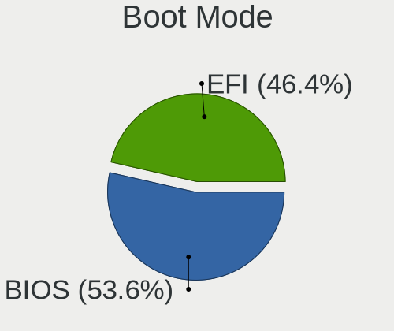
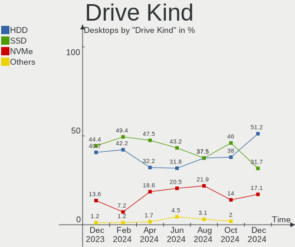

BlackPanther Hardware Trends (Desktop)
--------------------------------------

A project to identify most popular hardware characteristics and track their change
over time based on data collected by BlackPanther users at https://Linux-Hardware.org.

Anyone can contribute to the study by uploading probes of their computers by
the [hw-probe](https://github.com/linuxhw/hw-probe) tool:

    sudo hw-probe -all -upload

Full-feature report is available here: https://linux-hardware.org/?view=trends&formfactor=desktop

Period: Mar, 2020.

Contents
--------

- [ OS                       ](#os)
- [ OS Family                ](#os-family)
- [ Kernel                   ](#kernel)
- [ Kernel Family            ](#kernel-family)
- [ Kernel Major Ver.        ](#kernel-major-ver)
- [ Arch                     ](#arch)
- [ DE                       ](#de)
- [ Display Server           ](#display-server)
- [ OS Lang                  ](#os-lang)
- [ Boot Mode                ](#boot-mode)
- [ Filesystem               ](#filesystem)
- [ Dual Boot with Linux     ](#dual-boot-with-linux)
- [ Dual Boot (Win)          ](#dual-boot-win)
- [ Country                  ](#country)
- [ City                     ](#city)
- [ Vendor                   ](#vendor)
- [ Model                    ](#model)
- [ Model Family             ](#model-family)
- [ MFG Year                 ](#mfg-year)
- [ Form Factor              ](#form-factor)
- [ Secure Boot              ](#secure-boot)
- [ Coreboot                 ](#coreboot)
- [ RAM Size                 ](#ram-size)
- [ RAM Used                 ](#ram-used)
- [ Drive Vendor             ](#drive-vendor)
- [ Drive Model              ](#drive-model)
- [ Drive Kind               ](#drive-kind)
- [ Drive Connector          ](#drive-connector)
- [ Drive Size               ](#drive-size)
- [ Space Total              ](#space-total)
- [ Space Used               ](#space-used)
- [ Malfunc. Drives          ](#malfunc-drives)
- [ Malfunc. Drive Vendor    ](#malfunc-drive-vendor)
- [ Malfunc. Drive Kind      ](#malfunc-drive-kind)
- [ Failed Drives            ](#failed-drives)
- [ Failed Drive Vendor      ](#failed-drive-vendor)
- [ Drive Status             ](#drive-status)
- [ Storage Vendor           ](#storage-vendor)
- [ Storage Model            ](#storage-model)
- [ Storage Kind             ](#storage-kind)
- [ CPU Vendor               ](#cpu-vendor)
- [ CPU Model                ](#cpu-model)
- [ CPU Model Family         ](#cpu-model-family)
- [ CPU Cores                ](#cpu-cores)
- [ CPU Sockets              ](#cpu-sockets)
- [ CPU Threads              ](#cpu-threads)
- [ CPU Op-Modes             ](#cpu-op-modes)
- [ CPU Microarch            ](#cpu-microarch)
- [ CPU Microcode            ](#cpu-microcode)
- [ GPU Vendor               ](#gpu-vendor)
- [ GPU Model                ](#gpu-model)
- [ GPU Combo                ](#gpu-combo)
- [ GPU Driver               ](#gpu-driver)
- [ GPU Memory               ](#gpu-memory)
- [ Monitor Vendor           ](#monitor-vendor)
- [ Monitor Model            ](#monitor-model)
- [ Monitor Resolution       ](#monitor-resolution)
- [ Monitor Diagonal         ](#monitor-diagonal)
- [ Monitor Width            ](#monitor-width)
- [ Aspect Ratio             ](#aspect-ratio)
- [ Monitor Area             ](#monitor-area)
- [ Pixel Density            ](#pixel-density)
- [ Multiple Monitors        ](#multiple-monitors)
- [ Net Controller Vendor    ](#net-controller-vendor)
- [ Net Controller Model     ](#net-controller-model)
- [ Net Controller Kind      ](#net-controller-kind)
- [ Used Controller          ](#used-controller)
- [ NICs                     ](#nics)
- [ Unsupported Devices      ](#unsupported-devices)
- [ Unsupported Device Types ](#unsupported-device-types)

OS
--

Installed operating systems

| Name              | Computers | Percent |
|-------------------|-----------|---------|
| BlackPanther 18.1 | 102       | 92.73%  |
| BlackPanther 16.2 | 8         | 7.27%   |

OS Family
---------

OS without a version

| Name         | Computers | Percent |
|--------------|-----------|---------|
| BlackPanther | 110       | 100%    |

Kernel
------

Version of the Linux kernel

| Version                | Computers | Percent |
|------------------------|-----------|---------|
| 4.18.16-desktop-1bP    | 91        | 82.73%  |
| 5.1.15-desktop-1bP     | 10        | 9.09%   |
| 4.9.20-desktop-pae-1bP | 7         | 6.36%   |
| 5.1.15-server-1bP      | 1         | 0.91%   |
| 4.7.0-desktop-1bP      | 1         | 0.91%   |

Kernel Family
-------------

Linux kernel without a distro release

| Version | Computers | Percent |
|---------|-----------|---------|
| 4.18.16 | 91        | 82.73%  |
| 5.1.15  | 11        | 10%     |
| 4.9.20  | 7         | 6.36%   |
| 4.7.0   | 1         | 0.91%   |

Kernel Major Ver.
-----------------

Linux kernel major version

| Version | Computers | Percent |
|---------|-----------|---------|
| 4.18    | 91        | 82.73%  |
| 5.1     | 11        | 10%     |
| 4.9     | 7         | 6.36%   |
| 4.7     | 1         | 0.91%   |

Arch
----

OS architecture (x86_64, i586, etc.)

| Name   | Computers | Percent |
|--------|-----------|---------|
| x86_64 | 102       | 92.73%  |
| i686   | 8         | 7.27%   |

DE
--

Desktop Environment

| Name | Computers | Percent |
|------|-----------|---------|
| KDE5 | 110       | 100%    |

Display Server
--------------

X11 or Wayland

| Name | Computers | Percent |
|------|-----------|---------|
| X11  | 110       | 100%    |

OS Lang
-------

Language

| Lang    | Computers | Percent |
|---------|-----------|---------|
| Unknown | 110       | 100%    |

Boot Mode
---------

EFI or BIOS

| Mode | Computers | Percent |
|------|-----------|---------|
| BIOS | 90        | 81.82%  |
| EFI  | 20        | 18.18%  |

Filesystem
----------

Type of filesystem

| Type    | Computers | Percent |
|---------|-----------|---------|
| Ext4    | 93        | 84.55%  |
| Overlay | 16        | 14.55%  |
| Ext3    | 1         | 0.91%   |

Dual Boot with Linux
--------------------

Hosting more than one Linux

| Dual boot | Computers | Percent |
|-----------|-----------|---------|
| No        | 76        | 69.09%  |
| Yes       | 34        | 30.91%  |

Dual Boot (Win)
---------------

Hosting Linux and Windows

| Dual boot | Computers | Percent |
|-----------|-----------|---------|
| Yes       | 58        | 52.73%  |
| No        | 52        | 47.27%  |

Country
-------

Geographic location (country)

| Country            | Computers | Percent |
|--------------------|-----------|---------|
| Hungary            | 80        | 72.73%  |
| USA                | 5         | 4.55%   |
| Romania            | 5         | 4.55%   |
| Germany            | 4         | 3.64%   |
| Serbia             | 2         | 1.82%   |
| Poland             | 2         | 1.82%   |
| Canada             | 2         | 1.82%   |
| UK                 | 1         | 0.91%   |
| South Africa       | 1         | 0.91%   |
| Slovakia           | 1         | 0.91%   |
| Puerto Rico        | 1         | 0.91%   |
| Philippines        | 1         | 0.91%   |
| France             | 1         | 0.91%   |
| Finland            | 1         | 0.91%   |
| Dominican Republic | 1         | 0.91%   |
| Belarus            | 1         | 0.91%   |
| Australia          | 1         | 0.91%   |

City
----

Geographic location (city)

| City                | Computers | Percent |
|---------------------|-----------|---------|
| Budapest            | 14        | 12.73%  |
| Eger                | 5         | 4.55%   |
| Miskolc             | 4         | 3.64%   |
| Szombathely         | 3         | 2.73%   |
| Pécs               | 3         | 2.73%   |
| Ajka                | 3         | 2.73%   |
| Érd                | 2         | 1.82%   |
| Székesfehérvár   | 2         | 1.82%   |
| Onga                | 2         | 1.82%   |
| Nyiregyhaza         | 2         | 1.82%   |
| Kiskunfelegyhaza    | 2         | 1.82%   |
| Kecskemét          | 2         | 1.82%   |
| Győr               | 2         | 1.82%   |
| Debrecen            | 2         | 1.82%   |
| Zalahashagy         | 1         | 0.91%   |
| Wysokie Mazowieckie | 1         | 0.91%   |
| Vertesboglar        | 1         | 0.91%   |
| Val-d'Or            | 1         | 0.91%   |
| Toronto             | 1         | 0.91%   |
| Szijartohaza        | 1         | 0.91%   |
| Szigetszentmiklos   | 1         | 0.91%   |
| Szentes             | 1         | 0.91%   |
| Szeged              | 1         | 0.91%   |
| Szada               | 1         | 0.91%   |
| Southampton         | 1         | 0.91%   |
| Skierniewice        | 1         | 0.91%   |
| Seattle             | 1         | 0.91%   |
| Satu Mare           | 1         | 0.91%   |
| Santo Domingo Este  | 1         | 0.91%   |
| Regensburg          | 1         | 0.91%   |
| Racalmas            | 1         | 0.91%   |
| Pirna               | 1         | 0.91%   |
| Piliscsev           | 1         | 0.91%   |
| Pfafftown           | 1         | 0.91%   |
| Papa                | 1         | 0.91%   |
| Pantin              | 1         | 0.91%   |
| Ozd                 | 1         | 0.91%   |
| Oroshaza            | 1         | 0.91%   |
| Odorheiu Secuiesc   | 1         | 0.91%   |
| Ocsa                | 1         | 0.91%   |
| Ochodnica           | 1         | 0.91%   |
| Novi Knezevac       | 1         | 0.91%   |
| Mucsony             | 1         | 0.91%   |
| Monor               | 1         | 0.91%   |
| Mezokovesd          | 1         | 0.91%   |
| Mazyr               | 1         | 0.91%   |
| Mako                | 1         | 0.91%   |
| Magyargec           | 1         | 0.91%   |
| Letenye             | 1         | 0.91%   |
| Laupheim            | 1         | 0.91%   |
| Kaposvár           | 1         | 0.91%   |
| Johnson City        | 1         | 0.91%   |
| Johannesburg        | 1         | 0.91%   |
| Helsinki            | 1         | 0.91%   |
| Gödöllő          | 1         | 0.91%   |
| Gyongyoshalasz      | 1         | 0.91%   |
| Gyomro              | 1         | 0.91%   |
| Frankfurt am Main   | 1         | 0.91%   |
| Fall River          | 1         | 0.91%   |
| Etyek               | 1         | 0.91%   |

Vendor
------

Motherboard manufacturer

| Name                | Computers | Percent |
|---------------------|-----------|---------|
| Gigabyte Technology | 31        | 28.18%  |
| ASUSTek Computer    | 18        | 16.36%  |
| ASRock              | 15        | 13.64%  |
| Dell                | 12        | 10.91%  |
| Hewlett-Packard     | 11        | 10%     |
| MSI                 | 6         | 5.45%   |
| Lenovo              | 5         | 4.55%   |
| Fujitsu             | 4         | 3.64%   |
| Foxconn             | 2         | 1.82%   |
| Acer                | 2         | 1.82%   |
| Gateway             | 1         | 0.91%   |
| Fujitsu Siemens     | 1         | 0.91%   |
| ECS                 | 1         | 0.91%   |
| ABIT                | 1         | 0.91%   |

Model
-----

Motherboard model

| Name                               | Computers | Percent |
|------------------------------------|-----------|---------|
| Gigabyte G31M-ES2L                 | 3         | 2.73%   |
| HP ProDesk 600 G2 SFF              | 2         | 1.82%   |
| Gigabyte 970A-DS3P                 | 2         | 1.82%   |
| Dell Precision WorkStation T3500   | 2         | 1.82%   |
| Dell OptiPlex 745                  | 2         | 1.82%   |
| ASUS All Series                    | 2         | 1.82%   |
| ASRock G31M-VS2                    | 2         | 1.82%   |
| ASRock G31M-S                      | 2         | 1.82%   |
| Acer Veriton M420                  | 2         | 1.82%   |
| MSI Pro 3515 Series                | 1         | 0.91%   |
| MSI MS-7A74                        | 1         | 0.91%   |
| MSI MS-7680                        | 1         | 0.91%   |
| MSI MS-7596                        | 1         | 0.91%   |
| MSI MS-7592                        | 1         | 0.91%   |
| MSI MS-7309                        | 1         | 0.91%   |
| Lenovo ThinkStation D20 4158AF8    | 1         | 0.91%   |
| Lenovo ThinkCentre M92P 32371L5    | 1         | 0.91%   |
| Lenovo ThinkCentre M91p 7034BN4    | 1         | 0.91%   |
| Lenovo ThinkCentre M58p 6138DK1    | 1         | 0.91%   |
| Lenovo ThinkCentre M58e 7408BA5    | 1         | 0.91%   |
| HP Z600 Workstation                | 1         | 0.91%   |
| HP t520 Flexible Series TC         | 1         | 0.91%   |
| HP Slim Desktop 290-a0xxx          | 1         | 0.91%   |
| HP ProDesk 600 G1 TWR              | 1         | 0.91%   |
| HP Pavilion Power Desktop 580-1xx  | 1         | 0.91%   |
| HP Compaq dc5800 Small Form Factor | 1         | 0.91%   |
| HP Compaq 8000 Elite SFF PC        | 1         | 0.91%   |
| HP Compaq 6200 Pro MT PC           | 1         | 0.91%   |
| HP 610-1015xt                      | 1         | 0.91%   |
| Gigabyte P35-DS3L                  | 1         | 0.91%   |
| Gigabyte H87-HD3                   | 1         | 0.91%   |
| Gigabyte H61M-S2PV                 | 1         | 0.91%   |
| Gigabyte H61M-S1                   | 1         | 0.91%   |
| Gigabyte H61M-DS2                  | 1         | 0.91%   |
| Gigabyte H370HD3                   | 1         | 0.91%   |
| Gigabyte GB-BNi7HG6-1060           | 1         | 0.91%   |
| Gigabyte GA-MA770-UD3              | 1         | 0.91%   |
| Gigabyte GA-970A-DS3               | 1         | 0.91%   |
| Gigabyte GA-890GPA-UD3H            | 1         | 0.91%   |
| Gigabyte GA-78LMT-S2               | 1         | 0.91%   |
| Gigabyte G41M-ES2L                 | 1         | 0.91%   |
| Gigabyte F2A88XN-WIFI              | 1         | 0.91%   |
| Gigabyte F2A88XM-DS2               | 1         | 0.91%   |
| Gigabyte F2A88XM-D3HP              | 1         | 0.91%   |
| Gigabyte F2A88XM-D3H               | 1         | 0.91%   |
| Gigabyte F2A78M-DS2                | 1         | 0.91%   |
| Gigabyte F2A68HM-S1                | 1         | 0.91%   |
| Gigabyte F2A68HM-DS2               | 1         | 0.91%   |
| Gigabyte F2A55M-DS2                | 1         | 0.91%   |
| Gigabyte EP45-UD3LR                | 1         | 0.91%   |
| Gigabyte EP43-UD3L                 | 1         | 0.91%   |
| Gigabyte EP31-DS3L                 | 1         | 0.91%   |
| Gigabyte EG41MF-US2H               | 1         | 0.91%   |
| Gigabyte B85M-DS3H-A               | 1         | 0.91%   |
| Gigabyte B250M-D2V                 | 1         | 0.91%   |
| Gateway DT71                       | 1         | 0.91%   |
| Fujitsu Siemens ESPRIMO E          | 1         | 0.91%   |
| Fujitsu PRIMERGY TX100 S2          | 1         | 0.91%   |
| Fujitsu ESPRIMO P2560              | 1         | 0.91%   |
| Fujitsu ESPRIMO P1500              | 1         | 0.91%   |

Model Family
------------

Motherboard model prefix

| Name                     | Computers | Percent |
|--------------------------|-----------|---------|
| Dell OptiPlex            | 9         | 8.18%   |
| Lenovo ThinkCentre       | 4         | 3.64%   |
| HP ProDesk               | 3         | 2.73%   |
| HP Compaq                | 3         | 2.73%   |
| Gigabyte G31M-ES2L       | 3         | 2.73%   |
| Fujitsu ESPRIMO          | 3         | 2.73%   |
| Gigabyte 970A-DS3P       | 2         | 1.82%   |
| Dell Precision           | 2         | 1.82%   |
| ASUS All                 | 2         | 1.82%   |
| ASRock G31M-VS2          | 2         | 1.82%   |
| ASRock G31M-S            | 2         | 1.82%   |
| Acer Veriton             | 2         | 1.82%   |
| MSI Pro                  | 1         | 0.91%   |
| MSI MS-7A74              | 1         | 0.91%   |
| MSI MS-7680              | 1         | 0.91%   |
| MSI MS-7596              | 1         | 0.91%   |
| MSI MS-7592              | 1         | 0.91%   |
| MSI MS-7309              | 1         | 0.91%   |
| Lenovo ThinkStation      | 1         | 0.91%   |
| HP Z600                  | 1         | 0.91%   |
| HP t520                  | 1         | 0.91%   |
| HP Slim                  | 1         | 0.91%   |
| HP Pavilion              | 1         | 0.91%   |
| HP 610-1015xt            | 1         | 0.91%   |
| Gigabyte P35-DS3L        | 1         | 0.91%   |
| Gigabyte H87-HD3         | 1         | 0.91%   |
| Gigabyte H61M-S2PV       | 1         | 0.91%   |
| Gigabyte H61M-S1         | 1         | 0.91%   |
| Gigabyte H61M-DS2        | 1         | 0.91%   |
| Gigabyte H370HD3         | 1         | 0.91%   |
| Gigabyte GB-BNi7HG6-1060 | 1         | 0.91%   |
| Gigabyte GA-MA770-UD3    | 1         | 0.91%   |
| Gigabyte GA-970A-DS3     | 1         | 0.91%   |
| Gigabyte GA-890GPA-UD3H  | 1         | 0.91%   |
| Gigabyte GA-78LMT-S2     | 1         | 0.91%   |
| Gigabyte G41M-ES2L       | 1         | 0.91%   |
| Gigabyte F2A88XN-WIFI    | 1         | 0.91%   |
| Gigabyte F2A88XM-DS2     | 1         | 0.91%   |
| Gigabyte F2A88XM-D3HP    | 1         | 0.91%   |
| Gigabyte F2A88XM-D3H     | 1         | 0.91%   |
| Gigabyte F2A78M-DS2      | 1         | 0.91%   |
| Gigabyte F2A68HM-S1      | 1         | 0.91%   |
| Gigabyte F2A68HM-DS2     | 1         | 0.91%   |
| Gigabyte F2A55M-DS2      | 1         | 0.91%   |
| Gigabyte EP45-UD3LR      | 1         | 0.91%   |
| Gigabyte EP43-UD3L       | 1         | 0.91%   |
| Gigabyte EP31-DS3L       | 1         | 0.91%   |
| Gigabyte EG41MF-US2H     | 1         | 0.91%   |
| Gigabyte B85M-DS3H-A     | 1         | 0.91%   |
| Gigabyte B250M-D2V       | 1         | 0.91%   |
| Gateway DT71             | 1         | 0.91%   |
| Fujitsu Siemens ESPRIMO  | 1         | 0.91%   |
| Fujitsu PRIMERGY         | 1         | 0.91%   |
| Foxconn Pro              | 1         | 0.91%   |
| Foxconn 500B             | 1         | 0.91%   |
| ECS FQ565AA-ABA          | 1         | 0.91%   |
| Dell DM061               | 1         | 0.91%   |
| ASUS ROG                 | 1         | 0.91%   |
| ASUS PRIME               | 1         | 0.91%   |
| ASUS P7P55D-E            | 1         | 0.91%   |

MFG Year
--------

Motherboard manufacture year

| Year | Computers | Percent |
|------|-----------|---------|
| 2010 | 15        | 13.64%  |
| 2011 | 13        | 11.82%  |
| 2009 | 12        | 10.91%  |
| 2012 | 11        | 10%     |
| 2015 | 9         | 8.18%   |
| 2019 | 8         | 7.27%   |
| 2014 | 8         | 7.27%   |
| 2013 | 8         | 7.27%   |
| 2008 | 8         | 7.27%   |
| 2018 | 6         | 5.45%   |
| 2016 | 4         | 3.64%   |
| 2007 | 4         | 3.64%   |
| 2006 | 2         | 1.82%   |
| 2017 | 1         | 0.91%   |
| 2004 | 1         | 0.91%   |

Form Factor
-----------

Physical design of the computer

| Name    | Computers | Percent |
|---------|-----------|---------|
| Desktop | 110       | 100%    |

Secure Boot
-----------

Enabled or disabled

| State    | Computers | Percent |
|----------|-----------|---------|
| Disabled | 110       | 100%    |

Coreboot
--------

Have coreboot on board

| Used | Computers | Percent |
|------|-----------|---------|
| No   | 110       | 100%    |

RAM Size
--------

Total RAM memory

| Size in GB | Computers | Percent |
|------------|-----------|---------|
| 3.01-4.0   | 47        | 42.73%  |
| 8.01-16.0  | 23        | 20.91%  |
| 4.01-8.0   | 13        | 11.82%  |
| 1.01-2.0   | 11        | 10%     |
| 16.01-24.0 | 10        | 9.09%   |
| 2.01-3.0   | 3         | 2.73%   |
| 24.01-32.0 | 2         | 1.82%   |
| 0.01-1.0   | 1         | 0.91%   |

RAM Used
--------

Used RAM memory

| Used GB  | Computers | Percent |
|----------|-----------|---------|
| 0.01-1.0 | 50        | 45.45%  |
| 1.01-2.0 | 47        | 42.73%  |
| 2.01-3.0 | 12        | 10.91%  |
| 3.01-4.0 | 1         | 0.91%   |

Drive Vendor
------------

Hard drive vendors

| Vendor              | Computers | Drives | Percent |
|---------------------|-----------|--------|---------|
| Seagate             | 39        | 43     | 22.29%  |
| WDC                 | 32        | 40     | 18.29%  |
| Samsung Electronics | 21        | 23     | 12%     |
| Kingston            | 18        | 20     | 10.29%  |
| Toshiba             | 15        | 15     | 8.57%   |
| Hitachi             | 9         | 10     | 5.14%   |
| Maxtor              | 5         | 5      | 2.86%   |
| A-DATA Technology   | 4         | 4      | 2.29%   |
| SPCC                | 3         | 3      | 1.71%   |
| Patriot             | 3         | 3      | 1.71%   |
| Hewlett-Packard     | 3         | 3      | 1.71%   |
| HGST                | 2         | 2      | 1.14%   |
| Crucial             | 2         | 4      | 1.14%   |
| Corsair             | 2         | 2      | 1.14%   |
| Zheino              | 1         | 1      | 0.57%   |
| XPG                 | 1         | 1      | 0.57%   |
| WDC WD50            | 1         | 1      | 0.57%   |
| USB3.0              | 1         | 1      | 0.57%   |
| Transcend           | 1         | 1      | 0.57%   |
| SK Hynix            | 1         | 1      | 0.57%   |
| SanDisk             | 1         | 2      | 0.57%   |
| Phison              | 1         | 1      | 0.57%   |
| OCZ                 | 1         | 1      | 0.57%   |
| Micron Technology   | 1         | 1      | 0.57%   |
| Intel               | 1         | 1      | 0.57%   |
| ICY BOX             | 1         | 1      | 0.57%   |
| Generic             | 1         | 1      | 0.57%   |
| Fujitsu             | 1         | 1      | 0.57%   |
| China               | 1         | 1      | 0.57%   |
| BIWIN               | 1         | 1      | 0.57%   |
| Apacer              | 1         | 1      | 0.57%   |

Drive Model
-----------

Hard drive models

| Model                        | Computers | Percent |
|------------------------------|-----------|---------|
| DT01ACA100 1TB               | 8         | 4.12%   |
| ST380815AS 80GB              | 5         | 2.58%   |
| ST3160318AS 160GB            | 4         | 2.06%   |
| SA400S37240G 240GB SSD       | 4         | 2.06%   |
| SA400S37120G 120GB SSD       | 4         | 2.06%   |
| DT01ACA050 500GB             | 4         | 2.06%   |
| WD5000AAKX-60U6AA0 500GB     | 3         | 1.55%   |
| ST500DM002-1BD142 500GB      | 3         | 1.55%   |
| ST3160815AS 160GB            | 3         | 1.55%   |
| HDT721010SLA360 1TB          | 3         | 1.55%   |
| HD080HJ 80GB                 | 3         | 1.55%   |
| WDS120G2G0A-00JH30 120GB SSD | 2         | 1.03%   |
| WD10EZEX-75WN4A0 1TB         | 2         | 1.03%   |
| WD10EZEX-22MFCA0 1TB         | 2         | 1.03%   |
| SUV400S37120G 120GB SSD      | 2         | 1.03%   |
| ST1000DM010-2EP102 1TB       | 2         | 1.03%   |
| SSD 850 EVO 250GB            | 2         | 1.03%   |
| Solid State Disk 256GB       | 2         | 1.03%   |
| HD502HJ 500GB                | 2         | 1.03%   |
| Burst 240GB SSD              | 2         | 1.03%   |
| WDS500G2X0C-00L350 500GB     | 1         | 0.52%   |
| WDS240G2G0B-00EPW0 240GB SSD | 1         | 0.52%   |
| WD7501AALS-00E3A0 752GB      | 1         | 0.52%   |
| WD6400AAVS-00G9B1 640GB      | 1         | 0.52%   |
| WD5000LPCX-60VHAT0 500GB     | 1         | 0.52%   |
| WD5000BPKT-75PK4T0 500GB     | 1         | 0.52%   |
| WD5000AZRX-00L4HB0 500GB     | 1         | 0.52%   |
| WD5000AVCS-632DY1 500GB      | 1         | 0.52%   |
| WD5000AAKS-22A7B0 500GB      | 1         | 0.52%   |
| WD5000AAKS-00UU3A0 500GB     | 1         | 0.52%   |
| WD3200AAKS-00UU3A0 320GB     | 1         | 0.52%   |
| WD3200AAJS-00L7A0 320GB      | 1         | 0.52%   |
| WD30EFRX-68EUZN0 3TB         | 1         | 0.52%   |
| WD2500JB-00REA0 250GB        | 1         | 0.52%   |
| WD2500AAKX-75U6AA0 250GB     | 1         | 0.52%   |
| WD2500AAKX-603CA0 250GB      | 1         | 0.52%   |
| WD2500AAKX-083CA1 250GB      | 1         | 0.52%   |
| WD20EFRX-68EUZN0 2TB         | 1         | 0.52%   |
| WD20EARS-60MVWB0 2TB         | 1         | 0.52%   |
| WD20EARS-00J2GB0 2TB         | 1         | 0.52%   |
| WD2000JB-00GVA0 200GB        | 1         | 0.52%   |
| WD10PURZ-85U8XY0 1TB         | 1         | 0.52%   |
| WD10JPVX-22JC3T0 1TB         | 1         | 0.52%   |
| WD10EZRX-00A8LB0 1TB         | 1         | 0.52%   |
| WD10EZEX-22BN5A0 1TB         | 1         | 0.52%   |
| WD10EZEX-08M2NA0 1TB         | 1         | 0.52%   |
| WD10EZEX-00ZF5A0 1TB         | 1         | 0.52%   |
| WD10EZEX-00M2NA0 1TB         | 1         | 0.52%   |
| WD10EARS-00MVWB0 1TB         | 1         | 0.52%   |
| WD10EADS-00M2B0 1TB          | 1         | 0.52%   |
| WD10EACS-00ZJB0 1TB          | 1         | 0.52%   |
| VERTEX460A 120GB SSD         | 1         | 0.52%   |
| VB0250EAVER 250GB            | 1         | 0.52%   |
| TS256GMTS430S 256GB SSD      | 1         | 0.52%   |
| SV300S37A240G 240GB SSD      | 1         | 0.52%   |
| SV300S37A120G 120GB SSD      | 1         | 0.52%   |
| SUV500M8120G 120GB SSD       | 1         | 0.52%   |
| SUV500120G 120GB SSD         | 1         | 0.52%   |
| SUV400S37240G 240GB SSD      | 1         | 0.52%   |
| SU700 120GB SSD              | 1         | 0.52%   |

Drive Kind
----------

HDD or SSD

| Kind    | Computers | Drives | Percent |
|---------|-----------|--------|---------|
| HDD     | 95        | 127    | 65.52%  |
| SSD     | 41        | 56     | 28.28%  |
| NVMe    | 7         | 10     | 4.83%   |
| Unknown | 2         | 2      | 1.38%   |

Drive Connector
---------------

SATA, SAS, NVMe, etc.

| Type | Computers | Drives | Percent |
|------|-----------|--------|---------|
| SATA | 108       | 177    | 88.52%  |
| SAS  | 7         | 8      | 5.74%   |
| NVMe | 7         | 10     | 5.74%   |

Drive Size
----------

Size of hard drive

| Size in TB | Computers | Drives | Percent |
|------------|-----------|--------|---------|
| 0.01-0.5   | 98        | 137    | 67.12%  |
| 0.51-1.0   | 38        | 44     | 26.03%  |
| 1.01-2.0   | 5         | 9      | 3.42%   |
| 2.01-3.0   | 3         | 3      | 2.05%   |
| 3.01-4.0   | 1         | 1      | 0.68%   |
| 4.01-10.0  | 1         | 1      | 0.68%   |

Space Total
-----------

Amount of disk space available on the file system

| Size in GB     | Computers | Percent |
|----------------|-----------|---------|
| 101-250        | 34        | 30.91%  |
| 251-500        | 20        | 18.18%  |
| 51-100         | 15        | 13.64%  |
| Unknown        | 14        | 12.73%  |
| 501-1000       | 11        | 10%     |
| 21-50          | 8         | 7.27%   |
| 1-20           | 4         | 3.64%   |
| 1001-2000      | 3         | 2.73%   |
| More than 3000 | 1         | 0.91%   |

Space Used
----------

Amount of used disk space

| Used GB  | Computers | Percent |
|----------|-----------|---------|
| 1-20     | 70        | 63.64%  |
| Unknown  | 14        | 12.73%  |
| 51-100   | 9         | 8.18%   |
| 21-50    | 5         | 4.55%   |
| 251-500  | 4         | 3.64%   |
| 101-250  | 4         | 3.64%   |
| 501-1000 | 4         | 3.64%   |

Malfunc. Drives
---------------

Drive models with a malfunction

| Model                        | Computers | Drives | Percent |
|------------------------------|-----------|--------|---------|
| WD10EZEX-75WN4A0 1TB         | 2         | 2      | 4.55%   |
| ST500DM002-1BD142 500GB      | 2         | 2      | 4.55%   |
| HDT721010SLA360 1TB          | 2         | 2      | 4.55%   |
| HD080HJ 80GB                 | 2         | 2      | 4.55%   |
| WD6400AAVS-00G9B1 640GB      | 1         | 1      | 2.27%   |
| WD5000AAKX-60U6AA0 500GB     | 1         | 1      | 2.27%   |
| WD5000AAKS-22A7B0 500GB      | 1         | 1      | 2.27%   |
| WD3200AAKS-00UU3A0 320GB     | 1         | 1      | 2.27%   |
| WD3200AAJS-00L7A0 320GB      | 1         | 1      | 2.27%   |
| WD30EFRX-68EUZN0 3TB         | 1         | 1      | 2.27%   |
| WD20EARS-60MVWB0 2TB         | 1         | 1      | 2.27%   |
| WD20EARS-00J2GB0 2TB         | 1         | 1      | 2.27%   |
| WD2000JB-00GVA0 200GB        | 1         | 1      | 2.27%   |
| WD10EZEX-00M2NA0 1TB         | 1         | 1      | 2.27%   |
| WD10EADS-00M2B0 1TB          | 1         | 1      | 2.27%   |
| VERTEX460A 120GB SSD         | 1         | 1      | 2.27%   |
| SU700 120GB SSD              | 1         | 1      | 2.27%   |
| STM380215A 80GB              | 1         | 1      | 2.27%   |
| STM3250318AS 250GB           | 1         | 1      | 2.27%   |
| ST340016A 40GB               | 1         | 1      | 2.27%   |
| ST3320820AS 320GB            | 1         | 1      | 2.27%   |
| ST3160815AS 160GB            | 1         | 1      | 2.27%   |
| ST3160318AS 160GB            | 1         | 1      | 2.27%   |
| ST31000524AS 1TB             | 1         | 1      | 2.27%   |
| SP1614C 160GB                | 1         | 1      | 2.27%   |
| SP1213N 120GB                | 1         | 1      | 2.27%   |
| SC210 2.5 7MM 128GB SSD      | 1         | 1      | 2.27%   |
| RBUSNS8180DS3256GH 256GB SSD | 1         | 1      | 2.27%   |
| MK3275GSX 320GB              | 1         | 1      | 2.27%   |
| HTS545025B9A300 250GB        | 1         | 1      | 2.27%   |
| HTS543232A7A384 320GB        | 1         | 1      | 2.27%   |
| HDS721050CLA362 500GB        | 1         | 1      | 2.27%   |
| HDS721032CLA362 320GB        | 1         | 1      | 2.27%   |
| HDS721010CLA332 1TB          | 1         | 1      | 2.27%   |
| HDP725050GLA360 500GB        | 1         | 1      | 2.27%   |
| HD322GJ 320GB                | 1         | 1      | 2.27%   |
| HD320KJ 320GB                | 1         | 1      | 2.27%   |
| HD103SI 1TB                  | 1         | 1      | 2.27%   |
| DT01ACA100 1TB               | 1         | 1      | 2.27%   |
| 6Y120L0 128GB                | 1         | 1      | 2.27%   |

Malfunc. Drive Vendor
---------------------

Vendors of faulty drives

| Vendor              | Computers | Drives | Percent |
|---------------------|-----------|--------|---------|
| WDC                 | 13        | 13     | 30.23%  |
| Seagate             | 8         | 8      | 18.6%   |
| Samsung Electronics | 7         | 7      | 16.28%  |
| Hitachi             | 7         | 8      | 16.28%  |
| Toshiba             | 2         | 2      | 4.65%   |
| MAXTOR              | 2         | 2      | 4.65%   |
| SK Hynix            | 1         | 1      | 2.33%   |
| OCZ                 | 1         | 1      | 2.33%   |
| Kingston            | 1         | 1      | 2.33%   |
| A-DATA Technology   | 1         | 1      | 2.33%   |

Malfunc. Drive Kind
-------------------

Kinds of faulty drives

| Kind | Computers | Drives | Percent |
|------|-----------|--------|---------|
| HDD  | 37        | 40     | 90.24%  |
| SSD  | 4         | 4      | 9.76%   |

Failed Drives
-------------

Failed drive models

| Model             | Computers | Drives | Percent |
|-------------------|-----------|--------|---------|
| ST380815AS 80GB   | 1         | 1      | 50%     |
| ST3160815AS 160GB | 1         | 1      | 50%     |

Failed Drive Vendor
-------------------

Failed drive vendors

| Vendor  | Computers | Drives | Percent |
|---------|-----------|--------|---------|
| Seagate | 2         | 2      | 100%    |

Drive Status
------------

Number of failed and malfunc. drives

| Status   | Computers | Drives | Percent |
|----------|-----------|--------|---------|
| Works    | 83        | 131    | 60.58%  |
| Malfunc  | 41        | 44     | 29.93%  |
| Detected | 11        | 18     | 8.03%   |
| Failed   | 2         | 2      | 1.46%   |

Storage Vendor
--------------

Storage controller vendors

| Vendor                        | Computers | Percent |
|-------------------------------|-----------|---------|
| Intel                         | 75        | 56.39%  |
| AMD                           | 26        | 19.55%  |
| Nvidia                        | 8         | 6.02%   |
| Marvell Technology Group      | 8         | 6.02%   |
| JMicron Technology            | 7         | 5.26%   |
| Silicon Motion                | 2         | 1.5%    |
| Phison Electronics            | 2         | 1.5%    |
| VIA Technologies              | 1         | 0.75%   |
| Sandisk                       | 1         | 0.75%   |
| Samsung Electronics           | 1         | 0.75%   |
| Realtek Semiconductor         | 1         | 0.75%   |
| Integrated Technology Express | 1         | 0.75%   |

Storage Model
-------------

Storage controller models

| Model                                                                             | Computers | Percent |
|-----------------------------------------------------------------------------------|-----------|---------|
| NM10/ICH7 Family SATA Controller [IDE mode]                                       | 20        | 10.31%  |
| 82801G (ICH7 Family) IDE Controller                                               | 14        | 7.22%   |
| FCH SATA Controller [AHCI mode]                                                   | 11        | 5.67%   |
| SB7x0/SB8x0/SB9x0 IDE Controller                                                  | 9         | 4.64%   |
| SB7x0/SB8x0/SB9x0 SATA Controller [IDE mode]                                      | 7         | 3.61%   |
| 200 Series PCH SATA controller [AHCI mode]                                        | 6         | 3.09%   |
| 82801JI (ICH10 Family) 4 port SATA IDE Controller #1                              | 5         | 2.58%   |
| 82801JI (ICH10 Family) 2 port SATA IDE Controller #2                              | 5         | 2.58%   |
| 8 Series/C220 Series Chipset Family 6-port SATA Controller 1 [AHCI mode]          | 5         | 2.58%   |
| 6 Series/C200 Series Chipset Family 6 port Desktop SATA AHCI Controller           | 5         | 2.58%   |
| SATA Controller [RAID mode]                                                       | 4         | 2.06%   |
| MCP61 SATA Controller                                                             | 4         | 2.06%   |
| FCH SATA Controller [IDE mode]                                                    | 4         | 2.06%   |
| FCH IDE Controller                                                                | 4         | 2.06%   |
| 88SE6111/6121 SATA II / PATA Controller                                           | 4         | 2.06%   |
| 6 Series/C200 Series Chipset Family Desktop SATA Controller (IDE mode, ports 4-5) | 4         | 2.06%   |
| 6 Series/C200 Series Chipset Family Desktop SATA Controller (IDE mode, ports 0-3) | 4         | 2.06%   |
| SB7x0/SB8x0/SB9x0 SATA Controller [AHCI mode]                                     | 3         | 1.55%   |
| MCP61 IDE                                                                         | 3         | 1.55%   |
| JMB368 IDE controller                                                             | 3         | 1.55%   |
| JMB363 SATA/IDE Controller                                                        | 3         | 1.55%   |
| 82801JI (ICH10 Family) SATA AHCI Controller                                       | 3         | 1.55%   |
| 82801I (ICH9 Family) 2 port SATA Controller [IDE mode]                            | 3         | 1.55%   |
| 82801HR/HO/HH (ICH8R/DO/DH) 2 port SATA Controller [IDE mode]                     | 3         | 1.55%   |
| 82801H (ICH8 Family) 4 port SATA Controller [IDE mode]                            | 3         | 1.55%   |
| 5 Series/3400 Series Chipset 6 port SATA AHCI Controller                          | 3         | 1.55%   |
| Q170/Q150/B150/H170/H110/Z170/CM236 Chipset SATA Controller [AHCI Mode]           | 2         | 1.03%   |
| Non-Volatile memory controller                                                    | 2         | 1.03%   |
| Cannon Lake PCH SATA AHCI Controller                                              | 2         | 1.03%   |
| 82801JD/DO (ICH10 Family) 4-port SATA IDE Controller                              | 2         | 1.03%   |
| 82801JD/DO (ICH10 Family) 2-port SATA IDE Controller                              | 2         | 1.03%   |
| 82801IB (ICH9) 2 port SATA Controller [IDE mode]                                  | 2         | 1.03%   |
| 7 Series/C210 Series Chipset Family 6-port SATA Controller [AHCI mode]            | 2         | 1.03%   |
| 4 Series Chipset PT IDER Controller                                               | 2         | 1.03%   |
| WD Black 2018/PC SN720 NVMe SSD                                                   | 1         | 0.52%   |
| VT82C586A/B/VT82C686/A/B/VT823x/A/C PIPC Bus Master IDE                           | 1         | 0.52%   |
| VT8237A SATA 2-Port Controller                                                    | 1         | 0.52%   |
| SSD 660P Series                                                                   | 1         | 0.52%   |
| SB600 Non-Raid-5 SATA                                                             | 1         | 0.52%   |
| SB600 IDE                                                                         | 1         | 0.52%   |
| Realtek Non-Volatile memory controller                                            | 1         | 0.52%   |
| NVMe SSD Controller SM981/PM981/PM983                                             | 1         | 0.52%   |
| nForce3 Serial ATA Controller                                                     | 1         | 0.52%   |
| MV64460/64461/64462 System Controller, Revision B                                 | 1         | 0.52%   |
| MCP78S [GeForce 8200] AHCI Controller                                             | 1         | 0.52%   |
| MCP51 Serial ATA Controller                                                       | 1         | 0.52%   |
| JMB362 SATA Controller                                                            | 1         | 0.52%   |
| IT8212 Dual channel ATA RAID controller                                           | 1         | 0.52%   |
| HM170/QM170 Chipset SATA Controller [AHCI Mode]                                   | 1         | 0.52%   |
| GeForce 7100/nForce 630i SATA                                                     | 1         | 0.52%   |
| FCH SATA Controller D                                                             | 1         | 0.52%   |
| E7 NVMe Controller                                                                | 1         | 0.52%   |
| E12 NVMe Controller                                                               | 1         | 0.52%   |
| CK8S Parallel ATA Controller (v2.5)                                               | 1         | 0.52%   |
| Atom Processor E3800 Series SATA AHCI Controller                                  | 1         | 0.52%   |
| 9 Series Chipset Family SATA Controller [AHCI Mode]                               | 1         | 0.52%   |
| 88SE9182 SATA 6G Controller                                                       | 1         | 0.52%   |
| 88SE912x SATA 6Gb/s Controller [IDE mode]                                         | 1         | 0.52%   |
| 88SE6101/6102 single-port PATA133 interface                                       | 1         | 0.52%   |
| 82Q963/Q965 PT IDER Controller                                                    | 1         | 0.52%   |

Storage Kind
------------

Kind of storage controller (IDE, SATA, NVMe, SAS, ...)

| Kind | Computers | Percent |
|------|-----------|---------|
| IDE  | 65        | 47.1%   |
| SATA | 60        | 43.48%  |
| NVMe | 7         | 5.07%   |
| RAID | 6         | 4.35%   |

CPU Vendor
----------

Processor vendors

| Vendor | Computers | Percent |
|--------|-----------|---------|
| Intel  | 77        | 70%     |
| AMD    | 33        | 30%     |

CPU Model
---------

Processor models

| Model                                       | Computers | Percent |
|---------------------------------------------|-----------|---------|
| Intel Core 2 Duo CPU E8400 @ 3.00GHz        | 3         | 2.73%   |
| Intel Celeron CPU E3400 @ 2.60GHz           | 3         | 2.73%   |
| Intel Xeon CPU E5620 @ 2.40GHz              | 2         | 1.82%   |
| Intel Pentium Dual-Core CPU E5400 @ 2.70GHz | 2         | 1.82%   |
| Intel Pentium Dual CPU E2180 @ 2.00GHz      | 2         | 1.82%   |
| Intel Pentium CPU G840 @ 2.80GHz            | 2         | 1.82%   |
| Intel Pentium CPU G4560 @ 3.50GHz           | 2         | 1.82%   |
| Intel Pentium 4 CPU 3.00GHz                 | 2         | 1.82%   |
| Intel Core i5-6500 CPU @ 3.20GHz            | 2         | 1.82%   |
| Intel Core i3-3220 CPU @ 3.30GHz            | 2         | 1.82%   |
| Intel Core 2 Quad CPU Q8300 @ 2.50GHz       | 2         | 1.82%   |
| Intel Core 2 Quad CPU Q6600 @ 2.40GHz       | 2         | 1.82%   |
| Intel Core 2 Duo CPU E7500 @ 2.93GHz        | 2         | 1.82%   |
| Intel Core 2 Duo CPU E7300 @ 2.66GHz        | 2         | 1.82%   |
| Intel Core 2 Duo CPU E4500 @ 2.20GHz        | 2         | 1.82%   |
| Intel Core 2 CPU 6300 @ 1.86GHz             | 2         | 1.82%   |
| AMD Phenom II X4 955 Processor              | 2         | 1.82%   |
| AMD FX-6300 Six-Core Processor              | 2         | 1.82%   |
| AMD Athlon X4 860K Quad Core Processor      | 2         | 1.82%   |
| AMD Athlon 64 X2 Dual Core Processor 4800+  | 2         | 1.82%   |
| AMD A4-6300 APU with Radeon HD Graphics     | 2         | 1.82%   |
| AMD A4-5300 APU with Radeon HD Graphics     | 2         | 1.82%   |
| Intel Xeon CPU X5677 @ 3.47GHz              | 1         | 0.91%   |
| Intel Xeon CPU X5450 @ 3.00GHz              | 1         | 0.91%   |
| Intel Xeon CPU W3530 @ 2.80GHz              | 1         | 0.91%   |
| Intel Xeon CPU E5440 @ 2.83GHz              | 1         | 0.91%   |
| Intel Pentium Gold G5400 CPU @ 3.70GHz      | 1         | 0.91%   |
| Intel Pentium Dual-Core CPU E6700 @ 3.20GHz | 1         | 0.91%   |
| Intel Pentium Dual-Core CPU E6500 @ 2.93GHz | 1         | 0.91%   |
| Intel Pentium Dual-Core CPU E5800 @ 3.20GHz | 1         | 0.91%   |
| Intel Pentium Dual-Core CPU E5500 @ 2.80GHz | 1         | 0.91%   |
| Intel Pentium Dual-Core CPU E5300 @ 2.60GHz | 1         | 0.91%   |
| Intel Pentium D CPU 3.40GHz                 | 1         | 0.91%   |
| Intel Pentium CPU G860 @ 3.00GHz            | 1         | 0.91%   |
| Intel Pentium CPU G620 @ 2.60GHz            | 1         | 0.91%   |
| Intel Pentium CPU G3220 @ 3.00GHz           | 1         | 0.91%   |
| Intel Pentium 4 CPU 2.80GHz                 | 1         | 0.91%   |
| Intel Core i7-8700K CPU @ 3.70GHz           | 1         | 0.91%   |
| Intel Core i7-8700 CPU @ 3.20GHz            | 1         | 0.91%   |
| Intel Core i7-7700HQ CPU @ 2.80GHz          | 1         | 0.91%   |
| Intel Core i7-4790K CPU @ 4.00GHz           | 1         | 0.91%   |
| Intel Core i7-4790 CPU @ 3.60GHz            | 1         | 0.91%   |
| Intel Core i7-2600 CPU @ 3.40GHz            | 1         | 0.91%   |
| Intel Core i5-8400 CPU @ 2.80GHz            | 1         | 0.91%   |
| Intel Core i5-4460 CPU @ 3.20GHz            | 1         | 0.91%   |
| Intel Core i5-3470T CPU @ 2.90GHz           | 1         | 0.91%   |
| Intel Core i5-2400 CPU @ 3.10GHz            | 1         | 0.91%   |
| Intel Core i5 CPU 760 @ 2.80GHz             | 1         | 0.91%   |
| Intel Core i5 CPU 670 @ 3.47GHz             | 1         | 0.91%   |
| Intel Core i3-8350K CPU @ 4.00GHz           | 1         | 0.91%   |
| Intel Core i3-6100T CPU @ 3.20GHz           | 1         | 0.91%   |
| Intel Core i3-4330 CPU @ 3.50GHz            | 1         | 0.91%   |
| Intel Core i3-4160 CPU @ 3.60GHz            | 1         | 0.91%   |
| Intel Core i3-3210 CPU @ 3.20GHz            | 1         | 0.91%   |
| Intel Core i3-2100 CPU @ 3.10GHz            | 1         | 0.91%   |
| Intel Core i3 CPU 550 @ 3.20GHz             | 1         | 0.91%   |
| Intel Core 2 Quad CPU Q8400 @ 2.66GHz       | 1         | 0.91%   |
| Intel Core 2 Quad CPU Q8200 @ 2.33GHz       | 1         | 0.91%   |
| Intel Core 2 Duo CPU E7600 @ 3.06GHz        | 1         | 0.91%   |
| Intel Core 2 Duo CPU E6550 @ 2.33GHz        | 1         | 0.91%   |

CPU Model Family
----------------

Processor model prefix

| Model                   | Computers | Percent |
|-------------------------|-----------|---------|
| Intel Core 2 Duo        | 11        | 10%     |
| Intel Core i3           | 9         | 8.18%   |
| Intel Core i5           | 8         | 7.27%   |
| Intel Pentium Dual-Core | 7         | 6.36%   |
| Intel Pentium           | 7         | 6.36%   |
| Intel Xeon              | 6         | 5.45%   |
| Intel Core i7           | 6         | 5.45%   |
| Intel Core 2 Quad       | 6         | 5.45%   |
| Intel Celeron           | 6         | 5.45%   |
| Intel Core 2            | 4         | 3.64%   |
| AMD FX                  | 4         | 3.64%   |
| AMD Athlon II X2        | 4         | 3.64%   |
| AMD A4                  | 4         | 3.64%   |
| Intel Pentium 4         | 3         | 2.73%   |
| AMD Athlon X4           | 3         | 2.73%   |
| AMD Athlon 64 X2        | 3         | 2.73%   |
| Intel Pentium Dual      | 2         | 1.82%   |
| AMD Phenom II X4        | 2         | 1.82%   |
| AMD A10                 | 2         | 1.82%   |
| Other                   | 1         | 0.91%   |
| Intel Pentium Gold      | 1         | 0.91%   |
| Intel Pentium D         | 1         | 0.91%   |
| AMD Ryzen 5             | 1         | 0.91%   |
| AMD Ryzen 3             | 1         | 0.91%   |
| AMD Phenom II X2        | 1         | 0.91%   |
| AMD Phenom              | 1         | 0.91%   |
| AMD GX                  | 1         | 0.91%   |
| AMD Athlon II X4        | 1         | 0.91%   |
| AMD Athlon 64           | 1         | 0.91%   |
| AMD Athlon              | 1         | 0.91%   |
| AMD A8                  | 1         | 0.91%   |
| AMD A6                  | 1         | 0.91%   |

CPU Cores
---------

Number of processor cores

| Number | Computers | Percent |
|--------|-----------|---------|
| 2      | 64        | 58.18%  |
| 4      | 31        | 28.18%  |
| 1      | 9         | 8.18%   |
| 6      | 3         | 2.73%   |
| 3      | 2         | 1.82%   |
| 8      | 1         | 0.91%   |

CPU Sockets
-----------

Number of sockets

| Number | Computers | Percent |
|--------|-----------|---------|
| 1      | 109       | 99.09%  |
| 2      | 1         | 0.91%   |

CPU Threads
-----------

Threads per core (Hyper-Threading)

| Number | Computers | Percent |
|--------|-----------|---------|
| 1      | 71        | 64.55%  |
| 2      | 39        | 35.45%  |

CPU Op-Modes
------------

CPU Operation Modes (32-bit, 64-bit)

| Op mode        | Computers | Percent |
|----------------|-----------|---------|
| 32-bit, 64-bit | 108       | 98.18%  |
| 32-bit         | 2         | 1.82%   |

CPU Microarch
-------------

Microarchitecture

| Name        | Computers | Percent |
|-------------|-----------|---------|
| Core        | 36        | 32.73%  |
| Skylake     | 11        | 10%     |
| K10         | 10        | 9.09%   |
| Piledriver  | 8         | 7.27%   |
| SandyBridge | 7         | 6.36%   |
| Haswell     | 6         | 5.45%   |
| Westmere    | 5         | 4.55%   |
| Steamroller | 5         | 4.55%   |
| NetBurst    | 4         | 3.64%   |
| K8 Hammer   | 4         | 3.64%   |
| IvyBridge   | 4         | 3.64%   |
| Zen         | 3         | 2.73%   |
| Nehalem     | 2         | 1.82%   |
| Silvermont  | 1         | 0.91%   |
| Puma        | 1         | 0.91%   |
| Penryn      | 1         | 0.91%   |
| K10 Llano   | 1         | 0.91%   |
| Excavator   | 1         | 0.91%   |

CPU Microcode
-------------

Microcode number

| Number     | Computers | Percent |
|------------|-----------|---------|
| 0x1067a    | 22        | 20%     |
| Unknown    | 10        | 9.09%   |
| 0x206a7    | 7         | 6.36%   |
| 0x306c3    | 6         | 5.45%   |
| 0x906ea    | 4         | 3.64%   |
| 0x6fd      | 4         | 3.64%   |
| 0x306a9    | 4         | 3.64%   |
| 0x06003106 | 4         | 3.64%   |
| 0x06001119 | 4         | 3.64%   |
| 0x06000852 | 4         | 3.64%   |
| 0x010000c8 | 4         | 3.64%   |
| 0x906e9    | 3         | 2.73%   |
| 0x6fb      | 3         | 2.73%   |
| 0x506e3    | 3         | 2.73%   |
| 0x206c2    | 3         | 2.73%   |
| 0x6f6      | 2         | 1.82%   |
| 0x6f2      | 2         | 1.82%   |
| 0x10676    | 2         | 1.82%   |
| 0x0810100b | 2         | 1.82%   |
| 0xf64      | 1         | 0.91%   |
| 0xf49      | 1         | 0.91%   |
| 0xf41      | 1         | 0.91%   |
| 0xf33      | 1         | 0.91%   |
| 0x906eb    | 1         | 0.91%   |
| 0x30673    | 1         | 0.91%   |
| 0x20655    | 1         | 0.91%   |
| 0x106e5    | 1         | 0.91%   |
| 0x106a5    | 1         | 0.91%   |
| 0x08001137 | 1         | 0.91%   |
| 0x07030104 | 1         | 0.91%   |
| 0x06006705 | 1         | 0.91%   |
| 0x06003104 | 1         | 0.91%   |
| 0x03000027 | 1         | 0.91%   |
| 0x010000db | 1         | 0.91%   |
| 0x010000af | 1         | 0.91%   |
| 0x01000083 | 1         | 0.91%   |

GPU Vendor
----------

Vendors of graphics cards

| Vendor           | Computers | Percent |
|------------------|-----------|---------|
| Nvidia           | 45        | 40.18%  |
| AMD              | 38        | 33.93%  |
| Intel            | 28        | 25%     |
| VIA Technologies | 1         | 0.89%   |

GPU Model
---------

Graphics card models

| Model                                                                 | Computers | Percent |
|-----------------------------------------------------------------------|-----------|---------|
| 82G33/G31 Express Integrated Graphics Controller                      | 5         | 4.35%   |
| 4 Series Chipset Integrated Graphics Controller                       | 5         | 4.35%   |
| Xeon E3-1200 v3/4th Gen Core Processor Integrated Graphics Controller | 4         | 3.48%   |
| GT218 [GeForce 210]                                                   | 4         | 3.48%   |
| Xeon E3-1200 v2/3rd Gen Core processor Graphics Controller            | 3         | 2.61%   |
| Kaveri [Radeon R7 Graphics]                                           | 3         | 2.61%   |
| HD Graphics 530                                                       | 3         | 2.61%   |
| GP106 [GeForce GTX 1060 3GB]                                          | 3         | 2.61%   |
| GK208B [GeForce GT 710]                                               | 3         | 2.61%   |
| Trinity 2 [Radeon HD 7480D]                                           | 2         | 1.74%   |
| RV710 [Radeon HD 4350/4550]                                           | 2         | 1.74%   |
| Richland [Radeon HD 8370D]                                            | 2         | 1.74%   |
| Raven Ridge [Radeon Vega Series / Radeon Vega Mobile Series]          | 2         | 1.74%   |
| Pitcairn PRO [Radeon HD 7850 / R7 265 / R9 270 1024SP]                | 2         | 1.74%   |
| GP107 [GeForce GTX 1050]                                              | 2         | 1.74%   |
| GP107 [GeForce GTX 1050 Ti]                                           | 2         | 1.74%   |
| GK208B [GeForce GT 730]                                               | 2         | 1.74%   |
| G96C [GeForce 9500 GT]                                                | 2         | 1.74%   |
| G94GL [Quadro FX 1800]                                                | 2         | 1.74%   |
| G92 [GeForce GTS 250]                                                 | 2         | 1.74%   |
| Cedar [Radeon HD 7350/8350 / R5 220]                                  | 2         | 1.74%   |
| Caicos [Radeon HD 6450/7450/8450 / R5 230 OEM]                        | 2         | 1.74%   |
| 82Q963/Q965 Integrated Graphics Controller                            | 2         | 1.74%   |
| 2nd Generation Core Processor Family Integrated Graphics Controller   | 2         | 1.74%   |
| Turks PRO [Radeon HD 6570/7570/8550]                                  | 1         | 0.87%   |
| Sumo [Radeon HD 6530D]                                                | 1         | 0.87%   |
| Stoney [Radeon R2/R3/R4/R5 Graphics]                                  | 1         | 0.87%   |
| RV730 [Radeon HD 4600 AGP Series]                                     | 1         | 0.87%   |
| RV730 PRO [Radeon HD 4650]                                            | 1         | 0.87%   |
| RV610 [Radeon HD 2400 PRO]                                            | 1         | 0.87%   |
| RV610 [Radeon HD 2400 PRO/XT]                                         | 1         | 0.87%   |
| RV370 [Radeon X300/X550/X1050 Series] (Secondary)                     | 1         | 0.87%   |
| RV370 [Radeon X300/X550/X1050 Series]                                 | 1         | 0.87%   |
| RS880 [Radeon HD 4290]                                                | 1         | 0.87%   |
| RS780 [Radeon HD 3200]                                                | 1         | 0.87%   |
| Pinewood [Mobility Radeon HD 5570/6550A]                              | 1         | 0.87%   |
| P4M890 [S3 UniChrome Pro]                                             | 1         | 0.87%   |
| NV36 [GeForce FX 5700LE]                                              | 1         | 0.87%   |
| Mullins [Radeon R1E/R2E Graphics]                                     | 1         | 0.87%   |
| Juniper XT [Radeon HD 6770]                                           | 1         | 0.87%   |
| Juniper XT [Radeon HD 5770]                                           | 1         | 0.87%   |
| Juniper PRO [Radeon HD 5750]                                          | 1         | 0.87%   |
| GT218 [GeForce 8400 GS Rev. 3]                                        | 1         | 0.87%   |
| GT216 [GeForce GT 220]                                                | 1         | 0.87%   |
| GP108 [GeForce GT 1030]                                               | 1         | 0.87%   |
| GP106M [GeForce GTX 1060 Mobile]                                      | 1         | 0.87%   |
| GP106 [GeForce GTX 1060 6GB]                                          | 1         | 0.87%   |
| GM107 [GeForce GTX 750 Ti]                                            | 1         | 0.87%   |
| GK208B [GeForce GT 720]                                               | 1         | 0.87%   |
| GK107 [GeForce GTX 650]                                               | 1         | 0.87%   |
| GK107 [GeForce GT 640 OEM]                                            | 1         | 0.87%   |
| GF119 [GeForce GT 610]                                                | 1         | 0.87%   |
| GF119 [GeForce GT 520]                                                | 1         | 0.87%   |
| GF108GL [Quadro 600]                                                  | 1         | 0.87%   |
| GF108 [GeForce GT 730]                                                | 1         | 0.87%   |
| GF108 [GeForce GT 440]                                                | 1         | 0.87%   |
| GF108 [GeForce GT 430]                                                | 1         | 0.87%   |
| GF104 [GeForce GTX 460]                                               | 1         | 0.87%   |
| GF100 [GeForce GTX 470]                                               | 1         | 0.87%   |
| G94 [GeForce 9600 GT]                                                 | 1         | 0.87%   |

GPU Combo
---------

Combinations of graphics cards

| Name       | Computers | Percent |
|------------|-----------|---------|
| 1 x Nvidia | 43        | 39.09%  |
| 1 x AMD    | 37        | 33.64%  |
| 1 x Intel  | 27        | 24.55%  |
| 2 x Nvidia | 1         | 0.91%   |
| 2 x AMD    | 1         | 0.91%   |
| 1 x VIA    | 1         | 0.91%   |

GPU Driver
----------

Free vs proprietary

| Driver      | Computers | Percent |
|-------------|-----------|---------|
| Free        | 107       | 97.27%  |
| Proprietary | 2         | 1.82%   |
| Unknown     | 1         | 0.91%   |

GPU Memory
----------

Total video memory

| Size in GB | Computers | Percent |
|------------|-----------|---------|
| 0.51-1.0   | 40        | 36.36%  |
| Unknown    | 30        | 27.27%  |
| 0.01-0.5   | 21        | 19.09%  |
| 1.01-2.0   | 10        | 9.09%   |
| 3.01-4.0   | 3         | 2.73%   |
| 2.01-3.0   | 3         | 2.73%   |
| 5.01-6.0   | 2         | 1.82%   |
| 7.01-8.0   | 1         | 0.91%   |

Monitor Vendor
--------------

Monitor vendors

| Vendor                  | Computers | Percent |
|-------------------------|-----------|---------|
| Goldstar                | 24        | 22.43%  |
| Samsung Electronics     | 19        | 17.76%  |
| Dell                    | 8         | 7.48%   |
| Acer                    | 8         | 7.48%   |
| BenQ                    | 6         | 5.61%   |
| Ancor Communications    | 5         | 4.67%   |
| Hewlett-Packard         | 4         | 3.74%   |
| AOC                     | 4         | 3.74%   |
| ViewSonic               | 3         | 2.8%    |
| Philips                 | 3         | 2.8%    |
| Medion                  | 3         | 2.8%    |
| Plain Tree Systems      | 2         | 1.87%   |
| Lenovo                  | 2         | 1.87%   |
| Gericom                 | 2         | 1.87%   |
| Videoseven              | 1         | 0.93%   |
| Sony                    | 1         | 0.93%   |
| Sceptre Tech            | 1         | 0.93%   |
| Panasonic               | 1         | 0.93%   |
| LMV                     | 1         | 0.93%   |
| KTC                     | 1         | 0.93%   |
| Iiyama                  | 1         | 0.93%   |
| HKC                     | 1         | 0.93%   |
| HannStar                | 1         | 0.93%   |
| Fujitsu Siemens         | 1         | 0.93%   |
| Eizo                    | 1         | 0.93%   |
| Chi Mei Optoelectronics | 1         | 0.93%   |
| BLS                     | 1         | 0.93%   |
| Belinea                 | 1         | 0.93%   |

Monitor Model
-------------

Monitor models

| Model                                                       | Computers | Percent |
|-------------------------------------------------------------|-----------|---------|
| W1934 GSM4B7A 1440x900 410x260mm 19.1-inch                  | 3         | 2.8%    |
| S19B150 SAM08A2 1366x768 410x230mm 18.5-inch                | 2         | 1.87%   |
| P222va HWP322B 1920x1080 476x268mm 21.5-inch                | 2         | 1.87%   |
| MD30999PE MED89C4 1440x900 410x256mm 19.0-inch              | 2         | 1.87%   |
| 1908FP DEL4025 1280x1024 380x300mm 19.1-inch                | 2         | 1.87%   |
| XB252Q ACR0563 1920x1080 544x303mm 24.5-inch                | 1         | 0.93%   |
| X223HQ ACR0098 1920x1080 470x270mm 21.3-inch                | 1         | 0.93%   |
| VW202 ACI20A2 1680x1050 433x271mm 20.1-inch                 | 1         | 0.93%   |
| Vision L22FHD QMX2472 1920x1080 478x269mm 21.6-inch         | 1         | 0.93%   |
| VG240Y ACR06BF 1920x1080 530x300mm 24.0-inch                | 1         | 0.93%   |
| VE175 VSCF419 1280x1024 338x270mm 17.0-inch                 | 1         | 0.93%   |
| VA2445 SERIES VSC712E 1920x1080 521x293mm 23.5-inch         | 1         | 0.93%   |
| VA1913 series VSC1A22 1366x768 410x230mm 18.5-inch          | 1         | 0.93%   |
| V196HQL ACR033D 1366x768 410x230mm 18.5-inch                | 1         | 0.93%   |
| ULTRAWIDE GSM76FE 2560x1080 798x334mm 34.1-inch             | 1         | 0.93%   |
| ULTRAWIDE GSM76F9 2560x1080 531x298mm 24.0-inch             | 1         | 0.93%   |
| Ultra HD GSM5B09 3840x2160 600x340mm 27.2-inch              | 1         | 0.93%   |
| TV SNY4803 1920x1080 1107x623mm 50.0-inch                   | 1         | 0.93%   |
| TV MEIA296 1920x1080 1280x720mm 57.8-inch                   | 1         | 0.93%   |
| TouchSmart HWP4205 1920x1080 510x287mm 23.0-inch            | 1         | 0.93%   |
| TFT19DXP PTS03A0 1280x1024 376x301mm 19.0-inch              | 1         | 0.93%   |
| TFT17XPT PTS02D8 1280x1024 337x270mm 17.0-inch              | 1         | 0.93%   |
| TFT1780 AOC1780 1280x1024 304x228mm 15.0-inch               | 1         | 0.93%   |
| T90X BNQ76AF 1280x1024 376x301mm 19.0-inch                  | 1         | 0.93%   |
| T24C300 SAM0A9B 1920x1080 531x299mm 24.0-inch               | 1         | 0.93%   |
| T24B300 SAM0930 1920x1080 521x293mm 23.5-inch               | 1         | 0.93%   |
| T2200HD BNQ7726 1920x1080 477x268mm 21.5-inch               | 1         | 0.93%   |
| SyncMaster SAM0582 1680x1050 480x270mm 21.7-inch            | 1         | 0.93%   |
| SyncMaster SAM0569 1680x1050 459x296mm 21.5-inch            | 1         | 0.93%   |
| SyncMaster SAM055D 1920x1080 510x290mm 23.1-inch            | 1         | 0.93%   |
| SyncMaster SAM021E 1680x1050 433x271mm 20.1-inch            | 1         | 0.93%   |
| SyncMaster SAM01E1 1280x1024 376x301mm 19.0-inch            | 1         | 0.93%   |
| SyncMaster SAM01B7 1280x1024 338x270mm 17.0-inch            | 1         | 0.93%   |
| SyncMaster SAM011F 1280x1024 376x301mm 19.0-inch            | 1         | 0.93%   |
| SW2700 BNQ7F47 2560x1440 596x335mm 26.9-inch                | 1         | 0.93%   |
| SP2208WFP DEL403A 1680x1050 473x296mm 22.0-inch             | 1         | 0.93%   |
| SMBX2231 SAM076D 1920x1080 477x268mm 21.5-inch              | 1         | 0.93%   |
| Sceptre X22HG SPT2204 1920x1080 474x296mm 22.0-inch         | 1         | 0.93%   |
| S24F350 SAM0D20 1920x1080 521x293mm 23.5-inch               | 1         | 0.93%   |
| S24D330 SAM0D93 1920x1080 530x300mm 24.0-inch               | 1         | 0.93%   |
| S24D300 SAM0B45 1920x1080 521x293mm 23.5-inch               | 1         | 0.93%   |
| S24C450 SAM09CB 1920x1080 531x299mm 24.0-inch               | 1         | 0.93%   |
| S22C150 SAM0AE5 1920x1080 477x268mm 21.5-inch               | 1         | 0.93%   |
| S220HQL ACR0347 1920x1080 477x268mm 21.5-inch               | 1         | 0.93%   |
| Q24 QMX2421 1920x1080 521x293mm 23.5-inch                   | 1         | 0.93%   |
| PL2473HD IVM6107 1920x1080 521x293mm 23.5-inch              | 1         | 0.93%   |
| PHL 243V7 PHLC155 1920x1080 530x300mm 24.0-inch             | 1         | 0.93%   |
| P246HL ACR023F 1920x1080 530x300mm 24.0-inch                | 1         | 0.93%   |
| P2317H DEL40F3 1920x1080 509x286mm 23.0-inch                | 1         | 0.93%   |
| P223WA ACR000E 1680x1050 474x296mm 22.0-inch                | 1         | 0.93%   |
| MP59G GSM5B35 1920x1080 480x270mm 21.7-inch                 | 1         | 0.93%   |
| MP59G GSM5B34 1920x1080 480x270mm 21.7-inch                 | 1         | 0.93%   |
| Monitor TV Monitor TV BLS3393 1920x1080 376x301mm 19.0-inch | 1         | 0.93%   |
| MD 20220 MED3911 1600x900 443x249mm 20.0-inch               | 1         | 0.93%   |
| M2280D GSM57B7 1920x1080 477x268mm 21.5-inch                | 1         | 0.93%   |
| LM19V LMV00BE 1280x1024 337x270mm 17.0-inch                 | 1         | 0.93%   |
| LL 3220T FUS07A4 1920x1080 497x292mm 22.7-inch              | 1         | 0.93%   |
| LEN L171p LEN24C9 1280x1024 338x270mm 17.0-inch             | 1         | 0.93%   |
| LCD Monitor SAM0B7C 1920x1080 886x498mm 40.0-inch           | 1         | 0.93%   |
| LCD Monitor SAM07BF 1920x1080 886x498mm 40.0-inch           | 1         | 0.93%   |

Monitor Resolution
------------------

Monitor screen resolution

| Resolution         | Computers | Percent |
|--------------------|-----------|---------|
| 1920x1080 (FHD)    | 44        | 41.9%   |
| 1280x1024 (SXGA)   | 24        | 22.86%  |
| 1680x1050 (WSXGA+) | 12        | 11.43%  |
| 1440x900 (WXGA+)   | 10        | 9.52%   |
| 1366x768 (WXGA)    | 8         | 7.62%   |
| 2560x1080          | 2         | 1.9%    |
| 3840x2160 (4K)     | 1         | 0.95%   |
| 2560x1440 (QHD)    | 1         | 0.95%   |
| 1600x900 (HD+)     | 1         | 0.95%   |
| 1360x768           | 1         | 0.95%   |
| 1024x768 (XGA)     | 1         | 0.95%   |

Monitor Diagonal
----------------

Diagonal size in inches

| Inches  | Computers | Percent |
|---------|-----------|---------|
| 19      | 22        | 20.75%  |
| 21      | 17        | 16.04%  |
| 23      | 14        | 13.21%  |
| 18      | 12        | 11.32%  |
| 17      | 10        | 9.43%   |
| 22      | 9         | 8.49%   |
| 24      | 6         | 5.66%   |
| 20      | 5         | 4.72%   |
| 15      | 3         | 2.83%   |
| 27      | 2         | 1.89%   |
| 55      | 1         | 0.94%   |
| 40      | 1         | 0.94%   |
| 34      | 1         | 0.94%   |
| 31      | 1         | 0.94%   |
| 26      | 1         | 0.94%   |
| Unknown | 1         | 0.94%   |

Monitor Width
-------------

Physical width

| Width in mm | Computers | Percent |
|-------------|-----------|---------|
| 401-500     | 50        | 47.62%  |
| 501-600     | 23        | 21.9%   |
| 351-400     | 14        | 13.33%  |
| 301-350     | 13        | 12.38%  |
| 801-900     | 1         | 0.95%   |
| 701-800     | 1         | 0.95%   |
| 601-700     | 1         | 0.95%   |
| 1001-1500   | 1         | 0.95%   |
| Unknown     | 1         | 0.95%   |

Aspect Ratio
------------

Proportional relationship between the width and the height

| Ratio   | Computers | Percent |
|---------|-----------|---------|
| 16/9    | 53        | 50.96%  |
| 5/4     | 23        | 22.12%  |
| 16/10   | 23        | 22.12%  |
| 4/3     | 3         | 2.88%   |
| 21/9    | 1         | 0.96%   |
| Unknown | 1         | 0.96%   |

Monitor Area
------------

Area in inch²

| Area in inch² | Computers | Percent |
|----------------|-----------|---------|
| 151-200        | 43        | 40.57%  |
| 201-250        | 33        | 31.13%  |
| 141-150        | 18        | 16.98%  |
| 301-350        | 3         | 2.83%   |
| 101-110        | 3         | 2.83%   |
| 351-500        | 2         | 1.89%   |
| More than 1000 | 1         | 0.94%   |
| 251-300        | 1         | 0.94%   |
| 501-1000       | 1         | 0.94%   |
| Unknown        | 1         | 0.94%   |

Pixel Density
-------------

Pixels per inch

| Density | Computers | Percent |
|---------|-----------|---------|
| 51-100  | 78        | 75%     |
| 101-120 | 23        | 22.12%  |
| 1-50    | 1         | 0.96%   |
| 161-240 | 1         | 0.96%   |
| Unknown | 1         | 0.96%   |

Multiple Monitors
-----------------

Total monitors connected

| Total | Computers | Percent |
|-------|-----------|---------|
| 1     | 105       | 95.45%  |
| 2     | 5         | 4.55%   |

Net Controller Vendor
---------------------

Controller vendors

| Vendor           | Computers | Percent |
|------------------|-----------|---------|
| Intel            | 15        | 65.22%  |
| Nvidia           | 5         | 21.74%  |
| Westell          | 1         | 4.35%   |
| VIA Technologies | 1         | 4.35%   |
| D-Link           | 1         | 4.35%   |

Net Controller Model
--------------------

Controller models

| Model                                                  | Computers | Percent |
|--------------------------------------------------------|-----------|---------|
| MCP61 Ethernet                                         | 4         | 16.67%  |
| 82579LM Gigabit Network Connection (Lewisville)        | 4         | 16.67%  |
| 82567LM-3 Gigabit Network Connection                   | 3         | 12.5%   |
| 82566DM-2 Gigabit Network Connection                   | 2         | 8.33%   |
| WireSpeed Dual Connect Modem                           | 1         | 4.17%   |
| Wireless 8265 / 8275                                   | 1         | 4.17%   |
| VT6102/VT6103 [Rhine-II]                               | 1         | 4.17%   |
| DWA-140 RangeBooster N Adapter(rev.B3) [Ralink RT5372] | 1         | 4.17%   |
| CK8S Ethernet Controller                               | 1         | 4.17%   |
| 82583V Gigabit Network Connection                      | 1         | 4.17%   |
| 82579V Gigabit Network Connection                      | 1         | 4.17%   |
| 82578DM Gigabit Network Connection                     | 1         | 4.17%   |
| 82574L Gigabit Network Connection                      | 1         | 4.17%   |
| 82566DM Gigabit Network Connection                     | 1         | 4.17%   |
| 82562V 10/100 Network Connection                       | 1         | 4.17%   |

Net Controller Kind
-------------------

Ethernet, WiFi or modem

| Kind     | Computers | Percent |
|----------|-----------|---------|
| Ethernet | 21        | 91.3%   |
| WiFi     | 2         | 8.7%    |

Used Controller
---------------

Currently used network controller

| Kind     | Computers | Percent |
|----------|-----------|---------|
| Ethernet | 13        | 86.67%  |
| WiFi     | 2         | 13.33%  |

NICs
----

Total network controllers on board

| Total | Computers | Percent |
|-------|-----------|---------|
| 1     | 92        | 83.64%  |
| 2     | 16        | 14.55%  |
| 3     | 2         | 1.82%   |

Unsupported Devices
-------------------

Total unsupported devices on board

| Total | Computers | Percent |
|-------|-----------|---------|
| 0     | 105       | 95.45%  |
| 1     | 5         | 4.55%   |

Unsupported Device Types
------------------------

Types of unsupported devices

| Type          | Computers | Percent |
|---------------|-----------|---------|
| Net/wireless  | 2         | 40%     |
| Net/ethernet  | 1         | 20%     |
| Graphics card | 1         | 20%     |
| Chipcard      | 1         | 20%     |

