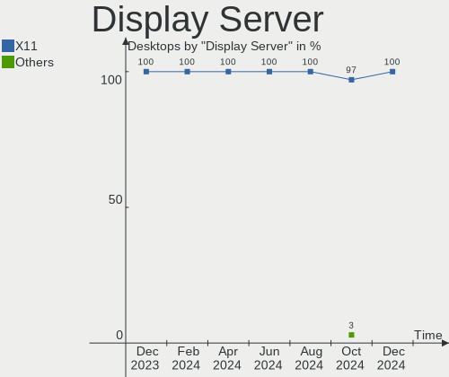
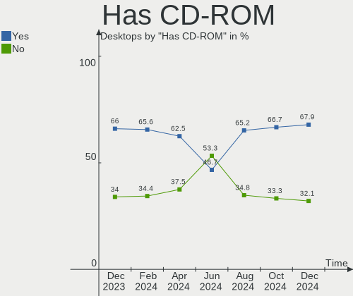
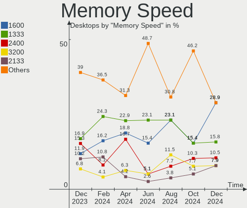

BlackPanther Hardware Trends (Desktops)
---------------------------------------

A project to identify most popular hardware characteristics and track their change
over time based on data collected by BlackPanther users at https://Linux-Hardware.org.

Anyone can contribute to this report by the [hw-probe](https://github.com/linuxhw/hw-probe) tool:

    sudo -E hw-probe -all -upload

Full-feature report is available here: https://linux-hardware.org/?view=trends

Period: Jan, 2022.

Contents
--------

* [ System ](#system)
  - [ OS                       ](#os)
  - [ OS Family                ](#os-family)
  - [ Kernel                   ](#kernel)
  - [ Kernel Family            ](#kernel-family)
  - [ Kernel Major Ver.        ](#kernel-major-ver)
  - [ Arch                     ](#arch)
  - [ DE                       ](#de)
  - [ Display Server           ](#display-server)
  - [ Display Manager          ](#display-manager)
  - [ OS Lang                  ](#os-lang)
  - [ Boot Mode                ](#boot-mode)
  - [ Filesystem               ](#filesystem)
  - [ Part. scheme             ](#part-scheme)
  - [ Dual Boot with Linux/BSD ](#dual-boot-with-linuxbsd)
  - [ Dual Boot (Win)          ](#dual-boot-win)

* [ Board ](#board)
  - [ Vendor                   ](#vendor)
  - [ Model                    ](#model)
  - [ Model Family             ](#model-family)
  - [ MFG Year                 ](#mfg-year)
  - [ Form Factor              ](#form-factor)
  - [ Secure Boot              ](#secure-boot)
  - [ Coreboot                 ](#coreboot)
  - [ RAM Size                 ](#ram-size)
  - [ RAM Used                 ](#ram-used)
  - [ Total Drives             ](#total-drives)
  - [ Has CD-ROM               ](#has-cd-rom)
  - [ Has Ethernet             ](#has-ethernet)
  - [ Has WiFi                 ](#has-wifi)
  - [ Has Bluetooth            ](#has-bluetooth)

* [ Location ](#location)
  - [ Country                  ](#country)
  - [ City                     ](#city)

* [ Drives ](#drives)
  - [ Drive Vendor             ](#drive-vendor)
  - [ Drive Model              ](#drive-model)
  - [ HDD Vendor               ](#hdd-vendor)
  - [ SSD Vendor               ](#ssd-vendor)
  - [ Drive Kind               ](#drive-kind)
  - [ Drive Connector          ](#drive-connector)
  - [ Drive Size               ](#drive-size)
  - [ Space Total              ](#space-total)
  - [ Space Used               ](#space-used)
  - [ Malfunc. Drives          ](#malfunc-drives)
  - [ Malfunc. Drive Vendor    ](#malfunc-drive-vendor)
  - [ Malfunc. HDD Vendor      ](#malfunc-hdd-vendor)
  - [ Malfunc. Drive Kind      ](#malfunc-drive-kind)
  - [ Failed Drives            ](#failed-drives)
  - [ Failed Drive Vendor      ](#failed-drive-vendor)
  - [ Drive Status             ](#drive-status)

* [ Storage controller ](#storage-controller)
  - [ Storage Vendor           ](#storage-vendor)
  - [ Storage Model            ](#storage-model)
  - [ Storage Kind             ](#storage-kind)

* [ Processor ](#processor)
  - [ CPU Vendor               ](#cpu-vendor)
  - [ CPU Model                ](#cpu-model)
  - [ CPU Model Family         ](#cpu-model-family)
  - [ CPU Cores                ](#cpu-cores)
  - [ CPU Sockets              ](#cpu-sockets)
  - [ CPU Threads              ](#cpu-threads)
  - [ CPU Op-Modes             ](#cpu-op-modes)
  - [ CPU Microcode            ](#cpu-microcode)
  - [ CPU Microarch            ](#cpu-microarch)

* [ Graphics ](#graphics)
  - [ GPU Vendor               ](#gpu-vendor)
  - [ GPU Model                ](#gpu-model)
  - [ GPU Combo                ](#gpu-combo)
  - [ GPU Driver               ](#gpu-driver)
  - [ GPU Memory               ](#gpu-memory)

* [ Monitor ](#monitor)
  - [ Monitor Vendor           ](#monitor-vendor)
  - [ Monitor Model            ](#monitor-model)
  - [ Monitor Resolution       ](#monitor-resolution)
  - [ Monitor Diagonal         ](#monitor-diagonal)
  - [ Monitor Width            ](#monitor-width)
  - [ Aspect Ratio             ](#aspect-ratio)
  - [ Monitor Area             ](#monitor-area)
  - [ Pixel Density            ](#pixel-density)
  - [ Multiple Monitors        ](#multiple-monitors)

* [ Network ](#network)
  - [ Net Controller Vendor    ](#net-controller-vendor)
  - [ Net Controller Model     ](#net-controller-model)
  - [ Wireless Vendor          ](#wireless-vendor)
  - [ Wireless Model           ](#wireless-model)
  - [ Ethernet Vendor          ](#ethernet-vendor)
  - [ Ethernet Model           ](#ethernet-model)
  - [ Net Controller Kind      ](#net-controller-kind)
  - [ Used Controller          ](#used-controller)
  - [ NICs                     ](#nics)
  - [ IPv6                     ](#ipv6)

* [ Bluetooth ](#bluetooth)
  - [ Bluetooth Vendor         ](#bluetooth-vendor)
  - [ Bluetooth Model          ](#bluetooth-model)

* [ Sound ](#sound)
  - [ Sound Vendor             ](#sound-vendor)
  - [ Sound Model              ](#sound-model)

* [ Memory ](#memory)
  - [ Memory Vendor            ](#memory-vendor)
  - [ Memory Model             ](#memory-model)
  - [ Memory Kind              ](#memory-kind)
  - [ Memory Form Factor       ](#memory-form-factor)
  - [ Memory Size              ](#memory-size)
  - [ Memory Speed             ](#memory-speed)

* [ Printers & scanners ](#printers--scanners)
  - [ Printer Vendor           ](#printer-vendor)
  - [ Printer Model            ](#printer-model)
  - [ Scanner Vendor           ](#scanner-vendor)
  - [ Scanner Model            ](#scanner-model)

* [ Camera ](#camera)
  - [ Camera Vendor            ](#camera-vendor)
  - [ Camera Model             ](#camera-model)

* [ Security ](#security)
  - [ Fingerprint Vendor       ](#fingerprint-vendor)
  - [ Fingerprint Model        ](#fingerprint-model)
  - [ Chipcard Vendor          ](#chipcard-vendor)
  - [ Chipcard Model           ](#chipcard-model)

* [ Unsupported ](#unsupported)
  - [ Unsupported Devices      ](#unsupported-devices)
  - [ Unsupported Device Types ](#unsupported-device-types)

System
------

OS
--

Installed operating systems

| Name              | Desktops | Percent |
|-------------------|----------|---------|
| BlackPanther 18.1 | 27       | 96.43%  |
| BlackPanther 16.2 | 1        | 3.57%   |

OS Family
---------

OS without a version

| Name         | Desktops | Percent |
|--------------|----------|---------|
| BlackPanther | 28       | 100%    |

Kernel
------

Version of the Linux kernel

| Version                | Desktops | Percent |
|------------------------|----------|---------|
| 5.6.14-desktop-2bP     | 20       | 71.43%  |
| 4.18.16-desktop-1bP    | 7        | 25%     |
| 4.9.20-desktop-pae-1bP | 1        | 3.57%   |

Kernel Family
-------------

Linux kernel without a distro release

| Version | Desktops | Percent |
|---------|----------|---------|
| 5.6.14  | 20       | 71.43%  |
| 4.18.16 | 7        | 25%     |
| 4.9.20  | 1        | 3.57%   |

Kernel Major Ver.
-----------------

Linux kernel major version

| Version | Desktops | Percent |
|---------|----------|---------|
| 5.6     | 20       | 71.43%  |
| 4.18    | 7        | 25%     |
| 4.9     | 1        | 3.57%   |

Arch
----

OS architecture (x86_64, i586, etc.)

| Name   | Desktops | Percent |
|--------|----------|---------|
| x86_64 | 27       | 96.43%  |
| i686   | 1        | 3.57%   |

DE
--

Desktop Environment

| Name | Desktops | Percent |
|------|----------|---------|
| KDE5 | 28       | 100%    |

Display Server
--------------

X11 or Wayland

| Name | Desktops | Percent |
|------|----------|---------|
| X11  | 28       | 100%    |

Display Manager
---------------

SDDM, LightDM, etc.

| Name | Desktops | Percent |
|------|----------|---------|
| SDDM | 28       | 100%    |

OS Lang
-------

Language

| Lang    | Desktops | Percent |
|---------|----------|---------|
| Unknown | 28       | 100%    |

Boot Mode
---------

EFI or BIOS

| Mode | Desktops | Percent |
|------|----------|---------|
| BIOS | 21       | 75%     |
| EFI  | 7        | 25%     |

Filesystem
----------

Type of filesystem

| Type    | Desktops | Percent |
|---------|----------|---------|
| Overlay | 25       | 89.29%  |
| Ext4    | 3        | 10.71%  |

Part. scheme
------------

Scheme of partitioning

| Type | Desktops | Percent |
|------|----------|---------|
| MBR  | 15       | 53.57%  |
| GPT  | 13       | 46.43%  |

Dual Boot with Linux/BSD
------------------------

Hosting more than one Linux/BSD

| Dual boot | Desktops | Percent |
|-----------|----------|---------|
| No        | 15       | 53.57%  |
| Yes       | 13       | 46.43%  |

Dual Boot (Win)
---------------

Hosting Linux and Windows

| Dual boot | Desktops | Percent |
|-----------|----------|---------|
| Yes       | 18       | 64.29%  |
| No        | 10       | 35.71%  |

Board
-----

Vendor
------

Motherboard manufacturer

| Name                | Desktops | Percent |
|---------------------|----------|---------|
| Gigabyte Technology | 7        | 25%     |
| Hewlett-Packard     | 5        | 17.86%  |
| ASUSTek Computer    | 4        | 14.29%  |
| MSI                 | 2        | 7.14%   |
| Medion              | 2        | 7.14%   |
| Fujitsu             | 2        | 7.14%   |
| Dell                | 2        | 7.14%   |
| ASRock              | 2        | 7.14%   |
| Lenovo              | 1        | 3.57%   |
| Unknown             | 1        | 3.57%   |

Model
-----

Motherboard model

| Name                                | Desktops | Percent |
|-------------------------------------|----------|---------|
| MSI MS-7846                         | 1        | 3.57%   |
| MSI MS-7642                         | 1        | 3.57%   |
| Medion MS-7748                      | 1        | 3.57%   |
| Medion MS-7646                      | 1        | 3.57%   |
| Lenovo ThinkCentre M77 1996AB8      | 1        | 3.57%   |
| HP ProDesk 600 G1 SFF               | 1        | 3.57%   |
| HP Compaq dc7800p Small Form Factor | 1        | 3.57%   |
| HP Compaq dc5850 Microtower         | 1        | 3.57%   |
| HP Compaq 8200 Elite USDT PC        | 1        | 3.57%   |
| HP Compaq 8000 Elite CMT PC         | 1        | 3.57%   |
| Gigabyte P35-S3G                    | 1        | 3.57%   |
| Gigabyte H61M-S2PV                  | 1        | 3.57%   |
| Gigabyte H61M-D2-B3                 | 1        | 3.57%   |
| Gigabyte H310M H 2.0                | 1        | 3.57%   |
| Gigabyte G41MT-S2PT                 | 1        | 3.57%   |
| Gigabyte F2A88XN-WIFI               | 1        | 3.57%   |
| Gigabyte B450M GAMING               | 1        | 3.57%   |
| Fujitsu ESPRIMO P7936               | 1        | 3.57%   |
| Fujitsu ESPRIMO P710                | 1        | 3.57%   |
| Dell OptiPlex 760                   | 1        | 3.57%   |
| Dell OptiPlex 7020                  | 1        | 3.57%   |
| ASUS VM40B                          | 1        | 3.57%   |
| ASUS PRIME H370-PLUS                | 1        | 3.57%   |
| ASUS P6T7 WS SUPERCOMPUTER          | 1        | 3.57%   |
| ASUS Crosshair IV Formula           | 1        | 3.57%   |
| ASRock G31M-VS                      | 1        | 3.57%   |
| ASRock B550M Pro4                   | 1        | 3.57%   |
| Unknown                             | 1        | 3.57%   |

Model Family
------------

Motherboard model prefix

| Name                  | Desktops | Percent |
|-----------------------|----------|---------|
| HP Compaq             | 4        | 14.29%  |
| Fujitsu ESPRIMO       | 2        | 7.14%   |
| Dell OptiPlex         | 2        | 7.14%   |
| MSI MS-7846           | 1        | 3.57%   |
| MSI MS-7642           | 1        | 3.57%   |
| Medion MS-7748        | 1        | 3.57%   |
| Medion MS-7646        | 1        | 3.57%   |
| Lenovo ThinkCentre    | 1        | 3.57%   |
| HP ProDesk            | 1        | 3.57%   |
| Gigabyte P35-S3G      | 1        | 3.57%   |
| Gigabyte H61M-S2PV    | 1        | 3.57%   |
| Gigabyte H61M-D2-B3   | 1        | 3.57%   |
| Gigabyte H310M        | 1        | 3.57%   |
| Gigabyte G41MT-S2PT   | 1        | 3.57%   |
| Gigabyte F2A88XN-WIFI | 1        | 3.57%   |
| Gigabyte B450M        | 1        | 3.57%   |
| ASUS VM40B            | 1        | 3.57%   |
| ASUS PRIME            | 1        | 3.57%   |
| ASUS P6T7             | 1        | 3.57%   |
| ASUS Crosshair        | 1        | 3.57%   |
| ASRock G31M-VS        | 1        | 3.57%   |
| ASRock B550M          | 1        | 3.57%   |
| Unknown               | 1        | 3.57%   |

MFG Year
--------

Motherboard manufacture year

| Year | Desktops | Percent |
|------|----------|---------|
| 2013 | 4        | 14.29%  |
| 2012 | 4        | 14.29%  |
| 2011 | 4        | 14.29%  |
| 2010 | 4        | 14.29%  |
| 2018 | 2        | 7.14%   |
| 2014 | 2        | 7.14%   |
| 2009 | 2        | 7.14%   |
| 2007 | 2        | 7.14%   |
| 2020 | 1        | 3.57%   |
| 2019 | 1        | 3.57%   |
| 2008 | 1        | 3.57%   |
| 2006 | 1        | 3.57%   |

Form Factor
-----------

Physical design of the computer

| Name    | Desktops | Percent |
|---------|----------|---------|
| Desktop | 28       | 100%    |

Secure Boot
-----------

Enabled or disabled

| State    | Desktops | Percent |
|----------|----------|---------|
| Disabled | 28       | 100%    |

Coreboot
--------

Have coreboot on board

| Used | Desktops | Percent |
|------|----------|---------|
| No   | 28       | 100%    |

RAM Size
--------

Total RAM memory

| Size in GB | Desktops | Percent |
|------------|----------|---------|
| 8.01-16.0  | 13       | 46.43%  |
| 3.01-4.0   | 7        | 25%     |
| 4.01-8.0   | 4        | 14.29%  |
| 16.01-24.0 | 2        | 7.14%   |
| 24.01-32.0 | 1        | 3.57%   |
| 1.01-2.0   | 1        | 3.57%   |

RAM Used
--------

Used RAM memory

| Used GB  | Desktops | Percent |
|----------|----------|---------|
| 0.01-0.5 | 16       | 57.14%  |
| 0.51-1.0 | 10       | 35.71%  |
| 1.01-2.0 | 2        | 7.14%   |

Total Drives
------------

Number of drives on board

| Drives | Desktops | Percent |
|--------|----------|---------|
| 1      | 15       | 53.57%  |
| 2      | 7        | 25%     |
| 4      | 4        | 14.29%  |
| 3      | 1        | 3.57%   |
| 0      | 1        | 3.57%   |

Has CD-ROM
----------

Has CD-ROM on board

| Presented | Desktops | Percent |
|-----------|----------|---------|
| Yes       | 18       | 64.29%  |
| No        | 10       | 35.71%  |

Has Ethernet
------------

Has Ethernet on board

| Presented | Desktops | Percent |
|-----------|----------|---------|
| Yes       | 28       | 100%    |

Has WiFi
--------

Has WiFi module

| Presented | Desktops | Percent |
|-----------|----------|---------|
| No        | 20       | 71.43%  |
| Yes       | 8        | 28.57%  |

Has Bluetooth
-------------

Has Bluetooth module

| Presented | Desktops | Percent |
|-----------|----------|---------|
| No        | 25       | 89.29%  |
| Yes       | 3        | 10.71%  |

Location
--------

Country
-------

Geographic location (country)

| Country   | Desktops | Percent |
|-----------|----------|---------|
| Hungary   | 24       | 85.71%  |
| Germany   | 2        | 7.14%   |
| Romania   | 1        | 3.57%   |
| Argentina | 1        | 3.57%   |

City
----

Geographic location (city)

| City             | Desktops | Percent |
|------------------|----------|---------|
| Budapest         | 4        | 14.29%  |
| P?©cs            | 2        | 7.14%   |
| Celldomolk       | 2        | 7.14%   |
| Tatab??nya       | 1        | 3.57%   |
| Tarnaszentmiklos | 1        | 3.57%   |
| Tapioszentmarton | 1        | 3.57%   |
| Szentantalfa     | 1        | 3.57%   |
| Stuttgart        | 1        | 3.57%   |
| Roszke           | 1        | 3.57%   |
| Pecel            | 1        | 3.57%   |
| Nagykata         | 1        | 3.57%   |
| Moron            | 1        | 3.57%   |
| Lebeny           | 1        | 3.57%   |
| Hajduboszormeny  | 1        | 3.57%   |
| Gy?‘r            | 1        | 3.57%   |
| Fuzesabony       | 1        | 3.57%   |
| Fonyod           | 1        | 3.57%   |
| Esztergom        | 1        | 3.57%   |
| Eger             | 1        | 3.57%   |
| Duna??jv??ros    | 1        | 3.57%   |
| Bucharest        | 1        | 3.57%   |
| Balatonfured     | 1        | 3.57%   |
| Augsburg         | 1        | 3.57%   |

Drives
------

Drive Vendor
------------

Hard drive vendors

| Vendor              | Desktops | Drives | Percent |
|---------------------|----------|--------|---------|
| WDC                 | 10       | 12     | 20.83%  |
| Seagate             | 9        | 11     | 18.75%  |
| Samsung Electronics | 6        | 7      | 12.5%   |
| Kingston            | 4        | 4      | 8.33%   |
| A-DATA Technology   | 4        | 4      | 8.33%   |
| Toshiba             | 3        | 3      | 6.25%   |
| Hitachi             | 3        | 3      | 6.25%   |
| MAXTOR              | 2        | 2      | 4.17%   |
| LITEON              | 1        | 1      | 2.08%   |
| Intenso             | 1        | 2      | 2.08%   |
| HGST                | 1        | 1      | 2.08%   |
| Gigabyte Technology | 1        | 1      | 2.08%   |
| Crucial             | 1        | 1      | 2.08%   |
| China               | 1        | 1      | 2.08%   |
| Apacer              | 1        | 1      | 2.08%   |

Drive Model
-----------

Hard drive models

| Model                                | Desktops | Percent |
|--------------------------------------|----------|---------|
| Seagate ST1000DM010-2EP102 1TB       | 2        | 3.77%   |
| A-DATA SU650 120GB SSD               | 2        | 3.77%   |
| WDC WD800AAJS-60PSA0 80GB            | 1        | 1.89%   |
| WDC WD5000BPVT-22HXZT1 500GB         | 1        | 1.89%   |
| WDC WD5000AAKS-00TMA0 500GB          | 1        | 1.89%   |
| WDC WD30EZRZ-00Z5HB0 3TB             | 1        | 1.89%   |
| WDC WD3000HLFS-01G6U1 304GB          | 1        | 1.89%   |
| WDC WD2500AAKX-07U6AA0 250GB         | 1        | 1.89%   |
| WDC WD2500AAJS-75B4A0 250GB          | 1        | 1.89%   |
| WDC WD2500AAJS-07M0A0 250GB          | 1        | 1.89%   |
| WDC WD20EZRX-00D8PB0 2TB             | 1        | 1.89%   |
| WDC WD1600AAJB-56WRA0 160GB          | 1        | 1.89%   |
| WDC WD10EZRX-00A8LB0 1TB             | 1        | 1.89%   |
| WDC WD10EZEX-21WN4A0 1TB             | 1        | 1.89%   |
| Toshiba THNSFJ256GCSU 256GB SSD      | 1        | 1.89%   |
| Toshiba MK1237GSX 120GB              | 1        | 1.89%   |
| Toshiba DT01ACA200 2TB               | 1        | 1.89%   |
| Seagate ST9250315AS 250GB            | 1        | 1.89%   |
| Seagate ST500DM002-1BD142 500GB      | 1        | 1.89%   |
| Seagate ST4000DM004-2CV104 4TB       | 1        | 1.89%   |
| Seagate ST4000DM000-1F2168 4TB       | 1        | 1.89%   |
| Seagate ST380815AS 80GB              | 1        | 1.89%   |
| Seagate ST3500410SV 500GB            | 1        | 1.89%   |
| Seagate ST3160815AS 160GB            | 1        | 1.89%   |
| Seagate ST2000DM008-2FR102 2TB       | 1        | 1.89%   |
| Seagate ST2000DM001-1CH164 2TB       | 1        | 1.89%   |
| Samsung SSD 870 EVO 250GB            | 1        | 1.89%   |
| Samsung SSD 850 EVO 120GB            | 1        | 1.89%   |
| Samsung SP2004C 200GB                | 1        | 1.89%   |
| Samsung MZ7TE128HMGR-000L1 128GB SSD | 1        | 1.89%   |
| Samsung HD502IJ 500GB                | 1        | 1.89%   |
| Samsung HD154UI 1TB                  | 1        | 1.89%   |
| MAXTOR STM380215A 80GB               | 1        | 1.89%   |
| MAXTOR 6V250F0 256GB                 | 1        | 1.89%   |
| LITEON CV8-8E128-HP 128GB SSD        | 1        | 1.89%   |
| Kingston SH103S3120G 120GB SSD       | 1        | 1.89%   |
| Kingston SA400S37240G 240GB SSD      | 1        | 1.89%   |
| Kingston SA400S37120G 120GB SSD      | 1        | 1.89%   |
| Kingston SA2000M8250G 250GB          | 1        | 1.89%   |
| Intenso SSD 128GB                    | 1        | 1.89%   |
| Intenso SSD 120GB                    | 1        | 1.89%   |
| Hitachi HTS543232A7A384 320GB        | 1        | 1.89%   |
| Hitachi HDS721010CLA332 1TB          | 1        | 1.89%   |
| Hitachi HDP725025GLA380 250GB        | 1        | 1.89%   |
| HGST HTS541010B7E610 1TB             | 1        | 1.89%   |
| Gigabyte GP-GSTFS31120GNTD 120GB SSD | 1        | 1.89%   |
| Crucial CT1000P1SSD8 1TB             | 1        | 1.89%   |
| China SSD 120GB                      | 1        | 1.89%   |
| Apacer AS340 240GB SSD               | 1        | 1.89%   |
| A-DATA SU630 240GB SSD               | 1        | 1.89%   |
| A-DATA SP920SS 128GB SSD             | 1        | 1.89%   |

HDD Vendor
----------

Hard disk drive vendors

| Vendor              | Desktops | Drives | Percent |
|---------------------|----------|--------|---------|
| WDC                 | 10       | 12     | 33.33%  |
| Seagate             | 9        | 11     | 30%     |
| Samsung Electronics | 3        | 4      | 10%     |
| Hitachi             | 3        | 3      | 10%     |
| Toshiba             | 2        | 2      | 6.67%   |
| MAXTOR              | 2        | 2      | 6.67%   |
| HGST                | 1        | 1      | 3.33%   |

SSD Vendor
----------

Solid state drive vendors

| Vendor              | Desktops | Drives | Percent |
|---------------------|----------|--------|---------|
| A-DATA Technology   | 4        | 4      | 25%     |
| Samsung Electronics | 3        | 3      | 18.75%  |
| Kingston            | 3        | 3      | 18.75%  |
| Toshiba             | 1        | 1      | 6.25%   |
| LITEON              | 1        | 1      | 6.25%   |
| Intenso             | 1        | 2      | 6.25%   |
| Gigabyte Technology | 1        | 1      | 6.25%   |
| China               | 1        | 1      | 6.25%   |
| Apacer              | 1        | 1      | 6.25%   |

Drive Kind
----------

HDD or SSD

| Kind | Desktops | Drives | Percent |
|------|----------|--------|---------|
| HDD  | 24       | 35     | 58.54%  |
| SSD  | 15       | 17     | 36.59%  |
| NVMe | 2        | 2      | 4.88%   |

Drive Connector
---------------

SATA, SAS, NVMe, etc.

| Type | Desktops | Drives | Percent |
|------|----------|--------|---------|
| SATA | 26       | 52     | 92.86%  |
| NVMe | 2        | 2      | 7.14%   |

Drive Size
----------

Size of hard drive

| Size in TB | Desktops | Drives | Percent |
|------------|----------|--------|---------|
| 0.01-0.5   | 22       | 37     | 61.11%  |
| 0.51-1.0   | 7        | 8      | 19.44%  |
| 1.01-2.0   | 4        | 4      | 11.11%  |
| 3.01-4.0   | 2        | 2      | 5.56%   |
| 2.01-3.0   | 1        | 1      | 2.78%   |

Space Total
-----------

Amount of disk space available on the file system

| Size in GB | Desktops | Percent |
|------------|----------|---------|
| Unknown    | 26       | 92.86%  |
| 101-250    | 2        | 7.14%   |

Space Used
----------

Amount of used disk space

| Used GB | Desktops | Percent |
|---------|----------|---------|
| Unknown | 26       | 92.86%  |
| 1-20    | 2        | 7.14%   |

Malfunc. Drives
---------------

Drive models with a malfunction

| Model                               | Desktops | Drives | Percent |
|-------------------------------------|----------|--------|---------|
| WDC WD5000BPVT-22HXZT1 500GB        | 1        | 1      | 6.25%   |
| WDC WD2500AAJS-75B4A0 250GB         | 1        | 1      | 6.25%   |
| WDC WD2500AAJS-07M0A0 250GB         | 1        | 1      | 6.25%   |
| WDC WD10EZRX-00A8LB0 1TB            | 1        | 1      | 6.25%   |
| Toshiba THNSFJ256GCSU 256GB SSD     | 1        | 1      | 6.25%   |
| Toshiba MK1237GSX 120GB             | 1        | 1      | 6.25%   |
| Seagate ST9250315AS 250GB           | 1        | 1      | 6.25%   |
| Seagate ST500DM002-1BD142 500GB     | 1        | 1      | 6.25%   |
| Seagate ST4000DM000-1F2168 4TB      | 1        | 1      | 6.25%   |
| Seagate ST380815AS 80GB             | 1        | 1      | 6.25%   |
| Seagate ST3500410SV 500GB           | 1        | 1      | 6.25%   |
| Samsung Electronics SP2004C 200GB   | 1        | 1      | 6.25%   |
| MAXTOR STM380215A 80GB              | 1        | 1      | 6.25%   |
| MAXTOR 6V250F0 256GB                | 1        | 1      | 6.25%   |
| LITEON CV8-8E128-HP 128GB SSD       | 1        | 1      | 6.25%   |
| A-DATA Technology SP920SS 128GB SSD | 1        | 1      | 6.25%   |

Malfunc. Drive Vendor
---------------------

Vendors of faulty drives

| Vendor              | Desktops | Drives | Percent |
|---------------------|----------|--------|---------|
| Seagate             | 5        | 5      | 31.25%  |
| WDC                 | 4        | 4      | 25%     |
| Toshiba             | 2        | 2      | 12.5%   |
| MAXTOR              | 2        | 2      | 12.5%   |
| Samsung Electronics | 1        | 1      | 6.25%   |
| LITEON              | 1        | 1      | 6.25%   |
| A-DATA Technology   | 1        | 1      | 6.25%   |

Malfunc. HDD Vendor
-------------------

Vendors of faulty HDD drives

| Vendor              | Desktops | Drives | Percent |
|---------------------|----------|--------|---------|
| Seagate             | 5        | 5      | 38.46%  |
| WDC                 | 4        | 4      | 30.77%  |
| MAXTOR              | 2        | 2      | 15.38%  |
| Toshiba             | 1        | 1      | 7.69%   |
| Samsung Electronics | 1        | 1      | 7.69%   |

Malfunc. Drive Kind
-------------------

Kinds of faulty drives

| Kind | Desktops | Drives | Percent |
|------|----------|--------|---------|
| HDD  | 11       | 13     | 78.57%  |
| SSD  | 3        | 3      | 21.43%  |

Failed Drives
-------------

Failed drive models

Zero info for selected period =(

Failed Drive Vendor
-------------------

Failed drive vendors

Zero info for selected period =(

Drive Status
------------

Number of failed and malfunc. drives

| Status  | Desktops | Drives | Percent |
|---------|----------|--------|---------|
| Works   | 23       | 38     | 63.89%  |
| Malfunc | 13       | 16     | 36.11%  |

Storage controller
------------------

Storage Vendor
--------------

Storage controller vendors

| Vendor                      | Desktops | Percent |
|-----------------------------|----------|---------|
| Intel                       | 18       | 51.43%  |
| AMD                         | 9        | 25.71%  |
| JMicron Technology          | 3        | 8.57%   |
| VIA Technologies            | 2        | 5.71%   |
| Micron/Crucial Technology   | 1        | 2.86%   |
| Marvell Technology Group    | 1        | 2.86%   |
| Kingston Technology Company | 1        | 2.86%   |

Storage Model
-------------

Storage controller models

| Model                                                                                   | Desktops | Percent |
|-----------------------------------------------------------------------------------------|----------|---------|
| AMD SB7x0/SB8x0/SB9x0 SATA Controller [IDE mode]                                        | 4        | 8.51%   |
| Intel 82801JD/DO (ICH10 Family) SATA AHCI Controller                                    | 3        | 6.38%   |
| Intel 8 Series/C220 Series Chipset Family 6-port SATA Controller 1 [AHCI mode]          | 3        | 6.38%   |
| AMD SB7x0/SB8x0/SB9x0 IDE Controller                                                    | 3        | 6.38%   |
| JMicron JMB368 IDE controller                                                           | 2        | 4.26%   |
| Intel NM10/ICH7 Family SATA Controller [IDE mode]                                       | 2        | 4.26%   |
| Intel 82801G (ICH7 Family) IDE Controller                                               | 2        | 4.26%   |
| Intel 6 Series/C200 Series Chipset Family 6 port Desktop SATA AHCI Controller           | 2        | 4.26%   |
| Intel 4 Series Chipset PT IDER Controller                                               | 2        | 4.26%   |
| AMD FCH SATA Controller [AHCI mode]                                                     | 2        | 4.26%   |
| VIA VT82C586A/B/VT82C686/A/B/VT823x/A/C PIPC Bus Master IDE                             | 1        | 2.13%   |
| VIA VT6421 IDE/SATA Controller                                                          | 1        | 2.13%   |
| VIA VIA VT6420 SATA RAID Controller                                                     | 1        | 2.13%   |
| Micron/Crucial NVMe Controller                                                          | 1        | 2.13%   |
| Marvell Group 88SE6111/6121 SATA II / PATA Controller                                   | 1        | 2.13%   |
| Kingston Company A2000 NVMe SSD                                                         | 1        | 2.13%   |
| JMicron JMB363 SATA/IDE Controller                                                      | 1        | 2.13%   |
| Intel SATA Controller [RAID mode]                                                       | 1        | 2.13%   |
| Intel 82Q35 Express PT IDER Controller                                                  | 1        | 2.13%   |
| Intel 82801JI (ICH10 Family) 4 port SATA IDE Controller #1                              | 1        | 2.13%   |
| Intel 82801JI (ICH10 Family) 2 port SATA IDE Controller #2                              | 1        | 2.13%   |
| Intel 82801IR/IO/IH (ICH9R/DO/DH) 4 port SATA Controller [IDE mode]                     | 1        | 2.13%   |
| Intel 82801IB (ICH9) 4 port SATA Controller [AHCI mode]                                 | 1        | 2.13%   |
| Intel 82801I (ICH9 Family) 2 port SATA Controller [IDE mode]                            | 1        | 2.13%   |
| Intel 7 Series/C210 Series Chipset Family 6-port SATA Controller [AHCI mode]            | 1        | 2.13%   |
| Intel 7 Series Chipset Family 6-port SATA Controller [AHCI mode]                        | 1        | 2.13%   |
| Intel 6 Series/C200 Series Chipset Family Desktop SATA Controller (IDE mode, ports 4-5) | 1        | 2.13%   |
| Intel 6 Series/C200 Series Chipset Family Desktop SATA Controller (IDE mode, ports 0-3) | 1        | 2.13%   |
| Intel 200 Series PCH SATA controller [AHCI mode]                                        | 1        | 2.13%   |
| AMD Starship/Matisse Chipset SATA Controller [AHCI mode]                                | 1        | 2.13%   |
| AMD SB7x0/SB8x0/SB9x0 SATA Controller [AHCI mode]                                       | 1        | 2.13%   |
| AMD 400 Series Chipset SATA Controller                                                  | 1        | 2.13%   |

Storage Kind
------------

Kind of storage controller (IDE, SATA, NVMe, SAS, ...)

| Kind | Desktops | Percent |
|------|----------|---------|
| SATA | 21       | 56.76%  |
| IDE  | 12       | 32.43%  |
| RAID | 2        | 5.41%   |
| NVMe | 2        | 5.41%   |

Processor
---------

CPU Vendor
----------

Processor vendors

| Vendor | Desktops | Percent |
|--------|----------|---------|
| Intel  | 19       | 67.86%  |
| AMD    | 9        | 32.14%  |

CPU Model
---------

Processor models

| Model                                           | Desktops | Percent |
|-------------------------------------------------|----------|---------|
| Intel Core 2 Duo CPU E8400 @ 3.00GHz            | 3        | 10.71%  |
| Intel Core i3-2120 CPU @ 3.30GHz                | 2        | 7.14%   |
| Intel Core 2 Quad CPU Q6600 @ 2.40GHz           | 2        | 7.14%   |
| AMD Phenom II X6 1090T Processor                | 2        | 7.14%   |
| Intel Pentium Gold G5400 CPU @ 3.70GHz          | 1        | 3.57%   |
| Intel Pentium CPU G840 @ 2.80GHz                | 1        | 3.57%   |
| Intel Pentium CPU G3420 @ 3.20GHz               | 1        | 3.57%   |
| Intel Pentium CPU G3240 @ 3.10GHz               | 1        | 3.57%   |
| Intel Pentium 4 CPU 3.00GHz                     | 1        | 3.57%   |
| Intel Core i7 CPU X 980 @ 3.33GHz               | 1        | 3.57%   |
| Intel Core i5-8500 CPU @ 3.00GHz                | 1        | 3.57%   |
| Intel Core i5-2500S CPU @ 2.70GHz               | 1        | 3.57%   |
| Intel Core 2 Quad CPU Q9300 @ 2.50GHz           | 1        | 3.57%   |
| Intel Core 2 Duo CPU E4600 @ 2.40GHz            | 1        | 3.57%   |
| Intel Celeron CPU G1840 @ 2.80GHz               | 1        | 3.57%   |
| Intel Celeron CPU 1017U @ 1.60GHz               | 1        | 3.57%   |
| AMD Ryzen 7 3700X 8-Core Processor              | 1        | 3.57%   |
| AMD Ryzen 5 3400G with Radeon Vega Graphics     | 1        | 3.57%   |
| AMD FX-4100 Quad-Core Processor                 | 1        | 3.57%   |
| AMD Athlon II X4 620 Processor                  | 1        | 3.57%   |
| AMD Athlon 64 X2 Dual Core Processor 5200+      | 1        | 3.57%   |
| AMD A8-3800 APU with Radeon HD Graphics         | 1        | 3.57%   |
| AMD A10-7890K Radeon R7, 12 Compute Cores 4C+8G | 1        | 3.57%   |

CPU Model Family
----------------

Processor model prefix

| Model              | Desktops | Percent |
|--------------------|----------|---------|
| Intel Core 2 Duo   | 4        | 14.29%  |
| Intel Pentium      | 3        | 10.71%  |
| Intel Core 2 Quad  | 3        | 10.71%  |
| Intel Core i5      | 2        | 7.14%   |
| Intel Core i3      | 2        | 7.14%   |
| Intel Celeron      | 2        | 7.14%   |
| AMD Phenom II X6   | 2        | 7.14%   |
| Intel Pentium Gold | 1        | 3.57%   |
| Intel Pentium 4    | 1        | 3.57%   |
| Intel Core i7      | 1        | 3.57%   |
| AMD Ryzen 7        | 1        | 3.57%   |
| AMD Ryzen 5        | 1        | 3.57%   |
| AMD FX             | 1        | 3.57%   |
| AMD Athlon II X4   | 1        | 3.57%   |
| AMD Athlon 64 X2   | 1        | 3.57%   |
| AMD A8             | 1        | 3.57%   |
| AMD A10            | 1        | 3.57%   |

CPU Cores
---------

Number of processor cores

| Number | Desktops | Percent |
|--------|----------|---------|
| 2      | 15       | 53.57%  |
| 4      | 7        | 25%     |
| 6      | 4        | 14.29%  |
| 8      | 1        | 3.57%   |
| 1      | 1        | 3.57%   |

CPU Sockets
-----------

Number of sockets

| Number | Desktops | Percent |
|--------|----------|---------|
| 1      | 28       | 100%    |

CPU Threads
-----------

Threads per core (Hyper-Threading)

| Number | Desktops | Percent |
|--------|----------|---------|
| 1      | 19       | 67.86%  |
| 2      | 9        | 32.14%  |

CPU Op-Modes
------------

CPU Operation Modes (32-bit, 64-bit)

| Op mode        | Desktops | Percent |
|----------------|----------|---------|
| 32-bit, 64-bit | 28       | 100%    |

CPU Microcode
-------------

Microcode number

| Number     | Desktops | Percent |
|------------|----------|---------|
| 0x206a7    | 4        | 14.29%  |
| 0x306c3    | 3        | 10.71%  |
| 0x1067a    | 3        | 10.71%  |
| 0x906ea    | 2        | 7.14%   |
| 0x6fb      | 2        | 7.14%   |
| 0x010000dc | 2        | 7.14%   |
| 0xf43      | 1        | 3.57%   |
| 0x6fd      | 1        | 3.57%   |
| 0x306a9    | 1        | 3.57%   |
| 0x206c2    | 1        | 3.57%   |
| 0x10677    | 1        | 3.57%   |
| 0x08701021 | 1        | 3.57%   |
| 0x08108109 | 1        | 3.57%   |
| 0x06003106 | 1        | 3.57%   |
| 0x0600063e | 1        | 3.57%   |
| 0x03000027 | 1        | 3.57%   |
| 0x010000db | 1        | 3.57%   |
| Unknown    | 1        | 3.57%   |

CPU Microarch
-------------

Microarchitecture

| Name        | Desktops | Percent |
|-------------|----------|---------|
| SandyBridge | 4        | 14.29%  |
| Penryn      | 4        | 14.29%  |
| K10         | 3        | 10.71%  |
| Haswell     | 3        | 10.71%  |
| Core        | 3        | 10.71%  |
| KabyLake    | 2        | 7.14%   |
| Zen+        | 1        | 3.57%   |
| Zen 2       | 1        | 3.57%   |
| Westmere    | 1        | 3.57%   |
| Steamroller | 1        | 3.57%   |
| NetBurst    | 1        | 3.57%   |
| K8 Hammer   | 1        | 3.57%   |
| K10 Llano   | 1        | 3.57%   |
| IvyBridge   | 1        | 3.57%   |
| Bulldozer   | 1        | 3.57%   |

Graphics
--------

GPU Vendor
----------

Vendors of graphics cards

| Vendor           | Desktops | Percent |
|------------------|----------|---------|
| AMD              | 12       | 41.38%  |
| Intel            | 9        | 31.03%  |
| Nvidia           | 7        | 24.14%  |
| VIA Technologies | 1        | 3.45%   |

GPU Model
---------

Graphics card models

| Model                                                                         | Desktops | Percent |
|-------------------------------------------------------------------------------|----------|---------|
| Intel Xeon E3-1200 v3/4th Gen Core Processor Integrated Graphics Controller   | 3        | 10.34%  |
| Nvidia GT218 [GeForce 210]                                                    | 2        | 6.9%    |
| Intel 4 Series Chipset Integrated Graphics Controller                         | 2        | 6.9%    |
| VIA Technologies CN700/P4M800 Pro/P4M800 CE/VN800 Graphics [S3 UniChrome Pro] | 1        | 3.45%   |
| Nvidia GK208B [GeForce GT 710]                                                | 1        | 3.45%   |
| Nvidia GF119 [GeForce GT 610]                                                 | 1        | 3.45%   |
| Nvidia GF116 [GeForce GTX 550 Ti]                                             | 1        | 3.45%   |
| Nvidia GF114 [GeForce GTX 560]                                                | 1        | 3.45%   |
| Nvidia GF108 [GeForce GT 630]                                                 | 1        | 3.45%   |
| Intel CoffeeLake-S GT1 [UHD Graphics 610]                                     | 1        | 3.45%   |
| Intel 82Q35 Express Integrated Graphics Controller                            | 1        | 3.45%   |
| Intel 3rd Gen Core processor Graphics Controller                              | 1        | 3.45%   |
| Intel 2nd Generation Core Processor Family Integrated Graphics Controller     | 1        | 3.45%   |
| AMD Turks XT [Radeon HD 6670/7670]                                            | 1        | 3.45%   |
| AMD Sumo [Radeon HD 6550D]                                                    | 1        | 3.45%   |
| AMD RV630 XT [Radeon HD 2600 XT]                                              | 1        | 3.45%   |
| AMD RS880 [Radeon HD 4250]                                                    | 1        | 3.45%   |
| AMD RS780C [Radeon 3100]                                                      | 1        | 3.45%   |
| AMD Picasso/Raven 2 [Radeon Vega Series / Radeon Vega Mobile Series]          | 1        | 3.45%   |
| AMD Oland XT [Radeon HD 8670 / R5 340X OEM / R7 250/350/350X OEM]             | 1        | 3.45%   |
| AMD Oland PRO [Radeon R7 240/340 / Radeon 520]                                | 1        | 3.45%   |
| AMD Navi 22 [Radeon RX 6700/6700 XT / 6800M]                                  | 1        | 3.45%   |
| AMD Kaveri [Radeon R7 Graphics]                                               | 1        | 3.45%   |
| AMD Cypress XT [Radeon HD 5870]                                               | 1        | 3.45%   |
| AMD Caicos XT [Radeon HD 7470/8470 / R5 235/310 OEM]                          | 1        | 3.45%   |

GPU Combo
---------

Combinations of graphics cards

| Name       | Desktops | Percent |
|------------|----------|---------|
| 1 x AMD    | 12       | 42.86%  |
| 1 x Intel  | 8        | 28.57%  |
| 1 x Nvidia | 7        | 25%     |
| 1 x VIA    | 1        | 3.57%   |

GPU Driver
----------

Free vs proprietary

| Driver  | Desktops | Percent |
|---------|----------|---------|
| Free    | 26       | 92.86%  |
| Unknown | 2        | 7.14%   |

GPU Memory
----------

Total video memory

| Size in GB | Desktops | Percent |
|------------|----------|---------|
| 0.51-1.0   | 11       | 39.29%  |
| Unknown    | 9        | 32.14%  |
| 0.01-0.5   | 4        | 14.29%  |
| 1.01-2.0   | 3        | 10.71%  |
| 3.01-4.0   | 1        | 3.57%   |

Monitor
-------

Monitor Vendor
--------------

Monitor vendors

| Vendor               | Desktops | Percent |
|----------------------|----------|---------|
| Samsung Electronics  | 6        | 23.08%  |
| Dell                 | 3        | 11.54%  |
| Ancor Communications | 3        | 11.54%  |
| Goldstar             | 2        | 7.69%   |
| Belinea              | 2        | 7.69%   |
| Acer                 | 2        | 7.69%   |
| Philips              | 1        | 3.85%   |
| Orion                | 1        | 3.85%   |
| OEM                  | 1        | 3.85%   |
| Medion               | 1        | 3.85%   |
| Lenovo               | 1        | 3.85%   |
| Hewlett-Packard      | 1        | 3.85%   |
| HannStar             | 1        | 3.85%   |
| BenQ                 | 1        | 3.85%   |

Monitor Model
-------------

Monitor models

| Model                                                                   | Desktops | Percent |
|-------------------------------------------------------------------------|----------|---------|
| Samsung Electronics SyncMaster SAM03E4 1680x1050 474x296mm 22.0-inch    | 1        | 3.85%   |
| Samsung Electronics SyncMaster SAM036F 1440x900 428x255mm 19.6-inch     | 1        | 3.85%   |
| Samsung Electronics SyncMaster SAM01E1 1280x1024 376x301mm 19.0-inch    | 1        | 3.85%   |
| Samsung Electronics S27E500 SAM0D0D 1920x1080 598x336mm 27.0-inch       | 1        | 3.85%   |
| Samsung Electronics S24B350 SAM08D8 1920x1080 521x293mm 23.5-inch       | 1        | 3.85%   |
| Samsung Electronics LCD Monitor SAM7016 3840x2160 1872x1053mm 84.6-inch | 1        | 3.85%   |
| Philips FTV PHL01EA 1920x1080 1440x810mm 65.0-inch                      | 1        | 3.85%   |
| Orion ORION ORN0105 1280x720                                            | 1        | 3.85%   |
| OEM 37W_LCD_TV OEM3700 1920x1080                                        | 1        | 3.85%   |
| Medion MD20328 MED3941 1600x900 462x272mm 21.1-inch                     | 1        | 3.85%   |
| Lenovo LT2252p Wide LEN0A0C 1680x1050 474x296mm 22.0-inch               | 1        | 3.85%   |
| Hewlett-Packard w2207 HWP26A9 1680x1050 473x296mm 22.0-inch             | 1        | 3.85%   |
| HannStar HannsG HS191D HSD0013 1280x1024 376x301mm 19.0-inch            | 1        | 3.85%   |
| Goldstar L1918S GSM4B31 1280x1024 376x301mm 19.0-inch                   | 1        | 3.85%   |
| Goldstar 27MP55 GSM5A1D 1920x1080 510x290mm 23.1-inch                   | 1        | 3.85%   |
| Dell SE2717H/HX DELD0A1 1920x1080 600x340mm 27.2-inch                   | 1        | 3.85%   |
| Dell IN2020 DELF028 1600x900 443x249mm 20.0-inch                        | 1        | 3.85%   |
| Dell E170S DELA04A 1280x1024 338x270mm 17.0-inch                        | 1        | 3.85%   |
| BenQ G700 BNQ7801 1280x1024 338x270mm 17.0-inch                         | 1        | 3.85%   |
| Belinea B102035W MAX07D5 1680x1050 433x270mm 20.1-inch                  | 1        | 3.85%   |
| Belinea 101920 MAX0778 1280x1024 376x301mm 19.0-inch                    | 1        | 3.85%   |
| Ancor Communications VW195 ACI19AB 1440x900 408x255mm 18.9-inch         | 1        | 3.85%   |
| Ancor Communications ASUS VS207 ACI20C1 1366x768 434x236mm 19.4-inch    | 1        | 3.85%   |
| Ancor Communications ASUS VH192 ACI19E4 1366x768 410x230mm 18.5-inch    | 1        | 3.85%   |
| Acer V193W ACR0025 1440x900 408x255mm 18.9-inch                         | 1        | 3.85%   |
| Acer KA220HQ ACR0497 1920x1080 477x268mm 21.5-inch                      | 1        | 3.85%   |

Monitor Resolution
------------------

Monitor screen resolution

| Resolution         | Desktops | Percent |
|--------------------|----------|---------|
| 1920x1080 (FHD)    | 6        | 23.08%  |
| 1280x1024 (SXGA)   | 5        | 19.23%  |
| 1680x1050 (WSXGA+) | 4        | 15.38%  |
| 1440x900 (WXGA+)   | 4        | 15.38%  |
| 1600x900 (HD+)     | 2        | 7.69%   |
| 1366x768 (WXGA)    | 2        | 7.69%   |
| 3840x2160 (4K)     | 1        | 3.85%   |
| 1920x540           | 1        | 3.85%   |
| 1280x720 (HD)      | 1        | 3.85%   |

Monitor Diagonal
----------------

Diagonal size in inches

| Inches  | Desktops | Percent |
|---------|----------|---------|
| 19      | 7        | 26.92%  |
| 22      | 3        | 11.54%  |
| 27      | 2        | 7.69%   |
| 23      | 2        | 7.69%   |
| 21      | 2        | 7.69%   |
| 20      | 2        | 7.69%   |
| 18      | 2        | 7.69%   |
| 17      | 2        | 7.69%   |
| 84      | 1        | 3.85%   |
| 65      | 1        | 3.85%   |
| 24      | 1        | 3.85%   |
| Unknown | 1        | 3.85%   |

Monitor Width
-------------

Physical width

| Width in mm | Desktops | Percent |
|-------------|----------|---------|
| 401-500     | 12       | 46.15%  |
| 501-600     | 5        | 19.23%  |
| 351-400     | 4        | 15.38%  |
| 301-350     | 2        | 7.69%   |
| 1501-2000   | 1        | 3.85%   |
| 1001-1500   | 1        | 3.85%   |
| Unknown     | 1        | 3.85%   |

Aspect Ratio
------------

Proportional relationship between the width and the height

| Ratio | Desktops | Percent |
|-------|----------|---------|
| 16/9  | 14       | 53.85%  |
| 5/4   | 6        | 23.08%  |
| 16/10 | 6        | 23.08%  |

Monitor Area
------------

Area in inch²

| Area in inch² | Desktops | Percent |
|----------------|----------|---------|
| 151-200        | 11       | 42.31%  |
| 201-250        | 7        | 26.92%  |
| 141-150        | 3        | 11.54%  |
| More than 1000 | 2        | 7.69%   |
| 301-350        | 2        | 7.69%   |
| Unknown        | 1        | 3.85%   |

Pixel Density
-------------

Pixels per inch

| Density | Desktops | Percent |
|---------|----------|---------|
| 51-100  | 22       | 88%     |
| 1-50    | 1        | 4%      |
| 101-120 | 1        | 4%      |
| Unknown | 1        | 4%      |

Multiple Monitors
-----------------

Total monitors connected

| Total | Desktops | Percent |
|-------|----------|---------|
| 1     | 27       | 96.43%  |
| 0     | 1        | 3.57%   |

Network
-------

Net Controller Vendor
---------------------

Controller vendors

| Vendor                          | Desktops | Percent |
|---------------------------------|----------|---------|
| Realtek Semiconductor           | 16       | 45.71%  |
| Intel                           | 9        | 25.71%  |
| Qualcomm Atheros Communications | 2        | 5.71%   |
| IMC Networks                    | 2        | 5.71%   |
| VIA Technologies                | 1        | 2.86%   |
| TP-Link                         | 1        | 2.86%   |
| Ralink Technology               | 1        | 2.86%   |
| Marvell Technology Group        | 1        | 2.86%   |
| Broadcom Limited                | 1        | 2.86%   |
| Broadcom                        | 1        | 2.86%   |

Net Controller Model
--------------------

Controller models

| Model                                                                          | Desktops | Percent |
|--------------------------------------------------------------------------------|----------|---------|
| Realtek RTL8111/8168/8411 PCI Express Gigabit Ethernet Controller              | 15       | 40.54%  |
| Intel 82567LM-3 Gigabit Network Connection                                     | 3        | 8.11%   |
| Qualcomm Atheros AR9271 802.11n                                                | 2        | 5.41%   |
| Intel Ethernet Connection I217-LM                                              | 2        | 5.41%   |
| IMC Networks Mediao 802.11n WLAN [Realtek RTL8191SU]                           | 2        | 5.41%   |
| VIA VT6102/VT6103 [Rhine-II]                                                   | 1        | 2.7%    |
| TP-Link TL-WN722N v2/v3 [Realtek RTL8188EUS]                                   | 1        | 2.7%    |
| Realtek RTL8821AE 802.11ac PCIe Wireless Network Adapter                       | 1        | 2.7%    |
| Realtek RTL810xE PCI Express Fast Ethernet controller                          | 1        | 2.7%    |
| Realtek RTL-8100/8101L/8139 PCI Fast Ethernet Adapter                          | 1        | 2.7%    |
| Ralink MT7610U ("Archer T2U" 2.4G+5G WLAN Adapter                              | 1        | 2.7%    |
| Marvell Group Yukon Optima 88E8059 [PCIe Gigabit Ethernet Controller with AVB] | 1        | 2.7%    |
| Intel Wireless 7260                                                            | 1        | 2.7%    |
| Intel 82579V Gigabit Network Connection                                        | 1        | 2.7%    |
| Intel 82579LM Gigabit Network Connection (Lewisville)                          | 1        | 2.7%    |
| Intel 82566DM-2 Gigabit Network Connection                                     | 1        | 2.7%    |
| Broadcom NetXtreme BCM5761 Gigabit Ethernet PCIe                               | 1        | 2.7%    |
| Broadcom Limited NetXtreme BCM5754 Gigabit Ethernet PCI Express                | 1        | 2.7%    |

Wireless Vendor
---------------

Wireless vendors

| Vendor                          | Desktops | Percent |
|---------------------------------|----------|---------|
| Qualcomm Atheros Communications | 2        | 25%     |
| IMC Networks                    | 2        | 25%     |
| TP-Link                         | 1        | 12.5%   |
| Realtek Semiconductor           | 1        | 12.5%   |
| Ralink Technology               | 1        | 12.5%   |
| Intel                           | 1        | 12.5%   |

Wireless Model
--------------

Wireless models

| Model                                                    | Desktops | Percent |
|----------------------------------------------------------|----------|---------|
| Qualcomm Atheros AR9271 802.11n                          | 2        | 25%     |
| IMC Networks Mediao 802.11n WLAN [Realtek RTL8191SU]     | 2        | 25%     |
| TP-Link TL-WN722N v2/v3 [Realtek RTL8188EUS]             | 1        | 12.5%   |
| Realtek RTL8821AE 802.11ac PCIe Wireless Network Adapter | 1        | 12.5%   |
| Ralink MT7610U ("Archer T2U" 2.4G+5G WLAN Adapter        | 1        | 12.5%   |
| Intel Wireless 7260                                      | 1        | 12.5%   |

Ethernet Vendor
---------------

Ethernet vendors

| Vendor                   | Desktops | Percent |
|--------------------------|----------|---------|
| Realtek Semiconductor    | 16       | 57.14%  |
| Intel                    | 8        | 28.57%  |
| VIA Technologies         | 1        | 3.57%   |
| Marvell Technology Group | 1        | 3.57%   |
| Broadcom Limited         | 1        | 3.57%   |
| Broadcom                 | 1        | 3.57%   |

Ethernet Model
--------------

Ethernet models

| Model                                                                          | Desktops | Percent |
|--------------------------------------------------------------------------------|----------|---------|
| Realtek RTL8111/8168/8411 PCI Express Gigabit Ethernet Controller              | 15       | 51.72%  |
| Intel 82567LM-3 Gigabit Network Connection                                     | 3        | 10.34%  |
| Intel Ethernet Connection I217-LM                                              | 2        | 6.9%    |
| VIA VT6102/VT6103 [Rhine-II]                                                   | 1        | 3.45%   |
| Realtek RTL810xE PCI Express Fast Ethernet controller                          | 1        | 3.45%   |
| Realtek RTL-8100/8101L/8139 PCI Fast Ethernet Adapter                          | 1        | 3.45%   |
| Marvell Group Yukon Optima 88E8059 [PCIe Gigabit Ethernet Controller with AVB] | 1        | 3.45%   |
| Intel 82579V Gigabit Network Connection                                        | 1        | 3.45%   |
| Intel 82579LM Gigabit Network Connection (Lewisville)                          | 1        | 3.45%   |
| Intel 82566DM-2 Gigabit Network Connection                                     | 1        | 3.45%   |
| Broadcom NetXtreme BCM5761 Gigabit Ethernet PCIe                               | 1        | 3.45%   |
| Broadcom Limited NetXtreme BCM5754 Gigabit Ethernet PCI Express                | 1        | 3.45%   |

Net Controller Kind
-------------------

Ethernet, WiFi or modem

| Kind     | Desktops | Percent |
|----------|----------|---------|
| Ethernet | 28       | 77.78%  |
| WiFi     | 8        | 22.22%  |

Used Controller
---------------

Currently used network controller

| Kind     | Desktops | Percent |
|----------|----------|---------|
| Ethernet | 24       | 82.76%  |
| WiFi     | 5        | 17.24%  |

NICs
----

Total network controllers on board

| Total | Desktops | Percent |
|-------|----------|---------|
| 1     | 24       | 85.71%  |
| 2     | 4        | 14.29%  |

IPv6
----

IPv6 vs IPv4

| Used | Desktops | Percent |
|------|----------|---------|
| No   | 20       | 71.43%  |
| Yes  | 8        | 28.57%  |

Bluetooth
---------

Bluetooth Vendor
----------------

Controller vendors

| Vendor                  | Desktops | Percent |
|-------------------------|----------|---------|
| Intel                   | 1        | 33.33%  |
| Cambridge Silicon Radio | 1        | 33.33%  |
| ASUSTek Computer        | 1        | 33.33%  |

Bluetooth Model
---------------

Controller models

| Model                                               | Desktops | Percent |
|-----------------------------------------------------|----------|---------|
| Intel Bluetooth Device                              | 1        | 33.33%  |
| Cambridge Silicon Radio Bluetooth Dongle (HCI mode) | 1        | 33.33%  |
| ASUS Bluetooth Radio                                | 1        | 33.33%  |

Sound
-----

Sound Vendor
------------

Sound card vendors

| Vendor           | Desktops | Percent |
|------------------|----------|---------|
| Intel            | 18       | 45%     |
| AMD              | 14       | 35%     |
| Nvidia           | 7        | 17.5%   |
| VIA Technologies | 1        | 2.5%    |

Sound Model
-----------

Sound card models

| Model                                                                             | Desktops | Percent |
|-----------------------------------------------------------------------------------|----------|---------|
| AMD SBx00 Azalia (Intel HDA)                                                      | 5        | 10.42%  |
| Intel Xeon E3-1200 v3/4th Gen Core Processor HD Audio Controller                  | 3        | 6.25%   |
| Intel 82801JD/DO (ICH10 Family) HD Audio Controller                               | 3        | 6.25%   |
| Intel 8 Series/C220 Series Chipset High Definition Audio Controller               | 3        | 6.25%   |
| Intel 6 Series/C200 Series Chipset Family High Definition Audio Controller        | 3        | 6.25%   |
| Nvidia High Definition Audio Controller                                           | 2        | 4.17%   |
| Intel NM10/ICH7 Family High Definition Audio Controller                           | 2        | 4.17%   |
| Intel 82801I (ICH9 Family) HD Audio Controller                                    | 2        | 4.17%   |
| Intel 7 Series/C216 Chipset Family High Definition Audio Controller               | 2        | 4.17%   |
| AMD Oland/Hainan/Cape Verde/Pitcairn HDMI Audio [Radeon HD 7000 Series]           | 2        | 4.17%   |
| AMD FCH Azalia Controller                                                         | 2        | 4.17%   |
| VIA Technologies VT8233/A/8235/8237 AC97 Audio Controller                         | 1        | 2.08%   |
| Nvidia GK208 HDMI/DP Audio Controller                                             | 1        | 2.08%   |
| Nvidia GF119 HDMI Audio Controller                                                | 1        | 2.08%   |
| Nvidia GF116 High Definition Audio Controller                                     | 1        | 2.08%   |
| Nvidia GF114 HDMI Audio Controller                                                | 1        | 2.08%   |
| Nvidia GF108 High Definition Audio Controller                                     | 1        | 2.08%   |
| Intel Cannon Lake PCH cAVS                                                        | 1        | 2.08%   |
| Intel 82801JI (ICH10 Family) HD Audio Controller                                  | 1        | 2.08%   |
| Intel 200 Series PCH HD Audio                                                     | 1        | 2.08%   |
| AMD Turks HDMI Audio [Radeon HD 6500/6600 / 6700M Series]                         | 1        | 2.08%   |
| AMD Starship/Matisse HD Audio Controller                                          | 1        | 2.08%   |
| AMD RV630 HDMI Audio [Radeon HD 2600 PRO/XT / HD 3610]                            | 1        | 2.08%   |
| AMD Raven/Raven2/Fenghuang HDMI/DP Audio Controller                               | 1        | 2.08%   |
| AMD Navi 21 HDMI Audio [Radeon RX 6800/6800 XT / 6900 XT]                         | 1        | 2.08%   |
| AMD Kaveri HDMI/DP Audio Controller                                               | 1        | 2.08%   |
| AMD Family 17h (Models 10h-1fh) HD Audio Controller                               | 1        | 2.08%   |
| AMD Cypress HDMI Audio [Radeon HD 5830/5850/5870 / 6850/6870 Rebrand]             | 1        | 2.08%   |
| AMD Caicos HDMI Audio [Radeon HD 6450 / 7450/8450/8490 OEM / R5 230/235/235X OEM] | 1        | 2.08%   |
| AMD BeaverCreek HDMI Audio [Radeon HD 6500D and 6400G-6600G series]               | 1        | 2.08%   |

Memory
------

Memory Vendor
-------------

Memory module vendors

| Vendor              | Desktops | Percent |
|---------------------|----------|---------|
| Unknown             | 7        | 17.5%   |
| Kingston            | 6        | 15%     |
| Samsung Electronics | 4        | 10%     |
| Kingmax             | 4        | 10%     |
| SK Hynix            | 3        | 7.5%    |
| Nanya Technology    | 3        | 7.5%    |
| Micron Technology   | 3        | 7.5%    |
| G.Skill             | 2        | 5%      |
| Crucial             | 2        | 5%      |
| Ramaxel Technology  | 1        | 2.5%    |
| Qimonda             | 1        | 2.5%    |
| OCZ                 | 1        | 2.5%    |
| Intersil            | 1        | 2.5%    |
| Elpida              | 1        | 2.5%    |
| Corsair             | 1        | 2.5%    |

Memory Model
------------

Memory module models

| Model                                                     | Desktops | Percent |
|-----------------------------------------------------------|----------|---------|
| Unknown RAM Module 8192MB DIMM 1333MT/s                   | 1        | 2.22%   |
| Unknown RAM Module 4096MB DIMM 1333MT/s                   | 1        | 2.22%   |
| Unknown RAM Module 2048MB DIMM SDRAM                      | 1        | 2.22%   |
| Unknown RAM Module 2048MB DIMM DDR3 1333MT/s              | 1        | 2.22%   |
| Unknown RAM Module 2048MB DIMM 800MT/s                    | 1        | 2.22%   |
| Unknown RAM Module 2048MB DIMM 400MT/s                    | 1        | 2.22%   |
| Unknown RAM Module 1024MB DIMM                            | 1        | 2.22%   |
| SK Hynix RAM HYMP112U64CP8-S6 1024MB DIMM DDR2 800MT/s    | 1        | 2.22%   |
| SK Hynix RAM HMT325U6CFR8C-PB 2048MB DIMM DDR3 1600MT/s   | 1        | 2.22%   |
| SK Hynix RAM HMP125U6EFR8C-S6 2048MB DIMM DDR2 800MT/s    | 1        | 2.22%   |
| Samsung RAM Module 8192MB SODIMM DDR3 1333MT/s            | 1        | 2.22%   |
| Samsung RAM M471B5173QH0-YK0 4GB SODIMM DDR3 1600MT/s     | 1        | 2.22%   |
| Samsung RAM M378B5673FH0-CH9 2GB DIMM DDR3 1600MT/s       | 1        | 2.22%   |
| Samsung RAM M378B5273CH0-CH9 4096MB DIMM DDR3 1867MT/s    | 1        | 2.22%   |
| Ramaxel RAM RMR1810EC58E8F1333 2048MB DIMM DDR3 1333MT/s  | 1        | 2.22%   |
| Qimonda RAM 64T128020HU3SB 1024MB DIMM DDR2 667MT/s       | 1        | 2.22%   |
| OCZ RAM OCZ3G1333LV2G 2048MB DIMM DDR3 1333MT/s           | 1        | 2.22%   |
| Nanya RAM NT2GC64B8HA0NF-BE 2048MB DIMM 533MT/s           | 1        | 2.22%   |
| Nanya RAM NT1GT64U8HB0BY-3C 1024MB DIMM DDR2 667MT/s      | 1        | 2.22%   |
| Nanya RAM M2Y2G64TU8HD6B-AC 2048MB DIMM DDR2 800MT/s      | 1        | 2.22%   |
| Nanya RAM M2F2G64CB88G4N-CG 2048MB DIMM DDR3 1333MT/s     | 1        | 2.22%   |
| Micron RAM 8JTF25664AZ-1G4M1 2GB DIMM DDR3 1333MT/s       | 1        | 2.22%   |
| Micron RAM 8HTF12864AY-800E1 1024MB DIMM DDR2 800MT/s     | 1        | 2.22%   |
| Micron RAM 16JTF25664AZ-1G4G1 2048MB DIMM DDR3 1400MT/s   | 1        | 2.22%   |
| Micron RAM 16HTF25664AZ-800H1 2048MB DIMM DDR2 800MT/s    | 1        | 2.22%   |
| Kingston RAM KHX2400C11D3/ 4096MB DIMM DDR3 1600MT/s      | 1        | 2.22%   |
| Kingston RAM KHX1600C9D3/4GX 4096MB DIMM DDR3 2400MT/s    | 1        | 2.22%   |
| Kingston RAM KHX1600C10D3/8G 8192MB DIMM DDR3 1867MT/s    | 1        | 2.22%   |
| Kingston RAM HP698649-154-KEB 2048MB DIMM DDR3 1600MT/s   | 1        | 2.22%   |
| Kingston RAM 99U5471-002.A01LF 2048MB DIMM DDR3 1333MT/s  | 1        | 2.22%   |
| Kingston RAM 9905595-010.A00LF 4096MB DIMM 1600MT/s       | 1        | 2.22%   |
| Kingston RAM 9905584-049.A00LF 4096MB DIMM DDR3 1333MT/s  | 1        | 2.22%   |
| Kingmax RAM FLGF65F-C8KL9A0000 4096MB DIMM 1333MT/s       | 1        | 2.22%   |
| Kingmax RAM FLGF65F-C8KJ9A0000 4096MB DIMM 1333MT/s       | 1        | 2.22%   |
| Kingmax RAM FLFG45F-D8KM9 8192MB DIMM DDR3 1333MT/s       | 1        | 2.22%   |
| Kingmax RAM FLFF65F-D8KQ900000 4096MB DIMM 667MT/s        | 1        | 2.22%   |
| Kingmax RAM FLFF65F-D8KQ9 4096MB DIMM DDR3 1333MT/s       | 1        | 2.22%   |
| Kingmax RAM FLFE85F-C8KM9 2048MB DIMM DDR3 1333MT/s       | 1        | 2.22%   |
| Intersil RAM NT2GC64B88B0NF-CG 2048MB DIMM DDR3 1067MT/s  | 1        | 2.22%   |
| G.Skill RAM F4-3200C16-8GIS 8192MB DIMM DDR4 3200MT/s     | 1        | 2.22%   |
| G.Skill RAM F4-2400C15-4GRK 4096MB DIMM DDR4 2133MT/s     | 1        | 2.22%   |
| Elpida RAM Module 4096MB SODIMM DDR3 1333MT/s             | 1        | 2.22%   |
| Crucial RAM CT8G4DFS824A.M8FE 8192MB DIMM DDR4 2933MT/s   | 1        | 2.22%   |
| Crucial RAM BL8G32C16U4B.M8FE1 8GB DIMM DDR4 3200MT/s     | 1        | 2.22%   |
| Corsair RAM CMSO4GX3M1C1333C9 4096MB SODIMM DDR3 1333MT/s | 1        | 2.22%   |

Memory Kind
-----------

Memory module kinds

| Kind    | Desktops | Percent |
|---------|----------|---------|
| DDR3    | 14       | 45.16%  |
| Unknown | 8        | 25.81%  |
| DDR4    | 4        | 12.9%   |
| DDR2    | 3        | 9.68%   |
| SDRAM   | 2        | 6.45%   |

Memory Form Factor
------------------

Physical design of the memory module

| Name   | Desktops | Percent |
|--------|----------|---------|
| DIMM   | 26       | 92.86%  |
| SODIMM | 2        | 7.14%   |

Memory Size
-----------

Memory module size

| Size | Desktops | Percent |
|------|----------|---------|
| 2048 | 13       | 37.14%  |
| 4096 | 11       | 31.43%  |
| 8192 | 8        | 22.86%  |
| 1024 | 3        | 8.57%   |

Memory Speed
------------

Memory module speed

| Speed   | Desktops | Percent |
|---------|----------|---------|
| 1333    | 13       | 35.14%  |
| 1600    | 5        | 13.51%  |
| 800     | 4        | 10.81%  |
| 3200    | 2        | 5.41%   |
| 1867    | 2        | 5.41%   |
| 667     | 2        | 5.41%   |
| Unknown | 2        | 5.41%   |
| 2933    | 1        | 2.7%    |
| 2400    | 1        | 2.7%    |
| 2133    | 1        | 2.7%    |
| 1400    | 1        | 2.7%    |
| 1067    | 1        | 2.7%    |
| 533     | 1        | 2.7%    |
| 400     | 1        | 2.7%    |

Printers & scanners
-------------------

Printer Vendor
--------------

Printer device vendors

| Vendor          | Desktops | Percent |
|-----------------|----------|---------|
| Hewlett-Packard | 1        | 100%    |

Printer Model
-------------

Printer device models

| Model            | Desktops | Percent |
|------------------|----------|---------|
| HP LaserJet 1020 | 1        | 100%    |

Scanner Vendor
--------------

Scanner device vendors

Zero info for selected period =(

Scanner Model
-------------

Scanner device models

Zero info for selected period =(

Camera
------

Camera Vendor
-------------

Camera device vendors

| Vendor                      | Desktops | Percent |
|-----------------------------|----------|---------|
| Microsoft                   | 1        | 25%     |
| Logitech                    | 1        | 25%     |
| KYE Systems (Mouse Systems) | 1        | 25%     |
| Hewlett-Packard             | 1        | 25%     |

Camera Model
------------

Camera device models

| Model                                  | Desktops | Percent |
|----------------------------------------|----------|---------|
| Microsoft LifeCam HD-3000              | 1        | 25%     |
| Logitech HD Webcam C525                | 1        | 25%     |
| KYE Systems (Mouse Systems) iSlim 321R | 1        | 25%     |
| HP Webcam 1300                         | 1        | 25%     |

Security
--------

Fingerprint Vendor
------------------

Fingerprint sensor vendors

Zero info for selected period =(

Fingerprint Model
-----------------

Fingerprint sensor models

Zero info for selected period =(

Chipcard Vendor
---------------

Chipcard module vendors

Zero info for selected period =(

Chipcard Model
--------------

Chipcard module models

Zero info for selected period =(

Unsupported
-----------

Unsupported Devices
-------------------

Total unsupported devices on board

| Total | Desktops | Percent |
|-------|----------|---------|
| 0     | 25       | 89.29%  |
| 1     | 3        | 10.71%  |

Unsupported Device Types
------------------------

Types of unsupported devices

| Type          | Desktops | Percent |
|---------------|----------|---------|
| Graphics card | 2        | 66.67%  |
| Net/wireless  | 1        | 33.33%  |

