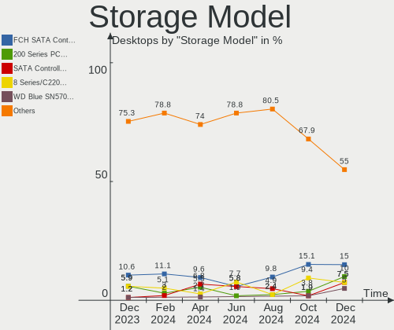
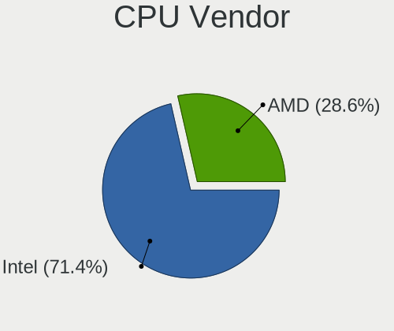
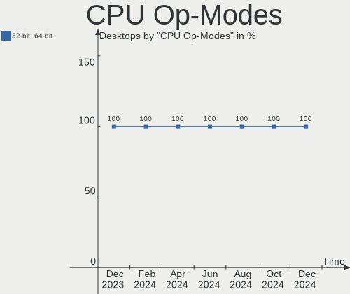
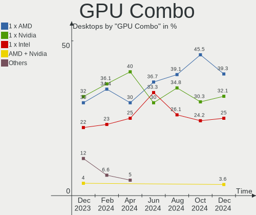
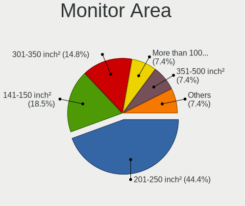
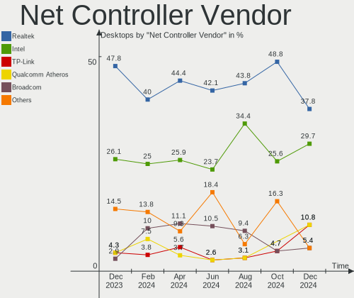
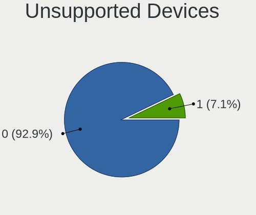

BlackPanther Hardware Trends (Desktop)
--------------------------------------

A project to identify most popular hardware characteristics and track their change
over time based on data collected by BlackPanther users at https://Linux-Hardware.org.

Anyone can contribute to the study by uploading probes of their computers by
the [hw-probe](https://github.com/linuxhw/hw-probe) tool:

    sudo -E hw-probe -all -upload

Full-feature report is available here: https://linux-hardware.org/?view=trends&formfactor=desktop

Period: May, 2020.

Contents
--------

- [ OS                       ](#os)
- [ OS Family                ](#os-family)
- [ Kernel                   ](#kernel)
- [ Kernel Family            ](#kernel-family)
- [ Kernel Major Ver.        ](#kernel-major-ver)
- [ Arch                     ](#arch)
- [ DE                       ](#de)
- [ Display Server           ](#display-server)
- [ Display Manager          ](#display-manager)
- [ OS Lang                  ](#os-lang)
- [ Boot Mode                ](#boot-mode)
- [ Filesystem               ](#filesystem)
- [ Part. scheme             ](#part-scheme)
- [ Dual Boot with Linux/BSD ](#dual-boot-with-linux/bsd)
- [ Dual Boot (Win)          ](#dual-boot-win)
- [ Country                  ](#country)
- [ City                     ](#city)
- [ Vendor                   ](#vendor)
- [ Model                    ](#model)
- [ Model Family             ](#model-family)
- [ MFG Year                 ](#mfg-year)
- [ Form Factor              ](#form-factor)
- [ Secure Boot              ](#secure-boot)
- [ Coreboot                 ](#coreboot)
- [ RAM Size                 ](#ram-size)
- [ RAM Used                 ](#ram-used)
- [ Drive Vendor             ](#drive-vendor)
- [ Drive Model              ](#drive-model)
- [ Drive Kind               ](#drive-kind)
- [ Drive Connector          ](#drive-connector)
- [ Drive Size               ](#drive-size)
- [ Space Total              ](#space-total)
- [ Space Used               ](#space-used)
- [ Malfunc. Drives          ](#malfunc-drives)
- [ Malfunc. Drive Vendor    ](#malfunc-drive-vendor)
- [ Malfunc. Drive Kind      ](#malfunc-drive-kind)
- [ Failed Drives            ](#failed-drives)
- [ Failed Drive Vendor      ](#failed-drive-vendor)
- [ Drive Status             ](#drive-status)
- [ Storage Vendor           ](#storage-vendor)
- [ Storage Model            ](#storage-model)
- [ Storage Kind             ](#storage-kind)
- [ CPU Vendor               ](#cpu-vendor)
- [ CPU Model                ](#cpu-model)
- [ CPU Model Family         ](#cpu-model-family)
- [ CPU Cores                ](#cpu-cores)
- [ CPU Sockets              ](#cpu-sockets)
- [ CPU Threads              ](#cpu-threads)
- [ CPU Op-Modes             ](#cpu-op-modes)
- [ CPU Microcode            ](#cpu-microcode)
- [ CPU Microarch            ](#cpu-microarch)
- [ GPU Vendor               ](#gpu-vendor)
- [ GPU Model                ](#gpu-model)
- [ GPU Combo                ](#gpu-combo)
- [ GPU Driver               ](#gpu-driver)
- [ GPU Memory               ](#gpu-memory)
- [ Monitor Vendor           ](#monitor-vendor)
- [ Monitor Model            ](#monitor-model)
- [ Monitor Resolution       ](#monitor-resolution)
- [ Monitor Diagonal         ](#monitor-diagonal)
- [ Monitor Width            ](#monitor-width)
- [ Aspect Ratio             ](#aspect-ratio)
- [ Monitor Area             ](#monitor-area)
- [ Pixel Density            ](#pixel-density)
- [ Multiple Monitors        ](#multiple-monitors)
- [ Net Controller Vendor    ](#net-controller-vendor)
- [ Net Controller Model     ](#net-controller-model)
- [ Net Controller Kind      ](#net-controller-kind)
- [ Used Controller          ](#used-controller)
- [ NICs                     ](#nics)
- [ Unsupported Devices      ](#unsupported-devices)
- [ Unsupported Device Types ](#unsupported-device-types)

OS
--

Installed operating systems

| Name              | Computers | Percent |
|-------------------|-----------|---------|
| BlackPanther 18.1 | 79        | 89.77%  |
| BlackPanther 16.2 | 9         | 10.23%  |

OS Family
---------

OS without a version

| Name         | Computers | Percent |
|--------------|-----------|---------|
| BlackPanther | 88        | 100%    |

Kernel
------

Version of the Linux kernel

| Version                | Computers | Percent |
|------------------------|-----------|---------|
| 4.18.16-desktop-1bP    | 60        | 68.18%  |
| 5.1.15-desktop-1bP     | 18        | 20.45%  |
| 4.9.20-desktop-pae-1bP | 9         | 10.23%  |
| 5.1.15-server-1bP      | 1         | 1.14%   |

Kernel Family
-------------

Linux kernel without a distro release

| Version | Computers | Percent |
|---------|-----------|---------|
| 4.18.16 | 60        | 68.18%  |
| 5.1.15  | 19        | 21.59%  |
| 4.9.20  | 9         | 10.23%  |

Kernel Major Ver.
-----------------

Linux kernel major version

| Version | Computers | Percent |
|---------|-----------|---------|
| 4.18    | 60        | 68.18%  |
| 5.1     | 19        | 21.59%  |
| 4.9     | 9         | 10.23%  |

Arch
----

OS architecture (x86_64, i586, etc.)

| Name   | Computers | Percent |
|--------|-----------|---------|
| x86_64 | 79        | 89.77%  |
| i686   | 9         | 10.23%  |

DE
--

Desktop Environment

| Name | Computers | Percent |
|------|-----------|---------|
| KDE5 | 88        | 100%    |

Display Server
--------------

X11 or Wayland

| Name | Computers | Percent |
|------|-----------|---------|
| X11  | 88        | 100%    |

Display Manager
---------------

SDDM, LightDM, etc.

| Name | Computers | Percent |
|------|-----------|---------|
| SDDM | 88        | 100%    |

OS Lang
-------

Language

| Lang    | Computers | Percent |
|---------|-----------|---------|
| Unknown | 88        | 100%    |

Boot Mode
---------

EFI or BIOS

| Mode | Computers | Percent |
|------|-----------|---------|
| BIOS | 72        | 81.82%  |
| EFI  | 16        | 18.18%  |

Filesystem
----------

Type of filesystem

| Type    | Computers | Percent |
|---------|-----------|---------|
| Ext4    | 62        | 70.45%  |
| Overlay | 24        | 27.27%  |
| Ext2    | 1         | 1.14%   |
| Btrfs   | 1         | 1.14%   |

Part. scheme
------------

Scheme of partitioning

| Type    | Computers | Percent |
|---------|-----------|---------|
| Unknown | 61        | 69.32%  |
| MBR     | 22        | 25%     |
| GPT     | 5         | 5.68%   |

Dual Boot with Linux/BSD
------------------------

Hosting more than one Linux/BSD

| Dual boot | Computers | Percent |
|-----------|-----------|---------|
| No        | 60        | 68.18%  |
| Yes       | 28        | 31.82%  |

Dual Boot (Win)
---------------

Hosting Linux and Windows

| Dual boot | Computers | Percent |
|-----------|-----------|---------|
| Yes       | 59        | 67.05%  |
| No        | 29        | 32.95%  |

Country
-------

Geographic location (country)

| Country     | Computers | Percent |
|-------------|-----------|---------|
| Hungary     | 67        | 76.14%  |
| USA         | 3         | 3.41%   |
| Slovakia    | 3         | 3.41%   |
| Romania     | 3         | 3.41%   |
| Germany     | 3         | 3.41%   |
| Poland      | 2         | 2.27%   |
| Philippines | 2         | 2.27%   |
| UK          | 1         | 1.14%   |
| Spain       | 1         | 1.14%   |
| Greece      | 1         | 1.14%   |
| Cyprus      | 1         | 1.14%   |
| Australia   | 1         | 1.14%   |

City
----

Geographic location (city)

| City                | Computers | Percent |
|---------------------|-----------|---------|
| Budapest            | 18        | 20.45%  |
| Csesztreg           | 4         | 4.55%   |
| Miskolc             | 3         | 3.41%   |
| Eger                | 3         | 3.41%   |
| Szombathely         | 2         | 2.27%   |
| Szeged              | 2         | 2.27%   |
| Kecskemét          | 2         | 2.27%   |
| Karcag              | 2         | 2.27%   |
| Győr               | 2         | 2.27%   |
| Cagayan de Oro      | 2         | 2.27%   |
| Érd                | 1         | 1.14%   |
| Zvolen              | 1         | 1.14%   |
| Wysokie Mazowieckie | 1         | 1.14%   |
| Vác                | 1         | 1.14%   |
| Veszprém           | 1         | 1.14%   |
| Vecses              | 1         | 1.14%   |
| Tornaľa            | 1         | 1.14%   |
| Tomorkeny           | 1         | 1.14%   |
| Szolnok             | 1         | 1.14%   |
| Szigetszentmiklos   | 1         | 1.14%   |
| Southall            | 1         | 1.14%   |
| Sibiu               | 1         | 1.14%   |
| Satu Mare           | 1         | 1.14%   |
| Rzgow               | 1         | 1.14%   |
| Rimavska Sec        | 1         | 1.14%   |
| Pecel               | 1         | 1.14%   |
| Patak               | 1         | 1.14%   |
| Paks                | 1         | 1.14%   |
| Oroshaza            | 1         | 1.14%   |
| Nyiregyhaza         | 1         | 1.14%   |
| Nicosia             | 1         | 1.14%   |
| Nadudvar            | 1         | 1.14%   |
| Mogyorod            | 1         | 1.14%   |
| Mezokovesd          | 1         | 1.14%   |
| Mezokovacshaza      | 1         | 1.14%   |
| Melbourne           | 1         | 1.14%   |
| Laupheim            | 1         | 1.14%   |
| Kistarcsa           | 1         | 1.14%   |
| Keratsini           | 1         | 1.14%   |
| Kenezlo             | 1         | 1.14%   |
| Hodmezovasarhely    | 1         | 1.14%   |
| Herrera             | 1         | 1.14%   |
| Gödöllő          | 1         | 1.14%   |
| Gyula               | 1         | 1.14%   |
| Fot                 | 1         | 1.14%   |
| Fair Lawn           | 1         | 1.14%   |
| Ehingen             | 1         | 1.14%   |
| Dunakeszi           | 1         | 1.14%   |
| Donaustauf          | 1         | 1.14%   |
| Debrecen            | 1         | 1.14%   |
| Békéscsaba        | 1         | 1.14%   |
| Bucharest           | 1         | 1.14%   |
| Bridgewater         | 1         | 1.14%   |
| Bolcske             | 1         | 1.14%   |
| Baltimore           | 1         | 1.14%   |
| Arnot               | 1         | 1.14%   |
| Alcsutdoboz         | 1         | 1.14%   |
| Ajka                | 1         | 1.14%   |

Vendor
------

Motherboard manufacturer

| Name                | Computers | Percent |
|---------------------|-----------|---------|
| Gigabyte Technology | 23        | 26.14%  |
| ASRock              | 16        | 18.18%  |
| ASUSTek Computer    | 14        | 15.91%  |
| Dell                | 11        | 12.5%   |
| Hewlett-Packard     | 8         | 9.09%   |
| MSI                 | 3         | 3.41%   |
| Lenovo              | 3         | 3.41%   |
| Fujitsu             | 3         | 3.41%   |
| Intel               | 2         | 2.27%   |
| Acer                | 2         | 2.27%   |
| Nvidia              | 1         | 1.14%   |
| Medion              | 1         | 1.14%   |
| AOpen               | 1         | 1.14%   |

Model
-----

Motherboard model

| Name                                | Computers | Percent |
|-------------------------------------|-----------|---------|
| Gigabyte B85M-DS3H-A                | 4         | 4.55%   |
| Gigabyte H61M-S1                    | 2         | 2.27%   |
| Dell OptiPlex 790                   | 2         | 2.27%   |
| Dell OptiPlex 760                   | 2         | 2.27%   |
| Dell OptiPlex 745                   | 2         | 2.27%   |
| ASRock FM2A75M Pro4+                | 2         | 2.27%   |
| Nvidia MCP68                        | 1         | 1.14%   |
| MSI MS-7A74                         | 1         | 1.14%   |
| MSI MS-7788                         | 1         | 1.14%   |
| MSI MS-7309                         | 1         | 1.14%   |
| Medion BTDD-LT                      | 1         | 1.14%   |
| Lenovo ThinkStation C30 1097A34     | 1         | 1.14%   |
| Lenovo ThinkCentre M92P 32371L5     | 1         | 1.14%   |
| Lenovo ThinkCentre M91p 7005A97     | 1         | 1.14%   |
| Intel DH55TC AAE70932-302           | 1         | 1.14%   |
| Intel D2700MUD AAG32419-602         | 1         | 1.14%   |
| HP t520 Flexible Series TC          | 1         | 1.14%   |
| HP Slim Desktop 290-a0xxx           | 1         | 1.14%   |
| HP ProDesk 600 G2 SFF               | 1         | 1.14%   |
| HP Pavilion Power Desktop 580-1xx   | 1         | 1.14%   |
| HP Compaq Elite 8300 SFF            | 1         | 1.14%   |
| HP Compaq dc7800p Small Form Factor | 1         | 1.14%   |
| HP Compaq dc5800 Small Form Factor  | 1         | 1.14%   |
| HP Compaq dc5800 Microtower         | 1         | 1.14%   |
| Gigabyte Z270-HD3P                  | 1         | 1.14%   |
| Gigabyte H81M-S2PV                  | 1         | 1.14%   |
| Gigabyte GA-MA770-UD3               | 1         | 1.14%   |
| Gigabyte GA-990FXA-UD3              | 1         | 1.14%   |
| Gigabyte GA-78LMT-S2                | 1         | 1.14%   |
| Gigabyte G41M-ES2L                  | 1         | 1.14%   |
| Gigabyte F2A88XM-HD3                | 1         | 1.14%   |
| Gigabyte F2A88XM-DS2                | 1         | 1.14%   |
| Gigabyte F2A88XM-D3HP               | 1         | 1.14%   |
| Gigabyte F2A68HM-S1                 | 1         | 1.14%   |
| Gigabyte EP45-UD3LR                 | 1         | 1.14%   |
| Gigabyte EP43-UD3L                  | 1         | 1.14%   |
| Gigabyte EP31-DS3L                  | 1         | 1.14%   |
| Gigabyte B85M-DS3H                  | 1         | 1.14%   |
| Gigabyte B450M GAMING               | 1         | 1.14%   |
| Gigabyte B450 AORUS ELITE           | 1         | 1.14%   |
| Gigabyte B250M-D2V                  | 1         | 1.14%   |
| Fujitsu ESPRIMO P400                | 1         | 1.14%   |
| Fujitsu ESPRIMO P1500               | 1         | 1.14%   |
| Fujitsu CELSIUS M470                | 1         | 1.14%   |
| Dell Studio XPS 8000                | 1         | 1.14%   |
| Dell Precision WorkStation T3500    | 1         | 1.14%   |
| Dell OptiPlex 780                   | 1         | 1.14%   |
| Dell OptiPlex 5050                  | 1         | 1.14%   |
| Dell OptiPlex 330                   | 1         | 1.14%   |
| ASUS ROG STRIX Z370-G GAMING        | 1         | 1.14%   |
| ASUS PRIME Z270-A                   | 1         | 1.14%   |
| ASUS PRIME H310M-K                  | 1         | 1.14%   |
| ASUS P8H61/USB3 R2.0                | 1         | 1.14%   |
| ASUS P8H61-M LX3 PLUS R2.0          | 1         | 1.14%   |
| ASUS P7P55D-E                       | 1         | 1.14%   |
| ASUS P5QL-E                         | 1         | 1.14%   |
| ASUS P5PL2-E                        | 1         | 1.14%   |
| ASUS P5P43TD PRO                    | 1         | 1.14%   |
| ASUS P5KPL-AM EPU                   | 1         | 1.14%   |
| ASUS M5A99FX PRO R2.0               | 1         | 1.14%   |

Model Family
------------

Motherboard model prefix

| Name                   | Computers | Percent |
|------------------------|-----------|---------|
| Dell OptiPlex          | 9         | 10.23%  |
| HP Compaq              | 4         | 4.55%   |
| Gigabyte B85M-DS3H-A   | 4         | 4.55%   |
| Lenovo ThinkCentre     | 2         | 2.27%   |
| Gigabyte H61M-S1       | 2         | 2.27%   |
| Fujitsu ESPRIMO        | 2         | 2.27%   |
| ASUS PRIME             | 2         | 2.27%   |
| ASRock FM2A75M         | 2         | 2.27%   |
| Nvidia MCP68           | 1         | 1.14%   |
| MSI MS-7A74            | 1         | 1.14%   |
| MSI MS-7788            | 1         | 1.14%   |
| MSI MS-7309            | 1         | 1.14%   |
| Medion BTDD-LT         | 1         | 1.14%   |
| Lenovo ThinkStation    | 1         | 1.14%   |
| Intel DH55TC           | 1         | 1.14%   |
| Intel D2700MUD         | 1         | 1.14%   |
| HP t520                | 1         | 1.14%   |
| HP Slim                | 1         | 1.14%   |
| HP ProDesk             | 1         | 1.14%   |
| HP Pavilion            | 1         | 1.14%   |
| Gigabyte Z270-HD3P     | 1         | 1.14%   |
| Gigabyte H81M-S2PV     | 1         | 1.14%   |
| Gigabyte GA-MA770-UD3  | 1         | 1.14%   |
| Gigabyte GA-990FXA-UD3 | 1         | 1.14%   |
| Gigabyte GA-78LMT-S2   | 1         | 1.14%   |
| Gigabyte G41M-ES2L     | 1         | 1.14%   |
| Gigabyte F2A88XM-HD3   | 1         | 1.14%   |
| Gigabyte F2A88XM-DS2   | 1         | 1.14%   |
| Gigabyte F2A88XM-D3HP  | 1         | 1.14%   |
| Gigabyte F2A68HM-S1    | 1         | 1.14%   |
| Gigabyte EP45-UD3LR    | 1         | 1.14%   |
| Gigabyte EP43-UD3L     | 1         | 1.14%   |
| Gigabyte EP31-DS3L     | 1         | 1.14%   |
| Gigabyte B85M-DS3H     | 1         | 1.14%   |
| Gigabyte B450M         | 1         | 1.14%   |
| Gigabyte B450          | 1         | 1.14%   |
| Gigabyte B250M-D2V     | 1         | 1.14%   |
| Fujitsu CELSIUS        | 1         | 1.14%   |
| Dell Studio            | 1         | 1.14%   |
| Dell Precision         | 1         | 1.14%   |
| ASUS ROG               | 1         | 1.14%   |
| ASUS P8H61-M           | 1         | 1.14%   |
| ASUS P8H61             | 1         | 1.14%   |
| ASUS P7P55D-E          | 1         | 1.14%   |
| ASUS P5QL-E            | 1         | 1.14%   |
| ASUS P5PL2-E           | 1         | 1.14%   |
| ASUS P5P43TD           | 1         | 1.14%   |
| ASUS P5KPL-AM          | 1         | 1.14%   |
| ASUS M5A99FX           | 1         | 1.14%   |
| ASUS M5A97             | 1         | 1.14%   |
| ASUS M5A78L-M          | 1         | 1.14%   |
| ASUS M4A88T-V          | 1         | 1.14%   |
| ASRock Z77             | 1         | 1.14%   |
| ASRock Z370            | 1         | 1.14%   |
| ASRock X370            | 1         | 1.14%   |
| ASRock N68C-S          | 1         | 1.14%   |
| ASRock N68-S           | 1         | 1.14%   |
| ASRock G41MH           | 1         | 1.14%   |
| ASRock G31M-GS         | 1         | 1.14%   |
| ASRock ConRoe1333-D667 | 1         | 1.14%   |

MFG Year
--------

Motherboard manufacture year

| Year | Computers | Percent |
|------|-----------|---------|
| 2014 | 12        | 13.64%  |
| 2015 | 11        | 12.5%   |
| 2012 | 11        | 12.5%   |
| 2019 | 8         | 9.09%   |
| 2010 | 8         | 9.09%   |
| 2009 | 8         | 9.09%   |
| 2018 | 7         | 7.95%   |
| 2013 | 6         | 6.82%   |
| 2011 | 5         | 5.68%   |
| 2016 | 4         | 4.55%   |
| 2008 | 4         | 4.55%   |
| 2007 | 3         | 3.41%   |
| 2004 | 1         | 1.14%   |

Form Factor
-----------

Physical design of the computer

| Name    | Computers | Percent |
|---------|-----------|---------|
| Desktop | 88        | 100%    |

Secure Boot
-----------

Enabled or disabled

| State    | Computers | Percent |
|----------|-----------|---------|
| Disabled | 88        | 100%    |

Coreboot
--------

Have coreboot on board

| Used | Computers | Percent |
|------|-----------|---------|
| No   | 88        | 100%    |

RAM Size
--------

Total RAM memory

| Size in GB | Computers | Percent |
|------------|-----------|---------|
| 3.01-4.0   | 26        | 29.55%  |
| 8.01-16.0  | 21        | 23.86%  |
| 4.01-8.0   | 16        | 18.18%  |
| 16.01-24.0 | 14        | 15.91%  |
| 1.01-2.0   | 5         | 5.68%   |
| 2.01-3.0   | 4         | 4.55%   |
| 32.01-64.0 | 1         | 1.14%   |
| 24.01-32.0 | 1         | 1.14%   |

RAM Used
--------

Used RAM memory

| Used GB  | Computers | Percent |
|----------|-----------|---------|
| 0.01-1.0 | 51        | 57.95%  |
| 1.01-2.0 | 25        | 28.41%  |
| 2.01-3.0 | 9         | 10.23%  |
| 3.01-4.0 | 3         | 3.41%   |

Drive Vendor
------------

Hard drive vendors

| Vendor              | Computers | Drives  | Percent |
|---------------------|-----------|---------|---------|
| WDC                 | 36        | 43      | 23.23%  |
| Seagate             | 22        | 26      | 14.19%  |
| Samsung Electronics | 20        | 22      | 12.9%   |
| Kingston            | 19        | 22      | 12.26%  |
| Toshiba             | 13        | 15      | 8.39%   |
| Hitachi             | 7         | 7       | 4.52%   |
| A-DATA Technology   | 4         | 5       | 2.58%   |
| SPCC                | 3         | 3       | 1.94%   |
| MAXTOR              | 3         | 3       | 1.94%   |
| SanDisk             | 2         | 3       | 1.29%   |
| Patriot             | 2         | 2       | 1.29%   |
| Intel               | 2         | 2       | 1.29%   |
| HGST                | 2         | 2       | 1.29%   |
| Fujitsu             | 2         | 2       | 1.29%   |
| Crucial             | 2         | 2       | 1.29%   |
| China               | 2         | 2       | 1.29%   |
| Vi550               | 1         | 1       | 0.65%   |
| USB3.0              | 1         | 1       | 0.65%   |
| Transcend           | 1         | 1       | 0.65%   |
| QUANTUM             | 1         | 1       | 0.65%   |
| OCZ                 | 1         | 1       | 0.65%   |
| Netac               | 1         | 1       | 0.65%   |
| KINGMAX             | 1         | 1       | 0.65%   |
| HL-DT-ST            | 1         | Unknown | 0.65%   |
| Hewlett-Packard     | 1         | 1       | 0.65%   |
| GOODRAM             | 1         | 1       | 0.65%   |
| Gigabyte Technology | 1         | 1       | 0.65%   |
| Generic             | 1         | 1       | 0.65%   |
| BIWIN               | 1         | 1       | 0.65%   |
| Apacer              | 1         | 1       | 0.65%   |

Drive Model
-----------

Hard drive models

| Model                        | Computers | Percent |
|------------------------------|-----------|---------|
| SV300S37A240G 240GB SSD      | 5         | 2.86%   |
| ST500DM002-1BD142 500GB      | 4         | 2.29%   |
| SA400S37120G 120GB SSD       | 4         | 2.29%   |
| DT01ACA100 1TB               | 4         | 2.29%   |
| SV300S37A120G 120GB SSD      | 3         | 1.71%   |
| SA400S37240G 240GB SSD       | 3         | 1.71%   |
| DT01ACA200 2TB               | 3         | 1.71%   |
| DT01ACA050 500GB             | 3         | 1.71%   |
| WDS120G2G0A-00JH30 120GB SSD | 2         | 1.14%   |
| WD5000AAKS-00UU3A0 500GB     | 2         | 1.14%   |
| WD10EZEX-08WN4A0 1TB         | 2         | 1.14%   |
| WD10EZEX-00BN5A0 1TB         | 2         | 1.14%   |
| SUV400S37120G 120GB SSD      | 2         | 1.14%   |
| SU700 120GB SSD              | 2         | 1.14%   |
| ST3500418AS 500GB            | 2         | 1.14%   |
| ST3320311CS 320GB            | 2         | 1.14%   |
| SSD 128GB                    | 2         | 1.14%   |
| HD642JJ 640GB                | 2         | 1.14%   |
| HD502HJ 500GB                | 2         | 1.14%   |
| WDS500G2X0C-00L350 500GB     | 1         | 0.57%   |
| WD800BB-00JHC0 80GB          | 1         | 0.57%   |
| WD7500AYPS-01ZKB0 752GB      | 1         | 0.57%   |
| WD6400AAKS-00A7B0 640GB      | 1         | 0.57%   |
| WD5000LPCX-60VHAT0 500GB     | 1         | 0.57%   |
| WD5000BPKT-75PK4T0 500GB     | 1         | 0.57%   |
| WD5000AAKX-75U6AA0 500GB     | 1         | 0.57%   |
| WD5000AAKX-22ERMA0 500GB     | 1         | 0.57%   |
| WD5000AAKX-07U6AA0 500GB     | 1         | 0.57%   |
| WD5000AAKX-00ERMA0 500GB     | 1         | 0.57%   |
| WD5000AAKS-75V0A0 500GB      | 1         | 0.57%   |
| WD400BD-75MRA1 40GB          | 1         | 0.57%   |
| WD400BB-60DGA0 40GB          | 1         | 0.57%   |
| WD3200AAJS-56B4A0 320GB      | 1         | 0.57%   |
| WD30EZRX-00DC0B0 3TB         | 1         | 0.57%   |
| WD30EFRX-68EUZN0 3TB         | 1         | 0.57%   |
| WD2500JB-00REA0 250GB        | 1         | 0.57%   |
| WD20PURX-64P6ZY0 2TB         | 1         | 0.57%   |
| WD20EZRX-22D8PB0 2TB         | 1         | 0.57%   |
| WD20EFRX-68EUZN0 2TB         | 1         | 0.57%   |
| WD20EARS-60MVWB0 2TB         | 1         | 0.57%   |
| WD2000JB-00GVA0 200GB        | 1         | 0.57%   |
| WD1600JS-22NCB1 160GB        | 1         | 0.57%   |
| WD15EARS-00Z5B1 1TB          | 1         | 0.57%   |
| WD15EARS-00S8B1 1TB          | 1         | 0.57%   |
| WD1500ADFD-00NLR1 150GB      | 1         | 0.57%   |
| WD10EZRX-00L4HB0 1TB         | 1         | 0.57%   |
| WD10EZRX-00A8LB0 1TB         | 1         | 0.57%   |
| WD10EZEX-75WN4A0 1TB         | 1         | 0.57%   |
| WD10EZEX-22MFCA0 1TB         | 1         | 0.57%   |
| WD10EZEX-21M2NA0 1TB         | 1         | 0.57%   |
| WD10EZEX-08M2NA0 1TB         | 1         | 0.57%   |
| WD10EZEX-00RKKA0 1TB         | 1         | 0.57%   |
| WD10EZEX-00KUWA0 1TB         | 1         | 0.57%   |
| WD10EARS-00MVWB0 1TB         | 1         | 0.57%   |
| VERTEX 32GB SSD              | 1         | 0.57%   |
| TS256GMTS430S 256GB SSD      | 1         | 0.57%   |
| SUV500120G 120GB SSD         | 1         | 0.57%   |
| SU650 240GB SSD              | 1         | 0.57%   |
| SU630 240GB SSD              | 1         | 0.57%   |
| STM3250820A 250GB            | 1         | 0.57%   |

Drive Kind
----------

HDD or SSD

| Kind    | Computers | Drives | Percent |
|---------|-----------|--------|---------|
| HDD     | 72        | 107    | 57.6%   |
| SSD     | 43        | 55     | 34.4%   |
| NVMe    | 7         | 10     | 5.6%    |
| Unknown | 3         | 2      | 2.4%    |

Drive Connector
---------------

SATA, SAS, NVMe, etc.

| Type | Computers | Drives | Percent |
|------|-----------|--------|---------|
| SATA | 87        | 161    | 88.78%  |
| NVMe | 7         | 10     | 7.14%   |
| SAS  | 4         | 3      | 4.08%   |

Drive Size
----------

Size of hard drive

| Size in TB | Computers | Drives | Percent |
|------------|-----------|--------|---------|
| 0.01-0.5   | 79        | 117    | 62.2%   |
| 0.51-1.0   | 33        | 39     | 25.98%  |
| 1.01-2.0   | 9         | 12     | 7.09%   |
| 2.01-3.0   | 4         | 4      | 3.15%   |
| 4.01-10.0  | 2         | 2      | 1.57%   |

Space Total
-----------

Amount of disk space available on the file system

| Size in GB     | Computers | Percent |
|----------------|-----------|---------|
| Unknown        | 22        | 25%     |
| 101-250        | 20        | 22.73%  |
| 251-500        | 12        | 13.64%  |
| 501-1000       | 10        | 11.36%  |
| 51-100         | 10        | 11.36%  |
| 21-50          | 6         | 6.82%   |
| More than 3000 | 3         | 3.41%   |
| 1001-2000      | 3         | 3.41%   |
| 1-20           | 2         | 2.27%   |

Space Used
----------

Amount of used disk space

| Used GB        | Computers | Percent |
|----------------|-----------|---------|
| 1-20           | 32        | 36.36%  |
| Unknown        | 22        | 25%     |
| 21-50          | 11        | 12.5%   |
| 101-250        | 8         | 9.09%   |
| 51-100         | 7         | 7.95%   |
| 251-500        | 4         | 4.55%   |
| More than 3000 | 2         | 2.27%   |
| 501-1000       | 2         | 2.27%   |

Malfunc. Drives
---------------

Drive models with a malfunction

| Model                    | Computers | Drives | Percent |
|--------------------------|-----------|--------|---------|
| ST500DM002-1BD142 500GB  | 3         | 3      | 6.52%   |
| DT01ACA050 500GB         | 2         | 2      | 4.35%   |
| WD800BB-00JHC0 80GB      | 1         | 1      | 2.17%   |
| WD7500AYPS-01ZKB0 752GB  | 1         | 1      | 2.17%   |
| WD6400AAKS-00A7B0 640GB  | 1         | 1      | 2.17%   |
| WD5000AAKX-75U6AA0 500GB | 1         | 1      | 2.17%   |
| WD5000AAKX-00ERMA0 500GB | 1         | 1      | 2.17%   |
| WD5000AAKS-75V0A0 500GB  | 1         | 1      | 2.17%   |
| WD5000AAKS-00UU3A0 500GB | 1         | 1      | 2.17%   |
| WD3200AAJS-56B4A0 320GB  | 1         | 1      | 2.17%   |
| WD30EFRX-68EUZN0 3TB     | 1         | 1      | 2.17%   |
| WD2500JB-00REA0 250GB    | 1         | 1      | 2.17%   |
| WD20EFRX-68EUZN0 2TB     | 1         | 1      | 2.17%   |
| WD20EARS-60MVWB0 2TB     | 1         | 1      | 2.17%   |
| WD2000JB-00GVA0 200GB    | 1         | 1      | 2.17%   |
| WD15EARS-00Z5B1 1TB      | 1         | 1      | 2.17%   |
| WD1500ADFD-00NLR1 150GB  | 1         | 1      | 2.17%   |
| WD10EZEX-75WN4A0 1TB     | 1         | 1      | 2.17%   |
| WD10EZEX-08WN4A0 1TB     | 1         | 1      | 2.17%   |
| WD10EARS-00MVWB0 1TB     | 1         | 1      | 2.17%   |
| VERTEX 32GB SSD          | 1         | 1      | 2.17%   |
| SV300S37A120G 120GB SSD  | 1         | 1      | 2.17%   |
| SU700 120GB SSD          | 1         | 1      | 2.17%   |
| SU630 240GB SSD          | 1         | 1      | 2.17%   |
| ST9500420AS 500GB        | 1         | 1      | 2.17%   |
| ST9320423AS 320GB        | 1         | 1      | 2.17%   |
| ST340016A 40GB           | 1         | 1      | 2.17%   |
| ST3160318AS 160GB        | 1         | 1      | 2.17%   |
| ST31000322CS 1TB         | 1         | 1      | 2.17%   |
| ST2000LM007-1R8174 2TB   | 1         | 1      | 2.17%   |
| ST1000LM048-2E7172 1TB   | 1         | 1      | 2.17%   |
| ST1000DM010-2EP102 1TB   | 1         | 1      | 2.17%   |
| SP1614C 160GB            | 1         | 1      | 2.17%   |
| SP0411C 40GB             | 1         | 1      | 2.17%   |
| HTS725050A7E635 500GB    | 1         | 1      | 2.17%   |
| HM321HI 320GB            | 1         | 1      | 2.17%   |
| HDT721010SLA360 1TB      | 1         | 1      | 2.17%   |
| HDS721032CLA362 320GB    | 1         | 1      | 2.17%   |
| HDS721010CLA332 1TB      | 1         | 1      | 2.17%   |
| HD642JJ 640GB            | 1         | 1      | 2.17%   |
| HD161HJ 160GB            | 1         | 1      | 2.17%   |
| HD103UJ 1TB              | 1         | 1      | 2.17%   |
| 4D040H2 41GB             | 1         | 1      | 2.17%   |

Malfunc. Drive Vendor
---------------------

Vendors of faulty drives

| Vendor              | Computers | Drives | Percent |
|---------------------|-----------|--------|---------|
| WDC                 | 16        | 18     | 38.1%   |
| Seagate             | 10        | 11     | 23.81%  |
| Samsung Electronics | 5         | 6      | 11.9%   |
| Hitachi             | 3         | 3      | 7.14%   |
| Toshiba             | 2         | 2      | 4.76%   |
| A-DATA Technology   | 2         | 2      | 4.76%   |
| OCZ                 | 1         | 1      | 2.38%   |
| Maxtor              | 1         | 1      | 2.38%   |
| Kingston            | 1         | 1      | 2.38%   |
| HGST                | 1         | 1      | 2.38%   |

Malfunc. Drive Kind
-------------------

Kinds of faulty drives

| Kind | Computers | Drives | Percent |
|------|-----------|--------|---------|
| HDD  | 34        | 42     | 89.47%  |
| SSD  | 4         | 4      | 10.53%  |

Failed Drives
-------------

Failed drive models

Zero info for selected period =(

Failed Drive Vendor
-------------------

Failed drive vendors

Zero info for selected period =(

Drive Status
------------

Number of failed and malfunc. drives

| Status   | Computers | Drives | Percent |
|----------|-----------|--------|---------|
| Works    | 72        | 125    | 63.72%  |
| Malfunc  | 37        | 46     | 32.74%  |
| Detected | 4         | 3      | 3.54%   |

Storage Vendor
--------------

Storage controller vendors

| Vendor                           | Computers | Percent |
|----------------------------------|-----------|---------|
| Intel                            | 60        | 55.05%  |
| AMD                              | 21        | 19.27%  |
| JMicron Technology               | 7         | 6.42%   |
| Nvidia                           | 6         | 5.5%    |
| Samsung Electronics              | 3         | 2.75%   |
| ASMedia Technology               | 3         | 2.75%   |
| Silicon Image                    | 2         | 1.83%   |
| VIA Technologies                 | 1         | 0.92%   |
| Silicon Motion                   | 1         | 0.92%   |
| Silicon Integrated Systems [SiS] | 1         | 0.92%   |
| Sandisk                          | 1         | 0.92%   |
| Phison Electronics               | 1         | 0.92%   |
| Marvell Technology Group         | 1         | 0.92%   |
| Kingston Technology Company      | 1         | 0.92%   |

Storage Model
-------------

Storage controller models

| Model                                                                             | Computers | Percent |
|-----------------------------------------------------------------------------------|-----------|---------|
| FCH SATA Controller [AHCI mode]                                                   | 10        | 6.29%   |
| NM10/ICH7 Family SATA Controller [IDE mode]                                       | 8         | 5.03%   |
| 200 Series PCH SATA controller [AHCI mode]                                        | 8         | 5.03%   |
| 82801G (ICH7 Family) IDE Controller                                               | 7         | 4.4%    |
| 8 Series/C220 Series Chipset Family 6-port SATA Controller 1 [AHCI mode]          | 7         | 4.4%    |
| SB7x0/SB8x0/SB9x0 IDE Controller                                                  | 6         | 3.77%   |
| 6 Series/C200 Series Chipset Family Desktop SATA Controller (IDE mode, ports 4-5) | 6         | 3.77%   |
| 6 Series/C200 Series Chipset Family Desktop SATA Controller (IDE mode, ports 0-3) | 6         | 3.77%   |
| SB7x0/SB8x0/SB9x0 SATA Controller [AHCI mode]                                     | 5         | 3.14%   |
| SB7x0/SB8x0/SB9x0 SATA Controller [IDE mode]                                      | 4         | 2.52%   |
| SATA Controller [RAID mode]                                                       | 4         | 2.52%   |
| JMB368 IDE controller                                                             | 4         | 2.52%   |
| JMB363 SATA/IDE Controller                                                        | 4         | 2.52%   |
| FCH IDE Controller                                                                | 4         | 2.52%   |
| 82801JI (ICH10 Family) 4 port SATA IDE Controller #1                              | 4         | 2.52%   |
| 82801JI (ICH10 Family) 2 port SATA IDE Controller #2                              | 4         | 2.52%   |
| MCP61 SATA Controller                                                             | 3         | 1.89%   |
| ASM1062 Serial ATA Controller                                                     | 3         | 1.89%   |
| 6 Series/C200 Series Chipset Family 6 port Desktop SATA AHCI Controller           | 3         | 1.89%   |
| SSD 660P Series                                                                   | 2         | 1.26%   |
| Q170/Q150/B150/H170/H110/Z170/CM236 Chipset SATA Controller [AHCI Mode]           | 2         | 1.26%   |
| NVMe SSD Controller SM981/PM981/PM983                                             | 2         | 1.26%   |
| NM10/ICH7 Family SATA Controller [AHCI mode]                                      | 2         | 1.26%   |
| MCP61 IDE                                                                         | 2         | 1.26%   |
| FCH SATA Controller [IDE mode]                                                    | 2         | 1.26%   |
| Cannon Lake PCH SATA AHCI Controller                                              | 2         | 1.26%   |
| 82801IB (ICH9) 2 port SATA Controller [IDE mode]                                  | 2         | 1.26%   |
| 82801I (ICH9 Family) 2 port SATA Controller [IDE mode]                            | 2         | 1.26%   |
| 82801HR/HO/HH (ICH8R/DO/DH) 2 port SATA Controller [IDE mode]                     | 2         | 1.26%   |
| 82801H (ICH8 Family) 4 port SATA Controller [IDE mode]                            | 2         | 1.26%   |
| 7 Series/C210 Series Chipset Family 6-port SATA Controller [AHCI mode]            | 2         | 1.26%   |
| 5 Series/3400 Series Chipset 6 port SATA AHCI Controller                          | 2         | 1.26%   |
| 400 Series Chipset SATA Controller                                                | 2         | 1.26%   |
| 4 Series Chipset PT IDER Controller                                               | 2         | 1.26%   |
| X370 Series Chipset SATA Controller                                               | 1         | 0.63%   |
| WD Black 2018/PC SN720 NVMe SSD                                                   | 1         | 0.63%   |
| VT6421 IDE/SATA Controller                                                        | 1         | 0.63%   |
| Technology Company Non-Volatile memory controller                                 | 1         | 0.63%   |
| SiI 3512 [SATALink/SATARaid] Serial ATA Controller                                | 1         | 0.63%   |
| SiI 3114 [SATALink/SATARaid] Serial ATA Controller                                | 1         | 0.63%   |
| NVMe SSD Controller SM961/PM961                                                   | 1         | 0.63%   |
| Non-Volatile memory controller                                                    | 1         | 0.63%   |
| nForce3 Serial ATA Controller                                                     | 1         | 0.63%   |
| MCP67 IDE Controller                                                              | 1         | 0.63%   |
| MCP67 AHCI Controller                                                             | 1         | 0.63%   |
| JMB361 AHCI/IDE                                                                   | 1         | 0.63%   |
| GeForce 7100/nForce 630i SATA                                                     | 1         | 0.63%   |
| E7 NVMe Controller                                                                | 1         | 0.63%   |
| CK8S Parallel ATA Controller (v2.5)                                               | 1         | 0.63%   |
| C602 chipset 4-Port SATA Storage Control Unit                                     | 1         | 0.63%   |
| C600/X79 series chipset IDE-r Controller                                          | 1         | 0.63%   |
| C600/X79 series chipset 6-Port SATA AHCI Controller                               | 1         | 0.63%   |
| Atom Processor E3800 Series SATA AHCI Controller                                  | 1         | 0.63%   |
| 88SE912x SATA 6Gb/s Controller [IDE mode]                                         | 1         | 0.63%   |
| 82Q35 Express PT IDER Controller                                                  | 1         | 0.63%   |
| 82801JI (ICH10 Family) SATA AHCI Controller                                       | 1         | 0.63%   |
| 82801JD/DO (ICH10 Family) SATA AHCI Controller                                    | 1         | 0.63%   |
| 82801JD/DO (ICH10 Family) 4-port SATA IDE Controller                              | 1         | 0.63%   |
| 82801JD/DO (ICH10 Family) 2-port SATA IDE Controller                              | 1         | 0.63%   |
| 5513 IDE Controller                                                               | 1         | 0.63%   |

Storage Kind
------------

Kind of storage controller (IDE, SATA, NVMe, SAS, ...)

| Kind | Computers | Percent |
|------|-----------|---------|
| SATA | 54        | 46.96%  |
| IDE  | 46        | 40%     |
| RAID | 7         | 6.09%   |
| NVMe | 7         | 6.09%   |
| SAS  | 1         | 0.87%   |

CPU Vendor
----------

Processor vendors

| Vendor | Computers | Percent |
|--------|-----------|---------|
| Intel  | 62        | 70.45%  |
| AMD    | 26        | 29.55%  |

CPU Model
---------

Processor models

| Model                                       | Computers | Percent |
|---------------------------------------------|-----------|---------|
| Intel Core i5-4460 CPU @ 3.20GHz            | 4         | 4.55%   |
| Intel Core 2 Duo CPU E7500 @ 2.93GHz        | 4         | 4.55%   |
| Intel Pentium Dual-Core CPU E5400 @ 2.70GHz | 2         | 2.27%   |
| Intel Pentium Dual CPU E2180 @ 2.00GHz      | 2         | 2.27%   |
| Intel Pentium CPU G4560 @ 3.50GHz           | 2         | 2.27%   |
| Intel Core i5-2400 CPU @ 3.10GHz            | 2         | 2.27%   |
| Intel Core i3-2120 CPU @ 3.30GHz            | 2         | 2.27%   |
| Intel Core 2 Quad CPU Q8300 @ 2.50GHz       | 2         | 2.27%   |
| Intel Core 2 Duo CPU E7300 @ 2.66GHz        | 2         | 2.27%   |
| Intel Core 2 CPU 6300 @ 1.86GHz             | 2         | 2.27%   |
| AMD A8-6600K APU with Radeon HD Graphics    | 2         | 2.27%   |
| Intel Xeon CPU W3565 @ 3.20GHz              | 1         | 1.14%   |
| Intel Xeon CPU W3550 @ 3.07GHz              | 1         | 1.14%   |
| Intel Xeon CPU E5-2620 0 @ 2.00GHz          | 1         | 1.14%   |
| Intel Pentium Gold G5400 CPU @ 3.70GHz      | 1         | 1.14%   |
| Intel Pentium Dual-Core CPU E6700 @ 3.20GHz | 1         | 1.14%   |
| Intel Pentium Dual-Core CPU E5800 @ 3.20GHz | 1         | 1.14%   |
| Intel Pentium Dual-Core CPU E5700 @ 3.00GHz | 1         | 1.14%   |
| Intel Pentium Dual-Core CPU E5200 @ 2.50GHz | 1         | 1.14%   |
| Intel Pentium CPU J2900 @ 2.41GHz           | 1         | 1.14%   |
| Intel Pentium CPU G840 @ 2.80GHz            | 1         | 1.14%   |
| Intel Pentium CPU G630 @ 2.70GHz            | 1         | 1.14%   |
| Intel Pentium CPU G3220 @ 3.00GHz           | 1         | 1.14%   |
| Intel Pentium CPU G2120 @ 3.10GHz           | 1         | 1.14%   |
| Intel Core i7-8700K CPU @ 3.70GHz           | 1         | 1.14%   |
| Intel Core i7-8700 CPU @ 3.20GHz            | 1         | 1.14%   |
| Intel Core i7-7700K CPU @ 4.20GHz           | 1         | 1.14%   |
| Intel Core i7-3770 CPU @ 3.40GHz            | 1         | 1.14%   |
| Intel Core i7-2600 CPU @ 3.40GHz            | 1         | 1.14%   |
| Intel Core i7 CPU 860 @ 2.80GHz             | 1         | 1.14%   |
| Intel Core i5-8400 CPU @ 2.80GHz            | 1         | 1.14%   |
| Intel Core i5-7400 CPU @ 3.00GHz            | 1         | 1.14%   |
| Intel Core i5-6500 CPU @ 3.20GHz            | 1         | 1.14%   |
| Intel Core i5-6400 CPU @ 2.70GHz            | 1         | 1.14%   |
| Intel Core i5-3470T CPU @ 2.90GHz           | 1         | 1.14%   |
| Intel Core i5-2320 CPU @ 3.00GHz            | 1         | 1.14%   |
| Intel Core i5 CPU 760 @ 2.80GHz             | 1         | 1.14%   |
| Intel Core i5 CPU 650 @ 3.20GHz             | 1         | 1.14%   |
| Intel Core i3-8350K CPU @ 4.00GHz           | 1         | 1.14%   |
| Intel Core i3-6100T CPU @ 3.20GHz           | 1         | 1.14%   |
| Intel Core i3-4160 CPU @ 3.60GHz            | 1         | 1.14%   |
| Intel Core i3-4130 CPU @ 3.40GHz            | 1         | 1.14%   |
| Intel Core 2 Quad CPU Q9400 @ 2.66GHz       | 1         | 1.14%   |
| Intel Core 2 Duo CPU E8400 @ 3.00GHz        | 1         | 1.14%   |
| Intel Core 2 Duo CPU E6750 @ 2.66GHz        | 1         | 1.14%   |
| Intel Celeron CPU G1610 @ 2.60GHz           | 1         | 1.14%   |
| Intel Celeron CPU 430 @ 1.80GHz             | 1         | 1.14%   |
| Intel Celeron CPU 2.00GHz                   | 1         | 1.14%   |
| Intel Atom CPU D2700 @ 2.13GHz              | 1         | 1.14%   |
| AMD Ryzen 7 1700X Eight-Core Processor      | 1         | 1.14%   |
| AMD Ryzen 5 2600X Six-Core Processor        | 1         | 1.14%   |
| AMD Ryzen 3 3200G with Radeon Vega Graphics | 1         | 1.14%   |
| AMD Phenom II X2 550 Processor              | 1         | 1.14%   |
| AMD GX-212JC SOC with Radeon R2E Graphics   | 1         | 1.14%   |
| AMD FX-8350 Eight-Core Processor            | 1         | 1.14%   |
| AMD FX-8320 Eight-Core Processor            | 1         | 1.14%   |
| AMD FX-8120 Eight-Core Processor            | 1         | 1.14%   |
| AMD FX-6350 Six-Core Processor              | 1         | 1.14%   |
| AMD FX-6100 Six-Core Processor              | 1         | 1.14%   |
| AMD FX-4300 Quad-Core Processor             | 1         | 1.14%   |

CPU Model Family
----------------

Processor model prefix

| Model                   | Computers | Percent |
|-------------------------|-----------|---------|
| Intel Core i5           | 14        | 15.91%  |
| Intel Core 2 Duo        | 8         | 9.09%   |
| Intel Pentium           | 7         | 7.95%   |
| Intel Pentium Dual-Core | 6         | 6.82%   |
| Intel Core i7           | 6         | 6.82%   |
| Intel Core i3           | 6         | 6.82%   |
| AMD FX                  | 6         | 6.82%   |
| Intel Xeon              | 3         | 3.41%   |
| Intel Core 2 Quad       | 3         | 3.41%   |
| Intel Celeron           | 3         | 3.41%   |
| AMD Athlon II X2        | 3         | 3.41%   |
| AMD A8                  | 3         | 3.41%   |
| Intel Pentium Dual      | 2         | 2.27%   |
| Intel Core 2            | 2         | 2.27%   |
| AMD Athlon X4           | 2         | 2.27%   |
| AMD A6                  | 2         | 2.27%   |
| Other                   | 1         | 1.14%   |
| Intel Pentium Gold      | 1         | 1.14%   |
| Intel Atom              | 1         | 1.14%   |
| AMD Ryzen 7             | 1         | 1.14%   |
| AMD Ryzen 5             | 1         | 1.14%   |
| AMD Ryzen 3             | 1         | 1.14%   |
| AMD Phenom II X2        | 1         | 1.14%   |
| AMD GX                  | 1         | 1.14%   |
| AMD Athlon II X4        | 1         | 1.14%   |
| AMD Athlon 64 X2        | 1         | 1.14%   |
| AMD Athlon 64           | 1         | 1.14%   |
| AMD A10                 | 1         | 1.14%   |

CPU Cores
---------

Number of processor cores

| Number | Computers | Percent |
|--------|-----------|---------|
| 2      | 46        | 52.27%  |
| 4      | 29        | 32.95%  |
| 1      | 5         | 5.68%   |
| 6      | 4         | 4.55%   |
| 3      | 2         | 2.27%   |
| 12     | 1         | 1.14%   |
| 8      | 1         | 1.14%   |

CPU Sockets
-----------

Number of sockets

| Number | Computers | Percent |
|--------|-----------|---------|
| 1      | 87        | 98.86%  |
| 2      | 1         | 1.14%   |

CPU Threads
-----------

Threads per core (Hyper-Threading)

| Number | Computers | Percent |
|--------|-----------|---------|
| 1      | 55        | 62.5%   |
| 2      | 33        | 37.5%   |

CPU Op-Modes
------------

CPU Operation Modes (32-bit, 64-bit)

| Op mode        | Computers | Percent |
|----------------|-----------|---------|
| 32-bit, 64-bit | 87        | 98.86%  |
| 32-bit         | 1         | 1.14%   |

CPU Microcode
-------------

Microcode number

| Number     | Computers | Percent |
|------------|-----------|---------|
| 0x1067a    | 11        | 12.5%   |
| Unknown    | 9         | 10.23%  |
| 0x206a7    | 8         | 9.09%   |
| 0x306c3    | 5         | 5.68%   |
| 0x906ea    | 4         | 4.55%   |
| 0x906e9    | 4         | 4.55%   |
| 0x306a9    | 4         | 4.55%   |
| 0x06001119 | 4         | 4.55%   |
| 0x10676    | 3         | 3.41%   |
| 0x06000852 | 3         | 3.41%   |
| 0x010000c8 | 3         | 3.41%   |
| 0x6fd      | 2         | 2.27%   |
| 0x506e3    | 2         | 2.27%   |
| 0x106e5    | 2         | 2.27%   |
| 0x106a5    | 2         | 2.27%   |
| 0x0600063e | 2         | 2.27%   |
| 0xf29      | 1         | 1.14%   |
| 0x906eb    | 1         | 1.14%   |
| 0x6fb      | 1         | 1.14%   |
| 0x6f6      | 1         | 1.14%   |
| 0x6f2      | 1         | 1.14%   |
| 0x30678    | 1         | 1.14%   |
| 0x30661    | 1         | 1.14%   |
| 0x206d7    | 1         | 1.14%   |
| 0x20652    | 1         | 1.14%   |
| 0x10661    | 1         | 1.14%   |
| 0x08108109 | 1         | 1.14%   |
| 0x0800820d | 1         | 1.14%   |
| 0x08001137 | 1         | 1.14%   |
| 0x07030104 | 1         | 1.14%   |
| 0x06006705 | 1         | 1.14%   |
| 0x06003104 | 1         | 1.14%   |
| 0x0600084f | 1         | 1.14%   |
| 0x03000027 | 1         | 1.14%   |
| 0x010000db | 1         | 1.14%   |
| 0x01000086 | 1         | 1.14%   |

CPU Microarch
-------------

Microarchitecture

| Name        | Computers | Percent |
|-------------|-----------|---------|
| Core        | 20        | 22.73%  |
| Skylake     | 12        | 13.64%  |
| SandyBridge | 9         | 10.23%  |
| Piledriver  | 8         | 9.09%   |
| Haswell     | 7         | 7.95%   |
| K10         | 6         | 6.82%   |
| Nehalem     | 4         | 4.55%   |
| IvyBridge   | 4         | 4.55%   |
| Zen+        | 2         | 2.27%   |
| Steamroller | 2         | 2.27%   |
| Penryn      | 2         | 2.27%   |
| K8 Hammer   | 2         | 2.27%   |
| Bulldozer   | 2         | 2.27%   |
| Zen         | 1         | 1.14%   |
| Westmere    | 1         | 1.14%   |
| Silvermont  | 1         | 1.14%   |
| Puma        | 1         | 1.14%   |
| NetBurst    | 1         | 1.14%   |
| K10 Llano   | 1         | 1.14%   |
| Excavator   | 1         | 1.14%   |
| Bonnell     | 1         | 1.14%   |

GPU Vendor
----------

Vendors of graphics cards

| Vendor | Computers | Percent |
|--------|-----------|---------|
| Nvidia | 37        | 43.53%  |
| Intel  | 27        | 31.76%  |
| AMD    | 21        | 24.71%  |

GPU Model
---------

Graphics card models

| Model                                                                 | Computers | Percent |
|-----------------------------------------------------------------------|-----------|---------|
| Xeon E3-1200 v3/4th Gen Core Processor Integrated Graphics Controller | 5         | 5.68%   |
| 4 Series Chipset Integrated Graphics Controller                       | 5         | 5.68%   |
| Xeon E3-1200 v2/3rd Gen Core processor Graphics Controller            | 3         | 3.41%   |
| Richland [Radeon HD 8570D]                                            | 2         | 2.27%   |
| HD Graphics 530                                                       | 2         | 2.27%   |
| GT218 [GeForce 210]                                                   | 2         | 2.27%   |
| GP108 [GeForce GT 1030]                                               | 2         | 2.27%   |
| GP107 [GeForce GTX 1050 Ti]                                           | 2         | 2.27%   |
| GK208B [GeForce GT 710]                                               | 2         | 2.27%   |
| GF108 [GeForce GT 630]                                                | 2         | 2.27%   |
| GF108 [GeForce GT 430]                                                | 2         | 2.27%   |
| GF104 [GeForce GTX 460]                                               | 2         | 2.27%   |
| G84 [GeForce 8600 GT]                                                 | 2         | 2.27%   |
| Caicos [Radeon HD 6450/7450/8450 / R5 230 OEM]                        | 2         | 2.27%   |
| 82G33/G31 Express Integrated Graphics Controller                      | 2         | 2.27%   |
| 4th Generation Core Processor Family Integrated Graphics Controller   | 2         | 2.27%   |
| 2nd Generation Core Processor Family Integrated Graphics Controller   | 2         | 2.27%   |
| Tahiti XT [Radeon HD 7970/8970 OEM / R9 280X]                         | 1         | 1.14%   |
| Sumo [Radeon HD 6550D]                                                | 1         | 1.14%   |
| Stoney [Radeon R2/R3/R4/R5 Graphics]                                  | 1         | 1.14%   |
| RV730 [Radeon HD 4600 AGP Series]                                     | 1         | 1.14%   |
| RV730 PRO [Radeon HD 4650]                                            | 1         | 1.14%   |
| RV710 [Radeon HD 4350/4550]                                           | 1         | 1.14%   |
| RS880 [Radeon HD 4250]                                                | 1         | 1.14%   |
| Richland [Radeon HD 8470D]                                            | 1         | 1.14%   |
| Pitcairn XT [Radeon HD 7870 GHz Edition]                              | 1         | 1.14%   |
| Pitcairn PRO [Radeon HD 7850 / R7 265 / R9 270 1024SP]                | 1         | 1.14%   |
| Picasso                                                               | 1         | 1.14%   |
| Oland PRO [Radeon R7 240/340]                                         | 1         | 1.14%   |
| NV44A [GeForce 6200]                                                  | 1         | 1.14%   |
| Mullins [Radeon R1E/R2E Graphics]                                     | 1         | 1.14%   |
| Kaveri [Radeon R7 Graphics]                                           | 1         | 1.14%   |
| Juniper XT [Radeon HD 5770]                                           | 1         | 1.14%   |
| Juniper PRO [Radeon HD 5750]                                          | 1         | 1.14%   |
| GT218 [GeForce 8400 GS Rev. 3]                                        | 1         | 1.14%   |
| GT218 [GeForce 405]                                                   | 1         | 1.14%   |
| GT216 [GeForce GT 220]                                                | 1         | 1.14%   |
| GP107 [GeForce GTX 1050]                                              | 1         | 1.14%   |
| GP106 [GeForce GTX 1060 6GB]                                          | 1         | 1.14%   |
| GP106 [GeForce GTX 1060 3GB]                                          | 1         | 1.14%   |
| GP104 [GeForce GTX 1080]                                              | 1         | 1.14%   |
| GP102 [GeForce GTX 1080 Ti]                                           | 1         | 1.14%   |
| GK208B [GeForce GT 720]                                               | 1         | 1.14%   |
| GK107GL [Quadro K2000]                                                | 1         | 1.14%   |
| GK107 [GeForce GTX 650]                                               | 1         | 1.14%   |
| GK104 [GeForce GTX 760]                                               | 1         | 1.14%   |
| GF119 [GeForce GT 610]                                                | 1         | 1.14%   |
| GF119 [GeForce 605]                                                   | 1         | 1.14%   |
| GF108 [GeForce GT 730]                                                | 1         | 1.14%   |
| GF106GL [Quadro 2000]                                                 | 1         | 1.14%   |
| G96C [GeForce 9500 GT]                                                | 1         | 1.14%   |
| G94 [GeForce 9600 GT]                                                 | 1         | 1.14%   |
| G92 [GeForce GTS 250]                                                 | 1         | 1.14%   |
| G71GL [Quadro FX 3500]                                                | 1         | 1.14%   |
| Ellesmere [Radeon RX 470/480/570/570X/580/580X/590]                   | 1         | 1.14%   |
| Cypress PRO [Radeon HD 5850]                                          | 1         | 1.14%   |
| Core Processor Integrated Graphics Controller                         | 1         | 1.14%   |
| Caicos XT [Radeon HD 7470/8470 / R5 235/310 OEM]                      | 1         | 1.14%   |
| C61 [GeForce 7025 / nForce 630a]                                      | 1         | 1.14%   |
| Atom Processor Z36xxx/Z37xxx Series Graphics & Display                | 1         | 1.14%   |

GPU Combo
---------

Combinations of graphics cards

| Name       | Computers | Percent |
|------------|-----------|---------|
| 1 x Nvidia | 38        | 43.18%  |
| 1 x Intel  | 27        | 30.68%  |
| 1 x AMD    | 20        | 22.73%  |
| 2 x AMD    | 2         | 2.27%   |
| 2 x Nvidia | 1         | 1.14%   |

GPU Driver
----------

Free vs proprietary

| Driver      | Computers | Percent |
|-------------|-----------|---------|
| Free        | 86        | 97.73%  |
| Proprietary | 2         | 2.27%   |

GPU Memory
----------

Total video memory

| Size in GB | Computers | Percent |
|------------|-----------|---------|
| Unknown    | 30        | 34.09%  |
| 0.51-1.0   | 22        | 25%     |
| 0.01-0.5   | 15        | 17.05%  |
| 1.01-2.0   | 13        | 14.77%  |
| 7.01-8.0   | 2         | 2.27%   |
| 3.01-4.0   | 2         | 2.27%   |
| 2.01-3.0   | 2         | 2.27%   |
| 5.01-6.0   | 1         | 1.14%   |
| 8.01-16.0  | 1         | 1.14%   |

Monitor Vendor
--------------

Monitor vendors

| Vendor                  | Computers | Percent |
|-------------------------|-----------|---------|
| Samsung Electronics     | 19        | 21.84%  |
| Goldstar                | 17        | 19.54%  |
| Hewlett-Packard         | 6         | 6.9%    |
| Dell                    | 6         | 6.9%    |
| Acer                    | 5         | 5.75%   |
| BenQ                    | 4         | 4.6%    |
| Ancor Communications    | 4         | 4.6%    |
| Vestel Elektronik       | 2         | 2.3%    |
| Philips                 | 2         | 2.3%    |
| Fujitsu Siemens         | 2         | 2.3%    |
| AOC                     | 2         | 2.3%    |
| WYT                     | 1         | 1.15%   |
| Vizio                   | 1         | 1.15%   |
| ViewSonic               | 1         | 1.15%   |
| UMC                     | 1         | 1.15%   |
| Panasonic               | 1         | 1.15%   |
| Medion                  | 1         | 1.15%   |
| Lenovo                  | 1         | 1.15%   |
| KTC                     | 1         | 1.15%   |
| InnoLux Display         | 1         | 1.15%   |
| HKC                     | 1         | 1.15%   |
| HannStar                | 1         | 1.15%   |
| Gericom                 | 1         | 1.15%   |
| GABA                    | 1         | 1.15%   |
| Eizo                    | 1         | 1.15%   |
| CVT                     | 1         | 1.15%   |
| Chi Mei Optoelectronics | 1         | 1.15%   |
| Belinea                 | 1         | 1.15%   |
| ASUSTek Computer        | 1         | 1.15%   |

Monitor Model
-------------

Monitor models

| Model                                                | Computers | Percent |
|------------------------------------------------------|-----------|---------|
| S22D300 SAM0B3B 1920x1080 477x268mm 21.5-inch        | 2         | 2.3%    |
| LG TV GSM2412 1920x1080 940x530mm 42.5-inch          | 2         | 2.3%    |
| FULL HD GSM5B54 1920x1080 480x270mm 21.7-inch        | 2         | 2.3%    |
| EW277HDR BNQ7948 1920x1080 598x336mm 27.0-inch       | 2         | 2.3%    |
| ASUS VW193D ACI19D5 1440x900 408x255mm 18.9-inch     | 2         | 2.3%    |
| 50UHD_LCD_TV VES3700 3840x2160 1872x1053mm 84.6-inch | 2         | 2.3%    |
| XB252Q ACR0563 1920x1080 544x303mm 24.5-inch         | 1         | 1.15%   |
| W9009S KTC1992 1440x900 410x256mm 19.0-inch          | 1         | 1.15%   |
| VG245 AUS24A1 1920x1080 531x299mm 24.0-inch          | 1         | 1.15%   |
| VE175 VSCF419 1280x1024 338x270mm 17.0-inch          | 1         | 1.15%   |
| U24E590 SAM0CD4 3840x2160 521x293mm 23.5-inch        | 1         | 1.15%   |
| U2312HM DEL4071 1920x1080 510x287mm 23.0-inch        | 1         | 1.15%   |
| TV MEIA096 1920x1080 698x392mm 31.5-inch             | 1         | 1.15%   |
| T2200HD BNQ7726 1920x1080 477x268mm 21.5-inch        | 1         | 1.15%   |
| SyncMaster SAM1156 1280x1024 312x234mm 15.4-inch     | 1         | 1.15%   |
| SyncMaster SAM0420 1680x1050 474x296mm 22.0-inch     | 1         | 1.15%   |
| SyncMaster SAM021D 1680x1050 433x271mm 20.1-inch     | 1         | 1.15%   |
| SyncMaster SAM011F 1280x1024 376x301mm 19.0-inch     | 1         | 1.15%   |
| SyncMaster SAM0115 1280x1024 376x301mm 19.0-inch     | 1         | 1.15%   |
| SP2208WFP DEL403A 1680x1050 473x296mm 22.0-inch      | 1         | 1.15%   |
| SMEX2220 SAM0685 1920x1080 477x268mm 21.5-inch       | 1         | 1.15%   |
| S24D330 SAM0D92 1920x1080 531x299mm 24.0-inch        | 1         | 1.15%   |
| S24D300 SAM0B45 1920x1080 521x293mm 23.5-inch        | 1         | 1.15%   |
| S24B300 SAM08B2 1920x1080 531x299mm 24.0-inch        | 1         | 1.15%   |
| S240HL ACR0289 1920x1080 531x299mm 24.0-inch         | 1         | 1.15%   |
| S22F350 SAM0D1B 1920x1080 477x268mm 21.5-inch        | 1         | 1.15%   |
| S22C150 SAM0AE5 1920x1080 477x268mm 21.5-inch        | 1         | 1.15%   |
| S20B300 SAM08A8 1600x900 443x249mm 20.0-inch         | 1         | 1.15%   |
| S200HQL ACR0359 1600x900 432x239mm 19.4-inch         | 1         | 1.15%   |
| S19B150 SAM08A2 1366x768 410x230mm 18.5-inch         | 1         | 1.15%   |
| S1921 ENC1831 1280x1024 376x301mm 19.0-inch          | 1         | 1.15%   |
| Q24 QMX2421 1920x1080 521x293mm 23.5-inch            | 1         | 1.15%   |
| P246HL ACR023F 1920x1080 530x300mm 24.0-inch         | 1         | 1.15%   |
| P2317H DEL40F3 1920x1080 509x286mm 23.0-inch         | 1         | 1.15%   |
| P225HQ ACR00E6 1920x1080 477x268mm 21.5-inch         | 1         | 1.15%   |
| P1913 DELA089 1440x900 408x255mm 18.9-inch           | 1         | 1.15%   |
| MP59G GSM5B35 1920x1080 480x270mm 21.7-inch          | 1         | 1.15%   |
| MP59G GSM5B34 1920x1080 480x270mm 21.7-inch          | 1         | 1.15%   |
| MP59G GSM5B33 1920x1080 480x270mm 21.7-inch          | 1         | 1.15%   |
| MNT-ANALOG19W WYT1113 1440x900 410x256mm 19.0-inch   | 1         | 1.15%   |
| MD 20144 MED3636 1920x1080 510x287mm 23.0-inch       | 1         | 1.15%   |
| M320NV VIZ0070 1920x1080 700x390mm 31.5-inch         | 1         | 1.15%   |
| M2280D GSM57B7 1920x1080 477x268mm 21.5-inch         | 1         | 1.15%   |
| LL 3220T FUS07A4 1920x1080 497x292mm 22.7-inch       | 1         | 1.15%   |
| LG FULL HD GSM5AB9 1680x1050 480x270mm 21.7-inch     | 1         | 1.15%   |
| LEN L220xwC LEN1151 1920x1200 474x296mm 22.0-inch    | 1         | 1.15%   |
| LE2262 INL2262 1680x1050 473x296mm 22.0-inch         | 1         | 1.15%   |
| LE2202x HWP2966 1920x1080 476x268mm 21.5-inch        | 1         | 1.15%   |
| LCD Monitor SAM0DF6 3840x2160 890x500mm 40.2-inch    | 1         | 1.15%   |
| LCD Monitor SAM07C0 1920x1080 700x390mm 31.5-inch    | 1         | 1.15%   |
| LCD Monitor SAM025D 1360x768 885x498mm 40.0-inch     | 1         | 1.15%   |
| LCD Monitor GSM580C 1680x1050 510x290mm 23.1-inch    | 1         | 1.15%   |
| LCD Monitor ASUS VS247 1920x1080                     | 1         | 1.15%   |
| LA2306 HWP294A 1920x1080 510x287mm 23.0-inch         | 1         | 1.15%   |
| LA1951 HWP285B 1280x960 380x300mm 19.1-inch          | 1         | 1.15%   |
| L227W GSM566E 1680x1050 474x296mm 22.0-inch          | 1         | 1.15%   |
| L204WS GSM4E79 1680x1050 434x270mm 20.1-inch         | 1         | 1.15%   |
| L1960TQ GSM4AFA 1280x1024 376x301mm 19.0-inch        | 1         | 1.15%   |
| L1740 HWP2648 1280x1024 337x270mm 17.0-inch          | 1         | 1.15%   |
| L1718S GSM443C 1280x1024 338x270mm 17.0-inch         | 1         | 1.15%   |

Monitor Resolution
------------------

Monitor screen resolution

| Resolution         | Computers | Percent |
|--------------------|-----------|---------|
| 1920x1080 (FHD)    | 45        | 54.22%  |
| 1280x1024 (SXGA)   | 12        | 14.46%  |
| 1680x1050 (WSXGA+) | 9         | 10.84%  |
| 1440x900 (WXGA+)   | 6         | 7.23%   |
| 1360x768           | 4         | 4.82%   |
| 3840x2160 (4K)     | 2         | 2.41%   |
| 1600x900 (HD+)     | 2         | 2.41%   |
| 2560x1080          | 1         | 1.2%    |
| 1920x1200 (WUXGA)  | 1         | 1.2%    |
| 1366x768 (WXGA)    | 1         | 1.2%    |

Monitor Diagonal
----------------

Diagonal size in inches

| Inches  | Computers | Percent |
|---------|-----------|---------|
| 21      | 17        | 19.77%  |
| 23      | 12        | 13.95%  |
| 19      | 11        | 12.79%  |
| 22      | 9         | 10.47%  |
| 24      | 6         | 6.98%   |
| 18      | 6         | 6.98%   |
| 27      | 4         | 4.65%   |
| 31      | 3         | 3.49%   |
| 20      | 3         | 3.49%   |
| 17      | 3         | 3.49%   |
| 42      | 2         | 2.33%   |
| 37      | 2         | 2.33%   |
| 15      | 2         | 2.33%   |
| 84      | 1         | 1.16%   |
| 40      | 1         | 1.16%   |
| 34      | 1         | 1.16%   |
| 32      | 1         | 1.16%   |
| 26      | 1         | 1.16%   |
| Unknown | 1         | 1.16%   |

Monitor Width
-------------

Physical width

| Width in mm | Computers | Percent |
|-------------|-----------|---------|
| 401-500     | 37        | 43.53%  |
| 501-600     | 23        | 27.06%  |
| 351-400     | 8         | 9.41%   |
| 301-350     | 5         | 5.88%   |
| 801-900     | 3         | 3.53%   |
| 601-700     | 3         | 3.53%   |
| 701-800     | 2         | 2.35%   |
| 901-1000    | 2         | 2.35%   |
| 1501-2000   | 1         | 1.18%   |
| Unknown     | 1         | 1.18%   |

Aspect Ratio
------------

Proportional relationship between the width and the height

| Ratio   | Computers | Percent |
|---------|-----------|---------|
| 16/9    | 52        | 63.41%  |
| 16/10   | 15        | 18.29%  |
| 5/4     | 11        | 13.41%  |
| 4/3     | 2         | 2.44%   |
| 21/9    | 1         | 1.22%   |
| Unknown | 1         | 1.22%   |

Monitor Area
------------

Area in inch²

| Area in inch² | Computers | Percent |
|----------------|-----------|---------|
| 201-250        | 32        | 37.65%  |
| 151-200        | 28        | 32.94%  |
| 351-500        | 5         | 5.88%   |
| 141-150        | 5         | 5.88%   |
| 501-1000       | 5         | 5.88%   |
| 301-350        | 4         | 4.71%   |
| 251-300        | 2         | 2.35%   |
| 101-110        | 2         | 2.35%   |
| More than 1000 | 1         | 1.18%   |
| Unknown        | 1         | 1.18%   |

Pixel Density
-------------

Pixels per inch

| Density | Computers | Percent |
|---------|-----------|---------|
| 51-100  | 57        | 70.37%  |
| 101-120 | 20        | 24.69%  |
| 1-50    | 2         | 2.47%   |
| 161-240 | 1         | 1.23%   |
| Unknown | 1         | 1.23%   |

Multiple Monitors
-----------------

Total monitors connected

| Total | Computers | Percent |
|-------|-----------|---------|
| 1     | 82        | 93.18%  |
| 2     | 5         | 5.68%   |
| 3     | 1         | 1.14%   |

Net Controller Vendor
---------------------

Controller vendors

| Vendor              | Computers | Percent |
|---------------------|-----------|---------|
| Intel               | 14        | 60.87%  |
| Nvidia              | 4         | 17.39%  |
| Samsung Electronics | 2         | 8.7%    |
| Xiaomi              | 1         | 4.35%   |
| Westell             | 1         | 4.35%   |
| Huawei Technologies | 1         | 4.35%   |

Net Controller Model
--------------------

Controller models

| Model                                               | Computers | Percent |
|-----------------------------------------------------|-----------|---------|
| 82579LM Gigabit Network Connection (Lewisville)     | 6         | 26.09%  |
| MCP61 Ethernet                                      | 3         | 13.04%  |
| 82566DM-2 Gigabit Network Connection                | 3         | 13.04%  |
| 82567LM-3 Gigabit Network Connection                | 2         | 8.7%    |
| WireSpeed Dual Connect Modem                        | 1         | 4.35%   |
| Mi/Redmi series (RNDIS)                             | 1         | 4.35%   |
| I211 Gigabit Network Connection                     | 1         | 4.35%   |
| GT-I9070 (network tethering, USB debugging enabled) | 1         | 4.35%   |
| Galaxy series, misc. (tethering mode)               | 1         | 4.35%   |
| FIG-LX1                                             | 1         | 4.35%   |
| CK8S Ethernet Controller                            | 1         | 4.35%   |
| 82578DC Gigabit Network Connection                  | 1         | 4.35%   |
| 82574L Gigabit Network Connection                   | 1         | 4.35%   |

Net Controller Kind
-------------------

Ethernet, WiFi or modem

| Kind     | Computers | Percent |
|----------|-----------|---------|
| Ethernet | 21        | 100%    |

Used Controller
---------------

Currently used network controller

| Kind     | Computers | Percent |
|----------|-----------|---------|
| Ethernet | 15        | 100%    |

NICs
----

Total network controllers on board

| Total | Computers | Percent |
|-------|-----------|---------|
| 1     | 76        | 86.36%  |
| 2     | 9         | 10.23%  |
| 0     | 3         | 3.41%   |

Unsupported Devices
-------------------

Total unsupported devices on board

| Total | Computers | Percent |
|-------|-----------|---------|
| 0     | 81        | 92.05%  |
| 1     | 7         | 7.95%   |

Unsupported Device Types
------------------------

Types of unsupported devices

| Type                     | Computers | Percent |
|--------------------------|-----------|---------|
| Graphics card            | 3         | 42.86%  |
| Chipcard                 | 2         | 28.57%  |
| Net/wireless             | 1         | 14.29%  |
| Communication controller | 1         | 14.29%  |

