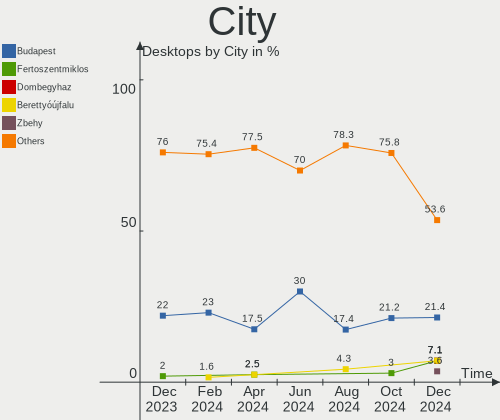
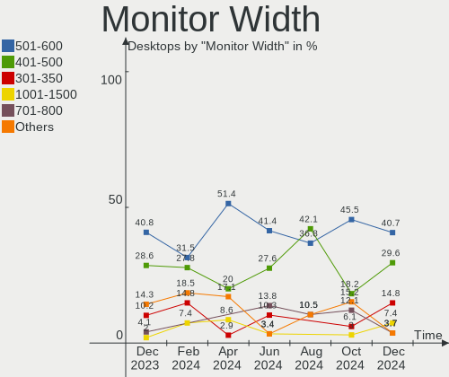

BlackPanther Hardware Trends (Desktop)
--------------------------------------

A project to identify most popular hardware characteristics and track their change
over time based on data collected by BlackPanther users at https://Linux-Hardware.org.

Anyone can contribute to the study by uploading probes of their computers by
the [hw-probe](https://github.com/linuxhw/hw-probe) tool:

    sudo -E hw-probe -all -upload

Full-feature report is available here: https://linux-hardware.org/?view=trends&formfactor=desktop

Period: Apr, 2021.

Contents
--------

- [ OS                       ](#os)
- [ OS Family                ](#os-family)
- [ Kernel                   ](#kernel)
- [ Kernel Family            ](#kernel-family)
- [ Kernel Major Ver.        ](#kernel-major-ver)
- [ Arch                     ](#arch)
- [ DE                       ](#de)
- [ Display Server           ](#display-server)
- [ Display Manager          ](#display-manager)
- [ OS Lang                  ](#os-lang)
- [ Boot Mode                ](#boot-mode)
- [ Filesystem               ](#filesystem)
- [ Part. scheme             ](#part-scheme)
- [ Dual Boot with Linux/BSD ](#dual-boot-with-linux/bsd)
- [ Dual Boot (Win)          ](#dual-boot-win)
- [ Country                  ](#country)
- [ City                     ](#city)
- [ Vendor                   ](#vendor)
- [ Model                    ](#model)
- [ Model Family             ](#model-family)
- [ MFG Year                 ](#mfg-year)
- [ Form Factor              ](#form-factor)
- [ Secure Boot              ](#secure-boot)
- [ Coreboot                 ](#coreboot)
- [ RAM Size                 ](#ram-size)
- [ RAM Used                 ](#ram-used)
- [ Has CD-ROM               ](#has-cd-rom)
- [ Total Drives             ](#total-drives)
- [ Has Ethernet             ](#has-ethernet)
- [ Has WiFi                 ](#has-wifi)
- [ Has Bluetooth            ](#has-bluetooth)
- [ Drive Vendor             ](#drive-vendor)
- [ Drive Model              ](#drive-model)
- [ HDD Vendor               ](#hdd-vendor)
- [ SSD Vendor               ](#ssd-vendor)
- [ Drive Kind               ](#drive-kind)
- [ Drive Connector          ](#drive-connector)
- [ Drive Size               ](#drive-size)
- [ Space Total              ](#space-total)
- [ Space Used               ](#space-used)
- [ Malfunc. Drives          ](#malfunc-drives)
- [ Malfunc. Drive Vendor    ](#malfunc-drive-vendor)
- [ Malfunc. HDD Vendor      ](#malfunc-hdd-vendor)
- [ Malfunc. Drive Kind      ](#malfunc-drive-kind)
- [ Failed Drives            ](#failed-drives)
- [ Failed Drive Vendor      ](#failed-drive-vendor)
- [ Drive Status             ](#drive-status)
- [ Storage Vendor           ](#storage-vendor)
- [ Storage Model            ](#storage-model)
- [ Storage Kind             ](#storage-kind)
- [ CPU Vendor               ](#cpu-vendor)
- [ CPU Model                ](#cpu-model)
- [ CPU Model Family         ](#cpu-model-family)
- [ CPU Cores                ](#cpu-cores)
- [ CPU Sockets              ](#cpu-sockets)
- [ CPU Threads              ](#cpu-threads)
- [ CPU Op-Modes             ](#cpu-op-modes)
- [ CPU Microcode            ](#cpu-microcode)
- [ CPU Microarch            ](#cpu-microarch)
- [ GPU Vendor               ](#gpu-vendor)
- [ GPU Model                ](#gpu-model)
- [ GPU Combo                ](#gpu-combo)
- [ GPU Driver               ](#gpu-driver)
- [ GPU Memory               ](#gpu-memory)
- [ Monitor Vendor           ](#monitor-vendor)
- [ Monitor Model            ](#monitor-model)
- [ Monitor Resolution       ](#monitor-resolution)
- [ Monitor Diagonal         ](#monitor-diagonal)
- [ Monitor Width            ](#monitor-width)
- [ Aspect Ratio             ](#aspect-ratio)
- [ Monitor Area             ](#monitor-area)
- [ Pixel Density            ](#pixel-density)
- [ Multiple Monitors        ](#multiple-monitors)
- [ Net Controller Vendor    ](#net-controller-vendor)
- [ Net Controller Model     ](#net-controller-model)
- [ Wireless Vendor          ](#wireless-vendor)
- [ Wireless Model           ](#wireless-model)
- [ Ethernet Vendor          ](#ethernet-vendor)
- [ Ethernet Model           ](#ethernet-model)
- [ Net Controller Kind      ](#net-controller-kind)
- [ Used Controller          ](#used-controller)
- [ NICs                     ](#nics)
- [ IPv6                     ](#ipv6)
- [ Memory Vendor            ](#memory-vendor)
- [ Memory Model             ](#memory-model)
- [ Memory Kind              ](#memory-kind)
- [ Memory Form Factor       ](#memory-form-factor)
- [ Memory Size              ](#memory-size)
- [ Memory Speed             ](#memory-speed)
- [ Sound Vendor             ](#sound-vendor)
- [ Sound Model              ](#sound-model)
- [ Camera Vendor            ](#camera-vendor)
- [ Camera Model             ](#camera-model)
- [ Fingerprint Vendor       ](#fingerprint-vendor)
- [ Fingerprint Model        ](#fingerprint-model)
- [ Chipcard Vendor          ](#chipcard-vendor)
- [ Chipcard Model           ](#chipcard-model)
- [ Printer Vendor           ](#printer-vendor)
- [ Printer Model            ](#printer-model)
- [ Scanner Vendor           ](#scanner-vendor)
- [ Scanner Model            ](#scanner-model)
- [ Bluetooth Vendor         ](#bluetooth-vendor)
- [ Bluetooth Model          ](#bluetooth-model)
- [ Unsupported Devices      ](#unsupported-devices)
- [ Unsupported Device Types ](#unsupported-device-types)

OS
--

Installed operating systems

| Name              | Desktops | Percent |
|-------------------|----------|---------|
| BlackPanther 18.1 | 75       | 98.68%  |
| BlackPanther 16.2 | 1        | 1.32%   |

OS Family
---------

OS without a version

| Name         | Desktops | Percent |
|--------------|----------|---------|
| BlackPanther | 76       | 100%    |

Kernel
------

Version of the Linux kernel

| Version                | Desktops | Percent |
|------------------------|----------|---------|
| 5.6.14-desktop-2bP     | 43       | 56.58%  |
| 4.18.16-desktop-1bP    | 32       | 42.11%  |
| 4.9.20-desktop-pae-1bP | 1        | 1.32%   |

Kernel Family
-------------

Linux kernel without a distro release

| Version | Desktops | Percent |
|---------|----------|---------|
| 5.6.14  | 43       | 56.58%  |
| 4.18.16 | 32       | 42.11%  |
| 4.9.20  | 1        | 1.32%   |

Kernel Major Ver.
-----------------

Linux kernel major version

| Version | Desktops | Percent |
|---------|----------|---------|
| 5.6     | 43       | 56.58%  |
| 4.18    | 32       | 42.11%  |
| 4.9     | 1        | 1.32%   |

Arch
----

OS architecture (x86_64, i586, etc.)

| Name   | Desktops | Percent |
|--------|----------|---------|
| x86_64 | 75       | 98.68%  |
| i686   | 1        | 1.32%   |

DE
--

Desktop Environment

| Name | Desktops | Percent |
|------|----------|---------|
| KDE5 | 76       | 100%    |

Display Server
--------------

X11 or Wayland

| Name | Desktops | Percent |
|------|----------|---------|
| X11  | 76       | 100%    |

Display Manager
---------------

SDDM, LightDM, etc.

| Name | Desktops | Percent |
|------|----------|---------|
| SDDM | 76       | 100%    |

OS Lang
-------

Language

| Lang    | Desktops | Percent |
|---------|----------|---------|
| Unknown | 76       | 100%    |

Boot Mode
---------

EFI or BIOS

| Mode | Desktops | Percent |
|------|----------|---------|
| BIOS | 58       | 76.32%  |
| EFI  | 18       | 23.68%  |

Filesystem
----------

Type of filesystem

| Type    | Desktops | Percent |
|---------|----------|---------|
| Overlay | 68       | 89.47%  |
| Ext4    | 7        | 9.21%   |
| Ext3    | 1        | 1.32%   |

Part. scheme
------------

Scheme of partitioning

| Type    | Desktops | Percent |
|---------|----------|---------|
| MBR     | 52       | 68.42%  |
| GPT     | 23       | 30.26%  |
| Unknown | 1        | 1.32%   |

Dual Boot with Linux/BSD
------------------------

Hosting more than one Linux/BSD

| Dual boot | Desktops | Percent |
|-----------|----------|---------|
| No        | 40       | 52.63%  |
| Yes       | 36       | 47.37%  |

Dual Boot (Win)
---------------

Hosting Linux and Windows

| Dual boot | Desktops | Percent |
|-----------|----------|---------|
| Yes       | 44       | 57.89%  |
| No        | 32       | 42.11%  |

Country
-------

Geographic location (country)

| Country     | Desktops | Percent |
|-------------|----------|---------|
| Hungary     | 56       | 73.68%  |
| USA         | 3        | 3.95%   |
| Germany     | 3        | 3.95%   |
| UK          | 2        | 2.63%   |
| Ireland     | 2        | 2.63%   |
| Austria     | 2        | 2.63%   |
| Taiwan      | 1        | 1.32%   |
| Slovakia    | 1        | 1.32%   |
| Romania     | 1        | 1.32%   |
| Philippines | 1        | 1.32%   |
| France      | 1        | 1.32%   |
| Brazil      | 1        | 1.32%   |
| Bangladesh  | 1        | 1.32%   |
| Argentina   | 1        | 1.32%   |

City
----

Geographic location (city)

| City                           | Desktops | Percent |
|--------------------------------|----------|---------|
| Budapest                       | 12       | 15.79%  |
| Szekszárd                     | 4        | 5.26%   |
| Debrecen                       | 3        | 3.95%   |
| Érd                           | 2        | 2.63%   |
| Székesfehérvár              | 2        | 2.63%   |
| Pécs                          | 2        | 2.63%   |
| Papa                           | 2        | 2.63%   |
| Eger                           | 2        | 2.63%   |
| Dublin                         | 2        | 2.63%   |
| Vienna                         | 1        | 1.32%   |
| Veszprém                      | 1        | 1.32%   |
| Uberlândia                    | 1        | 1.32%   |
| Târgu Mureş                  | 1        | 1.32%   |
| Tinnye                         | 1        | 1.32%   |
| Telford                        | 1        | 1.32%   |
| Tapioszele                     | 1        | 1.32%   |
| Szabadszentkiraly              | 1        | 1.32%   |
| Solingen                       | 1        | 1.32%   |
| Retkozberencs                  | 1        | 1.32%   |
| Oswestry                       | 1        | 1.32%   |
| NIA Valencia                   | 1        | 1.32%   |
| New Windsor                    | 1        | 1.32%   |
| New Taipei                     | 1        | 1.32%   |
| Nagykoros                      | 1        | 1.32%   |
| Nagyatad                       | 1        | 1.32%   |
| Nadudvar                       | 1        | 1.32%   |
| Mosonszentmiklos               | 1        | 1.32%   |
| Miskolc                        | 1        | 1.32%   |
| Marcali                        | 1        | 1.32%   |
| Mar del Plata                  | 1        | 1.32%   |
| Mako                           | 1        | 1.32%   |
| Kocsord                        | 1        | 1.32%   |
| Keszthely                      | 1        | 1.32%   |
| Karcag                         | 1        | 1.32%   |
| Kaiserslautern                 | 1        | 1.32%   |
| Isaszeg                        | 1        | 1.32%   |
| Hodmezovasarhely               | 1        | 1.32%   |
| Hatvan                         | 1        | 1.32%   |
| Festus                         | 1        | 1.32%   |
| Evansville                     | 1        | 1.32%   |
| Esztergom                      | 1        | 1.32%   |
| Erdweg                         | 1        | 1.32%   |
| Dunaújváros                  | 1        | 1.32%   |
| Dombrad                        | 1        | 1.32%   |
| Dolna Strehova                 | 1        | 1.32%   |
| Dhaka                          | 1        | 1.32%   |
| Cigand                         | 1        | 1.32%   |
| Biatorbagy                     | 1        | 1.32%   |
| Balatonudvari                  | 1        | 1.32%   |
| Balassagyarmat                 | 1        | 1.32%   |
| Baja                           | 1        | 1.32%   |
| Bad Goisern am Hallstättersee | 1        | 1.32%   |
| Asnieres-sur-Seine             | 1        | 1.32%   |
| Alcsutdoboz                    | 1        | 1.32%   |

Vendor
------

Motherboard manufacturer

| Name                | Desktops | Percent |
|---------------------|----------|---------|
| ASUSTek Computer    | 16       | 21.05%  |
| Gigabyte Technology | 14       | 18.42%  |
| ASRock              | 12       | 15.79%  |
| Dell                | 9        | 11.84%  |
| Lenovo              | 5        | 6.58%   |
| Hewlett-Packard     | 5        | 6.58%   |
| MSI                 | 4        | 5.26%   |
| Fujitsu Siemens     | 3        | 3.95%   |
| Acer                | 2        | 2.63%   |
| Sapphire            | 1        | 1.32%   |
| Pegatron            | 1        | 1.32%   |
| Medion              | 1        | 1.32%   |
| Intel               | 1        | 1.32%   |
| Fujitsu             | 1        | 1.32%   |
| Unknown             | 1        | 1.32%   |

Model
-----

Motherboard model

| Name                                   | Desktops | Percent |
|----------------------------------------|----------|---------|
| HP Compaq dc5850 Microtower            | 2        | 2.63%   |
| Gigabyte P35-S3G                       | 2        | 2.63%   |
| Gigabyte H61M-S1                       | 2        | 2.63%   |
| ASUS ROG STRIX B450-F GAMING           | 2        | 2.63%   |
| ASUS M5A78L/USB3                       | 2        | 2.63%   |
| ASUS All Series                        | 2        | 2.63%   |
| ASRock FM2A75M Pro4+                   | 2        | 2.63%   |
| Sapphire PCDM3H4H                      | 1        | 1.32%   |
| Pegatron Elite 7200 MT Business PC     | 1        | 1.32%   |
| MSI MS-7B89                            | 1        | 1.32%   |
| MSI MS-7917                            | 1        | 1.32%   |
| MSI MS-7808                            | 1        | 1.32%   |
| MSI MS-7721                            | 1        | 1.32%   |
| Medion Pentino G-Series                | 1        | 1.32%   |
| Lenovo ThinkCentre M78 10BNS02900      | 1        | 1.32%   |
| Lenovo ThinkCentre M72e 36622M1        | 1        | 1.32%   |
| Lenovo ThinkCentre M72e 3655A79        | 1        | 1.32%   |
| Lenovo ThinkCentre A58 751577G         | 1        | 1.32%   |
| Lenovo ThinkCentre A57 98517HG         | 1        | 1.32%   |
| Intel Board                            | 1        | 1.32%   |
| HP xw4400 Workstation                  | 1        | 1.32%   |
| HP Compaq Pro 6300 SFF                 | 1        | 1.32%   |
| HP Compaq 6000 Pro MT PC               | 1        | 1.32%   |
| Gigabyte P67A-D3-B3                    | 1        | 1.32%   |
| Gigabyte H81M-S1                       | 1        | 1.32%   |
| Gigabyte H61M-DS2                      | 1        | 1.32%   |
| Gigabyte H310M S2H 2.0                 | 1        | 1.32%   |
| Gigabyte GA-MA785GT-UD3H               | 1        | 1.32%   |
| Gigabyte G41M-ES2L                     | 1        | 1.32%   |
| Gigabyte EG41MFT-US2H                  | 1        | 1.32%   |
| Gigabyte B450M S2H                     | 1        | 1.32%   |
| Gigabyte B450M GAMING                  | 1        | 1.32%   |
| Gigabyte B360M-D3H                     | 1        | 1.32%   |
| Fujitsu Siemens PRIMERGY ECONEL 100 S2 | 1        | 1.32%   |
| Fujitsu Siemens P5GD1-FM               | 1        | 1.32%   |
| Fujitsu Siemens AMILO Desktop Pi3620A  | 1        | 1.32%   |
| Fujitsu ESPRIMO E7935                  | 1        | 1.32%   |
| Dell OptiPlex 9020                     | 1        | 1.32%   |
| Dell OptiPlex 790                      | 1        | 1.32%   |
| Dell OptiPlex 760                      | 1        | 1.32%   |
| Dell OptiPlex 755                      | 1        | 1.32%   |
| Dell OptiPlex 745                      | 1        | 1.32%   |
| Dell OptiPlex 7010                     | 1        | 1.32%   |
| Dell OptiPlex 5050                     | 1        | 1.32%   |
| Dell OptiPlex 390                      | 1        | 1.32%   |
| Dell OptiPlex 320                      | 1        | 1.32%   |
| ASUS TUF B360-PRO GAMING               | 1        | 1.32%   |
| ASUS PRIME H410M-R                     | 1        | 1.32%   |
| ASUS PRIME A320M-K                     | 1        | 1.32%   |
| ASUS P8Z68-V LX                        | 1        | 1.32%   |
| ASUS P7P55D-E                          | 1        | 1.32%   |
| ASUS P7P55D                            | 1        | 1.32%   |
| ASUS M5A97 EVO R2.0                    | 1        | 1.32%   |
| ASUS M4A88TD-V EVO/USB3                | 1        | 1.32%   |
| ASUS H110M-A                           | 1        | 1.32%   |
| ASUS A8V-VM SE                         | 1        | 1.32%   |
| ASRock Z170 Extreme6+                  | 1        | 1.32%   |
| ASRock H87M                            | 1        | 1.32%   |
| ASRock H61M-VG4                        | 1        | 1.32%   |
| ASRock G31M-GS                         | 1        | 1.32%   |

Model Family
------------

Motherboard model prefix

| Name                     | Desktops | Percent |
|--------------------------|----------|---------|
| Dell OptiPlex            | 9        | 11.84%  |
| Lenovo ThinkCentre       | 5        | 6.58%   |
| HP Compaq                | 4        | 5.26%   |
| Gigabyte P35-S3G         | 2        | 2.63%   |
| Gigabyte H61M-S1         | 2        | 2.63%   |
| Gigabyte B450M           | 2        | 2.63%   |
| ASUS ROG                 | 2        | 2.63%   |
| ASUS PRIME               | 2        | 2.63%   |
| ASUS M5A78L              | 2        | 2.63%   |
| ASUS All                 | 2        | 2.63%   |
| ASRock FM2A75M           | 2        | 2.63%   |
| Acer Aspire              | 2        | 2.63%   |
| Sapphire PCDM3H4H        | 1        | 1.32%   |
| Pegatron Elite           | 1        | 1.32%   |
| MSI MS-7B89              | 1        | 1.32%   |
| MSI MS-7917              | 1        | 1.32%   |
| MSI MS-7808              | 1        | 1.32%   |
| MSI MS-7721              | 1        | 1.32%   |
| Medion Pentino           | 1        | 1.32%   |
| Intel Board              | 1        | 1.32%   |
| HP xw4400                | 1        | 1.32%   |
| Gigabyte P67A-D3-B3      | 1        | 1.32%   |
| Gigabyte H81M-S1         | 1        | 1.32%   |
| Gigabyte H61M-DS2        | 1        | 1.32%   |
| Gigabyte H310M           | 1        | 1.32%   |
| Gigabyte GA-MA785GT-UD3H | 1        | 1.32%   |
| Gigabyte G41M-ES2L       | 1        | 1.32%   |
| Gigabyte EG41MFT-US2H    | 1        | 1.32%   |
| Gigabyte B360M-D3H       | 1        | 1.32%   |
| Fujitsu Siemens PRIMERGY | 1        | 1.32%   |
| Fujitsu Siemens P5GD1-FM | 1        | 1.32%   |
| Fujitsu Siemens AMILO    | 1        | 1.32%   |
| Fujitsu ESPRIMO          | 1        | 1.32%   |
| ASUS TUF                 | 1        | 1.32%   |
| ASUS P8Z68-V             | 1        | 1.32%   |
| ASUS P7P55D-E            | 1        | 1.32%   |
| ASUS P7P55D              | 1        | 1.32%   |
| ASUS M5A97               | 1        | 1.32%   |
| ASUS M4A88TD-V           | 1        | 1.32%   |
| ASUS H110M-A             | 1        | 1.32%   |
| ASUS A8V-VM              | 1        | 1.32%   |
| ASRock Z170              | 1        | 1.32%   |
| ASRock H87M              | 1        | 1.32%   |
| ASRock H61M-VG4          | 1        | 1.32%   |
| ASRock G31M-GS           | 1        | 1.32%   |
| ASRock FM2A88M           | 1        | 1.32%   |
| ASRock FM2A68M-DG3+      | 1        | 1.32%   |
| ASRock FM2A58M-VG3+      | 1        | 1.32%   |
| ASRock FM2A58M-DG3+      | 1        | 1.32%   |
| ASRock D1800M            | 1        | 1.32%   |
| ASRock A320M-HDV         | 1        | 1.32%   |
| Unknown                  | 1        | 1.32%   |

MFG Year
--------

Motherboard manufacture year

| Year | Desktops | Percent |
|------|----------|---------|
| 2012 | 10       | 13.16%  |
| 2019 | 8        | 10.53%  |
| 2014 | 7        | 9.21%   |
| 2013 | 7        | 9.21%   |
| 2011 | 7        | 9.21%   |
| 2018 | 6        | 7.89%   |
| 2010 | 6        | 7.89%   |
| 2007 | 4        | 5.26%   |
| 2016 | 3        | 3.95%   |
| 2015 | 3        | 3.95%   |
| 2009 | 3        | 3.95%   |
| 2008 | 3        | 3.95%   |
| 2021 | 2        | 2.63%   |
| 2020 | 2        | 2.63%   |
| 2017 | 2        | 2.63%   |
| 2006 | 2        | 2.63%   |
| 2005 | 1        | 1.32%   |

Form Factor
-----------

Physical design of the computer

| Name    | Desktops | Percent |
|---------|----------|---------|
| Desktop | 76       | 100%    |

Secure Boot
-----------

Enabled or disabled

| State    | Desktops | Percent |
|----------|----------|---------|
| Disabled | 76       | 100%    |

Coreboot
--------

Have coreboot on board

| Used | Desktops | Percent |
|------|----------|---------|
| No   | 76       | 100%    |

RAM Size
--------

Total RAM memory

| Size in GB  | Desktops | Percent |
|-------------|----------|---------|
| 3.01-4.0    | 25       | 32.89%  |
| 8.01-16.0   | 20       | 26.32%  |
| 4.01-8.0    | 10       | 13.16%  |
| 16.01-24.0  | 8        | 10.53%  |
| 1.01-2.0    | 7        | 9.21%   |
| 32.01-64.0  | 3        | 3.95%   |
| 2.01-3.0    | 1        | 1.32%   |
| 64.01-256.0 | 1        | 1.32%   |
| 0.51-1.0    | 1        | 1.32%   |

RAM Used
--------

Used RAM memory

| Used GB  | Desktops | Percent |
|----------|----------|---------|
| 0.01-0.5 | 46       | 60.53%  |
| 0.51-1.0 | 26       | 34.21%  |
| 1.01-2.0 | 4        | 5.26%   |

Has CD-ROM
----------

Has CD-ROM on board

| Presented | Desktops | Percent |
|-----------|----------|---------|
| Yes       | 51       | 67.11%  |
| No        | 25       | 32.89%  |

Total Drives
------------

Number of drives on board

| Drives | Desktops | Percent |
|--------|----------|---------|
| 1      | 41       | 53.95%  |
| 2      | 16       | 21.05%  |
| 3      | 8        | 10.53%  |
| 4      | 6        | 7.89%   |
| 5      | 2        | 2.63%   |
| 0      | 2        | 2.63%   |
| 6      | 1        | 1.32%   |

Has Ethernet
------------

Has Ethernet on board

| Presented | Desktops | Percent |
|-----------|----------|---------|
| Yes       | 75       | 98.68%  |
| No        | 1        | 1.32%   |

Has WiFi
--------

Has WiFi module

| Presented | Desktops | Percent |
|-----------|----------|---------|
| No        | 58       | 76.32%  |
| Yes       | 18       | 23.68%  |

Has Bluetooth
-------------

Has Bluetooth module

| Presented | Desktops | Percent |
|-----------|----------|---------|
| No        | 71       | 93.42%  |
| Yes       | 5        | 6.58%   |

Drive Vendor
------------

Hard drive vendors

| Vendor              | Desktops | Drives | Percent |
|---------------------|----------|--------|---------|
| WDC                 | 35       | 44     | 28.69%  |
| Seagate             | 21       | 24     | 17.21%  |
| Samsung Electronics | 14       | 20     | 11.48%  |
| Kingston            | 14       | 16     | 11.48%  |
| Hitachi             | 7        | 8      | 5.74%   |
| Toshiba             | 4        | 4      | 3.28%   |
| SPCC                | 4        | 4      | 3.28%   |
| A-DATA Technology   | 4        | 4      | 3.28%   |
| SanDisk             | 3        | 3      | 2.46%   |
| Maxtor              | 3        | 3      | 2.46%   |
| HGST                | 3        | 3      | 2.46%   |
| Crucial             | 3        | 4      | 2.46%   |
| Silicon Motion      | 1        | 2      | 0.82%   |
| Hewlett-Packard     | 1        | 1      | 0.82%   |
| GALAX               | 1        | 1      | 0.82%   |
| China               | 1        | 1      | 0.82%   |
| ASMT                | 1        | 1      | 0.82%   |
| Asmedia             | 1        | 1      | 0.82%   |
| Apacer              | 1        | 1      | 0.82%   |

Drive Model
-----------

Hard drive models

| Model                               | Desktops | Percent |
|-------------------------------------|----------|---------|
| Kingston SA400S37120G 120GB SSD     | 5        | 3.52%   |
| Seagate ST3160815AS 160GB           | 4        | 2.82%   |
| Samsung HD502HJ 500GB               | 3        | 2.11%   |
| Kingston SA400S37240G 240GB SSD     | 3        | 2.11%   |
| WDC WDS240G2G0A-00JH30 240GB SSD    | 2        | 1.41%   |
| WDC WD10EZEX-22BN5A0 1TB            | 2        | 1.41%   |
| WDC WD10EZEX-08WN4A0 1TB            | 2        | 1.41%   |
| SPCC Solid State Disk 128GB         | 2        | 1.41%   |
| SPCC M.2 PCIe SSD 256GB             | 2        | 1.41%   |
| Seagate ST3500418AS 500GB           | 2        | 1.41%   |
| Seagate ST3500312CS 500GB           | 2        | 1.41%   |
| Kingston SV300S37A120G 120GB SSD    | 2        | 1.41%   |
| Kingston SA2000M8250G 250GB         | 2        | 1.41%   |
| Hitachi HDS721616PLA380 164GB       | 2        | 1.41%   |
| HGST HTS541010B7E610 1TB            | 2        | 1.41%   |
| A-DATA SU700 120GB SSD              | 2        | 1.41%   |
| WDC WDS500G2B0A-00SM50 500GB SSD    | 1        | 0.7%    |
| WDC WDS240G2G0B-00EPW0 240GB SSD    | 1        | 0.7%    |
| WDC WDS120G2G0B-00EPW0 120GB SSD    | 1        | 0.7%    |
| WDC WD800JD-75MSA3 80GB             | 1        | 0.7%    |
| WDC WD800JD-55MUA1 80GB             | 1        | 0.7%    |
| WDC WD800AAJS-60PSA0 80GB           | 1        | 0.7%    |
| WDC WD6400AAKS-07A7B0 640GB         | 1        | 0.7%    |
| WDC WD6400AAKS-00A7B2 640GB         | 1        | 0.7%    |
| WDC WD5000LPCX-24VHAT0 500GB        | 1        | 0.7%    |
| WDC WD5000BEVT-00ZAT0 500GB         | 1        | 0.7%    |
| WDC WD5000AAKX-00ERMA0 500GB        | 1        | 0.7%    |
| WDC WD5000AAKS-00UU3A0 500GB        | 1        | 0.7%    |
| WDC WD5000AAKS-00D2B0 500GB         | 1        | 0.7%    |
| WDC WD5000AAKS-007AA0 500GB         | 1        | 0.7%    |
| WDC WD5000AADS-00L4B1 500GB         | 1        | 0.7%    |
| WDC WD400BD-75MRA1 40GB             | 1        | 0.7%    |
| WDC WD3200AAKS-00UU3A0 320GB        | 1        | 0.7%    |
| WDC WD3200AAJS-08L7A0 320GB         | 1        | 0.7%    |
| WDC WD32 00BEVT-60A23T0 320GB       | 1        | 0.7%    |
| WDC WD30EZRZ-00GXCB0 3TB            | 1        | 0.7%    |
| WDC WD30EFRX-68EUZN0 3TB            | 1        | 0.7%    |
| WDC WD2500KS-00MJB0 250GB           | 1        | 0.7%    |
| WDC WD2500JS-75NCB1 250GB           | 1        | 0.7%    |
| WDC WD2500AAKX-60U6AA0 250GB        | 1        | 0.7%    |
| WDC WD2500AAKX-603CA0 250GB         | 1        | 0.7%    |
| WDC WD2500AAJS-00VTA0 250GB         | 1        | 0.7%    |
| WDC WD20PURX-64P6ZY0 2TB            | 1        | 0.7%    |
| WDC WD20EARX-00PASB0 2TB            | 1        | 0.7%    |
| WDC WD2000FYYZ-01UL1B2 2TB          | 1        | 0.7%    |
| WDC WD1602ABKS-18N8A0 160GB         | 1        | 0.7%    |
| WDC WD15EARS-00Z5B1 1TB             | 1        | 0.7%    |
| WDC WD15EARS-00MVWB0 1TB            | 1        | 0.7%    |
| WDC WD10EZRZ-00HTKB0 1TB            | 1        | 0.7%    |
| WDC WD10EZEX-75WN4A0 1TB            | 1        | 0.7%    |
| WDC WD10EZEX-22MFCA0 1TB            | 1        | 0.7%    |
| WDC WD10EZEX-21M2NA0 1TB            | 1        | 0.7%    |
| WDC WD10EZEX-00KUWA0 1TB            | 1        | 0.7%    |
| Toshiba Q300 Pro 128GB SSD          | 1        | 0.7%    |
| Toshiba MK1665GSX 160GB             | 1        | 0.7%    |
| Toshiba HDWD240 4TB                 | 1        | 0.7%    |
| Toshiba DT01ACA100 1TB              | 1        | 0.7%    |
| Silicon Motion NE-256 256GB         | 1        | 0.7%    |
| Silicon Motion NE-1TB               | 1        | 0.7%    |
| Seagate ST750LM022 HN-M750MBB 752GB | 1        | 0.7%    |

HDD Vendor
----------

Hard disk drive vendors

| Vendor              | Desktops | Drives | Percent |
|---------------------|----------|--------|---------|
| WDC                 | 32       | 39     | 40.51%  |
| Seagate             | 20       | 23     | 25.32%  |
| Samsung Electronics | 9        | 11     | 11.39%  |
| Hitachi             | 7        | 8      | 8.86%   |
| Toshiba             | 3        | 3      | 3.8%    |
| Maxtor              | 3        | 3      | 3.8%    |
| HGST                | 3        | 3      | 3.8%    |
| ASMT                | 1        | 1      | 1.27%   |
| Asmedia             | 1        | 1      | 1.27%   |

SSD Vendor
----------

Solid state drive vendors

| Vendor              | Desktops | Drives | Percent |
|---------------------|----------|--------|---------|
| Kingston            | 13       | 14     | 33.33%  |
| Samsung Electronics | 7        | 8      | 17.95%  |
| WDC                 | 4        | 5      | 10.26%  |
| A-DATA Technology   | 4        | 4      | 10.26%  |
| SanDisk             | 3        | 3      | 7.69%   |
| SPCC                | 2        | 2      | 5.13%   |
| Crucial             | 2        | 3      | 5.13%   |
| Toshiba             | 1        | 1      | 2.56%   |
| GALAX               | 1        | 1      | 2.56%   |
| China               | 1        | 1      | 2.56%   |
| Apacer              | 1        | 1      | 2.56%   |

Drive Kind
----------

HDD or SSD

| Kind    | Desktops | Drives | Percent |
|---------|----------|--------|---------|
| HDD     | 61       | 92     | 59.22%  |
| SSD     | 34       | 43     | 33.01%  |
| NVMe    | 7        | 9      | 6.8%    |
| Unknown | 1        | 1      | 0.97%   |

Drive Connector
---------------

SATA, SAS, NVMe, etc.

| Type | Desktops | Drives | Percent |
|------|----------|--------|---------|
| SATA | 72       | 131    | 86.75%  |
| NVMe | 7        | 9      | 8.43%   |
| SAS  | 4        | 5      | 4.82%   |

Drive Size
----------

Size of hard drive

| Size in TB | Desktops | Drives | Percent |
|------------|----------|--------|---------|
| 0.01-0.5   | 64       | 96     | 65.98%  |
| 0.51-1.0   | 23       | 28     | 23.71%  |
| 1.01-2.0   | 6        | 6      | 6.19%   |
| 3.01-4.0   | 3        | 3      | 3.09%   |
| 2.01-3.0   | 1        | 2      | 1.03%   |

Space Total
-----------

Amount of disk space available on the file system

| Size in GB | Desktops | Percent |
|------------|----------|---------|
| Unknown    | 68       | 89.47%  |
| 101-250    | 3        | 3.95%   |
| 501-1000   | 2        | 2.63%   |
| 51-100     | 2        | 2.63%   |
| 1-20       | 1        | 1.32%   |

Space Used
----------

Amount of used disk space

| Used GB  | Desktops | Percent |
|----------|----------|---------|
| Unknown  | 68       | 89.47%  |
| 1-20     | 7        | 9.21%   |
| 501-1000 | 1        | 1.32%   |

Malfunc. Drives
---------------

Drive models with a malfunction

| Model                                    | Desktops | Drives | Percent |
|------------------------------------------|----------|--------|---------|
| Seagate ST3160815AS 160GB                | 3        | 3      | 6.82%   |
| Seagate ST3500418AS 500GB                | 2        | 2      | 4.55%   |
| WDC WD800JD-55MUA1 80GB                  | 1        | 1      | 2.27%   |
| WDC WD6400AAKS-07A7B0 640GB              | 1        | 1      | 2.27%   |
| WDC WD6400AAKS-00A7B2 640GB              | 1        | 1      | 2.27%   |
| WDC WD5000BEVT-00ZAT0 500GB              | 1        | 1      | 2.27%   |
| WDC WD5000AAKS-00D2B0 500GB              | 1        | 1      | 2.27%   |
| WDC WD5000AADS-00L4B1 500GB              | 1        | 1      | 2.27%   |
| WDC WD3200AAKS-00UU3A0 320GB             | 1        | 1      | 2.27%   |
| WDC WD3200AAJS-08L7A0 320GB              | 1        | 1      | 2.27%   |
| WDC WD2000FYYZ-01UL1B2 2TB               | 1        | 1      | 2.27%   |
| WDC WD1602ABKS-18N8A0 160GB              | 1        | 1      | 2.27%   |
| WDC WD15EARS-00Z5B1 1TB                  | 1        | 1      | 2.27%   |
| WDC WD15EARS-00MVWB0 1TB                 | 1        | 1      | 2.27%   |
| WDC WD10EZEX-22MFCA0 1TB                 | 1        | 1      | 2.27%   |
| Toshiba MK1665GSX 160GB                  | 1        | 1      | 2.27%   |
| Seagate ST750LM022 HN-M750MBB 752GB      | 1        | 1      | 2.27%   |
| Seagate ST4000DM000-1F2168 4TB           | 1        | 1      | 2.27%   |
| Seagate ST380815AS 80GB                  | 1        | 1      | 2.27%   |
| Seagate ST3500413AS 500GB                | 1        | 1      | 2.27%   |
| Seagate ST3500312CS 500GB                | 1        | 1      | 2.27%   |
| Seagate ST340014A 40GB                   | 1        | 1      | 2.27%   |
| Seagate ST3320413AS 320GB                | 1        | 1      | 2.27%   |
| Seagate ST1000DM003-1SB10C 1TB           | 1        | 1      | 2.27%   |
| Samsung Electronics SSD 840 Series 120GB | 1        | 1      | 2.27%   |
| Samsung Electronics SP2504C 250GB        | 1        | 1      | 2.27%   |
| Samsung Electronics SP1213C 120GB        | 1        | 1      | 2.27%   |
| Samsung Electronics HD642JJ 640GB        | 1        | 1      | 2.27%   |
| Samsung Electronics HD502HJ 500GB        | 1        | 1      | 2.27%   |
| Samsung Electronics HD254GJ 250GB        | 1        | 1      | 2.27%   |
| Samsung Electronics HD103UJ 1TB          | 1        | 1      | 2.27%   |
| MAXTOR STM380215A 80GB                   | 1        | 1      | 2.27%   |
| Maxtor 4D040H2 41GB                      | 1        | 1      | 2.27%   |
| Maxtor 2B020H1 20GB                      | 1        | 1      | 2.27%   |
| Kingston SV300S37A120G 120GB SSD         | 1        | 1      | 2.27%   |
| Hitachi HTS543225L9SA00 250GB            | 1        | 1      | 2.27%   |
| Hitachi HDT725050VLA380 500GB            | 1        | 1      | 2.27%   |
| Hitachi HDS728080PLA380 80GB             | 1        | 1      | 2.27%   |
| Hitachi HDS721616PLA380 164GB            | 1        | 1      | 2.27%   |
| Hitachi HCS5C1032CLA382 320GB            | 1        | 1      | 2.27%   |
| ASMT ASM1156-PM 320GB                    | 1        | 1      | 2.27%   |

Malfunc. Drive Vendor
---------------------

Vendors of faulty drives

| Vendor              | Desktops | Drives | Percent |
|---------------------|----------|--------|---------|
| Seagate             | 13       | 13     | 32.5%   |
| WDC                 | 11       | 13     | 27.5%   |
| Samsung Electronics | 5        | 7      | 12.5%   |
| Hitachi             | 5        | 5      | 12.5%   |
| Maxtor              | 3        | 3      | 7.5%    |
| Toshiba             | 1        | 1      | 2.5%    |
| Kingston            | 1        | 1      | 2.5%    |
| ASMT                | 1        | 1      | 2.5%    |

Malfunc. HDD Vendor
-------------------

Vendors of faulty HDD drives

| Vendor              | Desktops | Drives | Percent |
|---------------------|----------|--------|---------|
| Seagate             | 13       | 13     | 34.21%  |
| WDC                 | 11       | 13     | 28.95%  |
| Hitachi             | 5        | 5      | 13.16%  |
| Samsung Electronics | 4        | 6      | 10.53%  |
| Maxtor              | 3        | 3      | 7.89%   |
| Toshiba             | 1        | 1      | 2.63%   |
| ASMT                | 1        | 1      | 2.63%   |

Malfunc. Drive Kind
-------------------

Kinds of faulty drives

| Kind | Desktops | Drives | Percent |
|------|----------|--------|---------|
| HDD  | 32       | 42     | 94.12%  |
| SSD  | 2        | 2      | 5.88%   |

Failed Drives
-------------

Failed drive models

| Model                           | Desktops | Drives | Percent |
|---------------------------------|----------|--------|---------|
| Hewlett-Packard SSD EX900 250GB | 1        | 1      | 100%    |

Failed Drive Vendor
-------------------

Failed drive vendors

| Vendor          | Desktops | Drives | Percent |
|-----------------|----------|--------|---------|
| Hewlett-Packard | 1        | 1      | 100%    |

Drive Status
------------

Number of failed and malfunc. drives

| Status   | Desktops | Drives | Percent |
|----------|----------|--------|---------|
| Works    | 59       | 97     | 61.46%  |
| Malfunc  | 33       | 44     | 34.38%  |
| Detected | 3        | 3      | 3.13%   |
| Failed   | 1        | 1      | 1.04%   |

Storage Vendor
--------------

Storage controller vendors

| Vendor                      | Desktops | Percent |
|-----------------------------|----------|---------|
| Intel                       | 49       | 51.58%  |
| AMD                         | 25       | 26.32%  |
| JMicron Technology          | 4        | 4.21%   |
| ASMedia Technology          | 3        | 3.16%   |
| VIA Technologies            | 2        | 2.11%   |
| Silicon Motion              | 2        | 2.11%   |
| Phison Electronics          | 2        | 2.11%   |
| Marvell Technology Group    | 2        | 2.11%   |
| Kingston Technology Company | 2        | 2.11%   |
| Silicon Image               | 1        | 1.05%   |
| Samsung Electronics         | 1        | 1.05%   |
| Nvidia                      | 1        | 1.05%   |
| Micron/Crucial Technology   | 1        | 1.05%   |

Storage Model
-------------

Storage controller models

| Model                                                                                   | Desktops | Percent |
|-----------------------------------------------------------------------------------------|----------|---------|
| AMD FCH SATA Controller [AHCI mode]                                                     | 12       | 8.96%   |
| Intel NM10/ICH7 Family SATA Controller [IDE mode]                                       | 6        | 4.48%   |
| Intel 6 Series/C200 Series Chipset Family Desktop SATA Controller (IDE mode, ports 4-5) | 6        | 4.48%   |
| Intel 6 Series/C200 Series Chipset Family Desktop SATA Controller (IDE mode, ports 0-3) | 6        | 4.48%   |
| Intel 6 Series/C200 Series Chipset Family 6 port Desktop SATA AHCI Controller           | 6        | 4.48%   |
| AMD SB7x0/SB8x0/SB9x0 SATA Controller [IDE mode]                                        | 5        | 3.73%   |
| AMD FCH IDE Controller                                                                  | 5        | 3.73%   |
| AMD 400 Series Chipset SATA Controller                                                  | 5        | 3.73%   |
| Intel 82801G (ICH7 Family) IDE Controller                                               | 4        | 2.99%   |
| Intel 7 Series/C210 Series Chipset Family 6-port SATA Controller [AHCI mode]            | 4        | 2.99%   |
| AMD SB7x0/SB8x0/SB9x0 IDE Controller                                                    | 4        | 2.99%   |
| Intel 8 Series/C220 Series Chipset Family 6-port SATA Controller 1 [AHCI mode]          | 3        | 2.24%   |
| Intel 5 Series/3400 Series Chipset 4 port SATA IDE Controller                           | 3        | 2.24%   |
| Intel 5 Series/3400 Series Chipset 2 port SATA IDE Controller                           | 3        | 2.24%   |
| ASMedia ASM1062 Serial ATA Controller                                                   | 3        | 2.24%   |
| AMD SB7x0/SB8x0/SB9x0 SATA Controller [AHCI mode]                                       | 3        | 2.24%   |
| Silicon Motion SM2263EN/SM2263XT SSD Controller                                         | 2        | 1.49%   |
| Kingston Company A2000 NVMe SSD                                                         | 2        | 1.49%   |
| JMicron JMB368 IDE controller                                                           | 2        | 1.49%   |
| JMicron JMB363 SATA/IDE Controller                                                      | 2        | 1.49%   |
| Intel SATA Controller [RAID mode]                                                       | 2        | 1.49%   |
| Intel Q170/Q150/B150/H170/H110/Z170/CM236 Chipset SATA Controller [AHCI Mode]           | 2        | 1.49%   |
| Intel 9 Series Chipset Family SATA Controller [AHCI Mode]                               | 2        | 1.49%   |
| Intel 82801JD/DO (ICH10 Family) SATA AHCI Controller                                    | 2        | 1.49%   |
| Intel 82801IR/IO/IH (ICH9R/DO/DH) 6 port SATA Controller [AHCI mode]                    | 2        | 1.49%   |
| Intel 82801IB (ICH9) 2 port SATA Controller [IDE mode]                                  | 2        | 1.49%   |
| Intel 82801I (ICH9 Family) 2 port SATA Controller [IDE mode]                            | 2        | 1.49%   |
| Intel 7 Series/C210 Series Chipset Family 4-port SATA Controller [IDE mode]             | 2        | 1.49%   |
| Intel 7 Series/C210 Series Chipset Family 2-port SATA Controller [IDE mode]             | 2        | 1.49%   |
| Intel 200 Series PCH SATA controller [AHCI mode]                                        | 2        | 1.49%   |
| AMD SB600 Non-Raid-5 SATA                                                               | 2        | 1.49%   |
| AMD SB600 IDE                                                                           | 2        | 1.49%   |
| AMD FCH SATA Controller D                                                               | 2        | 1.49%   |
| VIA VT82C586A/B/VT82C686/A/B/VT823x/A/C PIPC Bus Master IDE                             | 1        | 0.75%   |
| VIA VT8237A SATA 2-Port Controller                                                      | 1        | 0.75%   |
| VIA VT6415 PATA IDE Host Controller                                                     | 1        | 0.75%   |
| Silicon Image SiI 3114 [SATALink/SATARaid] Serial ATA Controller                        | 1        | 0.75%   |
| Samsung NVMe SSD Controller SM981/PM981/PM983                                           | 1        | 0.75%   |
| Phison PS5013 E13 NVMe Controller                                                       | 1        | 0.75%   |
| Phison E12 NVMe Controller                                                              | 1        | 0.75%   |
| Nvidia MCP73 SATA Controller (IDE mode)                                                 | 1        | 0.75%   |
| Micron/Crucial P1 NVMe PCIe SSD                                                         | 1        | 0.75%   |
| Marvell Group 88SE9215 PCIe 2.0 x1 4-port SATA 6 Gb/s Controller                        | 1        | 0.75%   |
| Marvell Group 88SE914D SATA-600 Controller                                              | 1        | 0.75%   |
| Intel Cannon Lake PCH SATA AHCI Controller                                              | 1        | 0.75%   |
| Intel Atom Processor E3800 Series SATA AHCI Controller                                  | 1        | 0.75%   |
| Intel 82Q35 Express PT IDER Controller                                                  | 1        | 0.75%   |
| Intel 82801JD/DO (ICH10 Family) 4-port SATA IDE Controller                              | 1        | 0.75%   |
| Intel 82801JD/DO (ICH10 Family) 2-port SATA IDE Controller                              | 1        | 0.75%   |
| Intel 82801HR/HO/HH (ICH8R/DO/DH) 2 port SATA Controller [IDE mode]                     | 1        | 0.75%   |
| Intel 82801H (ICH8 Family) 4 port SATA Controller [IDE mode]                            | 1        | 0.75%   |
| Intel 82801FB/FW (ICH6/ICH6W) SATA Controller                                           | 1        | 0.75%   |
| Intel 82801FB/FBM/FR/FW/FRW (ICH6 Family) IDE Controller                                | 1        | 0.75%   |
| Intel 400 Series Chipset Family SATA AHCI Controller                                    | 1        | 0.75%   |
| Intel 4 Series Chipset PT IDER Controller                                               | 1        | 0.75%   |

Storage Kind
------------

Kind of storage controller (IDE, SATA, NVMe, SAS, ...)

| Kind | Desktops | Percent |
|------|----------|---------|
| SATA | 51       | 51.52%  |
| IDE  | 38       | 38.38%  |
| NVMe | 7        | 7.07%   |
| RAID | 3        | 3.03%   |

CPU Vendor
----------

Processor vendors

| Vendor | Desktops | Percent |
|--------|----------|---------|
| Intel  | 51       | 67.11%  |
| AMD    | 25       | 32.89%  |

CPU Model
---------

Processor models

| Model                                          | Desktops | Percent |
|------------------------------------------------|----------|---------|
| Intel Core i3-2120 CPU @ 3.30GHz               | 4        | 5.26%   |
| Intel Core 2 Duo CPU E8400 @ 3.00GHz           | 4        | 5.26%   |
| Intel Core i5-4590 CPU @ 3.30GHz               | 2        | 2.63%   |
| Intel Core i3-3240 CPU @ 3.40GHz               | 2        | 2.63%   |
| Intel Core i3-2100 CPU @ 3.10GHz               | 2        | 2.63%   |
| Intel Core 2 Duo CPU E4600 @ 2.40GHz           | 2        | 2.63%   |
| Intel Core 2 CPU 6600 @ 2.40GHz                | 2        | 2.63%   |
| Intel Celeron CPU G1610 @ 2.60GHz              | 2        | 2.63%   |
| AMD Ryzen 5 3600 6-Core Processor              | 2        | 2.63%   |
| AMD Athlon II X4 620 Processor                 | 2        | 2.63%   |
| AMD A8-6600K APU with Radeon HD Graphics       | 2        | 2.63%   |
| AMD A4-5300 APU with Radeon HD Graphics        | 2        | 2.63%   |
| Intel Pentium Dual-Core CPU E5700 @ 3.00GHz    | 1        | 1.32%   |
| Intel Pentium Dual-Core CPU E5400 @ 2.70GHz    | 1        | 1.32%   |
| Intel Pentium Dual CPU E2220 @ 2.40GHz         | 1        | 1.32%   |
| Intel Pentium CPU G645 @ 2.90GHz               | 1        | 1.32%   |
| Intel Pentium CPU G3250 @ 3.20GHz              | 1        | 1.32%   |
| Intel Pentium CPU G2030 @ 3.00GHz              | 1        | 1.32%   |
| Intel Pentium 4 CPU 3.40GHz                    | 1        | 1.32%   |
| Intel Genuine CPU 2140 @ 1.60GHz               | 1        | 1.32%   |
| Intel Core i5-9600K CPU @ 3.70GHz              | 1        | 1.32%   |
| Intel Core i5-8600 CPU @ 3.10GHz               | 1        | 1.32%   |
| Intel Core i5-6600 CPU @ 3.30GHz               | 1        | 1.32%   |
| Intel Core i5-6500 CPU @ 3.20GHz               | 1        | 1.32%   |
| Intel Core i5-4690K CPU @ 3.50GHz              | 1        | 1.32%   |
| Intel Core i5-4690 CPU @ 3.50GHz               | 1        | 1.32%   |
| Intel Core i5-4440 CPU @ 3.10GHz               | 1        | 1.32%   |
| Intel Core i5-3550S CPU @ 3.00GHz              | 1        | 1.32%   |
| Intel Core i5-2500K CPU @ 3.30GHz              | 1        | 1.32%   |
| Intel Core i5-2320 CPU @ 3.00GHz               | 1        | 1.32%   |
| Intel Core i5-2300 CPU @ 2.80GHz               | 1        | 1.32%   |
| Intel Core i5 CPU 650 @ 3.20GHz                | 1        | 1.32%   |
| Intel Core i3-9100F CPU @ 3.60GHz              | 1        | 1.32%   |
| Intel Core i3-6100T CPU @ 3.20GHz              | 1        | 1.32%   |
| Intel Core i3-3210 CPU @ 3.20GHz               | 1        | 1.32%   |
| Intel Core i3-10100F CPU @ 3.60GHz             | 1        | 1.32%   |
| Intel Core i3 CPU 550 @ 3.20GHz                | 1        | 1.32%   |
| Intel Core i3 CPU 530 @ 2.93GHz                | 1        | 1.32%   |
| Intel Core 2 Quad CPU Q9550 @ 2.83GHz          | 1        | 1.32%   |
| Intel Core 2 Quad CPU Q8200 @ 2.33GHz          | 1        | 1.32%   |
| Intel Core 2 Duo CPU E6550 @ 2.33GHz           | 1        | 1.32%   |
| Intel Core 2 CPU 4300 @ 1.80GHz                | 1        | 1.32%   |
| Intel Celeron CPU J1800 @ 2.41GHz              | 1        | 1.32%   |
| AMD Ryzen 7 2700 Eight-Core Processor          | 1        | 1.32%   |
| AMD Ryzen 7 1700 Eight-Core Processor          | 1        | 1.32%   |
| AMD Ryzen 5 3400G with Radeon Vega Graphics    | 1        | 1.32%   |
| AMD Ryzen 3 2200G with Radeon Vega Graphics    | 1        | 1.32%   |
| AMD Phenom II X2 550 Processor                 | 1        | 1.32%   |
| AMD FX-6300 Six-Core Processor                 | 1        | 1.32%   |
| AMD Athlon X4 860K Quad Core Processor         | 1        | 1.32%   |
| AMD Athlon II X4 645 Processor                 | 1        | 1.32%   |
| AMD Athlon II X4 640 Processor                 | 1        | 1.32%   |
| AMD Athlon II X2 B22 Processor                 | 1        | 1.32%   |
| AMD Athlon II X2 250 Processor                 | 1        | 1.32%   |
| AMD Athlon 64 X2 Dual Core Processor 4000+     | 1        | 1.32%   |
| AMD Athlon 64 Processor 3000+                  | 1        | 1.32%   |
| AMD A6-6400K APU with Radeon HD Graphics       | 1        | 1.32%   |
| AMD A4-6300B APU with Radeon HD Graphics       | 1        | 1.32%   |
| AMD A4-6300 APU with Radeon HD Graphics        | 1        | 1.32%   |
| AMD A10-9700 RADEON R7, 10 COMPUTE CORES 4C+6G | 1        | 1.32%   |

CPU Model Family
----------------

Processor model prefix

| Model                   | Desktops | Percent |
|-------------------------|----------|---------|
| Intel Core i5           | 14       | 18.42%  |
| Intel Core i3           | 14       | 18.42%  |
| Intel Core 2 Duo        | 7        | 9.21%   |
| AMD Athlon II X4        | 4        | 5.26%   |
| AMD A4                  | 4        | 5.26%   |
| Intel Pentium           | 3        | 3.95%   |
| Intel Core 2            | 3        | 3.95%   |
| Intel Celeron           | 3        | 3.95%   |
| AMD Ryzen 5             | 3        | 3.95%   |
| Intel Pentium Dual-Core | 2        | 2.63%   |
| Intel Core 2 Quad       | 2        | 2.63%   |
| AMD Ryzen 7             | 2        | 2.63%   |
| AMD Athlon II X2        | 2        | 2.63%   |
| AMD A8                  | 2        | 2.63%   |
| Intel Pentium Dual      | 1        | 1.32%   |
| Intel Pentium 4         | 1        | 1.32%   |
| Intel Genuine           | 1        | 1.32%   |
| AMD Ryzen 3             | 1        | 1.32%   |
| AMD Phenom II X2        | 1        | 1.32%   |
| AMD FX                  | 1        | 1.32%   |
| AMD Athlon X4           | 1        | 1.32%   |
| AMD Athlon 64 X2        | 1        | 1.32%   |
| AMD Athlon 64           | 1        | 1.32%   |
| AMD A6                  | 1        | 1.32%   |
| AMD A10                 | 1        | 1.32%   |

CPU Cores
---------

Number of processor cores

| Number | Desktops | Percent |
|--------|----------|---------|
| 2      | 41       | 53.95%  |
| 4      | 21       | 27.63%  |
| 1      | 7        | 9.21%   |
| 6      | 4        | 5.26%   |
| 8      | 2        | 2.63%   |
| 3      | 1        | 1.32%   |

CPU Sockets
-----------

Number of sockets

| Number | Desktops | Percent |
|--------|----------|---------|
| 1      | 76       | 100%    |

CPU Threads
-----------

Threads per core (Hyper-Threading)

| Number | Desktops | Percent |
|--------|----------|---------|
| 1      | 46       | 60.53%  |
| 2      | 30       | 39.47%  |

CPU Op-Modes
------------

CPU Operation Modes (32-bit, 64-bit)

| Op mode        | Desktops | Percent |
|----------------|----------|---------|
| 32-bit, 64-bit | 76       | 100%    |

CPU Microcode
-------------

Microcode number

| Number     | Desktops | Percent |
|------------|----------|---------|
| 0x206a7    | 10       | 13.16%  |
| 0x306a9    | 7        | 9.21%   |
| 0x06001119 | 7        | 9.21%   |
| 0x306c3    | 6        | 7.89%   |
| 0x1067a    | 6        | 7.89%   |
| Unknown    | 4        | 5.26%   |
| 0x6fd      | 3        | 3.95%   |
| 0x506e3    | 3        | 3.95%   |
| 0x010000c8 | 3        | 3.95%   |
| 0x906ea    | 2        | 2.63%   |
| 0x6f6      | 2        | 2.63%   |
| 0x6f2      | 2        | 2.63%   |
| 0x20652    | 2        | 2.63%   |
| 0x010000db | 2        | 2.63%   |
| 0xf4a      | 1        | 1.32%   |
| 0xa0653    | 1        | 1.32%   |
| 0x906ed    | 1        | 1.32%   |
| 0x6fb      | 1        | 1.32%   |
| 0x30678    | 1        | 1.32%   |
| 0x20655    | 1        | 1.32%   |
| 0x10677    | 1        | 1.32%   |
| 0x10676    | 1        | 1.32%   |
| 0x08701021 | 1        | 1.32%   |
| 0x08701013 | 1        | 1.32%   |
| 0x08108109 | 1        | 1.32%   |
| 0x08101016 | 1        | 1.32%   |
| 0x0800820d | 1        | 1.32%   |
| 0x08001137 | 1        | 1.32%   |
| 0x06006118 | 1        | 1.32%   |
| 0x06003104 | 1        | 1.32%   |
| 0x0600084f | 1        | 1.32%   |

CPU Microarch
-------------

Microarchitecture

| Name        | Desktops | Percent |
|-------------|----------|---------|
| SandyBridge | 10       | 13.16%  |
| Piledriver  | 8        | 10.53%  |
| Penryn      | 8        | 10.53%  |
| Core        | 8        | 10.53%  |
| K10         | 7        | 9.21%   |
| IvyBridge   | 7        | 9.21%   |
| Haswell     | 6        | 7.89%   |
| Westmere    | 3        | 3.95%   |
| Skylake     | 3        | 3.95%   |
| KabyLake    | 3        | 3.95%   |
| Zen+        | 2        | 2.63%   |
| Zen 2       | 2        | 2.63%   |
| Zen         | 2        | 2.63%   |
| K8 Hammer   | 2        | 2.63%   |
| Steamroller | 1        | 1.32%   |
| Silvermont  | 1        | 1.32%   |
| NetBurst    | 1        | 1.32%   |
| Excavator   | 1        | 1.32%   |
| CometLake   | 1        | 1.32%   |

GPU Vendor
----------

Vendors of graphics cards

| Vendor           | Desktops | Percent |
|------------------|----------|---------|
| AMD              | 32       | 41.03%  |
| Intel            | 24       | 30.77%  |
| Nvidia           | 20       | 25.64%  |
| VIA Technologies | 1        | 1.28%   |
| ATI Technologies | 1        | 1.28%   |

GPU Model
---------

Graphics card models

| Model                                                                       | Desktops | Percent |
|-----------------------------------------------------------------------------|----------|---------|
| Intel 2nd Generation Core Processor Family Integrated Graphics Controller   | 7        | 8.64%   |
| Nvidia GT218 [GeForce 210]                                                  | 5        | 6.17%   |
| Intel 4 Series Chipset Integrated Graphics Controller                       | 5        | 6.17%   |
| AMD Caicos [Radeon HD 6450/7450/8450 / R5 230 OEM]                          | 5        | 6.17%   |
| AMD Oland PRO [Radeon R7 240/340]                                           | 4        | 4.94%   |
| Intel Xeon E3-1200 v2/3rd Gen Core processor Graphics Controller            | 3        | 3.7%    |
| AMD Cedar [Radeon HD 5000/6000/7350/8350 Series]                            | 3        | 3.7%    |
| Nvidia TU116 [GeForce GTX 1660 SUPER]                                       | 2        | 2.47%   |
| Nvidia GK208B [GeForce GT 710]                                              | 2        | 2.47%   |
| Intel Xeon E3-1200 v3/4th Gen Core Processor Integrated Graphics Controller | 2        | 2.47%   |
| AMD RS780C [Radeon 3100]                                                    | 2        | 2.47%   |
| AMD Richland [Radeon HD 8570D]                                              | 2        | 2.47%   |
| AMD Redwood XT [Radeon HD 5670/5690/5730]                                   | 2        | 2.47%   |
| AMD Caicos PRO [Radeon HD 7450]                                             | 2        | 2.47%   |
| VIA Technologies K8M890CE/K8N890CE [Chrome 9]                               | 1        | 1.23%   |
| Nvidia TU104 [GeForce RTX 2060]                                             | 1        | 1.23%   |
| Nvidia GP107 [GeForce GTX 1050 Ti]                                          | 1        | 1.23%   |
| Nvidia GM206 [GeForce GTX 960]                                              | 1        | 1.23%   |
| Nvidia GK208B [GeForce GT 730]                                              | 1        | 1.23%   |
| Nvidia GK106GL [Quadro K4000]                                               | 1        | 1.23%   |
| Nvidia GK106 [GeForce GTX 660]                                              | 1        | 1.23%   |
| Nvidia GK104 [GeForce GTX 760]                                              | 1        | 1.23%   |
| Nvidia GF119 [GeForce 605]                                                  | 1        | 1.23%   |
| Nvidia GF108 [GeForce GT 730]                                               | 1        | 1.23%   |
| Nvidia GF108 [GeForce GT 630]                                               | 1        | 1.23%   |
| Nvidia G96 [GeForce 9500 GS]                                                | 1        | 1.23%   |
| Intel HD Graphics 530                                                       | 1        | 1.23%   |
| Intel Core Processor Integrated Graphics Controller                         | 1        | 1.23%   |
| Intel CometLake-S GT2 [UHD Graphics 630]                                    | 1        | 1.23%   |
| Intel CoffeeLake-S GT2 [UHD Graphics 630]                                   | 1        | 1.23%   |
| Intel Atom Processor Z36xxx/Z37xxx Series Graphics & Display                | 1        | 1.23%   |
| Intel 82Q963/Q965 Integrated Graphics Controller                            | 1        | 1.23%   |
| Intel 82G33/G31 Express Integrated Graphics Controller                      | 1        | 1.23%   |
| ATI Technologies Wani [Radeon R5/R6/R7 Graphics]                            | 1        | 1.23%   |
| AMD Turks XT [Radeon HD 6670/7670]                                          | 1        | 1.23%   |
| AMD RV620 PRO [Radeon HD 3470]                                              | 1        | 1.23%   |
| AMD RS880 [Radeon HD 4200]                                                  | 1        | 1.23%   |
| AMD RS690 [Radeon X1200]                                                    | 1        | 1.23%   |
| AMD Richland [Radeon HD 8470D]                                              | 1        | 1.23%   |
| AMD Richland [Radeon HD 8370D]                                              | 1        | 1.23%   |
| AMD RC410 [Radeon Xpress 200/1100]                                          | 1        | 1.23%   |
| AMD Raven Ridge [Radeon Vega Series / Radeon Vega Mobile Series]            | 1        | 1.23%   |
| AMD Picasso                                                                 | 1        | 1.23%   |
| AMD Lexa PRO [Radeon 540/540X/550/550X / RX 540X/550/550X]                  | 1        | 1.23%   |
| AMD Juniper XT [Radeon HD 5770]                                             | 1        | 1.23%   |
| AMD ES1000                                                                  | 1        | 1.23%   |
| AMD Ellesmere [Radeon RX 470/480/570/570X/580/580X/590]                     | 1        | 1.23%   |
| AMD Bonaire XTX [Radeon R7 260X/360]                                        | 1        | 1.23%   |
| AMD Baffin [Radeon RX 460/560D / Pro 450/455/460/555/555X/560/560X]         | 1        | 1.23%   |

GPU Combo
---------

Combinations of graphics cards

| Name           | Desktops | Percent |
|----------------|----------|---------|
| 1 x AMD        | 30       | 39.47%  |
| 1 x Intel      | 22       | 28.95%  |
| 1 x Nvidia     | 18       | 23.68%  |
| 2 x AMD        | 3        | 3.95%   |
| Intel + Nvidia | 2        | 2.63%   |
| 1 x VIA        | 1        | 1.32%   |

GPU Driver
----------

Free vs proprietary

| Driver  | Desktops | Percent |
|---------|----------|---------|
| Free    | 74       | 97.37%  |
| Unknown | 2        | 2.63%   |

GPU Memory
----------

Total video memory

| Size in GB | Desktops | Percent |
|------------|----------|---------|
| Unknown    | 27       | 35.53%  |
| 0.51-1.0   | 21       | 27.63%  |
| 1.01-2.0   | 16       | 21.05%  |
| 0.01-0.5   | 9        | 11.84%  |
| 3.01-4.0   | 2        | 2.63%   |
| 2.01-3.0   | 1        | 1.32%   |

Monitor Vendor
--------------

Monitor vendors

| Vendor               | Desktops | Percent |
|----------------------|----------|---------|
| Samsung Electronics  | 15       | 21.43%  |
| Goldstar             | 15       | 21.43%  |
| Hewlett-Packard      | 5        | 7.14%   |
| BenQ                 | 5        | 7.14%   |
| Acer                 | 5        | 7.14%   |
| Philips              | 3        | 4.29%   |
| Lenovo               | 3        | 4.29%   |
| Vestel Elektronik    | 2        | 2.86%   |
| HannStar             | 2        | 2.86%   |
| Dell                 | 2        | 2.86%   |
| Ancor Communications | 2        | 2.86%   |
| Toshiba              | 1        | 1.43%   |
| Sony                 | 1        | 1.43%   |
| NEX                  | 1        | 1.43%   |
| NEC Computers        | 1        | 1.43%   |
| HKC                  | 1        | 1.43%   |
| Hisense              | 1        | 1.43%   |
| Fujitsu Siemens      | 1        | 1.43%   |
| EMI                  | 1        | 1.43%   |
| DENON                | 1        | 1.43%   |
| CVT                  | 1        | 1.43%   |
| AOC                  | 1        | 1.43%   |

Monitor Model
-------------

Monitor models

| Model                                                                  | Desktops | Percent |
|------------------------------------------------------------------------|----------|---------|
| Vestel Elektronik 50UHD_LCD_TV VES3700 3840x2160 1872x1053mm 84.6-inch | 2        | 2.82%   |
| Lenovo LT1952p Wide LEN0990 1440x900 408x255mm 18.9-inch               | 2        | 2.82%   |
| Hewlett-Packard L1950 HWP26E7 1280x1024 380x300mm 19.1-inch            | 2        | 2.82%   |
| Goldstar L204WT GSM4E48 1680x1050 434x270mm 20.1-inch                  | 2        | 2.82%   |
| Goldstar FULL HD GSM5B54 1920x1080 480x270mm 21.7-inch                 | 2        | 2.82%   |
| BenQ EW277HDR BNQ7948 1920x1080 598x336mm 27.0-inch                    | 2        | 2.82%   |
| Toshiba TV TSB0108 1920x1080 890x500mm 40.2-inch                       | 1        | 1.41%   |
| Sony TV SNY6604 1920x1080 1600x900mm 72.3-inch                         | 1        | 1.41%   |
| Samsung Electronics T22B300 SAM092D 1920x1080 477x268mm 21.5-inch      | 1        | 1.41%   |
| Samsung Electronics SyncMaster SAM05B0 1920x1080                       | 1        | 1.41%   |
| Samsung Electronics SyncMaster SAM055D 1920x1080 510x290mm 23.1-inch   | 1        | 1.41%   |
| Samsung Electronics SyncMaster SAM050A 1920x1080 477x268mm 21.5-inch   | 1        | 1.41%   |
| Samsung Electronics SyncMaster SAM036F 1440x900 428x255mm 19.6-inch    | 1        | 1.41%   |
| Samsung Electronics SyncMaster SAM01B8 1280x1024 338x270mm 17.0-inch   | 1        | 1.41%   |
| Samsung Electronics SyncMaster SAM0191 1280x1024 338x270mm 17.0-inch   | 1        | 1.41%   |
| Samsung Electronics SyncMaster SAM011F 1280x1024 376x301mm 19.0-inch   | 1        | 1.41%   |
| Samsung Electronics SyncMaster SAM011E 1280x1024 338x270mm 17.0-inch   | 1        | 1.41%   |
| Samsung Electronics SA300/SA350 SAM0849 1920x1080 477x268mm 21.5-inch  | 1        | 1.41%   |
| Samsung Electronics SA300/SA350 SAM078E 1680x1050 480x270mm 21.7-inch  | 1        | 1.41%   |
| Samsung Electronics S27E500 SAM0D0D 1920x1080 600x340mm 27.2-inch      | 1        | 1.41%   |
| Samsung Electronics S24R35x SAM100E 1920x1080 530x300mm 24.0-inch      | 1        | 1.41%   |
| Samsung Electronics S24D330 SAM0D92 1920x1080 531x299mm 24.0-inch      | 1        | 1.41%   |
| Samsung Electronics S24B350 SAM08D8 1920x1080 521x293mm 23.5-inch      | 1        | 1.41%   |
| Samsung Electronics S22B300 SAM08AB 1920x1080 477x268mm 21.5-inch      | 1        | 1.41%   |
| Philips PHL 323E7 PHLC121 1920x1080 700x390mm 31.5-inch                | 1        | 1.41%   |
| Philips PHL 243V7 PHLC155 1920x1080 530x300mm 24.0-inch                | 1        | 1.41%   |
| Philips 197EL PHLC08B 1366x768 410x230mm 18.5-inch                     | 1        | 1.41%   |
| NEX NEX_T22R02 NEX2202 1680x1050 460x260mm 20.8-inch                   | 1        | 1.41%   |
| NEC Computers EA305WMi NEC2BAB 2560x1600 641x401mm 29.8-inch           | 1        | 1.41%   |
| Lenovo L2251p Wide LEN0A0C 1680x1050 474x296mm 22.0-inch               | 1        | 1.41%   |
| HKC Checksum: 0x2a (valid) HKC2160 1920x1080 360x270mm 17.7-inch       | 1        | 1.41%   |
| Hisense Hisense HSE4000 1920x1080 591x355mm 27.1-inch                  | 1        | 1.41%   |
| Hewlett-Packard w1907 HWP26A2 1440x900 408x255mm 18.9-inch             | 1        | 1.41%   |
| Hewlett-Packard v185w HWP2820 1366x768 410x230mm 18.5-inch             | 1        | 1.41%   |
| Hewlett-Packard 27fw HPN354A 1920x1080 598x336mm 27.0-inch             | 1        | 1.41%   |
| HannStar HC194D HSD1940 1280x1024 376x301mm 19.0-inch                  | 1        | 1.41%   |
| HannStar Hanns.G HX191 HSD0013 1280x1024 376x301mm 19.0-inch           | 1        | 1.41%   |
| Goldstar MP59G GSM5B35 1920x1080 480x270mm 21.7-inch                   | 1        | 1.41%   |
| Goldstar MP59G GSM5B34 1920x1080 480x270mm 21.7-inch                   | 1        | 1.41%   |
| Goldstar M2280D GSM57B7 1920x1080 477x268mm 21.5-inch                  | 1        | 1.41%   |
| Goldstar LG TV GSM2412 1920x1080 940x530mm 42.5-inch                   | 1        | 1.41%   |
| Goldstar L1954 GSM4B65 1280x1024 338x270mm 17.0-inch                   | 1        | 1.41%   |
| Goldstar FULL HD GSM5B55 1920x1080 480x270mm 21.7-inch                 | 1        | 1.41%   |
| Goldstar FULL HD GSM5ABA 1920x1080 480x270mm 21.7-inch                 | 1        | 1.41%   |
| Goldstar E2350 GSM5791 1920x1080 510x290mm 23.1-inch                   | 1        | 1.41%   |
| Goldstar E2350 GSM5790 1920x1080 510x290mm 23.1-inch                   | 1        | 1.41%   |
| Goldstar 2D HD LG TV GSM59CA 1920x1080 510x290mm 23.1-inch             | 1        | 1.41%   |
| Goldstar 2D FHD LG TV GSM59C6 1920x1080 509x286mm 23.0-inch            | 1        | 1.41%   |
| Fujitsu Siemens B22T-7 LED PG FUS0829 1920x1080 477x268mm 21.5-inch    | 1        | 1.41%   |
| EMI eView 15L EMI023C 1024x768 304x228mm 15.0-inch                     | 1        | 1.41%   |
| DENON AVR DON0064 1920x540                                             | 1        | 1.41%   |
| Dell S2409W DELA038 1920x1080 531x298mm 24.0-inch                      | 1        | 1.41%   |
| Dell P2317H DEL40F3 1920x1080 509x286mm 23.0-inch                      | 1        | 1.41%   |
| CVT CVTE TV CVT0003 1920x1080 575x323mm 26.0-inch                      | 1        | 1.41%   |
| BenQ GC2870 BNQ78DD 1920x1080 621x341mm 27.9-inch                      | 1        | 1.41%   |
| BenQ G2010W BNQ7811 1680x1050 474x296mm 22.0-inch                      | 1        | 1.41%   |
| BenQ E2400HD BNQ790D 1920x1080 480x270mm 21.7-inch                     | 1        | 1.41%   |
| AOC 2200W AOC2200 1920x1080 476x268mm 21.5-inch                        | 1        | 1.41%   |
| Ancor Communications ASUS VW198 ACI19AA 1680x1050 400x250mm 18.6-inch  | 1        | 1.41%   |
| Ancor Communications ASUS VP229 ACI22CA 1920x1080 477x268mm 21.5-inch  | 1        | 1.41%   |

Monitor Resolution
------------------

Monitor screen resolution

| Resolution         | Desktops | Percent |
|--------------------|----------|---------|
| 1920x1080 (FHD)    | 37       | 54.41%  |
| 1280x1024 (SXGA)   | 9        | 13.24%  |
| 1680x1050 (WSXGA+) | 6        | 8.82%   |
| 1440x900 (WXGA+)   | 5        | 7.35%   |
| 3840x2160 (4K)     | 3        | 4.41%   |
| 1366x768 (WXGA)    | 3        | 4.41%   |
| 1920x540           | 2        | 2.94%   |
| 1024x768 (XGA)     | 2        | 2.94%   |
| 2560x1600          | 1        | 1.47%   |

Monitor Diagonal
----------------

Diagonal size in inches

| Inches  | Desktops | Percent |
|---------|----------|---------|
| 21      | 16       | 22.54%  |
| 19      | 12       | 16.9%   |
| 27      | 8        | 11.27%  |
| 23      | 8        | 11.27%  |
| 24      | 4        | 5.63%   |
| 17      | 4        | 5.63%   |
| 72      | 3        | 4.23%   |
| 20      | 3        | 4.23%   |
| 84      | 2        | 2.82%   |
| 22      | 2        | 2.82%   |
| 18      | 2        | 2.82%   |
| 15      | 2        | 2.82%   |
| 42      | 1        | 1.41%   |
| 31      | 1        | 1.41%   |
| 29      | 1        | 1.41%   |
| 26      | 1        | 1.41%   |
| Unknown | 1        | 1.41%   |

Monitor Width
-------------

Physical width

| Width in mm | Desktops | Percent |
|-------------|----------|---------|
| 401-500     | 28       | 40%     |
| 501-600     | 19       | 27.14%  |
| 351-400     | 8        | 11.43%  |
| 301-350     | 5        | 7.14%   |
| 1501-2000   | 5        | 7.14%   |
| 601-700     | 3        | 4.29%   |
| 901-1000    | 1        | 1.43%   |
| Unknown     | 1        | 1.43%   |

Aspect Ratio
------------

Proportional relationship between the width and the height

| Ratio | Desktops | Percent |
|-------|----------|---------|
| 16/9  | 45       | 67.16%  |
| 5/4   | 10       | 14.93%  |
| 16/10 | 8        | 11.94%  |
| 4/3   | 3        | 4.48%   |
| 3/2   | 1        | 1.49%   |

Monitor Area
------------

Area in inch²

| Area in inch² | Desktops | Percent |
|----------------|----------|---------|
| 201-250        | 24       | 33.8%   |
| 151-200        | 22       | 30.99%  |
| 301-350        | 8        | 11.27%  |
| More than 1000 | 5        | 7.04%   |
| 141-150        | 5        | 7.04%   |
| 351-500        | 2        | 2.82%   |
| 101-110        | 2        | 2.82%   |
| 251-300        | 1        | 1.41%   |
| 501-1000       | 1        | 1.41%   |
| Unknown        | 1        | 1.41%   |

Pixel Density
-------------

Pixels per inch

| Density | Desktops | Percent |
|---------|----------|---------|
| 51-100  | 45       | 68.18%  |
| 101-120 | 16       | 24.24%  |
| 1-50    | 3        | 4.55%   |
| 121-160 | 1        | 1.52%   |
| Unknown | 1        | 1.52%   |

Multiple Monitors
-----------------

Total monitors connected

| Total | Desktops | Percent |
|-------|----------|---------|
| 1     | 71       | 93.42%  |
| 2     | 4        | 5.26%   |
| 3     | 1        | 1.32%   |

Net Controller Vendor
---------------------

Controller vendors

| Vendor                          | Desktops | Percent |
|---------------------------------|----------|---------|
| Realtek Semiconductor           | 44       | 48.89%  |
| Intel                           | 17       | 18.89%  |
| Qualcomm Atheros                | 7        | 7.78%   |
| Qualcomm Atheros Communications | 4        | 4.44%   |
| Marvell Technology Group        | 3        | 3.33%   |
| Broadcom Limited                | 3        | 3.33%   |
| TP-Link                         | 2        | 2.22%   |
| Broadcom                        | 2        | 2.22%   |
| VIA Technologies                | 1        | 1.11%   |
| TRENDnet                        | 1        | 1.11%   |
| Ralink Technology               | 1        | 1.11%   |
| Nvidia                          | 1        | 1.11%   |
| NetGear                         | 1        | 1.11%   |
| IMC Networks                    | 1        | 1.11%   |
| D-Link System                   | 1        | 1.11%   |
| Belkin Components               | 1        | 1.11%   |

Net Controller Model
--------------------

Controller models

| Model                                                                                     | Desktops | Percent |
|-------------------------------------------------------------------------------------------|----------|---------|
| Realtek RTL8111/8168/8411 PCI Express Gigabit Ethernet Controller                         | 39       | 41.49%  |
| Qualcomm Atheros QCA8171 Gigabit Ethernet                                                 | 4        | 4.26%   |
| Realtek RTL810xE PCI Express Fast Ethernet controller                                     | 3        | 3.19%   |
| Intel 82579LM Gigabit Network Connection (Lewisville)                                     | 3        | 3.19%   |
| Intel 82567LM-3 Gigabit Network Connection                                                | 3        | 3.19%   |
| Realtek RTL8188EUS 802.11n Wireless Network Adapter                                       | 2        | 2.13%   |
| Qualcomm Atheros AR9271 802.11n                                                           | 2        | 2.13%   |
| Marvell Group 88E8056 PCI-E Gigabit Ethernet Controller                                   | 2        | 2.13%   |
| Intel I211 Gigabit Network Connection                                                     | 2        | 2.13%   |
| Intel Ethernet Connection (7) I219-V                                                      | 2        | 2.13%   |
| Intel 82566DM-2 Gigabit Network Connection                                                | 2        | 2.13%   |
| Broadcom Limited NetXtreme BCM5754 Gigabit Ethernet PCI Express                           | 2        | 2.13%   |
| VIA VT6102/VT6103 [Rhine-II]                                                              | 1        | 1.06%   |
| TRENDnet TEW-648UBM 802.11n 150Mbps Micro Wireless N Adapter [Realtek RTL8188CUS]         | 1        | 1.06%   |
| TP-Link TL-WN821N v5/v6 [RTL8192EU]                                                       | 1        | 1.06%   |
| TP-Link TL-WN722N v2                                                                      | 1        | 1.06%   |
| Realtek RTL8192EU 802.11b/g/n WLAN Adapter                                                | 1        | 1.06%   |
| Realtek RTL8169 PCI Gigabit Ethernet Controller                                           | 1        | 1.06%   |
| Ralink RT2070 Wireless Adapter                                                            | 1        | 1.06%   |
| Qualcomm Atheros Killer E220x Gigabit Ethernet Controller                                 | 1        | 1.06%   |
| Qualcomm Atheros TP-Link TL-WN821N v3 / TL-WN822N v2 802.11n [Atheros AR7010+AR9287]      | 1        | 1.06%   |
| Qualcomm Atheros TP-Link TL-WN322G v3 / TL-WN422G v2 802.11g [Atheros AR9271]             | 1        | 1.06%   |
| Qualcomm Atheros AR5212/5213/2414 Wireless Network Adapter                                | 1        | 1.06%   |
| Qualcomm Atheros AR2413/AR2414 Wireless Network Adapter [AR5005G(S) 802.11bg]             | 1        | 1.06%   |
| Nvidia MCP73 Ethernet                                                                     | 1        | 1.06%   |
| NetGear A6210                                                                             | 1        | 1.06%   |
| Marvell Group 88E8057 PCI-E Gigabit Ethernet Controller                                   | 1        | 1.06%   |
| Intel Wireless-AC 9560 [Jefferson Peak]                                                   | 1        | 1.06%   |
| Intel Wireless-AC 9260                                                                    | 1        | 1.06%   |
| Intel Ethernet Connection I217-LM                                                         | 1        | 1.06%   |
| Intel Ethernet Connection (5) I219-V                                                      | 1        | 1.06%   |
| Intel Ethernet Connection (2) I219-V                                                      | 1        | 1.06%   |
| Intel Ethernet Connection (2) I218-V                                                      | 1        | 1.06%   |
| Intel 82579V Gigabit Network Connection                                                   | 1        | 1.06%   |
| IMC Networks AW-NU222 802.11bgn Wireless Module [Ralink RT2770+RT2720]                    | 1        | 1.06%   |
| D-Link System AirPlus G DWL-G122 Wireless Adapter(rev.C1) [Ralink RT2571W]                | 1        | 1.06%   |
| Broadcom NetXtreme BCM5755 Gigabit Ethernet PCI Express                                   | 1        | 1.06%   |
| Broadcom NetXtreme BCM5754 Gigabit Ethernet PCI Express                                   | 1        | 1.06%   |
| Broadcom Limited BCM4401-B0 100Base-TX                                                    | 1        | 1.06%   |
| Belkin Components F7D2101 802.11n Surf & Share Wireless Adapter v1000 [Realtek RTL8192SU] | 1        | 1.06%   |

Wireless Vendor
---------------

Wireless vendors

| Vendor                          | Desktops | Percent |
|---------------------------------|----------|---------|
| Qualcomm Atheros Communications | 4        | 21.05%  |
| Realtek Semiconductor           | 3        | 15.79%  |
| TP-Link                         | 2        | 10.53%  |
| Qualcomm Atheros                | 2        | 10.53%  |
| Intel                           | 2        | 10.53%  |
| TRENDnet                        | 1        | 5.26%   |
| Ralink Technology               | 1        | 5.26%   |
| NetGear                         | 1        | 5.26%   |
| IMC Networks                    | 1        | 5.26%   |
| D-Link System                   | 1        | 5.26%   |
| Belkin Components               | 1        | 5.26%   |

Wireless Model
--------------

Wireless models

| Model                                                                                     | Desktops | Percent |
|-------------------------------------------------------------------------------------------|----------|---------|
| Realtek RTL8188EUS 802.11n Wireless Network Adapter                                       | 2        | 10.53%  |
| Qualcomm Atheros AR9271 802.11n                                                           | 2        | 10.53%  |
| TRENDnet TEW-648UBM 802.11n 150Mbps Micro Wireless N Adapter [Realtek RTL8188CUS]         | 1        | 5.26%   |
| TP-Link TL-WN821N v5/v6 [RTL8192EU]                                                       | 1        | 5.26%   |
| TP-Link TL-WN722N v2                                                                      | 1        | 5.26%   |
| Realtek RTL8192EU 802.11b/g/n WLAN Adapter                                                | 1        | 5.26%   |
| Ralink RT2070 Wireless Adapter                                                            | 1        | 5.26%   |
| Qualcomm Atheros TP-Link TL-WN821N v3 / TL-WN822N v2 802.11n [Atheros AR7010+AR9287]      | 1        | 5.26%   |
| Qualcomm Atheros TP-Link TL-WN322G v3 / TL-WN422G v2 802.11g [Atheros AR9271]             | 1        | 5.26%   |
| Qualcomm Atheros AR5212/5213/2414 Wireless Network Adapter                                | 1        | 5.26%   |
| Qualcomm Atheros AR2413/AR2414 Wireless Network Adapter [AR5005G(S) 802.11bg]             | 1        | 5.26%   |
| NetGear A6210                                                                             | 1        | 5.26%   |
| Intel Wireless-AC 9560 [Jefferson Peak]                                                   | 1        | 5.26%   |
| Intel Wireless-AC 9260                                                                    | 1        | 5.26%   |
| IMC Networks AW-NU222 802.11bgn Wireless Module [Ralink RT2770+RT2720]                    | 1        | 5.26%   |
| D-Link System AirPlus G DWL-G122 Wireless Adapter(rev.C1) [Ralink RT2571W]                | 1        | 5.26%   |
| Belkin Components F7D2101 802.11n Surf & Share Wireless Adapter v1000 [Realtek RTL8192SU] | 1        | 5.26%   |

Ethernet Vendor
---------------

Ethernet vendors

| Vendor                   | Desktops | Percent |
|--------------------------|----------|---------|
| Realtek Semiconductor    | 43       | 57.33%  |
| Intel                    | 17       | 22.67%  |
| Qualcomm Atheros         | 5        | 6.67%   |
| Marvell Technology Group | 3        | 4%      |
| Broadcom Limited         | 3        | 4%      |
| Broadcom                 | 2        | 2.67%   |
| VIA Technologies         | 1        | 1.33%   |
| Nvidia                   | 1        | 1.33%   |

Ethernet Model
--------------

Ethernet models

| Model                                                             | Desktops | Percent |
|-------------------------------------------------------------------|----------|---------|
| Realtek RTL8111/8168/8411 PCI Express Gigabit Ethernet Controller | 39       | 52%     |
| Qualcomm Atheros QCA8171 Gigabit Ethernet                         | 4        | 5.33%   |
| Realtek RTL810xE PCI Express Fast Ethernet controller             | 3        | 4%      |
| Intel 82579LM Gigabit Network Connection (Lewisville)             | 3        | 4%      |
| Intel 82567LM-3 Gigabit Network Connection                        | 3        | 4%      |
| Marvell Group 88E8056 PCI-E Gigabit Ethernet Controller           | 2        | 2.67%   |
| Intel I211 Gigabit Network Connection                             | 2        | 2.67%   |
| Intel Ethernet Connection (7) I219-V                              | 2        | 2.67%   |
| Intel 82566DM-2 Gigabit Network Connection                        | 2        | 2.67%   |
| Broadcom Limited NetXtreme BCM5754 Gigabit Ethernet PCI Express   | 2        | 2.67%   |
| VIA VT6102/VT6103 [Rhine-II]                                      | 1        | 1.33%   |
| Realtek RTL8169 PCI Gigabit Ethernet Controller                   | 1        | 1.33%   |
| Qualcomm Atheros Killer E220x Gigabit Ethernet Controller         | 1        | 1.33%   |
| Nvidia MCP73 Ethernet                                             | 1        | 1.33%   |
| Marvell Group 88E8057 PCI-E Gigabit Ethernet Controller           | 1        | 1.33%   |
| Intel Ethernet Connection I217-LM                                 | 1        | 1.33%   |
| Intel Ethernet Connection (5) I219-V                              | 1        | 1.33%   |
| Intel Ethernet Connection (2) I219-V                              | 1        | 1.33%   |
| Intel Ethernet Connection (2) I218-V                              | 1        | 1.33%   |
| Intel 82579V Gigabit Network Connection                           | 1        | 1.33%   |
| Broadcom NetXtreme BCM5755 Gigabit Ethernet PCI Express           | 1        | 1.33%   |
| Broadcom NetXtreme BCM5754 Gigabit Ethernet PCI Express           | 1        | 1.33%   |
| Broadcom Limited BCM4401-B0 100Base-TX                            | 1        | 1.33%   |

Net Controller Kind
-------------------

Ethernet, WiFi or modem

| Kind     | Desktops | Percent |
|----------|----------|---------|
| Ethernet | 75       | 80.65%  |
| WiFi     | 18       | 19.35%  |

Used Controller
---------------

Currently used network controller

| Kind     | Desktops | Percent |
|----------|----------|---------|
| Ethernet | 64       | 85.33%  |
| WiFi     | 11       | 14.67%  |

NICs
----

Total network controllers on board

| Total | Desktops | Percent |
|-------|----------|---------|
| 1     | 69       | 90.79%  |
| 2     | 5        | 6.58%   |
| 3     | 1        | 1.32%   |
| 0     | 1        | 1.32%   |

IPv6
----

IPv6 vs IPv4

| Used | Desktops | Percent |
|------|----------|---------|
| No   | 53       | 69.74%  |
| Yes  | 23       | 30.26%  |

Memory Vendor
-------------

Memory module vendors

| Vendor              | Desktops | Percent |
|---------------------|----------|---------|
| Unknown             | 24       | 25.53%  |
| Kingston            | 17       | 18.09%  |
| Samsung Electronics | 10       | 10.64%  |
| SK Hynix            | 8        | 8.51%   |
| Micron Technology   | 8        | 8.51%   |
| Crucial             | 5        | 5.32%   |
| G.Skill             | 4        | 4.26%   |
| CSX                 | 4        | 4.26%   |
| Qimonda             | 3        | 3.19%   |
| Nanya Technology    | 3        | 3.19%   |
| Corsair             | 2        | 2.13%   |
| Transcend           | 1        | 1.06%   |
| Team                | 1        | 1.06%   |
| Infineon            | 1        | 1.06%   |
| GOODRAM             | 1        | 1.06%   |
| Carry               | 1        | 1.06%   |
| A-DATA Technology   | 1        | 1.06%   |

Memory Model
------------

Memory module models

| Model                                                                  | Desktops | Percent |
|------------------------------------------------------------------------|----------|---------|
| Unknown RAM Module 2048MB DIMM 800MT/s                                 | 3        | 2.91%   |
| Kingston RAM KHX1600C10D3/8G 4096MB DIMM DDR3 1867MT/s                 | 3        | 2.91%   |
| Unknown RAM Module 4096MB DIMM 1600MT/s                                | 2        | 1.94%   |
| Unknown RAM Module 2048MB DIMM DDR 1333MT/s                            | 2        | 1.94%   |
| Unknown RAM Module 2048MB DIMM 400MT/s                                 | 2        | 1.94%   |
| Unknown RAM Module 2048MB DIMM 1333MT/s                                | 2        | 1.94%   |
| Samsung RAM M378B5773CH0-CH9 2048MB DIMM DDR3 1867MT/s                 | 2        | 1.94%   |
| Qimonda RAM 64T256020EU2.5C2 2048MB DIMM DDR2 800MT/s                  | 2        | 1.94%   |
| Micron RAM 8JTF51264AZ-1G6E1 4GB DIMM DDR3 1600MT/s                    | 2        | 1.94%   |
| Kingston RAM KHX1600C9D3/4GX 4096MB DIMM DDR3 2400MT/s                 | 2        | 1.94%   |
| Kingston RAM KHX1600C10D3/4G 4GB DIMM DDR3 1866MT/s                    | 2        | 1.94%   |
| G.Skill RAM F4-3000C16-8GISB 8GB DIMM DDR4 3200MT/s                    | 2        | 1.94%   |
| Unknown RAM QDEC3U004G1658HEC 4GB DIMM DDR3 1333MT/s                   | 1        | 0.97%   |
| Unknown RAM Module 8192MB DIMM DDR3 1600MT/s                           | 1        | 0.97%   |
| Unknown RAM Module 512MB DIMM DDR2 533MT/s                             | 1        | 0.97%   |
| Unknown RAM Module 4096MB DIMM SDRAM                                   | 1        | 0.97%   |
| Unknown RAM Module 4096MB DIMM DDR3 1333MT/s                           | 1        | 0.97%   |
| Unknown RAM Module 4096MB DIMM DDR 1333MT/s                            | 1        | 0.97%   |
| Unknown RAM Module 4096MB DIMM 400MT/s                                 | 1        | 0.97%   |
| Unknown RAM Module 4096MB DIMM 1333MT/s                                | 1        | 0.97%   |
| Unknown RAM Module 2048MB DIMM SDRAM 800MT/s                           | 1        | 0.97%   |
| Unknown RAM Module 2048MB DIMM SDRAM                                   | 1        | 0.97%   |
| Unknown RAM Module 2048MB DIMM DDR2 800MT/s                            | 1        | 0.97%   |
| Unknown RAM Module 16MB DIMM 667MT/s                                   | 1        | 0.97%   |
| Unknown RAM Module 1024MB DIMM SDRAM 400MT/s                           | 1        | 0.97%   |
| Unknown RAM Module 1024MB DIMM DDR2 667MT/s                            | 1        | 0.97%   |
| Unknown RAM Module 1024MB DIMM DDR 400MT/s                             | 1        | 0.97%   |
| Unknown RAM Module 1024MB DIMM 1333MT/s                                | 1        | 0.97%   |
| Transcend RAM JM1333KLN-4G 4096MB DIMM DDR3 1333MT/s                   | 1        | 0.97%   |
| Team RAM TEAMGROUP-UD4-2666 16384MB DIMM DDR4 2667MT/s                 | 1        | 0.97%   |
| SK Hynix RAM Module 4096MB DIMM DDR3 1333MT/s                          | 1        | 0.97%   |
| SK Hynix RAM HYMP564U64CP8-Y5 512MB DIMM DDR2 667MT/s                  | 1        | 0.97%   |
| SK Hynix RAM HYMP112U64CP8-S6 1024MB DIMM DDR2 800MT/s                 | 1        | 0.97%   |
| SK Hynix RAM HMT41GU6BFR8A-PB 8192MB DIMM DDR3 2000MT/s                | 1        | 0.97%   |
| SK Hynix RAM HMT351U6CFR8C-PB 4096MB DIMM DDR3 1800MT/s                | 1        | 0.97%   |
| SK Hynix RAM HMT325U6CFR8C-H9 2048MB DIMM DDR3 1600MT/s                | 1        | 0.97%   |
| SK Hynix RAM HMT125U6TFR8C-H9 2048MB DIMM DDR3 1333MT/s                | 1        | 0.97%   |
| SK Hynix RAM HMT112U6BFR8C-G7 1024MB DIMM DDR3 1066MT/s                | 1        | 0.97%   |
| Samsung RAM Module 4096MB DIMM DDR3 1600MT/s                           | 1        | 0.97%   |
| Samsung RAM M471A5244CB0-CRC 4096MB SODIMM DDR4 2667MT/s               | 1        | 0.97%   |
| Samsung RAM M378B5773DH0-CH9 2048MB DIMM DDR3 1333MT/s                 | 1        | 0.97%   |
| Samsung RAM M378B5673FH0-CH9 2048MB DIMM DDR3 1600MT/s                 | 1        | 0.97%   |
| Samsung RAM M378B5673EH1-CH9 2048MB DIMM DDR3 1333MT/s                 | 1        | 0.97%   |
| Samsung RAM M378B5273DH0-CH9 4GB DIMM DDR3 2133MT/s                    | 1        | 0.97%   |
| Samsung RAM M378B5173QH0-CK0 4GB DIMM DDR3 1866MT/s                    | 1        | 0.97%   |
| Samsung RAM M3 78T5663EH3-CF7 2048MB DIMM DDR2 2048MT/s                | 1        | 0.97%   |
| Samsung RAM M3 78T2953EZ3-CE6 1024MB DIMM DDR 667MT/s                  | 1        | 0.97%   |
| Samsung RAM 4D332037385435363633515A332D43463720 2GB DIMM DDR2 800MT/s | 1        | 0.97%   |
| Qimonda RAM 64T64000HU3SA 512MB DIMM DDR 667MT/s                       | 1        | 0.97%   |
| Qimonda RAM 64T128020HU3.7A 1024MB DIMM DDR 533MT/s                    | 1        | 0.97%   |
| Nanya RAM NT1GT64U88D0BY-AD 1024MB DIMM DDR2 49926MT/s                 | 1        | 0.97%   |
| Nanya RAM M2Y2G64TU8HD5B-AC 2048MB DIMM DDR2 800MT/s                   | 1        | 0.97%   |
| Nanya RAM M2F2G64CB88G4N-DI 2048MB DIMM DDR3 1600MT/s                  | 1        | 0.97%   |
| Micron RAM ITC 4096MB DIMM DDR3 1648MT/s                               | 1        | 0.97%   |
| Micron RAM CT8G4DFD8213.16FA11 8192MB DIMM DDR4 2133MT/s               | 1        | 0.97%   |
| Micron RAM 8JTF25664AZ-1G4M1 2048MB DIMM DDR3 1333MT/s                 | 1        | 0.97%   |
| Micron RAM 8HTF12864AY-800E1 1024MB DIMM DDR2 800MT/s                  | 1        | 0.97%   |
| Micron RAM 18JSF1G72AZ-1G9E1 8192MB DIMM DDR3 1866MT/s                 | 1        | 0.97%   |
| Micron RAM 16JTF51264AZ-1G6M1 4096MB DIMM DDR3 1600MT/s                | 1        | 0.97%   |
| Micron RAM 16JTF25664AZ-1G4F1 2048MB DIMM DDR3 1333MT/s                | 1        | 0.97%   |

Memory Kind
-----------

Memory module kinds

| Kind    | Desktops | Percent |
|---------|----------|---------|
| DDR3    | 34       | 41.98%  |
| DDR4    | 13       | 16.05%  |
| Unknown | 11       | 13.58%  |
| DDR2    | 10       | 12.35%  |
| SDRAM   | 9        | 11.11%  |
| DDR     | 4        | 4.94%   |

Memory Form Factor
------------------

Physical design of the memory module

| Name   | Desktops | Percent |
|--------|----------|---------|
| DIMM   | 75       | 98.68%  |
| SODIMM | 1        | 1.32%   |

Memory Size
-----------

Memory module size

| Size  | Desktops | Percent |
|-------|----------|---------|
| 4096  | 29       | 34.12%  |
| 2048  | 26       | 30.59%  |
| 8192  | 14       | 16.47%  |
| 1024  | 9        | 10.59%  |
| 16384 | 3        | 3.53%   |
| 512   | 3        | 3.53%   |
| 16    | 1        | 1.18%   |

Memory Speed
------------

Memory module speed

| Speed   | Desktops | Percent |
|---------|----------|---------|
| 1333    | 20       | 22.22%  |
| 1600    | 11       | 12.22%  |
| 800     | 10       | 11.11%  |
| 1867    | 6        | 6.67%   |
| 667     | 6        | 6.67%   |
| 3200    | 5        | 5.56%   |
| 2400    | 4        | 4.44%   |
| 1866    | 4        | 4.44%   |
| 400     | 4        | 4.44%   |
| 2667    | 3        | 3.33%   |
| 2133    | 2        | 2.22%   |
| 533     | 2        | 2.22%   |
| Unknown | 2        | 2.22%   |
| 49926   | 1        | 1.11%   |
| 3600    | 1        | 1.11%   |
| 3533    | 1        | 1.11%   |
| 2933    | 1        | 1.11%   |
| 2733    | 1        | 1.11%   |
| 2448    | 1        | 1.11%   |
| 2048    | 1        | 1.11%   |
| 2000    | 1        | 1.11%   |
| 1800    | 1        | 1.11%   |
| 1648    | 1        | 1.11%   |
| 1066    | 1        | 1.11%   |

Sound Vendor
------------

Sound card vendors

| Vendor              | Desktops | Percent |
|---------------------|----------|---------|
| Intel               | 48       | 42.11%  |
| AMD                 | 37       | 32.46%  |
| Nvidia              | 20       | 17.54%  |
| C-Media Electronics | 3        | 2.63%   |
| Ensoniq             | 2        | 1.75%   |
| VIA Technologies    | 1        | 0.88%   |
| Superlux digit      | 1        | 0.88%   |
| Creative Labs       | 1        | 0.88%   |
| ATI Technologies    | 1        | 0.88%   |

Sound Model
-----------

Sound card models

| Model                                                                             | Desktops | Percent |
|-----------------------------------------------------------------------------------|----------|---------|
| Intel 6 Series/C200 Series Chipset Family High Definition Audio Controller        | 12       | 9.02%   |
| AMD SBx00 Azalia (Intel HDA)                                                      | 10       | 7.52%   |
| AMD FCH Azalia Controller                                                         | 8        | 6.02%   |
| AMD Caicos HDMI Audio [Radeon HD 6450 / 7450/8450/8490 OEM / R5 230/235/235X OEM] | 7        | 5.26%   |
| Intel NM10/ICH7 Family High Definition Audio Controller                           | 6        | 4.51%   |
| Nvidia High Definition Audio Controller                                           | 5        | 3.76%   |
| Intel 7 Series/C216 Chipset Family High Definition Audio Controller               | 5        | 3.76%   |
| Intel 8 Series/C220 Series Chipset High Definition Audio Controller               | 4        | 3.01%   |
| AMD Trinity HDMI Audio Controller                                                 | 4        | 3.01%   |
| AMD Oland/Hainan/Cape Verde/Pitcairn HDMI Audio [Radeon HD 7000 Series]           | 4        | 3.01%   |
| Nvidia GK208 HDMI/DP Audio Controller                                             | 3        | 2.26%   |
| Intel 82801JD/DO (ICH10 Family) HD Audio Controller                               | 3        | 2.26%   |
| Intel 82801I (ICH9 Family) HD Audio Controller                                    | 3        | 2.26%   |
| Intel 5 Series/3400 Series Chipset High Definition Audio                          | 3        | 2.26%   |
| AMD Cedar HDMI Audio [Radeon HD 5400/6300/7300 Series]                            | 3        | 2.26%   |
| Nvidia TU116 High Definition Audio Controller                                     | 2        | 1.5%    |
| Nvidia GK106 HDMI Audio Controller                                                | 2        | 1.5%    |
| Nvidia GF108 High Definition Audio Controller                                     | 2        | 1.5%    |
| Intel Xeon E3-1200 v3/4th Gen Core Processor HD Audio Controller                  | 2        | 1.5%    |
| Intel Cannon Lake PCH cAVS                                                        | 2        | 1.5%    |
| Intel 9 Series Chipset Family HD Audio Controller                                 | 2        | 1.5%    |
| Intel 200 Series PCH HD Audio                                                     | 2        | 1.5%    |
| Intel 100 Series/C230 Series Chipset Family HD Audio Controller                   | 2        | 1.5%    |
| Ensoniq ES1371/ES1373 / Creative Labs CT2518                                      | 2        | 1.5%    |
| AMD Starship/Matisse HD Audio Controller                                          | 2        | 1.5%    |
| AMD Redwood HDMI Audio [Radeon HD 5000 Series]                                    | 2        | 1.5%    |
| AMD Raven/Raven2/Fenghuang HDMI/DP Audio Controller                               | 2        | 1.5%    |
| AMD Family 17h (Models 10h-1fh) HD Audio Controller                               | 2        | 1.5%    |
| AMD Family 17h (Models 00h-0fh) HD Audio Controller                               | 2        | 1.5%    |
| AMD Baffin HDMI/DP Audio [Radeon RX 550 640SP / RX 560/560X]                      | 2        | 1.5%    |
| VIA Technologies VX900/VT8xxx High Definition Audio Controller                    | 1        | 0.75%   |
| Superlux digit Superlux E205U                                                     | 1        | 0.75%   |
| Nvidia TU104 HD Audio Controller                                                  | 1        | 0.75%   |
| Nvidia MCP73 High Definition Audio                                                | 1        | 0.75%   |
| Nvidia GP107GL High Definition Audio Controller                                   | 1        | 0.75%   |
| Nvidia GM206 High Definition Audio Controller                                     | 1        | 0.75%   |
| Nvidia GK104 HDMI Audio Controller                                                | 1        | 0.75%   |
| Nvidia GF119 HDMI Audio Controller                                                | 1        | 0.75%   |
| Intel Comet Lake PCH-V Smart Sound Technology Audio Controller                    | 1        | 0.75%   |
| Intel Atom Processor Z36xxx/Z37xxx Series High Definition Audio Controller        | 1        | 0.75%   |
| Intel 82801H (ICH8 Family) HD Audio Controller                                    | 1        | 0.75%   |
| Intel 82801FB/FBM/FR/FW/FRW (ICH6 Family) High Definition Audio Controller        | 1        | 0.75%   |
| Creative Labs CA0108/CA10300 [Sound Blaster Audigy Series]                        | 1        | 0.75%   |
| C-Media Electronics USB Audio Device                                              | 1        | 0.75%   |
| C-Media Electronics CMI8738/CMI8768 PCI Audio                                     | 1        | 0.75%   |
| C-Media Electronics CM108 Audio Controller                                        | 1        | 0.75%   |
| ATI Technologies Kabini HDMI/DP Audio                                             | 1        | 0.75%   |
| AMD Turks HDMI Audio [Radeon HD 6500/6600 / 6700M Series]                         | 1        | 0.75%   |
| AMD Tobago HDMI Audio [Radeon R7 360 / R9 360 OEM]                                | 1        | 0.75%   |
| AMD RS880 HDMI Audio [Radeon HD 4200 Series]                                      | 1        | 0.75%   |
| AMD Juniper HDMI Audio [Radeon HD 5700 Series]                                    | 1        | 0.75%   |
| AMD Family 15h (Models 60h-6fh) Audio Controller                                  | 1        | 0.75%   |
| AMD Ellesmere HDMI Audio [Radeon RX 470/480 / 570/580/590]                        | 1        | 0.75%   |

Camera Vendor
-------------

Camera device vendors

| Vendor                      | Desktops | Percent |
|-----------------------------|----------|---------|
| Logitech                    | 3        | 25%     |
| Trust                       | 2        | 16.67%  |
| KYE Systems (Mouse Systems) | 2        | 16.67%  |
| Samsung Electronics         | 1        | 8.33%   |
| Microdia                    | 1        | 8.33%   |
| LG Electronics              | 1        | 8.33%   |
| Jieli Technology            | 1        | 8.33%   |
| GEMBIRD                     | 1        | 8.33%   |

Camera Model
------------

Camera device models

| Model                                                 | Desktops | Percent |
|-------------------------------------------------------|----------|---------|
| Logitech Webcam C270                                  | 2        | 16.67%  |
| Trust Webcam                                          | 1        | 8.33%   |
| Trust Full HD Webcam                                  | 1        | 8.33%   |
| Samsung Galaxy A5 (MTP)                               | 1        | 8.33%   |
| Microdia Camera                                       | 1        | 8.33%   |
| Logitech Webcam C210                                  | 1        | 8.33%   |
| LG LM-X420xxx/G2/G3 Android Phone (MTP/download mode) | 1        | 8.33%   |
| KYE Systems (Mouse Systems) Genius Webcam             | 1        | 8.33%   |
| KYE Systems (Mouse Systems) FaceCam 1000X             | 1        | 8.33%   |
| Jieli USB PHY 2.0                                     | 1        | 8.33%   |
| GEMBIRD USB2.0 PC CAMERA                              | 1        | 8.33%   |

Fingerprint Vendor
------------------

Fingerprint sensor vendors

Zero info for selected period =(

Fingerprint Model
-----------------

Fingerprint sensor models

Zero info for selected period =(

Chipcard Vendor
---------------

Chipcard module vendors

| Vendor                    | Desktops | Percent |
|---------------------------|----------|---------|
| Aladdin Knowledge Systems | 1        | 100%    |

Chipcard Model
--------------

Chipcard module models

| Model                              | Desktops | Percent |
|------------------------------------|----------|---------|
| Aladdin Knowledge Systems Token JC | 1        | 100%    |

Printer Vendor
--------------

Printer device vendors

| Vendor              | Desktops | Percent |
|---------------------|----------|---------|
| Hewlett-Packard     | 2        | 50%     |
| Samsung Electronics | 1        | 25%     |
| QinHeng Electronics | 1        | 25%     |

Printer Model
-------------

Printer device models

| Model                               | Desktops | Percent |
|-------------------------------------|----------|---------|
| Samsung ML-2010P Mono Laser Printer | 1        | 25%     |
| QinHeng CH340S                      | 1        | 25%     |
| HP LaserJet 1020                    | 1        | 25%     |
| HP LaserJet 1018                    | 1        | 25%     |

Scanner Vendor
--------------

Scanner device vendors

| Vendor | Desktops | Percent |
|--------|----------|---------|
| Canon  | 1        | 100%    |

Scanner Model
-------------

Scanner device models

| Model                   | Desktops | Percent |
|-------------------------|----------|---------|
| Canon CanoScan LiDE 120 | 1        | 100%    |

Bluetooth Vendor
----------------

Controller vendors

| Vendor                  | Desktops | Percent |
|-------------------------|----------|---------|
| Cambridge Silicon Radio | 3        | 60%     |
| Intel                   | 2        | 40%     |

Bluetooth Model
---------------

Controller models

| Model                                               | Desktops | Percent |
|-----------------------------------------------------|----------|---------|
| Cambridge Silicon Radio Bluetooth Dongle (HCI mode) | 3        | 60%     |
| Intel Wireless-AC 9260 Bluetooth Adapter            | 1        | 20%     |
| Intel Bluetooth 9460/9560 Jefferson Peak (JfP)      | 1        | 20%     |

Unsupported Devices
-------------------

Total unsupported devices on board

| Total | Desktops | Percent |
|-------|----------|---------|
| 0     | 68       | 89.47%  |
| 1     | 8        | 10.53%  |

Unsupported Device Types
------------------------

Types of unsupported devices

| Type                     | Desktops | Percent |
|--------------------------|----------|---------|
| Graphics card            | 3        | 37.5%   |
| Camera                   | 2        | 25%     |
| Communication controller | 1        | 12.5%   |
| Chipcard                 | 1        | 12.5%   |
| Card reader              | 1        | 12.5%   |

