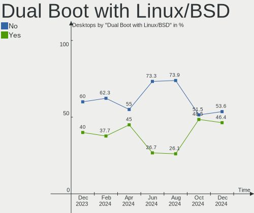
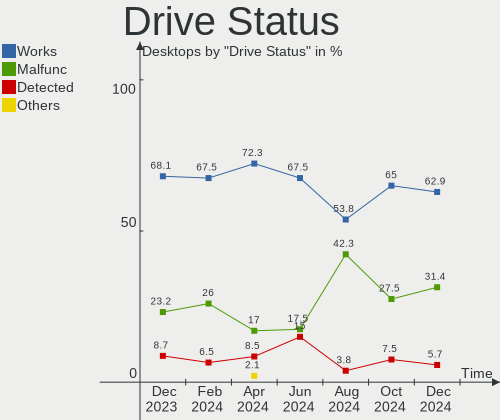

BlackPanther Hardware Trends (Desktop)
--------------------------------------

A project to identify most popular hardware characteristics and track their change
over time based on data collected by BlackPanther users at https://Linux-Hardware.org.

Anyone can contribute to the study by uploading probes of their computers by
the [hw-probe](https://github.com/linuxhw/hw-probe) tool:

    sudo hw-probe -all -upload

Full-feature report is available here: https://linux-hardware.org/?view=trends&formfactor=desktop

Period: Jan, 2020.

Contents
--------

- [ OS                       ](#os)
- [ OS Family                ](#os-family)
- [ Kernel                   ](#kernel)
- [ Kernel Family            ](#kernel-family)
- [ Kernel Major Ver.        ](#kernel-major-ver)
- [ Arch                     ](#arch)
- [ DE                       ](#de)
- [ Display Server           ](#display-server)
- [ OS Lang                  ](#os-lang)
- [ Boot Mode                ](#boot-mode)
- [ Filesystem               ](#filesystem)
- [ Dual Boot with Linux     ](#dual-boot-with-linux)
- [ Dual Boot (Win)          ](#dual-boot-win)
- [ Country                  ](#country)
- [ City                     ](#city)
- [ Vendor                   ](#vendor)
- [ Model                    ](#model)
- [ Model Family             ](#model-family)
- [ MFG Year                 ](#mfg-year)
- [ Form Factor              ](#form-factor)
- [ Secure Boot              ](#secure-boot)
- [ Coreboot                 ](#coreboot)
- [ RAM Size                 ](#ram-size)
- [ RAM Used                 ](#ram-used)
- [ Drive Vendor             ](#drive-vendor)
- [ Drive Model              ](#drive-model)
- [ Drive Kind               ](#drive-kind)
- [ Drive Connector          ](#drive-connector)
- [ Drive Size               ](#drive-size)
- [ Space Total              ](#space-total)
- [ Space Used               ](#space-used)
- [ Malfunc. Drives          ](#malfunc-drives)
- [ Malfunc. Drive Vendor    ](#malfunc-drive-vendor)
- [ Malfunc. Drive Kind      ](#malfunc-drive-kind)
- [ Failed Drives            ](#failed-drives)
- [ Failed Drive Vendor      ](#failed-drive-vendor)
- [ Drive Status             ](#drive-status)
- [ Storage Vendor           ](#storage-vendor)
- [ Storage Model            ](#storage-model)
- [ Storage Kind             ](#storage-kind)
- [ CPU Vendor               ](#cpu-vendor)
- [ CPU Model                ](#cpu-model)
- [ CPU Model Family         ](#cpu-model-family)
- [ CPU Cores                ](#cpu-cores)
- [ CPU Sockets              ](#cpu-sockets)
- [ CPU Threads              ](#cpu-threads)
- [ CPU Op-Modes             ](#cpu-op-modes)
- [ CPU Microarch            ](#cpu-microarch)
- [ CPU Microcode            ](#cpu-microcode)
- [ GPU Vendor               ](#gpu-vendor)
- [ GPU Model                ](#gpu-model)
- [ GPU Combo                ](#gpu-combo)
- [ GPU Driver               ](#gpu-driver)
- [ GPU Memory               ](#gpu-memory)
- [ Monitor Vendor           ](#monitor-vendor)
- [ Monitor Model            ](#monitor-model)
- [ Monitor Resolution       ](#monitor-resolution)
- [ Monitor Diagonal         ](#monitor-diagonal)
- [ Monitor Width            ](#monitor-width)
- [ Aspect Ratio             ](#aspect-ratio)
- [ Monitor Area             ](#monitor-area)
- [ Pixel Density            ](#pixel-density)
- [ Multiple Monitors        ](#multiple-monitors)
- [ Net Controller Vendor    ](#net-controller-vendor)
- [ Net Controller Model     ](#net-controller-model)
- [ Net Controller Kind      ](#net-controller-kind)
- [ Used Controller          ](#used-controller)
- [ NICs                     ](#nics)
- [ Unsupported Devices      ](#unsupported-devices)
- [ Unsupported Device Types ](#unsupported-device-types)

OS
--

Installed operating systems

| Name              | Computers | Percent |
|-------------------|-----------|---------|
| BlackPanther 18.1 | 110       | 83.97%  |
| BlackPanther 16.2 | 21        | 16.03%  |

OS Family
---------

OS without a version

| Name         | Computers | Percent |
|--------------|-----------|---------|
| BlackPanther | 131       | 100%    |

Kernel
------

Version of the Linux kernel

| Version                 | Computers | Percent |
|-------------------------|-----------|---------|
| 4.18.16-desktop-1bP     | 102       | 77.86%  |
| 4.9.20-desktop-pae-1bP  | 20        | 15.27%  |
| 5.1.15-desktop-1bP      | 7         | 5.34%   |
| 5.1.15-server-1bP       | 1         | 0.76%   |
| 4.14.14-desktop-pae-1bP | 1         | 0.76%   |

Kernel Family
-------------

Linux kernel without a distro release

| Version | Computers | Percent |
|---------|-----------|---------|
| 4.18.16 | 102       | 77.86%  |
| 4.9.20  | 20        | 15.27%  |
| 5.1.15  | 8         | 6.11%   |
| 4.14.14 | 1         | 0.76%   |

Kernel Major Ver.
-----------------

Linux kernel major version

| Version | Computers | Percent |
|---------|-----------|---------|
| 4.18    | 102       | 77.86%  |
| 4.9     | 20        | 15.27%  |
| 5.1     | 8         | 6.11%   |
| 4.14    | 1         | 0.76%   |

Arch
----

OS architecture (x86_64, i586, etc.)

| Name   | Computers | Percent |
|--------|-----------|---------|
| x86_64 | 110       | 83.97%  |
| i686   | 21        | 16.03%  |

DE
--

Desktop Environment

| Name | Computers | Percent |
|------|-----------|---------|
| KDE5 | 131       | 100%    |

Display Server
--------------

X11 or Wayland

| Name | Computers | Percent |
|------|-----------|---------|
| X11  | 131       | 100%    |

OS Lang
-------

Language

| Lang    | Computers | Percent |
|---------|-----------|---------|
| Unknown | 131       | 100%    |

Boot Mode
---------

EFI or BIOS

| Mode | Computers | Percent |
|------|-----------|---------|
| BIOS | 105       | 80.15%  |
| EFI  | 26        | 19.85%  |

Filesystem
----------

Type of filesystem

| Type    | Computers | Percent |
|---------|-----------|---------|
| Ext4    | 115       | 87.79%  |
| Overlay | 13        | 9.92%   |
| Btrfs   | 2         | 1.53%   |
| Ext2    | 1         | 0.76%   |

Dual Boot with Linux
--------------------

Hosting more than one Linux

| Dual boot | Computers | Percent |
|-----------|-----------|---------|
| No        | 98        | 74.81%  |
| Yes       | 33        | 25.19%  |

Dual Boot (Win)
---------------

Hosting Linux and Windows

| Dual boot | Computers | Percent |
|-----------|-----------|---------|
| No        | 72        | 54.96%  |
| Yes       | 59        | 45.04%  |

Country
-------

Geographic location (country)

| Country      | Computers | Percent |
|--------------|-----------|---------|
| Hungary      | 103       | 78.63%  |
| Romania      | 7         | 5.34%   |
| France       | 5         | 3.82%   |
| USA          | 4         | 3.05%   |
| Germany      | 3         | 2.29%   |
| Canada       | 2         | 1.53%   |
| Switzerland  | 1         | 0.76%   |
| South Africa | 1         | 0.76%   |
| Poland       | 1         | 0.76%   |
| Pakistan     | 1         | 0.76%   |
| Italy        | 1         | 0.76%   |
| Brazil       | 1         | 0.76%   |
| Australia    | 1         | 0.76%   |

City
----

Geographic location (city)

| City                  | Computers | Percent |
|-----------------------|-----------|---------|
| Budapest              | 22        | 16.79%  |
| Eger                  | 16        | 12.21%  |
| Miskolc               | 5         | 3.82%   |
| Győr                 | 4         | 3.05%   |
| Ujkigyos              | 2         | 1.53%   |
| Szombathely           | 2         | 1.53%   |
| Szentgyorgyvolgy      | 2         | 1.53%   |
| Pécs                 | 2         | 1.53%   |
| Oroshaza              | 2         | 1.53%   |
| Odorheiu Secuiesc     | 2         | 1.53%   |
| Nagyszenas            | 2         | 1.53%   |
| Kiskunfelegyhaza      | 2         | 1.53%   |
| Gyomro                | 2         | 1.53%   |
| Gyal                  | 2         | 1.53%   |
| Balatonboglar         | 2         | 1.53%   |
| Zurich                | 1         | 0.76%   |
| Zalalovo              | 1         | 0.76%   |
| Wysokie Mazowieckie   | 1         | 0.76%   |
| Wolnzach              | 1         | 0.76%   |
| Veszprém             | 1         | 0.76%   |
| Velem                 | 1         | 0.76%   |
| Vecses                | 1         | 0.76%   |
| Vancouver             | 1         | 0.76%   |
| Vallaj                | 1         | 0.76%   |
| Toronto               | 1         | 0.76%   |
| Tiszafured            | 1         | 0.76%   |
| Terre Haute           | 1         | 0.76%   |
| Tata                  | 1         | 0.76%   |
| São Borja            | 1         | 0.76%   |
| Székesfehérvár     | 1         | 0.76%   |
| Szeged                | 1         | 0.76%   |
| Souffelweyersheim     | 1         | 0.76%   |
| Satu Mare             | 1         | 0.76%   |
| Pomaz                 | 1         | 0.76%   |
| Placanica             | 1         | 0.76%   |
| Piatra Neamţ         | 1         | 0.76%   |
| Oradea                | 1         | 0.76%   |
| Onga                  | 1         | 0.76%   |
| Nyiregyhaza           | 1         | 0.76%   |
| Nyekladhaza           | 1         | 0.76%   |
| Norristown            | 1         | 0.76%   |
| Nice                  | 1         | 0.76%   |
| Nagykata              | 1         | 0.76%   |
| Mucsony               | 1         | 0.76%   |
| Mosonmagyaróvár     | 1         | 0.76%   |
| Mezokovesd            | 1         | 0.76%   |
| Mezobereny            | 1         | 0.76%   |
| Metz                  | 1         | 0.76%   |
| Le Temple-de-Bretagne | 1         | 0.76%   |
| Kornye                | 1         | 0.76%   |
| Keszthely             | 1         | 0.76%   |
| Kecskemét            | 1         | 0.76%   |
| Karachi               | 1         | 0.76%   |
| Kajaszo               | 1         | 0.76%   |
| Johannesburg          | 1         | 0.76%   |
| Janoshalma            | 1         | 0.76%   |
| Hotto                 | 1         | 0.76%   |
| Heves                 | 1         | 0.76%   |
| Hemau                 | 1         | 0.76%   |
| Hatvan                | 1         | 0.76%   |

Vendor
------

Motherboard manufacturer

| Name                | Computers | Percent |
|---------------------|-----------|---------|
| Dell                | 25        | 19.08%  |
| Gigabyte Technology | 23        | 17.56%  |
| ASRock              | 23        | 17.56%  |
| ASUSTek Computer    | 22        | 16.79%  |
| Hewlett-Packard     | 12        | 9.16%   |
| MSI                 | 8         | 6.11%   |
| Lenovo              | 5         | 3.82%   |
| Fujitsu Siemens     | 5         | 3.82%   |
| Fujitsu             | 2         | 1.53%   |
| Medion              | 1         | 0.76%   |
| Intel               | 1         | 0.76%   |
| Gateway             | 1         | 0.76%   |
| Foxconn             | 1         | 0.76%   |
| Biostar             | 1         | 0.76%   |
| Acer                | 1         | 0.76%   |

Model
-----

Motherboard model

| Name                                   | Computers | Percent |
|----------------------------------------|-----------|---------|
| Dell OptiPlex 3020                     | 9         | 6.87%   |
| Gigabyte H61M-S1                       | 5         | 3.82%   |
| ASRock G41M-VS3                        | 4         | 3.05%   |
| Dell OptiPlex 760                      | 3         | 2.29%   |
| Dell OptiPlex 755                      | 3         | 2.29%   |
| Dell OptiPlex 7010                     | 3         | 2.29%   |
| HP Compaq Elite 8300 CMT               | 2         | 1.53%   |
| Gigabyte G31M-ES2L                     | 2         | 1.53%   |
| Gigabyte B85M-DS3H-A                   | 2         | 1.53%   |
| Gigabyte 970A-DS3P                     | 2         | 1.53%   |
| Dell OptiPlex 780                      | 2         | 1.53%   |
| ASUS P5KPL-AM SE                       | 2         | 1.53%   |
| ASRock G31M-GS                         | 2         | 1.53%   |
| MSI MS-7A74                            | 1         | 0.76%   |
| MSI MS-7996                            | 1         | 0.76%   |
| MSI MS-7883                            | 1         | 0.76%   |
| MSI MS-7817                            | 1         | 0.76%   |
| MSI MS-7680                            | 1         | 0.76%   |
| MSI MS-7512                            | 1         | 0.76%   |
| MSI MS-7309                            | 1         | 0.76%   |
| MSI MS-7235                            | 1         | 0.76%   |
| Medion MS-7748                         | 1         | 0.76%   |
| Lenovo ThinkStation D20 4158AF8        | 1         | 0.76%   |
| Lenovo ThinkStation C30 1097A34        | 1         | 0.76%   |
| Lenovo ThinkCentre M91 2491A1G         | 1         | 0.76%   |
| Lenovo ThinkCentre M58p 6138DK1        | 1         | 0.76%   |
| Lenovo ThinkCentre M58 7637A2G         | 1         | 0.76%   |
| Intel D865PERL AAC27648-208            | 1         | 0.76%   |
| HP ProDesk 600 G2 SFF                  | 1         | 0.76%   |
| HP Pavilion Power Desktop 580-1xx      | 1         | 0.76%   |
| HP Compaq Pro 6305 MT                  | 1         | 0.76%   |
| HP Compaq Pro 6300 MT                  | 1         | 0.76%   |
| HP Compaq Pro 6300 All-in-One PC       | 1         | 0.76%   |
| HP Compaq dc7900 Convertible Minitower | 1         | 0.76%   |
| HP Compaq 8200 Elite SFF PC            | 1         | 0.76%   |
| HP Compaq 8000 Elite SFF PC            | 1         | 0.76%   |
| HP Compaq 6200 Pro MT PC               | 1         | 0.76%   |
| HP 750-114                             | 1         | 0.76%   |
| Gigabyte Z270X-Ultra Gaming            | 1         | 0.76%   |
| Gigabyte totem                         | 1         | 0.76%   |
| Gigabyte H61MA-D3V                     | 1         | 0.76%   |
| Gigabyte H310M H 2.0                   | 1         | 0.76%   |
| Gigabyte GA-78LMT-USB3 6.0             | 1         | 0.76%   |
| Gigabyte GA-78LMT-S2                   | 1         | 0.76%   |
| Gigabyte G41M-ES2L                     | 1         | 0.76%   |
| Gigabyte F2A88XM-HD3                   | 1         | 0.76%   |
| Gigabyte F2A88XM-D3H                   | 1         | 0.76%   |
| Gigabyte F2A78M-DS2                    | 1         | 0.76%   |
| Gigabyte F2A68HM-DS2                   | 1         | 0.76%   |
| Gigabyte 8I945GZME-RH                  | 1         | 0.76%   |
| Gateway DT55                           | 1         | 0.76%   |
| Fujitsu Siemens ESPRIMO P5925          | 1         | 0.76%   |
| Fujitsu Siemens ESPRIMO E5625          | 1         | 0.76%   |
| Fujitsu Siemens ESPRIMO E              | 1         | 0.76%   |
| Fujitsu Siemens ESPRIMO C5730          | 1         | 0.76%   |
| Fujitsu Siemens D2584-A1               | 1         | 0.76%   |
| Fujitsu ESPRIMO P910                   | 1         | 0.76%   |
| Fujitsu ESPRIMO P700                   | 1         | 0.76%   |
| Foxconn Pro 3500 Series                | 1         | 0.76%   |
| Dell OptiPlex GX520                    | 1         | 0.76%   |

Model Family
------------

Motherboard model prefix

| Name                     | Computers | Percent |
|--------------------------|-----------|---------|
| Dell OptiPlex            | 24        | 18.32%  |
| HP Compaq                | 9         | 6.87%   |
| Gigabyte H61M-S1         | 5         | 3.82%   |
| Fujitsu Siemens ESPRIMO  | 4         | 3.05%   |
| ASRock G41M-VS3          | 4         | 3.05%   |
| Lenovo ThinkCentre       | 3         | 2.29%   |
| ASUS P5KPL-AM            | 3         | 2.29%   |
| Lenovo ThinkStation      | 2         | 1.53%   |
| Gigabyte G31M-ES2L       | 2         | 1.53%   |
| Gigabyte B85M-DS3H-A     | 2         | 1.53%   |
| Gigabyte 970A-DS3P       | 2         | 1.53%   |
| Fujitsu ESPRIMO          | 2         | 1.53%   |
| ASUS ROG                 | 2         | 1.53%   |
| ASUS Rampage             | 2         | 1.53%   |
| ASRock G31M-GS           | 2         | 1.53%   |
| MSI MS-7A74              | 1         | 0.76%   |
| MSI MS-7996              | 1         | 0.76%   |
| MSI MS-7883              | 1         | 0.76%   |
| MSI MS-7817              | 1         | 0.76%   |
| MSI MS-7680              | 1         | 0.76%   |
| MSI MS-7512              | 1         | 0.76%   |
| MSI MS-7309              | 1         | 0.76%   |
| MSI MS-7235              | 1         | 0.76%   |
| Medion MS-7748           | 1         | 0.76%   |
| Intel D865PERL           | 1         | 0.76%   |
| HP ProDesk               | 1         | 0.76%   |
| HP Pavilion              | 1         | 0.76%   |
| HP 750-114               | 1         | 0.76%   |
| Gigabyte Z270X-Ultra     | 1         | 0.76%   |
| Gigabyte totem           | 1         | 0.76%   |
| Gigabyte H61MA-D3V       | 1         | 0.76%   |
| Gigabyte H310M           | 1         | 0.76%   |
| Gigabyte GA-78LMT-USB3   | 1         | 0.76%   |
| Gigabyte GA-78LMT-S2     | 1         | 0.76%   |
| Gigabyte G41M-ES2L       | 1         | 0.76%   |
| Gigabyte F2A88XM-HD3     | 1         | 0.76%   |
| Gigabyte F2A88XM-D3H     | 1         | 0.76%   |
| Gigabyte F2A78M-DS2      | 1         | 0.76%   |
| Gigabyte F2A68HM-DS2     | 1         | 0.76%   |
| Gigabyte 8I945GZME-RH    | 1         | 0.76%   |
| Gateway DT55             | 1         | 0.76%   |
| Fujitsu Siemens D2584-A1 | 1         | 0.76%   |
| Foxconn Pro              | 1         | 0.76%   |
| Dell Inspiron            | 1         | 0.76%   |
| Biostar A68N-5600        | 1         | 0.76%   |
| ASUS UNLOCK              | 1         | 0.76%   |
| ASUS PRIME               | 1         | 0.76%   |
| ASUS P7P55D-E            | 1         | 0.76%   |
| ASUS P7P55D              | 1         | 0.76%   |
| ASUS P5QL                | 1         | 0.76%   |
| ASUS P5QD                | 1         | 0.76%   |
| ASUS P5Q-PRO             | 1         | 0.76%   |
| ASUS P5PL2-E             | 1         | 0.76%   |
| ASUS P5K-VM              | 1         | 0.76%   |
| ASUS Maximus             | 1         | 0.76%   |
| ASUS M5A97               | 1         | 0.76%   |
| ASUS M2N68-VM            | 1         | 0.76%   |
| ASUS M2N68-AM            | 1         | 0.76%   |
| ASUS M2A-VM              | 1         | 0.76%   |
| ASUS All                 | 1         | 0.76%   |

MFG Year
--------

Motherboard manufacture year

| Year | Computers | Percent |
|------|-----------|---------|
| 2018 | 19        | 14.5%   |
| 2012 | 19        | 14.5%   |
| 2011 | 16        | 12.21%  |
| 2009 | 14        | 10.69%  |
| 2013 | 12        | 9.16%   |
| 2015 | 10        | 7.63%   |
| 2010 | 9         | 6.87%   |
| 2014 | 8         | 6.11%   |
| 2008 | 8         | 6.11%   |
| 2007 | 5         | 3.82%   |
| 2019 | 4         | 3.05%   |
| 2016 | 3         | 2.29%   |
| 2017 | 2         | 1.53%   |
| 2005 | 1         | 0.76%   |
| 2003 | 1         | 0.76%   |

Form Factor
-----------

Physical design of the computer

| Name    | Computers | Percent |
|---------|-----------|---------|
| Desktop | 131       | 100%    |

Secure Boot
-----------

Enabled or disabled

| State    | Computers | Percent |
|----------|-----------|---------|
| Disabled | 131       | 100%    |

Coreboot
--------

Have coreboot on board

| Used | Computers | Percent |
|------|-----------|---------|
| No   | 131       | 100%    |

RAM Size
--------

Total RAM memory

| Size in GB | Computers | Percent |
|------------|-----------|---------|
| 3.01-4.0   | 52        | 39.69%  |
| 8.01-16.0  | 26        | 19.85%  |
| 1.01-2.0   | 17        | 12.98%  |
| 4.01-8.0   | 13        | 9.92%   |
| 16.01-24.0 | 13        | 9.92%   |
| 2.01-3.0   | 6         | 4.58%   |
| 32.01-64.0 | 3         | 2.29%   |
| 24.01-32.0 | 1         | 0.76%   |

RAM Used
--------

Used RAM memory

| Used GB  | Computers | Percent |
|----------|-----------|---------|
| 0.01-1.0 | 63        | 48.09%  |
| 1.01-2.0 | 56        | 42.75%  |
| 2.01-3.0 | 11        | 8.4%    |
| 4.01-8.0 | 1         | 0.76%   |

Drive Vendor
------------

Hard drive vendors

| Vendor              | Computers | Drives | Percent |
|---------------------|-----------|--------|---------|
| Seagate             | 53        | 64     | 27.75%  |
| WDC                 | 48        | 59     | 25.13%  |
| Samsung Electronics | 23        | 23     | 12.04%  |
| Kingston            | 18        | 24     | 9.42%   |
| Hitachi             | 9         | 9      | 4.71%   |
| Maxtor              | 7         | 7      | 3.66%   |
| Toshiba             | 6         | 6      | 3.14%   |
| A-DATA Technology   | 5         | 5      | 2.62%   |
| Crucial             | 3         | 3      | 1.57%   |
| SanDisk             | 2         | 2      | 1.05%   |
| Patriot             | 2         | 2      | 1.05%   |
| HGST                | 2         | 2      | 1.05%   |
| Corsair             | 2         | 3      | 1.05%   |
| Apacer              | 2         | 2      | 1.05%   |
| XPG                 | 1         | 1      | 0.52%   |
| SPCC                | 1         | 1      | 0.52%   |
| SK Hynix            | 1         | 1      | 0.52%   |
| Netac               | 1         | 1      | 0.52%   |
| Intel               | 1         | 1      | 0.52%   |
| Gigabyte Technology | 1         | 1      | 0.52%   |
| Generic             | 1         | 1      | 0.52%   |
| BIWIN               | 1         | 1      | 0.52%   |
| AMD                 | 1         | 1      | 0.52%   |

Drive Model
-----------

Hard drive models

| Model                        | Computers | Percent |
|------------------------------|-----------|---------|
| ST500DM002-1BD142 500GB      | 11        | 5.09%   |
| SA400S37240G 240GB SSD       | 5         | 2.31%   |
| WD5000AAKX-001CA0 500GB      | 4         | 1.85%   |
| ST380815AS 80GB              | 4         | 1.85%   |
| ST3250318AS 250GB            | 4         | 1.85%   |
| HDS721050CLA360 500GB        | 4         | 1.85%   |
| WD10EZEX-08WN4A0 1TB         | 3         | 1.39%   |
| SV300S37A240G 240GB SSD      | 3         | 1.39%   |
| SUV400S37120G 120GB SSD      | 3         | 1.39%   |
| ST3160318AS 160GB            | 3         | 1.39%   |
| DT01ACA100 1TB               | 3         | 1.39%   |
| WDS240G2G0B-00EPW0 240GB SSD | 2         | 0.93%   |
| WD5000AVCS-632DY1 500GB      | 2         | 0.93%   |
| WD5000AAKX-22ERMA0 500GB     | 2         | 0.93%   |
| WD5000AAKS-00UU3A0 500GB     | 2         | 0.93%   |
| WD5000AADS-00S9B0 500GB      | 2         | 0.93%   |
| WD2500AAKX-60U6AA0 250GB     | 2         | 0.93%   |
| SV300S37A120G 120GB SSD      | 2         | 0.93%   |
| SU700 120GB SSD              | 2         | 0.93%   |
| STM3160813AS 160GB           | 2         | 0.93%   |
| ST3160815AS 160GB            | 2         | 0.93%   |
| ST250DM000-1BC141 250GB      | 2         | 0.93%   |
| ST1000DM003-1SB10C 1TB       | 2         | 0.93%   |
| ST1000DM003-1CH162 1TB       | 2         | 0.93%   |
| SSD 128GB                    | 2         | 0.93%   |
| SHFS37A120G 120GB SSD        | 2         | 0.93%   |
| SA400S37120G 120GB SSD       | 2         | 0.93%   |
| HDS721032CLA362 320GB        | 2         | 0.93%   |
| HD502HJ 500GB                | 2         | 0.93%   |
| HD161HJ 160GB                | 2         | 0.93%   |
| HD103UJ 1TB                  | 2         | 0.93%   |
| 6Y080M0 81GB                 | 2         | 0.93%   |
| WDS500G2X0C-00L350 500GB     | 1         | 0.46%   |
| WDS240G2G0A-00JH30 240GB SSD | 1         | 0.46%   |
| WDS120G1G0A-00SS50 120GB SSD | 1         | 0.46%   |
| WD800JD-55MUA1 80GB          | 1         | 0.46%   |
| WD800JD-00HKA0 80GB          | 1         | 0.46%   |
| WD800JB-00JJC0 80GB          | 1         | 0.46%   |
| WD6400AAKS-75A7B2 640GB      | 1         | 0.46%   |
| WD5003ABYZ-011FA0 500GB      | 1         | 0.46%   |
| WD5000AZRX-00A8LB0 500GB     | 1         | 0.46%   |
| WD5000AAKX-60U6AA0 500GB     | 1         | 0.46%   |
| WD5000AAKX-08ANVA0 500GB     | 1         | 0.46%   |
| WD5000AAKX-083CA1 500GB      | 1         | 0.46%   |
| WD5000AAKS-007AA0 500GB      | 1         | 0.46%   |
| WD5000AAJS-00YFA0 500GB      | 1         | 0.46%   |
| WD3200BEVT-22ZCT0 320GB      | 1         | 0.46%   |
| WD3200AVVS-63L2B0 320GB      | 1         | 0.46%   |
| WD3200AVVS-56L2B0 320GB      | 1         | 0.46%   |
| WD3200AAKS-00UU3A0 320GB     | 1         | 0.46%   |
| WD2500JB-00REA0 250GB        | 1         | 0.46%   |
| WD2500AVJS-63B6A0 250GB      | 1         | 0.46%   |
| WD2500AAKX-75U6AA0 250GB     | 1         | 0.46%   |
| WD2500AAJS-00VTA0 250GB      | 1         | 0.46%   |
| WD2500AAJS-00V4A0 250GB      | 1         | 0.46%   |
| WD20EFRX-68EUZN0 2TB         | 1         | 0.46%   |
| WD20EARX-008FB0 2TB          | 1         | 0.46%   |
| WD20EARS-60MVWB0 2TB         | 1         | 0.46%   |
| WD20EARS-00J2GB0 2TB         | 1         | 0.46%   |
| WD2000JB-00GVA0 200GB        | 1         | 0.46%   |

Drive Kind
----------

HDD or SSD

| Kind    | Computers | Drives | Percent |
|---------|-----------|--------|---------|
| HDD     | 118       | 157    | 70.24%  |
| SSD     | 43        | 56     | 25.6%   |
| NVMe    | 6         | 6      | 3.57%   |
| Unknown | 1         | 1      | 0.6%    |

Drive Connector
---------------

SATA, SAS, NVMe, etc.

| Type | Computers | Drives | Percent |
|------|-----------|--------|---------|
| SATA | 131       | 210    | 92.91%  |
| NVMe | 6         | 6      | 4.26%   |
| SAS  | 4         | 4      | 2.84%   |

Drive Size
----------

Size of hard drive

| Size in TB | Computers | Drives | Percent |
|------------|-----------|--------|---------|
| 0.01-0.5   | 119       | 167    | 75.32%  |
| 0.51-1.0   | 30        | 38     | 18.99%  |
| 1.01-2.0   | 8         | 13     | 5.06%   |
| 3.01-4.0   | 1         | 2      | 0.63%   |

Space Total
-----------

Amount of disk space available on the file system

| Size in GB     | Computers | Percent |
|----------------|-----------|---------|
| 101-250        | 49        | 37.4%   |
| 251-500        | 29        | 22.14%  |
| 51-100         | 18        | 13.74%  |
| Unknown        | 12        | 9.16%   |
| 501-1000       | 8         | 6.11%   |
| 21-50          | 6         | 4.58%   |
| 1-20           | 6         | 4.58%   |
| 1001-2000      | 2         | 1.53%   |
| More than 3000 | 1         | 0.76%   |

Space Used
----------

Amount of used disk space

| Used GB   | Computers | Percent |
|-----------|-----------|---------|
| 1-20      | 82        | 62.6%   |
| 21-50     | 23        | 17.56%  |
| Unknown   | 12        | 9.16%   |
| 101-250   | 5         | 3.82%   |
| 51-100    | 5         | 3.82%   |
| 501-1000  | 2         | 1.53%   |
| 2001-3000 | 1         | 0.76%   |
| 1001-2000 | 1         | 0.76%   |

Malfunc. Drives
---------------

Drive models with a malfunction

| Model                    | Computers | Drives | Percent |
|--------------------------|-----------|--------|---------|
| WD5000AAKX-001CA0 500GB  | 4         | 4      | 7.02%   |
| ST500DM002-1BD142 500GB  | 4         | 4      | 7.02%   |
| ST3250318AS 250GB        | 2         | 2      | 3.51%   |
| HDS721032CLA362 320GB    | 2         | 2      | 3.51%   |
| HD103UJ 1TB              | 2         | 2      | 3.51%   |
| 6Y080M0 81GB             | 2         | 2      | 3.51%   |
| WD800JD-00HKA0 80GB      | 1         | 1      | 1.75%   |
| WD800JB-00JJC0 80GB      | 1         | 1      | 1.75%   |
| WD6400AAKS-75A7B2 640GB  | 1         | 1      | 1.75%   |
| WD5003ABYZ-011FA0 500GB  | 1         | 1      | 1.75%   |
| WD5000AVCS-632DY1 500GB  | 1         | 1      | 1.75%   |
| WD5000AAKX-22ERMA0 500GB | 1         | 1      | 1.75%   |
| WD5000AAKX-083CA1 500GB  | 1         | 1      | 1.75%   |
| WD5000AAKS-00UU3A0 500GB | 1         | 1      | 1.75%   |
| WD5000AAKS-007AA0 500GB  | 1         | 1      | 1.75%   |
| WD5000AAJS-00YFA0 500GB  | 1         | 1      | 1.75%   |
| WD5000AADS-00S9B0 500GB  | 1         | 1      | 1.75%   |
| WD3200AVVS-63L2B0 320GB  | 1         | 1      | 1.75%   |
| WD2500AVJS-63B6A0 250GB  | 1         | 1      | 1.75%   |
| WD20EARS-60MVWB0 2TB     | 1         | 1      | 1.75%   |
| WD20EARS-00J2GB0 2TB     | 1         | 1      | 1.75%   |
| WD2000JB-00GVA0 200GB    | 1         | 1      | 1.75%   |
| WD10EZEX-75WN4A0 1TB     | 1         | 1      | 1.75%   |
| WD10EZEX-08WN4A0 1TB     | 1         | 1      | 1.75%   |
| WD10EARS-00Y5B1 1TB      | 1         | 1      | 1.75%   |
| SV1021D 10GB             | 1         | 1      | 1.75%   |
| SU700 120GB SSD          | 1         | 1      | 1.75%   |
| ST9160412AS 160GB        | 1         | 1      | 1.75%   |
| ST500LT012-1DG142 500GB  | 1         | 1      | 1.75%   |
| ST3500418AS 500GB        | 1         | 1      | 1.75%   |
| ST3320820AS 320GB        | 1         | 1      | 1.75%   |
| ST3160815AS 160GB        | 1         | 1      | 1.75%   |
| ST3160023AS 160GB        | 1         | 1      | 1.75%   |
| ST3120026AS 120GB        | 1         | 1      | 1.75%   |
| ST250DM000-1BD141 250GB  | 1         | 1      | 1.75%   |
| ST250DM000-1BC141 250GB  | 1         | 1      | 1.75%   |
| SP2004C 200GB            | 1         | 1      | 1.75%   |
| SP1614C 160GB            | 1         | 1      | 1.75%   |
| SC210 2.5 7MM 128GB SSD  | 1         | 1      | 1.75%   |
| HTS725050A7E630 500GB    | 1         | 1      | 1.75%   |
| HTS541075A9E680 752GB    | 1         | 1      | 1.75%   |
| HDS721050CLA360 500GB    | 1         | 1      | 1.75%   |
| HDS721010KLA330 1TB      | 1         | 1      | 1.75%   |
| HD502HJ 500GB            | 1         | 1      | 1.75%   |
| HD321KJ 320GB            | 1         | 1      | 1.75%   |
| HD082GJ 80GB             | 1         | 1      | 1.75%   |
| 6Y080L0 82GB             | 1         | 1      | 1.75%   |

Malfunc. Drive Vendor
---------------------

Vendors of faulty drives

| Vendor              | Computers | Drives | Percent |
|---------------------|-----------|--------|---------|
| WDC                 | 20        | 23     | 37.74%  |
| Seagate             | 14        | 15     | 26.42%  |
| Samsung Electronics | 8         | 8      | 15.09%  |
| Hitachi             | 4         | 4      | 7.55%   |
| Maxtor              | 3         | 3      | 5.66%   |
| HGST                | 2         | 2      | 3.77%   |
| SK Hynix            | 1         | 1      | 1.89%   |
| A-DATA Technology   | 1         | 1      | 1.89%   |

Malfunc. Drive Kind
-------------------

Kinds of faulty drives

| Kind | Computers | Drives | Percent |
|------|-----------|--------|---------|
| HDD  | 47        | 55     | 95.92%  |
| SSD  | 2         | 2      | 4.08%   |

Failed Drives
-------------

Failed drive models

Zero info for selected period =(

Failed Drive Vendor
-------------------

Failed drive vendors

Zero info for selected period =(

Drive Status
------------

Number of failed and malfunc. drives

| Status   | Computers | Drives | Percent |
|----------|-----------|--------|---------|
| Works    | 91        | 131    | 56.88%  |
| Malfunc  | 49        | 57     | 30.63%  |
| Detected | 20        | 32     | 12.5%   |

Storage Vendor
--------------

Storage controller vendors

| Vendor                      | Computers | Percent |
|-----------------------------|-----------|---------|
| Intel                       | 103       | 66.88%  |
| AMD                         | 21        | 13.64%  |
| Nvidia                      | 7         | 4.55%   |
| Marvell Technology Group    | 7         | 4.55%   |
| JMicron Technology          | 7         | 4.55%   |
| ASMedia Technology          | 3         | 1.95%   |
| Samsung Electronics         | 2         | 1.3%    |
| Kingston Technology Company | 2         | 1.3%    |
| Sandisk                     | 1         | 0.65%   |
| Realtek Semiconductor       | 1         | 0.65%   |

Storage Model
-------------

Storage controller models

| Model                                                                             | Computers | Percent |
|-----------------------------------------------------------------------------------|-----------|---------|
| NM10/ICH7 Family SATA Controller [IDE mode]                                       | 18        | 7.89%   |
| 82801G (ICH7 Family) IDE Controller                                               | 13        | 5.7%    |
| 8 Series/C220 Series Chipset Family 6-port SATA Controller 1 [AHCI mode]          | 13        | 5.7%    |
| FCH SATA Controller [AHCI mode]                                                   | 9         | 3.95%   |
| 7 Series/C210 Series Chipset Family 6-port SATA Controller [AHCI mode]            | 8         | 3.51%   |
| 6 Series/C200 Series Chipset Family 6 port Desktop SATA AHCI Controller           | 8         | 3.51%   |
| 6 Series/C200 Series Chipset Family Desktop SATA Controller (IDE mode, ports 4-5) | 7         | 3.07%   |
| 6 Series/C200 Series Chipset Family Desktop SATA Controller (IDE mode, ports 0-3) | 7         | 3.07%   |
| 4 Series Chipset PT IDER Controller                                               | 7         | 3.07%   |
| SB7x0/SB8x0/SB9x0 SATA Controller [AHCI mode]                                     | 6         | 2.63%   |
| SB7x0/SB8x0/SB9x0 IDE Controller                                                  | 6         | 2.63%   |
| 82801I (ICH9 Family) 2 port SATA Controller [IDE mode]                            | 6         | 2.63%   |
| 82Q35 Express PT IDER Controller                                                  | 5         | 2.19%   |
| 82801JD/DO (ICH10 Family) SATA AHCI Controller                                    | 5         | 2.19%   |
| 82801IR/IO/IH (ICH9R/DO/DH) 4 port SATA Controller [IDE mode]                     | 5         | 2.19%   |
| 200 Series PCH SATA controller [AHCI mode]                                        | 5         | 2.19%   |
| SB7x0/SB8x0/SB9x0 SATA Controller [IDE mode]                                      | 4         | 1.75%   |
| Q170/Q150/B150/H170/H110/Z170/CM236 Chipset SATA Controller [AHCI Mode]           | 4         | 1.75%   |
| Cannon Lake PCH SATA AHCI Controller                                              | 4         | 1.75%   |
| SATA Controller [RAID mode]                                                       | 3         | 1.32%   |
| MCP61 SATA Controller                                                             | 3         | 1.32%   |
| MCP61 IDE                                                                         | 3         | 1.32%   |
| JMB363 SATA/IDE Controller                                                        | 3         | 1.32%   |
| ASM1062 Serial ATA Controller                                                     | 3         | 1.32%   |
| 82801JI (ICH10 Family) SATA AHCI Controller                                       | 3         | 1.32%   |
| 82801JI (ICH10 Family) 4 port SATA IDE Controller #1                              | 3         | 1.32%   |
| 82801JI (ICH10 Family) 2 port SATA IDE Controller #2                              | 3         | 1.32%   |
| 82801JD/DO (ICH10 Family) 4-port SATA IDE Controller                              | 3         | 1.32%   |
| 82801JD/DO (ICH10 Family) 2-port SATA IDE Controller                              | 3         | 1.32%   |
| 82801HR/HO/HH (ICH8R/DO/DH) 2 port SATA Controller [IDE mode]                     | 3         | 1.32%   |
| 82801H (ICH8 Family) 4 port SATA Controller [IDE mode]                            | 3         | 1.32%   |
| NVMe SSD Controller SM981/PM981/PM983                                             | 2         | 0.88%   |
| JMB368 IDE controller                                                             | 2         | 0.88%   |
| FCH IDE Controller                                                                | 2         | 0.88%   |
| C600/X79 series chipset 6-Port SATA AHCI Controller                               | 2         | 0.88%   |
| 88SE6111/6121 SATA II / PATA Controller                                           | 2         | 0.88%   |
| 82801IR/IO/IH (ICH9R/DO/DH) 6 port SATA Controller [AHCI mode]                    | 2         | 0.88%   |
| WD Black 2018/PC SN720 NVMe SSD                                                   | 1         | 0.44%   |
| Technology Company Non-Volatile memory controller                                 | 1         | 0.44%   |
| SSD Pro 7600p/760p/E 6100p Series                                                 | 1         | 0.44%   |
| SSD 660P Series                                                                   | 1         | 0.44%   |
| SB600 Non-Raid-5 SATA                                                             | 1         | 0.44%   |
| SB600 IDE                                                                         | 1         | 0.44%   |
| Realtek Non-Volatile memory controller                                            | 1         | 0.44%   |
| nForce3 Serial ATA Controller                                                     | 1         | 0.44%   |
| MV64460/64461/64462 System Controller, Revision B                                 | 1         | 0.44%   |
| MCP78S [GeForce 8200] SATA Controller (non-AHCI mode)                             | 1         | 0.44%   |
| MCP67 IDE Controller                                                              | 1         | 0.44%   |
| MCP67 AHCI Controller                                                             | 1         | 0.44%   |
| MCP51 Serial ATA Controller                                                       | 1         | 0.44%   |
| JMB362 SATA Controller                                                            | 1         | 0.44%   |
| JMB361 AHCI/IDE                                                                   | 1         | 0.44%   |
| FCH SATA Controller [IDE mode]                                                    | 1         | 0.44%   |
| FCH SATA Controller D                                                             | 1         | 0.44%   |
| Digital HyperX Predator                                                           | 1         | 0.44%   |
| CK8S Parallel ATA Controller (v2.5)                                               | 1         | 0.44%   |
| C610/X99 series chipset sSATA Controller [AHCI mode]                              | 1         | 0.44%   |
| C610/X99 series chipset 6-Port SATA Controller [AHCI mode]                        | 1         | 0.44%   |
| C602 chipset 4-Port SATA Storage Control Unit                                     | 1         | 0.44%   |
| C600/X79 series chipset IDE-r Controller                                          | 1         | 0.44%   |

Storage Kind
------------

Kind of storage controller (IDE, SATA, NVMe, SAS, ...)

| Kind | Computers | Percent |
|------|-----------|---------|
| SATA | 78        | 50%     |
| IDE  | 67        | 42.95%  |
| NVMe | 6         | 3.85%   |
| RAID | 4         | 2.56%   |
| SAS  | 1         | 0.64%   |

CPU Vendor
----------

Processor vendors

| Vendor | Computers | Percent |
|--------|-----------|---------|
| Intel  | 103       | 78.63%  |
| AMD    | 28        | 21.37%  |

CPU Model
---------

Processor models

| Model                                       | Computers | Percent |
|---------------------------------------------|-----------|---------|
| Intel Core i3-4160 CPU @ 3.60GHz            | 9         | 6.87%   |
| Intel Core 2 Duo CPU E8400 @ 3.00GHz        | 6         | 4.58%   |
| Intel Pentium CPU G840 @ 2.80GHz            | 5         | 3.82%   |
| Intel Core 2 Duo CPU E7500 @ 2.93GHz        | 4         | 3.05%   |
| Intel Pentium Dual-Core CPU E5700 @ 3.00GHz | 3         | 2.29%   |
| Intel Pentium Dual-Core CPU E5400 @ 2.70GHz | 3         | 2.29%   |
| Intel Core i7-3770 CPU @ 3.40GHz            | 3         | 2.29%   |
| Intel Core i5-3470 CPU @ 3.20GHz            | 3         | 2.29%   |
| Intel Core i3-3220 CPU @ 3.30GHz            | 3         | 2.29%   |
| Intel Pentium Gold G5400 CPU @ 3.70GHz      | 2         | 1.53%   |
| Intel Pentium CPU G3220 @ 3.00GHz           | 2         | 1.53%   |
| Intel Core i7-8700 CPU @ 3.20GHz            | 2         | 1.53%   |
| Intel Core i5-4460 CPU @ 3.20GHz            | 2         | 1.53%   |
| Intel Core 2 Quad CPU Q8200 @ 2.33GHz       | 2         | 1.53%   |
| Intel Core 2 Quad CPU Q6600 @ 2.40GHz       | 2         | 1.53%   |
| Intel Core 2 Duo CPU E7400 @ 2.80GHz        | 2         | 1.53%   |
| Intel Core 2 CPU 6300 @ 1.86GHz             | 2         | 1.53%   |
| AMD FX-8350 Eight-Core Processor            | 2         | 1.53%   |
| AMD Athlon X4 860K Quad Core Processor      | 2         | 1.53%   |
| AMD Athlon 64 X2 Dual Core Processor 5000+  | 2         | 1.53%   |
| Intel Xeon CPU X5677 @ 3.47GHz              | 1         | 0.76%   |
| Intel Xeon CPU X5450 @ 3.00GHz              | 1         | 0.76%   |
| Intel Xeon CPU E5440 @ 2.83GHz              | 1         | 0.76%   |
| Intel Xeon CPU E5-2637 0 @ 3.00GHz          | 1         | 0.76%   |
| Intel Pentium Dual-Core CPU E6500 @ 2.93GHz | 1         | 0.76%   |
| Intel Pentium Dual-Core CPU E5500 @ 2.80GHz | 1         | 0.76%   |
| Intel Pentium Dual-Core CPU E5200 @ 2.50GHz | 1         | 0.76%   |
| Intel Pentium Dual CPU E2180 @ 2.00GHz      | 1         | 0.76%   |
| Intel Pentium Dual CPU E2160 @ 1.80GHz      | 1         | 0.76%   |
| Intel Pentium D CPU 3.40GHz                 | 1         | 0.76%   |
| Intel Pentium CPU G870 @ 3.10GHz            | 1         | 0.76%   |
| Intel Pentium CPU G860 @ 3.00GHz            | 1         | 0.76%   |
| Intel Pentium CPU G4560 @ 3.50GHz           | 1         | 0.76%   |
| Intel Pentium CPU G2020 @ 2.90GHz           | 1         | 0.76%   |
| Intel Pentium 4 CPU 3.00GHz                 | 1         | 0.76%   |
| Intel Pentium 4 CPU 2.60GHz                 | 1         | 0.76%   |
| Intel Core i7-8700K CPU @ 3.70GHz           | 1         | 0.76%   |
| Intel Core i7-5930K CPU @ 3.50GHz           | 1         | 0.76%   |
| Intel Core i7-3970X CPU @ 3.50GHz           | 1         | 0.76%   |
| Intel Core i7-2600 CPU @ 3.40GHz            | 1         | 0.76%   |
| Intel Core i5-9600K CPU @ 3.70GHz           | 1         | 0.76%   |
| Intel Core i5-7500 CPU @ 3.40GHz            | 1         | 0.76%   |
| Intel Core i5-7400 CPU @ 3.00GHz            | 1         | 0.76%   |
| Intel Core i5-6500 CPU @ 3.20GHz            | 1         | 0.76%   |
| Intel Core i5-6400 CPU @ 2.70GHz            | 1         | 0.76%   |
| Intel Core i5-2500S CPU @ 2.70GHz           | 1         | 0.76%   |
| Intel Core i5-2500 CPU @ 3.30GHz            | 1         | 0.76%   |
| Intel Core i5-2400 CPU @ 3.10GHz            | 1         | 0.76%   |
| Intel Core i5-2320 CPU @ 3.00GHz            | 1         | 0.76%   |
| Intel Core i5 CPU 760 @ 2.80GHz             | 1         | 0.76%   |
| Intel Core i5 CPU 650 @ 3.20GHz             | 1         | 0.76%   |
| Intel Core i3-8350K CPU @ 4.00GHz           | 1         | 0.76%   |
| Intel Core i3-7100 CPU @ 3.90GHz            | 1         | 0.76%   |
| Intel Core i3-2120 CPU @ 3.30GHz            | 1         | 0.76%   |
| Intel Core i3-2100 CPU @ 3.10GHz            | 1         | 0.76%   |
| Intel Core 2 Duo CPU E8300 @ 2.83GHz        | 1         | 0.76%   |
| Intel Core 2 Duo CPU E6850 @ 3.00GHz        | 1         | 0.76%   |
| Intel Core 2 Duo CPU E6550 @ 2.33GHz        | 1         | 0.76%   |
| Intel Core 2 Duo CPU E4600 @ 2.40GHz        | 1         | 0.76%   |
| Intel Core 2 Duo CPU E4500 @ 2.20GHz        | 1         | 0.76%   |

CPU Model Family
----------------

Processor model prefix

| Model                   | Computers | Percent |
|-------------------------|-----------|---------|
| Intel Core 2 Duo        | 17        | 12.98%  |
| Intel Core i5           | 16        | 12.21%  |
| Intel Core i3           | 16        | 12.21%  |
| Intel Pentium           | 11        | 8.4%    |
| Intel Pentium Dual-Core | 9         | 6.87%   |
| Intel Core i7           | 9         | 6.87%   |
| Intel Celeron           | 8         | 6.11%   |
| AMD FX                  | 5         | 3.82%   |
| Intel Xeon              | 4         | 3.05%   |
| Intel Core 2 Quad       | 4         | 3.05%   |
| AMD Athlon 64 X2        | 4         | 3.05%   |
| AMD Athlon X4           | 3         | 2.29%   |
| AMD A8                  | 3         | 2.29%   |
| Intel Pentium Gold      | 2         | 1.53%   |
| Intel Pentium Dual      | 2         | 1.53%   |
| Intel Pentium 4         | 2         | 1.53%   |
| Intel Core 2            | 2         | 1.53%   |
| AMD Athlon II X2        | 2         | 1.53%   |
| Intel Pentium D         | 1         | 0.76%   |
| AMD Sempron             | 1         | 0.76%   |
| AMD Ryzen 5             | 1         | 0.76%   |
| AMD Ryzen 3             | 1         | 0.76%   |
| AMD Phenom II X4        | 1         | 0.76%   |
| AMD Athlon II X4        | 1         | 0.76%   |
| AMD Athlon Dual Core    | 1         | 0.76%   |
| AMD Athlon 64           | 1         | 0.76%   |
| AMD Athlon              | 1         | 0.76%   |
| AMD A6                  | 1         | 0.76%   |
| AMD A4                  | 1         | 0.76%   |
| AMD A10                 | 1         | 0.76%   |

CPU Cores
---------

Number of processor cores

| Number | Computers | Percent |
|--------|-----------|---------|
| 2      | 77        | 58.78%  |
| 4      | 37        | 28.24%  |
| 1      | 10        | 7.63%   |
| 6      | 6         | 4.58%   |
| 3      | 1         | 0.76%   |

CPU Sockets
-----------

Number of sockets

| Number | Computers | Percent |
|--------|-----------|---------|
| 1      | 130       | 99.24%  |
| 2      | 1         | 0.76%   |

CPU Threads
-----------

Threads per core (Hyper-Threading)

| Number | Computers | Percent |
|--------|-----------|---------|
| 1      | 86        | 65.65%  |
| 2      | 45        | 34.35%  |

CPU Op-Modes
------------

CPU Operation Modes (32-bit, 64-bit)

| Op mode        | Computers | Percent |
|----------------|-----------|---------|
| 32-bit, 64-bit | 130       | 99.24%  |
| 32-bit         | 1         | 0.76%   |

CPU Microarch
-------------

Microarchitecture

| Name        | Computers | Percent |
|-------------|-----------|---------|
| Core        | 37        | 28.24%  |
| SandyBridge | 17        | 12.98%  |
| Skylake     | 14        | 10.69%  |
| Haswell     | 14        | 10.69%  |
| Piledriver  | 10        | 7.63%   |
| IvyBridge   | 10        | 7.63%   |
| K10         | 7         | 5.34%   |
| K8 Hammer   | 6         | 4.58%   |
| NetBurst    | 4         | 3.05%   |
| Penryn      | 3         | 2.29%   |
| Zen         | 2         | 1.53%   |
| Westmere    | 2         | 1.53%   |
| Steamroller | 2         | 1.53%   |
| Silvermont  | 1         | 0.76%   |
| Nehalem     | 1         | 0.76%   |
| K10 Llano   | 1         | 0.76%   |

CPU Microcode
-------------

Microcode number

| Number     | Computers | Percent |
|------------|-----------|---------|
| 0x1067a    | 22        | 16.79%  |
| 0x206a7    | 15        | 11.45%  |
| 0x306c3    | 13        | 9.92%   |
| 0x306a9    | 10        | 7.63%   |
| Unknown    | 10        | 7.63%   |
| 0x906ea    | 5         | 3.82%   |
| 0x06000852 | 5         | 3.82%   |
| 0x906e9    | 4         | 3.05%   |
| 0x6fd      | 4         | 3.05%   |
| 0x6fb      | 4         | 3.05%   |
| 0x06001119 | 4         | 3.05%   |
| 0x506e3    | 3         | 2.29%   |
| 0x10676    | 3         | 2.29%   |
| 0x010000c8 | 3         | 2.29%   |
| 0x6f2      | 2         | 1.53%   |
| 0x206d7    | 2         | 1.53%   |
| 0x10661    | 2         | 1.53%   |
| 0x06003106 | 2         | 1.53%   |
| 0xf64      | 1         | 0.76%   |
| 0xf49      | 1         | 0.76%   |
| 0xf43      | 1         | 0.76%   |
| 0xf29      | 1         | 0.76%   |
| 0x906ec    | 1         | 0.76%   |
| 0x906eb    | 1         | 0.76%   |
| 0x306f2    | 1         | 0.76%   |
| 0x30673    | 1         | 0.76%   |
| 0x206c2    | 1         | 0.76%   |
| 0x20652    | 1         | 0.76%   |
| 0x106e5    | 1         | 0.76%   |
| 0x10677    | 1         | 0.76%   |
| 0x0810100b | 1         | 0.76%   |
| 0x08001137 | 1         | 0.76%   |
| 0x03000027 | 1         | 0.76%   |
| 0x010000c6 | 1         | 0.76%   |
| 0x01000095 | 1         | 0.76%   |
| 0x01000086 | 1         | 0.76%   |

GPU Vendor
----------

Vendors of graphics cards

| Vendor | Computers | Percent |
|--------|-----------|---------|
| Intel  | 58        | 43.94%  |
| Nvidia | 45        | 34.09%  |
| AMD    | 29        | 21.97%  |

GPU Model
---------

Graphics card models

| Model                                                                 | Computers | Percent |
|-----------------------------------------------------------------------|-----------|---------|
| 4 Series Chipset Integrated Graphics Controller                       | 14        | 10.45%  |
| 4th Generation Core Processor Family Integrated Graphics Controller   | 9         | 6.72%   |
| 82G33/G31 Express Integrated Graphics Controller                      | 8         | 5.97%   |
| 2nd Generation Core Processor Family Integrated Graphics Controller   | 8         | 5.97%   |
| Xeon E3-1200 v2/3rd Gen Core processor Graphics Controller            | 4         | 2.99%   |
| GF119 [GeForce GT 610]                                                | 4         | 2.99%   |
| Xeon E3-1200 v3/4th Gen Core Processor Integrated Graphics Controller | 3         | 2.24%   |
| GT218 [GeForce 210]                                                   | 3         | 2.24%   |
| GP107 [GeForce GTX 1050]                                              | 3         | 2.24%   |
| GF108 [GeForce GT 730]                                                | 3         | 2.24%   |
| Caicos [Radeon HD 6450/7450/8450 / R5 230 OEM]                        | 3         | 2.24%   |
| 82Q35 Express Integrated Graphics Controller                          | 3         | 2.24%   |
| Oland PRO [Radeon R7 240/340]                                         | 2         | 1.49%   |
| HD Graphics 530                                                       | 2         | 1.49%   |
| GP108 [GeForce GT 1030]                                               | 2         | 1.49%   |
| GM200 [GeForce GTX 980 Ti]                                            | 2         | 1.49%   |
| GK208B [GeForce GT 710]                                               | 2         | 1.49%   |
| GF108 [GeForce GT 630]                                                | 2         | 1.49%   |
| G84 [GeForce 8600 GT]                                                 | 2         | 1.49%   |
| 82Q963/Q965 Integrated Graphics Controller                            | 2         | 1.49%   |
| 82945G/GZ Integrated Graphics Controller                              | 2         | 1.49%   |
| UHD Graphics 630 (Desktop)                                            | 1         | 0.75%   |
| Trinity [Radeon HD 7620G]                                             | 1         | 0.75%   |
| Trinity [Radeon HD 7560D]                                             | 1         | 0.75%   |
| Sumo [Radeon HD 6550D]                                                | 1         | 0.75%   |
| RV730 [Radeon HD 4600 AGP Series]                                     | 1         | 0.75%   |
| RV730 PRO [Radeon HD 4650]                                            | 1         | 0.75%   |
| RV710 [Radeon HD 4350/4550]                                           | 1         | 0.75%   |
| RV620 LE [Radeon HD 3450]                                             | 1         | 0.75%   |
| RV350 [Radeon 9550] (Secondary)                                       | 1         | 0.75%   |
| RV350 [Radeon 9550]                                                   | 1         | 0.75%   |
| RS780L [Radeon 3000]                                                  | 1         | 0.75%   |
| RS780 [Radeon HD 3200]                                                | 1         | 0.75%   |
| Richland [Radeon HD 8570D]                                            | 1         | 0.75%   |
| Richland [Radeon HD 8370D]                                            | 1         | 0.75%   |
| Redwood XT [Radeon HD 5670/5690/5730]                                 | 1         | 0.75%   |
| Raven Ridge [Radeon Vega Series / Radeon Vega Mobile Series]          | 1         | 0.75%   |
| Pitcairn PRO [Radeon HD 7850 / R7 265 / R9 270 1024SP]                | 1         | 0.75%   |
| Park [Mobility Radeon HD 5430]                                        | 1         | 0.75%   |
| Lexa PRO [Radeon 540/540X/550/550X / RX 540X/550/550X]                | 1         | 0.75%   |
| HD Graphics 510                                                       | 1         | 0.75%   |
| GT218 [GeForce 405]                                                   | 1         | 0.75%   |
| GT216 [GeForce GT 220]                                                | 1         | 0.75%   |
| GP107 [GeForce GTX 1050 Ti]                                           | 1         | 0.75%   |
| GP106 [GeForce GTX 1060 3GB]                                          | 1         | 0.75%   |
| GP104 [GeForce GTX 1070]                                              | 1         | 0.75%   |
| GP102 [GeForce GTX 1080 Ti]                                           | 1         | 0.75%   |
| GM204 [GeForce GTX 970]                                               | 1         | 0.75%   |
| GK208B [GeForce GT 730]                                               | 1         | 0.75%   |
| GK208B [GeForce GT 720]                                               | 1         | 0.75%   |
| GK107GL [Quadro K2000]                                                | 1         | 0.75%   |
| GK107 [GeForce GTX 650]                                               | 1         | 0.75%   |
| GK107 [GeForce GT 640 OEM]                                            | 1         | 0.75%   |
| GF119 [GeForce GT 520]                                                | 1         | 0.75%   |
| GF119 [GeForce 605]                                                   | 1         | 0.75%   |
| GF108 [GeForce GT 440]                                                | 1         | 0.75%   |
| GF108 [GeForce GT 430]                                                | 1         | 0.75%   |
| GF106GL [Quadro 2000]                                                 | 1         | 0.75%   |
| G96C [GeForce 9500 GT]                                                | 1         | 0.75%   |
| G96C [GeForce 9400 GT]                                                | 1         | 0.75%   |

GPU Combo
---------

Combinations of graphics cards

| Name        | Computers | Percent |
|-------------|-----------|---------|
| 1 x Intel   | 57        | 43.51%  |
| 1 x Nvidia  | 45        | 34.35%  |
| 1 x AMD     | 27        | 20.61%  |
| 2 x AMD     | 1         | 0.76%   |
| Intel + AMD | 1         | 0.76%   |

GPU Driver
----------

Free vs proprietary

| Driver      | Computers | Percent |
|-------------|-----------|---------|
| Free        | 129       | 98.47%  |
| Proprietary | 2         | 1.53%   |

GPU Memory
----------

Total video memory

| Size in GB | Computers | Percent |
|------------|-----------|---------|
| Unknown    | 49        | 37.4%   |
| 0.51-1.0   | 29        | 22.14%  |
| 1.01-2.0   | 22        | 16.79%  |
| 0.01-0.5   | 22        | 16.79%  |
| 3.01-4.0   | 4         | 3.05%   |
| 5.01-6.0   | 2         | 1.53%   |
| 7.01-8.0   | 1         | 0.76%   |
| 2.01-3.0   | 1         | 0.76%   |
| 8.01-16.0  | 1         | 0.76%   |

Monitor Vendor
--------------

Monitor vendors

| Vendor                  | Computers | Percent |
|-------------------------|-----------|---------|
| Goldstar                | 28        | 21.71%  |
| Samsung Electronics     | 23        | 17.83%  |
| HKC                     | 9         | 6.98%   |
| Dell                    | 9         | 6.98%   |
| Hewlett-Packard         | 7         | 5.43%   |
| Philips                 | 6         | 4.65%   |
| Acer                    | 6         | 4.65%   |
| BenQ                    | 5         | 3.88%   |
| AOC                     | 5         | 3.88%   |
| Ancor Communications    | 5         | 3.88%   |
| Fujitsu Siemens         | 4         | 3.1%    |
| ViewSonic               | 3         | 2.33%   |
| Eizo                    | 3         | 2.33%   |
| Videoseven              | 1         | 0.78%   |
| Sony                    | 1         | 0.78%   |
| NXG                     | 1         | 0.78%   |
| NUL                     | 1         | 0.78%   |
| Medion                  | 1         | 0.78%   |
| LLL                     | 1         | 0.78%   |
| Lenovo                  | 1         | 0.78%   |
| KTC                     | 1         | 0.78%   |
| InnoLux Display         | 1         | 0.78%   |
| IMP                     | 1         | 0.78%   |
| Iiyama                  | 1         | 0.78%   |
| HannStar                | 1         | 0.78%   |
| GDH                     | 1         | 0.78%   |
| Chi Mei Optoelectronics | 1         | 0.78%   |
| Belinea                 | 1         | 0.78%   |
| Arnos Instruments       | 1         | 0.78%   |

Monitor Model
-------------

Monitor models

| Model                                                       | Computers | Percent |
|-------------------------------------------------------------|-----------|---------|
| Checksum: 0x8a (valid) HKC1850 1360x768 304x228mm 15.0-inch | 8         | 6.15%   |
| S19B150 SAM08A2 1366x768 410x230mm 18.5-inch                | 5         | 3.85%   |
| SyncMaster SAM055D 1920x1080 510x290mm 23.1-inch            | 2         | 1.54%   |
| SyncMaster SAM01E1 1280x1024 376x301mm 19.0-inch            | 2         | 1.54%   |
| SyncMaster SAM011E 1280x1024 338x270mm 17.0-inch            | 2         | 1.54%   |
| HD GSM5ACB 1366x768 410x230mm 18.5-inch                     | 2         | 1.54%   |
| GL951A BNQ7897 1440x900 408x255mm 18.9-inch                 | 2         | 1.54%   |
| FULL HD GSM5B54 1920x1080 480x270mm 21.7-inch               | 2         | 1.54%   |
| Z22i HWP308C 1920x1080 477x268mm 21.5-inch                  | 1         | 0.77%   |
| W2252 GSM567E 1680x1050 474x296mm 22.0-inch                 | 1         | 0.77%   |
| W2243 GSM56FE 1920x1080 477x269mm 21.6-inch                 | 1         | 0.77%   |
| W2240 GSM57A0 1920x1080 477x268mm 21.5-inch                 | 1         | 0.77%   |
| W2234 GSM56B8 1680x1050 474x296mm 22.0-inch                 | 1         | 0.77%   |
| w2216 HWP280B 1680x1050 465x291mm 21.6-inch                 | 1         | 0.77%   |
| W1946 GSM4BCD 1360x768 406x229mm 18.4-inch                  | 1         | 0.77%   |
| W1943 GSM4BAD 1024x768 410x230mm 18.5-inch                  | 1         | 0.77%   |
| W1934 GSM4B7A 1440x900 410x260mm 19.1-inch                  | 1         | 0.77%   |
| VE175 VSCF419 1280x1024 338x270mm 17.0-inch                 | 1         | 0.77%   |
| VC279 ACI27C4 1920x1080 598x336mm 27.0-inch                 | 1         | 0.77%   |
| VA926 Series VSC7D20 1280x1024 376x301mm 19.0-inch          | 1         | 0.77%   |
| VA2037 SERIES VSCCC2C 1600x900 432x240mm 19.5-inch          | 1         | 0.77%   |
| U2312HM DEL4071 1920x1080 510x287mm 23.0-inch               | 1         | 0.77%   |
| TV SNY4803 1920x1080 1107x623mm 50.0-inch                   | 1         | 0.77%   |
| TFT1780 AOC1780 1280x1024 304x228mm 15.0-inch               | 1         | 0.77%   |
| T90X BNQ76AF 1280x1024 376x301mm 19.0-inch                  | 1         | 0.77%   |
| T24C300 SAM0A9B 1920x1080 531x299mm 24.0-inch               | 1         | 0.77%   |
| T2200HD BNQ7726 1920x1080 477x268mm 21.5-inch               | 1         | 0.77%   |
| SyncMaster SAM021D 1680x1050 433x271mm 20.1-inch            | 1         | 0.77%   |
| SyncMaster SAM01AE 1600x1200 408x306mm 20.1-inch            | 1         | 0.77%   |
| SMEX2220 SAM0685 1920x1080 477x268mm 21.5-inch              | 1         | 0.77%   |
| SMBX2231 SAM076D 1920x1080 477x268mm 21.5-inch              | 1         | 0.77%   |
| SL22W-1 LED FUS07E1 1680x1050 474x296mm 22.0-inch           | 1         | 0.77%   |
| SE197FP DELF002 1280x1024 380x305mm 19.2-inch               | 1         | 0.77%   |
| S27F350 SAM0D22 1920x1080 598x336mm 27.0-inch               | 1         | 0.77%   |
| S23C650 SAM09DF 1920x1080 510x287mm 23.0-inch               | 1         | 0.77%   |
| S22D300 SAM0B3B 1920x1080 477x268mm 21.5-inch               | 1         | 0.77%   |
| S2202W ENC1976 1680x1050 474x297mm 22.0-inch                | 1         | 0.77%   |
| S2031 HWP2904 1600x900 443x249mm 20.0-inch                  | 1         | 0.77%   |
| S1921-X ENC2203 1280x1024 377x302mm 19.0-inch               | 1         | 0.77%   |
| S1921 ENC1831 1280x1024 376x301mm 19.0-inch                 | 1         | 0.77%   |
| R19W11 IMP1911 1440x900 410x257mm 19.1-inch                 | 1         | 0.77%   |
| PL2473HD IVM6107 1920x1080 521x293mm 23.5-inch              | 1         | 0.77%   |
| P246HL ACR023F 1920x1080 530x300mm 24.0-inch                | 1         | 0.77%   |
| P222va HWP322B 1920x1080 476x268mm 21.5-inch                | 1         | 0.77%   |
| P2213 DELF041 1680x1050 473x296mm 22.0-inch                 | 1         | 0.77%   |
| P205H ACR00C5 1600x900 440x250mm 19.9-inch                  | 1         | 0.77%   |
| MP59G GSM5B35 1920x1080 480x270mm 21.7-inch                 | 1         | 0.77%   |
| MIRAI DL-519N NXG138C 1280x1024 376x301mm 19.0-inch         | 1         | 0.77%   |
| MD30999PD MED89C3 1440x900 410x260mm 19.1-inch              | 1         | 0.77%   |
| M2280D GSM57B7 1920x1080 477x268mm 21.5-inch                | 1         | 0.77%   |
| LG FULL HD GSM5AB9 1680x1050 480x270mm 21.7-inch            | 1         | 0.77%   |
| LEN L171p LEN24C9 1280x1024 338x270mm 17.0-inch             | 1         | 0.77%   |
| LE2262 INL2262 1680x1050 473x296mm 22.0-inch                | 1         | 0.77%   |
| LE1901w HWP284E 1440x900 410x256mm 19.0-inch                | 1         | 0.77%   |
| LE1901w HWP2842 1440x900 410x256mm 19.0-inch                | 1         | 0.77%   |
| LCDTV HKC3393 1920x1080 520x290mm 23.4-inch                 | 1         | 0.77%   |
| LCD Monitor SAM0D3E 3840x2160 890x500mm 40.2-inch           | 1         | 0.77%   |
| LCD Monitor SAM0902 1920x1080 1020x570mm 46.0-inch          | 1         | 0.77%   |
| LCD Monitor SAM07C0 1920x1080 700x390mm 31.5-inch           | 1         | 0.77%   |
| LCD Monitor ASUS VS247 1920x1080                            | 1         | 0.77%   |

Monitor Resolution
------------------

Monitor screen resolution

| Resolution         | Computers | Percent |
|--------------------|-----------|---------|
| 1920x1080 (FHD)    | 42        | 33.6%   |
| 1280x1024 (SXGA)   | 26        | 20.8%   |
| 1440x900 (WXGA+)   | 13        | 10.4%   |
| 1680x1050 (WSXGA+) | 12        | 9.6%    |
| 1360x768           | 12        | 9.6%    |
| 1366x768 (WXGA)    | 8         | 6.4%    |
| 1024x768 (XGA)     | 4         | 3.2%    |
| 1600x900 (HD+)     | 3         | 2.4%    |
| 1600x1200          | 2         | 1.6%    |
| 3840x2160 (4K)     | 1         | 0.8%    |
| 2560x1440 (QHD)    | 1         | 0.8%    |
| 2560x1080          | 1         | 0.8%    |

Monitor Diagonal
----------------

Diagonal size in inches

| Inches  | Computers | Percent |
|---------|-----------|---------|
| 21      | 25        | 19.53%  |
| 19      | 20        | 15.63%  |
| 18      | 19        | 14.84%  |
| 17      | 13        | 10.16%  |
| 15      | 12        | 9.38%   |
| 23      | 11        | 8.59%   |
| 22      | 10        | 7.81%   |
| 27      | 4         | 3.13%   |
| 20      | 4         | 3.13%   |
| 40      | 2         | 1.56%   |
| 24      | 2         | 1.56%   |
| 55      | 1         | 0.78%   |
| 39      | 1         | 0.78%   |
| 34      | 1         | 0.78%   |
| 31      | 1         | 0.78%   |
| 12      | 1         | 0.78%   |
| Unknown | 1         | 0.78%   |

Monitor Width
-------------

Physical width

| Width in mm | Computers | Percent |
|-------------|-----------|---------|
| 401-500     | 63        | 50%     |
| 301-350     | 25        | 19.84%  |
| 501-600     | 17        | 13.49%  |
| 351-400     | 13        | 10.32%  |
| 801-900     | 3         | 2.38%   |
| 701-800     | 1         | 0.79%   |
| 601-700     | 1         | 0.79%   |
| 201-300     | 1         | 0.79%   |
| 1001-1500   | 1         | 0.79%   |
| Unknown     | 1         | 0.79%   |

Aspect Ratio
------------

Proportional relationship between the width and the height

| Ratio   | Computers | Percent |
|---------|-----------|---------|
| 16/9    | 59        | 47.2%   |
| 5/4     | 25        | 20%     |
| 16/10   | 25        | 20%     |
| 4/3     | 14        | 11.2%   |
| 21/9    | 1         | 0.8%    |
| Unknown | 1         | 0.8%    |

Monitor Area
------------

Area in inch²

| Area in inch² | Computers | Percent |
|----------------|-----------|---------|
| 151-200        | 50        | 39.37%  |
| 201-250        | 29        | 22.83%  |
| 141-150        | 24        | 18.9%   |
| 101-110        | 12        | 9.45%   |
| 301-350        | 4         | 3.15%   |
| 501-1000       | 3         | 2.36%   |
| 351-500        | 2         | 1.57%   |
| More than 1000 | 1         | 0.79%   |
| 71-80          | 1         | 0.79%   |
| Unknown        | 1         | 0.79%   |

Pixel Density
-------------

Pixels per inch

| Density | Computers | Percent |
|---------|-----------|---------|
| 51-100  | 86        | 69.92%  |
| 101-120 | 35        | 28.46%  |
| 1-50    | 1         | 0.81%   |
| Unknown | 1         | 0.81%   |

Multiple Monitors
-----------------

Total monitors connected

| Total | Computers | Percent |
|-------|-----------|---------|
| 1     | 121       | 92.37%  |
| 2     | 9         | 6.87%   |
| 0     | 1         | 0.76%   |

Net Controller Vendor
---------------------

Controller vendors

| Vendor              | Computers | Percent |
|---------------------|-----------|---------|
| Intel               | 32        | 80%     |
| Nvidia              | 4         | 10%     |
| Westell             | 1         | 2.5%    |
| Samsung Electronics | 1         | 2.5%    |
| Edimax Technology   | 1         | 2.5%    |
| Android             | 1         | 2.5%    |

Net Controller Model
--------------------

Controller models

| Model                                               | Computers | Percent |
|-----------------------------------------------------|-----------|---------|
| 82579LM Gigabit Network Connection (Lewisville)     | 13        | 30.95%  |
| 82567LM-3 Gigabit Network Connection                | 9         | 21.43%  |
| 82566DM-2 Gigabit Network Connection                | 4         | 9.52%   |
| MCP61 Ethernet                                      | 3         | 7.14%   |
| 82579V Gigabit Network Connection                   | 3         | 7.14%   |
| 82574L Gigabit Network Connection                   | 2         | 4.76%   |
| WireSpeed Dual Connect Modem                        | 1         | 2.38%   |
| SDM636-MTP _SN:5F93851E                             | 1         | 2.38%   |
| RTL8811AU AC600 USB                                 | 1         | 2.38%   |
| GT-I9070 (network tethering, USB debugging enabled) | 1         | 2.38%   |
| CK8S Ethernet Controller                            | 1         | 2.38%   |
| 82583V Gigabit Network Connection                   | 1         | 2.38%   |
| 82567LF-3 Gigabit Network Connection                | 1         | 2.38%   |
| 82566DM Gigabit Network Connection                  | 1         | 2.38%   |

Net Controller Kind
-------------------

Ethernet, WiFi or modem

| Kind     | Computers | Percent |
|----------|-----------|---------|
| Ethernet | 37        | 97.37%  |
| WiFi     | 1         | 2.63%   |

Used Controller
---------------

Currently used network controller

| Kind     | Computers | Percent |
|----------|-----------|---------|
| Ethernet | 29        | 100%    |

NICs
----

Total network controllers on board

| Total | Computers | Percent |
|-------|-----------|---------|
| 1     | 112       | 85.5%   |
| 2     | 17        | 12.98%  |
| 3     | 2         | 1.53%   |

Unsupported Devices
-------------------

Total unsupported devices on board

| Total | Computers | Percent |
|-------|-----------|---------|
| 0     | 128       | 97.71%  |
| 1     | 3         | 2.29%   |

Unsupported Device Types
------------------------

Types of unsupported devices

| Type             | Computers | Percent |
|------------------|-----------|---------|
| Unassigned class | 1         | 33.33%  |
| Chipcard         | 1         | 33.33%  |
| Card reader      | 1         | 33.33%  |

