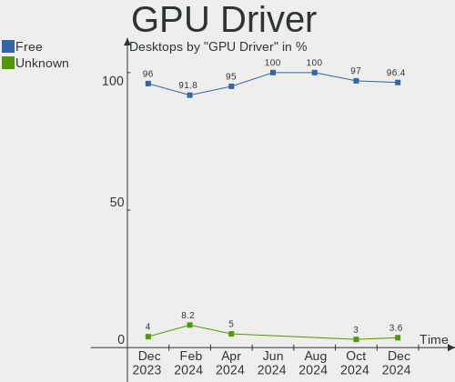
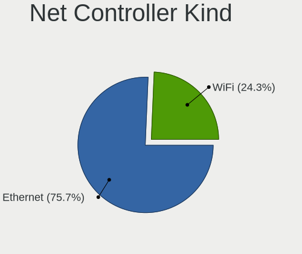

BlackPanther Hardware Trends (Desktop)
--------------------------------------

A project to identify most popular hardware characteristics and track their change
over time based on data collected by BlackPanther users at https://Linux-Hardware.org.

Anyone can contribute to the study by uploading probes of their computers by
the [hw-probe](https://github.com/linuxhw/hw-probe) tool:

    sudo hw-probe -all -upload

Full-feature report is available here: https://linux-hardware.org/?view=trends&formfactor=desktop

Period: Feb, 2020.

Contents
--------

- [ OS                       ](#os)
- [ OS Family                ](#os-family)
- [ Kernel                   ](#kernel)
- [ Kernel Family            ](#kernel-family)
- [ Kernel Major Ver.        ](#kernel-major-ver)
- [ Arch                     ](#arch)
- [ DE                       ](#de)
- [ Display Server           ](#display-server)
- [ OS Lang                  ](#os-lang)
- [ Boot Mode                ](#boot-mode)
- [ Filesystem               ](#filesystem)
- [ Dual Boot with Linux     ](#dual-boot-with-linux)
- [ Dual Boot (Win)          ](#dual-boot-win)
- [ Country                  ](#country)
- [ City                     ](#city)
- [ Vendor                   ](#vendor)
- [ Model                    ](#model)
- [ Model Family             ](#model-family)
- [ MFG Year                 ](#mfg-year)
- [ Form Factor              ](#form-factor)
- [ Secure Boot              ](#secure-boot)
- [ Coreboot                 ](#coreboot)
- [ RAM Size                 ](#ram-size)
- [ RAM Used                 ](#ram-used)
- [ Drive Vendor             ](#drive-vendor)
- [ Drive Model              ](#drive-model)
- [ Drive Kind               ](#drive-kind)
- [ Drive Connector          ](#drive-connector)
- [ Drive Size               ](#drive-size)
- [ Space Total              ](#space-total)
- [ Space Used               ](#space-used)
- [ Malfunc. Drives          ](#malfunc-drives)
- [ Malfunc. Drive Vendor    ](#malfunc-drive-vendor)
- [ Malfunc. Drive Kind      ](#malfunc-drive-kind)
- [ Failed Drives            ](#failed-drives)
- [ Failed Drive Vendor      ](#failed-drive-vendor)
- [ Drive Status             ](#drive-status)
- [ Storage Vendor           ](#storage-vendor)
- [ Storage Model            ](#storage-model)
- [ Storage Kind             ](#storage-kind)
- [ CPU Vendor               ](#cpu-vendor)
- [ CPU Model                ](#cpu-model)
- [ CPU Model Family         ](#cpu-model-family)
- [ CPU Cores                ](#cpu-cores)
- [ CPU Sockets              ](#cpu-sockets)
- [ CPU Threads              ](#cpu-threads)
- [ CPU Op-Modes             ](#cpu-op-modes)
- [ CPU Microarch            ](#cpu-microarch)
- [ CPU Microcode            ](#cpu-microcode)
- [ GPU Vendor               ](#gpu-vendor)
- [ GPU Model                ](#gpu-model)
- [ GPU Combo                ](#gpu-combo)
- [ GPU Driver               ](#gpu-driver)
- [ GPU Memory               ](#gpu-memory)
- [ Monitor Vendor           ](#monitor-vendor)
- [ Monitor Model            ](#monitor-model)
- [ Monitor Resolution       ](#monitor-resolution)
- [ Monitor Diagonal         ](#monitor-diagonal)
- [ Monitor Width            ](#monitor-width)
- [ Aspect Ratio             ](#aspect-ratio)
- [ Monitor Area             ](#monitor-area)
- [ Pixel Density            ](#pixel-density)
- [ Multiple Monitors        ](#multiple-monitors)
- [ Net Controller Vendor    ](#net-controller-vendor)
- [ Net Controller Model     ](#net-controller-model)
- [ Net Controller Kind      ](#net-controller-kind)
- [ Used Controller          ](#used-controller)
- [ NICs                     ](#nics)
- [ Unsupported Devices      ](#unsupported-devices)
- [ Unsupported Device Types ](#unsupported-device-types)

OS
--

Installed operating systems

| Name              | Computers | Percent |
|-------------------|-----------|---------|
| BlackPanther 18.1 | 104       | 95.41%  |
| BlackPanther 16.2 | 5         | 4.59%   |

OS Family
---------

OS without a version

| Name         | Computers | Percent |
|--------------|-----------|---------|
| BlackPanther | 109       | 100%    |

Kernel
------

Version of the Linux kernel

| Version                | Computers | Percent |
|------------------------|-----------|---------|
| 4.18.16-desktop-1bP    | 84        | 77.06%  |
| 5.1.15-desktop-1bP     | 19        | 17.43%  |
| 4.9.20-desktop-pae-1bP | 5         | 4.59%   |
| 5.1.15-server-1bP      | 1         | 0.92%   |

Kernel Family
-------------

Linux kernel without a distro release

| Version | Computers | Percent |
|---------|-----------|---------|
| 4.18.16 | 84        | 77.06%  |
| 5.1.15  | 20        | 18.35%  |
| 4.9.20  | 5         | 4.59%   |

Kernel Major Ver.
-----------------

Linux kernel major version

| Version | Computers | Percent |
|---------|-----------|---------|
| 4.18    | 84        | 77.06%  |
| 5.1     | 20        | 18.35%  |
| 4.9     | 5         | 4.59%   |

Arch
----

OS architecture (x86_64, i586, etc.)

| Name   | Computers | Percent |
|--------|-----------|---------|
| x86_64 | 104       | 95.41%  |
| i686   | 5         | 4.59%   |

DE
--

Desktop Environment

| Name | Computers | Percent |
|------|-----------|---------|
| KDE5 | 109       | 100%    |

Display Server
--------------

X11 or Wayland

| Name | Computers | Percent |
|------|-----------|---------|
| X11  | 109       | 100%    |

OS Lang
-------

Language

| Lang    | Computers | Percent |
|---------|-----------|---------|
| Unknown | 109       | 100%    |

Boot Mode
---------

EFI or BIOS

| Mode | Computers | Percent |
|------|-----------|---------|
| BIOS | 91        | 83.49%  |
| EFI  | 18        | 16.51%  |

Filesystem
----------

Type of filesystem

| Type    | Computers | Percent |
|---------|-----------|---------|
| Ext4    | 104       | 95.41%  |
| Overlay | 5         | 4.59%   |

Dual Boot with Linux
--------------------

Hosting more than one Linux

| Dual boot | Computers | Percent |
|-----------|-----------|---------|
| No        | 75        | 68.81%  |
| Yes       | 34        | 31.19%  |

Dual Boot (Win)
---------------

Hosting Linux and Windows

| Dual boot | Computers | Percent |
|-----------|-----------|---------|
| Yes       | 55        | 50.46%  |
| No        | 54        | 49.54%  |

Country
-------

Geographic location (country)

| Country     | Computers | Percent |
|-------------|-----------|---------|
| Hungary     | 84        | 77.06%  |
| USA         | 6         | 5.5%    |
| Germany     | 4         | 3.67%   |
| UK          | 3         | 2.75%   |
| Slovakia    | 3         | 2.75%   |
| Romania     | 2         | 1.83%   |
| Turkey      | 1         | 0.92%   |
| Serbia      | 1         | 0.92%   |
| Poland      | 1         | 0.92%   |
| Philippines | 1         | 0.92%   |
| Greece      | 1         | 0.92%   |
| France      | 1         | 0.92%   |
| Australia   | 1         | 0.92%   |

City
----

Geographic location (city)

| City                | Computers | Percent |
|---------------------|-----------|---------|
| Budapest            | 22        | 20.18%  |
| Eger                | 6         | 5.5%    |
| Gödöllő          | 4         | 3.67%   |
| Pécs               | 3         | 2.75%   |
| Miskolc             | 3         | 2.75%   |
| Győr               | 3         | 2.75%   |
| Debrecen            | 3         | 2.75%   |
| Szombathely         | 2         | 1.83%   |
| Szigetszentmiklos   | 2         | 1.83%   |
| Szentgyorgyvolgy    | 2         | 1.83%   |
| Regensburg          | 2         | 1.83%   |
| Oroshaza            | 2         | 1.83%   |
| Nyiregyhaza         | 2         | 1.83%   |
| Janoshalma          | 2         | 1.83%   |
| Hodmezovasarhely    | 2         | 1.83%   |
| Zalalovo            | 1         | 0.92%   |
| Wysokie Mazowieckie | 1         | 0.92%   |
| Wilmington          | 1         | 0.92%   |
| Vecses              | 1         | 0.92%   |
| Tottenham           | 1         | 0.92%   |
| Tornaľa            | 1         | 0.92%   |
| Thessaloniki        | 1         | 0.92%   |
| Tata                | 1         | 0.92%   |
| Székesfehérvár   | 1         | 0.92%   |
| Szigethalom         | 1         | 0.92%   |
| Szabadbattyan       | 1         | 0.92%   |
| Sumter              | 1         | 0.92%   |
| Soltvadkert         | 1         | 0.92%   |
| Seattle             | 1         | 0.92%   |
| Schweitenkirchen    | 1         | 0.92%   |
| Sarvar              | 1         | 0.92%   |
| Sajoszentpeter      | 1         | 0.92%   |
| Raeford             | 1         | 0.92%   |
| Pantin              | 1         | 0.92%   |
| Odorheiu Secuiesc   | 1         | 0.92%   |
| Nyekladhaza         | 1         | 0.92%   |
| Novi Knezevac       | 1         | 0.92%   |
| Mucsony             | 1         | 0.92%   |
| Monor               | 1         | 0.92%   |
| Mezokovesd          | 1         | 0.92%   |
| Levice              | 1         | 0.92%   |
| Laupheim            | 1         | 0.92%   |
| Kormend             | 1         | 0.92%   |
| Kiskoros            | 1         | 0.92%   |
| Kecskemét          | 1         | 0.92%   |
| Karcag              | 1         | 0.92%   |
| Kaposvár           | 1         | 0.92%   |
| Johnson City        | 1         | 0.92%   |
| Izmir               | 1         | 0.92%   |
| Iligan              | 1         | 0.92%   |
| Hotto               | 1         | 0.92%   |
| Hayes               | 1         | 0.92%   |
| Gbelce              | 1         | 0.92%   |
| Fadd                | 1         | 0.92%   |
| Dunaharaszti        | 1         | 0.92%   |
| Csoeroeg            | 1         | 0.92%   |
| Coburg              | 1         | 0.92%   |
| Cisnadie            | 1         | 0.92%   |
| Celldomolk          | 1         | 0.92%   |
| Brockton            | 1         | 0.92%   |

Vendor
------

Motherboard manufacturer

| Name                | Computers | Percent |
|---------------------|-----------|---------|
| Gigabyte Technology | 30        | 27.52%  |
| ASUSTek Computer    | 21        | 19.27%  |
| ASRock              | 15        | 13.76%  |
| Dell                | 12        | 11.01%  |
| Hewlett-Packard     | 6         | 5.5%    |
| MSI                 | 4         | 3.67%   |
| Lenovo              | 4         | 3.67%   |
| Fujitsu             | 4         | 3.67%   |
| Fujitsu Siemens     | 3         | 2.75%   |
| Foxconn             | 3         | 2.75%   |
| Intel               | 2         | 1.83%   |
| Medion              | 1         | 0.92%   |
| EMAXX TECHNOLOGY    | 1         | 0.92%   |
| Biostar             | 1         | 0.92%   |
| Acer                | 1         | 0.92%   |
| Unknown             | 1         | 0.92%   |

Model
-----

Motherboard model

| Name                               | Computers | Percent |
|------------------------------------|-----------|---------|
| Gigabyte G31M-ES2L                 | 3         | 2.75%   |
| ASUS All Series                    | 3         | 2.75%   |
| Gigabyte H61M-S1                   | 2         | 1.83%   |
| Gigabyte B85M-DS3H-A               | 2         | 1.83%   |
| Fujitsu Siemens ESPRIMO E          | 2         | 1.83%   |
| Foxconn Pro 3500 Series            | 2         | 1.83%   |
| Dell OptiPlex 3020                 | 2         | 1.83%   |
| ASRock FM2A75M Pro4+               | 2         | 1.83%   |
| MSI MS-7A74                        | 1         | 0.92%   |
| MSI MS-7883                        | 1         | 0.92%   |
| MSI MS-7309                        | 1         | 0.92%   |
| MSI MS-7235                        | 1         | 0.92%   |
| Medion BTDD-LT                     | 1         | 0.92%   |
| Lenovo ThinkStation D20 4158AF8    | 1         | 0.92%   |
| Lenovo ThinkCentre M92P 32371L5    | 1         | 0.92%   |
| Lenovo ThinkCentre M91p 7005A97    | 1         | 0.92%   |
| Lenovo ThinkCentre A58 75227MG     | 1         | 0.92%   |
| Intel Nobilis                      | 1         | 0.92%   |
| Intel DH61CR AAG14064-208          | 1         | 0.92%   |
| HP t520 Flexible Series TC         | 1         | 0.92%   |
| HP Slim Desktop 290-a0xxx          | 1         | 0.92%   |
| HP Pavilion Power Desktop 580-1xx  | 1         | 0.92%   |
| HP Compaq dc5800 Small Form Factor | 1         | 0.92%   |
| HP Compaq 8000 Elite SFF PC        | 1         | 0.92%   |
| HP 610-1015xt                      | 1         | 0.92%   |
| Gigabyte Z270X-Ultra Gaming        | 1         | 0.92%   |
| Gigabyte P35C-DS3R                 | 1         | 0.92%   |
| Gigabyte P35-DS3L                  | 1         | 0.92%   |
| Gigabyte P35-DQ6                   | 1         | 0.92%   |
| Gigabyte M61SME-S2L                | 1         | 0.92%   |
| Gigabyte H81M-S2PV                 | 1         | 0.92%   |
| Gigabyte H81M-S1                   | 1         | 0.92%   |
| Gigabyte H310M H 2.0               | 1         | 0.92%   |
| Gigabyte GA-MA790GP-DS4H           | 1         | 0.92%   |
| Gigabyte GA-MA770-UD3              | 1         | 0.92%   |
| Gigabyte G31M-ES2C                 | 1         | 0.92%   |
| Gigabyte F2A88XM-HD3               | 1         | 0.92%   |
| Gigabyte F2A88XM-D3HP              | 1         | 0.92%   |
| Gigabyte F2A88XM-D3H               | 1         | 0.92%   |
| Gigabyte F2A78M-DS2                | 1         | 0.92%   |
| Gigabyte F2A68HM-DS2               | 1         | 0.92%   |
| Gigabyte F2A55M-DS2                | 1         | 0.92%   |
| Gigabyte EP45C-DS3                 | 1         | 0.92%   |
| Gigabyte EP45-UD3LR                | 1         | 0.92%   |
| Gigabyte EP31-DS3L                 | 1         | 0.92%   |
| Gigabyte B85M-D3H                  | 1         | 0.92%   |
| Gigabyte B250M-D2V                 | 1         | 0.92%   |
| Gigabyte 8I945P-G                  | 1         | 0.92%   |
| Fujitsu Siemens ESPRIMO E5730      | 1         | 0.92%   |
| Fujitsu PRIMERGY TX100 S2          | 1         | 0.92%   |
| Fujitsu ESPRIMO P400               | 1         | 0.92%   |
| Fujitsu ESPRIMO P1500              | 1         | 0.92%   |
| Fujitsu CELSIUS M470               | 1         | 0.92%   |
| Foxconn H55M-S                     | 1         | 0.92%   |
| EMAXX TECHNOLOGY EMX-A70FM2+iCafe  | 1         | 0.92%   |
| Dell Precision WorkStation T3500   | 1         | 0.92%   |
| Dell OptiPlex 790                  | 1         | 0.92%   |
| Dell OptiPlex 780                  | 1         | 0.92%   |
| Dell OptiPlex 760                  | 1         | 0.92%   |
| Dell OptiPlex 755                  | 1         | 0.92%   |

Model Family
------------

Motherboard model prefix

| Name                              | Computers | Percent |
|-----------------------------------|-----------|---------|
| Dell OptiPlex                     | 11        | 10.09%  |
| Lenovo ThinkCentre                | 3         | 2.75%   |
| Gigabyte G31M-ES2L                | 3         | 2.75%   |
| Fujitsu Siemens ESPRIMO           | 3         | 2.75%   |
| ASUS All                          | 3         | 2.75%   |
| HP Compaq                         | 2         | 1.83%   |
| Gigabyte H61M-S1                  | 2         | 1.83%   |
| Gigabyte B85M-DS3H-A              | 2         | 1.83%   |
| Fujitsu ESPRIMO                   | 2         | 1.83%   |
| Foxconn Pro                       | 2         | 1.83%   |
| ASUS ROG                          | 2         | 1.83%   |
| ASUS P5KPL-AM                     | 2         | 1.83%   |
| ASRock FM2A75M                    | 2         | 1.83%   |
| MSI MS-7A74                       | 1         | 0.92%   |
| MSI MS-7883                       | 1         | 0.92%   |
| MSI MS-7309                       | 1         | 0.92%   |
| MSI MS-7235                       | 1         | 0.92%   |
| Medion BTDD-LT                    | 1         | 0.92%   |
| Lenovo ThinkStation               | 1         | 0.92%   |
| Intel Nobilis                     | 1         | 0.92%   |
| Intel DH61CR                      | 1         | 0.92%   |
| HP t520                           | 1         | 0.92%   |
| HP Slim                           | 1         | 0.92%   |
| HP Pavilion                       | 1         | 0.92%   |
| HP 610-1015xt                     | 1         | 0.92%   |
| Gigabyte Z270X-Ultra              | 1         | 0.92%   |
| Gigabyte P35C-DS3R                | 1         | 0.92%   |
| Gigabyte P35-DS3L                 | 1         | 0.92%   |
| Gigabyte P35-DQ6                  | 1         | 0.92%   |
| Gigabyte M61SME-S2L               | 1         | 0.92%   |
| Gigabyte H81M-S2PV                | 1         | 0.92%   |
| Gigabyte H81M-S1                  | 1         | 0.92%   |
| Gigabyte H310M                    | 1         | 0.92%   |
| Gigabyte GA-MA790GP-DS4H          | 1         | 0.92%   |
| Gigabyte GA-MA770-UD3             | 1         | 0.92%   |
| Gigabyte G31M-ES2C                | 1         | 0.92%   |
| Gigabyte F2A88XM-HD3              | 1         | 0.92%   |
| Gigabyte F2A88XM-D3HP             | 1         | 0.92%   |
| Gigabyte F2A88XM-D3H              | 1         | 0.92%   |
| Gigabyte F2A78M-DS2               | 1         | 0.92%   |
| Gigabyte F2A68HM-DS2              | 1         | 0.92%   |
| Gigabyte F2A55M-DS2               | 1         | 0.92%   |
| Gigabyte EP45C-DS3                | 1         | 0.92%   |
| Gigabyte EP45-UD3LR               | 1         | 0.92%   |
| Gigabyte EP31-DS3L                | 1         | 0.92%   |
| Gigabyte B85M-D3H                 | 1         | 0.92%   |
| Gigabyte B250M-D2V                | 1         | 0.92%   |
| Gigabyte 8I945P-G                 | 1         | 0.92%   |
| Fujitsu PRIMERGY                  | 1         | 0.92%   |
| Fujitsu CELSIUS                   | 1         | 0.92%   |
| Foxconn H55M-S                    | 1         | 0.92%   |
| EMAXX TECHNOLOGY EMX-A70FM2+iCafe | 1         | 0.92%   |
| Dell Precision                    | 1         | 0.92%   |
| Biostar A68N-5600                 | 1         | 0.92%   |
| ASUS Rampage                      | 1         | 0.92%   |
| ASUS PRIME                        | 1         | 0.92%   |
| ASUS P7P55D-E                     | 1         | 0.92%   |
| ASUS P5QL-E                       | 1         | 0.92%   |
| ASUS P5QL                         | 1         | 0.92%   |
| ASUS P5QC                         | 1         | 0.92%   |

MFG Year
--------

Motherboard manufacture year

| Year | Computers | Percent |
|------|-----------|---------|
| 2010 | 13        | 11.93%  |
| 2018 | 12        | 11.01%  |
| 2015 | 11        | 10.09%  |
| 2014 | 11        | 10.09%  |
| 2011 | 11        | 10.09%  |
| 2009 | 10        | 9.17%   |
| 2008 | 10        | 9.17%   |
| 2012 | 7         | 6.42%   |
| 2019 | 6         | 5.5%    |
| 2013 | 6         | 5.5%    |
| 2007 | 4         | 3.67%   |
| 2016 | 3         | 2.75%   |
| 2017 | 2         | 1.83%   |
| 2005 | 2         | 1.83%   |
| 2006 | 1         | 0.92%   |

Form Factor
-----------

Physical design of the computer

| Name    | Computers | Percent |
|---------|-----------|---------|
| Desktop | 109       | 100%    |

Secure Boot
-----------

Enabled or disabled

| State    | Computers | Percent |
|----------|-----------|---------|
| Disabled | 109       | 100%    |

Coreboot
--------

Have coreboot on board

| Used | Computers | Percent |
|------|-----------|---------|
| No   | 109       | 100%    |

RAM Size
--------

Total RAM memory

| Size in GB | Computers | Percent |
|------------|-----------|---------|
| 3.01-4.0   | 44        | 40.37%  |
| 8.01-16.0  | 28        | 25.69%  |
| 4.01-8.0   | 13        | 11.93%  |
| 16.01-24.0 | 12        | 11.01%  |
| 1.01-2.0   | 9         | 8.26%   |
| 2.01-3.0   | 2         | 1.83%   |
| 32.01-64.0 | 1         | 0.92%   |

RAM Used
--------

Used RAM memory

| Used GB  | Computers | Percent |
|----------|-----------|---------|
| 0.01-1.0 | 59        | 54.13%  |
| 1.01-2.0 | 37        | 33.94%  |
| 2.01-3.0 | 11        | 10.09%  |
| 3.01-4.0 | 2         | 1.83%   |

Drive Vendor
------------

Hard drive vendors

| Vendor              | Computers | Drives | Percent |
|---------------------|-----------|--------|---------|
| WDC                 | 42        | 52     | 24.14%  |
| Seagate             | 36        | 42     | 20.69%  |
| Samsung Electronics | 22        | 26     | 12.64%  |
| Kingston            | 16        | 21     | 9.2%    |
| Toshiba             | 11        | 12     | 6.32%   |
| Hitachi             | 10        | 11     | 5.75%   |
| SanDisk             | 6         | 8      | 3.45%   |
| A-DATA Technology   | 4         | 5      | 2.3%    |
| Patriot             | 3         | 3      | 1.72%   |
| Hewlett-Packard     | 3         | 3      | 1.72%   |
| Micron Technology   | 2         | 2      | 1.15%   |
| Crucial             | 2         | 2      | 1.15%   |
| Zheino              | 1         | 1      | 0.57%   |
| XPG                 | 1         | 1      | 0.57%   |
| WDC WD40            | 1         | 1      | 0.57%   |
| Unknown             | 1         | 1      | 0.57%   |
| Transcend           | 1         | 1      | 0.57%   |
| SPCC                | 1         | 1      | 0.57%   |
| SK Hynix            | 1         | 1      | 0.57%   |
| Phison              | 1         | 1      | 0.57%   |
| LITEON              | 1         | 1      | 0.57%   |
| JMicron             | 1         | 1      | 0.57%   |
| Intel               | 1         | 1      | 0.57%   |
| HGST                | 1         | 1      | 0.57%   |
| Gigabyte Technology | 1         | 1      | 0.57%   |
| Generic             | 1         | 1      | 0.57%   |
| Corsair             | 1         | 1      | 0.57%   |
| BIWIN               | 1         | 1      | 0.57%   |
| Apacer              | 1         | 1      | 0.57%   |

Drive Model
-----------

Hard drive models

| Model                        | Computers | Percent |
|------------------------------|-----------|---------|
| ST500DM002-1BD142 500GB      | 5         | 2.46%   |
| DT01ACA100 1TB               | 5         | 2.46%   |
| SA400S37240G 240GB SSD       | 4         | 1.97%   |
| WD10EZEX-22MFCA0 1TB         | 3         | 1.48%   |
| SV300S37A240G 240GB SSD      | 3         | 1.48%   |
| SUV400S37120G 120GB SSD      | 3         | 1.48%   |
| ST380815AS 80GB              | 3         | 1.48%   |
| ST3250318AS 250GB            | 3         | 1.48%   |
| SA400S37120G 120GB SSD       | 3         | 1.48%   |
| HDS721010CLA332 1TB          | 3         | 1.48%   |
| DT01ACA200 2TB               | 3         | 1.48%   |
| DT01ACA050 500GB             | 3         | 1.48%   |
| WDS240G2G0B-00EPW0 240GB SSD | 2         | 0.99%   |
| WD10EZRZ-00HTKB0 1TB         | 2         | 0.99%   |
| WD10EZEX-08WN4A0 1TB         | 2         | 0.99%   |
| SU630 240GB SSD              | 2         | 0.99%   |
| STM3250318AS 250GB           | 2         | 0.99%   |
| ST4000DM004-2CV104 4TB       | 2         | 0.99%   |
| ST3320311CS 320GB            | 2         | 0.99%   |
| ST1000LM024 HN-M101MBB 1TB   | 2         | 0.99%   |
| SSD PLUS 240GB               | 2         | 0.99%   |
| SDSSDH3250G 250GB            | 2         | 0.99%   |
| WDS500G2X0C-00L350 500GB     | 1         | 0.49%   |
| WDS240G2G0A-00JH30 240GB SSD | 1         | 0.49%   |
| WDS120G2G0A-00JH30 120GB SSD | 1         | 0.49%   |
| WD800JD-60LSA5 80GB          | 1         | 0.49%   |
| WD800JB-00JJC0 80GB          | 1         | 0.49%   |
| WD7501AALS-00E3A0 752GB      | 1         | 0.49%   |
| WD6400AAVS-00G9B1 640GB      | 1         | 0.49%   |
| WD5000LPCX-60VHAT0 500GB     | 1         | 0.49%   |
| WD5000BPKT-75PK4T0 500GB     | 1         | 0.49%   |
| WD5000AVCS-632DY1 500GB      | 1         | 0.49%   |
| WD5000AAKX-75U6AA0 500GB     | 1         | 0.49%   |
| WD5000AAKX-60U6AA0 500GB     | 1         | 0.49%   |
| WD5000AAKX-22ERMA0 500GB     | 1         | 0.49%   |
| WD5000AAKX-07U6AA0 500GB     | 1         | 0.49%   |
| WD5000AAKS-08WWPA0 500GB     | 1         | 0.49%   |
| WD5000AAKS-00UU3A0 500GB     | 1         | 0.49%   |
| WD5000AAKS-007AA0 500GB      | 1         | 0.49%   |
| WD5000AADS-00S9B0 500GB      | 1         | 0.49%   |
| WD3200AAKS-00UU3A0 320GB     | 1         | 0.49%   |
| WD3200AAJS-00L7A0 320GB      | 1         | 0.49%   |
| WD30EZRX-00DC0B0 3TB         | 1         | 0.49%   |
| WD30EFRX-68EUZN0 3TB         | 1         | 0.49%   |
| WD2500JS-55NCB1 250GB        | 1         | 0.49%   |
| WD20EZRX-22D8PB0 2TB         | 1         | 0.49%   |
| WD20EFRX-68EUZN0 2TB         | 1         | 0.49%   |
| WD20EARX-008FB0 2TB          | 1         | 0.49%   |
| WD20EARS-60MVWB0 2TB         | 1         | 0.49%   |
| WD20EARS-00J2GB0 2TB         | 1         | 0.49%   |
| WD20EADS-00S2B0 2TB          | 1         | 0.49%   |
| WD2000JB-00GVA0 200GB        | 1         | 0.49%   |
| WD1600BEVT-22A23T0 160GB     | 1         | 0.49%   |
| WD1600AAJS-07M0A0 160GB      | 1         | 0.49%   |
| WD1600AAJS-00B4A0 160GB      | 1         | 0.49%   |
| WD10JPVX-22JC3T0 1TB         | 1         | 0.49%   |
| WD10EZRX-00L4HB0 1TB         | 1         | 0.49%   |
| WD10EZRX-00A8LB0 1TB         | 1         | 0.49%   |
| WD10EZEX-75WN4A0 1TB         | 1         | 0.49%   |
| WD10EZEX-60WN4A0 1TB         | 1         | 0.49%   |

Drive Kind
----------

HDD or SSD

| Kind    | Computers | Drives | Percent |
|---------|-----------|--------|---------|
| HDD     | 93        | 129    | 61.59%  |
| SSD     | 45        | 61     | 29.8%   |
| NVMe    | 10        | 11     | 6.62%   |
| Unknown | 3         | 3      | 1.99%   |

Drive Connector
---------------

SATA, SAS, NVMe, etc.

| Type | Computers | Drives | Percent |
|------|-----------|--------|---------|
| SATA | 108       | 184    | 85.71%  |
| NVMe | 10        | 11     | 7.94%   |
| SAS  | 8         | 9      | 6.35%   |

Drive Size
----------

Size of hard drive

| Size in TB | Computers | Drives | Percent |
|------------|-----------|--------|---------|
| 0.01-0.5   | 93        | 133    | 61.18%  |
| 0.51-1.0   | 41        | 48     | 26.97%  |
| 1.01-2.0   | 12        | 16     | 7.89%   |
| 3.01-4.0   | 3         | 4      | 1.97%   |
| 2.01-3.0   | 3         | 3      | 1.97%   |

Space Total
-----------

Amount of disk space available on the file system

| Size in GB     | Computers | Percent |
|----------------|-----------|---------|
| 101-250        | 35        | 32.11%  |
| 251-500        | 20        | 18.35%  |
| 21-50          | 16        | 14.68%  |
| 501-1000       | 11        | 10.09%  |
| 51-100         | 11        | 10.09%  |
| 1001-2000      | 7         | 6.42%   |
| Unknown        | 5         | 4.59%   |
| More than 3000 | 3         | 2.75%   |
| 1-20           | 1         | 0.92%   |

Space Used
----------

Amount of used disk space

| Used GB        | Computers | Percent |
|----------------|-----------|---------|
| 1-20           | 68        | 62.39%  |
| 21-50          | 18        | 16.51%  |
| 501-1000       | 6         | 5.5%    |
| 51-100         | 6         | 5.5%    |
| Unknown        | 5         | 4.59%   |
| 101-250        | 3         | 2.75%   |
| More than 3000 | 1         | 0.92%   |
| 251-500        | 1         | 0.92%   |
| 2001-3000      | 1         | 0.92%   |

Malfunc. Drives
---------------

Drive models with a malfunction

| Model                    | Computers | Drives | Percent |
|--------------------------|-----------|--------|---------|
| ST500DM002-1BD142 500GB  | 3         | 3      | 6.25%   |
| HDS721010CLA332 1TB      | 3         | 3      | 6.25%   |
| DT01ACA050 500GB         | 2         | 2      | 4.17%   |
| WD800JB-00JJC0 80GB      | 1         | 1      | 2.08%   |
| WD6400AAVS-00G9B1 640GB  | 1         | 1      | 2.08%   |
| WD5000AAKX-75U6AA0 500GB | 1         | 1      | 2.08%   |
| WD5000AAKX-60U6AA0 500GB | 1         | 1      | 2.08%   |
| WD5000AAKS-00UU3A0 500GB | 1         | 1      | 2.08%   |
| WD5000AAKS-007AA0 500GB  | 1         | 1      | 2.08%   |
| WD3200AAKS-00UU3A0 320GB | 1         | 1      | 2.08%   |
| WD3200AAJS-00L7A0 320GB  | 1         | 1      | 2.08%   |
| WD30EFRX-68EUZN0 3TB     | 1         | 1      | 2.08%   |
| WD20EFRX-68EUZN0 2TB     | 1         | 1      | 2.08%   |
| WD20EARS-60MVWB0 2TB     | 1         | 1      | 2.08%   |
| WD20EARS-00J2GB0 2TB     | 1         | 1      | 2.08%   |
| WD20EADS-00S2B0 2TB      | 1         | 1      | 2.08%   |
| WD2000JB-00GVA0 200GB    | 1         | 1      | 2.08%   |
| WD10EZEX-75WN4A0 1TB     | 1         | 1      | 2.08%   |
| WD10EZEX-22MFCA0 1TB     | 1         | 1      | 2.08%   |
| WD10EZEX-08WN4A0 1TB     | 1         | 1      | 2.08%   |
| WD10EARS-00Y5B1 1TB      | 1         | 1      | 2.08%   |
| WD10EARS-00MVWB0 1TB     | 1         | 1      | 2.08%   |
| VB0250EAVER 250GB        | 1         | 1      | 2.08%   |
| STM3250318AS 250GB       | 1         | 1      | 2.08%   |
| ST500LM021-1KJ152 500GB  | 1         | 1      | 2.08%   |
| ST3320613AS 320GB        | 1         | 1      | 2.08%   |
| ST3250318AS 250GB        | 1         | 1      | 2.08%   |
| ST3120026AS 120GB        | 1         | 1      | 2.08%   |
| ST2000LM007-1R8174 2TB   | 1         | 1      | 2.08%   |
| SP1614C 160GB            | 1         | 1      | 2.08%   |
| SHPM2280P2H 480G SSD     | 1         | 1      | 2.08%   |
| SC210 2.5 7MM 128GB SSD  | 1         | 1      | 2.08%   |
| HTS545025B9A300 250GB    | 1         | 1      | 2.08%   |
| HTS543232A7A384 320GB    | 1         | 1      | 2.08%   |
| HDT721010SLA360 1TB      | 1         | 1      | 2.08%   |
| HDS721050CLA362 500GB    | 1         | 1      | 2.08%   |
| HDS721032CLA362 320GB    | 1         | 1      | 2.08%   |
| HD642JJ 640GB            | 1         | 1      | 2.08%   |
| HD160HJ 160GB            | 1         | 1      | 2.08%   |
| HD103UJ 1TB              | 1         | 1      | 2.08%   |
| HD103SI 1TB              | 1         | 1      | 2.08%   |
| HD080HJ 80GB             | 1         | 1      | 2.08%   |
| DT01ACA100 1TB           | 1         | 1      | 2.08%   |

Malfunc. Drive Vendor
---------------------

Vendors of faulty drives

| Vendor              | Computers | Drives | Percent |
|---------------------|-----------|--------|---------|
| WDC                 | 17        | 19     | 38.64%  |
| Seagate             | 9         | 9      | 20.45%  |
| Hitachi             | 7         | 8      | 15.91%  |
| Samsung Electronics | 5         | 6      | 11.36%  |
| Toshiba             | 3         | 3      | 6.82%   |
| SK Hynix            | 1         | 1      | 2.27%   |
| Kingston            | 1         | 1      | 2.27%   |
| Hewlett-Packard     | 1         | 1      | 2.27%   |

Malfunc. Drive Kind
-------------------

Kinds of faulty drives

| Kind | Computers | Drives | Percent |
|------|-----------|--------|---------|
| HDD  | 37        | 46     | 94.87%  |
| SSD  | 2         | 2      | 5.13%   |

Failed Drives
-------------

Failed drive models

| Model           | Computers | Drives | Percent |
|-----------------|-----------|--------|---------|
| ST380815AS 80GB | 1         | 1      | 100%    |

Failed Drive Vendor
-------------------

Failed drive vendors

| Vendor  | Computers | Drives | Percent |
|---------|-----------|--------|---------|
| Seagate | 1         | 1      | 100%    |

Drive Status
------------

Number of failed and malfunc. drives

| Status   | Computers | Drives | Percent |
|----------|-----------|--------|---------|
| Works    | 80        | 132    | 57.97%  |
| Malfunc  | 39        | 48     | 28.26%  |
| Detected | 18        | 23     | 13.04%  |
| Failed   | 1         | 1      | 0.72%   |

Storage Vendor
--------------

Storage controller vendors

| Vendor                      | Computers | Percent |
|-----------------------------|-----------|---------|
| Intel                       | 81        | 59.56%  |
| AMD                         | 21        | 15.44%  |
| JMicron Technology          | 9         | 6.62%   |
| Nvidia                      | 7         | 5.15%   |
| Marvell Technology Group    | 7         | 5.15%   |
| Silicon Motion              | 2         | 1.47%   |
| Samsung Electronics         | 2         | 1.47%   |
| Phison Electronics          | 2         | 1.47%   |
| Sandisk                     | 1         | 0.74%   |
| Realtek Semiconductor       | 1         | 0.74%   |
| Micron Technology           | 1         | 0.74%   |
| Kingston Technology Company | 1         | 0.74%   |
| ASMedia Technology          | 1         | 0.74%   |

Storage Model
-------------

Storage controller models

| Model                                                                             | Computers | Percent |
|-----------------------------------------------------------------------------------|-----------|---------|
| NM10/ICH7 Family SATA Controller [IDE mode]                                       | 17        | 8.85%   |
| FCH SATA Controller [AHCI mode]                                                   | 13        | 6.77%   |
| 82801G (ICH7 Family) IDE Controller                                               | 12        | 6.25%   |
| 8 Series/C220 Series Chipset Family 6-port SATA Controller 1 [AHCI mode]          | 9         | 4.69%   |
| 200 Series PCH SATA controller [AHCI mode]                                        | 8         | 4.17%   |
| 6 Series/C200 Series Chipset Family 6 port Desktop SATA AHCI Controller           | 7         | 3.65%   |
| 82801I (ICH9 Family) 2 port SATA Controller [IDE mode]                            | 6         | 3.13%   |
| FCH IDE Controller                                                                | 5         | 2.6%    |
| 82801JI (ICH10 Family) 4 port SATA IDE Controller #1                              | 5         | 2.6%    |
| 82801JI (ICH10 Family) 2 port SATA IDE Controller #2                              | 5         | 2.6%    |
| SATA Controller [RAID mode]                                                       | 4         | 2.08%   |
| JMB368 IDE controller                                                             | 4         | 2.08%   |
| JMB363 SATA/IDE Controller                                                        | 4         | 2.08%   |
| 82801IR/IO/IH (ICH9R/DO/DH) 4 port SATA Controller [IDE mode]                     | 4         | 2.08%   |
| SB7x0/SB8x0/SB9x0 SATA Controller [IDE mode]                                      | 3         | 1.56%   |
| SB7x0/SB8x0/SB9x0 IDE Controller                                                  | 3         | 1.56%   |
| Non-Volatile memory controller                                                    | 3         | 1.56%   |
| MCP61 SATA Controller                                                             | 3         | 1.56%   |
| MCP61 IDE                                                                         | 3         | 1.56%   |
| FCH SATA Controller [IDE mode]                                                    | 3         | 1.56%   |
| 88SE6111/6121 SATA II / PATA Controller                                           | 3         | 1.56%   |
| 82801HR/HO/HH (ICH8R/DO/DH) 2 port SATA Controller [IDE mode]                     | 3         | 1.56%   |
| 82801H (ICH8 Family) 4 port SATA Controller [IDE mode]                            | 3         | 1.56%   |
| 5 Series/3400 Series Chipset 6 port SATA AHCI Controller                          | 3         | 1.56%   |
| Q170/Q150/B150/H170/H110/Z170/CM236 Chipset SATA Controller [AHCI Mode]           | 2         | 1.04%   |
| NVMe SSD Controller SM981/PM981/PM983                                             | 2         | 1.04%   |
| Atom Processor E3800 Series SATA AHCI Controller                                  | 2         | 1.04%   |
| 82801JI (ICH10 Family) SATA AHCI Controller                                       | 2         | 1.04%   |
| 82801JD/DO (ICH10 Family) 4-port SATA IDE Controller                              | 2         | 1.04%   |
| 82801JD/DO (ICH10 Family) 2-port SATA IDE Controller                              | 2         | 1.04%   |
| 82801IB (ICH9) 2 port SATA Controller [IDE mode]                                  | 2         | 1.04%   |
| 6 Series/C200 Series Chipset Family Desktop SATA Controller (IDE mode, ports 4-5) | 2         | 1.04%   |
| 6 Series/C200 Series Chipset Family Desktop SATA Controller (IDE mode, ports 0-3) | 2         | 1.04%   |
| 4 Series Chipset PT IDER Controller                                               | 2         | 1.04%   |
| X370 Series Chipset SATA Controller                                               | 1         | 0.52%   |
| WD Black 2018/PC SN720 NVMe SSD                                                   | 1         | 0.52%   |
| SSD Pro 7600p/760p/E 6100p Series                                                 | 1         | 0.52%   |
| SSD 660P Series                                                                   | 1         | 0.52%   |
| SB7x0/SB8x0/SB9x0 SATA Controller [AHCI mode]                                     | 1         | 0.52%   |
| SB600 Non-Raid-5 SATA                                                             | 1         | 0.52%   |
| SB600 IDE                                                                         | 1         | 0.52%   |
| Realtek Non-Volatile memory controller                                            | 1         | 0.52%   |
| NM10/ICH7 Family SATA Controller [AHCI mode]                                      | 1         | 0.52%   |
| nForce3 Serial ATA Controller                                                     | 1         | 0.52%   |
| MV64460/64461/64462 System Controller, Revision B                                 | 1         | 0.52%   |
| MCP78S [GeForce 8200] SATA Controller (non-AHCI mode)                             | 1         | 0.52%   |
| MCP78S [GeForce 8200] IDE                                                         | 1         | 0.52%   |
| MCP51 Serial ATA Controller                                                       | 1         | 0.52%   |
| JMB362 SATA Controller                                                            | 1         | 0.52%   |
| GeForce 7100/nForce 630i SATA                                                     | 1         | 0.52%   |
| FCH SATA Controller D                                                             | 1         | 0.52%   |
| E7 NVMe Controller                                                                | 1         | 0.52%   |
| E12 NVMe Controller                                                               | 1         | 0.52%   |
| Digital HyperX Predator                                                           | 1         | 0.52%   |
| CK8S Parallel ATA Controller (v2.5)                                               | 1         | 0.52%   |
| Cannon Lake PCH SATA AHCI Controller                                              | 1         | 0.52%   |
| C610/X99 series chipset sSATA Controller [AHCI mode]                              | 1         | 0.52%   |
| C610/X99 series chipset 6-Port SATA Controller [AHCI mode]                        | 1         | 0.52%   |
| ASM1062 Serial ATA Controller                                                     | 1         | 0.52%   |
| 9 Series Chipset Family SATA Controller [AHCI Mode]                               | 1         | 0.52%   |

Storage Kind
------------

Kind of storage controller (IDE, SATA, NVMe, SAS, ...)

| Kind | Computers | Percent |
|------|-----------|---------|
| SATA | 62        | 46.97%  |
| IDE  | 55        | 41.67%  |
| NVMe | 10        | 7.58%   |
| RAID | 5         | 3.79%   |

CPU Vendor
----------

Processor vendors

| Vendor | Computers | Percent |
|--------|-----------|---------|
| Intel  | 82        | 75.23%  |
| AMD    | 27        | 24.77%  |

CPU Model
---------

Processor models

| Model                                       | Computers | Percent |
|---------------------------------------------|-----------|---------|
| Intel Core 2 Duo CPU E8400 @ 3.00GHz        | 4         | 3.67%   |
| Intel Core 2 Quad CPU Q6600 @ 2.40GHz       | 3         | 2.75%   |
| Intel Core 2 Duo CPU E7300 @ 2.66GHz        | 3         | 2.75%   |
| Intel Xeon CPU E5440 @ 2.83GHz              | 2         | 1.83%   |
| Intel Pentium Dual-Core CPU E6500 @ 2.93GHz | 2         | 1.83%   |
| Intel Pentium Dual-Core CPU E5700 @ 3.00GHz | 2         | 1.83%   |
| Intel Pentium CPU G4560 @ 3.50GHz           | 2         | 1.83%   |
| Intel Core i5-4460 CPU @ 3.20GHz            | 2         | 1.83%   |
| Intel Core i5-2400 CPU @ 3.10GHz            | 2         | 1.83%   |
| Intel Core i3-8350K CPU @ 4.00GHz           | 2         | 1.83%   |
| Intel Core i3-4160 CPU @ 3.60GHz            | 2         | 1.83%   |
| Intel Core i3-3220 CPU @ 3.30GHz            | 2         | 1.83%   |
| Intel Core 2 Quad CPU Q8300 @ 2.50GHz       | 2         | 1.83%   |
| Intel Core 2 Duo CPU E7500 @ 2.93GHz        | 2         | 1.83%   |
| Intel Core 2 CPU 6300 @ 1.86GHz             | 2         | 1.83%   |
| AMD Athlon 64 X2 Dual Core Processor 4800+  | 2         | 1.83%   |
| AMD A8-6600K APU with Radeon HD Graphics    | 2         | 1.83%   |
| AMD A6-5400K APU with Radeon HD Graphics    | 2         | 1.83%   |
| AMD A4-6300 APU with Radeon HD Graphics     | 2         | 1.83%   |
| Intel Xeon CPU X5677 @ 3.47GHz              | 1         | 0.92%   |
| Intel Xeon CPU X5450 @ 3.00GHz              | 1         | 0.92%   |
| Intel Xeon CPU W3550 @ 3.07GHz              | 1         | 0.92%   |
| Intel Xeon CPU W3530 @ 2.80GHz              | 1         | 0.92%   |
| Intel Pentium Gold G5400 CPU @ 3.70GHz      | 1         | 0.92%   |
| Intel Pentium Dual-Core CPU E5800 @ 3.20GHz | 1         | 0.92%   |
| Intel Pentium Dual-Core CPU E5500 @ 2.80GHz | 1         | 0.92%   |
| Intel Pentium Dual-Core CPU E5400 @ 2.70GHz | 1         | 0.92%   |
| Intel Pentium Dual-Core CPU E5200 @ 2.50GHz | 1         | 0.92%   |
| Intel Pentium Dual CPU E2180 @ 2.00GHz      | 1         | 0.92%   |
| Intel Pentium Dual CPU E2160 @ 1.80GHz      | 1         | 0.92%   |
| Intel Pentium CPU J2900 @ 2.41GHz           | 1         | 0.92%   |
| Intel Pentium CPU G840 @ 2.80GHz            | 1         | 0.92%   |
| Intel Pentium CPU G4500 @ 3.50GHz           | 1         | 0.92%   |
| Intel Pentium CPU G3220 @ 3.00GHz           | 1         | 0.92%   |
| Intel Pentium 4 CPU 3.00GHz                 | 1         | 0.92%   |
| Intel Pentium 4 CPU 2.80GHz                 | 1         | 0.92%   |
| Intel Core i7-8700K CPU @ 3.70GHz           | 1         | 0.92%   |
| Intel Core i7-8700 CPU @ 3.20GHz            | 1         | 0.92%   |
| Intel Core i7-5930K CPU @ 3.50GHz           | 1         | 0.92%   |
| Intel Core i7-4790K CPU @ 4.00GHz           | 1         | 0.92%   |
| Intel Core i7-2600 CPU @ 3.40GHz            | 1         | 0.92%   |
| Intel Core i5-7500 CPU @ 3.40GHz            | 1         | 0.92%   |
| Intel Core i5-7400 CPU @ 3.00GHz            | 1         | 0.92%   |
| Intel Core i5-6500 CPU @ 3.20GHz            | 1         | 0.92%   |
| Intel Core i5-4590 CPU @ 3.30GHz            | 1         | 0.92%   |
| Intel Core i5-4570 CPU @ 3.20GHz            | 1         | 0.92%   |
| Intel Core i5-3470T CPU @ 2.90GHz           | 1         | 0.92%   |
| Intel Core i5-2320 CPU @ 3.00GHz            | 1         | 0.92%   |
| Intel Core i5 CPU 760 @ 2.80GHz             | 1         | 0.92%   |
| Intel Core i5 CPU 670 @ 3.47GHz             | 1         | 0.92%   |
| Intel Core i3-7100 CPU @ 3.90GHz            | 1         | 0.92%   |
| Intel Core i3-6100T CPU @ 3.20GHz           | 1         | 0.92%   |
| Intel Core i3-4330 CPU @ 3.50GHz            | 1         | 0.92%   |
| Intel Core i3-4130 CPU @ 3.40GHz            | 1         | 0.92%   |
| Intel Core i3-2100 CPU @ 3.10GHz            | 1         | 0.92%   |
| Intel Core i3 CPU 550 @ 3.20GHz             | 1         | 0.92%   |
| Intel Core i3 CPU 540 @ 3.07GHz             | 1         | 0.92%   |
| Intel Core 2 Quad CPU Q9400 @ 2.66GHz       | 1         | 0.92%   |
| Intel Core 2 Quad CPU Q8200 @ 2.33GHz       | 1         | 0.92%   |
| Intel Core 2 Duo CPU E8500 @ 3.16GHz        | 1         | 0.92%   |

CPU Model Family
----------------

Processor model prefix

| Model                   | Computers | Percent |
|-------------------------|-----------|---------|
| Intel Core i5           | 13        | 11.93%  |
| Intel Core i3           | 13        | 11.93%  |
| Intel Core 2 Duo        | 13        | 11.93%  |
| Intel Pentium Dual-Core | 8         | 7.34%   |
| Intel Core 2 Quad       | 7         | 6.42%   |
| Intel Xeon              | 6         | 5.5%    |
| Intel Pentium           | 6         | 5.5%    |
| Intel Core i7           | 5         | 4.59%   |
| Intel Celeron           | 4         | 3.67%   |
| AMD A6                  | 3         | 2.75%   |
| AMD A4                  | 3         | 2.75%   |
| Intel Pentium Dual      | 2         | 1.83%   |
| Intel Pentium 4         | 2         | 1.83%   |
| Intel Core 2            | 2         | 1.83%   |
| AMD Phenom II X4        | 2         | 1.83%   |
| AMD Athlon 64 X2        | 2         | 1.83%   |
| AMD A8                  | 2         | 1.83%   |
| AMD A10                 | 2         | 1.83%   |
| Other                   | 1         | 0.92%   |
| Intel Pentium Gold      | 1         | 0.92%   |
| AMD Ryzen 7             | 1         | 0.92%   |
| AMD Ryzen 5             | 1         | 0.92%   |
| AMD Ryzen 3             | 1         | 0.92%   |
| AMD Phenom II X2        | 1         | 0.92%   |
| AMD GX                  | 1         | 0.92%   |
| AMD FX                  | 1         | 0.92%   |
| AMD Athlon X4           | 1         | 0.92%   |
| AMD Athlon II X4        | 1         | 0.92%   |
| AMD Athlon II X3        | 1         | 0.92%   |
| AMD Athlon II X2        | 1         | 0.92%   |
| AMD Athlon 64           | 1         | 0.92%   |
| AMD Athlon              | 1         | 0.92%   |

CPU Cores
---------

Number of processor cores

| Number | Computers | Percent |
|--------|-----------|---------|
| 2      | 57        | 52.29%  |
| 4      | 35        | 32.11%  |
| 1      | 12        | 11.01%  |
| 6      | 3         | 2.75%   |
| 8      | 1         | 0.92%   |
| 3      | 1         | 0.92%   |

CPU Sockets
-----------

Number of sockets

| Number | Computers | Percent |
|--------|-----------|---------|
| 1      | 109       | 100%    |

CPU Threads
-----------

Threads per core (Hyper-Threading)

| Number | Computers | Percent |
|--------|-----------|---------|
| 1      | 71        | 65.14%  |
| 2      | 38        | 34.86%  |

CPU Op-Modes
------------

CPU Operation Modes (32-bit, 64-bit)

| Op mode        | Computers | Percent |
|----------------|-----------|---------|
| 32-bit, 64-bit | 108       | 99.08%  |
| 32-bit         | 1         | 0.92%   |

CPU Microarch
-------------

Microarchitecture

| Name        | Computers | Percent |
|-------------|-----------|---------|
| Core        | 33        | 30.28%  |
| Skylake     | 13        | 11.93%  |
| Haswell     | 11        | 10.09%  |
| Piledriver  | 10        | 9.17%   |
| K10         | 7         | 6.42%   |
| SandyBridge | 6         | 5.5%    |
| Westmere    | 4         | 3.67%   |
| IvyBridge   | 4         | 3.67%   |
| Zen         | 3         | 2.75%   |
| Penryn      | 3         | 2.75%   |
| NetBurst    | 3         | 2.75%   |
| Nehalem     | 3         | 2.75%   |
| K8 Hammer   | 3         | 2.75%   |
| Steamroller | 2         | 1.83%   |
| Silvermont  | 2         | 1.83%   |
| Puma        | 1         | 0.92%   |
| Excavator   | 1         | 0.92%   |

CPU Microcode
-------------

Microcode number

| Number     | Computers | Percent |
|------------|-----------|---------|
| 0x1067a    | 20        | 18.35%  |
| Unknown    | 11        | 10.09%  |
| 0x306c3    | 9         | 8.26%   |
| 0x06001119 | 7         | 6.42%   |
| 0x206a7    | 6         | 5.5%    |
| 0x906e9    | 5         | 4.59%   |
| 0x6fb      | 4         | 3.67%   |
| 0x306a9    | 4         | 3.67%   |
| 0x10676    | 4         | 3.67%   |
| 0x906ea    | 3         | 2.75%   |
| 0x6fd      | 3         | 2.75%   |
| 0x506e3    | 3         | 2.75%   |
| 0x010000db | 3         | 2.75%   |
| 0x906eb    | 2         | 1.83%   |
| 0x6f2      | 2         | 1.83%   |
| 0x20655    | 2         | 1.83%   |
| 0x106a5    | 2         | 1.83%   |
| 0x08001137 | 2         | 1.83%   |
| 0x06003106 | 2         | 1.83%   |
| 0xf43      | 1         | 0.92%   |
| 0xf34      | 1         | 0.92%   |
| 0x306f2    | 1         | 0.92%   |
| 0x30678    | 1         | 0.92%   |
| 0x30673    | 1         | 0.92%   |
| 0x206c2    | 1         | 0.92%   |
| 0x10677    | 1         | 0.92%   |
| 0x10661    | 1         | 0.92%   |
| 0x0810100b | 1         | 0.92%   |
| 0x07030104 | 1         | 0.92%   |
| 0x06006705 | 1         | 0.92%   |
| 0x06000852 | 1         | 0.92%   |
| 0x010000c8 | 1         | 0.92%   |
| 0x01000086 | 1         | 0.92%   |
| 0x01000083 | 1         | 0.92%   |

GPU Vendor
----------

Vendors of graphics cards

| Vendor | Computers | Percent |
|--------|-----------|---------|
| Nvidia | 46        | 41.82%  |
| AMD    | 33        | 30%     |
| Intel  | 31        | 28.18%  |

GPU Model
---------

Graphics card models

| Model                                                                 | Computers | Percent |
|-----------------------------------------------------------------------|-----------|---------|
| 4 Series Chipset Integrated Graphics Controller                       | 6         | 5.41%   |
| Xeon E3-1200 v3/4th Gen Core Processor Integrated Graphics Controller | 5         | 4.5%    |
| GK208B [GeForce GT 710]                                               | 5         | 4.5%    |
| 82G33/G31 Express Integrated Graphics Controller                      | 5         | 4.5%    |
| Xeon E3-1200 v2/3rd Gen Core processor Graphics Controller            | 3         | 2.7%    |
| RV710 [Radeon HD 4350/4550]                                           | 3         | 2.7%    |
| GT218 [GeForce 210]                                                   | 3         | 2.7%    |
| GP107 [GeForce GTX 1050]                                              | 3         | 2.7%    |
| GF119 [GeForce GT 610]                                                | 3         | 2.7%    |
| 4th Generation Core Processor Family Integrated Graphics Controller   | 3         | 2.7%    |
| RV770 [Radeon HD 4850]                                                | 2         | 1.8%    |
| Richland [Radeon HD 8570D]                                            | 2         | 1.8%    |
| Richland [Radeon HD 8370D]                                            | 2         | 1.8%    |
| Juniper XT [Radeon HD 5770]                                           | 2         | 1.8%    |
| HD Graphics 530                                                       | 2         | 1.8%    |
| GP106 [GeForce GTX 1060 3GB]                                          | 2         | 1.8%    |
| GK208B [GeForce GT 730]                                               | 2         | 1.8%    |
| GF108 [GeForce GT 730]                                                | 2         | 1.8%    |
| GF108 [GeForce GT 430]                                                | 2         | 1.8%    |
| G92 [GeForce GTS 250]                                                 | 2         | 1.8%    |
| G84 [GeForce 8600 GT]                                                 | 2         | 1.8%    |
| Cape Verde XT [Radeon HD 7770/8760 / R7 250X]                         | 2         | 1.8%    |
| 82Q963/Q965 Integrated Graphics Controller                            | 2         | 1.8%    |
| Trinity [Radeon HD 7620G]                                             | 1         | 0.9%    |
| Trinity 2 [Radeon HD 7540D]                                           | 1         | 0.9%    |
| Trinity 2 [Radeon HD 7480D]                                           | 1         | 0.9%    |
| Stoney [Radeon R2/R3/R4/R5 Graphics]                                  | 1         | 0.9%    |
| RV730 [Radeon HD 4600 AGP Series]                                     | 1         | 0.9%    |
| RV730 XT [Radeon HD 4670]                                             | 1         | 0.9%    |
| RV730 PRO [Radeon HD 4650]                                            | 1         | 0.9%    |
| RV610 [Radeon HD 2400 PRO]                                            | 1         | 0.9%    |
| RV370 [Radeon X300/X550/X1050 Series] (Secondary)                     | 1         | 0.9%    |
| RV370 [Radeon X300/X550/X1050 Series]                                 | 1         | 0.9%    |
| Raven Ridge [Radeon Vega Series / Radeon Vega Mobile Series]          | 1         | 0.9%    |
| Pitcairn PRO [Radeon HD 7850 / R7 265 / R9 270 1024SP]                | 1         | 0.9%    |
| Pinewood [Mobility Radeon HD 5570/6550A]                              | 1         | 0.9%    |
| Oland PRO [Radeon R7 240/340]                                         | 1         | 0.9%    |
| Mullins [Radeon R1E/R2E Graphics]                                     | 1         | 0.9%    |
| Kaveri [Radeon R7 Graphics]                                           | 1         | 0.9%    |
| Juniper XT [Radeon HD 6770]                                           | 1         | 0.9%    |
| GT216 [GeForce GT 220]                                                | 1         | 0.9%    |
| GT215 [GeForce GT 240]                                                | 1         | 0.9%    |
| GP108 [GeForce GT 1030]                                               | 1         | 0.9%    |
| GP107 [GeForce GTX 1050 Ti]                                           | 1         | 0.9%    |
| GP106 [GeForce GTX 1060 6GB]                                          | 1         | 0.9%    |
| GP104 [GeForce GTX 1080]                                              | 1         | 0.9%    |
| GP104 [GeForce GTX 1070]                                              | 1         | 0.9%    |
| GM204 [GeForce GTX 970]                                               | 1         | 0.9%    |
| GM200 [GeForce GTX 980 Ti]                                            | 1         | 0.9%    |
| GM107 [GeForce GTX 750 Ti]                                            | 1         | 0.9%    |
| GK208B [GeForce GT 720]                                               | 1         | 0.9%    |
| GK107 [GeForce GT 740]                                                | 1         | 0.9%    |
| GK107 [GeForce GT 640 OEM]                                            | 1         | 0.9%    |
| GF119 [GeForce 605]                                                   | 1         | 0.9%    |
| GF116 [GeForce GTS 450 Rev. 2]                                        | 1         | 0.9%    |
| GF108 [GeForce GT 630]                                                | 1         | 0.9%    |
| GF108 [GeForce GT 440]                                                | 1         | 0.9%    |
| G96C [GeForce 9500 GT]                                                | 1         | 0.9%    |
| G94 [GeForce 9600 GT]                                                 | 1         | 0.9%    |
| G92 [GeForce 9800 GT]                                                 | 1         | 0.9%    |

GPU Combo
---------

Combinations of graphics cards

| Name           | Computers | Percent |
|----------------|-----------|---------|
| 1 x Nvidia     | 45        | 41.28%  |
| 1 x AMD        | 32        | 29.36%  |
| 1 x Intel      | 30        | 27.52%  |
| 2 x AMD        | 1         | 0.92%   |
| Intel + Nvidia | 1         | 0.92%   |

GPU Driver
----------

Free vs proprietary

| Driver      | Computers | Percent |
|-------------|-----------|---------|
| Free        | 107       | 98.17%  |
| Proprietary | 2         | 1.83%   |

GPU Memory
----------

Total video memory

| Size in GB | Computers | Percent |
|------------|-----------|---------|
| 0.51-1.0   | 38        | 34.86%  |
| Unknown    | 35        | 32.11%  |
| 1.01-2.0   | 15        | 13.76%  |
| 0.01-0.5   | 14        | 12.84%  |
| 7.01-8.0   | 2         | 1.83%   |
| 5.01-6.0   | 2         | 1.83%   |
| 3.01-4.0   | 2         | 1.83%   |
| 2.01-3.0   | 1         | 0.92%   |

Monitor Vendor
--------------

Monitor vendors

| Vendor               | Computers | Percent |
|----------------------|-----------|---------|
| Samsung Electronics  | 21        | 20.59%  |
| Goldstar             | 20        | 19.61%  |
| Dell                 | 11        | 10.78%  |
| Ancor Communications | 6         | 5.88%   |
| BenQ                 | 4         | 3.92%   |
| Acer                 | 4         | 3.92%   |
| HKC                  | 3         | 2.94%   |
| Hewlett-Packard      | 3         | 2.94%   |
| Fujitsu Siemens      | 3         | 2.94%   |
| Eizo                 | 3         | 2.94%   |
| AOC                  | 3         | 2.94%   |
| ViewSonic            | 2         | 1.96%   |
| Panasonic            | 2         | 1.96%   |
| Medion               | 2         | 1.96%   |
| Lenovo               | 2         | 1.96%   |
| Vestel Elektronik    | 1         | 0.98%   |
| Toshiba              | 1         | 0.98%   |
| Sony                 | 1         | 0.98%   |
| Philips              | 1         | 0.98%   |
| KTC                  | 1         | 0.98%   |
| InnoLux Display      | 1         | 0.98%   |
| Iiyama               | 1         | 0.98%   |
| IBM                  | 1         | 0.98%   |
| Gericom              | 1         | 0.98%   |
| EST                  | 1         | 0.98%   |
| CVT                  | 1         | 0.98%   |
| Belinea              | 1         | 0.98%   |
| ASUSTek Computer     | 1         | 0.98%   |

Monitor Model
-------------

Monitor models

| Model                                                       | Computers | Percent |
|-------------------------------------------------------------|-----------|---------|
| Checksum: 0x8a (valid) HKC1850 1360x768 304x228mm 15.0-inch | 3         | 2.91%   |
| S2202W ENC1976 1680x1050 474x297mm 22.0-inch                | 2         | 1.94%   |
| L19W-2 FUS070D 1440x900 410x256mm 19.0-inch                 | 2         | 1.94%   |
| FULL HD GSM5B54 1920x1080 480x270mm 21.7-inch               | 2         | 1.94%   |
| Z22i HWP308C 1920x1080 477x268mm 21.5-inch                  | 1         | 0.97%   |
| XB252Q ACR0563 1920x1080 544x303mm 24.5-inch                | 1         | 0.97%   |
| W2261 GSM56CF 1920x1080 477x268mm 21.5-inch                 | 1         | 0.97%   |
| W2234 GSM56B8 1680x1050 474x296mm 22.0-inch                 | 1         | 0.97%   |
| W1934 GSM4B7A 1440x900 410x260mm 19.1-inch                  | 1         | 0.97%   |
| VZ249 AUS24CC 1920x1080 527x296mm 23.8-inch                 | 1         | 0.97%   |
| VW202 ACI20A2 1680x1050 433x271mm 20.1-inch                 | 1         | 0.97%   |
| VH226 ACI22F2 1920x1080 477x268mm 21.5-inch                 | 1         | 0.97%   |
| VE175 VSCF419 1280x1024 338x270mm 17.0-inch                 | 1         | 0.97%   |
| VC279 ACI27C4 1920x1080 598x336mm 27.0-inch                 | 1         | 0.97%   |
| VA2445 SERIES VSC712E 1920x1080 521x293mm 23.5-inch         | 1         | 0.97%   |
| V196HQL ACR033D 1366x768 410x230mm 18.5-inch                | 1         | 0.97%   |
| ULTRAWIDE GSM76F9 2560x1080 531x298mm 24.0-inch             | 1         | 0.97%   |
| Ultra HD GSM5B09 3840x2160 600x340mm 27.2-inch              | 1         | 0.97%   |
| U2312HM DEL4071 1920x1080 510x287mm 23.0-inch               | 1         | 0.97%   |
| TV SNY4803 1920x1080 1107x623mm 50.0-inch                   | 1         | 0.97%   |
| TV MEIA296 1920x1080 1280x720mm 57.8-inch                   | 1         | 0.97%   |
| TV MEIA096 1920x1080 698x392mm 31.5-inch                    | 1         | 0.97%   |
| TouchSmart HWP4205 1920x1080 510x287mm 23.0-inch            | 1         | 0.97%   |
| T90X BNQ76AF 1280x1024 376x301mm 19.0-inch                  | 1         | 0.97%   |
| T24D390 SAM0B6C 1920x1080 521x293mm 23.5-inch               | 1         | 0.97%   |
| T24C300 SAM0A9B 1920x1080 531x299mm 24.0-inch               | 1         | 0.97%   |
| T24B300 SAM0930 1920x1080 521x293mm 23.5-inch               | 1         | 0.97%   |
| T2200HD BNQ7726 1920x1080 477x268mm 21.5-inch               | 1         | 0.97%   |
| SyncMaster SAM060A 1920x1080                                | 1         | 0.97%   |
| SyncMaster SAM0608 1920x1080 510x290mm 23.1-inch            | 1         | 0.97%   |
| SyncMaster SAM056A 1440x900 470x300mm 22.0-inch             | 1         | 0.97%   |
| SyncMaster SAM055D 1920x1080 510x290mm 23.1-inch            | 1         | 0.97%   |
| SyncMaster SAM0420 1680x1050 474x296mm 22.0-inch            | 1         | 0.97%   |
| SyncMaster SAM03C2 1680x1050 459x296mm 21.5-inch            | 1         | 0.97%   |
| SyncMaster SAM036F 1440x900 428x255mm 19.6-inch             | 1         | 0.97%   |
| SyncMaster SAM01E1 1280x1024 376x301mm 19.0-inch            | 1         | 0.97%   |
| SyncMaster SAM01B7 1280x1024 338x270mm 17.0-inch            | 1         | 0.97%   |
| SyncMaster SAM01AE 1600x1200 408x306mm 20.1-inch            | 1         | 0.97%   |
| SyncMaster SAM011F 1280x1024 376x301mm 19.0-inch            | 1         | 0.97%   |
| SP2208WFP DEL403A 1680x1050 473x296mm 22.0-inch             | 1         | 0.97%   |
| SMEX2220 SAM0685 1920x1080 477x268mm 21.5-inch              | 1         | 0.97%   |
| SMBX2231 SAM076D 1920x1080 477x268mm 21.5-inch              | 1         | 0.97%   |
| S24D300 SAM0B45 1920x1080 521x293mm 23.5-inch               | 1         | 0.97%   |
| S22D300 SAM0B3B 1920x1080 477x268mm 21.5-inch               | 1         | 0.97%   |
| S22C150 SAM0AE5 1920x1080 477x268mm 21.5-inch               | 1         | 0.97%   |
| S1921-X ENC2203 1280x1024 377x302mm 19.0-inch               | 1         | 0.97%   |
| Q24 QMX2421 1920x1080 521x293mm 23.5-inch                   | 1         | 0.97%   |
| PL2473HD IVM6107 1920x1080 521x293mm 23.5-inch              | 1         | 0.97%   |
| PHL 273V7 PHLC156 1920x1080 598x336mm 27.0-inch             | 1         | 0.97%   |
| P246HL ACR023F 1920x1080 530x300mm 24.0-inch                | 1         | 0.97%   |
| P2317H DEL40F3 1920x1080 509x286mm 23.0-inch                | 1         | 0.97%   |
| P225HQ ACR00E6 1920x1080 477x268mm 21.5-inch                | 1         | 0.97%   |
| MP59G GSM5B35 1920x1080 480x270mm 21.7-inch                 | 1         | 0.97%   |
| Monitor LCD0021 1360x768                                    | 1         | 0.97%   |
| Monitor KTC1700 1024x768                                    | 1         | 0.97%   |
| MD30999PE MED89C4 1440x900 410x256mm 19.0-inch              | 1         | 0.97%   |
| MD 20220 MED3911 1600x900 443x249mm 20.0-inch               | 1         | 0.97%   |
| LEN L171p LEN24C9 1280x1024 338x270mm 17.0-inch             | 1         | 0.97%   |
| LE2262 INL2262 1680x1050 473x296mm 22.0-inch                | 1         | 0.97%   |
| LCD Monitor SAM0D3E 3840x2160 890x500mm 40.2-inch           | 1         | 0.97%   |

Monitor Resolution
------------------

Monitor screen resolution

| Resolution         | Computers | Percent |
|--------------------|-----------|---------|
| 1920x1080 (FHD)    | 46        | 45.54%  |
| 1280x1024 (SXGA)   | 17        | 16.83%  |
| 1680x1050 (WSXGA+) | 13        | 12.87%  |
| 1440x900 (WXGA+)   | 9         | 8.91%   |
| 1360x768           | 5         | 4.95%   |
| 1366x768 (WXGA)    | 3         | 2.97%   |
| 1024x768 (XGA)     | 3         | 2.97%   |
| 3840x2160 (4K)     | 2         | 1.98%   |
| 2560x1080          | 1         | 0.99%   |
| 1600x900 (HD+)     | 1         | 0.99%   |
| 1600x1200          | 1         | 0.99%   |

Monitor Diagonal
----------------

Diagonal size in inches

| Inches  | Computers | Percent |
|---------|-----------|---------|
| 21      | 20        | 19.42%  |
| 19      | 16        | 15.53%  |
| 23      | 15        | 14.56%  |
| 22      | 8         | 7.77%   |
| 17      | 8         | 7.77%   |
| 18      | 6         | 5.83%   |
| 20      | 5         | 4.85%   |
| 15      | 5         | 4.85%   |
| 31      | 4         | 3.88%   |
| 24      | 4         | 3.88%   |
| Unknown | 4         | 3.88%   |
| 27      | 3         | 2.91%   |
| 40      | 2         | 1.94%   |
| 55      | 1         | 0.97%   |
| 32      | 1         | 0.97%   |
| 26      | 1         | 0.97%   |

Monitor Width
-------------

Physical width

| Width in mm | Computers | Percent |
|-------------|-----------|---------|
| 401-500     | 46        | 44.66%  |
| 501-600     | 23        | 22.33%  |
| 301-350     | 13        | 12.62%  |
| 351-400     | 9         | 8.74%   |
| 601-700     | 4         | 3.88%   |
| Unknown     | 4         | 3.88%   |
| 801-900     | 2         | 1.94%   |
| 701-800     | 1         | 0.97%   |
| 1001-1500   | 1         | 0.97%   |

Aspect Ratio
------------

Proportional relationship between the width and the height

| Ratio   | Computers | Percent |
|---------|-----------|---------|
| 16/9    | 55        | 54.46%  |
| 16/10   | 21        | 20.79%  |
| 5/4     | 17        | 16.83%  |
| 4/3     | 7         | 6.93%   |
| Unknown | 1         | 0.99%   |

Monitor Area
------------

Area in inch²

| Area in inch² | Computers | Percent |
|----------------|-----------|---------|
| 151-200        | 38        | 36.89%  |
| 201-250        | 32        | 31.07%  |
| 141-150        | 11        | 10.68%  |
| 351-500        | 5         | 4.85%   |
| 101-110        | 5         | 4.85%   |
| Unknown        | 4         | 3.88%   |
| 301-350        | 3         | 2.91%   |
| 251-300        | 2         | 1.94%   |
| 501-1000       | 2         | 1.94%   |
| More than 1000 | 1         | 0.97%   |

Pixel Density
-------------

Pixels per inch

| Density | Computers | Percent |
|---------|-----------|---------|
| 51-100  | 72        | 70.59%  |
| 101-120 | 24        | 23.53%  |
| Unknown | 4         | 3.92%   |
| 1-50    | 1         | 0.98%   |
| 161-240 | 1         | 0.98%   |

Multiple Monitors
-----------------

Total monitors connected

| Total | Computers | Percent |
|-------|-----------|---------|
| 1     | 104       | 95.41%  |
| 2     | 5         | 4.59%   |

Net Controller Vendor
---------------------

Controller vendors

| Vendor              | Computers | Percent |
|---------------------|-----------|---------|
| Intel               | 15        | 68.18%  |
| Nvidia              | 4         | 18.18%  |
| Westell             | 1         | 4.55%   |
| Samsung Electronics | 1         | 4.55%   |
| Edimax Technology   | 1         | 4.55%   |

Net Controller Model
--------------------

Controller models

| Model                                               | Computers | Percent |
|-----------------------------------------------------|-----------|---------|
| MCP61 Ethernet                                      | 3         | 13.04%  |
| 82579LM Gigabit Network Connection (Lewisville)     | 3         | 13.04%  |
| 82567LM-3 Gigabit Network Connection                | 3         | 13.04%  |
| 82579V Gigabit Network Connection                   | 2         | 8.7%    |
| 82566DM-2 Gigabit Network Connection                | 2         | 8.7%    |
| WireSpeed Dual Connect Modem                        | 1         | 4.35%   |
| RTL8811AU AC600 USB                                 | 1         | 4.35%   |
| I211 Gigabit Network Connection                     | 1         | 4.35%   |
| GT-I9070 (network tethering, USB debugging enabled) | 1         | 4.35%   |
| CK8S Ethernet Controller                            | 1         | 4.35%   |
| 82583V Gigabit Network Connection                   | 1         | 4.35%   |
| 82578DM Gigabit Network Connection                  | 1         | 4.35%   |
| 82574L Gigabit Network Connection                   | 1         | 4.35%   |
| 82567LF-3 Gigabit Network Connection                | 1         | 4.35%   |
| 82566DM Gigabit Network Connection                  | 1         | 4.35%   |

Net Controller Kind
-------------------

Ethernet, WiFi or modem

| Kind     | Computers | Percent |
|----------|-----------|---------|
| Ethernet | 20        | 95.24%  |
| WiFi     | 1         | 4.76%   |

Used Controller
---------------

Currently used network controller

| Kind     | Computers | Percent |
|----------|-----------|---------|
| Ethernet | 10        | 100%    |

NICs
----

Total network controllers on board

| Total | Computers | Percent |
|-------|-----------|---------|
| 1     | 90        | 82.57%  |
| 2     | 15        | 13.76%  |
| 3     | 3         | 2.75%   |
| 0     | 1         | 0.92%   |

Unsupported Devices
-------------------

Total unsupported devices on board

| Total | Computers | Percent |
|-------|-----------|---------|
| 0     | 107       | 98.17%  |
| 1     | 2         | 1.83%   |

Unsupported Device Types
------------------------

Types of unsupported devices

| Type             | Computers | Percent |
|------------------|-----------|---------|
| Unassigned class | 1         | 50%     |
| Chipcard         | 1         | 50%     |

