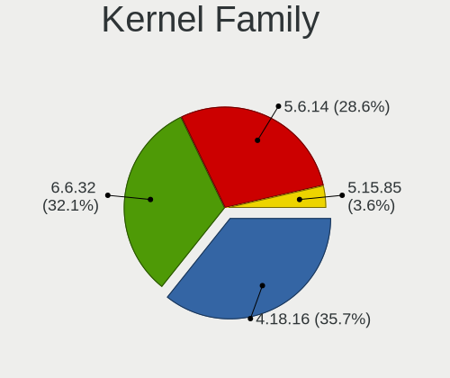
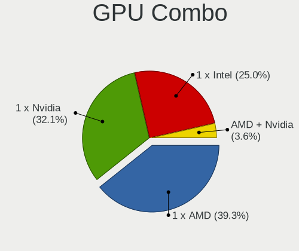
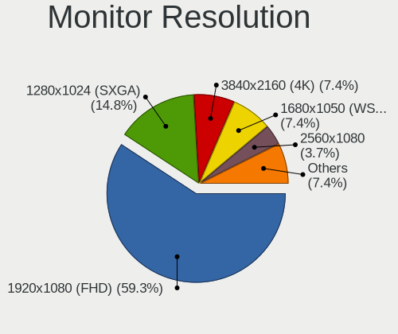

BlackPanther - Hardware Trends (Desktops)
-----------------------------------------

A project to identify most popular hardware characteristics and track their change
over time based on data collected by Linux users at https://Linux-Hardware.org.

Anyone can contribute to this report by the [hw-probe](https://github.com/linuxhw/hw-probe) tool:

    sudo -E hw-probe -all -upload

This report is for one last month. Overall report since the beginning of time: [TestDays](https://github.com/linuxhw/TestDays)

Period: Aug, 2023.

Contents
--------

* [ System ](#system)
  - [ OS                       ](#os)
  - [ OS Family                ](#os-family)
  - [ Kernel                   ](#kernel)
  - [ Kernel Family            ](#kernel-family)
  - [ Kernel Major Ver.        ](#kernel-major-ver)
  - [ Arch                     ](#arch)
  - [ DE                       ](#de)
  - [ Display Server           ](#display-server)
  - [ Display Manager          ](#display-manager)
  - [ OS Lang                  ](#os-lang)
  - [ Boot Mode                ](#boot-mode)
  - [ Filesystem               ](#filesystem)
  - [ Part. scheme             ](#part-scheme)
  - [ Dual Boot with Linux/BSD ](#dual-boot-with-linuxbsd)
  - [ Dual Boot (Win)          ](#dual-boot-win)

* [ Board ](#board)
  - [ Vendor                   ](#vendor)
  - [ Model                    ](#model)
  - [ Model Family             ](#model-family)
  - [ MFG Year                 ](#mfg-year)
  - [ Form Factor              ](#form-factor)
  - [ Secure Boot              ](#secure-boot)
  - [ Coreboot                 ](#coreboot)
  - [ RAM Size                 ](#ram-size)
  - [ RAM Used                 ](#ram-used)
  - [ Total Drives             ](#total-drives)
  - [ Has CD-ROM               ](#has-cd-rom)
  - [ Has Ethernet             ](#has-ethernet)
  - [ Has WiFi                 ](#has-wifi)
  - [ Has Bluetooth            ](#has-bluetooth)

* [ Location ](#location)
  - [ Country                  ](#country)
  - [ City                     ](#city)

* [ Drives ](#drives)
  - [ Drive Vendor             ](#drive-vendor)
  - [ Drive Model              ](#drive-model)
  - [ HDD Vendor               ](#hdd-vendor)
  - [ SSD Vendor               ](#ssd-vendor)
  - [ Drive Kind               ](#drive-kind)
  - [ Drive Connector          ](#drive-connector)
  - [ Drive Size               ](#drive-size)
  - [ Space Total              ](#space-total)
  - [ Space Used               ](#space-used)
  - [ Malfunc. Drives          ](#malfunc-drives)
  - [ Malfunc. Drive Vendor    ](#malfunc-drive-vendor)
  - [ Malfunc. HDD Vendor      ](#malfunc-hdd-vendor)
  - [ Malfunc. Drive Kind      ](#malfunc-drive-kind)
  - [ Failed Drives            ](#failed-drives)
  - [ Failed Drive Vendor      ](#failed-drive-vendor)
  - [ Drive Status             ](#drive-status)

* [ Storage controller ](#storage-controller)
  - [ Storage Vendor           ](#storage-vendor)
  - [ Storage Model            ](#storage-model)
  - [ Storage Kind             ](#storage-kind)

* [ Processor ](#processor)
  - [ CPU Vendor               ](#cpu-vendor)
  - [ CPU Model                ](#cpu-model)
  - [ CPU Model Family         ](#cpu-model-family)
  - [ CPU Cores                ](#cpu-cores)
  - [ CPU Sockets              ](#cpu-sockets)
  - [ CPU Threads              ](#cpu-threads)
  - [ CPU Op-Modes             ](#cpu-op-modes)
  - [ CPU Microcode            ](#cpu-microcode)
  - [ CPU Microarch            ](#cpu-microarch)

* [ Graphics ](#graphics)
  - [ GPU Vendor               ](#gpu-vendor)
  - [ GPU Model                ](#gpu-model)
  - [ GPU Combo                ](#gpu-combo)
  - [ GPU Driver               ](#gpu-driver)
  - [ GPU Memory               ](#gpu-memory)

* [ Monitor ](#monitor)
  - [ Monitor Vendor           ](#monitor-vendor)
  - [ Monitor Model            ](#monitor-model)
  - [ Monitor Resolution       ](#monitor-resolution)
  - [ Monitor Diagonal         ](#monitor-diagonal)
  - [ Monitor Width            ](#monitor-width)
  - [ Aspect Ratio             ](#aspect-ratio)
  - [ Monitor Area             ](#monitor-area)
  - [ Pixel Density            ](#pixel-density)
  - [ Multiple Monitors        ](#multiple-monitors)

* [ Network ](#network)
  - [ Net Controller Vendor    ](#net-controller-vendor)
  - [ Net Controller Model     ](#net-controller-model)
  - [ Wireless Vendor          ](#wireless-vendor)
  - [ Wireless Model           ](#wireless-model)
  - [ Ethernet Vendor          ](#ethernet-vendor)
  - [ Ethernet Model           ](#ethernet-model)
  - [ Net Controller Kind      ](#net-controller-kind)
  - [ Used Controller          ](#used-controller)
  - [ NICs                     ](#nics)
  - [ IPv6                     ](#ipv6)

* [ Bluetooth ](#bluetooth)
  - [ Bluetooth Vendor         ](#bluetooth-vendor)
  - [ Bluetooth Model          ](#bluetooth-model)

* [ Sound ](#sound)
  - [ Sound Vendor             ](#sound-vendor)
  - [ Sound Model              ](#sound-model)

* [ Memory ](#memory)
  - [ Memory Vendor            ](#memory-vendor)
  - [ Memory Model             ](#memory-model)
  - [ Memory Kind              ](#memory-kind)
  - [ Memory Form Factor       ](#memory-form-factor)
  - [ Memory Size              ](#memory-size)
  - [ Memory Speed             ](#memory-speed)

* [ Printers & scanners ](#printers--scanners)
  - [ Printer Vendor           ](#printer-vendor)
  - [ Printer Model            ](#printer-model)
  - [ Scanner Vendor           ](#scanner-vendor)
  - [ Scanner Model            ](#scanner-model)

* [ Camera ](#camera)
  - [ Camera Vendor            ](#camera-vendor)
  - [ Camera Model             ](#camera-model)

* [ Security ](#security)
  - [ Fingerprint Vendor       ](#fingerprint-vendor)
  - [ Fingerprint Model        ](#fingerprint-model)
  - [ Chipcard Vendor          ](#chipcard-vendor)
  - [ Chipcard Model           ](#chipcard-model)

* [ Unsupported ](#unsupported)
  - [ Unsupported Devices      ](#unsupported-devices)
  - [ Unsupported Device Types ](#unsupported-device-types)

System
------

OS
--

Installed operating systems

| Name              | Desktops | Percent |
|-------------------|----------|---------|
| BlackPanther 18.1 | 43       | 93.48%  |
| BlackPanther 22.1 | 3        | 6.52%   |

OS Family
---------

OS without a version

| Name         | Desktops | Percent |
|--------------|----------|---------|
| BlackPanther | 46       | 100%    |

Kernel
------

Version of the Linux kernel

| Version             | Desktops | Percent |
|---------------------|----------|---------|
| 5.6.14-desktop-2bP  | 22       | 47.83%  |
| 4.18.16-desktop-1bP | 13       | 28.26%  |
| 5.15.85-desktop-1bP | 8        | 17.39%  |
| 6.4.3-desktop-1bP   | 1        | 2.17%   |
| 6.3.8-desktop-1bP   | 1        | 2.17%   |
| 6.3.3-desktop-1bP   | 1        | 2.17%   |

Kernel Family
-------------

Linux kernel without a distro release

| Version | Desktops | Percent |
|---------|----------|---------|
| 5.6.14  | 22       | 47.83%  |
| 4.18.16 | 13       | 28.26%  |
| 5.15.85 | 8        | 17.39%  |
| 6.4.3   | 1        | 2.17%   |
| 6.3.8   | 1        | 2.17%   |
| 6.3.3   | 1        | 2.17%   |

Kernel Major Ver.
-----------------

Linux kernel major version

| Version | Desktops | Percent |
|---------|----------|---------|
| 5.6     | 22       | 47.83%  |
| 4.18    | 13       | 28.26%  |
| 5.15    | 8        | 17.39%  |
| 6.3     | 2        | 4.35%   |
| 6.4     | 1        | 2.17%   |

Arch
----

OS architecture (x86_64, i586, etc.)

| Name   | Desktops | Percent |
|--------|----------|---------|
| x86_64 | 46       | 100%    |

DE
--

Desktop Environment

| Name    | Desktops | Percent |
|---------|----------|---------|
| KDE5    | 43       | 93.48%  |
| Unknown | 3        | 6.52%   |

Display Server
--------------

X11 or Wayland

| Name | Desktops | Percent |
|------|----------|---------|
| X11  | 46       | 100%    |

Display Manager
---------------

SDDM, LightDM, etc.

| Name | Desktops | Percent |
|------|----------|---------|
| SDDM | 46       | 100%    |

OS Lang
-------

Language

| Lang    | Desktops | Percent |
|---------|----------|---------|
| Unknown | 46       | 100%    |

Boot Mode
---------

EFI or BIOS

| Mode | Desktops | Percent |
|------|----------|---------|
| BIOS | 31       | 67.39%  |
| EFI  | 15       | 32.61%  |

Filesystem
----------

Type of filesystem

| Type    | Desktops | Percent |
|---------|----------|---------|
| Ext4    | 30       | 65.22%  |
| Overlay | 16       | 34.78%  |

Part. scheme
------------

Scheme of partitioning

| Type    | Desktops | Percent |
|---------|----------|---------|
| MBR     | 23       | 50%     |
| GPT     | 21       | 45.65%  |
| Unknown | 2        | 4.35%   |

Dual Boot with Linux/BSD
------------------------

Hosting more than one Linux/BSD

| Dual boot | Desktops | Percent |
|-----------|----------|---------|
| No        | 28       | 60.87%  |
| Yes       | 18       | 39.13%  |

Dual Boot (Win)
---------------

Hosting Linux and Windows

| Dual boot | Desktops | Percent |
|-----------|----------|---------|
| No        | 25       | 54.35%  |
| Yes       | 21       | 45.65%  |

Board
-----

Vendor
------

Motherboard manufacturer

| Name                | Desktops | Percent |
|---------------------|----------|---------|
| Gigabyte Technology | 11       | 23.91%  |
| Hewlett-Packard     | 7        | 15.22%  |
| ASUSTek Computer    | 7        | 15.22%  |
| Dell                | 6        | 13.04%  |
| ASRock              | 4        | 8.7%    |
| MSI                 | 3        | 6.52%   |
| Fujitsu             | 3        | 6.52%   |
| Lenovo              | 2        | 4.35%   |
| Huanan              | 2        | 4.35%   |
| Medion              | 1        | 2.17%   |

Model
-----

Motherboard model

| Name                                 | Desktops | Percent |
|--------------------------------------|----------|---------|
| MSI MS-7817                          | 2        | 4.35%   |
| Huanan X99-QD4 V1.0                  | 2        | 4.35%   |
| Gigabyte Z390 UD                     | 2        | 4.35%   |
| Gigabyte B450M GAMING                | 2        | 4.35%   |
| MSI MS-7519                          | 1        | 2.17%   |
| Medion MS-7748                       | 1        | 2.17%   |
| Lenovo ThinkStation D20 4158AF8      | 1        | 2.17%   |
| Lenovo ThinkCentre M73 10B6001SUS    | 1        | 2.17%   |
| HP Z400 Workstation                  | 1        | 2.17%   |
| HP EliteDesk 705 G3 SFF              | 1        | 2.17%   |
| HP Compaq Pro 6300 SFF               | 1        | 2.17%   |
| HP Compaq Pro 6300 MT                | 1        | 2.17%   |
| HP Compaq dc7900 Small Form Factor   | 1        | 2.17%   |
| HP Compaq dc7800p Ultra-slim Desktop | 1        | 2.17%   |
| HP Compaq 8200 Elite MT PC           | 1        | 2.17%   |
| Gigabyte J4005ND2P-CF                | 1        | 2.17%   |
| Gigabyte H97-D3H                     | 1        | 2.17%   |
| Gigabyte H61M-S1                     | 1        | 2.17%   |
| Gigabyte H310M A 2.0                 | 1        | 2.17%   |
| Gigabyte H110M-S2V-CF                | 1        | 2.17%   |
| Gigabyte H110M-S2H                   | 1        | 2.17%   |
| Gigabyte AB350M-DS3H V2              | 1        | 2.17%   |
| Fujitsu ESPRIMO Q556/2               | 1        | 2.17%   |
| Fujitsu ESPRIMO E7935                | 1        | 2.17%   |
| Fujitsu CELSIUS M470                 | 1        | 2.17%   |
| Dell Vostro 400                      | 1        | 2.17%   |
| Dell Precision WorkStation T5500     | 1        | 2.17%   |
| Dell Precision WorkStation T3500     | 1        | 2.17%   |
| Dell OptiPlex 780                    | 1        | 2.17%   |
| Dell OptiPlex 390                    | 1        | 2.17%   |
| Dell OptiPlex 320                    | 1        | 2.17%   |
| ASUS PRIME B365M-A                   | 1        | 2.17%   |
| ASUS PRIME A320M-K                   | 1        | 2.17%   |
| ASUS M5A78L-M PLUS/USB3              | 1        | 2.17%   |
| ASUS H110M-K                         | 1        | 2.17%   |
| ASUS H110M-A                         | 1        | 2.17%   |
| ASUS FR1009568_2110008               | 1        | 2.17%   |
| ASUS All Series                      | 1        | 2.17%   |
| ASRock X370 Gaming X                 | 1        | 2.17%   |
| ASRock H81M-HDS                      | 1        | 2.17%   |

Model Family
------------

Motherboard model prefix

| Name                  | Desktops | Percent |
|-----------------------|----------|---------|
| HP Compaq             | 5        | 10.87%  |
| Dell OptiPlex         | 3        | 6.52%   |
| MSI MS-7817           | 2        | 4.35%   |
| Huanan X99-QD4        | 2        | 4.35%   |
| Gigabyte Z390         | 2        | 4.35%   |
| Gigabyte B450M        | 2        | 4.35%   |
| Fujitsu ESPRIMO       | 2        | 4.35%   |
| Dell Precision        | 2        | 4.35%   |
| ASUS PRIME            | 2        | 4.35%   |
| MSI MS-7519           | 1        | 2.17%   |
| Medion MS-7748        | 1        | 2.17%   |
| Lenovo ThinkStation   | 1        | 2.17%   |
| Lenovo ThinkCentre    | 1        | 2.17%   |
| HP Z400               | 1        | 2.17%   |
| HP EliteDesk          | 1        | 2.17%   |
| Gigabyte J4005ND2P-CF | 1        | 2.17%   |
| Gigabyte H97-D3H      | 1        | 2.17%   |
| Gigabyte H61M-S1      | 1        | 2.17%   |
| Gigabyte H310M        | 1        | 2.17%   |
| Gigabyte H110M-S2V-CF | 1        | 2.17%   |
| Gigabyte H110M-S2H    | 1        | 2.17%   |
| Gigabyte AB350M-DS3H  | 1        | 2.17%   |
| Fujitsu CELSIUS       | 1        | 2.17%   |
| Dell Vostro           | 1        | 2.17%   |
| ASUS M5A78L-M         | 1        | 2.17%   |
| ASUS H110M-K          | 1        | 2.17%   |
| ASUS H110M-A          | 1        | 2.17%   |
| ASUS FR1009568        | 1        | 2.17%   |
| ASUS All              | 1        | 2.17%   |
| ASRock X370           | 1        | 2.17%   |
| ASRock H81M-HDS       | 1        | 2.17%   |
| ASRock G41M-VS3       | 1        | 2.17%   |
| ASRock B85M           | 1        | 2.17%   |

MFG Year
--------

Motherboard manufacture year

| Year | Desktops | Percent |
|------|----------|---------|
| 2018 | 6        | 13.04%  |
| 2017 | 5        | 10.87%  |
| 2010 | 5        | 10.87%  |
| 2013 | 4        | 8.7%    |
| 2011 | 4        | 8.7%    |
| 2016 | 3        | 6.52%   |
| 2015 | 3        | 6.52%   |
| 2014 | 3        | 6.52%   |
| 2012 | 3        | 6.52%   |
| 2007 | 3        | 6.52%   |
| 2022 | 2        | 4.35%   |
| 2019 | 2        | 4.35%   |
| 2009 | 2        | 4.35%   |
| 2008 | 1        | 2.17%   |

Form Factor
-----------

Physical design of the computer

| Name    | Desktops | Percent |
|---------|----------|---------|
| Desktop | 46       | 100%    |

Secure Boot
-----------

Enabled or disabled

| State    | Desktops | Percent |
|----------|----------|---------|
| Disabled | 46       | 100%    |

Coreboot
--------

Have coreboot on board

| Used | Desktops | Percent |
|------|----------|---------|
| No   | 46       | 100%    |

RAM Size
--------

Total RAM memory

| Size in GB | Desktops | Percent |
|------------|----------|---------|
| 8.01-16.0  | 18       | 39.13%  |
| 4.01-8.0   | 9        | 19.57%  |
| 3.01-4.0   | 6        | 13.04%  |
| 16.01-24.0 | 6        | 13.04%  |
| 1.01-2.0   | 3        | 6.52%   |
| 32.01-64.0 | 2        | 4.35%   |
| 24.01-32.0 | 2        | 4.35%   |

RAM Used
--------

Used RAM memory

| Used GB  | Desktops | Percent |
|----------|----------|---------|
| 0.51-1.0 | 18       | 39.13%  |
| 1.01-2.0 | 16       | 34.78%  |
| 0.01-0.5 | 9        | 19.57%  |
| 2.01-3.0 | 2        | 4.35%   |
| 4.01-8.0 | 1        | 2.17%   |

Total Drives
------------

Number of drives on board

| Drives | Desktops | Percent |
|--------|----------|---------|
| 1      | 18       | 39.13%  |
| 2      | 15       | 32.61%  |
| 3      | 11       | 23.91%  |
| 4      | 2        | 4.35%   |

Has CD-ROM
----------

Has CD-ROM on board

| Presented | Desktops | Percent |
|-----------|----------|---------|
| Yes       | 31       | 67.39%  |
| No        | 15       | 32.61%  |

Has Ethernet
------------

Has Ethernet on board

| Presented | Desktops | Percent |
|-----------|----------|---------|
| Yes       | 46       | 100%    |

Has WiFi
--------

Has WiFi module

| Presented | Desktops | Percent |
|-----------|----------|---------|
| No        | 32       | 69.57%  |
| Yes       | 14       | 30.43%  |

Has Bluetooth
-------------

Has Bluetooth module

| Presented | Desktops | Percent |
|-----------|----------|---------|
| No        | 39       | 84.78%  |
| Yes       | 7        | 15.22%  |

Location
--------

Country
-------

Geographic location (country)

| Country  | Desktops | Percent |
|----------|----------|---------|
| Hungary  | 38       | 82.61%  |
| Germany  | 3        | 6.52%   |
| Slovakia | 2        | 4.35%   |
| Romania  | 1        | 2.17%   |
| Morocco  | 1        | 2.17%   |
| Greece   | 1        | 2.17%   |

City
----

Geographic location (city)

| City                    | Desktops | Percent |
|-------------------------|----------|---------|
| Budapest                | 10       | 21.74%  |
| Zalaegerszeg            | 3        | 6.52%   |
| Szekszárd              | 2        | 4.35%   |
| Pfaffenhofen an der Ilm | 2        | 4.35%   |
| Fertoszentmiklos        | 2        | 4.35%   |
| Eger                    | 2        | 4.35%   |
| Zalău                  | 1        | 2.17%   |
| Veszprém               | 1        | 2.17%   |
| Ulm                     | 1        | 2.17%   |
| Tatabánya              | 1        | 2.17%   |
| Szolnok                 | 1        | 2.17%   |
| Szigetszentmiklos       | 1        | 2.17%   |
| Szentendre              | 1        | 2.17%   |
| Szazhalombatta          | 1        | 2.17%   |
| Pécs                   | 1        | 2.17%   |
| Papa                    | 1        | 2.17%   |
| Oroshaza                | 1        | 2.17%   |
| Kecskemét              | 1        | 2.17%   |
| Kastoria                | 1        | 2.17%   |
| Karcag                  | 1        | 2.17%   |
| Jaszdozsa               | 1        | 2.17%   |
| Győr                   | 1        | 2.17%   |
| Esztergom               | 1        | 2.17%   |
| Érd                    | 1        | 2.17%   |
| Debrecen                | 1        | 2.17%   |
| Csongrad                | 1        | 2.17%   |
| Casablanca              | 1        | 2.17%   |
| Bratislava              | 1        | 2.17%   |
| Berettyóújfalu        | 1        | 2.17%   |
| Banská Bystrica        | 1        | 2.17%   |
| Balatonfuered           | 1        | 2.17%   |

Drives
------

Drive Vendor
------------

Hard drive vendors

| Vendor                | Desktops | Drives | Percent |
|-----------------------|----------|--------|---------|
| WDC                   | 16       | 17     | 17.78%  |
| Samsung Electronics   | 13       | 15     | 14.44%  |
| Kingston              | 13       | 15     | 14.44%  |
| Toshiba               | 8        | 9      | 8.89%   |
| Seagate               | 6        | 6      | 6.67%   |
| SanDisk               | 5        | 5      | 5.56%   |
| HGST                  | 5        | 7      | 5.56%   |
| Intenso               | 4        | 4      | 4.44%   |
| XPG                   | 2        | 2      | 2.22%   |
| Patriot               | 2        | 2      | 2.22%   |
| Gigabyte Technology   | 2        | 2      | 2.22%   |
| A-DATA Technology     | 2        | 2      | 2.22%   |
| Zheino                | 1        | 1      | 1.11%   |
| Transcend             | 1        | 1      | 1.11%   |
| SPCC                  | 1        | 1      | 1.11%   |
| Realtek Semiconductor | 1        | 1      | 1.11%   |
| Micron Technology     | 1        | 1      | 1.11%   |
| Kingmax               | 1        | 1      | 1.11%   |
| Intel                 | 1        | 1      | 1.11%   |
| Hitachi               | 1        | 1      | 1.11%   |
| Fujitsu               | 1        | 1      | 1.11%   |
| Crucial               | 1        | 1      | 1.11%   |
| 2-Power               | 1        | 1      | 1.11%   |
| Unknown               | 1        | 1      | 1.11%   |

Drive Model
-----------

Hard drive models

| Model                            | Desktops | Percent |
|----------------------------------|----------|---------|
| Kingston SA400S37240G 240GB SSD  | 5        | 5.21%   |
| Kingston SA400S37480G 480GB SSD  | 4        | 4.17%   |
| Toshiba DT01ACA100 1TB           | 3        | 3.13%   |
| XPG SPECTRIX S40G 1TB            | 2        | 2.08%   |
| WDC WDS240G2G0B-00EPW0 240GB SSD | 2        | 2.08%   |
| WDC WD5000AAKS-007AA0 500GB      | 2        | 2.08%   |
| WDC WD30 PURX-64PFUY0 3TB        | 2        | 2.08%   |
| Toshiba DT01ACA050 500GB         | 2        | 2.08%   |
| SanDisk SDSSDH3512G 512GB        | 2        | 2.08%   |
| SanDisk NVMe SSD Drive 2TB       | 2        | 2.08%   |
| Samsung SSD 870 EVO 500GB        | 2        | 2.08%   |
| Samsung SSD 860 EVO 500GB        | 2        | 2.08%   |
| Samsung HD322HJ 320GB            | 2        | 2.08%   |
| Patriot Burst 120GB SSD          | 2        | 2.08%   |
| Kingston SUV400S37120G 120GB SSD | 2        | 2.08%   |
| Intenso Portable SSD 128GB       | 2        | 2.08%   |
| HGST HTS541010B7E610 1TB         | 2        | 2.08%   |
| HGST HMS5C4040BLE640 4TB         | 2        | 2.08%   |
| Zheino CHN-NGFFNV2280-256 256GB  | 1        | 1.04%   |
| WDC WDS256G1X0C-00ENX0 256GB     | 1        | 1.04%   |
| WDC WD5000LPLX-75ZNTT0 500GB     | 1        | 1.04%   |
| WDC WD5000AAKS-08V0A0 500GB      | 1        | 1.04%   |
| WDC WD30EZRX-00DC0B0 3TB         | 1        | 1.04%   |
| WDC WD2502ABYS-02B7A0 256GB      | 1        | 1.04%   |
| WDC WD20EZBX-00AYRA0 2TB         | 1        | 1.04%   |
| WDC WD20EARX-00PASB0 2TB         | 1        | 1.04%   |
| WDC WD15EARS-00MVWB0 1TB         | 1        | 1.04%   |
| WDC WD10PURZ-85U8XY0 1TB         | 1        | 1.04%   |
| WDC WD10EZEX-00KUWA0 1TB         | 1        | 1.04%   |
| WDC WD10EFRX-68PJCN0 1TB         | 1        | 1.04%   |
| Transcend TS128GMTE110S 128GB    | 1        | 1.04%   |
| Toshiba MQ01ABF032 320GB         | 1        | 1.04%   |
| Toshiba MQ01ABD100 1TB           | 1        | 1.04%   |
| Toshiba HDWQ140 4TB              | 1        | 1.04%   |
| Toshiba DT01ACA200 2TB           | 1        | 1.04%   |
| SPCC Solid State Disk 256GB      | 1        | 1.04%   |
| Seagate ST3500413AS 500GB        | 1        | 1.04%   |
| Seagate ST340014AS 40GB          | 1        | 1.04%   |
| Seagate ST3250410AS 250GB        | 1        | 1.04%   |
| Seagate ST3160815AS 160GB        | 1        | 1.04%   |

HDD Vendor
----------

Hard disk drive vendors

| Vendor              | Desktops | Drives | Percent |
|---------------------|----------|--------|---------|
| WDC                 | 14       | 14     | 32.56%  |
| Toshiba             | 8        | 9      | 18.6%   |
| Samsung Electronics | 7        | 7      | 16.28%  |
| Seagate             | 6        | 6      | 13.95%  |
| HGST                | 5        | 7      | 11.63%  |
| Hitachi             | 1        | 1      | 2.33%   |
| Fujitsu             | 1        | 1      | 2.33%   |
| Unknown             | 1        | 1      | 2.33%   |

SSD Vendor
----------

Solid state drive vendors

| Vendor              | Desktops | Drives | Percent |
|---------------------|----------|--------|---------|
| Kingston            | 12       | 14     | 31.58%  |
| Samsung Electronics | 5        | 6      | 13.16%  |
| Intenso             | 4        | 4      | 10.53%  |
| SanDisk             | 3        | 3      | 7.89%   |
| WDC                 | 2        | 2      | 5.26%   |
| Patriot             | 2        | 2      | 5.26%   |
| Gigabyte Technology | 2        | 2      | 5.26%   |
| A-DATA Technology   | 2        | 2      | 5.26%   |
| SPCC                | 1        | 1      | 2.63%   |
| Micron Technology   | 1        | 1      | 2.63%   |
| Kingmax             | 1        | 1      | 2.63%   |
| Intel               | 1        | 1      | 2.63%   |
| Crucial             | 1        | 1      | 2.63%   |
| 2-Power             | 1        | 1      | 2.63%   |

Drive Kind
----------

HDD or SSD

| Kind | Desktops | Drives | Percent |
|------|----------|--------|---------|
| HDD  | 35       | 46     | 48.61%  |
| SSD  | 28       | 41     | 38.89%  |
| NVMe | 9        | 11     | 12.5%   |

Drive Connector
---------------

SATA, SAS, NVMe, etc.

| Type | Desktops | Drives | Percent |
|------|----------|--------|---------|
| SATA | 45       | 82     | 76.27%  |
| NVMe | 9        | 11     | 15.25%  |
| SAS  | 5        | 5      | 8.47%   |

Drive Size
----------

Size of hard drive

| Size in TB | Desktops | Drives | Percent |
|------------|----------|--------|---------|
| 0.01-0.5   | 37       | 60     | 61.67%  |
| 0.51-1.0   | 14       | 16     | 23.33%  |
| 3.01-4.0   | 3        | 5      | 5%      |
| 2.01-3.0   | 3        | 3      | 5%      |
| 1.01-2.0   | 3        | 3      | 5%      |

Space Total
-----------

Amount of disk space available on the file system

| Size in GB     | Desktops | Percent |
|----------------|----------|---------|
| Unknown        | 15       | 32.61%  |
| 101-250        | 9        | 19.57%  |
| 251-500        | 7        | 15.22%  |
| 501-1000       | 6        | 13.04%  |
| 51-100         | 5        | 10.87%  |
| 1001-2000      | 2        | 4.35%   |
| More than 3000 | 1        | 2.17%   |
| 21-50          | 1        | 2.17%   |

Space Used
----------

Amount of used disk space

| Used GB        | Desktops | Percent |
|----------------|----------|---------|
| 1-20           | 15       | 32.61%  |
| Unknown        | 15       | 32.61%  |
| 51-100         | 7        | 15.22%  |
| 21-50          | 4        | 8.7%    |
| 101-250        | 3        | 6.52%   |
| More than 3000 | 1        | 2.17%   |
| 251-500        | 1        | 2.17%   |

Malfunc. Drives
---------------

Drive models with a malfunction

| Model                                 | Desktops | Drives | Percent |
|---------------------------------------|----------|--------|---------|
| WDC WD5000AAKS-007AA0 500GB           | 2        | 2      | 11.11%  |
| WDC WD20EARX-00PASB0 2TB              | 1        | 1      | 5.56%   |
| WDC WD15EARS-00MVWB0 1TB              | 1        | 1      | 5.56%   |
| WDC WD10PURZ-85U8XY0 1TB              | 1        | 1      | 5.56%   |
| Toshiba DT01ACA050 500GB              | 1        | 1      | 5.56%   |
| Seagate ST340014AS 40GB               | 1        | 1      | 5.56%   |
| Seagate ST3160815AS 160GB             | 1        | 1      | 5.56%   |
| Seagate ST1000LM024 HN-M101MBB 1TB    | 1        | 1      | 5.56%   |
| Samsung Electronics SSD 870 EVO 500GB | 1        | 1      | 5.56%   |
| Samsung Electronics HD200HJ 200GB     | 1        | 1      | 5.56%   |
| Samsung Electronics HD103UJ 1TB       | 1        | 1      | 5.56%   |
| Kingston SUV400S37120G 120GB SSD      | 1        | 1      | 5.56%   |
| Kingston SA400S37480G 480GB SSD       | 1        | 1      | 5.56%   |
| Intel SSDSC2BF180A4H 180GB            | 1        | 1      | 5.56%   |
| HGST HTS545032A7E660 320GB            | 1        | 1      | 5.56%   |
| Fujitsu MHZ2120BH G2 120GB            | 1        | 1      | 5.56%   |
| A-DATA Technology SU630 240GB SSD     | 1        | 1      | 5.56%   |

Malfunc. Drive Vendor
---------------------

Vendors of faulty drives

| Vendor              | Desktops | Drives | Percent |
|---------------------|----------|--------|---------|
| WDC                 | 5        | 5      | 27.78%  |
| Seagate             | 3        | 3      | 16.67%  |
| Samsung Electronics | 3        | 3      | 16.67%  |
| Kingston            | 2        | 2      | 11.11%  |
| Toshiba             | 1        | 1      | 5.56%   |
| Intel               | 1        | 1      | 5.56%   |
| HGST                | 1        | 1      | 5.56%   |
| Fujitsu             | 1        | 1      | 5.56%   |
| A-DATA Technology   | 1        | 1      | 5.56%   |

Malfunc. HDD Vendor
-------------------

Vendors of faulty HDD drives

| Vendor              | Desktops | Drives | Percent |
|---------------------|----------|--------|---------|
| WDC                 | 5        | 5      | 38.46%  |
| Seagate             | 3        | 3      | 23.08%  |
| Samsung Electronics | 2        | 2      | 15.38%  |
| Toshiba             | 1        | 1      | 7.69%   |
| HGST                | 1        | 1      | 7.69%   |
| Fujitsu             | 1        | 1      | 7.69%   |

Malfunc. Drive Kind
-------------------

Kinds of faulty drives

| Kind | Desktops | Drives | Percent |
|------|----------|--------|---------|
| HDD  | 12       | 13     | 70.59%  |
| SSD  | 5        | 5      | 29.41%  |

Failed Drives
-------------

Failed drive models

Zero info for selected period =(

Failed Drive Vendor
-------------------

Failed drive vendors

Zero info for selected period =(

Drive Status
------------

Number of failed and malfunc. drives

| Status   | Desktops | Drives | Percent |
|----------|----------|--------|---------|
| Works    | 40       | 74     | 63.49%  |
| Malfunc  | 17       | 18     | 26.98%  |
| Detected | 6        | 6      | 9.52%   |

Storage controller
------------------

Storage Vendor
--------------

Storage controller vendors

| Vendor                      | Desktops | Percent |
|-----------------------------|----------|---------|
| Intel                       | 37       | 66.07%  |
| AMD                         | 9        | 16.07%  |
| SanDisk                     | 3        | 5.36%   |
| Silicon Motion              | 2        | 3.57%   |
| Realtek Semiconductor       | 2        | 3.57%   |
| Samsung Electronics         | 1        | 1.79%   |
| Kingston Technology Company | 1        | 1.79%   |
| JMicron Technology          | 1        | 1.79%   |

Storage Model
-------------

Storage controller models

| Model                                                                                   | Desktops | Percent |
|-----------------------------------------------------------------------------------------|----------|---------|
| Intel 8 Series/C220 Series Chipset Family 6-port SATA Controller 1 [AHCI mode]          | 8        | 10.81%  |
| Intel Q170/Q150/B150/H170/H110/Z170/CM236 Chipset SATA Controller [AHCI Mode]           | 6        | 8.11%   |
| AMD FCH SATA Controller [AHCI mode]                                                     | 5        | 6.76%   |
| Intel SATA Controller [RAID mode]                                                       | 3        | 4.05%   |
| Intel 82801JI (ICH10 Family) SATA AHCI Controller                                       | 3        | 4.05%   |
| Intel 6 Series/C200 Series Chipset Family Desktop SATA Controller (IDE mode, ports 4-5) | 3        | 4.05%   |
| Intel 6 Series/C200 Series Chipset Family Desktop SATA Controller (IDE mode, ports 0-3) | 3        | 4.05%   |
| Intel 4 Series Chipset PT IDER Controller                                               | 3        | 4.05%   |
| Silicon Motion SM2263EN/SM2263XT (DRAM-less) NVMe SSD Controllers                       | 2        | 2.7%    |
| SanDisk WD Blue SN570 NVMe SSD 2TB                                                      | 2        | 2.7%    |
| Realtek RTS5763DL NVMe SSD Controller                                                   | 2        | 2.7%    |
| Intel Cannon Lake PCH SATA AHCI Controller                                              | 2        | 2.7%    |
| Intel 82801IR/IO/IH (ICH9R/DO/DH) 4 port SATA Controller [IDE mode]                     | 2        | 2.7%    |
| Intel 82801I (ICH9 Family) 2 port SATA Controller [IDE mode]                            | 2        | 2.7%    |
| Intel 7 Series/C210 Series Chipset Family 6-port SATA Controller [AHCI mode]            | 2        | 2.7%    |
| Intel 200 Series PCH SATA controller [AHCI mode]                                        | 2        | 2.7%    |
| AMD 400 Series Chipset SATA Controller                                                  | 2        | 2.7%    |
| AMD 300 Series Chipset SATA Controller                                                  | 2        | 2.7%    |
| SanDisk WD Black NVMe SSD                                                               | 1        | 1.35%   |
| Samsung NVMe SSD Controller SM981/PM981/PM983                                           | 1        | 1.35%   |
| Kingston Company A2000 NVMe SSD                                                         | 1        | 1.35%   |
| JMicron JMB368 IDE controller                                                           | 1        | 1.35%   |
| Intel NM10/ICH7 Family SATA Controller [IDE mode]                                       | 1        | 1.35%   |
| Intel Celeron/Pentium Silver Processor SATA Controller                                  | 1        | 1.35%   |
| Intel 9 Series Chipset Family SATA Controller [AHCI Mode]                               | 1        | 1.35%   |
| Intel 82Q35 Express PT IDER Controller                                                  | 1        | 1.35%   |
| Intel 82801JI (ICH10 Family) 4 port SATA IDE Controller #1                              | 1        | 1.35%   |
| Intel 82801JI (ICH10 Family) 2 port SATA IDE Controller #2                              | 1        | 1.35%   |
| Intel 82801JD/DO (ICH10 Family) SATA AHCI Controller                                    | 1        | 1.35%   |
| Intel 82801JD/DO (ICH10 Family) 4-port SATA IDE Controller                              | 1        | 1.35%   |
| Intel 82801JD/DO (ICH10 Family) 2-port SATA IDE Controller                              | 1        | 1.35%   |
| Intel 82801G (ICH7 Family) IDE Controller                                               | 1        | 1.35%   |
| AMD X370 Series Chipset SATA Controller                                                 | 1        | 1.35%   |
| AMD SB7x0/SB8x0/SB9x0 SATA Controller [IDE mode]                                        | 1        | 1.35%   |
| AMD SB7x0/SB8x0/SB9x0 IDE Controller                                                    | 1        | 1.35%   |
| AMD SB600 Non-Raid-5 SATA                                                               | 1        | 1.35%   |
| AMD SB600 IDE                                                                           | 1        | 1.35%   |
| AMD FCH SATA Controller D                                                               | 1        | 1.35%   |

Storage Kind
------------

Kind of storage controller (IDE, SATA, NVMe, SAS, ...)

| Kind | Desktops | Percent |
|------|----------|---------|
| SATA | 35       | 58.33%  |
| IDE  | 13       | 21.67%  |
| NVMe | 9        | 15%     |
| RAID | 3        | 5%      |

Processor
---------

CPU Vendor
----------

Processor vendors

| Vendor | Desktops | Percent |
|--------|----------|---------|
| Intel  | 38       | 82.61%  |
| AMD    | 8        | 17.39%  |

CPU Model
---------

Processor models

| Model                                          | Desktops | Percent |
|------------------------------------------------|----------|---------|
| Intel Core i3-4130 CPU @ 3.40GHz               | 3        | 6.52%   |
| AMD Ryzen 5 3400G with Radeon Vega Graphics    | 3        | 6.52%   |
| Intel Xeon CPU E5-1660 v3 @ 3.00GHz            | 2        | 4.35%   |
| Intel Core i5-9400 CPU @ 2.90GHz               | 2        | 4.35%   |
| Intel Core i3-6100 CPU @ 3.70GHz               | 2        | 4.35%   |
| Intel Core i3-2120 CPU @ 3.30GHz               | 2        | 4.35%   |
| Intel Xeon CPU X5677 @ 3.47GHz                 | 1        | 2.17%   |
| Intel Xeon CPU W3550 @ 3.07GHz                 | 1        | 2.17%   |
| Intel Xeon CPU W3540 @ 2.93GHz                 | 1        | 2.17%   |
| Intel Xeon CPU L5640 @ 2.27GHz                 | 1        | 2.17%   |
| Intel Xeon CPU E5530 @ 2.40GHz                 | 1        | 2.17%   |
| Intel Xeon CPU E5440 @ 2.83GHz                 | 1        | 2.17%   |
| Intel Pentium Dual-Core CPU E5400 @ 2.70GHz    | 1        | 2.17%   |
| Intel Pentium CPU G4560 @ 3.50GHz              | 1        | 2.17%   |
| Intel Pentium CPU G3430 @ 3.30GHz              | 1        | 2.17%   |
| Intel Pentium CPU G3220 @ 3.00GHz              | 1        | 2.17%   |
| Intel Genuine CPU 2140 @ 1.60GHz               | 1        | 2.17%   |
| Intel Core i5-7400 CPU @ 3.00GHz               | 1        | 2.17%   |
| Intel Core i5-6500 CPU @ 3.20GHz               | 1        | 2.17%   |
| Intel Core i5-4690 CPU @ 3.50GHz               | 1        | 2.17%   |
| Intel Core i5-4590 CPU @ 3.30GHz               | 1        | 2.17%   |
| Intel Core i5-3470 CPU @ 3.20GHz               | 1        | 2.17%   |
| Intel Core i3-9100F CPU @ 3.60GHz              | 1        | 2.17%   |
| Intel Core i3-8100 CPU @ 3.60GHz               | 1        | 2.17%   |
| Intel Core i3-6100T CPU @ 3.20GHz              | 1        | 2.17%   |
| Intel Core i3-3225 CPU @ 3.30GHz               | 1        | 2.17%   |
| Intel Core i3-3220 CPU @ 3.30GHz               | 1        | 2.17%   |
| Intel Core 2 Duo CPU E8500 @ 3.16GHz           | 1        | 2.17%   |
| Intel Core 2 Duo CPU E8400 @ 3.00GHz           | 1        | 2.17%   |
| Intel Core 2 Duo CPU E6850 @ 3.00GHz           | 1        | 2.17%   |
| Intel Core 2 Duo CPU E4600 @ 2.40GHz           | 1        | 2.17%   |
| Intel Core 2 CPU 4300 @ 1.80GHz                | 1        | 2.17%   |
| Intel Celeron J4005 CPU @ 2.00GHz              | 1        | 2.17%   |
| AMD Ryzen 7 1700X Eight-Core Processor         | 1        | 2.17%   |
| AMD PRO A6-9500 R5, 8 COMPUTE CORES 2C+6G      | 1        | 2.17%   |
| AMD FX-8350 Eight-Core Processor               | 1        | 2.17%   |
| AMD A8-3800 APU with Radeon HD Graphics        | 1        | 2.17%   |
| AMD A10-9700 RADEON R7, 10 COMPUTE CORES 4C+6G | 1        | 2.17%   |

CPU Model Family
----------------

Processor model prefix

| Model                   | Desktops | Percent |
|-------------------------|----------|---------|
| Intel Core i3           | 12       | 26.09%  |
| Intel Xeon              | 8        | 17.39%  |
| Intel Core i5           | 7        | 15.22%  |
| Intel Core 2 Duo        | 4        | 8.7%    |
| Intel Pentium           | 3        | 6.52%   |
| AMD Ryzen 5             | 3        | 6.52%   |
| Other                   | 1        | 2.17%   |
| Intel Pentium Dual-Core | 1        | 2.17%   |
| Intel Genuine           | 1        | 2.17%   |
| Intel Core 2            | 1        | 2.17%   |
| Intel Celeron           | 1        | 2.17%   |
| AMD Ryzen 7             | 1        | 2.17%   |
| AMD FX                  | 1        | 2.17%   |
| AMD A8                  | 1        | 2.17%   |
| AMD A10                 | 1        | 2.17%   |

CPU Cores
---------

Number of processor cores

| Number | Desktops | Percent |
|--------|----------|---------|
| 2      | 22       | 47.83%  |
| 4      | 16       | 34.78%  |
| 8      | 4        | 8.7%    |
| 6      | 3        | 6.52%   |
| 1      | 1        | 2.17%   |

CPU Sockets
-----------

Number of sockets

| Number | Desktops | Percent |
|--------|----------|---------|
| 1      | 45       | 97.83%  |
| 2      | 1        | 2.17%   |

CPU Threads
-----------

Threads per core (Hyper-Threading)

| Number | Desktops | Percent |
|--------|----------|---------|
| 2      | 24       | 52.17%  |
| 1      | 22       | 47.83%  |

CPU Op-Modes
------------

CPU Operation Modes (32-bit, 64-bit)

| Op mode        | Desktops | Percent |
|----------------|----------|---------|
| 32-bit, 64-bit | 46       | 100%    |

CPU Microcode
-------------

Microcode number

| Number     | Desktops | Percent |
|------------|----------|---------|
| 0x306c3    | 6        | 13.04%  |
| Unknown    | 6        | 13.04%  |
| 0x1067a    | 4        | 8.7%    |
| 0x506e3    | 3        | 6.52%   |
| 0x08108109 | 3        | 6.52%   |
| 0x906eb    | 2        | 4.35%   |
| 0x906ea    | 2        | 4.35%   |
| 0x906e9    | 2        | 4.35%   |
| 0x6f2      | 2        | 4.35%   |
| 0x306a9    | 2        | 4.35%   |
| 0x206a7    | 2        | 4.35%   |
| 0x106a5    | 2        | 4.35%   |
| 0x706a1    | 1        | 2.17%   |
| 0x6fd      | 1        | 2.17%   |
| 0x6fb      | 1        | 2.17%   |
| 0x306f2    | 1        | 2.17%   |
| 0x206c2    | 1        | 2.17%   |
| 0x08001137 | 1        | 2.17%   |
| 0x0600611a | 1        | 2.17%   |
| 0x06006118 | 1        | 2.17%   |
| 0x06000852 | 1        | 2.17%   |
| 0x03000027 | 1        | 2.17%   |

CPU Microarch
-------------

Microarchitecture

| Name          | Desktops | Percent |
|---------------|----------|---------|
| Haswell       | 9        | 19.57%  |
| KabyLake      | 6        | 13.04%  |
| Skylake       | 4        | 8.7%    |
| Penryn        | 4        | 8.7%    |
| Core          | 4        | 8.7%    |
| Zen+          | 3        | 6.52%   |
| Nehalem       | 3        | 6.52%   |
| IvyBridge     | 3        | 6.52%   |
| Westmere      | 2        | 4.35%   |
| SandyBridge   | 2        | 4.35%   |
| Excavator     | 2        | 4.35%   |
| Zen           | 1        | 2.17%   |
| Piledriver    | 1        | 2.17%   |
| K10 Llano     | 1        | 2.17%   |
| Goldmont plus | 1        | 2.17%   |

Graphics
--------

GPU Vendor
----------

Vendors of graphics cards

| Vendor           | Desktops | Percent |
|------------------|----------|---------|
| Intel            | 19       | 38%     |
| Nvidia           | 18       | 36%     |
| AMD              | 12       | 24%     |
| ATI Technologies | 1        | 2%      |

GPU Model
---------

Graphics card models

| Model                                                                       | Desktops | Percent |
|-----------------------------------------------------------------------------|----------|---------|
| Intel Xeon E3-1200 v3/4th Gen Core Processor Integrated Graphics Controller | 4        | 8%      |
| Intel 4 Series Chipset Integrated Graphics Controller                       | 4        | 8%      |
| Intel HD Graphics 530                                                       | 3        | 6%      |
| Intel CoffeeLake-S GT2 [UHD Graphics 630]                                   | 3        | 6%      |
| Nvidia GK208B [GeForce GT 720]                                              | 2        | 4%      |
| Nvidia GK208B [GeForce GT 710]                                              | 2        | 4%      |
| Nvidia GF108 [GeForce GT 630]                                               | 2        | 4%      |
| Nvidia GA104 [GeForce RTX 3060 Ti Lite Hash Rate]                           | 2        | 4%      |
| AMD Picasso/Raven 2 [Radeon Vega Series / Radeon Vega Mobile Series]        | 2        | 4%      |
| AMD Oland PRO [Radeon R7 240/340 / Radeon 520]                              | 2        | 4%      |
| Nvidia TU116 [GeForce GTX 1660 SUPER]                                       | 1        | 2%      |
| Nvidia GT218 [GeForce 210]                                                  | 1        | 2%      |
| Nvidia GP104 [GeForce GTX 1080]                                             | 1        | 2%      |
| Nvidia GM107 [GeForce GTX 750]                                              | 1        | 2%      |
| Nvidia GM107 [GeForce GTX 750 Ti]                                           | 1        | 2%      |
| Nvidia GK107GL [Quadro 410]                                                 | 1        | 2%      |
| Nvidia GK106GL [Quadro K4000]                                               | 1        | 2%      |
| Nvidia GK106 [GeForce GTX 660]                                              | 1        | 2%      |
| Nvidia G96CGL [Quadro FX 580]                                               | 1        | 2%      |
| Nvidia G72 [GeForce 7500 LE]                                                | 1        | 2%      |
| Intel GeminiLake [UHD Graphics 600]                                         | 1        | 2%      |
| Intel 82Q35 Express Integrated Graphics Controller                          | 1        | 2%      |
| Intel 82G33/G31 Express Integrated Graphics Controller                      | 1        | 2%      |
| Intel 4th Generation Core Processor Family Integrated Graphics Controller   | 1        | 2%      |
| Intel 2nd Generation Core Processor Family Integrated Graphics Controller   | 1        | 2%      |
| ATI Technologies Wani [Radeon R5/R6/R7 Graphics]                            | 1        | 2%      |
| AMD Wani [Radeon R5/R6/R7 Graphics]                                         | 1        | 2%      |
| AMD Sumo [Radeon HD 6550D]                                                  | 1        | 2%      |
| AMD RV730 XT [Radeon HD 4670]                                               | 1        | 2%      |
| AMD Redwood PRO [Radeon HD 5550/5570/5630/6510/6610/7570]                   | 1        | 2%      |
| AMD RC410 [Radeon Xpress 200/1100]                                          | 1        | 2%      |
| AMD Lexa PRO [Radeon 540/540X/550/550X / RX 540X/550/550X]                  | 1        | 2%      |
| AMD Caicos XT [Radeon HD 7470/8470 / R5 235/310 OEM]                        | 1        | 2%      |
| AMD Baffin [Radeon RX 550 640SP / RX 560/560X]                              | 1        | 2%      |

GPU Combo
---------

Combinations of graphics cards

| Name           | Desktops | Percent |
|----------------|----------|---------|
| 1 x Nvidia     | 16       | 34.78%  |
| 1 x Intel      | 16       | 34.78%  |
| 1 x AMD        | 12       | 26.09%  |
| Intel + Nvidia | 1        | 2.17%   |
| AMD + Nvidia   | 1        | 2.17%   |

GPU Driver
----------

Free vs proprietary

| Driver  | Desktops | Percent |
|---------|----------|---------|
| Free    | 44       | 95.65%  |
| Unknown | 2        | 4.35%   |

GPU Memory
----------

Total video memory

| Size in GB | Desktops | Percent |
|------------|----------|---------|
| Unknown    | 21       | 45.65%  |
| 0.51-1.0   | 10       | 21.74%  |
| 0.01-0.5   | 6        | 13.04%  |
| 3.01-4.0   | 3        | 6.52%   |
| 1.01-2.0   | 3        | 6.52%   |
| 7.01-8.0   | 2        | 4.35%   |
| 2.01-3.0   | 1        | 2.17%   |

Monitor
-------

Monitor Vendor
--------------

Monitor vendors

| Vendor               | Desktops | Percent |
|----------------------|----------|---------|
| Samsung Electronics  | 10       | 22.73%  |
| Goldstar             | 8        | 18.18%  |
| Ancor Communications | 4        | 9.09%   |
| Philips              | 3        | 6.82%   |
| Iiyama               | 2        | 4.55%   |
| Hewlett-Packard      | 2        | 4.55%   |
| BenQ                 | 2        | 4.55%   |
| AOC                  | 2        | 4.55%   |
| Acer                 | 2        | 4.55%   |
| ViewSonic            | 1        | 2.27%   |
| Vestel Elektronik    | 1        | 2.27%   |
| S2-Tek               | 1        | 2.27%   |
| NEC Computers        | 1        | 2.27%   |
| Medion               | 1        | 2.27%   |
| Lenovo               | 1        | 2.27%   |
| Fujitsu Siemens      | 1        | 2.27%   |
| Eizo                 | 1        | 2.27%   |
| CVT                  | 1        | 2.27%   |

Monitor Model
-------------

Monitor models

| Model                                                                 | Desktops | Percent |
|-----------------------------------------------------------------------|----------|---------|
| Iiyama PL2473HD IVM6107 1920x1080 520x290mm 23.4-inch                 | 2        | 4.44%   |
| Goldstar FULL HD GSM5B55 1920x1080 480x270mm 21.7-inch                | 2        | 4.44%   |
| AOC 32V1W AOC3201 1920x1080 698x393mm 31.5-inch                       | 2        | 4.44%   |
| Ancor Communications ASUS VS228 ACI22FD 1920x1080 476x268mm 21.5-inch | 2        | 4.44%   |
| ViewSonic VG2236 SERIES VSCE726 1920x1080 477x268mm 21.5-inch         | 1        | 2.22%   |
| Vestel Elektronik 40W_LCD_TV VES3700 1920x540                         | 1        | 2.22%   |
| Samsung Electronics SyncMaster SAM02DB 1680x1050 474x296mm 22.0-inch  | 1        | 2.22%   |
| Samsung Electronics SyncMaster SAM0258 1280x1024 376x301mm 19.0-inch  | 1        | 2.22%   |
| Samsung Electronics SyncMaster SAM01B8 1280x1024 338x270mm 17.0-inch  | 1        | 2.22%   |
| Samsung Electronics SyncMaster SAM01B7 1280x1024 338x270mm 17.0-inch  | 1        | 2.22%   |
| Samsung Electronics S27E500 SAM0D0D 1920x1080 598x336mm 27.0-inch     | 1        | 2.22%   |
| Samsung Electronics S24R35x SAM100E 1920x1080 521x293mm 23.5-inch     | 1        | 2.22%   |
| Samsung Electronics S24D330 SAM0D92 1920x1080 531x299mm 24.0-inch     | 1        | 2.22%   |
| Samsung Electronics S24A31x SAM7114 1920x1080 527x296mm 23.8-inch     | 1        | 2.22%   |
| Samsung Electronics LCD Monitor SAM04FD 1280x720                      | 1        | 2.22%   |
| Samsung Electronics C24F390 SAM0D2C 1920x1080 521x293mm 23.5-inch     | 1        | 2.22%   |
| S2-Tek TV STK531A 1920x1080 930x530mm 42.1-inch                       | 1        | 2.22%   |
| Philips 221TE PHLC062 1920x1080 476x268mm 21.5-inch                   | 1        | 2.22%   |
| Philips 221B PHL08A1 1920x1080 477x268mm 21.5-inch                    | 1        | 2.22%   |
| Philips 196V4 PHLC0AF 1366x768 410x230mm 18.5-inch                    | 1        | 2.22%   |
| NEC Computers EA223WM NEC6890 1680x1050 474x296mm 22.0-inch           | 1        | 2.22%   |
| Medion MD20328 MED3941 1600x900 462x272mm 21.1-inch                   | 1        | 2.22%   |
| Lenovo LEN L171 LEN24C9 1280x1024 337x270mm 17.0-inch                 | 1        | 2.22%   |
| Hewlett-Packard L1502 HWP2600 1024x768 304x228mm 15.0-inch            | 1        | 2.22%   |
| Hewlett-Packard E243 HPN346A 1920x1080 527x296mm 23.8-inch            | 1        | 2.22%   |
| Goldstar MP59G GSM5B34 1920x1080 480x270mm 21.7-inch                  | 1        | 2.22%   |
| Goldstar E1940 GSM4BD6 1360x768 406x229mm 18.4-inch                   | 1        | 2.22%   |
| Goldstar 32PG6000 GSM7612 1920x1080 1000x550mm 44.9-inch              | 1        | 2.22%   |
| Goldstar 2D HD LG TV GSM59CA 1366x768 510x290mm 23.1-inch             | 1        | 2.22%   |
| Goldstar 2D FHD TV GSM59C6 1920x1080 476x268mm 21.5-inch              | 1        | 2.22%   |
| Goldstar 22EA63 GSM598F 1920x1080 477x268mm 21.5-inch                 | 1        | 2.22%   |
| Fujitsu Siemens B19-2 FUS0548 1280x1024 376x301mm 19.0-inch           | 1        | 2.22%   |
| Eizo EV2216W ENC2440 1680x1050 474x297mm 22.0-inch                    | 1        | 2.22%   |
| CVT CVTE TV CVT0003 1360x768 575x323mm 26.0-inch                      | 1        | 2.22%   |
| BenQ GW2780 BNQ78E6 1920x1080 598x336mm 27.0-inch                     | 1        | 2.22%   |
| BenQ EW277HDR BNQ7948 1920x1080 598x336mm 27.0-inch                   | 1        | 2.22%   |
| Ancor Communications VX228 ACI22C1 1920x1080 476x268mm 21.5-inch      | 1        | 2.22%   |
| Ancor Communications VG248 ACI24A5 1920x1080 531x299mm 24.0-inch      | 1        | 2.22%   |
| Ancor Communications LCD Monitor VG248 1920x1080                      | 1        | 2.22%   |
| Acer V193 ACR004C 1280x1024 376x301mm 19.0-inch                       | 1        | 2.22%   |

Monitor Resolution
------------------

Monitor screen resolution

| Resolution         | Desktops | Percent |
|--------------------|----------|---------|
| 1920x1080 (FHD)    | 23       | 54.76%  |
| 1280x1024 (SXGA)   | 7        | 16.67%  |
| 3840x2160 (4K)     | 5        | 11.9%   |
| 1680x1050 (WSXGA+) | 3        | 7.14%   |
| 1600x900 (HD+)     | 1        | 2.38%   |
| 1366x768 (WXGA)    | 1        | 2.38%   |
| 1360x768           | 1        | 2.38%   |
| 1024x768 (XGA)     | 1        | 2.38%   |

Monitor Diagonal
----------------

Diagonal size in inches

| Inches  | Desktops | Percent |
|---------|----------|---------|
| 21      | 11       | 24.44%  |
| 23      | 7        | 15.56%  |
| 19      | 4        | 8.89%   |
| 17      | 4        | 8.89%   |
| 27      | 3        | 6.67%   |
| 24      | 3        | 6.67%   |
| 22      | 3        | 6.67%   |
| 31      | 2        | 4.44%   |
| 18      | 2        | 4.44%   |
| 84      | 1        | 2.22%   |
| 44      | 1        | 2.22%   |
| 42      | 1        | 2.22%   |
| 26      | 1        | 2.22%   |
| 15      | 1        | 2.22%   |
| Unknown | 1        | 2.22%   |

Monitor Width
-------------

Physical width

| Width in mm | Desktops | Percent |
|-------------|----------|---------|
| 401-500     | 16       | 35.56%  |
| 501-600     | 14       | 31.11%  |
| 301-350     | 5        | 11.11%  |
| 351-400     | 4        | 8.89%   |
| 601-700     | 2        | 4.44%   |
| 901-1000    | 2        | 4.44%   |
| 1501-2000   | 1        | 2.22%   |
| Unknown     | 1        | 2.22%   |

Aspect Ratio
------------

Proportional relationship between the width and the height

| Ratio   | Desktops | Percent |
|---------|----------|---------|
| 16/9    | 28       | 68.29%  |
| 5/4     | 8        | 19.51%  |
| 16/10   | 3        | 7.32%   |
| 4/3     | 1        | 2.44%   |
| Unknown | 1        | 2.44%   |

Monitor Area
------------

Area in inch²

| Area in inch² | Desktops | Percent |
|----------------|----------|---------|
| 201-250        | 21       | 47.73%  |
| 151-200        | 6        | 13.64%  |
| 141-150        | 6        | 13.64%  |
| 301-350        | 3        | 6.82%   |
| 351-500        | 2        | 4.55%   |
| 501-1000       | 2        | 4.55%   |
| More than 1000 | 1        | 2.27%   |
| 251-300        | 1        | 2.27%   |
| 111-120        | 1        | 2.27%   |
| Unknown        | 1        | 2.27%   |

Pixel Density
-------------

Pixels per inch

| Density | Desktops | Percent |
|---------|----------|---------|
| 51-100  | 30       | 69.77%  |
| 101-120 | 11       | 25.58%  |
| 1-50    | 1        | 2.33%   |
| Unknown | 1        | 2.33%   |

Multiple Monitors
-----------------

Total monitors connected

| Total | Desktops | Percent |
|-------|----------|---------|
| 1     | 38       | 82.61%  |
| 2     | 4        | 8.7%    |
| 0     | 3        | 6.52%   |
| 3     | 1        | 2.17%   |

Network
-------

Net Controller Vendor
---------------------

Controller vendors

| Vendor                | Desktops | Percent |
|-----------------------|----------|---------|
| Realtek Semiconductor | 28       | 44.44%  |
| Intel                 | 12       | 19.05%  |
| Qualcomm Atheros      | 6        | 9.52%   |
| Broadcom              | 5        | 7.94%   |
| Ralink Technology     | 4        | 6.35%   |
| TP-Link               | 2        | 3.17%   |
| Broadcom Limited      | 2        | 3.17%   |
| Samsung Electronics   | 1        | 1.59%   |
| IMC Networks          | 1        | 1.59%   |
| Huawei Technologies   | 1        | 1.59%   |
| D-Link System         | 1        | 1.59%   |

Net Controller Model
--------------------

Controller models

| Model                                                             | Desktops | Percent |
|-------------------------------------------------------------------|----------|---------|
| Realtek RTL8111/8168/8411 PCI Express Gigabit Ethernet Controller | 26       | 40%     |
| Intel 82579LM Gigabit Network Connection (Lewisville)             | 3        | 4.62%   |
| Intel 82567LM-3 Gigabit Network Connection                        | 3        | 4.62%   |
| Ralink RT5372 Wireless Adapter                                    | 2        | 3.08%   |
| Qualcomm Atheros AR9287 Wireless Network Adapter (PCI-Express)    | 2        | 3.08%   |
| Intel Ethernet Connection (2) I219-V                              | 2        | 3.08%   |
| Broadcom NetXtreme BCM5761 Gigabit Ethernet PCIe                  | 2        | 3.08%   |
| TP-Link TL-WN821N Version 5 RTL8192EU                             | 1        | 1.54%   |
| TP-Link 802.11ac WLAN Adapter                                     | 1        | 1.54%   |
| Samsung Galaxy series, misc. (tethering mode)                     | 1        | 1.54%   |
| Realtek RTL8192EE PCIe Wireless Network Adapter                   | 1        | 1.54%   |
| Realtek RTL8188EUS 802.11n Wireless Network Adapter               | 1        | 1.54%   |
| Realtek RTL8169 PCI Gigabit Ethernet Controller                   | 1        | 1.54%   |
| Ralink RT2870/RT3070 Wireless Adapter                             | 1        | 1.54%   |
| Ralink MT7601U Wireless Adapter                                   | 1        | 1.54%   |
| Qualcomm Atheros QCA8171 Gigabit Ethernet                         | 1        | 1.54%   |
| Qualcomm Atheros AR9485 Wireless Network Adapter                  | 1        | 1.54%   |
| Qualcomm Atheros AR922X Wireless Network Adapter                  | 1        | 1.54%   |
| Qualcomm Atheros AR8152 v2.0 Fast Ethernet                        | 1        | 1.54%   |
| Intel I211 Gigabit Network Connection                             | 1        | 1.54%   |
| Intel Ethernet Connection I217-V                                  | 1        | 1.54%   |
| Intel Dual Band Wireless-AC 3168NGW [Stone Peak]                  | 1        | 1.54%   |
| Intel 82566DM-2 Gigabit Network Connection                        | 1        | 1.54%   |
| Intel 82562V-2 10/100 Network Connection                          | 1        | 1.54%   |
| IMC Networks Mediao 802.11n WLAN [Realtek RTL8191SU]              | 1        | 1.54%   |
| Huawei MLA-L11                                                    | 1        | 1.54%   |
| D-Link System DL10050 Sundance Ethernet                           | 1        | 1.54%   |
| Broadcom NetXtreme BCM5764M Gigabit Ethernet PCIe                 | 1        | 1.54%   |
| Broadcom NetXtreme BCM5762 Gigabit Ethernet PCIe                  | 1        | 1.54%   |
| Broadcom NetXtreme BCM5754 Gigabit Ethernet PCI Express           | 1        | 1.54%   |
| Broadcom Limited NetXtreme BCM5755 Gigabit Ethernet PCI Express   | 1        | 1.54%   |
| Broadcom Limited BCM4401-B0 100Base-TX                            | 1        | 1.54%   |

Wireless Vendor
---------------

Wireless vendors

| Vendor                | Desktops | Percent |
|-----------------------|----------|---------|
| Ralink Technology     | 4        | 28.57%  |
| Qualcomm Atheros      | 4        | 28.57%  |
| TP-Link               | 2        | 14.29%  |
| Realtek Semiconductor | 2        | 14.29%  |
| Intel                 | 1        | 7.14%   |
| IMC Networks          | 1        | 7.14%   |

Wireless Model
--------------

Wireless models

| Model                                                          | Desktops | Percent |
|----------------------------------------------------------------|----------|---------|
| Ralink RT5372 Wireless Adapter                                 | 2        | 14.29%  |
| Qualcomm Atheros AR9287 Wireless Network Adapter (PCI-Express) | 2        | 14.29%  |
| TP-Link TL-WN821N Version 5 RTL8192EU                          | 1        | 7.14%   |
| TP-Link 802.11ac WLAN Adapter                                  | 1        | 7.14%   |
| Realtek RTL8192EE PCIe Wireless Network Adapter                | 1        | 7.14%   |
| Realtek RTL8188EUS 802.11n Wireless Network Adapter            | 1        | 7.14%   |
| Ralink RT2870/RT3070 Wireless Adapter                          | 1        | 7.14%   |
| Ralink MT7601U Wireless Adapter                                | 1        | 7.14%   |
| Qualcomm Atheros AR9485 Wireless Network Adapter               | 1        | 7.14%   |
| Qualcomm Atheros AR922X Wireless Network Adapter               | 1        | 7.14%   |
| Intel Dual Band Wireless-AC 3168NGW [Stone Peak]               | 1        | 7.14%   |
| IMC Networks Mediao 802.11n WLAN [Realtek RTL8191SU]           | 1        | 7.14%   |

Ethernet Vendor
---------------

Ethernet vendors

| Vendor                | Desktops | Percent |
|-----------------------|----------|---------|
| Realtek Semiconductor | 27       | 52.94%  |
| Intel                 | 12       | 23.53%  |
| Broadcom              | 5        | 9.8%    |
| Qualcomm Atheros      | 2        | 3.92%   |
| Broadcom Limited      | 2        | 3.92%   |
| Samsung Electronics   | 1        | 1.96%   |
| Huawei Technologies   | 1        | 1.96%   |
| D-Link System         | 1        | 1.96%   |

Ethernet Model
--------------

Ethernet models

| Model                                                             | Desktops | Percent |
|-------------------------------------------------------------------|----------|---------|
| Realtek RTL8111/8168/8411 PCI Express Gigabit Ethernet Controller | 26       | 50.98%  |
| Intel 82579LM Gigabit Network Connection (Lewisville)             | 3        | 5.88%   |
| Intel 82567LM-3 Gigabit Network Connection                        | 3        | 5.88%   |
| Intel Ethernet Connection (2) I219-V                              | 2        | 3.92%   |
| Broadcom NetXtreme BCM5761 Gigabit Ethernet PCIe                  | 2        | 3.92%   |
| Samsung Galaxy series, misc. (tethering mode)                     | 1        | 1.96%   |
| Realtek RTL8169 PCI Gigabit Ethernet Controller                   | 1        | 1.96%   |
| Qualcomm Atheros QCA8171 Gigabit Ethernet                         | 1        | 1.96%   |
| Qualcomm Atheros AR8152 v2.0 Fast Ethernet                        | 1        | 1.96%   |
| Intel I211 Gigabit Network Connection                             | 1        | 1.96%   |
| Intel Ethernet Connection I217-V                                  | 1        | 1.96%   |
| Intel 82566DM-2 Gigabit Network Connection                        | 1        | 1.96%   |
| Intel 82562V-2 10/100 Network Connection                          | 1        | 1.96%   |
| Huawei MLA-L11                                                    | 1        | 1.96%   |
| D-Link System DL10050 Sundance Ethernet                           | 1        | 1.96%   |
| Broadcom NetXtreme BCM5764M Gigabit Ethernet PCIe                 | 1        | 1.96%   |
| Broadcom NetXtreme BCM5762 Gigabit Ethernet PCIe                  | 1        | 1.96%   |
| Broadcom NetXtreme BCM5754 Gigabit Ethernet PCI Express           | 1        | 1.96%   |
| Broadcom Limited NetXtreme BCM5755 Gigabit Ethernet PCI Express   | 1        | 1.96%   |
| Broadcom Limited BCM4401-B0 100Base-TX                            | 1        | 1.96%   |

Net Controller Kind
-------------------

Ethernet, WiFi or modem

| Kind     | Desktops | Percent |
|----------|----------|---------|
| Ethernet | 46       | 76.67%  |
| WiFi     | 14       | 23.33%  |

Used Controller
---------------

Currently used network controller

| Kind     | Desktops | Percent |
|----------|----------|---------|
| Ethernet | 36       | 78.26%  |
| WiFi     | 10       | 21.74%  |

NICs
----

Total network controllers on board

| Total | Desktops | Percent |
|-------|----------|---------|
| 1     | 37       | 80.43%  |
| 2     | 9        | 19.57%  |

IPv6
----

IPv6 vs IPv4

| Used | Desktops | Percent |
|------|----------|---------|
| Yes  | 24       | 52.17%  |
| No   | 22       | 47.83%  |

Bluetooth
---------

Bluetooth Vendor
----------------

Controller vendors

| Vendor                  | Desktops | Percent |
|-------------------------|----------|---------|
| Cambridge Silicon Radio | 6        | 85.71%  |
| Intel                   | 1        | 14.29%  |

Bluetooth Model
---------------

Controller models

| Model                                               | Desktops | Percent |
|-----------------------------------------------------|----------|---------|
| Cambridge Silicon Radio Bluetooth Dongle (HCI mode) | 6        | 85.71%  |
| Intel Bluetooth Device                              | 1        | 14.29%  |

Sound
-----

Sound Vendor
------------

Sound card vendors

| Vendor              | Desktops | Percent |
|---------------------|----------|---------|
| Intel               | 37       | 50.68%  |
| Nvidia              | 16       | 21.92%  |
| AMD                 | 15       | 20.55%  |
| Creative Labs       | 2        | 2.74%   |
| Plantronics         | 1        | 1.37%   |
| C-Media Electronics | 1        | 1.37%   |
| ATI Technologies    | 1        | 1.37%   |

Sound Model
-----------

Sound card models

| Model                                                                                           | Desktops | Percent |
|-------------------------------------------------------------------------------------------------|----------|---------|
| Intel 8 Series/C220 Series Chipset High Definition Audio Controller                             | 8        | 9.76%   |
| Intel 82801JI (ICH10 Family) HD Audio Controller                                                | 6        | 7.32%   |
| Intel 100 Series/C230 Series Chipset Family HD Audio Controller                                 | 6        | 7.32%   |
| Nvidia GK208 HDMI/DP Audio Controller                                                           | 4        | 4.88%   |
| Intel Xeon E3-1200 v3/4th Gen Core Processor HD Audio Controller                                | 4        | 4.88%   |
| Intel 82801JD/DO (ICH10 Family) HD Audio Controller                                             | 3        | 3.66%   |
| Intel 6 Series/C200 Series Chipset Family High Definition Audio Controller                      | 3        | 3.66%   |
| AMD Family 17h/19h HD Audio Controller                                                          | 3        | 3.66%   |
| Nvidia GM107 High Definition Audio Controller [GeForce 940MX]                                   | 2        | 2.44%   |
| Nvidia GK106 HDMI Audio Controller                                                              | 2        | 2.44%   |
| Nvidia GF108 High Definition Audio Controller                                                   | 2        | 2.44%   |
| Nvidia GA104 High Definition Audio Controller                                                   | 2        | 2.44%   |
| Intel Cannon Lake PCH cAVS                                                                      | 2        | 2.44%   |
| Intel 82801I (ICH9 Family) HD Audio Controller                                                  | 2        | 2.44%   |
| Intel 7 Series/C216 Chipset Family High Definition Audio Controller                             | 2        | 2.44%   |
| Intel 200 Series PCH HD Audio                                                                   | 2        | 2.44%   |
| Creative Labs CA0132 Sound Core3D [Sound Blaster Recon3D / Z-Series / Sound BlasterX AE-5 Plus] | 2        | 2.44%   |
| AMD SBx00 Azalia (Intel HDA)                                                                    | 2        | 2.44%   |
| AMD Raven/Raven2/Fenghuang HDMI/DP Audio Controller                                             | 2        | 2.44%   |
| AMD Oland/Hainan/Cape Verde/Pitcairn HDMI Audio [Radeon HD 7000 Series]                         | 2        | 2.44%   |
| AMD Family 15h (Models 60h-6fh) Audio Controller                                                | 2        | 2.44%   |
| AMD Baffin HDMI/DP Audio [Radeon RX 550 640SP / RX 560/560X]                                    | 2        | 2.44%   |
| Plantronics Blackwire 325.1                                                                     | 1        | 1.22%   |
| Nvidia TU116 High Definition Audio Controller                                                   | 1        | 1.22%   |
| Nvidia High Definition Audio Controller                                                         | 1        | 1.22%   |
| Nvidia GP104 High Definition Audio Controller                                                   | 1        | 1.22%   |
| Nvidia GK107 HDMI Audio Controller                                                              | 1        | 1.22%   |
| Intel NM10/ICH7 Family High Definition Audio Controller                                         | 1        | 1.22%   |
| Intel Celeron/Pentium Silver Processor High Definition Audio                                    | 1        | 1.22%   |
| Intel 9 Series Chipset Family HD Audio Controller                                               | 1        | 1.22%   |
| C-Media Electronics KLIM Mantis Audio 7.1                                                       | 1        | 1.22%   |
| ATI Technologies Kabini HDMI/DP Audio                                                           | 1        | 1.22%   |
| AMD RV710/730 HDMI Audio [Radeon HD 4000 series]                                                | 1        | 1.22%   |
| AMD Redwood HDMI Audio [Radeon HD 5000 Series]                                                  | 1        | 1.22%   |
| AMD Kabini HDMI/DP Audio                                                                        | 1        | 1.22%   |
| AMD FCH Azalia Controller                                                                       | 1        | 1.22%   |
| AMD Family 17h (Models 00h-0fh) HD Audio Controller                                             | 1        | 1.22%   |
| AMD Caicos HDMI Audio [Radeon HD 6450 / 7450/8450/8490 OEM / R5 230/235/235X OEM]               | 1        | 1.22%   |
| AMD BeaverCreek HDMI Audio [Radeon HD 6500D and 6400G-6600G series]                             | 1        | 1.22%   |

Memory
------

Memory Vendor
-------------

Memory module vendors

| Vendor              | Desktops | Percent |
|---------------------|----------|---------|
| Samsung Electronics | 12       | 19.05%  |
| Kingston            | 11       | 17.46%  |
| SK hynix            | 8        | 12.7%   |
| Unknown             | 6        | 9.52%   |
| Crucial             | 6        | 9.52%   |
| G.Skill             | 5        | 7.94%   |
| Nanya Technology    | 3        | 4.76%   |
| Kingmax             | 3        | 4.76%   |
| Micron Technology   | 2        | 3.17%   |
| Elpida              | 2        | 3.17%   |
| Team                | 1        | 1.59%   |
| Silicon Power       | 1        | 1.59%   |
| Ramaxel Technology  | 1        | 1.59%   |
| Patriot             | 1        | 1.59%   |
| Corsair             | 1        | 1.59%   |

Memory Model
------------

Memory module models

| Model                                                                     | Desktops | Percent |
|---------------------------------------------------------------------------|----------|---------|
| G.Skill RAM F4-3000C16-8GISB 8GB DIMM DDR4 3200MT/s                       | 3        | 4.17%   |
| SK hynix RAM HYMP164U64CP6-Y5 512MB DIMM DDR2 667MT/s                     | 2        | 2.78%   |
| SK hynix RAM HMA81GR7CJR8N-WM 8192MB DIMM DDR4 2933MT/s                   | 2        | 2.78%   |
| Samsung RAM M378B5273DH0-CH9 4GB DIMM DDR3 2133MT/s                       | 2        | 2.78%   |
| Samsung RAM M378B5173QH0-CK0 4GB DIMM DDR3 1600MT/s                       | 2        | 2.78%   |
| Kingston RAM M378A1K43BB2-CRC 4096MB DIMM DDR4 2400MT/s                   | 2        | 2.78%   |
| Kingston RAM KHX1600C9D3/4GX 4GB DIMM DDR3 1600MT/s                       | 2        | 2.78%   |
| G.Skill RAM F4-3200C16-8GIS 8GB DIMM DDR4 3200MT/s                        | 2        | 2.78%   |
| Crucial RAM BLS4G4D240FSB.8FBD2 4096MB DIMM DDR4 2400MT/s                 | 2        | 2.78%   |
| Unknown RAM V02L3L84GB52852816 4096MB DIMM DDR3 1333MT/s                  | 1        | 1.39%   |
| Unknown RAM Module 8192MB DIMM DDR4 2400MT/s                              | 1        | 1.39%   |
| Unknown RAM Module 4096MB DIMM DDR3 1600MT/s                              | 1        | 1.39%   |
| Unknown RAM Module 4096MB DIMM DDR3 1333MT/s                              | 1        | 1.39%   |
| Unknown RAM Module 2048MB DIMM SDRAM 1333MT/s                             | 1        | 1.39%   |
| Unknown RAM Module 2048MB DIMM SDRAM                                      | 1        | 1.39%   |
| Team RAM TEAMGROUP-UD3-1600 8192MB DIMM DDR3 1600MT/s                     | 1        | 1.39%   |
| SK hynix RAM HYMP512S64CP8-Y5 1024MB DIMM DDR2 667MT/s                    | 1        | 1.39%   |
| SK hynix RAM HMT41GU6AFR8A-PB 8192MB DIMM DDR3 1600MT/s                   | 1        | 1.39%   |
| SK hynix RAM HMT151R7BFR4C-H9 4GB DIMM DDR3 1333MT/s                      | 1        | 1.39%   |
| SK hynix RAM HMA81GU6AFR8N-UH 8192MB DIMM DDR4 2400MT/s                   | 1        | 1.39%   |
| SK hynix RAM HMA41GR7MFR8N-TF 8GB DIMM DDR4 2133MT/s                      | 1        | 1.39%   |
| SK hynix RAM HMA41GR7AFR8N-TF 8GB DIMM DDR4 2133MT/s                      | 1        | 1.39%   |
| Silicon Power RAM SP004GBLFU240C02 4096MB DIMM DDR4 2400MT/s              | 1        | 1.39%   |
| Samsung RAM Module 4096MB DIMM DDR4 2133MT/s                              | 1        | 1.39%   |
| Samsung RAM M471A1K43BB1-CRC 8GB SODIMM DDR4 2667MT/s                     | 1        | 1.39%   |
| Samsung RAM M393A1G43DB0-CPB 8GB DIMM DDR4 2133MT/s                       | 1        | 1.39%   |
| Samsung RAM M378B5273CH0-CK0 4GB DIMM DDR3 2000MT/s                       | 1        | 1.39%   |
| Samsung RAM M378A5244CB0-CRC 4096MB DIMM DDR4 3066MT/s                    | 1        | 1.39%   |
| Samsung RAM M3 78T2953EZ3-CE6 1024MB DIMM DDR 1331MT/s                    | 1        | 1.39%   |
| Samsung RAM M3 78T2863RZS-CF7 1024MB DIMM DDR2 800MT/s                    | 1        | 1.39%   |
| Samsung RAM 4D332037385435363633515A332D43463720 2048MB DIMM DDR2 800MT/s | 1        | 1.39%   |
| Ramaxel RAM RMR5030MN68F9F1600 4GB DIMM DDR3 1600MT/s                     | 1        | 1.39%   |
| Ramaxel RAM RMR5030KD68F9F1600 4096MB DIMM DDR3 1600MT/s                  | 1        | 1.39%   |
| Patriot RAM PSD416G24002 16384MB DIMM DDR4 2400MT/s                       | 1        | 1.39%   |
| Nanya RAM NT4GC72B4NA1NL-BE 4096MB DIMM DDR3 1066MT/s                     | 1        | 1.39%   |
| Nanya RAM NT1GT64U88D0BY-3C 1024MB DIMM DDR2 667MT/s                      | 1        | 1.39%   |
| Nanya RAM Module 2048MB DIMM DDR3 1333MT/s                                | 1        | 1.39%   |
| Micron RAM CT8G4DFD8213.16FA11 8192MB DIMM DDR4 2133MT/s                  | 1        | 1.39%   |
| Micron RAM 9JSF25672AZ-1G9K1 2048MB DIMM DDR3 1866MT/s                    | 1        | 1.39%   |
| Kingston RAM KPN424-ELJ 1024MB DIMM DDR 667MT/s                           | 1        | 1.39%   |

Memory Kind
-----------

Memory module kinds

| Kind  | Desktops | Percent |
|-------|----------|---------|
| DDR4  | 19       | 41.3%   |
| DDR3  | 19       | 41.3%   |
| DDR2  | 5        | 10.87%  |
| SDRAM | 3        | 6.52%   |

Memory Form Factor
------------------

Physical design of the memory module

| Name   | Desktops | Percent |
|--------|----------|---------|
| DIMM   | 44       | 97.78%  |
| SODIMM | 1        | 2.22%   |

Memory Size
-----------

Memory module size

| Size  | Desktops | Percent |
|-------|----------|---------|
| 4096  | 25       | 43.86%  |
| 8192  | 14       | 24.56%  |
| 2048  | 10       | 17.54%  |
| 1024  | 4        | 7.02%   |
| 16384 | 2        | 3.51%   |
| 512   | 2        | 3.51%   |

Memory Speed
------------

Memory module speed

| Speed   | Desktops | Percent |
|---------|----------|---------|
| 2400    | 9        | 15.25%  |
| 1600    | 8        | 13.56%  |
| 1333    | 8        | 13.56%  |
| 2133    | 6        | 10.17%  |
| 3200    | 5        | 8.47%   |
| 667     | 4        | 6.78%   |
| 2666    | 3        | 5.08%   |
| 1866    | 3        | 5.08%   |
| 2933    | 2        | 3.39%   |
| 800     | 2        | 3.39%   |
| 3066    | 1        | 1.69%   |
| 2733    | 1        | 1.69%   |
| 2667    | 1        | 1.69%   |
| 2000    | 1        | 1.69%   |
| 1800    | 1        | 1.69%   |
| 1400    | 1        | 1.69%   |
| 1331    | 1        | 1.69%   |
| 1066    | 1        | 1.69%   |
| Unknown | 1        | 1.69%   |

Printers & scanners
-------------------

Printer Vendor
--------------

Printer device vendors

| Vendor              | Desktops | Percent |
|---------------------|----------|---------|
| Hewlett-Packard     | 2        | 66.67%  |
| QinHeng Electronics | 1        | 33.33%  |

Printer Model
-------------

Printer device models

| Model                  | Desktops | Percent |
|------------------------|----------|---------|
| QinHeng CH340S         | 1        | 33.33%  |
| HP LaserJet M14-M17    | 1        | 33.33%  |
| HP DeskJet 2600 series | 1        | 33.33%  |

Scanner Vendor
--------------

Scanner device vendors

Zero info for selected period =(

Scanner Model
-------------

Scanner device models

Zero info for selected period =(

Camera
------

Camera Vendor
-------------

Camera device vendors

| Vendor                      | Desktops | Percent |
|-----------------------------|----------|---------|
| Microdia                    | 6        | 75%     |
| KYE Systems (Mouse Systems) | 2        | 25%     |

Camera Model
------------

Camera device models

| Model                                     | Desktops | Percent |
|-------------------------------------------|----------|---------|
| Microdia Camera                           | 3        | 37.5%   |
| Microdia Integrated Camera                | 2        | 25%     |
| Microdia Sonix USB 2.0 Camera             | 1        | 12.5%   |
| KYE Systems (Mouse Systems) FaceCam 320X  | 1        | 12.5%   |
| KYE Systems (Mouse Systems) FaceCam 1000X | 1        | 12.5%   |

Security
--------

Fingerprint Vendor
------------------

Fingerprint sensor vendors

Zero info for selected period =(

Fingerprint Model
-----------------

Fingerprint sensor models

Zero info for selected period =(

Chipcard Vendor
---------------

Chipcard module vendors

Zero info for selected period =(

Chipcard Model
--------------

Chipcard module models

Zero info for selected period =(

Unsupported
-----------

Unsupported Devices
-------------------

Total unsupported devices on board

| Total | Desktops | Percent |
|-------|----------|---------|
| 0     | 43       | 93.48%  |
| 1     | 3        | 6.52%   |

Unsupported Device Types
------------------------

Types of unsupported devices

| Type          | Desktops | Percent |
|---------------|----------|---------|
| Graphics card | 3        | 100%    |

