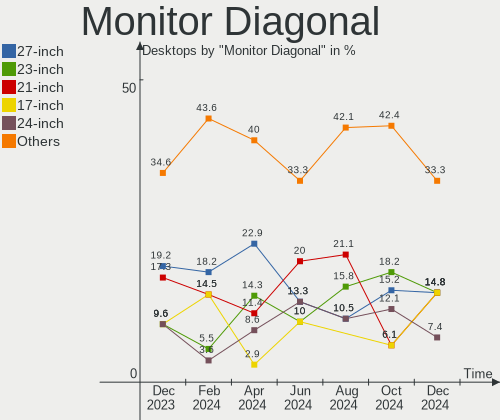
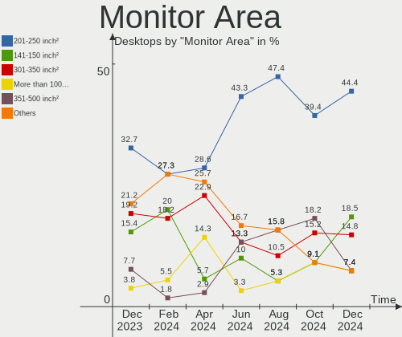
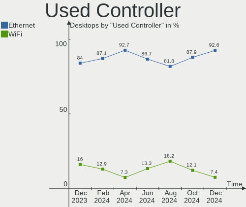
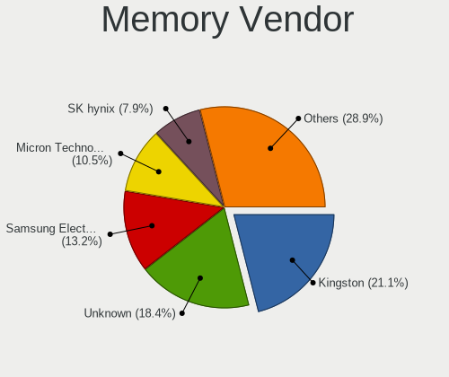

BlackPanther Hardware Trends (Desktop)
--------------------------------------

A project to identify most popular hardware characteristics and track their change
over time based on data collected by BlackPanther users at https://Linux-Hardware.org.

Anyone can contribute to the study by uploading probes of their computers by
the [hw-probe](https://github.com/linuxhw/hw-probe) tool:

    sudo -E hw-probe -all -upload

Full-feature report is available here: https://linux-hardware.org/?view=trends&formfactor=desktop

Period: Sep, 2020.

Contents
--------

- [ OS                       ](#os)
- [ OS Family                ](#os-family)
- [ Kernel                   ](#kernel)
- [ Kernel Family            ](#kernel-family)
- [ Kernel Major Ver.        ](#kernel-major-ver)
- [ Arch                     ](#arch)
- [ DE                       ](#de)
- [ Display Server           ](#display-server)
- [ Display Manager          ](#display-manager)
- [ OS Lang                  ](#os-lang)
- [ Boot Mode                ](#boot-mode)
- [ Filesystem               ](#filesystem)
- [ Part. scheme             ](#part-scheme)
- [ Dual Boot with Linux/BSD ](#dual-boot-with-linux/bsd)
- [ Dual Boot (Win)          ](#dual-boot-win)
- [ Country                  ](#country)
- [ City                     ](#city)
- [ Vendor                   ](#vendor)
- [ Model                    ](#model)
- [ Model Family             ](#model-family)
- [ MFG Year                 ](#mfg-year)
- [ Form Factor              ](#form-factor)
- [ Secure Boot              ](#secure-boot)
- [ Coreboot                 ](#coreboot)
- [ RAM Size                 ](#ram-size)
- [ RAM Used                 ](#ram-used)
- [ Has CD-ROM               ](#has-cd-rom)
- [ Total Drives             ](#total-drives)
- [ Has Ethernet             ](#has-ethernet)
- [ Drive Vendor             ](#drive-vendor)
- [ HDD Vendor               ](#hdd-vendor)
- [ SSD Vendor               ](#ssd-vendor)
- [ Drive Model              ](#drive-model)
- [ Drive Kind               ](#drive-kind)
- [ Drive Connector          ](#drive-connector)
- [ Drive Size               ](#drive-size)
- [ Space Total              ](#space-total)
- [ Space Used               ](#space-used)
- [ Malfunc. Drives          ](#malfunc-drives)
- [ Malfunc. Drive Vendor    ](#malfunc-drive-vendor)
- [ Malfunc. HDD Vendor      ](#malfunc-hdd-vendor)
- [ Malfunc. Drive Kind      ](#malfunc-drive-kind)
- [ Failed Drives            ](#failed-drives)
- [ Failed Drive Vendor      ](#failed-drive-vendor)
- [ Drive Status             ](#drive-status)
- [ Storage Vendor           ](#storage-vendor)
- [ Storage Model            ](#storage-model)
- [ Storage Kind             ](#storage-kind)
- [ CPU Vendor               ](#cpu-vendor)
- [ CPU Model                ](#cpu-model)
- [ CPU Model Family         ](#cpu-model-family)
- [ CPU Cores                ](#cpu-cores)
- [ CPU Sockets              ](#cpu-sockets)
- [ CPU Threads              ](#cpu-threads)
- [ CPU Op-Modes             ](#cpu-op-modes)
- [ CPU Microcode            ](#cpu-microcode)
- [ CPU Microarch            ](#cpu-microarch)
- [ GPU Vendor               ](#gpu-vendor)
- [ GPU Model                ](#gpu-model)
- [ GPU Combo                ](#gpu-combo)
- [ GPU Driver               ](#gpu-driver)
- [ GPU Memory               ](#gpu-memory)
- [ Monitor Vendor           ](#monitor-vendor)
- [ Monitor Model            ](#monitor-model)
- [ Monitor Resolution       ](#monitor-resolution)
- [ Monitor Diagonal         ](#monitor-diagonal)
- [ Monitor Width            ](#monitor-width)
- [ Aspect Ratio             ](#aspect-ratio)
- [ Monitor Area             ](#monitor-area)
- [ Pixel Density            ](#pixel-density)
- [ Multiple Monitors        ](#multiple-monitors)
- [ Net Controller Vendor    ](#net-controller-vendor)
- [ Net Controller Model     ](#net-controller-model)
- [ Wireless Vendor          ](#wireless-vendor)
- [ Wireless Model           ](#wireless-model)
- [ Ethernet Vendor          ](#ethernet-vendor)
- [ Ethernet Model           ](#ethernet-model)
- [ Net Controller Kind      ](#net-controller-kind)
- [ Used Controller          ](#used-controller)
- [ NICs                     ](#nics)
- [ Memory Vendor            ](#memory-vendor)
- [ Memory Model             ](#memory-model)
- [ Memory Kind              ](#memory-kind)
- [ Memory Form Factor       ](#memory-form-factor)
- [ Memory Size              ](#memory-size)
- [ Memory Speed             ](#memory-speed)
- [ Sound Vendor             ](#sound-vendor)
- [ Sound Model              ](#sound-model)
- [ Camera Vendor            ](#camera-vendor)
- [ Camera Model             ](#camera-model)
- [ Fingerprint Vendor       ](#fingerprint-vendor)
- [ Fingerprint Model        ](#fingerprint-model)
- [ Chipcard Vendor          ](#chipcard-vendor)
- [ Chipcard Model           ](#chipcard-model)
- [ Printer Vendor           ](#printer-vendor)
- [ Printer Model            ](#printer-model)
- [ Scanner Vendor           ](#scanner-vendor)
- [ Scanner Model            ](#scanner-model)
- [ Bluetooth Vendor         ](#bluetooth-vendor)
- [ Bluetooth Model          ](#bluetooth-model)
- [ Unsupported Devices      ](#unsupported-devices)
- [ Unsupported Device Types ](#unsupported-device-types)

OS
--

Installed operating systems

| Name              | Desktops | Percent |
|-------------------|----------|---------|
| BlackPanther 18.1 | 84       | 97.67%  |
| BlackPanther 16.2 | 2        | 2.33%   |

OS Family
---------

OS without a version

| Name         | Desktops | Percent |
|--------------|----------|---------|
| BlackPanther | 86       | 100%    |

Kernel
------

Version of the Linux kernel

| Version                | Desktops | Percent |
|------------------------|----------|---------|
| 4.18.16-desktop-1bP    | 84       | 97.67%  |
| 4.9.20-desktop-pae-1bP | 2        | 2.33%   |

Kernel Family
-------------

Linux kernel without a distro release

| Version | Desktops | Percent |
|---------|----------|---------|
| 4.18.16 | 84       | 97.67%  |
| 4.9.20  | 2        | 2.33%   |

Kernel Major Ver.
-----------------

Linux kernel major version

| Version | Desktops | Percent |
|---------|----------|---------|
| 4.18    | 84       | 97.67%  |
| 4.9     | 2        | 2.33%   |

Arch
----

OS architecture (x86_64, i586, etc.)

| Name   | Desktops | Percent |
|--------|----------|---------|
| x86_64 | 84       | 97.67%  |
| i686   | 2        | 2.33%   |

DE
--

Desktop Environment

| Name | Desktops | Percent |
|------|----------|---------|
| KDE5 | 86       | 100%    |

Display Server
--------------

X11 or Wayland

| Name    | Desktops | Percent |
|---------|----------|---------|
| X11     | 85       | 98.84%  |
| Wayland | 1        | 1.16%   |

Display Manager
---------------

SDDM, LightDM, etc.

| Name | Desktops | Percent |
|------|----------|---------|
| SDDM | 86       | 100%    |

OS Lang
-------

Language

| Lang    | Desktops | Percent |
|---------|----------|---------|
| Unknown | 86       | 100%    |

Boot Mode
---------

EFI or BIOS

| Mode | Desktops | Percent |
|------|----------|---------|
| BIOS | 68       | 79.07%  |
| EFI  | 18       | 20.93%  |

Filesystem
----------

Type of filesystem

| Type    | Desktops | Percent |
|---------|----------|---------|
| Overlay | 77       | 89.53%  |
| Ext4    | 9        | 10.47%  |

Part. scheme
------------

Scheme of partitioning

| Type    | Desktops | Percent |
|---------|----------|---------|
| MBR     | 55       | 63.95%  |
| GPT     | 29       | 33.72%  |
| Unknown | 2        | 2.33%   |

Dual Boot with Linux/BSD
------------------------

Hosting more than one Linux/BSD

| Dual boot | Desktops | Percent |
|-----------|----------|---------|
| Yes       | 52       | 60.47%  |
| No        | 34       | 39.53%  |

Dual Boot (Win)
---------------

Hosting Linux and Windows

| Dual boot | Desktops | Percent |
|-----------|----------|---------|
| Yes       | 45       | 52.33%  |
| No        | 41       | 47.67%  |

Country
-------

Geographic location (country)

| Country      | Desktops | Percent |
|--------------|----------|---------|
| Hungary      | 52       | 60.47%  |
| USA          | 8        | 9.3%    |
| Germany      | 6        | 6.98%   |
| Spain        | 2        | 2.33%   |
| Canada       | 2        | 2.33%   |
| Brazil       | 2        | 2.33%   |
| Australia    | 2        | 2.33%   |
| UK           | 1        | 1.16%   |
| South Africa | 1        | 1.16%   |
| Slovakia     | 1        | 1.16%   |
| San Marino   | 1        | 1.16%   |
| Romania      | 1        | 1.16%   |
| Poland       | 1        | 1.16%   |
| Philippines  | 1        | 1.16%   |
| Netherlands  | 1        | 1.16%   |
| Kuwait       | 1        | 1.16%   |
| Italy        | 1        | 1.16%   |
| Greece       | 1        | 1.16%   |
| Austria      | 1        | 1.16%   |

City
----

Geographic location (city)

| City                    | Desktops | Percent |
|-------------------------|----------|---------|
| Budapest                | 7        | 8.14%   |
| Eger                    | 5        | 5.81%   |
| Veszprém               | 2        | 2.33%   |
| Tar                     | 2        | 2.33%   |
| Szekszárd              | 2        | 2.33%   |
| Sarkeszi                | 2        | 2.33%   |
| Omaha                   | 2        | 2.33%   |
| North Hollywood         | 2        | 2.33%   |
| Matraszele              | 2        | 2.33%   |
| Dunaújváros           | 2        | 2.33%   |
| Berettyoujfalu          | 2        | 2.33%   |
| Zalaegerszeg            | 1        | 1.16%   |
| Wunstorf                | 1        | 1.16%   |
| Vassurany               | 1        | 1.16%   |
| Vacha                   | 1        | 1.16%   |
| Ulles                   | 1        | 1.16%   |
| Trois-Rivières         | 1        | 1.16%   |
| Toronto                 | 1        | 1.16%   |
| Thessaloniki            | 1        | 1.16%   |
| Teresopolis             | 1        | 1.16%   |
| Székesfehérvár       | 1        | 1.16%   |
| Szombathely             | 1        | 1.16%   |
| Szolnok                 | 1        | 1.16%   |
| Sarszentmihaly          | 1        | 1.16%   |
| Sajokeresztur           | 1        | 1.16%   |
| Rieseby                 | 1        | 1.16%   |
| Richmond                | 1        | 1.16%   |
| Pécs                   | 1        | 1.16%   |
| Phoenix                 | 1        | 1.16%   |
| Pfaffenhofen an der Ilm | 1        | 1.16%   |
| Oroshaza                | 1        | 1.16%   |
| Oradea                  | 1        | 1.16%   |
| Nagykoros               | 1        | 1.16%   |
| Mosonmagyaróvár       | 1        | 1.16%   |
| Mezokovesd              | 1        | 1.16%   |
| Mezokovacshaza          | 1        | 1.16%   |
| Mezobereny              | 1        | 1.16%   |
| Melbourne               | 1        | 1.16%   |
| Mako                    | 1        | 1.16%   |
| Madrid                  | 1        | 1.16%   |
| Leinfelden-Echterdingen | 1        | 1.16%   |
| Laupheim                | 1        | 1.16%   |
| Kuwait City             | 1        | 1.16%   |
| Kecskemét              | 1        | 1.16%   |
| Kazincbarcika           | 1        | 1.16%   |
| Karcag                  | 1        | 1.16%   |
| Johannesburg            | 1        | 1.16%   |
| Itaquaquecetuba         | 1        | 1.16%   |
| Horna Zdana             | 1        | 1.16%   |
| Harrow                  | 1        | 1.16%   |
| Hajduszoboszlo          | 1        | 1.16%   |
| Gyula                   | 1        | 1.16%   |
| Gdańsk                 | 1        | 1.16%   |
| Frastanz                | 1        | 1.16%   |
| Dorog                   | 1        | 1.16%   |
| Dogana                  | 1        | 1.16%   |
| Deszk                   | 1        | 1.16%   |
| Catania                 | 1        | 1.16%   |
| Cagayan de Oro          | 1        | 1.16%   |
| Boise                   | 1        | 1.16%   |

Vendor
------

Motherboard manufacturer

| Name                | Desktops | Percent |
|---------------------|----------|---------|
| ASRock              | 17       | 19.77%  |
| ASUSTek Computer    | 16       | 18.6%   |
| Dell                | 13       | 15.12%  |
| Gigabyte Technology | 11       | 12.79%  |
| Hewlett-Packard     | 9        | 10.47%  |
| Lenovo              | 6        | 6.98%   |
| MSI                 | 3        | 3.49%   |
| Acer                | 3        | 3.49%   |
| ABIT                | 2        | 2.33%   |
| Gateway             | 1        | 1.16%   |
| Fujitsu Siemens     | 1        | 1.16%   |
| Fujitsu             | 1        | 1.16%   |
| Foxconn             | 1        | 1.16%   |
| ECS                 | 1        | 1.16%   |
| Biostar             | 1        | 1.16%   |

Model
-----

Motherboard model

| Name                                | Desktops | Percent |
|-------------------------------------|----------|---------|
| Gigabyte H61M-S1                    | 2        | 2.33%   |
| Dell OptiPlex 760                   | 2        | 2.33%   |
| Dell OptiPlex 755                   | 2        | 2.33%   |
| ASUS All Series                     | 2        | 2.33%   |
| MSI MS-7A32                         | 1        | 1.16%   |
| MSI MS-7680                         | 1        | 1.16%   |
| MSI MS-7529                         | 1        | 1.16%   |
| Lenovo ThinkStation D20 4158AF8     | 1        | 1.16%   |
| Lenovo ThinkCentre M92P 32371L5     | 1        | 1.16%   |
| Lenovo ThinkCentre M91p 7034BN4     | 1        | 1.16%   |
| Lenovo ThinkCentre M58p 6138DK1     | 1        | 1.16%   |
| Lenovo ThinkCentre A55 96417RG      | 1        | 1.16%   |
| Lenovo 70A0S06500 ThinkServer TS140 | 1        | 1.16%   |
| HP ProLiant MicroServer             | 1        | 1.16%   |
| HP ProDesk 400 G3 MT                | 1        | 1.16%   |
| HP Compaq Pro 6305 SFF              | 1        | 1.16%   |
| HP Compaq Pro 6305 MT               | 1        | 1.16%   |
| HP Compaq Pro 4300 SFF PC           | 1        | 1.16%   |
| HP Compaq dc7900 Small Form Factor  | 1        | 1.16%   |
| HP Compaq dc7700p Small Form Factor | 1        | 1.16%   |
| HP Compaq dc5800 Small Form Factor  | 1        | 1.16%   |
| HP Compaq 8000 Elite SFF PC         | 1        | 1.16%   |
| Gigabyte Z390 UD                    | 1        | 1.16%   |
| Gigabyte X570 GAMING X              | 1        | 1.16%   |
| Gigabyte nForce                     | 1        | 1.16%   |
| Gigabyte H61MA-D3V                  | 1        | 1.16%   |
| Gigabyte H61M-S2V-B3                | 1        | 1.16%   |
| Gigabyte GA-MA78GM-S2H              | 1        | 1.16%   |
| Gigabyte F2A88XM-DS2                | 1        | 1.16%   |
| Gigabyte B360N WIFI                 | 1        | 1.16%   |
| Gigabyte AX370-Gaming 5             | 1        | 1.16%   |
| Gateway DX4860                      | 1        | 1.16%   |
| Fujitsu Siemens ESPRIMO C5730       | 1        | 1.16%   |
| Fujitsu ESPRIMO P910                | 1        | 1.16%   |
| Foxconn H55M-S                      | 1        | 1.16%   |
| ECS P43T-A2                         | 1        | 1.16%   |
| Dell Studio XPS 7100                | 1        | 1.16%   |
| Dell Precision T1700                | 1        | 1.16%   |
| Dell OptiPlex FX160                 | 1        | 1.16%   |
| Dell OptiPlex 780                   | 1        | 1.16%   |
| Dell OptiPlex 740 Enhanced          | 1        | 1.16%   |
| Dell OptiPlex 360                   | 1        | 1.16%   |
| Dell OptiPlex 330                   | 1        | 1.16%   |
| Dell OptiPlex 320                   | 1        | 1.16%   |
| Dell OptiPlex 3060                  | 1        | 1.16%   |
| Biostar H61MLV3                     | 1        | 1.16%   |
| ASUS ROG STRIX Z370-G GAMING        | 1        | 1.16%   |
| ASUS PRIME B250M-A                  | 1        | 1.16%   |
| ASUS PRIME A320M-R                  | 1        | 1.16%   |
| ASUS P8H61/USB3 R2.0                | 1        | 1.16%   |
| ASUS P8B75-M LX PLUS                | 1        | 1.16%   |
| ASUS P5QL PRO                       | 1        | 1.16%   |
| ASUS P5Q                            | 1        | 1.16%   |
| ASUS P5PL2-E                        | 1        | 1.16%   |
| ASUS P5K PRO                        | 1        | 1.16%   |
| ASUS P5K                            | 1        | 1.16%   |
| ASUS P5G-MX                         | 1        | 1.16%   |
| ASUS Maximus VIII RANGER            | 1        | 1.16%   |
| ASUS M5A97 LE R2.0                  | 1        | 1.16%   |
| ASUS KC880AA-ABA m9150f             | 1        | 1.16%   |

Model Family
------------

Motherboard model prefix

| Name                    | Desktops | Percent |
|-------------------------|----------|---------|
| Dell OptiPlex           | 11       | 12.79%  |
| HP Compaq               | 7        | 8.14%   |
| Lenovo ThinkCentre      | 4        | 4.65%   |
| Acer Aspire             | 3        | 3.49%   |
| Gigabyte H61M-S1        | 2        | 2.33%   |
| ASUS PRIME              | 2        | 2.33%   |
| ASUS P5K                | 2        | 2.33%   |
| ASUS All                | 2        | 2.33%   |
| MSI MS-7A32             | 1        | 1.16%   |
| MSI MS-7680             | 1        | 1.16%   |
| MSI MS-7529             | 1        | 1.16%   |
| Lenovo ThinkStation     | 1        | 1.16%   |
| Lenovo 70A0S06500       | 1        | 1.16%   |
| HP ProLiant             | 1        | 1.16%   |
| HP ProDesk              | 1        | 1.16%   |
| Gigabyte Z390           | 1        | 1.16%   |
| Gigabyte X570           | 1        | 1.16%   |
| Gigabyte nForce         | 1        | 1.16%   |
| Gigabyte H61MA-D3V      | 1        | 1.16%   |
| Gigabyte H61M-S2V-B3    | 1        | 1.16%   |
| Gigabyte GA-MA78GM-S2H  | 1        | 1.16%   |
| Gigabyte F2A88XM-DS2    | 1        | 1.16%   |
| Gigabyte B360N          | 1        | 1.16%   |
| Gigabyte AX370-Gaming   | 1        | 1.16%   |
| Gateway DX4860          | 1        | 1.16%   |
| Fujitsu Siemens ESPRIMO | 1        | 1.16%   |
| Fujitsu ESPRIMO         | 1        | 1.16%   |
| Foxconn H55M-S          | 1        | 1.16%   |
| ECS P43T-A2             | 1        | 1.16%   |
| Dell Studio             | 1        | 1.16%   |
| Dell Precision          | 1        | 1.16%   |
| Biostar H61MLV3         | 1        | 1.16%   |
| ASUS ROG                | 1        | 1.16%   |
| ASUS P8H61              | 1        | 1.16%   |
| ASUS P8B75-M            | 1        | 1.16%   |
| ASUS P5QL               | 1        | 1.16%   |
| ASUS P5Q                | 1        | 1.16%   |
| ASUS P5PL2-E            | 1        | 1.16%   |
| ASUS P5G-MX             | 1        | 1.16%   |
| ASUS Maximus            | 1        | 1.16%   |
| ASUS M5A97              | 1        | 1.16%   |
| ASUS KC880AA-ABA        | 1        | 1.16%   |
| ASRock Z270             | 1        | 1.16%   |
| ASRock Z170             | 1        | 1.16%   |
| ASRock X370             | 1        | 1.16%   |
| ASRock N68-VS3          | 1        | 1.16%   |
| ASRock N68-S3           | 1        | 1.16%   |
| ASRock H81M-VG4         | 1        | 1.16%   |
| ASRock H61M-VG4         | 1        | 1.16%   |
| ASRock FM2A88X+         | 1        | 1.16%   |
| ASRock FM2A88X          | 1        | 1.16%   |
| ASRock FM2A88M          | 1        | 1.16%   |
| ASRock FM2A75M          | 1        | 1.16%   |
| ASRock FM2A55M-DGS      | 1        | 1.16%   |
| ASRock AM2NF3-VSTA      | 1        | 1.16%   |
| ASRock AB350M           | 1        | 1.16%   |
| ASRock A55M-HVS         | 1        | 1.16%   |
| ASRock 970              | 1        | 1.16%   |
| ASRock 945GCM-S         | 1        | 1.16%   |
| ABIT IL8                | 1        | 1.16%   |

MFG Year
--------

Motherboard manufacture year

| Year | Desktops | Percent |
|------|----------|---------|
| 2008 | 12       | 13.95%  |
| 2009 | 11       | 12.79%  |
| 2016 | 8        | 9.3%    |
| 2012 | 8        | 9.3%    |
| 2019 | 7        | 8.14%   |
| 2013 | 7        | 8.14%   |
| 2011 | 7        | 8.14%   |
| 2018 | 6        | 6.98%   |
| 2014 | 6        | 6.98%   |
| 2015 | 4        | 4.65%   |
| 2007 | 4        | 4.65%   |
| 2020 | 2        | 2.33%   |
| 2010 | 2        | 2.33%   |
| 2017 | 1        | 1.16%   |
| 2005 | 1        | 1.16%   |

Form Factor
-----------

Physical design of the computer

| Name    | Desktops | Percent |
|---------|----------|---------|
| Desktop | 86       | 100%    |

Secure Boot
-----------

Enabled or disabled

| State    | Desktops | Percent |
|----------|----------|---------|
| Disabled | 86       | 100%    |

Coreboot
--------

Have coreboot on board

| Used | Desktops | Percent |
|------|----------|---------|
| No   | 86       | 100%    |

RAM Size
--------

Total RAM memory

| Size in GB | Desktops | Percent |
|------------|----------|---------|
| 3.01-4.0   | 26       | 30.23%  |
| 8.01-16.0  | 22       | 25.58%  |
| 4.01-8.0   | 16       | 18.6%   |
| 16.01-24.0 | 11       | 12.79%  |
| 1.01-2.0   | 8        | 9.3%    |
| 32.01-64.0 | 2        | 2.33%   |
| 2.01-3.0   | 1        | 1.16%   |

RAM Used
--------

Used RAM memory

| Used GB  | Desktops | Percent |
|----------|----------|---------|
| 0.01-1.0 | 83       | 96.51%  |
| 1.01-2.0 | 3        | 3.49%   |

Has CD-ROM
----------

Has CD-ROM on board

| Presented | Desktops | Percent |
|-----------|----------|---------|
| Yes       | 59       | 68.6%   |
| No        | 27       | 31.4%   |

Total Drives
------------

Number of drives on board

| Drives | Desktops | Percent |
|--------|----------|---------|
| 1      | 44       | 51.16%  |
| 2      | 23       | 26.74%  |
| 3      | 7        | 8.14%   |
| 5      | 5        | 5.81%   |
| 0      | 3        | 3.49%   |
| 4      | 2        | 2.33%   |
| 7      | 1        | 1.16%   |
| 6      | 1        | 1.16%   |

Has Ethernet
------------

Has Ethernet on board

| Presented | Desktops | Percent |
|-----------|----------|---------|
| Yes       | 84       | 97.67%  |
| No        | 2        | 2.33%   |

Drive Vendor
------------

Hard drive vendors

| Vendor              | Desktops | Drives  | Percent |
|---------------------|----------|---------|---------|
| WDC                 | 35       | 50      | 26.12%  |
| Seagate             | 25       | 32      | 18.66%  |
| Samsung Electronics | 19       | 22      | 14.18%  |
| Toshiba             | 9        | 10      | 6.72%   |
| Kingston            | 8        | 8       | 5.97%   |
| Hitachi             | 7        | 7       | 5.22%   |
| A-DATA Technology   | 5        | 5       | 3.73%   |
| SanDisk             | 4        | 4       | 2.99%   |
| MAXTOR              | 4        | 4       | 2.99%   |
| Crucial             | 4        | 4       | 2.99%   |
| OCZ                 | 2        | 2       | 1.49%   |
| HL-DT-ST            | 2        | Unknown | 1.49%   |
| Zheino              | 1        | 1       | 0.75%   |
| Verbatim            | 1        | 1       | 0.75%   |
| SPCC                | 1        | 1       | 0.75%   |
| SK Hynix            | 1        | 1       | 0.75%   |
| PNY                 | 1        | 1       | 0.75%   |
| Intel               | 1        | 1       | 0.75%   |
| IBM/Hitachi         | 1        | 1       | 0.75%   |
| HGST                | 1        | 1       | 0.75%   |
| Hewlett-Packard     | 1        | 1       | 0.75%   |
| Fujitsu             | 1        | 1       | 0.75%   |

HDD Vendor
----------

Hard disk drive vendors

| Vendor              | Desktops | Drives | Percent |
|---------------------|----------|--------|---------|
| WDC                 | 32       | 44     | 35.16%  |
| Seagate             | 25       | 32     | 27.47%  |
| Samsung Electronics | 10       | 11     | 10.99%  |
| Toshiba             | 9        | 10     | 9.89%   |
| Hitachi             | 7        | 7      | 7.69%   |
| Maxtor              | 4        | 4      | 4.4%    |
| IBM/Hitachi         | 1        | 1      | 1.1%    |
| HGST                | 1        | 1      | 1.1%    |
| Hewlett-Packard     | 1        | 1      | 1.1%    |
| Fujitsu             | 1        | 1      | 1.1%    |

SSD Vendor
----------

Solid state drive vendors

| Vendor              | Desktops | Drives | Percent |
|---------------------|----------|--------|---------|
| Samsung Electronics | 8        | 9      | 21.05%  |
| Kingston            | 7        | 7      | 18.42%  |
| WDC                 | 5        | 5      | 13.16%  |
| SanDisk             | 4        | 4      | 10.53%  |
| Crucial             | 4        | 4      | 10.53%  |
| A-DATA Technology   | 4        | 4      | 10.53%  |
| OCZ                 | 2        | 2      | 5.26%   |
| Verbatim            | 1        | 1      | 2.63%   |
| SPCC                | 1        | 1      | 2.63%   |
| SK Hynix            | 1        | 1      | 2.63%   |
| PNY                 | 1        | 1      | 2.63%   |

Drive Model
-----------

Hard drive models

| Model                        | Desktops | Percent |
|------------------------------|----------|---------|
| ST500DM002-1BD142 500GB      | 4        | 2.55%   |
| ST3500320AS 500GB            | 3        | 1.91%   |
| SA400S37120G 120GB SSD       | 3        | 1.91%   |
| WDS120G2G0A-00JH30 120GB SSD | 2        | 1.27%   |
| WD10EZRX-00L4HB0 1TB         | 2        | 1.27%   |
| WD10EZEX-08WN4A0 1TB         | 2        | 1.27%   |
| SU630 240GB SSD              | 2        | 1.27%   |
| ST31000524AS 1TB             | 2        | 1.27%   |
| ST2000DM001-1CH164 2TB       | 2        | 1.27%   |
| ST1000DM010-2EP102 1TB       | 2        | 1.27%   |
| ST1000DM003-1ER162 1TB       | 2        | 1.27%   |
| SSD 860 EVO 500GB            | 2        | 1.27%   |
| HDWD110 1TB                  | 2        | 1.27%   |
| HDS721050CLA360 500GB        | 2        | 1.27%   |
| HD502HJ 500GB                | 2        | 1.27%   |
| DVDRAM GUC0N 1GB             | 2        | 1.27%   |
| DT01ACA100 1TB               | 2        | 1.27%   |
| DT01ACA050 500GB             | 2        | 1.27%   |
| WDS500G2X0C-00L350 500GB     | 1        | 0.64%   |
| WDS240G2G0B-00EPW0 240GB SSD | 1        | 0.64%   |
| WDS240G2G0A-00JH30 240GB SSD | 1        | 0.64%   |
| WDS120G2G0B-00EPW0 120GB SSD | 1        | 0.64%   |
| WD800JD-75MSA3 80GB          | 1        | 0.64%   |
| WD6400AAKS-00A7B0 640GB      | 1        | 0.64%   |
| WD60EZRX-00MVLB1 6TB         | 1        | 0.64%   |
| WD6003FZBX-00K5WB0 6TB       | 1        | 0.64%   |
| WD5000LPCX-60VHAT0 500GB     | 1        | 0.64%   |
| WD5000AZRX-00A8LB0 500GB     | 1        | 0.64%   |
| WD5000AAKX-75U6AA0 500GB     | 1        | 0.64%   |
| WD5000AAKX-60U6AA0 500GB     | 1        | 0.64%   |
| WD5000AAKX-603CA0 500GB      | 1        | 0.64%   |
| WD5000AAKX-001CA0 500GB      | 1        | 0.64%   |
| WD5000AAKS-40V2B0 500GB      | 1        | 0.64%   |
| WD5000AAKS-007AA0 500GB      | 1        | 0.64%   |
| WD5000AADS-00S9B0 500GB      | 1        | 0.64%   |
| WD5000AADS-00M2B0 500GB      | 1        | 0.64%   |
| WD40EZRX-00SPEB0 4TB         | 1        | 0.64%   |
| WD400BD-55MTA1 40GB          | 1        | 0.64%   |
| WD400BB-60DGA0 40GB          | 1        | 0.64%   |
| WD4000AAJS-32TKA0 400GB      | 1        | 0.64%   |
| WD3200LPVX-08V0TT5 320GB     | 1        | 0.64%   |
| WD3200AAKS-00VYA0 320GB      | 1        | 0.64%   |
| WD3200AAKS-00L9A0 320GB      | 1        | 0.64%   |
| WD2500KS-00MJB0 250GB        | 1        | 0.64%   |
| WD2500JS-60MHB5 250GB        | 1        | 0.64%   |
| WD2500BEVT-00ZCT0 250GB      | 1        | 0.64%   |
| WD2500AAJS-75M0A0 250GB      | 1        | 0.64%   |
| WD20PURZ-85GU6Y0 2TB         | 1        | 0.64%   |
| WD20EZRZ-00Z5HB0 2TB         | 1        | 0.64%   |
| WD20EARS-60MVWB0 2TB         | 1        | 0.64%   |
| WD1600BEKT-00PVMT0 160GB     | 1        | 0.64%   |
| WD1600AAJS-98PSA0 160GB      | 1        | 0.64%   |
| WD1600AAJS-60M0A0 160GB      | 1        | 0.64%   |
| WD1600AAJS-00YZCA0 160GB     | 1        | 0.64%   |
| WD10JPCX-24UE4T0 1TB         | 1        | 0.64%   |
| WD10EZRZ-00HTKB0 1TB         | 1        | 0.64%   |
| WD10EZRX-00A8LB0 1TB         | 1        | 0.64%   |
| WD10EZEX-21M2NA0 1TB         | 1        | 0.64%   |
| WD10EADS-00M2B0 1TB          | 1        | 0.64%   |
| WD1002FAEX-00Z3A0 1TB        | 1        | 0.64%   |

Drive Kind
----------

HDD or SSD

| Kind    | Desktops | Drives  | Percent |
|---------|----------|---------|---------|
| HDD     | 70       | 112     | 61.95%  |
| SSD     | 35       | 39      | 30.97%  |
| NVMe    | 6        | 7       | 5.31%   |
| Unknown | 2        | Unknown | 1.77%   |

Drive Connector
---------------

SATA, SAS, NVMe, etc.

| Type | Desktops | Drives | Percent |
|------|----------|--------|---------|
| SATA | 81       | 148    | 89.01%  |
| NVMe | 6        | 7      | 6.59%   |
| SAS  | 4        | 3      | 4.4%    |

Drive Size
----------

Size of hard drive

| Size in TB | Desktops | Drives | Percent |
|------------|----------|--------|---------|
| 0.01-0.5   | 76       | 109    | 66.67%  |
| 0.51-1.0   | 25       | 31     | 21.93%  |
| 1.01-2.0   | 6        | 7      | 5.26%   |
| 4.01-10.0  | 3        | 6      | 2.63%   |
| 3.01-4.0   | 2        | 2      | 1.75%   |
| 2.01-3.0   | 1        | 1      | 0.88%   |
| 10.01-20.0 | 1        | 2      | 0.88%   |

Space Total
-----------

Amount of disk space available on the file system

| Size in GB | Desktops | Percent |
|------------|----------|---------|
| Unknown    | 77       | 89.53%  |
| 101-250    | 3        | 3.49%   |
| 51-100     | 3        | 3.49%   |
| 251-500    | 2        | 2.33%   |
| 501-1000   | 1        | 1.16%   |

Space Used
----------

Amount of used disk space

| Used GB | Desktops | Percent |
|---------|----------|---------|
| Unknown | 77       | 89.53%  |
| 1-20    | 6        | 6.98%   |
| 21-50   | 2        | 2.33%   |
| 51-100  | 1        | 1.16%   |

Malfunc. Drives
---------------

Drive models with a malfunction

| Model                    | Desktops | Drives | Percent |
|--------------------------|----------|--------|---------|
| ST3500320AS 500GB        | 2        | 2      | 4.44%   |
| HDS721050CLA360 500GB    | 2        | 2      | 4.44%   |
| DT01ACA050 500GB         | 2        | 2      | 4.44%   |
| WD6400AAKS-00A7B0 640GB  | 1        | 1      | 2.22%   |
| WD5000AAKX-75U6AA0 500GB | 1        | 1      | 2.22%   |
| WD5000AAKX-60U6AA0 500GB | 1        | 1      | 2.22%   |
| WD5000AAKX-001CA0 500GB  | 1        | 1      | 2.22%   |
| WD5000AAKS-007AA0 500GB  | 1        | 1      | 2.22%   |
| WD5000AADS-00S9B0 500GB  | 1        | 1      | 2.22%   |
| WD5000AADS-00M2B0 500GB  | 1        | 1      | 2.22%   |
| WD3200AAKS-00L9A0 320GB  | 1        | 1      | 2.22%   |
| WD2500JS-60MHB5 250GB    | 1        | 1      | 2.22%   |
| WD20EARS-60MVWB0 2TB     | 1        | 1      | 2.22%   |
| WD10JPCX-24UE4T0 1TB     | 1        | 1      | 2.22%   |
| WD10EZRX-00A8LB0 1TB     | 1        | 1      | 2.22%   |
| WD10EZEX-08WN4A0 1TB     | 1        | 1      | 2.22%   |
| WD10EADS-00M2B0 1TB      | 1        | 1      | 2.22%   |
| VERTEX3 120GB SSD        | 1        | 1      | 2.22%   |
| SU630 240GB SSD          | 1        | 1      | 2.22%   |
| STM3250820AS 250GB       | 1        | 1      | 2.22%   |
| ST980412ASG 80GB         | 1        | 1      | 2.22%   |
| ST500DM002-1BD142 500GB  | 1        | 1      | 2.22%   |
| ST4000DM000-1F2168 4TB   | 1        | 1      | 2.22%   |
| ST3500641AS 500GB        | 1        | 1      | 2.22%   |
| ST3500410AS 500GB        | 1        | 1      | 2.22%   |
| ST3400620AS 400GB        | 1        | 1      | 2.22%   |
| ST3320820AS 320GB        | 1        | 1      | 2.22%   |
| SP2014N 34GB             | 1        | 1      | 2.22%   |
| SP1654N 160GB            | 1        | 1      | 2.22%   |
| SP1614C 160GB            | 1        | 1      | 2.22%   |
| SP0802N 80GB             | 1        | 1      | 2.22%   |
| SC210 2.5 7MM 128GB SSD  | 1        | 1      | 2.22%   |
| MQ01ACF032 320GB         | 1        | 1      | 2.22%   |
| IC35L120AVV207-1 128GB   | 1        | 1      | 2.22%   |
| HTS541680J9SA00 80GB     | 1        | 1      | 2.22%   |
| HDS721050CLA362 500GB    | 1        | 1      | 2.22%   |
| HDS721010CLA332 1TB      | 1        | 1      | 2.22%   |
| HD502HJ 500GB            | 1        | 1      | 2.22%   |
| HD321KJ 320GB            | 1        | 1      | 2.22%   |
| HD161GJ 160GB            | 1        | 1      | 2.22%   |
| HD103UJ 1TB              | 1        | 1      | 2.22%   |
| DT01ACA100 1TB           | 1        | 1      | 2.22%   |

Malfunc. Drive Vendor
---------------------

Vendors of faulty drives

| Vendor              | Desktops | Drives | Percent |
|---------------------|----------|--------|---------|
| WDC                 | 13       | 14     | 30.23%  |
| Seagate             | 9        | 9      | 20.93%  |
| Samsung Electronics | 7        | 8      | 16.28%  |
| Hitachi             | 5        | 5      | 11.63%  |
| Toshiba             | 4        | 4      | 9.3%    |
| SK Hynix            | 1        | 1      | 2.33%   |
| OCZ                 | 1        | 1      | 2.33%   |
| MAXTOR              | 1        | 1      | 2.33%   |
| IBM/Hitachi         | 1        | 1      | 2.33%   |
| A-DATA Technology   | 1        | 1      | 2.33%   |

Malfunc. HDD Vendor
-------------------

Vendors of faulty HDD drives

| Vendor              | Desktops | Drives | Percent |
|---------------------|----------|--------|---------|
| WDC                 | 13       | 14     | 32.5%   |
| Seagate             | 9        | 9      | 22.5%   |
| Samsung Electronics | 7        | 8      | 17.5%   |
| Hitachi             | 5        | 5      | 12.5%   |
| Toshiba             | 4        | 4      | 10%     |
| MAXTOR              | 1        | 1      | 2.5%    |
| IBM/Hitachi         | 1        | 1      | 2.5%    |

Malfunc. Drive Kind
-------------------

Kinds of faulty drives

| Kind | Desktops | Drives | Percent |
|------|----------|--------|---------|
| HDD  | 37       | 42     | 92.5%   |
| SSD  | 3        | 3      | 7.5%    |

Failed Drives
-------------

Failed drive models

Zero info for selected period =(

Failed Drive Vendor
-------------------

Failed drive vendors

Zero info for selected period =(

Drive Status
------------

Number of failed and malfunc. drives

| Status   | Desktops | Drives | Percent |
|----------|----------|--------|---------|
| Works    | 64       | 111    | 59.81%  |
| Malfunc  | 39       | 45     | 36.45%  |
| Detected | 4        | 2      | 3.74%   |

Storage Vendor
--------------

Storage controller vendors

| Vendor                           | Desktops | Percent |
|----------------------------------|----------|---------|
| Intel                            | 56       | 54.9%   |
| AMD                              | 23       | 22.55%  |
| Nvidia                           | 6        | 5.88%   |
| Marvell Technology Group         | 4        | 3.92%   |
| Silicon Image                    | 2        | 1.96%   |
| Samsung Electronics              | 2        | 1.96%   |
| JMicron Technology               | 2        | 1.96%   |
| ASMedia Technology               | 2        | 1.96%   |
| Silicon Motion                   | 1        | 0.98%   |
| Silicon Integrated Systems [SiS] | 1        | 0.98%   |
| Sandisk                          | 1        | 0.98%   |
| Kingston Technology Company      | 1        | 0.98%   |
| ADATA Technology                 | 1        | 0.98%   |

Storage Model
-------------

Storage controller models

| Model                                                                             | Desktops | Percent |
|-----------------------------------------------------------------------------------|----------|---------|
| FCH SATA Controller [AHCI mode]                                                   | 15       | 9.68%   |
| NM10/ICH7 Family SATA Controller [IDE mode]                                       | 7        | 4.52%   |
| 82801G (ICH7 Family) IDE Controller                                               | 7        | 4.52%   |
| 4 Series Chipset PT IDER Controller                                               | 7        | 4.52%   |
| 6 Series/C200 Series Chipset Family 6 port Desktop SATA AHCI Controller           | 6        | 3.87%   |
| FCH IDE Controller                                                                | 5        | 3.23%   |
| 6 Series/C200 Series Chipset Family Desktop SATA Controller (IDE mode, ports 4-5) | 5        | 3.23%   |
| 6 Series/C200 Series Chipset Family Desktop SATA Controller (IDE mode, ports 0-3) | 5        | 3.23%   |
| SB7x0/SB8x0/SB9x0 IDE Controller                                                  | 4        | 2.58%   |
| Q170/Q150/B150/H170/H110/Z170/CM236 Chipset SATA Controller [AHCI Mode]           | 4        | 2.58%   |
| 82801JD/DO (ICH10 Family) SATA AHCI Controller                                    | 4        | 2.58%   |
| X370 Series Chipset SATA Controller                                               | 3        | 1.94%   |
| SB7x0/SB8x0/SB9x0 SATA Controller [AHCI mode]                                     | 3        | 1.94%   |
| Cannon Lake PCH SATA AHCI Controller                                              | 3        | 1.94%   |
| 82801IR/IO/IH (ICH9R/DO/DH) 6 port SATA Controller [AHCI mode]                    | 3        | 1.94%   |
| 82801I (ICH9 Family) 2 port SATA Controller [IDE mode]                            | 3        | 1.94%   |
| 8 Series/C220 Series Chipset Family 6-port SATA Controller 1 [AHCI mode]          | 3        | 1.94%   |
| 7 Series/C210 Series Chipset Family 6-port SATA Controller [AHCI mode]            | 3        | 1.94%   |
| 200 Series PCH SATA controller [AHCI mode]                                        | 3        | 1.94%   |
| SB7x0/SB8x0/SB9x0 SATA Controller [IDE mode]                                      | 2        | 1.29%   |
| SB600 Non-Raid-5 SATA                                                             | 2        | 1.29%   |
| SB600 IDE                                                                         | 2        | 1.29%   |
| SATA Controller [RAID mode]                                                       | 2        | 1.29%   |
| NVMe SSD Controller SM981/PM981/PM983                                             | 2        | 1.29%   |
| Non-Volatile memory controller                                                    | 2        | 1.29%   |
| nForce3 Serial ATA Controller                                                     | 2        | 1.29%   |
| MCP61 SATA Controller                                                             | 2        | 1.29%   |
| MCP61 IDE                                                                         | 2        | 1.29%   |
| CK8S Parallel ATA Controller (v2.5)                                               | 2        | 1.29%   |
| ASM1062 Serial ATA Controller                                                     | 2        | 1.29%   |
| 82Q35 Express PT IDER Controller                                                  | 2        | 1.29%   |
| 82801JI (ICH10 Family) SATA AHCI Controller                                       | 2        | 1.29%   |
| 82801JI (ICH10 Family) 4 port SATA IDE Controller #1                              | 2        | 1.29%   |
| 82801JI (ICH10 Family) 2 port SATA IDE Controller #2                              | 2        | 1.29%   |
| 82801JD/DO (ICH10 Family) 4-port SATA IDE Controller                              | 2        | 1.29%   |
| 82801JD/DO (ICH10 Family) 2-port SATA IDE Controller                              | 2        | 1.29%   |
| 82801IB (ICH9) 2 port SATA Controller [IDE mode]                                  | 2        | 1.29%   |
| XPG SX8200 Pro PCIe Gen3x4 M.2 2280 Solid State Drive                             | 1        | 0.65%   |
| WD Black 2018/PC SN720 NVMe SSD                                                   | 1        | 0.65%   |
| SSD 660P Series                                                                   | 1        | 0.65%   |
| SiI 3512 [SATALink/SATARaid] Serial ATA Controller                                | 1        | 0.65%   |
| SiI 3132 Serial ATA Raid II Controller                                            | 1        | 0.65%   |
| SiI 3114 [SATALink/SATARaid] Serial ATA Controller                                | 1        | 0.65%   |
| NM10/ICH7 Family SATA Controller [AHCI mode]                                      | 1        | 0.65%   |
| MV64460/64461/64462 System Controller, Revision B                                 | 1        | 0.65%   |
| MCP79 AHCI Controller                                                             | 1        | 0.65%   |
| MCP51 Serial ATA Controller                                                       | 1        | 0.65%   |
| JMB368 IDE controller                                                             | 1        | 0.65%   |
| JMB363 SATA/IDE Controller                                                        | 1        | 0.65%   |
| FCH SATA Controller [IDE mode]                                                    | 1        | 0.65%   |
| FCH SATA Controller D                                                             | 1        | 0.65%   |
| Atom Processor E3800 Series SATA AHCI Controller                                  | 1        | 0.65%   |
| AHCI IDE Controller (0106)                                                        | 1        | 0.65%   |
| 9 Series Chipset Family SATA Controller [AHCI Mode]                               | 1        | 0.65%   |
| 88SE9230 PCIe SATA 6Gb/s Controller                                               | 1        | 0.65%   |
| 88SE9172 SATA III 6Gb/s RAID Controller                                           | 1        | 0.65%   |
| 88SE6101/6102 single-port PATA133 interface                                       | 1        | 0.65%   |
| 82Q963/Q965 PT IDER Controller                                                    | 1        | 0.65%   |
| 82801IR/IO/IH (ICH9R/DO/DH) 4 port SATA Controller [IDE mode]                     | 1        | 0.65%   |
| 82801H (ICH8 Family) 4 port SATA Controller [IDE mode]                            | 1        | 0.65%   |

Storage Kind
------------

Kind of storage controller (IDE, SATA, NVMe, SAS, ...)

| Kind | Desktops | Percent |
|------|----------|---------|
| SATA | 59       | 50.86%  |
| IDE  | 46       | 39.66%  |
| NVMe | 6        | 5.17%   |
| RAID | 5        | 4.31%   |

CPU Vendor
----------

Processor vendors

| Vendor | Desktops | Percent |
|--------|----------|---------|
| Intel  | 60       | 69.77%  |
| AMD    | 26       | 30.23%  |

CPU Model
---------

Processor models

| Model                                       | Desktops | Percent |
|---------------------------------------------|----------|---------|
| Intel Core 2 Duo CPU E8400 @ 3.00GHz        | 5        | 5.81%   |
| Intel Core 2 Quad CPU Q6600 @ 2.40GHz       | 3        | 3.49%   |
| Intel Core 2 Duo CPU E7500 @ 2.93GHz        | 3        | 3.49%   |
| Intel Core 2 Duo CPU E7300 @ 2.66GHz        | 3        | 3.49%   |
| Intel Pentium Dual CPU E2180 @ 2.00GHz      | 2        | 2.33%   |
| Intel Core i5-6500 CPU @ 3.20GHz            | 2        | 2.33%   |
| Intel Core i5-3470 CPU @ 3.20GHz            | 2        | 2.33%   |
| Intel Core i3-3220 CPU @ 3.30GHz            | 2        | 2.33%   |
| Intel Core 2 Quad CPU Q9400 @ 2.66GHz       | 2        | 2.33%   |
| Intel Celeron CPU G1610 @ 2.60GHz           | 2        | 2.33%   |
| Intel Atom CPU 230 @ 1.60GHz                | 2        | 2.33%   |
| AMD Phenom II X4 955 Processor              | 2        | 2.33%   |
| Intel Xeon CPU X5677 @ 3.47GHz              | 1        | 1.16%   |
| Intel Xeon CPU E5440 @ 2.83GHz              | 1        | 1.16%   |
| Intel Pentium Dual CPU E2140 @ 1.60GHz      | 1        | 1.16%   |
| Intel Pentium D CPU 3.00GHz                 | 1        | 1.16%   |
| Intel Pentium CPU G860 @ 3.00GHz            | 1        | 1.16%   |
| Intel Pentium CPU G840 @ 2.80GHz            | 1        | 1.16%   |
| Intel Genuine CPU 2140 @ 1.60GHz            | 1        | 1.16%   |
| Intel Core i7-8700K CPU @ 3.70GHz           | 1        | 1.16%   |
| Intel Core i7-8700 CPU @ 3.20GHz            | 1        | 1.16%   |
| Intel Core i7-6700K CPU @ 4.00GHz           | 1        | 1.16%   |
| Intel Core i7-4790 CPU @ 3.60GHz            | 1        | 1.16%   |
| Intel Core i5-9400 CPU @ 2.90GHz            | 1        | 1.16%   |
| Intel Core i5-7400 CPU @ 3.00GHz            | 1        | 1.16%   |
| Intel Core i5-6400 CPU @ 2.70GHz            | 1        | 1.16%   |
| Intel Core i5-4460 CPU @ 3.20GHz            | 1        | 1.16%   |
| Intel Core i5-3570 CPU @ 3.40GHz            | 1        | 1.16%   |
| Intel Core i5-3470T CPU @ 2.90GHz           | 1        | 1.16%   |
| Intel Core i5-2400 CPU @ 3.10GHz            | 1        | 1.16%   |
| Intel Core i5-2320 CPU @ 3.00GHz            | 1        | 1.16%   |
| Intel Core i3-8100 CPU @ 3.60GHz            | 1        | 1.16%   |
| Intel Core i3-4170 CPU @ 3.70GHz            | 1        | 1.16%   |
| Intel Core i3-3250 CPU @ 3.50GHz            | 1        | 1.16%   |
| Intel Core i3-2100 CPU @ 3.10GHz            | 1        | 1.16%   |
| Intel Core i3 CPU 540 @ 3.07GHz             | 1        | 1.16%   |
| Intel Core 2 Quad CPU Q9650 @ 3.00GHz       | 1        | 1.16%   |
| Intel Core 2 Quad CPU Q8400 @ 2.66GHz       | 1        | 1.16%   |
| Intel Core 2 Duo CPU E4400 @ 2.00GHz        | 1        | 1.16%   |
| Intel Core 2 CPU 6400 @ 2.13GHz             | 1        | 1.16%   |
| Intel Celeron CPU J1900 @ 1.99GHz           | 1        | 1.16%   |
| Intel Celeron CPU G3930 @ 2.90GHz           | 1        | 1.16%   |
| Intel Celeron CPU G1820 @ 2.70GHz           | 1        | 1.16%   |
| Intel Celeron CPU 430 @ 1.80GHz             | 1        | 1.16%   |
| AMD Turion II Neo N54L Dual-Core Processor  | 1        | 1.16%   |
| AMD Ryzen 7 1700X Eight-Core Processor      | 1        | 1.16%   |
| AMD Ryzen 7 1700 Eight-Core Processor       | 1        | 1.16%   |
| AMD Ryzen 5 3600 6-Core Processor           | 1        | 1.16%   |
| AMD Ryzen 5 2600X Six-Core Processor        | 1        | 1.16%   |
| AMD Ryzen 5 2400G with Radeon Vega Graphics | 1        | 1.16%   |
| AMD Ryzen 3 2200G with Radeon Vega Graphics | 1        | 1.16%   |
| AMD Phenom II X6 1045T Processor            | 1        | 1.16%   |
| AMD Athlon X4 860K Quad Core Processor      | 1        | 1.16%   |
| AMD Athlon II X4 635 Processor              | 1        | 1.16%   |
| AMD Athlon II X3 455 Processor              | 1        | 1.16%   |
| AMD Athlon II X2 280 Processor              | 1        | 1.16%   |
| AMD Athlon II X2 250 Processor              | 1        | 1.16%   |
| AMD Athlon Dual Core Processor 5000B        | 1        | 1.16%   |
| AMD Athlon 64 X2 Dual Core Processor 4400+  | 1        | 1.16%   |
| AMD Athlon 5350 APU with Radeon R3          | 1        | 1.16%   |

CPU Model Family
----------------

Processor model prefix

| Model                | Desktops | Percent |
|----------------------|----------|---------|
| Intel Core i5        | 12       | 13.95%  |
| Intel Core 2 Duo     | 12       | 13.95%  |
| Intel Core i3        | 7        | 8.14%   |
| Intel Core 2 Quad    | 7        | 8.14%   |
| Intel Celeron        | 6        | 6.98%   |
| Intel Core i7        | 4        | 4.65%   |
| Intel Pentium Dual   | 3        | 3.49%   |
| AMD Ryzen 5          | 3        | 3.49%   |
| AMD A4               | 3        | 3.49%   |
| Intel Xeon           | 2        | 2.33%   |
| Intel Pentium        | 2        | 2.33%   |
| Intel Atom           | 2        | 2.33%   |
| AMD Ryzen 7          | 2        | 2.33%   |
| AMD Phenom II X4     | 2        | 2.33%   |
| AMD Athlon II X2     | 2        | 2.33%   |
| AMD A8               | 2        | 2.33%   |
| AMD A10              | 2        | 2.33%   |
| Intel Pentium D      | 1        | 1.16%   |
| Intel Genuine        | 1        | 1.16%   |
| Intel Core 2         | 1        | 1.16%   |
| AMD Turion II Neo    | 1        | 1.16%   |
| AMD Ryzen 3          | 1        | 1.16%   |
| AMD Phenom II X6     | 1        | 1.16%   |
| AMD Athlon X4        | 1        | 1.16%   |
| AMD Athlon II X4     | 1        | 1.16%   |
| AMD Athlon II X3     | 1        | 1.16%   |
| AMD Athlon Dual Core | 1        | 1.16%   |
| AMD Athlon 64 X2     | 1        | 1.16%   |
| AMD Athlon           | 1        | 1.16%   |
| AMD A6               | 1        | 1.16%   |

CPU Cores
---------

Number of processor cores

| Number | Desktops | Percent |
|--------|----------|---------|
| 2      | 42       | 48.84%  |
| 4      | 28       | 32.56%  |
| 6      | 6        | 6.98%   |
| 1      | 6        | 6.98%   |
| 8      | 3        | 3.49%   |
| 3      | 1        | 1.16%   |

CPU Sockets
-----------

Number of sockets

| Number | Desktops | Percent |
|--------|----------|---------|
| 1      | 85       | 98.84%  |
| 2      | 1        | 1.16%   |

CPU Threads
-----------

Threads per core (Hyper-Threading)

| Number | Desktops | Percent |
|--------|----------|---------|
| 1      | 60       | 69.77%  |
| 2      | 26       | 30.23%  |

CPU Op-Modes
------------

CPU Operation Modes (32-bit, 64-bit)

| Op mode        | Desktops | Percent |
|----------------|----------|---------|
| 32-bit, 64-bit | 86       | 100%    |

CPU Microcode
-------------

Microcode number

| Number     | Desktops | Percent |
|------------|----------|---------|
| 0x1067a    | 10       | 11.63%  |
| 0x306a9    | 9        | 10.47%  |
| 0x10676    | 6        | 6.98%   |
| 0x206a7    | 5        | 5.81%   |
| 0x06001119 | 5        | 5.81%   |
| 0x010000c8 | 5        | 5.81%   |
| 0x6fd      | 4        | 4.65%   |
| 0x306c3    | 4        | 4.65%   |
| Unknown    | 4        | 4.65%   |
| 0x906ea    | 3        | 3.49%   |
| 0x6fb      | 3        | 3.49%   |
| 0x506e3    | 3        | 3.49%   |
| 0x906e9    | 2        | 2.33%   |
| 0x6f2      | 2        | 2.33%   |
| 0x106c2    | 2        | 2.33%   |
| 0x0810100b | 2        | 2.33%   |
| 0xf62      | 1        | 1.16%   |
| 0x906eb    | 1        | 1.16%   |
| 0x30678    | 1        | 1.16%   |
| 0x206c2    | 1        | 1.16%   |
| 0x20655    | 1        | 1.16%   |
| 0x10661    | 1        | 1.16%   |
| 0x08701021 | 1        | 1.16%   |
| 0x08008206 | 1        | 1.16%   |
| 0x08001138 | 1        | 1.16%   |
| 0x08001137 | 1        | 1.16%   |
| 0x0700010f | 1        | 1.16%   |
| 0x06003106 | 1        | 1.16%   |
| 0x06003104 | 1        | 1.16%   |
| 0x0600111f | 1        | 1.16%   |
| 0x03000027 | 1        | 1.16%   |
| 0x010000dc | 1        | 1.16%   |
| 0x010000db | 1        | 1.16%   |

CPU Microarch
-------------

Microarchitecture

| Name        | Desktops | Percent |
|-------------|----------|---------|
| Core        | 26       | 30.23%  |
| Skylake     | 10       | 11.63%  |
| IvyBridge   | 9        | 10.47%  |
| K10         | 8        | 9.3%    |
| Piledriver  | 6        | 6.98%   |
| SandyBridge | 5        | 5.81%   |
| Zen         | 4        | 4.65%   |
| Haswell     | 4        | 4.65%   |
| Westmere    | 2        | 2.33%   |
| Steamroller | 2        | 2.33%   |
| K8 Hammer   | 2        | 2.33%   |
| Bonnell     | 2        | 2.33%   |
| Zen+        | 1        | 1.16%   |
| Zen 2       | 1        | 1.16%   |
| Silvermont  | 1        | 1.16%   |
| NetBurst    | 1        | 1.16%   |
| K10 Llano   | 1        | 1.16%   |
| Jaguar      | 1        | 1.16%   |

GPU Vendor
----------

Vendors of graphics cards

| Vendor                           | Desktops | Percent |
|----------------------------------|----------|---------|
| Nvidia                           | 38       | 43.18%  |
| AMD                              | 29       | 32.95%  |
| Intel                            | 20       | 22.73%  |
| Silicon Integrated Systems [SiS] | 1        | 1.14%   |

GPU Model
---------

Graphics card models

| Model                                                               | Desktops | Percent |
|---------------------------------------------------------------------|----------|---------|
| Oland PRO [Radeon R7 240/340]                                       | 4        | 4.49%   |
| GP107 [GeForce GTX 1050 Ti]                                         | 4        | 4.49%   |
| Cedar [Radeon HD 5000/6000/7350/8350 Series]                        | 4        | 4.49%   |
| 4 Series Chipset Integrated Graphics Controller                     | 4        | 4.49%   |
| Xeon E3-1200 v2/3rd Gen Core processor Graphics Controller          | 2        | 2.25%   |
| Trinity 2 [Radeon HD 7480D]                                         | 2        | 2.25%   |
| HD Graphics 630                                                     | 2        | 2.25%   |
| GT215 [GeForce GT 240]                                              | 2        | 2.25%   |
| GK208B [GeForce GT 710]                                             | 2        | 2.25%   |
| GF108 [GeForce GT 630]                                              | 2        | 2.25%   |
| G86 [GeForce 8500 GT]                                               | 2        | 2.25%   |
| 82G33/G31 Express Integrated Graphics Controller                    | 2        | 2.25%   |
| 2nd Generation Core Processor Family Integrated Graphics Controller | 2        | 2.25%   |
| Turks XT [Radeon HD 6670/7670]                                      | 1        | 1.12%   |
| TU116 [GeForce GTX 1660 Ti]                                         | 1        | 1.12%   |
| TU106 [GeForce RTX 2060 SUPER]                                      | 1        | 1.12%   |
| Trinity [Radeon HD 7560D]                                           | 1        | 1.12%   |
| SuperSumo [Radeon HD 6410D]                                         | 1        | 1.12%   |
| RV730 [Radeon HD 4600 AGP Series]                                   | 1        | 1.12%   |
| RV710 [Radeon HD 4350/4550]                                         | 1        | 1.12%   |
| RV635 [Radeon HD 3650/3750/4570/4580]                               | 1        | 1.12%   |
| RV610 [Radeon HD 2400 PRO/XT]                                       | 1        | 1.12%   |
| Richland [Radeon HD 8570D]                                          | 1        | 1.12%   |
| Richland [Radeon HD 8470D]                                          | 1        | 1.12%   |
| Redwood XT [Radeon HD 5670/5690/5730]                               | 1        | 1.12%   |
| RC410 [Radeon Xpress 200/1100]                                      | 1        | 1.12%   |
| Raven Ridge [Radeon Vega Series / Radeon Vega Mobile Series]        | 1        | 1.12%   |
| NV44 [GeForce 6200 TurboCache]                                      | 1        | 1.12%   |
| Kaveri [Radeon R7 Graphics]                                         | 1        | 1.12%   |
| Kabini [Radeon HD 8400 / R3 Series]                                 | 1        | 1.12%   |
| HD Graphics 530                                                     | 1        | 1.12%   |
| GT218 [GeForce 210]                                                 | 1        | 1.12%   |
| GP108 [GeForce GT 1030]                                             | 1        | 1.12%   |
| GP107 [GeForce GTX 1050 3GB]                                        | 1        | 1.12%   |
| GP106 [GeForce GTX 1060 6GB]                                        | 1        | 1.12%   |
| GP104 [GeForce GTX 1080]                                            | 1        | 1.12%   |
| GP104 [GeForce GTX 1070 Ti]                                         | 1        | 1.12%   |
| GM206 [GeForce GTX 960]                                             | 1        | 1.12%   |
| GM206 [GeForce GTX 950]                                             | 1        | 1.12%   |
| GM204 [GeForce GTX 970]                                             | 1        | 1.12%   |
| GK208B [GeForce GT 720]                                             | 1        | 1.12%   |
| GK107 [GeForce GTX 650]                                             | 1        | 1.12%   |
| GK107 [GeForce GT 640 OEM]                                          | 1        | 1.12%   |
| GF119 [GeForce GT 520]                                              | 1        | 1.12%   |
| GF108 [GeForce GT 430]                                              | 1        | 1.12%   |
| GF100GL [Quadro 4000]                                               | 1        | 1.12%   |
| G98 [GeForce 8400 GS Rev. 2]                                        | 1        | 1.12%   |
| G96C [GeForce 9400 GT]                                              | 1        | 1.12%   |
| G94 [GeForce 9600 GT]                                               | 1        | 1.12%   |
| G92 [GeForce 9800 GT]                                               | 1        | 1.12%   |
| G92 [GeForce 9800 GTX / 9800 GTX+]                                  | 1        | 1.12%   |
| G71 [GeForce 7800 GS AGP]                                           | 1        | 1.12%   |
| Cypress PRO [Radeon HD 5850]                                        | 1        | 1.12%   |
| Cedar [Radeon HD 7350/8350 / R5 220]                                | 1        | 1.12%   |
| Cape Verde XT [Radeon HD 7770/8760 / R7 250X]                       | 1        | 1.12%   |
| Caicos [Radeon HD 6450/7450/8450 / R5 230 OEM]                      | 1        | 1.12%   |
| Caicos XT [Radeon HD 7470/8470 / R5 235/310 OEM]                    | 1        | 1.12%   |
| Caicos PRO [Radeon HD 7450]                                         | 1        | 1.12%   |
| C79 [ION]                                                           | 1        | 1.12%   |
| C51 [GeForce 6150 LE]                                               | 1        | 1.12%   |

GPU Combo
---------

Combinations of graphics cards

| Name       | Desktops | Percent |
|------------|----------|---------|
| 1 x Nvidia | 38       | 44.19%  |
| 1 x AMD    | 28       | 32.56%  |
| 1 x Intel  | 18       | 20.93%  |
| 2 x AMD    | 1        | 1.16%   |
| 1 x SiS    | 1        | 1.16%   |

GPU Driver
----------

Free vs proprietary

| Driver  | Desktops | Percent |
|---------|----------|---------|
| Free    | 82       | 95.35%  |
| Unknown | 4        | 4.65%   |

GPU Memory
----------

Total video memory

| Size in GB | Desktops | Percent |
|------------|----------|---------|
| 0.51-1.0   | 24       | 27.91%  |
| 0.01-0.5   | 22       | 25.58%  |
| Unknown    | 21       | 24.42%  |
| 1.01-2.0   | 10       | 11.63%  |
| 3.01-4.0   | 5        | 5.81%   |
| 7.01-8.0   | 2        | 2.33%   |
| 5.01-6.0   | 1        | 1.16%   |
| 2.01-3.0   | 1        | 1.16%   |

Monitor Vendor
--------------

Monitor vendors

| Vendor               | Desktops | Percent |
|----------------------|----------|---------|
| Samsung Electronics  | 12       | 15.79%  |
| Goldstar             | 11       | 14.47%  |
| Dell                 | 9        | 11.84%  |
| Acer                 | 8        | 10.53%  |
| Ancor Communications | 5        | 6.58%   |
| Hewlett-Packard      | 4        | 5.26%   |
| Fujitsu Siemens      | 3        | 3.95%   |
| BenQ                 | 3        | 3.95%   |
| Plain Tree Systems   | 2        | 2.63%   |
| Iiyama               | 2        | 2.63%   |
| IBM                  | 2        | 2.63%   |
| AOC                  | 2        | 2.63%   |
| Vestel Elektronik    | 1        | 1.32%   |
| Sony                 | 1        | 1.32%   |
| Panasonic            | 1        | 1.32%   |
| Packard Bell         | 1        | 1.32%   |
| Orion                | 1        | 1.32%   |
| OEM                  | 1        | 1.32%   |
| NEC Computers        | 1        | 1.32%   |
| Medion               | 1        | 1.32%   |
| Lenovo               | 1        | 1.32%   |
| KTC                  | 1        | 1.32%   |
| Impression           | 1        | 1.32%   |
| HKC                  | 1        | 1.32%   |
| CVT                  | 1        | 1.32%   |

Monitor Model
-------------

Monitor models

| Model                                                       | Desktops | Percent |
|-------------------------------------------------------------|----------|---------|
| LG ULTRAWIDE GSM59F1 1920x1080 580x240mm 24.7-inch          | 2        | 2.63%   |
| K242HL ACR040E 1920x1080 531x299mm 24.0-inch                | 2        | 2.63%   |
| XL-775I PTS030C 1280x1024 338x270mm 17.0-inch               | 1        | 1.32%   |
| X163W ACR0015 1366x768 344x193mm 15.5-inch                  | 1        | 1.32%   |
| W9009S KTC1992 1440x900 410x256mm 19.0-inch                 | 1        | 1.32%   |
| Viseo 190 W PKB00B9 1366x768 410x230mm 18.5-inch            | 1        | 1.32%   |
| VG248 ACI24E1 1680x1050 530x300mm 24.0-inch                 | 1        | 1.32%   |
| V203H ACR00C7 1600x900 443x249mm 20.0-inch                  | 1        | 1.32%   |
| ULTRAWIDE GSM76FA 2560x1080 798x334mm 34.1-inch             | 1        | 1.32%   |
| TV SNY4803 1920x1080 1107x623mm 50.0-inch                   | 1        | 1.32%   |
| TH-50P**7 MEIA027 1600x1200 1100x620mm 49.7-inch            | 1        | 1.32%   |
| T24D390 SAM0B6C 1920x1080 521x293mm 23.5-inch               | 1        | 1.32%   |
| SyncMaster SAM0486 1920x1080                                | 1        | 1.32%   |
| SyncMaster SAM0485 1920x1080 520x320mm 24.0-inch            | 1        | 1.32%   |
| SyncMaster SAM03F5 1920x1200                                | 1        | 1.32%   |
| SyncMaster SAM036F 1440x900 428x255mm 19.6-inch             | 1        | 1.32%   |
| SyncMaster SAM020D 1280x1024 338x270mm 17.0-inch            | 1        | 1.32%   |
| SyncMaster SAM011F 1280x1024 376x301mm 19.0-inch            | 1        | 1.32%   |
| SE2416H DELD082 1920x1080 527x296mm 23.8-inch               | 1        | 1.32%   |
| S24C450 SAM09CB 1920x1080 531x299mm 24.0-inch               | 1        | 1.32%   |
| S240HL ACR0289 1920x1080 531x299mm 24.0-inch                | 1        | 1.32%   |
| S20B300 SAM08A8 1600x900 443x249mm 20.0-inch                | 1        | 1.32%   |
| S19B150 SAM08A2 1366x768 410x230mm 18.5-inch                | 1        | 1.32%   |
| RL2240H BNQ7F0C 1920x1080 480x270mm 21.7-inch               | 1        | 1.32%   |
| R19W11 IMP1911 1440x900 410x257mm 19.1-inch                 | 1        | 1.32%   |
| PL2783Q IVM661F 2560x1440 597x336mm 27.0-inch               | 1        | 1.32%   |
| PL2473HD IVM6107 1920x1080 521x293mm 23.5-inch              | 1        | 1.32%   |
| P246HL ACR023F 1920x1080 530x300mm 24.0-inch                | 1        | 1.32%   |
| P2317H DEL40F2 1920x1080 509x286mm 23.0-inch                | 1        | 1.32%   |
| P2311H DEL4066 1920x1080 509x286mm 23.0-inch                | 1        | 1.32%   |
| P2213 DELF041 1680x1050 473x296mm 22.0-inch                 | 1        | 1.32%   |
| P170S DEL4058 1280x1024 338x270mm 17.0-inch                 | 1        | 1.32%   |
| ORION ORN0104 1280x720                                      | 1        | 1.32%   |
| MP59G GSM5B33 1920x1080 480x270mm 21.7-inch                 | 1        | 1.32%   |
| Monitor PTS076D 1280x1024 376x301mm 19.0-inch               | 1        | 1.32%   |
| MD20246 MED3921 1600x900 442x249mm 20.0-inch                | 1        | 1.32%   |
| LP1965 HWP2692 1280x1024 380x300mm 19.1-inch                | 1        | 1.32%   |
| LEN L171p LEN24C9 1280x1024 338x270mm 17.0-inch             | 1        | 1.32%   |
| LCD1525V NEC3BA6 1024x768 307x230mm 15.1-inch               | 1        | 1.32%   |
| LCD Monitor SAM0B7C 1920x1080 886x498mm 40.0-inch           | 1        | 1.32%   |
| LCD Monitor SAM0A7A 1920x1080 1060x626mm 48.5-inch          | 1        | 1.32%   |
| L204WS GSM4E79 1680x1050 434x270mm 20.1-inch                | 1        | 1.32%   |
| L1954 GSM4B65 1280x1024 338x270mm 17.0-inch                 | 1        | 1.32%   |
| L190p IBM0A90 1280x1024 376x301mm 19.0-inch                 | 1        | 1.32%   |
| L1902 HWP261E 1280x1024 340x270mm 17.1-inch                 | 1        | 1.32%   |
| L1717S GSM43FF 1280x1024 338x270mm 17.0-inch                | 1        | 1.32%   |
| L170p IBM415E 1280x1024 338x270mm 17.0-inch                 | 1        | 1.32%   |
| L1502 HWP2600 1024x768 304x228mm 15.0-inch                  | 1        | 1.32%   |
| IPS FULLHD GSM5AB8 1920x1080 480x270mm 21.7-inch            | 1        | 1.32%   |
| IPS FULLHD GSM5AB7 1920x1080 480x270mm 21.7-inch            | 1        | 1.32%   |
| IN2020 DELF028 1600x900 443x249mm 20.0-inch                 | 1        | 1.32%   |
| GW2270 BNQ78DB 1920x1080 476x268mm 21.5-inch                | 1        | 1.32%   |
| FULL HD GSM5B54 1920x1080 480x270mm 21.7-inch               | 1        | 1.32%   |
| EW277HDR BNQ7948 1920x1080 598x336mm 27.0-inch              | 1        | 1.32%   |
| E2313H DELF044 1920x1080 509x286mm 23.0-inch                | 1        | 1.32%   |
| E2290 GSM5809 1920x1080 477x268mm 21.5-inch                 | 1        | 1.32%   |
| E1910 DELD035 1440x900 410x260mm 19.1-inch                  | 1        | 1.32%   |
| E190S DELA04B 1280x1024 376x301mm 19.0-inch                 | 1        | 1.32%   |
| CVTE TV CVT0003 1920x1080 575x323mm 26.0-inch               | 1        | 1.32%   |
| Checksum: 0x8a (valid) HKC1850 1360x768 304x228mm 15.0-inch | 1        | 1.32%   |

Monitor Resolution
------------------

Monitor screen resolution

| Resolution         | Desktops | Percent |
|--------------------|----------|---------|
| 1920x1080 (FHD)    | 32       | 42.67%  |
| 1280x1024 (SXGA)   | 14       | 18.67%  |
| 1600x900 (HD+)     | 5        | 6.67%   |
| 1440x900 (WXGA+)   | 5        | 6.67%   |
| 1680x1050 (WSXGA+) | 4        | 5.33%   |
| 2560x1080          | 3        | 4%      |
| 1366x768 (WXGA)    | 3        | 4%      |
| 1360x768           | 3        | 4%      |
| 1024x768 (XGA)     | 2        | 2.67%   |
| 2560x1440 (QHD)    | 1        | 1.33%   |
| 1920x1200 (WUXGA)  | 1        | 1.33%   |
| 1600x1200          | 1        | 1.33%   |
| 1280x720 (HD)      | 1        | 1.33%   |

Monitor Diagonal
----------------

Diagonal size in inches

| Inches  | Desktops | Percent |
|---------|----------|---------|
| 19      | 11       | 14.47%  |
| 21      | 10       | 13.16%  |
| 24      | 8        | 10.53%  |
| 23      | 8        | 10.53%  |
| 17      | 8        | 10.53%  |
| 20      | 5        | 6.58%   |
| 18      | 5        | 6.58%   |
| 15      | 4        | 5.26%   |
| Unknown | 4        | 5.26%   |
| 22      | 3        | 3.95%   |
| 29      | 2        | 2.63%   |
| 27      | 2        | 2.63%   |
| 50      | 1        | 1.32%   |
| 49      | 1        | 1.32%   |
| 48      | 1        | 1.32%   |
| 40      | 1        | 1.32%   |
| 32      | 1        | 1.32%   |
| 26      | 1        | 1.32%   |

Monitor Width
-------------

Physical width

| Width in mm | Desktops | Percent |
|-------------|----------|---------|
| 401-500     | 27       | 36%     |
| 501-600     | 19       | 25.33%  |
| 301-350     | 11       | 14.67%  |
| 351-400     | 7        | 9.33%   |
| Unknown     | 4        | 5.33%   |
| 1001-1500   | 3        | 4%      |
| 601-700     | 2        | 2.67%   |
| 801-900     | 1        | 1.33%   |
| 701-800     | 1        | 1.33%   |

Aspect Ratio
------------

Proportional relationship between the width and the height

| Ratio | Desktops | Percent |
|-------|----------|---------|
| 16/9  | 46       | 62.16%  |
| 5/4   | 14       | 18.92%  |
| 16/10 | 10       | 13.51%  |
| 4/3   | 2        | 2.7%    |
| 21/9  | 2        | 2.7%    |

Monitor Area
------------

Area in inch²

| Area in inch² | Desktops | Percent |
|----------------|----------|---------|
| 201-250        | 24       | 31.58%  |
| 151-200        | 22       | 28.95%  |
| 141-150        | 11       | 14.47%  |
| 301-350        | 4        | 5.26%   |
| Unknown        | 4        | 5.26%   |
| More than 1000 | 3        | 3.95%   |
| 101-110        | 3        | 3.95%   |
| 251-300        | 2        | 2.63%   |
| 351-500        | 1        | 1.32%   |
| 501-1000       | 1        | 1.32%   |
| 91-100         | 1        | 1.32%   |

Pixel Density
-------------

Pixels per inch

| Density | Desktops | Percent |
|---------|----------|---------|
| 51-100  | 52       | 71.23%  |
| 101-120 | 14       | 19.18%  |
| Unknown | 4        | 5.48%   |
| 1-50    | 3        | 4.11%   |

Multiple Monitors
-----------------

Total monitors connected

| Total | Desktops | Percent |
|-------|----------|---------|
| 1     | 82       | 95.35%  |
| 2     | 3        | 3.49%   |
| 0     | 1        | 1.16%   |

Net Controller Vendor
---------------------

Controller vendors

| Vendor                          | Desktops | Percent |
|---------------------------------|----------|---------|
| Realtek Semiconductor           | 38       | 33.63%  |
| Intel                           | 24       | 21.24%  |
| Qualcomm Atheros                | 13       | 11.5%   |
| Broadcom Limited                | 6        | 5.31%   |
| Broadcom Inc. and subsidiaries  | 6        | 5.31%   |
| Ralink Technology               | 5        | 4.42%   |
| Nvidia                          | 5        | 4.42%   |
| Ralink                          | 3        | 2.65%   |
| TP-Link                         | 2        | 1.77%   |
| Qualcomm Atheros Communications | 2        | 1.77%   |
| Marvell Technology Group        | 2        | 1.77%   |
| D-Link                          | 2        | 1.77%   |
| Huawei Technologies             | 1        | 0.88%   |
| Broadcom                        | 1        | 0.88%   |
| ASUSTek Computer                | 1        | 0.88%   |
| Aquantia                        | 1        | 0.88%   |
| Accton Technology               | 1        | 0.88%   |

Net Controller Model
--------------------

Controller models

| Model                                                        | Desktops | Percent |
|--------------------------------------------------------------|----------|---------|
| RTL8111/8168/8411 PCI Express Gigabit Ethernet Controller    | 32       | 26.45%  |
| I211 Gigabit Network Connection                              | 5        | 4.13%   |
| 82567LM-3 Gigabit Network Connection                         | 5        | 4.13%   |
| Ethernet Connection (2) I219-V                               | 3        | 2.48%   |
| 82579LM Gigabit Network Connection (Lewisville)              | 3        | 2.48%   |
| 82566DM-2 Gigabit Network Connection                         | 3        | 2.48%   |
| RTL810xE PCI Express Fast Ethernet controller                | 2        | 1.65%   |
| RTL-8100/8101L/8139 PCI Fast Ethernet Adapter                | 2        | 1.65%   |
| QCA8171 Gigabit Ethernet                                     | 2        | 1.65%   |
| NetXtreme BCM5761 Gigabit Ethernet PCIe                      | 2        | 1.65%   |
| NetXtreme BCM5754 Gigabit Ethernet PCI Express               | 2        | 1.65%   |
| NetLink BCM57788 Gigabit Ethernet PCIe                       | 2        | 1.65%   |
| MT7601U Wireless Adapter                                     | 2        | 1.65%   |
| MCP61 Ethernet                                               | 2        | 1.65%   |
| Ethernet Connection I217-LM                                  | 2        | 1.65%   |
| CK8S Ethernet Controller                                     | 2        | 1.65%   |
| AR8121/AR8113/AR8114 Gigabit or Fast Ethernet                | 2        | 1.65%   |
| 82574L Gigabit Network Connection                            | 2        | 1.65%   |
| Wireless-AC 9560 [Jefferson Peak]                            | 1        | 0.83%   |
| Wireless 3160                                                | 1        | 0.83%   |
| TP-Link TL-WN322G v3 / TL-WN422G v2 802.11g [Atheros AR9271] | 1        | 0.83%   |
| TL-WN821N Version 5 RTL8192EU                                | 1        | 0.83%   |
| TL-WN722N v2                                                 | 1        | 0.83%   |
| RTL8822BE 802.11a/b/g/n/ac WiFi adapter                      | 1        | 0.83%   |
| RTL8192CU 802.11n WLAN Adapter                               | 1        | 0.83%   |
| RTL8188EUS 802.11n Wireless Network Adapter                  | 1        | 0.83%   |
| RTL8188CUS 802.11n WLAN Adapter                              | 1        | 0.83%   |
| RTL8169 PCI Gigabit Ethernet Controller                      | 1        | 0.83%   |
| RT5372 Wireless Adapter                                      | 1        | 0.83%   |
| RT5370 Wireless Adapter                                      | 1        | 0.83%   |
| RT3090 Wireless 802.11n 1T/1R PCIe                           | 1        | 0.83%   |
| RT3062 Wireless 802.11n 2T/2R                                | 1        | 0.83%   |
| RT2870/RT3070 Wireless Adapter                               | 1        | 0.83%   |
| RT2561/RT61 802.11g PCI                                      | 1        | 0.83%   |
| QCA9377 802.11ac Wireless Network Adapter                    | 1        | 0.83%   |
| NetXtreme BCM5764M Gigabit Ethernet PCIe                     | 1        | 0.83%   |
| NetXtreme BCM5755 Gigabit Ethernet PCI Express               | 1        | 0.83%   |
| NetXtreme BCM5723 Gigabit Ethernet PCIe                      | 1        | 0.83%   |
| NetLink BCM5787 Gigabit Ethernet PCI Express                 | 1        | 0.83%   |
| NetLink BCM5786 Gigabit Ethernet PCI Express                 | 1        | 0.83%   |
| NetLink BCM5784M Gigabit Ethernet PCIe                       | 1        | 0.83%   |
| N10 Nano 802.11n Network Adapter [Realtek RTL8192CU]         | 1        | 0.83%   |
| MCP79 Ethernet                                               | 1        | 0.83%   |
| Killer E2500 Gigabit Ethernet Controller                     | 1        | 0.83%   |
| Killer E2400 Gigabit Ethernet Controller                     | 1        | 0.83%   |
| Killer E220x Gigabit Ethernet Controller                     | 1        | 0.83%   |
| GO-USB-N150 N Adapter                                        | 1        | 0.83%   |
| FIG-LX1                                                      | 1        | 0.83%   |
| Ethernet Connection (7) I219-V                               | 1        | 0.83%   |
| EN-1216 Ethernet Adapter                                     | 1        | 0.83%   |
| DWA-123 11n Adapter                                          | 1        | 0.83%   |
| BCM4401-B0 100Base-TX                                        | 1        | 0.83%   |
| Attansic L2 Fast Ethernet                                    | 1        | 0.83%   |
| Attansic L1 Gigabit Ethernet                                 | 1        | 0.83%   |
| AR928X Wireless Network Adapter (PCI-Express)                | 1        | 0.83%   |
| AR9271 802.11n                                               | 1        | 0.83%   |
| AR922X Wireless Network Adapter                              | 1        | 0.83%   |
| AR5212/5213/2414 Wireless Network Adapter                    | 1        | 0.83%   |
| AR242x / AR542x Wireless Network Adapter (PCI-Express)       | 1        | 0.83%   |
| AQC108 NBase-T/IEEE 802.3bz Ethernet Controller [AQtion]     | 1        | 0.83%   |

Wireless Vendor
---------------

Wireless vendors

| Vendor                          | Desktops | Percent |
|---------------------------------|----------|---------|
| Ralink Technology               | 5        | 19.23%  |
| Qualcomm Atheros                | 5        | 19.23%  |
| Realtek Semiconductor           | 4        | 15.38%  |
| Ralink                          | 3        | 11.54%  |
| TP-Link                         | 2        | 7.69%   |
| Qualcomm Atheros Communications | 2        | 7.69%   |
| Intel                           | 2        | 7.69%   |
| D-Link                          | 2        | 7.69%   |
| ASUSTek Computer                | 1        | 3.85%   |

Wireless Model
--------------

Wireless models

| Model                                                        | Desktops | Percent |
|--------------------------------------------------------------|----------|---------|
| MT7601U Wireless Adapter                                     | 2        | 7.69%   |
| Wireless-AC 9560 [Jefferson Peak]                            | 1        | 3.85%   |
| Wireless 3160                                                | 1        | 3.85%   |
| TP-Link TL-WN322G v3 / TL-WN422G v2 802.11g [Atheros AR9271] | 1        | 3.85%   |
| TL-WN821N Version 5 RTL8192EU                                | 1        | 3.85%   |
| TL-WN722N v2                                                 | 1        | 3.85%   |
| RTL8822BE 802.11a/b/g/n/ac WiFi adapter                      | 1        | 3.85%   |
| RTL8192CU 802.11n WLAN Adapter                               | 1        | 3.85%   |
| RTL8188EUS 802.11n Wireless Network Adapter                  | 1        | 3.85%   |
| RTL8188CUS 802.11n WLAN Adapter                              | 1        | 3.85%   |
| RT5372 Wireless Adapter                                      | 1        | 3.85%   |
| RT5370 Wireless Adapter                                      | 1        | 3.85%   |
| RT3090 Wireless 802.11n 1T/1R PCIe                           | 1        | 3.85%   |
| RT3062 Wireless 802.11n 2T/2R                                | 1        | 3.85%   |
| RT2870/RT3070 Wireless Adapter                               | 1        | 3.85%   |
| RT2561/RT61 802.11g PCI                                      | 1        | 3.85%   |
| QCA9377 802.11ac Wireless Network Adapter                    | 1        | 3.85%   |
| N10 Nano 802.11n Network Adapter [Realtek RTL8192CU]         | 1        | 3.85%   |
| GO-USB-N150 N Adapter                                        | 1        | 3.85%   |
| DWA-123 11n Adapter                                          | 1        | 3.85%   |
| AR928X Wireless Network Adapter (PCI-Express)                | 1        | 3.85%   |
| AR9271 802.11n                                               | 1        | 3.85%   |
| AR922X Wireless Network Adapter                              | 1        | 3.85%   |
| AR5212/5213/2414 Wireless Network Adapter                    | 1        | 3.85%   |
| AR242x / AR542x Wireless Network Adapter (PCI-Express)       | 1        | 3.85%   |

Ethernet Vendor
---------------

Ethernet vendors

| Vendor                         | Desktops | Percent |
|--------------------------------|----------|---------|
| Realtek Semiconductor          | 35       | 38.46%  |
| Intel                          | 24       | 26.37%  |
| Qualcomm Atheros               | 9        | 9.89%   |
| Broadcom Limited               | 6        | 6.59%   |
| Broadcom Inc. and subsidiaries | 6        | 6.59%   |
| Nvidia                         | 5        | 5.49%   |
| Marvell Technology Group       | 2        | 2.2%    |
| Huawei Technologies            | 1        | 1.1%    |
| Broadcom                       | 1        | 1.1%    |
| Aquantia                       | 1        | 1.1%    |
| Accton Technology              | 1        | 1.1%    |

Ethernet Model
--------------

Ethernet models

| Model                                                     | Desktops | Percent |
|-----------------------------------------------------------|----------|---------|
| RTL8111/8168/8411 PCI Express Gigabit Ethernet Controller | 32       | 33.68%  |
| I211 Gigabit Network Connection                           | 5        | 5.26%   |
| 82567LM-3 Gigabit Network Connection                      | 5        | 5.26%   |
| Ethernet Connection (2) I219-V                            | 3        | 3.16%   |
| 82579LM Gigabit Network Connection (Lewisville)           | 3        | 3.16%   |
| 82566DM-2 Gigabit Network Connection                      | 3        | 3.16%   |
| RTL810xE PCI Express Fast Ethernet controller             | 2        | 2.11%   |
| RTL-8100/8101L/8139 PCI Fast Ethernet Adapter             | 2        | 2.11%   |
| QCA8171 Gigabit Ethernet                                  | 2        | 2.11%   |
| NetXtreme BCM5761 Gigabit Ethernet PCIe                   | 2        | 2.11%   |
| NetXtreme BCM5754 Gigabit Ethernet PCI Express            | 2        | 2.11%   |
| NetLink BCM57788 Gigabit Ethernet PCIe                    | 2        | 2.11%   |
| MCP61 Ethernet                                            | 2        | 2.11%   |
| Ethernet Connection I217-LM                               | 2        | 2.11%   |
| CK8S Ethernet Controller                                  | 2        | 2.11%   |
| AR8121/AR8113/AR8114 Gigabit or Fast Ethernet             | 2        | 2.11%   |
| 82574L Gigabit Network Connection                         | 2        | 2.11%   |
| RTL8169 PCI Gigabit Ethernet Controller                   | 1        | 1.05%   |
| NetXtreme BCM5764M Gigabit Ethernet PCIe                  | 1        | 1.05%   |
| NetXtreme BCM5755 Gigabit Ethernet PCI Express            | 1        | 1.05%   |
| NetXtreme BCM5723 Gigabit Ethernet PCIe                   | 1        | 1.05%   |
| NetLink BCM5787 Gigabit Ethernet PCI Express              | 1        | 1.05%   |
| NetLink BCM5786 Gigabit Ethernet PCI Express              | 1        | 1.05%   |
| NetLink BCM5784M Gigabit Ethernet PCIe                    | 1        | 1.05%   |
| MCP79 Ethernet                                            | 1        | 1.05%   |
| Killer E2500 Gigabit Ethernet Controller                  | 1        | 1.05%   |
| Killer E2400 Gigabit Ethernet Controller                  | 1        | 1.05%   |
| Killer E220x Gigabit Ethernet Controller                  | 1        | 1.05%   |
| FIG-LX1                                                   | 1        | 1.05%   |
| Ethernet Connection (7) I219-V                            | 1        | 1.05%   |
| EN-1216 Ethernet Adapter                                  | 1        | 1.05%   |
| BCM4401-B0 100Base-TX                                     | 1        | 1.05%   |
| Attansic L2 Fast Ethernet                                 | 1        | 1.05%   |
| Attansic L1 Gigabit Ethernet                              | 1        | 1.05%   |
| AQC108 NBase-T/IEEE 802.3bz Ethernet Controller [AQtion]  | 1        | 1.05%   |
| 88E8056 PCI-E Gigabit Ethernet Controller                 | 1        | 1.05%   |
| 88E8001 Gigabit Ethernet Controller                       | 1        | 1.05%   |
| 82567LF-3 Gigabit Network Connection                      | 1        | 1.05%   |
| 82566DM Gigabit Network Connection                        | 1        | 1.05%   |

Net Controller Kind
-------------------

Ethernet, WiFi or modem

| Kind     | Desktops | Percent |
|----------|----------|---------|
| Ethernet | 84       | 76.36%  |
| WiFi     | 26       | 23.64%  |

Used Controller
---------------

Currently used network controller

| Kind     | Desktops | Percent |
|----------|----------|---------|
| Ethernet | 80       | 75.47%  |
| WiFi     | 26       | 24.53%  |

NICs
----

Total network controllers on board

| Total | Desktops | Percent |
|-------|----------|---------|
| 1     | 68       | 79.07%  |
| 2     | 14       | 16.28%  |
| 3     | 2        | 2.33%   |
| 4     | 1        | 1.16%   |
| 0     | 1        | 1.16%   |

Memory Vendor
-------------

Memory module vendors

| Vendor                | Desktops | Percent |
|-----------------------|----------|---------|
| Unknown               | 25       | 23.58%  |
| Kingston              | 19       | 17.92%  |
| Samsung Electronics   | 13       | 12.26%  |
| SK Hynix              | 10       | 9.43%   |
| Nanya Technology      | 6        | 5.66%   |
| Kingmax               | 5        | 4.72%   |
| Crucial               | 5        | 4.72%   |
| Corsair               | 5        | 4.72%   |
| Micron Technology     | 3        | 2.83%   |
| G.Skill               | 3        | 2.83%   |
| Transcend             | 2        | 1.89%   |
| Qimonda               | 2        | 1.89%   |
| Unifosa               | 1        | 0.94%   |
| TakeMS                | 1        | 0.94%   |
| Smart                 | 1        | 0.94%   |
| Silicon Power         | 1        | 0.94%   |
| Kingmax Semiconductor | 1        | 0.94%   |
| H                     | 1        | 0.94%   |
| Golden Empire         | 1        | 0.94%   |
| Elpida                | 1        | 0.94%   |

Memory Model
------------

Memory module models

| Model                                            | Desktops | Percent |
|--------------------------------------------------|----------|---------|
| RAM Module 4096MB DIMM DDR3 1333MT/s             | 4        | 3.28%   |
| RAM Module 2048MB DIMM DDR2 800MT/s              | 3        | 2.46%   |
| RAM Module 4096MB DIMM DDR3 800MT/s              | 2        | 1.64%   |
| RAM Module 4096MB DIMM 400MT/s                   | 2        | 1.64%   |
| RAM Module 4096MB DIMM 1333MT/s                  | 2        | 1.64%   |
| RAM Module 2048MB DIMM SDRAM                     | 2        | 1.64%   |
| RAM Module 1024MB DIMM SDRAM                     | 2        | 1.64%   |
| RAM Module 1024MB DIMM DDR2 800MT/s              | 2        | 1.64%   |
| RAM M378B5773DH0-CH9 2048MB DIMM DDR3 1333MT/s   | 2        | 1.64%   |
| RAM M3 78T5663QZ3-CF7 2048MB DIMM DDR2 1639MT/s  | 2        | 1.64%   |
| RAM M3 78T2953EZ3-CE6 1024MB DIMM SDRAM 667MT/s  | 2        | 1.64%   |
| RAM M3 78T2863EHS-CF7 1024MB DIMM DDR2 800MT/s   | 2        | 1.64%   |
| RAM KHX1866C10D3/8G 8192MB DIMM DDR3 1904MT/s    | 2        | 1.64%   |
| RAM KHX1600C10D3/4G 4096MB DIMM DDR3 1866MT/s    | 2        | 1.64%   |
| RAM 9905403-447.A00LF 4096MB DIMM DDR3 1333MT/s  | 2        | 1.64%   |
| RAM TS256MLQ64V6U 2048MB DIMM DDR2 667MT/s       | 1        | 0.82%   |
| RAM TMS2GB264D081805KQ 2048MB DIMM DDR2 800MT/s  | 1        | 0.82%   |
| RAM SH564568FH8N6PHSFG 2048MB DIMM DDR3 1333MT/s | 1        | 0.82%   |
| RAM NT2GT64U8HD0BY-AD 2048MB DIMM DDR2 2048MT/s  | 1        | 0.82%   |
| RAM NT2GT64U8HD0BN-AD 2048MB DIMM DDR 975MT/s    | 1        | 0.82%   |
| RAM NT2GC64B8HC0NF-CG 2048MB DIMM 1333MT/s       | 1        | 0.82%   |
| RAM Module 8192MB SODIMM DDR4 2133MT/s           | 1        | 0.82%   |
| RAM Module 512MB DIMM SDRAM                      | 1        | 0.82%   |
| RAM Module 512MB DIMM DDR2 266MT/s               | 1        | 0.82%   |
| RAM Module 4096MB DIMM DDR3 1600MT/s             | 1        | 0.82%   |
| RAM Module 2048MB SODIMM DDR                     | 1        | 0.82%   |
| RAM Module 2048MB DIMM DDR3 1600MT/s             | 1        | 0.82%   |
| RAM Module 2048MB DIMM DDR3 1333MT/s             | 1        | 0.82%   |
| RAM Module 2048MB DIMM DDR2 667MT/s              | 1        | 0.82%   |
| RAM Module 2048MB DIMM DDR2 400MT/s              | 1        | 0.82%   |
| RAM Module 2048MB DIMM DDR2 1067MT/s             | 1        | 0.82%   |
| RAM Module 2048MB DIMM DDR 800MT/s               | 1        | 0.82%   |
| RAM Module 2048MB DIMM 667MT/s                   | 1        | 0.82%   |
| RAM Module 1024MB SODIMM DDR2 667MT/s            | 1        | 0.82%   |
| RAM Module 1024MB DIMM DDR2 333MT/s              | 1        | 0.82%   |
| RAM Module 1024MB DIMM DDR 133MT/s               | 1        | 0.82%   |
| RAM Module 1024MB DIMM DDR                       | 1        | 0.82%   |
| RAM Module 1024MB DIMM 166MT/s                   | 1        | 0.82%   |
| RAM Module 1024MB DIMM 1333MHz                   | 1        | 0.82%   |
| RAM Module 1024MB DIMM                           | 1        | 0.82%   |
| RAM M378B5773CH0-CH9 2GB DIMM DDR3 1867MT/s      | 1        | 0.82%   |
| RAM M378B5673FH0-CH9 2048MB DIMM DDR3 1600MT/s   | 1        | 0.82%   |
| RAM M378B5273EB0-CK0 4096MB DIMM DDR3 1800MT/s   | 1        | 0.82%   |
| RAM M378A1K43BB2-CRC 4096MB DIMM DDR4 2400MT/s   | 1        | 0.82%   |
| RAM M3 78T6553CZ3-CE6 512MB DIMM DDR2 667MT/s    | 1        | 0.82%   |
| RAM M3 78T5663RZ3-CF7 2048MB DIMM DDR2 800MT/s   | 1        | 0.82%   |
| RAM M3 78T2953CZ3-CE6 1024MB DIMM DDR2 667MT/s   | 1        | 0.82%   |
| RAM M3 78T2863RZS-CE6 1024MB DIMM DDR2 667MT/s   | 1        | 0.82%   |
| RAM M3 78T2863QZS-CE6 1024MB DIMM DDR2 667MT/s   | 1        | 0.82%   |
| RAM M2Y1GH64TU8HD6B-AC 1024MB DIMM DDR2 800MT/s  | 1        | 0.82%   |
| RAM M2F2G64CB88G4N-DI 2048MB DIMM DDR3 1600MT/s  | 1        | 0.82%   |
| RAM KPN424-ELJ 1024MB DIMM DDR 667MT/s           | 1        | 0.82%   |
| RAM KLDE88F-B8NU5 2048MB DIMM DDR2 800MT/s       | 1        | 0.82%   |
| RAM KLDD48F-B8KX5 1024MB DIMM DDR2 667MT/s       | 1        | 0.82%   |
| RAM KLDD48F-B8KU5 1024MB DIMM DDR2 667MT/s       | 1        | 0.82%   |
| RAM KLDD48F-A8KB5 1024MB DIMM DDR2 667MT/s       | 1        | 0.82%   |
| RAM KHX3200C16D4/8GX 8192MB DIMM DDR4 3333MT/s   | 1        | 0.82%   |
| RAM KHX3000C15D4/4GX 4096MB DIMM DDR4 3000MT/s   | 1        | 0.82%   |
| RAM KHX2666C16/8G 8GB DIMM DDR4 2800MT/s         | 1        | 0.82%   |
| RAM KHX2400C15D4/8G 8192MB DIMM DDR4 2400MT/s    | 1        | 0.82%   |

Memory Kind
-----------

Memory module kinds

| Kind    | Desktops | Percent |
|---------|----------|---------|
| DDR3    | 34       | 39.53%  |
| DDR2    | 21       | 24.42%  |
| DDR4    | 14       | 16.28%  |
| Unknown | 7        | 8.14%   |
| SDRAM   | 5        | 5.81%   |
| DDR     | 5        | 5.81%   |

Memory Form Factor
------------------

Physical design of the memory module

| Name   | Desktops | Percent |
|--------|----------|---------|
| DIMM   | 82       | 95.35%  |
| SODIMM | 4        | 4.65%   |

Memory Size
-----------

Memory module size

| Size | Desktops | Percent |
|------|----------|---------|
| 4096 | 32       | 31.68%  |
| 2048 | 29       | 28.71%  |
| 1024 | 21       | 20.79%  |
| 8192 | 14       | 13.86%  |
| 512  | 3        | 2.97%   |
| 8000 | 1        | 0.99%   |
| 2000 | 1        | 0.99%   |

Memory Speed
------------

Memory module speed

| Speed   | Desktops | Percent |
|---------|----------|---------|
| 1333    | 24       | 25.81%  |
| 800     | 15       | 16.13%  |
| 1600    | 13       | 13.98%  |
| 667     | 11       | 11.83%  |
| 2400    | 5        | 5.38%   |
| 2133    | 5        | 5.38%   |
| Unknown | 5        | 5.38%   |
| 400     | 3        | 3.23%   |
| 1067    | 2        | 2.15%   |
| 3600    | 1        | 1.08%   |
| 3200    | 1        | 1.08%   |
| 2667    | 1        | 1.08%   |
| 2666    | 1        | 1.08%   |
| 1866    | 1        | 1.08%   |
| 1066    | 1        | 1.08%   |
| 333     | 1        | 1.08%   |
| 266     | 1        | 1.08%   |
| 166     | 1        | 1.08%   |
| 133     | 1        | 1.08%   |

Sound Vendor
------------

Sound card vendors

| Vendor                           | Desktops | Percent |
|----------------------------------|----------|---------|
| Intel                            | 54       | 39.71%  |
| AMD                              | 36       | 26.47%  |
| Nvidia                           | 31       | 22.79%  |
| C-Media Electronics              | 8        | 5.88%   |
| VIA Technologies                 | 1        | 0.74%   |
| Silicon Integrated Systems [SiS] | 1        | 0.74%   |
| Plantronics                      | 1        | 0.74%   |
| GN Netcom                        | 1        | 0.74%   |
| Generalplus Technology           | 1        | 0.74%   |
| Creative Technology              | 1        | 0.74%   |
| Creative Labs                    | 1        | 0.74%   |

Sound Model
-----------

Sound card models

| Model                                                                         | Desktops | Percent |
|-------------------------------------------------------------------------------|----------|---------|
| 6 Series/C200 Series Chipset Family High Definition Audio Controller          | 11       | 7.28%   |
| FCH Azalia Controller                                                         | 9        | 5.96%   |
| NM10/ICH7 Family High Definition Audio Controller                             | 7        | 4.64%   |
| 82801JD/DO (ICH10 Family) HD Audio Controller                                 | 7        | 4.64%   |
| SBx00 Azalia (Intel HDA)                                                      | 6        | 3.97%   |
| 82801I (ICH9 Family) HD Audio Controller                                      | 6        | 3.97%   |
| Oland/Hainan/Cape Verde/Pitcairn HDMI Audio [Radeon HD 7000 Series]           | 5        | 3.31%   |
| GP107GL High Definition Audio Controller                                      | 5        | 3.31%   |
| Cedar HDMI Audio [Radeon HD 5400/6300/7300 Series]                            | 5        | 3.31%   |
| Trinity HDMI Audio Controller                                                 | 4        | 2.65%   |
| CMI8738/CMI8768 PCI Audio                                                     | 4        | 2.65%   |
| 82801JI (ICH10 Family) HD Audio Controller                                    | 4        | 2.65%   |
| 100 Series/C230 Series Chipset Family HD Audio Controller                     | 4        | 2.65%   |
| High Definition Audio Controller                                              | 3        | 1.99%   |
| GK208 HDMI/DP Audio Controller                                                | 3        | 1.99%   |
| GF108 High Definition Audio Controller                                        | 3        | 1.99%   |
| Family 17h (Models 00h-0fh) HD Audio Controller                               | 3        | 1.99%   |
| Cannon Lake PCH cAVS                                                          | 3        | 1.99%   |
| Caicos HDMI Audio [Radeon HD 6450 / 7450/8450/8490 OEM / R5 230/235/235X OEM] | 3        | 1.99%   |
| 8 Series/C220 Series Chipset High Definition Audio Controller                 | 3        | 1.99%   |
| 7 Series/C216 Chipset Family High Definition Audio Controller                 | 3        | 1.99%   |
| 200 Series PCH HD Audio                                                       | 3        | 1.99%   |
| RV710/730 HDMI Audio [Radeon HD 4000 series]                                  | 2        | 1.32%   |
| MCP61 High Definition Audio                                                   | 2        | 1.32%   |
| GP104 High Definition Audio Controller                                        | 2        | 1.32%   |
| GM206 High Definition Audio Controller                                        | 2        | 1.32%   |
| GK107 HDMI Audio Controller                                                   | 2        | 1.32%   |
| Family 17h (Models 10h-1fh) HD Audio Controller                               | 2        | 1.32%   |
| Xeon E3-1200 v3/4th Gen Core Processor HD Audio Controller                    | 1        | 0.66%   |
| VT1720/24 [Envy24PT/HT] PCI Multi-Channel Audio Controller                    | 1        | 0.66%   |
| USB Audio Device                                                              | 1        | 0.66%   |
| Turks HDMI Audio [Radeon HD 6500/6600 / 6700M Series]                         | 1        | 0.66%   |
| TU116 High Definition Audio Controller                                        | 1        | 0.66%   |
| TU106 High Definition Audio Controller                                        | 1        | 0.66%   |
| Starship/Matisse HD Audio Controller                                          | 1        | 0.66%   |
| SB X-Fi Surround 5.1 Pro                                                      | 1        | 0.66%   |
| RV635 HDMI Audio [Radeon HD 3650/3730/3750]                                   | 1        | 0.66%   |
| RV610 HDMI Audio [Radeon HD 2350 PRO / 2400 PRO/XT / HD 3410]                 | 1        | 0.66%   |
| RIG                                                                           | 1        | 0.66%   |
| Redwood HDMI Audio [Radeon HD 5000 Series]                                    | 1        | 0.66%   |
| Raven/Raven2/Fenghuang HDMI/DP Audio Controller                               | 1        | 0.66%   |
| nForce3 250Gb AC'97 Audio Controller                                          | 1        | 0.66%   |
| MCP79 High Definition Audio                                                   | 1        | 0.66%   |
| MCP51 High Definition Audio                                                   | 1        | 0.66%   |
| Kaveri HDMI/DP Audio Controller                                               | 1        | 0.66%   |
| Kabini HDMI/DP Audio                                                          | 1        | 0.66%   |
| Jabra SPEAK 510 USB                                                           | 1        | 0.66%   |
| GP108 High Definition Audio Controller                                        | 1        | 0.66%   |
| GP106 High Definition Audio Controller                                        | 1        | 0.66%   |
| GM204 High Definition Audio Controller                                        | 1        | 0.66%   |
| GF119 HDMI Audio Controller                                                   | 1        | 0.66%   |
| GF110 High Definition Audio Controller                                        | 1        | 0.66%   |
| EMU10k2/CA0100/CA0102/CA10200 [Sound Blaster Audigy Series]                   | 1        | 0.66%   |
| Cypress HDMI Audio [Radeon HD 5830/5850/5870 / 6850/6870 Rebrand]             | 1        | 0.66%   |
| CMI8788 [Oxygen HD Audio]                                                     | 1        | 0.66%   |
| CM6501                                                                        | 1        | 0.66%   |
| CM108 Audio Controller                                                        | 1        | 0.66%   |
| BeaverCreek HDMI Audio [Radeon HD 6500D and 6400G-6600G series]               | 1        | 0.66%   |
| Azalia Audio Controller                                                       | 1        | 0.66%   |
| Audio Adapter                                                                 | 1        | 0.66%   |

Camera Vendor
-------------

Camera device vendors

| Vendor                      | Desktops | Percent |
|-----------------------------|----------|---------|
| Logitech                    | 4        | 40%     |
| Microdia                    | 2        | 20%     |
| KYE Systems (Mouse Systems) | 2        | 20%     |
| Microsoft                   | 1        | 10%     |
| GEMBIRD                     | 1        | 10%     |

Camera Model
------------

Camera device models

| Model              | Desktops | Percent |
|--------------------|----------|---------|
| Camera             | 2        | 20%     |
| Webcam C600        | 1        | 10%     |
| Webcam C250        | 1        | 10%     |
| USB2.0 PC CAMERA   | 1        | 10%     |
| Slim 1322AF        | 1        | 10%     |
| QuickCam Pro 9000  | 1        | 10%     |
| LifeCam HD-5000    | 1        | 10%     |
| HD Webcam C510     | 1        | 10%     |
| Genius FaceCam 320 | 1        | 10%     |

Fingerprint Vendor
------------------

Fingerprint sensor vendors

Zero info for selected period =(

Fingerprint Model
-----------------

Fingerprint sensor models

Zero info for selected period =(

Chipcard Vendor
---------------

Chipcard module vendors

| Vendor      | Desktops | Percent |
|-------------|----------|---------|
| Alcor Micro | 1        | 100%    |

Chipcard Model
--------------

Chipcard module models

| Model                   | Desktops | Percent |
|-------------------------|----------|---------|
| AU9540 Smartcard Reader | 1        | 100%    |

Printer Vendor
--------------

Printer device vendors

| Vendor              | Desktops | Percent |
|---------------------|----------|---------|
| Samsung Electronics | 1        | 50%     |
| Hewlett-Packard     | 1        | 50%     |

Printer Model
-------------

Printer device models

| Model                           | Desktops | Percent |
|---------------------------------|----------|---------|
| ML-1630 Series                  | 1        | 50%     |
| DeskJet 2620 All-in-One Printer | 1        | 50%     |

Scanner Vendor
--------------

Scanner device vendors

| Vendor      | Desktops | Percent |
|-------------|----------|---------|
| Seiko Epson | 1        | 100%    |

Scanner Model
-------------

Scanner device models

| Model                                       | Desktops | Percent |
|---------------------------------------------|----------|---------|
| GT-F720 [GT-S620/Perfection V30/V300 Photo] | 1        | 100%    |

Bluetooth Vendor
----------------

Controller vendors

| Vendor                  | Desktops | Percent |
|-------------------------|----------|---------|
| Cambridge Silicon Radio | 3        | 27.27%  |
| Intel                   | 2        | 18.18%  |
| Logitech                | 1        | 9.09%   |
| Lite-On Technology      | 1        | 9.09%   |
| Dell                    | 1        | 9.09%   |
| Conwise Technology      | 1        | 9.09%   |
| Broadcom                | 1        | 9.09%   |
| ASUSTek Computer        | 1        | 9.09%   |

Bluetooth Model
---------------

Controller models

| Model                       | Desktops | Percent |
|-----------------------------|----------|---------|
| Bluetooth Dongle (HCI mode) | 3        | 27.27%  |
| Bluetooth Device            | 3        | 27.27%  |
| Wireless 365 Bluetooth      | 1        | 9.09%   |
| CW6622                      | 1        | 9.09%   |
| BT Mini-Receiver (HCI mode) | 1        | 9.09%   |
| Bluetooth Radio             | 1        | 9.09%   |
| Bluetooth 3.0 Device        | 1        | 9.09%   |

Unsupported Devices
-------------------

Total unsupported devices on board

| Total | Desktops | Percent |
|-------|----------|---------|
| 0     | 76       | 88.37%  |
| 1     | 10       | 11.63%  |

Unsupported Device Types
------------------------

Types of unsupported devices

| Type          | Desktops | Percent |
|---------------|----------|---------|
| Graphics card | 9        | 90%     |
| Chipcard      | 1        | 10%     |

