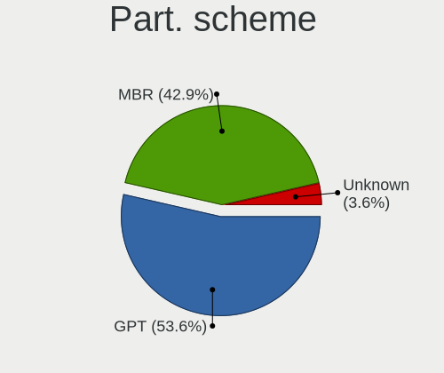
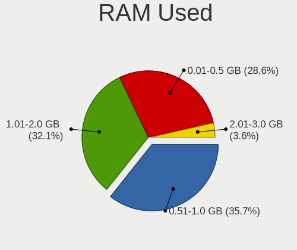
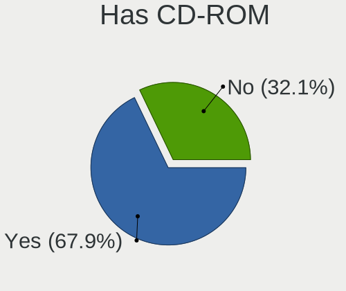
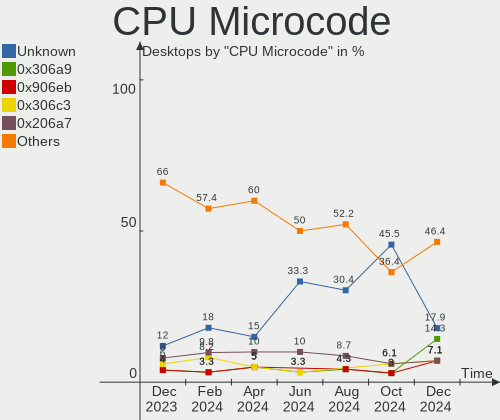
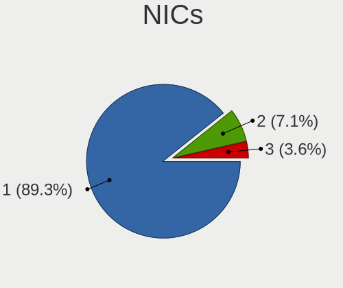
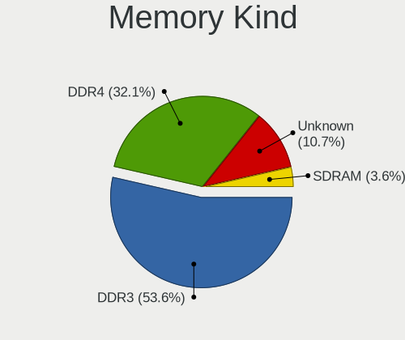

BlackPanther - Hardware Trends (Desktops)
-----------------------------------------

A project to identify most popular hardware characteristics and track their change
over time based on data collected by Linux users at https://Linux-Hardware.org.

Anyone can contribute to this report by the [hw-probe](https://github.com/linuxhw/hw-probe) tool:

    sudo -E hw-probe -all -upload

This report is for one last month. Overall report since the beginning of time: [TestDays](https://github.com/linuxhw/TestDays)

Period: Apr, 2023.

Contents
--------

* [ System ](#system)
  - [ OS                       ](#os)
  - [ OS Family                ](#os-family)
  - [ Kernel                   ](#kernel)
  - [ Kernel Family            ](#kernel-family)
  - [ Kernel Major Ver.        ](#kernel-major-ver)
  - [ Arch                     ](#arch)
  - [ DE                       ](#de)
  - [ Display Server           ](#display-server)
  - [ Display Manager          ](#display-manager)
  - [ OS Lang                  ](#os-lang)
  - [ Boot Mode                ](#boot-mode)
  - [ Filesystem               ](#filesystem)
  - [ Part. scheme             ](#part-scheme)
  - [ Dual Boot with Linux/BSD ](#dual-boot-with-linuxbsd)
  - [ Dual Boot (Win)          ](#dual-boot-win)

* [ Board ](#board)
  - [ Vendor                   ](#vendor)
  - [ Model                    ](#model)
  - [ Model Family             ](#model-family)
  - [ MFG Year                 ](#mfg-year)
  - [ Form Factor              ](#form-factor)
  - [ Secure Boot              ](#secure-boot)
  - [ Coreboot                 ](#coreboot)
  - [ RAM Size                 ](#ram-size)
  - [ RAM Used                 ](#ram-used)
  - [ Total Drives             ](#total-drives)
  - [ Has CD-ROM               ](#has-cd-rom)
  - [ Has Ethernet             ](#has-ethernet)
  - [ Has WiFi                 ](#has-wifi)
  - [ Has Bluetooth            ](#has-bluetooth)

* [ Location ](#location)
  - [ Country                  ](#country)
  - [ City                     ](#city)

* [ Drives ](#drives)
  - [ Drive Vendor             ](#drive-vendor)
  - [ Drive Model              ](#drive-model)
  - [ HDD Vendor               ](#hdd-vendor)
  - [ SSD Vendor               ](#ssd-vendor)
  - [ Drive Kind               ](#drive-kind)
  - [ Drive Connector          ](#drive-connector)
  - [ Drive Size               ](#drive-size)
  - [ Space Total              ](#space-total)
  - [ Space Used               ](#space-used)
  - [ Malfunc. Drives          ](#malfunc-drives)
  - [ Malfunc. Drive Vendor    ](#malfunc-drive-vendor)
  - [ Malfunc. HDD Vendor      ](#malfunc-hdd-vendor)
  - [ Malfunc. Drive Kind      ](#malfunc-drive-kind)
  - [ Failed Drives            ](#failed-drives)
  - [ Failed Drive Vendor      ](#failed-drive-vendor)
  - [ Drive Status             ](#drive-status)

* [ Storage controller ](#storage-controller)
  - [ Storage Vendor           ](#storage-vendor)
  - [ Storage Model            ](#storage-model)
  - [ Storage Kind             ](#storage-kind)

* [ Processor ](#processor)
  - [ CPU Vendor               ](#cpu-vendor)
  - [ CPU Model                ](#cpu-model)
  - [ CPU Model Family         ](#cpu-model-family)
  - [ CPU Cores                ](#cpu-cores)
  - [ CPU Sockets              ](#cpu-sockets)
  - [ CPU Threads              ](#cpu-threads)
  - [ CPU Op-Modes             ](#cpu-op-modes)
  - [ CPU Microcode            ](#cpu-microcode)
  - [ CPU Microarch            ](#cpu-microarch)

* [ Graphics ](#graphics)
  - [ GPU Vendor               ](#gpu-vendor)
  - [ GPU Model                ](#gpu-model)
  - [ GPU Combo                ](#gpu-combo)
  - [ GPU Driver               ](#gpu-driver)
  - [ GPU Memory               ](#gpu-memory)

* [ Monitor ](#monitor)
  - [ Monitor Vendor           ](#monitor-vendor)
  - [ Monitor Model            ](#monitor-model)
  - [ Monitor Resolution       ](#monitor-resolution)
  - [ Monitor Diagonal         ](#monitor-diagonal)
  - [ Monitor Width            ](#monitor-width)
  - [ Aspect Ratio             ](#aspect-ratio)
  - [ Monitor Area             ](#monitor-area)
  - [ Pixel Density            ](#pixel-density)
  - [ Multiple Monitors        ](#multiple-monitors)

* [ Network ](#network)
  - [ Net Controller Vendor    ](#net-controller-vendor)
  - [ Net Controller Model     ](#net-controller-model)
  - [ Wireless Vendor          ](#wireless-vendor)
  - [ Wireless Model           ](#wireless-model)
  - [ Ethernet Vendor          ](#ethernet-vendor)
  - [ Ethernet Model           ](#ethernet-model)
  - [ Net Controller Kind      ](#net-controller-kind)
  - [ Used Controller          ](#used-controller)
  - [ NICs                     ](#nics)
  - [ IPv6                     ](#ipv6)

* [ Bluetooth ](#bluetooth)
  - [ Bluetooth Vendor         ](#bluetooth-vendor)
  - [ Bluetooth Model          ](#bluetooth-model)

* [ Sound ](#sound)
  - [ Sound Vendor             ](#sound-vendor)
  - [ Sound Model              ](#sound-model)

* [ Memory ](#memory)
  - [ Memory Vendor            ](#memory-vendor)
  - [ Memory Model             ](#memory-model)
  - [ Memory Kind              ](#memory-kind)
  - [ Memory Form Factor       ](#memory-form-factor)
  - [ Memory Size              ](#memory-size)
  - [ Memory Speed             ](#memory-speed)

* [ Printers & scanners ](#printers--scanners)
  - [ Printer Vendor           ](#printer-vendor)
  - [ Printer Model            ](#printer-model)
  - [ Scanner Vendor           ](#scanner-vendor)
  - [ Scanner Model            ](#scanner-model)

* [ Camera ](#camera)
  - [ Camera Vendor            ](#camera-vendor)
  - [ Camera Model             ](#camera-model)

* [ Security ](#security)
  - [ Fingerprint Vendor       ](#fingerprint-vendor)
  - [ Fingerprint Model        ](#fingerprint-model)
  - [ Chipcard Vendor          ](#chipcard-vendor)
  - [ Chipcard Model           ](#chipcard-model)

* [ Unsupported ](#unsupported)
  - [ Unsupported Devices      ](#unsupported-devices)
  - [ Unsupported Device Types ](#unsupported-device-types)

System
------

OS
--

Installed operating systems

| Name              | Desktops | Percent |
|-------------------|----------|---------|
| BlackPanther 18.1 | 28       | 96.55%  |
| BlackPanther 22.1 | 1        | 3.45%   |

OS Family
---------

OS without a version

| Name         | Desktops | Percent |
|--------------|----------|---------|
| BlackPanther | 29       | 100%    |

Kernel
------

Version of the Linux kernel

| Version             | Desktops | Percent |
|---------------------|----------|---------|
| 4.18.16-desktop-1bP | 15       | 51.72%  |
| 5.6.14-desktop-2bP  | 13       | 44.83%  |
| 6.2.9-desktop-1bP   | 1        | 3.45%   |

Kernel Family
-------------

Linux kernel without a distro release

| Version | Desktops | Percent |
|---------|----------|---------|
| 4.18.16 | 15       | 51.72%  |
| 5.6.14  | 13       | 44.83%  |
| 6.2.9   | 1        | 3.45%   |

Kernel Major Ver.
-----------------

Linux kernel major version

| Version | Desktops | Percent |
|---------|----------|---------|
| 4.18    | 15       | 51.72%  |
| 5.6     | 13       | 44.83%  |
| 6.2     | 1        | 3.45%   |

Arch
----

OS architecture (x86_64, i586, etc.)

| Name   | Desktops | Percent |
|--------|----------|---------|
| x86_64 | 29       | 100%    |

DE
--

Desktop Environment

| Name    | Desktops | Percent |
|---------|----------|---------|
| KDE5    | 28       | 96.55%  |
| Unknown | 1        | 3.45%   |

Display Server
--------------

X11 or Wayland

| Name | Desktops | Percent |
|------|----------|---------|
| X11  | 29       | 100%    |

Display Manager
---------------

SDDM, LightDM, etc.

| Name | Desktops | Percent |
|------|----------|---------|
| SDDM | 29       | 100%    |

OS Lang
-------

Language

| Lang    | Desktops | Percent |
|---------|----------|---------|
| Unknown | 29       | 100%    |

Boot Mode
---------

EFI or BIOS

| Mode | Desktops | Percent |
|------|----------|---------|
| BIOS | 21       | 72.41%  |
| EFI  | 8        | 27.59%  |

Filesystem
----------

Type of filesystem

| Type    | Desktops | Percent |
|---------|----------|---------|
| Overlay | 25       | 86.21%  |
| Ext4    | 4        | 13.79%  |

Part. scheme
------------

Scheme of partitioning

| Type    | Desktops | Percent |
|---------|----------|---------|
| MBR     | 18       | 62.07%  |
| GPT     | 10       | 34.48%  |
| Unknown | 1        | 3.45%   |

Dual Boot with Linux/BSD
------------------------

Hosting more than one Linux/BSD

| Dual boot | Desktops | Percent |
|-----------|----------|---------|
| Yes       | 16       | 55.17%  |
| No        | 13       | 44.83%  |

Dual Boot (Win)
---------------

Hosting Linux and Windows

| Dual boot | Desktops | Percent |
|-----------|----------|---------|
| Yes       | 18       | 62.07%  |
| No        | 11       | 37.93%  |

Board
-----

Vendor
------

Motherboard manufacturer

| Name                | Desktops | Percent |
|---------------------|----------|---------|
| Gigabyte Technology | 8        | 27.59%  |
| Hewlett-Packard     | 5        | 17.24%  |
| Lenovo              | 3        | 10.34%  |
| Fujitsu             | 3        | 10.34%  |
| ASUSTek Computer    | 3        | 10.34%  |
| MSI                 | 2        | 6.9%    |
| Fujitsu Siemens     | 2        | 6.9%    |
| Dell                | 2        | 6.9%    |
| Shuttle             | 1        | 3.45%   |

Model
-----

Motherboard model

| Name                                  | Desktops | Percent |
|---------------------------------------|----------|---------|
| HP EliteDesk 705 G3 SFF               | 3        | 10.34%  |
| Fujitsu Siemens ESPRIMO EDITION P2511 | 2        | 6.9%    |
| Shuttle XS35                          | 1        | 3.45%   |
| MSI MS-7817                           | 1        | 3.45%   |
| MSI MS-7721                           | 1        | 3.45%   |
| Lenovo ThinkStation D20 4158AF8       | 1        | 3.45%   |
| Lenovo ThinkCentre M93p 10A7003AUK    | 1        | 3.45%   |
| Lenovo ThinkCentre M73 10B6001SUS     | 1        | 3.45%   |
| HP EliteDesk 800 G2 DM 35W            | 1        | 3.45%   |
| HP Compaq dc5800 Small Form Factor    | 1        | 3.45%   |
| Gigabyte Z390 UD                      | 1        | 3.45%   |
| Gigabyte Z270N-WIFI                   | 1        | 3.45%   |
| Gigabyte P67A-D3-B3                   | 1        | 3.45%   |
| Gigabyte H61M-S2PV                    | 1        | 3.45%   |
| Gigabyte G41MT-S2                     | 1        | 3.45%   |
| Gigabyte F2A88XM-HD3                  | 1        | 3.45%   |
| Gigabyte B450M GAMING                 | 1        | 3.45%   |
| Gigabyte AB350M-DS3H V2               | 1        | 3.45%   |
| Fujitsu ESPRIMO E7935                 | 1        | 3.45%   |
| Fujitsu D3061-B1                      | 1        | 3.45%   |
| Fujitsu CELSIUS R670-2                | 1        | 3.45%   |
| Dell Precision WorkStation T5500      | 1        | 3.45%   |
| Dell OptiPlex 790                     | 1        | 3.45%   |
| ASUS M5A97 EVO R2.0                   | 1        | 3.45%   |
| ASUS M5A78L-M PLUS/USB3               | 1        | 3.45%   |
| ASUS M5A78L-M LX3                     | 1        | 3.45%   |

Model Family
------------

Motherboard model prefix

| Name                    | Desktops | Percent |
|-------------------------|----------|---------|
| HP EliteDesk            | 4        | 13.79%  |
| Lenovo ThinkCentre      | 2        | 6.9%    |
| Fujitsu Siemens ESPRIMO | 2        | 6.9%    |
| ASUS M5A78L-M           | 2        | 6.9%    |
| Shuttle XS35            | 1        | 3.45%   |
| MSI MS-7817             | 1        | 3.45%   |
| MSI MS-7721             | 1        | 3.45%   |
| Lenovo ThinkStation     | 1        | 3.45%   |
| HP Compaq               | 1        | 3.45%   |
| Gigabyte Z390           | 1        | 3.45%   |
| Gigabyte Z270N-WIFI     | 1        | 3.45%   |
| Gigabyte P67A-D3-B3     | 1        | 3.45%   |
| Gigabyte H61M-S2PV      | 1        | 3.45%   |
| Gigabyte G41MT-S2       | 1        | 3.45%   |
| Gigabyte F2A88XM-HD3    | 1        | 3.45%   |
| Gigabyte B450M          | 1        | 3.45%   |
| Gigabyte AB350M-DS3H    | 1        | 3.45%   |
| Fujitsu ESPRIMO         | 1        | 3.45%   |
| Fujitsu D3061-B1        | 1        | 3.45%   |
| Fujitsu CELSIUS         | 1        | 3.45%   |
| Dell Precision          | 1        | 3.45%   |
| Dell OptiPlex           | 1        | 3.45%   |
| ASUS M5A97              | 1        | 3.45%   |

MFG Year
--------

Motherboard manufacture year

| Year | Desktops | Percent |
|------|----------|---------|
| 2010 | 6        | 20.69%  |
| 2017 | 4        | 13.79%  |
| 2012 | 4        | 13.79%  |
| 2018 | 3        | 10.34%  |
| 2015 | 2        | 6.9%    |
| 2014 | 2        | 6.9%    |
| 2013 | 2        | 6.9%    |
| 2011 | 2        | 6.9%    |
| 2007 | 2        | 6.9%    |
| 2016 | 1        | 3.45%   |
| 2008 | 1        | 3.45%   |

Form Factor
-----------

Physical design of the computer

| Name    | Desktops | Percent |
|---------|----------|---------|
| Desktop | 29       | 100%    |

Secure Boot
-----------

Enabled or disabled

| State    | Desktops | Percent |
|----------|----------|---------|
| Disabled | 29       | 100%    |

Coreboot
--------

Have coreboot on board

| Used | Desktops | Percent |
|------|----------|---------|
| No   | 29       | 100%    |

RAM Size
--------

Total RAM memory

| Size in GB | Desktops | Percent |
|------------|----------|---------|
| 8.01-16.0  | 9        | 31.03%  |
| 3.01-4.0   | 8        | 27.59%  |
| 16.01-24.0 | 5        | 17.24%  |
| 4.01-8.0   | 3        | 10.34%  |
| 24.01-32.0 | 2        | 6.9%    |
| 32.01-64.0 | 1        | 3.45%   |
| 1.01-2.0   | 1        | 3.45%   |

RAM Used
--------

Used RAM memory

| Used GB  | Desktops | Percent |
|----------|----------|---------|
| 0.51-1.0 | 13       | 44.83%  |
| 0.01-0.5 | 12       | 41.38%  |
| 1.01-2.0 | 4        | 13.79%  |

Total Drives
------------

Number of drives on board

| Drives | Desktops | Percent |
|--------|----------|---------|
| 1      | 16       | 55.17%  |
| 2      | 8        | 27.59%  |
| 3      | 2        | 6.9%    |
| 5      | 1        | 3.45%   |
| 4      | 1        | 3.45%   |
| 0      | 1        | 3.45%   |

Has CD-ROM
----------

Has CD-ROM on board

| Presented | Desktops | Percent |
|-----------|----------|---------|
| Yes       | 18       | 62.07%  |
| No        | 11       | 37.93%  |

Has Ethernet
------------

Has Ethernet on board

| Presented | Desktops | Percent |
|-----------|----------|---------|
| Yes       | 28       | 96.55%  |
| No        | 1        | 3.45%   |

Has WiFi
--------

Has WiFi module

| Presented | Desktops | Percent |
|-----------|----------|---------|
| No        | 18       | 62.07%  |
| Yes       | 11       | 37.93%  |

Has Bluetooth
-------------

Has Bluetooth module

| Presented | Desktops | Percent |
|-----------|----------|---------|
| No        | 23       | 79.31%  |
| Yes       | 6        | 20.69%  |

Location
--------

Country
-------

Geographic location (country)

| Country | Desktops | Percent |
|---------|----------|---------|
| Hungary | 26       | 89.66%  |
| Romania | 1        | 3.45%   |
| Germany | 1        | 3.45%   |
| France  | 1        | 3.45%   |

City
----

Geographic location (city)

| City                    | Desktops | Percent |
|-------------------------|----------|---------|
| Berettyóújfalu        | 5        | 17.24%  |
| Budapest                | 3        | 10.34%  |
| Tatabánya              | 2        | 6.9%    |
| Szajol                  | 2        | 6.9%    |
| Debrecen                | 2        | 6.9%    |
| Zalău                  | 1        | 3.45%   |
| Zalaegerszeg            | 1        | 3.45%   |
| Veresegyhaz             | 1        | 3.45%   |
| Urom                    | 1        | 3.45%   |
| Szekszárd              | 1        | 3.45%   |
| Rackeve                 | 1        | 3.45%   |
| Pomaz                   | 1        | 3.45%   |
| Pfaffenhofen an der Ilm | 1        | 3.45%   |
| Pécs                   | 1        | 3.45%   |
| Nancy                   | 1        | 3.45%   |
| Karcag                  | 1        | 3.45%   |
| Kaposmero               | 1        | 3.45%   |
| Hajduboszormeny         | 1        | 3.45%   |
| Gyal                    | 1        | 3.45%   |
| Fertoszentmiklos        | 1        | 3.45%   |

Drives
------

Drive Vendor
------------

Hard drive vendors

| Vendor              | Desktops | Drives | Percent |
|---------------------|----------|--------|---------|
| WDC                 | 11       | 13     | 24.44%  |
| Kingston            | 11       | 12     | 24.44%  |
| Samsung Electronics | 5        | 7      | 11.11%  |
| Toshiba             | 3        | 4      | 6.67%   |
| Seagate             | 3        | 3      | 6.67%   |
| Gigabyte Technology | 2        | 2      | 4.44%   |
| A-DATA Technology   | 2        | 2      | 4.44%   |
| SK hynix            | 1        | 1      | 2.22%   |
| SanDisk             | 1        | 1      | 2.22%   |
| Patriot             | 1        | 1      | 2.22%   |
| Maxtor              | 1        | 1      | 2.22%   |
| Kingmax             | 1        | 1      | 2.22%   |
| Intenso             | 1        | 1      | 2.22%   |
| HGST                | 1        | 1      | 2.22%   |
| Crucial             | 1        | 1      | 2.22%   |

Drive Model
-----------

Hard drive models

| Model                                | Desktops | Percent |
|--------------------------------------|----------|---------|
| WDC WD10PURZ-85U8XY0 1TB             | 3        | 6%      |
| Kingston SA400S37240G 240GB SSD      | 3        | 6%      |
| Samsung SSD 830 Series 64GB          | 2        | 4%      |
| Kingston SV300S37A120G 120GB SSD     | 2        | 4%      |
| Kingston SA400S37480G 480GB SSD      | 2        | 4%      |
| Gigabyte GP-GSTFS31120GNTD 120GB SSD | 2        | 4%      |
| WDC WDS240G2G0A-00JH30 240GB SSD     | 1        | 2%      |
| WDC WD800JD-55MUA1 80GB              | 1        | 2%      |
| WDC WD5000LPVX-22V0TT0 500GB         | 1        | 2%      |
| WDC WD5000AZLX-75K2TA0 500GB         | 1        | 2%      |
| WDC WD5000AAKS-007AA0 500GB          | 1        | 2%      |
| WDC WD3200AAJS-56M0A0 320GB          | 1        | 2%      |
| WDC WD30EZRZ-00GXCB0 3TB             | 1        | 2%      |
| WDC WD30EFRX-68EUZN0 3TB             | 1        | 2%      |
| WDC WD1600BEVT-00A23T0 160GB         | 1        | 2%      |
| WDC WD10EZRX-00L4HB0 1TB             | 1        | 2%      |
| Toshiba MQ01ABF032 320GB             | 1        | 2%      |
| Toshiba MK5061GSYN 500GB             | 1        | 2%      |
| Toshiba DT01ACA200 2TB               | 1        | 2%      |
| Toshiba DT01ACA100 1TB               | 1        | 2%      |
| SK hynix SC311 SATA 256GB SSD        | 1        | 2%      |
| Seagate ST3500312CS 500GB            | 1        | 2%      |
| Seagate ST1000LM024 HN-M101MBB 1TB   | 1        | 2%      |
| Seagate ST1000DM003-9YN162 1TB       | 1        | 2%      |
| SanDisk SDSSDH3512G 512GB            | 1        | 2%      |
| Samsung SSD 860 EVO 500GB            | 1        | 2%      |
| Samsung SSD 850 EVO 250GB            | 1        | 2%      |
| Samsung MZ7LN256HMJP-000H1 256GB SSD | 1        | 2%      |
| Samsung HD154UI 1TB                  | 1        | 2%      |
| Patriot Burst 960GB SSD              | 1        | 2%      |
| Maxtor STM3160215AS 160GB            | 1        | 2%      |
| Kingston SV300S37A60G 64GB SSD       | 1        | 2%      |
| Kingston SUV400S37120G 120GB SSD     | 1        | 2%      |
| Kingston SA400S37960G 960GB SSD      | 1        | 2%      |
| Kingston SA400S37120G 120GB SSD      | 1        | 2%      |
| Kingston SA2000M8250G 250GB          | 1        | 2%      |
| Kingmax SSD 480GB                    | 1        | 2%      |
| Intenso Portable SSD 128GB           | 1        | 2%      |
| HGST HTS541010B7E610 1TB             | 1        | 2%      |
| Crucial CT240BX500SSD1 240GB         | 1        | 2%      |

HDD Vendor
----------

Hard disk drive vendors

| Vendor              | Desktops | Drives | Percent |
|---------------------|----------|--------|---------|
| WDC                 | 10       | 12     | 52.63%  |
| Toshiba             | 3        | 4      | 15.79%  |
| Seagate             | 3        | 3      | 15.79%  |
| Samsung Electronics | 1        | 1      | 5.26%   |
| Maxtor              | 1        | 1      | 5.26%   |
| HGST                | 1        | 1      | 5.26%   |

SSD Vendor
----------

Solid state drive vendors

| Vendor              | Desktops | Drives | Percent |
|---------------------|----------|--------|---------|
| Kingston            | 10       | 11     | 40%     |
| Samsung Electronics | 5        | 6      | 20%     |
| Gigabyte Technology | 2        | 2      | 8%      |
| WDC                 | 1        | 1      | 4%      |
| SK hynix            | 1        | 1      | 4%      |
| SanDisk             | 1        | 1      | 4%      |
| Patriot             | 1        | 1      | 4%      |
| Kingmax             | 1        | 1      | 4%      |
| Intenso             | 1        | 1      | 4%      |
| Crucial             | 1        | 1      | 4%      |
| A-DATA Technology   | 1        | 1      | 4%      |

Drive Kind
----------

HDD or SSD

| Kind | Desktops | Drives | Percent |
|------|----------|--------|---------|
| SSD  | 19       | 27     | 50%     |
| HDD  | 17       | 22     | 44.74%  |
| NVMe | 2        | 2      | 5.26%   |

Drive Connector
---------------

SATA, SAS, NVMe, etc.

| Type | Desktops | Drives | Percent |
|------|----------|--------|---------|
| SATA | 27       | 48     | 90%     |
| NVMe | 2        | 2      | 6.67%   |
| SAS  | 1        | 1      | 3.33%   |

Drive Size
----------

Size of hard drive

| Size in TB | Desktops | Drives | Percent |
|------------|----------|--------|---------|
| 0.01-0.5   | 23       | 34     | 65.71%  |
| 0.51-1.0   | 10       | 12     | 28.57%  |
| 2.01-3.0   | 1        | 2      | 2.86%   |
| 1.01-2.0   | 1        | 1      | 2.86%   |

Space Total
-----------

Amount of disk space available on the file system

| Size in GB | Desktops | Percent |
|------------|----------|---------|
| Unknown    | 25       | 86.21%  |
| 251-500    | 2        | 6.9%    |
| 101-250    | 1        | 3.45%   |
| 501-1000   | 1        | 3.45%   |

Space Used
----------

Amount of used disk space

| Used GB | Desktops | Percent |
|---------|----------|---------|
| Unknown | 25       | 86.21%  |
| 1-20    | 4        | 13.79%  |

Malfunc. Drives
---------------

Drive models with a malfunction

| Model                                            | Desktops | Drives | Percent |
|--------------------------------------------------|----------|--------|---------|
| WDC WD10PURZ-85U8XY0 1TB                         | 3        | 3      | 25%     |
| Kingston SV300S37A120G 120GB SSD                 | 2        | 2      | 16.67%  |
| WDC WD5000AAKS-007AA0 500GB                      | 1        | 1      | 8.33%   |
| WDC WD1600BEVT-00A23T0 160GB                     | 1        | 1      | 8.33%   |
| Toshiba MK5061GSYN 500GB                         | 1        | 1      | 8.33%   |
| Toshiba DT01ACA200 2TB                           | 1        | 1      | 8.33%   |
| Seagate ST1000LM024 HN-M101MBB 1TB               | 1        | 1      | 8.33%   |
| Samsung Electronics MZ7LN256HMJP-000H1 256GB SSD | 1        | 1      | 8.33%   |
| A-DATA Technology SU630 240GB SSD                | 1        | 1      | 8.33%   |

Malfunc. Drive Vendor
---------------------

Vendors of faulty drives

| Vendor              | Desktops | Drives | Percent |
|---------------------|----------|--------|---------|
| WDC                 | 5        | 5      | 45.45%  |
| Kingston            | 2        | 2      | 18.18%  |
| Toshiba             | 1        | 2      | 9.09%   |
| Seagate             | 1        | 1      | 9.09%   |
| Samsung Electronics | 1        | 1      | 9.09%   |
| A-DATA Technology   | 1        | 1      | 9.09%   |

Malfunc. HDD Vendor
-------------------

Vendors of faulty HDD drives

| Vendor  | Desktops | Drives | Percent |
|---------|----------|--------|---------|
| WDC     | 5        | 5      | 71.43%  |
| Toshiba | 1        | 2      | 14.29%  |
| Seagate | 1        | 1      | 14.29%  |

Malfunc. Drive Kind
-------------------

Kinds of faulty drives

| Kind | Desktops | Drives | Percent |
|------|----------|--------|---------|
| HDD  | 7        | 8      | 63.64%  |
| SSD  | 4        | 4      | 36.36%  |

Failed Drives
-------------

Failed drive models

Zero info for selected period =(

Failed Drive Vendor
-------------------

Failed drive vendors

Zero info for selected period =(

Drive Status
------------

Number of failed and malfunc. drives

| Status   | Desktops | Drives | Percent |
|----------|----------|--------|---------|
| Works    | 21       | 38     | 63.64%  |
| Malfunc  | 11       | 12     | 33.33%  |
| Detected | 1        | 1      | 3.03%   |

Storage controller
------------------

Storage Vendor
--------------

Storage controller vendors

| Vendor                      | Desktops | Percent |
|-----------------------------|----------|---------|
| Intel                       | 19       | 59.38%  |
| AMD                         | 10       | 31.25%  |
| Silicon Motion              | 1        | 3.13%   |
| Kingston Technology Company | 1        | 3.13%   |
| ASMedia Technology          | 1        | 3.13%   |

Storage Model
-------------

Storage controller models

| Model                                                                                   | Desktops | Percent |
|-----------------------------------------------------------------------------------------|----------|---------|
| AMD FCH SATA Controller [AHCI mode]                                                     | 5        | 11.11%  |
| Intel NM10/ICH7 Family SATA Controller [IDE mode]                                       | 4        | 8.89%   |
| AMD 300 Series Chipset SATA Controller                                                  | 4        | 8.89%   |
| Intel 8 Series/C220 Series Chipset Family 6-port SATA Controller 1 [AHCI mode]          | 3        | 6.67%   |
| Intel 82801JI (ICH10 Family) SATA AHCI Controller                                       | 2        | 4.44%   |
| Intel 6 Series/C200 Series Chipset Family Desktop SATA Controller (IDE mode, ports 4-5) | 2        | 4.44%   |
| Intel 6 Series/C200 Series Chipset Family Desktop SATA Controller (IDE mode, ports 0-3) | 2        | 4.44%   |
| Intel 6 Series/C200 Series Chipset Family 6 port Desktop SATA AHCI Controller           | 2        | 4.44%   |
| AMD SB7x0/SB8x0/SB9x0 SATA Controller [IDE mode]                                        | 2        | 4.44%   |
| AMD SB7x0/SB8x0/SB9x0 IDE Controller                                                    | 2        | 4.44%   |
| AMD FCH/SOC SATA Controller [RAID Bottom]                                               | 2        | 4.44%   |
| Silicon Motion Non-Volatile memory controller                                           | 1        | 2.22%   |
| Kingston Company A2000 NVMe SSD                                                         | 1        | 2.22%   |
| Intel SATA Controller [RAID mode]                                                       | 1        | 2.22%   |
| Intel Q170/Q150/B150/H170/H110/Z170/CM236 Chipset SATA Controller [AHCI Mode]           | 1        | 2.22%   |
| Intel Cannon Lake PCH SATA AHCI Controller                                              | 1        | 2.22%   |
| Intel 82801JD/DO (ICH10 Family) 4-port SATA IDE Controller                              | 1        | 2.22%   |
| Intel 82801JD/DO (ICH10 Family) 2-port SATA IDE Controller                              | 1        | 2.22%   |
| Intel 82801IB (ICH9) 2 port SATA Controller [IDE mode]                                  | 1        | 2.22%   |
| Intel 82801I (ICH9 Family) 2 port SATA Controller [IDE mode]                            | 1        | 2.22%   |
| Intel 8 Series/C220 Series Chipset Family IDE-r Controller                              | 1        | 2.22%   |
| Intel 4 Series Chipset PT IDER Controller                                               | 1        | 2.22%   |
| Intel 200 Series PCH SATA controller [AHCI mode]                                        | 1        | 2.22%   |
| ASMedia ASM1062 Serial ATA Controller                                                   | 1        | 2.22%   |
| AMD SB7x0/SB8x0/SB9x0 SATA Controller [AHCI mode]                                       | 1        | 2.22%   |
| AMD 400 Series Chipset SATA Controller                                                  | 1        | 2.22%   |

Storage Kind
------------

Kind of storage controller (IDE, SATA, NVMe, SAS, ...)

| Kind | Desktops | Percent |
|------|----------|---------|
| SATA | 20       | 55.56%  |
| IDE  | 11       | 30.56%  |
| RAID | 3        | 8.33%   |
| NVMe | 2        | 5.56%   |

Processor
---------

CPU Vendor
----------

Processor vendors

| Vendor | Desktops | Percent |
|--------|----------|---------|
| Intel  | 19       | 65.52%  |
| AMD    | 10       | 34.48%  |

CPU Model
---------

Processor models

| Model                                       | Desktops | Percent |
|---------------------------------------------|----------|---------|
| AMD PRO A6-9500 R5, 8 COMPUTE CORES 2C+6G   | 3        | 10.34%  |
| Intel Pentium Dual CPU E2140 @ 1.60GHz      | 2        | 6.9%    |
| AMD Ryzen 5 3400G with Radeon Vega Graphics | 2        | 6.9%    |
| Intel Xeon CPU X5677 @ 3.47GHz              | 1        | 3.45%   |
| Intel Xeon CPU X5650 @ 2.67GHz              | 1        | 3.45%   |
| Intel Xeon CPU E5530 @ 2.40GHz              | 1        | 3.45%   |
| Intel Pentium Dual-Core CPU E5700 @ 3.00GHz | 1        | 3.45%   |
| Intel Core i7-7700K CPU @ 4.20GHz           | 1        | 3.45%   |
| Intel Core i7-6700T CPU @ 2.80GHz           | 1        | 3.45%   |
| Intel Core i7-4790 CPU @ 3.60GHz            | 1        | 3.45%   |
| Intel Core i5-9400 CPU @ 2.90GHz            | 1        | 3.45%   |
| Intel Core i5-4590 CPU @ 3.30GHz            | 1        | 3.45%   |
| Intel Core i5-2400S CPU @ 2.50GHz           | 1        | 3.45%   |
| Intel Core i5-2400 CPU @ 3.10GHz            | 1        | 3.45%   |
| Intel Core i5-2300 CPU @ 2.80GHz            | 1        | 3.45%   |
| Intel Core i3-4130 CPU @ 3.40GHz            | 1        | 3.45%   |
| Intel Core i3-3220 CPU @ 3.30GHz            | 1        | 3.45%   |
| Intel Core 2 Duo CPU E7300 @ 2.66GHz        | 1        | 3.45%   |
| Intel Core 2 CPU 4300 @ 1.80GHz             | 1        | 3.45%   |
| Intel Atom CPU D510 @ 1.66GHz               | 1        | 3.45%   |
| AMD FX-8350 Eight-Core Processor            | 1        | 3.45%   |
| AMD FX-6300 Six-Core Processor              | 1        | 3.45%   |
| AMD FX-4300 Quad-Core Processor             | 1        | 3.45%   |
| AMD A8-6600K APU with Radeon HD Graphics    | 1        | 3.45%   |
| AMD A8-5600K APU with Radeon HD Graphics    | 1        | 3.45%   |

CPU Model Family
----------------

Processor model prefix

| Model                   | Desktops | Percent |
|-------------------------|----------|---------|
| Intel Core i5           | 5        | 17.24%  |
| Other                   | 3        | 10.34%  |
| Intel Xeon              | 3        | 10.34%  |
| Intel Core i7           | 3        | 10.34%  |
| AMD FX                  | 3        | 10.34%  |
| Intel Pentium Dual      | 2        | 6.9%    |
| Intel Core i3           | 2        | 6.9%    |
| AMD Ryzen 5             | 2        | 6.9%    |
| AMD A8                  | 2        | 6.9%    |
| Intel Pentium Dual-Core | 1        | 3.45%   |
| Intel Core 2 Duo        | 1        | 3.45%   |
| Intel Core 2            | 1        | 3.45%   |
| Intel Atom              | 1        | 3.45%   |

CPU Cores
---------

Number of processor cores

| Number | Desktops | Percent |
|--------|----------|---------|
| 4      | 11       | 37.93%  |
| 2      | 11       | 37.93%  |
| 1      | 3        | 10.34%  |
| 6      | 2        | 6.9%    |
| 8      | 1        | 3.45%   |
| 3      | 1        | 3.45%   |

CPU Sockets
-----------

Number of sockets

| Number | Desktops | Percent |
|--------|----------|---------|
| 1      | 28       | 96.55%  |
| 2      | 1        | 3.45%   |

CPU Threads
-----------

Threads per core (Hyper-Threading)

| Number | Desktops | Percent |
|--------|----------|---------|
| 2      | 18       | 62.07%  |
| 1      | 11       | 37.93%  |

CPU Op-Modes
------------

CPU Operation Modes (32-bit, 64-bit)

| Op mode        | Desktops | Percent |
|----------------|----------|---------|
| 32-bit, 64-bit | 29       | 100%    |

CPU Microcode
-------------

Microcode number

| Number     | Desktops | Percent |
|------------|----------|---------|
| 0x306c3    | 3        | 10.34%  |
| 0x206a7    | 3        | 10.34%  |
| 0x0600611a | 3        | 10.34%  |
| 0x6fd      | 2        | 6.9%    |
| 0x08108109 | 2        | 6.9%    |
| 0x06001119 | 2        | 6.9%    |
| 0x06000852 | 2        | 6.9%    |
| 0x906ea    | 1        | 3.45%   |
| 0x906e9    | 1        | 3.45%   |
| 0x6f2      | 1        | 3.45%   |
| 0x506e3    | 1        | 3.45%   |
| 0x306a9    | 1        | 3.45%   |
| 0x206c2    | 1        | 3.45%   |
| 0x106ca    | 1        | 3.45%   |
| 0x106a5    | 1        | 3.45%   |
| 0x1067a    | 1        | 3.45%   |
| 0x10676    | 1        | 3.45%   |
| 0x0600084f | 1        | 3.45%   |
| Unknown    | 1        | 3.45%   |

CPU Microarch
-------------

Microarchitecture

| Name        | Desktops | Percent |
|-------------|----------|---------|
| Piledriver  | 5        | 17.24%  |
| SandyBridge | 3        | 10.34%  |
| Haswell     | 3        | 10.34%  |
| Excavator   | 3        | 10.34%  |
| Core        | 3        | 10.34%  |
| Zen+        | 2        | 6.9%    |
| Westmere    | 2        | 6.9%    |
| Penryn      | 2        | 6.9%    |
| KabyLake    | 2        | 6.9%    |
| Skylake     | 1        | 3.45%   |
| Nehalem     | 1        | 3.45%   |
| IvyBridge   | 1        | 3.45%   |
| Bonnell     | 1        | 3.45%   |

Graphics
--------

GPU Vendor
----------

Vendors of graphics cards

| Vendor | Desktops | Percent |
|--------|----------|---------|
| AMD    | 12       | 40%     |
| Nvidia | 11       | 36.67%  |
| Intel  | 7        | 23.33%  |

GPU Model
---------

Graphics card models

| Model                                                                       | Desktops | Percent |
|-----------------------------------------------------------------------------|----------|---------|
| AMD Wani [Radeon R5/R6/R7 Graphics]                                         | 3        | 9.38%   |
| AMD Cedar [Radeon HD 5000/6000/7350/8350 Series]                            | 3        | 9.38%   |
| Nvidia G72 [GeForce 7300 LE]                                                | 2        | 6.25%   |
| Intel Xeon E3-1200 v3/4th Gen Core Processor Integrated Graphics Controller | 2        | 6.25%   |
| Intel 4 Series Chipset Integrated Graphics Controller                       | 2        | 6.25%   |
| Nvidia TU117 [GeForce GTX 1650]                                             | 1        | 3.13%   |
| Nvidia GT218 [GeForce 210]                                                  | 1        | 3.13%   |
| Nvidia GP108 [GeForce GT 1030]                                              | 1        | 3.13%   |
| Nvidia GK208B [GeForce GT 720]                                              | 1        | 3.13%   |
| Nvidia GK107 [GeForce GTX 650]                                              | 1        | 3.13%   |
| Nvidia GF119 [GeForce GT 610]                                               | 1        | 3.13%   |
| Nvidia G96CGL [Quadro FX 580]                                               | 1        | 3.13%   |
| Nvidia G84 [GeForce 8600 GS]                                                | 1        | 3.13%   |
| Nvidia G72 [GeForce 7500 LE]                                                | 1        | 3.13%   |
| Intel Xeon E3-1200 v2/3rd Gen Core processor Graphics Controller            | 1        | 3.13%   |
| Intel HD Graphics 530                                                       | 1        | 3.13%   |
| Intel Atom Processor D4xx/D5xx/N4xx/N5xx Integrated Graphics Controller     | 1        | 3.13%   |
| AMD RV635 [Radeon HD 3650/3750/4570/4580]                                   | 1        | 3.13%   |
| AMD RV370 [Radeon X300/X550/X1050 Series] (Secondary)                       | 1        | 3.13%   |
| AMD RV370 [Radeon X300/X550/X1050 Series]                                   | 1        | 3.13%   |
| AMD RS780L [Radeon 3000]                                                    | 1        | 3.13%   |
| AMD Redwood XT [Radeon HD 5670/5690/5730]                                   | 1        | 3.13%   |
| AMD Picasso/Raven 2 [Radeon Vega Series / Radeon Vega Mobile Series]        | 1        | 3.13%   |
| AMD Oland PRO [Radeon R7 240/340 / Radeon 520]                              | 1        | 3.13%   |
| AMD Baffin [Radeon RX 550 640SP / RX 560/560X]                              | 1        | 3.13%   |

GPU Combo
---------

Combinations of graphics cards

| Name       | Desktops | Percent |
|------------|----------|---------|
| 1 x Nvidia | 11       | 37.93%  |
| 1 x AMD    | 10       | 34.48%  |
| 1 x Intel  | 6        | 20.69%  |
| 2 x AMD    | 2        | 6.9%    |

GPU Driver
----------

Free vs proprietary

| Driver  | Desktops | Percent |
|---------|----------|---------|
| Free    | 27       | 93.1%   |
| Unknown | 2        | 6.9%    |

GPU Memory
----------

Total video memory

| Size in GB | Desktops | Percent |
|------------|----------|---------|
| 0.01-0.5   | 12       | 41.38%  |
| Unknown    | 7        | 24.14%  |
| 0.51-1.0   | 5        | 17.24%  |
| 1.01-2.0   | 3        | 10.34%  |
| 3.01-4.0   | 2        | 6.9%    |

Monitor
-------

Monitor Vendor
--------------

Monitor vendors

| Vendor                  | Desktops | Percent |
|-------------------------|----------|---------|
| Samsung Electronics     | 7        | 26.92%  |
| Goldstar                | 5        | 19.23%  |
| Chi Mei Optoelectronics | 4        | 15.38%  |
| Ancor Communications    | 3        | 11.54%  |
| BenQ                    | 2        | 7.69%   |
| Medion                  | 1        | 3.85%   |
| Iiyama                  | 1        | 3.85%   |
| Hewlett-Packard         | 1        | 3.85%   |
| Dell                    | 1        | 3.85%   |
| Acer                    | 1        | 3.85%   |

Monitor Model
-------------

Monitor models

| Model                                                                    | Desktops | Percent |
|--------------------------------------------------------------------------|----------|---------|
| Chi Mei Optoelectronics CMC 19" AD CMO0198 1280x1024 338x270mm 17.0-inch | 4        | 14.81%  |
| Samsung Electronics SyncMaster SAM01B8 1280x1024 338x270mm 17.0-inch     | 1        | 3.7%    |
| Samsung Electronics SMB2240W SAM0699 1680x1050 459x296mm 21.5-inch       | 1        | 3.7%    |
| Samsung Electronics SM2443DW SAM0748 1920x1080 518x324mm 24.1-inch       | 1        | 3.7%    |
| Samsung Electronics SA300/SA350 SAM0849 1920x1080 477x268mm 21.5-inch    | 1        | 3.7%    |
| Samsung Electronics S27E500 SAM0D0D 1920x1080 598x336mm 27.0-inch        | 1        | 3.7%    |
| Samsung Electronics S24D330 SAM0D92 1920x1080 531x299mm 24.0-inch        | 1        | 3.7%    |
| Samsung Electronics S22F350 SAM0D1B 1920x1080 477x268mm 21.5-inch        | 1        | 3.7%    |
| Samsung Electronics LS27AG30x SAM717A 1920x1080 597x336mm 27.0-inch      | 1        | 3.7%    |
| Medion MD20666 MED3672 1920x1080 533x312mm 24.3-inch                     | 1        | 3.7%    |
| Iiyama PL2474H IVM6146 1920x1080 521x293mm 23.5-inch                     | 1        | 3.7%    |
| Hewlett-Packard E242 HWP326E 1920x1080 518x324mm 24.1-inch               | 1        | 3.7%    |
| Goldstar M2294D-PZ GSM56B0 1680x1050 473x296mm 22.0-inch                 | 1        | 3.7%    |
| Goldstar HD GSM5ACB 1366x768 410x230mm 18.5-inch                         | 1        | 3.7%    |
| Goldstar FULL HD GSM5B55 1920x1080 480x270mm 21.7-inch                   | 1        | 3.7%    |
| Goldstar FULL HD GSM5B54 1920x1080 480x270mm 21.7-inch                   | 1        | 3.7%    |
| Goldstar E2350 GSM5790 1920x1080 510x290mm 23.1-inch                     | 1        | 3.7%    |
| Dell E173FP DELA00B 1280x1024 338x270mm 17.0-inch                        | 1        | 3.7%    |
| BenQ GW2780 BNQ78E6 1920x1080 598x336mm 27.0-inch                        | 1        | 3.7%    |
| BenQ EW277HDR BNQ7948 1920x1080 598x336mm 27.0-inch                      | 1        | 3.7%    |
| Ancor Communications SAMSUNG ACI27C4 1920x1080 598x336mm 27.0-inch       | 1        | 3.7%    |
| Ancor Communications ASUS VS228 ACI22FD 1920x1080 476x268mm 21.5-inch    | 1        | 3.7%    |
| Ancor Communications ASUS VS207 ACI20C1 1366x768 434x236mm 19.4-inch     | 1        | 3.7%    |
| Acer V226HQL ACR032D 1920x1080 477x268mm 21.5-inch                       | 1        | 3.7%    |

Monitor Resolution
------------------

Monitor screen resolution

| Resolution         | Desktops | Percent |
|--------------------|----------|---------|
| 1920x1080 (FHD)    | 15       | 57.69%  |
| 1280x1024 (SXGA)   | 6        | 23.08%  |
| 1680x1050 (WSXGA+) | 2        | 7.69%   |
| 1366x768 (WXGA)    | 2        | 7.69%   |
| 3840x2160 (4K)     | 1        | 3.85%   |

Monitor Diagonal
----------------

Diagonal size in inches

| Inches | Desktops | Percent |
|--------|----------|---------|
| 21     | 6        | 22.22%  |
| 27     | 5        | 18.52%  |
| 19     | 5        | 18.52%  |
| 24     | 4        | 14.81%  |
| 23     | 2        | 7.41%   |
| 22     | 2        | 7.41%   |
| 17     | 2        | 7.41%   |
| 18     | 1        | 3.7%    |

Monitor Width
-------------

Physical width

| Width in mm | Desktops | Percent |
|-------------|----------|---------|
| 501-600     | 11       | 40.74%  |
| 401-500     | 10       | 37.04%  |
| 351-400     | 4        | 14.81%  |
| 301-350     | 2        | 7.41%   |

Aspect Ratio
------------

Proportional relationship between the width and the height

| Ratio | Desktops | Percent |
|-------|----------|---------|
| 16/9  | 16       | 64%     |
| 5/4   | 6        | 24%     |
| 16/10 | 3        | 12%     |

Monitor Area
------------

Area in inch²

| Area in inch² | Desktops | Percent |
|----------------|----------|---------|
| 201-250        | 11       | 40.74%  |
| 301-350        | 5        | 18.52%  |
| 151-200        | 5        | 18.52%  |
| 251-300        | 3        | 11.11%  |
| 141-150        | 3        | 11.11%  |

Pixel Density
-------------

Pixels per inch

| Density | Desktops | Percent |
|---------|----------|---------|
| 51-100  | 20       | 76.92%  |
| 101-120 | 6        | 23.08%  |

Multiple Monitors
-----------------

Total monitors connected

| Total | Desktops | Percent |
|-------|----------|---------|
| 1     | 25       | 86.21%  |
| 2     | 3        | 10.34%  |
| 0     | 1        | 3.45%   |

Network
-------

Net Controller Vendor
---------------------

Controller vendors

| Vendor                                 | Desktops | Percent |
|----------------------------------------|----------|---------|
| Realtek Semiconductor                  | 16       | 41.03%  |
| Qualcomm Atheros                       | 7        | 17.95%  |
| Intel                                  | 7        | 17.95%  |
| Broadcom                               | 4        | 10.26%  |
| TP-Link                                | 1        | 2.56%   |
| Sony Ericsson Mobile Communications AB | 1        | 2.56%   |
| Ralink Technology                      | 1        | 2.56%   |
| JMicron Technology                     | 1        | 2.56%   |
| Broadcom Limited                       | 1        | 2.56%   |

Net Controller Model
--------------------

Controller models

| Model                                                             | Desktops | Percent |
|-------------------------------------------------------------------|----------|---------|
| Realtek RTL8111/8168/8411 PCI Express Gigabit Ethernet Controller | 11       | 26.19%  |
| Qualcomm Atheros AR9287 Wireless Network Adapter (PCI-Express)    | 3        | 7.14%   |
| Realtek RTL-8100/8101L/8139 PCI Fast Ethernet Adapter             | 2        | 4.76%   |
| Qualcomm Atheros AR9227 Wireless Network Adapter                  | 2        | 4.76%   |
| Broadcom NetXtreme BCM5762 Gigabit Ethernet PCIe                  | 2        | 4.76%   |
| TP-Link 802.11ac WLAN Adapter                                     | 1        | 2.38%   |
| Sony Ericsson Mobile AB XQ-CC54                                   | 1        | 2.38%   |
| Realtek RTL8191SEvA Wireless LAN Controller                       | 1        | 2.38%   |
| Realtek RTL8188EE Wireless Network Adapter                        | 1        | 2.38%   |
| Realtek RTL8188CUS 802.11n WLAN Adapter                           | 1        | 2.38%   |
| Realtek RTL8169 PCI Gigabit Ethernet Controller                   | 1        | 2.38%   |
| Ralink RT5372 Wireless Adapter                                    | 1        | 2.38%   |
| Qualcomm Atheros QCA8171 Gigabit Ethernet                         | 1        | 2.38%   |
| Qualcomm Atheros AR8151 v1.0 Gigabit Ethernet                     | 1        | 2.38%   |
| JMicron JMC260 PCI Express Fast Ethernet Controller               | 1        | 2.38%   |
| Intel Wireless 8265 / 8275                                        | 1        | 2.38%   |
| Intel I211 Gigabit Network Connection                             | 1        | 2.38%   |
| Intel Ethernet Connection I217-LM                                 | 1        | 2.38%   |
| Intel Ethernet Connection (2) I219-V                              | 1        | 2.38%   |
| Intel Ethernet Connection (2) I219-LM                             | 1        | 2.38%   |
| Intel 82579V Gigabit Network Connection                           | 1        | 2.38%   |
| Intel 82579LM Gigabit Network Connection (Lewisville)             | 1        | 2.38%   |
| Intel 82567LM-3 Gigabit Network Connection                        | 1        | 2.38%   |
| Intel 82566DM-2 Gigabit Network Connection                        | 1        | 2.38%   |
| Broadcom NetXtreme BCM5761 Gigabit Ethernet PCIe                  | 1        | 2.38%   |
| Broadcom NetXtreme BCM5754 Gigabit Ethernet PCI Express           | 1        | 2.38%   |
| Broadcom Limited NetXtreme BCM5755 Gigabit Ethernet PCI Express   | 1        | 2.38%   |

Wireless Vendor
---------------

Wireless vendors

| Vendor                | Desktops | Percent |
|-----------------------|----------|---------|
| Qualcomm Atheros      | 5        | 45.45%  |
| Realtek Semiconductor | 3        | 27.27%  |
| TP-Link               | 1        | 9.09%   |
| Ralink Technology     | 1        | 9.09%   |
| Intel                 | 1        | 9.09%   |

Wireless Model
--------------

Wireless models

| Model                                                          | Desktops | Percent |
|----------------------------------------------------------------|----------|---------|
| Qualcomm Atheros AR9287 Wireless Network Adapter (PCI-Express) | 3        | 27.27%  |
| Qualcomm Atheros AR9227 Wireless Network Adapter               | 2        | 18.18%  |
| TP-Link 802.11ac WLAN Adapter                                  | 1        | 9.09%   |
| Realtek RTL8191SEvA Wireless LAN Controller                    | 1        | 9.09%   |
| Realtek RTL8188EE Wireless Network Adapter                     | 1        | 9.09%   |
| Realtek RTL8188CUS 802.11n WLAN Adapter                        | 1        | 9.09%   |
| Ralink RT5372 Wireless Adapter                                 | 1        | 9.09%   |
| Intel Wireless 8265 / 8275                                     | 1        | 9.09%   |

Ethernet Vendor
---------------

Ethernet vendors

| Vendor                                 | Desktops | Percent |
|----------------------------------------|----------|---------|
| Realtek Semiconductor                  | 14       | 46.67%  |
| Intel                                  | 7        | 23.33%  |
| Broadcom                               | 4        | 13.33%  |
| Qualcomm Atheros                       | 2        | 6.67%   |
| Sony Ericsson Mobile Communications AB | 1        | 3.33%   |
| JMicron Technology                     | 1        | 3.33%   |
| Broadcom Limited                       | 1        | 3.33%   |

Ethernet Model
--------------

Ethernet models

| Model                                                             | Desktops | Percent |
|-------------------------------------------------------------------|----------|---------|
| Realtek RTL8111/8168/8411 PCI Express Gigabit Ethernet Controller | 11       | 35.48%  |
| Realtek RTL-8100/8101L/8139 PCI Fast Ethernet Adapter             | 2        | 6.45%   |
| Broadcom NetXtreme BCM5762 Gigabit Ethernet PCIe                  | 2        | 6.45%   |
| Sony Ericsson Mobile AB XQ-CC54                                   | 1        | 3.23%   |
| Realtek RTL8169 PCI Gigabit Ethernet Controller                   | 1        | 3.23%   |
| Qualcomm Atheros QCA8171 Gigabit Ethernet                         | 1        | 3.23%   |
| Qualcomm Atheros AR8151 v1.0 Gigabit Ethernet                     | 1        | 3.23%   |
| JMicron JMC260 PCI Express Fast Ethernet Controller               | 1        | 3.23%   |
| Intel I211 Gigabit Network Connection                             | 1        | 3.23%   |
| Intel Ethernet Connection I217-LM                                 | 1        | 3.23%   |
| Intel Ethernet Connection (2) I219-V                              | 1        | 3.23%   |
| Intel Ethernet Connection (2) I219-LM                             | 1        | 3.23%   |
| Intel 82579V Gigabit Network Connection                           | 1        | 3.23%   |
| Intel 82579LM Gigabit Network Connection (Lewisville)             | 1        | 3.23%   |
| Intel 82567LM-3 Gigabit Network Connection                        | 1        | 3.23%   |
| Intel 82566DM-2 Gigabit Network Connection                        | 1        | 3.23%   |
| Broadcom NetXtreme BCM5761 Gigabit Ethernet PCIe                  | 1        | 3.23%   |
| Broadcom NetXtreme BCM5754 Gigabit Ethernet PCI Express           | 1        | 3.23%   |
| Broadcom Limited NetXtreme BCM5755 Gigabit Ethernet PCI Express   | 1        | 3.23%   |

Net Controller Kind
-------------------

Ethernet, WiFi or modem

| Kind     | Desktops | Percent |
|----------|----------|---------|
| Ethernet | 28       | 71.79%  |
| WiFi     | 11       | 28.21%  |

Used Controller
---------------

Currently used network controller

| Kind     | Desktops | Percent |
|----------|----------|---------|
| Ethernet | 23       | 82.14%  |
| WiFi     | 5        | 17.86%  |

NICs
----

Total network controllers on board

| Total | Desktops | Percent |
|-------|----------|---------|
| 1     | 20       | 68.97%  |
| 2     | 8        | 27.59%  |
| 3     | 1        | 3.45%   |

IPv6
----

IPv6 vs IPv4

| Used | Desktops | Percent |
|------|----------|---------|
| Yes  | 16       | 55.17%  |
| No   | 13       | 44.83%  |

Bluetooth
---------

Bluetooth Vendor
----------------

Controller vendors

| Vendor                  | Desktops | Percent |
|-------------------------|----------|---------|
| Cambridge Silicon Radio | 5        | 83.33%  |
| Intel                   | 1        | 16.67%  |

Bluetooth Model
---------------

Controller models

| Model                                               | Desktops | Percent |
|-----------------------------------------------------|----------|---------|
| Cambridge Silicon Radio Bluetooth Dongle (HCI mode) | 5        | 83.33%  |
| Intel Bluetooth wireless interface                  | 1        | 16.67%  |

Sound
-----

Sound Vendor
------------

Sound card vendors

| Vendor              | Desktops | Percent |
|---------------------|----------|---------|
| Intel               | 18       | 41.86%  |
| AMD                 | 14       | 32.56%  |
| Nvidia              | 6        | 13.95%  |
| Creative Labs       | 2        | 4.65%   |
| C-Media Electronics | 2        | 4.65%   |
| Texas Instruments   | 1        | 2.33%   |

Sound Model
-----------

Sound card models

| Model                                                                                           | Desktops | Percent |
|-------------------------------------------------------------------------------------------------|----------|---------|
| Intel 6 Series/C200 Series Chipset Family High Definition Audio Controller                      | 4        | 7.84%   |
| Intel NM10/ICH7 Family High Definition Audio Controller                                         | 3        | 5.88%   |
| Intel 82801JI (ICH10 Family) HD Audio Controller                                                | 3        | 5.88%   |
| Intel 8 Series/C220 Series Chipset High Definition Audio Controller                             | 3        | 5.88%   |
| AMD SBx00 Azalia (Intel HDA)                                                                    | 3        | 5.88%   |
| AMD Kabini HDMI/DP Audio                                                                        | 3        | 5.88%   |
| AMD Family 15h (Models 60h-6fh) Audio Controller                                                | 3        | 5.88%   |
| AMD Cedar HDMI Audio [Radeon HD 5400/6300/7300 Series]                                          | 3        | 5.88%   |
| Intel Xeon E3-1200 v3/4th Gen Core Processor HD Audio Controller                                | 2        | 3.92%   |
| AMD Family 17h/19h HD Audio Controller                                                          | 2        | 3.92%   |
| Texas Instruments PCM2902 Audio Codec                                                           | 1        | 1.96%   |
| Nvidia TU107 GeForce GTX 1650 High Definition Audio Controller                                  | 1        | 1.96%   |
| Nvidia High Definition Audio Controller                                                         | 1        | 1.96%   |
| Nvidia GP108 High Definition Audio Controller                                                   | 1        | 1.96%   |
| Nvidia GK208 HDMI/DP Audio Controller                                                           | 1        | 1.96%   |
| Nvidia GK107 HDMI Audio Controller                                                              | 1        | 1.96%   |
| Nvidia GF119 HDMI Audio Controller                                                              | 1        | 1.96%   |
| Intel Cannon Lake PCH cAVS                                                                      | 1        | 1.96%   |
| Intel 82801JD/DO (ICH10 Family) HD Audio Controller                                             | 1        | 1.96%   |
| Intel 82801I (ICH9 Family) HD Audio Controller                                                  | 1        | 1.96%   |
| Intel 200 Series PCH HD Audio                                                                   | 1        | 1.96%   |
| Intel 100 Series/C230 Series Chipset Family HD Audio Controller                                 | 1        | 1.96%   |
| Creative Labs EMU10k2/CA0100/CA0102/CA10200 [Sound Blaster Audigy Series]                       | 1        | 1.96%   |
| Creative Labs CA0132 Sound Core3D [Sound Blaster Recon3D / Z-Series / Sound BlasterX AE-5 Plus] | 1        | 1.96%   |
| C-Media Electronics CMI8788 [Oxygen HD Audio]                                                   | 1        | 1.96%   |
| C-Media Electronics Audio Adapter                                                               | 1        | 1.96%   |
| AMD RV635 HDMI Audio [Radeon HD 3650/3730/3750]                                                 | 1        | 1.96%   |
| AMD Redwood HDMI Audio [Radeon HD 5000 Series]                                                  | 1        | 1.96%   |
| AMD Raven/Raven2/Fenghuang HDMI/DP Audio Controller                                             | 1        | 1.96%   |
| AMD Oland/Hainan/Cape Verde/Pitcairn HDMI Audio [Radeon HD 7000 Series]                         | 1        | 1.96%   |
| AMD FCH Azalia Controller                                                                       | 1        | 1.96%   |
| AMD Baffin HDMI/DP Audio [Radeon RX 550 640SP / RX 560/560X]                                    | 1        | 1.96%   |

Memory
------

Memory Vendor
-------------

Memory module vendors

| Vendor              | Desktops | Percent |
|---------------------|----------|---------|
| Unknown             | 8        | 25.81%  |
| Samsung Electronics | 6        | 19.35%  |
| Kingston            | 5        | 16.13%  |
| SK hynix            | 2        | 6.45%   |
| Nanya Technology    | 2        | 6.45%   |
| Micron Technology   | 2        | 6.45%   |
| G.Skill             | 2        | 6.45%   |
| Corsair             | 2        | 6.45%   |
| Team                | 1        | 3.23%   |
| Crucial             | 1        | 3.23%   |

Memory Model
------------

Memory module models

| Model                                                                     | Desktops | Percent |
|---------------------------------------------------------------------------|----------|---------|
| Samsung RAM Module 4096MB DIMM DDR4 2133MT/s                              | 3        | 8.57%   |
| Unknown RAM Module 2048MB DIMM DDR2 667MT/s                               | 2        | 5.71%   |
| Unknown RAM Module 1024MB DIMM DDR2 667MT/s                               | 2        | 5.71%   |
| Unknown RAM Module 4096MB DIMM DDR3 1333MT/s                              | 1        | 2.86%   |
| Unknown RAM Module 4096MB DIMM 667MT/s                                    | 1        | 2.86%   |
| Unknown RAM Module 2048MB SODIMM DDR2 667MT/s                             | 1        | 2.86%   |
| Unknown RAM Module 2048MB DIMM 400MT/s                                    | 1        | 2.86%   |
| Unknown RAM Module 2048MB DIMM 1333MT/s                                   | 1        | 2.86%   |
| Unknown RAM DDR3 1600 8G 8192MB DIMM DDR3 1600MT/s                        | 1        | 2.86%   |
| Team RAM TEAMGROUP-UD3 8192MB DIMM DDR3 1600MT/s                          | 1        | 2.86%   |
| SK hynix RAM HMT151R7BFR4C-H9 4GB DIMM DDR3 1333MT/s                      | 1        | 2.86%   |
| SK hynix RAM HMT151R7BFR4C-H9 4096MB DIMM DDR2 1333MT/s                   | 1        | 2.86%   |
| SK hynix RAM HMT125R7BFR8C-H9 2048MB DIMM DDR2 1333MT/s                   | 1        | 2.86%   |
| Samsung RAM Module 8192MB SODIMM DDR4 2133MT/s                            | 1        | 2.86%   |
| Samsung RAM M378B5173QH0-CK0 4GB DIMM DDR3 1600MT/s                       | 1        | 2.86%   |
| Samsung RAM 4D332037385435363633515A332D43463720 2048MB DIMM DDR2 800MT/s | 1        | 2.86%   |
| Nanya RAM NT4GC72B4NA1NL-BE 4096MB DIMM DDR3 1066MT/s                     | 1        | 2.86%   |
| Nanya RAM NT1GT64U88D0BY-AD 1024MB DIMM DDR2 49926MT/s                    | 1        | 2.86%   |
| Micron RAM ITC 1024MB DIMM DDR2 1648MT/s                                  | 1        | 2.86%   |
| Micron RAM 16JTF25664AZ-1G4G1 2048MB DIMM DDR3 1400MT/s                   | 1        | 2.86%   |
| Kingston RAM M378A1K43BB2-CRC 4096MB DIMM DDR4 2400MT/s                   | 1        | 2.86%   |
| Kingston RAM KHX1600C9D3/4GX 4GB DIMM DDR3 1600MT/s                       | 1        | 2.86%   |
| Kingston RAM KHX1600C10D3/8G 8GB DIMM DDR3 1600MT/s                       | 1        | 2.86%   |
| Kingston RAM 9965516-069.A00LF 8192MB DIMM DDR2 1333MT/s                  | 1        | 2.86%   |
| Kingston RAM 9965516-003.A00LF 8192MB DIMM DDR2 1333MT/s                  | 1        | 2.86%   |
| Kingston RAM 9905471-058.A00LF 8GB DIMM DDR3 1600MT/s                     | 1        | 2.86%   |
| G.Skill RAM F4-3200C16-8GIS 8GB DIMM DDR4 3200MT/s                        | 1        | 2.86%   |
| G.Skill RAM F4-3000C16-8GISB 8192MB DIMM DDR4 3200MT/s                    | 1        | 2.86%   |
| Crucial RAM BLS4G4D240FSB.8FBD2 4096MB DIMM DDR4 2400MT/s                 | 1        | 2.86%   |
| Corsair RAM CML16GX3M2A1600C9 8192MB DIMM DDR3 2133MT/s                   | 1        | 2.86%   |
| Corsair RAM CMK16GX4M2A2400C14 8192MB DIMM DDR4 2800MT/s                  | 1        | 2.86%   |

Memory Kind
-----------

Memory module kinds

| Kind    | Desktops | Percent |
|---------|----------|---------|
| DDR3    | 13       | 44.83%  |
| DDR4    | 8        | 27.59%  |
| DDR2    | 5        | 17.24%  |
| Unknown | 3        | 10.34%  |

Memory Form Factor
------------------

Physical design of the memory module

| Name   | Desktops | Percent |
|--------|----------|---------|
| DIMM   | 26       | 92.86%  |
| SODIMM | 2        | 7.14%   |

Memory Size
-----------

Memory module size

| Size | Desktops | Percent |
|------|----------|---------|
| 4096 | 12       | 35.29%  |
| 8192 | 11       | 32.35%  |
| 2048 | 8        | 23.53%  |
| 1024 | 3        | 8.82%   |

Memory Speed
------------

Memory module speed

| Speed | Desktops | Percent |
|-------|----------|---------|
| 2133  | 5        | 17.24%  |
| 1333  | 4        | 13.79%  |
| 667   | 4        | 13.79%  |
| 1600  | 3        | 10.34%  |
| 3200  | 2        | 6.9%    |
| 2400  | 2        | 6.9%    |
| 49926 | 1        | 3.45%   |
| 2800  | 1        | 3.45%   |
| 1867  | 1        | 3.45%   |
| 1866  | 1        | 3.45%   |
| 1648  | 1        | 3.45%   |
| 1400  | 1        | 3.45%   |
| 1066  | 1        | 3.45%   |
| 800   | 1        | 3.45%   |
| 400   | 1        | 3.45%   |

Printers & scanners
-------------------

Printer Vendor
--------------

Printer device vendors

| Vendor              | Desktops | Percent |
|---------------------|----------|---------|
| Samsung Electronics | 1        | 100%    |

Printer Model
-------------

Printer device models

| Model               | Desktops | Percent |
|---------------------|----------|---------|
| Samsung C48x Series | 1        | 100%    |

Scanner Vendor
--------------

Scanner device vendors

Zero info for selected period =(

Scanner Model
-------------

Scanner device models

Zero info for selected period =(

Camera
------

Camera Vendor
-------------

Camera device vendors

| Vendor                  | Desktops | Percent |
|-------------------------|----------|---------|
| GEMBIRD                 | 5        | 62.5%   |
| Z-Star Microelectronics | 1        | 12.5%   |
| Microsoft               | 1        | 12.5%   |
| Microdia                | 1        | 12.5%   |

Camera Model
------------

Camera device models

| Model                              | Desktops | Percent |
|------------------------------------|----------|---------|
| GEMBIRD USB2.0 PC CAMERA           | 5        | 62.5%   |
| Z-Star Vimicro USB Camera (Altair) | 1        | 12.5%   |
| Microsoft LifeCam VX-500 [1357]    | 1        | 12.5%   |
| Microdia Integrated Camera         | 1        | 12.5%   |

Security
--------

Fingerprint Vendor
------------------

Fingerprint sensor vendors

Zero info for selected period =(

Fingerprint Model
-----------------

Fingerprint sensor models

Zero info for selected period =(

Chipcard Vendor
---------------

Chipcard module vendors

Zero info for selected period =(

Chipcard Model
--------------

Chipcard module models

Zero info for selected period =(

Unsupported
-----------

Unsupported Devices
-------------------

Total unsupported devices on board

| Total | Desktops | Percent |
|-------|----------|---------|
| 0     | 27       | 93.1%   |
| 1     | 2        | 6.9%    |

Unsupported Device Types
------------------------

Types of unsupported devices

| Type          | Desktops | Percent |
|---------------|----------|---------|
| Graphics card | 2        | 100%    |

