BlackPanther Hardware Trends (Notebook)
---------------------------------------

A project to identify most popular hardware characteristics and track their change
over time based on data collected by BlackPanther users at https://Linux-Hardware.org.

Anyone can contribute to the study by uploading probes of their computers by
the [hw-probe](https://github.com/linuxhw/hw-probe) tool:

    sudo -E hw-probe -all -upload

Full-feature report is available here: https://linux-hardware.org/?view=trends&formfactor=notebook

Period: May, 2020.

Contents
--------

- [ OS                       ](#os)
- [ OS Family                ](#os-family)
- [ Kernel                   ](#kernel)
- [ Kernel Family            ](#kernel-family)
- [ Kernel Major Ver.        ](#kernel-major-ver)
- [ Arch                     ](#arch)
- [ DE                       ](#de)
- [ Display Server           ](#display-server)
- [ Display Manager          ](#display-manager)
- [ OS Lang                  ](#os-lang)
- [ Boot Mode                ](#boot-mode)
- [ Filesystem               ](#filesystem)
- [ Part. scheme             ](#part-scheme)
- [ Dual Boot with Linux/BSD ](#dual-boot-with-linux/bsd)
- [ Dual Boot (Win)          ](#dual-boot-win)
- [ Country                  ](#country)
- [ City                     ](#city)
- [ Vendor                   ](#vendor)
- [ Model                    ](#model)
- [ Model Family             ](#model-family)
- [ MFG Year                 ](#mfg-year)
- [ Form Factor              ](#form-factor)
- [ Secure Boot              ](#secure-boot)
- [ Coreboot                 ](#coreboot)
- [ RAM Size                 ](#ram-size)
- [ RAM Used                 ](#ram-used)
- [ Drive Vendor             ](#drive-vendor)
- [ Drive Model              ](#drive-model)
- [ Drive Kind               ](#drive-kind)
- [ Drive Connector          ](#drive-connector)
- [ Drive Size               ](#drive-size)
- [ Space Total              ](#space-total)
- [ Space Used               ](#space-used)
- [ Malfunc. Drives          ](#malfunc-drives)
- [ Malfunc. Drive Vendor    ](#malfunc-drive-vendor)
- [ Malfunc. Drive Kind      ](#malfunc-drive-kind)
- [ Failed Drives            ](#failed-drives)
- [ Failed Drive Vendor      ](#failed-drive-vendor)
- [ Drive Status             ](#drive-status)
- [ Storage Vendor           ](#storage-vendor)
- [ Storage Model            ](#storage-model)
- [ Storage Kind             ](#storage-kind)
- [ CPU Vendor               ](#cpu-vendor)
- [ CPU Model                ](#cpu-model)
- [ CPU Model Family         ](#cpu-model-family)
- [ CPU Cores                ](#cpu-cores)
- [ CPU Sockets              ](#cpu-sockets)
- [ CPU Threads              ](#cpu-threads)
- [ CPU Op-Modes             ](#cpu-op-modes)
- [ CPU Microcode            ](#cpu-microcode)
- [ CPU Microarch            ](#cpu-microarch)
- [ GPU Vendor               ](#gpu-vendor)
- [ GPU Model                ](#gpu-model)
- [ GPU Combo                ](#gpu-combo)
- [ GPU Driver               ](#gpu-driver)
- [ GPU Memory               ](#gpu-memory)
- [ Monitor Vendor           ](#monitor-vendor)
- [ Monitor Model            ](#monitor-model)
- [ Monitor Resolution       ](#monitor-resolution)
- [ Monitor Diagonal         ](#monitor-diagonal)
- [ Monitor Width            ](#monitor-width)
- [ Aspect Ratio             ](#aspect-ratio)
- [ Monitor Area             ](#monitor-area)
- [ Pixel Density            ](#pixel-density)
- [ Multiple Monitors        ](#multiple-monitors)
- [ Net Controller Vendor    ](#net-controller-vendor)
- [ Net Controller Model     ](#net-controller-model)
- [ Net Controller Kind      ](#net-controller-kind)
- [ Used Controller          ](#used-controller)
- [ NICs                     ](#nics)
- [ Unsupported Devices      ](#unsupported-devices)
- [ Unsupported Device Types ](#unsupported-device-types)

OS
--

Installed operating systems

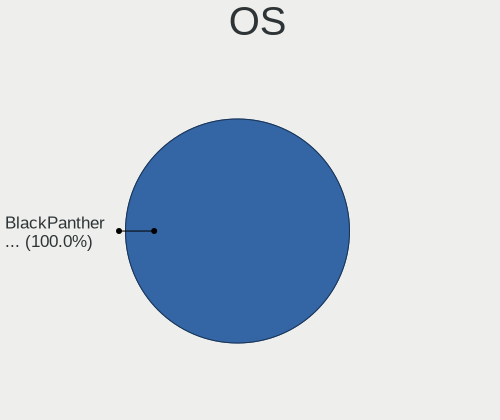

| Name              | Computers | Percent |
|-------------------|-----------|---------|
| BlackPanther 18.1 | 105       | 85.37%  |
| BlackPanther 16.2 | 18        | 14.63%  |

OS Family
---------

OS without a version

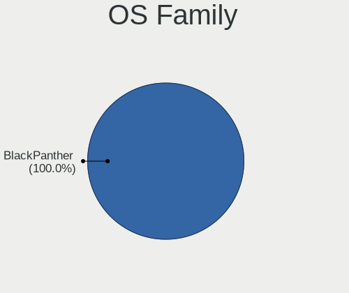

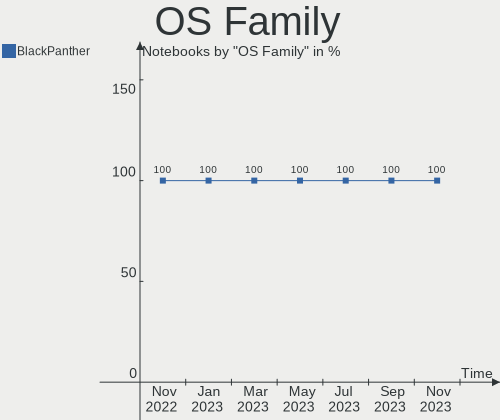

| Name         | Computers | Percent |
|--------------|-----------|---------|
| BlackPanther | 123       | 100%    |

Kernel
------

Version of the Linux kernel

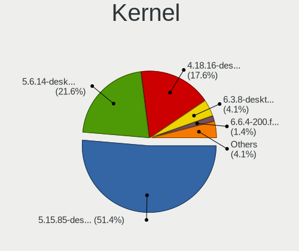

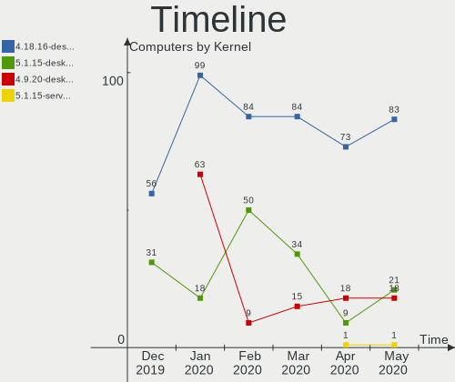

| Version                | Computers | Percent |
|------------------------|-----------|---------|
| 4.18.16-desktop-1bP    | 83        | 67.48%  |
| 5.1.15-desktop-1bP     | 21        | 17.07%  |
| 4.9.20-desktop-pae-1bP | 18        | 14.63%  |
| 5.1.15-server-1bP      | 1         | 0.81%   |

Kernel Family
-------------

Linux kernel without a distro release

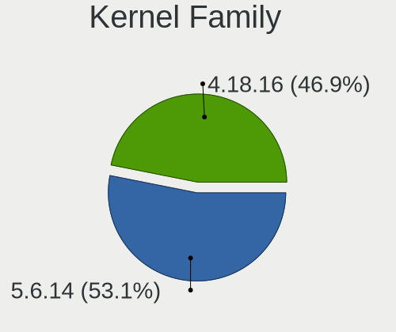

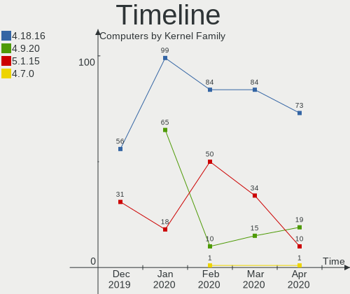

| Version | Computers | Percent |
|---------|-----------|---------|
| 4.18.16 | 83        | 67.48%  |
| 5.1.15  | 22        | 17.89%  |
| 4.9.20  | 18        | 14.63%  |

Kernel Major Ver.
-----------------

Linux kernel major version

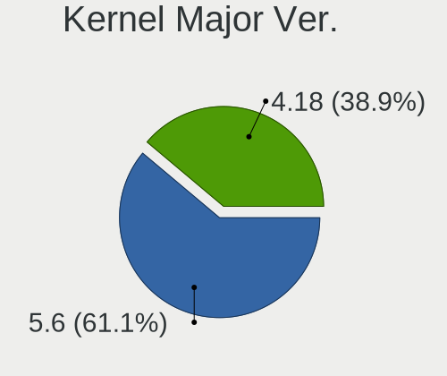

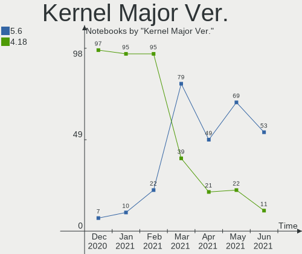

| Version | Computers | Percent |
|---------|-----------|---------|
| 4.18    | 83        | 67.48%  |
| 5.1     | 22        | 17.89%  |
| 4.9     | 18        | 14.63%  |

Arch
----

OS architecture (x86_64, i586, etc.)

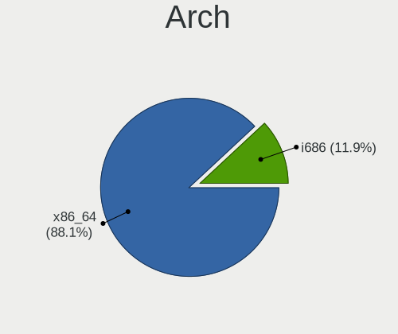

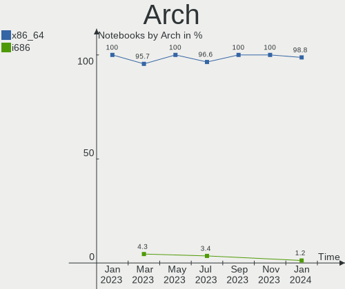

| Name   | Computers | Percent |
|--------|-----------|---------|
| x86_64 | 105       | 85.37%  |
| i686   | 18        | 14.63%  |

DE
--

Desktop Environment

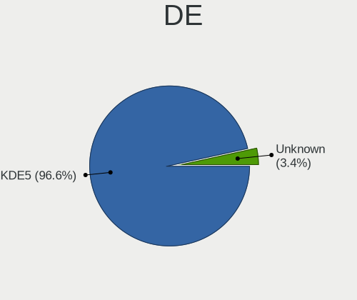

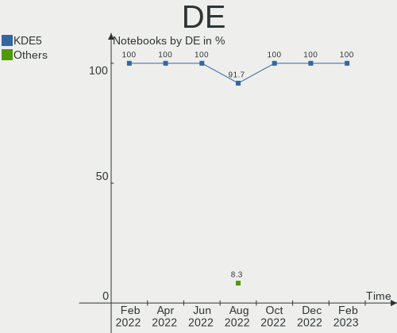

| Name    | Computers | Percent |
|---------|-----------|---------|
| KDE5    | 122       | 99.19%  |
| Unknown | 1         | 0.81%   |

Display Server
--------------

X11 or Wayland

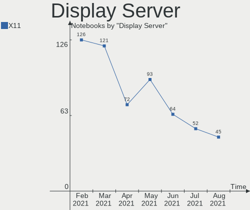

| Name | Computers | Percent |
|------|-----------|---------|
| X11  | 123       | 100%    |

Display Manager
---------------

SDDM, LightDM, etc.

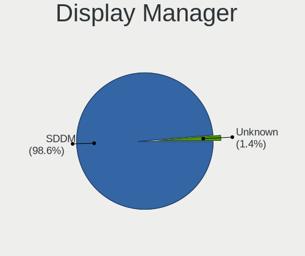

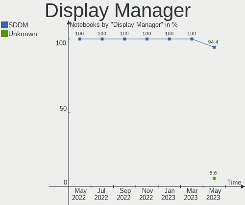

| Name | Computers | Percent |
|------|-----------|---------|
| SDDM | 123       | 100%    |

OS Lang
-------

Language

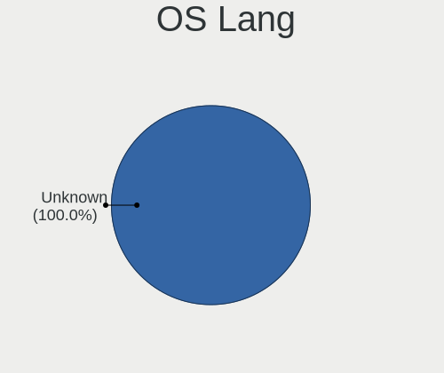

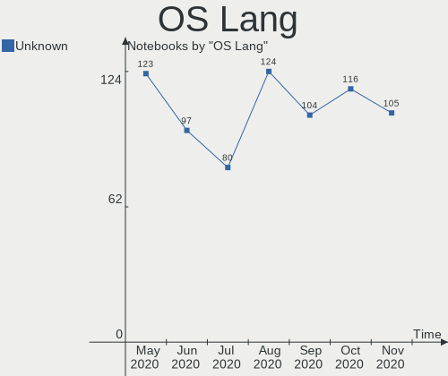

| Lang    | Computers | Percent |
|---------|-----------|---------|
| Unknown | 123       | 100%    |

Boot Mode
---------

EFI or BIOS

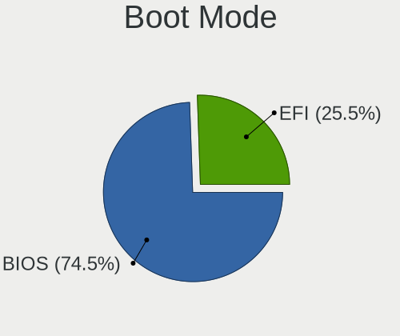

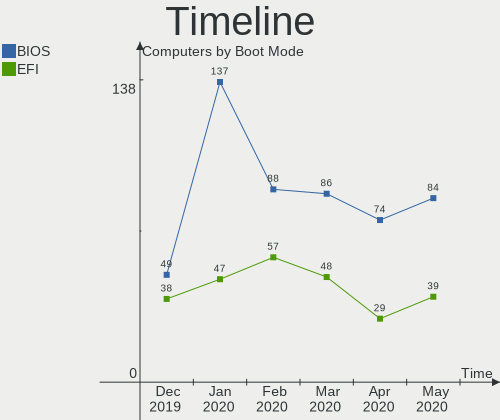

| Mode | Computers | Percent |
|------|-----------|---------|
| BIOS | 84        | 68.29%  |
| EFI  | 39        | 31.71%  |

Filesystem
----------

Type of filesystem

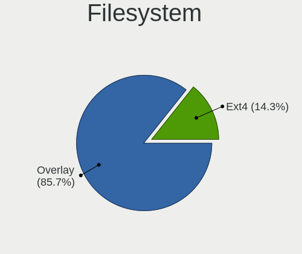

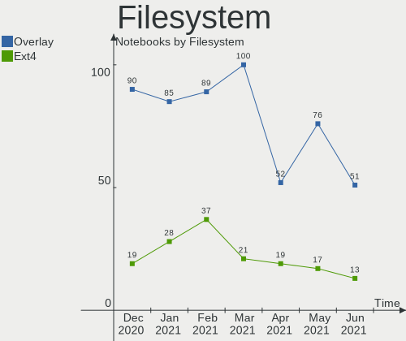

| Type    | Computers | Percent |
|---------|-----------|---------|
| Ext4    | 83        | 67.48%  |
| Overlay | 40        | 32.52%  |

Part. scheme
------------

Scheme of partitioning

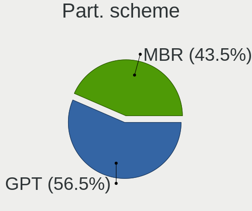

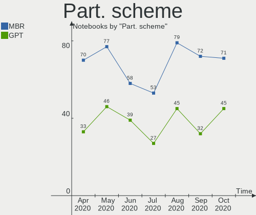

| Type    | Computers | Percent |
|---------|-----------|---------|
| Unknown | 73        | 59.35%  |
| MBR     | 30        | 24.39%  |
| GPT     | 20        | 16.26%  |

Dual Boot with Linux/BSD
------------------------

Hosting more than one Linux/BSD

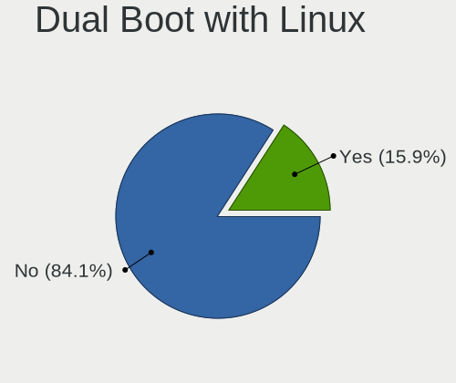

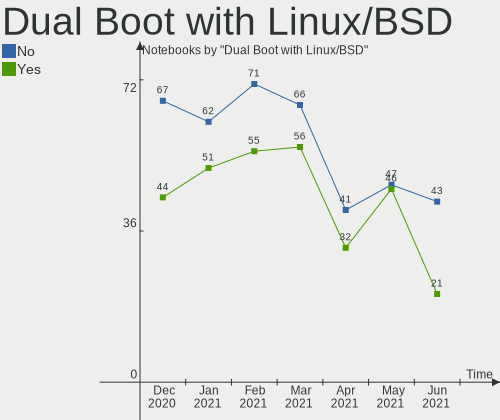

| Dual boot | Computers | Percent |
|-----------|-----------|---------|
| No        | 86        | 69.92%  |
| Yes       | 37        | 30.08%  |

Dual Boot (Win)
---------------

Hosting Linux and Windows

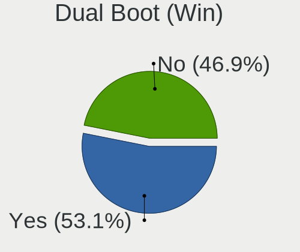

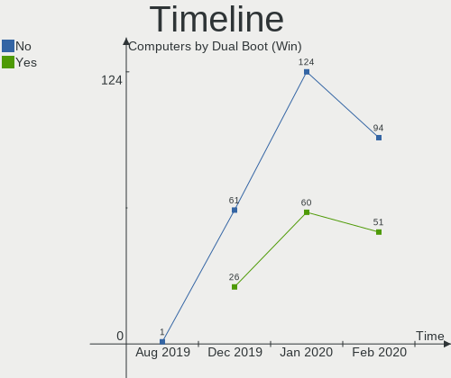

| Dual boot | Computers | Percent |
|-----------|-----------|---------|
| No        | 73        | 59.35%  |
| Yes       | 50        | 40.65%  |

Country
-------

Geographic location (country)

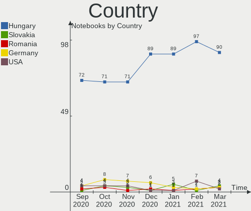

| Country     | Computers | Percent |
|-------------|-----------|---------|
| Hungary     | 102       | 82.93%  |
| Germany     | 12        | 9.76%   |
| UK          | 2         | 1.63%   |
| Romania     | 2         | 1.63%   |
| USA         | 1         | 0.81%   |
| Russia      | 1         | 0.81%   |
| Philippines | 1         | 0.81%   |
| France      | 1         | 0.81%   |
| Brazil      | 1         | 0.81%   |

City
----

Geographic location (city)

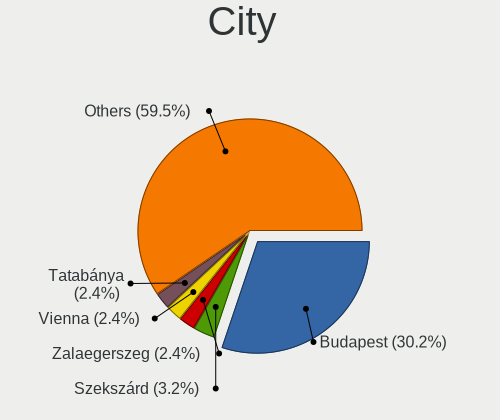

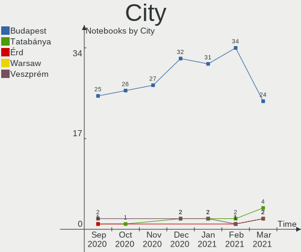

| City              | Computers | Percent |
|-------------------|-----------|---------|
| Budapest          | 32        | 26.02%  |
| Miskolc           | 5         | 4.07%   |
| Tarnok            | 3         | 2.44%   |
| Salgotarjan       | 3         | 2.44%   |
| Osnabrück        | 3         | 2.44%   |
| Munich            | 3         | 2.44%   |
| Gödöllő        | 3         | 2.44%   |
| Debrecen          | 3         | 2.44%   |
| Érd              | 2         | 1.63%   |
| Zalaegerszeg      | 2         | 1.63%   |
| Szombathely       | 2         | 1.63%   |
| Sarvar            | 2         | 1.63%   |
| Mezokovesd        | 2         | 1.63%   |
| Hévíz           | 2         | 1.63%   |
| Eger              | 2         | 1.63%   |
| Alsozsolca        | 2         | 1.63%   |
| Zamboanga City    | 1         | 0.81%   |
| Weiden            | 1         | 0.81%   |
| Vác              | 1         | 0.81%   |
| Târgu Mureş     | 1         | 0.81%   |
| Tura              | 1         | 0.81%   |
| Toekoel           | 1         | 0.81%   |
| Tiszafured        | 1         | 0.81%   |
| Tet               | 1         | 0.81%   |
| Tatabánya        | 1         | 0.81%   |
| Tata              | 1         | 0.81%   |
| Székesfehérvár | 1         | 0.81%   |
| Szob              | 1         | 0.81%   |
| Szigetszentmiklos | 1         | 0.81%   |
| Szigethalom       | 1         | 0.81%   |
| Szekszárd        | 1         | 0.81%   |
| Szeged            | 1         | 0.81%   |
| Sarospatak        | 1         | 0.81%   |
| Sarisap           | 1         | 0.81%   |
| Ribeirão Preto   | 1         | 0.81%   |
| Rackeve           | 1         | 0.81%   |
| Pécs             | 1         | 0.81%   |
| Pomaz             | 1         | 0.81%   |
| Polgar            | 1         | 0.81%   |
| Papa              | 1         | 0.81%   |
| Paks              | 1         | 0.81%   |
| Oroshaza          | 1         | 0.81%   |
| Orlando           | 1         | 0.81%   |
| Novorossiysk      | 1         | 0.81%   |
| Norwich           | 1         | 0.81%   |
| Neutraubling      | 1         | 0.81%   |
| Nagykanizsa       | 1         | 0.81%   |
| Mosonmagyaróvár | 1         | 0.81%   |
| Miercurea-Ciuc    | 1         | 0.81%   |
| Maidenhead        | 1         | 0.81%   |
| Lassicourt        | 1         | 0.81%   |
| Kismaros          | 1         | 0.81%   |
| Kecskemét        | 1         | 0.81%   |
| Kamen             | 1         | 0.81%   |
| Jaszarokszallas   | 1         | 0.81%   |
| Győr             | 1         | 0.81%   |
| Gyongyos          | 1         | 0.81%   |
| Gyomore           | 1         | 0.81%   |
| Ehingen           | 1         | 0.81%   |
| Dorn-Durkheim     | 1         | 0.81%   |

Vendor
------

Motherboard manufacturer

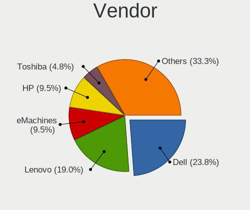

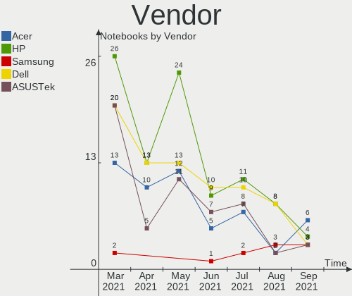

| Name                | Computers | Percent |
|---------------------|-----------|---------|
| Lenovo              | 26        | 21.14%  |
| Hewlett-Packard     | 23        | 18.7%   |
| Dell                | 22        | 17.89%  |
| ASUSTek Computer    | 17        | 13.82%  |
| Acer                | 16        | 13.01%  |
| Toshiba             | 3         | 2.44%   |
| Fujitsu             | 3         | 2.44%   |
| Sony                | 2         | 1.63%   |
| Samsung Electronics | 2         | 1.63%   |
| Packard Bell        | 2         | 1.63%   |
| Medion              | 2         | 1.63%   |
| Fujitsu Siemens     | 2         | 1.63%   |
| Hungaro Flotta Kft  | 1         | 0.81%   |
| Gigabyte Technology | 1         | 0.81%   |
| eMachines           | 1         | 0.81%   |

Model
-----

Motherboard model

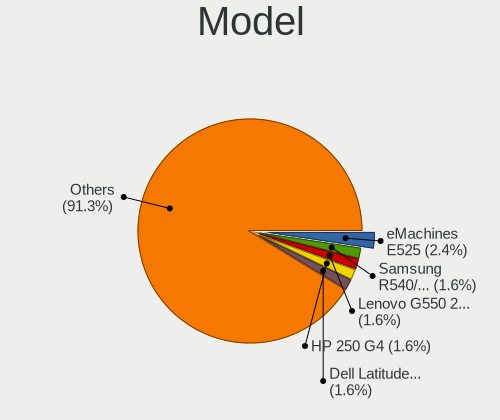

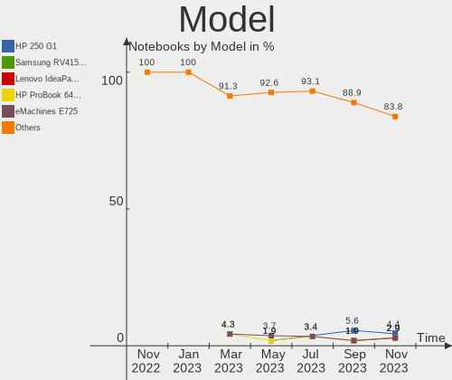

| Name                                                       | Computers | Percent |
|------------------------------------------------------------|-----------|---------|
| Packard Bell EasyNote TE11HC                               | 2         | 1.63%   |
| Lenovo G50-45 80E3                                         | 2         | 1.63%   |
| HP Pavilion g6                                             | 2         | 1.63%   |
| HP 620                                                     | 2         | 1.63%   |
| Dell Latitude E6430                                        | 2         | 1.63%   |
| Dell Latitude E6410                                        | 2         | 1.63%   |
| Dell Latitude E4310                                        | 2         | 1.63%   |
| Dell Latitude D630                                         | 2         | 1.63%   |
| Acer TravelMate B117-M                                     | 2         | 1.63%   |
| Acer Aspire 5742G                                          | 2         | 1.63%   |
| Toshiba Satellite L300                                     | 1         | 0.81%   |
| Toshiba Satellite L20                                      | 1         | 0.81%   |
| Sony VPCYB3V1E                                             | 1         | 0.81%   |
| Sony SVE1512W1ESI                                          | 1         | 0.81%   |
| Samsung Electronics 350V5C/351V5C/3540VC/3440VC            | 1         | 0.81%   |
| Samsung Electronics 300E5EV/300E4EV/270E5EV/270E4EV/2470EV | 1         | 0.81%   |
| Medion E7214                                               | 1         | 0.81%   |
| Medion AKOYA E1317T                                        | 1         | 0.81%   |
| Lenovo Z51-70 80K6                                         | 1         | 0.81%   |
| Lenovo Y520-15IKBN 80WK                                    | 1         | 0.81%   |
| Lenovo V110-15IAP 80TG                                     | 1         | 0.81%   |
| Lenovo ThinkPad X61 7673BW3                                | 1         | 0.81%   |
| Lenovo ThinkPad X200 74595FG                               | 1         | 0.81%   |
| Lenovo ThinkPad X1 Carbon 34608G1                          | 1         | 0.81%   |
| Lenovo ThinkPad W510 431924G                               | 1         | 0.81%   |
| Lenovo ThinkPad T60 1952VYF                                | 1         | 0.81%   |
| Lenovo ThinkPad T450 20BUS09Y0E                            | 1         | 0.81%   |
| Lenovo ThinkPad T420 4236Z9U                               | 1         | 0.81%   |
| Lenovo ThinkPad T410 2537CS0                               | 1         | 0.81%   |
| Lenovo ThinkPad L520 5016BK3                               | 1         | 0.81%   |
| Lenovo IdeaPad 700-15ISK 80RU                              | 1         | 0.81%   |
| Lenovo IdeaPad 330-15IKB 81DE                              | 1         | 0.81%   |
| Lenovo IdeaPad 330-15IKB 81DC                              | 1         | 0.81%   |
| Lenovo IdeaPad 320-15ISK 80XH                              | 1         | 0.81%   |
| Lenovo IdeaPad 110-15IBR 80T7                              | 1         | 0.81%   |
| Lenovo IdeaPad 100-15IBY 80MJ                              | 1         | 0.81%   |
| Lenovo G70-70 80HW                                         | 1         | 0.81%   |
| Lenovo G580 20150                                          | 1         | 0.81%   |
| Lenovo G550 20023                                          | 1         | 0.81%   |
| Lenovo G50-80 80E5                                         | 1         | 0.81%   |
| Lenovo B50-80 80EW                                         | 1         | 0.81%   |
| Lenovo 3000 N500 423338G                                   | 1         | 0.81%   |
| Hungaro Flotta Kft Navon Vision Book                       | 1         | 0.81%   |
| HP ProBook 6475b                                           | 1         | 0.81%   |
| HP ProBook 5330m                                           | 1         | 0.81%   |
| HP ProBook 4535s                                           | 1         | 0.81%   |
| HP ProBook 450 G1                                          | 1         | 0.81%   |
| HP ProBook 4320s                                           | 1         | 0.81%   |
| HP Pavilion dv6                                            | 1         | 0.81%   |
| HP Notebook                                                | 1         | 0.81%   |
| HP Laptop 15-bs0xx                                         | 1         | 0.81%   |
| HP EliteBook 8540p                                         | 1         | 0.81%   |
| HP EliteBook 8470p                                         | 1         | 0.81%   |
| HP EliteBook 8460p                                         | 1         | 0.81%   |
| HP EliteBook 840 G2                                        | 1         | 0.81%   |
| HP EliteBook 840 G1                                        | 1         | 0.81%   |
| HP EliteBook 2560p                                         | 1         | 0.81%   |
| HP Compaq nc4200 (PA750AV)                                 | 1         | 0.81%   |
| HP Compaq Mini CQ10-400                                    | 1         | 0.81%   |
| HP Compaq 6710b (KE121EA#AKC)                              | 1         | 0.81%   |

Model Family
------------

Motherboard model prefix

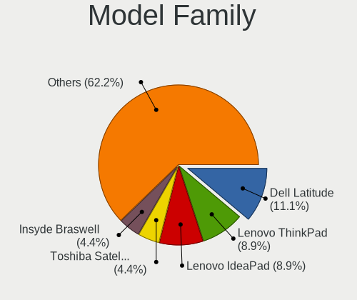

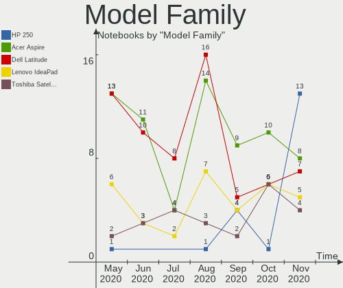

| Name                        | Computers | Percent |
|-----------------------------|-----------|---------|
| Dell Latitude               | 13        | 10.57%  |
| Acer Aspire                 | 13        | 10.57%  |
| Lenovo ThinkPad             | 9         | 7.32%   |
| Dell Inspiron               | 7         | 5.69%   |
| Lenovo IdeaPad              | 6         | 4.88%   |
| HP EliteBook                | 6         | 4.88%   |
| HP ProBook                  | 5         | 4.07%   |
| HP Pavilion                 | 3         | 2.44%   |
| HP Compaq                   | 3         | 2.44%   |
| Fujitsu LIFEBOOK            | 3         | 2.44%   |
| Acer TravelMate             | 3         | 2.44%   |
| Toshiba Satellite           | 2         | 1.63%   |
| Packard Bell EasyNote       | 2         | 1.63%   |
| Lenovo G50-45               | 2         | 1.63%   |
| HP 620                      | 2         | 1.63%   |
| Fujitsu Siemens AMILO       | 2         | 1.63%   |
| ASUS VivoBook               | 2         | 1.63%   |
| Sony VPCYB3V1E              | 1         | 0.81%   |
| Sony SVE1512W1ESI           | 1         | 0.81%   |
| Samsung Electronics 350V5C  | 1         | 0.81%   |
| Samsung Electronics 300E5EV | 1         | 0.81%   |
| Medion E7214                | 1         | 0.81%   |
| Medion AKOYA                | 1         | 0.81%   |
| Lenovo Z51-70               | 1         | 0.81%   |
| Lenovo Y520-15IKBN          | 1         | 0.81%   |
| Lenovo V110-15IAP           | 1         | 0.81%   |
| Lenovo G70-70               | 1         | 0.81%   |
| Lenovo G580                 | 1         | 0.81%   |
| Lenovo G550                 | 1         | 0.81%   |
| Lenovo G50-80               | 1         | 0.81%   |
| Lenovo B50-80               | 1         | 0.81%   |
| Lenovo 3000                 | 1         | 0.81%   |
| Hungaro Flotta Kft Navon    | 1         | 0.81%   |
| HP Notebook                 | 1         | 0.81%   |
| HP Laptop                   | 1         | 0.81%   |
| HP 250                      | 1         | 0.81%   |
| HP 15                       | 1         | 0.81%   |
| Gigabyte Q1580L             | 1         | 0.81%   |
| eMachines eME730G           | 1         | 0.81%   |
| Dell XPS                    | 1         | 0.81%   |
| Dell Vostro                 | 1         | 0.81%   |
| ASUS X550ZE                 | 1         | 0.81%   |
| ASUS X550VX                 | 1         | 0.81%   |
| ASUS X550CC                 | 1         | 0.81%   |
| ASUS X541UAK                | 1         | 0.81%   |
| ASUS X541SA                 | 1         | 0.81%   |
| ASUS X541NA                 | 1         | 0.81%   |
| ASUS X200MA                 | 1         | 0.81%   |
| ASUS T300FA                 | 1         | 0.81%   |
| ASUS K54HR                  | 1         | 0.81%   |
| ASUS K53TA                  | 1         | 0.81%   |
| ASUS K52Jr                  | 1         | 0.81%   |
| ASUS K50IJ                  | 1         | 0.81%   |
| ASUS E205SA                 | 1         | 0.81%   |
| ASUS 1101HA                 | 1         | 0.81%   |
| ASUS 1005HA                 | 1         | 0.81%   |
| Unknown                     | 1         | 0.81%   |

MFG Year
--------

Motherboard manufacture year

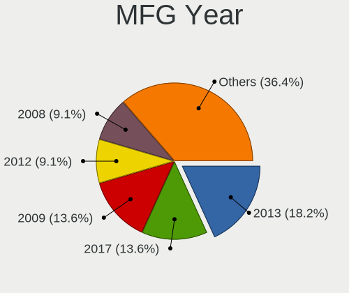

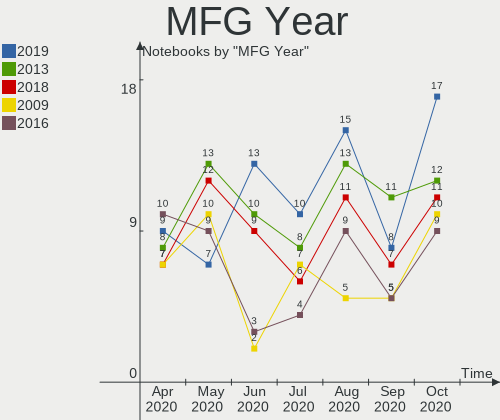

| Year | Computers | Percent |
|------|-----------|---------|
| 2015 | 13        | 10.57%  |
| 2013 | 13        | 10.57%  |
| 2018 | 12        | 9.76%   |
| 2011 | 12        | 9.76%   |
| 2017 | 10        | 8.13%   |
| 2010 | 10        | 8.13%   |
| 2009 | 10        | 8.13%   |
| 2016 | 9         | 7.32%   |
| 2012 | 8         | 6.5%    |
| 2019 | 7         | 5.69%   |
| 2008 | 7         | 5.69%   |
| 2014 | 6         | 4.88%   |
| 2020 | 2         | 1.63%   |
| 2007 | 2         | 1.63%   |
| 2006 | 1         | 0.81%   |
| 2005 | 1         | 0.81%   |

Form Factor
-----------

Physical design of the computer

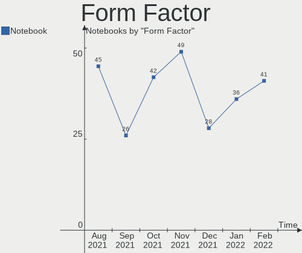

| Name     | Computers | Percent |
|----------|-----------|---------|
| Notebook | 123       | 100%    |

Secure Boot
-----------

Enabled or disabled

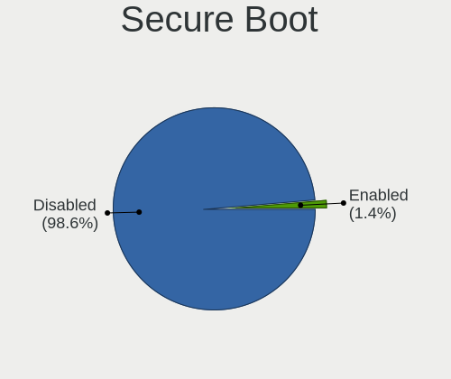

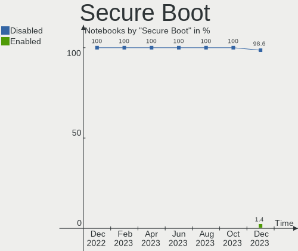

| State    | Computers | Percent |
|----------|-----------|---------|
| Disabled | 123       | 100%    |

Coreboot
--------

Have coreboot on board

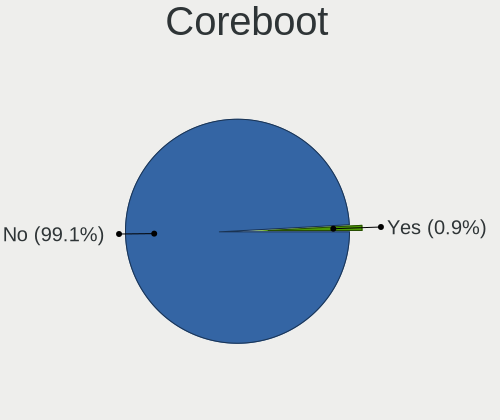

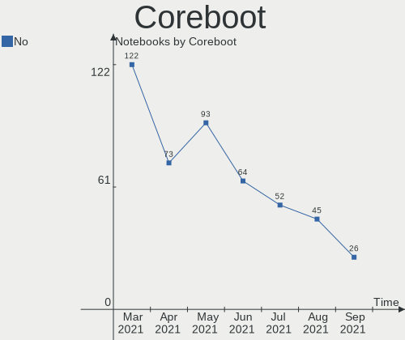

| Used | Computers | Percent |
|------|-----------|---------|
| No   | 123       | 100%    |

RAM Size
--------

Total RAM memory

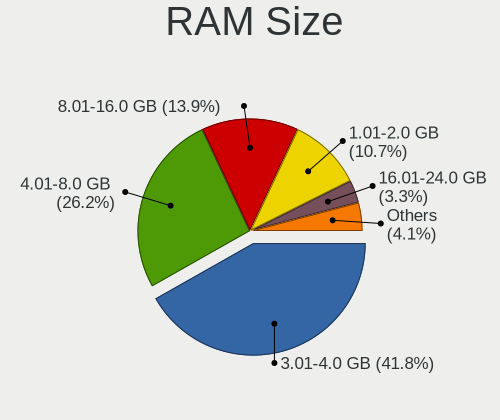

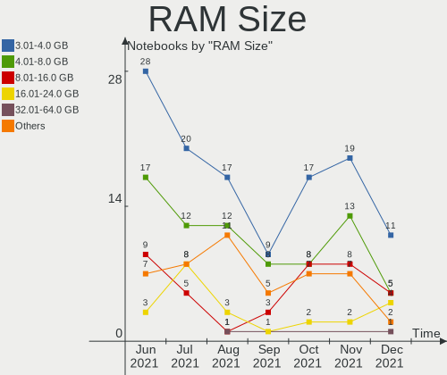

| Size in GB | Computers | Percent |
|------------|-----------|---------|
| 3.01-4.0   | 53        | 43.09%  |
| 4.01-8.0   | 22        | 17.89%  |
| 8.01-16.0  | 21        | 17.07%  |
| 1.01-2.0   | 14        | 11.38%  |
| 2.01-3.0   | 8         | 6.5%    |
| 0.01-1.0   | 4         | 3.25%   |
| 24.01-32.0 | 1         | 0.81%   |

RAM Used
--------

Used RAM memory

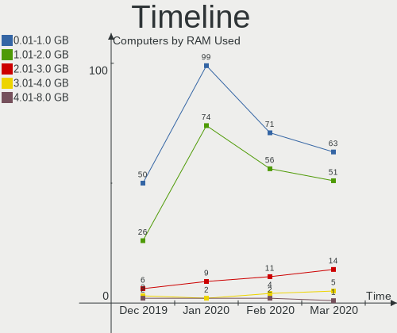

| Used GB  | Computers | Percent |
|----------|-----------|---------|
| 0.01-1.0 | 78        | 63.41%  |
| 1.01-2.0 | 39        | 31.71%  |
| 2.01-3.0 | 5         | 4.07%   |
| 3.01-4.0 | 1         | 0.81%   |

Drive Vendor
------------

Hard drive vendors

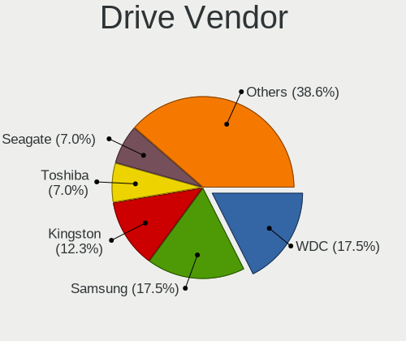

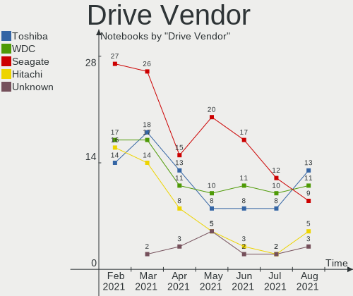

| Vendor              | Computers | Drives  | Percent |
|---------------------|-----------|---------|---------|
| Seagate             | 26        | 26      | 17.81%  |
| WDC                 | 23        | 24      | 15.75%  |
| Toshiba             | 15        | 15      | 10.27%  |
| Kingston            | 15        | 15      | 10.27%  |
| Hitachi             | 10        | 10      | 6.85%   |
| SanDisk             | 8         | 10      | 5.48%   |
| HGST                | 7         | 7       | 4.79%   |
| Samsung Electronics | 5         | 5       | 3.42%   |
| A-DATA Technology   | 5         | 5       | 3.42%   |
| Unknown             | 4         | 4       | 2.74%   |
| HL-DT-ST            | 3         | Unknown | 2.05%   |
| Gigabyte Technology | 3         | 3       | 2.05%   |
| Fujitsu             | 3         | 3       | 2.05%   |
| Crucial             | 3         | 3       | 2.05%   |
| Intel               | 2         | 2       | 1.37%   |
| SPCC                | 1         | 1       | 0.68%   |
| SK Hynix            | 1         | 1       | 0.68%   |
| OCZ                 | 1         | 1       | 0.68%   |
| Micron Technology   | 1         | 1       | 0.68%   |
| LITEON              | 1         | 1       | 0.68%   |
| KingSpec            | 1         | 1       | 0.68%   |
| KINGMAX             | 1         | 1       | 0.68%   |
| JMicron             | 1         | 1       | 0.68%   |
| Intenso             | 1         | 1       | 0.68%   |
| HGST HTS            | 1         | 1       | 0.68%   |
| Generic             | 1         | 1       | 0.68%   |
| China               | 1         | 1       | 0.68%   |
| BHT                 | 1         | 1       | 0.68%   |
| Apacer              | 1         | 1       | 0.68%   |

Drive Model
-----------

Hard drive models

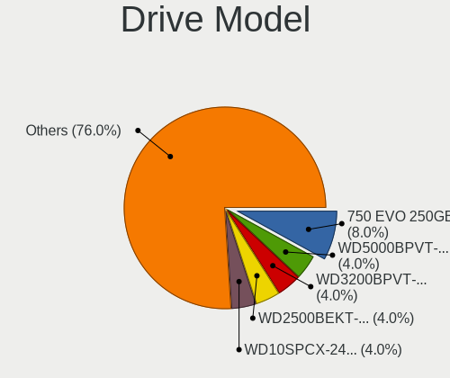

| Model                         | Computers | Percent |
|-------------------------------|-----------|---------|
| MQ01ABF050 500GB              | 4         | 2.68%   |
| SUV400S37120G 120GB SSD       | 3         | 2.01%   |
| ST9320423AS 320GB             | 3         | 2.01%   |
| SA400S37240G 240GB SSD        | 3         | 2.01%   |
| SA400S37120G 120GB SSD        | 3         | 2.01%   |
| MQ04ABF100 1TB                | 3         | 2.01%   |
| HTS545050A7E680 500GB         | 3         | 2.01%   |
| WDS240G2G0A-00JH30 240GB SSD  | 2         | 1.34%   |
| WD5000LPCX-21VHAT0 500GB      | 2         | 1.34%   |
| WD3200BEVT-22A23T0 320GB      | 2         | 1.34%   |
| WD10JPVX-22JC3T0 1TB          | 2         | 1.34%   |
| SV300S37A120G 120GB SSD       | 2         | 1.34%   |
| ST9500325AS 500GB             | 2         | 1.34%   |
| ST9320325AS 320GB             | 2         | 1.34%   |
| ST9250315AS 250GB             | 2         | 1.34%   |
| ST500LT012-9WS142 500GB       | 2         | 1.34%   |
| ST500LT012-1DG142 500GB       | 2         | 1.34%   |
| ST1000LM035-1RK172 1TB        | 2         | 1.34%   |
| ST1000LM024 HN-M101MBB 1TB    | 2         | 1.34%   |
| SSD PLUS 240GB                | 2         | 1.34%   |
| SSD 750 EVO 250GB             | 2         | 1.34%   |
| SP580 120GB SSD               | 2         | 1.34%   |
| SDSSDH3 500G                  | 2         | 1.34%   |
| SDSSDA240G 240GB              | 2         | 1.34%   |
| MQ01ABD100 1TB                | 2         | 1.34%   |
| HTS725025A9A364 250GB         | 2         | 1.34%   |
| HTS547575A9E384 752GB         | 2         | 1.34%   |
| GP-GSTFS31120GNTD 120GB SSD   | 2         | 1.34%   |
| DVDRAM GUE1N 3GB              | 2         | 1.34%   |
| CT1000MX500SSD1 1TB           | 2         | 1.34%   |
| WR202I0064G E70245F5 64GB SSD | 1         | 0.67%   |
| WDS500G2B0A-00SM50 500GB SSD  | 1         | 0.67%   |
| WDS250G2B0A-00SM50 250GB SSD  | 1         | 0.67%   |
| WDS250G2B0A 250GB SSD         | 1         | 0.67%   |
| WD7500BPVT-80HXZT3 752GB      | 1         | 0.67%   |
| WD7500BPVT-22HXZT3 752GB      | 1         | 0.67%   |
| WD6400BEVT-22A0RT0 640GB      | 1         | 0.67%   |
| WD5000BPVT-60HXZT1 500GB      | 1         | 0.67%   |
| WD5000BPVT-00HXZT1 500GB      | 1         | 0.67%   |
| WD5000BPKT-00PK4T0 500GB      | 1         | 0.67%   |
| WD5000BEVT-00ZAT0 500GB       | 1         | 0.67%   |
| WD2500BEVT-22A23T0 250GB      | 1         | 0.67%   |
| WD2500BEKT-60PVMT0 250GB      | 1         | 0.67%   |
| WD1600BMVS-11F9S0 160GB       | 1         | 0.67%   |
| WD1600BEVS-26VAT0 160GB       | 1         | 0.67%   |
| WD1600BEVS-08VAT2 160GB       | 1         | 0.67%   |
| WD10JPVX-60JC3T0 1TB          | 1         | 0.67%   |
| Tech 250GB                    | 1         | 0.67%   |
| T-64 64GB SSD                 | 1         | 0.67%   |
| SX6000NP 128GB                | 1         | 0.67%   |
| SUV500MS240G 240GB SSD        | 1         | 0.67%   |
| SUV500240G 240GB SSD          | 1         | 0.67%   |
| SU810NS38 SATA 256 GB SSD     | 1         | 0.67%   |
| ST980412 ASG 80GB             | 1         | 0.67%   |
| ST9500420AS 500GB             | 1         | 0.67%   |
| ST9320310AS 320GB             | 1         | 0.67%   |
| ST9160412AS 160GB             | 1         | 0.67%   |
| ST500LM000-1EJ162 500GB       | 1         | 0.67%   |
| ST320VM001-1AD142 320GB       | 1         | 0.67%   |
| ST320LT020-9YG142 320GB       | 1         | 0.67%   |

Drive Kind
----------

HDD or SSD

| Kind    | Computers | Drives | Percent |
|---------|-----------|--------|---------|
| HDD     | 78        | 78     | 54.17%  |
| SSD     | 53        | 58     | 36.81%  |
| Unknown | 6         | 3      | 4.17%   |
| MMC     | 4         | 4      | 2.78%   |
| NVMe    | 3         | 3      | 2.08%   |

Drive Connector
---------------

SATA, SAS, NVMe, etc.

| Type | Computers | Drives | Percent |
|------|-----------|--------|---------|
| SATA | 121       | 134    | 88.97%  |
| SAS  | 8         | 5      | 5.88%   |
| MMC  | 4         | 4      | 2.94%   |
| NVMe | 3         | 3      | 2.21%   |

Drive Size
----------

Size of hard drive

| Size in TB | Computers | Drives | Percent |
|------------|-----------|--------|---------|
| 0.01-0.5   | 107       | 118    | 79.85%  |
| 0.51-1.0   | 26        | 27     | 19.4%   |
| 1.01-2.0   | 1         | 1      | 0.75%   |

Space Total
-----------

Amount of disk space available on the file system

| Size in GB | Computers | Percent |
|------------|-----------|---------|
| 101-250    | 38        | 30.89%  |
| Unknown    | 38        | 30.89%  |
| 251-500    | 17        | 13.82%  |
| 51-100     | 15        | 12.2%   |
| 501-1000   | 7         | 5.69%   |
| 21-50      | 6         | 4.88%   |
| 2001-3000  | 1         | 0.81%   |
| 1-20       | 1         | 0.81%   |

Space Used
----------

Amount of used disk space

| Used GB   | Computers | Percent |
|-----------|-----------|---------|
| 1-20      | 54        | 43.9%   |
| Unknown   | 38        | 30.89%  |
| 21-50     | 13        | 10.57%  |
| 51-100    | 8         | 6.5%    |
| 101-250   | 7         | 5.69%   |
| 251-500   | 2         | 1.63%   |
| 1001-2000 | 1         | 0.81%   |

Malfunc. Drives
---------------

Drive models with a malfunction

| Model                           | Computers | Drives | Percent |
|---------------------------------|-----------|--------|---------|
| HTS545050A7E680 500GB           | 3         | 3      | 6.82%   |
| ST9500325AS 500GB               | 2         | 2      | 4.55%   |
| ST9320423AS 320GB               | 2         | 2      | 4.55%   |
| ST9320325AS 320GB               | 2         | 2      | 4.55%   |
| ST500LT012-9WS142 500GB         | 2         | 2      | 4.55%   |
| MQ01ABF050 500GB                | 2         | 2      | 4.55%   |
| HTS725025A9A364 250GB           | 2         | 2      | 4.55%   |
| HTS547575A9E384 752GB           | 2         | 2      | 4.55%   |
| WD6400BEVT-22A0RT0 640GB        | 1         | 1      | 2.27%   |
| WD3200BEVT-22A23T0 320GB        | 1         | 1      | 2.27%   |
| WD2500BEKT-60PVMT0 250GB        | 1         | 1      | 2.27%   |
| WD1600BMVS-11F9S0 160GB         | 1         | 1      | 2.27%   |
| WD10JPVX-22JC3T0 1TB            | 1         | 1      | 2.27%   |
| SX6000NP 128GB                  | 1         | 1      | 2.27%   |
| SV300S37A120G 120GB SSD         | 1         | 1      | 2.27%   |
| SUV400S37120G 120GB SSD         | 1         | 1      | 2.27%   |
| ST9250315AS 250GB               | 1         | 1      | 2.27%   |
| ST500LT012-1DG142 500GB         | 1         | 1      | 2.27%   |
| ST320LT020-9YG142 320GB         | 1         | 1      | 2.27%   |
| ST1000LM035-1RK172 1TB          | 1         | 1      | 2.27%   |
| SSD 60GB                        | 1         | 1      | 2.27%   |
| SP920SS 256GB SSD               | 1         | 1      | 2.27%   |
| SA400S37120G 120GB SSD          | 1         | 1      | 2.27%   |
| MQ01ABD100 1TB                  | 1         | 1      | 2.27%   |
| MQ01ABD050 500GB                | 1         | 1      | 2.27%   |
| MK2561GSYN 250GB                | 1         | 1      | 2.27%   |
| MHV2060AH 64GB                  | 1         | 1      | 2.27%   |
| KSG60ZMV256G M.2 2280 256GB SSD | 1         | 1      | 2.27%   |
| HTS725050A7E635 500GB           | 1         | 1      | 2.27%   |
| HTS725032A7E630 320GB           | 1         | 1      | 2.27%   |
| HTS547564A9E384 640GB           | 1         | 1      | 2.27%   |
| HTS545016B9A300 160GB           | 1         | 1      | 2.27%   |
| HTS541680J9SA00 80GB            | 1         | 1      | 2.27%   |
| HTS541010A9E680 1TB             | 1         | 1      | 2.27%   |
| AS350 512GB SSD                 | 1         | 1      | 2.27%   |

Malfunc. Drive Vendor
---------------------

Vendors of faulty drives

| Vendor            | Computers | Drives | Percent |
|-------------------|-----------|--------|---------|
| Seagate           | 12        | 12     | 27.27%  |
| Hitachi           | 8         | 8      | 18.18%  |
| Toshiba           | 6         | 6      | 13.64%  |
| WDC               | 5         | 5      | 11.36%  |
| HGST              | 5         | 5      | 11.36%  |
| Kingston          | 3         | 3      | 6.82%   |
| A-DATA Technology | 2         | 2      | 4.55%   |
| KINGMAX           | 1         | 1      | 2.27%   |
| Fujitsu           | 1         | 1      | 2.27%   |
| Apacer            | 1         | 1      | 2.27%   |

Malfunc. Drive Kind
-------------------

Kinds of faulty drives

| Kind | Computers | Drives | Percent |
|------|-----------|--------|---------|
| HDD  | 36        | 36     | 81.82%  |
| SSD  | 7         | 7      | 15.91%  |
| NVMe | 1         | 1      | 2.27%   |

Failed Drives
-------------

Failed drive models

Zero info for selected period =(

Failed Drive Vendor
-------------------

Failed drive vendors

Zero info for selected period =(

Drive Status
------------

Number of failed and malfunc. drives

| Status   | Computers | Drives | Percent |
|----------|-----------|--------|---------|
| Works    | 82        | 93     | 59.42%  |
| Malfunc  | 44        | 44     | 31.88%  |
| Detected | 12        | 9      | 8.7%    |

Storage Vendor
--------------

Storage controller vendors

| Vendor                      | Computers | Percent |
|-----------------------------|-----------|---------|
| Intel                       | 104       | 83.87%  |
| AMD                         | 16        | 12.9%   |
| VIA Technologies            | 1         | 0.81%   |
| Realtek Semiconductor       | 1         | 0.81%   |
| KIOXIA                      | 1         | 0.81%   |
| Kingston Technology Company | 1         | 0.81%   |

Storage Model
-------------

Storage controller models

| Model                                                                      | Computers | Percent |
|----------------------------------------------------------------------------|-----------|---------|
| FCH SATA Controller [AHCI mode]                                            | 12        | 8.76%   |
| 7 Series Chipset Family 6-port SATA Controller [AHCI mode]                 | 11        | 8.03%   |
| Wildcat Point-LP SATA Controller [AHCI Mode]                               | 10        | 7.3%    |
| 82801IBM/IEM (ICH9M/ICH9M-E) 4 port SATA Controller [AHCI mode]            | 10        | 7.3%    |
| 6 Series/C200 Series Chipset Family 6 port Mobile SATA AHCI Controller     | 9         | 6.57%   |
| 5 Series/3400 Series Chipset 6 port SATA AHCI Controller                   | 8         | 5.84%   |
| 82801 Mobile SATA Controller [RAID mode]                                   | 7         | 5.11%   |
| Atom/Celeron/Pentium Processor x5-E8000/J3xxx/N3xxx Series SATA Controller | 6         | 4.38%   |
| Sunrise Point-LP SATA Controller [AHCI mode]                               | 5         | 3.65%   |
| 82801HM/HEM (ICH8M/ICH8M-E) IDE Controller                                 | 5         | 3.65%   |
| HM170/QM170 Chipset SATA Controller [AHCI Mode]                            | 4         | 2.92%   |
| Atom Processor E3800 Series SATA AHCI Controller                           | 4         | 2.92%   |
| 5 Series/3400 Series Chipset 4 port SATA AHCI Controller                   | 4         | 2.92%   |
| SB7x0/SB8x0/SB9x0 SATA Controller [AHCI mode]                              | 3         | 2.19%   |
| 82801HM/HEM (ICH8M/ICH8M-E) SATA Controller [IDE mode]                     | 3         | 2.19%   |
| 82801GBM/GHM (ICH7-M Family) SATA Controller [IDE mode]                    | 3         | 2.19%   |
| 8 Series SATA Controller 1 [AHCI mode]                                     | 3         | 2.19%   |
| Non-Volatile memory controller                                             | 2         | 1.46%   |
| Celeron N3350/Pentium N4200/Atom E3900 Series SATA AHCI Controller         | 2         | 1.46%   |
| 82801IBM/IEM (ICH9M/ICH9M-E) 2 port SATA Controller [IDE mode]             | 2         | 1.46%   |
| 82801HM/HEM (ICH8M/ICH8M-E) SATA Controller [AHCI mode]                    | 2         | 1.46%   |
| 82801GBM/GHM (ICH7-M Family) SATA Controller [AHCI mode]                   | 2         | 1.46%   |
| 82801G (ICH7 Family) IDE Controller                                        | 2         | 1.46%   |
| 8 Series/C220 Series Chipset Family 6-port SATA Controller 1 [AHCI mode]   | 2         | 1.46%   |
| VT82C586A/B/VT82C686/A/B/VT823x/A/C PIPC Bus Master IDE                    | 1         | 0.73%   |
| VT8237A SATA 2-Port Controller                                             | 1         | 0.73%   |
| US15W/US15X/US15L/UL11L SCH [Poulsbo] IDE Controller                       | 1         | 0.73%   |
| SATA controller                                                            | 1         | 0.73%   |
| Realtek Non-Volatile memory controller                                     | 1         | 0.73%   |
| NM10/ICH7 Family SATA Controller [AHCI mode]                               | 1         | 0.73%   |
| Mobile PM965/GM965 PT IDER Controller                                      | 1         | 0.73%   |
| FCH SATA Controller [IDE mode]                                             | 1         | 0.73%   |
| FCH IDE Controller                                                         | 1         | 0.73%   |
| 82801FBM (ICH6M) SATA Controller                                           | 1         | 0.73%   |
| 82801FB/FBM/FR/FW/FRW (ICH6 Family) IDE Controller                         | 1         | 0.73%   |
| 7 Series Chipset Family 4-port SATA Controller [IDE mode]                  | 1         | 0.73%   |
| 7 Series Chipset Family 2-port SATA Controller [IDE mode]                  | 1         | 0.73%   |
| 5 Series/3400 Series Chipset PT IDER Controller                            | 1         | 0.73%   |
| 5 Series/3400 Series Chipset 4 port SATA IDE Controller                    | 1         | 0.73%   |
| 5 Series/3400 Series Chipset 2 port SATA IDE Controller                    | 1         | 0.73%   |

Storage Kind
------------

Kind of storage controller (IDE, SATA, NVMe, SAS, ...)

| Kind | Computers | Percent |
|------|-----------|---------|
| SATA | 100       | 77.52%  |
| IDE  | 19        | 14.73%  |
| RAID | 7         | 5.43%   |
| NVMe | 3         | 2.33%   |

CPU Vendor
----------

Processor vendors

| Vendor | Computers | Percent |
|--------|-----------|---------|
| Intel  | 106       | 86.18%  |
| AMD    | 17        | 13.82%  |

CPU Model
---------

Processor models

| Model                                       | Computers | Percent |
|---------------------------------------------|-----------|---------|
| Intel Core i5-5200U CPU @ 2.20GHz           | 4         | 3.25%   |
| Intel Core i5-3210M CPU @ 2.50GHz           | 4         | 3.25%   |
| Intel Pentium CPU B960 @ 2.20GHz            | 3         | 2.44%   |
| Intel Celeron CPU N3060 @ 1.60GHz           | 3         | 2.44%   |
| Intel Pentium Dual-Core CPU T4400 @ 2.20GHz | 2         | 1.63%   |
| Intel Pentium CPU N3710 @ 1.60GHz           | 2         | 1.63%   |
| Intel Core i7 CPU M 620 @ 2.67GHz           | 2         | 1.63%   |
| Intel Core i5-8265U CPU @ 1.60GHz           | 2         | 1.63%   |
| Intel Core i5-7300HQ CPU @ 2.50GHz          | 2         | 1.63%   |
| Intel Core i5-2520M CPU @ 2.50GHz           | 2         | 1.63%   |
| Intel Core i5 CPU M 560 @ 2.67GHz           | 2         | 1.63%   |
| Intel Core i5 CPU M 540 @ 2.53GHz           | 2         | 1.63%   |
| Intel Core i5 CPU M 520 @ 2.40GHz           | 2         | 1.63%   |
| Intel Core i3-6006U CPU @ 2.00GHz           | 2         | 1.63%   |
| Intel Core i3-5005U CPU @ 2.00GHz           | 2         | 1.63%   |
| Intel Core i3-2350M CPU @ 2.30GHz           | 2         | 1.63%   |
| Intel Core i3-2310M CPU @ 2.10GHz           | 2         | 1.63%   |
| Intel Core 2 Duo CPU T7500 @ 2.20GHz        | 2         | 1.63%   |
| Intel Core 2 CPU T5500 @ 1.66GHz            | 2         | 1.63%   |
| Intel Atom CPU N270 @ 1.60GHz               | 2         | 1.63%   |
| AMD A4-3300M APU with Radeon HD Graphics    | 2         | 1.63%   |
| Intel Processor 5Y10 CPU @ 0.80GHz          | 1         | 0.81%   |
| Intel Pentium Silver N5000 CPU @ 1.10GHz    | 1         | 0.81%   |
| Intel Pentium M processor 1.86GHz           | 1         | 0.81%   |
| Intel Pentium M processor 1.73GHz           | 1         | 0.81%   |
| Intel Pentium Dual-Core CPU T4200 @ 2.00GHz | 1         | 0.81%   |
| Intel Pentium Dual CPU T3400 @ 2.16GHz      | 1         | 0.81%   |
| Intel Pentium Dual CPU T3200 @ 2.00GHz      | 1         | 0.81%   |
| Intel Pentium CPU P6100 @ 2.00GHz           | 1         | 0.81%   |
| Intel Pentium CPU N4200 @ 1.10GHz           | 1         | 0.81%   |
| Intel Pentium CPU N3700 @ 1.60GHz           | 1         | 0.81%   |
| Intel Pentium CPU N3540 @ 2.16GHz           | 1         | 0.81%   |
| Intel Pentium CPU 3825U @ 1.90GHz           | 1         | 0.81%   |
| Intel Pentium CPU 2127U @ 1.90GHz           | 1         | 0.81%   |
| Intel Genuine CPU T2080 @ 1.73GHz           | 1         | 0.81%   |
| Intel Core i7-6700HQ CPU @ 2.60GHz          | 1         | 0.81%   |
| Intel Core i7-6600U CPU @ 2.60GHz           | 1         | 0.81%   |
| Intel Core i7-5500U CPU @ 2.40GHz           | 1         | 0.81%   |
| Intel Core i7-4702MQ CPU @ 2.20GHz          | 1         | 0.81%   |
| Intel Core i7-4510U CPU @ 2.00GHz           | 1         | 0.81%   |
| Intel Core i7-2720QM CPU @ 2.20GHz          | 1         | 0.81%   |
| Intel Core i7 CPU Q 720 @ 1.60GHz           | 1         | 0.81%   |
| Intel Core i5-8250U CPU @ 1.60GHz           | 1         | 0.81%   |
| Intel Core i5-7200U CPU @ 2.50GHz           | 1         | 0.81%   |
| Intel Core i5-6300HQ CPU @ 2.30GHz          | 1         | 0.81%   |
| Intel Core i5-5300U CPU @ 2.30GHz           | 1         | 0.81%   |
| Intel Core i5-4310U CPU @ 2.00GHz           | 1         | 0.81%   |
| Intel Core i5-4300U CPU @ 1.90GHz           | 1         | 0.81%   |
| Intel Core i5-3427U CPU @ 1.80GHz           | 1         | 0.81%   |
| Intel Core i5-3337U CPU @ 1.80GHz           | 1         | 0.81%   |
| Intel Core i5-3320M CPU @ 2.60GHz           | 1         | 0.81%   |
| Intel Core i5-2540M CPU @ 2.60GHz           | 1         | 0.81%   |
| Intel Core i5-2410M CPU @ 2.30GHz           | 1         | 0.81%   |
| Intel Core i5 CPU M 480 @ 2.67GHz           | 1         | 0.81%   |
| Intel Core i5 CPU M 430 @ 2.27GHz           | 1         | 0.81%   |
| Intel Core i3-7100U CPU @ 2.40GHz           | 1         | 0.81%   |
| Intel Core i3-4030U CPU @ 1.90GHz           | 1         | 0.81%   |
| Intel Core i3-4000M CPU @ 2.40GHz           | 1         | 0.81%   |
| Intel Core i3-3120M CPU @ 2.50GHz           | 1         | 0.81%   |
| Intel Core i3 CPU M 370 @ 2.40GHz           | 1         | 0.81%   |

CPU Model Family
----------------

Processor model prefix

| Model                                | Computers | Percent |
|--------------------------------------|-----------|---------|
| Intel Core i5                        | 33        | 26.83%  |
| Intel Core i3                        | 14        | 11.38%  |
| Intel Pentium                        | 11        | 8.94%   |
| Intel Core 2 Duo                     | 10        | 8.13%   |
| Intel Celeron                        | 10        | 8.13%   |
| Intel Core i7                        | 9         | 7.32%   |
| Intel Atom                           | 5         | 4.07%   |
| AMD A4                               | 4         | 3.25%   |
| Intel Pentium Dual-Core              | 3         | 2.44%   |
| Intel Pentium M                      | 2         | 1.63%   |
| Intel Pentium Dual                   | 2         | 1.63%   |
| Intel Core 2                         | 2         | 1.63%   |
| AMD E2                               | 2         | 1.63%   |
| AMD A8                               | 2         | 1.63%   |
| AMD A6                               | 2         | 1.63%   |
| Other                                | 1         | 0.81%   |
| Intel Pentium Silver                 | 1         | 0.81%   |
| Intel Genuine                        | 1         | 0.81%   |
| Intel Core 2 Solo                    | 1         | 0.81%   |
| Intel Celeron Dual-Core              | 1         | 0.81%   |
| AMD Turion X2 Ultra Dual-Core Mobile | 1         | 0.81%   |
| AMD Turion 64 X2 Mobile              | 1         | 0.81%   |
| AMD Ryzen 5                          | 1         | 0.81%   |
| AMD FX                               | 1         | 0.81%   |
| AMD E1                               | 1         | 0.81%   |
| AMD E                                | 1         | 0.81%   |
| AMD C-50                             | 1         | 0.81%   |

CPU Cores
---------

Number of processor cores

| Number | Computers | Percent |
|--------|-----------|---------|
| 2      | 90        | 73.17%  |
| 4      | 22        | 17.89%  |
| 1      | 11        | 8.94%   |

CPU Sockets
-----------

Number of sockets

| Number | Computers | Percent |
|--------|-----------|---------|
| 1      | 123       | 100%    |

CPU Threads
-----------

Threads per core (Hyper-Threading)

| Number | Computers | Percent |
|--------|-----------|---------|
| 1      | 63        | 51.22%  |
| 2      | 60        | 48.78%  |

CPU Op-Modes
------------

CPU Operation Modes (32-bit, 64-bit)

| Op mode        | Computers | Percent |
|----------------|-----------|---------|
| 32-bit, 64-bit | 117       | 95.12%  |
| 32-bit         | 6         | 4.88%   |

CPU Microcode
-------------

Microcode number

| Number     | Computers | Percent |
|------------|-----------|---------|
| 0x206a7    | 11        | 8.94%   |
| 0x306a9    | 10        | 8.13%   |
| 0x20655    | 9         | 7.32%   |
| 0x1067a    | 9         | 7.32%   |
| 0x306d4    | 8         | 6.5%    |
| Unknown    | 7         | 5.69%   |
| 0x406c4    | 5         | 4.07%   |
| 0x40651    | 4         | 3.25%   |
| 0x20652    | 4         | 3.25%   |
| 0x03000027 | 4         | 3.25%   |
| 0x6fd      | 3         | 2.44%   |
| 0x30678    | 3         | 2.44%   |
| 0x106c2    | 3         | 2.44%   |
| 0x10676    | 3         | 2.44%   |
| 0x906e9    | 2         | 1.63%   |
| 0x806e9    | 2         | 1.63%   |
| 0x6fb      | 2         | 1.63%   |
| 0x6d8      | 2         | 1.63%   |
| 0x506e3    | 2         | 1.63%   |
| 0x506c9    | 2         | 1.63%   |
| 0x406e3    | 2         | 1.63%   |
| 0x406c3    | 2         | 1.63%   |
| 0x306c3    | 2         | 1.63%   |
| 0x06001119 | 2         | 1.63%   |
| 0x806ec    | 1         | 0.81%   |
| 0x806eb    | 1         | 0.81%   |
| 0x806ea    | 1         | 0.81%   |
| 0x706a1    | 1         | 0.81%   |
| 0x6fa      | 1         | 0.81%   |
| 0x6f6      | 1         | 0.81%   |
| 0x6f2      | 1         | 0.81%   |
| 0x6ec      | 1         | 0.81%   |
| 0x106e5    | 1         | 0.81%   |
| 0x106ca    | 1         | 0.81%   |
| 0x0810100b | 1         | 0.81%   |
| 0x07030106 | 1         | 0.81%   |
| 0x07030105 | 1         | 0.81%   |
| 0x07030104 | 1         | 0.81%   |
| 0x0700010f | 1         | 0.81%   |
| 0x06006705 | 1         | 0.81%   |
| 0x06003106 | 1         | 0.81%   |
| 0x05000119 | 1         | 0.81%   |
| 0x05000029 | 1         | 0.81%   |
| 0x02000057 | 1         | 0.81%   |

CPU Microarch
-------------

Microarchitecture

| Name            | Computers | Percent |
|-----------------|-----------|---------|
| Core            | 19        | 15.45%  |
| Westmere        | 13        | 10.57%  |
| Skylake         | 12        | 9.76%   |
| Silvermont      | 12        | 9.76%   |
| SandyBridge     | 12        | 9.76%   |
| IvyBridge       | 10        | 8.13%   |
| Broadwell       | 10        | 8.13%   |
| Haswell         | 6         | 4.88%   |
| K10 Llano       | 4         | 3.25%   |
| Bonnell         | 4         | 3.25%   |
| Puma            | 3         | 2.44%   |
| P6              | 3         | 2.44%   |
| Piledriver      | 2         | 1.63%   |
| Goldmont        | 2         | 1.63%   |
| Bobcat          | 2         | 1.63%   |
| Zen             | 1         | 0.81%   |
| Steamroller     | 1         | 0.81%   |
| Penryn          | 1         | 0.81%   |
| Nehalem         | 1         | 0.81%   |
| K8 Hammer       | 1         | 0.81%   |
| K8 & K10 hybrid | 1         | 0.81%   |
| Jaguar          | 1         | 0.81%   |
| Goldmont plus   | 1         | 0.81%   |
| Excavator       | 1         | 0.81%   |

GPU Vendor
----------

Vendors of graphics cards

| Vendor           | Computers | Percent |
|------------------|-----------|---------|
| Intel            | 95        | 67.38%  |
| AMD              | 24        | 17.02%  |
| Nvidia           | 21        | 14.89%  |
| VIA Technologies | 1         | 0.71%   |

GPU Model
---------

Graphics card models

| Model                                                                              | Computers | Percent |
|------------------------------------------------------------------------------------|-----------|---------|
| Mobile 4 Series Chipset Integrated Graphics Controller                             | 12        | 7.69%   |
| 2nd Generation Core Processor Family Integrated Graphics Controller                | 10        | 6.41%   |
| Core Processor Integrated Graphics Controller                                      | 9         | 5.77%   |
| 3rd Gen Core processor Graphics Controller                                         | 9         | 5.77%   |
| HD Graphics 5500                                                                   | 8         | 5.13%   |
| Atom/Celeron/Pentium Processor x5-E8000/J3xxx/N3xxx Integrated Graphics Controller | 8         | 5.13%   |
| Mobile 945GM/GMS/GME, 943/940GML Express Integrated Graphics Controller            | 5         | 3.21%   |
| Mobile GM965/GL960 Integrated Graphics Controller (secondary)                      | 4         | 2.56%   |
| Mobile GM965/GL960 Integrated Graphics Controller (primary)                        | 4         | 2.56%   |
| Haswell-ULT Integrated Graphics Controller                                         | 4         | 2.56%   |
| GF117M [GeForce 610M/710M/810M/820M / GT 620M/625M/630M/720M]                      | 4         | 2.56%   |
| Atom Processor Z36xxx/Z37xxx Series Graphics & Display                             | 4         | 2.56%   |
| Whistler [Radeon HD 6630M/6650M/6750M/7670M/7690M]                                 | 3         | 1.92%   |
| Seymour [Radeon HD 6400M/7400M Series]                                             | 3         | 1.92%   |
| Park [Mobility Radeon HD 5430/5450/5470]                                           | 3         | 1.92%   |
| Mobile 945GM/GMS, 943/940GML Express Integrated Graphics Controller                | 3         | 1.92%   |
| UHD Graphics 620 (Whiskey Lake)                                                    | 2         | 1.28%   |
| Thames [Radeon HD 7500M/7600M Series]                                              | 2         | 1.28%   |
| Sun XT [Radeon HD 8670A/8670M/8690M / R5 M330 / M430 / Radeon 520 Mobile]          | 2         | 1.28%   |
| Sumo [Radeon HD 6480G]                                                             | 2         | 1.28%   |
| Skylake GT2 [HD Graphics 520]                                                      | 2         | 1.28%   |
| Mobile 945GSE Express Integrated Graphics Controller                               | 2         | 1.28%   |
| Mobile 915GM/GMS/910GML Express Graphics Controller                                | 2         | 1.28%   |
| HD Graphics 630                                                                    | 2         | 1.28%   |
| HD Graphics 620                                                                    | 2         | 1.28%   |
| HD Graphics 530                                                                    | 2         | 1.28%   |
| GP107M [GeForce GTX 1050 Mobile]                                                   | 2         | 1.28%   |
| GM107M [GeForce GTX 950M]                                                          | 2         | 1.28%   |
| GK208BM [GeForce 920M]                                                             | 2         | 1.28%   |
| GF108M [GeForce GT 540M]                                                           | 2         | 1.28%   |
| 4th Gen Core Processor Integrated Graphics Controller                              | 2         | 1.28%   |
| Wrestler [Radeon HD 6320]                                                          | 1         | 0.64%   |
| Venus XTX [Radeon HD 8890M / R9 M275X/M375X]                                       | 1         | 0.64%   |
| US15W/US15X SCH [Poulsbo] Graphics Controller                                      | 1         | 0.64%   |
| UHD Graphics 620                                                                   | 1         | 0.64%   |
| UHD Graphics 605                                                                   | 1         | 0.64%   |
| Trinity [Radeon HD 7640G]                                                          | 1         | 0.64%   |
| Trinity 2 [Radeon HD 7520G]                                                        | 1         | 0.64%   |
| Thames [Radeon HD 7550M/7570M/7650M]                                               | 1         | 0.64%   |
| SuperSumo [Radeon HD 6480G]                                                        | 1         | 0.64%   |
| Sumo [Radeon HD 6620G]                                                             | 1         | 0.64%   |
| Stoney [Radeon R2/R3/R4/R5 Graphics]                                               | 1         | 0.64%   |
| RS780M [Mobility Radeon HD 3200]                                                   | 1         | 0.64%   |
| Raven Ridge [Radeon Vega Series / Radeon Vega Mobile Series]                       | 1         | 0.64%   |
| Mullins [Radeon R4/R5 Graphics]                                                    | 1         | 0.64%   |
| Mullins [Radeon R2 Graphics]                                                       | 1         | 0.64%   |
| Kaveri [Radeon R7 Graphics]                                                        | 1         | 0.64%   |
| Kabini [Radeon HD 8180]                                                            | 1         | 0.64%   |
| K8M890CE/K8N890CE [Chrome 9]                                                       | 1         | 0.64%   |
| Jet PRO [Radeon R5 M230 / R7 M260DX / Radeon 520 Mobile]                           | 1         | 0.64%   |
| HD Graphics 520                                                                    | 1         | 0.64%   |
| HD Graphics 500                                                                    | 1         | 0.64%   |
| HD Graphics                                                                        | 1         | 0.64%   |
| GT216M [NVS 5100M]                                                                 | 1         | 0.64%   |
| GT216GLM [Quadro FX 880M]                                                          | 1         | 0.64%   |
| GP108M [GeForce MX150]                                                             | 1         | 0.64%   |
| GM108M [GeForce MX130]                                                             | 1         | 0.64%   |
| GM108M [GeForce 930MX]                                                             | 1         | 0.64%   |
| GM107 [GeForce 940MX]                                                              | 1         | 0.64%   |
| GF108GLM [NVS 5200M]                                                               | 1         | 0.64%   |

GPU Combo
---------

Combinations of graphics cards

| Name           | Computers | Percent |
|----------------|-----------|---------|
| 1 x Intel      | 75        | 60.98%  |
| Intel + Nvidia | 17        | 13.82%  |
| 1 x AMD        | 16        | 13.01%  |
| 2 x AMD        | 6         | 4.88%   |
| 1 x Nvidia     | 4         | 3.25%   |
| Intel + AMD    | 4         | 3.25%   |
| 1 x VIA        | 1         | 0.81%   |

GPU Driver
----------

Free vs proprietary

| Driver  | Computers | Percent |
|---------|-----------|---------|
| Free    | 121       | 98.37%  |
| Unknown | 2         | 1.63%   |

GPU Memory
----------

Total video memory

| Size in GB | Computers | Percent |
|------------|-----------|---------|
| Unknown    | 67        | 54.47%  |
| 0.01-0.5   | 26        | 21.14%  |
| 1.01-2.0   | 21        | 17.07%  |
| 0.51-1.0   | 7         | 5.69%   |
| 3.01-4.0   | 2         | 1.63%   |

Monitor Vendor
--------------

Monitor vendors

| Vendor                  | Computers | Percent |
|-------------------------|-----------|---------|
| AU Optronics            | 23        | 19.17%  |
| Samsung Electronics     | 20        | 16.67%  |
| LG Display              | 17        | 14.17%  |
| BOE                     | 15        | 12.5%   |
| Chimei Innolux          | 14        | 11.67%  |
| Chi Mei Optoelectronics | 7         | 5.83%   |
| Lenovo                  | 6         | 5%      |
| LG Philips              | 4         | 3.33%   |
| HannStar                | 3         | 2.5%    |
| InfoVision              | 2         | 1.67%   |
| Vestel Elektronik       | 1         | 0.83%   |
| Toshiba                 | 1         | 0.83%   |
| Sony                    | 1         | 0.83%   |
| Hewlett-Packard         | 1         | 0.83%   |
| Dell                    | 1         | 0.83%   |
| CTV                     | 1         | 0.83%   |
| CPT                     | 1         | 0.83%   |
| ASUSTek Computer        | 1         | 0.83%   |
| AOC                     | 1         | 0.83%   |

Monitor Model
-------------

Monitor models

| Model                                              | Computers | Percent |
|----------------------------------------------------|-----------|---------|
| LCD Monitor BOE0675 1366x768 344x194mm 15.5-inch   | 3         | 2.5%    |
| LCD Monitor AUO46EC 1366x768 344x193mm 15.5-inch   | 3         | 2.5%    |
| LCD Monitor AUO22EC 1366x768 344x193mm 15.5-inch   | 3         | 2.5%    |
| LCD Monitor SEC5441 1366x768 344x194mm 15.5-inch   | 2         | 1.67%   |
| LCD Monitor SEC3157 1280x800 300x190mm 14.0-inch   | 2         | 1.67%   |
| LCD Monitor LPL1E01 1280x800 330x210mm 15.4-inch   | 2         | 1.67%   |
| LCD Monitor LEN40B1 1600x900 344x194mm 15.5-inch   | 2         | 1.67%   |
| LCD Monitor HSD03E9 1024x600 220x129mm 10.0-inch   | 2         | 1.67%   |
| LCD Monitor CMO15A3 1366x768 344x193mm 15.5-inch   | 2         | 1.67%   |
| LCD Monitor CMN1734 1600x900 382x214mm 17.2-inch   | 2         | 1.67%   |
| LCD Monitor CMN1132 1366x768 260x140mm 11.6-inch   | 2         | 1.67%   |
| LCD Monitor BOE06A5 1366x768 344x194mm 15.5-inch   | 2         | 1.67%   |
| LCD Monitor AUO5544 1280x800 303x189mm 14.1-inch   | 2         | 1.67%   |
| LCD Monitor AUO38ED 1920x1080 340x190mm 15.3-inch  | 2         | 1.67%   |
| VG245 AUS24A1 1920x1080 531x299mm 24.0-inch        | 1         | 0.83%   |
| U2312HM DEL4071 1920x1080 510x287mm 23.0-inch      | 1         | 0.83%   |
| TV SNYE903 1920x1080 1600x900mm 72.3-inch          | 1         | 0.83%   |
| SE55UET CTV1086 3840x2160 708x398mm 32.0-inch      | 1         | 0.83%   |
| S27E500 SAM0D0D 1920x1080 600x340mm 27.2-inch      | 1         | 0.83%   |
| Pavilion32 HWP3337 2560x1440 708x399mm 32.0-inch   | 1         | 0.83%   |
| LP156WH2-TLE1 LGDCF01 1366x768 344x194mm 15.5-inch | 1         | 0.83%   |
| LP156WH2-TLAA LGD0230 1366x768 344x194mm 15.5-inch | 1         | 0.83%   |
| LCD Monitor SEC5A42 1366x768 309x174mm 14.0-inch   | 1         | 0.83%   |
| LCD Monitor SEC544B 1600x900 382x214mm 17.2-inch   | 1         | 0.83%   |
| LCD Monitor SEC5443 1920x1200 367x230mm 17.1-inch  | 1         | 0.83%   |
| LCD Monitor SEC4545 1280x800 331x207mm 15.4-inch   | 1         | 0.83%   |
| LCD Monitor SEC4251 1366x768 344x194mm 15.5-inch   | 1         | 0.83%   |
| LCD Monitor SEC315A 1366x768 344x194mm 15.5-inch   | 1         | 0.83%   |
| LCD Monitor SEC3155 1920x1200 367x230mm 17.1-inch  | 1         | 0.83%   |
| LCD Monitor SEC3152 1366x768 344x194mm 15.5-inch   | 1         | 0.83%   |
| LCD Monitor SEC3142 1366x768 256x144mm 11.6-inch   | 1         | 0.83%   |
| LCD Monitor SEC304F 1680x945 409x230mm 18.5-inch   | 1         | 0.83%   |
| LCD Monitor SDC4A52 1366x768 344x194mm 15.5-inch   | 1         | 0.83%   |
| LCD Monitor SDC4951 1366x768 344x194mm 15.5-inch   | 1         | 0.83%   |
| LCD Monitor SDC4852 3840x2160 340x190mm 15.3-inch  | 1         | 0.83%   |
| LCD Monitor SDC4642 1366x768 309x174mm 14.0-inch   | 1         | 0.83%   |
| LCD Monitor SDC3652 1366x768 340x190mm 15.3-inch   | 1         | 0.83%   |
| LCD Monitor LPLDD00 1280x800 331x207mm 15.4-inch   | 1         | 0.83%   |
| LCD Monitor LPL017D 1280x800 331x207mm 15.4-inch   | 1         | 0.83%   |
| LCD Monitor LGD045D 1366x768 345x194mm 15.6-inch   | 1         | 0.83%   |
| LCD Monitor LGD03AB 1366x768 344x194mm 15.5-inch   | 1         | 0.83%   |
| LCD Monitor LGD0395 1366x768 344x194mm 15.5-inch   | 1         | 0.83%   |
| LCD Monitor LGD0386 1366x768 309x174mm 14.0-inch   | 1         | 0.83%   |
| LCD Monitor LGD0382 1600x900 310x170mm 13.9-inch   | 1         | 0.83%   |
| LCD Monitor LGD0353 1366x768 345x194mm 15.6-inch   | 1         | 0.83%   |
| LCD Monitor LGD033E 1366x768 309x174mm 14.0-inch   | 1         | 0.83%   |
| LCD Monitor LGD02F2 1366x768 344x194mm 15.5-inch   | 1         | 0.83%   |
| LCD Monitor LGD02DC 1366x768 344x194mm 15.5-inch   | 1         | 0.83%   |
| LCD Monitor LGD0289 1600x900 382x215mm 17.3-inch   | 1         | 0.83%   |
| LCD Monitor LGD0266 1366x768 344x194mm 15.5-inch   | 1         | 0.83%   |
| LCD Monitor LGD0258 1600x900 345x194mm 15.6-inch   | 1         | 0.83%   |
| LCD Monitor LGD024D 1366x768 294x166mm 13.3-inch   | 1         | 0.83%   |
| LCD Monitor LGD01F7 1366x768 293x165mm 13.2-inch   | 1         | 0.83%   |
| LCD Monitor LGD01E8 1366x768 340x190mm 15.3-inch   | 1         | 0.83%   |
| LCD Monitor LEN4035 1280x800 304x190mm 14.1-inch   | 1         | 0.83%   |
| LCD Monitor LEN4020 1024x768 286x214mm 14.1-inch   | 1         | 0.83%   |
| LCD Monitor LEN4011 1280x800 261x163mm 12.1-inch   | 1         | 0.83%   |
| LCD Monitor LEN4000 1024x768 246x185mm 12.1-inch   | 1         | 0.83%   |
| LCD Monitor LCD5350 1024x768 246x185mm 12.1-inch   | 1         | 0.83%   |
| LCD Monitor IVO048C 1366x768 260x140mm 11.6-inch   | 1         | 0.83%   |

Monitor Resolution
------------------

Monitor screen resolution

| Resolution        | Computers | Percent |
|-------------------|-----------|---------|
| 1366x768 (WXGA)   | 65        | 54.62%  |
| 1920x1080 (FHD)   | 19        | 15.97%  |
| 1600x900 (HD+)    | 12        | 10.08%  |
| 1280x800 (WXGA)   | 12        | 10.08%  |
| 1024x768 (XGA)    | 3         | 2.52%   |
| 1024x600          | 3         | 2.52%   |
| 3840x2160 (4K)    | 1         | 0.84%   |
| 2560x1440 (QHD)   | 1         | 0.84%   |
| 1920x1200 (WUXGA) | 1         | 0.84%   |
| 1680x945          | 1         | 0.84%   |
| 1440x900 (WXGA+)  | 1         | 0.84%   |

Monitor Diagonal
----------------

Diagonal size in inches

| Inches | Computers | Percent |
|--------|-----------|---------|
| 15     | 67        | 55.83%  |
| 14     | 13        | 10.83%  |
| 13     | 10        | 8.33%   |
| 17     | 6         | 5%      |
| 11     | 6         | 5%      |
| 12     | 5         | 4.17%   |
| 10     | 3         | 2.5%    |
| 32     | 2         | 1.67%   |
| 72     | 1         | 0.83%   |
| 31     | 1         | 0.83%   |
| 27     | 1         | 0.83%   |
| 24     | 1         | 0.83%   |
| 23     | 1         | 0.83%   |
| 19     | 1         | 0.83%   |
| 18     | 1         | 0.83%   |
| 8      | 1         | 0.83%   |

Monitor Width
-------------

Physical width

| Width in mm | Computers | Percent |
|-------------|-----------|---------|
| 301-350     | 85        | 70.83%  |
| 201-300     | 19        | 15.83%  |
| 351-400     | 6         | 5%      |
| 501-600     | 3         | 2.5%    |
| 701-800     | 2         | 1.67%   |
| 401-500     | 2         | 1.67%   |
| 601-700     | 1         | 0.83%   |
| 1501-2000   | 1         | 0.83%   |
| 101-200     | 1         | 0.83%   |

Aspect Ratio
------------

Proportional relationship between the width and the height

| Ratio | Computers | Percent |
|-------|-----------|---------|
| 16/9  | 99        | 85.34%  |
| 16/10 | 14        | 12.07%  |
| 4/3   | 3         | 2.59%   |

Monitor Area
------------

Area in inch²

| Area in inch² | Computers | Percent |
|----------------|-----------|---------|
| 101-110        | 67        | 55.83%  |
| 81-90          | 18        | 15%     |
| 71-80          | 6         | 5%      |
| 51-60          | 6         | 5%      |
| 121-130        | 4         | 3.33%   |
| 61-70          | 3         | 2.5%    |
| 351-500        | 3         | 2.5%    |
| 41-50          | 3         | 2.5%    |
| 201-250        | 2         | 1.67%   |
| 131-140        | 2         | 1.67%   |
| More than 1000 | 1         | 0.83%   |
| 1-40           | 1         | 0.83%   |
| 301-350        | 1         | 0.83%   |
| 151-200        | 1         | 0.83%   |
| 141-150        | 1         | 0.83%   |
| 91-100         | 1         | 0.83%   |

Pixel Density
-------------

Pixels per inch

| Density | Computers | Percent |
|---------|-----------|---------|
| 101-120 | 76        | 63.33%  |
| 121-160 | 30        | 25%     |
| 51-100  | 13        | 10.83%  |
| 1-50    | 1         | 0.83%   |

Multiple Monitors
-----------------

Total monitors connected

| Total | Computers | Percent |
|-------|-----------|---------|
| 1     | 119       | 96.75%  |
| 2     | 4         | 3.25%   |

Net Controller Vendor
---------------------

Controller vendors

| Vendor                         | Computers | Percent |
|--------------------------------|-----------|---------|
| Intel                          | 23        | 69.7%   |
| Hewlett-Packard                | 3         | 9.09%   |
| Realtek Semiconductor          | 2         | 6.06%   |
| VIA Technologies               | 1         | 3.03%   |
| Sierra Wireless                | 1         | 3.03%   |
| Huawei Technologies            | 1         | 3.03%   |
| Broadcom Limited               | 1         | 3.03%   |
| Broadcom Inc. and subsidiaries | 1         | 3.03%   |

Net Controller Model
--------------------

Controller models

| Model                                                      | Computers | Percent |
|------------------------------------------------------------|-----------|---------|
| 82577LM Gigabit Network Connection                         | 8         | 18.18%  |
| Centrino Advanced-N 6205 [Taylor Peak]                     | 7         | 15.91%  |
| 82579LM Gigabit Network Connection (Lewisville)            | 7         | 15.91%  |
| Centrino Advanced-N 6200                                   | 6         | 13.64%  |
| un2430 Mobile Broadband Module                             | 2         | 4.55%   |
| BCM4401-B0 100Base-TX                                      | 2         | 4.55%   |
| 82801FB/FBM/FR/FW/FRW (ICH6 Family) AC'97 Modem Controller | 2         | 4.55%   |
| 82567LM Gigabit Network Connection                         | 2         | 4.55%   |
| VT6102/VT6103 [Rhine-II]                                   | 1         | 2.27%   |
| RTL8723DE Wireless Network Adapter                         | 1         | 2.27%   |
| RTL810xE PCI Express Fast Ethernet controller              | 1         | 2.27%   |
| lt4112 Gobi 4G Module Network Device                       | 1         | 2.27%   |
| FIG-LX1                                                    | 1         | 2.27%   |
| EM7305                                                     | 1         | 2.27%   |
| Centrino Advanced-N 6230 [Rainbow Peak]                    | 1         | 2.27%   |
| 82566MM Gigabit Network Connection                         | 1         | 2.27%   |

Net Controller Kind
-------------------

Ethernet, WiFi or modem

| Kind     | Computers | Percent |
|----------|-----------|---------|
| Ethernet | 23        | 54.76%  |
| WiFi     | 17        | 40.48%  |
| Modem    | 2         | 4.76%   |

Used Controller
---------------

Currently used network controller

| Kind     | Computers | Percent |
|----------|-----------|---------|
| Ethernet | 11        | 57.89%  |
| WiFi     | 8         | 42.11%  |

NICs
----

Total network controllers on board

| Total | Computers | Percent |
|-------|-----------|---------|
| 2     | 114       | 92.68%  |
| 1     | 8         | 6.5%    |
| 0     | 1         | 0.81%   |

Unsupported Devices
-------------------

Total unsupported devices on board

| Total | Computers | Percent |
|-------|-----------|---------|
| 0     | 89        | 72.36%  |
| 1     | 29        | 23.58%  |
| 2     | 5         | 4.07%   |

Unsupported Device Types
------------------------

Types of unsupported devices

| Type                     | Computers | Percent |
|--------------------------|-----------|---------|
| Fingerprint reader       | 13        | 33.33%  |
| Chipcard                 | 12        | 30.77%  |
| Graphics card            | 6         | 15.38%  |
| Storage                  | 2         | 5.13%   |
| Bluetooth                | 2         | 5.13%   |
| Net/wireless             | 1         | 2.56%   |
| Multimedia controller    | 1         | 2.56%   |
| Communication controller | 1         | 2.56%   |
| Camera                   | 1         | 2.56%   |

