BlackPanther - Hardware Trends (Notebooks)
------------------------------------------

A project to identify most popular hardware characteristics and track their change
over time based on data collected by Linux users at https://Linux-Hardware.org.

Anyone can contribute to this report by the [hw-probe](https://github.com/linuxhw/hw-probe) tool:

    sudo -E hw-probe -all -upload

This report is for one last month. Overall report since the beginning of time: [TestDays](https://github.com/linuxhw/TestDays)

Period: Dec, 2025.

Contents
--------

* [ System ](#system)
  - [ OS                       ](#os)
  - [ OS Family                ](#os-family)
  - [ Kernel                   ](#kernel)
  - [ Kernel Family            ](#kernel-family)
  - [ Kernel Major Ver.        ](#kernel-major-ver)
  - [ Arch                     ](#arch)
  - [ DE                       ](#de)
  - [ Display Server           ](#display-server)
  - [ Display Manager          ](#display-manager)
  - [ OS Lang                  ](#os-lang)
  - [ Boot Mode                ](#boot-mode)
  - [ Filesystem               ](#filesystem)
  - [ Part. scheme             ](#part-scheme)
  - [ Dual Boot with Linux/BSD ](#dual-boot-with-linuxbsd)
  - [ Dual Boot (Win)          ](#dual-boot-win)

* [ Board ](#board)
  - [ Vendor                   ](#vendor)
  - [ Model                    ](#model)
  - [ Model Family             ](#model-family)
  - [ MFG Year                 ](#mfg-year)
  - [ Form Factor              ](#form-factor)
  - [ Secure Boot              ](#secure-boot)
  - [ Coreboot                 ](#coreboot)
  - [ RAM Size                 ](#ram-size)
  - [ RAM Used                 ](#ram-used)
  - [ Total Drives             ](#total-drives)
  - [ Has CD-ROM               ](#has-cd-rom)
  - [ Has Ethernet             ](#has-ethernet)
  - [ Has WiFi                 ](#has-wifi)
  - [ Has Bluetooth            ](#has-bluetooth)

* [ Location ](#location)
  - [ Country                  ](#country)
  - [ City                     ](#city)

* [ Drives ](#drives)
  - [ Drive Vendor             ](#drive-vendor)
  - [ Drive Model              ](#drive-model)
  - [ HDD Vendor               ](#hdd-vendor)
  - [ SSD Vendor               ](#ssd-vendor)
  - [ Drive Kind               ](#drive-kind)
  - [ Drive Connector          ](#drive-connector)
  - [ Drive Size               ](#drive-size)
  - [ Space Total              ](#space-total)
  - [ Space Used               ](#space-used)
  - [ Malfunc. Drives          ](#malfunc-drives)
  - [ Malfunc. Drive Vendor    ](#malfunc-drive-vendor)
  - [ Malfunc. HDD Vendor      ](#malfunc-hdd-vendor)
  - [ Malfunc. Drive Kind      ](#malfunc-drive-kind)
  - [ Failed Drives            ](#failed-drives)
  - [ Failed Drive Vendor      ](#failed-drive-vendor)
  - [ Drive Status             ](#drive-status)

* [ Storage controller ](#storage-controller)
  - [ Storage Vendor           ](#storage-vendor)
  - [ Storage Model            ](#storage-model)
  - [ Storage Kind             ](#storage-kind)

* [ Processor ](#processor)
  - [ CPU Vendor               ](#cpu-vendor)
  - [ CPU Model                ](#cpu-model)
  - [ CPU Model Family         ](#cpu-model-family)
  - [ CPU Cores                ](#cpu-cores)
  - [ CPU Sockets              ](#cpu-sockets)
  - [ CPU Threads              ](#cpu-threads)
  - [ CPU Op-Modes             ](#cpu-op-modes)
  - [ CPU Microcode            ](#cpu-microcode)
  - [ CPU Microarch            ](#cpu-microarch)

* [ Graphics ](#graphics)
  - [ GPU Vendor               ](#gpu-vendor)
  - [ GPU Model                ](#gpu-model)
  - [ GPU Combo                ](#gpu-combo)
  - [ GPU Driver               ](#gpu-driver)
  - [ GPU Memory               ](#gpu-memory)

* [ Monitor ](#monitor)
  - [ Monitor Vendor           ](#monitor-vendor)
  - [ Monitor Model            ](#monitor-model)
  - [ Monitor Resolution       ](#monitor-resolution)
  - [ Monitor Diagonal         ](#monitor-diagonal)
  - [ Monitor Width            ](#monitor-width)
  - [ Aspect Ratio             ](#aspect-ratio)
  - [ Monitor Area             ](#monitor-area)
  - [ Pixel Density            ](#pixel-density)
  - [ Multiple Monitors        ](#multiple-monitors)

* [ Network ](#network)
  - [ Net Controller Vendor    ](#net-controller-vendor)
  - [ Net Controller Model     ](#net-controller-model)
  - [ Wireless Vendor          ](#wireless-vendor)
  - [ Wireless Model           ](#wireless-model)
  - [ Ethernet Vendor          ](#ethernet-vendor)
  - [ Ethernet Model           ](#ethernet-model)
  - [ Net Controller Kind      ](#net-controller-kind)
  - [ Used Controller          ](#used-controller)
  - [ NICs                     ](#nics)
  - [ IPv6                     ](#ipv6)

* [ Bluetooth ](#bluetooth)
  - [ Bluetooth Vendor         ](#bluetooth-vendor)
  - [ Bluetooth Model          ](#bluetooth-model)

* [ Sound ](#sound)
  - [ Sound Vendor             ](#sound-vendor)
  - [ Sound Model              ](#sound-model)

* [ Memory ](#memory)
  - [ Memory Vendor            ](#memory-vendor)
  - [ Memory Model             ](#memory-model)
  - [ Memory Kind              ](#memory-kind)
  - [ Memory Form Factor       ](#memory-form-factor)
  - [ Memory Size              ](#memory-size)
  - [ Memory Speed             ](#memory-speed)

* [ Printers & scanners ](#printers--scanners)
  - [ Printer Vendor           ](#printer-vendor)
  - [ Printer Model            ](#printer-model)
  - [ Scanner Vendor           ](#scanner-vendor)
  - [ Scanner Model            ](#scanner-model)

* [ Camera ](#camera)
  - [ Camera Vendor            ](#camera-vendor)
  - [ Camera Model             ](#camera-model)

* [ Security ](#security)
  - [ Fingerprint Vendor       ](#fingerprint-vendor)
  - [ Fingerprint Model        ](#fingerprint-model)
  - [ Chipcard Vendor          ](#chipcard-vendor)
  - [ Chipcard Model           ](#chipcard-model)

* [ Unsupported ](#unsupported)
  - [ Unsupported Devices      ](#unsupported-devices)
  - [ Unsupported Device Types ](#unsupported-device-types)

System
------

OS
--

Installed operating systems

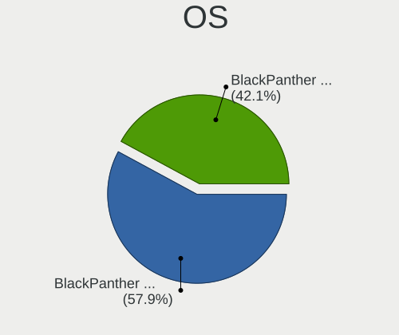

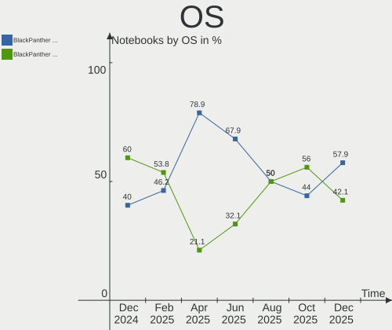

| Name              | Notebooks | Percent |
|-------------------|-----------|---------|
| BlackPanther 22.1 | 11        | 57.89%  |
| BlackPanther 18.1 | 8         | 42.11%  |

OS Family
---------

OS without a version

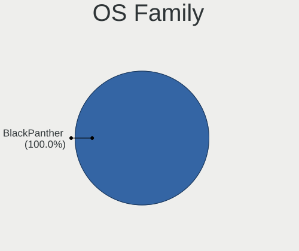

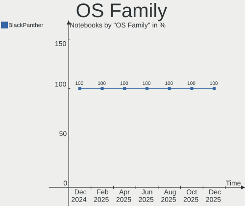

| Name         | Notebooks | Percent |
|--------------|-----------|---------|
| BlackPanther | 19        | 100%    |

Kernel
------

Version of the Linux kernel

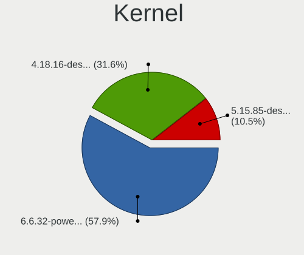

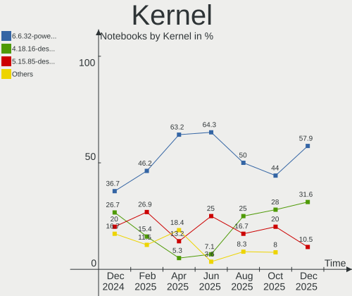

| Version             | Notebooks | Percent |
|---------------------|-----------|---------|
| 6.6.32-power-1bP    | 11        | 57.89%  |
| 4.18.16-desktop-1bP | 6         | 31.58%  |
| 5.15.85-desktop-1bP | 2         | 10.53%  |

Kernel Family
-------------

Linux kernel without a distro release

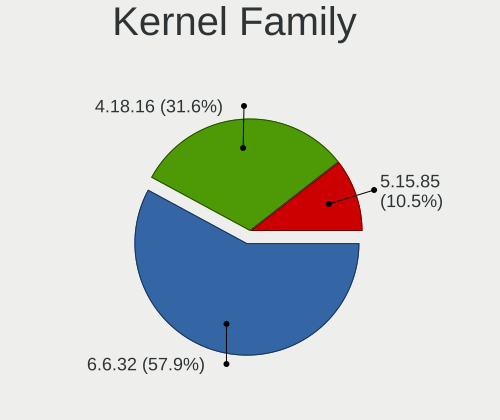

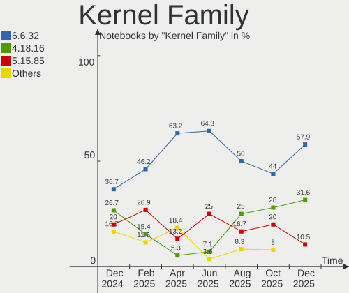

| Version | Notebooks | Percent |
|---------|-----------|---------|
| 6.6.32  | 11        | 57.89%  |
| 4.18.16 | 6         | 31.58%  |
| 5.15.85 | 2         | 10.53%  |

Kernel Major Ver.
-----------------

Linux kernel major version

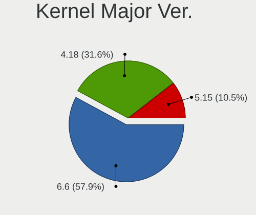

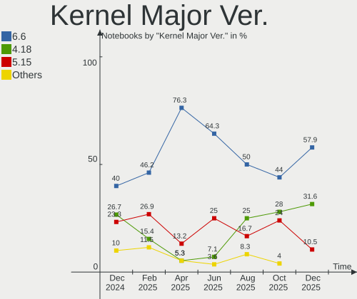

| Version | Notebooks | Percent |
|---------|-----------|---------|
| 6.6     | 11        | 57.89%  |
| 4.18    | 6         | 31.58%  |
| 5.15    | 2         | 10.53%  |

Arch
----

OS architecture (x86_64, i586, etc.)

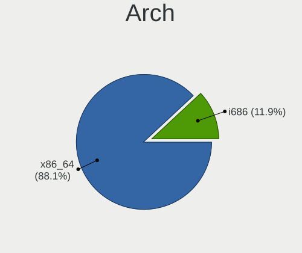

| Name   | Notebooks | Percent |
|--------|-----------|---------|
| x86_64 | 19        | 100%    |

DE
--

Desktop Environment

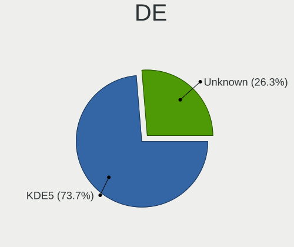

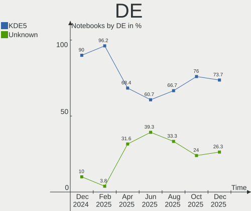

| Name    | Notebooks | Percent |
|---------|-----------|---------|
| KDE5    | 14        | 73.68%  |
| Unknown | 5         | 26.32%  |

Display Server
--------------

X11 or Wayland

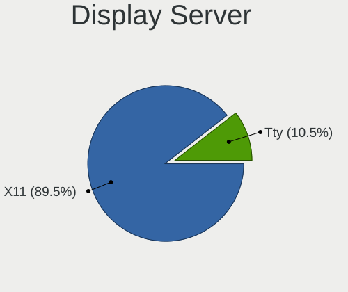

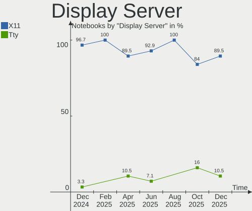

| Name | Notebooks | Percent |
|------|-----------|---------|
| X11  | 17        | 89.47%  |
| Tty  | 2         | 10.53%  |

Display Manager
---------------

SDDM, LightDM, etc.

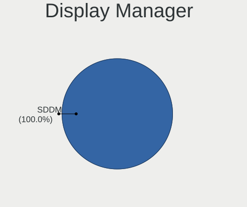

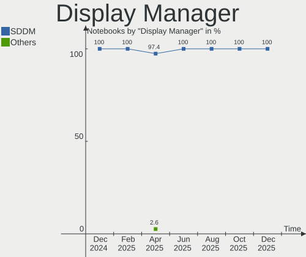

| Name | Notebooks | Percent |
|------|-----------|---------|
| SDDM | 19        | 100%    |

OS Lang
-------

Language

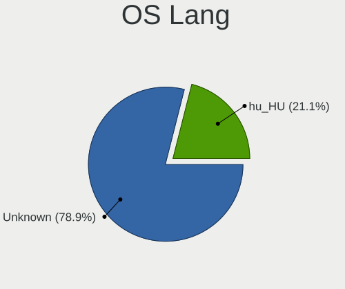

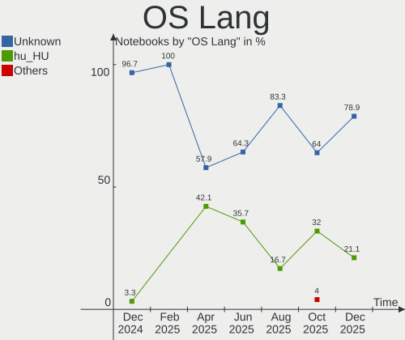

| Lang    | Notebooks | Percent |
|---------|-----------|---------|
| Unknown | 15        | 78.95%  |
| hu_HU   | 4         | 21.05%  |

Boot Mode
---------

EFI or BIOS

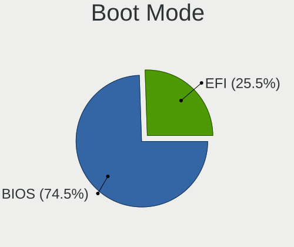

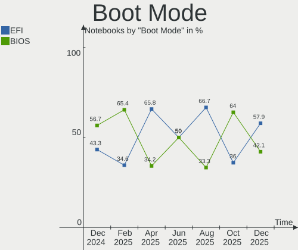

| Mode | Notebooks | Percent |
|------|-----------|---------|
| EFI  | 11        | 57.89%  |
| BIOS | 8         | 42.11%  |

Filesystem
----------

Type of filesystem

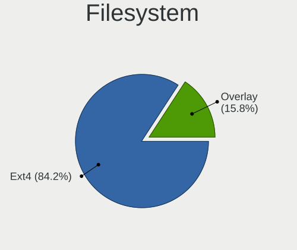

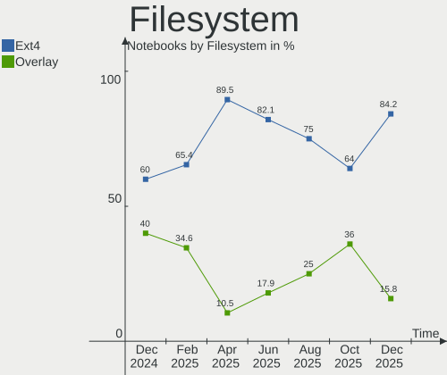

| Type    | Notebooks | Percent |
|---------|-----------|---------|
| Ext4    | 16        | 84.21%  |
| Overlay | 3         | 15.79%  |

Part. scheme
------------

Scheme of partitioning

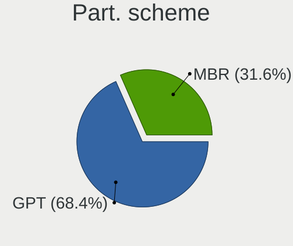

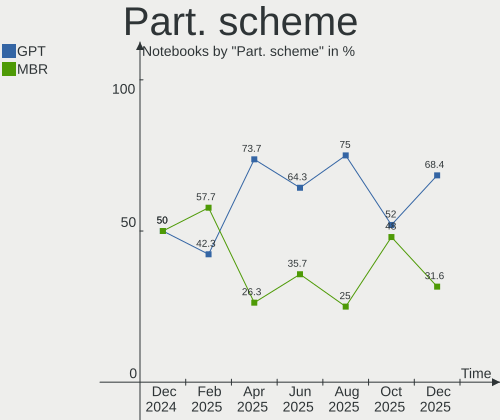

| Type | Notebooks | Percent |
|------|-----------|---------|
| GPT  | 13        | 68.42%  |
| MBR  | 6         | 31.58%  |

Dual Boot with Linux/BSD
------------------------

Hosting more than one Linux/BSD

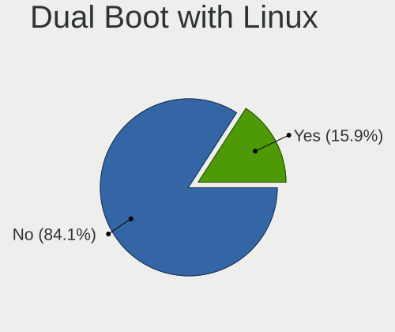

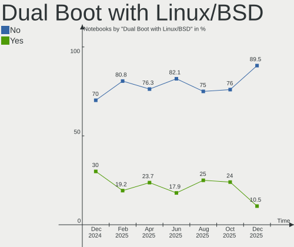

| Dual boot | Notebooks | Percent |
|-----------|-----------|---------|
| No        | 17        | 89.47%  |
| Yes       | 2         | 10.53%  |

Dual Boot (Win)
---------------

Hosting Linux and Windows

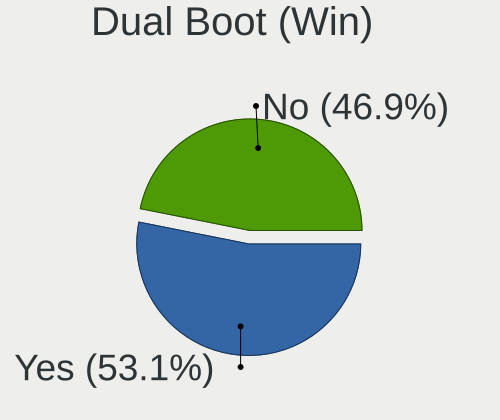

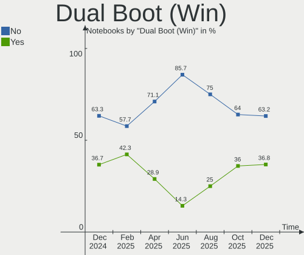

| Dual boot | Notebooks | Percent |
|-----------|-----------|---------|
| No        | 12        | 63.16%  |
| Yes       | 7         | 36.84%  |

Board
-----

Vendor
------

Motherboard manufacturer

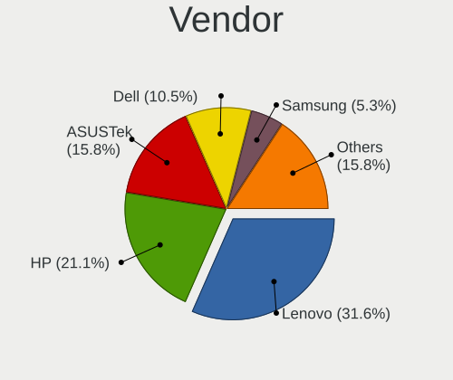

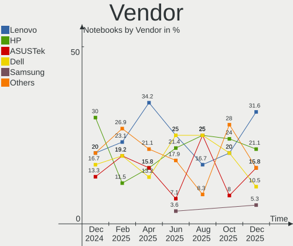

| Name                | Notebooks | Percent |
|---------------------|-----------|---------|
| Lenovo              | 6         | 31.58%  |
| Hewlett-Packard     | 4         | 21.05%  |
| ASUSTek Computer    | 3         | 15.79%  |
| Dell                | 2         | 10.53%  |
| Samsung Electronics | 1         | 5.26%   |
| Medion              | 1         | 5.26%   |
| Fujitsu             | 1         | 5.26%   |
| Acer                | 1         | 5.26%   |

Model
-----

Motherboard model

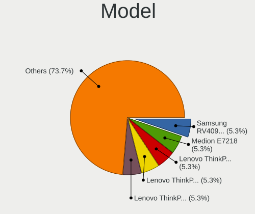

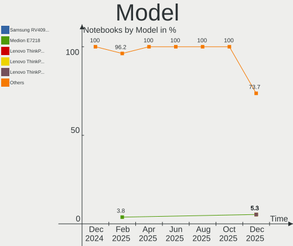

| Name                                | Notebooks | Percent |
|-------------------------------------|-----------|---------|
| Samsung RV409/RV509/RV709           | 1         | 5.26%   |
| Medion E7218                        | 1         | 5.26%   |
| Lenovo ThinkPad X390 20Q1S17N0A     | 1         | 5.26%   |
| Lenovo ThinkPad T590 20N5S8LT00     | 1         | 5.26%   |
| Lenovo ThinkPad T460 20FMS0HG0G     | 1         | 5.26%   |
| Lenovo ThinkPad T450 20BUS06E00     | 1         | 5.26%   |
| Lenovo ThinkPad T450 20BUA0AEHV     | 1         | 5.26%   |
| Lenovo ThinkPad P1 Gen 2 20QUS07T00 | 1         | 5.26%   |
| HP Pavilion Gaming Laptop 15-ec1xxx | 1         | 5.26%   |
| HP Pavilion dv6                     | 1         | 5.26%   |
| HP Laptop 15-bs1xx                  | 1         | 5.26%   |
| HP 250 G5 Notebook PC               | 1         | 5.26%   |
| Fujitsu LIFEBOOK S710               | 1         | 5.26%   |
| Dell Latitude E6410                 | 1         | 5.26%   |
| Dell Inspiron 1090                  | 1         | 5.26%   |
| ASUS X555LJ                         | 1         | 5.26%   |
| ASUS X550CA                         | 1         | 5.26%   |
| ASUS GL552JX                        | 1         | 5.26%   |
| Acer Aspire E1-532                  | 1         | 5.26%   |

Model Family
------------

Motherboard model prefix

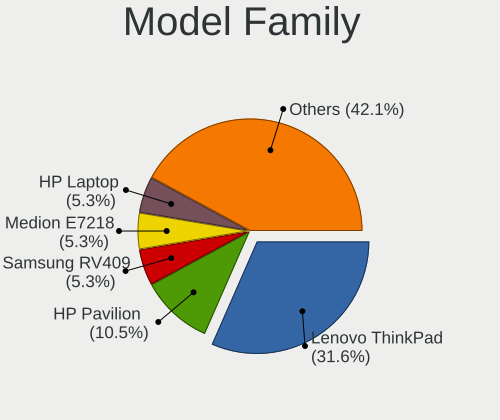

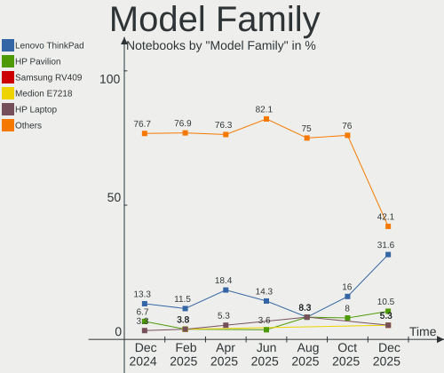

| Name             | Notebooks | Percent |
|------------------|-----------|---------|
| Lenovo ThinkPad  | 6         | 31.58%  |
| HP Pavilion      | 2         | 10.53%  |
| Samsung RV409    | 1         | 5.26%   |
| Medion E7218     | 1         | 5.26%   |
| HP Laptop        | 1         | 5.26%   |
| HP 250           | 1         | 5.26%   |
| Fujitsu LIFEBOOK | 1         | 5.26%   |
| Dell Latitude    | 1         | 5.26%   |
| Dell Inspiron    | 1         | 5.26%   |
| ASUS X555LJ      | 1         | 5.26%   |
| ASUS X550CA      | 1         | 5.26%   |
| ASUS GL552JX     | 1         | 5.26%   |
| Acer Aspire      | 1         | 5.26%   |

MFG Year
--------

Motherboard manufacture year

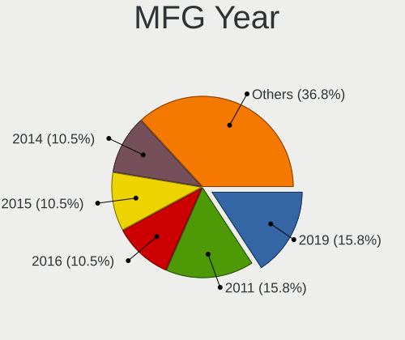

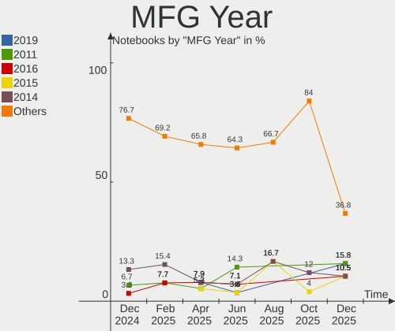

| Year | Notebooks | Percent |
|------|-----------|---------|
| 2019 | 3         | 15.79%  |
| 2011 | 3         | 15.79%  |
| 2016 | 2         | 10.53%  |
| 2015 | 2         | 10.53%  |
| 2014 | 2         | 10.53%  |
| 2013 | 2         | 10.53%  |
| 2010 | 2         | 10.53%  |
| 2020 | 1         | 5.26%   |
| 2017 | 1         | 5.26%   |
| 2008 | 1         | 5.26%   |

Form Factor
-----------

Physical design of the computer

| Name     | Notebooks | Percent |
|----------|-----------|---------|
| Notebook | 19        | 100%    |

Secure Boot
-----------

Enabled or disabled

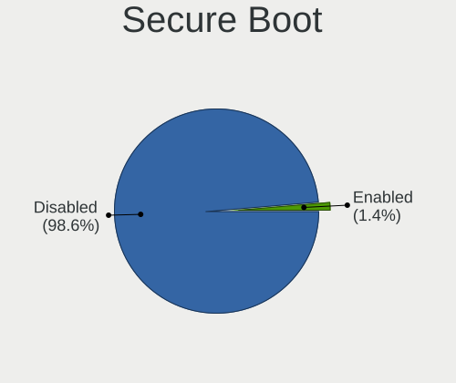

| State    | Notebooks | Percent |
|----------|-----------|---------|
| Disabled | 19        | 100%    |

Coreboot
--------

Have coreboot on board

| Used | Notebooks | Percent |
|------|-----------|---------|
| No   | 19        | 100%    |

RAM Size
--------

Total RAM memory

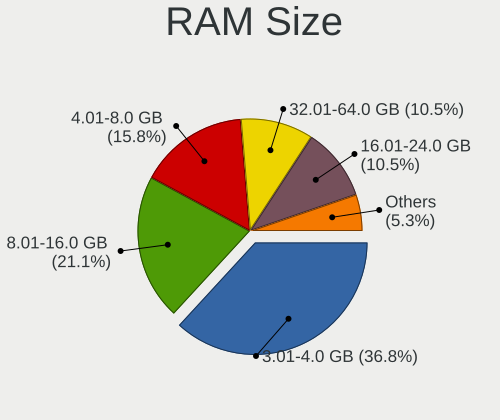

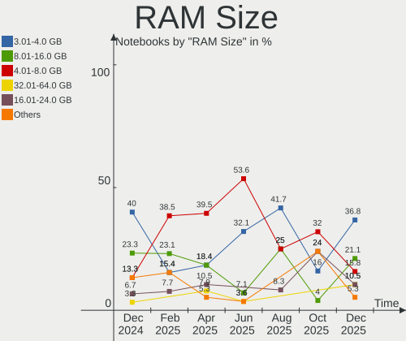

| Size in GB | Notebooks | Percent |
|------------|-----------|---------|
| 3.01-4.0   | 7         | 36.84%  |
| 8.01-16.0  | 4         | 21.05%  |
| 4.01-8.0   | 3         | 15.79%  |
| 32.01-64.0 | 2         | 10.53%  |
| 16.01-24.0 | 2         | 10.53%  |
| 1.01-2.0   | 1         | 5.26%   |

RAM Used
--------

Used RAM memory

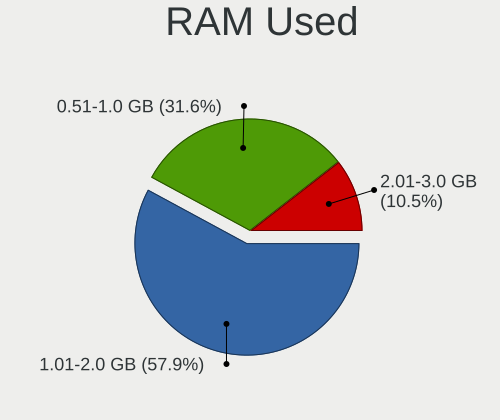

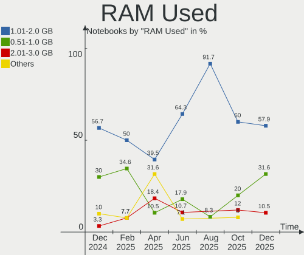

| Used GB  | Notebooks | Percent |
|----------|-----------|---------|
| 1.01-2.0 | 11        | 57.89%  |
| 0.51-1.0 | 6         | 31.58%  |
| 2.01-3.0 | 2         | 10.53%  |

Total Drives
------------

Number of drives on board

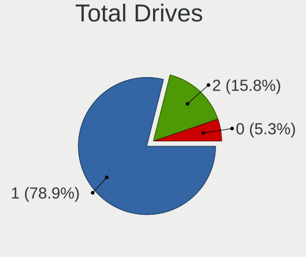

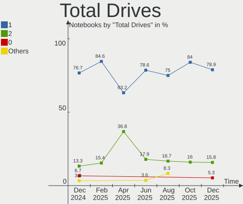

| Drives | Notebooks | Percent |
|--------|-----------|---------|
| 1      | 15        | 78.95%  |
| 2      | 3         | 15.79%  |
| 0      | 1         | 5.26%   |

Has CD-ROM
----------

Has CD-ROM on board

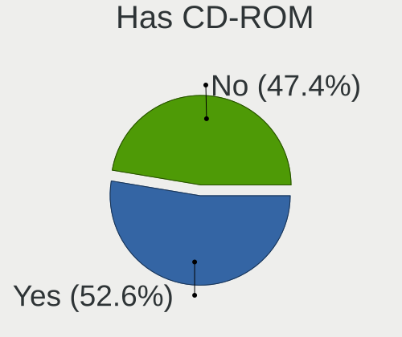

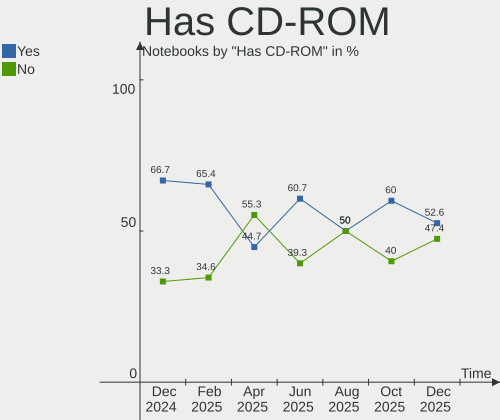

| Presented | Notebooks | Percent |
|-----------|-----------|---------|
| Yes       | 10        | 52.63%  |
| No        | 9         | 47.37%  |

Has Ethernet
------------

Has Ethernet on board

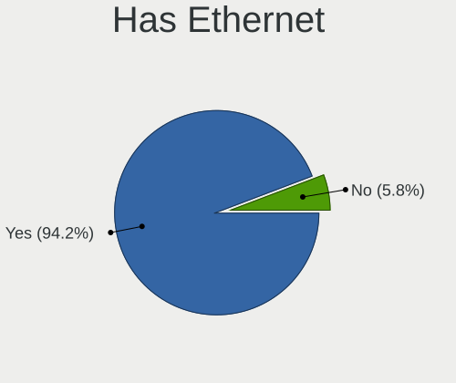

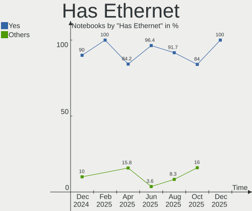

| Presented | Notebooks | Percent |
|-----------|-----------|---------|
| Yes       | 19        | 100%    |

Has WiFi
--------

Has WiFi module

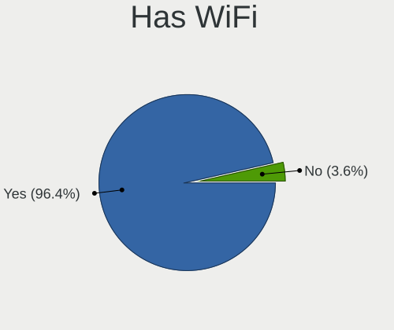

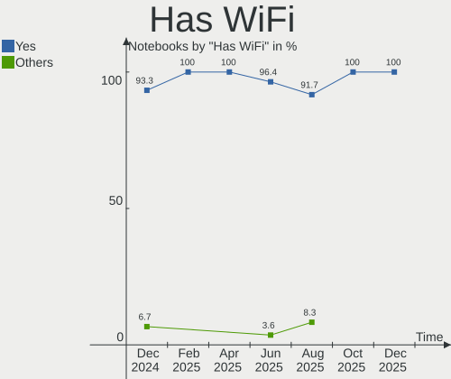

| Presented | Notebooks | Percent |
|-----------|-----------|---------|
| Yes       | 19        | 100%    |

Has Bluetooth
-------------

Has Bluetooth module

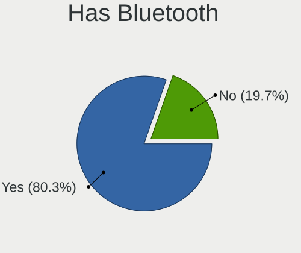

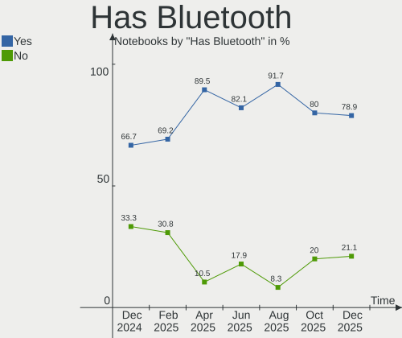

| Presented | Notebooks | Percent |
|-----------|-----------|---------|
| Yes       | 15        | 78.95%  |
| No        | 4         | 21.05%  |

Location
--------

Country
-------

Geographic location (country)

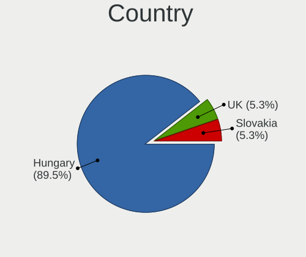

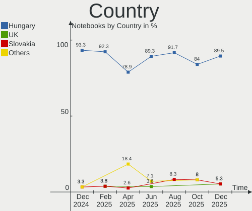

| Country  | Notebooks | Percent |
|----------|-----------|---------|
| Hungary  | 17        | 89.47%  |
| UK       | 1         | 5.26%   |
| Slovakia | 1         | 5.26%   |

City
----

Geographic location (city)

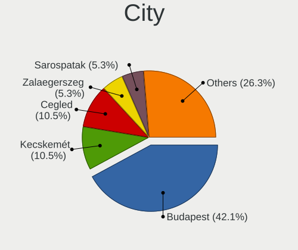

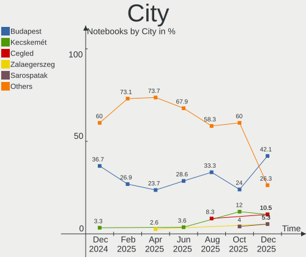

| City          | Notebooks | Percent |
|---------------|-----------|---------|
| Budapest      | 8         | 42.11%  |
| Kecskemét    | 2         | 10.53%  |
| Cegled        | 2         | 10.53%  |
| Zalaegerszeg  | 1         | 5.26%   |
| Sarospatak    | 1         | 5.26%   |
| Pontypool     | 1         | 5.26%   |
| Oroshaza      | 1         | 5.26%   |
| Nitra         | 1         | 5.26%   |
| Győr         | 1         | 5.26%   |
| Balatonfuered | 1         | 5.26%   |

Drives
------

Drive Vendor
------------

Hard drive vendors

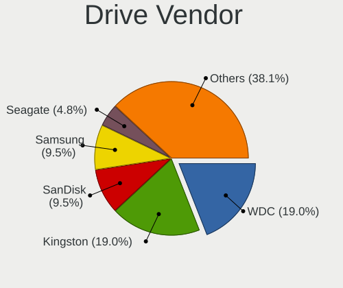

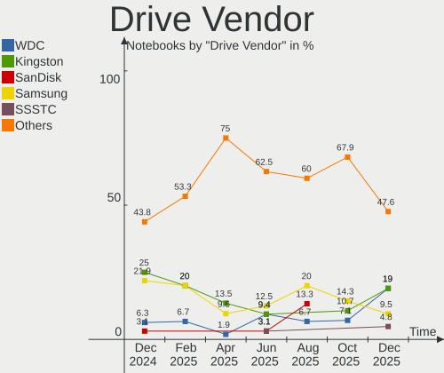

| Vendor                      | Notebooks | Drives | Percent |
|-----------------------------|-----------|--------|---------|
| WDC                         | 4         | 4      | 19.05%  |
| Kingston                    | 4         | 5      | 19.05%  |
| SanDisk                     | 2         | 2      | 9.52%   |
| Samsung Electronics         | 2         | 2      | 9.52%   |
| SSSTC                       | 1         | 1      | 4.76%   |
| SPCC Sol                    | 1         | 1      | 4.76%   |
| Seagate                     | 1         | 1      | 4.76%   |
| OV                          | 1         | 1      | 4.76%   |
| Netac                       | 1         | 1      | 4.76%   |
| Micron Technology           | 1         | 1      | 4.76%   |
| Kingston Technology Company | 1         | 1      | 4.76%   |
| Acer                        | 1         | 1      | 4.76%   |
| Unknown                     | 1         | 1      | 4.76%   |

Drive Model
-----------

Hard drive models

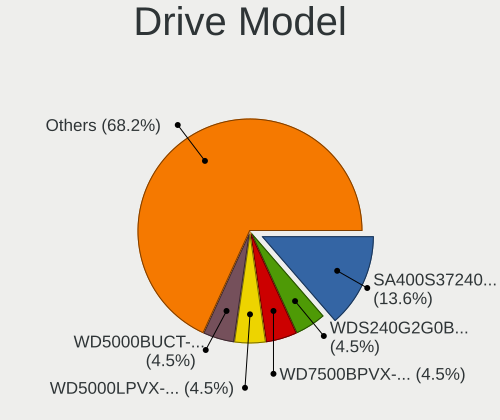

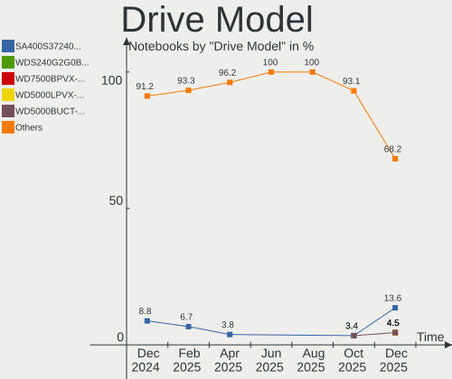

| Model                                             | Notebooks | Percent |
|---------------------------------------------------|-----------|---------|
| Kingston SA400S37240G 240GB SSD                   | 3         | 13.64%  |
| WDC WDS240G2G0B-00EPW0 240GB SSD                  | 1         | 4.55%   |
| WDC WD7500BPVX-60JC3T0 752GB                      | 1         | 4.55%   |
| WDC WD5000LPVX-80V0TT0 500GB                      | 1         | 4.55%   |
| WDC WD5000BUCT-63PUZY0 500GB                      | 1         | 4.55%   |
| SSSTC CA5-8D256-Q79 256GB                         | 1         | 4.55%   |
| SPCC Sol id State Disk 256GB SSD                  | 1         | 4.55%   |
| Seagate ST500LM000-1EJ162 500GB                   | 1         | 4.55%   |
| Sandisk WD Black SN750 / PC SN730 NVMe SSD 500GB  | 1         | 4.55%   |
| SanDisk SDSSDA120G 120GB                          | 1         | 4.55%   |
| Samsung SSD 860 EVO 250GB                         | 1         | 4.55%   |
| Samsung NVMe SSD Controller SM981/PM981/PM983 1TB | 1         | 4.55%   |
| OV SSD 256GB S600                                 | 1         | 4.55%   |
| Netac SSD 256GB                                   | 1         | 4.55%   |
| Micron MTFDDAV256TBN-1AR1ZABHA 256GB SSD          | 1         | 4.55%   |
| Kingston Company SNV2S2000G 2TB                   | 1         | 4.55%   |
| Kingston SV300S37A120G 120GB SSD                  | 1         | 4.55%   |
| Kingston SKC3000S512G 512GB                       | 1         | 4.55%   |
| Acer SSD RE100 2.5 256GB                          | 1         | 4.55%   |
| Unknown                                           | 1         | 4.55%   |

HDD Vendor
----------

Hard disk drive vendors

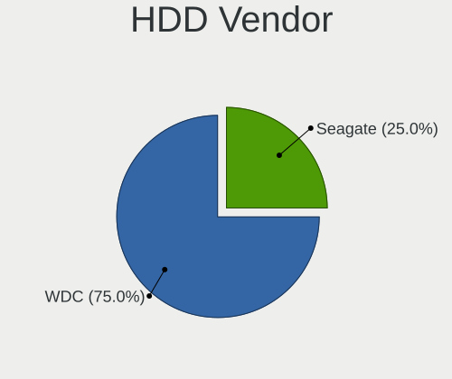

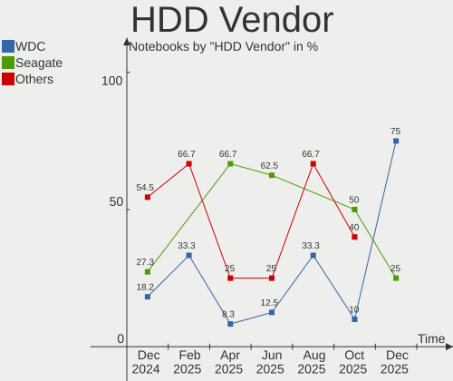

| Vendor  | Notebooks | Drives | Percent |
|---------|-----------|--------|---------|
| WDC     | 3         | 3      | 75%     |
| Seagate | 1         | 1      | 25%     |

SSD Vendor
----------

Solid state drive vendors

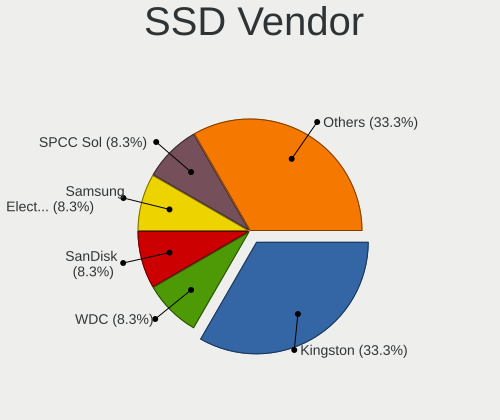

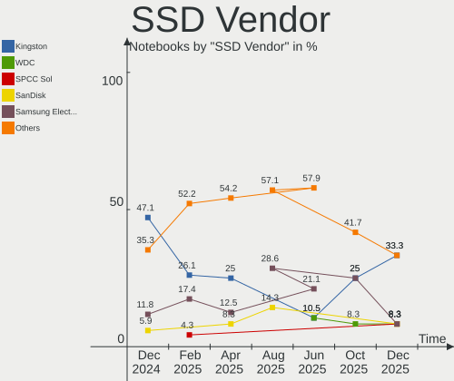

| Vendor              | Notebooks | Drives | Percent |
|---------------------|-----------|--------|---------|
| Kingston            | 4         | 4      | 33.33%  |
| WDC                 | 1         | 1      | 8.33%   |
| SPCC Sol            | 1         | 1      | 8.33%   |
| SanDisk             | 1         | 1      | 8.33%   |
| Samsung Electronics | 1         | 1      | 8.33%   |
| OV                  | 1         | 1      | 8.33%   |
| Netac               | 1         | 1      | 8.33%   |
| Micron Technology   | 1         | 1      | 8.33%   |
| Acer                | 1         | 1      | 8.33%   |

Drive Kind
----------

HDD or SSD

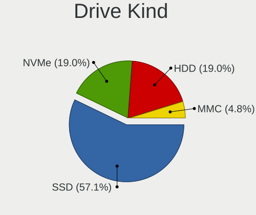

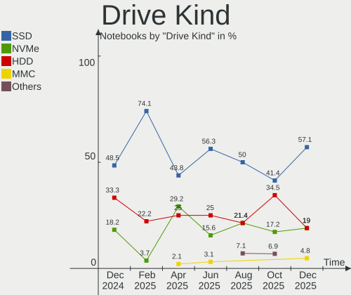

| Kind | Notebooks | Drives | Percent |
|------|-----------|--------|---------|
| SSD  | 12        | 12     | 57.14%  |
| NVMe | 4         | 5      | 19.05%  |
| HDD  | 4         | 4      | 19.05%  |
| MMC  | 1         | 1      | 4.76%   |

Drive Connector
---------------

SATA, SAS, NVMe, etc.

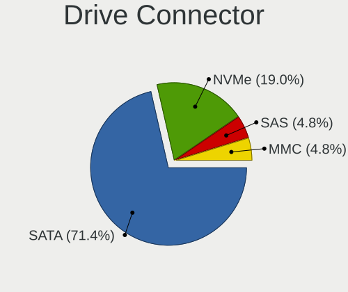

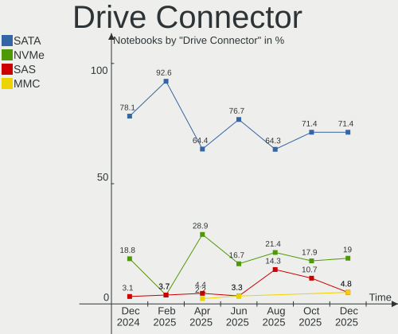

| Type | Notebooks | Drives | Percent |
|------|-----------|--------|---------|
| SATA | 15        | 15     | 71.43%  |
| NVMe | 4         | 5      | 19.05%  |
| SAS  | 1         | 1      | 4.76%   |
| MMC  | 1         | 1      | 4.76%   |

Drive Size
----------

Size of hard drive

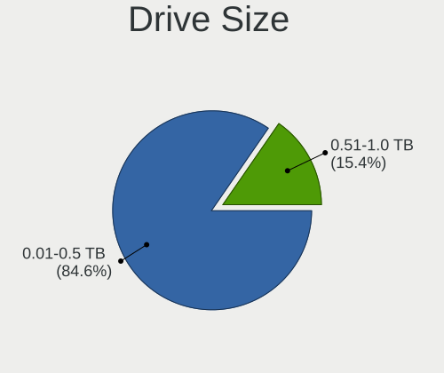

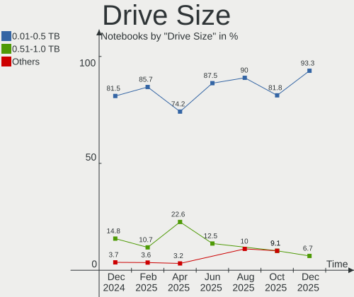

| Size in TB | Notebooks | Drives | Percent |
|------------|-----------|--------|---------|
| 0.01-0.5   | 14        | 15     | 93.33%  |
| 0.51-1.0   | 1         | 1      | 6.67%   |

Space Total
-----------

Amount of disk space available on the file system

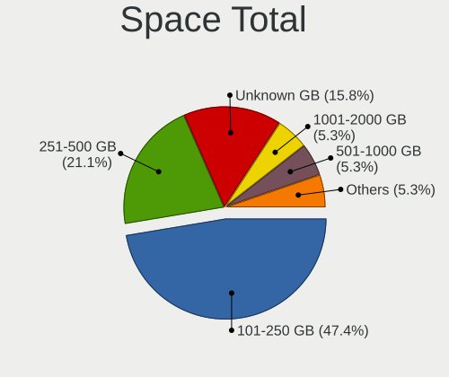

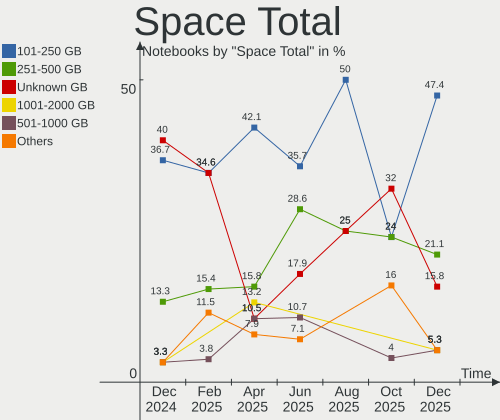

| Size in GB | Notebooks | Percent |
|------------|-----------|---------|
| 101-250    | 9         | 47.37%  |
| 251-500    | 4         | 21.05%  |
| Unknown    | 3         | 15.79%  |
| 1001-2000  | 1         | 5.26%   |
| 501-1000   | 1         | 5.26%   |
| 51-100     | 1         | 5.26%   |

Space Used
----------

Amount of used disk space

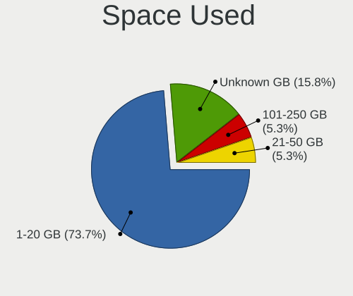

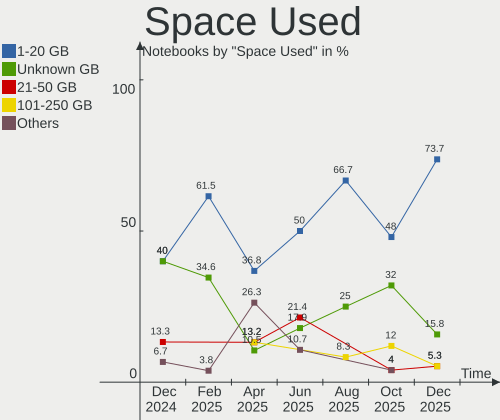

| Used GB | Notebooks | Percent |
|---------|-----------|---------|
| 1-20    | 14        | 73.68%  |
| Unknown | 3         | 15.79%  |
| 21-50   | 1         | 5.26%   |
| 101-250 | 1         | 5.26%   |

Malfunc. Drives
---------------

Drive models with a malfunction

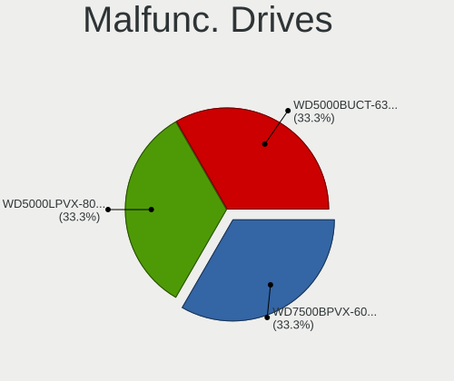

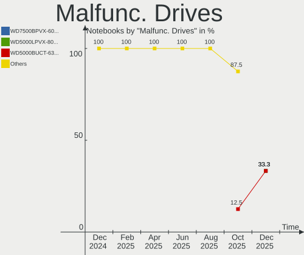

| Model                        | Notebooks | Drives | Percent |
|------------------------------|-----------|--------|---------|
| WDC WD7500BPVX-60JC3T0 752GB | 1         | 1      | 33.33%  |
| WDC WD5000LPVX-80V0TT0 500GB | 1         | 1      | 33.33%  |
| WDC WD5000BUCT-63PUZY0 500GB | 1         | 1      | 33.33%  |

Malfunc. Drive Vendor
---------------------

Vendors of faulty drives

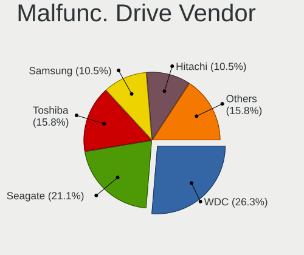

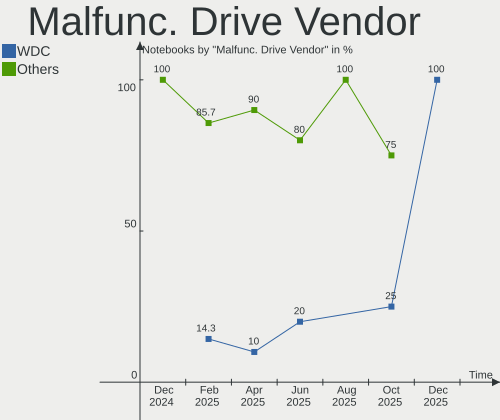

| Vendor | Notebooks | Drives | Percent |
|--------|-----------|--------|---------|
| WDC    | 3         | 3      | 100%    |

Malfunc. HDD Vendor
-------------------

Vendors of faulty HDD drives

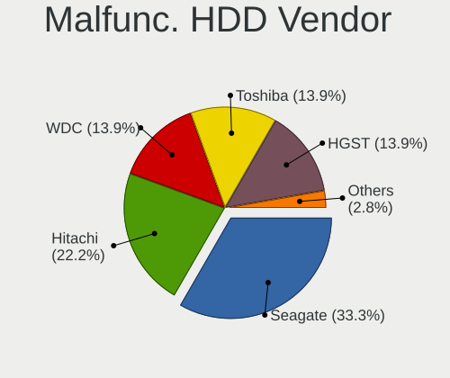

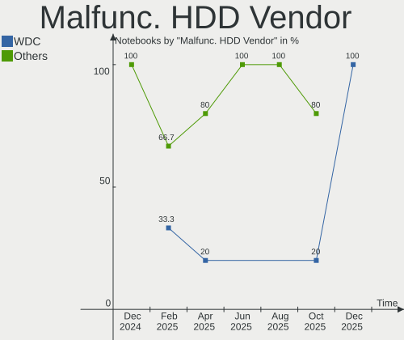

| Vendor | Notebooks | Drives | Percent |
|--------|-----------|--------|---------|
| WDC    | 3         | 3      | 100%    |

Malfunc. Drive Kind
-------------------

Kinds of faulty drives

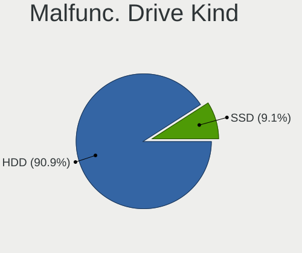

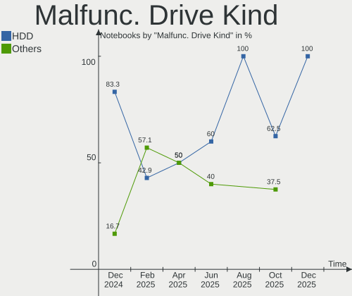

| Kind | Notebooks | Drives | Percent |
|------|-----------|--------|---------|
| HDD  | 3         | 3      | 100%    |

Failed Drives
-------------

Failed drive models

Zero info for selected period =(

Failed Drive Vendor
-------------------

Failed drive vendors

Zero info for selected period =(

Drive Status
------------

Number of failed and malfunc. drives

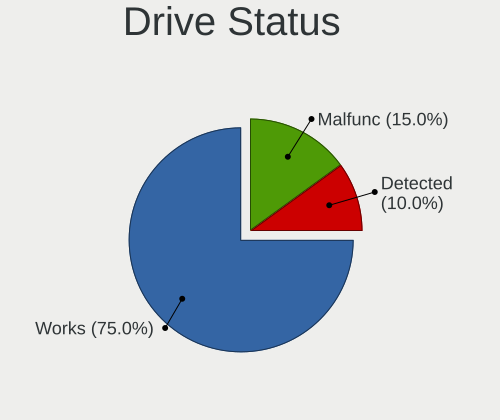

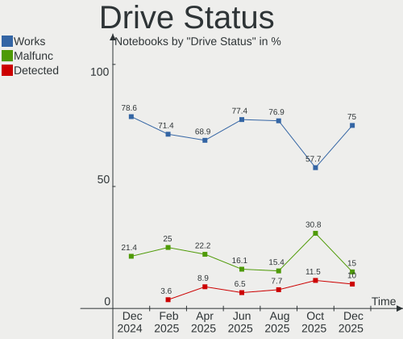

| Status   | Notebooks | Drives | Percent |
|----------|-----------|--------|---------|
| Works    | 15        | 17     | 75%     |
| Malfunc  | 3         | 3      | 15%     |
| Detected | 2         | 2      | 10%     |

Storage controller
------------------

Storage Vendor
--------------

Storage controller vendors

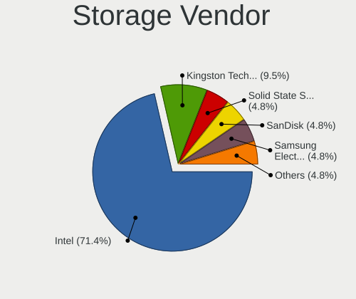

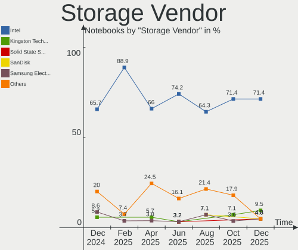

| Vendor                         | Notebooks | Percent |
|--------------------------------|-----------|---------|
| Intel                          | 15        | 71.43%  |
| Kingston Technology Company    | 2         | 9.52%   |
| Solid State Storage Technology | 1         | 4.76%   |
| SanDisk                        | 1         | 4.76%   |
| Samsung Electronics            | 1         | 4.76%   |
| AMD                            | 1         | 4.76%   |

Storage Model
-------------

Storage controller models

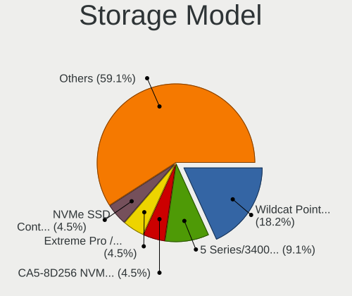

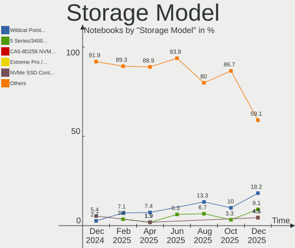

| Model                                                                            | Notebooks | Percent |
|----------------------------------------------------------------------------------|-----------|---------|
| Intel Wildcat Point-LP SATA Controller [AHCI Mode]                               | 4         | 18.18%  |
| Intel 5 Series/3400 Series Chipset 4 port SATA AHCI Controller                   | 2         | 9.09%   |
| Solid State Storage CA5-8D256 NVMe SSD M.2                                       | 1         | 4.55%   |
| SanDisk Extreme Pro / WD Black SN750 / PC SN730 / Red SN700 NVMe SSD             | 1         | 4.55%   |
| Samsung NVMe SSD Controller SM981/PM981/PM983                                    | 1         | 4.55%   |
| Kingston Company NV2 NVMe SSD [SM2267XT] (DRAM-less)                             | 1         | 4.55%   |
| Kingston Company KC3000/FURY Renegade NVMe SSD [E18]                             | 1         | 4.55%   |
| Intel Sunrise Point-LP SATA Controller [AHCI mode]                               | 1         | 4.55%   |
| Intel NM10/ICH7 Family SATA Controller [AHCI mode]                               | 1         | 4.55%   |
| Intel Atom/Celeron/Pentium Processor x5-E8000/J3xxx/N3xxx Series SATA Controller | 1         | 4.55%   |
| Intel 82801 Mobile SATA Controller [RAID mode]                                   | 1         | 4.55%   |
| Intel 8 Series/C220 Series Chipset Family 6-port SATA Controller 1 [AHCI mode]   | 1         | 4.55%   |
| Intel 8 Series SATA Controller 1 [AHCI mode]                                     | 1         | 4.55%   |
| Intel 7 Series Chipset Family 6-port SATA Controller [AHCI mode]                 | 1         | 4.55%   |
| Intel 6 Series/C200 Series Chipset Family 6 port Mobile SATA AHCI Controller     | 1         | 4.55%   |
| Intel 5 Series/3400 Series Chipset PT IDER Controller                            | 1         | 4.55%   |
| Intel 5 Series/3400 Series Chipset 6 port SATA AHCI Controller                   | 1         | 4.55%   |
| AMD FCH SATA Controller [AHCI mode]                                              | 1         | 4.55%   |

Storage Kind
------------

Kind of storage controller (IDE, SATA, NVMe, SAS, ...)

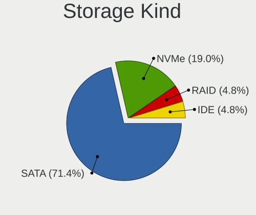

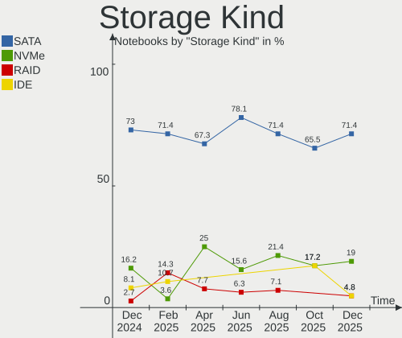

| Kind | Notebooks | Percent |
|------|-----------|---------|
| SATA | 15        | 71.43%  |
| NVMe | 4         | 19.05%  |
| RAID | 1         | 4.76%   |
| IDE  | 1         | 4.76%   |

Processor
---------

CPU Vendor
----------

Processor vendors

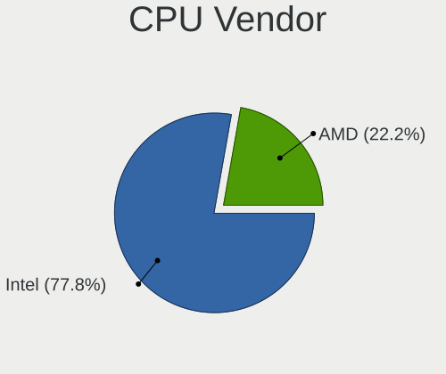

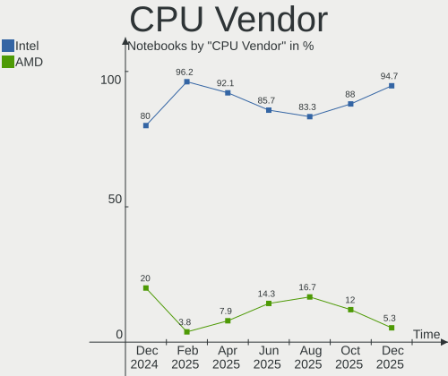

| Vendor | Notebooks | Percent |
|--------|-----------|---------|
| Intel  | 18        | 94.74%  |
| AMD    | 1         | 5.26%   |

CPU Model
---------

Processor models

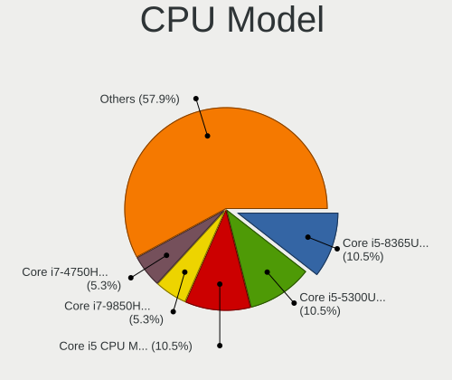

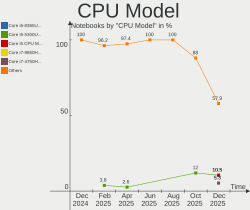

| Model                                  | Notebooks | Percent |
|----------------------------------------|-----------|---------|
| Intel Core i5-8365U CPU @ 1.60GHz      | 2         | 10.53%  |
| Intel Core i5-5300U CPU @ 2.30GHz      | 2         | 10.53%  |
| Intel Core i5 CPU M 540 @ 2.53GHz      | 2         | 10.53%  |
| Intel Core i7-9850H CPU @ 2.60GHz      | 1         | 5.26%   |
| Intel Core i7-4750HQ CPU @ 2.00GHz     | 1         | 5.26%   |
| Intel Core i5-6300U CPU @ 2.40GHz      | 1         | 5.26%   |
| Intel Core i5 CPU M 560 @ 2.67GHz      | 1         | 5.26%   |
| Intel Core i3-5010U CPU @ 2.10GHz      | 1         | 5.26%   |
| Intel Core i3-5005U CPU @ 2.00GHz      | 1         | 5.26%   |
| Intel Core i3-3217U CPU @ 1.80GHz      | 1         | 5.26%   |
| Intel Core i3-2310M CPU @ 2.10GHz      | 1         | 5.26%   |
| Intel Core i3 CPU M 350 @ 2.27GHz      | 1         | 5.26%   |
| Intel Celeron CPU N3060 @ 1.60GHz      | 1         | 5.26%   |
| Intel Celeron 2955U @ 1.40GHz          | 1         | 5.26%   |
| Intel Atom CPU N570 @ 1.66GHz          | 1         | 5.26%   |
| AMD Ryzen 5 4600H with Radeon Graphics | 1         | 5.26%   |

CPU Model Family
----------------

Processor model prefix

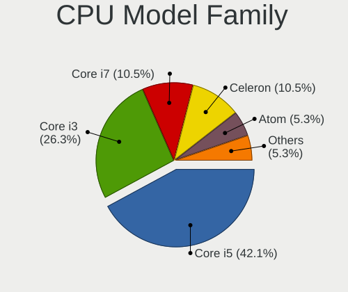

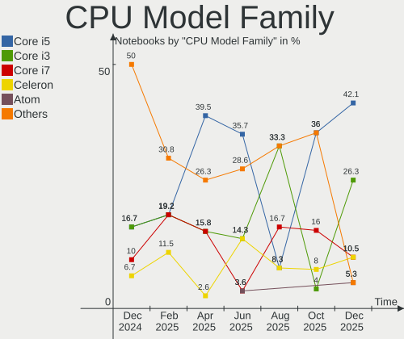

| Model         | Notebooks | Percent |
|---------------|-----------|---------|
| Intel Core i5 | 8         | 42.11%  |
| Intel Core i3 | 5         | 26.32%  |
| Intel Core i7 | 2         | 10.53%  |
| Intel Celeron | 2         | 10.53%  |
| Intel Atom    | 1         | 5.26%   |
| AMD Ryzen 5   | 1         | 5.26%   |

CPU Cores
---------

Number of processor cores

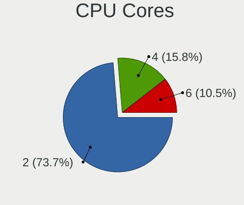

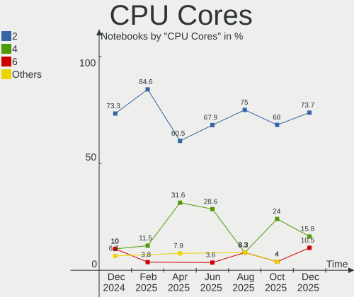

| Number | Notebooks | Percent |
|--------|-----------|---------|
| 2      | 14        | 73.68%  |
| 4      | 3         | 15.79%  |
| 6      | 2         | 10.53%  |

CPU Sockets
-----------

Number of sockets

| Number | Notebooks | Percent |
|--------|-----------|---------|
| 1      | 19        | 100%    |

CPU Threads
-----------

Threads per core (Hyper-Threading)

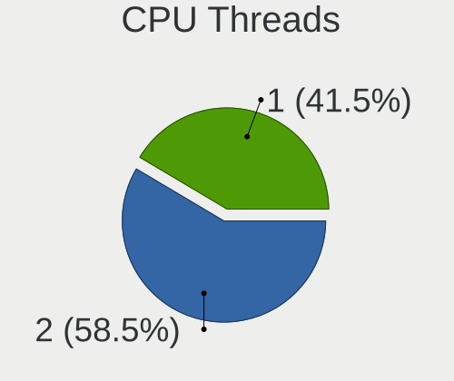

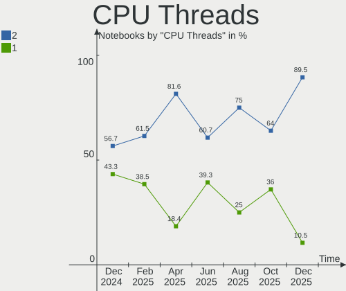

| Number | Notebooks | Percent |
|--------|-----------|---------|
| 2      | 17        | 89.47%  |
| 1      | 2         | 10.53%  |

CPU Op-Modes
------------

CPU Operation Modes (32-bit, 64-bit)

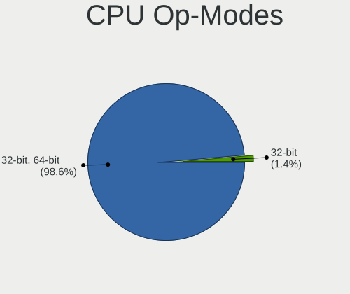

| Op mode        | Notebooks | Percent |
|----------------|-----------|---------|
| 32-bit, 64-bit | 19        | 100%    |

CPU Microcode
-------------

Microcode number

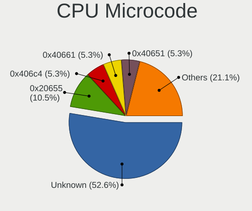

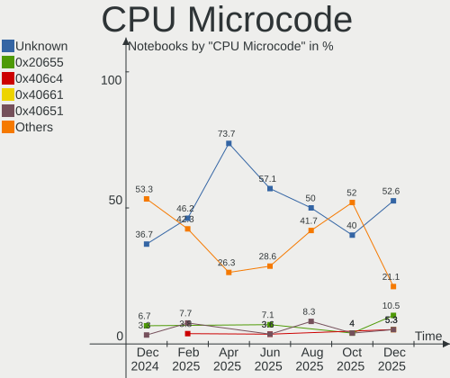

| Number     | Notebooks | Percent |
|------------|-----------|---------|
| Unknown    | 10        | 52.63%  |
| 0x20655    | 2         | 10.53%  |
| 0x406c4    | 1         | 5.26%   |
| 0x40661    | 1         | 5.26%   |
| 0x40651    | 1         | 5.26%   |
| 0x306d4    | 1         | 5.26%   |
| 0x20652    | 1         | 5.26%   |
| 0x106ca    | 1         | 5.26%   |
| 0x0860010d | 1         | 5.26%   |

CPU Microarch
-------------

Microarchitecture

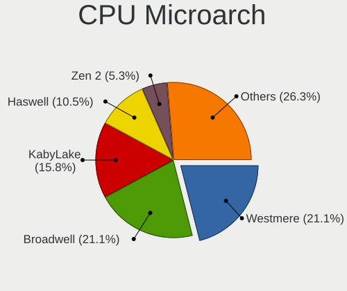

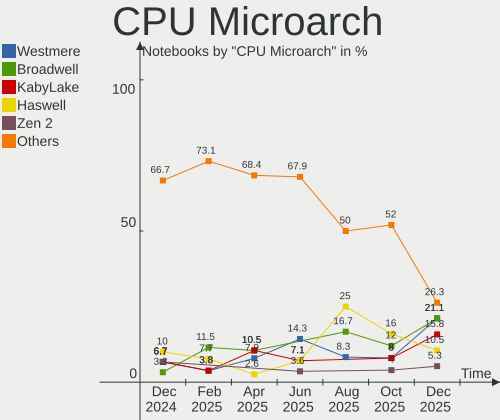

| Name        | Notebooks | Percent |
|-------------|-----------|---------|
| Westmere    | 4         | 21.05%  |
| Broadwell   | 4         | 21.05%  |
| KabyLake    | 3         | 15.79%  |
| Haswell     | 2         | 10.53%  |
| Zen 2       | 1         | 5.26%   |
| Skylake     | 1         | 5.26%   |
| Silvermont  | 1         | 5.26%   |
| SandyBridge | 1         | 5.26%   |
| IvyBridge   | 1         | 5.26%   |
| Bonnell     | 1         | 5.26%   |

Graphics
--------

GPU Vendor
----------

Vendors of graphics cards

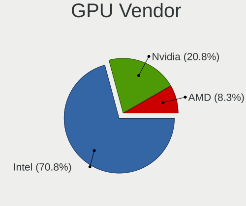

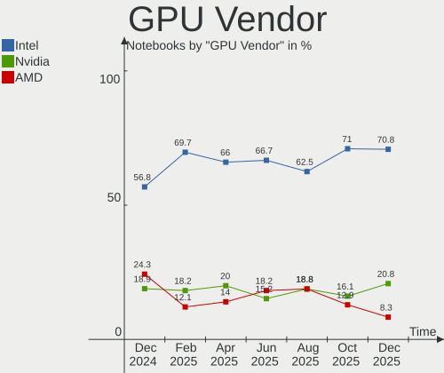

| Vendor | Notebooks | Percent |
|--------|-----------|---------|
| Intel  | 17        | 70.83%  |
| Nvidia | 5         | 20.83%  |
| AMD    | 2         | 8.33%   |

GPU Model
---------

Graphics card models

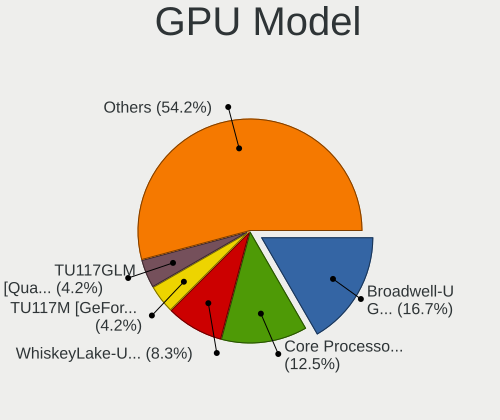

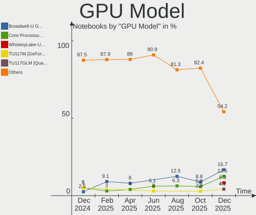

| Model                                                                                    | Notebooks | Percent |
|------------------------------------------------------------------------------------------|-----------|---------|
| Intel Broadwell-U GT2 [HD Graphics 5500]                                                 | 4         | 16.67%  |
| Intel Core Processor Integrated Graphics Controller                                      | 3         | 12.5%   |
| Intel WhiskeyLake-U GT2 [UHD Graphics 620]                                               | 2         | 8.33%   |
| Nvidia TU117M [GeForce GTX 1650 Ti Mobile]                                               | 1         | 4.17%   |
| Nvidia TU117GLM [Quadro T2000 Mobile / Max-Q]                                            | 1         | 4.17%   |
| Nvidia GT218M [GeForce 315M]                                                             | 1         | 4.17%   |
| Nvidia GM107M [GeForce GTX 950M]                                                         | 1         | 4.17%   |
| Nvidia GK208BM [GeForce 920M]                                                            | 1         | 4.17%   |
| Intel Skylake-U GT2 [HD Graphics 520]                                                    | 1         | 4.17%   |
| Intel Haswell-ULT Integrated Graphics Controller                                         | 1         | 4.17%   |
| Intel Crystal Well Integrated Graphics Controller                                        | 1         | 4.17%   |
| Intel CoffeeLake-H GT2 [UHD Graphics 630]                                                | 1         | 4.17%   |
| Intel Atom/Celeron/Pentium Processor x5-E8000/J3xxx/N3xxx Integrated Graphics Controller | 1         | 4.17%   |
| Intel Atom Processor D4xx/D5xx/N4xx/N5xx Integrated Graphics Controller                  | 1         | 4.17%   |
| Intel 3rd Gen Core processor Graphics Controller                                         | 1         | 4.17%   |
| Intel 2nd Generation Core Processor Family Integrated Graphics Controller                | 1         | 4.17%   |
| AMD Renoir [Radeon Vega Series / Radeon Vega Mobile Series]                              | 1         | 4.17%   |
| AMD Madison [Mobility Radeon HD 5650/5750 / 6530M/6550M]                                 | 1         | 4.17%   |

GPU Combo
---------

Combinations of graphics cards

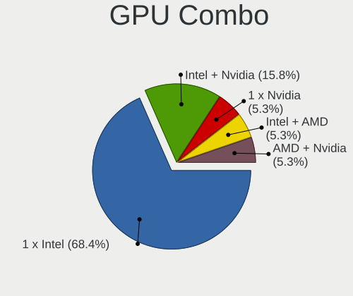

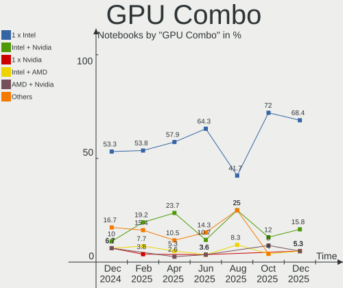

| Name           | Notebooks | Percent |
|----------------|-----------|---------|
| 1 x Intel      | 13        | 68.42%  |
| Intel + Nvidia | 3         | 15.79%  |
| 1 x Nvidia     | 1         | 5.26%   |
| Intel + AMD    | 1         | 5.26%   |
| AMD + Nvidia   | 1         | 5.26%   |

GPU Driver
----------

Free vs proprietary

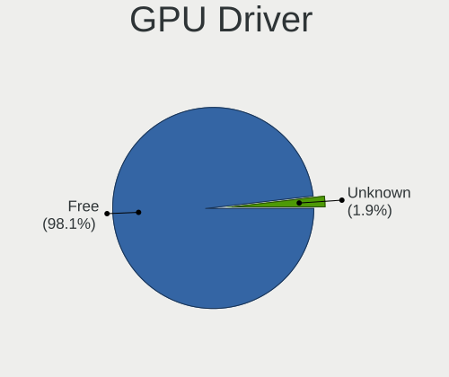

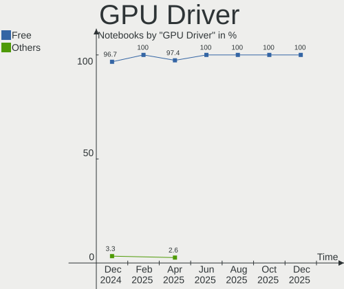

| Driver | Notebooks | Percent |
|--------|-----------|---------|
| Free   | 19        | 100%    |

GPU Memory
----------

Total video memory

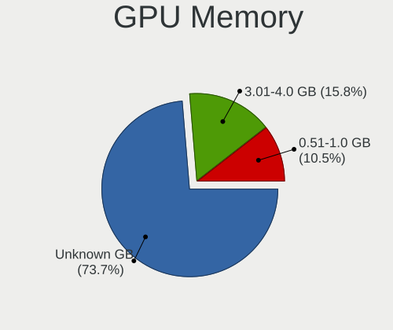

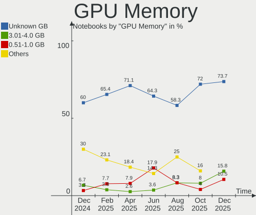

| Size in GB | Notebooks | Percent |
|------------|-----------|---------|
| Unknown    | 14        | 73.68%  |
| 3.01-4.0   | 3         | 15.79%  |
| 0.51-1.0   | 2         | 10.53%  |

Monitor
-------

Monitor Vendor
--------------

Monitor vendors

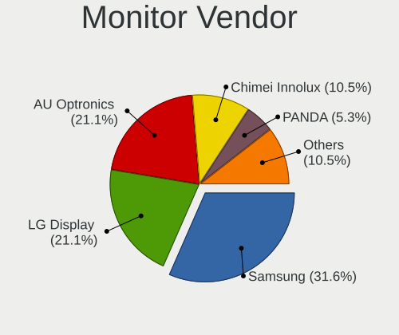

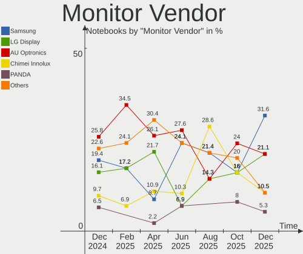

| Vendor              | Notebooks | Percent |
|---------------------|-----------|---------|
| Samsung Electronics | 6         | 31.58%  |
| LG Display          | 4         | 21.05%  |
| AU Optronics        | 4         | 21.05%  |
| Chimei Innolux      | 2         | 10.53%  |
| PANDA               | 1         | 5.26%   |
| Lenovo              | 1         | 5.26%   |
| BOE                 | 1         | 5.26%   |

Monitor Model
-------------

Monitor models

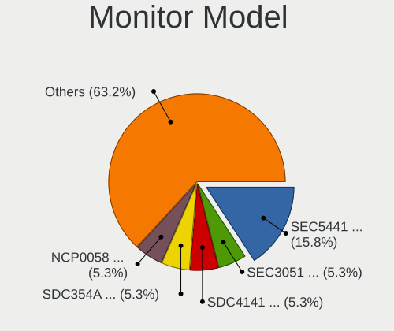

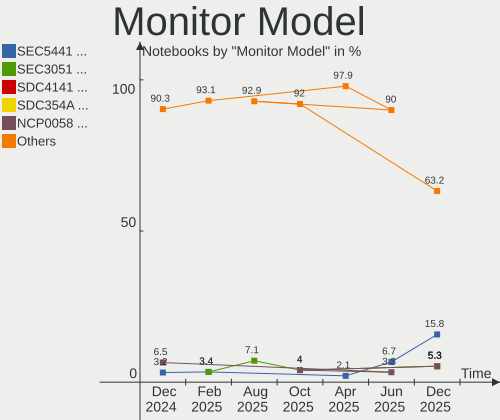

| Model                                                                | Notebooks | Percent |
|----------------------------------------------------------------------|-----------|---------|
| Samsung Electronics LCD Monitor SEC5441 1280x800 331x207mm 15.4-inch | 3         | 15.79%  |
| Samsung Electronics LCD Monitor SEC3051 1366x768 344x194mm 15.5-inch | 1         | 5.26%   |
| Samsung Electronics LCD Monitor SDC4141 1366x768 344x194mm 15.5-inch | 1         | 5.26%   |
| Samsung Electronics LCD Monitor SDC354A 1366x768 344x194mm 15.5-inch | 1         | 5.26%   |
| PANDA LCD Monitor NCP0058 1920x1080 344x194mm 15.5-inch              | 1         | 5.26%   |
| LG Display LCD Monitor LGD060A 1920x1080 294x165mm 13.3-inch         | 1         | 5.26%   |
| LG Display LCD Monitor LGD04F9 1920x1080 309x174mm 14.0-inch         | 1         | 5.26%   |
| LG Display LCD Monitor LGD046F 1920x1080 344x194mm 15.5-inch         | 1         | 5.26%   |
| LG Display LCD Monitor LGD01B5 1366x768 310x174mm 14.0-inch          | 1         | 5.26%   |
| Lenovo LCD Monitor LEN40BA 1920x1080 344x194mm 15.5-inch             | 1         | 5.26%   |
| Chimei Innolux LCD Monitor CMN15BF 1366x768 344x194mm 15.5-inch      | 1         | 5.26%   |
| Chimei Innolux LCD Monitor CMN1482 1600x900 309x174mm 14.0-inch      | 1         | 5.26%   |
| BOE LCD Monitor BOE0687 1920x1080 344x193mm 15.5-inch                | 1         | 5.26%   |
| AU Optronics LCD Monitor AUO71EC 1366x768 344x193mm 15.5-inch        | 1         | 5.26%   |
| AU Optronics LCD Monitor AUO43EC 1366x768 344x193mm 15.5-inch        | 1         | 5.26%   |
| AU Optronics LCD Monitor AUO303E 1600x900 309x174mm 14.0-inch        | 1         | 5.26%   |
| AU Optronics LCD Monitor AUO129E 1600x900 382x214mm 17.2-inch        | 1         | 5.26%   |

Monitor Resolution
------------------

Monitor screen resolution

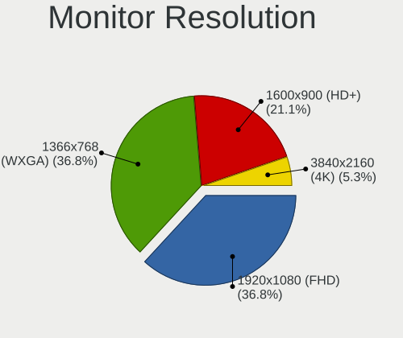

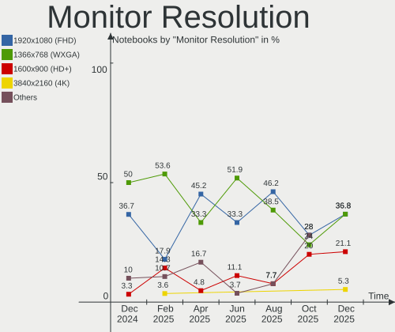

| Resolution      | Notebooks | Percent |
|-----------------|-----------|---------|
| 1920x1080 (FHD) | 7         | 36.84%  |
| 1366x768 (WXGA) | 7         | 36.84%  |
| 1600x900 (HD+)  | 4         | 21.05%  |
| 3840x2160 (4K)  | 1         | 5.26%   |

Monitor Diagonal
----------------

Diagonal size in inches

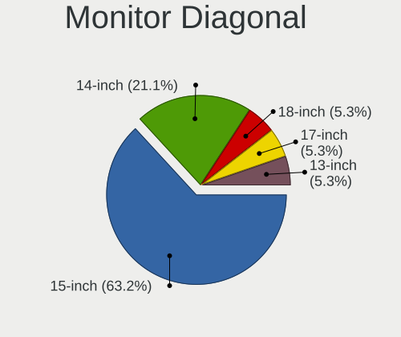

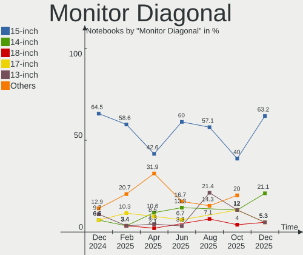

| Inches | Notebooks | Percent |
|--------|-----------|---------|
| 15     | 12        | 63.16%  |
| 14     | 4         | 21.05%  |
| 18     | 1         | 5.26%   |
| 17     | 1         | 5.26%   |
| 13     | 1         | 5.26%   |

Monitor Width
-------------

Physical width

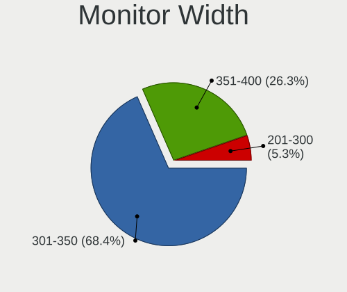

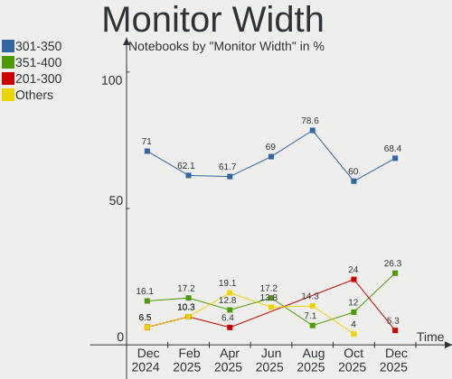

| Width in mm | Notebooks | Percent |
|-------------|-----------|---------|
| 301-350     | 13        | 68.42%  |
| 351-400     | 5         | 26.32%  |
| 201-300     | 1         | 5.26%   |

Aspect Ratio
------------

Proportional relationship between the width and the height

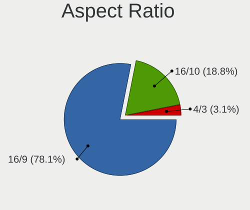

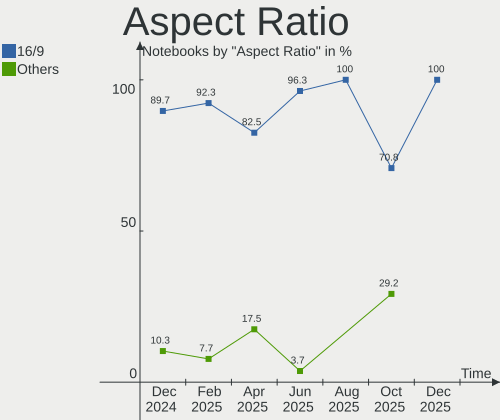

| Ratio | Notebooks | Percent |
|-------|-----------|---------|
| 16/9  | 19        | 100%    |

Monitor Area
------------

Area in inch²

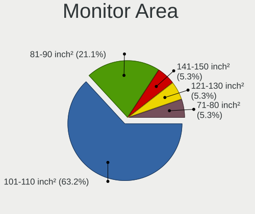

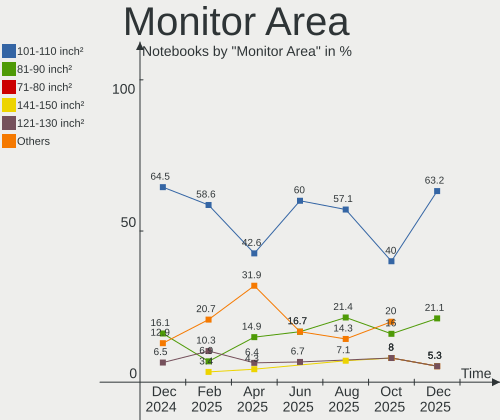

| Area in inch² | Notebooks | Percent |
|----------------|-----------|---------|
| 101-110        | 12        | 63.16%  |
| 81-90          | 4         | 21.05%  |
| 71-80          | 1         | 5.26%   |
| 141-150        | 1         | 5.26%   |
| 121-130        | 1         | 5.26%   |

Pixel Density
-------------

Pixels per inch

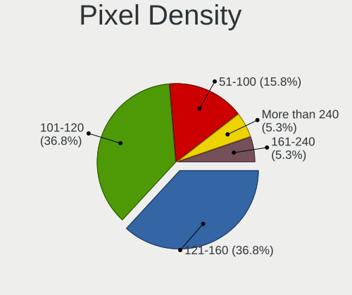

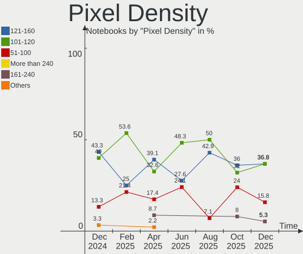

| Density       | Notebooks | Percent |
|---------------|-----------|---------|
| 121-160       | 7         | 36.84%  |
| 101-120       | 7         | 36.84%  |
| 51-100        | 3         | 15.79%  |
| More than 240 | 1         | 5.26%   |
| 161-240       | 1         | 5.26%   |

Multiple Monitors
-----------------

Total monitors connected

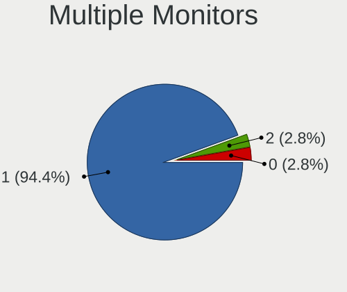

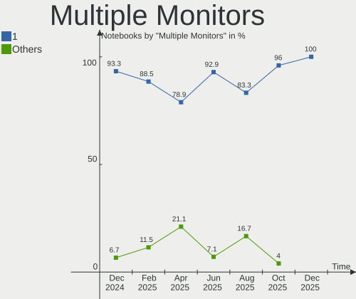

| Total | Notebooks | Percent |
|-------|-----------|---------|
| 1     | 19        | 100%    |

Network
-------

Net Controller Vendor
---------------------

Controller vendors

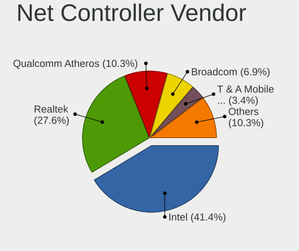

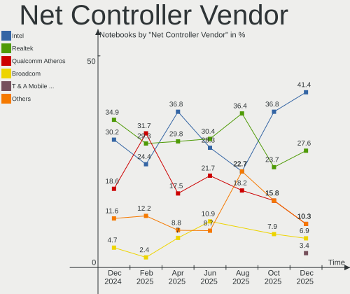

| Vendor                | Notebooks | Percent |
|-----------------------|-----------|---------|
| Intel                 | 12        | 41.38%  |
| Realtek Semiconductor | 8         | 27.59%  |
| Qualcomm Atheros      | 3         | 10.34%  |
| Broadcom              | 2         | 6.9%    |
| T & A Mobile Phones   | 1         | 3.45%   |
| Ralink                | 1         | 3.45%   |
| MediaTek              | 1         | 3.45%   |
| Fibocom               | 1         | 3.45%   |

Net Controller Model
--------------------

Controller models

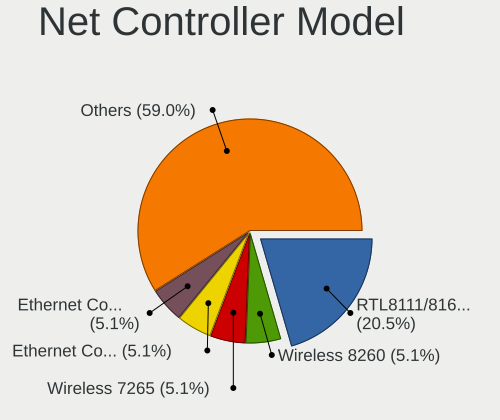

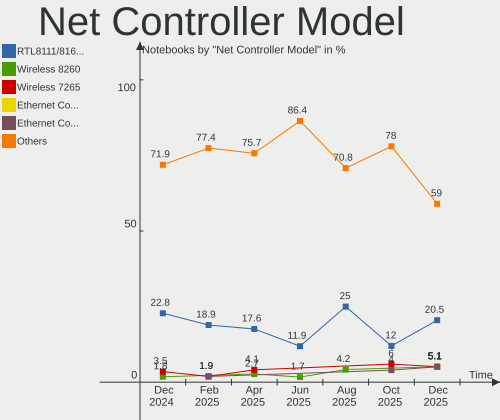

| Model                                                                  | Notebooks | Percent |
|------------------------------------------------------------------------|-----------|---------|
| Realtek RTL8111/8168/8211/8411 PCI Express Gigabit Ethernet Controller | 8         | 20.51%  |
| Intel Wireless 8260                                                    | 2         | 5.13%   |
| Intel Wireless 7265                                                    | 2         | 5.13%   |
| Intel Ethernet Connection (6) I219-LM                                  | 2         | 5.13%   |
| Intel Ethernet Connection (3) I218-LM                                  | 2         | 5.13%   |
| Intel Centrino Advanced-N 6200                                         | 2         | 5.13%   |
| Intel Cannon Point-LP CNVi [Wireless-AC]                               | 2         | 5.13%   |
| Intel 82577LM Gigabit Network Connection                               | 2         | 5.13%   |
| T & A Mobile Phones AQUOS V6                                           | 1         | 2.56%   |
| Realtek RTL8822CE 802.11ac PCIe Wireless Network Adapter               | 1         | 2.56%   |
| Realtek RTL8723DE Wireless Network Adapter                             | 1         | 2.56%   |
| Ralink RT5390 Wireless 802.11n 1T/1R PCIe                              | 1         | 2.56%   |
| Qualcomm Atheros QCA9565 / AR9565 Wireless Network Adapter             | 1         | 2.56%   |
| Qualcomm Atheros AR9285 Wireless Network Adapter (PCI-Express)         | 1         | 2.56%   |
| Qualcomm Atheros AR8151 v2.0 Gigabit Ethernet                          | 1         | 2.56%   |
| MediaTek MT7630e 802.11bgn Wireless Network Adapter                    | 1         | 2.56%   |
| Intel Wireless 3165                                                    | 1         | 2.56%   |
| Intel Wi-Fi 6 AX200                                                    | 1         | 2.56%   |
| Intel Ethernet Connection I219-LM                                      | 1         | 2.56%   |
| Intel Ethernet Connection (7) I219-LM                                  | 1         | 2.56%   |
| Intel Centrino Wireless-N 1030 [Rainbow Peak]                          | 1         | 2.56%   |
| Intel Centrino Advanced-N 6205 [Taylor Peak]                           | 1         | 2.56%   |
| Fibocom L830-EB-00 LTE WWAN Modem                                      | 1         | 2.56%   |
| Broadcom NetXtreme BCM57786 Gigabit Ethernet PCIe                      | 1         | 2.56%   |
| Broadcom BCM4313 802.11bgn Wireless Network Adapter                    | 1         | 2.56%   |

Wireless Vendor
---------------

Wireless vendors

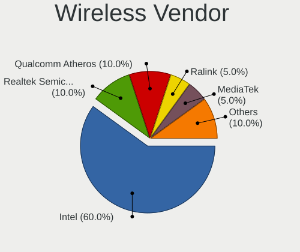

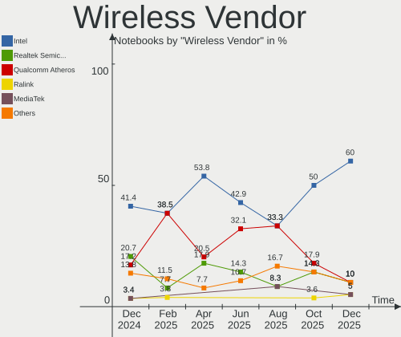

| Vendor                | Notebooks | Percent |
|-----------------------|-----------|---------|
| Intel                 | 12        | 60%     |
| Realtek Semiconductor | 2         | 10%     |
| Qualcomm Atheros      | 2         | 10%     |
| Ralink                | 1         | 5%      |
| MediaTek              | 1         | 5%      |
| Fibocom               | 1         | 5%      |
| Broadcom              | 1         | 5%      |

Wireless Model
--------------

Wireless models

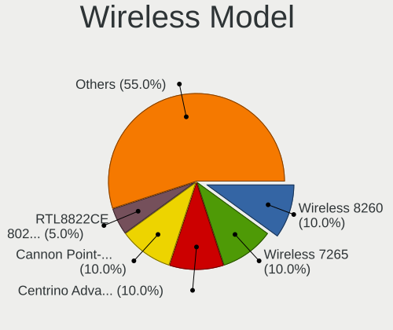

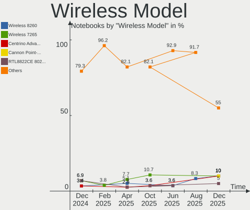

| Model                                                          | Notebooks | Percent |
|----------------------------------------------------------------|-----------|---------|
| Intel Wireless 8260                                            | 2         | 10%     |
| Intel Wireless 7265                                            | 2         | 10%     |
| Intel Centrino Advanced-N 6200                                 | 2         | 10%     |
| Intel Cannon Point-LP CNVi [Wireless-AC]                       | 2         | 10%     |
| Realtek RTL8822CE 802.11ac PCIe Wireless Network Adapter       | 1         | 5%      |
| Realtek RTL8723DE Wireless Network Adapter                     | 1         | 5%      |
| Ralink RT5390 Wireless 802.11n 1T/1R PCIe                      | 1         | 5%      |
| Qualcomm Atheros QCA9565 / AR9565 Wireless Network Adapter     | 1         | 5%      |
| Qualcomm Atheros AR9285 Wireless Network Adapter (PCI-Express) | 1         | 5%      |
| MediaTek MT7630e 802.11bgn Wireless Network Adapter            | 1         | 5%      |
| Intel Wireless 3165                                            | 1         | 5%      |
| Intel Wi-Fi 6 AX200                                            | 1         | 5%      |
| Intel Centrino Wireless-N 1030 [Rainbow Peak]                  | 1         | 5%      |
| Intel Centrino Advanced-N 6205 [Taylor Peak]                   | 1         | 5%      |
| Fibocom L830-EB-00 LTE WWAN Modem                              | 1         | 5%      |
| Broadcom BCM4313 802.11bgn Wireless Network Adapter            | 1         | 5%      |

Ethernet Vendor
---------------

Ethernet vendors

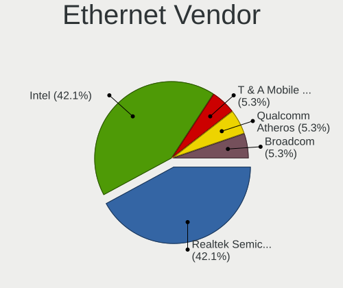

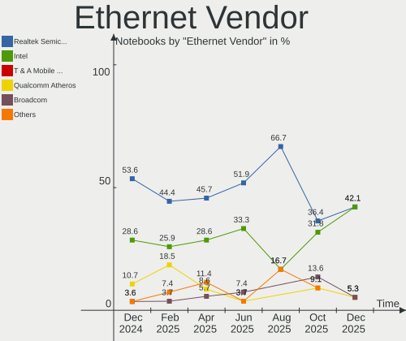

| Vendor                | Notebooks | Percent |
|-----------------------|-----------|---------|
| Realtek Semiconductor | 8         | 42.11%  |
| Intel                 | 8         | 42.11%  |
| T & A Mobile Phones   | 1         | 5.26%   |
| Qualcomm Atheros      | 1         | 5.26%   |
| Broadcom              | 1         | 5.26%   |

Ethernet Model
--------------

Ethernet models

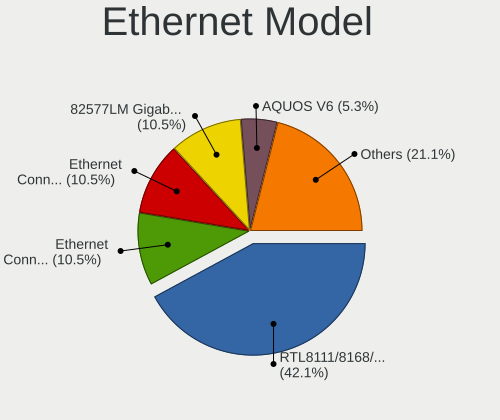

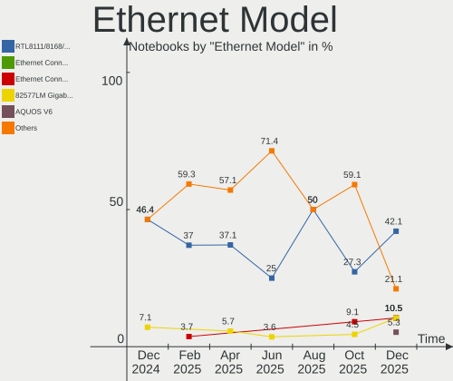

| Model                                                                  | Notebooks | Percent |
|------------------------------------------------------------------------|-----------|---------|
| Realtek RTL8111/8168/8211/8411 PCI Express Gigabit Ethernet Controller | 8         | 42.11%  |
| Intel Ethernet Connection (6) I219-LM                                  | 2         | 10.53%  |
| Intel Ethernet Connection (3) I218-LM                                  | 2         | 10.53%  |
| Intel 82577LM Gigabit Network Connection                               | 2         | 10.53%  |
| T & A Mobile Phones AQUOS V6                                           | 1         | 5.26%   |
| Qualcomm Atheros AR8151 v2.0 Gigabit Ethernet                          | 1         | 5.26%   |
| Intel Ethernet Connection I219-LM                                      | 1         | 5.26%   |
| Intel Ethernet Connection (7) I219-LM                                  | 1         | 5.26%   |
| Broadcom NetXtreme BCM57786 Gigabit Ethernet PCIe                      | 1         | 5.26%   |

Net Controller Kind
-------------------

Ethernet, WiFi or modem

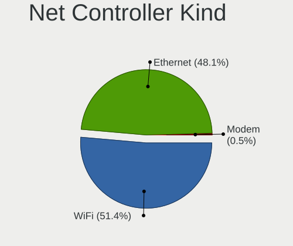

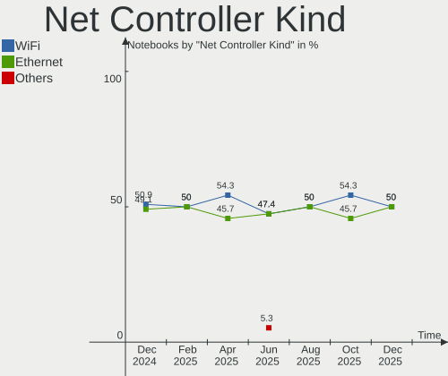

| Kind     | Notebooks | Percent |
|----------|-----------|---------|
| WiFi     | 19        | 50%     |
| Ethernet | 19        | 50%     |

Used Controller
---------------

Currently used network controller

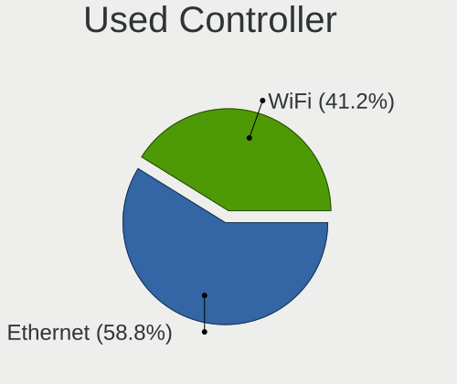

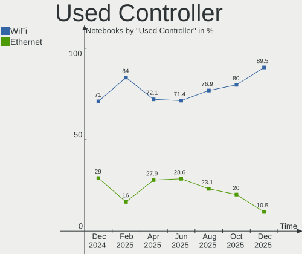

| Kind     | Notebooks | Percent |
|----------|-----------|---------|
| WiFi     | 17        | 89.47%  |
| Ethernet | 2         | 10.53%  |

NICs
----

Total network controllers on board

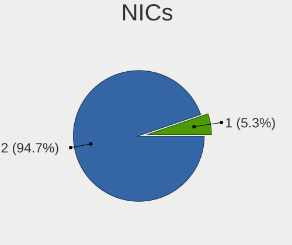

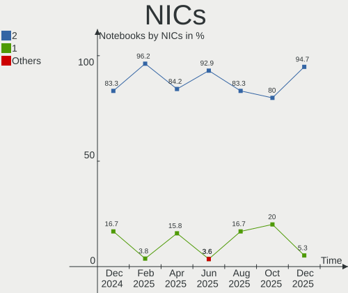

| Total | Notebooks | Percent |
|-------|-----------|---------|
| 2     | 18        | 94.74%  |
| 1     | 1         | 5.26%   |

IPv6
----

IPv6 vs IPv4

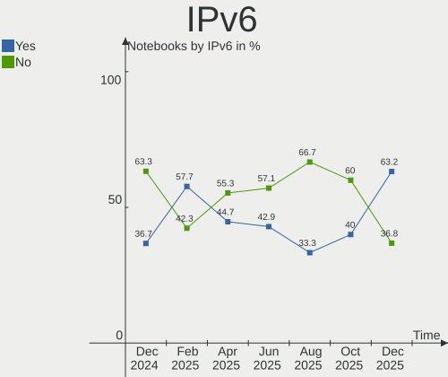

| Used | Notebooks | Percent |
|------|-----------|---------|
| Yes  | 12        | 63.16%  |
| No   | 7         | 36.84%  |

Bluetooth
---------

Bluetooth Vendor
----------------

Controller vendors

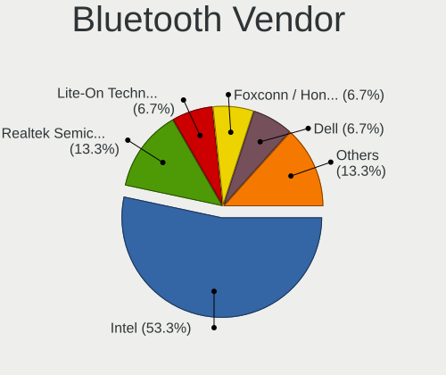

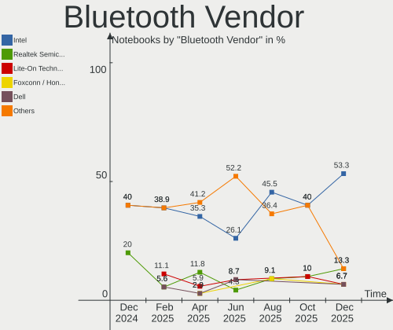

| Vendor                  | Notebooks | Percent |
|-------------------------|-----------|---------|
| Intel                   | 8         | 53.33%  |
| Realtek Semiconductor   | 2         | 13.33%  |
| Lite-On Technology      | 1         | 6.67%   |
| Foxconn / Hon Hai       | 1         | 6.67%   |
| Dell                    | 1         | 6.67%   |
| Cambridge Silicon Radio | 1         | 6.67%   |
| Askey Computer          | 1         | 6.67%   |

Bluetooth Model
---------------

Controller models

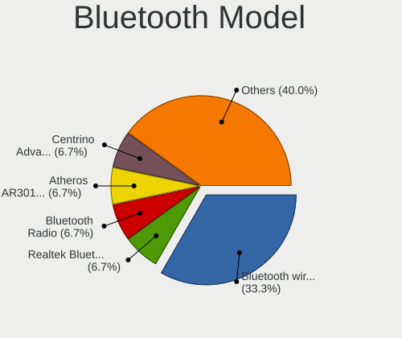

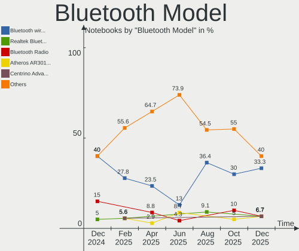

| Model                                               | Notebooks | Percent |
|-----------------------------------------------------|-----------|---------|
| Intel Bluetooth wireless interface                  | 5         | 33.33%  |
| Realtek  Bluetooth 4.2 Adapter                      | 1         | 6.67%   |
| Realtek Bluetooth Radio                             | 1         | 6.67%   |
| Lite-On Atheros AR3012 Bluetooth                    | 1         | 6.67%   |
| Intel Centrino Advanced-N 6230 Bluetooth adapter    | 1         | 6.67%   |
| Intel Bluetooth 9460/9560 Jefferson Peak (JfP)      | 1         | 6.67%   |
| Intel AX200 Bluetooth                               | 1         | 6.67%   |
| Foxconn / Hon Hai BT                                | 1         | 6.67%   |
| Dell DW375 Bluetooth Module                         | 1         | 6.67%   |
| Cambridge Silicon Radio Bluetooth Dongle (HCI mode) | 1         | 6.67%   |
| Askey Bluetooth Device                              | 1         | 6.67%   |

Sound
-----

Sound Vendor
------------

Sound card vendors

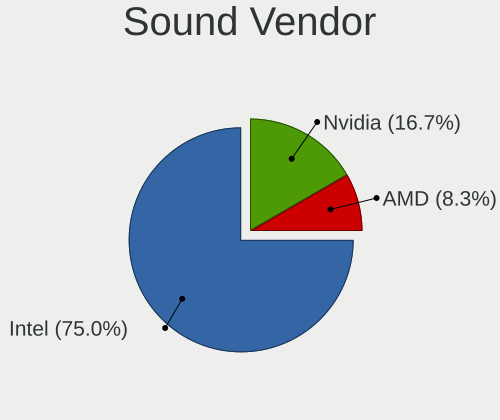

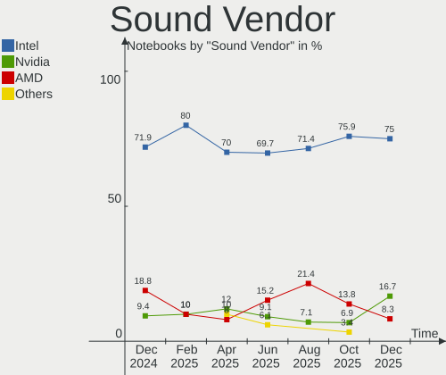

| Vendor | Notebooks | Percent |
|--------|-----------|---------|
| Intel  | 18        | 75%     |
| Nvidia | 4         | 16.67%  |
| AMD    | 2         | 8.33%   |

Sound Model
-----------

Sound card models

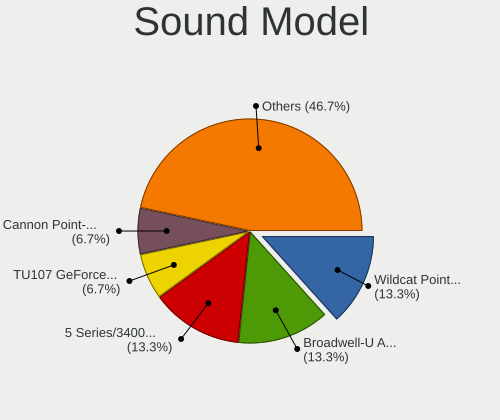

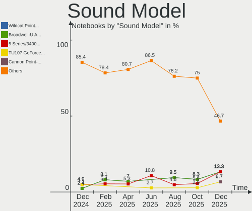

| Model                                                                                             | Notebooks | Percent |
|---------------------------------------------------------------------------------------------------|-----------|---------|
| Intel Wildcat Point-LP High Definition Audio Controller                                           | 4         | 13.33%  |
| Intel Broadwell-U Audio Controller                                                                | 4         | 13.33%  |
| Intel 5 Series/3400 Series Chipset High Definition Audio                                          | 4         | 13.33%  |
| Nvidia TU107 GeForce GTX 1650 High Definition Audio Controller                                    | 2         | 6.67%   |
| Intel Cannon Point-LP High Definition Audio Controller                                            | 2         | 6.67%   |
| Nvidia High Definition Audio Controller                                                           | 1         | 3.33%   |
| Nvidia GK208 HDMI/DP Audio Controller                                                             | 1         | 3.33%   |
| Intel Sunrise Point-LP HD Audio                                                                   | 1         | 3.33%   |
| Intel NM10/ICH7 Family High Definition Audio Controller                                           | 1         | 3.33%   |
| Intel Haswell-ULT HD Audio Controller                                                             | 1         | 3.33%   |
| Intel Crystal Well HD Audio Controller                                                            | 1         | 3.33%   |
| Intel Cannon Lake PCH cAVS                                                                        | 1         | 3.33%   |
| Intel Atom/Celeron/Pentium Processor x5-E8000/J3xxx/N3xxx Series High Definition Audio Controller | 1         | 3.33%   |
| Intel 8 Series/C220 Series Chipset High Definition Audio Controller                               | 1         | 3.33%   |
| Intel 8 Series HD Audio Controller                                                                | 1         | 3.33%   |
| Intel 7 Series/C216 Chipset Family High Definition Audio Controller                               | 1         | 3.33%   |
| Intel 6 Series/C200 Series Chipset Family High Definition Audio Controller                        | 1         | 3.33%   |
| AMD Ryzen HD Audio Controller                                                                     | 1         | 3.33%   |
| AMD Redwood HDMI Audio [Radeon HD 5000 Series]                                                    | 1         | 3.33%   |

Memory
------

Memory Vendor
-------------

Memory module vendors

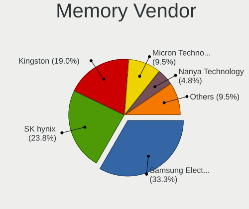

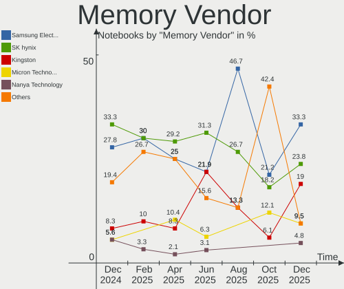

| Vendor              | Notebooks | Percent |
|---------------------|-----------|---------|
| Samsung Electronics | 7         | 33.33%  |
| SK hynix            | 5         | 23.81%  |
| Kingston            | 4         | 19.05%  |
| Micron Technology   | 2         | 9.52%   |
| Nanya Technology    | 1         | 4.76%   |
| Hikvision           | 1         | 4.76%   |
| A-DATA Technology   | 1         | 4.76%   |

Memory Model
------------

Memory module models

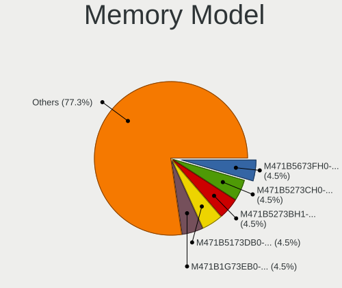

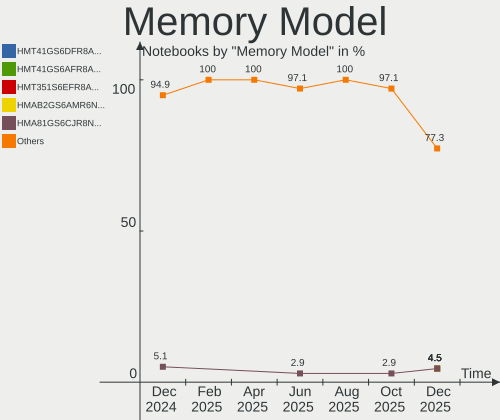

| Model                                                                     | Notebooks | Percent |
|---------------------------------------------------------------------------|-----------|---------|
| SK hynix RAM HMT41GS6DFR8A-PB 8GB SODIMM DDR3 1600MT/s                    | 1         | 4.55%   |
| SK hynix RAM HMT41GS6AFR8A-PB 8GiB SODIMM DDR3 2667MT/s                   | 1         | 4.55%   |
| SK hynix RAM HMT351S6EFR8A 4GB SODIMM DDR3 1600MT/s                       | 1         | 4.55%   |
| SK hynix RAM HMAB2GS6AMR6N-XN 16GB SODIMM DDR4 3200MT/s                   | 1         | 4.55%   |
| SK hynix RAM HMA81GS6CJR8N-XN 8GB SODIMM DDR4 3200MT/s                    | 1         | 4.55%   |
| SK hynix RAM HMA81GS6AFR8N-UH 8GB SODIMM DDR4 3200MT/s                    | 1         | 4.55%   |
| Samsung RAM M471B5673FH0-CH9 2048MB SODIMM DDR3 1600MT/s                  | 1         | 4.55%   |
| Samsung RAM M471B5273CH0-CH9 4GB SODIMM DDR3 1334MT/s                     | 1         | 4.55%   |
| Samsung RAM M471B5273BH1-CF8 4096MB SODIMM 1067MT/s                       | 1         | 4.55%   |
| Samsung RAM M471B5173DB0-YK0 4GB SODIMM DDR3 1600MT/s                     | 1         | 4.55%   |
| Samsung RAM M471B1G73EB0-YK0 8192MB SODIMM DDR3 1600MT/s                  | 1         | 4.55%   |
| Samsung RAM M471A2K43DB1-CTD 16GB SODIMM DDR4 2667MT/s                    | 1         | 4.55%   |
| Samsung RAM 4D34373142353737334448302D43483920 2048MB SODIMM DDR3 667MT/s | 1         | 4.55%   |
| Nanya RAM NT2GC64B88B0NS-CG 2048MB SODIMM DDR3 1334MT/s                   | 1         | 4.55%   |
| Micron RAM 4ATS1G64HZ-2G6E1 8GB SODIMM DDR4 2667MT/s                      | 1         | 4.55%   |
| Micron RAM 16KTF1G64HZ-1G6E2 8192MB SODIMM DDR3 1867MT/s                  | 1         | 4.55%   |
| Kingston RAM ACR16D3LS1NBG/4G 4GB SODIMM DDR3 1600MT/s                    | 1         | 4.55%   |
| Kingston RAM 9905744-023.A00G 16GB SODIMM DDR4 2400MT/s                   | 1         | 4.55%   |
| Kingston RAM 9905469-144.A00LF 4GB SODIMM DDR3 1333MT/s                   | 1         | 4.55%   |
| Kingston RAM 9905469-143.A00LF 4096MB SODIMM DDR3 1600MT/s                | 1         | 4.55%   |
| Hikvision RAM HKED3082BAB2H3SA1 8GB SODIMM DDR3 1600MT/s                  | 1         | 4.55%   |
| A-DATA RAM AO1L16BC4R1-BX7S 4GB SODIMM DDR3 1600MT/s                      | 1         | 4.55%   |

Memory Kind
-----------

Memory module kinds

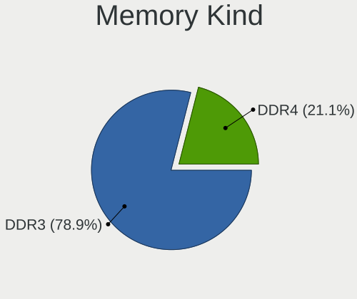

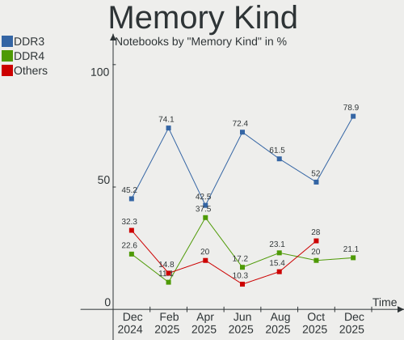

| Kind | Notebooks | Percent |
|------|-----------|---------|
| DDR3 | 15        | 78.95%  |
| DDR4 | 4         | 21.05%  |

Memory Form Factor
------------------

Physical design of the memory module

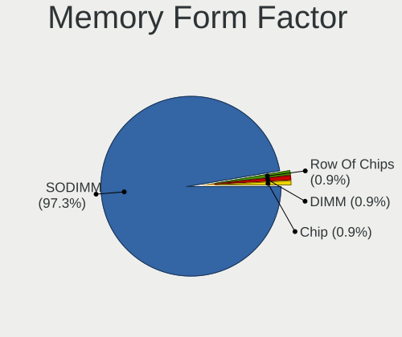

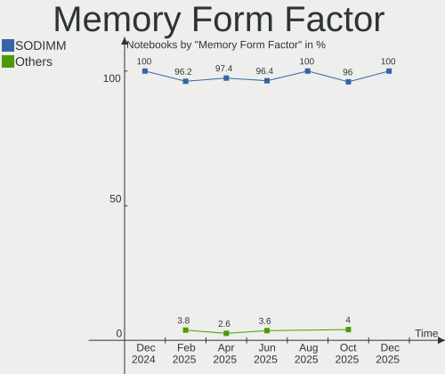

| Name   | Notebooks | Percent |
|--------|-----------|---------|
| SODIMM | 19        | 100%    |

Memory Size
-----------

Memory module size

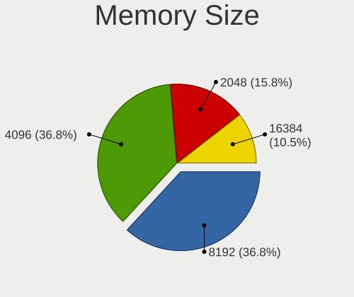

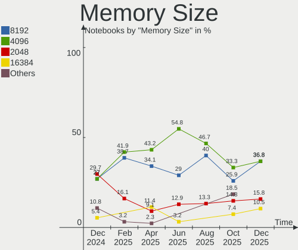

| Size  | Notebooks | Percent |
|-------|-----------|---------|
| 8192  | 7         | 36.84%  |
| 4096  | 7         | 36.84%  |
| 2048  | 3         | 15.79%  |
| 16384 | 2         | 10.53%  |

Memory Speed
------------

Memory module speed

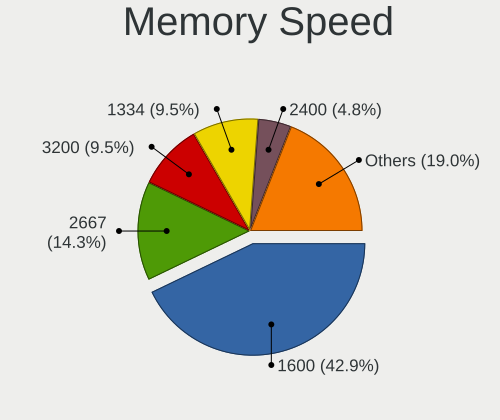

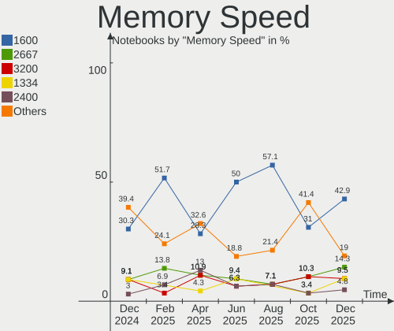

| Speed | Notebooks | Percent |
|-------|-----------|---------|
| 1600  | 9         | 42.86%  |
| 2667  | 3         | 14.29%  |
| 3200  | 2         | 9.52%   |
| 1334  | 2         | 9.52%   |
| 2400  | 1         | 4.76%   |
| 1867  | 1         | 4.76%   |
| 1333  | 1         | 4.76%   |
| 1067  | 1         | 4.76%   |
| 667   | 1         | 4.76%   |

Printers & scanners
-------------------

Printer Vendor
--------------

Printer device vendors

Zero info for selected period =(

Printer Model
-------------

Printer device models

Zero info for selected period =(

Scanner Vendor
--------------

Scanner device vendors

Zero info for selected period =(

Scanner Model
-------------

Scanner device models

Zero info for selected period =(

Camera
------

Camera Vendor
-------------

Camera device vendors

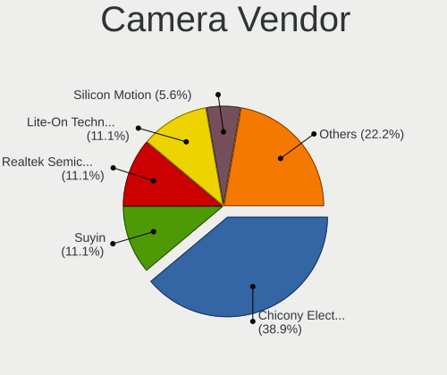

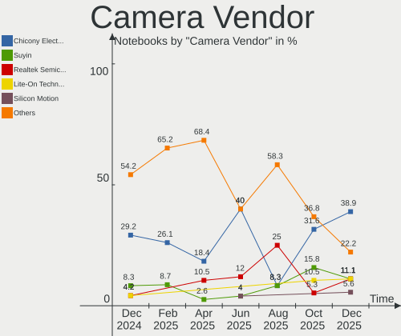

| Vendor                | Notebooks | Percent |
|-----------------------|-----------|---------|
| Chicony Electronics   | 7         | 38.89%  |
| Suyin                 | 2         | 11.11%  |
| Realtek Semiconductor | 2         | 11.11%  |
| Lite-On Technology    | 2         | 11.11%  |
| Silicon Motion        | 1         | 5.56%   |
| Ricoh                 | 1         | 5.56%   |
| Quanta                | 1         | 5.56%   |
| Microdia              | 1         | 5.56%   |
| Acer                  | 1         | 5.56%   |

Camera Model
------------

Camera device models

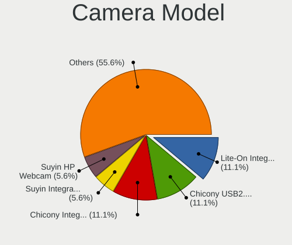

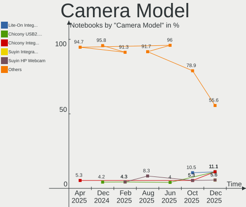

| Model                             | Notebooks | Percent |
|-----------------------------------|-----------|---------|
| Lite-On Integrated Camera         | 2         | 11.11%  |
| Chicony USB2.0 HD UVC WebCam      | 2         | 11.11%  |
| Chicony Integrated Camera         | 2         | 11.11%  |
| Suyin Integrated Webcam           | 1         | 5.56%   |
| Suyin HP Webcam                   | 1         | 5.56%   |
| Silicon Motion WebCam SC-0311139N | 1         | 5.56%   |
| Ricoh HD Webcam                   | 1         | 5.56%   |
| Realtek USB Camera                | 1         | 5.56%   |
| Realtek HP Webcam                 | 1         | 5.56%   |
| Quanta USB Webcam                 | 1         | 5.56%   |
| Microdia HP Webcam                | 1         | 5.56%   |
| Chicony ThinkPad T490 Webcam      | 1         | 5.56%   |
| Chicony HP TrueVision HD Camera   | 1         | 5.56%   |
| Chicony HD WebCam (Acer)          | 1         | 5.56%   |
| Acer Integrated Camera            | 1         | 5.56%   |

Security
--------

Fingerprint Vendor
------------------

Fingerprint sensor vendors

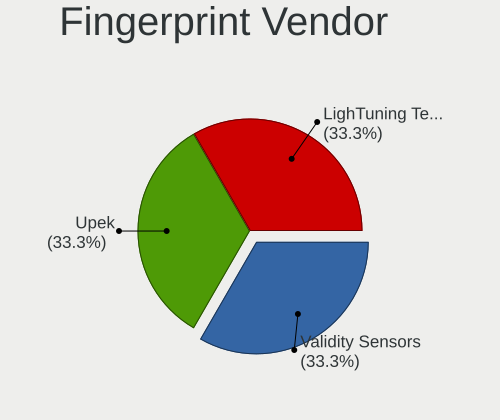

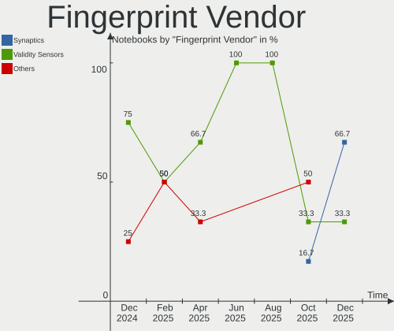

| Vendor           | Notebooks | Percent |
|------------------|-----------|---------|
| Synaptics        | 2         | 66.67%  |
| Validity Sensors | 1         | 33.33%  |

Fingerprint Model
-----------------

Fingerprint sensor models

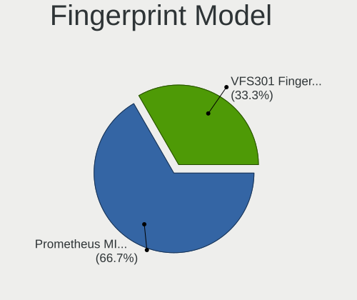

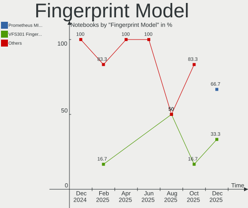

| Model                                             | Notebooks | Percent |
|---------------------------------------------------|-----------|---------|
| Synaptics Prometheus MIS Touch Fingerprint Reader | 2         | 66.67%  |
| Validity Sensors VFS301 Fingerprint Reader        | 1         | 33.33%  |

Chipcard Vendor
---------------

Chipcard module vendors

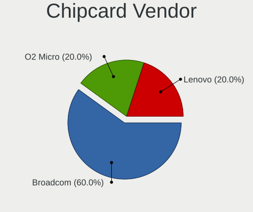

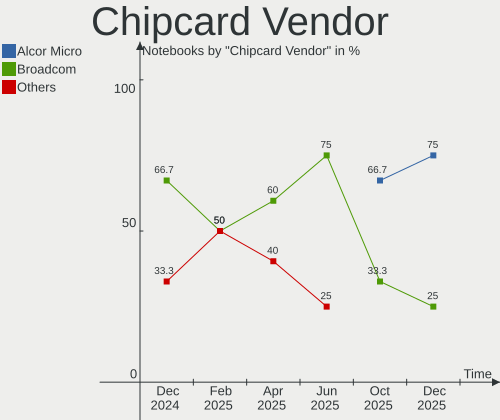

| Vendor      | Notebooks | Percent |
|-------------|-----------|---------|
| Alcor Micro | 3         | 75%     |
| Broadcom    | 1         | 25%     |

Chipcard Model
--------------

Chipcard module models

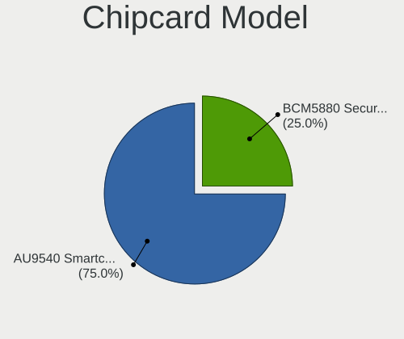

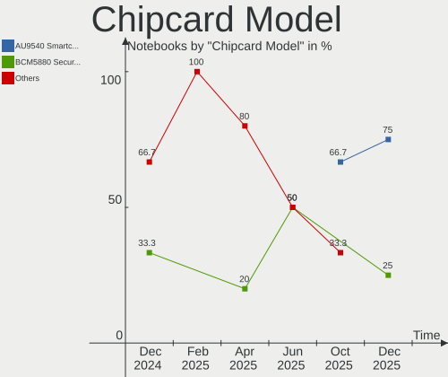

| Model                                          | Notebooks | Percent |
|------------------------------------------------|-----------|---------|
| Alcor Micro AU9540 Smartcard Reader            | 3         | 75%     |
| Broadcom BCM5880 Secure Applications Processor | 1         | 25%     |

Unsupported
-----------

Unsupported Devices
-------------------

Total unsupported devices on board

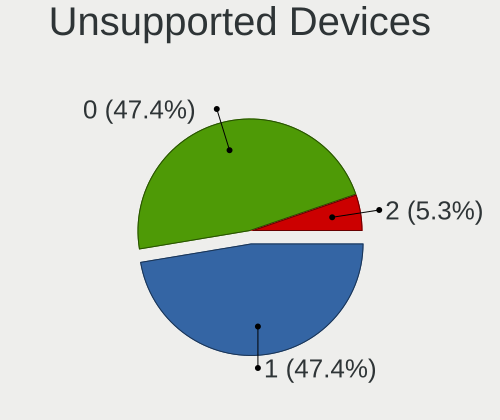

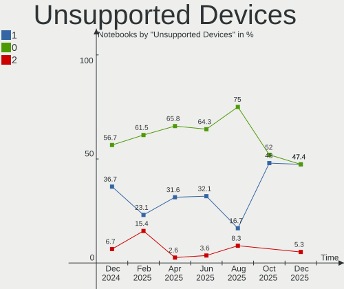

| Total | Notebooks | Percent |
|-------|-----------|---------|
| 1     | 9         | 47.37%  |
| 0     | 9         | 47.37%  |
| 2     | 1         | 5.26%   |

Unsupported Device Types
------------------------

Types of unsupported devices

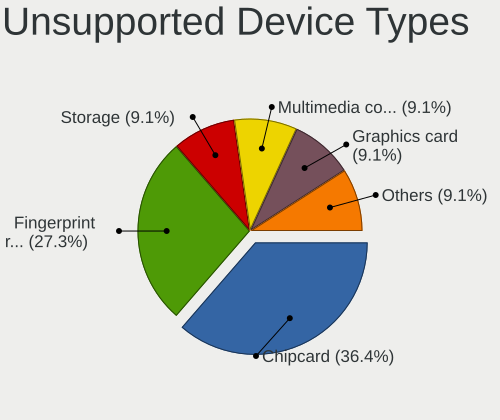

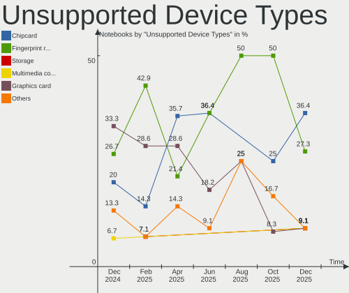

| Type                  | Notebooks | Percent |
|-----------------------|-----------|---------|
| Chipcard              | 4         | 36.36%  |
| Fingerprint reader    | 3         | 27.27%  |
| Storage               | 1         | 9.09%   |
| Multimedia controller | 1         | 9.09%   |
| Graphics card         | 1         | 9.09%   |
| Bluetooth             | 1         | 9.09%   |

