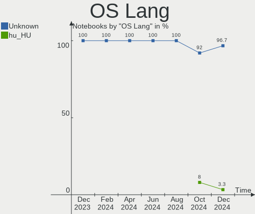
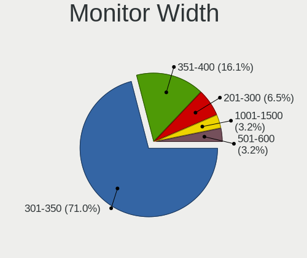

BlackPanther Hardware Trends (Notebook)
---------------------------------------

A project to identify most popular hardware characteristics and track their change
over time based on data collected by BlackPanther users at https://Linux-Hardware.org.

Anyone can contribute to the study by uploading probes of their computers by
the [hw-probe](https://github.com/linuxhw/hw-probe) tool:

    sudo hw-probe -all -upload

Full-feature report is available here: https://linux-hardware.org/?view=trends&formfactor=notebook

Period: Feb, 2020.

Contents
--------

- [ OS                       ](#os)
- [ OS Family                ](#os-family)
- [ Kernel                   ](#kernel)
- [ Kernel Family            ](#kernel-family)
- [ Kernel Major Ver.        ](#kernel-major-ver)
- [ Arch                     ](#arch)
- [ DE                       ](#de)
- [ Display Server           ](#display-server)
- [ OS Lang                  ](#os-lang)
- [ Boot Mode                ](#boot-mode)
- [ Filesystem               ](#filesystem)
- [ Dual Boot with Linux     ](#dual-boot-with-linux)
- [ Dual Boot (Win)          ](#dual-boot-win)
- [ Country                  ](#country)
- [ City                     ](#city)
- [ Vendor                   ](#vendor)
- [ Model                    ](#model)
- [ Model Family             ](#model-family)
- [ MFG Year                 ](#mfg-year)
- [ Form Factor              ](#form-factor)
- [ Secure Boot              ](#secure-boot)
- [ Coreboot                 ](#coreboot)
- [ RAM Size                 ](#ram-size)
- [ RAM Used                 ](#ram-used)
- [ Drive Vendor             ](#drive-vendor)
- [ Drive Model              ](#drive-model)
- [ Drive Kind               ](#drive-kind)
- [ Drive Connector          ](#drive-connector)
- [ Drive Size               ](#drive-size)
- [ Space Total              ](#space-total)
- [ Space Used               ](#space-used)
- [ Malfunc. Drives          ](#malfunc-drives)
- [ Malfunc. Drive Vendor    ](#malfunc-drive-vendor)
- [ Malfunc. Drive Kind      ](#malfunc-drive-kind)
- [ Failed Drives            ](#failed-drives)
- [ Failed Drive Vendor      ](#failed-drive-vendor)
- [ Drive Status             ](#drive-status)
- [ Storage Vendor           ](#storage-vendor)
- [ Storage Model            ](#storage-model)
- [ Storage Kind             ](#storage-kind)
- [ CPU Vendor               ](#cpu-vendor)
- [ CPU Model                ](#cpu-model)
- [ CPU Model Family         ](#cpu-model-family)
- [ CPU Cores                ](#cpu-cores)
- [ CPU Sockets              ](#cpu-sockets)
- [ CPU Threads              ](#cpu-threads)
- [ CPU Op-Modes             ](#cpu-op-modes)
- [ CPU Microarch            ](#cpu-microarch)
- [ CPU Microcode            ](#cpu-microcode)
- [ GPU Vendor               ](#gpu-vendor)
- [ GPU Model                ](#gpu-model)
- [ GPU Combo                ](#gpu-combo)
- [ GPU Driver               ](#gpu-driver)
- [ GPU Memory               ](#gpu-memory)
- [ Monitor Vendor           ](#monitor-vendor)
- [ Monitor Model            ](#monitor-model)
- [ Monitor Resolution       ](#monitor-resolution)
- [ Monitor Diagonal         ](#monitor-diagonal)
- [ Monitor Width            ](#monitor-width)
- [ Aspect Ratio             ](#aspect-ratio)
- [ Monitor Area             ](#monitor-area)
- [ Pixel Density            ](#pixel-density)
- [ Multiple Monitors        ](#multiple-monitors)
- [ Net Controller Vendor    ](#net-controller-vendor)
- [ Net Controller Model     ](#net-controller-model)
- [ Net Controller Kind      ](#net-controller-kind)
- [ Used Controller          ](#used-controller)
- [ NICs                     ](#nics)
- [ Unsupported Devices      ](#unsupported-devices)
- [ Unsupported Device Types ](#unsupported-device-types)

OS
--

Installed operating systems

| Name              | Computers | Percent |
|-------------------|-----------|---------|
| BlackPanther 18.1 | 134       | 92.41%  |
| BlackPanther 16.2 | 10        | 6.9%    |
| BlackPanther 16.1 | 1         | 0.69%   |

OS Family
---------

OS without a version

| Name         | Computers | Percent |
|--------------|-----------|---------|
| BlackPanther | 145       | 100%    |

Kernel
------

Version of the Linux kernel

| Version                | Computers | Percent |
|------------------------|-----------|---------|
| 4.18.16-desktop-1bP    | 84        | 57.93%  |
| 5.1.15-desktop-1bP     | 50        | 34.48%  |
| 4.9.20-desktop-pae-1bP | 9         | 6.21%   |
| 4.9.20-desktop-1bP     | 1         | 0.69%   |
| 4.7.0-desktop-1bP      | 1         | 0.69%   |

Kernel Family
-------------

Linux kernel without a distro release

| Version | Computers | Percent |
|---------|-----------|---------|
| 4.18.16 | 84        | 57.93%  |
| 5.1.15  | 50        | 34.48%  |
| 4.9.20  | 10        | 6.9%    |
| 4.7.0   | 1         | 0.69%   |

Kernel Major Ver.
-----------------

Linux kernel major version

| Version | Computers | Percent |
|---------|-----------|---------|
| 4.18    | 84        | 57.93%  |
| 5.1     | 50        | 34.48%  |
| 4.9     | 10        | 6.9%    |
| 4.7     | 1         | 0.69%   |

Arch
----

OS architecture (x86_64, i586, etc.)

| Name   | Computers | Percent |
|--------|-----------|---------|
| x86_64 | 134       | 92.41%  |
| i686   | 11        | 7.59%   |

DE
--

Desktop Environment

| Name   | Computers | Percent |
|--------|-----------|---------|
| KDE5   | 144       | 99.31%  |
| Budgie | 1         | 0.69%   |

Display Server
--------------

X11 or Wayland

| Name | Computers | Percent |
|------|-----------|---------|
| X11  | 145       | 100%    |

OS Lang
-------

Language

| Lang    | Computers | Percent |
|---------|-----------|---------|
| Unknown | 145       | 100%    |

Boot Mode
---------

EFI or BIOS

| Mode | Computers | Percent |
|------|-----------|---------|
| BIOS | 88        | 60.69%  |
| EFI  | 57        | 39.31%  |

Filesystem
----------

Type of filesystem

| Type    | Computers | Percent |
|---------|-----------|---------|
| Ext4    | 135       | 93.1%   |
| Overlay | 10        | 6.9%    |

Dual Boot with Linux
--------------------

Hosting more than one Linux

| Dual boot | Computers | Percent |
|-----------|-----------|---------|
| No        | 122       | 84.14%  |
| Yes       | 23        | 15.86%  |

Dual Boot (Win)
---------------

Hosting Linux and Windows

| Dual boot | Computers | Percent |
|-----------|-----------|---------|
| No        | 94        | 64.83%  |
| Yes       | 51        | 35.17%  |

Country
-------

Geographic location (country)

| Country              | Computers | Percent |
|----------------------|-----------|---------|
| Hungary              | 113       | 77.93%  |
| Germany              | 13        | 8.97%   |
| USA                  | 4         | 2.76%   |
| Romania              | 4         | 2.76%   |
| UK                   | 2         | 1.38%   |
| France               | 2         | 1.38%   |
| Canada               | 2         | 1.38%   |
| Slovakia             | 1         | 0.69%   |
| Puerto Rico          | 1         | 0.69%   |
| Moldova, Republic of | 1         | 0.69%   |
| Italy                | 1         | 0.69%   |
| Brazil               | 1         | 0.69%   |

City
----

Geographic location (city)

| City              | Computers | Percent |
|-------------------|-----------|---------|
| Budapest          | 31        | 21.38%  |
| Miskolc           | 6         | 4.14%   |
| Székesfehérvár | 5         | 3.45%   |
| Zalaegerszeg      | 4         | 2.76%   |
| Szigetszentmiklos | 4         | 2.76%   |
| Nuremberg         | 4         | 2.76%   |
| Érd              | 3         | 2.07%   |
| Gödöllő        | 3         | 2.07%   |
| Győr             | 3         | 2.07%   |
| Debrecen          | 3         | 2.07%   |
| Veszprém         | 2         | 1.38%   |
| Tiszafured        | 2         | 1.38%   |
| Tata              | 2         | 1.38%   |
| Regensburg        | 2         | 1.38%   |
| Kisbucsa          | 2         | 1.38%   |
| Keszthely         | 2         | 1.38%   |
| Hatvan            | 2         | 1.38%   |
| Gyomro            | 2         | 1.38%   |
| Eger              | 2         | 1.38%   |
| Csakbereny        | 2         | 1.38%   |
| Alsoberecki       | 2         | 1.38%   |
| Zamoly            | 1         | 0.69%   |
| Voluntari         | 1         | 0.69%   |
| Vicovu de Sus     | 1         | 0.69%   |
| Ujiraz            | 1         | 0.69%   |
| Târgu Mureş     | 1         | 0.69%   |
| Tura              | 1         | 0.69%   |
| Tottenham         | 1         | 0.69%   |
| Toronto           | 1         | 0.69%   |
| Tiszakecske       | 1         | 0.69%   |
| Thalmassing       | 1         | 0.69%   |
| Tatabánya        | 1         | 0.69%   |
| Tarnok            | 1         | 0.69%   |
| Szombathely       | 1         | 0.69%   |
| Szentgyorgyvolgy  | 1         | 0.69%   |
| Szeged            | 1         | 0.69%   |
| Somogysard        | 1         | 0.69%   |
| Siófok           | 1         | 0.69%   |
| Sarospatak        | 1         | 0.69%   |
| Sarbogard         | 1         | 0.69%   |
| Salgotarjan       | 1         | 0.69%   |
| Rio Grande        | 1         | 0.69%   |
| Rio de Janeiro    | 1         | 0.69%   |
| Pusztamonostor    | 1         | 0.69%   |
| Pomaz             | 1         | 0.69%   |
| Paszto            | 1         | 0.69%   |
| Nyiregyhaza       | 1         | 0.69%   |
| Nottingham        | 1         | 0.69%   |
| Nittendorf        | 1         | 0.69%   |
| Muggensturm       | 1         | 0.69%   |
| Miercurea-Ciuc    | 1         | 0.69%   |
| Mascouche         | 1         | 0.69%   |
| Martin            | 1         | 0.69%   |
| Lugo              | 1         | 0.69%   |
| Laupheim          | 1         | 0.69%   |
| Lancaster         | 1         | 0.69%   |
| Lajosmizse        | 1         | 0.69%   |
| Kiskunhalas       | 1         | 0.69%   |
| Kiskoros          | 1         | 0.69%   |
| Kartal            | 1         | 0.69%   |

Vendor
------

Motherboard manufacturer

| Name                | Computers | Percent |
|---------------------|-----------|---------|
| Hewlett-Packard     | 30        | 20.69%  |
| Lenovo              | 28        | 19.31%  |
| Dell                | 28        | 19.31%  |
| ASUSTek Computer    | 20        | 13.79%  |
| Acer                | 11        | 7.59%   |
| Toshiba             | 8         | 5.52%   |
| Samsung Electronics | 7         | 4.83%   |
| MSI                 | 3         | 2.07%   |
| Fujitsu             | 3         | 2.07%   |
| Sony                | 2         | 1.38%   |
| Apple               | 2         | 1.38%   |
| Medion              | 1         | 0.69%   |
| Gateway             | 1         | 0.69%   |
| Unknown             | 1         | 0.69%   |

Model
-----

Motherboard model

| Name                                                       | Computers | Percent |
|------------------------------------------------------------|-----------|---------|
| HP 250 G1                                                  | 5         | 3.45%   |
| HP Notebook                                                | 3         | 2.07%   |
| HP EliteBook 8460p                                         | 3         | 2.07%   |
| Toshiba Satellite C660                                     | 2         | 1.38%   |
| Lenovo G550 20023                                          | 2         | 1.38%   |
| HP Pavilion g6                                             | 2         | 1.38%   |
| HP EliteBook 8470p                                         | 2         | 1.38%   |
| Dell Latitude E7240                                        | 2         | 1.38%   |
| Dell Latitude E6540                                        | 2         | 1.38%   |
| Dell Latitude E6400                                        | 2         | 1.38%   |
| Dell Inspiron 5558                                         | 2         | 1.38%   |
| ASUS X541NA                                                | 2         | 1.38%   |
| ASUS VivoBook 15_ASUS Laptop X540UAR                       | 2         | 1.38%   |
| Toshiba Satellite P300                                     | 1         | 0.69%   |
| Toshiba Satellite L855                                     | 1         | 0.69%   |
| Toshiba Satellite L300                                     | 1         | 0.69%   |
| Toshiba Satellite C55D-A                                   | 1         | 0.69%   |
| Toshiba Satellite C50-A-1G1                                | 1         | 0.69%   |
| Toshiba PORTEGE R830                                       | 1         | 0.69%   |
| Sony VPCEH2N1E                                             | 1         | 0.69%   |
| Sony VGN-FZ140E                                            | 1         | 0.69%   |
| Samsung Electronics RV410/RV510/S3510/E3510                | 1         | 0.69%   |
| Samsung Electronics RV409/RV509/RV709                      | 1         | 0.69%   |
| Samsung Electronics R540/R580/R780/SA41/E452/E852          | 1         | 0.69%   |
| Samsung Electronics N150/N210/N220                         | 1         | 0.69%   |
| Samsung Electronics 350V5C/351V5C/3540VC/3440VC            | 1         | 0.69%   |
| Samsung Electronics 300E5EV/300E4EV/270E5EV/270E4EV/2470EV | 1         | 0.69%   |
| Samsung Electronics 300E4A/300E5A/300E7A/3430EA/3530EA     | 1         | 0.69%   |
| MSI VR601                                                  | 1         | 0.69%   |
| MSI MS-1738                                                | 1         | 0.69%   |
| MSI GX720                                                  | 1         | 0.69%   |
| Medion E7214                                               | 1         | 0.69%   |
| Lenovo ThinkPad X61 7673BW3                                | 1         | 0.69%   |
| Lenovo ThinkPad X200 Tablet 7453WRX                        | 1         | 0.69%   |
| Lenovo ThinkPad X200 74595FG                               | 1         | 0.69%   |
| Lenovo ThinkPad X1 Carbon 34608G1                          | 1         | 0.69%   |
| Lenovo ThinkPad W510 431924G                               | 1         | 0.69%   |
| Lenovo ThinkPad T61 6458Y56                                | 1         | 0.69%   |
| Lenovo ThinkPad T450 20BUS09Y0E                            | 1         | 0.69%   |
| Lenovo ThinkPad T440s 20ARS0MS00                           | 1         | 0.69%   |
| Lenovo ThinkPad T420 4236Z9U                               | 1         | 0.69%   |
| Lenovo ThinkPad T420 4236BD5                               | 1         | 0.69%   |
| Lenovo ThinkPad T410 2537VFQ                               | 1         | 0.69%   |
| Lenovo ThinkPad T400 2768WGB                               | 1         | 0.69%   |
| Lenovo ThinkPad R500 27148UG                               | 1         | 0.69%   |
| Lenovo S10-3                                               | 1         | 0.69%   |
| Lenovo IdeaPad 700-15ISK 80RU                              | 1         | 0.69%   |
| Lenovo IdeaPad 330-15IKB 81DE                              | 1         | 0.69%   |
| Lenovo IdeaPad 330-15IKB 81DC                              | 1         | 0.69%   |
| Lenovo IdeaPad 330-15ARR 81D2                              | 1         | 0.69%   |
| Lenovo IdeaPad 320-17ABR 80YN                              | 1         | 0.69%   |
| Lenovo IdeaPad 320-15ISK 80XH                              | 1         | 0.69%   |
| Lenovo IdeaPad 110-15ACL 80TJ                              | 1         | 0.69%   |
| Lenovo G70-70 80HW                                         | 1         | 0.69%   |
| Lenovo G500 20236                                          | 1         | 0.69%   |
| Lenovo G50-30 80G0                                         | 1         | 0.69%   |
| Lenovo Flex 2-15 20405                                     | 1         | 0.69%   |
| Lenovo 3000 C200 8922AZG                                   | 1         | 0.69%   |
| HP ProBook 6475b                                           | 1         | 0.69%   |
| HP ProBook 6360b                                           | 1         | 0.69%   |

Model Family
------------

Motherboard model prefix

| Name                        | Computers | Percent |
|-----------------------------|-----------|---------|
| Dell Latitude               | 15        | 10.34%  |
| Lenovo ThinkPad             | 13        | 8.97%   |
| Dell Inspiron               | 10        | 6.9%    |
| Toshiba Satellite           | 7         | 4.83%   |
| Lenovo IdeaPad              | 7         | 4.83%   |
| Acer Aspire                 | 7         | 4.83%   |
| HP EliteBook                | 5         | 3.45%   |
| HP 250                      | 5         | 3.45%   |
| HP ProBook                  | 4         | 2.76%   |
| HP Pavilion                 | 4         | 2.76%   |
| ASUS VivoBook               | 4         | 2.76%   |
| Acer TravelMate             | 4         | 2.76%   |
| HP Notebook                 | 3         | 2.07%   |
| HP Compaq                   | 3         | 2.07%   |
| Fujitsu LIFEBOOK            | 3         | 2.07%   |
| Lenovo G550                 | 2         | 1.38%   |
| ASUS X541NA                 | 2         | 1.38%   |
| Toshiba PORTEGE             | 1         | 0.69%   |
| Sony VPCEH2N1E              | 1         | 0.69%   |
| Sony VGN-FZ140E             | 1         | 0.69%   |
| Samsung Electronics RV410   | 1         | 0.69%   |
| Samsung Electronics RV409   | 1         | 0.69%   |
| Samsung Electronics R540    | 1         | 0.69%   |
| Samsung Electronics N150    | 1         | 0.69%   |
| Samsung Electronics 350V5C  | 1         | 0.69%   |
| Samsung Electronics 300E5EV | 1         | 0.69%   |
| Samsung Electronics 300E4A  | 1         | 0.69%   |
| MSI VR601                   | 1         | 0.69%   |
| MSI MS-1738                 | 1         | 0.69%   |
| MSI GX720                   | 1         | 0.69%   |
| Medion E7214                | 1         | 0.69%   |
| Lenovo S10-3                | 1         | 0.69%   |
| Lenovo G70-70               | 1         | 0.69%   |
| Lenovo G500                 | 1         | 0.69%   |
| Lenovo G50-30               | 1         | 0.69%   |
| Lenovo Flex                 | 1         | 0.69%   |
| Lenovo 3000                 | 1         | 0.69%   |
| HP OMEN                     | 1         | 0.69%   |
| HP Laptop                   | 1         | 0.69%   |
| HP G62                      | 1         | 0.69%   |
| HP 650                      | 1         | 0.69%   |
| HP 620                      | 1         | 0.69%   |
| HP 15                       | 1         | 0.69%   |
| Gateway M-7315U             | 1         | 0.69%   |
| Dell XPS                    | 1         | 0.69%   |
| Dell Vostro                 | 1         | 0.69%   |
| Dell Precision              | 1         | 0.69%   |
| ASUS X751NV                 | 1         | 0.69%   |
| ASUS X550WA                 | 1         | 0.69%   |
| ASUS X550CL                 | 1         | 0.69%   |
| ASUS X550CC                 | 1         | 0.69%   |
| ASUS X541SA                 | 1         | 0.69%   |
| ASUS X200MA                 | 1         | 0.69%   |
| ASUS TUF                    | 1         | 0.69%   |
| ASUS N56VZ                  | 1         | 0.69%   |
| ASUS K54HR                  | 1         | 0.69%   |
| ASUS K53BY                  | 1         | 0.69%   |
| ASUS K52Jr                  | 1         | 0.69%   |
| ASUS F2F                    | 1         | 0.69%   |
| ASUS B43S                   | 1         | 0.69%   |

MFG Year
--------

Motherboard manufacture year

| Year | Computers | Percent |
|------|-----------|---------|
| 2013 | 21        | 14.48%  |
| 2018 | 15        | 10.34%  |
| 2012 | 14        | 9.66%   |
| 2011 | 14        | 9.66%   |
| 2010 | 14        | 9.66%   |
| 2019 | 11        | 7.59%   |
| 2015 | 11        | 7.59%   |
| 2016 | 10        | 6.9%    |
| 2014 | 9         | 6.21%   |
| 2017 | 8         | 5.52%   |
| 2008 | 7         | 4.83%   |
| 2009 | 6         | 4.14%   |
| 2007 | 2         | 1.38%   |
| 2006 | 2         | 1.38%   |
| 2005 | 1         | 0.69%   |

Form Factor
-----------

Physical design of the computer

| Name     | Computers | Percent |
|----------|-----------|---------|
| Notebook | 145       | 100%    |

Secure Boot
-----------

Enabled or disabled

| State    | Computers | Percent |
|----------|-----------|---------|
| Disabled | 145       | 100%    |

Coreboot
--------

Have coreboot on board

| Used | Computers | Percent |
|------|-----------|---------|
| No   | 145       | 100%    |

RAM Size
--------

Total RAM memory

| Size in GB | Computers | Percent |
|------------|-----------|---------|
| 3.01-4.0   | 64        | 44.14%  |
| 4.01-8.0   | 30        | 20.69%  |
| 8.01-16.0  | 30        | 20.69%  |
| 2.01-3.0   | 10        | 6.9%    |
| 1.01-2.0   | 6         | 4.14%   |
| 16.01-24.0 | 3         | 2.07%   |
| 0.01-1.0   | 2         | 1.38%   |

RAM Used
--------

Used RAM memory

| Used GB   | Computers | Percent |
|-----------|-----------|---------|
| 0.01-1.0  | 71        | 48.97%  |
| 1.01-2.0  | 56        | 38.62%  |
| 2.01-3.0  | 11        | 7.59%   |
| 3.01-4.0  | 4         | 2.76%   |
| 4.01-8.0  | 2         | 1.38%   |
| 8.01-16.0 | 1         | 0.69%   |

Drive Vendor
------------

Hard drive vendors

| Vendor              | Computers | Drives  | Percent |
|---------------------|-----------|---------|---------|
| Seagate             | 27        | 28      | 15.61%  |
| Toshiba             | 24        | 25      | 13.87%  |
| WDC                 | 21        | 22      | 12.14%  |
| HGST                | 18        | 18      | 10.4%   |
| Kingston            | 14        | 15      | 8.09%   |
| Samsung Electronics | 10        | 10      | 5.78%   |
| Hitachi             | 10        | 10      | 5.78%   |
| SanDisk             | 9         | 11      | 5.2%    |
| A-DATA Technology   | 6         | 6       | 3.47%   |
| SK Hynix            | 5         | 5       | 2.89%   |
| Unknown             | 3         | 3       | 1.73%   |
| Intel               | 3         | 3       | 1.73%   |
| HL-DT-ST            | 3         | Unknown | 1.73%   |
| Fujitsu             | 3         | 3       | 1.73%   |
| China               | 3         | 3       | 1.73%   |
| LITEONIT            | 2         | 2       | 1.16%   |
| Crucial             | 2         | 2       | 1.16%   |
| Team                | 1         | 1       | 0.58%   |
| SPCC                | 1         | 1       | 0.58%   |
| OCZ                 | 1         | 1       | 0.58%   |
| Intenso             | 1         | 1       | 0.58%   |
| HGST HTS            | 1         | 1       | 0.58%   |
| Gigabyte Technology | 1         | 1       | 0.58%   |
| Generic             | 1         | 1       | 0.58%   |
| Dell                | 1         | 1       | 0.58%   |
| Apple               | 1         | 1       | 0.58%   |
| Apacer              | 1         | 2       | 0.58%   |

Drive Model
-----------

Hard drive models

| Model                        | Computers | Percent |
|------------------------------|-----------|---------|
| MQ04ABF100 1TB               | 4         | 2.23%   |
| MQ01ABF050 500GB             | 4         | 2.23%   |
| M3 Portable 2TB              | 4         | 2.23%   |
| HTS721010A9E630 1TB          | 4         | 2.23%   |
| HTS545032A7E380 320GB        | 4         | 2.23%   |
| HTS541010A9E680 1TB          | 4         | 2.23%   |
| ST1000LM035-1RK172 1TB       | 3         | 1.68%   |
| SA400S37120G 120GB SSD       | 3         | 1.68%   |
| HTS545050A7E680 500GB        | 3         | 1.68%   |
| DVDRAM GUC0N 1GB             | 3         | 1.68%   |
| SV300S37A120G 120GB SSD      | 2         | 1.12%   |
| ST9500325AS 500GB            | 2         | 1.12%   |
| ST9250315AS 250GB            | 2         | 1.12%   |
| ST500LT012-1DG142 500GB      | 2         | 1.12%   |
| ST1000LX015-1U7172 1TB       | 2         | 1.12%   |
| ST1000LM024 HN-M101MBB 1TB   | 2         | 1.12%   |
| SATA SSD 120GB               | 2         | 1.12%   |
| SA400S37480G 480GB SSD       | 2         | 1.12%   |
| SA400S37240G 240GB SSD       | 2         | 1.12%   |
| MK6475GSX 640GB              | 2         | 1.12%   |
| HTS545050A7E380 500GB        | 2         | 1.12%   |
| HTS545025B9A300 250GB        | 2         | 1.12%   |
| Expansion 1TB                | 2         | 1.12%   |
| CT120BX500SSD1 120GB         | 2         | 1.12%   |
| WDS240G2G0A-00JH30 240GB SSD | 1         | 0.56%   |
| WDS120G2G0B-00EPW0 120GB SSD | 1         | 0.56%   |
| WD7500BPVT-60HXZT3 752GB     | 1         | 0.56%   |
| WD6400BEVT-22A0RT0 640GB     | 1         | 0.56%   |
| WD5000LPVX-22V0TT0 500GB     | 1         | 0.56%   |
| WD5000LPCX-75VHAT0 500GB     | 1         | 0.56%   |
| WD5000LPCX-24VHAT0 500GB     | 1         | 0.56%   |
| WD5000BPVT-00HXZT1 500GB     | 1         | 0.56%   |
| WD5000BPKT-60PK4T0 500GB     | 1         | 0.56%   |
| WD5000BPKT-00PK4T0 500GB     | 1         | 0.56%   |
| WD3200BEKX-60B7WT0 320GB     | 1         | 0.56%   |
| WD3200BEKT-60PVMT0 320GB     | 1         | 0.56%   |
| WD2500BEVT-22ZCT0 250GB      | 1         | 0.56%   |
| WD2500BEVS-22UST0 250GB      | 1         | 0.56%   |
| WD2500BEKT-60PVMT0 250GB     | 1         | 0.56%   |
| WD1600BEVS-26VAT0 160GB      | 1         | 0.56%   |
| WD1600BEVS-22RST0 160GB      | 1         | 0.56%   |
| WD10SPZX-24Z10 1TB           | 1         | 0.56%   |
| WD10SPCX-24HWST1 1TB         | 1         | 0.56%   |
| WD10JPVX-75JC3T0 1TB         | 1         | 0.56%   |
| WD10JPVX-60JC3T0 1TB         | 1         | 0.56%   |
| WD10JPVX-22JC3T0 1TB         | 1         | 0.56%   |
| TRION100 120GB SSD           | 1         | 0.56%   |
| TL100 120GB SSD              | 1         | 0.56%   |
| THNS064GE4BBDC 64GB SSD      | 1         | 0.56%   |
| T2535T240G 240GB SSD         | 1         | 0.56%   |
| SVP200S37A60G 64GB SSD       | 1         | 0.56%   |
| SV300S37A240G 240GB SSD      | 1         | 0.56%   |
| SUV500240G 240GB SSD         | 1         | 0.56%   |
| SUV400S37240G 240GB SSD      | 1         | 0.56%   |
| SU800 512GB SSD              | 1         | 0.56%   |
| SU650 480GB SSD              | 1         | 0.56%   |
| SU630 480GB SSD              | 1         | 0.56%   |
| ST980811AS 80GB              | 1         | 0.56%   |
| ST9500420AS 500GB            | 1         | 0.56%   |
| ST9320325AS 320GB            | 1         | 0.56%   |

Drive Kind
----------

HDD or SSD

| Kind    | Computers | Drives | Percent |
|---------|-----------|--------|---------|
| HDD     | 95        | 98     | 55.56%  |
| SSD     | 60        | 65     | 35.09%  |
| Unknown | 10        | 7      | 5.85%   |
| MMC     | 3         | 4      | 1.75%   |
| NVMe    | 3         | 3      | 1.75%   |

Drive Connector
---------------

SATA, SAS, NVMe, etc.

| Type | Computers | Drives | Percent |
|------|-----------|--------|---------|
| SATA | 142       | 161    | 88.75%  |
| SAS  | 12        | 9      | 7.5%    |
| NVMe | 3         | 3      | 1.88%   |
| MMC  | 3         | 4      | 1.88%   |

Drive Size
----------

Size of hard drive

| Size in TB | Computers | Drives | Percent |
|------------|-----------|--------|---------|
| 0.01-0.5   | 121       | 134    | 74.23%  |
| 0.51-1.0   | 37        | 38     | 22.7%   |
| 1.01-2.0   | 5         | 5      | 3.07%   |

Space Total
-----------

Amount of disk space available on the file system

| Size in GB | Computers | Percent |
|------------|-----------|---------|
| 101-250    | 62        | 42.76%  |
| 251-500    | 32        | 22.07%  |
| 501-1000   | 16        | 11.03%  |
| 21-50      | 11        | 7.59%   |
| 51-100     | 10        | 6.9%    |
| Unknown    | 7         | 4.83%   |
| 2001-3000  | 4         | 2.76%   |
| 1001-2000  | 3         | 2.07%   |

Space Used
----------

Amount of used disk space

| Used GB   | Computers | Percent |
|-----------|-----------|---------|
| 1-20      | 86        | 59.31%  |
| 21-50     | 18        | 12.41%  |
| 51-100    | 18        | 12.41%  |
| 101-250   | 7         | 4.83%   |
| Unknown   | 7         | 4.83%   |
| 251-500   | 4         | 2.76%   |
| 1001-2000 | 3         | 2.07%   |
| 501-1000  | 2         | 1.38%   |

Malfunc. Drives
---------------

Drive models with a malfunction

| Model                    | Computers | Drives | Percent |
|--------------------------|-----------|--------|---------|
| HTS545032A7E380 320GB    | 4         | 4      | 9.09%   |
| HTS541010A9E680 1TB      | 3         | 3      | 6.82%   |
| ST9500325AS 500GB        | 2         | 2      | 4.55%   |
| MQ01ABF050 500GB         | 2         | 2      | 4.55%   |
| HTS545050A7E680 500GB    | 2         | 2      | 4.55%   |
| HTS545050A7E380 500GB    | 2         | 2      | 4.55%   |
| WD7500BPVT-60HXZT3 752GB | 1         | 1      | 2.27%   |
| WD6400BEVT-22A0RT0 640GB | 1         | 1      | 2.27%   |
| WD2500BEKT-60PVMT0 250GB | 1         | 1      | 2.27%   |
| SV300S37A120G 120GB SSD  | 1         | 1      | 2.27%   |
| SUV400S37240G 240GB SSD  | 1         | 1      | 2.27%   |
| ST980811AS 80GB          | 1         | 1      | 2.27%   |
| ST9500420AS 500GB        | 1         | 1      | 2.27%   |
| ST9320325AS 320GB        | 1         | 1      | 2.27%   |
| ST9250315AS 250GB        | 1         | 1      | 2.27%   |
| ST500LT012-9WS142 500GB  | 1         | 1      | 2.27%   |
| ST320LT020-9YG142 320GB  | 1         | 1      | 2.27%   |
| ST320LT007-9ZV142 320GB  | 1         | 1      | 2.27%   |
| ST1000LX015-1U7172 1TB   | 1         | 1      | 2.27%   |
| SH920 mSATA 128GB SSD    | 1         | 1      | 2.27%   |
| SA400S37120G 120GB SSD   | 1         | 2      | 2.27%   |
| MK3275GSX 320GB          | 1         | 1      | 2.27%   |
| MK3265GSXN 320GB         | 1         | 1      | 2.27%   |
| MK2546GSX 250GB          | 1         | 1      | 2.27%   |
| MK2035GSS 200GB          | 1         | 1      | 2.27%   |
| MK1059GSM 1TB            | 1         | 1      | 2.27%   |
| MHV2080AH 80GB           | 1         | 1      | 2.27%   |
| HTS725050A9A364 500GB    | 1         | 1      | 2.27%   |
| HTS723232A7A365 320GB    | 1         | 1      | 2.27%   |
| HTS722016K9SA00 160GB    | 1         | 1      | 2.27%   |
| HTS722016K9A300 160GB    | 1         | 1      | 2.27%   |
| HTS545050B9A300 500GB    | 1         | 1      | 2.27%   |
| HTS545025B9A300 250GB    | 1         | 1      | 2.27%   |
| HTS545016B9A300 160GB    | 1         | 1      | 2.27%   |
| HTS541612J9SA00 120GB    | 1         | 1      | 2.27%   |

Malfunc. Drive Vendor
---------------------

Vendors of faulty drives

| Vendor   | Computers | Drives | Percent |
|----------|-----------|--------|---------|
| Seagate  | 10        | 10     | 22.73%  |
| HGST     | 10        | 10     | 22.73%  |
| Hitachi  | 9         | 9      | 20.45%  |
| Toshiba  | 7         | 7      | 15.91%  |
| WDC      | 3         | 3      | 6.82%   |
| Kingston | 3         | 4      | 6.82%   |
| SK Hynix | 1         | 1      | 2.27%   |
| Fujitsu  | 1         | 1      | 2.27%   |

Malfunc. Drive Kind
-------------------

Kinds of faulty drives

| Kind | Computers | Drives | Percent |
|------|-----------|--------|---------|
| HDD  | 40        | 40     | 90.91%  |
| SSD  | 4         | 5      | 9.09%   |

Failed Drives
-------------

Failed drive models

| Model                      | Computers | Drives | Percent |
|----------------------------|-----------|--------|---------|
| ST1000LM024 HN-M101MBB 1TB | 1         | 1      | 100%    |

Failed Drive Vendor
-------------------

Failed drive vendors

| Vendor  | Computers | Drives | Percent |
|---------|-----------|--------|---------|
| Seagate | 1         | 1      | 100%    |

Drive Status
------------

Number of failed and malfunc. drives

| Status   | Computers | Drives | Percent |
|----------|-----------|--------|---------|
| Works    | 102       | 118    | 62.96%  |
| Malfunc  | 44        | 45     | 27.16%  |
| Detected | 15        | 13     | 9.26%   |
| Failed   | 1         | 1      | 0.62%   |

Storage Vendor
--------------

Storage controller vendors

| Vendor                       | Computers | Percent |
|------------------------------|-----------|---------|
| Intel                        | 128       | 86.49%  |
| AMD                          | 15        | 10.14%  |
| Unknown                      | 1         | 0.68%   |
| Toshiba America Info Systems | 1         | 0.68%   |
| Samsung Electronics          | 1         | 0.68%   |
| Kingston Technology Company  | 1         | 0.68%   |
| JMicron Technology           | 1         | 0.68%   |

Storage Model
-------------

Storage controller models

| Model                                                                            | Computers | Percent |
|----------------------------------------------------------------------------------|-----------|---------|
| 7 Series Chipset Family 6-port SATA Controller [AHCI mode]                       | 22        | 13.33%  |
| FCH SATA Controller [AHCI mode]                                                  | 13        | 7.88%   |
| 6 Series/C200 Series Chipset Family 6 port Mobile SATA AHCI Controller           | 13        | 7.88%   |
| 82801IBM/IEM (ICH9M/ICH9M-E) 4 port SATA Controller [AHCI mode]                  | 11        | 6.67%   |
| Sunrise Point-LP SATA Controller [AHCI mode]                                     | 10        | 6.06%   |
| 8 Series SATA Controller 1 [AHCI mode]                                           | 10        | 6.06%   |
| 82801HM/HEM (ICH8M/ICH8M-E) IDE Controller                                       | 9         | 5.45%   |
| 5 Series/3400 Series Chipset 4 port SATA AHCI Controller                         | 9         | 5.45%   |
| 82801 Mobile SATA Controller [RAID mode]                                         | 8         | 4.85%   |
| 82801HM/HEM (ICH8M/ICH8M-E) SATA Controller [AHCI mode]                          | 7         | 4.24%   |
| Wildcat Point-LP SATA Controller [AHCI Mode]                                     | 5         | 3.03%   |
| 82801IBM/IEM (ICH9M/ICH9M-E) 2 port SATA Controller [IDE mode]                   | 4         | 2.42%   |
| 5 Series/3400 Series Chipset 6 port SATA AHCI Controller                         | 4         | 2.42%   |
| Celeron N3350/Pentium N4200/Atom E3900 Series SATA AHCI Controller               | 3         | 1.82%   |
| Atom Processor E3800 Series SATA AHCI Controller                                 | 3         | 1.82%   |
| 82801HM/HEM (ICH8M/ICH8M-E) SATA Controller [IDE mode]                           | 3         | 1.82%   |
| SB7x0/SB8x0/SB9x0 SATA Controller [AHCI mode]                                    | 2         | 1.21%   |
| Non-Volatile memory controller                                                   | 2         | 1.21%   |
| NM10/ICH7 Family SATA Controller [AHCI mode]                                     | 2         | 1.21%   |
| HM170/QM170 Chipset SATA Controller [AHCI Mode]                                  | 2         | 1.21%   |
| FCH IDE Controller                                                               | 2         | 1.21%   |
| Atom/Celeron/Pentium Processor x5-E8000/J3xxx/N3xxx Series SATA Controller       | 2         | 1.21%   |
| 82801GBM/GHM (ICH7-M Family) SATA Controller [IDE mode]                          | 2         | 1.21%   |
| 8 Series/C220 Series Chipset Family 6-port SATA Controller 1 [AHCI mode]         | 2         | 1.21%   |
| Toshiba America Info Non-Volatile memory controller                              | 1         | 0.61%   |
| SB7x0/SB8x0/SB9x0 IDE Controller                                                 | 1         | 0.61%   |
| SATA controller                                                                  | 1         | 0.61%   |
| Mobile PM965/GM965 PT IDER Controller                                            | 1         | 0.61%   |
| Mobile 4 Series Chipset PT IDER Controller                                       | 1         | 0.61%   |
| JMB360 AHCI Controller                                                           | 1         | 0.61%   |
| Electronics SATA controller                                                      | 1         | 0.61%   |
| Cannon Lake Mobile PCH SATA AHCI Controller                                      | 1         | 0.61%   |
| 82801GBM/GHM (ICH7-M Family) SATA Controller [AHCI mode]                         | 1         | 0.61%   |
| 82801G (ICH7 Family) IDE Controller                                              | 1         | 0.61%   |
| 82801FB/FBM/FR/FW/FRW (ICH6 Family) IDE Controller                               | 1         | 0.61%   |
| 6 Series/C200 Series Chipset Family Mobile SATA Controller (IDE mode, ports 4-5) | 1         | 0.61%   |
| 6 Series/C200 Series Chipset Family Mobile SATA Controller (IDE mode, ports 0-3) | 1         | 0.61%   |
| 5 Series/3400 Series Chipset 4 port SATA IDE Controller                          | 1         | 0.61%   |
| 5 Series/3400 Series Chipset 2 port SATA IDE Controller                          | 1         | 0.61%   |

Storage Kind
------------

Kind of storage controller (IDE, SATA, NVMe, SAS, ...)

| Kind | Computers | Percent |
|------|-----------|---------|
| SATA | 124       | 77.99%  |
| IDE  | 24        | 15.09%  |
| RAID | 8         | 5.03%   |
| NVMe | 3         | 1.89%   |

CPU Vendor
----------

Processor vendors

| Vendor | Computers | Percent |
|--------|-----------|---------|
| Intel  | 130       | 89.66%  |
| AMD    | 15        | 10.34%  |

CPU Model
---------

Processor models

| Model                                       | Computers | Percent |
|---------------------------------------------|-----------|---------|
| Intel Core i5-2520M CPU @ 2.50GHz           | 6         | 4.14%   |
| Intel Celeron CPU 1000M @ 1.80GHz           | 5         | 3.45%   |
| Intel Core i5-3210M CPU @ 2.50GHz           | 4         | 2.76%   |
| Intel Core i5-3230M CPU @ 2.60GHz           | 3         | 2.07%   |
| Intel Core i3-5005U CPU @ 2.00GHz           | 3         | 2.07%   |
| Intel Core i3-2310M CPU @ 2.10GHz           | 3         | 2.07%   |
| Intel Core i7-4510U CPU @ 2.00GHz           | 2         | 1.38%   |
| Intel Core i7-3610QM CPU @ 2.30GHz          | 2         | 1.38%   |
| Intel Core i5-7200U CPU @ 2.50GHz           | 2         | 1.38%   |
| Intel Core i5-5300U CPU @ 2.30GHz           | 2         | 1.38%   |
| Intel Core i5-4210U CPU @ 1.70GHz           | 2         | 1.38%   |
| Intel Core i5-4210M CPU @ 2.60GHz           | 2         | 1.38%   |
| Intel Core i5 CPU M 520 @ 2.40GHz           | 2         | 1.38%   |
| Intel Core i5 CPU M 430 @ 2.27GHz           | 2         | 1.38%   |
| Intel Core i3-7020U CPU @ 2.30GHz           | 2         | 1.38%   |
| Intel Core i3-6006U CPU @ 2.00GHz           | 2         | 1.38%   |
| Intel Core i3-4030U CPU @ 1.90GHz           | 2         | 1.38%   |
| Intel Core i3-2350M CPU @ 2.30GHz           | 2         | 1.38%   |
| Intel Core i3 CPU M 380 @ 2.53GHz           | 2         | 1.38%   |
| Intel Core i3 CPU M 370 @ 2.40GHz           | 2         | 1.38%   |
| Intel Core 2 Duo CPU T8300 @ 2.40GHz        | 2         | 1.38%   |
| Intel Core 2 Duo CPU T8100 @ 2.10GHz        | 2         | 1.38%   |
| Intel Core 2 Duo CPU T7500 @ 2.20GHz        | 2         | 1.38%   |
| Intel Core 2 Duo CPU P8600 @ 2.40GHz        | 2         | 1.38%   |
| Intel Core 2 Duo CPU P8400 @ 2.26GHz        | 2         | 1.38%   |
| Intel Celeron Dual-Core CPU T3100 @ 1.90GHz | 2         | 1.38%   |
| Intel Celeron CPU N3350 @ 1.10GHz           | 2         | 1.38%   |
| Intel Atom CPU N450 @ 1.66GHz               | 2         | 1.38%   |
| AMD A6-4400M APU with Radeon HD Graphics    | 2         | 1.38%   |
| Intel Pentium Silver N5000 CPU @ 1.10GHz    | 1         | 0.69%   |
| Intel Pentium M processor 1.86GHz           | 1         | 0.69%   |
| Intel Pentium Dual-Core CPU T4400 @ 2.20GHz | 1         | 0.69%   |
| Intel Pentium Dual CPU T3400 @ 2.16GHz      | 1         | 0.69%   |
| Intel Pentium CPU P6100 @ 2.00GHz           | 1         | 0.69%   |
| Intel Pentium CPU N3710 @ 1.60GHz           | 1         | 0.69%   |
| Intel Pentium CPU N3540 @ 2.16GHz           | 1         | 0.69%   |
| Intel Pentium CPU 967 @ 1.30GHz             | 1         | 0.69%   |
| Intel Pentium CPU 4417U @ 2.30GHz           | 1         | 0.69%   |
| Intel Pentium CPU 3825U @ 1.90GHz           | 1         | 0.69%   |
| Intel Pentium CPU 2020M @ 2.40GHz           | 1         | 0.69%   |
| Intel Genuine CPU T1400 @ 1.73GHz           | 1         | 0.69%   |
| Intel Core i7-8750H CPU @ 2.20GHz           | 1         | 0.69%   |
| Intel Core i7-7700HQ CPU @ 2.80GHz          | 1         | 0.69%   |
| Intel Core i7-6500U CPU @ 2.50GHz           | 1         | 0.69%   |
| Intel Core i7-4810MQ CPU @ 2.80GHz          | 1         | 0.69%   |
| Intel Core i7-4702MQ CPU @ 2.20GHz          | 1         | 0.69%   |
| Intel Core i7-4600U CPU @ 2.10GHz           | 1         | 0.69%   |
| Intel Core i7-4500U CPU @ 1.80GHz           | 1         | 0.69%   |
| Intel Core i7-2720QM CPU @ 2.20GHz          | 1         | 0.69%   |
| Intel Core i7 CPU Q 720 @ 1.60GHz           | 1         | 0.69%   |
| Intel Core i5-8250U CPU @ 1.60GHz           | 1         | 0.69%   |
| Intel Core i5-6300HQ CPU @ 2.30GHz          | 1         | 0.69%   |
| Intel Core i5-5350U CPU @ 1.80GHz           | 1         | 0.69%   |
| Intel Core i5-4310U CPU @ 2.00GHz           | 1         | 0.69%   |
| Intel Core i5-4300U CPU @ 1.90GHz           | 1         | 0.69%   |
| Intel Core i5-4200U CPU @ 1.60GHz           | 1         | 0.69%   |
| Intel Core i5-3427U CPU @ 1.80GHz           | 1         | 0.69%   |
| Intel Core i5-3337U CPU @ 1.80GHz           | 1         | 0.69%   |
| Intel Core i5-3320M CPU @ 2.60GHz           | 1         | 0.69%   |
| Intel Core i5-2430M CPU @ 2.40GHz           | 1         | 0.69%   |

CPU Model Family
----------------

Processor model prefix

| Model                   | Computers | Percent |
|-------------------------|-----------|---------|
| Intel Core i5           | 38        | 26.21%  |
| Intel Core i3           | 27        | 18.62%  |
| Intel Core 2 Duo        | 19        | 13.1%   |
| Intel Core i7           | 13        | 8.97%   |
| Intel Celeron           | 11        | 7.59%   |
| Intel Pentium           | 7         | 4.83%   |
| Intel Celeron Dual-Core | 3         | 2.07%   |
| Intel Atom              | 3         | 2.07%   |
| AMD E1                  | 3         | 2.07%   |
| Intel Core 2            | 2         | 1.38%   |
| AMD E                   | 2         | 1.38%   |
| AMD A8                  | 2         | 1.38%   |
| AMD A6                  | 2         | 1.38%   |
| Intel Pentium Silver    | 1         | 0.69%   |
| Intel Pentium M         | 1         | 0.69%   |
| Intel Pentium Dual-Core | 1         | 0.69%   |
| Intel Pentium Dual      | 1         | 0.69%   |
| Intel Genuine           | 1         | 0.69%   |
| Intel Core 2 Solo       | 1         | 0.69%   |
| Intel Celeron M         | 1         | 0.69%   |
| AMD Ryzen 5             | 1         | 0.69%   |
| AMD Ryzen 3             | 1         | 0.69%   |
| AMD E2                  | 1         | 0.69%   |
| AMD A4                  | 1         | 0.69%   |
| AMD A12                 | 1         | 0.69%   |
| AMD A10                 | 1         | 0.69%   |

CPU Cores
---------

Number of processor cores

| Number | Computers | Percent |
|--------|-----------|---------|
| 2      | 119       | 82.07%  |
| 4      | 16        | 11.03%  |
| 1      | 9         | 6.21%   |
| 6      | 1         | 0.69%   |

CPU Sockets
-----------

Number of sockets

| Number | Computers | Percent |
|--------|-----------|---------|
| 1      | 145       | 100%    |

CPU Threads
-----------

Threads per core (Hyper-Threading)

| Number | Computers | Percent |
|--------|-----------|---------|
| 2      | 88        | 60.69%  |
| 1      | 57        | 39.31%  |

CPU Op-Modes
------------

CPU Operation Modes (32-bit, 64-bit)

| Op mode        | Computers | Percent |
|----------------|-----------|---------|
| 32-bit, 64-bit | 143       | 98.62%  |
| 32-bit         | 2         | 1.38%   |

CPU Microarch
-------------

Microarchitecture

| Name          | Computers | Percent |
|---------------|-----------|---------|
| Core          | 28        | 19.31%  |
| IvyBridge     | 21        | 14.48%  |
| SandyBridge   | 17        | 11.72%  |
| Haswell       | 16        | 11.03%  |
| Westmere      | 13        | 8.97%   |
| Skylake       | 10        | 6.9%    |
| Broadwell     | 7         | 4.83%   |
| Silvermont    | 6         | 4.14%   |
| Piledriver    | 3         | 2.07%   |
| KabyLake      | 3         | 2.07%   |
| Goldmont      | 3         | 2.07%   |
| Bobcat        | 3         | 2.07%   |
| Zen           | 2         | 1.38%   |
| Steamroller   | 2         | 1.38%   |
| Puma          | 2         | 1.38%   |
| P6            | 2         | 1.38%   |
| Excavator     | 2         | 1.38%   |
| Bonnell       | 2         | 1.38%   |
| Nehalem       | 1         | 0.69%   |
| K10 Llano     | 1         | 0.69%   |
| Goldmont plus | 1         | 0.69%   |

CPU Microcode
-------------

Microcode number

| Number     | Computers | Percent |
|------------|-----------|---------|
| 0x306a9    | 21        | 14.48%  |
| 0x206a7    | 16        | 11.03%  |
| 0x1067a    | 12        | 8.28%   |
| 0x40651    | 10        | 6.9%    |
| 0x20655    | 9         | 6.21%   |
| Unknown    | 7         | 4.83%   |
| 0x10676    | 6         | 4.14%   |
| 0x306d4    | 5         | 3.45%   |
| 0x806e9    | 4         | 2.76%   |
| 0x6fd      | 4         | 2.76%   |
| 0x306c3    | 4         | 2.76%   |
| 0x20652    | 4         | 2.76%   |
| 0x506c9    | 3         | 2.07%   |
| 0x406e3    | 3         | 2.07%   |
| 0x406c4    | 3         | 2.07%   |
| 0x806ea    | 2         | 1.38%   |
| 0x6fb      | 2         | 1.38%   |
| 0x6f6      | 2         | 1.38%   |
| 0x30678    | 2         | 1.38%   |
| 0x106ca    | 2         | 1.38%   |
| 0x0810100b | 2         | 1.38%   |
| 0x07030105 | 2         | 1.38%   |
| 0x06003106 | 2         | 1.38%   |
| 0x06001119 | 2         | 1.38%   |
| 0x05000119 | 2         | 1.38%   |
| 0x906ea    | 1         | 0.69%   |
| 0x906e9    | 1         | 0.69%   |
| 0x706a1    | 1         | 0.69%   |
| 0x6fa      | 1         | 0.69%   |
| 0x6ec      | 1         | 0.69%   |
| 0x6d8      | 1         | 0.69%   |
| 0x506e3    | 1         | 0.69%   |
| 0x30673    | 1         | 0.69%   |
| 0x106e5    | 1         | 0.69%   |
| 0x06006705 | 1         | 0.69%   |
| 0x06006118 | 1         | 0.69%   |
| 0x06001116 | 1         | 0.69%   |
| 0x05000029 | 1         | 0.69%   |
| 0x03000027 | 1         | 0.69%   |

GPU Vendor
----------

Vendors of graphics cards

| Vendor | Computers | Percent |
|--------|-----------|---------|
| Intel  | 112       | 65.88%  |
| Nvidia | 29        | 17.06%  |
| AMD    | 29        | 17.06%  |

GPU Model
---------

Graphics card models

| Model                                                                              | Computers | Percent |
|------------------------------------------------------------------------------------|-----------|---------|
| 3rd Gen Core processor Graphics Controller                                         | 20        | 10.87%  |
| 2nd Generation Core Processor Family Integrated Graphics Controller                | 16        | 8.7%    |
| Mobile 4 Series Chipset Integrated Graphics Controller                             | 12        | 6.52%   |
| Haswell-ULT Integrated Graphics Controller                                         | 12        | 6.52%   |
| Core Processor Integrated Graphics Controller                                      | 8         | 4.35%   |
| Mobile GM965/GL960 Integrated Graphics Controller (secondary)                      | 5         | 2.72%   |
| Mobile GM965/GL960 Integrated Graphics Controller (primary)                        | 5         | 2.72%   |
| HD Graphics 5500                                                                   | 5         | 2.72%   |
| GF117M [GeForce 610M/710M/810M/820M / GT 620M/625M/630M/720M]                      | 5         | 2.72%   |
| Seymour [Radeon HD 6400M/7400M Series]                                             | 4         | 2.17%   |
| Park [Mobility Radeon HD 5430/5450/5470]                                           | 4         | 2.17%   |
| 4th Gen Core Processor Integrated Graphics Controller                              | 4         | 2.17%   |
| Thames [Radeon HD 7500M/7600M Series]                                              | 3         | 1.63%   |
| Mobile 945GM/GMS/GME, 943/940GML Express Integrated Graphics Controller            | 3         | 1.63%   |
| Mobile 945GM/GMS, 943/940GML Express Integrated Graphics Controller                | 3         | 1.63%   |
| HD Graphics 620                                                                    | 3         | 1.63%   |
| HD Graphics 500                                                                    | 3         | 1.63%   |
| Atom/Celeron/Pentium Processor x5-E8000/J3xxx/N3xxx Integrated Graphics Controller | 3         | 1.63%   |
| Atom Processor Z36xxx/Z37xxx Series Graphics & Display                             | 3         | 1.63%   |
| Trinity 2 [Radeon HD 7520G]                                                        | 2         | 1.09%   |
| Skylake GT2 [HD Graphics 520]                                                      | 2         | 1.09%   |
| Raven Ridge [Radeon Vega Series / Radeon Vega Mobile Series]                       | 2         | 1.09%   |
| Mullins [Radeon R2 Graphics]                                                       | 2         | 1.09%   |
| Kaby Lake-U GT2f Integrated Graphics Controller                                    | 2         | 1.09%   |
| GK208BM [GeForce 920M]                                                             | 2         | 1.09%   |
| G96CM [GeForce 9600M GT]                                                           | 2         | 1.09%   |
| Atom Processor D4xx/D5xx/N4xx/N5xx Integrated Graphics Controller                  | 2         | 1.09%   |
| Wrestler [Radeon HD 7310]                                                          | 1         | 0.54%   |
| Wrestler [Radeon HD 6320]                                                          | 1         | 0.54%   |
| Wrestler [Radeon HD 6310]                                                          | 1         | 0.54%   |
| Whistler [Radeon HD 6630M/6650M/6750M/7670M/7690M]                                 | 1         | 0.54%   |
| Wani [Radeon R5/R6/R7 Graphics]                                                    | 1         | 0.54%   |
| Venus PRO [Radeon HD 8850M / R9 M265X]                                             | 1         | 0.54%   |
| UHD Graphics 630 (Mobile)                                                          | 1         | 0.54%   |
| UHD Graphics 620                                                                   | 1         | 0.54%   |
| UHD Graphics 605                                                                   | 1         | 0.54%   |
| Trinity 2 [Radeon HD 7420G]                                                        | 1         | 0.54%   |
| Topaz XT [Radeon R7 M260/M265 / M340/M360 / M440/M445 / 530/535 / 620/625 Mobile]  | 1         | 0.54%   |
| Sun XT [Radeon HD 8670A/8670M/8690M / R5 M330 / M430 / Radeon 520 Mobile]          | 1         | 0.54%   |
| Sumo [Radeon HD 6620G]                                                             | 1         | 0.54%   |
| Stoney [Radeon R2/R3/R4/R5 Graphics]                                               | 1         | 0.54%   |
| RV710/M92 [Mobility Radeon HD 4530/4570/545v]                                      | 1         | 0.54%   |
| RV635/M86 [Mobility Radeon HD 3650]                                                | 1         | 0.54%   |
| RV620/M82 [Mobility Radeon HD 3450/3470]                                           | 1         | 0.54%   |
| Opal XT [Radeon R7 M265/M365X/M465]                                                | 1         | 0.54%   |
| Mobile 915GM/GMS/910GML Express Graphics Controller                                | 1         | 0.54%   |
| Mars XTX [Radeon HD 8790M]                                                         | 1         | 0.54%   |
| Kaveri [Radeon R6 Graphics]                                                        | 1         | 0.54%   |
| Kaveri [Radeon R5 Graphics]                                                        | 1         | 0.54%   |
| Kaby Lake-U GT1 Integrated Graphics Controller                                     | 1         | 0.54%   |
| HD Graphics 6000                                                                   | 1         | 0.54%   |
| HD Graphics 530                                                                    | 1         | 0.54%   |
| HD Graphics 520                                                                    | 1         | 0.54%   |
| HD Graphics                                                                        | 1         | 0.54%   |
| GT218M [GeForce 315M]                                                              | 1         | 0.54%   |
| GT218M [GeForce 310M]                                                              | 1         | 0.54%   |
| GT216GLM [Quadro FX 880M]                                                          | 1         | 0.54%   |
| GP107M [GeForce GTX 1050 Mobile]                                                   | 1         | 0.54%   |
| GP106BM [GeForce GTX 1060 Mobile 6GB]                                              | 1         | 0.54%   |
| GM108M [GeForce MX130]                                                             | 1         | 0.54%   |

GPU Combo
---------

Combinations of graphics cards

| Name           | Computers | Percent |
|----------------|-----------|---------|
| 1 x Intel      | 87        | 60%     |
| Intel + Nvidia | 19        | 13.1%   |
| 1 x AMD        | 17        | 11.72%  |
| 1 x Nvidia     | 10        | 6.9%    |
| 2 x AMD        | 6         | 4.14%   |
| Intel + AMD    | 6         | 4.14%   |

GPU Driver
----------

Free vs proprietary

| Driver | Computers | Percent |
|--------|-----------|---------|
| Free   | 145       | 100%    |

GPU Memory
----------

Total video memory

| Size in GB | Computers | Percent |
|------------|-----------|---------|
| Unknown    | 82        | 56.55%  |
| 0.01-0.5   | 29        | 20%     |
| 1.01-2.0   | 19        | 13.1%   |
| 0.51-1.0   | 11        | 7.59%   |
| 3.01-4.0   | 3         | 2.07%   |
| 5.01-6.0   | 1         | 0.69%   |

Monitor Vendor
--------------

Monitor vendors

| Vendor                  | Computers | Percent |
|-------------------------|-----------|---------|
| Samsung Electronics     | 31        | 21.23%  |
| AU Optronics            | 26        | 17.81%  |
| LG Display              | 24        | 16.44%  |
| BOE                     | 15        | 10.27%  |
| Chimei Innolux          | 13        | 8.9%    |
| Chi Mei Optoelectronics | 12        | 8.22%   |
| Lenovo                  | 8         | 5.48%   |
| LG Philips              | 4         | 2.74%   |
| Hewlett-Packard         | 2         | 1.37%   |
| Apple                   | 2         | 1.37%   |
| Vestel Elektronik       | 1         | 0.68%   |
| Sony                    | 1         | 0.68%   |
| Philips                 | 1         | 0.68%   |
| PANDA                   | 1         | 0.68%   |
| IBM                     | 1         | 0.68%   |
| Goldstar                | 1         | 0.68%   |
| Eizo                    | 1         | 0.68%   |
| CTV                     | 1         | 0.68%   |
| Ancor Communications    | 1         | 0.68%   |

Monitor Model
-------------

Monitor models

| Model                                              | Computers | Percent |
|----------------------------------------------------|-----------|---------|
| LCD Monitor LGD0395 1366x768 344x194mm 15.5-inch   | 5         | 3.4%    |
| LCD Monitor CMO15A7 1366x768 350x190mm 15.7-inch   | 5         | 3.4%    |
| LCD Monitor BOE06A5 1366x768 344x194mm 15.5-inch   | 5         | 3.4%    |
| LCD Monitor SEC5441 1366x768 344x194mm 15.5-inch   | 4         | 2.72%   |
| LCD Monitor SEC315A 1366x768 344x194mm 15.5-inch   | 2         | 1.36%   |
| LCD Monitor LGD03AB 1366x768 344x194mm 15.5-inch   | 2         | 1.36%   |
| LCD Monitor LEN4036 1440x900 304x190mm 14.1-inch   | 2         | 1.36%   |
| LCD Monitor LEN4011 1280x800 261x163mm 12.1-inch   | 2         | 1.36%   |
| LCD Monitor CMO15A3 1366x768 344x193mm 15.5-inch   | 2         | 1.36%   |
| LCD Monitor CMN1734 1600x900 382x214mm 17.2-inch   | 2         | 1.36%   |
| LCD Monitor BOE0675 1366x768 344x194mm 15.5-inch   | 2         | 1.36%   |
| LCD Monitor AUO46EC 1366x768 344x193mm 15.5-inch   | 2         | 1.36%   |
| TV SNYE903 1920x1080 1600x900mm 72.3-inch          | 1         | 0.68%   |
| SyncMaster SAM0440 1920x1200 518x324mm 24.1-inch   | 1         | 0.68%   |
| SE55UET CTV1086 3840x2160 708x398mm 32.0-inch      | 1         | 0.68%   |
| S27F350 SAM0D22 1920x1080 598x336mm 27.0-inch      | 1         | 0.68%   |
| S27E500 SAM0D0D 1920x1080 600x340mm 27.2-inch      | 1         | 0.68%   |
| S1701 ENC1836 1280x1024 338x270mm 17.0-inch        | 1         | 0.68%   |
| PHL 223V5 PHLC0CF 1920x1080 480x270mm 21.7-inch    | 1         | 0.68%   |
| Pavilion32 HWP3337 2560x1440 708x399mm 32.0-inch   | 1         | 0.68%   |
| LP156WH2-TLAA LGD0230 1366x768 344x194mm 15.5-inch | 1         | 0.68%   |
| LCD Monitor SEC5A42 1366x768 309x174mm 14.0-inch   | 1         | 0.68%   |
| LCD Monitor SEC544B 1600x900 382x214mm 17.2-inch   | 1         | 0.68%   |
| LCD Monitor SEC5442 1440x900 367x230mm 17.1-inch   | 1         | 0.68%   |
| LCD Monitor SEC4447 1680x1050 365x228mm 16.9-inch  | 1         | 0.68%   |
| LCD Monitor SEC4251 1366x768 344x194mm 15.5-inch   | 1         | 0.68%   |
| LCD Monitor SEC3945 1280x800 331x207mm 15.4-inch   | 1         | 0.68%   |
| LCD Monitor SEC3445 1280x800 331x207mm 15.4-inch   | 1         | 0.68%   |
| LCD Monitor SEC3358 1280x800 331x207mm 15.4-inch   | 1         | 0.68%   |
| LCD Monitor SEC325A 1366x768 344x194mm 15.5-inch   | 1         | 0.68%   |
| LCD Monitor SEC324A 1366x768 344x194mm 15.5-inch   | 1         | 0.68%   |
| LCD Monitor SEC3245 1366x768 344x194mm 15.5-inch   | 1         | 0.68%   |
| LCD Monitor SEC3155 1920x1200 367x230mm 17.1-inch  | 1         | 0.68%   |
| LCD Monitor SEC314C 1920x1080 344x194mm 15.5-inch  | 1         | 0.68%   |
| LCD Monitor SEC3051 1600x900 398x232mm 18.1-inch   | 1         | 0.68%   |
| LCD Monitor SEC304F 1680x945 409x230mm 18.5-inch   | 1         | 0.68%   |
| LCD Monitor SDC8B4F 1920x1080 344x194mm 15.5-inch  | 1         | 0.68%   |
| LCD Monitor SDC5441 1366x768 340x190mm 15.3-inch   | 1         | 0.68%   |
| LCD Monitor SDC4C48 1920x1080 409x230mm 18.5-inch  | 1         | 0.68%   |
| LCD Monitor SDC4951 1366x768 344x194mm 15.5-inch   | 1         | 0.68%   |
| LCD Monitor SDC4752 1366x768 340x190mm 15.3-inch   | 1         | 0.68%   |
| LCD Monitor SDC4642 1366x768 309x174mm 14.0-inch   | 1         | 0.68%   |
| LCD Monitor SDC4347 1366x768 340x190mm 15.3-inch   | 1         | 0.68%   |
| LCD Monitor SAM03D3 1360x768 410x256mm 19.0-inch   | 1         | 0.68%   |
| LCD Monitor LPLA101 1440x900 367x230mm 17.1-inch   | 1         | 0.68%   |
| LCD Monitor LPLA002 1440x900 367x230mm 17.1-inch   | 1         | 0.68%   |
| LCD Monitor LPL1151 1024x768 304x228mm 15.0-inch   | 1         | 0.68%   |
| LCD Monitor LPL017D 1280x800 331x207mm 15.4-inch   | 1         | 0.68%   |
| LCD Monitor LGD0525 1366x768 344x194mm 15.5-inch   | 1         | 0.68%   |
| LCD Monitor LGD04FC 1366x768 344x194mm 15.5-inch   | 1         | 0.68%   |
| LCD Monitor LGD0486 1920x1080 309x174mm 14.0-inch  | 1         | 0.68%   |
| LCD Monitor LGD0468 1366x768 340x190mm 15.3-inch   | 1         | 0.68%   |
| LCD Monitor LGD044F 1920x1080 350x190mm 15.7-inch  | 1         | 0.68%   |
| LCD Monitor LGD039F 1366x768 345x194mm 15.6-inch   | 1         | 0.68%   |
| LCD Monitor LGD038E 1366x768 340x190mm 15.3-inch   | 1         | 0.68%   |
| LCD Monitor LGD0384 1366x768 344x194mm 15.5-inch   | 1         | 0.68%   |
| LCD Monitor LGD0382 1600x900 310x170mm 13.9-inch   | 1         | 0.68%   |
| LCD Monitor LGD0365 1600x900 382x215mm 17.3-inch   | 1         | 0.68%   |
| LCD Monitor LGD0353 1366x768 345x194mm 15.6-inch   | 1         | 0.68%   |
| LCD Monitor LGD0340 1600x900 380x220mm 17.3-inch   | 1         | 0.68%   |

Monitor Resolution
------------------

Monitor screen resolution

| Resolution         | Computers | Percent |
|--------------------|-----------|---------|
| 1366x768 (WXGA)    | 77        | 52.38%  |
| 1920x1080 (FHD)    | 26        | 17.69%  |
| 1600x900 (HD+)     | 13        | 8.84%   |
| 1280x800 (WXGA)    | 10        | 6.8%    |
| 1440x900 (WXGA+)   | 7         | 4.76%   |
| 1024x768 (XGA)     | 3         | 2.04%   |
| 1680x1050 (WSXGA+) | 2         | 1.36%   |
| 1024x600           | 2         | 1.36%   |
| 3840x2160 (4K)     | 1         | 0.68%   |
| 2560x1440 (QHD)    | 1         | 0.68%   |
| 1920x1200 (WUXGA)  | 1         | 0.68%   |
| 1680x945           | 1         | 0.68%   |
| 1360x768           | 1         | 0.68%   |
| 1280x768           | 1         | 0.68%   |
| 1280x1024 (SXGA)   | 1         | 0.68%   |

Monitor Diagonal
----------------

Diagonal size in inches

| Inches | Computers | Percent |
|--------|-----------|---------|
| 15     | 80        | 54.42%  |
| 14     | 21        | 14.29%  |
| 13     | 12        | 8.16%   |
| 17     | 10        | 6.8%    |
| 12     | 5         | 3.4%    |
| 32     | 3         | 2.04%   |
| 27     | 2         | 1.36%   |
| 23     | 2         | 1.36%   |
| 21     | 2         | 1.36%   |
| 18     | 2         | 1.36%   |
| 11     | 2         | 1.36%   |
| 10     | 2         | 1.36%   |
| 72     | 1         | 0.68%   |
| 24     | 1         | 0.68%   |
| 19     | 1         | 0.68%   |
| 16     | 1         | 0.68%   |

Monitor Width
-------------

Physical width

| Width in mm | Computers | Percent |
|-------------|-----------|---------|
| 301-350     | 107       | 73.29%  |
| 201-300     | 15        | 10.27%  |
| 351-400     | 11        | 7.53%   |
| 501-600     | 5         | 3.42%   |
| 401-500     | 4         | 2.74%   |
| 701-800     | 3         | 2.05%   |
| 1501-2000   | 1         | 0.68%   |

Aspect Ratio
------------

Proportional relationship between the width and the height

| Ratio | Computers | Percent |
|-------|-----------|---------|
| 16/9  | 114       | 82.01%  |
| 16/10 | 19        | 13.67%  |
| 4/3   | 3         | 2.16%   |
| 3/2   | 2         | 1.44%   |
| 5/4   | 1         | 0.72%   |

Monitor Area
------------

Area in inch²

| Area in inch² | Computers | Percent |
|----------------|-----------|---------|
| 101-110        | 79        | 53.74%  |
| 81-90          | 27        | 18.37%  |
| 121-130        | 7         | 4.76%   |
| 71-80          | 6         | 4.08%   |
| 61-70          | 5         | 3.4%    |
| 351-500        | 3         | 2.04%   |
| 151-200        | 3         | 2.04%   |
| 141-150        | 3         | 2.04%   |
| 131-140        | 3         | 2.04%   |
| 51-60          | 2         | 1.36%   |
| 41-50          | 2         | 1.36%   |
| 301-350        | 2         | 1.36%   |
| 201-250        | 2         | 1.36%   |
| More than 1000 | 1         | 0.68%   |
| 251-300        | 1         | 0.68%   |
| 91-100         | 1         | 0.68%   |

Pixel Density
-------------

Pixels per inch

| Density | Computers | Percent |
|---------|-----------|---------|
| 101-120 | 90        | 62.5%   |
| 121-160 | 33        | 22.92%  |
| 51-100  | 19        | 13.19%  |
| 1-50    | 1         | 0.69%   |
| 161-240 | 1         | 0.69%   |

Multiple Monitors
-----------------

Total monitors connected

| Total | Computers | Percent |
|-------|-----------|---------|
| 1     | 132       | 91.03%  |
| 2     | 13        | 8.97%   |

Net Controller Vendor
---------------------

Controller vendors

| Vendor                            | Computers | Percent |
|-----------------------------------|-----------|---------|
| Intel                             | 30        | 73.17%  |
| Realtek Semiconductor             | 3         | 7.32%   |
| Samsung Electronics               | 2         | 4.88%   |
| Huawei Technologies               | 2         | 4.88%   |
| Sierra Wireless                   | 1         | 2.44%   |
| Hewlett-Packard                   | 1         | 2.44%   |
| Ericsson Business Mobile Networks | 1         | 2.44%   |
| Broadcom Limited                  | 1         | 2.44%   |

Net Controller Model
--------------------

Controller models

| Model                                                      | Computers | Percent |
|------------------------------------------------------------|-----------|---------|
| 82579LM Gigabit Network Connection (Lewisville)            | 11        | 20.75%  |
| Centrino Advanced-N 6205 [Taylor Peak]                     | 10        | 18.87%  |
| 82567LM Gigabit Network Connection                         | 5         | 9.43%   |
| 82577LM Gigabit Network Connection                         | 4         | 7.55%   |
| RTL8111/8168/8411 PCI Express Gigabit Ethernet Controller  | 2         | 3.77%   |
| DLI-TL20                                                   | 2         | 3.77%   |
| Centrino Ultimate-N 6300                                   | 2         | 3.77%   |
| Centrino Advanced-N 6230 [Rainbow Peak]                    | 2         | 3.77%   |
| Centrino Advanced-N 6200                                   | 2         | 3.77%   |
| 82579V Gigabit Network Connection                          | 2         | 3.77%   |
| 82566MM Gigabit Network Connection                         | 2         | 3.77%   |
| un2430 Mobile Broadband Module                             | 1         | 1.89%   |
| RTL8723DE Wireless Network Adapter                         | 1         | 1.89%   |
| Kiera                                                      | 1         | 1.89%   |
| GT-I9070 (network tethering, USB debugging enabled)        | 1         | 1.89%   |
| F3507g Mobile Broadband Module                             | 1         | 1.89%   |
| EM7305                                                     | 1         | 1.89%   |
| Centrino Advanced-N 6235                                   | 1         | 1.89%   |
| BCM4401-B0 100Base-TX                                      | 1         | 1.89%   |
| 82801FB/FBM/FR/FW/FRW (ICH6 Family) AC'97 Modem Controller | 1         | 1.89%   |

Net Controller Kind
-------------------

Ethernet, WiFi or modem

| Kind     | Computers | Percent |
|----------|-----------|---------|
| Ethernet | 28        | 56%     |
| WiFi     | 19        | 38%     |
| Modem    | 3         | 6%      |

Used Controller
---------------

Currently used network controller

| Kind     | Computers | Percent |
|----------|-----------|---------|
| WiFi     | 14        | 77.78%  |
| Ethernet | 4         | 22.22%  |

NICs
----

Total network controllers on board

| Total | Computers | Percent |
|-------|-----------|---------|
| 2     | 135       | 93.1%   |
| 1     | 10        | 6.9%    |

Unsupported Devices
-------------------

Total unsupported devices on board

| Total | Computers | Percent |
|-------|-----------|---------|
| 0     | 92        | 63.45%  |
| 1     | 50        | 34.48%  |
| 2     | 3         | 2.07%   |

Unsupported Device Types
------------------------

Types of unsupported devices

| Type                     | Computers | Percent |
|--------------------------|-----------|---------|
| Fingerprint reader       | 17        | 30.36%  |
| Chipcard                 | 17        | 30.36%  |
| Bluetooth                | 8         | 14.29%  |
| Storage                  | 5         | 8.93%   |
| Net/wireless             | 2         | 3.57%   |
| Multimedia controller    | 2         | 3.57%   |
| Graphics card            | 2         | 3.57%   |
| Communication controller | 2         | 3.57%   |
| Camera                   | 1         | 1.79%   |

