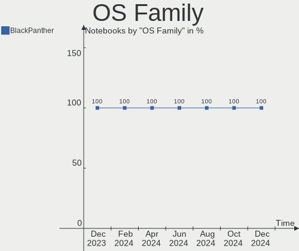
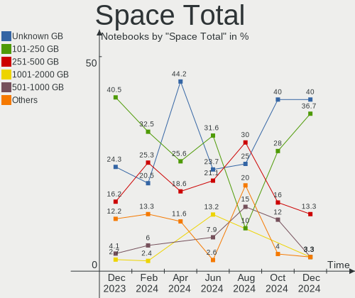
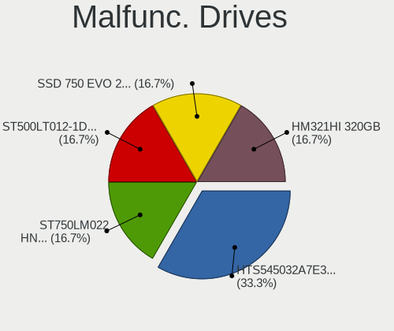
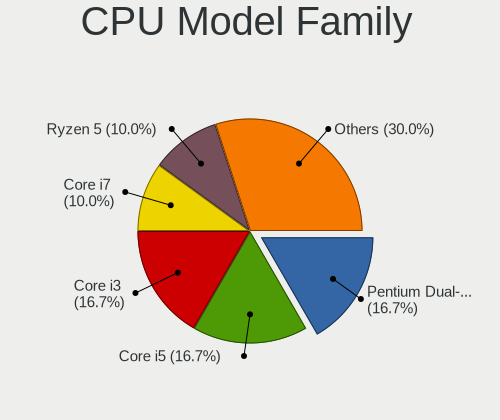
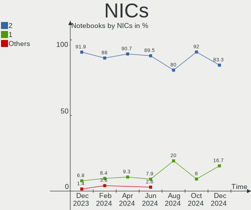

BlackPanther - Hardware Trends (Notebooks)
------------------------------------------

A project to identify most popular hardware characteristics and track their change
over time based on data collected by Linux users at https://Linux-Hardware.org.

Anyone can contribute to this report by the [hw-probe](https://github.com/linuxhw/hw-probe) tool:

    sudo -E hw-probe -all -upload

This report is for one last month. Overall report since the beginning of time: [TestDays](https://github.com/linuxhw/TestDays)

Period: Oct, 2023.

Contents
--------

* [ System ](#system)
  - [ OS                       ](#os)
  - [ OS Family                ](#os-family)
  - [ Kernel                   ](#kernel)
  - [ Kernel Family            ](#kernel-family)
  - [ Kernel Major Ver.        ](#kernel-major-ver)
  - [ Arch                     ](#arch)
  - [ DE                       ](#de)
  - [ Display Server           ](#display-server)
  - [ Display Manager          ](#display-manager)
  - [ OS Lang                  ](#os-lang)
  - [ Boot Mode                ](#boot-mode)
  - [ Filesystem               ](#filesystem)
  - [ Part. scheme             ](#part-scheme)
  - [ Dual Boot with Linux/BSD ](#dual-boot-with-linuxbsd)
  - [ Dual Boot (Win)          ](#dual-boot-win)

* [ Board ](#board)
  - [ Vendor                   ](#vendor)
  - [ Model                    ](#model)
  - [ Model Family             ](#model-family)
  - [ MFG Year                 ](#mfg-year)
  - [ Form Factor              ](#form-factor)
  - [ Secure Boot              ](#secure-boot)
  - [ Coreboot                 ](#coreboot)
  - [ RAM Size                 ](#ram-size)
  - [ RAM Used                 ](#ram-used)
  - [ Total Drives             ](#total-drives)
  - [ Has CD-ROM               ](#has-cd-rom)
  - [ Has Ethernet             ](#has-ethernet)
  - [ Has WiFi                 ](#has-wifi)
  - [ Has Bluetooth            ](#has-bluetooth)

* [ Location ](#location)
  - [ Country                  ](#country)
  - [ City                     ](#city)

* [ Drives ](#drives)
  - [ Drive Vendor             ](#drive-vendor)
  - [ Drive Model              ](#drive-model)
  - [ HDD Vendor               ](#hdd-vendor)
  - [ SSD Vendor               ](#ssd-vendor)
  - [ Drive Kind               ](#drive-kind)
  - [ Drive Connector          ](#drive-connector)
  - [ Drive Size               ](#drive-size)
  - [ Space Total              ](#space-total)
  - [ Space Used               ](#space-used)
  - [ Malfunc. Drives          ](#malfunc-drives)
  - [ Malfunc. Drive Vendor    ](#malfunc-drive-vendor)
  - [ Malfunc. HDD Vendor      ](#malfunc-hdd-vendor)
  - [ Malfunc. Drive Kind      ](#malfunc-drive-kind)
  - [ Failed Drives            ](#failed-drives)
  - [ Failed Drive Vendor      ](#failed-drive-vendor)
  - [ Drive Status             ](#drive-status)

* [ Storage controller ](#storage-controller)
  - [ Storage Vendor           ](#storage-vendor)
  - [ Storage Model            ](#storage-model)
  - [ Storage Kind             ](#storage-kind)

* [ Processor ](#processor)
  - [ CPU Vendor               ](#cpu-vendor)
  - [ CPU Model                ](#cpu-model)
  - [ CPU Model Family         ](#cpu-model-family)
  - [ CPU Cores                ](#cpu-cores)
  - [ CPU Sockets              ](#cpu-sockets)
  - [ CPU Threads              ](#cpu-threads)
  - [ CPU Op-Modes             ](#cpu-op-modes)
  - [ CPU Microcode            ](#cpu-microcode)
  - [ CPU Microarch            ](#cpu-microarch)

* [ Graphics ](#graphics)
  - [ GPU Vendor               ](#gpu-vendor)
  - [ GPU Model                ](#gpu-model)
  - [ GPU Combo                ](#gpu-combo)
  - [ GPU Driver               ](#gpu-driver)
  - [ GPU Memory               ](#gpu-memory)

* [ Monitor ](#monitor)
  - [ Monitor Vendor           ](#monitor-vendor)
  - [ Monitor Model            ](#monitor-model)
  - [ Monitor Resolution       ](#monitor-resolution)
  - [ Monitor Diagonal         ](#monitor-diagonal)
  - [ Monitor Width            ](#monitor-width)
  - [ Aspect Ratio             ](#aspect-ratio)
  - [ Monitor Area             ](#monitor-area)
  - [ Pixel Density            ](#pixel-density)
  - [ Multiple Monitors        ](#multiple-monitors)

* [ Network ](#network)
  - [ Net Controller Vendor    ](#net-controller-vendor)
  - [ Net Controller Model     ](#net-controller-model)
  - [ Wireless Vendor          ](#wireless-vendor)
  - [ Wireless Model           ](#wireless-model)
  - [ Ethernet Vendor          ](#ethernet-vendor)
  - [ Ethernet Model           ](#ethernet-model)
  - [ Net Controller Kind      ](#net-controller-kind)
  - [ Used Controller          ](#used-controller)
  - [ NICs                     ](#nics)
  - [ IPv6                     ](#ipv6)

* [ Bluetooth ](#bluetooth)
  - [ Bluetooth Vendor         ](#bluetooth-vendor)
  - [ Bluetooth Model          ](#bluetooth-model)

* [ Sound ](#sound)
  - [ Sound Vendor             ](#sound-vendor)
  - [ Sound Model              ](#sound-model)

* [ Memory ](#memory)
  - [ Memory Vendor            ](#memory-vendor)
  - [ Memory Model             ](#memory-model)
  - [ Memory Kind              ](#memory-kind)
  - [ Memory Form Factor       ](#memory-form-factor)
  - [ Memory Size              ](#memory-size)
  - [ Memory Speed             ](#memory-speed)

* [ Printers & scanners ](#printers--scanners)
  - [ Printer Vendor           ](#printer-vendor)
  - [ Printer Model            ](#printer-model)
  - [ Scanner Vendor           ](#scanner-vendor)
  - [ Scanner Model            ](#scanner-model)

* [ Camera ](#camera)
  - [ Camera Vendor            ](#camera-vendor)
  - [ Camera Model             ](#camera-model)

* [ Security ](#security)
  - [ Fingerprint Vendor       ](#fingerprint-vendor)
  - [ Fingerprint Model        ](#fingerprint-model)
  - [ Chipcard Vendor          ](#chipcard-vendor)
  - [ Chipcard Model           ](#chipcard-model)

* [ Unsupported ](#unsupported)
  - [ Unsupported Devices      ](#unsupported-devices)
  - [ Unsupported Device Types ](#unsupported-device-types)

System
------

OS
--

Installed operating systems

| Name              | Notebooks | Percent |
|-------------------|-----------|---------|
| BlackPanther 18.1 | 41        | 89.13%  |
| BlackPanther 22.1 | 5         | 10.87%  |

OS Family
---------

OS without a version

| Name         | Notebooks | Percent |
|--------------|-----------|---------|
| BlackPanther | 46        | 100%    |

Kernel
------

Version of the Linux kernel

| Version             | Notebooks | Percent |
|---------------------|-----------|---------|
| 5.6.14-desktop-2bP  | 15        | 32.61%  |
| 5.15.85-desktop-1bP | 13        | 28.26%  |
| 4.18.16-desktop-1bP | 13        | 28.26%  |
| 6.5.3-power-1bP     | 2         | 4.35%   |
| 6.3.8-desktop-1bP   | 2         | 4.35%   |
| 6.2.9-desktop-1bP   | 1         | 2.17%   |

Kernel Family
-------------

Linux kernel without a distro release

| Version | Notebooks | Percent |
|---------|-----------|---------|
| 5.6.14  | 15        | 32.61%  |
| 5.15.85 | 13        | 28.26%  |
| 4.18.16 | 13        | 28.26%  |
| 6.5.3   | 2         | 4.35%   |
| 6.3.8   | 2         | 4.35%   |
| 6.2.9   | 1         | 2.17%   |

Kernel Major Ver.
-----------------

Linux kernel major version

| Version | Notebooks | Percent |
|---------|-----------|---------|
| 5.6     | 15        | 32.61%  |
| 5.15    | 13        | 28.26%  |
| 4.18    | 13        | 28.26%  |
| 6.5     | 2         | 4.35%   |
| 6.3     | 2         | 4.35%   |
| 6.2     | 1         | 2.17%   |

Arch
----

OS architecture (x86_64, i586, etc.)

| Name   | Notebooks | Percent |
|--------|-----------|---------|
| x86_64 | 46        | 100%    |

DE
--

Desktop Environment

| Name    | Notebooks | Percent |
|---------|-----------|---------|
| KDE5    | 44        | 95.65%  |
| Unknown | 2         | 4.35%   |

Display Server
--------------

X11 or Wayland

| Name | Notebooks | Percent |
|------|-----------|---------|
| X11  | 46        | 100%    |

Display Manager
---------------

SDDM, LightDM, etc.

| Name | Notebooks | Percent |
|------|-----------|---------|
| SDDM | 46        | 100%    |

OS Lang
-------

Language

| Lang    | Notebooks | Percent |
|---------|-----------|---------|
| Unknown | 46        | 100%    |

Boot Mode
---------

EFI or BIOS

| Mode | Notebooks | Percent |
|------|-----------|---------|
| EFI  | 26        | 56.52%  |
| BIOS | 20        | 43.48%  |

Filesystem
----------

Type of filesystem

| Type    | Notebooks | Percent |
|---------|-----------|---------|
| Ext4    | 25        | 54.35%  |
| Overlay | 19        | 41.3%   |
| Btrfs   | 2         | 4.35%   |

Part. scheme
------------

Scheme of partitioning

| Type | Notebooks | Percent |
|------|-----------|---------|
| GPT  | 27        | 58.7%   |
| MBR  | 19        | 41.3%   |

Dual Boot with Linux/BSD
------------------------

Hosting more than one Linux/BSD

| Dual boot | Notebooks | Percent |
|-----------|-----------|---------|
| No        | 32        | 69.57%  |
| Yes       | 14        | 30.43%  |

Dual Boot (Win)
---------------

Hosting Linux and Windows

| Dual boot | Notebooks | Percent |
|-----------|-----------|---------|
| No        | 29        | 63.04%  |
| Yes       | 17        | 36.96%  |

Board
-----

Vendor
------

Motherboard manufacturer

| Name                | Notebooks | Percent |
|---------------------|-----------|---------|
| Lenovo              | 12        | 26.09%  |
| Dell                | 11        | 23.91%  |
| ASUSTek Computer    | 7         | 15.22%  |
| Hewlett-Packard     | 3         | 6.52%   |
| Acer                | 3         | 6.52%   |
| Sony                | 2         | 4.35%   |
| Fujitsu             | 2         | 4.35%   |
| eMachines           | 2         | 4.35%   |
| Samsung Electronics | 1         | 2.17%   |
| MSI                 | 1         | 2.17%   |
| Fujitsu Siemens     | 1         | 2.17%   |
| AWOW                | 1         | 2.17%   |

Model
-----

Motherboard model

| Name                                        | Notebooks | Percent |
|---------------------------------------------|-----------|---------|
| Sony VPCS13V9E                              | 1         | 2.17%   |
| Sony VPCEH2N1E                              | 1         | 2.17%   |
| Samsung RV411/RV511/E3511/S3511/RV711/E3411 | 1         | 2.17%   |
| MSI GT60 2OC/2OD                            | 1         | 2.17%   |
| Lenovo V15-ADA 82C7                         | 1         | 2.17%   |
| Lenovo ThinkPad X230 2333A91                | 1         | 2.17%   |
| Lenovo ThinkPad T61 889855G                 | 1         | 2.17%   |
| Lenovo ThinkPad T420 4236B87                | 1         | 2.17%   |
| Lenovo IdeaPad Y700-15ISK 80NV              | 1         | 2.17%   |
| Lenovo IdeaPad 330-15IKB 81DE               | 1         | 2.17%   |
| Lenovo IdeaPad 110-15ISK 80UD               | 1         | 2.17%   |
| Lenovo G505s 20255                          | 1         | 2.17%   |
| Lenovo G505 20240                           | 1         | 2.17%   |
| Lenovo G50-30 80G0                          | 1         | 2.17%   |
| Lenovo Flex 2-15D 20377                     | 1         | 2.17%   |
| Lenovo E50-80 80J2                          | 1         | 2.17%   |
| HP ProBook 6570b                            | 1         | 2.17%   |
| HP Notebook                                 | 1         | 2.17%   |
| HP HDX 16                                   | 1         | 2.17%   |
| Fujitsu Siemens AMILO Si 2636               | 1         | 2.17%   |
| Fujitsu LIFEBOOK A555                       | 1         | 2.17%   |
| Fujitsu LIFEBOOK A512                       | 1         | 2.17%   |
| eMachines E725                              | 1         | 2.17%   |
| eMachines E525                              | 1         | 2.17%   |
| Dell Vostro 3500                            | 1         | 2.17%   |
| Dell Latitude E6540                         | 1         | 2.17%   |
| Dell Latitude E6230                         | 1         | 2.17%   |
| Dell Latitude 7390                          | 1         | 2.17%   |
| Dell Inspiron N5010                         | 1         | 2.17%   |
| Dell Inspiron 7737                          | 1         | 2.17%   |
| Dell Inspiron 5558                          | 1         | 2.17%   |
| Dell Inspiron 3521                          | 1         | 2.17%   |
| Dell Inspiron 17 7000 Series 7746           | 1         | 2.17%   |
| Dell Inspiron 1545                          | 1         | 2.17%   |
| Dell Inspiron 15-3573                       | 1         | 2.17%   |
| AWOW AK41                                   | 1         | 2.17%   |
| ASUS X55U                                   | 1         | 2.17%   |
| ASUS X551CA                                 | 1         | 2.17%   |
| ASUS X200MA                                 | 1         | 2.17%   |
| ASUS K54C                                   | 1         | 2.17%   |

Model Family
------------

Motherboard model prefix

| Name                  | Notebooks | Percent |
|-----------------------|-----------|---------|
| Dell Inspiron         | 7         | 15.22%  |
| Lenovo ThinkPad       | 3         | 6.52%   |
| Lenovo IdeaPad        | 3         | 6.52%   |
| Dell Latitude         | 3         | 6.52%   |
| Fujitsu LIFEBOOK      | 2         | 4.35%   |
| Acer Aspire           | 2         | 4.35%   |
| Sony VPCS13V9E        | 1         | 2.17%   |
| Sony VPCEH2N1E        | 1         | 2.17%   |
| Samsung RV411         | 1         | 2.17%   |
| MSI GT60              | 1         | 2.17%   |
| Lenovo V15-ADA        | 1         | 2.17%   |
| Lenovo G505s          | 1         | 2.17%   |
| Lenovo G505           | 1         | 2.17%   |
| Lenovo G50-30         | 1         | 2.17%   |
| Lenovo Flex           | 1         | 2.17%   |
| Lenovo E50-80         | 1         | 2.17%   |
| HP ProBook            | 1         | 2.17%   |
| HP Notebook           | 1         | 2.17%   |
| HP HDX                | 1         | 2.17%   |
| Fujitsu Siemens AMILO | 1         | 2.17%   |
| eMachines E725        | 1         | 2.17%   |
| eMachines E525        | 1         | 2.17%   |
| Dell Vostro           | 1         | 2.17%   |
| AWOW AK41             | 1         | 2.17%   |
| ASUS X55U             | 1         | 2.17%   |
| ASUS X551CA           | 1         | 2.17%   |
| ASUS X200MA           | 1         | 2.17%   |
| ASUS K54C             | 1         | 2.17%   |
| ASUS K51AE            | 1         | 2.17%   |
| ASUS ASUS             | 1         | 2.17%   |
| ASUS 1015BX           | 1         | 2.17%   |
| Acer TravelMate       | 1         | 2.17%   |

MFG Year
--------

Motherboard manufacture year

| Year | Notebooks | Percent |
|------|-----------|---------|
| 2013 | 7         | 15.22%  |
| 2011 | 6         | 13.04%  |
| 2015 | 5         | 10.87%  |
| 2012 | 5         | 10.87%  |
| 2014 | 4         | 8.7%    |
| 2009 | 4         | 8.7%    |
| 2020 | 3         | 6.52%   |
| 2018 | 3         | 6.52%   |
| 2010 | 3         | 6.52%   |
| 2016 | 2         | 4.35%   |
| 2008 | 2         | 4.35%   |
| 2021 | 1         | 2.17%   |
| 2007 | 1         | 2.17%   |

Form Factor
-----------

Physical design of the computer

| Name     | Notebooks | Percent |
|----------|-----------|---------|
| Notebook | 46        | 100%    |

Secure Boot
-----------

Enabled or disabled

| State    | Notebooks | Percent |
|----------|-----------|---------|
| Disabled | 46        | 100%    |

Coreboot
--------

Have coreboot on board

| Used | Notebooks | Percent |
|------|-----------|---------|
| No   | 46        | 100%    |

RAM Size
--------

Total RAM memory

| Size in GB | Notebooks | Percent |
|------------|-----------|---------|
| 3.01-4.0   | 15        | 32.61%  |
| 4.01-8.0   | 13        | 28.26%  |
| 8.01-16.0  | 10        | 21.74%  |
| 16.01-24.0 | 3         | 6.52%   |
| 2.01-3.0   | 2         | 4.35%   |
| 1.01-2.0   | 2         | 4.35%   |
| 24.01-32.0 | 1         | 2.17%   |

RAM Used
--------

Used RAM memory

| Used GB  | Notebooks | Percent |
|----------|-----------|---------|
| 1.01-2.0 | 21        | 45.65%  |
| 0.51-1.0 | 18        | 39.13%  |
| 4.01-8.0 | 2         | 4.35%   |
| 3.01-4.0 | 2         | 4.35%   |
| 0.01-0.5 | 2         | 4.35%   |
| 2.01-3.0 | 1         | 2.17%   |

Total Drives
------------

Number of drives on board

| Drives | Notebooks | Percent |
|--------|-----------|---------|
| 1      | 33        | 71.74%  |
| 2      | 12        | 26.09%  |
| 3      | 1         | 2.17%   |

Has CD-ROM
----------

Has CD-ROM on board

| Presented | Notebooks | Percent |
|-----------|-----------|---------|
| Yes       | 26        | 56.52%  |
| No        | 20        | 43.48%  |

Has Ethernet
------------

Has Ethernet on board

| Presented | Notebooks | Percent |
|-----------|-----------|---------|
| Yes       | 44        | 95.65%  |
| No        | 2         | 4.35%   |

Has WiFi
--------

Has WiFi module

| Presented | Notebooks | Percent |
|-----------|-----------|---------|
| Yes       | 45        | 97.83%  |
| No        | 1         | 2.17%   |

Has Bluetooth
-------------

Has Bluetooth module

| Presented | Notebooks | Percent |
|-----------|-----------|---------|
| Yes       | 35        | 76.09%  |
| No        | 11        | 23.91%  |

Location
--------

Country
-------

Geographic location (country)

| Country  | Notebooks | Percent |
|----------|-----------|---------|
| Hungary  | 38        | 82.61%  |
| UK       | 4         | 8.7%    |
| Germany  | 2         | 4.35%   |
| Slovakia | 1         | 2.17%   |
| Austria  | 1         | 2.17%   |

City
----

Geographic location (city)

| City                    | Notebooks | Percent |
|-------------------------|-----------|---------|
| Budapest                | 11        | 23.91%  |
| Pomaz                   | 3         | 6.52%   |
| Tamasi                  | 2         | 4.35%   |
| Szombathely             | 2         | 4.35%   |
| Pécs                   | 2         | 4.35%   |
| Harlow                  | 2         | 4.35%   |
| Zalaegerszeg            | 1         | 2.17%   |
| Tornaľa                | 1         | 2.17%   |
| Toeroekbalint           | 1         | 2.17%   |
| Szolnok                 | 1         | 2.17%   |
| Szigetszentmiklos       | 1         | 2.17%   |
| Szigethalom             | 1         | 2.17%   |
| Szeghalom               | 1         | 2.17%   |
| Sarkad                  | 1         | 2.17%   |
| Regensburg              | 1         | 2.17%   |
| Pfaffenhofen an der Ilm | 1         | 2.17%   |
| Nagykoroes              | 1         | 2.17%   |
| Mandok                  | 1         | 2.17%   |
| Lambeth                 | 1         | 2.17%   |
| Kiskunhalas             | 1         | 2.17%   |
| Gyongyoshalasz          | 1         | 2.17%   |
| Gyongyos                | 1         | 2.17%   |
| Graz                    | 1         | 2.17%   |
| Fertoszentmiklos        | 1         | 2.17%   |
| Csongrad                | 1         | 2.17%   |
| Bishop's Stortford      | 1         | 2.17%   |
| Bicske                  | 1         | 2.17%   |
| Berettyóújfalu        | 1         | 2.17%   |
| Békéscsaba            | 1         | 2.17%   |
| Balassagyarmat          | 1         | 2.17%   |

Drives
------

Drive Vendor
------------

Hard drive vendors

| Vendor              | Notebooks | Drives | Percent |
|---------------------|-----------|--------|---------|
| Seagate             | 9         | 9      | 16.07%  |
| Samsung Electronics | 7         | 7      | 12.5%   |
| Kingston            | 7         | 9      | 12.5%   |
| WDC                 | 5         | 6      | 8.93%   |
| SanDisk             | 3         | 3      | 5.36%   |
| Unknown             | 2         | 2      | 3.57%   |
| Toshiba             | 2         | 2      | 3.57%   |
| SPCC                | 2         | 2      | 3.57%   |
| LITEON              | 2         | 2      | 3.57%   |
| Intenso             | 2         | 2      | 3.57%   |
| Intel               | 2         | 2      | 3.57%   |
| Hitachi             | 2         | 2      | 3.57%   |
| HGST                | 2         | 2      | 3.57%   |
| A-DATA Technology   | 2         | 2      | 3.57%   |
| Verbatim            | 1         | 1      | 1.79%   |
| Team                | 1         | 1      | 1.79%   |
| SK hynix            | 1         | 1      | 1.79%   |
| PNY                 | 1         | 1      | 1.79%   |
| Fujitsu             | 1         | 1      | 1.79%   |
| Crucial             | 1         | 1      | 1.79%   |
| Unknown             | 1         | 1      | 1.79%   |

Drive Model
-----------

Hard drive models

| Model                                   | Notebooks | Percent |
|-----------------------------------------|-----------|---------|
| Kingston SA400S37240G 240GB SSD         | 3         | 5.08%   |
| WDC WD10SPCX-24HWST1 1TB                | 2         | 3.39%   |
| Seagate ST500LT012-1DG142 500GB         | 2         | 3.39%   |
| Samsung SSD 870 EVO 250GB               | 2         | 3.39%   |
| Kingston SA400S37480G 480GB SSD         | 2         | 3.39%   |
| Kingston SA400S37120G 120GB SSD         | 2         | 3.39%   |
| WDC WD5000BEKT-22KA9T0 500GB            | 1         | 1.69%   |
| WDC WD3200BPVT-80ZEST0 320GB            | 1         | 1.69%   |
| WDC WD1200BEVS-22UST0 120GB             | 1         | 1.69%   |
| WDC WD10JPLX-00MBPT0 1TB                | 1         | 1.69%   |
| Verbatim Vi550 S3 SSD 256GB             | 1         | 1.69%   |
| Unknown SL16G  16GB                     | 1         | 1.69%   |
| Unknown MMC Card  32GB                  | 1         | 1.69%   |
| Toshiba MK6461GSYN 640GB                | 1         | 1.69%   |
| Toshiba KSG60ZMV256G M.2 2280 256GB SSD | 1         | 1.69%   |
| Team T253X1120G 120GB SSD               | 1         | 1.69%   |
| SPCC Solid State Disk 256GB             | 1         | 1.69%   |
| SPCC Solid State Disk 128GB             | 1         | 1.69%   |
| SK hynix BC711 NVMe 512GB               | 1         | 1.69%   |
| Seagate ST980813AS 80GB                 | 1         | 1.69%   |
| Seagate ST500LT012-9WS142 500GB         | 1         | 1.69%   |
| Seagate ST500LM000-SSHD-8GB             | 1         | 1.69%   |
| Seagate ST2000LM003 HN-M201RAD 2TB      | 1         | 1.69%   |
| Seagate ST1000LM035-1RK172 1TB          | 1         | 1.69%   |
| Seagate ST1000LM024 HN-M101MBB 1TB      | 1         | 1.69%   |
| Seagate ST1000LM014-1EJ164 1TB          | 1         | 1.69%   |
| SanDisk SSD PLUS 240GB                  | 1         | 1.69%   |
| SanDisk SDSSDH3 250G                    | 1         | 1.69%   |
| SanDisk NVMe SSD Drive 1TB              | 1         | 1.69%   |
| Samsung SSD 870 QVO 1TB                 | 1         | 1.69%   |
| Samsung SSD 860 EVO 500GB               | 1         | 1.69%   |
| Samsung SSD 850 EVO 250GB               | 1         | 1.69%   |
| Samsung SSD 830 Series 128GB            | 1         | 1.69%   |
| Samsung SSD 750 EVO 250GB               | 1         | 1.69%   |
| PNY 240GB SATA SSD                      | 1         | 1.69%   |
| LITEON CV1-8B128 128GB SSD              | 1         | 1.69%   |
| LITEON CA3-8D512 512GB                  | 1         | 1.69%   |
| Kingston SNV2S500G 500GB                | 1         | 1.69%   |
| Kingston SA400S37960G 960GB SSD         | 1         | 1.69%   |
| Intenso SSD 128GB                       | 1         | 1.69%   |

HDD Vendor
----------

Hard disk drive vendors

| Vendor  | Notebooks | Drives | Percent |
|---------|-----------|--------|---------|
| Seagate | 9         | 9      | 45%     |
| WDC     | 5         | 6      | 25%     |
| Hitachi | 2         | 2      | 10%     |
| HGST    | 2         | 2      | 10%     |
| Toshiba | 1         | 1      | 5%      |
| Fujitsu | 1         | 1      | 5%      |

SSD Vendor
----------

Solid state drive vendors

| Vendor              | Notebooks | Drives | Percent |
|---------------------|-----------|--------|---------|
| Samsung Electronics | 7         | 7      | 25%     |
| Kingston            | 6         | 8      | 21.43%  |
| SPCC                | 2         | 2      | 7.14%   |
| SanDisk             | 2         | 2      | 7.14%   |
| Intenso             | 2         | 2      | 7.14%   |
| A-DATA Technology   | 2         | 2      | 7.14%   |
| Verbatim            | 1         | 1      | 3.57%   |
| Toshiba             | 1         | 1      | 3.57%   |
| Team                | 1         | 1      | 3.57%   |
| PNY                 | 1         | 1      | 3.57%   |
| LITEON              | 1         | 1      | 3.57%   |
| Intel               | 1         | 1      | 3.57%   |
| Crucial             | 1         | 1      | 3.57%   |

Drive Kind
----------

HDD or SSD

| Kind | Notebooks | Drives | Percent |
|------|-----------|--------|---------|
| SSD  | 28        | 30     | 50%     |
| HDD  | 20        | 21     | 35.71%  |
| NVMe | 5         | 5      | 8.93%   |
| MMC  | 3         | 3      | 5.36%   |

Drive Connector
---------------

SATA, SAS, NVMe, etc.

| Type | Notebooks | Drives | Percent |
|------|-----------|--------|---------|
| SATA | 43        | 51     | 84.31%  |
| NVMe | 5         | 5      | 9.8%    |
| MMC  | 3         | 3      | 5.88%   |

Drive Size
----------

Size of hard drive

| Size in TB | Notebooks | Drives | Percent |
|------------|-----------|--------|---------|
| 0.01-0.5   | 37        | 40     | 77.08%  |
| 0.51-1.0   | 10        | 10     | 20.83%  |
| 1.01-2.0   | 1         | 1      | 2.08%   |

Space Total
-----------

Amount of disk space available on the file system

| Size in GB | Notebooks | Percent |
|------------|-----------|---------|
| Unknown    | 18        | 39.13%  |
| 101-250    | 14        | 30.43%  |
| 251-500    | 5         | 10.87%  |
| 2001-3000  | 2         | 4.35%   |
| 1001-2000  | 2         | 4.35%   |
| 501-1000   | 2         | 4.35%   |
| 51-100     | 2         | 4.35%   |
| 1-20       | 1         | 2.17%   |

Space Used
----------

Amount of used disk space

| Used GB   | Notebooks | Percent |
|-----------|-----------|---------|
| 1-20      | 18        | 39.13%  |
| Unknown   | 18        | 39.13%  |
| 21-50     | 3         | 6.52%   |
| 1001-2000 | 2         | 4.35%   |
| 51-100    | 2         | 4.35%   |
| 251-500   | 1         | 2.17%   |
| 2001-3000 | 1         | 2.17%   |
| 101-250   | 1         | 2.17%   |

Malfunc. Drives
---------------

Drive models with a malfunction

| Model                                 | Notebooks | Drives | Percent |
|---------------------------------------|-----------|--------|---------|
| Seagate ST500LT012-1DG142 500GB       | 2         | 2      | 15.38%  |
| WDC WD5000BEKT-22KA9T0 500GB          | 1         | 1      | 7.69%   |
| WDC WD3200BPVT-80ZEST0 320GB          | 1         | 1      | 7.69%   |
| WDC WD10JPLX-00MBPT0 1TB              | 1         | 1      | 7.69%   |
| Seagate ST980813AS 80GB               | 1         | 1      | 7.69%   |
| Seagate ST500LT012-9WS142 500GB       | 1         | 1      | 7.69%   |
| Seagate ST500LM000-SSHD-8GB           | 1         | 1      | 7.69%   |
| Samsung Electronics SSD 750 EVO 250GB | 1         | 1      | 7.69%   |
| Kingston SA400S37120G 120GB SSD       | 1         | 1      | 7.69%   |
| Intel SSDSC2BF180A4L 180GB            | 1         | 1      | 7.69%   |
| Hitachi HTS723232A7A364 320GB         | 1         | 1      | 7.69%   |
| Hitachi HTS543225L9A300 250GB         | 1         | 1      | 7.69%   |

Malfunc. Drive Vendor
---------------------

Vendors of faulty drives

| Vendor              | Notebooks | Drives | Percent |
|---------------------|-----------|--------|---------|
| Seagate             | 5         | 5      | 41.67%  |
| WDC                 | 2         | 3      | 16.67%  |
| Hitachi             | 2         | 2      | 16.67%  |
| Samsung Electronics | 1         | 1      | 8.33%   |
| Kingston            | 1         | 1      | 8.33%   |
| Intel               | 1         | 1      | 8.33%   |

Malfunc. HDD Vendor
-------------------

Vendors of faulty HDD drives

| Vendor  | Notebooks | Drives | Percent |
|---------|-----------|--------|---------|
| Seagate | 5         | 5      | 55.56%  |
| WDC     | 2         | 3      | 22.22%  |
| Hitachi | 2         | 2      | 22.22%  |

Malfunc. Drive Kind
-------------------

Kinds of faulty drives

| Kind | Notebooks | Drives | Percent |
|------|-----------|--------|---------|
| HDD  | 9         | 10     | 75%     |
| SSD  | 3         | 3      | 25%     |

Failed Drives
-------------

Failed drive models

Zero info for selected period =(

Failed Drive Vendor
-------------------

Failed drive vendors

Zero info for selected period =(

Drive Status
------------

Number of failed and malfunc. drives

| Status   | Notebooks | Drives | Percent |
|----------|-----------|--------|---------|
| Works    | 35        | 42     | 70%     |
| Malfunc  | 12        | 13     | 24%     |
| Detected | 3         | 4      | 6%      |

Storage controller
------------------

Storage Vendor
--------------

Storage controller vendors

| Vendor                      | Notebooks | Percent |
|-----------------------------|-----------|---------|
| Intel                       | 38        | 74.51%  |
| AMD                         | 8         | 15.69%  |
| SK hynix                    | 1         | 1.96%   |
| Silicon Image               | 1         | 1.96%   |
| SanDisk                     | 1         | 1.96%   |
| Lite-On Technology          | 1         | 1.96%   |
| Kingston Technology Company | 1         | 1.96%   |

Storage Model
-------------

Storage controller models

| Model                                                                                  | Notebooks | Percent |
|----------------------------------------------------------------------------------------|-----------|---------|
| Intel Wildcat Point-LP SATA Controller [AHCI Mode]                                     | 5         | 8.33%   |
| Intel 82801 Mobile SATA Controller [RAID mode]                                         | 4         | 6.67%   |
| Intel 7 Series Chipset Family 6-port SATA Controller [AHCI mode]                       | 4         | 6.67%   |
| Intel 6 Series/C200 Series Chipset Family 6 port Mobile SATA AHCI Controller           | 4         | 6.67%   |
| AMD FCH SATA Controller [AHCI mode]                                                    | 4         | 6.67%   |
| Intel 82801IBM/IEM (ICH9M/ICH9M-E) 4 port SATA Controller [AHCI mode]                  | 3         | 5%      |
| Intel Tiger Lake-LP SATA Controller                                                    | 2         | 3.33%   |
| Intel Sunrise Point-LP SATA Controller [AHCI mode]                                     | 2         | 3.33%   |
| Intel Celeron/Pentium Silver Processor SATA Controller                                 | 2         | 3.33%   |
| Intel Atom Processor E3800 Series SATA AHCI Controller                                 | 2         | 3.33%   |
| Intel 82801HM/HEM (ICH8M/ICH8M-E) SATA Controller [AHCI mode]                          | 2         | 3.33%   |
| Intel 82801HM/HEM (ICH8M/ICH8M-E) IDE Controller                                       | 2         | 3.33%   |
| Intel 5 Series/3400 Series Chipset 4 port SATA AHCI Controller                         | 2         | 3.33%   |
| AMD FCH SATA Controller [IDE mode]                                                     | 2         | 3.33%   |
| SK hynix Gold P31/BC711/PC711 NVMe Solid State Drive                                   | 1         | 1.67%   |
| Silicon Image SiI 3531 [SATALink/SATARaid] Serial ATA Controller                       | 1         | 1.67%   |
| SanDisk Ultra 3D / WD Blue SN570 NVMe SSD (DRAM-less)                                  | 1         | 1.67%   |
| Lite-On CA3-8D256, CA3-8D512 NVMe SSD                                                  | 1         | 1.67%   |
| Kingston Company NV2 NVMe SSD SM2267XT                                                 | 1         | 1.67%   |
| Intel Volume Management Device NVMe RAID Controller                                    | 1         | 1.67%   |
| Intel SSD 670p Series [Keystone Harbor]                                                | 1         | 1.67%   |
| Intel HM170/QM170 Chipset SATA Controller [AHCI Mode]                                  | 1         | 1.67%   |
| Intel Comet Lake SATA AHCI Controller                                                  | 1         | 1.67%   |
| Intel 82801IBM/IEM (ICH9M/ICH9M-E) 2 port SATA Controller [IDE mode]                   | 1         | 1.67%   |
| Intel 8 Series/C220 Series Chipset Family 6-port SATA Controller 1 [AHCI mode]         | 1         | 1.67%   |
| Intel 8 Series SATA Controller 1 [AHCI mode]                                           | 1         | 1.67%   |
| Intel 7 Series Chipset Family 4-port SATA Controller [IDE mode]                        | 1         | 1.67%   |
| Intel 7 Series Chipset Family 2-port SATA Controller [IDE mode]                        | 1         | 1.67%   |
| Intel 6 Series/C200 Series Chipset Family Mobile SATA Controller (IDE mode, ports 4-5) | 1         | 1.67%   |
| Intel 6 Series/C200 Series Chipset Family Mobile SATA Controller (IDE mode, ports 0-3) | 1         | 1.67%   |
| Intel 5 Series/3400 Series Chipset 6 port SATA AHCI Controller                         | 1         | 1.67%   |
| AMD SB7x0/SB8x0/SB9x0 SATA Controller [IDE mode]                                       | 1         | 1.67%   |
| AMD SB7x0/SB8x0/SB9x0 SATA Controller [AHCI mode]                                      | 1         | 1.67%   |
| AMD FCH IDE Controller                                                                 | 1         | 1.67%   |

Storage Kind
------------

Kind of storage controller (IDE, SATA, NVMe, SAS, ...)

| Kind | Notebooks | Percent |
|------|-----------|---------|
| SATA | 41        | 70.69%  |
| RAID | 6         | 10.34%  |
| IDE  | 6         | 10.34%  |
| NVMe | 5         | 8.62%   |

Processor
---------

CPU Vendor
----------

Processor vendors

| Vendor | Notebooks | Percent |
|--------|-----------|---------|
| Intel  | 38        | 82.61%  |
| AMD    | 8         | 17.39%  |

CPU Model
---------

Processor models

| Model                                         | Notebooks | Percent |
|-----------------------------------------------|-----------|---------|
| Intel Core i5-5200U CPU @ 2.20GHz             | 2         | 4.35%   |
| Intel Core i5-3320M CPU @ 2.60GHz             | 2         | 4.35%   |
| Intel Core i5 CPU M 460 @ 2.53GHz             | 2         | 4.35%   |
| Intel Core i3-5005U CPU @ 2.00GHz             | 2         | 4.35%   |
| Intel 11th Gen Core i5-1135G7 @ 2.40GHz       | 2         | 4.35%   |
| Intel Pentium Silver N5000 CPU @ 1.10GHz      | 1         | 2.17%   |
| Intel Pentium Dual-Core CPU T4400 @ 2.20GHz   | 1         | 2.17%   |
| Intel Pentium CPU P6200 @ 2.13GHz             | 1         | 2.17%   |
| Intel Pentium CPU B950 @ 2.10GHz              | 1         | 2.17%   |
| Intel Core i7-6700HQ CPU @ 2.60GHz            | 1         | 2.17%   |
| Intel Core i7-5500U CPU @ 2.40GHz             | 1         | 2.17%   |
| Intel Core i7-4810MQ CPU @ 2.80GHz            | 1         | 2.17%   |
| Intel Core i7-4700MQ CPU @ 2.40GHz            | 1         | 2.17%   |
| Intel Core i7-4510U CPU @ 2.00GHz             | 1         | 2.17%   |
| Intel Core i5-8250U CPU @ 1.60GHz             | 1         | 2.17%   |
| Intel Core i5-7300U CPU @ 2.60GHz             | 1         | 2.17%   |
| Intel Core i5-3340M CPU @ 2.70GHz             | 1         | 2.17%   |
| Intel Core i5-3337U CPU @ 1.80GHz             | 1         | 2.17%   |
| Intel Core i5-2520M CPU @ 2.50GHz             | 1         | 2.17%   |
| Intel Core i5-2450M CPU @ 2.50GHz             | 1         | 2.17%   |
| Intel Core i5-2430M CPU @ 2.40GHz             | 1         | 2.17%   |
| Intel Core i3-6100U CPU @ 2.30GHz             | 1         | 2.17%   |
| Intel Core i3-3217U CPU @ 1.80GHz             | 1         | 2.17%   |
| Intel Core i3-3110M CPU @ 2.40GHz             | 1         | 2.17%   |
| Intel Core i3-10110U CPU @ 2.10GHz            | 1         | 2.17%   |
| Intel Core 2 Duo CPU T8100 @ 2.10GHz          | 1         | 2.17%   |
| Intel Core 2 Duo CPU T7100 @ 1.80GHz          | 1         | 2.17%   |
| Intel Core 2 Duo CPU T6600 @ 2.20GHz          | 1         | 2.17%   |
| Intel Core 2 Duo CPU P8700 @ 2.53GHz          | 1         | 2.17%   |
| Intel Celeron J4115 CPU @ 1.80GHz             | 1         | 2.17%   |
| Intel Celeron Dual-Core CPU T3000 @ 1.80GHz   | 1         | 2.17%   |
| Intel Celeron CPU N2830 @ 2.16GHz             | 1         | 2.17%   |
| Intel Celeron CPU N2815 @ 1.86GHz             | 1         | 2.17%   |
| AMD Ryzen 5 3500U with Radeon Vega Mobile Gfx | 1         | 2.17%   |
| AMD E2-1800 APU with Radeon HD Graphics       | 1         | 2.17%   |
| AMD C-50 Processor                            | 1         | 2.17%   |
| AMD Athlon II Dual-Core M320                  | 1         | 2.17%   |
| AMD A8-7050 Radeon R5, 6 Compute Cores 2C+4G  | 1         | 2.17%   |
| AMD A8-6410 APU with AMD Radeon R5 Graphics   | 1         | 2.17%   |
| AMD A8-5550M APU with Radeon HD Graphics      | 1         | 2.17%   |

CPU Model Family
----------------

Processor model prefix

| Model                   | Notebooks | Percent |
|-------------------------|-----------|---------|
| Intel Core i5           | 13        | 28.26%  |
| Intel Core i3           | 6         | 13.04%  |
| Intel Core i7           | 5         | 10.87%  |
| Intel Core 2 Duo        | 4         | 8.7%    |
| Intel Celeron           | 3         | 6.52%   |
| AMD A8                  | 3         | 6.52%   |
| Other                   | 2         | 4.35%   |
| Intel Pentium           | 2         | 4.35%   |
| Intel Pentium Silver    | 1         | 2.17%   |
| Intel Pentium Dual-Core | 1         | 2.17%   |
| Intel Celeron Dual-Core | 1         | 2.17%   |
| AMD Ryzen 5             | 1         | 2.17%   |
| AMD E2                  | 1         | 2.17%   |
| AMD C-50                | 1         | 2.17%   |
| AMD Athlon II Dual-Core | 1         | 2.17%   |
| AMD A4                  | 1         | 2.17%   |

CPU Cores
---------

Number of processor cores

| Number | Notebooks | Percent |
|--------|-----------|---------|
| 2      | 34        | 73.91%  |
| 4      | 11        | 23.91%  |
| 1      | 1         | 2.17%   |

CPU Sockets
-----------

Number of sockets

| Number | Notebooks | Percent |
|--------|-----------|---------|
| 1      | 46        | 100%    |

CPU Threads
-----------

Threads per core (Hyper-Threading)

| Number | Notebooks | Percent |
|--------|-----------|---------|
| 2      | 29        | 63.04%  |
| 1      | 17        | 36.96%  |

CPU Op-Modes
------------

CPU Operation Modes (32-bit, 64-bit)

| Op mode        | Notebooks | Percent |
|----------------|-----------|---------|
| 32-bit, 64-bit | 46        | 100%    |

CPU Microcode
-------------

Microcode number

| Number     | Notebooks | Percent |
|------------|-----------|---------|
| 0x306a9    | 6         | 13.04%  |
| Unknown    | 6         | 13.04%  |
| 0x306d4    | 4         | 8.7%    |
| 0x206a7    | 4         | 8.7%    |
| 0x1067a    | 4         | 8.7%    |
| 0x20655    | 3         | 6.52%   |
| 0x706a1    | 2         | 4.35%   |
| 0x806ec    | 1         | 2.17%   |
| 0x806ea    | 1         | 2.17%   |
| 0x806e9    | 1         | 2.17%   |
| 0x6fd      | 1         | 2.17%   |
| 0x506e3    | 1         | 2.17%   |
| 0x406e3    | 1         | 2.17%   |
| 0x306c3    | 1         | 2.17%   |
| 0x30678    | 1         | 2.17%   |
| 0x30673    | 1         | 2.17%   |
| 0x10676    | 1         | 2.17%   |
| 0x08108109 | 1         | 2.17%   |
| 0x07030104 | 1         | 2.17%   |
| 0x0700010f | 1         | 2.17%   |
| 0x06003109 | 1         | 2.17%   |
| 0x06001119 | 1         | 2.17%   |
| 0x05000119 | 1         | 2.17%   |
| 0x05000029 | 1         | 2.17%   |

CPU Microarch
-------------

Microarchitecture

| Name          | Notebooks | Percent |
|---------------|-----------|---------|
| IvyBridge     | 6         | 13.04%  |
| Penryn        | 5         | 10.87%  |
| Broadwell     | 5         | 10.87%  |
| SandyBridge   | 4         | 8.7%    |
| Westmere      | 3         | 6.52%   |
| KabyLake      | 3         | 6.52%   |
| Haswell       | 3         | 6.52%   |
| TigerLake     | 2         | 4.35%   |
| Skylake       | 2         | 4.35%   |
| Silvermont    | 2         | 4.35%   |
| Goldmont plus | 2         | 4.35%   |
| Bobcat        | 2         | 4.35%   |
| Zen+          | 1         | 2.17%   |
| Steamroller   | 1         | 2.17%   |
| Puma          | 1         | 2.17%   |
| Piledriver    | 1         | 2.17%   |
| K10           | 1         | 2.17%   |
| Jaguar        | 1         | 2.17%   |
| Core          | 1         | 2.17%   |

Graphics
--------

GPU Vendor
----------

Vendors of graphics cards

| Vendor | Notebooks | Percent |
|--------|-----------|---------|
| Intel  | 33        | 58.93%  |
| AMD    | 14        | 25%     |
| Nvidia | 9         | 16.07%  |

GPU Model
---------

Graphics card models

| Model                                                                                 | Notebooks | Percent |
|---------------------------------------------------------------------------------------|-----------|---------|
| Intel 3rd Gen Core processor Graphics Controller                                      | 6         | 10%     |
| Intel HD Graphics 5500                                                                | 5         | 8.33%   |
| Intel 2nd Generation Core Processor Family Integrated Graphics Controller             | 4         | 6.67%   |
| Intel TigerLake-LP GT2 [Iris Xe Graphics]                                             | 2         | 3.33%   |
| Intel Mobile GM965/GL960 Integrated Graphics Controller (secondary)                   | 2         | 3.33%   |
| Intel Mobile GM965/GL960 Integrated Graphics Controller (primary)                     | 2         | 3.33%   |
| Intel Mobile 4 Series Chipset Integrated Graphics Controller                          | 2         | 3.33%   |
| Intel Atom Processor Z36xxx/Z37xxx Series Graphics & Display                          | 2         | 3.33%   |
| Intel 4th Gen Core Processor Integrated Graphics Controller                           | 2         | 3.33%   |
| Nvidia GT218M [GeForce 315M]                                                          | 1         | 1.67%   |
| Nvidia GT218M [GeForce 310M]                                                          | 1         | 1.67%   |
| Nvidia GM108M [GeForce 845M]                                                          | 1         | 1.67%   |
| Nvidia GM107M [GeForce GTX 960M]                                                      | 1         | 1.67%   |
| Nvidia GK208BM [GeForce 920M]                                                         | 1         | 1.67%   |
| Nvidia GK107M [GeForce GT 750M]                                                       | 1         | 1.67%   |
| Nvidia GK106M [GeForce GTX 770M]                                                      | 1         | 1.67%   |
| Nvidia GF108M [GeForce GT 520M]                                                       | 1         | 1.67%   |
| Nvidia G96CM [GeForce 9600M GT]                                                       | 1         | 1.67%   |
| Intel UHD Graphics 620                                                                | 1         | 1.67%   |
| Intel Skylake GT2 [HD Graphics 520]                                                   | 1         | 1.67%   |
| Intel HD Graphics 620                                                                 | 1         | 1.67%   |
| Intel HD Graphics 530                                                                 | 1         | 1.67%   |
| Intel Haswell-ULT Integrated Graphics Controller                                      | 1         | 1.67%   |
| Intel GeminiLake [UHD Graphics 605]                                                   | 1         | 1.67%   |
| Intel GeminiLake [UHD Graphics 600]                                                   | 1         | 1.67%   |
| Intel CometLake-U GT2 [UHD Graphics]                                                  | 1         | 1.67%   |
| AMD Wrestler [Radeon HD 7340]                                                         | 1         | 1.67%   |
| AMD Wrestler [Radeon HD 6250]                                                         | 1         | 1.67%   |
| AMD Topaz XT [Radeon R7 M260/M265 / M340/M360 / M440/M445 / 530/535 / 620/625 Mobile] | 1         | 1.67%   |
| AMD Sun XT [Radeon HD 8670A/8670M/8690M / R5 M330 / M430 / Radeon 520 Mobile]         | 1         | 1.67%   |
| AMD Sun LE [Radeon HD 8550M / R5 M230]                                                | 1         | 1.67%   |
| AMD RV710/M92 [Mobility Radeon HD 4330/4350/4550]                                     | 1         | 1.67%   |
| AMD RS880M [Mobility Radeon HD 4225/4250]                                             | 1         | 1.67%   |
| AMD Richland [Radeon HD 8550G]                                                        | 1         | 1.67%   |
| AMD Picasso/Raven 2 [Radeon Vega Series / Radeon Vega Mobile Series]                  | 1         | 1.67%   |
| AMD Park [Mobility Radeon HD 5430/5450/5470]                                          | 1         | 1.67%   |
| AMD Mullins [Radeon R4/R5 Graphics]                                                   | 1         | 1.67%   |
| AMD Mars [Radeon HD 8730M]                                                            | 1         | 1.67%   |
| AMD Mars XTX [Radeon HD 8790M]                                                        | 1         | 1.67%   |
| AMD Kaveri [Radeon R5 Graphics]                                                       | 1         | 1.67%   |

GPU Combo
---------

Combinations of graphics cards

| Name           | Notebooks | Percent |
|----------------|-----------|---------|
| 1 x Intel      | 23        | 50%     |
| 1 x AMD        | 8         | 17.39%  |
| Intel + Nvidia | 6         | 13.04%  |
| Intel + AMD    | 4         | 8.7%    |
| 1 x Nvidia     | 3         | 6.52%   |
| 2 x AMD        | 2         | 4.35%   |

GPU Driver
----------

Free vs proprietary

| Driver | Notebooks | Percent |
|--------|-----------|---------|
| Free   | 46        | 100%    |

GPU Memory
----------

Total video memory

| Size in GB | Notebooks | Percent |
|------------|-----------|---------|
| Unknown    | 27        | 58.7%   |
| 0.01-0.5   | 9         | 19.57%  |
| 1.01-2.0   | 4         | 8.7%    |
| 0.51-1.0   | 4         | 8.7%    |
| 3.01-4.0   | 1         | 2.17%   |
| 2.01-3.0   | 1         | 2.17%   |

Monitor
-------

Monitor Vendor
--------------

Monitor vendors

| Vendor                  | Notebooks | Percent |
|-------------------------|-----------|---------|
| LG Display              | 11        | 22%     |
| AU Optronics            | 11        | 22%     |
| Samsung Electronics     | 6         | 12%     |
| Chimei Innolux          | 6         | 12%     |
| Chi Mei Optoelectronics | 4         | 8%      |
| BOE                     | 3         | 6%      |
| Toshiba                 | 1         | 2%      |
| Sony                    | 1         | 2%      |
| Lenovo                  | 1         | 2%      |
| InfoVision              | 1         | 2%      |
| Hitachi                 | 1         | 2%      |
| Hewlett-Packard         | 1         | 2%      |
| Goldstar                | 1         | 2%      |
| BenQ                    | 1         | 2%      |
| Ancor Communications    | 1         | 2%      |

Monitor Model
-------------

Monitor models

| Model                                                                    | Notebooks | Percent |
|--------------------------------------------------------------------------|-----------|---------|
| Chi Mei Optoelectronics LCD Monitor CMO15A7 1366x768 344x193mm 15.5-inch | 3         | 5.88%   |
| AU Optronics LCD Monitor AUO10EC 1366x768 344x193mm 15.5-inch            | 2         | 3.92%   |
| Toshiba LCD Monitor LCD0307 1280x800 287x180mm 13.3-inch                 | 1         | 1.96%   |
| Sony Nvidia Defaul t Flat Panel SNY05FA 1366x768 309x174mm 14.0-inch     | 1         | 1.96%   |
| Samsung Electronics LCD Monitor SEC5441 1366x768 309x174mm 14.0-inch     | 1         | 1.96%   |
| Samsung Electronics LCD Monitor SEC324A 1366x768 344x194mm 15.5-inch     | 1         | 1.96%   |
| Samsung Electronics LCD Monitor SEC314D 1920x1080 353x198mm 15.9-inch    | 1         | 1.96%   |
| Samsung Electronics LCD Monitor SDC4C48 1920x1080 239x134mm 10.8-inch    | 1         | 1.96%   |
| Samsung Electronics LCD Monitor SDC3752 1920x1080 344x194mm 15.5-inch    | 1         | 1.96%   |
| Samsung Electronics LCD Monitor SAM0900 1366x768 580x320mm 26.1-inch     | 1         | 1.96%   |
| LG Display LCD Monitor LGD0589 1920x1080 294x165mm 13.3-inch             | 1         | 1.96%   |
| LG Display LCD Monitor LGD0456 1366x768 344x194mm 15.5-inch              | 1         | 1.96%   |
| LG Display LCD Monitor LGD03DD 1366x768 344x194mm 15.5-inch              | 1         | 1.96%   |
| LG Display LCD Monitor LGD03AB 1366x768 344x194mm 15.5-inch              | 1         | 1.96%   |
| LG Display LCD Monitor LGD036C 1366x768 277x156mm 12.5-inch              | 1         | 1.96%   |
| LG Display LCD Monitor LGD0365 1600x900 382x215mm 17.3-inch              | 1         | 1.96%   |
| LG Display LCD Monitor LGD0353 1366x768 345x194mm 15.6-inch              | 1         | 1.96%   |
| LG Display LCD Monitor LGD02DC 1366x768 344x194mm 15.5-inch              | 1         | 1.96%   |
| LG Display LCD Monitor LGD0266 1366x768 344x194mm 15.5-inch              | 1         | 1.96%   |
| LG Display LCD Monitor LGD0259 1920x1080 345x194mm 15.6-inch             | 1         | 1.96%   |
| LG Display LCD Monitor LGD0258 1600x900 345x194mm 15.6-inch              | 1         | 1.96%   |
| Lenovo LCD Monitor LEN4020 1024x768 285x214mm 14.0-inch                  | 1         | 1.96%   |
| InfoVision LCD Monitor IVO03F4 1024x600 223x125mm 10.1-inch              | 1         | 1.96%   |
| Hitachi HISENSE HEC002F 3840x2160 1872x1053mm 84.6-inch                  | 1         | 1.96%   |
| Hewlett-Packard w2207 HWP26A8 1680x1050 473x296mm 22.0-inch              | 1         | 1.96%   |
| Goldstar E2260 GSM57E1 1920x1080 477x268mm 21.5-inch                     | 1         | 1.96%   |
| Goldstar 2D HD TV GSM59CA 1366x768 509x286mm 23.0-inch                   | 1         | 1.96%   |
| Chimei Innolux LCD Monitor CMN1733 1600x900 382x215mm 17.3-inch          | 1         | 1.96%   |
| Chimei Innolux LCD Monitor CMN15D5 1920x1080 344x193mm 15.5-inch         | 1         | 1.96%   |
| Chimei Innolux LCD Monitor CMN15BD 1366x768 344x193mm 15.5-inch          | 1         | 1.96%   |
| Chimei Innolux LCD Monitor CMN15B7 1366x768 344x193mm 15.5-inch          | 1         | 1.96%   |
| Chimei Innolux LCD Monitor CMN15A9 1366x768 344x194mm 15.5-inch          | 1         | 1.96%   |
| Chimei Innolux LCD Monitor CMN1119 1366x768 256x144mm 11.6-inch          | 1         | 1.96%   |
| Chi Mei Optoelectronics LCD Monitor CMO1680 1366x768 344x193mm 15.5-inch | 1         | 1.96%   |
| BOE LCD Monitor BOE09CC 1920x1080 344x194mm 15.5-inch                    | 1         | 1.96%   |
| BOE LCD Monitor BOE0674 1366x768 344x194mm 15.5-inch                     | 1         | 1.96%   |
| BOE LCD Monitor BOE0672 1366x768 344x194mm 15.5-inch                     | 1         | 1.96%   |
| BenQ BL2201 BNQ8003 1680x1050 478x300mm 22.2-inch                        | 1         | 1.96%   |
| AU Optronics LCD Monitor AUO61ED 1920x1080 344x194mm 15.5-inch           | 1         | 1.96%   |
| AU Optronics LCD Monitor AUO40EC 1366x768 344x193mm 15.5-inch            | 1         | 1.96%   |

Monitor Resolution
------------------

Monitor screen resolution

| Resolution         | Notebooks | Percent |
|--------------------|-----------|---------|
| 1366x768 (WXGA)    | 26        | 54.17%  |
| 1920x1080 (FHD)    | 13        | 27.08%  |
| 1600x900 (HD+)     | 4         | 8.33%   |
| 3840x2160 (4K)     | 1         | 2.08%   |
| 1920x1200 (WUXGA)  | 1         | 2.08%   |
| 1680x1050 (WSXGA+) | 1         | 2.08%   |
| 1280x800 (WXGA)    | 1         | 2.08%   |
| 1024x768 (XGA)     | 1         | 2.08%   |

Monitor Diagonal
----------------

Diagonal size in inches

| Inches | Notebooks | Percent |
|--------|-----------|---------|
| 15     | 33        | 64.71%  |
| 17     | 3         | 5.88%   |
| 22     | 2         | 3.92%   |
| 14     | 2         | 3.92%   |
| 13     | 2         | 3.92%   |
| 12     | 2         | 3.92%   |
| 84     | 1         | 1.96%   |
| 31     | 1         | 1.96%   |
| 23     | 1         | 1.96%   |
| 21     | 1         | 1.96%   |
| 20     | 1         | 1.96%   |
| 18     | 1         | 1.96%   |
| 11     | 1         | 1.96%   |

Monitor Width
-------------

Physical width

| Width in mm | Notebooks | Percent |
|-------------|-----------|---------|
| 301-350     | 32        | 64%     |
| 201-300     | 6         | 12%     |
| 351-400     | 5         | 10%     |
| 401-500     | 4         | 8%      |
| 601-700     | 1         | 2%      |
| 501-600     | 1         | 2%      |
| 1501-2000   | 1         | 2%      |

Aspect Ratio
------------

Proportional relationship between the width and the height

| Ratio | Notebooks | Percent |
|-------|-----------|---------|
| 16/9  | 43        | 91.49%  |
| 16/10 | 3         | 6.38%   |
| 4/3   | 1         | 2.13%   |

Monitor Area
------------

Area in inch²

| Area in inch² | Notebooks | Percent |
|----------------|-----------|---------|
| 101-110        | 32        | 64%     |
| 201-250        | 3         | 6%      |
| 71-80          | 2         | 4%      |
| 61-70          | 2         | 4%      |
| 121-130        | 2         | 4%      |
| 91-100         | 2         | 4%      |
| More than 1000 | 1         | 2%      |
| 81-90          | 1         | 2%      |
| 51-60          | 1         | 2%      |
| 351-500        | 1         | 2%      |
| 151-200        | 1         | 2%      |
| 141-150        | 1         | 2%      |
| 131-140        | 1         | 2%      |

Pixel Density
-------------

Pixels per inch

| Density | Notebooks | Percent |
|---------|-----------|---------|
| 101-120 | 23        | 47.92%  |
| 121-160 | 13        | 27.08%  |
| 51-100  | 10        | 20.83%  |
| 1-50    | 1         | 2.08%   |
| 161-240 | 1         | 2.08%   |

Multiple Monitors
-----------------

Total monitors connected

| Total | Notebooks | Percent |
|-------|-----------|---------|
| 1     | 42        | 91.3%   |
| 3     | 2         | 4.35%   |
| 2     | 2         | 4.35%   |

Network
-------

Net Controller Vendor
---------------------

Controller vendors

| Vendor                   | Notebooks | Percent |
|--------------------------|-----------|---------|
| Realtek Semiconductor    | 23        | 29.87%  |
| Qualcomm Atheros         | 21        | 27.27%  |
| Intel                    | 20        | 25.97%  |
| Broadcom                 | 5         | 6.49%   |
| Ralink Technology        | 2         | 2.6%    |
| Marvell Technology Group | 2         | 2.6%    |
| Broadcom Limited         | 2         | 2.6%    |
| Ralink                   | 1         | 1.3%    |
| Attansic Technology      | 1         | 1.3%    |

Net Controller Model
--------------------

Controller models

| Model                                                             | Notebooks | Percent |
|-------------------------------------------------------------------|-----------|---------|
| Realtek RTL8111/8168/8411 PCI Express Gigabit Ethernet Controller | 15        | 16.48%  |
| Realtek RTL810xE PCI Express Fast Ethernet controller             | 8         | 8.79%   |
| Qualcomm Atheros AR9285 Wireless Network Adapter (PCI-Express)    | 5         | 5.49%   |
| Qualcomm Atheros QCA9565 / AR9565 Wireless Network Adapter        | 4         | 4.4%    |
| Qualcomm Atheros QCA9377 802.11ac Wireless Network Adapter        | 4         | 4.4%    |
| Intel 82579LM Gigabit Network Connection (Lewisville)             | 3         | 3.3%    |
| Qualcomm Atheros AR8132 Fast Ethernet                             | 2         | 2.2%    |
| Intel Wireless 7265                                               | 2         | 2.2%    |
| Intel Wireless 7260                                               | 2         | 2.2%    |
| Intel Wireless 3160                                               | 2         | 2.2%    |
| Broadcom Limited BCM4312 802.11b/g LP-PHY                         | 2         | 2.2%    |
| Broadcom BCM43142 802.11b/g/n                                     | 2         | 2.2%    |
| Broadcom BCM4313 802.11bgn Wireless Network Adapter               | 2         | 2.2%    |
| Realtek RTL8723BE PCIe Wireless Network Adapter                   | 1         | 1.1%    |
| Ralink RT5372 Wireless Adapter                                    | 1         | 1.1%    |
| Ralink MT7601U Wireless Adapter                                   | 1         | 1.1%    |
| Ralink RT5390 Wireless 802.11n 1T/1R PCIe                         | 1         | 1.1%    |
| Qualcomm Atheros QCA8172 Fast Ethernet                            | 1         | 1.1%    |
| Qualcomm Atheros QCA6174 802.11ac Wireless Network Adapter        | 1         | 1.1%    |
| Qualcomm Atheros Killer E220x Gigabit Ethernet Controller         | 1         | 1.1%    |
| Qualcomm Atheros AR9485 Wireless Network Adapter                  | 1         | 1.1%    |
| Qualcomm Atheros AR9462 Wireless Network Adapter                  | 1         | 1.1%    |
| Qualcomm Atheros AR9287 Wireless Network Adapter (PCI-Express)    | 1         | 1.1%    |
| Qualcomm Atheros AR8162 Fast Ethernet                             | 1         | 1.1%    |
| Qualcomm Atheros AR8161 Gigabit Ethernet                          | 1         | 1.1%    |
| Qualcomm Atheros AR8151 v2.0 Gigabit Ethernet                     | 1         | 1.1%    |
| Qualcomm Atheros AR8131 Gigabit Ethernet                          | 1         | 1.1%    |
| Qualcomm Atheros AR8121/AR8113/AR8114 Gigabit or Fast Ethernet    | 1         | 1.1%    |
| Marvell Group 88E8055 PCI-E Gigabit Ethernet Controller           | 1         | 1.1%    |
| Marvell Group 88E8040 PCI-E Fast Ethernet Controller              | 1         | 1.1%    |
| Intel Wireless 8265 / 8275                                        | 1         | 1.1%    |
| Intel Wireless 8260                                               | 1         | 1.1%    |
| Intel Wi-Fi 6 AX201                                               | 1         | 1.1%    |
| Intel Wi-Fi 6 AX200                                               | 1         | 1.1%    |
| Intel PRO/Wireless 5100 AGN [Shiloh] Network Connection           | 1         | 1.1%    |
| Intel PRO/Wireless 4965 AG or AGN [Kedron] Network Connection     | 1         | 1.1%    |
| Intel PRO/Wireless 3945ABG [Golan] Network Connection             | 1         | 1.1%    |
| Intel Gemini Lake PCH CNVi WiFi                                   | 1         | 1.1%    |
| Intel Ethernet Connection I217-LM                                 | 1         | 1.1%    |
| Intel Ethernet Connection (4) I219-LM                             | 1         | 1.1%    |

Wireless Vendor
---------------

Wireless vendors

| Vendor                | Notebooks | Percent |
|-----------------------|-----------|---------|
| Intel                 | 20        | 42.55%  |
| Qualcomm Atheros      | 17        | 36.17%  |
| Broadcom              | 4         | 8.51%   |
| Ralink Technology     | 2         | 4.26%   |
| Broadcom Limited      | 2         | 4.26%   |
| Realtek Semiconductor | 1         | 2.13%   |
| Ralink                | 1         | 2.13%   |

Wireless Model
--------------

Wireless models

| Model                                                          | Notebooks | Percent |
|----------------------------------------------------------------|-----------|---------|
| Qualcomm Atheros AR9285 Wireless Network Adapter (PCI-Express) | 5         | 10.64%  |
| Qualcomm Atheros QCA9565 / AR9565 Wireless Network Adapter     | 4         | 8.51%   |
| Qualcomm Atheros QCA9377 802.11ac Wireless Network Adapter     | 4         | 8.51%   |
| Intel Wireless 7265                                            | 2         | 4.26%   |
| Intel Wireless 7260                                            | 2         | 4.26%   |
| Intel Wireless 3160                                            | 2         | 4.26%   |
| Broadcom Limited BCM4312 802.11b/g LP-PHY                      | 2         | 4.26%   |
| Broadcom BCM43142 802.11b/g/n                                  | 2         | 4.26%   |
| Broadcom BCM4313 802.11bgn Wireless Network Adapter            | 2         | 4.26%   |
| Realtek RTL8723BE PCIe Wireless Network Adapter                | 1         | 2.13%   |
| Ralink RT5372 Wireless Adapter                                 | 1         | 2.13%   |
| Ralink MT7601U Wireless Adapter                                | 1         | 2.13%   |
| Ralink RT5390 Wireless 802.11n 1T/1R PCIe                      | 1         | 2.13%   |
| Qualcomm Atheros QCA6174 802.11ac Wireless Network Adapter     | 1         | 2.13%   |
| Qualcomm Atheros AR9485 Wireless Network Adapter               | 1         | 2.13%   |
| Qualcomm Atheros AR9462 Wireless Network Adapter               | 1         | 2.13%   |
| Qualcomm Atheros AR9287 Wireless Network Adapter (PCI-Express) | 1         | 2.13%   |
| Intel Wireless 8265 / 8275                                     | 1         | 2.13%   |
| Intel Wireless 8260                                            | 1         | 2.13%   |
| Intel Wi-Fi 6 AX201                                            | 1         | 2.13%   |
| Intel Wi-Fi 6 AX200                                            | 1         | 2.13%   |
| Intel PRO/Wireless 5100 AGN [Shiloh] Network Connection        | 1         | 2.13%   |
| Intel PRO/Wireless 4965 AG or AGN [Kedron] Network Connection  | 1         | 2.13%   |
| Intel PRO/Wireless 3945ABG [Golan] Network Connection          | 1         | 2.13%   |
| Intel Gemini Lake PCH CNVi WiFi                                | 1         | 2.13%   |
| Intel Comet Lake PCH-LP CNVi WiFi                              | 1         | 2.13%   |
| Intel Centrino Wireless-N 2230                                 | 1         | 2.13%   |
| Intel Centrino Ultimate-N 6300                                 | 1         | 2.13%   |
| Intel Centrino Advanced-N 6235                                 | 1         | 2.13%   |
| Intel Centrino Advanced-N 6205 [Taylor Peak]                   | 1         | 2.13%   |
| Intel Centrino Advanced-N 6200                                 | 1         | 2.13%   |

Ethernet Vendor
---------------

Ethernet vendors

| Vendor                   | Notebooks | Percent |
|--------------------------|-----------|---------|
| Realtek Semiconductor    | 23        | 52.27%  |
| Qualcomm Atheros         | 9         | 20.45%  |
| Intel                    | 8         | 18.18%  |
| Marvell Technology Group | 2         | 4.55%   |
| Broadcom                 | 1         | 2.27%   |
| Attansic Technology      | 1         | 2.27%   |

Ethernet Model
--------------

Ethernet models

| Model                                                             | Notebooks | Percent |
|-------------------------------------------------------------------|-----------|---------|
| Realtek RTL8111/8168/8411 PCI Express Gigabit Ethernet Controller | 15        | 34.09%  |
| Realtek RTL810xE PCI Express Fast Ethernet controller             | 8         | 18.18%  |
| Intel 82579LM Gigabit Network Connection (Lewisville)             | 3         | 6.82%   |
| Qualcomm Atheros AR8132 Fast Ethernet                             | 2         | 4.55%   |
| Qualcomm Atheros QCA8172 Fast Ethernet                            | 1         | 2.27%   |
| Qualcomm Atheros Killer E220x Gigabit Ethernet Controller         | 1         | 2.27%   |
| Qualcomm Atheros AR8162 Fast Ethernet                             | 1         | 2.27%   |
| Qualcomm Atheros AR8161 Gigabit Ethernet                          | 1         | 2.27%   |
| Qualcomm Atheros AR8151 v2.0 Gigabit Ethernet                     | 1         | 2.27%   |
| Qualcomm Atheros AR8131 Gigabit Ethernet                          | 1         | 2.27%   |
| Qualcomm Atheros AR8121/AR8113/AR8114 Gigabit or Fast Ethernet    | 1         | 2.27%   |
| Marvell Group 88E8055 PCI-E Gigabit Ethernet Controller           | 1         | 2.27%   |
| Marvell Group 88E8040 PCI-E Fast Ethernet Controller              | 1         | 2.27%   |
| Intel Ethernet Connection I217-LM                                 | 1         | 2.27%   |
| Intel Ethernet Connection (4) I219-LM                             | 1         | 2.27%   |
| Intel Ethernet Connection (13) I219-V                             | 1         | 2.27%   |
| Intel 82579V Gigabit Network Connection                           | 1         | 2.27%   |
| Intel 82566MM Gigabit Network Connection                          | 1         | 2.27%   |
| Broadcom NetLink BCM57785 Gigabit Ethernet PCIe                   | 1         | 2.27%   |
| Attansic AR8152 v2.0 Fast Ethernet                                | 1         | 2.27%   |

Net Controller Kind
-------------------

Ethernet, WiFi or modem

| Kind     | Notebooks | Percent |
|----------|-----------|---------|
| WiFi     | 45        | 50.56%  |
| Ethernet | 44        | 49.44%  |

Used Controller
---------------

Currently used network controller

| Kind     | Notebooks | Percent |
|----------|-----------|---------|
| WiFi     | 38        | 82.61%  |
| Ethernet | 8         | 17.39%  |

NICs
----

Total network controllers on board

| Total | Notebooks | Percent |
|-------|-----------|---------|
| 2     | 43        | 93.48%  |
| 1     | 3         | 6.52%   |

IPv6
----

IPv6 vs IPv4

| Used | Notebooks | Percent |
|------|-----------|---------|
| No   | 29        | 63.04%  |
| Yes  | 17        | 36.96%  |

Bluetooth
---------

Bluetooth Vendor
----------------

Controller vendors

| Vendor                          | Notebooks | Percent |
|---------------------------------|-----------|---------|
| Intel                           | 13        | 36.11%  |
| Qualcomm Atheros Communications | 11        | 30.56%  |
| Broadcom                        | 4         | 11.11%  |
| Dell                            | 2         | 5.56%   |
| Cambridge Silicon Radio         | 2         | 5.56%   |
| Realtek Semiconductor           | 1         | 2.78%   |
| Lite-On Technology              | 1         | 2.78%   |
| Foxconn International           | 1         | 2.78%   |
| Foxconn / Hon Hai               | 1         | 2.78%   |

Bluetooth Model
---------------

Controller models

| Model                                                                               | Notebooks | Percent |
|-------------------------------------------------------------------------------------|-----------|---------|
| Intel Bluetooth wireless interface                                                  | 8         | 22.22%  |
| Qualcomm Atheros  Bluetooth Device                                                  | 4         | 11.11%  |
| Qualcomm Atheros AR3012 Bluetooth 4.0                                               | 3         | 8.33%   |
| Qualcomm Atheros AR3011 Bluetooth                                                   | 2         | 5.56%   |
| Intel Centrino Bluetooth Wireless Transceiver                                       | 2         | 5.56%   |
| Intel AX201 Bluetooth                                                               | 2         | 5.56%   |
| Dell Wireless 365 Bluetooth                                                         | 2         | 5.56%   |
| Cambridge Silicon Radio Bluetooth Dongle (HCI mode)                                 | 2         | 5.56%   |
| Realtek Bluetooth Radio                                                             | 1         | 2.78%   |
| Qualcomm Atheros QCA61x4 Bluetooth 4.0                                              | 1         | 2.78%   |
| Qualcomm Atheros AR9462 Bluetooth                                                   | 1         | 2.78%   |
| Lite-On Qualcomm Atheros Bluetooth                                                  | 1         | 2.78%   |
| Intel Bluetooth 9460/9560 Jefferson Peak (JfP)                                      | 1         | 2.78%   |
| Foxconn International BCM43142A0 Bluetooth module                                   | 1         | 2.78%   |
| Foxconn / Hon Hai Foxconn T77H114 BCM2070 [Single-Chip Bluetooth 2.1 + EDR Adapter] | 1         | 2.78%   |
| Broadcom HP Portable SoftSailing                                                    | 1         | 2.78%   |
| Broadcom BCM20702 Bluetooth 4.0 [ThinkPad]                                          | 1         | 2.78%   |
| Broadcom BCM2070 Bluetooth Device                                                   | 1         | 2.78%   |
| Broadcom BCM2045B (BDC-2.1)                                                         | 1         | 2.78%   |

Sound
-----

Sound Vendor
------------

Sound card vendors

| Vendor              | Notebooks | Percent |
|---------------------|-----------|---------|
| Intel               | 38        | 70.37%  |
| AMD                 | 9         | 16.67%  |
| Nvidia              | 5         | 9.26%   |
| Logitech            | 1         | 1.85%   |
| Creative Technology | 1         | 1.85%   |

Sound Model
-----------

Sound card models

| Model                                                                      | Notebooks | Percent |
|----------------------------------------------------------------------------|-----------|---------|
| Intel 7 Series/C216 Chipset Family High Definition Audio Controller        | 6         | 8.7%    |
| Intel Wildcat Point-LP High Definition Audio Controller                    | 5         | 7.25%   |
| Intel Broadwell-U Audio Controller                                         | 5         | 7.25%   |
| AMD FCH Azalia Controller                                                  | 5         | 7.25%   |
| Intel 82801I (ICH9 Family) HD Audio Controller                             | 4         | 5.8%    |
| Intel 6 Series/C200 Series Chipset Family High Definition Audio Controller | 4         | 5.8%    |
| Intel Sunrise Point-LP HD Audio                                            | 3         | 4.35%   |
| Intel 5 Series/3400 Series Chipset High Definition Audio                   | 3         | 4.35%   |
| Nvidia High Definition Audio Controller                                    | 2         | 2.9%    |
| Intel Tiger Lake-LP Smart Sound Technology Audio Controller                | 2         | 2.9%    |
| Intel Celeron/Pentium Silver Processor High Definition Audio               | 2         | 2.9%    |
| Intel Atom Processor Z36xxx/Z37xxx Series High Definition Audio Controller | 2         | 2.9%    |
| Intel 82801H (ICH8 Family) HD Audio Controller                             | 2         | 2.9%    |
| Intel 8 Series/C220 Series Chipset High Definition Audio Controller        | 2         | 2.9%    |
| AMD Wrestler HDMI Audio                                                    | 2         | 2.9%    |
| AMD SBx00 Azalia (Intel HDA)                                               | 2         | 2.9%    |
| AMD Kabini HDMI/DP Audio                                                   | 2         | 2.9%    |
| Nvidia GK208 HDMI/DP Audio Controller                                      | 1         | 1.45%   |
| Nvidia GK106 HDMI Audio Controller                                         | 1         | 1.45%   |
| Nvidia GF108 High Definition Audio Controller                              | 1         | 1.45%   |
| Logitech H390 headset with microphone                                      | 1         | 1.45%   |
| Intel Xeon E3-1200 v3/4th Gen Core Processor HD Audio Controller           | 1         | 1.45%   |
| Intel Haswell-ULT HD Audio Controller                                      | 1         | 1.45%   |
| Intel Comet Lake PCH-LP cAVS                                               | 1         | 1.45%   |
| Intel 8 Series HD Audio Controller                                         | 1         | 1.45%   |
| Intel 100 Series/C230 Series Chipset Family HD Audio Controller            | 1         | 1.45%   |
| Creative Technology Sound Blaster Play!                                    | 1         | 1.45%   |
| AMD Trinity HDMI Audio Controller                                          | 1         | 1.45%   |
| AMD RS880 HDMI Audio [Radeon HD 4200 Series]                               | 1         | 1.45%   |
| AMD Raven/Raven2/Fenghuang HDMI/DP Audio Controller                        | 1         | 1.45%   |
| AMD Kaveri HDMI/DP Audio Controller                                        | 1         | 1.45%   |
| AMD Family 17h/19h HD Audio Controller                                     | 1         | 1.45%   |
| AMD Cedar HDMI Audio [Radeon HD 5400/6300/7300 Series]                     | 1         | 1.45%   |

Memory
------

Memory Vendor
-------------

Memory module vendors

| Vendor                | Notebooks | Percent |
|-----------------------|-----------|---------|
| Samsung Electronics   | 17        | 29.82%  |
| SK hynix              | 14        | 24.56%  |
| Unknown               | 9         | 15.79%  |
| Kingston              | 7         | 12.28%  |
| Micron Technology     | 4         | 7.02%   |
| Unknown (ABCD)        | 1         | 1.75%   |
| Ramaxel Technology    | 1         | 1.75%   |
| Nanya Technology      | 1         | 1.75%   |
| Kingmax Semiconductor | 1         | 1.75%   |
| Kingmax               | 1         | 1.75%   |
| Elpida                | 1         | 1.75%   |

Memory Model
------------

Memory module models

| Model                                                                        | Notebooks | Percent |
|------------------------------------------------------------------------------|-----------|---------|
| Samsung RAM M471B5173QH0-YK0 4GB SODIMM DDR3 1600MT/s                        | 5         | 7.69%   |
| SK hynix RAM HMT41GS6BFR8A-PB 8192MB SODIMM DDR3 1600MT/s                    | 3         | 4.62%   |
| Unknown RAM Module 4096MB SODIMM DDR3                                        | 2         | 3.08%   |
| Unknown RAM Module 2048MB SODIMM DDR2 667MT/s                                | 2         | 3.08%   |
| SK hynix RAM HMT351S6CFR8C-PB 4GB SODIMM DDR3 1600MT/s                       | 2         | 3.08%   |
| Samsung RAM M471B5773DH0-CH9 2048MB SODIMM DDR3 1600MT/s                     | 2         | 3.08%   |
| Samsung RAM M471B5173DB0-YK0 4GB SODIMM DDR3 1600MT/s                        | 2         | 3.08%   |
| Samsung RAM M471A5244CB0-CRC 4GB SODIMM DDR4 2667MT/s                        | 2         | 3.08%   |
| Unknown RAM V02D4S84GB5285282400 4096MB SODIMM DDR4 2133MT/s                 | 1         | 1.54%   |
| Unknown RAM Module 4096MB SODIMM DDR3 1600MT/s                               | 1         | 1.54%   |
| Unknown RAM Module 2048MB SODIMM DDR3 1333MT/s                               | 1         | 1.54%   |
| Unknown RAM Module 2048MB SODIMM DDR2 333MT/s                                | 1         | 1.54%   |
| Unknown RAM Module 2048MB SODIMM 800MT/s                                     | 1         | 1.54%   |
| Unknown RAM Module 1024MB SODIMM DDR2 667MT/s                                | 1         | 1.54%   |
| Unknown (ABCD) RAM 123456789012345678 2GB SODIMM LPDDR4 2400MT/s             | 1         | 1.54%   |
| SK hynix RAM HYMP125S64CP8-S6 2048MB SODIMM DDR 975MT/s                      | 1         | 1.54%   |
| SK hynix RAM HMT451S6BFR8A-PB 4GB SODIMM DDR3 1600MT/s                       | 1         | 1.54%   |
| SK hynix RAM HMT451S6AFR8C-PB 4096MB SODIMM DDR3 1600MT/s                    | 1         | 1.54%   |
| SK hynix RAM HMT451S6AFR8A-PB 4GB SODIMM DDR3 1600MT/s                       | 1         | 1.54%   |
| SK hynix RAM HMT451S6AFR6R-PB 4GB SODIMM DDR3 1333MT/s                       | 1         | 1.54%   |
| SK hynix RAM HMT41GS6AFR8A-PB 8GB SODIMM DDR3 1600MT/s                       | 1         | 1.54%   |
| SK hynix RAM HMT351S6EFR8C-PB 4096MB SODIMM DDR3 1600MT/s                    | 1         | 1.54%   |
| SK hynix RAM HMT351S6EFR8A-PB 4096MB SODIMM DDR3 1600MT/s                    | 1         | 1.54%   |
| SK hynix RAM HMT325S6CFR8C-H9 2048MB SODIMM DDR3 1333MT/s                    | 1         | 1.54%   |
| SK hynix RAM HMT325S6CFR8A-PB 2048MB SODIMM DDR3 1600MT/s                    | 1         | 1.54%   |
| SK hynix RAM E0E0E0E0E0E0E0E0E0E0E0E0E0E0E0E0E0E0 2048MB SODIMM DDR2 667MT/s | 1         | 1.54%   |
| SK hynix RAM A0A0A0A0A0A0A0A0A0A0A0A0A0A0A0A0A0A0 1024MB SODIMM DDR2 667MT/s | 1         | 1.54%   |
| Samsung RAM M471B5773CHS-CH9 2GB SODIMM 4199MT/s                             | 1         | 1.54%   |
| Samsung RAM M471B5273CH0-CK0 4GB SODIMM DDR3 1600MT/s                        | 1         | 1.54%   |
| Samsung RAM M471B5173EB0-YK0 4GB SODIMM DDR3 1600MT/s                        | 1         | 1.54%   |
| Samsung RAM M471B2873GB0-CH9 1024MB SODIMM DDR3 1334MT/s                     | 1         | 1.54%   |
| Samsung RAM M471B1G73EB0-YK0 8GB SODIMM DDR3 1600MT/s                        | 1         | 1.54%   |
| Samsung RAM M471B1G73DB0-YK0 8GB SODIMM DDR3 1600MT/s                        | 1         | 1.54%   |
| Samsung RAM M471A5244CB0-CTD 4GB SODIMM DDR4 3266MT/s                        | 1         | 1.54%   |
| Samsung RAM M471A5244BB0-CPB 4GB SODIMM DDR4 2400MT/s                        | 1         | 1.54%   |
| Samsung RAM M471A5143DB0-CPB 4GB SODIMM DDR4 2133MT/s                        | 1         | 1.54%   |
| Samsung RAM M4 70T5663EH3-CF7 2GB SODIMM DDR2 975MT/s                        | 1         | 1.54%   |
| Ramaxel RAM RMT3170MN68F9F1600 4GB SODIMM DDR3 1600MT/s                      | 1         | 1.54%   |
| Nanya RAM NT4GC64C88B1NS-DI 4096MB SODIMM DDR3 1600MT/s                      | 1         | 1.54%   |
| Micron RAM Module 8GB SODIMM DDR4 3200MT/s                                   | 1         | 1.54%   |

Memory Kind
-----------

Memory module kinds

| Kind    | Notebooks | Percent |
|---------|-----------|---------|
| DDR3    | 29        | 60.42%  |
| DDR4    | 9         | 18.75%  |
| DDR2    | 6         | 12.5%   |
| SDRAM   | 2         | 4.17%   |
| LPDDR4  | 1         | 2.08%   |
| Unknown | 1         | 2.08%   |

Memory Form Factor
------------------

Physical design of the memory module

| Name         | Notebooks | Percent |
|--------------|-----------|---------|
| SODIMM       | 46        | 97.87%  |
| Row Of Chips | 1         | 2.13%   |

Memory Size
-----------

Memory module size

| Size  | Notebooks | Percent |
|-------|-----------|---------|
| 4096  | 27        | 49.09%  |
| 8192  | 12        | 21.82%  |
| 2048  | 11        | 20%     |
| 1024  | 3         | 5.45%   |
| 16384 | 2         | 3.64%   |

Memory Speed
------------

Memory module speed

| Speed   | Notebooks | Percent |
|---------|-----------|---------|
| 1600    | 22        | 40.74%  |
| 2400    | 6         | 11.11%  |
| 1333    | 5         | 9.26%   |
| 2667    | 3         | 5.56%   |
| 1334    | 3         | 5.56%   |
| 667     | 3         | 5.56%   |
| 3200    | 2         | 3.7%    |
| 975     | 2         | 3.7%    |
| Unknown | 2         | 3.7%    |
| 4199    | 1         | 1.85%   |
| 3266    | 1         | 1.85%   |
| 2133    | 1         | 1.85%   |
| 2048    | 1         | 1.85%   |
| 800     | 1         | 1.85%   |
| 333     | 1         | 1.85%   |

Printers & scanners
-------------------

Printer Vendor
--------------

Printer device vendors

Zero info for selected period =(

Printer Model
-------------

Printer device models

Zero info for selected period =(

Scanner Vendor
--------------

Scanner device vendors

Zero info for selected period =(

Scanner Model
-------------

Scanner device models

Zero info for selected period =(

Camera
------

Camera Vendor
-------------

Camera device vendors

| Vendor                                 | Notebooks | Percent |
|----------------------------------------|-----------|---------|
| Microdia                               | 9         | 21.95%  |
| Chicony Electronics                    | 9         | 21.95%  |
| IMC Networks                           | 4         | 9.76%   |
| Suyin                                  | 3         | 7.32%   |
| Sunplus Innovation Technology          | 3         | 7.32%   |
| Realtek Semiconductor                  | 3         | 7.32%   |
| Syntek                                 | 2         | 4.88%   |
| Ricoh                                  | 2         | 4.88%   |
| Silicon Motion                         | 1         | 2.44%   |
| SHENZHEN EMEET TECHNOLOGY              | 1         | 2.44%   |
| Quanta                                 | 1         | 2.44%   |
| Intel                                  | 1         | 2.44%   |
| Cheng Uei Precision Industry (Foxlink) | 1         | 2.44%   |
| Bison Electronics                      | 1         | 2.44%   |

Camera Model
------------

Camera device models

| Model                                            | Notebooks | Percent |
|--------------------------------------------------|-----------|---------|
| Suyin Acer/HP Integrated Webcam [CN0314]         | 2         | 4.88%   |
| Realtek Lenovo EasyCamera                        | 2         | 4.88%   |
| Microdia Integrated_Webcam_HD                    | 2         | 4.88%   |
| Microdia Integrated HD Webcam                    | 2         | 4.88%   |
| Chicony USB2.0 HD UVC WebCam                     | 2         | 4.88%   |
| Chicony Integrated Camera                        | 2         | 4.88%   |
| Chicony FJ Camera                                | 2         | 4.88%   |
| Syntek Lenovo EasyCamera                         | 1         | 2.44%   |
| Syntek Integrated Camera                         | 1         | 2.44%   |
| Suyin Integrated_Webcam_HD                       | 1         | 2.44%   |
| Sunplus Integrated_Webcam_HD                     | 1         | 2.44%   |
| Sunplus Asus Webcam                              | 1         | 2.44%   |
| Sunplus 1.3M HD WebCam                           | 1         | 2.44%   |
| Silicon Motion WebCam SC-0311139N                | 1         | 2.44%   |
| SHENZHEN EMEET TECHNOLOGY HD Webcam eMeet C960   | 1         | 2.44%   |
| Ricoh Sony Visual Communication Camera           | 1         | 2.44%   |
| Ricoh Integrated Webcam                          | 1         | 2.44%   |
| Realtek Integrated Webcam                        | 1         | 2.44%   |
| Quanta HP Webcam                                 | 1         | 2.44%   |
| Microdia Sony Visual Communication Camera        | 1         | 2.44%   |
| Microdia Lenovo EasyCamera                       | 1         | 2.44%   |
| Microdia Integrated Webcam                       | 1         | 2.44%   |
| Microdia Dell Integrated HD Webcam               | 1         | 2.44%   |
| Microdia 1.3 MPixel Integrated Webcam            | 1         | 2.44%   |
| Intel RealSense 3D Camera (Front F200)           | 1         | 2.44%   |
| IMC Networks UVC VGA Webcam                      | 1         | 2.44%   |
| IMC Networks USB2.0 HD UVC WebCam                | 1         | 2.44%   |
| IMC Networks USB 2.0 UVC VGA WebCam              | 1         | 2.44%   |
| IMC Networks EasyCamera                          | 1         | 2.44%   |
| Chicony HD User Facing                           | 1         | 2.44%   |
| Chicony EasyCamera                               | 1         | 2.44%   |
| Chicony 2.0M UVC Webcam / CNF7129                | 1         | 2.44%   |
| Cheng Uei Precision Industry (Foxlink) HP Webcam | 1         | 2.44%   |
| Bison Lenovo EasyCamera                          | 1         | 2.44%   |

Security
--------

Fingerprint Vendor
------------------

Fingerprint sensor vendors

| Vendor             | Notebooks | Percent |
|--------------------|-----------|---------|
| Validity Sensors   | 1         | 33.33%  |
| Upek               | 1         | 33.33%  |
| STMicroelectronics | 1         | 33.33%  |

Fingerprint Model
-----------------

Fingerprint sensor models

| Model                                      | Notebooks | Percent |
|--------------------------------------------|-----------|---------|
| Validity Sensors VFS101 Fingerprint Reader | 1         | 33.33%  |
| Upek TCS5B Fingerprint sensor              | 1         | 33.33%  |
| STMicroelectronics Fingerprint Reader      | 1         | 33.33%  |

Chipcard Vendor
---------------

Chipcard module vendors

| Vendor   | Notebooks | Percent |
|----------|-----------|---------|
| Lenovo   | 1         | 50%     |
| Broadcom | 1         | 50%     |

Chipcard Model
--------------

Chipcard module models

| Model                                                                        | Notebooks | Percent |
|------------------------------------------------------------------------------|-----------|---------|
| Lenovo Integrated Smart Card Reader                                          | 1         | 50%     |
| Broadcom BCM5880 Secure Applications Processor with fingerprint swipe sensor | 1         | 50%     |

Unsupported
-----------

Unsupported Devices
-------------------

Total unsupported devices on board

| Total | Notebooks | Percent |
|-------|-----------|---------|
| 0     | 34        | 73.91%  |
| 1     | 10        | 21.74%  |
| 2     | 2         | 4.35%   |

Unsupported Device Types
------------------------

Types of unsupported devices

| Type                  | Notebooks | Percent |
|-----------------------|-----------|---------|
| Net/wireless          | 4         | 33.33%  |
| Fingerprint reader    | 3         | 25%     |
| Graphics card         | 2         | 16.67%  |
| Chipcard              | 2         | 16.67%  |
| Multimedia controller | 1         | 8.33%   |

