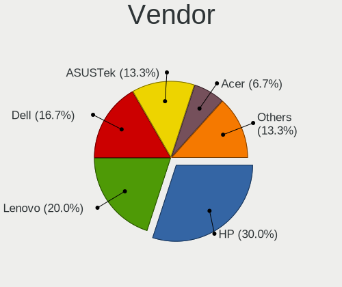
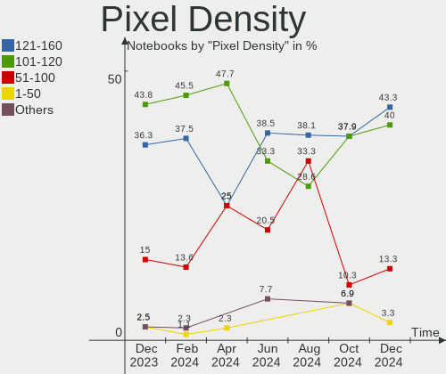
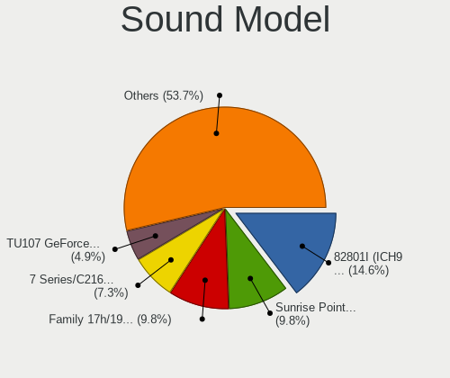
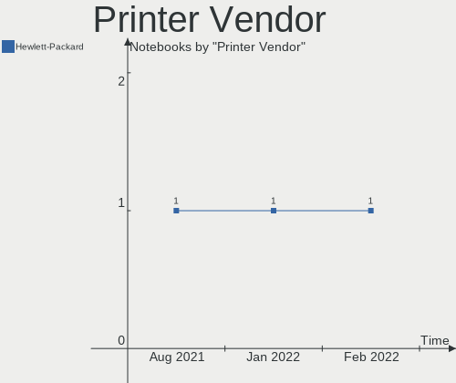
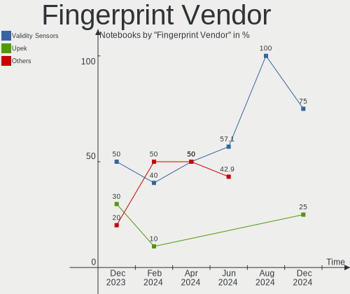

BlackPanther Hardware Trends (Notebooks)
----------------------------------------

A project to identify most popular hardware characteristics and track their change
over time based on data collected by BlackPanther users at https://Linux-Hardware.org.

Anyone can contribute to this report by the [hw-probe](https://github.com/linuxhw/hw-probe) tool:

    sudo -E hw-probe -all -upload

Full-feature report is available here: https://linux-hardware.org/?view=trends

Period: Feb, 2022.

Contents
--------

* [ System ](#system)
  - [ OS                       ](#os)
  - [ OS Family                ](#os-family)
  - [ Kernel                   ](#kernel)
  - [ Kernel Family            ](#kernel-family)
  - [ Kernel Major Ver.        ](#kernel-major-ver)
  - [ Arch                     ](#arch)
  - [ DE                       ](#de)
  - [ Display Server           ](#display-server)
  - [ Display Manager          ](#display-manager)
  - [ OS Lang                  ](#os-lang)
  - [ Boot Mode                ](#boot-mode)
  - [ Filesystem               ](#filesystem)
  - [ Part. scheme             ](#part-scheme)
  - [ Dual Boot with Linux/BSD ](#dual-boot-with-linuxbsd)
  - [ Dual Boot (Win)          ](#dual-boot-win)

* [ Board ](#board)
  - [ Vendor                   ](#vendor)
  - [ Model                    ](#model)
  - [ Model Family             ](#model-family)
  - [ MFG Year                 ](#mfg-year)
  - [ Form Factor              ](#form-factor)
  - [ Secure Boot              ](#secure-boot)
  - [ Coreboot                 ](#coreboot)
  - [ RAM Size                 ](#ram-size)
  - [ RAM Used                 ](#ram-used)
  - [ Total Drives             ](#total-drives)
  - [ Has CD-ROM               ](#has-cd-rom)
  - [ Has Ethernet             ](#has-ethernet)
  - [ Has WiFi                 ](#has-wifi)
  - [ Has Bluetooth            ](#has-bluetooth)

* [ Location ](#location)
  - [ Country                  ](#country)
  - [ City                     ](#city)

* [ Drives ](#drives)
  - [ Drive Vendor             ](#drive-vendor)
  - [ Drive Model              ](#drive-model)
  - [ HDD Vendor               ](#hdd-vendor)
  - [ SSD Vendor               ](#ssd-vendor)
  - [ Drive Kind               ](#drive-kind)
  - [ Drive Connector          ](#drive-connector)
  - [ Drive Size               ](#drive-size)
  - [ Space Total              ](#space-total)
  - [ Space Used               ](#space-used)
  - [ Malfunc. Drives          ](#malfunc-drives)
  - [ Malfunc. Drive Vendor    ](#malfunc-drive-vendor)
  - [ Malfunc. HDD Vendor      ](#malfunc-hdd-vendor)
  - [ Malfunc. Drive Kind      ](#malfunc-drive-kind)
  - [ Failed Drives            ](#failed-drives)
  - [ Failed Drive Vendor      ](#failed-drive-vendor)
  - [ Drive Status             ](#drive-status)

* [ Storage controller ](#storage-controller)
  - [ Storage Vendor           ](#storage-vendor)
  - [ Storage Model            ](#storage-model)
  - [ Storage Kind             ](#storage-kind)

* [ Processor ](#processor)
  - [ CPU Vendor               ](#cpu-vendor)
  - [ CPU Model                ](#cpu-model)
  - [ CPU Model Family         ](#cpu-model-family)
  - [ CPU Cores                ](#cpu-cores)
  - [ CPU Sockets              ](#cpu-sockets)
  - [ CPU Threads              ](#cpu-threads)
  - [ CPU Op-Modes             ](#cpu-op-modes)
  - [ CPU Microcode            ](#cpu-microcode)
  - [ CPU Microarch            ](#cpu-microarch)

* [ Graphics ](#graphics)
  - [ GPU Vendor               ](#gpu-vendor)
  - [ GPU Model                ](#gpu-model)
  - [ GPU Combo                ](#gpu-combo)
  - [ GPU Driver               ](#gpu-driver)
  - [ GPU Memory               ](#gpu-memory)

* [ Monitor ](#monitor)
  - [ Monitor Vendor           ](#monitor-vendor)
  - [ Monitor Model            ](#monitor-model)
  - [ Monitor Resolution       ](#monitor-resolution)
  - [ Monitor Diagonal         ](#monitor-diagonal)
  - [ Monitor Width            ](#monitor-width)
  - [ Aspect Ratio             ](#aspect-ratio)
  - [ Monitor Area             ](#monitor-area)
  - [ Pixel Density            ](#pixel-density)
  - [ Multiple Monitors        ](#multiple-monitors)

* [ Network ](#network)
  - [ Net Controller Vendor    ](#net-controller-vendor)
  - [ Net Controller Model     ](#net-controller-model)
  - [ Wireless Vendor          ](#wireless-vendor)
  - [ Wireless Model           ](#wireless-model)
  - [ Ethernet Vendor          ](#ethernet-vendor)
  - [ Ethernet Model           ](#ethernet-model)
  - [ Net Controller Kind      ](#net-controller-kind)
  - [ Used Controller          ](#used-controller)
  - [ NICs                     ](#nics)
  - [ IPv6                     ](#ipv6)

* [ Bluetooth ](#bluetooth)
  - [ Bluetooth Vendor         ](#bluetooth-vendor)
  - [ Bluetooth Model          ](#bluetooth-model)

* [ Sound ](#sound)
  - [ Sound Vendor             ](#sound-vendor)
  - [ Sound Model              ](#sound-model)

* [ Memory ](#memory)
  - [ Memory Vendor            ](#memory-vendor)
  - [ Memory Model             ](#memory-model)
  - [ Memory Kind              ](#memory-kind)
  - [ Memory Form Factor       ](#memory-form-factor)
  - [ Memory Size              ](#memory-size)
  - [ Memory Speed             ](#memory-speed)

* [ Printers & scanners ](#printers--scanners)
  - [ Printer Vendor           ](#printer-vendor)
  - [ Printer Model            ](#printer-model)
  - [ Scanner Vendor           ](#scanner-vendor)
  - [ Scanner Model            ](#scanner-model)

* [ Camera ](#camera)
  - [ Camera Vendor            ](#camera-vendor)
  - [ Camera Model             ](#camera-model)

* [ Security ](#security)
  - [ Fingerprint Vendor       ](#fingerprint-vendor)
  - [ Fingerprint Model        ](#fingerprint-model)
  - [ Chipcard Vendor          ](#chipcard-vendor)
  - [ Chipcard Model           ](#chipcard-model)

* [ Unsupported ](#unsupported)
  - [ Unsupported Devices      ](#unsupported-devices)
  - [ Unsupported Device Types ](#unsupported-device-types)

System
------

OS
--

Installed operating systems

| Name              | Notebooks | Percent |
|-------------------|-----------|---------|
| BlackPanther 18.1 | 40        | 97.56%  |
| BlackPanther 16.2 | 1         | 2.44%   |

OS Family
---------

OS without a version

| Name         | Notebooks | Percent |
|--------------|-----------|---------|
| BlackPanther | 41        | 100%    |

Kernel
------

Version of the Linux kernel

| Version                | Notebooks | Percent |
|------------------------|-----------|---------|
| 5.6.14-desktop-2bP     | 28        | 68.29%  |
| 4.18.16-desktop-1bP    | 12        | 29.27%  |
| 4.9.20-desktop-pae-1bP | 1         | 2.44%   |

Kernel Family
-------------

Linux kernel without a distro release

| Version | Notebooks | Percent |
|---------|-----------|---------|
| 5.6.14  | 28        | 68.29%  |
| 4.18.16 | 12        | 29.27%  |
| 4.9.20  | 1         | 2.44%   |

Kernel Major Ver.
-----------------

Linux kernel major version

| Version | Notebooks | Percent |
|---------|-----------|---------|
| 5.6     | 28        | 68.29%  |
| 4.18    | 12        | 29.27%  |
| 4.9     | 1         | 2.44%   |

Arch
----

OS architecture (x86_64, i586, etc.)

| Name   | Notebooks | Percent |
|--------|-----------|---------|
| x86_64 | 40        | 97.56%  |
| i686   | 1         | 2.44%   |

DE
--

Desktop Environment

| Name | Notebooks | Percent |
|------|-----------|---------|
| KDE5 | 41        | 100%    |

Display Server
--------------

X11 or Wayland

| Name | Notebooks | Percent |
|------|-----------|---------|
| X11  | 41        | 100%    |

Display Manager
---------------

SDDM, LightDM, etc.

| Name | Notebooks | Percent |
|------|-----------|---------|
| SDDM | 41        | 100%    |

OS Lang
-------

Language

| Lang    | Notebooks | Percent |
|---------|-----------|---------|
| Unknown | 41        | 100%    |

Boot Mode
---------

EFI or BIOS

| Mode | Notebooks | Percent |
|------|-----------|---------|
| BIOS | 25        | 60.98%  |
| EFI  | 16        | 39.02%  |

Filesystem
----------

Type of filesystem

| Type    | Notebooks | Percent |
|---------|-----------|---------|
| Overlay | 35        | 85.37%  |
| Ext4    | 6         | 14.63%  |

Part. scheme
------------

Scheme of partitioning

| Type    | Notebooks | Percent |
|---------|-----------|---------|
| MBR     | 20        | 48.78%  |
| GPT     | 20        | 48.78%  |
| Unknown | 1         | 2.44%   |

Dual Boot with Linux/BSD
------------------------

Hosting more than one Linux/BSD

| Dual boot | Notebooks | Percent |
|-----------|-----------|---------|
| No        | 21        | 51.22%  |
| Yes       | 20        | 48.78%  |

Dual Boot (Win)
---------------

Hosting Linux and Windows

| Dual boot | Notebooks | Percent |
|-----------|-----------|---------|
| Yes       | 21        | 51.22%  |
| No        | 20        | 48.78%  |

Board
-----

Vendor
------

Motherboard manufacturer

| Name                | Notebooks | Percent |
|---------------------|-----------|---------|
| Lenovo              | 9         | 21.95%  |
| Hewlett-Packard     | 8         | 19.51%  |
| Dell                | 8         | 19.51%  |
| Acer                | 5         | 12.2%   |
| ASUSTek Computer    | 4         | 9.76%   |
| Sony                | 2         | 4.88%   |
| Samsung Electronics | 1         | 2.44%   |
| Packard Bell        | 1         | 2.44%   |
| Fujitsu Siemens     | 1         | 2.44%   |
| Fujitsu             | 1         | 2.44%   |
| eMachines           | 1         | 2.44%   |

Model
-----

Motherboard model

| Name                                        | Notebooks | Percent |
|---------------------------------------------|-----------|---------|
| Sony VPCEH2J1E                              | 1         | 2.44%   |
| Sony SVS13118GBB                            | 1         | 2.44%   |
| Samsung RV411/RV511/E3511/S3511/RV711/E3411 | 1         | 2.44%   |
| Packard Bell EasyNote ENLG81BA              | 1         | 2.44%   |
| Lenovo ThinkPad T430 2350B58                | 1         | 2.44%   |
| Lenovo ThinkPad T410 2537VFQ                | 1         | 2.44%   |
| Lenovo IdeaPad Y700-15ISK 80NV              | 1         | 2.44%   |
| Lenovo IdeaPad S145-15IGM 81MX              | 1         | 2.44%   |
| Lenovo IdeaPad 330S-15IKB 81F5              | 1         | 2.44%   |
| Lenovo IdeaPad 330-15IKB 81DE               | 1         | 2.44%   |
| Lenovo IdeaPad 320-17ABR 80YN               | 1         | 2.44%   |
| Lenovo IdeaPad 320-15ABR 80XS               | 1         | 2.44%   |
| Lenovo 3000 N500 423332G                    | 1         | 2.44%   |
| HP ProBook 6470b                            | 1         | 2.44%   |
| HP Pavilion g6                              | 1         | 2.44%   |
| HP Pavilion 17                              | 1         | 2.44%   |
| HP EliteBook 8570w                          | 1         | 2.44%   |
| HP Compaq 6530b (NJ641UC#ABB)               | 1         | 2.44%   |
| HP 650                                      | 1         | 2.44%   |
| HP 255 G6 Notebook PC                       | 1         | 2.44%   |
| HP 250 G1                                   | 1         | 2.44%   |
| Fujitsu Siemens LIFEBOOK S7110              | 1         | 2.44%   |
| Fujitsu LIFEBOOK U745                       | 1         | 2.44%   |
| eMachines E725                              | 1         | 2.44%   |
| Dell Latitude E6410                         | 1         | 2.44%   |
| Dell Latitude E6230                         | 1         | 2.44%   |
| Dell Latitude E5540                         | 1         | 2.44%   |
| Dell Latitude E5430 non-vPro                | 1         | 2.44%   |
| Dell Latitude E5420                         | 1         | 2.44%   |
| Dell Latitude D630                          | 1         | 2.44%   |
| Dell Latitude 5480                          | 1         | 2.44%   |
| Dell Inspiron 15-3567                       | 1         | 2.44%   |
| ASUS X550VX                                 | 1         | 2.44%   |
| ASUS X541UVK                                | 1         | 2.44%   |
| ASUS K53U                                   | 1         | 2.44%   |
| ASUS ASUS TUF Gaming A15 FA506IU_FX506IU    | 1         | 2.44%   |
| Acer TravelMate 8571                        | 1         | 2.44%   |
| Acer Predator PH517-51                      | 1         | 2.44%   |
| Acer F                                      | 1         | 2.44%   |
| Acer Aspire ES1-571                         | 1         | 2.44%   |
| Acer Aspire A114-31                         | 1         | 2.44%   |

Model Family
------------

Motherboard model prefix

| Name                     | Notebooks | Percent |
|--------------------------|-----------|---------|
| Dell Latitude            | 7         | 17.07%  |
| Lenovo IdeaPad           | 6         | 14.63%  |
| Lenovo ThinkPad          | 2         | 4.88%   |
| HP Pavilion              | 2         | 4.88%   |
| Acer Aspire              | 2         | 4.88%   |
| Sony VPCEH2J1E           | 1         | 2.44%   |
| Sony SVS13118GBB         | 1         | 2.44%   |
| Samsung RV411            | 1         | 2.44%   |
| Packard Bell EasyNote    | 1         | 2.44%   |
| Lenovo 3000              | 1         | 2.44%   |
| HP ProBook               | 1         | 2.44%   |
| HP EliteBook             | 1         | 2.44%   |
| HP Compaq                | 1         | 2.44%   |
| HP 650                   | 1         | 2.44%   |
| HP 255                   | 1         | 2.44%   |
| HP 250                   | 1         | 2.44%   |
| Fujitsu Siemens LIFEBOOK | 1         | 2.44%   |
| Fujitsu LIFEBOOK         | 1         | 2.44%   |
| eMachines E725           | 1         | 2.44%   |
| Dell Inspiron            | 1         | 2.44%   |
| ASUS X550VX              | 1         | 2.44%   |
| ASUS X541UVK             | 1         | 2.44%   |
| ASUS K53U                | 1         | 2.44%   |
| ASUS ASUS                | 1         | 2.44%   |
| Acer TravelMate          | 1         | 2.44%   |
| Acer Predator            | 1         | 2.44%   |
| Acer F                   | 1         | 2.44%   |

MFG Year
--------

Motherboard manufacture year

| Year | Notebooks | Percent |
|------|-----------|---------|
| 2012 | 8         | 19.51%  |
| 2017 | 6         | 14.63%  |
| 2011 | 6         | 14.63%  |
| 2018 | 3         | 7.32%   |
| 2016 | 3         | 7.32%   |
| 2009 | 3         | 7.32%   |
| 2015 | 2         | 4.88%   |
| 2014 | 2         | 4.88%   |
| 2013 | 2         | 4.88%   |
| 2020 | 1         | 2.44%   |
| 2019 | 1         | 2.44%   |
| 2010 | 1         | 2.44%   |
| 2008 | 1         | 2.44%   |
| 2007 | 1         | 2.44%   |
| 2006 | 1         | 2.44%   |

Form Factor
-----------

Physical design of the computer

| Name     | Notebooks | Percent |
|----------|-----------|---------|
| Notebook | 41        | 100%    |

Secure Boot
-----------

Enabled or disabled

| State    | Notebooks | Percent |
|----------|-----------|---------|
| Disabled | 41        | 100%    |

Coreboot
--------

Have coreboot on board

| Used | Notebooks | Percent |
|------|-----------|---------|
| No   | 41        | 100%    |

RAM Size
--------

Total RAM memory

| Size in GB | Notebooks | Percent |
|------------|-----------|---------|
| 3.01-4.0   | 14        | 34.15%  |
| 4.01-8.0   | 9         | 21.95%  |
| 8.01-16.0  | 6         | 14.63%  |
| 1.01-2.0   | 5         | 12.2%   |
| 16.01-24.0 | 4         | 9.76%   |
| 2.01-3.0   | 2         | 4.88%   |
| 24.01-32.0 | 1         | 2.44%   |

RAM Used
--------

Used RAM memory

| Used GB  | Notebooks | Percent |
|----------|-----------|---------|
| 0.51-1.0 | 16        | 39.02%  |
| 1.01-2.0 | 14        | 34.15%  |
| 0.01-0.5 | 11        | 26.83%  |

Total Drives
------------

Number of drives on board

| Drives | Notebooks | Percent |
|--------|-----------|---------|
| 1      | 30        | 73.17%  |
| 2      | 7         | 17.07%  |
| 3      | 4         | 9.76%   |

Has CD-ROM
----------

Has CD-ROM on board

| Presented | Notebooks | Percent |
|-----------|-----------|---------|
| Yes       | 25        | 60.98%  |
| No        | 16        | 39.02%  |

Has Ethernet
------------

Has Ethernet on board

| Presented | Notebooks | Percent |
|-----------|-----------|---------|
| Yes       | 39        | 95.12%  |
| No        | 2         | 4.88%   |

Has WiFi
--------

Has WiFi module

| Presented | Notebooks | Percent |
|-----------|-----------|---------|
| Yes       | 40        | 97.56%  |
| No        | 1         | 2.44%   |

Has Bluetooth
-------------

Has Bluetooth module

| Presented | Notebooks | Percent |
|-----------|-----------|---------|
| Yes       | 36        | 87.8%   |
| No        | 5         | 12.2%   |

Location
--------

Country
-------

Geographic location (country)

| Country    | Notebooks | Percent |
|------------|-----------|---------|
| Hungary    | 33        | 80.49%  |
| Austria    | 3         | 7.32%   |
| UK         | 1         | 2.44%   |
| Poland     | 1         | 2.44%   |
| Luxembourg | 1         | 2.44%   |
| Ghana      | 1         | 2.44%   |
| Argentina  | 1         | 2.44%   |

City
----

Geographic location (city)

| City         | Notebooks | Percent |
|--------------|-----------|---------|
| Budapest     | 8         | 19.51%  |
| Miskolc      | 4         | 9.76%   |
| Vienna       | 3         | 7.32%   |
| Tatabánya | 2         | 4.88%   |
| Oroshaza     | 2         | 4.88%   |
| Veszprém  | 1         | 2.44%   |
| Szombathely  | 1         | 2.44%   |
| Szentes      | 1         | 2.44%   |
| Szekszárd | 1         | 2.44%   |
| Oberpallen   | 1         | 2.44%   |
| Krakow       | 1         | 2.44%   |
| Kisvarda     | 1         | 2.44%   |
| Kiskunhalas  | 1         | 2.44%   |
| Kapuvar      | 1         | 2.44%   |
| Hévíz  | 1         | 2.44%   |
| Harlow       | 1         | 2.44%   |
| Győr     | 1         | 2.44%   |
| Gyal         | 1         | 2.44%   |
| Esztergom    | 1         | 2.44%   |
| Debrecen     | 1         | 2.44%   |
| Csakvar      | 1         | 2.44%   |
| Bicske       | 1         | 2.44%   |
| Baja         | 1         | 2.44%   |
| Érd      | 1         | 2.44%   |
| Avellaneda   | 1         | 2.44%   |
| Ajka         | 1         | 2.44%   |
| Accra        | 1         | 2.44%   |

Drives
------

Drive Vendor
------------

Hard drive vendors

| Vendor              | Notebooks | Drives | Percent |
|---------------------|-----------|--------|---------|
| WDC                 | 10        | 11     | 18.18%  |
| Seagate             | 6         | 6      | 10.91%  |
| Samsung Electronics | 5         | 5      | 9.09%   |
| Kingston            | 5         | 7      | 9.09%   |
| HGST                | 5         | 5      | 9.09%   |
| Toshiba             | 4         | 4      | 7.27%   |
| Unknown             | 3         | 3      | 5.45%   |
| Hitachi             | 3         | 4      | 5.45%   |
| Intenso             | 2         | 2      | 3.64%   |
| Union Memory        | 1         | 1      | 1.82%   |
| Solid               | 1         | 1      | 1.82%   |
| SK Hynix            | 1         | 1      | 1.82%   |
| PNY                 | 1         | 1      | 1.82%   |
| Patriot             | 1         | 1      | 1.82%   |
| Micron Technology   | 1         | 1      | 1.82%   |
| LITEON              | 1         | 1      | 1.82%   |
| Intel               | 1         | 1      | 1.82%   |
| Fujitsu             | 1         | 1      | 1.82%   |
| Crucial             | 1         | 1      | 1.82%   |
| ASMT                | 1         | 1      | 1.82%   |
| Unknown             | 1         | 1      | 1.82%   |

Drive Model
-----------

Hard drive models

| Model                                  | Notebooks | Percent |
|----------------------------------------|-----------|---------|
| WDC WD5000LPCX-21VHAT0 500GB           | 2         | 3.39%   |
| Toshiba MQ01ABF050 500GB               | 2         | 3.39%   |
| Seagate ST1000LM035-1RK172 1TB         | 2         | 3.39%   |
| Kingston SA400S37480G 480GB SSD        | 2         | 3.39%   |
| Kingston SA400S37240G 240GB SSD        | 2         | 3.39%   |
| HGST HTS721010A9E630 1TB               | 2         | 3.39%   |
| WDC WDS240G2G0A-00JH30 240GB SSD       | 1         | 1.69%   |
| WDC WD7500BPVT-60HXZT3 752GB           | 1         | 1.69%   |
| WDC WD5000LPCX-22VHAT1 500GB           | 1         | 1.69%   |
| WDC WD5000BEVT-22ZAT0 500GB            | 1         | 1.69%   |
| WDC WD5000BEVT-22A0RT0 500GB           | 1         | 1.69%   |
| WDC WD1200BEVS-22UST0 120GB            | 1         | 1.69%   |
| WDC WD10SPCX-24HWST1 1TB               | 1         | 1.69%   |
| WDC WD10JPVX-60JC3T0 1TB               | 1         | 1.69%   |
| WDC WD10JPVX-22JC3T0 1TB               | 1         | 1.69%   |
| Unknown SD04G  4GB                     | 1         | 1.69%   |
| Unknown SC32G  32GB                    | 1         | 1.69%   |
| Unknown 032G34  32GB                   | 1         | 1.69%   |
| Union Memory RTOTJ128VGD2EYX 128GB SSD | 1         | 1.69%   |
| Toshiba THNSFJ256GCSU 256GB SSD        | 1         | 1.69%   |
| Toshiba HDWL120 2TB                    | 1         | 1.69%   |
| Solid SSD0240S00 240GB                 | 1         | 1.69%   |
| SK Hynix HFS256G32MND-2900A 256GB SSD  | 1         | 1.69%   |
| Seagate ST9500420AS 500GB              | 1         | 1.69%   |
| Seagate ST94813AS 40GB                 | 1         | 1.69%   |
| Seagate ST750LM022 HN-M750MBB 752GB    | 1         | 1.69%   |
| Seagate ST1000LM014-1EJ164-SSHD 1TB    | 1         | 1.69%   |
| Samsung SSD PM871b M.2 2280 256GB      | 1         | 1.69%   |
| Samsung SSD 860 EVO 500GB              | 1         | 1.69%   |
| Samsung SSD 830 Series 128GB           | 1         | 1.69%   |
| Samsung MZVLB512HBJQ-000L7 512GB       | 1         | 1.69%   |
| Samsung MZ7LN256HCHP-00000 256GB SSD   | 1         | 1.69%   |
| PNY CS900 240GB SSD                    | 1         | 1.69%   |
| Patriot Burst 120GB SSD                | 1         | 1.69%   |
| Micron 2210_MTFDHBA512QFD 512GB        | 1         | 1.69%   |
| LITEON CV1-8B128 128GB SSD             | 1         | 1.69%   |
| Kingston SV300S37A120G 120GB SSD       | 1         | 1.69%   |
| Kingston SUV400S37120G 120GB SSD       | 1         | 1.69%   |
| Kingston SA400S37960G 960GB SSD        | 1         | 1.69%   |
| Intenso SSD SATAIII 480GB              | 1         | 1.69%   |
| Intenso SSD 120GB                      | 1         | 1.69%   |
| Intel SSDSC2KW256G8 256GB              | 1         | 1.69%   |
| Hitachi HTS725032A9A364 320GB          | 1         | 1.69%   |
| Hitachi HTS721010G9SA00 100GB          | 1         | 1.69%   |
| Hitachi HTS547550A9E384 500GB          | 1         | 1.69%   |
| Hitachi HTS542516K9SA00 160GB          | 1         | 1.69%   |
| HGST HTS545050A7E380 500GB             | 1         | 1.69%   |
| HGST HTS545032A7E380 320GB             | 1         | 1.69%   |
| HGST HTS541010B7E610 1TB               | 1         | 1.69%   |
| Fujitsu MHW2040BH 40GB                 | 1         | 1.69%   |
| Crucial CT250MX500SSD1 250GB           | 1         | 1.69%   |
| ASMT Verbatim Vx500 240GB              | 1         | 1.69%   |
| Unknown                                | 1         | 1.69%   |

HDD Vendor
----------

Hard disk drive vendors

| Vendor  | Notebooks | Drives | Percent |
|---------|-----------|--------|---------|
| WDC     | 10        | 10     | 35.71%  |
| Seagate | 6         | 6      | 21.43%  |
| HGST    | 5         | 5      | 17.86%  |
| Toshiba | 3         | 3      | 10.71%  |
| Hitachi | 3         | 4      | 10.71%  |
| Fujitsu | 1         | 1      | 3.57%   |

SSD Vendor
----------

Solid state drive vendors

| Vendor              | Notebooks | Drives | Percent |
|---------------------|-----------|--------|---------|
| Kingston            | 5         | 7      | 23.81%  |
| Samsung Electronics | 4         | 4      | 19.05%  |
| Intenso             | 2         | 2      | 9.52%   |
| WDC                 | 1         | 1      | 4.76%   |
| Union Memory        | 1         | 1      | 4.76%   |
| Toshiba             | 1         | 1      | 4.76%   |
| Solid               | 1         | 1      | 4.76%   |
| SK Hynix            | 1         | 1      | 4.76%   |
| PNY                 | 1         | 1      | 4.76%   |
| Patriot             | 1         | 1      | 4.76%   |
| LITEON              | 1         | 1      | 4.76%   |
| Intel               | 1         | 1      | 4.76%   |
| Crucial             | 1         | 1      | 4.76%   |

Drive Kind
----------

HDD or SSD

| Kind    | Notebooks | Drives | Percent |
|---------|-----------|--------|---------|
| HDD     | 28        | 29     | 52.83%  |
| SSD     | 19        | 23     | 35.85%  |
| MMC     | 4         | 4      | 7.55%   |
| NVMe    | 1         | 2      | 1.89%   |
| Unknown | 1         | 1      | 1.89%   |

Drive Connector
---------------

SATA, SAS, NVMe, etc.

| Type | Notebooks | Drives | Percent |
|------|-----------|--------|---------|
| SATA | 40        | 52     | 86.96%  |
| MMC  | 4         | 4      | 8.7%    |
| SAS  | 1         | 1      | 2.17%   |
| NVMe | 1         | 2      | 2.17%   |

Drive Size
----------

Size of hard drive

| Size in TB | Notebooks | Drives | Percent |
|------------|-----------|--------|---------|
| 0.01-0.5   | 33        | 39     | 71.74%  |
| 0.51-1.0   | 12        | 12     | 26.09%  |
| 1.01-2.0   | 1         | 1      | 2.17%   |

Space Total
-----------

Amount of disk space available on the file system

| Size in GB | Notebooks | Percent |
|------------|-----------|---------|
| Unknown    | 33        | 80.49%  |
| 101-250    | 3         | 7.32%   |
| 251-500    | 2         | 4.88%   |
| 21-50      | 1         | 2.44%   |
| 2001-3000  | 1         | 2.44%   |
| 501-1000   | 1         | 2.44%   |

Space Used
----------

Amount of used disk space

| Used GB | Notebooks | Percent |
|---------|-----------|---------|
| Unknown | 33        | 80.49%  |
| 1-20    | 6         | 14.63%  |
| 101-250 | 1         | 2.44%   |
| 51-100  | 1         | 2.44%   |

Malfunc. Drives
---------------

Drive models with a malfunction

| Model                               | Notebooks | Drives | Percent |
|-------------------------------------|-----------|--------|---------|
| WDC WD7500BPVT-60HXZT3 752GB        | 1         | 1      | 7.14%   |
| WDC WD10JPVX-22JC3T0 1TB            | 1         | 1      | 7.14%   |
| Toshiba THNSFJ256GCSU 256GB SSD     | 1         | 1      | 7.14%   |
| Toshiba MQ01ABF050 500GB            | 1         | 1      | 7.14%   |
| Seagate ST9500420AS 500GB           | 1         | 1      | 7.14%   |
| Seagate ST94813AS 40GB              | 1         | 1      | 7.14%   |
| Seagate ST1000LM014-1EJ164-SSHD 1TB | 1         | 1      | 7.14%   |
| Kingston SA400S37240G 240GB SSD     | 1         | 1      | 7.14%   |
| Hitachi HTS725032A9A364 320GB       | 1         | 1      | 7.14%   |
| Hitachi HTS721010G9SA00 100GB       | 1         | 1      | 7.14%   |
| Hitachi HTS547550A9E384 500GB       | 1         | 1      | 7.14%   |
| Hitachi HTS542516K9SA00 160GB       | 1         | 1      | 7.14%   |
| HGST HTS545050A7E380 500GB          | 1         | 1      | 7.14%   |
| HGST HTS545032A7E380 320GB          | 1         | 1      | 7.14%   |

Malfunc. Drive Vendor
---------------------

Vendors of faulty drives

| Vendor   | Notebooks | Drives | Percent |
|----------|-----------|--------|---------|
| Seagate  | 3         | 3      | 23.08%  |
| Hitachi  | 3         | 4      | 23.08%  |
| WDC      | 2         | 2      | 15.38%  |
| Toshiba  | 2         | 2      | 15.38%  |
| HGST     | 2         | 2      | 15.38%  |
| Kingston | 1         | 1      | 7.69%   |

Malfunc. HDD Vendor
-------------------

Vendors of faulty HDD drives

| Vendor  | Notebooks | Drives | Percent |
|---------|-----------|--------|---------|
| Seagate | 3         | 3      | 27.27%  |
| Hitachi | 3         | 4      | 27.27%  |
| WDC     | 2         | 2      | 18.18%  |
| HGST    | 2         | 2      | 18.18%  |
| Toshiba | 1         | 1      | 9.09%   |

Malfunc. Drive Kind
-------------------

Kinds of faulty drives

| Kind | Notebooks | Drives | Percent |
|------|-----------|--------|---------|
| HDD  | 11        | 12     | 84.62%  |
| SSD  | 2         | 2      | 15.38%  |

Failed Drives
-------------

Failed drive models

| Model                        | Notebooks | Drives | Percent |
|------------------------------|-----------|--------|---------|
| WDC WD5000BEVT-22ZAT0 500GB  | 1         | 1      | 50%     |
| WDC WD5000BEVT-22A0RT0 500GB | 1         | 1      | 50%     |

Failed Drive Vendor
-------------------

Failed drive vendors

| Vendor | Notebooks | Drives | Percent |
|--------|-----------|--------|---------|
| WDC    | 2         | 2      | 100%    |

Drive Status
------------

Number of failed and malfunc. drives

| Status   | Notebooks | Drives | Percent |
|----------|-----------|--------|---------|
| Works    | 30        | 38     | 61.22%  |
| Malfunc  | 12        | 14     | 24.49%  |
| Detected | 5         | 5      | 10.2%   |
| Failed   | 2         | 2      | 4.08%   |

Storage controller
------------------

Storage Vendor
--------------

Storage controller vendors

| Vendor              | Notebooks | Percent |
|---------------------|-----------|---------|
| Intel               | 34        | 79.07%  |
| AMD                 | 7         | 16.28%  |
| Samsung Electronics | 1         | 2.33%   |
| Micron Technology   | 1         | 2.33%   |

Storage Model
-------------

Storage controller models

| Model                                                                            | Notebooks | Percent |
|----------------------------------------------------------------------------------|-----------|---------|
| Intel 82801 Mobile SATA Controller [RAID mode]                                   | 7         | 15.22%  |
| Intel 7 Series Chipset Family 6-port SATA Controller [AHCI mode]                 | 6         | 13.04%  |
| AMD FCH SATA Controller [AHCI mode]                                              | 6         | 13.04%  |
| Intel 82801IBM/IEM (ICH9M/ICH9M-E) 4 port SATA Controller [AHCI mode]            | 4         | 8.7%    |
| Intel Sunrise Point-LP SATA Controller [AHCI mode]                               | 3         | 6.52%   |
| Intel Wildcat Point-LP SATA Controller [AHCI Mode]                               | 2         | 4.35%   |
| Intel HM170/QM170 Chipset SATA Controller [AHCI Mode]                            | 2         | 4.35%   |
| Intel 6 Series/C200 Series Chipset Family 6 port Mobile SATA AHCI Controller     | 2         | 4.35%   |
| Samsung NVMe SSD Controller SM981/PM981/PM983                                    | 1         | 2.17%   |
| Micron Non-Volatile memory controller                                            | 1         | 2.17%   |
| Intel Celeron/Pentium Silver Processor SATA Controller                           | 1         | 2.17%   |
| Intel Celeron N3350/Pentium N4200/Atom E3900 Series SATA AHCI Controller         | 1         | 2.17%   |
| Intel Atom/Celeron/Pentium Processor x5-E8000/J3xxx/N3xxx Series SATA Controller | 1         | 2.17%   |
| Intel 82801IBM/IEM (ICH9M/ICH9M-E) 2 port SATA Controller [IDE mode]             | 1         | 2.17%   |
| Intel 82801HM/HEM (ICH8M/ICH8M-E) SATA Controller [IDE mode]                     | 1         | 2.17%   |
| Intel 82801HM/HEM (ICH8M/ICH8M-E) IDE Controller                                 | 1         | 2.17%   |
| Intel 82801GBM/GHM (ICH7-M Family) SATA Controller [AHCI mode]                   | 1         | 2.17%   |
| Intel 82801G (ICH7 Family) IDE Controller                                        | 1         | 2.17%   |
| Intel 5 Series/3400 Series Chipset 6 port SATA AHCI Controller                   | 1         | 2.17%   |
| Intel 5 Series/3400 Series Chipset 4 port SATA AHCI Controller                   | 1         | 2.17%   |
| AMD SB7x0/SB8x0/SB9x0 SATA Controller [AHCI mode]                                | 1         | 2.17%   |
| AMD SB7x0/SB8x0/SB9x0 IDE Controller                                             | 1         | 2.17%   |

Storage Kind
------------

Kind of storage controller (IDE, SATA, NVMe, SAS, ...)

| Kind | Notebooks | Percent |
|------|-----------|---------|
| SATA | 32        | 72.73%  |
| RAID | 7         | 15.91%  |
| IDE  | 4         | 9.09%   |
| NVMe | 1         | 2.27%   |

Processor
---------

CPU Vendor
----------

Processor vendors

| Vendor | Notebooks | Percent |
|--------|-----------|---------|
| Intel  | 34        | 82.93%  |
| AMD    | 7         | 17.07%  |

CPU Model
---------

Processor models

| Model                                           | Notebooks | Percent |
|-------------------------------------------------|-----------|---------|
| Intel Core i7-6700HQ CPU @ 2.60GHz              | 2         | 4.88%   |
| Intel Core i7-3740QM CPU @ 2.70GHz              | 2         | 4.88%   |
| Intel Core i5-3340M CPU @ 2.70GHz               | 2         | 4.88%   |
| Intel Core i5 CPU M 520 @ 2.40GHz               | 2         | 4.88%   |
| Intel Core i3-2330M CPU @ 2.20GHz               | 2         | 4.88%   |
| AMD A12-9720P RADEON R7, 12 COMPUTE CORES 4C+8G | 2         | 4.88%   |
| Intel Pentium Silver N5000 CPU @ 1.10GHz        | 1         | 2.44%   |
| Intel Pentium Dual-Core CPU T4400 @ 2.20GHz     | 1         | 2.44%   |
| Intel Pentium CPU P6200 @ 2.13GHz               | 1         | 2.44%   |
| Intel Genuine CPU 575 @ 2.00GHz                 | 1         | 2.44%   |
| Intel Core i7-8750H CPU @ 2.20GHz               | 1         | 2.44%   |
| Intel Core i7-6600U CPU @ 2.60GHz               | 1         | 2.44%   |
| Intel Core i7-5600U CPU @ 2.60GHz               | 1         | 2.44%   |
| Intel Core i5-8250U CPU @ 1.60GHz               | 1         | 2.44%   |
| Intel Core i5-3230M CPU @ 2.60GHz               | 1         | 2.44%   |
| Intel Core i5-3210M CPU @ 2.50GHz               | 1         | 2.44%   |
| Intel Core i3-8130U CPU @ 2.20GHz               | 1         | 2.44%   |
| Intel Core i3-7100U CPU @ 2.40GHz               | 1         | 2.44%   |
| Intel Core i3-7020U CPU @ 2.30GHz               | 1         | 2.44%   |
| Intel Core i3-5005U CPU @ 2.00GHz               | 1         | 2.44%   |
| Intel Core i3-4030U CPU @ 1.90GHz               | 1         | 2.44%   |
| Intel Core 2 Duo CPU U9400 @ 1.40GHz            | 1         | 2.44%   |
| Intel Core 2 Duo CPU T7250 @ 2.00GHz            | 1         | 2.44%   |
| Intel Core 2 Duo CPU T5670 @ 1.80GHz            | 1         | 2.44%   |
| Intel Core 2 Duo CPU P7450 @ 2.13GHz            | 1         | 2.44%   |
| Intel Core 2 CPU T5600 @ 1.83GHz                | 1         | 2.44%   |
| Intel Celeron CPU N3350 @ 1.10GHz               | 1         | 2.44%   |
| Intel Celeron CPU N3060 @ 1.60GHz               | 1         | 2.44%   |
| Intel Celeron CPU B830 @ 1.80GHz                | 1         | 2.44%   |
| Intel Celeron CPU 1000M @ 1.80GHz               | 1         | 2.44%   |
| AMD Ryzen 7 4800H with Radeon Graphics          | 1         | 2.44%   |
| AMD E2-9000e RADEON R2, 4 COMPUTE CORES 2C+2G   | 1         | 2.44%   |
| AMD E-450 APU with Radeon HD Graphics           | 1         | 2.44%   |
| AMD A4-5000 APU with Radeon HD Graphics         | 1         | 2.44%   |
| AMD A4-3300M APU with Radeon HD Graphics        | 1         | 2.44%   |

CPU Model Family
----------------

Processor model prefix

| Model                   | Notebooks | Percent |
|-------------------------|-----------|---------|
| Intel Core i7           | 7         | 17.07%  |
| Intel Core i5           | 7         | 17.07%  |
| Intel Core i3           | 7         | 17.07%  |
| Intel Core 2 Duo        | 4         | 9.76%   |
| Intel Celeron           | 4         | 9.76%   |
| AMD A4                  | 2         | 4.88%   |
| AMD A12                 | 2         | 4.88%   |
| Intel Pentium Silver    | 1         | 2.44%   |
| Intel Pentium Dual-Core | 1         | 2.44%   |
| Intel Pentium           | 1         | 2.44%   |
| Intel Genuine           | 1         | 2.44%   |
| Intel Core 2            | 1         | 2.44%   |
| AMD Ryzen 7             | 1         | 2.44%   |
| AMD E2                  | 1         | 2.44%   |
| AMD E                   | 1         | 2.44%   |

CPU Cores
---------

Number of processor cores

| Number | Notebooks | Percent |
|--------|-----------|---------|
| 2      | 31        | 75.61%  |
| 4      | 7         | 17.07%  |
| 8      | 1         | 2.44%   |
| 6      | 1         | 2.44%   |
| 1      | 1         | 2.44%   |

CPU Sockets
-----------

Number of sockets

| Number | Notebooks | Percent |
|--------|-----------|---------|
| 1      | 41        | 100%    |

CPU Threads
-----------

Threads per core (Hyper-Threading)

| Number | Notebooks | Percent |
|--------|-----------|---------|
| 2      | 24        | 58.54%  |
| 1      | 17        | 41.46%  |

CPU Op-Modes
------------

CPU Operation Modes (32-bit, 64-bit)

| Op mode        | Notebooks | Percent |
|----------------|-----------|---------|
| 32-bit, 64-bit | 41        | 100%    |

CPU Microcode
-------------

Microcode number

| Number     | Notebooks | Percent |
|------------|-----------|---------|
| 0x306a9    | 7         | 17.07%  |
| 0x6fd      | 3         | 7.32%   |
| 0x206a7    | 3         | 7.32%   |
| 0x1067a    | 3         | 7.32%   |
| 0x806ea    | 2         | 4.88%   |
| 0x806e9    | 2         | 4.88%   |
| 0x506e3    | 2         | 4.88%   |
| 0x306d4    | 2         | 4.88%   |
| 0x20655    | 2         | 4.88%   |
| 0x06006118 | 2         | 4.88%   |
| 0x906ea    | 1         | 2.44%   |
| 0x706a1    | 1         | 2.44%   |
| 0x6f2      | 1         | 2.44%   |
| 0x506c9    | 1         | 2.44%   |
| 0x406e3    | 1         | 2.44%   |
| 0x406c4    | 1         | 2.44%   |
| 0x40651    | 1         | 2.44%   |
| 0x20652    | 1         | 2.44%   |
| 0x08600104 | 1         | 2.44%   |
| 0x0700010f | 1         | 2.44%   |
| 0x06006705 | 1         | 2.44%   |
| 0x05000119 | 1         | 2.44%   |
| 0x03000027 | 1         | 2.44%   |

CPU Microarch
-------------

Microarchitecture

| Name          | Notebooks | Percent |
|---------------|-----------|---------|
| IvyBridge     | 7         | 17.07%  |
| KabyLake      | 5         | 12.2%   |
| Core          | 4         | 9.76%   |
| Westmere      | 3         | 7.32%   |
| Skylake       | 3         | 7.32%   |
| SandyBridge   | 3         | 7.32%   |
| Penryn        | 3         | 7.32%   |
| Excavator     | 3         | 7.32%   |
| Broadwell     | 2         | 4.88%   |
| Zen 2         | 1         | 2.44%   |
| Silvermont    | 1         | 2.44%   |
| K10 Llano     | 1         | 2.44%   |
| Jaguar        | 1         | 2.44%   |
| Haswell       | 1         | 2.44%   |
| Goldmont plus | 1         | 2.44%   |
| Goldmont      | 1         | 2.44%   |
| Bobcat        | 1         | 2.44%   |

Graphics
--------

GPU Vendor
----------

Vendors of graphics cards

| Vendor | Notebooks | Percent |
|--------|-----------|---------|
| Intel  | 30        | 61.22%  |
| Nvidia | 10        | 20.41%  |
| AMD    | 9         | 18.37%  |

GPU Model
---------

Graphics card models

| Model                                                                                    | Notebooks | Percent |
|------------------------------------------------------------------------------------------|-----------|---------|
| Intel 3rd Gen Core processor Graphics Controller                                         | 6         | 11.32%  |
| Intel Mobile 4 Series Chipset Integrated Graphics Controller                             | 5         | 9.43%   |
| AMD Topaz XT [Radeon R7 M260/M265 / M340/M360 / M440/M445 / 530/535 / 620/625 Mobile]    | 3         | 5.66%   |
| Intel UHD Graphics 620                                                                   | 2         | 3.77%   |
| Intel HD Graphics 5500                                                                   | 2         | 3.77%   |
| Intel HD Graphics 530                                                                    | 2         | 3.77%   |
| Intel Core Processor Integrated Graphics Controller                                      | 2         | 3.77%   |
| Intel 2nd Generation Core Processor Family Integrated Graphics Controller                | 2         | 3.77%   |
| AMD Wani [Radeon R5/R6/R7 Graphics]                                                      | 2         | 3.77%   |
| Nvidia TU116M [GeForce GTX 1660 Ti Mobile]                                               | 1         | 1.89%   |
| Nvidia GT218M [GeForce 315M]                                                             | 1         | 1.89%   |
| Nvidia GP104BM [GeForce GTX 1070 Mobile]                                                 | 1         | 1.89%   |
| Nvidia GM108M [GeForce 930MX]                                                            | 1         | 1.89%   |
| Nvidia GM108M [GeForce 920MX]                                                            | 1         | 1.89%   |
| Nvidia GM107M [GeForce GTX 960M]                                                         | 1         | 1.89%   |
| Nvidia GM107M [GeForce GTX 950M]                                                         | 1         | 1.89%   |
| Nvidia GK107M [GeForce GT 640M LE]                                                       | 1         | 1.89%   |
| Nvidia GK107GLM [Quadro K1000M]                                                          | 1         | 1.89%   |
| Nvidia GF119M [GeForce 410M]                                                             | 1         | 1.89%   |
| Intel Skylake GT2 [HD Graphics 520]                                                      | 1         | 1.89%   |
| Intel Mobile GM965/GL960 Integrated Graphics Controller (secondary)                      | 1         | 1.89%   |
| Intel Mobile GM965/GL960 Integrated Graphics Controller (primary)                        | 1         | 1.89%   |
| Intel Mobile 945GM/GMS/GME, 943/940GML Express Integrated Graphics Controller            | 1         | 1.89%   |
| Intel Mobile 945GM/GMS, 943/940GML Express Integrated Graphics Controller                | 1         | 1.89%   |
| Intel Kaby Lake-U GT2f HD 620 Graphics Controller                                        | 1         | 1.89%   |
| Intel HD Graphics 620                                                                    | 1         | 1.89%   |
| Intel HD Graphics 500                                                                    | 1         | 1.89%   |
| Intel Haswell-ULT Integrated Graphics Controller                                         | 1         | 1.89%   |
| Intel GeminiLake [UHD Graphics 605]                                                      | 1         | 1.89%   |
| Intel Atom/Celeron/Pentium Processor x5-E8000/J3xxx/N3xxx Integrated Graphics Controller | 1         | 1.89%   |
| AMD Wrestler [Radeon HD 6320]                                                            | 1         | 1.89%   |
| AMD Sumo [Radeon HD 6480G]                                                               | 1         | 1.89%   |
| AMD Stoney [Radeon R2/R3/R4/R5 Graphics]                                                 | 1         | 1.89%   |
| AMD RV730/M96-XT [Mobility Radeon HD 4670]                                               | 1         | 1.89%   |
| AMD Renoir                                                                               | 1         | 1.89%   |
| AMD Kabini [Radeon HD 8330]                                                              | 1         | 1.89%   |

GPU Combo
---------

Combinations of graphics cards

| Name           | Notebooks | Percent |
|----------------|-----------|---------|
| 1 x Intel      | 23        | 56.1%   |
| Intel + Nvidia | 5         | 12.2%   |
| 1 x Nvidia     | 4         | 9.76%   |
| 1 x AMD        | 4         | 9.76%   |
| 2 x AMD        | 2         | 4.88%   |
| Intel + AMD    | 2         | 4.88%   |
| AMD + Nvidia   | 1         | 2.44%   |

GPU Driver
----------

Free vs proprietary

| Driver | Notebooks | Percent |
|--------|-----------|---------|
| Free   | 41        | 100%    |

GPU Memory
----------

Total video memory

| Size in GB | Notebooks | Percent |
|------------|-----------|---------|
| Unknown    | 23        | 56.1%   |
| 0.01-0.5   | 7         | 17.07%  |
| 1.01-2.0   | 4         | 9.76%   |
| 0.51-1.0   | 3         | 7.32%   |
| 3.01-4.0   | 2         | 4.88%   |
| 7.01-8.0   | 1         | 2.44%   |
| 5.01-6.0   | 1         | 2.44%   |

Monitor
-------

Monitor Vendor
--------------

Monitor vendors

| Vendor                  | Notebooks | Percent |
|-------------------------|-----------|---------|
| AU Optronics            | 10        | 21.74%  |
| Chimei Innolux          | 7         | 15.22%  |
| BOE                     | 6         | 13.04%  |
| Samsung Electronics     | 5         | 10.87%  |
| LG Display              | 4         | 8.7%    |
| Chi Mei Optoelectronics | 3         | 6.52%   |
| Lenovo                  | 2         | 4.35%   |
| Goldstar                | 2         | 4.35%   |
| SKY                     | 1         | 2.17%   |
| PANDA                   | 1         | 2.17%   |
| OEM                     | 1         | 2.17%   |
| Hewlett-Packard         | 1         | 2.17%   |
| Fujitsu Siemens         | 1         | 2.17%   |
| Dell                    | 1         | 2.17%   |
| AOC                     | 1         | 2.17%   |

Monitor Model
-------------

Monitor models

| Model                                                                     | Notebooks | Percent |
|---------------------------------------------------------------------------|-----------|---------|
| Chimei Innolux LCD Monitor CMN14C3 1366x768 309x173mm 13.9-inch           | 2         | 4.26%   |
| Chi Mei Optoelectronics LCD Monitor CMO15A7 1366x768 344x193mm 15.5-inch  | 2         | 4.26%   |
| SKY TV-monitor SKY0402 1920x1080 885x498mm 40.0-inch                      | 1         | 2.13%   |
| Samsung Electronics LCD Monitor SEC5441 1366x768 344x194mm 15.5-inch      | 1         | 2.13%   |
| Samsung Electronics LCD Monitor SEC4C42 1280x800 303x190mm 14.1-inch      | 1         | 2.13%   |
| Samsung Electronics LCD Monitor SEC3741 1280x800 331x207mm 15.4-inch      | 1         | 2.13%   |
| Samsung Electronics LCD Monitor SEC3157 1280x800 303x190mm 14.1-inch      | 1         | 2.13%   |
| Samsung Electronics LCD Monitor SDC3752 1920x1080 344x194mm 15.5-inch     | 1         | 2.13%   |
| PANDA LCD Monitor NCP004D 1920x1080 344x194mm 15.5-inch                   | 1         | 2.13%   |
| OEM 22_LCD_TV OEM3700 1920x540                                            | 1         | 2.13%   |
| LG Display LCD Monitor LGD0558 1920x1080 309x174mm 14.0-inch              | 1         | 2.13%   |
| LG Display LCD Monitor LGD0395 1366x768 344x194mm 15.5-inch               | 1         | 2.13%   |
| LG Display LCD Monitor LGD036C 1366x768 277x156mm 12.5-inch               | 1         | 2.13%   |
| LG Display LCD Monitor LGD0259 1920x1080 345x194mm 15.6-inch              | 1         | 2.13%   |
| Lenovo LCD Monitor LEN40A3 1920x1080 309x175mm 14.0-inch                  | 1         | 2.13%   |
| Lenovo LCD Monitor LEN4036 1440x900 303x190mm 14.1-inch                   | 1         | 2.13%   |
| Hewlett-Packard w2207 HWP26A8 1680x1050 473x296mm 22.0-inch               | 1         | 2.13%   |
| Goldstar MP59G GSM5B33 1920x1080 480x270mm 21.7-inch                      | 1         | 2.13%   |
| Goldstar 34GK950G GSM7725 3440x1440 797x333mm 34.0-inch                   | 1         | 2.13%   |
| Goldstar 32GK850G GSM7709 2560x1440 697x392mm 31.5-inch                   | 1         | 2.13%   |
| Fujitsu Siemens LSL 3230T FUS07A7 1920x1080 509x286mm 23.0-inch           | 1         | 2.13%   |
| Dell E170S DELA04A 1280x1024 338x270mm 17.0-inch                          | 1         | 2.13%   |
| Chimei Innolux LCD Monitor CMN15E7 1920x1080 344x193mm 15.5-inch          | 1         | 2.13%   |
| Chimei Innolux LCD Monitor CMN15D5 1920x1080 344x193mm 15.5-inch          | 1         | 2.13%   |
| Chimei Innolux LCD Monitor CMN15C4 1920x1080 344x193mm 15.5-inch          | 1         | 2.13%   |
| Chimei Innolux LCD Monitor CMN1469 1366x768 309x174mm 14.0-inch           | 1         | 2.13%   |
| Chimei Innolux LCD Monitor CMN1340 1600x900 294x165mm 13.3-inch           | 1         | 2.13%   |
| Chi Mei Optoelectronics LCD Monitor CMO1807 1920x1080 408x230mm 18.4-inch | 1         | 2.13%   |
| BOE LCD Monitor BOE0757 1366x768 344x194mm 15.5-inch                      | 1         | 2.13%   |
| BOE LCD Monitor BOE0729 1920x1080 344x193mm 15.5-inch                     | 1         | 2.13%   |
| BOE LCD Monitor BOE06A5 1366x768 344x194mm 15.5-inch                      | 1         | 2.13%   |
| BOE LCD Monitor BOE069C 1920x1080 344x193mm 15.5-inch                     | 1         | 2.13%   |
| BOE LCD Monitor BOE0690 1920x1080 344x193mm 15.5-inch                     | 1         | 2.13%   |
| BOE LCD Monitor BOE0685 1600x900 382x215mm 17.3-inch                      | 1         | 2.13%   |
| AU Optronics LCD Monitor AUO46EC 1366x768 344x193mm 15.5-inch             | 1         | 2.13%   |
| AU Optronics LCD Monitor AUO38ED 1920x1080 344x193mm 15.5-inch            | 1         | 2.13%   |
| AU Optronics LCD Monitor AUO32EC 1366x768 344x193mm 15.5-inch             | 1         | 2.13%   |
| AU Optronics LCD Monitor AUO319D 1920x1080 382x214mm 17.2-inch            | 1         | 2.13%   |
| AU Optronics LCD Monitor AUO313E 1600x900 309x174mm 14.0-inch             | 1         | 2.13%   |
| AU Optronics LCD Monitor AUO23EC 1366x768 344x193mm 15.5-inch             | 1         | 2.13%   |
| AU Optronics LCD Monitor AUO193C 1366x768 309x173mm 13.9-inch             | 1         | 2.13%   |
| AU Optronics LCD Monitor AUO159E 1600x900 382x214mm 17.2-inch             | 1         | 2.13%   |
| AU Optronics LCD Monitor AUO119E 1600x900 382x214mm 17.2-inch             | 1         | 2.13%   |
| AU Optronics LCD Monitor AUO10EC 1366x768 344x193mm 15.5-inch             | 1         | 2.13%   |
| AOC 32G1WG4 AOC3201 1920x1080 697x392mm 31.5-inch                         | 1         | 2.13%   |

Monitor Resolution
------------------

Monitor screen resolution

| Resolution         | Notebooks | Percent |
|--------------------|-----------|---------|
| 1366x768 (WXGA)    | 16        | 35.56%  |
| 1920x1080 (FHD)    | 15        | 33.33%  |
| 1600x900 (HD+)     | 5         | 11.11%  |
| 1440x900 (WXGA+)   | 2         | 4.44%   |
| 3840x2160 (4K)     | 1         | 2.22%   |
| 3440x1440          | 1         | 2.22%   |
| 2560x1440 (QHD)    | 1         | 2.22%   |
| 1920x540           | 1         | 2.22%   |
| 1680x1050 (WSXGA+) | 1         | 2.22%   |
| 1280x800 (WXGA)    | 1         | 2.22%   |
| 1280x1024 (SXGA)   | 1         | 2.22%   |

Monitor Diagonal
----------------

Diagonal size in inches

| Inches | Notebooks | Percent |
|--------|-----------|---------|
| 15     | 21        | 44.68%  |
| 14     | 7         | 14.89%  |
| 17     | 5         | 10.64%  |
| 13     | 4         | 8.51%   |
| 31     | 2         | 4.26%   |
| 40     | 1         | 2.13%   |
| 34     | 1         | 2.13%   |
| 24     | 1         | 2.13%   |
| 23     | 1         | 2.13%   |
| 22     | 1         | 2.13%   |
| 21     | 1         | 2.13%   |
| 18     | 1         | 2.13%   |
| 12     | 1         | 2.13%   |

Monitor Width
-------------

Physical width

| Width in mm | Notebooks | Percent |
|-------------|-----------|---------|
| 301-350     | 31        | 65.96%  |
| 351-400     | 5         | 10.64%  |
| 401-500     | 3         | 6.38%   |
| 601-700     | 2         | 4.26%   |
| 501-600     | 2         | 4.26%   |
| 201-300     | 2         | 4.26%   |
| 801-900     | 1         | 2.13%   |
| 701-800     | 1         | 2.13%   |

Aspect Ratio
------------

Proportional relationship between the width and the height

| Ratio | Notebooks | Percent |
|-------|-----------|---------|
| 16/9  | 34        | 82.93%  |
| 16/10 | 5         | 12.2%   |
| 5/4   | 1         | 2.44%   |
| 21/9  | 1         | 2.44%   |

Monitor Area
------------

Area in inch²

| Area in inch² | Notebooks | Percent |
|----------------|-----------|---------|
| 101-110        | 21        | 45.65%  |
| 81-90          | 10        | 21.74%  |
| 201-250        | 4         | 8.7%    |
| 121-130        | 4         | 8.7%    |
| 351-500        | 2         | 4.35%   |
| 141-150        | 2         | 4.35%   |
| 71-80          | 1         | 2.17%   |
| 61-70          | 1         | 2.17%   |
| 501-1000       | 1         | 2.17%   |

Pixel Density
-------------

Pixels per inch

| Density | Notebooks | Percent |
|---------|-----------|---------|
| 101-120 | 19        | 41.3%   |
| 121-160 | 17        | 36.96%  |
| 51-100  | 10        | 21.74%  |

Multiple Monitors
-----------------

Total monitors connected

| Total | Notebooks | Percent |
|-------|-----------|---------|
| 1     | 34        | 82.93%  |
| 2     | 6         | 14.63%  |
| 3     | 1         | 2.44%   |

Network
-------

Net Controller Vendor
---------------------

Controller vendors

| Vendor                   | Notebooks | Percent |
|--------------------------|-----------|---------|
| Realtek Semiconductor    | 22        | 32.35%  |
| Intel                    | 19        | 27.94%  |
| Qualcomm Atheros         | 11        | 16.18%  |
| Broadcom                 | 6         | 8.82%   |
| Broadcom Limited         | 4         | 5.88%   |
| Ralink                   | 2         | 2.94%   |
| TP-Link                  | 1         | 1.47%   |
| Ralink Technology        | 1         | 1.47%   |
| Marvell Technology Group | 1         | 1.47%   |
| ASIX Electronics         | 1         | 1.47%   |

Net Controller Model
--------------------

Controller models

| Model                                                                   | Notebooks | Percent |
|-------------------------------------------------------------------------|-----------|---------|
| Realtek RTL8111/8168/8411 PCI Express Gigabit Ethernet Controller       | 17        | 20.48%  |
| Realtek RTL810xE PCI Express Fast Ethernet controller                   | 4         | 4.82%   |
| Intel Centrino Advanced-N 6205 [Taylor Peak]                            | 4         | 4.82%   |
| Intel 82579LM Gigabit Network Connection (Lewisville)                   | 4         | 4.82%   |
| Realtek RTL8821AE 802.11ac PCIe Wireless Network Adapter                | 3         | 3.61%   |
| Qualcomm Atheros QCA9565 / AR9565 Wireless Network Adapter              | 3         | 3.61%   |
| Ralink RT3290 Wireless 802.11n 1T/1R PCIe                               | 2         | 2.41%   |
| Qualcomm Atheros QCA9377 802.11ac Wireless Network Adapter              | 2         | 2.41%   |
| Qualcomm Atheros AR9285 Wireless Network Adapter (PCI-Express)          | 2         | 2.41%   |
| Intel WiFi Link 5100                                                    | 2         | 2.41%   |
| Intel 82577LM Gigabit Network Connection                                | 2         | 2.41%   |
| Broadcom BCM4313 802.11bgn Wireless Network Adapter                     | 2         | 2.41%   |
| TP-Link RTL8812AU Archer T4U 802.11ac                                   | 1         | 1.2%    |
| Realtek RTL8822CE 802.11ac PCIe Wireless Network Adapter                | 1         | 1.2%    |
| Realtek RTL8821CE 802.11ac PCIe Wireless Network Adapter                | 1         | 1.2%    |
| Realtek RTL8812AU 802.11a/b/g/n/ac 2T2R DB WLAN Adapter                 | 1         | 1.2%    |
| Realtek RTL8723BE PCIe Wireless Network Adapter                         | 1         | 1.2%    |
| Realtek RTL8188CE 802.11b/g/n WiFi Adapter                              | 1         | 1.2%    |
| Ralink MT7601U Wireless Adapter                                         | 1         | 1.2%    |
| Qualcomm Atheros Killer E2500 Gigabit Ethernet Controller               | 1         | 1.2%    |
| Qualcomm Atheros AR9485 Wireless Network Adapter                        | 1         | 1.2%    |
| Qualcomm Atheros AR8132 Fast Ethernet                                   | 1         | 1.2%    |
| Qualcomm Atheros AR242x / AR542x Wireless Network Adapter (PCI-Express) | 1         | 1.2%    |
| Marvell Group 88E8055 PCI-E Gigabit Ethernet Controller                 | 1         | 1.2%    |
| Intel Wireless 8265 / 8275                                              | 1         | 1.2%    |
| Intel Wireless 8260                                                     | 1         | 1.2%    |
| Intel Wireless 7265                                                     | 1         | 1.2%    |
| Intel Wireless 7260                                                     | 1         | 1.2%    |
| Intel Wireless 3165                                                     | 1         | 1.2%    |
| Intel PRO/Wireless 5100 AGN [Shiloh] Network Connection                 | 1         | 1.2%    |
| Intel PRO/Wireless 3945ABG [Golan] Network Connection                   | 1         | 1.2%    |
| Intel Ethernet Connection I218-LM                                       | 1         | 1.2%    |
| Intel Ethernet Connection (4) I219-LM                                   | 1         | 1.2%    |
| Intel Ethernet Connection (3) I218-LM                                   | 1         | 1.2%    |
| Intel Dual Band Wireless-AC 3168NGW [Stone Peak]                        | 1         | 1.2%    |
| Intel Dual Band Wireless-AC 3165 Plus Bluetooth                         | 1         | 1.2%    |
| Intel Centrino Ultimate-N 6300                                          | 1         | 1.2%    |
| Intel Centrino Advanced-N 6200                                          | 1         | 1.2%    |
| Intel Cannon Lake PCH CNVi WiFi                                         | 1         | 1.2%    |
| Broadcom NetXtreme BCM5761 Gigabit Ethernet PCIe                        | 1         | 1.2%    |
| Broadcom NetXtreme BCM5755M Gigabit Ethernet PCI Express                | 1         | 1.2%    |
| Broadcom NetLink BCM5906M Fast Ethernet PCI Express                     | 1         | 1.2%    |
| Broadcom Limited NetXtreme BCM5761 Gigabit Ethernet PCIe                | 1         | 1.2%    |
| Broadcom Limited NetLink BCM5787M Gigabit Ethernet PCI Express          | 1         | 1.2%    |
| Broadcom Limited NetLink BCM5784M Gigabit Ethernet PCIe                 | 1         | 1.2%    |
| Broadcom Limited BCM4312 802.11b/g LP-PHY                               | 1         | 1.2%    |
| Broadcom BCM4312 802.11b/g LP-PHY                                       | 1         | 1.2%    |
| ASIX AX88179 Gigabit Ethernet                                           | 1         | 1.2%    |

Wireless Vendor
---------------

Wireless vendors

| Vendor                | Notebooks | Percent |
|-----------------------|-----------|---------|
| Intel                 | 18        | 41.86%  |
| Qualcomm Atheros      | 9         | 20.93%  |
| Realtek Semiconductor | 8         | 18.6%   |
| Broadcom              | 3         | 6.98%   |
| Ralink                | 2         | 4.65%   |
| TP-Link               | 1         | 2.33%   |
| Ralink Technology     | 1         | 2.33%   |
| Broadcom Limited      | 1         | 2.33%   |

Wireless Model
--------------

Wireless models

| Model                                                                   | Notebooks | Percent |
|-------------------------------------------------------------------------|-----------|---------|
| Intel Centrino Advanced-N 6205 [Taylor Peak]                            | 4         | 9.3%    |
| Realtek RTL8821AE 802.11ac PCIe Wireless Network Adapter                | 3         | 6.98%   |
| Qualcomm Atheros QCA9565 / AR9565 Wireless Network Adapter              | 3         | 6.98%   |
| Ralink RT3290 Wireless 802.11n 1T/1R PCIe                               | 2         | 4.65%   |
| Qualcomm Atheros QCA9377 802.11ac Wireless Network Adapter              | 2         | 4.65%   |
| Qualcomm Atheros AR9285 Wireless Network Adapter (PCI-Express)          | 2         | 4.65%   |
| Intel WiFi Link 5100                                                    | 2         | 4.65%   |
| Broadcom BCM4313 802.11bgn Wireless Network Adapter                     | 2         | 4.65%   |
| TP-Link RTL8812AU Archer T4U 802.11ac                                   | 1         | 2.33%   |
| Realtek RTL8822CE 802.11ac PCIe Wireless Network Adapter                | 1         | 2.33%   |
| Realtek RTL8821CE 802.11ac PCIe Wireless Network Adapter                | 1         | 2.33%   |
| Realtek RTL8812AU 802.11a/b/g/n/ac 2T2R DB WLAN Adapter                 | 1         | 2.33%   |
| Realtek RTL8723BE PCIe Wireless Network Adapter                         | 1         | 2.33%   |
| Realtek RTL8188CE 802.11b/g/n WiFi Adapter                              | 1         | 2.33%   |
| Ralink MT7601U Wireless Adapter                                         | 1         | 2.33%   |
| Qualcomm Atheros AR9485 Wireless Network Adapter                        | 1         | 2.33%   |
| Qualcomm Atheros AR242x / AR542x Wireless Network Adapter (PCI-Express) | 1         | 2.33%   |
| Intel Wireless 8265 / 8275                                              | 1         | 2.33%   |
| Intel Wireless 8260                                                     | 1         | 2.33%   |
| Intel Wireless 7265                                                     | 1         | 2.33%   |
| Intel Wireless 7260                                                     | 1         | 2.33%   |
| Intel Wireless 3165                                                     | 1         | 2.33%   |
| Intel PRO/Wireless 5100 AGN [Shiloh] Network Connection                 | 1         | 2.33%   |
| Intel PRO/Wireless 3945ABG [Golan] Network Connection                   | 1         | 2.33%   |
| Intel Dual Band Wireless-AC 3168NGW [Stone Peak]                        | 1         | 2.33%   |
| Intel Dual Band Wireless-AC 3165 Plus Bluetooth                         | 1         | 2.33%   |
| Intel Centrino Ultimate-N 6300                                          | 1         | 2.33%   |
| Intel Centrino Advanced-N 6200                                          | 1         | 2.33%   |
| Intel Cannon Lake PCH CNVi WiFi                                         | 1         | 2.33%   |
| Broadcom Limited BCM4312 802.11b/g LP-PHY                               | 1         | 2.33%   |
| Broadcom BCM4312 802.11b/g LP-PHY                                       | 1         | 2.33%   |

Ethernet Vendor
---------------

Ethernet vendors

| Vendor                   | Notebooks | Percent |
|--------------------------|-----------|---------|
| Realtek Semiconductor    | 21        | 52.5%   |
| Intel                    | 9         | 22.5%   |
| Broadcom Limited         | 3         | 7.5%    |
| Broadcom                 | 3         | 7.5%    |
| Qualcomm Atheros         | 2         | 5%      |
| Marvell Technology Group | 1         | 2.5%    |
| ASIX Electronics         | 1         | 2.5%    |

Ethernet Model
--------------

Ethernet models

| Model                                                             | Notebooks | Percent |
|-------------------------------------------------------------------|-----------|---------|
| Realtek RTL8111/8168/8411 PCI Express Gigabit Ethernet Controller | 17        | 42.5%   |
| Realtek RTL810xE PCI Express Fast Ethernet controller             | 4         | 10%     |
| Intel 82579LM Gigabit Network Connection (Lewisville)             | 4         | 10%     |
| Intel 82577LM Gigabit Network Connection                          | 2         | 5%      |
| Qualcomm Atheros Killer E2500 Gigabit Ethernet Controller         | 1         | 2.5%    |
| Qualcomm Atheros AR8132 Fast Ethernet                             | 1         | 2.5%    |
| Marvell Group 88E8055 PCI-E Gigabit Ethernet Controller           | 1         | 2.5%    |
| Intel Ethernet Connection I218-LM                                 | 1         | 2.5%    |
| Intel Ethernet Connection (4) I219-LM                             | 1         | 2.5%    |
| Intel Ethernet Connection (3) I218-LM                             | 1         | 2.5%    |
| Broadcom NetXtreme BCM5761 Gigabit Ethernet PCIe                  | 1         | 2.5%    |
| Broadcom NetXtreme BCM5755M Gigabit Ethernet PCI Express          | 1         | 2.5%    |
| Broadcom NetLink BCM5906M Fast Ethernet PCI Express               | 1         | 2.5%    |
| Broadcom Limited NetXtreme BCM5761 Gigabit Ethernet PCIe          | 1         | 2.5%    |
| Broadcom Limited NetLink BCM5787M Gigabit Ethernet PCI Express    | 1         | 2.5%    |
| Broadcom Limited NetLink BCM5784M Gigabit Ethernet PCIe           | 1         | 2.5%    |
| ASIX AX88179 Gigabit Ethernet                                     | 1         | 2.5%    |

Net Controller Kind
-------------------

Ethernet, WiFi or modem

| Kind     | Notebooks | Percent |
|----------|-----------|---------|
| WiFi     | 40        | 50.63%  |
| Ethernet | 39        | 49.37%  |

Used Controller
---------------

Currently used network controller

| Kind     | Notebooks | Percent |
|----------|-----------|---------|
| WiFi     | 28        | 60.87%  |
| Ethernet | 18        | 39.13%  |

NICs
----

Total network controllers on board

| Total | Notebooks | Percent |
|-------|-----------|---------|
| 2     | 38        | 92.68%  |
| 1     | 3         | 7.32%   |

IPv6
----

IPv6 vs IPv4

| Used | Notebooks | Percent |
|------|-----------|---------|
| No   | 37        | 90.24%  |
| Yes  | 4         | 9.76%   |

Bluetooth
---------

Bluetooth Vendor
----------------

Controller vendors

| Vendor                          | Notebooks | Percent |
|---------------------------------|-----------|---------|
| Intel                           | 8         | 22.22%  |
| Broadcom                        | 7         | 19.44%  |
| Realtek Semiconductor           | 4         | 11.11%  |
| Dell                            | 4         | 11.11%  |
| Qualcomm Atheros Communications | 3         | 8.33%   |
| Lite-On Technology              | 3         | 8.33%   |
| Foxconn / Hon Hai               | 3         | 8.33%   |
| Ralink                          | 2         | 5.56%   |
| Realtek                         | 1         | 2.78%   |
| Hewlett-Packard                 | 1         | 2.78%   |

Bluetooth Model
---------------

Controller models

| Model                                           | Notebooks | Percent |
|-------------------------------------------------|-----------|---------|
| Intel Bluetooth wireless interface              | 4         | 11.11%  |
| Intel Bluetooth Device                          | 3         | 8.33%   |
| Realtek RTL8821A Bluetooth                      | 2         | 5.56%   |
| Realtek Bluetooth Radio                         | 2         | 5.56%   |
| Ralink RT3290 Bluetooth                         | 2         | 5.56%   |
| Dell DW375 Bluetooth Module                     | 2         | 5.56%   |
| Broadcom HP Portable SoftSailing                | 2         | 5.56%   |
| Realtek Bluetooth Radio                         | 1         | 2.78%   |
| Qualcomm Atheros  Bluetooth Device              | 1         | 2.78%   |
| Qualcomm Atheros AR3012 Bluetooth               | 1         | 2.78%   |
| Qualcomm Atheros AR3011 Bluetooth               | 1         | 2.78%   |
| Lite-On Qualcomm Atheros Bluetooth              | 1         | 2.78%   |
| Lite-On Bluetooth Radio                         | 1         | 2.78%   |
| Lite-On Bluetooth Device                        | 1         | 2.78%   |
| Intel Wireless-AC 3168 Bluetooth                | 1         | 2.78%   |
| HP Bluetooth 2.0 Interface [Broadcom BCM2045]   | 1         | 2.78%   |
| Foxconn / Hon Hai Bluetooth USB Host Controller | 1         | 2.78%   |
| Foxconn / Hon Hai Bluetooth Device              | 1         | 2.78%   |
| Foxconn / Hon Hai Acer Bluetooth module         | 1         | 2.78%   |
| Dell Wireless 360 Bluetooth                     | 1         | 2.78%   |
| Dell BCM20702A0                                 | 1         | 2.78%   |
| Broadcom Bluetooth                              | 1         | 2.78%   |
| Broadcom BCM20702 Bluetooth 4.0 [ThinkPad]      | 1         | 2.78%   |
| Broadcom BCM2070 Bluetooth Device               | 1         | 2.78%   |
| Broadcom BCM2046 Bluetooth Device               | 1         | 2.78%   |
| Broadcom BCM2045B (BDC-2.1)                     | 1         | 2.78%   |

Sound
-----

Sound Vendor
------------

Sound card vendors

| Vendor              | Notebooks | Percent |
|---------------------|-----------|---------|
| Intel               | 34        | 70.83%  |
| AMD                 | 8         | 16.67%  |
| Nvidia              | 5         | 10.42%  |
| Creative Technology | 1         | 2.08%   |

Sound Model
-----------

Sound card models

| Model                                                                                             | Notebooks | Percent |
|---------------------------------------------------------------------------------------------------|-----------|---------|
| Intel 7 Series/C216 Chipset Family High Definition Audio Controller                               | 8         | 13.79%  |
| Intel Sunrise Point-LP HD Audio                                                                   | 5         | 8.62%   |
| Intel 82801I (ICH9 Family) HD Audio Controller                                                    | 5         | 8.62%   |
| Intel 5 Series/3400 Series Chipset High Definition Audio                                          | 3         | 5.17%   |
| AMD Kabini HDMI/DP Audio                                                                          | 3         | 5.17%   |
| AMD Family 15h (Models 60h-6fh) Audio Controller                                                  | 3         | 5.17%   |
| Intel Wildcat Point-LP High Definition Audio Controller                                           | 2         | 3.45%   |
| Intel Broadwell-U Audio Controller                                                                | 2         | 3.45%   |
| Intel 6 Series/C200 Series Chipset Family High Definition Audio Controller                        | 2         | 3.45%   |
| Intel 100 Series/C230 Series Chipset Family HD Audio Controller                                   | 2         | 3.45%   |
| AMD FCH Azalia Controller                                                                         | 2         | 3.45%   |
| Nvidia TU116 High Definition Audio Controller                                                     | 1         | 1.72%   |
| Nvidia High Definition Audio Controller                                                           | 1         | 1.72%   |
| Nvidia GP104 High Definition Audio Controller                                                     | 1         | 1.72%   |
| Nvidia GK107 HDMI Audio Controller                                                                | 1         | 1.72%   |
| Nvidia GF119 HDMI Audio Controller                                                                | 1         | 1.72%   |
| Intel NM10/ICH7 Family High Definition Audio Controller                                           | 1         | 1.72%   |
| Intel Haswell-ULT HD Audio Controller                                                             | 1         | 1.72%   |
| Intel Celeron/Pentium Silver Processor High Definition Audio                                      | 1         | 1.72%   |
| Intel Celeron N3350/Pentium N4200/Atom E3900 Series Audio Cluster                                 | 1         | 1.72%   |
| Intel Cannon Lake PCH cAVS                                                                        | 1         | 1.72%   |
| Intel Atom/Celeron/Pentium Processor x5-E8000/J3xxx/N3xxx Series High Definition Audio Controller | 1         | 1.72%   |
| Intel 82801H (ICH8 Family) HD Audio Controller                                                    | 1         | 1.72%   |
| Intel 8 Series HD Audio Controller                                                                | 1         | 1.72%   |
| Creative Technology Sound Blaster Play!                                                           | 1         | 1.72%   |
| AMD Wrestler HDMI Audio                                                                           | 1         | 1.72%   |
| AMD SBx00 Azalia (Intel HDA)                                                                      | 1         | 1.72%   |
| AMD RV710/730 HDMI Audio [Radeon HD 4000 series]                                                  | 1         | 1.72%   |
| AMD Renoir Radeon High Definition Audio Controller                                                | 1         | 1.72%   |
| AMD High Definition Audio Controller                                                              | 1         | 1.72%   |
| AMD Family 17h/19h HD Audio Controller                                                            | 1         | 1.72%   |
| AMD BeaverCreek HDMI Audio [Radeon HD 6500D and 6400G-6600G series]                               | 1         | 1.72%   |

Memory
------

Memory Vendor
-------------

Memory module vendors

| Vendor                | Notebooks | Percent |
|-----------------------|-----------|---------|
| Samsung Electronics   | 13        | 25%     |
| SK Hynix              | 10        | 19.23%  |
| Unknown               | 7         | 13.46%  |
| Micron Technology     | 5         | 9.62%   |
| Kingston              | 4         | 7.69%   |
| A-DATA Technology     | 3         | 5.77%   |
| Ramaxel Technology    | 2         | 3.85%   |
| Elpida                | 2         | 3.85%   |
| Nanya Technology      | 1         | 1.92%   |
| Kingmax Semiconductor | 1         | 1.92%   |
| Crucial               | 1         | 1.92%   |
| Corsair               | 1         | 1.92%   |
| ASint Technology      | 1         | 1.92%   |
| Unknown               | 1         | 1.92%   |

Memory Model
------------

Memory module models

| Model                                                        | Notebooks | Percent |
|--------------------------------------------------------------|-----------|---------|
| SK Hynix RAM HMT451S6BFR8A-PB 4096MB SODIMM DDR3 1600MT/s    | 3         | 5.36%   |
| Samsung RAM M471A5244CB0-CRC 4096MB SODIMM DDR4 2667MT/s     | 3         | 5.36%   |
| Samsung RAM M471B5773DH0-CH9 2GB SODIMM DDR3 1600MT/s        | 2         | 3.57%   |
| Unknown RAM V02D4S84GB5285282400 4096MB SODIMM DDR4 2133MT/s | 1         | 1.79%   |
| Unknown RAM Module 8192MB SODIMM DDR3 1600MT/s               | 1         | 1.79%   |
| Unknown RAM Module 8192MB SODIMM DDR3                        | 1         | 1.79%   |
| Unknown RAM Module 512MB SODIMM DDR2 667MT/s                 | 1         | 1.79%   |
| Unknown RAM Module 4096MB SODIMM DDR3                        | 1         | 1.79%   |
| Unknown RAM Module 2048MB SODIMM 800MT/s                     | 1         | 1.79%   |
| Unknown RAM Module 2048MB SODIMM 1066MT/s                    | 1         | 1.79%   |
| Unknown RAM Module 1024MB SODIMM DDR2 667MT/s                | 1         | 1.79%   |
| SK Hynix RAM Module 2048MB SODIMM DDR3 1333MT/s              | 1         | 1.79%   |
| SK Hynix RAM HYMP125S64CP8-Y5 2048MB SODIMM DDR 667MT/s      | 1         | 1.79%   |
| SK Hynix RAM HMT351S6EFR8A-PB 4GB SODIMM DDR3 1600MT/s       | 1         | 1.79%   |
| SK Hynix RAM HMT351S6CFR8C-PB 4096MB SODIMM DDR3 1600MT/s    | 1         | 1.79%   |
| SK Hynix RAM HMT325S6CFR8A-PB 2048MB SODIMM DDR3 1600MT/s    | 1         | 1.79%   |
| SK Hynix RAM HMA851S6AFR6N-UH 4GB SODIMM DDR4 2400MT/s       | 1         | 1.79%   |
| SK Hynix RAM HMA81GS6AFR8N-UH 8192MB SODIMM DDR4 2667MT/s    | 1         | 1.79%   |
| Samsung RAM M471B5273DH0-CK0 4GB SODIMM DDR3 1600MT/s        | 1         | 1.79%   |
| Samsung RAM M471B5173QH0-YK0 4096MB SODIMM DDR3 1600MT/s     | 1         | 1.79%   |
| Samsung RAM M471B2873GB0-CH9 1024MB SODIMM DDR3 1334MT/s     | 1         | 1.79%   |
| Samsung RAM M471B2873FHS-CH9 1GB SODIMM DDR3 1334MT/s        | 1         | 1.79%   |
| Samsung RAM M471B2873FHS-CF8 1024MB SODIMM DDR3 1067MT/s     | 1         | 1.79%   |
| Samsung RAM M471B1G73QH0-YK0 8GB SODIMM DDR3 2667MT/s        | 1         | 1.79%   |
| Samsung RAM M471B1G73DB0-YK0 8GB SODIMM DDR3 1600MT/s        | 1         | 1.79%   |
| Samsung RAM M471B1G73BH0-CK0 8192MB SODIMM DDR3 1600MT/s     | 1         | 1.79%   |
| Samsung RAM M471A5244CB0-CTD 4096MB SODIMM DDR4 3266MT/s     | 1         | 1.79%   |
| Samsung RAM M471A5143DB0-CPB 4096MB SODIMM DDR4 2133MT/s     | 1         | 1.79%   |
| Samsung RAM M471A1K43BB0-CPB 8192MB SODIMM DDR4 2133MT/s     | 1         | 1.79%   |
| Ramaxel RAM RMT3170ME68F9F1600 4096MB SODIMM DDR3 1600MT/s   | 1         | 1.79%   |
| Ramaxel RAM RMSA3270ME86H9F-2666 4096MB SODIMM DDR4 2667MT/s | 1         | 1.79%   |
| Nanya RAM NT4GC64C88B1NS-DI 4096MB SODIMM DDR3 1600MT/s      | 1         | 1.79%   |
| Micron RAM Module 4096MB SODIMM DDR3 1600MT/s                | 1         | 1.79%   |
| Micron RAM 8ATF1G64HZ-2G3H1 8192MB SODIMM DDR4 2400MT/s      | 1         | 1.79%   |
| Micron RAM 8ATF1G64HZ-2G3B1 8192MB SODIMM DDR4 2400MT/s      | 1         | 1.79%   |
| Micron RAM 4ATF51264HZ-2G3E1 4GB SODIMM DDR4 2667MT/s        | 1         | 1.79%   |
| Micron RAM 4ATF1G64HZ-3G2E1 8192MB SODIMM DDR4 3200MT/s      | 1         | 1.79%   |
| Kingston RAM KHX2400C14S4/8G 8192MB SODIMM DDR4 2400MT/s     | 1         | 1.79%   |
| Kingston RAM D3L16S28MP-4G-ACER 4096MB SODIMM DDR3 1600MT/s  | 1         | 1.79%   |
| Kingston RAM 99U5428-063.A00LF 8GB SODIMM DDR3 1600MT/s      | 1         | 1.79%   |
| Kingston RAM 99U5428-042.A00G 4096MB SODIMM DDR3 4199MT/s    | 1         | 1.79%   |
| Kingmax RAM FSGF63F-D8 4096MB SODIMM DDR3 1600MT/s           | 1         | 1.79%   |
| Elpida RAM EBJ21UE8BFU0-DJ-F 2048MB SODIMM DDR3 1334MT/s     | 1         | 1.79%   |
| Elpida RAM EBE21UE8AFSA-8G-F 2048MB SODIMM DDR2 2048MT/s     | 1         | 1.79%   |
| Crucial RAM CT8G4SFD8213.C16FBR2 8GB SODIMM DDR4 2267MT/s    | 1         | 1.79%   |
| Corsair RAM CMSX8GX3M2A1866C10 4096MB SODIMM 800MT/s         | 1         | 1.79%   |
| ASint RAM SSY3128M8-EDJEF 1024MB SODIMM DDR3 1333MT/s        | 1         | 1.79%   |
| A-DATA RAM AM1U16BC4P2-B19H 4096MB SODIMM DDR3 1600MT/s      | 1         | 1.79%   |
| A-DATA RAM AM1L16BC4R1-B1HS 4096MB SODIMM DDR3 1600MT/s      | 1         | 1.79%   |
| A-DATA RAM AD73I1C1674EV 4096MB SODIMM DDR3 1334MT/s         | 1         | 1.79%   |
| Unknown                                                      | 1         | 1.79%   |

Memory Kind
-----------

Memory module kinds

| Kind    | Notebooks | Percent |
|---------|-----------|---------|
| DDR3    | 21        | 50%     |
| DDR4    | 13        | 30.95%  |
| DDR2    | 3         | 7.14%   |
| Unknown | 3         | 7.14%   |
| SDRAM   | 2         | 4.76%   |

Memory Form Factor
------------------

Physical design of the memory module

| Name   | Notebooks | Percent |
|--------|-----------|---------|
| SODIMM | 41        | 100%    |

Memory Size
-----------

Memory module size

| Size | Notebooks | Percent |
|------|-----------|---------|
| 4096 | 24        | 50%     |
| 8192 | 9         | 18.75%  |
| 2048 | 9         | 18.75%  |
| 1024 | 5         | 10.42%  |
| 512  | 1         | 2.08%   |

Memory Speed
------------

Memory module speed

| Speed   | Notebooks | Percent |
|---------|-----------|---------|
| 1600    | 16        | 32.65%  |
| 2667    | 7         | 14.29%  |
| 2400    | 4         | 8.16%   |
| 1334    | 4         | 8.16%   |
| 2133    | 2         | 4.08%   |
| 1333    | 2         | 4.08%   |
| 800     | 2         | 4.08%   |
| 667     | 2         | 4.08%   |
| Unknown | 2         | 4.08%   |
| 4199    | 1         | 2.04%   |
| 3266    | 1         | 2.04%   |
| 3200    | 1         | 2.04%   |
| 2267    | 1         | 2.04%   |
| 2048    | 1         | 2.04%   |
| 1067    | 1         | 2.04%   |
| 1066    | 1         | 2.04%   |
| 200     | 1         | 2.04%   |

Printers & scanners
-------------------

Printer Vendor
--------------

Printer device vendors

| Vendor          | Notebooks | Percent |
|-----------------|-----------|---------|
| Hewlett-Packard | 1         | 100%    |

Printer Model
-------------

Printer device models

| Model                     | Notebooks | Percent |
|---------------------------|-----------|---------|
| HP Officejet J4500 series | 1         | 100%    |

Scanner Vendor
--------------

Scanner device vendors

Zero info for selected period =(

Scanner Model
-------------

Scanner device models

Zero info for selected period =(

Camera
------

Camera Vendor
-------------

Camera device vendors

| Vendor                                 | Notebooks | Percent |
|----------------------------------------|-----------|---------|
| Chicony Electronics                    | 11        | 29.73%  |
| IMC Networks                           | 6         | 16.22%  |
| Realtek Semiconductor                  | 4         | 10.81%  |
| Microdia                               | 3         | 8.11%   |
| Suyin                                  | 2         | 5.41%   |
| Primax Electronics                     | 2         | 5.41%   |
| Cheng Uei Precision Industry (Foxlink) | 2         | 5.41%   |
| Syntek                                 | 1         | 2.7%    |
| Sunplus Innovation Technology          | 1         | 2.7%    |
| Silicon Motion                         | 1         | 2.7%    |
| Quanta                                 | 1         | 2.7%    |
| Lenovo                                 | 1         | 2.7%    |
| Intel                                  | 1         | 2.7%    |
| Acer                                   | 1         | 2.7%    |

Camera Model
------------

Camera device models

| Model                                                   | Notebooks | Percent |
|---------------------------------------------------------|-----------|---------|
| IMC Networks EasyCamera                                 | 3         | 8.11%   |
| Primax HP HD Webcam [Fixed]                             | 2         | 5.41%   |
| Microdia Dell Integrated HD Webcam                      | 2         | 5.41%   |
| Chicony VGA Webcam                                      | 2         | 5.41%   |
| Chicony HP Truevision HD                                | 2         | 5.41%   |
| Syntek Integrated Camera                                | 1         | 2.7%    |
| Suyin HD Video WebCam                                   | 1         | 2.7%    |
| Suyin Acer/HP Integrated Webcam [CN0314]                | 1         | 2.7%    |
| Sunplus USB2.0 Camera                                   | 1         | 2.7%    |
| Silicon Motion WebCam SC-0311139N                       | 1         | 2.7%    |
| Realtek Integrated_Webcam_HD                            | 1         | 2.7%    |
| Realtek Integrated Webcam HD                            | 1         | 2.7%    |
| Realtek FJ Camera                                       | 1         | 2.7%    |
| Realtek Acer 640 x 480 laptop camera                    | 1         | 2.7%    |
| Quanta HP Webcam                                        | 1         | 2.7%    |
| Microdia Laptop_Integrated_Webcam_HD                    | 1         | 2.7%    |
| Lenovo Integrated Webcam [R5U877]                       | 1         | 2.7%    |
| Intel RealSense 3D Camera (Front F200)                  | 1         | 2.7%    |
| IMC Networks USB2.0 VGA UVC WebCam                      | 1         | 2.7%    |
| IMC Networks USB2.0 HD UVC WebCam                       | 1         | 2.7%    |
| IMC Networks Integrated Camera                          | 1         | 2.7%    |
| Chicony Webcam                                          | 1         | 2.7%    |
| Chicony USB2.0 VGA UVC WebCam                           | 1         | 2.7%    |
| Chicony thinkpad t430s camera                           | 1         | 2.7%    |
| Chicony Lenovo EasyCamera                               | 1         | 2.7%    |
| Chicony HD WebCam                                       | 1         | 2.7%    |
| Chicony CNFA078                                         | 1         | 2.7%    |
| Chicony CKF7037 HP webcam                               | 1         | 2.7%    |
| Cheng Uei Precision Industry (Foxlink) HP Webcam-101    | 1         | 2.7%    |
| Cheng Uei Precision Industry (Foxlink) HP Truevision HD | 1         | 2.7%    |
| Acer Sony Visual Communication Camera                   | 1         | 2.7%    |

Security
--------

Fingerprint Vendor
------------------

Fingerprint sensor vendors

| Vendor                | Notebooks | Percent |
|-----------------------|-----------|---------|
| LighTuning Technology | 2         | 33.33%  |
| AuthenTec             | 2         | 33.33%  |
| Validity Sensors      | 1         | 16.67%  |
| Upek                  | 1         | 16.67%  |

Fingerprint Model
-----------------

Fingerprint sensor models

| Model                                                  | Notebooks | Percent |
|--------------------------------------------------------|-----------|---------|
| LighTuning Fingerprint Reader                          | 2         | 33.33%  |
| Validity Sensors VFS491                                | 1         | 16.67%  |
| Upek Biometric Touchchip/Touchstrip Fingerprint Sensor | 1         | 16.67%  |
| AuthenTec AES2810                                      | 1         | 16.67%  |
| AuthenTec AES1660 Fingerprint Sensor                   | 1         | 16.67%  |

Chipcard Vendor
---------------

Chipcard module vendors

| Vendor   | Notebooks | Percent |
|----------|-----------|---------|
| O2 Micro | 3         | 75%     |
| Broadcom | 1         | 25%     |

Chipcard Model
--------------

Chipcard module models

| Model                                          | Notebooks | Percent |
|------------------------------------------------|-----------|---------|
| O2 Micro OZ776 CCID Smartcard Reader           | 3         | 75%     |
| Broadcom BCM5880 Secure Applications Processor | 1         | 25%     |

Unsupported
-----------

Unsupported Devices
-------------------

Total unsupported devices on board

| Total | Notebooks | Percent |
|-------|-----------|---------|
| 0     | 25        | 60.98%  |
| 1     | 14        | 34.15%  |
| 2     | 2         | 4.88%   |

Unsupported Device Types
------------------------

Types of unsupported devices

| Type               | Notebooks | Percent |
|--------------------|-----------|---------|
| Fingerprint reader | 6         | 33.33%  |
| Chipcard           | 4         | 22.22%  |
| Net/wireless       | 3         | 16.67%  |
| Storage            | 2         | 11.11%  |
| Bluetooth          | 2         | 11.11%  |
| Graphics card      | 1         | 5.56%   |

