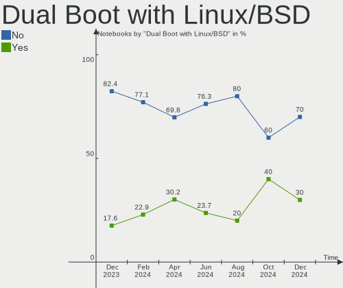
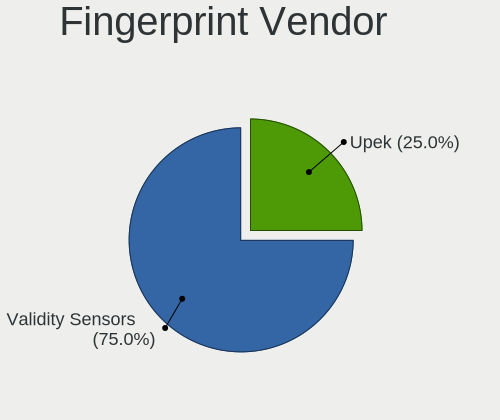
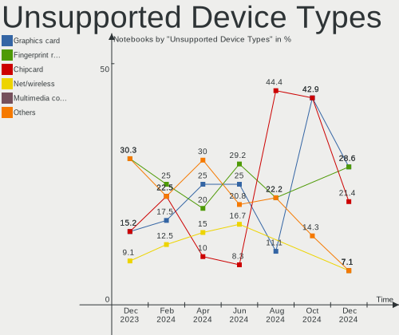

BlackPanther Hardware Trends (Notebook)
---------------------------------------

A project to identify most popular hardware characteristics and track their change
over time based on data collected by BlackPanther users at https://Linux-Hardware.org.

Anyone can contribute to the study by uploading probes of their computers by
the [hw-probe](https://github.com/linuxhw/hw-probe) tool:

    sudo -E hw-probe -all -upload

Full-feature report is available here: https://linux-hardware.org/?view=trends&formfactor=notebook

Period: Sep, 2020.

Contents
--------

- [ OS                       ](#os)
- [ OS Family                ](#os-family)
- [ Kernel                   ](#kernel)
- [ Kernel Family            ](#kernel-family)
- [ Kernel Major Ver.        ](#kernel-major-ver)
- [ Arch                     ](#arch)
- [ DE                       ](#de)
- [ Display Server           ](#display-server)
- [ Display Manager          ](#display-manager)
- [ OS Lang                  ](#os-lang)
- [ Boot Mode                ](#boot-mode)
- [ Filesystem               ](#filesystem)
- [ Part. scheme             ](#part-scheme)
- [ Dual Boot with Linux/BSD ](#dual-boot-with-linux/bsd)
- [ Dual Boot (Win)          ](#dual-boot-win)
- [ Country                  ](#country)
- [ City                     ](#city)
- [ Vendor                   ](#vendor)
- [ Model                    ](#model)
- [ Model Family             ](#model-family)
- [ MFG Year                 ](#mfg-year)
- [ Form Factor              ](#form-factor)
- [ Secure Boot              ](#secure-boot)
- [ Coreboot                 ](#coreboot)
- [ RAM Size                 ](#ram-size)
- [ RAM Used                 ](#ram-used)
- [ Has CD-ROM               ](#has-cd-rom)
- [ Total Drives             ](#total-drives)
- [ Has Ethernet             ](#has-ethernet)
- [ Drive Vendor             ](#drive-vendor)
- [ HDD Vendor               ](#hdd-vendor)
- [ SSD Vendor               ](#ssd-vendor)
- [ Drive Model              ](#drive-model)
- [ Drive Kind               ](#drive-kind)
- [ Drive Connector          ](#drive-connector)
- [ Drive Size               ](#drive-size)
- [ Space Total              ](#space-total)
- [ Space Used               ](#space-used)
- [ Malfunc. Drives          ](#malfunc-drives)
- [ Malfunc. Drive Vendor    ](#malfunc-drive-vendor)
- [ Malfunc. HDD Vendor      ](#malfunc-hdd-vendor)
- [ Malfunc. Drive Kind      ](#malfunc-drive-kind)
- [ Failed Drives            ](#failed-drives)
- [ Failed Drive Vendor      ](#failed-drive-vendor)
- [ Drive Status             ](#drive-status)
- [ Storage Vendor           ](#storage-vendor)
- [ Storage Model            ](#storage-model)
- [ Storage Kind             ](#storage-kind)
- [ CPU Vendor               ](#cpu-vendor)
- [ CPU Model                ](#cpu-model)
- [ CPU Model Family         ](#cpu-model-family)
- [ CPU Cores                ](#cpu-cores)
- [ CPU Sockets              ](#cpu-sockets)
- [ CPU Threads              ](#cpu-threads)
- [ CPU Op-Modes             ](#cpu-op-modes)
- [ CPU Microcode            ](#cpu-microcode)
- [ CPU Microarch            ](#cpu-microarch)
- [ GPU Vendor               ](#gpu-vendor)
- [ GPU Model                ](#gpu-model)
- [ GPU Combo                ](#gpu-combo)
- [ GPU Driver               ](#gpu-driver)
- [ GPU Memory               ](#gpu-memory)
- [ Monitor Vendor           ](#monitor-vendor)
- [ Monitor Model            ](#monitor-model)
- [ Monitor Resolution       ](#monitor-resolution)
- [ Monitor Diagonal         ](#monitor-diagonal)
- [ Monitor Width            ](#monitor-width)
- [ Aspect Ratio             ](#aspect-ratio)
- [ Monitor Area             ](#monitor-area)
- [ Pixel Density            ](#pixel-density)
- [ Multiple Monitors        ](#multiple-monitors)
- [ Net Controller Vendor    ](#net-controller-vendor)
- [ Net Controller Model     ](#net-controller-model)
- [ Wireless Vendor          ](#wireless-vendor)
- [ Wireless Model           ](#wireless-model)
- [ Ethernet Vendor          ](#ethernet-vendor)
- [ Ethernet Model           ](#ethernet-model)
- [ Net Controller Kind      ](#net-controller-kind)
- [ Used Controller          ](#used-controller)
- [ NICs                     ](#nics)
- [ Memory Vendor            ](#memory-vendor)
- [ Memory Model             ](#memory-model)
- [ Memory Kind              ](#memory-kind)
- [ Memory Form Factor       ](#memory-form-factor)
- [ Memory Size              ](#memory-size)
- [ Memory Speed             ](#memory-speed)
- [ Sound Vendor             ](#sound-vendor)
- [ Sound Model              ](#sound-model)
- [ Camera Vendor            ](#camera-vendor)
- [ Camera Model             ](#camera-model)
- [ Fingerprint Vendor       ](#fingerprint-vendor)
- [ Fingerprint Model        ](#fingerprint-model)
- [ Chipcard Vendor          ](#chipcard-vendor)
- [ Chipcard Model           ](#chipcard-model)
- [ Printer Vendor           ](#printer-vendor)
- [ Printer Model            ](#printer-model)
- [ Scanner Vendor           ](#scanner-vendor)
- [ Scanner Model            ](#scanner-model)
- [ Bluetooth Vendor         ](#bluetooth-vendor)
- [ Bluetooth Model          ](#bluetooth-model)
- [ Unsupported Devices      ](#unsupported-devices)
- [ Unsupported Device Types ](#unsupported-device-types)

OS
--

Installed operating systems

| Name              | Notebooks | Percent |
|-------------------|-----------|---------|
| BlackPanther 18.1 | 101       | 96.19%  |
| BlackPanther 16.2 | 4         | 3.81%   |

OS Family
---------

OS without a version

| Name         | Notebooks | Percent |
|--------------|-----------|---------|
| BlackPanther | 105       | 100%    |

Kernel
------

Version of the Linux kernel

| Version                | Notebooks | Percent |
|------------------------|-----------|---------|
| 4.18.16-desktop-1bP    | 100       | 95.24%  |
| 4.9.20-desktop-pae-1bP | 4         | 3.81%   |
| 5.1.15-desktop-1bP     | 1         | 0.95%   |

Kernel Family
-------------

Linux kernel without a distro release

| Version | Notebooks | Percent |
|---------|-----------|---------|
| 4.18.16 | 100       | 95.24%  |
| 4.9.20  | 4         | 3.81%   |
| 5.1.15  | 1         | 0.95%   |

Kernel Major Ver.
-----------------

Linux kernel major version

| Version | Notebooks | Percent |
|---------|-----------|---------|
| 4.18    | 100       | 95.24%  |
| 4.9     | 4         | 3.81%   |
| 5.1     | 1         | 0.95%   |

Arch
----

OS architecture (x86_64, i586, etc.)

| Name   | Notebooks | Percent |
|--------|-----------|---------|
| x86_64 | 101       | 96.19%  |
| i686   | 4         | 3.81%   |

DE
--

Desktop Environment

| Name | Notebooks | Percent |
|------|-----------|---------|
| KDE5 | 104       | 99.05%  |
| KDE  | 1         | 0.95%   |

Display Server
--------------

X11 or Wayland

| Name    | Notebooks | Percent |
|---------|-----------|---------|
| X11     | 104       | 99.05%  |
| Wayland | 1         | 0.95%   |

Display Manager
---------------

SDDM, LightDM, etc.

| Name    | Notebooks | Percent |
|---------|-----------|---------|
| SDDM    | 104       | 99.05%  |
| Unknown | 1         | 0.95%   |

OS Lang
-------

Language

| Lang       | Notebooks | Percent |
|------------|-----------|---------|
| Unknown    | 104       | 99.05%  |
| hu_HU.utf8 | 1         | 0.95%   |

Boot Mode
---------

EFI or BIOS

| Mode | Notebooks | Percent |
|------|-----------|---------|
| BIOS | 66        | 62.86%  |
| EFI  | 39        | 37.14%  |

Filesystem
----------

Type of filesystem

| Type    | Notebooks | Percent |
|---------|-----------|---------|
| Overlay | 76        | 72.38%  |
| Ext4    | 28        | 26.67%  |
| Ntfs    | 1         | 0.95%   |

Part. scheme
------------

Scheme of partitioning

| Type    | Notebooks | Percent |
|---------|-----------|---------|
| MBR     | 72        | 68.57%  |
| GPT     | 32        | 30.48%  |
| Unknown | 1         | 0.95%   |

Dual Boot with Linux/BSD
------------------------

Hosting more than one Linux/BSD

| Dual boot | Notebooks | Percent |
|-----------|-----------|---------|
| No        | 63        | 60%     |
| Yes       | 42        | 40%     |

Dual Boot (Win)
---------------

Hosting Linux and Windows

| Dual boot | Notebooks | Percent |
|-----------|-----------|---------|
| Yes       | 55        | 52.38%  |
| No        | 50        | 47.62%  |

Country
-------

Geographic location (country)

| Country     | Notebooks | Percent |
|-------------|-----------|---------|
| Hungary     | 72        | 68.57%  |
| USA         | 4         | 3.81%   |
| Germany     | 4         | 3.81%   |
| Italy       | 3         | 2.86%   |
| Canada      | 3         | 2.86%   |
| Romania     | 2         | 1.9%    |
| Finland     | 2         | 1.9%    |
| UK          | 1         | 0.95%   |
| Spain       | 1         | 0.95%   |
| Slovakia    | 1         | 0.95%   |
| Serbia      | 1         | 0.95%   |
| Madagascar  | 1         | 0.95%   |
| Japan       | 1         | 0.95%   |
| France      | 1         | 0.95%   |
| El Salvador | 1         | 0.95%   |
| Egypt       | 1         | 0.95%   |
| Ecuador     | 1         | 0.95%   |
| Brazil      | 1         | 0.95%   |
| Bangladesh  | 1         | 0.95%   |
| Austria     | 1         | 0.95%   |
| Australia   | 1         | 0.95%   |
| Argentina   | 1         | 0.95%   |

City
----

Geographic location (city)

| City              | Notebooks | Percent |
|-------------------|-----------|---------|
| Budapest          | 25        | 23.81%  |
| Győr             | 3         | 2.86%   |
| Zalaegerszeg      | 2         | 1.9%    |
| Veszprém         | 2         | 1.9%    |
| Székesfehérvár | 2         | 1.9%    |
| Ottawa            | 2         | 1.9%    |
| Milan             | 2         | 1.9%    |
| Érd              | 1         | 0.95%   |
| Vác              | 1         | 0.95%   |
| Târgu Mureş     | 1         | 0.95%   |
| Toeroekbalint     | 1         | 0.95%   |
| Tiszafured        | 1         | 0.95%   |
| Tet               | 1         | 0.95%   |
| Tejgaon           | 1         | 0.95%   |
| Tatabánya        | 1         | 0.95%   |
| Tarnok            | 1         | 0.95%   |
| Szombathely       | 1         | 0.95%   |
| Szentgotthard     | 1         | 0.95%   |
| Szentendre        | 1         | 0.95%   |
| Szeged            | 1         | 0.95%   |
| Sydney            | 1         | 0.95%   |
| Sohag             | 1         | 0.95%   |
| Sarisap           | 1         | 0.95%   |
| San Miguel        | 1         | 0.95%   |
| Salgotarjan       | 1         | 0.95%   |
| Russellville      | 1         | 0.95%   |
| Rosu              | 1         | 0.95%   |
| Pusztaszabolcs    | 1         | 0.95%   |
| Prato             | 1         | 0.95%   |
| Pilis             | 1         | 0.95%   |
| Paris             | 1         | 0.95%   |
| Panicke Dravce    | 1         | 0.95%   |
| Nyiregyhaza       | 1         | 0.95%   |
| Nyirbator         | 1         | 0.95%   |
| Nyirad            | 1         | 0.95%   |
| North Hollywood   | 1         | 0.95%   |
| Nagybarca         | 1         | 0.95%   |
| Munich            | 1         | 0.95%   |
| Mosonmagyaróvár | 1         | 0.95%   |
| Miskolc           | 1         | 0.95%   |
| Maglod            | 1         | 0.95%   |
| Madrid            | 1         | 0.95%   |
| Lanzenkirchen     | 1         | 0.95%   |
| Kiskunmajsa       | 1         | 0.95%   |
| Kaposvár         | 1         | 0.95%   |
| Kamimeguro        | 1         | 0.95%   |
| Hosszupereszteg   | 1         | 0.95%   |
| Helsinki          | 1         | 0.95%   |
| Harrow            | 1         | 0.95%   |
| Gyomro            | 1         | 0.95%   |
| Gross Rosenburg   | 1         | 0.95%   |
| Felsocsatar       | 1         | 0.95%   |
| Espoo             | 1         | 0.95%   |
| Erkheim           | 1         | 0.95%   |
| Debrecen          | 1         | 0.95%   |
| Csorna            | 1         | 0.95%   |
| Csabrendek        | 1         | 0.95%   |
| Clairton          | 1         | 0.95%   |
| Ciudadela         | 1         | 0.95%   |
| Celldomolk        | 1         | 0.95%   |

Vendor
------

Motherboard manufacturer

| Name                           | Notebooks | Percent |
|--------------------------------|-----------|---------|
| Hewlett-Packard                | 27        | 25.71%  |
| Lenovo                         | 18        | 17.14%  |
| Dell                           | 17        | 16.19%  |
| Acer                           | 11        | 10.48%  |
| ASUSTek Computer               | 10        | 9.52%   |
| Samsung Electronics            | 4         | 3.81%   |
| Toshiba                        | 2         | 1.9%    |
| Sony                           | 2         | 1.9%    |
| Fujitsu                        | 2         | 1.9%    |
| Positivo                       | 1         | 0.95%   |
| Notebook                       | 1         | 0.95%   |
| Medion                         | 1         | 0.95%   |
| Matsushita Electric Industrial | 1         | 0.95%   |
| LG Electronics                 | 1         | 0.95%   |
| Hungaro Flotta Kft             | 1         | 0.95%   |
| Fujitsu Siemens                | 1         | 0.95%   |
| eMachines                      | 1         | 0.95%   |
| CEVEN                          | 1         | 0.95%   |
| Alienware                      | 1         | 0.95%   |
| Alcor                          | 1         | 0.95%   |
| Unknown                        | 1         | 0.95%   |

Model
-----

Motherboard model

| Name                                                              | Notebooks | Percent |
|-------------------------------------------------------------------|-----------|---------|
| Dell Inspiron N5110                                               | 4         | 3.81%   |
| HP ProBook 4540s                                                  | 2         | 1.9%    |
| HP Notebook                                                       | 2         | 1.9%    |
| HP EliteBook 2560p                                                | 2         | 1.9%    |
| HP 250 G5 Notebook PC                                             | 2         | 1.9%    |
| HP 250 G1                                                         | 2         | 1.9%    |
| Dell Latitude E6400                                               | 2         | 1.9%    |
| Toshiba Satellite L50-B                                           | 1         | 0.95%   |
| Toshiba Satellite C55D-A                                          | 1         | 0.95%   |
| Sony VGN-NW50JB                                                   | 1         | 0.95%   |
| Sony SVE15113FDW                                                  | 1         | 0.95%   |
| Samsung Electronics RV411/RV511/E3511/S3511/RV711/E3411           | 1         | 0.95%   |
| Samsung Electronics 300E5EV/300E4EV/270E5EV/270E4EV/2470EV/2470EE | 1         | 0.95%   |
| Samsung Electronics 300E4Z/300E5Z/300E7Z                          | 1         | 0.95%   |
| Samsung Electronics 300E4A/300E5A/300E7A/3430EA/3530EA            | 1         | 0.95%   |
| Positivo H14BT58                                                  | 1         | 0.95%   |
| Notebook N2x0LU                                                   | 1         | 0.95%   |
| Medion Akoya P7818                                                | 1         | 0.95%   |
| Matsushita Electric Industrial CF-52CD402NW                       | 1         | 0.95%   |
| LG Electronics P310-S.CBRAG                                       | 1         | 0.95%   |
| Lenovo Y50-70 20378                                               | 1         | 0.95%   |
| Lenovo V145-15AST 81MT                                            | 1         | 0.95%   |
| Lenovo V110-15ISK 80TL                                            | 1         | 0.95%   |
| Lenovo ThinkPad W510 431924G                                      | 1         | 0.95%   |
| Lenovo ThinkPad T61 6458Y56                                       | 1         | 0.95%   |
| Lenovo ThinkPad T500 20828WG                                      | 1         | 0.95%   |
| Lenovo ThinkPad T440p 20AWS1DA0F                                  | 1         | 0.95%   |
| Lenovo ThinkPad T420 4236A26                                      | 1         | 0.95%   |
| Lenovo ThinkPad T400 2768WGB                                      | 1         | 0.95%   |
| Lenovo ThinkPad L540 20AUA128HV                                   | 1         | 0.95%   |
| Lenovo IdeaPad 330-15AST 81D6                                     | 1         | 0.95%   |
| Lenovo IdeaPad 320-17ABR 80YN                                     | 1         | 0.95%   |
| Lenovo IdeaPad 320-15ABR 80XS                                     | 1         | 0.95%   |
| Lenovo IdeaPad 110-15ACL 80TJ                                     | 1         | 0.95%   |
| Lenovo G710 20252                                                 | 1         | 0.95%   |
| Lenovo G580 20150                                                 | 1         | 0.95%   |
| Lenovo G560 0679                                                  | 1         | 0.95%   |
| Lenovo G505 20240                                                 | 1         | 0.95%   |
| Hungaro Flotta Kft Navon Loop 360                                 | 1         | 0.95%   |
| HP ProBook 645 G1                                                 | 1         | 0.95%   |
| HP ProBook 5330m                                                  | 1         | 0.95%   |
| HP Presario CQ57                                                  | 1         | 0.95%   |
| HP Pavilion dv2500                                                | 1         | 0.95%   |
| HP Laptop 15-bs0xx                                                | 1         | 0.95%   |
| HP HDX18                                                          | 1         | 0.95%   |
| HP ENVY 15                                                        | 1         | 0.95%   |
| HP EliteBook 8540p                                                | 1         | 0.95%   |
| HP EliteBook 720 G1                                               | 1         | 0.95%   |
| HP EliteBook 2540p (WK303EA)                                      | 1         | 0.95%   |
| HP Compaq nx7400 (RH412EA#AKC)                                    | 1         | 0.95%   |
| HP Compaq 8510p                                                   | 1         | 0.95%   |
| HP Compaq 6710b (KE121EA#AKC)                                     | 1         | 0.95%   |
| HP 650                                                            | 1         | 0.95%   |
| HP 630                                                            | 1         | 0.95%   |
| HP 355 G2                                                         | 1         | 0.95%   |
| HP 350 G1                                                         | 1         | 0.95%   |
| Fujitsu Siemens LIFEBOOK E8310                                    | 1         | 0.95%   |
| Fujitsu LIFEBOOK S751                                             | 1         | 0.95%   |
| Fujitsu LIFEBOOK AH530                                            | 1         | 0.95%   |
| eMachines eME730G                                                 | 1         | 0.95%   |

Model Family
------------

Motherboard model prefix

| Name                                        | Notebooks | Percent |
|---------------------------------------------|-----------|---------|
| Dell Inspiron                               | 10        | 9.52%   |
| Acer Aspire                                 | 9         | 8.57%   |
| Lenovo ThinkPad                             | 7         | 6.67%   |
| HP EliteBook                                | 5         | 4.76%   |
| Dell Latitude                               | 5         | 4.76%   |
| Lenovo IdeaPad                              | 4         | 3.81%   |
| HP ProBook                                  | 4         | 3.81%   |
| HP 250                                      | 4         | 3.81%   |
| HP Compaq                                   | 3         | 2.86%   |
| Toshiba Satellite                           | 2         | 1.9%    |
| HP Notebook                                 | 2         | 1.9%    |
| Fujitsu LIFEBOOK                            | 2         | 1.9%    |
| Dell XPS                                    | 2         | 1.9%    |
| Sony VGN-NW50JB                             | 1         | 0.95%   |
| Sony SVE15113FDW                            | 1         | 0.95%   |
| Samsung Electronics RV411                   | 1         | 0.95%   |
| Samsung Electronics 300E5EV                 | 1         | 0.95%   |
| Samsung Electronics 300E4Z                  | 1         | 0.95%   |
| Samsung Electronics 300E4A                  | 1         | 0.95%   |
| Positivo H14BT58                            | 1         | 0.95%   |
| Notebook N2x0LU                             | 1         | 0.95%   |
| Medion Akoya                                | 1         | 0.95%   |
| Matsushita Electric Industrial CF-52CD402NW | 1         | 0.95%   |
| LG Electronics P310-S.CBRAG                 | 1         | 0.95%   |
| Lenovo Y50-70                               | 1         | 0.95%   |
| Lenovo V145-15AST                           | 1         | 0.95%   |
| Lenovo V110-15ISK                           | 1         | 0.95%   |
| Lenovo G710                                 | 1         | 0.95%   |
| Lenovo G580                                 | 1         | 0.95%   |
| Lenovo G560                                 | 1         | 0.95%   |
| Lenovo G505                                 | 1         | 0.95%   |
| Hungaro Flotta Kft Navon                    | 1         | 0.95%   |
| HP Presario                                 | 1         | 0.95%   |
| HP Pavilion                                 | 1         | 0.95%   |
| HP Laptop                                   | 1         | 0.95%   |
| HP HDX18                                    | 1         | 0.95%   |
| HP ENVY                                     | 1         | 0.95%   |
| HP 650                                      | 1         | 0.95%   |
| HP 630                                      | 1         | 0.95%   |
| HP 355                                      | 1         | 0.95%   |
| HP 350                                      | 1         | 0.95%   |
| Fujitsu Siemens LIFEBOOK                    | 1         | 0.95%   |
| eMachines eME730G                           | 1         | 0.95%   |
| CEVEN GFAST                                 | 1         | 0.95%   |
| ASUS X555LJ                                 | 1         | 0.95%   |
| ASUS X555LB                                 | 1         | 0.95%   |
| ASUS X551CAP                                | 1         | 0.95%   |
| ASUS X550CC                                 | 1         | 0.95%   |
| ASUS TP201SA                                | 1         | 0.95%   |
| ASUS Strix                                  | 1         | 0.95%   |
| ASUS K52F                                   | 1         | 0.95%   |
| ASUS K50IJ                                  | 1         | 0.95%   |
| ASUS G750JZA                                | 1         | 0.95%   |
| ASUS 1011PX                                 | 1         | 0.95%   |
| Alienware 13                                | 1         | 0.95%   |
| Alcor SnugBook                              | 1         | 0.95%   |
| Acer V5-131                                 | 1         | 0.95%   |
| Acer E1-572G                                | 1         | 0.95%   |
| Unknown                                     | 1         | 0.95%   |

MFG Year
--------

Motherboard manufacture year

| Year | Notebooks | Percent |
|------|-----------|---------|
| 2012 | 18        | 17.14%  |
| 2014 | 11        | 10.48%  |
| 2013 | 11        | 10.48%  |
| 2011 | 9         | 8.57%   |
| 2019 | 8         | 7.62%   |
| 2018 | 7         | 6.67%   |
| 2015 | 7         | 6.67%   |
| 2010 | 7         | 6.67%   |
| 2017 | 6         | 5.71%   |
| 2016 | 5         | 4.76%   |
| 2009 | 5         | 4.76%   |
| 2008 | 5         | 4.76%   |
| 2007 | 3         | 2.86%   |
| 2006 | 2         | 1.9%    |
| 2020 | 1         | 0.95%   |

Form Factor
-----------

Physical design of the computer

| Name     | Notebooks | Percent |
|----------|-----------|---------|
| Notebook | 105       | 100%    |

Secure Boot
-----------

Enabled or disabled

| State    | Notebooks | Percent |
|----------|-----------|---------|
| Disabled | 105       | 100%    |

Coreboot
--------

Have coreboot on board

| Used | Notebooks | Percent |
|------|-----------|---------|
| No   | 105       | 100%    |

RAM Size
--------

Total RAM memory

| Size in GB | Notebooks | Percent |
|------------|-----------|---------|
| 3.01-4.0   | 60        | 57.14%  |
| 4.01-8.0   | 17        | 16.19%  |
| 8.01-16.0  | 12        | 11.43%  |
| 1.01-2.0   | 6         | 5.71%   |
| 2.01-3.0   | 3         | 2.86%   |
| 16.01-24.0 | 3         | 2.86%   |
| 32.01-64.0 | 2         | 1.9%    |
| 0.01-1.0   | 2         | 1.9%    |

RAM Used
--------

Used RAM memory

| Used GB  | Notebooks | Percent |
|----------|-----------|---------|
| 0.01-1.0 | 78        | 74.29%  |
| 1.01-2.0 | 25        | 23.81%  |
| 3.01-4.0 | 1         | 0.95%   |
| 2.01-3.0 | 1         | 0.95%   |

Has CD-ROM
----------

Has CD-ROM on board

| Presented | Notebooks | Percent |
|-----------|-----------|---------|
| Yes       | 71        | 67.62%  |
| No        | 34        | 32.38%  |

Total Drives
------------

Number of drives on board

| Drives | Notebooks | Percent |
|--------|-----------|---------|
| 1      | 89        | 84.76%  |
| 2      | 12        | 11.43%  |
| 3      | 3         | 2.86%   |
| 0      | 1         | 0.95%   |

Has Ethernet
------------

Has Ethernet on board

| Presented | Notebooks | Percent |
|-----------|-----------|---------|
| Yes       | 100       | 95.24%  |
| No        | 5         | 4.76%   |

Drive Vendor
------------

Hard drive vendors

| Vendor              | Notebooks | Drives  | Percent |
|---------------------|-----------|---------|---------|
| WDC                 | 21        | 21      | 16.94%  |
| Seagate             | 21        | 22      | 16.94%  |
| Kingston            | 14        | 15      | 11.29%  |
| Toshiba             | 10        | 10      | 8.06%   |
| Samsung Electronics | 10        | 10      | 8.06%   |
| HGST                | 9         | 9       | 7.26%   |
| Hitachi             | 6         | 6       | 4.84%   |
| SanDisk             | 5         | 6       | 4.03%   |
| Unknown             | 4         | 5       | 3.23%   |
| SK Hynix            | 4         | 4       | 3.23%   |
| A-DATA Technology   | 3         | 3       | 2.42%   |
| Transcend           | 2         | 2       | 1.61%   |
| JMicron             | 2         | 1       | 1.61%   |
| Fujitsu             | 2         | 2       | 1.61%   |
| China               | 2         | 2       | 1.61%   |
| Apacer              | 2         | 2       | 1.61%   |
| SPCC                | 1         | 1       | 0.81%   |
| Patriot             | 1         | 1       | 0.81%   |
| KINGMAX             | 1         | 1       | 0.81%   |
| Intel               | 1         | 1       | 0.81%   |
| HL-DT-ST            | 1         | Unknown | 0.81%   |
| Crucial             | 1         | 1       | 0.81%   |
| Corsair             | 1         | 1       | 0.81%   |

HDD Vendor
----------

Hard disk drive vendors

| Vendor              | Notebooks | Drives | Percent |
|---------------------|-----------|--------|---------|
| Seagate             | 20        | 21     | 29.85%  |
| WDC                 | 19        | 19     | 28.36%  |
| Toshiba             | 9         | 9      | 13.43%  |
| HGST                | 9         | 9      | 13.43%  |
| Hitachi             | 6         | 6      | 8.96%   |
| Samsung Electronics | 2         | 2      | 2.99%   |
| Fujitsu             | 2         | 2      | 2.99%   |

SSD Vendor
----------

Solid state drive vendors

| Vendor              | Notebooks | Drives | Percent |
|---------------------|-----------|--------|---------|
| Kingston            | 14        | 15     | 31.11%  |
| Samsung Electronics | 6         | 6      | 13.33%  |
| SanDisk             | 4         | 5      | 8.89%   |
| SK Hynix            | 3         | 3      | 6.67%   |
| A-DATA Technology   | 3         | 3      | 6.67%   |
| WDC                 | 2         | 2      | 4.44%   |
| Transcend           | 2         | 2      | 4.44%   |
| China               | 2         | 2      | 4.44%   |
| Apacer              | 2         | 2      | 4.44%   |
| SPCC                | 1         | 1      | 2.22%   |
| Patriot             | 1         | 1      | 2.22%   |
| KINGMAX             | 1         | 1      | 2.22%   |
| JMicron             | 1         | 1      | 2.22%   |
| Intel               | 1         | 1      | 2.22%   |
| Crucial             | 1         | 1      | 2.22%   |
| Corsair             | 1         | 1      | 2.22%   |

Drive Model
-----------

Hard drive models

| Model                        | Notebooks | Percent |
|------------------------------|-----------|---------|
| SA400S37240G 240GB SSD       | 5         | 3.97%   |
| ST9320325AS 320GB            | 3         | 2.38%   |
| ST1000LM035-1RK172 1TB       | 3         | 2.38%   |
| SA400S37120G 120GB SSD       | 3         | 2.38%   |
| HTS545050A7E680 500GB        | 3         | 2.38%   |
| ST9250315AS 250GB            | 2         | 1.59%   |
| ST500LM012 HN-M500MBB 500GB  | 2         | 1.59%   |
| ST1000LM024 HN-M101MBB 1TB   | 2         | 1.59%   |
| SA400S37480G 480GB SSD       | 2         | 1.59%   |
| MQ01ACF032 320GB             | 2         | 1.59%   |
| MQ01ABD100 1TB               | 2         | 1.59%   |
| MQ01ABD075 752GB             | 2         | 1.59%   |
| HTS545032A7E380 320GB        | 2         | 1.59%   |
| AS350 128GB SSD              | 2         | 1.59%   |
| WDS500G2B0A 500GB SSD        | 1         | 0.79%   |
| WDS240G2G0A-00JH30 240GB SSD | 1         | 0.79%   |
| WD7500BPVX-60JC3T0 752GB     | 1         | 0.79%   |
| WD6400BEVT-22A0RT0 640GB     | 1         | 0.79%   |
| WD5000LPCX-24VHAT0 500GB     | 1         | 0.79%   |
| WD5000LPCX-22VHAT0 500GB     | 1         | 0.79%   |
| WD5000BPVT-22HXZT3 500GB     | 1         | 0.79%   |
| WD5000BPVT-22A1YT0 500GB     | 1         | 0.79%   |
| WD5000BPVT-00HXZT1 500GB     | 1         | 0.79%   |
| WD5000BEVT-75A0RT0 500GB     | 1         | 0.79%   |
| WD5000BEVT-16A0RT0 500GB     | 1         | 0.79%   |
| WD3200BVVT-63A26Y0 320GB     | 1         | 0.79%   |
| WD3200BEVT-22ZCT0 320GB      | 1         | 0.79%   |
| WD3200BEVS-08VAT2 320GB      | 1         | 0.79%   |
| WD3200BEKT-60PVMT0 320GB     | 1         | 0.79%   |
| WD2500BEVT-75A23T0 250GB     | 1         | 0.79%   |
| WD2500BEKT-75PVMT0 250GB     | 1         | 0.79%   |
| WD10SPCX-24HWST1 1TB         | 1         | 0.79%   |
| WD10JPVX-60JC3T1 1TB         | 1         | 0.79%   |
| WD10JPVX-22JC3T0 1TB         | 1         | 0.79%   |
| WD10JPCX-24UE4T0 1TB         | 1         | 0.79%   |
| USD00  32GB                  | 1         | 0.79%   |
| TS512GMTS430S 512GB SSD      | 1         | 0.79%   |
| TS120GMTS420S 120GB SSD      | 1         | 0.79%   |
| Tech 250GB                   | 1         | 0.79%   |
| SV300S37A120G 120GB SSD      | 1         | 0.79%   |
| SUV400S37480G 480GB SSD      | 1         | 0.79%   |
| SUV400S37120G 120GB SSD      | 1         | 0.79%   |
| SU630 240GB SSD              | 1         | 0.79%   |
| ST9320423AS 320GB            | 1         | 0.79%   |
| ST9160314AS 160GB            | 1         | 0.79%   |
| ST9120822AS 120GB            | 1         | 0.79%   |
| ST500LT012-9WS142 500GB      | 1         | 0.79%   |
| ST500LM000-1EJ162 500GB      | 1         | 0.79%   |
| ST320VM001-1AD142 320GB      | 1         | 0.79%   |
| ST320LT012-9WS14C 320GB      | 1         | 0.79%   |
| ST160LM000 HM161GI 160GB     | 1         | 0.79%   |
| ST1000LX015-1U7172 1TB       | 1         | 0.79%   |
| SSDSA2MH080G1HP 80GB         | 1         | 0.79%   |
| SSD S599 115GB               | 1         | 0.79%   |
| SSD PLUS 240GB               | 1         | 0.79%   |
| SSD 860 EVO 500GB            | 1         | 0.79%   |
| SSD 850 EVO 500GB            | 1         | 0.79%   |
| SSD 850 EVO 250GB            | 1         | 0.79%   |
| SSD 830 Series 128GB         | 1         | 0.79%   |
| SSD 120GB                    | 1         | 0.79%   |

Drive Kind
----------

HDD or SSD

| Kind    | Notebooks | Drives | Percent |
|---------|-----------|--------|---------|
| HDD     | 66        | 68     | 56.41%  |
| SSD     | 39        | 47     | 33.33%  |
| MMC     | 6         | 7      | 5.13%   |
| NVMe    | 3         | 3      | 2.56%   |
| Unknown | 3         | 1      | 2.56%   |

Drive Connector
---------------

SATA, SAS, NVMe, etc.

| Type | Notebooks | Drives | Percent |
|------|-----------|--------|---------|
| SATA | 99        | 113    | 87.61%  |
| MMC  | 6         | 7      | 5.31%   |
| SAS  | 5         | 3      | 4.42%   |
| NVMe | 3         | 3      | 2.65%   |

Drive Size
----------

Size of hard drive

| Size in TB | Notebooks | Drives | Percent |
|------------|-----------|--------|---------|
| 0.01-0.5   | 86        | 101    | 79.63%  |
| 0.51-1.0   | 21        | 24     | 19.44%  |
| 1.01-2.0   | 1         | 1      | 0.93%   |

Space Total
-----------

Amount of disk space available on the file system

| Size in GB | Notebooks | Percent |
|------------|-----------|---------|
| Unknown    | 74        | 70.48%  |
| 251-500    | 10        | 9.52%   |
| 101-250    | 10        | 9.52%   |
| 21-50      | 4         | 3.81%   |
| 51-100     | 4         | 3.81%   |
| 501-1000   | 2         | 1.9%    |
| 1-20       | 1         | 0.95%   |

Space Used
----------

Amount of used disk space

| Used GB | Notebooks | Percent |
|---------|-----------|---------|
| Unknown | 74        | 70.48%  |
| 1-20    | 25        | 23.81%  |
| 21-50   | 2         | 1.9%    |
| 51-100  | 2         | 1.9%    |
| 251-500 | 1         | 0.95%   |
| 101-250 | 1         | 0.95%   |

Malfunc. Drives
---------------

Drive models with a malfunction

| Model                       | Notebooks | Drives | Percent |
|-----------------------------|-----------|--------|---------|
| ST9320325AS 320GB           | 2         | 2      | 5.88%   |
| ST9250315AS 250GB           | 2         | 2      | 5.88%   |
| ST500LM012 HN-M500MBB 500GB | 2         | 2      | 5.88%   |
| HTS545032A7E380 320GB       | 2         | 2      | 5.88%   |
| WD6400BEVT-22A0RT0 640GB    | 1         | 1      | 2.94%   |
| WD5000LPCX-22VHAT0 500GB    | 1         | 1      | 2.94%   |
| WD5000BPVT-22HXZT3 500GB    | 1         | 1      | 2.94%   |
| WD3200BEKT-60PVMT0 320GB    | 1         | 1      | 2.94%   |
| WD2500BEVT-75A23T0 250GB    | 1         | 1      | 2.94%   |
| WD10JPVX-22JC3T0 1TB        | 1         | 1      | 2.94%   |
| SUV400S37480G 480GB SSD     | 1         | 1      | 2.94%   |
| ST9160314AS 160GB           | 1         | 1      | 2.94%   |
| ST9120822AS 120GB           | 1         | 1      | 2.94%   |
| ST500LT012-9WS142 500GB     | 1         | 1      | 2.94%   |
| ST320LT012-9WS14C 320GB     | 1         | 1      | 2.94%   |
| ST1000LX015-1U7172 1TB      | 1         | 1      | 2.94%   |
| SH910 mSATA 128GB SSD       | 1         | 1      | 2.94%   |
| MQ01ABD100 1TB              | 1         | 1      | 2.94%   |
| MQ01ABD075 752GB            | 1         | 1      | 2.94%   |
| MK5076GSX 500GB             | 1         | 1      | 2.94%   |
| MK1633GSG 160GB             | 1         | 1      | 2.94%   |
| MHY2250BH 250GB             | 1         | 1      | 2.94%   |
| HTS545050A7E680 500GB       | 1         | 1      | 2.94%   |
| HTS545050A7E380 500GB       | 1         | 1      | 2.94%   |
| HTS545032B9A300 320GB       | 1         | 1      | 2.94%   |
| HTS543232L9A300 320GB       | 1         | 1      | 2.94%   |
| HTS541010A9E680 1TB         | 1         | 1      | 2.94%   |
| HTS421212H9AT00 120GB       | 1         | 1      | 2.94%   |
| HN-M500MBB 500GB            | 1         | 1      | 2.94%   |
| HM060II 64GB                | 1         | 1      | 2.94%   |

Malfunc. Drive Vendor
---------------------

Vendors of faulty drives

| Vendor              | Notebooks | Drives | Percent |
|---------------------|-----------|--------|---------|
| Seagate             | 11        | 11     | 32.35%  |
| WDC                 | 6         | 6      | 17.65%  |
| HGST                | 5         | 5      | 14.71%  |
| Toshiba             | 4         | 4      | 11.76%  |
| Hitachi             | 3         | 3      | 8.82%   |
| Samsung Electronics | 2         | 2      | 5.88%   |
| SK Hynix            | 1         | 1      | 2.94%   |
| Kingston            | 1         | 1      | 2.94%   |
| Fujitsu             | 1         | 1      | 2.94%   |

Malfunc. HDD Vendor
-------------------

Vendors of faulty HDD drives

| Vendor              | Notebooks | Drives | Percent |
|---------------------|-----------|--------|---------|
| Seagate             | 11        | 11     | 34.38%  |
| WDC                 | 6         | 6      | 18.75%  |
| HGST                | 5         | 5      | 15.63%  |
| Toshiba             | 4         | 4      | 12.5%   |
| Hitachi             | 3         | 3      | 9.38%   |
| Samsung Electronics | 2         | 2      | 6.25%   |
| Fujitsu             | 1         | 1      | 3.13%   |

Malfunc. Drive Kind
-------------------

Kinds of faulty drives

| Kind | Notebooks | Drives | Percent |
|------|-----------|--------|---------|
| HDD  | 32        | 32     | 94.12%  |
| SSD  | 2         | 2      | 5.88%   |

Failed Drives
-------------

Failed drive models

| Model                    | Notebooks | Drives | Percent |
|--------------------------|-----------|--------|---------|
| WD3200BVVT-63A26Y0 320GB | 1         | 1      | 100%    |

Failed Drive Vendor
-------------------

Failed drive vendors

| Vendor | Notebooks | Drives | Percent |
|--------|-----------|--------|---------|
| WDC    | 1         | 1      | 100%    |

Drive Status
------------

Number of failed and malfunc. drives

| Status   | Notebooks | Drives | Percent |
|----------|-----------|--------|---------|
| Works    | 69        | 80     | 60.53%  |
| Malfunc  | 34        | 34     | 29.82%  |
| Detected | 10        | 11     | 8.77%   |
| Failed   | 1         | 1      | 0.88%   |

Storage Vendor
--------------

Storage controller vendors

| Vendor              | Notebooks | Percent |
|---------------------|-----------|---------|
| Intel               | 91        | 86.67%  |
| AMD                 | 11        | 10.48%  |
| Samsung Electronics | 2         | 1.9%    |
| KIOXIA              | 1         | 0.95%   |

Storage Model
-------------

Storage controller models

| Model                                                                      | Notebooks | Percent |
|----------------------------------------------------------------------------|-----------|---------|
| 7 Series Chipset Family 6-port SATA Controller [AHCI mode]                 | 17        | 14.29%  |
| 6 Series/C200 Series Chipset Family 6 port Mobile SATA AHCI Controller     | 12        | 10.08%  |
| FCH SATA Controller [AHCI mode]                                            | 9         | 7.56%   |
| 82801IBM/IEM (ICH9M/ICH9M-E) 4 port SATA Controller [AHCI mode]            | 9         | 7.56%   |
| 82801HM/HEM (ICH8M/ICH8M-E) SATA Controller [AHCI mode]                    | 6         | 5.04%   |
| 82801HM/HEM (ICH8M/ICH8M-E) IDE Controller                                 | 6         | 5.04%   |
| 8 Series/C220 Series Chipset Family 6-port SATA Controller 1 [AHCI mode]   | 6         | 5.04%   |
| 8 Series SATA Controller 1 [AHCI mode]                                     | 6         | 5.04%   |
| 5 Series/3400 Series Chipset 4 port SATA AHCI Controller                   | 5         | 4.2%    |
| Sunrise Point-LP SATA Controller [AHCI mode]                               | 4         | 3.36%   |
| Atom/Celeron/Pentium Processor x5-E8000/J3xxx/N3xxx Series SATA Controller | 4         | 3.36%   |
| 82801 Mobile SATA Controller [RAID mode]                                   | 4         | 3.36%   |
| 5 Series/3400 Series Chipset 6 port SATA AHCI Controller                   | 4         | 3.36%   |
| Wildcat Point-LP SATA Controller [AHCI Mode]                               | 3         | 2.52%   |
| NM10/ICH7 Family SATA Controller [AHCI mode]                               | 2         | 1.68%   |
| FCH SATA Controller [IDE mode]                                             | 2         | 1.68%   |
| 82801GBM/GHM (ICH7-M Family) SATA Controller [AHCI mode]                   | 2         | 1.68%   |
| 82801G (ICH7 Family) IDE Controller                                        | 2         | 1.68%   |
| SATA controller                                                            | 1         | 0.84%   |
| NVMe SSD Controller SM961/PM961                                            | 1         | 0.84%   |
| NVMe SSD Controller SM951/PM951                                            | 1         | 0.84%   |
| Non-Volatile memory controller                                             | 1         | 0.84%   |
| Mobile PM965/GM965 PT IDER Controller                                      | 1         | 0.84%   |
| Celeron N3350/Pentium N4200/Atom E3900 Series SATA AHCI Controller         | 1         | 0.84%   |
| Cannon Lake Mobile PCH SATA AHCI Controller                                | 1         | 0.84%   |
| Atom Processor E3800 Series SATA AHCI Controller                           | 1         | 0.84%   |
| 82801IBM/IEM (ICH9M/ICH9M-E) 2 port SATA Controller [IDE mode]             | 1         | 0.84%   |
| 82801GBM/GHM (ICH7-M Family) SATA Controller [IDE mode]                    | 1         | 0.84%   |
| 8 Series/C220 Series Chipset Family 2-port SATA Controller 2 [IDE mode]    | 1         | 0.84%   |
| 8 Series Chipset Family 4-port SATA Controller 1 [IDE mode] - Mobile       | 1         | 0.84%   |
| 7 Series Chipset Family 4-port SATA Controller [IDE mode]                  | 1         | 0.84%   |
| 7 Series Chipset Family 2-port SATA Controller [IDE mode]                  | 1         | 0.84%   |
| 5 Series/3400 Series Chipset 4 port SATA IDE Controller                    | 1         | 0.84%   |
| 5 Series/3400 Series Chipset 2 port SATA IDE Controller                    | 1         | 0.84%   |

Storage Kind
------------

Kind of storage controller (IDE, SATA, NVMe, SAS, ...)

| Kind | Notebooks | Percent |
|------|-----------|---------|
| SATA | 95        | 82.61%  |
| IDE  | 13        | 11.3%   |
| RAID | 4         | 3.48%   |
| NVMe | 3         | 2.61%   |

CPU Vendor
----------

Processor vendors

| Vendor | Notebooks | Percent |
|--------|-----------|---------|
| Intel  | 94        | 89.52%  |
| AMD    | 11        | 10.48%  |

CPU Model
---------

Processor models

| Model                                        | Notebooks | Percent |
|----------------------------------------------|-----------|---------|
| Intel Core i5-2520M CPU @ 2.50GHz            | 4         | 3.81%   |
| Intel Core i3 CPU M 350 @ 2.27GHz            | 4         | 3.81%   |
| Intel Pentium CPU B960 @ 2.20GHz             | 3         | 2.86%   |
| Intel Core i3-2310M CPU @ 2.10GHz            | 3         | 2.86%   |
| Intel Core i3 CPU M 380 @ 2.53GHz            | 3         | 2.86%   |
| Intel Core 2 Duo CPU P8700 @ 2.53GHz         | 3         | 2.86%   |
| Intel Pentium CPU N3710 @ 1.60GHz            | 2         | 1.9%    |
| Intel Core i7-4702MQ CPU @ 2.20GHz           | 2         | 1.9%    |
| Intel Core i5-4210U CPU @ 1.70GHz            | 2         | 1.9%    |
| Intel Core i5-4200U CPU @ 1.60GHz            | 2         | 1.9%    |
| Intel Core i5-3210M CPU @ 2.50GHz            | 2         | 1.9%    |
| Intel Core i5-2450M CPU @ 2.50GHz            | 2         | 1.9%    |
| Intel Core i3-6006U CPU @ 2.00GHz            | 2         | 1.9%    |
| Intel Core i3-5010U CPU @ 2.10GHz            | 2         | 1.9%    |
| Intel Core i3-2350M CPU @ 2.30GHz            | 2         | 1.9%    |
| Intel Core 2 Duo CPU T7500 @ 2.20GHz         | 2         | 1.9%    |
| Intel Core 2 Duo CPU P8600 @ 2.40GHz         | 2         | 1.9%    |
| Intel Celeron CPU N3060 @ 1.60GHz            | 2         | 1.9%    |
| Intel Celeron CPU 1007U @ 1.50GHz            | 2         | 1.9%    |
| Intel Celeron CPU 1000M @ 1.80GHz            | 2         | 1.9%    |
| Intel Atom x5-Z8350 CPU @ 1.44GHz            | 2         | 1.9%    |
| AMD A4-9125 RADEON R3, 4 COMPUTE CORES 2C+2G | 2         | 1.9%    |
| Intel Pentium Silver N5000 CPU @ 1.10GHz     | 1         | 0.95%   |
| Intel Pentium Dual-Core CPU T4400 @ 2.20GHz  | 1         | 0.95%   |
| Intel Pentium Dual-Core CPU T4200 @ 2.00GHz  | 1         | 0.95%   |
| Intel Pentium Dual CPU T2390 @ 1.86GHz       | 1         | 0.95%   |
| Intel Pentium CPU B950 @ 2.10GHz             | 1         | 0.95%   |
| Intel Pentium CPU 2117U @ 1.80GHz            | 1         | 0.95%   |
| Intel Genuine CPU T2250 @ 1.73GHz            | 1         | 0.95%   |
| Intel Core i7-8750H CPU @ 2.20GHz            | 1         | 0.95%   |
| Intel Core i7-8550U CPU @ 1.80GHz            | 1         | 0.95%   |
| Intel Core i7-7700HQ CPU @ 2.80GHz           | 1         | 0.95%   |
| Intel Core i7-4800MQ CPU @ 2.70GHz           | 1         | 0.95%   |
| Intel Core i7-4710HQ CPU @ 2.50GHz           | 1         | 0.95%   |
| Intel Core i7-4700HQ CPU @ 2.40GHz           | 1         | 0.95%   |
| Intel Core i7-3687U CPU @ 2.10GHz            | 1         | 0.95%   |
| Intel Core i7-3630QM CPU @ 2.40GHz           | 1         | 0.95%   |
| Intel Core i7-2630QM CPU @ 2.00GHz           | 1         | 0.95%   |
| Intel Core i7 CPU Q 720 @ 1.60GHz            | 1         | 0.95%   |
| Intel Core i7 CPU M 620 @ 2.67GHz            | 1         | 0.95%   |
| Intel Core i7 CPU L 640 @ 2.13GHz            | 1         | 0.95%   |
| Intel Core i5-6200U CPU @ 2.30GHz            | 1         | 0.95%   |
| Intel Core i5-5200U CPU @ 2.20GHz            | 1         | 0.95%   |
| Intel Core i5-4310U CPU @ 2.00GHz            | 1         | 0.95%   |
| Intel Core i5-4210Y CPU @ 1.50GHz            | 1         | 0.95%   |
| Intel Core i5-3360M CPU @ 2.80GHz            | 1         | 0.95%   |
| Intel Core i5-3340M CPU @ 2.70GHz            | 1         | 0.95%   |
| Intel Core i5-2540M CPU @ 2.60GHz            | 1         | 0.95%   |
| Intel Core i3-7020U CPU @ 2.30GHz            | 1         | 0.95%   |
| Intel Core i3-4000M CPU @ 2.40GHz            | 1         | 0.95%   |
| Intel Core i3-3217U CPU @ 1.80GHz            | 1         | 0.95%   |
| Intel Core i3-2328M CPU @ 2.20GHz            | 1         | 0.95%   |
| Intel Core 2 Solo CPU U3500 @ 1.40GHz        | 1         | 0.95%   |
| Intel Core 2 Duo CPU T9300 @ 2.50GHz         | 1         | 0.95%   |
| Intel Core 2 Duo CPU T8300 @ 2.40GHz         | 1         | 0.95%   |
| Intel Core 2 Duo CPU T8100 @ 2.10GHz         | 1         | 0.95%   |
| Intel Core 2 Duo CPU T7100 @ 1.80GHz         | 1         | 0.95%   |
| Intel Core 2 Duo CPU T5250 @ 1.50GHz         | 1         | 0.95%   |
| Intel Core 2 Duo CPU P9500 @ 2.53GHz         | 1         | 0.95%   |
| Intel Core 2 CPU T7200 @ 2.00GHz             | 1         | 0.95%   |

CPU Model Family
----------------

Processor model prefix

| Model                   | Notebooks | Percent |
|-------------------------|-----------|---------|
| Intel Core i3           | 20        | 19.05%  |
| Intel Core i5           | 19        | 18.1%   |
| Intel Core i7           | 14        | 13.33%  |
| Intel Core 2 Duo        | 13        | 12.38%  |
| Intel Celeron           | 9         | 8.57%   |
| Intel Pentium           | 7         | 6.67%   |
| Intel Atom              | 4         | 3.81%   |
| AMD E1                  | 3         | 2.86%   |
| AMD A4                  | 3         | 2.86%   |
| Intel Pentium Dual-Core | 2         | 1.9%    |
| Intel Core 2            | 2         | 1.9%    |
| AMD A8                  | 2         | 1.9%    |
| Intel Pentium Silver    | 1         | 0.95%   |
| Intel Pentium Dual      | 1         | 0.95%   |
| Intel Genuine           | 1         | 0.95%   |
| Intel Core 2 Solo       | 1         | 0.95%   |
| AMD FX                  | 1         | 0.95%   |
| AMD C-70                | 1         | 0.95%   |
| AMD A12                 | 1         | 0.95%   |

CPU Cores
---------

Number of processor cores

| Number | Notebooks | Percent |
|--------|-----------|---------|
| 2      | 83        | 79.05%  |
| 4      | 17        | 16.19%  |
| 1      | 5         | 4.76%   |

CPU Sockets
-----------

Number of sockets

| Number | Notebooks | Percent |
|--------|-----------|---------|
| 1      | 105       | 100%    |

CPU Threads
-----------

Threads per core (Hyper-Threading)

| Number | Notebooks | Percent |
|--------|-----------|---------|
| 2      | 54        | 51.43%  |
| 1      | 51        | 48.57%  |

CPU Op-Modes
------------

CPU Operation Modes (32-bit, 64-bit)

| Op mode        | Notebooks | Percent |
|----------------|-----------|---------|
| 32-bit, 64-bit | 104       | 99.05%  |
| 32-bit         | 1         | 0.95%   |

CPU Microcode
-------------

Microcode number

| Number     | Notebooks | Percent |
|------------|-----------|---------|
| 0x206a7    | 19        | 18.1%   |
| 0x306a9    | 12        | 11.43%  |
| 0x1067a    | 7         | 6.67%   |
| 0x406c4    | 6         | 5.71%   |
| 0x40651    | 6         | 5.71%   |
| 0x306c3    | 6         | 5.71%   |
| 0x20655    | 5         | 4.76%   |
| 0x10676    | 5         | 4.76%   |
| 0x20652    | 4         | 3.81%   |
| 0x6fd      | 3         | 2.86%   |
| 0x306d4    | 3         | 2.86%   |
| 0x406e3    | 2         | 1.9%    |
| 0x106ca    | 2         | 1.9%    |
| 0x07030105 | 2         | 1.9%    |
| 0x06006705 | 2         | 1.9%    |
| 0x06006118 | 2         | 1.9%    |
| 0x05000119 | 2         | 1.9%    |
| Unknown    | 2         | 1.9%    |
| 0x906ea    | 1         | 0.95%   |
| 0x906e9    | 1         | 0.95%   |
| 0x806ea    | 1         | 0.95%   |
| 0x806e9    | 1         | 0.95%   |
| 0x706a1    | 1         | 0.95%   |
| 0x6fb      | 1         | 0.95%   |
| 0x6fa      | 1         | 0.95%   |
| 0x6f6      | 1         | 0.95%   |
| 0x6f2      | 1         | 0.95%   |
| 0x6e8      | 1         | 0.95%   |
| 0x30673    | 1         | 0.95%   |
| 0x106e5    | 1         | 0.95%   |
| 0x07030104 | 1         | 0.95%   |
| 0x0700010f | 1         | 0.95%   |
| 0x0600111f | 1         | 0.95%   |

CPU Microarch
-------------

Microarchitecture

| Name          | Notebooks | Percent |
|---------------|-----------|---------|
| SandyBridge   | 19        | 18.1%   |
| Core          | 19        | 18.1%   |
| IvyBridge     | 12        | 11.43%  |
| Haswell       | 12        | 11.43%  |
| Westmere      | 9         | 8.57%   |
| Skylake       | 7         | 6.67%   |
| Silvermont    | 7         | 6.67%   |
| Excavator     | 4         | 3.81%   |
| Puma          | 3         | 2.86%   |
| Broadwell     | 3         | 2.86%   |
| Bonnell       | 2         | 1.9%    |
| Bobcat        | 2         | 1.9%    |
| Piledriver    | 1         | 0.95%   |
| P6            | 1         | 0.95%   |
| Nehalem       | 1         | 0.95%   |
| Jaguar        | 1         | 0.95%   |
| Goldmont plus | 1         | 0.95%   |
| Goldmont      | 1         | 0.95%   |

GPU Vendor
----------

Vendors of graphics cards

| Vendor | Notebooks | Percent |
|--------|-----------|---------|
| Intel  | 84        | 65.63%  |
| Nvidia | 23        | 17.97%  |
| AMD    | 21        | 16.41%  |

GPU Model
---------

Graphics card models

| Model                                                                              | Notebooks | Percent |
|------------------------------------------------------------------------------------|-----------|---------|
| 2nd Generation Core Processor Family Integrated Graphics Controller                | 19        | 13.67%  |
| 3rd Gen Core processor Graphics Controller                                         | 12        | 8.63%   |
| Mobile 4 Series Chipset Integrated Graphics Controller                             | 8         | 5.76%   |
| Atom/Celeron/Pentium Processor x5-E8000/J3xxx/N3xxx Integrated Graphics Controller | 6         | 4.32%   |
| 4th Gen Core Processor Integrated Graphics Controller                              | 6         | 4.32%   |
| Haswell-ULT Integrated Graphics Controller                                         | 5         | 3.6%    |
| Core Processor Integrated Graphics Controller                                      | 5         | 3.6%    |
| Sun XT [Radeon HD 8670A/8670M/8690M / R5 M330 / M430 / Radeon 520 Mobile]          | 4         | 2.88%   |
| Mobile GM965/GL960 Integrated Graphics Controller (secondary)                      | 4         | 2.88%   |
| Mobile GM965/GL960 Integrated Graphics Controller (primary)                        | 4         | 2.88%   |
| Topaz XT [Radeon R7 M260/M265 / M340/M360 / M440/M445 / 530/535 / 620/625 Mobile]  | 3         | 2.16%   |
| Mobile 945GM/GMS/GME, 943/940GML Express Integrated Graphics Controller            | 3         | 2.16%   |
| Mobile 945GM/GMS, 943/940GML Express Integrated Graphics Controller                | 3         | 2.16%   |
| HD Graphics 5500                                                                   | 3         | 2.16%   |
| G96CM [GeForce 9600M GT]                                                           | 3         | 2.16%   |
| Wani [Radeon R5/R6/R7 Graphics]                                                    | 2         | 1.44%   |
| Stoney [Radeon R2/R3/R4/R5 Graphics]                                               | 2         | 1.44%   |
| Skylake GT2 [HD Graphics 520]                                                      | 2         | 1.44%   |
| Mullins [Radeon R4/R5 Graphics]                                                    | 2         | 1.44%   |
| GK208BM [GeForce 920M]                                                             | 2         | 1.44%   |
| GF117M [GeForce 610M/710M/810M/820M / GT 620M/625M/630M/720M]                      | 2         | 1.44%   |
| Atom Processor D4xx/D5xx/N4xx/N5xx Integrated Graphics Controller                  | 2         | 1.44%   |
| Wrestler [Radeon HD 7310]                                                          | 1         | 0.72%   |
| Wrestler [Radeon HD 7290]                                                          | 1         | 0.72%   |
| UHD Graphics 630 (Mobile)                                                          | 1         | 0.72%   |
| UHD Graphics 620                                                                   | 1         | 0.72%   |
| UHD Graphics 605                                                                   | 1         | 0.72%   |
| Seymour [Radeon HD 6400M/7400M Series]                                             | 1         | 0.72%   |
| RV635/M86 [Mobility Radeon HD 3650]                                                | 1         | 0.72%   |
| RV630/M76 [Mobility Radeon HD 2600]                                                | 1         | 0.72%   |
| RV620/M82 [Mobility Radeon HD 3450/3470]                                           | 1         | 0.72%   |
| Richland [Radeon HD 8350G]                                                         | 1         | 0.72%   |
| Park [Mobility Radeon HD 5430/5450/5470]                                           | 1         | 0.72%   |
| Opal XT [Radeon R7 M265/M365X/M465]                                                | 1         | 0.72%   |
| Mullins [Radeon R2 Graphics]                                                       | 1         | 0.72%   |
| Kaby Lake-U GT2f Integrated Graphics Controller                                    | 1         | 0.72%   |
| Kabini [Radeon HD 8210]                                                            | 1         | 0.72%   |
| Jet XT [Radeon R5 M240]                                                            | 1         | 0.72%   |
| HD Graphics 630                                                                    | 1         | 0.72%   |
| HD Graphics 520                                                                    | 1         | 0.72%   |
| HD Graphics 500                                                                    | 1         | 0.72%   |
| Haswell-ULT High Definition Audio Controller [HD Graphics]                         | 1         | 0.72%   |
| GT218M [GeForce 315M]                                                              | 1         | 0.72%   |
| GT218M [GeForce 310M]                                                              | 1         | 0.72%   |
| GT216M [NVS 5100M]                                                                 | 1         | 0.72%   |
| GT216GLM [Quadro FX 880M]                                                          | 1         | 0.72%   |
| GP107M [GeForce GTX 1050 Ti Mobile]                                                | 1         | 0.72%   |
| GP106M [GeForce GTX 1060 Mobile]                                                   | 1         | 0.72%   |
| GM108M [GeForce 940M]                                                              | 1         | 0.72%   |
| GM107M [GeForce GTX 860M]                                                          | 1         | 0.72%   |
| GK208M [GeForce GT 720M]                                                           | 1         | 0.72%   |
| GK107M [GeForce GT 750M]                                                           | 1         | 0.72%   |
| GK107M [GeForce GT 730M]                                                           | 1         | 0.72%   |
| GK104M [GeForce GTX 880M]                                                          | 1         | 0.72%   |
| GF119M [GeForce GT 520MX]                                                          | 1         | 0.72%   |
| GF108M [GeForce GT 620M/630M/635M/640M LE]                                         | 1         | 0.72%   |
| GF108M [GeForce GT 525M]                                                           | 1         | 0.72%   |
| G86M [Quadro NVS 140M]                                                             | 1         | 0.72%   |
| Atom Processor Z36xxx/Z37xxx Series Graphics & Display                             | 1         | 0.72%   |

GPU Combo
---------

Combinations of graphics cards

| Name           | Notebooks | Percent |
|----------------|-----------|---------|
| 1 x Intel      | 61        | 58.1%   |
| Intel + Nvidia | 15        | 14.29%  |
| 1 x AMD        | 9         | 8.57%   |
| 1 x Nvidia     | 8         | 7.62%   |
| Intel + AMD    | 8         | 7.62%   |
| 2 x AMD        | 4         | 3.81%   |

GPU Driver
----------

Free vs proprietary

| Driver  | Notebooks | Percent |
|---------|-----------|---------|
| Free    | 103       | 98.1%   |
| Unknown | 2         | 1.9%    |

GPU Memory
----------

Total video memory

| Size in GB | Notebooks | Percent |
|------------|-----------|---------|
| Unknown    | 63        | 60%     |
| 0.01-0.5   | 22        | 20.95%  |
| 1.01-2.0   | 12        | 11.43%  |
| 0.51-1.0   | 5         | 4.76%   |
| 3.01-4.0   | 3         | 2.86%   |

Monitor Vendor
--------------

Monitor vendors

| Vendor                  | Notebooks | Percent |
|-------------------------|-----------|---------|
| AU Optronics            | 24        | 22.86%  |
| LG Display              | 19        | 18.1%   |
| Samsung Electronics     | 18        | 17.14%  |
| Chimei Innolux          | 11        | 10.48%  |
| BOE                     | 10        | 9.52%   |
| Chi Mei Optoelectronics | 9         | 8.57%   |
| LG Philips              | 2         | 1.9%    |
| Lenovo                  | 2         | 1.9%    |
| InfoVision              | 2         | 1.9%    |
| IBM                     | 2         | 1.9%    |
| Sharp                   | 1         | 0.95%   |
| PANDA                   | 1         | 0.95%   |
| Panasonic               | 1         | 0.95%   |
| Hewlett-Packard         | 1         | 0.95%   |
| Goldstar                | 1         | 0.95%   |
| Dell                    | 1         | 0.95%   |

Monitor Model
-------------

Monitor models

| Model                                              | Notebooks | Percent |
|----------------------------------------------------|-----------|---------|
| LCD Monitor LGD0395 1366x768 344x194mm 15.5-inch   | 3         | 2.86%   |
| LCD Monitor SDC4A51 1366x768 344x194mm 15.5-inch   | 2         | 1.9%    |
| LCD Monitor LGD02DC 1366x768 344x194mm 15.5-inch   | 2         | 1.9%    |
| LCD Monitor LGD01E8 1366x768 340x190mm 15.3-inch   | 2         | 1.9%    |
| LCD Monitor IBM2887 1680x1050 331x207mm 15.4-inch  | 2         | 1.9%    |
| LCD Monitor CMO15A4 1366x768 344x194mm 15.5-inch   | 2         | 1.9%    |
| LCD Monitor CMO1592 1366x768 344x193mm 15.5-inch   | 2         | 1.9%    |
| LCD Monitor CMN15AB 1366x768 350x190mm 15.7-inch   | 2         | 1.9%    |
| LCD Monitor AUO38ED 1920x1080 340x190mm 15.3-inch  | 2         | 1.9%    |
| LCD Monitor AUO206C 1366x768 277x156mm 12.5-inch   | 2         | 1.9%    |
| TV MEIA0AE 1920x540                                | 1         | 0.95%   |
| SyncMaster SAM0440 1920x1200 518x324mm 24.1-inch   | 1         | 0.95%   |
| S27E500 SAM0D0D 1920x1080 600x340mm 27.2-inch      | 1         | 0.95%   |
| LP156WH2-TLC1 LGD01DF 1366x768 344x194mm 15.5-inch | 1         | 0.95%   |
| LCD Monitor SHP13FA 2560x1440 257x145mm 11.6-inch  | 1         | 0.95%   |
| LCD Monitor SEC5441 1366x768 344x194mm 15.5-inch   | 1         | 0.95%   |
| LCD Monitor SEC4256 1600x900 382x215mm 17.3-inch   | 1         | 0.95%   |
| LCD Monitor SEC3945 1280x800 331x207mm 15.4-inch   | 1         | 0.95%   |
| LCD Monitor SEC384A 1366x768 344x194mm 15.5-inch   | 1         | 0.95%   |
| LCD Monitor SEC3645 1280x800 331x207mm 15.4-inch   | 1         | 0.95%   |
| LCD Monitor SEC3542 2160x1440 250x170mm 11.9-inch  | 1         | 0.95%   |
| LCD Monitor SEC325A 1366x768 344x194mm 15.5-inch   | 1         | 0.95%   |
| LCD Monitor SEC324A 1366x768 344x194mm 15.5-inch   | 1         | 0.95%   |
| LCD Monitor SEC3155 1920x1200 367x230mm 17.1-inch  | 1         | 0.95%   |
| LCD Monitor SEC314A 1920x1080 408x230mm 18.4-inch  | 1         | 0.95%   |
| LCD Monitor SEC304F 1680x945 409x230mm 18.5-inch   | 1         | 0.95%   |
| LCD Monitor SEC3046 1366x768 340x190mm 15.3-inch   | 1         | 0.95%   |
| LCD Monitor SDC4651 1366x768 344x194mm 15.5-inch   | 1         | 0.95%   |
| LCD Monitor SDC4347 1366x768 340x190mm 15.3-inch   | 1         | 0.95%   |
| LCD Monitor LPL2201 1280x800 286x179mm 13.3-inch   | 1         | 0.95%   |
| LCD Monitor LPL0140 1440x900 304x190mm 14.1-inch   | 1         | 0.95%   |
| LCD Monitor LGD04C0 1366x768 309x174mm 14.0-inch   | 1         | 0.95%   |
| LCD Monitor LGD03BD 1920x1080 276x156mm 12.5-inch  | 1         | 0.95%   |
| LCD Monitor LGD038E 1366x768 340x190mm 15.3-inch   | 1         | 0.95%   |
| LCD Monitor LGD036C 1366x768 277x156mm 12.5-inch   | 1         | 0.95%   |
| LCD Monitor LGD034B 1366x768 345x194mm 15.6-inch   | 1         | 0.95%   |
| LCD Monitor LGD033A 1366x768 340x190mm 15.3-inch   | 1         | 0.95%   |
| LCD Monitor LGD02F1 1366x768 344x194mm 15.5-inch   | 1         | 0.95%   |
| LCD Monitor LGD02E3 1366x768 344x194mm 15.5-inch   | 1         | 0.95%   |
| LCD Monitor LGD0258 1600x900 345x194mm 15.6-inch   | 1         | 0.95%   |
| LCD Monitor LGD0254 1600x900 310x174mm 14.0-inch   | 1         | 0.95%   |
| LCD Monitor LGD01F7 1366x768 293x165mm 13.2-inch   | 1         | 0.95%   |
| LCD Monitor LEN40B1 1600x900 344x194mm 15.5-inch   | 1         | 0.95%   |
| LCD Monitor LEN4036 1440x900 304x190mm 14.1-inch   | 1         | 0.95%   |
| LCD Monitor IVO048C 1366x768 260x140mm 11.6-inch   | 1         | 0.95%   |
| LCD Monitor IVO03F4 1920x1200 263x164mm 12.2-inch  | 1         | 0.95%   |
| LCD Monitor CMO15A7 1366x768 350x190mm 15.7-inch   | 1         | 0.95%   |
| LCD Monitor CMO15A3 1366x768 344x193mm 15.5-inch   | 1         | 0.95%   |
| LCD Monitor CMO1524 1280x800 330x210mm 15.4-inch   | 1         | 0.95%   |
| LCD Monitor CMO1441 1280x800 303x190mm 14.1-inch   | 1         | 0.95%   |
| LCD Monitor CMO1425 1280x800 303x190mm 14.1-inch   | 1         | 0.95%   |
| LCD Monitor CMN15F4 1920x1080 344x193mm 15.5-inch  | 1         | 0.95%   |
| LCD Monitor CMN15DB 1366x768 344x193mm 15.5-inch   | 1         | 0.95%   |
| LCD Monitor CMN15C4 1920x1080 344x193mm 15.5-inch  | 1         | 0.95%   |
| LCD Monitor CMN15C0 1920x1080 344x194mm 15.5-inch  | 1         | 0.95%   |
| LCD Monitor CMN15B8 1366x768 340x190mm 15.3-inch   | 1         | 0.95%   |
| LCD Monitor CMN14C9 1920x1080 309x173mm 13.9-inch  | 1         | 0.95%   |
| LCD Monitor CMN1489 1366x768 309x173mm 13.9-inch   | 1         | 0.95%   |
| LCD Monitor CMN1371 1920x1080 293x165mm 13.2-inch  | 1         | 0.95%   |
| LCD Monitor CMN1119 1366x768 260x140mm 11.6-inch   | 1         | 0.95%   |

Monitor Resolution
------------------

Monitor screen resolution

| Resolution         | Notebooks | Percent |
|--------------------|-----------|---------|
| 1366x768 (WXGA)    | 58        | 55.24%  |
| 1920x1080 (FHD)    | 19        | 18.1%   |
| 1600x900 (HD+)     | 8         | 7.62%   |
| 1280x800 (WXGA)    | 8         | 7.62%   |
| 1680x1050 (WSXGA+) | 3         | 2.86%   |
| 1440x900 (WXGA+)   | 3         | 2.86%   |
| 1920x1200 (WUXGA)  | 2         | 1.9%    |
| 2560x1440 (QHD)    | 1         | 0.95%   |
| 2160x1440          | 1         | 0.95%   |
| 1680x945           | 1         | 0.95%   |
| 1024x600           | 1         | 0.95%   |

Monitor Diagonal
----------------

Diagonal size in inches

| Inches | Notebooks | Percent |
|--------|-----------|---------|
| 15     | 62        | 59.05%  |
| 17     | 8         | 7.62%   |
| 13     | 8         | 7.62%   |
| 12     | 7         | 6.67%   |
| 14     | 6         | 5.71%   |
| 11     | 5         | 4.76%   |
| 23     | 2         | 1.9%    |
| 18     | 2         | 1.9%    |
| 31     | 1         | 0.95%   |
| 27     | 1         | 0.95%   |
| 24     | 1         | 0.95%   |
| 22     | 1         | 0.95%   |
| 10     | 1         | 0.95%   |

Monitor Width
-------------

Physical width

| Width in mm | Notebooks | Percent |
|-------------|-----------|---------|
| 301-350     | 73        | 69.52%  |
| 201-300     | 16        | 15.24%  |
| 351-400     | 8         | 7.62%   |
| 501-600     | 4         | 3.81%   |
| 401-500     | 3         | 2.86%   |
| 601-700     | 1         | 0.95%   |

Aspect Ratio
------------

Proportional relationship between the width and the height

| Ratio | Notebooks | Percent |
|-------|-----------|---------|
| 16/9  | 84        | 83.17%  |
| 16/10 | 16        | 15.84%  |
| 3/2   | 1         | 0.99%   |

Monitor Area
------------

Area in inch²

| Area in inch² | Notebooks | Percent |
|----------------|-----------|---------|
| 101-110        | 62        | 59.05%  |
| 81-90          | 11        | 10.48%  |
| 61-70          | 7         | 6.67%   |
| 121-130        | 6         | 5.71%   |
| 51-60          | 5         | 4.76%   |
| 71-80          | 3         | 2.86%   |
| 201-250        | 3         | 2.86%   |
| 141-150        | 2         | 1.9%    |
| 131-140        | 2         | 1.9%    |
| 351-500        | 1         | 0.95%   |
| 41-50          | 1         | 0.95%   |
| 301-350        | 1         | 0.95%   |
| 251-300        | 1         | 0.95%   |

Pixel Density
-------------

Pixels per inch

| Density       | Notebooks | Percent |
|---------------|-----------|---------|
| 101-120       | 64        | 60.95%  |
| 121-160       | 25        | 23.81%  |
| 51-100        | 11        | 10.48%  |
| 161-240       | 4         | 3.81%   |
| More than 240 | 1         | 0.95%   |

Multiple Monitors
-----------------

Total monitors connected

| Total | Notebooks | Percent |
|-------|-----------|---------|
| 1     | 97        | 92.38%  |
| 2     | 7         | 6.67%   |
| 0     | 1         | 0.95%   |

Net Controller Vendor
---------------------

Controller vendors

| Vendor                            | Notebooks | Percent |
|-----------------------------------|-----------|---------|
| Realtek Semiconductor             | 57        | 32.02%  |
| Intel                             | 45        | 25.28%  |
| Qualcomm Atheros                  | 33        | 18.54%  |
| Broadcom Inc. and subsidiaries    | 16        | 8.99%   |
| Broadcom Limited                  | 7         | 3.93%   |
| Ralink                            | 5         | 2.81%   |
| Marvell Technology Group          | 3         | 1.69%   |
| Ericsson Business Mobile Networks | 2         | 1.12%   |
| Xiaomi                            | 1         | 0.56%   |
| Sierra Wireless                   | 1         | 0.56%   |
| Samsung Electronics               | 1         | 0.56%   |
| Ralink Technology                 | 1         | 0.56%   |
| Qualcomm Atheros Communications   | 1         | 0.56%   |
| JMicron Technology                | 1         | 0.56%   |
| Huawei Technologies               | 1         | 0.56%   |
| D-Link                            | 1         | 0.56%   |
| Attansic Technology               | 1         | 0.56%   |
| ASUSTek Computer                  | 1         | 0.56%   |

Net Controller Model
--------------------

Controller models

| Model                                                     | Notebooks | Percent |
|-----------------------------------------------------------|-----------|---------|
| RTL8111/8168/8411 PCI Express Gigabit Ethernet Controller | 34        | 15.89%  |
| RTL810xE PCI Express Fast Ethernet controller             | 19        | 8.88%   |
| AR9485 Wireless Network Adapter                           | 8         | 3.74%   |
| AR9285 Wireless Network Adapter (PCI-Express)             | 7         | 3.27%   |
| PRO/Wireless 3945ABG [Golan] Network Connection           | 6         | 2.8%    |
| Centrino Advanced-N 6205 [Taylor Peak]                    | 6         | 2.8%    |
| BCM4313 802.11bgn Wireless Network Adapter                | 6         | 2.8%    |
| 82579LM Gigabit Network Connection (Lewisville)           | 6         | 2.8%    |
| Wireless 3165                                             | 4         | 1.87%   |
| RT3290 Wireless 802.11n 1T/1R PCIe                        | 4         | 1.87%   |
| QCA9565 / AR9565 Wireless Network Adapter                 | 4         | 1.87%   |
| Centrino Advanced-N 6200                                  | 4         | 1.87%   |
| BCM43228 802.11a/b/g/n                                    | 4         | 1.87%   |
| WiFi Link 5100                                            | 3         | 1.4%    |
| RTL8821AE 802.11ac PCIe Wireless Network Adapter          | 3         | 1.4%    |
| RTL8723BE PCIe Wireless Network Adapter                   | 3         | 1.4%    |
| QCA9377 802.11ac Wireless Network Adapter                 | 3         | 1.4%    |
| NetLink BCM57785 Gigabit Ethernet PCIe                    | 3         | 1.4%    |
| 82577LM Gigabit Network Connection                        | 3         | 1.4%    |
| 82567LM Gigabit Network Connection                        | 3         | 1.4%    |
| 82566MM Gigabit Network Connection                        | 3         | 1.4%    |
| Wireless 7260                                             | 2         | 0.93%   |
| Ultimate N WiFi Link 5300                                 | 2         | 0.93%   |
| RTL8821CE 802.11ac PCIe Wireless Network Adapter          | 2         | 0.93%   |
| RTL8188EUS 802.11n Wireless Network Adapter               | 2         | 0.93%   |
| RTL8188EE Wireless Network Adapter                        | 2         | 0.93%   |
| QCA8172 Fast Ethernet                                     | 2         | 0.93%   |
| PRO/Wireless 5100 AGN [Shiloh] Network Connection         | 2         | 0.93%   |
| PRO/Wireless 4965 AG or AGN [Kedron] Network Connection   | 2         | 0.93%   |
| NetLink BCM5787M Gigabit Ethernet PCI Express             | 2         | 0.93%   |
| Ethernet Connection I218-LM                               | 2         | 0.93%   |
| Centrino Wireless-N 130                                   | 2         | 0.93%   |
| Centrino Wireless-N 1030 [Rainbow Peak]                   | 2         | 0.93%   |
| BCM4352 802.11ac Wireless Network Adapter                 | 2         | 0.93%   |
| BCM43142 802.11b/g/n                                      | 2         | 0.93%   |
| AR9462 Wireless Network Adapter                           | 2         | 0.93%   |
| AR8121/AR8113/AR8114 Gigabit or Fast Ethernet             | 2         | 0.93%   |
| AR242x / AR542x Wireless Network Adapter (PCI-Express)    | 2         | 0.93%   |
| WLAN controller                                           | 1         | 0.47%   |
| Wireless-AC 9560 [Jefferson Peak]                         | 1         | 0.47%   |
| Wireless 3160                                             | 1         | 0.47%   |
| RTL8812AU 802.11a/b/g/n/ac 2T2R DB WLAN Adapter           | 1         | 0.47%   |
| RTL8723BU 802.11b/g/n WLAN Adapter                        | 1         | 0.47%   |
| RTL8192EE PCIe Wireless Network Adapter                   | 1         | 0.47%   |
| RTL8188CE 802.11b/g/n WiFi Adapter                        | 1         | 0.47%   |
| RTL8152 Fast Ethernet Adapter                             | 1         | 0.47%   |
| RT5390R 802.11bgn PCIe Wireless Network Adapter           | 1         | 0.47%   |
| RT5370 Wireless Adapter                                   | 1         | 0.47%   |
| QCA8171 Gigabit Ethernet                                  | 1         | 0.47%   |
| QCA6174 802.11ac Wireless Network Adapter                 | 1         | 0.47%   |
| NetXtreme BCM57786 Gigabit Ethernet PCIe                  | 1         | 0.47%   |
| NetLink BCM57780 Gigabit Ethernet PCIe                    | 1         | 0.47%   |
| N5321 gw                                                  | 1         | 0.47%   |
| Mi/Redmi series (RNDIS)                                   | 1         | 0.47%   |
| MC8305                                                    | 1         | 0.47%   |
| Killer E2500 Gigabit Ethernet Controller                  | 1         | 0.47%   |
| JMC250 PCI Express Gigabit Ethernet Controller            | 1         | 0.47%   |
| GT-I9070 (network tethering, USB debugging enabled)       | 1         | 0.47%   |
| F3507g Mobile Broadband Module                            | 1         | 0.47%   |
| Ethernet Connection I217-V                                | 1         | 0.47%   |

Wireless Vendor
---------------

Wireless vendors

| Vendor                            | Notebooks | Percent |
|-----------------------------------|-----------|---------|
| Intel                             | 39        | 35.45%  |
| Qualcomm Atheros                  | 28        | 25.45%  |
| Realtek Semiconductor             | 15        | 13.64%  |
| Broadcom Inc. and subsidiaries    | 12        | 10.91%  |
| Ralink                            | 5         | 4.55%   |
| Broadcom Limited                  | 5         | 4.55%   |
| Sierra Wireless                   | 1         | 0.91%   |
| Ralink Technology                 | 1         | 0.91%   |
| Qualcomm Atheros Communications   | 1         | 0.91%   |
| Ericsson Business Mobile Networks | 1         | 0.91%   |
| D-Link                            | 1         | 0.91%   |
| ASUSTek Computer                  | 1         | 0.91%   |

Wireless Model
--------------

Wireless models

| Model                                                   | Notebooks | Percent |
|---------------------------------------------------------|-----------|---------|
| AR9485 Wireless Network Adapter                         | 8         | 7.21%   |
| AR9285 Wireless Network Adapter (PCI-Express)           | 7         | 6.31%   |
| PRO/Wireless 3945ABG [Golan] Network Connection         | 6         | 5.41%   |
| Centrino Advanced-N 6205 [Taylor Peak]                  | 6         | 5.41%   |
| BCM4313 802.11bgn Wireless Network Adapter              | 6         | 5.41%   |
| Wireless 3165                                           | 4         | 3.6%    |
| RT3290 Wireless 802.11n 1T/1R PCIe                      | 4         | 3.6%    |
| QCA9565 / AR9565 Wireless Network Adapter               | 4         | 3.6%    |
| Centrino Advanced-N 6200                                | 4         | 3.6%    |
| BCM43228 802.11a/b/g/n                                  | 4         | 3.6%    |
| WiFi Link 5100                                          | 3         | 2.7%    |
| RTL8821AE 802.11ac PCIe Wireless Network Adapter        | 3         | 2.7%    |
| RTL8723BE PCIe Wireless Network Adapter                 | 3         | 2.7%    |
| QCA9377 802.11ac Wireless Network Adapter               | 3         | 2.7%    |
| Wireless 7260                                           | 2         | 1.8%    |
| Ultimate N WiFi Link 5300                               | 2         | 1.8%    |
| RTL8821CE 802.11ac PCIe Wireless Network Adapter        | 2         | 1.8%    |
| RTL8188EUS 802.11n Wireless Network Adapter             | 2         | 1.8%    |
| RTL8188EE Wireless Network Adapter                      | 2         | 1.8%    |
| PRO/Wireless 5100 AGN [Shiloh] Network Connection       | 2         | 1.8%    |
| PRO/Wireless 4965 AG or AGN [Kedron] Network Connection | 2         | 1.8%    |
| Centrino Wireless-N 130                                 | 2         | 1.8%    |
| Centrino Wireless-N 1030 [Rainbow Peak]                 | 2         | 1.8%    |
| BCM4352 802.11ac Wireless Network Adapter               | 2         | 1.8%    |
| BCM43142 802.11b/g/n                                    | 2         | 1.8%    |
| AR9462 Wireless Network Adapter                         | 2         | 1.8%    |
| AR242x / AR542x Wireless Network Adapter (PCI-Express)  | 2         | 1.8%    |
| WLAN controller                                         | 1         | 0.9%    |
| Wireless-AC 9560 [Jefferson Peak]                       | 1         | 0.9%    |
| Wireless 3160                                           | 1         | 0.9%    |
| RTL8812AU 802.11a/b/g/n/ac 2T2R DB WLAN Adapter         | 1         | 0.9%    |
| RTL8723BU 802.11b/g/n WLAN Adapter                      | 1         | 0.9%    |
| RTL8192EE PCIe Wireless Network Adapter                 | 1         | 0.9%    |
| RTL8188CE 802.11b/g/n WiFi Adapter                      | 1         | 0.9%    |
| RT5390R 802.11bgn PCIe Wireless Network Adapter         | 1         | 0.9%    |
| RT5370 Wireless Adapter                                 | 1         | 0.9%    |
| QCA6174 802.11ac Wireless Network Adapter               | 1         | 0.9%    |
| N5321 gw                                                | 1         | 0.9%    |
| MC8305                                                  | 1         | 0.9%    |
| Dual Band Wireless-AC 3165 Plus Bluetooth               | 1         | 0.9%    |
| Centrino Advanced-N 6235                                | 1         | 0.9%    |
| BCM43225 802.11b/g/n                                    | 1         | 0.9%    |
| BCM4322 802.11a/b/g/n Wireless LAN Controller           | 1         | 0.9%    |
| BCM43162 802.11ac Wireless Network Adapter              | 1         | 0.9%    |
| AR928X Wireless Network Adapter (PCI-Express)           | 1         | 0.9%    |
| AR9271 802.11n                                          | 1         | 0.9%    |
| 802.11ac NIC                                            | 1         | 0.9%    |

Ethernet Vendor
---------------

Ethernet vendors

| Vendor                         | Notebooks | Percent |
|--------------------------------|-----------|---------|
| Realtek Semiconductor          | 54        | 52.94%  |
| Intel                          | 22        | 21.57%  |
| Qualcomm Atheros               | 10        | 9.8%    |
| Broadcom Inc. and subsidiaries | 6         | 5.88%   |
| Marvell Technology Group       | 3         | 2.94%   |
| Broadcom Limited               | 2         | 1.96%   |
| Xiaomi                         | 1         | 0.98%   |
| Samsung Electronics            | 1         | 0.98%   |
| JMicron Technology             | 1         | 0.98%   |
| Huawei Technologies            | 1         | 0.98%   |
| Attansic Technology            | 1         | 0.98%   |

Ethernet Model
--------------

Ethernet models

| Model                                                     | Notebooks | Percent |
|-----------------------------------------------------------|-----------|---------|
| RTL8111/8168/8411 PCI Express Gigabit Ethernet Controller | 34        | 33.33%  |
| RTL810xE PCI Express Fast Ethernet controller             | 19        | 18.63%  |
| 82579LM Gigabit Network Connection (Lewisville)           | 6         | 5.88%   |
| NetLink BCM57785 Gigabit Ethernet PCIe                    | 3         | 2.94%   |
| 82577LM Gigabit Network Connection                        | 3         | 2.94%   |
| 82567LM Gigabit Network Connection                        | 3         | 2.94%   |
| 82566MM Gigabit Network Connection                        | 3         | 2.94%   |
| QCA8172 Fast Ethernet                                     | 2         | 1.96%   |
| NetLink BCM5787M Gigabit Ethernet PCI Express             | 2         | 1.96%   |
| Ethernet Connection I218-LM                               | 2         | 1.96%   |
| AR8121/AR8113/AR8114 Gigabit or Fast Ethernet             | 2         | 1.96%   |
| RTL8152 Fast Ethernet Adapter                             | 1         | 0.98%   |
| QCA8171 Gigabit Ethernet                                  | 1         | 0.98%   |
| NetXtreme BCM57786 Gigabit Ethernet PCIe                  | 1         | 0.98%   |
| NetLink BCM57780 Gigabit Ethernet PCIe                    | 1         | 0.98%   |
| Mi/Redmi series (RNDIS)                                   | 1         | 0.98%   |
| Killer E2500 Gigabit Ethernet Controller                  | 1         | 0.98%   |
| JMC250 PCI Express Gigabit Ethernet Controller            | 1         | 0.98%   |
| GT-I9070 (network tethering, USB debugging enabled)       | 1         | 0.98%   |
| Ethernet Connection I217-V                                | 1         | 0.98%   |
| Ethernet Connection I217-LM                               | 1         | 0.98%   |
| E353/E3131                                                | 1         | 0.98%   |
| BCM4401-B0 100Base-TX                                     | 1         | 0.98%   |
| AR8162 Fast Ethernet                                      | 1         | 0.98%   |
| AR8152 v2.0 Fast Ethernet                                 | 1         | 0.98%   |
| AR8151 v2.0 Gigabit Ethernet                              | 1         | 0.98%   |
| AR8132 Fast Ethernet                                      | 1         | 0.98%   |
| AR8131 Gigabit Ethernet                                   | 1         | 0.98%   |
| 88E8057 PCI-E Gigabit Ethernet Controller                 | 1         | 0.98%   |
| 88E8055 PCI-E Gigabit Ethernet Controller                 | 1         | 0.98%   |
| 88E8039 PCI-E Fast Ethernet Controller                    | 1         | 0.98%   |
| 82579V Gigabit Network Connection                         | 1         | 0.98%   |
| 82567V Gigabit Network Connection                         | 1         | 0.98%   |
| 82567LF Gigabit Network Connection                        | 1         | 0.98%   |

Net Controller Kind
-------------------

Ethernet, WiFi or modem

| Kind     | Notebooks | Percent |
|----------|-----------|---------|
| WiFi     | 104       | 50.73%  |
| Ethernet | 100       | 48.78%  |
| Modem    | 1         | 0.49%   |

Used Controller
---------------

Currently used network controller

| Kind     | Notebooks | Percent |
|----------|-----------|---------|
| WiFi     | 101       | 55.49%  |
| Ethernet | 80        | 43.96%  |
| Modem    | 1         | 0.55%   |

NICs
----

Total network controllers on board

| Total | Notebooks | Percent |
|-------|-----------|---------|
| 2     | 96        | 91.43%  |
| 1     | 7         | 6.67%   |
| 0     | 2         | 1.9%    |

Memory Vendor
-------------

Memory module vendors

| Vendor                 | Notebooks | Percent |
|------------------------|-----------|---------|
| Samsung Electronics    | 45        | 34.09%  |
| SK Hynix               | 38        | 28.79%  |
| Unknown                | 16        | 12.12%  |
| Kingston               | 10        | 7.58%   |
| Micron Technology      | 9         | 6.82%   |
| ELPIDA                 | 3         | 2.27%   |
| Nanya Technology       | 2         | 1.52%   |
| A-DATA Technology      | 2         | 1.52%   |
| Unknown (ABCD)         | 1         | 0.76%   |
| Unknown (009C0B160000) | 1         | 0.76%   |
| Teikon                 | 1         | 0.76%   |
| Ramaxel Technology     | 1         | 0.76%   |
| Kingmax                | 1         | 0.76%   |
| Axiom                  | 1         | 0.76%   |
| ASint Technology       | 1         | 0.76%   |

Memory Model
------------

Memory module models

| Model                                              | Notebooks | Percent |
|----------------------------------------------------|-----------|---------|
| RAM M471B5273DH0-CH9 4096MB SODIMM DDR3 1334MT/s   | 4         | 2.86%   |
| RAM M471B5173DB0-YK0 4096MB SODIMM DDR3 1600MT/s   | 4         | 2.86%   |
| RAM M471A5244CB0-CRC 4096MB SODIMM DDR4 2667MT/s   | 4         | 2.86%   |
| RAM Module 2048MB DIMM DDR2                        | 3         | 2.14%   |
| RAM M471B5773DH0-CH9 2GB SODIMM 1600MT/s           | 3         | 2.14%   |
| RAM M471B5673EH1-CF8 2048MB SODIMM DDR3 4199MT/s   | 3         | 2.14%   |
| RAM M471B5273DH0-CK0 4096MB SODIMM DDR3 1600MT/s   | 3         | 2.14%   |
| RAM M471B5173EB0-YK0 4096MB SODIMM DDR3 1600MT/s   | 3         | 2.14%   |
| RAM HMT451S6BFR8A-PB 4096MB SODIMM DDR3 1600MT/s   | 3         | 2.14%   |
| RAM MT8KTF51264HZ-1G6 4096MB SODIMM DDR3 1600MT/s  | 2         | 1.43%   |
| RAM Module 4096MB DIMM DDR3 1066MT/s               | 2         | 1.43%   |
| RAM Module 2048MB SODIMM 800MT/s                   | 2         | 1.43%   |
| RAM Module 2048MB DIMM DDR2 667MT/s                | 2         | 1.43%   |
| RAM M471B5773CHS-CH9 2048MB SODIMM DDR3 4199MT/s   | 2         | 1.43%   |
| RAM M471B5273CH0-CH9 4096MB SODIMM DDR3 1334MT/s   | 2         | 1.43%   |
| RAM M471B5173QH0-YK0 4096MB SODIMM DDR3 1600MT/s   | 2         | 1.43%   |
| RAM M471A5244CB0-CTD 4096MB SODIMM DDR4 2667MT/s   | 2         | 1.43%   |
| RAM M4 70T5663QZ3-CE6 2048MB DIMM DDR 667MT/s      | 2         | 1.43%   |
| RAM HMT451S6MFR8C-PB 4096MB SODIMM DDR3 1600MT/s   | 2         | 1.43%   |
| RAM HMT351S6CFR8C-PB 4GB SODIMM DDR3 1600MT/s      | 2         | 1.43%   |
| RAM HMT351S6CFR8C-PB 4096MB DIMM DDR3 1600MT/s     | 2         | 1.43%   |
| RAM HMT325S6EFR8A-PB 2048MB SODIMM DDR3 1600MT/s   | 2         | 1.43%   |
| RAM HMT325S6BFR8C-H9 2048MB SODIMM DDR3 1333MT/s   | 2         | 1.43%   |
| RAM HMA851S6AFR6N-UH 4096MB SODIMM DDR4 2667MT/s   | 2         | 1.43%   |
| RAM 8KTF51264HZ-1G6E1 4096MB SODIMM DDR3 1600MT/s  | 2         | 1.43%   |
| RAM 16JSF25664HZ-1G1F1 2GB SODIMM 1067MT/s         | 2         | 1.43%   |
| SODIMM 2048MB SODIMM DDR2 667MT/s                  | 1         | 0.71%   |
| SODIMM 1024MB SODIMM DDR2 667MT/s                  | 1         | 0.71%   |
| RAM TMT325S6EFR8A-PBHJ 2048MB DIMM DDR3 1600MT/s   | 1         | 0.71%   |
| RAM SSY3128M8-EDJEF 1024MB SODIMM DDR3 1333MT/s    | 1         | 0.71%   |
| RAM RMT3170EB68F9W1600 4096MB SODIMM DDR3 1600MT/s | 1         | 0.71%   |
| RAM NT4GC64C88B1NS-DI 4096MB SODIMM DDR3 1600MT/s  | 1         | 0.71%   |
| RAM NT2GC64B88B0NS-CG 2048MB SODIMM DDR3 1334MT/s  | 1         | 0.71%   |
| RAM Module 8192MB DIMM DDR3 1600MT/s               | 1         | 0.71%   |
| RAM Module 512MB SODIMM DDR2                       | 1         | 0.71%   |
| RAM Module 4096MB SODIMM DDR3 1600MT/s             | 1         | 0.71%   |
| RAM Module 4096MB SODIMM DDR3                      | 1         | 0.71%   |
| RAM Module 4096MB DIMM DDR3 1600MT/s               | 1         | 0.71%   |
| RAM Module 2048MB SODIMM DDR3                      | 1         | 0.71%   |
| RAM Module 2048MB SODIMM DDR2 333MT/s              | 1         | 0.71%   |
| RAM Module 16384MB SODIMM DDR4 2400MT/s            | 1         | 0.71%   |
| RAM Module 1024MB DIMM DDR3 1333MT/s               | 1         | 0.71%   |
| RAM Module 1024MB DIMM 667MT/s                     | 1         | 0.71%   |
| RAM MEMORY 4096MB SODIMM DDR3 1600MT/s             | 1         | 0.71%   |
| RAM M471B5673FH0-CH9 2048MB SODIMM 1334MT/s        | 1         | 0.71%   |
| RAM M471B5673EH1-CH9 2048MB SODIMM DDR3 1334MT/s   | 1         | 0.71%   |
| RAM M471B5273EB0-CK0 4096MB SODIMM DDR3 1600MT/s   | 1         | 0.71%   |
| RAM M471B5273CM0-CH9 4096MB DIMM DDR3 1333MT/s     | 1         | 0.71%   |
| RAM M471B5273CH0-CK0 4096MB SODIMM DDR3 1600MT/s   | 1         | 0.71%   |
| RAM M471B5173BH0-YK0 4GB SODIMM DDR3 1600MT/s      | 1         | 0.71%   |
| RAM M471B5173BH0-CH9 4096MB SODIMM DDR3 1334MT/s   | 1         | 0.71%   |
| RAM M471B2873FHS-CH9 1024MB DIMM DDR3 1600MT/s     | 1         | 0.71%   |
| RAM M471B1G73QH0-YK0 8192MB SODIMM DDR3 1600MT/s   | 1         | 0.71%   |
| RAM M471B1G73DB0-YK0 8192MB SODIMM DDR3 1600MT/s   | 1         | 0.71%   |
| RAM M471A2K43CB1-CTD 16GB SODIMM DDR4 2667MT/s     | 1         | 0.71%   |
| RAM M471A2K43CB1-CRC 16384MB SODIMM DDR4 2400MT/s  | 1         | 0.71%   |
| RAM M4 70T6554EZ3-CE6 512MB SODIMM DDR2 667MT/s    | 1         | 0.71%   |
| RAM M4 70T5663QZ3-CF7 2048MB DIMM DDR2 2048MT/s    | 1         | 0.71%   |
| RAM M4 70T2864EH3-CF7 1024MB DIMM DDR2 800MT/s     | 1         | 0.71%   |
| RAM KSCE88F-B8MO5 2048MB SODIMM DDR2 667MT/s       | 1         | 0.71%   |

Memory Kind
-----------

Memory module kinds

| Kind    | Notebooks | Percent |
|---------|-----------|---------|
| DDR3    | 76        | 69.72%  |
| DDR2    | 15        | 13.76%  |
| DDR4    | 13        | 11.93%  |
| Unknown | 3         | 2.75%   |
| DDR     | 2         | 1.83%   |

Memory Form Factor
------------------

Physical design of the memory module

| Name   | Notebooks | Percent |
|--------|-----------|---------|
| SODIMM | 88        | 80%     |
| DIMM   | 22        | 20%     |

Memory Size
-----------

Memory module size

| Size  | Notebooks | Percent |
|-------|-----------|---------|
| 4096  | 59        | 45.74%  |
| 2048  | 39        | 30.23%  |
| 1024  | 9         | 6.98%   |
| 8192  | 8         | 6.2%    |
| 2000  | 6         | 4.65%   |
| 4000  | 3         | 2.33%   |
| 16384 | 2         | 1.55%   |
| 512   | 2         | 1.55%   |
| 16000 | 1         | 0.78%   |

Memory Speed
------------

Memory module speed

| Speed   | Notebooks | Percent |
|---------|-----------|---------|
| 1600    | 37        | 29.6%   |
| 1333    | 26        | 20.8%   |
| 667     | 15        | 12%     |
| 1067    | 10        | 8%      |
| 800     | 10        | 8%      |
| 1066    | 6         | 4.8%    |
| 2133    | 5         | 4%      |
| 2667    | 4         | 3.2%    |
| 2400    | 4         | 3.2%    |
| Unknown | 4         | 3.2%    |
| 533     | 2         | 1.6%    |
| 333     | 2         | 1.6%    |

Sound Vendor
------------

Sound card vendors

| Vendor  | Notebooks | Percent |
|---------|-----------|---------|
| Intel   | 92        | 82.14%  |
| AMD     | 13        | 11.61%  |
| Nvidia  | 6         | 5.36%   |
| M-Audio | 1         | 0.89%   |

Sound Model
-----------

Sound card models

| Model                                                                                       | Notebooks | Percent |
|---------------------------------------------------------------------------------------------|-----------|---------|
| 7 Series/C216 Chipset Family High Definition Audio Controller                               | 18        | 13.04%  |
| 6 Series/C200 Series Chipset Family High Definition Audio Controller                        | 13        | 9.42%   |
| 82801I (ICH9 Family) HD Audio Controller                                                    | 11        | 7.97%   |
| 5 Series/3400 Series Chipset High Definition Audio                                          | 10        | 7.25%   |
| FCH Azalia Controller                                                                       | 7         | 5.07%   |
| Xeon E3-1200 v3/4th Gen Core Processor HD Audio Controller                                  | 6         | 4.35%   |
| Kabini HDMI/DP Audio                                                                        | 6         | 4.35%   |
| Haswell-ULT HD Audio Controller                                                             | 6         | 4.35%   |
| 82801H (ICH8 Family) HD Audio Controller                                                    | 6         | 4.35%   |
| 8 Series/C220 Series Chipset High Definition Audio Controller                               | 6         | 4.35%   |
| 8 Series HD Audio Controller                                                                | 6         | 4.35%   |
| Sunrise Point-LP HD Audio                                                                   | 5         | 3.62%   |
| NM10/ICH7 Family High Definition Audio Controller                                           | 5         | 3.62%   |
| High Definition Audio Controller                                                            | 4         | 2.9%    |
| Family 15h (Models 60h-6fh) Audio Controller                                                | 4         | 2.9%    |
| Atom/Celeron/Pentium Processor x5-E8000/J3xxx/N3xxx Series High Definition Audio Controller | 4         | 2.9%    |
| Wildcat Point-LP High Definition Audio Controller                                           | 3         | 2.17%   |
| Broadwell-U Audio Controller                                                                | 3         | 2.17%   |
| Wrestler HDMI Audio                                                                         | 2         | 1.45%   |
| GT216 HDMI Audio Controller                                                                 | 2         | 1.45%   |
| Trinity HDMI Audio Controller                                                               | 1         | 0.72%   |
| RV630 HDMI Audio [Radeon HD 2600 PRO/XT / HD 3610]                                          | 1         | 0.72%   |
| M-Audio Fast Track                                                                          | 1         | 0.72%   |
| GK208 HDMI/DP Audio Controller                                                              | 1         | 0.72%   |
| GF108 High Definition Audio Controller                                                      | 1         | 0.72%   |
| CM238 HD Audio Controller                                                                   | 1         | 0.72%   |
| Celeron/Pentium Silver Processor High Definition Audio                                      | 1         | 0.72%   |
| Celeron N3350/Pentium N4200/Atom E3900 Series Audio Cluster                                 | 1         | 0.72%   |
| Cedar HDMI Audio [Radeon HD 5400/6300/7300 Series]                                          | 1         | 0.72%   |
| Cannon Lake PCH cAVS                                                                        | 1         | 0.72%   |
| Atom Processor Z36xxx/Z37xxx Series High Definition Audio Controller                        | 1         | 0.72%   |

Camera Vendor
-------------

Camera device vendors

| Vendor                                 | Notebooks | Percent |
|----------------------------------------|-----------|---------|
| Chicony Electronics                    | 24        | 25.53%  |
| Microdia                               | 12        | 12.77%  |
| Sunplus Innovation Technology          | 8         | 8.51%   |
| Suyin                                  | 7         | 7.45%   |
| Realtek Semiconductor                  | 7         | 7.45%   |
| Syntek                                 | 4         | 4.26%   |
| Silicon Motion                         | 4         | 4.26%   |
| IMC Networks                           | 4         | 4.26%   |
| Cheng Uei Precision Industry (Foxlink) | 4         | 4.26%   |
| Acer                                   | 4         | 4.26%   |
| Primax Electronics                     | 3         | 3.19%   |
| Lenovo                                 | 3         | 3.19%   |
| Z-Star Microelectronics                | 1         | 1.06%   |
| Sunplus Technology                     | 1         | 1.06%   |
| SHENZHEN EMEET TECHNOLOGY              | 1         | 1.06%   |
| Ricoh                                  | 1         | 1.06%   |
| Quanta                                 | 1         | 1.06%   |
| Logitech                               | 1         | 1.06%   |
| Lite-On Technology                     | 1         | 1.06%   |
| Importek                               | 1         | 1.06%   |
| GEMBIRD                                | 1         | 1.06%   |
| Alcor Micro                            | 1         | 1.06%   |

Camera Model
------------

Camera device models

| Model                                 | Notebooks | Percent |
|---------------------------------------|-----------|---------|
| HD WebCam                             | 8         | 8.51%   |
| HP Truevision HD                      | 7         | 7.45%   |
| EasyCamera                            | 6         | 6.38%   |
| Lenovo EasyCamera                     | 5         | 5.32%   |
| USB2.0 HD UVC WebCam                  | 4         | 4.26%   |
| Laptop_Integrated_Webcam_HD           | 4         | 4.26%   |
| Integrated_Webcam_HD                  | 4         | 4.26%   |
| Integrated Webcam                     | 4         | 4.26%   |
| HP HD Webcam [Fixed]                  | 4         | 4.26%   |
| WebCam SC-0311139N                    | 2         | 2.13%   |
| USB2.0 VGA UVC WebCam                 | 2         | 2.13%   |
| USB 2.0 Camera                        | 2         | 2.13%   |
| TOSHIBA Web Camera - HD               | 2         | 2.13%   |
| integrated camera                     | 2         | 2.13%   |
| HP Webcam-101                         | 2         | 2.13%   |
| HP Webcam [2 MP Macro]                | 2         | 2.13%   |
| 2.0M UVC Webcam / CNF7129             | 2         | 2.13%   |
| WebCam SC-10HDD12636N                 | 1         | 1.06%   |
| WebCam SC-03FFL11739P                 | 1         | 1.06%   |
| Webcam C600                           | 1         | 1.06%   |
| Webcam                                | 1         | 1.06%   |
| VGA 30fps UVC Webcam                  | 1         | 1.06%   |
| UVC Camera                            | 1         | 1.06%   |
| USB2.0 PC CAMERA                      | 1         | 1.06%   |
| USB2.0 Camera                         | 1         | 1.06%   |
| USB Webcam                            | 1         | 1.06%   |
| USB Camera                            | 1         | 1.06%   |
| USB 2.0 UVC VGA WebCam                | 1         | 1.06%   |
| Sony Visual Communication Camera      | 1         | 1.06%   |
| Sonix Integrated Webcam               | 1         | 1.06%   |
| Sonix 1.3 MP Laptop Integrated Webcam | 1         | 1.06%   |
| Laptop_Integrated_Webcam_FHD          | 1         | 1.06%   |
| Laptop_Integrated_Webcam_1.3M         | 1         | 1.06%   |
| Integrated Webcam [R5U877]            | 1         | 1.06%   |
| Integrated Webcam HD                  | 1         | 1.06%   |
| HP webcam [dv6-1190en]                | 1         | 1.06%   |
| HP Webcam                             | 1         | 1.06%   |
| HP Universal Camera                   | 1         | 1.06%   |
| HP TrueVision HD Camera               | 1         | 1.06%   |
| HP HD Webcam                          | 1         | 1.06%   |
| HD Webcam eMeet C960                  | 1         | 1.06%   |
| HD Video WebCam                       | 1         | 1.06%   |
| HD Camera                             | 1         | 1.06%   |
| FM20FF-142                            | 1         | 1.06%   |
| FJ Camera                             | 1         | 1.06%   |
| Dell Integrated HD Webcam             | 1         | 1.06%   |
| Acer/HP Integrated Webcam [CN0314]    | 1         | 1.06%   |
| Acer HD Crystal Eye webcam            | 1         | 1.06%   |
| 1.3M Webcam                           | 1         | 1.06%   |

Fingerprint Vendor
------------------

Fingerprint sensor vendors

| Vendor           | Notebooks | Percent |
|------------------|-----------|---------|
| Validity Sensors | 7         | 63.64%  |
| AuthenTec        | 3         | 27.27%  |
| Upek             | 1         | 9.09%   |

Fingerprint Model
-----------------

Fingerprint sensor models

| Model                                             | Notebooks | Percent |
|---------------------------------------------------|-----------|---------|
| VFS471 Fingerprint Reader                         | 2         | 18.18%  |
| VFS101 Fingerprint Reader                         | 2         | 18.18%  |
| AES2501 Fingerprint Sensor                        | 2         | 18.18%  |
| VFS491                                            | 1         | 9.09%   |
| VFS451 Fingerprint Reader                         | 1         | 9.09%   |
| Swipe Fingerprint Sensor                          | 1         | 9.09%   |
| Biometric Touchchip/Touchstrip Fingerprint Sensor | 1         | 9.09%   |
| AES2810                                           | 1         | 9.09%   |

Chipcard Vendor
---------------

Chipcard module vendors

| Vendor   | Notebooks | Percent |
|----------|-----------|---------|
| Lenovo   | 3         | 37.5%   |
| Broadcom | 3         | 37.5%   |
| O2 Micro | 2         | 25%     |

Chipcard Model
--------------

Chipcard module models

| Model                                 | Notebooks | Percent |
|---------------------------------------|-----------|---------|
| Integrated Smart Card Reader          | 3         | 37.5%   |
| BCM5880 Secure Applications Processor | 3         | 37.5%   |
| OZ776 CCID Smartcard Reader           | 2         | 25%     |

Printer Vendor
--------------

Printer device vendors

Zero info for selected period =(

Printer Model
-------------

Printer device models

Zero info for selected period =(

Scanner Vendor
--------------

Scanner device vendors

Zero info for selected period =(

Scanner Model
-------------

Scanner device models

Zero info for selected period =(

Bluetooth Vendor
----------------

Controller vendors

| Vendor                          | Notebooks | Percent |
|---------------------------------|-----------|---------|
| Intel                           | 14        | 18.42%  |
| Broadcom                        | 11        | 14.47%  |
| Qualcomm Atheros Communications | 10        | 13.16%  |
| Realtek Semiconductor           | 9         | 11.84%  |
| Foxconn / Hon Hai               | 7         | 9.21%   |
| Ralink                          | 4         | 5.26%   |
| IMC Networks                    | 4         | 5.26%   |
| Hewlett-Packard                 | 4         | 5.26%   |
| Dell                            | 3         | 3.95%   |
| Lite-On Technology              | 2         | 2.63%   |
| Cambridge Silicon Radio         | 2         | 2.63%   |
| Toshiba                         | 1         | 1.32%   |
| Taiyo Yuden                     | 1         | 1.32%   |
| Foxconn International           | 1         | 1.32%   |
| ASUSTek Computer                | 1         | 1.32%   |
| Askey Computer                  | 1         | 1.32%   |
| Alps Electric                   | 1         | 1.32%   |

Bluetooth Model
---------------

Controller models

| Model                                      | Notebooks | Percent |
|--------------------------------------------|-----------|---------|
| Bluetooth Device                           | 20        | 26.32%  |
| Bluetooth Radio                            | 9         | 11.84%  |
| BCM20702A0                                 | 5         | 6.58%   |
| RT3290 Bluetooth                           | 4         | 5.26%   |
| Qualcomm Atheros Bluetooth Device          | 3         | 3.95%   |
| Bluetooth USB Host Controller              | 3         | 3.95%   |
| AR3012 Bluetooth 4.0                       | 3         | 3.95%   |
| Wireless 370 Bluetooth Mini-card           | 2         | 2.63%   |
| HP Portable Bumble Bee                     | 2         | 2.63%   |
| Broadcom 2070 Bluetooth Combo              | 2         | 2.63%   |
| Bluetooth Dongle (HCI mode)                | 2         | 2.63%   |
| Bluetooth 2.0 Interface [Broadcom BCM2045] | 2         | 2.63%   |
| BCM2045B (BDC-2.1) [Bluetooth Controller]  | 2         | 2.63%   |
| BCM2045 Bluetooth                          | 2         | 2.63%   |
| AR3011 Bluetooth                           | 2         | 2.63%   |
| UGTZ4 Bluetooth                            | 1         | 1.32%   |
| DW375 Bluetooth Module                     | 1         | 1.32%   |
| BT-253 Bluetooth Adapter                   | 1         | 1.32%   |
| Broadcom BCM20702 Bluetooth                | 1         | 1.32%   |
| Bluetooth Device (V2.0+EDR)                | 1         | 1.32%   |
| BCM43142A0 Bluetooth module                | 1         | 1.32%   |
| BCM43142A0 Bluetooth 4.0                   | 1         | 1.32%   |
| BCM2070 Bluetooth Device                   | 1         | 1.32%   |
| BCM2070 Bluetooth 2.1 + EDR                | 1         | 1.32%   |
| BCM2045B (BDC-2.1)                         | 1         | 1.32%   |
| BCM2045A0                                  | 1         | 1.32%   |
| Atheros AR3012 Bluetooth 4.0 Adapter       | 1         | 1.32%   |
| Atheros AR3012 Bluetooth                   | 1         | 1.32%   |

Unsupported Devices
-------------------

Total unsupported devices on board

| Total | Notebooks | Percent |
|-------|-----------|---------|
| 0     | 73        | 69.52%  |
| 1     | 26        | 24.76%  |
| 2     | 5         | 4.76%   |
| 3     | 1         | 0.95%   |

Unsupported Device Types
------------------------

Types of unsupported devices

| Type                  | Notebooks | Percent |
|-----------------------|-----------|---------|
| Fingerprint reader    | 11        | 28.95%  |
| Graphics card         | 8         | 21.05%  |
| Chipcard              | 8         | 21.05%  |
| Bluetooth             | 4         | 10.53%  |
| Storage               | 2         | 5.26%   |
| Net/wireless          | 2         | 5.26%   |
| Multimedia controller | 2         | 5.26%   |
| Flash memory          | 1         | 2.63%   |

