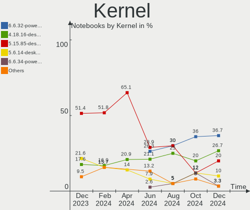
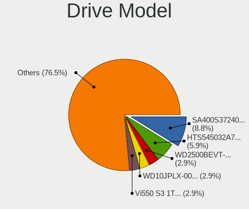
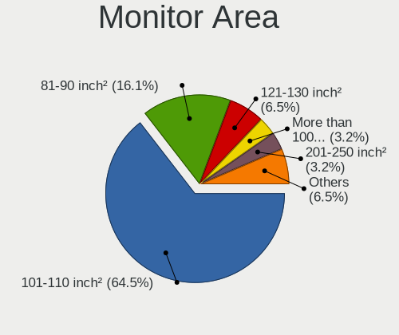
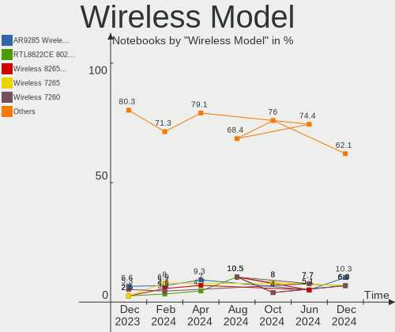

BlackPanther Hardware Trends (Notebook)
---------------------------------------

A project to identify most popular hardware characteristics and track their change
over time based on data collected by BlackPanther users at https://Linux-Hardware.org.

Anyone can contribute to the study by uploading probes of their computers by
the [hw-probe](https://github.com/linuxhw/hw-probe) tool:

    sudo -E hw-probe -all -upload

Full-feature report is available here: https://linux-hardware.org/?view=trends&formfactor=notebook

Period: Oct, 2020.

Contents
--------

- [ OS                       ](#os)
- [ OS Family                ](#os-family)
- [ Kernel                   ](#kernel)
- [ Kernel Family            ](#kernel-family)
- [ Kernel Major Ver.        ](#kernel-major-ver)
- [ Arch                     ](#arch)
- [ DE                       ](#de)
- [ Display Server           ](#display-server)
- [ Display Manager          ](#display-manager)
- [ OS Lang                  ](#os-lang)
- [ Boot Mode                ](#boot-mode)
- [ Filesystem               ](#filesystem)
- [ Part. scheme             ](#part-scheme)
- [ Dual Boot with Linux/BSD ](#dual-boot-with-linux/bsd)
- [ Dual Boot (Win)          ](#dual-boot-win)
- [ Country                  ](#country)
- [ City                     ](#city)
- [ Vendor                   ](#vendor)
- [ Model                    ](#model)
- [ Model Family             ](#model-family)
- [ MFG Year                 ](#mfg-year)
- [ Form Factor              ](#form-factor)
- [ Secure Boot              ](#secure-boot)
- [ Coreboot                 ](#coreboot)
- [ RAM Size                 ](#ram-size)
- [ RAM Used                 ](#ram-used)
- [ Has CD-ROM               ](#has-cd-rom)
- [ Total Drives             ](#total-drives)
- [ Has Ethernet             ](#has-ethernet)
- [ Drive Vendor             ](#drive-vendor)
- [ HDD Vendor               ](#hdd-vendor)
- [ SSD Vendor               ](#ssd-vendor)
- [ Drive Model              ](#drive-model)
- [ Drive Kind               ](#drive-kind)
- [ Drive Connector          ](#drive-connector)
- [ Drive Size               ](#drive-size)
- [ Space Total              ](#space-total)
- [ Space Used               ](#space-used)
- [ Malfunc. Drives          ](#malfunc-drives)
- [ Malfunc. Drive Vendor    ](#malfunc-drive-vendor)
- [ Malfunc. HDD Vendor      ](#malfunc-hdd-vendor)
- [ Malfunc. Drive Kind      ](#malfunc-drive-kind)
- [ Failed Drives            ](#failed-drives)
- [ Failed Drive Vendor      ](#failed-drive-vendor)
- [ Drive Status             ](#drive-status)
- [ Storage Vendor           ](#storage-vendor)
- [ Storage Model            ](#storage-model)
- [ Storage Kind             ](#storage-kind)
- [ CPU Vendor               ](#cpu-vendor)
- [ CPU Model                ](#cpu-model)
- [ CPU Model Family         ](#cpu-model-family)
- [ CPU Cores                ](#cpu-cores)
- [ CPU Sockets              ](#cpu-sockets)
- [ CPU Threads              ](#cpu-threads)
- [ CPU Op-Modes             ](#cpu-op-modes)
- [ CPU Microcode            ](#cpu-microcode)
- [ CPU Microarch            ](#cpu-microarch)
- [ GPU Vendor               ](#gpu-vendor)
- [ GPU Model                ](#gpu-model)
- [ GPU Combo                ](#gpu-combo)
- [ GPU Driver               ](#gpu-driver)
- [ GPU Memory               ](#gpu-memory)
- [ Monitor Vendor           ](#monitor-vendor)
- [ Monitor Model            ](#monitor-model)
- [ Monitor Resolution       ](#monitor-resolution)
- [ Monitor Diagonal         ](#monitor-diagonal)
- [ Monitor Width            ](#monitor-width)
- [ Aspect Ratio             ](#aspect-ratio)
- [ Monitor Area             ](#monitor-area)
- [ Pixel Density            ](#pixel-density)
- [ Multiple Monitors        ](#multiple-monitors)
- [ Net Controller Vendor    ](#net-controller-vendor)
- [ Net Controller Model     ](#net-controller-model)
- [ Wireless Vendor          ](#wireless-vendor)
- [ Wireless Model           ](#wireless-model)
- [ Ethernet Vendor          ](#ethernet-vendor)
- [ Ethernet Model           ](#ethernet-model)
- [ Net Controller Kind      ](#net-controller-kind)
- [ Used Controller          ](#used-controller)
- [ NICs                     ](#nics)
- [ Memory Vendor            ](#memory-vendor)
- [ Memory Model             ](#memory-model)
- [ Memory Kind              ](#memory-kind)
- [ Memory Form Factor       ](#memory-form-factor)
- [ Memory Size              ](#memory-size)
- [ Memory Speed             ](#memory-speed)
- [ Sound Vendor             ](#sound-vendor)
- [ Sound Model              ](#sound-model)
- [ Camera Vendor            ](#camera-vendor)
- [ Camera Model             ](#camera-model)
- [ Fingerprint Vendor       ](#fingerprint-vendor)
- [ Fingerprint Model        ](#fingerprint-model)
- [ Chipcard Vendor          ](#chipcard-vendor)
- [ Chipcard Model           ](#chipcard-model)
- [ Printer Vendor           ](#printer-vendor)
- [ Printer Model            ](#printer-model)
- [ Scanner Vendor           ](#scanner-vendor)
- [ Scanner Model            ](#scanner-model)
- [ Bluetooth Vendor         ](#bluetooth-vendor)
- [ Bluetooth Model          ](#bluetooth-model)
- [ Unsupported Devices      ](#unsupported-devices)
- [ Unsupported Device Types ](#unsupported-device-types)

OS
--

Installed operating systems

| Name              | Notebooks | Percent |
|-------------------|-----------|---------|
| BlackPanther 18.1 | 106       | 91.38%  |
| BlackPanther 16.2 | 10        | 8.62%   |

OS Family
---------

OS without a version

| Name         | Notebooks | Percent |
|--------------|-----------|---------|
| BlackPanther | 116       | 100%    |

Kernel
------

Version of the Linux kernel

| Version                | Notebooks | Percent |
|------------------------|-----------|---------|
| 4.18.16-desktop-1bP    | 106       | 91.38%  |
| 4.9.20-desktop-pae-1bP | 10        | 8.62%   |

Kernel Family
-------------

Linux kernel without a distro release

| Version | Notebooks | Percent |
|---------|-----------|---------|
| 4.18.16 | 106       | 91.38%  |
| 4.9.20  | 10        | 8.62%   |

Kernel Major Ver.
-----------------

Linux kernel major version

| Version | Notebooks | Percent |
|---------|-----------|---------|
| 4.18    | 106       | 91.38%  |
| 4.9     | 10        | 8.62%   |

Arch
----

OS architecture (x86_64, i586, etc.)

| Name   | Notebooks | Percent |
|--------|-----------|---------|
| x86_64 | 106       | 91.38%  |
| i686   | 10        | 8.62%   |

DE
--

Desktop Environment

| Name | Notebooks | Percent |
|------|-----------|---------|
| KDE5 | 116       | 100%    |

Display Server
--------------

X11 or Wayland

| Name | Notebooks | Percent |
|------|-----------|---------|
| X11  | 116       | 100%    |

Display Manager
---------------

SDDM, LightDM, etc.

| Name | Notebooks | Percent |
|------|-----------|---------|
| SDDM | 116       | 100%    |

OS Lang
-------

Language

| Lang    | Notebooks | Percent |
|---------|-----------|---------|
| Unknown | 116       | 100%    |

Boot Mode
---------

EFI or BIOS

| Mode | Notebooks | Percent |
|------|-----------|---------|
| BIOS | 75        | 64.66%  |
| EFI  | 41        | 35.34%  |

Filesystem
----------

Type of filesystem

| Type    | Notebooks | Percent |
|---------|-----------|---------|
| Overlay | 92        | 79.31%  |
| Ext4    | 24        | 20.69%  |

Part. scheme
------------

Scheme of partitioning

| Type | Notebooks | Percent |
|------|-----------|---------|
| MBR  | 71        | 61.21%  |
| GPT  | 45        | 38.79%  |

Dual Boot with Linux/BSD
------------------------

Hosting more than one Linux/BSD

| Dual boot | Notebooks | Percent |
|-----------|-----------|---------|
| No        | 61        | 52.59%  |
| Yes       | 55        | 47.41%  |

Dual Boot (Win)
---------------

Hosting Linux and Windows

| Dual boot | Notebooks | Percent |
|-----------|-----------|---------|
| No        | 70        | 60.34%  |
| Yes       | 46        | 39.66%  |

Country
-------

Geographic location (country)

| Country     | Notebooks | Percent |
|-------------|-----------|---------|
| Hungary     | 71        | 61.21%  |
| Germany     | 8         | 6.9%    |
| USA         | 4         | 3.45%   |
| UK          | 4         | 3.45%   |
| Slovakia    | 4         | 3.45%   |
| Spain       | 3         | 2.59%   |
| Romania     | 3         | 2.59%   |
| Canada      | 3         | 2.59%   |
| Argentina   | 3         | 2.59%   |
| Japan       | 2         | 1.72%   |
| Ireland     | 2         | 1.72%   |
| Serbia      | 1         | 0.86%   |
| Kenya       | 1         | 0.86%   |
| Italy       | 1         | 0.86%   |
| Hong Kong   | 1         | 0.86%   |
| Finland     | 1         | 0.86%   |
| El Salvador | 1         | 0.86%   |
| Egypt       | 1         | 0.86%   |
| Denmark     | 1         | 0.86%   |
| Austria     | 1         | 0.86%   |

City
----

Geographic location (city)

| City                        | Notebooks | Percent |
|-----------------------------|-----------|---------|
| Budapest                    | 26        | 22.41%  |
| Pécs                       | 3         | 2.59%   |
| Miskolc                     | 3         | 2.59%   |
| Szigetszentmiklos           | 2         | 1.72%   |
| Nyiregyhaza                 | 2         | 1.72%   |
| Modra                       | 2         | 1.72%   |
| Hantos                      | 2         | 1.72%   |
| Dublin                      | 2         | 1.72%   |
| Debrecen                    | 2         | 1.72%   |
| Cegled                      | 2         | 1.72%   |
| Barnesville                 | 2         | 1.72%   |
| Zalaszentgrot               | 1         | 0.86%   |
| Wassertrudingen             | 1         | 0.86%   |
| Waren                       | 1         | 0.86%   |
| Walsall                     | 1         | 0.86%   |
| Vienna                      | 1         | 0.86%   |
| Ullo                        | 1         | 0.86%   |
| Timișoara                  | 1         | 0.86%   |
| Tenyo                       | 1         | 0.86%   |
| Tatabánya                  | 1         | 0.86%   |
| Tarnok                      | 1         | 0.86%   |
| Székesfehérvár           | 1         | 0.86%   |
| Szekszárd                  | 1         | 0.86%   |
| Springe                     | 1         | 0.86%   |
| Sopron                      | 1         | 0.86%   |
| San Sebastián de La Gomera | 1         | 0.86%   |
| San Miguel                  | 1         | 0.86%   |
| San Martín de los Andes    | 1         | 0.86%   |
| Rome                        | 1         | 0.86%   |
| Puspokladany                | 1         | 0.86%   |
| Pomaz                       | 1         | 0.86%   |
| Papa                        | 1         | 0.86%   |
| Nyirad                      | 1         | 0.86%   |
| North Hollywood             | 1         | 0.86%   |
| Nairobi                     | 1         | 0.86%   |
| Mogyorod                    | 1         | 0.86%   |
| Mezobereny                  | 1         | 0.86%   |
| Lowestoft                   | 1         | 0.86%   |
| Kunszentmarton              | 1         | 0.86%   |
| Kousa                       | 1         | 0.86%   |
| Koto                        | 1         | 0.86%   |
| Komárno                    | 1         | 0.86%   |
| Kanazawa                    | 1         | 0.86%   |
| Junin de los Andes          | 1         | 0.86%   |
| Houston                     | 1         | 0.86%   |
| Herne                       | 1         | 0.86%   |
| Helsinki                    | 1         | 0.86%   |
| Helmstedt                   | 1         | 0.86%   |
| Harrow                      | 1         | 0.86%   |
| Hajdusamson                 | 1         | 0.86%   |
| Hajduboszormeny             | 1         | 0.86%   |
| Győr                       | 1         | 0.86%   |
| Gyomro                      | 1         | 0.86%   |
| Getxo                       | 1         | 0.86%   |
| Frankfort                   | 1         | 0.86%   |
| Frankenberg                 | 1         | 0.86%   |
| Fadd                        | 1         | 0.86%   |
| Estepona                    | 1         | 0.86%   |
| Eger                        | 1         | 0.86%   |
| Edmonton                    | 1         | 0.86%   |

Vendor
------

Motherboard manufacturer

| Name                | Notebooks | Percent |
|---------------------|-----------|---------|
| Lenovo              | 21        | 18.1%   |
| Hewlett-Packard     | 19        | 16.38%  |
| Dell                | 17        | 14.66%  |
| ASUSTek Computer    | 16        | 13.79%  |
| Acer                | 12        | 10.34%  |
| Toshiba             | 7         | 6.03%   |
| Samsung Electronics | 4         | 3.45%   |
| MSI                 | 3         | 2.59%   |
| Apple               | 3         | 2.59%   |
| Sony                | 2         | 1.72%   |
| Packard Bell        | 2         | 1.72%   |
| eMachines           | 2         | 1.72%   |
| Alcor               | 2         | 1.72%   |
| TUXEDO              | 1         | 0.86%   |
| Gateway             | 1         | 0.86%   |
| Fujitsu             | 1         | 0.86%   |
| BANGHO              | 1         | 0.86%   |
| Alienware           | 1         | 0.86%   |
| Unknown             | 1         | 0.86%   |

Model
-----

Motherboard model

| Name                                                    | Notebooks | Percent |
|---------------------------------------------------------|-----------|---------|
| HP ProBook 4540s                                        | 3         | 2.59%   |
| Toshiba Satellite C55D-A                                | 2         | 1.72%   |
| Lenovo Z50-70 20354                                     | 2         | 1.72%   |
| Lenovo G50-45 80E3                                      | 2         | 1.72%   |
| HP Notebook                                             | 2         | 1.72%   |
| ASUS K50IJ                                              | 2         | 1.72%   |
| TUXEDO N24_25BU                                         | 1         | 0.86%   |
| Toshiba TECRA A10                                       | 1         | 0.86%   |
| Toshiba Satellite L300                                  | 1         | 0.86%   |
| Toshiba Satellite C855-248                              | 1         | 0.86%   |
| Toshiba Satellite C50-B                                 | 1         | 0.86%   |
| Toshiba Satellite A200                                  | 1         | 0.86%   |
| Sony VPCEH2N1E                                          | 1         | 0.86%   |
| Sony VPCEH2J1E                                          | 1         | 0.86%   |
| Samsung Electronics RV411/RV511/E3511/S3511/RV711/E3411 | 1         | 0.86%   |
| Samsung Electronics R519/R719                           | 1         | 0.86%   |
| Samsung Electronics 300E4A/300E5A/300E7A/3430EA/3530EA  | 1         | 0.86%   |
| Samsung Electronics 300E4A/300E5A/300E7A                | 1         | 0.86%   |
| Packard Bell EasyNote TK81                              | 1         | 0.86%   |
| Packard Bell EasyNote TK36                              | 1         | 0.86%   |
| MSI VR630                                               | 1         | 0.86%   |
| MSI M670                                                | 1         | 0.86%   |
| MSI GP70 2PE                                            | 1         | 0.86%   |
| Lenovo V145-15AST 81MT                                  | 1         | 0.86%   |
| Lenovo ThinkPad X61 76753BJ                             | 1         | 0.86%   |
| Lenovo ThinkPad X61 7673BW3                             | 1         | 0.86%   |
| Lenovo ThinkPad X230 2325AC7                            | 1         | 0.86%   |
| Lenovo ThinkPad T440s 20ARS0BH00                        | 1         | 0.86%   |
| Lenovo ThinkPad T440p 20AWS16U02                        | 1         | 0.86%   |
| Lenovo ThinkPad SL 2746P3G                              | 1         | 0.86%   |
| Lenovo ThinkPad L540 20AUA128HV                         | 1         | 0.86%   |
| Lenovo IdeaPad S145-15AST 81N3                          | 1         | 0.86%   |
| Lenovo IdeaPad 520-15IKB 80YL                           | 1         | 0.86%   |
| Lenovo IdeaPad 330-15IKB 81DE                           | 1         | 0.86%   |
| Lenovo IdeaPad 330-15AST 81D6                           | 1         | 0.86%   |
| Lenovo IdeaPad 305-15IBD 80NJ                           | 1         | 0.86%   |
| Lenovo IdeaPad 110-15IBR 80T7                           | 1         | 0.86%   |
| Lenovo B50-45 20388                                     | 1         | 0.86%   |
| Lenovo 3000 N100 07686VG                                | 1         | 0.86%   |
| Lenovo 3000 G530 444622G                                | 1         | 0.86%   |
| HP ProBook 6560b                                        | 1         | 0.86%   |
| HP ProBook 645 G1                                       | 1         | 0.86%   |
| HP Presario CQ57                                        | 1         | 0.86%   |
| HP EliteBook 8470p                                      | 1         | 0.86%   |
| HP EliteBook 2560p                                      | 1         | 0.86%   |
| HP Compaq nx7400 (RH412EA#AKC)                          | 1         | 0.86%   |
| HP Compaq nc6320 (RH368EA#AKC)                          | 1         | 0.86%   |
| HP Compaq 8710p (GC100EA#AB8)                           | 1         | 0.86%   |
| HP Compaq 6710b (KE121EA#AKC)                           | 1         | 0.86%   |
| HP 620                                                  | 1         | 0.86%   |
| HP 530                                                  | 1         | 0.86%   |
| HP 255 G2                                               | 1         | 0.86%   |
| HP 250 G1                                               | 1         | 0.86%   |
| HP 2140                                                 | 1         | 0.86%   |
| Gateway NV570P                                          | 1         | 0.86%   |
| Fujitsu FMVNF70W                                        | 1         | 0.86%   |
| eMachines eME728                                        | 1         | 0.86%   |
| eMachines E725                                          | 1         | 0.86%   |
| Dell Vostro 1700                                        | 1         | 0.86%   |
| Dell Vostro 1510                                        | 1         | 0.86%   |

Model Family
------------

Motherboard model prefix

| Name                       | Notebooks | Percent |
|----------------------------|-----------|---------|
| Acer Aspire                | 10        | 8.62%   |
| Lenovo ThinkPad            | 7         | 6.03%   |
| Dell Inspiron              | 7         | 6.03%   |
| Toshiba Satellite          | 6         | 5.17%   |
| Lenovo IdeaPad             | 6         | 5.17%   |
| Dell Latitude              | 6         | 5.17%   |
| HP ProBook                 | 5         | 4.31%   |
| HP Compaq                  | 4         | 3.45%   |
| Samsung Electronics 300E4A | 2         | 1.72%   |
| Packard Bell EasyNote      | 2         | 1.72%   |
| Lenovo Z50-70              | 2         | 1.72%   |
| Lenovo G50-45              | 2         | 1.72%   |
| Lenovo 3000                | 2         | 1.72%   |
| HP Notebook                | 2         | 1.72%   |
| HP EliteBook               | 2         | 1.72%   |
| Dell Vostro                | 2         | 1.72%   |
| ASUS VivoBook              | 2         | 1.72%   |
| ASUS K50IJ                 | 2         | 1.72%   |
| TUXEDO N24                 | 1         | 0.86%   |
| Toshiba TECRA              | 1         | 0.86%   |
| Sony VPCEH2N1E             | 1         | 0.86%   |
| Sony VPCEH2J1E             | 1         | 0.86%   |
| Samsung Electronics RV411  | 1         | 0.86%   |
| Samsung Electronics R519   | 1         | 0.86%   |
| MSI VR630                  | 1         | 0.86%   |
| MSI M670                   | 1         | 0.86%   |
| MSI GP70                   | 1         | 0.86%   |
| Lenovo V145-15AST          | 1         | 0.86%   |
| Lenovo B50-45              | 1         | 0.86%   |
| HP Presario                | 1         | 0.86%   |
| HP 620                     | 1         | 0.86%   |
| HP 530                     | 1         | 0.86%   |
| HP 255                     | 1         | 0.86%   |
| HP 250                     | 1         | 0.86%   |
| HP 2140                    | 1         | 0.86%   |
| Gateway NV570P             | 1         | 0.86%   |
| Fujitsu FMVNF70W           | 1         | 0.86%   |
| eMachines eME728           | 1         | 0.86%   |
| eMachines E725             | 1         | 0.86%   |
| Dell Precision             | 1         | 0.86%   |
| Dell G3                    | 1         | 0.86%   |
| BANGHO MOV                 | 1         | 0.86%   |
| ASUS X751SJ                | 1         | 0.86%   |
| ASUS X55A                  | 1         | 0.86%   |
| ASUS X556UQ                | 1         | 0.86%   |
| ASUS X555YA                | 1         | 0.86%   |
| ASUS X555SJ                | 1         | 0.86%   |
| ASUS X541UVK               | 1         | 0.86%   |
| ASUS X540LA                | 1         | 0.86%   |
| ASUS X402CA                | 1         | 0.86%   |
| ASUS Strix                 | 1         | 0.86%   |
| ASUS F3F                   | 1         | 0.86%   |
| ASUS E200HA                | 1         | 0.86%   |
| ASUS 1201N                 | 1         | 0.86%   |
| Apple MacBookPro9          | 1         | 0.86%   |
| Apple MacBookPro8          | 1         | 0.86%   |
| Apple MacBook6             | 1         | 0.86%   |
| Alienware 13               | 1         | 0.86%   |
| Alcor SnugBook             | 1         | 0.86%   |
| Alcor Flashbook            | 1         | 0.86%   |

MFG Year
--------

Motherboard manufacture year

| Year | Notebooks | Percent |
|------|-----------|---------|
| 2019 | 17        | 14.66%  |
| 2013 | 12        | 10.34%  |
| 2018 | 11        | 9.48%   |
| 2009 | 10        | 8.62%   |
| 2016 | 9         | 7.76%   |
| 2011 | 9         | 7.76%   |
| 2008 | 8         | 6.9%    |
| 2012 | 7         | 6.03%   |
| 2015 | 6         | 5.17%   |
| 2014 | 6         | 5.17%   |
| 2010 | 6         | 5.17%   |
| 2020 | 4         | 3.45%   |
| 2017 | 4         | 3.45%   |
| 2007 | 4         | 3.45%   |
| 2006 | 3         | 2.59%   |

Form Factor
-----------

Physical design of the computer

| Name     | Notebooks | Percent |
|----------|-----------|---------|
| Notebook | 116       | 100%    |

Secure Boot
-----------

Enabled or disabled

| State    | Notebooks | Percent |
|----------|-----------|---------|
| Disabled | 116       | 100%    |

Coreboot
--------

Have coreboot on board

| Used | Notebooks | Percent |
|------|-----------|---------|
| No   | 116       | 100%    |

RAM Size
--------

Total RAM memory

| Size in GB | Notebooks | Percent |
|------------|-----------|---------|
| 3.01-4.0   | 52        | 44.83%  |
| 4.01-8.0   | 21        | 18.1%   |
| 8.01-16.0  | 17        | 14.66%  |
| 1.01-2.0   | 11        | 9.48%   |
| 16.01-24.0 | 7         | 6.03%   |
| 2.01-3.0   | 6         | 5.17%   |
| 32.01-64.0 | 1         | 0.86%   |
| 0.01-1.0   | 1         | 0.86%   |

RAM Used
--------

Used RAM memory

| Used GB  | Notebooks | Percent |
|----------|-----------|---------|
| 0.01-1.0 | 89        | 76.72%  |
| 1.01-2.0 | 27        | 23.28%  |

Has CD-ROM
----------

Has CD-ROM on board

| Presented | Notebooks | Percent |
|-----------|-----------|---------|
| Yes       | 77        | 66.38%  |
| No        | 39        | 33.62%  |

Total Drives
------------

Number of drives on board

| Drives | Notebooks | Percent |
|--------|-----------|---------|
| 1      | 94        | 81.03%  |
| 2      | 20        | 17.24%  |
| 3      | 2         | 1.72%   |

Has Ethernet
------------

Has Ethernet on board

| Presented | Notebooks | Percent |
|-----------|-----------|---------|
| Yes       | 109       | 93.97%  |
| No        | 7         | 6.03%   |

Drive Vendor
------------

Hard drive vendors

| Vendor              | Notebooks | Drives | Percent |
|---------------------|-----------|--------|---------|
| Seagate             | 26        | 27     | 18.57%  |
| WDC                 | 16        | 16     | 11.43%  |
| Kingston            | 14        | 14     | 10%     |
| Toshiba             | 13        | 13     | 9.29%   |
| Samsung Electronics | 13        | 13     | 9.29%   |
| Unknown             | 9         | 11     | 6.43%   |
| Hitachi             | 8         | 9      | 5.71%   |
| Fujitsu             | 8         | 8      | 5.71%   |
| SanDisk             | 7         | 7      | 5%      |
| SK Hynix            | 4         | 4      | 2.86%   |
| Intel               | 4         | 4      | 2.86%   |
| HGST                | 3         | 3      | 2.14%   |
| Crucial             | 3         | 3      | 2.14%   |
| A-DATA Technology   | 3         | 3      | 2.14%   |
| JMicron             | 2         | 2      | 1.43%   |
| Patriot             | 1         | 1      | 0.71%   |
| Micron Technology   | 1         | 1      | 0.71%   |
| MARSHAL             | 1         | 1      | 0.71%   |
| LITEONIT            | 1         | 1      | 0.71%   |
| KingSpec            | 1         | 1      | 0.71%   |
| Corsair             | 1         | 1      | 0.71%   |
| BHT                 | 1         | 1      | 0.71%   |

HDD Vendor
----------

Hard disk drive vendors

| Vendor              | Notebooks | Drives | Percent |
|---------------------|-----------|--------|---------|
| Seagate             | 26        | 27     | 35.62%  |
| WDC                 | 15        | 15     | 20.55%  |
| Toshiba             | 11        | 11     | 15.07%  |
| Hitachi             | 8         | 9      | 10.96%  |
| Fujitsu             | 8         | 8      | 10.96%  |
| HGST                | 3         | 3      | 4.11%   |
| Samsung Electronics | 1         | 1      | 1.37%   |
| MARSHAL             | 1         | 1      | 1.37%   |

SSD Vendor
----------

Solid state drive vendors

| Vendor              | Notebooks | Drives | Percent |
|---------------------|-----------|--------|---------|
| Kingston            | 14        | 14     | 28%     |
| Samsung Electronics | 10        | 10     | 20%     |
| SanDisk             | 6         | 6      | 12%     |
| SK Hynix            | 3         | 3      | 6%      |
| Crucial             | 3         | 3      | 6%      |
| A-DATA Technology   | 3         | 3      | 6%      |
| Intel               | 2         | 2      | 4%      |
| WDC                 | 1         | 1      | 2%      |
| Toshiba             | 1         | 1      | 2%      |
| Patriot             | 1         | 1      | 2%      |
| Micron Technology   | 1         | 1      | 2%      |
| LITEONIT            | 1         | 1      | 2%      |
| KingSpec            | 1         | 1      | 2%      |
| JMicron             | 1         | 1      | 2%      |
| Corsair             | 1         | 1      | 2%      |
| BHT                 | 1         | 1      | 2%      |

Drive Model
-----------

Hard drive models

| Model                         | Notebooks | Percent |
|-------------------------------|-----------|---------|
| ST1000LM035-1RK172 1TB        | 5         | 3.47%   |
| ST9250315AS 250GB             | 4         | 2.78%   |
| ST1000LM024 HN-M101MBB 1TB    | 4         | 2.78%   |
| MQ01ABF050 500GB              | 4         | 2.78%   |
| SSD PLUS 240GB                | 3         | 2.08%   |
| SA400S37240G 240GB SSD        | 3         | 2.08%   |
| SA400S37120G 120GB SSD        | 3         | 2.08%   |
| MQ04ABF100 1TB                | 3         | 2.08%   |
| MQ01ACF032 320GB              | 3         | 2.08%   |
| WD800BEVS-22RST0 80GB         | 2         | 1.39%   |
| WD2500BEKT-75PVMT0 250GB      | 2         | 1.39%   |
| SV300S37A120G 120GB SSD       | 2         | 1.39%   |
| ST1000LM048-2E7172 1TB        | 2         | 1.39%   |
| SSD 850 EVO 500GB             | 2         | 1.39%   |
| MHZ2160BH G2 160GB            | 2         | 1.39%   |
| CT120BX500SSD1 120GB          | 2         | 1.39%   |
| WR202H0032G E70290F5 32GB SSD | 1         | 0.69%   |
| WDS120G2G0A-00JH30 120GB SSD  | 1         | 0.69%   |
| WD7500BPVT-60HXZT3 752GB      | 1         | 0.69%   |
| WD5000LPVX-22V0TT0 500GB      | 1         | 0.69%   |
| WD5000LPCX-24VHAT0 500GB      | 1         | 0.69%   |
| WD5000BEVT-22A0RT0 500GB      | 1         | 0.69%   |
| WD3200BPVT-22JJ5T0 320GB      | 1         | 0.69%   |
| WD3200BEVT-22ZCT0 320GB       | 1         | 0.69%   |
| WD2500BEVT-00A23T0 250GB      | 1         | 0.69%   |
| WD2500BEVS-22UST0 250GB       | 1         | 0.69%   |
| WD10SPZX-80Z10T2 1TB          | 1         | 0.69%   |
| WD10SPZX-21Z10T0 1TB          | 1         | 0.69%   |
| WD10JPVX-22JC3T0 1TB          | 1         | 0.69%   |
| USD  4GB                      | 1         | 0.69%   |
| TL100 120GB SSD               | 1         | 0.69%   |
| Tech 250GB                    | 1         | 0.69%   |
| SV300S37A240G 240GB SSD       | 1         | 0.69%   |
| SUV400S37240G 240GB SSD       | 1         | 0.69%   |
| SUV400S37120G 120GB SSD       | 1         | 0.69%   |
| SUV300S37A240G 240GB SSD      | 1         | 0.69%   |
| ST9500325AS 500GB             | 1         | 0.69%   |
| ST9160821AS 160GB             | 1         | 0.69%   |
| ST9160314AS 160GB             | 1         | 0.69%   |
| ST9120822AS 120GB             | 1         | 0.69%   |
| ST500VT000-1DK142 500GB       | 1         | 0.69%   |
| ST500LT012-9WS142 500GB       | 1         | 0.69%   |
| ST500LT012-1DG142 500GB       | 1         | 0.69%   |
| ST500LM021-1KJ152 500GB       | 1         | 0.69%   |
| ST500LM000-1EJ162 500GB       | 1         | 0.69%   |
| ST2000LM003 HN-M201RAD 2TB    | 1         | 0.69%   |
| ST1000LX015-1U7172 1TB        | 1         | 0.69%   |
| ST1000LM014-1EJ164-SSHD 1TB   | 1         | 0.69%   |
| SSDSC2CT060A3 64GB            | 1         | 0.69%   |
| SSDSC2BW180A3H 180GB          | 1         | 0.69%   |
| SSDNOW 30GB                   | 1         | 0.69%   |
| SSD S599 55GB                 | 1         | 0.69%   |
| SSD S599 115GB                | 1         | 0.69%   |
| SSD 860 EVO mSATA 250GB       | 1         | 0.69%   |
| SSD 850 EVO 250GB             | 1         | 0.69%   |
| SSD 840 EVO 250GB             | 1         | 0.69%   |
| SSD 840 EVO 120GB             | 1         | 0.69%   |
| SSD 830 Series 128GB          | 1         | 0.69%   |
| SP64G  64GB                   | 1         | 0.69%   |
| SLD64G  64GB                  | 1         | 0.69%   |

Drive Kind
----------

HDD or SSD

| Kind    | Notebooks | Drives | Percent |
|---------|-----------|--------|---------|
| HDD     | 72        | 75     | 52.94%  |
| SSD     | 48        | 50     | 35.29%  |
| MMC     | 10        | 13     | 7.35%   |
| NVMe    | 5         | 5      | 3.68%   |
| Unknown | 1         | 1      | 0.74%   |

Drive Connector
---------------

SATA, SAS, NVMe, etc.

| Type | Notebooks | Drives | Percent |
|------|-----------|--------|---------|
| SATA | 110       | 123    | 85.94%  |
| MMC  | 10        | 13     | 7.81%   |
| NVMe | 5         | 5      | 3.91%   |
| SAS  | 3         | 3      | 2.34%   |

Drive Size
----------

Size of hard drive

| Size in TB | Notebooks | Drives | Percent |
|------------|-----------|--------|---------|
| 0.01-0.5   | 95        | 102    | 81.2%   |
| 0.51-1.0   | 20        | 21     | 17.09%  |
| 1.01-2.0   | 2         | 2      | 1.71%   |

Space Total
-----------

Amount of disk space available on the file system

| Size in GB | Notebooks | Percent |
|------------|-----------|---------|
| Unknown    | 87        | 75%     |
| 101-250    | 15        | 12.93%  |
| 51-100     | 4         | 3.45%   |
| 251-500    | 3         | 2.59%   |
| 21-50      | 3         | 2.59%   |
| 1-20       | 2         | 1.72%   |
| 501-1000   | 2         | 1.72%   |

Space Used
----------

Amount of used disk space

| Used GB | Notebooks | Percent |
|---------|-----------|---------|
| Unknown | 87        | 75%     |
| 1-20    | 29        | 25%     |

Malfunc. Drives
---------------

Drive models with a malfunction

| Model                        | Notebooks | Drives | Percent |
|------------------------------|-----------|--------|---------|
| ST9250315AS 250GB            | 3         | 3      | 8.82%   |
| WD2500BEKT-75PVMT0 250GB     | 2         | 2      | 5.88%   |
| ST1000LM024 HN-M101MBB 1TB   | 2         | 2      | 5.88%   |
| WD800BEVS-22RST0 80GB        | 1         | 1      | 2.94%   |
| WD7500BPVT-60HXZT3 752GB     | 1         | 1      | 2.94%   |
| WD3200BEVT-22ZCT0 320GB      | 1         | 1      | 2.94%   |
| WD2500BEVT-00A23T0 250GB     | 1         | 1      | 2.94%   |
| ST9500325AS 500GB            | 1         | 1      | 2.94%   |
| ST9160821AS 160GB            | 1         | 1      | 2.94%   |
| ST9160314AS 160GB            | 1         | 1      | 2.94%   |
| ST1000LX015-1U7172 1TB       | 1         | 1      | 2.94%   |
| ST1000LM014-1EJ164-SSHD 1TB  | 1         | 1      | 2.94%   |
| MQ01ABF050 500GB             | 1         | 1      | 2.94%   |
| MJA2320BH G2 320GB           | 1         | 1      | 2.94%   |
| MHZ2250BH G2 250GB           | 1         | 1      | 2.94%   |
| MHZ2160BH G2 160GB           | 1         | 1      | 2.94%   |
| MHY2120BH 120GB              | 1         | 1      | 2.94%   |
| MHY2080BH 80GB               | 1         | 1      | 2.94%   |
| MHW2160BH PL 160GB           | 1         | 1      | 2.94%   |
| MHW2060BH 64GB               | 1         | 1      | 2.94%   |
| MAL2020SA 80 20GB            | 1         | 1      | 2.94%   |
| HTS725025A9A364 250GB        | 1         | 1      | 2.94%   |
| HTS723232A7A364 320GB        | 1         | 1      | 2.94%   |
| HTS723216L9A360 160GB        | 1         | 1      | 2.94%   |
| HTS545032B9A300 320GB        | 1         | 1      | 2.94%   |
| HTS545032A7E380 320GB        | 1         | 1      | 2.94%   |
| HTS545025B9SA02 250GB        | 1         | 1      | 2.94%   |
| HTS542512K9SA00 120GB        | 1         | 1      | 2.94%   |
| HM160HI 160GB                | 1         | 1      | 2.94%   |
| HFS128G39TND-N210A 128GB SSD | 1         | 1      | 2.94%   |

Malfunc. Drive Vendor
---------------------

Vendors of faulty drives

| Vendor              | Notebooks | Drives | Percent |
|---------------------|-----------|--------|---------|
| Seagate             | 9         | 10     | 27.27%  |
| Fujitsu             | 7         | 7      | 21.21%  |
| WDC                 | 6         | 6      | 18.18%  |
| Hitachi             | 6         | 6      | 18.18%  |
| Toshiba             | 1         | 1      | 3.03%   |
| SK Hynix            | 1         | 1      | 3.03%   |
| Samsung Electronics | 1         | 1      | 3.03%   |
| MARSHAL             | 1         | 1      | 3.03%   |
| HGST                | 1         | 1      | 3.03%   |

Malfunc. HDD Vendor
-------------------

Vendors of faulty HDD drives

| Vendor              | Notebooks | Drives | Percent |
|---------------------|-----------|--------|---------|
| Seagate             | 9         | 10     | 28.13%  |
| Fujitsu             | 7         | 7      | 21.88%  |
| WDC                 | 6         | 6      | 18.75%  |
| Hitachi             | 6         | 6      | 18.75%  |
| Toshiba             | 1         | 1      | 3.13%   |
| Samsung Electronics | 1         | 1      | 3.13%   |
| MARSHAL             | 1         | 1      | 3.13%   |
| HGST                | 1         | 1      | 3.13%   |

Malfunc. Drive Kind
-------------------

Kinds of faulty drives

| Kind | Notebooks | Drives | Percent |
|------|-----------|--------|---------|
| HDD  | 31        | 33     | 96.88%  |
| SSD  | 1         | 1      | 3.13%   |

Failed Drives
-------------

Failed drive models

Zero info for selected period =(

Failed Drive Vendor
-------------------

Failed drive vendors

Zero info for selected period =(

Drive Status
------------

Number of failed and malfunc. drives

| Status   | Notebooks | Drives | Percent |
|----------|-----------|--------|---------|
| Works    | 82        | 93     | 65.08%  |
| Malfunc  | 32        | 34     | 25.4%   |
| Detected | 12        | 17     | 9.52%   |

Storage Vendor
--------------

Storage controller vendors

| Vendor              | Notebooks | Percent |
|---------------------|-----------|---------|
| Intel               | 91        | 79.82%  |
| AMD                 | 16        | 14.04%  |
| Nvidia              | 4         | 3.51%   |
| Samsung Electronics | 2         | 1.75%   |
| KIOXIA              | 1         | 0.88%   |

Storage Model
-------------

Storage controller models

| Model                                                                      | Notebooks | Percent |
|----------------------------------------------------------------------------|-----------|---------|
| FCH SATA Controller [AHCI mode]                                            | 14        | 10.69%  |
| 82801IBM/IEM (ICH9M/ICH9M-E) 4 port SATA Controller [AHCI mode]            | 13        | 9.92%   |
| 7 Series Chipset Family 6-port SATA Controller [AHCI mode]                 | 12        | 9.16%   |
| Sunrise Point-LP SATA Controller [AHCI mode]                               | 8         | 6.11%   |
| 6 Series/C200 Series Chipset Family 6 port Mobile SATA AHCI Controller     | 8         | 6.11%   |
| 82801HM/HEM (ICH8M/ICH8M-E) SATA Controller [AHCI mode]                    | 7         | 5.34%   |
| 82801HM/HEM (ICH8M/ICH8M-E) IDE Controller                                 | 7         | 5.34%   |
| 82801 Mobile SATA Controller [RAID mode]                                   | 7         | 5.34%   |
| Atom/Celeron/Pentium Processor x5-E8000/J3xxx/N3xxx Series SATA Controller | 6         | 4.58%   |
| 82801GBM/GHM (ICH7-M Family) SATA Controller [AHCI mode]                   | 5         | 3.82%   |
| 82801G (ICH7 Family) IDE Controller                                        | 5         | 3.82%   |
| 8 Series/C220 Series Chipset Family 6-port SATA Controller 1 [AHCI mode]   | 4         | 3.05%   |
| 8 Series SATA Controller 1 [AHCI mode]                                     | 4         | 3.05%   |
| Wildcat Point-LP SATA Controller [AHCI Mode]                               | 2         | 1.53%   |
| SB7x0/SB8x0/SB9x0 SATA Controller [AHCI mode]                              | 2         | 1.53%   |
| NVMe SSD Optane Series Controller                                          | 2         | 1.53%   |
| Cannon Lake Mobile PCH SATA AHCI Controller                                | 2         | 1.53%   |
| Atom Processor E3800 Series SATA AHCI Controller                           | 2         | 1.53%   |
| 82801IBM/IEM (ICH9M/ICH9M-E) 2 port SATA Controller [IDE mode]             | 2         | 1.53%   |
| 82801GBM/GHM (ICH7-M Family) SATA Controller [IDE mode]                    | 2         | 1.53%   |
| 5 Series/3400 Series Chipset 4 port SATA AHCI Controller                   | 2         | 1.53%   |
| SATA controller                                                            | 1         | 0.76%   |
| NVMe SSD Controller SM961/PM961                                            | 1         | 0.76%   |
| NVMe SSD Controller SM951/PM951                                            | 1         | 0.76%   |
| Non-Volatile memory controller                                             | 1         | 0.76%   |
| NM10/ICH7 Family SATA Controller [IDE mode]                                | 1         | 0.76%   |
| nForce SATA Controller                                                     | 1         | 0.76%   |
| Mobile PM965/GM965 PT IDER Controller                                      | 1         | 0.76%   |
| MCP79 SATA Controller                                                      | 1         | 0.76%   |
| MCP79 AHCI Controller                                                      | 1         | 0.76%   |
| MCP51 Serial ATA Controller                                                | 1         | 0.76%   |
| MCP51 IDE                                                                  | 1         | 0.76%   |
| 8 Series Chipset Family 4-port SATA Controller 1 [IDE mode] - Mobile       | 1         | 0.76%   |
| 7 Series Chipset Family 4-port SATA Controller [IDE mode]                  | 1         | 0.76%   |
| 7 Series Chipset Family 2-port SATA Controller [IDE mode]                  | 1         | 0.76%   |
| 5 Series/3400 Series Chipset 6 port SATA AHCI Controller                   | 1         | 0.76%   |

Storage Kind
------------

Kind of storage controller (IDE, SATA, NVMe, SAS, ...)

| Kind | Notebooks | Percent |
|------|-----------|---------|
| SATA | 95        | 74.22%  |
| IDE  | 21        | 16.41%  |
| RAID | 7         | 5.47%   |
| NVMe | 5         | 3.91%   |

CPU Vendor
----------

Processor vendors

| Vendor | Notebooks | Percent |
|--------|-----------|---------|
| Intel  | 98        | 84.48%  |
| AMD    | 18        | 15.52%  |

CPU Model
---------

Processor models

| Model                                        | Notebooks | Percent |
|----------------------------------------------|-----------|---------|
| Intel Pentium Dual-Core CPU T4300 @ 2.10GHz  | 5         | 4.31%   |
| Intel Core i5-3320M CPU @ 2.60GHz            | 3         | 2.59%   |
| Intel Core i5-2520M CPU @ 2.50GHz            | 3         | 2.59%   |
| Intel Core i3-5005U CPU @ 2.00GHz            | 3         | 2.59%   |
| Intel Pentium Dual CPU T3400 @ 2.16GHz       | 2         | 1.72%   |
| Intel Pentium CPU N3710 @ 1.60GHz            | 2         | 1.72%   |
| Intel Core i5-8300H CPU @ 2.30GHz            | 2         | 1.72%   |
| Intel Core i5-4210U CPU @ 1.70GHz            | 2         | 1.72%   |
| Intel Core i3-6006U CPU @ 2.00GHz            | 2         | 1.72%   |
| Intel Core i3-3217U CPU @ 1.80GHz            | 2         | 1.72%   |
| Intel Core 2 Duo CPU T8100 @ 2.10GHz         | 2         | 1.72%   |
| Intel Core 2 Duo CPU T7300 @ 2.00GHz         | 2         | 1.72%   |
| Intel Core 2 Duo CPU T5870 @ 2.00GHz         | 2         | 1.72%   |
| Intel Core 2 CPU T5500 @ 1.66GHz             | 2         | 1.72%   |
| Intel Celeron CPU 900 @ 2.20GHz              | 2         | 1.72%   |
| Intel Celeron CPU 1000M @ 1.80GHz            | 2         | 1.72%   |
| Intel Atom x5-Z8350 CPU @ 1.44GHz            | 2         | 1.72%   |
| AMD E1-1200 APU with Radeon HD Graphics      | 2         | 1.72%   |
| AMD A8-7410 APU with AMD Radeon R5 Graphics  | 2         | 1.72%   |
| AMD A6-6310 APU with AMD Radeon R4 Graphics  | 2         | 1.72%   |
| AMD A4-9125 RADEON R3, 4 COMPUTE CORES 2C+2G | 2         | 1.72%   |
| Intel Pentium Silver N5000 CPU @ 1.10GHz     | 1         | 0.86%   |
| Intel Pentium Dual-Core CPU T4500 @ 2.30GHz  | 1         | 0.86%   |
| Intel Pentium Dual CPU T3200 @ 2.00GHz       | 1         | 0.86%   |
| Intel Pentium Dual CPU T2310 @ 1.46GHz       | 1         | 0.86%   |
| Intel Pentium CPU T4300 @ 2.10GHz            | 1         | 0.86%   |
| Intel Pentium CPU P6200 @ 2.13GHz            | 1         | 0.86%   |
| Intel Pentium CPU N3700 @ 1.60GHz            | 1         | 0.86%   |
| Intel Pentium CPU B940 @ 2.00GHz             | 1         | 0.86%   |
| Intel Pentium CPU 2117U @ 1.80GHz            | 1         | 0.86%   |
| Intel Pentium CPU 2020M @ 2.40GHz            | 1         | 0.86%   |
| Intel Pentium 3556U @ 1.70GHz                | 1         | 0.86%   |
| Intel Genuine CPU T2300 @ 1.66GHz            | 1         | 0.86%   |
| Intel Core i7-8750H CPU @ 2.20GHz            | 1         | 0.86%   |
| Intel Core i7-8550U CPU @ 1.80GHz            | 1         | 0.86%   |
| Intel Core i7-7700HQ CPU @ 2.80GHz           | 1         | 0.86%   |
| Intel Core i7-4900MQ CPU @ 2.80GHz           | 1         | 0.86%   |
| Intel Core i7-4710HQ CPU @ 2.50GHz           | 1         | 0.86%   |
| Intel Core i7-4600U CPU @ 2.10GHz            | 1         | 0.86%   |
| Intel Core i7-3540M CPU @ 3.00GHz            | 1         | 0.86%   |
| Intel Core i7-3520M CPU @ 2.90GHz            | 1         | 0.86%   |
| Intel Core i7-2670QM CPU @ 2.20GHz           | 1         | 0.86%   |
| Intel Core i5-8250U CPU @ 1.60GHz            | 1         | 0.86%   |
| Intel Core i5-7200U CPU @ 2.50GHz            | 1         | 0.86%   |
| Intel Core i5-6198DU CPU @ 2.30GHz           | 1         | 0.86%   |
| Intel Core i5-4310M CPU @ 2.70GHz            | 1         | 0.86%   |
| Intel Core i5-4300M CPU @ 2.60GHz            | 1         | 0.86%   |
| Intel Core i5-3230M CPU @ 2.60GHz            | 1         | 0.86%   |
| Intel Core i5-3210M CPU @ 2.50GHz            | 1         | 0.86%   |
| Intel Core i5-2450M CPU @ 2.50GHz            | 1         | 0.86%   |
| Intel Core i5-2430M CPU @ 2.40GHz            | 1         | 0.86%   |
| Intel Core i5-2415M CPU @ 2.30GHz            | 1         | 0.86%   |
| Intel Core i5 CPU M 520 @ 2.40GHz            | 1         | 0.86%   |
| Intel Core i3-8145U CPU @ 2.10GHz            | 1         | 0.86%   |
| Intel Core i3-8130U CPU @ 2.20GHz            | 1         | 0.86%   |
| Intel Core i3-7100U CPU @ 2.40GHz            | 1         | 0.86%   |
| Intel Core i3-7020U CPU @ 2.30GHz            | 1         | 0.86%   |
| Intel Core i3-4000M CPU @ 2.40GHz            | 1         | 0.86%   |
| Intel Core i3-3120M CPU @ 2.50GHz            | 1         | 0.86%   |
| Intel Core i3-3110M CPU @ 2.40GHz            | 1         | 0.86%   |

CPU Model Family
----------------

Processor model prefix

| Model                   | Notebooks | Percent |
|-------------------------|-----------|---------|
| Intel Core i5           | 21        | 18.1%   |
| Intel Core i3           | 17        | 14.66%  |
| Intel Celeron           | 10        | 8.62%   |
| Intel Pentium           | 9         | 7.76%   |
| Intel Core i7           | 9         | 7.76%   |
| Intel Core 2 Duo        | 9         | 7.76%   |
| Intel Pentium Dual-Core | 6         | 5.17%   |
| Intel Atom              | 6         | 5.17%   |
| Intel Pentium Dual      | 4         | 3.45%   |
| AMD A4                  | 4         | 3.45%   |
| Intel Core 2            | 3         | 2.59%   |
| AMD A8                  | 3         | 2.59%   |
| AMD A6                  | 3         | 2.59%   |
| AMD E1                  | 2         | 1.72%   |
| Intel Pentium Silver    | 1         | 0.86%   |
| Intel Genuine           | 1         | 0.86%   |
| Intel Core Duo          | 1         | 0.86%   |
| Intel Celeron M         | 1         | 0.86%   |
| AMD Ryzen 5             | 1         | 0.86%   |
| AMD Mobile Sempron      | 1         | 0.86%   |
| AMD E2                  | 1         | 0.86%   |
| AMD E                   | 1         | 0.86%   |
| AMD Athlon X2           | 1         | 0.86%   |
| AMD Athlon II           | 1         | 0.86%   |

CPU Cores
---------

Number of processor cores

| Number | Notebooks | Percent |
|--------|-----------|---------|
| 2      | 84        | 72.41%  |
| 4      | 24        | 20.69%  |
| 1      | 8         | 6.9%    |

CPU Sockets
-----------

Number of sockets

| Number | Notebooks | Percent |
|--------|-----------|---------|
| 1      | 116       | 100%    |

CPU Threads
-----------

Threads per core (Hyper-Threading)

| Number | Notebooks | Percent |
|--------|-----------|---------|
| 1      | 69        | 59.48%  |
| 2      | 47        | 40.52%  |

CPU Op-Modes
------------

CPU Operation Modes (32-bit, 64-bit)

| Op mode        | Notebooks | Percent |
|----------------|-----------|---------|
| 32-bit, 64-bit | 113       | 97.41%  |
| 32-bit         | 3         | 2.59%   |

CPU Microcode
-------------

Microcode number

| Number     | Notebooks | Percent |
|------------|-----------|---------|
| 0x306a9    | 15        | 12.93%  |
| 0x1067a    | 11        | 9.48%   |
| 0x206a7    | 10        | 8.62%   |
| 0x6fd      | 7         | 6.03%   |
| 0x406c4    | 5         | 4.31%   |
| 0x306c3    | 5         | 4.31%   |
| 0x406c3    | 4         | 3.45%   |
| 0x40651    | 4         | 3.45%   |
| 0x06006705 | 4         | 3.45%   |
| Unknown    | 4         | 3.45%   |
| 0x906ea    | 3         | 2.59%   |
| 0x806ea    | 3         | 2.59%   |
| 0x806e9    | 3         | 2.59%   |
| 0x306d4    | 3         | 2.59%   |
| 0x20655    | 3         | 2.59%   |
| 0x07030105 | 3         | 2.59%   |
| 0x05000119 | 3         | 2.59%   |
| 0x6f2      | 2         | 1.72%   |
| 0x406e3    | 2         | 1.72%   |
| 0x30678    | 2         | 1.72%   |
| 0x106c2    | 2         | 1.72%   |
| 0x10676    | 2         | 1.72%   |
| 0x07030104 | 2         | 1.72%   |
| 0x906e9    | 1         | 0.86%   |
| 0x806eb    | 1         | 0.86%   |
| 0x706a1    | 1         | 0.86%   |
| 0x6fb      | 1         | 0.86%   |
| 0x6fa      | 1         | 0.86%   |
| 0x6f6      | 1         | 0.86%   |
| 0x6e8      | 1         | 0.86%   |
| 0x106ca    | 1         | 0.86%   |
| 0x10661    | 1         | 0.86%   |
| 0x0810100b | 1         | 0.86%   |
| 0x0700010f | 1         | 0.86%   |
| 0x0600111f | 1         | 0.86%   |
| 0x02000057 | 1         | 0.86%   |
| 0x010000c8 | 1         | 0.86%   |

CPU Microarch
-------------

Microarchitecture

| Name            | Notebooks | Percent |
|-----------------|-----------|---------|
| IvyBridge       | 15        | 12.93%  |
| Penryn          | 14        | 12.07%  |
| Core            | 13        | 11.21%  |
| Silvermont      | 11        | 9.48%   |
| KabyLake        | 11        | 9.48%   |
| SandyBridge     | 10        | 8.62%   |
| Haswell         | 9         | 7.76%   |
| Puma            | 5         | 4.31%   |
| Excavator       | 4         | 3.45%   |
| Westmere        | 3         | 2.59%   |
| Skylake         | 3         | 2.59%   |
| Broadwell       | 3         | 2.59%   |
| Bonnell         | 3         | 2.59%   |
| Bobcat          | 3         | 2.59%   |
| P6              | 2         | 1.72%   |
| Zen             | 1         | 0.86%   |
| Piledriver      | 1         | 0.86%   |
| K8 Hammer       | 1         | 0.86%   |
| K8 & K10 hybrid | 1         | 0.86%   |
| K10             | 1         | 0.86%   |
| Jaguar          | 1         | 0.86%   |
| Goldmont plus   | 1         | 0.86%   |

GPU Vendor
----------

Vendors of graphics cards

| Vendor | Notebooks | Percent |
|--------|-----------|---------|
| Intel  | 91        | 67.41%  |
| Nvidia | 26        | 19.26%  |
| AMD    | 18        | 13.33%  |

GPU Model
---------

Graphics card models

| Model                                                                              | Notebooks | Percent |
|------------------------------------------------------------------------------------|-----------|---------|
| 3rd Gen Core processor Graphics Controller                                         | 15        | 9.87%   |
| Mobile 4 Series Chipset Integrated Graphics Controller                             | 13        | 8.55%   |
| Atom/Celeron/Pentium Processor x5-E8000/J3xxx/N3xxx Integrated Graphics Controller | 9         | 5.92%   |
| 2nd Generation Core Processor Family Integrated Graphics Controller                | 9         | 5.92%   |
| Mobile 945GM/GMS/GME, 943/940GML Express Integrated Graphics Controller            | 7         | 4.61%   |
| Mobile GM965/GL960 Integrated Graphics Controller (secondary)                      | 6         | 3.95%   |
| Mobile GM965/GL960 Integrated Graphics Controller (primary)                        | 6         | 3.95%   |
| Mullins [Radeon R4/R5 Graphics]                                                    | 5         | 3.29%   |
| Mobile 945GM/GMS, 943/940GML Express Integrated Graphics Controller                | 5         | 3.29%   |
| 4th Gen Core Processor Integrated Graphics Controller                              | 5         | 3.29%   |
| Stoney [Radeon R2/R3/R4/R5 Graphics]                                               | 4         | 2.63%   |
| Haswell-ULT Integrated Graphics Controller                                         | 4         | 2.63%   |
| UHD Graphics 630 (Mobile)                                                          | 3         | 1.97%   |
| UHD Graphics 620                                                                   | 3         | 1.97%   |
| Sun LE [Radeon HD 8550M / R5 M230]                                                 | 3         | 1.97%   |
| HD Graphics 5500                                                                   | 3         | 1.97%   |
| GM108M [GeForce 840M]                                                              | 3         | 1.97%   |
| Wrestler [Radeon HD 7310]                                                          | 2         | 1.32%   |
| Sun XT [Radeon HD 8670A/8670M/8690M / R5 M330 / M430 / Radeon 520 Mobile]          | 2         | 1.32%   |
| Skylake GT2 [HD Graphics 520]                                                      | 2         | 1.32%   |
| Mobile 945GSE Express Integrated Graphics Controller                               | 2         | 1.32%   |
| HD Graphics 620                                                                    | 2         | 1.32%   |
| GP107M [GeForce GTX 1050 Mobile]                                                   | 2         | 1.32%   |
| GK208BM [GeForce 920M]                                                             | 2         | 1.32%   |
| Core Processor Integrated Graphics Controller                                      | 2         | 1.32%   |
| Atom Processor Z36xxx/Z37xxx Series Graphics & Display                             | 2         | 1.32%   |
| Wrestler [Radeon HD 6320]                                                          | 1         | 0.66%   |
| Whistler [Radeon HD 6630M/6650M/6750M/7670M/7690M]                                 | 1         | 0.66%   |
| UHD Graphics 620 (Whiskey Lake)                                                    | 1         | 0.66%   |
| UHD Graphics 605                                                                   | 1         | 0.66%   |
| Topaz XT [Radeon R7 M260/M265 / M340/M360 / M440/M445 / 530/535 / 620/625 Mobile]  | 1         | 0.66%   |
| Richland [Radeon HD 8350G]                                                         | 1         | 0.66%   |
| Raven Ridge [Radeon Vega Series / Radeon Vega Mobile Series]                       | 1         | 0.66%   |
| Kaby Lake-U GT2f Integrated Graphics Controller                                    | 1         | 0.66%   |
| Kabini [Radeon HD 8280 / R3 Series]                                                | 1         | 0.66%   |
| HD Graphics 630                                                                    | 1         | 0.66%   |
| HD Graphics 510                                                                    | 1         | 0.66%   |
| GT218M [GeForce G 105M]                                                            | 1         | 0.66%   |
| GT218M [GeForce 315M]                                                              | 1         | 0.66%   |
| GP107M [GeForce GTX 1050 Ti Mobile]                                                | 1         | 0.66%   |
| GP106M [GeForce GTX 1060 Mobile]                                                   | 1         | 0.66%   |
| GM108M [GeForce MX110]                                                             | 1         | 0.66%   |
| GM108M [GeForce 940MX]                                                             | 1         | 0.66%   |
| GM108M [GeForce 920MX]                                                             | 1         | 0.66%   |
| GK106GLM [Quadro K2100M]                                                           | 1         | 0.66%   |
| GF119M [GeForce GT 520MX]                                                          | 1         | 0.66%   |
| GF119M [GeForce 410M]                                                              | 1         | 0.66%   |
| GF117M [GeForce 610M/710M/810M/820M / GT 620M/625M/630M/720M]                      | 1         | 0.66%   |
| GF108M [GeForce GT 540M]                                                           | 1         | 0.66%   |
| GF108GLM [NVS 5200M]                                                               | 1         | 0.66%   |
| G96CM [GeForce 9600M GS]                                                           | 1         | 0.66%   |
| G84GLM [Quadro NVS 320M]                                                           | 1         | 0.66%   |
| C79 [GeForce 9400M]                                                                | 1         | 0.66%   |
| C79 [GeForce 9400M / ION]                                                          | 1         | 0.66%   |
| C77 [GeForce 9100M G]                                                              | 1         | 0.66%   |
| C51 [GeForce Go 6100]                                                              | 1         | 0.66%   |
| Atom Processor D4xx/D5xx/N4xx/N5xx Integrated Graphics Controller                  | 1         | 0.66%   |

GPU Combo
---------

Combinations of graphics cards

| Name           | Notebooks | Percent |
|----------------|-----------|---------|
| 1 x Intel      | 72        | 62.07%  |
| Intel + Nvidia | 17        | 14.66%  |
| 1 x AMD        | 12        | 10.34%  |
| 1 x Nvidia     | 9         | 7.76%   |
| 2 x AMD        | 4         | 3.45%   |
| Intel + AMD    | 2         | 1.72%   |

GPU Driver
----------

Free vs proprietary

| Driver      | Notebooks | Percent |
|-------------|-----------|---------|
| Free        | 115       | 99.14%  |
| Proprietary | 1         | 0.86%   |

GPU Memory
----------

Total video memory

| Size in GB | Notebooks | Percent |
|------------|-----------|---------|
| Unknown    | 68        | 58.62%  |
| 0.01-0.5   | 21        | 18.1%   |
| 0.51-1.0   | 14        | 12.07%  |
| 1.01-2.0   | 10        | 8.62%   |
| 3.01-4.0   | 3         | 2.59%   |

Monitor Vendor
--------------

Monitor vendors

| Vendor                  | Notebooks | Percent |
|-------------------------|-----------|---------|
| AU Optronics            | 24        | 20.51%  |
| LG Display              | 19        | 16.24%  |
| Chimei Innolux          | 18        | 15.38%  |
| Samsung Electronics     | 16        | 13.68%  |
| BOE                     | 10        | 8.55%   |
| Chi Mei Optoelectronics | 9         | 7.69%   |
| LG Philips              | 3         | 2.56%   |
| Lenovo                  | 3         | 2.56%   |
| Apple                   | 3         | 2.56%   |
| Quanta Display          | 2         | 1.71%   |
| CPT                     | 2         | 1.71%   |
| Philips                 | 1         | 0.85%   |
| PANDA                   | 1         | 0.85%   |
| MStar                   | 1         | 0.85%   |
| InfoVision              | 1         | 0.85%   |
| Hewlett-Packard         | 1         | 0.85%   |
| HannStar                | 1         | 0.85%   |
| Dell                    | 1         | 0.85%   |
| ASUSTek Computer        | 1         | 0.85%   |

Monitor Model
-------------

Monitor models

| Model                                              | Notebooks | Percent |
|----------------------------------------------------|-----------|---------|
| LCD Monitor AUO38ED 1920x1080 340x190mm 15.3-inch  | 4         | 3.42%   |
| LCD Monitor SEC5441 1366x768 344x194mm 15.5-inch   | 3         | 2.56%   |
| LCD Monitor LGD0395 1366x768 344x194mm 15.5-inch   | 3         | 2.56%   |
| LCD Monitor AUO22EC 1366x768 344x193mm 15.5-inch   | 3         | 2.56%   |
| LCD Monitor SEC304C 1920x1080 353x198mm 15.9-inch  | 2         | 1.71%   |
| LCD Monitor SDC4347 1366x768 340x190mm 15.3-inch   | 2         | 1.71%   |
| LCD Monitor LGD033A 1366x768 340x190mm 15.3-inch   | 2         | 1.71%   |
| LCD Monitor LEN4000 1024x768 246x185mm 12.1-inch   | 2         | 1.71%   |
| LCD Monitor CPT14BF 1366x768 344x193mm 15.5-inch   | 2         | 1.71%   |
| LCD Monitor CMO15A7 1366x768 350x190mm 15.7-inch   | 2         | 1.71%   |
| LCD Monitor CMO15A1 1366x768 344x193mm 15.5-inch   | 2         | 1.71%   |
| LCD Monitor CMO1526 1280x800 331x207mm 15.4-inch   | 2         | 1.71%   |
| LCD Monitor CMN15DB 1366x768 344x193mm 15.5-inch   | 2         | 1.71%   |
| LCD Monitor CMN15B7 1366x768 340x190mm 15.3-inch   | 2         | 1.71%   |
| LCD Monitor BOE0675 1366x768 344x194mm 15.5-inch   | 2         | 1.71%   |
| LCD Monitor AUO47EC 1366x768 344x193mm 15.5-inch   | 2         | 1.71%   |
| LCD Monitor AUO45EC 1366x768 340x190mm 15.3-inch   | 2         | 1.71%   |
| LCD Monitor APP9CCB 1280x800 286x179mm 13.3-inch   | 2         | 1.71%   |
| w2207 HWP26A8 1680x1050 473x296mm 22.0-inch        | 1         | 0.85%   |
| VZ249 AUS24CC 1920x1080 527x296mm 23.8-inch        | 1         | 0.85%   |
| TV_MONITOR MST0030 1440x900 1150x650mm 52.0-inch   | 1         | 0.85%   |
| LP156WH2-TLE1 LGDCF01 1366x768 344x194mm 15.5-inch | 1         | 0.85%   |
| LP154WX4-TLC8 LPL0120 1280x800 331x207mm 15.4-inch | 1         | 0.85%   |
| LCD Monitor SEC5442 1440x900 367x230mm 17.1-inch   | 1         | 0.85%   |
| LCD Monitor SEC4251 1366x768 344x194mm 15.5-inch   | 1         | 0.85%   |
| LCD Monitor SEC384A 1366x768 344x194mm 15.5-inch   | 1         | 0.85%   |
| LCD Monitor SEC3741 1280x800 331x207mm 15.4-inch   | 1         | 0.85%   |
| LCD Monitor SEC364D 1600x900 382x214mm 17.2-inch   | 1         | 0.85%   |
| LCD Monitor SEC325A 1366x768 344x194mm 15.5-inch   | 1         | 0.85%   |
| LCD Monitor SEC3258 1440x900 367x230mm 17.1-inch   | 1         | 0.85%   |
| LCD Monitor SEC324A 1366x768 344x194mm 15.5-inch   | 1         | 0.85%   |
| LCD Monitor SDC4E42 1366x768 309x174mm 14.0-inch   | 1         | 0.85%   |
| LCD Monitor QDS004B 1280x800 331x207mm 15.4-inch   | 1         | 0.85%   |
| LCD Monitor QDS0025 1024x768 304x228mm 15.0-inch   | 1         | 0.85%   |
| LCD Monitor LPLE300 1280x800 331x207mm 15.4-inch   | 1         | 0.85%   |
| LCD Monitor LPLDC00 1280x800 331x207mm 15.4-inch   | 1         | 0.85%   |
| LCD Monitor LGD0590 1920x1080 344x194mm 15.5-inch  | 1         | 0.85%   |
| LCD Monitor LGD04C0 1366x768 309x174mm 14.0-inch   | 1         | 0.85%   |
| LCD Monitor LGD04BA 1600x900 382x215mm 17.3-inch   | 1         | 0.85%   |
| LCD Monitor LGD04B7 1366x768 344x194mm 15.5-inch   | 1         | 0.85%   |
| LCD Monitor LGD046D 1920x1080 309x174mm 14.0-inch  | 1         | 0.85%   |
| LCD Monitor LGD0456 1366x768 344x194mm 15.5-inch   | 1         | 0.85%   |
| LCD Monitor LGD0335 1366x768 310x174mm 14.0-inch   | 1         | 0.85%   |
| LCD Monitor LGD02F1 1366x768 344x194mm 15.5-inch   | 1         | 0.85%   |
| LCD Monitor LGD02DF 1600x900 310x174mm 14.0-inch   | 1         | 0.85%   |
| LCD Monitor LGD02DC 1366x768 344x194mm 15.5-inch   | 1         | 0.85%   |
| LCD Monitor LGD02D8 1366x768 277x156mm 12.5-inch   | 1         | 0.85%   |
| LCD Monitor LGD0266 1366x768 344x194mm 15.5-inch   | 1         | 0.85%   |
| LCD Monitor LGD0250 1366x768 345x194mm 15.6-inch   | 1         | 0.85%   |
| LCD Monitor LEN4057 1280x800 331x207mm 15.4-inch   | 1         | 0.85%   |
| LCD Monitor IVO057D 1920x1080 309x174mm 14.0-inch  | 1         | 0.85%   |
| LCD Monitor CMO1720 1920x1080 382x215mm 17.3-inch  | 1         | 0.85%   |
| LCD Monitor CMO1592 1366x768 344x193mm 15.5-inch   | 1         | 0.85%   |
| LCD Monitor CMO1581 1366x768 344x193mm 15.5-inch   | 1         | 0.85%   |
| LCD Monitor CMN1734 1600x900 382x214mm 17.2-inch   | 1         | 0.85%   |
| LCD Monitor CMN15F4 1920x1080 344x193mm 15.5-inch  | 1         | 0.85%   |
| LCD Monitor CMN15D5 1920x1080 340x190mm 15.3-inch  | 1         | 0.85%   |
| LCD Monitor CMN15CB 1920x1080 344x193mm 15.5-inch  | 1         | 0.85%   |
| LCD Monitor CMN15CA 1366x768 340x190mm 15.3-inch   | 1         | 0.85%   |
| LCD Monitor CMN15C4 1920x1080 344x193mm 15.5-inch  | 1         | 0.85%   |

Monitor Resolution
------------------

Monitor screen resolution

| Resolution         | Notebooks | Percent |
|--------------------|-----------|---------|
| 1366x768 (WXGA)    | 61        | 52.59%  |
| 1920x1080 (FHD)    | 29        | 25%     |
| 1280x800 (WXGA)    | 11        | 9.48%   |
| 1600x900 (HD+)     | 5         | 4.31%   |
| 1440x900 (WXGA+)   | 4         | 3.45%   |
| 1680x1050 (WSXGA+) | 2         | 1.72%   |
| 3840x2160 (4K)     | 1         | 0.86%   |
| 1024x768 (XGA)     | 1         | 0.86%   |
| 1024x600           | 1         | 0.86%   |
| 1024x576           | 1         | 0.86%   |

Monitor Diagonal
----------------

Diagonal size in inches

| Inches | Notebooks | Percent |
|--------|-----------|---------|
| 15     | 78        | 66.67%  |
| 14     | 9         | 7.69%   |
| 13     | 8         | 6.84%   |
| 17     | 7         | 5.98%   |
| 12     | 4         | 3.42%   |
| 23     | 2         | 1.71%   |
| 22     | 2         | 1.71%   |
| 11     | 2         | 1.71%   |
| 10     | 2         | 1.71%   |
| 52     | 1         | 0.85%   |
| 24     | 1         | 0.85%   |
| 18     | 1         | 0.85%   |

Monitor Width
-------------

Physical width

| Width in mm | Notebooks | Percent |
|-------------|-----------|---------|
| 301-350     | 87        | 74.36%  |
| 351-400     | 12        | 10.26%  |
| 201-300     | 11        | 9.4%    |
| 501-600     | 3         | 2.56%   |
| 401-500     | 3         | 2.56%   |
| 1001-1500   | 1         | 0.85%   |

Aspect Ratio
------------

Proportional relationship between the width and the height

| Ratio | Notebooks | Percent |
|-------|-----------|---------|
| 16/9  | 96        | 83.48%  |
| 16/10 | 18        | 15.65%  |
| 4/3   | 1         | 0.87%   |

Monitor Area
------------

Area in inch²

| Area in inch² | Notebooks | Percent |
|----------------|-----------|---------|
| 101-110        | 78        | 66.67%  |
| 81-90          | 14        | 11.97%  |
| 201-250        | 5         | 4.27%   |
| 61-70          | 4         | 3.42%   |
| 121-130        | 4         | 3.42%   |
| 71-80          | 3         | 2.56%   |
| 131-140        | 3         | 2.56%   |
| 51-60          | 2         | 1.71%   |
| 41-50          | 2         | 1.71%   |
| More than 1000 | 1         | 0.85%   |
| 151-200        | 1         | 0.85%   |

Pixel Density
-------------

Pixels per inch

| Density | Notebooks | Percent |
|---------|-----------|---------|
| 101-120 | 56        | 48.28%  |
| 121-160 | 30        | 25.86%  |
| 51-100  | 27        | 23.28%  |
| 161-240 | 2         | 1.72%   |
| 1-50    | 1         | 0.86%   |

Multiple Monitors
-----------------

Total monitors connected

| Total | Notebooks | Percent |
|-------|-----------|---------|
| 1     | 111       | 95.69%  |
| 2     | 5         | 4.31%   |

Net Controller Vendor
---------------------

Controller vendors

| Vendor                            | Notebooks | Percent |
|-----------------------------------|-----------|---------|
| Realtek Semiconductor             | 64        | 33.51%  |
| Intel                             | 43        | 22.51%  |
| Qualcomm Atheros                  | 39        | 20.42%  |
| Broadcom Inc. and subsidiaries    | 19        | 9.95%   |
| Broadcom Limited                  | 7         | 3.66%   |
| Ralink                            | 5         | 2.62%   |
| Marvell Technology Group          | 3         | 1.57%   |
| Ralink Technology                 | 2         | 1.05%   |
| Nvidia                            | 2         | 1.05%   |
| Dell                              | 2         | 1.05%   |
| TP-Link                           | 1         | 0.52%   |
| ICS Advent                        | 1         | 0.52%   |
| Ericsson Business Mobile Networks | 1         | 0.52%   |
| Broadcom                          | 1         | 0.52%   |
| ASIX Electronics                  | 1         | 0.52%   |

Net Controller Model
--------------------

Controller models

| Model                                                     | Notebooks | Percent |
|-----------------------------------------------------------|-----------|---------|
| RTL8111/8168/8411 PCI Express Gigabit Ethernet Controller | 37        | 15.95%  |
| RTL810xE PCI Express Fast Ethernet controller             | 20        | 8.62%   |
| QCA9565 / AR9565 Wireless Network Adapter                 | 10        | 4.31%   |
| QCA9377 802.11ac Wireless Network Adapter                 | 9         | 3.88%   |
| 82579LM Gigabit Network Connection (Lewisville)           | 8         | 3.45%   |
| PRO/Wireless 3945ABG [Golan] Network Connection           | 7         | 3.02%   |
| BCM4312 802.11b/g LP-PHY                                  | 7         | 3.02%   |
| AR9285 Wireless Network Adapter (PCI-Express)             | 7         | 3.02%   |
| Wireless 7260                                             | 5         | 2.16%   |
| RTL8723BE PCIe Wireless Network Adapter                   | 5         | 2.16%   |
| Wireless 3165                                             | 4         | 1.72%   |
| Centrino Ultimate-N 6300                                  | 4         | 1.72%   |
| Centrino Advanced-N 6205 [Taylor Peak]                    | 4         | 1.72%   |
| Wireless-AC 9560 [Jefferson Peak]                         | 3         | 1.29%   |
| Wireless 3160                                             | 3         | 1.29%   |
| RTL8821CE 802.11ac PCIe Wireless Network Adapter          | 3         | 1.29%   |
| RT3290 Wireless 802.11n 1T/1R PCIe                        | 3         | 1.29%   |
| PRO/Wireless 4965 AG or AGN [Kedron] Network Connection   | 3         | 1.29%   |
| Ethernet Connection I217-LM                               | 3         | 1.29%   |
| AR9485 Wireless Network Adapter                           | 3         | 1.29%   |
| AR8132 Fast Ethernet                                      | 3         | 1.29%   |
| AR8121/AR8113/AR8114 Gigabit or Fast Ethernet             | 3         | 1.29%   |
| 82566MM Gigabit Network Connection                        | 3         | 1.29%   |
| Wireless 8265 / 8275                                      | 2         | 0.86%   |
| RTL8191SEvA Wireless LAN Controller                       | 2         | 0.86%   |
| RTL8188EE Wireless Network Adapter                        | 2         | 0.86%   |
| RTL-8100/8101L/8139 PCI Fast Ethernet Adapter             | 2         | 0.86%   |
| NetXtreme BCM57786 Gigabit Ethernet PCIe                  | 2         | 0.86%   |
| NetXtreme BCM57765 Gigabit Ethernet PCIe                  | 2         | 0.86%   |
| NetLink BCM57780 Gigabit Ethernet PCIe                    | 2         | 0.86%   |
| Centrino Wireless-N 130                                   | 2         | 0.86%   |
| BCM4331 802.11a/b/g/n                                     | 2         | 0.86%   |
| BCM43225 802.11b/g/n                                      | 2         | 0.86%   |
| BCM4313 802.11bgn Wireless Network Adapter                | 2         | 0.86%   |
| AR8161 Gigabit Ethernet                                   | 2         | 0.86%   |
| AR242x / AR542x Wireless Network Adapter (PCI-Express)    | 2         | 0.86%   |
| WiFi Link 5100                                            | 1         | 0.43%   |
| TL-WN821N v5/v6 [RTL8192EU]                               | 1         | 0.43%   |
| RTL8821AE 802.11ac PCIe Wireless Network Adapter          | 1         | 0.43%   |
| RTL8723BU 802.11b/g/n WLAN Adapter                        | 1         | 0.43%   |
| RTL8723AE PCIe Wireless Network Adapter                   | 1         | 0.43%   |
| RTL8192EE PCIe Wireless Network Adapter                   | 1         | 0.43%   |
| RTL8191SEvB Wireless LAN Controller                       | 1         | 0.43%   |
| RTL8188EUS 802.11n Wireless Network Adapter               | 1         | 0.43%   |
| RTL8188CUS 802.11n WLAN Adapter                           | 1         | 0.43%   |
| RTL8187B Wireless Adapter                                 | 1         | 0.43%   |
| RTL8152 Fast Ethernet Adapter                             | 1         | 0.43%   |
| RT5390 Wireless 802.11n 1T/1R PCIe                        | 1         | 0.43%   |
| RT5370 Wireless Adapter                                   | 1         | 0.43%   |
| RT2561/RT61 rev B 802.11g                                 | 1         | 0.43%   |
| QCA6174 802.11ac Wireless Network Adapter                 | 1         | 0.43%   |
| PRO/Wireless 5100 AGN [Shiloh] Network Connection         | 1         | 0.43%   |
| NetXtreme BCM5788 Gigabit Ethernet                        | 1         | 0.43%   |
| NetXtreme BCM5761e Gigabit Ethernet PCIe                  | 1         | 0.43%   |
| NetLink BCM5906M Fast Ethernet PCI Express                | 1         | 0.43%   |
| NetLink BCM5787M Gigabit Ethernet PCI Express             | 1         | 0.43%   |
| NetLink BCM5784M Gigabit Ethernet PCIe                    | 1         | 0.43%   |
| NetLink BCM57785 Gigabit Ethernet PCIe                    | 1         | 0.43%   |
| N5321 gw                                                  | 1         | 0.43%   |
| MT7601U Wireless Adapter                                  | 1         | 0.43%   |

Wireless Vendor
---------------

Wireless vendors

| Vendor                         | Notebooks | Percent |
|--------------------------------|-----------|---------|
| Intel                          | 41        | 34.45%  |
| Qualcomm Atheros               | 33        | 27.73%  |
| Realtek Semiconductor          | 19        | 15.97%  |
| Broadcom Inc. and subsidiaries | 14        | 11.76%  |
| Ralink                         | 5         | 4.2%    |
| Broadcom Limited               | 3         | 2.52%   |
| Ralink Technology              | 2         | 1.68%   |
| TP-Link                        | 1         | 0.84%   |
| Broadcom                       | 1         | 0.84%   |

Wireless Model
--------------

Wireless models

| Model                                                   | Notebooks | Percent |
|---------------------------------------------------------|-----------|---------|
| QCA9565 / AR9565 Wireless Network Adapter               | 10        | 8.33%   |
| QCA9377 802.11ac Wireless Network Adapter               | 9         | 7.5%    |
| PRO/Wireless 3945ABG [Golan] Network Connection         | 7         | 5.83%   |
| BCM4312 802.11b/g LP-PHY                                | 7         | 5.83%   |
| AR9285 Wireless Network Adapter (PCI-Express)           | 7         | 5.83%   |
| Wireless 7260                                           | 5         | 4.17%   |
| RTL8723BE PCIe Wireless Network Adapter                 | 5         | 4.17%   |
| Wireless 3165                                           | 4         | 3.33%   |
| Centrino Ultimate-N 6300                                | 4         | 3.33%   |
| Centrino Advanced-N 6205 [Taylor Peak]                  | 4         | 3.33%   |
| Wireless-AC 9560 [Jefferson Peak]                       | 3         | 2.5%    |
| Wireless 3160                                           | 3         | 2.5%    |
| RTL8821CE 802.11ac PCIe Wireless Network Adapter        | 3         | 2.5%    |
| RT3290 Wireless 802.11n 1T/1R PCIe                      | 3         | 2.5%    |
| PRO/Wireless 4965 AG or AGN [Kedron] Network Connection | 3         | 2.5%    |
| AR9485 Wireless Network Adapter                         | 3         | 2.5%    |
| Wireless 8265 / 8275                                    | 2         | 1.67%   |
| RTL8191SEvA Wireless LAN Controller                     | 2         | 1.67%   |
| RTL8188EE Wireless Network Adapter                      | 2         | 1.67%   |
| Centrino Wireless-N 130                                 | 2         | 1.67%   |
| BCM4331 802.11a/b/g/n                                   | 2         | 1.67%   |
| BCM43225 802.11b/g/n                                    | 2         | 1.67%   |
| BCM4313 802.11bgn Wireless Network Adapter              | 2         | 1.67%   |
| AR242x / AR542x Wireless Network Adapter (PCI-Express)  | 2         | 1.67%   |
| WiFi Link 5100                                          | 1         | 0.83%   |
| TL-WN821N v5/v6 [RTL8192EU]                             | 1         | 0.83%   |
| RTL8821AE 802.11ac PCIe Wireless Network Adapter        | 1         | 0.83%   |
| RTL8723BU 802.11b/g/n WLAN Adapter                      | 1         | 0.83%   |
| RTL8723AE PCIe Wireless Network Adapter                 | 1         | 0.83%   |
| RTL8192EE PCIe Wireless Network Adapter                 | 1         | 0.83%   |
| RTL8191SEvB Wireless LAN Controller                     | 1         | 0.83%   |
| RTL8188EUS 802.11n Wireless Network Adapter             | 1         | 0.83%   |
| RTL8188CUS 802.11n WLAN Adapter                         | 1         | 0.83%   |
| RTL8187B Wireless Adapter                               | 1         | 0.83%   |
| RT5390 Wireless 802.11n 1T/1R PCIe                      | 1         | 0.83%   |
| RT5370 Wireless Adapter                                 | 1         | 0.83%   |
| RT2561/RT61 rev B 802.11g                               | 1         | 0.83%   |
| QCA6174 802.11ac Wireless Network Adapter               | 1         | 0.83%   |
| PRO/Wireless 5100 AGN [Shiloh] Network Connection       | 1         | 0.83%   |
| MT7601U Wireless Adapter                                | 1         | 0.83%   |
| Dual Band Wireless-AC 3165 Plus Bluetooth               | 1         | 0.83%   |
| Centrino Wireless-N 100                                 | 1         | 0.83%   |
| BCM43228 802.11a/b/g/n                                  | 1         | 0.83%   |
| BCM43227 802.11b/g/n                                    | 1         | 0.83%   |
| BCM43224 802.11a/b/g/n                                  | 1         | 0.83%   |
| BCM4322 802.11a/b/g/n Wireless LAN Controller           | 1         | 0.83%   |
| BCM43142 802.11b/g/n                                    | 1         | 0.83%   |
| AR928X Wireless Network Adapter (PCI-Express)           | 1         | 0.83%   |

Ethernet Vendor
---------------

Ethernet vendors

| Vendor                         | Notebooks | Percent |
|--------------------------------|-----------|---------|
| Realtek Semiconductor          | 60        | 55.05%  |
| Intel                          | 18        | 16.51%  |
| Qualcomm Atheros               | 11        | 10.09%  |
| Broadcom Inc. and subsidiaries | 9         | 8.26%   |
| Broadcom Limited               | 4         | 3.67%   |
| Marvell Technology Group       | 3         | 2.75%   |
| Nvidia                         | 2         | 1.83%   |
| ICS Advent                     | 1         | 0.92%   |
| ASIX Electronics               | 1         | 0.92%   |

Ethernet Model
--------------

Ethernet models

| Model                                                          | Notebooks | Percent |
|----------------------------------------------------------------|-----------|---------|
| RTL8111/8168/8411 PCI Express Gigabit Ethernet Controller      | 37        | 33.94%  |
| RTL810xE PCI Express Fast Ethernet controller                  | 20        | 18.35%  |
| 82579LM Gigabit Network Connection (Lewisville)                | 8         | 7.34%   |
| Ethernet Connection I217-LM                                    | 3         | 2.75%   |
| AR8132 Fast Ethernet                                           | 3         | 2.75%   |
| AR8121/AR8113/AR8114 Gigabit or Fast Ethernet                  | 3         | 2.75%   |
| 82566MM Gigabit Network Connection                             | 3         | 2.75%   |
| RTL-8100/8101L/8139 PCI Fast Ethernet Adapter                  | 2         | 1.83%   |
| NetXtreme BCM57786 Gigabit Ethernet PCIe                       | 2         | 1.83%   |
| NetXtreme BCM57765 Gigabit Ethernet PCIe                       | 2         | 1.83%   |
| NetLink BCM57780 Gigabit Ethernet PCIe                         | 2         | 1.83%   |
| AR8161 Gigabit Ethernet                                        | 2         | 1.83%   |
| RTL8152 Fast Ethernet Adapter                                  | 1         | 0.92%   |
| NetXtreme BCM5788 Gigabit Ethernet                             | 1         | 0.92%   |
| NetXtreme BCM5761e Gigabit Ethernet PCIe                       | 1         | 0.92%   |
| NetLink BCM5906M Fast Ethernet PCI Express                     | 1         | 0.92%   |
| NetLink BCM5787M Gigabit Ethernet PCI Express                  | 1         | 0.92%   |
| NetLink BCM5784M Gigabit Ethernet PCIe                         | 1         | 0.92%   |
| NetLink BCM57785 Gigabit Ethernet PCIe                         | 1         | 0.92%   |
| MCP79 Ethernet                                                 | 1         | 0.92%   |
| MCP51 Ethernet Controller                                      | 1         | 0.92%   |
| Killer E2500 Gigabit Ethernet Controller                       | 1         | 0.92%   |
| Killer E220x Gigabit Ethernet Controller                       | 1         | 0.92%   |
| Ethernet Connection I218-LM                                    | 1         | 0.92%   |
| Ethernet Connection I217-V                                     | 1         | 0.92%   |
| DM9601 Fast Ethernet Adapter                                   | 1         | 0.92%   |
| BCM4401-B0 100Base-TX                                          | 1         | 0.92%   |
| AX88179 Gigabit Ethernet                                       | 1         | 0.92%   |
| AR8131 Gigabit Ethernet                                        | 1         | 0.92%   |
| 88E8072 PCI-E Gigabit Ethernet Controller                      | 1         | 0.92%   |
| 88E8055 PCI-E Gigabit Ethernet Controller                      | 1         | 0.92%   |
| 88E8040 PCI-E Fast Ethernet Controller                         | 1         | 0.92%   |
| 82567V Gigabit Network Connection                              | 1         | 0.92%   |
| 82562ET/EZ/GT/GZ - PRO/100 VE (LOM) Ethernet Controller Mobile | 1         | 0.92%   |

Net Controller Kind
-------------------

Ethernet, WiFi or modem

| Kind     | Notebooks | Percent |
|----------|-----------|---------|
| WiFi     | 116       | 50.88%  |
| Ethernet | 109       | 47.81%  |
| Modem    | 3         | 1.32%   |

Used Controller
---------------

Currently used network controller

| Kind     | Notebooks | Percent |
|----------|-----------|---------|
| WiFi     | 112       | 56.28%  |
| Ethernet | 87        | 43.72%  |

NICs
----

Total network controllers on board

| Total | Notebooks | Percent |
|-------|-----------|---------|
| 2     | 105       | 90.52%  |
| 1     | 9         | 7.76%   |
| 0     | 2         | 1.72%   |

Memory Vendor
-------------

Memory module vendors

| Vendor              | Notebooks | Percent |
|---------------------|-----------|---------|
| Samsung Electronics | 40        | 28.78%  |
| SK Hynix            | 30        | 21.58%  |
| Unknown             | 19        | 13.67%  |
| Kingston            | 16        | 11.51%  |
| Micron Technology   | 13        | 9.35%   |
| ELPIDA              | 4         | 2.88%   |
| Ramaxel Technology  | 3         | 2.16%   |
| Nanya Technology    | 3         | 2.16%   |
| Corsair             | 3         | 2.16%   |
| AXIOM               | 2         | 1.44%   |
| A-DATA Technology   | 2         | 1.44%   |
| Transcend           | 1         | 0.72%   |
| Kingmax             | 1         | 0.72%   |
| GOODRAM             | 1         | 0.72%   |
| Crucial             | 1         | 0.72%   |

Memory Model
------------

Memory module models

| Model                                                | Notebooks | Percent |
|------------------------------------------------------|-----------|---------|
| RAM Module 2048MB SODIMM DDR2 667MT/s                | 5         | 3.36%   |
| RAM M471B5273DH0-CK0 4GB SODIMM DDR3 1600MT/s        | 4         | 2.68%   |
| RAM M471B5173QH0-YK0 4096MB SODIMM DDR3 1600MT/s     | 4         | 2.68%   |
| RAM M471B5273DH0-CH9 4GB SODIMM DDR3 1334MT/s        | 3         | 2.01%   |
| RAM M471B5173EB0-YK0 4GB SODIMM DDR3 1600MT/s        | 3         | 2.01%   |
| RAM M471A5244CB0-CRC 4GB SODIMM DDR4 2667MT/s        | 3         | 2.01%   |
| SODIMM 2048MB SODIMM DDR2 667MT/s                    | 2         | 1.34%   |
| RAM Module 2048MB SODIMM DDR3 1600MT/s               | 2         | 1.34%   |
| RAM MEMORY 4096MB SODIMM DDR3 1600MT/s               | 2         | 1.34%   |
| RAM M471A5143EB0-CPB 4096MB SODIMM DDR4 2133MT/s     | 2         | 1.34%   |
| RAM M4 70T5663QZ3-CE6 2048MB SODIMM DDR 667MT/s      | 2         | 1.34%   |
| RAM HMT451S6BFR8A-PB 4GB SODIMM DDR3 1600MT/s        | 2         | 1.34%   |
| RAM HMT41GS6BFR8A-PB 8192MB SODIMM DDR3 1600MT/s     | 2         | 1.34%   |
| RAM HMT351S6CFR8C-PB 4GB SODIMM DDR3 1600MT/s        | 2         | 1.34%   |
| RAM HMT351S6CFR8C-PB 4096MB SODIMM DDR3 1600MT/s     | 2         | 1.34%   |
| RAM HMA851S6JJR6N-VK 4096MB SODIMM DDR4 2667MT/s     | 2         | 1.34%   |
| RAM HMA851S6AFR6N-UH 4096MB SODIMM DDR4 2667MT/s     | 2         | 1.34%   |
| RAM EBJ21UE8BDS0-DJ-F 2048MB SODIMM DDR3 1334MT/s    | 2         | 1.34%   |
| RAM 8KTF51264HZ-1G6E1 4GB SODIMM DDR3 1600MT/s       | 2         | 1.34%   |
| RAM 4ATF51264HZ-2G3E1 4096MB SODIMM DDR4 2667MT/s    | 2         | 1.34%   |
| RAM 16KTF51264HZ-1G6M1 4096MB SODIMM DDR3 1600MT/s   | 2         | 1.34%   |
| RAM 16HTF25664HY-667E1 2048MB SODIMM DDR2 667MT/s    | 2         | 1.34%   |
| SODIMM 2048MB SODIMM DDR2 800MT/s                    | 1         | 0.67%   |
| SODIMM 2048MB SODIMM 800MT/s                         | 1         | 0.67%   |
| RAM RMT3170MP68F9F1600 4096MB SODIMM DDR3 1600MT/s   | 1         | 0.67%   |
| RAM RMT3160ED58E9W1600 4096MB SODIMM DDR3 1600MT/s   | 1         | 0.67%   |
| RAM RMSA3270ME86H9F-2666 4096MB SODIMM DDR4 2667MT/s | 1         | 0.67%   |
| RAM NT4GC64B8HB0NS-CG 4096MB SODIMM DDR3 1334MT/s    | 1         | 0.67%   |
| RAM NT2GT64U8HD0BN-AD 2GB SODIMM DDR2 975MT/s        | 1         | 0.67%   |
| RAM MT41K256M16LY 2048MB SODIMM DDR3 1600MT/s        | 1         | 0.67%   |
| RAM Module 8192MB SODIMM DDR3 1600MT/s               | 1         | 0.67%   |
| RAM Module 8192MB SODIMM DDR3                        | 1         | 0.67%   |
| RAM Module 512MB SODIMM DDR2 533MT/s                 | 1         | 0.67%   |
| RAM Module 512MB SODIMM DDR2 333MT/s                 | 1         | 0.67%   |
| RAM Module 512MB SODIMM DDR                          | 1         | 0.67%   |
| RAM Module 4096MB SODIMM DDR3 1333MT/s               | 1         | 0.67%   |
| RAM Module 4096MB SODIMM DDR3 1066MT/s               | 1         | 0.67%   |
| RAM Module 4096MB SODIMM DDR3                        | 1         | 0.67%   |
| RAM Module 4096MB SODIMM 800MT/s                     | 1         | 0.67%   |
| RAM Module 4096MB DIMM DDR3 1066MT/s                 | 1         | 0.67%   |
| RAM Module 2048MB SODIMM DDR2 533MT/s                | 1         | 0.67%   |
| RAM Module 2048MB SODIMM DDR2 333MT/s                | 1         | 0.67%   |
| RAM Module 2048MB SODIMM DDR                         | 1         | 0.67%   |
| RAM Module 2048MB DIMM DDR2 333MT/s                  | 1         | 0.67%   |
| RAM Module 16384MB SODIMM DDR4 2400MT/s              | 1         | 0.67%   |
| RAM Module 1024MB SODIMM DDR3 1067MT/s               | 1         | 0.67%   |
| RAM Module 1024MB SODIMM DDR2 667MT/s                | 1         | 0.67%   |
| RAM Module 1024MB SODIMM DDR2 533MT/s                | 1         | 0.67%   |
| RAM Module 1024MB SODIMM DDR2 333MT/s                | 1         | 0.67%   |
| RAM M471B5773DH0-CH9 2048MB SODIMM DDR3 1600MT/s     | 1         | 0.67%   |
| RAM M471B5773CHS-CK0 2048MB SODIMM DDR3 1600MT/s     | 1         | 0.67%   |
| RAM M471B5773CHS-CH9 2048MB SODIMM DDR3 4199MT/s     | 1         | 0.67%   |
| RAM M471B5674EB0-YK0 2048MB SODIMM 1600MT/s          | 1         | 0.67%   |
| RAM M471B5273EB0-CK0 4096MB SODIMM DDR3 1600MT/s     | 1         | 0.67%   |
| RAM M471B5273CH0-YK0 4096MB SODIMM DDR3 1600MT/s     | 1         | 0.67%   |
| RAM M471B5273CH0-CK0 4GB SODIMM DDR3 1600MT/s        | 1         | 0.67%   |
| RAM M471B5273CH0-CH9 4096MB SODIMM DDR3 1334MT/s     | 1         | 0.67%   |
| RAM M471B5273BH1-CF8 4096MB SODIMM DDR3 1067MT/s     | 1         | 0.67%   |
| RAM M471B5173DB0-YK0 4096MB SODIMM DDR3 1600MT/s     | 1         | 0.67%   |
| RAM M471A5244CB0-CTD 4096MB SODIMM DDR4 2667MT/s     | 1         | 0.67%   |

Memory Kind
-----------

Memory module kinds

| Kind    | Notebooks | Percent |
|---------|-----------|---------|
| DDR3    | 61        | 53.04%  |
| DDR2    | 23        | 20%     |
| DDR4    | 19        | 16.52%  |
| SDRAM   | 6         | 5.22%   |
| LPDDR4  | 2         | 1.74%   |
| Unknown | 2         | 1.74%   |
| LPDDR3  | 1         | 0.87%   |
| DDR     | 1         | 0.87%   |

Memory Form Factor
------------------

Physical design of the memory module

| Name   | Notebooks | Percent |
|--------|-----------|---------|
| SODIMM | 110       | 97.35%  |
| DIMM   | 2         | 1.77%   |
| Chip   | 1         | 0.88%   |

Memory Size
-----------

Memory module size

| Size  | Notebooks | Percent |
|-------|-----------|---------|
| 4096  | 58        | 47.54%  |
| 2048  | 37        | 30.33%  |
| 8192  | 14        | 11.48%  |
| 1024  | 8         | 6.56%   |
| 512   | 3         | 2.46%   |
| 16384 | 2         | 1.64%   |

Memory Speed
------------

Memory module speed

| Speed   | Notebooks | Percent |
|---------|-----------|---------|
| 1600    | 46        | 36.22%  |
| 2667    | 15        | 11.81%  |
| 667     | 14        | 11.02%  |
| 1334    | 10        | 7.87%   |
| 2400    | 6         | 4.72%   |
| 800     | 6         | 4.72%   |
| 2133    | 4         | 3.15%   |
| 975     | 4         | 3.15%   |
| 2048    | 3         | 2.36%   |
| 1333    | 3         | 2.36%   |
| 1067    | 3         | 2.36%   |
| 1066    | 3         | 2.36%   |
| 333     | 3         | 2.36%   |
| Unknown | 3         | 2.36%   |
| 533     | 2         | 1.57%   |
| 4199    | 1         | 0.79%   |
| 1639    | 1         | 0.79%   |

Sound Vendor
------------

Sound card vendors

| Vendor              | Notebooks | Percent |
|---------------------|-----------|---------|
| Intel               | 93        | 80.17%  |
| AMD                 | 16        | 13.79%  |
| Nvidia              | 6         | 5.17%   |
| Creative Technology | 1         | 0.86%   |

Sound Model
-----------

Sound card models

| Model                                                                                       | Notebooks | Percent |
|---------------------------------------------------------------------------------------------|-----------|---------|
| 7 Series/C216 Chipset Family High Definition Audio Controller                               | 16        | 11.19%  |
| 82801I (ICH9 Family) HD Audio Controller                                                    | 15        | 10.49%  |
| Sunrise Point-LP HD Audio                                                                   | 9         | 6.29%   |
| FCH Azalia Controller                                                                       | 9         | 6.29%   |
| 6 Series/C200 Series Chipset Family High Definition Audio Controller                        | 9         | 6.29%   |
| NM10/ICH7 Family High Definition Audio Controller                                           | 8         | 5.59%   |
| 82801H (ICH8 Family) HD Audio Controller                                                    | 7         | 4.9%    |
| Kabini HDMI/DP Audio                                                                        | 6         | 4.2%    |
| Atom/Celeron/Pentium Processor x5-E8000/J3xxx/N3xxx Series High Definition Audio Controller | 6         | 4.2%    |
| Xeon E3-1200 v3/4th Gen Core Processor HD Audio Controller                                  | 5         | 3.5%    |
| High Definition Audio Controller                                                            | 5         | 3.5%    |
| 8 Series/C220 Series Chipset High Definition Audio Controller                               | 5         | 3.5%    |
| Haswell-ULT HD Audio Controller                                                             | 4         | 2.8%    |
| Family 15h (Models 60h-6fh) Audio Controller                                                | 4         | 2.8%    |
| 8 Series HD Audio Controller                                                                | 4         | 2.8%    |
| Wildcat Point-LP High Definition Audio Controller                                           | 3         | 2.1%    |
| Cannon Lake PCH cAVS                                                                        | 3         | 2.1%    |
| Broadwell-U Audio Controller                                                                | 3         | 2.1%    |
| 5 Series/3400 Series Chipset High Definition Audio                                          | 3         | 2.1%    |
| Wrestler HDMI Audio                                                                         | 2         | 1.4%    |
| SBx00 Azalia (Intel HDA)                                                                    | 2         | 1.4%    |
| MCP79 High Definition Audio                                                                 | 2         | 1.4%    |
| Atom Processor Z36xxx/Z37xxx Series High Definition Audio Controller                        | 2         | 1.4%    |
| Turks HDMI Audio [Radeon HD 6500/6600 / 6700M Series]                                       | 1         | 0.7%    |
| Trinity HDMI Audio Controller                                                               | 1         | 0.7%    |
| Sound Blaster Play!                                                                         | 1         | 0.7%    |
| Raven/Raven2/Fenghuang HDMI/DP Audio Controller                                             | 1         | 0.7%    |
| MCP72XE/MCP72P/MCP78U/MCP78S High Definition Audio                                          | 1         | 0.7%    |
| MCP51 High Definition Audio                                                                 | 1         | 0.7%    |
| GF119 HDMI Audio Controller                                                                 | 1         | 0.7%    |
| Family 17h (Models 10h-1fh) HD Audio Controller                                             | 1         | 0.7%    |
| CM238 HD Audio Controller                                                                   | 1         | 0.7%    |
| Celeron/Pentium Silver Processor High Definition Audio                                      | 1         | 0.7%    |
| Cannon Point-LP High Definition Audio Controller                                            | 1         | 0.7%    |

Camera Vendor
-------------

Camera device vendors

| Vendor                                 | Notebooks | Percent |
|----------------------------------------|-----------|---------|
| Chicony Electronics                    | 21        | 23.6%   |
| Realtek Semiconductor                  | 12        | 13.48%  |
| Microdia                               | 8         | 8.99%   |
| IMC Networks                           | 7         | 7.87%   |
| Acer                                   | 7         | 7.87%   |
| Sunplus Innovation Technology          | 5         | 5.62%   |
| Syntek                                 | 3         | 3.37%   |
| Suyin                                  | 3         | 3.37%   |
| ALi                                    | 3         | 3.37%   |
| Z-Star Microelectronics                | 2         | 2.25%   |
| Ricoh                                  | 2         | 2.25%   |
| Quanta                                 | 2         | 2.25%   |
| Lite-On Technology                     | 2         | 2.25%   |
| Importek                               | 2         | 2.25%   |
| Cheng Uei Precision Industry (Foxlink) | 2         | 2.25%   |
| Apple                                  | 2         | 2.25%   |
| Sunplus Technology                     | 1         | 1.12%   |
| Silicon Motion                         | 1         | 1.12%   |
| Primax Electronics                     | 1         | 1.12%   |
| OmniVision Technologies                | 1         | 1.12%   |
| Lenovo                                 | 1         | 1.12%   |
| GEMBIRD                                | 1         | 1.12%   |

Camera Model
------------

Camera device models

| Model                                     | Notebooks | Percent |
|-------------------------------------------|-----------|---------|
| USB2.0 VGA UVC WebCam                     | 7         | 7.87%   |
| Lenovo EasyCamera                         | 7         | 7.87%   |
| Integrated Webcam                         | 6         | 6.74%   |
| EasyCamera                                | 5         | 5.62%   |
| TOSHIBA Web Camera - HD                   | 4         | 4.49%   |
| Integrated Camera                         | 4         | 4.49%   |
| HP HD Webcam [Fixed]                      | 4         | 4.49%   |
| VGA WebCam                                | 3         | 3.37%   |
| Integrated_Webcam_HD                      | 3         | 3.37%   |
| HD WebCam                                 | 3         | 3.37%   |
| Gateway Webcam                            | 3         | 3.37%   |
| Webcam                                    | 2         | 2.25%   |
| USB Camera                                | 2         | 2.25%   |
| Sony Visual Communication Camera          | 2         | 2.25%   |
| HP Truevision HD                          | 2         | 2.25%   |
| HD WebCam (Acer)                          | 2         | 2.25%   |
| 2.0M UVC Webcam / CNF7129                 | 2         | 2.25%   |
| Webcam Vitade AF                          | 1         | 1.12%   |
| WebCam SCB-0320N                          | 1         | 1.12%   |
| WebCam SC-03FFL11739P                     | 1         | 1.12%   |
| WebCam SC-0311139N                        | 1         | 1.12%   |
| UVC 1.00 device HD UVC WebCam             | 1         | 1.12%   |
| USB2.0 UVC HD Webcam                      | 1         | 1.12%   |
| USB2.0 HD UVC WebCam                      | 1         | 1.12%   |
| USB2.0 Camera                             | 1         | 1.12%   |
| USB 2.0 Camera                            | 1         | 1.12%   |
| SunplusIT INC. Integrated Camera          | 1         | 1.12%   |
| OV2640 Webcam                             | 1         | 1.12%   |
| Laptop_Integrated_Webcam_HD               | 1         | 1.12%   |
| Laptop_Integrated_Webcam_FHD              | 1         | 1.12%   |
| Laptop_Integrated_Webcam_1.3M             | 1         | 1.12%   |
| Integrated Webcam HD                      | 1         | 1.12%   |
| HP Webcam                                 | 1         | 1.12%   |
| HP Truevision HD camera                   | 1         | 1.12%   |
| HP Integrated Webcam                      | 1         | 1.12%   |
| HD Camera                                 | 1         | 1.12%   |
| Generic UVC 1.00 camera [AppoTech AX2311] | 1         | 1.12%   |
| FaceTime HD Camera                        | 1         | 1.12%   |
| CNF8031                                   | 1         | 1.12%   |
| Built-in iSight                           | 1         | 1.12%   |
| BisonCam, NB Pro                          | 1         | 1.12%   |
| Acer/HP Integrated Webcam [CN0314]        | 1         | 1.12%   |
| Acer CrystalEye Webcam                    | 1         | 1.12%   |
| Acer 640 x 480 laptop camera              | 1         | 1.12%   |
| 1.3M HD WebCam                            | 1         | 1.12%   |

Fingerprint Vendor
------------------

Fingerprint sensor vendors

| Vendor           | Notebooks | Percent |
|------------------|-----------|---------|
| AuthenTec        | 6         | 66.67%  |
| Validity Sensors | 2         | 22.22%  |
| Upek             | 1         | 11.11%  |

Fingerprint Model
-----------------

Fingerprint sensor models

| Model                                             | Notebooks | Percent |
|---------------------------------------------------|-----------|---------|
| AES2501 Fingerprint Sensor                        | 5         | 55.56%  |
| VFS5011 Fingerprint Reader                        | 1         | 11.11%  |
| VFS 5011 fingerprint sensor                       | 1         | 11.11%  |
| Biometric Touchchip/Touchstrip Fingerprint Sensor | 1         | 11.11%  |
| AES1600                                           | 1         | 11.11%  |

Chipcard Vendor
---------------

Chipcard module vendors

| Vendor      | Notebooks | Percent |
|-------------|-----------|---------|
| Broadcom    | 4         | 80%     |
| Alcor Micro | 1         | 20%     |

Chipcard Model
--------------

Chipcard module models

| Model                                                               | Notebooks | Percent |
|---------------------------------------------------------------------|-----------|---------|
| BCM5880 Secure Applications Processor                               | 3         | 60%     |
| BCM5880 Secure Applications Processor with fingerprint swipe sensor | 1         | 20%     |
| AU9540 Smartcard Reader                                             | 1         | 20%     |

Printer Vendor
--------------

Printer device vendors

Zero info for selected period =(

Printer Model
-------------

Printer device models

Zero info for selected period =(

Scanner Vendor
--------------

Scanner device vendors

Zero info for selected period =(

Scanner Model
-------------

Scanner device models

Zero info for selected period =(

Bluetooth Vendor
----------------

Controller vendors

| Vendor                          | Notebooks | Percent |
|---------------------------------|-----------|---------|
| Intel                           | 19        | 22.89%  |
| Qualcomm Atheros Communications | 13        | 15.66%  |
| Realtek Semiconductor           | 9         | 10.84%  |
| Lite-On Technology              | 8         | 9.64%   |
| Hewlett-Packard                 | 7         | 8.43%   |
| Dell                            | 7         | 8.43%   |
| Broadcom                        | 5         | 6.02%   |
| Toshiba                         | 4         | 4.82%   |
| Ralink                          | 3         | 3.61%   |
| IMC Networks                    | 3         | 3.61%   |
| Apple                           | 3         | 3.61%   |
| Cambridge Silicon Radio         | 1         | 1.2%    |
| ASUSTek Computer                | 1         | 1.2%    |

Bluetooth Model
---------------

Controller models

| Model                                      | Notebooks | Percent |
|--------------------------------------------|-----------|---------|
| Bluetooth wireless interface               | 15        | 18.07%  |
| Qualcomm Atheros Bluetooth Device          | 7         | 8.43%   |
| Bluetooth Radio                            | 7         | 8.43%   |
| Bluetooth Device                           | 4         | 4.82%   |
| Bluetooth 2.0 Interface [Broadcom BCM2045] | 4         | 4.82%   |
| Atheros AR3012 Bluetooth                   | 4         | 4.82%   |
| RT3290 Bluetooth                           | 3         | 3.61%   |
| Qualcomm Atheros QCA9377 Bluetooth         | 3         | 3.61%   |
| Broadcom 2070 Bluetooth Combo              | 3         | 3.61%   |
| Bluetooth 9460/9560 Jefferson Peak (JfP)   | 3         | 3.61%   |
| BCM20702A0 Bluetooth Module                | 3         | 3.61%   |
| AR3011 Bluetooth                           | 3         | 3.61%   |
| RTL8723B Bluetooth                         | 2         | 2.41%   |
| Integrated Bluetooth HCI                   | 2         | 2.41%   |
| DW375 Bluetooth Module                     | 2         | 2.41%   |
| Bluetooth Host Controller                  | 2         | 2.41%   |
| Bluetooth                                  | 2         | 2.41%   |
| Wireless 365 Bluetooth                     | 1         | 1.2%    |
| Wireless 355 Bluetooth                     | 1         | 1.2%    |
| RTL8821A Bluetooth                         | 1         | 1.2%    |
| RT Bluetooth Radio                         | 1         | 1.2%    |
| HP Portable SoftSailing                    | 1         | 1.2%    |
| HP Portable Bumble Bee                     | 1         | 1.2%    |
| Centrino Advanced-N 6230 Bluetooth adapter | 1         | 1.2%    |
| BT-270 Bluetooth Adapter                   | 1         | 1.2%    |
| Bluetooth USB Host Controller              | 1         | 1.2%    |
| Bluetooth Dongle (HCI mode)                | 1         | 1.2%    |
| BCM43142A0 Bluetooth 4.0                   | 1         | 1.2%    |
| BCM2070 Bluetooth Device                   | 1         | 1.2%    |
| BCM2045B (BDC-2) [Bluetooth Controller]    | 1         | 1.2%    |
| AR3012 Bluetooth 4.0                       | 1         | 1.2%    |

Unsupported Devices
-------------------

Total unsupported devices on board

| Total | Notebooks | Percent |
|-------|-----------|---------|
| 0     | 93        | 80.17%  |
| 1     | 19        | 16.38%  |
| 2     | 4         | 3.45%   |

Unsupported Device Types
------------------------

Types of unsupported devices

| Type                     | Notebooks | Percent |
|--------------------------|-----------|---------|
| Fingerprint reader       | 9         | 33.33%  |
| Chipcard                 | 5         | 18.52%  |
| Storage                  | 4         | 14.81%  |
| Graphics card            | 3         | 11.11%  |
| Bluetooth                | 3         | 11.11%  |
| Multimedia controller    | 2         | 7.41%   |
| Communication controller | 1         | 3.7%    |

