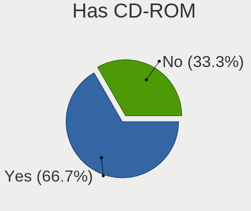
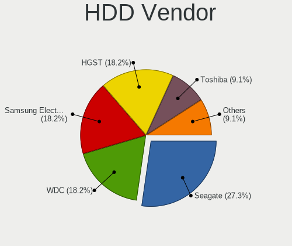
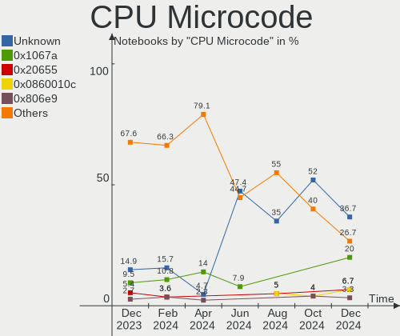
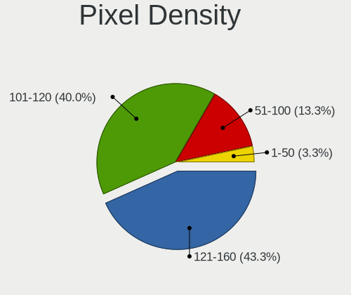
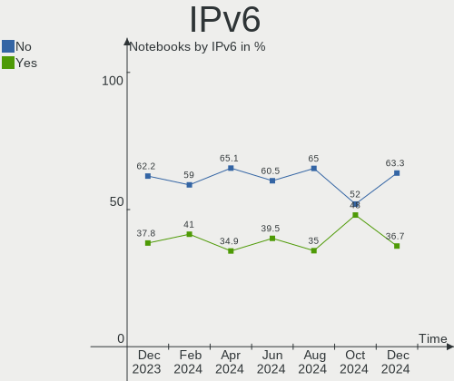
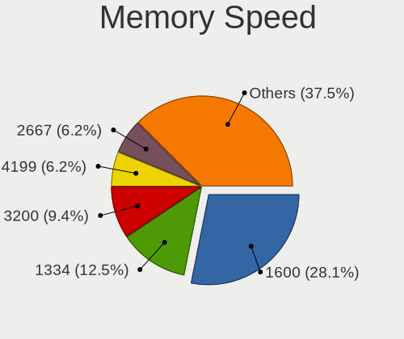
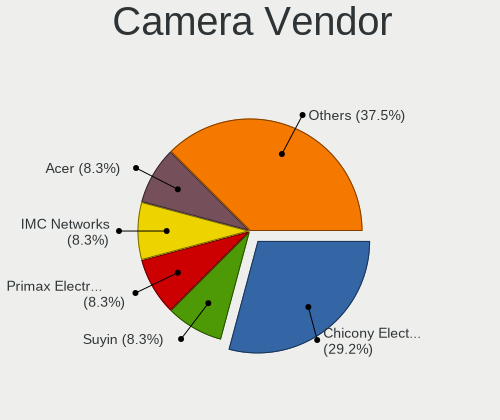

BlackPanther - Hardware Trends (Notebooks)
------------------------------------------

A project to identify most popular hardware characteristics and track their change
over time based on data collected by Linux users at https://Linux-Hardware.org.

Anyone can contribute to this report by the [hw-probe](https://github.com/linuxhw/hw-probe) tool:

    sudo -E hw-probe -all -upload

This report is for one last month. Overall report since the beginning of time: [TestCoverage](https://github.com/linuxhw/TestCoverage)

Period: Dec, 2022.

Contents
--------

* [ System ](#system)
  - [ OS                       ](#os)
  - [ OS Family                ](#os-family)
  - [ Kernel                   ](#kernel)
  - [ Kernel Family            ](#kernel-family)
  - [ Kernel Major Ver.        ](#kernel-major-ver)
  - [ Arch                     ](#arch)
  - [ DE                       ](#de)
  - [ Display Server           ](#display-server)
  - [ Display Manager          ](#display-manager)
  - [ OS Lang                  ](#os-lang)
  - [ Boot Mode                ](#boot-mode)
  - [ Filesystem               ](#filesystem)
  - [ Part. scheme             ](#part-scheme)
  - [ Dual Boot with Linux/BSD ](#dual-boot-with-linuxbsd)
  - [ Dual Boot (Win)          ](#dual-boot-win)

* [ Board ](#board)
  - [ Vendor                   ](#vendor)
  - [ Model                    ](#model)
  - [ Model Family             ](#model-family)
  - [ MFG Year                 ](#mfg-year)
  - [ Form Factor              ](#form-factor)
  - [ Secure Boot              ](#secure-boot)
  - [ Coreboot                 ](#coreboot)
  - [ RAM Size                 ](#ram-size)
  - [ RAM Used                 ](#ram-used)
  - [ Total Drives             ](#total-drives)
  - [ Has CD-ROM               ](#has-cd-rom)
  - [ Has Ethernet             ](#has-ethernet)
  - [ Has WiFi                 ](#has-wifi)
  - [ Has Bluetooth            ](#has-bluetooth)

* [ Location ](#location)
  - [ Country                  ](#country)
  - [ City                     ](#city)

* [ Drives ](#drives)
  - [ Drive Vendor             ](#drive-vendor)
  - [ Drive Model              ](#drive-model)
  - [ HDD Vendor               ](#hdd-vendor)
  - [ SSD Vendor               ](#ssd-vendor)
  - [ Drive Kind               ](#drive-kind)
  - [ Drive Connector          ](#drive-connector)
  - [ Drive Size               ](#drive-size)
  - [ Space Total              ](#space-total)
  - [ Space Used               ](#space-used)
  - [ Malfunc. Drives          ](#malfunc-drives)
  - [ Malfunc. Drive Vendor    ](#malfunc-drive-vendor)
  - [ Malfunc. HDD Vendor      ](#malfunc-hdd-vendor)
  - [ Malfunc. Drive Kind      ](#malfunc-drive-kind)
  - [ Failed Drives            ](#failed-drives)
  - [ Failed Drive Vendor      ](#failed-drive-vendor)
  - [ Drive Status             ](#drive-status)

* [ Storage controller ](#storage-controller)
  - [ Storage Vendor           ](#storage-vendor)
  - [ Storage Model            ](#storage-model)
  - [ Storage Kind             ](#storage-kind)

* [ Processor ](#processor)
  - [ CPU Vendor               ](#cpu-vendor)
  - [ CPU Model                ](#cpu-model)
  - [ CPU Model Family         ](#cpu-model-family)
  - [ CPU Cores                ](#cpu-cores)
  - [ CPU Sockets              ](#cpu-sockets)
  - [ CPU Threads              ](#cpu-threads)
  - [ CPU Op-Modes             ](#cpu-op-modes)
  - [ CPU Microcode            ](#cpu-microcode)
  - [ CPU Microarch            ](#cpu-microarch)

* [ Graphics ](#graphics)
  - [ GPU Vendor               ](#gpu-vendor)
  - [ GPU Model                ](#gpu-model)
  - [ GPU Combo                ](#gpu-combo)
  - [ GPU Driver               ](#gpu-driver)
  - [ GPU Memory               ](#gpu-memory)

* [ Monitor ](#monitor)
  - [ Monitor Vendor           ](#monitor-vendor)
  - [ Monitor Model            ](#monitor-model)
  - [ Monitor Resolution       ](#monitor-resolution)
  - [ Monitor Diagonal         ](#monitor-diagonal)
  - [ Monitor Width            ](#monitor-width)
  - [ Aspect Ratio             ](#aspect-ratio)
  - [ Monitor Area             ](#monitor-area)
  - [ Pixel Density            ](#pixel-density)
  - [ Multiple Monitors        ](#multiple-monitors)

* [ Network ](#network)
  - [ Net Controller Vendor    ](#net-controller-vendor)
  - [ Net Controller Model     ](#net-controller-model)
  - [ Wireless Vendor          ](#wireless-vendor)
  - [ Wireless Model           ](#wireless-model)
  - [ Ethernet Vendor          ](#ethernet-vendor)
  - [ Ethernet Model           ](#ethernet-model)
  - [ Net Controller Kind      ](#net-controller-kind)
  - [ Used Controller          ](#used-controller)
  - [ NICs                     ](#nics)
  - [ IPv6                     ](#ipv6)

* [ Bluetooth ](#bluetooth)
  - [ Bluetooth Vendor         ](#bluetooth-vendor)
  - [ Bluetooth Model          ](#bluetooth-model)

* [ Sound ](#sound)
  - [ Sound Vendor             ](#sound-vendor)
  - [ Sound Model              ](#sound-model)

* [ Memory ](#memory)
  - [ Memory Vendor            ](#memory-vendor)
  - [ Memory Model             ](#memory-model)
  - [ Memory Kind              ](#memory-kind)
  - [ Memory Form Factor       ](#memory-form-factor)
  - [ Memory Size              ](#memory-size)
  - [ Memory Speed             ](#memory-speed)

* [ Printers & scanners ](#printers--scanners)
  - [ Printer Vendor           ](#printer-vendor)
  - [ Printer Model            ](#printer-model)
  - [ Scanner Vendor           ](#scanner-vendor)
  - [ Scanner Model            ](#scanner-model)

* [ Camera ](#camera)
  - [ Camera Vendor            ](#camera-vendor)
  - [ Camera Model             ](#camera-model)

* [ Security ](#security)
  - [ Fingerprint Vendor       ](#fingerprint-vendor)
  - [ Fingerprint Model        ](#fingerprint-model)
  - [ Chipcard Vendor          ](#chipcard-vendor)
  - [ Chipcard Model           ](#chipcard-model)

* [ Unsupported ](#unsupported)
  - [ Unsupported Devices      ](#unsupported-devices)
  - [ Unsupported Device Types ](#unsupported-device-types)

System
------

OS
--

Installed operating systems

| Name              | Notebooks | Percent |
|-------------------|-----------|---------|
| BlackPanther 18.1 | 18        | 100%    |

OS Family
---------

OS without a version

| Name         | Notebooks | Percent |
|--------------|-----------|---------|
| BlackPanther | 18        | 100%    |

Kernel
------

Version of the Linux kernel

| Version             | Notebooks | Percent |
|---------------------|-----------|---------|
| 5.6.14-desktop-2bP  | 15        | 83.33%  |
| 4.18.16-desktop-1bP | 3         | 16.67%  |

Kernel Family
-------------

Linux kernel without a distro release

| Version | Notebooks | Percent |
|---------|-----------|---------|
| 5.6.14  | 15        | 83.33%  |
| 4.18.16 | 3         | 16.67%  |

Kernel Major Ver.
-----------------

Linux kernel major version

| Version | Notebooks | Percent |
|---------|-----------|---------|
| 5.6     | 15        | 83.33%  |
| 4.18    | 3         | 16.67%  |

Arch
----

OS architecture (x86_64, i586, etc.)

| Name   | Notebooks | Percent |
|--------|-----------|---------|
| x86_64 | 18        | 100%    |

DE
--

Desktop Environment

| Name | Notebooks | Percent |
|------|-----------|---------|
| KDE5 | 18        | 100%    |

Display Server
--------------

X11 or Wayland

| Name | Notebooks | Percent |
|------|-----------|---------|
| X11  | 18        | 100%    |

Display Manager
---------------

SDDM, LightDM, etc.

| Name | Notebooks | Percent |
|------|-----------|---------|
| SDDM | 18        | 100%    |

OS Lang
-------

Language

| Lang    | Notebooks | Percent |
|---------|-----------|---------|
| Unknown | 18        | 100%    |

Boot Mode
---------

EFI or BIOS

| Mode | Notebooks | Percent |
|------|-----------|---------|
| EFI  | 10        | 55.56%  |
| BIOS | 8         | 44.44%  |

Filesystem
----------

Type of filesystem

| Type    | Notebooks | Percent |
|---------|-----------|---------|
| Overlay | 13        | 72.22%  |
| Ext4    | 5         | 27.78%  |

Part. scheme
------------

Scheme of partitioning

| Type | Notebooks | Percent |
|------|-----------|---------|
| GPT  | 15        | 83.33%  |
| MBR  | 3         | 16.67%  |

Dual Boot with Linux/BSD
------------------------

Hosting more than one Linux/BSD

| Dual boot | Notebooks | Percent |
|-----------|-----------|---------|
| No        | 10        | 55.56%  |
| Yes       | 8         | 44.44%  |

Dual Boot (Win)
---------------

Hosting Linux and Windows

| Dual boot | Notebooks | Percent |
|-----------|-----------|---------|
| Yes       | 10        | 55.56%  |
| No        | 8         | 44.44%  |

Board
-----

Vendor
------

Motherboard manufacturer

| Name             | Notebooks | Percent |
|------------------|-----------|---------|
| Hewlett-Packard  | 5         | 27.78%  |
| Acer             | 4         | 22.22%  |
| Lenovo           | 3         | 16.67%  |
| Dell             | 3         | 16.67%  |
| ASUSTek Computer | 3         | 16.67%  |

Model
-----

Motherboard model

| Name                                | Notebooks | Percent |
|-------------------------------------|-----------|---------|
| Lenovo IdeaPadFlex 15 20309         | 1         | 5.56%   |
| Lenovo IdeaPad 330-15IKB 81DE       | 1         | 5.56%   |
| Lenovo E50-80 80J2                  | 1         | 5.56%   |
| HP Pavilion Gaming Laptop 15-ec1xxx | 1         | 5.56%   |
| HP Laptop 17-ak0xx                  | 1         | 5.56%   |
| HP Laptop 15-db0xxx                 | 1         | 5.56%   |
| HP Compaq 610                       | 1         | 5.56%   |
| HP 650                              | 1         | 5.56%   |
| Dell Latitude E6230                 | 1         | 5.56%   |
| Dell Latitude 5480                  | 1         | 5.56%   |
| Dell Inspiron M5030                 | 1         | 5.56%   |
| ASUS X540SA                         | 1         | 5.56%   |
| ASUS X200MA                         | 1         | 5.56%   |
| ASUS K54HR                          | 1         | 5.56%   |
| Acer TravelMate 8571                | 1         | 5.56%   |
| Acer Nitro AN515-51                 | 1         | 5.56%   |
| Acer E1-510                         | 1         | 5.56%   |
| Acer Aspire A515-51G                | 1         | 5.56%   |

Model Family
------------

Motherboard model prefix

| Name               | Notebooks | Percent |
|--------------------|-----------|---------|
| HP Laptop          | 2         | 11.11%  |
| Dell Latitude      | 2         | 11.11%  |
| Lenovo IdeaPadFlex | 1         | 5.56%   |
| Lenovo IdeaPad     | 1         | 5.56%   |
| Lenovo E50-80      | 1         | 5.56%   |
| HP Pavilion        | 1         | 5.56%   |
| HP Compaq          | 1         | 5.56%   |
| HP 650             | 1         | 5.56%   |
| Dell Inspiron      | 1         | 5.56%   |
| ASUS X540SA        | 1         | 5.56%   |
| ASUS X200MA        | 1         | 5.56%   |
| ASUS K54HR         | 1         | 5.56%   |
| Acer TravelMate    | 1         | 5.56%   |
| Acer Nitro         | 1         | 5.56%   |
| Acer E1-510        | 1         | 5.56%   |
| Acer Aspire        | 1         | 5.56%   |

MFG Year
--------

Motherboard manufacture year

| Year | Notebooks | Percent |
|------|-----------|---------|
| 2017 | 4         | 22.22%  |
| 2018 | 2         | 11.11%  |
| 2015 | 2         | 11.11%  |
| 2013 | 2         | 11.11%  |
| 2012 | 2         | 11.11%  |
| 2009 | 2         | 11.11%  |
| 2020 | 1         | 5.56%   |
| 2014 | 1         | 5.56%   |
| 2011 | 1         | 5.56%   |
| 2010 | 1         | 5.56%   |

Form Factor
-----------

Physical design of the computer

| Name     | Notebooks | Percent |
|----------|-----------|---------|
| Notebook | 18        | 100%    |

Secure Boot
-----------

Enabled or disabled

| State    | Notebooks | Percent |
|----------|-----------|---------|
| Disabled | 18        | 100%    |

Coreboot
--------

Have coreboot on board

| Used | Notebooks | Percent |
|------|-----------|---------|
| No   | 18        | 100%    |

RAM Size
--------

Total RAM memory

| Size in GB | Notebooks | Percent |
|------------|-----------|---------|
| 3.01-4.0   | 8         | 44.44%  |
| 8.01-16.0  | 5         | 27.78%  |
| 4.01-8.0   | 4         | 22.22%  |
| 1.01-2.0   | 1         | 5.56%   |

RAM Used
--------

Used RAM memory

| Used GB  | Notebooks | Percent |
|----------|-----------|---------|
| 1.01-2.0 | 8         | 44.44%  |
| 0.51-1.0 | 7         | 38.89%  |
| 0.01-0.5 | 3         | 16.67%  |

Total Drives
------------

Number of drives on board

| Drives | Notebooks | Percent |
|--------|-----------|---------|
| 1      | 10        | 55.56%  |
| 2      | 7         | 38.89%  |
| 0      | 1         | 5.56%   |

Has CD-ROM
----------

Has CD-ROM on board

| Presented | Notebooks | Percent |
|-----------|-----------|---------|
| No        | 10        | 55.56%  |
| Yes       | 8         | 44.44%  |

Has Ethernet
------------

Has Ethernet on board

| Presented | Notebooks | Percent |
|-----------|-----------|---------|
| Yes       | 18        | 100%    |

Has WiFi
--------

Has WiFi module

| Presented | Notebooks | Percent |
|-----------|-----------|---------|
| Yes       | 18        | 100%    |

Has Bluetooth
-------------

Has Bluetooth module

| Presented | Notebooks | Percent |
|-----------|-----------|---------|
| Yes       | 14        | 77.78%  |
| No        | 4         | 22.22%  |

Location
--------

Country
-------

Geographic location (country)

| Country | Notebooks | Percent |
|---------|-----------|---------|
| Hungary | 16        | 88.89%  |
| Germany | 1         | 5.56%   |
| France  | 1         | 5.56%   |

City
----

Geographic location (city)

| City             | Notebooks | Percent |
|------------------|-----------|---------|
| Veszprém        | 2         | 11.11%  |
| Budapest         | 2         | 11.11%  |
| Tatabánya       | 1         | 5.56%   |
| Szombathely      | 1         | 5.56%   |
| Szekszárd       | 1         | 5.56%   |
| Rackeve          | 1         | 5.56%   |
| Nice             | 1         | 5.56%   |
| Nagysap          | 1         | 5.56%   |
| Miskolc          | 1         | 5.56%   |
| Kiskunhalas      | 1         | 5.56%   |
| Fertoszentmiklos | 1         | 5.56%   |
| Dedestapolcsany  | 1         | 5.56%   |
| Decs             | 1         | 5.56%   |
| Debrecen         | 1         | 5.56%   |
| Bonyhad          | 1         | 5.56%   |
| Berlin           | 1         | 5.56%   |

Drives
------

Drive Vendor
------------

Hard drive vendors

| Vendor              | Notebooks | Drives | Percent |
|---------------------|-----------|--------|---------|
| WDC                 | 4         | 4      | 17.39%  |
| Toshiba             | 3         | 3      | 13.04%  |
| Seagate             | 3         | 3      | 13.04%  |
| Samsung Electronics | 3         | 3      | 13.04%  |
| Kingston            | 3         | 4      | 13.04%  |
| Verbatim            | 1         | 1      | 4.35%   |
| Team                | 1         | 1      | 4.35%   |
| SPCC                | 1         | 1      | 4.35%   |
| Patriot             | 1         | 1      | 4.35%   |
| Intenso             | 1         | 1      | 4.35%   |
| Intel               | 1         | 1      | 4.35%   |
| Hitachi             | 1         | 1      | 4.35%   |

Drive Model
-----------

Hard drive models

| Model                                   | Notebooks | Percent |
|-----------------------------------------|-----------|---------|
| Toshiba MQ01ABD100 1TB                  | 2         | 8.33%   |
| Seagate ST1000LM035-1RK172 1TB          | 2         | 8.33%   |
| Kingston SA400S37240G 240GB SSD         | 2         | 8.33%   |
| WDC WD3200BPVT-75ZEST0 320GB            | 1         | 4.17%   |
| WDC WD3200BEVT-08A23T1 320GB            | 1         | 4.17%   |
| WDC WD3200BEKT-60F3T1 320GB             | 1         | 4.17%   |
| WDC WD10SPCX-24HWST1 1TB                | 1         | 4.17%   |
| Verbatim Vi550 S3 SSD 512GB             | 1         | 4.17%   |
| Toshiba KSG60ZMV256G M.2 2280 256GB SSD | 1         | 4.17%   |
| Team T253X1120G 120GB SSD               | 1         | 4.17%   |
| SPCC Solid State Disk 256GB             | 1         | 4.17%   |
| Seagate ST2000LM007-1R8174 2TB          | 1         | 4.17%   |
| Samsung SSD 980 500GB                   | 1         | 4.17%   |
| Samsung SSD 970 EVO Plus 250GB          | 1         | 4.17%   |
| Samsung SSD 830 Series 128GB            | 1         | 4.17%   |
| Patriot P210 128GB SSD                  | 1         | 4.17%   |
| Kingston SNV425S264GB SSD               | 1         | 4.17%   |
| Kingston SA400S37480G 480GB SSD         | 1         | 4.17%   |
| Intenso SSD SATAIII 128GB               | 1         | 4.17%   |
| Intel SSDPEKKW256G7 256GB               | 1         | 4.17%   |
| Hitachi HTS547550A9E384 500GB           | 1         | 4.17%   |

HDD Vendor
----------

Hard disk drive vendors

| Vendor  | Notebooks | Drives | Percent |
|---------|-----------|--------|---------|
| WDC     | 4         | 4      | 40%     |
| Seagate | 3         | 3      | 30%     |
| Toshiba | 2         | 2      | 20%     |
| Hitachi | 1         | 1      | 10%     |

SSD Vendor
----------

Solid state drive vendors

| Vendor              | Notebooks | Drives | Percent |
|---------------------|-----------|--------|---------|
| Kingston            | 3         | 4      | 30%     |
| Verbatim            | 1         | 1      | 10%     |
| Toshiba             | 1         | 1      | 10%     |
| Team                | 1         | 1      | 10%     |
| SPCC                | 1         | 1      | 10%     |
| Samsung Electronics | 1         | 1      | 10%     |
| Patriot             | 1         | 1      | 10%     |
| Intenso             | 1         | 1      | 10%     |

Drive Kind
----------

HDD or SSD

| Kind | Notebooks | Drives | Percent |
|------|-----------|--------|---------|
| HDD  | 10        | 10     | 45.45%  |
| SSD  | 9         | 11     | 40.91%  |
| NVMe | 3         | 3      | 13.64%  |

Drive Connector
---------------

SATA, SAS, NVMe, etc.

| Type | Notebooks | Drives | Percent |
|------|-----------|--------|---------|
| SATA | 17        | 21     | 85%     |
| NVMe | 3         | 3      | 15%     |

Drive Size
----------

Size of hard drive

| Size in TB | Notebooks | Drives | Percent |
|------------|-----------|--------|---------|
| 0.01-0.5   | 11        | 14     | 64.71%  |
| 0.51-1.0   | 5         | 6      | 29.41%  |
| 1.01-2.0   | 1         | 1      | 5.88%   |

Space Total
-----------

Amount of disk space available on the file system

| Size in GB | Notebooks | Percent |
|------------|-----------|---------|
| Unknown    | 13        | 72.22%  |
| 101-250    | 3         | 16.67%  |
| 251-500    | 1         | 5.56%   |
| 51-100     | 1         | 5.56%   |

Space Used
----------

Amount of used disk space

| Used GB | Notebooks | Percent |
|---------|-----------|---------|
| Unknown | 13        | 72.22%  |
| 1-20    | 5         | 27.78%  |

Malfunc. Drives
---------------

Drive models with a malfunction

| Model                                   | Notebooks | Drives | Percent |
|-----------------------------------------|-----------|--------|---------|
| WDC WD3200BEVT-08A23T1 320GB            | 1         | 1      | 12.5%   |
| WDC WD3200BEKT-60F3T1 320GB             | 1         | 1      | 12.5%   |
| Toshiba KSG60ZMV256G M.2 2280 256GB SSD | 1         | 1      | 12.5%   |
| Seagate ST2000LM007-1R8174 2TB          | 1         | 1      | 12.5%   |
| Seagate ST1000LM035-1RK172 1TB          | 1         | 1      | 12.5%   |
| Kingston SNV425S264GB SSD               | 1         | 1      | 12.5%   |
| Intel SSDPEKKW256G7 256GB               | 1         | 1      | 12.5%   |
| Hitachi HTS547550A9E384 500GB           | 1         | 1      | 12.5%   |

Malfunc. Drive Vendor
---------------------

Vendors of faulty drives

| Vendor   | Notebooks | Drives | Percent |
|----------|-----------|--------|---------|
| WDC      | 2         | 2      | 25%     |
| Seagate  | 2         | 2      | 25%     |
| Toshiba  | 1         | 1      | 12.5%   |
| Kingston | 1         | 1      | 12.5%   |
| Intel    | 1         | 1      | 12.5%   |
| Hitachi  | 1         | 1      | 12.5%   |

Malfunc. HDD Vendor
-------------------

Vendors of faulty HDD drives

| Vendor  | Notebooks | Drives | Percent |
|---------|-----------|--------|---------|
| WDC     | 2         | 2      | 40%     |
| Seagate | 2         | 2      | 40%     |
| Hitachi | 1         | 1      | 20%     |

Malfunc. Drive Kind
-------------------

Kinds of faulty drives

| Kind | Notebooks | Drives | Percent |
|------|-----------|--------|---------|
| HDD  | 5         | 5      | 62.5%   |
| SSD  | 2         | 2      | 25%     |
| NVMe | 1         | 1      | 12.5%   |

Failed Drives
-------------

Failed drive models

Zero info for selected period =(

Failed Drive Vendor
-------------------

Failed drive vendors

Zero info for selected period =(

Drive Status
------------

Number of failed and malfunc. drives

| Status  | Notebooks | Drives | Percent |
|---------|-----------|--------|---------|
| Works   | 13        | 16     | 68.42%  |
| Malfunc | 6         | 8      | 31.58%  |

Storage controller
------------------

Storage Vendor
--------------

Storage controller vendors

| Vendor              | Notebooks | Percent |
|---------------------|-----------|---------|
| Intel               | 14        | 70%     |
| AMD                 | 4         | 20%     |
| Samsung Electronics | 2         | 10%     |

Storage Model
-------------

Storage controller models

| Model                                                                            | Notebooks | Percent |
|----------------------------------------------------------------------------------|-----------|---------|
| Intel 82801 Mobile SATA Controller [RAID mode]                                   | 3         | 13.04%  |
| AMD FCH SATA Controller [AHCI mode]                                              | 3         | 13.04%  |
| Intel Atom Processor E3800 Series SATA AHCI Controller                           | 2         | 8.7%    |
| Samsung NVMe SSD Controller SM981/PM981/PM983                                    | 1         | 4.35%   |
| Samsung NVMe SSD Controller 980                                                  | 1         | 4.35%   |
| Intel Wildcat Point-LP SATA Controller [AHCI Mode]                               | 1         | 4.35%   |
| Intel Sunrise Point-LP SATA Controller [AHCI mode]                               | 1         | 4.35%   |
| Intel SSD 600P Series                                                            | 1         | 4.35%   |
| Intel HM170/QM170 Chipset SATA Controller [AHCI Mode]                            | 1         | 4.35%   |
| Intel Atom/Celeron/Pentium Processor x5-E8000/J3xxx/N3xxx Series SATA Controller | 1         | 4.35%   |
| Intel 82801IBM/IEM (ICH9M/ICH9M-E) 4 port SATA Controller [AHCI mode]            | 1         | 4.35%   |
| Intel 82801HM/HEM (ICH8M/ICH8M-E) SATA Controller [AHCI mode]                    | 1         | 4.35%   |
| Intel 82801HM/HEM (ICH8M/ICH8M-E) IDE Controller                                 | 1         | 4.35%   |
| Intel 8 Series SATA Controller 1 [AHCI mode]                                     | 1         | 4.35%   |
| Intel 7 Series Chipset Family 6-port SATA Controller [AHCI mode]                 | 1         | 4.35%   |
| Intel 6 Series/C200 Series Chipset Family 6 port Mobile SATA AHCI Controller     | 1         | 4.35%   |
| AMD SB7x0/SB8x0/SB9x0 SATA Controller [IDE mode]                                 | 1         | 4.35%   |
| AMD SB7x0/SB8x0/SB9x0 IDE Controller                                             | 1         | 4.35%   |

Storage Kind
------------

Kind of storage controller (IDE, SATA, NVMe, SAS, ...)

| Kind | Notebooks | Percent |
|------|-----------|---------|
| SATA | 15        | 65.22%  |
| RAID | 3         | 13.04%  |
| NVMe | 3         | 13.04%  |
| IDE  | 2         | 8.7%    |

Processor
---------

CPU Vendor
----------

Processor vendors

| Vendor | Notebooks | Percent |
|--------|-----------|---------|
| Intel  | 14        | 77.78%  |
| AMD    | 4         | 22.22%  |

CPU Model
---------

Processor models

| Model                                         | Notebooks | Percent |
|-----------------------------------------------|-----------|---------|
| Intel Pentium CPU N3700 @ 1.60GHz             | 1         | 5.56%   |
| Intel Core i7-7700HQ CPU @ 2.80GHz            | 1         | 5.56%   |
| Intel Core i7-6600U CPU @ 2.60GHz             | 1         | 5.56%   |
| Intel Core i5-8250U CPU @ 1.60GHz             | 1         | 5.56%   |
| Intel Core i5-7200U CPU @ 2.50GHz             | 1         | 5.56%   |
| Intel Core i5-5200U CPU @ 2.20GHz             | 1         | 5.56%   |
| Intel Core i5-4200U CPU @ 1.60GHz             | 1         | 5.56%   |
| Intel Core i5-3340M CPU @ 2.70GHz             | 1         | 5.56%   |
| Intel Core 2 Duo CPU U9400 @ 1.40GHz          | 1         | 5.56%   |
| Intel Core 2 Duo CPU T5870 @ 2.00GHz          | 1         | 5.56%   |
| Intel Celeron CPU N2920 @ 1.86GHz             | 1         | 5.56%   |
| Intel Celeron CPU N2815 @ 1.86GHz             | 1         | 5.56%   |
| Intel Celeron CPU B830 @ 1.80GHz              | 1         | 5.56%   |
| Intel Celeron CPU B815 @ 1.60GHz              | 1         | 5.56%   |
| AMD V160 Processor                            | 1         | 5.56%   |
| AMD Ryzen 5 4600H with Radeon Graphics        | 1         | 5.56%   |
| AMD Ryzen 3 2200U with Radeon Vega Mobile Gfx | 1         | 5.56%   |
| AMD A9-9420 RADEON R5, 5 COMPUTE CORES 2C+3G  | 1         | 5.56%   |

CPU Model Family
----------------

Processor model prefix

| Model            | Notebooks | Percent |
|------------------|-----------|---------|
| Intel Core i5    | 5         | 27.78%  |
| Intel Celeron    | 4         | 22.22%  |
| Intel Core i7    | 2         | 11.11%  |
| Intel Core 2 Duo | 2         | 11.11%  |
| Other            | 1         | 5.56%   |
| Intel Pentium    | 1         | 5.56%   |
| AMD V160         | 1         | 5.56%   |
| AMD Ryzen 5      | 1         | 5.56%   |
| AMD Ryzen 3      | 1         | 5.56%   |

CPU Cores
---------

Number of processor cores

| Number | Notebooks | Percent |
|--------|-----------|---------|
| 2      | 12        | 66.67%  |
| 4      | 4         | 22.22%  |
| 6      | 1         | 5.56%   |
| 1      | 1         | 5.56%   |

CPU Sockets
-----------

Number of sockets

| Number | Notebooks | Percent |
|--------|-----------|---------|
| 1      | 18        | 100%    |

CPU Threads
-----------

Threads per core (Hyper-Threading)

| Number | Notebooks | Percent |
|--------|-----------|---------|
| 2      | 9         | 50%     |
| 1      | 9         | 50%     |

CPU Op-Modes
------------

CPU Operation Modes (32-bit, 64-bit)

| Op mode        | Notebooks | Percent |
|----------------|-----------|---------|
| 32-bit, 64-bit | 18        | 100%    |

CPU Microcode
-------------

Microcode number

| Number     | Notebooks | Percent |
|------------|-----------|---------|
| 0x30673    | 2         | 11.11%  |
| 0x206a7    | 2         | 11.11%  |
| 0x906e9    | 1         | 5.56%   |
| 0x806ea    | 1         | 5.56%   |
| 0x806e9    | 1         | 5.56%   |
| 0x6fd      | 1         | 5.56%   |
| 0x406e3    | 1         | 5.56%   |
| 0x406c3    | 1         | 5.56%   |
| 0x40651    | 1         | 5.56%   |
| 0x306d4    | 1         | 5.56%   |
| 0x306a9    | 1         | 5.56%   |
| 0x1067a    | 1         | 5.56%   |
| 0x08600106 | 1         | 5.56%   |
| 0x08101007 | 1         | 5.56%   |
| 0x06006705 | 1         | 5.56%   |
| 0x010000c8 | 1         | 5.56%   |

CPU Microarch
-------------

Microarchitecture

| Name        | Notebooks | Percent |
|-------------|-----------|---------|
| Silvermont  | 3         | 16.67%  |
| KabyLake    | 3         | 16.67%  |
| SandyBridge | 2         | 11.11%  |
| Zen 2       | 1         | 5.56%   |
| Zen         | 1         | 5.56%   |
| Skylake     | 1         | 5.56%   |
| Penryn      | 1         | 5.56%   |
| K10         | 1         | 5.56%   |
| IvyBridge   | 1         | 5.56%   |
| Haswell     | 1         | 5.56%   |
| Excavator   | 1         | 5.56%   |
| Core        | 1         | 5.56%   |
| Broadwell   | 1         | 5.56%   |

Graphics
--------

GPU Vendor
----------

Vendors of graphics cards

| Vendor | Notebooks | Percent |
|--------|-----------|---------|
| Intel  | 13        | 52%     |
| AMD    | 7         | 28%     |
| Nvidia | 5         | 20%     |

GPU Model
---------

Graphics card models

| Model                                                                                    | Notebooks | Percent |
|------------------------------------------------------------------------------------------|-----------|---------|
| Intel Atom Processor Z36xxx/Z37xxx Series Graphics & Display                             | 2         | 7.69%   |
| AMD Topaz XT [Radeon R7 M260/M265 / M340/M360 / M440/M445 / 530/535 / 620/625 Mobile]    | 2         | 7.69%   |
| Nvidia TU117M [GeForce GTX 1650 Ti Mobile]                                               | 1         | 3.85%   |
| Nvidia GP108M [GeForce MX150]                                                            | 1         | 3.85%   |
| Nvidia GP107M [GeForce GTX 1050 Ti Mobile]                                               | 1         | 3.85%   |
| Nvidia GM108M [GeForce 930MX]                                                            | 1         | 3.85%   |
| Nvidia GF117M [GeForce 610M/710M/810M/820M / GT 620M/625M/630M/720M]                     | 1         | 3.85%   |
| Intel UHD Graphics 620                                                                   | 1         | 3.85%   |
| Intel Skylake GT2 [HD Graphics 520]                                                      | 1         | 3.85%   |
| Intel Mobile GME965/GLE960 Integrated Graphics Controller                                | 1         | 3.85%   |
| Intel Mobile 4 Series Chipset Integrated Graphics Controller                             | 1         | 3.85%   |
| Intel HD Graphics 630                                                                    | 1         | 3.85%   |
| Intel HD Graphics 620                                                                    | 1         | 3.85%   |
| Intel HD Graphics 5500                                                                   | 1         | 3.85%   |
| Intel Haswell-ULT Integrated Graphics Controller                                         | 1         | 3.85%   |
| Intel Atom/Celeron/Pentium Processor x5-E8000/J3xxx/N3xxx Integrated Graphics Controller | 1         | 3.85%   |
| Intel 3rd Gen Core processor Graphics Controller                                         | 1         | 3.85%   |
| Intel 2nd Generation Core Processor Family Integrated Graphics Controller                | 1         | 3.85%   |
| AMD Sun XT [Radeon HD 8670A/8670M/8690M / R5 M330 / M430 / Radeon 520 Mobile]            | 1         | 3.85%   |
| AMD Stoney [Radeon R2/R3/R4/R5 Graphics]                                                 | 1         | 3.85%   |
| AMD Seymour [Radeon HD 6400M/7400M Series]                                               | 1         | 3.85%   |
| AMD RS880M [Mobility Radeon HD 4225/4250]                                                | 1         | 3.85%   |
| AMD Renoir                                                                               | 1         | 3.85%   |
| AMD Raven Ridge [Radeon Vega Series / Radeon Vega Mobile Series]                         | 1         | 3.85%   |

GPU Combo
---------

Combinations of graphics cards

| Name           | Notebooks | Percent |
|----------------|-----------|---------|
| 1 x Intel      | 7         | 38.89%  |
| Intel + Nvidia | 4         | 22.22%  |
| 1 x AMD        | 3         | 16.67%  |
| Intel + AMD    | 2         | 11.11%  |
| 2 x AMD        | 1         | 5.56%   |
| AMD + Nvidia   | 1         | 5.56%   |

GPU Driver
----------

Free vs proprietary

| Driver | Notebooks | Percent |
|--------|-----------|---------|
| Free   | 18        | 100%    |

GPU Memory
----------

Total video memory

| Size in GB | Notebooks | Percent |
|------------|-----------|---------|
| Unknown    | 7         | 38.89%  |
| 1.01-2.0   | 5         | 27.78%  |
| 3.01-4.0   | 2         | 11.11%  |
| 0.51-1.0   | 2         | 11.11%  |
| 0.01-0.5   | 2         | 11.11%  |

Monitor
-------

Monitor Vendor
--------------

Monitor vendors

| Vendor              | Notebooks | Percent |
|---------------------|-----------|---------|
| AU Optronics        | 6         | 33.33%  |
| Chimei Innolux      | 4         | 22.22%  |
| LG Display          | 2         | 11.11%  |
| BOE                 | 2         | 11.11%  |
| Vestel Elektronik   | 1         | 5.56%   |
| Samsung Electronics | 1         | 5.56%   |
| PANDA               | 1         | 5.56%   |
| InnoLux Display     | 1         | 5.56%   |

Monitor Model
-------------

Monitor models

| Model                                                                | Notebooks | Percent |
|----------------------------------------------------------------------|-----------|---------|
| Vestel Elektronik 40UHD_LCD_TV VES3700 3840x2160 890x500mm 40.2-inch | 1         | 5.56%   |
| Samsung Electronics LCD Monitor SEC5441 1366x768 344x194mm 15.5-inch | 1         | 5.56%   |
| PANDA LCD Monitor NCP0058 1920x1080 344x194mm 15.5-inch              | 1         | 5.56%   |
| LG Display LCD Monitor LGD0430 1366x768 345x194mm 15.6-inch          | 1         | 5.56%   |
| LG Display LCD Monitor LGD036C 1366x768 277x156mm 12.5-inch          | 1         | 5.56%   |
| InnoLux Display BT156GW01 INL0007 1366x768 344x194mm 15.5-inch       | 1         | 5.56%   |
| Chimei Innolux LCD Monitor CMN15D5 1920x1080 344x193mm 15.5-inch     | 1         | 5.56%   |
| Chimei Innolux LCD Monitor CMN15CA 1366x768 344x193mm 15.5-inch      | 1         | 5.56%   |
| Chimei Innolux LCD Monitor CMN15BD 1366x768 344x193mm 15.5-inch      | 1         | 5.56%   |
| Chimei Innolux LCD Monitor CMN1119 1366x768 256x144mm 11.6-inch      | 1         | 5.56%   |
| BOE LCD Monitor BOE06E2 1920x1080 309x173mm 13.9-inch                | 1         | 5.56%   |
| BOE LCD Monitor BOE06C6 1920x1080 344x194mm 15.5-inch                | 1         | 5.56%   |
| AU Optronics LCD Monitor AUO61ED 1920x1080 344x194mm 15.5-inch       | 1         | 5.56%   |
| AU Optronics LCD Monitor AUO38ED 1920x1080 344x193mm 15.5-inch       | 1         | 5.56%   |
| AU Optronics LCD Monitor AUO32EC 1366x768 344x193mm 15.5-inch        | 1         | 5.56%   |
| AU Optronics LCD Monitor AUO23EC 1366x768 344x193mm 15.5-inch        | 1         | 5.56%   |
| AU Optronics LCD Monitor AUO219E 1600x900 382x214mm 17.2-inch        | 1         | 5.56%   |
| AU Optronics LCD Monitor AUO10EC 1366x768 344x193mm 15.5-inch        | 1         | 5.56%   |

Monitor Resolution
------------------

Monitor screen resolution

| Resolution      | Notebooks | Percent |
|-----------------|-----------|---------|
| 1366x768 (WXGA) | 10        | 55.56%  |
| 1920x1080 (FHD) | 6         | 33.33%  |
| 3840x2160 (4K)  | 1         | 5.56%   |
| 1600x900 (HD+)  | 1         | 5.56%   |

Monitor Diagonal
----------------

Diagonal size in inches

| Inches | Notebooks | Percent |
|--------|-----------|---------|
| 15     | 13        | 72.22%  |
| 84     | 1         | 5.56%   |
| 17     | 1         | 5.56%   |
| 13     | 1         | 5.56%   |
| 12     | 1         | 5.56%   |
| 11     | 1         | 5.56%   |

Monitor Width
-------------

Physical width

| Width in mm | Notebooks | Percent |
|-------------|-----------|---------|
| 301-350     | 13        | 72.22%  |
| 351-400     | 2         | 11.11%  |
| 201-300     | 2         | 11.11%  |
| 1501-2000   | 1         | 5.56%   |

Aspect Ratio
------------

Proportional relationship between the width and the height

| Ratio | Notebooks | Percent |
|-------|-----------|---------|
| 16/9  | 17        | 100%    |

Monitor Area
------------

Area in inch²

| Area in inch² | Notebooks | Percent |
|----------------|-----------|---------|
| 101-110        | 13        | 72.22%  |
| More than 1000 | 1         | 5.56%   |
| 81-90          | 1         | 5.56%   |
| 61-70          | 1         | 5.56%   |
| 51-60          | 1         | 5.56%   |
| 121-130        | 1         | 5.56%   |

Pixel Density
-------------

Pixels per inch

| Density | Notebooks | Percent |
|---------|-----------|---------|
| 121-160 | 8         | 44.44%  |
| 101-120 | 7         | 38.89%  |
| 51-100  | 3         | 16.67%  |

Multiple Monitors
-----------------

Total monitors connected

| Total | Notebooks | Percent |
|-------|-----------|---------|
| 1     | 17        | 94.44%  |
| 2     | 1         | 5.56%   |

Network
-------

Net Controller Vendor
---------------------

Controller vendors

| Vendor                   | Notebooks | Percent |
|--------------------------|-----------|---------|
| Realtek Semiconductor    | 13        | 41.94%  |
| Qualcomm Atheros         | 8         | 25.81%  |
| Intel                    | 7         | 22.58%  |
| Xiaomi                   | 1         | 3.23%   |
| Ralink                   | 1         | 3.23%   |
| Marvell Technology Group | 1         | 3.23%   |

Net Controller Model
--------------------

Controller models

| Model                                                             | Notebooks | Percent |
|-------------------------------------------------------------------|-----------|---------|
| Realtek RTL8111/8168/8411 PCI Express Gigabit Ethernet Controller | 10        | 26.32%  |
| Realtek RTL810xE PCI Express Fast Ethernet controller             | 3         | 7.89%   |
| Qualcomm Atheros QCA9565 / AR9565 Wireless Network Adapter        | 2         | 5.26%   |
| Qualcomm Atheros AR9485 Wireless Network Adapter                  | 2         | 5.26%   |
| Xiaomi Mi/Redmi series (RNDIS)                                    | 1         | 2.63%   |
| Realtek RTL8822CE 802.11ac PCIe Wireless Network Adapter          | 1         | 2.63%   |
| Realtek RTL8822BE 802.11a/b/g/n/ac WiFi adapter                   | 1         | 2.63%   |
| Realtek RTL8723DE Wireless Network Adapter                        | 1         | 2.63%   |
| Realtek RTL8188EUS 802.11n Wireless Network Adapter               | 1         | 2.63%   |
| Ralink RT5390 Wireless 802.11n 1T/1R PCIe                         | 1         | 2.63%   |
| Qualcomm Atheros QCA9377 802.11ac Wireless Network Adapter        | 1         | 2.63%   |
| Qualcomm Atheros QCA6174 802.11ac Wireless Network Adapter        | 1         | 2.63%   |
| Qualcomm Atheros AR9285 Wireless Network Adapter (PCI-Express)    | 1         | 2.63%   |
| Qualcomm Atheros AR8152 v2.0 Fast Ethernet                        | 1         | 2.63%   |
| Qualcomm Atheros AR8151 v2.0 Gigabit Ethernet                     | 1         | 2.63%   |
| Marvell Group 88E8042 PCI-E Fast Ethernet Controller              | 1         | 2.63%   |
| Intel Wireless 8265 / 8275                                        | 1         | 2.63%   |
| Intel Wireless 7260                                               | 1         | 2.63%   |
| Intel Wireless 3160                                               | 1         | 2.63%   |
| Intel WiFi Link 5100                                              | 1         | 2.63%   |
| Intel PRO/Wireless 5100 AGN [Shiloh] Network Connection           | 1         | 2.63%   |
| Intel Ethernet Connection (4) I219-LM                             | 1         | 2.63%   |
| Intel Dual Band Wireless-AC 3168NGW [Stone Peak]                  | 1         | 2.63%   |
| Intel Centrino Advanced-N 6205 [Taylor Peak]                      | 1         | 2.63%   |
| Intel 82579LM Gigabit Network Connection (Lewisville)             | 1         | 2.63%   |

Wireless Vendor
---------------

Wireless vendors

| Vendor                | Notebooks | Percent |
|-----------------------|-----------|---------|
| Qualcomm Atheros      | 7         | 38.89%  |
| Intel                 | 7         | 38.89%  |
| Realtek Semiconductor | 3         | 16.67%  |
| Ralink                | 1         | 5.56%   |

Wireless Model
--------------

Wireless models

| Model                                                          | Notebooks | Percent |
|----------------------------------------------------------------|-----------|---------|
| Qualcomm Atheros QCA9565 / AR9565 Wireless Network Adapter     | 2         | 10.53%  |
| Qualcomm Atheros AR9485 Wireless Network Adapter               | 2         | 10.53%  |
| Realtek RTL8822CE 802.11ac PCIe Wireless Network Adapter       | 1         | 5.26%   |
| Realtek RTL8822BE 802.11a/b/g/n/ac WiFi adapter                | 1         | 5.26%   |
| Realtek RTL8723DE Wireless Network Adapter                     | 1         | 5.26%   |
| Realtek RTL8188EUS 802.11n Wireless Network Adapter            | 1         | 5.26%   |
| Ralink RT5390 Wireless 802.11n 1T/1R PCIe                      | 1         | 5.26%   |
| Qualcomm Atheros QCA9377 802.11ac Wireless Network Adapter     | 1         | 5.26%   |
| Qualcomm Atheros QCA6174 802.11ac Wireless Network Adapter     | 1         | 5.26%   |
| Qualcomm Atheros AR9285 Wireless Network Adapter (PCI-Express) | 1         | 5.26%   |
| Intel Wireless 8265 / 8275                                     | 1         | 5.26%   |
| Intel Wireless 7260                                            | 1         | 5.26%   |
| Intel Wireless 3160                                            | 1         | 5.26%   |
| Intel WiFi Link 5100                                           | 1         | 5.26%   |
| Intel PRO/Wireless 5100 AGN [Shiloh] Network Connection        | 1         | 5.26%   |
| Intel Dual Band Wireless-AC 3168NGW [Stone Peak]               | 1         | 5.26%   |
| Intel Centrino Advanced-N 6205 [Taylor Peak]                   | 1         | 5.26%   |

Ethernet Vendor
---------------

Ethernet vendors

| Vendor                   | Notebooks | Percent |
|--------------------------|-----------|---------|
| Realtek Semiconductor    | 13        | 68.42%  |
| Qualcomm Atheros         | 2         | 10.53%  |
| Intel                    | 2         | 10.53%  |
| Xiaomi                   | 1         | 5.26%   |
| Marvell Technology Group | 1         | 5.26%   |

Ethernet Model
--------------

Ethernet models

| Model                                                             | Notebooks | Percent |
|-------------------------------------------------------------------|-----------|---------|
| Realtek RTL8111/8168/8411 PCI Express Gigabit Ethernet Controller | 10        | 52.63%  |
| Realtek RTL810xE PCI Express Fast Ethernet controller             | 3         | 15.79%  |
| Xiaomi Mi/Redmi series (RNDIS)                                    | 1         | 5.26%   |
| Qualcomm Atheros AR8152 v2.0 Fast Ethernet                        | 1         | 5.26%   |
| Qualcomm Atheros AR8151 v2.0 Gigabit Ethernet                     | 1         | 5.26%   |
| Marvell Group 88E8042 PCI-E Fast Ethernet Controller              | 1         | 5.26%   |
| Intel Ethernet Connection (4) I219-LM                             | 1         | 5.26%   |
| Intel 82579LM Gigabit Network Connection (Lewisville)             | 1         | 5.26%   |

Net Controller Kind
-------------------

Ethernet, WiFi or modem

| Kind     | Notebooks | Percent |
|----------|-----------|---------|
| WiFi     | 18        | 50%     |
| Ethernet | 18        | 50%     |

Used Controller
---------------

Currently used network controller

| Kind     | Notebooks | Percent |
|----------|-----------|---------|
| WiFi     | 13        | 76.47%  |
| Ethernet | 4         | 23.53%  |

NICs
----

Total network controllers on board

| Total | Notebooks | Percent |
|-------|-----------|---------|
| 2     | 18        | 100%    |

IPv6
----

IPv6 vs IPv4

| Used | Notebooks | Percent |
|------|-----------|---------|
| No   | 13        | 72.22%  |
| Yes  | 5         | 27.78%  |

Bluetooth
---------

Bluetooth Vendor
----------------

Controller vendors

| Vendor                          | Notebooks | Percent |
|---------------------------------|-----------|---------|
| Intel                           | 4         | 28.57%  |
| Realtek Semiconductor           | 3         | 21.43%  |
| Qualcomm Atheros Communications | 2         | 14.29%  |
| Foxconn / Hon Hai               | 2         | 14.29%  |
| Lite-On Technology              | 1         | 7.14%   |
| Hewlett-Packard                 | 1         | 7.14%   |
| Dell                            | 1         | 7.14%   |

Bluetooth Model
---------------

Controller models

| Model                                   | Notebooks | Percent |
|-----------------------------------------|-----------|---------|
| Intel Bluetooth wireless interface      | 3         | 21.43%  |
| Realtek  Bluetooth 4.2 Adapter          | 2         | 14.29%  |
| Realtek Bluetooth Radio                 | 1         | 7.14%   |
| Qualcomm Atheros  Bluetooth Device      | 1         | 7.14%   |
| Qualcomm Atheros AR3012 Bluetooth       | 1         | 7.14%   |
| Lite-On Bluetooth Device                | 1         | 7.14%   |
| Intel Wireless-AC 3168 Bluetooth        | 1         | 7.14%   |
| HP Broadcom 2070 Bluetooth Combo        | 1         | 7.14%   |
| Foxconn / Hon Hai Bluetooth Device      | 1         | 7.14%   |
| Foxconn / Hon Hai Acer Bluetooth module | 1         | 7.14%   |
| Dell Wireless 365 Bluetooth             | 1         | 7.14%   |

Sound
-----

Sound Vendor
------------

Sound card vendors

| Vendor | Notebooks | Percent |
|--------|-----------|---------|
| Intel  | 14        | 66.67%  |
| AMD    | 5         | 23.81%  |
| Nvidia | 2         | 9.52%   |

Sound Model
-----------

Sound card models

| Model                                                                                             | Notebooks | Percent |
|---------------------------------------------------------------------------------------------------|-----------|---------|
| Intel Sunrise Point-LP HD Audio                                                                   | 3         | 12%     |
| Intel Atom Processor Z36xxx/Z37xxx Series High Definition Audio Controller                        | 2         | 8%      |
| Intel 7 Series/C216 Chipset Family High Definition Audio Controller                               | 2         | 8%      |
| AMD Family 17h/19h HD Audio Controller                                                            | 2         | 8%      |
| Nvidia TU107 GeForce GTX 1650 High Definition Audio Controller                                    | 1         | 4%      |
| Nvidia GP107GL High Definition Audio Controller                                                   | 1         | 4%      |
| Intel Wildcat Point-LP High Definition Audio Controller                                           | 1         | 4%      |
| Intel Haswell-ULT HD Audio Controller                                                             | 1         | 4%      |
| Intel CM238 HD Audio Controller                                                                   | 1         | 4%      |
| Intel Broadwell-U Audio Controller                                                                | 1         | 4%      |
| Intel Atom/Celeron/Pentium Processor x5-E8000/J3xxx/N3xxx Series High Definition Audio Controller | 1         | 4%      |
| Intel 82801I (ICH9 Family) HD Audio Controller                                                    | 1         | 4%      |
| Intel 82801H (ICH8 Family) HD Audio Controller                                                    | 1         | 4%      |
| Intel 8 Series HD Audio Controller                                                                | 1         | 4%      |
| Intel 6 Series/C200 Series Chipset Family High Definition Audio Controller                        | 1         | 4%      |
| AMD SBx00 Azalia (Intel HDA)                                                                      | 1         | 4%      |
| AMD Raven/Raven2/Fenghuang HDMI/DP Audio Controller                                               | 1         | 4%      |
| AMD High Definition Audio Controller                                                              | 1         | 4%      |
| AMD Family 15h (Models 60h-6fh) Audio Controller                                                  | 1         | 4%      |
| AMD Caicos HDMI Audio [Radeon HD 6450 / 7450/8450/8490 OEM / R5 230/235/235X OEM]                 | 1         | 4%      |

Memory
------

Memory Vendor
-------------

Memory module vendors

| Vendor              | Notebooks | Percent |
|---------------------|-----------|---------|
| SK hynix            | 8         | 36.36%  |
| Samsung Electronics | 3         | 13.64%  |
| Kingston            | 3         | 13.64%  |
| Nanya Technology    | 2         | 9.09%   |
| Micron Technology   | 2         | 9.09%   |
| Unknown             | 1         | 4.55%   |
| Transcend           | 1         | 4.55%   |
| Elpida              | 1         | 4.55%   |
| Corsair             | 1         | 4.55%   |

Memory Model
------------

Memory module models

| Model                                                        | Notebooks | Percent |
|--------------------------------------------------------------|-----------|---------|
| Unknown RAM V02D4S84GB5285282400 4096MB SODIMM DDR4 2133MT/s | 1         | 4.55%   |
| Transcend RAM JM800QSU-2G 2048MB SODIMM DDR2 975MT/s         | 1         | 4.55%   |
| SK hynix RAM HMT451S6CFR6A-PB 4096MB SODIMM DDR3 1600MT/s    | 1         | 4.55%   |
| SK hynix RAM HMT451S6AFR6R-PB 4096MB SODIMM DDR3 1333MT/s    | 1         | 4.55%   |
| SK hynix RAM HMT351S6EFR8A-PB 4096MB SODIMM DDR3 1600MT/s    | 1         | 4.55%   |
| SK hynix RAM HMP125S6EFR8C-S6 2048MB SODIMM DDR2 2048MT/s    | 1         | 4.55%   |
| SK hynix RAM HMA851S6CJR6N-VK 4GB SODIMM DDR4 2667MT/s       | 1         | 4.55%   |
| SK hynix RAM HMA851S6AFR6N-UH 4GB SODIMM DDR4 2400MT/s       | 1         | 4.55%   |
| SK hynix RAM HMA851S6AFR6N-UH 2GB SODIMM LPDDR4 2667MT/s     | 1         | 4.55%   |
| SK hynix RAM HMA81GS6CJR8N-XN 8192MB SODIMM DDR4 3200MT/s    | 1         | 4.55%   |
| Samsung RAM M471B5273DH0-CK0 4GB SODIMM DDR3 1600MT/s        | 1         | 4.55%   |
| Samsung RAM M471B1G73DB0-YK0 8GB SODIMM DDR3 1600MT/s        | 1         | 4.55%   |
| Samsung RAM M471A5244CB0-CRC 4GB SODIMM DDR4 2667MT/s        | 1         | 4.55%   |
| Nanya RAM NT4GC64C88B1NS-DI 4096MB SODIMM DDR3 1600MT/s      | 1         | 4.55%   |
| Nanya RAM NT4GC64B8HG0NS-CG 4096MB SODIMM DDR3 1334MT/s      | 1         | 4.55%   |
| Micron RAM 8JSF25664HZ-1G4D1 2GB SODIMM DDR3 1334MT/s        | 1         | 4.55%   |
| Micron RAM 4ATF51264HZ-2G3B1 4GB SODIMM DDR4 2400MT/s        | 1         | 4.55%   |
| Kingston RAM KMKYF9-MIB 8192MB SODIMM DDR4 2400MT/s          | 1         | 4.55%   |
| Kingston RAM KF2666C15S4/8G 8192MB SODIMM DDR4 2667MT/s      | 1         | 4.55%   |
| Kingston RAM ACR16D3LS1KFG/4G 4096MB SODIMM DDR3 1600MT/s    | 1         | 4.55%   |
| Elpida RAM EBJ40UG8EFU0-GN-F 4096MB SODIMM DDR3 1600MT/s     | 1         | 4.55%   |
| Corsair RAM CMSX8GX3M2A1866C10 4096MB SODIMM 800MT/s         | 1         | 4.55%   |

Memory Kind
-----------

Memory module kinds

| Kind    | Notebooks | Percent |
|---------|-----------|---------|
| DDR3    | 9         | 47.37%  |
| DDR4    | 7         | 36.84%  |
| SDRAM   | 1         | 5.26%   |
| LPDDR4  | 1         | 5.26%   |
| Unknown | 1         | 5.26%   |

Memory Form Factor
------------------

Physical design of the memory module

| Name   | Notebooks | Percent |
|--------|-----------|---------|
| SODIMM | 18        | 100%    |

Memory Size
-----------

Memory module size

| Size | Notebooks | Percent |
|------|-----------|---------|
| 4096 | 12        | 66.67%  |
| 8192 | 4         | 22.22%  |
| 2048 | 2         | 11.11%  |

Memory Speed
------------

Memory module speed

| Speed | Notebooks | Percent |
|-------|-----------|---------|
| 1600  | 6         | 30%     |
| 2400  | 4         | 20%     |
| 2667  | 3         | 15%     |
| 1334  | 2         | 10%     |
| 3200  | 1         | 5%      |
| 2048  | 1         | 5%      |
| 1333  | 1         | 5%      |
| 975   | 1         | 5%      |
| 800   | 1         | 5%      |

Printers & scanners
-------------------

Printer Vendor
--------------

Printer device vendors

Zero info for selected period =(

Printer Model
-------------

Printer device models

Zero info for selected period =(

Scanner Vendor
--------------

Scanner device vendors

Zero info for selected period =(

Scanner Model
-------------

Scanner device models

Zero info for selected period =(

Camera
------

Camera Vendor
-------------

Camera device vendors

| Vendor                                 | Notebooks | Percent |
|----------------------------------------|-----------|---------|
| Chicony Electronics                    | 5         | 27.78%  |
| Realtek Semiconductor                  | 3         | 16.67%  |
| Cheng Uei Precision Industry (Foxlink) | 3         | 16.67%  |
| Microdia                               | 2         | 11.11%  |
| Acer                                   | 2         | 11.11%  |
| Sunplus Innovation Technology          | 1         | 5.56%   |
| IMC Networks                           | 1         | 5.56%   |
| Alcor Micro                            | 1         | 5.56%   |

Camera Model
------------

Camera device models

| Model                                                          | Notebooks | Percent |
|----------------------------------------------------------------|-----------|---------|
| Sunplus HD WebCam                                              | 1         | 5.56%   |
| Realtek USB2.0 VGA UVC WebCam                                  | 1         | 5.56%   |
| Realtek Integrated_Webcam_HD                                   | 1         | 5.56%   |
| Realtek HD WebCam                                              | 1         | 5.56%   |
| Microdia USB 2.0 Camera                                        | 1         | 5.56%   |
| Microdia Dell Integrated HD Webcam                             | 1         | 5.56%   |
| IMC Networks EasyCamera                                        | 1         | 5.56%   |
| Chicony Webcam                                                 | 1         | 5.56%   |
| Chicony USB2.0 HD UVC WebCam                                   | 1         | 5.56%   |
| Chicony HP TrueVision HD Camera                                | 1         | 5.56%   |
| Chicony HD WebCam                                              | 1         | 5.56%   |
| Chicony CNF8243 Webcam                                         | 1         | 5.56%   |
| Cheng Uei Precision Industry (Foxlink) HP Webcam               | 1         | 5.56%   |
| Cheng Uei Precision Industry (Foxlink) HP TrueVision HD Camera | 1         | 5.56%   |
| Cheng Uei Precision Industry (Foxlink) HP Truevision HD        | 1         | 5.56%   |
| Alcor Micro Asus Integrated Webcam                             | 1         | 5.56%   |
| Acer Lenovo Integrated Webcam                                  | 1         | 5.56%   |
| Acer Lenovo EasyCamera                                         | 1         | 5.56%   |

Security
--------

Fingerprint Vendor
------------------

Fingerprint sensor vendors

| Vendor                | Notebooks | Percent |
|-----------------------|-----------|---------|
| LighTuning Technology | 1         | 100%    |

Fingerprint Model
-----------------

Fingerprint sensor models

| Model                         | Notebooks | Percent |
|-------------------------------|-----------|---------|
| LighTuning Fingerprint Reader | 1         | 100%    |

Chipcard Vendor
---------------

Chipcard module vendors

Zero info for selected period =(

Chipcard Model
--------------

Chipcard module models

Zero info for selected period =(

Unsupported
-----------

Unsupported Devices
-------------------

Total unsupported devices on board

| Total | Notebooks | Percent |
|-------|-----------|---------|
| 0     | 17        | 94.44%  |
| 1     | 1         | 5.56%   |

Unsupported Device Types
------------------------

Types of unsupported devices

| Type               | Notebooks | Percent |
|--------------------|-----------|---------|
| Fingerprint reader | 1         | 100%    |

