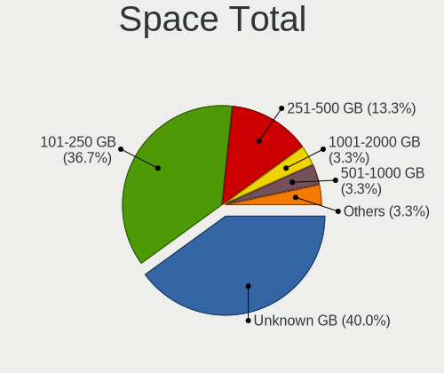
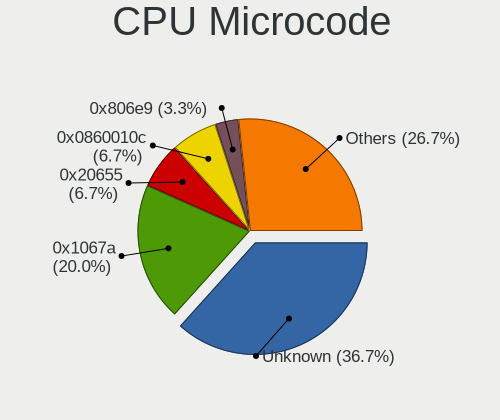
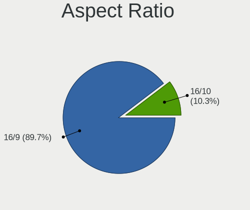
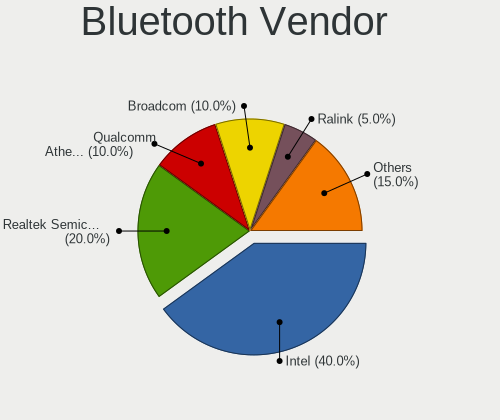
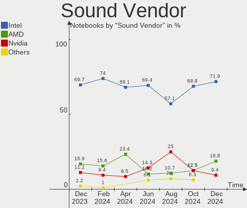
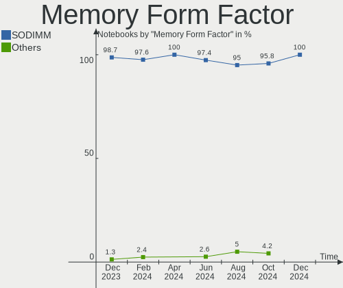

BlackPanther - Hardware Trends (Notebooks)
------------------------------------------

A project to identify most popular hardware characteristics and track their change
over time based on data collected by Linux users at https://Linux-Hardware.org.

Anyone can contribute to this report by the [hw-probe](https://github.com/linuxhw/hw-probe) tool:

    sudo -E hw-probe -all -upload

This report is for one last month. Overall report since the beginning of time: [TestDays](https://github.com/linuxhw/TestDays)

Period: Jan, 2024.

Contents
--------

* [ System ](#system)
  - [ OS                       ](#os)
  - [ OS Family                ](#os-family)
  - [ Kernel                   ](#kernel)
  - [ Kernel Family            ](#kernel-family)
  - [ Kernel Major Ver.        ](#kernel-major-ver)
  - [ Arch                     ](#arch)
  - [ DE                       ](#de)
  - [ Display Server           ](#display-server)
  - [ Display Manager          ](#display-manager)
  - [ OS Lang                  ](#os-lang)
  - [ Boot Mode                ](#boot-mode)
  - [ Filesystem               ](#filesystem)
  - [ Part. scheme             ](#part-scheme)
  - [ Dual Boot with Linux/BSD ](#dual-boot-with-linuxbsd)
  - [ Dual Boot (Win)          ](#dual-boot-win)

* [ Board ](#board)
  - [ Vendor                   ](#vendor)
  - [ Model                    ](#model)
  - [ Model Family             ](#model-family)
  - [ MFG Year                 ](#mfg-year)
  - [ Form Factor              ](#form-factor)
  - [ Secure Boot              ](#secure-boot)
  - [ Coreboot                 ](#coreboot)
  - [ RAM Size                 ](#ram-size)
  - [ RAM Used                 ](#ram-used)
  - [ Total Drives             ](#total-drives)
  - [ Has CD-ROM               ](#has-cd-rom)
  - [ Has Ethernet             ](#has-ethernet)
  - [ Has WiFi                 ](#has-wifi)
  - [ Has Bluetooth            ](#has-bluetooth)

* [ Location ](#location)
  - [ Country                  ](#country)
  - [ City                     ](#city)

* [ Drives ](#drives)
  - [ Drive Vendor             ](#drive-vendor)
  - [ Drive Model              ](#drive-model)
  - [ HDD Vendor               ](#hdd-vendor)
  - [ SSD Vendor               ](#ssd-vendor)
  - [ Drive Kind               ](#drive-kind)
  - [ Drive Connector          ](#drive-connector)
  - [ Drive Size               ](#drive-size)
  - [ Space Total              ](#space-total)
  - [ Space Used               ](#space-used)
  - [ Malfunc. Drives          ](#malfunc-drives)
  - [ Malfunc. Drive Vendor    ](#malfunc-drive-vendor)
  - [ Malfunc. HDD Vendor      ](#malfunc-hdd-vendor)
  - [ Malfunc. Drive Kind      ](#malfunc-drive-kind)
  - [ Failed Drives            ](#failed-drives)
  - [ Failed Drive Vendor      ](#failed-drive-vendor)
  - [ Drive Status             ](#drive-status)

* [ Storage controller ](#storage-controller)
  - [ Storage Vendor           ](#storage-vendor)
  - [ Storage Model            ](#storage-model)
  - [ Storage Kind             ](#storage-kind)

* [ Processor ](#processor)
  - [ CPU Vendor               ](#cpu-vendor)
  - [ CPU Model                ](#cpu-model)
  - [ CPU Model Family         ](#cpu-model-family)
  - [ CPU Cores                ](#cpu-cores)
  - [ CPU Sockets              ](#cpu-sockets)
  - [ CPU Threads              ](#cpu-threads)
  - [ CPU Op-Modes             ](#cpu-op-modes)
  - [ CPU Microcode            ](#cpu-microcode)
  - [ CPU Microarch            ](#cpu-microarch)

* [ Graphics ](#graphics)
  - [ GPU Vendor               ](#gpu-vendor)
  - [ GPU Model                ](#gpu-model)
  - [ GPU Combo                ](#gpu-combo)
  - [ GPU Driver               ](#gpu-driver)
  - [ GPU Memory               ](#gpu-memory)

* [ Monitor ](#monitor)
  - [ Monitor Vendor           ](#monitor-vendor)
  - [ Monitor Model            ](#monitor-model)
  - [ Monitor Resolution       ](#monitor-resolution)
  - [ Monitor Diagonal         ](#monitor-diagonal)
  - [ Monitor Width            ](#monitor-width)
  - [ Aspect Ratio             ](#aspect-ratio)
  - [ Monitor Area             ](#monitor-area)
  - [ Pixel Density            ](#pixel-density)
  - [ Multiple Monitors        ](#multiple-monitors)

* [ Network ](#network)
  - [ Net Controller Vendor    ](#net-controller-vendor)
  - [ Net Controller Model     ](#net-controller-model)
  - [ Wireless Vendor          ](#wireless-vendor)
  - [ Wireless Model           ](#wireless-model)
  - [ Ethernet Vendor          ](#ethernet-vendor)
  - [ Ethernet Model           ](#ethernet-model)
  - [ Net Controller Kind      ](#net-controller-kind)
  - [ Used Controller          ](#used-controller)
  - [ NICs                     ](#nics)
  - [ IPv6                     ](#ipv6)

* [ Bluetooth ](#bluetooth)
  - [ Bluetooth Vendor         ](#bluetooth-vendor)
  - [ Bluetooth Model          ](#bluetooth-model)

* [ Sound ](#sound)
  - [ Sound Vendor             ](#sound-vendor)
  - [ Sound Model              ](#sound-model)

* [ Memory ](#memory)
  - [ Memory Vendor            ](#memory-vendor)
  - [ Memory Model             ](#memory-model)
  - [ Memory Kind              ](#memory-kind)
  - [ Memory Form Factor       ](#memory-form-factor)
  - [ Memory Size              ](#memory-size)
  - [ Memory Speed             ](#memory-speed)

* [ Printers & scanners ](#printers--scanners)
  - [ Printer Vendor           ](#printer-vendor)
  - [ Printer Model            ](#printer-model)
  - [ Scanner Vendor           ](#scanner-vendor)
  - [ Scanner Model            ](#scanner-model)

* [ Camera ](#camera)
  - [ Camera Vendor            ](#camera-vendor)
  - [ Camera Model             ](#camera-model)

* [ Security ](#security)
  - [ Fingerprint Vendor       ](#fingerprint-vendor)
  - [ Fingerprint Model        ](#fingerprint-model)
  - [ Chipcard Vendor          ](#chipcard-vendor)
  - [ Chipcard Model           ](#chipcard-model)

* [ Unsupported ](#unsupported)
  - [ Unsupported Devices      ](#unsupported-devices)
  - [ Unsupported Device Types ](#unsupported-device-types)

System
------

OS
--

Installed operating systems

| Name              | Notebooks | Percent |
|-------------------|-----------|---------|
| BlackPanther 18.1 | 77        | 92.77%  |
| BlackPanther 22.1 | 5         | 6.02%   |
| BlackPanther 16.1 | 1         | 1.2%    |

OS Family
---------

OS without a version

| Name         | Notebooks | Percent |
|--------------|-----------|---------|
| BlackPanther | 83        | 100%    |

Kernel
------

Version of the Linux kernel

| Version             | Notebooks | Percent |
|---------------------|-----------|---------|
| 5.15.85-desktop-1bP | 42        | 50.6%   |
| 5.6.14-desktop-2bP  | 18        | 21.69%  |
| 4.18.16-desktop-1bP | 15        | 18.07%  |
| 6.3.8-desktop-1bP   | 3         | 3.61%   |
| 6.6.11-power-1bP    | 1         | 1.2%    |
| 6.5.3-power-1bP     | 1         | 1.2%    |
| 6.3.3-desktop-1bP   | 1         | 1.2%    |
| 5.6.14-server-2bP   | 1         | 1.2%    |
| 4.7.0-desktop-1bP   | 1         | 1.2%    |

Kernel Family
-------------

Linux kernel without a distro release

| Version | Notebooks | Percent |
|---------|-----------|---------|
| 5.15.85 | 42        | 50.6%   |
| 5.6.14  | 19        | 22.89%  |
| 4.18.16 | 15        | 18.07%  |
| 6.3.8   | 3         | 3.61%   |
| 6.6.11  | 1         | 1.2%    |
| 6.5.3   | 1         | 1.2%    |
| 6.3.3   | 1         | 1.2%    |
| 4.7.0   | 1         | 1.2%    |

Kernel Major Ver.
-----------------

Linux kernel major version

| Version | Notebooks | Percent |
|---------|-----------|---------|
| 5.15    | 42        | 50.6%   |
| 5.6     | 19        | 22.89%  |
| 4.18    | 15        | 18.07%  |
| 6.3     | 4         | 4.82%   |
| 6.6     | 1         | 1.2%    |
| 6.5     | 1         | 1.2%    |
| 4.7     | 1         | 1.2%    |

Arch
----

OS architecture (x86_64, i586, etc.)

| Name   | Notebooks | Percent |
|--------|-----------|---------|
| x86_64 | 82        | 98.8%   |
| i686   | 1         | 1.2%    |

DE
--

Desktop Environment

| Name    | Notebooks | Percent |
|---------|-----------|---------|
| KDE5    | 79        | 95.18%  |
| Unknown | 4         | 4.82%   |

Display Server
--------------

X11 or Wayland

| Name | Notebooks | Percent |
|------|-----------|---------|
| X11  | 83        | 100%    |

Display Manager
---------------

SDDM, LightDM, etc.

| Name | Notebooks | Percent |
|------|-----------|---------|
| SDDM | 83        | 100%    |

OS Lang
-------

Language

| Lang    | Notebooks | Percent |
|---------|-----------|---------|
| Unknown | 83        | 100%    |

Boot Mode
---------

EFI or BIOS

| Mode | Notebooks | Percent |
|------|-----------|---------|
| EFI  | 44        | 53.01%  |
| BIOS | 39        | 46.99%  |

Filesystem
----------

Type of filesystem

| Type    | Notebooks | Percent |
|---------|-----------|---------|
| Ext4    | 52        | 62.65%  |
| Overlay | 29        | 34.94%  |
| Btrfs   | 2         | 2.41%   |

Part. scheme
------------

Scheme of partitioning

| Type | Notebooks | Percent |
|------|-----------|---------|
| GPT  | 51        | 61.45%  |
| MBR  | 32        | 38.55%  |

Dual Boot with Linux/BSD
------------------------

Hosting more than one Linux/BSD

| Dual boot | Notebooks | Percent |
|-----------|-----------|---------|
| No        | 65        | 78.31%  |
| Yes       | 18        | 21.69%  |

Dual Boot (Win)
---------------

Hosting Linux and Windows

| Dual boot | Notebooks | Percent |
|-----------|-----------|---------|
| No        | 50        | 60.24%  |
| Yes       | 33        | 39.76%  |

Board
-----

Vendor
------

Motherboard manufacturer

| Name                | Notebooks | Percent |
|---------------------|-----------|---------|
| Dell                | 20        | 24.1%   |
| Lenovo              | 16        | 19.28%  |
| Hewlett-Packard     | 10        | 12.05%  |
| ASUSTek Computer    | 10        | 12.05%  |
| Acer                | 7         | 8.43%   |
| Fujitsu             | 4         | 4.82%   |
| eMachines           | 3         | 3.61%   |
| Apple               | 3         | 3.61%   |
| Toshiba             | 2         | 2.41%   |
| Samsung Electronics | 2         | 2.41%   |
| Fujitsu Siemens     | 2         | 2.41%   |
| Sony                | 1         | 1.2%    |
| MSI                 | 1         | 1.2%    |
| Medion              | 1         | 1.2%    |
| AWOW                | 1         | 1.2%    |

Model
-----

Motherboard model

| Name                                 | Notebooks | Percent |
|--------------------------------------|-----------|---------|
| HP 250 G1                            | 3         | 3.61%   |
| Fujitsu LIFEBOOK A530                | 2         | 2.41%   |
| eMachines E725                       | 2         | 2.41%   |
| Dell Latitude 5480                   | 2         | 2.41%   |
| Dell Inspiron 3521                   | 2         | 2.41%   |
| Dell Inspiron 15-3567                | 2         | 2.41%   |
| Toshiba Satellite M50D-A             | 1         | 1.2%    |
| Toshiba Satellite L500               | 1         | 1.2%    |
| Sony VPCS13V9E                       | 1         | 1.2%    |
| Samsung NC10                         | 1         | 1.2%    |
| Samsung 300E4C/300E5C/300E7C         | 1         | 1.2%    |
| MSI GT60 2OC/2OD                     | 1         | 1.2%    |
| Medion E7218                         | 1         | 1.2%    |
| Lenovo V15-ADA 82C7                  | 1         | 1.2%    |
| Lenovo ThinkPad X250 20CLS1JN00      | 1         | 1.2%    |
| Lenovo ThinkPad T540p 20BE003YUK     | 1         | 1.2%    |
| Lenovo ThinkPad T440s 20ARA0Y500     | 1         | 1.2%    |
| Lenovo ThinkPad T420 4236B87         | 1         | 1.2%    |
| Lenovo ThinkPad T410 2537VFQ         | 1         | 1.2%    |
| Lenovo ThinkPad T410 2537BF9         | 1         | 1.2%    |
| Lenovo ThinkPad T400 2768WGB         | 1         | 1.2%    |
| Lenovo IdeaPad 700-15ISK 80RU        | 1         | 1.2%    |
| Lenovo IdeaPad 330-15IKB 81DE        | 1         | 1.2%    |
| Lenovo IdeaPad 3-15ITL6 82H8         | 1         | 1.2%    |
| Lenovo IdeaPad 110-15ACL 80TJ        | 1         | 1.2%    |
| Lenovo IdeaPad 100-15IBY 80MJ        | 1         | 1.2%    |
| Lenovo G505s 20255                   | 1         | 1.2%    |
| Lenovo Flex 2-15D 20377              | 1         | 1.2%    |
| Lenovo B50-30 20382                  | 1         | 1.2%    |
| HP ProBook 650 G2                    | 1         | 1.2%    |
| HP Pavilion Gaming Laptop 15-ec1xxx  | 1         | 1.2%    |
| HP Pavilion dv6                      | 1         | 1.2%    |
| HP Notebook                          | 1         | 1.2%    |
| HP Laptop 15-dw1xxx                  | 1         | 1.2%    |
| HP EliteBook 8570w                   | 1         | 1.2%    |
| HP 650                               | 1         | 1.2%    |
| Fujitsu Siemens LIFEBOOK S7110       | 1         | 1.2%    |
| Fujitsu Siemens ESPRIMO Mobile U9210 | 1         | 1.2%    |
| Fujitsu LIFEBOOK A555                | 1         | 1.2%    |
| Fujitsu LIFEBOOK A512                | 1         | 1.2%    |

Model Family
------------

Motherboard model prefix

| Name                     | Notebooks | Percent |
|--------------------------|-----------|---------|
| Dell Inspiron            | 10        | 12.05%  |
| Dell Latitude            | 9         | 10.84%  |
| Lenovo ThinkPad          | 7         | 8.43%   |
| Lenovo IdeaPad           | 5         | 6.02%   |
| Acer Aspire              | 5         | 6.02%   |
| Fujitsu LIFEBOOK         | 4         | 4.82%   |
| HP 250                   | 3         | 3.61%   |
| Toshiba Satellite        | 2         | 2.41%   |
| HP Pavilion              | 2         | 2.41%   |
| eMachines E725           | 2         | 2.41%   |
| Acer TravelMate          | 2         | 2.41%   |
| Sony VPCS13V9E           | 1         | 1.2%    |
| Samsung NC10             | 1         | 1.2%    |
| Samsung 300E4C           | 1         | 1.2%    |
| MSI GT60                 | 1         | 1.2%    |
| Medion E7218             | 1         | 1.2%    |
| Lenovo V15-ADA           | 1         | 1.2%    |
| Lenovo G505s             | 1         | 1.2%    |
| Lenovo Flex              | 1         | 1.2%    |
| Lenovo B50-30            | 1         | 1.2%    |
| HP ProBook               | 1         | 1.2%    |
| HP Notebook              | 1         | 1.2%    |
| HP Laptop                | 1         | 1.2%    |
| HP EliteBook             | 1         | 1.2%    |
| HP 650                   | 1         | 1.2%    |
| Fujitsu Siemens LIFEBOOK | 1         | 1.2%    |
| Fujitsu Siemens ESPRIMO  | 1         | 1.2%    |
| eMachines E525           | 1         | 1.2%    |
| Dell Vostro              | 1         | 1.2%    |
| AWOW AK41                | 1         | 1.2%    |
| ASUS ZenBook             | 1         | 1.2%    |
| ASUS X55U                | 1         | 1.2%    |
| ASUS X551CA              | 1         | 1.2%    |
| ASUS X541SA              | 1         | 1.2%    |
| ASUS X541NA              | 1         | 1.2%    |
| ASUS X200MA              | 1         | 1.2%    |
| ASUS K54HR               | 1         | 1.2%    |
| ASUS G551JW              | 1         | 1.2%    |
| ASUS ASUS                | 1         | 1.2%    |
| ASUS 1001PX              | 1         | 1.2%    |

MFG Year
--------

Motherboard manufacture year

| Year | Notebooks | Percent |
|------|-----------|---------|
| 2013 | 13        | 15.66%  |
| 2012 | 11        | 13.25%  |
| 2009 | 10        | 12.05%  |
| 2015 | 9         | 10.84%  |
| 2016 | 7         | 8.43%   |
| 2011 | 6         | 7.23%   |
| 2020 | 4         | 4.82%   |
| 2017 | 4         | 4.82%   |
| 2014 | 4         | 4.82%   |
| 2010 | 4         | 4.82%   |
| 2008 | 3         | 3.61%   |
| 2021 | 2         | 2.41%   |
| 2018 | 2         | 2.41%   |
| 2006 | 2         | 2.41%   |
| 2023 | 1         | 1.2%    |
| 2019 | 1         | 1.2%    |

Form Factor
-----------

Physical design of the computer

| Name     | Notebooks | Percent |
|----------|-----------|---------|
| Notebook | 83        | 100%    |

Secure Boot
-----------

Enabled or disabled

| State    | Notebooks | Percent |
|----------|-----------|---------|
| Disabled | 83        | 100%    |

Coreboot
--------

Have coreboot on board

| Used | Notebooks | Percent |
|------|-----------|---------|
| No   | 83        | 100%    |

RAM Size
--------

Total RAM memory

| Size in GB | Notebooks | Percent |
|------------|-----------|---------|
| 4.01-8.0   | 26        | 31.33%  |
| 3.01-4.0   | 24        | 28.92%  |
| 8.01-16.0  | 17        | 20.48%  |
| 1.01-2.0   | 8         | 9.64%   |
| 16.01-24.0 | 4         | 4.82%   |
| 2.01-3.0   | 3         | 3.61%   |
| 24.01-32.0 | 1         | 1.2%    |

RAM Used
--------

Used RAM memory

| Used GB    | Notebooks | Percent |
|------------|-----------|---------|
| 1.01-2.0   | 46        | 55.42%  |
| 0.51-1.0   | 21        | 25.3%   |
| 2.01-3.0   | 7         | 8.43%   |
| 3.01-4.0   | 3         | 3.61%   |
| 0.01-0.5   | 3         | 3.61%   |
| 4.01-8.0   | 2         | 2.41%   |
| 16.01-24.0 | 1         | 1.2%    |

Total Drives
------------

Number of drives on board

| Drives | Notebooks | Percent |
|--------|-----------|---------|
| 1      | 63        | 75.9%   |
| 2      | 16        | 19.28%  |
| 3      | 4         | 4.82%   |

Has CD-ROM
----------

Has CD-ROM on board

| Presented | Notebooks | Percent |
|-----------|-----------|---------|
| Yes       | 44        | 53.01%  |
| No        | 39        | 46.99%  |

Has Ethernet
------------

Has Ethernet on board

| Presented | Notebooks | Percent |
|-----------|-----------|---------|
| Yes       | 78        | 93.98%  |
| No        | 5         | 6.02%   |

Has WiFi
--------

Has WiFi module

| Presented | Notebooks | Percent |
|-----------|-----------|---------|
| Yes       | 81        | 97.59%  |
| No        | 2         | 2.41%   |

Has Bluetooth
-------------

Has Bluetooth module

| Presented | Notebooks | Percent |
|-----------|-----------|---------|
| Yes       | 67        | 80.72%  |
| No        | 16        | 19.28%  |

Location
--------

Country
-------

Geographic location (country)

| Country      | Notebooks | Percent |
|--------------|-----------|---------|
| Hungary      | 68        | 81.93%  |
| UK           | 6         | 7.23%   |
| Slovakia     | 2         | 2.41%   |
| Austria      | 2         | 2.41%   |
| South Africa | 1         | 1.2%    |
| Netherlands  | 1         | 1.2%    |
| Germany      | 1         | 1.2%    |
| Croatia      | 1         | 1.2%    |
| Canada       | 1         | 1.2%    |

City
----

Geographic location (city)

| City                    | Notebooks | Percent |
|-------------------------|-----------|---------|
| Budapest                | 18        | 21.69%  |
| Tatabánya              | 4         | 4.82%   |
| Berettyóújfalu        | 4         | 4.82%   |
| Pomaz                   | 3         | 3.61%   |
| Miskolc                 | 3         | 3.61%   |
| Zalaegerszeg            | 2         | 2.41%   |
| Vienna                  | 2         | 2.41%   |
| Tamasi                  | 2         | 2.41%   |
| Pécs                   | 2         | 2.41%   |
| Debrecen                | 2         | 2.41%   |
| Csongrad                | 2         | 2.41%   |
| Crewe                   | 2         | 2.41%   |
| Cegled                  | 2         | 2.41%   |
| Balassagyarmat          | 2         | 2.41%   |
| Vinkovci                | 1         | 1.2%    |
| Tornaľa                | 1         | 1.2%    |
| Tiszaujvaros            | 1         | 1.2%    |
| Taksony                 | 1         | 1.2%    |
| Szombathely             | 1         | 1.2%    |
| Szolnok                 | 1         | 1.2%    |
| Szigethalom             | 1         | 1.2%    |
| Szentes                 | 1         | 1.2%    |
| Szeghalom               | 1         | 1.2%    |
| Sopron                  | 1         | 1.2%    |
| Retsag                  | 1         | 1.2%    |
| Prešov                 | 1         | 1.2%    |
| Pfaffenhofen an der Ilm | 1         | 1.2%    |
| Nyiregyhaza             | 1         | 1.2%    |
| Nagykoroes              | 1         | 1.2%    |
| Lochem                  | 1         | 1.2%    |
| Lambeth                 | 1         | 1.2%    |
| Keszthely               | 1         | 1.2%    |
| Kazincbarcika           | 1         | 1.2%    |
| Harlow                  | 1         | 1.2%    |
| Halasztelek             | 1         | 1.2%    |
| Hajdusamson             | 1         | 1.2%    |
| Gyal                    | 1         | 1.2%    |
| Greenwich               | 1         | 1.2%    |
| Fertoszentmiklos        | 1         | 1.2%    |
| Dunaharaszti            | 1         | 1.2%    |

Drives
------

Drive Vendor
------------

Hard drive vendors

| Vendor                      | Notebooks | Drives | Percent |
|-----------------------------|-----------|--------|---------|
| Kingston                    | 16        | 17     | 15.09%  |
| Seagate                     | 14        | 14     | 13.21%  |
| Samsung Electronics         | 14        | 14     | 13.21%  |
| WDC                         | 9         | 10     | 8.49%   |
| HGST                        | 6         | 6      | 5.66%   |
| Toshiba                     | 5         | 5      | 4.72%   |
| A-DATA Technology           | 5         | 5      | 4.72%   |
| Unknown                     | 4         | 4      | 3.77%   |
| SanDisk                     | 4         | 4      | 3.77%   |
| SK hynix                    | 3         | 3      | 2.83%   |
| Intenso                     | 3         | 3      | 2.83%   |
| Hitachi                     | 3         | 3      | 2.83%   |
| SPCC                        | 2         | 2      | 1.89%   |
| PNY                         | 2         | 2      | 1.89%   |
| Intel                       | 2         | 2      | 1.89%   |
| Transcend                   | 1         | 1      | 0.94%   |
| TO Exter                    | 1         | 1      | 0.94%   |
| Timetec                     | 1         | 1      | 0.94%   |
| Team                        | 1         | 1      | 0.94%   |
| Micron Technology           | 1         | 1      | 0.94%   |
| LITEONIT                    | 1         | 1      | 0.94%   |
| LITEON                      | 1         | 1      | 0.94%   |
| KIOXIA                      | 1         | 1      | 0.94%   |
| Kingston Technology Company | 1         | 1      | 0.94%   |
| JMicron Technology          | 1         | 1      | 0.94%   |
| Crucial                     | 1         | 1      | 0.94%   |
| ASENNO                      | 1         | 1      | 0.94%   |
| Apple                       | 1         | 1      | 0.94%   |
| Unknown                     | 1         | 1      | 0.94%   |

Drive Model
-----------

Hard drive models

| Model                                   | Notebooks | Percent |
|-----------------------------------------|-----------|---------|
| Kingston SA400S37480G 480GB SSD         | 4         | 3.7%    |
| Kingston SA400S37240G 240GB SSD         | 4         | 3.7%    |
| Kingston SA400S37120G 120GB SSD         | 4         | 3.7%    |
| SPCC Solid State Disk 256GB             | 2         | 1.85%   |
| Seagate ST9320325AS 320GB               | 2         | 1.85%   |
| Seagate ST500LT012-1DG142 500GB         | 2         | 1.85%   |
| Seagate ST1000LM024 HN-M101MBB 1TB      | 2         | 1.85%   |
| Seagate Expansion 1TB                   | 2         | 1.85%   |
| Samsung SSD 870 EVO 250GB               | 2         | 1.85%   |
| Samsung SSD 750 EVO 250GB               | 2         | 1.85%   |
| HGST HTS545032A7E380 320GB              | 2         | 1.85%   |
| A-DATA SU650 240GB SSD                  | 2         | 1.85%   |
| WDC WD5000LPVX-22V0TT0 500GB            | 1         | 0.93%   |
| WDC WD5000LPCX-24VHAT0 500GB            | 1         | 0.93%   |
| WDC WD5000LPCX-24C6HT0 500GB            | 1         | 0.93%   |
| WDC WD5000BEKT-22KA9T0 500GB            | 1         | 0.93%   |
| WDC WD2500BEVT-00ZCT0 250GB             | 1         | 0.93%   |
| WDC WD10JPVX-75JC3T0 1TB                | 1         | 0.93%   |
| WDC WD10JPVX-60JC3T0 1TB                | 1         | 0.93%   |
| WDC WD10JPVX-22JC3T0 1TB                | 1         | 0.93%   |
| WDC WD10JPLX-00MBPT0 1TB                | 1         | 0.93%   |
| WDC WD Green 2.5 240GB SSD              | 1         | 0.93%   |
| Unknown SD64G  64GB                     | 1         | 0.93%   |
| Unknown SD/MMC/MS PRO 256GB             | 1         | 0.93%   |
| Unknown MMC Card  32GB                  | 1         | 0.93%   |
| Unknown 032G34  32GB                    | 1         | 0.93%   |
| Transcend TS120GMTS420S 120GB SSD       | 1         | 0.93%   |
| Toshiba MQ01ABD100 1TB                  | 1         | 0.93%   |
| Toshiba MQ01ABD050 500GB                | 1         | 0.93%   |
| Toshiba MK2576GSX 250GB                 | 1         | 0.93%   |
| Toshiba MK2555GSX 250GB                 | 1         | 0.93%   |
| Toshiba KSG60ZMV256G M.2 2280 256GB SSD | 1         | 0.93%   |
| TO Exter nal USB 3.0 512GB              | 1         | 0.93%   |
| Timetec SD08 512GB SSD                  | 1         | 0.93%   |
| Team T253X1120G 120GB SSD               | 1         | 0.93%   |
| SK hynix SC311 SATA 256GB SSD           | 1         | 0.93%   |
| SK hynix HFS256G3BTND-N210A 256GB SSD   | 1         | 0.93%   |
| SK hynix HFM512GD3JX013N 512GB          | 1         | 0.93%   |
| Seagate ST9500420AS 500GB               | 1         | 0.93%   |
| Seagate ST9500325AS 500GB               | 1         | 0.93%   |

HDD Vendor
----------

Hard disk drive vendors

| Vendor              | Notebooks | Drives | Percent |
|---------------------|-----------|--------|---------|
| Seagate             | 14        | 14     | 35.9%   |
| WDC                 | 8         | 9      | 20.51%  |
| HGST                | 6         | 6      | 15.38%  |
| Toshiba             | 4         | 4      | 10.26%  |
| Hitachi             | 3         | 3      | 7.69%   |
| Unknown             | 1         | 1      | 2.56%   |
| TO Exter            | 1         | 1      | 2.56%   |
| Samsung Electronics | 1         | 1      | 2.56%   |
| JMicron Technology  | 1         | 1      | 2.56%   |

SSD Vendor
----------

Solid state drive vendors

| Vendor              | Notebooks | Drives | Percent |
|---------------------|-----------|--------|---------|
| Kingston            | 15        | 16     | 28.3%   |
| Samsung Electronics | 10        | 10     | 18.87%  |
| A-DATA Technology   | 5         | 5      | 9.43%   |
| SanDisk             | 3         | 3      | 5.66%   |
| Intenso             | 3         | 3      | 5.66%   |
| SPCC                | 2         | 2      | 3.77%   |
| SK hynix            | 2         | 2      | 3.77%   |
| PNY                 | 2         | 2      | 3.77%   |
| WDC                 | 1         | 1      | 1.89%   |
| Transcend           | 1         | 1      | 1.89%   |
| Toshiba             | 1         | 1      | 1.89%   |
| Timetec             | 1         | 1      | 1.89%   |
| Team                | 1         | 1      | 1.89%   |
| Micron Technology   | 1         | 1      | 1.89%   |
| LITEONIT            | 1         | 1      | 1.89%   |
| Intel               | 1         | 1      | 1.89%   |
| Crucial             | 1         | 1      | 1.89%   |
| ASENNO              | 1         | 1      | 1.89%   |
| Apple               | 1         | 1      | 1.89%   |

Drive Kind
----------

HDD or SSD

| Kind | Notebooks | Drives | Percent |
|------|-----------|--------|---------|
| SSD  | 50        | 54     | 49.5%   |
| HDD  | 37        | 40     | 36.63%  |
| NVMe | 10        | 10     | 9.9%    |
| MMC  | 4         | 4      | 3.96%   |

Drive Connector
---------------

SATA, SAS, NVMe, etc.

| Type | Notebooks | Drives | Percent |
|------|-----------|--------|---------|
| SATA | 76        | 88     | 80%     |
| NVMe | 10        | 10     | 10.53%  |
| SAS  | 5         | 6      | 5.26%   |
| MMC  | 4         | 4      | 4.21%   |

Drive Size
----------

Size of hard drive

| Size in TB | Notebooks | Drives | Percent |
|------------|-----------|--------|---------|
| 0.01-0.5   | 66        | 75     | 78.57%  |
| 0.51-1.0   | 18        | 19     | 21.43%  |

Space Total
-----------

Amount of disk space available on the file system

| Size in GB | Notebooks | Percent |
|------------|-----------|---------|
| 101-250    | 27        | 32.53%  |
| Unknown    | 24        | 28.92%  |
| 251-500    | 18        | 21.69%  |
| 1001-2000  | 5         | 6.02%   |
| 501-1000   | 5         | 6.02%   |
| 21-50      | 3         | 3.61%   |
| 51-100     | 1         | 1.2%    |

Space Used
----------

Amount of used disk space

| Used GB   | Notebooks | Percent |
|-----------|-----------|---------|
| Unknown   | 24        | 28.92%  |
| 1-20      | 15        | 18.07%  |
| 101-250   | 14        | 16.87%  |
| 21-50     | 13        | 15.66%  |
| 51-100    | 12        | 14.46%  |
| 251-500   | 3         | 3.61%   |
| 1001-2000 | 1         | 1.2%    |
| 501-1000  | 1         | 1.2%    |

Malfunc. Drives
---------------

Drive models with a malfunction

| Model                                 | Notebooks | Drives | Percent |
|---------------------------------------|-----------|--------|---------|
| Seagate ST9320325AS 320GB             | 2         | 2      | 7.41%   |
| Seagate ST500LT012-1DG142 500GB       | 2         | 2      | 7.41%   |
| HGST HTS545032A7E380 320GB            | 2         | 2      | 7.41%   |
| WDC WD5000LPVX-22V0TT0 500GB          | 1         | 1      | 3.7%    |
| WDC WD5000BEKT-22KA9T0 500GB          | 1         | 1      | 3.7%    |
| WDC WD2500BEVT-00ZCT0 250GB           | 1         | 1      | 3.7%    |
| WDC WD10JPLX-00MBPT0 1TB              | 1         | 1      | 3.7%    |
| WDC WD Green 2.5 240GB SSD            | 1         | 1      | 3.7%    |
| Toshiba MQ01ABD050 500GB              | 1         | 1      | 3.7%    |
| Toshiba MK2555GSX 250GB               | 1         | 1      | 3.7%    |
| Timetec SD08 512GB SSD                | 1         | 1      | 3.7%    |
| Seagate ST9500420AS 500GB             | 1         | 1      | 3.7%    |
| Seagate ST9160301AS 160GB             | 1         | 1      | 3.7%    |
| Seagate ST500LT012-9WS142 500GB       | 1         | 1      | 3.7%    |
| Seagate ST500LM000-SSHD-8GB           | 1         | 1      | 3.7%    |
| Samsung Electronics SSD 750 EVO 250GB | 1         | 1      | 3.7%    |
| Samsung Electronics HM321HI 320GB     | 1         | 1      | 3.7%    |
| Kingston SA400S37120G 120GB SSD       | 1         | 1      | 3.7%    |
| Intel SSDSC2KF240H6L 240GB            | 1         | 1      | 3.7%    |
| Hitachi HTS547550A9E384 500GB         | 1         | 1      | 3.7%    |
| Hitachi HTS545050A7E380 500GB         | 1         | 1      | 3.7%    |
| Hitachi HTS543225L9A300 250GB         | 1         | 1      | 3.7%    |
| HGST HTS541010A9E680 1TB              | 1         | 1      | 3.7%    |
| Apple SSD TS064E 64GB                 | 1         | 1      | 3.7%    |

Malfunc. Drive Vendor
---------------------

Vendors of faulty drives

| Vendor              | Notebooks | Drives | Percent |
|---------------------|-----------|--------|---------|
| Seagate             | 8         | 8      | 30.77%  |
| WDC                 | 4         | 5      | 15.38%  |
| Hitachi             | 3         | 3      | 11.54%  |
| HGST                | 3         | 3      | 11.54%  |
| Toshiba             | 2         | 2      | 7.69%   |
| Samsung Electronics | 2         | 2      | 7.69%   |
| Timetec             | 1         | 1      | 3.85%   |
| Kingston            | 1         | 1      | 3.85%   |
| Intel               | 1         | 1      | 3.85%   |
| Apple               | 1         | 1      | 3.85%   |

Malfunc. HDD Vendor
-------------------

Vendors of faulty HDD drives

| Vendor              | Notebooks | Drives | Percent |
|---------------------|-----------|--------|---------|
| Seagate             | 8         | 8      | 40%     |
| WDC                 | 3         | 4      | 15%     |
| Hitachi             | 3         | 3      | 15%     |
| HGST                | 3         | 3      | 15%     |
| Toshiba             | 2         | 2      | 10%     |
| Samsung Electronics | 1         | 1      | 5%      |

Malfunc. Drive Kind
-------------------

Kinds of faulty drives

| Kind | Notebooks | Drives | Percent |
|------|-----------|--------|---------|
| HDD  | 20        | 21     | 76.92%  |
| SSD  | 6         | 6      | 23.08%  |

Failed Drives
-------------

Failed drive models

Zero info for selected period =(

Failed Drive Vendor
-------------------

Failed drive vendors

Zero info for selected period =(

Drive Status
------------

Number of failed and malfunc. drives

| Status   | Notebooks | Drives | Percent |
|----------|-----------|--------|---------|
| Works    | 61        | 71     | 64.21%  |
| Malfunc  | 26        | 27     | 27.37%  |
| Detected | 8         | 10     | 8.42%   |

Storage controller
------------------

Storage Vendor
--------------

Storage controller vendors

| Vendor                       | Notebooks | Percent |
|------------------------------|-----------|---------|
| Intel                        | 70        | 77.78%  |
| AMD                          | 9         | 10%     |
| Samsung Electronics          | 3         | 3.33%   |
| Nvidia                       | 2         | 2.22%   |
| Kingston Technology Company  | 2         | 2.22%   |
| Toshiba America Info Systems | 1         | 1.11%   |
| SK hynix                     | 1         | 1.11%   |
| SanDisk                      | 1         | 1.11%   |
| Lite-On Technology           | 1         | 1.11%   |

Storage Model
-------------

Storage controller models

| Model                                                                                  | Notebooks | Percent |
|----------------------------------------------------------------------------------------|-----------|---------|
| Intel 7 Series Chipset Family 6-port SATA Controller [AHCI mode]                       | 12        | 12.5%   |
| AMD FCH SATA Controller [AHCI mode]                                                    | 8         | 8.33%   |
| Intel Sunrise Point-LP SATA Controller [AHCI mode]                                     | 7         | 7.29%   |
| Intel 82801IBM/IEM (ICH9M/ICH9M-E) 4 port SATA Controller [AHCI mode]                  | 6         | 6.25%   |
| Intel Wildcat Point-LP SATA Controller [AHCI Mode]                                     | 5         | 5.21%   |
| Intel 82801 Mobile SATA Controller [RAID mode]                                         | 5         | 5.21%   |
| Intel 6 Series/C200 Series Chipset Family 6 port Mobile SATA AHCI Controller           | 4         | 4.17%   |
| Intel 5 Series/3400 Series Chipset 4 port SATA AHCI Controller                         | 4         | 4.17%   |
| Intel Atom Processor E3800 Series SATA AHCI Controller                                 | 3         | 3.13%   |
| Intel 8 Series/C220 Series Chipset Family 6-port SATA Controller 1 [AHCI mode]         | 3         | 3.13%   |
| Intel 8 Series SATA Controller 1 [AHCI mode]                                           | 3         | 3.13%   |
| Samsung NVMe SSD Controller 980 (DRAM-less)                                            | 2         | 2.08%   |
| Nvidia MCP79 AHCI Controller                                                           | 2         | 2.08%   |
| Intel Volume Management Device NVMe RAID Controller                                    | 2         | 2.08%   |
| Intel Tiger Lake-LP SATA Controller                                                    | 2         | 2.08%   |
| Intel HM170/QM170 Chipset SATA Controller [AHCI Mode]                                  | 2         | 2.08%   |
| Intel Celeron N3350/Pentium N4200/Atom E3900 Series SATA AHCI Controller               | 2         | 2.08%   |
| Intel 82801IBM/IEM (ICH9M/ICH9M-E) 2 port SATA Controller [IDE mode]                   | 2         | 2.08%   |
| Intel 82801GBM/GHM (ICH7-M Family) SATA Controller [IDE mode]                          | 2         | 2.08%   |
| Intel 5 Series/3400 Series Chipset 6 port SATA AHCI Controller                         | 2         | 2.08%   |
| Toshiba America Info Systems XG6 NVMe SSD Controller                                   | 1         | 1.04%   |
| SK hynix Gold P31/BC711/PC711 NVMe Solid State Drive                                   | 1         | 1.04%   |
| SanDisk Ultra 3D / WD Blue SN570 NVMe SSD (DRAM-less)                                  | 1         | 1.04%   |
| Samsung NVMe SSD Controller SM981/PM981/PM983                                          | 1         | 1.04%   |
| Lite-On CA3-8D256, CA3-8D512 NVMe SSD                                                  | 1         | 1.04%   |
| Kingston Company NV2 NVMe SSD SM2267XT (DRAM-less)                                     | 1         | 1.04%   |
| Kingston Company A1000/U-SNS8154P3 x2 NVMe SSD                                         | 1         | 1.04%   |
| Intel SSD 670p Series [Keystone Harbor]                                                | 1         | 1.04%   |
| Intel NM10/ICH7 Family SATA Controller [IDE mode]                                      | 1         | 1.04%   |
| Intel Comet Lake SATA AHCI Controller                                                  | 1         | 1.04%   |
| Intel Celeron/Pentium Silver Processor SATA Controller                                 | 1         | 1.04%   |
| Intel Atom/Celeron/Pentium Processor x5-E8000/J3xxx/N3xxx Series SATA Controller       | 1         | 1.04%   |
| Intel 82801GBM/GHM (ICH7-M Family) SATA Controller [AHCI mode]                         | 1         | 1.04%   |
| Intel 82801G (ICH7 Family) IDE Controller                                              | 1         | 1.04%   |
| Intel 6 Series/C200 Series Chipset Family Mobile SATA Controller (IDE mode, ports 4-5) | 1         | 1.04%   |
| Intel 6 Series/C200 Series Chipset Family Mobile SATA Controller (IDE mode, ports 0-3) | 1         | 1.04%   |
| AMD FCH SATA Controller [IDE mode]                                                     | 1         | 1.04%   |
| AMD FCH IDE Controller                                                                 | 1         | 1.04%   |

Storage Kind
------------

Kind of storage controller (IDE, SATA, NVMe, SAS, ...)

| Kind | Notebooks | Percent |
|------|-----------|---------|
| SATA | 70        | 73.68%  |
| NVMe | 10        | 10.53%  |
| IDE  | 8         | 8.42%   |
| RAID | 7         | 7.37%   |

Processor
---------

CPU Vendor
----------

Processor vendors

| Vendor | Notebooks | Percent |
|--------|-----------|---------|
| Intel  | 73        | 87.95%  |
| AMD    | 10        | 12.05%  |

CPU Model
---------

Processor models

| Model                                       | Notebooks | Percent |
|---------------------------------------------|-----------|---------|
| Intel Core 2 Duo CPU P8600 @ 2.40GHz        | 4         | 4.82%   |
| Intel Core i5-7200U CPU @ 2.50GHz           | 3         | 3.61%   |
| Intel Celeron CPU 1000M @ 1.80GHz           | 3         | 3.61%   |
| Intel Pentium Dual-Core CPU T4400 @ 2.20GHz | 2         | 2.41%   |
| Intel Core i7-4700MQ CPU @ 2.40GHz          | 2         | 2.41%   |
| Intel Core i5-6200U CPU @ 2.30GHz           | 2         | 2.41%   |
| Intel Core i5-5200U CPU @ 2.20GHz           | 2         | 2.41%   |
| Intel Core i5-2540M CPU @ 2.60GHz           | 2         | 2.41%   |
| Intel Core i5-2520M CPU @ 2.50GHz           | 2         | 2.41%   |
| Intel Core i5 CPU M 520 @ 2.40GHz           | 2         | 2.41%   |
| Intel Core i3-3217U CPU @ 1.80GHz           | 2         | 2.41%   |
| Intel Core i3-10110U CPU @ 2.10GHz          | 2         | 2.41%   |
| Intel Core i3 CPU M 350 @ 2.27GHz           | 2         | 2.41%   |
| Intel Celeron CPU N3350 @ 1.10GHz           | 2         | 2.41%   |
| Intel Celeron CPU N2840 @ 2.16GHz           | 2         | 2.41%   |
| Intel Pentium Dual-Core CPU T4300 @ 2.10GHz | 1         | 1.2%    |
| Intel Pentium CPU N3710 @ 1.60GHz           | 1         | 1.2%    |
| Intel Pentium CPU B970 @ 2.30GHz            | 1         | 1.2%    |
| Intel Pentium CPU B950 @ 2.10GHz            | 1         | 1.2%    |
| Intel Genuine CPU U7300 @ 1.30GHz           | 1         | 1.2%    |
| Intel Core i7-6820HQ CPU @ 2.70GHz          | 1         | 1.2%    |
| Intel Core i7-6600U CPU @ 2.60GHz           | 1         | 1.2%    |
| Intel Core i7-5500U CPU @ 2.40GHz           | 1         | 1.2%    |
| Intel Core i7-4810MQ CPU @ 2.80GHz          | 1         | 1.2%    |
| Intel Core i7-4600U CPU @ 2.10GHz           | 1         | 1.2%    |
| Intel Core i7-4510U CPU @ 2.00GHz           | 1         | 1.2%    |
| Intel Core i7-3720QM CPU @ 2.60GHz          | 1         | 1.2%    |
| Intel Core i7-3632QM CPU @ 2.20GHz          | 1         | 1.2%    |
| Intel Core i5-8250U CPU @ 1.60GHz           | 1         | 1.2%    |
| Intel Core i5-7300U CPU @ 2.60GHz           | 1         | 1.2%    |
| Intel Core i5-6300HQ CPU @ 2.30GHz          | 1         | 1.2%    |
| Intel Core i5-5300U CPU @ 2.30GHz           | 1         | 1.2%    |
| Intel Core i5-4200U CPU @ 1.60GHz           | 1         | 1.2%    |
| Intel Core i5-4200H CPU @ 2.80GHz           | 1         | 1.2%    |
| Intel Core i5-3427U CPU @ 1.80GHz           | 1         | 1.2%    |
| Intel Core i5-3340M CPU @ 2.70GHz           | 1         | 1.2%    |
| Intel Core i5 CPU M 460 @ 2.53GHz           | 1         | 1.2%    |
| Intel Core i3-6006U CPU @ 2.00GHz           | 1         | 1.2%    |
| Intel Core i3-5005U CPU @ 2.00GHz           | 1         | 1.2%    |
| Intel Core i3-3227U CPU @ 1.90GHz           | 1         | 1.2%    |

CPU Model Family
----------------

Processor model prefix

| Model                   | Notebooks | Percent |
|-------------------------|-----------|---------|
| Intel Core i5           | 22        | 26.51%  |
| Intel Core i3           | 12        | 14.46%  |
| Intel Core i7           | 10        | 12.05%  |
| Intel Celeron           | 10        | 12.05%  |
| Intel Core 2 Duo        | 5         | 6.02%   |
| Intel Pentium Dual-Core | 3         | 3.61%   |
| Intel Pentium           | 3         | 3.61%   |
| AMD Ryzen 5             | 3         | 3.61%   |
| AMD A8                  | 3         | 3.61%   |
| Other                   | 2         | 2.41%   |
| Intel Core 2            | 2         | 2.41%   |
| Intel Atom              | 2         | 2.41%   |
| Intel Genuine           | 1         | 1.2%    |
| Intel Celeron Dual-Core | 1         | 1.2%    |
| AMD E2                  | 1         | 1.2%    |
| AMD E1                  | 1         | 1.2%    |
| AMD C-70                | 1         | 1.2%    |
| AMD A4                  | 1         | 1.2%    |

CPU Cores
---------

Number of processor cores

| Number | Notebooks | Percent |
|--------|-----------|---------|
| 2      | 64        | 77.11%  |
| 4      | 14        | 16.87%  |
| 1      | 3         | 3.61%   |
| 6      | 2         | 2.41%   |

CPU Sockets
-----------

Number of sockets

| Number | Notebooks | Percent |
|--------|-----------|---------|
| 1      | 83        | 100%    |

CPU Threads
-----------

Threads per core (Hyper-Threading)

| Number | Notebooks | Percent |
|--------|-----------|---------|
| 2      | 52        | 62.65%  |
| 1      | 31        | 37.35%  |

CPU Op-Modes
------------

CPU Operation Modes (32-bit, 64-bit)

| Op mode        | Notebooks | Percent |
|----------------|-----------|---------|
| 32-bit, 64-bit | 82        | 98.8%   |
| 32-bit         | 1         | 1.2%    |

CPU Microcode
-------------

Microcode number

| Number     | Notebooks | Percent |
|------------|-----------|---------|
| Unknown    | 11        | 13.25%  |
| 0x306a9    | 10        | 12.05%  |
| 0x206a7    | 8         | 9.64%   |
| 0x1067a    | 8         | 9.64%   |
| 0x20655    | 4         | 4.82%   |
| 0x406e3    | 3         | 3.61%   |
| 0x306d4    | 3         | 3.61%   |
| 0x306c3    | 3         | 3.61%   |
| 0x806ec    | 2         | 2.41%   |
| 0x806e9    | 2         | 2.41%   |
| 0x6f6      | 2         | 2.41%   |
| 0x506c9    | 2         | 2.41%   |
| 0x40651    | 2         | 2.41%   |
| 0x30678    | 2         | 2.41%   |
| 0x20652    | 2         | 2.41%   |
| 0x10676    | 2         | 2.41%   |
| 0x05000119 | 2         | 2.41%   |
| 0x806ea    | 1         | 1.2%    |
| 0x806c1    | 1         | 1.2%    |
| 0x706a1    | 1         | 1.2%    |
| 0x506e3    | 1         | 1.2%    |
| 0x406c4    | 1         | 1.2%    |
| 0x30673    | 1         | 1.2%    |
| 0x106ca    | 1         | 1.2%    |
| 0x106c2    | 1         | 1.2%    |
| 0x08608103 | 1         | 1.2%    |
| 0x08600109 | 1         | 1.2%    |
| 0x07030105 | 1         | 1.2%    |
| 0x07030104 | 1         | 1.2%    |
| 0x0700010f | 1         | 1.2%    |
| 0x06003109 | 1         | 1.2%    |
| 0x06001119 | 1         | 1.2%    |

CPU Microarch
-------------

Microarchitecture

| Name          | Notebooks | Percent |
|---------------|-----------|---------|
| IvyBridge     | 11        | 13.25%  |
| Penryn        | 10        | 12.05%  |
| SandyBridge   | 8         | 9.64%   |
| KabyLake      | 7         | 8.43%   |
| Haswell       | 7         | 8.43%   |
| Westmere      | 6         | 7.23%   |
| Skylake       | 6         | 7.23%   |
| Broadwell     | 5         | 6.02%   |
| Silvermont    | 4         | 4.82%   |
| TigerLake     | 2         | 2.41%   |
| Puma          | 2         | 2.41%   |
| Goldmont      | 2         | 2.41%   |
| Core          | 2         | 2.41%   |
| Bonnell       | 2         | 2.41%   |
| Bobcat        | 2         | 2.41%   |
| Zen+          | 1         | 1.2%    |
| Zen 2         | 1         | 1.2%    |
| Steamroller   | 1         | 1.2%    |
| Piledriver    | 1         | 1.2%    |
| Jaguar        | 1         | 1.2%    |
| Goldmont plus | 1         | 1.2%    |
| Unknown       | 1         | 1.2%    |

Graphics
--------

GPU Vendor
----------

Vendors of graphics cards

| Vendor | Notebooks | Percent |
|--------|-----------|---------|
| Intel  | 66        | 68.04%  |
| AMD    | 17        | 17.53%  |
| Nvidia | 14        | 14.43%  |

GPU Model
---------

Graphics card models

| Model                                                                                    | Notebooks | Percent |
|------------------------------------------------------------------------------------------|-----------|---------|
| Intel 3rd Gen Core processor Graphics Controller                                         | 10        | 9.71%   |
| Intel 2nd Generation Core Processor Family Integrated Graphics Controller                | 7         | 6.8%    |
| Intel Mobile 4 Series Chipset Integrated Graphics Controller                             | 6         | 5.83%   |
| Intel HD Graphics 5500                                                                   | 5         | 4.85%   |
| Intel Core Processor Integrated Graphics Controller                                      | 5         | 4.85%   |
| Intel Skylake GT2 [HD Graphics 520]                                                      | 4         | 3.88%   |
| Intel HD Graphics 620                                                                    | 4         | 3.88%   |
| Intel 4th Gen Core Processor Integrated Graphics Controller                              | 4         | 3.88%   |
| Intel Mobile 945GM/GMS/GME, 943/940GML Express Integrated Graphics Controller            | 3         | 2.91%   |
| Intel Haswell-ULT Integrated Graphics Controller                                         | 3         | 2.91%   |
| Intel Atom Processor Z36xxx/Z37xxx Series Graphics & Display                             | 3         | 2.91%   |
| Nvidia C79 [GeForce 9400M]                                                               | 2         | 1.94%   |
| Intel Mobile 945GM/GMS, 943/940GML Express Integrated Graphics Controller                | 2         | 1.94%   |
| Intel HD Graphics 530                                                                    | 2         | 1.94%   |
| Intel HD Graphics 500                                                                    | 2         | 1.94%   |
| Intel CometLake-U GT2 [UHD Graphics]                                                     | 2         | 1.94%   |
| AMD Sun XT [Radeon HD 8670A/8670M/8690M / R5 M330 / M430 / Radeon 520 Mobile]            | 2         | 1.94%   |
| Nvidia TU117M [GeForce GTX 1650 Ti Mobile]                                               | 1         | 0.97%   |
| Nvidia GT218M [GeForce 310M]                                                             | 1         | 0.97%   |
| Nvidia GM108M [GeForce 930MX]                                                            | 1         | 0.97%   |
| Nvidia GM108M [GeForce 845M]                                                             | 1         | 0.97%   |
| Nvidia GM107M [GeForce GTX 960M]                                                         | 1         | 0.97%   |
| Nvidia GM107M [GeForce GTX 950M]                                                         | 1         | 0.97%   |
| Nvidia GM107 [GeForce 940MX]                                                             | 1         | 0.97%   |
| Nvidia GK208M [GeForce GT 730M]                                                          | 1         | 0.97%   |
| Nvidia GK208BM [GeForce 920M]                                                            | 1         | 0.97%   |
| Nvidia GK107M [GeForce GT 750M]                                                          | 1         | 0.97%   |
| Nvidia GK107GLM [Quadro K2000M]                                                          | 1         | 0.97%   |
| Nvidia GK106M [GeForce GTX 770M]                                                         | 1         | 0.97%   |
| Nvidia G96CM [GeForce 9600M GT]                                                          | 1         | 0.97%   |
| Intel UHD Graphics 620                                                                   | 1         | 0.97%   |
| Intel TigerLake-LP GT2 [Iris Xe Graphics]                                                | 1         | 0.97%   |
| Intel Tiger Lake-LP GT2 [UHD Graphics G4]                                                | 1         | 0.97%   |
| Intel Mobile 945GSE Express Integrated Graphics Controller                               | 1         | 0.97%   |
| Intel GeminiLake [UHD Graphics 600]                                                      | 1         | 0.97%   |
| Intel Atom/Celeron/Pentium Processor x5-E8000/J3xxx/N3xxx Integrated Graphics Controller | 1         | 0.97%   |
| Intel Atom Processor D4xx/D5xx/N4xx/N5xx Integrated Graphics Controller                  | 1         | 0.97%   |
| AMD Wrestler [Radeon HD 7340]                                                            | 1         | 0.97%   |
| AMD Wrestler [Radeon HD 7290]                                                            | 1         | 0.97%   |
| AMD Sun LE [Radeon HD 8550M / R5 M230]                                                   | 1         | 0.97%   |

GPU Combo
---------

Combinations of graphics cards

| Name           | Notebooks | Percent |
|----------------|-----------|---------|
| 1 x Intel      | 53        | 63.86%  |
| 1 x AMD        | 10        | 12.05%  |
| Intel + Nvidia | 9         | 10.84%  |
| Intel + AMD    | 4         | 4.82%   |
| 1 x Nvidia     | 3         | 3.61%   |
| 2 x AMD        | 2         | 2.41%   |
| 2 x Nvidia     | 1         | 1.2%    |
| AMD + Nvidia   | 1         | 1.2%    |

GPU Driver
----------

Free vs proprietary

| Driver | Notebooks | Percent |
|--------|-----------|---------|
| Free   | 83        | 100%    |

GPU Memory
----------

Total video memory

| Size in GB | Notebooks | Percent |
|------------|-----------|---------|
| Unknown    | 57        | 68.67%  |
| 0.01-0.5   | 10        | 12.05%  |
| 1.01-2.0   | 8         | 9.64%   |
| 0.51-1.0   | 6         | 7.23%   |
| 3.01-4.0   | 2         | 2.41%   |

Monitor
-------

Monitor Vendor
--------------

Monitor vendors

| Vendor                  | Notebooks | Percent |
|-------------------------|-----------|---------|
| LG Display              | 24        | 26.67%  |
| AU Optronics            | 20        | 22.22%  |
| Samsung Electronics     | 10        | 11.11%  |
| Chimei Innolux          | 9         | 10%     |
| BOE                     | 6         | 6.67%   |
| Lenovo                  | 3         | 3.33%   |
| Hewlett-Packard         | 3         | 3.33%   |
| Apple                   | 3         | 3.33%   |
| Ancor Communications    | 2         | 2.22%   |
| Toshiba                 | 1         | 1.11%   |
| Sony                    | 1         | 1.11%   |
| Philips                 | 1         | 1.11%   |
| PANDA                   | 1         | 1.11%   |
| OEM                     | 1         | 1.11%   |
| InnoLux Display         | 1         | 1.11%   |
| HannStar                | 1         | 1.11%   |
| Dell                    | 1         | 1.11%   |
| CPT                     | 1         | 1.11%   |
| Chi Mei Optoelectronics | 1         | 1.11%   |

Monitor Model
-------------

Monitor models

| Model                                                                 | Notebooks | Percent |
|-----------------------------------------------------------------------|-----------|---------|
| LG Display LCD Monitor LGD0395 1366x768 344x194mm 15.5-inch           | 3         | 3.33%   |
| Lenovo LCD Monitor LEN4036 1440x900 303x190mm 14.1-inch               | 3         | 3.33%   |
| Samsung Electronics LCD Monitor SAM0900 1366x768 700x390mm 31.5-inch  | 2         | 2.22%   |
| LG Display LCD Monitor LGD0259 1920x1080 345x194mm 15.6-inch          | 2         | 2.22%   |
| BOE LCD Monitor BOE0690 1920x1080 344x193mm 15.5-inch                 | 2         | 2.22%   |
| AU Optronics LCD Monitor AUO23EC 1366x768 344x193mm 15.5-inch         | 2         | 2.22%   |
| AU Optronics LCD Monitor AUO10EC 1366x768 344x193mm 15.5-inch         | 2         | 2.22%   |
| Toshiba LCD Monitor LCD58E1 1280x800 261x163mm 12.1-inch              | 1         | 1.11%   |
| Sony LCD Monitor SNY05FA 1366x768 340x190mm 15.3-inch                 | 1         | 1.11%   |
| Samsung Electronics LS49A950U SAM71CC 3840x1080 1192x336mm 48.8-inch  | 1         | 1.11%   |
| Samsung Electronics LCD Monitor SEC3157 1280x800 303x190mm 14.1-inch  | 1         | 1.11%   |
| Samsung Electronics LCD Monitor SEC3051 1366x768 344x194mm 15.5-inch  | 1         | 1.11%   |
| Samsung Electronics LCD Monitor SEC3046 1366x768 344x193mm 15.5-inch  | 1         | 1.11%   |
| Samsung Electronics LCD Monitor SDC5441 1366x768 344x194mm 15.5-inch  | 1         | 1.11%   |
| Samsung Electronics LCD Monitor SDC4C48 1920x1080 344x194mm 15.5-inch | 1         | 1.11%   |
| Samsung Electronics LCD Monitor SDC4A52 1366x768 344x194mm 15.5-inch  | 1         | 1.11%   |
| Samsung Electronics LCD Monitor SDC324C 1920x1080 344x194mm 15.5-inch | 1         | 1.11%   |
| Philips PHL 272V8 PHLC21A 1920x1080 600x340mm 27.2-inch               | 1         | 1.11%   |
| PANDA LCD Monitor NCP0058 1920x1080 344x194mm 15.5-inch               | 1         | 1.11%   |
| OEM 19W_LCD_TV OEM3700 1920x540                                       | 1         | 1.11%   |
| LG Display LP156WH2-TLBA LGD026C 1366x768 344x194mm 15.5-inch         | 1         | 1.11%   |
| LG Display LCD Monitor LGD6616 1366x768 277x156mm 12.5-inch           | 1         | 1.11%   |
| LG Display LCD Monitor LGD6302 1366x768 344x194mm 15.5-inch           | 1         | 1.11%   |
| LG Display LCD Monitor LGD06F5 1920x1080 344x194mm 15.5-inch          | 1         | 1.11%   |
| LG Display LCD Monitor LGD0589 1920x1080 294x165mm 13.3-inch          | 1         | 1.11%   |
| LG Display LCD Monitor LGD054F 1920x1080 344x194mm 15.5-inch          | 1         | 1.11%   |
| LG Display LCD Monitor LGD0525 1366x768 344x194mm 15.5-inch           | 1         | 1.11%   |
| LG Display LCD Monitor LGD0506 1366x768 344x194mm 15.5-inch           | 1         | 1.11%   |
| LG Display LCD Monitor LGD04FC 1366x768 344x194mm 15.5-inch           | 1         | 1.11%   |
| LG Display LCD Monitor LGD04B9 1920x1080 344x194mm 15.5-inch          | 1         | 1.11%   |
| LG Display LCD Monitor LGD040A 1920x1080 309x175mm 14.0-inch          | 1         | 1.11%   |
| LG Display LCD Monitor LGD03ED 1366x768 277x156mm 12.5-inch           | 1         | 1.11%   |
| LG Display LCD Monitor LGD03DD 1366x768 344x194mm 15.5-inch           | 1         | 1.11%   |
| LG Display LCD Monitor LGD03AB 1366x768 344x194mm 15.5-inch           | 1         | 1.11%   |
| LG Display LCD Monitor LGD036C 1366x768 277x156mm 12.5-inch           | 1         | 1.11%   |
| LG Display LCD Monitor LGD0365 1600x900 382x215mm 17.3-inch           | 1         | 1.11%   |
| LG Display LCD Monitor LGD0353 1366x768 345x194mm 15.6-inch           | 1         | 1.11%   |
| LG Display LCD Monitor LGD02DC 1366x768 344x194mm 15.5-inch           | 1         | 1.11%   |
| LG Display LCD Monitor LGD02CF 1366x768 344x194mm 15.5-inch           | 1         | 1.11%   |
| InnoLux Display LCD Monitor INL0006 1366x768 344x194mm 15.5-inch      | 1         | 1.11%   |

Monitor Resolution
------------------

Monitor screen resolution

| Resolution         | Notebooks | Percent |
|--------------------|-----------|---------|
| 1366x768 (WXGA)    | 42        | 48.28%  |
| 1920x1080 (FHD)    | 24        | 27.59%  |
| 1440x900 (WXGA+)   | 6         | 6.9%    |
| 1600x900 (HD+)     | 5         | 5.75%   |
| 1680x1050 (WSXGA+) | 2         | 2.3%    |
| 1280x800 (WXGA)    | 2         | 2.3%    |
| 1024x600           | 2         | 2.3%    |
| 3840x2160 (4K)     | 1         | 1.15%   |
| 3840x1080          | 1         | 1.15%   |
| 1920x540           | 1         | 1.15%   |
| 1920x1200 (WUXGA)  | 1         | 1.15%   |

Monitor Diagonal
----------------

Diagonal size in inches

| Inches | Notebooks | Percent |
|--------|-----------|---------|
| 15     | 49        | 54.44%  |
| 13     | 9         | 10%     |
| 14     | 6         | 6.67%   |
| 12     | 5         | 5.56%   |
| 17     | 4         | 4.44%   |
| 31     | 2         | 2.22%   |
| 27     | 2         | 2.22%   |
| 20     | 2         | 2.22%   |
| 18     | 2         | 2.22%   |
| 11     | 2         | 2.22%   |
| 10     | 2         | 2.22%   |
| 48     | 1         | 1.11%   |
| 25     | 1         | 1.11%   |
| 24     | 1         | 1.11%   |
| 22     | 1         | 1.11%   |
| 21     | 1         | 1.11%   |

Monitor Width
-------------

Physical width

| Width in mm | Notebooks | Percent |
|-------------|-----------|---------|
| 301-350     | 59        | 66.29%  |
| 201-300     | 14        | 15.73%  |
| 351-400     | 5         | 5.62%   |
| 501-600     | 4         | 4.49%   |
| 401-500     | 4         | 4.49%   |
| 601-700     | 2         | 2.25%   |
| 1001-1500   | 1         | 1.12%   |

Aspect Ratio
------------

Proportional relationship between the width and the height

| Ratio | Notebooks | Percent |
|-------|-----------|---------|
| 16/9  | 73        | 85.88%  |
| 16/10 | 11        | 12.94%  |
| 32/9  | 1         | 1.18%   |

Monitor Area
------------

Area in inch²

| Area in inch² | Notebooks | Percent |
|----------------|-----------|---------|
| 101-110        | 48        | 53.33%  |
| 81-90          | 11        | 12.22%  |
| 61-70          | 5         | 5.56%   |
| 71-80          | 4         | 4.44%   |
| 201-250        | 3         | 3.33%   |
| 121-130        | 3         | 3.33%   |
| 51-60          | 2         | 2.22%   |
| 351-500        | 2         | 2.22%   |
| 41-50          | 2         | 2.22%   |
| 301-350        | 2         | 2.22%   |
| 151-200        | 2         | 2.22%   |
| 141-150        | 2         | 2.22%   |
| 251-300        | 1         | 1.11%   |
| 131-140        | 1         | 1.11%   |
| 501-1000       | 1         | 1.11%   |
| 91-100         | 1         | 1.11%   |

Pixel Density
-------------

Pixels per inch

| Density | Notebooks | Percent |
|---------|-----------|---------|
| 101-120 | 45        | 51.14%  |
| 121-160 | 32        | 36.36%  |
| 51-100  | 7         | 7.95%   |
| 1-50    | 2         | 2.27%   |
| 161-240 | 2         | 2.27%   |

Multiple Monitors
-----------------

Total monitors connected

| Total | Notebooks | Percent |
|-------|-----------|---------|
| 1     | 75        | 90.36%  |
| 2     | 6         | 7.23%   |
| 3     | 2         | 2.41%   |

Network
-------

Net Controller Vendor
---------------------

Controller vendors

| Vendor                   | Notebooks | Percent |
|--------------------------|-----------|---------|
| Realtek Semiconductor    | 42        | 31.34%  |
| Intel                    | 34        | 25.37%  |
| Qualcomm Atheros         | 33        | 24.63%  |
| Broadcom                 | 9         | 6.72%   |
| Ralink                   | 4         | 2.99%   |
| Ralink Technology        | 2         | 1.49%   |
| Nvidia                   | 2         | 1.49%   |
| Marvell Technology Group | 2         | 1.49%   |
| Broadcom Limited         | 2         | 1.49%   |
| Xiaomi                   | 1         | 0.75%   |
| Samsung Electronics      | 1         | 0.75%   |
| DisplayLink              | 1         | 0.75%   |
| Dell                     | 1         | 0.75%   |

Net Controller Model
--------------------

Controller models

| Model                                                                   | Notebooks | Percent |
|-------------------------------------------------------------------------|-----------|---------|
| Realtek RTL8111/8168/8211/8411 PCI Express Gigabit Ethernet Controller  | 25        | 15.24%  |
| Realtek RTL810xE PCI Express Fast Ethernet controller                   | 16        | 9.76%   |
| Qualcomm Atheros QCA9565 / AR9565 Wireless Network Adapter              | 7         | 4.27%   |
| Qualcomm Atheros AR9285 Wireless Network Adapter (PCI-Express)          | 6         | 3.66%   |
| Qualcomm Atheros QCA9377 802.11ac Wireless Network Adapter              | 5         | 3.05%   |
| Intel Wireless 7260                                                     | 5         | 3.05%   |
| Qualcomm Atheros AR8132 Fast Ethernet                                   | 4         | 2.44%   |
| Intel Wireless 8265 / 8275                                              | 4         | 2.44%   |
| Intel Wireless 7265                                                     | 4         | 2.44%   |
| Intel 82579LM Gigabit Network Connection (Lewisville)                   | 4         | 2.44%   |
| Realtek RTL8723BE PCIe Wireless Network Adapter                         | 3         | 1.83%   |
| Ralink RT3290 Wireless 802.11n 1T/1R PCIe                               | 3         | 1.83%   |
| Qualcomm Atheros AR9485 Wireless Network Adapter                        | 3         | 1.83%   |
| Qualcomm Atheros AR9462 Wireless Network Adapter                        | 3         | 1.83%   |
| Intel Centrino Advanced-N 6200                                          | 3         | 1.83%   |
| Realtek RTL8822CE 802.11ac PCIe Wireless Network Adapter                | 2         | 1.22%   |
| Qualcomm Atheros AR8151 v2.0 Gigabit Ethernet                           | 2         | 1.22%   |
| Qualcomm Atheros AR242x / AR542x Wireless Network Adapter (PCI-Express) | 2         | 1.22%   |
| Nvidia MCP79 Ethernet                                                   | 2         | 1.22%   |
| Intel Wireless 3165                                                     | 2         | 1.22%   |
| Intel Wireless 3160                                                     | 2         | 1.22%   |
| Intel Wi-Fi 6 AX201                                                     | 2         | 1.22%   |
| Intel Ethernet Connection I218-LM                                       | 2         | 1.22%   |
| Intel Ethernet Connection I217-LM                                       | 2         | 1.22%   |
| Intel Ethernet Connection (4) I219-LM                                   | 2         | 1.22%   |
| Intel Centrino Ultimate-N 6300                                          | 2         | 1.22%   |
| Intel 82577LM Gigabit Network Connection                                | 2         | 1.22%   |
| Broadcom NetLink BCM57785 Gigabit Ethernet PCIe                         | 2         | 1.22%   |
| Broadcom Limited BCM4312 802.11b/g LP-PHY                               | 2         | 1.22%   |
| Broadcom BCM43228 802.11a/b/g/n                                         | 2         | 1.22%   |
| Broadcom BCM4322 802.11a/b/g/n Wireless LAN Controller                  | 2         | 1.22%   |
| Xiaomi Mi/Redmi series (RNDIS)                                          | 1         | 0.61%   |
| Samsung HSPA Modem                                                      | 1         | 0.61%   |
| Realtek RTL8821AE 802.11ac PCIe Wireless Network Adapter                | 1         | 0.61%   |
| Realtek RTL8187B Wireless Adapter                                       | 1         | 0.61%   |
| Realtek RTL8153 Gigabit Ethernet Adapter                                | 1         | 0.61%   |
| Ralink RT5372 Wireless Adapter                                          | 1         | 0.61%   |
| Ralink MT7601U Wireless Adapter                                         | 1         | 0.61%   |
| Ralink RT5390 Wireless 802.11n 1T/1R PCIe                               | 1         | 0.61%   |
| Qualcomm Atheros QCA8172 Fast Ethernet                                  | 1         | 0.61%   |

Wireless Vendor
---------------

Wireless vendors

| Vendor                | Notebooks | Percent |
|-----------------------|-----------|---------|
| Intel                 | 33        | 39.29%  |
| Qualcomm Atheros      | 29        | 34.52%  |
| Realtek Semiconductor | 7         | 8.33%   |
| Broadcom              | 6         | 7.14%   |
| Ralink                | 4         | 4.76%   |
| Ralink Technology     | 2         | 2.38%   |
| Broadcom Limited      | 2         | 2.38%   |
| Dell                  | 1         | 1.19%   |

Wireless Model
--------------

Wireless models

| Model                                                                   | Notebooks | Percent |
|-------------------------------------------------------------------------|-----------|---------|
| Qualcomm Atheros QCA9565 / AR9565 Wireless Network Adapter              | 7         | 8.33%   |
| Qualcomm Atheros AR9285 Wireless Network Adapter (PCI-Express)          | 6         | 7.14%   |
| Qualcomm Atheros QCA9377 802.11ac Wireless Network Adapter              | 5         | 5.95%   |
| Intel Wireless 7260                                                     | 5         | 5.95%   |
| Intel Wireless 8265 / 8275                                              | 4         | 4.76%   |
| Intel Wireless 7265                                                     | 4         | 4.76%   |
| Realtek RTL8723BE PCIe Wireless Network Adapter                         | 3         | 3.57%   |
| Ralink RT3290 Wireless 802.11n 1T/1R PCIe                               | 3         | 3.57%   |
| Qualcomm Atheros AR9485 Wireless Network Adapter                        | 3         | 3.57%   |
| Qualcomm Atheros AR9462 Wireless Network Adapter                        | 3         | 3.57%   |
| Intel Centrino Advanced-N 6200                                          | 3         | 3.57%   |
| Realtek RTL8822CE 802.11ac PCIe Wireless Network Adapter                | 2         | 2.38%   |
| Qualcomm Atheros AR242x / AR542x Wireless Network Adapter (PCI-Express) | 2         | 2.38%   |
| Intel Wireless 3165                                                     | 2         | 2.38%   |
| Intel Wireless 3160                                                     | 2         | 2.38%   |
| Intel Wi-Fi 6 AX201                                                     | 2         | 2.38%   |
| Intel Centrino Ultimate-N 6300                                          | 2         | 2.38%   |
| Broadcom Limited BCM4312 802.11b/g LP-PHY                               | 2         | 2.38%   |
| Broadcom BCM43228 802.11a/b/g/n                                         | 2         | 2.38%   |
| Broadcom BCM4322 802.11a/b/g/n Wireless LAN Controller                  | 2         | 2.38%   |
| Realtek RTL8821AE 802.11ac PCIe Wireless Network Adapter                | 1         | 1.19%   |
| Realtek RTL8187B Wireless Adapter                                       | 1         | 1.19%   |
| Ralink RT5372 Wireless Adapter                                          | 1         | 1.19%   |
| Ralink MT7601U Wireless Adapter                                         | 1         | 1.19%   |
| Ralink RT5390 Wireless 802.11n 1T/1R PCIe                               | 1         | 1.19%   |
| Qualcomm Atheros QCA6174 802.11ac Wireless Network Adapter              | 1         | 1.19%   |
| Qualcomm Atheros AR9287 Wireless Network Adapter (PCI-Express)          | 1         | 1.19%   |
| Qualcomm Atheros AR2427 802.11bg Wireless Network Adapter (PCI-Express) | 1         | 1.19%   |
| Intel Wireless 8260                                                     | 1         | 1.19%   |
| Intel WiFi Link 5100                                                    | 1         | 1.19%   |
| Intel PRO/Wireless 5100 AGN [Shiloh] Network Connection                 | 1         | 1.19%   |
| Intel Gemini Lake PCH CNVi WiFi                                         | 1         | 1.19%   |
| Intel Comet Lake PCH-LP CNVi WiFi                                       | 1         | 1.19%   |
| Intel Centrino Wireless-N 2230                                          | 1         | 1.19%   |
| Intel Centrino Wireless-N 1030 [Rainbow Peak]                           | 1         | 1.19%   |
| Intel Centrino Advanced-N 6235                                          | 1         | 1.19%   |
| Intel Centrino Advanced-N 6205 [Taylor Peak]                            | 1         | 1.19%   |
| Dell DW5811e Snapdragon™ X7 LTE                                    | 1         | 1.19%   |
| Broadcom BCM43224 802.11a/b/g/n                                         | 1         | 1.19%   |
| Broadcom BCM43142 802.11b/g/n                                           | 1         | 1.19%   |

Ethernet Vendor
---------------

Ethernet vendors

| Vendor                   | Notebooks | Percent |
|--------------------------|-----------|---------|
| Realtek Semiconductor    | 42        | 53.16%  |
| Intel                    | 17        | 21.52%  |
| Qualcomm Atheros         | 10        | 12.66%  |
| Broadcom                 | 4         | 5.06%   |
| Nvidia                   | 2         | 2.53%   |
| Marvell Technology Group | 2         | 2.53%   |
| Xiaomi                   | 1         | 1.27%   |
| DisplayLink              | 1         | 1.27%   |

Ethernet Model
--------------

Ethernet models

| Model                                                                  | Notebooks | Percent |
|------------------------------------------------------------------------|-----------|---------|
| Realtek RTL8111/8168/8211/8411 PCI Express Gigabit Ethernet Controller | 25        | 31.65%  |
| Realtek RTL810xE PCI Express Fast Ethernet controller                  | 16        | 20.25%  |
| Qualcomm Atheros AR8132 Fast Ethernet                                  | 4         | 5.06%   |
| Intel 82579LM Gigabit Network Connection (Lewisville)                  | 4         | 5.06%   |
| Qualcomm Atheros AR8151 v2.0 Gigabit Ethernet                          | 2         | 2.53%   |
| Nvidia MCP79 Ethernet                                                  | 2         | 2.53%   |
| Intel Ethernet Connection I218-LM                                      | 2         | 2.53%   |
| Intel Ethernet Connection I217-LM                                      | 2         | 2.53%   |
| Intel Ethernet Connection (4) I219-LM                                  | 2         | 2.53%   |
| Intel 82577LM Gigabit Network Connection                               | 2         | 2.53%   |
| Broadcom NetLink BCM57785 Gigabit Ethernet PCIe                        | 2         | 2.53%   |
| Xiaomi Mi/Redmi series (RNDIS)                                         | 1         | 1.27%   |
| Realtek RTL8153 Gigabit Ethernet Adapter                               | 1         | 1.27%   |
| Qualcomm Atheros QCA8172 Fast Ethernet                                 | 1         | 1.27%   |
| Qualcomm Atheros Killer E220x Gigabit Ethernet Controller              | 1         | 1.27%   |
| Qualcomm Atheros AR8161 Gigabit Ethernet                               | 1         | 1.27%   |
| Qualcomm Atheros AR8131 Gigabit Ethernet                               | 1         | 1.27%   |
| Marvell Group 88E8055 PCI-E Gigabit Ethernet Controller                | 1         | 1.27%   |
| Marvell Group 88E8040 PCI-E Fast Ethernet Controller                   | 1         | 1.27%   |
| Intel Ethernet Connection (3) I218-LM                                  | 1         | 1.27%   |
| Intel Ethernet Connection (2) I219-LM                                  | 1         | 1.27%   |
| Intel Ethernet Connection (13) I219-V                                  | 1         | 1.27%   |
| Intel 82567LM Gigabit Network Connection                               | 1         | 1.27%   |
| Intel 82567LF Gigabit Network Connection                               | 1         | 1.27%   |
| DisplayLink USB3 to HDMI                                               | 1         | 1.27%   |
| Broadcom NetXtreme BCM5761 Gigabit Ethernet PCIe                       | 1         | 1.27%   |
| Broadcom BCM4401-B0 100Base-TX                                         | 1         | 1.27%   |

Net Controller Kind
-------------------

Ethernet, WiFi or modem

| Kind     | Notebooks | Percent |
|----------|-----------|---------|
| WiFi     | 81        | 50.63%  |
| Ethernet | 78        | 48.75%  |
| Modem    | 1         | 0.63%   |

Used Controller
---------------

Currently used network controller

| Kind     | Notebooks | Percent |
|----------|-----------|---------|
| WiFi     | 72        | 82.76%  |
| Ethernet | 15        | 17.24%  |

NICs
----

Total network controllers on board

| Total | Notebooks | Percent |
|-------|-----------|---------|
| 2     | 74        | 89.16%  |
| 1     | 8         | 9.64%   |
| 0     | 1         | 1.2%    |

IPv6
----

IPv6 vs IPv4

| Used | Notebooks | Percent |
|------|-----------|---------|
| No   | 47        | 56.63%  |
| Yes  | 36        | 43.37%  |

Bluetooth
---------

Bluetooth Vendor
----------------

Controller vendors

| Vendor                          | Notebooks | Percent |
|---------------------------------|-----------|---------|
| Intel                           | 25        | 37.31%  |
| Qualcomm Atheros Communications | 12        | 17.91%  |
| Realtek Semiconductor           | 5         | 7.46%   |
| Ralink                          | 3         | 4.48%   |
| Broadcom                        | 3         | 4.48%   |
| Apple                           | 3         | 4.48%   |
| Toshiba                         | 2         | 2.99%   |
| Lite-On Technology              | 2         | 2.99%   |
| IMC Networks                    | 2         | 2.99%   |
| Foxconn / Hon Hai               | 2         | 2.99%   |
| Dell                            | 2         | 2.99%   |
| Cambridge Silicon Radio         | 2         | 2.99%   |
| Askey Computer                  | 2         | 2.99%   |
| Foxconn International           | 1         | 1.49%   |
| Chicony Electronics             | 1         | 1.49%   |

Bluetooth Model
---------------

Controller models

| Model                                               | Notebooks | Percent |
|-----------------------------------------------------|-----------|---------|
| Intel Bluetooth wireless interface                  | 18        | 26.87%  |
| Realtek Bluetooth Radio                             | 5         | 7.46%   |
| Qualcomm Atheros  Bluetooth Device                  | 4         | 5.97%   |
| Qualcomm Atheros AR3012 Bluetooth 4.0               | 4         | 5.97%   |
| Ralink RT3290 Bluetooth                             | 3         | 4.48%   |
| Qualcomm Atheros AR9462 Bluetooth                   | 2         | 2.99%   |
| Lite-On Qualcomm Atheros QCA9377 Bluetooth          | 2         | 2.99%   |
| Intel Centrino Bluetooth Wireless Transceiver       | 2         | 2.99%   |
| Intel Bluetooth 9460/9560 Jefferson Peak (JfP)      | 2         | 2.99%   |
| Intel AX201 Bluetooth                               | 2         | 2.99%   |
| Cambridge Silicon Radio Bluetooth Dongle (HCI mode) | 2         | 2.99%   |
| Broadcom BCM2045B (BDC-2.1)                         | 2         | 2.99%   |
| Askey Bluetooth Device                              | 2         | 2.99%   |
| Apple Bluetooth Host Controller                     | 2         | 2.99%   |
| Toshiba Bluetooth Device                            | 1         | 1.49%   |
| Toshiba Askey for                                   | 1         | 1.49%   |
| Qualcomm Atheros QCA61x4 Bluetooth 4.0              | 1         | 1.49%   |
| Qualcomm Atheros AR3012 Bluetooth                   | 1         | 1.49%   |
| Intel Bluetooth Device                              | 1         | 1.49%   |
| IMC Networks Bluetooth Device                       | 1         | 1.49%   |
| IMC Networks Atheros AR3012 Bluetooth               | 1         | 1.49%   |
| Foxconn International BCM43142A0 Bluetooth module   | 1         | 1.49%   |
| Foxconn / Hon Hai BCM20702A0                        | 1         | 1.49%   |
| Foxconn / Hon Hai Acer Bluetooth module             | 1         | 1.49%   |
| Dell Wireless 360 Bluetooth                         | 1         | 1.49%   |
| Dell DW375 Bluetooth Module                         | 1         | 1.49%   |
| Chicony Bluetooth Radio                             | 1         | 1.49%   |
| Broadcom HP Portable SoftSailing                    | 1         | 1.49%   |
| Apple Built-in Bluetooth 2.0+EDR HCI                | 1         | 1.49%   |

Sound
-----

Sound Vendor
------------

Sound card vendors

| Vendor              | Notebooks | Percent |
|---------------------|-----------|---------|
| Intel               | 71        | 75.53%  |
| AMD                 | 13        | 13.83%  |
| Nvidia              | 8         | 8.51%   |
| Logitech            | 1         | 1.06%   |
| Creative Technology | 1         | 1.06%   |

Sound Model
-----------

Sound card models

| Model                                                                                             | Notebooks | Percent |
|---------------------------------------------------------------------------------------------------|-----------|---------|
| Intel 7 Series/C216 Chipset Family High Definition Audio Controller                               | 13        | 11.4%   |
| Intel Sunrise Point-LP HD Audio                                                                   | 9         | 7.89%   |
| Intel 82801I (ICH9 Family) HD Audio Controller                                                    | 8         | 7.02%   |
| AMD FCH Azalia Controller                                                                         | 7         | 6.14%   |
| Intel 6 Series/C200 Series Chipset Family High Definition Audio Controller                        | 6         | 5.26%   |
| Intel 5 Series/3400 Series Chipset High Definition Audio                                          | 6         | 5.26%   |
| Intel Wildcat Point-LP High Definition Audio Controller                                           | 5         | 4.39%   |
| Intel Broadwell-U Audio Controller                                                                | 5         | 4.39%   |
| Intel NM10/ICH7 Family High Definition Audio Controller                                           | 4         | 3.51%   |
| Intel 8 Series/C220 Series Chipset High Definition Audio Controller                               | 4         | 3.51%   |
| Intel Xeon E3-1200 v3/4th Gen Core Processor HD Audio Controller                                  | 3         | 2.63%   |
| Intel Haswell-ULT HD Audio Controller                                                             | 3         | 2.63%   |
| Intel Atom Processor Z36xxx/Z37xxx Series High Definition Audio Controller                        | 3         | 2.63%   |
| Intel 8 Series HD Audio Controller                                                                | 3         | 2.63%   |
| AMD Kabini HDMI/DP Audio                                                                          | 3         | 2.63%   |
| AMD Family 17h/19h HD Audio Controller                                                            | 3         | 2.63%   |
| Nvidia MCP79 High Definition Audio                                                                | 2         | 1.75%   |
| Intel Tiger Lake-LP Smart Sound Technology Audio Controller                                       | 2         | 1.75%   |
| Intel Comet Lake PCH-LP cAVS                                                                      | 2         | 1.75%   |
| Intel Celeron N3350/Pentium N4200/Atom E3900 Series Audio Cluster                                 | 2         | 1.75%   |
| Intel 100 Series/C230 Series Chipset Family HD Audio Controller                                   | 2         | 1.75%   |
| AMD Wrestler HDMI Audio                                                                           | 2         | 1.75%   |
| Nvidia TU107 GeForce GTX 1650 High Definition Audio Controller                                    | 1         | 0.88%   |
| Nvidia High Definition Audio Controller                                                           | 1         | 0.88%   |
| Nvidia GM107 High Definition Audio Controller [GeForce 940MX]                                     | 1         | 0.88%   |
| Nvidia GK208 HDMI/DP Audio Controller                                                             | 1         | 0.88%   |
| Nvidia GK107 HDMI Audio Controller                                                                | 1         | 0.88%   |
| Nvidia GK106 HDMI Audio Controller                                                                | 1         | 0.88%   |
| Logitech H390 headset with microphone                                                             | 1         | 0.88%   |
| Intel Celeron/Pentium Silver Processor High Definition Audio                                      | 1         | 0.88%   |
| Intel Atom/Celeron/Pentium Processor x5-E8000/J3xxx/N3xxx Series High Definition Audio Controller | 1         | 0.88%   |
| Creative Technology Sound Blaster Play!                                                           | 1         | 0.88%   |
| AMD Trinity HDMI Audio Controller                                                                 | 1         | 0.88%   |
| AMD RV710/730 HDMI Audio [Radeon HD 4000 series]                                                  | 1         | 0.88%   |
| AMD Renoir Radeon High Definition Audio Controller                                                | 1         | 0.88%   |
| AMD Redwood HDMI Audio [Radeon HD 5000 Series]                                                    | 1         | 0.88%   |
| AMD Raven/Raven2/Fenghuang HDMI/DP Audio Controller                                               | 1         | 0.88%   |
| AMD Kaveri HDMI/DP Audio Controller                                                               | 1         | 0.88%   |
| AMD Caicos HDMI Audio [Radeon HD 6450 / 7450/8450/8490 OEM / R5 230/235/235X OEM]                 | 1         | 0.88%   |

Memory
------

Memory Vendor
-------------

Memory module vendors

| Vendor                | Notebooks | Percent |
|-----------------------|-----------|---------|
| SK hynix              | 31        | 31.31%  |
| Samsung Electronics   | 27        | 27.27%  |
| Kingston              | 11        | 11.11%  |
| Unknown               | 8         | 8.08%   |
| Micron Technology     | 8         | 8.08%   |
| Ramaxel Technology    | 2         | 2.02%   |
| Nanya Technology      | 2         | 2.02%   |
| Elpida                | 2         | 2.02%   |
| Crucial               | 2         | 2.02%   |
| A-DATA Technology     | 2         | 2.02%   |
| Unknown (ABCD)        | 1         | 1.01%   |
| Toshiba               | 1         | 1.01%   |
| Kingmax Semiconductor | 1         | 1.01%   |
| Apacer                | 1         | 1.01%   |

Memory Model
------------

Memory module models

| Model                                                               | Notebooks | Percent |
|---------------------------------------------------------------------|-----------|---------|
| Samsung RAM M471B5173QH0-YK0 4096MB SODIMM DDR3 1600MT/s            | 6         | 5.5%    |
| SK hynix RAM HMT41GS6BFR8A-PB 8GB SODIMM DDR3 1600MT/s              | 4         | 3.67%   |
| Unknown RAM Module 4096MB SODIMM DDR3 1600MT/s                      | 2         | 1.83%   |
| Unknown RAM Module 2048MB SODIMM DDR2 667MT/s                       | 2         | 1.83%   |
| SK hynix RAM HMT451S6BFR8A-PB 4GB SODIMM DDR3 1600MT/s              | 2         | 1.83%   |
| SK hynix RAM HMT451S6AFR8A-PB 4GB SODIMM DDR3 1600MT/s              | 2         | 1.83%   |
| SK hynix RAM HMA851S6AFR6N-UH 4GB SODIMM DDR4 2667MT/s              | 2         | 1.83%   |
| Samsung RAM M471B5773DH0-CH9 2GB SODIMM DDR3 1600MT/s               | 2         | 1.83%   |
| Samsung RAM M471B5673FH0-CH9 2GB SODIMM DDR3 1334MT/s               | 2         | 1.83%   |
| Samsung RAM M471B5273DH0-CH9 4GB SODIMM DDR3 1334MT/s               | 2         | 1.83%   |
| Samsung RAM M471B5273CH0-CH9 4GB SODIMM DDR3 1334MT/s               | 2         | 1.83%   |
| Samsung RAM M471B5173EB0-YK0 4GB SODIMM DDR3 1600MT/s               | 2         | 1.83%   |
| A-DATA RAM AM1U16BC4P2-B19H 4096MB SODIMM DDR3 1600MT/s             | 2         | 1.83%   |
| Unknown RAM Module 512MB SODIMM DDR2 333MT/s                        | 1         | 0.92%   |
| Unknown RAM Module 4096MB SODIMM DDR3                               | 1         | 0.92%   |
| Unknown RAM Module 2048MB SODIMM DDR2 533MT/s                       | 1         | 0.92%   |
| Unknown RAM Module 2048MB SODIMM 800MT/s                            | 1         | 0.92%   |
| Unknown RAM Module 1024MB SODIMM DDR2 333MT/s                       | 1         | 0.92%   |
| Unknown (ABCD) RAM 123456789012345678 2048MB SODIMM LPDDR4 2400MT/s | 1         | 0.92%   |
| Toshiba RAM 8HTF12864HDY-800G1 4096MB SODIMM 1066MT/s               | 1         | 0.92%   |
| Toshiba RAM 64T128020EDL2.5C2 4096MB SODIMM 1066MT/s                | 1         | 0.92%   |
| SK hynix RAM Module 2048MB SODIMM DDR3 1333MT/s                     | 1         | 0.92%   |
| SK hynix RAM HYMP125S64CP8-S6 2048MB SODIMM DDR 975MT/s             | 1         | 0.92%   |
| SK hynix RAM HMT451S6MFR8C-PB 4096MB SODIMM DDR3 1600MT/s           | 1         | 0.92%   |
| SK hynix RAM HMT451S6AFR8C-PB 4GB SODIMM DDR3 1600MT/s              | 1         | 0.92%   |
| SK hynix RAM HMT451S6AFR6R-PB 4096MB SODIMM DDR3 1333MT/s           | 1         | 0.92%   |
| SK hynix RAM HMT425S6AFR6A-PB 2048MB SODIMM 1600MT/s                | 1         | 0.92%   |
| SK hynix RAM HMT41GS6AFR8A-PB 8GB SODIMM DDR3 1600MT/s              | 1         | 0.92%   |
| SK hynix RAM HMT351S6EFR8A-PB 4096MB SODIMM DDR3 1600MT/s           | 1         | 0.92%   |
| SK hynix RAM HMT351S6CFR8C-PB 4GB SODIMM DDR3 1600MT/s              | 1         | 0.92%   |
| SK hynix RAM HMT351S6CFR8C-H9 4GB SODIMM DDR3 1334MT/s              | 1         | 0.92%   |
| SK hynix RAM HMT325S6EFR8A-PB 2048MB SODIMM DDR3 1600MT/s           | 1         | 0.92%   |
| SK hynix RAM HMT325S6CFR8C-H9 2048MB SODIMM DDR3 1333MT/s           | 1         | 0.92%   |
| SK hynix RAM HMT325S6CFR8A-PB 2048MB SODIMM DDR3 1600MT/s           | 1         | 0.92%   |
| SK hynix RAM HMT325S6BFR8C-H9 2GB SODIMM DDR3 1333MT/s              | 1         | 0.92%   |
| SK hynix RAM HMT125S6BFR8C-G7 2048MB SODIMM DDR3 1067MT/s           | 1         | 0.92%   |
| SK hynix RAM HMA82GS6AFR8N-UH 16GB SODIMM DDR4 2667MT/s             | 1         | 0.92%   |
| SK hynix RAM HMA81GS6DJR8N-XN 8GB SODIMM DDR4 3200MT/s              | 1         | 0.92%   |
| SK hynix RAM HMA81GS6CJR8N-XN 8192MB SODIMM DDR4 3200MT/s           | 1         | 0.92%   |
| SK hynix RAM HMA81GS6AFR8N-UH 8GB SODIMM DDR4 2667MT/s              | 1         | 0.92%   |

Memory Kind
-----------

Memory module kinds

| Kind    | Notebooks | Percent |
|---------|-----------|---------|
| DDR3    | 54        | 61.36%  |
| DDR4    | 15        | 17.05%  |
| DDR2    | 9         | 10.23%  |
| SDRAM   | 4         | 4.55%   |
| LPDDR4  | 4         | 4.55%   |
| DDR     | 1         | 1.14%   |
| Unknown | 1         | 1.14%   |

Memory Form Factor
------------------

Physical design of the memory module

| Name         | Notebooks | Percent |
|--------------|-----------|---------|
| SODIMM       | 82        | 96.47%  |
| Row Of Chips | 2         | 2.35%   |
| Chip         | 1         | 1.18%   |

Memory Size
-----------

Memory module size

| Size  | Notebooks | Percent |
|-------|-----------|---------|
| 4096  | 42        | 45.16%  |
| 8192  | 21        | 22.58%  |
| 2048  | 20        | 21.51%  |
| 1024  | 5         | 5.38%   |
| 16384 | 4         | 4.3%    |
| 512   | 1         | 1.08%   |

Memory Speed
------------

Memory module speed

| Speed   | Notebooks | Percent |
|---------|-----------|---------|
| 1600    | 38        | 39.18%  |
| 1334    | 9         | 9.28%   |
| 2400    | 8         | 8.25%   |
| 1333    | 8         | 8.25%   |
| 2667    | 6         | 6.19%   |
| 4199    | 4         | 4.12%   |
| 3200    | 4         | 4.12%   |
| 667     | 4         | 4.12%   |
| 1067    | 3         | 3.09%   |
| 800     | 3         | 3.09%   |
| 2133    | 2         | 2.06%   |
| 1066    | 2         | 2.06%   |
| 4266    | 1         | 1.03%   |
| 3266    | 1         | 1.03%   |
| 975     | 1         | 1.03%   |
| 533     | 1         | 1.03%   |
| 333     | 1         | 1.03%   |
| Unknown | 1         | 1.03%   |

Printers & scanners
-------------------

Printer Vendor
--------------

Printer device vendors

Zero info for selected period =(

Printer Model
-------------

Printer device models

Zero info for selected period =(

Scanner Vendor
--------------

Scanner device vendors

Zero info for selected period =(

Scanner Model
-------------

Scanner device models

Zero info for selected period =(

Camera
------

Camera Vendor
-------------

Camera device vendors

| Vendor                                 | Notebooks | Percent |
|----------------------------------------|-----------|---------|
| Chicony Electronics                    | 18        | 23.08%  |
| Sunplus Innovation Technology          | 8         | 10.26%  |
| Microdia                               | 8         | 10.26%  |
| Suyin                                  | 7         | 8.97%   |
| IMC Networks                           | 6         | 7.69%   |
| Realtek Semiconductor                  | 4         | 5.13%   |
| Syntek                                 | 3         | 3.85%   |
| Lenovo                                 | 3         | 3.85%   |
| Cheng Uei Precision Industry (Foxlink) | 3         | 3.85%   |
| Bison Electronics                      | 3         | 3.85%   |
| Apple                                  | 3         | 3.85%   |
| Quanta                                 | 2         | 2.56%   |
| Z-Star Microelectronics                | 1         | 1.28%   |
| Silicon Motion                         | 1         | 1.28%   |
| Samsung Electronics                    | 1         | 1.28%   |
| Ricoh                                  | 1         | 1.28%   |
| Primax Electronics                     | 1         | 1.28%   |
| Luxvisions Innotech Limited            | 1         | 1.28%   |
| Lite-On Technology                     | 1         | 1.28%   |
| KYE Systems (Mouse Systems)            | 1         | 1.28%   |
| Alcor Micro                            | 1         | 1.28%   |
| Acer                                   | 1         | 1.28%   |

Camera Model
------------

Camera device models

| Model                                               | Notebooks | Percent |
|-----------------------------------------------------|-----------|---------|
| Sunplus Integrated_Webcam_HD                        | 4         | 5.13%   |
| Chicony HP Truevision HD                            | 3         | 3.85%   |
| Syntek Integrated Camera                            | 2         | 2.56%   |
| Suyin Integrated_Webcam_HD                          | 2         | 2.56%   |
| Suyin Acer/HP Integrated Webcam [CN0314]            | 2         | 2.56%   |
| Quanta USB Webcam                                   | 2         | 2.56%   |
| Microdia Integrated_Webcam_HD                       | 2         | 2.56%   |
| Microdia Integrated Webcam                          | 2         | 2.56%   |
| Microdia Integrated HD Webcam                       | 2         | 2.56%   |
| Lenovo Integrated Webcam [R5U877]                   | 2         | 2.56%   |
| IMC Networks USB2.0 HD UVC WebCam                   | 2         | 2.56%   |
| Chicony USB2.0 HD UVC WebCam                        | 2         | 2.56%   |
| Chicony Integrated Camera                           | 2         | 2.56%   |
| Chicony FJ Camera                                   | 2         | 2.56%   |
| Bison Lenovo EasyCamera                             | 2         | 2.56%   |
| Apple Built-in iSight                               | 2         | 2.56%   |
| Z-Star Namuga 1.3M Webcam                           | 1         | 1.28%   |
| Syntek Lenovo EasyCamera                            | 1         | 1.28%   |
| Suyin Integrated_Webcam_2M                          | 1         | 1.28%   |
| Suyin HP Webcam                                     | 1         | 1.28%   |
| Suyin HD WebCam                                     | 1         | 1.28%   |
| Sunplus Laptop_Integrated_Webcam_HD                 | 1         | 1.28%   |
| Sunplus HD WebCam                                   | 1         | 1.28%   |
| Sunplus Asus Webcam                                 | 1         | 1.28%   |
| Sunplus 1.3M HD WebCam                              | 1         | 1.28%   |
| Silicon Motion WebCam SC-13HDL11939N                | 1         | 1.28%   |
| Samsung Galaxy series, misc. (MTP mode)             | 1         | 1.28%   |
| Ricoh Sony Visual Communication Camera              | 1         | 1.28%   |
| Realtek Lenovo EasyCamera                           | 1         | 1.28%   |
| Realtek Integrated_Webcam_HD                        | 1         | 1.28%   |
| Realtek Integrated Webcam HD                        | 1         | 1.28%   |
| Realtek HD WebCam                                   | 1         | 1.28%   |
| Primax HP HD Webcam [Fixed]                         | 1         | 1.28%   |
| Microdia Dell Laptop Integrated Webcam HD           | 1         | 1.28%   |
| Microdia Dell Integrated HD Webcam                  | 1         | 1.28%   |
| Luxvisions Innotech Limited HP TrueVision HD Camera | 1         | 1.28%   |
| Lite-On Integrated Camera                           | 1         | 1.28%   |
| Lenovo Integrated Webcam                            | 1         | 1.28%   |
| KYE Systems (Mouse Systems) FaceCam 1000X           | 1         | 1.28%   |
| IMC Networks USB2.0 VGA UVC WebCam                  | 1         | 1.28%   |

Security
--------

Fingerprint Vendor
------------------

Fingerprint sensor vendors

| Vendor                | Notebooks | Percent |
|-----------------------|-----------|---------|
| Validity Sensors      | 5         | 62.5%   |
| Upek                  | 2         | 25%     |
| LighTuning Technology | 1         | 12.5%   |

Fingerprint Model
-----------------

Fingerprint sensor models

| Model                                                  | Notebooks | Percent |
|--------------------------------------------------------|-----------|---------|
| Validity Sensors VFS 5011 fingerprint sensor           | 2         | 25%     |
| Validity Sensors VFS5011 Fingerprint Reader            | 1         | 12.5%   |
| Validity Sensors VFS491                                | 1         | 12.5%   |
| Validity Sensors VFS301 Fingerprint Reader             | 1         | 12.5%   |
| Upek TCS5B Fingerprint sensor                          | 1         | 12.5%   |
| Upek Biometric Touchchip/Touchstrip Fingerprint Sensor | 1         | 12.5%   |
| LighTuning Fingerprint Reader                          | 1         | 12.5%   |

Chipcard Vendor
---------------

Chipcard module vendors

| Vendor      | Notebooks | Percent |
|-------------|-----------|---------|
| Lenovo      | 3         | 37.5%   |
| Broadcom    | 3         | 37.5%   |
| O2 Micro    | 1         | 12.5%   |
| Alcor Micro | 1         | 12.5%   |

Chipcard Model
--------------

Chipcard module models

| Model                                                                        | Notebooks | Percent |
|------------------------------------------------------------------------------|-----------|---------|
| Lenovo Integrated Smart Card Reader                                          | 3         | 37.5%   |
| Broadcom BCM5880 Secure Applications Processor                               | 2         | 25%     |
| O2 Micro OZ776 CCID Smartcard Reader                                         | 1         | 12.5%   |
| Broadcom BCM5880 Secure Applications Processor with fingerprint swipe sensor | 1         | 12.5%   |
| Alcor Micro AU9540 Smartcard Reader                                          | 1         | 12.5%   |

Unsupported
-----------

Unsupported Devices
-------------------

Total unsupported devices on board

| Total | Notebooks | Percent |
|-------|-----------|---------|
| 0     | 59        | 71.08%  |
| 1     | 22        | 26.51%  |
| 2     | 2         | 2.41%   |

Unsupported Device Types
------------------------

Types of unsupported devices

| Type               | Notebooks | Percent |
|--------------------|-----------|---------|
| Fingerprint reader | 8         | 30.77%  |
| Chipcard           | 8         | 30.77%  |
| Net/wireless       | 4         | 15.38%  |
| Bluetooth          | 3         | 11.54%  |
| Storage            | 2         | 7.69%   |
| Graphics card      | 1         | 3.85%   |

