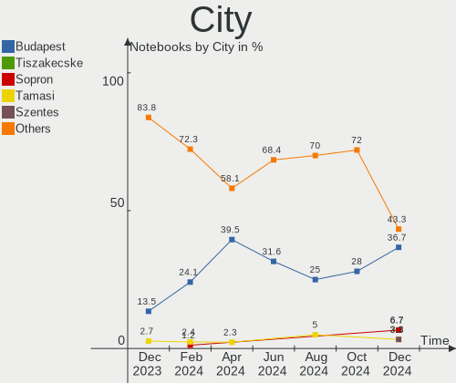

BlackPanther - Hardware Trends (Notebooks)
------------------------------------------

A project to identify most popular hardware characteristics and track their change
over time based on data collected by Linux users at https://Linux-Hardware.org.

Anyone can contribute to this report by the [hw-probe](https://github.com/linuxhw/hw-probe) tool:

    sudo -E hw-probe -all -upload

This report is for one last month. Overall report since the beginning of time: [TestDays](https://github.com/linuxhw/TestDays)

Period: Mar, 2023.

Contents
--------

* [ System ](#system)
  - [ OS                       ](#os)
  - [ OS Family                ](#os-family)
  - [ Kernel                   ](#kernel)
  - [ Kernel Family            ](#kernel-family)
  - [ Kernel Major Ver.        ](#kernel-major-ver)
  - [ Arch                     ](#arch)
  - [ DE                       ](#de)
  - [ Display Server           ](#display-server)
  - [ Display Manager          ](#display-manager)
  - [ OS Lang                  ](#os-lang)
  - [ Boot Mode                ](#boot-mode)
  - [ Filesystem               ](#filesystem)
  - [ Part. scheme             ](#part-scheme)
  - [ Dual Boot with Linux/BSD ](#dual-boot-with-linuxbsd)
  - [ Dual Boot (Win)          ](#dual-boot-win)

* [ Board ](#board)
  - [ Vendor                   ](#vendor)
  - [ Model                    ](#model)
  - [ Model Family             ](#model-family)
  - [ MFG Year                 ](#mfg-year)
  - [ Form Factor              ](#form-factor)
  - [ Secure Boot              ](#secure-boot)
  - [ Coreboot                 ](#coreboot)
  - [ RAM Size                 ](#ram-size)
  - [ RAM Used                 ](#ram-used)
  - [ Total Drives             ](#total-drives)
  - [ Has CD-ROM               ](#has-cd-rom)
  - [ Has Ethernet             ](#has-ethernet)
  - [ Has WiFi                 ](#has-wifi)
  - [ Has Bluetooth            ](#has-bluetooth)

* [ Location ](#location)
  - [ Country                  ](#country)
  - [ City                     ](#city)

* [ Drives ](#drives)
  - [ Drive Vendor             ](#drive-vendor)
  - [ Drive Model              ](#drive-model)
  - [ HDD Vendor               ](#hdd-vendor)
  - [ SSD Vendor               ](#ssd-vendor)
  - [ Drive Kind               ](#drive-kind)
  - [ Drive Connector          ](#drive-connector)
  - [ Drive Size               ](#drive-size)
  - [ Space Total              ](#space-total)
  - [ Space Used               ](#space-used)
  - [ Malfunc. Drives          ](#malfunc-drives)
  - [ Malfunc. Drive Vendor    ](#malfunc-drive-vendor)
  - [ Malfunc. HDD Vendor      ](#malfunc-hdd-vendor)
  - [ Malfunc. Drive Kind      ](#malfunc-drive-kind)
  - [ Failed Drives            ](#failed-drives)
  - [ Failed Drive Vendor      ](#failed-drive-vendor)
  - [ Drive Status             ](#drive-status)

* [ Storage controller ](#storage-controller)
  - [ Storage Vendor           ](#storage-vendor)
  - [ Storage Model            ](#storage-model)
  - [ Storage Kind             ](#storage-kind)

* [ Processor ](#processor)
  - [ CPU Vendor               ](#cpu-vendor)
  - [ CPU Model                ](#cpu-model)
  - [ CPU Model Family         ](#cpu-model-family)
  - [ CPU Cores                ](#cpu-cores)
  - [ CPU Sockets              ](#cpu-sockets)
  - [ CPU Threads              ](#cpu-threads)
  - [ CPU Op-Modes             ](#cpu-op-modes)
  - [ CPU Microcode            ](#cpu-microcode)
  - [ CPU Microarch            ](#cpu-microarch)

* [ Graphics ](#graphics)
  - [ GPU Vendor               ](#gpu-vendor)
  - [ GPU Model                ](#gpu-model)
  - [ GPU Combo                ](#gpu-combo)
  - [ GPU Driver               ](#gpu-driver)
  - [ GPU Memory               ](#gpu-memory)

* [ Monitor ](#monitor)
  - [ Monitor Vendor           ](#monitor-vendor)
  - [ Monitor Model            ](#monitor-model)
  - [ Monitor Resolution       ](#monitor-resolution)
  - [ Monitor Diagonal         ](#monitor-diagonal)
  - [ Monitor Width            ](#monitor-width)
  - [ Aspect Ratio             ](#aspect-ratio)
  - [ Monitor Area             ](#monitor-area)
  - [ Pixel Density            ](#pixel-density)
  - [ Multiple Monitors        ](#multiple-monitors)

* [ Network ](#network)
  - [ Net Controller Vendor    ](#net-controller-vendor)
  - [ Net Controller Model     ](#net-controller-model)
  - [ Wireless Vendor          ](#wireless-vendor)
  - [ Wireless Model           ](#wireless-model)
  - [ Ethernet Vendor          ](#ethernet-vendor)
  - [ Ethernet Model           ](#ethernet-model)
  - [ Net Controller Kind      ](#net-controller-kind)
  - [ Used Controller          ](#used-controller)
  - [ NICs                     ](#nics)
  - [ IPv6                     ](#ipv6)

* [ Bluetooth ](#bluetooth)
  - [ Bluetooth Vendor         ](#bluetooth-vendor)
  - [ Bluetooth Model          ](#bluetooth-model)

* [ Sound ](#sound)
  - [ Sound Vendor             ](#sound-vendor)
  - [ Sound Model              ](#sound-model)

* [ Memory ](#memory)
  - [ Memory Vendor            ](#memory-vendor)
  - [ Memory Model             ](#memory-model)
  - [ Memory Kind              ](#memory-kind)
  - [ Memory Form Factor       ](#memory-form-factor)
  - [ Memory Size              ](#memory-size)
  - [ Memory Speed             ](#memory-speed)

* [ Printers & scanners ](#printers--scanners)
  - [ Printer Vendor           ](#printer-vendor)
  - [ Printer Model            ](#printer-model)
  - [ Scanner Vendor           ](#scanner-vendor)
  - [ Scanner Model            ](#scanner-model)

* [ Camera ](#camera)
  - [ Camera Vendor            ](#camera-vendor)
  - [ Camera Model             ](#camera-model)

* [ Security ](#security)
  - [ Fingerprint Vendor       ](#fingerprint-vendor)
  - [ Fingerprint Model        ](#fingerprint-model)
  - [ Chipcard Vendor          ](#chipcard-vendor)
  - [ Chipcard Model           ](#chipcard-model)

* [ Unsupported ](#unsupported)
  - [ Unsupported Devices      ](#unsupported-devices)
  - [ Unsupported Device Types ](#unsupported-device-types)

System
------

OS
--

Installed operating systems

| Name              | Notebooks | Percent |
|-------------------|-----------|---------|
| BlackPanther 18.1 | 22        | 95.65%  |
| BlackPanther 16.2 | 1         | 4.35%   |

OS Family
---------

OS without a version

| Name         | Notebooks | Percent |
|--------------|-----------|---------|
| BlackPanther | 23        | 100%    |

Kernel
------

Version of the Linux kernel

| Version                | Notebooks | Percent |
|------------------------|-----------|---------|
| 5.6.14-desktop-2bP     | 16        | 69.57%  |
| 4.18.16-desktop-1bP    | 6         | 26.09%  |
| 4.9.20-desktop-pae-1bP | 1         | 4.35%   |

Kernel Family
-------------

Linux kernel without a distro release

| Version | Notebooks | Percent |
|---------|-----------|---------|
| 5.6.14  | 16        | 69.57%  |
| 4.18.16 | 6         | 26.09%  |
| 4.9.20  | 1         | 4.35%   |

Kernel Major Ver.
-----------------

Linux kernel major version

| Version | Notebooks | Percent |
|---------|-----------|---------|
| 5.6     | 16        | 69.57%  |
| 4.18    | 6         | 26.09%  |
| 4.9     | 1         | 4.35%   |

Arch
----

OS architecture (x86_64, i586, etc.)

| Name   | Notebooks | Percent |
|--------|-----------|---------|
| x86_64 | 22        | 95.65%  |
| i686   | 1         | 4.35%   |

DE
--

Desktop Environment

| Name | Notebooks | Percent |
|------|-----------|---------|
| KDE5 | 23        | 100%    |

Display Server
--------------

X11 or Wayland

| Name | Notebooks | Percent |
|------|-----------|---------|
| X11  | 23        | 100%    |

Display Manager
---------------

SDDM, LightDM, etc.

| Name | Notebooks | Percent |
|------|-----------|---------|
| SDDM | 23        | 100%    |

OS Lang
-------

Language

| Lang    | Notebooks | Percent |
|---------|-----------|---------|
| Unknown | 23        | 100%    |

Boot Mode
---------

EFI or BIOS

| Mode | Notebooks | Percent |
|------|-----------|---------|
| EFI  | 12        | 52.17%  |
| BIOS | 11        | 47.83%  |

Filesystem
----------

Type of filesystem

| Type    | Notebooks | Percent |
|---------|-----------|---------|
| Overlay | 18        | 78.26%  |
| Ext4    | 5         | 21.74%  |

Part. scheme
------------

Scheme of partitioning

| Type | Notebooks | Percent |
|------|-----------|---------|
| GPT  | 13        | 56.52%  |
| MBR  | 10        | 43.48%  |

Dual Boot with Linux/BSD
------------------------

Hosting more than one Linux/BSD

| Dual boot | Notebooks | Percent |
|-----------|-----------|---------|
| Yes       | 13        | 56.52%  |
| No        | 10        | 43.48%  |

Dual Boot (Win)
---------------

Hosting Linux and Windows

| Dual boot | Notebooks | Percent |
|-----------|-----------|---------|
| Yes       | 12        | 52.17%  |
| No        | 11        | 47.83%  |

Board
-----

Vendor
------

Motherboard manufacturer

| Name             | Notebooks | Percent |
|------------------|-----------|---------|
| Hewlett-Packard  | 8         | 34.78%  |
| Toshiba          | 3         | 13.04%  |
| Lenovo           | 3         | 13.04%  |
| Dell             | 2         | 8.7%    |
| ASUSTek Computer | 2         | 8.7%    |
| THD              | 1         | 4.35%   |
| MSI              | 1         | 4.35%   |
| Fujitsu          | 1         | 4.35%   |
| eMachines        | 1         | 4.35%   |
| Alcor            | 1         | 4.35%   |

Model
-----

Motherboard model

| Name                                | Notebooks | Percent |
|-------------------------------------|-----------|---------|
| Toshiba Satellite L650              | 2         | 8.7%    |
| Toshiba Satellite C50-B             | 1         | 4.35%   |
| THD PX1                             | 1         | 4.35%   |
| MSI CR500                           | 1         | 4.35%   |
| Lenovo Y50-70 20378                 | 1         | 4.35%   |
| Lenovo ThinkPad T420 4236W8L        | 1         | 4.35%   |
| Lenovo G570 20079                   | 1         | 4.35%   |
| HP ProBook 650 G2                   | 1         | 4.35%   |
| HP ProBook 6470b                    | 1         | 4.35%   |
| HP ProBook 640 G8 Notebook PC       | 1         | 4.35%   |
| HP Pavilion Gaming Laptop 15-ec1xxx | 1         | 4.35%   |
| HP Notebook                         | 1         | 4.35%   |
| HP Laptop 17-ak0xx                  | 1         | 4.35%   |
| HP EliteBook 2570p                  | 1         | 4.35%   |
| HP 650                              | 1         | 4.35%   |
| Fujitsu LIFEBOOK AH530              | 1         | 4.35%   |
| eMachines E725                      | 1         | 4.35%   |
| Dell Latitude 5480                  | 1         | 4.35%   |
| Dell Inspiron 5558                  | 1         | 4.35%   |
| ASUS X551CA                         | 1         | 4.35%   |
| ASUS X540SA                         | 1         | 4.35%   |
| Alcor SnugBook Q series             | 1         | 4.35%   |

Model Family
------------

Motherboard model prefix

| Name              | Notebooks | Percent |
|-------------------|-----------|---------|
| Toshiba Satellite | 3         | 13.04%  |
| HP ProBook        | 3         | 13.04%  |
| THD PX1           | 1         | 4.35%   |
| MSI CR500         | 1         | 4.35%   |
| Lenovo Y50-70     | 1         | 4.35%   |
| Lenovo ThinkPad   | 1         | 4.35%   |
| Lenovo G570       | 1         | 4.35%   |
| HP Pavilion       | 1         | 4.35%   |
| HP Notebook       | 1         | 4.35%   |
| HP Laptop         | 1         | 4.35%   |
| HP EliteBook      | 1         | 4.35%   |
| HP 650            | 1         | 4.35%   |
| Fujitsu LIFEBOOK  | 1         | 4.35%   |
| eMachines E725    | 1         | 4.35%   |
| Dell Latitude     | 1         | 4.35%   |
| Dell Inspiron     | 1         | 4.35%   |
| ASUS X551CA       | 1         | 4.35%   |
| ASUS X540SA       | 1         | 4.35%   |
| Alcor SnugBook    | 1         | 4.35%   |

MFG Year
--------

Motherboard manufacture year

| Year | Notebooks | Percent |
|------|-----------|---------|
| 2010 | 4         | 17.39%  |
| 2012 | 3         | 13.04%  |
| 2018 | 2         | 8.7%    |
| 2017 | 2         | 8.7%    |
| 2015 | 2         | 8.7%    |
| 2014 | 2         | 8.7%    |
| 2011 | 2         | 8.7%    |
| 2009 | 2         | 8.7%    |
| 2021 | 1         | 4.35%   |
| 2020 | 1         | 4.35%   |
| 2016 | 1         | 4.35%   |
| 2013 | 1         | 4.35%   |

Form Factor
-----------

Physical design of the computer

| Name     | Notebooks | Percent |
|----------|-----------|---------|
| Notebook | 23        | 100%    |

Secure Boot
-----------

Enabled or disabled

| State    | Notebooks | Percent |
|----------|-----------|---------|
| Disabled | 23        | 100%    |

Coreboot
--------

Have coreboot on board

| Used | Notebooks | Percent |
|------|-----------|---------|
| No   | 23        | 100%    |

RAM Size
--------

Total RAM memory

| Size in GB | Notebooks | Percent |
|------------|-----------|---------|
| 3.01-4.0   | 9         | 39.13%  |
| 4.01-8.0   | 5         | 21.74%  |
| 1.01-2.0   | 5         | 21.74%  |
| 8.01-16.0  | 3         | 13.04%  |
| 16.01-24.0 | 1         | 4.35%   |

RAM Used
--------

Used RAM memory

| Used GB  | Notebooks | Percent |
|----------|-----------|---------|
| 1.01-2.0 | 11        | 47.83%  |
| 0.51-1.0 | 11        | 47.83%  |
| 0.01-0.5 | 1         | 4.35%   |

Total Drives
------------

Number of drives on board

| Drives | Notebooks | Percent |
|--------|-----------|---------|
| 1      | 19        | 82.61%  |
| 2      | 4         | 17.39%  |

Has CD-ROM
----------

Has CD-ROM on board

| Presented | Notebooks | Percent |
|-----------|-----------|---------|
| Yes       | 14        | 60.87%  |
| No        | 9         | 39.13%  |

Has Ethernet
------------

Has Ethernet on board

| Presented | Notebooks | Percent |
|-----------|-----------|---------|
| Yes       | 22        | 95.65%  |
| No        | 1         | 4.35%   |

Has WiFi
--------

Has WiFi module

| Presented | Notebooks | Percent |
|-----------|-----------|---------|
| Yes       | 22        | 95.65%  |
| No        | 1         | 4.35%   |

Has Bluetooth
-------------

Has Bluetooth module

| Presented | Notebooks | Percent |
|-----------|-----------|---------|
| Yes       | 16        | 69.57%  |
| No        | 7         | 30.43%  |

Location
--------

Country
-------

Geographic location (country)

| Country  | Notebooks | Percent |
|----------|-----------|---------|
| Hungary  | 16        | 69.57%  |
| Slovakia | 3         | 13.04%  |
| UK       | 1         | 4.35%   |
| Poland   | 1         | 4.35%   |
| Germany  | 1         | 4.35%   |
| Canada   | 1         | 4.35%   |

City
----

Geographic location (city)

| City              | Notebooks | Percent |
|-------------------|-----------|---------|
| Budapest          | 6         | 26.09%  |
| Banská Bystrica  | 2         | 8.7%    |
| Warsaw            | 1         | 4.35%   |
| Tornaľa          | 1         | 4.35%   |
| Tatabánya        | 1         | 4.35%   |
| Szombathely       | 1         | 4.35%   |
| Szolnok           | 1         | 4.35%   |
| Szekszárd        | 1         | 4.35%   |
| Szajol            | 1         | 4.35%   |
| Morahalom         | 1         | 4.35%   |
| Kiskunhalas       | 1         | 4.35%   |
| Hodmezovasarhely  | 1         | 4.35%   |
| Harlow            | 1         | 4.35%   |
| Frankfurt am Main | 1         | 4.35%   |
| Debrecen          | 1         | 4.35%   |
| Bikal             | 1         | 4.35%   |
| Barrie            | 1         | 4.35%   |

Drives
------

Drive Vendor
------------

Hard drive vendors

| Vendor              | Notebooks | Drives | Percent |
|---------------------|-----------|--------|---------|
| Toshiba             | 4         | 4      | 13.79%  |
| Samsung Electronics | 4         | 4      | 13.79%  |
| Seagate             | 3         | 3      | 10.34%  |
| Hitachi             | 3         | 3      | 10.34%  |
| WDC                 | 2         | 2      | 6.9%    |
| Kingston            | 2         | 2      | 6.9%    |
| Intenso             | 2         | 2      | 6.9%    |
| Unknown             | 1         | 1      | 3.45%   |
| Timetec             | 1         | 1      | 3.45%   |
| SSSTC               | 1         | 1      | 3.45%   |
| Micron Technology   | 1         | 1      | 3.45%   |
| Intel               | 1         | 1      | 3.45%   |
| HGST                | 1         | 1      | 3.45%   |
| CSD                 | 1         | 1      | 3.45%   |
| Crucial             | 1         | 1      | 3.45%   |
| Unknown             | 1         | 1      | 3.45%   |

Drive Model
-----------

Hard drive models

| Model                                   | Notebooks | Percent |
|-----------------------------------------|-----------|---------|
| Seagate ST500LT012-1DG142 500GB         | 2         | 6.9%    |
| Intenso SSD 120GB                       | 2         | 6.9%    |
| Hitachi HTS547550A9E384 500GB           | 2         | 6.9%    |
| WDC WD5000BEVT-16A0RT0 500GB            | 1         | 3.45%   |
| WDC WD10JPVX-22JC3T0 1TB                | 1         | 3.45%   |
| Unknown SL16G  16GB                     | 1         | 3.45%   |
| Toshiba MQ01ABF050 500GB                | 1         | 3.45%   |
| Toshiba MQ01ABD100 1TB                  | 1         | 3.45%   |
| Toshiba MK2565GSX 250GB                 | 1         | 3.45%   |
| Toshiba KSG60ZMV256G M.2 2280 256GB SSD | 1         | 3.45%   |
| Timetec SD08 512GB SSD                  | 1         | 3.45%   |
| SSSTC CL1-8D256-HP 256GB                | 1         | 3.45%   |
| Seagate ST1000LM035-1RK172 1TB          | 1         | 3.45%   |
| Samsung SSD 870 EVO 500GB               | 1         | 3.45%   |
| Samsung SSD 860 EVO 500GB               | 1         | 3.45%   |
| Samsung SSD 750 EVO 250GB               | 1         | 3.45%   |
| Samsung MZ7TD128HAFV-000L1 128GB SSD    | 1         | 3.45%   |
| Micron MTFDDAK256MAM-1K1 256GB SSD      | 1         | 3.45%   |
| Kingston SA400S37480G 480GB SSD         | 1         | 3.45%   |
| Kingston SA400S37240G 240GB SSD         | 1         | 3.45%   |
| Intel SSDPEKNW512G8H 512GB              | 1         | 3.45%   |
| Hitachi HTS545025B9A300 250GB           | 1         | 3.45%   |
| HGST HTS545050A7E680 500GB              | 1         | 3.45%   |
| CSD T52SX250 250GB                      | 1         | 3.45%   |
| Crucial CT500BX500SSD1 500GB            | 1         | 3.45%   |
| Unknown                                 | 1         | 3.45%   |

HDD Vendor
----------

Hard disk drive vendors

| Vendor  | Notebooks | Drives | Percent |
|---------|-----------|--------|---------|
| Toshiba | 3         | 3      | 23.08%  |
| Seagate | 3         | 3      | 23.08%  |
| Hitachi | 3         | 3      | 23.08%  |
| WDC     | 2         | 2      | 15.38%  |
| HGST    | 1         | 1      | 7.69%   |
| CSD     | 1         | 1      | 7.69%   |

SSD Vendor
----------

Solid state drive vendors

| Vendor              | Notebooks | Drives | Percent |
|---------------------|-----------|--------|---------|
| Samsung Electronics | 4         | 4      | 33.33%  |
| Kingston            | 2         | 2      | 16.67%  |
| Intenso             | 2         | 2      | 16.67%  |
| Toshiba             | 1         | 1      | 8.33%   |
| Timetec             | 1         | 1      | 8.33%   |
| Micron Technology   | 1         | 1      | 8.33%   |
| Crucial             | 1         | 1      | 8.33%   |

Drive Kind
----------

HDD or SSD

| Kind | Notebooks | Drives | Percent |
|------|-----------|--------|---------|
| HDD  | 13        | 13     | 44.83%  |
| SSD  | 12        | 12     | 41.38%  |
| MMC  | 2         | 2      | 6.9%    |
| NVMe | 2         | 2      | 6.9%    |

Drive Connector
---------------

SATA, SAS, NVMe, etc.

| Type | Notebooks | Drives | Percent |
|------|-----------|--------|---------|
| SATA | 21        | 25     | 84%     |
| NVMe | 2         | 2      | 8%      |
| MMC  | 2         | 2      | 8%      |

Drive Size
----------

Size of hard drive

| Size in TB | Notebooks | Drives | Percent |
|------------|-----------|--------|---------|
| 0.01-0.5   | 19        | 21     | 86.36%  |
| 0.51-1.0   | 3         | 4      | 13.64%  |

Space Total
-----------

Amount of disk space available on the file system

| Size in GB | Notebooks | Percent |
|------------|-----------|---------|
| Unknown    | 18        | 78.26%  |
| 251-500    | 2         | 8.7%    |
| 101-250    | 2         | 8.7%    |
| 21-50      | 1         | 4.35%   |

Space Used
----------

Amount of used disk space

| Used GB | Notebooks | Percent |
|---------|-----------|---------|
| Unknown | 18        | 78.26%  |
| 1-20    | 5         | 21.74%  |

Malfunc. Drives
---------------

Drive models with a malfunction

| Model                                   | Notebooks | Drives | Percent |
|-----------------------------------------|-----------|--------|---------|
| Toshiba MQ01ABF050 500GB                | 1         | 1      | 16.67%  |
| Toshiba MK2565GSX 250GB                 | 1         | 1      | 16.67%  |
| Toshiba KSG60ZMV256G M.2 2280 256GB SSD | 1         | 1      | 16.67%  |
| Samsung Electronics SSD 750 EVO 250GB   | 1         | 1      | 16.67%  |
| Hitachi HTS547550A9E384 500GB           | 1         | 1      | 16.67%  |
| CSD T52SX250 250GB                      | 1         | 1      | 16.67%  |

Malfunc. Drive Vendor
---------------------

Vendors of faulty drives

| Vendor              | Notebooks | Drives | Percent |
|---------------------|-----------|--------|---------|
| Toshiba             | 3         | 3      | 50%     |
| Samsung Electronics | 1         | 1      | 16.67%  |
| Hitachi             | 1         | 1      | 16.67%  |
| CSD                 | 1         | 1      | 16.67%  |

Malfunc. HDD Vendor
-------------------

Vendors of faulty HDD drives

| Vendor  | Notebooks | Drives | Percent |
|---------|-----------|--------|---------|
| Toshiba | 2         | 2      | 50%     |
| Hitachi | 1         | 1      | 25%     |
| CSD     | 1         | 1      | 25%     |

Malfunc. Drive Kind
-------------------

Kinds of faulty drives

| Kind | Notebooks | Drives | Percent |
|------|-----------|--------|---------|
| HDD  | 4         | 4      | 66.67%  |
| SSD  | 2         | 2      | 33.33%  |

Failed Drives
-------------

Failed drive models

Zero info for selected period =(

Failed Drive Vendor
-------------------

Failed drive vendors

Zero info for selected period =(

Drive Status
------------

Number of failed and malfunc. drives

| Status   | Notebooks | Drives | Percent |
|----------|-----------|--------|---------|
| Works    | 16        | 21     | 66.67%  |
| Malfunc  | 6         | 6      | 25%     |
| Detected | 2         | 2      | 8.33%   |

Storage controller
------------------

Storage Vendor
--------------

Storage controller vendors

| Vendor                         | Notebooks | Percent |
|--------------------------------|-----------|---------|
| Intel                          | 19        | 79.17%  |
| AMD                            | 3         | 12.5%   |
| Solid State Storage Technology | 1         | 4.17%   |
| Nvidia                         | 1         | 4.17%   |

Storage Model
-------------

Storage controller models

| Model                                                                            | Notebooks | Percent |
|----------------------------------------------------------------------------------|-----------|---------|
| Intel 7 Series Chipset Family 6-port SATA Controller [AHCI mode]                 | 4         | 16%     |
| Intel 5 Series/3400 Series Chipset 4 port SATA AHCI Controller                   | 3         | 12%     |
| AMD FCH SATA Controller [AHCI mode]                                              | 3         | 12%     |
| Intel 6 Series/C200 Series Chipset Family 6 port Mobile SATA AHCI Controller     | 2         | 8%      |
| Solid State Storage Non-Volatile memory controller                               | 1         | 4%      |
| Nvidia MCP79 AHCI Controller                                                     | 1         | 4%      |
| Intel Wildcat Point-LP SATA Controller [AHCI Mode]                               | 1         | 4%      |
| Intel Volume Management Device NVMe RAID Controller                              | 1         | 4%      |
| Intel SSD 660P Series                                                            | 1         | 4%      |
| Intel NM10/ICH7 Family SATA Controller [IDE mode]                                | 1         | 4%      |
| Intel HM170/QM170 Chipset SATA Controller [AHCI Mode]                            | 1         | 4%      |
| Intel Atom/Celeron/Pentium Processor x5-E8000/J3xxx/N3xxx Series SATA Controller | 1         | 4%      |
| Intel Atom Processor E3800 Series SATA AHCI Controller                           | 1         | 4%      |
| Intel 82801IBM/IEM (ICH9M/ICH9M-E) 4 port SATA Controller [AHCI mode]            | 1         | 4%      |
| Intel 82801 Mobile SATA Controller [RAID mode]                                   | 1         | 4%      |
| Intel 8 Series/C220 Series Chipset Family 6-port SATA Controller 1 [AHCI mode]   | 1         | 4%      |
| AMD FCH IDE Controller                                                           | 1         | 4%      |

Storage Kind
------------

Kind of storage controller (IDE, SATA, NVMe, SAS, ...)

| Kind | Notebooks | Percent |
|------|-----------|---------|
| SATA | 19        | 76%     |
| RAID | 2         | 8%      |
| NVMe | 2         | 8%      |
| IDE  | 2         | 8%      |

Processor
---------

CPU Vendor
----------

Processor vendors

| Vendor | Notebooks | Percent |
|--------|-----------|---------|
| Intel  | 20        | 86.96%  |
| AMD    | 3         | 13.04%  |

CPU Model
---------

Processor models

| Model                                        | Notebooks | Percent |
|----------------------------------------------|-----------|---------|
| Intel Core i3 CPU M 330 @ 2.13GHz            | 2         | 8.7%    |
| Intel Pentium Dual-Core CPU T4400 @ 2.20GHz  | 1         | 4.35%   |
| Intel Pentium CPU P6200 @ 2.13GHz            | 1         | 4.35%   |
| Intel Pentium CPU N3700 @ 1.60GHz            | 1         | 4.35%   |
| Intel Core i7-6820HQ CPU @ 2.70GHz           | 1         | 4.35%   |
| Intel Core i7-6600U CPU @ 2.60GHz            | 1         | 4.35%   |
| Intel Core i7-4710HQ CPU @ 2.50GHz           | 1         | 4.35%   |
| Intel Core i7-2630QM CPU @ 2.00GHz           | 1         | 4.35%   |
| Intel Core i5-5200U CPU @ 2.20GHz            | 1         | 4.35%   |
| Intel Core i5-3340M CPU @ 2.70GHz            | 1         | 4.35%   |
| Intel Core i5-2540M CPU @ 2.60GHz            | 1         | 4.35%   |
| Intel Core i3-3217U CPU @ 1.80GHz            | 1         | 4.35%   |
| Intel Core i3-3120M CPU @ 2.50GHz            | 1         | 4.35%   |
| Intel Celeron Dual-Core CPU T3100 @ 1.90GHz  | 1         | 4.35%   |
| Intel Celeron CPU N2840 @ 2.16GHz            | 1         | 4.35%   |
| Intel Celeron CPU B830 @ 1.80GHz             | 1         | 4.35%   |
| Intel Atom x5-Z8350 CPU @ 1.44GHz            | 1         | 4.35%   |
| Intel Atom CPU N455 @ 1.66GHz                | 1         | 4.35%   |
| Intel 11th Gen Core i3-1115G4 @ 3.00GHz      | 1         | 4.35%   |
| AMD Ryzen 5 4600H with Radeon Graphics       | 1         | 4.35%   |
| AMD A9-9420 RADEON R5, 5 COMPUTE CORES 2C+3G | 1         | 4.35%   |
| AMD A8-7050 Radeon R5, 6 Compute Cores 2C+4G | 1         | 4.35%   |

CPU Model Family
----------------

Processor model prefix

| Model                   | Notebooks | Percent |
|-------------------------|-----------|---------|
| Intel Core i7           | 4         | 17.39%  |
| Intel Core i3           | 4         | 17.39%  |
| Intel Core i5           | 3         | 13.04%  |
| Other                   | 2         | 8.7%    |
| Intel Pentium           | 2         | 8.7%    |
| Intel Celeron           | 2         | 8.7%    |
| Intel Atom              | 2         | 8.7%    |
| Intel Pentium Dual-Core | 1         | 4.35%   |
| Intel Celeron Dual-Core | 1         | 4.35%   |
| AMD Ryzen 5             | 1         | 4.35%   |
| AMD A8                  | 1         | 4.35%   |

CPU Cores
---------

Number of processor cores

| Number | Notebooks | Percent |
|--------|-----------|---------|
| 2      | 14        | 60.87%  |
| 4      | 5         | 21.74%  |
| 1      | 3         | 13.04%  |
| 6      | 1         | 4.35%   |

CPU Sockets
-----------

Number of sockets

| Number | Notebooks | Percent |
|--------|-----------|---------|
| 1      | 23        | 100%    |

CPU Threads
-----------

Threads per core (Hyper-Threading)

| Number | Notebooks | Percent |
|--------|-----------|---------|
| 2      | 14        | 60.87%  |
| 1      | 9         | 39.13%  |

CPU Op-Modes
------------

CPU Operation Modes (32-bit, 64-bit)

| Op mode        | Notebooks | Percent |
|----------------|-----------|---------|
| 32-bit, 64-bit | 23        | 100%    |

CPU Microcode
-------------

Microcode number

| Number     | Notebooks | Percent |
|------------|-----------|---------|
| 0x306a9    | 3         | 13.04%  |
| 0x206a7    | 3         | 13.04%  |
| 0x20652    | 2         | 8.7%    |
| 0x1067a    | 2         | 8.7%    |
| 0x806c1    | 1         | 4.35%   |
| 0x506e3    | 1         | 4.35%   |
| 0x406e3    | 1         | 4.35%   |
| 0x406c4    | 1         | 4.35%   |
| 0x406c3    | 1         | 4.35%   |
| 0x306d4    | 1         | 4.35%   |
| 0x306c3    | 1         | 4.35%   |
| 0x30678    | 1         | 4.35%   |
| 0x20655    | 1         | 4.35%   |
| 0x106ca    | 1         | 4.35%   |
| 0x08600106 | 1         | 4.35%   |
| 0x06006705 | 1         | 4.35%   |
| 0x06003109 | 1         | 4.35%   |

CPU Microarch
-------------

Microarchitecture

| Name        | Notebooks | Percent |
|-------------|-----------|---------|
| Westmere    | 3         | 13.04%  |
| Silvermont  | 3         | 13.04%  |
| SandyBridge | 3         | 13.04%  |
| IvyBridge   | 3         | 13.04%  |
| Skylake     | 2         | 8.7%    |
| Penryn      | 2         | 8.7%    |
| Zen 2       | 1         | 4.35%   |
| TigerLake   | 1         | 4.35%   |
| Steamroller | 1         | 4.35%   |
| Haswell     | 1         | 4.35%   |
| Excavator   | 1         | 4.35%   |
| Broadwell   | 1         | 4.35%   |
| Bonnell     | 1         | 4.35%   |

Graphics
--------

GPU Vendor
----------

Vendors of graphics cards

| Vendor | Notebooks | Percent |
|--------|-----------|---------|
| Intel  | 19        | 70.37%  |
| Nvidia | 5         | 18.52%  |
| AMD    | 3         | 11.11%  |

GPU Model
---------

Graphics card models

| Model                                                                                    | Notebooks | Percent |
|------------------------------------------------------------------------------------------|-----------|---------|
| Intel Core Processor Integrated Graphics Controller                                      | 3         | 11.11%  |
| Intel 3rd Gen Core processor Graphics Controller                                         | 3         | 11.11%  |
| Intel 2nd Generation Core Processor Family Integrated Graphics Controller                | 3         | 11.11%  |
| Intel Atom/Celeron/Pentium Processor x5-E8000/J3xxx/N3xxx Integrated Graphics Controller | 2         | 7.41%   |
| Nvidia TU117M [GeForce GTX 1650 Ti Mobile]                                               | 1         | 3.7%    |
| Nvidia MCP79 [GeForce 8200M G]                                                           | 1         | 3.7%    |
| Nvidia GM108M [GeForce 930MX]                                                            | 1         | 3.7%    |
| Nvidia GM107M [GeForce GTX 860M]                                                         | 1         | 3.7%    |
| Nvidia GK208BM [GeForce 920M]                                                            | 1         | 3.7%    |
| Intel Tiger Lake-LP GT2 [UHD Graphics G4]                                                | 1         | 3.7%    |
| Intel Skylake GT2 [HD Graphics 520]                                                      | 1         | 3.7%    |
| Intel Mobile 4 Series Chipset Integrated Graphics Controller                             | 1         | 3.7%    |
| Intel HD Graphics 5500                                                                   | 1         | 3.7%    |
| Intel HD Graphics 530                                                                    | 1         | 3.7%    |
| Intel Atom Processor Z36xxx/Z37xxx Series Graphics & Display                             | 1         | 3.7%    |
| Intel Atom Processor D4xx/D5xx/N4xx/N5xx Integrated Graphics Controller                  | 1         | 3.7%    |
| Intel 4th Gen Core Processor Integrated Graphics Controller                              | 1         | 3.7%    |
| AMD Stoney [Radeon R2/R3/R4/R5 Graphics]                                                 | 1         | 3.7%    |
| AMD Renoir                                                                               | 1         | 3.7%    |
| AMD Kaveri [Radeon R5 Graphics]                                                          | 1         | 3.7%    |

GPU Combo
---------

Combinations of graphics cards

| Name           | Notebooks | Percent |
|----------------|-----------|---------|
| 1 x Intel      | 16        | 69.57%  |
| Intel + Nvidia | 3         | 13.04%  |
| 1 x AMD        | 2         | 8.7%    |
| 1 x Nvidia     | 1         | 4.35%   |
| AMD + Nvidia   | 1         | 4.35%   |

GPU Driver
----------

Free vs proprietary

| Driver | Notebooks | Percent |
|--------|-----------|---------|
| Free   | 23        | 100%    |

GPU Memory
----------

Total video memory

| Size in GB | Notebooks | Percent |
|------------|-----------|---------|
| Unknown    | 16        | 69.57%  |
| 3.01-4.0   | 2         | 8.7%    |
| 1.01-2.0   | 2         | 8.7%    |
| 0.01-0.5   | 2         | 8.7%    |
| 0.51-1.0   | 1         | 4.35%   |

Monitor
-------

Monitor Vendor
--------------

Monitor vendors

| Vendor                  | Notebooks | Percent |
|-------------------------|-----------|---------|
| AU Optronics            | 7         | 31.82%  |
| LG Display              | 6         | 27.27%  |
| Samsung Electronics     | 3         | 13.64%  |
| Chimei Innolux          | 3         | 13.64%  |
| PANDA                   | 1         | 4.55%   |
| InfoVision              | 1         | 4.55%   |
| Chi Mei Optoelectronics | 1         | 4.55%   |

Monitor Model
-------------

Monitor models

| Model                                                                    | Notebooks | Percent |
|--------------------------------------------------------------------------|-----------|---------|
| LG Display LP156WH2-TLAA LGD0230 1366x768 344x194mm 15.5-inch            | 3         | 13.64%  |
| Samsung Electronics LCD Monitor SEC4149 1366x768 292x174mm 13.4-inch     | 1         | 4.55%   |
| Samsung Electronics LCD Monitor SDC4852 3840x2160 344x194mm 15.5-inch    | 1         | 4.55%   |
| Samsung Electronics LCD Monitor SDC4347 1366x768 344x193mm 15.5-inch     | 1         | 4.55%   |
| PANDA LCD Monitor NCP0065 1920x1080 309x174mm 14.0-inch                  | 1         | 4.55%   |
| LG Display LCD Monitor LGD038E 1366x768 344x194mm 15.5-inch              | 1         | 4.55%   |
| LG Display LCD Monitor LGD0386 1366x768 309x174mm 14.0-inch              | 1         | 4.55%   |
| LG Display LCD Monitor LGD02DC 1366x768 344x194mm 15.5-inch              | 1         | 4.55%   |
| InfoVision LCD Monitor IVO057D 1920x1080 309x174mm 14.0-inch             | 1         | 4.55%   |
| Chimei Innolux LCD Monitor CMN1733 1600x900 382x215mm 17.3-inch          | 1         | 4.55%   |
| Chimei Innolux LCD Monitor CMN15CA 1366x768 344x193mm 15.5-inch          | 1         | 4.55%   |
| Chimei Innolux LCD Monitor CMN150D 1920x1080 344x193mm 15.5-inch         | 1         | 4.55%   |
| Chi Mei Optoelectronics LCD Monitor CMO15A7 1366x768 344x193mm 15.5-inch | 1         | 4.55%   |
| AU Optronics LCD Monitor AUO40EC 1366x768 344x193mm 15.5-inch            | 1         | 4.55%   |
| AU Optronics LCD Monitor AUO35ED 1920x1080 344x193mm 15.5-inch           | 1         | 4.55%   |
| AU Optronics LCD Monitor AUO23EC 1366x768 344x193mm 15.5-inch            | 1         | 4.55%   |
| AU Optronics LCD Monitor AUO219E 1600x900 382x214mm 17.2-inch            | 1         | 4.55%   |
| AU Optronics LCD Monitor AUO213E 1600x900 309x174mm 14.0-inch            | 1         | 4.55%   |
| AU Optronics LCD Monitor AUO213D 1920x1080 309x173mm 13.9-inch           | 1         | 4.55%   |
| AU Optronics LCD Monitor AUO10EC 1366x768 344x193mm 15.5-inch            | 1         | 4.55%   |

Monitor Resolution
------------------

Monitor screen resolution

| Resolution      | Notebooks | Percent |
|-----------------|-----------|---------|
| 1366x768 (WXGA) | 13        | 59.09%  |
| 1920x1080 (FHD) | 5         | 22.73%  |
| 1600x900 (HD+)  | 3         | 13.64%  |
| 3840x2160 (4K)  | 1         | 4.55%   |

Monitor Diagonal
----------------

Diagonal size in inches

| Inches | Notebooks | Percent |
|--------|-----------|---------|
| 15     | 14        | 63.64%  |
| 14     | 5         | 22.73%  |
| 17     | 2         | 9.09%   |
| 13     | 1         | 4.55%   |

Monitor Width
-------------

Physical width

| Width in mm | Notebooks | Percent |
|-------------|-----------|---------|
| 301-350     | 19        | 86.36%  |
| 351-400     | 2         | 9.09%   |
| 201-300     | 1         | 4.55%   |

Aspect Ratio
------------

Proportional relationship between the width and the height

| Ratio | Notebooks | Percent |
|-------|-----------|---------|
| 16/9  | 22        | 100%    |

Monitor Area
------------

Area in inch²

| Area in inch² | Notebooks | Percent |
|----------------|-----------|---------|
| 101-110        | 14        | 63.64%  |
| 81-90          | 5         | 22.73%  |
| 71-80          | 1         | 4.55%   |
| 131-140        | 1         | 4.55%   |
| 121-130        | 1         | 4.55%   |

Pixel Density
-------------

Pixels per inch

| Density | Notebooks | Percent |
|---------|-----------|---------|
| 101-120 | 15        | 68.18%  |
| 121-160 | 6         | 27.27%  |
| 51-100  | 1         | 4.55%   |

Multiple Monitors
-----------------

Total monitors connected

| Total | Notebooks | Percent |
|-------|-----------|---------|
| 1     | 23        | 100%    |

Network
-------

Net Controller Vendor
---------------------

Controller vendors

| Vendor                            | Notebooks | Percent |
|-----------------------------------|-----------|---------|
| Realtek Semiconductor             | 12        | 30.77%  |
| Qualcomm Atheros                  | 9         | 23.08%  |
| Intel                             | 9         | 23.08%  |
| Broadcom                          | 4         | 10.26%  |
| Xiaomi                            | 1         | 2.56%   |
| Nvidia                            | 1         | 2.56%   |
| Hewlett-Packard                   | 1         | 2.56%   |
| Ericsson Business Mobile Networks | 1         | 2.56%   |
| Broadcom Limited                  | 1         | 2.56%   |

Net Controller Model
--------------------

Controller models

| Model                                                             | Notebooks | Percent |
|-------------------------------------------------------------------|-----------|---------|
| Realtek RTL8111/8168/8411 PCI Express Gigabit Ethernet Controller | 5         | 10.42%  |
| Realtek RTL810xE PCI Express Fast Ethernet controller             | 5         | 10.42%  |
| Intel 82579LM Gigabit Network Connection (Lewisville)             | 3         | 6.25%   |
| Broadcom BCM4313 802.11bgn Wireless Network Adapter               | 3         | 6.25%   |
| Qualcomm Atheros QCA9565 / AR9565 Wireless Network Adapter        | 2         | 4.17%   |
| Qualcomm Atheros AR9485 Wireless Network Adapter                  | 2         | 4.17%   |
| Qualcomm Atheros AR8152 v1.1 Fast Ethernet                        | 2         | 4.17%   |
| Intel Wireless 8265 / 8275                                        | 2         | 4.17%   |
| Intel Centrino Advanced-N 6205 [Taylor Peak]                      | 2         | 4.17%   |
| Xiaomi Mi/Redmi series (RNDIS)                                    | 1         | 2.08%   |
| Realtek RTL8822CE 802.11ac PCIe Wireless Network Adapter          | 1         | 2.08%   |
| Realtek RTL8723DE Wireless Network Adapter                        | 1         | 2.08%   |
| Realtek RTL8723BE PCIe Wireless Network Adapter                   | 1         | 2.08%   |
| Realtek RTL8191SEvB Wireless LAN Controller                       | 1         | 2.08%   |
| Realtek RTL8188EUS 802.11n Wireless Network Adapter               | 1         | 2.08%   |
| Realtek RTL8152 Fast Ethernet Adapter                             | 1         | 2.08%   |
| Qualcomm Atheros AR9285 Wireless Network Adapter (PCI-Express)    | 1         | 2.08%   |
| Qualcomm Atheros AR8152 v2.0 Fast Ethernet                        | 1         | 2.08%   |
| Qualcomm Atheros AR8132 Fast Ethernet                             | 1         | 2.08%   |
| Nvidia MCP79 Ethernet                                             | 1         | 2.08%   |
| Intel Wireless 8260                                               | 1         | 2.08%   |
| Intel Wireless 7260                                               | 1         | 2.08%   |
| Intel Wireless 3160                                               | 1         | 2.08%   |
| Intel Wi-Fi 6 AX201                                               | 1         | 2.08%   |
| Intel Ethernet Connection (4) I219-LM                             | 1         | 2.08%   |
| Intel Ethernet Connection (2) I219-LM                             | 1         | 2.08%   |
| Intel Ethernet Connection (13) I219-V                             | 1         | 2.08%   |
| HP un2430 Mobile Broadband Module                                 | 1         | 2.08%   |
| Ericsson Business Mobile Networks F5521gw                         | 1         | 2.08%   |
| Broadcom Limited BCM4312 802.11b/g LP-PHY                         | 1         | 2.08%   |
| Broadcom BCM43228 802.11a/b/g/n                                   | 1         | 2.08%   |

Wireless Vendor
---------------

Wireless vendors

| Vendor                | Notebooks | Percent |
|-----------------------|-----------|---------|
| Intel                 | 8         | 36.36%  |
| Qualcomm Atheros      | 5         | 22.73%  |
| Realtek Semiconductor | 4         | 18.18%  |
| Broadcom              | 4         | 18.18%  |
| Broadcom Limited      | 1         | 4.55%   |

Wireless Model
--------------

Wireless models

| Model                                                          | Notebooks | Percent |
|----------------------------------------------------------------|-----------|---------|
| Broadcom BCM4313 802.11bgn Wireless Network Adapter            | 3         | 13.04%  |
| Qualcomm Atheros QCA9565 / AR9565 Wireless Network Adapter     | 2         | 8.7%    |
| Qualcomm Atheros AR9485 Wireless Network Adapter               | 2         | 8.7%    |
| Intel Wireless 8265 / 8275                                     | 2         | 8.7%    |
| Intel Centrino Advanced-N 6205 [Taylor Peak]                   | 2         | 8.7%    |
| Realtek RTL8822CE 802.11ac PCIe Wireless Network Adapter       | 1         | 4.35%   |
| Realtek RTL8723DE Wireless Network Adapter                     | 1         | 4.35%   |
| Realtek RTL8723BE PCIe Wireless Network Adapter                | 1         | 4.35%   |
| Realtek RTL8191SEvB Wireless LAN Controller                    | 1         | 4.35%   |
| Realtek RTL8188EUS 802.11n Wireless Network Adapter            | 1         | 4.35%   |
| Qualcomm Atheros AR9285 Wireless Network Adapter (PCI-Express) | 1         | 4.35%   |
| Intel Wireless 8260                                            | 1         | 4.35%   |
| Intel Wireless 7260                                            | 1         | 4.35%   |
| Intel Wireless 3160                                            | 1         | 4.35%   |
| Intel Wi-Fi 6 AX201                                            | 1         | 4.35%   |
| Broadcom Limited BCM4312 802.11b/g LP-PHY                      | 1         | 4.35%   |
| Broadcom BCM43228 802.11a/b/g/n                                | 1         | 4.35%   |

Ethernet Vendor
---------------

Ethernet vendors

| Vendor                | Notebooks | Percent |
|-----------------------|-----------|---------|
| Realtek Semiconductor | 11        | 47.83%  |
| Intel                 | 6         | 26.09%  |
| Qualcomm Atheros      | 4         | 17.39%  |
| Xiaomi                | 1         | 4.35%   |
| Nvidia                | 1         | 4.35%   |

Ethernet Model
--------------

Ethernet models

| Model                                                             | Notebooks | Percent |
|-------------------------------------------------------------------|-----------|---------|
| Realtek RTL8111/8168/8411 PCI Express Gigabit Ethernet Controller | 5         | 21.74%  |
| Realtek RTL810xE PCI Express Fast Ethernet controller             | 5         | 21.74%  |
| Intel 82579LM Gigabit Network Connection (Lewisville)             | 3         | 13.04%  |
| Qualcomm Atheros AR8152 v1.1 Fast Ethernet                        | 2         | 8.7%    |
| Xiaomi Mi/Redmi series (RNDIS)                                    | 1         | 4.35%   |
| Realtek RTL8152 Fast Ethernet Adapter                             | 1         | 4.35%   |
| Qualcomm Atheros AR8152 v2.0 Fast Ethernet                        | 1         | 4.35%   |
| Qualcomm Atheros AR8132 Fast Ethernet                             | 1         | 4.35%   |
| Nvidia MCP79 Ethernet                                             | 1         | 4.35%   |
| Intel Ethernet Connection (4) I219-LM                             | 1         | 4.35%   |
| Intel Ethernet Connection (2) I219-LM                             | 1         | 4.35%   |
| Intel Ethernet Connection (13) I219-V                             | 1         | 4.35%   |

Net Controller Kind
-------------------

Ethernet, WiFi or modem

| Kind     | Notebooks | Percent |
|----------|-----------|---------|
| WiFi     | 22        | 47.83%  |
| Ethernet | 22        | 47.83%  |
| Modem    | 2         | 4.35%   |

Used Controller
---------------

Currently used network controller

| Kind     | Notebooks | Percent |
|----------|-----------|---------|
| WiFi     | 19        | 79.17%  |
| Ethernet | 5         | 20.83%  |

NICs
----

Total network controllers on board

| Total | Notebooks | Percent |
|-------|-----------|---------|
| 2     | 21        | 91.3%   |
| 1     | 1         | 4.35%   |
| 0     | 1         | 4.35%   |

IPv6
----

IPv6 vs IPv4

| Used | Notebooks | Percent |
|------|-----------|---------|
| No   | 18        | 78.26%  |
| Yes  | 5         | 21.74%  |

Bluetooth
---------

Bluetooth Vendor
----------------

Controller vendors

| Vendor                          | Notebooks | Percent |
|---------------------------------|-----------|---------|
| Intel                           | 6         | 37.5%   |
| Toshiba                         | 3         | 18.75%  |
| Realtek Semiconductor           | 3         | 18.75%  |
| Qualcomm Atheros Communications | 1         | 6.25%   |
| Foxconn / Hon Hai               | 1         | 6.25%   |
| Broadcom                        | 1         | 6.25%   |
| Askey Computer                  | 1         | 6.25%   |

Bluetooth Model
---------------

Controller models

| Model                                           | Notebooks | Percent |
|-------------------------------------------------|-----------|---------|
| Intel Bluetooth wireless interface              | 5         | 31.25%  |
| Toshiba Askey Bluetooth Module                  | 2         | 12.5%   |
| Realtek Bluetooth Radio                         | 2         | 12.5%   |
| Toshiba Bluetooth Device                        | 1         | 6.25%   |
| Realtek  Bluetooth 4.2 Adapter                  | 1         | 6.25%   |
| Qualcomm Atheros AR3012 Bluetooth               | 1         | 6.25%   |
| Intel AX201 Bluetooth                           | 1         | 6.25%   |
| Foxconn / Hon Hai Broadcom Bluetooth 2.1 Device | 1         | 6.25%   |
| Broadcom HP Portable SoftSailing                | 1         | 6.25%   |
| Askey Bluetooth Device                          | 1         | 6.25%   |

Sound
-----

Sound Vendor
------------

Sound card vendors

| Vendor | Notebooks | Percent |
|--------|-----------|---------|
| Intel  | 18        | 72%     |
| Nvidia | 4         | 16%     |
| AMD    | 3         | 12%     |

Sound Model
-----------

Sound card models

| Model                                                                                             | Notebooks | Percent |
|---------------------------------------------------------------------------------------------------|-----------|---------|
| Intel 7 Series/C216 Chipset Family High Definition Audio Controller                               | 4         | 13.79%  |
| Intel 5 Series/3400 Series Chipset High Definition Audio                                          | 3         | 10.34%  |
| Intel 6 Series/C200 Series Chipset Family High Definition Audio Controller                        | 2         | 6.9%    |
| Nvidia TU107 GeForce GTX 1650 High Definition Audio Controller                                    | 1         | 3.45%   |
| Nvidia MCP79 High Definition Audio                                                                | 1         | 3.45%   |
| Nvidia GM107 High Definition Audio Controller [GeForce 940MX]                                     | 1         | 3.45%   |
| Nvidia GK208 HDMI/DP Audio Controller                                                             | 1         | 3.45%   |
| Intel Xeon E3-1200 v3/4th Gen Core Processor HD Audio Controller                                  | 1         | 3.45%   |
| Intel Wildcat Point-LP High Definition Audio Controller                                           | 1         | 3.45%   |
| Intel Tiger Lake-LP Smart Sound Technology Audio Controller                                       | 1         | 3.45%   |
| Intel Sunrise Point-LP HD Audio                                                                   | 1         | 3.45%   |
| Intel NM10/ICH7 Family High Definition Audio Controller                                           | 1         | 3.45%   |
| Intel Broadwell-U Audio Controller                                                                | 1         | 3.45%   |
| Intel Atom/Celeron/Pentium Processor x5-E8000/J3xxx/N3xxx Series High Definition Audio Controller | 1         | 3.45%   |
| Intel Atom Processor Z36xxx/Z37xxx Series High Definition Audio Controller                        | 1         | 3.45%   |
| Intel 82801I (ICH9 Family) HD Audio Controller                                                    | 1         | 3.45%   |
| Intel 8 Series/C220 Series Chipset High Definition Audio Controller                               | 1         | 3.45%   |
| Intel 100 Series/C230 Series Chipset Family HD Audio Controller                                   | 1         | 3.45%   |
| AMD Kaveri HDMI/DP Audio Controller                                                               | 1         | 3.45%   |
| AMD High Definition Audio Controller                                                              | 1         | 3.45%   |
| AMD FCH Azalia Controller                                                                         | 1         | 3.45%   |
| AMD Family 17h/19h HD Audio Controller                                                            | 1         | 3.45%   |
| AMD Family 15h (Models 60h-6fh) Audio Controller                                                  | 1         | 3.45%   |

Memory
------

Memory Vendor
-------------

Memory module vendors

| Vendor              | Notebooks | Percent |
|---------------------|-----------|---------|
| Samsung Electronics | 9         | 36%     |
| SK hynix            | 7         | 28%     |
| Kingston            | 3         | 12%     |
| Unknown             | 2         | 8%      |
| Ramaxel Technology  | 2         | 8%      |
| Micron Technology   | 2         | 8%      |

Memory Model
------------

Memory module models

| Model                                                      | Notebooks | Percent |
|------------------------------------------------------------|-----------|---------|
| Samsung RAM M471B5673FH0-CF8 2GB SODIMM DDR3 1067MT/s      | 2         | 7.69%   |
| Unknown RAM Module 2048MB SODIMM DDR2 667MT/s              | 1         | 3.85%   |
| Unknown RAM Module 2048MB SODIMM 800MT/s                   | 1         | 3.85%   |
| SK hynix RAM Module 4096MB DIMM DDR3 1066MT/s              | 1         | 3.85%   |
| SK hynix RAM HYMP125S64CP8-S6 2048MB SODIMM SDRAM 2048MT/s | 1         | 3.85%   |
| SK hynix RAM HMT451S6CFR6A-PB 4096MB SODIMM DDR3 1600MT/s  | 1         | 3.85%   |
| SK hynix RAM HMT451S6AFR8C-PB 4GB SODIMM DDR3 1600MT/s     | 1         | 3.85%   |
| SK hynix RAM HMT351S6EFR8C-PB 4096MB SODIMM DDR3 1600MT/s  | 1         | 3.85%   |
| SK hynix RAM HMT351S6CFR8C-H9 4096MB SODIMM DDR3 1333MT/s  | 1         | 3.85%   |
| SK hynix RAM HMA851S6AFR6N-UH 4GB SODIMM DDR4 2400MT/s     | 1         | 3.85%   |
| Samsung RAM Module 8192MB SODIMM DDR4 3200MT/s             | 1         | 3.85%   |
| Samsung RAM Module 8192MB SODIMM DDR4 2133MT/s             | 1         | 3.85%   |
| Samsung RAM M471B5773CHS-CH9 2GB SODIMM DDR3 4199MT/s      | 1         | 3.85%   |
| Samsung RAM M471B5273DH0-CK0 4GB SODIMM DDR3 1600MT/s      | 1         | 3.85%   |
| Samsung RAM M471B5173QH0-YK0 4GB SODIMM DDR3 1600MT/s      | 1         | 3.85%   |
| Samsung RAM M471B5173EB0-YK0 4GB SODIMM DDR3 1600MT/s      | 1         | 3.85%   |
| Samsung RAM M471B5173DB0-YK0 4GB SODIMM DDR3 1600MT/s      | 1         | 3.85%   |
| Samsung RAM M471B1G73DB0-YK0 8GB SODIMM DDR3 1600MT/s      | 1         | 3.85%   |
| Ramaxel RAM RMT3170ME68F9F1600 4GB SODIMM DDR3 1600MT/s    | 1         | 3.85%   |
| Ramaxel RAM RMT3020EC58E9F1333 4GB SODIMM DDR3 4199MT/s    | 1         | 3.85%   |
| Micron RAM 8KTF51264HZ-1G6N1 4096MB SODIMM DDR3 1600MT/s   | 1         | 3.85%   |
| Micron RAM 4ATF1G64HZ-3G2E2 8GB SODIMM DDR4 3200MT/s       | 1         | 3.85%   |
| Kingston RAM M471B1G73BH0-YK0 8192MB SODIMM DDR3 1600MT/s  | 1         | 3.85%   |
| Kingston RAM KMKYF9-MIB 8192MB SODIMM DDR4 2400MT/s        | 1         | 3.85%   |
| Kingston RAM 99U5469-028.A00LF 4096MB SODIMM DDR3 1600MT/s | 1         | 3.85%   |

Memory Kind
-----------

Memory module kinds

| Kind    | Notebooks | Percent |
|---------|-----------|---------|
| DDR3    | 14        | 58.33%  |
| DDR4    | 5         | 20.83%  |
| SDRAM   | 3         | 12.5%   |
| DDR2    | 1         | 4.17%   |
| Unknown | 1         | 4.17%   |

Memory Form Factor
------------------

Physical design of the memory module

| Name   | Notebooks | Percent |
|--------|-----------|---------|
| SODIMM | 22        | 95.65%  |
| DIMM   | 1         | 4.35%   |

Memory Size
-----------

Memory module size

| Size | Notebooks | Percent |
|------|-----------|---------|
| 4096 | 11        | 47.83%  |
| 8192 | 6         | 26.09%  |
| 2048 | 6         | 26.09%  |

Memory Speed
------------

Memory module speed

| Speed | Notebooks | Percent |
|-------|-----------|---------|
| 1600  | 10        | 41.67%  |
| 4199  | 2         | 8.33%   |
| 3200  | 2         | 8.33%   |
| 2400  | 2         | 8.33%   |
| 1067  | 2         | 8.33%   |
| 2133  | 1         | 4.17%   |
| 2048  | 1         | 4.17%   |
| 1333  | 1         | 4.17%   |
| 1066  | 1         | 4.17%   |
| 800   | 1         | 4.17%   |
| 667   | 1         | 4.17%   |

Printers & scanners
-------------------

Printer Vendor
--------------

Printer device vendors

Zero info for selected period =(

Printer Model
-------------

Printer device models

Zero info for selected period =(

Scanner Vendor
--------------

Scanner device vendors

Zero info for selected period =(

Scanner Model
-------------

Scanner device models

Zero info for selected period =(

Camera
------

Camera Vendor
-------------

Camera device vendors

| Vendor                                 | Notebooks | Percent |
|----------------------------------------|-----------|---------|
| Chicony Electronics                    | 5         | 21.74%  |
| Cheng Uei Precision Industry (Foxlink) | 4         | 17.39%  |
| Realtek Semiconductor                  | 3         | 13.04%  |
| Quanta                                 | 3         | 13.04%  |
| Suyin                                  | 2         | 8.7%    |
| Importek                               | 2         | 8.7%    |
| IMC Networks                           | 1         | 4.35%   |
| Apple                                  | 1         | 4.35%   |
| Alcor Micro                            | 1         | 4.35%   |
| Acer                                   | 1         | 4.35%   |

Camera Model
------------

Camera device models

| Model                                                   | Notebooks | Percent |
|---------------------------------------------------------|-----------|---------|
| Importek Laptop Integrated Webcam                       | 2         | 8.7%    |
| Chicony HP HD Webcam [Fixed]                            | 2         | 8.7%    |
| Cheng Uei Precision Industry (Foxlink) HP Webcam        | 2         | 8.7%    |
| Suyin Integrated_Webcam_HD                              | 1         | 4.35%   |
| Suyin Acer/HP Integrated Webcam [CN0314]                | 1         | 4.35%   |
| Realtek USB2.0-Camera                                   | 1         | 4.35%   |
| Realtek USB2.0 VGA UVC WebCam                           | 1         | 4.35%   |
| Realtek Integrated Webcam HD                            | 1         | 4.35%   |
| Quanta USB Webcam                                       | 1         | 4.35%   |
| Quanta HP TrueVision HD Camera                          | 1         | 4.35%   |
| Quanta HP HD Camera                                     | 1         | 4.35%   |
| IMC Networks TOSHIBA Web Camera - HD                    | 1         | 4.35%   |
| Chicony USB2.0 HD UVC WebCam                            | 1         | 4.35%   |
| Chicony Lenovo EasyCamera                               | 1         | 4.35%   |
| Chicony integrated camera                               | 1         | 4.35%   |
| Cheng Uei Precision Industry (Foxlink) HP Truevision HD | 1         | 4.35%   |
| Cheng Uei Precision Industry (Foxlink) HP HD Camera     | 1         | 4.35%   |
| Apple iPhone 5/5C/5S/6/SE/7/8/X                         | 1         | 4.35%   |
| Alcor Micro USB 2.0 Camera                              | 1         | 4.35%   |
| Acer Lenovo EasyCamera                                  | 1         | 4.35%   |

Security
--------

Fingerprint Vendor
------------------

Fingerprint sensor vendors

| Vendor           | Notebooks | Percent |
|------------------|-----------|---------|
| Validity Sensors | 2         | 66.67%  |
| Upek             | 1         | 33.33%  |

Fingerprint Model
-----------------

Fingerprint sensor models

| Model                                                  | Notebooks | Percent |
|--------------------------------------------------------|-----------|---------|
| Validity Sensors VFS495 Fingerprint Reader             | 1         | 33.33%  |
| Validity Sensors VFS491                                | 1         | 33.33%  |
| Upek Biometric Touchchip/Touchstrip Fingerprint Sensor | 1         | 33.33%  |

Chipcard Vendor
---------------

Chipcard module vendors

Zero info for selected period =(

Chipcard Model
--------------

Chipcard module models

Zero info for selected period =(

Unsupported
-----------

Unsupported Devices
-------------------

Total unsupported devices on board

| Total | Notebooks | Percent |
|-------|-----------|---------|
| 0     | 18        | 78.26%  |
| 1     | 5         | 21.74%  |

Unsupported Device Types
------------------------

Types of unsupported devices

| Type               | Notebooks | Percent |
|--------------------|-----------|---------|
| Fingerprint reader | 3         | 60%     |
| Graphics card      | 1         | 20%     |
| Camera             | 1         | 20%     |

