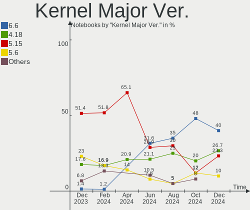
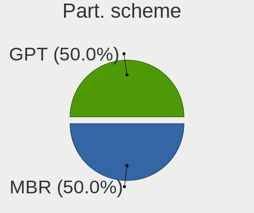
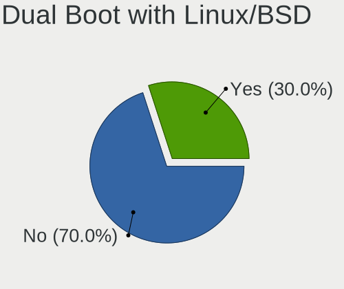
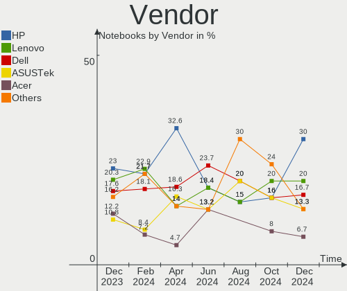
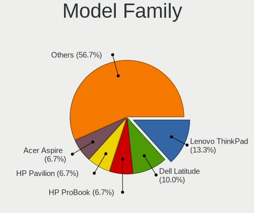
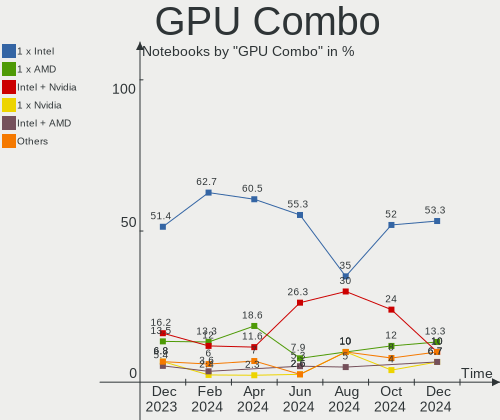
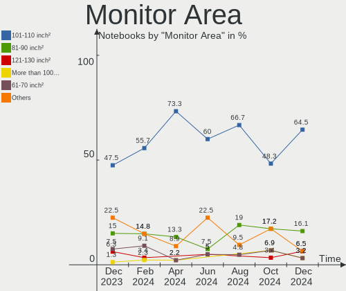
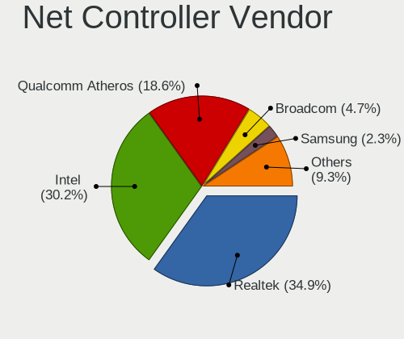
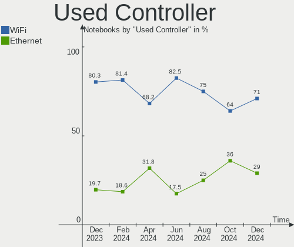

BlackPanther Hardware Trends (Notebooks)
----------------------------------------

A project to identify most popular hardware characteristics and track their change
over time based on data collected by BlackPanther users at https://Linux-Hardware.org.

Anyone can contribute to this report by the [hw-probe](https://github.com/linuxhw/hw-probe) tool:

    sudo -E hw-probe -all -upload

Full-feature report is available here: https://linux-hardware.org/?view=trends&formfactor=notebook

Period: Oct, 2021.

Contents
--------

* [ System ](#system)
  - [ OS                       ](#os)
  - [ OS Family                ](#os-family)
  - [ Kernel                   ](#kernel)
  - [ Kernel Family            ](#kernel-family)
  - [ Kernel Major Ver.        ](#kernel-major-ver)
  - [ Arch                     ](#arch)
  - [ DE                       ](#de)
  - [ Display Server           ](#display-server)
  - [ Display Manager          ](#display-manager)
  - [ OS Lang                  ](#os-lang)
  - [ Boot Mode                ](#boot-mode)
  - [ Filesystem               ](#filesystem)
  - [ Part. scheme             ](#part-scheme)
  - [ Dual Boot with Linux/BSD ](#dual-boot-with-linuxbsd)
  - [ Dual Boot (Win)          ](#dual-boot-win)

* [ Board ](#board)
  - [ Vendor                   ](#vendor)
  - [ Model                    ](#model)
  - [ Model Family             ](#model-family)
  - [ MFG Year                 ](#mfg-year)
  - [ Form Factor              ](#form-factor)
  - [ Secure Boot              ](#secure-boot)
  - [ Coreboot                 ](#coreboot)
  - [ RAM Size                 ](#ram-size)
  - [ RAM Used                 ](#ram-used)
  - [ Total Drives             ](#total-drives)
  - [ Has CD-ROM               ](#has-cd-rom)
  - [ Has Ethernet             ](#has-ethernet)
  - [ Has WiFi                 ](#has-wifi)
  - [ Has Bluetooth            ](#has-bluetooth)

* [ Location ](#location)
  - [ Country                  ](#country)
  - [ City                     ](#city)

* [ Drives ](#drives)
  - [ Drive Vendor             ](#drive-vendor)
  - [ Drive Model              ](#drive-model)
  - [ HDD Vendor               ](#hdd-vendor)
  - [ SSD Vendor               ](#ssd-vendor)
  - [ Drive Kind               ](#drive-kind)
  - [ Drive Connector          ](#drive-connector)
  - [ Drive Size               ](#drive-size)
  - [ Space Total              ](#space-total)
  - [ Space Used               ](#space-used)
  - [ Malfunc. Drives          ](#malfunc-drives)
  - [ Malfunc. Drive Vendor    ](#malfunc-drive-vendor)
  - [ Malfunc. HDD Vendor      ](#malfunc-hdd-vendor)
  - [ Malfunc. Drive Kind      ](#malfunc-drive-kind)
  - [ Failed Drives            ](#failed-drives)
  - [ Failed Drive Vendor      ](#failed-drive-vendor)
  - [ Drive Status             ](#drive-status)

* [ Storage controller ](#storage-controller)
  - [ Storage Vendor           ](#storage-vendor)
  - [ Storage Model            ](#storage-model)
  - [ Storage Kind             ](#storage-kind)

* [ Processor ](#processor)
  - [ CPU Vendor               ](#cpu-vendor)
  - [ CPU Model                ](#cpu-model)
  - [ CPU Model Family         ](#cpu-model-family)
  - [ CPU Cores                ](#cpu-cores)
  - [ CPU Sockets              ](#cpu-sockets)
  - [ CPU Threads              ](#cpu-threads)
  - [ CPU Op-Modes             ](#cpu-op-modes)
  - [ CPU Microcode            ](#cpu-microcode)
  - [ CPU Microarch            ](#cpu-microarch)

* [ Graphics ](#graphics)
  - [ GPU Vendor               ](#gpu-vendor)
  - [ GPU Model                ](#gpu-model)
  - [ GPU Combo                ](#gpu-combo)
  - [ GPU Driver               ](#gpu-driver)
  - [ GPU Memory               ](#gpu-memory)

* [ Monitor ](#monitor)
  - [ Monitor Vendor           ](#monitor-vendor)
  - [ Monitor Model            ](#monitor-model)
  - [ Monitor Resolution       ](#monitor-resolution)
  - [ Monitor Diagonal         ](#monitor-diagonal)
  - [ Monitor Width            ](#monitor-width)
  - [ Aspect Ratio             ](#aspect-ratio)
  - [ Monitor Area             ](#monitor-area)
  - [ Pixel Density            ](#pixel-density)
  - [ Multiple Monitors        ](#multiple-monitors)

* [ Network ](#network)
  - [ Net Controller Vendor    ](#net-controller-vendor)
  - [ Net Controller Model     ](#net-controller-model)
  - [ Wireless Vendor          ](#wireless-vendor)
  - [ Wireless Model           ](#wireless-model)
  - [ Ethernet Vendor          ](#ethernet-vendor)
  - [ Ethernet Model           ](#ethernet-model)
  - [ Net Controller Kind      ](#net-controller-kind)
  - [ Used Controller          ](#used-controller)
  - [ NICs                     ](#nics)
  - [ IPv6                     ](#ipv6)

* [ Bluetooth ](#bluetooth)
  - [ Bluetooth Vendor         ](#bluetooth-vendor)
  - [ Bluetooth Model          ](#bluetooth-model)

* [ Sound ](#sound)
  - [ Sound Vendor             ](#sound-vendor)
  - [ Sound Model              ](#sound-model)

* [ Memory ](#memory)
  - [ Memory Vendor            ](#memory-vendor)
  - [ Memory Model             ](#memory-model)
  - [ Memory Kind              ](#memory-kind)
  - [ Memory Form Factor       ](#memory-form-factor)
  - [ Memory Size              ](#memory-size)
  - [ Memory Speed             ](#memory-speed)

* [ Printers & scanners ](#printers--scanners)
  - [ Printer Vendor           ](#printer-vendor)
  - [ Printer Model            ](#printer-model)
  - [ Scanner Vendor           ](#scanner-vendor)
  - [ Scanner Model            ](#scanner-model)

* [ Camera ](#camera)
  - [ Camera Vendor            ](#camera-vendor)
  - [ Camera Model             ](#camera-model)

* [ Security ](#security)
  - [ Fingerprint Vendor       ](#fingerprint-vendor)
  - [ Fingerprint Model        ](#fingerprint-model)
  - [ Chipcard Vendor          ](#chipcard-vendor)
  - [ Chipcard Model           ](#chipcard-model)

* [ Unsupported ](#unsupported)
  - [ Unsupported Devices      ](#unsupported-devices)
  - [ Unsupported Device Types ](#unsupported-device-types)

System
------

OS
--

Installed operating systems

| Name              | Notebooks | Percent |
|-------------------|-----------|---------|
| BlackPanther 18.1 | 41        | 97.62%  |
| BlackPanther 16.2 | 1         | 2.38%   |

OS Family
---------

OS without a version

| Name         | Notebooks | Percent |
|--------------|-----------|---------|
| BlackPanther | 42        | 100%    |

Kernel
------

Version of the Linux kernel

| Version             | Notebooks | Percent |
|---------------------|-----------|---------|
| 5.6.14-desktop-2bP  | 30        | 71.43%  |
| 4.18.16-desktop-1bP | 11        | 26.19%  |
| 4.9.20-desktop-1bP  | 1         | 2.38%   |

Kernel Family
-------------

Linux kernel without a distro release

| Version | Notebooks | Percent |
|---------|-----------|---------|
| 5.6.14  | 30        | 71.43%  |
| 4.18.16 | 11        | 26.19%  |
| 4.9.20  | 1         | 2.38%   |

Kernel Major Ver.
-----------------

Linux kernel major version

| Version | Notebooks | Percent |
|---------|-----------|---------|
| 5.6     | 30        | 71.43%  |
| 4.18    | 11        | 26.19%  |
| 4.9     | 1         | 2.38%   |

Arch
----

OS architecture (x86_64, i586, etc.)

| Name   | Notebooks | Percent |
|--------|-----------|---------|
| x86_64 | 41        | 97.62%  |
| i686   | 1         | 2.38%   |

DE
--

Desktop Environment

| Name | Notebooks | Percent |
|------|-----------|---------|
| KDE5 | 42        | 100%    |

Display Server
--------------

X11 or Wayland

| Name | Notebooks | Percent |
|------|-----------|---------|
| X11  | 42        | 100%    |

Display Manager
---------------

SDDM, LightDM, etc.

| Name | Notebooks | Percent |
|------|-----------|---------|
| SDDM | 42        | 100%    |

OS Lang
-------

Language

| Lang    | Notebooks | Percent |
|---------|-----------|---------|
| Unknown | 42        | 100%    |

Boot Mode
---------

EFI or BIOS

| Mode | Notebooks | Percent |
|------|-----------|---------|
| BIOS | 25        | 59.52%  |
| EFI  | 17        | 40.48%  |

Filesystem
----------

Type of filesystem

| Type    | Notebooks | Percent |
|---------|-----------|---------|
| Overlay | 34        | 80.95%  |
| Ext4    | 7         | 16.67%  |
| Ext2    | 1         | 2.38%   |

Part. scheme
------------

Scheme of partitioning

| Type    | Notebooks | Percent |
|---------|-----------|---------|
| MBR     | 26        | 61.9%   |
| GPT     | 15        | 35.71%  |
| Unknown | 1         | 2.38%   |

Dual Boot with Linux/BSD
------------------------

Hosting more than one Linux/BSD

| Dual boot | Notebooks | Percent |
|-----------|-----------|---------|
| No        | 23        | 54.76%  |
| Yes       | 19        | 45.24%  |

Dual Boot (Win)
---------------

Hosting Linux and Windows

| Dual boot | Notebooks | Percent |
|-----------|-----------|---------|
| Yes       | 24        | 57.14%  |
| No        | 18        | 42.86%  |

Board
-----

Vendor
------

Motherboard manufacturer

| Name                | Notebooks | Percent |
|---------------------|-----------|---------|
| Hewlett-Packard     | 15        | 35.71%  |
| Lenovo              | 6         | 14.29%  |
| Dell                | 6         | 14.29%  |
| Fujitsu Siemens     | 3         | 7.14%   |
| Fujitsu             | 3         | 7.14%   |
| Acer                | 3         | 7.14%   |
| Toshiba             | 1         | 2.38%   |
| speedmaster         | 1         | 2.38%   |
| Sony                | 1         | 2.38%   |
| Samsung Electronics | 1         | 2.38%   |
| HUAWEI              | 1         | 2.38%   |
| ASUSTek Computer    | 1         | 2.38%   |

Model
-----

Motherboard model

| Name                                    | Notebooks | Percent |
|-----------------------------------------|-----------|---------|
| HP 250 G1                               | 2         | 4.76%   |
| Toshiba Satellite C55D-A                | 1         | 2.38%   |
| speedmaster E131x series                | 1         | 2.38%   |
| Sony VPCEH2J1E                          | 1         | 2.38%   |
| Samsung 300E4Z/300E5Z/300E7Z            | 1         | 2.38%   |
| Lenovo Z710 20250                       | 1         | 2.38%   |
| Lenovo ThinkPad R500 27147KG            | 1         | 2.38%   |
| Lenovo IdeaPad S145-15IWL 81MV          | 1         | 2.38%   |
| Lenovo G70-70 80HW                      | 1         | 2.38%   |
| Lenovo G570 20079                       | 1         | 2.38%   |
| Lenovo E50-80 80J2                      | 1         | 2.38%   |
| HUAWEI HVY-WXX9                         | 1         | 2.38%   |
| HP ProBook 6475b                        | 1         | 2.38%   |
| HP ProBook 6470b                        | 1         | 2.38%   |
| HP ProBook 645 G1                       | 1         | 2.38%   |
| HP Presario CQ58                        | 1         | 2.38%   |
| HP Presario CQ57                        | 1         | 2.38%   |
| HP Pavilion Gaming Laptop 15-ec1xxx     | 1         | 2.38%   |
| HP Pavilion dv6                         | 1         | 2.38%   |
| HP Pavilion 15                          | 1         | 2.38%   |
| HP OMEN by Laptop 17-an0xx              | 1         | 2.38%   |
| HP EliteBook 6930p                      | 1         | 2.38%   |
| HP 650                                  | 1         | 2.38%   |
| HP 255 G5 Notebook PC                   | 1         | 2.38%   |
| HP 250 G6 Notebook PC                   | 1         | 2.38%   |
| Fujitsu Siemens AMILO Xi 3650           | 1         | 2.38%   |
| Fujitsu Siemens AMILO Pro Edition V3505 | 1         | 2.38%   |
| Fujitsu Siemens AMILO Li1705            | 1         | 2.38%   |
| Fujitsu LIFEBOOK AH531                  | 1         | 2.38%   |
| Fujitsu LIFEBOOK A530                   | 1         | 2.38%   |
| Fujitsu LIFEBOOK A512                   | 1         | 2.38%   |
| Dell Vostro 1700                        | 1         | 2.38%   |
| Dell Studio XPS 1340                    | 1         | 2.38%   |
| Dell Latitude E6230                     | 1         | 2.38%   |
| Dell Latitude D630                      | 1         | 2.38%   |
| Dell Inspiron M5040                     | 1         | 2.38%   |
| Dell Inspiron 3537                      | 1         | 2.38%   |
| ASUS N50Vn                              | 1         | 2.38%   |
| Acer TravelMate 8571                    | 1         | 2.38%   |
| Acer Aspire A315-53G                    | 1         | 2.38%   |
| Acer Aspire A315-21G                    | 1         | 2.38%   |

Model Family
------------

Motherboard model prefix

| Name                  | Notebooks | Percent |
|-----------------------|-----------|---------|
| HP ProBook            | 3         | 7.14%   |
| HP Pavilion           | 3         | 7.14%   |
| HP 250                | 3         | 7.14%   |
| Fujitsu Siemens AMILO | 3         | 7.14%   |
| Fujitsu LIFEBOOK      | 3         | 7.14%   |
| HP Presario           | 2         | 4.76%   |
| Dell Latitude         | 2         | 4.76%   |
| Dell Inspiron         | 2         | 4.76%   |
| Acer Aspire           | 2         | 4.76%   |
| Toshiba Satellite     | 1         | 2.38%   |
| speedmaster E131x     | 1         | 2.38%   |
| Sony VPCEH2J1E        | 1         | 2.38%   |
| Samsung 300E4Z        | 1         | 2.38%   |
| Lenovo Z710           | 1         | 2.38%   |
| Lenovo ThinkPad       | 1         | 2.38%   |
| Lenovo IdeaPad        | 1         | 2.38%   |
| Lenovo G70-70         | 1         | 2.38%   |
| Lenovo G570           | 1         | 2.38%   |
| Lenovo E50-80         | 1         | 2.38%   |
| HUAWEI HVY-WXX9       | 1         | 2.38%   |
| HP OMEN               | 1         | 2.38%   |
| HP EliteBook          | 1         | 2.38%   |
| HP 650                | 1         | 2.38%   |
| HP 255                | 1         | 2.38%   |
| Dell Vostro           | 1         | 2.38%   |
| Dell Studio           | 1         | 2.38%   |
| ASUS N50Vn            | 1         | 2.38%   |
| Acer TravelMate       | 1         | 2.38%   |

MFG Year
--------

Motherboard manufacture year

| Year | Notebooks | Percent |
|------|-----------|---------|
| 2013 | 7         | 16.67%  |
| 2012 | 5         | 11.9%   |
| 2014 | 4         | 9.52%   |
| 2011 | 4         | 9.52%   |
| 2010 | 4         | 9.52%   |
| 2019 | 3         | 7.14%   |
| 2018 | 3         | 7.14%   |
| 2008 | 3         | 7.14%   |
| 2020 | 2         | 4.76%   |
| 2007 | 2         | 4.76%   |
| 2021 | 1         | 2.38%   |
| 2017 | 1         | 2.38%   |
| 2016 | 1         | 2.38%   |
| 2015 | 1         | 2.38%   |
| 2009 | 1         | 2.38%   |

Form Factor
-----------

Physical design of the computer

| Name     | Notebooks | Percent |
|----------|-----------|---------|
| Notebook | 42        | 100%    |

Secure Boot
-----------

Enabled or disabled

| State    | Notebooks | Percent |
|----------|-----------|---------|
| Disabled | 42        | 100%    |

Coreboot
--------

Have coreboot on board

| Used | Notebooks | Percent |
|------|-----------|---------|
| No   | 42        | 100%    |

RAM Size
--------

Total RAM memory

| Size in GB | Notebooks | Percent |
|------------|-----------|---------|
| 3.01-4.0   | 17        | 40.48%  |
| 4.01-8.0   | 8         | 19.05%  |
| 8.01-16.0  | 8         | 19.05%  |
| 1.01-2.0   | 6         | 14.29%  |
| 16.01-24.0 | 2         | 4.76%   |
| 0.51-1.0   | 1         | 2.38%   |

RAM Used
--------

Used RAM memory

| Used GB  | Notebooks | Percent |
|----------|-----------|---------|
| 0.51-1.0 | 27        | 64.29%  |
| 1.01-2.0 | 8         | 19.05%  |
| 0.01-0.5 | 7         | 16.67%  |

Total Drives
------------

Number of drives on board

| Drives | Notebooks | Percent |
|--------|-----------|---------|
| 1      | 34        | 80.95%  |
| 2      | 6         | 14.29%  |
| 3      | 2         | 4.76%   |

Has CD-ROM
----------

Has CD-ROM on board

| Presented | Notebooks | Percent |
|-----------|-----------|---------|
| Yes       | 28        | 66.67%  |
| No        | 14        | 33.33%  |

Has Ethernet
------------

Has Ethernet on board

| Presented | Notebooks | Percent |
|-----------|-----------|---------|
| Yes       | 40        | 95.24%  |
| No        | 2         | 4.76%   |

Has WiFi
--------

Has WiFi module

| Presented | Notebooks | Percent |
|-----------|-----------|---------|
| Yes       | 42        | 100%    |

Has Bluetooth
-------------

Has Bluetooth module

| Presented | Notebooks | Percent |
|-----------|-----------|---------|
| Yes       | 37        | 88.1%   |
| No        | 5         | 11.9%   |

Location
--------

Country
-------

Geographic location (country)

| Country  | Notebooks | Percent |
|----------|-----------|---------|
| Hungary  | 31        | 73.81%  |
| Germany  | 5         | 11.9%   |
| Slovakia | 3         | 7.14%   |
| Egypt    | 1         | 2.38%   |
| Canada   | 1         | 2.38%   |
| Austria  | 1         | 2.38%   |

City
----

Geographic location (city)

| City              | Notebooks | Percent |
|-------------------|-----------|---------|
| Budapest          | 10        | 23.81%  |
| Wernberg-Koblitz  | 2         | 4.76%   |
| Hnusta            | 2         | 4.76%   |
| Vienna            | 1         | 2.38%   |
| Tyukod            | 1         | 2.38%   |
| Tatab??nya        | 1         | 2.38%   |
| Szombathely       | 1         | 2.38%   |
| Szigetszentmiklos | 1         | 2.38%   |
| Sz?©kesfeh?©rv??r | 1         | 2.38%   |
| Straubing         | 1         | 2.38%   |
| Sokoropatka       | 1         | 2.38%   |
| Salgotarjan       | 1         | 2.38%   |
| Regensburg        | 1         | 2.38%   |
| Marrtown          | 1         | 2.38%   |
| Magyarlak         | 1         | 2.38%   |
| Levice            | 1         | 2.38%   |
| Lebeny            | 1         | 2.38%   |
| Kismaros          | 1         | 2.38%   |
| Kenderes          | 1         | 2.38%   |
| Karcag            | 1         | 2.38%   |
| Hajduboszormeny   | 1         | 2.38%   |
| Gyorszemere       | 1         | 2.38%   |
| Gyongyos          | 1         | 2.38%   |
| Etyek             | 1         | 2.38%   |
| Encs              | 1         | 2.38%   |
| Dormagen          | 1         | 2.38%   |
| Debrecen          | 1         | 2.38%   |
| Cairo             | 1         | 2.38%   |
| Bicske            | 1         | 2.38%   |
| Aporka            | 1         | 2.38%   |
| Annavolgy         | 1         | 2.38%   |

Drives
------

Drive Vendor
------------

Hard drive vendors

| Vendor              | Notebooks | Drives | Percent |
|---------------------|-----------|--------|---------|
| Seagate             | 9         | 9      | 17.31%  |
| Toshiba             | 8         | 8      | 15.38%  |
| Kingston            | 6         | 6      | 11.54%  |
| WDC                 | 5         | 5      | 9.62%   |
| Samsung Electronics | 5         | 6      | 9.62%   |
| SanDisk             | 3         | 3      | 5.77%   |
| Hitachi             | 3         | 3      | 5.77%   |
| HGST                | 3         | 3      | 5.77%   |
| A-DATA Technology   | 2         | 2      | 3.85%   |
| Verbatim            | 1         | 1      | 1.92%   |
| SPCC                | 1         | 1      | 1.92%   |
| OCZ                 | 1         | 1      | 1.92%   |
| Micron Technology   | 1         | 1      | 1.92%   |
| JMicron             | 1         | 1      | 1.92%   |
| Intenso             | 1         | 1      | 1.92%   |
| Intel               | 1         | 1      | 1.92%   |
| China               | 1         | 1      | 1.92%   |

Drive Model
-----------

Hard drive models

| Model                               | Notebooks | Percent |
|-------------------------------------|-----------|---------|
| Toshiba MQ01ACF032 320GB            | 2         | 3.77%   |
| SanDisk SDSSDH3 500G                | 2         | 3.77%   |
| Kingston SA400S37480G 480GB SSD     | 2         | 3.77%   |
| Kingston SA400S37120G 120GB SSD     | 2         | 3.77%   |
| Hitachi HTS547550A9E384 500GB       | 2         | 3.77%   |
| HGST HTS545032A7E380 320GB          | 2         | 3.77%   |
| WDC WD7500BPVT-80HXZT3 752GB        | 1         | 1.89%   |
| WDC WD10SPCX-24HWST1 1TB            | 1         | 1.89%   |
| WDC WD10JPVX-60JC3T0 1TB            | 1         | 1.89%   |
| WDC WD10JPVX-22JC3T0 1TB            | 1         | 1.89%   |
| WDC WD10JPLX-00MBPT0 1TB            | 1         | 1.89%   |
| Verbatim Vi550 S3 SSD 256GB         | 1         | 1.89%   |
| Toshiba THNSFJ256GCSU 256GB SSD     | 1         | 1.89%   |
| Toshiba MQ04ABF100 1TB              | 1         | 1.89%   |
| Toshiba MQ01ABF050 500GB            | 1         | 1.89%   |
| Toshiba MQ01ABD100 1TB              | 1         | 1.89%   |
| Toshiba MK5059GSXP 500GB            | 1         | 1.89%   |
| Toshiba MK1637GSX 160GB             | 1         | 1.89%   |
| SPCC Solid State Disk 128GB         | 1         | 1.89%   |
| Seagate ST9500420ASG 500GB          | 1         | 1.89%   |
| Seagate ST9160827AS 160GB           | 1         | 1.89%   |
| Seagate ST9120822AS 120GB           | 1         | 1.89%   |
| Seagate ST500LT012-9WS142 500GB     | 1         | 1.89%   |
| Seagate ST500LT012-1DG142 500GB     | 1         | 1.89%   |
| Seagate ST320LT000-9VL142 320GB     | 1         | 1.89%   |
| Seagate ST1000LM035-1RK172 1TB      | 1         | 1.89%   |
| Seagate ST1000LM014-1EJ164-SSHD 1TB | 1         | 1.89%   |
| Seagate ST1000LM 024 HN-M101MBB 1TB | 1         | 1.89%   |
| SanDisk SDSSDH3250G 250GB           | 1         | 1.89%   |
| Samsung SSD 980 PRO 1TB             | 1         | 1.89%   |
| Samsung SSD 850 PRO 256GB           | 1         | 1.89%   |
| Samsung SSD 830 Series 128GB        | 1         | 1.89%   |
| Samsung MZVLW128HEGR-000H1 128GB    | 1         | 1.89%   |
| Samsung MZVLB512HBJQ-00000 512GB    | 1         | 1.89%   |
| Samsung HN-M500MBB 500GB            | 1         | 1.89%   |
| OCZ AGILITY3 64GB SSD               | 1         | 1.89%   |
| Micron MTFDDAK128MAM-1J1 128GB SSD  | 1         | 1.89%   |
| Kingston SV300S37A120G 120GB SSD    | 1         | 1.89%   |
| Kingston SA400S37240G 240GB SSD     | 1         | 1.89%   |
| JMicron Tech 250GB                  | 1         | 1.89%   |
| Intenso SSD SATAIII 120GB           | 1         | 1.89%   |
| Intel SSDPEKNW512G8H 512GB          | 1         | 1.89%   |
| Hitachi HTS725016A9A364 160GB       | 1         | 1.89%   |
| HGST HTS541010A9E680 1TB            | 1         | 1.89%   |
| China SATA SSD 120GB                | 1         | 1.89%   |
| A-DATA SU700 120GB SSD              | 1         | 1.89%   |
| A-DATA SSD S599 55GB                | 1         | 1.89%   |

HDD Vendor
----------

Hard disk drive vendors

| Vendor              | Notebooks | Drives | Percent |
|---------------------|-----------|--------|---------|
| Seagate             | 9         | 9      | 32.14%  |
| Toshiba             | 7         | 7      | 25%     |
| WDC                 | 5         | 5      | 17.86%  |
| Hitachi             | 3         | 3      | 10.71%  |
| HGST                | 3         | 3      | 10.71%  |
| Samsung Electronics | 1         | 1      | 3.57%   |

SSD Vendor
----------

Solid state drive vendors

| Vendor              | Notebooks | Drives | Percent |
|---------------------|-----------|--------|---------|
| Kingston            | 6         | 6      | 30%     |
| SanDisk             | 3         | 3      | 15%     |
| Samsung Electronics | 2         | 2      | 10%     |
| A-DATA Technology   | 2         | 2      | 10%     |
| Verbatim            | 1         | 1      | 5%      |
| Toshiba             | 1         | 1      | 5%      |
| SPCC                | 1         | 1      | 5%      |
| OCZ                 | 1         | 1      | 5%      |
| Micron Technology   | 1         | 1      | 5%      |
| Intenso             | 1         | 1      | 5%      |
| China               | 1         | 1      | 5%      |

Drive Kind
----------

HDD or SSD

| Kind    | Notebooks | Drives | Percent |
|---------|-----------|--------|---------|
| HDD     | 26        | 28     | 52%     |
| SSD     | 20        | 20     | 40%     |
| NVMe    | 3         | 4      | 6%      |
| Unknown | 1         | 1      | 2%      |

Drive Connector
---------------

SATA, SAS, NVMe, etc.

| Type | Notebooks | Drives | Percent |
|------|-----------|--------|---------|
| SATA | 40        | 47     | 88.89%  |
| NVMe | 3         | 4      | 6.67%   |
| SAS  | 2         | 2      | 4.44%   |

Drive Size
----------

Size of hard drive

| Size in TB | Notebooks | Drives | Percent |
|------------|-----------|--------|---------|
| 0.01-0.5   | 35        | 37     | 77.78%  |
| 0.51-1.0   | 10        | 11     | 22.22%  |

Space Total
-----------

Amount of disk space available on the file system

| Size in GB | Notebooks | Percent |
|------------|-----------|---------|
| Unknown    | 34        | 80.95%  |
| 101-250    | 3         | 7.14%   |
| 251-500    | 2         | 4.76%   |
| 21-50      | 1         | 2.38%   |
| 501-1000   | 1         | 2.38%   |
| 51-100     | 1         | 2.38%   |

Space Used
----------

Amount of used disk space

| Used GB | Notebooks | Percent |
|---------|-----------|---------|
| Unknown | 34        | 80.95%  |
| 1-20    | 8         | 19.05%  |

Malfunc. Drives
---------------

Drive models with a malfunction

| Model                                | Notebooks | Drives | Percent |
|--------------------------------------|-----------|--------|---------|
| HGST HTS545032A7E380 320GB           | 2         | 2      | 11.11%  |
| WDC WD7500BPVT-80HXZT3 752GB         | 1         | 1      | 5.56%   |
| WDC WD10JPVX-22JC3T0 1TB             | 1         | 1      | 5.56%   |
| Toshiba THNSFJ256GCSU 256GB SSD      | 1         | 1      | 5.56%   |
| Toshiba MQ01ABF050 500GB             | 1         | 1      | 5.56%   |
| Toshiba MK1637GSX 160GB              | 1         | 1      | 5.56%   |
| Seagate ST9160827AS 160GB            | 1         | 1      | 5.56%   |
| Seagate ST9120822AS 120GB            | 1         | 1      | 5.56%   |
| Seagate ST500LT012-9WS142 500GB      | 1         | 1      | 5.56%   |
| Seagate ST500LT012-1DG142 500GB      | 1         | 1      | 5.56%   |
| Seagate ST320LT000-9VL142 320GB      | 1         | 1      | 5.56%   |
| Seagate ST1000LM014-1EJ164-SSHD 1TB  | 1         | 1      | 5.56%   |
| Samsung Electronics HN-M500MBB 500GB | 1         | 1      | 5.56%   |
| Hitachi HTS725016A9A364 160GB        | 1         | 1      | 5.56%   |
| Hitachi HTS547550A9E384 500GB        | 1         | 1      | 5.56%   |
| HGST HTS541010A9E680 1TB             | 1         | 1      | 5.56%   |
| A-DATA Technology SU700 120GB SSD    | 1         | 1      | 5.56%   |

Malfunc. Drive Vendor
---------------------

Vendors of faulty drives

| Vendor              | Notebooks | Drives | Percent |
|---------------------|-----------|--------|---------|
| Seagate             | 6         | 6      | 33.33%  |
| Toshiba             | 3         | 3      | 16.67%  |
| HGST                | 3         | 3      | 16.67%  |
| WDC                 | 2         | 2      | 11.11%  |
| Hitachi             | 2         | 2      | 11.11%  |
| Samsung Electronics | 1         | 1      | 5.56%   |
| A-DATA Technology   | 1         | 1      | 5.56%   |

Malfunc. HDD Vendor
-------------------

Vendors of faulty HDD drives

| Vendor              | Notebooks | Drives | Percent |
|---------------------|-----------|--------|---------|
| Seagate             | 6         | 6      | 37.5%   |
| HGST                | 3         | 3      | 18.75%  |
| WDC                 | 2         | 2      | 12.5%   |
| Toshiba             | 2         | 2      | 12.5%   |
| Hitachi             | 2         | 2      | 12.5%   |
| Samsung Electronics | 1         | 1      | 6.25%   |

Malfunc. Drive Kind
-------------------

Kinds of faulty drives

| Kind | Notebooks | Drives | Percent |
|------|-----------|--------|---------|
| HDD  | 15        | 16     | 88.24%  |
| SSD  | 2         | 2      | 11.76%  |

Failed Drives
-------------

Failed drive models

Zero info for selected period =(

Failed Drive Vendor
-------------------

Failed drive vendors

Zero info for selected period =(

Drive Status
------------

Number of failed and malfunc. drives

| Status   | Notebooks | Drives | Percent |
|----------|-----------|--------|---------|
| Works    | 28        | 33     | 60.87%  |
| Malfunc  | 16        | 18     | 34.78%  |
| Detected | 2         | 2      | 4.35%   |

Storage controller
------------------

Storage Vendor
--------------

Storage controller vendors

| Vendor              | Notebooks | Percent |
|---------------------|-----------|---------|
| Intel               | 30        | 68.18%  |
| AMD                 | 10        | 22.73%  |
| Samsung Electronics | 2         | 4.55%   |
| VIA Technologies    | 1         | 2.27%   |
| Nvidia              | 1         | 2.27%   |

Storage Model
-------------

Storage controller models

| Model                                                                          | Notebooks | Percent |
|--------------------------------------------------------------------------------|-----------|---------|
| AMD FCH SATA Controller [AHCI mode]                                            | 8         | 16%     |
| Intel 7 Series Chipset Family 6-port SATA Controller [AHCI mode]               | 5         | 10%     |
| Intel 82801IBM/IEM (ICH9M/ICH9M-E) 4 port SATA Controller [AHCI mode]          | 4         | 8%      |
| Intel 6 Series/C200 Series Chipset Family 6 port Mobile SATA AHCI Controller   | 4         | 8%      |
| Intel 8 Series SATA Controller 1 [AHCI mode]                                   | 3         | 6%      |
| Intel 82801HM/HEM (ICH8M/ICH8M-E) SATA Controller [IDE mode]                   | 2         | 4%      |
| Intel 82801HM/HEM (ICH8M/ICH8M-E) IDE Controller                               | 2         | 4%      |
| Intel 82801 Mobile SATA Controller [RAID mode]                                 | 2         | 4%      |
| Intel 5 Series/3400 Series Chipset 4 port SATA AHCI Controller                 | 2         | 4%      |
| AMD SB7x0/SB8x0/SB9x0 SATA Controller [AHCI mode]                              | 2         | 4%      |
| VIA VT82C586A/B/VT82C686/A/B/VT823x/A/C PIPC Bus Master IDE                    | 1         | 2%      |
| VIA VT8237A SATA 2-Port Controller                                             | 1         | 2%      |
| Samsung NVMe SSD Controller SM981/PM981/PM983                                  | 1         | 2%      |
| Samsung NVMe SSD Controller SM961/PM961/SM963                                  | 1         | 2%      |
| Samsung NVMe SSD Controller PM9A1/PM9A3/980PRO                                 | 1         | 2%      |
| Nvidia MCP79 AHCI Controller                                                   | 1         | 2%      |
| Intel Wildcat Point-LP SATA Controller [AHCI Mode]                             | 1         | 2%      |
| Intel Sunrise Point-LP SATA Controller [AHCI mode]                             | 1         | 2%      |
| Intel SSD 660P Series                                                          | 1         | 2%      |
| Intel Mobile 4 Series Chipset PT IDER Controller                               | 1         | 2%      |
| Intel HM170/QM170 Chipset SATA Controller [AHCI Mode]                          | 1         | 2%      |
| Intel Celeron/Pentium Silver Processor SATA Controller                         | 1         | 2%      |
| Intel Cannon Point-LP SATA Controller [AHCI Mode]                              | 1         | 2%      |
| Intel 82801GBM/GHM (ICH7-M Family) SATA Controller [AHCI mode]                 | 1         | 2%      |
| Intel 82801G (ICH7 Family) IDE Controller                                      | 1         | 2%      |
| Intel 8 Series/C220 Series Chipset Family 6-port SATA Controller 1 [AHCI mode] | 1         | 2%      |

Storage Kind
------------

Kind of storage controller (IDE, SATA, NVMe, SAS, ...)

| Kind | Notebooks | Percent |
|------|-----------|---------|
| SATA | 36        | 78.26%  |
| IDE  | 5         | 10.87%  |
| NVMe | 3         | 6.52%   |
| RAID | 2         | 4.35%   |

Processor
---------

CPU Vendor
----------

Processor vendors

| Vendor | Notebooks | Percent |
|--------|-----------|---------|
| Intel  | 31        | 73.81%  |
| AMD    | 11        | 26.19%  |

CPU Model
---------

Processor models

| Model                                        | Notebooks | Percent |
|----------------------------------------------|-----------|---------|
| Intel Core i5-3340M CPU @ 2.70GHz            | 2         | 4.76%   |
| Intel Core i3-2330M CPU @ 2.20GHz            | 2         | 4.76%   |
| Intel Celeron CPU 1000M @ 1.80GHz            | 2         | 4.76%   |
| AMD Ryzen 5 4600H with Radeon Graphics       | 2         | 4.76%   |
| Intel Pentium CPU B950 @ 2.10GHz             | 1         | 2.38%   |
| Intel Core i7-4700MQ CPU @ 2.40GHz           | 1         | 2.38%   |
| Intel Core i7-4500U CPU @ 1.80GHz            | 1         | 2.38%   |
| Intel Core i5-7300HQ CPU @ 2.50GHz           | 1         | 2.38%   |
| Intel Core i5-5200U CPU @ 2.20GHz            | 1         | 2.38%   |
| Intel Core i5-4210U CPU @ 1.70GHz            | 1         | 2.38%   |
| Intel Core i5-4200U CPU @ 1.60GHz            | 1         | 2.38%   |
| Intel Core i5 CPU M 430 @ 2.27GHz            | 1         | 2.38%   |
| Intel Core i3-7020U CPU @ 2.30GHz            | 1         | 2.38%   |
| Intel Core i3-3110M CPU @ 2.40GHz            | 1         | 2.38%   |
| Intel Core i3-2350M CPU @ 2.30GHz            | 1         | 2.38%   |
| Intel Core i3 CPU M 350 @ 2.27GHz            | 1         | 2.38%   |
| Intel Core Duo CPU T2450 @ 2.00GHz           | 1         | 2.38%   |
| Intel Core 2 Duo CPU U9400 @ 1.40GHz         | 1         | 2.38%   |
| Intel Core 2 Duo CPU T9600 @ 2.80GHz         | 1         | 2.38%   |
| Intel Core 2 Duo CPU T9400 @ 2.53GHz         | 1         | 2.38%   |
| Intel Core 2 Duo CPU T8300 @ 2.40GHz         | 1         | 2.38%   |
| Intel Core 2 Duo CPU T7250 @ 2.00GHz         | 1         | 2.38%   |
| Intel Core 2 Duo CPU T6600 @ 2.20GHz         | 1         | 2.38%   |
| Intel Core 2 Duo CPU T5870 @ 2.00GHz         | 1         | 2.38%   |
| Intel Core 2 Duo CPU P8400 @ 2.26GHz         | 1         | 2.38%   |
| Intel Celeron N4000 CPU @ 1.10GHz            | 1         | 2.38%   |
| Intel Celeron M CPU 520 @ 1.60GHz            | 1         | 2.38%   |
| Intel Celeron CPU B830 @ 1.80GHz             | 1         | 2.38%   |
| Intel Celeron CPU 4205U @ 1.80GHz            | 1         | 2.38%   |
| AMD E1-1200 APU with Radeon HD Graphics      | 1         | 2.38%   |
| AMD E-450 APU with Radeon HD Graphics        | 1         | 2.38%   |
| AMD E-300 APU with Radeon HD Graphics        | 1         | 2.38%   |
| AMD C-50 Processor                           | 1         | 2.38%   |
| AMD A6-7310 APU with AMD Radeon R4 Graphics  | 1         | 2.38%   |
| AMD A6-4400M APU with Radeon HD Graphics     | 1         | 2.38%   |
| AMD A4-9120 RADEON R3, 4 COMPUTE CORES 2C+2G | 1         | 2.38%   |
| AMD A4-5150M APU with Radeon HD Graphics     | 1         | 2.38%   |
| AMD A4-1200 APU with Radeon HD Graphics      | 1         | 2.38%   |

CPU Model Family
----------------

Processor model prefix

| Model            | Notebooks | Percent |
|------------------|-----------|---------|
| Intel Core 2 Duo | 8         | 19.05%  |
| Intel Core i5    | 7         | 16.67%  |
| Intel Core i3    | 6         | 14.29%  |
| Intel Celeron    | 5         | 11.9%   |
| AMD A4           | 3         | 7.14%   |
| Intel Core i7    | 2         | 4.76%   |
| AMD Ryzen 5      | 2         | 4.76%   |
| AMD E            | 2         | 4.76%   |
| AMD A6           | 2         | 4.76%   |
| Intel Pentium    | 1         | 2.38%   |
| Intel Core Duo   | 1         | 2.38%   |
| Intel Celeron M  | 1         | 2.38%   |
| AMD E1           | 1         | 2.38%   |
| AMD C-50         | 1         | 2.38%   |

CPU Cores
---------

Number of processor cores

| Number | Notebooks | Percent |
|--------|-----------|---------|
| 2      | 32        | 76.19%  |
| 1      | 5         | 11.9%   |
| 4      | 3         | 7.14%   |
| 6      | 2         | 4.76%   |

CPU Sockets
-----------

Number of sockets

| Number | Notebooks | Percent |
|--------|-----------|---------|
| 1      | 42        | 100%    |

CPU Threads
-----------

Threads per core (Hyper-Threading)

| Number | Notebooks | Percent |
|--------|-----------|---------|
| 1      | 26        | 61.9%   |
| 2      | 16        | 38.1%   |

CPU Op-Modes
------------

CPU Operation Modes (32-bit, 64-bit)

| Op mode        | Notebooks | Percent |
|----------------|-----------|---------|
| 32-bit, 64-bit | 41        | 97.62%  |
| 32-bit         | 1         | 2.38%   |

CPU Microcode
-------------

Microcode number

| Number     | Notebooks | Percent |
|------------|-----------|---------|
| 0x306a9    | 5         | 11.9%   |
| 0x206a7    | 5         | 11.9%   |
| 0x40651    | 3         | 7.14%   |
| 0x1067a    | 3         | 7.14%   |
| 0x10676    | 3         | 7.14%   |
| 0x05000119 | 3         | 7.14%   |
| 0x6fd      | 2         | 4.76%   |
| 0x20652    | 2         | 4.76%   |
| 0x08600106 | 2         | 4.76%   |
| 0x906e9    | 1         | 2.38%   |
| 0x806eb    | 1         | 2.38%   |
| 0x806ea    | 1         | 2.38%   |
| 0x706a1    | 1         | 2.38%   |
| 0x6f6      | 1         | 2.38%   |
| 0x6ec      | 1         | 2.38%   |
| 0x306d4    | 1         | 2.38%   |
| 0x306c3    | 1         | 2.38%   |
| 0x07030105 | 1         | 2.38%   |
| 0x0700010f | 1         | 2.38%   |
| 0x06006704 | 1         | 2.38%   |
| 0x0600111f | 1         | 2.38%   |
| 0x06001119 | 1         | 2.38%   |
| 0x05000028 | 1         | 2.38%   |

CPU Microarch
-------------

Microarchitecture

| Name          | Notebooks | Percent |
|---------------|-----------|---------|
| Penryn        | 6         | 14.29%  |
| SandyBridge   | 5         | 11.9%   |
| IvyBridge     | 5         | 11.9%   |
| Haswell       | 4         | 9.52%   |
| Bobcat        | 4         | 9.52%   |
| KabyLake      | 3         | 7.14%   |
| Core          | 3         | 7.14%   |
| Zen 2         | 2         | 4.76%   |
| Westmere      | 2         | 4.76%   |
| Piledriver    | 2         | 4.76%   |
| Puma          | 1         | 2.38%   |
| P6            | 1         | 2.38%   |
| Jaguar        | 1         | 2.38%   |
| Goldmont plus | 1         | 2.38%   |
| Excavator     | 1         | 2.38%   |
| Broadwell     | 1         | 2.38%   |

Graphics
--------

GPU Vendor
----------

Vendors of graphics cards

| Vendor           | Notebooks | Percent |
|------------------|-----------|---------|
| Intel            | 25        | 50%     |
| AMD              | 14        | 28%     |
| Nvidia           | 10        | 20%     |
| VIA Technologies | 1         | 2%      |

GPU Model
---------

Graphics card models

| Model                                                                         | Notebooks | Percent |
|-------------------------------------------------------------------------------|-----------|---------|
| Intel 3rd Gen Core processor Graphics Controller                              | 5         | 9.43%   |
| Intel 2nd Generation Core Processor Family Integrated Graphics Controller     | 4         | 7.55%   |
| Intel Mobile 4 Series Chipset Integrated Graphics Controller                  | 3         | 5.66%   |
| Intel Haswell-ULT Integrated Graphics Controller                              | 3         | 5.66%   |
| Intel Core Processor Integrated Graphics Controller                           | 2         | 3.77%   |
| AMD Renoir                                                                    | 2         | 3.77%   |
| VIA Technologies CN896/VN896/P4M900 [Chrome 9 HC]                             | 1         | 1.89%   |
| Nvidia TU117M [GeForce GTX 1650 Ti Mobile]                                    | 1         | 1.89%   |
| Nvidia GP107M [GeForce GTX 1050 Mobile]                                       | 1         | 1.89%   |
| Nvidia GM108M [GeForce MX130]                                                 | 1         | 1.89%   |
| Nvidia GK208M [GeForce GT 740M]                                               | 1         | 1.89%   |
| Nvidia GK107M [GeForce GT 745M]                                               | 1         | 1.89%   |
| Nvidia GF119M [GeForce 410M]                                                  | 1         | 1.89%   |
| Nvidia G96CM [GeForce 9650M GT]                                               | 1         | 1.89%   |
| Nvidia G96CM [GeForce 9600M GT]                                               | 1         | 1.89%   |
| Nvidia G84M [GeForce 8600M GT]                                                | 1         | 1.89%   |
| Nvidia C79 [GeForce 9400M G]                                                  | 1         | 1.89%   |
| Intel Mobile GM965/GL960 Integrated Graphics Controller (secondary)           | 1         | 1.89%   |
| Intel Mobile GM965/GL960 Integrated Graphics Controller (primary)             | 1         | 1.89%   |
| Intel Mobile 945GM/GMS/GME, 943/940GML Express Integrated Graphics Controller | 1         | 1.89%   |
| Intel Mobile 945GM/GMS, 943/940GML Express Integrated Graphics Controller     | 1         | 1.89%   |
| Intel HD Graphics 630                                                         | 1         | 1.89%   |
| Intel HD Graphics 620                                                         | 1         | 1.89%   |
| Intel HD Graphics 5500                                                        | 1         | 1.89%   |
| Intel GeminiLake [UHD Graphics 600]                                           | 1         | 1.89%   |
| Intel Coffee Lake UHD 610 Graphics Controller                                 | 1         | 1.89%   |
| Intel 4th Gen Core Processor Integrated Graphics Controller                   | 1         | 1.89%   |
| AMD Wrestler [Radeon HD 7310]                                                 | 1         | 1.89%   |
| AMD Wrestler [Radeon HD 6320]                                                 | 1         | 1.89%   |
| AMD Wrestler [Radeon HD 6310]                                                 | 1         | 1.89%   |
| AMD Wrestler [Radeon HD 6250]                                                 | 1         | 1.89%   |
| AMD Venus PRO [Radeon HD 8850M / R9 M265X]                                    | 1         | 1.89%   |
| AMD Trinity 2 [Radeon HD 7520G]                                               | 1         | 1.89%   |
| AMD Sun XT [Radeon HD 8670A/8670M/8690M / R5 M330 / M430 / Radeon 520 Mobile] | 1         | 1.89%   |
| AMD Stoney [Radeon R2/R3/R4/R5 Graphics]                                      | 1         | 1.89%   |
| AMD Richland [Radeon HD 8350G]                                                | 1         | 1.89%   |
| AMD Mullins [Radeon R4/R5 Graphics]                                           | 1         | 1.89%   |
| AMD Madison [Mobility Radeon HD 5650/5750 / 6530M/6550M]                      | 1         | 1.89%   |
| AMD Kabini [Radeon HD 8180]                                                   | 1         | 1.89%   |
| AMD Jet PRO [Radeon R5 M230 / R7 M260DX / Radeon 520 Mobile]                  | 1         | 1.89%   |

GPU Combo
---------

Combinations of graphics cards

| Name           | Notebooks | Percent |
|----------------|-----------|---------|
| 1 x Intel      | 18        | 42.86%  |
| 1 x AMD        | 9         | 21.43%  |
| 1 x Nvidia     | 5         | 11.9%   |
| Intel + Nvidia | 4         | 9.52%   |
| Intel + AMD    | 3         | 7.14%   |
| 2 x AMD        | 1         | 2.38%   |
| 1 x VIA        | 1         | 2.38%   |
| AMD + Nvidia   | 1         | 2.38%   |

GPU Driver
----------

Free vs proprietary

| Driver  | Notebooks | Percent |
|---------|-----------|---------|
| Free    | 41        | 97.62%  |
| Unknown | 1         | 2.38%   |

GPU Memory
----------

Total video memory

| Size in GB | Notebooks | Percent |
|------------|-----------|---------|
| Unknown    | 19        | 45.24%  |
| 0.01-0.5   | 12        | 28.57%  |
| 0.51-1.0   | 6         | 14.29%  |
| 1.01-2.0   | 3         | 7.14%   |
| 3.01-4.0   | 2         | 4.76%   |

Monitor
-------

Monitor Vendor
--------------

Monitor vendors

| Vendor                  | Notebooks | Percent |
|-------------------------|-----------|---------|
| Samsung Electronics     | 10        | 23.26%  |
| LG Display              | 9         | 20.93%  |
| Chimei Innolux          | 8         | 18.6%   |
| AU Optronics            | 6         | 13.95%  |
| Chi Mei Optoelectronics | 3         | 6.98%   |
| BOE                     | 2         | 4.65%   |
| PANDA                   | 1         | 2.33%   |
| Lenovo                  | 1         | 2.33%   |
| InfoVision              | 1         | 2.33%   |
| Hewlett-Packard         | 1         | 2.33%   |
| Dell                    | 1         | 2.33%   |

Monitor Model
-------------

Monitor models

| Model                                                                    | Notebooks | Percent |
|--------------------------------------------------------------------------|-----------|---------|
| LG Display LCD Monitor LGD0395 1366x768 344x194mm 15.5-inch              | 2         | 4.65%   |
| LG Display LCD Monitor LGD02DC 1366x768 344x194mm 15.5-inch              | 2         | 4.65%   |
| Samsung Electronics LCD Monitor SEC5441 1366x768 344x194mm 15.5-inch     | 1         | 2.33%   |
| Samsung Electronics LCD Monitor SEC5341 1366x768 340x190mm 15.3-inch     | 1         | 2.33%   |
| Samsung Electronics LCD Monitor SEC4251 1366x768 344x194mm 15.5-inch     | 1         | 2.33%   |
| Samsung Electronics LCD Monitor SEC3542 2160x1440 250x170mm 11.9-inch    | 1         | 2.33%   |
| Samsung Electronics LCD Monitor SEC3245 1366x768 344x194mm 15.5-inch     | 1         | 2.33%   |
| Samsung Electronics LCD Monitor SEC315A 1366x768 344x194mm 15.5-inch     | 1         | 2.33%   |
| Samsung Electronics LCD Monitor SEC3157 1280x800 300x190mm 14.0-inch     | 1         | 2.33%   |
| Samsung Electronics LCD Monitor SEC3051 1600x900 398x232mm 18.1-inch     | 1         | 2.33%   |
| Samsung Electronics LCD Monitor SEC304A 1920x1080 367x230mm 17.1-inch    | 1         | 2.33%   |
| Samsung Electronics LCD Monitor SDC4347 1366x768 340x190mm 15.3-inch     | 1         | 2.33%   |
| PANDA LCD Monitor NCP0058 1920x1080 344x194mm 15.5-inch                  | 1         | 2.33%   |
| LG Display LCD Monitor LGD04C0 1366x768 309x174mm 14.0-inch              | 1         | 2.33%   |
| LG Display LCD Monitor LGD03AB 1366x768 344x194mm 15.5-inch              | 1         | 2.33%   |
| LG Display LCD Monitor LGD036C 1366x768 277x156mm 12.5-inch              | 1         | 2.33%   |
| LG Display LCD Monitor LGD0348 1920x1080 383x215mm 17.3-inch             | 1         | 2.33%   |
| LG Display LCD Monitor LGD027F 1280x800 304x190mm 14.1-inch              | 1         | 2.33%   |
| Lenovo LCD Monitor LEN4050 1280x800 331x207mm 15.4-inch                  | 1         | 2.33%   |
| InfoVision LCD Monitor IVO03FA 1366x768 220x130mm 10.1-inch              | 1         | 2.33%   |
| Hewlett-Packard w2207 HWP26A8 1680x1050 473x296mm 22.0-inch              | 1         | 2.33%   |
| Dell U2412M DELA079 1920x1200 518x324mm 24.1-inch                        | 1         | 2.33%   |
| Chimei Innolux LCD Monitor CMN1738 1920x1080 381x214mm 17.2-inch         | 1         | 2.33%   |
| Chimei Innolux LCD Monitor CMN1734 1600x900 382x214mm 17.2-inch          | 1         | 2.33%   |
| Chimei Innolux LCD Monitor CMN1604 1920x1080 355x199mm 16.0-inch         | 1         | 2.33%   |
| Chimei Innolux LCD Monitor CMN15DC 1366x768 344x193mm 15.5-inch          | 1         | 2.33%   |
| Chimei Innolux LCD Monitor CMN15DB 1366x768 344x193mm 15.5-inch          | 1         | 2.33%   |
| Chimei Innolux LCD Monitor CMN15BD 1366x768 344x194mm 15.5-inch          | 1         | 2.33%   |
| Chimei Innolux LCD Monitor CMN15AB 1366x768 350x190mm 15.7-inch          | 1         | 2.33%   |
| Chimei Innolux LCD Monitor CMN1469 1366x768 309x174mm 14.0-inch          | 1         | 2.33%   |
| Chi Mei Optoelectronics LCD Monitor CMO15A7 1366x768 350x190mm 15.7-inch | 1         | 2.33%   |
| Chi Mei Optoelectronics LCD Monitor CMO15A4 1366x768 344x194mm 15.5-inch | 1         | 2.33%   |
| Chi Mei Optoelectronics LCD Monitor CMO1561 1280x800 331x207mm 15.4-inch | 1         | 2.33%   |
| BOE LCD Monitor BOE0687 1920x1080 344x193mm 15.5-inch                    | 1         | 2.33%   |
| BOE LCD Monitor BOE0675 1366x768 344x194mm 15.5-inch                     | 1         | 2.33%   |
| AU Optronics LCD Monitor AUO81EC 1366x768 344x193mm 15.5-inch            | 1         | 2.33%   |
| AU Optronics LCD Monitor AUO3787 1440x900 367x230mm 17.1-inch            | 1         | 2.33%   |
| AU Optronics LCD Monitor AUO32EC 1366x768 344x193mm 15.5-inch            | 1         | 2.33%   |
| AU Optronics LCD Monitor AUO23EC 1366x768 344x193mm 15.5-inch            | 1         | 2.33%   |
| AU Optronics LCD Monitor AUO193C 1366x768 309x173mm 13.9-inch            | 1         | 2.33%   |
| AU Optronics LCD Monitor AUO1424 1280x800 290x180mm 13.4-inch            | 1         | 2.33%   |

Monitor Resolution
------------------

Monitor screen resolution

| Resolution         | Notebooks | Percent |
|--------------------|-----------|---------|
| 1366x768 (WXGA)    | 25        | 58.14%  |
| 1920x1080 (FHD)    | 6         | 13.95%  |
| 1280x800 (WXGA)    | 4         | 9.3%    |
| 1600x900 (HD+)     | 3         | 6.98%   |
| 1440x900 (WXGA+)   | 2         | 4.65%   |
| 2160x1440          | 1         | 2.33%   |
| 1920x1200 (WUXGA)  | 1         | 2.33%   |
| 1680x1050 (WSXGA+) | 1         | 2.33%   |

Monitor Diagonal
----------------

Diagonal size in inches

| Inches | Notebooks | Percent |
|--------|-----------|---------|
| 15     | 26        | 60.47%  |
| 17     | 5         | 11.63%  |
| 14     | 4         | 9.3%    |
| 13     | 2         | 4.65%   |
| 24     | 1         | 2.33%   |
| 22     | 1         | 2.33%   |
| 18     | 1         | 2.33%   |
| 16     | 1         | 2.33%   |
| 12     | 1         | 2.33%   |
| 10     | 1         | 2.33%   |

Monitor Width
-------------

Physical width

| Width in mm | Notebooks | Percent |
|-------------|-----------|---------|
| 301-350     | 30        | 69.77%  |
| 351-400     | 8         | 18.6%   |
| 201-300     | 3         | 6.98%   |
| 501-600     | 1         | 2.33%   |
| 401-500     | 1         | 2.33%   |

Aspect Ratio
------------

Proportional relationship between the width and the height

| Ratio | Notebooks | Percent |
|-------|-----------|---------|
| 16/9  | 34        | 79.07%  |
| 16/10 | 9         | 20.93%  |

Monitor Area
------------

Area in inch²

| Area in inch² | Notebooks | Percent |
|----------------|-----------|---------|
| 101-110        | 27        | 62.79%  |
| 81-90          | 6         | 13.95%  |
| 121-130        | 3         | 6.98%   |
| 131-140        | 2         | 4.65%   |
| 61-70          | 1         | 2.33%   |
| 41-50          | 1         | 2.33%   |
| 251-300        | 1         | 2.33%   |
| 201-250        | 1         | 2.33%   |
| 141-150        | 1         | 2.33%   |

Pixel Density
-------------

Pixels per inch

| Density | Notebooks | Percent |
|---------|-----------|---------|
| 101-120 | 27        | 64.29%  |
| 121-160 | 8         | 19.05%  |
| 51-100  | 7         | 16.67%  |

Multiple Monitors
-----------------

Total monitors connected

| Total | Notebooks | Percent |
|-------|-----------|---------|
| 1     | 39        | 92.86%  |
| 2     | 2         | 4.76%   |
| 0     | 1         | 2.38%   |

Network
-------

Net Controller Vendor
---------------------

Controller vendors

| Vendor                     | Notebooks | Percent |
|----------------------------|-----------|---------|
| Realtek Semiconductor      | 28        | 36.36%  |
| Intel                      | 20        | 25.97%  |
| Qualcomm Atheros           | 11        | 14.29%  |
| Broadcom                   | 7         | 9.09%   |
| Ralink                     | 3         | 3.9%    |
| Broadcom Limited           | 3         | 3.9%    |
| VIA Technologies           | 1         | 1.3%    |
| Shenzhen Goodix Technology | 1         | 1.3%    |
| Nvidia                     | 1         | 1.3%    |
| Marvell Technology Group   | 1         | 1.3%    |
| Huawei Technologies        | 1         | 1.3%    |

Net Controller Model
--------------------

Controller models

| Model                                                                         | Notebooks | Percent |
|-------------------------------------------------------------------------------|-----------|---------|
| Realtek RTL8111/8168/8411 PCI Express Gigabit Ethernet Controller             | 21        | 25%     |
| Realtek RTL810xE PCI Express Fast Ethernet controller                         | 7         | 8.33%   |
| Ralink RT3290 Wireless 802.11n 1T/1R PCIe                                     | 3         | 3.57%   |
| Qualcomm Atheros AR9285 Wireless Network Adapter (PCI-Express)                | 3         | 3.57%   |
| Intel WiFi Link 5100                                                          | 3         | 3.57%   |
| Intel PRO/Wireless 3945ABG [Golan] Network Connection                         | 3         | 3.57%   |
| Qualcomm Atheros QCA9565 / AR9565 Wireless Network Adapter                    | 2         | 2.38%   |
| Qualcomm Atheros QCA9377 802.11ac Wireless Network Adapter                    | 2         | 2.38%   |
| Intel Wireless 7260                                                           | 2         | 2.38%   |
| Intel Centrino Advanced-N 6205 [Taylor Peak]                                  | 2         | 2.38%   |
| Intel 82579LM Gigabit Network Connection (Lewisville)                         | 2         | 2.38%   |
| Broadcom BCM43228 802.11a/b/g/n                                               | 2         | 2.38%   |
| Broadcom BCM4313 802.11bgn Wireless Network Adapter                           | 2         | 2.38%   |
| VIA VT6102/VT6103 [Rhine-II]                                                  | 1         | 1.19%   |
| Shenzhen Goodix Unknow device                                                 | 1         | 1.19%   |
| Realtek RTL8822CE 802.11ac PCIe Wireless Network Adapter                      | 1         | 1.19%   |
| Realtek RTL8723BE PCIe Wireless Network Adapter                               | 1         | 1.19%   |
| Realtek RTL8188EE Wireless Network Adapter                                    | 1         | 1.19%   |
| Qualcomm Atheros QCA8171 Gigabit Ethernet                                     | 1         | 1.19%   |
| Qualcomm Atheros AR9485 Wireless Network Adapter                              | 1         | 1.19%   |
| Qualcomm Atheros AR8152 v2.0 Fast Ethernet                                    | 1         | 1.19%   |
| Qualcomm Atheros AR2413/AR2414 Wireless Network Adapter [AR5005G(S) 802.11bg] | 1         | 1.19%   |
| Nvidia MCP79 Ethernet                                                         | 1         | 1.19%   |
| Marvell Group 88E8055 PCI-E Gigabit Ethernet Controller                       | 1         | 1.19%   |
| Intel Wireless 7265                                                           | 1         | 1.19%   |
| Intel Wireless 3165                                                           | 1         | 1.19%   |
| Intel Wireless 3160                                                           | 1         | 1.19%   |
| Intel Wi-Fi 6 AX200                                                           | 1         | 1.19%   |
| Intel Ultimate N WiFi Link 5300                                               | 1         | 1.19%   |
| Intel PRO/Wireless 5100 AGN [Shiloh] Network Connection                       | 1         | 1.19%   |
| Intel Gemini Lake PCH CNVi WiFi                                               | 1         | 1.19%   |
| Intel Centrino Wireless-N 2230                                                | 1         | 1.19%   |
| Intel Centrino Wireless-N 130                                                 | 1         | 1.19%   |
| Intel Cannon Point-LP CNVi [Wireless-AC]                                      | 1         | 1.19%   |
| Intel 82567LM Gigabit Network Connection                                      | 1         | 1.19%   |
| Intel 82567LF Gigabit Network Connection                                      | 1         | 1.19%   |
| Huawei BLA-L29                                                                | 1         | 1.19%   |
| Broadcom NetXtreme BCM5755M Gigabit Ethernet PCI Express                      | 1         | 1.19%   |
| Broadcom NetLink BCM5787M Gigabit Ethernet PCI Express                        | 1         | 1.19%   |
| Broadcom Limited BCM4401-B0 100Base-TX                                        | 1         | 1.19%   |
| Broadcom Limited BCM4313 802.11bgn Wireless Network Adapter                   | 1         | 1.19%   |
| Broadcom Limited BCM4312 802.11b/g LP-PHY                                     | 1         | 1.19%   |
| Broadcom BCM43142 802.11b/g/n                                                 | 1         | 1.19%   |

Wireless Vendor
---------------

Wireless vendors

| Vendor                | Notebooks | Percent |
|-----------------------|-----------|---------|
| Intel                 | 20        | 47.62%  |
| Qualcomm Atheros      | 9         | 21.43%  |
| Broadcom              | 5         | 11.9%   |
| Realtek Semiconductor | 3         | 7.14%   |
| Ralink                | 3         | 7.14%   |
| Broadcom Limited      | 2         | 4.76%   |

Wireless Model
--------------

Wireless models

| Model                                                                         | Notebooks | Percent |
|-------------------------------------------------------------------------------|-----------|---------|
| Ralink RT3290 Wireless 802.11n 1T/1R PCIe                                     | 3         | 7.14%   |
| Qualcomm Atheros AR9285 Wireless Network Adapter (PCI-Express)                | 3         | 7.14%   |
| Intel WiFi Link 5100                                                          | 3         | 7.14%   |
| Intel PRO/Wireless 3945ABG [Golan] Network Connection                         | 3         | 7.14%   |
| Qualcomm Atheros QCA9565 / AR9565 Wireless Network Adapter                    | 2         | 4.76%   |
| Qualcomm Atheros QCA9377 802.11ac Wireless Network Adapter                    | 2         | 4.76%   |
| Intel Wireless 7260                                                           | 2         | 4.76%   |
| Intel Centrino Advanced-N 6205 [Taylor Peak]                                  | 2         | 4.76%   |
| Broadcom BCM43228 802.11a/b/g/n                                               | 2         | 4.76%   |
| Broadcom BCM4313 802.11bgn Wireless Network Adapter                           | 2         | 4.76%   |
| Realtek RTL8822CE 802.11ac PCIe Wireless Network Adapter                      | 1         | 2.38%   |
| Realtek RTL8723BE PCIe Wireless Network Adapter                               | 1         | 2.38%   |
| Realtek RTL8188EE Wireless Network Adapter                                    | 1         | 2.38%   |
| Qualcomm Atheros AR9485 Wireless Network Adapter                              | 1         | 2.38%   |
| Qualcomm Atheros AR2413/AR2414 Wireless Network Adapter [AR5005G(S) 802.11bg] | 1         | 2.38%   |
| Intel Wireless 7265                                                           | 1         | 2.38%   |
| Intel Wireless 3165                                                           | 1         | 2.38%   |
| Intel Wireless 3160                                                           | 1         | 2.38%   |
| Intel Wi-Fi 6 AX200                                                           | 1         | 2.38%   |
| Intel Ultimate N WiFi Link 5300                                               | 1         | 2.38%   |
| Intel PRO/Wireless 5100 AGN [Shiloh] Network Connection                       | 1         | 2.38%   |
| Intel Gemini Lake PCH CNVi WiFi                                               | 1         | 2.38%   |
| Intel Centrino Wireless-N 2230                                                | 1         | 2.38%   |
| Intel Centrino Wireless-N 130                                                 | 1         | 2.38%   |
| Intel Cannon Point-LP CNVi [Wireless-AC]                                      | 1         | 2.38%   |
| Broadcom Limited BCM4313 802.11bgn Wireless Network Adapter                   | 1         | 2.38%   |
| Broadcom Limited BCM4312 802.11b/g LP-PHY                                     | 1         | 2.38%   |
| Broadcom BCM43142 802.11b/g/n                                                 | 1         | 2.38%   |

Ethernet Vendor
---------------

Ethernet vendors

| Vendor                   | Notebooks | Percent |
|--------------------------|-----------|---------|
| Realtek Semiconductor    | 28        | 68.29%  |
| Intel                    | 4         | 9.76%   |
| Qualcomm Atheros         | 2         | 4.88%   |
| Broadcom                 | 2         | 4.88%   |
| VIA Technologies         | 1         | 2.44%   |
| Nvidia                   | 1         | 2.44%   |
| Marvell Technology Group | 1         | 2.44%   |
| Huawei Technologies      | 1         | 2.44%   |
| Broadcom Limited         | 1         | 2.44%   |

Ethernet Model
--------------

Ethernet models

| Model                                                             | Notebooks | Percent |
|-------------------------------------------------------------------|-----------|---------|
| Realtek RTL8111/8168/8411 PCI Express Gigabit Ethernet Controller | 21        | 51.22%  |
| Realtek RTL810xE PCI Express Fast Ethernet controller             | 7         | 17.07%  |
| Intel 82579LM Gigabit Network Connection (Lewisville)             | 2         | 4.88%   |
| VIA VT6102/VT6103 [Rhine-II]                                      | 1         | 2.44%   |
| Qualcomm Atheros QCA8171 Gigabit Ethernet                         | 1         | 2.44%   |
| Qualcomm Atheros AR8152 v2.0 Fast Ethernet                        | 1         | 2.44%   |
| Nvidia MCP79 Ethernet                                             | 1         | 2.44%   |
| Marvell Group 88E8055 PCI-E Gigabit Ethernet Controller           | 1         | 2.44%   |
| Intel 82567LM Gigabit Network Connection                          | 1         | 2.44%   |
| Intel 82567LF Gigabit Network Connection                          | 1         | 2.44%   |
| Huawei BLA-L29                                                    | 1         | 2.44%   |
| Broadcom NetXtreme BCM5755M Gigabit Ethernet PCI Express          | 1         | 2.44%   |
| Broadcom NetLink BCM5787M Gigabit Ethernet PCI Express            | 1         | 2.44%   |
| Broadcom Limited BCM4401-B0 100Base-TX                            | 1         | 2.44%   |

Net Controller Kind
-------------------

Ethernet, WiFi or modem

| Kind     | Notebooks | Percent |
|----------|-----------|---------|
| WiFi     | 42        | 50.6%   |
| Ethernet | 40        | 48.19%  |
| Unknown  | 1         | 1.2%    |

Used Controller
---------------

Currently used network controller

| Kind     | Notebooks | Percent |
|----------|-----------|---------|
| WiFi     | 33        | 75%     |
| Ethernet | 11        | 25%     |

NICs
----

Total network controllers on board

| Total | Notebooks | Percent |
|-------|-----------|---------|
| 2     | 40        | 95.24%  |
| 1     | 2         | 4.76%   |

IPv6
----

IPv6 vs IPv4

| Used | Notebooks | Percent |
|------|-----------|---------|
| No   | 31        | 73.81%  |
| Yes  | 11        | 26.19%  |

Bluetooth
---------

Bluetooth Vendor
----------------

Controller vendors

| Vendor                          | Notebooks | Percent |
|---------------------------------|-----------|---------|
| Intel                           | 10        | 27.03%  |
| Broadcom                        | 6         | 16.22%  |
| Qualcomm Atheros Communications | 4         | 10.81%  |
| Ralink                          | 3         | 8.11%   |
| Lite-On Technology              | 2         | 5.41%   |
| Foxconn / Hon Hai               | 2         | 5.41%   |
| Dell                            | 2         | 5.41%   |
| Cambridge Silicon Radio         | 2         | 5.41%   |
| Realtek Semiconductor           | 1         | 2.7%    |
| IMC Networks                    | 1         | 2.7%    |
| Hewlett-Packard                 | 1         | 2.7%    |
| Foxconn International           | 1         | 2.7%    |
| ASUSTek Computer                | 1         | 2.7%    |
| Askey Computer                  | 1         | 2.7%    |

Bluetooth Model
---------------

Controller models

| Model                                               | Notebooks | Percent |
|-----------------------------------------------------|-----------|---------|
| Intel Bluetooth wireless interface                  | 5         | 13.51%  |
| Ralink RT3290 Bluetooth                             | 3         | 8.11%   |
| Lite-On Bluetooth Device                            | 2         | 5.41%   |
| Intel Bluetooth Device                              | 2         | 5.41%   |
| Intel Bluetooth 9460/9560 Jefferson Peak (JfP)      | 2         | 5.41%   |
| Cambridge Silicon Radio Bluetooth Dongle (HCI mode) | 2         | 5.41%   |
| Broadcom HP Portable SoftSailing                    | 2         | 5.41%   |
| Realtek Bluetooth Radio                             | 1         | 2.7%    |
| Qualcomm Atheros Bluetooth USB Host Controller      | 1         | 2.7%    |
| Qualcomm Atheros AR9462 Bluetooth                   | 1         | 2.7%    |
| Qualcomm Atheros AR3012 Bluetooth                   | 1         | 2.7%    |
| Qualcomm Atheros AR3011 Bluetooth                   | 1         | 2.7%    |
| Intel AX200 Bluetooth                               | 1         | 2.7%    |
| IMC Networks Bluetooth Radio                        | 1         | 2.7%    |
| HP Bluetooth 2.0 Interface [Broadcom BCM2045]       | 1         | 2.7%    |
| Foxconn International BCM43142A0 Bluetooth module   | 1         | 2.7%    |
| Foxconn / Hon Hai Broadcom Bluetooth 2.1 Device     | 1         | 2.7%    |
| Foxconn / Hon Hai Acer Bluetooth module             | 1         | 2.7%    |
| Dell Wireless 360 Bluetooth                         | 1         | 2.7%    |
| Dell Wireless 355 Bluetooth                         | 1         | 2.7%    |
| Broadcom HP Portable Valentine                      | 1         | 2.7%    |
| Broadcom HP Portable Bumble Bee                     | 1         | 2.7%    |
| Broadcom BCM2070 Bluetooth 2.1 + EDR                | 1         | 2.7%    |
| Broadcom BCM2045B (BDC-2.1) [Bluetooth Controller]  | 1         | 2.7%    |
| ASUS BT-253 Bluetooth Adapter                       | 1         | 2.7%    |
| Askey Bluetooth Device                              | 1         | 2.7%    |

Sound
-----

Sound Vendor
------------

Sound card vendors

| Vendor              | Notebooks | Percent |
|---------------------|-----------|---------|
| Intel               | 29        | 60.42%  |
| AMD                 | 12        | 25%     |
| Nvidia              | 4         | 8.33%   |
| VIA Technologies    | 1         | 2.08%   |
| Focusrite-Novation  | 1         | 2.08%   |
| Creative Technology | 1         | 2.08%   |

Sound Model
-----------

Sound card models

| Model                                                                      | Notebooks | Percent |
|----------------------------------------------------------------------------|-----------|---------|
| Intel 7 Series/C216 Chipset Family High Definition Audio Controller        | 6         | 9.68%   |
| AMD FCH Azalia Controller                                                  | 6         | 9.68%   |
| Intel 82801I (ICH9 Family) HD Audio Controller                             | 5         | 8.06%   |
| Intel 6 Series/C200 Series Chipset Family High Definition Audio Controller | 4         | 6.45%   |
| Intel Haswell-ULT HD Audio Controller                                      | 3         | 4.84%   |
| Intel 8 Series HD Audio Controller                                         | 3         | 4.84%   |
| AMD Wrestler HDMI Audio                                                    | 3         | 4.84%   |
| Intel 82801H (ICH8 Family) HD Audio Controller                             | 2         | 3.23%   |
| Intel 5 Series/3400 Series Chipset High Definition Audio                   | 2         | 3.23%   |
| AMD Trinity HDMI Audio Controller                                          | 2         | 3.23%   |
| AMD SBx00 Azalia (Intel HDA)                                               | 2         | 3.23%   |
| AMD Kabini HDMI/DP Audio                                                   | 2         | 3.23%   |
| AMD Family 17h (Models 10h-1fh) HD Audio Controller                        | 2         | 3.23%   |
| VIA Technologies VX900/VT8xxx High Definition Audio Controller             | 1         | 1.61%   |
| Nvidia TU107 GeForce GTX 1650 High Definition Audio Controller             | 1         | 1.61%   |
| Nvidia MCP79 High Definition Audio                                         | 1         | 1.61%   |
| Nvidia GP107GL High Definition Audio Controller                            | 1         | 1.61%   |
| Nvidia GF119 HDMI Audio Controller                                         | 1         | 1.61%   |
| Intel Xeon E3-1200 v3/4th Gen Core Processor HD Audio Controller           | 1         | 1.61%   |
| Intel Wildcat Point-LP High Definition Audio Controller                    | 1         | 1.61%   |
| Intel Sunrise Point-LP HD Audio                                            | 1         | 1.61%   |
| Intel NM10/ICH7 Family High Definition Audio Controller                    | 1         | 1.61%   |
| Intel CM238 HD Audio Controller                                            | 1         | 1.61%   |
| Intel Celeron/Pentium Silver Processor High Definition Audio               | 1         | 1.61%   |
| Intel Cannon Point-LP High Definition Audio Controller                     | 1         | 1.61%   |
| Intel Broadwell-U Audio Controller                                         | 1         | 1.61%   |
| Intel 8 Series/C220 Series Chipset High Definition Audio Controller        | 1         | 1.61%   |
| Focusrite-Novation Scarlett Solo USB                                       | 1         | 1.61%   |
| Creative Technology Sound Blaster Play!                                    | 1         | 1.61%   |
| AMD Renoir Radeon High Definition Audio Controller                         | 1         | 1.61%   |
| AMD Redwood HDMI Audio [Radeon HD 5000 Series]                             | 1         | 1.61%   |
| AMD High Definition Audio Controller                                       | 1         | 1.61%   |
| AMD Family 15h (Models 60h-6fh) Audio Controller                           | 1         | 1.61%   |

Memory
------

Memory Vendor
-------------

Memory module vendors

| Vendor              | Notebooks | Percent |
|---------------------|-----------|---------|
| SK Hynix            | 13        | 28.26%  |
| Samsung Electronics | 12        | 26.09%  |
| Micron Technology   | 8         | 17.39%  |
| Unknown             | 6         | 13.04%  |
| Kingston            | 3         | 6.52%   |
| Nanya Technology    | 2         | 4.35%   |
| Corsair             | 1         | 2.17%   |
| AXIOM               | 1         | 2.17%   |

Memory Model
------------

Memory module models

| Model                                                         | Notebooks | Percent |
|---------------------------------------------------------------|-----------|---------|
| SK Hynix RAM HYMP125S64CP8-Y5 2048MB SODIMM DDR 667MT/s       | 2         | 4.17%   |
| Samsung RAM M471B5273DH0-CK0 4GB SODIMM DDR3 1600MT/s         | 2         | 4.17%   |
| Micron RAM 8KTF51264HZ-1G6E1 4096MB SODIMM DDR3 1600MT/s      | 2         | 4.17%   |
| Micron RAM 16JSF25664HZ-1G1F1 2048MB SODIMM DDR3 1067MT/s     | 2         | 4.17%   |
| Unknown SODIMM 2048MB SODIMM DDR2 667MT/s                     | 1         | 2.08%   |
| Unknown RAM Module 8192MB SODIMM DDR3                         | 1         | 2.08%   |
| Unknown RAM Module 512MB SODIMM DDR2                          | 1         | 2.08%   |
| Unknown RAM Module 4096MB SODIMM 800MT/s                      | 1         | 2.08%   |
| Unknown RAM Module 2048MB SODIMM DDR2 800MT/s                 | 1         | 2.08%   |
| Unknown RAM Module 1024MB SODIMM DDR2 533MT/s                 | 1         | 2.08%   |
| SK Hynix RAM HYMP125S64CP8-S6 2048MB SODIMM DDR2 800MT/s      | 1         | 2.08%   |
| SK Hynix RAM HMT451S6BFR8A-PB 4096MB SODIMM DDR3 1600MT/s     | 1         | 2.08%   |
| SK Hynix RAM HMT425S6AFR6A-PB 2048MB SODIMM DDR3 1600MT/s     | 1         | 2.08%   |
| SK Hynix RAM HMT351S6EFR8A-PB 4096MB SODIMM DDR3 1600MT/s     | 1         | 2.08%   |
| SK Hynix RAM HMT351S6CFR8C-PB 4096MB SODIMM DDR3 1600MT/s     | 1         | 2.08%   |
| SK Hynix RAM HMT325S6EFR8A-PB 2GB SODIMM DDR3 1600MT/s        | 1         | 2.08%   |
| SK Hynix RAM HMT325S6CFR8A-PB 2048MB SODIMM DDR3 1600MT/s     | 1         | 2.08%   |
| SK Hynix RAM HMT125S6TFR8C-H9 2048MB SODIMM DDR3 1333MT/s     | 1         | 2.08%   |
| SK Hynix RAM HMA851S6AFR6N-UH 4GB SODIMM DDR4 2667MT/s        | 1         | 2.08%   |
| SK Hynix RAM HMA82GS6AFR8N-UH 16GB SODIMM DDR4 2667MT/s       | 1         | 2.08%   |
| SK Hynix RAM HMA81GS6CJR8N-XN 8GB SODIMM DDR4 3200MT/s        | 1         | 2.08%   |
| Samsung RAM M471B5673FH0-CH9 2048MB SODIMM DDR3 1334MT/s      | 1         | 2.08%   |
| Samsung RAM M471B5273DH0-CH9 4GB SODIMM DDR3 1334MT/s         | 1         | 2.08%   |
| Samsung RAM M471B5273CM0-CH9 4GB SODIMM DDR3 1334MT/s         | 1         | 2.08%   |
| Samsung RAM M471B5173QH0-YK0 4GB SODIMM DDR3 1600MT/s         | 1         | 2.08%   |
| Samsung RAM M471B5173EB0-YK0 4GB SODIMM DDR3 1600MT/s         | 1         | 2.08%   |
| Samsung RAM M471B5173DB0-YK0 4GB SODIMM DDR3 1600MT/s         | 1         | 2.08%   |
| Samsung RAM M471B5173BH0-CK0 4096MB SODIMM DDR3 1600MT/s      | 1         | 2.08%   |
| Samsung RAM M471B5173BH0-CH9 4096MB SODIMM DDR3 1334MT/s      | 1         | 2.08%   |
| Samsung RAM M471B1G73EB0-YK0 8192MB SODIMM DDR3 1600MT/s      | 1         | 2.08%   |
| Samsung RAM M471B1G73DB0-YK0 8GB SODIMM DDR3 1600MT/s         | 1         | 2.08%   |
| Samsung RAM M471A5244BB0-CRC 4096MB SODIMM DDR4 2667MT/s      | 1         | 2.08%   |
| Nanya RAM NT4GC64C88B1NS-DI 4096MB SODIMM DDR3 1600MT/s       | 1         | 2.08%   |
| Nanya RAM NT4GC64B8HB0NS-CG 4GB SODIMM DDR3 1334MT/s          | 1         | 2.08%   |
| Micron RAM 8KTF25664HZ-1G6M1 2048MB SODIMM DDR3 1600MT/s      | 1         | 2.08%   |
| Micron RAM 4ATF51264HZ-2G6E1 4096MB SODIMM DDR4 2667MT/s      | 1         | 2.08%   |
| Micron RAM 4ATF51264HZ-2G3A1 4096MB SODIMM DDR4 2400MT/s      | 1         | 2.08%   |
| Micron RAM 4ATF1G64HZ-3G2E1 8192MB Row Of Chips DDR4 3200MT/s | 1         | 2.08%   |
| Kingston RAM M471B1G73BH0-YK0 8192MB SODIMM DDR3 1333MT/s     | 1         | 2.08%   |
| Kingston RAM HP16D3LS1KFG/4G 4096MB SODIMM DDR3 1600MT/s      | 1         | 2.08%   |
| Kingston RAM 99U5428-063.A00LF 8GB SODIMM DDR3 1600MT/s       | 1         | 2.08%   |
| Kingston RAM 99U5428-040.A01LF 4096MB SODIMM DDR3 1333MT/s    | 1         | 2.08%   |
| Corsair RAM CMSX8GX3M2A1866C10 4096MB SODIMM 800MT/s          | 1         | 2.08%   |
| AXIOM RAM MEMORY 4096MB SODIMM DDR3 1600MT/s                  | 1         | 2.08%   |

Memory Kind
-----------

Memory module kinds

| Kind    | Notebooks | Percent |
|---------|-----------|---------|
| DDR3    | 26        | 61.9%   |
| DDR2    | 7         | 16.67%  |
| DDR4    | 6         | 14.29%  |
| Unknown | 2         | 4.76%   |
| LPDDR4  | 1         | 2.38%   |

Memory Form Factor
------------------

Physical design of the memory module

| Name         | Notebooks | Percent |
|--------------|-----------|---------|
| SODIMM       | 41        | 97.62%  |
| Row Of Chips | 1         | 2.38%   |

Memory Size
-----------

Memory module size

| Size  | Notebooks | Percent |
|-------|-----------|---------|
| 4096  | 21        | 45.65%  |
| 2048  | 13        | 28.26%  |
| 8192  | 9         | 19.57%  |
| 16384 | 1         | 2.17%   |
| 1024  | 1         | 2.17%   |
| 512   | 1         | 2.17%   |

Memory Speed
------------

Memory module speed

| Speed   | Notebooks | Percent |
|---------|-----------|---------|
| 1600    | 18        | 40.91%  |
| 1334    | 5         | 11.36%  |
| 2667    | 4         | 9.09%   |
| 800     | 4         | 9.09%   |
| 667     | 3         | 6.82%   |
| 3200    | 2         | 4.55%   |
| 1333    | 2         | 4.55%   |
| 1067    | 2         | 4.55%   |
| Unknown | 2         | 4.55%   |
| 2400    | 1         | 2.27%   |
| 533     | 1         | 2.27%   |

Printers & scanners
-------------------

Printer Vendor
--------------

Printer device vendors

Zero info for selected period =(

Printer Model
-------------

Printer device models

Zero info for selected period =(

Scanner Vendor
--------------

Scanner device vendors

Zero info for selected period =(

Scanner Model
-------------

Scanner device models

Zero info for selected period =(

Camera
------

Camera Vendor
-------------

Camera device vendors

| Vendor                                 | Notebooks | Percent |
|----------------------------------------|-----------|---------|
| Chicony Electronics                    | 13        | 37.14%  |
| Realtek Semiconductor                  | 3         | 8.57%   |
| Quanta                                 | 3         | 8.57%   |
| Microdia                               | 3         | 8.57%   |
| Acer                                   | 3         | 8.57%   |
| Cheng Uei Precision Industry (Foxlink) | 2         | 5.71%   |
| Suyin                                  | 1         | 2.86%   |
| Sunplus Innovation Technology          | 1         | 2.86%   |
| Silicon Motion                         | 1         | 2.86%   |
| Ricoh                                  | 1         | 2.86%   |
| Primax Electronics                     | 1         | 2.86%   |
| OmniVision Technologies                | 1         | 2.86%   |
| Importek                               | 1         | 2.86%   |
| IMC Networks                           | 1         | 2.86%   |

Camera Model
------------

Camera device models

| Model                                                   | Notebooks | Percent |
|---------------------------------------------------------|-----------|---------|
| Chicony HP Truevision HD                                | 3         | 8.57%   |
| Suyin HP Webcam                                         | 1         | 2.86%   |
| Sunplus HP HD Webcam [Fixed]                            | 1         | 2.86%   |
| Silicon Motion WebCam SC-0311139N                       | 1         | 2.86%   |
| Ricoh Integrated Webcam                                 | 1         | 2.86%   |
| Realtek VGA WebCam                                      | 1         | 2.86%   |
| Realtek USB Camera                                      | 1         | 2.86%   |
| Realtek Integrated Webcam                               | 1         | 2.86%   |
| Quanta VGA WebCam                                       | 1         | 2.86%   |
| Quanta USB Webcam                                       | 1         | 2.86%   |
| Quanta HP Webcam                                        | 1         | 2.86%   |
| Primax HP HD Webcam [Fixed]                             | 1         | 2.86%   |
| OmniVision OV2640 Webcam                                | 1         | 2.86%   |
| Microdia Lenovo EasyCamera                              | 1         | 2.86%   |
| Microdia Dell Laptop Integrated Webcam HD               | 1         | 2.86%   |
| Microdia Dell Integrated HD Webcam                      | 1         | 2.86%   |
| Importek TOSHIBA Web Camera - HD                        | 1         | 2.86%   |
| IMC Networks Integrated Camera                          | 1         | 2.86%   |
| Chicony Webcam                                          | 1         | 2.86%   |
| Chicony Lenovo EasyCamera                               | 1         | 2.86%   |
| Chicony HP Wide Vision HD Camera                        | 1         | 2.86%   |
| Chicony HP Webcam-50                                    | 1         | 2.86%   |
| Chicony HP Webcam-101                                   | 1         | 2.86%   |
| Chicony HP Webcam                                       | 1         | 2.86%   |
| Chicony HP TrueVision HD Camera                         | 1         | 2.86%   |
| Chicony Fujitsu Integrated Camera                       | 1         | 2.86%   |
| Chicony FJ Camera                                       | 1         | 2.86%   |
| Chicony CNF7246                                         | 1         | 2.86%   |
| Cheng Uei Precision Industry (Foxlink) HP Truevision HD | 1         | 2.86%   |
| Cheng Uei Precision Industry (Foxlink) HD Camera        | 1         | 2.86%   |
| Acer Sony Visual Communication Camera                   | 1         | 2.86%   |
| Acer Lenovo Integrated Webcam                           | 1         | 2.86%   |
| Acer Lenovo EasyCamera                                  | 1         | 2.86%   |

Security
--------

Fingerprint Vendor
------------------

Fingerprint sensor vendors

| Vendor                | Notebooks | Percent |
|-----------------------|-----------|---------|
| Validity Sensors      | 2         | 33.33%  |
| AuthenTec             | 2         | 33.33%  |
| Upek                  | 1         | 16.67%  |
| LighTuning Technology | 1         | 16.67%  |

Fingerprint Model
-----------------

Fingerprint sensor models

| Model                                                  | Notebooks | Percent |
|--------------------------------------------------------|-----------|---------|
| AuthenTec AES2810                                      | 2         | 33.33%  |
| Validity Sensors VFS491                                | 1         | 16.67%  |
| Validity Sensors VFS301 Fingerprint Reader             | 1         | 16.67%  |
| Upek Biometric Touchchip/Touchstrip Fingerprint Sensor | 1         | 16.67%  |
| LighTuning Fingerprint Reader                          | 1         | 16.67%  |

Chipcard Vendor
---------------

Chipcard module vendors

| Vendor   | Notebooks | Percent |
|----------|-----------|---------|
| O2 Micro | 1         | 100%    |

Chipcard Model
--------------

Chipcard module models

| Model                                | Notebooks | Percent |
|--------------------------------------|-----------|---------|
| O2 Micro OZ776 CCID Smartcard Reader | 1         | 100%    |

Unsupported
-----------

Unsupported Devices
-------------------

Total unsupported devices on board

| Total | Notebooks | Percent |
|-------|-----------|---------|
| 0     | 26        | 61.9%   |
| 1     | 16        | 38.1%   |

Unsupported Device Types
------------------------

Types of unsupported devices

| Type               | Notebooks | Percent |
|--------------------|-----------|---------|
| Fingerprint reader | 6         | 37.5%   |
| Bluetooth          | 3         | 18.75%  |
| Net/wireless       | 2         | 12.5%   |
| Graphics card      | 2         | 12.5%   |
| Network            | 1         | 6.25%   |
| Flash memory       | 1         | 6.25%   |
| Chipcard           | 1         | 6.25%   |

