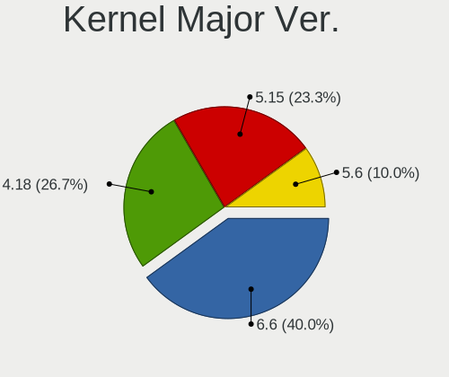
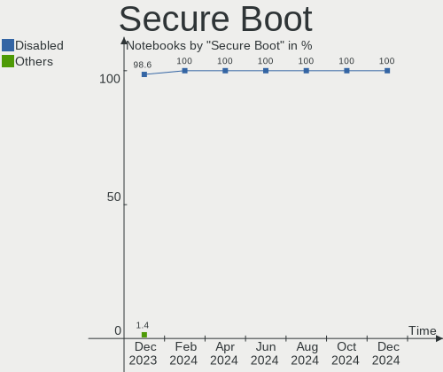
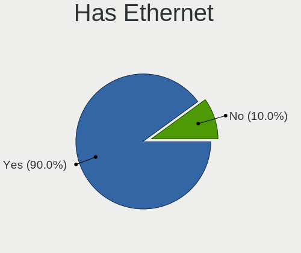
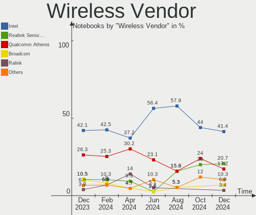
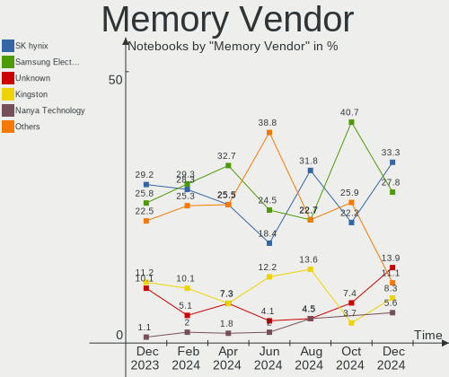

BlackPanther - Hardware Trends (Notebooks)
------------------------------------------

A project to identify most popular hardware characteristics and track their change
over time based on data collected by Linux users at https://Linux-Hardware.org.

Anyone can contribute to this report by the [hw-probe](https://github.com/linuxhw/hw-probe) tool:

    sudo -E hw-probe -all -upload

This report is for one last month. Overall report since the beginning of time: [TestDays](https://github.com/linuxhw/TestDays)

Period: Feb, 2023.

Contents
--------

* [ System ](#system)
  - [ OS                       ](#os)
  - [ OS Family                ](#os-family)
  - [ Kernel                   ](#kernel)
  - [ Kernel Family            ](#kernel-family)
  - [ Kernel Major Ver.        ](#kernel-major-ver)
  - [ Arch                     ](#arch)
  - [ DE                       ](#de)
  - [ Display Server           ](#display-server)
  - [ Display Manager          ](#display-manager)
  - [ OS Lang                  ](#os-lang)
  - [ Boot Mode                ](#boot-mode)
  - [ Filesystem               ](#filesystem)
  - [ Part. scheme             ](#part-scheme)
  - [ Dual Boot with Linux/BSD ](#dual-boot-with-linuxbsd)
  - [ Dual Boot (Win)          ](#dual-boot-win)

* [ Board ](#board)
  - [ Vendor                   ](#vendor)
  - [ Model                    ](#model)
  - [ Model Family             ](#model-family)
  - [ MFG Year                 ](#mfg-year)
  - [ Form Factor              ](#form-factor)
  - [ Secure Boot              ](#secure-boot)
  - [ Coreboot                 ](#coreboot)
  - [ RAM Size                 ](#ram-size)
  - [ RAM Used                 ](#ram-used)
  - [ Total Drives             ](#total-drives)
  - [ Has CD-ROM               ](#has-cd-rom)
  - [ Has Ethernet             ](#has-ethernet)
  - [ Has WiFi                 ](#has-wifi)
  - [ Has Bluetooth            ](#has-bluetooth)

* [ Location ](#location)
  - [ Country                  ](#country)
  - [ City                     ](#city)

* [ Drives ](#drives)
  - [ Drive Vendor             ](#drive-vendor)
  - [ Drive Model              ](#drive-model)
  - [ HDD Vendor               ](#hdd-vendor)
  - [ SSD Vendor               ](#ssd-vendor)
  - [ Drive Kind               ](#drive-kind)
  - [ Drive Connector          ](#drive-connector)
  - [ Drive Size               ](#drive-size)
  - [ Space Total              ](#space-total)
  - [ Space Used               ](#space-used)
  - [ Malfunc. Drives          ](#malfunc-drives)
  - [ Malfunc. Drive Vendor    ](#malfunc-drive-vendor)
  - [ Malfunc. HDD Vendor      ](#malfunc-hdd-vendor)
  - [ Malfunc. Drive Kind      ](#malfunc-drive-kind)
  - [ Failed Drives            ](#failed-drives)
  - [ Failed Drive Vendor      ](#failed-drive-vendor)
  - [ Drive Status             ](#drive-status)

* [ Storage controller ](#storage-controller)
  - [ Storage Vendor           ](#storage-vendor)
  - [ Storage Model            ](#storage-model)
  - [ Storage Kind             ](#storage-kind)

* [ Processor ](#processor)
  - [ CPU Vendor               ](#cpu-vendor)
  - [ CPU Model                ](#cpu-model)
  - [ CPU Model Family         ](#cpu-model-family)
  - [ CPU Cores                ](#cpu-cores)
  - [ CPU Sockets              ](#cpu-sockets)
  - [ CPU Threads              ](#cpu-threads)
  - [ CPU Op-Modes             ](#cpu-op-modes)
  - [ CPU Microcode            ](#cpu-microcode)
  - [ CPU Microarch            ](#cpu-microarch)

* [ Graphics ](#graphics)
  - [ GPU Vendor               ](#gpu-vendor)
  - [ GPU Model                ](#gpu-model)
  - [ GPU Combo                ](#gpu-combo)
  - [ GPU Driver               ](#gpu-driver)
  - [ GPU Memory               ](#gpu-memory)

* [ Monitor ](#monitor)
  - [ Monitor Vendor           ](#monitor-vendor)
  - [ Monitor Model            ](#monitor-model)
  - [ Monitor Resolution       ](#monitor-resolution)
  - [ Monitor Diagonal         ](#monitor-diagonal)
  - [ Monitor Width            ](#monitor-width)
  - [ Aspect Ratio             ](#aspect-ratio)
  - [ Monitor Area             ](#monitor-area)
  - [ Pixel Density            ](#pixel-density)
  - [ Multiple Monitors        ](#multiple-monitors)

* [ Network ](#network)
  - [ Net Controller Vendor    ](#net-controller-vendor)
  - [ Net Controller Model     ](#net-controller-model)
  - [ Wireless Vendor          ](#wireless-vendor)
  - [ Wireless Model           ](#wireless-model)
  - [ Ethernet Vendor          ](#ethernet-vendor)
  - [ Ethernet Model           ](#ethernet-model)
  - [ Net Controller Kind      ](#net-controller-kind)
  - [ Used Controller          ](#used-controller)
  - [ NICs                     ](#nics)
  - [ IPv6                     ](#ipv6)

* [ Bluetooth ](#bluetooth)
  - [ Bluetooth Vendor         ](#bluetooth-vendor)
  - [ Bluetooth Model          ](#bluetooth-model)

* [ Sound ](#sound)
  - [ Sound Vendor             ](#sound-vendor)
  - [ Sound Model              ](#sound-model)

* [ Memory ](#memory)
  - [ Memory Vendor            ](#memory-vendor)
  - [ Memory Model             ](#memory-model)
  - [ Memory Kind              ](#memory-kind)
  - [ Memory Form Factor       ](#memory-form-factor)
  - [ Memory Size              ](#memory-size)
  - [ Memory Speed             ](#memory-speed)

* [ Printers & scanners ](#printers--scanners)
  - [ Printer Vendor           ](#printer-vendor)
  - [ Printer Model            ](#printer-model)
  - [ Scanner Vendor           ](#scanner-vendor)
  - [ Scanner Model            ](#scanner-model)

* [ Camera ](#camera)
  - [ Camera Vendor            ](#camera-vendor)
  - [ Camera Model             ](#camera-model)

* [ Security ](#security)
  - [ Fingerprint Vendor       ](#fingerprint-vendor)
  - [ Fingerprint Model        ](#fingerprint-model)
  - [ Chipcard Vendor          ](#chipcard-vendor)
  - [ Chipcard Model           ](#chipcard-model)

* [ Unsupported ](#unsupported)
  - [ Unsupported Devices      ](#unsupported-devices)
  - [ Unsupported Device Types ](#unsupported-device-types)

System
------

OS
--

Installed operating systems

| Name              | Notebooks | Percent |
|-------------------|-----------|---------|
| BlackPanther 18.1 | 22        | 100%    |

OS Family
---------

OS without a version

| Name         | Notebooks | Percent |
|--------------|-----------|---------|
| BlackPanther | 22        | 100%    |

Kernel
------

Version of the Linux kernel

| Version             | Notebooks | Percent |
|---------------------|-----------|---------|
| 5.6.14-desktop-2bP  | 13        | 59.09%  |
| 4.18.16-desktop-1bP | 9         | 40.91%  |

Kernel Family
-------------

Linux kernel without a distro release

| Version | Notebooks | Percent |
|---------|-----------|---------|
| 5.6.14  | 13        | 59.09%  |
| 4.18.16 | 9         | 40.91%  |

Kernel Major Ver.
-----------------

Linux kernel major version

| Version | Notebooks | Percent |
|---------|-----------|---------|
| 5.6     | 13        | 59.09%  |
| 4.18    | 9         | 40.91%  |

Arch
----

OS architecture (x86_64, i586, etc.)

| Name   | Notebooks | Percent |
|--------|-----------|---------|
| x86_64 | 22        | 100%    |

DE
--

Desktop Environment

| Name | Notebooks | Percent |
|------|-----------|---------|
| KDE5 | 22        | 100%    |

Display Server
--------------

X11 or Wayland

| Name | Notebooks | Percent |
|------|-----------|---------|
| X11  | 22        | 100%    |

Display Manager
---------------

SDDM, LightDM, etc.

| Name | Notebooks | Percent |
|------|-----------|---------|
| SDDM | 22        | 100%    |

OS Lang
-------

Language

| Lang    | Notebooks | Percent |
|---------|-----------|---------|
| Unknown | 22        | 100%    |

Boot Mode
---------

EFI or BIOS

| Mode | Notebooks | Percent |
|------|-----------|---------|
| BIOS | 12        | 54.55%  |
| EFI  | 10        | 45.45%  |

Filesystem
----------

Type of filesystem

| Type    | Notebooks | Percent |
|---------|-----------|---------|
| Overlay | 19        | 86.36%  |
| Ext4    | 2         | 9.09%   |
| Xfs     | 1         | 4.55%   |

Part. scheme
------------

Scheme of partitioning

| Type | Notebooks | Percent |
|------|-----------|---------|
| GPT  | 14        | 63.64%  |
| MBR  | 8         | 36.36%  |

Dual Boot with Linux/BSD
------------------------

Hosting more than one Linux/BSD

| Dual boot | Notebooks | Percent |
|-----------|-----------|---------|
| No        | 13        | 59.09%  |
| Yes       | 9         | 40.91%  |

Dual Boot (Win)
---------------

Hosting Linux and Windows

| Dual boot | Notebooks | Percent |
|-----------|-----------|---------|
| No        | 13        | 59.09%  |
| Yes       | 9         | 40.91%  |

Board
-----

Vendor
------

Motherboard manufacturer

| Name             | Notebooks | Percent |
|------------------|-----------|---------|
| Hewlett-Packard  | 9         | 40.91%  |
| Dell             | 4         | 18.18%  |
| Acer             | 3         | 13.64%  |
| Toshiba          | 1         | 4.55%   |
| Lenovo           | 1         | 4.55%   |
| Fujitsu          | 1         | 4.55%   |
| eMachines        | 1         | 4.55%   |
| ASUSTek Computer | 1         | 4.55%   |
| Apple            | 1         | 4.55%   |

Model
-----

Motherboard model

| Name                                | Notebooks | Percent |
|-------------------------------------|-----------|---------|
| HP 250 G1                           | 2         | 9.09%   |
| Toshiba Satellite C660              | 1         | 4.55%   |
| Lenovo Z710 20250                   | 1         | 4.55%   |
| HP ProBook 650 G2                   | 1         | 4.55%   |
| HP Pavilion Gaming Laptop 15-ec1xxx | 1         | 4.55%   |
| HP Pavilion dv5                     | 1         | 4.55%   |
| HP Laptop 17-ak0xx                  | 1         | 4.55%   |
| HP Laptop 15-dw1xxx                 | 1         | 4.55%   |
| HP Compaq 6910p                     | 1         | 4.55%   |
| Fujitsu LIFEBOOK U745               | 1         | 4.55%   |
| eMachines E725                      | 1         | 4.55%   |
| Dell Latitude E6230                 | 1         | 4.55%   |
| Dell Latitude D630                  | 1         | 4.55%   |
| Dell Inspiron 7737                  | 1         | 4.55%   |
| Dell Inspiron 5558                  | 1         | 4.55%   |
| ASUS K52F                           | 1         | 4.55%   |
| Apple MacBookAir5,2                 | 1         | 4.55%   |
| Acer TravelMate 8571                | 1         | 4.55%   |
| Acer Nitro AN515-51                 | 1         | 4.55%   |
| Acer Aspire A315-21G                | 1         | 4.55%   |
| Unknown                             | 1         | 4.55%   |

Model Family
------------

Motherboard model prefix

| Name              | Notebooks | Percent |
|-------------------|-----------|---------|
| HP Pavilion       | 2         | 9.09%   |
| HP Laptop         | 2         | 9.09%   |
| HP 250            | 2         | 9.09%   |
| Dell Latitude     | 2         | 9.09%   |
| Dell Inspiron     | 2         | 9.09%   |
| Toshiba Satellite | 1         | 4.55%   |
| Lenovo Z710       | 1         | 4.55%   |
| HP ProBook        | 1         | 4.55%   |
| HP Compaq         | 1         | 4.55%   |
| Fujitsu LIFEBOOK  | 1         | 4.55%   |
| eMachines E725    | 1         | 4.55%   |
| ASUS K52F         | 1         | 4.55%   |
| Apple MacBookAir5 | 1         | 4.55%   |
| Acer TravelMate   | 1         | 4.55%   |
| Acer Nitro        | 1         | 4.55%   |
| Acer Aspire       | 1         | 4.55%   |
| Unknown           | 1         | 4.55%   |

MFG Year
--------

Motherboard manufacture year

| Year | Notebooks | Percent |
|------|-----------|---------|
| 2013 | 4         | 18.18%  |
| 2017 | 3         | 13.64%  |
| 2009 | 3         | 13.64%  |
| 2012 | 2         | 9.09%   |
| 2008 | 2         | 9.09%   |
| 2007 | 2         | 9.09%   |
| 2020 | 1         | 4.55%   |
| 2019 | 1         | 4.55%   |
| 2016 | 1         | 4.55%   |
| 2015 | 1         | 4.55%   |
| 2014 | 1         | 4.55%   |
| 2010 | 1         | 4.55%   |

Form Factor
-----------

Physical design of the computer

| Name     | Notebooks | Percent |
|----------|-----------|---------|
| Notebook | 22        | 100%    |

Secure Boot
-----------

Enabled or disabled

| State    | Notebooks | Percent |
|----------|-----------|---------|
| Disabled | 22        | 100%    |

Coreboot
--------

Have coreboot on board

| Used | Notebooks | Percent |
|------|-----------|---------|
| No   | 22        | 100%    |

RAM Size
--------

Total RAM memory

| Size in GB | Notebooks | Percent |
|------------|-----------|---------|
| 3.01-4.0   | 10        | 45.45%  |
| 4.01-8.0   | 4         | 18.18%  |
| 8.01-16.0  | 4         | 18.18%  |
| 1.01-2.0   | 3         | 13.64%  |
| 16.01-24.0 | 1         | 4.55%   |

RAM Used
--------

Used RAM memory

| Used GB  | Notebooks | Percent |
|----------|-----------|---------|
| 0.51-1.0 | 12        | 54.55%  |
| 1.01-2.0 | 9         | 40.91%  |
| 0.01-0.5 | 1         | 4.55%   |

Total Drives
------------

Number of drives on board

| Drives | Notebooks | Percent |
|--------|-----------|---------|
| 1      | 17        | 77.27%  |
| 2      | 5         | 22.73%  |

Has CD-ROM
----------

Has CD-ROM on board

| Presented | Notebooks | Percent |
|-----------|-----------|---------|
| Yes       | 12        | 54.55%  |
| No        | 10        | 45.45%  |

Has Ethernet
------------

Has Ethernet on board

| Presented | Notebooks | Percent |
|-----------|-----------|---------|
| Yes       | 21        | 95.45%  |
| No        | 1         | 4.55%   |

Has WiFi
--------

Has WiFi module

| Presented | Notebooks | Percent |
|-----------|-----------|---------|
| Yes       | 22        | 100%    |

Has Bluetooth
-------------

Has Bluetooth module

| Presented | Notebooks | Percent |
|-----------|-----------|---------|
| Yes       | 17        | 77.27%  |
| No        | 5         | 22.73%  |

Location
--------

Country
-------

Geographic location (country)

| Country   | Notebooks | Percent |
|-----------|-----------|---------|
| Hungary   | 20        | 90.91%  |
| Canada    | 1         | 4.55%   |
| Australia | 1         | 4.55%   |

City
----

Geographic location (city)

| City             | Notebooks | Percent |
|------------------|-----------|---------|
| Szolnok          | 2         | 9.09%   |
| Nyiregyhaza      | 2         | 9.09%   |
| Zalaegerszeg     | 1         | 4.55%   |
| Vamospercs       | 1         | 4.55%   |
| Szombathely      | 1         | 4.55%   |
| Rackeve          | 1         | 4.55%   |
| Melbourne        | 1         | 4.55%   |
| Kisvarda         | 1         | 4.55%   |
| Kiskunhalas      | 1         | 4.55%   |
| Kecskemét       | 1         | 4.55%   |
| Hodmezovasarhely | 1         | 4.55%   |
| Győr            | 1         | 4.55%   |
| Gyongyos         | 1         | 4.55%   |
| Fertoszentmiklos | 1         | 4.55%   |
| Dorog            | 1         | 4.55%   |
| Debrecen         | 1         | 4.55%   |
| Csongrad         | 1         | 4.55%   |
| Budapest         | 1         | 4.55%   |
| Bikal            | 1         | 4.55%   |
| Barrie           | 1         | 4.55%   |

Drives
------

Drive Vendor
------------

Hard drive vendors

| Vendor              | Notebooks | Drives | Percent |
|---------------------|-----------|--------|---------|
| Kingston            | 5         | 6      | 18.52%  |
| Toshiba             | 4         | 4      | 14.81%  |
| Samsung Electronics | 4         | 4      | 14.81%  |
| WDC                 | 2         | 2      | 7.41%   |
| Seagate             | 2         | 3      | 7.41%   |
| HGST                | 2         | 2      | 7.41%   |
| Timetec             | 1         | 1      | 3.7%    |
| SPCC                | 1         | 1      | 3.7%    |
| KIOXIA              | 1         | 1      | 3.7%    |
| Intenso             | 1         | 1      | 3.7%    |
| Intel               | 1         | 1      | 3.7%    |
| Apple               | 1         | 1      | 3.7%    |
| Apacer              | 1         | 1      | 3.7%    |
| A-DATA Technology   | 1         | 1      | 3.7%    |

Drive Model
-----------

Hard drive models

| Model                                | Notebooks | Percent |
|--------------------------------------|-----------|---------|
| Kingston SA400S37480G 480GB SSD      | 2         | 6.9%    |
| HGST HTS545032A7E380 320GB           | 2         | 6.9%    |
| WDC WD10JPVX-22JC3T0 1TB             | 1         | 3.45%   |
| WDC WD10JPLX-00MBPT0 1TB             | 1         | 3.45%   |
| Toshiba MQ01ABF050 500GB             | 1         | 3.45%   |
| Toshiba MQ01ABD100 1TB               | 1         | 3.45%   |
| Toshiba MK8009GAH 80GB               | 1         | 3.45%   |
| Toshiba MK5065GSX 500GB              | 1         | 3.45%   |
| Timetec SD08 512GB                   | 1         | 3.45%   |
| SPCC Solid State Disk 128GB          | 1         | 3.45%   |
| Seagate ST500LT012-1DG142 500GB      | 1         | 3.45%   |
| Seagate ST2000LM015-2E8174 2TB       | 1         | 3.45%   |
| Seagate ST1000LM035-1RK172 1TB       | 1         | 3.45%   |
| Samsung SSD 980 500GB                | 1         | 3.45%   |
| Samsung SSD 830 Series 128GB         | 1         | 3.45%   |
| Samsung SSD 750 EVO 250GB            | 1         | 3.45%   |
| Samsung MZ7LN256HCHP-00000 256GB SSD | 1         | 3.45%   |
| KIOXIA KXG60ZNV256G 256GB            | 1         | 3.45%   |
| Kingston SV300S37A60G 64GB SSD       | 1         | 3.45%   |
| Kingston SA400S37960G 960GB SSD      | 1         | 3.45%   |
| Kingston SA400S37240G 240GB SSD      | 1         | 3.45%   |
| Kingston SA400S37120G 120GB SSD      | 1         | 3.45%   |
| Intenso SSD SATAIII 256GB            | 1         | 3.45%   |
| Intel SSDPEKKW256G7 256GB            | 1         | 3.45%   |
| Apple SSD TS064E 64GB                | 1         | 3.45%   |
| Apacer AS2280P4U 1TB                 | 1         | 3.45%   |
| A-DATA SU650 120GB SSD               | 1         | 3.45%   |

HDD Vendor
----------

Hard disk drive vendors

| Vendor  | Notebooks | Drives | Percent |
|---------|-----------|--------|---------|
| Toshiba | 4         | 4      | 40%     |
| WDC     | 2         | 2      | 20%     |
| Seagate | 2         | 3      | 20%     |
| HGST    | 2         | 2      | 20%     |

SSD Vendor
----------

Solid state drive vendors

| Vendor              | Notebooks | Drives | Percent |
|---------------------|-----------|--------|---------|
| Kingston            | 5         | 6      | 38.46%  |
| Samsung Electronics | 3         | 3      | 23.08%  |
| Timetec             | 1         | 1      | 7.69%   |
| SPCC                | 1         | 1      | 7.69%   |
| Intenso             | 1         | 1      | 7.69%   |
| Apple               | 1         | 1      | 7.69%   |
| A-DATA Technology   | 1         | 1      | 7.69%   |

Drive Kind
----------

HDD or SSD

| Kind | Notebooks | Drives | Percent |
|------|-----------|--------|---------|
| SSD  | 13        | 14     | 50%     |
| HDD  | 10        | 11     | 38.46%  |
| NVMe | 3         | 4      | 11.54%  |

Drive Connector
---------------

SATA, SAS, NVMe, etc.

| Type | Notebooks | Drives | Percent |
|------|-----------|--------|---------|
| SATA | 21        | 25     | 87.5%   |
| NVMe | 3         | 4      | 12.5%   |

Drive Size
----------

Size of hard drive

| Size in TB | Notebooks | Drives | Percent |
|------------|-----------|--------|---------|
| 0.01-0.5   | 18        | 18     | 75%     |
| 0.51-1.0   | 5         | 6      | 20.83%  |
| 1.01-2.0   | 1         | 1      | 4.17%   |

Space Total
-----------

Amount of disk space available on the file system

| Size in GB | Notebooks | Percent |
|------------|-----------|---------|
| Unknown    | 20        | 90.91%  |
| 101-250    | 2         | 9.09%   |

Space Used
----------

Amount of used disk space

| Used GB | Notebooks | Percent |
|---------|-----------|---------|
| Unknown | 20        | 90.91%  |
| 1-20    | 2         | 9.09%   |

Malfunc. Drives
---------------

Drive models with a malfunction

| Model                                 | Notebooks | Drives | Percent |
|---------------------------------------|-----------|--------|---------|
| HGST HTS545032A7E380 320GB            | 2         | 2      | 25%     |
| Toshiba MQ01ABF050 500GB              | 1         | 1      | 12.5%   |
| Toshiba MK8009GAH 80GB                | 1         | 1      | 12.5%   |
| Toshiba MK5065GSX 500GB               | 1         | 1      | 12.5%   |
| Seagate ST1000LM035-1RK172 1TB        | 1         | 1      | 12.5%   |
| Samsung Electronics SSD 750 EVO 250GB | 1         | 1      | 12.5%   |
| Apple SSD TS064E 64GB                 | 1         | 1      | 12.5%   |

Malfunc. Drive Vendor
---------------------

Vendors of faulty drives

| Vendor              | Notebooks | Drives | Percent |
|---------------------|-----------|--------|---------|
| Toshiba             | 3         | 3      | 37.5%   |
| HGST                | 2         | 2      | 25%     |
| Seagate             | 1         | 1      | 12.5%   |
| Samsung Electronics | 1         | 1      | 12.5%   |
| Apple               | 1         | 1      | 12.5%   |

Malfunc. HDD Vendor
-------------------

Vendors of faulty HDD drives

| Vendor  | Notebooks | Drives | Percent |
|---------|-----------|--------|---------|
| Toshiba | 3         | 3      | 50%     |
| HGST    | 2         | 2      | 33.33%  |
| Seagate | 1         | 1      | 16.67%  |

Malfunc. Drive Kind
-------------------

Kinds of faulty drives

| Kind | Notebooks | Drives | Percent |
|------|-----------|--------|---------|
| HDD  | 6         | 6      | 75%     |
| SSD  | 2         | 2      | 25%     |

Failed Drives
-------------

Failed drive models

| Model                     | Notebooks | Drives | Percent |
|---------------------------|-----------|--------|---------|
| Intel SSDPEKKW256G7 256GB | 1         | 1      | 100%    |

Failed Drive Vendor
-------------------

Failed drive vendors

| Vendor | Notebooks | Drives | Percent |
|--------|-----------|--------|---------|
| Intel  | 1         | 1      | 100%    |

Drive Status
------------

Number of failed and malfunc. drives

| Status  | Notebooks | Drives | Percent |
|---------|-----------|--------|---------|
| Works   | 15        | 20     | 62.5%   |
| Malfunc | 8         | 8      | 33.33%  |
| Failed  | 1         | 1      | 4.17%   |

Storage controller
------------------

Storage Vendor
--------------

Storage controller vendors

| Vendor                       | Notebooks | Percent |
|------------------------------|-----------|---------|
| Intel                        | 18        | 72%     |
| AMD                          | 4         | 16%     |
| Toshiba America Info Systems | 1         | 4%      |
| Samsung Electronics          | 1         | 4%      |
| Phison Electronics           | 1         | 4%      |

Storage Model
-------------

Storage controller models

| Model                                                                          | Notebooks | Percent |
|--------------------------------------------------------------------------------|-----------|---------|
| Intel 82801IBM/IEM (ICH9M/ICH9M-E) 4 port SATA Controller [AHCI mode]          | 3         | 10%     |
| Intel 7 Series Chipset Family 6-port SATA Controller [AHCI mode]               | 3         | 10%     |
| AMD FCH SATA Controller [AHCI mode]                                            | 3         | 10%     |
| Intel Wildcat Point-LP SATA Controller [AHCI Mode]                             | 2         | 6.67%   |
| Intel Mobile PM965/GM965 PT IDER Controller                                    | 2         | 6.67%   |
| Intel HM170/QM170 Chipset SATA Controller [AHCI Mode]                          | 2         | 6.67%   |
| Intel 82801HM/HEM (ICH8M/ICH8M-E) SATA Controller [IDE mode]                   | 2         | 6.67%   |
| Intel 82801HM/HEM (ICH8M/ICH8M-E) IDE Controller                               | 2         | 6.67%   |
| Intel 82801 Mobile SATA Controller [RAID mode]                                 | 2         | 6.67%   |
| Toshiba America Info Systems XG6 NVMe SSD Controller                           | 1         | 3.33%   |
| Samsung NVMe SSD Controller 980                                                | 1         | 3.33%   |
| Phison Electronics Non-Volatile memory controller                              | 1         | 3.33%   |
| Intel SSD 600P Series                                                          | 1         | 3.33%   |
| Intel 8 Series/C220 Series Chipset Family 6-port SATA Controller 1 [AHCI mode] | 1         | 3.33%   |
| Intel 8 Series SATA Controller 1 [AHCI mode]                                   | 1         | 3.33%   |
| Intel 5 Series/3400 Series Chipset 4 port SATA AHCI Controller                 | 1         | 3.33%   |
| AMD SB7x0/SB8x0/SB9x0 SATA Controller [AHCI mode]                              | 1         | 3.33%   |
| AMD SB7x0/SB8x0/SB9x0 IDE Controller                                           | 1         | 3.33%   |

Storage Kind
------------

Kind of storage controller (IDE, SATA, NVMe, SAS, ...)

| Kind | Notebooks | Percent |
|------|-----------|---------|
| SATA | 17        | 65.38%  |
| IDE  | 4         | 15.38%  |
| NVMe | 3         | 11.54%  |
| RAID | 2         | 7.69%   |

Processor
---------

CPU Vendor
----------

Processor vendors

| Vendor | Notebooks | Percent |
|--------|-----------|---------|
| Intel  | 18        | 81.82%  |
| AMD    | 4         | 18.18%  |

CPU Model
---------

Processor models

| Model                                        | Notebooks | Percent |
|----------------------------------------------|-----------|---------|
| Intel Celeron CPU 1000M @ 1.80GHz            | 2         | 9.09%   |
| Intel Pentium Dual-Core CPU T4500 @ 2.30GHz  | 1         | 4.55%   |
| Intel Pentium Dual-Core CPU T4400 @ 2.20GHz  | 1         | 4.55%   |
| Intel Pentium CPU P6100 @ 2.00GHz            | 1         | 4.55%   |
| Intel Core i7-7700HQ CPU @ 2.80GHz           | 1         | 4.55%   |
| Intel Core i7-6820HQ CPU @ 2.70GHz           | 1         | 4.55%   |
| Intel Core i7-5600U CPU @ 2.60GHz            | 1         | 4.55%   |
| Intel Core i7-4700MQ CPU @ 2.40GHz           | 1         | 4.55%   |
| Intel Core i7-4510U CPU @ 2.00GHz            | 1         | 4.55%   |
| Intel Core i5-5200U CPU @ 2.20GHz            | 1         | 4.55%   |
| Intel Core i5-3427U CPU @ 1.80GHz            | 1         | 4.55%   |
| Intel Core i5-3340M CPU @ 2.70GHz            | 1         | 4.55%   |
| Intel Core i3-10110U CPU @ 2.10GHz           | 1         | 4.55%   |
| Intel Core 2 Duo CPU U9400 @ 1.40GHz         | 1         | 4.55%   |
| Intel Core 2 Duo CPU U7600 @ 1.20GHz         | 1         | 4.55%   |
| Intel Core 2 Duo CPU T9300 @ 2.50GHz         | 1         | 4.55%   |
| Intel Core 2 Duo CPU T7250 @ 2.00GHz         | 1         | 4.55%   |
| AMD Ryzen 5 4600H with Radeon Graphics       | 1         | 4.55%   |
| AMD Athlon X2 Dual-Core QL-62                | 1         | 4.55%   |
| AMD A9-9420 RADEON R5, 5 COMPUTE CORES 2C+3G | 1         | 4.55%   |
| AMD A4-9120 RADEON R3, 4 COMPUTE CORES 2C+2G | 1         | 4.55%   |

CPU Model Family
----------------

Processor model prefix

| Model                   | Notebooks | Percent |
|-------------------------|-----------|---------|
| Intel Core i7           | 5         | 22.73%  |
| Intel Core 2 Duo        | 4         | 18.18%  |
| Intel Core i5           | 3         | 13.64%  |
| Intel Pentium Dual-Core | 2         | 9.09%   |
| Intel Celeron           | 2         | 9.09%   |
| Other                   | 1         | 4.55%   |
| Intel Pentium           | 1         | 4.55%   |
| Intel Core i3           | 1         | 4.55%   |
| AMD Ryzen 5             | 1         | 4.55%   |
| AMD Athlon X2           | 1         | 4.55%   |
| AMD A4                  | 1         | 4.55%   |

CPU Cores
---------

Number of processor cores

| Number | Notebooks | Percent |
|--------|-----------|---------|
| 2      | 18        | 81.82%  |
| 4      | 3         | 13.64%  |
| 6      | 1         | 4.55%   |

CPU Sockets
-----------

Number of sockets

| Number | Notebooks | Percent |
|--------|-----------|---------|
| 1      | 22        | 100%    |

CPU Threads
-----------

Threads per core (Hyper-Threading)

| Number | Notebooks | Percent |
|--------|-----------|---------|
| 1      | 12        | 54.55%  |
| 2      | 10        | 45.45%  |

CPU Op-Modes
------------

CPU Operation Modes (32-bit, 64-bit)

| Op mode        | Notebooks | Percent |
|----------------|-----------|---------|
| 32-bit, 64-bit | 22        | 100%    |

CPU Microcode
-------------

Microcode number

| Number     | Notebooks | Percent |
|------------|-----------|---------|
| 0x306a9    | 4         | 18.18%  |
| 0x1067a    | 3         | 13.64%  |
| 0x6fd      | 2         | 9.09%   |
| 0x306d4    | 2         | 9.09%   |
| 0x906e9    | 1         | 4.55%   |
| 0x806ec    | 1         | 4.55%   |
| 0x506e3    | 1         | 4.55%   |
| 0x40651    | 1         | 4.55%   |
| 0x306c3    | 1         | 4.55%   |
| 0x20655    | 1         | 4.55%   |
| 0x10676    | 1         | 4.55%   |
| 0x08600106 | 1         | 4.55%   |
| 0x06006705 | 1         | 4.55%   |
| 0x06006704 | 1         | 4.55%   |
| 0x02000032 | 1         | 4.55%   |

CPU Microarch
-------------

Microarchitecture

| Name            | Notebooks | Percent |
|-----------------|-----------|---------|
| Penryn          | 4         | 18.18%  |
| IvyBridge       | 4         | 18.18%  |
| KabyLake        | 2         | 9.09%   |
| Haswell         | 2         | 9.09%   |
| Excavator       | 2         | 9.09%   |
| Core            | 2         | 9.09%   |
| Broadwell       | 2         | 9.09%   |
| Zen 2           | 1         | 4.55%   |
| Westmere        | 1         | 4.55%   |
| Skylake         | 1         | 4.55%   |
| K8 & K10 hybrid | 1         | 4.55%   |

Graphics
--------

GPU Vendor
----------

Vendors of graphics cards

| Vendor | Notebooks | Percent |
|--------|-----------|---------|
| Intel  | 18        | 66.67%  |
| Nvidia | 5         | 18.52%  |
| AMD    | 4         | 14.81%  |

GPU Model
---------

Graphics card models

| Model                                                               | Notebooks | Percent |
|---------------------------------------------------------------------|-----------|---------|
| Intel 3rd Gen Core processor Graphics Controller                    | 4         | 12.9%   |
| Intel Mobile GM965/GL960 Integrated Graphics Controller (secondary) | 3         | 9.68%   |
| Intel Mobile GM965/GL960 Integrated Graphics Controller (primary)   | 3         | 9.68%   |
| Intel Mobile 4 Series Chipset Integrated Graphics Controller        | 3         | 9.68%   |
| Intel HD Graphics 5500                                              | 2         | 6.45%   |
| AMD Stoney [Radeon R2/R3/R4/R5 Graphics]                            | 2         | 6.45%   |
| Nvidia TU117M [GeForce GTX 1650 Ti Mobile]                          | 1         | 3.23%   |
| Nvidia GP107M [GeForce GTX 1050 Ti Mobile]                          | 1         | 3.23%   |
| Nvidia GK208BM [GeForce 920M]                                       | 1         | 3.23%   |
| Nvidia GK107M [GeForce GT 750M]                                     | 1         | 3.23%   |
| Nvidia GK107M [GeForce GT 745M]                                     | 1         | 3.23%   |
| Intel HD Graphics 630                                               | 1         | 3.23%   |
| Intel HD Graphics 530                                               | 1         | 3.23%   |
| Intel Haswell-ULT Integrated Graphics Controller                    | 1         | 3.23%   |
| Intel Core Processor Integrated Graphics Controller                 | 1         | 3.23%   |
| Intel CometLake-U GT2 [UHD Graphics]                                | 1         | 3.23%   |
| Intel 4th Gen Core Processor Integrated Graphics Controller         | 1         | 3.23%   |
| AMD RV620/M82 [Mobility Radeon HD 3450/3470]                        | 1         | 3.23%   |
| AMD Renoir                                                          | 1         | 3.23%   |
| AMD Jet PRO [Radeon R5 M230 / R7 M260DX / Radeon 520/610 Mobile]    | 1         | 3.23%   |

GPU Combo
---------

Combinations of graphics cards

| Name           | Notebooks | Percent |
|----------------|-----------|---------|
| 1 x Intel      | 14        | 63.64%  |
| Intel + Nvidia | 4         | 18.18%  |
| 1 x AMD        | 2         | 9.09%   |
| 2 x AMD        | 1         | 4.55%   |
| AMD + Nvidia   | 1         | 4.55%   |

GPU Driver
----------

Free vs proprietary

| Driver | Notebooks | Percent |
|--------|-----------|---------|
| Free   | 22        | 100%    |

GPU Memory
----------

Total video memory

| Size in GB | Notebooks | Percent |
|------------|-----------|---------|
| Unknown    | 14        | 63.64%  |
| 1.01-2.0   | 3         | 13.64%  |
| 0.01-0.5   | 3         | 13.64%  |
| 3.01-4.0   | 2         | 9.09%   |

Monitor
-------

Monitor Vendor
--------------

Monitor vendors

| Vendor                  | Notebooks | Percent |
|-------------------------|-----------|---------|
| LG Display              | 7         | 31.82%  |
| AU Optronics            | 6         | 27.27%  |
| Samsung Electronics     | 2         | 9.09%   |
| Chimei Innolux          | 2         | 9.09%   |
| Chi Mei Optoelectronics | 2         | 9.09%   |
| PANDA                   | 1         | 4.55%   |
| Goldstar                | 1         | 4.55%   |
| Apple                   | 1         | 4.55%   |

Monitor Model
-------------

Monitor models

| Model                                                                    | Notebooks | Percent |
|--------------------------------------------------------------------------|-----------|---------|
| LG Display LCD Monitor LGD0395 1366x768 344x194mm 15.5-inch              | 2         | 9.09%   |
| Samsung Electronics LCD Monitor SEC5541 1366x768 344x193mm 15.5-inch     | 1         | 4.55%   |
| Samsung Electronics LCD Monitor SEC3157 1280x800 303x190mm 14.1-inch     | 1         | 4.55%   |
| PANDA LCD Monitor NCP0058 1920x1080 344x194mm 15.5-inch                  | 1         | 4.55%   |
| LG Display LCD Monitor LGD06F5 1920x1080 344x194mm 15.5-inch             | 1         | 4.55%   |
| LG Display LCD Monitor LGD036C 1366x768 277x156mm 12.5-inch              | 1         | 4.55%   |
| LG Display LCD Monitor LGD0365 1600x900 382x215mm 17.3-inch              | 1         | 4.55%   |
| LG Display LCD Monitor LGD0348 1920x1080 383x215mm 17.3-inch             | 1         | 4.55%   |
| LG Display LCD Monitor LGD0250 1366x768 345x194mm 15.6-inch              | 1         | 4.55%   |
| Goldstar E2260 GSM57E1 1920x1080 477x268mm 21.5-inch                     | 1         | 4.55%   |
| Chimei Innolux LCD Monitor CMN15DC 1366x768 344x193mm 15.5-inch          | 1         | 4.55%   |
| Chimei Innolux LCD Monitor CMN14C3 1366x768 309x173mm 13.9-inch          | 1         | 4.55%   |
| Chi Mei Optoelectronics LCD Monitor CMO1424 1280x800 303x190mm 14.1-inch | 1         | 4.55%   |
| Chi Mei Optoelectronics LCD Monitor CMO1221 1280x800 261x163mm 12.1-inch | 1         | 4.55%   |
| AU Optronics LCD Monitor AUO61ED 1920x1080 344x193mm 15.5-inch           | 1         | 4.55%   |
| AU Optronics LCD Monitor AUO40EC 1366x768 344x193mm 15.5-inch            | 1         | 4.55%   |
| AU Optronics LCD Monitor AUO35ED 1920x1080 344x193mm 15.5-inch           | 1         | 4.55%   |
| AU Optronics LCD Monitor AUO32EC 1366x768 344x193mm 15.5-inch            | 1         | 4.55%   |
| AU Optronics LCD Monitor AUO219E 1600x900 382x214mm 17.2-inch            | 1         | 4.55%   |
| AU Optronics LCD Monitor AUO10EC 1366x768 344x193mm 15.5-inch            | 1         | 4.55%   |
| Apple Color LCD APP9CF0 1440x900 290x180mm 13.4-inch                     | 1         | 4.55%   |

Monitor Resolution
------------------

Monitor screen resolution

| Resolution       | Notebooks | Percent |
|------------------|-----------|---------|
| 1366x768 (WXGA)  | 10        | 45.45%  |
| 1920x1080 (FHD)  | 6         | 27.27%  |
| 1600x900 (HD+)   | 2         | 9.09%   |
| 1440x900 (WXGA+) | 2         | 9.09%   |
| 1280x800 (WXGA)  | 2         | 9.09%   |

Monitor Diagonal
----------------

Diagonal size in inches

| Inches | Notebooks | Percent |
|--------|-----------|---------|
| 15     | 12        | 54.55%  |
| 17     | 3         | 13.64%  |
| 14     | 2         | 9.09%   |
| 13     | 2         | 9.09%   |
| 12     | 2         | 9.09%   |
| 21     | 1         | 4.55%   |

Monitor Width
-------------

Physical width

| Width in mm | Notebooks | Percent |
|-------------|-----------|---------|
| 301-350     | 15        | 68.18%  |
| 351-400     | 3         | 13.64%  |
| 201-300     | 3         | 13.64%  |
| 401-500     | 1         | 4.55%   |

Aspect Ratio
------------

Proportional relationship between the width and the height

| Ratio | Notebooks | Percent |
|-------|-----------|---------|
| 16/9  | 17        | 80.95%  |
| 16/10 | 4         | 19.05%  |

Monitor Area
------------

Area in inch²

| Area in inch² | Notebooks | Percent |
|----------------|-----------|---------|
| 101-110        | 12        | 54.55%  |
| 81-90          | 4         | 18.18%  |
| 121-130        | 3         | 13.64%  |
| 61-70          | 2         | 9.09%   |
| 201-250        | 1         | 4.55%   |

Pixel Density
-------------

Pixels per inch

| Density | Notebooks | Percent |
|---------|-----------|---------|
| 101-120 | 12        | 57.14%  |
| 121-160 | 8         | 38.1%   |
| 51-100  | 1         | 4.76%   |

Multiple Monitors
-----------------

Total monitors connected

| Total | Notebooks | Percent |
|-------|-----------|---------|
| 1     | 21        | 95.45%  |
| 2     | 1         | 4.55%   |

Network
-------

Net Controller Vendor
---------------------

Controller vendors

| Vendor                | Notebooks | Percent |
|-----------------------|-----------|---------|
| Realtek Semiconductor | 12        | 34.29%  |
| Intel                 | 10        | 28.57%  |
| Qualcomm Atheros      | 6         | 17.14%  |
| Ralink                | 2         | 5.71%   |
| Broadcom              | 2         | 5.71%   |
| Xiaomi                | 1         | 2.86%   |
| JMicron Technology    | 1         | 2.86%   |
| Broadcom Limited      | 1         | 2.86%   |

Net Controller Model
--------------------

Controller models

| Model                                                                   | Notebooks | Percent |
|-------------------------------------------------------------------------|-----------|---------|
| Realtek RTL8111/8168/8411 PCI Express Gigabit Ethernet Controller       | 10        | 22.73%  |
| Realtek RTL8822CE 802.11ac PCIe Wireless Network Adapter                | 2         | 4.55%   |
| Realtek RTL810xE PCI Express Fast Ethernet controller                   | 2         | 4.55%   |
| Ralink RT3290 Wireless 802.11n 1T/1R PCIe                               | 2         | 4.55%   |
| Intel Wireless 7260                                                     | 2         | 4.55%   |
| Intel PRO/Wireless 4965 AG or AGN [Kedron] Network Connection           | 2         | 4.55%   |
| Intel 82566MM Gigabit Network Connection                                | 2         | 4.55%   |
| Xiaomi Mi/Redmi series (RNDIS)                                          | 1         | 2.27%   |
| Realtek RTL8723DE Wireless Network Adapter                              | 1         | 2.27%   |
| Realtek RTL8188CE 802.11b/g/n WiFi Adapter                              | 1         | 2.27%   |
| Qualcomm Atheros QCA9377 802.11ac Wireless Network Adapter              | 1         | 2.27%   |
| Qualcomm Atheros QCA8171 Gigabit Ethernet                               | 1         | 2.27%   |
| Qualcomm Atheros QCA6174 802.11ac Wireless Network Adapter              | 1         | 2.27%   |
| Qualcomm Atheros AR9285 Wireless Network Adapter (PCI-Express)          | 1         | 2.27%   |
| Qualcomm Atheros AR8132 Fast Ethernet                                   | 1         | 2.27%   |
| Qualcomm Atheros AR242x / AR542x Wireless Network Adapter (PCI-Express) | 1         | 2.27%   |
| JMicron JMC250 PCI Express Gigabit Ethernet Controller                  | 1         | 2.27%   |
| Intel Wireless 8260                                                     | 1         | 2.27%   |
| Intel Wireless 7265                                                     | 1         | 2.27%   |
| Intel Wireless 3160                                                     | 1         | 2.27%   |
| Intel WiFi Link 5100                                                    | 1         | 2.27%   |
| Intel PRO/Wireless 3945ABG [Golan] Network Connection                   | 1         | 2.27%   |
| Intel Ethernet Connection (3) I218-LM                                   | 1         | 2.27%   |
| Intel Ethernet Connection (2) I219-LM                                   | 1         | 2.27%   |
| Intel Centrino Advanced-N 6205 [Taylor Peak]                            | 1         | 2.27%   |
| Intel 82579LM Gigabit Network Connection (Lewisville)                   | 1         | 2.27%   |
| Broadcom NetXtreme BCM5755M Gigabit Ethernet PCI Express                | 1         | 2.27%   |
| Broadcom Limited BCM4312 802.11b/g LP-PHY                               | 1         | 2.27%   |
| Broadcom BCM43224 802.11a/b/g/n                                         | 1         | 2.27%   |

Wireless Vendor
---------------

Wireless vendors

| Vendor                | Notebooks | Percent |
|-----------------------|-----------|---------|
| Intel                 | 10        | 45.45%  |
| Realtek Semiconductor | 4         | 18.18%  |
| Qualcomm Atheros      | 4         | 18.18%  |
| Ralink                | 2         | 9.09%   |
| Broadcom Limited      | 1         | 4.55%   |
| Broadcom              | 1         | 4.55%   |

Wireless Model
--------------

Wireless models

| Model                                                                   | Notebooks | Percent |
|-------------------------------------------------------------------------|-----------|---------|
| Realtek RTL8822CE 802.11ac PCIe Wireless Network Adapter                | 2         | 9.09%   |
| Ralink RT3290 Wireless 802.11n 1T/1R PCIe                               | 2         | 9.09%   |
| Intel Wireless 7260                                                     | 2         | 9.09%   |
| Intel PRO/Wireless 4965 AG or AGN [Kedron] Network Connection           | 2         | 9.09%   |
| Realtek RTL8723DE Wireless Network Adapter                              | 1         | 4.55%   |
| Realtek RTL8188CE 802.11b/g/n WiFi Adapter                              | 1         | 4.55%   |
| Qualcomm Atheros QCA9377 802.11ac Wireless Network Adapter              | 1         | 4.55%   |
| Qualcomm Atheros QCA6174 802.11ac Wireless Network Adapter              | 1         | 4.55%   |
| Qualcomm Atheros AR9285 Wireless Network Adapter (PCI-Express)          | 1         | 4.55%   |
| Qualcomm Atheros AR242x / AR542x Wireless Network Adapter (PCI-Express) | 1         | 4.55%   |
| Intel Wireless 8260                                                     | 1         | 4.55%   |
| Intel Wireless 7265                                                     | 1         | 4.55%   |
| Intel Wireless 3160                                                     | 1         | 4.55%   |
| Intel WiFi Link 5100                                                    | 1         | 4.55%   |
| Intel PRO/Wireless 3945ABG [Golan] Network Connection                   | 1         | 4.55%   |
| Intel Centrino Advanced-N 6205 [Taylor Peak]                            | 1         | 4.55%   |
| Broadcom Limited BCM4312 802.11b/g LP-PHY                               | 1         | 4.55%   |
| Broadcom BCM43224 802.11a/b/g/n                                         | 1         | 4.55%   |

Ethernet Vendor
---------------

Ethernet vendors

| Vendor                | Notebooks | Percent |
|-----------------------|-----------|---------|
| Realtek Semiconductor | 12        | 54.55%  |
| Intel                 | 5         | 22.73%  |
| Qualcomm Atheros      | 2         | 9.09%   |
| Xiaomi                | 1         | 4.55%   |
| JMicron Technology    | 1         | 4.55%   |
| Broadcom              | 1         | 4.55%   |

Ethernet Model
--------------

Ethernet models

| Model                                                             | Notebooks | Percent |
|-------------------------------------------------------------------|-----------|---------|
| Realtek RTL8111/8168/8411 PCI Express Gigabit Ethernet Controller | 10        | 45.45%  |
| Realtek RTL810xE PCI Express Fast Ethernet controller             | 2         | 9.09%   |
| Intel 82566MM Gigabit Network Connection                          | 2         | 9.09%   |
| Xiaomi Mi/Redmi series (RNDIS)                                    | 1         | 4.55%   |
| Qualcomm Atheros QCA8171 Gigabit Ethernet                         | 1         | 4.55%   |
| Qualcomm Atheros AR8132 Fast Ethernet                             | 1         | 4.55%   |
| JMicron JMC250 PCI Express Gigabit Ethernet Controller            | 1         | 4.55%   |
| Intel Ethernet Connection (3) I218-LM                             | 1         | 4.55%   |
| Intel Ethernet Connection (2) I219-LM                             | 1         | 4.55%   |
| Intel 82579LM Gigabit Network Connection (Lewisville)             | 1         | 4.55%   |
| Broadcom NetXtreme BCM5755M Gigabit Ethernet PCI Express          | 1         | 4.55%   |

Net Controller Kind
-------------------

Ethernet, WiFi or modem

| Kind     | Notebooks | Percent |
|----------|-----------|---------|
| WiFi     | 22        | 51.16%  |
| Ethernet | 21        | 48.84%  |

Used Controller
---------------

Currently used network controller

| Kind     | Notebooks | Percent |
|----------|-----------|---------|
| WiFi     | 13        | 61.9%   |
| Ethernet | 8         | 38.1%   |

NICs
----

Total network controllers on board

| Total | Notebooks | Percent |
|-------|-----------|---------|
| 2     | 21        | 95.45%  |
| 1     | 1         | 4.55%   |

IPv6
----

IPv6 vs IPv4

| Used | Notebooks | Percent |
|------|-----------|---------|
| No   | 16        | 72.73%  |
| Yes  | 6         | 27.27%  |

Bluetooth
---------

Bluetooth Vendor
----------------

Controller vendors

| Vendor                | Notebooks | Percent |
|-----------------------|-----------|---------|
| Intel                 | 5         | 29.41%  |
| Realtek Semiconductor | 3         | 17.65%  |
| Ralink                | 2         | 11.76%  |
| Lite-On Technology    | 2         | 11.76%  |
| Hewlett-Packard       | 2         | 11.76%  |
| Foxconn / Hon Hai     | 1         | 5.88%   |
| Dell                  | 1         | 5.88%   |
| Apple                 | 1         | 5.88%   |

Bluetooth Model
---------------

Controller models

| Model                                         | Notebooks | Percent |
|-----------------------------------------------|-----------|---------|
| Intel Bluetooth wireless interface            | 5         | 29.41%  |
| Realtek Bluetooth Radio                       | 2         | 11.76%  |
| Ralink RT3290 Bluetooth                       | 2         | 11.76%  |
| HP Bluetooth 2.0 Interface [Broadcom BCM2045] | 2         | 11.76%  |
| Realtek  Bluetooth 4.2 Adapter                | 1         | 5.88%   |
| Lite-On Qualcomm Atheros QCA9377 Bluetooth    | 1         | 5.88%   |
| Lite-On Bluetooth Device                      | 1         | 5.88%   |
| Foxconn / Hon Hai Acer Bluetooth module       | 1         | 5.88%   |
| Dell Wireless 360 Bluetooth                   | 1         | 5.88%   |
| Apple Built-in Bluetooth 2.0+EDR HCI          | 1         | 5.88%   |

Sound
-----

Sound Vendor
------------

Sound card vendors

| Vendor | Notebooks | Percent |
|--------|-----------|---------|
| Intel  | 18        | 72%     |
| AMD    | 4         | 16%     |
| Nvidia | 3         | 12%     |

Sound Model
-----------

Sound card models

| Model                                                               | Notebooks | Percent |
|---------------------------------------------------------------------|-----------|---------|
| Intel 7 Series/C216 Chipset Family High Definition Audio Controller | 4         | 12.5%   |
| Intel 82801I (ICH9 Family) HD Audio Controller                      | 3         | 9.38%   |
| Intel 82801H (ICH8 Family) HD Audio Controller                      | 3         | 9.38%   |
| Intel Wildcat Point-LP High Definition Audio Controller             | 2         | 6.25%   |
| Intel Broadwell-U Audio Controller                                  | 2         | 6.25%   |
| AMD High Definition Audio Controller                                | 2         | 6.25%   |
| AMD Family 15h (Models 60h-6fh) Audio Controller                    | 2         | 6.25%   |
| Nvidia TU107 GeForce GTX 1650 High Definition Audio Controller      | 1         | 3.13%   |
| Nvidia GP107GL High Definition Audio Controller                     | 1         | 3.13%   |
| Nvidia GK208 HDMI/DP Audio Controller                               | 1         | 3.13%   |
| Intel Xeon E3-1200 v3/4th Gen Core Processor HD Audio Controller    | 1         | 3.13%   |
| Intel Haswell-ULT HD Audio Controller                               | 1         | 3.13%   |
| Intel Comet Lake PCH-LP cAVS                                        | 1         | 3.13%   |
| Intel CM238 HD Audio Controller                                     | 1         | 3.13%   |
| Intel 8 Series/C220 Series Chipset High Definition Audio Controller | 1         | 3.13%   |
| Intel 8 Series HD Audio Controller                                  | 1         | 3.13%   |
| Intel 5 Series/3400 Series Chipset High Definition Audio            | 1         | 3.13%   |
| Intel 100 Series/C230 Series Chipset Family HD Audio Controller     | 1         | 3.13%   |
| AMD SBx00 Azalia (Intel HDA)                                        | 1         | 3.13%   |
| AMD RV620 HDMI Audio [Radeon HD 3450/3470/3550/3570]                | 1         | 3.13%   |
| AMD Family 17h/19h HD Audio Controller                              | 1         | 3.13%   |

Memory
------

Memory Vendor
-------------

Memory module vendors

| Vendor              | Notebooks | Percent |
|---------------------|-----------|---------|
| SK hynix            | 11        | 42.31%  |
| Micron Technology   | 5         | 19.23%  |
| Samsung Electronics | 3         | 11.54%  |
| Unknown             | 1         | 3.85%   |
| Toshiba             | 1         | 3.85%   |
| Nanya Technology    | 1         | 3.85%   |
| Kingston            | 1         | 3.85%   |
| Hikvision           | 1         | 3.85%   |
| Elpida              | 1         | 3.85%   |
| Corsair             | 1         | 3.85%   |

Memory Model
------------

Memory module models

| Model                                                        | Notebooks | Percent |
|--------------------------------------------------------------|-----------|---------|
| SK hynix RAM HMT451S6BFR8A-PB 4GB SODIMM DDR3 1600MT/s       | 2         | 7.14%   |
| Unknown RAM Module 2048MB SODIMM 800MT/s                     | 1         | 3.57%   |
| Toshiba RAM 8HTF12864HDY-800G1 2GB SODIMM 1066MT/s           | 1         | 3.57%   |
| Toshiba RAM 64T128020EDL2.5C2 2GB SODIMM 1066MT/s            | 1         | 3.57%   |
| SK hynix RAM HYMP325S64AMP8-Y5 2048MB SODIMM DDR2 667MT/s    | 1         | 3.57%   |
| SK hynix RAM HYMP125S64CP8-Y5 2GB SODIMM DDR 667MT/s         | 1         | 3.57%   |
| SK hynix RAM HYMP125S64CP8-S6 2048MB SODIMM DDR2 975MT/s     | 1         | 3.57%   |
| SK hynix RAM HMT351S6EFR8A-PB 4GB SODIMM DDR3 1600MT/s       | 1         | 3.57%   |
| SK hynix RAM HMT325S6EFR8A-PB 2GB SODIMM DDR3 1600MT/s       | 1         | 3.57%   |
| SK hynix RAM HMT325S6CFR8A-PB 2048MB SODIMM DDR3 1600MT/s    | 1         | 3.57%   |
| SK hynix RAM HMT325S6BFR8C-H9 2GB SODIMM 1600MT/s            | 1         | 3.57%   |
| SK hynix RAM HMA851S6AFR6N-UH 4096MB SODIMM DDR4 2400MT/s    | 1         | 3.57%   |
| SK hynix RAM HMA81GS6DJR8N-XN 8GB SODIMM DDR4 3200MT/s       | 1         | 3.57%   |
| SK hynix RAM HMA81GS6CJR8N-XN 8GB SODIMM DDR4 3200MT/s       | 1         | 3.57%   |
| Samsung RAM Module 8192MB SODIMM DDR4 2133MT/s               | 1         | 3.57%   |
| Samsung RAM M471B5173DB0-YK0 4GB SODIMM DDR3 1600MT/s        | 1         | 3.57%   |
| Samsung RAM M4 70T5663QZ3-CE6 2048MB SODIMM DDR2 667MT/s     | 1         | 3.57%   |
| Nanya RAM NT4GC64C88B1NS-DI 4096MB SODIMM DDR3 1600MT/s      | 1         | 3.57%   |
| Micron RAM Module 4096MB SODIMM DDR3 1600MT/s                | 1         | 3.57%   |
| Micron RAM Module 2048MB SODIMM DDR3 1600MT/s                | 1         | 3.57%   |
| Micron RAM 8KTF51264HZ-1G6N1 4GB SODIMM DDR3 1600MT/s        | 1         | 3.57%   |
| Micron RAM 4ATF51264HZ-2G3B1 4096MB SODIMM DDR4 2400MT/s     | 1         | 3.57%   |
| Micron RAM 4ATF51264HZ-2G3A1 4096MB SODIMM DDR4 2400MT/s     | 1         | 3.57%   |
| Kingston RAM 99U5428-063.A00LF 8192MB SODIMM DDR3 1600MT/s   | 1         | 3.57%   |
| Hikvision RAM HKED4162CAB1D0SA1 16384MB SODIMM DDR4 2400MT/s | 1         | 3.57%   |
| Elpida RAM EBJ40UG8BBU0-GN-F 4GB SODIMM DDR3 1600MT/s        | 1         | 3.57%   |
| Corsair RAM CMSX8GX3M2A1866C10 4096MB SODIMM 800MT/s         | 1         | 3.57%   |

Memory Kind
-----------

Memory module kinds

| Kind    | Notebooks | Percent |
|---------|-----------|---------|
| DDR3    | 9         | 40.91%  |
| DDR4    | 6         | 27.27%  |
| DDR2    | 4         | 18.18%  |
| Unknown | 2         | 9.09%   |
| SDRAM   | 1         | 4.55%   |

Memory Form Factor
------------------

Physical design of the memory module

| Name   | Notebooks | Percent |
|--------|-----------|---------|
| SODIMM | 22        | 100%    |

Memory Size
-----------

Memory module size

| Size  | Notebooks | Percent |
|-------|-----------|---------|
| 4096  | 11        | 45.83%  |
| 2048  | 8         | 33.33%  |
| 8192  | 4         | 16.67%  |
| 16384 | 1         | 4.17%   |

Memory Speed
------------

Memory module speed

| Speed | Notebooks | Percent |
|-------|-----------|---------|
| 1600  | 9         | 40.91%  |
| 2400  | 3         | 13.64%  |
| 667   | 3         | 13.64%  |
| 3200  | 2         | 9.09%   |
| 800   | 2         | 9.09%   |
| 2133  | 1         | 4.55%   |
| 2048  | 1         | 4.55%   |
| 1066  | 1         | 4.55%   |

Printers & scanners
-------------------

Printer Vendor
--------------

Printer device vendors

Zero info for selected period =(

Printer Model
-------------

Printer device models

Zero info for selected period =(

Scanner Vendor
--------------

Scanner device vendors

Zero info for selected period =(

Scanner Model
-------------

Scanner device models

Zero info for selected period =(

Camera
------

Camera Vendor
-------------

Camera device vendors

| Vendor                                 | Notebooks | Percent |
|----------------------------------------|-----------|---------|
| Chicony Electronics                    | 4         | 21.05%  |
| Suyin                                  | 3         | 15.79%  |
| Realtek Semiconductor                  | 3         | 15.79%  |
| Microdia                               | 2         | 10.53%  |
| Cheng Uei Precision Industry (Foxlink) | 2         | 10.53%  |
| Sunplus Innovation Technology          | 1         | 5.26%   |
| IMC Networks                           | 1         | 5.26%   |
| DLEQNA19IFK6G2                         | 1         | 5.26%   |
| Apple                                  | 1         | 5.26%   |
| Acer                                   | 1         | 5.26%   |

Camera Model
------------

Camera device models

| Model                                               | Notebooks | Percent |
|-----------------------------------------------------|-----------|---------|
| Suyin Integrated_Webcam_HD                          | 1         | 5.26%   |
| Suyin HP webcam [dv6-1190en]                        | 1         | 5.26%   |
| Suyin Acer/HP Integrated Webcam [CN0314]            | 1         | 5.26%   |
| Sunplus HP Truevision HD                            | 1         | 5.26%   |
| Realtek VGA WebCam                                  | 1         | 5.26%   |
| Realtek HD WebCam                                   | 1         | 5.26%   |
| Realtek FJ Camera                                   | 1         | 5.26%   |
| Microdia Integrated HD Webcam                       | 1         | 5.26%   |
| Microdia Dell Integrated HD Webcam                  | 1         | 5.26%   |
| IMC Networks Integrated Webcam                      | 1         | 5.26%   |
| DLEQNA19IFK6G2 HP TrueVision HD Camera              | 1         | 5.26%   |
| Chicony Webcam                                      | 1         | 5.26%   |
| Chicony HP TrueVision HD Camera                     | 1         | 5.26%   |
| Chicony HP Truevision HD                            | 1         | 5.26%   |
| Chicony CNF9055 Toshiba Webcam                      | 1         | 5.26%   |
| Cheng Uei Precision Industry (Foxlink) HP Webcam    | 1         | 5.26%   |
| Cheng Uei Precision Industry (Foxlink) HP HD Camera | 1         | 5.26%   |
| Apple FaceTime HD Camera (Built-in)                 | 1         | 5.26%   |
| Acer Lenovo Integrated Webcam                       | 1         | 5.26%   |

Security
--------

Fingerprint Vendor
------------------

Fingerprint sensor vendors

| Vendor                | Notebooks | Percent |
|-----------------------|-----------|---------|
| Validity Sensors      | 1         | 33.33%  |
| LighTuning Technology | 1         | 33.33%  |
| AuthenTec             | 1         | 33.33%  |

Fingerprint Model
-----------------

Fingerprint sensor models

| Model                                      | Notebooks | Percent |
|--------------------------------------------|-----------|---------|
| Validity Sensors VFS495 Fingerprint Reader | 1         | 33.33%  |
| LighTuning Fingerprint Reader              | 1         | 33.33%  |
| AuthenTec AES2501 Fingerprint Sensor       | 1         | 33.33%  |

Chipcard Vendor
---------------

Chipcard module vendors

| Vendor   | Notebooks | Percent |
|----------|-----------|---------|
| O2 Micro | 2         | 100%    |

Chipcard Model
--------------

Chipcard module models

| Model                                | Notebooks | Percent |
|--------------------------------------|-----------|---------|
| O2 Micro OZ776 CCID Smartcard Reader | 2         | 100%    |

Unsupported
-----------

Unsupported Devices
-------------------

Total unsupported devices on board

| Total | Notebooks | Percent |
|-------|-----------|---------|
| 0     | 15        | 68.18%  |
| 1     | 6         | 27.27%  |
| 2     | 1         | 4.55%   |

Unsupported Device Types
------------------------

Types of unsupported devices

| Type               | Notebooks | Percent |
|--------------------|-----------|---------|
| Fingerprint reader | 3         | 37.5%   |
| Chipcard           | 2         | 25%     |
| Bluetooth          | 2         | 25%     |
| Graphics card      | 1         | 12.5%   |

