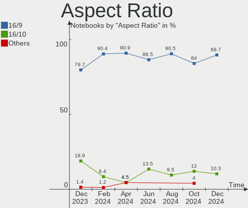
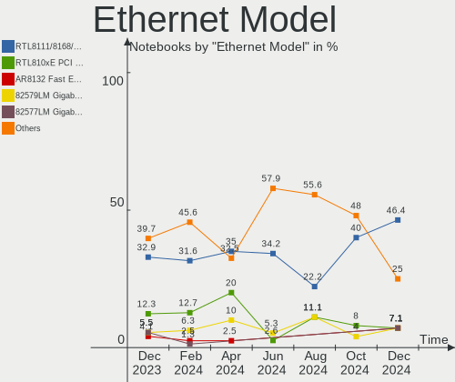
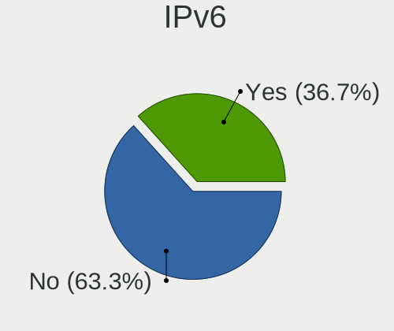

BlackPanther Hardware Trends (Notebooks)
----------------------------------------

A project to identify most popular hardware characteristics and track their change
over time based on data collected by BlackPanther users at https://Linux-Hardware.org.

Anyone can contribute to this report by the [hw-probe](https://github.com/linuxhw/hw-probe) tool:

    sudo -E hw-probe -all -upload

Full-feature report is available here: https://linux-hardware.org/?view=trends

Period: Jan, 2022.

Contents
--------

* [ System ](#system)
  - [ OS                       ](#os)
  - [ OS Family                ](#os-family)
  - [ Kernel                   ](#kernel)
  - [ Kernel Family            ](#kernel-family)
  - [ Kernel Major Ver.        ](#kernel-major-ver)
  - [ Arch                     ](#arch)
  - [ DE                       ](#de)
  - [ Display Server           ](#display-server)
  - [ Display Manager          ](#display-manager)
  - [ OS Lang                  ](#os-lang)
  - [ Boot Mode                ](#boot-mode)
  - [ Filesystem               ](#filesystem)
  - [ Part. scheme             ](#part-scheme)
  - [ Dual Boot with Linux/BSD ](#dual-boot-with-linuxbsd)
  - [ Dual Boot (Win)          ](#dual-boot-win)

* [ Board ](#board)
  - [ Vendor                   ](#vendor)
  - [ Model                    ](#model)
  - [ Model Family             ](#model-family)
  - [ MFG Year                 ](#mfg-year)
  - [ Form Factor              ](#form-factor)
  - [ Secure Boot              ](#secure-boot)
  - [ Coreboot                 ](#coreboot)
  - [ RAM Size                 ](#ram-size)
  - [ RAM Used                 ](#ram-used)
  - [ Total Drives             ](#total-drives)
  - [ Has CD-ROM               ](#has-cd-rom)
  - [ Has Ethernet             ](#has-ethernet)
  - [ Has WiFi                 ](#has-wifi)
  - [ Has Bluetooth            ](#has-bluetooth)

* [ Location ](#location)
  - [ Country                  ](#country)
  - [ City                     ](#city)

* [ Drives ](#drives)
  - [ Drive Vendor             ](#drive-vendor)
  - [ Drive Model              ](#drive-model)
  - [ HDD Vendor               ](#hdd-vendor)
  - [ SSD Vendor               ](#ssd-vendor)
  - [ Drive Kind               ](#drive-kind)
  - [ Drive Connector          ](#drive-connector)
  - [ Drive Size               ](#drive-size)
  - [ Space Total              ](#space-total)
  - [ Space Used               ](#space-used)
  - [ Malfunc. Drives          ](#malfunc-drives)
  - [ Malfunc. Drive Vendor    ](#malfunc-drive-vendor)
  - [ Malfunc. HDD Vendor      ](#malfunc-hdd-vendor)
  - [ Malfunc. Drive Kind      ](#malfunc-drive-kind)
  - [ Failed Drives            ](#failed-drives)
  - [ Failed Drive Vendor      ](#failed-drive-vendor)
  - [ Drive Status             ](#drive-status)

* [ Storage controller ](#storage-controller)
  - [ Storage Vendor           ](#storage-vendor)
  - [ Storage Model            ](#storage-model)
  - [ Storage Kind             ](#storage-kind)

* [ Processor ](#processor)
  - [ CPU Vendor               ](#cpu-vendor)
  - [ CPU Model                ](#cpu-model)
  - [ CPU Model Family         ](#cpu-model-family)
  - [ CPU Cores                ](#cpu-cores)
  - [ CPU Sockets              ](#cpu-sockets)
  - [ CPU Threads              ](#cpu-threads)
  - [ CPU Op-Modes             ](#cpu-op-modes)
  - [ CPU Microcode            ](#cpu-microcode)
  - [ CPU Microarch            ](#cpu-microarch)

* [ Graphics ](#graphics)
  - [ GPU Vendor               ](#gpu-vendor)
  - [ GPU Model                ](#gpu-model)
  - [ GPU Combo                ](#gpu-combo)
  - [ GPU Driver               ](#gpu-driver)
  - [ GPU Memory               ](#gpu-memory)

* [ Monitor ](#monitor)
  - [ Monitor Vendor           ](#monitor-vendor)
  - [ Monitor Model            ](#monitor-model)
  - [ Monitor Resolution       ](#monitor-resolution)
  - [ Monitor Diagonal         ](#monitor-diagonal)
  - [ Monitor Width            ](#monitor-width)
  - [ Aspect Ratio             ](#aspect-ratio)
  - [ Monitor Area             ](#monitor-area)
  - [ Pixel Density            ](#pixel-density)
  - [ Multiple Monitors        ](#multiple-monitors)

* [ Network ](#network)
  - [ Net Controller Vendor    ](#net-controller-vendor)
  - [ Net Controller Model     ](#net-controller-model)
  - [ Wireless Vendor          ](#wireless-vendor)
  - [ Wireless Model           ](#wireless-model)
  - [ Ethernet Vendor          ](#ethernet-vendor)
  - [ Ethernet Model           ](#ethernet-model)
  - [ Net Controller Kind      ](#net-controller-kind)
  - [ Used Controller          ](#used-controller)
  - [ NICs                     ](#nics)
  - [ IPv6                     ](#ipv6)

* [ Bluetooth ](#bluetooth)
  - [ Bluetooth Vendor         ](#bluetooth-vendor)
  - [ Bluetooth Model          ](#bluetooth-model)

* [ Sound ](#sound)
  - [ Sound Vendor             ](#sound-vendor)
  - [ Sound Model              ](#sound-model)

* [ Memory ](#memory)
  - [ Memory Vendor            ](#memory-vendor)
  - [ Memory Model             ](#memory-model)
  - [ Memory Kind              ](#memory-kind)
  - [ Memory Form Factor       ](#memory-form-factor)
  - [ Memory Size              ](#memory-size)
  - [ Memory Speed             ](#memory-speed)

* [ Printers & scanners ](#printers--scanners)
  - [ Printer Vendor           ](#printer-vendor)
  - [ Printer Model            ](#printer-model)
  - [ Scanner Vendor           ](#scanner-vendor)
  - [ Scanner Model            ](#scanner-model)

* [ Camera ](#camera)
  - [ Camera Vendor            ](#camera-vendor)
  - [ Camera Model             ](#camera-model)

* [ Security ](#security)
  - [ Fingerprint Vendor       ](#fingerprint-vendor)
  - [ Fingerprint Model        ](#fingerprint-model)
  - [ Chipcard Vendor          ](#chipcard-vendor)
  - [ Chipcard Model           ](#chipcard-model)

* [ Unsupported ](#unsupported)
  - [ Unsupported Devices      ](#unsupported-devices)
  - [ Unsupported Device Types ](#unsupported-device-types)

System
------

OS
--

Installed operating systems

| Name              | Notebooks | Percent |
|-------------------|-----------|---------|
| BlackPanther 18.1 | 36        | 100%    |

OS Family
---------

OS without a version

| Name         | Notebooks | Percent |
|--------------|-----------|---------|
| BlackPanther | 36        | 100%    |

Kernel
------

Version of the Linux kernel

| Version             | Notebooks | Percent |
|---------------------|-----------|---------|
| 5.6.14-desktop-2bP  | 21        | 58.33%  |
| 4.18.16-desktop-1bP | 15        | 41.67%  |

Kernel Family
-------------

Linux kernel without a distro release

| Version | Notebooks | Percent |
|---------|-----------|---------|
| 5.6.14  | 21        | 58.33%  |
| 4.18.16 | 15        | 41.67%  |

Kernel Major Ver.
-----------------

Linux kernel major version

| Version | Notebooks | Percent |
|---------|-----------|---------|
| 5.6     | 21        | 58.33%  |
| 4.18    | 15        | 41.67%  |

Arch
----

OS architecture (x86_64, i586, etc.)

| Name   | Notebooks | Percent |
|--------|-----------|---------|
| x86_64 | 36        | 100%    |

DE
--

Desktop Environment

| Name | Notebooks | Percent |
|------|-----------|---------|
| KDE5 | 36        | 100%    |

Display Server
--------------

X11 or Wayland

| Name | Notebooks | Percent |
|------|-----------|---------|
| X11  | 36        | 100%    |

Display Manager
---------------

SDDM, LightDM, etc.

| Name | Notebooks | Percent |
|------|-----------|---------|
| SDDM | 36        | 100%    |

OS Lang
-------

Language

| Lang    | Notebooks | Percent |
|---------|-----------|---------|
| Unknown | 36        | 100%    |

Boot Mode
---------

EFI or BIOS

| Mode | Notebooks | Percent |
|------|-----------|---------|
| BIOS | 18        | 50%     |
| EFI  | 18        | 50%     |

Filesystem
----------

Type of filesystem

| Type    | Notebooks | Percent |
|---------|-----------|---------|
| Overlay | 30        | 83.33%  |
| Ext4    | 5         | 13.89%  |
| Ext3    | 1         | 2.78%   |

Part. scheme
------------

Scheme of partitioning

| Type | Notebooks | Percent |
|------|-----------|---------|
| MBR  | 22        | 61.11%  |
| GPT  | 14        | 38.89%  |

Dual Boot with Linux/BSD
------------------------

Hosting more than one Linux/BSD

| Dual boot | Notebooks | Percent |
|-----------|-----------|---------|
| Yes       | 22        | 61.11%  |
| No        | 14        | 38.89%  |

Dual Boot (Win)
---------------

Hosting Linux and Windows

| Dual boot | Notebooks | Percent |
|-----------|-----------|---------|
| No        | 22        | 61.11%  |
| Yes       | 14        | 38.89%  |

Board
-----

Vendor
------

Motherboard manufacturer

| Name                | Notebooks | Percent |
|---------------------|-----------|---------|
| Hewlett-Packard     | 8         | 22.22%  |
| Lenovo              | 7         | 19.44%  |
| Dell                | 6         | 16.67%  |
| ASUSTek Computer    | 6         | 16.67%  |
| Sony                | 2         | 5.56%   |
| Acer                | 2         | 5.56%   |
| Samsung Electronics | 1         | 2.78%   |
| Packard Bell        | 1         | 2.78%   |
| Medion              | 1         | 2.78%   |
| Insyde              | 1         | 2.78%   |
| Apple               | 1         | 2.78%   |

Model
-----

Motherboard model

| Name                                        | Notebooks | Percent |
|---------------------------------------------|-----------|---------|
| HP ProBook 6470b                            | 2         | 5.56%   |
| ASUS X541UVK                                | 2         | 5.56%   |
| Sony VGN-N31S_W                             | 1         | 2.78%   |
| Sony SVS13118GBB                            | 1         | 2.78%   |
| Samsung RV411/RV511/E3511/S3511/RV711/E3411 | 1         | 2.78%   |
| Packard Bell EasyNote TK37                  | 1         | 2.78%   |
| Medion CRAWLER E10                          | 1         | 2.78%   |
| Lenovo ThinkPad X61 76753BJ                 | 1         | 2.78%   |
| Lenovo ThinkPad T61 6458Y56                 | 1         | 2.78%   |
| Lenovo ThinkPad T500 2056CL8                | 1         | 2.78%   |
| Lenovo ThinkPad L420 78544UG                | 1         | 2.78%   |
| Lenovo IdeaPad S145-15IGM 81MX              | 1         | 2.78%   |
| Lenovo IdeaPad 320-17ABR 80YN               | 1         | 2.78%   |
| Lenovo IdeaPad 320-15IAP 80XR               | 1         | 2.78%   |
| Insyde Braswell                             | 1         | 2.78%   |
| HP Pavilion Gaming Laptop 15-ec1xxx         | 1         | 2.78%   |
| HP EliteBook 820 G1                         | 1         | 2.78%   |
| HP 650                                      | 1         | 2.78%   |
| HP 255 G5 Notebook PC                       | 1         | 2.78%   |
| HP 250 G6 Notebook PC                       | 1         | 2.78%   |
| Dell Latitude E6430                         | 1         | 2.78%   |
| Dell Latitude E6230                         | 1         | 2.78%   |
| Dell Latitude D630                          | 1         | 2.78%   |
| Dell Inspiron M5030                         | 1         | 2.78%   |
| Dell Inspiron 5558                          | 1         | 2.78%   |
| Dell Inspiron 1525                          | 1         | 2.78%   |
| ASUS X550VX                                 | 1         | 2.78%   |
| ASUS VivoBook 14_ASUS Laptop E406SAS        | 1         | 2.78%   |
| ASUS K53U                                   | 1         | 2.78%   |
| ASUS K50IN                                  | 1         | 2.78%   |
| Apple MacBookPro6,2                         | 1         | 2.78%   |
| Acer Aspire F5-573G                         | 1         | 2.78%   |
| Acer Aspire ES1-532G                        | 1         | 2.78%   |
| Unknown                                     | 1         | 2.78%   |

Model Family
------------

Motherboard model prefix

| Name                  | Notebooks | Percent |
|-----------------------|-----------|---------|
| Lenovo ThinkPad       | 4         | 11.11%  |
| Lenovo IdeaPad        | 3         | 8.33%   |
| Dell Latitude         | 3         | 8.33%   |
| Dell Inspiron         | 3         | 8.33%   |
| HP ProBook            | 2         | 5.56%   |
| ASUS X541UVK          | 2         | 5.56%   |
| Acer Aspire           | 2         | 5.56%   |
| Sony VGN-N31S         | 1         | 2.78%   |
| Sony SVS13118GBB      | 1         | 2.78%   |
| Samsung RV411         | 1         | 2.78%   |
| Packard Bell EasyNote | 1         | 2.78%   |
| Medion CRAWLER        | 1         | 2.78%   |
| Insyde Braswell       | 1         | 2.78%   |
| HP Pavilion           | 1         | 2.78%   |
| HP EliteBook          | 1         | 2.78%   |
| HP 650                | 1         | 2.78%   |
| HP 255                | 1         | 2.78%   |
| HP 250                | 1         | 2.78%   |
| ASUS X550VX           | 1         | 2.78%   |
| ASUS VivoBook         | 1         | 2.78%   |
| ASUS K53U             | 1         | 2.78%   |
| ASUS K50IN            | 1         | 2.78%   |
| Apple MacBookPro6     | 1         | 2.78%   |
| Unknown               | 1         | 2.78%   |

MFG Year
--------

Motherboard manufacture year

| Year | Notebooks | Percent |
|------|-----------|---------|
| 2012 | 6         | 16.67%  |
| 2017 | 5         | 13.89%  |
| 2016 | 5         | 13.89%  |
| 2007 | 4         | 11.11%  |
| 2011 | 3         | 8.33%   |
| 2010 | 3         | 8.33%   |
| 2008 | 3         | 8.33%   |
| 2020 | 2         | 5.56%   |
| 2019 | 2         | 5.56%   |
| 2015 | 1         | 2.78%   |
| 2014 | 1         | 2.78%   |
| 2009 | 1         | 2.78%   |

Form Factor
-----------

Physical design of the computer

| Name     | Notebooks | Percent |
|----------|-----------|---------|
| Notebook | 36        | 100%    |

Secure Boot
-----------

Enabled or disabled

| State    | Notebooks | Percent |
|----------|-----------|---------|
| Disabled | 36        | 100%    |

Coreboot
--------

Have coreboot on board

| Used | Notebooks | Percent |
|------|-----------|---------|
| No   | 36        | 100%    |

RAM Size
--------

Total RAM memory

| Size in GB | Notebooks | Percent |
|------------|-----------|---------|
| 3.01-4.0   | 18        | 50%     |
| 4.01-8.0   | 7         | 19.44%  |
| 8.01-16.0  | 5         | 13.89%  |
| 1.01-2.0   | 3         | 8.33%   |
| 16.01-24.0 | 2         | 5.56%   |
| 2.01-3.0   | 1         | 2.78%   |

RAM Used
--------

Used RAM memory

| Used GB  | Notebooks | Percent |
|----------|-----------|---------|
| 0.51-1.0 | 23        | 63.89%  |
| 1.01-2.0 | 7         | 19.44%  |
| 0.01-0.5 | 5         | 13.89%  |
| 2.01-3.0 | 1         | 2.78%   |

Total Drives
------------

Number of drives on board

| Drives | Notebooks | Percent |
|--------|-----------|---------|
| 1      | 27        | 75%     |
| 2      | 8         | 22.22%  |
| 3      | 1         | 2.78%   |

Has CD-ROM
----------

Has CD-ROM on board

| Presented | Notebooks | Percent |
|-----------|-----------|---------|
| Yes       | 23        | 63.89%  |
| No        | 13        | 36.11%  |

Has Ethernet
------------

Has Ethernet on board

| Presented | Notebooks | Percent |
|-----------|-----------|---------|
| Yes       | 33        | 91.67%  |
| No        | 3         | 8.33%   |

Has WiFi
--------

Has WiFi module

| Presented | Notebooks | Percent |
|-----------|-----------|---------|
| Yes       | 36        | 100%    |

Has Bluetooth
-------------

Has Bluetooth module

| Presented | Notebooks | Percent |
|-----------|-----------|---------|
| Yes       | 31        | 86.11%  |
| No        | 5         | 13.89%  |

Location
--------

Country
-------

Geographic location (country)

| Country | Notebooks | Percent |
|---------|-----------|---------|
| Hungary | 33        | 91.67%  |
| Japan   | 1         | 2.78%   |
| Germany | 1         | 2.78%   |
| Austria | 1         | 2.78%   |

City
----

Geographic location (city)

| City              | Notebooks | Percent |
|-------------------|-----------|---------|
| Budapest          | 7         | 19.44%  |
| Tatab??nya        | 2         | 5.56%   |
| Szeksz??rd        | 2         | 5.56%   |
| Sz?©kesfeh?©rv??r | 2         | 5.56%   |
| Hajduboszormeny   | 2         | 5.56%   |
| ?‰rd              | 2         | 5.56%   |
| Thaur             | 1         | 2.78%   |
| Szombathely       | 1         | 2.78%   |
| Szazhalombatta    | 1         | 2.78%   |
| Sarvar            | 1         | 2.78%   |
| Pomaz             | 1         | 2.78%   |
| Paszto            | 1         | 2.78%   |
| Mateszalka        | 1         | 2.78%   |
| Magyarlak         | 1         | 2.78%   |
| Lebeny            | 1         | 2.78%   |
| Kecskem?©t        | 1         | 2.78%   |
| Kanazawa          | 1         | 2.78%   |
| Halle             | 1         | 2.78%   |
| Gyonk             | 1         | 2.78%   |
| Fuzesabony        | 1         | 2.78%   |
| Felcsut           | 1         | 2.78%   |
| Esztergom         | 1         | 2.78%   |
| Debrecen          | 1         | 2.78%   |
| Baja              | 1         | 2.78%   |
| Alcsutdoboz       | 1         | 2.78%   |

Drives
------

Drive Vendor
------------

Hard drive vendors

| Vendor              | Notebooks | Drives | Percent |
|---------------------|-----------|--------|---------|
| WDC                 | 9         | 9      | 20.45%  |
| Toshiba             | 9         | 9      | 20.45%  |
| Seagate             | 6         | 6      | 13.64%  |
| Kingston            | 4         | 4      | 9.09%   |
| Samsung Electronics | 3         | 3      | 6.82%   |
| SanDisk             | 2         | 2      | 4.55%   |
| Hitachi             | 2         | 2      | 4.55%   |
| Unknown             | 1         | 1      | 2.27%   |
| Union Memory        | 1         | 1      | 2.27%   |
| Solid               | 1         | 1      | 2.27%   |
| Patriot             | 1         | 1      | 2.27%   |
| Intel               | 1         | 1      | 2.27%   |
| HGST                | 1         | 1      | 2.27%   |
| Crucial             | 1         | 1      | 2.27%   |
| China               | 1         | 1      | 2.27%   |
| Apacer              | 1         | 1      | 2.27%   |

Drive Model
-----------

Hard drive models

| Model                                  | Notebooks | Percent |
|----------------------------------------|-----------|---------|
| WDC WD10JPVX-22JC3T0 1TB               | 2         | 4.55%   |
| Toshiba THNSFJ256GCSU 256GB SSD        | 2         | 4.55%   |
| Seagate ST500LT012-1DG142 500GB        | 2         | 4.55%   |
| WDC WDS500G2B0B-00YS70 500GB SSD       | 1         | 2.27%   |
| WDC WD5000BPVT-80HXZT3 500GB           | 1         | 2.27%   |
| WDC WD5000BEVT-22A0RT0 500GB           | 1         | 2.27%   |
| WDC WD3200BPVT-75ZEST0 320GB           | 1         | 2.27%   |
| WDC WD3200BEVT-22ZCT0 320GB            | 1         | 2.27%   |
| WDC WD1200BEVS-22UST0 120GB            | 1         | 2.27%   |
| WDC WD10JPVX-60JC3T0 1TB               | 1         | 2.27%   |
| Unknown HCG4a2  64GB                   | 1         | 2.27%   |
| Union Memory RTOTJ128VGD2EYX 128GB SSD | 1         | 2.27%   |
| Toshiba MQ04ABF100 1TB                 | 1         | 2.27%   |
| Toshiba MQ01ABF050 500GB               | 1         | 2.27%   |
| Toshiba MQ01ABD100 1TB                 | 1         | 2.27%   |
| Toshiba MK8009GAH 80GB                 | 1         | 2.27%   |
| Toshiba MK5076GSX 500GB                | 1         | 2.27%   |
| Toshiba MK1034GSX 100GB                | 1         | 2.27%   |
| Toshiba KBG30ZMV512G 512GB             | 1         | 2.27%   |
| Solid SSD0240S00 240GB                 | 1         | 2.27%   |
| Seagate ST9320325AS 320GB              | 1         | 2.27%   |
| Seagate ST9160314AS 160GB              | 1         | 2.27%   |
| Seagate ST1000LM024 HN-M101MBB 1TB     | 1         | 2.27%   |
| Seagate ST1000LM 024 HN-M101MBB 1TB    | 1         | 2.27%   |
| SanDisk SDSSDH3 1T00 1TB               | 1         | 2.27%   |
| SanDisk DF4064  64GB                   | 1         | 2.27%   |
| Samsung SSD 980 500GB                  | 1         | 2.27%   |
| Samsung SSD 830 Series 128GB           | 1         | 2.27%   |
| Samsung HM321HI 320GB                  | 1         | 2.27%   |
| Patriot Burst 120GB SSD                | 1         | 2.27%   |
| Kingston SUV400S37120G 120GB SSD       | 1         | 2.27%   |
| Kingston SMS200S3120G 120GB SSD        | 1         | 2.27%   |
| Kingston SA400S37960G 960GB SSD        | 1         | 2.27%   |
| Kingston SA400S37120G 120GB SSD        | 1         | 2.27%   |
| Intel SSDSC2KW256G8 256GB              | 1         | 2.27%   |
| Hitachi HTS547550A9E384 500GB          | 1         | 2.27%   |
| Hitachi HCC543232A7A380 320GB          | 1         | 2.27%   |
| HGST HTS541010B7E610 1TB               | 1         | 2.27%   |
| Crucial C300-CTFDDAC064MAG 64GB SSD    | 1         | 2.27%   |
| China SATA SSD 120GB                   | 1         | 2.27%   |
| Apacer AS350 256GB SSD                 | 1         | 2.27%   |

HDD Vendor
----------

Hard disk drive vendors

| Vendor              | Notebooks | Drives | Percent |
|---------------------|-----------|--------|---------|
| WDC                 | 8         | 8      | 33.33%  |
| Toshiba             | 6         | 6      | 25%     |
| Seagate             | 6         | 6      | 25%     |
| Hitachi             | 2         | 2      | 8.33%   |
| Samsung Electronics | 1         | 1      | 4.17%   |
| HGST                | 1         | 1      | 4.17%   |

SSD Vendor
----------

Solid state drive vendors

| Vendor              | Notebooks | Drives | Percent |
|---------------------|-----------|--------|---------|
| Kingston            | 4         | 4      | 25%     |
| Toshiba             | 2         | 2      | 12.5%   |
| WDC                 | 1         | 1      | 6.25%   |
| Union Memory        | 1         | 1      | 6.25%   |
| Solid               | 1         | 1      | 6.25%   |
| SanDisk             | 1         | 1      | 6.25%   |
| Samsung Electronics | 1         | 1      | 6.25%   |
| Patriot             | 1         | 1      | 6.25%   |
| Intel               | 1         | 1      | 6.25%   |
| Crucial             | 1         | 1      | 6.25%   |
| China               | 1         | 1      | 6.25%   |
| Apacer              | 1         | 1      | 6.25%   |

Drive Kind
----------

HDD or SSD

| Kind | Notebooks | Drives | Percent |
|------|-----------|--------|---------|
| HDD  | 22        | 24     | 52.38%  |
| SSD  | 16        | 16     | 38.1%   |
| MMC  | 2         | 2      | 4.76%   |
| NVMe | 2         | 2      | 4.76%   |

Drive Connector
---------------

SATA, SAS, NVMe, etc.

| Type | Notebooks | Drives | Percent |
|------|-----------|--------|---------|
| SATA | 33        | 39     | 86.84%  |
| NVMe | 2         | 2      | 5.26%   |
| MMC  | 2         | 2      | 5.26%   |
| SAS  | 1         | 1      | 2.63%   |

Drive Size
----------

Size of hard drive

| Size in TB | Notebooks | Drives | Percent |
|------------|-----------|--------|---------|
| 0.01-0.5   | 29        | 30     | 76.32%  |
| 0.51-1.0   | 9         | 10     | 23.68%  |

Space Total
-----------

Amount of disk space available on the file system

| Size in GB | Notebooks | Percent |
|------------|-----------|---------|
| Unknown    | 31        | 86.11%  |
| 251-500    | 2         | 5.56%   |
| 101-250    | 2         | 5.56%   |
| 51-100     | 1         | 2.78%   |

Space Used
----------

Amount of used disk space

| Used GB | Notebooks | Percent |
|---------|-----------|---------|
| Unknown | 31        | 86.11%  |
| 1-20    | 5         | 13.89%  |

Malfunc. Drives
---------------

Drive models with a malfunction

| Model                               | Notebooks | Drives | Percent |
|-------------------------------------|-----------|--------|---------|
| WDC WD10JPVX-22JC3T0 1TB            | 2         | 2      | 11.76%  |
| Toshiba THNSFJ256GCSU 256GB SSD     | 2         | 2      | 11.76%  |
| WDC WD5000BPVT-80HXZT3 500GB        | 1         | 1      | 5.88%   |
| Toshiba MQ01ABF050 500GB            | 1         | 1      | 5.88%   |
| Toshiba MQ01ABD100 1TB              | 1         | 1      | 5.88%   |
| Toshiba MK8009GAH 80GB              | 1         | 1      | 5.88%   |
| Toshiba MK1034GSX 100GB             | 1         | 1      | 5.88%   |
| Seagate ST9320325AS 320GB           | 1         | 1      | 5.88%   |
| Seagate ST9160314AS 160GB           | 1         | 1      | 5.88%   |
| Seagate ST500LT012-1DG142 500GB     | 1         | 1      | 5.88%   |
| Seagate ST1000LM024 HN-M101MBB 1TB  | 1         | 1      | 5.88%   |
| Samsung Electronics HM321HI 320GB   | 1         | 1      | 5.88%   |
| Hitachi HTS547550A9E384 500GB       | 1         | 1      | 5.88%   |
| Hitachi HCC543232A7A380 320GB       | 1         | 1      | 5.88%   |
| Crucial C300-CTFDDAC064MAG 64GB SSD | 1         | 1      | 5.88%   |

Malfunc. Drive Vendor
---------------------

Vendors of faulty drives

| Vendor              | Notebooks | Drives | Percent |
|---------------------|-----------|--------|---------|
| Toshiba             | 6         | 6      | 35.29%  |
| Seagate             | 4         | 4      | 23.53%  |
| WDC                 | 3         | 3      | 17.65%  |
| Hitachi             | 2         | 2      | 11.76%  |
| Samsung Electronics | 1         | 1      | 5.88%   |
| Crucial             | 1         | 1      | 5.88%   |

Malfunc. HDD Vendor
-------------------

Vendors of faulty HDD drives

| Vendor              | Notebooks | Drives | Percent |
|---------------------|-----------|--------|---------|
| Toshiba             | 4         | 4      | 28.57%  |
| Seagate             | 4         | 4      | 28.57%  |
| WDC                 | 3         | 3      | 21.43%  |
| Hitachi             | 2         | 2      | 14.29%  |
| Samsung Electronics | 1         | 1      | 7.14%   |

Malfunc. Drive Kind
-------------------

Kinds of faulty drives

| Kind | Notebooks | Drives | Percent |
|------|-----------|--------|---------|
| HDD  | 14        | 14     | 82.35%  |
| SSD  | 3         | 3      | 17.65%  |

Failed Drives
-------------

Failed drive models

Zero info for selected period =(

Failed Drive Vendor
-------------------

Failed drive vendors

Zero info for selected period =(

Drive Status
------------

Number of failed and malfunc. drives

| Status   | Notebooks | Drives | Percent |
|----------|-----------|--------|---------|
| Works    | 21        | 24     | 53.85%  |
| Malfunc  | 15        | 17     | 38.46%  |
| Detected | 3         | 3      | 7.69%   |

Storage controller
------------------

Storage Vendor
--------------

Storage controller vendors

| Vendor                       | Notebooks | Percent |
|------------------------------|-----------|---------|
| Intel                        | 28        | 77.78%  |
| AMD                          | 5         | 13.89%  |
| Toshiba America Info Systems | 1         | 2.78%   |
| Samsung Electronics          | 1         | 2.78%   |
| Nvidia                       | 1         | 2.78%   |

Storage Model
-------------

Storage controller models

| Model                                                                                  | Notebooks | Percent |
|----------------------------------------------------------------------------------------|-----------|---------|
| Intel 82801HM/HEM (ICH8M/ICH8M-E) IDE Controller                                       | 5         | 11.11%  |
| Intel 7 Series Chipset Family 6-port SATA Controller [AHCI mode]                       | 4         | 8.89%   |
| Intel Sunrise Point-LP SATA Controller [AHCI mode]                                     | 3         | 6.67%   |
| Intel 82801HM/HEM (ICH8M/ICH8M-E) SATA Controller [AHCI mode]                          | 3         | 6.67%   |
| AMD FCH SATA Controller [AHCI mode]                                                    | 3         | 6.67%   |
| Intel Celeron/Pentium Silver Processor SATA Controller                                 | 2         | 4.44%   |
| Intel 82801 Mobile SATA Controller [RAID mode]                                         | 2         | 4.44%   |
| Intel 5 Series/3400 Series Chipset 4 port SATA AHCI Controller                         | 2         | 4.44%   |
| AMD SB7x0/SB8x0/SB9x0 IDE Controller                                                   | 2         | 4.44%   |
| Toshiba America Info Systems BG3 NVMe SSD Controller                                   | 1         | 2.22%   |
| Samsung NVMe SSD Controller 980                                                        | 1         | 2.22%   |
| Nvidia MCP79 AHCI Controller                                                           | 1         | 2.22%   |
| Intel Wildcat Point-LP SATA Controller [AHCI Mode]                                     | 1         | 2.22%   |
| Intel Mobile PM965/GM965 PT IDER Controller                                            | 1         | 2.22%   |
| Intel HM170/QM170 Chipset SATA Controller [AHCI Mode]                                  | 1         | 2.22%   |
| Intel Celeron N3350/Pentium N4200/Atom E3900 Series SATA AHCI Controller               | 1         | 2.22%   |
| Intel Atom/Celeron/Pentium Processor x5-E8000/J3xxx/N3xxx Series SATA Controller       | 1         | 2.22%   |
| Intel 82801IBM/IEM (ICH9M/ICH9M-E) 4 port SATA Controller [AHCI mode]                  | 1         | 2.22%   |
| Intel 82801IBM/IEM (ICH9M/ICH9M-E) 2 port SATA Controller [IDE mode]                   | 1         | 2.22%   |
| Intel 82801HM/HEM (ICH8M/ICH8M-E) SATA Controller [IDE mode]                           | 1         | 2.22%   |
| Intel 82801GBM/GHM (ICH7-M Family) SATA Controller [IDE mode]                          | 1         | 2.22%   |
| Intel 82801G (ICH7 Family) IDE Controller                                              | 1         | 2.22%   |
| Intel 8 Series SATA Controller 1 [AHCI mode]                                           | 1         | 2.22%   |
| Intel 6 Series/C200 Series Chipset Family Mobile SATA Controller (IDE mode, ports 4-5) | 1         | 2.22%   |
| Intel 6 Series/C200 Series Chipset Family Mobile SATA Controller (IDE mode, ports 0-3) | 1         | 2.22%   |
| Intel 400 Series Chipset Family SATA AHCI Controller                                   | 1         | 2.22%   |
| AMD SB7x0/SB8x0/SB9x0 SATA Controller [IDE mode]                                       | 1         | 2.22%   |
| AMD SB7x0/SB8x0/SB9x0 SATA Controller [AHCI mode]                                      | 1         | 2.22%   |

Storage Kind
------------

Kind of storage controller (IDE, SATA, NVMe, SAS, ...)

| Kind | Notebooks | Percent |
|------|-----------|---------|
| SATA | 27        | 65.85%  |
| IDE  | 10        | 24.39%  |
| RAID | 2         | 4.88%   |
| NVMe | 2         | 4.88%   |

Processor
---------

CPU Vendor
----------

Processor vendors

| Vendor | Notebooks | Percent |
|--------|-----------|---------|
| Intel  | 31        | 86.11%  |
| AMD    | 5         | 13.89%  |

CPU Model
---------

Processor models

| Model                                           | Notebooks | Percent |
|-------------------------------------------------|-----------|---------|
| Intel Core i5-3340M CPU @ 2.70GHz               | 3         | 8.33%   |
| Intel Celeron CPU N3160 @ 1.60GHz               | 2         | 5.56%   |
| Intel Pentium Silver N5000 CPU @ 1.10GHz        | 1         | 2.78%   |
| Intel Pentium Dual-Core CPU T4200 @ 2.00GHz     | 1         | 2.78%   |
| Intel Pentium Dual CPU T3200 @ 2.00GHz          | 1         | 2.78%   |
| Intel Pentium CPU P6200 @ 2.13GHz               | 1         | 2.78%   |
| Intel Core i7-6700HQ CPU @ 2.60GHz              | 1         | 2.78%   |
| Intel Core i7 CPU M 620 @ 2.67GHz               | 1         | 2.78%   |
| Intel Core i5-7200U CPU @ 2.50GHz               | 1         | 2.78%   |
| Intel Core i5-5200U CPU @ 2.20GHz               | 1         | 2.78%   |
| Intel Core i5-4300U CPU @ 1.90GHz               | 1         | 2.78%   |
| Intel Core i5-3320M CPU @ 2.60GHz               | 1         | 2.78%   |
| Intel Core i5-3210M CPU @ 2.50GHz               | 1         | 2.78%   |
| Intel Core i5-2520M CPU @ 2.50GHz               | 1         | 2.78%   |
| Intel Core i5-10300H CPU @ 2.50GHz              | 1         | 2.78%   |
| Intel Core i3-7100U CPU @ 2.40GHz               | 1         | 2.78%   |
| Intel Core i3-6006U CPU @ 2.00GHz               | 1         | 2.78%   |
| Intel Core 2 Duo CPU U7600 @ 1.20GHz            | 1         | 2.78%   |
| Intel Core 2 Duo CPU T9900 @ 3.06GHz            | 1         | 2.78%   |
| Intel Core 2 Duo CPU T7500 @ 2.20GHz            | 1         | 2.78%   |
| Intel Core 2 Duo CPU T7250 @ 2.00GHz            | 1         | 2.78%   |
| Intel Core 2 Duo CPU T7100 @ 1.80GHz            | 1         | 2.78%   |
| Intel Core 2 Duo CPU P7350 @ 2.00GHz            | 1         | 2.78%   |
| Intel Core 2 CPU T5500 @ 1.66GHz                | 1         | 2.78%   |
| Intel Celeron N4000 CPU @ 1.10GHz               | 1         | 2.78%   |
| Intel Celeron CPU N3350 @ 1.10GHz               | 1         | 2.78%   |
| Intel Celeron CPU N3050 @ 1.60GHz               | 1         | 2.78%   |
| Intel Celeron CPU B830 @ 1.80GHz                | 1         | 2.78%   |
| AMD V160 Processor                              | 1         | 2.78%   |
| AMD Ryzen 5 4600H with Radeon Graphics          | 1         | 2.78%   |
| AMD C-50 Processor                              | 1         | 2.78%   |
| AMD A6-7310 APU with AMD Radeon R4 Graphics     | 1         | 2.78%   |
| AMD A12-9720P RADEON R7, 12 COMPUTE CORES 4C+8G | 1         | 2.78%   |

CPU Model Family
----------------

Processor model prefix

| Model                   | Notebooks | Percent |
|-------------------------|-----------|---------|
| Intel Core i5           | 10        | 27.78%  |
| Intel Core 2 Duo        | 6         | 16.67%  |
| Intel Celeron           | 6         | 16.67%  |
| Intel Core i7           | 2         | 5.56%   |
| Intel Core i3           | 2         | 5.56%   |
| Intel Pentium Silver    | 1         | 2.78%   |
| Intel Pentium Dual-Core | 1         | 2.78%   |
| Intel Pentium Dual      | 1         | 2.78%   |
| Intel Pentium           | 1         | 2.78%   |
| Intel Core 2            | 1         | 2.78%   |
| AMD V160                | 1         | 2.78%   |
| AMD Ryzen 5             | 1         | 2.78%   |
| AMD C-50                | 1         | 2.78%   |
| AMD A6                  | 1         | 2.78%   |
| AMD A12                 | 1         | 2.78%   |

CPU Cores
---------

Number of processor cores

| Number | Notebooks | Percent |
|--------|-----------|---------|
| 2      | 28        | 77.78%  |
| 4      | 6         | 16.67%  |
| 6      | 1         | 2.78%   |
| 1      | 1         | 2.78%   |

CPU Sockets
-----------

Number of sockets

| Number | Notebooks | Percent |
|--------|-----------|---------|
| 1      | 36        | 100%    |

CPU Threads
-----------

Threads per core (Hyper-Threading)

| Number | Notebooks | Percent |
|--------|-----------|---------|
| 1      | 20        | 55.56%  |
| 2      | 16        | 44.44%  |

CPU Op-Modes
------------

CPU Operation Modes (32-bit, 64-bit)

| Op mode        | Notebooks | Percent |
|----------------|-----------|---------|
| 32-bit, 64-bit | 36        | 100%    |

CPU Microcode
-------------

Microcode number

| Number     | Notebooks | Percent |
|------------|-----------|---------|
| 0x306a9    | 5         | 13.89%  |
| 0x6fd      | 4         | 11.11%  |
| 0x706a1    | 2         | 5.56%   |
| 0x406c4    | 2         | 5.56%   |
| 0x206a7    | 2         | 5.56%   |
| 0x20655    | 2         | 5.56%   |
| 0x1067a    | 2         | 5.56%   |
| Unknown    | 2         | 5.56%   |
| 0xa0652    | 1         | 2.78%   |
| 0x806e9    | 1         | 2.78%   |
| 0x6fb      | 1         | 2.78%   |
| 0x6f2      | 1         | 2.78%   |
| 0x506e3    | 1         | 2.78%   |
| 0x506c9    | 1         | 2.78%   |
| 0x406c3    | 1         | 2.78%   |
| 0x40651    | 1         | 2.78%   |
| 0x306d4    | 1         | 2.78%   |
| 0x10676    | 1         | 2.78%   |
| 0x08600106 | 1         | 2.78%   |
| 0x07030105 | 1         | 2.78%   |
| 0x06006118 | 1         | 2.78%   |
| 0x05000029 | 1         | 2.78%   |
| 0x010000c8 | 1         | 2.78%   |

CPU Microarch
-------------

Microarchitecture

| Name          | Notebooks | Percent |
|---------------|-----------|---------|
| Core          | 6         | 16.67%  |
| IvyBridge     | 5         | 13.89%  |
| Silvermont    | 3         | 8.33%   |
| Penryn        | 3         | 8.33%   |
| Westmere      | 2         | 5.56%   |
| Skylake       | 2         | 5.56%   |
| SandyBridge   | 2         | 5.56%   |
| KabyLake      | 2         | 5.56%   |
| Goldmont plus | 2         | 5.56%   |
| Zen 2         | 1         | 2.78%   |
| Puma          | 1         | 2.78%   |
| K10           | 1         | 2.78%   |
| Haswell       | 1         | 2.78%   |
| Goldmont      | 1         | 2.78%   |
| Excavator     | 1         | 2.78%   |
| CometLake     | 1         | 2.78%   |
| Broadwell     | 1         | 2.78%   |
| Bobcat        | 1         | 2.78%   |

Graphics
--------

GPU Vendor
----------

Vendors of graphics cards

| Vendor | Notebooks | Percent |
|--------|-----------|---------|
| Intel  | 28        | 59.57%  |
| Nvidia | 13        | 27.66%  |
| AMD    | 6         | 12.77%  |

GPU Model
---------

Graphics card models

| Model                                                                                    | Notebooks | Percent |
|------------------------------------------------------------------------------------------|-----------|---------|
| Intel 3rd Gen Core processor Graphics Controller                                         | 5         | 9.43%   |
| Intel Mobile GM965/GL960 Integrated Graphics Controller (secondary)                      | 4         | 7.55%   |
| Intel Mobile GM965/GL960 Integrated Graphics Controller (primary)                        | 4         | 7.55%   |
| Nvidia GM108M [GeForce 920MX]                                                            | 3         | 5.66%   |
| Intel Atom/Celeron/Pentium Processor x5-E8000/J3xxx/N3xxx Integrated Graphics Controller | 3         | 5.66%   |
| Nvidia TU117M [GeForce GTX 1650 Ti Mobile]                                               | 2         | 3.77%   |
| Nvidia GM107M [GeForce GTX 950M]                                                         | 2         | 3.77%   |
| Intel Mobile 4 Series Chipset Integrated Graphics Controller                             | 2         | 3.77%   |
| Intel HD Graphics 620                                                                    | 2         | 3.77%   |
| Intel 2nd Generation Core Processor Family Integrated Graphics Controller                | 2         | 3.77%   |
| Nvidia GT218M [GeForce 315M]                                                             | 1         | 1.89%   |
| Nvidia GT216M [GeForce GT 330M]                                                          | 1         | 1.89%   |
| Nvidia GK208BM [GeForce 920M]                                                            | 1         | 1.89%   |
| Nvidia GK107M [GeForce GT 640M LE]                                                       | 1         | 1.89%   |
| Nvidia G86M [Quadro NVS 140M]                                                            | 1         | 1.89%   |
| Nvidia C79 [GeForce G102M]                                                               | 1         | 1.89%   |
| Intel Skylake GT2 [HD Graphics 520]                                                      | 1         | 1.89%   |
| Intel Mobile 945GM/GMS/GME, 943/940GML Express Integrated Graphics Controller            | 1         | 1.89%   |
| Intel Mobile 945GM/GMS, 943/940GML Express Integrated Graphics Controller                | 1         | 1.89%   |
| Intel HD Graphics 5500                                                                   | 1         | 1.89%   |
| Intel HD Graphics 530                                                                    | 1         | 1.89%   |
| Intel HD Graphics 500                                                                    | 1         | 1.89%   |
| Intel Haswell-ULT Integrated Graphics Controller                                         | 1         | 1.89%   |
| Intel GeminiLake [UHD Graphics 605]                                                      | 1         | 1.89%   |
| Intel GeminiLake [UHD Graphics 600]                                                      | 1         | 1.89%   |
| Intel Core Processor Integrated Graphics Controller                                      | 1         | 1.89%   |
| Intel CometLake-H GT2 [UHD Graphics]                                                     | 1         | 1.89%   |
| AMD Wrestler [Radeon HD 6250]                                                            | 1         | 1.89%   |
| AMD Wani [Radeon R5/R6/R7 Graphics]                                                      | 1         | 1.89%   |
| AMD Topaz XT [Radeon R7 M260/M265 / M340/M360 / M440/M445 / 530/535 / 620/625 Mobile]    | 1         | 1.89%   |
| AMD RV635/M86 [Mobility Radeon HD 3650]                                                  | 1         | 1.89%   |
| AMD RS880M [Mobility Radeon HD 4225/4250]                                                | 1         | 1.89%   |
| AMD Renoir                                                                               | 1         | 1.89%   |
| AMD Mullins [Radeon R4/R5 Graphics]                                                      | 1         | 1.89%   |

GPU Combo
---------

Combinations of graphics cards

| Name           | Notebooks | Percent |
|----------------|-----------|---------|
| 1 x Intel      | 18        | 50%     |
| Intel + Nvidia | 9         | 25%     |
| 1 x Nvidia     | 3         | 8.33%   |
| 1 x AMD        | 3         | 8.33%   |
| 2 x AMD        | 1         | 2.78%   |
| Intel + AMD    | 1         | 2.78%   |
| AMD + Nvidia   | 1         | 2.78%   |

GPU Driver
----------

Free vs proprietary

| Driver  | Notebooks | Percent |
|---------|-----------|---------|
| Free    | 35        | 97.22%  |
| Unknown | 1         | 2.78%   |

GPU Memory
----------

Total video memory

| Size in GB | Notebooks | Percent |
|------------|-----------|---------|
| Unknown    | 21        | 58.33%  |
| 0.01-0.5   | 8         | 22.22%  |
| 3.01-4.0   | 3         | 8.33%   |
| 1.01-2.0   | 2         | 5.56%   |
| 0.51-1.0   | 2         | 5.56%   |

Monitor
-------

Monitor Vendor
--------------

Monitor vendors

| Vendor                  | Notebooks | Percent |
|-------------------------|-----------|---------|
| BOE                     | 8         | 22.86%  |
| Chimei Innolux          | 6         | 17.14%  |
| Samsung Electronics     | 5         | 14.29%  |
| AU Optronics            | 4         | 11.43%  |
| LG Display              | 3         | 8.57%   |
| Chi Mei Optoelectronics | 3         | 8.57%   |
| Lenovo                  | 2         | 5.71%   |
| SKY                     | 1         | 2.86%   |
| PANDA                   | 1         | 2.86%   |
| IBM                     | 1         | 2.86%   |
| Apple                   | 1         | 2.86%   |

Monitor Model
-------------

Monitor models

| Model                                                                    | Notebooks | Percent |
|--------------------------------------------------------------------------|-----------|---------|
| Samsung Electronics LCD Monitor SEC5441 1366x768 344x194mm 15.5-inch     | 3         | 8.57%   |
| Chimei Innolux LCD Monitor CMN15DB 1366x768 344x193mm 15.5-inch          | 2         | 5.71%   |
| Chimei Innolux LCD Monitor CMN1469 1366x768 309x174mm 14.0-inch          | 2         | 5.71%   |
| SKY TV-monitor SKY0402 1920x1080 885x498mm 40.0-inch                     | 1         | 2.86%   |
| Samsung Electronics LCD Monitor SEC3358 1280x800 331x207mm 15.4-inch     | 1         | 2.86%   |
| Samsung Electronics LCD Monitor SEC3157 1280x800 303x190mm 14.1-inch     | 1         | 2.86%   |
| PANDA LM156LF1L03 NCP001C 1920x1080 344x194mm 15.5-inch                  | 1         | 2.86%   |
| LG Display LCD Monitor LGD05E5 1920x1080 344x194mm 15.5-inch             | 1         | 2.86%   |
| LG Display LCD Monitor LGD036C 1366x768 277x156mm 12.5-inch              | 1         | 2.86%   |
| LG Display LCD Monitor LGD02DF 1600x900 310x174mm 14.0-inch              | 1         | 2.86%   |
| Lenovo LCD Monitor LEN4057 1280x800 331x207mm 15.4-inch                  | 1         | 2.86%   |
| Lenovo LCD Monitor LEN4000 1024x768 246x184mm 12.1-inch                  | 1         | 2.86%   |
| IBM LCD Monitor IBM2887 1680x1050 331x207mm 15.4-inch                    | 1         | 2.86%   |
| Chimei Innolux LCD Monitor CMN15C4 1920x1080 344x193mm 15.5-inch         | 1         | 2.86%   |
| Chimei Innolux LCD Monitor CMN1340 1600x900 294x165mm 13.3-inch          | 1         | 2.86%   |
| Chi Mei Optoelectronics LCD Monitor CMO15A7 1366x768 344x193mm 15.5-inch | 1         | 2.86%   |
| Chi Mei Optoelectronics LCD Monitor CMO1592 1366x768 344x193mm 15.5-inch | 1         | 2.86%   |
| Chi Mei Optoelectronics LCD Monitor CMO1221 1280x800 261x163mm 12.1-inch | 1         | 2.86%   |
| BOE LCD Monitor BOE0757 1366x768 344x194mm 15.5-inch                     | 1         | 2.86%   |
| BOE LCD Monitor BOE06A5 1366x768 344x194mm 15.5-inch                     | 1         | 2.86%   |
| BOE LCD Monitor BOE069C 1920x1080 344x193mm 15.5-inch                    | 1         | 2.86%   |
| BOE LCD Monitor BOE0687 1920x1080 344x193mm 15.5-inch                    | 1         | 2.86%   |
| BOE LCD Monitor BOE0685 1600x900 382x215mm 17.3-inch                     | 1         | 2.86%   |
| BOE LCD Monitor BOE0675 1366x768 344x194mm 15.5-inch                     | 1         | 2.86%   |
| BOE LCD Monitor BOE0610 1920x1080 344x193mm 15.5-inch                    | 1         | 2.86%   |
| BOE LCD Monitor BOE05F5 1366x768 277x156mm 12.5-inch                     | 1         | 2.86%   |
| AU Optronics LCD Monitor AUO423D 1920x1080 309x173mm 13.9-inch           | 1         | 2.86%   |
| AU Optronics LCD Monitor AUO40EC 1366x768 344x193mm 15.5-inch            | 1         | 2.86%   |
| AU Optronics LCD Monitor AUO23EC 1366x768 344x193mm 15.5-inch            | 1         | 2.86%   |
| AU Optronics LCD Monitor AUO193C 1366x768 309x173mm 13.9-inch            | 1         | 2.86%   |
| Apple LCD Monitor APP9CA3 1440x900 331x207mm 15.4-inch                   | 1         | 2.86%   |

Monitor Resolution
------------------

Monitor screen resolution

| Resolution         | Notebooks | Percent |
|--------------------|-----------|---------|
| 1366x768 (WXGA)    | 17        | 48.57%  |
| 1920x1080 (FHD)    | 9         | 25.71%  |
| 1600x900 (HD+)     | 3         | 8.57%   |
| 1280x800 (WXGA)    | 3         | 8.57%   |
| 1440x900 (WXGA+)   | 2         | 5.71%   |
| 1680x1050 (WSXGA+) | 1         | 2.86%   |

Monitor Diagonal
----------------

Diagonal size in inches

| Inches | Notebooks | Percent |
|--------|-----------|---------|
| 15     | 22        | 62.86%  |
| 14     | 4         | 11.43%  |
| 13     | 3         | 8.57%   |
| 12     | 3         | 8.57%   |
| 40     | 1         | 2.86%   |
| 23     | 1         | 2.86%   |
| 17     | 1         | 2.86%   |

Monitor Width
-------------

Physical width

| Width in mm | Notebooks | Percent |
|-------------|-----------|---------|
| 301-350     | 25        | 71.43%  |
| 351-400     | 4         | 11.43%  |
| 201-300     | 4         | 11.43%  |
| 801-900     | 1         | 2.86%   |
| 501-600     | 1         | 2.86%   |

Aspect Ratio
------------

Proportional relationship between the width and the height

| Ratio | Notebooks | Percent |
|-------|-----------|---------|
| 16/9  | 28        | 82.35%  |
| 16/10 | 6         | 17.65%  |

Monitor Area
------------

Area in inch²

| Area in inch² | Notebooks | Percent |
|----------------|-----------|---------|
| 101-110        | 22        | 62.86%  |
| 81-90          | 6         | 17.14%  |
| 61-70          | 3         | 8.57%   |
| 71-80          | 1         | 2.86%   |
| 201-250        | 1         | 2.86%   |
| 121-130        | 1         | 2.86%   |
| 501-1000       | 1         | 2.86%   |

Pixel Density
-------------

Pixels per inch

| Density | Notebooks | Percent |
|---------|-----------|---------|
| 121-160 | 13        | 37.14%  |
| 101-120 | 13        | 37.14%  |
| 51-100  | 9         | 25.71%  |

Multiple Monitors
-----------------

Total monitors connected

| Total | Notebooks | Percent |
|-------|-----------|---------|
| 1     | 34        | 94.44%  |
| 2     | 1         | 2.78%   |
| 0     | 1         | 2.78%   |

Network
-------

Net Controller Vendor
---------------------

Controller vendors

| Vendor                            | Notebooks | Percent |
|-----------------------------------|-----------|---------|
| Realtek Semiconductor             | 20        | 36.36%  |
| Intel                             | 15        | 27.27%  |
| Qualcomm Atheros                  | 9         | 16.36%  |
| Broadcom                          | 6         | 10.91%  |
| Marvell Technology Group          | 2         | 3.64%   |
| Huawei Technologies               | 1         | 1.82%   |
| Ericsson Business Mobile Networks | 1         | 1.82%   |
| Belkin Components                 | 1         | 1.82%   |

Net Controller Model
--------------------

Controller models

| Model                                                                   | Notebooks | Percent |
|-------------------------------------------------------------------------|-----------|---------|
| Realtek RTL8111/8168/8411 PCI Express Gigabit Ethernet Controller       | 14        | 19.44%  |
| Realtek RTL810xE PCI Express Fast Ethernet controller                   | 4         | 5.56%   |
| Intel Centrino Advanced-N 6205 [Taylor Peak]                            | 4         | 5.56%   |
| Intel 82579LM Gigabit Network Connection (Lewisville)                   | 4         | 5.56%   |
| Realtek RTL8821AE 802.11ac PCIe Wireless Network Adapter                | 3         | 4.17%   |
| Qualcomm Atheros AR9285 Wireless Network Adapter (PCI-Express)          | 3         | 4.17%   |
| Intel PRO/Wireless 4965 AG or AGN [Kedron] Network Connection           | 3         | 4.17%   |
| Intel 82566MM Gigabit Network Connection                                | 3         | 4.17%   |
| Realtek RTL8723BE PCIe Wireless Network Adapter                         | 2         | 2.78%   |
| Qualcomm Atheros QCA9377 802.11ac Wireless Network Adapter              | 2         | 2.78%   |
| Broadcom BCM4313 802.11bgn Wireless Network Adapter                     | 2         | 2.78%   |
| Realtek RTL8822CE 802.11ac PCIe Wireless Network Adapter                | 1         | 1.39%   |
| Realtek RTL8821CE 802.11ac PCIe Wireless Network Adapter                | 1         | 1.39%   |
| Realtek RTL8723BU 802.11b/g/n WLAN Adapter                              | 1         | 1.39%   |
| Qualcomm Atheros QCA9565 / AR9565 Wireless Network Adapter              | 1         | 1.39%   |
| Qualcomm Atheros AR9485 Wireless Network Adapter                        | 1         | 1.39%   |
| Qualcomm Atheros AR9287 Wireless Network Adapter (PCI-Express)          | 1         | 1.39%   |
| Qualcomm Atheros AR8152 v2.0 Fast Ethernet                              | 1         | 1.39%   |
| Qualcomm Atheros AR242x / AR542x Wireless Network Adapter (PCI-Express) | 1         | 1.39%   |
| Marvell Group 88E8040 PCI-E Fast Ethernet Controller                    | 1         | 1.39%   |
| Marvell Group 88E8036 PCI-E Fast Ethernet Controller                    | 1         | 1.39%   |
| Intel Wireless 7260                                                     | 1         | 1.39%   |
| Intel Wireless 3165                                                     | 1         | 1.39%   |
| Intel Wireless 3160                                                     | 1         | 1.39%   |
| Intel Ultimate N WiFi Link 5300                                         | 1         | 1.39%   |
| Intel PRO/Wireless 3945ABG [Golan] Network Connection                   | 1         | 1.39%   |
| Intel Gemini Lake PCH CNVi WiFi                                         | 1         | 1.39%   |
| Intel Ethernet Connection I218-LM                                       | 1         | 1.39%   |
| Intel Dual Band Wireless-AC 3168NGW [Stone Peak]                        | 1         | 1.39%   |
| Intel Comet Lake PCH CNVi WiFi                                          | 1         | 1.39%   |
| Intel 82567LM Gigabit Network Connection                                | 1         | 1.39%   |
| Huawei SNE-LX1                                                          | 1         | 1.39%   |
| Ericsson Business Mobile Networks F5521gw                               | 1         | 1.39%   |
| Broadcom NetXtreme BCM5764M Gigabit Ethernet PCIe                       | 1         | 1.39%   |
| Broadcom NetXtreme BCM5755M Gigabit Ethernet PCI Express                | 1         | 1.39%   |
| Broadcom NetLink BCM57780 Gigabit Ethernet PCIe                         | 1         | 1.39%   |
| Broadcom BCM43224 802.11a/b/g/n                                         | 1         | 1.39%   |
| Broadcom BCM4312 802.11b/g LP-PHY                                       | 1         | 1.39%   |
| Belkin Components F5D7050 Wireless G Adapter v3000 [Ralink RT2571W]     | 1         | 1.39%   |

Wireless Vendor
---------------

Wireless vendors

| Vendor                | Notebooks | Percent |
|-----------------------|-----------|---------|
| Intel                 | 15        | 40.54%  |
| Qualcomm Atheros      | 9         | 24.32%  |
| Realtek Semiconductor | 8         | 21.62%  |
| Broadcom              | 4         | 10.81%  |
| Belkin Components     | 1         | 2.7%    |

Wireless Model
--------------

Wireless models

| Model                                                                   | Notebooks | Percent |
|-------------------------------------------------------------------------|-----------|---------|
| Intel Centrino Advanced-N 6205 [Taylor Peak]                            | 4         | 10.81%  |
| Realtek RTL8821AE 802.11ac PCIe Wireless Network Adapter                | 3         | 8.11%   |
| Qualcomm Atheros AR9285 Wireless Network Adapter (PCI-Express)          | 3         | 8.11%   |
| Intel PRO/Wireless 4965 AG or AGN [Kedron] Network Connection           | 3         | 8.11%   |
| Realtek RTL8723BE PCIe Wireless Network Adapter                         | 2         | 5.41%   |
| Qualcomm Atheros QCA9377 802.11ac Wireless Network Adapter              | 2         | 5.41%   |
| Broadcom BCM4313 802.11bgn Wireless Network Adapter                     | 2         | 5.41%   |
| Realtek RTL8822CE 802.11ac PCIe Wireless Network Adapter                | 1         | 2.7%    |
| Realtek RTL8821CE 802.11ac PCIe Wireless Network Adapter                | 1         | 2.7%    |
| Realtek RTL8723BU 802.11b/g/n WLAN Adapter                              | 1         | 2.7%    |
| Qualcomm Atheros QCA9565 / AR9565 Wireless Network Adapter              | 1         | 2.7%    |
| Qualcomm Atheros AR9485 Wireless Network Adapter                        | 1         | 2.7%    |
| Qualcomm Atheros AR9287 Wireless Network Adapter (PCI-Express)          | 1         | 2.7%    |
| Qualcomm Atheros AR242x / AR542x Wireless Network Adapter (PCI-Express) | 1         | 2.7%    |
| Intel Wireless 7260                                                     | 1         | 2.7%    |
| Intel Wireless 3165                                                     | 1         | 2.7%    |
| Intel Wireless 3160                                                     | 1         | 2.7%    |
| Intel Ultimate N WiFi Link 5300                                         | 1         | 2.7%    |
| Intel PRO/Wireless 3945ABG [Golan] Network Connection                   | 1         | 2.7%    |
| Intel Gemini Lake PCH CNVi WiFi                                         | 1         | 2.7%    |
| Intel Dual Band Wireless-AC 3168NGW [Stone Peak]                        | 1         | 2.7%    |
| Intel Comet Lake PCH CNVi WiFi                                          | 1         | 2.7%    |
| Broadcom BCM43224 802.11a/b/g/n                                         | 1         | 2.7%    |
| Broadcom BCM4312 802.11b/g LP-PHY                                       | 1         | 2.7%    |
| Belkin Components F5D7050 Wireless G Adapter v3000 [Ralink RT2571W]     | 1         | 2.7%    |

Ethernet Vendor
---------------

Ethernet vendors

| Vendor                   | Notebooks | Percent |
|--------------------------|-----------|---------|
| Realtek Semiconductor    | 18        | 52.94%  |
| Intel                    | 9         | 26.47%  |
| Broadcom                 | 3         | 8.82%   |
| Marvell Technology Group | 2         | 5.88%   |
| Qualcomm Atheros         | 1         | 2.94%   |
| Huawei Technologies      | 1         | 2.94%   |

Ethernet Model
--------------

Ethernet models

| Model                                                             | Notebooks | Percent |
|-------------------------------------------------------------------|-----------|---------|
| Realtek RTL8111/8168/8411 PCI Express Gigabit Ethernet Controller | 14        | 41.18%  |
| Realtek RTL810xE PCI Express Fast Ethernet controller             | 4         | 11.76%  |
| Intel 82579LM Gigabit Network Connection (Lewisville)             | 4         | 11.76%  |
| Intel 82566MM Gigabit Network Connection                          | 3         | 8.82%   |
| Qualcomm Atheros AR8152 v2.0 Fast Ethernet                        | 1         | 2.94%   |
| Marvell Group 88E8040 PCI-E Fast Ethernet Controller              | 1         | 2.94%   |
| Marvell Group 88E8036 PCI-E Fast Ethernet Controller              | 1         | 2.94%   |
| Intel Ethernet Connection I218-LM                                 | 1         | 2.94%   |
| Intel 82567LM Gigabit Network Connection                          | 1         | 2.94%   |
| Huawei SNE-LX1                                                    | 1         | 2.94%   |
| Broadcom NetXtreme BCM5764M Gigabit Ethernet PCIe                 | 1         | 2.94%   |
| Broadcom NetXtreme BCM5755M Gigabit Ethernet PCI Express          | 1         | 2.94%   |
| Broadcom NetLink BCM57780 Gigabit Ethernet PCIe                   | 1         | 2.94%   |

Net Controller Kind
-------------------

Ethernet, WiFi or modem

| Kind     | Notebooks | Percent |
|----------|-----------|---------|
| WiFi     | 36        | 51.43%  |
| Ethernet | 33        | 47.14%  |
| Modem    | 1         | 1.43%   |

Used Controller
---------------

Currently used network controller

| Kind     | Notebooks | Percent |
|----------|-----------|---------|
| WiFi     | 31        | 77.5%   |
| Ethernet | 9         | 22.5%   |

NICs
----

Total network controllers on board

| Total | Notebooks | Percent |
|-------|-----------|---------|
| 2     | 33        | 91.67%  |
| 1     | 2         | 5.56%   |
| 0     | 1         | 2.78%   |

IPv6
----

IPv6 vs IPv4

| Used | Notebooks | Percent |
|------|-----------|---------|
| No   | 28        | 77.78%  |
| Yes  | 8         | 22.22%  |

Bluetooth
---------

Bluetooth Vendor
----------------

Controller vendors

| Vendor                          | Notebooks | Percent |
|---------------------------------|-----------|---------|
| Broadcom                        | 7         | 22.58%  |
| Realtek Semiconductor           | 6         | 19.35%  |
| Intel                           | 6         | 19.35%  |
| Dell                            | 4         | 12.9%   |
| Realtek                         | 1         | 3.23%   |
| Qualcomm Atheros Communications | 1         | 3.23%   |
| Lite-On Technology              | 1         | 3.23%   |
| IMC Networks                    | 1         | 3.23%   |
| Hewlett-Packard                 | 1         | 3.23%   |
| Foxconn / Hon Hai               | 1         | 3.23%   |
| Cambridge Silicon Radio         | 1         | 3.23%   |
| Apple                           | 1         | 3.23%   |

Bluetooth Model
---------------

Controller models

| Model                                               | Notebooks | Percent |
|-----------------------------------------------------|-----------|---------|
| Realtek Bluetooth Radio                             | 4         | 12.5%   |
| Intel Bluetooth Device                              | 4         | 12.5%   |
| Realtek RTL8821A Bluetooth                          | 2         | 6.25%   |
| Broadcom HP Portable SoftSailing                    | 2         | 6.25%   |
| Broadcom BCM2070 Bluetooth Device                   | 2         | 6.25%   |
| Broadcom BCM2045B (BDC-2) [Bluetooth Controller]    | 2         | 6.25%   |
| Realtek Bluetooth Radio                             | 1         | 3.13%   |
| Qualcomm Atheros AR3012 Bluetooth                   | 1         | 3.13%   |
| Lite-On Qualcomm Atheros QCA9377 Bluetooth          | 1         | 3.13%   |
| Intel Wireless-AC 3168 Bluetooth                    | 1         | 3.13%   |
| Intel Bluetooth 9460/9560 Jefferson Peak (JfP)      | 1         | 3.13%   |
| IMC Networks Bluetooth Device                       | 1         | 3.13%   |
| HP Bluetooth 2.0 Interface [Broadcom BCM2045]       | 1         | 3.13%   |
| Foxconn / Hon Hai Bluetooth USB Host Controller     | 1         | 3.13%   |
| Dell Wireless 370 Bluetooth Mini-card               | 1         | 3.13%   |
| Dell Wireless 365 Bluetooth                         | 1         | 3.13%   |
| Dell Wireless 360 Bluetooth                         | 1         | 3.13%   |
| Dell Wireless 355 Bluetooth                         | 1         | 3.13%   |
| Dell BCM20702A0 Bluetooth Module                    | 1         | 3.13%   |
| Cambridge Silicon Radio Bluetooth Dongle (HCI mode) | 1         | 3.13%   |
| Broadcom BCM2045B (BDC-2.1) [Bluetooth Controller]  | 1         | 3.13%   |
| Apple Bluetooth Host Controller                     | 1         | 3.13%   |

Sound
-----

Sound Vendor
------------

Sound card vendors

| Vendor | Notebooks | Percent |
|--------|-----------|---------|
| Intel  | 30        | 75%     |
| Nvidia | 5         | 12.5%   |
| AMD    | 5         | 12.5%   |

Sound Model
-----------

Sound card models

| Model                                                                                             | Notebooks | Percent |
|---------------------------------------------------------------------------------------------------|-----------|---------|
| Intel 7 Series/C216 Chipset Family High Definition Audio Controller                               | 6         | 13.33%  |
| Intel 82801H (ICH8 Family) HD Audio Controller                                                    | 5         | 11.11%  |
| Intel Sunrise Point-LP HD Audio                                                                   | 3         | 6.67%   |
| Intel Atom/Celeron/Pentium Processor x5-E8000/J3xxx/N3xxx Series High Definition Audio Controller | 3         | 6.67%   |
| Intel Celeron/Pentium Silver Processor High Definition Audio                                      | 2         | 4.44%   |
| Intel 82801I (ICH9 Family) HD Audio Controller                                                    | 2         | 4.44%   |
| Intel 5 Series/3400 Series Chipset High Definition Audio                                          | 2         | 4.44%   |
| AMD SBx00 Azalia (Intel HDA)                                                                      | 2         | 4.44%   |
| AMD Kabini HDMI/DP Audio                                                                          | 2         | 4.44%   |
| Nvidia TU107 GeForce GTX 1650 High Definition Audio Controller                                    | 1         | 2.22%   |
| Nvidia MCP79 High Definition Audio                                                                | 1         | 2.22%   |
| Nvidia High Definition Audio Controller                                                           | 1         | 2.22%   |
| Nvidia GT216 HDMI Audio Controller                                                                | 1         | 2.22%   |
| Nvidia GK208 HDMI/DP Audio Controller                                                             | 1         | 2.22%   |
| Intel Wildcat Point-LP High Definition Audio Controller                                           | 1         | 2.22%   |
| Intel NM10/ICH7 Family High Definition Audio Controller                                           | 1         | 2.22%   |
| Intel Haswell-ULT HD Audio Controller                                                             | 1         | 2.22%   |
| Intel Comet Lake PCH cAVS                                                                         | 1         | 2.22%   |
| Intel Celeron N3350/Pentium N4200/Atom E3900 Series Audio Cluster                                 | 1         | 2.22%   |
| Intel Broadwell-U Audio Controller                                                                | 1         | 2.22%   |
| Intel 8 Series HD Audio Controller                                                                | 1         | 2.22%   |
| Intel 6 Series/C200 Series Chipset Family High Definition Audio Controller                        | 1         | 2.22%   |
| Intel 100 Series/C230 Series Chipset Family HD Audio Controller                                   | 1         | 2.22%   |
| AMD Wrestler HDMI Audio                                                                           | 1         | 2.22%   |
| AMD FCH Azalia Controller                                                                         | 1         | 2.22%   |
| AMD Family 17h (Models 10h-1fh) HD Audio Controller                                               | 1         | 2.22%   |
| AMD Family 15h (Models 60h-6fh) Audio Controller                                                  | 1         | 2.22%   |

Memory
------

Memory Vendor
-------------

Memory module vendors

| Vendor              | Notebooks | Percent |
|---------------------|-----------|---------|
| Samsung Electronics | 13        | 32.5%   |
| Unknown             | 7         | 17.5%   |
| SK Hynix            | 4         | 10%     |
| Ramaxel Technology  | 4         | 10%     |
| Micron Technology   | 4         | 10%     |
| Nanya Technology    | 3         | 7.5%    |
| Kingston            | 3         | 7.5%    |
| Apacer              | 1         | 2.5%    |
| A-DATA Technology   | 1         | 2.5%    |

Memory Model
------------

Memory module models

| Model                                                        | Notebooks | Percent |
|--------------------------------------------------------------|-----------|---------|
| Unknown RAM Module 2048MB SODIMM DDR3 1600MT/s               | 2         | 4.88%   |
| Unknown RAM Module 2048MB SODIMM DDR2 667MT/s                | 2         | 4.88%   |
| Samsung RAM M471B5773DH0-CH9 2GB SODIMM DDR3 1600MT/s        | 2         | 4.88%   |
| Samsung RAM M471B5273DH0-CK0 4096MB SODIMM DDR3 1600MT/s     | 2         | 4.88%   |
| Samsung RAM M471B5173QH0-YK0 4GB SODIMM DDR3 1600MT/s        | 2         | 4.88%   |
| Unknown RAM Module 4096MB SODIMM DDR3                        | 1         | 2.44%   |
| Unknown RAM Module 2048MB SODIMM DDR2                        | 1         | 2.44%   |
| Unknown RAM Module 2048MB SODIMM 1067MT/s                    | 1         | 2.44%   |
| SK Hynix RAM HYMP325S64AMP8-Y5 2048MB SODIMM DDR2 667MT/s    | 1         | 2.44%   |
| SK Hynix RAM HYMP125S64CP8-Y5 2048MB SODIMM DDR 667MT/s      | 1         | 2.44%   |
| SK Hynix RAM HYMP125S64CP8-S6 2GB SODIMM DDR 975MT/s         | 1         | 2.44%   |
| SK Hynix RAM HMA81GS6CJR8N-XN 8192MB SODIMM DDR4 3200MT/s    | 1         | 2.44%   |
| Samsung RAM M471B5674EB0-YK0 2048MB SODIMM DDR3 1600MT/s     | 1         | 2.44%   |
| Samsung RAM M471B2873GB0-CH9 1024MB SODIMM DDR3 1334MT/s     | 1         | 2.44%   |
| Samsung RAM M471B1G73EB0-YK0 8192MB SODIMM DDR3 1600MT/s     | 1         | 2.44%   |
| Samsung RAM M471A5244CB0-CRC 4096MB SODIMM DDR4 2667MT/s     | 1         | 2.44%   |
| Samsung RAM M471A5244BB0-CRC 4096MB SODIMM DDR4 2667MT/s     | 1         | 2.44%   |
| Samsung RAM M471A5143EB0-CPB 4096MB SODIMM DDR4 2133MT/s     | 1         | 2.44%   |
| Samsung RAM M471A1K43CB1-CTD 8GB SODIMM DDR4 2667MT/s        | 1         | 2.44%   |
| Samsung RAM M471A1K43BB0-CPB 8192MB SODIMM DDR4 2133MT/s     | 1         | 2.44%   |
| Ramaxel RAM RMT3170MP68F9F1600 4096MB SODIMM DDR3 1600MT/s   | 1         | 2.44%   |
| Ramaxel RAM RMT3010EC58E8F1333 2GB SODIMM DDR3 1600MT/s      | 1         | 2.44%   |
| Ramaxel RAM RMT1970ED48E8F1066 2048MB SODIMM DDR3 1066MT/s   | 1         | 2.44%   |
| Ramaxel RAM RMSA3270ME86H9F-2666 4096MB SODIMM DDR4 2667MT/s | 1         | 2.44%   |
| Nanya RAM NT4GC64C88B1NS-DI 4096MB SODIMM DDR3 1600MT/s      | 1         | 2.44%   |
| Nanya RAM NT2GT64U8HD0BN-AD 2048MB SODIMM DDR2 2048MT/s      | 1         | 2.44%   |
| Nanya RAM Module 4096MB SODIMM DDR3 1067MT/s                 | 1         | 2.44%   |
| Micron RAM 8KTF51264HZ-1G6N1 4096MB SODIMM DDR3 1600MT/s     | 1         | 2.44%   |
| Micron RAM 8JSF25664HZ-1G4D1 2048MB SODIMM DDR3 1334MT/s     | 1         | 2.44%   |
| Micron RAM 8ATF1G64HZ-2G3B1 8192MB SODIMM DDR4 2400MT/s      | 1         | 2.44%   |
| Micron RAM 16HTF25664HY-800J1 2048MB SODIMM DDR 2048MT/s     | 1         | 2.44%   |
| Kingston RAM KHX2400C14S4/8G 8192MB SODIMM DDR4 2400MT/s     | 1         | 2.44%   |
| Kingston RAM ACR24D4S7S1MB-4 4096MB SODIMM DDR4 2133MT/s     | 1         | 2.44%   |
| Kingston RAM 99U5428-100.A00LF 8192MB SODIMM DDR3 1600MT/s   | 1         | 2.44%   |
| Apacer RAM 78.C2GCZ.AU30C 8192MB SODIMM DDR3 1600MT/s        | 1         | 2.44%   |
| A-DATA RAM AM1U16BC4P2-B19H 4096MB SODIMM DDR3 1600MT/s      | 1         | 2.44%   |

Memory Kind
-----------

Memory module kinds

| Kind    | Notebooks | Percent |
|---------|-----------|---------|
| DDR3    | 18        | 50%     |
| DDR4    | 9         | 25%     |
| DDR2    | 6         | 16.67%  |
| SDRAM   | 2         | 5.56%   |
| Unknown | 1         | 2.78%   |

Memory Form Factor
------------------

Physical design of the memory module

| Name   | Notebooks | Percent |
|--------|-----------|---------|
| SODIMM | 35        | 100%    |

Memory Size
-----------

Memory module size

| Size | Notebooks | Percent |
|------|-----------|---------|
| 2048 | 15        | 40.54%  |
| 4096 | 13        | 35.14%  |
| 8192 | 8         | 21.62%  |
| 1024 | 1         | 2.7%    |

Memory Speed
------------

Memory module speed

| Speed   | Notebooks | Percent |
|---------|-----------|---------|
| 1600    | 14        | 37.84%  |
| 2667    | 4         | 10.81%  |
| 667     | 4         | 10.81%  |
| 2133    | 3         | 8.11%   |
| 2048    | 2         | 5.41%   |
| 1334    | 2         | 5.41%   |
| 1067    | 2         | 5.41%   |
| Unknown | 2         | 5.41%   |
| 3200    | 1         | 2.7%    |
| 2400    | 1         | 2.7%    |
| 1066    | 1         | 2.7%    |
| 975     | 1         | 2.7%    |

Printers & scanners
-------------------

Printer Vendor
--------------

Printer device vendors

| Vendor          | Notebooks | Percent |
|-----------------|-----------|---------|
| Hewlett-Packard | 1         | 100%    |

Printer Model
-------------

Printer device models

| Model                  | Notebooks | Percent |
|------------------------|-----------|---------|
| HP DeskJet 2130 series | 1         | 100%    |

Scanner Vendor
--------------

Scanner device vendors

Zero info for selected period =(

Scanner Model
-------------

Scanner device models

Zero info for selected period =(

Camera
------

Camera Vendor
-------------

Camera device vendors

| Vendor                                 | Notebooks | Percent |
|----------------------------------------|-----------|---------|
| Chicony Electronics                    | 7         | 25%     |
| IMC Networks                           | 5         | 17.86%  |
| Realtek Semiconductor                  | 2         | 7.14%   |
| Primax Electronics                     | 2         | 7.14%   |
| Microdia                               | 2         | 7.14%   |
| Cheng Uei Precision Industry (Foxlink) | 2         | 7.14%   |
| Syntek                                 | 1         | 3.57%   |
| Suyin                                  | 1         | 3.57%   |
| Sunplus Innovation Technology          | 1         | 3.57%   |
| Silicon Motion                         | 1         | 3.57%   |
| Quanta                                 | 1         | 3.57%   |
| OmniVision Technologies                | 1         | 3.57%   |
| Apple                                  | 1         | 3.57%   |
| Alcor Micro                            | 1         | 3.57%   |

Camera Model
------------

Camera device models

| Model                                                   | Notebooks | Percent |
|---------------------------------------------------------|-----------|---------|
| Primax HP HD Webcam [Fixed]                             | 2         | 7.14%   |
| IMC Networks USB2.0 VGA UVC WebCam                      | 2         | 7.14%   |
| IMC Networks EasyCamera                                 | 2         | 7.14%   |
| Syntek Integrated Camera                                | 1         | 3.57%   |
| Suyin Integrated_Webcam_HD                              | 1         | 3.57%   |
| Sunplus USB2.0 Camera                                   | 1         | 3.57%   |
| Silicon Motion WebCam SC-0311139N                       | 1         | 3.57%   |
| Realtek USB Camera                                      | 1         | 3.57%   |
| Realtek HD WebCam                                       | 1         | 3.57%   |
| Quanta HP Webcam                                        | 1         | 3.57%   |
| OmniVision OV2640 Webcam                                | 1         | 3.57%   |
| Microdia HP Integrated Webcam                           | 1         | 3.57%   |
| Microdia Dell Integrated HD Webcam                      | 1         | 3.57%   |
| IMC Networks VGA UVC WebCam                             | 1         | 3.57%   |
| Chicony VGA Webcam                                      | 1         | 3.57%   |
| Chicony USB2.0 VGA UVC WebCam                           | 1         | 3.57%   |
| Chicony USB2.0 Camera                                   | 1         | 3.57%   |
| Chicony HP Webcam                                       | 1         | 3.57%   |
| Chicony HP TrueVision HD Camera                         | 1         | 3.57%   |
| Chicony 2.0M UVC Webcam / CNF7129                       | 1         | 3.57%   |
| Chicony 1.3M Webcam                                     | 1         | 3.57%   |
| Cheng Uei Precision Industry (Foxlink) HP Truevision HD | 1         | 3.57%   |
| Cheng Uei Precision Industry (Foxlink) HP HD Webcam     | 1         | 3.57%   |
| Apple Built-in iSight                                   | 1         | 3.57%   |
| Alcor Micro ASUS USB2.0 WebCam                          | 1         | 3.57%   |

Security
--------

Fingerprint Vendor
------------------

Fingerprint sensor vendors

| Vendor           | Notebooks | Percent |
|------------------|-----------|---------|
| AuthenTec        | 3         | 50%     |
| Validity Sensors | 2         | 33.33%  |
| Upek             | 1         | 16.67%  |

Fingerprint Model
-----------------

Fingerprint sensor models

| Model                                                  | Notebooks | Percent |
|--------------------------------------------------------|-----------|---------|
| Validity Sensors VFS491                                | 2         | 33.33%  |
| Upek Biometric Touchchip/Touchstrip Fingerprint Sensor | 1         | 16.67%  |
| AuthenTec AES2810                                      | 1         | 16.67%  |
| AuthenTec AES2501 Fingerprint Sensor                   | 1         | 16.67%  |
| AuthenTec AES1660 Fingerprint Sensor                   | 1         | 16.67%  |

Chipcard Vendor
---------------

Chipcard module vendors

| Vendor   | Notebooks | Percent |
|----------|-----------|---------|
| O2 Micro | 1         | 50%     |
| Lenovo   | 1         | 50%     |

Chipcard Model
--------------

Chipcard module models

| Model                                | Notebooks | Percent |
|--------------------------------------|-----------|---------|
| O2 Micro OZ776 CCID Smartcard Reader | 1         | 50%     |
| Lenovo Integrated Smart Card Reader  | 1         | 50%     |

Unsupported
-----------

Unsupported Devices
-------------------

Total unsupported devices on board

| Total | Notebooks | Percent |
|-------|-----------|---------|
| 0     | 24        | 66.67%  |
| 1     | 9         | 25%     |
| 2     | 2         | 5.56%   |
| 3     | 1         | 2.78%   |

Unsupported Device Types
------------------------

Types of unsupported devices

| Type                     | Notebooks | Percent |
|--------------------------|-----------|---------|
| Fingerprint reader       | 6         | 42.86%  |
| Net/wireless             | 2         | 14.29%  |
| Graphics card            | 2         | 14.29%  |
| Chipcard                 | 2         | 14.29%  |
| Multimedia controller    | 1         | 7.14%   |
| Communication controller | 1         | 7.14%   |

