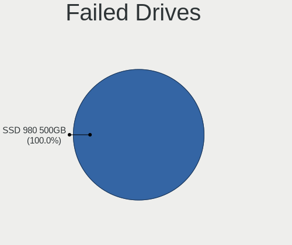
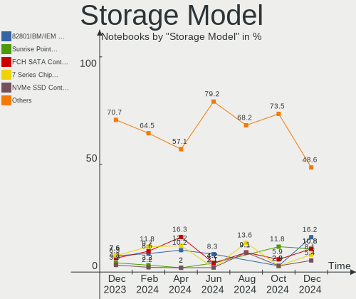
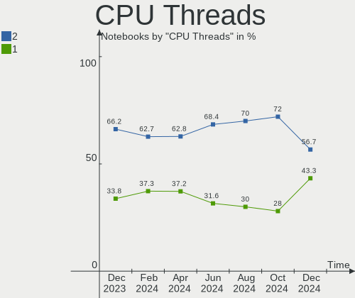
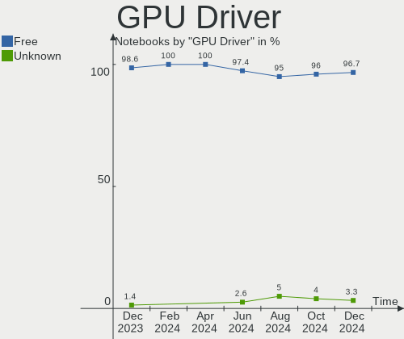

BlackPanther Hardware Trends (Notebook)
---------------------------------------

A project to identify most popular hardware characteristics and track their change
over time based on data collected by BlackPanther users at https://Linux-Hardware.org.

Anyone can contribute to the study by uploading probes of their computers by
the [hw-probe](https://github.com/linuxhw/hw-probe) tool:

    sudo -E hw-probe -all -upload

Full-feature report is available here: https://linux-hardware.org/?view=trends&formfactor=notebook

Period: Nov, 2020.

Contents
--------

- [ OS                       ](#os)
- [ OS Family                ](#os-family)
- [ Kernel                   ](#kernel)
- [ Kernel Family            ](#kernel-family)
- [ Kernel Major Ver.        ](#kernel-major-ver)
- [ Arch                     ](#arch)
- [ DE                       ](#de)
- [ Display Server           ](#display-server)
- [ Display Manager          ](#display-manager)
- [ OS Lang                  ](#os-lang)
- [ Boot Mode                ](#boot-mode)
- [ Filesystem               ](#filesystem)
- [ Part. scheme             ](#part-scheme)
- [ Dual Boot with Linux/BSD ](#dual-boot-with-linux/bsd)
- [ Dual Boot (Win)          ](#dual-boot-win)
- [ Country                  ](#country)
- [ City                     ](#city)
- [ Vendor                   ](#vendor)
- [ Model                    ](#model)
- [ Model Family             ](#model-family)
- [ MFG Year                 ](#mfg-year)
- [ Form Factor              ](#form-factor)
- [ Secure Boot              ](#secure-boot)
- [ Coreboot                 ](#coreboot)
- [ RAM Size                 ](#ram-size)
- [ RAM Used                 ](#ram-used)
- [ Has CD-ROM               ](#has-cd-rom)
- [ Total Drives             ](#total-drives)
- [ Has Ethernet             ](#has-ethernet)
- [ Drive Vendor             ](#drive-vendor)
- [ Drive Model              ](#drive-model)
- [ HDD Vendor               ](#hdd-vendor)
- [ SSD Vendor               ](#ssd-vendor)
- [ Drive Kind               ](#drive-kind)
- [ Drive Connector          ](#drive-connector)
- [ Drive Size               ](#drive-size)
- [ Space Total              ](#space-total)
- [ Space Used               ](#space-used)
- [ Malfunc. Drives          ](#malfunc-drives)
- [ Malfunc. Drive Vendor    ](#malfunc-drive-vendor)
- [ Malfunc. HDD Vendor      ](#malfunc-hdd-vendor)
- [ Malfunc. Drive Kind      ](#malfunc-drive-kind)
- [ Failed Drives            ](#failed-drives)
- [ Failed Drive Vendor      ](#failed-drive-vendor)
- [ Drive Status             ](#drive-status)
- [ Storage Vendor           ](#storage-vendor)
- [ Storage Model            ](#storage-model)
- [ Storage Kind             ](#storage-kind)
- [ CPU Vendor               ](#cpu-vendor)
- [ CPU Model                ](#cpu-model)
- [ CPU Model Family         ](#cpu-model-family)
- [ CPU Cores                ](#cpu-cores)
- [ CPU Sockets              ](#cpu-sockets)
- [ CPU Threads              ](#cpu-threads)
- [ CPU Op-Modes             ](#cpu-op-modes)
- [ CPU Microcode            ](#cpu-microcode)
- [ CPU Microarch            ](#cpu-microarch)
- [ GPU Vendor               ](#gpu-vendor)
- [ GPU Model                ](#gpu-model)
- [ GPU Combo                ](#gpu-combo)
- [ GPU Driver               ](#gpu-driver)
- [ GPU Memory               ](#gpu-memory)
- [ Monitor Vendor           ](#monitor-vendor)
- [ Monitor Model            ](#monitor-model)
- [ Monitor Resolution       ](#monitor-resolution)
- [ Monitor Diagonal         ](#monitor-diagonal)
- [ Monitor Width            ](#monitor-width)
- [ Aspect Ratio             ](#aspect-ratio)
- [ Monitor Area             ](#monitor-area)
- [ Pixel Density            ](#pixel-density)
- [ Multiple Monitors        ](#multiple-monitors)
- [ Net Controller Vendor    ](#net-controller-vendor)
- [ Net Controller Model     ](#net-controller-model)
- [ Wireless Vendor          ](#wireless-vendor)
- [ Wireless Model           ](#wireless-model)
- [ Ethernet Vendor          ](#ethernet-vendor)
- [ Ethernet Model           ](#ethernet-model)
- [ Net Controller Kind      ](#net-controller-kind)
- [ Used Controller          ](#used-controller)
- [ NICs                     ](#nics)
- [ Memory Vendor            ](#memory-vendor)
- [ Memory Model             ](#memory-model)
- [ Memory Kind              ](#memory-kind)
- [ Memory Form Factor       ](#memory-form-factor)
- [ Memory Size              ](#memory-size)
- [ Memory Speed             ](#memory-speed)
- [ Sound Vendor             ](#sound-vendor)
- [ Sound Model              ](#sound-model)
- [ Camera Vendor            ](#camera-vendor)
- [ Camera Model             ](#camera-model)
- [ Fingerprint Vendor       ](#fingerprint-vendor)
- [ Fingerprint Model        ](#fingerprint-model)
- [ Chipcard Vendor          ](#chipcard-vendor)
- [ Chipcard Model           ](#chipcard-model)
- [ Printer Vendor           ](#printer-vendor)
- [ Printer Model            ](#printer-model)
- [ Scanner Vendor           ](#scanner-vendor)
- [ Scanner Model            ](#scanner-model)
- [ Bluetooth Vendor         ](#bluetooth-vendor)
- [ Bluetooth Model          ](#bluetooth-model)
- [ Unsupported Devices      ](#unsupported-devices)
- [ Unsupported Device Types ](#unsupported-device-types)

OS
--

Installed operating systems

| Name              | Notebooks | Percent |
|-------------------|-----------|---------|
| BlackPanther 18.1 | 98        | 93.33%  |
| BlackPanther 16.2 | 7         | 6.67%   |

OS Family
---------

OS without a version

| Name         | Notebooks | Percent |
|--------------|-----------|---------|
| BlackPanther | 105       | 100%    |

Kernel
------

Version of the Linux kernel

| Version                | Notebooks | Percent |
|------------------------|-----------|---------|
| 4.18.16-desktop-1bP    | 96        | 91.43%  |
| 4.9.20-desktop-pae-1bP | 7         | 6.67%   |
| 5.6.14-desktop-2bP     | 2         | 1.9%    |

Kernel Family
-------------

Linux kernel without a distro release

| Version | Notebooks | Percent |
|---------|-----------|---------|
| 4.18.16 | 96        | 91.43%  |
| 4.9.20  | 7         | 6.67%   |
| 5.6.14  | 2         | 1.9%    |

Kernel Major Ver.
-----------------

Linux kernel major version

| Version | Notebooks | Percent |
|---------|-----------|---------|
| 4.18    | 96        | 91.43%  |
| 4.9     | 7         | 6.67%   |
| 5.6     | 2         | 1.9%    |

Arch
----

OS architecture (x86_64, i586, etc.)

| Name   | Notebooks | Percent |
|--------|-----------|---------|
| x86_64 | 98        | 93.33%  |
| i686   | 7         | 6.67%   |

DE
--

Desktop Environment

| Name | Notebooks | Percent |
|------|-----------|---------|
| KDE5 | 105       | 100%    |

Display Server
--------------

X11 or Wayland

| Name    | Notebooks | Percent |
|---------|-----------|---------|
| X11     | 104       | 99.05%  |
| Wayland | 1         | 0.95%   |

Display Manager
---------------

SDDM, LightDM, etc.

| Name | Notebooks | Percent |
|------|-----------|---------|
| SDDM | 105       | 100%    |

OS Lang
-------

Language

| Lang    | Notebooks | Percent |
|---------|-----------|---------|
| Unknown | 105       | 100%    |

Boot Mode
---------

EFI or BIOS

| Mode | Notebooks | Percent |
|------|-----------|---------|
| BIOS | 64        | 60.95%  |
| EFI  | 41        | 39.05%  |

Filesystem
----------

Type of filesystem

| Type    | Notebooks | Percent |
|---------|-----------|---------|
| Overlay | 82        | 78.1%   |
| Ext4    | 23        | 21.9%   |

Part. scheme
------------

Scheme of partitioning

| Type | Notebooks | Percent |
|------|-----------|---------|
| MBR  | 62        | 59.05%  |
| GPT  | 43        | 40.95%  |

Dual Boot with Linux/BSD
------------------------

Hosting more than one Linux/BSD

| Dual boot | Notebooks | Percent |
|-----------|-----------|---------|
| No        | 61        | 58.1%   |
| Yes       | 44        | 41.9%   |

Dual Boot (Win)
---------------

Hosting Linux and Windows

| Dual boot | Notebooks | Percent |
|-----------|-----------|---------|
| Yes       | 53        | 50.48%  |
| No        | 52        | 49.52%  |

Country
-------

Geographic location (country)

| Country     | Notebooks | Percent |
|-------------|-----------|---------|
| Hungary     | 71        | 67.62%  |
| Germany     | 7         | 6.67%   |
| USA         | 4         | 3.81%   |
| Argentina   | 4         | 3.81%   |
| Slovakia    | 3         | 2.86%   |
| Canada      | 3         | 2.86%   |
| UK          | 2         | 1.9%    |
| France      | 2         | 1.9%    |
| Brazil      | 2         | 1.9%    |
| Thailand    | 1         | 0.95%   |
| Romania     | 1         | 0.95%   |
| Netherlands | 1         | 0.95%   |
| Japan       | 1         | 0.95%   |
| Israel      | 1         | 0.95%   |
| India       | 1         | 0.95%   |
| Austria     | 1         | 0.95%   |

City
----

Geographic location (city)

| City                      | Notebooks | Percent |
|---------------------------|-----------|---------|
| Budapest                  | 27        | 25.71%  |
| Miskolc                   | 7         | 6.67%   |
| Zalaegerszeg              | 3         | 2.86%   |
| San Martín de los Andes  | 3         | 2.86%   |
| Győr                     | 3         | 2.86%   |
| Ajka                      | 3         | 2.86%   |
| Szombathely               | 2         | 1.9%    |
| Szekszárd                | 2         | 1.9%    |
| Ottawa                    | 2         | 1.9%    |
| Nova Bana                 | 2         | 1.9%    |
| Budajeno                  | 2         | 1.9%    |
| Wassertrudingen           | 1         | 0.95%   |
| Wagener                   | 1         | 0.95%   |
| Vienna                    | 1         | 0.95%   |
| Valleyford                | 1         | 0.95%   |
| Tolna                     | 1         | 0.95%   |
| Tiszafoldvar              | 1         | 0.95%   |
| Tel Aviv                  | 1         | 0.95%   |
| Tata                      | 1         | 0.95%   |
| Tarcal                    | 1         | 0.95%   |
| Tap                       | 1         | 0.95%   |
| Tabajd                    | 1         | 0.95%   |
| Szeged                    | 1         | 0.95%   |
| Southend-on-Sea           | 1         | 0.95%   |
| Solymar                   | 1         | 0.95%   |
| Solingen                  | 1         | 0.95%   |
| Saint-Gilles-Croix-de-Vie | 1         | 0.95%   |
| Rugland                   | 1         | 0.95%   |
| Ruaudin                   | 1         | 0.95%   |
| Québec                   | 1         | 0.95%   |
| Pécs                     | 1         | 0.95%   |
| Portland                  | 1         | 0.95%   |
| Pomaz                     | 1         | 0.95%   |
| Osli                      | 1         | 0.95%   |
| Nyiregyhaza               | 1         | 0.95%   |
| Nyirad                    | 1         | 0.95%   |
| Naszaly                   | 1         | 0.95%   |
| Mesa                      | 1         | 0.95%   |
| Maastricht                | 1         | 0.95%   |
| Lowestoft                 | 1         | 0.95%   |
| Koto                      | 1         | 0.95%   |
| Kisujszallas              | 1         | 0.95%   |
| Karcag                    | 1         | 0.95%   |
| Herne                     | 1         | 0.95%   |
| Helmstedt                 | 1         | 0.95%   |
| Hamburg                   | 1         | 0.95%   |
| Gödöllő                | 1         | 0.95%   |
| Goiânia                  | 1         | 0.95%   |
| Eger                      | 1         | 0.95%   |
| Deva                      | 1         | 0.95%   |
| Debrecen                  | 1         | 0.95%   |
| Chiang Rai                | 1         | 0.95%   |
| Békéscsaba              | 1         | 0.95%   |
| Bratislava                | 1         | 0.95%   |
| Bodenmais                 | 1         | 0.95%   |
| Bengaluru                 | 1         | 0.95%   |
| Balatonboglar             | 1         | 0.95%   |
| Balatonalmadi             | 1         | 0.95%   |
| Aparecida de Goiania      | 1         | 0.95%   |
| Alumine                   | 1         | 0.95%   |

Vendor
------

Motherboard manufacturer

| Name                | Notebooks | Percent |
|---------------------|-----------|---------|
| Hewlett-Packard     | 32        | 30.48%  |
| Lenovo              | 14        | 13.33%  |
| ASUSTek Computer    | 14        | 13.33%  |
| Dell                | 11        | 10.48%  |
| Acer                | 9         | 8.57%   |
| Toshiba             | 4         | 3.81%   |
| Fujitsu             | 4         | 3.81%   |
| Packard Bell        | 3         | 2.86%   |
| Apple               | 3         | 2.86%   |
| Samsung Electronics | 2         | 1.9%    |
| Unknown             | 2         | 1.9%    |
| Sony                | 1         | 0.95%   |
| Positivo            | 1         | 0.95%   |
| MSI                 | 1         | 0.95%   |
| IBM                 | 1         | 0.95%   |
| Gateway             | 1         | 0.95%   |
| eMachines           | 1         | 0.95%   |
| BANGHO              | 1         | 0.95%   |

Model
-----

Motherboard model

| Name                                       | Notebooks | Percent |
|--------------------------------------------|-----------|---------|
| HP 250 G1                                  | 12        | 11.43%  |
| Unknown                                    | 4         | 3.81%   |
| Lenovo G50-30 80G0                         | 2         | 1.9%    |
| HP EliteBook 2540p                         | 2         | 1.9%    |
| ASUS X550CC                                | 2         | 1.9%    |
| ASUS VivoBook 15_ASUS Laptop X540UBR       | 2         | 1.9%    |
| Apple MacBookPro9,2                        | 2         | 1.9%    |
| Acer Aspire E1-532                         | 2         | 1.9%    |
| Acer Aspire 5745G                          | 2         | 1.9%    |
| Toshiba Satellite Pro L300                 | 1         | 0.95%   |
| Toshiba Satellite L750                     | 1         | 0.95%   |
| Toshiba Satellite C70D-B                   | 1         | 0.95%   |
| Toshiba Satellite C50D-A-11M               | 1         | 0.95%   |
| Sony VPCEH2J1E                             | 1         | 0.95%   |
| Samsung 300V3A/300V4A/300V5A/200A4B/200A5B | 1         | 0.95%   |
| Samsung 300E4A/300E5A/300E7A/3430EA/3530EA | 1         | 0.95%   |
| Positivo C14RV01                           | 1         | 0.95%   |
| Packard Bell EasyNote TK81                 | 1         | 0.95%   |
| Packard Bell EasyNote TK36                 | 1         | 0.95%   |
| Packard Bell EasyNote MB87                 | 1         | 0.95%   |
| MSI GP70 2PE                               | 1         | 0.95%   |
| Lenovo ThinkPad T61 6458WK6                | 1         | 0.95%   |
| Lenovo ThinkPad T410 253723G               | 1         | 0.95%   |
| Lenovo ThinkPad L450 20DSS1X52L            | 1         | 0.95%   |
| Lenovo ThinkPad 11e 20D90020US             | 1         | 0.95%   |
| Lenovo IdeaPad 700-15ISK 80RU              | 1         | 0.95%   |
| Lenovo IdeaPad 330-15IKB 81DE              | 1         | 0.95%   |
| Lenovo IdeaPad 330-15AST 81D6              | 1         | 0.95%   |
| Lenovo IdeaPad 305-15IBD 80NJ              | 1         | 0.95%   |
| Lenovo IdeaPad 100-15IBD 80QQ              | 1         | 0.95%   |
| Lenovo G585 20137                          | 1         | 0.95%   |
| Lenovo G550 20023                          | 1         | 0.95%   |
| Lenovo 3000 G530 444622G                   | 1         | 0.95%   |
| HP ProBook 6450b                           | 1         | 0.95%   |
| HP ProBook 4510s                           | 1         | 0.95%   |
| HP Presario CQ57                           | 1         | 0.95%   |
| HP Pavilion Notebook                       | 1         | 0.95%   |
| HP Notebook                                | 1         | 0.95%   |
| HP Laptop 17-ak0xx                         | 1         | 0.95%   |
| HP Laptop 15-db0xxx                        | 1         | 0.95%   |
| HP G42                                     | 1         | 0.95%   |
| HP EliteBook Folio 9470m                   | 1         | 0.95%   |
| HP Compaq Presario CQ70                    | 1         | 0.95%   |
| HP Compaq nx9420 (RU480ET#ABH)             | 1         | 0.95%   |
| HP Compaq nc6320 (RH368EA#AKC)             | 1         | 0.95%   |
| HP Compaq 6530b (NJ641UC#ABU)              | 1         | 0.95%   |
| HP 650                                     | 1         | 0.95%   |
| HP 255 G2                                  | 1         | 0.95%   |
| HP 250 G4                                  | 1         | 0.95%   |
| HP 15 TS                                   | 1         | 0.95%   |
| Gateway NV57H                              | 1         | 0.95%   |
| Fujitsu LIFEBOOK S760                      | 1         | 0.95%   |
| Fujitsu LIFEBOOK E754                      | 1         | 0.95%   |
| Fujitsu LIFEBOOK AH530                     | 1         | 0.95%   |
| Fujitsu FMVNF70W                           | 1         | 0.95%   |
| eMachines E510                             | 1         | 0.95%   |
| Dell Studio 1737                           | 1         | 0.95%   |
| Dell Precision M4800                       | 1         | 0.95%   |
| Dell Latitude E6430                        | 1         | 0.95%   |
| Dell Latitude E6420                        | 1         | 0.95%   |

Model Family
------------

Motherboard model prefix

| Name                  | Notebooks | Percent |
|-----------------------|-----------|---------|
| HP 250                | 13        | 12.38%  |
| Acer Aspire           | 8         | 7.62%   |
| Dell Latitude         | 7         | 6.67%   |
| Lenovo IdeaPad        | 5         | 4.76%   |
| Toshiba Satellite     | 4         | 3.81%   |
| Lenovo ThinkPad       | 4         | 3.81%   |
| HP Compaq             | 4         | 3.81%   |
| Unknown               | 4         | 3.81%   |
| Packard Bell EasyNote | 3         | 2.86%   |
| HP EliteBook          | 3         | 2.86%   |
| Fujitsu LIFEBOOK      | 3         | 2.86%   |
| ASUS VivoBook         | 3         | 2.86%   |
| Lenovo G50-30         | 2         | 1.9%    |
| HP ProBook            | 2         | 1.9%    |
| HP Laptop             | 2         | 1.9%    |
| ASUS X550CC           | 2         | 1.9%    |
| Apple MacBookPro9     | 2         | 1.9%    |
| Sony VPCEH2J1E        | 1         | 0.95%   |
| Samsung 300V3A        | 1         | 0.95%   |
| Samsung 300E4A        | 1         | 0.95%   |
| Positivo C14RV01      | 1         | 0.95%   |
| MSI GP70              | 1         | 0.95%   |
| Lenovo G585           | 1         | 0.95%   |
| Lenovo G550           | 1         | 0.95%   |
| Lenovo 3000           | 1         | 0.95%   |
| HP Presario           | 1         | 0.95%   |
| HP Pavilion           | 1         | 0.95%   |
| HP Notebook           | 1         | 0.95%   |
| HP G42                | 1         | 0.95%   |
| HP 650                | 1         | 0.95%   |
| HP 255                | 1         | 0.95%   |
| HP 15                 | 1         | 0.95%   |
| Gateway NV57H         | 1         | 0.95%   |
| Fujitsu FMVNF70W      | 1         | 0.95%   |
| eMachines E510        | 1         | 0.95%   |
| Dell Studio           | 1         | 0.95%   |
| Dell Precision        | 1         | 0.95%   |
| Dell Inspiron         | 1         | 0.95%   |
| Dell G3               | 1         | 0.95%   |
| BANGHO MAX            | 1         | 0.95%   |
| ASUS X551MA           | 1         | 0.95%   |
| ASUS X201EP           | 1         | 0.95%   |
| ASUS UX32VD           | 1         | 0.95%   |
| ASUS Strix            | 1         | 0.95%   |
| ASUS ROG              | 1         | 0.95%   |
| ASUS K72Jr            | 1         | 0.95%   |
| ASUS K53SK            | 1         | 0.95%   |
| ASUS G752VY           | 1         | 0.95%   |
| ASUS G73Sw            | 1         | 0.95%   |
| Apple MacBookPro8     | 1         | 0.95%   |
| Acer Extensa          | 1         | 0.95%   |

MFG Year
--------

Motherboard manufacture year

| Year | Notebooks | Percent |
|------|-----------|---------|
| 2013 | 20        | 19.05%  |
| 2018 | 11        | 10.48%  |
| 2011 | 11        | 10.48%  |
| 2019 | 9         | 8.57%   |
| 2012 | 9         | 8.57%   |
| 2015 | 7         | 6.67%   |
| 2008 | 7         | 6.67%   |
| 2016 | 6         | 5.71%   |
| 2014 | 6         | 5.71%   |
| 2010 | 6         | 5.71%   |
| 2009 | 5         | 4.76%   |
| 2020 | 2         | 1.9%    |
| 2017 | 2         | 1.9%    |
| 2007 | 2         | 1.9%    |
| 2006 | 2         | 1.9%    |

Form Factor
-----------

Physical design of the computer

| Name     | Notebooks | Percent |
|----------|-----------|---------|
| Notebook | 105       | 100%    |

Secure Boot
-----------

Enabled or disabled

| State    | Notebooks | Percent |
|----------|-----------|---------|
| Disabled | 105       | 100%    |

Coreboot
--------

Have coreboot on board

| Used | Notebooks | Percent |
|------|-----------|---------|
| No   | 105       | 100%    |

RAM Size
--------

Total RAM memory

| Size in GB | Notebooks | Percent |
|------------|-----------|---------|
| 3.01-4.0   | 39        | 37.14%  |
| 4.01-8.0   | 22        | 20.95%  |
| 1.01-2.0   | 17        | 16.19%  |
| 8.01-16.0  | 15        | 14.29%  |
| 16.01-24.0 | 8         | 7.62%   |
| 2.01-3.0   | 3         | 2.86%   |
| 24.01-32.0 | 1         | 0.95%   |

RAM Used
--------

Used RAM memory

| Used GB  | Notebooks | Percent |
|----------|-----------|---------|
| 0.01-1.0 | 76        | 72.38%  |
| 1.01-2.0 | 29        | 27.62%  |

Has CD-ROM
----------

Has CD-ROM on board

| Presented | Notebooks | Percent |
|-----------|-----------|---------|
| Yes       | 75        | 71.43%  |
| No        | 30        | 28.57%  |

Total Drives
------------

Number of drives on board

| Drives | Notebooks | Percent |
|--------|-----------|---------|
| 1      | 87        | 82.86%  |
| 2      | 16        | 15.24%  |
| 3      | 2         | 1.9%    |

Has Ethernet
------------

Has Ethernet on board

| Presented | Notebooks | Percent |
|-----------|-----------|---------|
| Yes       | 98        | 93.33%  |
| No        | 7         | 6.67%   |

Drive Vendor
------------

Hard drive vendors

| Vendor              | Notebooks | Drives | Percent |
|---------------------|-----------|--------|---------|
| Seagate             | 21        | 22     | 16.8%   |
| HGST                | 19        | 19     | 15.2%   |
| Kingston            | 17        | 18     | 13.6%   |
| Toshiba             | 13        | 15     | 10.4%   |
| WDC                 | 12        | 12     | 9.6%    |
| Samsung Electronics | 7         | 7      | 5.6%    |
| Hitachi             | 6         | 6      | 4.8%    |
| Crucial             | 4         | 4      | 3.2%    |
| A-DATA Technology   | 4         | 4      | 3.2%    |
| Unknown             | 3         | 4      | 2.4%    |
| SK Hynix            | 2         | 2      | 1.6%    |
| SanDisk             | 2         | 2      | 1.6%    |
| Patriot             | 2         | 2      | 1.6%    |
| Micron Technology   | 2         | 2      | 1.6%    |
| Intel               | 2         | 2      | 1.6%    |
| SPCC                | 1         | 1      | 0.8%    |
| ShanDianZhe         | 1         | 1      | 0.8%    |
| QC-FT-D             | 1         | 1      | 0.8%    |
| OCZ                 | 1         | 1      | 0.8%    |
| LITEON              | 1         | 1      | 0.8%    |
| Leven               | 1         | 1      | 0.8%    |
| IBM/Hitachi         | 1         | 1      | 0.8%    |
| Fujitsu             | 1         | 1      | 0.8%    |
| AMD                 | 1         | 1      | 0.8%    |

Drive Model
-----------

Hard drive models

| Model                                 | Notebooks | Percent |
|---------------------------------------|-----------|---------|
| HGST HTS545032A7E380 320GB            | 9         | 6.92%   |
| Kingston SA400S37240G 240GB SSD       | 6         | 4.62%   |
| HGST HTS545050A7E680 500GB            | 5         | 3.85%   |
| Toshiba MQ04ABF100 1TB                | 3         | 2.31%   |
| Toshiba MQ01ABD100 1TB                | 3         | 2.31%   |
| Seagate ST500LT012-1DG142 500GB       | 3         | 2.31%   |
| Kingston SA400S37480G 480GB SSD       | 3         | 2.31%   |
| Kingston SA400S37120G 120GB SSD       | 3         | 2.31%   |
| WDC WD5000BPVT-00HXZT1 500GB          | 2         | 1.54%   |
| Seagate ST1000LM035-1RK172 1TB        | 2         | 1.54%   |
| Patriot Burst 480GB SSD               | 2         | 1.54%   |
| Kingston SV300S37A120G 120GB SSD      | 2         | 1.54%   |
| Kingston SUV400S37120G 120GB SSD      | 2         | 1.54%   |
| HGST HTS541010A9E680 1TB              | 2         | 1.54%   |
| Crucial CT240BX500SSD1 240GB          | 2         | 1.54%   |
| A-DATA SP900 256GB SSD                | 2         | 1.54%   |
| WDC WDS256G1X0C-00ENX0 256GB          | 1         | 0.77%   |
| WDC WDBNCE5000PNC 500GB SSD           | 1         | 0.77%   |
| WDC WD5000LPCX-24C6HT0 500GB          | 1         | 0.77%   |
| WDC WD5000LPCX-22VHAT1 500GB          | 1         | 0.77%   |
| WDC WD5000BEVT-75ZAT0 500GB           | 1         | 0.77%   |
| WDC WD3200BEVT-08A23T1 320GB          | 1         | 0.77%   |
| WDC WD2500BEVS-22UST0 250GB           | 1         | 0.77%   |
| WDC WD1600BEVT-22ZCT0 160GB           | 1         | 0.77%   |
| WDC WD10JPVX-60JC3T0 1TB              | 1         | 0.77%   |
| WDC WD10JPVX-22JC3T0 1TB              | 1         | 0.77%   |
| Unknown SD16G  16GB                   | 1         | 0.77%   |
| Unknown SD128  128GB                  | 1         | 0.77%   |
| Unknown SC64G  64GB                   | 1         | 0.77%   |
| Unknown MMC Card  32GB                | 1         | 0.77%   |
| Toshiba THNSFJ256GCSU 256GB SSD       | 1         | 0.77%   |
| Toshiba MQ01ABF050 500GB              | 1         | 0.77%   |
| Toshiba MQ01ABD075 752GB              | 1         | 0.77%   |
| Toshiba MK8009GAH 80GB                | 1         | 0.77%   |
| Toshiba MK5055GSX 500GB               | 1         | 0.77%   |
| Toshiba MK2576GSX 250GB               | 1         | 0.77%   |
| Toshiba MK1652GSX 160GB               | 1         | 0.77%   |
| Toshiba MK1059GSMP 1TB                | 1         | 0.77%   |
| Toshiba HDWL120 2TB                   | 1         | 0.77%   |
| SPCC Solid State Disk 128GB           | 1         | 0.77%   |
| SK Hynix HFS128G32TNF-N3A0A 128GB SSD | 1         | 0.77%   |
| SK Hynix HCG8e  64GB                  | 1         | 0.77%   |
| ShanDianZhe SSD 512GB                 | 1         | 0.77%   |
| Seagate ST980811AS 80GB               | 1         | 0.77%   |
| Seagate ST95005620AS 500GB            | 1         | 0.77%   |
| Seagate ST9500423AS 500GB             | 1         | 0.77%   |
| Seagate ST9500420AS 500GB             | 1         | 0.77%   |
| Seagate ST9320423AS 320GB             | 1         | 0.77%   |
| Seagate ST9320325AS 320GB             | 1         | 0.77%   |
| Seagate ST9250315AS 250GB             | 1         | 0.77%   |
| Seagate ST9160412AS 160GB             | 1         | 0.77%   |
| Seagate ST500LT012-9WS142 500GB       | 1         | 0.77%   |
| Seagate ST500LM012 HN-M500MBB 500GB   | 1         | 0.77%   |
| Seagate ST500LM000-1EJ162 500GB       | 1         | 0.77%   |
| Seagate ST2000LM003 HN-M201RAD 2TB    | 1         | 0.77%   |
| Seagate ST1000LX015-1U7172 1TB        | 1         | 0.77%   |
| Seagate ST1000LM024 HN-M101MBB 1TB    | 1         | 0.77%   |
| Seagate ST1000LM014-1EJ164-SSHD 1TB   | 1         | 0.77%   |
| Seagate SSD 250GB                     | 1         | 0.77%   |
| Seagate BUP Portable 5TB              | 1         | 0.77%   |

HDD Vendor
----------

Hard disk drive vendors

| Vendor              | Notebooks | Drives | Percent |
|---------------------|-----------|--------|---------|
| Seagate             | 20        | 21     | 28.17%  |
| HGST                | 19        | 19     | 26.76%  |
| Toshiba             | 12        | 14     | 16.9%   |
| WDC                 | 10        | 10     | 14.08%  |
| Hitachi             | 6         | 6      | 8.45%   |
| Samsung Electronics | 1         | 1      | 1.41%   |
| QC-FT-D             | 1         | 1      | 1.41%   |
| IBM/Hitachi         | 1         | 1      | 1.41%   |
| Fujitsu             | 1         | 1      | 1.41%   |

SSD Vendor
----------

Solid state drive vendors

| Vendor              | Notebooks | Drives | Percent |
|---------------------|-----------|--------|---------|
| Kingston            | 16        | 17     | 34.78%  |
| Samsung Electronics | 5         | 5      | 10.87%  |
| Crucial             | 4         | 4      | 8.7%    |
| A-DATA Technology   | 4         | 4      | 8.7%    |
| SanDisk             | 2         | 2      | 4.35%   |
| Patriot             | 2         | 2      | 4.35%   |
| Micron Technology   | 2         | 2      | 4.35%   |
| WDC                 | 1         | 1      | 2.17%   |
| Toshiba             | 1         | 1      | 2.17%   |
| SPCC                | 1         | 1      | 2.17%   |
| SK Hynix            | 1         | 1      | 2.17%   |
| ShanDianZhe         | 1         | 1      | 2.17%   |
| Seagate             | 1         | 1      | 2.17%   |
| OCZ                 | 1         | 1      | 2.17%   |
| LITEON              | 1         | 1      | 2.17%   |
| Leven               | 1         | 1      | 2.17%   |
| Intel               | 1         | 1      | 2.17%   |
| AMD                 | 1         | 1      | 2.17%   |

Drive Kind
----------

HDD or SSD

| Kind | Notebooks | Drives | Percent |
|------|-----------|--------|---------|
| HDD  | 70        | 74     | 58.82%  |
| SSD  | 42        | 47     | 35.29%  |
| NVMe | 4         | 4      | 3.36%   |
| MMC  | 3         | 5      | 2.52%   |

Drive Connector
---------------

SATA, SAS, NVMe, etc.

| Type | Notebooks | Drives | Percent |
|------|-----------|--------|---------|
| SATA | 104       | 120    | 92.86%  |
| NVMe | 4         | 4      | 3.57%   |
| MMC  | 3         | 5      | 2.68%   |
| SAS  | 1         | 1      | 0.89%   |

Drive Size
----------

Size of hard drive

| Size in TB | Notebooks | Drives | Percent |
|------------|-----------|--------|---------|
| 0.01-0.5   | 87        | 96     | 79.09%  |
| 0.51-1.0   | 20        | 22     | 18.18%  |
| 1.01-2.0   | 2         | 2      | 1.82%   |
| 4.01-10.0  | 1         | 1      | 0.91%   |

Space Total
-----------

Amount of disk space available on the file system

| Size in GB     | Notebooks | Percent |
|----------------|-----------|---------|
| Unknown        | 78        | 74.29%  |
| 101-250        | 9         | 8.57%   |
| 251-500        | 7         | 6.67%   |
| 501-1000       | 3         | 2.86%   |
| 51-100         | 3         | 2.86%   |
| 1001-2000      | 2         | 1.9%    |
| 1-20           | 2         | 1.9%    |
| More than 3000 | 1         | 0.95%   |

Space Used
----------

Amount of used disk space

| Used GB   | Notebooks | Percent |
|-----------|-----------|---------|
| Unknown   | 78        | 74.29%  |
| 1-20      | 20        | 19.05%  |
| 251-500   | 2         | 1.9%    |
| 101-250   | 2         | 1.9%    |
| 21-50     | 1         | 0.95%   |
| 1001-2000 | 1         | 0.95%   |
| 501-1000  | 1         | 0.95%   |

Malfunc. Drives
---------------

Drive models with a malfunction

| Model                               | Notebooks | Drives | Percent |
|-------------------------------------|-----------|--------|---------|
| HGST HTS545032A7E380 320GB          | 7         | 7      | 15.56%  |
| HGST HTS545050A7E680 500GB          | 4         | 4      | 8.89%   |
| HGST HTS541010A9E680 1TB            | 2         | 2      | 4.44%   |
| WDC WD10JPVX-22JC3T0 1TB            | 1         | 1      | 2.22%   |
| Toshiba MQ01ABF050 500GB            | 1         | 1      | 2.22%   |
| Toshiba MQ01ABD075 752GB            | 1         | 1      | 2.22%   |
| Toshiba MK8009GAH 80GB              | 1         | 1      | 2.22%   |
| Toshiba MK2576GSX 250GB             | 1         | 1      | 2.22%   |
| Toshiba MK1652GSX 160GB             | 1         | 1      | 2.22%   |
| Toshiba MK1059GSMP 1TB              | 1         | 1      | 2.22%   |
| Seagate ST980811AS 80GB             | 1         | 1      | 2.22%   |
| Seagate ST95005620AS 500GB          | 1         | 1      | 2.22%   |
| Seagate ST9500420AS 500GB           | 1         | 1      | 2.22%   |
| Seagate ST9320423AS 320GB           | 1         | 1      | 2.22%   |
| Seagate ST9320325AS 320GB           | 1         | 1      | 2.22%   |
| Seagate ST9250315AS 250GB           | 1         | 1      | 2.22%   |
| Seagate ST500LT012-9WS142 500GB     | 1         | 1      | 2.22%   |
| Seagate ST500LT012-1DG142 500GB     | 1         | 1      | 2.22%   |
| Seagate ST500LM012 HN-M500MBB 500GB | 1         | 1      | 2.22%   |
| Seagate ST500LM000-1EJ162 500GB     | 1         | 1      | 2.22%   |
| Seagate ST1000LX015-1U7172 1TB      | 1         | 1      | 2.22%   |
| Seagate ST1000LM024 HN-M101MBB 1TB  | 1         | 1      | 2.22%   |
| Seagate ST1000LM014-1EJ164-SSHD 1TB | 1         | 1      | 2.22%   |
| Samsung Electronics HM160HI 160GB   | 1         | 1      | 2.22%   |
| Kingston SV300S37A120G 120GB SSD    | 1         | 1      | 2.22%   |
| Intel SSDSA1M160G2HP 160GB          | 1         | 1      | 2.22%   |
| IBM/Hitachi IC25N060ATMR04-0 64GB   | 1         | 1      | 2.22%   |
| Hitachi HTS545050B9A300 500GB       | 1         | 1      | 2.22%   |
| Hitachi HTS545032B9A300 320GB       | 1         | 1      | 2.22%   |
| Hitachi HTS541680J9SA00 80GB        | 1         | 1      | 2.22%   |
| Hitachi HTS541660J9SA00 64GB        | 1         | 1      | 2.22%   |
| Hitachi HTS541612J9SA00 120GB       | 1         | 1      | 2.22%   |
| HGST HTS545050A7E380 500GB          | 1         | 1      | 2.22%   |
| HGST HTS541075A9E680 752GB          | 1         | 1      | 2.22%   |
| Fujitsu MHY2120BH 120GB             | 1         | 1      | 2.22%   |

Malfunc. Drive Vendor
---------------------

Vendors of faulty drives

| Vendor              | Notebooks | Drives | Percent |
|---------------------|-----------|--------|---------|
| HGST                | 15        | 15     | 34.09%  |
| Seagate             | 12        | 13     | 27.27%  |
| Toshiba             | 6         | 6      | 13.64%  |
| Hitachi             | 5         | 5      | 11.36%  |
| WDC                 | 1         | 1      | 2.27%   |
| Samsung Electronics | 1         | 1      | 2.27%   |
| Kingston            | 1         | 1      | 2.27%   |
| Intel               | 1         | 1      | 2.27%   |
| IBM/Hitachi         | 1         | 1      | 2.27%   |
| Fujitsu             | 1         | 1      | 2.27%   |

Malfunc. HDD Vendor
-------------------

Vendors of faulty HDD drives

| Vendor              | Notebooks | Drives | Percent |
|---------------------|-----------|--------|---------|
| HGST                | 15        | 15     | 35.71%  |
| Seagate             | 12        | 13     | 28.57%  |
| Toshiba             | 6         | 6      | 14.29%  |
| Hitachi             | 5         | 5      | 11.9%   |
| WDC                 | 1         | 1      | 2.38%   |
| Samsung Electronics | 1         | 1      | 2.38%   |
| IBM/Hitachi         | 1         | 1      | 2.38%   |
| Fujitsu             | 1         | 1      | 2.38%   |

Malfunc. Drive Kind
-------------------

Kinds of faulty drives

| Kind | Notebooks | Drives | Percent |
|------|-----------|--------|---------|
| HDD  | 41        | 43     | 95.35%  |
| SSD  | 2         | 2      | 4.65%   |

Failed Drives
-------------

Failed drive models

| Model                        | Notebooks | Drives | Percent |
|------------------------------|-----------|--------|---------|
| WDC WD3200BEVT-08A23T1 320GB | 1         | 1      | 33.33%  |
| Toshiba MQ01ABD100 1TB       | 1         | 1      | 33.33%  |
| Toshiba MK5055GSX 500GB      | 1         | 1      | 33.33%  |

Failed Drive Vendor
-------------------

Failed drive vendors

| Vendor  | Notebooks | Drives | Percent |
|---------|-----------|--------|---------|
| Toshiba | 2         | 2      | 66.67%  |
| WDC     | 1         | 1      | 33.33%  |

Drive Status
------------

Number of failed and malfunc. drives

| Status   | Notebooks | Drives | Percent |
|----------|-----------|--------|---------|
| Works    | 65        | 76     | 56.52%  |
| Malfunc  | 43        | 45     | 37.39%  |
| Detected | 4         | 6      | 3.48%   |
| Failed   | 3         | 3      | 2.61%   |

Storage Vendor
--------------

Storage controller vendors

| Vendor                      | Notebooks | Percent |
|-----------------------------|-----------|---------|
| Intel                       | 90        | 83.33%  |
| AMD                         | 14        | 12.96%  |
| Sandisk                     | 1         | 0.93%   |
| Samsung Electronics         | 1         | 0.93%   |
| Kingston Technology Company | 1         | 0.93%   |
| JMicron Technology          | 1         | 0.93%   |

Storage Model
-------------

Storage controller models

| Model                                                                          | Notebooks | Percent |
|--------------------------------------------------------------------------------|-----------|---------|
| Intel 7 Series Chipset Family 6-port SATA Controller [AHCI mode]               | 21        | 17.36%  |
| AMD FCH SATA Controller [AHCI mode]                                            | 11        | 9.09%   |
| Intel 82801IBM/IEM (ICH9M/ICH9M-E) 4 port SATA Controller [AHCI mode]          | 9         | 7.44%   |
| Intel 6 Series/C200 Series Chipset Family 6 port Mobile SATA AHCI Controller   | 9         | 7.44%   |
| Intel 82801HM/HEM (ICH8M/ICH8M-E) IDE Controller                               | 7         | 5.79%   |
| Intel 82801 Mobile SATA Controller [RAID mode]                                 | 7         | 5.79%   |
| Intel Sunrise Point-LP SATA Controller [AHCI mode]                             | 5         | 4.13%   |
| Intel 82801HM/HEM (ICH8M/ICH8M-E) SATA Controller [AHCI mode]                  | 5         | 4.13%   |
| Intel 5 Series/3400 Series Chipset 6 port SATA AHCI Controller                 | 5         | 4.13%   |
| Intel 5 Series/3400 Series Chipset 4 port SATA AHCI Controller                 | 5         | 4.13%   |
| Intel Atom Processor E3800 Series SATA AHCI Controller                         | 4         | 3.31%   |
| Intel 8 Series SATA Controller 1 [AHCI mode]                                   | 4         | 3.31%   |
| Intel Wildcat Point-LP SATA Controller [AHCI Mode]                             | 3         | 2.48%   |
| Intel 82801GBM/GHM (ICH7-M Family) SATA Controller [AHCI mode]                 | 3         | 2.48%   |
| Intel 82801G (ICH7 Family) IDE Controller                                      | 3         | 2.48%   |
| Intel 8 Series/C220 Series Chipset Family 6-port SATA Controller 1 [AHCI mode] | 3         | 2.48%   |
| AMD SB7x0/SB8x0/SB9x0 SATA Controller [AHCI mode]                              | 3         | 2.48%   |
| Intel Cannon Lake Mobile PCH SATA AHCI Controller                              | 2         | 1.65%   |
| Sandisk WD Black NVMe SSD                                                      | 1         | 0.83%   |
| Samsung Electronics NVMe SSD Controller SM961/PM961                            | 1         | 0.83%   |
| Kingston Technology Company Non-Volatile memory controller                     | 1         | 0.83%   |
| JMicron Technology JMB360 AHCI Controller                                      | 1         | 0.83%   |
| Intel SSD 660P Series                                                          | 1         | 0.83%   |
| Intel Q170/Q150/B150/H170/H110/Z170/CM236 Chipset SATA Controller [AHCI Mode]  | 1         | 0.83%   |
| Intel Mobile PM965/GM965 PT IDER Controller                                    | 1         | 0.83%   |
| Intel Mobile 4 Series Chipset PT IDER Controller                               | 1         | 0.83%   |
| Intel HM170/QM170 Chipset SATA Controller [AHCI Mode]                          | 1         | 0.83%   |
| Intel 82801HM/HEM (ICH8M/ICH8M-E) SATA Controller [IDE mode]                   | 1         | 0.83%   |
| Intel 82801FBM (ICH6M) SATA Controller                                         | 1         | 0.83%   |
| Intel 5 Series/3400 Series Chipset PT IDER Controller                          | 1         | 0.83%   |

Storage Kind
------------

Kind of storage controller (IDE, SATA, NVMe, SAS, ...)

| Kind | Notebooks | Percent |
|------|-----------|---------|
| SATA | 94        | 79.66%  |
| IDE  | 13        | 11.02%  |
| RAID | 7         | 5.93%   |
| NVMe | 4         | 3.39%   |

CPU Vendor
----------

Processor vendors

| Vendor | Notebooks | Percent |
|--------|-----------|---------|
| Intel  | 91        | 86.67%  |
| AMD    | 14        | 13.33%  |

CPU Model
---------

Processor models

| Model                                       | Notebooks | Percent |
|---------------------------------------------|-----------|---------|
| Intel Celeron CPU 1000M @ 1.80GHz           | 12        | 11.43%  |
| Intel Core i5-3210M CPU @ 2.50GHz           | 3         | 2.86%   |
| Intel Core i5-2450M CPU @ 2.50GHz           | 3         | 2.86%   |
| Intel Core 2 Duo CPU T7250 @ 2.00GHz        | 3         | 2.86%   |
| Intel Core i5 CPU M 520 @ 2.40GHz           | 2         | 1.9%    |
| Intel Core i5 CPU M 430 @ 2.27GHz           | 2         | 1.9%    |
| Intel Core i3-5005U CPU @ 2.00GHz           | 2         | 1.9%    |
| Intel Core i3-3217U CPU @ 1.80GHz           | 2         | 1.9%    |
| Intel Core i3 CPU M 370 @ 2.40GHz           | 2         | 1.9%    |
| Intel Core 2 Duo CPU T7500 @ 2.20GHz        | 2         | 1.9%    |
| Intel Core 2 CPU T5500 @ 1.66GHz            | 2         | 1.9%    |
| Intel Celeron CPU N2840 @ 2.16GHz           | 2         | 1.9%    |
| Intel Celeron CPU 900 @ 2.20GHz             | 2         | 1.9%    |
| Intel Celeron 2955U @ 1.40GHz               | 2         | 1.9%    |
| AMD E1-1200 APU with Radeon HD Graphics     | 2         | 1.9%    |
| AMD A4-6210 APU with AMD Radeon R3 Graphics | 2         | 1.9%    |
| Intel Pentium M processor 1.86GHz           | 1         | 0.95%   |
| Intel Pentium Dual-Core CPU T4400 @ 2.20GHz | 1         | 0.95%   |
| Intel Pentium Dual-Core CPU T4200 @ 2.00GHz | 1         | 0.95%   |
| Intel Pentium Dual CPU T3400 @ 2.16GHz      | 1         | 0.95%   |
| Intel Pentium Dual CPU T2390 @ 1.86GHz      | 1         | 0.95%   |
| Intel Pentium CPU 987 @ 1.50GHz             | 1         | 0.95%   |
| Intel Core i7-9750H CPU @ 2.60GHz           | 1         | 0.95%   |
| Intel Core i7-8750H CPU @ 2.20GHz           | 1         | 0.95%   |
| Intel Core i7-6700HQ CPU @ 2.60GHz          | 1         | 0.95%   |
| Intel Core i7-4810MQ CPU @ 2.80GHz          | 1         | 0.95%   |
| Intel Core i7-4710HQ CPU @ 2.50GHz          | 1         | 0.95%   |
| Intel Core i7-4610M CPU @ 3.00GHz           | 1         | 0.95%   |
| Intel Core i7-3517U CPU @ 1.90GHz           | 1         | 0.95%   |
| Intel Core i7-2630QM CPU @ 2.00GHz          | 1         | 0.95%   |
| Intel Core i7-2620M CPU @ 2.70GHz           | 1         | 0.95%   |
| Intel Core i7 CPU L 640 @ 2.13GHz           | 1         | 0.95%   |
| Intel Core i5-8300H CPU @ 2.30GHz           | 1         | 0.95%   |
| Intel Core i5-8250U CPU @ 1.60GHz           | 1         | 0.95%   |
| Intel Core i5-6300HQ CPU @ 2.30GHz          | 1         | 0.95%   |
| Intel Core i5-5200U CPU @ 2.20GHz           | 1         | 0.95%   |
| Intel Core i5-4300U CPU @ 1.90GHz           | 1         | 0.95%   |
| Intel Core i5-3427U CPU @ 1.80GHz           | 1         | 0.95%   |
| Intel Core i5-3340M CPU @ 2.70GHz           | 1         | 0.95%   |
| Intel Core i5-2520M CPU @ 2.50GHz           | 1         | 0.95%   |
| Intel Core i5-2430M CPU @ 2.40GHz           | 1         | 0.95%   |
| Intel Core i5-2410M CPU @ 2.30GHz           | 1         | 0.95%   |
| Intel Core i5 CPU M 540 @ 2.53GHz           | 1         | 0.95%   |
| Intel Core i5 CPU M 480 @ 2.67GHz           | 1         | 0.95%   |
| Intel Core i3-8145U CPU @ 2.10GHz           | 1         | 0.95%   |
| Intel Core i3-8130U CPU @ 2.20GHz           | 1         | 0.95%   |
| Intel Core i3-7020U CPU @ 2.30GHz           | 1         | 0.95%   |
| Intel Core i3-6006U CPU @ 2.00GHz           | 1         | 0.95%   |
| Intel Core i3-4030U CPU @ 1.90GHz           | 1         | 0.95%   |
| Intel Core i3-4005U CPU @ 1.70GHz           | 1         | 0.95%   |
| Intel Core i3-2350M CPU @ 2.30GHz           | 1         | 0.95%   |
| Intel Core i3-2348M CPU @ 2.30GHz           | 1         | 0.95%   |
| Intel Core i3-2330M CPU @ 2.20GHz           | 1         | 0.95%   |
| Intel Core 2 Duo CPU U7600 @ 1.20GHz        | 1         | 0.95%   |
| Intel Core 2 Duo CPU T9600 @ 2.80GHz        | 1         | 0.95%   |
| Intel Core 2 Duo CPU T6500 @ 2.10GHz        | 1         | 0.95%   |
| Intel Core 2 Duo CPU T5670 @ 1.80GHz        | 1         | 0.95%   |
| Intel Core 2 CPU T5600 @ 1.83GHz            | 1         | 0.95%   |
| Intel Celeron Dual-Core CPU T3000 @ 1.80GHz | 1         | 0.95%   |
| Intel Celeron CPU P4600 @ 2.00GHz           | 1         | 0.95%   |

CPU Model Family
----------------

Processor model prefix

| Model                   | Notebooks | Percent |
|-------------------------|-----------|---------|
| Intel Celeron           | 24        | 22.86%  |
| Intel Core i5           | 22        | 20.95%  |
| Intel Core i3           | 15        | 14.29%  |
| Intel Core i7           | 10        | 9.52%   |
| Intel Core 2 Duo        | 9         | 8.57%   |
| Intel Core 2            | 3         | 2.86%   |
| AMD A4                  | 3         | 2.86%   |
| Other                   | 2         | 1.9%    |
| Intel Pentium Dual-Core | 2         | 1.9%    |
| Intel Pentium Dual      | 2         | 1.9%    |
| AMD E1                  | 2         | 1.9%    |
| Intel Pentium M         | 1         | 0.95%   |
| Intel Pentium           | 1         | 0.95%   |
| Intel Celeron Dual-Core | 1         | 0.95%   |
| Intel Atom              | 1         | 0.95%   |
| AMD Ryzen 5             | 1         | 0.95%   |
| AMD E2                  | 1         | 0.95%   |
| AMD E                   | 1         | 0.95%   |
| AMD C-70                | 1         | 0.95%   |
| AMD C-60                | 1         | 0.95%   |
| AMD Athlon II           | 1         | 0.95%   |
| AMD A8                  | 1         | 0.95%   |

CPU Cores
---------

Number of processor cores

| Number | Notebooks | Percent |
|--------|-----------|---------|
| 2      | 81        | 77.14%  |
| 4      | 14        | 13.33%  |
| 1      | 9         | 8.57%   |
| 6      | 1         | 0.95%   |

CPU Sockets
-----------

Number of sockets

| Number | Notebooks | Percent |
|--------|-----------|---------|
| 1      | 105       | 100%    |

CPU Threads
-----------

Threads per core (Hyper-Threading)

| Number | Notebooks | Percent |
|--------|-----------|---------|
| 1      | 62        | 59.05%  |
| 2      | 43        | 40.95%  |

CPU Op-Modes
------------

CPU Operation Modes (32-bit, 64-bit)

| Op mode        | Notebooks | Percent |
|----------------|-----------|---------|
| 32-bit, 64-bit | 104       | 99.05%  |
| 32-bit         | 1         | 0.95%   |

CPU Microcode
-------------

Microcode number

| Number     | Notebooks | Percent |
|------------|-----------|---------|
| 0x306a9    | 20        | 19.05%  |
| 0x206a7    | 12        | 11.43%  |
| 0x6fd      | 7         | 6.67%   |
| 0x20655    | 7         | 6.67%   |
| 0x1067a    | 7         | 6.67%   |
| 0x40651    | 5         | 4.76%   |
| 0x05000119 | 5         | 4.76%   |
| 0x306c3    | 4         | 3.81%   |
| 0x30678    | 4         | 3.81%   |
| 0x906ea    | 3         | 2.86%   |
| 0x806ea    | 3         | 2.86%   |
| 0x6f2      | 3         | 2.86%   |
| 0x306d4    | 3         | 2.86%   |
| 0x20652    | 3         | 2.86%   |
| 0x506e3    | 2         | 1.9%    |
| 0x07030105 | 2         | 1.9%    |
| 0x06006705 | 2         | 1.9%    |
| 0x806eb    | 1         | 0.95%   |
| 0x806e9    | 1         | 0.95%   |
| 0x6fb      | 1         | 0.95%   |
| 0x6fa      | 1         | 0.95%   |
| 0x6d8      | 1         | 0.95%   |
| 0x406e3    | 1         | 0.95%   |
| 0x406c4    | 1         | 0.95%   |
| 0x10661    | 1         | 0.95%   |
| 0x0810100b | 1         | 0.95%   |
| 0x07030106 | 1         | 0.95%   |
| 0x0700010f | 1         | 0.95%   |
| 0x010000c8 | 1         | 0.95%   |
| Unknown    | 1         | 0.95%   |

CPU Microarch
-------------

Microarchitecture

| Name        | Notebooks | Percent |
|-------------|-----------|---------|
| IvyBridge   | 20        | 19.05%  |
| Core        | 13        | 12.38%  |
| SandyBridge | 12        | 11.43%  |
| Westmere    | 10        | 9.52%   |
| Haswell     | 9         | 8.57%   |
| KabyLake    | 8         | 7.62%   |
| Penryn      | 7         | 6.67%   |
| Silvermont  | 5         | 4.76%   |
| Bobcat      | 5         | 4.76%   |
| Skylake     | 3         | 2.86%   |
| Puma        | 3         | 2.86%   |
| Excavator   | 3         | 2.86%   |
| Broadwell   | 3         | 2.86%   |
| Zen         | 1         | 0.95%   |
| P6          | 1         | 0.95%   |
| K10         | 1         | 0.95%   |
| Jaguar      | 1         | 0.95%   |

GPU Vendor
----------

Vendors of graphics cards

| Vendor | Notebooks | Percent |
|--------|-----------|---------|
| Intel  | 77        | 61.6%   |
| Nvidia | 28        | 22.4%   |
| AMD    | 20        | 16%     |

GPU Model
---------

Graphics card models

| Model                                                                                    | Notebooks | Percent |
|------------------------------------------------------------------------------------------|-----------|---------|
| Intel 3rd Gen Core processor Graphics Controller                                         | 20        | 15.15%  |
| Intel 2nd Generation Core Processor Family Integrated Graphics Controller                | 9         | 6.82%   |
| Intel Mobile 4 Series Chipset Integrated Graphics Controller                             | 8         | 6.06%   |
| Intel Core Processor Integrated Graphics Controller                                      | 7         | 5.3%    |
| Intel Haswell-ULT Integrated Graphics Controller                                         | 5         | 3.79%   |
| Intel Mobile GM965/GL960 Integrated Graphics Controller (secondary)                      | 4         | 3.03%   |
| Intel Mobile GM965/GL960 Integrated Graphics Controller (primary)                        | 4         | 3.03%   |
| Intel Atom Processor Z36xxx/Z37xxx Series Graphics & Display                             | 4         | 3.03%   |
| Intel UHD Graphics 630 (Mobile)                                                          | 3         | 2.27%   |
| Intel HD Graphics 5500                                                                   | 3         | 2.27%   |
| Intel 4th Gen Core Processor Integrated Graphics Controller                              | 3         | 2.27%   |
| AMD Stoney [Radeon R2/R3/R4/R5 Graphics]                                                 | 3         | 2.27%   |
| Nvidia GM108M [GeForce MX110]                                                            | 2         | 1.52%   |
| Nvidia GK208M [GeForce GT 720M]                                                          | 2         | 1.52%   |
| Nvidia GK208BM [GeForce 920M]                                                            | 2         | 1.52%   |
| Nvidia GF119M [GeForce GT 520MX]                                                         | 2         | 1.52%   |
| Intel UHD Graphics 620                                                                   | 2         | 1.52%   |
| Intel Mobile 945GM/GMS/GME, 943/940GML Express Integrated Graphics Controller            | 2         | 1.52%   |
| Intel Mobile 945GM/GMS, 943/940GML Express Integrated Graphics Controller                | 2         | 1.52%   |
| AMD Wrestler [Radeon HD 7310]                                                            | 2         | 1.52%   |
| AMD Mullins [Radeon R3 Graphics]                                                         | 2         | 1.52%   |
| Nvidia TU106M [GeForce RTX 2060 Mobile]                                                  | 1         | 0.76%   |
| Nvidia GT218M [NVS 3100M]                                                                | 1         | 0.76%   |
| Nvidia GT216M [GeForce GT 330M]                                                          | 1         | 0.76%   |
| Nvidia GP107M [GeForce GTX 1050 Ti Mobile]                                               | 1         | 0.76%   |
| Nvidia GP107M [GeForce GTX 1050 Mobile]                                                  | 1         | 0.76%   |
| Nvidia GM204M [GeForce GTX 980M]                                                         | 1         | 0.76%   |
| Nvidia GM108M [GeForce 940MX]                                                            | 1         | 0.76%   |
| Nvidia GM108M [GeForce 840M]                                                             | 1         | 0.76%   |
| Nvidia GM107M [GeForce GTX 950M]                                                         | 1         | 0.76%   |
| Nvidia GK107GLM [Quadro K1100M]                                                          | 1         | 0.76%   |
| Nvidia GF119M [GeForce GT 520M]                                                          | 1         | 0.76%   |
| Nvidia GF119M [GeForce 410M]                                                             | 1         | 0.76%   |
| Nvidia GF117M [GeForce 610M/710M/810M/820M / GT 620M/625M/630M/720M]                     | 1         | 0.76%   |
| Nvidia GF108M [GeForce GT 420M]                                                          | 1         | 0.76%   |
| Nvidia GF108M [GeForce 610M]                                                             | 1         | 0.76%   |
| Nvidia GF106M [GeForce GTX 460M]                                                         | 1         | 0.76%   |
| Nvidia G98M [Quadro NVS 160M]                                                            | 1         | 0.76%   |
| Nvidia G96CM [GeForce 9600M GT]                                                          | 1         | 0.76%   |
| Nvidia G86M [Quadro NVS 140M]                                                            | 1         | 0.76%   |
| Nvidia G84M [GeForce 8600M GT]                                                           | 1         | 0.76%   |
| Intel UHD Graphics 620 (Whiskey Lake)                                                    | 1         | 0.76%   |
| Intel Skylake GT2 [HD Graphics 520]                                                      | 1         | 0.76%   |
| Intel Kaby Lake-U GT2f Integrated Graphics Controller                                    | 1         | 0.76%   |
| Intel Kaby Lake-U GT1 Integrated Graphics Controller                                     | 1         | 0.76%   |
| Intel HD Graphics 530                                                                    | 1         | 0.76%   |
| Intel Haswell Integrated Graphics Controller                                             | 1         | 0.76%   |
| Intel Atom/Celeron/Pentium Processor x5-E8000/J3xxx/N3xxx Integrated Graphics Controller | 1         | 0.76%   |
| AMD Wrestler [Radeon HD 7290]                                                            | 1         | 0.76%   |
| AMD Wrestler [Radeon HD 6320]                                                            | 1         | 0.76%   |
| AMD Wrestler [Radeon HD 6290]                                                            | 1         | 0.76%   |
| AMD Whistler [Radeon HD 6630M/6650M/6750M/7670M/7690M]                                   | 1         | 0.76%   |
| AMD Whistler LE [Radeon HD 6610M/7610M]                                                  | 1         | 0.76%   |
| AMD Topaz XT [Radeon R7 M260/M265 / M340/M360 / M440/M445 / 530/535 / 620/625 Mobile]    | 1         | 0.76%   |
| AMD RV610/M74 [Mobility Radeon HD 2400 XT]                                               | 1         | 0.76%   |
| AMD RV530/M56-P [Mobility Radeon X1600]                                                  | 1         | 0.76%   |
| AMD RV370/M22 [Mobility Radeon X300]                                                     | 1         | 0.76%   |
| AMD Robson CE [Radeon HD 6370M/7370M]                                                    | 1         | 0.76%   |
| AMD Raven Ridge [Radeon Vega Series / Radeon Vega Mobile Series]                         | 1         | 0.76%   |
| AMD Park [Mobility Radeon HD 5430/5450/5470]                                             | 1         | 0.76%   |

GPU Combo
---------

Combinations of graphics cards

| Name           | Notebooks | Percent |
|----------------|-----------|---------|
| 1 x Intel      | 57        | 54.29%  |
| Intel + Nvidia | 18        | 17.14%  |
| 1 x AMD        | 17        | 16.19%  |
| 1 x Nvidia     | 10        | 9.52%   |
| Intel + AMD    | 2         | 1.9%    |
| 2 x AMD        | 1         | 0.95%   |

GPU Driver
----------

Free vs proprietary

| Driver  | Notebooks | Percent |
|---------|-----------|---------|
| Free    | 104       | 99.05%  |
| Unknown | 1         | 0.95%   |

GPU Memory
----------

Total video memory

| Size in GB | Notebooks | Percent |
|------------|-----------|---------|
| Unknown    | 59        | 56.19%  |
| 0.01-0.5   | 19        | 18.1%   |
| 1.01-2.0   | 14        | 13.33%  |
| 0.51-1.0   | 10        | 9.52%   |
| 3.01-4.0   | 3         | 2.86%   |

Monitor Vendor
--------------

Monitor vendors

| Vendor                  | Notebooks | Percent |
|-------------------------|-----------|---------|
| LG Display              | 33        | 31.13%  |
| Samsung Electronics     | 21        | 19.81%  |
| AU Optronics            | 11        | 10.38%  |
| Chimei Innolux          | 9         | 8.49%   |
| BOE                     | 8         | 7.55%   |
| Chi Mei Optoelectronics | 6         | 5.66%   |
| Apple                   | 3         | 2.83%   |
| InfoVision              | 2         | 1.89%   |
| Goldstar                | 2         | 1.89%   |
| Sharp                   | 1         | 0.94%   |
| Quanta Display          | 1         | 0.94%   |
| PANDA                   | 1         | 0.94%   |
| LG Philips              | 1         | 0.94%   |
| Lenovo                  | 1         | 0.94%   |
| InnoLux Display         | 1         | 0.94%   |
| IBM                     | 1         | 0.94%   |
| HKC                     | 1         | 0.94%   |
| Hewlett-Packard         | 1         | 0.94%   |
| CPT                     | 1         | 0.94%   |
| Acer                    | 1         | 0.94%   |

Monitor Model
-------------

Monitor models

| Model                                                                    | Notebooks | Percent |
|--------------------------------------------------------------------------|-----------|---------|
| LG Display LCD Monitor LGD0395 1366x768 344x194mm 15.5-inch              | 12        | 11.32%  |
| LG Display LCD Monitor LGD02DC 1366x768 344x194mm 15.5-inch              | 3         | 2.83%   |
| Chi Mei Optoelectronics LCD Monitor CMO15A7 1366x768 350x190mm 15.7-inch | 3         | 2.83%   |
| Samsung Electronics LCD Monitor SEC3741 1280x800 331x207mm 15.4-inch     | 2         | 1.89%   |
| Samsung Electronics LCD Monitor SEC325A 1366x768 344x194mm 15.5-inch     | 2         | 1.89%   |
| Samsung Electronics LCD Monitor SDC4852 3840x2160 340x190mm 15.3-inch    | 2         | 1.89%   |
| LG Display LP156WH3-TLA2 LGD0210 1366x768 345x194mm 15.6-inch            | 2         | 1.89%   |
| LG Display LCD Monitor LGD0430 1366x768 345x194mm 15.6-inch              | 2         | 1.89%   |
| LG Display LCD Monitor LGD024F 1280x800 260x160mm 12.0-inch              | 2         | 1.89%   |
| Chimei Innolux LCD Monitor CMN15AB 1366x768 350x190mm 15.7-inch          | 2         | 1.89%   |
| AU Optronics LCD Monitor AUO8174 1280x800 331x207mm 15.4-inch            | 2         | 1.89%   |
| Apple Color LCD APP9CC7 1280x800 290x180mm 13.4-inch                     | 2         | 1.89%   |
| Sharp LQ156M1JW09 SHP14D3 1920x1080 344x194mm 15.5-inch                  | 1         | 0.94%   |
| Samsung Electronics SMS22A450 SAM0835 1680x1050 470x300mm 22.0-inch      | 1         | 0.94%   |
| Samsung Electronics LCD Monitor SEC5742 1366x768 309x174mm 14.0-inch     | 1         | 0.94%   |
| Samsung Electronics LCD Monitor SEC5541 1366x768 344x193mm 15.5-inch     | 1         | 0.94%   |
| Samsung Electronics LCD Monitor SEC544B 1600x900 382x214mm 17.2-inch     | 1         | 0.94%   |
| Samsung Electronics LCD Monitor SEC5442 1440x900 367x230mm 17.1-inch     | 1         | 0.94%   |
| Samsung Electronics LCD Monitor SEC4C42 1280x800 303x190mm 14.1-inch     | 1         | 0.94%   |
| Samsung Electronics LCD Monitor SEC4347 1680x1050 365x228mm 16.9-inch    | 1         | 0.94%   |
| Samsung Electronics LCD Monitor SEC4256 1600x900 382x215mm 17.3-inch     | 1         | 0.94%   |
| Samsung Electronics LCD Monitor SEC4251 1366x768 344x194mm 15.5-inch     | 1         | 0.94%   |
| Samsung Electronics LCD Monitor SEC3754 1366x768 293x165mm 13.2-inch     | 1         | 0.94%   |
| Samsung Electronics LCD Monitor SEC364D 1600x900 382x214mm 17.2-inch     | 1         | 0.94%   |
| Samsung Electronics LCD Monitor SEC324A 1366x768 344x194mm 15.5-inch     | 1         | 0.94%   |
| Samsung Electronics LCD Monitor SEC3157 1280x800 300x190mm 14.0-inch     | 1         | 0.94%   |
| Samsung Electronics LCD Monitor SEC304F 1680x945 409x230mm 18.5-inch     | 1         | 0.94%   |
| Samsung Electronics LCD Monitor SDC4C51 1366x768 344x194mm 15.5-inch     | 1         | 0.94%   |
| Quanta Display LCD Monitor QDS0025 1024x768 304x228mm 15.0-inch          | 1         | 0.94%   |
| PANDA LC116LF3L03 NCP000A 1920x1080 256x144mm 11.6-inch                  | 1         | 0.94%   |
| LG Philips LCD Monitor LPLA104 1440x900 367x230mm 17.1-inch              | 1         | 0.94%   |
| LG Display LP156WH2-TLE1 LGDCF01 1366x768 344x194mm 15.5-inch            | 1         | 0.94%   |
| LG Display LP156WH2-TLAA LGD0230 1366x768 344x194mm 15.5-inch            | 1         | 0.94%   |
| LG Display LCD Monitor LGD054F 1920x1080 344x194mm 15.5-inch             | 1         | 0.94%   |
| LG Display LCD Monitor LGD04B7 1366x768 344x194mm 15.5-inch              | 1         | 0.94%   |
| LG Display LCD Monitor LGD046F 1920x1080 344x194mm 15.5-inch             | 1         | 0.94%   |
| LG Display LCD Monitor LGD0469 1920x1080 382x215mm 17.3-inch             | 1         | 0.94%   |
| LG Display LCD Monitor LGD045C 1366x768 350x190mm 15.7-inch              | 1         | 0.94%   |
| LG Display LCD Monitor LGD044F 1920x1080 350x190mm 15.7-inch             | 1         | 0.94%   |
| LG Display LCD Monitor LGD036C 1366x768 277x156mm 12.5-inch              | 1         | 0.94%   |
| LG Display LCD Monitor LGD033A 1366x768 340x190mm 15.3-inch              | 1         | 0.94%   |
| LG Display LCD Monitor LGD02D1 1600x900 382x215mm 17.3-inch              | 1         | 0.94%   |
| LG Display LCD Monitor LGD0250 1366x768 345x194mm 15.6-inch              | 1         | 0.94%   |
| Lenovo LCD Monitor LEN4035 1280x800 304x190mm 14.1-inch                  | 1         | 0.94%   |
| InnoLux Display LCD Monitor INL0028 1366x768 309x174mm 14.0-inch         | 1         | 0.94%   |
| InfoVision M140NWR2 R1 IVO057A 1366x768 309x174mm 14.0-inch              | 1         | 0.94%   |
| InfoVision LCD Monitor IVO0489 1366x768 260x140mm 11.6-inch              | 1         | 0.94%   |
| IBM LCD Monitor IBM2887 1680x1050 331x207mm 15.4-inch                    | 1         | 0.94%   |
| HKC Checksum: 0x8a (valid) HKC1850 1360x768 304x228mm 15.0-inch          | 1         | 0.94%   |
| Hewlett-Packard w2207 HWP26A8 1680x1050 473x296mm 22.0-inch              | 1         | 0.94%   |
| Goldstar E2350 GSM5790 1920x1080 510x290mm 23.1-inch                     | 1         | 0.94%   |
| Goldstar E2041 GSM4EC9 1600x900 443x249mm 20.0-inch                      | 1         | 0.94%   |
| CPT LCD Monitor CPT1389 1280x800 331x207mm 15.4-inch                     | 1         | 0.94%   |
| Chimei Innolux LCD Monitor CMN1734 1600x900 382x214mm 17.2-inch          | 1         | 0.94%   |
| Chimei Innolux LCD Monitor CMN15F4 1920x1080 344x193mm 15.5-inch         | 1         | 0.94%   |
| Chimei Innolux LCD Monitor CMN15DB 1366x768 344x193mm 15.5-inch          | 1         | 0.94%   |
| Chimei Innolux LCD Monitor CMN15D5 1920x1080 340x190mm 15.3-inch         | 1         | 0.94%   |
| Chimei Innolux LCD Monitor CMN14D6 1366x768 309x173mm 13.9-inch          | 1         | 0.94%   |
| Chimei Innolux LCD Monitor CMN1477 1366x768 309x174mm 14.0-inch          | 1         | 0.94%   |
| Chimei Innolux LCD Monitor CMN1343 1920x1080 282x165mm 12.9-inch         | 1         | 0.94%   |

Monitor Resolution
------------------

Monitor screen resolution

| Resolution         | Notebooks | Percent |
|--------------------|-----------|---------|
| 1366x768 (WXGA)    | 58        | 54.72%  |
| 1920x1080 (FHD)    | 16        | 15.09%  |
| 1280x800 (WXGA)    | 12        | 11.32%  |
| 1600x900 (HD+)     | 8         | 7.55%   |
| 1680x1050 (WSXGA+) | 4         | 3.77%   |
| 1440x900 (WXGA+)   | 3         | 2.83%   |
| 3840x2160 (4K)     | 2         | 1.89%   |
| 1680x945           | 1         | 0.94%   |
| 1360x768           | 1         | 0.94%   |
| 1024x768 (XGA)     | 1         | 0.94%   |

Monitor Diagonal
----------------

Diagonal size in inches

| Inches | Notebooks | Percent |
|--------|-----------|---------|
| 15     | 60        | 56.6%   |
| 17     | 12        | 11.32%  |
| 13     | 10        | 9.43%   |
| 14     | 8         | 7.55%   |
| 12     | 4         | 3.77%   |
| 11     | 4         | 3.77%   |
| 22     | 2         | 1.89%   |
| 18     | 2         | 1.89%   |
| 27     | 1         | 0.94%   |
| 23     | 1         | 0.94%   |
| 20     | 1         | 0.94%   |
| 16     | 1         | 0.94%   |

Monitor Width
-------------

Physical width

| Width in mm | Notebooks | Percent |
|-------------|-----------|---------|
| 301-350     | 73        | 68.87%  |
| 351-400     | 13        | 12.26%  |
| 201-300     | 13        | 12.26%  |
| 401-500     | 5         | 4.72%   |
| 501-600     | 2         | 1.89%   |

Aspect Ratio
------------

Proportional relationship between the width and the height

| Ratio | Notebooks | Percent |
|-------|-----------|---------|
| 16/9  | 80        | 78.43%  |
| 16/10 | 21        | 20.59%  |
| 4/3   | 1         | 0.98%   |

Monitor Area
------------

Area in inch²

| Area in inch² | Notebooks | Percent |
|----------------|-----------|---------|
| 101-110        | 60        | 56.6%   |
| 81-90          | 15        | 14.15%  |
| 121-130        | 11        | 10.38%  |
| 61-70          | 4         | 3.77%   |
| 51-60          | 4         | 3.77%   |
| 71-80          | 3         | 2.83%   |
| 201-250        | 3         | 2.83%   |
| 141-150        | 2         | 1.89%   |
| 131-140        | 2         | 1.89%   |
| 301-350        | 1         | 0.94%   |
| 151-200        | 1         | 0.94%   |

Pixel Density
-------------

Pixels per inch

| Density | Notebooks | Percent |
|---------|-----------|---------|
| 101-120 | 61        | 58.65%  |
| 51-100  | 21        | 20.19%  |
| 121-160 | 20        | 19.23%  |
| 161-240 | 2         | 1.92%   |

Multiple Monitors
-----------------

Total monitors connected

| Total | Notebooks | Percent |
|-------|-----------|---------|
| 1     | 99        | 94.29%  |
| 2     | 6         | 5.71%   |

Net Controller Vendor
---------------------

Controller vendors

| Vendor                         | Notebooks | Percent |
|--------------------------------|-----------|---------|
| Realtek Semiconductor          | 54        | 30.86%  |
| Intel                          | 45        | 25.71%  |
| Qualcomm Atheros               | 26        | 14.86%  |
| Broadcom Inc. and subsidiaries | 20        | 11.43%  |
| Ralink                         | 14        | 8%      |
| Broadcom Limited               | 7         | 4%      |
| Marvell Technology Group       | 3         | 1.71%   |
| Broadcom                       | 2         | 1.14%   |
| Ralink Technology              | 1         | 0.57%   |
| JMicron Technology             | 1         | 0.57%   |
| Huawei Technologies            | 1         | 0.57%   |
| Hewlett-Packard                | 1         | 0.57%   |

Net Controller Model
--------------------

Controller models

| Model                                                                     | Notebooks | Percent |
|---------------------------------------------------------------------------|-----------|---------|
| Realtek RTL8111/8168/8411 PCI Express Gigabit Ethernet Controller         | 37        | 17.79%  |
| Realtek RTL810xE PCI Express Fast Ethernet controller                     | 16        | 7.69%   |
| Ralink RT3290 Wireless 802.11n 1T/1R PCIe                                 | 13        | 6.25%   |
| Qualcomm Atheros AR9285 Wireless Network Adapter (PCI-Express)            | 6         | 2.88%   |
| Qualcomm Atheros QCA9565 / AR9565 Wireless Network Adapter                | 5         | 2.4%    |
| Qualcomm Atheros AR9485 Wireless Network Adapter                          | 5         | 2.4%    |
| Intel PRO/Wireless 3945ABG [Golan] Network Connection                     | 5         | 2.4%    |
| Intel Wireless 7260                                                       | 4         | 1.92%   |
| Intel WiFi Link 5100                                                      | 4         | 1.92%   |
| Intel 82579LM Gigabit Network Connection (Lewisville)                     | 4         | 1.92%   |
| Intel 82577LM Gigabit Network Connection                                  | 4         | 1.92%   |
| Broadcom Inc. and subsidiaries BCM4312 802.11b/g LP-PHY                   | 4         | 1.92%   |
| Realtek RTL8723BE PCIe Wireless Network Adapter                           | 3         | 1.44%   |
| Intel Wireless-AC 9560 [Jefferson Peak]                                   | 3         | 1.44%   |
| Intel Wireless 3165                                                       | 3         | 1.44%   |
| Intel Wireless 3160                                                       | 3         | 1.44%   |
| Intel PRO/Wireless 4965 AG or AGN [Kedron] Network Connection             | 3         | 1.44%   |
| Intel Centrino Advanced-N 6235                                            | 3         | 1.44%   |
| Intel Centrino Advanced-N 6205 [Taylor Peak]                              | 3         | 1.44%   |
| Intel Centrino Advanced-N 6200                                            | 3         | 1.44%   |
| Broadcom Inc. and subsidiaries NetXtreme BCM57765 Gigabit Ethernet PCIe   | 3         | 1.44%   |
| Broadcom Inc. and subsidiaries BCM4331 802.11a/b/g/n                      | 3         | 1.44%   |
| Broadcom Inc. and subsidiaries BCM4313 802.11bgn Wireless Network Adapter | 3         | 1.44%   |
| Realtek RTL8723DE Wireless Network Adapter                                | 2         | 0.96%   |
| Qualcomm Atheros QCA9377 802.11ac Wireless Network Adapter                | 2         | 0.96%   |
| Qualcomm Atheros AR928X Wireless Network Adapter (PCI-Express)            | 2         | 0.96%   |
| Qualcomm Atheros AR9287 Wireless Network Adapter (PCI-Express)            | 2         | 0.96%   |
| Qualcomm Atheros AR8151 v1.0 Gigabit Ethernet                             | 2         | 0.96%   |
| Qualcomm Atheros AR242x / AR542x Wireless Network Adapter (PCI-Express)   | 2         | 0.96%   |
| Intel Wireless 8265 / 8275                                                | 2         | 0.96%   |
| Intel Ethernet Connection I218-LM                                         | 2         | 0.96%   |
| Intel Ethernet Connection I217-LM                                         | 2         | 0.96%   |
| Intel Centrino Wireless-N 130                                             | 2         | 0.96%   |
| Intel 82566MM Gigabit Network Connection                                  | 2         | 0.96%   |
| Broadcom Limited NetLink BCM57780 Gigabit Ethernet PCIe                   | 2         | 0.96%   |
| Broadcom Inc. and subsidiaries NetXtreme BCM57786 Gigabit Ethernet PCIe   | 2         | 0.96%   |
| Broadcom Inc. and subsidiaries NetLink BCM5906M Fast Ethernet PCI Express | 2         | 0.96%   |
| Broadcom Inc. and subsidiaries BCM43142 802.11b/g/n                       | 2         | 0.96%   |
| Realtek RTL8821CE 802.11ac PCIe Wireless Network Adapter                  | 1         | 0.48%   |
| Realtek RTL8821AE 802.11ac PCIe Wireless Network Adapter                  | 1         | 0.48%   |
| Realtek RTL8192EU 802.11b/g/n WLAN Adapter                                | 1         | 0.48%   |
| Realtek RTL8188EE Wireless Network Adapter                                | 1         | 0.48%   |
| Realtek RTL8187B Wireless Adapter                                         | 1         | 0.48%   |
| Ralink MT7601U Wireless Adapter                                           | 1         | 0.48%   |
| Ralink RT3090 Wireless 802.11n 1T/1R PCIe                                 | 1         | 0.48%   |
| Qualcomm Atheros Killer E220x Gigabit Ethernet Controller                 | 1         | 0.48%   |
| Qualcomm Atheros AR8162 Fast Ethernet                                     | 1         | 0.48%   |
| Qualcomm Atheros AR8152 v2.0 Fast Ethernet                                | 1         | 0.48%   |
| Qualcomm Atheros AR8131 Gigabit Ethernet                                  | 1         | 0.48%   |
| Qualcomm Atheros AR8121/AR8113/AR8114 Gigabit or Fast Ethernet            | 1         | 0.48%   |
| Marvell Group 88E8072 PCI-E Gigabit Ethernet Controller                   | 1         | 0.48%   |
| Marvell Group 88E8055 PCI-E Gigabit Ethernet Controller                   | 1         | 0.48%   |
| Marvell Group 88E8039 PCI-E Fast Ethernet Controller                      | 1         | 0.48%   |
| JMicron JMC250 PCI Express Gigabit Ethernet Controller                    | 1         | 0.48%   |
| Intel Wireless 8260                                                       | 1         | 0.48%   |
| Intel Wireless 7265                                                       | 1         | 0.48%   |
| Intel PRO/Wireless 2200BG [Calexico2] Network Connection                  | 1         | 0.48%   |
| Intel Centrino Wireless-N 100                                             | 1         | 0.48%   |
| Intel 82801FB/FBM/FR/FW/FRW (ICH6 Family) AC'97 Modem Controller          | 1         | 0.48%   |
| Intel 82577LC Gigabit Network Connection                                  | 1         | 0.48%   |

Wireless Vendor
---------------

Wireless vendors

| Vendor                         | Notebooks | Percent |
|--------------------------------|-----------|---------|
| Intel                          | 42        | 39.25%  |
| Qualcomm Atheros               | 24        | 22.43%  |
| Ralink                         | 14        | 13.08%  |
| Broadcom Inc. and subsidiaries | 14        | 13.08%  |
| Realtek Semiconductor          | 10        | 9.35%   |
| Ralink Technology              | 1         | 0.93%   |
| Broadcom Limited               | 1         | 0.93%   |
| Broadcom                       | 1         | 0.93%   |

Wireless Model
--------------

Wireless models

| Model                                                                     | Notebooks | Percent |
|---------------------------------------------------------------------------|-----------|---------|
| Ralink RT3290 Wireless 802.11n 1T/1R PCIe                                 | 13        | 12.15%  |
| Qualcomm Atheros AR9285 Wireless Network Adapter (PCI-Express)            | 6         | 5.61%   |
| Qualcomm Atheros QCA9565 / AR9565 Wireless Network Adapter                | 5         | 4.67%   |
| Qualcomm Atheros AR9485 Wireless Network Adapter                          | 5         | 4.67%   |
| Intel PRO/Wireless 3945ABG [Golan] Network Connection                     | 5         | 4.67%   |
| Intel Wireless 7260                                                       | 4         | 3.74%   |
| Intel WiFi Link 5100                                                      | 4         | 3.74%   |
| Broadcom Inc. and subsidiaries BCM4312 802.11b/g LP-PHY                   | 4         | 3.74%   |
| Realtek RTL8723BE PCIe Wireless Network Adapter                           | 3         | 2.8%    |
| Intel Wireless-AC 9560 [Jefferson Peak]                                   | 3         | 2.8%    |
| Intel Wireless 3165                                                       | 3         | 2.8%    |
| Intel Wireless 3160                                                       | 3         | 2.8%    |
| Intel PRO/Wireless 4965 AG or AGN [Kedron] Network Connection             | 3         | 2.8%    |
| Intel Centrino Advanced-N 6235                                            | 3         | 2.8%    |
| Intel Centrino Advanced-N 6205 [Taylor Peak]                              | 3         | 2.8%    |
| Intel Centrino Advanced-N 6200                                            | 3         | 2.8%    |
| Broadcom Inc. and subsidiaries BCM4331 802.11a/b/g/n                      | 3         | 2.8%    |
| Broadcom Inc. and subsidiaries BCM4313 802.11bgn Wireless Network Adapter | 3         | 2.8%    |
| Realtek RTL8723DE Wireless Network Adapter                                | 2         | 1.87%   |
| Qualcomm Atheros QCA9377 802.11ac Wireless Network Adapter                | 2         | 1.87%   |
| Qualcomm Atheros AR928X Wireless Network Adapter (PCI-Express)            | 2         | 1.87%   |
| Qualcomm Atheros AR9287 Wireless Network Adapter (PCI-Express)            | 2         | 1.87%   |
| Qualcomm Atheros AR242x / AR542x Wireless Network Adapter (PCI-Express)   | 2         | 1.87%   |
| Intel Wireless 8265 / 8275                                                | 2         | 1.87%   |
| Intel Centrino Wireless-N 130                                             | 2         | 1.87%   |
| Broadcom Inc. and subsidiaries BCM43142 802.11b/g/n                       | 2         | 1.87%   |
| Realtek RTL8821CE 802.11ac PCIe Wireless Network Adapter                  | 1         | 0.93%   |
| Realtek RTL8821AE 802.11ac PCIe Wireless Network Adapter                  | 1         | 0.93%   |
| Realtek RTL8192EU 802.11b/g/n WLAN Adapter                                | 1         | 0.93%   |
| Realtek RTL8188EE Wireless Network Adapter                                | 1         | 0.93%   |
| Realtek RTL8187B Wireless Adapter                                         | 1         | 0.93%   |
| Ralink MT7601U Wireless Adapter                                           | 1         | 0.93%   |
| Ralink RT3090 Wireless 802.11n 1T/1R PCIe                                 | 1         | 0.93%   |
| Intel Wireless 8260                                                       | 1         | 0.93%   |
| Intel Wireless 7265                                                       | 1         | 0.93%   |
| Intel PRO/Wireless 2200BG [Calexico2] Network Connection                  | 1         | 0.93%   |
| Intel Centrino Wireless-N 100                                             | 1         | 0.93%   |
| Broadcom Limited BCM43225 802.11b/g/n                                     | 1         | 0.93%   |
| Broadcom Inc. and subsidiaries BCM43228 802.11a/b/g/n                     | 1         | 0.93%   |
| Broadcom Inc. and subsidiaries BCM43225 802.11b/g/n                       | 1         | 0.93%   |
| Broadcom BCM43142 802.11b/g/n                                             | 1         | 0.93%   |

Ethernet Vendor
---------------

Ethernet vendors

| Vendor                         | Notebooks | Percent |
|--------------------------------|-----------|---------|
| Realtek Semiconductor          | 53        | 53.54%  |
| Intel                          | 16        | 16.16%  |
| Broadcom Inc. and subsidiaries | 11        | 11.11%  |
| Qualcomm Atheros               | 7         | 7.07%   |
| Broadcom Limited               | 6         | 6.06%   |
| Marvell Technology Group       | 3         | 3.03%   |
| JMicron Technology             | 1         | 1.01%   |
| Huawei Technologies            | 1         | 1.01%   |
| Broadcom                       | 1         | 1.01%   |

Ethernet Model
--------------

Ethernet models

| Model                                                                          | Notebooks | Percent |
|--------------------------------------------------------------------------------|-----------|---------|
| Realtek RTL8111/8168/8411 PCI Express Gigabit Ethernet Controller              | 37        | 37.37%  |
| Realtek RTL810xE PCI Express Fast Ethernet controller                          | 16        | 16.16%  |
| Intel 82579LM Gigabit Network Connection (Lewisville)                          | 4         | 4.04%   |
| Intel 82577LM Gigabit Network Connection                                       | 4         | 4.04%   |
| Broadcom Inc. and subsidiaries NetXtreme BCM57765 Gigabit Ethernet PCIe        | 3         | 3.03%   |
| Qualcomm Atheros AR8151 v1.0 Gigabit Ethernet                                  | 2         | 2.02%   |
| Intel Ethernet Connection I218-LM                                              | 2         | 2.02%   |
| Intel Ethernet Connection I217-LM                                              | 2         | 2.02%   |
| Intel 82566MM Gigabit Network Connection                                       | 2         | 2.02%   |
| Broadcom Limited NetLink BCM57780 Gigabit Ethernet PCIe                        | 2         | 2.02%   |
| Broadcom Inc. and subsidiaries NetXtreme BCM57786 Gigabit Ethernet PCIe        | 2         | 2.02%   |
| Broadcom Inc. and subsidiaries NetLink BCM5906M Fast Ethernet PCI Express      | 2         | 2.02%   |
| Qualcomm Atheros Killer E220x Gigabit Ethernet Controller                      | 1         | 1.01%   |
| Qualcomm Atheros AR8162 Fast Ethernet                                          | 1         | 1.01%   |
| Qualcomm Atheros AR8152 v2.0 Fast Ethernet                                     | 1         | 1.01%   |
| Qualcomm Atheros AR8131 Gigabit Ethernet                                       | 1         | 1.01%   |
| Qualcomm Atheros AR8121/AR8113/AR8114 Gigabit or Fast Ethernet                 | 1         | 1.01%   |
| Marvell Group 88E8072 PCI-E Gigabit Ethernet Controller                        | 1         | 1.01%   |
| Marvell Group 88E8055 PCI-E Gigabit Ethernet Controller                        | 1         | 1.01%   |
| Marvell Group 88E8039 PCI-E Fast Ethernet Controller                           | 1         | 1.01%   |
| JMicron JMC250 PCI Express Gigabit Ethernet Controller                         | 1         | 1.01%   |
| Intel 82577LC Gigabit Network Connection                                       | 1         | 1.01%   |
| Intel 82567LM Gigabit Network Connection                                       | 1         | 1.01%   |
| Huawei LYA-L09                                                                 | 1         | 1.01%   |
| Broadcom NetLink BCM5784M Gigabit Ethernet PCIe                                | 1         | 1.01%   |
| Broadcom Limited NetXtreme BCM5788 Gigabit Ethernet                            | 1         | 1.01%   |
| Broadcom Limited NetXtreme BCM5761e Gigabit Ethernet PCIe                      | 1         | 1.01%   |
| Broadcom Limited NetLink BCM5906M Fast Ethernet PCI Express                    | 1         | 1.01%   |
| Broadcom Limited NetLink BCM5787M Gigabit Ethernet PCI Express                 | 1         | 1.01%   |
| Broadcom Inc. and subsidiaries NetXtreme BCM5755M Gigabit Ethernet PCI Express | 1         | 1.01%   |
| Broadcom Inc. and subsidiaries NetXtreme BCM5751M Gigabit Ethernet PCI Express | 1         | 1.01%   |
| Broadcom Inc. and subsidiaries NetLink BCM5787M Gigabit Ethernet PCI Express   | 1         | 1.01%   |
| Broadcom Inc. and subsidiaries NetLink BCM57785 Gigabit Ethernet PCIe          | 1         | 1.01%   |

Net Controller Kind
-------------------

Ethernet, WiFi or modem

| Kind     | Notebooks | Percent |
|----------|-----------|---------|
| WiFi     | 105       | 51.22%  |
| Ethernet | 98        | 47.8%   |
| Modem    | 2         | 0.98%   |

Used Controller
---------------

Currently used network controller

| Kind     | Notebooks | Percent |
|----------|-----------|---------|
| WiFi     | 99        | 64.71%  |
| Ethernet | 54        | 35.29%  |

NICs
----

Total network controllers on board

| Total | Notebooks | Percent |
|-------|-----------|---------|
| 2     | 97        | 92.38%  |
| 1     | 8         | 7.62%   |

Memory Vendor
-------------

Memory module vendors

| Vendor              | Notebooks | Percent |
|---------------------|-----------|---------|
| SK Hynix            | 39        | 32.23%  |
| Samsung Electronics | 25        | 20.66%  |
| Kingston            | 14        | 11.57%  |
| Micron Technology   | 13        | 10.74%  |
| Unknown             | 12        | 9.92%   |
| Elpida              | 4         | 3.31%   |
| Nanya Technology    | 3         | 2.48%   |
| Crucial             | 3         | 2.48%   |
| A-DATA Technology   | 3         | 2.48%   |
| Transcend           | 1         | 0.83%   |
| SHARETRONIC         | 1         | 0.83%   |
| Patriot             | 1         | 0.83%   |
| Corsair             | 1         | 0.83%   |
| Apacer              | 1         | 0.83%   |

Memory Model
------------

Memory module models

| Model                                                        | Notebooks | Percent |
|--------------------------------------------------------------|-----------|---------|
| SK Hynix RAM HMT325S6EFR8A-PB 2048MB SODIMM DDR3 1600MT/s    | 6         | 4.65%   |
| SK Hynix RAM HMT325S6CFR8A-PB 2048MB SODIMM DDR3 1600MT/s    | 6         | 4.65%   |
| Samsung RAM M471B5273CH0-CH9 4GB SODIMM DDR3 1334MT/s        | 5         | 3.88%   |
| Samsung RAM M471B5173EB0-YK0 4096MB SODIMM DDR3 1600MT/s     | 4         | 3.1%    |
| Unknown SODIMM 2048MB SODIMM DDR2 667MT/s                    | 2         | 1.55%   |
| SK Hynix RAM HYMP125S64CP8-Y5 2048MB SODIMM DDR2 667MT/s     | 2         | 1.55%   |
| SK Hynix RAM HMT451S6BFR8A-PB 4GB SODIMM DDR3 1600MT/s       | 2         | 1.55%   |
| SK Hynix RAM HMT41GS6BFR8A-PB 8192MB SODIMM DDR3 1600MT/s    | 2         | 1.55%   |
| Samsung RAM M471B5673FH0-CH9 2GB SODIMM DDR3 1333MT/s        | 2         | 1.55%   |
| Samsung RAM M471B5273BH1-CF8 4096MB SODIMM DDR3 1067MT/s     | 2         | 1.55%   |
| Samsung RAM M471B5173DB0-YK0 4096MB SODIMM DDR3 1600MT/s     | 2         | 1.55%   |
| Nanya RAM NT4GC64C88B1NS-DI 4096MB SODIMM DDR3 1600MT/s      | 2         | 1.55%   |
| Micron RAM MT8KTF51264HZ-1G6 4GB SODIMM DDR3 1600MT/s        | 2         | 1.55%   |
| Micron RAM 8KTF51264HZ-1G6E1 4096MB SODIMM DDR3 1600MT/s     | 2         | 1.55%   |
| Kingston RAM KHX1866C11S3L/8G 8192MB SODIMM DDR3 1867MT/s    | 2         | 1.55%   |
| Kingston RAM ACR16D3LS1NBG/4G 4096MB SODIMM DDR3 1600MT/s    | 2         | 1.55%   |
| A-DATA RAM AD73I1C1674EV 4096MB SODIMM DDR3 1334MT/s         | 2         | 1.55%   |
| Unknown SODIMM 1024MB SODIMM DDR2 667MT/s                    | 1         | 0.78%   |
| Unknown RAM V02D4S84GB5285282400 4096MB SODIMM DDR4 2133MT/s | 1         | 0.78%   |
| Unknown RAM Module 8192MB SODIMM DDR3 1333MT/s               | 1         | 0.78%   |
| Unknown RAM Module 8192MB SODIMM DDR3                        | 1         | 0.78%   |
| Unknown RAM Module 4096MB SODIMM 800MT/s                     | 1         | 0.78%   |
| Unknown RAM Module 2048MB SODIMM DDR2 667MT/s                | 1         | 0.78%   |
| Unknown RAM Module 2048MB SODIMM DDR2 333MT/s                | 1         | 0.78%   |
| Unknown RAM Module 2048MB SODIMM 800MT/s                     | 1         | 0.78%   |
| Unknown RAM Module 1024MB SODIMM DDR                         | 1         | 0.78%   |
| Unknown RAM FSFF65F-C8KM9 4096MB SODIMM DDR3 1067MT/s        | 1         | 0.78%   |
| Transcend RAM Module 1024MB SODIMM DDR2 533MT/s              | 1         | 0.78%   |
| SK Hynix RAM Module 4096MB SODIMM DDR3 1066MT/s              | 1         | 0.78%   |
| SK Hynix RAM HYMP512S64BP8-Y5 1024MB SODIMM DDR2 667MT/s     | 1         | 0.78%   |
| SK Hynix RAM HYMP325S64AMP8-Y5 2048MB SODIMM DDR2 667MT/s    | 1         | 0.78%   |
| SK Hynix RAM HYMP112S64CP6-Y5 1024MB SODIMM DDR2 667MT/s     | 1         | 0.78%   |
| SK Hynix RAM HYMP112S64CP6-S6 1GB SODIMM DDR2 975MT/s        | 1         | 0.78%   |
| SK Hynix RAM HMT451S6AFR8A-PB 4096MB SODIMM DDR3 1600MT/s    | 1         | 0.78%   |
| SK Hynix RAM HMT425S6AFR6A-PB 2048MB SODIMM DDR3 1600MT/s    | 1         | 0.78%   |
| SK Hynix RAM HMT41GS6MFR8C-PB 8GB SODIMM DDR3 1600MT/s       | 1         | 0.78%   |
| SK Hynix RAM HMT351S6EFR8A-PB 4096MB SODIMM DDR3 1600MT/s    | 1         | 0.78%   |
| SK Hynix RAM HMT351S6CFR8C-PB 4GB SODIMM DDR3 1600MT/s       | 1         | 0.78%   |
| SK Hynix RAM HMT351S6CFR8C-PB 4096MB SODIMM DDR3 1600MT/s    | 1         | 0.78%   |
| SK Hynix RAM HMT351S6BFR8C-H9 4096MB SODIMM DDR3 1333MT/s    | 1         | 0.78%   |
| SK Hynix RAM HMT325S6CFR8C-PB 2048MB SODIMM DDR3 1600MT/s    | 1         | 0.78%   |
| SK Hynix RAM HMT325S6CFR8A-PB 2048MB SODIMM 1600MT/s         | 1         | 0.78%   |
| SK Hynix RAM HMT125S6TFR8C-H9 2048MB SODIMM DDR3 1333MT/s    | 1         | 0.78%   |
| SK Hynix RAM HMT125S6BFR8C-G7 2048MB SODIMM DDR3 1067MT/s    | 1         | 0.78%   |
| SK Hynix RAM HMT112S6TFR8C-H9 1024MB SODIMM DDR3 1333MT/s    | 1         | 0.78%   |
| SK Hynix RAM HMP125S6EFR8C-S6 2048MB SODIMM DDR2 800MT/s     | 1         | 0.78%   |
| SK Hynix RAM HMA851S6JJR6N-VK 4096MB SODIMM DDR4 2667MT/s    | 1         | 0.78%   |
| SK Hynix RAM HMA851S6AFR6N-UH 4GB SODIMM DDR4 2667MT/s       | 1         | 0.78%   |
| SK Hynix RAM HMA851S6AFR6N-UH 4096MB SODIMM DDR4 2400MT/s    | 1         | 0.78%   |
| SK Hynix RAM HMA81GS6JJR8N-VK 8GB SODIMM DDR4 2667MT/s       | 1         | 0.78%   |
| SK Hynix RAM HMA81GS6CJR8N-VK 8192MB SODIMM DDR4 2667MT/s    | 1         | 0.78%   |
| SK Hynix RAM HMA41GS6AFR8N-TF 8192MB SODIMM DDR4 2133MT/s    | 1         | 0.78%   |
| SHARETRONIC RAM Module 4096MB SODIMM DDR3 800MT/s            | 1         | 0.78%   |
| Samsung RAM Module 2048MB SODIMM DDR3 1333MT/s               | 1         | 0.78%   |
| Samsung RAM Module 1024MB SODIMM DDR2 533MT/s                | 1         | 0.78%   |
| Samsung RAM M471B5773DH0-CH9 2048MB SODIMM DDR3 1600MT/s     | 1         | 0.78%   |
| Samsung RAM M471B5674EB0-YK0 2048MB SODIMM 1600MT/s          | 1         | 0.78%   |
| Samsung RAM M471B5273DH0-CK0 4096MB SODIMM DDR3 1600MT/s     | 1         | 0.78%   |
| Samsung RAM M471B5273DH0-CH9 4096MB SODIMM DDR3 1334MT/s     | 1         | 0.78%   |
| Samsung RAM M471B5173QH0-YK0 4GB SODIMM DDR3 1600MT/s        | 1         | 0.78%   |

Memory Kind
-----------

Memory module kinds

| Kind    | Notebooks | Percent |
|---------|-----------|---------|
| DDR3    | 68        | 66.02%  |
| DDR2    | 15        | 14.56%  |
| DDR4    | 14        | 13.59%  |
| SDRAM   | 2         | 1.94%   |
| Unknown | 2         | 1.94%   |
| LPDDR4  | 1         | 0.97%   |
| DDR     | 1         | 0.97%   |

Memory Form Factor
------------------

Physical design of the memory module

| Name   | Notebooks | Percent |
|--------|-----------|---------|
| SODIMM | 101       | 100%    |

Memory Size
-----------

Memory module size

| Size  | Notebooks | Percent |
|-------|-----------|---------|
| 4096  | 47        | 41.59%  |
| 2048  | 38        | 33.63%  |
| 8192  | 15        | 13.27%  |
| 1024  | 10        | 8.85%   |
| 16384 | 3         | 2.65%   |

Memory Speed
------------

Memory module speed

| Speed   | Notebooks | Percent |
|---------|-----------|---------|
| 1600    | 46        | 39.66%  |
| 1334    | 14        | 12.07%  |
| 2667    | 9         | 7.76%   |
| 1333    | 9         | 7.76%   |
| 667     | 9         | 7.76%   |
| 1067    | 5         | 4.31%   |
| 800     | 5         | 4.31%   |
| 2400    | 4         | 3.45%   |
| 2133    | 2         | 1.72%   |
| 1867    | 2         | 1.72%   |
| 975     | 2         | 1.72%   |
| 533     | 2         | 1.72%   |
| Unknown | 2         | 1.72%   |
| 2267    | 1         | 0.86%   |
| 2048    | 1         | 0.86%   |
| 1639    | 1         | 0.86%   |
| 1066    | 1         | 0.86%   |
| 333     | 1         | 0.86%   |

Sound Vendor
------------

Sound card vendors

| Vendor              | Notebooks | Percent |
|---------------------|-----------|---------|
| Intel               | 90        | 78.26%  |
| AMD                 | 15        | 13.04%  |
| Nvidia              | 7         | 6.09%   |
| Tenx Technology     | 1         | 0.87%   |
| Creative Technology | 1         | 0.87%   |
| C-Media Electronics | 1         | 0.87%   |

Sound Model
-----------

Sound card models

| Model                                                                      | Notebooks | Percent |
|----------------------------------------------------------------------------|-----------|---------|
| Intel 7 Series/C216 Chipset Family High Definition Audio Controller        | 22        | 15.71%  |
| Intel 82801I (ICH9 Family) HD Audio Controller                             | 10        | 7.14%   |
| Intel 6 Series/C200 Series Chipset Family High Definition Audio Controller | 10        | 7.14%   |
| Intel 5 Series/3400 Series Chipset High Definition Audio                   | 10        | 7.14%   |
| Intel 82801H (ICH8 Family) HD Audio Controller                             | 7         | 5%      |
| AMD FCH Azalia Controller                                                  | 7         | 5%      |
| Intel Sunrise Point-LP HD Audio                                            | 5         | 3.57%   |
| Intel Haswell-ULT HD Audio Controller                                      | 5         | 3.57%   |
| Intel 8 Series HD Audio Controller                                         | 5         | 3.57%   |
| Intel Xeon E3-1200 v3/4th Gen Core Processor HD Audio Controller           | 4         | 2.86%   |
| Intel Atom Processor Z36xxx/Z37xxx Series High Definition Audio Controller | 4         | 2.86%   |
| Intel 8 Series/C220 Series Chipset High Definition Audio Controller        | 4         | 2.86%   |
| AMD Wrestler HDMI Audio                                                    | 4         | 2.86%   |
| AMD Kabini HDMI/DP Audio                                                   | 4         | 2.86%   |
| Intel Wildcat Point-LP High Definition Audio Controller                    | 3         | 2.14%   |
| Intel NM10/ICH7 Family High Definition Audio Controller                    | 3         | 2.14%   |
| Intel Cannon Lake PCH cAVS                                                 | 3         | 2.14%   |
| Intel Broadwell-U Audio Controller                                         | 3         | 2.14%   |
| AMD SBx00 Azalia (Intel HDA)                                               | 3         | 2.14%   |
| AMD High Definition Audio Controller                                       | 3         | 2.14%   |
| AMD Family 15h (Models 60h-6fh) Audio Controller                           | 3         | 2.14%   |
| Nvidia GF119 HDMI Audio Controller                                         | 2         | 1.43%   |
| Intel 100 Series/C230 Series Chipset Family HD Audio Controller            | 2         | 1.43%   |
| Tenx Technology USB AUDIO                                                  | 1         | 0.71%   |
| Nvidia TU106 High Definition Audio Controller                              | 1         | 0.71%   |
| Nvidia High Definition Audio Controller                                    | 1         | 0.71%   |
| Nvidia GT216 HDMI Audio Controller                                         | 1         | 0.71%   |
| Nvidia GM204 High Definition Audio Controller                              | 1         | 0.71%   |
| Nvidia GF106 High Definition Audio Controller                              | 1         | 0.71%   |
| Intel Cannon Point-LP High Definition Audio Controller                     | 1         | 0.71%   |
| Intel 82801FB/FBM/FR/FW/FRW (ICH6 Family) AC'97 Audio Controller           | 1         | 0.71%   |
| Creative Technology Sound Blaster Play!                                    | 1         | 0.71%   |
| C-Media Electronics CM102-A+/102S+ Audio Controller                        | 1         | 0.71%   |
| AMD Turks HDMI Audio [Radeon HD 6500/6600 / 6700M Series]                  | 1         | 0.71%   |
| AMD Raven/Raven2/Fenghuang HDMI/DP Audio Controller                        | 1         | 0.71%   |
| AMD Family 17h (Models 10h-1fh) HD Audio Controller                        | 1         | 0.71%   |
| AMD Cedar HDMI Audio [Radeon HD 5400/6300/7300 Series]                     | 1         | 0.71%   |

Camera Vendor
-------------

Camera device vendors

| Vendor                                 | Notebooks | Percent |
|----------------------------------------|-----------|---------|
| Chicony Electronics                    | 30        | 34.09%  |
| IMC Networks                           | 8         | 9.09%   |
| Microdia                               | 7         | 7.95%   |
| Acer                                   | 7         | 7.95%   |
| Suyin                                  | 6         | 6.82%   |
| Sunplus Innovation Technology          | 6         | 6.82%   |
| Realtek Semiconductor                  | 6         | 6.82%   |
| Silicon Motion                         | 4         | 4.55%   |
| Apple                                  | 3         | 3.41%   |
| ALi                                    | 3         | 3.41%   |
| Syntek                                 | 2         | 2.27%   |
| Cheng Uei Precision Industry (Foxlink) | 2         | 2.27%   |
| Sunplus Technology                     | 1         | 1.14%   |
| Ricoh                                  | 1         | 1.14%   |
| Quanta                                 | 1         | 1.14%   |
| Alcor Micro                            | 1         | 1.14%   |

Camera Model
------------

Camera device models

| Model                                                       | Notebooks | Percent |
|-------------------------------------------------------------|-----------|---------|
| Chicony HP TrueVision HD                                    | 8         | 9.09%   |
| Sunplus HP Truevision HD                                    | 6         | 6.82%   |
| Acer Lenovo EasyCamera                                      | 4         | 4.55%   |
| Realtek USB2.0 HD UVC WebCam                                | 3         | 3.41%   |
| Apple FaceTime HD Camera                                    | 3         | 3.41%   |
| ALi Gateway Webcam                                          | 3         | 3.41%   |
| IMC Networks USB2.0 VGA UVC WebCam                          | 2         | 2.27%   |
| Chicony USB 2.0 Camera                                      | 2         | 2.27%   |
| Chicony HP Webcam [2 MP Macro]                              | 2         | 2.27%   |
| Chicony HP TrueVision HD Camera                             | 2         | 2.27%   |
| Chicony HD WebCam (Acer)                                    | 2         | 2.27%   |
| Chicony HD WebCam                                           | 2         | 2.27%   |
| Syntek USB Video Device                                     | 1         | 1.14%   |
| Syntek EasyCamera                                           | 1         | 1.14%   |
| Suyin HP Webcam-101                                         | 1         | 1.14%   |
| Suyin HP TrueVision HD Integrated Webcam                    | 1         | 1.14%   |
| Suyin HP Truevision HD                                      | 1         | 1.14%   |
| Suyin HD WebCam                                             | 1         | 1.14%   |
| Suyin Acer HD Crystal Eye webcam                            | 1         | 1.14%   |
| Suyin 1.3M WebCam (notebook emachines E730, Acer sub-brand) | 1         | 1.14%   |
| Sunplus HD Camera                                           | 1         | 1.14%   |
| Silicon Motion WebCam SCB-1100N                             | 1         | 1.14%   |
| Silicon Motion WebCam SC-0311139N                           | 1         | 1.14%   |
| Silicon Motion Lenovo EasyCamera                            | 1         | 1.14%   |
| Silicon Motion HP Webcam-101                                | 1         | 1.14%   |
| Ricoh Laptop_Integrated_Webcam_FHD                          | 1         | 1.14%   |
| Realtek USB2.0-Camera                                       | 1         | 1.14%   |
| Realtek Lenovo EasyCamera                                   | 1         | 1.14%   |
| Realtek Integrated Webcam                                   | 1         | 1.14%   |
| Quanta USB Webcam                                           | 1         | 1.14%   |
| Microdia Laptop_Integrated_Webcam_HD                        | 1         | 1.14%   |
| Microdia Laptop_Integrated_Webcam_E4HD                      | 1         | 1.14%   |
| Microdia Laptop_Integrated_Webcam_2M                        | 1         | 1.14%   |
| Microdia Laptop_Integrated_Webcam_0.3M                      | 1         | 1.14%   |
| Microdia Integrated Webcam                                  | 1         | 1.14%   |
| Microdia HP Webcam                                          | 1         | 1.14%   |
| Microdia Dell Integrated HD Webcam                          | 1         | 1.14%   |
| IMC Networks UVC VGA Webcam                                 | 1         | 1.14%   |
| IMC Networks USB2.0 UVC VGA WebCam                          | 1         | 1.14%   |
| IMC Networks USB2.0 UVC HD Webcam                           | 1         | 1.14%   |
| IMC Networks USB2.0 HD UVC WebCam                           | 1         | 1.14%   |
| IMC Networks Lenovo EasyCamera                              | 1         | 1.14%   |
| IMC Networks EasyCamera                                     | 1         | 1.14%   |
| Chicony USB2.0 VGA UVC WebCam                               | 1         | 1.14%   |
| Chicony USB2.0 HD UVC WebCam                                | 1         | 1.14%   |
| Chicony USB 2.0 Webcam                                      | 1         | 1.14%   |
| Chicony TOSHIBA Web Camera - HD                             | 1         | 1.14%   |
| Chicony Lenovo Integrated Webcam                            | 1         | 1.14%   |
| Chicony Lenovo EasyCamera                                   | 1         | 1.14%   |
| Chicony Integrated Camera                                   | 1         | 1.14%   |
| Chicony HP Webcam-101                                       | 1         | 1.14%   |
| Chicony FJ Camera                                           | 1         | 1.14%   |
| Chicony Camera                                              | 1         | 1.14%   |
| Chicony Asus 720p CMOS webcam                               | 1         | 1.14%   |
| Chicony 1.3M HD WebCam                                      | 1         | 1.14%   |
| Cheng Uei Precision Industry (Foxlink) HP Webcam            | 1         | 1.14%   |
| Cheng Uei Precision Industry (Foxlink) HP HD Webcam [Fixed] | 1         | 1.14%   |
| Alcor Micro USB 2.0 Web Camera                              | 1         | 1.14%   |
| Acer Sony Visual Communication Camera                       | 1         | 1.14%   |
| Acer HP Webcam [2 MP Fixed]                                 | 1         | 1.14%   |

Fingerprint Vendor
------------------

Fingerprint sensor vendors

| Vendor             | Notebooks | Percent |
|--------------------|-----------|---------|
| AuthenTec          | 4         | 44.44%  |
| Validity Sensors   | 3         | 33.33%  |
| Upek               | 1         | 11.11%  |
| STMicroelectronics | 1         | 11.11%  |

Fingerprint Model
-----------------

Fingerprint sensor models

| Model                                                  | Notebooks | Percent |
|--------------------------------------------------------|-----------|---------|
| AuthenTec AES2501 Fingerprint Sensor                   | 3         | 33.33%  |
| Validity Sensors VFS491                                | 1         | 11.11%  |
| Validity Sensors VFS101 Fingerprint Reader             | 1         | 11.11%  |
| Validity Sensors Swipe Fingerprint Sensor              | 1         | 11.11%  |
| Upek Biometric Touchchip/Touchstrip Fingerprint Sensor | 1         | 11.11%  |
| STMicroelectronics Fingerprint Reader                  | 1         | 11.11%  |
| AuthenTec AES2810                                      | 1         | 11.11%  |

Chipcard Vendor
---------------

Chipcard module vendors

| Vendor   | Notebooks | Percent |
|----------|-----------|---------|
| Broadcom | 3         | 60%     |
| O2 Micro | 1         | 20%     |
| Lenovo   | 1         | 20%     |

Chipcard Model
--------------

Chipcard module models

| Model                                          | Notebooks | Percent |
|------------------------------------------------|-----------|---------|
| Broadcom BCM5880 Secure Applications Processor | 3         | 60%     |
| O2 Micro OZ776 CCID Smartcard Reader           | 1         | 20%     |
| Lenovo Integrated Smart Card Reader            | 1         | 20%     |

Printer Vendor
--------------

Printer device vendors

Zero info for selected period =(

Printer Model
-------------

Printer device models

Zero info for selected period =(

Scanner Vendor
--------------

Scanner device vendors

Zero info for selected period =(

Scanner Model
-------------

Scanner device models

Zero info for selected period =(

Bluetooth Vendor
----------------

Controller vendors

| Vendor                          | Notebooks | Percent |
|---------------------------------|-----------|---------|
| Intel                           | 22        | 27.16%  |
| Ralink                          | 13        | 16.05%  |
| Qualcomm Atheros Communications | 7         | 8.64%   |
| Hewlett-Packard                 | 7         | 8.64%   |
| Broadcom                        | 7         | 8.64%   |
| Realtek Semiconductor           | 6         | 7.41%   |
| Lite-On Technology              | 4         | 4.94%   |
| IMC Networks                    | 3         | 3.7%    |
| Apple                           | 3         | 3.7%    |
| Toshiba                         | 2         | 2.47%   |
| Foxconn / Hon Hai               | 2         | 2.47%   |
| Dell                            | 2         | 2.47%   |
| Ralink Technology               | 1         | 1.23%   |
| ASUSTek Computer                | 1         | 1.23%   |
| Askey Computer                  | 1         | 1.23%   |

Bluetooth Model
---------------

Controller models

| Model                                             | Notebooks | Percent |
|---------------------------------------------------|-----------|---------|
| Intel Bluetooth wireless interface                | 14        | 17.28%  |
| Ralink RT3290 Bluetooth                           | 13        | 16.05%  |
| HP Broadcom 2070 Bluetooth Combo                  | 4         | 4.94%   |
| Qualcomm Atheros AR3011 Bluetooth                 | 3         | 3.7%    |
| Intel Centrino Bluetooth Wireless Transceiver     | 3         | 3.7%    |
| Intel Bluetooth 9460/9560 Jefferson Peak (JfP)    | 3         | 3.7%    |
| HP Bluetooth 2.0 Interface [Broadcom BCM2045]     | 3         | 3.7%    |
| Realtek RTL8723B Bluetooth                        | 2         | 2.47%   |
| Realtek  Bluetooth 4.2 Adapter                    | 2         | 2.47%   |
| Qualcomm Atheros  Bluetooth Device                | 2         | 2.47%   |
| Qualcomm Atheros AR3012 Bluetooth 4.0             | 2         | 2.47%   |
| Lite-On Atheros AR3012 Bluetooth                  | 2         | 2.47%   |
| Intel Centrino Advanced-N 6230 Bluetooth adapter  | 2         | 2.47%   |
| IMC Networks Atheros AR3012 Bluetooth 4.0 Adapter | 2         | 2.47%   |
| Broadcom BCM43142A0 Bluetooth 4.0                 | 2         | 2.47%   |
| Apple Bluetooth USB Host Controller               | 2         | 2.47%   |
| Toshiba Bluetooth Device                          | 1         | 1.23%   |
| Toshiba BCM43142A0                                | 1         | 1.23%   |
| Realtek RTL8821A Bluetooth                        | 1         | 1.23%   |
| Realtek Bluetooth Radio                           | 1         | 1.23%   |
| Ralink Motorola BC4 Bluetooth 3.0+HS Adapter      | 1         | 1.23%   |
| Lite-On Bluetooth Device                          | 1         | 1.23%   |
| Lite-On Atheros Bluetooth                         | 1         | 1.23%   |
| IMC Networks Bluetooth Radio                      | 1         | 1.23%   |
| Foxconn / Hon Hai Bluetooth USB Host Controller   | 1         | 1.23%   |
| Foxconn / Hon Hai BCM20702A0                      | 1         | 1.23%   |
| Dell Wireless 360 Bluetooth                       | 1         | 1.23%   |
| Dell DW375 Bluetooth Module                       | 1         | 1.23%   |
| Broadcom IBM Integrated Bluetooth IV              | 1         | 1.23%   |
| Broadcom HP Portable Valentine                    | 1         | 1.23%   |
| Broadcom BCM2046 Bluetooth Device                 | 1         | 1.23%   |
| Broadcom BCM2045B (BDC-2.1)                       | 1         | 1.23%   |
| Broadcom BCM2045 Bluetooth                        | 1         | 1.23%   |
| ASUS BT-270 Bluetooth Adapter                     | 1         | 1.23%   |
| Askey Bluetooth Device                            | 1         | 1.23%   |
| Apple Bluetooth Host Controller                   | 1         | 1.23%   |

Unsupported Devices
-------------------

Total unsupported devices on board

| Total | Notebooks | Percent |
|-------|-----------|---------|
| 0     | 69        | 65.71%  |
| 1     | 33        | 31.43%  |
| 2     | 3         | 2.86%   |

Unsupported Device Types
------------------------

Types of unsupported devices

| Type                     | Notebooks | Percent |
|--------------------------|-----------|---------|
| Bluetooth                | 13        | 33.33%  |
| Fingerprint reader       | 9         | 23.08%  |
| Graphics card            | 5         | 12.82%  |
| Chipcard                 | 5         | 12.82%  |
| Storage                  | 2         | 5.13%   |
| Multimedia controller    | 2         | 5.13%   |
| Communication controller | 2         | 5.13%   |
| Net/wireless             | 1         | 2.56%   |

