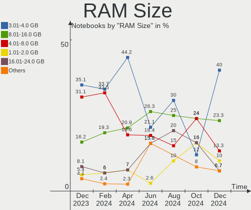
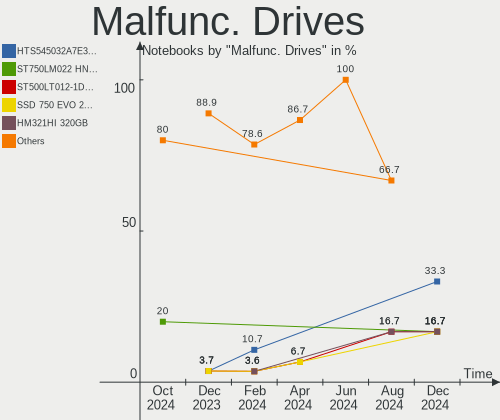

BlackPanther Hardware Trends (Notebook)
---------------------------------------

A project to identify most popular hardware characteristics and track their change
over time based on data collected by BlackPanther users at https://Linux-Hardware.org.

Anyone can contribute to the study by uploading probes of their computers by
the [hw-probe](https://github.com/linuxhw/hw-probe) tool:

    sudo -E hw-probe -all -upload

Full-feature report is available here: https://linux-hardware.org/?view=trends&formfactor=notebook

Period: Jan, 2021.

Contents
--------

- [ OS                       ](#os)
- [ OS Family                ](#os-family)
- [ Kernel                   ](#kernel)
- [ Kernel Family            ](#kernel-family)
- [ Kernel Major Ver.        ](#kernel-major-ver)
- [ Arch                     ](#arch)
- [ DE                       ](#de)
- [ Display Server           ](#display-server)
- [ Display Manager          ](#display-manager)
- [ OS Lang                  ](#os-lang)
- [ Boot Mode                ](#boot-mode)
- [ Filesystem               ](#filesystem)
- [ Part. scheme             ](#part-scheme)
- [ Dual Boot with Linux/BSD ](#dual-boot-with-linux/bsd)
- [ Dual Boot (Win)          ](#dual-boot-win)
- [ Country                  ](#country)
- [ City                     ](#city)
- [ Vendor                   ](#vendor)
- [ Model                    ](#model)
- [ Model Family             ](#model-family)
- [ MFG Year                 ](#mfg-year)
- [ Form Factor              ](#form-factor)
- [ Secure Boot              ](#secure-boot)
- [ Coreboot                 ](#coreboot)
- [ RAM Size                 ](#ram-size)
- [ RAM Used                 ](#ram-used)
- [ Has CD-ROM               ](#has-cd-rom)
- [ Total Drives             ](#total-drives)
- [ Has Ethernet             ](#has-ethernet)
- [ Drive Vendor             ](#drive-vendor)
- [ Drive Model              ](#drive-model)
- [ HDD Vendor               ](#hdd-vendor)
- [ SSD Vendor               ](#ssd-vendor)
- [ Drive Kind               ](#drive-kind)
- [ Drive Connector          ](#drive-connector)
- [ Drive Size               ](#drive-size)
- [ Space Total              ](#space-total)
- [ Space Used               ](#space-used)
- [ Malfunc. Drives          ](#malfunc-drives)
- [ Malfunc. Drive Vendor    ](#malfunc-drive-vendor)
- [ Malfunc. HDD Vendor      ](#malfunc-hdd-vendor)
- [ Malfunc. Drive Kind      ](#malfunc-drive-kind)
- [ Failed Drives            ](#failed-drives)
- [ Failed Drive Vendor      ](#failed-drive-vendor)
- [ Drive Status             ](#drive-status)
- [ Storage Vendor           ](#storage-vendor)
- [ Storage Model            ](#storage-model)
- [ Storage Kind             ](#storage-kind)
- [ CPU Vendor               ](#cpu-vendor)
- [ CPU Model                ](#cpu-model)
- [ CPU Model Family         ](#cpu-model-family)
- [ CPU Cores                ](#cpu-cores)
- [ CPU Sockets              ](#cpu-sockets)
- [ CPU Threads              ](#cpu-threads)
- [ CPU Op-Modes             ](#cpu-op-modes)
- [ CPU Microcode            ](#cpu-microcode)
- [ CPU Microarch            ](#cpu-microarch)
- [ GPU Vendor               ](#gpu-vendor)
- [ GPU Model                ](#gpu-model)
- [ GPU Combo                ](#gpu-combo)
- [ GPU Driver               ](#gpu-driver)
- [ GPU Memory               ](#gpu-memory)
- [ Monitor Vendor           ](#monitor-vendor)
- [ Monitor Model            ](#monitor-model)
- [ Monitor Resolution       ](#monitor-resolution)
- [ Monitor Diagonal         ](#monitor-diagonal)
- [ Monitor Width            ](#monitor-width)
- [ Aspect Ratio             ](#aspect-ratio)
- [ Monitor Area             ](#monitor-area)
- [ Pixel Density            ](#pixel-density)
- [ Multiple Monitors        ](#multiple-monitors)
- [ Net Controller Vendor    ](#net-controller-vendor)
- [ Net Controller Model     ](#net-controller-model)
- [ Wireless Vendor          ](#wireless-vendor)
- [ Wireless Model           ](#wireless-model)
- [ Ethernet Vendor          ](#ethernet-vendor)
- [ Ethernet Model           ](#ethernet-model)
- [ Net Controller Kind      ](#net-controller-kind)
- [ Used Controller          ](#used-controller)
- [ NICs                     ](#nics)
- [ Memory Vendor            ](#memory-vendor)
- [ Memory Model             ](#memory-model)
- [ Memory Kind              ](#memory-kind)
- [ Memory Form Factor       ](#memory-form-factor)
- [ Memory Size              ](#memory-size)
- [ Memory Speed             ](#memory-speed)
- [ Sound Vendor             ](#sound-vendor)
- [ Sound Model              ](#sound-model)
- [ Camera Vendor            ](#camera-vendor)
- [ Camera Model             ](#camera-model)
- [ Fingerprint Vendor       ](#fingerprint-vendor)
- [ Fingerprint Model        ](#fingerprint-model)
- [ Chipcard Vendor          ](#chipcard-vendor)
- [ Chipcard Model           ](#chipcard-model)
- [ Printer Vendor           ](#printer-vendor)
- [ Printer Model            ](#printer-model)
- [ Scanner Vendor           ](#scanner-vendor)
- [ Scanner Model            ](#scanner-model)
- [ Bluetooth Vendor         ](#bluetooth-vendor)
- [ Bluetooth Model          ](#bluetooth-model)
- [ Unsupported Devices      ](#unsupported-devices)
- [ Unsupported Device Types ](#unsupported-device-types)

OS
--

Installed operating systems

| Name              | Notebooks | Percent |
|-------------------|-----------|---------|
| BlackPanther 18.1 | 107       | 93.86%  |
| BlackPanther 16.2 | 7         | 6.14%   |

OS Family
---------

OS without a version

| Name         | Notebooks | Percent |
|--------------|-----------|---------|
| BlackPanther | 114       | 100%    |

Kernel
------

Version of the Linux kernel

| Version                | Notebooks | Percent |
|------------------------|-----------|---------|
| 4.18.16-desktop-1bP    | 96        | 84.21%  |
| 5.6.14-desktop-2bP     | 10        | 8.77%   |
| 4.9.20-desktop-pae-1bP | 7         | 6.14%   |
| 5.10.1-desktop-1bP     | 1         | 0.88%   |

Kernel Family
-------------

Linux kernel without a distro release

| Version | Notebooks | Percent |
|---------|-----------|---------|
| 4.18.16 | 96        | 84.21%  |
| 5.6.14  | 10        | 8.77%   |
| 4.9.20  | 7         | 6.14%   |
| 5.10.1  | 1         | 0.88%   |

Kernel Major Ver.
-----------------

Linux kernel major version

| Version | Notebooks | Percent |
|---------|-----------|---------|
| 4.18    | 96        | 84.21%  |
| 5.6     | 10        | 8.77%   |
| 4.9     | 7         | 6.14%   |
| 5.10    | 1         | 0.88%   |

Arch
----

OS architecture (x86_64, i586, etc.)

| Name   | Notebooks | Percent |
|--------|-----------|---------|
| x86_64 | 107       | 93.86%  |
| i686   | 7         | 6.14%   |

DE
--

Desktop Environment

| Name    | Notebooks | Percent |
|---------|-----------|---------|
| KDE5    | 113       | 99.12%  |
| Unknown | 1         | 0.88%   |

Display Server
--------------

X11 or Wayland

| Name | Notebooks | Percent |
|------|-----------|---------|
| X11  | 114       | 100%    |

Display Manager
---------------

SDDM, LightDM, etc.

| Name | Notebooks | Percent |
|------|-----------|---------|
| SDDM | 114       | 100%    |

OS Lang
-------

Language

| Lang    | Notebooks | Percent |
|---------|-----------|---------|
| Unknown | 114       | 100%    |

Boot Mode
---------

EFI or BIOS

| Mode | Notebooks | Percent |
|------|-----------|---------|
| BIOS | 70        | 61.4%   |
| EFI  | 44        | 38.6%   |

Filesystem
----------

Type of filesystem

| Type    | Notebooks | Percent |
|---------|-----------|---------|
| Overlay | 85        | 74.56%  |
| Ext4    | 29        | 25.44%  |

Part. scheme
------------

Scheme of partitioning

| Type | Notebooks | Percent |
|------|-----------|---------|
| MBR  | 63        | 55.26%  |
| GPT  | 51        | 44.74%  |

Dual Boot with Linux/BSD
------------------------

Hosting more than one Linux/BSD

| Dual boot | Notebooks | Percent |
|-----------|-----------|---------|
| No        | 63        | 55.26%  |
| Yes       | 51        | 44.74%  |

Dual Boot (Win)
---------------

Hosting Linux and Windows

| Dual boot | Notebooks | Percent |
|-----------|-----------|---------|
| No        | 64        | 56.14%  |
| Yes       | 50        | 43.86%  |

Country
-------

Geographic location (country)

| Country   | Notebooks | Percent |
|-----------|-----------|---------|
| Hungary   | 90        | 78.95%  |
| Slovakia  | 5         | 4.39%   |
| Italy     | 3         | 2.63%   |
| Germany   | 3         | 2.63%   |
| Sweden    | 2         | 1.75%   |
| Austria   | 2         | 1.75%   |
| Argentina | 2         | 1.75%   |
| USA       | 1         | 0.88%   |
| Spain     | 1         | 0.88%   |
| Slovenia  | 1         | 0.88%   |
| Romania   | 1         | 0.88%   |
| France    | 1         | 0.88%   |
| Ecuador   | 1         | 0.88%   |
| Brazil    | 1         | 0.88%   |

City
----

Geographic location (city)

| City                      | Notebooks | Percent |
|---------------------------|-----------|---------|
| Budapest                  | 31        | 27.19%  |
| Zalaegerszeg              | 5         | 4.39%   |
| Debrecen                  | 4         | 3.51%   |
| Szigetszentmiklos         | 3         | 2.63%   |
| Győr                     | 3         | 2.63%   |
| Vienna                    | 2         | 1.75%   |
| Veszprém                 | 2         | 1.75%   |
| Tatabánya                | 2         | 1.75%   |
| Székesfehérvár         | 2         | 1.75%   |
| Szekszárd                | 2         | 1.75%   |
| Szeged                    | 2         | 1.75%   |
| Rome                      | 2         | 1.75%   |
| Nyiregyhaza               | 2         | 1.75%   |
| Nitra                     | 2         | 1.75%   |
| Cegled                    | 2         | 1.75%   |
| Štúrovo                 | 1         | 0.88%   |
| Zalaszentgrot             | 1         | 0.88%   |
| Totkomlos                 | 1         | 0.88%   |
| Tostado                   | 1         | 0.88%   |
| Toeroekbalint             | 1         | 0.88%   |
| Tata                      | 1         | 0.88%   |
| Tarcal                    | 1         | 0.88%   |
| Tar                       | 1         | 0.88%   |
| Szodliget                 | 1         | 0.88%   |
| Sutto                     | 1         | 0.88%   |
| Sopron                    | 1         | 0.88%   |
| Solna                     | 1         | 0.88%   |
| Sollentuna                | 1         | 0.88%   |
| Sajokeresztur             | 1         | 0.88%   |
| Saint-Gilles-Croix-de-Vie | 1         | 0.88%   |
| Pécs                     | 1         | 0.88%   |
| Portland                  | 1         | 0.88%   |
| Piran                     | 1         | 0.88%   |
| Pilisvorosvar             | 1         | 0.88%   |
| Paso de los Libres        | 1         | 0.88%   |
| Onil                      | 1         | 0.88%   |
| Novo Gama                 | 1         | 0.88%   |
| Miskolc                   | 1         | 0.88%   |
| Milan                     | 1         | 0.88%   |
| Mezokovesd                | 1         | 0.88%   |
| Marcali                   | 1         | 0.88%   |
| Leliceni                  | 1         | 0.88%   |
| Kalletal                  | 1         | 0.88%   |
| Hnusta                    | 1         | 0.88%   |
| Hlinik nad Hronom         | 1         | 0.88%   |
| Gödöllő                | 1         | 0.88%   |
| Gyomro                    | 1         | 0.88%   |
| Guayaquil                 | 1         | 0.88%   |
| Frankfurt am Main         | 1         | 0.88%   |
| Fot                       | 1         | 0.88%   |
| Felsozsolca               | 1         | 0.88%   |
| Esztergom                 | 1         | 0.88%   |
| Encs                      | 1         | 0.88%   |
| Dunaújváros             | 1         | 0.88%   |
| Dorog                     | 1         | 0.88%   |
| Dittenheim                | 1         | 0.88%   |
| Csongrad                  | 1         | 0.88%   |
| Csolnok                   | 1         | 0.88%   |
| Budakalasz                | 1         | 0.88%   |
| Bikal                     | 1         | 0.88%   |

Vendor
------

Motherboard manufacturer

| Name                | Notebooks | Percent |
|---------------------|-----------|---------|
| Hewlett-Packard     | 29        | 25.44%  |
| Dell                | 21        | 18.42%  |
| Lenovo              | 19        | 16.67%  |
| ASUSTek Computer    | 12        | 10.53%  |
| Acer                | 9         | 7.89%   |
| Packard Bell        | 4         | 3.51%   |
| Samsung Electronics | 3         | 2.63%   |
| Fujitsu             | 3         | 2.63%   |
| Sony                | 2         | 1.75%   |
| Toshiba             | 1         | 0.88%   |
| Notebook            | 1         | 0.88%   |
| MSI                 | 1         | 0.88%   |
| Medion              | 1         | 0.88%   |
| IBM                 | 1         | 0.88%   |
| Google              | 1         | 0.88%   |
| Fujitsu Siemens     | 1         | 0.88%   |
| eMachines           | 1         | 0.88%   |
| BANGHO              | 1         | 0.88%   |
| Apple               | 1         | 0.88%   |
| Alcor               | 1         | 0.88%   |
| Unknown             | 1         | 0.88%   |

Model
-----

Motherboard model

| Name                                       | Notebooks | Percent |
|--------------------------------------------|-----------|---------|
| HP 250 G1                                  | 3         | 2.63%   |
| Lenovo G580 20150                          | 2         | 1.75%   |
| HP Notebook                                | 2         | 1.75%   |
| Dell Latitude E6530                        | 2         | 1.75%   |
| Dell Inspiron N5050                        | 2         | 1.75%   |
| Unknown                                    | 2         | 1.75%   |
| Toshiba Satellite L750                     | 1         | 0.88%   |
| Sony VPCEH2J1E                             | 1         | 0.88%   |
| Sony VPCEB4Z1E                             | 1         | 0.88%   |
| Samsung RV410/RV510/S3510/E3510            | 1         | 0.88%   |
| Samsung R540/R580/R780/SA41/E452/E852      | 1         | 0.88%   |
| Samsung 300E4A/300E5A/300E7A/3430EA/3530EA | 1         | 0.88%   |
| Packard Bell EasyNote TS13SB               | 1         | 0.88%   |
| Packard Bell EasyNote TK85                 | 1         | 0.88%   |
| Packard Bell EasyNote TK36                 | 1         | 0.88%   |
| Packard Bell EasyNote LE69KB               | 1         | 0.88%   |
| Notebook Satori                            | 1         | 0.88%   |
| MSI CR500                                  | 1         | 0.88%   |
| Medion E122X                               | 1         | 0.88%   |
| Lenovo Z50-75 80EC                         | 1         | 0.88%   |
| Lenovo ThinkPad X260 20F5S5VD00            | 1         | 0.88%   |
| Lenovo ThinkPad W510 4876A46               | 1         | 0.88%   |
| Lenovo ThinkPad W510 431924G               | 1         | 0.88%   |
| Lenovo ThinkPad T460s 20FAS0P901           | 1         | 0.88%   |
| Lenovo ThinkPad T420 4236WCS               | 1         | 0.88%   |
| Lenovo ThinkPad T420 4236S3T               | 1         | 0.88%   |
| Lenovo ThinkPad T400 6475ZFX               | 1         | 0.88%   |
| Lenovo ThinkPad T400 6474E18               | 1         | 0.88%   |
| Lenovo IdeaPad 330-15IKB 81DE              | 1         | 0.88%   |
| Lenovo IdeaPad 320-17ABR 80YN              | 1         | 0.88%   |
| Lenovo IdeaPad 320-15ISK 80XH              | 1         | 0.88%   |
| Lenovo IdeaPad 320-15AST 80XV              | 1         | 0.88%   |
| Lenovo IdeaPad 300-15ISK 80Q7              | 1         | 0.88%   |
| Lenovo G550 20023                          | 1         | 0.88%   |
| Lenovo G505s 20255                         | 1         | 0.88%   |
| Lenovo G50-45 80E3                         | 1         | 0.88%   |
| HP ZBook 17 G2                             | 1         | 0.88%   |
| HP ProBook 6570b                           | 1         | 0.88%   |
| HP ProBook 4540s                           | 1         | 0.88%   |
| HP Presario CQ57                           | 1         | 0.88%   |
| HP Pavilion Laptop 15-cc5xx                | 1         | 0.88%   |
| HP Pavilion g6                             | 1         | 0.88%   |
| HP OMEN by HP Laptop 15-ce0xx              | 1         | 0.88%   |
| HP Laptop 17-ak0xx                         | 1         | 0.88%   |
| HP Laptop 15-db0xxx                        | 1         | 0.88%   |
| HP ENVY Notebook 13-ab0XX                  | 1         | 0.88%   |
| HP EliteBook 8560w                         | 1         | 0.88%   |
| HP EliteBook 8540p                         | 1         | 0.88%   |
| HP EliteBook 850 G1                        | 1         | 0.88%   |
| HP EliteBook 8470p                         | 1         | 0.88%   |
| HP EliteBook 8440p                         | 1         | 0.88%   |
| HP EliteBook 2540p                         | 1         | 0.88%   |
| HP Compaq nc6320 (RH368EA#AKC)             | 1         | 0.88%   |
| HP 655                                     | 1         | 0.88%   |
| HP 650                                     | 1         | 0.88%   |
| HP 530 (KD088AA#ABB)                       | 1         | 0.88%   |
| HP 255 G5 Notebook PC                      | 1         | 0.88%   |
| HP 250 G4                                  | 1         | 0.88%   |
| HP 2000                                    | 1         | 0.88%   |
| HP 15                                      | 1         | 0.88%   |

Model Family
------------

Motherboard model prefix

| Name                  | Notebooks | Percent |
|-----------------------|-----------|---------|
| Dell Latitude         | 10        | 8.77%   |
| Lenovo ThinkPad       | 8         | 7.02%   |
| Dell Inspiron         | 8         | 7.02%   |
| HP EliteBook          | 6         | 5.26%   |
| Acer Aspire           | 6         | 5.26%   |
| Lenovo IdeaPad        | 5         | 4.39%   |
| Packard Bell EasyNote | 4         | 3.51%   |
| HP 250                | 4         | 3.51%   |
| Lenovo G580           | 2         | 1.75%   |
| HP ProBook            | 2         | 1.75%   |
| HP Pavilion           | 2         | 1.75%   |
| HP Notebook           | 2         | 1.75%   |
| HP Laptop             | 2         | 1.75%   |
| Fujitsu LIFEBOOK      | 2         | 1.75%   |
| Unknown               | 2         | 1.75%   |
| Toshiba Satellite     | 1         | 0.88%   |
| Sony VPCEH2J1E        | 1         | 0.88%   |
| Sony VPCEB4Z1E        | 1         | 0.88%   |
| Samsung RV410         | 1         | 0.88%   |
| Samsung R540          | 1         | 0.88%   |
| Samsung 300E4A        | 1         | 0.88%   |
| Notebook Satori       | 1         | 0.88%   |
| MSI CR500             | 1         | 0.88%   |
| Medion E122X          | 1         | 0.88%   |
| Lenovo Z50-75         | 1         | 0.88%   |
| Lenovo G550           | 1         | 0.88%   |
| Lenovo G505s          | 1         | 0.88%   |
| Lenovo G50-45         | 1         | 0.88%   |
| HP ZBook              | 1         | 0.88%   |
| HP Presario           | 1         | 0.88%   |
| HP OMEN               | 1         | 0.88%   |
| HP ENVY               | 1         | 0.88%   |
| HP Compaq             | 1         | 0.88%   |
| HP 655                | 1         | 0.88%   |
| HP 650                | 1         | 0.88%   |
| HP 530                | 1         | 0.88%   |
| HP 255                | 1         | 0.88%   |
| HP 2000               | 1         | 0.88%   |
| HP 15                 | 1         | 0.88%   |
| Google Parrot         | 1         | 0.88%   |
| Fujitsu STYLISTIC     | 1         | 0.88%   |
| Fujitsu Siemens AMILO | 1         | 0.88%   |
| eMachines eME728      | 1         | 0.88%   |
| Dell Vostro           | 1         | 0.88%   |
| Dell Venue            | 1         | 0.88%   |
| Dell G3               | 1         | 0.88%   |
| BANGHO W240HU         | 1         | 0.88%   |
| ASUS X553MA           | 1         | 0.88%   |
| ASUS X550CC           | 1         | 0.88%   |
| ASUS TUF              | 1         | 0.88%   |
| ASUS TP300LA          | 1         | 0.88%   |
| ASUS T300FA           | 1         | 0.88%   |
| ASUS N550JV           | 1         | 0.88%   |
| ASUS K53SJ            | 1         | 0.88%   |
| ASUS K53SC            | 1         | 0.88%   |
| ASUS G752VT           | 1         | 0.88%   |
| ASUS E502SA           | 1         | 0.88%   |
| ASUS ASUS             | 1         | 0.88%   |
| ASUS 1011PX           | 1         | 0.88%   |
| Apple MacBookPro5     | 1         | 0.88%   |

MFG Year
--------

Motherboard manufacture year

| Year | Notebooks | Percent |
|------|-----------|---------|
| 2017 | 15        | 13.16%  |
| 2013 | 15        | 13.16%  |
| 2012 | 13        | 11.4%   |
| 2011 | 12        | 10.53%  |
| 2010 | 12        | 10.53%  |
| 2014 | 9         | 7.89%   |
| 2019 | 8         | 7.02%   |
| 2016 | 7         | 6.14%   |
| 2018 | 6         | 5.26%   |
| 2020 | 4         | 3.51%   |
| 2008 | 4         | 3.51%   |
| 2015 | 3         | 2.63%   |
| 2009 | 3         | 2.63%   |
| 2006 | 2         | 1.75%   |
| 2007 | 1         | 0.88%   |

Form Factor
-----------

Physical design of the computer

| Name     | Notebooks | Percent |
|----------|-----------|---------|
| Notebook | 114       | 100%    |

Secure Boot
-----------

Enabled or disabled

| State    | Notebooks | Percent |
|----------|-----------|---------|
| Disabled | 114       | 100%    |

Coreboot
--------

Have coreboot on board

| Used | Notebooks | Percent |
|------|-----------|---------|
| No   | 113       | 99.12%  |
| Yes  | 1         | 0.88%   |

RAM Size
--------

Total RAM memory

| Size in GB | Notebooks | Percent |
|------------|-----------|---------|
| 3.01-4.0   | 44        | 38.6%   |
| 4.01-8.0   | 32        | 28.07%  |
| 8.01-16.0  | 15        | 13.16%  |
| 1.01-2.0   | 7         | 6.14%   |
| 16.01-24.0 | 6         | 5.26%   |
| 2.01-3.0   | 5         | 4.39%   |
| 24.01-32.0 | 2         | 1.75%   |
| 0.51-1.0   | 2         | 1.75%   |
| 32.01-64.0 | 1         | 0.88%   |

RAM Used
--------

Used RAM memory

| Used GB  | Notebooks | Percent |
|----------|-----------|---------|
| 0.51-1.0 | 65        | 57.02%  |
| 1.01-2.0 | 30        | 26.32%  |
| 0.01-0.5 | 18        | 15.79%  |
| 3.01-4.0 | 1         | 0.88%   |

Has CD-ROM
----------

Has CD-ROM on board

| Presented | Notebooks | Percent |
|-----------|-----------|---------|
| Yes       | 73        | 64.04%  |
| No        | 41        | 35.96%  |

Total Drives
------------

Number of drives on board

| Drives | Notebooks | Percent |
|--------|-----------|---------|
| 1      | 89        | 78.07%  |
| 2      | 20        | 17.54%  |
| 3      | 4         | 3.51%   |
| 5      | 1         | 0.88%   |

Has Ethernet
------------

Has Ethernet on board

| Presented | Notebooks | Percent |
|-----------|-----------|---------|
| Yes       | 108       | 94.74%  |
| No        | 6         | 5.26%   |

Drive Vendor
------------

Hard drive vendors

| Vendor              | Notebooks | Drives | Percent |
|---------------------|-----------|--------|---------|
| Seagate             | 25        | 27     | 18.38%  |
| Toshiba             | 19        | 19     | 13.97%  |
| WDC                 | 14        | 15     | 10.29%  |
| Samsung Electronics | 13        | 14     | 9.56%   |
| Kingston            | 10        | 11     | 7.35%   |
| HGST                | 10        | 10     | 7.35%   |
| SanDisk             | 8         | 9      | 5.88%   |
| Hitachi             | 7         | 7      | 5.15%   |
| Unknown             | 4         | 6      | 2.94%   |
| Crucial             | 4         | 4      | 2.94%   |
| Micron Technology   | 3         | 3      | 2.21%   |
| SPCC                | 2         | 2      | 1.47%   |
| Intenso             | 2         | 2      | 1.47%   |
| Intel               | 2         | 2      | 1.47%   |
| Fujitsu             | 2         | 2      | 1.47%   |
| Apacer              | 2         | 3      | 1.47%   |
| A-DATA Technology   | 2         | 2      | 1.47%   |
| ShanDianZhe         | 1         | 1      | 0.74%   |
| PLEXTOR             | 1         | 1      | 0.74%   |
| Patriot             | 1         | 2      | 0.74%   |
| OCZ                 | 1         | 1      | 0.74%   |
| LITEON              | 1         | 1      | 0.74%   |
| Gigabyte Technology | 1         | 1      | 0.74%   |
| China               | 1         | 1      | 0.74%   |

Drive Model
-----------

Hard drive models

| Model                                   | Notebooks | Percent |
|-----------------------------------------|-----------|---------|
| Kingston SA400S37120G 120GB SSD         | 6         | 4.11%   |
| Toshiba MQ01ABF050 500GB                | 4         | 2.74%   |
| Toshiba MQ01ABD100 1TB                  | 3         | 2.05%   |
| Seagate ST500LT012-1DG142 500GB         | 3         | 2.05%   |
| Seagate ST1000LM035-1RK172 1TB          | 3         | 2.05%   |
| Seagate ST1000LM024 HN-M101MBB 1TB      | 3         | 2.05%   |
| WDC WD5000BEVT-22A0RT0 500GB            | 2         | 1.37%   |
| Toshiba MQ04ABF100 1TB                  | 2         | 1.37%   |
| SPCC Solid State Disk 128GB             | 2         | 1.37%   |
| Seagate ST9500325AS 500GB               | 2         | 1.37%   |
| Seagate ST9320325AS 320GB               | 2         | 1.37%   |
| Seagate ST500LM012 HN-M500MBB 500GB     | 2         | 1.37%   |
| SanDisk SDSSDA120G 120GB                | 2         | 1.37%   |
| Hitachi HTS547550A9E384 500GB           | 2         | 1.37%   |
| HGST HTS721010A9E630 1TB                | 2         | 1.37%   |
| HGST HTS545050A7E680 500GB              | 2         | 1.37%   |
| HGST HTS545032A7E380 320GB              | 2         | 1.37%   |
| WDC WDS500G2B0B-00YS70 500GB SSD        | 1         | 0.68%   |
| WDC WDS500G2B0A-00SM50 500GB SSD        | 1         | 0.68%   |
| WDC WDS120G2G0B-00EPW0 120GB SSD        | 1         | 0.68%   |
| WDC WD800BEVS-22RST0 80GB               | 1         | 0.68%   |
| WDC WD5000LPVX-22V0TT0 500GB            | 1         | 0.68%   |
| WDC WD5000LPCX-24VHAT0 500GB            | 1         | 0.68%   |
| WDC WD3200BPVT-80ZEST0 320GB            | 1         | 0.68%   |
| WDC WD3200BPVT-22JJ5T0 320GB            | 1         | 0.68%   |
| WDC WD2500BEVT-75A23T0 250GB            | 1         | 0.68%   |
| WDC WD1600BEVS-07RST0 160GB             | 1         | 0.68%   |
| WDC WD10SPCX-24HWST1 1TB                | 1         | 0.68%   |
| WDC WD10JPVX-60JC3T0 1TB                | 1         | 0.68%   |
| WDC WD10 JUCT-63CYNY0 1TB               | 1         | 0.68%   |
| Unknown SLD64G  64GB                    | 1         | 0.68%   |
| Unknown SD16G  16GB                     | 1         | 0.68%   |
| Unknown SD04G  4GB                      | 1         | 0.68%   |
| Unknown NCard  32GB                     | 1         | 0.68%   |
| Unknown JAJM600M128C 128GB SSD          | 1         | 0.68%   |
| Unknown 00000  32GB                     | 1         | 0.68%   |
| Toshiba TL100 120GB SSD                 | 1         | 0.68%   |
| Toshiba MQ01ABD075 752GB                | 1         | 0.68%   |
| Toshiba MK5076GSX 500GB                 | 1         | 0.68%   |
| Toshiba MK5061GSYN 500GB                | 1         | 0.68%   |
| Toshiba MK5059GSXP 500GB                | 1         | 0.68%   |
| Toshiba MK2565GSX 250GB                 | 1         | 0.68%   |
| Toshiba MK1665GSX 160GB                 | 1         | 0.68%   |
| Toshiba KXG50ZNV256G 256GB              | 1         | 0.68%   |
| Toshiba KSG60ZMV256G M.2 2280 256GB SSD | 1         | 0.68%   |
| Toshiba KBG40ZNS256G NVMe 256GB         | 1         | 0.68%   |
| ShanDianZhe SSD 128GB                   | 1         | 0.68%   |
| Seagate ST980811AS 80GB                 | 1         | 0.68%   |
| Seagate ST9320328CS 320GB               | 1         | 0.68%   |
| Seagate ST9320320AS 320GB               | 1         | 0.68%   |
| Seagate ST9250315AS 250GB               | 1         | 0.68%   |
| Seagate ST6000VN 0033-2EE110 6TB        | 1         | 0.68%   |
| Seagate ST500LT012-9WS142 500GB         | 1         | 0.68%   |
| Seagate ST500LM021-1KJ152 500GB         | 1         | 0.68%   |
| Seagate ST320LT009-9WC142 320GB         | 1         | 0.68%   |
| Seagate ST250LT007-9ZV14C 250GB         | 1         | 0.68%   |
| Seagate ST2000LM015-2E8174 2TB          | 1         | 0.68%   |
| Seagate ST1000LM014-1EJ164-SSHD 1TB     | 1         | 0.68%   |
| Seagate M3 Portable 4TB                 | 1         | 0.68%   |
| SanDisk SSD U100 16GB                   | 1         | 0.68%   |

HDD Vendor
----------

Hard disk drive vendors

| Vendor              | Notebooks | Drives | Percent |
|---------------------|-----------|--------|---------|
| Seagate             | 24        | 26     | 33.33%  |
| Toshiba             | 15        | 15     | 20.83%  |
| WDC                 | 11        | 12     | 15.28%  |
| HGST                | 10        | 10     | 13.89%  |
| Hitachi             | 7         | 7      | 9.72%   |
| Samsung Electronics | 3         | 3      | 4.17%   |
| Fujitsu             | 2         | 2      | 2.78%   |

SSD Vendor
----------

Solid state drive vendors

| Vendor              | Notebooks | Drives | Percent |
|---------------------|-----------|--------|---------|
| Kingston            | 10        | 11     | 18.52%  |
| SanDisk             | 8         | 8      | 14.81%  |
| Samsung Electronics | 8         | 8      | 14.81%  |
| Crucial             | 4         | 4      | 7.41%   |
| WDC                 | 3         | 3      | 5.56%   |
| Toshiba             | 2         | 2      | 3.7%    |
| SPCC                | 2         | 2      | 3.7%    |
| Micron Technology   | 2         | 2      | 3.7%    |
| Intenso             | 2         | 2      | 3.7%    |
| Intel               | 2         | 2      | 3.7%    |
| Apacer              | 2         | 3      | 3.7%    |
| A-DATA Technology   | 2         | 2      | 3.7%    |
| Unknown             | 1         | 1      | 1.85%   |
| ShanDianZhe         | 1         | 1      | 1.85%   |
| Patriot             | 1         | 2      | 1.85%   |
| OCZ                 | 1         | 1      | 1.85%   |
| LITEON              | 1         | 1      | 1.85%   |
| Gigabyte Technology | 1         | 1      | 1.85%   |
| China               | 1         | 1      | 1.85%   |

Drive Kind
----------

HDD or SSD

| Kind    | Notebooks | Drives | Percent |
|---------|-----------|--------|---------|
| HDD     | 71        | 75     | 53.38%  |
| SSD     | 51        | 57     | 38.35%  |
| MMC     | 5         | 6      | 3.76%   |
| NVMe    | 5         | 7      | 3.76%   |
| Unknown | 1         | 1      | 0.75%   |

Drive Connector
---------------

SATA, SAS, NVMe, etc.

| Type | Notebooks | Drives | Percent |
|------|-----------|--------|---------|
| SATA | 113       | 130    | 89.68%  |
| NVMe | 5         | 7      | 3.97%   |
| MMC  | 5         | 6      | 3.97%   |
| SAS  | 3         | 3      | 2.38%   |

Drive Size
----------

Size of hard drive

| Size in TB | Notebooks | Drives | Percent |
|------------|-----------|--------|---------|
| 0.01-0.5   | 96        | 101    | 77.42%  |
| 0.51-1.0   | 26        | 28     | 20.97%  |
| 1.01-2.0   | 1         | 2      | 0.81%   |
| 4.01-10.0  | 1         | 1      | 0.81%   |

Space Total
-----------

Amount of disk space available on the file system

| Size in GB | Notebooks | Percent |
|------------|-----------|---------|
| Unknown    | 80        | 70.18%  |
| 101-250    | 17        | 14.91%  |
| 51-100     | 6         | 5.26%   |
| 251-500    | 5         | 4.39%   |
| 1001-2000  | 2         | 1.75%   |
| 21-50      | 1         | 0.88%   |
| 2001-3000  | 1         | 0.88%   |
| 1-20       | 1         | 0.88%   |
| 501-1000   | 1         | 0.88%   |

Space Used
----------

Amount of used disk space

| Used GB   | Notebooks | Percent |
|-----------|-----------|---------|
| Unknown   | 80        | 70.18%  |
| 1-20      | 30        | 26.32%  |
| 1001-2000 | 2         | 1.75%   |
| 21-50     | 1         | 0.88%   |
| 501-1000  | 1         | 0.88%   |

Malfunc. Drives
---------------

Drive models with a malfunction

| Model                                   | Notebooks | Drives | Percent |
|-----------------------------------------|-----------|--------|---------|
| Seagate ST1000LM024 HN-M101MBB 1TB      | 3         | 3      | 7.69%   |
| Toshiba MQ01ABF050 500GB                | 2         | 2      | 5.13%   |
| Seagate ST500LT012-1DG142 500GB         | 2         | 2      | 5.13%   |
| Seagate ST500LM012 HN-M500MBB 500GB     | 2         | 2      | 5.13%   |
| HGST HTS545050A7E680 500GB              | 2         | 2      | 5.13%   |
| HGST HTS545032A7E380 320GB              | 2         | 2      | 5.13%   |
| WDC WD800BEVS-22RST0 80GB               | 1         | 1      | 2.56%   |
| WDC WD5000LPCX-24VHAT0 500GB            | 1         | 1      | 2.56%   |
| WDC WD2500BEVT-75A23T0 250GB            | 1         | 1      | 2.56%   |
| Toshiba MQ01ABD075 752GB                | 1         | 1      | 2.56%   |
| Toshiba MK5076GSX 500GB                 | 1         | 1      | 2.56%   |
| Toshiba MK5061GSYN 500GB                | 1         | 1      | 2.56%   |
| Toshiba MK5059GSXP 500GB                | 1         | 1      | 2.56%   |
| Toshiba MK2565GSX 250GB                 | 1         | 1      | 2.56%   |
| Toshiba MK1665GSX 160GB                 | 1         | 1      | 2.56%   |
| Toshiba KSG60ZMV256G M.2 2280 256GB SSD | 1         | 1      | 2.56%   |
| Seagate ST9320328CS 320GB               | 1         | 1      | 2.56%   |
| Seagate ST9320325AS 320GB               | 1         | 1      | 2.56%   |
| Seagate ST9320320AS 320GB               | 1         | 1      | 2.56%   |
| Seagate ST9250315AS 250GB               | 1         | 1      | 2.56%   |
| Seagate ST1000LM014-1EJ164-SSHD 1TB     | 1         | 1      | 2.56%   |
| Samsung Electronics HM160HI 160GB       | 1         | 1      | 2.56%   |
| Samsung Electronics HM080II 80GB        | 1         | 1      | 2.56%   |
| Intenso SSD Sata III 256GB              | 1         | 1      | 2.56%   |
| Intel SSDSC2KF256H6L 256GB              | 1         | 1      | 2.56%   |
| Intel SSDSC2BW180A3H 180GB              | 1         | 1      | 2.56%   |
| Hitachi HTS725032A9A365 320GB           | 1         | 1      | 2.56%   |
| Hitachi HTS547575A9E384 752GB           | 1         | 1      | 2.56%   |
| Hitachi HTS547550A9E384 500GB           | 1         | 1      | 2.56%   |
| Hitachi HTS545025B9A300 250GB           | 1         | 1      | 2.56%   |
| HGST HTS545050A7E380 500GB              | 1         | 1      | 2.56%   |
| HGST HTS541075A9E680 752GB              | 1         | 1      | 2.56%   |

Malfunc. Drive Vendor
---------------------

Vendors of faulty drives

| Vendor              | Notebooks | Drives | Percent |
|---------------------|-----------|--------|---------|
| Seagate             | 11        | 12     | 28.95%  |
| Toshiba             | 9         | 9      | 23.68%  |
| HGST                | 6         | 6      | 15.79%  |
| Hitachi             | 4         | 4      | 10.53%  |
| WDC                 | 3         | 3      | 7.89%   |
| Samsung Electronics | 2         | 2      | 5.26%   |
| Intel               | 2         | 2      | 5.26%   |
| Intenso             | 1         | 1      | 2.63%   |

Malfunc. HDD Vendor
-------------------

Vendors of faulty HDD drives

| Vendor              | Notebooks | Drives | Percent |
|---------------------|-----------|--------|---------|
| Seagate             | 11        | 12     | 32.35%  |
| Toshiba             | 8         | 8      | 23.53%  |
| HGST                | 6         | 6      | 17.65%  |
| Hitachi             | 4         | 4      | 11.76%  |
| WDC                 | 3         | 3      | 8.82%   |
| Samsung Electronics | 2         | 2      | 5.88%   |

Malfunc. Drive Kind
-------------------

Kinds of faulty drives

| Kind | Notebooks | Drives | Percent |
|------|-----------|--------|---------|
| HDD  | 34        | 35     | 89.47%  |
| SSD  | 4         | 4      | 10.53%  |

Failed Drives
-------------

Failed drive models

Zero info for selected period =(

Failed Drive Vendor
-------------------

Failed drive vendors

Zero info for selected period =(

Drive Status
------------

Number of failed and malfunc. drives

| Status   | Notebooks | Drives | Percent |
|----------|-----------|--------|---------|
| Works    | 80        | 99     | 64%     |
| Malfunc  | 38        | 39     | 30.4%   |
| Detected | 7         | 8      | 5.6%    |

Storage Vendor
--------------

Storage controller vendors

| Vendor                       | Notebooks | Percent |
|------------------------------|-----------|---------|
| Intel                        | 92        | 76.03%  |
| AMD                          | 20        | 16.53%  |
| Samsung Electronics          | 3         | 2.48%   |
| Nvidia                       | 2         | 1.65%   |
| Toshiba America Info Systems | 1         | 0.83%   |
| Micron Technology            | 1         | 0.83%   |
| Lite-On Technology           | 1         | 0.83%   |
| KIOXIA                       | 1         | 0.83%   |

Storage Model
-------------

Storage controller models

| Model                                                                                  | Notebooks | Percent |
|----------------------------------------------------------------------------------------|-----------|---------|
| AMD FCH SATA Controller [AHCI mode]                                                    | 17        | 12.98%  |
| Intel 7 Series Chipset Family 6-port SATA Controller [AHCI mode]                       | 14        | 10.69%  |
| Intel 6 Series/C200 Series Chipset Family 6 port Mobile SATA AHCI Controller           | 12        | 9.16%   |
| Intel Sunrise Point-LP SATA Controller [AHCI mode]                                     | 10        | 7.63%   |
| Intel 82801IBM/IEM (ICH9M/ICH9M-E) 4 port SATA Controller [AHCI mode]                  | 9         | 6.87%   |
| Intel 82801 Mobile SATA Controller [RAID mode]                                         | 9         | 6.87%   |
| Intel 8 Series SATA Controller 1 [AHCI mode]                                           | 5         | 3.82%   |
| Intel 5 Series/3400 Series Chipset 6 port SATA AHCI Controller                         | 4         | 3.05%   |
| Intel Wildcat Point-LP SATA Controller [AHCI Mode]                                     | 3         | 2.29%   |
| Intel NM10/ICH7 Family SATA Controller [AHCI mode]                                     | 3         | 2.29%   |
| Intel 5 Series/3400 Series Chipset 4 port SATA AHCI Controller                         | 3         | 2.29%   |
| Samsung NVMe SSD Controller SM981/PM981/PM983                                          | 2         | 1.53%   |
| Nvidia MCP79 AHCI Controller                                                           | 2         | 1.53%   |
| Intel Atom/Celeron/Pentium Processor x5-E8000/J3xxx/N3xxx Series SATA Controller       | 2         | 1.53%   |
| Intel 82801HM/HEM (ICH8M/ICH8M-E) IDE Controller                                       | 2         | 1.53%   |
| Intel 82801GBM/GHM (ICH7-M Family) SATA Controller [AHCI mode]                         | 2         | 1.53%   |
| Intel 82801G (ICH7 Family) IDE Controller                                              | 2         | 1.53%   |
| Intel 8 Series/C220 Series Chipset Family 6-port SATA Controller 1 [AHCI mode]         | 2         | 1.53%   |
| Intel 7 Series Chipset Family 4-port SATA Controller [IDE mode]                        | 2         | 1.53%   |
| Intel 7 Series Chipset Family 2-port SATA Controller [IDE mode]                        | 2         | 1.53%   |
| Intel 5 Series/3400 Series Chipset 4 port SATA IDE Controller                          | 2         | 1.53%   |
| AMD SB7x0/SB8x0/SB9x0 SATA Controller [AHCI mode]                                      | 2         | 1.53%   |
| Toshiba America Info Systems Toshiba America Info Non-Volatile memory controller       | 1         | 0.76%   |
| Samsung NVMe SSD Controller SM951/PM951                                                | 1         | 0.76%   |
| Micron Non-Volatile memory controller                                                  | 1         | 0.76%   |
| Lite-On M8Pe Series NVMe SSD                                                           | 1         | 0.76%   |
| KIOXIA Non-Volatile memory controller                                                  | 1         | 0.76%   |
| Intel Q170/Q150/B150/H170/H110/Z170/CM236 Chipset SATA Controller [AHCI Mode]          | 1         | 0.76%   |
| Intel NM10/ICH7 Family SATA Controller [IDE mode]                                      | 1         | 0.76%   |
| Intel HM170/QM170 Chipset SATA Controller [AHCI Mode]                                  | 1         | 0.76%   |
| Intel Celeron N3350/Pentium N4200/Atom E3900 Series SATA AHCI Controller               | 1         | 0.76%   |
| Intel Cannon Lake Mobile PCH SATA AHCI Controller                                      | 1         | 0.76%   |
| Intel Atom Processor E3800 Series SATA AHCI Controller                                 | 1         | 0.76%   |
| Intel 82801HM/HEM (ICH8M/ICH8M-E) SATA Controller [IDE mode]                           | 1         | 0.76%   |
| Intel 82801HM/HEM (ICH8M/ICH8M-E) SATA Controller [AHCI mode]                          | 1         | 0.76%   |
| Intel 82801GBM/GHM (ICH7-M Family) SATA Controller [IDE mode]                          | 1         | 0.76%   |
| Intel 82801FBM (ICH6M) SATA Controller                                                 | 1         | 0.76%   |
| Intel 6 Series/C200 Series Chipset Family Mobile SATA Controller (IDE mode, ports 4-5) | 1         | 0.76%   |
| Intel 6 Series/C200 Series Chipset Family Mobile SATA Controller (IDE mode, ports 0-3) | 1         | 0.76%   |
| Intel 5 Series/3400 Series Chipset 2 port SATA IDE Controller                          | 1         | 0.76%   |
| AMD Non-Volatile memory controller                                                     | 1         | 0.76%   |
| AMD FCH SATA Controller [IDE mode]                                                     | 1         | 0.76%   |

Storage Kind
------------

Kind of storage controller (IDE, SATA, NVMe, SAS, ...)

| Kind | Notebooks | Percent |
|------|-----------|---------|
| SATA | 97        | 78.86%  |
| IDE  | 12        | 9.76%   |
| RAID | 9         | 7.32%   |
| NVMe | 5         | 4.07%   |

CPU Vendor
----------

Processor vendors

| Vendor | Notebooks | Percent |
|--------|-----------|---------|
| Intel  | 94        | 82.46%  |
| AMD    | 20        | 17.54%  |

CPU Model
---------

Processor models

| Model                                         | Notebooks | Percent |
|-----------------------------------------------|-----------|---------|
| Intel Core i5-7200U CPU @ 2.50GHz             | 5         | 4.39%   |
| Intel Celeron CPU 1000M @ 1.80GHz             | 4         | 3.51%   |
| Intel Core i5-2520M CPU @ 2.50GHz             | 3         | 2.63%   |
| Intel Pentium Dual-Core CPU T4400 @ 2.20GHz   | 2         | 1.75%   |
| Intel Pentium CPU B960 @ 2.20GHz              | 2         | 1.75%   |
| Intel Core i7-4510U CPU @ 2.00GHz             | 2         | 1.75%   |
| Intel Core i5-6300U CPU @ 2.40GHz             | 2         | 1.75%   |
| Intel Core i5-2450M CPU @ 2.50GHz             | 2         | 1.75%   |
| Intel Core i5-2430M CPU @ 2.40GHz             | 2         | 1.75%   |
| Intel Core i5 CPU M 540 @ 2.53GHz             | 2         | 1.75%   |
| Intel Core 2 Duo CPU P8700 @ 2.53GHz          | 2         | 1.75%   |
| Intel Celeron CPU N3060 @ 1.60GHz             | 2         | 1.75%   |
| Intel Atom CPU N455 @ 1.66GHz                 | 2         | 1.75%   |
| Intel Atom CPU N450 @ 1.66GHz                 | 2         | 1.75%   |
| AMD Ryzen 5 2500U with Radeon Vega Mobile Gfx | 2         | 1.75%   |
| AMD E-450 APU with Radeon HD Graphics         | 2         | 1.75%   |
| AMD A8-7410 APU with AMD Radeon R5 Graphics   | 2         | 1.75%   |
| AMD A8-4500M APU with Radeon HD Graphics      | 2         | 1.75%   |
| Intel Processor 5Y10 CPU @ 0.80GHz            | 1         | 0.88%   |
| Intel Pentium M processor 1.86GHz             | 1         | 0.88%   |
| Intel Pentium Dual-Core CPU T4500 @ 2.30GHz   | 1         | 0.88%   |
| Intel Pentium CPU P6200 @ 2.13GHz             | 1         | 0.88%   |
| Intel Pentium CPU B940 @ 2.00GHz              | 1         | 0.88%   |
| Intel Pentium CPU 3825U @ 1.90GHz             | 1         | 0.88%   |
| Intel Core i7-8750H CPU @ 2.20GHz             | 1         | 0.88%   |
| Intel Core i7-7700HQ CPU @ 2.80GHz            | 1         | 0.88%   |
| Intel Core i7-6700HQ CPU @ 2.60GHz            | 1         | 0.88%   |
| Intel Core i7-6600U CPU @ 2.60GHz             | 1         | 0.88%   |
| Intel Core i7-6500U CPU @ 2.50GHz             | 1         | 0.88%   |
| Intel Core i7-4940MX CPU @ 3.10GHz            | 1         | 0.88%   |
| Intel Core i7-4810MQ CPU @ 2.80GHz            | 1         | 0.88%   |
| Intel Core i7-4700HQ CPU @ 2.40GHz            | 1         | 0.88%   |
| Intel Core i7-4600U CPU @ 2.10GHz             | 1         | 0.88%   |
| Intel Core i7-3740QM CPU @ 2.70GHz            | 1         | 0.88%   |
| Intel Core i7-3540M CPU @ 3.00GHz             | 1         | 0.88%   |
| Intel Core i7-3520M CPU @ 2.90GHz             | 1         | 0.88%   |
| Intel Core i7-2670QM CPU @ 2.20GHz            | 1         | 0.88%   |
| Intel Core i7-2640M CPU @ 2.80GHz             | 1         | 0.88%   |
| Intel Core i7-2630QM CPU @ 2.00GHz            | 1         | 0.88%   |
| Intel Core i7 CPU Q 820 @ 1.73GHz             | 1         | 0.88%   |
| Intel Core i7 CPU Q 720 @ 1.60GHz             | 1         | 0.88%   |
| Intel Core i7 CPU M 640 @ 2.80GHz             | 1         | 0.88%   |
| Intel Core i5-8300H CPU @ 2.30GHz             | 1         | 0.88%   |
| Intel Core i5-8250U CPU @ 1.60GHz             | 1         | 0.88%   |
| Intel Core i5-4300Y CPU @ 1.60GHz             | 1         | 0.88%   |
| Intel Core i5-4300U CPU @ 1.90GHz             | 1         | 0.88%   |
| Intel Core i5-3437U CPU @ 1.90GHz             | 1         | 0.88%   |
| Intel Core i5-3340M CPU @ 2.70GHz             | 1         | 0.88%   |
| Intel Core i5-3320M CPU @ 2.60GHz             | 1         | 0.88%   |
| Intel Core i5-3210M CPU @ 2.50GHz             | 1         | 0.88%   |
| Intel Core i5 CPU M 560 @ 2.67GHz             | 1         | 0.88%   |
| Intel Core i5 CPU M 480 @ 2.67GHz             | 1         | 0.88%   |
| Intel Core i5 CPU M 450 @ 2.40GHz             | 1         | 0.88%   |
| Intel Core i3-6006U CPU @ 2.00GHz             | 1         | 0.88%   |
| Intel Core i3-5005U CPU @ 2.00GHz             | 1         | 0.88%   |
| Intel Core i3-3217U CPU @ 1.80GHz             | 1         | 0.88%   |
| Intel Core i3-3120M CPU @ 2.50GHz             | 1         | 0.88%   |
| Intel Core i3-3110M CPU @ 2.40GHz             | 1         | 0.88%   |
| Intel Core i3-2350M CPU @ 2.30GHz             | 1         | 0.88%   |
| Intel Core i3-2330M CPU @ 2.20GHz             | 1         | 0.88%   |

CPU Model Family
----------------

Processor model prefix

| Model                   | Notebooks | Percent |
|-------------------------|-----------|---------|
| Intel Core i5           | 27        | 23.68%  |
| Intel Core i7           | 20        | 17.54%  |
| Intel Celeron           | 10        | 8.77%   |
| Intel Core i3           | 9         | 7.89%   |
| Intel Core 2 Duo        | 9         | 7.89%   |
| Intel Pentium           | 5         | 4.39%   |
| AMD A8                  | 5         | 4.39%   |
| Intel Atom              | 4         | 3.51%   |
| Intel Pentium Dual-Core | 3         | 2.63%   |
| Other                   | 2         | 1.75%   |
| Intel Core 2            | 2         | 1.75%   |
| Intel Celeron Dual-Core | 2         | 1.75%   |
| AMD Ryzen 5             | 2         | 1.75%   |
| AMD E2                  | 2         | 1.75%   |
| AMD E1                  | 2         | 1.75%   |
| AMD E                   | 2         | 1.75%   |
| AMD A6                  | 2         | 1.75%   |
| Intel Pentium M         | 1         | 0.88%   |
| Intel Core Duo          | 1         | 0.88%   |
| AMD Ryzen 7             | 1         | 0.88%   |
| AMD A4                  | 1         | 0.88%   |
| AMD A12                 | 1         | 0.88%   |
| AMD A10                 | 1         | 0.88%   |

CPU Cores
---------

Number of processor cores

| Number | Notebooks | Percent |
|--------|-----------|---------|
| 2      | 84        | 73.68%  |
| 4      | 20        | 17.54%  |
| 1      | 9         | 7.89%   |
| 8      | 1         | 0.88%   |

CPU Sockets
-----------

Number of sockets

| Number | Notebooks | Percent |
|--------|-----------|---------|
| 1      | 114       | 100%    |

CPU Threads
-----------

Threads per core (Hyper-Threading)

| Number | Notebooks | Percent |
|--------|-----------|---------|
| 2      | 62        | 54.39%  |
| 1      | 52        | 45.61%  |

CPU Op-Modes
------------

CPU Operation Modes (32-bit, 64-bit)

| Op mode        | Notebooks | Percent |
|----------------|-----------|---------|
| 32-bit, 64-bit | 111       | 97.37%  |
| 32-bit         | 2         | 1.75%   |
| Unknown        | 1         | 0.88%   |

CPU Microcode
-------------

Microcode number

| Number     | Notebooks | Percent |
|------------|-----------|---------|
| 0x206a7    | 18        | 15.79%  |
| 0x306a9    | 14        | 12.28%  |
| 0x1067a    | 11        | 9.65%   |
| 0x20655    | 8         | 7.02%   |
| 0x406e3    | 5         | 4.39%   |
| 0x806e9    | 4         | 3.51%   |
| 0x40651    | 4         | 3.51%   |
| 0x07030105 | 4         | 3.51%   |
| 0x306d4    | 3         | 2.63%   |
| 0x306c3    | 3         | 2.63%   |
| 0x106ca    | 3         | 2.63%   |
| 0x05000119 | 3         | 2.63%   |
| Unknown    | 3         | 2.63%   |
| 0x906ea    | 2         | 1.75%   |
| 0x6fd      | 2         | 1.75%   |
| 0x406c4    | 2         | 1.75%   |
| 0x106e5    | 2         | 1.75%   |
| 0x0810100b | 2         | 1.75%   |
| 0x06006704 | 2         | 1.75%   |
| 0x06001119 | 2         | 1.75%   |
| 0x906e9    | 1         | 0.88%   |
| 0x806ea    | 1         | 0.88%   |
| 0x6f6      | 1         | 0.88%   |
| 0x6f2      | 1         | 0.88%   |
| 0x6ec      | 1         | 0.88%   |
| 0x6d8      | 1         | 0.88%   |
| 0x506e3    | 1         | 0.88%   |
| 0x506c9    | 1         | 0.88%   |
| 0x30678    | 1         | 0.88%   |
| 0x10676    | 1         | 0.88%   |
| 0x08600104 | 1         | 0.88%   |
| 0x07030106 | 1         | 0.88%   |
| 0x0700010f | 1         | 0.88%   |
| 0x06006118 | 1         | 0.88%   |
| 0x06003106 | 1         | 0.88%   |
| 0x0500010d | 1         | 0.88%   |
| 0x03000027 | 1         | 0.88%   |

CPU Microarch
-------------

Microarchitecture

| Name        | Notebooks | Percent |
|-------------|-----------|---------|
| SandyBridge | 18        | 15.79%  |
| IvyBridge   | 14        | 12.28%  |
| Penryn      | 12        | 10.53%  |
| KabyLake    | 9         | 7.89%   |
| Westmere    | 8         | 7.02%   |
| Haswell     | 8         | 7.02%   |
| Skylake     | 6         | 5.26%   |
| Puma        | 5         | 4.39%   |
| Core        | 4         | 3.51%   |
| Bonnell     | 4         | 3.51%   |
| Bobcat      | 4         | 3.51%   |
| Silvermont  | 3         | 2.63%   |
| Excavator   | 3         | 2.63%   |
| Broadwell   | 3         | 2.63%   |
| Zen         | 2         | 1.75%   |
| Piledriver  | 2         | 1.75%   |
| P6          | 2         | 1.75%   |
| Nehalem     | 2         | 1.75%   |
| Zen 2       | 1         | 0.88%   |
| Steamroller | 1         | 0.88%   |
| K10 Llano   | 1         | 0.88%   |
| Jaguar      | 1         | 0.88%   |
| Goldmont    | 1         | 0.88%   |

GPU Vendor
----------

Vendors of graphics cards

| Vendor | Notebooks | Percent |
|--------|-----------|---------|
| Intel  | 79        | 58.09%  |
| Nvidia | 30        | 22.06%  |
| AMD    | 27        | 19.85%  |

GPU Model
---------

Graphics card models

| Model                                                                                    | Notebooks | Percent |
|------------------------------------------------------------------------------------------|-----------|---------|
| Intel 2nd Generation Core Processor Family Integrated Graphics Controller                | 15        | 10.2%   |
| Intel 3rd Gen Core processor Graphics Controller                                         | 14        | 9.52%   |
| Intel Mobile 4 Series Chipset Integrated Graphics Controller                             | 9         | 6.12%   |
| Intel HD Graphics 620                                                                    | 5         | 3.4%    |
| Intel Core Processor Integrated Graphics Controller                                      | 5         | 3.4%    |
| AMD Mullins [Radeon R4/R5 Graphics]                                                      | 5         | 3.4%    |
| Intel Skylake GT2 [HD Graphics 520]                                                      | 4         | 2.72%   |
| Intel Haswell-ULT Integrated Graphics Controller                                         | 4         | 2.72%   |
| Intel Atom Processor D4xx/D5xx/N4xx/N5xx Integrated Graphics Controller                  | 4         | 2.72%   |
| Intel Mobile 945GM/GMS/GME, 943/940GML Express Integrated Graphics Controller            | 3         | 2.04%   |
| Intel 4th Gen Core Processor Integrated Graphics Controller                              | 3         | 2.04%   |
| AMD Topaz XT [Radeon R7 M260/M265 / M340/M360 / M440/M445 / 530/535 / 620/625 Mobile]    | 3         | 2.04%   |
| Nvidia GT216GLM [Quadro FX 880M]                                                         | 2         | 1.36%   |
| Nvidia GP107M [GeForce GTX 1050 Mobile]                                                  | 2         | 1.36%   |
| Nvidia GK107M [GeForce GT 750M]                                                          | 2         | 1.36%   |
| Nvidia GF119M [GeForce GT 520M]                                                          | 2         | 1.36%   |
| Nvidia GF119M [GeForce GT 520MX]                                                         | 2         | 1.36%   |
| Nvidia GF108GLM [NVS 5200M]                                                              | 2         | 1.36%   |
| Intel UHD Graphics 630 (Mobile)                                                          | 2         | 1.36%   |
| Intel Mobile 945GM/GMS, 943/940GML Express Integrated Graphics Controller                | 2         | 1.36%   |
| Intel Atom/Celeron/Pentium Processor x5-E8000/J3xxx/N3xxx Integrated Graphics Controller | 2         | 1.36%   |
| AMD Wrestler [Radeon HD 6320]                                                            | 2         | 1.36%   |
| AMD Trinity [Radeon HD 7640G]                                                            | 2         | 1.36%   |
| AMD Sun XT [Radeon HD 8670A/8670M/8690M / R5 M330 / M430 / Radeon 520 Mobile]            | 2         | 1.36%   |
| AMD Sun LE [Radeon HD 8550M / R5 M230]                                                   | 2         | 1.36%   |
| AMD Stoney [Radeon R2/R3/R4/R5 Graphics]                                                 | 2         | 1.36%   |
| AMD Raven Ridge [Radeon Vega Series / Radeon Vega Mobile Series]                         | 2         | 1.36%   |
| Nvidia TU116M [GeForce GTX 1660 Ti Mobile]                                               | 1         | 0.68%   |
| Nvidia MCP79 [GeForce 8200M G]                                                           | 1         | 0.68%   |
| Nvidia GT216M [NVS 5100M]                                                                | 1         | 0.68%   |
| Nvidia GP106BM [GeForce GTX 1060 Mobile 6GB]                                             | 1         | 0.68%   |
| Nvidia GM204M [GeForce GTX 970M]                                                         | 1         | 0.68%   |
| Nvidia GM204M [GeForce GTX 965M]                                                         | 1         | 0.68%   |
| Nvidia GM108M [GeForce 940MX]                                                            | 1         | 0.68%   |
| Nvidia GM108M [GeForce 930MX]                                                            | 1         | 0.68%   |
| Nvidia GM108M [GeForce 920MX]                                                            | 1         | 0.68%   |
| Nvidia GM107M [GeForce GTX 950M]                                                         | 1         | 0.68%   |
| Nvidia GK208M [GeForce GT 720M]                                                          | 1         | 0.68%   |
| Nvidia GK104GLM [Quadro K5100M]                                                          | 1         | 0.68%   |
| Nvidia GF119M [GeForce 410M]                                                             | 1         | 0.68%   |
| Nvidia GF108M [GeForce GT 525M]                                                          | 1         | 0.68%   |
| Nvidia GF108GLM [Quadro 1000M]                                                           | 1         | 0.68%   |
| Nvidia G96CM [GeForce 9600M GT]                                                          | 1         | 0.68%   |
| Nvidia G84M [GeForce 8600M GT]                                                           | 1         | 0.68%   |
| Nvidia C79 [GeForce 9400M]                                                               | 1         | 0.68%   |
| Intel UHD Graphics 620                                                                   | 1         | 0.68%   |
| Intel Mobile GM965/GL960 Integrated Graphics Controller (secondary)                      | 1         | 0.68%   |
| Intel Mobile GM965/GL960 Integrated Graphics Controller (primary)                        | 1         | 0.68%   |
| Intel Mobile 945GSE Express Integrated Graphics Controller                               | 1         | 0.68%   |
| Intel HD Graphics 5500                                                                   | 1         | 0.68%   |
| Intel HD Graphics 5300                                                                   | 1         | 0.68%   |
| Intel HD Graphics 520                                                                    | 1         | 0.68%   |
| Intel HD Graphics 500                                                                    | 1         | 0.68%   |
| Intel HD Graphics                                                                        | 1         | 0.68%   |
| Intel Haswell-ULT High Definition Audio Controller [HD Graphics]                         | 1         | 0.68%   |
| Intel Atom Processor Z36xxx/Z37xxx Series Graphics & Display                             | 1         | 0.68%   |
| AMD Wrestler [Radeon HD 7340]                                                            | 1         | 0.68%   |
| AMD Wrestler [Radeon HD 7310]                                                            | 1         | 0.68%   |
| AMD Wani [Radeon R5/R6/R7 Graphics]                                                      | 1         | 0.68%   |
| AMD Thames [Radeon HD 7500M/7600M Series]                                                | 1         | 0.68%   |

GPU Combo
---------

Combinations of graphics cards

| Name           | Notebooks | Percent |
|----------------|-----------|---------|
| 1 x Intel      | 58        | 50.88%  |
| Intel + Nvidia | 17        | 14.91%  |
| 1 x AMD        | 15        | 13.16%  |
| 1 x Nvidia     | 12        | 10.53%  |
| 2 x AMD        | 7         | 6.14%   |
| Intel + AMD    | 4         | 3.51%   |
| AMD + Nvidia   | 1         | 0.88%   |

GPU Driver
----------

Free vs proprietary

| Driver      | Notebooks | Percent |
|-------------|-----------|---------|
| Free        | 113       | 99.12%  |
| Proprietary | 1         | 0.88%   |

GPU Memory
----------

Total video memory

| Size in GB | Notebooks | Percent |
|------------|-----------|---------|
| Unknown    | 58        | 50.88%  |
| 0.01-0.5   | 19        | 16.67%  |
| 0.51-1.0   | 18        | 15.79%  |
| 1.01-2.0   | 10        | 8.77%   |
| 3.01-4.0   | 5         | 4.39%   |
| 5.01-6.0   | 2         | 1.75%   |
| 7.01-8.0   | 1         | 0.88%   |
| 2.01-3.0   | 1         | 0.88%   |

Monitor Vendor
--------------

Monitor vendors

| Vendor                  | Notebooks | Percent |
|-------------------------|-----------|---------|
| LG Display              | 28        | 22.05%  |
| AU Optronics            | 27        | 21.26%  |
| Samsung Electronics     | 23        | 18.11%  |
| Chimei Innolux          | 12        | 9.45%   |
| BOE                     | 12        | 9.45%   |
| Lenovo                  | 4         | 3.15%   |
| InfoVision              | 3         | 2.36%   |
| Chi Mei Optoelectronics | 3         | 2.36%   |
| Sony                    | 1         | 0.79%   |
| Sharp                   | 1         | 0.79%   |
| Quanta Display          | 1         | 0.79%   |
| Philips                 | 1         | 0.79%   |
| PANDA                   | 1         | 0.79%   |
| LG Philips              | 1         | 0.79%   |
| Iiyama                  | 1         | 0.79%   |
| Hitachi                 | 1         | 0.79%   |
| Hewlett-Packard         | 1         | 0.79%   |
| Goldstar                | 1         | 0.79%   |
| Dell                    | 1         | 0.79%   |
| Daewoo                  | 1         | 0.79%   |
| CPT                     | 1         | 0.79%   |
| Apple                   | 1         | 0.79%   |
| Ancor Communications    | 1         | 0.79%   |

Monitor Model
-------------

Monitor models

| Model                                                                 | Notebooks | Percent |
|-----------------------------------------------------------------------|-----------|---------|
| Samsung Electronics LCD Monitor SEC5441 1366x768 344x194mm 15.5-inch  | 3         | 2.34%   |
| LG Display LCD Monitor LGD02DC 1366x768 344x194mm 15.5-inch           | 3         | 2.34%   |
| Samsung Electronics LCD Monitor SEC325A 1366x768 344x194mm 15.5-inch  | 2         | 1.56%   |
| Samsung Electronics LCD Monitor SEC3157 1280x800 300x190mm 14.0-inch  | 2         | 1.56%   |
| LG Display LCD Monitor LGD0395 1366x768 344x194mm 15.5-inch           | 2         | 1.56%   |
| LG Display LCD Monitor LGD0250 1366x768 345x194mm 15.6-inch           | 2         | 1.56%   |
| Lenovo LCD Monitor LEN40B1 1600x900 344x194mm 15.5-inch               | 2         | 1.56%   |
| Lenovo LCD Monitor LEN4035 1280x800 304x190mm 14.1-inch               | 2         | 1.56%   |
| Chimei Innolux LCD Monitor CMN15AB 1366x768 350x190mm 15.7-inch       | 2         | 1.56%   |
| BOE LCD Monitor BOE0687 1920x1080 344x193mm 15.5-inch                 | 2         | 1.56%   |
| BOE LCD Monitor BOE0675 1366x768 344x194mm 15.5-inch                  | 2         | 1.56%   |
| AU Optronics LCD Monitor AUO26EC 1366x768 344x193mm 15.5-inch         | 2         | 1.56%   |
| AU Optronics LCD Monitor AUO22EC 1366x768 344x193mm 15.5-inch         | 2         | 1.56%   |
| AU Optronics LCD Monitor AUO21ED 1920x1080 344x194mm 15.5-inch        | 2         | 1.56%   |
| AU Optronics LCD Monitor AUO21EC 1366x768 340x190mm 15.3-inch         | 2         | 1.56%   |
| AU Optronics LCD Monitor AUO106C 1366x768 277x156mm 12.5-inch         | 2         | 1.56%   |
| Sony Nvidia Defaul SNY05FA 1366x768 290x170mm 13.2-inch               | 1         | 0.78%   |
| Sharp HDMI SHP1009 1280x720 820x460mm 37.0-inch                       | 1         | 0.78%   |
| Samsung Electronics T24B300 SAM092E 1920x1080 521x293mm 23.5-inch     | 1         | 0.78%   |
| Samsung Electronics T22C300 SAM0AB3 1920x1080 477x268mm 21.5-inch     | 1         | 0.78%   |
| Samsung Electronics SyncMaster SAM05F7 1920x1080 510x287mm 23.0-inch  | 1         | 0.78%   |
| Samsung Electronics S24D390 SAM0B65 1920x1080 520x290mm 23.4-inch     | 1         | 0.78%   |
| Samsung Electronics S19B150 SAM08A2 1366x768 410x230mm 18.5-inch      | 1         | 0.78%   |
| Samsung Electronics LCD Monitor SEC5641 1366x768 344x193mm 15.5-inch  | 1         | 0.78%   |
| Samsung Electronics LCD Monitor SEC5541 1366x768 344x193mm 15.5-inch  | 1         | 0.78%   |
| Samsung Electronics LCD Monitor SEC5341 1366x768 340x190mm 15.3-inch  | 1         | 0.78%   |
| Samsung Electronics LCD Monitor SEC4252 1366x768 344x194mm 15.5-inch  | 1         | 0.78%   |
| Samsung Electronics LCD Monitor SEC4251 1366x768 344x194mm 15.5-inch  | 1         | 0.78%   |
| Samsung Electronics LCD Monitor SEC324A 1366x768 344x194mm 15.5-inch  | 1         | 0.78%   |
| Samsung Electronics LCD Monitor SEC3245 1366x768 344x194mm 15.5-inch  | 1         | 0.78%   |
| Samsung Electronics LCD Monitor SEC314C 1920x1080 344x194mm 15.5-inch | 1         | 0.78%   |
| Samsung Electronics LCD Monitor SEC304A 1920x1080 367x230mm 17.1-inch | 1         | 0.78%   |
| Samsung Electronics LCD Monitor SDC4C48 1920x1080 409x230mm 18.5-inch | 1         | 0.78%   |
| Samsung Electronics LCD Monitor SDC415A 3200x1800 293x165mm 13.2-inch | 1         | 0.78%   |
| Quanta Display LCD Monitor QDS0025 1024x768 304x228mm 15.0-inch       | 1         | 0.78%   |
| Philips PHL 243V5 PHLC0D1 1920x1080 521x293mm 23.5-inch               | 1         | 0.78%   |
| PANDA LCD Monitor NCP004D 1920x1080 344x194mm 15.5-inch               | 1         | 0.78%   |
| LG Philips LCD Monitor LPLA103 1440x900 367x230mm 17.1-inch           | 1         | 0.78%   |
| LG Display LP156WH2-TLAA LGD0230 1366x768 344x194mm 15.5-inch         | 1         | 0.78%   |
| LG Display LCD Monitor LGD40A0 1366x768 310x174mm 14.0-inch           | 1         | 0.78%   |
| LG Display LCD Monitor LGD04FF 1920x1080 309x174mm 14.0-inch          | 1         | 0.78%   |
| LG Display LCD Monitor LGD04E8 1920x1080 382x215mm 17.3-inch          | 1         | 0.78%   |
| LG Display LCD Monitor LGD046B 1366x768 340x190mm 15.3-inch           | 1         | 0.78%   |
| LG Display LCD Monitor LGD0468 1366x768 340x190mm 15.3-inch           | 1         | 0.78%   |
| LG Display LCD Monitor LGD03E0 1366x768 345x194mm 15.6-inch           | 1         | 0.78%   |
| LG Display LCD Monitor LGD039F 1366x768 345x194mm 15.6-inch           | 1         | 0.78%   |
| LG Display LCD Monitor LGD038E 1366x768 340x190mm 15.3-inch           | 1         | 0.78%   |
| LG Display LCD Monitor LGD038C 1366x768 256x144mm 11.6-inch           | 1         | 0.78%   |
| LG Display LCD Monitor LGD0384 1366x768 344x194mm 15.5-inch           | 1         | 0.78%   |
| LG Display LCD Monitor LGD036C 1366x768 277x156mm 12.5-inch           | 1         | 0.78%   |
| LG Display LCD Monitor LGD0365 1600x900 382x215mm 17.3-inch           | 1         | 0.78%   |
| LG Display LCD Monitor LGD0351 1366x768 340x190mm 15.3-inch           | 1         | 0.78%   |
| LG Display LCD Monitor LGD0340 1600x900 380x220mm 17.3-inch           | 1         | 0.78%   |
| LG Display LCD Monitor LGD0323 1920x1080 345x194mm 15.6-inch          | 1         | 0.78%   |
| LG Display LCD Monitor LGD0303 1600x900 382x215mm 17.3-inch           | 1         | 0.78%   |
| LG Display LCD Monitor LGD0259 1920x1080 350x190mm 15.7-inch          | 1         | 0.78%   |
| LG Display LCD Monitor LGD0258 1600x900 345x194mm 15.6-inch           | 1         | 0.78%   |
| LG Display LCD Monitor LGD024F 1280x800 260x160mm 12.0-inch           | 1         | 0.78%   |
| LG Display LCD Monitor LGD024D 1366x768 294x166mm 13.3-inch           | 1         | 0.78%   |
| InfoVision LCD Monitor IVO057D 1920x1080 309x174mm 14.0-inch          | 1         | 0.78%   |

Monitor Resolution
------------------

Monitor screen resolution

| Resolution         | Notebooks | Percent |
|--------------------|-----------|---------|
| 1366x768 (WXGA)    | 59        | 47.58%  |
| 1920x1080 (FHD)    | 30        | 24.19%  |
| 1600x900 (HD+)     | 14        | 11.29%  |
| 1280x800 (WXGA)    | 6         | 4.84%   |
| 1440x900 (WXGA+)   | 5         | 4.03%   |
| 1680x1050 (WSXGA+) | 2         | 1.61%   |
| 1360x768           | 2         | 1.61%   |
| 1024x600           | 2         | 1.61%   |
| 3840x2160 (4K)     | 1         | 0.81%   |
| 3200x1800 (QHD+)   | 1         | 0.81%   |
| 1920x1200 (WUXGA)  | 1         | 0.81%   |
| 1024x768 (XGA)     | 1         | 0.81%   |

Monitor Diagonal
----------------

Diagonal size in inches

| Inches | Notebooks | Percent |
|--------|-----------|---------|
| 15     | 74        | 57.81%  |
| 17     | 11        | 8.59%   |
| 14     | 9         | 7.03%   |
| 13     | 7         | 5.47%   |
| 12     | 6         | 4.69%   |
| 23     | 5         | 3.91%   |
| 18     | 3         | 2.34%   |
| 22     | 2         | 1.56%   |
| 21     | 2         | 1.56%   |
| 19     | 2         | 1.56%   |
| 11     | 2         | 1.56%   |
| 10     | 2         | 1.56%   |
| 52     | 1         | 0.78%   |
| 37     | 1         | 0.78%   |
| 27     | 1         | 0.78%   |

Monitor Width
-------------

Physical width

| Width in mm | Notebooks | Percent |
|-------------|-----------|---------|
| 301-350     | 82        | 64.57%  |
| 351-400     | 15        | 11.81%  |
| 201-300     | 14        | 11.02%  |
| 401-500     | 8         | 6.3%    |
| 501-600     | 6         | 4.72%   |
| 801-900     | 1         | 0.79%   |
| 1001-1500   | 1         | 0.79%   |

Aspect Ratio
------------

Proportional relationship between the width and the height

| Ratio | Notebooks | Percent |
|-------|-----------|---------|
| 16/9  | 103       | 87.29%  |
| 16/10 | 14        | 11.86%  |
| 4/3   | 1         | 0.85%   |

Monitor Area
------------

Area in inch²

| Area in inch² | Notebooks | Percent |
|----------------|-----------|---------|
| 101-110        | 73        | 57.03%  |
| 81-90          | 12        | 9.38%   |
| 201-250        | 8         | 6.25%   |
| 121-130        | 8         | 6.25%   |
| 61-70          | 6         | 4.69%   |
| 71-80          | 4         | 3.13%   |
| 151-200        | 3         | 2.34%   |
| 141-150        | 3         | 2.34%   |
| 131-140        | 3         | 2.34%   |
| 51-60          | 2         | 1.56%   |
| 41-50          | 2         | 1.56%   |
| More than 1000 | 1         | 0.78%   |
| 301-350        | 1         | 0.78%   |
| 501-1000       | 1         | 0.78%   |
| 91-100         | 1         | 0.78%   |

Pixel Density
-------------

Pixels per inch

| Density       | Notebooks | Percent |
|---------------|-----------|---------|
| 101-120       | 65        | 52%     |
| 121-160       | 33        | 26.4%   |
| 51-100        | 22        | 17.6%   |
| 1-50          | 2         | 1.6%    |
| 161-240       | 2         | 1.6%    |
| More than 240 | 1         | 0.8%    |

Multiple Monitors
-----------------

Total monitors connected

| Total | Notebooks | Percent |
|-------|-----------|---------|
| 1     | 99        | 86.84%  |
| 2     | 14        | 12.28%  |
| 3     | 1         | 0.88%   |

Net Controller Vendor
---------------------

Controller vendors

| Vendor                         | Notebooks | Percent |
|--------------------------------|-----------|---------|
| Realtek Semiconductor          | 55        | 29.73%  |
| Intel                          | 53        | 28.65%  |
| Qualcomm Atheros               | 39        | 21.08%  |
| Broadcom Inc. and subsidiaries | 15        | 8.11%   |
| Broadcom Limited               | 5         | 2.7%    |
| Ralink                         | 4         | 2.16%   |
| Sierra Wireless                | 2         | 1.08%   |
| Nvidia                         | 2         | 1.08%   |
| Marvell Technology Group       | 2         | 1.08%   |
| Dell                           | 2         | 1.08%   |
| Ralink Technology              | 1         | 0.54%   |
| JMicron Technology             | 1         | 0.54%   |
| Hewlett-Packard                | 1         | 0.54%   |
| Broadcom                       | 1         | 0.54%   |
| Attansic Technology            | 1         | 0.54%   |
| ASIX Electronics               | 1         | 0.54%   |

Net Controller Model
--------------------

Controller models

| Model                                                                          | Notebooks | Percent |
|--------------------------------------------------------------------------------|-----------|---------|
| Realtek RTL8111/8168/8411 PCI Express Gigabit Ethernet Controller              | 35        | 15.35%  |
| Realtek RTL810xE PCI Express Fast Ethernet controller                          | 15        | 6.58%   |
| Intel 82579LM Gigabit Network Connection (Lewisville)                          | 11        | 4.82%   |
| Qualcomm Atheros AR9285 Wireless Network Adapter (PCI-Express)                 | 10        | 4.39%   |
| Qualcomm Atheros QCA9565 / AR9565 Wireless Network Adapter                     | 8         | 3.51%   |
| Intel Wireless 7260                                                            | 8         | 3.51%   |
| Qualcomm Atheros AR9485 Wireless Network Adapter                               | 7         | 3.07%   |
| Intel Centrino Advanced-N 6205 [Taylor Peak]                                   | 6         | 2.63%   |
| Intel 82577LM Gigabit Network Connection                                       | 6         | 2.63%   |
| Intel Centrino Ultimate-N 6300                                                 | 5         | 2.19%   |
| Ralink RT3290 Wireless 802.11n 1T/1R PCIe                                      | 4         | 1.75%   |
| Qualcomm Atheros QCA9377 802.11ac Wireless Network Adapter                     | 4         | 1.75%   |
| Intel PRO/Wireless 3945ABG [Golan] Network Connection                          | 4         | 1.75%   |
| Intel Centrino Advanced-N 6200                                                 | 4         | 1.75%   |
| Qualcomm Atheros AR928X Wireless Network Adapter (PCI-Express)                 | 3         | 1.32%   |
| Intel Wireless 7265                                                            | 3         | 1.32%   |
| Intel Wireless 3165                                                            | 3         | 1.32%   |
| Broadcom Inc. and subsidiaries BCM4313 802.11bgn Wireless Network Adapter      | 3         | 1.32%   |
| Realtek RTL8821AE 802.11ac PCIe Wireless Network Adapter                       | 2         | 0.88%   |
| Realtek RTL8723DE Wireless Network Adapter                                     | 2         | 0.88%   |
| Realtek RTL8723BE PCIe Wireless Network Adapter                                | 2         | 0.88%   |
| Realtek RTL8191SEvB Wireless LAN Controller                                    | 2         | 0.88%   |
| Qualcomm Atheros AR9462 Wireless Network Adapter                               | 2         | 0.88%   |
| Qualcomm Atheros AR8162 Fast Ethernet                                          | 2         | 0.88%   |
| Qualcomm Atheros AR8152 v2.0 Fast Ethernet                                     | 2         | 0.88%   |
| Qualcomm Atheros AR8132 Fast Ethernet                                          | 2         | 0.88%   |
| Qualcomm Atheros AR8131 Gigabit Ethernet                                       | 2         | 0.88%   |
| Nvidia MCP79 Ethernet                                                          | 2         | 0.88%   |
| Intel Wireless 8260                                                            | 2         | 0.88%   |
| Intel WiFi Link 5100                                                           | 2         | 0.88%   |
| Intel Ethernet Connection I219-LM                                              | 2         | 0.88%   |
| Intel Ethernet Connection I218-LM                                              | 2         | 0.88%   |
| Intel Dual Band Wireless-AC 3168NGW [Stone Peak]                               | 2         | 0.88%   |
| Intel Dual Band Wireless-AC 3165 Plus Bluetooth                                | 2         | 0.88%   |
| Intel 82567LM Gigabit Network Connection                                       | 2         | 0.88%   |
| Intel 82567LF Gigabit Network Connection                                       | 2         | 0.88%   |
| Broadcom Limited NetLink BCM57780 Gigabit Ethernet PCIe                        | 2         | 0.88%   |
| Broadcom Inc. and subsidiaries BCM4322 802.11a/b/g/n Wireless LAN Controller   | 2         | 0.88%   |
| Broadcom Inc. and subsidiaries BCM43142 802.11b/g/n                            | 2         | 0.88%   |
| Sierra Wireless MC7710                                                         | 1         | 0.44%   |
| Sierra Wireless EM7455                                                         | 1         | 0.44%   |
| Realtek RTL8822CE 802.11ac PCIe Wireless Network Adapter                       | 1         | 0.44%   |
| Realtek RTL8821CE 802.11ac PCIe Wireless Network Adapter                       | 1         | 0.44%   |
| Realtek RTL8723BU 802.11b/g/n WLAN Adapter                                     | 1         | 0.44%   |
| Realtek RTL8192SE Wireless LAN Controller                                      | 1         | 0.44%   |
| Realtek RTL8188CE 802.11b/g/n WiFi Adapter                                     | 1         | 0.44%   |
| Realtek RTL8152 Fast Ethernet Adapter                                          | 1         | 0.44%   |
| Ralink MT7601U Wireless Adapter                                                | 1         | 0.44%   |
| Qualcomm Atheros QCA8172 Fast Ethernet                                         | 1         | 0.44%   |
| Qualcomm Atheros AR9287 Wireless Network Adapter (PCI-Express)                 | 1         | 0.44%   |
| Qualcomm Atheros AR8151 v2.0 Gigabit Ethernet                                  | 1         | 0.44%   |
| Marvell Group Yukon Optima 88E8059 [PCIe Gigabit Ethernet Controller with AVB] | 1         | 0.44%   |
| Marvell Group 88E8040 PCI-E Fast Ethernet Controller                           | 1         | 0.44%   |
| JMicron JMC250 PCI Express Gigabit Ethernet Controller                         | 1         | 0.44%   |
| Intel Wireless-AC 9560 [Jefferson Peak]                                        | 1         | 0.44%   |
| Intel Wireless 8265 / 8275                                                     | 1         | 0.44%   |
| Intel Ultimate N WiFi Link 5300                                                | 1         | 0.44%   |
| Intel PRO/Wireless 5100 AGN [Shiloh] Network Connection                        | 1         | 0.44%   |
| Intel PRO/Wireless 4965 AG or AGN [Kedron] Network Connection                  | 1         | 0.44%   |
| Intel PRO/Wireless 2200BG [Calexico2] Network Connection                       | 1         | 0.44%   |

Wireless Vendor
---------------

Wireless vendors

| Vendor                         | Notebooks | Percent |
|--------------------------------|-----------|---------|
| Intel                          | 50        | 42.37%  |
| Qualcomm Atheros               | 35        | 29.66%  |
| Realtek Semiconductor          | 13        | 11.02%  |
| Broadcom Inc. and subsidiaries | 10        | 8.47%   |
| Ralink                         | 4         | 3.39%   |
| Sierra Wireless                | 2         | 1.69%   |
| Ralink Technology              | 1         | 0.85%   |
| Hewlett-Packard                | 1         | 0.85%   |
| Dell                           | 1         | 0.85%   |
| Broadcom Limited               | 1         | 0.85%   |

Wireless Model
--------------

Wireless models

| Model                                                                        | Notebooks | Percent |
|------------------------------------------------------------------------------|-----------|---------|
| Qualcomm Atheros AR9285 Wireless Network Adapter (PCI-Express)               | 10        | 8.47%   |
| Qualcomm Atheros QCA9565 / AR9565 Wireless Network Adapter                   | 8         | 6.78%   |
| Intel Wireless 7260                                                          | 8         | 6.78%   |
| Qualcomm Atheros AR9485 Wireless Network Adapter                             | 7         | 5.93%   |
| Intel Centrino Advanced-N 6205 [Taylor Peak]                                 | 6         | 5.08%   |
| Intel Centrino Ultimate-N 6300                                               | 5         | 4.24%   |
| Ralink RT3290 Wireless 802.11n 1T/1R PCIe                                    | 4         | 3.39%   |
| Qualcomm Atheros QCA9377 802.11ac Wireless Network Adapter                   | 4         | 3.39%   |
| Intel PRO/Wireless 3945ABG [Golan] Network Connection                        | 4         | 3.39%   |
| Intel Centrino Advanced-N 6200                                               | 4         | 3.39%   |
| Qualcomm Atheros AR928X Wireless Network Adapter (PCI-Express)               | 3         | 2.54%   |
| Intel Wireless 7265                                                          | 3         | 2.54%   |
| Intel Wireless 3165                                                          | 3         | 2.54%   |
| Broadcom Inc. and subsidiaries BCM4313 802.11bgn Wireless Network Adapter    | 3         | 2.54%   |
| Realtek RTL8821AE 802.11ac PCIe Wireless Network Adapter                     | 2         | 1.69%   |
| Realtek RTL8723DE Wireless Network Adapter                                   | 2         | 1.69%   |
| Realtek RTL8723BE PCIe Wireless Network Adapter                              | 2         | 1.69%   |
| Realtek RTL8191SEvB Wireless LAN Controller                                  | 2         | 1.69%   |
| Qualcomm Atheros AR9462 Wireless Network Adapter                             | 2         | 1.69%   |
| Intel Wireless 8260                                                          | 2         | 1.69%   |
| Intel WiFi Link 5100                                                         | 2         | 1.69%   |
| Intel Dual Band Wireless-AC 3168NGW [Stone Peak]                             | 2         | 1.69%   |
| Intel Dual Band Wireless-AC 3165 Plus Bluetooth                              | 2         | 1.69%   |
| Broadcom Inc. and subsidiaries BCM4322 802.11a/b/g/n Wireless LAN Controller | 2         | 1.69%   |
| Broadcom Inc. and subsidiaries BCM43142 802.11b/g/n                          | 2         | 1.69%   |
| Sierra Wireless MC7710                                                       | 1         | 0.85%   |
| Sierra Wireless EM7455                                                       | 1         | 0.85%   |
| Realtek RTL8822CE 802.11ac PCIe Wireless Network Adapter                     | 1         | 0.85%   |
| Realtek RTL8821CE 802.11ac PCIe Wireless Network Adapter                     | 1         | 0.85%   |
| Realtek RTL8723BU 802.11b/g/n WLAN Adapter                                   | 1         | 0.85%   |
| Realtek RTL8192SE Wireless LAN Controller                                    | 1         | 0.85%   |
| Realtek RTL8188CE 802.11b/g/n WiFi Adapter                                   | 1         | 0.85%   |
| Ralink MT7601U Wireless Adapter                                              | 1         | 0.85%   |
| Qualcomm Atheros AR9287 Wireless Network Adapter (PCI-Express)               | 1         | 0.85%   |
| Intel Wireless-AC 9560 [Jefferson Peak]                                      | 1         | 0.85%   |
| Intel Wireless 8265 / 8275                                                   | 1         | 0.85%   |
| Intel Ultimate N WiFi Link 5300                                              | 1         | 0.85%   |
| Intel PRO/Wireless 5100 AGN [Shiloh] Network Connection                      | 1         | 0.85%   |
| Intel PRO/Wireless 4965 AG or AGN [Kedron] Network Connection                | 1         | 0.85%   |
| Intel PRO/Wireless 2200BG [Calexico2] Network Connection                     | 1         | 0.85%   |
| Intel Centrino Wireless-N 2230                                               | 1         | 0.85%   |
| Intel Centrino Wireless-N 130                                                | 1         | 0.85%   |
| Intel Centrino Wireless-N 1030 [Rainbow Peak]                                | 1         | 0.85%   |
| HP lt4112 Gobi 4G Module Network Device                                      | 1         | 0.85%   |
| Dell Wireless 5570e HSPA+ (42Mbps) Mobile Broadband Card                     | 1         | 0.85%   |
| Broadcom Limited BCM4313 802.11bgn Wireless Network Adapter                  | 1         | 0.85%   |
| Broadcom Inc. and subsidiaries BCM43225 802.11b/g/n                          | 1         | 0.85%   |
| Broadcom Inc. and subsidiaries BCM43224 802.11a/b/g/n                        | 1         | 0.85%   |
| Broadcom Inc. and subsidiaries BCM4312 802.11b/g LP-PHY                      | 1         | 0.85%   |

Ethernet Vendor
---------------

Ethernet vendors

| Vendor                         | Notebooks | Percent |
|--------------------------------|-----------|---------|
| Realtek Semiconductor          | 51        | 47.22%  |
| Intel                          | 29        | 26.85%  |
| Qualcomm Atheros               | 10        | 9.26%   |
| Broadcom Inc. and subsidiaries | 6         | 5.56%   |
| Broadcom Limited               | 4         | 3.7%    |
| Nvidia                         | 2         | 1.85%   |
| Marvell Technology Group       | 2         | 1.85%   |
| JMicron Technology             | 1         | 0.93%   |
| Broadcom                       | 1         | 0.93%   |
| Attansic Technology            | 1         | 0.93%   |
| ASIX Electronics               | 1         | 0.93%   |

Ethernet Model
--------------

Ethernet models

| Model                                                                          | Notebooks | Percent |
|--------------------------------------------------------------------------------|-----------|---------|
| Realtek RTL8111/8168/8411 PCI Express Gigabit Ethernet Controller              | 35        | 32.41%  |
| Realtek RTL810xE PCI Express Fast Ethernet controller                          | 15        | 13.89%  |
| Intel 82579LM Gigabit Network Connection (Lewisville)                          | 11        | 10.19%  |
| Intel 82577LM Gigabit Network Connection                                       | 6         | 5.56%   |
| Qualcomm Atheros AR8162 Fast Ethernet                                          | 2         | 1.85%   |
| Qualcomm Atheros AR8152 v2.0 Fast Ethernet                                     | 2         | 1.85%   |
| Qualcomm Atheros AR8132 Fast Ethernet                                          | 2         | 1.85%   |
| Qualcomm Atheros AR8131 Gigabit Ethernet                                       | 2         | 1.85%   |
| Nvidia MCP79 Ethernet                                                          | 2         | 1.85%   |
| Intel Ethernet Connection I219-LM                                              | 2         | 1.85%   |
| Intel Ethernet Connection I218-LM                                              | 2         | 1.85%   |
| Intel 82567LM Gigabit Network Connection                                       | 2         | 1.85%   |
| Intel 82567LF Gigabit Network Connection                                       | 2         | 1.85%   |
| Broadcom Limited NetLink BCM57780 Gigabit Ethernet PCIe                        | 2         | 1.85%   |
| Realtek RTL8152 Fast Ethernet Adapter                                          | 1         | 0.93%   |
| Qualcomm Atheros QCA8172 Fast Ethernet                                         | 1         | 0.93%   |
| Qualcomm Atheros AR8151 v2.0 Gigabit Ethernet                                  | 1         | 0.93%   |
| Marvell Group Yukon Optima 88E8059 [PCIe Gigabit Ethernet Controller with AVB] | 1         | 0.93%   |
| Marvell Group 88E8040 PCI-E Fast Ethernet Controller                           | 1         | 0.93%   |
| JMicron JMC250 PCI Express Gigabit Ethernet Controller                         | 1         | 0.93%   |
| Intel Ethernet Connection I217-LM                                              | 1         | 0.93%   |
| Intel Ethernet Connection (4) I219-LM                                          | 1         | 0.93%   |
| Intel 82579V Gigabit Network Connection                                        | 1         | 0.93%   |
| Intel 82562ET/EZ/GT/GZ - PRO/100 VE (LOM) Ethernet Controller Mobile           | 1         | 0.93%   |
| Broadcom Limited NetXtreme BCM5788 Gigabit Ethernet                            | 1         | 0.93%   |
| Broadcom Limited NetLink BCM57785 Gigabit Ethernet PCIe                        | 1         | 0.93%   |
| Broadcom Inc. and subsidiaries NetXtreme BCM5755M Gigabit Ethernet PCI Express | 1         | 0.93%   |
| Broadcom Inc. and subsidiaries NetXtreme BCM5751M Gigabit Ethernet PCI Express | 1         | 0.93%   |
| Broadcom Inc. and subsidiaries NetLink BCM5906M Fast Ethernet PCI Express      | 1         | 0.93%   |
| Broadcom Inc. and subsidiaries NetLink BCM5787M Gigabit Ethernet PCI Express   | 1         | 0.93%   |
| Broadcom Inc. and subsidiaries NetLink BCM57785 Gigabit Ethernet PCIe          | 1         | 0.93%   |
| Broadcom Inc. and subsidiaries NetLink BCM57780 Gigabit Ethernet PCIe          | 1         | 0.93%   |
| Broadcom BCM4401-B0 100Base-TX                                                 | 1         | 0.93%   |
| Attansic AR8152 v2.0 Fast Ethernet                                             | 1         | 0.93%   |
| ASIX AX88772B                                                                  | 1         | 0.93%   |

Net Controller Kind
-------------------

Ethernet, WiFi or modem

| Kind     | Notebooks | Percent |
|----------|-----------|---------|
| WiFi     | 113       | 50.67%  |
| Ethernet | 108       | 48.43%  |
| Modem    | 2         | 0.9%    |

Used Controller
---------------

Currently used network controller

| Kind     | Notebooks | Percent |
|----------|-----------|---------|
| WiFi     | 84        | 61.76%  |
| Ethernet | 52        | 38.24%  |

NICs
----

Total network controllers on board

| Total | Notebooks | Percent |
|-------|-----------|---------|
| 2     | 105       | 92.11%  |
| 1     | 8         | 7.02%   |
| 0     | 1         | 0.88%   |

Memory Vendor
-------------

Memory module vendors

| Vendor              | Notebooks | Percent |
|---------------------|-----------|---------|
| Samsung Electronics | 38        | 28.15%  |
| SK Hynix            | 31        | 22.96%  |
| Kingston            | 17        | 12.59%  |
| Micron Technology   | 15        | 11.11%  |
| Unknown             | 14        | 10.37%  |
| Nanya Technology    | 5         | 3.7%    |
| Elpida              | 5         | 3.7%    |
| Ramaxel Technology  | 3         | 2.22%   |
| Corsair             | 2         | 1.48%   |
| A-DATA Technology   | 2         | 1.48%   |
| Unknown (ABCD)      | 1         | 0.74%   |
| Kingmax             | 1         | 0.74%   |
| Crucial             | 1         | 0.74%   |

Memory Model
------------

Memory module models

| Model                                                        | Notebooks | Percent |
|--------------------------------------------------------------|-----------|---------|
| Samsung RAM M471B5273CH0-CH9 4096MB SODIMM DDR3 1334MT/s     | 4         | 2.78%   |
| Samsung RAM M471B5673FH0-CF8 2GB SODIMM DDR3 1067MT/s        | 3         | 2.08%   |
| Samsung RAM M471A5244CB0-CRC 4096MB SODIMM DDR4 2667MT/s     | 3         | 2.08%   |
| Unknown SODIMM 2048MB SODIMM 800MT/s                         | 2         | 1.39%   |
| SK Hynix RAM HMT451S6BFR8A-PB 4GB SODIMM DDR3 1600MT/s       | 2         | 1.39%   |
| SK Hynix RAM HMT451S6AFR8A-PB 4096MB SODIMM DDR3 1600MT/s    | 2         | 1.39%   |
| SK Hynix RAM HMT351S6EFR8A-PB 4096MB SODIMM DDR3 1600MT/s    | 2         | 1.39%   |
| SK Hynix RAM HMT351S6CFR8C-PB 4096MB SODIMM DDR3 1600MT/s    | 2         | 1.39%   |
| SK Hynix RAM HMT351S6BFR8C-H9 4096MB SODIMM DDR3 1333MT/s    | 2         | 1.39%   |
| SK Hynix RAM HMT325S6CFR8A-PB 2048MB SODIMM DDR3 1600MT/s    | 2         | 1.39%   |
| Samsung RAM M471B5773DH0-CH9 2048MB SODIMM DDR3 1600MT/s     | 2         | 1.39%   |
| Samsung RAM M471B5773CHS-CH9 2048MB SODIMM DDR3 4199MT/s     | 2         | 1.39%   |
| Samsung RAM M471B5273DH0-CK0 4096MB SODIMM DDR3 1600MT/s     | 2         | 1.39%   |
| Samsung RAM M471B2873FHS-CH9 1024MB SODIMM 1334MT/s          | 2         | 1.39%   |
| Samsung RAM M471B1G73QH0-YK0 8GB SODIMM DDR3 1600MT/s        | 2         | 1.39%   |
| Samsung RAM M471B1G73EB0-YK0 8192MB SODIMM DDR3 1600MT/s     | 2         | 1.39%   |
| Samsung RAM M471A1K43BB0-CPB 8192MB SODIMM DDR4 2133MT/s     | 2         | 1.39%   |
| Ramaxel RAM RMT3170MN68F9F1600 4096MB SODIMM DDR3 1600MT/s   | 2         | 1.39%   |
| Nanya RAM NT4GC64B8HB0NS-CG 4096MB SODIMM DDR3 1334MT/s      | 2         | 1.39%   |
| Nanya RAM NT2GC64B88B0NS-CG 2048MB SODIMM DDR3 1334MT/s      | 2         | 1.39%   |
| Micron RAM 8KTF51264HZ-1G6E1 4GB SODIMM DDR3 1600MT/s        | 2         | 1.39%   |
| Kingston RAM KNWMX1-ETB 4096MB SODIMM DDR3 1600MT/s          | 2         | 1.39%   |
| Elpida RAM EBJ41UF8BCS0-DJ-F 4GB SODIMM DDR3 1334MT/s        | 2         | 1.39%   |
| Unknown SODIMM 2048MB SODIMM DDR2 800MT/s                    | 1         | 0.69%   |
| Unknown SODIMM 2048MB SODIMM DDR2 667MT/s                    | 1         | 0.69%   |
| Unknown SODIMM 1024MB SODIMM 800MT/s                         | 1         | 0.69%   |
| Unknown RAM Module 8192MB SODIMM DDR3                        | 1         | 0.69%   |
| Unknown RAM Module 4096MB SODIMM DDR4 1866MT/s               | 1         | 0.69%   |
| Unknown RAM Module 4096MB SODIMM DDR3 1334MT/s               | 1         | 0.69%   |
| Unknown RAM Module 4096MB SODIMM DDR3 1333MT/s               | 1         | 0.69%   |
| Unknown RAM Module 4096MB SODIMM 800MT/s                     | 1         | 0.69%   |
| Unknown RAM Module 4096MB Chip DDR4 2133MT/s                 | 1         | 0.69%   |
| Unknown RAM Module 2048MB SODIMM DDR3                        | 1         | 0.69%   |
| Unknown RAM Module 2048MB SODIMM 667MT/s                     | 1         | 0.69%   |
| Unknown RAM Module 1024MB SODIMM DDR2 667MT/s                | 1         | 0.69%   |
| Unknown RAM Module 1024MB SODIMM DDR                         | 1         | 0.69%   |
| Unknown (ABCD) RAM 123456789012345678 2GB DIMM DDR3 2400MT/s | 1         | 0.69%   |
| SK Hynix RAM Module 4096MB SODIMM DDR3 1600MT/s              | 1         | 0.69%   |
| SK Hynix RAM Module 2048MB SODIMM DDR2 667MT/s               | 1         | 0.69%   |
| SK Hynix RAM HYMP125S64CP8-Y5 2048MB SODIMM DDR 667MT/s      | 1         | 0.69%   |
| SK Hynix RAM HYMP125S64CP8-S6 2048MB SODIMM SDRAM 2048MT/s   | 1         | 0.69%   |
| SK Hynix RAM HMT451S6MFR8A-PB 4096MB SODIMM DDR3 1600MT/s    | 1         | 0.69%   |
| SK Hynix RAM HMT451S6BFR8A-PB 4096MB SODIMM DDR3 1600MT/s    | 1         | 0.69%   |
| SK Hynix RAM HMT451S6AFR8C-PB 4096MB SODIMM DDR3 1600MT/s    | 1         | 0.69%   |
| SK Hynix RAM HMT451S6AFR8A-PB 4GB SODIMM DDR3 1600MT/s       | 1         | 0.69%   |
| SK Hynix RAM HMT41GS6AFR8A-PB 8192MB SODIMM DDR3 1600MT/s    | 1         | 0.69%   |
| SK Hynix RAM HMT351S6EFR8C-PB 4096MB SODIMM DDR3 1600MT/s    | 1         | 0.69%   |
| SK Hynix RAM HMT351S6CFR8C-PB 4GB SODIMM DDR3 1600MT/s       | 1         | 0.69%   |
| SK Hynix RAM HMT351S6CFR8C-H9 4096MB SODIMM DDR3 1333MT/s    | 1         | 0.69%   |
| SK Hynix RAM HMT351S6CFR8A-PB 4096MB SODIMM DDR3 1600MT/s    | 1         | 0.69%   |
| SK Hynix RAM HMT325S6CFR8C-PB 2048MB SODIMM DDR3 1600MT/s    | 1         | 0.69%   |
| SK Hynix RAM HMT325S6CFR8C-H9 2048MB SODIMM DDR3 1333MT/s    | 1         | 0.69%   |
| SK Hynix RAM HMT325S6BFR8C-H9 2GB SODIMM DDR3 1600MT/s       | 1         | 0.69%   |
| SK Hynix RAM HMT325S6BFR8C-G7 2048MB SODIMM DDR3 1066MT/s    | 1         | 0.69%   |
| SK Hynix RAM HMT312S6BFR6C-H9 1024MB SODIMM DDR3 1333MT/s    | 1         | 0.69%   |
| SK Hynix RAM HMT125S6TFR8C-H9 2048MB SODIMM DDR3 1333MT/s    | 1         | 0.69%   |
| SK Hynix RAM HMA851S6AFR6N-UH 4GB SODIMM DDR4 2400MT/s       | 1         | 0.69%   |
| SK Hynix RAM HMA81GS6CJR8N-VK 8192MB SODIMM DDR4 2667MT/s    | 1         | 0.69%   |
| SK Hynix RAM HMA81GS6AFR8N-UH 8GB SODIMM DDR4 2667MT/s       | 1         | 0.69%   |
| SK Hynix RAM HMA41GS6AFR8N-TF 8GB SODIMM DDR4 2133MT/s       | 1         | 0.69%   |

Memory Kind
-----------

Memory module kinds

| Kind    | Notebooks | Percent |
|---------|-----------|---------|
| DDR3    | 71        | 61.74%  |
| DDR4    | 19        | 16.52%  |
| DDR2    | 9         | 7.83%   |
| SDRAM   | 6         | 5.22%   |
| Unknown | 5         | 4.35%   |
| LPDDR3  | 3         | 2.61%   |
| LPDDR4  | 1         | 0.87%   |
| DDR     | 1         | 0.87%   |

Memory Form Factor
------------------

Physical design of the memory module

| Name         | Notebooks | Percent |
|--------------|-----------|---------|
| SODIMM       | 108       | 97.3%   |
| Row Of Chips | 1         | 0.9%    |
| DIMM         | 1         | 0.9%    |
| Chip         | 1         | 0.9%    |

Memory Size
-----------

Memory module size

| Size  | Notebooks | Percent |
|-------|-----------|---------|
| 4096  | 59        | 48.76%  |
| 2048  | 32        | 26.45%  |
| 8192  | 20        | 16.53%  |
| 1024  | 8         | 6.61%   |
| 16384 | 2         | 1.65%   |

Memory Speed
------------

Memory module speed

| Speed   | Notebooks | Percent |
|---------|-----------|---------|
| 1600    | 43        | 34.68%  |
| 1334    | 18        | 14.52%  |
| 2667    | 9         | 7.26%   |
| 1333    | 9         | 7.26%   |
| 667     | 8         | 6.45%   |
| 1067    | 6         | 4.84%   |
| 2133    | 5         | 4.03%   |
| 800     | 5         | 4.03%   |
| 4199    | 4         | 3.23%   |
| 2400    | 4         | 3.23%   |
| Unknown | 3         | 2.42%   |
| 1867    | 2         | 1.61%   |
| 1639    | 2         | 1.61%   |
| 3200    | 1         | 0.81%   |
| 2048    | 1         | 0.81%   |
| 1866    | 1         | 0.81%   |
| 1400    | 1         | 0.81%   |
| 1066    | 1         | 0.81%   |
| 975     | 1         | 0.81%   |

Sound Vendor
------------

Sound card vendors

| Vendor              | Notebooks | Percent |
|---------------------|-----------|---------|
| Intel               | 92        | 70.77%  |
| AMD                 | 23        | 17.69%  |
| Nvidia              | 12        | 9.23%   |
| Texas Instruments   | 1         | 0.77%   |
| Creative Technology | 1         | 0.77%   |
| C-Media Electronics | 1         | 0.77%   |

Sound Model
-----------

Sound card models

| Model                                                                                             | Notebooks | Percent |
|---------------------------------------------------------------------------------------------------|-----------|---------|
| Intel 7 Series/C216 Chipset Family High Definition Audio Controller                               | 18        | 11.32%  |
| Intel 6 Series/C200 Series Chipset Family High Definition Audio Controller                        | 14        | 8.81%   |
| AMD FCH Azalia Controller                                                                         | 12        | 7.55%   |
| Intel Sunrise Point-LP HD Audio                                                                   | 11        | 6.92%   |
| Intel 82801I (ICH9 Family) HD Audio Controller                                                    | 10        | 6.29%   |
| Intel 5 Series/3400 Series Chipset High Definition Audio                                          | 10        | 6.29%   |
| Intel NM10/ICH7 Family High Definition Audio Controller                                           | 7         | 4.4%    |
| AMD Kabini HDMI/DP Audio                                                                          | 7         | 4.4%    |
| Intel Haswell-ULT HD Audio Controller                                                             | 5         | 3.14%   |
| Intel 8 Series HD Audio Controller                                                                | 5         | 3.14%   |
| Nvidia GT216 HDMI Audio Controller                                                                | 3         | 1.89%   |
| Intel Wildcat Point-LP High Definition Audio Controller                                           | 3         | 1.89%   |
| Intel Broadwell-U Audio Controller                                                                | 3         | 1.89%   |
| Intel 8 Series/C220 Series Chipset High Definition Audio Controller                               | 3         | 1.89%   |
| AMD Wrestler HDMI Audio                                                                           | 3         | 1.89%   |
| AMD Family 17h (Models 10h-1fh) HD Audio Controller                                               | 3         | 1.89%   |
| AMD Family 15h (Models 60h-6fh) Audio Controller                                                  | 3         | 1.89%   |
| Nvidia MCP79 High Definition Audio                                                                | 2         | 1.26%   |
| Nvidia GF119 HDMI Audio Controller                                                                | 2         | 1.26%   |
| Intel Xeon E3-1200 v3/4th Gen Core Processor HD Audio Controller                                  | 2         | 1.26%   |
| Intel Cannon Lake PCH cAVS                                                                        | 2         | 1.26%   |
| Intel Atom/Celeron/Pentium Processor x5-E8000/J3xxx/N3xxx Series High Definition Audio Controller | 2         | 1.26%   |
| Intel 82801H (ICH8 Family) HD Audio Controller                                                    | 2         | 1.26%   |
| AMD Trinity HDMI Audio Controller                                                                 | 2         | 1.26%   |
| AMD SBx00 Azalia (Intel HDA)                                                                      | 2         | 1.26%   |
| AMD Raven/Raven2/Fenghuang HDMI/DP Audio Controller                                               | 2         | 1.26%   |
| AMD High Definition Audio Controller                                                              | 2         | 1.26%   |
| Texas Instruments PCM2902 Audio Codec                                                             | 1         | 0.63%   |
| Nvidia TU116 High Definition Audio Controller                                                     | 1         | 0.63%   |
| Nvidia GP106 High Definition Audio Controller                                                     | 1         | 0.63%   |
| Nvidia GM204 High Definition Audio Controller                                                     | 1         | 0.63%   |
| Nvidia GK104 HDMI Audio Controller                                                                | 1         | 0.63%   |
| Nvidia GF108 High Definition Audio Controller                                                     | 1         | 0.63%   |
| Intel CM238 HD Audio Controller                                                                   | 1         | 0.63%   |
| Intel Celeron N3350/Pentium N4200/Atom E3900 Series Audio Cluster                                 | 1         | 0.63%   |
| Intel Atom Processor Z36xxx/Z37xxx Series High Definition Audio Controller                        | 1         | 0.63%   |
| Intel 82801FB/FBM/FR/FW/FRW (ICH6 Family) AC'97 Audio Controller                                  | 1         | 0.63%   |
| Intel 100 Series/C230 Series Chipset Family HD Audio Controller                                   | 1         | 0.63%   |
| Creative Technology Sound Blaster Play!                                                           | 1         | 0.63%   |
| C-Media Electronics CM108 Audio Controller                                                        | 1         | 0.63%   |
| AMD RV710/730 HDMI Audio [Radeon HD 4000 series]                                                  | 1         | 0.63%   |
| AMD Renoir Radeon High Definition Audio Controller                                                | 1         | 0.63%   |
| AMD Redwood HDMI Audio [Radeon HD 5000 Series]                                                    | 1         | 0.63%   |
| AMD Oland/Hainan/Cape Verde/Pitcairn HDMI Audio [Radeon HD 7000 Series]                           | 1         | 0.63%   |
| AMD Kaveri HDMI/DP Audio Controller                                                               | 1         | 0.63%   |
| AMD BeaverCreek HDMI Audio [Radeon HD 6500D and 6400G-6600G series]                               | 1         | 0.63%   |

Camera Vendor
-------------

Camera device vendors

| Vendor                                 | Notebooks | Percent |
|----------------------------------------|-----------|---------|
| Chicony Electronics                    | 28        | 26.67%  |
| Realtek Semiconductor                  | 15        | 14.29%  |
| Microdia                               | 9         | 8.57%   |
| Suyin                                  | 8         | 7.62%   |
| IMC Networks                           | 7         | 6.67%   |
| Acer                                   | 7         | 6.67%   |
| Sunplus Innovation Technology          | 6         | 5.71%   |
| Cheng Uei Precision Industry (Foxlink) | 5         | 4.76%   |
| Syntek                                 | 3         | 2.86%   |
| ALi                                    | 3         | 2.86%   |
| Lite-On Technology                     | 2         | 1.9%    |
| Alcor Micro                            | 2         | 1.9%    |
| Z-Star Microelectronics                | 1         | 0.95%   |
| Silicon Motion                         | 1         | 0.95%   |
| Ricoh                                  | 1         | 0.95%   |
| Primax Electronics                     | 1         | 0.95%   |
| Logitech                               | 1         | 0.95%   |
| Lenovo                                 | 1         | 0.95%   |
| Genesys Logic                          | 1         | 0.95%   |
| DigiTech                               | 1         | 0.95%   |
| Apple                                  | 1         | 0.95%   |
| Alpha Imaging Technology               | 1         | 0.95%   |

Camera Model
------------

Camera device models

| Model                                                   | Notebooks | Percent |
|---------------------------------------------------------|-----------|---------|
| Realtek Integrated Webcam                               | 3         | 2.86%   |
| Chicony Integrated Camera                               | 3         | 2.86%   |
| Chicony HP Webcam [2 MP Macro]                          | 3         | 2.86%   |
| Chicony HP TrueVision HD                                | 3         | 2.86%   |
| ALi Gateway Webcam                                      | 3         | 2.86%   |
| Suyin Acer/HP Integrated Webcam [CN0314]                | 2         | 1.9%    |
| Sunplus HP Truevision HD                                | 2         | 1.9%    |
| Sunplus HD WebCam                                       | 2         | 1.9%    |
| Realtek Integrated_Webcam_HD                            | 2         | 1.9%    |
| Realtek Acer 640 x 480 laptop camera                    | 2         | 1.9%    |
| Microdia Laptop_Integrated_Webcam_0.3M                  | 2         | 1.9%    |
| Microdia Integrated Webcam                              | 2         | 1.9%    |
| IMC Networks USB2.0 HD UVC WebCam                       | 2         | 1.9%    |
| IMC Networks EasyCamera                                 | 2         | 1.9%    |
| Chicony WebCam                                          | 2         | 1.9%    |
| Chicony USB2.0 HD UVC WebCam                            | 2         | 1.9%    |
| Chicony Integrated HP HD Webcam                         | 2         | 1.9%    |
| Chicony HP Wide Vision HD Camera                        | 2         | 1.9%    |
| Chicony HP Webcam                                       | 2         | 1.9%    |
| Chicony FJ Camera                                       | 2         | 1.9%    |
| Cheng Uei Precision Industry (Foxlink) HP Truevision HD | 2         | 1.9%    |
| Acer Lenovo EasyCamera                                  | 2         | 1.9%    |
| Acer Integrated Camera                                  | 2         | 1.9%    |
| Acer BisonCam, NB Pro                                   | 2         | 1.9%    |
| Z-Star WebCam SC-03FFL11739P                            | 1         | 0.95%   |
| Syntek Lenovo EasyCamera                                | 1         | 0.95%   |
| Syntek Integrated Webcam                                | 1         | 0.95%   |
| Syntek EasyCamera                                       | 1         | 0.95%   |
| Suyin USB 2.0 UVC 1.3M WebCam                           | 1         | 0.95%   |
| Suyin HP TrueVision HD Integrated Webcam                | 1         | 0.95%   |
| Suyin HP Truevision HD                                  | 1         | 0.95%   |
| Suyin HD WebCam                                         | 1         | 0.95%   |
| Suyin Asus Integrated Webcam                            | 1         | 0.95%   |
| Suyin 1.3M HD WebCam                                    | 1         | 0.95%   |
| Sunplus Laptop_Integrated_Webcam_HD                     | 1         | 0.95%   |
| Sunplus Dell Integrated Webcam                          | 1         | 0.95%   |
| Silicon Motion WebCam SCB-0355N                         | 1         | 0.95%   |
| Ricoh Laptop_Integrated_Webcam_FHD                      | 1         | 0.95%   |
| Realtek USB2.0-Camera                                   | 1         | 0.95%   |
| Realtek USB2.0 HD UVC WebCam                            | 1         | 0.95%   |
| Realtek USB Camera                                      | 1         | 0.95%   |
| Realtek Lenovo EasyCamera                               | 1         | 0.95%   |
| Realtek Integrated Webcam HD                            | 1         | 0.95%   |
| Realtek HP Truevision HD                                | 1         | 0.95%   |
| Realtek HD WebCam                                       | 1         | 0.95%   |
| Realtek EasyCamera                                      | 1         | 0.95%   |
| Primax Laptop_Integrated_Webcam_2M                      | 1         | 0.95%   |
| Microdia Webcam Vitade AF                               | 1         | 0.95%   |
| Microdia USB 2.0 Camera                                 | 1         | 0.95%   |
| Microdia Integrated_Webcam_2M                           | 1         | 0.95%   |
| Microdia Integrated HD Webcam                           | 1         | 0.95%   |
| Microdia Dell Integrated HD Webcam                      | 1         | 0.95%   |
| Logitech 1.3M WebCam                                    | 1         | 0.95%   |
| Lite-On Integrated Camera                               | 1         | 0.95%   |
| Lite-On HP HD Webcam                                    | 1         | 0.95%   |
| Lenovo Integrated Webcam [R5U877]                       | 1         | 0.95%   |
| IMC Networks UVC VGA Webcam                             | 1         | 0.95%   |
| IMC Networks USB2.0 UVC HD Webcam                       | 1         | 0.95%   |
| IMC Networks USB 2.0 Camera                             | 1         | 0.95%   |
| Genesys Logic Camera                                    | 1         | 0.95%   |

Fingerprint Vendor
------------------

Fingerprint sensor vendors

| Vendor                | Notebooks | Percent |
|-----------------------|-----------|---------|
| Validity Sensors      | 6         | 46.15%  |
| AuthenTec             | 3         | 23.08%  |
| LighTuning Technology | 2         | 15.38%  |
| Upek                  | 1         | 7.69%   |
| STMicroelectronics    | 1         | 7.69%   |

Fingerprint Model
-----------------

Fingerprint sensor models

| Model                                                  | Notebooks | Percent |
|--------------------------------------------------------|-----------|---------|
| Validity Sensors VFS451 Fingerprint Reader             | 2         | 15.38%  |
| Validity Sensors VFS7500 Touch Fingerprint Sensor      | 1         | 7.69%   |
| Validity Sensors VFS5011 Fingerprint Reader            | 1         | 7.69%   |
| Validity Sensors VFS495 Fingerprint Reader             | 1         | 7.69%   |
| Validity Sensors VFS471 Fingerprint Reader             | 1         | 7.69%   |
| Upek Biometric Touchchip/Touchstrip Fingerprint Sensor | 1         | 7.69%   |
| STMicroelectronics Fingerprint Reader                  | 1         | 7.69%   |
| LighTuning Fingerprint Reader                          | 1         | 7.69%   |
| LighTuning ES603 Swipe Fingerprint Sensor              | 1         | 7.69%   |
| AuthenTec Fingerprint Sensor                           | 1         | 7.69%   |
| AuthenTec AES2810                                      | 1         | 7.69%   |
| AuthenTec AES2501 Fingerprint Sensor                   | 1         | 7.69%   |

Chipcard Vendor
---------------

Chipcard module vendors

| Vendor      | Notebooks | Percent |
|-------------|-----------|---------|
| Broadcom    | 5         | 41.67%  |
| Lenovo      | 4         | 33.33%  |
| O2 Micro    | 2         | 16.67%  |
| Alcor Micro | 1         | 8.33%   |

Chipcard Model
--------------

Chipcard module models

| Model                                                                        | Notebooks | Percent |
|------------------------------------------------------------------------------|-----------|---------|
| Lenovo Integrated Smart Card Reader                                          | 4         | 33.33%  |
| Broadcom BCM5880 Secure Applications Processor                               | 3         | 25%     |
| O2 Micro OZ776 CCID Smartcard Reader                                         | 2         | 16.67%  |
| Broadcom BCM5880 Secure Applications Processor with fingerprint swipe sensor | 2         | 16.67%  |
| Alcor Micro AU9540 Smartcard Reader                                          | 1         | 8.33%   |

Printer Vendor
--------------

Printer device vendors

| Vendor              | Notebooks | Percent |
|---------------------|-----------|---------|
| Samsung Electronics | 1         | 33.33%  |
| Hewlett-Packard     | 1         | 33.33%  |
| Canon               | 1         | 33.33%  |

Printer Model
-------------

Printer device models

| Model                                   | Notebooks | Percent |
|-----------------------------------------|-----------|---------|
| Samsung Xerox Phaser 3117 Laser Printer | 1         | 33.33%  |
| HP ENVY 4520 series                     | 1         | 33.33%  |
| Canon CAPT USB Device                   | 1         | 33.33%  |

Scanner Vendor
--------------

Scanner device vendors

Zero info for selected period =(

Scanner Model
-------------

Scanner device models

Zero info for selected period =(

Bluetooth Vendor
----------------

Controller vendors

| Vendor                          | Notebooks | Percent |
|---------------------------------|-----------|---------|
| Intel                           | 25        | 28.41%  |
| Qualcomm Atheros Communications | 13        | 14.77%  |
| Broadcom                        | 11        | 12.5%   |
| Dell                            | 7         | 7.95%   |
| Realtek Semiconductor           | 6         | 6.82%   |
| IMC Networks                    | 6         | 6.82%   |
| Foxconn / Hon Hai               | 6         | 6.82%   |
| Ralink                          | 4         | 4.55%   |
| Lite-On Technology              | 4         | 4.55%   |
| Hewlett-Packard                 | 3         | 3.41%   |
| Cambridge Silicon Radio         | 2         | 2.27%   |
| Apple                           | 1         | 1.14%   |

Bluetooth Model
---------------

Controller models

| Model                                                                               | Notebooks | Percent |
|-------------------------------------------------------------------------------------|-----------|---------|
| Intel Bluetooth wireless interface                                                  | 19        | 21.59%  |
| Qualcomm Atheros AR3011 Bluetooth                                                   | 5         | 5.68%   |
| Ralink RT3290 Bluetooth                                                             | 4         | 4.55%   |
| Qualcomm Atheros  Bluetooth Device                                                  | 4         | 4.55%   |
| Realtek Bluetooth Radio                                                             | 3         | 3.41%   |
| Qualcomm Atheros AR3012 Bluetooth 4.0                                               | 3         | 3.41%   |
| Dell BCM20702A0 Bluetooth Module                                                    | 3         | 3.41%   |
| Broadcom BCM2045B (BDC-2.1)                                                         | 3         | 3.41%   |
| Realtek 802.11n WLAN Adapter                                                        | 2         | 2.27%   |
| Lite-On Qualcomm Atheros QCA9377 Bluetooth                                          | 2         | 2.27%   |
| Intel Wireless-AC 3168 Bluetooth                                                    | 2         | 2.27%   |
| Intel Centrino Advanced-N 6230 Bluetooth adapter                                    | 2         | 2.27%   |
| IMC Networks Bluetooth Device                                                       | 2         | 2.27%   |
| HP Broadcom 2070 Bluetooth Combo                                                    | 2         | 2.27%   |
| Foxconn / Hon Hai Bluetooth Device                                                  | 2         | 2.27%   |
| Dell DW375 Bluetooth Module                                                         | 2         | 2.27%   |
| Cambridge Silicon Radio Bluetooth Dongle (HCI mode)                                 | 2         | 2.27%   |
| Broadcom HP Portable SoftSailing                                                    | 2         | 2.27%   |
| Realtek RTL8723B Bluetooth                                                          | 1         | 1.14%   |
| Qualcomm Atheros AR3012 Bluetooth                                                   | 1         | 1.14%   |
| Lite-On Bluetooth Radio                                                             | 1         | 1.14%   |
| Lite-On Atheros AR3012 Bluetooth                                                    | 1         | 1.14%   |
| Intel Bluetooth Device                                                              | 1         | 1.14%   |
| Intel Bluetooth 9460/9560 Jefferson Peak (JfP)                                      | 1         | 1.14%   |
| IMC Networks Bluetooth USB Host Controller                                          | 1         | 1.14%   |
| IMC Networks Bluetooth Radio                                                        | 1         | 1.14%   |
| IMC Networks Bluetooth Module                                                       | 1         | 1.14%   |
| IMC Networks Atheros AR3012 Bluetooth 4.0 Adapter                                   | 1         | 1.14%   |
| HP Bluetooth 2.0 Interface [Broadcom BCM2045]                                       | 1         | 1.14%   |
| Foxconn / Hon Hai Foxconn T77H114 BCM2070 [Single-Chip Bluetooth 2.1 + EDR Adapter] | 1         | 1.14%   |
| Foxconn / Hon Hai Broadcom BCM20702 Bluetooth                                       | 1         | 1.14%   |
| Foxconn / Hon Hai BCM20702A0                                                        | 1         | 1.14%   |
| Foxconn / Hon Hai Acer Bluetooth module                                             | 1         | 1.14%   |
| Dell Wireless 365 Bluetooth                                                         | 1         | 1.14%   |
| Dell Wireless 360 Bluetooth                                                         | 1         | 1.14%   |
| Broadcom IBM Integrated Bluetooth IV                                                | 1         | 1.14%   |
| Broadcom HP Portable Valentine                                                      | 1         | 1.14%   |
| Broadcom BCM43142A0 Bluetooth Device                                                | 1         | 1.14%   |
| Broadcom BCM43142A0 Bluetooth 4.0                                                   | 1         | 1.14%   |
| Broadcom BCM2070 Bluetooth Device                                                   | 1         | 1.14%   |
| Broadcom BCM2046 Bluetooth Device                                                   | 1         | 1.14%   |
| Apple Bluetooth Host Controller                                                     | 1         | 1.14%   |

Unsupported Devices
-------------------

Total unsupported devices on board

| Total | Notebooks | Percent |
|-------|-----------|---------|
| 0     | 82        | 71.93%  |
| 1     | 26        | 22.81%  |
| 2     | 6         | 5.26%   |

Unsupported Device Types
------------------------

Types of unsupported devices

| Type                     | Notebooks | Percent |
|--------------------------|-----------|---------|
| Fingerprint reader       | 13        | 34.21%  |
| Chipcard                 | 12        | 31.58%  |
| Bluetooth                | 4         | 10.53%  |
| Net/wireless             | 3         | 7.89%   |
| Graphics card            | 3         | 7.89%   |
| Storage                  | 1         | 2.63%   |
| Multimedia controller    | 1         | 2.63%   |
| Communication controller | 1         | 2.63%   |

