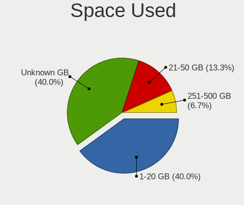
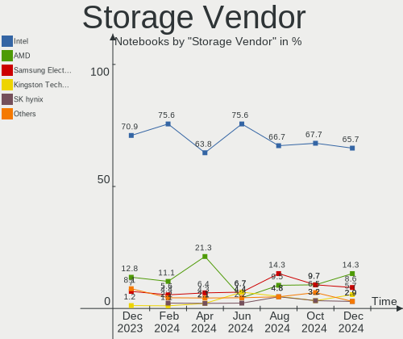
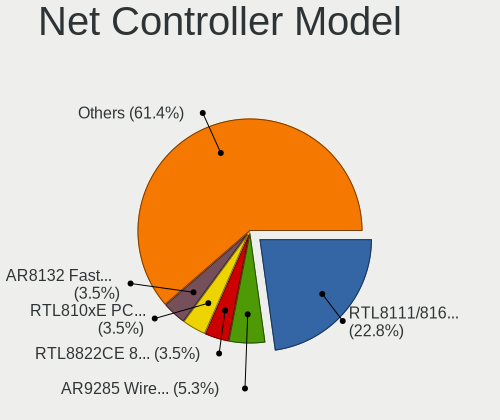
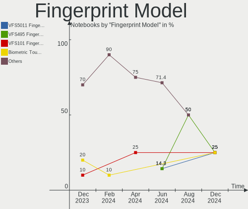

BlackPanther - Hardware Trends (Notebooks)
------------------------------------------

A project to identify most popular hardware characteristics and track their change
over time based on data collected by Linux users at https://Linux-Hardware.org.

Anyone can contribute to this report by the [hw-probe](https://github.com/linuxhw/hw-probe) tool:

    sudo -E hw-probe -all -upload

This report is for one last month. Overall report since the beginning of time: [TestDays](https://github.com/linuxhw/TestDays)

Period: Aug, 2023.

Contents
--------

* [ System ](#system)
  - [ OS                       ](#os)
  - [ OS Family                ](#os-family)
  - [ Kernel                   ](#kernel)
  - [ Kernel Family            ](#kernel-family)
  - [ Kernel Major Ver.        ](#kernel-major-ver)
  - [ Arch                     ](#arch)
  - [ DE                       ](#de)
  - [ Display Server           ](#display-server)
  - [ Display Manager          ](#display-manager)
  - [ OS Lang                  ](#os-lang)
  - [ Boot Mode                ](#boot-mode)
  - [ Filesystem               ](#filesystem)
  - [ Part. scheme             ](#part-scheme)
  - [ Dual Boot with Linux/BSD ](#dual-boot-with-linuxbsd)
  - [ Dual Boot (Win)          ](#dual-boot-win)

* [ Board ](#board)
  - [ Vendor                   ](#vendor)
  - [ Model                    ](#model)
  - [ Model Family             ](#model-family)
  - [ MFG Year                 ](#mfg-year)
  - [ Form Factor              ](#form-factor)
  - [ Secure Boot              ](#secure-boot)
  - [ Coreboot                 ](#coreboot)
  - [ RAM Size                 ](#ram-size)
  - [ RAM Used                 ](#ram-used)
  - [ Total Drives             ](#total-drives)
  - [ Has CD-ROM               ](#has-cd-rom)
  - [ Has Ethernet             ](#has-ethernet)
  - [ Has WiFi                 ](#has-wifi)
  - [ Has Bluetooth            ](#has-bluetooth)

* [ Location ](#location)
  - [ Country                  ](#country)
  - [ City                     ](#city)

* [ Drives ](#drives)
  - [ Drive Vendor             ](#drive-vendor)
  - [ Drive Model              ](#drive-model)
  - [ HDD Vendor               ](#hdd-vendor)
  - [ SSD Vendor               ](#ssd-vendor)
  - [ Drive Kind               ](#drive-kind)
  - [ Drive Connector          ](#drive-connector)
  - [ Drive Size               ](#drive-size)
  - [ Space Total              ](#space-total)
  - [ Space Used               ](#space-used)
  - [ Malfunc. Drives          ](#malfunc-drives)
  - [ Malfunc. Drive Vendor    ](#malfunc-drive-vendor)
  - [ Malfunc. HDD Vendor      ](#malfunc-hdd-vendor)
  - [ Malfunc. Drive Kind      ](#malfunc-drive-kind)
  - [ Failed Drives            ](#failed-drives)
  - [ Failed Drive Vendor      ](#failed-drive-vendor)
  - [ Drive Status             ](#drive-status)

* [ Storage controller ](#storage-controller)
  - [ Storage Vendor           ](#storage-vendor)
  - [ Storage Model            ](#storage-model)
  - [ Storage Kind             ](#storage-kind)

* [ Processor ](#processor)
  - [ CPU Vendor               ](#cpu-vendor)
  - [ CPU Model                ](#cpu-model)
  - [ CPU Model Family         ](#cpu-model-family)
  - [ CPU Cores                ](#cpu-cores)
  - [ CPU Sockets              ](#cpu-sockets)
  - [ CPU Threads              ](#cpu-threads)
  - [ CPU Op-Modes             ](#cpu-op-modes)
  - [ CPU Microcode            ](#cpu-microcode)
  - [ CPU Microarch            ](#cpu-microarch)

* [ Graphics ](#graphics)
  - [ GPU Vendor               ](#gpu-vendor)
  - [ GPU Model                ](#gpu-model)
  - [ GPU Combo                ](#gpu-combo)
  - [ GPU Driver               ](#gpu-driver)
  - [ GPU Memory               ](#gpu-memory)

* [ Monitor ](#monitor)
  - [ Monitor Vendor           ](#monitor-vendor)
  - [ Monitor Model            ](#monitor-model)
  - [ Monitor Resolution       ](#monitor-resolution)
  - [ Monitor Diagonal         ](#monitor-diagonal)
  - [ Monitor Width            ](#monitor-width)
  - [ Aspect Ratio             ](#aspect-ratio)
  - [ Monitor Area             ](#monitor-area)
  - [ Pixel Density            ](#pixel-density)
  - [ Multiple Monitors        ](#multiple-monitors)

* [ Network ](#network)
  - [ Net Controller Vendor    ](#net-controller-vendor)
  - [ Net Controller Model     ](#net-controller-model)
  - [ Wireless Vendor          ](#wireless-vendor)
  - [ Wireless Model           ](#wireless-model)
  - [ Ethernet Vendor          ](#ethernet-vendor)
  - [ Ethernet Model           ](#ethernet-model)
  - [ Net Controller Kind      ](#net-controller-kind)
  - [ Used Controller          ](#used-controller)
  - [ NICs                     ](#nics)
  - [ IPv6                     ](#ipv6)

* [ Bluetooth ](#bluetooth)
  - [ Bluetooth Vendor         ](#bluetooth-vendor)
  - [ Bluetooth Model          ](#bluetooth-model)

* [ Sound ](#sound)
  - [ Sound Vendor             ](#sound-vendor)
  - [ Sound Model              ](#sound-model)

* [ Memory ](#memory)
  - [ Memory Vendor            ](#memory-vendor)
  - [ Memory Model             ](#memory-model)
  - [ Memory Kind              ](#memory-kind)
  - [ Memory Form Factor       ](#memory-form-factor)
  - [ Memory Size              ](#memory-size)
  - [ Memory Speed             ](#memory-speed)

* [ Printers & scanners ](#printers--scanners)
  - [ Printer Vendor           ](#printer-vendor)
  - [ Printer Model            ](#printer-model)
  - [ Scanner Vendor           ](#scanner-vendor)
  - [ Scanner Model            ](#scanner-model)

* [ Camera ](#camera)
  - [ Camera Vendor            ](#camera-vendor)
  - [ Camera Model             ](#camera-model)

* [ Security ](#security)
  - [ Fingerprint Vendor       ](#fingerprint-vendor)
  - [ Fingerprint Model        ](#fingerprint-model)
  - [ Chipcard Vendor          ](#chipcard-vendor)
  - [ Chipcard Model           ](#chipcard-model)

* [ Unsupported ](#unsupported)
  - [ Unsupported Devices      ](#unsupported-devices)
  - [ Unsupported Device Types ](#unsupported-device-types)

System
------

OS
--

Installed operating systems

| Name              | Notebooks | Percent |
|-------------------|-----------|---------|
| BlackPanther 18.1 | 50        | 96.15%  |
| BlackPanther 22.1 | 2         | 3.85%   |

OS Family
---------

OS without a version

| Name         | Notebooks | Percent |
|--------------|-----------|---------|
| BlackPanther | 52        | 100%    |

Kernel
------

Version of the Linux kernel

| Version             | Notebooks | Percent |
|---------------------|-----------|---------|
| 4.18.16-desktop-1bP | 19        | 36.54%  |
| 5.6.14-desktop-2bP  | 14        | 26.92%  |
| 5.15.85-desktop-1bP | 13        | 25%     |
| 6.3.8-desktop-1bP   | 4         | 7.69%   |
| 6.1.0-1bP           | 1         | 1.92%   |
| 5.6.14-server-2bP   | 1         | 1.92%   |

Kernel Family
-------------

Linux kernel without a distro release

| Version | Notebooks | Percent |
|---------|-----------|---------|
| 4.18.16 | 19        | 36.54%  |
| 5.6.14  | 15        | 28.85%  |
| 5.15.85 | 13        | 25%     |
| 6.3.8   | 4         | 7.69%   |
| 6.1.0   | 1         | 1.92%   |

Kernel Major Ver.
-----------------

Linux kernel major version

| Version | Notebooks | Percent |
|---------|-----------|---------|
| 4.18    | 19        | 36.54%  |
| 5.6     | 15        | 28.85%  |
| 5.15    | 13        | 25%     |
| 6.3     | 4         | 7.69%   |
| 6.1     | 1         | 1.92%   |

Arch
----

OS architecture (x86_64, i586, etc.)

| Name   | Notebooks | Percent |
|--------|-----------|---------|
| x86_64 | 52        | 100%    |

DE
--

Desktop Environment

| Name    | Notebooks | Percent |
|---------|-----------|---------|
| KDE5    | 50        | 96.15%  |
| Unknown | 2         | 3.85%   |

Display Server
--------------

X11 or Wayland

| Name | Notebooks | Percent |
|------|-----------|---------|
| X11  | 52        | 100%    |

Display Manager
---------------

SDDM, LightDM, etc.

| Name | Notebooks | Percent |
|------|-----------|---------|
| SDDM | 52        | 100%    |

OS Lang
-------

Language

| Lang    | Notebooks | Percent |
|---------|-----------|---------|
| Unknown | 52        | 100%    |

Boot Mode
---------

EFI or BIOS

| Mode | Notebooks | Percent |
|------|-----------|---------|
| EFI  | 30        | 57.69%  |
| BIOS | 22        | 42.31%  |

Filesystem
----------

Type of filesystem

| Type    | Notebooks | Percent |
|---------|-----------|---------|
| Ext4    | 37        | 71.15%  |
| Overlay | 14        | 26.92%  |
| Btrfs   | 1         | 1.92%   |

Part. scheme
------------

Scheme of partitioning

| Type | Notebooks | Percent |
|------|-----------|---------|
| GPT  | 34        | 65.38%  |
| MBR  | 18        | 34.62%  |

Dual Boot with Linux/BSD
------------------------

Hosting more than one Linux/BSD

| Dual boot | Notebooks | Percent |
|-----------|-----------|---------|
| No        | 42        | 80.77%  |
| Yes       | 10        | 19.23%  |

Dual Boot (Win)
---------------

Hosting Linux and Windows

| Dual boot | Notebooks | Percent |
|-----------|-----------|---------|
| No        | 35        | 67.31%  |
| Yes       | 17        | 32.69%  |

Board
-----

Vendor
------

Motherboard manufacturer

| Name             | Notebooks | Percent |
|------------------|-----------|---------|
| Hewlett-Packard  | 12        | 23.08%  |
| Dell             | 11        | 21.15%  |
| Lenovo           | 8         | 15.38%  |
| Acer             | 6         | 11.54%  |
| ASUSTek Computer | 5         | 9.62%   |
| Sony             | 2         | 3.85%   |
| MSI              | 2         | 3.85%   |
| eMachines        | 2         | 3.85%   |
| Apple            | 2         | 3.85%   |
| Toshiba          | 1         | 1.92%   |
| Fujitsu          | 1         | 1.92%   |

Model
-----

Motherboard model

| Name                                | Notebooks | Percent |
|-------------------------------------|-----------|---------|
| HP 250 G1                           | 2         | 3.85%   |
| eMachines E725                      | 2         | 3.85%   |
| Dell Latitude E6410                 | 2         | 3.85%   |
| Toshiba Satellite C55D-A-14W        | 1         | 1.92%   |
| Sony VPCEH2N1E                      | 1         | 1.92%   |
| Sony VPCEH2J1E                      | 1         | 1.92%   |
| MSI GT60 2OC/2OD                    | 1         | 1.92%   |
| MSI GP75 Leopard 9SE                | 1         | 1.92%   |
| Lenovo Z50-75 80EC                  | 1         | 1.92%   |
| Lenovo V15-ADA 82C7                 | 1         | 1.92%   |
| Lenovo ThinkPad X250 20CLS1JN00     | 1         | 1.92%   |
| Lenovo ThinkPad T470 20HES58A1L     | 1         | 1.92%   |
| Lenovo ThinkPad T410 2537VFQ        | 1         | 1.92%   |
| Lenovo IdeaPad 330-15IKB 81DE       | 1         | 1.92%   |
| Lenovo IdeaPad 110-15ACL 80TJ       | 1         | 1.92%   |
| Lenovo G70-35 80Q5                  | 1         | 1.92%   |
| HP ProBook 650 G2                   | 1         | 1.92%   |
| HP Pavilion Gaming Laptop 15-ec1xxx | 1         | 1.92%   |
| HP Pavilion dv6                     | 1         | 1.92%   |
| HP Pavilion 17                      | 1         | 1.92%   |
| HP Notebook                         | 1         | 1.92%   |
| HP Laptop 17-ak0xx                  | 1         | 1.92%   |
| HP EliteBook 2540p                  | 1         | 1.92%   |
| HP Compaq 6730b (NB025EA#ABU)       | 1         | 1.92%   |
| HP 650                              | 1         | 1.92%   |
| HP 250 G5 Notebook PC               | 1         | 1.92%   |
| Fujitsu LIFEBOOK A555               | 1         | 1.92%   |
| Dell Precision M6600                | 1         | 1.92%   |
| Dell Latitude E7240                 | 1         | 1.92%   |
| Dell Latitude E6230                 | 1         | 1.92%   |
| Dell Latitude E6220                 | 1         | 1.92%   |
| Dell Latitude E5520                 | 1         | 1.92%   |
| Dell Inspiron 5567                  | 1         | 1.92%   |
| Dell Inspiron 5558                  | 1         | 1.92%   |
| Dell Inspiron 17 7000 Series 7746   | 1         | 1.92%   |
| Dell Inspiron 15-3567               | 1         | 1.92%   |
| ASUS X550CL                         | 1         | 1.92%   |
| ASUS X541NA                         | 1         | 1.92%   |
| ASUS X540SA                         | 1         | 1.92%   |
| ASUS X540LJ                         | 1         | 1.92%   |

Model Family
------------

Motherboard model prefix

| Name              | Notebooks | Percent |
|-------------------|-----------|---------|
| Dell Latitude     | 6         | 11.54%  |
| Acer Aspire       | 5         | 9.62%   |
| Dell Inspiron     | 4         | 7.69%   |
| Lenovo ThinkPad   | 3         | 5.77%   |
| HP Pavilion       | 3         | 5.77%   |
| HP 250            | 3         | 5.77%   |
| Lenovo IdeaPad    | 2         | 3.85%   |
| eMachines E725    | 2         | 3.85%   |
| Toshiba Satellite | 1         | 1.92%   |
| Sony VPCEH2N1E    | 1         | 1.92%   |
| Sony VPCEH2J1E    | 1         | 1.92%   |
| MSI GT60          | 1         | 1.92%   |
| MSI GP75          | 1         | 1.92%   |
| Lenovo Z50-75     | 1         | 1.92%   |
| Lenovo V15-ADA    | 1         | 1.92%   |
| Lenovo G70-35     | 1         | 1.92%   |
| HP ProBook        | 1         | 1.92%   |
| HP Notebook       | 1         | 1.92%   |
| HP Laptop         | 1         | 1.92%   |
| HP EliteBook      | 1         | 1.92%   |
| HP Compaq         | 1         | 1.92%   |
| HP 650            | 1         | 1.92%   |
| Fujitsu LIFEBOOK  | 1         | 1.92%   |
| Dell Precision    | 1         | 1.92%   |
| ASUS X550CL       | 1         | 1.92%   |
| ASUS X541NA       | 1         | 1.92%   |
| ASUS X540SA       | 1         | 1.92%   |
| ASUS X540LJ       | 1         | 1.92%   |
| ASUS K54HR        | 1         | 1.92%   |
| Apple MacBookPro5 | 1         | 1.92%   |
| Apple MacBookAir5 | 1         | 1.92%   |
| Acer Extensa      | 1         | 1.92%   |

MFG Year
--------

Motherboard manufacture year

| Year | Notebooks | Percent |
|------|-----------|---------|
| 2013 | 8         | 15.38%  |
| 2016 | 7         | 13.46%  |
| 2015 | 7         | 13.46%  |
| 2011 | 7         | 13.46%  |
| 2017 | 4         | 7.69%   |
| 2012 | 4         | 7.69%   |
| 2010 | 4         | 7.69%   |
| 2009 | 3         | 5.77%   |
| 2020 | 2         | 3.85%   |
| 2014 | 2         | 3.85%   |
| 2019 | 1         | 1.92%   |
| 2018 | 1         | 1.92%   |
| 2008 | 1         | 1.92%   |
| 2007 | 1         | 1.92%   |

Form Factor
-----------

Physical design of the computer

| Name     | Notebooks | Percent |
|----------|-----------|---------|
| Notebook | 52        | 100%    |

Secure Boot
-----------

Enabled or disabled

| State    | Notebooks | Percent |
|----------|-----------|---------|
| Disabled | 52        | 100%    |

Coreboot
--------

Have coreboot on board

| Used | Notebooks | Percent |
|------|-----------|---------|
| No   | 52        | 100%    |

RAM Size
--------

Total RAM memory

| Size in GB | Notebooks | Percent |
|------------|-----------|---------|
| 3.01-4.0   | 22        | 42.31%  |
| 4.01-8.0   | 11        | 21.15%  |
| 8.01-16.0  | 11        | 21.15%  |
| 16.01-24.0 | 4         | 7.69%   |
| 1.01-2.0   | 4         | 7.69%   |

RAM Used
--------

Used RAM memory

| Used GB  | Notebooks | Percent |
|----------|-----------|---------|
| 1.01-2.0 | 24        | 46.15%  |
| 0.51-1.0 | 19        | 36.54%  |
| 4.01-8.0 | 3         | 5.77%   |
| 2.01-3.0 | 3         | 5.77%   |
| 3.01-4.0 | 2         | 3.85%   |
| 0.01-0.5 | 1         | 1.92%   |

Total Drives
------------

Number of drives on board

| Drives | Notebooks | Percent |
|--------|-----------|---------|
| 1      | 39        | 75%     |
| 2      | 13        | 25%     |

Has CD-ROM
----------

Has CD-ROM on board

| Presented | Notebooks | Percent |
|-----------|-----------|---------|
| Yes       | 35        | 67.31%  |
| No        | 17        | 32.69%  |

Has Ethernet
------------

Has Ethernet on board

| Presented | Notebooks | Percent |
|-----------|-----------|---------|
| Yes       | 50        | 96.15%  |
| No        | 2         | 3.85%   |

Has WiFi
--------

Has WiFi module

| Presented | Notebooks | Percent |
|-----------|-----------|---------|
| Yes       | 52        | 100%    |

Has Bluetooth
-------------

Has Bluetooth module

| Presented | Notebooks | Percent |
|-----------|-----------|---------|
| Yes       | 44        | 84.62%  |
| No        | 8         | 15.38%  |

Location
--------

Country
-------

Geographic location (country)

| Country  | Notebooks | Percent |
|----------|-----------|---------|
| Hungary  | 37        | 71.15%  |
| Slovakia | 3         | 5.77%   |
| Austria  | 3         | 5.77%   |
| USA      | 2         | 3.85%   |
| UK       | 2         | 3.85%   |
| Germany  | 2         | 3.85%   |
| Romania  | 1         | 1.92%   |
| Greece   | 1         | 1.92%   |
| Canada   | 1         | 1.92%   |

City
----

Geographic location (city)

| City              | Notebooks | Percent |
|-------------------|-----------|---------|
| Budapest          | 11        | 21.15%  |
| Zalaegerszeg      | 3         | 5.77%   |
| Vienna            | 3         | 5.77%   |
| Tornaľa          | 2         | 3.85%   |
| Tatabánya        | 2         | 3.85%   |
| Randolph Township | 2         | 3.85%   |
| Miskolc           | 2         | 3.85%   |
| Csongrad          | 2         | 3.85%   |
| Crewe             | 2         | 3.85%   |
| Tiszaujvaros      | 1         | 1.92%   |
| Tamasi            | 1         | 1.92%   |
| Taksony           | 1         | 1.92%   |
| Szekszárd        | 1         | 1.92%   |
| Székesfehérvár | 1         | 1.92%   |
| Strazske          | 1         | 1.92%   |
| Salgotarjan       | 1         | 1.92%   |
| Regensburg        | 1         | 1.92%   |
| Pomaz             | 1         | 1.92%   |
| Nyiregyhaza       | 1         | 1.92%   |
| Nagyatad          | 1         | 1.92%   |
| Miercurea-Ciuc    | 1         | 1.92%   |
| Kisvarda          | 1         | 1.92%   |
| Kiskoros          | 1         | 1.92%   |
| Kastoria          | 1         | 1.92%   |
| Hodmezovasarhely  | 1         | 1.92%   |
| Hatvan            | 1         | 1.92%   |
| Fertoszentmiklos  | 1         | 1.92%   |
| Debrecen          | 1         | 1.92%   |
| Cegled            | 1         | 1.92%   |
| Bonn              | 1         | 1.92%   |
| Berettyóújfalu  | 1         | 1.92%   |
| Beauharnois       | 1         | 1.92%   |

Drives
------

Drive Vendor
------------

Hard drive vendors

| Vendor              | Notebooks | Drives | Percent |
|---------------------|-----------|--------|---------|
| Samsung Electronics | 10        | 10     | 15.63%  |
| WDC                 | 9         | 10     | 14.06%  |
| Seagate             | 9         | 9      | 14.06%  |
| Kingston            | 8         | 8      | 12.5%   |
| Toshiba             | 5         | 5      | 7.81%   |
| HGST                | 4         | 4      | 6.25%   |
| Unknown             | 3         | 3      | 4.69%   |
| SanDisk             | 3         | 3      | 4.69%   |
| Intenso             | 2         | 2      | 3.13%   |
| Intel               | 2         | 2      | 3.13%   |
| Hitachi             | 2         | 2      | 3.13%   |
| Timetec             | 1         | 1      | 1.56%   |
| SK hynix            | 1         | 1      | 1.56%   |
| PNY                 | 1         | 1      | 1.56%   |
| Micron Technology   | 1         | 1      | 1.56%   |
| LITEONIT            | 1         | 1      | 1.56%   |
| Crucial             | 1         | 1      | 1.56%   |
| Apple               | 1         | 1      | 1.56%   |

Drive Model
-----------

Hard drive models

| Model                                 | Notebooks | Percent |
|---------------------------------------|-----------|---------|
| Toshiba MQ01ABD100 1TB                | 3         | 4.62%   |
| WDC WD5000LPCX-24VHAT0 500GB          | 2         | 3.08%   |
| Seagate ST500LT012-1DG142 500GB       | 2         | 3.08%   |
| Kingston SNV2S500G 500GB              | 2         | 3.08%   |
| Kingston SA400S37480G 480GB SSD       | 2         | 3.08%   |
| Kingston SA400S37240G 240GB SSD       | 2         | 3.08%   |
| Intenso SSD 120GB                     | 2         | 3.08%   |
| WDC WD5000LPVX-22V0TT0 500GB          | 1         | 1.54%   |
| WDC WD5000BPVT-24HXZT3 500GB          | 1         | 1.54%   |
| WDC WD5000BEVT-35A0RT0 500GB          | 1         | 1.54%   |
| WDC WD2500BEVT-00ZCT0 250GB           | 1         | 1.54%   |
| WDC WD10JPVX-75JC3T0 1TB              | 1         | 1.54%   |
| WDC WD10JPVX-22JC3T0 1TB              | 1         | 1.54%   |
| WDC WD10JPLX-00MBPT0 1TB              | 1         | 1.54%   |
| WDC WD10JPCX-24UE4T0 1TB              | 1         | 1.54%   |
| Unknown SL16G  16GB                   | 1         | 1.54%   |
| Unknown SD/MMC/MS PRO 1GB             | 1         | 1.54%   |
| Unknown 032G34  32GB                  | 1         | 1.54%   |
| Toshiba MQ01ABF050 500GB              | 1         | 1.54%   |
| Toshiba MK2576GSX 250GB               | 1         | 1.54%   |
| Timetec SD08 512GB SSD                | 1         | 1.54%   |
| SK hynix HFS256G3BTND-N210A 256GB SSD | 1         | 1.54%   |
| Seagate ST9500420AS 500GB             | 1         | 1.54%   |
| Seagate ST9500325AS 500GB             | 1         | 1.54%   |
| Seagate ST9320325AS 320GB             | 1         | 1.54%   |
| Seagate ST2000LM003 HN-M201RAD 2TB    | 1         | 1.54%   |
| Seagate ST1000LM035-1RK172 1TB        | 1         | 1.54%   |
| Seagate ST1000LM024 HN-M101MBB 1TB    | 1         | 1.54%   |
| Seagate ST1000LM014-1EJ164 1TB        | 1         | 1.54%   |
| SanDisk SDSSDH3 250G                  | 1         | 1.54%   |
| SanDisk SDSSDA240G 240GB              | 1         | 1.54%   |
| SanDisk SD9SB8W128G1001 128GB SSD     | 1         | 1.54%   |
| Samsung SSD 980 500GB                 | 1         | 1.54%   |
| Samsung SSD 970 EVO Plus 2TB          | 1         | 1.54%   |
| Samsung SSD 870 QVO 1TB               | 1         | 1.54%   |
| Samsung SSD 870 EVO 250GB             | 1         | 1.54%   |
| Samsung SSD 870 EVO 1TB               | 1         | 1.54%   |
| Samsung SSD 860 EVO 500GB             | 1         | 1.54%   |
| Samsung SSD 830 Series 128GB          | 1         | 1.54%   |
| Samsung SSD 750 EVO 250GB             | 1         | 1.54%   |

HDD Vendor
----------

Hard disk drive vendors

| Vendor              | Notebooks | Drives | Percent |
|---------------------|-----------|--------|---------|
| WDC                 | 9         | 10     | 29.03%  |
| Seagate             | 9         | 9      | 29.03%  |
| Toshiba             | 5         | 5      | 16.13%  |
| HGST                | 4         | 4      | 12.9%   |
| Hitachi             | 2         | 2      | 6.45%   |
| Unknown             | 1         | 1      | 3.23%   |
| Samsung Electronics | 1         | 1      | 3.23%   |

SSD Vendor
----------

Solid state drive vendors

| Vendor              | Notebooks | Drives | Percent |
|---------------------|-----------|--------|---------|
| Samsung Electronics | 7         | 7      | 25.93%  |
| Kingston            | 6         | 6      | 22.22%  |
| SanDisk             | 3         | 3      | 11.11%  |
| Intenso             | 2         | 2      | 7.41%   |
| Intel               | 2         | 2      | 7.41%   |
| Timetec             | 1         | 1      | 3.7%    |
| SK hynix            | 1         | 1      | 3.7%    |
| PNY                 | 1         | 1      | 3.7%    |
| Micron Technology   | 1         | 1      | 3.7%    |
| LITEONIT            | 1         | 1      | 3.7%    |
| Crucial             | 1         | 1      | 3.7%    |
| Apple               | 1         | 1      | 3.7%    |

Drive Kind
----------

HDD or SSD

| Kind | Notebooks | Drives | Percent |
|------|-----------|--------|---------|
| HDD  | 31        | 32     | 49.21%  |
| SSD  | 26        | 27     | 41.27%  |
| NVMe | 4         | 4      | 6.35%   |
| MMC  | 2         | 2      | 3.17%   |

Drive Connector
---------------

SATA, SAS, NVMe, etc.

| Type | Notebooks | Drives | Percent |
|------|-----------|--------|---------|
| SATA | 50        | 57     | 86.21%  |
| NVMe | 4         | 4      | 6.9%    |
| SAS  | 2         | 2      | 3.45%   |
| MMC  | 2         | 2      | 3.45%   |

Drive Size
----------

Size of hard drive

| Size in TB | Notebooks | Drives | Percent |
|------------|-----------|--------|---------|
| 0.01-0.5   | 41        | 43     | 73.21%  |
| 0.51-1.0   | 14        | 15     | 25%     |
| 1.01-2.0   | 1         | 1      | 1.79%   |

Space Total
-----------

Amount of disk space available on the file system

| Size in GB | Notebooks | Percent |
|------------|-----------|---------|
| 101-250    | 14        | 26.92%  |
| Unknown    | 13        | 25%     |
| 251-500    | 12        | 23.08%  |
| 501-1000   | 6         | 11.54%  |
| 21-50      | 2         | 3.85%   |
| 1001-2000  | 2         | 3.85%   |
| 51-100     | 2         | 3.85%   |
| 2001-3000  | 1         | 1.92%   |

Space Used
----------

Amount of used disk space

| Used GB   | Notebooks | Percent |
|-----------|-----------|---------|
| 1-20      | 15        | 28.85%  |
| Unknown   | 13        | 25%     |
| 21-50     | 8         | 15.38%  |
| 51-100    | 8         | 15.38%  |
| 101-250   | 7         | 13.46%  |
| 2001-3000 | 1         | 1.92%   |

Malfunc. Drives
---------------

Drive models with a malfunction

| Model                                 | Notebooks | Drives | Percent |
|---------------------------------------|-----------|--------|---------|
| WDC WD5000BEVT-35A0RT0 500GB          | 1         | 1      | 4.76%   |
| WDC WD2500BEVT-00ZCT0 250GB           | 1         | 1      | 4.76%   |
| WDC WD10JPLX-00MBPT0 1TB              | 1         | 1      | 4.76%   |
| WDC WD10JPCX-24UE4T0 1TB              | 1         | 1      | 4.76%   |
| Toshiba MQ01ABF050 500GB              | 1         | 1      | 4.76%   |
| Timetec SD08 512GB SSD                | 1         | 1      | 4.76%   |
| Seagate ST9500420AS 500GB             | 1         | 1      | 4.76%   |
| Seagate ST9500325AS 500GB             | 1         | 1      | 4.76%   |
| Seagate ST9320325AS 320GB             | 1         | 1      | 4.76%   |
| Seagate ST500LT012-1DG142 500GB       | 1         | 1      | 4.76%   |
| Samsung Electronics SSD 750 EVO 250GB | 1         | 1      | 4.76%   |
| Samsung Electronics HM160HI 160GB     | 1         | 1      | 4.76%   |
| Intel SSDSC2BF180A4H 180GB            | 1         | 1      | 4.76%   |
| Intel SSDSA1M160G2HP 160GB            | 1         | 1      | 4.76%   |
| Hitachi HTS725025A9A364 250GB         | 1         | 1      | 4.76%   |
| Hitachi HTS547550A9E384 500GB         | 1         | 1      | 4.76%   |
| HGST HTS545050A7E680 500GB            | 1         | 1      | 4.76%   |
| HGST HTS545032A7E380 320GB            | 1         | 1      | 4.76%   |
| HGST HTS541010A9E680 1TB              | 1         | 1      | 4.76%   |
| HGST HEJ423220H9E300 200GB            | 1         | 1      | 4.76%   |
| Apple SSD TS064E 64GB                 | 1         | 1      | 4.76%   |

Malfunc. Drive Vendor
---------------------

Vendors of faulty drives

| Vendor              | Notebooks | Drives | Percent |
|---------------------|-----------|--------|---------|
| WDC                 | 4         | 4      | 19.05%  |
| Seagate             | 4         | 4      | 19.05%  |
| HGST                | 4         | 4      | 19.05%  |
| Samsung Electronics | 2         | 2      | 9.52%   |
| Intel               | 2         | 2      | 9.52%   |
| Hitachi             | 2         | 2      | 9.52%   |
| Toshiba             | 1         | 1      | 4.76%   |
| Timetec             | 1         | 1      | 4.76%   |
| Apple               | 1         | 1      | 4.76%   |

Malfunc. HDD Vendor
-------------------

Vendors of faulty HDD drives

| Vendor              | Notebooks | Drives | Percent |
|---------------------|-----------|--------|---------|
| WDC                 | 4         | 4      | 25%     |
| Seagate             | 4         | 4      | 25%     |
| HGST                | 4         | 4      | 25%     |
| Hitachi             | 2         | 2      | 12.5%   |
| Toshiba             | 1         | 1      | 6.25%   |
| Samsung Electronics | 1         | 1      | 6.25%   |

Malfunc. Drive Kind
-------------------

Kinds of faulty drives

| Kind | Notebooks | Drives | Percent |
|------|-----------|--------|---------|
| HDD  | 16        | 16     | 76.19%  |
| SSD  | 5         | 5      | 23.81%  |

Failed Drives
-------------

Failed drive models

Zero info for selected period =(

Failed Drive Vendor
-------------------

Failed drive vendors

Zero info for selected period =(

Drive Status
------------

Number of failed and malfunc. drives

| Status   | Notebooks | Drives | Percent |
|----------|-----------|--------|---------|
| Works    | 33        | 40     | 56.9%   |
| Malfunc  | 21        | 21     | 36.21%  |
| Detected | 4         | 4      | 6.9%    |

Storage controller
------------------

Storage Vendor
--------------

Storage controller vendors

| Vendor                      | Notebooks | Percent |
|-----------------------------|-----------|---------|
| Intel                       | 42        | 76.36%  |
| AMD                         | 8         | 14.55%  |
| Samsung Electronics         | 2         | 3.64%   |
| Kingston Technology Company | 2         | 3.64%   |
| Nvidia                      | 1         | 1.82%   |

Storage Model
-------------

Storage controller models

| Model                                                                            | Notebooks | Percent |
|----------------------------------------------------------------------------------|-----------|---------|
| AMD FCH SATA Controller [AHCI mode]                                              | 7         | 12.28%  |
| Intel Wildcat Point-LP SATA Controller [AHCI Mode]                               | 5         | 8.77%   |
| Intel 7 Series Chipset Family 6-port SATA Controller [AHCI mode]                 | 5         | 8.77%   |
| Intel Sunrise Point-LP SATA Controller [AHCI mode]                               | 4         | 7.02%   |
| Intel 82801 Mobile SATA Controller [RAID mode]                                   | 4         | 7.02%   |
| Intel 6 Series/C200 Series Chipset Family 6 port Mobile SATA AHCI Controller     | 4         | 7.02%   |
| Intel Celeron N3350/Pentium N4200/Atom E3900 Series SATA AHCI Controller         | 3         | 5.26%   |
| Intel 82801IBM/IEM (ICH9M/ICH9M-E) 4 port SATA Controller [AHCI mode]            | 3         | 5.26%   |
| Intel 8 Series SATA Controller 1 [AHCI mode]                                     | 3         | 5.26%   |
| Intel 5 Series/3400 Series Chipset 6 port SATA AHCI Controller                   | 3         | 5.26%   |
| Kingston Company Company Non-Volatile memory controller                          | 2         | 3.51%   |
| Intel Atom/Celeron/Pentium Processor x5-E8000/J3xxx/N3xxx Series SATA Controller | 2         | 3.51%   |
| Intel 5 Series/3400 Series Chipset 4 port SATA AHCI Controller                   | 2         | 3.51%   |
| Samsung NVMe SSD Controller SM981/PM981/PM983                                    | 1         | 1.75%   |
| Samsung NVMe SSD Controller 980                                                  | 1         | 1.75%   |
| Nvidia MCP79 AHCI Controller                                                     | 1         | 1.75%   |
| Intel HM170/QM170 Chipset SATA Controller [AHCI Mode]                            | 1         | 1.75%   |
| Intel Cannon Lake Mobile PCH SATA AHCI Controller                                | 1         | 1.75%   |
| Intel 82801HM/HEM (ICH8M/ICH8M-E) SATA Controller [AHCI mode]                    | 1         | 1.75%   |
| Intel 82801HM/HEM (ICH8M/ICH8M-E) IDE Controller                                 | 1         | 1.75%   |
| Intel 8 Series/C220 Series Chipset Family 6-port SATA Controller 1 [AHCI mode]   | 1         | 1.75%   |
| AMD FCH SATA Controller [IDE mode]                                               | 1         | 1.75%   |
| AMD FCH IDE Controller                                                           | 1         | 1.75%   |

Storage Kind
------------

Kind of storage controller (IDE, SATA, NVMe, SAS, ...)

| Kind | Notebooks | Percent |
|------|-----------|---------|
| SATA | 47        | 82.46%  |
| RAID | 4         | 7.02%   |
| NVMe | 4         | 7.02%   |
| IDE  | 2         | 3.51%   |

Processor
---------

CPU Vendor
----------

Processor vendors

| Vendor | Notebooks | Percent |
|--------|-----------|---------|
| Intel  | 44        | 84.62%  |
| AMD    | 8         | 15.38%  |

CPU Model
---------

Processor models

| Model                                       | Notebooks | Percent |
|---------------------------------------------|-----------|---------|
| Intel Core i5-7200U CPU @ 2.50GHz           | 2         | 3.85%   |
| Intel Core i5-5200U CPU @ 2.20GHz           | 2         | 3.85%   |
| Intel Celeron CPU N3350 @ 1.10GHz           | 2         | 3.85%   |
| Intel Celeron CPU 1000M @ 1.80GHz           | 2         | 3.85%   |
| Intel Pentium Dual-Core CPU T4400 @ 2.20GHz | 1         | 1.92%   |
| Intel Pentium Dual-Core CPU T4300 @ 2.10GHz | 1         | 1.92%   |
| Intel Pentium CPU N4200 @ 1.10GHz           | 1         | 1.92%   |
| Intel Pentium CPU N3700 @ 1.60GHz           | 1         | 1.92%   |
| Intel Pentium CPU 2117U @ 1.80GHz           | 1         | 1.92%   |
| Intel Core i7-9750H CPU @ 2.60GHz           | 1         | 1.92%   |
| Intel Core i7-6820HQ CPU @ 2.70GHz          | 1         | 1.92%   |
| Intel Core i7-5500U CPU @ 2.40GHz           | 1         | 1.92%   |
| Intel Core i7-4700MQ CPU @ 2.40GHz          | 1         | 1.92%   |
| Intel Core i7-2960XM CPU @ 2.70GHz          | 1         | 1.92%   |
| Intel Core i7 CPU M 640 @ 2.80GHz           | 1         | 1.92%   |
| Intel Core i7 CPU M 620 @ 2.67GHz           | 1         | 1.92%   |
| Intel Core i7 CPU L 640 @ 2.13GHz           | 1         | 1.92%   |
| Intel Core i5-8250U CPU @ 1.60GHz           | 1         | 1.92%   |
| Intel Core i5-7300U CPU @ 2.60GHz           | 1         | 1.92%   |
| Intel Core i5-5300U CPU @ 2.30GHz           | 1         | 1.92%   |
| Intel Core i5-4200U CPU @ 1.60GHz           | 1         | 1.92%   |
| Intel Core i5-3427U CPU @ 1.80GHz           | 1         | 1.92%   |
| Intel Core i5-3340M CPU @ 2.70GHz           | 1         | 1.92%   |
| Intel Core i5-2540M CPU @ 2.60GHz           | 1         | 1.92%   |
| Intel Core i5-2520M CPU @ 2.50GHz           | 1         | 1.92%   |
| Intel Core i5-2430M CPU @ 2.40GHz           | 1         | 1.92%   |
| Intel Core i5 CPU M 520 @ 2.40GHz           | 1         | 1.92%   |
| Intel Core i3-6006U CPU @ 2.00GHz           | 1         | 1.92%   |
| Intel Core i3-5005U CPU @ 2.00GHz           | 1         | 1.92%   |
| Intel Core i3-4030U CPU @ 1.90GHz           | 1         | 1.92%   |
| Intel Core i3-2350M CPU @ 2.30GHz           | 1         | 1.92%   |
| Intel Core i3-2330M CPU @ 2.20GHz           | 1         | 1.92%   |
| Intel Core i3 CPU M 350 @ 2.27GHz           | 1         | 1.92%   |
| Intel Core 2 Duo CPU P8700 @ 2.53GHz        | 1         | 1.92%   |
| Intel Core 2 Duo CPU P8600 @ 2.40GHz        | 1         | 1.92%   |
| Intel Celeron CPU U3600 @ 1.20GHz           | 1         | 1.92%   |
| Intel Celeron CPU N3060 @ 1.60GHz           | 1         | 1.92%   |
| Intel Celeron CPU B830 @ 1.80GHz            | 1         | 1.92%   |
| Intel Celeron CPU 530 @ 1.73GHz             | 1         | 1.92%   |
| Intel Celeron 2955U @ 1.40GHz               | 1         | 1.92%   |

CPU Model Family
----------------

Processor model prefix

| Model                   | Notebooks | Percent |
|-------------------------|-----------|---------|
| Intel Core i5           | 14        | 26.92%  |
| Intel Celeron           | 9         | 17.31%  |
| Intel Core i7           | 8         | 15.38%  |
| Intel Core i3           | 6         | 11.54%  |
| Intel Pentium           | 3         | 5.77%   |
| Intel Pentium Dual-Core | 2         | 3.85%   |
| Intel Core 2 Duo        | 2         | 3.85%   |
| AMD Ryzen 5             | 2         | 3.85%   |
| Other                   | 1         | 1.92%   |
| AMD E1                  | 1         | 1.92%   |
| AMD A8                  | 1         | 1.92%   |
| AMD A6                  | 1         | 1.92%   |
| AMD A4                  | 1         | 1.92%   |
| AMD A10                 | 1         | 1.92%   |

CPU Cores
---------

Number of processor cores

| Number | Notebooks | Percent |
|--------|-----------|---------|
| 2      | 39        | 75%     |
| 4      | 9         | 17.31%  |
| 6      | 2         | 3.85%   |
| 1      | 2         | 3.85%   |

CPU Sockets
-----------

Number of sockets

| Number | Notebooks | Percent |
|--------|-----------|---------|
| 1      | 52        | 100%    |

CPU Threads
-----------

Threads per core (Hyper-Threading)

| Number | Notebooks | Percent |
|--------|-----------|---------|
| 2      | 32        | 61.54%  |
| 1      | 20        | 38.46%  |

CPU Op-Modes
------------

CPU Operation Modes (32-bit, 64-bit)

| Op mode        | Notebooks | Percent |
|----------------|-----------|---------|
| 32-bit, 64-bit | 52        | 100%    |

CPU Microcode
-------------

Microcode number

| Number     | Notebooks | Percent |
|------------|-----------|---------|
| Unknown    | 9         | 17.31%  |
| 0x306a9    | 5         | 9.62%   |
| 0x306d4    | 4         | 7.69%   |
| 0x206a7    | 4         | 7.69%   |
| 0x506c9    | 3         | 5.77%   |
| 0x40651    | 3         | 5.77%   |
| 0x20655    | 3         | 5.77%   |
| 0x1067a    | 3         | 5.77%   |
| 0x07030105 | 2         | 3.85%   |
| 0x06003106 | 2         | 3.85%   |
| 0x806ea    | 1         | 1.92%   |
| 0x806e9    | 1         | 1.92%   |
| 0x506e3    | 1         | 1.92%   |
| 0x406e3    | 1         | 1.92%   |
| 0x406c4    | 1         | 1.92%   |
| 0x406c3    | 1         | 1.92%   |
| 0x306c3    | 1         | 1.92%   |
| 0x20652    | 1         | 1.92%   |
| 0x10676    | 1         | 1.92%   |
| 0x10661    | 1         | 1.92%   |
| 0x08600106 | 1         | 1.92%   |
| 0x08108109 | 1         | 1.92%   |
| 0x0700010f | 1         | 1.92%   |
| 0x06006705 | 1         | 1.92%   |

CPU Microarch
-------------

Microarchitecture

| Name        | Notebooks | Percent |
|-------------|-----------|---------|
| SandyBridge | 7         | 13.46%  |
| Westmere    | 6         | 11.54%  |
| KabyLake    | 5         | 9.62%   |
| IvyBridge   | 5         | 9.62%   |
| Broadwell   | 5         | 9.62%   |
| Penryn      | 4         | 7.69%   |
| Haswell     | 4         | 7.69%   |
| Goldmont    | 3         | 5.77%   |
| Steamroller | 2         | 3.85%   |
| Skylake     | 2         | 3.85%   |
| Silvermont  | 2         | 3.85%   |
| Puma        | 2         | 3.85%   |
| Zen+        | 1         | 1.92%   |
| Zen 2       | 1         | 1.92%   |
| Jaguar      | 1         | 1.92%   |
| Excavator   | 1         | 1.92%   |
| Core        | 1         | 1.92%   |

Graphics
--------

GPU Vendor
----------

Vendors of graphics cards

| Vendor | Notebooks | Percent |
|--------|-----------|---------|
| Intel  | 40        | 63.49%  |
| Nvidia | 12        | 19.05%  |
| AMD    | 11        | 17.46%  |

GPU Model
---------

Graphics card models

| Model                                                                                    | Notebooks | Percent |
|------------------------------------------------------------------------------------------|-----------|---------|
| Intel HD Graphics 5500                                                                   | 5         | 7.69%   |
| Intel Core Processor Integrated Graphics Controller                                      | 5         | 7.69%   |
| Intel 3rd Gen Core processor Graphics Controller                                         | 5         | 7.69%   |
| Intel 2nd Generation Core Processor Family Integrated Graphics Controller                | 5         | 7.69%   |
| Intel Mobile 4 Series Chipset Integrated Graphics Controller                             | 3         | 4.62%   |
| Intel HD Graphics 620                                                                    | 3         | 4.62%   |
| Intel Haswell-ULT Integrated Graphics Controller                                         | 3         | 4.62%   |
| Nvidia GK208BM [GeForce 920M]                                                            | 2         | 3.08%   |
| Intel HD Graphics 500                                                                    | 2         | 3.08%   |
| Intel Atom/Celeron/Pentium Processor x5-E8000/J3xxx/N3xxx Integrated Graphics Controller | 2         | 3.08%   |
| Nvidia TU117M [GeForce GTX 1650 Ti Mobile]                                               | 1         | 1.54%   |
| Nvidia TU106M [GeForce RTX 2060 Mobile]                                                  | 1         | 1.54%   |
| Nvidia GT218M [NVS 3100M]                                                                | 1         | 1.54%   |
| Nvidia GM108M [GeForce 845M]                                                             | 1         | 1.54%   |
| Nvidia GM107 [GeForce 940MX]                                                             | 1         | 1.54%   |
| Nvidia GK106M [GeForce GTX 770M]                                                         | 1         | 1.54%   |
| Nvidia GF119M [GeForce 410M]                                                             | 1         | 1.54%   |
| Nvidia GF117M [GeForce 610M/710M/810M/820M / GT 620M/625M/630M/720M]                     | 1         | 1.54%   |
| Nvidia GF104GLM [Quadro 4000M]                                                           | 1         | 1.54%   |
| Nvidia G96CM [GeForce 9600M GT]                                                          | 1         | 1.54%   |
| Nvidia C79 [GeForce 9400M]                                                               | 1         | 1.54%   |
| Intel UHD Graphics 620                                                                   | 1         | 1.54%   |
| Intel Skylake GT2 [HD Graphics 520]                                                      | 1         | 1.54%   |
| Intel Mobile GM965/GL960 Integrated Graphics Controller (secondary)                      | 1         | 1.54%   |
| Intel Mobile GM965/GL960 Integrated Graphics Controller (primary)                        | 1         | 1.54%   |
| Intel HD Graphics 530                                                                    | 1         | 1.54%   |
| Intel CoffeeLake-H GT2 [UHD Graphics 630]                                                | 1         | 1.54%   |
| Intel Apollo Lake [HD Graphics 505]                                                      | 1         | 1.54%   |
| Intel 4th Gen Core Processor Integrated Graphics Controller                              | 1         | 1.54%   |
| AMD Sun XT [Radeon HD 8670A/8670M/8690M / R5 M330 / M430 / Radeon 520 Mobile]            | 1         | 1.54%   |
| AMD Stoney [Radeon R2/R3/R4/R5 Graphics]                                                 | 1         | 1.54%   |
| AMD Seymour [Radeon HD 6400M/7400M Series]                                               | 1         | 1.54%   |
| AMD Renoir                                                                               | 1         | 1.54%   |
| AMD Picasso/Raven 2 [Radeon Vega Series / Radeon Vega Mobile Series]                     | 1         | 1.54%   |
| AMD Mullins [Radeon R4/R5 Graphics]                                                      | 1         | 1.54%   |
| AMD Mullins [Radeon R2 Graphics]                                                         | 1         | 1.54%   |
| AMD Madison [Mobility Radeon HD 5650/5750 / 6530M/6550M]                                 | 1         | 1.54%   |
| AMD Kaveri [Radeon R6 Graphics]                                                          | 1         | 1.54%   |
| AMD Kaveri [Radeon R5 Graphics]                                                          | 1         | 1.54%   |
| AMD Kabini [Radeon HD 8330]                                                              | 1         | 1.54%   |

GPU Combo
---------

Combinations of graphics cards

| Name           | Notebooks | Percent |
|----------------|-----------|---------|
| 1 x Intel      | 30        | 57.69%  |
| Intel + Nvidia | 8         | 15.38%  |
| 1 x AMD        | 8         | 15.38%  |
| 1 x Nvidia     | 2         | 3.85%   |
| Intel + AMD    | 2         | 3.85%   |
| 2 x Nvidia     | 1         | 1.92%   |
| AMD + Nvidia   | 1         | 1.92%   |

GPU Driver
----------

Free vs proprietary

| Driver | Notebooks | Percent |
|--------|-----------|---------|
| Free   | 52        | 100%    |

GPU Memory
----------

Total video memory

| Size in GB | Notebooks | Percent |
|------------|-----------|---------|
| Unknown    | 35        | 67.31%  |
| 0.01-0.5   | 6         | 11.54%  |
| 1.01-2.0   | 5         | 9.62%   |
| 0.51-1.0   | 4         | 7.69%   |
| 3.01-4.0   | 1         | 1.92%   |
| 2.01-3.0   | 1         | 1.92%   |

Monitor
-------

Monitor Vendor
--------------

Monitor vendors

| Vendor                  | Notebooks | Percent |
|-------------------------|-----------|---------|
| LG Display              | 13        | 23.64%  |
| AU Optronics            | 11        | 20%     |
| Chimei Innolux          | 9         | 16.36%  |
| Samsung Electronics     | 5         | 9.09%   |
| Chi Mei Optoelectronics | 5         | 9.09%   |
| BOE                     | 4         | 7.27%   |
| Dell                    | 2         | 3.64%   |
| Apple                   | 2         | 3.64%   |
| Vestel Elektronik       | 1         | 1.82%   |
| Sony                    | 1         | 1.82%   |
| PANDA                   | 1         | 1.82%   |
| Lenovo                  | 1         | 1.82%   |

Monitor Model
-------------

Monitor models

| Model                                                                     | Notebooks | Percent |
|---------------------------------------------------------------------------|-----------|---------|
| LG Display LCD Monitor LGD0395 1366x768 344x194mm 15.5-inch               | 2         | 3.64%   |
| Chimei Innolux LCD Monitor CMN15CA 1366x768 344x193mm 15.5-inch           | 2         | 3.64%   |
| Chi Mei Optoelectronics LCD Monitor CMO15A7 1366x768 344x193mm 15.5-inch  | 2         | 3.64%   |
| BOE LCD Monitor BOE06A5 1366x768 344x194mm 15.5-inch                      | 2         | 3.64%   |
| Vestel Elektronik 40W_LCD_TV VES3700 1920x540                             | 1         | 1.82%   |
| Sony TV  *00 SNY7C04 3840x2160 1080x610mm 48.8-inch                       | 1         | 1.82%   |
| Samsung Electronics LCD Monitor SEC5442 1440x900 303x190mm 14.1-inch      | 1         | 1.82%   |
| Samsung Electronics LCD Monitor SEC3051 1366x768 344x194mm 15.5-inch      | 1         | 1.82%   |
| Samsung Electronics LCD Monitor SEC3046 1366x768 344x193mm 15.5-inch      | 1         | 1.82%   |
| Samsung Electronics LCD Monitor SDC4347 1366x768 344x193mm 15.5-inch      | 1         | 1.82%   |
| Samsung Electronics LCD Monitor SDC3654 1600x900 382x215mm 17.3-inch      | 1         | 1.82%   |
| PANDA LCD Monitor NCP0058 1920x1080 344x194mm 15.5-inch                   | 1         | 1.82%   |
| LG Display LCD Monitor LGD6616 1366x768 277x156mm 12.5-inch               | 1         | 1.82%   |
| LG Display LCD Monitor LGD0525 1366x768 344x194mm 15.5-inch               | 1         | 1.82%   |
| LG Display LCD Monitor LGD0506 1366x768 344x194mm 15.5-inch               | 1         | 1.82%   |
| LG Display LCD Monitor LGD04FC 1366x768 344x194mm 15.5-inch               | 1         | 1.82%   |
| LG Display LCD Monitor LGD03ED 1366x768 277x156mm 12.5-inch               | 1         | 1.82%   |
| LG Display LCD Monitor LGD036C 1366x768 277x156mm 12.5-inch               | 1         | 1.82%   |
| LG Display LCD Monitor LGD0353 1366x768 345x194mm 15.6-inch               | 1         | 1.82%   |
| LG Display LCD Monitor LGD02CF 1366x768 344x194mm 15.5-inch               | 1         | 1.82%   |
| LG Display LCD Monitor LGD0259 1920x1080 345x194mm 15.6-inch              | 1         | 1.82%   |
| LG Display LCD Monitor LGD024F 1280x800 260x160mm 12.0-inch               | 1         | 1.82%   |
| LG Display LCD Monitor LGD01AF 1680x1050 331x207mm 15.4-inch              | 1         | 1.82%   |
| Lenovo LCD Monitor LEN4036 1440x900 303x190mm 14.1-inch                   | 1         | 1.82%   |
| Dell S2340L DELD058 1920x1080 509x286mm 23.0-inch                         | 1         | 1.82%   |
| Dell P2214H DELA097 1920x1080 477x268mm 21.5-inch                         | 1         | 1.82%   |
| Chimei Innolux LCD Monitor CMN1760 1920x1080 381x214mm 17.2-inch          | 1         | 1.82%   |
| Chimei Innolux LCD Monitor CMN1734 1600x900 382x214mm 17.2-inch           | 1         | 1.82%   |
| Chimei Innolux LCD Monitor CMN1733 1600x900 382x215mm 17.3-inch           | 1         | 1.82%   |
| Chimei Innolux LCD Monitor CMN15D5 1920x1080 344x193mm 15.5-inch          | 1         | 1.82%   |
| Chimei Innolux LCD Monitor CMN15C4 1920x1080 344x193mm 15.5-inch          | 1         | 1.82%   |
| Chimei Innolux LCD Monitor CMN15BF 1366x768 344x194mm 15.5-inch           | 1         | 1.82%   |
| Chimei Innolux LCD Monitor CMN14C3 1366x768 309x173mm 13.9-inch           | 1         | 1.82%   |
| Chi Mei Optoelectronics LCD Monitor CMO1720 1920x1080 382x215mm 17.3-inch | 1         | 1.82%   |
| Chi Mei Optoelectronics LCD Monitor CMO1526 1280x800 331x207mm 15.4-inch  | 1         | 1.82%   |
| Chi Mei Optoelectronics LCD Monitor CMO1100 1366x768 256x144mm 11.6-inch  | 1         | 1.82%   |
| BOE LCD Monitor BOE0690 1920x1080 344x193mm 15.5-inch                     | 1         | 1.82%   |
| BOE LCD Monitor BOE061D 1366x768 309x173mm 13.9-inch                      | 1         | 1.82%   |
| AU Optronics LCD Monitor AUO61ED 1920x1080 344x194mm 15.5-inch            | 1         | 1.82%   |
| AU Optronics LCD Monitor AUO4147 1440x900 303x189mm 14.1-inch             | 1         | 1.82%   |

Monitor Resolution
------------------

Monitor screen resolution

| Resolution         | Notebooks | Percent |
|--------------------|-----------|---------|
| 1366x768 (WXGA)    | 27        | 50%     |
| 1920x1080 (FHD)    | 11        | 20.37%  |
| 1600x900 (HD+)     | 5         | 9.26%   |
| 1440x900 (WXGA+)   | 5         | 9.26%   |
| 3840x2160 (4K)     | 3         | 5.56%   |
| 1280x800 (WXGA)    | 2         | 3.7%    |
| 1680x1050 (WSXGA+) | 1         | 1.85%   |

Monitor Diagonal
----------------

Diagonal size in inches

| Inches | Notebooks | Percent |
|--------|-----------|---------|
| 15     | 30        | 54.55%  |
| 17     | 8         | 14.55%  |
| 12     | 5         | 9.09%   |
| 14     | 3         | 5.45%   |
| 13     | 3         | 5.45%   |
| 84     | 1         | 1.82%   |
| 65     | 1         | 1.82%   |
| 27     | 1         | 1.82%   |
| 23     | 1         | 1.82%   |
| 18     | 1         | 1.82%   |
| 11     | 1         | 1.82%   |

Monitor Width
-------------

Physical width

| Width in mm | Notebooks | Percent |
|-------------|-----------|---------|
| 301-350     | 35        | 63.64%  |
| 351-400     | 9         | 16.36%  |
| 201-300     | 7         | 12.73%  |
| 501-600     | 2         | 3.64%   |
| 1501-2000   | 1         | 1.82%   |
| 1001-1500   | 1         | 1.82%   |

Aspect Ratio
------------

Proportional relationship between the width and the height

| Ratio | Notebooks | Percent |
|-------|-----------|---------|
| 16/9  | 44        | 84.62%  |
| 16/10 | 8         | 15.38%  |

Monitor Area
------------

Area in inch²

| Area in inch² | Notebooks | Percent |
|----------------|-----------|---------|
| 101-110        | 30        | 54.55%  |
| 81-90          | 6         | 10.91%  |
| 121-130        | 6         | 10.91%  |
| 61-70          | 5         | 9.09%   |
| More than 1000 | 2         | 3.64%   |
| 131-140        | 2         | 3.64%   |
| 51-60          | 1         | 1.82%   |
| 301-350        | 1         | 1.82%   |
| 201-250        | 1         | 1.82%   |
| 141-150        | 1         | 1.82%   |

Pixel Density
-------------

Pixels per inch

| Density | Notebooks | Percent |
|---------|-----------|---------|
| 101-120 | 25        | 45.45%  |
| 121-160 | 21        | 38.18%  |
| 51-100  | 8         | 14.55%  |
| 161-240 | 1         | 1.82%   |

Multiple Monitors
-----------------

Total monitors connected

| Total | Notebooks | Percent |
|-------|-----------|---------|
| 1     | 49        | 94.23%  |
| 2     | 3         | 5.77%   |

Network
-------

Net Controller Vendor
---------------------

Controller vendors

| Vendor                | Notebooks | Percent |
|-----------------------|-----------|---------|
| Realtek Semiconductor | 27        | 34.18%  |
| Qualcomm Atheros      | 21        | 26.58%  |
| Intel                 | 20        | 25.32%  |
| Broadcom              | 6         | 7.59%   |
| Ralink                | 2         | 2.53%   |
| Broadcom Limited      | 2         | 2.53%   |
| Nvidia                | 1         | 1.27%   |

Net Controller Model
--------------------

Controller models

| Model                                                             | Notebooks | Percent |
|-------------------------------------------------------------------|-----------|---------|
| Realtek RTL8111/8168/8411 PCI Express Gigabit Ethernet Controller | 18        | 17.48%  |
| Realtek RTL810xE PCI Express Fast Ethernet controller             | 9         | 8.74%   |
| Qualcomm Atheros AR9285 Wireless Network Adapter (PCI-Express)    | 6         | 5.83%   |
| Qualcomm Atheros QCA9377 802.11ac Wireless Network Adapter        | 5         | 4.85%   |
| Realtek RTL8723BE PCIe Wireless Network Adapter                   | 4         | 3.88%   |
| Qualcomm Atheros QCA9565 / AR9565 Wireless Network Adapter        | 4         | 3.88%   |
| Intel 82577LM Gigabit Network Connection                          | 4         | 3.88%   |
| Intel Wireless 7265                                               | 3         | 2.91%   |
| Intel Centrino Advanced-N 6200                                    | 3         | 2.91%   |
| Intel 82579LM Gigabit Network Connection (Lewisville)             | 3         | 2.91%   |
| Ralink RT3290 Wireless 802.11n 1T/1R PCIe                         | 2         | 1.94%   |
| Qualcomm Atheros AR8132 Fast Ethernet                             | 2         | 1.94%   |
| Intel Wireless 7260                                               | 2         | 1.94%   |
| Intel Wireless 3165                                               | 2         | 1.94%   |
| Intel Centrino Advanced-N 6205 [Taylor Peak]                      | 2         | 1.94%   |
| Realtek RTL8822CE 802.11ac PCIe Wireless Network Adapter          | 1         | 0.97%   |
| Realtek RTL8723DE Wireless Network Adapter                        | 1         | 0.97%   |
| Realtek RTL8188EUS 802.11n Wireless Network Adapter               | 1         | 0.97%   |
| Realtek RTL8188EE Wireless Network Adapter                        | 1         | 0.97%   |
| Realtek RTL8188CE 802.11b/g/n WiFi Adapter                        | 1         | 0.97%   |
| Qualcomm Atheros QCA8172 Fast Ethernet                            | 1         | 0.97%   |
| Qualcomm Atheros QCA6174 802.11ac Wireless Network Adapter        | 1         | 0.97%   |
| Qualcomm Atheros Killer E2400 Gigabit Ethernet Controller         | 1         | 0.97%   |
| Qualcomm Atheros Killer E220x Gigabit Ethernet Controller         | 1         | 0.97%   |
| Qualcomm Atheros AR9485 Wireless Network Adapter                  | 1         | 0.97%   |
| Qualcomm Atheros AR9462 Wireless Network Adapter                  | 1         | 0.97%   |
| Qualcomm Atheros AR8151 v2.0 Gigabit Ethernet                     | 1         | 0.97%   |
| Qualcomm Atheros AR8151 v1.0 Gigabit Ethernet                     | 1         | 0.97%   |
| Nvidia MCP79 Ethernet                                             | 1         | 0.97%   |
| Intel Wireless 8265 / 8275                                        | 1         | 0.97%   |
| Intel Wireless 8260                                               | 1         | 0.97%   |
| Intel Wireless 3160                                               | 1         | 0.97%   |
| Intel PRO/Wireless 5100 AGN [Shiloh] Network Connection           | 1         | 0.97%   |
| Intel Ethernet Connection I218-LM                                 | 1         | 0.97%   |
| Intel Ethernet Connection (4) I219-LM                             | 1         | 0.97%   |
| Intel Ethernet Connection (3) I218-LM                             | 1         | 0.97%   |
| Intel Ethernet Connection (2) I219-LM                             | 1         | 0.97%   |
| Intel Dual Band Wireless-AC 3168NGW [Stone Peak]                  | 1         | 0.97%   |
| Intel Centrino Ultimate-N 6300                                    | 1         | 0.97%   |
| Intel Cannon Lake PCH CNVi WiFi                                   | 1         | 0.97%   |

Wireless Vendor
---------------

Wireless vendors

| Vendor                | Notebooks | Percent |
|-----------------------|-----------|---------|
| Intel                 | 19        | 36.54%  |
| Qualcomm Atheros      | 18        | 34.62%  |
| Realtek Semiconductor | 8         | 15.38%  |
| Broadcom              | 4         | 7.69%   |
| Ralink                | 2         | 3.85%   |
| Broadcom Limited      | 1         | 1.92%   |

Wireless Model
--------------

Wireless models

| Model                                                          | Notebooks | Percent |
|----------------------------------------------------------------|-----------|---------|
| Qualcomm Atheros AR9285 Wireless Network Adapter (PCI-Express) | 6         | 11.32%  |
| Qualcomm Atheros QCA9377 802.11ac Wireless Network Adapter     | 5         | 9.43%   |
| Realtek RTL8723BE PCIe Wireless Network Adapter                | 4         | 7.55%   |
| Qualcomm Atheros QCA9565 / AR9565 Wireless Network Adapter     | 4         | 7.55%   |
| Intel Wireless 7265                                            | 3         | 5.66%   |
| Intel Centrino Advanced-N 6200                                 | 3         | 5.66%   |
| Ralink RT3290 Wireless 802.11n 1T/1R PCIe                      | 2         | 3.77%   |
| Intel Wireless 7260                                            | 2         | 3.77%   |
| Intel Wireless 3165                                            | 2         | 3.77%   |
| Intel Centrino Advanced-N 6205 [Taylor Peak]                   | 2         | 3.77%   |
| Realtek RTL8822CE 802.11ac PCIe Wireless Network Adapter       | 1         | 1.89%   |
| Realtek RTL8723DE Wireless Network Adapter                     | 1         | 1.89%   |
| Realtek RTL8188EUS 802.11n Wireless Network Adapter            | 1         | 1.89%   |
| Realtek RTL8188EE Wireless Network Adapter                     | 1         | 1.89%   |
| Realtek RTL8188CE 802.11b/g/n WiFi Adapter                     | 1         | 1.89%   |
| Qualcomm Atheros QCA6174 802.11ac Wireless Network Adapter     | 1         | 1.89%   |
| Qualcomm Atheros AR9485 Wireless Network Adapter               | 1         | 1.89%   |
| Qualcomm Atheros AR9462 Wireless Network Adapter               | 1         | 1.89%   |
| Intel Wireless 8265 / 8275                                     | 1         | 1.89%   |
| Intel Wireless 8260                                            | 1         | 1.89%   |
| Intel Wireless 3160                                            | 1         | 1.89%   |
| Intel PRO/Wireless 5100 AGN [Shiloh] Network Connection        | 1         | 1.89%   |
| Intel Dual Band Wireless-AC 3168NGW [Stone Peak]               | 1         | 1.89%   |
| Intel Centrino Ultimate-N 6300                                 | 1         | 1.89%   |
| Intel Cannon Lake PCH CNVi WiFi                                | 1         | 1.89%   |
| Broadcom Limited BCM4312 802.11b/g LP-PHY                      | 1         | 1.89%   |
| Broadcom BCM43228 802.11a/b/g/n                                | 1         | 1.89%   |
| Broadcom BCM43224 802.11a/b/g/n                                | 1         | 1.89%   |
| Broadcom BCM4322 802.11a/b/g/n Wireless LAN Controller         | 1         | 1.89%   |
| Broadcom BCM4313 802.11bgn Wireless Network Adapter            | 1         | 1.89%   |

Ethernet Vendor
---------------

Ethernet vendors

| Vendor                | Notebooks | Percent |
|-----------------------|-----------|---------|
| Realtek Semiconductor | 27        | 54%     |
| Intel                 | 11        | 22%     |
| Qualcomm Atheros      | 7         | 14%     |
| Broadcom              | 3         | 6%      |
| Nvidia                | 1         | 2%      |
| Broadcom Limited      | 1         | 2%      |

Ethernet Model
--------------

Ethernet models

| Model                                                             | Notebooks | Percent |
|-------------------------------------------------------------------|-----------|---------|
| Realtek RTL8111/8168/8411 PCI Express Gigabit Ethernet Controller | 18        | 36%     |
| Realtek RTL810xE PCI Express Fast Ethernet controller             | 9         | 18%     |
| Intel 82577LM Gigabit Network Connection                          | 4         | 8%      |
| Intel 82579LM Gigabit Network Connection (Lewisville)             | 3         | 6%      |
| Qualcomm Atheros AR8132 Fast Ethernet                             | 2         | 4%      |
| Qualcomm Atheros QCA8172 Fast Ethernet                            | 1         | 2%      |
| Qualcomm Atheros Killer E2400 Gigabit Ethernet Controller         | 1         | 2%      |
| Qualcomm Atheros Killer E220x Gigabit Ethernet Controller         | 1         | 2%      |
| Qualcomm Atheros AR8151 v2.0 Gigabit Ethernet                     | 1         | 2%      |
| Qualcomm Atheros AR8151 v1.0 Gigabit Ethernet                     | 1         | 2%      |
| Nvidia MCP79 Ethernet                                             | 1         | 2%      |
| Intel Ethernet Connection I218-LM                                 | 1         | 2%      |
| Intel Ethernet Connection (4) I219-LM                             | 1         | 2%      |
| Intel Ethernet Connection (3) I218-LM                             | 1         | 2%      |
| Intel Ethernet Connection (2) I219-LM                             | 1         | 2%      |
| Broadcom NetXtreme BCM57786 Gigabit Ethernet PCIe                 | 1         | 2%      |
| Broadcom NetXtreme BCM5761 Gigabit Ethernet PCIe                  | 1         | 2%      |
| Broadcom NetLink BCM5787M Gigabit Ethernet PCI Express            | 1         | 2%      |
| Broadcom Limited NetLink BCM5787M Gigabit Ethernet PCI Express    | 1         | 2%      |

Net Controller Kind
-------------------

Ethernet, WiFi or modem

| Kind     | Notebooks | Percent |
|----------|-----------|---------|
| WiFi     | 52        | 50.98%  |
| Ethernet | 50        | 49.02%  |

Used Controller
---------------

Currently used network controller

| Kind     | Notebooks | Percent |
|----------|-----------|---------|
| WiFi     | 45        | 80.36%  |
| Ethernet | 11        | 19.64%  |

NICs
----

Total network controllers on board

| Total | Notebooks | Percent |
|-------|-----------|---------|
| 2     | 50        | 96.15%  |
| 1     | 2         | 3.85%   |

IPv6
----

IPv6 vs IPv4

| Used | Notebooks | Percent |
|------|-----------|---------|
| Yes  | 27        | 51.92%  |
| No   | 25        | 48.08%  |

Bluetooth
---------

Bluetooth Vendor
----------------

Controller vendors

| Vendor                          | Notebooks | Percent |
|---------------------------------|-----------|---------|
| Intel                           | 11        | 25%     |
| Qualcomm Atheros Communications | 9         | 20.45%  |
| Realtek Semiconductor           | 6         | 13.64%  |
| Dell                            | 4         | 9.09%   |
| Lite-On Technology              | 3         | 6.82%   |
| Ralink                          | 2         | 4.55%   |
| Hewlett-Packard                 | 2         | 4.55%   |
| Cambridge Silicon Radio         | 2         | 4.55%   |
| Apple                           | 2         | 4.55%   |
| Toshiba                         | 1         | 2.27%   |
| IMC Networks                    | 1         | 2.27%   |
| Broadcom                        | 1         | 2.27%   |

Bluetooth Model
---------------

Controller models

| Model                                               | Notebooks | Percent |
|-----------------------------------------------------|-----------|---------|
| Intel Bluetooth wireless interface                  | 9         | 20.45%  |
| Realtek Bluetooth Radio                             | 5         | 11.36%  |
| Dell DW375 Bluetooth Module                         | 4         | 9.09%   |
| Qualcomm Atheros  Bluetooth Device                  | 3         | 6.82%   |
| Qualcomm Atheros AR3011 Bluetooth                   | 3         | 6.82%   |
| Ralink RT3290 Bluetooth                             | 2         | 4.55%   |
| Lite-On Qualcomm Atheros QCA9377 Bluetooth          | 2         | 4.55%   |
| Cambridge Silicon Radio Bluetooth Dongle (HCI mode) | 2         | 4.55%   |
| Toshiba Bluetooth Device                            | 1         | 2.27%   |
| Realtek  Bluetooth 4.2 Adapter                      | 1         | 2.27%   |
| Qualcomm Atheros QCA61x4 Bluetooth 4.0              | 1         | 2.27%   |
| Qualcomm Atheros AR3012 Bluetooth 4.0               | 1         | 2.27%   |
| Qualcomm Atheros AR3012 Bluetooth                   | 1         | 2.27%   |
| Lite-On Atheros AR3012 Bluetooth                    | 1         | 2.27%   |
| Intel Bluetooth Device                              | 1         | 2.27%   |
| Intel Bluetooth 9460/9560 Jefferson Peak (JfP)      | 1         | 2.27%   |
| IMC Networks Bluetooth Device                       | 1         | 2.27%   |
| HP Broadcom 2070 Bluetooth Combo                    | 1         | 2.27%   |
| HP Bluetooth 2.0 Interface [Broadcom BCM2045]       | 1         | 2.27%   |
| Broadcom BCM2045B (BDC-2.1)                         | 1         | 2.27%   |
| Apple Built-in Bluetooth 2.0+EDR HCI                | 1         | 2.27%   |
| Apple Bluetooth Host Controller                     | 1         | 2.27%   |

Sound
-----

Sound Vendor
------------

Sound card vendors

| Vendor | Notebooks | Percent |
|--------|-----------|---------|
| Intel  | 43        | 69.35%  |
| AMD    | 10        | 16.13%  |
| Nvidia | 9         | 14.52%  |

Sound Model
-----------

Sound card models

| Model                                                                                             | Notebooks | Percent |
|---------------------------------------------------------------------------------------------------|-----------|---------|
| Intel 7 Series/C216 Chipset Family High Definition Audio Controller                               | 6         | 7.79%   |
| Intel 6 Series/C200 Series Chipset Family High Definition Audio Controller                        | 6         | 7.79%   |
| Intel 5 Series/3400 Series Chipset High Definition Audio                                          | 6         | 7.79%   |
| Intel Wildcat Point-LP High Definition Audio Controller                                           | 5         | 6.49%   |
| Intel Sunrise Point-LP HD Audio                                                                   | 5         | 6.49%   |
| Intel Broadwell-U Audio Controller                                                                | 5         | 6.49%   |
| AMD FCH Azalia Controller                                                                         | 5         | 6.49%   |
| Intel Haswell-ULT HD Audio Controller                                                             | 3         | 3.9%    |
| Intel Celeron N3350/Pentium N4200/Atom E3900 Series Audio Cluster                                 | 3         | 3.9%    |
| Intel 82801I (ICH9 Family) HD Audio Controller                                                    | 3         | 3.9%    |
| Intel 8 Series HD Audio Controller                                                                | 3         | 3.9%    |
| AMD Kabini HDMI/DP Audio                                                                          | 3         | 3.9%    |
| Intel Atom/Celeron/Pentium Processor x5-E8000/J3xxx/N3xxx Series High Definition Audio Controller | 2         | 2.6%    |
| AMD Kaveri HDMI/DP Audio Controller                                                               | 2         | 2.6%    |
| AMD Family 17h/19h HD Audio Controller                                                            | 2         | 2.6%    |
| Nvidia TU107 GeForce GTX 1650 High Definition Audio Controller                                    | 1         | 1.3%    |
| Nvidia TU106 High Definition Audio Controller                                                     | 1         | 1.3%    |
| Nvidia MCP79 High Definition Audio                                                                | 1         | 1.3%    |
| Nvidia High Definition Audio Controller                                                           | 1         | 1.3%    |
| Nvidia GM107 High Definition Audio Controller [GeForce 940MX]                                     | 1         | 1.3%    |
| Nvidia GK208 HDMI/DP Audio Controller                                                             | 1         | 1.3%    |
| Nvidia GK106 HDMI Audio Controller                                                                | 1         | 1.3%    |
| Nvidia GF119 HDMI Audio Controller                                                                | 1         | 1.3%    |
| Nvidia GF104 High Definition Audio Controller                                                     | 1         | 1.3%    |
| Intel Cannon Lake PCH cAVS                                                                        | 1         | 1.3%    |
| Intel 82801H (ICH8 Family) HD Audio Controller                                                    | 1         | 1.3%    |
| Intel 8 Series/C220 Series Chipset High Definition Audio Controller                               | 1         | 1.3%    |
| Intel 100 Series/C230 Series Chipset Family HD Audio Controller                                   | 1         | 1.3%    |
| AMD Redwood HDMI Audio [Radeon HD 5000 Series]                                                    | 1         | 1.3%    |
| AMD Raven/Raven2/Fenghuang HDMI/DP Audio Controller                                               | 1         | 1.3%    |
| AMD High Definition Audio Controller                                                              | 1         | 1.3%    |
| AMD Family 15h (Models 60h-6fh) Audio Controller                                                  | 1         | 1.3%    |
| AMD Caicos HDMI Audio [Radeon HD 6450 / 7450/8450/8490 OEM / R5 230/235/235X OEM]                 | 1         | 1.3%    |

Memory
------

Memory Vendor
-------------

Memory module vendors

| Vendor              | Notebooks | Percent |
|---------------------|-----------|---------|
| SK hynix            | 22        | 34.92%  |
| Samsung Electronics | 18        | 28.57%  |
| Unknown             | 5         | 7.94%   |
| Micron Technology   | 5         | 7.94%   |
| Kingston            | 4         | 6.35%   |
| Ramaxel Technology  | 2         | 3.17%   |
| Nanya Technology    | 2         | 3.17%   |
| A-DATA Technology   | 2         | 3.17%   |
| Team                | 1         | 1.59%   |
| Elpida              | 1         | 1.59%   |
| Crucial             | 1         | 1.59%   |

Memory Model
------------

Memory module models

| Model                                                                        | Notebooks | Percent |
|------------------------------------------------------------------------------|-----------|---------|
| Samsung RAM M471B5173QH0-YK0 4GB SODIMM DDR3 1600MT/s                        | 3         | 4.48%   |
| Samsung RAM M471B5173EB0-YK0 4GB SODIMM DDR3 1600MT/s                        | 3         | 4.48%   |
| SK hynix RAM HMT41GS6BFR8A-PB 8192MB SODIMM DDR3 1600MT/s                    | 2         | 2.99%   |
| SK hynix RAM HMT351S6EFR8A-PB 4096MB SODIMM DDR3 1600MT/s                    | 2         | 2.99%   |
| SK hynix RAM HMA851S6AFR6N-UH 4GB SODIMM DDR4 2667MT/s                       | 2         | 2.99%   |
| Samsung RAM M471B5673FH0-CH9 2GB SODIMM DDR3 1334MT/s                        | 2         | 2.99%   |
| Unknown RAM Module 8192MB SODIMM DDR3                                        | 1         | 1.49%   |
| Unknown RAM Module 4096MB SODIMM DDR3 1600MT/s                               | 1         | 1.49%   |
| Unknown RAM Module 4096MB SODIMM DDR3                                        | 1         | 1.49%   |
| Unknown RAM Module 2048MB SODIMM 800MT/s                                     | 1         | 1.49%   |
| Unknown RAM Module 1024MB SODIMM DDR2 533MT/s                                | 1         | 1.49%   |
| Team RAM TEAMGROUP-SD4-3200 8192MB SODIMM DDR4 3200MT/s                      | 1         | 1.49%   |
| SK hynix RAM Module 2048MB SODIMM DDR3 1333MT/s                              | 1         | 1.49%   |
| SK hynix RAM HYMP125S64CP8-S6 2GB SODIMM DDR2 800MT/s                        | 1         | 1.49%   |
| SK hynix RAM HMT451S6DFR8A-PB 4096MB SODIMM DDR3 1600MT/s                    | 1         | 1.49%   |
| SK hynix RAM HMT451S6CFR6A-PB 4096MB SODIMM DDR3 1600MT/s                    | 1         | 1.49%   |
| SK hynix RAM HMT451S6BFR8A-PB 4GB SODIMM DDR3 1600MT/s                       | 1         | 1.49%   |
| SK hynix RAM HMT451S6AFR8A-PB 4GB SODIMM DDR3 1600MT/s                       | 1         | 1.49%   |
| SK hynix RAM HMT425S6AFR6A-PB 2GB SODIMM DDR3 1600MT/s                       | 1         | 1.49%   |
| SK hynix RAM HMT351S6CFR8C-PB 4GB SODIMM DDR3 1600MT/s                       | 1         | 1.49%   |
| SK hynix RAM HMT351S6CFR8C-H9 4096MB SODIMM DDR3 1333MT/s                    | 1         | 1.49%   |
| SK hynix RAM HMT351S6AFR8C-G7 4096MB SODIMM DDR3 1067MT/s                    | 1         | 1.49%   |
| SK hynix RAM HMT325S6CFR8A-PB 2048MB SODIMM DDR3 1600MT/s                    | 1         | 1.49%   |
| SK hynix RAM HMT325S6BFR8C-H9 2GB SODIMM DDR3 1600MT/s                       | 1         | 1.49%   |
| SK hynix RAM HMT325S6BFR8C-H9 2GB SODIMM DDR3 1333MT/s                       | 1         | 1.49%   |
| SK hynix RAM HMA851S6AFR6N-UH 4GB SODIMM DDR4 2400MT/s                       | 1         | 1.49%   |
| SK hynix RAM HMA81GS6CJR8N-XN 8192MB SODIMM DDR4 3200MT/s                    | 1         | 1.49%   |
| SK hynix RAM HMA81GS6AFR8N-UH 8GB SODIMM DDR4 2667MT/s                       | 1         | 1.49%   |
| SK hynix RAM DADADADADADADADADADADADADADADADADADA 2048MB SODIMM DDR2 800MT/s | 1         | 1.49%   |
| Samsung RAM Module 8192MB SODIMM DDR4 2133MT/s                               | 1         | 1.49%   |
| Samsung RAM M471B5773DH0-CH9 2GB SODIMM DDR3 1600MT/s                        | 1         | 1.49%   |
| Samsung RAM M471B5773CHS-CH9 2048MB SODIMM DDR3 4199MT/s                     | 1         | 1.49%   |
| Samsung RAM M471B5273DH0-CK0 4GB SODIMM DDR3 1600MT/s                        | 1         | 1.49%   |
| Samsung RAM M471B5273DH0-CH9 4GB SODIMM DDR3 1334MT/s                        | 1         | 1.49%   |
| Samsung RAM M471B5273CH0-YK0 4096MB SODIMM DDR3 1600MT/s                     | 1         | 1.49%   |
| Samsung RAM M471B5173DB0-YK0 4GB SODIMM DDR3 1600MT/s                        | 1         | 1.49%   |
| Samsung RAM M471B1G73EB0-YK0 8GB SODIMM DDR3 1600MT/s                        | 1         | 1.49%   |
| Samsung RAM M471A5244CB0-CTD 4GB SODIMM DDR4 3266MT/s                        | 1         | 1.49%   |
| Samsung RAM M471A5244CB0-CRC 4GB SODIMM DDR4 2667MT/s                        | 1         | 1.49%   |
| Samsung RAM M471A1K43CB1-CTD 8GB SODIMM DDR4 2667MT/s                        | 1         | 1.49%   |

Memory Kind
-----------

Memory module kinds

| Kind    | Notebooks | Percent |
|---------|-----------|---------|
| DDR3    | 37        | 67.27%  |
| DDR4    | 9         | 16.36%  |
| SDRAM   | 3         | 5.45%   |
| DDR2    | 3         | 5.45%   |
| LPDDR4  | 2         | 3.64%   |
| Unknown | 1         | 1.82%   |

Memory Form Factor
------------------

Physical design of the memory module

| Name         | Notebooks | Percent |
|--------------|-----------|---------|
| SODIMM       | 51        | 98.08%  |
| Row Of Chips | 1         | 1.92%   |

Memory Size
-----------

Memory module size

| Size  | Notebooks | Percent |
|-------|-----------|---------|
| 4096  | 30        | 53.57%  |
| 8192  | 12        | 21.43%  |
| 2048  | 12        | 21.43%  |
| 32768 | 1         | 1.79%   |
| 1024  | 1         | 1.79%   |

Memory Speed
------------

Memory module speed

| Speed   | Notebooks | Percent |
|---------|-----------|---------|
| 1600    | 28        | 45.16%  |
| 2667    | 5         | 8.06%   |
| 1334    | 5         | 8.06%   |
| 2400    | 4         | 6.45%   |
| 1333    | 3         | 4.84%   |
| 800     | 3         | 4.84%   |
| 4199    | 2         | 3.23%   |
| 3200    | 2         | 3.23%   |
| 2133    | 2         | 3.23%   |
| 1067    | 2         | 3.23%   |
| Unknown | 2         | 3.23%   |
| 3266    | 1         | 1.61%   |
| 2048    | 1         | 1.61%   |
| 1867    | 1         | 1.61%   |
| 533     | 1         | 1.61%   |

Printers & scanners
-------------------

Printer Vendor
--------------

Printer device vendors

Zero info for selected period =(

Printer Model
-------------

Printer device models

Zero info for selected period =(

Scanner Vendor
--------------

Scanner device vendors

Zero info for selected period =(

Scanner Model
-------------

Scanner device models

Zero info for selected period =(

Camera
------

Camera Vendor
-------------

Camera device vendors

| Vendor                                 | Notebooks | Percent |
|----------------------------------------|-----------|---------|
| Chicony Electronics                    | 13        | 27.66%  |
| Suyin                                  | 6         | 12.77%  |
| Microdia                               | 5         | 10.64%  |
| Cheng Uei Precision Industry (Foxlink) | 4         | 8.51%   |
| Realtek Semiconductor                  | 3         | 6.38%   |
| Acer                                   | 3         | 6.38%   |
| Sunplus Innovation Technology          | 2         | 4.26%   |
| IMC Networks                           | 2         | 4.26%   |
| Apple                                  | 2         | 4.26%   |
| Syntek                                 | 1         | 2.13%   |
| Ricoh                                  | 1         | 2.13%   |
| Quanta                                 | 1         | 2.13%   |
| Lite-On Technology                     | 1         | 2.13%   |
| Lenovo                                 | 1         | 2.13%   |
| Bison Electronics                      | 1         | 2.13%   |
| Alcor Micro                            | 1         | 2.13%   |

Camera Model
------------

Camera device models

| Model                                                   | Notebooks | Percent |
|---------------------------------------------------------|-----------|---------|
| Chicony HP Truevision HD                                | 2         | 4.26%   |
| Cheng Uei Precision Industry (Foxlink) HP Webcam        | 2         | 4.26%   |
| Syntek Integrated Camera                                | 1         | 2.13%   |
| Suyin Integrated_Webcam_HD                              | 1         | 2.13%   |
| Suyin HP Webcam                                         | 1         | 2.13%   |
| Suyin HP Truevision HD                                  | 1         | 2.13%   |
| Suyin HD WebCam                                         | 1         | 2.13%   |
| Suyin Acer/Lenovo Webcam [CN0316]                       | 1         | 2.13%   |
| Suyin Acer/HP Integrated Webcam [CN0314]                | 1         | 2.13%   |
| Sunplus Laptop_Integrated_Webcam_HD                     | 1         | 2.13%   |
| Sunplus Integrated_Webcam_HD                            | 1         | 2.13%   |
| Ricoh Laptop_Integrated_Webcam_3M                       | 1         | 2.13%   |
| Realtek USB2.0 VGA UVC WebCam                           | 1         | 2.13%   |
| Realtek Lenovo EasyCamera                               | 1         | 2.13%   |
| Realtek HD WebCam                                       | 1         | 2.13%   |
| Quanta VGA Webcam                                       | 1         | 2.13%   |
| Microdia Sony Visual Communication Camera               | 1         | 2.13%   |
| Microdia Integrated_Webcam_HD                           | 1         | 2.13%   |
| Microdia Integrated Webcam                              | 1         | 2.13%   |
| Microdia Integrated HD Webcam                           | 1         | 2.13%   |
| Microdia Dell Integrated HD Webcam                      | 1         | 2.13%   |
| Lite-On TOSHIBA Web Camera - HD                         | 1         | 2.13%   |
| Lenovo Integrated Webcam [R5U877]                       | 1         | 2.13%   |
| IMC Networks USB2.0 VGA UVC WebCam                      | 1         | 2.13%   |
| IMC Networks EasyCamera                                 | 1         | 2.13%   |
| Chicony VGA WebCam                                      | 1         | 2.13%   |
| Chicony USB2.0 VGA UVC WebCam                           | 1         | 2.13%   |
| Chicony USB2.0 HD UVC WebCam                            | 1         | 2.13%   |
| Chicony Integrated Camera                               | 1         | 2.13%   |
| Chicony HP Webcam [2 MP Macro]                          | 1         | 2.13%   |
| Chicony HP Webcam                                       | 1         | 2.13%   |
| Chicony HP TrueVision HD Camera                         | 1         | 2.13%   |
| Chicony HD Webcam                                       | 1         | 2.13%   |
| Chicony FJ Camera                                       | 1         | 2.13%   |
| Chicony CKF7037 HP webcam                               | 1         | 2.13%   |
| Chicony Acer CrystalEye Webcam                          | 1         | 2.13%   |
| Cheng Uei Precision Industry (Foxlink) HP Truevision HD | 1         | 2.13%   |
| Cheng Uei Precision Industry (Foxlink) HP HD Camera     | 1         | 2.13%   |
| Bison EasyCamera                                        | 1         | 2.13%   |
| Apple FaceTime HD Camera (Built-in)                     | 1         | 2.13%   |

Security
--------

Fingerprint Vendor
------------------

Fingerprint sensor vendors

| Vendor           | Notebooks | Percent |
|------------------|-----------|---------|
| Validity Sensors | 2         | 66.67%  |
| Upek             | 1         | 33.33%  |

Fingerprint Model
-----------------

Fingerprint sensor models

| Model                                                  | Notebooks | Percent |
|--------------------------------------------------------|-----------|---------|
| Validity Sensors VFS301 Fingerprint Reader             | 1         | 33.33%  |
| Validity Sensors Synaptics WBDI                        | 1         | 33.33%  |
| Upek Biometric Touchchip/Touchstrip Fingerprint Sensor | 1         | 33.33%  |

Chipcard Vendor
---------------

Chipcard module vendors

| Vendor   | Notebooks | Percent |
|----------|-----------|---------|
| Broadcom | 5         | 100%    |

Chipcard Model
--------------

Chipcard module models

| Model                                                                        | Notebooks | Percent |
|------------------------------------------------------------------------------|-----------|---------|
| Broadcom BCM5880 Secure Applications Processor                               | 4         | 80%     |
| Broadcom BCM5880 Secure Applications Processor with fingerprint swipe sensor | 1         | 20%     |

Unsupported
-----------

Unsupported Devices
-------------------

Total unsupported devices on board

| Total | Notebooks | Percent |
|-------|-----------|---------|
| 0     | 40        | 76.92%  |
| 1     | 10        | 19.23%  |
| 2     | 2         | 3.85%   |

Unsupported Device Types
------------------------

Types of unsupported devices

| Type               | Notebooks | Percent |
|--------------------|-----------|---------|
| Chipcard           | 5         | 35.71%  |
| Storage            | 3         | 21.43%  |
| Fingerprint reader | 3         | 21.43%  |
| Bluetooth          | 2         | 14.29%  |
| Graphics card      | 1         | 7.14%   |

