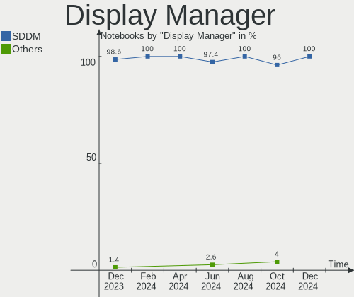

BlackPanther - Hardware Trends (Notebooks)
------------------------------------------

A project to identify most popular hardware characteristics and track their change
over time based on data collected by Linux users at https://Linux-Hardware.org.

Anyone can contribute to this report by the [hw-probe](https://github.com/linuxhw/hw-probe) tool:

    sudo -E hw-probe -all -upload

This report is for one last month. Overall report since the beginning of time: [TestDays](https://github.com/linuxhw/TestDays)

Period: Apr, 2023.

Contents
--------

* [ System ](#system)
  - [ OS                       ](#os)
  - [ OS Family                ](#os-family)
  - [ Kernel                   ](#kernel)
  - [ Kernel Family            ](#kernel-family)
  - [ Kernel Major Ver.        ](#kernel-major-ver)
  - [ Arch                     ](#arch)
  - [ DE                       ](#de)
  - [ Display Server           ](#display-server)
  - [ Display Manager          ](#display-manager)
  - [ OS Lang                  ](#os-lang)
  - [ Boot Mode                ](#boot-mode)
  - [ Filesystem               ](#filesystem)
  - [ Part. scheme             ](#part-scheme)
  - [ Dual Boot with Linux/BSD ](#dual-boot-with-linuxbsd)
  - [ Dual Boot (Win)          ](#dual-boot-win)

* [ Board ](#board)
  - [ Vendor                   ](#vendor)
  - [ Model                    ](#model)
  - [ Model Family             ](#model-family)
  - [ MFG Year                 ](#mfg-year)
  - [ Form Factor              ](#form-factor)
  - [ Secure Boot              ](#secure-boot)
  - [ Coreboot                 ](#coreboot)
  - [ RAM Size                 ](#ram-size)
  - [ RAM Used                 ](#ram-used)
  - [ Total Drives             ](#total-drives)
  - [ Has CD-ROM               ](#has-cd-rom)
  - [ Has Ethernet             ](#has-ethernet)
  - [ Has WiFi                 ](#has-wifi)
  - [ Has Bluetooth            ](#has-bluetooth)

* [ Location ](#location)
  - [ Country                  ](#country)
  - [ City                     ](#city)

* [ Drives ](#drives)
  - [ Drive Vendor             ](#drive-vendor)
  - [ Drive Model              ](#drive-model)
  - [ HDD Vendor               ](#hdd-vendor)
  - [ SSD Vendor               ](#ssd-vendor)
  - [ Drive Kind               ](#drive-kind)
  - [ Drive Connector          ](#drive-connector)
  - [ Drive Size               ](#drive-size)
  - [ Space Total              ](#space-total)
  - [ Space Used               ](#space-used)
  - [ Malfunc. Drives          ](#malfunc-drives)
  - [ Malfunc. Drive Vendor    ](#malfunc-drive-vendor)
  - [ Malfunc. HDD Vendor      ](#malfunc-hdd-vendor)
  - [ Malfunc. Drive Kind      ](#malfunc-drive-kind)
  - [ Failed Drives            ](#failed-drives)
  - [ Failed Drive Vendor      ](#failed-drive-vendor)
  - [ Drive Status             ](#drive-status)

* [ Storage controller ](#storage-controller)
  - [ Storage Vendor           ](#storage-vendor)
  - [ Storage Model            ](#storage-model)
  - [ Storage Kind             ](#storage-kind)

* [ Processor ](#processor)
  - [ CPU Vendor               ](#cpu-vendor)
  - [ CPU Model                ](#cpu-model)
  - [ CPU Model Family         ](#cpu-model-family)
  - [ CPU Cores                ](#cpu-cores)
  - [ CPU Sockets              ](#cpu-sockets)
  - [ CPU Threads              ](#cpu-threads)
  - [ CPU Op-Modes             ](#cpu-op-modes)
  - [ CPU Microcode            ](#cpu-microcode)
  - [ CPU Microarch            ](#cpu-microarch)

* [ Graphics ](#graphics)
  - [ GPU Vendor               ](#gpu-vendor)
  - [ GPU Model                ](#gpu-model)
  - [ GPU Combo                ](#gpu-combo)
  - [ GPU Driver               ](#gpu-driver)
  - [ GPU Memory               ](#gpu-memory)

* [ Monitor ](#monitor)
  - [ Monitor Vendor           ](#monitor-vendor)
  - [ Monitor Model            ](#monitor-model)
  - [ Monitor Resolution       ](#monitor-resolution)
  - [ Monitor Diagonal         ](#monitor-diagonal)
  - [ Monitor Width            ](#monitor-width)
  - [ Aspect Ratio             ](#aspect-ratio)
  - [ Monitor Area             ](#monitor-area)
  - [ Pixel Density            ](#pixel-density)
  - [ Multiple Monitors        ](#multiple-monitors)

* [ Network ](#network)
  - [ Net Controller Vendor    ](#net-controller-vendor)
  - [ Net Controller Model     ](#net-controller-model)
  - [ Wireless Vendor          ](#wireless-vendor)
  - [ Wireless Model           ](#wireless-model)
  - [ Ethernet Vendor          ](#ethernet-vendor)
  - [ Ethernet Model           ](#ethernet-model)
  - [ Net Controller Kind      ](#net-controller-kind)
  - [ Used Controller          ](#used-controller)
  - [ NICs                     ](#nics)
  - [ IPv6                     ](#ipv6)

* [ Bluetooth ](#bluetooth)
  - [ Bluetooth Vendor         ](#bluetooth-vendor)
  - [ Bluetooth Model          ](#bluetooth-model)

* [ Sound ](#sound)
  - [ Sound Vendor             ](#sound-vendor)
  - [ Sound Model              ](#sound-model)

* [ Memory ](#memory)
  - [ Memory Vendor            ](#memory-vendor)
  - [ Memory Model             ](#memory-model)
  - [ Memory Kind              ](#memory-kind)
  - [ Memory Form Factor       ](#memory-form-factor)
  - [ Memory Size              ](#memory-size)
  - [ Memory Speed             ](#memory-speed)

* [ Printers & scanners ](#printers--scanners)
  - [ Printer Vendor           ](#printer-vendor)
  - [ Printer Model            ](#printer-model)
  - [ Scanner Vendor           ](#scanner-vendor)
  - [ Scanner Model            ](#scanner-model)

* [ Camera ](#camera)
  - [ Camera Vendor            ](#camera-vendor)
  - [ Camera Model             ](#camera-model)

* [ Security ](#security)
  - [ Fingerprint Vendor       ](#fingerprint-vendor)
  - [ Fingerprint Model        ](#fingerprint-model)
  - [ Chipcard Vendor          ](#chipcard-vendor)
  - [ Chipcard Model           ](#chipcard-model)

* [ Unsupported ](#unsupported)
  - [ Unsupported Devices      ](#unsupported-devices)
  - [ Unsupported Device Types ](#unsupported-device-types)

System
------

OS
--

Installed operating systems

| Name              | Notebooks | Percent |
|-------------------|-----------|---------|
| BlackPanther 18.1 | 20        | 95.24%  |
| BlackPanther 16.2 | 1         | 4.76%   |

OS Family
---------

OS without a version

| Name         | Notebooks | Percent |
|--------------|-----------|---------|
| BlackPanther | 21        | 100%    |

Kernel
------

Version of the Linux kernel

| Version                | Notebooks | Percent |
|------------------------|-----------|---------|
| 5.6.14-desktop-2bP     | 12        | 57.14%  |
| 4.18.16-desktop-1bP    | 8         | 38.1%   |
| 4.9.20-desktop-pae-1bP | 1         | 4.76%   |

Kernel Family
-------------

Linux kernel without a distro release

| Version | Notebooks | Percent |
|---------|-----------|---------|
| 5.6.14  | 12        | 57.14%  |
| 4.18.16 | 8         | 38.1%   |
| 4.9.20  | 1         | 4.76%   |

Kernel Major Ver.
-----------------

Linux kernel major version

| Version | Notebooks | Percent |
|---------|-----------|---------|
| 5.6     | 12        | 57.14%  |
| 4.18    | 8         | 38.1%   |
| 4.9     | 1         | 4.76%   |

Arch
----

OS architecture (x86_64, i586, etc.)

| Name   | Notebooks | Percent |
|--------|-----------|---------|
| x86_64 | 20        | 95.24%  |
| i686   | 1         | 4.76%   |

DE
--

Desktop Environment

| Name | Notebooks | Percent |
|------|-----------|---------|
| KDE5 | 21        | 100%    |

Display Server
--------------

X11 or Wayland

| Name | Notebooks | Percent |
|------|-----------|---------|
| X11  | 21        | 100%    |

Display Manager
---------------

SDDM, LightDM, etc.

| Name | Notebooks | Percent |
|------|-----------|---------|
| SDDM | 21        | 100%    |

OS Lang
-------

Language

| Lang    | Notebooks | Percent |
|---------|-----------|---------|
| Unknown | 21        | 100%    |

Boot Mode
---------

EFI or BIOS

| Mode | Notebooks | Percent |
|------|-----------|---------|
| BIOS | 12        | 57.14%  |
| EFI  | 9         | 42.86%  |

Filesystem
----------

Type of filesystem

| Type    | Notebooks | Percent |
|---------|-----------|---------|
| Overlay | 17        | 80.95%  |
| Ext4    | 4         | 19.05%  |

Part. scheme
------------

Scheme of partitioning

| Type | Notebooks | Percent |
|------|-----------|---------|
| GPT  | 13        | 61.9%   |
| MBR  | 8         | 38.1%   |

Dual Boot with Linux/BSD
------------------------

Hosting more than one Linux/BSD

| Dual boot | Notebooks | Percent |
|-----------|-----------|---------|
| Yes       | 13        | 61.9%   |
| No        | 8         | 38.1%   |

Dual Boot (Win)
---------------

Hosting Linux and Windows

| Dual boot | Notebooks | Percent |
|-----------|-----------|---------|
| No        | 12        | 57.14%  |
| Yes       | 9         | 42.86%  |

Board
-----

Vendor
------

Motherboard manufacturer

| Name                | Notebooks | Percent |
|---------------------|-----------|---------|
| Dell                | 5         | 23.81%  |
| Lenovo              | 4         | 19.05%  |
| Hewlett-Packard     | 2         | 9.52%   |
| eMachines           | 2         | 9.52%   |
| Toshiba             | 1         | 4.76%   |
| THD                 | 1         | 4.76%   |
| Sony                | 1         | 4.76%   |
| Samsung Electronics | 1         | 4.76%   |
| MSI                 | 1         | 4.76%   |
| Fujitsu             | 1         | 4.76%   |
| ASUSTek Computer    | 1         | 4.76%   |
| Acer                | 1         | 4.76%   |

Model
-----

Motherboard model

| Name                                        | Notebooks | Percent |
|---------------------------------------------|-----------|---------|
| eMachines E725                              | 2         | 9.52%   |
| Toshiba Satellite M50D-A                    | 1         | 4.76%   |
| THD PX1                                     | 1         | 4.76%   |
| Sony VPCS13V9E                              | 1         | 4.76%   |
| Samsung RV411/RV511/E3511/S3511/RV711/E3411 | 1         | 4.76%   |
| MSI GT60 2OC/2OD                            | 1         | 4.76%   |
| Lenovo ThinkPad T420 4236W8L                | 1         | 4.76%   |
| Lenovo ThinkPad T420 4236B87                | 1         | 4.76%   |
| Lenovo ThinkPad T400 2768WGB                | 1         | 4.76%   |
| Lenovo IdeaPad Y700-15ISK 80NV              | 1         | 4.76%   |
| HP ProBook 640 G8 Notebook PC               | 1         | 4.76%   |
| HP Notebook                                 | 1         | 4.76%   |
| Fujitsu LIFEBOOK U745                       | 1         | 4.76%   |
| Dell Latitude E6230                         | 1         | 4.76%   |
| Dell Latitude E5410                         | 1         | 4.76%   |
| Dell Latitude D630                          | 1         | 4.76%   |
| Dell Inspiron M5030                         | 1         | 4.76%   |
| Dell Inspiron 5558                          | 1         | 4.76%   |
| ASUS VivoBook_ASUS Laptop E406MAS_E406MA    | 1         | 4.76%   |
| Acer Aspire 5110                            | 1         | 4.76%   |

Model Family
------------

Motherboard model prefix

| Name              | Notebooks | Percent |
|-------------------|-----------|---------|
| Lenovo ThinkPad   | 3         | 14.29%  |
| Dell Latitude     | 3         | 14.29%  |
| eMachines E725    | 2         | 9.52%   |
| Dell Inspiron     | 2         | 9.52%   |
| Toshiba Satellite | 1         | 4.76%   |
| THD PX1           | 1         | 4.76%   |
| Sony VPCS13V9E    | 1         | 4.76%   |
| Samsung RV411     | 1         | 4.76%   |
| MSI GT60          | 1         | 4.76%   |
| Lenovo IdeaPad    | 1         | 4.76%   |
| HP ProBook        | 1         | 4.76%   |
| HP Notebook       | 1         | 4.76%   |
| Fujitsu LIFEBOOK  | 1         | 4.76%   |
| ASUS VivoBook     | 1         | 4.76%   |
| Acer Aspire       | 1         | 4.76%   |

MFG Year
--------

Motherboard manufacture year

| Year | Notebooks | Percent |
|------|-----------|---------|
| 2010 | 4         | 19.05%  |
| 2011 | 3         | 14.29%  |
| 2015 | 2         | 9.52%   |
| 2013 | 2         | 9.52%   |
| 2009 | 2         | 9.52%   |
| 2007 | 2         | 9.52%   |
| 2021 | 1         | 4.76%   |
| 2019 | 1         | 4.76%   |
| 2018 | 1         | 4.76%   |
| 2014 | 1         | 4.76%   |
| 2012 | 1         | 4.76%   |
| 2008 | 1         | 4.76%   |

Form Factor
-----------

Physical design of the computer

| Name     | Notebooks | Percent |
|----------|-----------|---------|
| Notebook | 21        | 100%    |

Secure Boot
-----------

Enabled or disabled

| State    | Notebooks | Percent |
|----------|-----------|---------|
| Disabled | 21        | 100%    |

Coreboot
--------

Have coreboot on board

| Used | Notebooks | Percent |
|------|-----------|---------|
| No   | 21        | 100%    |

RAM Size
--------

Total RAM memory

| Size in GB | Notebooks | Percent |
|------------|-----------|---------|
| 4.01-8.0   | 9         | 42.86%  |
| 3.01-4.0   | 7         | 33.33%  |
| 1.01-2.0   | 4         | 19.05%  |
| 8.01-16.0  | 1         | 4.76%   |

RAM Used
--------

Used RAM memory

| Used GB  | Notebooks | Percent |
|----------|-----------|---------|
| 0.51-1.0 | 14        | 66.67%  |
| 1.01-2.0 | 6         | 28.57%  |
| 0.01-0.5 | 1         | 4.76%   |

Total Drives
------------

Number of drives on board

| Drives | Notebooks | Percent |
|--------|-----------|---------|
| 1      | 16        | 76.19%  |
| 2      | 5         | 23.81%  |

Has CD-ROM
----------

Has CD-ROM on board

| Presented | Notebooks | Percent |
|-----------|-----------|---------|
| Yes       | 15        | 71.43%  |
| No        | 6         | 28.57%  |

Has Ethernet
------------

Has Ethernet on board

| Presented | Notebooks | Percent |
|-----------|-----------|---------|
| Yes       | 19        | 90.48%  |
| No        | 2         | 9.52%   |

Has WiFi
--------

Has WiFi module

| Presented | Notebooks | Percent |
|-----------|-----------|---------|
| Yes       | 21        | 100%    |

Has Bluetooth
-------------

Has Bluetooth module

| Presented | Notebooks | Percent |
|-----------|-----------|---------|
| Yes       | 13        | 61.9%   |
| No        | 8         | 38.1%   |

Location
--------

Country
-------

Geographic location (country)

| Country   | Notebooks | Percent |
|-----------|-----------|---------|
| Hungary   | 17        | 80.95%  |
| UK        | 1         | 4.76%   |
| Slovakia  | 1         | 4.76%   |
| Romania   | 1         | 4.76%   |
| Argentina | 1         | 4.76%   |

City
----

Geographic location (city)

| City             | Notebooks | Percent |
|------------------|-----------|---------|
| Tatabánya       | 2         | 9.52%   |
| Szajol           | 2         | 9.52%   |
| Budapest         | 2         | 9.52%   |
| Turnu Magurele   | 1         | 4.76%   |
| Tornaľa         | 1         | 4.76%   |
| Tengelic         | 1         | 4.76%   |
| Szolnok          | 1         | 4.76%   |
| Szentes          | 1         | 4.76%   |
| Morahalom        | 1         | 4.76%   |
| Kisvarda         | 1         | 4.76%   |
| Harlow           | 1         | 4.76%   |
| Győr            | 1         | 4.76%   |
| Fertoszentmiklos | 1         | 4.76%   |
| Csanadpalota     | 1         | 4.76%   |
| Celldomolk       | 1         | 4.76%   |
| Berettyóújfalu | 1         | 4.76%   |
| Belen de Escobar | 1         | 4.76%   |
| Balassagyarmat   | 1         | 4.76%   |

Drives
------

Drive Vendor
------------

Hard drive vendors

| Vendor              | Notebooks | Drives | Percent |
|---------------------|-----------|--------|---------|
| Samsung Electronics | 5         | 5      | 21.74%  |
| WDC                 | 4         | 5      | 17.39%  |
| Unknown             | 2         | 3      | 8.7%    |
| Seagate             | 2         | 2      | 8.7%    |
| Kingston            | 2         | 2      | 8.7%    |
| Intenso             | 2         | 2      | 8.7%    |
| Toshiba             | 1         | 1      | 4.35%   |
| SSSTC               | 1         | 1      | 4.35%   |
| PNY                 | 1         | 1      | 4.35%   |
| Micron Technology   | 1         | 1      | 4.35%   |
| LITEON              | 1         | 1      | 4.35%   |
| CSD                 | 1         | 1      | 4.35%   |

Drive Model
-----------

Hard drive models

| Model                                | Notebooks | Percent |
|--------------------------------------|-----------|---------|
| Samsung SSD 750 EVO 250GB            | 2         | 8%      |
| WDC WD5000BPVT-24HXZT3 500GB         | 1         | 4%      |
| WDC WD3200BPVT-75ZEST0 320GB         | 1         | 4%      |
| WDC WD2500BEKT-75PVMT0 250GB         | 1         | 4%      |
| WDC WD10SPCX-24HWST1 1TB             | 1         | 4%      |
| WDC WD10JPLX-00MBPT0 1TB             | 1         | 4%      |
| Unknown SL16G  16GB                  | 1         | 4%      |
| Unknown SA08G  8GB                   | 1         | 4%      |
| Unknown DA4128  128GB                | 1         | 4%      |
| Toshiba MQ01ABF050 500GB             | 1         | 4%      |
| SSSTC CL1-8D256-HP 256GB             | 1         | 4%      |
| Seagate ST9100824AS 100GB            | 1         | 4%      |
| Seagate ST500LT012-1DG142 500GB      | 1         | 4%      |
| Samsung SSD 850 EVO 500GB            | 1         | 4%      |
| Samsung SSD 830 Series 128GB         | 1         | 4%      |
| Samsung MZ7LN256HCHP-00000 256GB SSD | 1         | 4%      |
| PNY CS900 120GB SSD                  | 1         | 4%      |
| Micron MTFDDAK256MAM-1K1 256GB SSD   | 1         | 4%      |
| LITEON CV1-8B128 128GB SSD           | 1         | 4%      |
| Kingston SV300S37A120G 120GB SSD     | 1         | 4%      |
| Kingston SA400S37240G 240GB SSD      | 1         | 4%      |
| Intenso SSD 128GB                    | 1         | 4%      |
| Intenso SSD 120GB                    | 1         | 4%      |
| CSD T52SX250 250GB                   | 1         | 4%      |

HDD Vendor
----------

Hard disk drive vendors

| Vendor  | Notebooks | Drives | Percent |
|---------|-----------|--------|---------|
| WDC     | 4         | 5      | 50%     |
| Seagate | 2         | 2      | 25%     |
| Toshiba | 1         | 1      | 12.5%   |
| CSD     | 1         | 1      | 12.5%   |

SSD Vendor
----------

Solid state drive vendors

| Vendor              | Notebooks | Drives | Percent |
|---------------------|-----------|--------|---------|
| Samsung Electronics | 5         | 5      | 41.67%  |
| Kingston            | 2         | 2      | 16.67%  |
| Intenso             | 2         | 2      | 16.67%  |
| PNY                 | 1         | 1      | 8.33%   |
| Micron Technology   | 1         | 1      | 8.33%   |
| LITEON              | 1         | 1      | 8.33%   |

Drive Kind
----------

HDD or SSD

| Kind | Notebooks | Drives | Percent |
|------|-----------|--------|---------|
| SSD  | 12        | 12     | 52.17%  |
| HDD  | 8         | 9      | 34.78%  |
| MMC  | 2         | 3      | 8.7%    |
| NVMe | 1         | 1      | 4.35%   |

Drive Connector
---------------

SATA, SAS, NVMe, etc.

| Type | Notebooks | Drives | Percent |
|------|-----------|--------|---------|
| SATA | 19        | 21     | 86.36%  |
| MMC  | 2         | 3      | 9.09%   |
| NVMe | 1         | 1      | 4.55%   |

Drive Size
----------

Size of hard drive

| Size in TB | Notebooks | Drives | Percent |
|------------|-----------|--------|---------|
| 0.01-0.5   | 19        | 19     | 90.48%  |
| 0.51-1.0   | 2         | 2      | 9.52%   |

Space Total
-----------

Amount of disk space available on the file system

| Size in GB | Notebooks | Percent |
|------------|-----------|---------|
| Unknown    | 17        | 80.95%  |
| 51-100     | 2         | 9.52%   |
| 21-50      | 1         | 4.76%   |
| 101-250    | 1         | 4.76%   |

Space Used
----------

Amount of used disk space

| Used GB | Notebooks | Percent |
|---------|-----------|---------|
| Unknown | 17        | 80.95%  |
| 1-20    | 4         | 19.05%  |

Malfunc. Drives
---------------

Drive models with a malfunction

| Model                                 | Notebooks | Drives | Percent |
|---------------------------------------|-----------|--------|---------|
| Samsung Electronics SSD 750 EVO 250GB | 2         | 2      | 22.22%  |
| WDC WD3200BPVT-75ZEST0 320GB          | 1         | 1      | 11.11%  |
| WDC WD2500BEKT-75PVMT0 250GB          | 1         | 1      | 11.11%  |
| WDC WD10JPLX-00MBPT0 1TB              | 1         | 1      | 11.11%  |
| Toshiba MQ01ABF050 500GB              | 1         | 1      | 11.11%  |
| Seagate ST9100824AS 100GB             | 1         | 1      | 11.11%  |
| Kingston SV300S37A120G 120GB SSD      | 1         | 1      | 11.11%  |
| CSD T52SX250 250GB                    | 1         | 1      | 11.11%  |

Malfunc. Drive Vendor
---------------------

Vendors of faulty drives

| Vendor              | Notebooks | Drives | Percent |
|---------------------|-----------|--------|---------|
| WDC                 | 3         | 3      | 33.33%  |
| Samsung Electronics | 2         | 2      | 22.22%  |
| Toshiba             | 1         | 1      | 11.11%  |
| Seagate             | 1         | 1      | 11.11%  |
| Kingston            | 1         | 1      | 11.11%  |
| CSD                 | 1         | 1      | 11.11%  |

Malfunc. HDD Vendor
-------------------

Vendors of faulty HDD drives

| Vendor  | Notebooks | Drives | Percent |
|---------|-----------|--------|---------|
| WDC     | 3         | 3      | 50%     |
| Toshiba | 1         | 1      | 16.67%  |
| Seagate | 1         | 1      | 16.67%  |
| CSD     | 1         | 1      | 16.67%  |

Malfunc. Drive Kind
-------------------

Kinds of faulty drives

| Kind | Notebooks | Drives | Percent |
|------|-----------|--------|---------|
| HDD  | 6         | 6      | 66.67%  |
| SSD  | 3         | 3      | 33.33%  |

Failed Drives
-------------

Failed drive models

Zero info for selected period =(

Failed Drive Vendor
-------------------

Failed drive vendors

Zero info for selected period =(

Drive Status
------------

Number of failed and malfunc. drives

| Status   | Notebooks | Drives | Percent |
|----------|-----------|--------|---------|
| Works    | 12        | 13     | 52.17%  |
| Malfunc  | 9         | 9      | 39.13%  |
| Detected | 2         | 3      | 8.7%    |

Storage controller
------------------

Storage Vendor
--------------

Storage controller vendors

| Vendor                         | Notebooks | Percent |
|--------------------------------|-----------|---------|
| Intel                          | 17        | 77.27%  |
| AMD                            | 4         | 18.18%  |
| Solid State Storage Technology | 1         | 4.55%   |

Storage Model
-------------

Storage controller models

| Model                                                                          | Notebooks | Percent |
|--------------------------------------------------------------------------------|-----------|---------|
| Intel 82801IBM/IEM (ICH9M/ICH9M-E) 4 port SATA Controller [AHCI mode]          | 3         | 11.54%  |
| Intel 5 Series/3400 Series Chipset 4 port SATA AHCI Controller                 | 3         | 11.54%  |
| Intel Wildcat Point-LP SATA Controller [AHCI Mode]                             | 2         | 7.69%   |
| Intel 6 Series/C200 Series Chipset Family 6 port Mobile SATA AHCI Controller   | 2         | 7.69%   |
| AMD FCH SATA Controller [AHCI mode]                                            | 2         | 7.69%   |
| Solid State Storage Non-Volatile memory controller                             | 1         | 3.85%   |
| Intel Volume Management Device NVMe RAID Controller                            | 1         | 3.85%   |
| Intel NM10/ICH7 Family SATA Controller [IDE mode]                              | 1         | 3.85%   |
| Intel HM170/QM170 Chipset SATA Controller [AHCI Mode]                          | 1         | 3.85%   |
| Intel Celeron/Pentium Silver Processor SATA Controller                         | 1         | 3.85%   |
| Intel 82801HM/HEM (ICH8M/ICH8M-E) SATA Controller [IDE mode]                   | 1         | 3.85%   |
| Intel 82801HM/HEM (ICH8M/ICH8M-E) IDE Controller                               | 1         | 3.85%   |
| Intel 82801 Mobile SATA Controller [RAID mode]                                 | 1         | 3.85%   |
| Intel 8 Series/C220 Series Chipset Family 6-port SATA Controller 1 [AHCI mode] | 1         | 3.85%   |
| AMD SB7x0/SB8x0/SB9x0 SATA Controller [IDE mode]                               | 1         | 3.85%   |
| AMD SB7x0/SB8x0/SB9x0 IDE Controller                                           | 1         | 3.85%   |
| AMD IXP SB4x0 Serial ATA Controller                                            | 1         | 3.85%   |
| AMD IXP SB4x0 IDE Controller                                                   | 1         | 3.85%   |
| AMD FCH IDE Controller                                                         | 1         | 3.85%   |

Storage Kind
------------

Kind of storage controller (IDE, SATA, NVMe, SAS, ...)

| Kind | Notebooks | Percent |
|------|-----------|---------|
| SATA | 16        | 66.67%  |
| IDE  | 5         | 20.83%  |
| RAID | 2         | 8.33%   |
| NVMe | 1         | 4.17%   |

Processor
---------

CPU Vendor
----------

Processor vendors

| Vendor | Notebooks | Percent |
|--------|-----------|---------|
| Intel  | 17        | 80.95%  |
| AMD    | 4         | 19.05%  |

CPU Model
---------

Processor models

| Model                                        | Notebooks | Percent |
|----------------------------------------------|-----------|---------|
| Intel Pentium Dual-Core CPU T4400 @ 2.20GHz  | 2         | 9.52%   |
| Intel Pentium Silver N5000 CPU @ 1.10GHz     | 1         | 4.76%   |
| Intel Core i7-6700HQ CPU @ 2.60GHz           | 1         | 4.76%   |
| Intel Core i7-5600U CPU @ 2.60GHz            | 1         | 4.76%   |
| Intel Core i7-4700MQ CPU @ 2.40GHz           | 1         | 4.76%   |
| Intel Core i5-5200U CPU @ 2.20GHz            | 1         | 4.76%   |
| Intel Core i5-3340M CPU @ 2.70GHz            | 1         | 4.76%   |
| Intel Core i5-2540M CPU @ 2.60GHz            | 1         | 4.76%   |
| Intel Core i5-2520M CPU @ 2.50GHz            | 1         | 4.76%   |
| Intel Core i5 CPU M 520 @ 2.40GHz            | 1         | 4.76%   |
| Intel Core i5 CPU M 460 @ 2.53GHz            | 1         | 4.76%   |
| Intel Core i3 CPU M 380 @ 2.53GHz            | 1         | 4.76%   |
| Intel Core 2 Duo CPU T7250 @ 2.00GHz         | 1         | 4.76%   |
| Intel Core 2 Duo CPU P8600 @ 2.40GHz         | 1         | 4.76%   |
| Intel Atom CPU N455 @ 1.66GHz                | 1         | 4.76%   |
| Intel 11th Gen Core i3-1115G4 @ 3.00GHz      | 1         | 4.76%   |
| AMD V160 Processor                           | 1         | 4.76%   |
| AMD Turion 64 X2 Mobile Technology TL-52     | 1         | 4.76%   |
| AMD A8-7050 Radeon R5, 6 Compute Cores 2C+4G | 1         | 4.76%   |
| AMD A4-5000 APU with Radeon HD Graphics      | 1         | 4.76%   |

CPU Model Family
----------------

Processor model prefix

| Model                   | Notebooks | Percent |
|-------------------------|-----------|---------|
| Intel Core i5           | 6         | 28.57%  |
| Intel Core i7           | 3         | 14.29%  |
| Intel Pentium Dual-Core | 2         | 9.52%   |
| Intel Core 2 Duo        | 2         | 9.52%   |
| Other                   | 1         | 4.76%   |
| Intel Pentium Silver    | 1         | 4.76%   |
| Intel Core i3           | 1         | 4.76%   |
| Intel Atom              | 1         | 4.76%   |
| AMD V160                | 1         | 4.76%   |
| AMD Turion 64 X2 Mobile | 1         | 4.76%   |
| AMD A8                  | 1         | 4.76%   |
| AMD A4                  | 1         | 4.76%   |

CPU Cores
---------

Number of processor cores

| Number | Notebooks | Percent |
|--------|-----------|---------|
| 2      | 12        | 57.14%  |
| 1      | 5         | 23.81%  |
| 4      | 4         | 19.05%  |

CPU Sockets
-----------

Number of sockets

| Number | Notebooks | Percent |
|--------|-----------|---------|
| 1      | 21        | 100%    |

CPU Threads
-----------

Threads per core (Hyper-Threading)

| Number | Notebooks | Percent |
|--------|-----------|---------|
| 2      | 12        | 57.14%  |
| 1      | 9         | 42.86%  |

CPU Op-Modes
------------

CPU Operation Modes (32-bit, 64-bit)

| Op mode        | Notebooks | Percent |
|----------------|-----------|---------|
| 32-bit, 64-bit | 21        | 100%    |

CPU Microcode
-------------

Microcode number

| Number     | Notebooks | Percent |
|------------|-----------|---------|
| 0x1067a    | 3         | 14.29%  |
| 0x306d4    | 2         | 9.52%   |
| 0x206a7    | 2         | 9.52%   |
| 0x20655    | 2         | 9.52%   |
| 0x806c1    | 1         | 4.76%   |
| 0x706a1    | 1         | 4.76%   |
| 0x6fd      | 1         | 4.76%   |
| 0x506e3    | 1         | 4.76%   |
| 0x306c3    | 1         | 4.76%   |
| 0x306a9    | 1         | 4.76%   |
| 0x20652    | 1         | 4.76%   |
| 0x106ca    | 1         | 4.76%   |
| 0x0700010f | 1         | 4.76%   |
| 0x06003109 | 1         | 4.76%   |
| 0x010000c8 | 1         | 4.76%   |
| Unknown    | 1         | 4.76%   |

CPU Microarch
-------------

Microarchitecture

| Name          | Notebooks | Percent |
|---------------|-----------|---------|
| Westmere      | 3         | 14.29%  |
| Penryn        | 3         | 14.29%  |
| SandyBridge   | 2         | 9.52%   |
| Broadwell     | 2         | 9.52%   |
| TigerLake     | 1         | 4.76%   |
| Steamroller   | 1         | 4.76%   |
| Skylake       | 1         | 4.76%   |
| K8 Hammer     | 1         | 4.76%   |
| K10           | 1         | 4.76%   |
| Jaguar        | 1         | 4.76%   |
| IvyBridge     | 1         | 4.76%   |
| Haswell       | 1         | 4.76%   |
| Goldmont plus | 1         | 4.76%   |
| Core          | 1         | 4.76%   |
| Bonnell       | 1         | 4.76%   |

Graphics
--------

GPU Vendor
----------

Vendors of graphics cards

| Vendor | Notebooks | Percent |
|--------|-----------|---------|
| Intel  | 14        | 58.33%  |
| Nvidia | 5         | 20.83%  |
| AMD    | 5         | 20.83%  |

GPU Model
---------

Graphics card models

| Model                                                                     | Notebooks | Percent |
|---------------------------------------------------------------------------|-----------|---------|
| Intel Mobile 4 Series Chipset Integrated Graphics Controller              | 2         | 8%      |
| Intel HD Graphics 5500                                                    | 2         | 8%      |
| Intel 2nd Generation Core Processor Family Integrated Graphics Controller | 2         | 8%      |
| Nvidia GT218M [GeForce 315M]                                              | 1         | 4%      |
| Nvidia GT218M [GeForce 310M]                                              | 1         | 4%      |
| Nvidia GM107M [GeForce GTX 960M]                                          | 1         | 4%      |
| Nvidia GK208BM [GeForce 920M]                                             | 1         | 4%      |
| Nvidia GK106M [GeForce GTX 770M]                                          | 1         | 4%      |
| Intel Tiger Lake-LP GT2 [UHD Graphics G4]                                 | 1         | 4%      |
| Intel Mobile GM965/GL960 Integrated Graphics Controller (secondary)       | 1         | 4%      |
| Intel Mobile GM965/GL960 Integrated Graphics Controller (primary)         | 1         | 4%      |
| Intel HD Graphics 530                                                     | 1         | 4%      |
| Intel GeminiLake [UHD Graphics 605]                                       | 1         | 4%      |
| Intel Core Processor Integrated Graphics Controller                       | 1         | 4%      |
| Intel Atom Processor D4xx/D5xx/N4xx/N5xx Integrated Graphics Controller   | 1         | 4%      |
| Intel 4th Gen Core Processor Integrated Graphics Controller               | 1         | 4%      |
| Intel 3rd Gen Core processor Graphics Controller                          | 1         | 4%      |
| AMD RV620/M82 [Mobility Radeon HD 3450/3470]                              | 1         | 4%      |
| AMD RV530/M56-P [Mobility Radeon X1600]                                   | 1         | 4%      |
| AMD RS880M [Mobility Radeon HD 4225/4250]                                 | 1         | 4%      |
| AMD Kaveri [Radeon R5 Graphics]                                           | 1         | 4%      |
| AMD Kabini [Radeon HD 8330]                                               | 1         | 4%      |

GPU Combo
---------

Combinations of graphics cards

| Name           | Notebooks | Percent |
|----------------|-----------|---------|
| 1 x Intel      | 11        | 52.38%  |
| 1 x AMD        | 5         | 23.81%  |
| Intel + Nvidia | 3         | 14.29%  |
| 1 x Nvidia     | 2         | 9.52%   |

GPU Driver
----------

Free vs proprietary

| Driver | Notebooks | Percent |
|--------|-----------|---------|
| Free   | 21        | 100%    |

GPU Memory
----------

Total video memory

| Size in GB | Notebooks | Percent |
|------------|-----------|---------|
| Unknown    | 11        | 52.38%  |
| 0.01-0.5   | 5         | 23.81%  |
| 0.51-1.0   | 2         | 9.52%   |
| 3.01-4.0   | 1         | 4.76%   |
| 2.01-3.0   | 1         | 4.76%   |
| 1.01-2.0   | 1         | 4.76%   |

Monitor
-------

Monitor Vendor
--------------

Monitor vendors

| Vendor              | Notebooks | Percent |
|---------------------|-----------|---------|
| Samsung Electronics | 7         | 33.33%  |
| AU Optronics        | 5         | 23.81%  |
| LG Display          | 3         | 14.29%  |
| Chimei Innolux      | 2         | 9.52%   |
| Sony                | 1         | 4.76%   |
| Quanta Display      | 1         | 4.76%   |
| PANDA               | 1         | 4.76%   |
| Lenovo              | 1         | 4.76%   |

Monitor Model
-------------

Monitor models

| Model                                                                 | Notebooks | Percent |
|-----------------------------------------------------------------------|-----------|---------|
| Samsung Electronics LCD Monitor SEC5441 1366x768 344x194mm 15.5-inch  | 2         | 9.52%   |
| AU Optronics LCD Monitor AUO213E 1600x900 309x174mm 14.0-inch         | 2         | 9.52%   |
| AU Optronics LCD Monitor AUO10EC 1366x768 344x193mm 15.5-inch         | 2         | 9.52%   |
| Sony NvidiaDefault SNY05FA 1366x768 290x170mm 13.2-inch               | 1         | 4.76%   |
| Samsung Electronics LCD Monitor SEC384A 1366x768 344x194mm 15.5-inch  | 1         | 4.76%   |
| Samsung Electronics LCD Monitor SEC3157 1280x800 303x190mm 14.1-inch  | 1         | 4.76%   |
| Samsung Electronics LCD Monitor SDC4147 1366x768 344x194mm 15.5-inch  | 1         | 4.76%   |
| Samsung Electronics LCD Monitor SDC3752 1920x1080 344x194mm 15.5-inch | 1         | 4.76%   |
| Samsung Electronics LCD Monitor SAM0900 1366x768 410x230mm 18.5-inch  | 1         | 4.76%   |
| Quanta Display LCD Monitor QDS0041 1280x800 331x207mm 15.4-inch       | 1         | 4.76%   |
| PANDA LCD Monitor NCP0065 1920x1080 309x174mm 14.0-inch               | 1         | 4.76%   |
| LG Display LCD Monitor LGD05AB 1920x1080 309x174mm 14.0-inch          | 1         | 4.76%   |
| LG Display LCD Monitor LGD036C 1366x768 277x156mm 12.5-inch           | 1         | 4.76%   |
| LG Display LCD Monitor LGD0259 1920x1080 345x194mm 15.6-inch          | 1         | 4.76%   |
| Lenovo LCD Monitor LEN4036 1440x900 304x190mm 14.1-inch               | 1         | 4.76%   |
| Chimei Innolux LCD Monitor CMN1733 1600x900 382x215mm 17.3-inch       | 1         | 4.76%   |
| Chimei Innolux LCD Monitor CMN14C3 1366x768 309x173mm 13.9-inch       | 1         | 4.76%   |
| AU Optronics LCD Monitor AUO40EC 1366x768 344x193mm 15.5-inch         | 1         | 4.76%   |

Monitor Resolution
------------------

Monitor screen resolution

| Resolution       | Notebooks | Percent |
|------------------|-----------|---------|
| 1366x768 (WXGA)  | 9         | 45%     |
| 1920x1080 (FHD)  | 4         | 20%     |
| 1600x900 (HD+)   | 3         | 15%     |
| 1440x900 (WXGA+) | 2         | 10%     |
| 3840x2160 (4K)   | 1         | 5%      |
| 1280x800 (WXGA)  | 1         | 5%      |

Monitor Diagonal
----------------

Diagonal size in inches

| Inches | Notebooks | Percent |
|--------|-----------|---------|
| 15     | 11        | 52.38%  |
| 14     | 6         | 28.57%  |
| 31     | 1         | 4.76%   |
| 17     | 1         | 4.76%   |
| 13     | 1         | 4.76%   |
| 12     | 1         | 4.76%   |

Monitor Width
-------------

Physical width

| Width in mm | Notebooks | Percent |
|-------------|-----------|---------|
| 301-350     | 16        | 76.19%  |
| 351-400     | 3         | 14.29%  |
| 601-700     | 1         | 4.76%   |
| 201-300     | 1         | 4.76%   |

Aspect Ratio
------------

Proportional relationship between the width and the height

| Ratio | Notebooks | Percent |
|-------|-----------|---------|
| 16/9  | 17        | 85%     |
| 16/10 | 3         | 15%     |

Monitor Area
------------

Area in inch²

| Area in inch² | Notebooks | Percent |
|----------------|-----------|---------|
| 101-110        | 10        | 47.62%  |
| 81-90          | 7         | 33.33%  |
| 61-70          | 1         | 4.76%   |
| 351-500        | 1         | 4.76%   |
| 131-140        | 1         | 4.76%   |
| 91-100         | 1         | 4.76%   |

Pixel Density
-------------

Pixels per inch

| Density | Notebooks | Percent |
|---------|-----------|---------|
| 101-120 | 9         | 42.86%  |
| 121-160 | 8         | 38.1%   |
| 51-100  | 3         | 14.29%  |
| 1-50    | 1         | 4.76%   |

Multiple Monitors
-----------------

Total monitors connected

| Total | Notebooks | Percent |
|-------|-----------|---------|
| 1     | 20        | 95.24%  |
| 2     | 1         | 4.76%   |

Network
-------

Net Controller Vendor
---------------------

Controller vendors

| Vendor                            | Notebooks | Percent |
|-----------------------------------|-----------|---------|
| Intel                             | 11        | 33.33%  |
| Realtek Semiconductor             | 7         | 21.21%  |
| Qualcomm Atheros                  | 7         | 21.21%  |
| Broadcom                          | 3         | 9.09%   |
| Broadcom Limited                  | 2         | 6.06%   |
| TP-Link                           | 1         | 3.03%   |
| Ralink Technology                 | 1         | 3.03%   |
| Ericsson Business Mobile Networks | 1         | 3.03%   |

Net Controller Model
--------------------

Controller models

| Model                                                             | Notebooks | Percent |
|-------------------------------------------------------------------|-----------|---------|
| Realtek RTL810xE PCI Express Fast Ethernet controller             | 3         | 6.82%   |
| Intel 82579LM Gigabit Network Connection (Lewisville)             | 3         | 6.82%   |
| Realtek RTL8111/8168/8411 PCI Express Gigabit Ethernet Controller | 2         | 4.55%   |
| Qualcomm Atheros AR9285 Wireless Network Adapter (PCI-Express)    | 2         | 4.55%   |
| Qualcomm Atheros AR8132 Fast Ethernet                             | 2         | 4.55%   |
| Intel Centrino Advanced-N 6205 [Taylor Peak]                      | 2         | 4.55%   |
| Broadcom Limited BCM4312 802.11b/g LP-PHY                         | 2         | 4.55%   |
| Broadcom BCM4313 802.11bgn Wireless Network Adapter               | 2         | 4.55%   |
| TP-Link TL-WN722N v2/v3 [Realtek RTL8188EUS]                      | 1         | 2.27%   |
| Realtek RTL8723BE PCIe Wireless Network Adapter                   | 1         | 2.27%   |
| Realtek RTL8191SEvB Wireless LAN Controller                       | 1         | 2.27%   |
| Realtek RTL8188EUS 802.11n Wireless Network Adapter               | 1         | 2.27%   |
| Realtek RTL8169 PCI Gigabit Ethernet Controller                   | 1         | 2.27%   |
| Ralink MT7601U Wireless Adapter                                   | 1         | 2.27%   |
| Qualcomm Atheros QCA9565 / AR9565 Wireless Network Adapter        | 1         | 2.27%   |
| Qualcomm Atheros Killer E220x Gigabit Ethernet Controller         | 1         | 2.27%   |
| Qualcomm Atheros AR9462 Wireless Network Adapter                  | 1         | 2.27%   |
| Qualcomm Atheros AR8152 v2.0 Fast Ethernet                        | 1         | 2.27%   |
| Qualcomm Atheros AR8131 Gigabit Ethernet                          | 1         | 2.27%   |
| Intel Wireless 8260                                               | 1         | 2.27%   |
| Intel Wireless 7265                                               | 1         | 2.27%   |
| Intel Wireless 3160                                               | 1         | 2.27%   |
| Intel Wi-Fi 6 AX201                                               | 1         | 2.27%   |
| Intel PRO/Wireless 5100 AGN [Shiloh] Network Connection           | 1         | 2.27%   |
| Intel PRO/Wireless 3945ABG [Golan] Network Connection             | 1         | 2.27%   |
| Intel Gemini Lake PCH CNVi WiFi                                   | 1         | 2.27%   |
| Intel Ethernet Connection (3) I218-LM                             | 1         | 2.27%   |
| Intel Ethernet Connection (13) I219-V                             | 1         | 2.27%   |
| Intel Centrino Ultimate-N 6300                                    | 1         | 2.27%   |
| Intel Centrino Advanced-N 6200                                    | 1         | 2.27%   |
| Intel 82567LM Gigabit Network Connection                          | 1         | 2.27%   |
| Ericsson Business Mobile Networks F5521gw                         | 1         | 2.27%   |
| Broadcom NetXtreme BCM5761e Gigabit Ethernet PCIe                 | 1         | 2.27%   |
| Broadcom NetXtreme BCM5755M Gigabit Ethernet PCI Express          | 1         | 2.27%   |

Wireless Vendor
---------------

Wireless vendors

| Vendor                | Notebooks | Percent |
|-----------------------|-----------|---------|
| Intel                 | 11        | 45.83%  |
| Qualcomm Atheros      | 4         | 16.67%  |
| Realtek Semiconductor | 3         | 12.5%   |
| Broadcom Limited      | 2         | 8.33%   |
| Broadcom              | 2         | 8.33%   |
| TP-Link               | 1         | 4.17%   |
| Ralink Technology     | 1         | 4.17%   |

Wireless Model
--------------

Wireless models

| Model                                                          | Notebooks | Percent |
|----------------------------------------------------------------|-----------|---------|
| Qualcomm Atheros AR9285 Wireless Network Adapter (PCI-Express) | 2         | 8.33%   |
| Intel Centrino Advanced-N 6205 [Taylor Peak]                   | 2         | 8.33%   |
| Broadcom Limited BCM4312 802.11b/g LP-PHY                      | 2         | 8.33%   |
| Broadcom BCM4313 802.11bgn Wireless Network Adapter            | 2         | 8.33%   |
| TP-Link TL-WN722N v2/v3 [Realtek RTL8188EUS]                   | 1         | 4.17%   |
| Realtek RTL8723BE PCIe Wireless Network Adapter                | 1         | 4.17%   |
| Realtek RTL8191SEvB Wireless LAN Controller                    | 1         | 4.17%   |
| Realtek RTL8188EUS 802.11n Wireless Network Adapter            | 1         | 4.17%   |
| Ralink MT7601U Wireless Adapter                                | 1         | 4.17%   |
| Qualcomm Atheros QCA9565 / AR9565 Wireless Network Adapter     | 1         | 4.17%   |
| Qualcomm Atheros AR9462 Wireless Network Adapter               | 1         | 4.17%   |
| Intel Wireless 8260                                            | 1         | 4.17%   |
| Intel Wireless 7265                                            | 1         | 4.17%   |
| Intel Wireless 3160                                            | 1         | 4.17%   |
| Intel Wi-Fi 6 AX201                                            | 1         | 4.17%   |
| Intel PRO/Wireless 5100 AGN [Shiloh] Network Connection        | 1         | 4.17%   |
| Intel PRO/Wireless 3945ABG [Golan] Network Connection          | 1         | 4.17%   |
| Intel Gemini Lake PCH CNVi WiFi                                | 1         | 4.17%   |
| Intel Centrino Ultimate-N 6300                                 | 1         | 4.17%   |
| Intel Centrino Advanced-N 6200                                 | 1         | 4.17%   |

Ethernet Vendor
---------------

Ethernet vendors

| Vendor                | Notebooks | Percent |
|-----------------------|-----------|---------|
| Realtek Semiconductor | 6         | 31.58%  |
| Intel                 | 6         | 31.58%  |
| Qualcomm Atheros      | 5         | 26.32%  |
| Broadcom              | 2         | 10.53%  |

Ethernet Model
--------------

Ethernet models

| Model                                                             | Notebooks | Percent |
|-------------------------------------------------------------------|-----------|---------|
| Realtek RTL810xE PCI Express Fast Ethernet controller             | 3         | 15.79%  |
| Intel 82579LM Gigabit Network Connection (Lewisville)             | 3         | 15.79%  |
| Realtek RTL8111/8168/8411 PCI Express Gigabit Ethernet Controller | 2         | 10.53%  |
| Qualcomm Atheros AR8132 Fast Ethernet                             | 2         | 10.53%  |
| Realtek RTL8169 PCI Gigabit Ethernet Controller                   | 1         | 5.26%   |
| Qualcomm Atheros Killer E220x Gigabit Ethernet Controller         | 1         | 5.26%   |
| Qualcomm Atheros AR8152 v2.0 Fast Ethernet                        | 1         | 5.26%   |
| Qualcomm Atheros AR8131 Gigabit Ethernet                          | 1         | 5.26%   |
| Intel Ethernet Connection (3) I218-LM                             | 1         | 5.26%   |
| Intel Ethernet Connection (13) I219-V                             | 1         | 5.26%   |
| Intel 82567LM Gigabit Network Connection                          | 1         | 5.26%   |
| Broadcom NetXtreme BCM5761e Gigabit Ethernet PCIe                 | 1         | 5.26%   |
| Broadcom NetXtreme BCM5755M Gigabit Ethernet PCI Express          | 1         | 5.26%   |

Net Controller Kind
-------------------

Ethernet, WiFi or modem

| Kind     | Notebooks | Percent |
|----------|-----------|---------|
| WiFi     | 21        | 51.22%  |
| Ethernet | 19        | 46.34%  |
| Modem    | 1         | 2.44%   |

Used Controller
---------------

Currently used network controller

| Kind     | Notebooks | Percent |
|----------|-----------|---------|
| WiFi     | 20        | 86.96%  |
| Ethernet | 3         | 13.04%  |

NICs
----

Total network controllers on board

| Total | Notebooks | Percent |
|-------|-----------|---------|
| 2     | 19        | 90.48%  |
| 1     | 2         | 9.52%   |

IPv6
----

IPv6 vs IPv4

| Used | Notebooks | Percent |
|------|-----------|---------|
| No   | 16        | 76.19%  |
| Yes  | 5         | 23.81%  |

Bluetooth
---------

Bluetooth Vendor
----------------

Controller vendors

| Vendor                          | Notebooks | Percent |
|---------------------------------|-----------|---------|
| Intel                           | 5         | 38.46%  |
| Dell                            | 2         | 15.38%  |
| Broadcom                        | 2         | 15.38%  |
| Toshiba                         | 1         | 7.69%   |
| Realtek Semiconductor           | 1         | 7.69%   |
| Qualcomm Atheros Communications | 1         | 7.69%   |
| Foxconn / Hon Hai               | 1         | 7.69%   |

Bluetooth Model
---------------

Controller models

| Model                                                                               | Notebooks | Percent |
|-------------------------------------------------------------------------------------|-----------|---------|
| Intel Bluetooth wireless interface                                                  | 3         | 23.08%  |
| Toshiba Bluetooth Device                                                            | 1         | 7.69%   |
| Realtek Bluetooth Radio                                                             | 1         | 7.69%   |
| Qualcomm Atheros AR3012 Bluetooth 4.0                                               | 1         | 7.69%   |
| Intel Bluetooth 9460/9560 Jefferson Peak (JfP)                                      | 1         | 7.69%   |
| Intel AX201 Bluetooth                                                               | 1         | 7.69%   |
| Foxconn / Hon Hai Foxconn T77H114 BCM2070 [Single-Chip Bluetooth 2.1 + EDR Adapter] | 1         | 7.69%   |
| Dell Wireless 365 Bluetooth                                                         | 1         | 7.69%   |
| Dell Wireless 360 Bluetooth                                                         | 1         | 7.69%   |
| Broadcom BCM2070 Bluetooth Device                                                   | 1         | 7.69%   |
| Broadcom BCM2045B (BDC-2.1)                                                         | 1         | 7.69%   |

Sound
-----

Sound Vendor
------------

Sound card vendors

| Vendor | Notebooks | Percent |
|--------|-----------|---------|
| Intel  | 17        | 70.83%  |
| AMD    | 4         | 16.67%  |
| Nvidia | 3         | 12.5%   |

Sound Model
-----------

Sound card models

| Model                                                                      | Notebooks | Percent |
|----------------------------------------------------------------------------|-----------|---------|
| Intel 82801I (ICH9 Family) HD Audio Controller                             | 3         | 10.71%  |
| Intel 5 Series/3400 Series Chipset High Definition Audio                   | 3         | 10.71%  |
| Nvidia High Definition Audio Controller                                    | 2         | 7.14%   |
| Intel Wildcat Point-LP High Definition Audio Controller                    | 2         | 7.14%   |
| Intel Broadwell-U Audio Controller                                         | 2         | 7.14%   |
| Intel 6 Series/C200 Series Chipset Family High Definition Audio Controller | 2         | 7.14%   |
| AMD FCH Azalia Controller                                                  | 2         | 7.14%   |
| Nvidia GK208 HDMI/DP Audio Controller                                      | 1         | 3.57%   |
| Intel Tiger Lake-LP Smart Sound Technology Audio Controller                | 1         | 3.57%   |
| Intel NM10/ICH7 Family High Definition Audio Controller                    | 1         | 3.57%   |
| Intel Celeron/Pentium Silver Processor High Definition Audio               | 1         | 3.57%   |
| Intel 82801H (ICH8 Family) HD Audio Controller                             | 1         | 3.57%   |
| Intel 8 Series/C220 Series Chipset High Definition Audio Controller        | 1         | 3.57%   |
| Intel 7 Series/C216 Chipset Family High Definition Audio Controller        | 1         | 3.57%   |
| Intel 100 Series/C230 Series Chipset Family HD Audio Controller            | 1         | 3.57%   |
| AMD SBx00 Azalia (Intel HDA)                                               | 1         | 3.57%   |
| AMD Kaveri HDMI/DP Audio Controller                                        | 1         | 3.57%   |
| AMD Kabini HDMI/DP Audio                                                   | 1         | 3.57%   |
| AMD IXP SB4x0 High Definition Audio Controller                             | 1         | 3.57%   |

Memory
------

Memory Vendor
-------------

Memory module vendors

| Vendor              | Notebooks | Percent |
|---------------------|-----------|---------|
| SK hynix            | 7         | 29.17%  |
| Samsung Electronics | 6         | 25%     |
| Unknown             | 5         | 20.83%  |
| Micron Technology   | 3         | 12.5%   |
| Nanya Technology    | 2         | 8.33%   |
| Elpida              | 1         | 4.17%   |

Memory Model
------------

Memory module models

| Model                                                     | Notebooks | Percent |
|-----------------------------------------------------------|-----------|---------|
| Unknown RAM Module 2048MB SODIMM 800MT/s                  | 2         | 7.69%   |
| Samsung RAM M471B5173QH0-YK0 4GB SODIMM DDR3 1600MT/s     | 2         | 7.69%   |
| Unknown RAM Module 4096MB SODIMM DDR3                     | 1         | 3.85%   |
| Unknown RAM Module 2048MB SODIMM DDR2 667MT/s             | 1         | 3.85%   |
| Unknown RAM Module 2048MB SODIMM DDR2                     | 1         | 3.85%   |
| SK hynix RAM HYMP125S64CP8-Y5 2048MB SODIMM DDR 667MT/s   | 1         | 3.85%   |
| SK hynix RAM HMT451S6BFR8A-PB 4GB SODIMM DDR3 1600MT/s    | 1         | 3.85%   |
| SK hynix RAM HMT451S6AFR8A-PB 4GB SODIMM DDR3 1600MT/s    | 1         | 3.85%   |
| SK hynix RAM HMT351S6EFR8A-PB 4GB SODIMM DDR3 1600MT/s    | 1         | 3.85%   |
| SK hynix RAM HMT351S6CFR8C-H9 4096MB SODIMM DDR3 1333MT/s | 1         | 3.85%   |
| SK hynix RAM HMT125S6BFR8C-G7 2048MB SODIMM DDR3 1067MT/s | 1         | 3.85%   |
| SK hynix RAM HMA851S6AFR6N-UH 4GB SODIMM DDR4 2667MT/s    | 1         | 3.85%   |
| Samsung RAM Module 8192MB SODIMM DDR4 3200MT/s            | 1         | 3.85%   |
| Samsung RAM M471B5773DH0-CH9 2GB SODIMM DDR3 1600MT/s     | 1         | 3.85%   |
| Samsung RAM M471B5273CH0-CH9 4GB SODIMM DDR3 1334MT/s     | 1         | 3.85%   |
| Samsung RAM M471B5173EB0-YK0 4GB SODIMM DDR3 1600MT/s     | 1         | 3.85%   |
| Samsung RAM M471B5173BH0-YK0 4GB SODIMM DDR3 1600MT/s     | 1         | 3.85%   |
| Samsung RAM M471A5143DB0-CPB 4GB SODIMM DDR4 2133MT/s     | 1         | 3.85%   |
| Nanya RAM NT4GC64C88B1NS-DI 4096MB SODIMM DDR3 1600MT/s   | 1         | 3.85%   |
| Nanya RAM NT2GC64B88B0NS-CG 2GB SODIMM DDR3 1334MT/s      | 1         | 3.85%   |
| Micron RAM Module 4096MB SODIMM DDR3 1600MT/s             | 1         | 3.85%   |
| Micron RAM 8KTF51264HZ-1G6N1 4096MB SODIMM DDR3 1600MT/s  | 1         | 3.85%   |
| Micron RAM 8JSF25664HZ-1G4D1 2GB SODIMM DDR3 1334MT/s     | 1         | 3.85%   |
| Elpida RAM EBJ21UE8BFU0-DJ-F 2048MB SODIMM DDR3 1334MT/s  | 1         | 3.85%   |

Memory Kind
-----------

Memory module kinds

| Kind    | Notebooks | Percent |
|---------|-----------|---------|
| DDR3    | 13        | 61.9%   |
| DDR2    | 3         | 14.29%  |
| DDR4    | 2         | 9.52%   |
| Unknown | 2         | 9.52%   |
| LPDDR4  | 1         | 4.76%   |

Memory Form Factor
------------------

Physical design of the memory module

| Name   | Notebooks | Percent |
|--------|-----------|---------|
| SODIMM | 21        | 100%    |

Memory Size
-----------

Memory module size

| Size | Notebooks | Percent |
|------|-----------|---------|
| 4096 | 11        | 50%     |
| 2048 | 9         | 40.91%  |
| 8192 | 2         | 9.09%   |

Memory Speed
------------

Memory module speed

| Speed   | Notebooks | Percent |
|---------|-----------|---------|
| 1600    | 7         | 33.33%  |
| 1334    | 3         | 14.29%  |
| 800     | 2         | 9.52%   |
| 667     | 2         | 9.52%   |
| Unknown | 2         | 9.52%   |
| 3200    | 1         | 4.76%   |
| 2667    | 1         | 4.76%   |
| 2133    | 1         | 4.76%   |
| 1333    | 1         | 4.76%   |
| 1067    | 1         | 4.76%   |

Printers & scanners
-------------------

Printer Vendor
--------------

Printer device vendors

Zero info for selected period =(

Printer Model
-------------

Printer device models

Zero info for selected period =(

Scanner Vendor
--------------

Scanner device vendors

Zero info for selected period =(

Scanner Model
-------------

Scanner device models

Zero info for selected period =(

Camera
------

Camera Vendor
-------------

Camera device vendors

| Vendor                                 | Notebooks | Percent |
|----------------------------------------|-----------|---------|
| Suyin                                  | 3         | 16.67%  |
| Microdia                               | 3         | 16.67%  |
| Realtek Semiconductor                  | 2         | 11.11%  |
| Chicony Electronics                    | 2         | 11.11%  |
| Silicon Motion                         | 1         | 5.56%   |
| Samsung Electronics                    | 1         | 5.56%   |
| Ricoh                                  | 1         | 5.56%   |
| Quanta                                 | 1         | 5.56%   |
| Lenovo                                 | 1         | 5.56%   |
| Intel                                  | 1         | 5.56%   |
| IMC Networks                           | 1         | 5.56%   |
| Cheng Uei Precision Industry (Foxlink) | 1         | 5.56%   |

Camera Model
------------

Camera device models

| Model                                            | Notebooks | Percent |
|--------------------------------------------------|-----------|---------|
| Suyin Acer/HP Integrated Webcam [CN0314]         | 2         | 11.11%  |
| Chicony integrated camera                        | 2         | 11.11%  |
| Suyin Integrated_Webcam_HD                       | 1         | 5.56%   |
| Silicon Motion WebCam SC-0311139N                | 1         | 5.56%   |
| Samsung Galaxy series, misc. (MTP mode)          | 1         | 5.56%   |
| Ricoh Sony Visual Communication Camera           | 1         | 5.56%   |
| Realtek FJ Camera                                | 1         | 5.56%   |
| Realtek 2SF022                                   | 1         | 5.56%   |
| Quanta HP HD Camera                              | 1         | 5.56%   |
| Microdia Integrated Webcam                       | 1         | 5.56%   |
| Microdia HP Integrated Webcam                    | 1         | 5.56%   |
| Microdia Dell Integrated HD Webcam               | 1         | 5.56%   |
| Lenovo Integrated Webcam                         | 1         | 5.56%   |
| Intel RealSense 3D Camera (Front F200)           | 1         | 5.56%   |
| IMC Networks VGA UVC WebCam                      | 1         | 5.56%   |
| Cheng Uei Precision Industry (Foxlink) HP Webcam | 1         | 5.56%   |

Security
--------

Fingerprint Vendor
------------------

Fingerprint sensor vendors

| Vendor | Notebooks | Percent |
|--------|-----------|---------|
| Upek   | 2         | 100%    |

Fingerprint Model
-----------------

Fingerprint sensor models

| Model                                                  | Notebooks | Percent |
|--------------------------------------------------------|-----------|---------|
| Upek TCS5B Fingerprint sensor                          | 1         | 50%     |
| Upek Biometric Touchchip/Touchstrip Fingerprint Sensor | 1         | 50%     |

Chipcard Vendor
---------------

Chipcard module vendors

| Vendor   | Notebooks | Percent |
|----------|-----------|---------|
| O2 Micro | 2         | 50%     |
| Lenovo   | 2         | 50%     |

Chipcard Model
--------------

Chipcard module models

| Model                                | Notebooks | Percent |
|--------------------------------------|-----------|---------|
| O2 Micro OZ776 CCID Smartcard Reader | 2         | 50%     |
| Lenovo Integrated Smart Card Reader  | 2         | 50%     |

Unsupported
-----------

Unsupported Devices
-------------------

Total unsupported devices on board

| Total | Notebooks | Percent |
|-------|-----------|---------|
| 0     | 12        | 57.14%  |
| 1     | 8         | 38.1%   |
| 2     | 1         | 4.76%   |

Unsupported Device Types
------------------------

Types of unsupported devices

| Type               | Notebooks | Percent |
|--------------------|-----------|---------|
| Chipcard           | 4         | 44.44%  |
| Fingerprint reader | 2         | 22.22%  |
| Graphics card      | 1         | 11.11%  |
| Flash memory       | 1         | 11.11%  |
| Camera             | 1         | 11.11%  |

