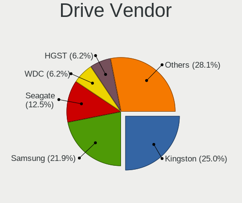
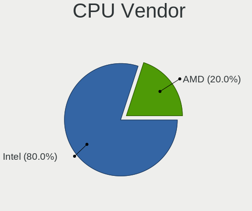

BlackPanther Hardware Trends (Notebooks)
----------------------------------------

A project to identify most popular hardware characteristics and track their change
over time based on data collected by Linux users at https://Linux-Hardware.org.

Anyone can contribute to this report by the [hw-probe](https://github.com/linuxhw/hw-probe) tool:

    sudo -E hw-probe -all -upload

Full-feature report is available here: https://linux-hardware.org/?view=trends&formfactor=notebook

Period: Jul, 2021.

Contents
--------

* [ System ](#system)
  - [ OS                       ](#os)
  - [ OS Family                ](#os-family)
  - [ Kernel                   ](#kernel)
  - [ Kernel Family            ](#kernel-family)
  - [ Kernel Major Ver.        ](#kernel-major-ver)
  - [ Arch                     ](#arch)
  - [ DE                       ](#de)
  - [ Display Server           ](#display-server)
  - [ Display Manager          ](#display-manager)
  - [ OS Lang                  ](#os-lang)
  - [ Boot Mode                ](#boot-mode)
  - [ Filesystem               ](#filesystem)
  - [ Part. scheme             ](#part-scheme)
  - [ Dual Boot with Linux/BSD ](#dual-boot-with-linuxbsd)
  - [ Dual Boot (Win)          ](#dual-boot-win)

* [ Board ](#board)
  - [ Vendor                   ](#vendor)
  - [ Model                    ](#model)
  - [ Model Family             ](#model-family)
  - [ MFG Year                 ](#mfg-year)
  - [ Form Factor              ](#form-factor)
  - [ Secure Boot              ](#secure-boot)
  - [ Coreboot                 ](#coreboot)
  - [ RAM Size                 ](#ram-size)
  - [ RAM Used                 ](#ram-used)
  - [ Total Drives             ](#total-drives)
  - [ Has CD-ROM               ](#has-cd-rom)
  - [ Has Ethernet             ](#has-ethernet)
  - [ Has WiFi                 ](#has-wifi)
  - [ Has Bluetooth            ](#has-bluetooth)

* [ Location ](#location)
  - [ Country                  ](#country)
  - [ City                     ](#city)

* [ Drives ](#drives)
  - [ Drive Vendor             ](#drive-vendor)
  - [ Drive Model              ](#drive-model)
  - [ HDD Vendor               ](#hdd-vendor)
  - [ SSD Vendor               ](#ssd-vendor)
  - [ Drive Kind               ](#drive-kind)
  - [ Drive Connector          ](#drive-connector)
  - [ Drive Size               ](#drive-size)
  - [ Space Total              ](#space-total)
  - [ Space Used               ](#space-used)
  - [ Malfunc. Drives          ](#malfunc-drives)
  - [ Malfunc. Drive Vendor    ](#malfunc-drive-vendor)
  - [ Malfunc. HDD Vendor      ](#malfunc-hdd-vendor)
  - [ Malfunc. Drive Kind      ](#malfunc-drive-kind)
  - [ Failed Drives            ](#failed-drives)
  - [ Failed Drive Vendor      ](#failed-drive-vendor)
  - [ Drive Status             ](#drive-status)

* [ Storage controller ](#storage-controller)
  - [ Storage Vendor           ](#storage-vendor)
  - [ Storage Model            ](#storage-model)
  - [ Storage Kind             ](#storage-kind)

* [ Processor ](#processor)
  - [ CPU Vendor               ](#cpu-vendor)
  - [ CPU Model                ](#cpu-model)
  - [ CPU Model Family         ](#cpu-model-family)
  - [ CPU Cores                ](#cpu-cores)
  - [ CPU Sockets              ](#cpu-sockets)
  - [ CPU Threads              ](#cpu-threads)
  - [ CPU Op-Modes             ](#cpu-op-modes)
  - [ CPU Microcode            ](#cpu-microcode)
  - [ CPU Microarch            ](#cpu-microarch)

* [ Graphics ](#graphics)
  - [ GPU Vendor               ](#gpu-vendor)
  - [ GPU Model                ](#gpu-model)
  - [ GPU Combo                ](#gpu-combo)
  - [ GPU Driver               ](#gpu-driver)
  - [ GPU Memory               ](#gpu-memory)

* [ Monitor ](#monitor)
  - [ Monitor Vendor           ](#monitor-vendor)
  - [ Monitor Model            ](#monitor-model)
  - [ Monitor Resolution       ](#monitor-resolution)
  - [ Monitor Diagonal         ](#monitor-diagonal)
  - [ Monitor Width            ](#monitor-width)
  - [ Aspect Ratio             ](#aspect-ratio)
  - [ Monitor Area             ](#monitor-area)
  - [ Pixel Density            ](#pixel-density)
  - [ Multiple Monitors        ](#multiple-monitors)

* [ Network ](#network)
  - [ Net Controller Vendor    ](#net-controller-vendor)
  - [ Net Controller Model     ](#net-controller-model)
  - [ Wireless Vendor          ](#wireless-vendor)
  - [ Wireless Model           ](#wireless-model)
  - [ Ethernet Vendor          ](#ethernet-vendor)
  - [ Ethernet Model           ](#ethernet-model)
  - [ Net Controller Kind      ](#net-controller-kind)
  - [ Used Controller          ](#used-controller)
  - [ NICs                     ](#nics)
  - [ IPv6                     ](#ipv6)

* [ Bluetooth ](#bluetooth)
  - [ Bluetooth Vendor         ](#bluetooth-vendor)
  - [ Bluetooth Model          ](#bluetooth-model)

* [ Sound ](#sound)
  - [ Sound Vendor             ](#sound-vendor)
  - [ Sound Model              ](#sound-model)

* [ Memory ](#memory)
  - [ Memory Vendor            ](#memory-vendor)
  - [ Memory Model             ](#memory-model)
  - [ Memory Kind              ](#memory-kind)
  - [ Memory Form Factor       ](#memory-form-factor)
  - [ Memory Size              ](#memory-size)
  - [ Memory Speed             ](#memory-speed)

* [ Printers & scanners ](#printers-&-scanners)
  - [ Printer Vendor           ](#printer-vendor)
  - [ Printer Model            ](#printer-model)
  - [ Scanner Vendor           ](#scanner-vendor)
  - [ Scanner Model            ](#scanner-model)

* [ Camera ](#camera)
  - [ Camera Vendor            ](#camera-vendor)
  - [ Camera Model             ](#camera-model)

* [ Security ](#security)
  - [ Fingerprint Vendor       ](#fingerprint-vendor)
  - [ Fingerprint Model        ](#fingerprint-model)
  - [ Chipcard Vendor          ](#chipcard-vendor)
  - [ Chipcard Model           ](#chipcard-model)

* [ Unsupported ](#unsupported)
  - [ Unsupported Devices      ](#unsupported-devices)
  - [ Unsupported Device Types ](#unsupported-device-types)

System
------

OS
--

Installed operating systems

| Name              | Notebooks | Percent |
|-------------------|-----------|---------|
| BlackPanther 18.1 | 52        | 100%    |

OS Family
---------

OS without a version

| Name         | Notebooks | Percent |
|--------------|-----------|---------|
| BlackPanther | 52        | 100%    |

Kernel
------

Version of the Linux kernel

| Version             | Notebooks | Percent |
|---------------------|-----------|---------|
| 5.6.14-desktop-2bP  | 44        | 84.62%  |
| 4.18.16-desktop-1bP | 8         | 15.38%  |

Kernel Family
-------------

Linux kernel without a distro release

| Version | Notebooks | Percent |
|---------|-----------|---------|
| 5.6.14  | 44        | 84.62%  |
| 4.18.16 | 8         | 15.38%  |

Kernel Major Ver.
-----------------

Linux kernel major version

| Version | Notebooks | Percent |
|---------|-----------|---------|
| 5.6     | 44        | 84.62%  |
| 4.18    | 8         | 15.38%  |

Arch
----

OS architecture (x86_64, i586, etc.)

| Name   | Notebooks | Percent |
|--------|-----------|---------|
| x86_64 | 52        | 100%    |

DE
--

Desktop Environment

| Name | Notebooks | Percent |
|------|-----------|---------|
| KDE5 | 52        | 100%    |

Display Server
--------------

X11 or Wayland

| Name | Notebooks | Percent |
|------|-----------|---------|
| X11  | 52        | 100%    |

Display Manager
---------------

SDDM, LightDM, etc.

| Name | Notebooks | Percent |
|------|-----------|---------|
| SDDM | 52        | 100%    |

OS Lang
-------

Language

| Lang    | Notebooks | Percent |
|---------|-----------|---------|
| Unknown | 52        | 100%    |

Boot Mode
---------

EFI or BIOS

| Mode | Notebooks | Percent |
|------|-----------|---------|
| EFI  | 29        | 55.77%  |
| BIOS | 23        | 44.23%  |

Filesystem
----------

Type of filesystem

| Type    | Notebooks | Percent |
|---------|-----------|---------|
| Overlay | 45        | 86.54%  |
| Ext4    | 7         | 13.46%  |

Part. scheme
------------

Scheme of partitioning

| Type    | Notebooks | Percent |
|---------|-----------|---------|
| GPT     | 27        | 51.92%  |
| MBR     | 24        | 46.15%  |
| Unknown | 1         | 1.92%   |

Dual Boot with Linux/BSD
------------------------

Hosting more than one Linux/BSD

| Dual boot | Notebooks | Percent |
|-----------|-----------|---------|
| No        | 31        | 59.62%  |
| Yes       | 21        | 40.38%  |

Dual Boot (Win)
---------------

Hosting Linux and Windows

| Dual boot | Notebooks | Percent |
|-----------|-----------|---------|
| Yes       | 32        | 61.54%  |
| No        | 20        | 38.46%  |

Board
-----

Vendor
------

Motherboard manufacturer

| Name                | Notebooks | Percent |
|---------------------|-----------|---------|
| Hewlett-Packard     | 11        | 21.15%  |
| Dell                | 10        | 19.23%  |
| Lenovo              | 8         | 15.38%  |
| ASUSTek Computer    | 8         | 15.38%  |
| Acer                | 7         | 13.46%  |
| Samsung Electronics | 2         | 3.85%   |
| Toshiba             | 1         | 1.92%   |
| Sony                | 1         | 1.92%   |
| MSI                 | 1         | 1.92%   |
| Fujitsu Siemens     | 1         | 1.92%   |
| Apple               | 1         | 1.92%   |
| Alcor               | 1         | 1.92%   |

Model
-----

Motherboard model

| Name                                       | Notebooks | Percent |
|--------------------------------------------|-----------|---------|
| HP 250 G1                                  | 2         | 3.85%   |
| Toshiba Satellite C55-A-1NV                | 1         | 1.92%   |
| Sony VPCEH2J1E                             | 1         | 1.92%   |
| Samsung 300V3A/300V4A/300V5A/200A4B/200A5B | 1         | 1.92%   |
| Samsung 300E4A/300E5A/300E7A/3430EA/3530EA | 1         | 1.92%   |
| MSI GE70 2QE                               | 1         | 1.92%   |
| Lenovo Y720-15IKB 80VR                     | 1         | 1.92%   |
| Lenovo V145-15AST 81MT                     | 1         | 1.92%   |
| Lenovo ThinkPad T400 6475W81               | 1         | 1.92%   |
| Lenovo IdeaPad L340-17IRH Gaming 81LL      | 1         | 1.92%   |
| Lenovo IdeaPad 320-17ABR 80YN              | 1         | 1.92%   |
| Lenovo G580                                | 1         | 1.92%   |
| Lenovo G50-30 80G0                         | 1         | 1.92%   |
| Lenovo Flex 2-14D 20376                    | 1         | 1.92%   |
| HP ProBook 6570b                           | 1         | 1.92%   |
| HP ProBook 6470b                           | 1         | 1.92%   |
| HP ProBook 430 G2                          | 1         | 1.92%   |
| HP Presario CQ57                           | 1         | 1.92%   |
| HP Pavilion g6                             | 1         | 1.92%   |
| HP Pavilion dv6                            | 1         | 1.92%   |
| HP EliteBook 8530p                         | 1         | 1.92%   |
| HP EliteBook 8470p                         | 1         | 1.92%   |
| HP EliteBook 8440p                         | 1         | 1.92%   |
| Fujitsu Siemens AMILO Li 2727              | 1         | 1.92%   |
| Dell Vostro 15-3568                        | 1         | 1.92%   |
| Dell Latitude E7470                        | 1         | 1.92%   |
| Dell Latitude E6530                        | 1         | 1.92%   |
| Dell Latitude E6520                        | 1         | 1.92%   |
| Dell Latitude E6410                        | 1         | 1.92%   |
| Dell Inspiron 5558                         | 1         | 1.92%   |
| Dell Inspiron 1520                         | 1         | 1.92%   |
| Dell Inspiron 15-7579                      | 1         | 1.92%   |
| Dell G5 5587                               | 1         | 1.92%   |
| Dell G3 3579                               | 1         | 1.92%   |
| ASUS X551CAP                               | 1         | 1.92%   |
| ASUS X550LD                                | 1         | 1.92%   |
| ASUS X550JX                                | 1         | 1.92%   |
| ASUS X541UAK                               | 1         | 1.92%   |
| ASUS X455LA                                | 1         | 1.92%   |
| ASUS ROG Strix G531GU_G531GU               | 1         | 1.92%   |
| ASUS K73BR                                 | 1         | 1.92%   |
| ASUS K53SJ                                 | 1         | 1.92%   |
| Apple MacBookAir7,2                        | 1         | 1.92%   |
| Alcor SnugBook Q series                    | 1         | 1.92%   |
| Acer Predator PH517-51                     | 1         | 1.92%   |
| Acer Aspire ES1-523                        | 1         | 1.92%   |
| Acer Aspire E5-773                         | 1         | 1.92%   |
| Acer Aspire E5-475G                        | 1         | 1.92%   |
| Acer Aspire A317-51G                       | 1         | 1.92%   |
| Acer Aspire A315-32                        | 1         | 1.92%   |
| Acer Aspire A315-21G                       | 1         | 1.92%   |

Model Family
------------

Motherboard model prefix

| Name                  | Notebooks | Percent |
|-----------------------|-----------|---------|
| Acer Aspire           | 6         | 11.54%  |
| Dell Latitude         | 4         | 7.69%   |
| HP ProBook            | 3         | 5.77%   |
| HP EliteBook          | 3         | 5.77%   |
| Dell Inspiron         | 3         | 5.77%   |
| Lenovo IdeaPad        | 2         | 3.85%   |
| HP Pavilion           | 2         | 3.85%   |
| HP 250                | 2         | 3.85%   |
| Toshiba Satellite     | 1         | 1.92%   |
| Sony VPCEH2J1E        | 1         | 1.92%   |
| Samsung 300V3A        | 1         | 1.92%   |
| Samsung 300E4A        | 1         | 1.92%   |
| MSI GE70              | 1         | 1.92%   |
| Lenovo Y720-15IKB     | 1         | 1.92%   |
| Lenovo V145-15AST     | 1         | 1.92%   |
| Lenovo ThinkPad       | 1         | 1.92%   |
| Lenovo G580           | 1         | 1.92%   |
| Lenovo G50-30         | 1         | 1.92%   |
| Lenovo Flex           | 1         | 1.92%   |
| HP Presario           | 1         | 1.92%   |
| Fujitsu Siemens AMILO | 1         | 1.92%   |
| Dell Vostro           | 1         | 1.92%   |
| Dell G5               | 1         | 1.92%   |
| Dell G3               | 1         | 1.92%   |
| ASUS X551CAP          | 1         | 1.92%   |
| ASUS X550LD           | 1         | 1.92%   |
| ASUS X550JX           | 1         | 1.92%   |
| ASUS X541UAK          | 1         | 1.92%   |
| ASUS X455LA           | 1         | 1.92%   |
| ASUS ROG              | 1         | 1.92%   |
| ASUS K73BR            | 1         | 1.92%   |
| ASUS K53SJ            | 1         | 1.92%   |
| Apple MacBookAir7     | 1         | 1.92%   |
| Alcor SnugBook        | 1         | 1.92%   |
| Acer Predator         | 1         | 1.92%   |

MFG Year
--------

Motherboard manufacture year

| Year | Notebooks | Percent |
|------|-----------|---------|
| 2011 | 8         | 15.38%  |
| 2018 | 7         | 13.46%  |
| 2021 | 5         | 9.62%   |
| 2014 | 5         | 9.62%   |
| 2013 | 5         | 9.62%   |
| 2016 | 4         | 7.69%   |
| 2020 | 3         | 5.77%   |
| 2019 | 3         | 5.77%   |
| 2015 | 3         | 5.77%   |
| 2012 | 3         | 5.77%   |
| 2017 | 2         | 3.85%   |
| 2010 | 2         | 3.85%   |
| 2008 | 1         | 1.92%   |
| 2007 | 1         | 1.92%   |

Form Factor
-----------

Physical design of the computer

| Name     | Notebooks | Percent |
|----------|-----------|---------|
| Notebook | 52        | 100%    |

Secure Boot
-----------

Enabled or disabled

| State    | Notebooks | Percent |
|----------|-----------|---------|
| Disabled | 52        | 100%    |

Coreboot
--------

Have coreboot on board

| Used | Notebooks | Percent |
|------|-----------|---------|
| No   | 52        | 100%    |

RAM Size
--------

Total RAM memory

| Size in GB | Notebooks | Percent |
|------------|-----------|---------|
| 3.01-4.0   | 19        | 36.54%  |
| 4.01-8.0   | 12        | 23.08%  |
| 16.01-24.0 | 8         | 15.38%  |
| 8.01-16.0  | 5         | 9.62%   |
| 2.01-3.0   | 4         | 7.69%   |
| 1.01-2.0   | 3         | 5.77%   |
| 24.01-32.0 | 1         | 1.92%   |

RAM Used
--------

Used RAM memory

| Used GB  | Notebooks | Percent |
|----------|-----------|---------|
| 1.01-2.0 | 23        | 44.23%  |
| 0.51-1.0 | 21        | 40.38%  |
| 0.01-0.5 | 8         | 15.38%  |

Total Drives
------------

Number of drives on board

| Drives | Notebooks | Percent |
|--------|-----------|---------|
| 1      | 38        | 73.08%  |
| 2      | 12        | 23.08%  |
| 3      | 1         | 1.92%   |
| 0      | 1         | 1.92%   |

Has CD-ROM
----------

Has CD-ROM on board

| Presented | Notebooks | Percent |
|-----------|-----------|---------|
| Yes       | 34        | 65.38%  |
| No        | 18        | 34.62%  |

Has Ethernet
------------

Has Ethernet on board

| Presented | Notebooks | Percent |
|-----------|-----------|---------|
| Yes       | 49        | 94.23%  |
| No        | 3         | 5.77%   |

Has WiFi
--------

Has WiFi module

| Presented | Notebooks | Percent |
|-----------|-----------|---------|
| Yes       | 52        | 100%    |

Has Bluetooth
-------------

Has Bluetooth module

| Presented | Notebooks | Percent |
|-----------|-----------|---------|
| Yes       | 41        | 78.85%  |
| No        | 11        | 21.15%  |

Location
--------

Country
-------

Geographic location (country)

| Country   | Notebooks | Percent |
|-----------|-----------|---------|
| Hungary   | 35        | 67.31%  |
| USA       | 3         | 5.77%   |
| Spain     | 2         | 3.85%   |
| Slovakia  | 2         | 3.85%   |
| Germany   | 2         | 3.85%   |
| Austria   | 2         | 3.85%   |
| UK        | 1         | 1.92%   |
| Thailand  | 1         | 1.92%   |
| Poland    | 1         | 1.92%   |
| Mexico    | 1         | 1.92%   |
| Czechia   | 1         | 1.92%   |
| Australia | 1         | 1.92%   |

City
----

Geographic location (city)

| City              | Notebooks | Percent |
|-------------------|-----------|---------|
| Budapest          | 8         | 15.38%  |
| Vienna            | 2         | 3.85%   |
| Szigetszentmiklos | 2         | 3.85%   |
| Rimavsk√° Sobota  | 2         | 3.85%   |
| Gava              | 2         | 3.85%   |
| Fot               | 2         | 3.85%   |
| Ústí nad Labem  | 1         | 1.92%   |
| Zalaegerszeg      | 1         | 1.92%   |
| Tolnanemedi       | 1         | 1.92%   |
| Szombathely       | 1         | 1.92%   |
| Szeksz??rd        | 1         | 1.92%   |
| Szeged            | 1         | 1.92%   |
| Southend-on-Sea   | 1         | 1.92%   |
| Pécs             | 1         | 1.92%   |
| Portland          | 1         | 1.92%   |
| Perth             | 1         | 1.92%   |
| Papa              | 1         | 1.92%   |
| Pap               | 1         | 1.92%   |
| Nyiregyhaza       | 1         | 1.92%   |
| Nagykanizsa       | 1         | 1.92%   |
| Nagyhalasz        | 1         | 1.92%   |
| Mexico City       | 1         | 1.92%   |
| Lesencetomaj      | 1         | 1.92%   |
| Leesburg          | 1         | 1.92%   |
| Labod             | 1         | 1.92%   |
| Kondoros          | 1         | 1.92%   |
| Kecskemét        | 1         | 1.92%   |
| Karlsruhe         | 1         | 1.92%   |
| Győr             | 1         | 1.92%   |
| Freising          | 1         | 1.92%   |
| Epleny            | 1         | 1.92%   |
| Dunavecse         | 1         | 1.92%   |
| Debrecen          | 1         | 1.92%   |
| Columbia          | 1         | 1.92%   |
| Chiang Rai        | 1         | 1.92%   |
| Cegled            | 1         | 1.92%   |
| Békés           | 1         | 1.92%   |
| Bocfolde          | 1         | 1.92%   |
| ?ªory             | 1         | 1.92%   |
| Apc               | 1         | 1.92%   |

Drives
------

Drive Vendor
------------

Hard drive vendors

| Vendor              | Notebooks | Drives | Percent |
|---------------------|-----------|--------|---------|
| Seagate             | 12        | 13     | 18.75%  |
| WDC                 | 10        | 10     | 15.63%  |
| Toshiba             | 8         | 8      | 12.5%   |
| HGST                | 8         | 8      | 12.5%   |
| Kingston            | 6         | 7      | 9.38%   |
| SanDisk             | 4         | 4      | 6.25%   |
| Samsung Electronics | 3         | 5      | 4.69%   |
| Unknown             | 2         | 2      | 3.13%   |
| Hitachi             | 2         | 2      | 3.13%   |
| A-DATA Technology   | 2         | 2      | 3.13%   |
| XPG                 | 1         | 1      | 1.56%   |
| Micron Technology   | 1         | 1      | 1.56%   |
| JMicron             | 1         | 1      | 1.56%   |
| Intel               | 1         | 1      | 1.56%   |
| GOODRAM             | 1         | 1      | 1.56%   |
| Gigabyte Technology | 1         | 1      | 1.56%   |
| Apple               | 1         | 1      | 1.56%   |

Drive Model
-----------

Hard drive models

| Model                                | Notebooks | Percent |
|--------------------------------------|-----------|---------|
| Kingston SA400S37240G 240GB SSD      | 3         | 4.48%   |
| Kingston SA400S37120G 120GB SSD      | 3         | 4.48%   |
| HGST HTS545050A7E680 500GB           | 3         | 4.48%   |
| Toshiba MQ01ABD100 1TB               | 2         | 2.99%   |
| Seagate ST500LT012-1DG142 500GB      | 2         | 2.99%   |
| Seagate ST1000LM035-1RK172 1TB       | 2         | 2.99%   |
| HGST HTS545032A7E380 320GB           | 2         | 2.99%   |
| XPG GAMMIX S11 Pro 512GB             | 1         | 1.49%   |
| WDC WDS120G1G0A-00SS50 120GB SSD     | 1         | 1.49%   |
| WDC WD3200BPVT-80ZEST0 320GB         | 1         | 1.49%   |
| WDC WD2500BEVS-22UST0 250GB          | 1         | 1.49%   |
| WDC WD2500BEKT-60PVMT0 250GB         | 1         | 1.49%   |
| WDC WD1600BEVS-08VAT2 160GB          | 1         | 1.49%   |
| WDC WD10SPZX-24Z10 1TB               | 1         | 1.49%   |
| WDC WD10SPZX-21Z10T0 1TB             | 1         | 1.49%   |
| WDC WD10SPCX-24HWST1 1TB             | 1         | 1.49%   |
| WDC WD10JPVX-22JC3T0 1TB             | 1         | 1.49%   |
| WDC PC SN520 SDAPNUW-512G-1014 512GB | 1         | 1.49%   |
| Unknown SD32G  32GB                  | 1         | 1.49%   |
| Unknown SC32G  32GB                  | 1         | 1.49%   |
| Toshiba TL100 120GB SSD              | 1         | 1.49%   |
| Toshiba MQ01ABD050 500GB             | 1         | 1.49%   |
| Toshiba MK5056GSY 500GB              | 1         | 1.49%   |
| Toshiba MK1652GSX 160GB              | 1         | 1.49%   |
| Toshiba KBG40ZNS256G NVMe 256GB      | 1         | 1.49%   |
| Toshiba KBG30ZMS256G NVMe 256GB      | 1         | 1.49%   |
| Seagate ST9500325AS 500GB            | 1         | 1.49%   |
| Seagate ST9250410AS 250GB            | 1         | 1.49%   |
| Seagate ST750LM022 HN-M750MBB 752GB  | 1         | 1.49%   |
| Seagate ST500LM000-SSHD-8GB          | 1         | 1.49%   |
| Seagate ST320LT007-9ZV142 320GB      | 1         | 1.49%   |
| Seagate ST250LT012-1DG141 250GB      | 1         | 1.49%   |
| Seagate ST2000LM015-2E8174 2TB       | 1         | 1.49%   |
| Seagate ST2000LM003 HN-M201RAD 2TB   | 1         | 1.49%   |
| Seagate ST1000LM014-1EJ164-SSHD 1TB  | 1         | 1.49%   |
| SanDisk X400 M.2 2280 256GB SSD      | 1         | 1.49%   |
| SanDisk SL32G  32GB                  | 1         | 1.49%   |
| SanDisk SDSSDH3250G 250GB            | 1         | 1.49%   |
| SanDisk DF4064  64GB                 | 1         | 1.49%   |
| Samsung SSD 970 PRO 512GB            | 1         | 1.49%   |
| Samsung SSD 970 EVO 500GB            | 1         | 1.49%   |
| Samsung SSD 870 EVO 250GB            | 1         | 1.49%   |
| Samsung SSD 860 EVO 500GB            | 1         | 1.49%   |
| Micron MTFDDAK256TDL 256GB SSD       | 1         | 1.49%   |
| Kingston SA400S37960G 960GB SSD      | 1         | 1.49%   |
| JMicron Generic 1TB                  | 1         | 1.49%   |
| Intel SSDSCKKF256H6 SATA 256GB       | 1         | 1.49%   |
| Hitachi HTS545025B9A300 250GB        | 1         | 1.49%   |
| Hitachi HTS541680J9SA00 80GB         | 1         | 1.49%   |
| HGST HTS721010A9E630 1TB             | 1         | 1.49%   |
| HGST HTS541075A9E680 752GB           | 1         | 1.49%   |
| HGST HEJ423220H9E300 200GB           | 1         | 1.49%   |
| GOODRAM SSD 240GB                    | 1         | 1.49%   |
| Gigabyte GP-GSTFS31120GNTD 120GB SSD | 1         | 1.49%   |
| Apple SSD SM0128G 121GB              | 1         | 1.49%   |
| A-DATA SU650 240GB SSD               | 1         | 1.49%   |
| A-DATA SSD S599 55GB                 | 1         | 1.49%   |

HDD Vendor
----------

Hard disk drive vendors

| Vendor  | Notebooks | Drives | Percent |
|---------|-----------|--------|---------|
| Seagate | 12        | 13     | 34.29%  |
| WDC     | 8         | 8      | 22.86%  |
| HGST    | 8         | 8      | 22.86%  |
| Toshiba | 5         | 5      | 14.29%  |
| Hitachi | 2         | 2      | 5.71%   |

SSD Vendor
----------

Solid state drive vendors

| Vendor              | Notebooks | Drives | Percent |
|---------------------|-----------|--------|---------|
| Kingston            | 6         | 7      | 30%     |
| SanDisk             | 2         | 2      | 10%     |
| Samsung Electronics | 2         | 2      | 10%     |
| A-DATA Technology   | 2         | 2      | 10%     |
| WDC                 | 1         | 1      | 5%      |
| Toshiba             | 1         | 1      | 5%      |
| Micron Technology   | 1         | 1      | 5%      |
| JMicron             | 1         | 1      | 5%      |
| Intel               | 1         | 1      | 5%      |
| GOODRAM             | 1         | 1      | 5%      |
| Gigabyte Technology | 1         | 1      | 5%      |
| Apple               | 1         | 1      | 5%      |

Drive Kind
----------

HDD or SSD

| Kind | Notebooks | Drives | Percent |
|------|-----------|--------|---------|
| HDD  | 33        | 36     | 52.38%  |
| SSD  | 20        | 21     | 31.75%  |
| NVMe | 6         | 7      | 9.52%   |
| MMC  | 4         | 4      | 6.35%   |

Drive Connector
---------------

SATA, SAS, NVMe, etc.

| Type | Notebooks | Drives | Percent |
|------|-----------|--------|---------|
| SATA | 49        | 56     | 81.67%  |
| NVMe | 6         | 7      | 10%     |
| MMC  | 4         | 4      | 6.67%   |
| SAS  | 1         | 1      | 1.67%   |

Drive Size
----------

Size of hard drive

| Size in TB | Notebooks | Drives | Percent |
|------------|-----------|--------|---------|
| 0.01-0.5   | 37        | 41     | 69.81%  |
| 0.51-1.0   | 14        | 14     | 26.42%  |
| 1.01-2.0   | 2         | 2      | 3.77%   |

Space Total
-----------

Amount of disk space available on the file system

| Size in GB | Notebooks | Percent |
|------------|-----------|---------|
| Unknown    | 42        | 80.77%  |
| 101-250    | 6         | 11.54%  |
| 251-500    | 2         | 3.85%   |
| 2001-3000  | 1         | 1.92%   |
| 501-1000   | 1         | 1.92%   |

Space Used
----------

Amount of used disk space

| Used GB   | Notebooks | Percent |
|-----------|-----------|---------|
| Unknown   | 42        | 80.77%  |
| 1-20      | 8         | 15.38%  |
| 21-50     | 1         | 1.92%   |
| 1001-2000 | 1         | 1.92%   |

Malfunc. Drives
---------------

Drive models with a malfunction

| Model                               | Notebooks | Drives | Percent |
|-------------------------------------|-----------|--------|---------|
| HGST HTS545050A7E680 500GB          | 2         | 2      | 11.11%  |
| HGST HTS545032A7E380 320GB          | 2         | 2      | 11.11%  |
| WDC WD3200BPVT-80ZEST0 320GB        | 1         | 1      | 5.56%   |
| WDC WD1600BEVS-08VAT2 160GB         | 1         | 1      | 5.56%   |
| Toshiba MK5056GSY 500GB             | 1         | 1      | 5.56%   |
| Seagate ST9500325AS 500GB           | 1         | 1      | 5.56%   |
| Seagate ST9250410AS 250GB           | 1         | 1      | 5.56%   |
| Seagate ST750LM022 HN-M750MBB 752GB | 1         | 1      | 5.56%   |
| Seagate ST320LT007-9ZV142 320GB     | 1         | 1      | 5.56%   |
| Seagate ST250LT012-1DG141 250GB     | 1         | 1      | 5.56%   |
| Seagate ST2000LM003 HN-M201RAD 2TB  | 1         | 1      | 5.56%   |
| Seagate ST1000LM014-1EJ164-SSHD 1TB | 1         | 1      | 5.56%   |
| Intel SSDSCKKF256H6 SATA 256GB      | 1         | 1      | 5.56%   |
| Hitachi HTS545025B9A300 250GB       | 1         | 1      | 5.56%   |
| Hitachi HTS541680J9SA00 80GB        | 1         | 1      | 5.56%   |
| HGST HEJ423220H9E300 200GB          | 1         | 1      | 5.56%   |

Malfunc. Drive Vendor
---------------------

Vendors of faulty drives

| Vendor  | Notebooks | Drives | Percent |
|---------|-----------|--------|---------|
| Seagate | 6         | 7      | 35.29%  |
| HGST    | 5         | 5      | 29.41%  |
| WDC     | 2         | 2      | 11.76%  |
| Hitachi | 2         | 2      | 11.76%  |
| Toshiba | 1         | 1      | 5.88%   |
| Intel   | 1         | 1      | 5.88%   |

Malfunc. HDD Vendor
-------------------

Vendors of faulty HDD drives

| Vendor  | Notebooks | Drives | Percent |
|---------|-----------|--------|---------|
| Seagate | 6         | 7      | 37.5%   |
| HGST    | 5         | 5      | 31.25%  |
| WDC     | 2         | 2      | 12.5%   |
| Hitachi | 2         | 2      | 12.5%   |
| Toshiba | 1         | 1      | 6.25%   |

Malfunc. Drive Kind
-------------------

Kinds of faulty drives

| Kind | Notebooks | Drives | Percent |
|------|-----------|--------|---------|
| HDD  | 15        | 17     | 93.75%  |
| SSD  | 1         | 1      | 6.25%   |

Failed Drives
-------------

Failed drive models

Zero info for selected period =(

Failed Drive Vendor
-------------------

Failed drive vendors

Zero info for selected period =(

Drive Status
------------

Number of failed and malfunc. drives

| Status   | Notebooks | Drives | Percent |
|----------|-----------|--------|---------|
| Works    | 37        | 45     | 64.91%  |
| Malfunc  | 16        | 18     | 28.07%  |
| Detected | 4         | 5      | 7.02%   |

Storage controller
------------------

Storage Vendor
--------------

Storage controller vendors

| Vendor                       | Notebooks | Percent |
|------------------------------|-----------|---------|
| Intel                        | 42        | 73.68%  |
| AMD                          | 8         | 14.04%  |
| Samsung Electronics          | 3         | 5.26%   |
| Toshiba America Info Systems | 1         | 1.75%   |
| Sandisk                      | 1         | 1.75%   |
| KIOXIA                       | 1         | 1.75%   |
| ADATA Technology             | 1         | 1.75%   |

Storage Model
-------------

Storage controller models

| Model                                                                          | Notebooks | Percent |
|--------------------------------------------------------------------------------|-----------|---------|
| Intel 7 Series Chipset Family 6-port SATA Controller [AHCI mode]               | 6         | 9.52%   |
| Intel Sunrise Point-LP SATA Controller [AHCI mode]                             | 5         | 7.94%   |
| Intel Cannon Lake Mobile PCH SATA AHCI Controller                              | 5         | 7.94%   |
| AMD FCH SATA Controller [AHCI mode]                                            | 5         | 7.94%   |
| Intel 6 Series/C200 Series Chipset Family 6 port Mobile SATA AHCI Controller   | 4         | 6.35%   |
| Intel 82801 Mobile SATA Controller [RAID mode]                                 | 3         | 4.76%   |
| Intel 8 Series/C220 Series Chipset Family 6-port SATA Controller 1 [AHCI mode] | 3         | 4.76%   |
| Intel 8 Series SATA Controller 1 [AHCI mode]                                   | 3         | 4.76%   |
| AMD SB7x0/SB8x0/SB9x0 SATA Controller [AHCI mode]                              | 3         | 4.76%   |
| Samsung NVMe SSD Controller SM981/PM981/PM983                                  | 2         | 3.17%   |
| Intel 82801HM/HEM (ICH8M/ICH8M-E) IDE Controller                               | 2         | 3.17%   |
| Intel 7 Series Chipset Family 4-port SATA Controller [IDE mode]                | 2         | 3.17%   |
| Intel 7 Series Chipset Family 2-port SATA Controller [IDE mode]                | 2         | 3.17%   |
| Intel 5 Series/3400 Series Chipset 6 port SATA AHCI Controller                 | 2         | 3.17%   |
| Toshiba America Info Systems BG3 NVMe SSD Controller                           | 1         | 1.59%   |
| Sandisk WD Blue SN500 / PC SN520 NVMe SSD                                      | 1         | 1.59%   |
| Samsung Electronics SATA controller                                            | 1         | 1.59%   |
| KIOXIA Non-Volatile memory controller                                          | 1         | 1.59%   |
| Intel Wildcat Point-LP SATA Controller [AHCI Mode]                             | 1         | 1.59%   |
| Intel HM170/QM170 Chipset SATA Controller [AHCI Mode]                          | 1         | 1.59%   |
| Intel Comet Lake SATA AHCI Controller                                          | 1         | 1.59%   |
| Intel Celeron/Pentium Silver Processor SATA Controller                         | 1         | 1.59%   |
| Intel Atom Processor E3800 Series SATA AHCI Controller                         | 1         | 1.59%   |
| Intel 82801IBM/IEM (ICH9M/ICH9M-E) 4 port SATA Controller [AHCI mode]          | 1         | 1.59%   |
| Intel 82801IBM/IEM (ICH9M/ICH9M-E) 2 port SATA Controller [IDE mode]           | 1         | 1.59%   |
| Intel 82801HM/HEM (ICH8M/ICH8M-E) SATA Controller [IDE mode]                   | 1         | 1.59%   |
| Intel 82801HM/HEM (ICH8M/ICH8M-E) SATA Controller [AHCI mode]                  | 1         | 1.59%   |
| Intel 5 Series/3400 Series Chipset 4 port SATA AHCI Controller                 | 1         | 1.59%   |
| AMD SB7x0/SB8x0/SB9x0 IDE Controller                                           | 1         | 1.59%   |
| ADATA XPG SX8200 Pro PCIe Gen3x4 M.2 2280 Solid State Drive                    | 1         | 1.59%   |

Storage Kind
------------

Kind of storage controller (IDE, SATA, NVMe, SAS, ...)

| Kind | Notebooks | Percent |
|------|-----------|---------|
| SATA | 45        | 75%     |
| NVMe | 6         | 10%     |
| IDE  | 6         | 10%     |
| RAID | 3         | 5%      |

Processor
---------

CPU Vendor
----------

Processor vendors

| Vendor | Notebooks | Percent |
|--------|-----------|---------|
| Intel  | 44        | 84.62%  |
| AMD    | 8         | 15.38%  |

CPU Model
---------

Processor models

| Model                                           | Notebooks | Percent |
|-------------------------------------------------|-----------|---------|
| Intel Core i3-6006U CPU @ 2.00GHz               | 3         | 5.77%   |
| Intel Core i7-8750H CPU @ 2.20GHz               | 2         | 3.85%   |
| Intel Core i5-3230M CPU @ 2.60GHz               | 2         | 3.85%   |
| Intel Core i3-4030U CPU @ 1.90GHz               | 2         | 3.85%   |
| Intel Core i3-2350M CPU @ 2.30GHz               | 2         | 3.85%   |
| Intel Celeron CPU 1000M @ 1.80GHz               | 2         | 3.85%   |
| AMD E-450 APU with Radeon HD Graphics           | 2         | 3.85%   |
| Intel Pentium Silver N5000 CPU @ 1.10GHz        | 1         | 1.92%   |
| Intel Pentium Dual CPU T2310 @ 1.46GHz          | 1         | 1.92%   |
| Intel Pentium CPU 2117U @ 1.80GHz               | 1         | 1.92%   |
| Intel Genuine CPU T1400 @ 1.73GHz               | 1         | 1.92%   |
| Intel Core i7-9750HF CPU @ 2.60GHz              | 1         | 1.92%   |
| Intel Core i7-7700HQ CPU @ 2.80GHz              | 1         | 1.92%   |
| Intel Core i7-4750HQ CPU @ 2.00GHz              | 1         | 1.92%   |
| Intel Core i7-4720HQ CPU @ 2.60GHz              | 1         | 1.92%   |
| Intel Core i7-10510U CPU @ 1.80GHz              | 1         | 1.92%   |
| Intel Core i7 CPU M 620 @ 2.67GHz               | 1         | 1.92%   |
| Intel Core i5-9300H CPU @ 2.40GHz               | 1         | 1.92%   |
| Intel Core i5-8300H CPU @ 2.30GHz               | 1         | 1.92%   |
| Intel Core i5-7200U CPU @ 2.50GHz               | 1         | 1.92%   |
| Intel Core i5-6300U CPU @ 2.40GHz               | 1         | 1.92%   |
| Intel Core i5-6200U CPU @ 2.30GHz               | 1         | 1.92%   |
| Intel Core i5-5350U CPU @ 1.80GHz               | 1         | 1.92%   |
| Intel Core i5-5200U CPU @ 2.20GHz               | 1         | 1.92%   |
| Intel Core i5-4210U CPU @ 1.70GHz               | 1         | 1.92%   |
| Intel Core i5-4200M CPU @ 2.50GHz               | 1         | 1.92%   |
| Intel Core i5-3340M CPU @ 2.70GHz               | 1         | 1.92%   |
| Intel Core i5-3320M CPU @ 2.60GHz               | 1         | 1.92%   |
| Intel Core i5-3210M CPU @ 2.50GHz               | 1         | 1.92%   |
| Intel Core i5-2540M CPU @ 2.60GHz               | 1         | 1.92%   |
| Intel Core i5 CPU M 520 @ 2.40GHz               | 1         | 1.92%   |
| Intel Core i3-2330M CPU @ 2.20GHz               | 1         | 1.92%   |
| Intel Core i3-2310M CPU @ 2.10GHz               | 1         | 1.92%   |
| Intel Core i3 CPU M 350 @ 2.27GHz               | 1         | 1.92%   |
| Intel Core 2 Duo CPU T9550 @ 2.66GHz            | 1         | 1.92%   |
| Intel Core 2 Duo CPU P8400 @ 2.26GHz            | 1         | 1.92%   |
| Intel Celeron CPU N2840 @ 2.16GHz               | 1         | 1.92%   |
| Intel Atom x5-Z8350 CPU @ 1.44GHz               | 1         | 1.92%   |
| AMD Phenom II P960 Quad-Core Processor          | 1         | 1.92%   |
| AMD A6-6310 APU with AMD Radeon R4 Graphics     | 1         | 1.92%   |
| AMD A4-9125 RADEON R3, 4 COMPUTE CORES 2C+2G    | 1         | 1.92%   |
| AMD A4-9120 RADEON R3, 4 COMPUTE CORES 2C+2G    | 1         | 1.92%   |
| AMD A4-7210 APU with AMD Radeon R3 Graphics     | 1         | 1.92%   |
| AMD A12-9720P RADEON R7, 12 COMPUTE CORES 4C+8G | 1         | 1.92%   |

CPU Model Family
----------------

Processor model prefix

| Model                | Notebooks | Percent |
|----------------------|-----------|---------|
| Intel Core i5        | 16        | 30.77%  |
| Intel Core i3        | 10        | 19.23%  |
| Intel Core i7        | 8         | 15.38%  |
| Intel Celeron        | 3         | 5.77%   |
| AMD A4               | 3         | 5.77%   |
| Intel Core 2 Duo     | 2         | 3.85%   |
| AMD E                | 2         | 3.85%   |
| Intel Pentium Silver | 1         | 1.92%   |
| Intel Pentium Dual   | 1         | 1.92%   |
| Intel Pentium        | 1         | 1.92%   |
| Intel Genuine        | 1         | 1.92%   |
| Intel Atom           | 1         | 1.92%   |
| AMD Phenom II        | 1         | 1.92%   |
| AMD A6               | 1         | 1.92%   |
| AMD A12              | 1         | 1.92%   |

CPU Cores
---------

Number of processor cores

| Number | Notebooks | Percent |
|--------|-----------|---------|
| 2      | 38        | 73.08%  |
| 4      | 11        | 21.15%  |
| 6      | 3         | 5.77%   |

CPU Sockets
-----------

Number of sockets

| Number | Notebooks | Percent |
|--------|-----------|---------|
| 1      | 52        | 100%    |

CPU Threads
-----------

Threads per core (Hyper-Threading)

| Number | Notebooks | Percent |
|--------|-----------|---------|
| 2      | 34        | 65.38%  |
| 1      | 18        | 34.62%  |

CPU Op-Modes
------------

CPU Operation Modes (32-bit, 64-bit)

| Op mode        | Notebooks | Percent |
|----------------|-----------|---------|
| 32-bit, 64-bit | 52        | 100%    |

CPU Microcode
-------------

Microcode number

| Number     | Notebooks | Percent |
|------------|-----------|---------|
| 0x306a9    | 8         | 15.38%  |
| 0x406e3    | 5         | 9.62%   |
| 0x206a7    | 5         | 9.62%   |
| 0x906ea    | 3         | 5.77%   |
| 0x40651    | 3         | 5.77%   |
| 0x906ed    | 2         | 3.85%   |
| 0x6fd      | 2         | 3.85%   |
| 0x306d4    | 2         | 3.85%   |
| 0x306c3    | 2         | 3.85%   |
| 0x20655    | 2         | 3.85%   |
| 0x1067a    | 2         | 3.85%   |
| 0x05000119 | 2         | 3.85%   |
| 0x906e9    | 1         | 1.92%   |
| 0x806ec    | 1         | 1.92%   |
| 0x806e9    | 1         | 1.92%   |
| 0x706a1    | 1         | 1.92%   |
| 0x406c4    | 1         | 1.92%   |
| 0x40661    | 1         | 1.92%   |
| 0x30678    | 1         | 1.92%   |
| 0x20652    | 1         | 1.92%   |
| 0x07030105 | 1         | 1.92%   |
| 0x07030104 | 1         | 1.92%   |
| 0x06006705 | 1         | 1.92%   |
| 0x06006704 | 1         | 1.92%   |
| 0x06006118 | 1         | 1.92%   |
| 0x010000c8 | 1         | 1.92%   |

CPU Microarch
-------------

Microarchitecture

| Name          | Notebooks | Percent |
|---------------|-----------|---------|
| KabyLake      | 8         | 15.38%  |
| IvyBridge     | 8         | 15.38%  |
| Haswell       | 6         | 11.54%  |
| Skylake       | 5         | 9.62%   |
| SandyBridge   | 5         | 9.62%   |
| Westmere      | 3         | 5.77%   |
| Excavator     | 3         | 5.77%   |
| Silvermont    | 2         | 3.85%   |
| Puma          | 2         | 3.85%   |
| Penryn        | 2         | 3.85%   |
| Core          | 2         | 3.85%   |
| Broadwell     | 2         | 3.85%   |
| Bobcat        | 2         | 3.85%   |
| K10           | 1         | 1.92%   |
| Goldmont plus | 1         | 1.92%   |

Graphics
--------

GPU Vendor
----------

Vendors of graphics cards

| Vendor | Notebooks | Percent |
|--------|-----------|---------|
| Intel  | 39        | 58.21%  |
| Nvidia | 17        | 25.37%  |
| AMD    | 11        | 16.42%  |

GPU Model
---------

Graphics card models

| Model                                                                                    | Notebooks | Percent |
|------------------------------------------------------------------------------------------|-----------|---------|
| Intel 3rd Gen Core processor Graphics Controller                                         | 7         | 9.72%   |
| Intel Skylake GT2 [HD Graphics 520]                                                      | 5         | 6.94%   |
| Intel 2nd Generation Core Processor Family Integrated Graphics Controller                | 4         | 5.56%   |
| Intel Haswell-ULT Integrated Graphics Controller                                         | 3         | 4.17%   |
| Intel Core Processor Integrated Graphics Controller                                      | 3         | 4.17%   |
| Intel CoffeeLake-H GT2 [UHD Graphics 630]                                                | 3         | 4.17%   |
| Nvidia GF119M [GeForce GT 520MX]                                                         | 2         | 2.78%   |
| Nvidia GF117M [GeForce 610M/710M/810M/820M / GT 620M/625M/630M/720M]                     | 2         | 2.78%   |
| Intel Mobile GM965/GL960 Integrated Graphics Controller (secondary)                      | 2         | 2.78%   |
| Intel Mobile GM965/GL960 Integrated Graphics Controller (primary)                        | 2         | 2.78%   |
| Intel 4th Gen Core Processor Integrated Graphics Controller                              | 2         | 2.78%   |
| AMD Stoney [Radeon R2/R3/R4/R5 Graphics]                                                 | 2         | 2.78%   |
| AMD Seymour [Radeon HD 6400M/7400M Series]                                               | 2         | 2.78%   |
| Nvidia TU117M [GeForce GTX 1650 Mobile / Max-Q]                                          | 1         | 1.39%   |
| Nvidia TU116M [GeForce GTX 1660 Ti Mobile]                                               | 1         | 1.39%   |
| Nvidia GP108M [GeForce MX230]                                                            | 1         | 1.39%   |
| Nvidia GP107M [GeForce GTX 1050 Ti Mobile]                                               | 1         | 1.39%   |
| Nvidia GP107M [GeForce GTX 1050 Mobile]                                                  | 1         | 1.39%   |
| Nvidia GP106M [GeForce GTX 1060 Mobile]                                                  | 1         | 1.39%   |
| Nvidia GP104BM [GeForce GTX 1070 Mobile]                                                 | 1         | 1.39%   |
| Nvidia GM108M [GeForce 940MX]                                                            | 1         | 1.39%   |
| Nvidia GM107M [GeForce GTX 960M]                                                         | 1         | 1.39%   |
| Nvidia GM107M [GeForce GTX 950M]                                                         | 1         | 1.39%   |
| Nvidia GK208BM [GeForce 920M]                                                            | 1         | 1.39%   |
| Nvidia GF119M [GeForce GT 520M]                                                          | 1         | 1.39%   |
| Nvidia GF119M [GeForce 410M]                                                             | 1         | 1.39%   |
| Intel Mobile 4 Series Chipset Integrated Graphics Controller                             | 1         | 1.39%   |
| Intel HD Graphics 630                                                                    | 1         | 1.39%   |
| Intel HD Graphics 620                                                                    | 1         | 1.39%   |
| Intel HD Graphics 6000                                                                   | 1         | 1.39%   |
| Intel HD Graphics 5500                                                                   | 1         | 1.39%   |
| Intel GeminiLake [UHD Graphics 605]                                                      | 1         | 1.39%   |
| Intel Crystal Well Integrated Graphics Controller                                        | 1         | 1.39%   |
| Intel CometLake-U GT2 [UHD Graphics]                                                     | 1         | 1.39%   |
| Intel Atom/Celeron/Pentium Processor x5-E8000/J3xxx/N3xxx Integrated Graphics Controller | 1         | 1.39%   |
| Intel Atom Processor Z36xxx/Z37xxx Series Graphics & Display                             | 1         | 1.39%   |
| AMD Wrestler [Radeon HD 6320]                                                            | 1         | 1.39%   |
| AMD Wani [Radeon R5/R6/R7 Graphics]                                                      | 1         | 1.39%   |
| AMD Topaz XT [Radeon R7 M260/M265 / M340/M360 / M440/M445 / 530/535 / 620/625 Mobile]    | 1         | 1.39%   |
| AMD Thames [Radeon HD 7550M/7570M/7650M]                                                 | 1         | 1.39%   |
| AMD RV635/M86 [Mobility Radeon HD 3650]                                                  | 1         | 1.39%   |
| AMD RS880M [Mobility Radeon HD 4225/4250]                                                | 1         | 1.39%   |
| AMD Mullins [Radeon R4/R5 Graphics]                                                      | 1         | 1.39%   |
| AMD Mullins [Radeon R3 Graphics]                                                         | 1         | 1.39%   |
| AMD Madison [Mobility Radeon HD 5650/5750 / 6530M/6550M]                                 | 1         | 1.39%   |
| AMD Jet PRO [Radeon R5 M230 / R7 M260DX / Radeon 520 Mobile]                             | 1         | 1.39%   |

GPU Combo
---------

Combinations of graphics cards

| Name           | Notebooks | Percent |
|----------------|-----------|---------|
| 1 x Intel      | 24        | 46.15%  |
| Intel + Nvidia | 14        | 26.92%  |
| 1 x AMD        | 7         | 13.46%  |
| 2 x AMD        | 3         | 5.77%   |
| 1 x Nvidia     | 3         | 5.77%   |
| Intel + AMD    | 1         | 1.92%   |

GPU Driver
----------

Free vs proprietary

| Driver | Notebooks | Percent |
|--------|-----------|---------|
| Free   | 52        | 100%    |

GPU Memory
----------

Total video memory

| Size in GB | Notebooks | Percent |
|------------|-----------|---------|
| Unknown    | 25        | 48.08%  |
| 0.51-1.0   | 8         | 15.38%  |
| 0.01-0.5   | 8         | 15.38%  |
| 1.01-2.0   | 6         | 11.54%  |
| 5.01-6.0   | 2         | 3.85%   |
| 3.01-4.0   | 2         | 3.85%   |
| 7.01-8.0   | 1         | 1.92%   |

Monitor
-------

Monitor Vendor
--------------

Monitor vendors

| Vendor                  | Notebooks | Percent |
|-------------------------|-----------|---------|
| AU Optronics            | 15        | 26.32%  |
| Samsung Electronics     | 8         | 14.04%  |
| Chimei Innolux          | 8         | 14.04%  |
| LG Display              | 7         | 12.28%  |
| BOE                     | 6         | 10.53%  |
| Chi Mei Optoelectronics | 3         | 5.26%   |
| LG Philips              | 2         | 3.51%   |
| Goldstar                | 2         | 3.51%   |
| Sharp                   | 1         | 1.75%   |
| Plain Tree Systems      | 1         | 1.75%   |
| Lenovo                  | 1         | 1.75%   |
| Hewlett-Packard         | 1         | 1.75%   |
| Fujitsu Siemens         | 1         | 1.75%   |
| Apple                   | 1         | 1.75%   |

Monitor Model
-------------

Monitor models

| Model                                                                    | Notebooks | Percent |
|--------------------------------------------------------------------------|-----------|---------|
| Chi Mei Optoelectronics LCD Monitor CMO15A7 1366x768 350x190mm 15.7-inch | 3         | 5.26%   |
| Samsung Electronics LCD Monitor SEC324A 1366x768 344x194mm 15.5-inch     | 2         | 3.51%   |
| LG Display LCD Monitor LGD0395 1366x768 344x194mm 15.5-inch              | 2         | 3.51%   |
| LG Display LCD Monitor LGD033A 1366x768 340x190mm 15.3-inch              | 2         | 3.51%   |
| Sharp LCD SHP100A 1360x768                                               | 1         | 1.75%   |
| Samsung Electronics LCD Monitor SEC5441 1366x768 344x194mm 15.5-inch     | 1         | 1.75%   |
| Samsung Electronics LCD Monitor SEC4545 1280x800 331x207mm 15.4-inch     | 1         | 1.75%   |
| Samsung Electronics LCD Monitor SEC4251 1366x768 344x194mm 15.5-inch     | 1         | 1.75%   |
| Samsung Electronics LCD Monitor SEC3859 1366x768 293x165mm 13.2-inch     | 1         | 1.75%   |
| Samsung Electronics LCD Monitor SEC3051 1600x900 398x232mm 18.1-inch     | 1         | 1.75%   |
| Samsung Electronics LCD Monitor SDC4852 3840x2160 340x190mm 15.3-inch    | 1         | 1.75%   |
| Plain Tree Systems YakumoTFT19SL PTS03D6 1280x1024 376x301mm 19.0-inch   | 1         | 1.75%   |
| LG Philips LP154WX4-TLAB LPL3D01 1280x800 331x207mm 15.4-inch            | 1         | 1.75%   |
| LG Philips LCD Monitor LPL0301 1280x800 331x207mm 15.4-inch              | 1         | 1.75%   |
| LG Display LCD Monitor LGD0386 1366x768 309x174mm 14.0-inch              | 1         | 1.75%   |
| LG Display LCD Monitor LGD0338 1600x900 344x194mm 15.5-inch              | 1         | 1.75%   |
| LG Display LCD Monitor LGD02F1 1366x768 344x194mm 15.5-inch              | 1         | 1.75%   |
| Lenovo LCD Monitor LEN4035 1280x800 304x190mm 14.1-inch                  | 1         | 1.75%   |
| Hewlett-Packard w2207 HWP26A8 1680x1050 473x296mm 22.0-inch              | 1         | 1.75%   |
| Goldstar 32GK850G GSM7709 2560x1440 697x392mm 31.5-inch                  | 1         | 1.75%   |
| Goldstar 22M35 GSM5A31 1920x1080 480x270mm 21.7-inch                     | 1         | 1.75%   |
| Fujitsu Siemens L20T-3 LED FUS0802 1600x900 442x249mm 20.0-inch          | 1         | 1.75%   |
| Chimei Innolux LCD Monitor CMN1738 1920x1080 381x214mm 17.2-inch         | 1         | 1.75%   |
| Chimei Innolux LCD Monitor CMN1735 1920x1080 382x215mm 17.3-inch         | 1         | 1.75%   |
| Chimei Innolux LCD Monitor CMN15DC 1366x768 344x193mm 15.5-inch          | 1         | 1.75%   |
| Chimei Innolux LCD Monitor CMN15DB 1366x768 344x193mm 15.5-inch          | 1         | 1.75%   |
| Chimei Innolux LCD Monitor CMN15D3 1920x1080 344x193mm 15.5-inch         | 1         | 1.75%   |
| Chimei Innolux LCD Monitor CMN15CA 1366x768 340x190mm 15.3-inch          | 1         | 1.75%   |
| Chimei Innolux LCD Monitor CMN15C5 1366x768 344x193mm 15.5-inch          | 1         | 1.75%   |
| Chimei Innolux LCD Monitor CMN1491 1366x768 309x174mm 14.0-inch          | 1         | 1.75%   |
| BOE LCD Monitor BOE07B0 1920x1080 344x194mm 15.5-inch                    | 1         | 1.75%   |
| BOE LCD Monitor BOE0788 1920x1080 381x214mm 17.2-inch                    | 1         | 1.75%   |
| BOE LCD Monitor BOE0718 1920x1080 309x173mm 13.9-inch                    | 1         | 1.75%   |
| BOE LCD Monitor BOE0698 1366x768 309x173mm 13.9-inch                     | 1         | 1.75%   |
| BOE LCD Monitor BOE0685 1600x900 382x215mm 17.3-inch                     | 1         | 1.75%   |
| BOE LCD Monitor BOE0672 1366x768 344x194mm 15.5-inch                     | 1         | 1.75%   |
| AU Optronics LCD Monitor AUOD0ED 1920x1080 344x193mm 15.5-inch           | 1         | 1.75%   |
| AU Optronics LCD Monitor AUO63ED 1920x1080 344x193mm 15.5-inch           | 1         | 1.75%   |
| AU Optronics LCD Monitor AUO46EC 1366x768 344x193mm 15.5-inch            | 1         | 1.75%   |
| AU Optronics LCD Monitor AUO4147 1440x900 303x189mm 14.1-inch            | 1         | 1.75%   |
| AU Optronics LCD Monitor AUO40EC 1366x768 340x190mm 15.3-inch            | 1         | 1.75%   |
| AU Optronics LCD Monitor AUO38ED 1920x1080 340x190mm 15.3-inch           | 1         | 1.75%   |
| AU Optronics LCD Monitor AUO319D 1920x1080 380x210mm 17.1-inch           | 1         | 1.75%   |
| AU Optronics LCD Monitor AUO2A3C 1366x768 309x173mm 13.9-inch            | 1         | 1.75%   |
| AU Optronics LCD Monitor AUO26EC 1366x768 344x193mm 15.5-inch            | 1         | 1.75%   |
| AU Optronics LCD Monitor AUO223E 1600x900 309x174mm 14.0-inch            | 1         | 1.75%   |
| AU Optronics LCD Monitor AUO20EC 1366x768 344x193mm 15.5-inch            | 1         | 1.75%   |
| AU Optronics LCD Monitor AUO133D 1920x1080 309x173mm 13.9-inch           | 1         | 1.75%   |
| AU Optronics LCD Monitor AUO123E 1600x900 309x174mm 14.0-inch            | 1         | 1.75%   |
| AU Optronics LCD Monitor AUO119D 1920x1080 381x214mm 17.2-inch           | 1         | 1.75%   |
| AU Optronics LCD Monitor AUO10ED 1920x1080 344x193mm 15.5-inch           | 1         | 1.75%   |
| Apple Color LCD APPA01B 1440x900 286x179mm 13.3-inch                     | 1         | 1.75%   |

Monitor Resolution
------------------

Monitor screen resolution

| Resolution         | Notebooks | Percent |
|--------------------|-----------|---------|
| 1366x768 (WXGA)    | 26        | 46.43%  |
| 1920x1080 (FHD)    | 13        | 23.21%  |
| 1600x900 (HD+)     | 6         | 10.71%  |
| 1280x800 (WXGA)    | 4         | 7.14%   |
| 1440x900 (WXGA+)   | 2         | 3.57%   |
| 3840x2160 (4K)     | 1         | 1.79%   |
| 2560x1440 (QHD)    | 1         | 1.79%   |
| 1680x1050 (WSXGA+) | 1         | 1.79%   |
| 1360x768           | 1         | 1.79%   |
| 1280x1024 (SXGA)   | 1         | 1.79%   |

Monitor Diagonal
----------------

Diagonal size in inches

| Inches  | Notebooks | Percent |
|---------|-----------|---------|
| 15      | 32        | 56.14%  |
| 17      | 6         | 10.53%  |
| 14      | 6         | 10.53%  |
| 13      | 6         | 10.53%  |
| 31      | 1         | 1.75%   |
| 22      | 1         | 1.75%   |
| 21      | 1         | 1.75%   |
| 20      | 1         | 1.75%   |
| 19      | 1         | 1.75%   |
| 18      | 1         | 1.75%   |
| Unknown | 1         | 1.75%   |

Monitor Width
-------------

Physical width

| Width in mm | Notebooks | Percent |
|-------------|-----------|---------|
| 301-350     | 41        | 71.93%  |
| 351-400     | 9         | 15.79%  |
| 401-500     | 3         | 5.26%   |
| 201-300     | 2         | 3.51%   |
| 601-700     | 1         | 1.75%   |
| Unknown     | 1         | 1.75%   |

Aspect Ratio
------------

Proportional relationship between the width and the height

| Ratio | Notebooks | Percent |
|-------|-----------|---------|
| 16/9  | 45        | 84.91%  |
| 16/10 | 7         | 13.21%  |
| 5/4   | 1         | 1.89%   |

Monitor Area
------------

Area in inch²

| Area in inch² | Notebooks | Percent |
|----------------|-----------|---------|
| 101-110        | 32        | 56.14%  |
| 81-90          | 11        | 19.3%   |
| 121-130        | 6         | 10.53%  |
| 201-250        | 2         | 3.51%   |
| 151-200        | 2         | 3.51%   |
| 71-80          | 1         | 1.75%   |
| 351-500        | 1         | 1.75%   |
| 141-150        | 1         | 1.75%   |
| Unknown        | 1         | 1.75%   |

Pixel Density
-------------

Pixels per inch

| Density | Notebooks | Percent |
|---------|-----------|---------|
| 101-120 | 28        | 50%     |
| 121-160 | 17        | 30.36%  |
| 51-100  | 10        | 17.86%  |
| Unknown | 1         | 1.79%   |

Multiple Monitors
-----------------

Total monitors connected

| Total | Notebooks | Percent |
|-------|-----------|---------|
| 1     | 44        | 84.62%  |
| 2     | 8         | 15.38%  |

Network
-------

Net Controller Vendor
---------------------

Controller vendors

| Vendor                | Notebooks | Percent |
|-----------------------|-----------|---------|
| Realtek Semiconductor | 34        | 38.64%  |
| Qualcomm Atheros      | 23        | 26.14%  |
| Intel                 | 23        | 26.14%  |
| Ralink                | 3         | 3.41%   |
| Broadcom              | 3         | 3.41%   |
| Ralink Technology     | 1         | 1.14%   |
| Broadcom Limited      | 1         | 1.14%   |

Net Controller Model
--------------------

Controller models

| Model                                                                   | Notebooks | Percent |
|-------------------------------------------------------------------------|-----------|---------|
| Realtek RTL8111/8168/8411 PCI Express Gigabit Ethernet Controller       | 26        | 25.74%  |
| Realtek RTL810xE PCI Express Fast Ethernet controller                   | 6         | 5.94%   |
| Qualcomm Atheros QCA9377 802.11ac Wireless Network Adapter              | 6         | 5.94%   |
| Qualcomm Atheros QCA9565 / AR9565 Wireless Network Adapter              | 5         | 4.95%   |
| Qualcomm Atheros AR9285 Wireless Network Adapter (PCI-Express)          | 5         | 4.95%   |
| Intel Centrino Advanced-N 6205 [Taylor Peak]                            | 4         | 3.96%   |
| Intel Cannon Lake PCH CNVi WiFi                                         | 4         | 3.96%   |
| Ralink RT3290 Wireless 802.11n 1T/1R PCIe                               | 3         | 2.97%   |
| Qualcomm Atheros AR9485 Wireless Network Adapter                        | 3         | 2.97%   |
| Intel Wireless 3165                                                     | 3         | 2.97%   |
| Intel 82579LM Gigabit Network Connection (Lewisville)                   | 3         | 2.97%   |
| Intel Wireless 3160                                                     | 2         | 1.98%   |
| Intel Centrino Wireless-N 130                                           | 2         | 1.98%   |
| Intel 82579V Gigabit Network Connection                                 | 2         | 1.98%   |
| Intel 82577LM Gigabit Network Connection                                | 2         | 1.98%   |
| Intel 82567LM Gigabit Network Connection                                | 2         | 1.98%   |
| Broadcom BCM4313 802.11bgn Wireless Network Adapter                     | 2         | 1.98%   |
| Realtek RTL8821CE 802.11ac PCIe Wireless Network Adapter                | 1         | 0.99%   |
| Realtek RTL8821AE 802.11ac PCIe Wireless Network Adapter                | 1         | 0.99%   |
| Realtek RTL8723BE PCIe Wireless Network Adapter                         | 1         | 0.99%   |
| Realtek RTL8191SEvB Wireless LAN Controller                             | 1         | 0.99%   |
| Realtek RTL8152 Fast Ethernet Adapter                                   | 1         | 0.99%   |
| Ralink RT5370 Wireless Adapter                                          | 1         | 0.99%   |
| Qualcomm Atheros QCA8172 Fast Ethernet                                  | 1         | 0.99%   |
| Qualcomm Atheros Killer E2500 Gigabit Ethernet Controller               | 1         | 0.99%   |
| Qualcomm Atheros Killer E2400 Gigabit Ethernet Controller               | 1         | 0.99%   |
| Qualcomm Atheros Killer E220x Gigabit Ethernet Controller               | 1         | 0.99%   |
| Qualcomm Atheros AR8162 Fast Ethernet                                   | 1         | 0.99%   |
| Qualcomm Atheros AR242x / AR542x Wireless Network Adapter (PCI-Express) | 1         | 0.99%   |
| Intel Wireless 8260                                                     | 1         | 0.99%   |
| Intel Ultimate N WiFi Link 5300                                         | 1         | 0.99%   |
| Intel PRO/Wireless 3945ABG [Golan] Network Connection                   | 1         | 0.99%   |
| Intel Ethernet Connection I219-LM                                       | 1         | 0.99%   |
| Intel Dual Band Wireless-AC 3165 Plus Bluetooth                         | 1         | 0.99%   |
| Intel Centrino Ultimate-N 6300                                          | 1         | 0.99%   |
| Intel Centrino Advanced-N 6200                                          | 1         | 0.99%   |
| Broadcom Limited BCM4360 802.11ac Wireless Network Adapter              | 1         | 0.99%   |
| Broadcom BCM4401-B0 100Base-TX                                          | 1         | 0.99%   |

Wireless Vendor
---------------

Wireless vendors

| Vendor                | Notebooks | Percent |
|-----------------------|-----------|---------|
| Intel                 | 21        | 40.38%  |
| Qualcomm Atheros      | 20        | 38.46%  |
| Realtek Semiconductor | 4         | 7.69%   |
| Ralink                | 3         | 5.77%   |
| Broadcom              | 2         | 3.85%   |
| Ralink Technology     | 1         | 1.92%   |
| Broadcom Limited      | 1         | 1.92%   |

Wireless Model
--------------

Wireless models

| Model                                                                   | Notebooks | Percent |
|-------------------------------------------------------------------------|-----------|---------|
| Qualcomm Atheros QCA9377 802.11ac Wireless Network Adapter              | 6         | 11.54%  |
| Qualcomm Atheros QCA9565 / AR9565 Wireless Network Adapter              | 5         | 9.62%   |
| Qualcomm Atheros AR9285 Wireless Network Adapter (PCI-Express)          | 5         | 9.62%   |
| Intel Centrino Advanced-N 6205 [Taylor Peak]                            | 4         | 7.69%   |
| Intel Cannon Lake PCH CNVi WiFi                                         | 4         | 7.69%   |
| Ralink RT3290 Wireless 802.11n 1T/1R PCIe                               | 3         | 5.77%   |
| Qualcomm Atheros AR9485 Wireless Network Adapter                        | 3         | 5.77%   |
| Intel Wireless 3165                                                     | 3         | 5.77%   |
| Intel Wireless 3160                                                     | 2         | 3.85%   |
| Intel Centrino Wireless-N 130                                           | 2         | 3.85%   |
| Broadcom BCM4313 802.11bgn Wireless Network Adapter                     | 2         | 3.85%   |
| Realtek RTL8821CE 802.11ac PCIe Wireless Network Adapter                | 1         | 1.92%   |
| Realtek RTL8821AE 802.11ac PCIe Wireless Network Adapter                | 1         | 1.92%   |
| Realtek RTL8723BE PCIe Wireless Network Adapter                         | 1         | 1.92%   |
| Realtek RTL8191SEvB Wireless LAN Controller                             | 1         | 1.92%   |
| Ralink RT5370 Wireless Adapter                                          | 1         | 1.92%   |
| Qualcomm Atheros AR242x / AR542x Wireless Network Adapter (PCI-Express) | 1         | 1.92%   |
| Intel Wireless 8260                                                     | 1         | 1.92%   |
| Intel Ultimate N WiFi Link 5300                                         | 1         | 1.92%   |
| Intel PRO/Wireless 3945ABG [Golan] Network Connection                   | 1         | 1.92%   |
| Intel Dual Band Wireless-AC 3165 Plus Bluetooth                         | 1         | 1.92%   |
| Intel Centrino Ultimate-N 6300                                          | 1         | 1.92%   |
| Intel Centrino Advanced-N 6200                                          | 1         | 1.92%   |
| Broadcom Limited BCM4360 802.11ac Wireless Network Adapter              | 1         | 1.92%   |

Ethernet Vendor
---------------

Ethernet vendors

| Vendor                | Notebooks | Percent |
|-----------------------|-----------|---------|
| Realtek Semiconductor | 33        | 67.35%  |
| Intel                 | 10        | 20.41%  |
| Qualcomm Atheros      | 5         | 10.2%   |
| Broadcom              | 1         | 2.04%   |

Ethernet Model
--------------

Ethernet models

| Model                                                             | Notebooks | Percent |
|-------------------------------------------------------------------|-----------|---------|
| Realtek RTL8111/8168/8411 PCI Express Gigabit Ethernet Controller | 26        | 53.06%  |
| Realtek RTL810xE PCI Express Fast Ethernet controller             | 6         | 12.24%  |
| Intel 82579LM Gigabit Network Connection (Lewisville)             | 3         | 6.12%   |
| Intel 82579V Gigabit Network Connection                           | 2         | 4.08%   |
| Intel 82577LM Gigabit Network Connection                          | 2         | 4.08%   |
| Intel 82567LM Gigabit Network Connection                          | 2         | 4.08%   |
| Realtek RTL8152 Fast Ethernet Adapter                             | 1         | 2.04%   |
| Qualcomm Atheros QCA8172 Fast Ethernet                            | 1         | 2.04%   |
| Qualcomm Atheros Killer E2500 Gigabit Ethernet Controller         | 1         | 2.04%   |
| Qualcomm Atheros Killer E2400 Gigabit Ethernet Controller         | 1         | 2.04%   |
| Qualcomm Atheros Killer E220x Gigabit Ethernet Controller         | 1         | 2.04%   |
| Qualcomm Atheros AR8162 Fast Ethernet                             | 1         | 2.04%   |
| Intel Ethernet Connection I219-LM                                 | 1         | 2.04%   |
| Broadcom BCM4401-B0 100Base-TX                                    | 1         | 2.04%   |

Net Controller Kind
-------------------

Ethernet, WiFi or modem

| Kind     | Notebooks | Percent |
|----------|-----------|---------|
| WiFi     | 52        | 51.49%  |
| Ethernet | 49        | 48.51%  |

Used Controller
---------------

Currently used network controller

| Kind     | Notebooks | Percent |
|----------|-----------|---------|
| WiFi     | 39        | 76.47%  |
| Ethernet | 12        | 23.53%  |

NICs
----

Total network controllers on board

| Total | Notebooks | Percent |
|-------|-----------|---------|
| 2     | 48        | 92.31%  |
| 1     | 3         | 5.77%   |
| 0     | 1         | 1.92%   |

IPv6
----

IPv6 vs IPv4

| Used | Notebooks | Percent |
|------|-----------|---------|
| No   | 40        | 76.92%  |
| Yes  | 12        | 23.08%  |

Bluetooth
---------

Bluetooth Vendor
----------------

Controller vendors

| Vendor                          | Notebooks | Percent |
|---------------------------------|-----------|---------|
| Intel                           | 13        | 30.95%  |
| Lite-On Technology              | 6         | 14.29%  |
| Qualcomm Atheros Communications | 5         | 11.9%   |
| Broadcom                        | 4         | 9.52%   |
| Realtek Semiconductor           | 3         | 7.14%   |
| Ralink                          | 3         | 7.14%   |
| Dell                            | 3         | 7.14%   |
| Toshiba                         | 1         | 2.38%   |
| IMC Networks                    | 1         | 2.38%   |
| Foxconn / Hon Hai               | 1         | 2.38%   |
| Cambridge Silicon Radio         | 1         | 2.38%   |
| Apple                           | 1         | 2.38%   |

Bluetooth Model
---------------

Controller models

| Model                                               | Notebooks | Percent |
|-----------------------------------------------------|-----------|---------|
| Intel Bluetooth wireless interface                  | 7         | 16.67%  |
| Lite-On Qualcomm Atheros QCA9377 Bluetooth          | 5         | 11.9%   |
| Intel Bluetooth 9460/9560 Jefferson Peak (JfP)      | 4         | 9.52%   |
| Ralink RT3290 Bluetooth                             | 3         | 7.14%   |
| Broadcom HP Portable SoftSailing                    | 3         | 7.14%   |
| Realtek Bluetooth Radio                             | 2         | 4.76%   |
| Qualcomm Atheros AR3012 Bluetooth 4.0               | 2         | 4.76%   |
| Qualcomm Atheros AR3011 Bluetooth                   | 2         | 4.76%   |
| Intel Centrino Advanced-N 6230 Bluetooth adapter    | 2         | 4.76%   |
| Toshiba Bluetooth Device                            | 1         | 2.38%   |
| Realtek RTL8821A Bluetooth                          | 1         | 2.38%   |
| Qualcomm Atheros  Bluetooth Device                  | 1         | 2.38%   |
| Lite-On Bluetooth Device                            | 1         | 2.38%   |
| IMC Networks Bluetooth Device                       | 1         | 2.38%   |
| Foxconn / Hon Hai Bluetooth Device                  | 1         | 2.38%   |
| Dell Wireless 355 Bluetooth                         | 1         | 2.38%   |
| Dell DW375 Bluetooth Module                         | 1         | 2.38%   |
| Dell BCM20702A0 Bluetooth Module                    | 1         | 2.38%   |
| Cambridge Silicon Radio Bluetooth Dongle (HCI mode) | 1         | 2.38%   |
| Broadcom HP Portable Valentine                      | 1         | 2.38%   |
| Apple Bluetooth USB Host Controller                 | 1         | 2.38%   |

Sound
-----

Sound Vendor
------------

Sound card vendors

| Vendor              | Notebooks | Percent |
|---------------------|-----------|---------|
| Intel               | 43        | 67.19%  |
| AMD                 | 11        | 17.19%  |
| Nvidia              | 8         | 12.5%   |
| Focusrite-Novation  | 1         | 1.56%   |
| Creative Technology | 1         | 1.56%   |

Sound Model
-----------

Sound card models

| Model                                                                             | Notebooks | Percent |
|-----------------------------------------------------------------------------------|-----------|---------|
| Intel 7 Series/C216 Chipset Family High Definition Audio Controller               | 8         | 10.13%  |
| Intel Sunrise Point-LP HD Audio                                                   | 6         | 7.59%   |
| Intel Cannon Lake PCH cAVS                                                        | 5         | 6.33%   |
| Intel 6 Series/C200 Series Chipset Family High Definition Audio Controller        | 5         | 6.33%   |
| Intel Haswell-ULT HD Audio Controller                                             | 3         | 3.8%    |
| Intel 8 Series/C220 Series Chipset High Definition Audio Controller               | 3         | 3.8%    |
| Intel 8 Series HD Audio Controller                                                | 3         | 3.8%    |
| Intel 5 Series/3400 Series Chipset High Definition Audio                          | 3         | 3.8%    |
| AMD SBx00 Azalia (Intel HDA)                                                      | 3         | 3.8%    |
| AMD Kabini HDMI/DP Audio                                                          | 3         | 3.8%    |
| AMD Family 15h (Models 60h-6fh) Audio Controller                                  | 3         | 3.8%    |
| Nvidia GP107GL High Definition Audio Controller                                   | 2         | 2.53%   |
| Intel Xeon E3-1200 v3/4th Gen Core Processor HD Audio Controller                  | 2         | 2.53%   |
| Intel Wildcat Point-LP High Definition Audio Controller                           | 2         | 2.53%   |
| Intel Broadwell-U Audio Controller                                                | 2         | 2.53%   |
| Intel 82801I (ICH9 Family) HD Audio Controller                                    | 2         | 2.53%   |
| Intel 82801H (ICH8 Family) HD Audio Controller                                    | 2         | 2.53%   |
| AMD High Definition Audio Controller                                              | 2         | 2.53%   |
| AMD FCH Azalia Controller                                                         | 2         | 2.53%   |
| Nvidia TU116 High Definition Audio Controller                                     | 1         | 1.27%   |
| Nvidia TU107 GeForce GTX 1650 High Definition Audio Controller                    | 1         | 1.27%   |
| Nvidia GP106 High Definition Audio Controller                                     | 1         | 1.27%   |
| Nvidia GP104 High Definition Audio Controller                                     | 1         | 1.27%   |
| Nvidia GK208 HDMI/DP Audio Controller                                             | 1         | 1.27%   |
| Nvidia GF119 HDMI Audio Controller                                                | 1         | 1.27%   |
| Intel Crystal Well HD Audio Controller                                            | 1         | 1.27%   |
| Intel Comet Lake PCH-LP cAVS                                                      | 1         | 1.27%   |
| Intel CM238 HD Audio Controller                                                   | 1         | 1.27%   |
| Intel Celeron/Pentium Silver Processor High Definition Audio                      | 1         | 1.27%   |
| Intel Atom Processor Z36xxx/Z37xxx Series High Definition Audio Controller        | 1         | 1.27%   |
| Focusrite-Novation Scarlett Solo USB                                              | 1         | 1.27%   |
| Creative Technology Sound Blaster Play!                                           | 1         | 1.27%   |
| AMD Turks HDMI Audio [Radeon HD 6500/6600 / 6700M Series]                         | 1         | 1.27%   |
| AMD RV635 HDMI Audio [Radeon HD 3650/3730/3750]                                   | 1         | 1.27%   |
| AMD RS880 HDMI Audio [Radeon HD 4200 Series]                                      | 1         | 1.27%   |
| AMD Redwood HDMI Audio [Radeon HD 5000 Series]                                    | 1         | 1.27%   |
| AMD Caicos HDMI Audio [Radeon HD 6450 / 7450/8450/8490 OEM / R5 230/235/235X OEM] | 1         | 1.27%   |

Memory
------

Memory Vendor
-------------

Memory module vendors

| Vendor              | Notebooks | Percent |
|---------------------|-----------|---------|
| SK Hynix            | 19        | 29.69%  |
| Samsung Electronics | 17        | 26.56%  |
| Kingston            | 11        | 17.19%  |
| Micron Technology   | 8         | 12.5%   |
| Elpida              | 3         | 4.69%   |
| Unknown             | 2         | 3.13%   |
| Nanya Technology    | 2         | 3.13%   |
| Crucial             | 1         | 1.56%   |
| ASint Technology    | 1         | 1.56%   |

Memory Model
------------

Memory module models

| Model                                                      | Notebooks | Percent |
|------------------------------------------------------------|-----------|---------|
| SK Hynix RAM HMA81GS6AFR8N-UH 8GB SODIMM DDR4 2667MT/s     | 2         | 2.86%   |
| Samsung RAM M471B5273DH0-CH9 4GB SODIMM DDR3 1334MT/s      | 2         | 2.86%   |
| Samsung RAM M471B2873FHS-CH9 1024MB SODIMM DDR3 1334MT/s   | 2         | 2.86%   |
| Samsung RAM M471A5244CB0-CRC 4GB SODIMM DDR4 2667MT/s      | 2         | 2.86%   |
| Micron RAM MT16JSF25664HZ-1G4 2048MB SODIMM DDR3 1333MT/s  | 2         | 2.86%   |
| Unknown SODIMM 512MB SODIMM DDR2 533MT/s                   | 1         | 1.43%   |
| Unknown SODIMM 1024MB SODIMM DDR2 533MT/s                  | 1         | 1.43%   |
| Unknown RAM Module 8192MB SODIMM DDR3                      | 1         | 1.43%   |
| SK Hynix RAM Module 4096MB SODIMM DDR4 2400MT/s            | 1         | 1.43%   |
| SK Hynix RAM Module 4096MB DIMM DDR3 1066MT/s              | 1         | 1.43%   |
| SK Hynix RAM HYMP564S64BP6-C4 512MB SODIMM DDR 533MT/s     | 1         | 1.43%   |
| SK Hynix RAM HMT451S6BFR8A-PB 4096MB SODIMM DDR3 1600MT/s  | 1         | 1.43%   |
| SK Hynix RAM HMT41GS6DFR8A-PB 8192MB SODIMM DDR3 1600MT/s  | 1         | 1.43%   |
| SK Hynix RAM HMT351S6CFR8C-PB 4GB SODIMM DDR3 1600MT/s     | 1         | 1.43%   |
| SK Hynix RAM HMT351S6CFR8C-H9 4096MB SODIMM DDR3 1333MT/s  | 1         | 1.43%   |
| SK Hynix RAM HMT351S6AFR8C-G7 4096MB SODIMM DDR3 1067MT/s  | 1         | 1.43%   |
| SK Hynix RAM HMT325S6EFR8A-PB 2GB SODIMM DDR3 1600MT/s     | 1         | 1.43%   |
| SK Hynix RAM HMT325S6CFR8C-PB 2048MB SODIMM DDR3 1600MT/s  | 1         | 1.43%   |
| SK Hynix RAM HMT325S6CFR8C-H9 2048MB SODIMM DDR3 1333MT/s  | 1         | 1.43%   |
| SK Hynix RAM HMT325S6CFR8A-PB 2048MB SODIMM DDR3 1600MT/s  | 1         | 1.43%   |
| SK Hynix RAM HMT325S6BFR8C-H9 2GB SODIMM DDR3 1600MT/s     | 1         | 1.43%   |
| SK Hynix RAM HMT325S6BFR8C-H9 2048MB SODIMM DDR3 1333MT/s  | 1         | 1.43%   |
| SK Hynix RAM HMT125S6TFR8C-H9 2048MB SODIMM DDR3 1333MT/s  | 1         | 1.43%   |
| SK Hynix RAM HMA851S6CJR6N-VK 4GB SODIMM DDR4 2667MT/s     | 1         | 1.43%   |
| SK Hynix RAM HMA81GS6CJR8N-VK 8192MB SODIMM DDR4 2667MT/s  | 1         | 1.43%   |
| SK Hynix RAM HMA41GS6AFR8N-TF 8192MB SODIMM DDR4 2133MT/s  | 1         | 1.43%   |
| Samsung RAM Module 4096MB SODIMM DDR3 1600MT/s             | 1         | 1.43%   |
| Samsung RAM M471B5773CHS-CH9 2048MB SODIMM DDR3 4199MT/s   | 1         | 1.43%   |
| Samsung RAM M471B5673FH0-CH9 2048MB SODIMM DDR3 1334MT/s   | 1         | 1.43%   |
| Samsung RAM M471B5273DH0-CK0 4GB SODIMM DDR3 1600MT/s      | 1         | 1.43%   |
| Samsung RAM M471B5273CH0-CH9 4096MB SODIMM DDR3 1334MT/s   | 1         | 1.43%   |
| Samsung RAM M471B5173EB0-YK0 4GB SODIMM DDR3 1600MT/s      | 1         | 1.43%   |
| Samsung RAM M471B5173DB0-YK0 4096MB SODIMM DDR3 1600MT/s   | 1         | 1.43%   |
| Samsung RAM M471B5173BH0-YK0 4096MB SODIMM DDR3 1600MT/s   | 1         | 1.43%   |
| Samsung RAM M471B5173BH0-CK0 4096MB SODIMM DDR3 1600MT/s   | 1         | 1.43%   |
| Samsung RAM M471A5244CB0-CTD 4GB SODIMM DDR4 2667MT/s      | 1         | 1.43%   |
| Samsung RAM M471A1K43DB1-CTD 8GB SODIMM DDR4 2667MT/s      | 1         | 1.43%   |
| Samsung RAM M471A1K43CB1-CRC 8GB SODIMM DDR4 2667MT/s      | 1         | 1.43%   |
| Samsung RAM M4 70T5663EH3-CF7 2GB SODIMM DDR2 2048MT/s     | 1         | 1.43%   |
| Nanya RAM NT4GC64B8HB0NS-CG 4GB SODIMM DDR3 1334MT/s       | 1         | 1.43%   |
| Nanya RAM NT2GC64B8HA1NS-BE 2048MB SODIMM DDR3 1067MT/s    | 1         | 1.43%   |
| Micron RAM Module 4096MB SODIMM DDR3 1600MT/s              | 1         | 1.43%   |
| Micron RAM 8KTF51264HZ-1G9N1 4096MB SODIMM DDR3 1867MT/s   | 1         | 1.43%   |
| Micron RAM 8KTF51264HZ-1G6N1 4096MB SODIMM DDR3 1600MT/s   | 1         | 1.43%   |
| Micron RAM 8KTF51264HZ-1G6E1 4GB SODIMM DDR3 1600MT/s      | 1         | 1.43%   |
| Micron RAM 4ATF51264HZ-2G3H1R 4096MB SODIMM DDR4 2400MT/s  | 1         | 1.43%   |
| Micron RAM 4ATF51264HZ-2G3A1 4096MB SODIMM DDR4 2400MT/s   | 1         | 1.43%   |
| Kingston RAM MSI16D3LS1KBG/8G 8192MB SODIMM DDR3 1600MT/s  | 1         | 1.43%   |
| Kingston RAM MSI16D3LS1KBG/4G 4096MB SODIMM DDR3 1600MT/s  | 1         | 1.43%   |
| Kingston RAM Module 2048MB SODIMM DDR 667MT/s              | 1         | 1.43%   |
| Kingston RAM LV26D4S9S8HJ-8 8192MB SODIMM DDR4 2667MT/s    | 1         | 1.43%   |
| Kingston RAM KHX2400C14S4/16G 16GB SODIMM DDR4 2667MT/s    | 1         | 1.43%   |
| Kingston RAM KCRXJ6-MIE 16384MB SODIMM DDR4 2667MT/s       | 1         | 1.43%   |
| Kingston RAM ACR26D4S9S1ME-4 4GB SODIMM DDR4 2667MT/s      | 1         | 1.43%   |
| Kingston RAM ACR16D3LS1NGG/4G 4096MB SODIMM DDR3 1600MT/s  | 1         | 1.43%   |
| Kingston RAM ACR16D3LS1KNG/8G 8192MB SODIMM DDR3 1600MT/s  | 1         | 1.43%   |
| Kingston RAM 99U5428-081.A00LF 8192MB SODIMM DDR3 1600MT/s | 1         | 1.43%   |
| Kingston RAM 99U5428-043.A00G 4096MB SODIMM DDR3 1333MT/s  | 1         | 1.43%   |
| Kingston RAM 9905668-001.A00G 8192MB SODIMM DDR4 2133MT/s  | 1         | 1.43%   |
| Kingston RAM 9905428-045.A00LF 4096MB SODIMM DDR3 1334MT/s | 1         | 1.43%   |

Memory Kind
-----------

Memory module kinds

| Kind  | Notebooks | Percent |
|-------|-----------|---------|
| DDR3  | 32        | 60.38%  |
| DDR4  | 16        | 30.19%  |
| SDRAM | 2         | 3.77%   |
| DDR2  | 2         | 3.77%   |
| DDR   | 1         | 1.89%   |

Memory Form Factor
------------------

Physical design of the memory module

| Name   | Notebooks | Percent |
|--------|-----------|---------|
| SODIMM | 50        | 98.04%  |
| DIMM   | 1         | 1.96%   |

Memory Size
-----------

Memory module size

| Size  | Notebooks | Percent |
|-------|-----------|---------|
| 4096  | 29        | 47.54%  |
| 2048  | 14        | 22.95%  |
| 8192  | 12        | 19.67%  |
| 16384 | 2         | 3.28%   |
| 1024  | 2         | 3.28%   |
| 512   | 2         | 3.28%   |

Memory Speed
------------

Memory module speed

| Speed   | Notebooks | Percent |
|---------|-----------|---------|
| 1600    | 20        | 32.79%  |
| 2667    | 12        | 19.67%  |
| 1334    | 7         | 11.48%  |
| 1333    | 7         | 11.48%  |
| 2400    | 3         | 4.92%   |
| 2133    | 2         | 3.28%   |
| 1067    | 2         | 3.28%   |
| 533     | 2         | 3.28%   |
| 4199    | 1         | 1.64%   |
| 2048    | 1         | 1.64%   |
| 1867    | 1         | 1.64%   |
| 1066    | 1         | 1.64%   |
| 667     | 1         | 1.64%   |
| Unknown | 1         | 1.64%   |

Printers & scanners
-------------------

Printer Vendor
--------------

Printer device vendors

Zero info for selected period =(

Printer Model
-------------

Printer device models

Zero info for selected period =(

Scanner Vendor
--------------

Scanner device vendors

Zero info for selected period =(

Scanner Model
-------------

Scanner device models

Zero info for selected period =(

Camera
------

Camera Vendor
-------------

Camera device vendors

| Vendor                                 | Notebooks | Percent |
|----------------------------------------|-----------|---------|
| Realtek Semiconductor                  | 9         | 21.43%  |
| Chicony Electronics                    | 8         | 19.05%  |
| Acer                                   | 5         | 11.9%   |
| IMC Networks                           | 4         | 9.52%   |
| Sunplus Innovation Technology          | 3         | 7.14%   |
| Suyin                                  | 2         | 4.76%   |
| Quanta                                 | 2         | 4.76%   |
| Primax Electronics                     | 2         | 4.76%   |
| Z-Star Microelectronics                | 1         | 2.38%   |
| Silicon Motion                         | 1         | 2.38%   |
| Samsung Electronics                    | 1         | 2.38%   |
| OmniVision Technologies                | 1         | 2.38%   |
| Microdia                               | 1         | 2.38%   |
| GEMBIRD                                | 1         | 2.38%   |
| Cheng Uei Precision Industry (Foxlink) | 1         | 2.38%   |

Camera Model
------------

Camera device models

| Model                                               | Notebooks | Percent |
|-----------------------------------------------------|-----------|---------|
| Realtek USB Camera                                  | 3         | 7.14%   |
| Acer Lenovo EasyCamera                              | 3         | 7.14%   |
| Sunplus HP Truevision HD                            | 2         | 4.76%   |
| Realtek Integrated_Webcam_HD                        | 2         | 4.76%   |
| Quanta VGA WebCam                                   | 2         | 4.76%   |
| IMC Networks EasyCamera                             | 2         | 4.76%   |
| Chicony HD WebCam                                   | 2         | 4.76%   |
| Z-Star WebCam SC-03FFL11739P                        | 1         | 2.38%   |
| Suyin Integrated_Webcam_HD                          | 1         | 2.38%   |
| Suyin HP Webcam                                     | 1         | 2.38%   |
| Sunplus Integrated_Webcam_HD                        | 1         | 2.38%   |
| Silicon Motion WebCam SCB-1100N                     | 1         | 2.38%   |
| Samsung Galaxy A5 (MTP)                             | 1         | 2.38%   |
| Realtek VGA WebCam                                  | 1         | 2.38%   |
| Realtek Integrated Webcam                           | 1         | 2.38%   |
| Realtek HD Webcam - Realtek                         | 1         | 2.38%   |
| Realtek Acer 640 x 480 laptop camera                | 1         | 2.38%   |
| Primax webcam                                       | 1         | 2.38%   |
| Primax HP HD Webcam [Fixed]                         | 1         | 2.38%   |
| OmniVision OV2640 Webcam                            | 1         | 2.38%   |
| Microdia Integrated_Webcam_HD                       | 1         | 2.38%   |
| IMC Networks USB2.0 VGA UVC WebCam                  | 1         | 2.38%   |
| IMC Networks USB 2.0 Camera                         | 1         | 2.38%   |
| GEMBIRD USB2.0 PC CAMERA                            | 1         | 2.38%   |
| Chicony USB2.0 HD UVC WebCam                        | 1         | 2.38%   |
| Chicony Integrated HP HD Webcam                     | 1         | 2.38%   |
| Chicony Integrated Camera                           | 1         | 2.38%   |
| Chicony HP Webcam-101                               | 1         | 2.38%   |
| Chicony HP Webcam [2 MP Macro]                      | 1         | 2.38%   |
| Chicony CNFA078                                     | 1         | 2.38%   |
| Cheng Uei Precision Industry (Foxlink) HP HD Webcam | 1         | 2.38%   |
| Acer Sony Visual Communication Camera               | 1         | 2.38%   |
| Acer EasyCamera                                     | 1         | 2.38%   |

Security
--------

Fingerprint Vendor
------------------

Fingerprint sensor vendors

| Vendor           | Notebooks | Percent |
|------------------|-----------|---------|
| Validity Sensors | 4         | 80%     |
| AuthenTec        | 1         | 20%     |

Fingerprint Model
-----------------

Fingerprint sensor models

| Model                                      | Notebooks | Percent |
|--------------------------------------------|-----------|---------|
| Validity Sensors VFS495 Fingerprint Reader | 1         | 20%     |
| Validity Sensors VFS491                    | 1         | 20%     |
| Validity Sensors VFS451 Fingerprint Reader | 1         | 20%     |
| Validity Sensors VFS301 Fingerprint Reader | 1         | 20%     |
| AuthenTec AES2810                          | 1         | 20%     |

Chipcard Vendor
---------------

Chipcard module vendors

| Vendor   | Notebooks | Percent |
|----------|-----------|---------|
| Broadcom | 4         | 100%    |

Chipcard Model
--------------

Chipcard module models

| Model                                                                        | Notebooks | Percent |
|------------------------------------------------------------------------------|-----------|---------|
| Broadcom BCM5880 Secure Applications Processor                               | 2         | 50%     |
| Broadcom BCM5880 Secure Applications Processor with fingerprint swipe sensor | 1         | 25%     |
| Broadcom 5880                                                                | 1         | 25%     |

Unsupported
-----------

Unsupported Devices
-------------------

Total unsupported devices on board

| Total | Notebooks | Percent |
|-------|-----------|---------|
| 0     | 37        | 71.15%  |
| 1     | 13        | 25%     |
| 2     | 2         | 3.85%   |

Unsupported Device Types
------------------------

Types of unsupported devices

| Type                  | Notebooks | Percent |
|-----------------------|-----------|---------|
| Fingerprint reader    | 5         | 29.41%  |
| Chipcard              | 4         | 23.53%  |
| Bluetooth             | 3         | 17.65%  |
| Storage               | 1         | 5.88%   |
| Net/wireless          | 1         | 5.88%   |
| Multimedia controller | 1         | 5.88%   |
| Graphics card         | 1         | 5.88%   |
| Camera                | 1         | 5.88%   |

