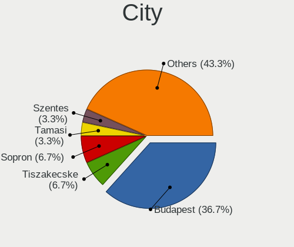
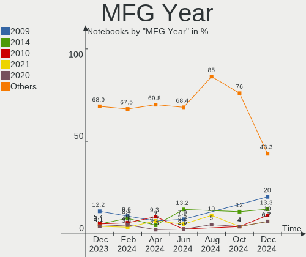
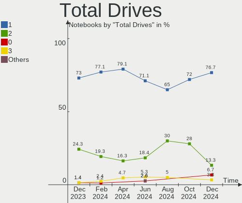
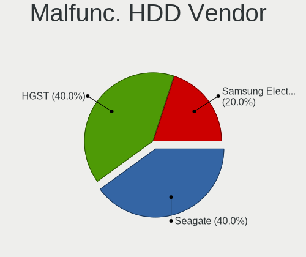
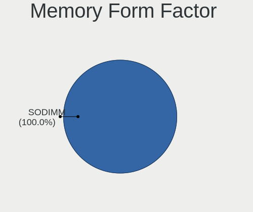
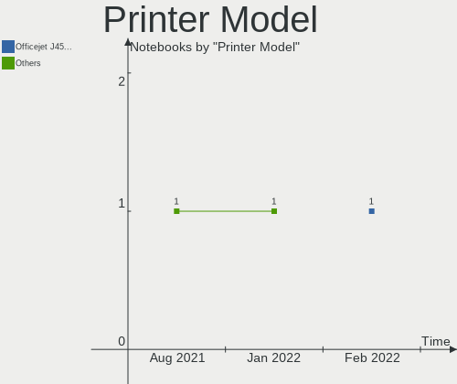

BlackPanther Hardware Trends (Notebook)
---------------------------------------

A project to identify most popular hardware characteristics and track their change
over time based on data collected by BlackPanther users at https://Linux-Hardware.org.

Anyone can contribute to the study by uploading probes of their computers by
the [hw-probe](https://github.com/linuxhw/hw-probe) tool:

    sudo -E hw-probe -all -upload

Full-feature report is available here: https://linux-hardware.org/?view=trends&formfactor=notebook

Period: Mar, 2021.

Contents
--------

- [ OS                       ](#os)
- [ OS Family                ](#os-family)
- [ Kernel                   ](#kernel)
- [ Kernel Family            ](#kernel-family)
- [ Kernel Major Ver.        ](#kernel-major-ver)
- [ Arch                     ](#arch)
- [ DE                       ](#de)
- [ Display Server           ](#display-server)
- [ Display Manager          ](#display-manager)
- [ OS Lang                  ](#os-lang)
- [ Boot Mode                ](#boot-mode)
- [ Filesystem               ](#filesystem)
- [ Part. scheme             ](#part-scheme)
- [ Dual Boot with Linux/BSD ](#dual-boot-with-linux/bsd)
- [ Dual Boot (Win)          ](#dual-boot-win)
- [ Country                  ](#country)
- [ City                     ](#city)
- [ Vendor                   ](#vendor)
- [ Model                    ](#model)
- [ Model Family             ](#model-family)
- [ MFG Year                 ](#mfg-year)
- [ Form Factor              ](#form-factor)
- [ Secure Boot              ](#secure-boot)
- [ Coreboot                 ](#coreboot)
- [ RAM Size                 ](#ram-size)
- [ RAM Used                 ](#ram-used)
- [ Has CD-ROM               ](#has-cd-rom)
- [ Total Drives             ](#total-drives)
- [ Has Ethernet             ](#has-ethernet)
- [ Has WiFi                 ](#has-wifi)
- [ Has Bluetooth            ](#has-bluetooth)
- [ Drive Vendor             ](#drive-vendor)
- [ Drive Model              ](#drive-model)
- [ HDD Vendor               ](#hdd-vendor)
- [ SSD Vendor               ](#ssd-vendor)
- [ Drive Kind               ](#drive-kind)
- [ Drive Connector          ](#drive-connector)
- [ Drive Size               ](#drive-size)
- [ Space Total              ](#space-total)
- [ Space Used               ](#space-used)
- [ Malfunc. Drives          ](#malfunc-drives)
- [ Malfunc. Drive Vendor    ](#malfunc-drive-vendor)
- [ Malfunc. HDD Vendor      ](#malfunc-hdd-vendor)
- [ Malfunc. Drive Kind      ](#malfunc-drive-kind)
- [ Failed Drives            ](#failed-drives)
- [ Failed Drive Vendor      ](#failed-drive-vendor)
- [ Drive Status             ](#drive-status)
- [ Storage Vendor           ](#storage-vendor)
- [ Storage Model            ](#storage-model)
- [ Storage Kind             ](#storage-kind)
- [ CPU Vendor               ](#cpu-vendor)
- [ CPU Model                ](#cpu-model)
- [ CPU Model Family         ](#cpu-model-family)
- [ CPU Cores                ](#cpu-cores)
- [ CPU Sockets              ](#cpu-sockets)
- [ CPU Threads              ](#cpu-threads)
- [ CPU Op-Modes             ](#cpu-op-modes)
- [ CPU Microcode            ](#cpu-microcode)
- [ CPU Microarch            ](#cpu-microarch)
- [ GPU Vendor               ](#gpu-vendor)
- [ GPU Model                ](#gpu-model)
- [ GPU Combo                ](#gpu-combo)
- [ GPU Driver               ](#gpu-driver)
- [ GPU Memory               ](#gpu-memory)
- [ Monitor Vendor           ](#monitor-vendor)
- [ Monitor Model            ](#monitor-model)
- [ Monitor Resolution       ](#monitor-resolution)
- [ Monitor Diagonal         ](#monitor-diagonal)
- [ Monitor Width            ](#monitor-width)
- [ Aspect Ratio             ](#aspect-ratio)
- [ Monitor Area             ](#monitor-area)
- [ Pixel Density            ](#pixel-density)
- [ Multiple Monitors        ](#multiple-monitors)
- [ Net Controller Vendor    ](#net-controller-vendor)
- [ Net Controller Model     ](#net-controller-model)
- [ Wireless Vendor          ](#wireless-vendor)
- [ Wireless Model           ](#wireless-model)
- [ Ethernet Vendor          ](#ethernet-vendor)
- [ Ethernet Model           ](#ethernet-model)
- [ Net Controller Kind      ](#net-controller-kind)
- [ Used Controller          ](#used-controller)
- [ NICs                     ](#nics)
- [ IPv6                     ](#ipv6)
- [ Memory Vendor            ](#memory-vendor)
- [ Memory Model             ](#memory-model)
- [ Memory Kind              ](#memory-kind)
- [ Memory Form Factor       ](#memory-form-factor)
- [ Memory Size              ](#memory-size)
- [ Memory Speed             ](#memory-speed)
- [ Sound Vendor             ](#sound-vendor)
- [ Sound Model              ](#sound-model)
- [ Camera Vendor            ](#camera-vendor)
- [ Camera Model             ](#camera-model)
- [ Fingerprint Vendor       ](#fingerprint-vendor)
- [ Fingerprint Model        ](#fingerprint-model)
- [ Chipcard Vendor          ](#chipcard-vendor)
- [ Chipcard Model           ](#chipcard-model)
- [ Printer Vendor           ](#printer-vendor)
- [ Printer Model            ](#printer-model)
- [ Scanner Vendor           ](#scanner-vendor)
- [ Scanner Model            ](#scanner-model)
- [ Bluetooth Vendor         ](#bluetooth-vendor)
- [ Bluetooth Model          ](#bluetooth-model)
- [ Unsupported Devices      ](#unsupported-devices)
- [ Unsupported Device Types ](#unsupported-device-types)

OS
--

Installed operating systems

| Name              | Notebooks | Percent |
|-------------------|-----------|---------|
| BlackPanther 18.1 | 119       | 97.54%  |
| BlackPanther 16.2 | 3         | 2.46%   |

OS Family
---------

OS without a version

| Name         | Notebooks | Percent |
|--------------|-----------|---------|
| BlackPanther | 122       | 100%    |

Kernel
------

Version of the Linux kernel

| Version                | Notebooks | Percent |
|------------------------|-----------|---------|
| 5.6.14-desktop-2bP     | 79        | 64.75%  |
| 4.18.16-desktop-1bP    | 39        | 31.97%  |
| 4.9.20-desktop-pae-1bP | 3         | 2.46%   |
| 5.10.1-desktop-1bP     | 1         | 0.82%   |

Kernel Family
-------------

Linux kernel without a distro release

| Version | Notebooks | Percent |
|---------|-----------|---------|
| 5.6.14  | 79        | 64.75%  |
| 4.18.16 | 39        | 31.97%  |
| 4.9.20  | 3         | 2.46%   |
| 5.10.1  | 1         | 0.82%   |

Kernel Major Ver.
-----------------

Linux kernel major version

| Version | Notebooks | Percent |
|---------|-----------|---------|
| 5.6     | 79        | 64.75%  |
| 4.18    | 39        | 31.97%  |
| 4.9     | 3         | 2.46%   |
| 5.10    | 1         | 0.82%   |

Arch
----

OS architecture (x86_64, i586, etc.)

| Name   | Notebooks | Percent |
|--------|-----------|---------|
| x86_64 | 119       | 97.54%  |
| i686   | 3         | 2.46%   |

DE
--

Desktop Environment

| Name    | Notebooks | Percent |
|---------|-----------|---------|
| KDE5    | 119       | 97.54%  |
| Unknown | 2         | 1.64%   |
| KDE     | 1         | 0.82%   |

Display Server
--------------

X11 or Wayland

| Name    | Notebooks | Percent |
|---------|-----------|---------|
| X11     | 121       | 99.18%  |
| Wayland | 1         | 0.82%   |

Display Manager
---------------

SDDM, LightDM, etc.

| Name    | Notebooks | Percent |
|---------|-----------|---------|
| SDDM    | 121       | 99.18%  |
| Unknown | 1         | 0.82%   |

OS Lang
-------

Language

| Lang    | Notebooks | Percent |
|---------|-----------|---------|
| Unknown | 121       | 99.18%  |
| hu_HU   | 1         | 0.82%   |

Boot Mode
---------

EFI or BIOS

| Mode | Notebooks | Percent |
|------|-----------|---------|
| BIOS | 65        | 53.28%  |
| EFI  | 57        | 46.72%  |

Filesystem
----------

Type of filesystem

| Type    | Notebooks | Percent |
|---------|-----------|---------|
| Overlay | 85        | 69.67%  |
| Ext4    | 37        | 30.33%  |

Part. scheme
------------

Scheme of partitioning

| Type    | Notebooks | Percent |
|---------|-----------|---------|
| MBR     | 66        | 54.1%   |
| GPT     | 55        | 45.08%  |
| Unknown | 1         | 0.82%   |

Dual Boot with Linux/BSD
------------------------

Hosting more than one Linux/BSD

| Dual boot | Notebooks | Percent |
|-----------|-----------|---------|
| No        | 72        | 59.02%  |
| Yes       | 50        | 40.98%  |

Dual Boot (Win)
---------------

Hosting Linux and Windows

| Dual boot | Notebooks | Percent |
|-----------|-----------|---------|
| No        | 66        | 54.1%   |
| Yes       | 56        | 45.9%   |

Country
-------

Geographic location (country)

| Country     | Notebooks | Percent |
|-------------|-----------|---------|
| Hungary     | 90        | 73.77%  |
| Slovakia    | 4         | 3.28%   |
| Romania     | 3         | 2.46%   |
| Germany     | 3         | 2.46%   |
| USA         | 2         | 1.64%   |
| Serbia      | 2         | 1.64%   |
| Poland      | 2         | 1.64%   |
| Italy       | 2         | 1.64%   |
| Canada      | 2         | 1.64%   |
| Belgium     | 2         | 1.64%   |
| Austria     | 2         | 1.64%   |
| UAE         | 1         | 0.82%   |
| Slovenia    | 1         | 0.82%   |
| Puerto Rico | 1         | 0.82%   |
| Moldova     | 1         | 0.82%   |
| Jordan      | 1         | 0.82%   |
| Greece      | 1         | 0.82%   |
| Czechia     | 1         | 0.82%   |
| Algeria     | 1         | 0.82%   |

City
----

Geographic location (city)

| City              | Notebooks | Percent |
|-------------------|-----------|---------|
| Budapest          | 24        | 19.67%  |
| Tatabánya        | 4         | 3.28%   |
| Érd              | 2         | 1.64%   |
| Warsaw            | 2         | 1.64%   |
| Veszprém         | 2         | 1.64%   |
| Vaja              | 2         | 1.64%   |
| Târgu Mureş     | 2         | 1.64%   |
| Szolnok           | 2         | 1.64%   |
| Szigetszentmiklos | 2         | 1.64%   |
| Miskolc           | 2         | 1.64%   |
| Marcali           | 2         | 1.64%   |
| Linz              | 2         | 1.64%   |
| Keszthely         | 2         | 1.64%   |
| Hajduszoboszlo    | 2         | 1.64%   |
| Esztergom         | 2         | 1.64%   |
| Bratislava        | 2         | 1.64%   |
| Zirc              | 1         | 0.82%   |
| Velbert           | 1         | 0.82%   |
| Valley Village    | 1         | 0.82%   |
| Tura              | 1         | 0.82%   |
| Tokod             | 1         | 0.82%   |
| Tiszaujvaros      | 1         | 0.82%   |
| Tiszafured        | 1         | 0.82%   |
| Thessaloniki      | 1         | 0.82%   |
| Tapioszentmarton  | 1         | 0.82%   |
| Taktaszada        | 1         | 0.82%   |
| Székesfehérvár | 1         | 0.82%   |
| Szugy             | 1         | 0.82%   |
| Szigethalom       | 1         | 0.82%   |
| Szerencs          | 1         | 0.82%   |
| Szentes           | 1         | 0.82%   |
| Szentendre        | 1         | 0.82%   |
| Szazhalombatta    | 1         | 0.82%   |
| Sterrebeek        | 1         | 0.82%   |
| Sopron            | 1         | 0.82%   |
| Schwetzingen      | 1         | 0.82%   |
| Rome              | 1         | 0.82%   |
| Pécs             | 1         | 0.82%   |
| Postojna          | 1         | 0.82%   |
| Pomaz             | 1         | 0.82%   |
| Pobedim           | 1         | 0.82%   |
| Peer              | 1         | 0.82%   |
| Pap               | 1         | 0.82%   |
| Oroszlany         | 1         | 0.82%   |
| Oran              | 1         | 0.82%   |
| Niš              | 1         | 0.82%   |
| Nebraska City     | 1         | 0.82%   |
| Nagykanizsa       | 1         | 0.82%   |
| Mosonszentmiklos  | 1         | 0.82%   |
| Monor             | 1         | 0.82%   |
| Merritt           | 1         | 0.82%   |
| Megyaszo          | 1         | 0.82%   |
| Marrtown          | 1         | 0.82%   |
| Magdeburg         | 1         | 0.82%   |
| Košice           | 1         | 0.82%   |
| Kisvarda          | 1         | 0.82%   |
| Kiskunmajsa       | 1         | 0.82%   |
| Kerepes           | 1         | 0.82%   |
| Karcag            | 1         | 0.82%   |
| Kaposvár         | 1         | 0.82%   |

Vendor
------

Motherboard manufacturer

| Name                | Notebooks | Percent |
|---------------------|-----------|---------|
| Hewlett-Packard     | 26        | 21.31%  |
| Lenovo              | 25        | 20.49%  |
| Dell                | 20        | 16.39%  |
| ASUSTek Computer    | 20        | 16.39%  |
| Acer                | 13        | 10.66%  |
| Toshiba             | 4         | 3.28%   |
| Sony                | 2         | 1.64%   |
| Samsung Electronics | 2         | 1.64%   |
| MSI                 | 2         | 1.64%   |
| Medion              | 2         | 1.64%   |
| Packard Bell        | 1         | 0.82%   |
| Fujitsu Siemens     | 1         | 0.82%   |
| Fujitsu             | 1         | 0.82%   |
| eMachines           | 1         | 0.82%   |
| Alcor               | 1         | 0.82%   |
| A15HV01             | 1         | 0.82%   |

Model
-----

Motherboard model

| Name                                       | Notebooks | Percent |
|--------------------------------------------|-----------|---------|
| HP 250 G1                                  | 5         | 4.1%    |
| Lenovo IdeaPad 330-15IKB 81DE              | 3         | 2.46%   |
| HP Notebook                                | 3         | 2.46%   |
| Medion AKOYA E1317T                        | 2         | 1.64%   |
| HP Laptop 17-ak0xx                         | 2         | 1.64%   |
| HP 250 G4                                  | 2         | 1.64%   |
| Dell Latitude D630                         | 2         | 1.64%   |
| ASUS X550CC                                | 2         | 1.64%   |
| ASUS VivoBook 15_ASUS Laptop X540UBR       | 2         | 1.64%   |
| Acer Aspire 5755G                          | 2         | 1.64%   |
| Toshiba Satellite C650                     | 1         | 0.82%   |
| Toshiba Satellite C55D-A                   | 1         | 0.82%   |
| Toshiba Satellite C50-A-14G                | 1         | 0.82%   |
| Toshiba Satellite A300                     | 1         | 0.82%   |
| Sony VPCSB21FD                             | 1         | 0.82%   |
| Sony SVF1521B1EW                           | 1         | 0.82%   |
| Samsung 350V5C/351V5C/3540VC/3440VC        | 1         | 0.82%   |
| Samsung 300E4A/300E5A/300E7A/3430EA/3530EA | 1         | 0.82%   |
| Packard Bell EasyNote TS44HR               | 1         | 0.82%   |
| MSI GP72 2QE                               | 1         | 0.82%   |
| MSI GF65 Thin 10SDR                        | 1         | 0.82%   |
| Lenovo V330-15IKB 81AX                     | 1         | 0.82%   |
| Lenovo V15-ADA 82C7                        | 1         | 0.82%   |
| Lenovo ThinkPad X201 Tablet 3239A33        | 1         | 0.82%   |
| Lenovo ThinkPad X201 3680AQ1               | 1         | 0.82%   |
| Lenovo ThinkPad X100e 287627G              | 1         | 0.82%   |
| Lenovo ThinkPad W510 4876A46               | 1         | 0.82%   |
| Lenovo ThinkPad W510 431924G               | 1         | 0.82%   |
| Lenovo ThinkPad T61 6458WK6                | 1         | 0.82%   |
| Lenovo ThinkPad T400 6475VZZ               | 1         | 0.82%   |
| Lenovo ThinkBook 15 G2 ITL 20VE            | 1         | 0.82%   |
| Lenovo Legion Y540-15IRH-PG0 81SY          | 1         | 0.82%   |
| Lenovo IdeaPad L340-17IRH Gaming 81LL      | 1         | 0.82%   |
| Lenovo IdeaPad 700-15ISK 80RU              | 1         | 0.82%   |
| Lenovo IdeaPad 510-15IKB 80SV              | 1         | 0.82%   |
| Lenovo IdeaPad 320-17IKB 80XM              | 1         | 0.82%   |
| Lenovo IdeaPad 320-17ABR 80YN              | 1         | 0.82%   |
| Lenovo IdeaPad 310-15ISK 80SM              | 1         | 0.82%   |
| Lenovo G550 20023                          | 1         | 0.82%   |
| Lenovo G500 20236                          | 1         | 0.82%   |
| Lenovo G50-45 80E3                         | 1         | 0.82%   |
| Lenovo E50-80 80J2                         | 1         | 0.82%   |
| Lenovo 3000 N100 0768BNG                   | 1         | 0.82%   |
| HP ProBook 6570b                           | 1         | 0.82%   |
| HP ProBook 650 G1                          | 1         | 0.82%   |
| HP ProBook 6460b                           | 1         | 0.82%   |
| HP ProBook 640 G1                          | 1         | 0.82%   |
| HP Pavilion dv6                            | 1         | 0.82%   |
| HP Pavilion dv5                            | 1         | 0.82%   |
| HP EliteBook 8540p                         | 1         | 0.82%   |
| HP EliteBook 8460p                         | 1         | 0.82%   |
| HP EliteBook 820 G1                        | 1         | 0.82%   |
| HP EliteBook 6930p                         | 1         | 0.82%   |
| HP EliteBook 2540p                         | 1         | 0.82%   |
| HP Compaq 6710b (GB890EA#AKC)              | 1         | 0.82%   |
| HP 650                                     | 1         | 0.82%   |
| HP 2000                                    | 1         | 0.82%   |
| Fujitsu Siemens AMILO Pro Edition V3505    | 1         | 0.82%   |
| Fujitsu FMVNP7HE                           | 1         | 0.82%   |
| eMachines E525                             | 1         | 0.82%   |

Model Family
------------

Motherboard model prefix

| Name                  | Notebooks | Percent |
|-----------------------|-----------|---------|
| Dell Latitude         | 12        | 9.84%   |
| Lenovo IdeaPad        | 9         | 7.38%   |
| Acer Aspire           | 9         | 7.38%   |
| Lenovo ThinkPad       | 7         | 5.74%   |
| HP 250                | 7         | 5.74%   |
| Dell Inspiron         | 6         | 4.92%   |
| HP EliteBook          | 5         | 4.1%    |
| Toshiba Satellite     | 4         | 3.28%   |
| HP ProBook            | 4         | 3.28%   |
| HP Notebook           | 3         | 2.46%   |
| ASUS VivoBook         | 3         | 2.46%   |
| Acer TravelMate       | 3         | 2.46%   |
| Medion AKOYA          | 2         | 1.64%   |
| HP Pavilion           | 2         | 1.64%   |
| HP Laptop             | 2         | 1.64%   |
| ASUS X550CC           | 2         | 1.64%   |
| Sony VPCSB21FD        | 1         | 0.82%   |
| Sony SVF1521B1EW      | 1         | 0.82%   |
| Samsung 350V5C        | 1         | 0.82%   |
| Samsung 300E4A        | 1         | 0.82%   |
| Packard Bell EasyNote | 1         | 0.82%   |
| MSI GP72              | 1         | 0.82%   |
| MSI GF65              | 1         | 0.82%   |
| Lenovo V330-15IKB     | 1         | 0.82%   |
| Lenovo V15-ADA        | 1         | 0.82%   |
| Lenovo ThinkBook      | 1         | 0.82%   |
| Lenovo Legion         | 1         | 0.82%   |
| Lenovo G550           | 1         | 0.82%   |
| Lenovo G500           | 1         | 0.82%   |
| Lenovo G50-45         | 1         | 0.82%   |
| Lenovo E50-80         | 1         | 0.82%   |
| Lenovo 3000           | 1         | 0.82%   |
| HP Compaq             | 1         | 0.82%   |
| HP 650                | 1         | 0.82%   |
| HP 2000               | 1         | 0.82%   |
| Fujitsu Siemens AMILO | 1         | 0.82%   |
| Fujitsu FMVNP7HE      | 1         | 0.82%   |
| eMachines E525        | 1         | 0.82%   |
| Dell G3               | 1         | 0.82%   |
| Dell BNPPE5400        | 1         | 0.82%   |
| ASUS ZenBook          | 1         | 0.82%   |
| ASUS X541UAK          | 1         | 0.82%   |
| ASUS X541NA           | 1         | 0.82%   |
| ASUS X540YA           | 1         | 0.82%   |
| ASUS X540SA           | 1         | 0.82%   |
| ASUS X540LJ           | 1         | 0.82%   |
| ASUS X540LA           | 1         | 0.82%   |
| ASUS UX51VZA          | 1         | 0.82%   |
| ASUS Strix            | 1         | 0.82%   |
| ASUS N552VX           | 1         | 0.82%   |
| ASUS K53U             | 1         | 0.82%   |
| ASUS K52Je            | 1         | 0.82%   |
| ASUS K50AB            | 1         | 0.82%   |
| ASUS GL752VW          | 1         | 0.82%   |
| ASUS ASUS             | 1         | 0.82%   |
| Alcor SnugBook        | 1         | 0.82%   |
| Acer AOHAPPY          | 1         | 0.82%   |
| Unknown               | 1         | 0.82%   |

MFG Year
--------

Motherboard manufacture year

| Year | Notebooks | Percent |
|------|-----------|---------|
| 2013 | 19        | 15.57%  |
| 2020 | 13        | 10.66%  |
| 2017 | 11        | 9.02%   |
| 2011 | 11        | 9.02%   |
| 2018 | 8         | 6.56%   |
| 2016 | 8         | 6.56%   |
| 2010 | 8         | 6.56%   |
| 2019 | 7         | 5.74%   |
| 2015 | 7         | 5.74%   |
| 2012 | 7         | 5.74%   |
| 2014 | 6         | 4.92%   |
| 2009 | 5         | 4.1%    |
| 2008 | 4         | 3.28%   |
| 2007 | 4         | 3.28%   |
| 2006 | 4         | 3.28%   |

Form Factor
-----------

Physical design of the computer

| Name     | Notebooks | Percent |
|----------|-----------|---------|
| Notebook | 122       | 100%    |

Secure Boot
-----------

Enabled or disabled

| State    | Notebooks | Percent |
|----------|-----------|---------|
| Disabled | 122       | 100%    |

Coreboot
--------

Have coreboot on board

| Used | Notebooks | Percent |
|------|-----------|---------|
| No   | 122       | 100%    |

RAM Size
--------

Total RAM memory

| Size in GB | Notebooks | Percent |
|------------|-----------|---------|
| 3.01-4.0   | 51        | 41.8%   |
| 4.01-8.0   | 32        | 26.23%  |
| 8.01-16.0  | 17        | 13.93%  |
| 1.01-2.0   | 13        | 10.66%  |
| 16.01-24.0 | 4         | 3.28%   |
| 2.01-3.0   | 3         | 2.46%   |
| 32.01-64.0 | 1         | 0.82%   |
| 0.51-1.0   | 1         | 0.82%   |

RAM Used
--------

Used RAM memory

| Used GB  | Notebooks | Percent |
|----------|-----------|---------|
| 0.51-1.0 | 59        | 48.36%  |
| 1.01-2.0 | 39        | 31.97%  |
| 0.01-0.5 | 21        | 17.21%  |
| 2.01-3.0 | 3         | 2.46%   |

Has CD-ROM
----------

Has CD-ROM on board

| Presented | Notebooks | Percent |
|-----------|-----------|---------|
| Yes       | 79        | 64.75%  |
| No        | 43        | 35.25%  |

Total Drives
------------

Number of drives on board

| Drives | Notebooks | Percent |
|--------|-----------|---------|
| 1      | 98        | 80.33%  |
| 2      | 19        | 15.57%  |
| 0      | 3         | 2.46%   |
| 3      | 2         | 1.64%   |

Has Ethernet
------------

Has Ethernet on board

| Presented | Notebooks | Percent |
|-----------|-----------|---------|
| Yes       | 115       | 94.26%  |
| No        | 7         | 5.74%   |

Has WiFi
--------

Has WiFi module

| Presented | Notebooks | Percent |
|-----------|-----------|---------|
| Yes       | 122       | 100%    |

Has Bluetooth
-------------

Has Bluetooth module

| Presented | Notebooks | Percent |
|-----------|-----------|---------|
| Yes       | 98        | 80.33%  |
| No        | 24        | 19.67%  |

Drive Vendor
------------

Hard drive vendors

| Vendor              | Notebooks | Drives | Percent |
|---------------------|-----------|--------|---------|
| Seagate             | 26        | 26     | 18.18%  |
| Toshiba             | 18        | 18     | 12.59%  |
| WDC                 | 17        | 18     | 11.89%  |
| Kingston            | 14        | 16     | 9.79%   |
| Hitachi             | 14        | 15     | 9.79%   |
| Samsung Electronics | 12        | 12     | 8.39%   |
| HGST                | 11        | 11     | 7.69%   |
| SanDisk             | 4         | 4      | 2.8%    |
| Crucial             | 3         | 3      | 2.1%    |
| Unknown             | 2         | 2      | 1.4%    |
| JMicron             | 2         | 2      | 1.4%    |
| Intenso             | 2         | 2      | 1.4%    |
| Intel               | 2         | 2      | 1.4%    |
| A-DATA Technology   | 2         | 2      | 1.4%    |
| USB2.0              | 1         | 1      | 0.7%    |
| Team                | 1         | 1      | 0.7%    |
| SPCC                | 1         | 1      | 0.7%    |
| SK Hynix            | 1         | 1      | 0.7%    |
| PNY                 | 1         | 1      | 0.7%    |
| Patriot             | 1         | 1      | 0.7%    |
| OCZ                 | 1         | 1      | 0.7%    |
| Micron Technology   | 1         | 1      | 0.7%    |
| LITEON              | 1         | 1      | 0.7%    |
| Kingmax             | 1         | 1      | 0.7%    |
| IBM/Hitachi         | 1         | 1      | 0.7%    |
| GOODRAM             | 1         | 1      | 0.7%    |
| Fujitsu             | 1         | 1      | 0.7%    |
| Apacer              | 1         | 1      | 0.7%    |

Drive Model
-----------

Hard drive models

| Model                                 | Notebooks | Percent |
|---------------------------------------|-----------|---------|
| Toshiba MQ01ABF050 500GB              | 6         | 4.08%   |
| Seagate ST500LT012-1DG142 500GB       | 6         | 4.08%   |
| Kingston SA400S37120G 120GB SSD       | 6         | 4.08%   |
| HGST HTS545050A7E680 500GB            | 5         | 3.4%    |
| Seagate ST1000LM035-1RK172 1TB        | 4         | 2.72%   |
| HGST HTS545032A7E380 320GB            | 4         | 2.72%   |
| WDC WD10SPCX-24HWST1 1TB              | 3         | 2.04%   |
| Kingston SA400S37240G 240GB SSD       | 3         | 2.04%   |
| WDC WD5000BPVT-00HXZT3 500GB          | 2         | 1.36%   |
| Toshiba MQ01ACF032 320GB              | 2         | 1.36%   |
| Seagate ST1000LM048-2E7172 1TB        | 2         | 1.36%   |
| Seagate ST1000LM024 HN-M101MBB 1TB    | 2         | 1.36%   |
| SanDisk SSD PLUS 240GB                | 2         | 1.36%   |
| Samsung SSD 860 EVO 250GB             | 2         | 1.36%   |
| Hitachi HTS725032A9A364 320GB         | 2         | 1.36%   |
| Hitachi HTS545025B9A300 250GB         | 2         | 1.36%   |
| Hitachi HTS543216L9A300 160GB         | 2         | 1.36%   |
| Crucial CT120BX500SSD1 120GB          | 2         | 1.36%   |
| WDC WDS500G2B0B-00YS70 500GB SSD      | 1         | 0.68%   |
| WDC WDS240G2G0A-00JH30 240GB SSD      | 1         | 0.68%   |
| WDC WD800BEVT-75ZCT2 80GB             | 1         | 0.68%   |
| WDC WD5000LPCX-24C6HT0 500GB          | 1         | 0.68%   |
| WDC WD5000LPCX-22VHAT1 500GB          | 1         | 0.68%   |
| WDC WD3200BPVT-26JJ5T0 320GB          | 1         | 0.68%   |
| WDC WD3200BEVT-80A0RT0 320GB          | 1         | 0.68%   |
| WDC WD3200BEVT-08A23T1 320GB          | 1         | 0.68%   |
| WDC WD3200BEKT-60V5T1 320GB           | 1         | 0.68%   |
| WDC WD1600BEVT-60ZCT1 160GB           | 1         | 0.68%   |
| WDC WD1600BEVT-00A23T0 160GB          | 1         | 0.68%   |
| WDC WD10SPZX-24Z10T0 1TB              | 1         | 0.68%   |
| WDC PC SN530 SDBPNPZ-512G-1032 512GB  | 1         | 0.68%   |
| USB2.0 CardReader                     | 1         | 0.68%   |
| Unknown SU04G  4GB                    | 1         | 0.68%   |
| Unknown DA4064  64GB                  | 1         | 0.68%   |
| Toshiba TL100 120GB SSD               | 1         | 0.68%   |
| Toshiba MQ04ABF100 1TB                | 1         | 0.68%   |
| Toshiba MQ01ABD100 1TB                | 1         | 0.68%   |
| Toshiba MQ01ABD075 752GB              | 1         | 0.68%   |
| Toshiba MQ01ABD050 500GB              | 1         | 0.68%   |
| Toshiba MK5056GSY 500GB               | 1         | 0.68%   |
| Toshiba MK1637GSX 160GB               | 1         | 0.68%   |
| Toshiba KBG40ZNS256G NVMe 256GB       | 1         | 0.68%   |
| Toshiba KBG40ZNS128G NVMe 128GB       | 1         | 0.68%   |
| Toshiba HDWL120 2TB                   | 1         | 0.68%   |
| Team T253X1480G 480GB SSD             | 1         | 0.68%   |
| SPCC M.2 PCIe SSD 1TB                 | 1         | 0.68%   |
| SK Hynix HFS128G32TND-N210A 128GB SSD | 1         | 0.68%   |
| Seagate ST980811AS 80GB               | 1         | 0.68%   |
| Seagate ST950056 20AS 500GB           | 1         | 0.68%   |
| Seagate ST9320325AS 320GB             | 1         | 0.68%   |
| Seagate ST9160821AS 160GB             | 1         | 0.68%   |
| Seagate ST500LT012-9WS142 500GB       | 1         | 0.68%   |
| Seagate ST500LM034-2GH17A 500GB       | 1         | 0.68%   |
| Seagate ST500LM021-1KJ152 500GB       | 1         | 0.68%   |
| Seagate ST250LM004 HN-M250MBB 250GB   | 1         | 0.68%   |
| Seagate ST1000LX015-1U7172 1TB        | 1         | 0.68%   |
| Seagate ST1000LM049-2GH172 1TB        | 1         | 0.68%   |
| Seagate M3 Portable 1TB               | 1         | 0.68%   |
| Seagate Expansion 1TB                 | 1         | 0.68%   |
| SanDisk SSD PLUS 1000GB               | 1         | 0.68%   |

HDD Vendor
----------

Hard disk drive vendors

| Vendor              | Notebooks | Drives | Percent |
|---------------------|-----------|--------|---------|
| Seagate             | 25        | 25     | 30.12%  |
| WDC                 | 15        | 15     | 18.07%  |
| Toshiba             | 15        | 15     | 18.07%  |
| Hitachi             | 14        | 15     | 16.87%  |
| HGST                | 11        | 11     | 13.25%  |
| Samsung Electronics | 1         | 1      | 1.2%    |
| IBM/Hitachi         | 1         | 1      | 1.2%    |
| Fujitsu             | 1         | 1      | 1.2%    |

SSD Vendor
----------

Solid state drive vendors

| Vendor              | Notebooks | Drives | Percent |
|---------------------|-----------|--------|---------|
| Kingston            | 13        | 15     | 28.89%  |
| Samsung Electronics | 7         | 7      | 15.56%  |
| SanDisk             | 3         | 3      | 6.67%   |
| Crucial             | 3         | 3      | 6.67%   |
| WDC                 | 2         | 2      | 4.44%   |
| Intenso             | 2         | 2      | 4.44%   |
| Intel               | 2         | 2      | 4.44%   |
| A-DATA Technology   | 2         | 2      | 4.44%   |
| Toshiba             | 1         | 1      | 2.22%   |
| Team                | 1         | 1      | 2.22%   |
| SK Hynix            | 1         | 1      | 2.22%   |
| PNY                 | 1         | 1      | 2.22%   |
| Patriot             | 1         | 1      | 2.22%   |
| OCZ                 | 1         | 1      | 2.22%   |
| LITEON              | 1         | 1      | 2.22%   |
| Kingmax             | 1         | 1      | 2.22%   |
| JMicron             | 1         | 1      | 2.22%   |
| GOODRAM             | 1         | 1      | 2.22%   |
| Apacer              | 1         | 1      | 2.22%   |

Drive Kind
----------

HDD or SSD

| Kind    | Notebooks | Drives | Percent |
|---------|-----------|--------|---------|
| HDD     | 83        | 84     | 59.29%  |
| SSD     | 42        | 47     | 30%     |
| NVMe    | 9         | 10     | 6.43%   |
| MMC     | 3         | 3      | 2.14%   |
| Unknown | 3         | 3      | 2.14%   |

Drive Connector
---------------

SATA, SAS, NVMe, etc.

| Type | Notebooks | Drives | Percent |
|------|-----------|--------|---------|
| SATA | 112       | 126    | 84.85%  |
| NVMe | 9         | 10     | 6.82%   |
| SAS  | 8         | 8      | 6.06%   |
| MMC  | 3         | 3      | 2.27%   |

Drive Size
----------

Size of hard drive

| Size in TB | Notebooks | Drives | Percent |
|------------|-----------|--------|---------|
| 0.01-0.5   | 96        | 108    | 80.67%  |
| 0.51-1.0   | 21        | 21     | 17.65%  |
| 1.01-2.0   | 2         | 2      | 1.68%   |

Space Total
-----------

Amount of disk space available on the file system

| Size in GB | Notebooks | Percent |
|------------|-----------|---------|
| Unknown    | 80        | 65.57%  |
| 101-250    | 16        | 13.11%  |
| 251-500    | 14        | 11.48%  |
| 51-100     | 8         | 6.56%   |
| 21-50      | 3         | 2.46%   |
| 501-1000   | 1         | 0.82%   |

Space Used
----------

Amount of used disk space

| Used GB | Notebooks | Percent |
|---------|-----------|---------|
| Unknown | 80        | 65.57%  |
| 1-20    | 32        | 26.23%  |
| 21-50   | 5         | 4.1%    |
| 101-250 | 3         | 2.46%   |
| 51-100  | 2         | 1.64%   |

Malfunc. Drives
---------------

Drive models with a malfunction

| Model                               | Notebooks | Drives | Percent |
|-------------------------------------|-----------|--------|---------|
| HGST HTS545050A7E680 500GB          | 5         | 5      | 11.63%  |
| HGST HTS545032A7E380 320GB          | 4         | 4      | 9.3%    |
| Toshiba MQ01ABF050 500GB            | 3         | 3      | 6.98%   |
| Seagate ST500LT012-1DG142 500GB     | 3         | 3      | 6.98%   |
| Hitachi HTS545025B9A300 250GB       | 2         | 2      | 4.65%   |
| Hitachi HTS543216L9A300 160GB       | 2         | 2      | 4.65%   |
| WDC WD5000LPCX-24C6HT0 500GB        | 1         | 1      | 2.33%   |
| WDC WD5000BPVT-00HXZT3 500GB        | 1         | 1      | 2.33%   |
| WDC WD3200BEVT-80A0RT0 320GB        | 1         | 1      | 2.33%   |
| WDC WD3200BEKT-60V5T1 320GB         | 1         | 1      | 2.33%   |
| WDC WD1600BEVT-00A23T0 160GB        | 1         | 1      | 2.33%   |
| WDC WD10SPCX-24HWST1 1TB            | 1         | 1      | 2.33%   |
| Toshiba MQ01ABD050 500GB            | 1         | 1      | 2.33%   |
| Toshiba MK1637GSX 160GB             | 1         | 1      | 2.33%   |
| Seagate ST980811AS 80GB             | 1         | 1      | 2.33%   |
| Seagate ST9320325AS 320GB           | 1         | 1      | 2.33%   |
| Seagate ST9160821AS 160GB           | 1         | 1      | 2.33%   |
| Seagate ST500LT012-9WS142 500GB     | 1         | 1      | 2.33%   |
| Seagate ST250LM004 HN-M250MBB 250GB | 1         | 1      | 2.33%   |
| Seagate ST1000LX015-1U7172 1TB      | 1         | 1      | 2.33%   |
| Seagate ST1000LM024 HN-M101MBB 1TB  | 1         | 1      | 2.33%   |
| Kingston SV300S37A120G 120GB SSD    | 1         | 1      | 2.33%   |
| Intel SSDSC2BF180A4H 180GB          | 1         | 1      | 2.33%   |
| Intel SSDSA2M080G2HP 80GB           | 1         | 1      | 2.33%   |
| Hitachi HTS727550A9E364 500GB       | 1         | 1      | 2.33%   |
| Hitachi HTS723232A7A364 320GB       | 1         | 1      | 2.33%   |
| Hitachi HTS547550A9E384 500GB       | 1         | 1      | 2.33%   |
| Hitachi HCC543232A7A380 320GB       | 1         | 1      | 2.33%   |
| HGST HTS725050A7E630 500GB          | 1         | 1      | 2.33%   |
| Crucial CT275MX300SSD4 275GB        | 1         | 1      | 2.33%   |

Malfunc. Drive Vendor
---------------------

Vendors of faulty drives

| Vendor   | Notebooks | Drives | Percent |
|----------|-----------|--------|---------|
| Seagate  | 10        | 10     | 23.26%  |
| HGST     | 10        | 10     | 23.26%  |
| Hitachi  | 8         | 8      | 18.6%   |
| WDC      | 6         | 6      | 13.95%  |
| Toshiba  | 5         | 5      | 11.63%  |
| Intel    | 2         | 2      | 4.65%   |
| Kingston | 1         | 1      | 2.33%   |
| Crucial  | 1         | 1      | 2.33%   |

Malfunc. HDD Vendor
-------------------

Vendors of faulty HDD drives

| Vendor  | Notebooks | Drives | Percent |
|---------|-----------|--------|---------|
| Seagate | 10        | 10     | 25.64%  |
| HGST    | 10        | 10     | 25.64%  |
| Hitachi | 8         | 8      | 20.51%  |
| WDC     | 6         | 6      | 15.38%  |
| Toshiba | 5         | 5      | 12.82%  |

Malfunc. Drive Kind
-------------------

Kinds of faulty drives

| Kind | Notebooks | Drives | Percent |
|------|-----------|--------|---------|
| HDD  | 39        | 39     | 90.7%   |
| SSD  | 4         | 4      | 9.3%    |

Failed Drives
-------------

Failed drive models

Zero info for selected period =(

Failed Drive Vendor
-------------------

Failed drive vendors

Zero info for selected period =(

Drive Status
------------

Number of failed and malfunc. drives

| Status   | Notebooks | Drives | Percent |
|----------|-----------|--------|---------|
| Works    | 78        | 91     | 59.09%  |
| Malfunc  | 43        | 43     | 32.58%  |
| Detected | 11        | 13     | 8.33%   |

Storage Vendor
--------------

Storage controller vendors

| Vendor                      | Notebooks | Percent |
|-----------------------------|-----------|---------|
| Intel                       | 104       | 80.62%  |
| AMD                         | 15        | 11.63%  |
| Samsung Electronics         | 4         | 3.1%    |
| KIOXIA                      | 2         | 1.55%   |
| Silicon Motion              | 1         | 0.78%   |
| Sandisk                     | 1         | 0.78%   |
| Micron Technology           | 1         | 0.78%   |
| Kingston Technology Company | 1         | 0.78%   |

Storage Model
-------------

Storage controller models

| Model                                                                                  | Notebooks | Percent |
|----------------------------------------------------------------------------------------|-----------|---------|
| Intel 7 Series Chipset Family 6-port SATA Controller [AHCI mode]                       | 18        | 12.41%  |
| Intel Sunrise Point-LP SATA Controller [AHCI mode]                                     | 13        | 8.97%   |
| Intel 82801 Mobile SATA Controller [RAID mode]                                         | 9         | 6.21%   |
| Intel 6 Series/C200 Series Chipset Family 6 port Mobile SATA AHCI Controller           | 9         | 6.21%   |
| AMD FCH SATA Controller [AHCI mode]                                                    | 9         | 6.21%   |
| Intel Atom/Celeron/Pentium Processor x5-E8000/J3xxx/N3xxx Series SATA Controller       | 5         | 3.45%   |
| Intel 82801IBM/IEM (ICH9M/ICH9M-E) 4 port SATA Controller [AHCI mode]                  | 5         | 3.45%   |
| Intel 82801HM/HEM (ICH8M/ICH8M-E) IDE Controller                                       | 5         | 3.45%   |
| Intel Wildcat Point-LP SATA Controller [AHCI Mode]                                     | 4         | 2.76%   |
| Intel Cannon Lake Mobile PCH SATA AHCI Controller                                      | 4         | 2.76%   |
| Intel 82801HM/HEM (ICH8M/ICH8M-E) SATA Controller [AHCI mode]                          | 4         | 2.76%   |
| Intel 5 Series/3400 Series Chipset 6 port SATA AHCI Controller                         | 4         | 2.76%   |
| Intel HM170/QM170 Chipset SATA Controller [AHCI Mode]                                  | 3         | 2.07%   |
| Intel 82801IBM/IEM (ICH9M/ICH9M-E) 2 port SATA Controller [IDE mode]                   | 3         | 2.07%   |
| Intel 82801GBM/GHM (ICH7-M Family) SATA Controller [IDE mode]                          | 3         | 2.07%   |
| Intel 82801G (ICH7 Family) IDE Controller                                              | 3         | 2.07%   |
| Intel 8 Series SATA Controller 1 [AHCI mode]                                           | 3         | 2.07%   |
| Intel 5 Series/3400 Series Chipset 4 port SATA AHCI Controller                         | 3         | 2.07%   |
| AMD SB7x0/SB8x0/SB9x0 SATA Controller [AHCI mode]                                      | 3         | 2.07%   |
| Samsung NVMe Controller                                                                | 2         | 1.38%   |
| KIOXIA Non-Volatile memory controller                                                  | 2         | 1.38%   |
| Intel 82801GBM/GHM (ICH7-M Family) SATA Controller [AHCI mode]                         | 2         | 1.38%   |
| Intel 8 Series/C220 Series Chipset Family 6-port SATA Controller 1 [AHCI mode]         | 2         | 1.38%   |
| Intel 5 Series/3400 Series Chipset 4 port SATA IDE Controller                          | 2         | 1.38%   |
| AMD SB7x0/SB8x0/SB9x0 IDE Controller                                                   | 2         | 1.38%   |
| AMD FCH SATA Controller [IDE mode]                                                     | 2         | 1.38%   |
| Silicon Motion SM2262/SM2262EN SSD Controller                                          | 1         | 0.69%   |
| Sandisk WD Blue SN550 NVMe SSD                                                         | 1         | 0.69%   |
| Samsung NVMe SSD Controller SM981/PM981/PM983                                          | 1         | 0.69%   |
| Samsung NVMe SSD Controller SM961/PM961/SM963                                          | 1         | 0.69%   |
| Micron Non-Volatile memory controller                                                  | 1         | 0.69%   |
| Kingston Company A2000 NVMe SSD                                                        | 1         | 0.69%   |
| Intel Volume Management Device NVMe RAID Controller                                    | 1         | 0.69%   |
| Intel NM10/ICH7 Family SATA Controller [AHCI mode]                                     | 1         | 0.69%   |
| Intel Mobile PM965/GM965 PT IDER Controller                                            | 1         | 0.69%   |
| Intel Mobile 4 Series Chipset PT IDER Controller                                       | 1         | 0.69%   |
| Intel Celeron/Pentium Silver Processor SATA Controller                                 | 1         | 0.69%   |
| Intel Celeron N3350/Pentium N4200/Atom E3900 Series SATA AHCI Controller               | 1         | 0.69%   |
| Intel 82801HM/HEM (ICH8M/ICH8M-E) SATA Controller [IDE mode]                           | 1         | 0.69%   |
| Intel 8 Series/C220 Series Chipset Family 2-port SATA Controller 2 [IDE mode]          | 1         | 0.69%   |
| Intel 8 Series Chipset Family 4-port SATA Controller 1 [IDE mode] - Mobile             | 1         | 0.69%   |
| Intel 7 Series Chipset Family 4-port SATA Controller [IDE mode]                        | 1         | 0.69%   |
| Intel 7 Series Chipset Family 2-port SATA Controller [IDE mode]                        | 1         | 0.69%   |
| Intel 6 Series/C200 Series Chipset Family Mobile SATA Controller (IDE mode, ports 4-5) | 1         | 0.69%   |
| Intel 6 Series/C200 Series Chipset Family Mobile SATA Controller (IDE mode, ports 0-3) | 1         | 0.69%   |
| Intel 5 Series/3400 Series Chipset 2 port SATA IDE Controller                          | 1         | 0.69%   |
| AMD SB7x0/SB8x0/SB9x0 SATA Controller [IDE mode]                                       | 1         | 0.69%   |

Storage Kind
------------

Kind of storage controller (IDE, SATA, NVMe, SAS, ...)

| Kind | Notebooks | Percent |
|------|-----------|---------|
| SATA | 97        | 70.29%  |
| IDE  | 22        | 15.94%  |
| RAID | 10        | 7.25%   |
| NVMe | 9         | 6.52%   |

CPU Vendor
----------

Processor vendors

| Vendor | Notebooks | Percent |
|--------|-----------|---------|
| Intel  | 106       | 86.89%  |
| AMD    | 16        | 13.11%  |

CPU Model
---------

Processor models

| Model                                         | Notebooks | Percent |
|-----------------------------------------------|-----------|---------|
| Intel Core i5-2520M CPU @ 2.50GHz             | 7         | 5.74%   |
| Intel Celeron CPU 1000M @ 1.80GHz             | 6         | 4.92%   |
| Intel Core i5-7200U CPU @ 2.50GHz             | 3         | 2.46%   |
| Intel Core i3-7020U CPU @ 2.30GHz             | 3         | 2.46%   |
| Intel Core i3-6006U CPU @ 2.00GHz             | 3         | 2.46%   |
| Intel Core i7-6700HQ CPU @ 2.60GHz            | 2         | 1.64%   |
| Intel Core i5-9300H CPU @ 2.40GHz             | 2         | 1.64%   |
| Intel Core i5-8250U CPU @ 1.60GHz             | 2         | 1.64%   |
| Intel Core i5-5200U CPU @ 2.20GHz             | 2         | 1.64%   |
| Intel Core i5-4300U CPU @ 1.90GHz             | 2         | 1.64%   |
| Intel Core i5-3337U CPU @ 1.80GHz             | 2         | 1.64%   |
| Intel Core i5-3320M CPU @ 2.60GHz             | 2         | 1.64%   |
| Intel Core i5 CPU M 540 @ 2.53GHz             | 2         | 1.64%   |
| Intel Core i3-8130U CPU @ 2.20GHz             | 2         | 1.64%   |
| Intel Core i3-3217U CPU @ 1.80GHz             | 2         | 1.64%   |
| Intel Core i3 CPU M 350 @ 2.27GHz             | 2         | 1.64%   |
| Intel Core 2 Duo CPU T7300 @ 2.00GHz          | 2         | 1.64%   |
| Intel Core 2 Duo CPU P8600 @ 2.40GHz          | 2         | 1.64%   |
| Intel Core 2 CPU T5500 @ 1.66GHz              | 2         | 1.64%   |
| Intel Celeron CPU N3060 @ 1.60GHz             | 2         | 1.64%   |
| AMD Ryzen 5 3500U with Radeon Vega Mobile Gfx | 2         | 1.64%   |
| AMD E2-9000e RADEON R2, 4 COMPUTE CORES 2C+2G | 2         | 1.64%   |
| AMD A4-1200 APU with Radeon HD Graphics       | 2         | 1.64%   |
| Intel Pentium Dual-Core CPU T4400 @ 2.20GHz   | 1         | 0.82%   |
| Intel Pentium Dual-Core CPU T4200 @ 2.00GHz   | 1         | 0.82%   |
| Intel Pentium Dual CPU T2310 @ 1.46GHz        | 1         | 0.82%   |
| Intel Pentium CPU N3710 @ 1.60GHz             | 1         | 0.82%   |
| Intel Pentium CPU N3700 @ 1.60GHz             | 1         | 0.82%   |
| Intel Pentium CPU 987 @ 1.50GHz               | 1         | 0.82%   |
| Intel Pentium CPU 3825U @ 1.90GHz             | 1         | 0.82%   |
| Intel Pentium CPU 2020M @ 2.40GHz             | 1         | 0.82%   |
| Intel Core i7-8750H CPU @ 2.20GHz             | 1         | 0.82%   |
| Intel Core i7-5700HQ CPU @ 2.70GHz            | 1         | 0.82%   |
| Intel Core i7-4810MQ CPU @ 2.80GHz            | 1         | 0.82%   |
| Intel Core i7-3632QM CPU @ 2.20GHz            | 1         | 0.82%   |
| Intel Core i7-3540M CPU @ 3.00GHz             | 1         | 0.82%   |
| Intel Core i7-3520M CPU @ 2.90GHz             | 1         | 0.82%   |
| Intel Core i7-2670QM CPU @ 2.20GHz            | 1         | 0.82%   |
| Intel Core i7-10750H CPU @ 2.60GHz            | 1         | 0.82%   |
| Intel Core i7 CPU Q 820 @ 1.73GHz             | 1         | 0.82%   |
| Intel Core i7 CPU Q 720 @ 1.60GHz             | 1         | 0.82%   |
| Intel Core i7 CPU M 620 @ 2.67GHz             | 1         | 0.82%   |
| Intel Core i7 CPU L 640 @ 2.13GHz             | 1         | 0.82%   |
| Intel Core i5-8300H CPU @ 2.30GHz             | 1         | 0.82%   |
| Intel Core i5-6300HQ CPU @ 2.30GHz            | 1         | 0.82%   |
| Intel Core i5-6200U CPU @ 2.30GHz             | 1         | 0.82%   |
| Intel Core i5-4310M CPU @ 2.70GHz             | 1         | 0.82%   |
| Intel Core i5-4200U CPU @ 1.60GHz             | 1         | 0.82%   |
| Intel Core i5-3340M CPU @ 2.70GHz             | 1         | 0.82%   |
| Intel Core i5-3210M CPU @ 2.50GHz             | 1         | 0.82%   |
| Intel Core i5-2450M CPU @ 2.50GHz             | 1         | 0.82%   |
| Intel Core i5-2410M CPU @ 2.30GHz             | 1         | 0.82%   |
| Intel Core i5 CPU M 520 @ 2.40GHz             | 1         | 0.82%   |
| Intel Core i3-5005U CPU @ 2.00GHz             | 1         | 0.82%   |
| Intel Core i3-4030U CPU @ 1.90GHz             | 1         | 0.82%   |
| Intel Core i3-2350M CPU @ 2.30GHz             | 1         | 0.82%   |
| Intel Core i3-2330M CPU @ 2.20GHz             | 1         | 0.82%   |
| Intel Core i3-10110U CPU @ 2.10GHz            | 1         | 0.82%   |
| Intel Core i3 CPU M 330 @ 2.13GHz             | 1         | 0.82%   |
| Intel Core Duo CPU T2350 @ 1.86GHz            | 1         | 0.82%   |

CPU Model Family
----------------

Processor model prefix

| Model                                | Notebooks | Percent |
|--------------------------------------|-----------|---------|
| Intel Core i5                        | 34        | 27.87%  |
| Intel Core i3                        | 18        | 14.75%  |
| Intel Core i7                        | 14        | 11.48%  |
| Intel Celeron                        | 13        | 10.66%  |
| Intel Core 2 Duo                     | 10        | 8.2%    |
| Intel Pentium                        | 5         | 4.1%    |
| Intel Core 2                         | 4         | 3.28%   |
| AMD A4                               | 4         | 3.28%   |
| Intel Pentium Dual-Core              | 2         | 1.64%   |
| Intel Atom                           | 2         | 1.64%   |
| AMD Ryzen 5                          | 2         | 1.64%   |
| AMD E2                               | 2         | 1.64%   |
| Other                                | 1         | 0.82%   |
| Intel Pentium Dual                   | 1         | 0.82%   |
| Intel Core Duo                       | 1         | 0.82%   |
| Intel Celeron M                      | 1         | 0.82%   |
| AMD Turion X2 Ultra Dual-Core Mobile | 1         | 0.82%   |
| AMD Ryzen 7                          | 1         | 0.82%   |
| AMD E1                               | 1         | 0.82%   |
| AMD E                                | 1         | 0.82%   |
| AMD Athlon X2                        | 1         | 0.82%   |
| AMD Athlon Neo                       | 1         | 0.82%   |
| AMD A8                               | 1         | 0.82%   |
| AMD A12                              | 1         | 0.82%   |

CPU Cores
---------

Number of processor cores

| Number | Notebooks | Percent |
|--------|-----------|---------|
| 2      | 91        | 74.59%  |
| 4      | 22        | 18.03%  |
| 1      | 6         | 4.92%   |
| 6      | 2         | 1.64%   |
| 8      | 1         | 0.82%   |

CPU Sockets
-----------

Number of sockets

| Number | Notebooks | Percent |
|--------|-----------|---------|
| 1      | 122       | 100%    |

CPU Threads
-----------

Threads per core (Hyper-Threading)

| Number | Notebooks | Percent |
|--------|-----------|---------|
| 2      | 70        | 57.38%  |
| 1      | 52        | 42.62%  |

CPU Op-Modes
------------

CPU Operation Modes (32-bit, 64-bit)

| Op mode        | Notebooks | Percent |
|----------------|-----------|---------|
| 32-bit, 64-bit | 121       | 99.18%  |
| 32-bit         | 1         | 0.82%   |

CPU Microcode
-------------

Microcode number

| Number     | Notebooks | Percent |
|------------|-----------|---------|
| 0x306a9    | 18        | 14.75%  |
| 0x206a7    | 14        | 11.48%  |
| 0x1067a    | 7         | 5.74%   |
| 0x806ea    | 6         | 4.92%   |
| 0x20655    | 5         | 4.1%    |
| Unknown    | 5         | 4.1%    |
| 0x906ea    | 4         | 3.28%   |
| 0x6f6      | 4         | 3.28%   |
| 0x406e3    | 4         | 3.28%   |
| 0x406c4    | 4         | 3.28%   |
| 0x40651    | 4         | 3.28%   |
| 0x306d4    | 4         | 3.28%   |
| 0x806e9    | 3         | 2.46%   |
| 0x6fd      | 3         | 2.46%   |
| 0x506e3    | 3         | 2.46%   |
| 0x20652    | 3         | 2.46%   |
| 0x0700010f | 3         | 2.46%   |
| 0x6fa      | 2         | 1.64%   |
| 0x406c3    | 2         | 1.64%   |
| 0x306c3    | 2         | 1.64%   |
| 0x06006704 | 2         | 1.64%   |
| 0x02000032 | 2         | 1.64%   |
| 0xa0652    | 1         | 0.82%   |
| 0x806ec    | 1         | 0.82%   |
| 0x806c1    | 1         | 0.82%   |
| 0x706a1    | 1         | 0.82%   |
| 0x6fb      | 1         | 0.82%   |
| 0x506c9    | 1         | 0.82%   |
| 0x40671    | 1         | 0.82%   |
| 0x106e5    | 1         | 0.82%   |
| 0x106ca    | 1         | 0.82%   |
| 0x10661    | 1         | 0.82%   |
| 0x08600104 | 1         | 0.82%   |
| 0x08108109 | 1         | 0.82%   |
| 0x08108102 | 1         | 0.82%   |
| 0x07030106 | 1         | 0.82%   |
| 0x07030105 | 1         | 0.82%   |
| 0x06006118 | 1         | 0.82%   |
| 0x05000119 | 1         | 0.82%   |
| 0x05000029 | 1         | 0.82%   |

CPU Microarch
-------------

Microarchitecture

| Name            | Notebooks | Percent |
|-----------------|-----------|---------|
| IvyBridge       | 19        | 15.57%  |
| KabyLake        | 15        | 12.3%   |
| SandyBridge     | 14        | 11.48%  |
| Core            | 11        | 9.02%   |
| Westmere        | 8         | 6.56%   |
| Skylake         | 7         | 5.74%   |
| Penryn          | 7         | 5.74%   |
| Silvermont      | 6         | 4.92%   |
| Haswell         | 6         | 4.92%   |
| Broadwell       | 5         | 4.1%    |
| Jaguar          | 3         | 2.46%   |
| Excavator       | 3         | 2.46%   |
| Zen+            | 2         | 1.64%   |
| Puma            | 2         | 1.64%   |
| Nehalem         | 2         | 1.64%   |
| K8 & K10 hybrid | 2         | 1.64%   |
| Bobcat          | 2         | 1.64%   |
| Zen 2           | 1         | 0.82%   |
| TigerLake       | 1         | 0.82%   |
| P6              | 1         | 0.82%   |
| K8 Hammer       | 1         | 0.82%   |
| Goldmont plus   | 1         | 0.82%   |
| Goldmont        | 1         | 0.82%   |
| CometLake       | 1         | 0.82%   |
| Bonnell         | 1         | 0.82%   |

GPU Vendor
----------

Vendors of graphics cards

| Vendor | Notebooks | Percent |
|--------|-----------|---------|
| Intel  | 94        | 60.65%  |
| Nvidia | 32        | 20.65%  |
| AMD    | 29        | 18.71%  |

GPU Model
---------

Graphics card models

| Model                                                                                    | Notebooks | Percent |
|------------------------------------------------------------------------------------------|-----------|---------|
| Intel 3rd Gen Core processor Graphics Controller                                         | 19        | 11.59%  |
| Intel 2nd Generation Core Processor Family Integrated Graphics Controller                | 14        | 8.54%   |
| Intel Mobile 4 Series Chipset Integrated Graphics Controller                             | 6         | 3.66%   |
| Intel Core Processor Integrated Graphics Controller                                      | 6         | 3.66%   |
| Intel Atom/Celeron/Pentium Processor x5-E8000/J3xxx/N3xxx Integrated Graphics Controller | 6         | 3.66%   |
| Intel HD Graphics 620                                                                    | 5         | 3.05%   |
| Nvidia GM107M [GeForce GTX 950M]                                                         | 4         | 2.44%   |
| Intel UHD Graphics 620                                                                   | 4         | 2.44%   |
| Intel Skylake GT2 [HD Graphics 520]                                                      | 4         | 2.44%   |
| Intel Mobile 945GM/GMS/GME, 943/940GML Express Integrated Graphics Controller            | 4         | 2.44%   |
| Intel Mobile 945GM/GMS, 943/940GML Express Integrated Graphics Controller                | 4         | 2.44%   |
| Intel Haswell-ULT Integrated Graphics Controller                                         | 4         | 2.44%   |
| Nvidia GK208BM [GeForce 920M]                                                            | 3         | 1.83%   |
| Intel Mobile GM965/GL960 Integrated Graphics Controller (secondary)                      | 3         | 1.83%   |
| Intel Mobile GM965/GL960 Integrated Graphics Controller (primary)                        | 3         | 1.83%   |
| Intel HD Graphics 5500                                                                   | 3         | 1.83%   |
| Intel HD Graphics 530                                                                    | 3         | 1.83%   |
| AMD Topaz XT [Radeon R7 M260/M265 / M340/M360 / M440/M445 / 530/535 / 620/625 Mobile]    | 3         | 1.83%   |
| AMD Sun XT [Radeon HD 8670A/8670M/8690M / R5 M330 / M430 / Radeon 520 Mobile]            | 3         | 1.83%   |
| Nvidia TU116M [GeForce GTX 1660 Ti Mobile]                                               | 2         | 1.22%   |
| Nvidia GT216GLM [Quadro FX 880M]                                                         | 2         | 1.22%   |
| Nvidia GM108M [GeForce MX110]                                                            | 2         | 1.22%   |
| Nvidia GF108M [GeForce GT 620M/630M/635M/640M LE]                                        | 2         | 1.22%   |
| Intel CoffeeLake-H GT2 [UHD Graphics 630]                                                | 2         | 1.22%   |
| Intel 4th Gen Core Processor Integrated Graphics Controller                              | 2         | 1.22%   |
| AMD Stoney [Radeon R2/R3/R4/R5 Graphics]                                                 | 2         | 1.22%   |
| AMD RV620/M82 [Mobility Radeon HD 3450/3470]                                             | 2         | 1.22%   |
| AMD RV515/M54 [Mobility Radeon X1400]                                                    | 2         | 1.22%   |
| AMD RS780M [Mobility Radeon HD 3200]                                                     | 2         | 1.22%   |
| AMD Picasso                                                                              | 2         | 1.22%   |
| AMD Kabini [Radeon HD 8180]                                                              | 2         | 1.22%   |
| Nvidia TU117M [GeForce GTX 1650 Mobile / Max-Q]                                          | 1         | 0.61%   |
| Nvidia GT216M [NVS 5100M]                                                                | 1         | 0.61%   |
| Nvidia GP108M [GeForce MX150]                                                            | 1         | 0.61%   |
| Nvidia GP107M [GeForce GTX 1050 Mobile]                                                  | 1         | 0.61%   |
| Nvidia GP107M [GeForce GTX 1050 3 GB Max-Q]                                              | 1         | 0.61%   |
| Nvidia GP104BM [GeForce GTX 1070 Mobile]                                                 | 1         | 0.61%   |
| Nvidia GM108M [GeForce 940MX]                                                            | 1         | 0.61%   |
| Nvidia GM107M [GeForce GTX 960M]                                                         | 1         | 0.61%   |
| Nvidia GK208M [GeForce GT 740M]                                                          | 1         | 0.61%   |
| Nvidia GK208M [GeForce GT 720M]                                                          | 1         | 0.61%   |
| Nvidia GK107M [GeForce GT 650M]                                                          | 1         | 0.61%   |
| Nvidia GF119M [GeForce GT 520MX]                                                         | 1         | 0.61%   |
| Nvidia GF117M [GeForce 610M/710M/810M/820M / GT 620M/625M/630M/720M]                     | 1         | 0.61%   |
| Nvidia GF108M [GeForce GT 540M]                                                          | 1         | 0.61%   |
| Nvidia GF108GLM [NVS 5200M]                                                              | 1         | 0.61%   |
| Nvidia G86M [Quadro NVS 140M]                                                            | 1         | 0.61%   |
| Nvidia G86M [GeForce 8400M GS]                                                           | 1         | 0.61%   |
| Intel TigerLake GT2 [Iris Xe Graphics]                                                   | 1         | 0.61%   |
| Intel Kaby Lake-U GT2f HD 620 Graphics Controller                                        | 1         | 0.61%   |
| Intel HD Graphics 5600                                                                   | 1         | 0.61%   |
| Intel HD Graphics 500                                                                    | 1         | 0.61%   |
| Intel HD Graphics                                                                        | 1         | 0.61%   |
| Intel GeminiLake [UHD Graphics 600]                                                      | 1         | 0.61%   |
| Intel CometLake-U GT2 [UHD Graphics]                                                     | 1         | 0.61%   |
| Intel CometLake-H GT2 [UHD Graphics]                                                     | 1         | 0.61%   |
| Intel Atom Processor D4xx/D5xx/N4xx/N5xx Integrated Graphics Controller                  | 1         | 0.61%   |
| AMD Wrestler [Radeon HD 7310]                                                            | 1         | 0.61%   |
| AMD Wrestler [Radeon HD 6310]                                                            | 1         | 0.61%   |
| AMD Wani [Radeon R5/R6/R7 Graphics]                                                      | 1         | 0.61%   |

GPU Combo
---------

Combinations of graphics cards

| Name           | Notebooks | Percent |
|----------------|-----------|---------|
| 1 x Intel      | 62        | 50.82%  |
| Intel + Nvidia | 24        | 19.67%  |
| 1 x AMD        | 18        | 14.75%  |
| Intel + AMD    | 8         | 6.56%   |
| 1 x Nvidia     | 7         | 5.74%   |
| 2 x AMD        | 2         | 1.64%   |
| AMD + Nvidia   | 1         | 0.82%   |

GPU Driver
----------

Free vs proprietary

| Driver      | Notebooks | Percent |
|-------------|-----------|---------|
| Free        | 120       | 98.36%  |
| Proprietary | 1         | 0.82%   |
| Unknown     | 1         | 0.82%   |

GPU Memory
----------

Total video memory

| Size in GB | Notebooks | Percent |
|------------|-----------|---------|
| Unknown    | 63        | 51.64%  |
| 0.01-0.5   | 23        | 18.85%  |
| 1.01-2.0   | 17        | 13.93%  |
| 0.51-1.0   | 10        | 8.2%    |
| 3.01-4.0   | 6         | 4.92%   |
| 7.01-8.0   | 1         | 0.82%   |
| 5.01-6.0   | 1         | 0.82%   |
| 2.01-3.0   | 1         | 0.82%   |

Monitor Vendor
--------------

Monitor vendors

| Vendor                  | Notebooks | Percent |
|-------------------------|-----------|---------|
| LG Display              | 27        | 22.88%  |
| AU Optronics            | 25        | 21.19%  |
| BOE                     | 18        | 15.25%  |
| Samsung Electronics     | 11        | 9.32%   |
| Chimei Innolux          | 11        | 9.32%   |
| Chi Mei Optoelectronics | 9         | 7.63%   |
| Lenovo                  | 5         | 4.24%   |
| PANDA                   | 2         | 1.69%   |
| InfoVision              | 2         | 1.69%   |
| Sharp                   | 1         | 0.85%   |
| Philips                 | 1         | 0.85%   |
| ONN                     | 1         | 0.85%   |
| LG Philips              | 1         | 0.85%   |
| Lenovo Group Limited    | 1         | 0.85%   |
| InnoLux Display         | 1         | 0.85%   |
| IBM                     | 1         | 0.85%   |
| CPT                     | 1         | 0.85%   |

Monitor Model
-------------

Monitor models

| Model                                                                    | Notebooks | Percent |
|--------------------------------------------------------------------------|-----------|---------|
| LG Display LCD Monitor LGD0395 1366x768 344x194mm 15.5-inch              | 5         | 4.24%   |
| Samsung Electronics LCD Monitor SEC5441 1366x768 344x194mm 15.5-inch     | 4         | 3.39%   |
| AU Optronics LCD Monitor AUO38ED 1920x1080 340x190mm 15.3-inch           | 4         | 3.39%   |
| BOE LCD Monitor BOE069C 1920x1080 344x193mm 15.5-inch                    | 3         | 2.54%   |
| LG Display LP156WH2-TLAA LGD0230 1366x768 344x194mm 15.5-inch            | 2         | 1.69%   |
| LG Display LCD Monitor LGD033A 1366x768 340x190mm 15.3-inch              | 2         | 1.69%   |
| LG Display LCD Monitor LGD0258 1600x900 345x194mm 15.6-inch              | 2         | 1.69%   |
| Lenovo LCD Monitor LEN4011 1280x800 261x163mm 12.1-inch                  | 2         | 1.69%   |
| InfoVision LCD Monitor IVO03FA 1366x768 220x130mm 10.1-inch              | 2         | 1.69%   |
| Chimei Innolux LCD Monitor CMN1735 1920x1080 382x215mm 17.3-inch         | 2         | 1.69%   |
| Chimei Innolux LCD Monitor CMN15CA 1366x768 340x190mm 15.3-inch          | 2         | 1.69%   |
| Chi Mei Optoelectronics LCD Monitor CMO1592 1366x768 344x193mm 15.5-inch | 2         | 1.69%   |
| BOE LCD Monitor BOE07A3 1920x1080 344x193mm 15.5-inch                    | 2         | 1.69%   |
| BOE LCD Monitor BOE069B 1600x900 382x215mm 17.3-inch                     | 2         | 1.69%   |
| AU Optronics LCD Monitor AUO46EC 1366x768 344x193mm 15.5-inch            | 2         | 1.69%   |
| AU Optronics LCD Monitor AUO23EC 1366x768 344x193mm 15.5-inch            | 2         | 1.69%   |
| AU Optronics LCD Monitor AUO21ED 1920x1080 344x194mm 15.5-inch           | 2         | 1.69%   |
| AU Optronics LCD Monitor AUO20EC 1366x768 344x193mm 15.5-inch            | 2         | 1.69%   |
| Sharp LCD Monitor SHP13C1 1920x1200 366x229mm 17.0-inch                  | 1         | 0.85%   |
| Samsung Electronics T24B300 SAM092E 1920x1080 521x293mm 23.5-inch        | 1         | 0.85%   |
| Samsung Electronics LCD Monitor SEC4B41 1280x800 261x163mm 12.1-inch     | 1         | 0.85%   |
| Samsung Electronics LCD Monitor SEC324A 1366x768 344x194mm 15.5-inch     | 1         | 0.85%   |
| Samsung Electronics LCD Monitor SEC3157 1280x800 300x190mm 14.0-inch     | 1         | 0.85%   |
| Samsung Electronics LCD Monitor SEC3051 1600x900 398x232mm 18.1-inch     | 1         | 0.85%   |
| Samsung Electronics LCD Monitor SDC4851 1366x768 344x194mm 15.5-inch     | 1         | 0.85%   |
| Samsung Electronics LCD Monitor SDC4347 1366x768 340x190mm 15.3-inch     | 1         | 0.85%   |
| Philips FTV PHL04C3 1920x1080 1440x810mm 65.0-inch                       | 1         | 0.85%   |
| PANDA LCD Monitor NCP004D 1920x1080 344x194mm 15.5-inch                  | 1         | 0.85%   |
| PANDA LCD Monitor NCP0035 1920x1080 309x174mm 14.0-inch                  | 1         | 0.85%   |
| ONN ONA18HO015 ONN0101 1920x1080 698x393mm 31.5-inch                     | 1         | 0.85%   |
| LG Philips LP154WX4-TLC8 LPL0120 1280x800 331x207mm 15.4-inch            | 1         | 0.85%   |
| LG Display LCD Monitor LGD6616 1366x768 277x156mm 12.5-inch              | 1         | 0.85%   |
| LG Display LCD Monitor LGD05CF 1920x1080 344x194mm 15.5-inch             | 1         | 0.85%   |
| LG Display LCD Monitor LGD05B9 1920x1080 380x210mm 17.1-inch             | 1         | 0.85%   |
| LG Display LCD Monitor LGD046F 1920x1080 344x194mm 15.5-inch             | 1         | 0.85%   |
| LG Display LCD Monitor LGD0468 1366x768 340x190mm 15.3-inch              | 1         | 0.85%   |
| LG Display LCD Monitor LGD0465 1366x768 344x194mm 15.5-inch              | 1         | 0.85%   |
| LG Display LCD Monitor LGD03F1 1600x900 309x174mm 14.0-inch              | 1         | 0.85%   |
| LG Display LCD Monitor LGD03DB 1366x768 345x194mm 15.6-inch              | 1         | 0.85%   |
| LG Display LCD Monitor LGD03AB 1366x768 344x194mm 15.5-inch              | 1         | 0.85%   |
| LG Display LCD Monitor LGD039F 1366x768 345x194mm 15.6-inch              | 1         | 0.85%   |
| LG Display LCD Monitor LGD0384 1366x768 344x194mm 15.5-inch              | 1         | 0.85%   |
| LG Display LCD Monitor LGD036C 1366x768 277x156mm 12.5-inch              | 1         | 0.85%   |
| LG Display LCD Monitor LGD0365 1600x900 382x215mm 17.3-inch              | 1         | 0.85%   |
| LG Display LCD Monitor LGD0323 1920x1080 345x194mm 15.6-inch             | 1         | 0.85%   |
| LG Display LCD Monitor LGD02DC 1366x768 344x194mm 15.5-inch              | 1         | 0.85%   |
| LG Display LCD Monitor LGD0249 1280x800 304x190mm 14.1-inch              | 1         | 0.85%   |
| Lenovo LCD Monitor LEN40D1 1366x768 256x144mm 11.6-inch                  | 1         | 0.85%   |
| Lenovo LCD Monitor LEN40B1 1600x900 344x194mm 15.5-inch                  | 1         | 0.85%   |
| Lenovo LCD Monitor LEN4033 1440x900 304x190mm 14.1-inch                  | 1         | 0.85%   |
| Lenovo Group Limited LCD Monitor 1600x900                                | 1         | 0.85%   |
| InnoLux Display LCD Monitor INL0028 1366x768 309x174mm 14.0-inch         | 1         | 0.85%   |
| IBM LCD Monitor IBM2887 1680x1050 331x207mm 15.4-inch                    | 1         | 0.85%   |
| CPT LCD Monitor CPT1775 1280x800 304x190mm 14.1-inch                     | 1         | 0.85%   |
| Chimei Innolux LCD Monitor CMN1745 1600x900 380x210mm 17.1-inch          | 1         | 0.85%   |
| Chimei Innolux LCD Monitor CMN15DC 1366x768 344x193mm 15.5-inch          | 1         | 0.85%   |
| Chimei Innolux LCD Monitor CMN15D5 1920x1080 340x190mm 15.3-inch         | 1         | 0.85%   |
| Chimei Innolux LCD Monitor CMN15BE 1366x768 340x190mm 15.3-inch          | 1         | 0.85%   |
| Chimei Innolux LCD Monitor CMN15BD 1366x768 344x194mm 15.5-inch          | 1         | 0.85%   |
| Chimei Innolux LCD Monitor CMN15AB 1366x768 350x190mm 15.7-inch          | 1         | 0.85%   |

Monitor Resolution
------------------

Monitor screen resolution

| Resolution         | Notebooks | Percent |
|--------------------|-----------|---------|
| 1366x768 (WXGA)    | 57        | 48.72%  |
| 1920x1080 (FHD)    | 31        | 26.5%   |
| 1600x900 (HD+)     | 12        | 10.26%  |
| 1280x800 (WXGA)    | 11        | 9.4%    |
| 1440x900 (WXGA+)   | 3         | 2.56%   |
| 1920x1200 (WUXGA)  | 1         | 0.85%   |
| 1680x1050 (WSXGA+) | 1         | 0.85%   |
| 1024x600           | 1         | 0.85%   |

Monitor Diagonal
----------------

Diagonal size in inches

| Inches  | Notebooks | Percent |
|---------|-----------|---------|
| 15      | 77        | 65.25%  |
| 17      | 10        | 8.47%   |
| 14      | 9         | 7.63%   |
| 12      | 6         | 5.08%   |
| 13      | 4         | 3.39%   |
| 11      | 4         | 3.39%   |
| 10      | 3         | 2.54%   |
| 65      | 1         | 0.85%   |
| 31      | 1         | 0.85%   |
| 23      | 1         | 0.85%   |
| 18      | 1         | 0.85%   |
| Unknown | 1         | 0.85%   |

Monitor Width
-------------

Physical width

| Width in mm | Notebooks | Percent |
|-------------|-----------|---------|
| 301-350     | 86        | 72.88%  |
| 351-400     | 15        | 12.71%  |
| 201-300     | 13        | 11.02%  |
| 601-700     | 1         | 0.85%   |
| 501-600     | 1         | 0.85%   |
| 1001-1500   | 1         | 0.85%   |
| Unknown     | 1         | 0.85%   |

Aspect Ratio
------------

Proportional relationship between the width and the height

| Ratio   | Notebooks | Percent |
|---------|-----------|---------|
| 16/9    | 98        | 85.22%  |
| 16/10   | 14        | 12.17%  |
| 3/2     | 2         | 1.74%   |
| Unknown | 1         | 0.87%   |

Monitor Area
------------

Area in inch²

| Area in inch² | Notebooks | Percent |
|----------------|-----------|---------|
| 101-110        | 77        | 65.25%  |
| 81-90          | 13        | 11.02%  |
| 121-130        | 10        | 8.47%   |
| 61-70          | 6         | 5.08%   |
| 51-60          | 4         | 3.39%   |
| 41-50          | 3         | 2.54%   |
| More than 1000 | 1         | 0.85%   |
| 351-500        | 1         | 0.85%   |
| 201-250        | 1         | 0.85%   |
| 141-150        | 1         | 0.85%   |
| Unknown        | 1         | 0.85%   |

Pixel Density
-------------

Pixels per inch

| Density | Notebooks | Percent |
|---------|-----------|---------|
| 101-120 | 50        | 42.37%  |
| 121-160 | 47        | 39.83%  |
| 51-100  | 19        | 16.1%   |
| 1-50    | 1         | 0.85%   |
| Unknown | 1         | 0.85%   |

Multiple Monitors
-----------------

Total monitors connected

| Total | Notebooks | Percent |
|-------|-----------|---------|
| 1     | 118       | 96.72%  |
| 2     | 3         | 2.46%   |
| 0     | 1         | 0.82%   |

Net Controller Vendor
---------------------

Controller vendors

| Vendor                         | Notebooks | Percent |
|--------------------------------|-----------|---------|
| Realtek Semiconductor          | 67        | 33.67%  |
| Intel                          | 58        | 29.15%  |
| Qualcomm Atheros               | 39        | 19.6%   |
| Broadcom Inc. and subsidiaries | 16        | 8.04%   |
| Broadcom Limited               | 6         | 3.02%   |
| Ralink                         | 5         | 2.51%   |
| Ralink Technology              | 2         | 1.01%   |
| JMicron Technology             | 2         | 1.01%   |
| Samsung Electronics            | 1         | 0.5%    |
| Marvell Technology Group       | 1         | 0.5%    |
| Hewlett-Packard                | 1         | 0.5%    |
| Dell                           | 1         | 0.5%    |

Net Controller Model
--------------------

Controller models

| Model                                                                          | Notebooks | Percent |
|--------------------------------------------------------------------------------|-----------|---------|
| Realtek RTL8111/8168/8411 PCI Express Gigabit Ethernet Controller              | 43        | 17.77%  |
| Realtek RTL810xE PCI Express Fast Ethernet controller                          | 20        | 8.26%   |
| Qualcomm Atheros QCA9565 / AR9565 Wireless Network Adapter                     | 11        | 4.55%   |
| Qualcomm Atheros QCA9377 802.11ac Wireless Network Adapter                     | 8         | 3.31%   |
| Intel PRO/Wireless 3945ABG [Golan] Network Connection                          | 7         | 2.89%   |
| Intel Centrino Advanced-N 6205 [Taylor Peak]                                   | 7         | 2.89%   |
| Intel Centrino Advanced-N 6200                                                 | 7         | 2.89%   |
| Intel 82579LM Gigabit Network Connection (Lewisville)                          | 7         | 2.89%   |
| Intel 82577LM Gigabit Network Connection                                       | 7         | 2.89%   |
| Realtek RTL8723BE PCIe Wireless Network Adapter                                | 6         | 2.48%   |
| Qualcomm Atheros AR9285 Wireless Network Adapter (PCI-Express)                 | 6         | 2.48%   |
| Ralink RT3290 Wireless 802.11n 1T/1R PCIe                                      | 5         | 2.07%   |
| Broadcom Inc. and subsidiaries BCM43142 802.11b/g/n                            | 5         | 2.07%   |
| Qualcomm Atheros AR242x / AR542x Wireless Network Adapter (PCI-Express)        | 4         | 1.65%   |
| Qualcomm Atheros AR9485 Wireless Network Adapter                               | 3         | 1.24%   |
| Intel Wireless-AC 9560 [Jefferson Peak]                                        | 3         | 1.24%   |
| Intel Wireless 8265 / 8275                                                     | 3         | 1.24%   |
| Intel Wireless 7260                                                            | 3         | 1.24%   |
| Intel Ethernet Connection I218-LM                                              | 3         | 1.24%   |
| Intel Centrino Ultimate-N 6300                                                 | 3         | 1.24%   |
| Intel 82579V Gigabit Network Connection                                        | 3         | 1.24%   |
| Broadcom Inc. and subsidiaries NetLink BCM57785 Gigabit Ethernet PCIe          | 3         | 1.24%   |
| Realtek RTL8821AE 802.11ac PCIe Wireless Network Adapter                       | 2         | 0.83%   |
| Realtek RTL8723DE Wireless Network Adapter                                     | 2         | 0.83%   |
| Realtek RTL8191SEvB Wireless LAN Controller                                    | 2         | 0.83%   |
| Qualcomm Atheros QCA8172 Fast Ethernet                                         | 2         | 0.83%   |
| Qualcomm Atheros AR8152 v1.1 Fast Ethernet                                     | 2         | 0.83%   |
| JMicron JMC250 PCI Express Gigabit Ethernet Controller                         | 2         | 0.83%   |
| Intel Wireless 7265                                                            | 2         | 0.83%   |
| Intel Wireless 3165                                                            | 2         | 0.83%   |
| Intel Wireless 3160                                                            | 2         | 0.83%   |
| Intel Ultimate N WiFi Link 5300                                                | 2         | 0.83%   |
| Intel PRO/Wireless 4965 AG or AGN [Kedron] Network Connection                  | 2         | 0.83%   |
| Intel Ethernet Connection I217-V                                               | 2         | 0.83%   |
| Intel Dual Band Wireless-AC 3165 Plus Bluetooth                                | 2         | 0.83%   |
| Intel Centrino Advanced-N 6235                                                 | 2         | 0.83%   |
| Intel 82567LM Gigabit Network Connection                                       | 2         | 0.83%   |
| Broadcom Limited NetLink BCM5787M Gigabit Ethernet PCI Express                 | 2         | 0.83%   |
| Broadcom Inc. and subsidiaries NetXtreme BCM5755M Gigabit Ethernet PCI Express | 2         | 0.83%   |
| Broadcom Inc. and subsidiaries BCM4401-B0 100Base-TX                           | 2         | 0.83%   |
| Samsung Galaxy series, misc. (tethering mode)                                  | 1         | 0.41%   |
| Realtek RTL8822CE 802.11ac PCIe Wireless Network Adapter                       | 1         | 0.41%   |
| Realtek RTL8821CE 802.11ac PCIe Wireless Network Adapter                       | 1         | 0.41%   |
| Realtek RTL8188EE Wireless Network Adapter                                     | 1         | 0.41%   |
| Realtek RTL8152 Fast Ethernet Adapter                                          | 1         | 0.41%   |
| Realtek RTL-8100/8101L/8139 PCI Fast Ethernet Adapter                          | 1         | 0.41%   |
| Realtek 802.11n WLAN Adapter                                                   | 1         | 0.41%   |
| Ralink RT5370 Wireless Adapter                                                 | 1         | 0.41%   |
| Ralink MT7601U Wireless Adapter                                                | 1         | 0.41%   |
| Qualcomm Atheros QCA6174 802.11ac Wireless Network Adapter                     | 1         | 0.41%   |
| Qualcomm Atheros Killer E220x Gigabit Ethernet Controller                      | 1         | 0.41%   |
| Qualcomm Atheros AR9462 Wireless Network Adapter                               | 1         | 0.41%   |
| Qualcomm Atheros AR928X Wireless Network Adapter (PCI-Express)                 | 1         | 0.41%   |
| Qualcomm Atheros AR9287 Wireless Network Adapter (PCI-Express)                 | 1         | 0.41%   |
| Qualcomm Atheros AR8151 v2.0 Gigabit Ethernet                                  | 1         | 0.41%   |
| Qualcomm Atheros AR8132 Fast Ethernet                                          | 1         | 0.41%   |
| Marvell Group 88E8055 PCI-E Gigabit Ethernet Controller                        | 1         | 0.41%   |
| Intel WiFi Link 5100                                                           | 1         | 0.41%   |
| Intel Wi-Fi 6 AX201                                                            | 1         | 0.41%   |
| Intel PRO/Wireless 5100 AGN [Shiloh] Network Connection                        | 1         | 0.41%   |

Wireless Vendor
---------------

Wireless vendors

| Vendor                         | Notebooks | Percent |
|--------------------------------|-----------|---------|
| Intel                          | 56        | 45.16%  |
| Qualcomm Atheros               | 36        | 29.03%  |
| Realtek Semiconductor          | 16        | 12.9%   |
| Broadcom Inc. and subsidiaries | 8         | 6.45%   |
| Ralink                         | 5         | 4.03%   |
| Ralink Technology              | 2         | 1.61%   |
| Broadcom Limited               | 1         | 0.81%   |

Wireless Model
--------------

Wireless models

| Model                                                                   | Notebooks | Percent |
|-------------------------------------------------------------------------|-----------|---------|
| Qualcomm Atheros QCA9565 / AR9565 Wireless Network Adapter              | 11        | 8.87%   |
| Qualcomm Atheros QCA9377 802.11ac Wireless Network Adapter              | 8         | 6.45%   |
| Intel PRO/Wireless 3945ABG [Golan] Network Connection                   | 7         | 5.65%   |
| Intel Centrino Advanced-N 6205 [Taylor Peak]                            | 7         | 5.65%   |
| Intel Centrino Advanced-N 6200                                          | 7         | 5.65%   |
| Realtek RTL8723BE PCIe Wireless Network Adapter                         | 6         | 4.84%   |
| Qualcomm Atheros AR9285 Wireless Network Adapter (PCI-Express)          | 6         | 4.84%   |
| Ralink RT3290 Wireless 802.11n 1T/1R PCIe                               | 5         | 4.03%   |
| Broadcom Inc. and subsidiaries BCM43142 802.11b/g/n                     | 5         | 4.03%   |
| Qualcomm Atheros AR242x / AR542x Wireless Network Adapter (PCI-Express) | 4         | 3.23%   |
| Qualcomm Atheros AR9485 Wireless Network Adapter                        | 3         | 2.42%   |
| Intel Wireless-AC 9560 [Jefferson Peak]                                 | 3         | 2.42%   |
| Intel Wireless 8265 / 8275                                              | 3         | 2.42%   |
| Intel Wireless 7260                                                     | 3         | 2.42%   |
| Intel Centrino Ultimate-N 6300                                          | 3         | 2.42%   |
| Realtek RTL8821AE 802.11ac PCIe Wireless Network Adapter                | 2         | 1.61%   |
| Realtek RTL8723DE Wireless Network Adapter                              | 2         | 1.61%   |
| Realtek RTL8191SEvB Wireless LAN Controller                             | 2         | 1.61%   |
| Intel Wireless 7265                                                     | 2         | 1.61%   |
| Intel Wireless 3165                                                     | 2         | 1.61%   |
| Intel Wireless 3160                                                     | 2         | 1.61%   |
| Intel Ultimate N WiFi Link 5300                                         | 2         | 1.61%   |
| Intel PRO/Wireless 4965 AG or AGN [Kedron] Network Connection           | 2         | 1.61%   |
| Intel Dual Band Wireless-AC 3165 Plus Bluetooth                         | 2         | 1.61%   |
| Intel Centrino Advanced-N 6235                                          | 2         | 1.61%   |
| Realtek RTL8822CE 802.11ac PCIe Wireless Network Adapter                | 1         | 0.81%   |
| Realtek RTL8821CE 802.11ac PCIe Wireless Network Adapter                | 1         | 0.81%   |
| Realtek RTL8188EE Wireless Network Adapter                              | 1         | 0.81%   |
| Realtek 802.11n WLAN Adapter                                            | 1         | 0.81%   |
| Ralink RT5370 Wireless Adapter                                          | 1         | 0.81%   |
| Ralink MT7601U Wireless Adapter                                         | 1         | 0.81%   |
| Qualcomm Atheros QCA6174 802.11ac Wireless Network Adapter              | 1         | 0.81%   |
| Qualcomm Atheros AR9462 Wireless Network Adapter                        | 1         | 0.81%   |
| Qualcomm Atheros AR928X Wireless Network Adapter (PCI-Express)          | 1         | 0.81%   |
| Qualcomm Atheros AR9287 Wireless Network Adapter (PCI-Express)          | 1         | 0.81%   |
| Intel WiFi Link 5100                                                    | 1         | 0.81%   |
| Intel Wi-Fi 6 AX201                                                     | 1         | 0.81%   |
| Intel PRO/Wireless 5100 AGN [Shiloh] Network Connection                 | 1         | 0.81%   |
| Intel Comet Lake PCH-LP CNVi WiFi                                       | 1         | 0.81%   |
| Intel Comet Lake PCH CNVi WiFi                                          | 1         | 0.81%   |
| Intel Centrino Wireless-N 130                                           | 1         | 0.81%   |
| Intel Centrino Wireless-N 1000 [Condor Peak]                            | 1         | 0.81%   |
| Intel Centrino Wireless-N 100                                           | 1         | 0.81%   |
| Intel AC 1550i Wireless                                                 | 1         | 0.81%   |
| Broadcom Limited BCM4312 802.11b/g LP-PHY                               | 1         | 0.81%   |
| Broadcom Inc. and subsidiaries BCM43228 802.11a/b/g/n                   | 1         | 0.81%   |
| Broadcom Inc. and subsidiaries BCM43227 802.11b/g/n                     | 1         | 0.81%   |
| Broadcom Inc. and subsidiaries BCM4312 802.11b/g LP-PHY                 | 1         | 0.81%   |

Ethernet Vendor
---------------

Ethernet vendors

| Vendor                         | Notebooks | Percent |
|--------------------------------|-----------|---------|
| Realtek Semiconductor          | 65        | 56.03%  |
| Intel                          | 25        | 21.55%  |
| Broadcom Inc. and subsidiaries | 10        | 8.62%   |
| Qualcomm Atheros               | 7         | 6.03%   |
| Broadcom Limited               | 5         | 4.31%   |
| JMicron Technology             | 2         | 1.72%   |
| Samsung Electronics            | 1         | 0.86%   |
| Marvell Technology Group       | 1         | 0.86%   |

Ethernet Model
--------------

Ethernet models

| Model                                                                          | Notebooks | Percent |
|--------------------------------------------------------------------------------|-----------|---------|
| Realtek RTL8111/8168/8411 PCI Express Gigabit Ethernet Controller              | 43        | 37.07%  |
| Realtek RTL810xE PCI Express Fast Ethernet controller                          | 20        | 17.24%  |
| Intel 82579LM Gigabit Network Connection (Lewisville)                          | 7         | 6.03%   |
| Intel 82577LM Gigabit Network Connection                                       | 7         | 6.03%   |
| Intel Ethernet Connection I218-LM                                              | 3         | 2.59%   |
| Intel 82579V Gigabit Network Connection                                        | 3         | 2.59%   |
| Broadcom Inc. and subsidiaries NetLink BCM57785 Gigabit Ethernet PCIe          | 3         | 2.59%   |
| Qualcomm Atheros QCA8172 Fast Ethernet                                         | 2         | 1.72%   |
| Qualcomm Atheros AR8152 v1.1 Fast Ethernet                                     | 2         | 1.72%   |
| JMicron JMC250 PCI Express Gigabit Ethernet Controller                         | 2         | 1.72%   |
| Intel Ethernet Connection I217-V                                               | 2         | 1.72%   |
| Intel 82567LM Gigabit Network Connection                                       | 2         | 1.72%   |
| Broadcom Limited NetLink BCM5787M Gigabit Ethernet PCI Express                 | 2         | 1.72%   |
| Broadcom Inc. and subsidiaries NetXtreme BCM5755M Gigabit Ethernet PCI Express | 2         | 1.72%   |
| Broadcom Inc. and subsidiaries BCM4401-B0 100Base-TX                           | 2         | 1.72%   |
| Samsung Galaxy series, misc. (tethering mode)                                  | 1         | 0.86%   |
| Realtek RTL8152 Fast Ethernet Adapter                                          | 1         | 0.86%   |
| Realtek RTL-8100/8101L/8139 PCI Fast Ethernet Adapter                          | 1         | 0.86%   |
| Qualcomm Atheros Killer E220x Gigabit Ethernet Controller                      | 1         | 0.86%   |
| Qualcomm Atheros AR8151 v2.0 Gigabit Ethernet                                  | 1         | 0.86%   |
| Qualcomm Atheros AR8132 Fast Ethernet                                          | 1         | 0.86%   |
| Marvell Group 88E8055 PCI-E Gigabit Ethernet Controller                        | 1         | 0.86%   |
| Intel 82566MM Gigabit Network Connection                                       | 1         | 0.86%   |
| Broadcom Limited NetXtreme BCM5761e Gigabit Ethernet PCIe                      | 1         | 0.86%   |
| Broadcom Limited NetXtreme BCM5761 Gigabit Ethernet PCIe                       | 1         | 0.86%   |
| Broadcom Limited BCM4401-B0 100Base-TX                                         | 1         | 0.86%   |
| Broadcom Inc. and subsidiaries NetLink BCM5906M Fast Ethernet PCI Express      | 1         | 0.86%   |
| Broadcom Inc. and subsidiaries NetLink BCM5787M Gigabit Ethernet PCI Express   | 1         | 0.86%   |
| Broadcom Inc. and subsidiaries NetLink BCM5784M Gigabit Ethernet PCIe          | 1         | 0.86%   |

Net Controller Kind
-------------------

Ethernet, WiFi or modem

| Kind     | Notebooks | Percent |
|----------|-----------|---------|
| WiFi     | 122       | 51.05%  |
| Ethernet | 115       | 48.12%  |
| Modem    | 2         | 0.84%   |

Used Controller
---------------

Currently used network controller

| Kind     | Notebooks | Percent |
|----------|-----------|---------|
| WiFi     | 95        | 71.43%  |
| Ethernet | 38        | 28.57%  |

NICs
----

Total network controllers on board

| Total | Notebooks | Percent |
|-------|-----------|---------|
| 2     | 114       | 93.44%  |
| 1     | 7         | 5.74%   |
| 0     | 1         | 0.82%   |

IPv6
----

IPv6 vs IPv4

| Used | Notebooks | Percent |
|------|-----------|---------|
| No   | 77        | 63.11%  |
| Yes  | 45        | 36.89%  |

Memory Vendor
-------------

Memory module vendors

| Vendor              | Notebooks | Percent |
|---------------------|-----------|---------|
| SK Hynix            | 47        | 33.33%  |
| Samsung Electronics | 40        | 28.37%  |
| Kingston            | 19        | 13.48%  |
| Unknown             | 8         | 5.67%   |
| Micron Technology   | 7         | 4.96%   |
| Elpida              | 6         | 4.26%   |
| Ramaxel Technology  | 4         | 2.84%   |
| Nanya Technology    | 4         | 2.84%   |
| Corsair             | 2         | 1.42%   |
| ASint Technology    | 2         | 1.42%   |
| Crucial             | 1         | 0.71%   |
| AXIOM               | 1         | 0.71%   |

Memory Model
------------

Memory module models

| Model                                                          | Notebooks | Percent |
|----------------------------------------------------------------|-----------|---------|
| Samsung RAM M471A5244CB0-CRC 4GB SODIMM DDR4 2667MT/s          | 7         | 4.58%   |
| SK Hynix RAM HMT451S6BFR8A-PB 4096MB SODIMM DDR3 1600MT/s      | 4         | 2.61%   |
| SK Hynix RAM HMT351S6CFR8C-PB 4GB SODIMM DDR3 1600MT/s         | 4         | 2.61%   |
| SK Hynix RAM HMA851S6AFR6N-UH 4GB SODIMM DDR4 2667MT/s         | 4         | 2.61%   |
| SK Hynix RAM HYMP125S64CP8-Y5 2048MB SODIMM DDR 667MT/s        | 3         | 1.96%   |
| SK Hynix RAM HMA41GS6AFR8N-TF 8192MB SODIMM DDR4 2133MT/s      | 3         | 1.96%   |
| Samsung RAM M471B5273DH0-CK0 4GB SODIMM DDR3 1600MT/s          | 3         | 1.96%   |
| Samsung RAM M471B5173DB0-YK0 4GB SODIMM DDR3 1600MT/s          | 3         | 1.96%   |
| Samsung RAM M4 70T5663QZ3-CF7 2048MB SODIMM DDR2 2048MT/s      | 3         | 1.96%   |
| Unknown RAM Module 4096MB SODIMM DDR3                          | 2         | 1.31%   |
| Unknown RAM Module 2048MB SODIMM DDR2                          | 2         | 1.31%   |
| Unknown RAM Module 1024MB SODIMM DDR2                          | 2         | 1.31%   |
| SK Hynix RAM HMT425S6AFR6A-PB 2GB SODIMM DDR3 1600MT/s         | 2         | 1.31%   |
| SK Hynix RAM HMT351S6EFR8A-PB 4096MB SODIMM DDR3 1600MT/s      | 2         | 1.31%   |
| SK Hynix RAM HMT351S6CFR8C-H9 4GB SODIMM DDR3 1334MT/s         | 2         | 1.31%   |
| SK Hynix RAM HMT325S6EFR8A-PB 2048MB SODIMM DDR3 1600MT/s      | 2         | 1.31%   |
| SK Hynix RAM HMT325S6CFR8A-PB 2048MB SODIMM DDR3 1600MT/s      | 2         | 1.31%   |
| SK Hynix RAM HMT325S6BFR8C-H9 2048MB SODIMM DDR3 1334MT/s      | 2         | 1.31%   |
| SK Hynix RAM HMA851S6AFR6N-UH 4096MB SODIMM DDR4 2400MT/s      | 2         | 1.31%   |
| Samsung RAM M471B5673FH0-CH9 2GB SODIMM DDR3 1334MT/s          | 2         | 1.31%   |
| Samsung RAM M471B5273DH0-CH9 4096MB SODIMM DDR3 1334MT/s       | 2         | 1.31%   |
| Samsung RAM M471B5173EB0-YK0 4GB SODIMM DDR3 1600MT/s          | 2         | 1.31%   |
| Samsung RAM M471A5244CB0-CTD 4096MB SODIMM DDR4 2667MT/s       | 2         | 1.31%   |
| Micron RAM MT8KTF51264HZ-1G6 4GB SODIMM DDR3 1600MT/s          | 2         | 1.31%   |
| Unknown RAM Module 512MB SODIMM DDR2                           | 1         | 0.65%   |
| Unknown RAM Module 4096MB SODIMM DDR3 1600MT/s                 | 1         | 0.65%   |
| Unknown RAM Module 2048MB SODIMM DDR2 667MT/s                  | 1         | 0.65%   |
| SK Hynix RAM Module 4096MB DIMM DDR3 1066MT/s                  | 1         | 0.65%   |
| SK Hynix RAM Module 2048MB SODIMM DDR 667MT/s                  | 1         | 0.65%   |
| SK Hynix RAM HYMP512S64CP8-Y5 1024MB SODIMM DDR2 1639MT/s      | 1         | 0.65%   |
| SK Hynix RAM HMT451S6DFR8A-PB 4GB SODIMM DDR3 1600MT/s         | 1         | 0.65%   |
| SK Hynix RAM HMT451S6DFR8A-PB 4096MB SODIMM DDR3 1600MT/s      | 1         | 0.65%   |
| SK Hynix RAM HMT451S6CFR6A-PB 4GB SODIMM DDR3 1600MT/s         | 1         | 0.65%   |
| SK Hynix RAM HMT451S6CFR6A-PB 4096MB SODIMM DDR3 1600MT/s      | 1         | 0.65%   |
| SK Hynix RAM HMT451S6BFR8A-PB 4GB SODIMM DDR3 1600MT/s         | 1         | 0.65%   |
| SK Hynix RAM HMT451S6AFR8A-PB 4096MB SODIMM DDR3 1600MT/s      | 1         | 0.65%   |
| SK Hynix RAM HMT41GS6BFR8A-PB 8192MB SODIMM DDR3 1600MT/s      | 1         | 0.65%   |
| SK Hynix RAM HMT351S6CFR8C-PB 4096MB SODIMM DDR3 1600MT/s      | 1         | 0.65%   |
| SK Hynix RAM HMT351S6BFR8C-H9 4096MB SODIMM DDR3 1333MT/s      | 1         | 0.65%   |
| SK Hynix RAM HMP112S6EFR6C-S6 1GB SODIMM DDR 800MT/s           | 1         | 0.65%   |
| SK Hynix RAM HMA851S6JJR6N-VK 4096MB SODIMM DDR4 2667MT/s      | 1         | 0.65%   |
| SK Hynix RAM HMA82GS6CJR8N-VK 16384MB SODIMM DDR4 2667MT/s     | 1         | 0.65%   |
| SK Hynix RAM HMA81GS6MFR8N-TF 8192MB SODIMM DDR4 2133MT/s      | 1         | 0.65%   |
| SK Hynix RAM HMA81GS6DJR8N-VK 8GB SODIMM DDR4 2667MT/s         | 1         | 0.65%   |
| SK Hynix RAM HMA81GS6CJR8N-VK 8192MB SODIMM DDR4 2667MT/s      | 1         | 0.65%   |
| Samsung RAM Module 2048MB SODIMM 667MT/s                       | 1         | 0.65%   |
| Samsung RAM Module 1024MB SODIMM DDR 667MT/s                   | 1         | 0.65%   |
| Samsung RAM M471B5773EB0-CK0 2048MB SODIMM DDR3 1600MT/s       | 1         | 0.65%   |
| Samsung RAM M471B5773DH0-CH9 2048MB SODIMM DDR3 1600MT/s       | 1         | 0.65%   |
| Samsung RAM M471B5773CHS-CH9 2GB SODIMM DDR3 4199MT/s          | 1         | 0.65%   |
| Samsung RAM M471B5673FH0-CF8 2048MB SODIMM DDR3 1067MT/s       | 1         | 0.65%   |
| Samsung RAM M471B5273EB0-YK0 4096MB SODIMM DDR3 1600MT/s       | 1         | 0.65%   |
| Samsung RAM M471B5273EB0-CK0 4096MB SODIMM DDR3 4199MT/s       | 1         | 0.65%   |
| Samsung RAM M471B5273CH0-YK0 4GB SODIMM DDR3 1600MT/s          | 1         | 0.65%   |
| Samsung RAM M471B5273CH0-CH9 4GB SODIMM DDR3 1334MT/s          | 1         | 0.65%   |
| Samsung RAM M471B5173QH0-YK0 4096MB SODIMM DDR3 1600MT/s       | 1         | 0.65%   |
| Samsung RAM M471B1G73DB0-YK0 8GB SODIMM DDR3 1600MT/s          | 1         | 0.65%   |
| Samsung RAM M471A5244CB0-CWE 4096MB Row Of Chips DDR4 3200MT/s | 1         | 0.65%   |
| Samsung RAM M471A5143SB1-CRC 4096MB SODIMM DDR4 2400MT/s       | 1         | 0.65%   |
| Samsung RAM M471A5143DB0-CPB 4096MB SODIMM DDR4 2133MT/s       | 1         | 0.65%   |

Memory Kind
-----------

Memory module kinds

| Kind    | Notebooks | Percent |
|---------|-----------|---------|
| DDR3    | 67        | 53.17%  |
| DDR4    | 27        | 21.43%  |
| DDR2    | 16        | 12.7%   |
| SDRAM   | 7         | 5.56%   |
| LPDDR4  | 5         | 3.97%   |
| DDR     | 3         | 2.38%   |
| Unknown | 1         | 0.79%   |

Memory Form Factor
------------------

Physical design of the memory module

| Name         | Notebooks | Percent |
|--------------|-----------|---------|
| SODIMM       | 116       | 97.48%  |
| Row Of Chips | 2         | 1.68%   |
| DIMM         | 1         | 0.84%   |

Memory Size
-----------

Memory module size

| Size  | Notebooks | Percent |
|-------|-----------|---------|
| 4096  | 68        | 51.52%  |
| 2048  | 36        | 27.27%  |
| 8192  | 15        | 11.36%  |
| 1024  | 10        | 7.58%   |
| 16384 | 2         | 1.52%   |
| 512   | 1         | 0.76%   |

Memory Speed
------------

Memory module speed

| Speed   | Notebooks | Percent |
|---------|-----------|---------|
| 1600    | 46        | 34.85%  |
| 2667    | 19        | 14.39%  |
| 1334    | 12        | 9.09%   |
| 667     | 9         | 6.82%   |
| 2133    | 6         | 4.55%   |
| Unknown | 6         | 4.55%   |
| 2400    | 5         | 3.79%   |
| 800     | 5         | 3.79%   |
| 4199    | 4         | 3.03%   |
| 1333    | 4         | 3.03%   |
| 3200    | 3         | 2.27%   |
| 2048    | 3         | 2.27%   |
| 1867    | 2         | 1.52%   |
| 1067    | 2         | 1.52%   |
| 1066    | 2         | 1.52%   |
| 3733    | 1         | 0.76%   |
| 1639    | 1         | 0.76%   |
| 533     | 1         | 0.76%   |
| 333     | 1         | 0.76%   |

Sound Vendor
------------

Sound card vendors

| Vendor              | Notebooks | Percent |
|---------------------|-----------|---------|
| Intel               | 105       | 74.47%  |
| AMD                 | 19        | 13.48%  |
| Nvidia              | 16        | 11.35%  |
| C-Media Electronics | 1         | 0.71%   |

Sound Model
-----------

Sound card models

| Model                                                                                             | Notebooks | Percent |
|---------------------------------------------------------------------------------------------------|-----------|---------|
| Intel 7 Series/C216 Chipset Family High Definition Audio Controller                               | 21        | 12.65%  |
| Intel Sunrise Point-LP HD Audio                                                                   | 14        | 8.43%   |
| Intel 6 Series/C200 Series Chipset Family High Definition Audio Controller                        | 12        | 7.23%   |
| Intel 5 Series/3400 Series Chipset High Definition Audio                                          | 10        | 6.02%   |
| Intel 82801I (ICH9 Family) HD Audio Controller                                                    | 8         | 4.82%   |
| Intel NM10/ICH7 Family High Definition Audio Controller                                           | 7         | 4.22%   |
| AMD Kabini HDMI/DP Audio                                                                          | 6         | 3.61%   |
| AMD FCH Azalia Controller                                                                         | 6         | 3.61%   |
| Intel Broadwell-U Audio Controller                                                                | 5         | 3.01%   |
| Intel Atom/Celeron/Pentium Processor x5-E8000/J3xxx/N3xxx Series High Definition Audio Controller | 5         | 3.01%   |
| Intel 82801H (ICH8 Family) HD Audio Controller                                                    | 5         | 3.01%   |
| Nvidia GK208 HDMI/DP Audio Controller                                                             | 4         | 2.41%   |
| Intel Wildcat Point-LP High Definition Audio Controller                                           | 4         | 2.41%   |
| Intel Haswell-ULT HD Audio Controller                                                             | 4         | 2.41%   |
| Intel Cannon Lake PCH cAVS                                                                        | 4         | 2.41%   |
| Intel 8 Series HD Audio Controller                                                                | 4         | 2.41%   |
| AMD SBx00 Azalia (Intel HDA)                                                                      | 4         | 2.41%   |
| Nvidia GT216 HDMI Audio Controller                                                                | 3         | 1.81%   |
| Nvidia GF108 High Definition Audio Controller                                                     | 3         | 1.81%   |
| Intel 8 Series/C220 Series Chipset High Definition Audio Controller                               | 3         | 1.81%   |
| Intel 100 Series/C230 Series Chipset Family HD Audio Controller                                   | 3         | 1.81%   |
| AMD Family 17h (Models 10h-1fh) HD Audio Controller                                               | 3         | 1.81%   |
| AMD Family 15h (Models 60h-6fh) Audio Controller                                                  | 3         | 1.81%   |
| Nvidia TU116 High Definition Audio Controller                                                     | 2         | 1.2%    |
| Intel Xeon E3-1200 v3/4th Gen Core Processor HD Audio Controller                                  | 2         | 1.2%    |
| AMD Wrestler HDMI Audio                                                                           | 2         | 1.2%    |
| AMD Raven/Raven2/Fenghuang HDMI/DP Audio Controller                                               | 2         | 1.2%    |
| AMD High Definition Audio Controller                                                              | 2         | 1.2%    |
| Nvidia TU107 GeForce GTX 1650 High Definition Audio Controller                                    | 1         | 0.6%    |
| Nvidia GP107GL High Definition Audio Controller                                                   | 1         | 0.6%    |
| Nvidia GP104 High Definition Audio Controller                                                     | 1         | 0.6%    |
| Nvidia GK107 HDMI Audio Controller                                                                | 1         | 0.6%    |
| Intel Tiger Lake-LP Smart Sound Technology Audio Controller                                       | 1         | 0.6%    |
| Intel Comet Lake PCH-LP cAVS                                                                      | 1         | 0.6%    |
| Intel Comet Lake PCH cAVS                                                                         | 1         | 0.6%    |
| Intel Celeron/Pentium Silver Processor High Definition Audio                                      | 1         | 0.6%    |
| Intel Celeron N3350/Pentium N4200/Atom E3900 Series Audio Cluster                                 | 1         | 0.6%    |
| C-Media Electronics USB Advanced Audio Device                                                     | 1         | 0.6%    |
| AMD RV710/730 HDMI Audio [Radeon HD 4000 series]                                                  | 1         | 0.6%    |
| AMD RV620 HDMI Audio [Radeon HD 3450/3470/3550/3570]                                              | 1         | 0.6%    |
| AMD Renoir Radeon High Definition Audio Controller                                                | 1         | 0.6%    |
| AMD Redwood HDMI Audio [Radeon HD 5000 Series]                                                    | 1         | 0.6%    |
| AMD Cedar HDMI Audio [Radeon HD 5400/6300/7300 Series]                                            | 1         | 0.6%    |

Camera Vendor
-------------

Camera device vendors

| Vendor                                 | Notebooks | Percent |
|----------------------------------------|-----------|---------|
| Chicony Electronics                    | 26        | 26.8%   |
| IMC Networks                           | 12        | 12.37%  |
| Realtek Semiconductor                  | 11        | 11.34%  |
| Sunplus Innovation Technology          | 9         | 9.28%   |
| Suyin                                  | 8         | 8.25%   |
| Microdia                               | 8         | 8.25%   |
| Acer                                   | 7         | 7.22%   |
| Cheng Uei Precision Industry (Foxlink) | 5         | 5.15%   |
| Z-Star Microelectronics                | 2         | 2.06%   |
| Lenovo                                 | 2         | 2.06%   |
| Importek                               | 2         | 2.06%   |
| Syntek                                 | 1         | 1.03%   |
| SHENZHEN Fullhan                       | 1         | 1.03%   |
| Ricoh                                  | 1         | 1.03%   |
| Quanta                                 | 1         | 1.03%   |
| GEMBIRD                                | 1         | 1.03%   |

Camera Model
------------

Camera device models

| Model                                                   | Notebooks | Percent |
|---------------------------------------------------------|-----------|---------|
| Sunplus HP Truevision HD                                | 4         | 4.12%   |
| IMC Networks USB2.0 VGA UVC WebCam                      | 4         | 4.12%   |
| IMC Networks USB2.0 HD UVC WebCam                       | 4         | 4.12%   |
| Chicony USB2.0 VGA UVC WebCam                           | 4         | 4.12%   |
| Chicony HP TrueVision HD                                | 4         | 4.12%   |
| Acer Lenovo EasyCamera                                  | 3         | 3.09%   |
| Suyin HP Webcam                                         | 2         | 2.06%   |
| Suyin Acer/HP Integrated Webcam [CN0314]                | 2         | 2.06%   |
| Suyin 1.3M HD WebCam                                    | 2         | 2.06%   |
| Sunplus HD WebCam                                       | 2         | 2.06%   |
| Sunplus Dell Integrated Webcam                          | 2         | 2.06%   |
| Realtek USB Camera                                      | 2         | 2.06%   |
| Realtek Lenovo EasyCamera                               | 2         | 2.06%   |
| Realtek EasyCamera                                      | 2         | 2.06%   |
| Microdia Laptop_Integrated_Webcam_HD                    | 2         | 2.06%   |
| Chicony USB2.0 HD UVC WebCam                            | 2         | 2.06%   |
| Chicony USB 2.0 Camera                                  | 2         | 2.06%   |
| Chicony HP HD Webcam                                    | 2         | 2.06%   |
| Chicony EasyCamera                                      | 2         | 2.06%   |
| Cheng Uei Precision Industry (Foxlink) HP Webcam        | 2         | 2.06%   |
| Cheng Uei Precision Industry (Foxlink) HP Truevision HD | 2         | 2.06%   |
| Acer Integrated Camera                                  | 2         | 2.06%   |
| Z-Star WebCam SC-03FFL11739P                            | 1         | 1.03%   |
| Z-Star SVBONY SV105                                     | 1         | 1.03%   |
| Syntek EasyCamera                                       | 1         | 1.03%   |
| Suyin Lenovo Integrated Webcam                          | 1         | 1.03%   |
| Suyin Acer CrystalEye Webcam                            | 1         | 1.03%   |
| Sunplus Laptop_Integrated_Webcam_HD                     | 1         | 1.03%   |
| SHENZHEN Fullhan webcam                                 | 1         | 1.03%   |
| Ricoh Laptop_Integrated_Webcam_FHD                      | 1         | 1.03%   |
| Realtek USB2.0 VGA UVC WebCam                           | 1         | 1.03%   |
| Realtek USB2.0 HD UVC WebCam                            | 1         | 1.03%   |
| Realtek Integrated Webcam                               | 1         | 1.03%   |
| Realtek HD WebCam                                       | 1         | 1.03%   |
| Realtek Acer 640 x 480 laptop camera                    | 1         | 1.03%   |
| Quanta HD User Facing                                   | 1         | 1.03%   |
| Microdia WebCam SC-13HDL12639P                          | 1         | 1.03%   |
| Microdia USB 2.0 Camera                                 | 1         | 1.03%   |
| Microdia Laptop Integrated Webcam HD (Composite Device) | 1         | 1.03%   |
| Microdia Integrated_Webcam_HD                           | 1         | 1.03%   |
| Microdia Integrated Webcam                              | 1         | 1.03%   |
| Microdia Dell Integrated HD Webcam                      | 1         | 1.03%   |
| Lenovo Integrated Webcam [R5U877]                       | 1         | 1.03%   |
| Lenovo Integrated Webcam                                | 1         | 1.03%   |
| Importek TOSHIBA Web Camera - HD                        | 1         | 1.03%   |
| Importek Laptop Integrated Webcam                       | 1         | 1.03%   |
| IMC Networks USB2.0 UVC HD Webcam                       | 1         | 1.03%   |
| IMC Networks Integrated Webcam                          | 1         | 1.03%   |
| IMC Networks Integrated Camera                          | 1         | 1.03%   |
| IMC Networks EasyCamera                                 | 1         | 1.03%   |
| GEMBIRD Generic UVC 1.00 camera [AppoTech AX2311]       | 1         | 1.03%   |
| Chicony TOSHIBA Web Camera - HD                         | 1         | 1.03%   |
| Chicony Integrated Camera                               | 1         | 1.03%   |
| Chicony HP Webcam                                       | 1         | 1.03%   |
| Chicony HD WebCam                                       | 1         | 1.03%   |
| Chicony Front Camera                                    | 1         | 1.03%   |
| Chicony FJ Camera                                       | 1         | 1.03%   |
| Chicony CNFA078                                         | 1         | 1.03%   |
| Chicony 2.0M UVC Webcam / CNF7129                       | 1         | 1.03%   |
| Chicony 1.3M Webcam                                     | 1         | 1.03%   |

Fingerprint Vendor
------------------

Fingerprint sensor vendors

| Vendor                     | Notebooks | Percent |
|----------------------------|-----------|---------|
| Validity Sensors           | 2         | 22.22%  |
| Upek                       | 2         | 22.22%  |
| AuthenTec                  | 2         | 22.22%  |
| Synaptics                  | 1         | 11.11%  |
| Shenzhen Goodix Technology | 1         | 11.11%  |
| Elan Microelectronics      | 1         | 11.11%  |

Fingerprint Model
-----------------

Fingerprint sensor models

| Model                                                  | Notebooks | Percent |
|--------------------------------------------------------|-----------|---------|
| Upek Biometric Touchchip/Touchstrip Fingerprint Sensor | 2         | 22.22%  |
| Validity Sensors VFS301 Fingerprint Reader             | 1         | 11.11%  |
| Validity Sensors VFS101 Fingerprint Reader             | 1         | 11.11%  |
| Synaptics  WBDI                                        | 1         | 11.11%  |
| Shenzhen Goodix  FingerPrint Device                    | 1         | 11.11%  |
| Elan ELAN:Fingerprint                                  | 1         | 11.11%  |
| AuthenTec AES2810                                      | 1         | 11.11%  |
| AuthenTec AES2501 Fingerprint Sensor                   | 1         | 11.11%  |

Chipcard Vendor
---------------

Chipcard module vendors

| Vendor   | Notebooks | Percent |
|----------|-----------|---------|
| Broadcom | 5         | 55.56%  |
| O2 Micro | 2         | 22.22%  |
| Lenovo   | 2         | 22.22%  |

Chipcard Model
--------------

Chipcard module models

| Model                                                                        | Notebooks | Percent |
|------------------------------------------------------------------------------|-----------|---------|
| Broadcom BCM5880 Secure Applications Processor                               | 3         | 33.33%  |
| O2 Micro OZ776 CCID Smartcard Reader                                         | 2         | 22.22%  |
| Lenovo Integrated Smart Card Reader                                          | 2         | 22.22%  |
| Broadcom BCM5880 Secure Applications Processor with fingerprint swipe sensor | 2         | 22.22%  |

Printer Vendor
--------------

Printer device vendors

| Vendor             | Notebooks | Percent |
|--------------------|-----------|---------|
| Brother Industries | 1         | 100%    |

Printer Model
-------------

Printer device models

| Model                  | Notebooks | Percent |
|------------------------|-----------|---------|
| Brother HL-1110 series | 1         | 100%    |

Scanner Vendor
--------------

Scanner device vendors

Zero info for selected period =(

Scanner Model
-------------

Scanner device models

Zero info for selected period =(

Bluetooth Vendor
----------------

Controller vendors

| Vendor                          | Notebooks | Percent |
|---------------------------------|-----------|---------|
| Intel                           | 24        | 24.49%  |
| Qualcomm Atheros Communications | 13        | 13.27%  |
| Broadcom                        | 13        | 13.27%  |
| Realtek Semiconductor           | 9         | 9.18%   |
| Dell                            | 8         | 8.16%   |
| IMC Networks                    | 7         | 7.14%   |
| Ralink                          | 5         | 5.1%    |
| Foxconn / Hon Hai               | 5         | 5.1%    |
| Lite-On Technology              | 4         | 4.08%   |
| Cambridge Silicon Radio         | 4         | 4.08%   |
| Hewlett-Packard                 | 3         | 3.06%   |
| Toshiba                         | 2         | 2.04%   |
| Foxconn International           | 1         | 1.02%   |

Bluetooth Model
---------------

Controller models

| Model                                                                               | Notebooks | Percent |
|-------------------------------------------------------------------------------------|-----------|---------|
| Intel Bluetooth wireless interface                                                  | 14        | 14.29%  |
| Qualcomm Atheros  Bluetooth Device                                                  | 8         | 8.16%   |
| Realtek Bluetooth Radio                                                             | 7         | 7.14%   |
| Ralink RT3290 Bluetooth                                                             | 5         | 5.1%    |
| Intel Bluetooth 9460/9560 Jefferson Peak (JfP)                                      | 4         | 4.08%   |
| Dell DW375 Bluetooth Module                                                         | 4         | 4.08%   |
| Cambridge Silicon Radio Bluetooth Dongle (HCI mode)                                 | 4         | 4.08%   |
| Broadcom BCM2045B (BDC-2.1)                                                         | 4         | 4.08%   |
| Intel Bluetooth Device                                                              | 3         | 3.06%   |
| IMC Networks Bluetooth Device                                                       | 3         | 3.06%   |
| HP Broadcom 2070 Bluetooth Combo                                                    | 3         | 3.06%   |
| Realtek 802.11n WLAN Adapter                                                        | 2         | 2.04%   |
| Qualcomm Atheros AR3012 Bluetooth 4.0                                               | 2         | 2.04%   |
| Intel Centrino Bluetooth Wireless Transceiver                                       | 2         | 2.04%   |
| IMC Networks Atheros AR3012 Bluetooth 4.0 Adapter                                   | 2         | 2.04%   |
| IMC Networks 802.11n WLAN Adapter                                                   | 2         | 2.04%   |
| Foxconn / Hon Hai Bluetooth Device                                                  | 2         | 2.04%   |
| Dell BCM20702A0 Bluetooth Module                                                    | 2         | 2.04%   |
| Broadcom BCM43142A0 Bluetooth 4.0                                                   | 2         | 2.04%   |
| Toshiba Integrated Bluetooth (Taiyo Yuden)                                          | 1         | 1.02%   |
| Toshiba Bluetooth Device                                                            | 1         | 1.02%   |
| Qualcomm Atheros QCA61x4 Bluetooth 4.0                                              | 1         | 1.02%   |
| Qualcomm Atheros AR9462 Bluetooth                                                   | 1         | 1.02%   |
| Qualcomm Atheros AR3012 Bluetooth                                                   | 1         | 1.02%   |
| Lite-On Qualcomm Atheros QCA9377 Bluetooth                                          | 1         | 1.02%   |
| Lite-On Bluetooth Radio                                                             | 1         | 1.02%   |
| Lite-On Bluetooth Device                                                            | 1         | 1.02%   |
| Lite-On Atheros AR3012 Bluetooth                                                    | 1         | 1.02%   |
| Intel Centrino Advanced-N 6230 Bluetooth adapter                                    | 1         | 1.02%   |
| Foxconn International BCM43142A0 Bluetooth module                                   | 1         | 1.02%   |
| Foxconn / Hon Hai Foxconn T77H114 BCM2070 [Single-Chip Bluetooth 2.1 + EDR Adapter] | 1         | 1.02%   |
| Foxconn / Hon Hai Bluetooth USB Host Controller                                     | 1         | 1.02%   |
| Foxconn / Hon Hai BCM43142A0                                                        | 1         | 1.02%   |
| Dell Wireless 360 Bluetooth                                                         | 1         | 1.02%   |
| Dell Wireless 355 Bluetooth                                                         | 1         | 1.02%   |
| Broadcom HP Portable SoftSailing                                                    | 1         | 1.02%   |
| Broadcom HP Portable Bumble Bee                                                     | 1         | 1.02%   |
| Broadcom BCM43142 Bluetooth 4.0                                                     | 1         | 1.02%   |
| Broadcom BCM2046 Bluetooth Device                                                   | 1         | 1.02%   |
| Broadcom BCM2045B (BDC-2.1) [Bluetooth Controller]                                  | 1         | 1.02%   |
| Broadcom BCM2045B (BDC-2) [Bluetooth Controller]                                    | 1         | 1.02%   |
| Broadcom BCM2045 Bluetooth                                                          | 1         | 1.02%   |

Unsupported Devices
-------------------

Total unsupported devices on board

| Total | Notebooks | Percent |
|-------|-----------|---------|
| 0     | 88        | 72.13%  |
| 1     | 26        | 21.31%  |
| 2     | 6         | 4.92%   |
| 5     | 1         | 0.82%   |
| 3     | 1         | 0.82%   |

Unsupported Device Types
------------------------

Types of unsupported devices

| Type                     | Notebooks | Percent |
|--------------------------|-----------|---------|
| Fingerprint reader       | 9         | 21.43%  |
| Chipcard                 | 9         | 21.43%  |
| Net/wireless             | 6         | 14.29%  |
| Bluetooth                | 5         | 11.9%   |
| Storage                  | 3         | 7.14%   |
| Graphics card            | 3         | 7.14%   |
| Flash memory             | 3         | 7.14%   |
| Storage/raid             | 1         | 2.38%   |
| Sound                    | 1         | 2.38%   |
| Multimedia controller    | 1         | 2.38%   |
| Communication controller | 1         | 2.38%   |

