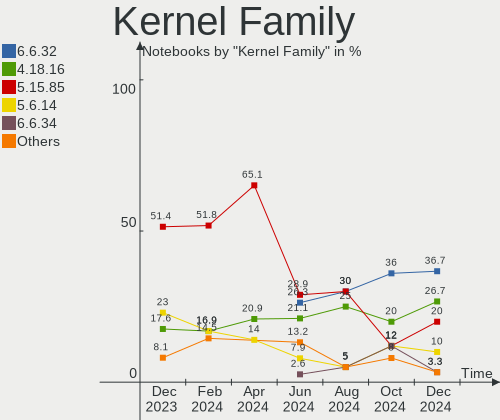
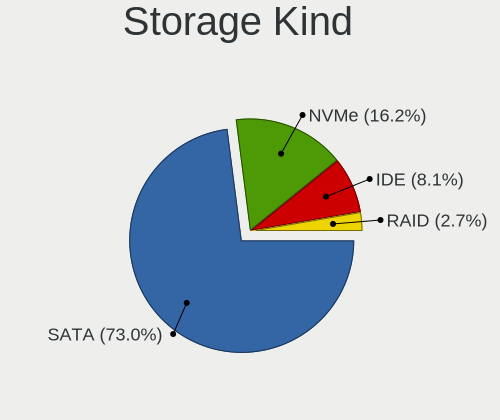
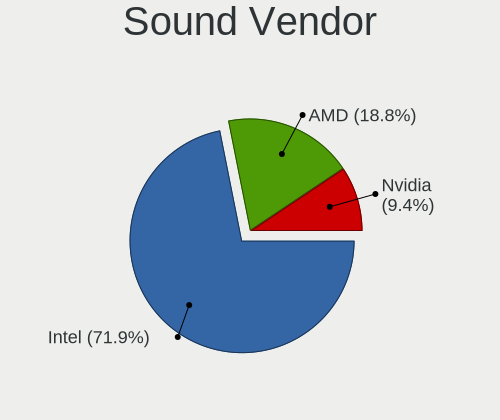

BlackPanther - Hardware Trends (Notebooks)
------------------------------------------

A project to identify most popular hardware characteristics and track their change
over time based on data collected by Linux users at https://Linux-Hardware.org.

Anyone can contribute to this report by the [hw-probe](https://github.com/linuxhw/hw-probe) tool:

    sudo -E hw-probe -all -upload

This report is for one last month. Overall report since the beginning of time: [TestDays](https://github.com/linuxhw/TestDays)

Period: May, 2023.

Contents
--------

* [ System ](#system)
  - [ OS                       ](#os)
  - [ OS Family                ](#os-family)
  - [ Kernel                   ](#kernel)
  - [ Kernel Family            ](#kernel-family)
  - [ Kernel Major Ver.        ](#kernel-major-ver)
  - [ Arch                     ](#arch)
  - [ DE                       ](#de)
  - [ Display Server           ](#display-server)
  - [ Display Manager          ](#display-manager)
  - [ OS Lang                  ](#os-lang)
  - [ Boot Mode                ](#boot-mode)
  - [ Filesystem               ](#filesystem)
  - [ Part. scheme             ](#part-scheme)
  - [ Dual Boot with Linux/BSD ](#dual-boot-with-linuxbsd)
  - [ Dual Boot (Win)          ](#dual-boot-win)

* [ Board ](#board)
  - [ Vendor                   ](#vendor)
  - [ Model                    ](#model)
  - [ Model Family             ](#model-family)
  - [ MFG Year                 ](#mfg-year)
  - [ Form Factor              ](#form-factor)
  - [ Secure Boot              ](#secure-boot)
  - [ Coreboot                 ](#coreboot)
  - [ RAM Size                 ](#ram-size)
  - [ RAM Used                 ](#ram-used)
  - [ Total Drives             ](#total-drives)
  - [ Has CD-ROM               ](#has-cd-rom)
  - [ Has Ethernet             ](#has-ethernet)
  - [ Has WiFi                 ](#has-wifi)
  - [ Has Bluetooth            ](#has-bluetooth)

* [ Location ](#location)
  - [ Country                  ](#country)
  - [ City                     ](#city)

* [ Drives ](#drives)
  - [ Drive Vendor             ](#drive-vendor)
  - [ Drive Model              ](#drive-model)
  - [ HDD Vendor               ](#hdd-vendor)
  - [ SSD Vendor               ](#ssd-vendor)
  - [ Drive Kind               ](#drive-kind)
  - [ Drive Connector          ](#drive-connector)
  - [ Drive Size               ](#drive-size)
  - [ Space Total              ](#space-total)
  - [ Space Used               ](#space-used)
  - [ Malfunc. Drives          ](#malfunc-drives)
  - [ Malfunc. Drive Vendor    ](#malfunc-drive-vendor)
  - [ Malfunc. HDD Vendor      ](#malfunc-hdd-vendor)
  - [ Malfunc. Drive Kind      ](#malfunc-drive-kind)
  - [ Failed Drives            ](#failed-drives)
  - [ Failed Drive Vendor      ](#failed-drive-vendor)
  - [ Drive Status             ](#drive-status)

* [ Storage controller ](#storage-controller)
  - [ Storage Vendor           ](#storage-vendor)
  - [ Storage Model            ](#storage-model)
  - [ Storage Kind             ](#storage-kind)

* [ Processor ](#processor)
  - [ CPU Vendor               ](#cpu-vendor)
  - [ CPU Model                ](#cpu-model)
  - [ CPU Model Family         ](#cpu-model-family)
  - [ CPU Cores                ](#cpu-cores)
  - [ CPU Sockets              ](#cpu-sockets)
  - [ CPU Threads              ](#cpu-threads)
  - [ CPU Op-Modes             ](#cpu-op-modes)
  - [ CPU Microcode            ](#cpu-microcode)
  - [ CPU Microarch            ](#cpu-microarch)

* [ Graphics ](#graphics)
  - [ GPU Vendor               ](#gpu-vendor)
  - [ GPU Model                ](#gpu-model)
  - [ GPU Combo                ](#gpu-combo)
  - [ GPU Driver               ](#gpu-driver)
  - [ GPU Memory               ](#gpu-memory)

* [ Monitor ](#monitor)
  - [ Monitor Vendor           ](#monitor-vendor)
  - [ Monitor Model            ](#monitor-model)
  - [ Monitor Resolution       ](#monitor-resolution)
  - [ Monitor Diagonal         ](#monitor-diagonal)
  - [ Monitor Width            ](#monitor-width)
  - [ Aspect Ratio             ](#aspect-ratio)
  - [ Monitor Area             ](#monitor-area)
  - [ Pixel Density            ](#pixel-density)
  - [ Multiple Monitors        ](#multiple-monitors)

* [ Network ](#network)
  - [ Net Controller Vendor    ](#net-controller-vendor)
  - [ Net Controller Model     ](#net-controller-model)
  - [ Wireless Vendor          ](#wireless-vendor)
  - [ Wireless Model           ](#wireless-model)
  - [ Ethernet Vendor          ](#ethernet-vendor)
  - [ Ethernet Model           ](#ethernet-model)
  - [ Net Controller Kind      ](#net-controller-kind)
  - [ Used Controller          ](#used-controller)
  - [ NICs                     ](#nics)
  - [ IPv6                     ](#ipv6)

* [ Bluetooth ](#bluetooth)
  - [ Bluetooth Vendor         ](#bluetooth-vendor)
  - [ Bluetooth Model          ](#bluetooth-model)

* [ Sound ](#sound)
  - [ Sound Vendor             ](#sound-vendor)
  - [ Sound Model              ](#sound-model)

* [ Memory ](#memory)
  - [ Memory Vendor            ](#memory-vendor)
  - [ Memory Model             ](#memory-model)
  - [ Memory Kind              ](#memory-kind)
  - [ Memory Form Factor       ](#memory-form-factor)
  - [ Memory Size              ](#memory-size)
  - [ Memory Speed             ](#memory-speed)

* [ Printers & scanners ](#printers--scanners)
  - [ Printer Vendor           ](#printer-vendor)
  - [ Printer Model            ](#printer-model)
  - [ Scanner Vendor           ](#scanner-vendor)
  - [ Scanner Model            ](#scanner-model)

* [ Camera ](#camera)
  - [ Camera Vendor            ](#camera-vendor)
  - [ Camera Model             ](#camera-model)

* [ Security ](#security)
  - [ Fingerprint Vendor       ](#fingerprint-vendor)
  - [ Fingerprint Model        ](#fingerprint-model)
  - [ Chipcard Vendor          ](#chipcard-vendor)
  - [ Chipcard Model           ](#chipcard-model)

* [ Unsupported ](#unsupported)
  - [ Unsupported Devices      ](#unsupported-devices)
  - [ Unsupported Device Types ](#unsupported-device-types)

System
------

OS
--

Installed operating systems

| Name              | Notebooks | Percent |
|-------------------|-----------|---------|
| BlackPanther 18.1 | 49        | 90.74%  |
| BlackPanther 22.1 | 5         | 9.26%   |

OS Family
---------

OS without a version

| Name         | Notebooks | Percent |
|--------------|-----------|---------|
| BlackPanther | 54        | 100%    |

Kernel
------

Version of the Linux kernel

| Version             | Notebooks | Percent |
|---------------------|-----------|---------|
| 5.15.85-desktop-1bP | 18        | 33.33%  |
| 4.18.16-desktop-1bP | 18        | 33.33%  |
| 5.6.14-desktop-2bP  | 13        | 24.07%  |
| 6.2.9-desktop-1bP   | 2         | 3.7%    |
| 6.1.0-1bP           | 1         | 1.85%   |
| 5.6.14-server-2bP   | 1         | 1.85%   |
| 5.15.6-desktop-1bP  | 1         | 1.85%   |

Kernel Family
-------------

Linux kernel without a distro release

| Version | Notebooks | Percent |
|---------|-----------|---------|
| 5.15.85 | 18        | 33.33%  |
| 4.18.16 | 18        | 33.33%  |
| 5.6.14  | 14        | 25.93%  |
| 6.2.9   | 2         | 3.7%    |
| 6.1.0   | 1         | 1.85%   |
| 5.15.6  | 1         | 1.85%   |

Kernel Major Ver.
-----------------

Linux kernel major version

| Version | Notebooks | Percent |
|---------|-----------|---------|
| 5.15    | 19        | 35.19%  |
| 4.18    | 18        | 33.33%  |
| 5.6     | 14        | 25.93%  |
| 6.2     | 2         | 3.7%    |
| 6.1     | 1         | 1.85%   |

Arch
----

OS architecture (x86_64, i586, etc.)

| Name   | Notebooks | Percent |
|--------|-----------|---------|
| x86_64 | 54        | 100%    |

DE
--

Desktop Environment

| Name    | Notebooks | Percent |
|---------|-----------|---------|
| KDE5    | 49        | 90.74%  |
| Unknown | 5         | 9.26%   |

Display Server
--------------

X11 or Wayland

| Name    | Notebooks | Percent |
|---------|-----------|---------|
| X11     | 53        | 98.15%  |
| Unknown | 1         | 1.85%   |

Display Manager
---------------

SDDM, LightDM, etc.

| Name    | Notebooks | Percent |
|---------|-----------|---------|
| SDDM    | 51        | 94.44%  |
| Unknown | 3         | 5.56%   |

OS Lang
-------

Language

| Lang    | Notebooks | Percent |
|---------|-----------|---------|
| Unknown | 54        | 100%    |

Boot Mode
---------

EFI or BIOS

| Mode | Notebooks | Percent |
|------|-----------|---------|
| EFI  | 29        | 53.7%   |
| BIOS | 25        | 46.3%   |

Filesystem
----------

Type of filesystem

| Type    | Notebooks | Percent |
|---------|-----------|---------|
| Ext4    | 40        | 74.07%  |
| Overlay | 13        | 24.07%  |
| Unknown | 1         | 1.85%   |

Part. scheme
------------

Scheme of partitioning

| Type    | Notebooks | Percent |
|---------|-----------|---------|
| MBR     | 27        | 50%     |
| GPT     | 25        | 46.3%   |
| Unknown | 2         | 3.7%    |

Dual Boot with Linux/BSD
------------------------

Hosting more than one Linux/BSD

| Dual boot | Notebooks | Percent |
|-----------|-----------|---------|
| No        | 44        | 81.48%  |
| Yes       | 10        | 18.52%  |

Dual Boot (Win)
---------------

Hosting Linux and Windows

| Dual boot | Notebooks | Percent |
|-----------|-----------|---------|
| No        | 32        | 59.26%  |
| Yes       | 22        | 40.74%  |

Board
-----

Vendor
------

Motherboard manufacturer

| Name                | Notebooks | Percent |
|---------------------|-----------|---------|
| Lenovo              | 14        | 25.93%  |
| Dell                | 8         | 14.81%  |
| ASUSTek Computer    | 7         | 12.96%  |
| Hewlett-Packard     | 6         | 11.11%  |
| Acer                | 4         | 7.41%   |
| Toshiba             | 3         | 5.56%   |
| Samsung Electronics | 2         | 3.7%    |
| MSI                 | 2         | 3.7%    |
| Fujitsu             | 2         | 3.7%    |
| eMachines           | 2         | 3.7%    |
| Sony                | 1         | 1.85%   |
| Packard Bell        | 1         | 1.85%   |
| HUAWEI              | 1         | 1.85%   |
| Apple               | 1         | 1.85%   |

Model
-----

Motherboard model

| Name                             | Notebooks | Percent |
|----------------------------------|-----------|---------|
| Lenovo ThinkPad T420 4236W8L     | 2         | 3.7%    |
| eMachines E725                   | 2         | 3.7%    |
| Dell Inspiron 7737               | 2         | 3.7%    |
| ASUS K54HR                       | 2         | 3.7%    |
| Toshiba Satellite U300           | 1         | 1.85%   |
| Toshiba Satellite M50D-A         | 1         | 1.85%   |
| Toshiba Satellite C55-A-1NV      | 1         | 1.85%   |
| Sony VPCEH2J1E                   | 1         | 1.85%   |
| Samsung R530/R730/P530           | 1         | 1.85%   |
| Samsung 300E4C/300E5C/300E7C     | 1         | 1.85%   |
| Packard Bell EasyNote TK36       | 1         | 1.85%   |
| MSI GT60 2OC/2OD                 | 1         | 1.85%   |
| MSI GP75 Leopard 9SE             | 1         | 1.85%   |
| Lenovo Z50-75 80EC               | 1         | 1.85%   |
| Lenovo V15-ADA 82C7              | 1         | 1.85%   |
| Lenovo ThinkPad X250 20CLS1JN00  | 1         | 1.85%   |
| Lenovo ThinkPad X200 74595FG     | 1         | 1.85%   |
| Lenovo ThinkPad T540p 20BE003YUK | 1         | 1.85%   |
| Lenovo ThinkPad T500 2056CL8     | 1         | 1.85%   |
| Lenovo IdeaPad Y700-15ISK 80NV   | 1         | 1.85%   |
| Lenovo IdeaPad 700-15ISK 80RU    | 1         | 1.85%   |
| Lenovo IdeaPad 110-15ACL 80TJ    | 1         | 1.85%   |
| Lenovo G580 20150                | 1         | 1.85%   |
| Lenovo G570 20079                | 1         | 1.85%   |
| Lenovo E50-80 80J2               | 1         | 1.85%   |
| HUAWEI HVY-WXX9                  | 1         | 1.85%   |
| HP ProBook 640 G8 Notebook PC    | 1         | 1.85%   |
| HP Pavilion dv6                  | 1         | 1.85%   |
| HP Notebook                      | 1         | 1.85%   |
| HP Laptop 15-dw1xxx              | 1         | 1.85%   |
| HP 650                           | 1         | 1.85%   |
| HP 250 G1                        | 1         | 1.85%   |
| Fujitsu LIFEBOOK U745            | 1         | 1.85%   |
| Fujitsu LIFEBOOK A555            | 1         | 1.85%   |
| Dell Latitude E5520              | 1         | 1.85%   |
| Dell Latitude D630               | 1         | 1.85%   |
| Dell Latitude 7390               | 1         | 1.85%   |
| Dell Latitude 5480               | 1         | 1.85%   |
| Dell Inspiron 5558               | 1         | 1.85%   |
| Dell Inspiron 15-3567            | 1         | 1.85%   |

Model Family
------------

Motherboard model prefix

| Name                  | Notebooks | Percent |
|-----------------------|-----------|---------|
| Lenovo ThinkPad       | 6         | 11.11%  |
| Dell Latitude         | 4         | 7.41%   |
| Dell Inspiron         | 4         | 7.41%   |
| Toshiba Satellite     | 3         | 5.56%   |
| Lenovo IdeaPad        | 3         | 5.56%   |
| Fujitsu LIFEBOOK      | 2         | 3.7%    |
| eMachines E725        | 2         | 3.7%    |
| ASUS K54HR            | 2         | 3.7%    |
| Acer Aspire           | 2         | 3.7%    |
| Sony VPCEH2J1E        | 1         | 1.85%   |
| Samsung R530          | 1         | 1.85%   |
| Samsung 300E4C        | 1         | 1.85%   |
| Packard Bell EasyNote | 1         | 1.85%   |
| MSI GT60              | 1         | 1.85%   |
| MSI GP75              | 1         | 1.85%   |
| Lenovo Z50-75         | 1         | 1.85%   |
| Lenovo V15-ADA        | 1         | 1.85%   |
| Lenovo G580           | 1         | 1.85%   |
| Lenovo G570           | 1         | 1.85%   |
| Lenovo E50-80         | 1         | 1.85%   |
| HUAWEI HVY-WXX9       | 1         | 1.85%   |
| HP ProBook            | 1         | 1.85%   |
| HP Pavilion           | 1         | 1.85%   |
| HP Notebook           | 1         | 1.85%   |
| HP Laptop             | 1         | 1.85%   |
| HP 650                | 1         | 1.85%   |
| HP 250                | 1         | 1.85%   |
| ASUS X550CL           | 1         | 1.85%   |
| ASUS X550CC           | 1         | 1.85%   |
| ASUS X200MA           | 1         | 1.85%   |
| ASUS K53BY            | 1         | 1.85%   |
| ASUS 1001PX           | 1         | 1.85%   |
| Apple MacBookAir5     | 1         | 1.85%   |
| Acer V5-131           | 1         | 1.85%   |
| Acer TravelMate       | 1         | 1.85%   |

MFG Year
--------

Motherboard manufacture year

| Year | Notebooks | Percent |
|------|-----------|---------|
| 2013 | 8         | 14.81%  |
| 2011 | 8         | 14.81%  |
| 2015 | 6         | 11.11%  |
| 2012 | 5         | 9.26%   |
| 2014 | 4         | 7.41%   |
| 2008 | 4         | 7.41%   |
| 2020 | 3         | 5.56%   |
| 2010 | 3         | 5.56%   |
| 2019 | 2         | 3.7%    |
| 2018 | 2         | 3.7%    |
| 2017 | 2         | 3.7%    |
| 2016 | 2         | 3.7%    |
| 2009 | 2         | 3.7%    |
| 2007 | 2         | 3.7%    |
| 2021 | 1         | 1.85%   |

Form Factor
-----------

Physical design of the computer

| Name     | Notebooks | Percent |
|----------|-----------|---------|
| Notebook | 54        | 100%    |

Secure Boot
-----------

Enabled or disabled

| State    | Notebooks | Percent |
|----------|-----------|---------|
| Disabled | 54        | 100%    |

Coreboot
--------

Have coreboot on board

| Used | Notebooks | Percent |
|------|-----------|---------|
| No   | 54        | 100%    |

RAM Size
--------

Total RAM memory

| Size in GB | Notebooks | Percent |
|------------|-----------|---------|
| 3.01-4.0   | 24        | 44.44%  |
| 4.01-8.0   | 13        | 24.07%  |
| 8.01-16.0  | 7         | 12.96%  |
| 1.01-2.0   | 4         | 7.41%   |
| 16.01-24.0 | 3         | 5.56%   |
| 2.01-3.0   | 1         | 1.85%   |
| 0.51-1.0   | 1         | 1.85%   |
| Unknown    | 1         | 1.85%   |

RAM Used
--------

Used RAM memory

| Used GB  | Notebooks | Percent |
|----------|-----------|---------|
| 0.51-1.0 | 22        | 40.74%  |
| 1.01-2.0 | 17        | 31.48%  |
| 4.01-8.0 | 4         | 7.41%   |
| 2.01-3.0 | 4         | 7.41%   |
| 0.01-0.5 | 4         | 7.41%   |
| 3.01-4.0 | 2         | 3.7%    |
| Unknown  | 1         | 1.85%   |

Total Drives
------------

Number of drives on board

| Drives | Notebooks | Percent |
|--------|-----------|---------|
| 1      | 36        | 66.67%  |
| 2      | 17        | 31.48%  |
| 0      | 1         | 1.85%   |

Has CD-ROM
----------

Has CD-ROM on board

| Presented | Notebooks | Percent |
|-----------|-----------|---------|
| No        | 28        | 51.85%  |
| Yes       | 26        | 48.15%  |

Has Ethernet
------------

Has Ethernet on board

| Presented | Notebooks | Percent |
|-----------|-----------|---------|
| Yes       | 51        | 94.44%  |
| No        | 3         | 5.56%   |

Has WiFi
--------

Has WiFi module

| Presented | Notebooks | Percent |
|-----------|-----------|---------|
| Yes       | 54        | 100%    |

Has Bluetooth
-------------

Has Bluetooth module

| Presented | Notebooks | Percent |
|-----------|-----------|---------|
| Yes       | 40        | 74.07%  |
| No        | 14        | 25.93%  |

Location
--------

Country
-------

Geographic location (country)

| Country  | Notebooks | Percent |
|----------|-----------|---------|
| Hungary  | 39        | 72.22%  |
| UK       | 3         | 5.56%   |
| Slovakia | 3         | 5.56%   |
| Germany  | 3         | 5.56%   |
| Austria  | 3         | 5.56%   |
| Romania  | 2         | 3.7%    |
| USA      | 1         | 1.85%   |

City
----

Geographic location (city)

| City                         | Notebooks | Percent |
|------------------------------|-----------|---------|
| Budapest                     | 10        | 18.52%  |
| Zalaegerszeg                 | 2         | 3.7%    |
| Vienna                       | 2         | 3.7%    |
| Tatabánya                   | 2         | 3.7%    |
| Szolnok                      | 2         | 3.7%    |
| Szigetujfalu                 | 2         | 3.7%    |
| Nyiregyhaza                  | 2         | 3.7%    |
| Harlow                       | 2         | 3.7%    |
| Tornaľa                     | 1         | 1.85%   |
| Toeroekbalint                | 1         | 1.85%   |
| Tiszakecske                  | 1         | 1.85%   |
| Sátoraljaújhely            | 1         | 1.85%   |
| Sarbogard                    | 1         | 1.85%   |
| Salgotarjan                  | 1         | 1.85%   |
| Randolph Township            | 1         | 1.85%   |
| Pomaz                        | 1         | 1.85%   |
| Pécs                        | 1         | 1.85%   |
| Opusztaszer                  | 1         | 1.85%   |
| Obertraubling                | 1         | 1.85%   |
| Niederkirchen bei Deidesheim | 1         | 1.85%   |
| Nickelsdorf                  | 1         | 1.85%   |
| Miskolc                      | 1         | 1.85%   |
| Miercurea-Ciuc               | 1         | 1.85%   |
| Martin                       | 1         | 1.85%   |
| Kisvarda                     | 1         | 1.85%   |
| Hove                         | 1         | 1.85%   |
| Győr                        | 1         | 1.85%   |
| Gödöllő                   | 1         | 1.85%   |
| Esztergom                    | 1         | 1.85%   |
| Diosd                        | 1         | 1.85%   |
| Debrecen                     | 1         | 1.85%   |
| Cegled                       | 1         | 1.85%   |
| Carei                        | 1         | 1.85%   |
| Bratislava                   | 1         | 1.85%   |
| Borsodbota                   | 1         | 1.85%   |
| Berettyóújfalu             | 1         | 1.85%   |
| Bad Hersfeld                 | 1         | 1.85%   |
| Abasar                       | 1         | 1.85%   |

Drives
------

Drive Vendor
------------

Hard drive vendors

| Vendor              | Notebooks | Drives | Percent |
|---------------------|-----------|--------|---------|
| WDC                 | 10        | 11     | 14.93%  |
| Samsung Electronics | 10        | 11     | 14.93%  |
| Seagate             | 8         | 8      | 11.94%  |
| Kingston            | 7         | 8      | 10.45%  |
| Toshiba             | 5         | 5      | 7.46%   |
| Hitachi             | 4         | 4      | 5.97%   |
| Unknown             | 3         | 3      | 4.48%   |
| Micron Technology   | 3         | 3      | 4.48%   |
| LITEON              | 2         | 2      | 2.99%   |
| Intenso             | 2         | 2      | 2.99%   |
| HGST                | 2         | 2      | 2.99%   |
| Verbatim            | 1         | 1      | 1.49%   |
| SSSTC               | 1         | 1      | 1.49%   |
| SPCC                | 1         | 1      | 1.49%   |
| Patriot             | 1         | 1      | 1.49%   |
| KIOXIA              | 1         | 1      | 1.49%   |
| IB-1122             | 1         | 1      | 1.49%   |
| Hewlett-Packard     | 1         | 1      | 1.49%   |
| China               | 1         | 1      | 1.49%   |
| ASENNO              | 1         | 1      | 1.49%   |
| Apple               | 1         | 1      | 1.49%   |
| A-DATA Technology   | 1         | 1      | 1.49%   |

Drive Model
-----------

Hard drive models

| Model                                               | Notebooks | Percent |
|-----------------------------------------------------|-----------|---------|
| WDC WD10SPCX-24HWST1 1TB                            | 3         | 4.29%   |
| Toshiba KSG60ZMV256G M.2 2280 256GB SSD             | 2         | 2.86%   |
| Seagate ST500LT012-1DG142 500GB                     | 2         | 2.86%   |
| Micron MTFDDAK256MAM-1K1 256GB SSD                  | 2         | 2.86%   |
| Kingston SA400S37480G 480GB SSD                     | 2         | 2.86%   |
| Kingston SA400S37120G 120GB SSD                     | 2         | 2.86%   |
| Intenso SSD 120GB                                   | 2         | 2.86%   |
| Hitachi HTS547550A9E384 500GB                       | 2         | 2.86%   |
| Hitachi HTS545050B9A300 500GB                       | 2         | 2.86%   |
| WDC WD5000LPVX-80V0TT0 500GB                        | 1         | 1.43%   |
| WDC WD5000LPCX-24VHAT0 500GB                        | 1         | 1.43%   |
| WDC WD5000BPVT-24HXZT3 500GB                        | 1         | 1.43%   |
| WDC WD5000BPVT-00HXZT1 500GB                        | 1         | 1.43%   |
| WDC WD3200BEVT-08A23T1 320GB                        | 1         | 1.43%   |
| WDC WD2500BEVT-00ZCT0 250GB                         | 1         | 1.43%   |
| WDC WD10JPLX-00MBPT0 1TB                            | 1         | 1.43%   |
| WDC WD10JPCX-24UE4T0 1TB                            | 1         | 1.43%   |
| Verbatim Vi550 S3 SSD 128GB                         | 1         | 1.43%   |
| Unknown SL16G  16GB                                 | 1         | 1.43%   |
| Unknown APPSD  32GB                                 | 1         | 1.43%   |
| Unknown 032G34  32GB                                | 1         | 1.43%   |
| Toshiba MQ01ABF050 500GB                            | 1         | 1.43%   |
| Toshiba MK2576GSX 250GB                             | 1         | 1.43%   |
| Toshiba MK2035GSS 200GB                             | 1         | 1.43%   |
| SSSTC CL1-8D256-HP 256GB                            | 1         | 1.43%   |
| SPCC Solid State Disk 256GB                         | 1         | 1.43%   |
| Seagate ST9500325AS 500GB                           | 1         | 1.43%   |
| Seagate ST9250315AS 250GB                           | 1         | 1.43%   |
| Seagate ST320LT020-9YG142 320GB                     | 1         | 1.43%   |
| Seagate ST2000LM003 HN-M201RAD 2TB                  | 1         | 1.43%   |
| Seagate ST1000LM035-1RK172 1TB                      | 1         | 1.43%   |
| Seagate ST1000LM014-1EJ164-SSHD 1TB                 | 1         | 1.43%   |
| Samsung SSD 970 EVO Plus 2TB                        | 1         | 1.43%   |
| Samsung SSD 870 QVO 1TB                             | 1         | 1.43%   |
| Samsung SSD 870 EVO 500GB                           | 1         | 1.43%   |
| Samsung SSD 870 EVO 250GB                           | 1         | 1.43%   |
| Samsung SSD 750 EVO 250GB                           | 1         | 1.43%   |
| Samsung NVMe SSD Controller SM981/PM981/PM983 256GB | 1         | 1.43%   |
| Samsung NVMe SSD Controller PM9A1/PM9A3/980PRO 1TB  | 1         | 1.43%   |
| Samsung MZ7LN256HCHP-000L7 256GB SSD                | 1         | 1.43%   |

HDD Vendor
----------

Hard disk drive vendors

| Vendor              | Notebooks | Drives | Percent |
|---------------------|-----------|--------|---------|
| WDC                 | 10        | 11     | 34.48%  |
| Seagate             | 8         | 8      | 27.59%  |
| Hitachi             | 4         | 4      | 13.79%  |
| Toshiba             | 3         | 3      | 10.34%  |
| HGST                | 2         | 2      | 6.9%    |
| Samsung Electronics | 1         | 1      | 3.45%   |
| IB-1122             | 1         | 1      | 3.45%   |

SSD Vendor
----------

Solid state drive vendors

| Vendor              | Notebooks | Drives | Percent |
|---------------------|-----------|--------|---------|
| Samsung Electronics | 7         | 7      | 25%     |
| Kingston            | 5         | 6      | 17.86%  |
| Micron Technology   | 3         | 3      | 10.71%  |
| Toshiba             | 2         | 2      | 7.14%   |
| Intenso             | 2         | 2      | 7.14%   |
| Verbatim            | 1         | 1      | 3.57%   |
| SPCC                | 1         | 1      | 3.57%   |
| Patriot             | 1         | 1      | 3.57%   |
| LITEON              | 1         | 1      | 3.57%   |
| Hewlett-Packard     | 1         | 1      | 3.57%   |
| China               | 1         | 1      | 3.57%   |
| ASENNO              | 1         | 1      | 3.57%   |
| Apple               | 1         | 1      | 3.57%   |
| A-DATA Technology   | 1         | 1      | 3.57%   |

Drive Kind
----------

HDD or SSD

| Kind | Notebooks | Drives | Percent |
|------|-----------|--------|---------|
| HDD  | 28        | 30     | 43.08%  |
| SSD  | 27        | 29     | 41.54%  |
| NVMe | 7         | 8      | 10.77%  |
| MMC  | 3         | 3      | 4.62%   |

Drive Connector
---------------

SATA, SAS, NVMe, etc.

| Type | Notebooks | Drives | Percent |
|------|-----------|--------|---------|
| SATA | 48        | 58     | 81.36%  |
| NVMe | 7         | 8      | 11.86%  |
| MMC  | 3         | 3      | 5.08%   |
| SAS  | 1         | 1      | 1.69%   |

Drive Size
----------

Size of hard drive

| Size in TB | Notebooks | Drives | Percent |
|------------|-----------|--------|---------|
| 0.01-0.5   | 43        | 47     | 78.18%  |
| 0.51-1.0   | 10        | 10     | 18.18%  |
| 1.01-2.0   | 2         | 2      | 3.64%   |

Space Total
-----------

Amount of disk space available on the file system

| Size in GB | Notebooks | Percent |
|------------|-----------|---------|
| 101-250    | 19        | 35.19%  |
| Unknown    | 15        | 27.78%  |
| 251-500    | 6         | 11.11%  |
| 1001-2000  | 4         | 7.41%   |
| 501-1000   | 3         | 5.56%   |
| 51-100     | 3         | 5.56%   |
| 21-50      | 2         | 3.7%    |
| 2001-3000  | 2         | 3.7%    |

Space Used
----------

Amount of used disk space

| Used GB   | Notebooks | Percent |
|-----------|-----------|---------|
| Unknown   | 15        | 27.78%  |
| 1-20      | 14        | 25.93%  |
| 21-50     | 7         | 12.96%  |
| 101-250   | 6         | 11.11%  |
| 51-100    | 6         | 11.11%  |
| 251-500   | 2         | 3.7%    |
| 1001-2000 | 2         | 3.7%    |
| 2001-3000 | 1         | 1.85%   |
| 501-1000  | 1         | 1.85%   |

Malfunc. Drives
---------------

Drive models with a malfunction

| Model                                   | Notebooks | Drives | Percent |
|-----------------------------------------|-----------|--------|---------|
| WDC WD5000LPVX-80V0TT0 500GB            | 1         | 1      | 5.26%   |
| WDC WD3200BEVT-08A23T1 320GB            | 1         | 1      | 5.26%   |
| WDC WD2500BEVT-00ZCT0 250GB             | 1         | 1      | 5.26%   |
| WDC WD10JPLX-00MBPT0 1TB                | 1         | 1      | 5.26%   |
| WDC WD10JPCX-24UE4T0 1TB                | 1         | 1      | 5.26%   |
| Toshiba MQ01ABF050 500GB                | 1         | 1      | 5.26%   |
| Toshiba MK2035GSS 200GB                 | 1         | 1      | 5.26%   |
| Toshiba KSG60ZMV256G M.2 2280 256GB SSD | 1         | 1      | 5.26%   |
| Seagate ST9500325AS 500GB               | 1         | 1      | 5.26%   |
| Seagate ST9250315AS 250GB               | 1         | 1      | 5.26%   |
| Seagate ST320LT020-9YG142 320GB         | 1         | 1      | 5.26%   |
| Seagate ST1000LM014-1EJ164-SSHD 1TB     | 1         | 1      | 5.26%   |
| Samsung Electronics SSD 750 EVO 250GB   | 1         | 1      | 5.26%   |
| Samsung Electronics HM160HI 160GB       | 1         | 1      | 5.26%   |
| Hitachi HTS547550A9E384 500GB           | 1         | 1      | 5.26%   |
| Hitachi HTS545050B9A300 500GB           | 1         | 1      | 5.26%   |
| HGST HTS545032A7E380 320GB              | 1         | 1      | 5.26%   |
| HGST HTS541010A9E680 1TB                | 1         | 1      | 5.26%   |
| Apple SSD TS064E 64GB                   | 1         | 1      | 5.26%   |

Malfunc. Drive Vendor
---------------------

Vendors of faulty drives

| Vendor              | Notebooks | Drives | Percent |
|---------------------|-----------|--------|---------|
| WDC                 | 5         | 5      | 26.32%  |
| Seagate             | 4         | 4      | 21.05%  |
| Toshiba             | 3         | 3      | 15.79%  |
| Samsung Electronics | 2         | 2      | 10.53%  |
| Hitachi             | 2         | 2      | 10.53%  |
| HGST                | 2         | 2      | 10.53%  |
| Apple               | 1         | 1      | 5.26%   |

Malfunc. HDD Vendor
-------------------

Vendors of faulty HDD drives

| Vendor              | Notebooks | Drives | Percent |
|---------------------|-----------|--------|---------|
| WDC                 | 5         | 5      | 31.25%  |
| Seagate             | 4         | 4      | 25%     |
| Toshiba             | 2         | 2      | 12.5%   |
| Hitachi             | 2         | 2      | 12.5%   |
| HGST                | 2         | 2      | 12.5%   |
| Samsung Electronics | 1         | 1      | 6.25%   |

Malfunc. Drive Kind
-------------------

Kinds of faulty drives

| Kind | Notebooks | Drives | Percent |
|------|-----------|--------|---------|
| HDD  | 16        | 16     | 84.21%  |
| SSD  | 3         | 3      | 15.79%  |

Failed Drives
-------------

Failed drive models

Zero info for selected period =(

Failed Drive Vendor
-------------------

Failed drive vendors

Zero info for selected period =(

Drive Status
------------

Number of failed and malfunc. drives

| Status   | Notebooks | Drives | Percent |
|----------|-----------|--------|---------|
| Works    | 37        | 48     | 62.71%  |
| Malfunc  | 19        | 19     | 32.2%   |
| Detected | 3         | 3      | 5.08%   |

Storage controller
------------------

Storage Vendor
--------------

Storage controller vendors

| Vendor                         | Notebooks | Percent |
|--------------------------------|-----------|---------|
| Intel                          | 47        | 78.33%  |
| AMD                            | 6         | 10%     |
| Samsung Electronics            | 2         | 3.33%   |
| Kingston Technology Company    | 2         | 3.33%   |
| Toshiba America Info Systems   | 1         | 1.67%   |
| Solid State Storage Technology | 1         | 1.67%   |
| Lite-On Technology             | 1         | 1.67%   |

Storage Model
-------------

Storage controller models

| Model                                                                          | Notebooks | Percent |
|--------------------------------------------------------------------------------|-----------|---------|
| Intel 7 Series Chipset Family 6-port SATA Controller [AHCI mode]               | 8         | 12.12%  |
| Intel 6 Series/C200 Series Chipset Family 6 port Mobile SATA AHCI Controller   | 7         | 10.61%  |
| Intel Wildcat Point-LP SATA Controller [AHCI Mode]                             | 5         | 7.58%   |
| Intel 82801IBM/IEM (ICH9M/ICH9M-E) 4 port SATA Controller [AHCI mode]          | 5         | 7.58%   |
| Intel 82801 Mobile SATA Controller [RAID mode]                                 | 4         | 6.06%   |
| AMD FCH SATA Controller [AHCI mode]                                            | 4         | 6.06%   |
| Intel 8 Series/C220 Series Chipset Family 6-port SATA Controller 1 [AHCI mode] | 3         | 4.55%   |
| Samsung NVMe SSD Controller SM981/PM981/PM983                                  | 2         | 3.03%   |
| Intel HM170/QM170 Chipset SATA Controller [AHCI Mode]                          | 2         | 3.03%   |
| Intel 82801HM/HEM (ICH8M/ICH8M-E) IDE Controller                               | 2         | 3.03%   |
| Intel 8 Series SATA Controller 1 [AHCI mode]                                   | 2         | 3.03%   |
| Intel 5 Series/3400 Series Chipset 4 port SATA AHCI Controller                 | 2         | 3.03%   |
| Toshiba America Info Systems XG6 NVMe SSD Controller                           | 1         | 1.52%   |
| Solid State Storage Non-Volatile memory controller                             | 1         | 1.52%   |
| Samsung NVMe SSD Controller PM9A1/PM9A3/980PRO                                 | 1         | 1.52%   |
| Lite-On Non-Volatile memory controller                                         | 1         | 1.52%   |
| Kingston Company U-SNS8154P3 NVMe SSD                                          | 1         | 1.52%   |
| Kingston Company Company Non-Volatile memory controller                        | 1         | 1.52%   |
| Intel Volume Management Device NVMe RAID Controller                            | 1         | 1.52%   |
| Intel Sunrise Point-LP SATA Controller [AHCI mode]                             | 1         | 1.52%   |
| Intel NM10/ICH7 Family SATA Controller [AHCI mode]                             | 1         | 1.52%   |
| Intel Comet Lake SATA AHCI Controller                                          | 1         | 1.52%   |
| Intel Celeron N3350/Pentium N4200/Atom E3900 Series SATA AHCI Controller       | 1         | 1.52%   |
| Intel Cannon Lake Mobile PCH SATA AHCI Controller                              | 1         | 1.52%   |
| Intel Atom Processor E3800 Series SATA AHCI Controller                         | 1         | 1.52%   |
| Intel 82801IBM/IEM (ICH9M/ICH9M-E) 2 port SATA Controller [IDE mode]           | 1         | 1.52%   |
| Intel 82801HM/HEM (ICH8M/ICH8M-E) SATA Controller [IDE mode]                   | 1         | 1.52%   |
| Intel 82801HM/HEM (ICH8M/ICH8M-E) SATA Controller [AHCI mode]                  | 1         | 1.52%   |
| AMD SB7x0/SB8x0/SB9x0 SATA Controller [AHCI mode]                              | 1         | 1.52%   |
| AMD SB7x0/SB8x0/SB9x0 IDE Controller                                           | 1         | 1.52%   |
| AMD FCH SATA Controller [IDE mode]                                             | 1         | 1.52%   |
| AMD FCH IDE Controller                                                         | 1         | 1.52%   |

Storage Kind
------------

Kind of storage controller (IDE, SATA, NVMe, SAS, ...)

| Kind | Notebooks | Percent |
|------|-----------|---------|
| SATA | 47        | 73.44%  |
| NVMe | 7         | 10.94%  |
| RAID | 5         | 7.81%   |
| IDE  | 5         | 7.81%   |

Processor
---------

CPU Vendor
----------

Processor vendors

| Vendor | Notebooks | Percent |
|--------|-----------|---------|
| Intel  | 47        | 87.04%  |
| AMD    | 7         | 12.96%  |

CPU Model
---------

Processor models

| Model                                       | Notebooks | Percent |
|---------------------------------------------|-----------|---------|
| Intel Core i5-2540M CPU @ 2.60GHz           | 4         | 7.41%   |
| Intel Core i7-4510U CPU @ 2.00GHz           | 2         | 3.7%    |
| Intel Core i5-5200U CPU @ 2.20GHz           | 2         | 3.7%    |
| Intel Core i5-4200M CPU @ 2.50GHz           | 2         | 3.7%    |
| Intel Core i3-10110U CPU @ 2.10GHz          | 2         | 3.7%    |
| Intel Core 2 Duo CPU T7500 @ 2.20GHz        | 2         | 3.7%    |
| Intel Pentium Dual-Core CPU T4400 @ 2.20GHz | 1         | 1.85%   |
| Intel Pentium Dual-Core CPU T4300 @ 2.10GHz | 1         | 1.85%   |
| Intel Pentium CPU N3530 @ 2.16GHz           | 1         | 1.85%   |
| Intel Pentium CPU B970 @ 2.30GHz            | 1         | 1.85%   |
| Intel Pentium CPU B960 @ 2.20GHz            | 1         | 1.85%   |
| Intel Pentium CPU 2117U @ 1.80GHz           | 1         | 1.85%   |
| Intel Core i7-9750H CPU @ 2.60GHz           | 1         | 1.85%   |
| Intel Core i7-6700HQ CPU @ 2.60GHz          | 1         | 1.85%   |
| Intel Core i7-6600U CPU @ 2.60GHz           | 1         | 1.85%   |
| Intel Core i7-5600U CPU @ 2.60GHz           | 1         | 1.85%   |
| Intel Core i7-4700MQ CPU @ 2.40GHz          | 1         | 1.85%   |
| Intel Core i7-2630QM CPU @ 2.00GHz          | 1         | 1.85%   |
| Intel Core i5-7300U CPU @ 2.60GHz           | 1         | 1.85%   |
| Intel Core i5-6300HQ CPU @ 2.30GHz          | 1         | 1.85%   |
| Intel Core i5-5300U CPU @ 2.30GHz           | 1         | 1.85%   |
| Intel Core i5-3427U CPU @ 1.80GHz           | 1         | 1.85%   |
| Intel Core i5-3337U CPU @ 1.80GHz           | 1         | 1.85%   |
| Intel Core i3-6006U CPU @ 2.00GHz           | 1         | 1.85%   |
| Intel Core i3-5005U CPU @ 2.00GHz           | 1         | 1.85%   |
| Intel Core i3-2350M CPU @ 2.30GHz           | 1         | 1.85%   |
| Intel Core i3-2330M CPU @ 2.20GHz           | 1         | 1.85%   |
| Intel Core i3 CPU M 380 @ 2.53GHz           | 1         | 1.85%   |
| Intel Core i3 CPU M 350 @ 2.27GHz           | 1         | 1.85%   |
| Intel Core 2 Duo CPU T9900 @ 3.06GHz        | 1         | 1.85%   |
| Intel Core 2 Duo CPU T8300 @ 2.40GHz        | 1         | 1.85%   |
| Intel Core 2 Duo CPU T7250 @ 2.00GHz        | 1         | 1.85%   |
| Intel Core 2 Duo CPU P8600 @ 2.40GHz        | 1         | 1.85%   |
| Intel Celeron CPU N3350 @ 1.10GHz           | 1         | 1.85%   |
| Intel Celeron CPU B830 @ 1.80GHz            | 1         | 1.85%   |
| Intel Celeron CPU 1017U @ 1.60GHz           | 1         | 1.85%   |
| Intel Celeron CPU 1000M @ 1.80GHz           | 1         | 1.85%   |
| Intel Atom CPU N450 @ 1.66GHz               | 1         | 1.85%   |
| Intel 11th Gen Core i3-1115G4 @ 3.00GHz     | 1         | 1.85%   |
| AMD Ryzen 5 4600H with Radeon Graphics      | 1         | 1.85%   |

CPU Model Family
----------------

Processor model prefix

| Model                   | Notebooks | Percent |
|-------------------------|-----------|---------|
| Intel Core i5           | 13        | 24.07%  |
| Intel Core i7           | 8         | 14.81%  |
| Intel Core i3           | 8         | 14.81%  |
| Intel Core 2 Duo        | 6         | 11.11%  |
| Intel Pentium           | 4         | 7.41%   |
| Intel Celeron           | 4         | 7.41%   |
| Intel Pentium Dual-Core | 2         | 3.7%    |
| AMD Ryzen 5             | 2         | 3.7%    |
| Other                   | 1         | 1.85%   |
| Intel Atom              | 1         | 1.85%   |
| AMD E1                  | 1         | 1.85%   |
| AMD E                   | 1         | 1.85%   |
| AMD A8                  | 1         | 1.85%   |
| AMD A4                  | 1         | 1.85%   |
| AMD A10                 | 1         | 1.85%   |

CPU Cores
---------

Number of processor cores

| Number | Notebooks | Percent |
|--------|-----------|---------|
| 2      | 42        | 77.78%  |
| 4      | 7         | 12.96%  |
| 1      | 3         | 5.56%   |
| 6      | 2         | 3.7%    |

CPU Sockets
-----------

Number of sockets

| Number | Notebooks | Percent |
|--------|-----------|---------|
| 1      | 54        | 100%    |

CPU Threads
-----------

Threads per core (Hyper-Threading)

| Number | Notebooks | Percent |
|--------|-----------|---------|
| 2      | 33        | 61.11%  |
| 1      | 21        | 38.89%  |

CPU Op-Modes
------------

CPU Operation Modes (32-bit, 64-bit)

| Op mode        | Notebooks | Percent |
|----------------|-----------|---------|
| 32-bit, 64-bit | 52        | 96.3%   |
| Unknown        | 2         | 3.7%    |

CPU Microcode
-------------

Microcode number

| Number     | Notebooks | Percent |
|------------|-----------|---------|
| 0x206a7    | 10        | 18.52%  |
| Unknown    | 7         | 12.96%  |
| 0x306a9    | 5         | 9.26%   |
| 0x1067a    | 4         | 7.41%   |
| 0x306d4    | 3         | 5.56%   |
| 0x806ec    | 2         | 3.7%    |
| 0x506e3    | 2         | 3.7%    |
| 0x406e3    | 2         | 3.7%    |
| 0x306c3    | 2         | 3.7%    |
| 0x806c1    | 1         | 1.85%   |
| 0x6fd      | 1         | 1.85%   |
| 0x6fb      | 1         | 1.85%   |
| 0x6fa      | 1         | 1.85%   |
| 0x506c9    | 1         | 1.85%   |
| 0x30678    | 1         | 1.85%   |
| 0x20655    | 1         | 1.85%   |
| 0x20652    | 1         | 1.85%   |
| 0x106ca    | 1         | 1.85%   |
| 0x10676    | 1         | 1.85%   |
| 0x08600106 | 1         | 1.85%   |
| 0x08108109 | 1         | 1.85%   |
| 0x07030105 | 1         | 1.85%   |
| 0x0700010f | 1         | 1.85%   |
| 0x06003109 | 1         | 1.85%   |
| 0x06003106 | 1         | 1.85%   |
| 0x05000029 | 1         | 1.85%   |

CPU Microarch
-------------

Microarchitecture

| Name        | Notebooks | Percent |
|-------------|-----------|---------|
| SandyBridge | 10        | 18.52%  |
| Penryn      | 5         | 9.26%   |
| IvyBridge   | 5         | 9.26%   |
| Haswell     | 5         | 9.26%   |
| Broadwell   | 5         | 9.26%   |
| Skylake     | 4         | 7.41%   |
| KabyLake    | 4         | 7.41%   |
| Core        | 3         | 5.56%   |
| Westmere    | 2         | 3.7%    |
| Steamroller | 2         | 3.7%    |
| Zen+        | 1         | 1.85%   |
| Zen 2       | 1         | 1.85%   |
| TigerLake   | 1         | 1.85%   |
| Silvermont  | 1         | 1.85%   |
| Puma        | 1         | 1.85%   |
| Jaguar      | 1         | 1.85%   |
| Goldmont    | 1         | 1.85%   |
| Bonnell     | 1         | 1.85%   |
| Bobcat      | 1         | 1.85%   |

Graphics
--------

GPU Vendor
----------

Vendors of graphics cards

| Vendor | Notebooks | Percent |
|--------|-----------|---------|
| Intel  | 42        | 60%     |
| Nvidia | 15        | 21.43%  |
| AMD    | 13        | 18.57%  |

GPU Model
---------

Graphics card models

| Model                                                                         | Notebooks | Percent |
|-------------------------------------------------------------------------------|-----------|---------|
| Intel 2nd Generation Core Processor Family Integrated Graphics Controller     | 7         | 9.59%   |
| Intel Mobile 4 Series Chipset Integrated Graphics Controller                  | 5         | 6.85%   |
| Intel HD Graphics 5500                                                        | 5         | 6.85%   |
| Intel 3rd Gen Core processor Graphics Controller                              | 5         | 6.85%   |
| Nvidia GF117M [GeForce 610M/710M/810M/820M / GT 620M/625M/630M/720M]          | 3         | 4.11%   |
| Intel 4th Gen Core Processor Integrated Graphics Controller                   | 3         | 4.11%   |
| AMD Seymour [Radeon HD 6400M/7400M Series]                                    | 3         | 4.11%   |
| Nvidia GK107M [GeForce GT 750M]                                               | 2         | 2.74%   |
| Intel Skylake GT2 [HD Graphics 520]                                           | 2         | 2.74%   |
| Intel Mobile GM965/GL960 Integrated Graphics Controller (secondary)           | 2         | 2.74%   |
| Intel Mobile GM965/GL960 Integrated Graphics Controller (primary)             | 2         | 2.74%   |
| Intel HD Graphics 530                                                         | 2         | 2.74%   |
| Intel Haswell-ULT Integrated Graphics Controller                              | 2         | 2.74%   |
| Intel CometLake-U GT2 [UHD Graphics]                                          | 2         | 2.74%   |
| AMD Sun XT [Radeon HD 8670A/8670M/8690M / R5 M330 / M430 / Radeon 520 Mobile] | 2         | 2.74%   |
| Nvidia TU106M [GeForce RTX 2060 Mobile]                                       | 1         | 1.37%   |
| Nvidia GT218M [GeForce 310M]                                                  | 1         | 1.37%   |
| Nvidia GM108M [GeForce 930MX]                                                 | 1         | 1.37%   |
| Nvidia GM107M [GeForce GTX 960M]                                              | 1         | 1.37%   |
| Nvidia GM107M [GeForce GTX 950M]                                              | 1         | 1.37%   |
| Nvidia GK208M [GeForce GT 730M]                                               | 1         | 1.37%   |
| Nvidia GK208BM [GeForce 920M]                                                 | 1         | 1.37%   |
| Nvidia GK106M [GeForce GTX 770M]                                              | 1         | 1.37%   |
| Nvidia GF119M [GeForce 410M]                                                  | 1         | 1.37%   |
| Nvidia G96CM [GeForce 9600M GT]                                               | 1         | 1.37%   |
| Intel Tiger Lake-LP GT2 [UHD Graphics G4]                                     | 1         | 1.37%   |
| Intel HD Graphics 620                                                         | 1         | 1.37%   |
| Intel HD Graphics 500                                                         | 1         | 1.37%   |
| Intel Core Processor Integrated Graphics Controller                           | 1         | 1.37%   |
| Intel CoffeeLake-H GT2 [UHD Graphics 630]                                     | 1         | 1.37%   |
| Intel Atom Processor Z36xxx/Z37xxx Series Graphics & Display                  | 1         | 1.37%   |
| Intel Atom Processor D4xx/D5xx/N4xx/N5xx Integrated Graphics Controller       | 1         | 1.37%   |
| AMD Wrestler [Radeon HD 6310]                                                 | 1         | 1.37%   |
| AMD RV635/M86 [Mobility Radeon HD 3650]                                       | 1         | 1.37%   |
| AMD Renoir                                                                    | 1         | 1.37%   |
| AMD Picasso/Raven 2 [Radeon Vega Series / Radeon Vega Mobile Series]          | 1         | 1.37%   |
| AMD Mullins [Radeon R2 Graphics]                                              | 1         | 1.37%   |
| AMD Madison [Mobility Radeon HD 5650/5750 / 6530M/6550M]                      | 1         | 1.37%   |
| AMD Kaveri [Radeon R6 Graphics]                                               | 1         | 1.37%   |
| AMD Kaveri [Radeon R5 Graphics]                                               | 1         | 1.37%   |

GPU Combo
---------

Combinations of graphics cards

| Name           | Notebooks | Percent |
|----------------|-----------|---------|
| 1 x Intel      | 26        | 48.15%  |
| Intel + Nvidia | 12        | 22.22%  |
| 1 x AMD        | 8         | 14.81%  |
| Intel + AMD    | 4         | 7.41%   |
| 1 x Nvidia     | 3         | 5.56%   |
| 2 x AMD        | 1         | 1.85%   |

GPU Driver
----------

Free vs proprietary

| Driver  | Notebooks | Percent |
|---------|-----------|---------|
| Free    | 53        | 98.15%  |
| Unknown | 1         | 1.85%   |

GPU Memory
----------

Total video memory

| Size in GB | Notebooks | Percent |
|------------|-----------|---------|
| Unknown    | 31        | 57.41%  |
| 0.51-1.0   | 8         | 14.81%  |
| 0.01-0.5   | 7         | 12.96%  |
| 1.01-2.0   | 6         | 11.11%  |
| 3.01-4.0   | 2         | 3.7%    |

Monitor
-------

Monitor Vendor
--------------

Monitor vendors

| Vendor                  | Notebooks | Percent |
|-------------------------|-----------|---------|
| LG Display              | 13        | 23.21%  |
| AU Optronics            | 12        | 21.43%  |
| Chimei Innolux          | 8         | 14.29%  |
| Samsung Electronics     | 6         | 10.71%  |
| Chi Mei Optoelectronics | 3         | 5.36%   |
| BOE                     | 3         | 5.36%   |
| Lenovo                  | 2         | 3.57%   |
| Dell                    | 2         | 3.57%   |
| Apple                   | 2         | 3.57%   |
| Sony                    | 1         | 1.79%   |
| PANDA                   | 1         | 1.79%   |
| Hewlett-Packard         | 1         | 1.79%   |
| Goldstar                | 1         | 1.79%   |
| Ancor Communications    | 1         | 1.79%   |

Monitor Model
-------------

Monitor models

| Model                                                                    | Notebooks | Percent |
|--------------------------------------------------------------------------|-----------|---------|
| Chimei Innolux LCD Monitor CMN14C3 1366x768 309x173mm 13.9-inch          | 2         | 3.45%   |
| Chimei Innolux LCD Monitor CMN1119 1366x768 256x144mm 11.6-inch          | 2         | 3.45%   |
| Chi Mei Optoelectronics LCD Monitor CMO15A7 1366x768 344x193mm 15.5-inch | 2         | 3.45%   |
| AU Optronics LCD Monitor AUO21EC 1366x768 344x193mm 15.5-inch            | 2         | 3.45%   |
| AU Optronics LCD Monitor AUO213E 1600x900 309x174mm 14.0-inch            | 2         | 3.45%   |
| Sony TV *00 SNY7C04 3840x2160 1218x685mm 55.0-inch                       | 1         | 1.72%   |
| Samsung Electronics LCD Monitor SEC3157 1280x800 303x190mm 14.1-inch     | 1         | 1.72%   |
| Samsung Electronics LCD Monitor SEC3130 1024x600 223x125mm 10.1-inch     | 1         | 1.72%   |
| Samsung Electronics LCD Monitor SEC3051 1600x900 398x232mm 18.1-inch     | 1         | 1.72%   |
| Samsung Electronics LCD Monitor SEC304F 1680x945 409x230mm 18.5-inch     | 1         | 1.72%   |
| Samsung Electronics LCD Monitor SEC3046 1366x768 344x193mm 15.5-inch     | 1         | 1.72%   |
| Samsung Electronics LCD Monitor SDC3752 1920x1080 344x194mm 15.5-inch    | 1         | 1.72%   |
| PANDA LCD Monitor NCP0065 1920x1080 309x174mm 14.0-inch                  | 1         | 1.72%   |
| LG Display LCD Monitor LGD06F5 1920x1080 344x194mm 15.5-inch             | 1         | 1.72%   |
| LG Display LCD Monitor LGD0589 1920x1080 294x165mm 13.3-inch             | 1         | 1.72%   |
| LG Display LCD Monitor LGD054F 1920x1080 344x194mm 15.5-inch             | 1         | 1.72%   |
| LG Display LCD Monitor LGD04FC 1366x768 344x194mm 15.5-inch              | 1         | 1.72%   |
| LG Display LCD Monitor LGD03ED 1366x768 277x156mm 12.5-inch              | 1         | 1.72%   |
| LG Display LCD Monitor LGD0395 1366x768 344x194mm 15.5-inch              | 1         | 1.72%   |
| LG Display LCD Monitor LGD0365 1600x900 382x215mm 17.3-inch              | 1         | 1.72%   |
| LG Display LCD Monitor LGD0353 1366x768 345x194mm 15.6-inch              | 1         | 1.72%   |
| LG Display LCD Monitor LGD033A 1366x768 344x194mm 15.5-inch              | 1         | 1.72%   |
| LG Display LCD Monitor LGD02DC 1366x768 344x194mm 15.5-inch              | 1         | 1.72%   |
| LG Display LCD Monitor LGD02CF 1366x768 344x194mm 15.5-inch              | 1         | 1.72%   |
| LG Display LCD Monitor LGD0259 1920x1080 345x194mm 15.6-inch             | 1         | 1.72%   |
| LG Display LCD Monitor LGD0250 1366x768 345x194mm 15.6-inch              | 1         | 1.72%   |
| Lenovo LCD Monitor LEN4057 1280x800 331x207mm 15.4-inch                  | 1         | 1.72%   |
| Lenovo LCD Monitor LEN4011 1280x800 261x163mm 12.1-inch                  | 1         | 1.72%   |
| Hewlett-Packard w2207 HWP26A8 1680x1050 473x296mm 22.0-inch              | 1         | 1.72%   |
| Goldstar E2260 GSM57E1 1920x1080 477x268mm 21.5-inch                     | 1         | 1.72%   |
| Goldstar E1940 GSM4BD6 1360x768 406x229mm 18.4-inch                      | 1         | 1.72%   |
| Goldstar 2D HD TV GSM59CA 1366x768 509x286mm 23.0-inch                   | 1         | 1.72%   |
| Dell S2340L DELD058 1920x1080 509x286mm 23.0-inch                        | 1         | 1.72%   |
| Dell P2214H DELA097 1920x1080 477x268mm 21.5-inch                        | 1         | 1.72%   |
| Chimei Innolux LCD Monitor CMN1760 1920x1080 381x214mm 17.2-inch         | 1         | 1.72%   |
| Chimei Innolux LCD Monitor CMN1733 1600x900 382x215mm 17.3-inch          | 1         | 1.72%   |
| Chimei Innolux LCD Monitor CMN1604 1920x1080 355x199mm 16.0-inch         | 1         | 1.72%   |
| Chimei Innolux LCD Monitor CMN15BD 1366x768 344x193mm 15.5-inch          | 1         | 1.72%   |
| Chi Mei Optoelectronics LCD Monitor CMO1711 1600x900 382x215mm 17.3-inch | 1         | 1.72%   |
| BOE LCD Monitor BOE06E2 1920x1080 309x173mm 13.9-inch                    | 1         | 1.72%   |

Monitor Resolution
------------------

Monitor screen resolution

| Resolution         | Notebooks | Percent |
|--------------------|-----------|---------|
| 1366x768 (WXGA)    | 24        | 42.86%  |
| 1920x1080 (FHD)    | 15        | 26.79%  |
| 1600x900 (HD+)     | 6         | 10.71%  |
| 1280x800 (WXGA)    | 3         | 5.36%   |
| 3840x2160 (4K)     | 2         | 3.57%   |
| 1440x900 (WXGA+)   | 2         | 3.57%   |
| 1680x945           | 1         | 1.79%   |
| 1680x1050 (WSXGA+) | 1         | 1.79%   |
| 1360x768           | 1         | 1.79%   |
| 1024x600           | 1         | 1.79%   |

Monitor Diagonal
----------------

Diagonal size in inches

| Inches | Notebooks | Percent |
|--------|-----------|---------|
| 15     | 27        | 46.55%  |
| 13     | 7         | 12.07%  |
| 17     | 4         | 6.9%    |
| 14     | 4         | 6.9%    |
| 18     | 3         | 5.17%   |
| 23     | 2         | 3.45%   |
| 21     | 2         | 3.45%   |
| 12     | 2         | 3.45%   |
| 11     | 2         | 3.45%   |
| 65     | 1         | 1.72%   |
| 27     | 1         | 1.72%   |
| 22     | 1         | 1.72%   |
| 16     | 1         | 1.72%   |
| 10     | 1         | 1.72%   |

Monitor Width
-------------

Physical width

| Width in mm | Notebooks | Percent |
|-------------|-----------|---------|
| 301-350     | 35        | 61.4%   |
| 201-300     | 8         | 14.04%  |
| 351-400     | 6         | 10.53%  |
| 401-500     | 4         | 7.02%   |
| 501-600     | 3         | 5.26%   |
| 1001-1500   | 1         | 1.75%   |

Aspect Ratio
------------

Proportional relationship between the width and the height

| Ratio | Notebooks | Percent |
|-------|-----------|---------|
| 16/9  | 47        | 88.68%  |
| 16/10 | 5         | 9.43%   |
| 3/2   | 1         | 1.89%   |

Monitor Area
------------

Area in inch²

| Area in inch² | Notebooks | Percent |
|----------------|-----------|---------|
| 101-110        | 28        | 49.12%  |
| 81-90          | 10        | 17.54%  |
| 201-250        | 4         | 7.02%   |
| 141-150        | 3         | 5.26%   |
| 61-70          | 2         | 3.51%   |
| 51-60          | 2         | 3.51%   |
| 131-140        | 2         | 3.51%   |
| 121-130        | 2         | 3.51%   |
| More than 1000 | 1         | 1.75%   |
| 71-80          | 1         | 1.75%   |
| 41-50          | 1         | 1.75%   |
| 301-350        | 1         | 1.75%   |

Pixel Density
-------------

Pixels per inch

| Density | Notebooks | Percent |
|---------|-----------|---------|
| 101-120 | 26        | 47.27%  |
| 121-160 | 19        | 34.55%  |
| 51-100  | 8         | 14.55%  |
| 161-240 | 2         | 3.64%   |

Multiple Monitors
-----------------

Total monitors connected

| Total | Notebooks | Percent |
|-------|-----------|---------|
| 1     | 48        | 88.89%  |
| 2     | 4         | 7.41%   |
| 4     | 1         | 1.85%   |
| 0     | 1         | 1.85%   |

Network
-------

Net Controller Vendor
---------------------

Controller vendors

| Vendor                            | Notebooks | Percent |
|-----------------------------------|-----------|---------|
| Realtek Semiconductor             | 26        | 29.89%  |
| Qualcomm Atheros                  | 26        | 29.89%  |
| Intel                             | 22        | 25.29%  |
| Broadcom                          | 5         | 5.75%   |
| Broadcom Limited                  | 3         | 3.45%   |
| Ericsson Business Mobile Networks | 2         | 2.3%    |
| Shenzhen Goodix Technology        | 1         | 1.15%   |
| Ralink                            | 1         | 1.15%   |
| Marvell Technology Group          | 1         | 1.15%   |

Net Controller Model
--------------------

Controller models

| Model                                                                          | Notebooks | Percent |
|--------------------------------------------------------------------------------|-----------|---------|
| Realtek RTL8111/8168/8411 PCI Express Gigabit Ethernet Controller              | 18        | 16.67%  |
| Realtek RTL810xE PCI Express Fast Ethernet controller                          | 7         | 6.48%   |
| Qualcomm Atheros AR9285 Wireless Network Adapter (PCI-Express)                 | 7         | 6.48%   |
| Qualcomm Atheros QCA9565 / AR9565 Wireless Network Adapter                     | 4         | 3.7%    |
| Qualcomm Atheros QCA9377 802.11ac Wireless Network Adapter                     | 3         | 2.78%   |
| Qualcomm Atheros AR9485 Wireless Network Adapter                               | 3         | 2.78%   |
| Qualcomm Atheros AR8132 Fast Ethernet                                          | 3         | 2.78%   |
| Intel Wireless 7265                                                            | 3         | 2.78%   |
| Intel Wireless 7260                                                            | 3         | 2.78%   |
| Realtek RTL8723BE PCIe Wireless Network Adapter                                | 2         | 1.85%   |
| Qualcomm Atheros AR9462 Wireless Network Adapter                               | 2         | 1.85%   |
| Qualcomm Atheros AR8151 v2.0 Gigabit Ethernet                                  | 2         | 1.85%   |
| Intel Wireless 8265 / 8275                                                     | 2         | 1.85%   |
| Intel Wireless 3160                                                            | 2         | 1.85%   |
| Intel Ethernet Connection (4) I219-LM                                          | 2         | 1.85%   |
| Intel Ethernet Connection (3) I218-LM                                          | 2         | 1.85%   |
| Intel Centrino Advanced-N 6205 [Taylor Peak]                                   | 2         | 1.85%   |
| Intel 82579LM Gigabit Network Connection (Lewisville)                          | 2         | 1.85%   |
| Intel 82567LM Gigabit Network Connection                                       | 2         | 1.85%   |
| Ericsson Business Mobile Networks F5521gw                                      | 2         | 1.85%   |
| Shenzhen Goodix Unknow device                                                  | 1         | 0.93%   |
| Realtek RTL8822CE 802.11ac PCIe Wireless Network Adapter                       | 1         | 0.93%   |
| Realtek RTL8821AE 802.11ac PCIe Wireless Network Adapter                       | 1         | 0.93%   |
| Realtek RTL8188CE 802.11b/g/n WiFi Adapter                                     | 1         | 0.93%   |
| Ralink RT3290 Wireless 802.11n 1T/1R PCIe                                      | 1         | 0.93%   |
| Qualcomm Atheros QCA8172 Fast Ethernet                                         | 1         | 0.93%   |
| Qualcomm Atheros QCA6174 802.11ac Wireless Network Adapter                     | 1         | 0.93%   |
| Qualcomm Atheros Killer E2400 Gigabit Ethernet Controller                      | 1         | 0.93%   |
| Qualcomm Atheros Killer E220x Gigabit Ethernet Controller                      | 1         | 0.93%   |
| Qualcomm Atheros AR928X Wireless Network Adapter (PCI-Express)                 | 1         | 0.93%   |
| Qualcomm Atheros AR8162 Fast Ethernet                                          | 1         | 0.93%   |
| Qualcomm Atheros AR8152 v2.0 Fast Ethernet                                     | 1         | 0.93%   |
| Qualcomm Atheros AR8121/AR8113/AR8114 Gigabit or Fast Ethernet                 | 1         | 0.93%   |
| Marvell Group Yukon Optima 88E8059 [PCIe Gigabit Ethernet Controller with AVB] | 1         | 0.93%   |
| Intel Wireless 8260                                                            | 1         | 0.93%   |
| Intel WiFi Link 5100                                                           | 1         | 0.93%   |
| Intel Wi-Fi 6 AX201                                                            | 1         | 0.93%   |
| Intel Wi-Fi 6 AX200                                                            | 1         | 0.93%   |
| Intel Ultimate N WiFi Link 5300                                                | 1         | 0.93%   |
| Intel PRO/Wireless 5100 AGN [Shiloh] Network Connection                        | 1         | 0.93%   |

Wireless Vendor
---------------

Wireless vendors

| Vendor                | Notebooks | Percent |
|-----------------------|-----------|---------|
| Intel                 | 22        | 40.74%  |
| Qualcomm Atheros      | 21        | 38.89%  |
| Realtek Semiconductor | 5         | 9.26%   |
| Broadcom              | 3         | 5.56%   |
| Broadcom Limited      | 2         | 3.7%    |
| Ralink                | 1         | 1.85%   |

Wireless Model
--------------

Wireless models

| Model                                                          | Notebooks | Percent |
|----------------------------------------------------------------|-----------|---------|
| Qualcomm Atheros AR9285 Wireless Network Adapter (PCI-Express) | 7         | 12.96%  |
| Qualcomm Atheros QCA9565 / AR9565 Wireless Network Adapter     | 4         | 7.41%   |
| Qualcomm Atheros QCA9377 802.11ac Wireless Network Adapter     | 3         | 5.56%   |
| Qualcomm Atheros AR9485 Wireless Network Adapter               | 3         | 5.56%   |
| Intel Wireless 7265                                            | 3         | 5.56%   |
| Intel Wireless 7260                                            | 3         | 5.56%   |
| Realtek RTL8723BE PCIe Wireless Network Adapter                | 2         | 3.7%    |
| Qualcomm Atheros AR9462 Wireless Network Adapter               | 2         | 3.7%    |
| Intel Wireless 8265 / 8275                                     | 2         | 3.7%    |
| Intel Wireless 3160                                            | 2         | 3.7%    |
| Intel Centrino Advanced-N 6205 [Taylor Peak]                   | 2         | 3.7%    |
| Realtek RTL8822CE 802.11ac PCIe Wireless Network Adapter       | 1         | 1.85%   |
| Realtek RTL8821AE 802.11ac PCIe Wireless Network Adapter       | 1         | 1.85%   |
| Realtek RTL8188CE 802.11b/g/n WiFi Adapter                     | 1         | 1.85%   |
| Ralink RT3290 Wireless 802.11n 1T/1R PCIe                      | 1         | 1.85%   |
| Qualcomm Atheros QCA6174 802.11ac Wireless Network Adapter     | 1         | 1.85%   |
| Qualcomm Atheros AR928X Wireless Network Adapter (PCI-Express) | 1         | 1.85%   |
| Intel Wireless 8260                                            | 1         | 1.85%   |
| Intel WiFi Link 5100                                           | 1         | 1.85%   |
| Intel Wi-Fi 6 AX201                                            | 1         | 1.85%   |
| Intel Wi-Fi 6 AX200                                            | 1         | 1.85%   |
| Intel Ultimate N WiFi Link 5300                                | 1         | 1.85%   |
| Intel PRO/Wireless 5100 AGN [Shiloh] Network Connection        | 1         | 1.85%   |
| Intel PRO/Wireless 4965 AG or AGN [Kedron] Network Connection  | 1         | 1.85%   |
| Intel PRO/Wireless 3945ABG [Golan] Network Connection          | 1         | 1.85%   |
| Intel Comet Lake PCH-LP CNVi WiFi                              | 1         | 1.85%   |
| Intel Cannon Lake PCH CNVi WiFi                                | 1         | 1.85%   |
| Broadcom Limited BCM4313 802.11bgn Wireless Network Adapter    | 1         | 1.85%   |
| Broadcom Limited BCM4312 802.11b/g LP-PHY                      | 1         | 1.85%   |
| Broadcom BCM43228 802.11a/b/g/n                                | 1         | 1.85%   |
| Broadcom BCM43224 802.11a/b/g/n                                | 1         | 1.85%   |
| Broadcom BCM4313 802.11bgn Wireless Network Adapter            | 1         | 1.85%   |

Ethernet Vendor
---------------

Ethernet vendors

| Vendor                   | Notebooks | Percent |
|--------------------------|-----------|---------|
| Realtek Semiconductor    | 25        | 49.02%  |
| Qualcomm Atheros         | 11        | 21.57%  |
| Intel                    | 10        | 19.61%  |
| Broadcom                 | 3         | 5.88%   |
| Marvell Technology Group | 1         | 1.96%   |
| Broadcom Limited         | 1         | 1.96%   |

Ethernet Model
--------------

Ethernet models

| Model                                                                          | Notebooks | Percent |
|--------------------------------------------------------------------------------|-----------|---------|
| Realtek RTL8111/8168/8411 PCI Express Gigabit Ethernet Controller              | 18        | 35.29%  |
| Realtek RTL810xE PCI Express Fast Ethernet controller                          | 7         | 13.73%  |
| Qualcomm Atheros AR8132 Fast Ethernet                                          | 3         | 5.88%   |
| Qualcomm Atheros AR8151 v2.0 Gigabit Ethernet                                  | 2         | 3.92%   |
| Intel Ethernet Connection (4) I219-LM                                          | 2         | 3.92%   |
| Intel Ethernet Connection (3) I218-LM                                          | 2         | 3.92%   |
| Intel 82579LM Gigabit Network Connection (Lewisville)                          | 2         | 3.92%   |
| Intel 82567LM Gigabit Network Connection                                       | 2         | 3.92%   |
| Qualcomm Atheros QCA8172 Fast Ethernet                                         | 1         | 1.96%   |
| Qualcomm Atheros Killer E2400 Gigabit Ethernet Controller                      | 1         | 1.96%   |
| Qualcomm Atheros Killer E220x Gigabit Ethernet Controller                      | 1         | 1.96%   |
| Qualcomm Atheros AR8162 Fast Ethernet                                          | 1         | 1.96%   |
| Qualcomm Atheros AR8152 v2.0 Fast Ethernet                                     | 1         | 1.96%   |
| Qualcomm Atheros AR8121/AR8113/AR8114 Gigabit or Fast Ethernet                 | 1         | 1.96%   |
| Marvell Group Yukon Optima 88E8059 [PCIe Gigabit Ethernet Controller with AVB] | 1         | 1.96%   |
| Intel Ethernet Connection I217-LM                                              | 1         | 1.96%   |
| Intel Ethernet Connection (13) I219-V                                          | 1         | 1.96%   |
| Broadcom NetXtreme BCM5761 Gigabit Ethernet PCIe                               | 1         | 1.96%   |
| Broadcom NetXtreme BCM5755M Gigabit Ethernet PCI Express                       | 1         | 1.96%   |
| Broadcom NetLink BCM57785 Gigabit Ethernet PCIe                                | 1         | 1.96%   |
| Broadcom Limited NetLink BCM57780 Gigabit Ethernet PCIe                        | 1         | 1.96%   |

Net Controller Kind
-------------------

Ethernet, WiFi or modem

| Kind     | Notebooks | Percent |
|----------|-----------|---------|
| WiFi     | 54        | 50%     |
| Ethernet | 51        | 47.22%  |
| Modem    | 2         | 1.85%   |
| Unknown  | 1         | 0.93%   |

Used Controller
---------------

Currently used network controller

| Kind     | Notebooks | Percent |
|----------|-----------|---------|
| WiFi     | 44        | 80%     |
| Ethernet | 11        | 20%     |

NICs
----

Total network controllers on board

| Total | Notebooks | Percent |
|-------|-----------|---------|
| 2     | 50        | 92.59%  |
| 1     | 3         | 5.56%   |
| 0     | 1         | 1.85%   |

IPv6
----

IPv6 vs IPv4

| Used | Notebooks | Percent |
|------|-----------|---------|
| No   | 36        | 66.67%  |
| Yes  | 18        | 33.33%  |

Bluetooth
---------

Bluetooth Vendor
----------------

Controller vendors

| Vendor                          | Notebooks | Percent |
|---------------------------------|-----------|---------|
| Intel                           | 14        | 35%     |
| Qualcomm Atheros Communications | 9         | 22.5%   |
| Realtek Semiconductor           | 4         | 10%     |
| Toshiba                         | 3         | 7.5%    |
| Lite-On Technology              | 2         | 5%      |
| Foxconn / Hon Hai               | 2         | 5%      |
| Cambridge Silicon Radio         | 2         | 5%      |
| Ralink                          | 1         | 2.5%    |
| Dell                            | 1         | 2.5%    |
| Broadcom                        | 1         | 2.5%    |
| Apple                           | 1         | 2.5%    |

Bluetooth Model
---------------

Controller models

| Model                                               | Notebooks | Percent |
|-----------------------------------------------------|-----------|---------|
| Intel Bluetooth wireless interface                  | 10        | 25%     |
| Qualcomm Atheros  Bluetooth Device                  | 3         | 7.5%    |
| Toshiba Bluetooth Device                            | 2         | 5%      |
| Realtek Bluetooth Radio                             | 2         | 5%      |
| Qualcomm Atheros AR3012 Bluetooth 4.0               | 2         | 5%      |
| Qualcomm Atheros AR3011 Bluetooth                   | 2         | 5%      |
| Intel AX201 Bluetooth                               | 2         | 5%      |
| Cambridge Silicon Radio Bluetooth Dongle (HCI mode) | 2         | 5%      |
| Toshiba Integrated Bluetooth HCI                    | 1         | 2.5%    |
| Realtek RTL8821A Bluetooth                          | 1         | 2.5%    |
| Realtek RTL8723B Bluetooth                          | 1         | 2.5%    |
| Ralink RT3290 Bluetooth                             | 1         | 2.5%    |
| Qualcomm Atheros QCA61x4 Bluetooth 4.0              | 1         | 2.5%    |
| Qualcomm Atheros AR3012 Bluetooth                   | 1         | 2.5%    |
| Lite-On Qualcomm Atheros QCA9377 Bluetooth          | 1         | 2.5%    |
| Lite-On Atheros AR3012 Bluetooth                    | 1         | 2.5%    |
| Intel Bluetooth 9460/9560 Jefferson Peak (JfP)      | 1         | 2.5%    |
| Intel AX200 Bluetooth                               | 1         | 2.5%    |
| Foxconn / Hon Hai Broadcom Bluetooth 2.1 Device     | 1         | 2.5%    |
| Foxconn / Hon Hai Broadcom BCM20702 Bluetooth       | 1         | 2.5%    |
| Dell Wireless 360 Bluetooth                         | 1         | 2.5%    |
| Broadcom BCM2045B (BDC-2.1) [Bluetooth Controller]  | 1         | 2.5%    |
| Apple Built-in Bluetooth 2.0+EDR HCI                | 1         | 2.5%    |

Sound
-----

Sound Vendor
------------

Sound card vendors

| Vendor              | Notebooks | Percent |
|---------------------|-----------|---------|
| Intel               | 47        | 73.44%  |
| AMD                 | 10        | 15.63%  |
| Nvidia              | 6         | 9.38%   |
| Creative Technology | 1         | 1.56%   |

Sound Model
-----------

Sound card models

| Model                                                                             | Notebooks | Percent |
|-----------------------------------------------------------------------------------|-----------|---------|
| Intel 7 Series/C216 Chipset Family High Definition Audio Controller               | 8         | 10%     |
| Intel 6 Series/C200 Series Chipset Family High Definition Audio Controller        | 7         | 8.75%   |
| Intel 82801I (ICH9 Family) HD Audio Controller                                    | 6         | 7.5%    |
| Intel Wildcat Point-LP High Definition Audio Controller                           | 5         | 6.25%   |
| Intel Broadwell-U Audio Controller                                                | 5         | 6.25%   |
| AMD FCH Azalia Controller                                                         | 4         | 5%      |
| Intel Sunrise Point-LP HD Audio                                                   | 3         | 3.75%   |
| Intel 8 Series/C220 Series Chipset High Definition Audio Controller               | 3         | 3.75%   |
| Intel Xeon E3-1200 v3/4th Gen Core Processor HD Audio Controller                  | 2         | 2.5%    |
| Intel Haswell-ULT HD Audio Controller                                             | 2         | 2.5%    |
| Intel Comet Lake PCH-LP cAVS                                                      | 2         | 2.5%    |
| Intel 82801H (ICH8 Family) HD Audio Controller                                    | 2         | 2.5%    |
| Intel 8 Series HD Audio Controller                                                | 2         | 2.5%    |
| Intel 5 Series/3400 Series Chipset High Definition Audio                          | 2         | 2.5%    |
| Intel 100 Series/C230 Series Chipset Family HD Audio Controller                   | 2         | 2.5%    |
| AMD Kaveri HDMI/DP Audio Controller                                               | 2         | 2.5%    |
| AMD Kabini HDMI/DP Audio                                                          | 2         | 2.5%    |
| AMD Family 17h/19h HD Audio Controller                                            | 2         | 2.5%    |
| AMD Caicos HDMI Audio [Radeon HD 6450 / 7450/8450/8490 OEM / R5 230/235/235X OEM] | 2         | 2.5%    |
| Nvidia TU106 High Definition Audio Controller                                     | 1         | 1.25%   |
| Nvidia High Definition Audio Controller                                           | 1         | 1.25%   |
| Nvidia GK208 HDMI/DP Audio Controller                                             | 1         | 1.25%   |
| Nvidia GK107 HDMI Audio Controller                                                | 1         | 1.25%   |
| Nvidia GK106 HDMI Audio Controller                                                | 1         | 1.25%   |
| Nvidia GF119 HDMI Audio Controller                                                | 1         | 1.25%   |
| Intel Tiger Lake-LP Smart Sound Technology Audio Controller                       | 1         | 1.25%   |
| Intel NM10/ICH7 Family High Definition Audio Controller                           | 1         | 1.25%   |
| Intel Celeron N3350/Pentium N4200/Atom E3900 Series Audio Cluster                 | 1         | 1.25%   |
| Intel Cannon Lake PCH cAVS                                                        | 1         | 1.25%   |
| Intel Atom Processor Z36xxx/Z37xxx Series High Definition Audio Controller        | 1         | 1.25%   |
| Creative Technology Sound Blaster Play!                                           | 1         | 1.25%   |
| AMD Wrestler HDMI Audio                                                           | 1         | 1.25%   |
| AMD SBx00 Azalia (Intel HDA)                                                      | 1         | 1.25%   |
| AMD Renoir Radeon High Definition Audio Controller                                | 1         | 1.25%   |
| AMD Redwood HDMI Audio [Radeon HD 5000 Series]                                    | 1         | 1.25%   |
| AMD Raven/Raven2/Fenghuang HDMI/DP Audio Controller                               | 1         | 1.25%   |

Memory
------

Memory Vendor
-------------

Memory module vendors

| Vendor              | Notebooks | Percent |
|---------------------|-----------|---------|
| SK hynix            | 17        | 28.33%  |
| Samsung Electronics | 17        | 28.33%  |
| Unknown             | 6         | 10%     |
| Micron Technology   | 6         | 10%     |
| Kingston            | 5         | 8.33%   |
| Ramaxel Technology  | 4         | 6.67%   |
| Elpida              | 3         | 5%      |
| Nanya Technology    | 1         | 1.67%   |
| ASint Technology    | 1         | 1.67%   |

Memory Model
------------

Memory module models

| Model                                                                        | Notebooks | Percent |
|------------------------------------------------------------------------------|-----------|---------|
| SK hynix RAM HMT451S6BFR8A-PB 4GB SODIMM DDR3 1600MT/s                       | 3         | 4.76%   |
| SK hynix RAM HMT351S6CFR8C-H9 4096MB SODIMM DDR3 1333MT/s                    | 3         | 4.76%   |
| Samsung RAM M471B5173QH0-YK0 4GB SODIMM DDR3 1600MT/s                        | 3         | 4.76%   |
| Unknown RAM Module 2048MB SODIMM 800MT/s                                     | 2         | 3.17%   |
| Unknown RAM Module 1024MB SODIMM DDR2 667MT/s                                | 2         | 3.17%   |
| Samsung RAM M471B5173EB0-YK0 4GB SODIMM DDR3 1600MT/s                        | 2         | 3.17%   |
| Elpida RAM EBJ40UG8EFU0 4GB SODIMM DDR3 1600MT/s                             | 2         | 3.17%   |
| Unknown RAM Module 8192MB SODIMM DDR3                                        | 1         | 1.59%   |
| Unknown RAM Module 4096MB SODIMM 800MT/s                                     | 1         | 1.59%   |
| Unknown RAM Module 1024MB SODIMM 800MT/s                                     | 1         | 1.59%   |
| SK hynix RAM Module 2048MB SODIMM DDR3 1333MT/s                              | 1         | 1.59%   |
| SK hynix RAM HYMP125S64CP8-Y5 2GB SODIMM DDR2 667MT/s                        | 1         | 1.59%   |
| SK hynix RAM HMT451S6AFR8A-PB 4GB SODIMM DDR3 1600MT/s                       | 1         | 1.59%   |
| SK hynix RAM HMT41GS6BFR8A-PB 8GB SODIMM DDR3 1600MT/s                       | 1         | 1.59%   |
| SK hynix RAM HMT351S6EFR8C-PB 4GB SODIMM DDR3 1600MT/s                       | 1         | 1.59%   |
| SK hynix RAM HMT351S6CFR8C-PB 4GB SODIMM DDR3 1600MT/s                       | 1         | 1.59%   |
| SK hynix RAM HMT325S6EFR8A-PB 2048MB SODIMM DDR3 1600MT/s                    | 1         | 1.59%   |
| SK hynix RAM HMT325S6BFR8C-H9 2048MB SODIMM DDR3 1333MT/s                    | 1         | 1.59%   |
| SK hynix RAM HMT312S6BFR6C-H9 1024MB SODIMM DDR3 1333MT/s                    | 1         | 1.59%   |
| SK hynix RAM HMA851S6AFR6N-UH 4GB SODIMM DDR4 2667MT/s                       | 1         | 1.59%   |
| SK hynix RAM HMA81GS6DJR8N-XN 8GB SODIMM DDR4 3200MT/s                       | 1         | 1.59%   |
| SK hynix RAM DADADADADADADADADADADADADADADADADADA 2048MB SODIMM DDR2 800MT/s | 1         | 1.59%   |
| Samsung RAM Module 8192MB SODIMM DDR4 3200MT/s                               | 1         | 1.59%   |
| Samsung RAM M471B5773CHS-CH9 2GB SODIMM DDR3 4199MT/s                        | 1         | 1.59%   |
| Samsung RAM M471B5773CHS-CF8 2048MB SODIMM DDR3 4199MT/s                     | 1         | 1.59%   |
| Samsung RAM M471B5673FH0-CH9 2GB SODIMM DDR3 1334MT/s                        | 1         | 1.59%   |
| Samsung RAM M471B5673FH0-CF8 2GB SODIMM DDR3 1067MT/s                        | 1         | 1.59%   |
| Samsung RAM M471B5273EB0-CH9 4096MB SODIMM DDR3 1333MT/s                     | 1         | 1.59%   |
| Samsung RAM M471B5273DH0-CK0 4GB SODIMM DDR3 1600MT/s                        | 1         | 1.59%   |
| Samsung RAM M471B5173DB0-YK0 4GB SODIMM DDR3 1600MT/s                        | 1         | 1.59%   |
| Samsung RAM M471B5173BH0-YK0 4GB SODIMM DDR3 1600MT/s                        | 1         | 1.59%   |
| Samsung RAM M471B1G73DB0-YK0 8GB SODIMM DDR3 1600MT/s                        | 1         | 1.59%   |
| Samsung RAM M471A5244CB0-CTD 4GB SODIMM DDR4 3266MT/s                        | 1         | 1.59%   |
| Samsung RAM M471A5143DB0-CPB 4GB SODIMM DDR4 2133MT/s                        | 1         | 1.59%   |
| Samsung RAM M471A1K43CB1-CTD 8GB SODIMM DDR4 2667MT/s                        | 1         | 1.59%   |
| Ramaxel RAM RMT3170MN68F9F1600 4GB SODIMM DDR3 1600MT/s                      | 1         | 1.59%   |
| Ramaxel RAM RMT3170ME68F9F1600 4GB SODIMM DDR3 1600MT/s                      | 1         | 1.59%   |
| Ramaxel RAM RMT1970ED48E8F1066 2048MB SODIMM DDR3 1067MT/s                   | 1         | 1.59%   |
| Ramaxel RAM RMSA3270MB86H9F2400 4GB SODIMM DDR4 2400MT/s                     | 1         | 1.59%   |
| Nanya RAM NT4GC64B8HG0NS-CG 4096MB SODIMM DDR3 1334MT/s                      | 1         | 1.59%   |

Memory Kind
-----------

Memory module kinds

| Kind    | Notebooks | Percent |
|---------|-----------|---------|
| DDR3    | 35        | 63.64%  |
| DDR4    | 10        | 18.18%  |
| DDR2    | 4         | 7.27%   |
| Unknown | 3         | 5.45%   |
| SDRAM   | 2         | 3.64%   |
| LPDDR4  | 1         | 1.82%   |

Memory Form Factor
------------------

Physical design of the memory module

| Name         | Notebooks | Percent |
|--------------|-----------|---------|
| SODIMM       | 53        | 96.36%  |
| Row Of Chips | 2         | 3.64%   |

Memory Size
-----------

Memory module size

| Size  | Notebooks | Percent |
|-------|-----------|---------|
| 4096  | 28        | 48.28%  |
| 2048  | 13        | 22.41%  |
| 8192  | 12        | 20.69%  |
| 1024  | 4         | 6.9%    |
| 16384 | 1         | 1.72%   |

Memory Speed
------------

Memory module speed

| Speed   | Notebooks | Percent |
|---------|-----------|---------|
| 1600    | 22        | 38.6%   |
| 1333    | 7         | 12.28%  |
| 2400    | 5         | 8.77%   |
| 800     | 4         | 7.02%   |
| 3200    | 3         | 5.26%   |
| 2667    | 3         | 5.26%   |
| 1334    | 3         | 5.26%   |
| 667     | 3         | 5.26%   |
| 4199    | 2         | 3.51%   |
| 1067    | 2         | 3.51%   |
| 3266    | 1         | 1.75%   |
| 2133    | 1         | 1.75%   |
| Unknown | 1         | 1.75%   |

Printers & scanners
-------------------

Printer Vendor
--------------

Printer device vendors

Zero info for selected period =(

Printer Model
-------------

Printer device models

Zero info for selected period =(

Scanner Vendor
--------------

Scanner device vendors

Zero info for selected period =(

Scanner Model
-------------

Scanner device models

Zero info for selected period =(

Camera
------

Camera Vendor
-------------

Camera device vendors

| Vendor                                 | Notebooks | Percent |
|----------------------------------------|-----------|---------|
| Chicony Electronics                    | 15        | 31.25%  |
| Bison Electronics                      | 6         | 12.5%   |
| Suyin                                  | 4         | 8.33%   |
| Cheng Uei Precision Industry (Foxlink) | 3         | 6.25%   |
| Alcor Micro                            | 3         | 6.25%   |
| Sunplus Innovation Technology          | 2         | 4.17%   |
| Realtek Semiconductor                  | 2         | 4.17%   |
| IMC Networks                           | 2         | 4.17%   |
| Apple                                  | 2         | 4.17%   |
| Syntek                                 | 1         | 2.08%   |
| Silicon Motion                         | 1         | 2.08%   |
| Quanta                                 | 1         | 2.08%   |
| Microdia                               | 1         | 2.08%   |
| Luxvisions Innotech Limited            | 1         | 2.08%   |
| Intel                                  | 1         | 2.08%   |
| DigiTech                               | 1         | 2.08%   |
| ALi                                    | 1         | 2.08%   |
| Acer                                   | 1         | 2.08%   |

Camera Model
------------

Camera device models

| Model                                                   | Notebooks | Percent |
|---------------------------------------------------------|-----------|---------|
| Chicony integrated camera                               | 3         | 6.25%   |
| Sunplus Integrated_Webcam_HD                            | 2         | 4.17%   |
| Chicony USB2.0 HD UVC WebCam                            | 2         | 4.17%   |
| Bison Lenovo EasyCamera                                 | 2         | 4.17%   |
| Alcor Micro Asus Integrated Webcam                      | 2         | 4.17%   |
| Syntek Integrated Camera                                | 1         | 2.08%   |
| Suyin Integrated_Webcam_HD                              | 1         | 2.08%   |
| Suyin HP Webcam                                         | 1         | 2.08%   |
| Suyin Acer/HP Integrated Webcam [CN0314]                | 1         | 2.08%   |
| Suyin Acer HD Crystal Eye webcam                        | 1         | 2.08%   |
| Silicon Motion WebCam SC-13HDL11939N                    | 1         | 2.08%   |
| Realtek Integrated Webcam HD                            | 1         | 2.08%   |
| Realtek FJ Camera                                       | 1         | 2.08%   |
| Quanta HP HD Camera                                     | 1         | 2.08%   |
| Microdia Integrated HD Webcam                           | 1         | 2.08%   |
| Luxvisions Innotech Limited HP TrueVision HD Camera     | 1         | 2.08%   |
| Intel RealSense 3D Camera (Front F200)                  | 1         | 2.08%   |
| IMC Networks UVC VGA Webcam                             | 1         | 2.08%   |
| IMC Networks USB2.0 UVC HD Webcam                       | 1         | 2.08%   |
| DigiTech USB 2.0 PC Camera                              | 1         | 2.08%   |
| Chicony VGA WebCam                                      | 1         | 2.08%   |
| Chicony USB 2.0 Camera                                  | 1         | 2.08%   |
| Chicony TOSHIBA Web Camera - HD                         | 1         | 2.08%   |
| Chicony Lenovo EasyCamera                               | 1         | 2.08%   |
| Chicony HP Truevision HD                                | 1         | 2.08%   |
| Chicony HD WebCam (Acer)                                | 1         | 2.08%   |
| Chicony HD Webcam                                       | 1         | 2.08%   |
| Chicony HD User Facing                                  | 1         | 2.08%   |
| Chicony FJ Camera                                       | 1         | 2.08%   |
| Chicony Acer CrystalEye Webcam                          | 1         | 2.08%   |
| Cheng Uei Precision Industry (Foxlink) HP Webcam        | 1         | 2.08%   |
| Cheng Uei Precision Industry (Foxlink) HP Truevision HD | 1         | 2.08%   |
| Cheng Uei Precision Industry (Foxlink) HD Camera        | 1         | 2.08%   |
| Bison Sony Visual Communication Camera                  | 1         | 2.08%   |
| Bison Lenovo Integrated Webcam                          | 1         | 2.08%   |
| Bison Integrated Camera                                 | 1         | 2.08%   |
| Bison EasyCamera                                        | 1         | 2.08%   |
| Apple iPhone 5/5C/5S/6/SE/7/8/X                         | 1         | 2.08%   |
| Apple FaceTime HD Camera (Built-in)                     | 1         | 2.08%   |
| ALi Gateway Webcam                                      | 1         | 2.08%   |

Security
--------

Fingerprint Vendor
------------------

Fingerprint sensor vendors

| Vendor           | Notebooks | Percent |
|------------------|-----------|---------|
| Validity Sensors | 3         | 42.86%  |
| Upek             | 2         | 28.57%  |
| AuthenTec        | 2         | 28.57%  |

Fingerprint Model
-----------------

Fingerprint sensor models

| Model                                                  | Notebooks | Percent |
|--------------------------------------------------------|-----------|---------|
| Upek Biometric Touchchip/Touchstrip Fingerprint Sensor | 2         | 28.57%  |
| AuthenTec AES2810                                      | 2         | 28.57%  |
| Validity Sensors VFS301 Fingerprint Reader             | 1         | 14.29%  |
| Validity Sensors VFS101 Fingerprint Reader             | 1         | 14.29%  |
| Validity Sensors VFS 5011 fingerprint sensor           | 1         | 14.29%  |

Chipcard Vendor
---------------

Chipcard module vendors

| Vendor   | Notebooks | Percent |
|----------|-----------|---------|
| O2 Micro | 2         | 100%    |

Chipcard Model
--------------

Chipcard module models

| Model                                | Notebooks | Percent |
|--------------------------------------|-----------|---------|
| O2 Micro OZ776 CCID Smartcard Reader | 2         | 100%    |

Unsupported
-----------

Unsupported Devices
-------------------

Total unsupported devices on board

| Total | Notebooks | Percent |
|-------|-----------|---------|
| 0     | 38        | 70.37%  |
| 1     | 14        | 25.93%  |
| 10    | 1         | 1.85%   |
| 2     | 1         | 1.85%   |

Unsupported Device Types
------------------------

Types of unsupported devices

| Type                     | Notebooks | Percent |
|--------------------------|-----------|---------|
| Fingerprint reader       | 7         | 30.43%  |
| Graphics card            | 3         | 13.04%  |
| Net/wireless             | 2         | 8.7%    |
| Chipcard                 | 2         | 8.7%    |
| Storage/ata              | 1         | 4.35%   |
| Storage                  | 1         | 4.35%   |
| Sound                    | 1         | 4.35%   |
| Network                  | 1         | 4.35%   |
| Net/ethernet             | 1         | 4.35%   |
| Communication controller | 1         | 4.35%   |
| Card reader              | 1         | 4.35%   |
| Camera                   | 1         | 4.35%   |
| Bluetooth                | 1         | 4.35%   |

