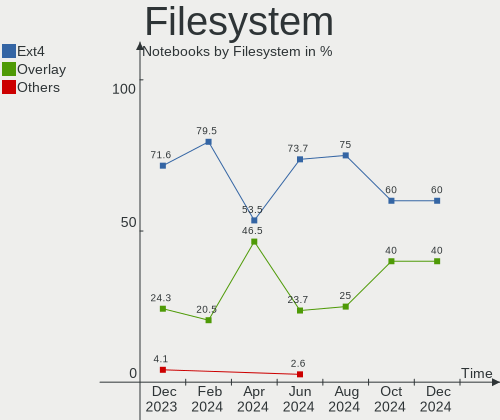
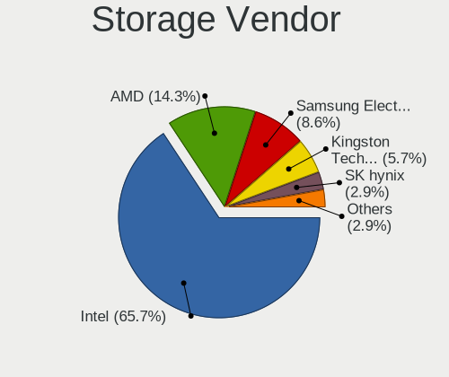
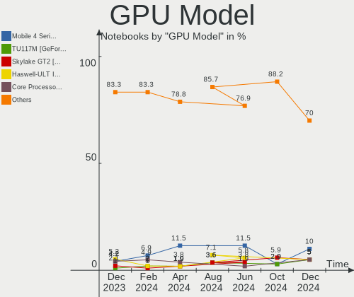

BlackPanther Hardware Trends (Notebook)
---------------------------------------

A project to identify most popular hardware characteristics and track their change
over time based on data collected by BlackPanther users at https://Linux-Hardware.org.

Anyone can contribute to the study by uploading probes of their computers by
the [hw-probe](https://github.com/linuxhw/hw-probe) tool:

    sudo hw-probe -all -upload

Full-feature report is available here: https://linux-hardware.org/?view=trends&formfactor=notebook

Period: Jan, 2020.

Contents
--------

- [ OS                       ](#os)
- [ OS Family                ](#os-family)
- [ Kernel                   ](#kernel)
- [ Kernel Family            ](#kernel-family)
- [ Kernel Major Ver.        ](#kernel-major-ver)
- [ Arch                     ](#arch)
- [ DE                       ](#de)
- [ Display Server           ](#display-server)
- [ OS Lang                  ](#os-lang)
- [ Boot Mode                ](#boot-mode)
- [ Filesystem               ](#filesystem)
- [ Dual Boot with Linux     ](#dual-boot-with-linux)
- [ Dual Boot (Win)          ](#dual-boot-win)
- [ Country                  ](#country)
- [ City                     ](#city)
- [ Vendor                   ](#vendor)
- [ Model                    ](#model)
- [ Model Family             ](#model-family)
- [ MFG Year                 ](#mfg-year)
- [ Form Factor              ](#form-factor)
- [ Secure Boot              ](#secure-boot)
- [ Coreboot                 ](#coreboot)
- [ RAM Size                 ](#ram-size)
- [ RAM Used                 ](#ram-used)
- [ Drive Vendor             ](#drive-vendor)
- [ Drive Model              ](#drive-model)
- [ Drive Kind               ](#drive-kind)
- [ Drive Connector          ](#drive-connector)
- [ Drive Size               ](#drive-size)
- [ Space Total              ](#space-total)
- [ Space Used               ](#space-used)
- [ Malfunc. Drives          ](#malfunc-drives)
- [ Malfunc. Drive Vendor    ](#malfunc-drive-vendor)
- [ Malfunc. Drive Kind      ](#malfunc-drive-kind)
- [ Failed Drives            ](#failed-drives)
- [ Failed Drive Vendor      ](#failed-drive-vendor)
- [ Drive Status             ](#drive-status)
- [ Storage Vendor           ](#storage-vendor)
- [ Storage Model            ](#storage-model)
- [ Storage Kind             ](#storage-kind)
- [ CPU Vendor               ](#cpu-vendor)
- [ CPU Model                ](#cpu-model)
- [ CPU Model Family         ](#cpu-model-family)
- [ CPU Cores                ](#cpu-cores)
- [ CPU Sockets              ](#cpu-sockets)
- [ CPU Threads              ](#cpu-threads)
- [ CPU Op-Modes             ](#cpu-op-modes)
- [ CPU Microarch            ](#cpu-microarch)
- [ CPU Microcode            ](#cpu-microcode)
- [ GPU Vendor               ](#gpu-vendor)
- [ GPU Model                ](#gpu-model)
- [ GPU Combo                ](#gpu-combo)
- [ GPU Driver               ](#gpu-driver)
- [ GPU Memory               ](#gpu-memory)
- [ Monitor Vendor           ](#monitor-vendor)
- [ Monitor Model            ](#monitor-model)
- [ Monitor Resolution       ](#monitor-resolution)
- [ Monitor Diagonal         ](#monitor-diagonal)
- [ Monitor Width            ](#monitor-width)
- [ Aspect Ratio             ](#aspect-ratio)
- [ Monitor Area             ](#monitor-area)
- [ Pixel Density            ](#pixel-density)
- [ Multiple Monitors        ](#multiple-monitors)
- [ Net Controller Vendor    ](#net-controller-vendor)
- [ Net Controller Model     ](#net-controller-model)
- [ Net Controller Kind      ](#net-controller-kind)
- [ Used Controller          ](#used-controller)
- [ NICs                     ](#nics)
- [ Unsupported Devices      ](#unsupported-devices)
- [ Unsupported Device Types ](#unsupported-device-types)

OS
--

Installed operating systems

| Name              | Computers | Percent |
|-------------------|-----------|---------|
| BlackPanther 18.1 | 117       | 63.59%  |
| BlackPanther 16.2 | 67        | 36.41%  |

OS Family
---------

OS without a version

| Name         | Computers | Percent |
|--------------|-----------|---------|
| BlackPanther | 184       | 100%    |

Kernel
------

Version of the Linux kernel

| Version                 | Computers | Percent |
|-------------------------|-----------|---------|
| 4.18.16-desktop-1bP     | 99        | 53.8%   |
| 4.9.20-desktop-pae-1bP  | 63        | 34.24%  |
| 5.1.15-desktop-1bP      | 18        | 9.78%   |
| 4.9.20-desktop-1bP      | 2         | 1.09%   |
| 4.14.14-desktop-pae-1bP | 2         | 1.09%   |

Kernel Family
-------------

Linux kernel without a distro release

| Version | Computers | Percent |
|---------|-----------|---------|
| 4.18.16 | 99        | 53.8%   |
| 4.9.20  | 65        | 35.33%  |
| 5.1.15  | 18        | 9.78%   |
| 4.14.14 | 2         | 1.09%   |

Kernel Major Ver.
-----------------

Linux kernel major version

| Version | Computers | Percent |
|---------|-----------|---------|
| 4.18    | 99        | 53.8%   |
| 4.9     | 65        | 35.33%  |
| 5.1     | 18        | 9.78%   |
| 4.14    | 2         | 1.09%   |

Arch
----

OS architecture (x86_64, i586, etc.)

| Name   | Computers | Percent |
|--------|-----------|---------|
| x86_64 | 117       | 63.59%  |
| i686   | 67        | 36.41%  |

DE
--

Desktop Environment

| Name | Computers | Percent |
|------|-----------|---------|
| KDE5 | 184       | 100%    |

Display Server
--------------

X11 or Wayland

| Name | Computers | Percent |
|------|-----------|---------|
| X11  | 184       | 100%    |

OS Lang
-------

Language

| Lang    | Computers | Percent |
|---------|-----------|---------|
| Unknown | 184       | 100%    |

Boot Mode
---------

EFI or BIOS

| Mode | Computers | Percent |
|------|-----------|---------|
| BIOS | 137       | 74.46%  |
| EFI  | 47        | 25.54%  |

Filesystem
----------

Type of filesystem

| Type    | Computers | Percent |
|---------|-----------|---------|
| Ext4    | 168       | 91.3%   |
| Overlay | 14        | 7.61%   |
| Ext2    | 1         | 0.54%   |
| Btrfs   | 1         | 0.54%   |

Dual Boot with Linux
--------------------

Hosting more than one Linux

| Dual boot | Computers | Percent |
|-----------|-----------|---------|
| No        | 150       | 81.52%  |
| Yes       | 34        | 18.48%  |

Dual Boot (Win)
---------------

Hosting Linux and Windows

| Dual boot | Computers | Percent |
|-----------|-----------|---------|
| No        | 124       | 67.39%  |
| Yes       | 60        | 32.61%  |

Country
-------

Geographic location (country)

| Country     | Computers | Percent |
|-------------|-----------|---------|
| Hungary     | 136       | 73.91%  |
| Germany     | 17        | 9.24%   |
| Romania     | 8         | 4.35%   |
| France      | 4         | 2.17%   |
| Spain       | 3         | 1.63%   |
| USA         | 2         | 1.09%   |
| Switzerland | 2         | 1.09%   |
| Austria     | 2         | 1.09%   |
| Sweden      | 1         | 0.54%   |
| Slovakia    | 1         | 0.54%   |
| Portugal    | 1         | 0.54%   |
| Poland      | 1         | 0.54%   |
| Mexico      | 1         | 0.54%   |
| Italy       | 1         | 0.54%   |
| Greece      | 1         | 0.54%   |
| Canada      | 1         | 0.54%   |
| Brazil      | 1         | 0.54%   |
| Belgium     | 1         | 0.54%   |

City
----

Geographic location (city)

| City                | Computers | Percent |
|---------------------|-----------|---------|
| Budapest            | 33        | 17.93%  |
| Nyirtelek           | 5         | 2.72%   |
| Zalaegerszeg        | 4         | 2.17%   |
| Veresegyhaz         | 4         | 2.17%   |
| Székesfehérvár   | 4         | 2.17%   |
| Debrecen            | 4         | 2.17%   |
| Târgu Mureş       | 3         | 1.63%   |
| Szeged              | 3         | 1.63%   |
| Nyiregyhaza         | 3         | 1.63%   |
| Cegled              | 3         | 1.63%   |
| Vienna              | 2         | 1.09%   |
| Vicovu de Sus       | 2         | 1.09%   |
| Tata                | 2         | 1.09%   |
| Szekszárd          | 2         | 1.09%   |
| Sarospatak          | 2         | 1.09%   |
| Regensburg          | 2         | 1.09%   |
| Nuremberg           | 2         | 1.09%   |
| Miskolc             | 2         | 1.09%   |
| Hatvan              | 2         | 1.09%   |
| Győr               | 2         | 1.09%   |
| Gyongyos            | 2         | 1.09%   |
| Gyomro              | 2         | 1.09%   |
| Dunaújváros       | 2         | 1.09%   |
| Clichy              | 2         | 1.09%   |
| Érd                | 1         | 0.54%   |
| Zurich              | 1         | 0.54%   |
| Zirc                | 1         | 0.54%   |
| Zaragoza            | 1         | 0.54%   |
| Zamardi             | 1         | 0.54%   |
| Wysokie Mazowieckie | 1         | 0.54%   |
| Veszprém           | 1         | 0.54%   |
| Vecses              | 1         | 0.54%   |
| Tura                | 1         | 0.54%   |
| Torokszentmiklos    | 1         | 0.54%   |
| Terre Haute         | 1         | 0.54%   |
| Tarjan              | 1         | 0.54%   |
| Taby                | 1         | 0.54%   |
| Szigetszentmiklos   | 1         | 0.54%   |
| St. Gallen          | 1         | 0.54%   |
| Siófok             | 1         | 0.54%   |
| Siegburg            | 1         | 0.54%   |
| Sanmartin           | 1         | 0.54%   |
| Sabadell            | 1         | 0.54%   |
| Rotselaar           | 1         | 0.54%   |
| Rio de Janeiro      | 1         | 0.54%   |
| Rinyaujlak          | 1         | 0.54%   |
| Regenstauf          | 1         | 0.54%   |
| Rakamaz             | 1         | 0.54%   |
| Pécs               | 1         | 0.54%   |
| Pusztamonostor      | 1         | 0.54%   |
| Portland            | 1         | 0.54%   |
| Porcsalma           | 1         | 0.54%   |
| Pilisszentlaszlo    | 1         | 0.54%   |
| Odorheiu Secuiesc   | 1         | 0.54%   |
| Nittendorf          | 1         | 0.54%   |
| Nagymanyok          | 1         | 0.54%   |
| Nagylok             | 1         | 0.54%   |
| Nagykoros           | 1         | 0.54%   |
| Nagocs              | 1         | 0.54%   |
| Munich              | 1         | 0.54%   |

Vendor
------

Motherboard manufacturer

| Name                | Computers | Percent |
|---------------------|-----------|---------|
| Hewlett-Packard     | 46        | 25%     |
| Lenovo              | 34        | 18.48%  |
| Dell                | 34        | 18.48%  |
| ASUSTek Computer    | 24        | 13.04%  |
| Acer                | 18        | 9.78%   |
| Toshiba             | 13        | 7.07%   |
| Sony                | 2         | 1.09%   |
| Samsung Electronics | 2         | 1.09%   |
| Packard Bell        | 2         | 1.09%   |
| Medion              | 2         | 1.09%   |
| Fujitsu Siemens     | 2         | 1.09%   |
| eMachines           | 2         | 1.09%   |
| Panasonic           | 1         | 0.54%   |
| Intel               | 1         | 0.54%   |
| Alcor               | 1         | 0.54%   |

Model
-----

Motherboard model

| Name                                  | Computers | Percent |
|---------------------------------------|-----------|---------|
| Lenovo IdeaPad 100-15IBD 80QQ         | 6         | 3.26%   |
| HP 250 G1                             | 6         | 3.26%   |
| Dell Latitude E6410                   | 5         | 2.72%   |
| HP ProBook 6450b                      | 3         | 1.63%   |
| Dell Inspiron 5558                    | 3         | 1.63%   |
| ASUS X541NA                           | 3         | 1.63%   |
| Toshiba Satellite C660                | 2         | 1.09%   |
| Toshiba PORTEGE R830                  | 2         | 1.09%   |
| Lenovo ThinkPad W510 431924G          | 2         | 1.09%   |
| Lenovo IdeaPad 320-15ISK 80XH         | 2         | 1.09%   |
| HP Pavilion g6                        | 2         | 1.09%   |
| HP Pavilion dv7                       | 2         | 1.09%   |
| HP Pavilion dv6                       | 2         | 1.09%   |
| HP EliteBook 6930p                    | 2         | 1.09%   |
| HP 650                                | 2         | 1.09%   |
| HP 635                                | 2         | 1.09%   |
| HP 250 G5 Notebook PC                 | 2         | 1.09%   |
| Unknown                               | 2         | 1.09%   |
| Toshiba TECRA A11                     | 1         | 0.54%   |
| Toshiba Satellite Pro R50-B           | 1         | 0.54%   |
| Toshiba Satellite L650                | 1         | 0.54%   |
| Toshiba Satellite C855-112            | 1         | 0.54%   |
| Toshiba Satellite C75-A               | 1         | 0.54%   |
| Toshiba Satellite C55D-A              | 1         | 0.54%   |
| Toshiba Satellite C50-A-1G1           | 1         | 0.54%   |
| Toshiba Satellite                     | 1         | 0.54%   |
| Sony VPCEH3H1E                        | 1         | 0.54%   |
| Sony VGN-FW21M                        | 1         | 0.54%   |
| Samsung Electronics RV409/RV509/RV709 | 1         | 0.54%   |
| Samsung Electronics N145P/N250P/N260P | 1         | 0.54%   |
| Panasonic CF-W8EWEZZAM                | 1         | 0.54%   |
| Packard Bell EasyNote TV43HC          | 1         | 0.54%   |
| Packard Bell EasyNote TK81            | 1         | 0.54%   |
| Medion P6612                          | 1         | 0.54%   |
| Medion E7214                          | 1         | 0.54%   |
| Lenovo Z50-75 80EC                    | 1         | 0.54%   |
| Lenovo ThinkPad X200 Tablet 7453WRX   | 1         | 0.54%   |
| Lenovo ThinkPad X200 74595FG          | 1         | 0.54%   |
| Lenovo ThinkPad X200 7458EY2          | 1         | 0.54%   |
| Lenovo ThinkPad X1 Carbon 34608G1     | 1         | 0.54%   |
| Lenovo ThinkPad T61 64586QG           | 1         | 0.54%   |
| Lenovo ThinkPad T450 20BUS09Y0E       | 1         | 0.54%   |
| Lenovo ThinkPad T420 4180W15          | 1         | 0.54%   |
| Lenovo ThinkPad T410 2537VFQ          | 1         | 0.54%   |
| Lenovo ThinkPad R61 8933WC3           | 1         | 0.54%   |
| Lenovo ThinkPad L520 5016RD4          | 1         | 0.54%   |
| Lenovo IdeaPad V560 20078,3749        | 1         | 0.54%   |
| Lenovo IdeaPad U160 08946JG           | 1         | 0.54%   |
| Lenovo IdeaPad S205 10382JG           | 1         | 0.54%   |
| Lenovo IdeaPad 330-15IKB 81DE         | 1         | 0.54%   |
| Lenovo IdeaPad 330-15ARR 81D2         | 1         | 0.54%   |
| Lenovo IdeaPad 320-17ABR 80YN         | 1         | 0.54%   |
| Lenovo IdeaPad 320-15IAP 80XR         | 1         | 0.54%   |
| Lenovo IdeaPad 110-15ACL 80TJ         | 1         | 0.54%   |
| Lenovo G70-70 80HW                    | 1         | 0.54%   |
| Lenovo G550 20023                     | 1         | 0.54%   |
| Lenovo G50-45 80E3                    | 1         | 0.54%   |
| Lenovo G50-30 80G0                    | 1         | 0.54%   |
| Lenovo 3000 N500 423332G              | 1         | 0.54%   |
| Intel Intel powered classmate PC      | 1         | 0.54%   |

Model Family
------------

Motherboard model prefix

| Name                      | Computers | Percent |
|---------------------------|-----------|---------|
| Acer Aspire               | 17        | 9.24%   |
| Lenovo IdeaPad            | 16        | 8.7%    |
| Dell Latitude             | 16        | 8.7%    |
| Dell Inspiron             | 13        | 7.07%   |
| Lenovo ThinkPad           | 12        | 6.52%   |
| Toshiba Satellite         | 9         | 4.89%   |
| HP Pavilion               | 9         | 4.89%   |
| HP 250                    | 8         | 4.35%   |
| HP Compaq                 | 6         | 3.26%   |
| HP EliteBook              | 5         | 2.72%   |
| HP ProBook                | 4         | 2.17%   |
| ASUS VivoBook             | 4         | 2.17%   |
| Dell XPS                  | 3         | 1.63%   |
| ASUS X541NA               | 3         | 1.63%   |
| Toshiba PORTEGE           | 2         | 1.09%   |
| Packard Bell EasyNote     | 2         | 1.09%   |
| HP Laptop                 | 2         | 1.09%   |
| HP 650                    | 2         | 1.09%   |
| HP 635                    | 2         | 1.09%   |
| Fujitsu Siemens AMILO     | 2         | 1.09%   |
| Unknown                   | 2         | 1.09%   |
| Toshiba TECRA             | 1         | 0.54%   |
| Sony VPCEH3H1E            | 1         | 0.54%   |
| Sony VGN-FW21M            | 1         | 0.54%   |
| Samsung Electronics RV409 | 1         | 0.54%   |
| Samsung Electronics N145P | 1         | 0.54%   |
| Panasonic CF-W8EWEZZAM    | 1         | 0.54%   |
| Medion P6612              | 1         | 0.54%   |
| Medion E7214              | 1         | 0.54%   |
| Lenovo Z50-75             | 1         | 0.54%   |
| Lenovo G70-70             | 1         | 0.54%   |
| Lenovo G550               | 1         | 0.54%   |
| Lenovo G50-45             | 1         | 0.54%   |
| Lenovo G50-30             | 1         | 0.54%   |
| Lenovo 3000               | 1         | 0.54%   |
| Intel Intel               | 1         | 0.54%   |
| HP OMEN                   | 1         | 0.54%   |
| HP Notebook               | 1         | 0.54%   |
| HP G62                    | 1         | 0.54%   |
| HP ENVY                   | 1         | 0.54%   |
| HP 620                    | 1         | 0.54%   |
| HP 255                    | 1         | 0.54%   |
| HP 2133                   | 1         | 0.54%   |
| eMachines E627            | 1         | 0.54%   |
| eMachines E525            | 1         | 0.54%   |
| Dell Vostro               | 1         | 0.54%   |
| Dell Precision            | 1         | 0.54%   |
| ASUS X751SA               | 1         | 0.54%   |
| ASUS X555LAB              | 1         | 0.54%   |
| ASUS X553MA               | 1         | 0.54%   |
| ASUS X550WA               | 1         | 0.54%   |
| ASUS X550EA               | 1         | 0.54%   |
| ASUS X550CC               | 1         | 0.54%   |
| ASUS Strix                | 1         | 0.54%   |
| ASUS S550CM               | 1         | 0.54%   |
| ASUS K54HR                | 1         | 0.54%   |
| ASUS K53BY                | 1         | 0.54%   |
| ASUS K52Jc                | 1         | 0.54%   |
| ASUS K50IJ                | 1         | 0.54%   |
| ASUS K401UB               | 1         | 0.54%   |

MFG Year
--------

Motherboard manufacture year

| Year | Computers | Percent |
|------|-----------|---------|
| 2013 | 21        | 11.41%  |
| 2011 | 21        | 11.41%  |
| 2010 | 21        | 11.41%  |
| 2016 | 17        | 9.24%   |
| 2015 | 16        | 8.7%    |
| 2018 | 14        | 7.61%   |
| 2008 | 13        | 7.07%   |
| 2019 | 12        | 6.52%   |
| 2012 | 12        | 6.52%   |
| 2009 | 12        | 6.52%   |
| 2017 | 9         | 4.89%   |
| 2014 | 9         | 4.89%   |
| 2007 | 6         | 3.26%   |
| 2006 | 1         | 0.54%   |

Form Factor
-----------

Physical design of the computer

| Name     | Computers | Percent |
|----------|-----------|---------|
| Notebook | 184       | 100%    |

Secure Boot
-----------

Enabled or disabled

| State    | Computers | Percent |
|----------|-----------|---------|
| Disabled | 184       | 100%    |

Coreboot
--------

Have coreboot on board

| Used | Computers | Percent |
|------|-----------|---------|
| No   | 184       | 100%    |

RAM Size
--------

Total RAM memory

| Size in GB | Computers | Percent |
|------------|-----------|---------|
| 3.01-4.0   | 73        | 39.67%  |
| 4.01-8.0   | 45        | 24.46%  |
| 8.01-16.0  | 23        | 12.5%   |
| 1.01-2.0   | 20        | 10.87%  |
| 2.01-3.0   | 15        | 8.15%   |
| 16.01-24.0 | 6         | 3.26%   |
| 0.01-1.0   | 2         | 1.09%   |

RAM Used
--------

Used RAM memory

| Used GB  | Computers | Percent |
|----------|-----------|---------|
| 0.01-1.0 | 99        | 53.8%   |
| 1.01-2.0 | 74        | 40.22%  |
| 2.01-3.0 | 9         | 4.89%   |
| 3.01-4.0 | 2         | 1.09%   |

Drive Vendor
------------

Hard drive vendors

| Vendor              | Computers | Drives  | Percent |
|---------------------|-----------|---------|---------|
| WDC                 | 36        | 36      | 16.59%  |
| Seagate             | 34        | 34      | 15.67%  |
| Toshiba             | 25        | 25      | 11.52%  |
| Samsung Electronics | 22        | 22      | 10.14%  |
| Kingston            | 17        | 17      | 7.83%   |
| HGST                | 17        | 17      | 7.83%   |
| Hitachi             | 14        | 14      | 6.45%   |
| SanDisk             | 12        | 12      | 5.53%   |
| Unknown             | 7         | 7       | 3.23%   |
| HL-DT-ST            | 5         | Unknown | 2.3%    |
| Intel               | 4         | 4       | 1.84%   |
| Intenso             | 3         | 3       | 1.38%   |
| Fujitsu             | 3         | 3       | 1.38%   |
| SPCC                | 2         | 2       | 0.92%   |
| SK Hynix            | 2         | 2       | 0.92%   |
| KINGMAX             | 2         | 2       | 0.92%   |
| Crucial             | 2         | 2       | 0.92%   |
| China               | 2         | 2       | 0.92%   |
| A-DATA Technology   | 2         | 2       | 0.92%   |
| PNY                 | 1         | 1       | 0.46%   |
| OCZ                 | 1         | 1       | 0.46%   |
| LITEONIT            | 1         | 1       | 0.46%   |
| JMicron             | 1         | 1       | 0.46%   |
| Hewlett-Packard     | 1         | Unknown | 0.46%   |
| Apacer              | 1         | 1       | 0.46%   |

Drive Model
-----------

Hard drive models

| Model                      | Computers | Percent |
|----------------------------|-----------|---------|
| MQ01ABF050 500GB           | 6         | 2.76%   |
| ST9320325AS 320GB          | 5         | 2.3%    |
| ST500LT012-1DG142 500GB    | 5         | 2.3%    |
| SDSSDH3250G 250GB          | 5         | 2.3%    |
| HTS545032A7E380 320GB      | 5         | 2.3%    |
| HTS541010A9E680 1TB        | 5         | 2.3%    |
| DVDRAM GUC0N 1GB           | 5         | 2.3%    |
| SA400S37240G 240GB SSD     | 4         | 1.84%   |
| SA400S37120G 120GB SSD     | 4         | 1.84%   |
| WD5000LPVX-22V0TT0 500GB   | 3         | 1.38%   |
| SV300S37A120G 120GB SSD    | 3         | 1.38%   |
| ST1000LM035-1RK172 1TB     | 3         | 1.38%   |
| MQ04ABF100 1TB             | 3         | 1.38%   |
| MQ01ACF032 320GB           | 3         | 1.38%   |
| WD5000LPCX-24VHAT0 500GB   | 2         | 0.92%   |
| WD2500BEVS-22UST0 250GB    | 2         | 0.92%   |
| WD2500BEKT-60PVMT0 250GB   | 2         | 0.92%   |
| WD1600BEVS-22RST0 160GB    | 2         | 0.92%   |
| ST9500420AS 500GB          | 2         | 0.92%   |
| ST9500325AS 500GB          | 2         | 0.92%   |
| ST9160821AS 160GB          | 2         | 0.92%   |
| ST1000LX015-1U7172 1TB     | 2         | 0.92%   |
| ST1000LM024 HN-M101MBB 1TB | 2         | 0.92%   |
| SSD 860 EVO 250GB          | 2         | 0.92%   |
| SSD 120GB                  | 2         | 0.92%   |
| SATA SSD 120GB             | 2         | 0.92%   |
| SATA III SSD 480GB         | 2         | 0.92%   |
| MQ01ABD100 1TB             | 2         | 0.92%   |
| MQ01ABD050 500GB           | 2         | 0.92%   |
| HTS723232A7A364 320GB      | 2         | 0.92%   |
| HTS547550A9E384 500GB      | 2         | 0.92%   |
| HTS545050A7E680 500GB      | 2         | 0.92%   |
| HTS541075A9E680 752GB      | 2         | 0.92%   |
| HM250HI 250GB              | 2         | 0.92%   |
| HM160HI 160GB              | 2         | 0.92%   |
| DF4064  64GB               | 2         | 0.92%   |
| WDS500G2B0A 500GB SSD      | 1         | 0.46%   |
| WD800BEVS-08RST3 80GB      | 1         | 0.46%   |
| WD6400BEVT-22A0RT0 640GB   | 1         | 0.46%   |
| WD5000LPLX-00ZNTT0 500GB   | 1         | 0.46%   |
| WD5000LPCX-75VHAT0 500GB   | 1         | 0.46%   |
| WD5000BPVT-00HXZT1 500GB   | 1         | 0.46%   |
| WD5000BPKT-75PK4T0 500GB   | 1         | 0.46%   |
| WD5000BPKT-60PK4T0 500GB   | 1         | 0.46%   |
| WD5000BPKT-00PK4T0 500GB   | 1         | 0.46%   |
| WD5000BEVT-24A0RT0 500GB   | 1         | 0.46%   |
| WD3200BPVT-80JJ5T0 320GB   | 1         | 0.46%   |
| WD3200BEVT-80A0RT0 320GB   | 1         | 0.46%   |
| WD3200BEVT-75ZCT2 320GB    | 1         | 0.46%   |
| WD3200BEKT-00V5T0 320GB    | 1         | 0.46%   |
| WD2500BEVT-22ZCT0 250GB    | 1         | 0.46%   |
| WD2500BEKT-75A25T0 250GB   | 1         | 0.46%   |
| WD1600BEVT-88ZCT0 160GB    | 1         | 0.46%   |
| WD1600BEVT-22ZCT0 160GB    | 1         | 0.46%   |
| WD1600BEVS-08VAT2 160GB    | 1         | 0.46%   |
| WD10SPZX-24Z10T0 1TB       | 1         | 0.46%   |
| WD10SPZX-24Z10 1TB         | 1         | 0.46%   |
| WD10SPCX-24HWST1 1TB       | 1         | 0.46%   |
| WD10JPVX-75JC3T0 1TB       | 1         | 0.46%   |
| WD10JPVX-60JC3T0 1TB       | 1         | 0.46%   |

Drive Kind
----------

HDD or SSD

| Kind    | Computers | Drives | Percent |
|---------|-----------|--------|---------|
| HDD     | 130       | 131    | 61.03%  |
| SSD     | 61        | 64     | 28.64%  |
| MMC     | 9         | 9      | 4.23%   |
| Unknown | 8         | 2      | 3.76%   |
| NVMe    | 5         | 5      | 2.35%   |

Drive Connector
---------------

SATA, SAS, NVMe, etc.

| Type | Computers | Drives | Percent |
|------|-----------|--------|---------|
| SATA | 179       | 194    | 88.61%  |
| SAS  | 9         | 3      | 4.46%   |
| MMC  | 9         | 9      | 4.46%   |
| NVMe | 5         | 5      | 2.48%   |

Drive Size
----------

Size of hard drive

| Size in TB | Computers | Drives | Percent |
|------------|-----------|--------|---------|
| 0.01-0.5   | 161       | 175    | 81.73%  |
| 0.51-1.0   | 34        | 34     | 17.26%  |
| 3.01-4.0   | 1         | 1      | 0.51%   |
| 1.01-2.0   | 1         | 1      | 0.51%   |

Space Total
-----------

Amount of disk space available on the file system

| Size in GB | Computers | Percent |
|------------|-----------|---------|
| 101-250    | 69        | 37.5%   |
| 251-500    | 43        | 23.37%  |
| 51-100     | 20        | 10.87%  |
| 501-1000   | 18        | 9.78%   |
| 21-50      | 15        | 8.15%   |
| Unknown    | 10        | 5.43%   |
| 1001-2000  | 4         | 2.17%   |
| 1-20       | 3         | 1.63%   |
| 2001-3000  | 2         | 1.09%   |

Space Used
----------

Amount of used disk space

| Used GB   | Computers | Percent |
|-----------|-----------|---------|
| 1-20      | 134       | 72.83%  |
| 21-50     | 12        | 6.52%   |
| 51-100    | 11        | 5.98%   |
| Unknown   | 10        | 5.43%   |
| 101-250   | 8         | 4.35%   |
| 251-500   | 7         | 3.8%    |
| 1001-2000 | 1         | 0.54%   |
| 501-1000  | 1         | 0.54%   |

Malfunc. Drives
---------------

Drive models with a malfunction

| Model                      | Computers | Drives | Percent |
|----------------------------|-----------|--------|---------|
| HTS545032A7E380 320GB      | 5         | 5      | 7.81%   |
| WD2500BEKT-60PVMT0 250GB   | 2         | 2      | 3.13%   |
| ST9500420AS 500GB          | 2         | 2      | 3.13%   |
| ST9320325AS 320GB          | 2         | 2      | 3.13%   |
| ST500LT012-1DG142 500GB    | 2         | 2      | 3.13%   |
| HTS723232A7A364 320GB      | 2         | 2      | 3.13%   |
| HTS547550A9E384 500GB      | 2         | 2      | 3.13%   |
| HTS545050A7E680 500GB      | 2         | 2      | 3.13%   |
| HTS541010A9E680 1TB        | 2         | 2      | 3.13%   |
| HM160HI 160GB              | 2         | 2      | 3.13%   |
| WD6400BEVT-22A0RT0 640GB   | 1         | 1      | 1.56%   |
| WD5000LPCX-24VHAT0 500GB   | 1         | 1      | 1.56%   |
| WD5000BPKT-75PK4T0 500GB   | 1         | 1      | 1.56%   |
| WD5000BPKT-60PK4T0 500GB   | 1         | 1      | 1.56%   |
| WD3200BEVT-75ZCT2 320GB    | 1         | 1      | 1.56%   |
| WD2500BEVT-22ZCT0 250GB    | 1         | 1      | 1.56%   |
| WD2500BEKT-75A25T0 250GB   | 1         | 1      | 1.56%   |
| WD1600BEVS-22RST0 160GB    | 1         | 1      | 1.56%   |
| SV300S37A120G 120GB SSD    | 1         | 1      | 1.56%   |
| SUV400S37240G 240GB SSD    | 1         | 1      | 1.56%   |
| ST980811AS 80GB            | 1         | 1      | 1.56%   |
| ST9750423AS 752GB          | 1         | 1      | 1.56%   |
| ST9500325AS 500GB          | 1         | 1      | 1.56%   |
| ST9250410AS 250GB          | 1         | 1      | 1.56%   |
| ST9250315AS 250GB          | 1         | 1      | 1.56%   |
| ST320LT009-9WC142 320GB    | 1         | 1      | 1.56%   |
| ST1000LM024 HN-M101MBB 1TB | 1         | 1      | 1.56%   |
| SSDSA2M160G2LE 160GB       | 1         | 1      | 1.56%   |
| SSDSA1M160G2HP 160GB       | 1         | 1      | 1.56%   |
| SSD U100 24GB              | 1         | 1      | 1.56%   |
| SSD Sata III 256GB         | 1         | 1      | 1.56%   |
| SSD PM810 TM 128GB         | 1         | 1      | 1.56%   |
| SHFS37A120G 120GB SSD      | 1         | 1      | 1.56%   |
| SH920 mSATA 128GB SSD      | 1         | 1      | 1.56%   |
| MQ01ABF050 500GB           | 1         | 1      | 1.56%   |
| MQ01ABD050 500GB           | 1         | 1      | 1.56%   |
| MK3265GSXV 320GB           | 1         | 1      | 1.56%   |
| MK2546GSX 250GB            | 1         | 1      | 1.56%   |
| MK2035GSS 200GB            | 1         | 1      | 1.56%   |
| MK1246GSX 120GB            | 1         | 1      | 1.56%   |
| MK1237GSX 120GB            | 1         | 1      | 1.56%   |
| MK1059GSM 1TB              | 1         | 1      | 1.56%   |
| MK1032GSX 100GB            | 1         | 1      | 1.56%   |
| MHY2120BH 120GB            | 1         | 1      | 1.56%   |
| HTS725050A9A364 500GB      | 1         | 1      | 1.56%   |
| HTS723216L9A360 160GB      | 1         | 1      | 1.56%   |
| HTS545050B9A300 500GB      | 1         | 1      | 1.56%   |
| HTS543232A7A384 320GB      | 1         | 1      | 1.56%   |
| HTS542525K9A300 250GB      | 1         | 1      | 1.56%   |
| HTS541660J9SA00 64GB       | 1         | 1      | 1.56%   |
| HTS541612J9SA00 120GB      | 1         | 1      | 1.56%   |

Malfunc. Drive Vendor
---------------------

Vendors of faulty drives

| Vendor              | Computers | Drives | Percent |
|---------------------|-----------|--------|---------|
| Seagate             | 13        | 13     | 20.31%  |
| Hitachi             | 11        | 11     | 17.19%  |
| WDC                 | 10        | 10     | 15.63%  |
| Toshiba             | 9         | 9      | 14.06%  |
| HGST                | 9         | 9      | 14.06%  |
| Samsung Electronics | 3         | 3      | 4.69%   |
| Kingston            | 3         | 3      | 4.69%   |
| Intel               | 2         | 2      | 3.13%   |
| SK Hynix            | 1         | 1      | 1.56%   |
| SanDisk             | 1         | 1      | 1.56%   |
| Intenso             | 1         | 1      | 1.56%   |
| Fujitsu             | 1         | 1      | 1.56%   |

Malfunc. Drive Kind
-------------------

Kinds of faulty drives

| Kind | Computers | Drives | Percent |
|------|-----------|--------|---------|
| HDD  | 55        | 55     | 85.94%  |
| SSD  | 9         | 9      | 14.06%  |

Failed Drives
-------------

Failed drive models

| Model                   | Computers | Drives | Percent |
|-------------------------|-----------|--------|---------|
| WD1600BEVT-22ZCT0 160GB | 1         | 1      | 100%    |

Failed Drive Vendor
-------------------

Failed drive vendors

| Vendor | Computers | Drives | Percent |
|--------|-----------|--------|---------|
| WDC    | 1         | 1      | 100%    |

Drive Status
------------

Number of failed and malfunc. drives

| Status   | Computers | Drives | Percent |
|----------|-----------|--------|---------|
| Works    | 122       | 132    | 59.8%   |
| Malfunc  | 63        | 64     | 30.88%  |
| Detected | 18        | 14     | 8.82%   |
| Failed   | 1         | 1      | 0.49%   |

Storage Vendor
--------------

Storage controller vendors

| Vendor                       | Computers | Percent |
|------------------------------|-----------|---------|
| Intel                        | 154       | 82.35%  |
| AMD                          | 26        | 13.9%   |
| Samsung Electronics          | 3         | 1.6%    |
| VIA Technologies             | 2         | 1.07%   |
| Unknown                      | 1         | 0.53%   |
| Toshiba America Info Systems | 1         | 0.53%   |

Storage Model
-------------

Storage controller models

| Model                                                                            | Computers | Percent |
|----------------------------------------------------------------------------------|-----------|---------|
| FCH SATA Controller [AHCI mode]                                                  | 19        | 8.72%   |
| 7 Series Chipset Family 6-port SATA Controller [AHCI mode]                       | 19        | 8.72%   |
| 82801IBM/IEM (ICH9M/ICH9M-E) 4 port SATA Controller [AHCI mode]                  | 18        | 8.26%   |
| 82801HM/HEM (ICH8M/ICH8M-E) IDE Controller                                       | 17        | 7.8%    |
| 6 Series/C200 Series Chipset Family 6 port Mobile SATA AHCI Controller           | 13        | 5.96%   |
| Sunrise Point-LP SATA Controller [AHCI mode]                                     | 11        | 5.05%   |
| 82801HM/HEM (ICH8M/ICH8M-E) SATA Controller [AHCI mode]                          | 11        | 5.05%   |
| Wildcat Point-LP SATA Controller [AHCI Mode]                                     | 10        | 4.59%   |
| 8 Series SATA Controller 1 [AHCI mode]                                           | 9         | 4.13%   |
| 82801 Mobile SATA Controller [RAID mode]                                         | 8         | 3.67%   |
| 5 Series/3400 Series Chipset 6 port SATA AHCI Controller                         | 8         | 3.67%   |
| 5 Series/3400 Series Chipset 4 port SATA AHCI Controller                         | 8         | 3.67%   |
| SB7x0/SB8x0/SB9x0 SATA Controller [AHCI mode]                                    | 7         | 3.21%   |
| 82801HM/HEM (ICH8M/ICH8M-E) SATA Controller [IDE mode]                           | 6         | 2.75%   |
| 5 Series/3400 Series Chipset 4 port SATA IDE Controller                          | 5         | 2.29%   |
| 5 Series/3400 Series Chipset 2 port SATA IDE Controller                          | 5         | 2.29%   |
| Celeron N3350/Pentium N4200/Atom E3900 Series SATA AHCI Controller               | 4         | 1.83%   |
| Atom/Celeron/Pentium Processor x5-E8000/J3xxx/N3xxx Series SATA Controller       | 4         | 1.83%   |
| NM10/ICH7 Family SATA Controller [AHCI mode]                                     | 3         | 1.38%   |
| 82801GBM/GHM (ICH7-M Family) SATA Controller [IDE mode]                          | 3         | 1.38%   |
| NVMe SSD Controller SM961/PM961                                                  | 2         | 0.92%   |
| Mobile PM965/GM965 PT IDER Controller                                            | 2         | 0.92%   |
| Mobile 4 Series Chipset PT IDER Controller                                       | 2         | 0.92%   |
| Atom Processor E3800 Series SATA AHCI Controller                                 | 2         | 0.92%   |
| 82801IBM/IEM (ICH9M/ICH9M-E) 2 port SATA Controller [IDE mode]                   | 2         | 0.92%   |
| 82801GBM/GHM (ICH7-M Family) SATA Controller [AHCI mode]                         | 2         | 0.92%   |
| 82801G (ICH7 Family) IDE Controller                                              | 2         | 0.92%   |
| VT82C586A/B/VT82C686/A/B/VT823x/A/C PIPC Bus Master IDE                          | 1         | 0.46%   |
| VT8237/8251 Serial ATA Controller                                                | 1         | 0.46%   |
| VIA VT6420 SATA RAID Controller                                                  | 1         | 0.46%   |
| Toshiba America Info Non-Volatile memory controller                              | 1         | 0.46%   |
| SB7x0/SB8x0/SB9x0 IDE Controller                                                 | 1         | 0.46%   |
| SATA controller                                                                  | 1         | 0.46%   |
| NVMe SSD Controller SM981/PM981/PM983                                            | 1         | 0.46%   |
| Non-Volatile memory controller                                                   | 1         | 0.46%   |
| NM10/ICH7 Family SATA Controller [IDE mode]                                      | 1         | 0.46%   |
| HM170/QM170 Chipset SATA Controller [AHCI Mode]                                  | 1         | 0.46%   |
| FCH IDE Controller                                                               | 1         | 0.46%   |
| Cannon Point-LP SATA Controller [AHCI Mode]                                      | 1         | 0.46%   |
| Cannon Lake Mobile PCH SATA AHCI Controller                                      | 1         | 0.46%   |
| 8 Series/C220 Series Chipset Family 6-port SATA Controller 1 [AHCI mode]         | 1         | 0.46%   |
| 6 Series/C200 Series Chipset Family Mobile SATA Controller (IDE mode, ports 4-5) | 1         | 0.46%   |
| 6 Series/C200 Series Chipset Family Mobile SATA Controller (IDE mode, ports 0-3) | 1         | 0.46%   |

Storage Kind
------------

Kind of storage controller (IDE, SATA, NVMe, SAS, ...)

| Kind | Computers | Percent |
|------|-----------|---------|
| SATA | 153       | 75.37%  |
| IDE  | 37        | 18.23%  |
| RAID | 8         | 3.94%   |
| NVMe | 5         | 2.46%   |

CPU Vendor
----------

Processor vendors

| Vendor       | Computers | Percent |
|--------------|-----------|---------|
| Intel        | 157       | 85.33%  |
| AMD          | 26        | 14.13%  |
| CentaurHauls | 1         | 0.54%   |

CPU Model
---------

Processor models

| Model                                          | Computers | Percent |
|------------------------------------------------|-----------|---------|
| Intel Core i3-5005U CPU @ 2.00GHz              | 8         | 4.35%   |
| Intel Celeron CPU 1000M @ 1.80GHz              | 6         | 3.26%   |
| Intel Core i5 CPU M 520 @ 2.40GHz              | 4         | 2.17%   |
| Intel Core 2 Duo CPU P8600 @ 2.40GHz           | 4         | 2.17%   |
| Intel Pentium Dual-Core CPU T4200 @ 2.00GHz    | 3         | 1.63%   |
| Intel Core i5 CPU M 560 @ 2.67GHz              | 3         | 1.63%   |
| Intel Core i3-4005U CPU @ 1.70GHz              | 3         | 1.63%   |
| Intel Core i3 CPU M 350 @ 2.27GHz              | 3         | 1.63%   |
| Intel Core 2 Duo CPU T7500 @ 2.20GHz           | 3         | 1.63%   |
| Intel Celeron CPU N3350 @ 1.10GHz              | 3         | 1.63%   |
| Intel Pentium Dual-Core CPU T4500 @ 2.30GHz    | 2         | 1.09%   |
| Intel Pentium CPU N3700 @ 1.60GHz              | 2         | 1.09%   |
| Intel Pentium CPU 2117U @ 1.80GHz              | 2         | 1.09%   |
| Intel Pentium CPU 2020M @ 2.40GHz              | 2         | 1.09%   |
| Intel Core i7-6500U CPU @ 2.50GHz              | 2         | 1.09%   |
| Intel Core i7-2670QM CPU @ 2.20GHz             | 2         | 1.09%   |
| Intel Core i7-2620M CPU @ 2.70GHz              | 2         | 1.09%   |
| Intel Core i7 CPU Q 720 @ 1.60GHz              | 2         | 1.09%   |
| Intel Core i5-8250U CPU @ 1.60GHz              | 2         | 1.09%   |
| Intel Core i5-6200U CPU @ 2.30GHz              | 2         | 1.09%   |
| Intel Core i5-5300U CPU @ 2.30GHz              | 2         | 1.09%   |
| Intel Core i5-4210U CPU @ 1.70GHz              | 2         | 1.09%   |
| Intel Core i5-2520M CPU @ 2.50GHz              | 2         | 1.09%   |
| Intel Core i5-2450M CPU @ 2.50GHz              | 2         | 1.09%   |
| Intel Core i3-7020U CPU @ 2.30GHz              | 2         | 1.09%   |
| Intel Core i3-6006U CPU @ 2.00GHz              | 2         | 1.09%   |
| Intel Core i3-4030U CPU @ 1.90GHz              | 2         | 1.09%   |
| Intel Core i3-2350M CPU @ 2.30GHz              | 2         | 1.09%   |
| Intel Core 2 Duo CPU T8300 @ 2.40GHz           | 2         | 1.09%   |
| Intel Core 2 Duo CPU T8100 @ 2.10GHz           | 2         | 1.09%   |
| Intel Core 2 Duo CPU T7300 @ 2.00GHz           | 2         | 1.09%   |
| Intel Core 2 Duo CPU T7250 @ 2.00GHz           | 2         | 1.09%   |
| Intel Celeron CPU 540 @ 1.86GHz                | 2         | 1.09%   |
| Intel Atom CPU N450 @ 1.66GHz                  | 2         | 1.09%   |
| AMD E2-9000e RADEON R2, 4 COMPUTE CORES 2C+2G  | 2         | 1.09%   |
| AMD E-350 Processor                            | 2         | 1.09%   |
| AMD A6-6310 APU with AMD Radeon R4 Graphics    | 2         | 1.09%   |
| AMD A10-7300 Radeon R6, 10 Compute Cores 4C+6G | 2         | 1.09%   |
| Intel Pentium Silver N5000 CPU @ 1.10GHz       | 1         | 0.54%   |
| Intel Pentium Dual-Core CPU T4400 @ 2.20GHz    | 1         | 0.54%   |
| Intel Pentium Dual CPU T2370 @ 1.73GHz         | 1         | 0.54%   |
| Intel Pentium Dual CPU T2330 @ 1.60GHz         | 1         | 0.54%   |
| Intel Pentium CPU P6200 @ 2.13GHz              | 1         | 0.54%   |
| Intel Pentium CPU P6100 @ 2.00GHz              | 1         | 0.54%   |
| Intel Pentium CPU N4200 @ 1.10GHz              | 1         | 0.54%   |
| Intel Pentium CPU N3710 @ 1.60GHz              | 1         | 0.54%   |
| Intel Pentium CPU N3540 @ 2.16GHz              | 1         | 0.54%   |
| Intel Pentium CPU B980 @ 2.40GHz               | 1         | 0.54%   |
| Intel Pentium CPU 3825U @ 1.90GHz              | 1         | 0.54%   |
| Intel Genuine CPU T2250 @ 1.73GHz              | 1         | 0.54%   |
| Intel Genuine CPU T2080 @ 1.73GHz              | 1         | 0.54%   |
| Intel Genuine CPU T2050 @ 1.60GHz              | 1         | 0.54%   |
| Intel Genuine CPU 575 @ 2.00GHz                | 1         | 0.54%   |
| Intel Core i7-9750H CPU @ 2.60GHz              | 1         | 0.54%   |
| Intel Core i7-8750H CPU @ 2.20GHz              | 1         | 0.54%   |
| Intel Core i7-7700HQ CPU @ 2.80GHz             | 1         | 0.54%   |
| Intel Core i7-4712MQ CPU @ 2.30GHz             | 1         | 0.54%   |
| Intel Core i7-4600U CPU @ 2.10GHz              | 1         | 0.54%   |
| Intel Core i7-4510U CPU @ 2.00GHz              | 1         | 0.54%   |
| Intel Core i7-3540M CPU @ 3.00GHz              | 1         | 0.54%   |

CPU Model Family
----------------

Processor model prefix

| Model                   | Computers | Percent |
|-------------------------|-----------|---------|
| Intel Core i5           | 30        | 16.3%   |
| Intel Core i3           | 29        | 15.76%  |
| Intel Core 2 Duo        | 26        | 14.13%  |
| Intel Celeron           | 19        | 10.33%  |
| Intel Core i7           | 18        | 9.78%   |
| Intel Pentium           | 13        | 7.07%   |
| Intel Pentium Dual-Core | 6         | 3.26%   |
| Intel Atom              | 6         | 3.26%   |
| Intel Genuine           | 4         | 2.17%   |
| AMD E                   | 4         | 2.17%   |
| AMD A8                  | 4         | 2.17%   |
| AMD A10                 | 4         | 2.17%   |
| AMD A6                  | 3         | 1.63%   |
| Intel Pentium Dual      | 2         | 1.09%   |
| AMD E2                  | 2         | 1.09%   |
| AMD E1                  | 2         | 1.09%   |
| AMD A4                  | 2         | 1.09%   |
| Intel Pentium Silver    | 1         | 0.54%   |
| Intel Core 2 Solo       | 1         | 0.54%   |
| Intel Core 2            | 1         | 0.54%   |
| Intel Celeron M         | 1         | 0.54%   |
| CentaurHauls VIA C7     | 1         | 0.54%   |
| AMD Ryzen 3             | 1         | 0.54%   |
| AMD C-60                | 1         | 0.54%   |
| AMD Athlon II           | 1         | 0.54%   |
| AMD Athlon              | 1         | 0.54%   |
| AMD A12                 | 1         | 0.54%   |

CPU Cores
---------

Number of processor cores

| Number | Computers | Percent |
|--------|-----------|---------|
| 2      | 145       | 78.8%   |
| 4      | 24        | 13.04%  |
| 1      | 14        | 7.61%   |
| 6      | 1         | 0.54%   |

CPU Sockets
-----------

Number of sockets

| Number | Computers | Percent |
|--------|-----------|---------|
| 1      | 184       | 100%    |

CPU Threads
-----------

Threads per core (Hyper-Threading)

| Number | Computers | Percent |
|--------|-----------|---------|
| 1      | 95        | 51.63%  |
| 2      | 89        | 48.37%  |

CPU Op-Modes
------------

CPU Operation Modes (32-bit, 64-bit)

| Op mode        | Computers | Percent |
|----------------|-----------|---------|
| 32-bit, 64-bit | 178       | 96.74%  |
| 32-bit         | 6         | 3.26%   |

CPU Microarch
-------------

Microarchitecture

| Name          | Computers | Percent |
|---------------|-----------|---------|
| Core          | 39        | 21.2%   |
| Westmere      | 20        | 10.87%  |
| SandyBridge   | 18        | 9.78%   |
| IvyBridge     | 16        | 8.7%    |
| Skylake       | 15        | 8.15%   |
| Haswell       | 12        | 6.52%   |
| Broadwell     | 11        | 5.98%   |
| Silvermont    | 8         | 4.35%   |
| Puma          | 6         | 3.26%   |
| Bobcat        | 6         | 3.26%   |
| Bonnell       | 5         | 2.72%   |
| P6            | 4         | 2.17%   |
| Goldmont      | 4         | 2.17%   |
| Excavator     | 4         | 2.17%   |
| Steamroller   | 2         | 1.09%   |
| Piledriver    | 2         | 1.09%   |
| Penryn        | 2         | 1.09%   |
| Nehalem       | 2         | 1.09%   |
| Jaguar        | 2         | 1.09%   |
| Zen           | 1         | 0.54%   |
| K8 Hammer     | 1         | 0.54%   |
| K10 Llano     | 1         | 0.54%   |
| K10           | 1         | 0.54%   |
| Goldmont plus | 1         | 0.54%   |
| Unknown       | 1         | 0.54%   |

CPU Microcode
-------------

Microcode number

| Number     | Computers | Percent |
|------------|-----------|---------|
| 0x206a7    | 18        | 9.78%   |
| 0x1067a    | 16        | 8.7%    |
| Unknown    | 16        | 8.7%    |
| 0x306a9    | 15        | 8.15%   |
| 0x20655    | 13        | 7.07%   |
| 0x40651    | 9         | 4.89%   |
| 0x306d4    | 9         | 4.89%   |
| 0x6fd      | 7         | 3.8%    |
| 0x10676    | 7         | 3.8%    |
| 0x406e3    | 6         | 3.26%   |
| 0x07030105 | 6         | 3.26%   |
| 0x20652    | 5         | 2.72%   |
| 0x106ca    | 4         | 2.17%   |
| 0x806e9    | 3         | 1.63%   |
| 0x6fb      | 3         | 1.63%   |
| 0x406c3    | 3         | 1.63%   |
| 0x10661    | 3         | 1.63%   |
| 0x906ea    | 2         | 1.09%   |
| 0x806ea    | 2         | 1.09%   |
| 0x6e8      | 2         | 1.09%   |
| 0x506c9    | 2         | 1.09%   |
| 0x406c4    | 2         | 1.09%   |
| 0x306c3    | 2         | 1.09%   |
| 0x30678    | 2         | 1.09%   |
| 0x106e5    | 2         | 1.09%   |
| 0x06006705 | 2         | 1.09%   |
| 0x06003106 | 2         | 1.09%   |
| 0x06001119 | 2         | 1.09%   |
| 0x05000119 | 2         | 1.09%   |
| 0x05000101 | 2         | 1.09%   |
| 0x05000029 | 2         | 1.09%   |
| 0x906e9    | 1         | 0.54%   |
| 0x806ec    | 1         | 0.54%   |
| 0x706a1    | 1         | 0.54%   |
| 0x6fa      | 1         | 0.54%   |
| 0x6ec      | 1         | 0.54%   |
| 0x6d8      | 1         | 0.54%   |
| 0x106c2    | 1         | 0.54%   |
| 0x0700010f | 1         | 0.54%   |
| 0x07000106 | 1         | 0.54%   |
| 0x0600611a | 1         | 0.54%   |
| 0x06006118 | 1         | 0.54%   |
| 0x03000027 | 1         | 0.54%   |
| 0x010000b6 | 1         | 0.54%   |

GPU Vendor
----------

Vendors of graphics cards

| Vendor           | Computers | Percent |
|------------------|-----------|---------|
| Intel            | 134       | 64.11%  |
| AMD              | 42        | 20.1%   |
| Nvidia           | 31        | 14.83%  |
| VIA Technologies | 2         | 0.96%   |

GPU Model
---------

Graphics card models

| Model                                                                              | Computers | Percent |
|------------------------------------------------------------------------------------|-----------|---------|
| Core Processor Integrated Graphics Controller                                      | 17        | 7.23%   |
| Mobile 4 Series Chipset Integrated Graphics Controller                             | 16        | 6.81%   |
| 3rd Gen Core processor Graphics Controller                                         | 15        | 6.38%   |
| 2nd Generation Core Processor Family Integrated Graphics Controller                | 15        | 6.38%   |
| Mobile GM965/GL960 Integrated Graphics Controller (secondary)                      | 12        | 5.11%   |
| Mobile GM965/GL960 Integrated Graphics Controller (primary)                        | 12        | 5.11%   |
| HD Graphics 5500                                                                   | 10        | 4.26%   |
| Haswell-ULT Integrated Graphics Controller                                         | 10        | 4.26%   |
| Atom/Celeron/Pentium Processor x5-E8000/J3xxx/N3xxx Integrated Graphics Controller | 6         | 2.55%   |
| Seymour [Radeon HD 6400M/7400M Series]                                             | 5         | 2.13%   |
| Mullins [Radeon R4/R5 Graphics]                                                    | 5         | 2.13%   |
| Mobile 945GM/GMS/GME, 943/940GML Express Integrated Graphics Controller            | 5         | 2.13%   |
| Skylake GT2 [HD Graphics 520]                                                      | 4         | 1.7%    |
| Mobile 945GM/GMS, 943/940GML Express Integrated Graphics Controller                | 4         | 1.7%    |
| GK208BM [GeForce 920M]                                                             | 4         | 1.7%    |
| Atom Processor D4xx/D5xx/N4xx/N5xx Integrated Graphics Controller                  | 4         | 1.7%    |
| Wrestler [Radeon HD 6310]                                                          | 3         | 1.28%   |
| Thames [Radeon HD 7500M/7600M Series]                                              | 3         | 1.28%   |
| RV710/M92 [Mobility Radeon HD 4530/4570/545v]                                      | 3         | 1.28%   |
| HD Graphics 500                                                                    | 3         | 1.28%   |
| GF117M [GeForce 610M/710M/810M/820M / GT 620M/625M/630M/720M]                      | 3         | 1.28%   |
| Wani [Radeon R5/R6/R7 Graphics]                                                    | 2         | 0.85%   |
| UHD Graphics 630 (Mobile)                                                          | 2         | 0.85%   |
| UHD Graphics 620                                                                   | 2         | 0.85%   |
| Topaz XT [Radeon R7 M260/M265 / M340/M360 / M440/M445 / 530/535 / 620/625 Mobile]  | 2         | 0.85%   |
| Sun XT [Radeon HD 8670A/8670M/8690M / R5 M330 / M430 / Radeon 520 Mobile]          | 2         | 0.85%   |
| Stoney [Radeon R2/R3/R4/R5 Graphics]                                               | 2         | 0.85%   |
| Park [Mobility Radeon HD 5430/5450/5470]                                           | 2         | 0.85%   |
| Kaveri [Radeon R6 Graphics]                                                        | 2         | 0.85%   |
| Kaby Lake-U GT2f Integrated Graphics Controller                                    | 2         | 0.85%   |
| Kabini [Radeon HD 8330]                                                            | 2         | 0.85%   |
| HD Graphics 520                                                                    | 2         | 0.85%   |
| GT216GLM [Quadro FX 880M]                                                          | 2         | 0.85%   |
| GF108M [GeForce GT 540M]                                                           | 2         | 0.85%   |
| G96CM [GeForce 9600M GT]                                                           | 2         | 0.85%   |
| G84M [GeForce 8600M GT]                                                            | 2         | 0.85%   |
| Atom Processor Z36xxx/Z37xxx Series Graphics & Display                             | 2         | 0.85%   |
| 4th Gen Core Processor Integrated Graphics Controller                              | 2         | 0.85%   |
| Wrestler [Radeon HD 7310]                                                          | 1         | 0.43%   |
| Wrestler [Radeon HD 6320]                                                          | 1         | 0.43%   |
| Wrestler [Radeon HD 6290]                                                          | 1         | 0.43%   |
| Whistler [Radeon HD 6730M/6770M/7690M XT]                                          | 1         | 0.43%   |
| Whistler [Radeon HD 6630M/6650M/6750M/7670M/7690M]                                 | 1         | 0.43%   |
| UHD Graphics 620 (Whiskey Lake)                                                    | 1         | 0.43%   |
| UHD Graphics 605                                                                   | 1         | 0.43%   |
| TU117M [GeForce GTX 1650 Mobile / Max-Q]                                           | 1         | 0.43%   |
| Trinity [Radeon HD 7660G]                                                          | 1         | 0.43%   |
| Trinity [Radeon HD 7640G]                                                          | 1         | 0.43%   |
| Thames [Radeon HD 7550M/7570M/7650M]                                               | 1         | 0.43%   |
| Sumo [Radeon HD 6620G]                                                             | 1         | 0.43%   |
| RV630/M76 [Mobility Radeon HD 2600]                                                | 1         | 0.43%   |
| RV620/M82 [Mobility Radeon HD 3450/3470]                                           | 1         | 0.43%   |
| RV610/M74 [Mobility Radeon HD 2400 XT]                                             | 1         | 0.43%   |
| RS880M [Mobility Radeon HD 4225/4250]                                              | 1         | 0.43%   |
| RS780M [Mobility Radeon HD 3200]                                                   | 1         | 0.43%   |
| Raven Ridge [Radeon Vega Series / Radeon Vega Mobile Series]                       | 1         | 0.43%   |
| Opal XT [Radeon R7 M265/M365X/M465]                                                | 1         | 0.43%   |
| Mullins [Radeon R2 Graphics]                                                       | 1         | 0.43%   |
| Mobile 945GSE Express Integrated Graphics Controller                               | 1         | 0.43%   |
| Jet PRO [Radeon R5 M230 / R7 M260DX / Radeon 520 Mobile]                           | 1         | 0.43%   |

GPU Combo
---------

Combinations of graphics cards

| Name           | Computers | Percent |
|----------------|-----------|---------|
| 1 x Intel      | 109       | 59.24%  |
| 1 x AMD        | 27        | 14.67%  |
| Intel + Nvidia | 19        | 10.33%  |
| 1 x Nvidia     | 12        | 6.52%   |
| 2 x AMD        | 9         | 4.89%   |
| Intel + AMD    | 6         | 3.26%   |
| 1 x VIA        | 2         | 1.09%   |

GPU Driver
----------

Free vs proprietary

| Driver      | Computers | Percent |
|-------------|-----------|---------|
| Free        | 181       | 98.37%  |
| Unknown     | 2         | 1.09%   |
| Proprietary | 1         | 0.54%   |

GPU Memory
----------

Total video memory

| Size in GB | Computers | Percent |
|------------|-----------|---------|
| Unknown    | 79        | 42.93%  |
| 0.01-0.5   | 45        | 24.46%  |
| 1.01-2.0   | 39        | 21.2%   |
| 0.51-1.0   | 19        | 10.33%  |
| 5.01-6.0   | 1         | 0.54%   |
| 3.01-4.0   | 1         | 0.54%   |

Monitor Vendor
--------------

Monitor vendors

| Vendor                  | Computers | Percent |
|-------------------------|-----------|---------|
| LG Display              | 40        | 21.62%  |
| Samsung Electronics     | 33        | 17.84%  |
| AU Optronics            | 31        | 16.76%  |
| Chimei Innolux          | 21        | 11.35%  |
| Chi Mei Optoelectronics | 15        | 8.11%   |
| BOE                     | 15        | 8.11%   |
| Lenovo                  | 8         | 4.32%   |
| LG Philips              | 6         | 3.24%   |
| Hewlett-Packard         | 3         | 1.62%   |
| HannStar                | 3         | 1.62%   |
| Vestel Elektronik       | 1         | 0.54%   |
| Toshiba                 | 1         | 0.54%   |
| STD                     | 1         | 0.54%   |
| Sony                    | 1         | 0.54%   |
| Philips                 | 1         | 0.54%   |
| ITE                     | 1         | 0.54%   |
| InfoVision              | 1         | 0.54%   |
| Fujitsu Siemens         | 1         | 0.54%   |
| CPT                     | 1         | 0.54%   |
| BenQ                    | 1         | 0.54%   |

Monitor Model
-------------

Monitor models

| Model                                              | Computers | Percent |
|----------------------------------------------------|-----------|---------|
| LCD Monitor LGD0395 1366x768 344x194mm 15.5-inch   | 6         | 3.21%   |
| LCD Monitor CMO15A7 1366x768 350x190mm 15.7-inch   | 5         | 2.67%   |
| LCD Monitor LGD02DC 1366x768 344x194mm 15.5-inch   | 4         | 2.14%   |
| LCD Monitor CMN15C6 1366x768 340x190mm 15.3-inch   | 4         | 2.14%   |
| LP156WH2-TLAA LGD0230 1366x768 344x194mm 15.5-inch | 3         | 1.6%    |
| LCD Monitor SEC5441 1366x768 344x194mm 15.5-inch   | 3         | 1.6%    |
| LCD Monitor BOE06A5 1366x768 344x194mm 15.5-inch   | 3         | 1.6%    |
| LCD Monitor AUO38ED 1920x1080 340x190mm 15.3-inch  | 3         | 1.6%    |
| LCD Monitor SEC4251 1366x768 344x194mm 15.5-inch   | 2         | 1.07%   |
| LCD Monitor SEC3358 1280x800 331x207mm 15.4-inch   | 2         | 1.07%   |
| LCD Monitor SEC3046 1366x768 340x190mm 15.3-inch   | 2         | 1.07%   |
| LCD Monitor LGD0468 1366x768 340x190mm 15.3-inch   | 2         | 1.07%   |
| LCD Monitor LGD0396 1600x900 382x215mm 17.3-inch   | 2         | 1.07%   |
| LCD Monitor LEN40B1 1600x900 344x194mm 15.5-inch   | 2         | 1.07%   |
| LCD Monitor LEN4011 1280x800 261x163mm 12.1-inch   | 2         | 1.07%   |
| LCD Monitor HSD03E9 1024x600 220x129mm 10.0-inch   | 2         | 1.07%   |
| LCD Monitor CMO1526 1280x800 331x207mm 15.4-inch   | 2         | 1.07%   |
| LCD Monitor CMN1734 1600x900 382x214mm 17.2-inch   | 2         | 1.07%   |
| LCD Monitor CMN15DB 1366x768 344x193mm 15.5-inch   | 2         | 1.07%   |
| LCD Monitor BOE0675 1366x768 344x194mm 15.5-inch   | 2         | 1.07%   |
| LCD Monitor AUO5544 1280x800 303x189mm 14.1-inch   | 2         | 1.07%   |
| LCD Monitor AUO22EC 1366x768 344x193mm 15.5-inch   | 2         | 1.07%   |
| LCD Monitor AUO105C 1366x768 256x144mm 11.6-inch   | 2         | 1.07%   |
| TV SNYFF00 1360x768 1600x900mm 72.3-inch           | 1         | 0.53%   |
| SyncMaster SAM0440 1920x1200 518x324mm 24.1-inch   | 1         | 0.53%   |
| SMB2220N SAM06A2 1920x1080 477x268mm 21.5-inch     | 1         | 0.53%   |
| PHL 223V5 PHLC0CF 1920x1080 480x270mm 21.7-inch    | 1         | 0.53%   |
| MP610 BNQ4201 1280x1024                            | 1         | 0.53%   |
| Monitor STD1900 1440x900 410x260mm 19.1-inch       | 1         | 0.53%   |
| LP156WH1-TLA3 LGD01C2 1366x768 344x194mm 15.5-inch | 1         | 0.53%   |
| LCD Monitor SEC5842 1366x768 309x174mm 14.0-inch   | 1         | 0.53%   |
| LCD Monitor SEC5342 1440x900 303x190mm 14.1-inch   | 1         | 0.53%   |
| LCD Monitor SEC5042 1440x900 303x190mm 14.1-inch   | 1         | 0.53%   |
| LCD Monitor SEC4E45 1280x800 331x207mm 15.4-inch   | 1         | 0.53%   |
| LCD Monitor SEC4944 1024x768 304x228mm 15.0-inch   | 1         | 0.53%   |
| LCD Monitor SEC4541 1280x800 261x163mm 12.1-inch   | 1         | 0.53%   |
| LCD Monitor SEC4351 1366x768 344x194mm 15.5-inch   | 1         | 0.53%   |
| LCD Monitor SEC3945 1280x800 331x207mm 15.4-inch   | 1         | 0.53%   |
| LCD Monitor SEC3742 1366x768 309x174mm 14.0-inch   | 1         | 0.53%   |
| LCD Monitor SEC3659 1600x900 344x194mm 15.5-inch   | 1         | 0.53%   |
| LCD Monitor SEC334A 1366x768 340x190mm 15.3-inch   | 1         | 0.53%   |
| LCD Monitor SEC325A 1366x768 344x194mm 15.5-inch   | 1         | 0.53%   |
| LCD Monitor SEC3245 1366x768 344x194mm 15.5-inch   | 1         | 0.53%   |
| LCD Monitor SEC3152 1366x768 344x194mm 15.5-inch   | 1         | 0.53%   |
| LCD Monitor SEC304F 1680x945 409x230mm 18.5-inch   | 1         | 0.53%   |
| LCD Monitor SEC304C 1920x1080 353x198mm 15.9-inch  | 1         | 0.53%   |
| LCD Monitor SEC3030 1024x600 223x125mm 10.1-inch   | 1         | 0.53%   |
| LCD Monitor SDC8B4F 1920x1080 344x194mm 15.5-inch  | 1         | 0.53%   |
| LCD Monitor SDC5441 1366x768 340x190mm 15.3-inch   | 1         | 0.53%   |
| LCD Monitor SDC4E51 1366x768 340x190mm 15.3-inch   | 1         | 0.53%   |
| LCD Monitor SDC4A52 1366x768 344x194mm 15.5-inch   | 1         | 0.53%   |
| LCD Monitor SDC4547 1366x768 344x194mm 15.5-inch   | 1         | 0.53%   |
| LCD Monitor SDC4347 1366x768 340x190mm 15.3-inch   | 1         | 0.53%   |
| LCD Monitor SAM0E35 1920x1080 1210x680mm 54.6-inch | 1         | 0.53%   |
| LCD Monitor LPLDF00 1440x900 331x207mm 15.4-inch   | 1         | 0.53%   |
| LCD Monitor LPLDD00 1280x800 331x207mm 15.4-inch   | 1         | 0.53%   |
| LCD Monitor LPLDB00 1280x800 331x207mm 15.4-inch   | 1         | 0.53%   |
| LCD Monitor LPLA105 1440x900 367x230mm 17.1-inch   | 1         | 0.53%   |
| LCD Monitor LPL3B01 1280x800 330x210mm 15.4-inch   | 1         | 0.53%   |
| LCD Monitor LPL1E01 1280x800 330x210mm 15.4-inch   | 1         | 0.53%   |

Monitor Resolution
------------------

Monitor screen resolution

| Resolution         | Computers | Percent |
|--------------------|-----------|---------|
| 1366x768 (WXGA)    | 94        | 50.81%  |
| 1920x1080 (FHD)    | 28        | 15.14%  |
| 1280x800 (WXGA)    | 26        | 14.05%  |
| 1600x900 (HD+)     | 15        | 8.11%   |
| 1440x900 (WXGA+)   | 8         | 4.32%   |
| 1024x600           | 6         | 3.24%   |
| 1680x1050 (WSXGA+) | 2         | 1.08%   |
| 1280x1024 (SXGA)   | 2         | 1.08%   |
| 1920x1200 (WUXGA)  | 1         | 0.54%   |
| 1680x945           | 1         | 0.54%   |
| 1360x768           | 1         | 0.54%   |
| 1024x768 (XGA)     | 1         | 0.54%   |

Monitor Diagonal
----------------

Diagonal size in inches

| Inches  | Computers | Percent |
|---------|-----------|---------|
| 15      | 115       | 61.5%   |
| 14      | 20        | 10.7%   |
| 17      | 12        | 6.42%   |
| 13      | 9         | 4.81%   |
| 12      | 7         | 3.74%   |
| 10      | 6         | 3.21%   |
| 27      | 2         | 1.07%   |
| 21      | 2         | 1.07%   |
| 19      | 2         | 1.07%   |
| 11      | 2         | 1.07%   |
| 72      | 1         | 0.53%   |
| 54      | 1         | 0.53%   |
| 32      | 1         | 0.53%   |
| 24      | 1         | 0.53%   |
| 23      | 1         | 0.53%   |
| 22      | 1         | 0.53%   |
| 20      | 1         | 0.53%   |
| 18      | 1         | 0.53%   |
| 8       | 1         | 0.53%   |
| Unknown | 1         | 0.53%   |

Monitor Width
-------------

Physical width

| Width in mm | Computers | Percent |
|-------------|-----------|---------|
| 301-350     | 140       | 74.87%  |
| 201-300     | 18        | 9.63%   |
| 351-400     | 14        | 7.49%   |
| 401-500     | 6         | 3.21%   |
| 501-600     | 4         | 2.14%   |
| 701-800     | 1         | 0.53%   |
| 1501-2000   | 1         | 0.53%   |
| 101-200     | 1         | 0.53%   |
| 1001-1500   | 1         | 0.53%   |
| Unknown     | 1         | 0.53%   |

Aspect Ratio
------------

Proportional relationship between the width and the height

| Ratio | Computers | Percent |
|-------|-----------|---------|
| 16/9  | 139       | 78.09%  |
| 16/10 | 36        | 20.22%  |
| 5/4   | 2         | 1.12%   |
| 4/3   | 1         | 0.56%   |

Monitor Area
------------

Area in inch²

| Area in inch² | Computers | Percent |
|----------------|-----------|---------|
| 101-110        | 112       | 59.89%  |
| 81-90          | 27        | 14.44%  |
| 121-130        | 10        | 5.35%   |
| 61-70          | 7         | 3.74%   |
| 41-50          | 6         | 3.21%   |
| 151-200        | 5         | 2.67%   |
| 91-100         | 3         | 1.6%    |
| More than 1000 | 2         | 1.07%   |
| 71-80          | 2         | 1.07%   |
| 51-60          | 2         | 1.07%   |
| 301-350        | 2         | 1.07%   |
| 201-250        | 2         | 1.07%   |
| 131-140        | 2         | 1.07%   |
| 351-500        | 1         | 0.53%   |
| 1-40           | 1         | 0.53%   |
| 251-300        | 1         | 0.53%   |
| 141-150        | 1         | 0.53%   |
| Unknown        | 1         | 0.53%   |

Pixel Density
-------------

Pixels per inch

| Density | Computers | Percent |
|---------|-----------|---------|
| 101-120 | 115       | 62.5%   |
| 121-160 | 40        | 21.74%  |
| 51-100  | 26        | 14.13%  |
| 1-50    | 2         | 1.09%   |
| Unknown | 1         | 0.54%   |

Multiple Monitors
-----------------

Total monitors connected

| Total | Computers | Percent |
|-------|-----------|---------|
| 1     | 168       | 91.3%   |
| 2     | 16        | 8.7%    |

Net Controller Vendor
---------------------

Controller vendors

| Vendor                            | Computers | Percent |
|-----------------------------------|-----------|---------|
| Intel                             | 37        | 74%     |
| Realtek Semiconductor             | 4         | 8%      |
| Hewlett-Packard                   | 2         | 4%      |
| Ericsson Business Mobile Networks | 2         | 4%      |
| VIA Technologies                  | 1         | 2%      |
| Toshiba                           | 1         | 2%      |
| Huawei Technologies               | 1         | 2%      |
| Broadcom Limited                  | 1         | 2%      |
| Broadcom Inc. and subsidiaries    | 1         | 2%      |

Net Controller Model
--------------------

Controller models

| Model                                                     | Computers | Percent |
|-----------------------------------------------------------|-----------|---------|
| Centrino Advanced-N 6200                                  | 9         | 13.85%  |
| 82577LM Gigabit Network Connection                        | 9         | 13.85%  |
| 82567LM Gigabit Network Connection                        | 8         | 12.31%  |
| Centrino Advanced-N 6205 [Taylor Peak]                    | 6         | 9.23%   |
| 82579LM Gigabit Network Connection (Lewisville)           | 6         | 9.23%   |
| 82577LC Gigabit Network Connection                        | 4         | 6.15%   |
| 82566MM Gigabit Network Connection                        | 4         | 6.15%   |
| F5521gw                                                   | 2         | 3.08%   |
| Centrino Ultimate-N 6300                                  | 2         | 3.08%   |
| Centrino Advanced-N 6230 [Rainbow Peak]                   | 2         | 3.08%   |
| BCM4401-B0 100Base-TX                                     | 2         | 3.08%   |
| VT6102/VT6103 [Rhine-II]                                  | 1         | 1.54%   |
| RTL8723DE Wireless Network Adapter                        | 1         | 1.54%   |
| RTL8153 Gigabit Ethernet Adapter                          | 1         | 1.54%   |
| RTL8152 Fast Ethernet Adapter                             | 1         | 1.54%   |
| RTL8111/8168/8411 PCI Express Gigabit Ethernet Controller | 1         | 1.54%   |
| hs2350 HSPA+ MobileBroadband                              | 1         | 1.54%   |
| hs2340 HSPA+ mobile broadband                             | 1         | 1.54%   |
| F3507g Mobile Broadband Module                            | 1         | 1.54%   |
| DLI-TL20                                                  | 1         | 1.54%   |
| AC'97 Modem Controller                                    | 1         | 1.54%   |
| 82579V Gigabit Network Connection                         | 1         | 1.54%   |

Net Controller Kind
-------------------

Ethernet, WiFi or modem

| Kind     | Computers | Percent |
|----------|-----------|---------|
| Ethernet | 39        | 60%     |
| WiFi     | 20        | 30.77%  |
| Modem    | 6         | 9.23%   |

Used Controller
---------------

Currently used network controller

| Kind     | Computers | Percent |
|----------|-----------|---------|
| WiFi     | 15        | 68.18%  |
| Ethernet | 7         | 31.82%  |

NICs
----

Total network controllers on board

| Total | Computers | Percent |
|-------|-----------|---------|
| 2     | 173       | 94.02%  |
| 1     | 10        | 5.43%   |
| 0     | 1         | 0.54%   |

Unsupported Devices
-------------------

Total unsupported devices on board

| Total | Computers | Percent |
|-------|-----------|---------|
| 0     | 125       | 67.93%  |
| 1     | 54        | 29.35%  |
| 2     | 5         | 2.72%   |

Unsupported Device Types
------------------------

Types of unsupported devices

| Type                     | Computers | Percent |
|--------------------------|-----------|---------|
| Fingerprint reader       | 26        | 42.62%  |
| Chipcard                 | 14        | 22.95%  |
| Bluetooth                | 8         | 13.11%  |
| Graphics card            | 5         | 8.2%    |
| Flash memory             | 3         | 4.92%   |
| Multimedia controller    | 2         | 3.28%   |
| Storage                  | 1         | 1.64%   |
| Net/wireless             | 1         | 1.64%   |
| Communication controller | 1         | 1.64%   |

