BlackPanther Hardware Trends (Notebooks)
----------------------------------------

A project to identify most popular hardware characteristics and track their change
over time based on data collected by BlackPanther users at https://Linux-Hardware.org.

Anyone can contribute to this report by the [hw-probe](https://github.com/linuxhw/hw-probe) tool:

    sudo -E hw-probe -all -upload

Full-feature report is available here: https://linux-hardware.org/?view=trends

Period: Mar, 2022.

Contents
--------

* [ System ](#system)
  - [ OS                       ](#os)
  - [ OS Family                ](#os-family)
  - [ Kernel                   ](#kernel)
  - [ Kernel Family            ](#kernel-family)
  - [ Kernel Major Ver.        ](#kernel-major-ver)
  - [ Arch                     ](#arch)
  - [ DE                       ](#de)
  - [ Display Server           ](#display-server)
  - [ Display Manager          ](#display-manager)
  - [ OS Lang                  ](#os-lang)
  - [ Boot Mode                ](#boot-mode)
  - [ Filesystem               ](#filesystem)
  - [ Part. scheme             ](#part-scheme)
  - [ Dual Boot with Linux/BSD ](#dual-boot-with-linuxbsd)
  - [ Dual Boot (Win)          ](#dual-boot-win)

* [ Board ](#board)
  - [ Vendor                   ](#vendor)
  - [ Model                    ](#model)
  - [ Model Family             ](#model-family)
  - [ MFG Year                 ](#mfg-year)
  - [ Form Factor              ](#form-factor)
  - [ Secure Boot              ](#secure-boot)
  - [ Coreboot                 ](#coreboot)
  - [ RAM Size                 ](#ram-size)
  - [ RAM Used                 ](#ram-used)
  - [ Total Drives             ](#total-drives)
  - [ Has CD-ROM               ](#has-cd-rom)
  - [ Has Ethernet             ](#has-ethernet)
  - [ Has WiFi                 ](#has-wifi)
  - [ Has Bluetooth            ](#has-bluetooth)

* [ Location ](#location)
  - [ Country                  ](#country)
  - [ City                     ](#city)

* [ Drives ](#drives)
  - [ Drive Vendor             ](#drive-vendor)
  - [ Drive Model              ](#drive-model)
  - [ HDD Vendor               ](#hdd-vendor)
  - [ SSD Vendor               ](#ssd-vendor)
  - [ Drive Kind               ](#drive-kind)
  - [ Drive Connector          ](#drive-connector)
  - [ Drive Size               ](#drive-size)
  - [ Space Total              ](#space-total)
  - [ Space Used               ](#space-used)
  - [ Malfunc. Drives          ](#malfunc-drives)
  - [ Malfunc. Drive Vendor    ](#malfunc-drive-vendor)
  - [ Malfunc. HDD Vendor      ](#malfunc-hdd-vendor)
  - [ Malfunc. Drive Kind      ](#malfunc-drive-kind)
  - [ Failed Drives            ](#failed-drives)
  - [ Failed Drive Vendor      ](#failed-drive-vendor)
  - [ Drive Status             ](#drive-status)

* [ Storage controller ](#storage-controller)
  - [ Storage Vendor           ](#storage-vendor)
  - [ Storage Model            ](#storage-model)
  - [ Storage Kind             ](#storage-kind)

* [ Processor ](#processor)
  - [ CPU Vendor               ](#cpu-vendor)
  - [ CPU Model                ](#cpu-model)
  - [ CPU Model Family         ](#cpu-model-family)
  - [ CPU Cores                ](#cpu-cores)
  - [ CPU Sockets              ](#cpu-sockets)
  - [ CPU Threads              ](#cpu-threads)
  - [ CPU Op-Modes             ](#cpu-op-modes)
  - [ CPU Microcode            ](#cpu-microcode)
  - [ CPU Microarch            ](#cpu-microarch)

* [ Graphics ](#graphics)
  - [ GPU Vendor               ](#gpu-vendor)
  - [ GPU Model                ](#gpu-model)
  - [ GPU Combo                ](#gpu-combo)
  - [ GPU Driver               ](#gpu-driver)
  - [ GPU Memory               ](#gpu-memory)

* [ Monitor ](#monitor)
  - [ Monitor Vendor           ](#monitor-vendor)
  - [ Monitor Model            ](#monitor-model)
  - [ Monitor Resolution       ](#monitor-resolution)
  - [ Monitor Diagonal         ](#monitor-diagonal)
  - [ Monitor Width            ](#monitor-width)
  - [ Aspect Ratio             ](#aspect-ratio)
  - [ Monitor Area             ](#monitor-area)
  - [ Pixel Density            ](#pixel-density)
  - [ Multiple Monitors        ](#multiple-monitors)

* [ Network ](#network)
  - [ Net Controller Vendor    ](#net-controller-vendor)
  - [ Net Controller Model     ](#net-controller-model)
  - [ Wireless Vendor          ](#wireless-vendor)
  - [ Wireless Model           ](#wireless-model)
  - [ Ethernet Vendor          ](#ethernet-vendor)
  - [ Ethernet Model           ](#ethernet-model)
  - [ Net Controller Kind      ](#net-controller-kind)
  - [ Used Controller          ](#used-controller)
  - [ NICs                     ](#nics)
  - [ IPv6                     ](#ipv6)

* [ Bluetooth ](#bluetooth)
  - [ Bluetooth Vendor         ](#bluetooth-vendor)
  - [ Bluetooth Model          ](#bluetooth-model)

* [ Sound ](#sound)
  - [ Sound Vendor             ](#sound-vendor)
  - [ Sound Model              ](#sound-model)

* [ Memory ](#memory)
  - [ Memory Vendor            ](#memory-vendor)
  - [ Memory Model             ](#memory-model)
  - [ Memory Kind              ](#memory-kind)
  - [ Memory Form Factor       ](#memory-form-factor)
  - [ Memory Size              ](#memory-size)
  - [ Memory Speed             ](#memory-speed)

* [ Printers & scanners ](#printers--scanners)
  - [ Printer Vendor           ](#printer-vendor)
  - [ Printer Model            ](#printer-model)
  - [ Scanner Vendor           ](#scanner-vendor)
  - [ Scanner Model            ](#scanner-model)

* [ Camera ](#camera)
  - [ Camera Vendor            ](#camera-vendor)
  - [ Camera Model             ](#camera-model)

* [ Security ](#security)
  - [ Fingerprint Vendor       ](#fingerprint-vendor)
  - [ Fingerprint Model        ](#fingerprint-model)
  - [ Chipcard Vendor          ](#chipcard-vendor)
  - [ Chipcard Model           ](#chipcard-model)

* [ Unsupported ](#unsupported)
  - [ Unsupported Devices      ](#unsupported-devices)
  - [ Unsupported Device Types ](#unsupported-device-types)

System
------

OS
--

Installed operating systems

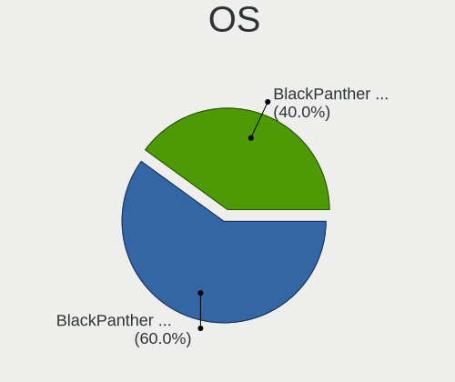

| Name              | Notebooks | Percent |
|-------------------|-----------|---------|
| BlackPanther 18.1 | 32        | 100%    |

OS Family
---------

OS without a version

| Name         | Notebooks | Percent |
|--------------|-----------|---------|
| BlackPanther | 32        | 100%    |

Kernel
------

Version of the Linux kernel

| Version             | Notebooks | Percent |
|---------------------|-----------|---------|
| 5.6.14-desktop-2bP  | 17        | 53.13%  |
| 4.18.16-desktop-1bP | 15        | 46.88%  |

Kernel Family
-------------

Linux kernel without a distro release

| Version | Notebooks | Percent |
|---------|-----------|---------|
| 5.6.14  | 17        | 53.13%  |
| 4.18.16 | 15        | 46.88%  |

Kernel Major Ver.
-----------------

Linux kernel major version

| Version | Notebooks | Percent |
|---------|-----------|---------|
| 5.6     | 17        | 53.13%  |
| 4.18    | 15        | 46.88%  |

Arch
----

OS architecture (x86_64, i586, etc.)

| Name   | Notebooks | Percent |
|--------|-----------|---------|
| x86_64 | 32        | 100%    |

DE
--

Desktop Environment

| Name | Notebooks | Percent |
|------|-----------|---------|
| KDE5 | 32        | 100%    |

Display Server
--------------

X11 or Wayland

| Name | Notebooks | Percent |
|------|-----------|---------|
| X11  | 32        | 100%    |

Display Manager
---------------

SDDM, LightDM, etc.

| Name | Notebooks | Percent |
|------|-----------|---------|
| SDDM | 32        | 100%    |

OS Lang
-------

Language

| Lang    | Notebooks | Percent |
|---------|-----------|---------|
| Unknown | 32        | 100%    |

Boot Mode
---------

EFI or BIOS

| Mode | Notebooks | Percent |
|------|-----------|---------|
| BIOS | 17        | 53.13%  |
| EFI  | 15        | 46.88%  |

Filesystem
----------

Type of filesystem

| Type    | Notebooks | Percent |
|---------|-----------|---------|
| Overlay | 27        | 84.38%  |
| Ext4    | 5         | 15.63%  |

Part. scheme
------------

Scheme of partitioning

| Type    | Notebooks | Percent |
|---------|-----------|---------|
| MBR     | 16        | 50%     |
| GPT     | 15        | 46.88%  |
| Unknown | 1         | 3.13%   |

Dual Boot with Linux/BSD
------------------------

Hosting more than one Linux/BSD

| Dual boot | Notebooks | Percent |
|-----------|-----------|---------|
| No        | 21        | 65.63%  |
| Yes       | 11        | 34.38%  |

Dual Boot (Win)
---------------

Hosting Linux and Windows

| Dual boot | Notebooks | Percent |
|-----------|-----------|---------|
| Yes       | 17        | 53.13%  |
| No        | 15        | 46.88%  |

Board
-----

Vendor
------

Motherboard manufacturer

| Name             | Notebooks | Percent |
|------------------|-----------|---------|
| Hewlett-Packard  | 10        | 31.25%  |
| Lenovo           | 6         | 18.75%  |
| ASUSTek Computer | 4         | 12.5%   |
| Dell             | 3         | 9.38%   |
| Toshiba          | 2         | 6.25%   |
| Sony             | 2         | 6.25%   |
| MSI              | 1         | 3.13%   |
| Fujitsu          | 1         | 3.13%   |
| eMachines        | 1         | 3.13%   |
| Apple            | 1         | 3.13%   |
| Acer             | 1         | 3.13%   |

Model
-----

Motherboard model

| Name                                     | Notebooks | Percent |
|------------------------------------------|-----------|---------|
| HP Pavilion 17                           | 2         | 6.25%   |
| Toshiba Satellite Pro C50-A-1E5          | 1         | 3.13%   |
| Toshiba dynabook RX3 SN240Y/3HD          | 1         | 3.13%   |
| Sony VPCEH2J1E                           | 1         | 3.13%   |
| Sony SVS13118GBB                         | 1         | 3.13%   |
| MSI GP75 Leopard 9SE                     | 1         | 3.13%   |
| Lenovo ThinkPad W530 2463A58             | 1         | 3.13%   |
| Lenovo ThinkPad T60 6370A55              | 1         | 3.13%   |
| Lenovo IdeaPad 330-15IKB 81DE            | 1         | 3.13%   |
| Lenovo IdeaPad 320-17ABR 80YN            | 1         | 3.13%   |
| Lenovo G580 20150                        | 1         | 3.13%   |
| Lenovo G505s 20255                       | 1         | 3.13%   |
| HP ProBook 640 G8 Notebook PC            | 1         | 3.13%   |
| HP Pavilion dv8000 (EP409UA#ABA)         | 1         | 3.13%   |
| HP G60                                   | 1         | 3.13%   |
| HP Compaq nx6125 (PZ896UA#ABA)           | 1         | 3.13%   |
| HP Compaq CQ58                           | 1         | 3.13%   |
| HP Compaq 6720s                          | 1         | 3.13%   |
| HP Compaq 6710b (GB890EA#AKC)            | 1         | 3.13%   |
| HP 650                                   | 1         | 3.13%   |
| Fujitsu LIFEBOOK U745                    | 1         | 3.13%   |
| eMachines E725                           | 1         | 3.13%   |
| Dell Latitude E6230                      | 1         | 3.13%   |
| Dell Latitude E5540                      | 1         | 3.13%   |
| Dell Inspiron M5030                      | 1         | 3.13%   |
| ASUS X541UVK                             | 1         | 3.13%   |
| ASUS X201EP                              | 1         | 3.13%   |
| ASUS Strix 15 GL503GE                    | 1         | 3.13%   |
| ASUS ASUS TUF Gaming A15 FA506IU_FX506IU | 1         | 3.13%   |
| Apple MacBookPro6,2                      | 1         | 3.13%   |
| Acer TravelMate P238-G2-M                | 1         | 3.13%   |

Model Family
------------

Motherboard model prefix

| Name              | Notebooks | Percent |
|-------------------|-----------|---------|
| HP Compaq         | 4         | 12.5%   |
| HP Pavilion       | 3         | 9.38%   |
| Lenovo ThinkPad   | 2         | 6.25%   |
| Lenovo IdeaPad    | 2         | 6.25%   |
| Dell Latitude     | 2         | 6.25%   |
| Toshiba Satellite | 1         | 3.13%   |
| Toshiba dynabook  | 1         | 3.13%   |
| Sony VPCEH2J1E    | 1         | 3.13%   |
| Sony SVS13118GBB  | 1         | 3.13%   |
| MSI GP75          | 1         | 3.13%   |
| Lenovo G580       | 1         | 3.13%   |
| Lenovo G505s      | 1         | 3.13%   |
| HP ProBook        | 1         | 3.13%   |
| HP G60            | 1         | 3.13%   |
| HP 650            | 1         | 3.13%   |
| Fujitsu LIFEBOOK  | 1         | 3.13%   |
| eMachines E725    | 1         | 3.13%   |
| Dell Inspiron     | 1         | 3.13%   |
| ASUS X541UVK      | 1         | 3.13%   |
| ASUS X201EP       | 1         | 3.13%   |
| ASUS Strix        | 1         | 3.13%   |
| ASUS ASUS         | 1         | 3.13%   |
| Apple MacBookPro6 | 1         | 3.13%   |
| Acer TravelMate   | 1         | 3.13%   |

MFG Year
--------

Motherboard manufacture year

| Year | Notebooks | Percent |
|------|-----------|---------|
| 2012 | 8         | 25%     |
| 2013 | 4         | 12.5%   |
| 2010 | 3         | 9.38%   |
| 2019 | 2         | 6.25%   |
| 2018 | 2         | 6.25%   |
| 2017 | 2         | 6.25%   |
| 2014 | 2         | 6.25%   |
| 2007 | 2         | 6.25%   |
| 2006 | 2         | 6.25%   |
| 2021 | 1         | 3.13%   |
| 2020 | 1         | 3.13%   |
| 2009 | 1         | 3.13%   |
| 2008 | 1         | 3.13%   |
| 2005 | 1         | 3.13%   |

Form Factor
-----------

Physical design of the computer

| Name     | Notebooks | Percent |
|----------|-----------|---------|
| Notebook | 32        | 100%    |

Secure Boot
-----------

Enabled or disabled

| State    | Notebooks | Percent |
|----------|-----------|---------|
| Disabled | 32        | 100%    |

Coreboot
--------

Have coreboot on board

| Used | Notebooks | Percent |
|------|-----------|---------|
| No   | 32        | 100%    |

RAM Size
--------

Total RAM memory

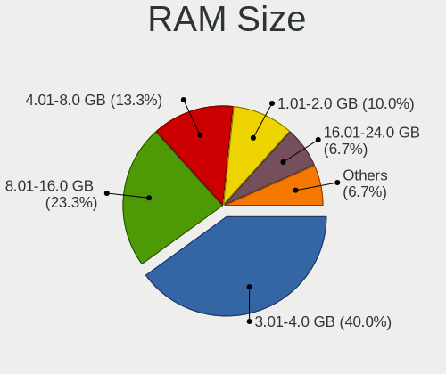

| Size in GB | Notebooks | Percent |
|------------|-----------|---------|
| 4.01-8.0   | 9         | 28.13%  |
| 3.01-4.0   | 7         | 21.88%  |
| 1.01-2.0   | 5         | 15.63%  |
| 8.01-16.0  | 5         | 15.63%  |
| 16.01-24.0 | 3         | 9.38%   |
| 0.51-1.0   | 2         | 6.25%   |
| 24.01-32.0 | 1         | 3.13%   |

RAM Used
--------

Used RAM memory

| Used GB  | Notebooks | Percent |
|----------|-----------|---------|
| 0.51-1.0 | 16        | 50%     |
| 1.01-2.0 | 11        | 34.38%  |
| 0.01-0.5 | 5         | 15.63%  |

Total Drives
------------

Number of drives on board

| Drives | Notebooks | Percent |
|--------|-----------|---------|
| 1      | 23        | 71.88%  |
| 2      | 7         | 21.88%  |
| 3      | 1         | 3.13%   |
| 0      | 1         | 3.13%   |

Has CD-ROM
----------

Has CD-ROM on board

| Presented | Notebooks | Percent |
|-----------|-----------|---------|
| Yes       | 22        | 68.75%  |
| No        | 10        | 31.25%  |

Has Ethernet
------------

Has Ethernet on board

| Presented | Notebooks | Percent |
|-----------|-----------|---------|
| Yes       | 32        | 100%    |

Has WiFi
--------

Has WiFi module

| Presented | Notebooks | Percent |
|-----------|-----------|---------|
| Yes       | 32        | 100%    |

Has Bluetooth
-------------

Has Bluetooth module

| Presented | Notebooks | Percent |
|-----------|-----------|---------|
| Yes       | 24        | 75%     |
| No        | 8         | 25%     |

Location
--------

Country
-------

Geographic location (country)

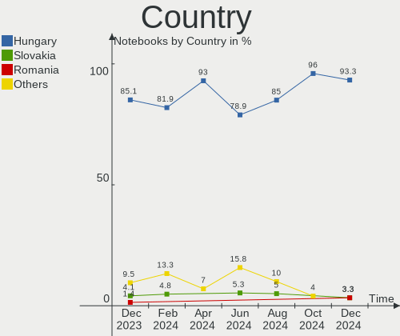

| Country    | Notebooks | Percent |
|------------|-----------|---------|
| Hungary    | 21        | 65.63%  |
| USA        | 4         | 12.5%   |
| Austria    | 2         | 6.25%   |
| UK         | 1         | 3.13%   |
| Romania    | 1         | 3.13%   |
| Madagascar | 1         | 3.13%   |
| Japan      | 1         | 3.13%   |
| Argentina  | 1         | 3.13%   |

City
----

Geographic location (city)

| City              | Notebooks | Percent |
|-------------------|-----------|---------|
| Budapest          | 6         | 18.75%  |
| Szombathely       | 3         | 9.38%   |
| Vienna            | 2         | 6.25%   |
| North Hollywood   | 2         | 6.25%   |
| Zalaszentgrot     | 1         | 3.13%   |
| Zalaegerszeg      | 1         | 3.13%   |
| Veszprém         | 1         | 3.13%   |
| Toltestava        | 1         | 3.13%   |
| Tatabánya        | 1         | 3.13%   |
| Szekszárd        | 1         | 3.13%   |
| Randolph Township | 1         | 3.13%   |
| Odorheiu Secuiesc | 1         | 3.13%   |
| Kisvarda          | 1         | 3.13%   |
| Kisarazu          | 1         | 3.13%   |
| Kapuvar           | 1         | 3.13%   |
| Hove              | 1         | 3.13%   |
| Hort              | 1         | 3.13%   |
| Hodmezovasarhely  | 1         | 3.13%   |
| Győr             | 1         | 3.13%   |
| Fot               | 1         | 3.13%   |
| Daytona Beach     | 1         | 3.13%   |
| Avellaneda        | 1         | 3.13%   |
| Ambilobe          | 1         | 3.13%   |

Drives
------

Drive Vendor
------------

Hard drive vendors

| Vendor              | Notebooks | Drives | Percent |
|---------------------|-----------|--------|---------|
| WDC                 | 6         | 7      | 15.79%  |
| Samsung Electronics | 6         | 6      | 15.79%  |
| Toshiba             | 5         | 6      | 13.16%  |
| Seagate             | 5         | 5      | 13.16%  |
| Kingston            | 3         | 4      | 7.89%   |
| HGST                | 2         | 2      | 5.26%   |
| SSSTC               | 1         | 1      | 2.63%   |
| Solid               | 1         | 1      | 2.63%   |
| SK Hynix            | 1         | 1      | 2.63%   |
| Micron Technology   | 1         | 1      | 2.63%   |
| Intenso             | 1         | 1      | 2.63%   |
| Intel               | 1         | 1      | 2.63%   |
| Hitachi             | 1         | 1      | 2.63%   |
| Fujitsu             | 1         | 1      | 2.63%   |
| China               | 1         | 1      | 2.63%   |
| AS25                | 1         | 1      | 2.63%   |
| Apacer              | 1         | 1      | 2.63%   |

Drive Model
-----------

Hard drive models

| Model                                 | Notebooks | Percent |
|---------------------------------------|-----------|---------|
| WDC WD7500BPVT-60HXZT3 752GB          | 1         | 2.5%    |
| WDC WD5000LPVX-22V0TT0 500GB          | 1         | 2.5%    |
| WDC WD5000LPCX-22VHAT1 500GB          | 1         | 2.5%    |
| WDC WD5000BPVT-35HXZT1 500GB          | 1         | 2.5%    |
| WDC WD5000BEVT-22A0RT0 500GB          | 1         | 2.5%    |
| WDC WD50 00BEVT-22A0RT0 500GB         | 1         | 2.5%    |
| WDC WD3200BPVT-75ZEST0 320GB          | 1         | 2.5%    |
| Toshiba MQ01ABF032 320GB              | 1         | 2.5%    |
| Toshiba MK6037GSX 64GB                | 1         | 2.5%    |
| Toshiba MK1661GSYFN 160GB             | 1         | 2.5%    |
| Toshiba MK1031GAS 100GB               | 1         | 2.5%    |
| Toshiba HDWL120 2TB                   | 1         | 2.5%    |
| SSSTC CL1-8D256-HP 256GB              | 1         | 2.5%    |
| Solid SSD0240S00 240GB                | 1         | 2.5%    |
| SK Hynix HFS256G39TND-N210A 256GB SSD | 1         | 2.5%    |
| Seagate ST9160310AS 160GB             | 1         | 2.5%    |
| Seagate ST500LT012-9WS142 500GB       | 1         | 2.5%    |
| Seagate ST2000LM003 HN-M201RAD 2TB    | 1         | 2.5%    |
| Seagate ST1000LX015-1U7172 1TB        | 1         | 2.5%    |
| Seagate ST1000LM014-1EJ164-SSHD 1TB   | 1         | 2.5%    |
| Samsung SSD 970 EVO Plus 2TB          | 1         | 2.5%    |
| Samsung SSD 830 Series 128GB          | 1         | 2.5%    |
| Samsung SSD 750 EVO 250GB             | 1         | 2.5%    |
| Samsung MZVLW256HEHP-00000 256GB      | 1         | 2.5%    |
| Samsung MZVLB512HBJQ-000L7 512GB      | 1         | 2.5%    |
| Samsung MZ7LN256HCHP-00000 256GB SSD  | 1         | 2.5%    |
| Micron 2210_MTFDHBA512QFD 512GB       | 1         | 2.5%    |
| Kingston SUV400S37120G 120GB SSD      | 1         | 2.5%    |
| Kingston SA400S37960G 960GB SSD       | 1         | 2.5%    |
| Kingston SA400S37480G 480GB SSD       | 1         | 2.5%    |
| Kingston SA400S37240G 240GB SSD       | 1         | 2.5%    |
| Intenso SSD 120GB                     | 1         | 2.5%    |
| Intel SSDSC2BW180A3H 180GB            | 1         | 2.5%    |
| Hitachi HTS725025A9A364 250GB         | 1         | 2.5%    |
| HGST HTS725050A7E630 500GB            | 1         | 2.5%    |
| HGST HTS541010A9E680 1TB              | 1         | 2.5%    |
| Fujitsu MHV2080AH 80GB                | 1         | 2.5%    |
| China SATA SSD 120GB                  | 1         | 2.5%    |
| AS25 SSD 240GB                        | 1         | 2.5%    |
| Apacer AS350 128GB SSD                | 1         | 2.5%    |

HDD Vendor
----------

Hard disk drive vendors

| Vendor  | Notebooks | Drives | Percent |
|---------|-----------|--------|---------|
| WDC     | 6         | 7      | 30%     |
| Toshiba | 5         | 6      | 25%     |
| Seagate | 5         | 5      | 25%     |
| HGST    | 2         | 2      | 10%     |
| Hitachi | 1         | 1      | 5%      |
| Fujitsu | 1         | 1      | 5%      |

SSD Vendor
----------

Solid state drive vendors

| Vendor              | Notebooks | Drives | Percent |
|---------------------|-----------|--------|---------|
| Samsung Electronics | 3         | 3      | 23.08%  |
| Kingston            | 3         | 4      | 23.08%  |
| Solid               | 1         | 1      | 7.69%   |
| SK Hynix            | 1         | 1      | 7.69%   |
| Intenso             | 1         | 1      | 7.69%   |
| Intel               | 1         | 1      | 7.69%   |
| China               | 1         | 1      | 7.69%   |
| AS25                | 1         | 1      | 7.69%   |
| Apacer              | 1         | 1      | 7.69%   |

Drive Kind
----------

HDD or SSD

| Kind | Notebooks | Drives | Percent |
|------|-----------|--------|---------|
| HDD  | 19        | 22     | 52.78%  |
| SSD  | 13        | 14     | 36.11%  |
| NVMe | 4         | 5      | 11.11%  |

Drive Connector
---------------

SATA, SAS, NVMe, etc.

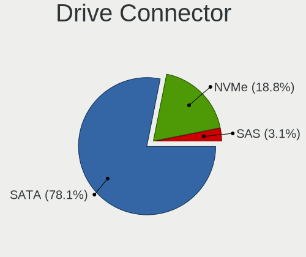

| Type | Notebooks | Drives | Percent |
|------|-----------|--------|---------|
| SATA | 30        | 35     | 85.71%  |
| NVMe | 4         | 5      | 11.43%  |
| SAS  | 1         | 1      | 2.86%   |

Drive Size
----------

Size of hard drive

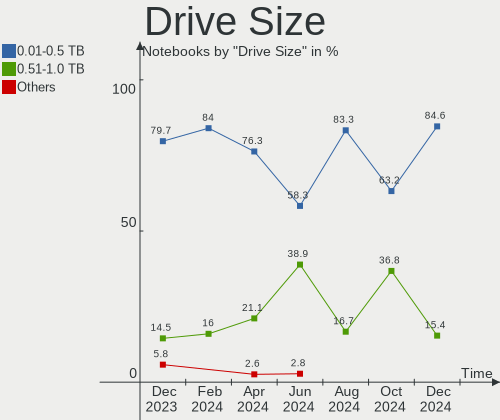

| Size in TB | Notebooks | Drives | Percent |
|------------|-----------|--------|---------|
| 0.01-0.5   | 24        | 29     | 77.42%  |
| 0.51-1.0   | 5         | 5      | 16.13%  |
| 1.01-2.0   | 2         | 2      | 6.45%   |

Space Total
-----------

Amount of disk space available on the file system

| Size in GB | Notebooks | Percent |
|------------|-----------|---------|
| Unknown    | 24        | 75%     |
| 101-250    | 3         | 9.38%   |
| 51-100     | 2         | 6.25%   |
| 251-500    | 1         | 3.13%   |
| 2001-3000  | 1         | 3.13%   |
| 501-1000   | 1         | 3.13%   |

Space Used
----------

Amount of used disk space

| Used GB | Notebooks | Percent |
|---------|-----------|---------|
| Unknown | 24        | 75%     |
| 1-20    | 6         | 18.75%  |
| 251-500 | 1         | 3.13%   |
| 101-250 | 1         | 3.13%   |

Malfunc. Drives
---------------

Drive models with a malfunction

| Model                                 | Notebooks | Drives | Percent |
|---------------------------------------|-----------|--------|---------|
| WDC WD7500BPVT-60HXZT3 752GB          | 1         | 1      | 8.33%   |
| Toshiba MQ01ABF032 320GB              | 1         | 1      | 8.33%   |
| Toshiba MK6037GSX 64GB                | 1         | 1      | 8.33%   |
| Toshiba MK1031GAS 100GB               | 1         | 2      | 8.33%   |
| SK Hynix HFS256G39TND-N210A 256GB SSD | 1         | 1      | 8.33%   |
| Seagate ST9160310AS 160GB             | 1         | 1      | 8.33%   |
| Seagate ST500LT012-9WS142 500GB       | 1         | 1      | 8.33%   |
| Seagate ST1000LX015-1U7172 1TB        | 1         | 1      | 8.33%   |
| Seagate ST1000LM014-1EJ164-SSHD 1TB   | 1         | 1      | 8.33%   |
| Hitachi HTS725025A9A364 250GB         | 1         | 1      | 8.33%   |
| HGST HTS725050A7E630 500GB            | 1         | 1      | 8.33%   |
| HGST HTS541010A9E680 1TB              | 1         | 1      | 8.33%   |

Malfunc. Drive Vendor
---------------------

Vendors of faulty drives

| Vendor   | Notebooks | Drives | Percent |
|----------|-----------|--------|---------|
| Seagate  | 4         | 4      | 33.33%  |
| Toshiba  | 3         | 4      | 25%     |
| HGST     | 2         | 2      | 16.67%  |
| WDC      | 1         | 1      | 8.33%   |
| SK Hynix | 1         | 1      | 8.33%   |
| Hitachi  | 1         | 1      | 8.33%   |

Malfunc. HDD Vendor
-------------------

Vendors of faulty HDD drives

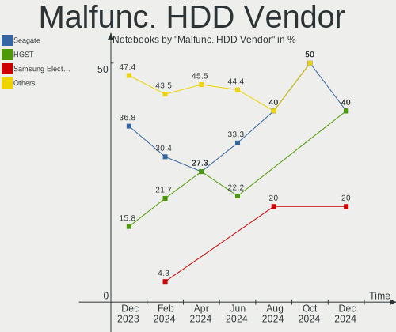

| Vendor  | Notebooks | Drives | Percent |
|---------|-----------|--------|---------|
| Seagate | 4         | 4      | 36.36%  |
| Toshiba | 3         | 4      | 27.27%  |
| HGST    | 2         | 2      | 18.18%  |
| WDC     | 1         | 1      | 9.09%   |
| Hitachi | 1         | 1      | 9.09%   |

Malfunc. Drive Kind
-------------------

Kinds of faulty drives

| Kind | Notebooks | Drives | Percent |
|------|-----------|--------|---------|
| HDD  | 10        | 12     | 90.91%  |
| SSD  | 1         | 1      | 9.09%   |

Failed Drives
-------------

Failed drive models

| Model                        | Notebooks | Drives | Percent |
|------------------------------|-----------|--------|---------|
| WDC WD5000BEVT-22A0RT0 500GB | 1         | 1      | 100%    |

Failed Drive Vendor
-------------------

Failed drive vendors

| Vendor | Notebooks | Drives | Percent |
|--------|-----------|--------|---------|
| WDC    | 1         | 1      | 100%    |

Drive Status
------------

Number of failed and malfunc. drives

| Status   | Notebooks | Drives | Percent |
|----------|-----------|--------|---------|
| Works    | 22        | 26     | 62.86%  |
| Malfunc  | 11        | 13     | 31.43%  |
| Detected | 1         | 1      | 2.86%   |
| Failed   | 1         | 1      | 2.86%   |

Storage controller
------------------

Storage Vendor
--------------

Storage controller vendors

| Vendor                         | Notebooks | Percent |
|--------------------------------|-----------|---------|
| Intel                          | 24        | 64.86%  |
| AMD                            | 8         | 21.62%  |
| Samsung Electronics            | 3         | 8.11%   |
| Solid State Storage Technology | 1         | 2.7%    |
| Micron Technology              | 1         | 2.7%    |

Storage Model
-------------

Storage controller models

| Model                                                                        | Notebooks | Percent |
|------------------------------------------------------------------------------|-----------|---------|
| Intel 7 Series Chipset Family 6-port SATA Controller [AHCI mode]             | 6         | 15%     |
| AMD FCH SATA Controller [AHCI mode]                                          | 4         | 10%     |
| Intel Sunrise Point-LP SATA Controller [AHCI mode]                           | 3         | 7.5%    |
| Samsung NVMe SSD Controller SM981/PM981/PM983                                | 2         | 5%      |
| Intel Cannon Lake Mobile PCH SATA AHCI Controller                            | 2         | 5%      |
| Intel 82801IBM/IEM (ICH9M/ICH9M-E) 4 port SATA Controller [AHCI mode]        | 2         | 5%      |
| Intel 82801HM/HEM (ICH8M/ICH8M-E) SATA Controller [AHCI mode]                | 2         | 5%      |
| Intel 82801HM/HEM (ICH8M/ICH8M-E) IDE Controller                             | 2         | 5%      |
| Intel 82801 Mobile SATA Controller [RAID mode]                               | 2         | 5%      |
| Intel 5 Series/3400 Series Chipset 4 port SATA AHCI Controller               | 2         | 5%      |
| AMD IXP SB4x0 IDE Controller                                                 | 2         | 5%      |
| Solid State Storage Non-Volatile memory controller                           | 1         | 2.5%    |
| Samsung NVMe SSD Controller SM961/PM961/SM963                                | 1         | 2.5%    |
| Micron Non-Volatile memory controller                                        | 1         | 2.5%    |
| Intel Wildcat Point-LP SATA Controller [AHCI Mode]                           | 1         | 2.5%    |
| Intel Volume Management Device NVMe RAID Controller                          | 1         | 2.5%    |
| Intel 82801GBM/GHM (ICH7-M Family) SATA Controller [IDE mode]                | 1         | 2.5%    |
| Intel 8 Series SATA Controller 1 [AHCI mode]                                 | 1         | 2.5%    |
| Intel 6 Series/C200 Series Chipset Family 6 port Mobile SATA AHCI Controller | 1         | 2.5%    |
| AMD SB7x0/SB8x0/SB9x0 SATA Controller [IDE mode]                             | 1         | 2.5%    |
| AMD SB7x0/SB8x0/SB9x0 SATA Controller [AHCI mode]                            | 1         | 2.5%    |
| AMD SB7x0/SB8x0/SB9x0 IDE Controller                                         | 1         | 2.5%    |

Storage Kind
------------

Kind of storage controller (IDE, SATA, NVMe, SAS, ...)

| Kind | Notebooks | Percent |
|------|-----------|---------|
| SATA | 26        | 66.67%  |
| IDE  | 6         | 15.38%  |
| NVMe | 4         | 10.26%  |
| RAID | 3         | 7.69%   |

Processor
---------

CPU Vendor
----------

Processor vendors

| Vendor | Notebooks | Percent |
|--------|-----------|---------|
| Intel  | 24        | 75%     |
| AMD    | 8         | 25%     |

CPU Model
---------

Processor models

| Model                                           | Notebooks | Percent |
|-------------------------------------------------|-----------|---------|
| Intel Core i5-3340M CPU @ 2.70GHz               | 2         | 6.25%   |
| Intel Core i3-4030U CPU @ 1.90GHz               | 2         | 6.25%   |
| Intel Pentium Dual-Core CPU T4400 @ 2.20GHz     | 1         | 3.13%   |
| Intel Pentium Dual-Core CPU T4200 @ 2.00GHz     | 1         | 3.13%   |
| Intel Pentium CPU B960 @ 2.20GHz                | 1         | 3.13%   |
| Intel Core i7-9750H CPU @ 2.60GHz               | 1         | 3.13%   |
| Intel Core i7-8750H CPU @ 2.20GHz               | 1         | 3.13%   |
| Intel Core i7-5600U CPU @ 2.60GHz               | 1         | 3.13%   |
| Intel Core i7-3740QM CPU @ 2.70GHz              | 1         | 3.13%   |
| Intel Core i7 CPU M 620 @ 2.67GHz               | 1         | 3.13%   |
| Intel Core i5-8250U CPU @ 1.60GHz               | 1         | 3.13%   |
| Intel Core i5-7200U CPU @ 2.50GHz               | 1         | 3.13%   |
| Intel Core i5-3210M CPU @ 2.50GHz               | 1         | 3.13%   |
| Intel Core i3-6006U CPU @ 2.00GHz               | 1         | 3.13%   |
| Intel Core i3-2348M CPU @ 2.30GHz               | 1         | 3.13%   |
| Intel Core i3-2330M CPU @ 2.20GHz               | 1         | 3.13%   |
| Intel Core i3 CPU M 370 @ 2.40GHz               | 1         | 3.13%   |
| Intel Core 2 Duo CPU T7300 @ 2.00GHz            | 1         | 3.13%   |
| Intel Core 2 Duo CPU T5270 @ 1.40GHz            | 1         | 3.13%   |
| Intel Core 2 CPU T5600 @ 1.83GHz                | 1         | 3.13%   |
| Intel Celeron CPU 847 @ 1.10GHz                 | 1         | 3.13%   |
| Intel 11th Gen Core i3-1115G4 @ 3.00GHz         | 1         | 3.13%   |
| AMD V160 Processor                              | 1         | 3.13%   |
| AMD Turion 64 Mobile Technology ML-37           | 1         | 3.13%   |
| AMD Turion 64 Mobile ML-40                      | 1         | 3.13%   |
| AMD Ryzen 7 4800H with Radeon Graphics          | 1         | 3.13%   |
| AMD C-60 APU with Radeon HD Graphics            | 1         | 3.13%   |
| AMD A8-4500M APU with Radeon HD Graphics        | 1         | 3.13%   |
| AMD A4-5000 APU with Radeon HD Graphics         | 1         | 3.13%   |
| AMD A12-9720P RADEON R7, 12 COMPUTE CORES 4C+8G | 1         | 3.13%   |

CPU Model Family
----------------

Processor model prefix

| Model                   | Notebooks | Percent |
|-------------------------|-----------|---------|
| Intel Core i3           | 6         | 18.75%  |
| Intel Core i7           | 5         | 15.63%  |
| Intel Core i5           | 5         | 15.63%  |
| Intel Pentium Dual-Core | 2         | 6.25%   |
| Intel Core 2 Duo        | 2         | 6.25%   |
| AMD Turion 64 Mobile    | 2         | 6.25%   |
| Other                   | 1         | 3.13%   |
| Intel Pentium           | 1         | 3.13%   |
| Intel Core 2            | 1         | 3.13%   |
| Intel Celeron           | 1         | 3.13%   |
| AMD V160                | 1         | 3.13%   |
| AMD Ryzen 7             | 1         | 3.13%   |
| AMD C-60                | 1         | 3.13%   |
| AMD A8                  | 1         | 3.13%   |
| AMD A4                  | 1         | 3.13%   |
| AMD A12                 | 1         | 3.13%   |

CPU Cores
---------

Number of processor cores

| Number | Notebooks | Percent |
|--------|-----------|---------|
| 2      | 21        | 65.63%  |
| 1      | 6         | 18.75%  |
| 4      | 3         | 9.38%   |
| 8      | 1         | 3.13%   |
| 6      | 1         | 3.13%   |

CPU Sockets
-----------

Number of sockets

| Number | Notebooks | Percent |
|--------|-----------|---------|
| 1      | 32        | 100%    |

CPU Threads
-----------

Threads per core (Hyper-Threading)

| Number | Notebooks | Percent |
|--------|-----------|---------|
| 2      | 18        | 56.25%  |
| 1      | 14        | 43.75%  |

CPU Op-Modes
------------

CPU Operation Modes (32-bit, 64-bit)

| Op mode        | Notebooks | Percent |
|----------------|-----------|---------|
| 32-bit, 64-bit | 32        | 100%    |

CPU Microcode
-------------

Microcode number

| Number     | Notebooks | Percent |
|------------|-----------|---------|
| 0x306a9    | 4         | 12.5%   |
| 0x206a7    | 4         | 12.5%   |
| Unknown    | 3         | 9.38%   |
| 0x40651    | 2         | 6.25%   |
| 0x20655    | 2         | 6.25%   |
| 0x1067a    | 2         | 6.25%   |
| 0x906ed    | 1         | 3.13%   |
| 0x906ea    | 1         | 3.13%   |
| 0x806ea    | 1         | 3.13%   |
| 0x806e9    | 1         | 3.13%   |
| 0x806c1    | 1         | 3.13%   |
| 0x6fd      | 1         | 3.13%   |
| 0x6fa      | 1         | 3.13%   |
| 0x6f2      | 1         | 3.13%   |
| 0x306d4    | 1         | 3.13%   |
| 0x08600104 | 1         | 3.13%   |
| 0x0700010f | 1         | 3.13%   |
| 0x06006118 | 1         | 3.13%   |
| 0x06001119 | 1         | 3.13%   |
| 0x05000119 | 1         | 3.13%   |
| 0x010000c8 | 1         | 3.13%   |

CPU Microarch
-------------

Microarchitecture

| Name        | Notebooks | Percent |
|-------------|-----------|---------|
| SandyBridge | 4         | 12.5%   |
| KabyLake    | 4         | 12.5%   |
| IvyBridge   | 4         | 12.5%   |
| Core        | 3         | 9.38%   |
| Westmere    | 2         | 6.25%   |
| Penryn      | 2         | 6.25%   |
| K8 Hammer   | 2         | 6.25%   |
| Haswell     | 2         | 6.25%   |
| Zen 2       | 1         | 3.13%   |
| TigerLake   | 1         | 3.13%   |
| Skylake     | 1         | 3.13%   |
| Piledriver  | 1         | 3.13%   |
| K10         | 1         | 3.13%   |
| Jaguar      | 1         | 3.13%   |
| Excavator   | 1         | 3.13%   |
| Broadwell   | 1         | 3.13%   |
| Bobcat      | 1         | 3.13%   |

Graphics
--------

GPU Vendor
----------

Vendors of graphics cards

| Vendor | Notebooks | Percent |
|--------|-----------|---------|
| Intel  | 23        | 57.5%   |
| AMD    | 9         | 22.5%   |
| Nvidia | 8         | 20%     |

GPU Model
---------

Graphics card models

| Model                                                                                 | Notebooks | Percent |
|---------------------------------------------------------------------------------------|-----------|---------|
| Intel 3rd Gen Core processor Graphics Controller                                      | 4         | 9.09%   |
| Intel 2nd Generation Core Processor Family Integrated Graphics Controller             | 3         | 6.82%   |
| Intel Mobile 4 Series Chipset Integrated Graphics Controller                          | 2         | 4.55%   |
| Intel Haswell-ULT Integrated Graphics Controller                                      | 2         | 4.55%   |
| Intel Core Processor Integrated Graphics Controller                                   | 2         | 4.55%   |
| Intel CoffeeLake-H GT2 [UHD Graphics 630]                                             | 2         | 4.55%   |
| AMD Topaz XT [Radeon R7 M260/M265 / M340/M360 / M440/M445 / 530/535 / 620/625 Mobile] | 2         | 4.55%   |
| AMD RS480M [Mobility Radeon Xpress 200]                                               | 2         | 4.55%   |
| Nvidia TU116M [GeForce GTX 1660 Ti Mobile]                                            | 1         | 2.27%   |
| Nvidia TU106M [GeForce RTX 2060 Mobile]                                               | 1         | 2.27%   |
| Nvidia GT216M [GeForce GT 330M]                                                       | 1         | 2.27%   |
| Nvidia GP107M [GeForce GTX 1050 Ti Mobile]                                            | 1         | 2.27%   |
| Nvidia GM108M [GeForce 920MX]                                                         | 1         | 2.27%   |
| Nvidia GK107M [GeForce GT 640M LE]                                                    | 1         | 2.27%   |
| Nvidia GK107GLM [Quadro K1000M]                                                       | 1         | 2.27%   |
| Nvidia GF119M [GeForce 410M]                                                          | 1         | 2.27%   |
| Intel UHD Graphics 620                                                                | 1         | 2.27%   |
| Intel Tiger Lake UHD Graphics                                                         | 1         | 2.27%   |
| Intel Skylake GT2 [HD Graphics 520]                                                   | 1         | 2.27%   |
| Intel Mobile GME965/GLE960 Integrated Graphics Controller                             | 1         | 2.27%   |
| Intel Mobile GM965/GL960 Integrated Graphics Controller (secondary)                   | 1         | 2.27%   |
| Intel Mobile GM965/GL960 Integrated Graphics Controller (primary)                     | 1         | 2.27%   |
| Intel Mobile 945GM/GMS/GME, 943/940GML Express Integrated Graphics Controller         | 1         | 2.27%   |
| Intel Mobile 945GM/GMS, 943/940GML Express Integrated Graphics Controller             | 1         | 2.27%   |
| Intel HD Graphics 620                                                                 | 1         | 2.27%   |
| Intel HD Graphics 5500                                                                | 1         | 2.27%   |
| AMD Wrestler [Radeon HD 6290]                                                         | 1         | 2.27%   |
| AMD Wani [Radeon R5/R6/R7 Graphics]                                                   | 1         | 2.27%   |
| AMD Trinity [Radeon HD 7640G]                                                         | 1         | 2.27%   |
| AMD Sun PRO [Radeon HD 8570A/8570M]                                                   | 1         | 2.27%   |
| AMD RS880M [Mobility Radeon HD 4225/4250]                                             | 1         | 2.27%   |
| AMD Renoir                                                                            | 1         | 2.27%   |
| AMD Kabini [Radeon HD 8330]                                                           | 1         | 2.27%   |

GPU Combo
---------

Combinations of graphics cards

| Name           | Notebooks | Percent |
|----------------|-----------|---------|
| 1 x Intel      | 16        | 50%     |
| Intel + Nvidia | 6         | 18.75%  |
| 1 x AMD        | 5         | 15.63%  |
| 2 x AMD        | 2         | 6.25%   |
| 1 x Nvidia     | 1         | 3.13%   |
| Intel + AMD    | 1         | 3.13%   |
| AMD + Nvidia   | 1         | 3.13%   |

GPU Driver
----------

Free vs proprietary

| Driver | Notebooks | Percent |
|--------|-----------|---------|
| Free   | 32        | 100%    |

GPU Memory
----------

Total video memory

| Size in GB | Notebooks | Percent |
|------------|-----------|---------|
| Unknown    | 18        | 56.25%  |
| 0.01-0.5   | 7         | 21.88%  |
| 0.51-1.0   | 3         | 9.38%   |
| 5.01-6.0   | 2         | 6.25%   |
| 1.01-2.0   | 2         | 6.25%   |

Monitor
-------

Monitor Vendor
--------------

Monitor vendors

| Vendor                  | Notebooks | Percent |
|-------------------------|-----------|---------|
| Samsung Electronics     | 8         | 22.22%  |
| AU Optronics            | 7         | 19.44%  |
| Chimei Innolux          | 6         | 16.67%  |
| BOE                     | 3         | 8.33%   |
| LG Display              | 2         | 5.56%   |
| Hewlett-Packard         | 2         | 5.56%   |
| Chi Mei Optoelectronics | 2         | 5.56%   |
| PANDA                   | 1         | 2.78%   |
| Lenovo                  | 1         | 2.78%   |
| Eizo                    | 1         | 2.78%   |
| Dell                    | 1         | 2.78%   |
| Apple                   | 1         | 2.78%   |
| AOC                     | 1         | 2.78%   |

Monitor Model
-------------

Monitor models

| Model                                                                    | Notebooks | Percent |
|--------------------------------------------------------------------------|-----------|---------|
| Samsung Electronics LCD Monitor SEC5441 1366x768 256x144mm 11.6-inch     | 1         | 2.78%   |
| Samsung Electronics LCD Monitor SEC4445 1280x800 331x207mm 15.4-inch     | 1         | 2.78%   |
| Samsung Electronics LCD Monitor SEC354C 1366x768 353x198mm 15.9-inch     | 1         | 2.78%   |
| Samsung Electronics LCD Monitor SEC3447 1440x900 367x230mm 17.1-inch     | 1         | 2.78%   |
| Samsung Electronics LCD Monitor SEC325A 1366x768 344x194mm 15.5-inch     | 1         | 2.78%   |
| Samsung Electronics LCD Monitor SDC4652 1366x768 344x194mm 15.5-inch     | 1         | 2.78%   |
| Samsung Electronics LCD Monitor SDC4347 1366x768 344x193mm 15.5-inch     | 1         | 2.78%   |
| Samsung Electronics LCD Monitor SDC3654 1600x900 382x215mm 17.3-inch     | 1         | 2.78%   |
| PANDA LCD Monitor NCP004D 1920x1080 344x194mm 15.5-inch                  | 1         | 2.78%   |
| LG Display LCD Monitor LGD0384 1366x768 344x194mm 15.5-inch              | 1         | 2.78%   |
| LG Display LCD Monitor LGD036C 1366x768 277x156mm 12.5-inch              | 1         | 2.78%   |
| Lenovo LCD Monitor LEN4050 1280x800 331x207mm 15.4-inch                  | 1         | 2.78%   |
| Hewlett-Packard w2207 HWP26A8 1680x1050 473x296mm 22.0-inch              | 1         | 2.78%   |
| Hewlett-Packard S2031 HWP2903 1600x900 443x249mm 20.0-inch               | 1         | 2.78%   |
| Eizo EV2316W ENC2395 1920x1080 510x287mm 23.0-inch                       | 1         | 2.78%   |
| Dell S2340L DELD058 1920x1080 509x286mm 23.0-inch                        | 1         | 2.78%   |
| Chimei Innolux LCD Monitor CMN1760 1920x1080 381x214mm 17.2-inch         | 1         | 2.78%   |
| Chimei Innolux LCD Monitor CMN15F4 1920x1080 344x193mm 15.5-inch         | 1         | 2.78%   |
| Chimei Innolux LCD Monitor CMN15D5 1920x1080 344x193mm 15.5-inch         | 1         | 2.78%   |
| Chimei Innolux LCD Monitor CMN14C3 1366x768 309x173mm 13.9-inch          | 1         | 2.78%   |
| Chimei Innolux LCD Monitor CMN1340 1600x900 294x165mm 13.3-inch          | 1         | 2.78%   |
| Chimei Innolux LCD Monitor CMN1119 1366x768 256x144mm 11.6-inch          | 1         | 2.78%   |
| Chi Mei Optoelectronics LCD Monitor CMO15A7 1366x768 344x193mm 15.5-inch | 1         | 2.78%   |
| Chi Mei Optoelectronics L01 CMO1508 1400x1050 304x228mm 15.0-inch        | 1         | 2.78%   |
| BOE LCD Monitor BOE09F0 1920x1080 309x174mm 14.0-inch                    | 1         | 2.78%   |
| BOE LCD Monitor BOE06A5 1366x768 344x194mm 15.5-inch                     | 1         | 2.78%   |
| BOE LCD Monitor BOE0685 1600x900 382x215mm 17.3-inch                     | 1         | 2.78%   |
| AU Optronics LCD Monitor AUO46EC 1366x768 344x193mm 15.5-inch            | 1         | 2.78%   |
| AU Optronics LCD Monitor AUO442D 1920x1080 293x165mm 13.2-inch           | 1         | 2.78%   |
| AU Optronics LCD Monitor AUO21EC 1366x768 344x193mm 15.5-inch            | 1         | 2.78%   |
| AU Optronics LCD Monitor AUO2074 1280x800 331x207mm 15.4-inch            | 1         | 2.78%   |
| AU Optronics LCD Monitor AUO159E 1600x900 382x214mm 17.2-inch            | 1         | 2.78%   |
| AU Optronics LCD Monitor AUO11ED 1920x1080 344x193mm 15.5-inch           | 1         | 2.78%   |
| AU Optronics LCD Monitor AUO10EC 1366x768 344x193mm 15.5-inch            | 1         | 2.78%   |
| Apple LCD Monitor APP9CA3 1440x900 331x207mm 15.4-inch                   | 1         | 2.78%   |
| AOC 32G1WG4 AOC3201 1920x1080 697x392mm 31.5-inch                        | 1         | 2.78%   |

Monitor Resolution
------------------

Monitor screen resolution

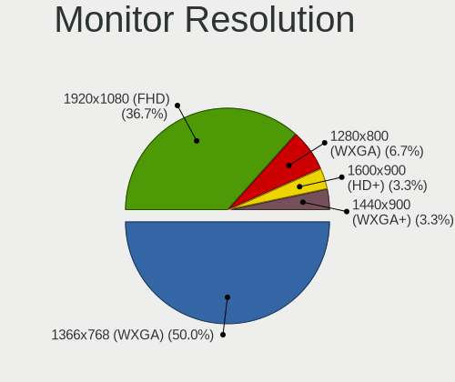

| Resolution         | Notebooks | Percent |
|--------------------|-----------|---------|
| 1366x768 (WXGA)    | 14        | 41.18%  |
| 1920x1080 (FHD)    | 7         | 20.59%  |
| 1600x900 (HD+)     | 5         | 14.71%  |
| 1280x800 (WXGA)    | 3         | 8.82%   |
| 1440x900 (WXGA+)   | 2         | 5.88%   |
| 3840x2160 (4K)     | 1         | 2.94%   |
| 1680x1050 (WSXGA+) | 1         | 2.94%   |
| 1400x1050          | 1         | 2.94%   |

Monitor Diagonal
----------------

Diagonal size in inches

| Inches | Notebooks | Percent |
|--------|-----------|---------|
| 15     | 20        | 55.56%  |
| 17     | 5         | 13.89%  |
| 13     | 3         | 8.33%   |
| 23     | 2         | 5.56%   |
| 31     | 1         | 2.78%   |
| 22     | 1         | 2.78%   |
| 20     | 1         | 2.78%   |
| 14     | 1         | 2.78%   |
| 12     | 1         | 2.78%   |
| 11     | 1         | 2.78%   |

Monitor Width
-------------

Physical width

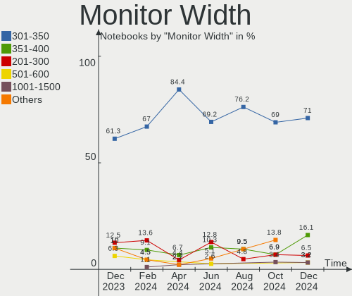

| Width in mm | Notebooks | Percent |
|-------------|-----------|---------|
| 301-350     | 20        | 55.56%  |
| 351-400     | 7         | 19.44%  |
| 201-300     | 4         | 11.11%  |
| 501-600     | 2         | 5.56%   |
| 401-500     | 2         | 5.56%   |
| 601-700     | 1         | 2.78%   |

Aspect Ratio
------------

Proportional relationship between the width and the height

| Ratio | Notebooks | Percent |
|-------|-----------|---------|
| 16/9  | 25        | 78.13%  |
| 16/10 | 6         | 18.75%  |
| 4/3   | 1         | 3.13%   |

Monitor Area
------------

Area in inch²

| Area in inch² | Notebooks | Percent |
|----------------|-----------|---------|
| 101-110        | 20        | 55.56%  |
| 121-130        | 4         | 11.11%  |
| 201-250        | 3         | 8.33%   |
| 81-90          | 2         | 5.56%   |
| 71-80          | 2         | 5.56%   |
| 61-70          | 1         | 2.78%   |
| 51-60          | 1         | 2.78%   |
| 351-500        | 1         | 2.78%   |
| 151-200        | 1         | 2.78%   |
| 131-140        | 1         | 2.78%   |

Pixel Density
-------------

Pixels per inch

| Density | Notebooks | Percent |
|---------|-----------|---------|
| 101-120 | 14        | 40%     |
| 51-100  | 11        | 31.43%  |
| 121-160 | 9         | 25.71%  |
| 161-240 | 1         | 2.86%   |

Multiple Monitors
-----------------

Total monitors connected

| Total | Notebooks | Percent |
|-------|-----------|---------|
| 1     | 27        | 84.38%  |
| 2     | 5         | 15.63%  |

Network
-------

Net Controller Vendor
---------------------

Controller vendors

| Vendor                | Notebooks | Percent |
|-----------------------|-----------|---------|
| Realtek Semiconductor | 14        | 28%     |
| Qualcomm Atheros      | 13        | 26%     |
| Intel                 | 12        | 24%     |
| Broadcom Limited      | 4         | 8%      |
| Broadcom              | 3         | 6%      |
| Ralink                | 2         | 4%      |
| AMD                   | 2         | 4%      |

Net Controller Model
--------------------

Controller models

| Model                                                                       | Notebooks | Percent |
|-----------------------------------------------------------------------------|-----------|---------|
| Realtek RTL8111/8168/8411 PCI Express Gigabit Ethernet Controller           | 8         | 12.12%  |
| Realtek RTL810xE PCI Express Fast Ethernet controller                       | 5         | 7.58%   |
| Qualcomm Atheros QCA9565 / AR9565 Wireless Network Adapter                  | 3         | 4.55%   |
| Intel PRO/Wireless 3945ABG [Golan] Network Connection                       | 3         | 4.55%   |
| Ralink RT3290 Wireless 802.11n 1T/1R PCIe                                   | 2         | 3.03%   |
| Qualcomm Atheros AR9485 Wireless Network Adapter                            | 2         | 3.03%   |
| Qualcomm Atheros AR9285 Wireless Network Adapter (PCI-Express)              | 2         | 3.03%   |
| Qualcomm Atheros AR8162 Fast Ethernet                                       | 2         | 3.03%   |
| Intel Wireless 7265                                                         | 2         | 3.03%   |
| Intel Centrino Advanced-N 6205 [Taylor Peak]                                | 2         | 3.03%   |
| Intel Cannon Lake PCH CNVi WiFi                                             | 2         | 3.03%   |
| Intel 82579LM Gigabit Network Connection (Lewisville)                       | 2         | 3.03%   |
| AMD IXP SB400 AC'97 Modem Controller                                        | 2         | 3.03%   |
| Realtek RTL8822CE 802.11ac PCIe Wireless Network Adapter                    | 1         | 1.52%   |
| Realtek RTL8821AE 802.11ac PCIe Wireless Network Adapter                    | 1         | 1.52%   |
| Realtek RTL8723BE PCIe Wireless Network Adapter                             | 1         | 1.52%   |
| Realtek RTL8188EE Wireless Network Adapter                                  | 1         | 1.52%   |
| Realtek RTL-8100/8101L/8139 PCI Fast Ethernet Adapter                       | 1         | 1.52%   |
| Qualcomm Atheros QCA9377 802.11ac Wireless Network Adapter                  | 1         | 1.52%   |
| Qualcomm Atheros QCA8172 Fast Ethernet                                      | 1         | 1.52%   |
| Qualcomm Atheros QCA8171 Gigabit Ethernet                                   | 1         | 1.52%   |
| Qualcomm Atheros Killer E2400 Gigabit Ethernet Controller                   | 1         | 1.52%   |
| Qualcomm Atheros AR928X Wireless Network Adapter (PCI-Express)              | 1         | 1.52%   |
| Qualcomm Atheros AR8152 v2.0 Fast Ethernet                                  | 1         | 1.52%   |
| Qualcomm Atheros AR8132 Fast Ethernet                                       | 1         | 1.52%   |
| Qualcomm Atheros AR242x / AR542x Wireless Network Adapter (PCI-Express)     | 1         | 1.52%   |
| Intel Wireless 7260                                                         | 1         | 1.52%   |
| Intel Wi-Fi 6 AX201                                                         | 1         | 1.52%   |
| Intel Ethernet Connection I218-LM                                           | 1         | 1.52%   |
| Intel Ethernet Connection (3) I218-LM                                       | 1         | 1.52%   |
| Intel Ethernet Connection (13) I219-V                                       | 1         | 1.52%   |
| Intel 82577LC Gigabit Network Connection                                    | 1         | 1.52%   |
| Intel 82573L Gigabit Ethernet Controller                                    | 1         | 1.52%   |
| Intel 82562GT 10/100 Network Connection                                     | 1         | 1.52%   |
| Broadcom NetXtreme BCM5788 Gigabit Ethernet                                 | 1         | 1.52%   |
| Broadcom NetXtreme BCM5764M Gigabit Ethernet PCIe                           | 1         | 1.52%   |
| Broadcom Limited NetLink BCM5787M Gigabit Ethernet PCI Express              | 1         | 1.52%   |
| Broadcom Limited BCM4318 [AirForce 54g] 802.11a/b/g PCI Express Transceiver | 1         | 1.52%   |
| Broadcom Limited BCM4313 802.11bgn Wireless Network Adapter                 | 1         | 1.52%   |
| Broadcom Limited BCM4312 802.11b/g LP-PHY                                   | 1         | 1.52%   |
| Broadcom BCM43224 802.11a/b/g/n                                             | 1         | 1.52%   |
| Broadcom BCM4318 [AirForce One 54g] 802.11g Wireless LAN Controller         | 1         | 1.52%   |

Wireless Vendor
---------------

Wireless vendors

| Vendor                | Notebooks | Percent |
|-----------------------|-----------|---------|
| Intel                 | 11        | 34.38%  |
| Qualcomm Atheros      | 10        | 31.25%  |
| Realtek Semiconductor | 4         | 12.5%   |
| Broadcom Limited      | 3         | 9.38%   |
| Ralink                | 2         | 6.25%   |
| Broadcom              | 2         | 6.25%   |

Wireless Model
--------------

Wireless models

| Model                                                                       | Notebooks | Percent |
|-----------------------------------------------------------------------------|-----------|---------|
| Qualcomm Atheros QCA9565 / AR9565 Wireless Network Adapter                  | 3         | 9.38%   |
| Intel PRO/Wireless 3945ABG [Golan] Network Connection                       | 3         | 9.38%   |
| Ralink RT3290 Wireless 802.11n 1T/1R PCIe                                   | 2         | 6.25%   |
| Qualcomm Atheros AR9485 Wireless Network Adapter                            | 2         | 6.25%   |
| Qualcomm Atheros AR9285 Wireless Network Adapter (PCI-Express)              | 2         | 6.25%   |
| Intel Wireless 7265                                                         | 2         | 6.25%   |
| Intel Centrino Advanced-N 6205 [Taylor Peak]                                | 2         | 6.25%   |
| Intel Cannon Lake PCH CNVi WiFi                                             | 2         | 6.25%   |
| Realtek RTL8822CE 802.11ac PCIe Wireless Network Adapter                    | 1         | 3.13%   |
| Realtek RTL8821AE 802.11ac PCIe Wireless Network Adapter                    | 1         | 3.13%   |
| Realtek RTL8723BE PCIe Wireless Network Adapter                             | 1         | 3.13%   |
| Realtek RTL8188EE Wireless Network Adapter                                  | 1         | 3.13%   |
| Qualcomm Atheros QCA9377 802.11ac Wireless Network Adapter                  | 1         | 3.13%   |
| Qualcomm Atheros AR928X Wireless Network Adapter (PCI-Express)              | 1         | 3.13%   |
| Qualcomm Atheros AR242x / AR542x Wireless Network Adapter (PCI-Express)     | 1         | 3.13%   |
| Intel Wireless 7260                                                         | 1         | 3.13%   |
| Intel Wi-Fi 6 AX201                                                         | 1         | 3.13%   |
| Broadcom Limited BCM4318 [AirForce 54g] 802.11a/b/g PCI Express Transceiver | 1         | 3.13%   |
| Broadcom Limited BCM4313 802.11bgn Wireless Network Adapter                 | 1         | 3.13%   |
| Broadcom Limited BCM4312 802.11b/g LP-PHY                                   | 1         | 3.13%   |
| Broadcom BCM43224 802.11a/b/g/n                                             | 1         | 3.13%   |
| Broadcom BCM4318 [AirForce One 54g] 802.11g Wireless LAN Controller         | 1         | 3.13%   |

Ethernet Vendor
---------------

Ethernet vendors

| Vendor                | Notebooks | Percent |
|-----------------------|-----------|---------|
| Realtek Semiconductor | 14        | 43.75%  |
| Intel                 | 8         | 25%     |
| Qualcomm Atheros      | 7         | 21.88%  |
| Broadcom              | 2         | 6.25%   |
| Broadcom Limited      | 1         | 3.13%   |

Ethernet Model
--------------

Ethernet models

| Model                                                             | Notebooks | Percent |
|-------------------------------------------------------------------|-----------|---------|
| Realtek RTL8111/8168/8411 PCI Express Gigabit Ethernet Controller | 8         | 25%     |
| Realtek RTL810xE PCI Express Fast Ethernet controller             | 5         | 15.63%  |
| Qualcomm Atheros AR8162 Fast Ethernet                             | 2         | 6.25%   |
| Intel 82579LM Gigabit Network Connection (Lewisville)             | 2         | 6.25%   |
| Realtek RTL-8100/8101L/8139 PCI Fast Ethernet Adapter             | 1         | 3.13%   |
| Qualcomm Atheros QCA8172 Fast Ethernet                            | 1         | 3.13%   |
| Qualcomm Atheros QCA8171 Gigabit Ethernet                         | 1         | 3.13%   |
| Qualcomm Atheros Killer E2400 Gigabit Ethernet Controller         | 1         | 3.13%   |
| Qualcomm Atheros AR8152 v2.0 Fast Ethernet                        | 1         | 3.13%   |
| Qualcomm Atheros AR8132 Fast Ethernet                             | 1         | 3.13%   |
| Intel Ethernet Connection I218-LM                                 | 1         | 3.13%   |
| Intel Ethernet Connection (3) I218-LM                             | 1         | 3.13%   |
| Intel Ethernet Connection (13) I219-V                             | 1         | 3.13%   |
| Intel 82577LC Gigabit Network Connection                          | 1         | 3.13%   |
| Intel 82573L Gigabit Ethernet Controller                          | 1         | 3.13%   |
| Intel 82562GT 10/100 Network Connection                           | 1         | 3.13%   |
| Broadcom NetXtreme BCM5788 Gigabit Ethernet                       | 1         | 3.13%   |
| Broadcom NetXtreme BCM5764M Gigabit Ethernet PCIe                 | 1         | 3.13%   |
| Broadcom Limited NetLink BCM5787M Gigabit Ethernet PCI Express    | 1         | 3.13%   |

Net Controller Kind
-------------------

Ethernet, WiFi or modem

| Kind     | Notebooks | Percent |
|----------|-----------|---------|
| WiFi     | 32        | 48.48%  |
| Ethernet | 32        | 48.48%  |
| Modem    | 2         | 3.03%   |

Used Controller
---------------

Currently used network controller

| Kind     | Notebooks | Percent |
|----------|-----------|---------|
| WiFi     | 27        | 75%     |
| Ethernet | 9         | 25%     |

NICs
----

Total network controllers on board

| Total | Notebooks | Percent |
|-------|-----------|---------|
| 2     | 32        | 100%    |

IPv6
----

IPv6 vs IPv4

| Used | Notebooks | Percent |
|------|-----------|---------|
| No   | 25        | 78.13%  |
| Yes  | 7         | 21.88%  |

Bluetooth
---------

Bluetooth Vendor
----------------

Controller vendors

| Vendor                          | Notebooks | Percent |
|---------------------------------|-----------|---------|
| Intel                           | 6         | 25%     |
| Qualcomm Atheros Communications | 3         | 12.5%   |
| Realtek Semiconductor           | 2         | 8.33%   |
| Ralink                          | 2         | 8.33%   |
| Lite-On Technology              | 2         | 8.33%   |
| Hewlett-Packard                 | 2         | 8.33%   |
| Foxconn / Hon Hai               | 2         | 8.33%   |
| Broadcom                        | 2         | 8.33%   |
| Toshiba                         | 1         | 4.17%   |
| Dell                            | 1         | 4.17%   |
| Apple                           | 1         | 4.17%   |

Bluetooth Model
---------------

Controller models

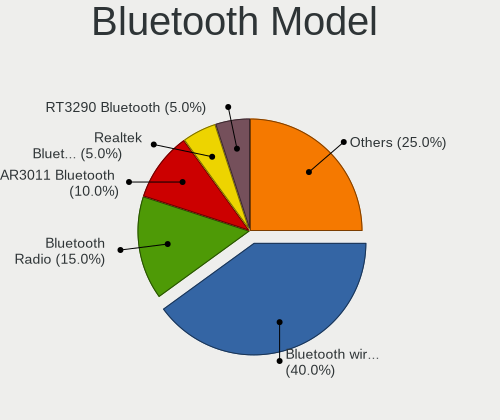

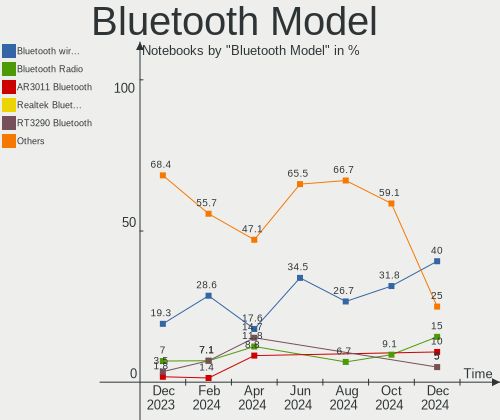

| Model                                            | Notebooks | Percent |
|--------------------------------------------------|-----------|---------|
| Intel Bluetooth wireless interface               | 3         | 12.5%   |
| Ralink RT3290 Bluetooth                          | 2         | 8.33%   |
| Intel Bluetooth 9460/9560 Jefferson Peak (JfP)   | 2         | 8.33%   |
| HP Bluetooth 2.0 Interface [Broadcom BCM2045]    | 2         | 8.33%   |
| Toshiba Bluetooth Device                         | 1         | 4.17%   |
| Realtek RTL8821A Bluetooth                       | 1         | 4.17%   |
| Realtek Bluetooth Radio                          | 1         | 4.17%   |
| Qualcomm Atheros  Bluetooth Device               | 1         | 4.17%   |
| Qualcomm Atheros AR3012 Bluetooth 4.0            | 1         | 4.17%   |
| Qualcomm Atheros AR3011 Bluetooth                | 1         | 4.17%   |
| Lite-On Bluetooth Radio                          | 1         | 4.17%   |
| Lite-On Atheros AR3012 Bluetooth                 | 1         | 4.17%   |
| Intel AX201 Bluetooth                            | 1         | 4.17%   |
| Foxconn / Hon Hai Broadcom BCM20702 Bluetooth    | 1         | 4.17%   |
| Foxconn / Hon Hai Bluetooth USB Host Controller  | 1         | 4.17%   |
| Dell Wireless 365 Bluetooth                      | 1         | 4.17%   |
| Broadcom BCM20702 Bluetooth 4.0 [ThinkPad]       | 1         | 4.17%   |
| Broadcom BCM2045B (BDC-2) [Bluetooth Controller] | 1         | 4.17%   |
| Apple Bluetooth Host Controller                  | 1         | 4.17%   |

Sound
-----

Sound Vendor
------------

Sound card vendors

| Vendor              | Notebooks | Percent |
|---------------------|-----------|---------|
| Intel               | 24        | 64.86%  |
| AMD                 | 8         | 21.62%  |
| Nvidia              | 4         | 10.81%  |
| Creative Technology | 1         | 2.7%    |

Sound Model
-----------

Sound card models

| Model                                                                      | Notebooks | Percent |
|----------------------------------------------------------------------------|-----------|---------|
| Intel 7 Series/C216 Chipset Family High Definition Audio Controller        | 7         | 15.91%  |
| Intel Sunrise Point-LP HD Audio                                            | 3         | 6.82%   |
| Intel Haswell-ULT HD Audio Controller                                      | 2         | 4.55%   |
| Intel Cannon Lake PCH cAVS                                                 | 2         | 4.55%   |
| Intel 82801I (ICH9 Family) HD Audio Controller                             | 2         | 4.55%   |
| Intel 82801H (ICH8 Family) HD Audio Controller                             | 2         | 4.55%   |
| Intel 8 Series HD Audio Controller                                         | 2         | 4.55%   |
| Intel 5 Series/3400 Series Chipset High Definition Audio                   | 2         | 4.55%   |
| AMD SBx00 Azalia (Intel HDA)                                               | 2         | 4.55%   |
| AMD Kabini HDMI/DP Audio                                                   | 2         | 4.55%   |
| AMD IXP SB400 AC'97 Audio Controller                                       | 2         | 4.55%   |
| AMD FCH Azalia Controller                                                  | 2         | 4.55%   |
| Nvidia TU116 High Definition Audio Controller                              | 1         | 2.27%   |
| Nvidia TU106 High Definition Audio Controller                              | 1         | 2.27%   |
| Nvidia GT216 HDMI Audio Controller                                         | 1         | 2.27%   |
| Nvidia GF119 HDMI Audio Controller                                         | 1         | 2.27%   |
| Intel Wildcat Point-LP High Definition Audio Controller                    | 1         | 2.27%   |
| Intel Tiger Lake-LP Smart Sound Technology Audio Controller                | 1         | 2.27%   |
| Intel NM10/ICH7 Family High Definition Audio Controller                    | 1         | 2.27%   |
| Intel Broadwell-U Audio Controller                                         | 1         | 2.27%   |
| Intel 6 Series/C200 Series Chipset Family High Definition Audio Controller | 1         | 2.27%   |
| Creative Technology Sound Blaster Play!                                    | 1         | 2.27%   |
| AMD Trinity HDMI Audio Controller                                          | 1         | 2.27%   |
| AMD Renoir Radeon High Definition Audio Controller                         | 1         | 2.27%   |
| AMD Family 17h/19h HD Audio Controller                                     | 1         | 2.27%   |
| AMD Family 15h (Models 60h-6fh) Audio Controller                           | 1         | 2.27%   |

Memory
------

Memory Vendor
-------------

Memory module vendors

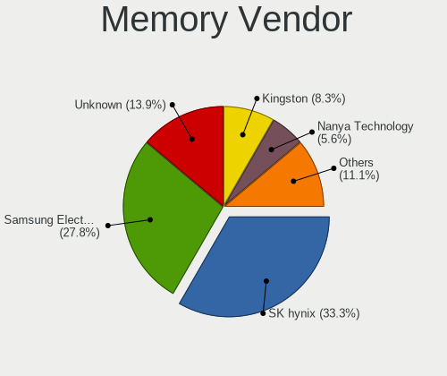

| Vendor                | Notebooks | Percent |
|-----------------------|-----------|---------|
| SK Hynix              | 9         | 21.95%  |
| Samsung Electronics   | 8         | 19.51%  |
| Unknown               | 6         | 14.63%  |
| Nanya Technology      | 5         | 12.2%   |
| Micron Technology     | 5         | 12.2%   |
| Kingston              | 3         | 7.32%   |
| A-DATA Technology     | 2         | 4.88%   |
| Qimonda               | 1         | 2.44%   |
| Patriot               | 1         | 2.44%   |
| Kingmax Semiconductor | 1         | 2.44%   |

Memory Model
------------

Memory module models

| Model                                                        | Notebooks | Percent |
|--------------------------------------------------------------|-----------|---------|
| SK Hynix RAM HMT451S6BFR8A-PB 4GB SODIMM DDR3 1600MT/s       | 2         | 4.55%   |
| SK Hynix RAM HMT351S6CFR8C-PB 4096MB SODIMM DDR3 1600MT/s    | 2         | 4.55%   |
| Samsung RAM M471A5244CB0-CRC 4GB SODIMM DDR4 2667MT/s        | 2         | 4.55%   |
| Unknown RAM V02D4S84GB5285282400 4096MB SODIMM DDR4 2133MT/s | 1         | 2.27%   |
| Unknown RAM Module 8192MB SODIMM DDR3                        | 1         | 2.27%   |
| Unknown RAM Module 512MB SODIMM DRAM                         | 1         | 2.27%   |
| Unknown RAM Module 4096MB SODIMM DDR3                        | 1         | 2.27%   |
| Unknown RAM Module 2048MB SODIMM DDR2                        | 1         | 2.27%   |
| Unknown RAM Module 2048MB SODIMM 800MT/s                     | 1         | 2.27%   |
| SK Hynix RAM HYMP512S64CP8-Y5 1024MB SODIMM DDR2 1639MT/s    | 1         | 2.27%   |
| SK Hynix RAM HYMD512M646CFP8J 1024MB SODIMM DDR 333MT/s      | 1         | 2.27%   |
| SK Hynix RAM HMT451S6BFR8A-PB 4096MB SODIMM DDR3 1600MT/s    | 1         | 2.27%   |
| SK Hynix RAM HMT425S6AFR6A-PB 2048MB SODIMM DDR3 1600MT/s    | 1         | 2.27%   |
| SK Hynix RAM HMT351U6CFR8C-PBA 8192MB SODIMM DDR3 1600MT/s   | 1         | 2.27%   |
| SK Hynix RAM HMT351S6EFR8C-PB 4096MB SODIMM DDR3 1600MT/s    | 1         | 2.27%   |
| SK Hynix RAM HMT351S6EFR8A-PB 4096MB SODIMM DDR3 1600MT/s    | 1         | 2.27%   |
| SK Hynix RAM HMT125S6TFR8C-H9 2048MB SODIMM DDR3 1334MT/s    | 1         | 2.27%   |
| Samsung RAM Module 8192MB SODIMM DDR4 3200MT/s               | 1         | 2.27%   |
| Samsung RAM M471B5273DH0-YK0 4096MB SODIMM DDR3 1600MT/s     | 1         | 2.27%   |
| Samsung RAM M471B5273DH0-CK0 4GB SODIMM DDR3 1600MT/s        | 1         | 2.27%   |
| Samsung RAM M471A5143EB0-CPB 4096MB SODIMM DDR4 2133MT/s     | 1         | 2.27%   |
| Samsung RAM M471A2K43CB1-CTD 16384MB SODIMM DDR4 2667MT/s    | 1         | 2.27%   |
| Samsung RAM M471A1K43CB1-CTD 8192MB SODIMM DDR4 2667MT/s     | 1         | 2.27%   |
| Qimonda RAM 64T128021EDL3SB2 1024MB SODIMM DDR2 667MT/s      | 1         | 2.27%   |
| Patriot RAM PSA22GICDS 2048MB SODIMM DDR2 667MT/s            | 1         | 2.27%   |
| Nanya RAM NT4GC64C88B1NS-DI 4096MB SODIMM DDR3 1600MT/s      | 1         | 2.27%   |
| Nanya RAM NT4GC64B8HG0NS-CG 4096MB SODIMM DDR3 1334MT/s      | 1         | 2.27%   |
| Nanya RAM NT2GC64B8HC0NS-CG 2GB SODIMM DDR3 1334MT/s         | 1         | 2.27%   |
| Nanya RAM Module 4096MB SODIMM DDR3 1067MT/s                 | 1         | 2.27%   |
| Nanya RAM M2N2G64TU8HD0B-3C 2048MB SODIMM DDR2 667MT/s       | 1         | 2.27%   |
| Micron RAM Module 4096MB SODIMM DDR3 1600MT/s                | 1         | 2.27%   |
| Micron RAM 8JSF25664HZ-1G4D1 2048MB SODIMM DDR3 1334MT/s     | 1         | 2.27%   |
| Micron RAM 4KTF25664HZ-1G4E1 2048MB SODIMM DDR3 1333MT/s     | 1         | 2.27%   |
| Micron RAM 4ATF1G64HZ-3G2E1 8GB SODIMM DDR4 3200MT/s         | 1         | 2.27%   |
| Micron RAM 16HTF25664HY-800E1 2048MB SODIMM DDR2 975MT/s     | 1         | 2.27%   |
| Kingston RAM ACR16D3LS1KBGR/4G 4GB SODIMM DDR3 1600MT/s      | 1         | 2.27%   |
| Kingston RAM 9905428-073.A00LF 4096MB SODIMM DDR3 1334MT/s   | 1         | 2.27%   |
| Kingston RAM 9905293-040.A00LF 1024MB SODIMM DDR2 667MT/s    | 1         | 2.27%   |
| Kingmax RAM FSGF63F-D8 4096MB SODIMM DDR3 1600MT/s           | 1         | 2.27%   |
| A-DATA RAM AM1L16BC4R1-B1HS 4096MB SODIMM DDR3 1600MT/s      | 1         | 2.27%   |
| A-DATA RAM AD73I1C1674EV 4096MB SODIMM DDR3 1334MT/s         | 1         | 2.27%   |

Memory Kind
-----------

Memory module kinds

| Kind    | Notebooks | Percent |
|---------|-----------|---------|
| DDR3    | 18        | 54.55%  |
| DDR4    | 7         | 21.21%  |
| DDR2    | 4         | 12.12%  |
| SDRAM   | 1         | 3.03%   |
| DRAM    | 1         | 3.03%   |
| DDR     | 1         | 3.03%   |
| Unknown | 1         | 3.03%   |

Memory Form Factor
------------------

Physical design of the memory module

| Name   | Notebooks | Percent |
|--------|-----------|---------|
| SODIMM | 32        | 100%    |

Memory Size
-----------

Memory module size

| Size  | Notebooks | Percent |
|-------|-----------|---------|
| 4096  | 17        | 47.22%  |
| 2048  | 9         | 25%     |
| 8192  | 5         | 13.89%  |
| 1024  | 3         | 8.33%   |
| 16384 | 1         | 2.78%   |
| 512   | 1         | 2.78%   |

Memory Speed
------------

Memory module speed

| Speed   | Notebooks | Percent |
|---------|-----------|---------|
| 1600    | 10        | 28.57%  |
| 1334    | 5         | 14.29%  |
| 2667    | 4         | 11.43%  |
| Unknown | 4         | 11.43%  |
| 3200    | 2         | 5.71%   |
| 667     | 2         | 5.71%   |
| 2400    | 1         | 2.86%   |
| 2133    | 1         | 2.86%   |
| 1639    | 1         | 2.86%   |
| 1333    | 1         | 2.86%   |
| 1067    | 1         | 2.86%   |
| 975     | 1         | 2.86%   |
| 800     | 1         | 2.86%   |
| 333     | 1         | 2.86%   |

Printers & scanners
-------------------

Printer Vendor
--------------

Printer device vendors

Zero info for selected period =(

Printer Model
-------------

Printer device models

Zero info for selected period =(

Scanner Vendor
--------------

Scanner device vendors

Zero info for selected period =(

Scanner Model
-------------

Scanner device models

Zero info for selected period =(

Camera
------

Camera Vendor
-------------

Camera device vendors

| Vendor                                 | Notebooks | Percent |
|----------------------------------------|-----------|---------|
| Chicony Electronics                    | 7         | 26.92%  |
| IMC Networks                           | 6         | 23.08%  |
| Microdia                               | 3         | 11.54%  |
| Suyin                                  | 2         | 7.69%   |
| Realtek Semiconductor                  | 2         | 7.69%   |
| Acer                                   | 2         | 7.69%   |
| Sunplus Innovation Technology          | 1         | 3.85%   |
| Quanta                                 | 1         | 3.85%   |
| Cheng Uei Precision Industry (Foxlink) | 1         | 3.85%   |
| Apple                                  | 1         | 3.85%   |

Camera Model
------------

Camera device models

| Model                                                   | Notebooks | Percent |
|---------------------------------------------------------|-----------|---------|
| IMC Networks USB2.0 HD UVC WebCam                       | 2         | 7.69%   |
| IMC Networks EasyCamera                                 | 2         | 7.69%   |
| Chicony HP Truevision HD                                | 2         | 7.69%   |
| Chicony HD WebCam                                       | 2         | 7.69%   |
| Suyin HP Truevision HD                                  | 1         | 3.85%   |
| Suyin Acer/HP Integrated Webcam [CN0314]                | 1         | 3.85%   |
| Sunplus USB2.0 Camera                                   | 1         | 3.85%   |
| Realtek Lenovo EasyCamera                               | 1         | 3.85%   |
| Realtek FJ Camera                                       | 1         | 3.85%   |
| Quanta HP HD Camera                                     | 1         | 3.85%   |
| Microdia Laptop_Integrated_Webcam_HD                    | 1         | 3.85%   |
| Microdia HP Integrated Webcam                           | 1         | 3.85%   |
| Microdia Dell Integrated HD Webcam                      | 1         | 3.85%   |
| IMC Networks USB2.0 VGA UVC WebCam                      | 1         | 3.85%   |
| IMC Networks USB2.0 UVC HD Webcam                       | 1         | 3.85%   |
| Chicony Webcam                                          | 1         | 3.85%   |
| Chicony TOSHIBA Web Camera - HD                         | 1         | 3.85%   |
| Chicony Integrated Camera [ThinkPad]                    | 1         | 3.85%   |
| Cheng Uei Precision Industry (Foxlink) HP Truevision HD | 1         | 3.85%   |
| Apple Built-in iSight                                   | 1         | 3.85%   |
| Acer Sony Visual Communication Camera                   | 1         | 3.85%   |
| Acer Lenovo EasyCamera                                  | 1         | 3.85%   |

Security
--------

Fingerprint Vendor
------------------

Fingerprint sensor vendors

| Vendor    | Notebooks | Percent |
|-----------|-----------|---------|
| AuthenTec | 4         | 100%    |

Fingerprint Model
-----------------

Fingerprint sensor models

| Model                                | Notebooks | Percent |
|--------------------------------------|-----------|---------|
| AuthenTec AES2501 Fingerprint Sensor | 2         | 50%     |
| AuthenTec Fingerprint Sensor         | 1         | 25%     |
| AuthenTec AES1660 Fingerprint Sensor | 1         | 25%     |

Chipcard Vendor
---------------

Chipcard module vendors

| Vendor   | Notebooks | Percent |
|----------|-----------|---------|
| O2 Micro | 1         | 100%    |

Chipcard Model
--------------

Chipcard module models

| Model                                | Notebooks | Percent |
|--------------------------------------|-----------|---------|
| O2 Micro OZ776 CCID Smartcard Reader | 1         | 100%    |

Unsupported
-----------

Unsupported Devices
-------------------

Total unsupported devices on board

| Total | Notebooks | Percent |
|-------|-----------|---------|
| 0     | 22        | 68.75%  |
| 1     | 10        | 31.25%  |

Unsupported Device Types
------------------------

Types of unsupported devices

| Type               | Notebooks | Percent |
|--------------------|-----------|---------|
| Fingerprint reader | 4         | 40%     |
| Graphics card      | 2         | 20%     |
| Bluetooth          | 2         | 20%     |
| Net/wireless       | 1         | 10%     |
| Chipcard           | 1         | 10%     |

