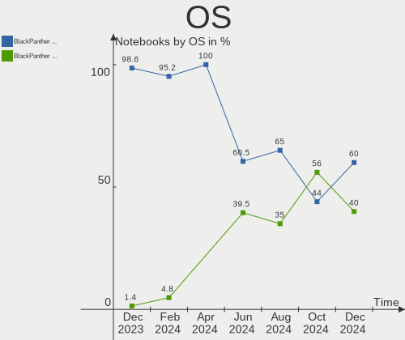
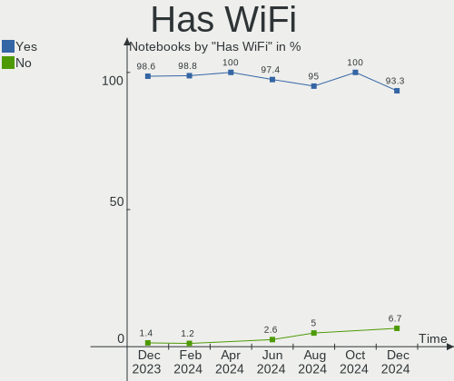
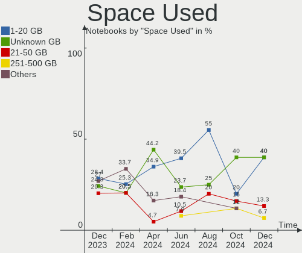
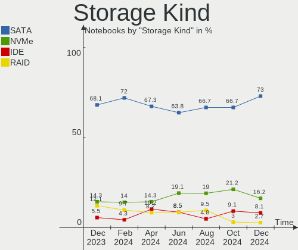
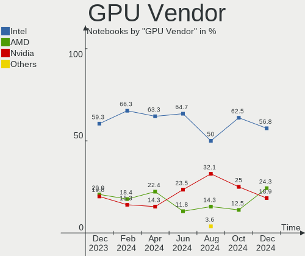
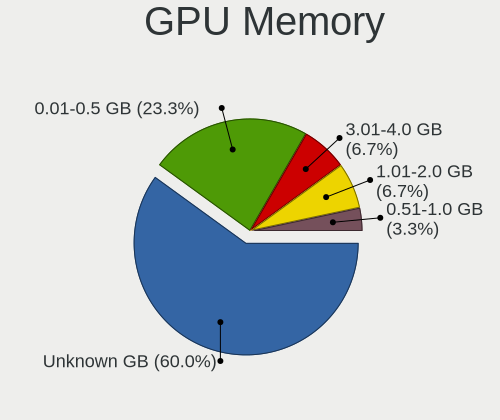
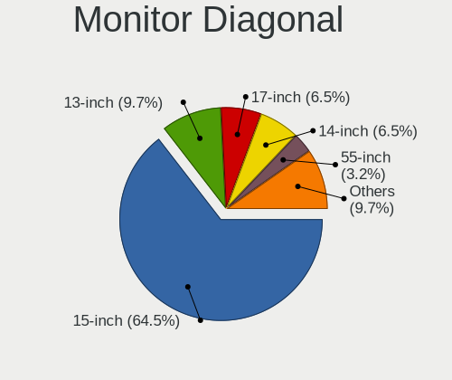
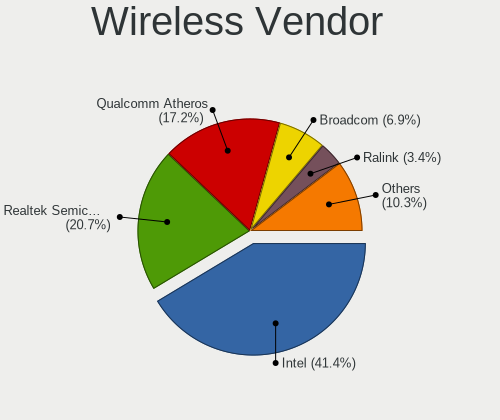
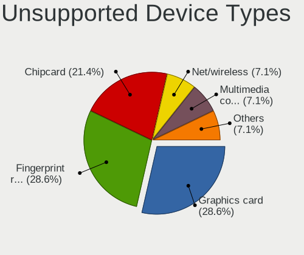

BlackPanther - Hardware Trends (Notebooks)
------------------------------------------

A project to identify most popular hardware characteristics and track their change
over time based on data collected by Linux users at https://Linux-Hardware.org.

Anyone can contribute to this report by the [hw-probe](https://github.com/linuxhw/hw-probe) tool:

    sudo -E hw-probe -all -upload

This report is for one last month. Overall report since the beginning of time: [TestDays](https://github.com/linuxhw/TestDays)

Period: Sep, 2023.

Contents
--------

* [ System ](#system)
  - [ OS                       ](#os)
  - [ OS Family                ](#os-family)
  - [ Kernel                   ](#kernel)
  - [ Kernel Family            ](#kernel-family)
  - [ Kernel Major Ver.        ](#kernel-major-ver)
  - [ Arch                     ](#arch)
  - [ DE                       ](#de)
  - [ Display Server           ](#display-server)
  - [ Display Manager          ](#display-manager)
  - [ OS Lang                  ](#os-lang)
  - [ Boot Mode                ](#boot-mode)
  - [ Filesystem               ](#filesystem)
  - [ Part. scheme             ](#part-scheme)
  - [ Dual Boot with Linux/BSD ](#dual-boot-with-linuxbsd)
  - [ Dual Boot (Win)          ](#dual-boot-win)

* [ Board ](#board)
  - [ Vendor                   ](#vendor)
  - [ Model                    ](#model)
  - [ Model Family             ](#model-family)
  - [ MFG Year                 ](#mfg-year)
  - [ Form Factor              ](#form-factor)
  - [ Secure Boot              ](#secure-boot)
  - [ Coreboot                 ](#coreboot)
  - [ RAM Size                 ](#ram-size)
  - [ RAM Used                 ](#ram-used)
  - [ Total Drives             ](#total-drives)
  - [ Has CD-ROM               ](#has-cd-rom)
  - [ Has Ethernet             ](#has-ethernet)
  - [ Has WiFi                 ](#has-wifi)
  - [ Has Bluetooth            ](#has-bluetooth)

* [ Location ](#location)
  - [ Country                  ](#country)
  - [ City                     ](#city)

* [ Drives ](#drives)
  - [ Drive Vendor             ](#drive-vendor)
  - [ Drive Model              ](#drive-model)
  - [ HDD Vendor               ](#hdd-vendor)
  - [ SSD Vendor               ](#ssd-vendor)
  - [ Drive Kind               ](#drive-kind)
  - [ Drive Connector          ](#drive-connector)
  - [ Drive Size               ](#drive-size)
  - [ Space Total              ](#space-total)
  - [ Space Used               ](#space-used)
  - [ Malfunc. Drives          ](#malfunc-drives)
  - [ Malfunc. Drive Vendor    ](#malfunc-drive-vendor)
  - [ Malfunc. HDD Vendor      ](#malfunc-hdd-vendor)
  - [ Malfunc. Drive Kind      ](#malfunc-drive-kind)
  - [ Failed Drives            ](#failed-drives)
  - [ Failed Drive Vendor      ](#failed-drive-vendor)
  - [ Drive Status             ](#drive-status)

* [ Storage controller ](#storage-controller)
  - [ Storage Vendor           ](#storage-vendor)
  - [ Storage Model            ](#storage-model)
  - [ Storage Kind             ](#storage-kind)

* [ Processor ](#processor)
  - [ CPU Vendor               ](#cpu-vendor)
  - [ CPU Model                ](#cpu-model)
  - [ CPU Model Family         ](#cpu-model-family)
  - [ CPU Cores                ](#cpu-cores)
  - [ CPU Sockets              ](#cpu-sockets)
  - [ CPU Threads              ](#cpu-threads)
  - [ CPU Op-Modes             ](#cpu-op-modes)
  - [ CPU Microcode            ](#cpu-microcode)
  - [ CPU Microarch            ](#cpu-microarch)

* [ Graphics ](#graphics)
  - [ GPU Vendor               ](#gpu-vendor)
  - [ GPU Model                ](#gpu-model)
  - [ GPU Combo                ](#gpu-combo)
  - [ GPU Driver               ](#gpu-driver)
  - [ GPU Memory               ](#gpu-memory)

* [ Monitor ](#monitor)
  - [ Monitor Vendor           ](#monitor-vendor)
  - [ Monitor Model            ](#monitor-model)
  - [ Monitor Resolution       ](#monitor-resolution)
  - [ Monitor Diagonal         ](#monitor-diagonal)
  - [ Monitor Width            ](#monitor-width)
  - [ Aspect Ratio             ](#aspect-ratio)
  - [ Monitor Area             ](#monitor-area)
  - [ Pixel Density            ](#pixel-density)
  - [ Multiple Monitors        ](#multiple-monitors)

* [ Network ](#network)
  - [ Net Controller Vendor    ](#net-controller-vendor)
  - [ Net Controller Model     ](#net-controller-model)
  - [ Wireless Vendor          ](#wireless-vendor)
  - [ Wireless Model           ](#wireless-model)
  - [ Ethernet Vendor          ](#ethernet-vendor)
  - [ Ethernet Model           ](#ethernet-model)
  - [ Net Controller Kind      ](#net-controller-kind)
  - [ Used Controller          ](#used-controller)
  - [ NICs                     ](#nics)
  - [ IPv6                     ](#ipv6)

* [ Bluetooth ](#bluetooth)
  - [ Bluetooth Vendor         ](#bluetooth-vendor)
  - [ Bluetooth Model          ](#bluetooth-model)

* [ Sound ](#sound)
  - [ Sound Vendor             ](#sound-vendor)
  - [ Sound Model              ](#sound-model)

* [ Memory ](#memory)
  - [ Memory Vendor            ](#memory-vendor)
  - [ Memory Model             ](#memory-model)
  - [ Memory Kind              ](#memory-kind)
  - [ Memory Form Factor       ](#memory-form-factor)
  - [ Memory Size              ](#memory-size)
  - [ Memory Speed             ](#memory-speed)

* [ Printers & scanners ](#printers--scanners)
  - [ Printer Vendor           ](#printer-vendor)
  - [ Printer Model            ](#printer-model)
  - [ Scanner Vendor           ](#scanner-vendor)
  - [ Scanner Model            ](#scanner-model)

* [ Camera ](#camera)
  - [ Camera Vendor            ](#camera-vendor)
  - [ Camera Model             ](#camera-model)

* [ Security ](#security)
  - [ Fingerprint Vendor       ](#fingerprint-vendor)
  - [ Fingerprint Model        ](#fingerprint-model)
  - [ Chipcard Vendor          ](#chipcard-vendor)
  - [ Chipcard Model           ](#chipcard-model)

* [ Unsupported ](#unsupported)
  - [ Unsupported Devices      ](#unsupported-devices)
  - [ Unsupported Device Types ](#unsupported-device-types)

System
------

OS
--

Installed operating systems

| Name              | Notebooks | Percent |
|-------------------|-----------|---------|
| BlackPanther 18.1 | 52        | 96.3%   |
| BlackPanther 22.1 | 2         | 3.7%    |

OS Family
---------

OS without a version

| Name         | Notebooks | Percent |
|--------------|-----------|---------|
| BlackPanther | 54        | 100%    |

Kernel
------

Version of the Linux kernel

| Version             | Notebooks | Percent |
|---------------------|-----------|---------|
| 5.15.85-desktop-1bP | 21        | 38.89%  |
| 5.6.14-desktop-2bP  | 18        | 33.33%  |
| 4.18.16-desktop-1bP | 9         | 16.67%  |
| 6.3.8-desktop-1bP   | 3         | 5.56%   |
| 6.4.3-desktop-1bP   | 1         | 1.85%   |
| 6.1.0-1bP           | 1         | 1.85%   |
| 5.6.14-server-2bP   | 1         | 1.85%   |

Kernel Family
-------------

Linux kernel without a distro release

| Version | Notebooks | Percent |
|---------|-----------|---------|
| 5.15.85 | 21        | 38.89%  |
| 5.6.14  | 19        | 35.19%  |
| 4.18.16 | 9         | 16.67%  |
| 6.3.8   | 3         | 5.56%   |
| 6.4.3   | 1         | 1.85%   |
| 6.1.0   | 1         | 1.85%   |

Kernel Major Ver.
-----------------

Linux kernel major version

| Version | Notebooks | Percent |
|---------|-----------|---------|
| 5.15    | 21        | 38.89%  |
| 5.6     | 19        | 35.19%  |
| 4.18    | 9         | 16.67%  |
| 6.3     | 3         | 5.56%   |
| 6.4     | 1         | 1.85%   |
| 6.1     | 1         | 1.85%   |

Arch
----

OS architecture (x86_64, i586, etc.)

| Name   | Notebooks | Percent |
|--------|-----------|---------|
| x86_64 | 54        | 100%    |

DE
--

Desktop Environment

| Name    | Notebooks | Percent |
|---------|-----------|---------|
| KDE5    | 51        | 94.44%  |
| Unknown | 3         | 5.56%   |

Display Server
--------------

X11 or Wayland

| Name | Notebooks | Percent |
|------|-----------|---------|
| X11  | 54        | 100%    |

Display Manager
---------------

SDDM, LightDM, etc.

| Name | Notebooks | Percent |
|------|-----------|---------|
| SDDM | 54        | 100%    |

OS Lang
-------

Language

| Lang    | Notebooks | Percent |
|---------|-----------|---------|
| Unknown | 54        | 100%    |

Boot Mode
---------

EFI or BIOS

| Mode | Notebooks | Percent |
|------|-----------|---------|
| EFI  | 37        | 68.52%  |
| BIOS | 17        | 31.48%  |

Filesystem
----------

Type of filesystem

| Type    | Notebooks | Percent |
|---------|-----------|---------|
| Ext4    | 43        | 79.63%  |
| Overlay | 11        | 20.37%  |

Part. scheme
------------

Scheme of partitioning

| Type | Notebooks | Percent |
|------|-----------|---------|
| GPT  | 36        | 66.67%  |
| MBR  | 18        | 33.33%  |

Dual Boot with Linux/BSD
------------------------

Hosting more than one Linux/BSD

| Dual boot | Notebooks | Percent |
|-----------|-----------|---------|
| No        | 50        | 92.59%  |
| Yes       | 4         | 7.41%   |

Dual Boot (Win)
---------------

Hosting Linux and Windows

| Dual boot | Notebooks | Percent |
|-----------|-----------|---------|
| No        | 36        | 66.67%  |
| Yes       | 18        | 33.33%  |

Board
-----

Vendor
------

Motherboard manufacturer

| Name                | Notebooks | Percent |
|---------------------|-----------|---------|
| Hewlett-Packard     | 13        | 24.07%  |
| Dell                | 13        | 24.07%  |
| Lenovo              | 10        | 18.52%  |
| ASUSTek Computer    | 6         | 11.11%  |
| MSI                 | 2         | 3.7%    |
| Acer                | 2         | 3.7%    |
| Toshiba             | 1         | 1.85%   |
| Sony                | 1         | 1.85%   |
| Samsung Electronics | 1         | 1.85%   |
| Insyde              | 1         | 1.85%   |
| Gateway             | 1         | 1.85%   |
| Fujitsu Siemens     | 1         | 1.85%   |
| eMachines           | 1         | 1.85%   |
| Apple               | 1         | 1.85%   |

Model
-----

Motherboard model

| Name                                | Notebooks | Percent |
|-------------------------------------|-----------|---------|
| HP 250 G1                           | 3         | 5.56%   |
| Dell Vostro 1015                    | 2         | 3.7%    |
| Dell Inspiron 15-3567               | 2         | 3.7%    |
| ASUS X200MA                         | 2         | 3.7%    |
| Toshiba Satellite C55-A-1NV         | 1         | 1.85%   |
| Sony VPCEH2J1E                      | 1         | 1.85%   |
| Samsung 300E4C/300E5C/300E7C        | 1         | 1.85%   |
| MSI GT60 2OC/2OD                    | 1         | 1.85%   |
| MSI GP75 Leopard 9SE                | 1         | 1.85%   |
| Lenovo ThinkPad X250 20CLS1JN00     | 1         | 1.85%   |
| Lenovo ThinkPad T540p 20BE003YUK    | 1         | 1.85%   |
| Lenovo ThinkPad T410 2537VFQ        | 1         | 1.85%   |
| Lenovo ThinkPad T400 2768WGB        | 1         | 1.85%   |
| Lenovo IdeaPad Y700-15ISK 80NV      | 1         | 1.85%   |
| Lenovo IdeaPad Gaming 3 15ACH6 82K2 | 1         | 1.85%   |
| Lenovo IdeaPad 700-15ISK 80RU       | 1         | 1.85%   |
| Lenovo IdeaPad 330-15IKB 81DE       | 1         | 1.85%   |
| Lenovo IdeaPad 110-15ACL 80TJ       | 1         | 1.85%   |
| Lenovo Flex 2-15D 20377             | 1         | 1.85%   |
| Insyde Braswell                     | 1         | 1.85%   |
| HP ProBook 650 G2                   | 1         | 1.85%   |
| HP ProBook 640 G8 Notebook PC       | 1         | 1.85%   |
| HP Pavilion x2 Detachable           | 1         | 1.85%   |
| HP Pavilion Gaming Laptop 15-ec1xxx | 1         | 1.85%   |
| HP Pavilion dv6                     | 1         | 1.85%   |
| HP Notebook                         | 1         | 1.85%   |
| HP Laptop 15-dw1xxx                 | 1         | 1.85%   |
| HP Compaq 6710b (KE121EA#AKC)       | 1         | 1.85%   |
| HP 650                              | 1         | 1.85%   |
| HP 250 G5 Notebook PC               | 1         | 1.85%   |
| Gateway NE56R                       | 1         | 1.85%   |
| Fujitsu Siemens AMILO Li3910        | 1         | 1.85%   |
| eMachines E725                      | 1         | 1.85%   |
| Dell Latitude E7240                 | 1         | 1.85%   |
| Dell Latitude E6540                 | 1         | 1.85%   |
| Dell Latitude E6220                 | 1         | 1.85%   |
| Dell Latitude E5520                 | 1         | 1.85%   |
| Dell Latitude 7390                  | 1         | 1.85%   |
| Dell Inspiron 7737                  | 1         | 1.85%   |
| Dell Inspiron 5567                  | 1         | 1.85%   |

Model Family
------------

Motherboard model prefix

| Name                  | Notebooks | Percent |
|-----------------------|-----------|---------|
| Dell Inspiron         | 6         | 11.11%  |
| Lenovo IdeaPad        | 5         | 9.26%   |
| Dell Latitude         | 5         | 9.26%   |
| Lenovo ThinkPad       | 4         | 7.41%   |
| HP 250                | 4         | 7.41%   |
| HP Pavilion           | 3         | 5.56%   |
| HP ProBook            | 2         | 3.7%    |
| Dell Vostro           | 2         | 3.7%    |
| ASUS X200MA           | 2         | 3.7%    |
| Acer Aspire           | 2         | 3.7%    |
| Toshiba Satellite     | 1         | 1.85%   |
| Sony VPCEH2J1E        | 1         | 1.85%   |
| Samsung 300E4C        | 1         | 1.85%   |
| MSI GT60              | 1         | 1.85%   |
| MSI GP75              | 1         | 1.85%   |
| Lenovo Flex           | 1         | 1.85%   |
| Insyde Braswell       | 1         | 1.85%   |
| HP Notebook           | 1         | 1.85%   |
| HP Laptop             | 1         | 1.85%   |
| HP Compaq             | 1         | 1.85%   |
| HP 650                | 1         | 1.85%   |
| Gateway NE56R         | 1         | 1.85%   |
| Fujitsu Siemens AMILO | 1         | 1.85%   |
| eMachines E725        | 1         | 1.85%   |
| ASUS X551CA           | 1         | 1.85%   |
| ASUS X550CL           | 1         | 1.85%   |
| ASUS K54HR            | 1         | 1.85%   |
| ASUS ASUS             | 1         | 1.85%   |
| Apple MacBookAir5     | 1         | 1.85%   |

MFG Year
--------

Motherboard manufacture year

| Year | Notebooks | Percent |
|------|-----------|---------|
| 2013 | 10        | 18.52%  |
| 2016 | 8         | 14.81%  |
| 2015 | 7         | 12.96%  |
| 2009 | 5         | 9.26%   |
| 2014 | 4         | 7.41%   |
| 2012 | 4         | 7.41%   |
| 2011 | 4         | 7.41%   |
| 2021 | 3         | 5.56%   |
| 2008 | 3         | 5.56%   |
| 2019 | 2         | 3.7%    |
| 2018 | 2         | 3.7%    |
| 2020 | 1         | 1.85%   |
| 2017 | 1         | 1.85%   |

Form Factor
-----------

Physical design of the computer

| Name     | Notebooks | Percent |
|----------|-----------|---------|
| Notebook | 54        | 100%    |

Secure Boot
-----------

Enabled or disabled

| State    | Notebooks | Percent |
|----------|-----------|---------|
| Disabled | 54        | 100%    |

Coreboot
--------

Have coreboot on board

| Used | Notebooks | Percent |
|------|-----------|---------|
| No   | 54        | 100%    |

RAM Size
--------

Total RAM memory

| Size in GB | Notebooks | Percent |
|------------|-----------|---------|
| 3.01-4.0   | 22        | 40.74%  |
| 4.01-8.0   | 16        | 29.63%  |
| 8.01-16.0  | 6         | 11.11%  |
| 1.01-2.0   | 5         | 9.26%   |
| 16.01-24.0 | 4         | 7.41%   |
| 24.01-32.0 | 1         | 1.85%   |

RAM Used
--------

Used RAM memory

| Used GB   | Notebooks | Percent |
|-----------|-----------|---------|
| 1.01-2.0  | 32        | 59.26%  |
| 0.51-1.0  | 12        | 22.22%  |
| 2.01-3.0  | 5         | 9.26%   |
| 4.01-8.0  | 2         | 3.7%    |
| 3.01-4.0  | 2         | 3.7%    |
| 8.01-16.0 | 1         | 1.85%   |

Total Drives
------------

Number of drives on board

| Drives | Notebooks | Percent |
|--------|-----------|---------|
| 1      | 39        | 72.22%  |
| 2      | 15        | 27.78%  |

Has CD-ROM
----------

Has CD-ROM on board

| Presented | Notebooks | Percent |
|-----------|-----------|---------|
| Yes       | 28        | 51.85%  |
| No        | 26        | 48.15%  |

Has Ethernet
------------

Has Ethernet on board

| Presented | Notebooks | Percent |
|-----------|-----------|---------|
| Yes       | 50        | 92.59%  |
| No        | 4         | 7.41%   |

Has WiFi
--------

Has WiFi module

| Presented | Notebooks | Percent |
|-----------|-----------|---------|
| Yes       | 53        | 98.15%  |
| No        | 1         | 1.85%   |

Has Bluetooth
-------------

Has Bluetooth module

| Presented | Notebooks | Percent |
|-----------|-----------|---------|
| Yes       | 43        | 79.63%  |
| No        | 11        | 20.37%  |

Location
--------

Country
-------

Geographic location (country)

| Country  | Notebooks | Percent |
|----------|-----------|---------|
| Hungary  | 38        | 70.37%  |
| Austria  | 4         | 7.41%   |
| UK       | 3         | 5.56%   |
| Slovakia | 3         | 5.56%   |
| Germany  | 2         | 3.7%    |
| Romania  | 1         | 1.85%   |
| India    | 1         | 1.85%   |
| France   | 1         | 1.85%   |
| Canada   | 1         | 1.85%   |

City
----

Geographic location (city)

| City                    | Notebooks | Percent |
|-------------------------|-----------|---------|
| Budapest                | 11        | 20.37%  |
| Vienna                  | 4         | 7.41%   |
| Miskolc                 | 3         | 5.56%   |
| Zalaegerszeg            | 2         | 3.7%    |
| Tatabánya              | 2         | 3.7%    |
| Szombathely             | 2         | 3.7%    |
| Szazhalombatta          | 2         | 3.7%    |
| Nagyatad                | 2         | 3.7%    |
| Velky Meder             | 1         | 1.85%   |
| Tornaľa                | 1         | 1.85%   |
| Tamasi                  | 1         | 1.85%   |
| Szigetszentmiklos       | 1         | 1.85%   |
| Pomaz                   | 1         | 1.85%   |
| Pfaffenhofen an der Ilm | 1         | 1.85%   |
| Pécs                   | 1         | 1.85%   |
| Papa                    | 1         | 1.85%   |
| Nyul                    | 1         | 1.85%   |
| Nyiregyhaza             | 1         | 1.85%   |
| Nagykoroes              | 1         | 1.85%   |
| Miercurea-Ciuc          | 1         | 1.85%   |
| Martin                  | 1         | 1.85%   |
| Harlow                  | 1         | 1.85%   |
| Halasztelek             | 1         | 1.85%   |
| Filderstadt             | 1         | 1.85%   |
| Dunaharaszti            | 1         | 1.85%   |
| Dole                    | 1         | 1.85%   |
| Debrecen                | 1         | 1.85%   |
| Csongrad                | 1         | 1.85%   |
| Cserto                  | 1         | 1.85%   |
| Bury St Edmunds         | 1         | 1.85%   |
| Bishop's Stortford      | 1         | 1.85%   |
| Bhubaneswar             | 1         | 1.85%   |
| Berettyóújfalu        | 1         | 1.85%   |
| Beauharnois             | 1         | 1.85%   |

Drives
------

Drive Vendor
------------

Hard drive vendors

| Vendor              | Notebooks | Drives | Percent |
|---------------------|-----------|--------|---------|
| WDC                 | 10        | 12     | 14.93%  |
| Seagate             | 8         | 8      | 11.94%  |
| Kingston            | 8         | 9      | 11.94%  |
| Unknown             | 5         | 6      | 7.46%   |
| Samsung Electronics | 5         | 6      | 7.46%   |
| HGST                | 5         | 5      | 7.46%   |
| SanDisk             | 4         | 4      | 5.97%   |
| Toshiba             | 3         | 3      | 4.48%   |
| Intenso             | 3         | 3      | 4.48%   |
| SK hynix            | 2         | 2      | 2.99%   |
| Hitachi             | 2         | 2      | 2.99%   |
| A-DATA Technology   | 2         | 2      | 2.99%   |
| Timetec             | 1         | 1      | 1.49%   |
| Team                | 1         | 1      | 1.49%   |
| SSSTC               | 1         | 1      | 1.49%   |
| Micron Technology   | 1         | 1      | 1.49%   |
| LITEONIT            | 1         | 1      | 1.49%   |
| LITEON              | 1         | 1      | 1.49%   |
| KIOXIA              | 1         | 1      | 1.49%   |
| Fujitsu             | 1         | 1      | 1.49%   |
| ASENNO              | 1         | 1      | 1.49%   |
| Apple               | 1         | 1      | 1.49%   |

Drive Model
-----------

Hard drive models

| Model                                 | Notebooks | Percent |
|---------------------------------------|-----------|---------|
| Kingston SA400S37480G 480GB SSD       | 3         | 4.17%   |
| Seagate ST500LT012-1DG142 500GB       | 2         | 2.78%   |
| Intenso SSD 120GB                     | 2         | 2.78%   |
| HGST HTS545032A7E380 320GB            | 2         | 2.78%   |
| WDC WD5000LPVX-80V0TT0 500GB          | 1         | 1.39%   |
| WDC WD5000LPCX-24VHAT0 500GB          | 1         | 1.39%   |
| WDC WD5000BPVT-24HXZT3 500GB          | 1         | 1.39%   |
| WDC WD5000BPVT-22HXZT3 500GB          | 1         | 1.39%   |
| WDC WD3200BEVT-75ZCT2 320GB           | 1         | 1.39%   |
| WDC WD2500BEVT-00ZCT0 250GB           | 1         | 1.39%   |
| WDC WD10SPCX-24HWST1 1TB              | 1         | 1.39%   |
| WDC WD10JPVX-75JC3T0 1TB              | 1         | 1.39%   |
| WDC WD10JPVX-60JC3T0 1TB              | 1         | 1.39%   |
| WDC WD10JPVX-22JC3T0 1TB              | 1         | 1.39%   |
| WDC WD10JPLX-00MBPT0 1TB              | 1         | 1.39%   |
| WDC WD Green 2.5 240GB                | 1         | 1.39%   |
| Unknown SL16G  16GB                   | 1         | 1.39%   |
| Unknown SD64G  64GB                   | 1         | 1.39%   |
| Unknown SA08G  8GB                    | 1         | 1.39%   |
| Unknown HCG4a2  64GB                  | 1         | 1.39%   |
| Unknown ASTC  32GB                    | 1         | 1.39%   |
| Unknown 032G34  32GB                  | 1         | 1.39%   |
| Toshiba MQ01ABF050 500GB              | 1         | 1.39%   |
| Toshiba MK2576GSX 250GB               | 1         | 1.39%   |
| Toshiba KXG50ZNV256G NVMe 256GB       | 1         | 1.39%   |
| Timetec SD08 512GB SSD                | 1         | 1.39%   |
| Team T253X1120G 120GB SSD             | 1         | 1.39%   |
| SSSTC CL1-8D256-HP 256GB              | 1         | 1.39%   |
| SK hynix HFS256G3BTND-N210A 256GB SSD | 1         | 1.39%   |
| SK hynix HBG4e  32GB                  | 1         | 1.39%   |
| Seagate ST9500420AS 500GB             | 1         | 1.39%   |
| Seagate ST9500325AS 500GB             | 1         | 1.39%   |
| Seagate ST500LT012-9WS142 500GB       | 1         | 1.39%   |
| Seagate ST2000LM003 HN-M201RAD 2TB    | 1         | 1.39%   |
| Seagate ST1000LM035-1RK172 1TB        | 1         | 1.39%   |
| Seagate ST1000LM024 HN-M101MBB 1TB    | 1         | 1.39%   |
| Sandisk WD Blue SN570 1TB             | 1         | 1.39%   |
| SanDisk SSD PLUS 480GB                | 1         | 1.39%   |
| SanDisk SDSSDH3250G 250GB             | 1         | 1.39%   |
| SanDisk SD8SB8U-256G-1006 256GB SSD   | 1         | 1.39%   |

HDD Vendor
----------

Hard disk drive vendors

| Vendor  | Notebooks | Drives | Percent |
|---------|-----------|--------|---------|
| WDC     | 10        | 11     | 35.71%  |
| Seagate | 8         | 8      | 28.57%  |
| HGST    | 5         | 5      | 17.86%  |
| Toshiba | 2         | 2      | 7.14%   |
| Hitachi | 2         | 2      | 7.14%   |
| Fujitsu | 1         | 1      | 3.57%   |

SSD Vendor
----------

Solid state drive vendors

| Vendor              | Notebooks | Drives | Percent |
|---------------------|-----------|--------|---------|
| Kingston            | 7         | 8      | 26.92%  |
| SanDisk             | 3         | 3      | 11.54%  |
| Intenso             | 3         | 3      | 11.54%  |
| Samsung Electronics | 2         | 2      | 7.69%   |
| A-DATA Technology   | 2         | 2      | 7.69%   |
| WDC                 | 1         | 1      | 3.85%   |
| Timetec             | 1         | 1      | 3.85%   |
| Team                | 1         | 1      | 3.85%   |
| SK hynix            | 1         | 1      | 3.85%   |
| Micron Technology   | 1         | 1      | 3.85%   |
| LITEONIT            | 1         | 1      | 3.85%   |
| LITEON              | 1         | 1      | 3.85%   |
| ASENNO              | 1         | 1      | 3.85%   |
| Apple               | 1         | 1      | 3.85%   |

Drive Kind
----------

HDD or SSD

| Kind | Notebooks | Drives | Percent |
|------|-----------|--------|---------|
| HDD  | 28        | 29     | 41.79%  |
| SSD  | 25        | 27     | 37.31%  |
| NVMe | 8         | 9      | 11.94%  |
| MMC  | 6         | 7      | 8.96%   |

Drive Connector
---------------

SATA, SAS, NVMe, etc.

| Type | Notebooks | Drives | Percent |
|------|-----------|--------|---------|
| SATA | 47        | 56     | 77.05%  |
| NVMe | 8         | 9      | 13.11%  |
| MMC  | 6         | 7      | 9.84%   |

Drive Size
----------

Size of hard drive

| Size in TB | Notebooks | Drives | Percent |
|------------|-----------|--------|---------|
| 0.01-0.5   | 41        | 44     | 78.85%  |
| 0.51-1.0   | 10        | 11     | 19.23%  |
| 1.01-2.0   | 1         | 1      | 1.92%   |

Space Total
-----------

Amount of disk space available on the file system

| Size in GB | Notebooks | Percent |
|------------|-----------|---------|
| 101-250    | 15        | 27.78%  |
| 251-500    | 12        | 22.22%  |
| Unknown    | 10        | 18.52%  |
| 501-1000   | 4         | 7.41%   |
| 51-100     | 4         | 7.41%   |
| 21-50      | 3         | 5.56%   |
| 2001-3000  | 3         | 5.56%   |
| 1001-2000  | 2         | 3.7%    |
| 1-20       | 1         | 1.85%   |

Space Used
----------

Amount of used disk space

| Used GB   | Notebooks | Percent |
|-----------|-----------|---------|
| 1-20      | 14        | 25.93%  |
| 21-50     | 12        | 22.22%  |
| Unknown   | 10        | 18.52%  |
| 51-100    | 7         | 12.96%  |
| 101-250   | 6         | 11.11%  |
| 251-500   | 2         | 3.7%    |
| 2001-3000 | 2         | 3.7%    |
| 1001-2000 | 1         | 1.85%   |

Malfunc. Drives
---------------

Drive models with a malfunction

| Model                            | Notebooks | Drives | Percent |
|----------------------------------|-----------|--------|---------|
| HGST HTS545032A7E380 320GB       | 2         | 2      | 11.11%  |
| WDC WD5000LPVX-80V0TT0 500GB     | 1         | 1      | 5.56%   |
| WDC WD3200BEVT-75ZCT2 320GB      | 1         | 1      | 5.56%   |
| WDC WD2500BEVT-00ZCT0 250GB      | 1         | 1      | 5.56%   |
| WDC WD10JPLX-00MBPT0 1TB         | 1         | 1      | 5.56%   |
| Toshiba MQ01ABF050 500GB         | 1         | 1      | 5.56%   |
| Timetec SD08 512GB SSD           | 1         | 1      | 5.56%   |
| Seagate ST9500420AS 500GB        | 1         | 1      | 5.56%   |
| Seagate ST9500325AS 500GB        | 1         | 1      | 5.56%   |
| Seagate ST500LT012-9WS142 500GB  | 1         | 1      | 5.56%   |
| Seagate ST500LT012-1DG142 500GB  | 1         | 1      | 5.56%   |
| Kingston SV300S37A120G 120GB SSD | 1         | 1      | 5.56%   |
| Hitachi HTS547550A9E384 500GB    | 1         | 1      | 5.56%   |
| Hitachi HTS543225L9A300 250GB    | 1         | 1      | 5.56%   |
| HGST HTS541010A9E680 1TB         | 1         | 1      | 5.56%   |
| Fujitsu MHW2060BH 64GB           | 1         | 1      | 5.56%   |
| Apple SSD TS064E 64GB            | 1         | 1      | 5.56%   |

Malfunc. Drive Vendor
---------------------

Vendors of faulty drives

| Vendor   | Notebooks | Drives | Percent |
|----------|-----------|--------|---------|
| WDC      | 4         | 4      | 22.22%  |
| Seagate  | 4         | 4      | 22.22%  |
| HGST     | 3         | 3      | 16.67%  |
| Hitachi  | 2         | 2      | 11.11%  |
| Toshiba  | 1         | 1      | 5.56%   |
| Timetec  | 1         | 1      | 5.56%   |
| Kingston | 1         | 1      | 5.56%   |
| Fujitsu  | 1         | 1      | 5.56%   |
| Apple    | 1         | 1      | 5.56%   |

Malfunc. HDD Vendor
-------------------

Vendors of faulty HDD drives

| Vendor  | Notebooks | Drives | Percent |
|---------|-----------|--------|---------|
| WDC     | 4         | 4      | 26.67%  |
| Seagate | 4         | 4      | 26.67%  |
| HGST    | 3         | 3      | 20%     |
| Hitachi | 2         | 2      | 13.33%  |
| Toshiba | 1         | 1      | 6.67%   |
| Fujitsu | 1         | 1      | 6.67%   |

Malfunc. Drive Kind
-------------------

Kinds of faulty drives

| Kind | Notebooks | Drives | Percent |
|------|-----------|--------|---------|
| HDD  | 15        | 15     | 83.33%  |
| SSD  | 3         | 3      | 16.67%  |

Failed Drives
-------------

Failed drive models

Zero info for selected period =(

Failed Drive Vendor
-------------------

Failed drive vendors

Zero info for selected period =(

Drive Status
------------

Number of failed and malfunc. drives

| Status   | Notebooks | Drives | Percent |
|----------|-----------|--------|---------|
| Works    | 38        | 47     | 61.29%  |
| Malfunc  | 18        | 18     | 29.03%  |
| Detected | 6         | 7      | 9.68%   |

Storage controller
------------------

Storage Vendor
--------------

Storage controller vendors

| Vendor                         | Notebooks | Percent |
|--------------------------------|-----------|---------|
| Intel                          | 47        | 79.66%  |
| AMD                            | 4         | 6.78%   |
| Samsung Electronics            | 3         | 5.08%   |
| Toshiba America Info Systems   | 2         | 3.39%   |
| Solid State Storage Technology | 1         | 1.69%   |
| SanDisk                        | 1         | 1.69%   |
| Kingston Technology Company    | 1         | 1.69%   |

Storage Model
-------------

Storage controller models

| Model                                                                          | Notebooks | Percent |
|--------------------------------------------------------------------------------|-----------|---------|
| Intel 7 Series Chipset Family 6-port SATA Controller [AHCI mode]               | 9         | 14.06%  |
| Intel Sunrise Point-LP SATA Controller [AHCI mode]                             | 7         | 10.94%  |
| Intel 82801 Mobile SATA Controller [RAID mode]                                 | 4         | 6.25%   |
| AMD FCH SATA Controller [AHCI mode]                                            | 4         | 6.25%   |
| Intel HM170/QM170 Chipset SATA Controller [AHCI Mode]                          | 3         | 4.69%   |
| Intel 82801IBM/IEM (ICH9M/ICH9M-E) 4 port SATA Controller [AHCI mode]          | 3         | 4.69%   |
| Intel 8 Series/C220 Series Chipset Family 6-port SATA Controller 1 [AHCI mode] | 3         | 4.69%   |
| Intel 6 Series/C200 Series Chipset Family 6 port Mobile SATA AHCI Controller   | 3         | 4.69%   |
| Samsung NVMe SSD Controller 980                                                | 2         | 3.13%   |
| Intel Wildcat Point-LP SATA Controller [AHCI Mode]                             | 2         | 3.13%   |
| Intel Volume Management Device NVMe RAID Controller                            | 2         | 3.13%   |
| Intel Atom Processor E3800 Series SATA AHCI Controller                         | 2         | 3.13%   |
| Intel 82801IBM/IEM (ICH9M/ICH9M-E) 2 port SATA Controller [IDE mode]           | 2         | 3.13%   |
| Intel 8 Series SATA Controller 1 [AHCI mode]                                   | 2         | 3.13%   |
| Toshiba America Info Systems XG6 NVMe SSD Controller                           | 1         | 1.56%   |
| Toshiba America Info Systems XG5 NVMe SSD Controller                           | 1         | 1.56%   |
| Solid State Storage CL1-3D256-Q11 NVMe SSD M.2                                 | 1         | 1.56%   |
| SanDisk WD Blue SN570 NVMe SSD 1TB                                             | 1         | 1.56%   |
| Samsung NVMe SSD Controller SM981/PM981/PM983                                  | 1         | 1.56%   |
| Samsung NVMe SSD Controller PM9A1/PM9A3/980PRO                                 | 1         | 1.56%   |
| Kingston Company U-SNS8154P3 NVMe SSD                                          | 1         | 1.56%   |
| Intel Tiger Lake-LP SATA Controller                                            | 1         | 1.56%   |
| Intel Celeron N3350/Pentium N4200/Atom E3900 Series SATA AHCI Controller       | 1         | 1.56%   |
| Intel Cannon Lake Mobile PCH SATA AHCI Controller                              | 1         | 1.56%   |
| Intel 82801HM/HEM (ICH8M/ICH8M-E) SATA Controller [IDE mode]                   | 1         | 1.56%   |
| Intel 7 Series Chipset Family 4-port SATA Controller [IDE mode]                | 1         | 1.56%   |
| Intel 7 Series Chipset Family 2-port SATA Controller [IDE mode]                | 1         | 1.56%   |
| Intel 5 Series/3400 Series Chipset 6 port SATA AHCI Controller                 | 1         | 1.56%   |
| Intel 5 Series/3400 Series Chipset 4 port SATA AHCI Controller                 | 1         | 1.56%   |
| AMD FCH IDE Controller                                                         | 1         | 1.56%   |

Storage Kind
------------

Kind of storage controller (IDE, SATA, NVMe, SAS, ...)

| Kind | Notebooks | Percent |
|------|-----------|---------|
| SATA | 43        | 69.35%  |
| NVMe | 8         | 12.9%   |
| RAID | 6         | 9.68%   |
| IDE  | 5         | 8.06%   |

Processor
---------

CPU Vendor
----------

Processor vendors

| Vendor | Notebooks | Percent |
|--------|-----------|---------|
| Intel  | 49        | 90.74%  |
| AMD    | 5         | 9.26%   |

CPU Model
---------

Processor models

| Model                                       | Notebooks | Percent |
|---------------------------------------------|-----------|---------|
| Intel Core i5-7200U CPU @ 2.50GHz           | 3         | 5.56%   |
| Intel Celeron CPU 1000M @ 1.80GHz           | 3         | 5.56%   |
| Intel Core i7-4700MQ CPU @ 2.40GHz          | 2         | 3.7%    |
| Intel Core i5-8250U CPU @ 1.60GHz           | 2         | 3.7%    |
| Intel Core i5-6200U CPU @ 2.30GHz           | 2         | 3.7%    |
| Intel Core 2 Duo CPU T6570 @ 2.10GHz        | 2         | 3.7%    |
| Intel Pentium Dual-Core CPU T4500 @ 2.30GHz | 1         | 1.85%   |
| Intel Pentium Dual-Core CPU T4300 @ 2.10GHz | 1         | 1.85%   |
| Intel Pentium CPU N3530 @ 2.16GHz           | 1         | 1.85%   |
| Intel Pentium CPU B970 @ 2.30GHz            | 1         | 1.85%   |
| Intel Pentium CPU B960 @ 2.20GHz            | 1         | 1.85%   |
| Intel Pentium CPU 2117U @ 1.80GHz           | 1         | 1.85%   |
| Intel Core i7-9750H CPU @ 2.60GHz           | 1         | 1.85%   |
| Intel Core i7-6820HQ CPU @ 2.70GHz          | 1         | 1.85%   |
| Intel Core i7-6700HQ CPU @ 2.60GHz          | 1         | 1.85%   |
| Intel Core i7-4810MQ CPU @ 2.80GHz          | 1         | 1.85%   |
| Intel Core i7-4510U CPU @ 2.00GHz           | 1         | 1.85%   |
| Intel Core i5-6300HQ CPU @ 2.30GHz          | 1         | 1.85%   |
| Intel Core i5-5300U CPU @ 2.30GHz           | 1         | 1.85%   |
| Intel Core i5-5200U CPU @ 2.20GHz           | 1         | 1.85%   |
| Intel Core i5-4200U CPU @ 1.60GHz           | 1         | 1.85%   |
| Intel Core i5-4200M CPU @ 2.50GHz           | 1         | 1.85%   |
| Intel Core i5-3427U CPU @ 1.80GHz           | 1         | 1.85%   |
| Intel Core i5-2540M CPU @ 2.60GHz           | 1         | 1.85%   |
| Intel Core i5-2520M CPU @ 2.50GHz           | 1         | 1.85%   |
| Intel Core i5 CPU M 520 @ 2.40GHz           | 1         | 1.85%   |
| Intel Core i3-6006U CPU @ 2.00GHz           | 1         | 1.85%   |
| Intel Core i3-3217U CPU @ 1.80GHz           | 1         | 1.85%   |
| Intel Core i3-2350M CPU @ 2.30GHz           | 1         | 1.85%   |
| Intel Core i3-2330M CPU @ 2.20GHz           | 1         | 1.85%   |
| Intel Core i3-10110U CPU @ 2.10GHz          | 1         | 1.85%   |
| Intel Core i3 CPU M 350 @ 2.27GHz           | 1         | 1.85%   |
| Intel Core 2 Duo CPU T8100 @ 2.10GHz        | 1         | 1.85%   |
| Intel Core 2 Duo CPU P8600 @ 2.40GHz        | 1         | 1.85%   |
| Intel Celeron CPU N3350 @ 1.10GHz           | 1         | 1.85%   |
| Intel Celeron CPU N3050 @ 1.60GHz           | 1         | 1.85%   |
| Intel Celeron CPU N2815 @ 1.86GHz           | 1         | 1.85%   |
| Intel Celeron CPU B830 @ 1.80GHz            | 1         | 1.85%   |
| Intel Atom x5-Z8300 CPU @ 1.44GHz           | 1         | 1.85%   |
| Intel 11th Gen Core i5-1135G7 @ 2.40GHz     | 1         | 1.85%   |

CPU Model Family
----------------

Processor model prefix

| Model                   | Notebooks | Percent |
|-------------------------|-----------|---------|
| Intel Core i5           | 16        | 29.63%  |
| Intel Core i7           | 7         | 12.96%  |
| Intel Celeron           | 7         | 12.96%  |
| Intel Core i3           | 6         | 11.11%  |
| Intel Pentium           | 4         | 7.41%   |
| Intel Core 2 Duo        | 4         | 7.41%   |
| Other                   | 2         | 3.7%    |
| Intel Pentium Dual-Core | 2         | 3.7%    |
| AMD Ryzen 5             | 2         | 3.7%    |
| AMD A8                  | 2         | 3.7%    |
| Intel Atom              | 1         | 1.85%   |
| AMD E1                  | 1         | 1.85%   |

CPU Cores
---------

Number of processor cores

| Number | Notebooks | Percent |
|--------|-----------|---------|
| 2      | 37        | 68.52%  |
| 4      | 12        | 22.22%  |
| 6      | 3         | 5.56%   |
| 1      | 2         | 3.7%    |

CPU Sockets
-----------

Number of sockets

| Number | Notebooks | Percent |
|--------|-----------|---------|
| 1      | 54        | 100%    |

CPU Threads
-----------

Threads per core (Hyper-Threading)

| Number | Notebooks | Percent |
|--------|-----------|---------|
| 2      | 32        | 59.26%  |
| 1      | 22        | 40.74%  |

CPU Op-Modes
------------

CPU Operation Modes (32-bit, 64-bit)

| Op mode        | Notebooks | Percent |
|----------------|-----------|---------|
| 32-bit, 64-bit | 54        | 100%    |

CPU Microcode
-------------

Microcode number

| Number     | Notebooks | Percent |
|------------|-----------|---------|
| Unknown    | 9         | 16.67%  |
| 0x306a9    | 6         | 11.11%  |
| 0x206a7    | 5         | 9.26%   |
| 0x1067a    | 5         | 9.26%   |
| 0x506e3    | 3         | 5.56%   |
| 0x406e3    | 3         | 5.56%   |
| 0x306c3    | 3         | 5.56%   |
| 0x806ea    | 2         | 3.7%    |
| 0x806e9    | 2         | 3.7%    |
| 0x406c3    | 2         | 3.7%    |
| 0x806ec    | 1         | 1.85%   |
| 0x806c1    | 1         | 1.85%   |
| 0x506c9    | 1         | 1.85%   |
| 0x40651    | 1         | 1.85%   |
| 0x306d4    | 1         | 1.85%   |
| 0x30678    | 1         | 1.85%   |
| 0x30673    | 1         | 1.85%   |
| 0x20652    | 1         | 1.85%   |
| 0x10676    | 1         | 1.85%   |
| 0x0a50000d | 1         | 1.85%   |
| 0x08600106 | 1         | 1.85%   |
| 0x07030105 | 1         | 1.85%   |
| 0x07030104 | 1         | 1.85%   |
| 0x06003109 | 1         | 1.85%   |

CPU Microarch
-------------

Microarchitecture

| Name        | Notebooks | Percent |
|-------------|-----------|---------|
| SandyBridge | 7         | 12.96%  |
| KabyLake    | 7         | 12.96%  |
| Skylake     | 6         | 11.11%  |
| Penryn      | 6         | 11.11%  |
| IvyBridge   | 6         | 11.11%  |
| Haswell     | 6         | 11.11%  |
| Silvermont  | 4         | 7.41%   |
| Westmere    | 2         | 3.7%    |
| TigerLake   | 2         | 3.7%    |
| Puma        | 2         | 3.7%    |
| Broadwell   | 2         | 3.7%    |
| Zen 3       | 1         | 1.85%   |
| Zen 2       | 1         | 1.85%   |
| Steamroller | 1         | 1.85%   |
| Goldmont    | 1         | 1.85%   |

Graphics
--------

GPU Vendor
----------

Vendors of graphics cards

| Vendor | Notebooks | Percent |
|--------|-----------|---------|
| Intel  | 46        | 64.79%  |
| Nvidia | 13        | 18.31%  |
| AMD    | 12        | 16.9%   |

GPU Model
---------

Graphics card models

| Model                                                                                    | Notebooks | Percent |
|------------------------------------------------------------------------------------------|-----------|---------|
| Intel 3rd Gen Core processor Graphics Controller                                         | 6         | 8.22%   |
| Intel 2nd Generation Core Processor Family Integrated Graphics Controller                | 5         | 6.85%   |
| Intel Mobile 4 Series Chipset Integrated Graphics Controller                             | 4         | 5.48%   |
| Intel 4th Gen Core Processor Integrated Graphics Controller                              | 4         | 5.48%   |
| Intel Skylake GT2 [HD Graphics 520]                                                      | 3         | 4.11%   |
| Intel HD Graphics 620                                                                    | 3         | 4.11%   |
| Intel HD Graphics 530                                                                    | 3         | 4.11%   |
| AMD Sun XT [Radeon HD 8670A/8670M/8690M / R5 M330 / M430 / Radeon 520 Mobile]            | 3         | 4.11%   |
| Nvidia GF117M [GeForce 610M/710M/810M/820M / GT 620M/625M/630M/720M]                     | 2         | 2.74%   |
| Intel UHD Graphics 620                                                                   | 2         | 2.74%   |
| Intel HD Graphics 5500                                                                   | 2         | 2.74%   |
| Intel Haswell-ULT Integrated Graphics Controller                                         | 2         | 2.74%   |
| Intel Core Processor Integrated Graphics Controller                                      | 2         | 2.74%   |
| Intel Atom/Celeron/Pentium Processor x5-E8000/J3xxx/N3xxx Integrated Graphics Controller | 2         | 2.74%   |
| Intel Atom Processor Z36xxx/Z37xxx Series Graphics & Display                             | 2         | 2.74%   |
| Nvidia TU117M [GeForce GTX 1650 Ti Mobile]                                               | 1         | 1.37%   |
| Nvidia TU117M [GeForce GTX 1650 Mobile / Max-Q]                                          | 1         | 1.37%   |
| Nvidia TU106M [GeForce RTX 2060 Mobile]                                                  | 1         | 1.37%   |
| Nvidia GM107M [GeForce GTX 960M]                                                         | 1         | 1.37%   |
| Nvidia GM107M [GeForce GTX 950M]                                                         | 1         | 1.37%   |
| Nvidia GM107 [GeForce 940MX]                                                             | 1         | 1.37%   |
| Nvidia GK208M [GeForce GT 730M]                                                          | 1         | 1.37%   |
| Nvidia GK208BM [GeForce 920M]                                                            | 1         | 1.37%   |
| Nvidia GK107M [GeForce GT 750M]                                                          | 1         | 1.37%   |
| Nvidia GK106M [GeForce GTX 770M]                                                         | 1         | 1.37%   |
| Nvidia GF119M [GeForce 410M]                                                             | 1         | 1.37%   |
| Intel TigerLake-LP GT2 [Iris Xe Graphics]                                                | 1         | 1.37%   |
| Intel Tiger Lake-LP GT2 [UHD Graphics G4]                                                | 1         | 1.37%   |
| Intel Mobile GM965/GL960 Integrated Graphics Controller (secondary)                      | 1         | 1.37%   |
| Intel Mobile GM965/GL960 Integrated Graphics Controller (primary)                        | 1         | 1.37%   |
| Intel HD Graphics 500                                                                    | 1         | 1.37%   |
| Intel CometLake-U GT2 [UHD Graphics]                                                     | 1         | 1.37%   |
| Intel CoffeeLake-H GT2 [UHD Graphics 630]                                                | 1         | 1.37%   |
| AMD Sun LE [Radeon HD 8550M / R5 M230]                                                   | 1         | 1.37%   |
| AMD Seymour [Radeon HD 6400M/7400M Series]                                               | 1         | 1.37%   |
| AMD RV620/M82 [Mobility Radeon HD 3450/3470]                                             | 1         | 1.37%   |
| AMD Renoir                                                                               | 1         | 1.37%   |
| AMD Mullins [Radeon R4/R5 Graphics]                                                      | 1         | 1.37%   |
| AMD Mullins [Radeon R2 Graphics]                                                         | 1         | 1.37%   |
| AMD Mars XTX [Radeon HD 8790M]                                                           | 1         | 1.37%   |

GPU Combo
---------

Combinations of graphics cards

| Name           | Notebooks | Percent |
|----------------|-----------|---------|
| 1 x Intel      | 31        | 57.41%  |
| Intel + Nvidia | 10        | 18.52%  |
| Intel + AMD    | 5         | 9.26%   |
| 1 x AMD        | 4         | 7.41%   |
| AMD + Nvidia   | 2         | 3.7%    |
| 2 x AMD        | 1         | 1.85%   |
| 1 x Nvidia     | 1         | 1.85%   |

GPU Driver
----------

Free vs proprietary

| Driver  | Notebooks | Percent |
|---------|-----------|---------|
| Free    | 53        | 98.15%  |
| Unknown | 1         | 1.85%   |

GPU Memory
----------

Total video memory

| Size in GB | Notebooks | Percent |
|------------|-----------|---------|
| Unknown    | 37        | 68.52%  |
| 1.01-2.0   | 6         | 11.11%  |
| 0.51-1.0   | 5         | 9.26%   |
| 3.01-4.0   | 3         | 5.56%   |
| 0.01-0.5   | 3         | 5.56%   |

Monitor
-------

Monitor Vendor
--------------

Monitor vendors

| Vendor                  | Notebooks | Percent |
|-------------------------|-----------|---------|
| LG Display              | 16        | 27.59%  |
| AU Optronics            | 11        | 18.97%  |
| Chimei Innolux          | 6         | 10.34%  |
| Samsung Electronics     | 5         | 8.62%   |
| BOE                     | 4         | 6.9%    |
| PANDA                   | 3         | 5.17%   |
| Lenovo                  | 2         | 3.45%   |
| InnoLux Display         | 2         | 3.45%   |
| Hewlett-Packard         | 2         | 3.45%   |
| Dell                    | 2         | 3.45%   |
| Chi Mei Optoelectronics | 2         | 3.45%   |
| Sony                    | 1         | 1.72%   |
| Goldstar                | 1         | 1.72%   |
| Apple                   | 1         | 1.72%   |

Monitor Model
-------------

Monitor models

| Model                                                                    | Notebooks | Percent |
|--------------------------------------------------------------------------|-----------|---------|
| LG Display LCD Monitor LGD0395 1366x768 344x194mm 15.5-inch              | 3         | 5%      |
| Lenovo LCD Monitor LEN4036 1440x900 303x190mm 14.1-inch                  | 2         | 3.33%   |
| InnoLux Display LCD Monitor INL0006 1366x768 344x194mm 15.5-inch         | 2         | 3.33%   |
| Chimei Innolux LCD Monitor CMN1119 1366x768 256x144mm 11.6-inch          | 2         | 3.33%   |
| Chi Mei Optoelectronics LCD Monitor CMO15A7 1366x768 344x193mm 15.5-inch | 2         | 3.33%   |
| BOE LCD Monitor BOE0690 1920x1080 344x193mm 15.5-inch                    | 2         | 3.33%   |
| Sony TV *00 SNY7C04 3840x2160 1085x610mm 49.0-inch                       | 1         | 1.67%   |
| Samsung Electronics LCD Monitor SEC314B 1680x945 409x230mm 18.5-inch     | 1         | 1.67%   |
| Samsung Electronics LCD Monitor SEC3051 1366x768 344x194mm 15.5-inch     | 1         | 1.67%   |
| Samsung Electronics LCD Monitor SEC3046 1366x768 344x193mm 15.5-inch     | 1         | 1.67%   |
| Samsung Electronics LCD Monitor SDC4C48 1920x1080 239x134mm 10.8-inch    | 1         | 1.67%   |
| Samsung Electronics LCD Monitor SDC3752 1920x1080 344x194mm 15.5-inch    | 1         | 1.67%   |
| PANDA LM156LF1L03 NCP001C 1920x1080 344x194mm 15.5-inch                  | 1         | 1.67%   |
| PANDA LCD Monitor NCP0065 1920x1080 309x174mm 14.0-inch                  | 1         | 1.67%   |
| PANDA LCD Monitor NCP0058 1920x1080 344x194mm 15.5-inch                  | 1         | 1.67%   |
| LG Display LCD Monitor LGD6616 1366x768 277x156mm 12.5-inch              | 1         | 1.67%   |
| LG Display LCD Monitor LGD06F5 1920x1080 344x194mm 15.5-inch             | 1         | 1.67%   |
| LG Display LCD Monitor LGD0589 1920x1080 294x165mm 13.3-inch             | 1         | 1.67%   |
| LG Display LCD Monitor LGD054F 1920x1080 344x194mm 15.5-inch             | 1         | 1.67%   |
| LG Display LCD Monitor LGD0525 1366x768 344x194mm 15.5-inch              | 1         | 1.67%   |
| LG Display LCD Monitor LGD0506 1366x768 344x194mm 15.5-inch              | 1         | 1.67%   |
| LG Display LCD Monitor LGD04FC 1366x768 344x194mm 15.5-inch              | 1         | 1.67%   |
| LG Display LCD Monitor LGD04B9 1920x1080 344x194mm 15.5-inch             | 1         | 1.67%   |
| LG Display LCD Monitor LGD03ED 1366x768 277x156mm 12.5-inch              | 1         | 1.67%   |
| LG Display LCD Monitor LGD0365 1600x900 382x215mm 17.3-inch              | 1         | 1.67%   |
| LG Display LCD Monitor LGD033A 1366x768 344x194mm 15.5-inch              | 1         | 1.67%   |
| LG Display LCD Monitor LGD02CF 1366x768 344x194mm 15.5-inch              | 1         | 1.67%   |
| LG Display LCD Monitor LGD0259 1920x1080 345x194mm 15.6-inch             | 1         | 1.67%   |
| Hewlett-Packard w2207 HWP26A8 1680x1050 473x296mm 22.0-inch              | 1         | 1.67%   |
| Hewlett-Packard w2007 HWP26A6 1680x1050 433x271mm 20.1-inch              | 1         | 1.67%   |
| Goldstar E2260 GSM57E1 1920x1080 477x268mm 21.5-inch                     | 1         | 1.67%   |
| Goldstar E1940 GSM4BD6 1360x768 406x229mm 18.4-inch                      | 1         | 1.67%   |
| Goldstar 2D HD TV GSM59CA 1366x768 509x286mm 23.0-inch                   | 1         | 1.67%   |
| Dell S2340L DELD058 1920x1080 509x286mm 23.0-inch                        | 1         | 1.67%   |
| Dell P2214H DELA097 1920x1080 477x268mm 21.5-inch                        | 1         | 1.67%   |
| Chimei Innolux LCD Monitor CMN1760 1920x1080 381x214mm 17.2-inch         | 1         | 1.67%   |
| Chimei Innolux LCD Monitor CMN1733 1600x900 382x215mm 17.3-inch          | 1         | 1.67%   |
| Chimei Innolux LCD Monitor CMN15D5 1920x1080 344x193mm 15.5-inch         | 1         | 1.67%   |
| Chimei Innolux LCD Monitor CMN14C3 1366x768 309x173mm 13.9-inch          | 1         | 1.67%   |
| BOE LCD Monitor BOE09CC 1920x1080 344x194mm 15.5-inch                    | 1         | 1.67%   |

Monitor Resolution
------------------

Monitor screen resolution

| Resolution         | Notebooks | Percent |
|--------------------|-----------|---------|
| 1366x768 (WXGA)    | 25        | 43.1%   |
| 1920x1080 (FHD)    | 19        | 32.76%  |
| 1600x900 (HD+)     | 3         | 5.17%   |
| 1440x900 (WXGA+)   | 3         | 5.17%   |
| 3840x2160 (4K)     | 2         | 3.45%   |
| 1680x1050 (WSXGA+) | 2         | 3.45%   |
| 1280x800 (WXGA)    | 2         | 3.45%   |
| 1680x945           | 1         | 1.72%   |
| 1360x768           | 1         | 1.72%   |

Monitor Diagonal
----------------

Diagonal size in inches

| Inches | Notebooks | Percent |
|--------|-----------|---------|
| 15     | 34        | 56.67%  |
| 18     | 4         | 6.67%   |
| 17     | 3         | 5%      |
| 14     | 3         | 5%      |
| 13     | 3         | 5%      |
| 12     | 3         | 5%      |
| 23     | 2         | 3.33%   |
| 11     | 2         | 3.33%   |
| 65     | 1         | 1.67%   |
| 27     | 1         | 1.67%   |
| 22     | 1         | 1.67%   |
| 21     | 1         | 1.67%   |
| 20     | 1         | 1.67%   |
| 10     | 1         | 1.67%   |

Monitor Width
-------------

Physical width

| Width in mm | Notebooks | Percent |
|-------------|-----------|---------|
| 301-350     | 38        | 64.41%  |
| 201-300     | 8         | 13.56%  |
| 401-500     | 5         | 8.47%   |
| 351-400     | 4         | 6.78%   |
| 501-600     | 3         | 5.08%   |
| 1001-1500   | 1         | 1.69%   |

Aspect Ratio
------------

Proportional relationship between the width and the height

| Ratio | Notebooks | Percent |
|-------|-----------|---------|
| 16/9  | 48        | 87.27%  |
| 16/10 | 7         | 12.73%  |

Monitor Area
------------

Area in inch²

| Area in inch² | Notebooks | Percent |
|----------------|-----------|---------|
| 101-110        | 34        | 57.63%  |
| 81-90          | 5         | 8.47%   |
| 141-150        | 4         | 6.78%   |
| 61-70          | 3         | 5.08%   |
| 201-250        | 3         | 5.08%   |
| 51-60          | 2         | 3.39%   |
| 121-130        | 2         | 3.39%   |
| More than 1000 | 1         | 1.69%   |
| 71-80          | 1         | 1.69%   |
| 41-50          | 1         | 1.69%   |
| 301-350        | 1         | 1.69%   |
| 151-200        | 1         | 1.69%   |
| 131-140        | 1         | 1.69%   |

Pixel Density
-------------

Pixels per inch

| Density | Notebooks | Percent |
|---------|-----------|---------|
| 121-160 | 25        | 43.86%  |
| 101-120 | 23        | 40.35%  |
| 51-100  | 7         | 12.28%  |
| 161-240 | 2         | 3.51%   |

Multiple Monitors
-----------------

Total monitors connected

| Total | Notebooks | Percent |
|-------|-----------|---------|
| 1     | 48        | 88.89%  |
| 2     | 4         | 7.41%   |
| 4     | 1         | 1.85%   |
| 0     | 1         | 1.85%   |

Network
-------

Net Controller Vendor
---------------------

Controller vendors

| Vendor                | Notebooks | Percent |
|-----------------------|-----------|---------|
| Realtek Semiconductor | 33        | 39.76%  |
| Intel                 | 21        | 25.3%   |
| Qualcomm Atheros      | 20        | 24.1%   |
| Ralink                | 3         | 3.61%   |
| Broadcom Limited      | 3         | 3.61%   |
| Broadcom              | 3         | 3.61%   |

Net Controller Model
--------------------

Controller models

| Model                                                                         | Notebooks | Percent |
|-------------------------------------------------------------------------------|-----------|---------|
| Realtek RTL8111/8168/8411 PCI Express Gigabit Ethernet Controller             | 19        | 18.27%  |
| Realtek RTL810xE PCI Express Fast Ethernet controller                         | 11        | 10.58%  |
| Qualcomm Atheros QCA9377 802.11ac Wireless Network Adapter                    | 5         | 4.81%   |
| Qualcomm Atheros AR9485 Wireless Network Adapter                              | 4         | 3.85%   |
| Qualcomm Atheros AR9285 Wireless Network Adapter (PCI-Express)                | 4         | 3.85%   |
| Intel Wireless 3165                                                           | 4         | 3.85%   |
| Ralink RT3290 Wireless 802.11n 1T/1R PCIe                                     | 3         | 2.88%   |
| Intel Wireless 7260                                                           | 3         | 2.88%   |
| Realtek RTL8822CE 802.11ac PCIe Wireless Network Adapter                      | 2         | 1.92%   |
| Realtek RTL8153 Gigabit Ethernet Adapter                                      | 2         | 1.92%   |
| Qualcomm Atheros QCA9565 / AR9565 Wireless Network Adapter                    | 2         | 1.92%   |
| Intel Wireless 8260                                                           | 2         | 1.92%   |
| Intel Wireless 3160                                                           | 2         | 1.92%   |
| Intel Wi-Fi 6 AX201                                                           | 2         | 1.92%   |
| Intel Ethernet Connection I217-LM                                             | 2         | 1.92%   |
| Intel Ethernet Connection (13) I219-V                                         | 2         | 1.92%   |
| Broadcom Limited BCM4312 802.11b/g LP-PHY                                     | 2         | 1.92%   |
| Realtek RTL8852AE 802.11ax PCIe Wireless Network Adapter                      | 1         | 0.96%   |
| Realtek RTL8821AE 802.11ac PCIe Wireless Network Adapter                      | 1         | 0.96%   |
| Realtek RTL8723BE PCIe Wireless Network Adapter                               | 1         | 0.96%   |
| Realtek 802.11n WLAN Adapter                                                  | 1         | 0.96%   |
| Qualcomm Atheros QCA8172 Fast Ethernet                                        | 1         | 0.96%   |
| Qualcomm Atheros Killer E2400 Gigabit Ethernet Controller                     | 1         | 0.96%   |
| Qualcomm Atheros Killer E220x Gigabit Ethernet Controller                     | 1         | 0.96%   |
| Qualcomm Atheros AR9462 Wireless Network Adapter                              | 1         | 0.96%   |
| Qualcomm Atheros AR928X Wireless Network Adapter (PCI-Express)                | 1         | 0.96%   |
| Qualcomm Atheros AR8151 v2.0 Gigabit Ethernet                                 | 1         | 0.96%   |
| Qualcomm Atheros AR8132 Fast Ethernet                                         | 1         | 0.96%   |
| Qualcomm Atheros AR242x / AR542x Wireless Network Adapter (PCI-Express)       | 1         | 0.96%   |
| Qualcomm Atheros AR2413/AR2414 Wireless Network Adapter [AR5005G(S) 802.11bg] | 1         | 0.96%   |
| Intel Wireless 8265 / 8275                                                    | 1         | 0.96%   |
| Intel Wireless 7265                                                           | 1         | 0.96%   |
| Intel PRO/Wireless 5100 AGN [Shiloh] Network Connection                       | 1         | 0.96%   |
| Intel PRO/Wireless 3945ABG [Golan] Network Connection                         | 1         | 0.96%   |
| Intel Ethernet Connection I218-LM                                             | 1         | 0.96%   |
| Intel Ethernet Connection (4) I219-LM                                         | 1         | 0.96%   |
| Intel Ethernet Connection (3) I218-LM                                         | 1         | 0.96%   |
| Intel Ethernet Connection (2) I219-LM                                         | 1         | 0.96%   |
| Intel Centrino Advanced-N 6235                                                | 1         | 0.96%   |
| Intel Centrino Advanced-N 6205 [Taylor Peak]                                  | 1         | 0.96%   |

Wireless Vendor
---------------

Wireless vendors

| Vendor                | Notebooks | Percent |
|-----------------------|-----------|---------|
| Intel                 | 21        | 38.89%  |
| Qualcomm Atheros      | 19        | 35.19%  |
| Realtek Semiconductor | 6         | 11.11%  |
| Ralink                | 3         | 5.56%   |
| Broadcom              | 3         | 5.56%   |
| Broadcom Limited      | 2         | 3.7%    |

Wireless Model
--------------

Wireless models

| Model                                                                         | Notebooks | Percent |
|-------------------------------------------------------------------------------|-----------|---------|
| Qualcomm Atheros QCA9377 802.11ac Wireless Network Adapter                    | 5         | 9.26%   |
| Qualcomm Atheros AR9485 Wireless Network Adapter                              | 4         | 7.41%   |
| Qualcomm Atheros AR9285 Wireless Network Adapter (PCI-Express)                | 4         | 7.41%   |
| Intel Wireless 3165                                                           | 4         | 7.41%   |
| Ralink RT3290 Wireless 802.11n 1T/1R PCIe                                     | 3         | 5.56%   |
| Intel Wireless 7260                                                           | 3         | 5.56%   |
| Realtek RTL8822CE 802.11ac PCIe Wireless Network Adapter                      | 2         | 3.7%    |
| Qualcomm Atheros QCA9565 / AR9565 Wireless Network Adapter                    | 2         | 3.7%    |
| Intel Wireless 8260                                                           | 2         | 3.7%    |
| Intel Wireless 3160                                                           | 2         | 3.7%    |
| Intel Wi-Fi 6 AX201                                                           | 2         | 3.7%    |
| Broadcom Limited BCM4312 802.11b/g LP-PHY                                     | 2         | 3.7%    |
| Realtek RTL8852AE 802.11ax PCIe Wireless Network Adapter                      | 1         | 1.85%   |
| Realtek RTL8821AE 802.11ac PCIe Wireless Network Adapter                      | 1         | 1.85%   |
| Realtek RTL8723BE PCIe Wireless Network Adapter                               | 1         | 1.85%   |
| Realtek 802.11n WLAN Adapter                                                  | 1         | 1.85%   |
| Qualcomm Atheros AR9462 Wireless Network Adapter                              | 1         | 1.85%   |
| Qualcomm Atheros AR928X Wireless Network Adapter (PCI-Express)                | 1         | 1.85%   |
| Qualcomm Atheros AR242x / AR542x Wireless Network Adapter (PCI-Express)       | 1         | 1.85%   |
| Qualcomm Atheros AR2413/AR2414 Wireless Network Adapter [AR5005G(S) 802.11bg] | 1         | 1.85%   |
| Intel Wireless 8265 / 8275                                                    | 1         | 1.85%   |
| Intel Wireless 7265                                                           | 1         | 1.85%   |
| Intel PRO/Wireless 5100 AGN [Shiloh] Network Connection                       | 1         | 1.85%   |
| Intel PRO/Wireless 3945ABG [Golan] Network Connection                         | 1         | 1.85%   |
| Intel Centrino Advanced-N 6235                                                | 1         | 1.85%   |
| Intel Centrino Advanced-N 6205 [Taylor Peak]                                  | 1         | 1.85%   |
| Intel Centrino Advanced-N 6200                                                | 1         | 1.85%   |
| Intel Cannon Lake PCH CNVi WiFi                                               | 1         | 1.85%   |
| Broadcom BCM43228 802.11a/b/g/n                                               | 1         | 1.85%   |
| Broadcom BCM43224 802.11a/b/g/n                                               | 1         | 1.85%   |
| Broadcom BCM43142 802.11b/g/n                                                 | 1         | 1.85%   |

Ethernet Vendor
---------------

Ethernet vendors

| Vendor                | Notebooks | Percent |
|-----------------------|-----------|---------|
| Realtek Semiconductor | 32        | 64%     |
| Intel                 | 11        | 22%     |
| Qualcomm Atheros      | 5         | 10%     |
| Broadcom Limited      | 1         | 2%      |
| Broadcom              | 1         | 2%      |

Ethernet Model
--------------

Ethernet models

| Model                                                             | Notebooks | Percent |
|-------------------------------------------------------------------|-----------|---------|
| Realtek RTL8111/8168/8411 PCI Express Gigabit Ethernet Controller | 19        | 38%     |
| Realtek RTL810xE PCI Express Fast Ethernet controller             | 11        | 22%     |
| Realtek RTL8153 Gigabit Ethernet Adapter                          | 2         | 4%      |
| Intel Ethernet Connection I217-LM                                 | 2         | 4%      |
| Intel Ethernet Connection (13) I219-V                             | 2         | 4%      |
| Qualcomm Atheros QCA8172 Fast Ethernet                            | 1         | 2%      |
| Qualcomm Atheros Killer E2400 Gigabit Ethernet Controller         | 1         | 2%      |
| Qualcomm Atheros Killer E220x Gigabit Ethernet Controller         | 1         | 2%      |
| Qualcomm Atheros AR8151 v2.0 Gigabit Ethernet                     | 1         | 2%      |
| Qualcomm Atheros AR8132 Fast Ethernet                             | 1         | 2%      |
| Intel Ethernet Connection I218-LM                                 | 1         | 2%      |
| Intel Ethernet Connection (4) I219-LM                             | 1         | 2%      |
| Intel Ethernet Connection (3) I218-LM                             | 1         | 2%      |
| Intel Ethernet Connection (2) I219-LM                             | 1         | 2%      |
| Intel 82579LM Gigabit Network Connection (Lewisville)             | 1         | 2%      |
| Intel 82577LM Gigabit Network Connection                          | 1         | 2%      |
| Intel 82567LM Gigabit Network Connection                          | 1         | 2%      |
| Broadcom NetXtreme BCM5761 Gigabit Ethernet PCIe                  | 1         | 2%      |
| Broadcom Limited NetLink BCM5787M Gigabit Ethernet PCI Express    | 1         | 2%      |

Net Controller Kind
-------------------

Ethernet, WiFi or modem

| Kind     | Notebooks | Percent |
|----------|-----------|---------|
| WiFi     | 53        | 51.46%  |
| Ethernet | 50        | 48.54%  |

Used Controller
---------------

Currently used network controller

| Kind     | Notebooks | Percent |
|----------|-----------|---------|
| WiFi     | 45        | 80.36%  |
| Ethernet | 11        | 19.64%  |

NICs
----

Total network controllers on board

| Total | Notebooks | Percent |
|-------|-----------|---------|
| 2     | 46        | 85.19%  |
| 1     | 6         | 11.11%  |
| 3     | 1         | 1.85%   |
| 0     | 1         | 1.85%   |

IPv6
----

IPv6 vs IPv4

| Used | Notebooks | Percent |
|------|-----------|---------|
| No   | 32        | 59.26%  |
| Yes  | 22        | 40.74%  |

Bluetooth
---------

Bluetooth Vendor
----------------

Controller vendors

| Vendor                          | Notebooks | Percent |
|---------------------------------|-----------|---------|
| Intel                           | 16        | 37.21%  |
| Qualcomm Atheros Communications | 8         | 18.6%   |
| Realtek Semiconductor           | 5         | 11.63%  |
| Ralink                          | 3         | 6.98%   |
| Dell                            | 3         | 6.98%   |
| Lite-On Technology              | 2         | 4.65%   |
| Toshiba                         | 1         | 2.33%   |
| Hewlett-Packard                 | 1         | 2.33%   |
| Foxconn International           | 1         | 2.33%   |
| Cambridge Silicon Radio         | 1         | 2.33%   |
| Broadcom                        | 1         | 2.33%   |
| Apple                           | 1         | 2.33%   |

Bluetooth Model
---------------

Controller models

| Model                                               | Notebooks | Percent |
|-----------------------------------------------------|-----------|---------|
| Intel Bluetooth wireless interface                  | 12        | 27.91%  |
| Realtek Bluetooth Radio                             | 4         | 9.3%    |
| Ralink RT3290 Bluetooth                             | 3         | 6.98%   |
| Qualcomm Atheros  Bluetooth Device                  | 3         | 6.98%   |
| Qualcomm Atheros AR3012 Bluetooth 4.0               | 2         | 4.65%   |
| Qualcomm Atheros AR3011 Bluetooth                   | 2         | 4.65%   |
| Lite-On Qualcomm Atheros QCA9377 Bluetooth          | 2         | 4.65%   |
| Intel AX201 Bluetooth                               | 2         | 4.65%   |
| Dell Wireless 360 Bluetooth                         | 2         | 4.65%   |
| Toshiba Bluetooth Device                            | 1         | 2.33%   |
| Realtek RTL8821A Bluetooth                          | 1         | 2.33%   |
| Qualcomm Atheros AR3012 Bluetooth                   | 1         | 2.33%   |
| Intel Centrino Bluetooth Wireless Transceiver       | 1         | 2.33%   |
| Intel Bluetooth 9460/9560 Jefferson Peak (JfP)      | 1         | 2.33%   |
| HP Bluetooth 2.0 Interface [Broadcom BCM2045]       | 1         | 2.33%   |
| Foxconn International BCM43142A0 Bluetooth module   | 1         | 2.33%   |
| Dell DW375 Bluetooth Module                         | 1         | 2.33%   |
| Cambridge Silicon Radio Bluetooth Dongle (HCI mode) | 1         | 2.33%   |
| Broadcom BCM2045B (BDC-2.1)                         | 1         | 2.33%   |
| Apple Built-in Bluetooth 2.0+EDR HCI                | 1         | 2.33%   |

Sound
-----

Sound Vendor
------------

Sound card vendors

| Vendor              | Notebooks | Percent |
|---------------------|-----------|---------|
| Intel               | 48        | 76.19%  |
| AMD                 | 7         | 11.11%  |
| Nvidia              | 6         | 9.52%   |
| Logitech            | 1         | 1.59%   |
| Creative Technology | 1         | 1.59%   |

Sound Model
-----------

Sound card models

| Model                                                                                             | Notebooks | Percent |
|---------------------------------------------------------------------------------------------------|-----------|---------|
| Intel 7 Series/C216 Chipset Family High Definition Audio Controller                               | 9         | 12.16%  |
| Intel Sunrise Point-LP HD Audio                                                                   | 8         | 10.81%  |
| Intel 82801I (ICH9 Family) HD Audio Controller                                                    | 5         | 6.76%   |
| Intel 8 Series/C220 Series Chipset High Definition Audio Controller                               | 4         | 5.41%   |
| Intel 6 Series/C200 Series Chipset Family High Definition Audio Controller                        | 4         | 5.41%   |
| Intel Xeon E3-1200 v3/4th Gen Core Processor HD Audio Controller                                  | 3         | 4.05%   |
| Intel 100 Series/C230 Series Chipset Family HD Audio Controller                                   | 3         | 4.05%   |
| AMD FCH Azalia Controller                                                                         | 3         | 4.05%   |
| Intel Wildcat Point-LP High Definition Audio Controller                                           | 2         | 2.7%    |
| Intel Tiger Lake-LP Smart Sound Technology Audio Controller                                       | 2         | 2.7%    |
| Intel Haswell-ULT HD Audio Controller                                                             | 2         | 2.7%    |
| Intel Broadwell-U Audio Controller                                                                | 2         | 2.7%    |
| Intel Atom Processor Z36xxx/Z37xxx Series High Definition Audio Controller                        | 2         | 2.7%    |
| Intel 8 Series HD Audio Controller                                                                | 2         | 2.7%    |
| Intel 5 Series/3400 Series Chipset High Definition Audio                                          | 2         | 2.7%    |
| AMD Kabini HDMI/DP Audio                                                                          | 2         | 2.7%    |
| AMD Family 17h/19h HD Audio Controller                                                            | 2         | 2.7%    |
| Nvidia TU107 GeForce GTX 1650 High Definition Audio Controller                                    | 1         | 1.35%   |
| Nvidia TU106 High Definition Audio Controller                                                     | 1         | 1.35%   |
| Nvidia GM107 High Definition Audio Controller [GeForce 940MX]                                     | 1         | 1.35%   |
| Nvidia GK208 HDMI/DP Audio Controller                                                             | 1         | 1.35%   |
| Nvidia GK106 HDMI Audio Controller                                                                | 1         | 1.35%   |
| Nvidia GF119 HDMI Audio Controller                                                                | 1         | 1.35%   |
| Logitech H390 headset with microphone                                                             | 1         | 1.35%   |
| Intel Comet Lake PCH-LP cAVS                                                                      | 1         | 1.35%   |
| Intel Celeron N3350/Pentium N4200/Atom E3900 Series Audio Cluster                                 | 1         | 1.35%   |
| Intel Cannon Lake PCH cAVS                                                                        | 1         | 1.35%   |
| Intel Atom/Celeron/Pentium Processor x5-E8000/J3xxx/N3xxx Series High Definition Audio Controller | 1         | 1.35%   |
| Intel 82801H (ICH8 Family) HD Audio Controller                                                    | 1         | 1.35%   |
| Creative Technology Sound Blaster Play!                                                           | 1         | 1.35%   |
| AMD Renoir Radeon High Definition Audio Controller                                                | 1         | 1.35%   |
| AMD Redwood HDMI Audio [Radeon HD 5000 Series]                                                    | 1         | 1.35%   |
| AMD Kaveri HDMI/DP Audio Controller                                                               | 1         | 1.35%   |
| AMD Caicos HDMI Audio [Radeon HD 6450 / 7450/8450/8490 OEM / R5 230/235/235X OEM]                 | 1         | 1.35%   |

Memory
------

Memory Vendor
-------------

Memory module vendors

| Vendor              | Notebooks | Percent |
|---------------------|-----------|---------|
| SK hynix            | 24        | 38.71%  |
| Samsung Electronics | 16        | 25.81%  |
| Kingston            | 6         | 9.68%   |
| Micron Technology   | 5         | 8.06%   |
| Unknown             | 3         | 4.84%   |
| Elpida              | 2         | 3.23%   |
| Apacer              | 2         | 3.23%   |
| A-DATA Technology   | 2         | 3.23%   |
| Ramaxel Technology  | 1         | 1.61%   |
| Crucial             | 1         | 1.61%   |

Memory Model
------------

Memory module models

| Model                                                                        | Notebooks | Percent |
|------------------------------------------------------------------------------|-----------|---------|
| SK hynix RAM HMA851S6AFR6N-UH 4GB SODIMM DDR4 2667MT/s                       | 3         | 4.55%   |
| SK hynix RAM HYMP125S64CP8-S6 2GB SODIMM DDR2 975MT/s                        | 2         | 3.03%   |
| SK hynix RAM HMT41GS6BFR8A-PB 8GB SODIMM DDR3 1600MT/s                       | 2         | 3.03%   |
| Samsung RAM M471B5173QH0-YK0 4GB SODIMM DDR3 1600MT/s                        | 2         | 3.03%   |
| Samsung RAM M471B5173EB0-YK0 4GB SODIMM DDR3 1600MT/s                        | 2         | 3.03%   |
| Apacer RAM 78.AYG86.ATA 2048MB SODIMM DDR 800MT/s                            | 2         | 3.03%   |
| Unknown RAM Module 8192MB SODIMM DDR3                                        | 1         | 1.52%   |
| Unknown RAM Module 2048MB SODIMM DDR3 1600MT/s                               | 1         | 1.52%   |
| Unknown RAM Module 2048MB SODIMM DDR2 667MT/s                                | 1         | 1.52%   |
| SK hynix RAM Module 2048MB SODIMM DDR3 1333MT/s                              | 1         | 1.52%   |
| SK hynix RAM HMT451S6BFR8A-PB 4GB SODIMM DDR3 1600MT/s                       | 1         | 1.52%   |
| SK hynix RAM HMT451S6BFR8A-PB 4096MB SODIMM DDR3 1600MT/s                    | 1         | 1.52%   |
| SK hynix RAM HMT451S6AFR8C-PB 4096MB SODIMM DDR3 1600MT/s                    | 1         | 1.52%   |
| SK hynix RAM HMT451S6AFR8A-PB 4GB SODIMM DDR3 1600MT/s                       | 1         | 1.52%   |
| SK hynix RAM HMT451S6AFR6R-PB 4096MB SODIMM DDR3 1333MT/s                    | 1         | 1.52%   |
| SK hynix RAM HMT41GS6AFR8A-PB 8192MB SODIMM DDR3 1600MT/s                    | 1         | 1.52%   |
| SK hynix RAM HMT351S6CFR8C-H9 4GB SODIMM DDR3 1333MT/s                       | 1         | 1.52%   |
| SK hynix RAM HMT325S6EFR8A-PB 2048MB SODIMM DDR3 1600MT/s                    | 1         | 1.52%   |
| SK hynix RAM HMT325S6CFR8A-PB 2048MB SODIMM DDR3 1600MT/s                    | 1         | 1.52%   |
| SK hynix RAM HMT325S6BFR8C-H9 2048MB SODIMM DDR3 1333MT/s                    | 1         | 1.52%   |
| SK hynix RAM HMT125S6BFR8C-G7 2048MB SODIMM DDR3 1067MT/s                    | 1         | 1.52%   |
| SK hynix RAM HMA81GS6DJR8N-XN 8192MB SODIMM DDR4 3200MT/s                    | 1         | 1.52%   |
| SK hynix RAM HMA81GS6CJR8N-XN 8GB SODIMM DDR4 3200MT/s                       | 1         | 1.52%   |
| SK hynix RAM HMA81GS6AFR8N-UH 8GB SODIMM DDR4 2667MT/s                       | 1         | 1.52%   |
| SK hynix RAM H5TC4G63CFR-PBA 2048MB SODIMM DDR3 1600MT/s                     | 1         | 1.52%   |
| SK hynix RAM DADADADADADADADADADADADADADADADADADA 2048MB SODIMM DDR2 800MT/s | 1         | 1.52%   |
| Samsung RAM Module 8192MB SODIMM DDR4 3200MT/s                               | 1         | 1.52%   |
| Samsung RAM Module 8192MB SODIMM DDR4 2133MT/s                               | 1         | 1.52%   |
| Samsung RAM M471B5773DH0-CH9 2048MB SODIMM DDR3 1600MT/s                     | 1         | 1.52%   |
| Samsung RAM M471B5773CHS-CH9 2GB SODIMM DDR3 4199MT/s                        | 1         | 1.52%   |
| Samsung RAM M471B5673FH0-CH9 2GB SODIMM DDR3 1334MT/s                        | 1         | 1.52%   |
| Samsung RAM M471B5273EB0-CH9 4096MB SODIMM DDR3 1333MT/s                     | 1         | 1.52%   |
| Samsung RAM M471B5273DH0-CK0 4GB SODIMM DDR3 1600MT/s                        | 1         | 1.52%   |
| Samsung RAM M471B5273DH0-CH9 4GB SODIMM DDR3 1334MT/s                        | 1         | 1.52%   |
| Samsung RAM M471B5273CH0-YK0 4GB SODIMM DDR3 1600MT/s                        | 1         | 1.52%   |
| Samsung RAM M471B5173DB0-YK0 4GB SODIMM DDR3 1600MT/s                        | 1         | 1.52%   |
| Samsung RAM M471A5244CB0-CRC 4GB SODIMM DDR4 2667MT/s                        | 1         | 1.52%   |
| Samsung RAM M471A5143DB0-CPB 4GB SODIMM DDR4 2133MT/s                        | 1         | 1.52%   |
| Samsung RAM M471A1K43CB1-CTD 8GB SODIMM DDR4 2667MT/s                        | 1         | 1.52%   |
| Samsung RAM M4 70T5663QZ3-CE6 2048MB SODIMM DDR2 667MT/s                     | 1         | 1.52%   |

Memory Kind
-----------

Memory module kinds

| Kind   | Notebooks | Percent |
|--------|-----------|---------|
| DDR3   | 33        | 55.93%  |
| DDR4   | 14        | 23.73%  |
| DDR2   | 5         | 8.47%   |
| LPDDR4 | 3         | 5.08%   |
| SDRAM  | 2         | 3.39%   |
| DDR    | 2         | 3.39%   |

Memory Form Factor
------------------

Physical design of the memory module

| Name   | Notebooks | Percent |
|--------|-----------|---------|
| SODIMM | 54        | 100%    |

Memory Size
-----------

Memory module size

| Size  | Notebooks | Percent |
|-------|-----------|---------|
| 4096  | 23        | 40.35%  |
| 8192  | 17        | 29.82%  |
| 2048  | 15        | 26.32%  |
| 16384 | 2         | 3.51%   |

Memory Speed
------------

Memory module speed

| Speed   | Notebooks | Percent |
|---------|-----------|---------|
| 1600    | 24        | 38.1%   |
| 2667    | 6         | 9.52%   |
| 3200    | 5         | 7.94%   |
| 2400    | 5         | 7.94%   |
| 1333    | 5         | 7.94%   |
| 1334    | 4         | 6.35%   |
| 2133    | 3         | 4.76%   |
| 800     | 3         | 4.76%   |
| 4199    | 2         | 3.17%   |
| 975     | 2         | 3.17%   |
| 667     | 2         | 3.17%   |
| 1067    | 1         | 1.59%   |
| Unknown | 1         | 1.59%   |

Printers & scanners
-------------------

Printer Vendor
--------------

Printer device vendors

Zero info for selected period =(

Printer Model
-------------

Printer device models

Zero info for selected period =(

Scanner Vendor
--------------

Scanner device vendors

Zero info for selected period =(

Scanner Model
-------------

Scanner device models

Zero info for selected period =(

Camera
------

Camera Vendor
-------------

Camera device vendors

| Vendor                                 | Notebooks | Percent |
|----------------------------------------|-----------|---------|
| Chicony Electronics                    | 13        | 25.49%  |
| Suyin                                  | 6         | 11.76%  |
| Microdia                               | 5         | 9.8%    |
| Sunplus Innovation Technology          | 4         | 7.84%   |
| Realtek Semiconductor                  | 3         | 5.88%   |
| IMC Networks                           | 3         | 5.88%   |
| Cheng Uei Precision Industry (Foxlink) | 3         | 5.88%   |
| Acer                                   | 3         | 5.88%   |
| Lenovo                                 | 2         | 3.92%   |
| Syntek                                 | 1         | 1.96%   |
| Silicon Motion                         | 1         | 1.96%   |
| Quanta                                 | 1         | 1.96%   |
| Luxvisions Innotech Limited            | 1         | 1.96%   |
| KYE Systems (Mouse Systems)            | 1         | 1.96%   |
| Intel                                  | 1         | 1.96%   |
| Bison Electronics                      | 1         | 1.96%   |
| Apple                                  | 1         | 1.96%   |
| Alcor Micro                            | 1         | 1.96%   |

Camera Model
------------

Camera device models

| Model                                                   | Notebooks | Percent |
|---------------------------------------------------------|-----------|---------|
| Chicony USB2.0 HD UVC WebCam                            | 4         | 7.84%   |
| Chicony HP Truevision HD                                | 3         | 5.88%   |
| Suyin Integrated_Webcam_HD                              | 2         | 3.92%   |
| Suyin Integrated_Webcam_2M                              | 2         | 3.92%   |
| Sunplus Integrated_Webcam_HD                            | 2         | 3.92%   |
| Microdia Integrated Webcam                              | 2         | 3.92%   |
| Syntek Lenovo EasyCamera                                | 1         | 1.96%   |
| Suyin HP Webcam                                         | 1         | 1.96%   |
| Suyin Acer/HP Integrated Webcam [CN0314]                | 1         | 1.96%   |
| Sunplus Laptop_Integrated_Webcam_HD                     | 1         | 1.96%   |
| Sunplus HD WebCam                                       | 1         | 1.96%   |
| Silicon Motion WebCam SC-13HDL11939N                    | 1         | 1.96%   |
| Realtek Integrated Webcam_HD                            | 1         | 1.96%   |
| Realtek HD WebCam                                       | 1         | 1.96%   |
| Realtek 2SF022                                          | 1         | 1.96%   |
| Quanta HP HD Camera                                     | 1         | 1.96%   |
| Microdia Integrated_Webcam_HD                           | 1         | 1.96%   |
| Microdia Integrated HD Webcam                           | 1         | 1.96%   |
| Microdia HP Webcam                                      | 1         | 1.96%   |
| Luxvisions Innotech Limited HP TrueVision HD Camera     | 1         | 1.96%   |
| Lenovo Integrated Webcam [R5U877]                       | 1         | 1.96%   |
| Lenovo Integrated Webcam                                | 1         | 1.96%   |
| KYE Systems (Mouse Systems) FaceCam 1000X               | 1         | 1.96%   |
| Intel RealSense 3D Camera (Front F200)                  | 1         | 1.96%   |
| IMC Networks USB2.0 HD UVC WebCam                       | 1         | 1.96%   |
| IMC Networks Integrated Camera                          | 1         | 1.96%   |
| IMC Networks EasyCamera                                 | 1         | 1.96%   |
| Chicony VGA WebCam                                      | 1         | 1.96%   |
| Chicony TOSHIBA Web Camera - HD                         | 1         | 1.96%   |
| Chicony Integrated Camera                               | 1         | 1.96%   |
| Chicony HP TrueVision HD Camera                         | 1         | 1.96%   |
| Chicony HD Webcam                                       | 1         | 1.96%   |
| Chicony Acer CrystalEye Webcam                          | 1         | 1.96%   |
| Cheng Uei Precision Industry (Foxlink) HP Webcam        | 1         | 1.96%   |
| Cheng Uei Precision Industry (Foxlink) HP Truevision HD | 1         | 1.96%   |
| Cheng Uei Precision Industry (Foxlink) HP HD Camera     | 1         | 1.96%   |
| Bison Integrated Camera                                 | 1         | 1.96%   |
| Apple FaceTime HD Camera (Built-in)                     | 1         | 1.96%   |
| Alcor Micro Asus Integrated Webcam                      | 1         | 1.96%   |
| Acer Sony Visual Communication Camera                   | 1         | 1.96%   |

Security
--------

Fingerprint Vendor
------------------

Fingerprint sensor vendors

| Vendor           | Notebooks | Percent |
|------------------|-----------|---------|
| Validity Sensors | 2         | 50%     |
| Upek             | 1         | 25%     |
| AuthenTec        | 1         | 25%     |

Fingerprint Model
-----------------

Fingerprint sensor models

| Model                                                  | Notebooks | Percent |
|--------------------------------------------------------|-----------|---------|
| Validity Sensors VFS301 Fingerprint Reader             | 1         | 25%     |
| Validity Sensors VFS 5011 fingerprint sensor           | 1         | 25%     |
| Upek Biometric Touchchip/Touchstrip Fingerprint Sensor | 1         | 25%     |
| AuthenTec AES2501 Fingerprint Sensor                   | 1         | 25%     |

Chipcard Vendor
---------------

Chipcard module vendors

| Vendor   | Notebooks | Percent |
|----------|-----------|---------|
| Broadcom | 3         | 75%     |
| Lenovo   | 1         | 25%     |

Chipcard Model
--------------

Chipcard module models

| Model                                                                        | Notebooks | Percent |
|------------------------------------------------------------------------------|-----------|---------|
| Broadcom BCM5880 Secure Applications Processor                               | 2         | 50%     |
| Lenovo Integrated Smart Card Reader                                          | 1         | 25%     |
| Broadcom BCM5880 Secure Applications Processor with fingerprint swipe sensor | 1         | 25%     |

Unsupported
-----------

Unsupported Devices
-------------------

Total unsupported devices on board

| Total | Notebooks | Percent |
|-------|-----------|---------|
| 0     | 35        | 64.81%  |
| 1     | 17        | 31.48%  |
| 3     | 1         | 1.85%   |
| 2     | 1         | 1.85%   |

Unsupported Device Types
------------------------

Types of unsupported devices

| Type                  | Notebooks | Percent |
|-----------------------|-----------|---------|
| Graphics card         | 4         | 19.05%  |
| Fingerprint reader    | 4         | 19.05%  |
| Chipcard              | 4         | 19.05%  |
| Bluetooth             | 3         | 14.29%  |
| Storage               | 2         | 9.52%   |
| Net/wireless          | 2         | 9.52%   |
| Multimedia controller | 2         | 9.52%   |

