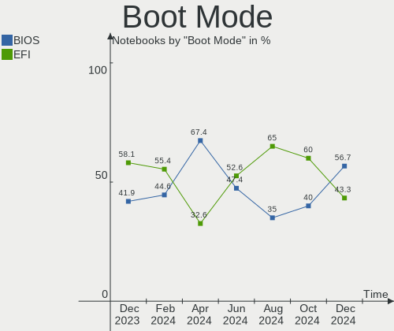
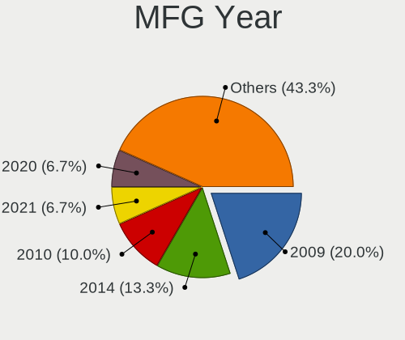

BlackPanther Hardware Trends (Notebooks)
----------------------------------------

A project to identify most popular hardware characteristics and track their change
over time based on data collected by BlackPanther users at https://Linux-Hardware.org.

Anyone can contribute to this report by the [hw-probe](https://github.com/linuxhw/hw-probe) tool:

    sudo -E hw-probe -all -upload

Full-feature report is available here: https://linux-hardware.org/?view=trends&formfactor=notebook

Period: Aug, 2021.

Contents
--------

* [ System ](#system)
  - [ OS                       ](#os)
  - [ OS Family                ](#os-family)
  - [ Kernel                   ](#kernel)
  - [ Kernel Family            ](#kernel-family)
  - [ Kernel Major Ver.        ](#kernel-major-ver)
  - [ Arch                     ](#arch)
  - [ DE                       ](#de)
  - [ Display Server           ](#display-server)
  - [ Display Manager          ](#display-manager)
  - [ OS Lang                  ](#os-lang)
  - [ Boot Mode                ](#boot-mode)
  - [ Filesystem               ](#filesystem)
  - [ Part. scheme             ](#part-scheme)
  - [ Dual Boot with Linux/BSD ](#dual-boot-with-linuxbsd)
  - [ Dual Boot (Win)          ](#dual-boot-win)

* [ Board ](#board)
  - [ Vendor                   ](#vendor)
  - [ Model                    ](#model)
  - [ Model Family             ](#model-family)
  - [ MFG Year                 ](#mfg-year)
  - [ Form Factor              ](#form-factor)
  - [ Secure Boot              ](#secure-boot)
  - [ Coreboot                 ](#coreboot)
  - [ RAM Size                 ](#ram-size)
  - [ RAM Used                 ](#ram-used)
  - [ Total Drives             ](#total-drives)
  - [ Has CD-ROM               ](#has-cd-rom)
  - [ Has Ethernet             ](#has-ethernet)
  - [ Has WiFi                 ](#has-wifi)
  - [ Has Bluetooth            ](#has-bluetooth)

* [ Location ](#location)
  - [ Country                  ](#country)
  - [ City                     ](#city)

* [ Drives ](#drives)
  - [ Drive Vendor             ](#drive-vendor)
  - [ Drive Model              ](#drive-model)
  - [ HDD Vendor               ](#hdd-vendor)
  - [ SSD Vendor               ](#ssd-vendor)
  - [ Drive Kind               ](#drive-kind)
  - [ Drive Connector          ](#drive-connector)
  - [ Drive Size               ](#drive-size)
  - [ Space Total              ](#space-total)
  - [ Space Used               ](#space-used)
  - [ Malfunc. Drives          ](#malfunc-drives)
  - [ Malfunc. Drive Vendor    ](#malfunc-drive-vendor)
  - [ Malfunc. HDD Vendor      ](#malfunc-hdd-vendor)
  - [ Malfunc. Drive Kind      ](#malfunc-drive-kind)
  - [ Failed Drives            ](#failed-drives)
  - [ Failed Drive Vendor      ](#failed-drive-vendor)
  - [ Drive Status             ](#drive-status)

* [ Storage controller ](#storage-controller)
  - [ Storage Vendor           ](#storage-vendor)
  - [ Storage Model            ](#storage-model)
  - [ Storage Kind             ](#storage-kind)

* [ Processor ](#processor)
  - [ CPU Vendor               ](#cpu-vendor)
  - [ CPU Model                ](#cpu-model)
  - [ CPU Model Family         ](#cpu-model-family)
  - [ CPU Cores                ](#cpu-cores)
  - [ CPU Sockets              ](#cpu-sockets)
  - [ CPU Threads              ](#cpu-threads)
  - [ CPU Op-Modes             ](#cpu-op-modes)
  - [ CPU Microcode            ](#cpu-microcode)
  - [ CPU Microarch            ](#cpu-microarch)

* [ Graphics ](#graphics)
  - [ GPU Vendor               ](#gpu-vendor)
  - [ GPU Model                ](#gpu-model)
  - [ GPU Combo                ](#gpu-combo)
  - [ GPU Driver               ](#gpu-driver)
  - [ GPU Memory               ](#gpu-memory)

* [ Monitor ](#monitor)
  - [ Monitor Vendor           ](#monitor-vendor)
  - [ Monitor Model            ](#monitor-model)
  - [ Monitor Resolution       ](#monitor-resolution)
  - [ Monitor Diagonal         ](#monitor-diagonal)
  - [ Monitor Width            ](#monitor-width)
  - [ Aspect Ratio             ](#aspect-ratio)
  - [ Monitor Area             ](#monitor-area)
  - [ Pixel Density            ](#pixel-density)
  - [ Multiple Monitors        ](#multiple-monitors)

* [ Network ](#network)
  - [ Net Controller Vendor    ](#net-controller-vendor)
  - [ Net Controller Model     ](#net-controller-model)
  - [ Wireless Vendor          ](#wireless-vendor)
  - [ Wireless Model           ](#wireless-model)
  - [ Ethernet Vendor          ](#ethernet-vendor)
  - [ Ethernet Model           ](#ethernet-model)
  - [ Net Controller Kind      ](#net-controller-kind)
  - [ Used Controller          ](#used-controller)
  - [ NICs                     ](#nics)
  - [ IPv6                     ](#ipv6)

* [ Bluetooth ](#bluetooth)
  - [ Bluetooth Vendor         ](#bluetooth-vendor)
  - [ Bluetooth Model          ](#bluetooth-model)

* [ Sound ](#sound)
  - [ Sound Vendor             ](#sound-vendor)
  - [ Sound Model              ](#sound-model)

* [ Memory ](#memory)
  - [ Memory Vendor            ](#memory-vendor)
  - [ Memory Model             ](#memory-model)
  - [ Memory Kind              ](#memory-kind)
  - [ Memory Form Factor       ](#memory-form-factor)
  - [ Memory Size              ](#memory-size)
  - [ Memory Speed             ](#memory-speed)

* [ Printers & scanners ](#printers--scanners)
  - [ Printer Vendor           ](#printer-vendor)
  - [ Printer Model            ](#printer-model)
  - [ Scanner Vendor           ](#scanner-vendor)
  - [ Scanner Model            ](#scanner-model)

* [ Camera ](#camera)
  - [ Camera Vendor            ](#camera-vendor)
  - [ Camera Model             ](#camera-model)

* [ Security ](#security)
  - [ Fingerprint Vendor       ](#fingerprint-vendor)
  - [ Fingerprint Model        ](#fingerprint-model)
  - [ Chipcard Vendor          ](#chipcard-vendor)
  - [ Chipcard Model           ](#chipcard-model)

* [ Unsupported ](#unsupported)
  - [ Unsupported Devices      ](#unsupported-devices)
  - [ Unsupported Device Types ](#unsupported-device-types)

System
------

OS
--

Installed operating systems

| Name              | Notebooks | Percent |
|-------------------|-----------|---------|
| BlackPanther 18.1 | 41        | 91.11%  |
| BlackPanther 16.2 | 4         | 8.89%   |

OS Family
---------

OS without a version

| Name         | Notebooks | Percent |
|--------------|-----------|---------|
| BlackPanther | 45        | 100%    |

Kernel
------

Version of the Linux kernel

| Version                | Notebooks | Percent |
|------------------------|-----------|---------|
| 5.6.14-desktop-2bP     | 31        | 68.89%  |
| 4.18.16-desktop-1bP    | 9         | 20%     |
| 4.9.20-desktop-pae-1bP | 4         | 8.89%   |
| 5.10.1-desktop-2bP     | 1         | 2.22%   |

Kernel Family
-------------

Linux kernel without a distro release

| Version | Notebooks | Percent |
|---------|-----------|---------|
| 5.6.14  | 31        | 68.89%  |
| 4.18.16 | 9         | 20%     |
| 4.9.20  | 4         | 8.89%   |
| 5.10.1  | 1         | 2.22%   |

Kernel Major Ver.
-----------------

Linux kernel major version

| Version | Notebooks | Percent |
|---------|-----------|---------|
| 5.6     | 31        | 68.89%  |
| 4.18    | 9         | 20%     |
| 4.9     | 4         | 8.89%   |
| 5.10    | 1         | 2.22%   |

Arch
----

OS architecture (x86_64, i586, etc.)

| Name   | Notebooks | Percent |
|--------|-----------|---------|
| x86_64 | 41        | 91.11%  |
| i686   | 4         | 8.89%   |

DE
--

Desktop Environment

| Name | Notebooks | Percent |
|------|-----------|---------|
| KDE5 | 44        | 97.78%  |
| KDE  | 1         | 2.22%   |

Display Server
--------------

X11 or Wayland

| Name | Notebooks | Percent |
|------|-----------|---------|
| X11  | 45        | 100%    |

Display Manager
---------------

SDDM, LightDM, etc.

| Name    | Notebooks | Percent |
|---------|-----------|---------|
| SDDM    | 44        | 97.78%  |
| Unknown | 1         | 2.22%   |

OS Lang
-------

Language

| Lang    | Notebooks | Percent |
|---------|-----------|---------|
| Unknown | 44        | 97.78%  |
| hu_HU   | 1         | 2.22%   |

Boot Mode
---------

EFI or BIOS

| Mode | Notebooks | Percent |
|------|-----------|---------|
| BIOS | 32        | 71.11%  |
| EFI  | 13        | 28.89%  |

Filesystem
----------

Type of filesystem

| Type    | Notebooks | Percent |
|---------|-----------|---------|
| Overlay | 35        | 77.78%  |
| Ext4    | 10        | 22.22%  |

Part. scheme
------------

Scheme of partitioning

| Type    | Notebooks | Percent |
|---------|-----------|---------|
| MBR     | 30        | 66.67%  |
| GPT     | 13        | 28.89%  |
| Unknown | 2         | 4.44%   |

Dual Boot with Linux/BSD
------------------------

Hosting more than one Linux/BSD

| Dual boot | Notebooks | Percent |
|-----------|-----------|---------|
| No        | 25        | 55.56%  |
| Yes       | 20        | 44.44%  |

Dual Boot (Win)
---------------

Hosting Linux and Windows

| Dual boot | Notebooks | Percent |
|-----------|-----------|---------|
| No        | 26        | 57.78%  |
| Yes       | 19        | 42.22%  |

Board
-----

Vendor
------

Motherboard manufacturer

| Name                | Notebooks | Percent |
|---------------------|-----------|---------|
| Lenovo              | 10        | 22.22%  |
| Hewlett-Packard     | 8         | 17.78%  |
| Dell                | 8         | 17.78%  |
| Samsung Electronics | 3         | 6.67%   |
| MSI                 | 3         | 6.67%   |
| Toshiba             | 2         | 4.44%   |
| Packard Bell        | 2         | 4.44%   |
| Insyde              | 2         | 4.44%   |
| Fujitsu Siemens     | 2         | 4.44%   |
| ASUSTek Computer    | 2         | 4.44%   |
| Acer                | 2         | 4.44%   |
| Apple               | 1         | 2.22%   |

Model
-----

Motherboard model

| Name                                       | Notebooks | Percent |
|--------------------------------------------|-----------|---------|
| Insyde Braswell                            | 2         | 4.44%   |
| Toshiba Satellite L750                     | 1         | 2.22%   |
| Toshiba Satellite C55-A-19D                | 1         | 2.22%   |
| Samsung R540/R580/R780/SA41/E452/E852      | 1         | 2.22%   |
| Samsung NC210/NC110                        | 1         | 2.22%   |
| Samsung 300E4A/300E5A/300E7A/3430EA/3530EA | 1         | 2.22%   |
| Packard Bell EasyNote TK36                 | 1         | 2.22%   |
| Packard Bell DOT S                         | 1         | 2.22%   |
| MSI U-100                                  | 1         | 2.22%   |
| MSI M670                                   | 1         | 2.22%   |
| MSI GP70 2OD                               | 1         | 2.22%   |
| Lenovo V145-15AST 81MT                     | 1         | 2.22%   |
| Lenovo ThinkPad X60 1706GMG                | 1         | 2.22%   |
| Lenovo ThinkPad T430 2349KQ3               | 1         | 2.22%   |
| Lenovo ThinkPad T420 4236Z9U               | 1         | 2.22%   |
| Lenovo ThinkPad L420 78544UG               | 1         | 2.22%   |
| Lenovo IdeaPad L340-17IRH Gaming 81LL      | 1         | 2.22%   |
| Lenovo IdeaPad Flex 15 20309               | 1         | 2.22%   |
| Lenovo IdeaPad 330-15IGM 81D1              | 1         | 2.22%   |
| Lenovo IdeaPad 320-15IAP 80XR              | 1         | 2.22%   |
| Lenovo Flex 2-14D 20376                    | 1         | 2.22%   |
| HP ProBook 6470b                           | 1         | 2.22%   |
| HP ProBook 6450b                           | 1         | 2.22%   |
| HP G62                                     | 1         | 2.22%   |
| HP Compaq nc6400 (RM100AW#ABU)             | 1         | 2.22%   |
| HP 630                                     | 1         | 2.22%   |
| HP 250 G6 Notebook PC                      | 1         | 2.22%   |
| HP 250 G5 Notebook PC                      | 1         | 2.22%   |
| HP 2000                                    | 1         | 2.22%   |
| Fujitsu Siemens ESPRIMO Mobile D9500       | 1         | 2.22%   |
| Fujitsu Siemens AMILO PRO V3515            | 1         | 2.22%   |
| Dell Precision 5520                        | 1         | 2.22%   |
| Dell Latitude E7450                        | 1         | 2.22%   |
| Dell Latitude E6400                        | 1         | 2.22%   |
| Dell Latitude E6320                        | 1         | 2.22%   |
| Dell Latitude D630                         | 1         | 2.22%   |
| Dell Latitude 7390                         | 1         | 2.22%   |
| Dell Inspiron 1564                         | 1         | 2.22%   |
| Dell G3 3579                               | 1         | 2.22%   |
| ASUS ASUS TUF Gaming A15 FA506IU_FX506IU   | 1         | 2.22%   |
| ASUS A7U                                   | 1         | 2.22%   |
| Apple MacBookPro5,5                        | 1         | 2.22%   |
| Acer Aspire ES1-572                        | 1         | 2.22%   |
| Acer Aspire 5315                           | 1         | 2.22%   |

Model Family
------------

Motherboard model prefix

| Name                    | Notebooks | Percent |
|-------------------------|-----------|---------|
| Dell Latitude           | 5         | 11.11%  |
| Lenovo ThinkPad         | 4         | 8.89%   |
| Lenovo IdeaPad          | 4         | 8.89%   |
| Toshiba Satellite       | 2         | 4.44%   |
| Insyde Braswell         | 2         | 4.44%   |
| HP ProBook              | 2         | 4.44%   |
| HP 250                  | 2         | 4.44%   |
| Acer Aspire             | 2         | 4.44%   |
| Samsung R540            | 1         | 2.22%   |
| Samsung NC210           | 1         | 2.22%   |
| Samsung 300E4A          | 1         | 2.22%   |
| Packard Bell EasyNote   | 1         | 2.22%   |
| Packard Bell DOT        | 1         | 2.22%   |
| MSI U-100               | 1         | 2.22%   |
| MSI M670                | 1         | 2.22%   |
| MSI GP70                | 1         | 2.22%   |
| Lenovo V145-15AST       | 1         | 2.22%   |
| Lenovo Flex             | 1         | 2.22%   |
| HP G62                  | 1         | 2.22%   |
| HP Compaq               | 1         | 2.22%   |
| HP 630                  | 1         | 2.22%   |
| HP 2000                 | 1         | 2.22%   |
| Fujitsu Siemens ESPRIMO | 1         | 2.22%   |
| Fujitsu Siemens AMILO   | 1         | 2.22%   |
| Dell Precision          | 1         | 2.22%   |
| Dell Inspiron           | 1         | 2.22%   |
| Dell G3                 | 1         | 2.22%   |
| ASUS ASUS               | 1         | 2.22%   |
| ASUS A7U                | 1         | 2.22%   |
| Apple MacBookPro5       | 1         | 2.22%   |

MFG Year
--------

Motherboard manufacture year

| Year | Notebooks | Percent |
|------|-----------|---------|
| 2013 | 6         | 13.33%  |
| 2010 | 5         | 11.11%  |
| 2021 | 4         | 8.89%   |
| 2020 | 4         | 8.89%   |
| 2012 | 4         | 8.89%   |
| 2011 | 4         | 8.89%   |
| 2008 | 4         | 8.89%   |
| 2007 | 4         | 8.89%   |
| 2016 | 3         | 6.67%   |
| 2014 | 2         | 4.44%   |
| 2009 | 2         | 4.44%   |
| 2019 | 1         | 2.22%   |
| 2018 | 1         | 2.22%   |
| 2017 | 1         | 2.22%   |

Form Factor
-----------

Physical design of the computer

| Name     | Notebooks | Percent |
|----------|-----------|---------|
| Notebook | 45        | 100%    |

Secure Boot
-----------

Enabled or disabled

| State    | Notebooks | Percent |
|----------|-----------|---------|
| Disabled | 45        | 100%    |

Coreboot
--------

Have coreboot on board

| Used | Notebooks | Percent |
|------|-----------|---------|
| No   | 45        | 100%    |

RAM Size
--------

Total RAM memory

| Size in GB | Notebooks | Percent |
|------------|-----------|---------|
| 3.01-4.0   | 17        | 37.78%  |
| 4.01-8.0   | 12        | 26.67%  |
| 1.01-2.0   | 7         | 15.56%  |
| 2.01-3.0   | 4         | 8.89%   |
| 16.01-24.0 | 3         | 6.67%   |
| 32.01-64.0 | 1         | 2.22%   |
| 8.01-16.0  | 1         | 2.22%   |

RAM Used
--------

Used RAM memory

| Used GB  | Notebooks | Percent |
|----------|-----------|---------|
| 0.51-1.0 | 28        | 62.22%  |
| 1.01-2.0 | 10        | 22.22%  |
| 0.01-0.5 | 6         | 13.33%  |
| 2.01-3.0 | 1         | 2.22%   |

Total Drives
------------

Number of drives on board

| Drives | Notebooks | Percent |
|--------|-----------|---------|
| 1      | 31        | 68.89%  |
| 2      | 12        | 26.67%  |
| 3      | 1         | 2.22%   |
| 0      | 1         | 2.22%   |

Has CD-ROM
----------

Has CD-ROM on board

| Presented | Notebooks | Percent |
|-----------|-----------|---------|
| Yes       | 25        | 55.56%  |
| No        | 20        | 44.44%  |

Has Ethernet
------------

Has Ethernet on board

| Presented | Notebooks | Percent |
|-----------|-----------|---------|
| Yes       | 42        | 93.33%  |
| No        | 3         | 6.67%   |

Has WiFi
--------

Has WiFi module

| Presented | Notebooks | Percent |
|-----------|-----------|---------|
| Yes       | 45        | 100%    |

Has Bluetooth
-------------

Has Bluetooth module

| Presented | Notebooks | Percent |
|-----------|-----------|---------|
| Yes       | 36        | 80%     |
| No        | 9         | 20%     |

Location
--------

Country
-------

Geographic location (country)

| Country     | Notebooks | Percent |
|-------------|-----------|---------|
| Hungary     | 33        | 73.33%  |
| Germany     | 3         | 6.67%   |
| USA         | 2         | 4.44%   |
| UK          | 1         | 2.22%   |
| Switzerland | 1         | 2.22%   |
| Slovenia    | 1         | 2.22%   |
| Serbia      | 1         | 2.22%   |
| Romania     | 1         | 2.22%   |
| Italy       | 1         | 2.22%   |
| Argentina   | 1         | 2.22%   |

City
----

Geographic location (city)

| City              | Notebooks | Percent |
|-------------------|-----------|---------|
| Budapest          | 5         | 11.11%  |
| Szeksz??rd        | 4         | 8.89%   |
| Tarnok            | 2         | 4.44%   |
| Zurich            | 1         | 2.22%   |
| Zichyujfalu       | 1         | 2.22%   |
| Szentes           | 1         | 2.22%   |
| Sz?©kesfeh?©rv??r | 1         | 2.22%   |
| Senta             | 1         | 2.22%   |
| Sarospatak        | 1         | 2.22%   |
| Sarbogard         | 1         | 2.22%   |
| Petershagen       | 1         | 2.22%   |
| P?©cs             | 1         | 2.22%   |
| Pap               | 1         | 2.22%   |
| Oroshaza          | 1         | 2.22%   |
| Nyiregyhaza       | 1         | 2.22%   |
| North Hollywood   | 1         | 2.22%   |
| Nagykanizsa       | 1         | 2.22%   |
| Munro             | 1         | 2.22%   |
| Miskolc           | 1         | 2.22%   |
| Miercurea-Ciuc    | 1         | 2.22%   |
| Memmelsdorf       | 1         | 2.22%   |
| Littleton         | 1         | 2.22%   |
| Koper             | 1         | 2.22%   |
| Kazincbarcika     | 1         | 2.22%   |
| Karcag            | 1         | 2.22%   |
| Harlow            | 1         | 2.22%   |
| Hajduszoboszlo    | 1         | 2.22%   |
| Gy?‘r             | 1         | 2.22%   |
| G?¶d?¶ll?‘        | 1         | 2.22%   |
| Frankfurt am Main | 1         | 2.22%   |
| Foggia            | 1         | 2.22%   |
| Esztergom         | 1         | 2.22%   |
| Eger              | 1         | 2.22%   |
| Debrecen          | 1         | 2.22%   |
| Beretty????jfalu  | 1         | 2.22%   |
| B?©k?©scsaba      | 1         | 2.22%   |
| Baja              | 1         | 2.22%   |

Drives
------

Drive Vendor
------------

Hard drive vendors

| Vendor              | Notebooks | Drives | Percent |
|---------------------|-----------|--------|---------|
| Toshiba             | 13        | 13     | 25%     |
| WDC                 | 11        | 12     | 21.15%  |
| Seagate             | 9         | 9      | 17.31%  |
| Hitachi             | 5         | 5      | 9.62%   |
| Unknown             | 3         | 3      | 5.77%   |
| Samsung Electronics | 3         | 3      | 5.77%   |
| Kingston            | 3         | 4      | 5.77%   |
| Micron Technology   | 2         | 2      | 3.85%   |
| SATAFIRM            | 1         | 1      | 1.92%   |
| Patriot             | 1         | 1      | 1.92%   |
| KingSpec            | 1         | 1      | 1.92%   |

Drive Model
-----------

Hard drive models

| Model                                   | Notebooks | Percent |
|-----------------------------------------|-----------|---------|
| Toshiba MQ01ABF050 500GB                | 3         | 5.56%   |
| WDC WD10SPZX-24Z10 1TB                  | 2         | 3.7%    |
| WDC WD10JPVX-22JC3T0 1TB                | 2         | 3.7%    |
| Unknown HCG4a2  64GB                    | 2         | 3.7%    |
| Seagate ST500LT012-1DG142 500GB         | 2         | 3.7%    |
| Seagate ST500LM000-1EJ162 500GB         | 2         | 3.7%    |
| Kingston SA400S37120G 120GB SSD         | 2         | 3.7%    |
| Hitachi HTS543232A7A384 320GB           | 2         | 3.7%    |
| Hitachi HTS541680J9SA00 80GB            | 2         | 3.7%    |
| WDC WDS500G3X0C-00SJG0 500GB            | 1         | 1.85%   |
| WDC WD5000LPCX-24C6HT0 500GB            | 1         | 1.85%   |
| WDC WD3200BPVT-22JJ5T0 320GB            | 1         | 1.85%   |
| WDC WD2500BEVT-75A23T0 250GB            | 1         | 1.85%   |
| WDC WD1600BEVT-75A23T0 160GB            | 1         | 1.85%   |
| WDC WD1600BEVT-22ZCT0 160GB             | 1         | 1.85%   |
| WDC WD10SPZX-00Z10T0 1TB                | 1         | 1.85%   |
| WDC WD10 EZEX-08WN4A0 1TB               | 1         | 1.85%   |
| Unknown SC16G  16GB                     | 1         | 1.85%   |
| Toshiba TL100 120GB SSD                 | 1         | 1.85%   |
| Toshiba THNSFJ256GCSU 256GB SSD         | 1         | 1.85%   |
| Toshiba MQ01ABD100 1TB                  | 1         | 1.85%   |
| Toshiba MQ01ABD075 752GB                | 1         | 1.85%   |
| Toshiba MQ01ABD050 500GB                | 1         | 1.85%   |
| Toshiba MK5076GSX 500GB                 | 1         | 1.85%   |
| Toshiba KXG50ZNV1T02 NVMe 1024GB        | 1         | 1.85%   |
| Toshiba KSG60ZMV256G M.2 2280 256GB SSD | 1         | 1.85%   |
| Toshiba KBG40ZNS256G NVMe 256GB         | 1         | 1.85%   |
| Toshiba HDWL120 2TB                     | 1         | 1.85%   |
| Seagate ST980811AS 80GB                 | 1         | 1.85%   |
| Seagate ST9120821AS 120GB               | 1         | 1.85%   |
| Seagate ST500LM000-SSHD-8GB             | 1         | 1.85%   |
| Seagate ST1000LM035-1RK172 1TB          | 1         | 1.85%   |
| Seagate ST1000LM 024 HN-M101MBB 1TB     | 1         | 1.85%   |
| SATAFIRM S11 120GB                      | 1         | 1.85%   |
| Samsung MZVLB512HBJQ-000L7 512GB        | 1         | 1.85%   |
| Samsung HM321HI 320GB                   | 1         | 1.85%   |
| Samsung HM160HI 160GB                   | 1         | 1.85%   |
| Patriot Burst 480GB SSD                 | 1         | 1.85%   |
| Micron MTFDDAK256TDL 256GB SSD          | 1         | 1.85%   |
| Micron 2210_MTFDHBA512QFD 512GB         | 1         | 1.85%   |
| Kingston SA400S37480G 480GB SSD         | 1         | 1.85%   |
| Kingston SA400S37240G 240GB SSD         | 1         | 1.85%   |
| KingSpec P3-128 128GB SSD               | 1         | 1.85%   |
| Hitachi HTS545016B9SA02 160GB           | 1         | 1.85%   |

HDD Vendor
----------

Hard disk drive vendors

| Vendor              | Notebooks | Drives | Percent |
|---------------------|-----------|--------|---------|
| WDC                 | 11        | 11     | 30.56%  |
| Seagate             | 9         | 9      | 25%     |
| Toshiba             | 8         | 8      | 22.22%  |
| Hitachi             | 5         | 5      | 13.89%  |
| Samsung Electronics | 2         | 2      | 5.56%   |
| SATAFIRM            | 1         | 1      | 2.78%   |

SSD Vendor
----------

Solid state drive vendors

| Vendor            | Notebooks | Drives | Percent |
|-------------------|-----------|--------|---------|
| Toshiba           | 3         | 3      | 33.33%  |
| Kingston          | 3         | 4      | 33.33%  |
| Patriot           | 1         | 1      | 11.11%  |
| Micron Technology | 1         | 1      | 11.11%  |
| KingSpec          | 1         | 1      | 11.11%  |

Drive Kind
----------

HDD or SSD

| Kind | Notebooks | Drives | Percent |
|------|-----------|--------|---------|
| HDD  | 33        | 36     | 67.35%  |
| SSD  | 9         | 10     | 18.37%  |
| NVMe | 4         | 5      | 8.16%   |
| MMC  | 3         | 3      | 6.12%   |

Drive Connector
---------------

SATA, SAS, NVMe, etc.

| Type | Notebooks | Drives | Percent |
|------|-----------|--------|---------|
| SATA | 41        | 44     | 82%     |
| NVMe | 4         | 5      | 8%      |
| MMC  | 3         | 3      | 6%      |
| SAS  | 2         | 2      | 4%      |

Drive Size
----------

Size of hard drive

| Size in TB | Notebooks | Drives | Percent |
|------------|-----------|--------|---------|
| 0.01-0.5   | 34        | 35     | 77.27%  |
| 0.51-1.0   | 9         | 10     | 20.45%  |
| 1.01-2.0   | 1         | 1      | 2.27%   |

Space Total
-----------

Amount of disk space available on the file system

| Size in GB | Notebooks | Percent |
|------------|-----------|---------|
| Unknown    | 33        | 73.33%  |
| 101-250    | 4         | 8.89%   |
| 51-100     | 3         | 6.67%   |
| 251-500    | 2         | 4.44%   |
| 1001-2000  | 2         | 4.44%   |
| 1-20       | 1         | 2.22%   |

Space Used
----------

Amount of used disk space

| Used GB | Notebooks | Percent |
|---------|-----------|---------|
| Unknown | 33        | 73.33%  |
| 1-20    | 7         | 15.56%  |
| 21-50   | 3         | 6.67%   |
| 251-500 | 1         | 2.22%   |
| 101-250 | 1         | 2.22%   |

Malfunc. Drives
---------------

Drive models with a malfunction

| Model                             | Notebooks | Drives | Percent |
|-----------------------------------|-----------|--------|---------|
| Toshiba MQ01ABF050 500GB          | 2         | 2      | 11.76%  |
| Seagate ST500LT012-1DG142 500GB   | 2         | 2      | 11.76%  |
| Hitachi HTS541680J9SA00 80GB      | 2         | 2      | 11.76%  |
| WDC WD1600BEVT-22ZCT0 160GB       | 1         | 1      | 5.88%   |
| WDC WD10JPVX-22JC3T0 1TB          | 1         | 1      | 5.88%   |
| WDC WD10 EZEX-08WN4A0 1TB         | 1         | 1      | 5.88%   |
| Toshiba THNSFJ256GCSU 256GB SSD   | 1         | 1      | 5.88%   |
| Toshiba MQ01ABD100 1TB            | 1         | 1      | 5.88%   |
| Toshiba MQ01ABD075 752GB          | 1         | 1      | 5.88%   |
| Seagate ST9120821AS 120GB         | 1         | 1      | 5.88%   |
| Samsung Electronics HM321HI 320GB | 1         | 1      | 5.88%   |
| Samsung Electronics HM160HI 160GB | 1         | 1      | 5.88%   |
| Hitachi HTS545016B9SA02 160GB     | 1         | 1      | 5.88%   |
| Hitachi HTS543232A7A384 320GB     | 1         | 1      | 5.88%   |

Malfunc. Drive Vendor
---------------------

Vendors of faulty drives

| Vendor              | Notebooks | Drives | Percent |
|---------------------|-----------|--------|---------|
| Toshiba             | 5         | 5      | 29.41%  |
| Hitachi             | 4         | 4      | 23.53%  |
| WDC                 | 3         | 3      | 17.65%  |
| Seagate             | 3         | 3      | 17.65%  |
| Samsung Electronics | 2         | 2      | 11.76%  |

Malfunc. HDD Vendor
-------------------

Vendors of faulty HDD drives

| Vendor              | Notebooks | Drives | Percent |
|---------------------|-----------|--------|---------|
| Toshiba             | 4         | 4      | 25%     |
| Hitachi             | 4         | 4      | 25%     |
| WDC                 | 3         | 3      | 18.75%  |
| Seagate             | 3         | 3      | 18.75%  |
| Samsung Electronics | 2         | 2      | 12.5%   |

Malfunc. Drive Kind
-------------------

Kinds of faulty drives

| Kind | Notebooks | Drives | Percent |
|------|-----------|--------|---------|
| HDD  | 14        | 16     | 93.33%  |
| SSD  | 1         | 1      | 6.67%   |

Failed Drives
-------------

Failed drive models

Zero info for selected period =(

Failed Drive Vendor
-------------------

Failed drive vendors

Zero info for selected period =(

Drive Status
------------

Number of failed and malfunc. drives

| Status   | Notebooks | Drives | Percent |
|----------|-----------|--------|---------|
| Works    | 26        | 31     | 57.78%  |
| Malfunc  | 14        | 17     | 31.11%  |
| Detected | 5         | 6      | 11.11%  |

Storage controller
------------------

Storage Vendor
--------------

Storage controller vendors

| Vendor                       | Notebooks | Percent |
|------------------------------|-----------|---------|
| Intel                        | 35        | 71.43%  |
| AMD                          | 5         | 10.2%   |
| Nvidia                       | 2         | 4.08%   |
| VIA Technologies             | 1         | 2.04%   |
| Toshiba America Info Systems | 1         | 2.04%   |
| Sandisk                      | 1         | 2.04%   |
| Samsung Electronics          | 1         | 2.04%   |
| Micron Technology            | 1         | 2.04%   |
| KIOXIA                       | 1         | 2.04%   |
| JMicron Technology           | 1         | 2.04%   |

Storage Model
-------------

Storage controller models

| Model                                                                                  | Notebooks | Percent |
|----------------------------------------------------------------------------------------|-----------|---------|
| Intel 7 Series Chipset Family 6-port SATA Controller [AHCI mode]                       | 4         | 6.9%    |
| Intel 6 Series/C200 Series Chipset Family 6 port Mobile SATA AHCI Controller           | 4         | 6.9%    |
| Intel 82801HM/HEM (ICH8M/ICH8M-E) IDE Controller                                       | 3         | 5.17%   |
| Intel 5 Series/3400 Series Chipset 4 port SATA AHCI Controller                         | 3         | 5.17%   |
| AMD FCH SATA Controller [AHCI mode]                                                    | 3         | 5.17%   |
| Intel Celeron/Pentium Silver Processor SATA Controller                                 | 2         | 3.45%   |
| Intel Cannon Lake Mobile PCH SATA AHCI Controller                                      | 2         | 3.45%   |
| Intel 82801IBM/IEM (ICH9M/ICH9M-E) 4 port SATA Controller [AHCI mode]                  | 2         | 3.45%   |
| Intel 82801HM/HEM (ICH8M/ICH8M-E) SATA Controller [AHCI mode]                          | 2         | 3.45%   |
| Intel 82801GBM/GHM (ICH7-M Family) SATA Controller [AHCI mode]                         | 2         | 3.45%   |
| Intel 82801G (ICH7 Family) IDE Controller                                              | 2         | 3.45%   |
| Intel 82801 Mobile SATA Controller [RAID mode]                                         | 2         | 3.45%   |
| VIA VT82C586A/B/VT82C686/A/B/VT823x/A/C PIPC Bus Master IDE                            | 1         | 1.72%   |
| VIA VT8237A SATA 2-Port Controller                                                     | 1         | 1.72%   |
| Toshiba America Info Systems Toshiba America Info Non-Volatile memory controller       | 1         | 1.72%   |
| Sandisk WD Black SN750 / PC SN730 NVMe SSD                                             | 1         | 1.72%   |
| Samsung NVMe SSD Controller SM981/PM981/PM983                                          | 1         | 1.72%   |
| Nvidia MCP79 AHCI Controller                                                           | 1         | 1.72%   |
| Nvidia MCP51 Serial ATA Controller                                                     | 1         | 1.72%   |
| Nvidia MCP51 IDE                                                                       | 1         | 1.72%   |
| Micron Non-Volatile memory controller                                                  | 1         | 1.72%   |
| KIOXIA Non-Volatile memory controller                                                  | 1         | 1.72%   |
| JMicron JMB360 AHCI Controller                                                         | 1         | 1.72%   |
| Intel Sunrise Point-LP SATA Controller [AHCI mode]                                     | 1         | 1.72%   |
| Intel SATA Controller [RAID mode]                                                      | 1         | 1.72%   |
| Intel NM10/ICH7 Family SATA Controller [IDE mode]                                      | 1         | 1.72%   |
| Intel NM10/ICH7 Family SATA Controller [AHCI mode]                                     | 1         | 1.72%   |
| Intel Celeron N3350/Pentium N4200/Atom E3900 Series SATA AHCI Controller               | 1         | 1.72%   |
| Intel Atom/Celeron/Pentium Processor x5-E8000/J3xxx/N3xxx Series SATA Controller       | 1         | 1.72%   |
| Intel 82801HM/HEM (ICH8M/ICH8M-E) SATA Controller [IDE mode]                           | 1         | 1.72%   |
| Intel 82801GBM/GHM (ICH7-M Family) SATA Controller [IDE mode]                          | 1         | 1.72%   |
| Intel 8 Series/C220 Series Chipset Family 6-port SATA Controller 1 [AHCI mode]         | 1         | 1.72%   |
| Intel 8 Series SATA Controller 1 [AHCI mode]                                           | 1         | 1.72%   |
| Intel 6 Series/C200 Series Chipset Family Mobile SATA Controller (IDE mode, ports 4-5) | 1         | 1.72%   |
| Intel 6 Series/C200 Series Chipset Family Mobile SATA Controller (IDE mode, ports 0-3) | 1         | 1.72%   |
| Intel 5 Series/3400 Series Chipset 6 port SATA AHCI Controller                         | 1         | 1.72%   |
| AMD SB7x0/SB8x0/SB9x0 SATA Controller [AHCI mode]                                      | 1         | 1.72%   |
| AMD SB600 Non-Raid-5 SATA                                                              | 1         | 1.72%   |
| AMD SB600 IDE                                                                          | 1         | 1.72%   |

Storage Kind
------------

Kind of storage controller (IDE, SATA, NVMe, SAS, ...)

| Kind | Notebooks | Percent |
|------|-----------|---------|
| SATA | 34        | 65.38%  |
| IDE  | 11        | 21.15%  |
| NVMe | 4         | 7.69%   |
| RAID | 3         | 5.77%   |

Processor
---------

CPU Vendor
----------

Processor vendors

| Vendor | Notebooks | Percent |
|--------|-----------|---------|
| Intel  | 39        | 86.67%  |
| AMD    | 6         | 13.33%  |

CPU Model
---------

Processor models

| Model                                        | Notebooks | Percent |
|----------------------------------------------|-----------|---------|
| Intel Core i5-2520M CPU @ 2.50GHz            | 3         | 6.67%   |
| Intel Core 2 Duo CPU T7250 @ 2.00GHz         | 2         | 4.44%   |
| Intel Celeron N4000 CPU @ 1.10GHz            | 2         | 4.44%   |
| Intel Celeron CPU N3050 @ 1.60GHz            | 2         | 4.44%   |
| Intel Core i7-7820HQ CPU @ 2.90GHz           | 1         | 2.22%   |
| Intel Core i7-4700MQ CPU @ 2.40GHz           | 1         | 2.22%   |
| Intel Core i5-9300H CPU @ 2.40GHz            | 1         | 2.22%   |
| Intel Core i5-8300H CPU @ 2.30GHz            | 1         | 2.22%   |
| Intel Core i5-7300U CPU @ 2.60GHz            | 1         | 2.22%   |
| Intel Core i5-7200U CPU @ 2.50GHz            | 1         | 2.22%   |
| Intel Core i5-5300U CPU @ 2.30GHz            | 1         | 2.22%   |
| Intel Core i5-4200U CPU @ 1.60GHz            | 1         | 2.22%   |
| Intel Core i5-3340M CPU @ 2.70GHz            | 1         | 2.22%   |
| Intel Core i5-3320M CPU @ 2.60GHz            | 1         | 2.22%   |
| Intel Core i5-2430M CPU @ 2.40GHz            | 1         | 2.22%   |
| Intel Core i3-3110M CPU @ 2.40GHz            | 1         | 2.22%   |
| Intel Core i3-2350M CPU @ 2.30GHz            | 1         | 2.22%   |
| Intel Core i3 CPU M 380 @ 2.53GHz            | 1         | 2.22%   |
| Intel Core i3 CPU M 370 @ 2.40GHz            | 1         | 2.22%   |
| Intel Core i3 CPU M 330 @ 2.13GHz            | 1         | 2.22%   |
| Intel Core 2 Duo CPU T9300 @ 2.50GHz         | 1         | 2.22%   |
| Intel Core 2 Duo CPU T8300 @ 2.40GHz         | 1         | 2.22%   |
| Intel Core 2 Duo CPU T5250 @ 1.50GHz         | 1         | 2.22%   |
| Intel Core 2 Duo CPU P7550 @ 2.26GHz         | 1         | 2.22%   |
| Intel Core 2 CPU T7200 @ 2.00GHz             | 1         | 2.22%   |
| Intel Core 2 CPU T5600 @ 1.83GHz             | 1         | 2.22%   |
| Intel Celeron M CPU 450 @ 2.00GHz            | 1         | 2.22%   |
| Intel Celeron CPU P4500 @ 1.87GHz            | 1         | 2.22%   |
| Intel Celeron CPU N3350 @ 1.10GHz            | 1         | 2.22%   |
| Intel Celeron CPU N3060 @ 1.60GHz            | 1         | 2.22%   |
| Intel Celeron CPU 1000M @ 1.80GHz            | 1         | 2.22%   |
| Intel Atom CPU N570 @ 1.66GHz                | 1         | 2.22%   |
| Intel Atom CPU N270 @ 1.60GHz                | 1         | 2.22%   |
| Intel Atom CPU N2600 @ 1.60GHz               | 1         | 2.22%   |
| AMD Ryzen 7 4800H with Radeon Graphics       | 1         | 2.22%   |
| AMD Mobile Sempron Processor 3600+           | 1         | 2.22%   |
| AMD Athlon II P320 Dual-Core Processor       | 1         | 2.22%   |
| AMD Athlon 64 X2 Dual-Core Processor TK-57   | 1         | 2.22%   |
| AMD A6-6310 APU with AMD Radeon R4 Graphics  | 1         | 2.22%   |
| AMD A4-9125 RADEON R3, 4 COMPUTE CORES 2C+2G | 1         | 2.22%   |

CPU Model Family
----------------

Processor model prefix

| Model              | Notebooks | Percent |
|--------------------|-----------|---------|
| Intel Core i5      | 12        | 26.67%  |
| Intel Celeron      | 8         | 17.78%  |
| Intel Core 2 Duo   | 6         | 13.33%  |
| Intel Core i3      | 5         | 11.11%  |
| Intel Atom         | 3         | 6.67%   |
| Intel Core i7      | 2         | 4.44%   |
| Intel Core 2       | 2         | 4.44%   |
| Intel Celeron M    | 1         | 2.22%   |
| AMD Ryzen 7        | 1         | 2.22%   |
| AMD Mobile Sempron | 1         | 2.22%   |
| AMD Athlon II      | 1         | 2.22%   |
| AMD Athlon 64 X2   | 1         | 2.22%   |
| AMD A6             | 1         | 2.22%   |
| AMD A4             | 1         | 2.22%   |

CPU Cores
---------

Number of processor cores

| Number | Notebooks | Percent |
|--------|-----------|---------|
| 2      | 36        | 80%     |
| 4      | 5         | 11.11%  |
| 1      | 3         | 6.67%   |
| 8      | 1         | 2.22%   |

CPU Sockets
-----------

Number of sockets

| Number | Notebooks | Percent |
|--------|-----------|---------|
| 1      | 45        | 100%    |

CPU Threads
-----------

Threads per core (Hyper-Threading)

| Number | Notebooks | Percent |
|--------|-----------|---------|
| 2      | 23        | 51.11%  |
| 1      | 22        | 48.89%  |

CPU Op-Modes
------------

CPU Operation Modes (32-bit, 64-bit)

| Op mode        | Notebooks | Percent |
|----------------|-----------|---------|
| 32-bit, 64-bit | 43        | 95.56%  |
| 32-bit         | 2         | 4.44%   |

CPU Microcode
-------------

Microcode number

| Number     | Notebooks | Percent |
|------------|-----------|---------|
| 0x206a7    | 5         | 11.11%  |
| 0x306a9    | 4         | 8.89%   |
| 0x6fd      | 3         | 6.67%   |
| 0x906ea    | 2         | 4.44%   |
| 0x806e9    | 2         | 4.44%   |
| 0x706a1    | 2         | 4.44%   |
| 0x406c3    | 2         | 4.44%   |
| 0x20655    | 2         | 4.44%   |
| 0x20652    | 2         | 4.44%   |
| 0x10676    | 2         | 4.44%   |
| Unknown    | 2         | 4.44%   |
| 0x906e9    | 1         | 2.22%   |
| 0x6f6      | 1         | 2.22%   |
| 0x6f2      | 1         | 2.22%   |
| 0x6ec      | 1         | 2.22%   |
| 0x506c9    | 1         | 2.22%   |
| 0x406c4    | 1         | 2.22%   |
| 0x40651    | 1         | 2.22%   |
| 0x306d4    | 1         | 2.22%   |
| 0x306c3    | 1         | 2.22%   |
| 0x30661    | 1         | 2.22%   |
| 0x106ca    | 1         | 2.22%   |
| 0x106c2    | 1         | 2.22%   |
| 0x1067a    | 1         | 2.22%   |
| 0x08600104 | 1         | 2.22%   |
| 0x07030104 | 1         | 2.22%   |
| 0x06006705 | 1         | 2.22%   |
| 0x010000c8 | 1         | 2.22%   |

CPU Microarch
-------------

Microarchitecture

| Name          | Notebooks | Percent |
|---------------|-----------|---------|
| SandyBridge   | 5         | 11.11%  |
| KabyLake      | 5         | 11.11%  |
| Core          | 5         | 11.11%  |
| Westmere      | 4         | 8.89%   |
| IvyBridge     | 4         | 8.89%   |
| Silvermont    | 3         | 6.67%   |
| Penryn        | 3         | 6.67%   |
| Bonnell       | 3         | 6.67%   |
| K8 Hammer     | 2         | 4.44%   |
| Haswell       | 2         | 4.44%   |
| Goldmont plus | 2         | 4.44%   |
| Zen 2         | 1         | 2.22%   |
| Puma          | 1         | 2.22%   |
| P6            | 1         | 2.22%   |
| K10           | 1         | 2.22%   |
| Goldmont      | 1         | 2.22%   |
| Excavator     | 1         | 2.22%   |
| Broadwell     | 1         | 2.22%   |

Graphics
--------

GPU Vendor
----------

Vendors of graphics cards

| Vendor           | Notebooks | Percent |
|------------------|-----------|---------|
| Intel            | 35        | 68.63%  |
| Nvidia           | 9         | 17.65%  |
| AMD              | 6         | 11.76%  |
| VIA Technologies | 1         | 1.96%   |

GPU Model
---------

Graphics card models

| Model                                                                                    | Notebooks | Percent |
|------------------------------------------------------------------------------------------|-----------|---------|
| Intel 3rd Gen Core processor Graphics Controller                                         | 4         | 7.02%   |
| Intel 2nd Generation Core Processor Family Integrated Graphics Controller                | 4         | 7.02%   |
| Intel Mobile GM965/GL960 Integrated Graphics Controller (secondary)                      | 3         | 5.26%   |
| Intel Mobile GM965/GL960 Integrated Graphics Controller (primary)                        | 3         | 5.26%   |
| Intel Mobile 945GM/GMS/GME, 943/940GML Express Integrated Graphics Controller            | 3         | 5.26%   |
| Intel Core Processor Integrated Graphics Controller                                      | 3         | 5.26%   |
| Intel Atom/Celeron/Pentium Processor x5-E8000/J3xxx/N3xxx Integrated Graphics Controller | 3         | 5.26%   |
| Intel Mobile 945GM/GMS, 943/940GML Express Integrated Graphics Controller                | 2         | 3.51%   |
| Intel Mobile 4 Series Chipset Integrated Graphics Controller                             | 2         | 3.51%   |
| Intel HD Graphics 620                                                                    | 2         | 3.51%   |
| Intel GeminiLake [UHD Graphics 600]                                                      | 2         | 3.51%   |
| Intel CoffeeLake-H GT2 [UHD Graphics 630]                                                | 2         | 3.51%   |
| VIA Technologies CN896/VN896/P4M900 [Chrome 9 HC]                                        | 1         | 1.75%   |
| Nvidia TU116M [GeForce GTX 1660 Ti Mobile]                                               | 1         | 1.75%   |
| Nvidia GP107M [GeForce GTX 1050 Mobile]                                                  | 1         | 1.75%   |
| Nvidia GP107M [GeForce GTX 1050 3 GB Max-Q]                                              | 1         | 1.75%   |
| Nvidia GM107GLM [Quadro M1200 Mobile]                                                    | 1         | 1.75%   |
| Nvidia GK208M [GeForce GT 740M]                                                          | 1         | 1.75%   |
| Nvidia GF119M [GeForce GT 520M]                                                          | 1         | 1.75%   |
| Nvidia GF119M [GeForce GT 520MX]                                                         | 1         | 1.75%   |
| Nvidia C79 [GeForce 9400M]                                                               | 1         | 1.75%   |
| Nvidia C51 [GeForce Go 6100]                                                             | 1         | 1.75%   |
| Intel Mobile 945GSE Express Integrated Graphics Controller                               | 1         | 1.75%   |
| Intel HD Graphics 630                                                                    | 1         | 1.75%   |
| Intel HD Graphics 5500                                                                   | 1         | 1.75%   |
| Intel HD Graphics 500                                                                    | 1         | 1.75%   |
| Intel Haswell-ULT Integrated Graphics Controller                                         | 1         | 1.75%   |
| Intel Atom Processor D4xx/D5xx/N4xx/N5xx Integrated Graphics Controller                  | 1         | 1.75%   |
| Intel Atom Processor D2xxx/N2xxx Integrated Graphics Controller                          | 1         | 1.75%   |
| Intel 4th Gen Core Processor Integrated Graphics Controller                              | 1         | 1.75%   |
| AMD Stoney [Radeon R2/R3/R4/R5 Graphics]                                                 | 1         | 1.75%   |
| AMD RV710/M92 [Mobility Radeon HD 4530/4570/545v]                                        | 1         | 1.75%   |
| AMD RS880M [Mobility Radeon HD 4225/4250]                                                | 1         | 1.75%   |
| AMD RS690M [Radeon Xpress 1200/1250/1270]                                                | 1         | 1.75%   |
| AMD Renoir                                                                               | 1         | 1.75%   |
| AMD Mullins [Radeon R4/R5 Graphics]                                                      | 1         | 1.75%   |

GPU Combo
---------

Combinations of graphics cards

| Name           | Notebooks | Percent |
|----------------|-----------|---------|
| 1 x Intel      | 30        | 66.67%  |
| Intel + Nvidia | 5         | 11.11%  |
| 1 x AMD        | 5         | 11.11%  |
| 1 x Nvidia     | 3         | 6.67%   |
| 1 x VIA        | 1         | 2.22%   |
| AMD + Nvidia   | 1         | 2.22%   |

GPU Driver
----------

Free vs proprietary

| Driver  | Notebooks | Percent |
|---------|-----------|---------|
| Free    | 44        | 97.78%  |
| Unknown | 1         | 2.22%   |

GPU Memory
----------

Total video memory

| Size in GB | Notebooks | Percent |
|------------|-----------|---------|
| Unknown    | 29        | 64.44%  |
| 0.01-0.5   | 9         | 20%     |
| 3.01-4.0   | 2         | 4.44%   |
| 0.51-1.0   | 2         | 4.44%   |
| 5.01-6.0   | 1         | 2.22%   |
| 2.01-3.0   | 1         | 2.22%   |
| 1.01-2.0   | 1         | 2.22%   |

Monitor
-------

Monitor Vendor
--------------

Monitor vendors

| Vendor                  | Notebooks | Percent |
|-------------------------|-----------|---------|
| Samsung Electronics     | 11        | 22.45%  |
| AU Optronics            | 8         | 16.33%  |
| LG Display              | 6         | 12.24%  |
| Chimei Innolux          | 4         | 8.16%   |
| BOE                     | 4         | 8.16%   |
| PANDA                   | 3         | 6.12%   |
| LG Philips              | 2         | 4.08%   |
| Chi Mei Optoelectronics | 2         | 4.08%   |
| Sharp                   | 1         | 2.04%   |
| Quanta Display          | 1         | 2.04%   |
| Plain Tree Systems      | 1         | 2.04%   |
| MiTAC                   | 1         | 2.04%   |
| Lenovo                  | 1         | 2.04%   |
| CPT                     | 1         | 2.04%   |
| CHD                     | 1         | 2.04%   |
| Apple                   | 1         | 2.04%   |
| AOC                     | 1         | 2.04%   |

Monitor Model
-------------

Monitor models

| Model                                                                     | Notebooks | Percent |
|---------------------------------------------------------------------------|-----------|---------|
| Samsung Electronics LCD Monitor SEC3245 1366x768 344x194mm 15.5-inch      | 2         | 4.08%   |
| PANDA LM156LF1L03 NCP001C 1920x1080 344x194mm 15.5-inch                   | 2         | 4.08%   |
| Chimei Innolux LCD Monitor CMN15DB 1366x768 344x193mm 15.5-inch           | 2         | 4.08%   |
| BOE LCD Monitor BOE0675 1366x768 344x194mm 15.5-inch                      | 2         | 4.08%   |
| AU Optronics LCD Monitor AUO193C 1366x768 309x173mm 13.9-inch             | 2         | 4.08%   |
| Sharp LCD Monitor SHP1476 3840x2160 346x194mm 15.6-inch                   | 1         | 2.04%   |
| Samsung Electronics LCD Monitor SEC5541 1366x768 344x193mm 15.5-inch      | 1         | 2.04%   |
| Samsung Electronics LCD Monitor SEC5441 1366x768 344x194mm 15.5-inch      | 1         | 2.04%   |
| Samsung Electronics LCD Monitor SEC4245 1280x800 331x207mm 15.4-inch      | 1         | 2.04%   |
| Samsung Electronics LCD Monitor SEC3945 1280x800 331x207mm 15.4-inch      | 1         | 2.04%   |
| Samsung Electronics LCD Monitor SEC3345 1280x800 331x207mm 15.4-inch      | 1         | 2.04%   |
| Samsung Electronics LCD Monitor SEC324A 1366x768 344x194mm 15.5-inch      | 1         | 2.04%   |
| Samsung Electronics LCD Monitor SEC3242 1920x1080 230x130mm 10.4-inch     | 1         | 2.04%   |
| Samsung Electronics LCD Monitor SEC3157 1280x800 300x190mm 14.0-inch      | 1         | 2.04%   |
| Samsung Electronics LCD Monitor SDC4C48 1920x1080 409x230mm 18.5-inch     | 1         | 2.04%   |
| Quanta Display LCD Monitor QDS0053 1280x800 304x190mm 14.1-inch           | 1         | 2.04%   |
| Plain Tree Systems YakumoTFT19SL PTS03D6 1280x1024 376x301mm 19.0-inch    | 1         | 2.04%   |
| PANDA LCD Monitor NCP004D 1920x1080 344x194mm 15.5-inch                   | 1         | 2.04%   |
| MiTAC MTC26T42 MTC0B01 1920x1080 700x390mm 31.5-inch                      | 1         | 2.04%   |
| LG Philips LCD Monitor LPLA002 1440x900 367x230mm 17.1-inch               | 1         | 2.04%   |
| LG Philips LCD Monitor LPL0140 1440x900 304x190mm 14.1-inch               | 1         | 2.04%   |
| LG Display LCD Monitor LGD05B9 1920x1080 380x210mm 17.1-inch              | 1         | 2.04%   |
| LG Display LCD Monitor LGD0589 1920x1080 294x165mm 13.3-inch              | 1         | 2.04%   |
| LG Display LCD Monitor LGD038E 1366x768 340x190mm 15.3-inch               | 1         | 2.04%   |
| LG Display LCD Monitor LGD0384 1366x768 344x194mm 15.5-inch               | 1         | 2.04%   |
| LG Display LCD Monitor LGD033A 1366x768 340x190mm 15.3-inch               | 1         | 2.04%   |
| LG Display LCD Monitor LGD0250 1366x768 345x194mm 15.6-inch               | 1         | 2.04%   |
| Lenovo LCD Monitor LEN4000 1024x768 246x185mm 12.1-inch                   | 1         | 2.04%   |
| CPT LCD Monitor CPT04C4 1024x600 222x130mm 10.1-inch                      | 1         | 2.04%   |
| Chimei Innolux LCD Monitor CMN14A1 1366x768 309x174mm 14.0-inch           | 1         | 2.04%   |
| Chimei Innolux LCD Monitor CMN1469 1366x768 309x174mm 14.0-inch           | 1         | 2.04%   |
| Chi Mei Optoelectronics LCD Monitor CMO1720 1920x1080 382x215mm 17.3-inch | 1         | 2.04%   |
| Chi Mei Optoelectronics LCD Monitor CMO15A1 1366x768 344x193mm 15.5-inch  | 1         | 2.04%   |
| CHD 24VCF CHD0240 1920x1080 368x207mm 16.6-inch                           | 1         | 2.04%   |
| BOE LCD Monitor BOE07B0 1920x1080 344x194mm 15.5-inch                     | 1         | 2.04%   |
| BOE LCD Monitor BOE06A5 1366x768 344x194mm 15.5-inch                      | 1         | 2.04%   |
| AU Optronics LCD Monitor AUO71EC 1366x768 340x190mm 15.3-inch             | 1         | 2.04%   |
| AU Optronics LCD Monitor AUO60D2 1024x600 222x125mm 10.0-inch             | 1         | 2.04%   |
| AU Optronics LCD Monitor AUO2A3C 1366x768 309x173mm 13.9-inch             | 1         | 2.04%   |
| AU Optronics LCD Monitor AUO22EC 1366x768 344x193mm 15.5-inch             | 1         | 2.04%   |
| AU Optronics LCD Monitor AUO213E 1600x900 309x174mm 14.0-inch             | 1         | 2.04%   |
| AU Optronics LCD Monitor AUO10EC 1366x768 340x190mm 15.3-inch             | 1         | 2.04%   |
| Apple LCD Monitor APP9C9F 1280x800 286x179mm 13.3-inch                    | 1         | 2.04%   |
| AOC Q32G1WG4 AOC3201 2560x1440 697x393mm 31.5-inch                        | 1         | 2.04%   |

Monitor Resolution
------------------

Monitor screen resolution

| Resolution       | Notebooks | Percent |
|------------------|-----------|---------|
| 1366x768 (WXGA)  | 21        | 42.86%  |
| 1920x1080 (FHD)  | 11        | 22.45%  |
| 1280x800 (WXGA)  | 5         | 10.2%   |
| 1600x900 (HD+)   | 3         | 6.12%   |
| 1440x900 (WXGA+) | 3         | 6.12%   |
| 3840x2160 (4K)   | 2         | 4.08%   |
| 1024x600         | 2         | 4.08%   |
| 1920x540         | 1         | 2.04%   |
| 1280x1024 (SXGA) | 1         | 2.04%   |

Monitor Diagonal
----------------

Diagonal size in inches

| Inches | Notebooks | Percent |
|--------|-----------|---------|
| 15     | 26        | 53.06%  |
| 14     | 6         | 12.24%  |
| 13     | 5         | 10.2%   |
| 17     | 3         | 6.12%   |
| 10     | 3         | 6.12%   |
| 32     | 1         | 2.04%   |
| 31     | 1         | 2.04%   |
| 24     | 1         | 2.04%   |
| 23     | 1         | 2.04%   |
| 19     | 1         | 2.04%   |
| 18     | 1         | 2.04%   |

Monitor Width
-------------

Physical width

| Width in mm | Notebooks | Percent |
|-------------|-----------|---------|
| 301-350     | 34        | 69.39%  |
| 351-400     | 5         | 10.2%   |
| 201-300     | 5         | 10.2%   |
| 501-600     | 2         | 4.08%   |
| 701-800     | 1         | 2.04%   |
| 601-700     | 1         | 2.04%   |
| 401-500     | 1         | 2.04%   |

Aspect Ratio
------------

Proportional relationship between the width and the height

| Ratio | Notebooks | Percent |
|-------|-----------|---------|
| 16/9  | 37        | 80.43%  |
| 16/10 | 8         | 17.39%  |
| 5/4   | 1         | 2.17%   |

Monitor Area
------------

Area in inch²

| Area in inch² | Notebooks | Percent |
|----------------|-----------|---------|
| 101-110        | 26        | 53.06%  |
| 81-90          | 10        | 20.41%  |
| 41-50          | 3         | 6.12%   |
| 351-500        | 2         | 4.08%   |
| 201-250        | 2         | 4.08%   |
| 121-130        | 2         | 4.08%   |
| 71-80          | 1         | 2.04%   |
| 151-200        | 1         | 2.04%   |
| 141-150        | 1         | 2.04%   |
| 131-140        | 1         | 2.04%   |

Pixel Density
-------------

Pixels per inch

| Density       | Notebooks | Percent |
|---------------|-----------|---------|
| 101-120       | 27        | 57.45%  |
| 51-100        | 9         | 19.15%  |
| 121-160       | 8         | 17.02%  |
| 161-240       | 2         | 4.26%   |
| More than 240 | 1         | 2.13%   |

Multiple Monitors
-----------------

Total monitors connected

| Total | Notebooks | Percent |
|-------|-----------|---------|
| 1     | 41        | 91.11%  |
| 2     | 4         | 8.89%   |

Network
-------

Net Controller Vendor
---------------------

Controller vendors

| Vendor                            | Notebooks | Percent |
|-----------------------------------|-----------|---------|
| Realtek Semiconductor             | 24        | 31.58%  |
| Intel                             | 18        | 23.68%  |
| Qualcomm Atheros                  | 12        | 15.79%  |
| Broadcom                          | 10        | 13.16%  |
| Ralink                            | 2         | 2.63%   |
| Nvidia                            | 2         | 2.63%   |
| Ericsson Business Mobile Networks | 2         | 2.63%   |
| Broadcom Limited                  | 2         | 2.63%   |
| VIA Technologies                  | 1         | 1.32%   |
| NetGear                           | 1         | 1.32%   |
| Marvell Technology Group          | 1         | 1.32%   |
| Dell                              | 1         | 1.32%   |

Net Controller Model
--------------------

Controller models

| Model                                                                                 | Notebooks | Percent |
|---------------------------------------------------------------------------------------|-----------|---------|
| Realtek RTL8111/8168/8411 PCI Express Gigabit Ethernet Controller                     | 11        | 12.22%  |
| Realtek RTL810xE PCI Express Fast Ethernet controller                                 | 9         | 10%     |
| Broadcom BCM4313 802.11bgn Wireless Network Adapter                                   | 6         | 6.67%   |
| Intel Centrino Advanced-N 6205 [Taylor Peak]                                          | 4         | 4.44%   |
| Intel 82579LM Gigabit Network Connection (Lewisville)                                 | 4         | 4.44%   |
| Qualcomm Atheros QCA9565 / AR9565 Wireless Network Adapter                            | 3         | 3.33%   |
| Intel PRO/Wireless 3945ABG [Golan] Network Connection                                 | 3         | 3.33%   |
| Realtek RTL8821CE 802.11ac PCIe Wireless Network Adapter                              | 2         | 2.22%   |
| Realtek 802.11n WLAN Adapter                                                          | 2         | 2.22%   |
| Qualcomm Atheros AR9285 Wireless Network Adapter (PCI-Express)                        | 2         | 2.22%   |
| Qualcomm Atheros AR242x / AR542x Wireless Network Adapter (PCI-Express)               | 2         | 2.22%   |
| Intel Wireless 8265 / 8275                                                            | 2         | 2.22%   |
| VIA VT6102/VT6103 [Rhine-II]                                                          | 1         | 1.11%   |
| Realtek RTL8822CE 802.11ac PCIe Wireless Network Adapter                              | 1         | 1.11%   |
| Realtek RTL8821AE 802.11ac PCIe Wireless Network Adapter                              | 1         | 1.11%   |
| Realtek RTL8723AE PCIe Wireless Network Adapter                                       | 1         | 1.11%   |
| Realtek RTL-8110SC/8169SC Gigabit Ethernet                                            | 1         | 1.11%   |
| Ralink RT2790 Wireless 802.11n 1T/2R PCIe                                             | 1         | 1.11%   |
| Ralink RT2561/RT61 rev B 802.11g                                                      | 1         | 1.11%   |
| Qualcomm Atheros QCA9377 802.11ac Wireless Network Adapter                            | 1         | 1.11%   |
| Qualcomm Atheros QCA8172 Fast Ethernet                                                | 1         | 1.11%   |
| Qualcomm Atheros AR928X Wireless Network Adapter (PCI-Express)                        | 1         | 1.11%   |
| Qualcomm Atheros AR8161 Gigabit Ethernet                                              | 1         | 1.11%   |
| Qualcomm Atheros AR8152 v2.0 Fast Ethernet                                            | 1         | 1.11%   |
| Qualcomm Atheros AR5418 Wireless Network Adapter [AR5008E 802.11(a)bgn] (PCI-Express) | 1         | 1.11%   |
| Qualcomm Atheros AR2413/AR2414 Wireless Network Adapter [AR5005G(S) 802.11bg]         | 1         | 1.11%   |
| Nvidia MCP79 Ethernet                                                                 | 1         | 1.11%   |
| Nvidia MCP51 Ethernet Controller                                                      | 1         | 1.11%   |
| NetGear WG111v3 54 Mbps Wireless [realtek RTL8187B]                                   | 1         | 1.11%   |
| Marvell Group 88E8055 PCI-E Gigabit Ethernet Controller                               | 1         | 1.11%   |
| Intel Wireless 7265                                                                   | 1         | 1.11%   |
| Intel Wireless 7260                                                                   | 1         | 1.11%   |
| Intel Wireless 3165                                                                   | 1         | 1.11%   |
| Intel Ultimate N WiFi Link 5300                                                       | 1         | 1.11%   |
| Intel Gemini Lake PCH CNVi WiFi                                                       | 1         | 1.11%   |
| Intel Ethernet Connection (4) I219-LM                                                 | 1         | 1.11%   |
| Intel Ethernet Connection (3) I218-LM                                                 | 1         | 1.11%   |
| Intel Dual Band Wireless-AC 3168NGW [Stone Peak]                                      | 1         | 1.11%   |
| Intel Centrino Wireless-N 130                                                         | 1         | 1.11%   |
| Intel Cannon Lake PCH CNVi WiFi                                                       | 1         | 1.11%   |
| Intel 82577LC Gigabit Network Connection                                              | 1         | 1.11%   |
| Intel 82573L Gigabit Ethernet Controller                                              | 1         | 1.11%   |
| Intel 82567LM Gigabit Network Connection                                              | 1         | 1.11%   |
| Ericsson Business Mobile Networks H5321 gw Mobile Broadband Module                    | 1         | 1.11%   |
| Ericsson Business Mobile Networks F5521gw                                             | 1         | 1.11%   |
| Dell Wireless 5809e Gobi???„?? 4G LTE Mobile Broadband Card                           | 1         | 1.11%   |
| Broadcom NetXtreme BCM5755M Gigabit Ethernet PCI Express                              | 1         | 1.11%   |
| Broadcom NetXtreme BCM5753M Gigabit Ethernet PCI Express                              | 1         | 1.11%   |
| Broadcom NetLink BCM5906M Fast Ethernet PCI Express                                   | 1         | 1.11%   |
| Broadcom Limited NetLink BCM57780 Gigabit Ethernet PCIe                               | 1         | 1.11%   |
| Broadcom Limited BCM4312 802.11b/g LP-PHY                                             | 1         | 1.11%   |
| Broadcom BCM4322 802.11a/b/g/n Wireless LAN Controller                                | 1         | 1.11%   |

Wireless Vendor
---------------

Wireless vendors

| Vendor                | Notebooks | Percent |
|-----------------------|-----------|---------|
| Intel                 | 17        | 36.17%  |
| Qualcomm Atheros      | 11        | 23.4%   |
| Realtek Semiconductor | 7         | 14.89%  |
| Broadcom              | 7         | 14.89%  |
| Ralink                | 2         | 4.26%   |
| NetGear               | 1         | 2.13%   |
| Dell                  | 1         | 2.13%   |
| Broadcom Limited      | 1         | 2.13%   |

Wireless Model
--------------

Wireless models

| Model                                                                                 | Notebooks | Percent |
|---------------------------------------------------------------------------------------|-----------|---------|
| Broadcom BCM4313 802.11bgn Wireless Network Adapter                                   | 6         | 12.77%  |
| Intel Centrino Advanced-N 6205 [Taylor Peak]                                          | 4         | 8.51%   |
| Qualcomm Atheros QCA9565 / AR9565 Wireless Network Adapter                            | 3         | 6.38%   |
| Intel PRO/Wireless 3945ABG [Golan] Network Connection                                 | 3         | 6.38%   |
| Realtek RTL8821CE 802.11ac PCIe Wireless Network Adapter                              | 2         | 4.26%   |
| Realtek 802.11n WLAN Adapter                                                          | 2         | 4.26%   |
| Qualcomm Atheros AR9285 Wireless Network Adapter (PCI-Express)                        | 2         | 4.26%   |
| Qualcomm Atheros AR242x / AR542x Wireless Network Adapter (PCI-Express)               | 2         | 4.26%   |
| Intel Wireless 8265 / 8275                                                            | 2         | 4.26%   |
| Realtek RTL8822CE 802.11ac PCIe Wireless Network Adapter                              | 1         | 2.13%   |
| Realtek RTL8821AE 802.11ac PCIe Wireless Network Adapter                              | 1         | 2.13%   |
| Realtek RTL8723AE PCIe Wireless Network Adapter                                       | 1         | 2.13%   |
| Ralink RT2790 Wireless 802.11n 1T/2R PCIe                                             | 1         | 2.13%   |
| Ralink RT2561/RT61 rev B 802.11g                                                      | 1         | 2.13%   |
| Qualcomm Atheros QCA9377 802.11ac Wireless Network Adapter                            | 1         | 2.13%   |
| Qualcomm Atheros AR928X Wireless Network Adapter (PCI-Express)                        | 1         | 2.13%   |
| Qualcomm Atheros AR5418 Wireless Network Adapter [AR5008E 802.11(a)bgn] (PCI-Express) | 1         | 2.13%   |
| Qualcomm Atheros AR2413/AR2414 Wireless Network Adapter [AR5005G(S) 802.11bg]         | 1         | 2.13%   |
| NetGear WG111v3 54 Mbps Wireless [realtek RTL8187B]                                   | 1         | 2.13%   |
| Intel Wireless 7265                                                                   | 1         | 2.13%   |
| Intel Wireless 7260                                                                   | 1         | 2.13%   |
| Intel Wireless 3165                                                                   | 1         | 2.13%   |
| Intel Ultimate N WiFi Link 5300                                                       | 1         | 2.13%   |
| Intel Gemini Lake PCH CNVi WiFi                                                       | 1         | 2.13%   |
| Intel Dual Band Wireless-AC 3168NGW [Stone Peak]                                      | 1         | 2.13%   |
| Intel Centrino Wireless-N 130                                                         | 1         | 2.13%   |
| Intel Cannon Lake PCH CNVi WiFi                                                       | 1         | 2.13%   |
| Dell Wireless 5809e Gobi???„?? 4G LTE Mobile Broadband Card                           | 1         | 2.13%   |
| Broadcom Limited BCM4312 802.11b/g LP-PHY                                             | 1         | 2.13%   |
| Broadcom BCM4322 802.11a/b/g/n Wireless LAN Controller                                | 1         | 2.13%   |

Ethernet Vendor
---------------

Ethernet vendors

| Vendor                   | Notebooks | Percent |
|--------------------------|-----------|---------|
| Realtek Semiconductor    | 21        | 51.22%  |
| Intel                    | 9         | 21.95%  |
| Qualcomm Atheros         | 3         | 7.32%   |
| Broadcom                 | 3         | 7.32%   |
| Nvidia                   | 2         | 4.88%   |
| VIA Technologies         | 1         | 2.44%   |
| Marvell Technology Group | 1         | 2.44%   |
| Broadcom Limited         | 1         | 2.44%   |

Ethernet Model
--------------

Ethernet models

| Model                                                             | Notebooks | Percent |
|-------------------------------------------------------------------|-----------|---------|
| Realtek RTL8111/8168/8411 PCI Express Gigabit Ethernet Controller | 11        | 26.83%  |
| Realtek RTL810xE PCI Express Fast Ethernet controller             | 9         | 21.95%  |
| Intel 82579LM Gigabit Network Connection (Lewisville)             | 4         | 9.76%   |
| VIA VT6102/VT6103 [Rhine-II]                                      | 1         | 2.44%   |
| Realtek RTL-8110SC/8169SC Gigabit Ethernet                        | 1         | 2.44%   |
| Qualcomm Atheros QCA8172 Fast Ethernet                            | 1         | 2.44%   |
| Qualcomm Atheros AR8161 Gigabit Ethernet                          | 1         | 2.44%   |
| Qualcomm Atheros AR8152 v2.0 Fast Ethernet                        | 1         | 2.44%   |
| Nvidia MCP79 Ethernet                                             | 1         | 2.44%   |
| Nvidia MCP51 Ethernet Controller                                  | 1         | 2.44%   |
| Marvell Group 88E8055 PCI-E Gigabit Ethernet Controller           | 1         | 2.44%   |
| Intel Ethernet Connection (4) I219-LM                             | 1         | 2.44%   |
| Intel Ethernet Connection (3) I218-LM                             | 1         | 2.44%   |
| Intel 82577LC Gigabit Network Connection                          | 1         | 2.44%   |
| Intel 82573L Gigabit Ethernet Controller                          | 1         | 2.44%   |
| Intel 82567LM Gigabit Network Connection                          | 1         | 2.44%   |
| Broadcom NetXtreme BCM5755M Gigabit Ethernet PCI Express          | 1         | 2.44%   |
| Broadcom NetXtreme BCM5753M Gigabit Ethernet PCI Express          | 1         | 2.44%   |
| Broadcom NetLink BCM5906M Fast Ethernet PCI Express               | 1         | 2.44%   |
| Broadcom Limited NetLink BCM57780 Gigabit Ethernet PCIe           | 1         | 2.44%   |

Net Controller Kind
-------------------

Ethernet, WiFi or modem

| Kind     | Notebooks | Percent |
|----------|-----------|---------|
| WiFi     | 45        | 51.14%  |
| Ethernet | 41        | 46.59%  |
| Modem    | 2         | 2.27%   |

Used Controller
---------------

Currently used network controller

| Kind     | Notebooks | Percent |
|----------|-----------|---------|
| WiFi     | 36        | 73.47%  |
| Ethernet | 13        | 26.53%  |

NICs
----

Total network controllers on board

| Total | Notebooks | Percent |
|-------|-----------|---------|
| 2     | 41        | 91.11%  |
| 1     | 2         | 4.44%   |
| 0     | 2         | 4.44%   |

IPv6
----

IPv6 vs IPv4

| Used | Notebooks | Percent |
|------|-----------|---------|
| No   | 35        | 77.78%  |
| Yes  | 10        | 22.22%  |

Bluetooth
---------

Bluetooth Vendor
----------------

Controller vendors

| Vendor                          | Notebooks | Percent |
|---------------------------------|-----------|---------|
| Intel                           | 9         | 25%     |
| Broadcom                        | 7         | 19.44%  |
| Qualcomm Atheros Communications | 5         | 13.89%  |
| Realtek Semiconductor           | 3         | 8.33%   |
| Dell                            | 3         | 8.33%   |
| Hewlett-Packard                 | 2         | 5.56%   |
| Toshiba                         | 1         | 2.78%   |
| Micro Star International        | 1         | 2.78%   |
| Lite-On Technology              | 1         | 2.78%   |
| IMC Networks                    | 1         | 2.78%   |
| Cambridge Silicon Radio         | 1         | 2.78%   |
| ASUSTek Computer                | 1         | 2.78%   |
| Apple                           | 1         | 2.78%   |

Bluetooth Model
---------------

Controller models

| Model                                               | Notebooks | Percent |
|-----------------------------------------------------|-----------|---------|
| Intel Bluetooth wireless interface                  | 5         | 13.51%  |
| Realtek Bluetooth Radio                             | 3         | 8.11%   |
| Broadcom BCM2070 Bluetooth Device                   | 3         | 8.11%   |
| Qualcomm Atheros  Bluetooth Device                  | 2         | 5.41%   |
| Qualcomm Atheros AR3011 Bluetooth                   | 2         | 5.41%   |
| Intel Bluetooth 9460/9560 Jefferson Peak (JfP)      | 2         | 5.41%   |
| Broadcom BCM2045B (BDC-2.1)                         | 2         | 5.41%   |
| Toshiba Bluetooth Device                            | 1         | 2.7%    |
| Qualcomm Atheros AR3012 Bluetooth 4.0               | 1         | 2.7%    |
| Micro Star International Bluetooth EDR Device       | 1         | 2.7%    |
| Lite-On Bluetooth Radio                             | 1         | 2.7%    |
| Intel Wireless-AC 3168 Bluetooth                    | 1         | 2.7%    |
| Intel Centrino Advanced-N 6230 Bluetooth adapter    | 1         | 2.7%    |
| IMC Networks Bluetooth                              | 1         | 2.7%    |
| HP Broadcom 2070 Bluetooth Combo                    | 1         | 2.7%    |
| HP Bluetooth 2.0 Interface [Broadcom BCM2045]       | 1         | 2.7%    |
| Dell Wireless 370 Bluetooth Mini-card               | 1         | 2.7%    |
| Dell Wireless 365 Bluetooth                         | 1         | 2.7%    |
| Dell Wireless 360 Bluetooth                         | 1         | 2.7%    |
| Cambridge Silicon Radio Bluetooth Dongle (HCI mode) | 1         | 2.7%    |
| Broadcom HP Portable SoftSailing                    | 1         | 2.7%    |
| Broadcom BCM20702 Bluetooth 4.0 [ThinkPad]          | 1         | 2.7%    |
| Broadcom BCM2045B (BDC-2) [Bluetooth Controller]    | 1         | 2.7%    |
| ASUS BT-183 Bluetooth 2.0+EDR adapter               | 1         | 2.7%    |
| Apple Bluetooth Host Controller                     | 1         | 2.7%    |

Sound
-----

Sound Vendor
------------

Sound card vendors

| Vendor            | Notebooks | Percent |
|-------------------|-----------|---------|
| Intel             | 37        | 72.55%  |
| Nvidia            | 6         | 11.76%  |
| AMD               | 6         | 11.76%  |
| VIA Technologies  | 1         | 1.96%   |
| Texas Instruments | 1         | 1.96%   |

Sound Model
-----------

Sound card models

| Model                                                                                             | Notebooks | Percent |
|---------------------------------------------------------------------------------------------------|-----------|---------|
| Intel NM10/ICH7 Family High Definition Audio Controller                                           | 5         | 8.47%   |
| Intel 6 Series/C200 Series Chipset Family High Definition Audio Controller                        | 5         | 8.47%   |
| Intel 7 Series/C216 Chipset Family High Definition Audio Controller                               | 4         | 6.78%   |
| Intel 5 Series/3400 Series Chipset High Definition Audio                                          | 4         | 6.78%   |
| Intel Atom/Celeron/Pentium Processor x5-E8000/J3xxx/N3xxx Series High Definition Audio Controller | 3         | 5.08%   |
| Intel 82801H (ICH8 Family) HD Audio Controller                                                    | 3         | 5.08%   |
| Nvidia GP107GL High Definition Audio Controller                                                   | 2         | 3.39%   |
| Intel Sunrise Point-LP HD Audio                                                                   | 2         | 3.39%   |
| Intel Celeron/Pentium Silver Processor High Definition Audio                                      | 2         | 3.39%   |
| Intel Cannon Lake PCH cAVS                                                                        | 2         | 3.39%   |
| Intel 82801I (ICH9 Family) HD Audio Controller                                                    | 2         | 3.39%   |
| AMD SBx00 Azalia (Intel HDA)                                                                      | 2         | 3.39%   |
| VIA Technologies VX900/VT8xxx High Definition Audio Controller                                    | 1         | 1.69%   |
| Texas Instruments PCM2902 Audio Codec                                                             | 1         | 1.69%   |
| Nvidia TU116 High Definition Audio Controller                                                     | 1         | 1.69%   |
| Nvidia MCP79 High Definition Audio                                                                | 1         | 1.69%   |
| Nvidia MCP51 High Definition Audio                                                                | 1         | 1.69%   |
| Nvidia GF119 HDMI Audio Controller                                                                | 1         | 1.69%   |
| Intel Xeon E3-1200 v3/4th Gen Core Processor HD Audio Controller                                  | 1         | 1.69%   |
| Intel Wildcat Point-LP High Definition Audio Controller                                           | 1         | 1.69%   |
| Intel Haswell-ULT HD Audio Controller                                                             | 1         | 1.69%   |
| Intel CM238 HD Audio Controller                                                                   | 1         | 1.69%   |
| Intel Celeron N3350/Pentium N4200/Atom E3900 Series Audio Cluster                                 | 1         | 1.69%   |
| Intel Broadwell-U Audio Controller                                                                | 1         | 1.69%   |
| Intel 8 Series/C220 Series Chipset High Definition Audio Controller                               | 1         | 1.69%   |
| Intel 8 Series HD Audio Controller                                                                | 1         | 1.69%   |
| AMD RV710/730 HDMI Audio [Radeon HD 4000 series]                                                  | 1         | 1.69%   |
| AMD RS880 HDMI Audio [Radeon HD 4200 Series]                                                      | 1         | 1.69%   |
| AMD RS690 HDMI Audio [Radeon Xpress 1200 Series]                                                  | 1         | 1.69%   |
| AMD Renoir Radeon High Definition Audio Controller                                                | 1         | 1.69%   |
| AMD Kabini HDMI/DP Audio                                                                          | 1         | 1.69%   |
| AMD High Definition Audio Controller                                                              | 1         | 1.69%   |
| AMD FCH Azalia Controller                                                                         | 1         | 1.69%   |
| AMD Family 17h (Models 10h-1fh) HD Audio Controller                                               | 1         | 1.69%   |
| AMD Family 15h (Models 60h-6fh) Audio Controller                                                  | 1         | 1.69%   |

Memory
------

Memory Vendor
-------------

Memory module vendors

| Vendor              | Notebooks | Percent |
|---------------------|-----------|---------|
| Samsung Electronics | 13        | 24.07%  |
| SK Hynix            | 11        | 20.37%  |
| Unknown             | 9         | 16.67%  |
| Kingston            | 8         | 14.81%  |
| Micron Technology   | 3         | 5.56%   |
| Ramaxel Technology  | 2         | 3.7%    |
| Nanya Technology    | 2         | 3.7%    |
| A-DATA Technology   | 2         | 3.7%    |
| SHARETRONIC         | 1         | 1.85%   |
| Kingmax             | 1         | 1.85%   |
| Crucial             | 1         | 1.85%   |
| 48spaces            | 1         | 1.85%   |

Memory Model
------------

Memory module models

| Model                                                                        | Notebooks | Percent |
|------------------------------------------------------------------------------|-----------|---------|
| Unknown RAM Module 2048MB SODIMM DDR3 1600MT/s                               | 2         | 3.39%   |
| Unknown RAM Module 1024MB SODIMM DDR2 333MT/s                                | 2         | 3.39%   |
| SK Hynix RAM HYMP125S64CP8-Y5 2048MB SODIMM DDR2 667MT/s                     | 2         | 3.39%   |
| Samsung RAM M471B5273DH0-CH9 4GB SODIMM DDR3 1334MT/s                        | 2         | 3.39%   |
| Samsung RAM M471B5273CH0-CH9 4096MB SODIMM DDR3 1334MT/s                     | 2         | 3.39%   |
| Samsung RAM M471B5173QH0-YK0 4GB SODIMM DDR3 1600MT/s                        | 2         | 3.39%   |
| Kingston RAM K821PJ-MIH 16384MB SODIMM DDR4 2400MT/s                         | 2         | 3.39%   |
| Unknown RAM Module DIMM DDR2                                                 | 1         | 1.69%   |
| Unknown RAM Module 512MB SODIMM DDR2 333MT/s                                 | 1         | 1.69%   |
| Unknown RAM Module 4096MB SODIMM 800MT/s                                     | 1         | 1.69%   |
| Unknown RAM Module 2048MB SODIMM DDR2 667MT/s                                | 1         | 1.69%   |
| Unknown RAM Module 1024MB SODIMM DRAM 533MT/s                                | 1         | 1.69%   |
| Unknown RAM Module 1024MB SODIMM DDR2                                        | 1         | 1.69%   |
| Unknown RAM Module 1024MB SODIMM 800MT/s                                     | 1         | 1.69%   |
| SK Hynix RAM Module 1024MB SODIMM DDR3 1067MT/s                              | 1         | 1.69%   |
| SK Hynix RAM HYMP125S64CP8-S6 2048MB SODIMM DDR 975MT/s                      | 1         | 1.69%   |
| SK Hynix RAM HMT451S6BFR8A-PB 4096MB SODIMM DDR3 1600MT/s                    | 1         | 1.69%   |
| SK Hynix RAM HMT41GS6AFR8A-PB 8GB SODIMM DDR3 1600MT/s                       | 1         | 1.69%   |
| SK Hynix RAM HMT351S6EFR8A-PB 4096MB SODIMM DDR3 1600MT/s                    | 1         | 1.69%   |
| SK Hynix RAM HMT351S6CFR8C-PB 4096MB SODIMM DDR3 1333MT/s                    | 1         | 1.69%   |
| SK Hynix RAM HMT325S6CFR8C-H9 2GB SODIMM DDR3 1334MT/s                       | 1         | 1.69%   |
| SK Hynix RAM HMT125S6BFR8C-G7 2048MB SODIMM DDR3 1067MT/s                    | 1         | 1.69%   |
| SK Hynix RAM HMA81GS6CJR8N-VK 8GB SODIMM DDR4 2667MT/s                       | 1         | 1.69%   |
| SHARETRONIC RAM Module 8192MB SODIMM DDR3 1600MT/s                           | 1         | 1.69%   |
| Samsung RAM M471B5773CHS-CH9 2048MB SODIMM DDR3 4199MT/s                     | 1         | 1.69%   |
| Samsung RAM M471B5673FH0-CH9 2048MB SODIMM DDR3 1334MT/s                     | 1         | 1.69%   |
| Samsung RAM M471B5673FH0-CF8 2GB SODIMM DDR3 1067MT/s                        | 1         | 1.69%   |
| Samsung RAM M471B5673EH1-CF8 2048MB SODIMM DDR3 4199MT/s                     | 1         | 1.69%   |
| Samsung RAM M471B5173BH0-CK0 4096MB SODIMM DDR3 1600MT/s                     | 1         | 1.69%   |
| Samsung RAM M471B2873FHS-CF8 1024MB SODIMM DDR3 1067MT/s                     | 1         | 1.69%   |
| Samsung RAM M471A5244CB0-CTD 4096MB SODIMM DDR4 2667MT/s                     | 1         | 1.69%   |
| Samsung RAM M471A5244BB0-CRC 4096MB SODIMM DDR4 2667MT/s                     | 1         | 1.69%   |
| Samsung RAM M471A1K43DB1-CTD 8192MB SODIMM DDR4 2667MT/s                     | 1         | 1.69%   |
| Samsung RAM M4 70T2864EH3-CF7 1024MB SODIMM DDR2 2048MT/s                    | 1         | 1.69%   |
| Ramaxel RAM RMT3020EC58E9F1333 4096MB SODIMM DDR3 4199MT/s                   | 1         | 1.69%   |
| Ramaxel RAM RMT3010EC58E8F1333 2048MB SODIMM DDR3 1600MT/s                   | 1         | 1.69%   |
| Nanya RAM NT1GT64U8HB0BN-3C 1024MB SODIMM DDR2 667MT/s                       | 1         | 1.69%   |
| Nanya RAM M2S8G64CC8HB5N-DI 8192MB SODIMM DDR3 1600MT/s                      | 1         | 1.69%   |
| Micron RAM 8KTF51264HZ-1G9P1 4GB SODIMM DDR3 1866MT/s                        | 1         | 1.69%   |
| Micron RAM 8KTF51264HZ-1G6N1 4096MB SODIMM DDR3 1600MT/s                     | 1         | 1.69%   |
| Micron RAM 4ATF1G64HZ-3G2E1 8192MB SODIMM DDR4 3200MT/s                      | 1         | 1.69%   |
| Kingston RAM Module 1024MB SODIMM DDR2 667MT/s                               | 1         | 1.69%   |
| Kingston RAM LV26D4S9S8HJ-8 8192MB SODIMM DDR4 2667MT/s                      | 1         | 1.69%   |
| Kingston RAM ACR24D4S7S8MB-4 4096MB SODIMM DDR4 2400MT/s                     | 1         | 1.69%   |
| Kingston RAM ACR16D3LS1NGG/4G 4096MB SODIMM DDR3 1600MT/s                    | 1         | 1.69%   |
| Kingston RAM 99U5428-100.A00LF 8192MB SODIMM DDR3 1600MT/s                   | 1         | 1.69%   |
| Kingston RAM 9905428-005.A01LF 4096MB SODIMM DDR3 1067MT/s                   | 1         | 1.69%   |
| Kingmax RAM Module 1024MB SODIMM DDR2 667MT/s                                | 1         | 1.69%   |
| Crucial RAM CT102464BF160B.C16 8GB SODIMM DDR3 1600MT/s                      | 1         | 1.69%   |
| A-DATA RAM AM1U16BC4P2-B19H 4096MB SODIMM DDR3 1600MT/s                      | 1         | 1.69%   |
| A-DATA RAM AD73I1B1672EG 2048MB SODIMM DDR3 4199MT/s                         | 1         | 1.69%   |
| 48spaces RAM 012345678901234567890123456789012345 2048MB SODIMM DDR2 667MT/s | 1         | 1.69%   |

Memory Kind
-----------

Memory module kinds

| Kind    | Notebooks | Percent |
|---------|-----------|---------|
| DDR3    | 25        | 51.02%  |
| DDR2    | 9         | 18.37%  |
| DDR4    | 8         | 16.33%  |
| SDRAM   | 5         | 10.2%   |
| DRAM    | 1         | 2.04%   |
| Unknown | 1         | 2.04%   |

Memory Form Factor
------------------

Physical design of the memory module

| Name   | Notebooks | Percent |
|--------|-----------|---------|
| SODIMM | 44        | 97.78%  |
| DIMM   | 1         | 2.22%   |

Memory Size
-----------

Memory module size

| Size    | Notebooks | Percent |
|---------|-----------|---------|
| 4096    | 17        | 32.08%  |
| 2048    | 14        | 26.42%  |
| 1024    | 10        | 18.87%  |
| 8192    | 8         | 15.09%  |
| 16384   | 2         | 3.77%   |
| 512     | 1         | 1.89%   |
| Unknown | 1         | 1.89%   |

Memory Speed
------------

Memory module speed

| Speed   | Notebooks | Percent |
|---------|-----------|---------|
| 1600    | 15        | 28.3%   |
| 1334    | 6         | 11.32%  |
| 667     | 6         | 11.32%  |
| 4199    | 4         | 7.55%   |
| 2667    | 4         | 7.55%   |
| 1067    | 4         | 7.55%   |
| 2400    | 3         | 5.66%   |
| 333     | 2         | 3.77%   |
| Unknown | 2         | 3.77%   |
| 3200    | 1         | 1.89%   |
| 2048    | 1         | 1.89%   |
| 1866    | 1         | 1.89%   |
| 1333    | 1         | 1.89%   |
| 975     | 1         | 1.89%   |
| 800     | 1         | 1.89%   |
| 533     | 1         | 1.89%   |

Printers & scanners
-------------------

Printer Vendor
--------------

Printer device vendors

| Vendor          | Notebooks | Percent |
|-----------------|-----------|---------|
| Hewlett-Packard | 1         | 100%    |

Printer Model
-------------

Printer device models

| Model                  | Notebooks | Percent |
|------------------------|-----------|---------|
| HP DeskJet 2130 series | 1         | 100%    |

Scanner Vendor
--------------

Scanner device vendors

Zero info for selected period =(

Scanner Model
-------------

Scanner device models

Zero info for selected period =(

Camera
------

Camera Vendor
-------------

Camera device vendors

| Vendor                                 | Notebooks | Percent |
|----------------------------------------|-----------|---------|
| Realtek Semiconductor                  | 6         | 17.65%  |
| Microdia                               | 4         | 11.76%  |
| Chicony Electronics                    | 4         | 11.76%  |
| Sunplus Innovation Technology          | 3         | 8.82%   |
| IMC Networks                           | 3         | 8.82%   |
| Syntek                                 | 2         | 5.88%   |
| Acer                                   | 2         | 5.88%   |
| Z-Star Microelectronics                | 1         | 2.94%   |
| Suyin                                  | 1         | 2.94%   |
| Silicon Motion                         | 1         | 2.94%   |
| Quanta                                 | 1         | 2.94%   |
| Primax Electronics                     | 1         | 2.94%   |
| Lite-On Technology                     | 1         | 2.94%   |
| DigiTech                               | 1         | 2.94%   |
| Cheng Uei Precision Industry (Foxlink) | 1         | 2.94%   |
| Apple                                  | 1         | 2.94%   |
| ALi                                    | 1         | 2.94%   |

Camera Model
------------

Camera device models

| Model                                                   | Notebooks | Percent |
|---------------------------------------------------------|-----------|---------|
| Realtek USB Camera                                      | 4         | 11.76%  |
| IMC Networks EasyCamera                                 | 2         | 5.88%   |
| Chicony integrated camera                               | 2         | 5.88%   |
| Z-Star WebCam SC-03FFL11739P                            | 1         | 2.94%   |
| Syntek Lenovo EasyCamera                                | 1         | 2.94%   |
| Syntek EasyCamera                                       | 1         | 2.94%   |
| Suyin Acer CrystalEye Webcam                            | 1         | 2.94%   |
| Sunplus Laptop Integrated Webcam HD                     | 1         | 2.94%   |
| Sunplus Integrated_Webcam_HD                            | 1         | 2.94%   |
| Sunplus 1.3M HD WebCam                                  | 1         | 2.94%   |
| Silicon Motion WebCam SCB-0385N                         | 1         | 2.94%   |
| Realtek Integrated Webcam                               | 1         | 2.94%   |
| Realtek Acer 640 x 480 laptop camera                    | 1         | 2.94%   |
| Quanta HP Webcam                                        | 1         | 2.94%   |
| Primax HP HD Webcam [Fixed]                             | 1         | 2.94%   |
| Microdia Sonix Integrated Webcam                        | 1         | 2.94%   |
| Microdia Laptop Integrated Webcam HD (Composite Device) | 1         | 2.94%   |
| Microdia Integrated_Webcam_HD                           | 1         | 2.94%   |
| Microdia 1.3 MPixel Integrated Webcam                   | 1         | 2.94%   |
| Lite-On TOSHIBA Web Camera - HD                         | 1         | 2.94%   |
| IMC Networks USB2.0 HD UVC WebCam                       | 1         | 2.94%   |
| DigiTech USB 2.0 PC Camera                              | 1         | 2.94%   |
| Chicony HP Webcam                                       | 1         | 2.94%   |
| Chicony HP Integrated Webcam                            | 1         | 2.94%   |
| Cheng Uei Precision Industry (Foxlink) HP Truevision HD | 1         | 2.94%   |
| Apple Built-in iSight                                   | 1         | 2.94%   |
| ALi Gateway Webcam                                      | 1         | 2.94%   |
| Acer Lenovo EasyCamera                                  | 1         | 2.94%   |
| Acer Integrated Camera                                  | 1         | 2.94%   |

Security
--------

Fingerprint Vendor
------------------

Fingerprint sensor vendors

| Vendor             | Notebooks | Percent |
|--------------------|-----------|---------|
| Validity Sensors   | 1         | 25%     |
| Upek               | 1         | 25%     |
| STMicroelectronics | 1         | 25%     |
| AuthenTec          | 1         | 25%     |

Fingerprint Model
-----------------

Fingerprint sensor models

| Model                                                  | Notebooks | Percent |
|--------------------------------------------------------|-----------|---------|
| Validity Sensors VFS491                                | 1         | 25%     |
| Upek Biometric Touchchip/Touchstrip Fingerprint Sensor | 1         | 25%     |
| STMicroelectronics Fingerprint Reader                  | 1         | 25%     |
| AuthenTec AES2501 Fingerprint Sensor                   | 1         | 25%     |

Chipcard Vendor
---------------

Chipcard module vendors

| Vendor   | Notebooks | Percent |
|----------|-----------|---------|
| Broadcom | 2         | 50%     |
| O2 Micro | 1         | 25%     |
| Lenovo   | 1         | 25%     |

Chipcard Model
--------------

Chipcard module models

| Model                                          | Notebooks | Percent |
|------------------------------------------------|-----------|---------|
| Broadcom BCM5880 Secure Applications Processor | 2         | 50%     |
| O2 Micro OZ776 CCID Smartcard Reader           | 1         | 25%     |
| Lenovo Integrated Smart Card Reader            | 1         | 25%     |

Unsupported
-----------

Unsupported Devices
-------------------

Total unsupported devices on board

| Total | Notebooks | Percent |
|-------|-----------|---------|
| 0     | 32        | 71.11%  |
| 1     | 11        | 24.44%  |
| 2     | 2         | 4.44%   |

Unsupported Device Types
------------------------

Types of unsupported devices

| Type                     | Notebooks | Percent |
|--------------------------|-----------|---------|
| Fingerprint reader       | 4         | 28.57%  |
| Chipcard                 | 4         | 28.57%  |
| Graphics card            | 3         | 21.43%  |
| Communication controller | 2         | 14.29%  |
| Storage                  | 1         | 7.14%   |

